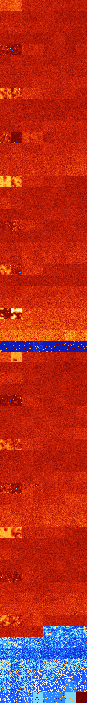

# B14568 (189440-189951)

<details>
    <summary>Initial Grid</summary>
    
</details>


<details>
    <summary>Initial Grid RLE</summary>

```
#C Exported from GoGoL (https://github.com/marrow16/gogol)
#C Wrap mode: Toroidal
#C Boundary mode: Dead
#C Step: 0
x = 100, y = 100, rule = B14568/S
12bo17bo14bo14bo$2bo40bo30bo$26bo8bo7bo10bo25bo8bo4bo$24bo19bo16bo$27bo
4bo22bo21bo7bo$5bo12bo16b3o11b2o4bo5bo37bo$o4bo10bo7bo19bo4bo23bo$2bo
28bo13bo4bo3bo5bo38bo$2bo8b2o22bo$50bo3bo8bo4bo9bo12bo$10bo35bo15bo35bo
$10bo30bo42bo$21bo11bo56bo$6bo28bo26bo20bo$27bo25b2o8bobo9bo$84bo$10bo
39bo42bo$7bo11bo6bo15bo5bobobo4bo5bo21bo7bo$4bo$13bo35bo4bo16bo2bobo3bo
$39bo14bo19bo$22bo27bo16bo$13bobo18bo11bo8bo4bo$70bo$o9bo60bo2b2obo14bo
$79b2o$3bobo4bo2bo73bo$6bo3b2o28bo18bo11bo7bobo$10bo42bo10bo$26bo10bo7b
obo9bo9bo21bo5bo$20bo18bo21bo$60bobo5bo13bo2bo$15bo39bo27bo$24bo48bo20b
o$56bo3bo9bo3bo6bo7bo$36bo13bo36bobo$5bo40bo26bo$5bo7bo19bo10bo24bo23bo
$13bo19bobo9bo15bo5bo$37bo2bo6bo13bo13b2o20bo$41bo7bo4bo8bo$13bo23bo14b
o$3bo5bo4bo18bo22bobo22bo$29bo28bo7bo14bo13bo$34b2o2bo2bo36bo$5bo71bo$
4bo40bo31bo7bo4bo3b2o$o2bo12bo28bo8bo10bo32bo$12bo14bo8bo2bo17bo3bo$33b
o12bo33bo11bo$27bo8bo39bo8bo$12bo8bo31bo6bo20bo$10bo6bo8bo14bo13bo9bo4b
o17bo$5bo2bo18bo6bo7bo24bo3bo9bo7bo$4bo4bo$6bo91bo$11bo41bo32bo$bo4bo9b
o17bo26bo9bo9bo$bo16bo3bo8bo6bo9bo18bo$3bo2bo18bo48bo$11b2o9bo16bo14b2o
24bo$22bo8bo27bo2bo$24bo9bo9bo14bo$7bo13bo4bo7bo$3bo18bo37bo18bobo$39bo
2b2o10bo6bo6bo4bo$4bo19b2o14bo38bo2bo$7bo2bo6bo$4bo9bo2bo13bo9bo38bo$
38b2o4bo22bo13bo7bo4bo$29bo18bo34b2o12bo$13b2o15bo28bo4bo34bo$5bo42bo
23bo$78bo$12bo13bo22bo16bo$obo13bo20bo7bo12bo33b2o$45bo13bo6bo31bo$2bo
13bo2bo25bo38bo10bo$o26bo7bo31bo23bo$6bo31bo13bo4bo8bo3bo7bo$5bo15bo7bo
27bo5bo17bo9bo$8bo41bo12bo19bo14bo$5bo45bo30bo3bo7bo4bo$bo15bo19bo19bo
21bo$15b3o10bo2bo9bo33bo14bo$16bo2bo42bo5bo15bo$69bo4bo$38bo6bobobo25bo
20bo$14bo8bo15bo5bo34bo$26b2o24bo22bo18bo$22bo21bo7bo3bo29bo3bo6b3o$2bo
29bo11bo12bobo3bo25bo9bo$9bo3bo7bo17bo13bo2bo12bo8b2o8bobo$o28bo50bo13b
o4bo$10bo19bo35bo13bo$bo11bo33bo13bo13bo11bo$25bo17bo25bo4bo4bo16bo$bo
9bo24bo23bo$20bo22bo9bo16bo$10bo13bobo12bo50bo!
```
</details>
<details>
    <summary>Thumbnail</summary>

</details>
<table>
<tr>
    <td><a href="./189440%20S%20Heat%20Map%20Activity.png"></a><br>S (189440)<br>G>1000</td>    <td><a href="./189441%20S0%20Heat%20Map%20Activity.png"></a><br>S0 (189441)<br>G>1000</td>    <td><a href="./189442%20S1%20Heat%20Map%20Activity.png"></a><br>S1 (189442)<br>G>1000</td>    <td><a href="./189443%20S01%20Heat%20Map%20Activity.png"></a><br>S01 (189443)<br>G>1000</td>    <td><a href="./189444%20S2%20Heat%20Map%20Activity.png"></a><br>S2 (189444)<br>G>1000</td>    <td><a href="./189445%20S02%20Heat%20Map%20Activity.png"></a><br>S02 (189445)<br>G>1000</td>    <td><a href="./189446%20S12%20Heat%20Map%20Activity.png"></a><br>S12 (189446)<br>G>1000</td>    <td><a href="./189447%20S012%20Heat%20Map%20Activity.png"></a><br>S012 (189447)<br>G>1000</td></tr>
<tr>
    <td><a href="./189448%20S3%20Heat%20Map%20Activity.png"></a><br>S3 (189448)<br>G>1000</td>    <td><a href="./189449%20S03%20Heat%20Map%20Activity.png"></a><br>S03 (189449)<br>G>1000</td>    <td><a href="./189450%20S13%20Heat%20Map%20Activity.png"></a><br>S13 (189450)<br>G>1000</td>    <td><a href="./189451%20S013%20Heat%20Map%20Activity.png"></a><br>S013 (189451)<br>G>1000</td>    <td><a href="./189452%20S23%20Heat%20Map%20Activity.png"></a><br>S23 (189452)<br>G>1000</td>    <td><a href="./189453%20S023%20Heat%20Map%20Activity.png"></a><br>S023 (189453)<br>G>1000</td>    <td><a href="./189454%20S123%20Heat%20Map%20Activity.png"></a><br>S123 (189454)<br>G>1000</td>    <td><a href="./189455%20S0123%20Heat%20Map%20Activity.png"></a><br>S0123 (189455)<br>G>1000</td></tr>
<tr>
    <td><a href="./189456%20S4%20Heat%20Map%20Activity.png"></a><br>S4 (189456)<br>G>1000</td>    <td><a href="./189457%20S04%20Heat%20Map%20Activity.png"></a><br>S04 (189457)<br>G>1000</td>    <td><a href="./189458%20S14%20Heat%20Map%20Activity.png"></a><br>S14 (189458)<br>G>1000</td>    <td><a href="./189459%20S014%20Heat%20Map%20Activity.png"></a><br>S014 (189459)<br>G>1000</td>    <td><a href="./189460%20S24%20Heat%20Map%20Activity.png"></a><br>S24 (189460)<br>G>1000</td>    <td><a href="./189461%20S024%20Heat%20Map%20Activity.png"></a><br>S024 (189461)<br>G>1000</td>    <td><a href="./189462%20S124%20Heat%20Map%20Activity.png"></a><br>S124 (189462)<br>G>1000</td>    <td><a href="./189463%20S0124%20Heat%20Map%20Activity.png"></a><br>S0124 (189463)<br>G>1000</td></tr>
<tr>
    <td><a href="./189464%20S34%20Heat%20Map%20Activity.png"></a><br>S34 (189464)<br>G>1000</td>    <td><a href="./189465%20S034%20Heat%20Map%20Activity.png"></a><br>S034 (189465)<br>G>1000</td>    <td><a href="./189466%20S134%20Heat%20Map%20Activity.png"></a><br>S134 (189466)<br>G>1000</td>    <td><a href="./189467%20S0134%20Heat%20Map%20Activity.png"></a><br>S0134 (189467)<br>G>1000</td>    <td><a href="./189468%20S234%20Heat%20Map%20Activity.png"></a><br>S234 (189468)<br>G>1000</td>    <td><a href="./189469%20S0234%20Heat%20Map%20Activity.png"></a><br>S0234 (189469)<br>G>1000</td>    <td><a href="./189470%20S1234%20Heat%20Map%20Activity.png"></a><br>S1234 (189470)<br>G>1000</td>    <td><a href="./189471%20S01234%20Heat%20Map%20Activity.png"></a><br>S01234 (189471)<br>G>1000</td></tr>
<tr>
    <td><a href="./189472%20S5%20Heat%20Map%20Activity.png"></a><br>S5 (189472)<br>G>1000</td>    <td><a href="./189473%20S05%20Heat%20Map%20Activity.png"></a><br>S05 (189473)<br>R@788,p6</td>    <td><a href="./189474%20S15%20Heat%20Map%20Activity.png"></a><br>S15 (189474)<br>G>1000</td>    <td><a href="./189475%20S015%20Heat%20Map%20Activity.png"></a><br>S015 (189475)<br>G>1000</td>    <td><a href="./189476%20S25%20Heat%20Map%20Activity.png"></a><br>S25 (189476)<br>G>1000</td>    <td><a href="./189477%20S025%20Heat%20Map%20Activity.png"></a><br>S025 (189477)<br>G>1000</td>    <td><a href="./189478%20S125%20Heat%20Map%20Activity.png"></a><br>S125 (189478)<br>G>1000</td>    <td><a href="./189479%20S0125%20Heat%20Map%20Activity.png"></a><br>S0125 (189479)<br>G>1000</td></tr>
<tr>
    <td><a href="./189480%20S35%20Heat%20Map%20Activity.png"></a><br>S35 (189480)<br>G>1000</td>    <td><a href="./189481%20S035%20Heat%20Map%20Activity.png"></a><br>S035 (189481)<br>G>1000</td>    <td><a href="./189482%20S135%20Heat%20Map%20Activity.png"></a><br>S135 (189482)<br>G>1000</td>    <td><a href="./189483%20S0135%20Heat%20Map%20Activity.png"></a><br>S0135 (189483)<br>G>1000</td>    <td><a href="./189484%20S235%20Heat%20Map%20Activity.png"></a><br>S235 (189484)<br>G>1000</td>    <td><a href="./189485%20S0235%20Heat%20Map%20Activity.png"></a><br>S0235 (189485)<br>G>1000</td>    <td><a href="./189486%20S1235%20Heat%20Map%20Activity.png"></a><br>S1235 (189486)<br>G>1000</td>    <td><a href="./189487%20S01235%20Heat%20Map%20Activity.png"></a><br>S01235 (189487)<br>G>1000</td></tr>
<tr>
    <td><a href="./189488%20S45%20Heat%20Map%20Activity.png"></a><br>S45 (189488)<br>G>1000</td>    <td><a href="./189489%20S045%20Heat%20Map%20Activity.png"></a><br>S045 (189489)<br>G>1000</td>    <td><a href="./189490%20S145%20Heat%20Map%20Activity.png"></a><br>S145 (189490)<br>G>1000</td>    <td><a href="./189491%20S0145%20Heat%20Map%20Activity.png"></a><br>S0145 (189491)<br>G>1000</td>    <td><a href="./189492%20S245%20Heat%20Map%20Activity.png"></a><br>S245 (189492)<br>G>1000</td>    <td><a href="./189493%20S0245%20Heat%20Map%20Activity.png"></a><br>S0245 (189493)<br>G>1000</td>    <td><a href="./189494%20S1245%20Heat%20Map%20Activity.png"></a><br>S1245 (189494)<br>G>1000</td>    <td><a href="./189495%20S01245%20Heat%20Map%20Activity.png"></a><br>S01245 (189495)<br>G>1000</td></tr>
<tr>
    <td><a href="./189496%20S345%20Heat%20Map%20Activity.png"></a><br>S345 (189496)<br>G>1000</td>    <td><a href="./189497%20S0345%20Heat%20Map%20Activity.png"></a><br>S0345 (189497)<br>G>1000</td>    <td><a href="./189498%20S1345%20Heat%20Map%20Activity.png"></a><br>S1345 (189498)<br>G>1000</td>    <td><a href="./189499%20S01345%20Heat%20Map%20Activity.png"></a><br>S01345 (189499)<br>G>1000</td>    <td><a href="./189500%20S2345%20Heat%20Map%20Activity.png"></a><br>S2345 (189500)<br>G>1000</td>    <td><a href="./189501%20S02345%20Heat%20Map%20Activity.png"></a><br>S02345 (189501)<br>G>1000</td>    <td><a href="./189502%20S12345%20Heat%20Map%20Activity.png"></a><br>S12345 (189502)<br>G>1000</td>    <td><a href="./189503%20S012345%20Heat%20Map%20Activity.png"></a><br>S012345 (189503)<br>G>1000</td></tr>
<tr>
    <td><a href="./189504%20S6%20Heat%20Map%20Activity.png"></a><br>S6 (189504)<br>G>1000</td>    <td><a href="./189505%20S06%20Heat%20Map%20Activity.png"></a><br>S06 (189505)<br>R@472,p60</td>    <td><a href="./189506%20S16%20Heat%20Map%20Activity.png"></a><br>S16 (189506)<br>G>1000</td>    <td><a href="./189507%20S016%20Heat%20Map%20Activity.png"></a><br>S016 (189507)<br>G>1000</td>    <td><a href="./189508%20S26%20Heat%20Map%20Activity.png"></a><br>S26 (189508)<br>G>1000</td>    <td><a href="./189509%20S026%20Heat%20Map%20Activity.png"></a><br>S026 (189509)<br>G>1000</td>    <td><a href="./189510%20S126%20Heat%20Map%20Activity.png"></a><br>S126 (189510)<br>G>1000</td>    <td><a href="./189511%20S0126%20Heat%20Map%20Activity.png"></a><br>S0126 (189511)<br>G>1000</td></tr>
<tr>
    <td><a href="./189512%20S36%20Heat%20Map%20Activity.png"></a><br>S36 (189512)<br>G>1000</td>    <td><a href="./189513%20S036%20Heat%20Map%20Activity.png"></a><br>S036 (189513)<br>G>1000</td>    <td><a href="./189514%20S136%20Heat%20Map%20Activity.png"></a><br>S136 (189514)<br>G>1000</td>    <td><a href="./189515%20S0136%20Heat%20Map%20Activity.png"></a><br>S0136 (189515)<br>G>1000</td>    <td><a href="./189516%20S236%20Heat%20Map%20Activity.png"></a><br>S236 (189516)<br>G>1000</td>    <td><a href="./189517%20S0236%20Heat%20Map%20Activity.png"></a><br>S0236 (189517)<br>G>1000</td>    <td><a href="./189518%20S1236%20Heat%20Map%20Activity.png"></a><br>S1236 (189518)<br>G>1000</td>    <td><a href="./189519%20S01236%20Heat%20Map%20Activity.png"></a><br>S01236 (189519)<br>G>1000</td></tr>
<tr>
    <td><a href="./189520%20S46%20Heat%20Map%20Activity.png"></a><br>S46 (189520)<br>G>1000</td>    <td><a href="./189521%20S046%20Heat%20Map%20Activity.png"></a><br>S046 (189521)<br>G>1000</td>    <td><a href="./189522%20S146%20Heat%20Map%20Activity.png"></a><br>S146 (189522)<br>G>1000</td>    <td><a href="./189523%20S0146%20Heat%20Map%20Activity.png"></a><br>S0146 (189523)<br>G>1000</td>    <td><a href="./189524%20S246%20Heat%20Map%20Activity.png"></a><br>S246 (189524)<br>G>1000</td>    <td><a href="./189525%20S0246%20Heat%20Map%20Activity.png"></a><br>S0246 (189525)<br>G>1000</td>    <td><a href="./189526%20S1246%20Heat%20Map%20Activity.png"></a><br>S1246 (189526)<br>G>1000</td>    <td><a href="./189527%20S01246%20Heat%20Map%20Activity.png"></a><br>S01246 (189527)<br>G>1000</td></tr>
<tr>
    <td><a href="./189528%20S346%20Heat%20Map%20Activity.png"></a><br>S346 (189528)<br>G>1000</td>    <td><a href="./189529%20S0346%20Heat%20Map%20Activity.png"></a><br>S0346 (189529)<br>G>1000</td>    <td><a href="./189530%20S1346%20Heat%20Map%20Activity.png"></a><br>S1346 (189530)<br>G>1000</td>    <td><a href="./189531%20S01346%20Heat%20Map%20Activity.png"></a><br>S01346 (189531)<br>G>1000</td>    <td><a href="./189532%20S2346%20Heat%20Map%20Activity.png"></a><br>S2346 (189532)<br>G>1000</td>    <td><a href="./189533%20S02346%20Heat%20Map%20Activity.png"></a><br>S02346 (189533)<br>G>1000</td>    <td><a href="./189534%20S12346%20Heat%20Map%20Activity.png"></a><br>S12346 (189534)<br>G>1000</td>    <td><a href="./189535%20S012346%20Heat%20Map%20Activity.png"></a><br>S012346 (189535)<br>G>1000</td></tr>
<tr>
    <td><a href="./189536%20S56%20Heat%20Map%20Activity.png"></a><br>S56 (189536)<br>R@244,p42</td>    <td><a href="./189537%20S056%20Heat%20Map%20Activity.png"></a><br>S056 (189537)<br>R@747,p528</td>    <td><a href="./189538%20S156%20Heat%20Map%20Activity.png"></a><br>S156 (189538)<br>G>1000</td>    <td><a href="./189539%20S0156%20Heat%20Map%20Activity.png"></a><br>S0156 (189539)<br>G>1000</td>    <td><a href="./189540%20S256%20Heat%20Map%20Activity.png"></a><br>S256 (189540)<br>G>1000</td>    <td><a href="./189541%20S0256%20Heat%20Map%20Activity.png"></a><br>S0256 (189541)<br>G>1000</td>    <td><a href="./189542%20S1256%20Heat%20Map%20Activity.png"></a><br>S1256 (189542)<br>G>1000</td>    <td><a href="./189543%20S01256%20Heat%20Map%20Activity.png"></a><br>S01256 (189543)<br>G>1000</td></tr>
<tr>
    <td><a href="./189544%20S356%20Heat%20Map%20Activity.png"></a><br>S356 (189544)<br>G>1000</td>    <td><a href="./189545%20S0356%20Heat%20Map%20Activity.png"></a><br>S0356 (189545)<br>G>1000</td>    <td><a href="./189546%20S1356%20Heat%20Map%20Activity.png"></a><br>S1356 (189546)<br>G>1000</td>    <td><a href="./189547%20S01356%20Heat%20Map%20Activity.png"></a><br>S01356 (189547)<br>G>1000</td>    <td><a href="./189548%20S2356%20Heat%20Map%20Activity.png"></a><br>S2356 (189548)<br>G>1000</td>    <td><a href="./189549%20S02356%20Heat%20Map%20Activity.png"></a><br>S02356 (189549)<br>G>1000</td>    <td><a href="./189550%20S12356%20Heat%20Map%20Activity.png"></a><br>S12356 (189550)<br>G>1000</td>    <td><a href="./189551%20S012356%20Heat%20Map%20Activity.png"></a><br>S012356 (189551)<br>G>1000</td></tr>
<tr>
    <td><a href="./189552%20S456%20Heat%20Map%20Activity.png"></a><br>S456 (189552)<br>G>1000</td>    <td><a href="./189553%20S0456%20Heat%20Map%20Activity.png"></a><br>S0456 (189553)<br>G>1000</td>    <td><a href="./189554%20S1456%20Heat%20Map%20Activity.png"></a><br>S1456 (189554)<br>G>1000</td>    <td><a href="./189555%20S01456%20Heat%20Map%20Activity.png"></a><br>S01456 (189555)<br>G>1000</td>    <td><a href="./189556%20S2456%20Heat%20Map%20Activity.png"></a><br>S2456 (189556)<br>G>1000</td>    <td><a href="./189557%20S02456%20Heat%20Map%20Activity.png"></a><br>S02456 (189557)<br>G>1000</td>    <td><a href="./189558%20S12456%20Heat%20Map%20Activity.png"></a><br>S12456 (189558)<br>G>1000</td>    <td><a href="./189559%20S012456%20Heat%20Map%20Activity.png"></a><br>S012456 (189559)<br>G>1000</td></tr>
<tr>
    <td><a href="./189560%20S3456%20Heat%20Map%20Activity.png"></a><br>S3456 (189560)<br>G>1000</td>    <td><a href="./189561%20S03456%20Heat%20Map%20Activity.png"></a><br>S03456 (189561)<br>G>1000</td>    <td><a href="./189562%20S13456%20Heat%20Map%20Activity.png"></a><br>S13456 (189562)<br>G>1000</td>    <td><a href="./189563%20S013456%20Heat%20Map%20Activity.png"></a><br>S013456 (189563)<br>G>1000</td>    <td><a href="./189564%20S23456%20Heat%20Map%20Activity.png"></a><br>S23456 (189564)<br>G>1000</td>    <td><a href="./189565%20S023456%20Heat%20Map%20Activity.png"></a><br>S023456 (189565)<br>G>1000</td>    <td><a href="./189566%20S123456%20Heat%20Map%20Activity.png"></a><br>S123456 (189566)<br>G>1000</td>    <td><a href="./189567%20S0123456%20Heat%20Map%20Activity.png"></a><br>S0123456 (189567)<br>G>1000</td></tr>
<tr>
    <td><a href="./189568%20S7%20Heat%20Map%20Activity.png"></a><br>S7 (189568)<br>G>1000</td>    <td><a href="./189569%20S07%20Heat%20Map%20Activity.png"></a><br>S07 (189569)<br>G>1000</td>    <td><a href="./189570%20S17%20Heat%20Map%20Activity.png"></a><br>S17 (189570)<br>G>1000</td>    <td><a href="./189571%20S017%20Heat%20Map%20Activity.png"></a><br>S017 (189571)<br>G>1000</td>    <td><a href="./189572%20S27%20Heat%20Map%20Activity.png"></a><br>S27 (189572)<br>G>1000</td>    <td><a href="./189573%20S027%20Heat%20Map%20Activity.png"></a><br>S027 (189573)<br>G>1000</td>    <td><a href="./189574%20S127%20Heat%20Map%20Activity.png"></a><br>S127 (189574)<br>G>1000</td>    <td><a href="./189575%20S0127%20Heat%20Map%20Activity.png"></a><br>S0127 (189575)<br>G>1000</td></tr>
<tr>
    <td><a href="./189576%20S37%20Heat%20Map%20Activity.png"></a><br>S37 (189576)<br>G>1000</td>    <td><a href="./189577%20S037%20Heat%20Map%20Activity.png"></a><br>S037 (189577)<br>G>1000</td>    <td><a href="./189578%20S137%20Heat%20Map%20Activity.png"></a><br>S137 (189578)<br>G>1000</td>    <td><a href="./189579%20S0137%20Heat%20Map%20Activity.png"></a><br>S0137 (189579)<br>G>1000</td>    <td><a href="./189580%20S237%20Heat%20Map%20Activity.png"></a><br>S237 (189580)<br>G>1000</td>    <td><a href="./189581%20S0237%20Heat%20Map%20Activity.png"></a><br>S0237 (189581)<br>G>1000</td>    <td><a href="./189582%20S1237%20Heat%20Map%20Activity.png"></a><br>S1237 (189582)<br>G>1000</td>    <td><a href="./189583%20S01237%20Heat%20Map%20Activity.png"></a><br>S01237 (189583)<br>G>1000</td></tr>
<tr>
    <td><a href="./189584%20S47%20Heat%20Map%20Activity.png"></a><br>S47 (189584)<br>G>1000</td>    <td><a href="./189585%20S047%20Heat%20Map%20Activity.png"></a><br>S047 (189585)<br>G>1000</td>    <td><a href="./189586%20S147%20Heat%20Map%20Activity.png"></a><br>S147 (189586)<br>G>1000</td>    <td><a href="./189587%20S0147%20Heat%20Map%20Activity.png"></a><br>S0147 (189587)<br>G>1000</td>    <td><a href="./189588%20S247%20Heat%20Map%20Activity.png"></a><br>S247 (189588)<br>G>1000</td>    <td><a href="./189589%20S0247%20Heat%20Map%20Activity.png"></a><br>S0247 (189589)<br>G>1000</td>    <td><a href="./189590%20S1247%20Heat%20Map%20Activity.png"></a><br>S1247 (189590)<br>G>1000</td>    <td><a href="./189591%20S01247%20Heat%20Map%20Activity.png"></a><br>S01247 (189591)<br>G>1000</td></tr>
<tr>
    <td><a href="./189592%20S347%20Heat%20Map%20Activity.png"></a><br>S347 (189592)<br>G>1000</td>    <td><a href="./189593%20S0347%20Heat%20Map%20Activity.png"></a><br>S0347 (189593)<br>G>1000</td>    <td><a href="./189594%20S1347%20Heat%20Map%20Activity.png"></a><br>S1347 (189594)<br>G>1000</td>    <td><a href="./189595%20S01347%20Heat%20Map%20Activity.png"></a><br>S01347 (189595)<br>G>1000</td>    <td><a href="./189596%20S2347%20Heat%20Map%20Activity.png"></a><br>S2347 (189596)<br>G>1000</td>    <td><a href="./189597%20S02347%20Heat%20Map%20Activity.png"></a><br>S02347 (189597)<br>G>1000</td>    <td><a href="./189598%20S12347%20Heat%20Map%20Activity.png"></a><br>S12347 (189598)<br>G>1000</td>    <td><a href="./189599%20S012347%20Heat%20Map%20Activity.png"></a><br>S012347 (189599)<br>G>1000</td></tr>
<tr>
    <td><a href="./189600%20S57%20Heat%20Map%20Activity.png"></a><br>S57 (189600)<br>R@465,p120</td>    <td><a href="./189601%20S057%20Heat%20Map%20Activity.png"></a><br>S057 (189601)<br>R@243,p24</td>    <td><a href="./189602%20S157%20Heat%20Map%20Activity.png"></a><br>S157 (189602)<br>G>1000</td>    <td><a href="./189603%20S0157%20Heat%20Map%20Activity.png"></a><br>S0157 (189603)<br>G>1000</td>    <td><a href="./189604%20S257%20Heat%20Map%20Activity.png"></a><br>S257 (189604)<br>G>1000</td>    <td><a href="./189605%20S0257%20Heat%20Map%20Activity.png"></a><br>S0257 (189605)<br>G>1000</td>    <td><a href="./189606%20S1257%20Heat%20Map%20Activity.png"></a><br>S1257 (189606)<br>G>1000</td>    <td><a href="./189607%20S01257%20Heat%20Map%20Activity.png"></a><br>S01257 (189607)<br>G>1000</td></tr>
<tr>
    <td><a href="./189608%20S357%20Heat%20Map%20Activity.png"></a><br>S357 (189608)<br>G>1000</td>    <td><a href="./189609%20S0357%20Heat%20Map%20Activity.png"></a><br>S0357 (189609)<br>G>1000</td>    <td><a href="./189610%20S1357%20Heat%20Map%20Activity.png"></a><br>S1357 (189610)<br>G>1000</td>    <td><a href="./189611%20S01357%20Heat%20Map%20Activity.png"></a><br>S01357 (189611)<br>G>1000</td>    <td><a href="./189612%20S2357%20Heat%20Map%20Activity.png"></a><br>S2357 (189612)<br>G>1000</td>    <td><a href="./189613%20S02357%20Heat%20Map%20Activity.png"></a><br>S02357 (189613)<br>G>1000</td>    <td><a href="./189614%20S12357%20Heat%20Map%20Activity.png"></a><br>S12357 (189614)<br>G>1000</td>    <td><a href="./189615%20S012357%20Heat%20Map%20Activity.png"></a><br>S012357 (189615)<br>G>1000</td></tr>
<tr>
    <td><a href="./189616%20S457%20Heat%20Map%20Activity.png"></a><br>S457 (189616)<br>G>1000</td>    <td><a href="./189617%20S0457%20Heat%20Map%20Activity.png"></a><br>S0457 (189617)<br>G>1000</td>    <td><a href="./189618%20S1457%20Heat%20Map%20Activity.png"></a><br>S1457 (189618)<br>G>1000</td>    <td><a href="./189619%20S01457%20Heat%20Map%20Activity.png"></a><br>S01457 (189619)<br>G>1000</td>    <td><a href="./189620%20S2457%20Heat%20Map%20Activity.png"></a><br>S2457 (189620)<br>G>1000</td>    <td><a href="./189621%20S02457%20Heat%20Map%20Activity.png"></a><br>S02457 (189621)<br>G>1000</td>    <td><a href="./189622%20S12457%20Heat%20Map%20Activity.png"></a><br>S12457 (189622)<br>G>1000</td>    <td><a href="./189623%20S012457%20Heat%20Map%20Activity.png"></a><br>S012457 (189623)<br>G>1000</td></tr>
<tr>
    <td><a href="./189624%20S3457%20Heat%20Map%20Activity.png"></a><br>S3457 (189624)<br>G>1000</td>    <td><a href="./189625%20S03457%20Heat%20Map%20Activity.png"></a><br>S03457 (189625)<br>G>1000</td>    <td><a href="./189626%20S13457%20Heat%20Map%20Activity.png"></a><br>S13457 (189626)<br>G>1000</td>    <td><a href="./189627%20S013457%20Heat%20Map%20Activity.png"></a><br>S013457 (189627)<br>G>1000</td>    <td><a href="./189628%20S23457%20Heat%20Map%20Activity.png"></a><br>S23457 (189628)<br>G>1000</td>    <td><a href="./189629%20S023457%20Heat%20Map%20Activity.png"></a><br>S023457 (189629)<br>G>1000</td>    <td><a href="./189630%20S123457%20Heat%20Map%20Activity.png"></a><br>S123457 (189630)<br>G>1000</td>    <td><a href="./189631%20S0123457%20Heat%20Map%20Activity.png"></a><br>S0123457 (189631)<br>G>1000</td></tr>
<tr>
    <td><a href="./189632%20S67%20Heat%20Map%20Activity.png"></a><br>S67 (189632)<br>R@796,p12</td>    <td><a href="./189633%20S067%20Heat%20Map%20Activity.png"></a><br>S067 (189633)<br>R@433,p84</td>    <td><a href="./189634%20S167%20Heat%20Map%20Activity.png"></a><br>S167 (189634)<br>G>1000</td>    <td><a href="./189635%20S0167%20Heat%20Map%20Activity.png"></a><br>S0167 (189635)<br>G>1000</td>    <td><a href="./189636%20S267%20Heat%20Map%20Activity.png"></a><br>S267 (189636)<br>G>1000</td>    <td><a href="./189637%20S0267%20Heat%20Map%20Activity.png"></a><br>S0267 (189637)<br>G>1000</td>    <td><a href="./189638%20S1267%20Heat%20Map%20Activity.png"></a><br>S1267 (189638)<br>G>1000</td>    <td><a href="./189639%20S01267%20Heat%20Map%20Activity.png"></a><br>S01267 (189639)<br>G>1000</td></tr>
<tr>
    <td><a href="./189640%20S367%20Heat%20Map%20Activity.png"></a><br>S367 (189640)<br>G>1000</td>    <td><a href="./189641%20S0367%20Heat%20Map%20Activity.png"></a><br>S0367 (189641)<br>G>1000</td>    <td><a href="./189642%20S1367%20Heat%20Map%20Activity.png"></a><br>S1367 (189642)<br>G>1000</td>    <td><a href="./189643%20S01367%20Heat%20Map%20Activity.png"></a><br>S01367 (189643)<br>G>1000</td>    <td><a href="./189644%20S2367%20Heat%20Map%20Activity.png"></a><br>S2367 (189644)<br>G>1000</td>    <td><a href="./189645%20S02367%20Heat%20Map%20Activity.png"></a><br>S02367 (189645)<br>G>1000</td>    <td><a href="./189646%20S12367%20Heat%20Map%20Activity.png"></a><br>S12367 (189646)<br>G>1000</td>    <td><a href="./189647%20S012367%20Heat%20Map%20Activity.png"></a><br>S012367 (189647)<br>G>1000</td></tr>
<tr>
    <td><a href="./189648%20S467%20Heat%20Map%20Activity.png"></a><br>S467 (189648)<br>G>1000</td>    <td><a href="./189649%20S0467%20Heat%20Map%20Activity.png"></a><br>S0467 (189649)<br>G>1000</td>    <td><a href="./189650%20S1467%20Heat%20Map%20Activity.png"></a><br>S1467 (189650)<br>G>1000</td>    <td><a href="./189651%20S01467%20Heat%20Map%20Activity.png"></a><br>S01467 (189651)<br>G>1000</td>    <td><a href="./189652%20S2467%20Heat%20Map%20Activity.png"></a><br>S2467 (189652)<br>G>1000</td>    <td><a href="./189653%20S02467%20Heat%20Map%20Activity.png"></a><br>S02467 (189653)<br>G>1000</td>    <td><a href="./189654%20S12467%20Heat%20Map%20Activity.png"></a><br>S12467 (189654)<br>G>1000</td>    <td><a href="./189655%20S012467%20Heat%20Map%20Activity.png"></a><br>S012467 (189655)<br>G>1000</td></tr>
<tr>
    <td><a href="./189656%20S3467%20Heat%20Map%20Activity.png"></a><br>S3467 (189656)<br>G>1000</td>    <td><a href="./189657%20S03467%20Heat%20Map%20Activity.png"></a><br>S03467 (189657)<br>G>1000</td>    <td><a href="./189658%20S13467%20Heat%20Map%20Activity.png"></a><br>S13467 (189658)<br>G>1000</td>    <td><a href="./189659%20S013467%20Heat%20Map%20Activity.png"></a><br>S013467 (189659)<br>G>1000</td>    <td><a href="./189660%20S23467%20Heat%20Map%20Activity.png"></a><br>S23467 (189660)<br>G>1000</td>    <td><a href="./189661%20S023467%20Heat%20Map%20Activity.png"></a><br>S023467 (189661)<br>G>1000</td>    <td><a href="./189662%20S123467%20Heat%20Map%20Activity.png"></a><br>S123467 (189662)<br>G>1000</td>    <td><a href="./189663%20S0123467%20Heat%20Map%20Activity.png"></a><br>S0123467 (189663)<br>G>1000</td></tr>
<tr>
    <td><a href="./189664%20S567%20Heat%20Map%20Activity.png"></a><br>S567 (189664)<br>G>1000</td>    <td><a href="./189665%20S0567%20Heat%20Map%20Activity.png"></a><br>S0567 (189665)<br>G>1000</td>    <td><a href="./189666%20S1567%20Heat%20Map%20Activity.png"></a><br>S1567 (189666)<br>G>1000</td>    <td><a href="./189667%20S01567%20Heat%20Map%20Activity.png"></a><br>S01567 (189667)<br>G>1000</td>    <td><a href="./189668%20S2567%20Heat%20Map%20Activity.png"></a><br>S2567 (189668)<br>G>1000</td>    <td><a href="./189669%20S02567%20Heat%20Map%20Activity.png"></a><br>S02567 (189669)<br>G>1000</td>    <td><a href="./189670%20S12567%20Heat%20Map%20Activity.png"></a><br>S12567 (189670)<br>G>1000</td>    <td><a href="./189671%20S012567%20Heat%20Map%20Activity.png"></a><br>S012567 (189671)<br>G>1000</td></tr>
<tr>
    <td><a href="./189672%20S3567%20Heat%20Map%20Activity.png"></a><br>S3567 (189672)<br>G>1000</td>    <td><a href="./189673%20S03567%20Heat%20Map%20Activity.png"></a><br>S03567 (189673)<br>G>1000</td>    <td><a href="./189674%20S13567%20Heat%20Map%20Activity.png"></a><br>S13567 (189674)<br>G>1000</td>    <td><a href="./189675%20S013567%20Heat%20Map%20Activity.png"></a><br>S013567 (189675)<br>G>1000</td>    <td><a href="./189676%20S23567%20Heat%20Map%20Activity.png"></a><br>S23567 (189676)<br>G>1000</td>    <td><a href="./189677%20S023567%20Heat%20Map%20Activity.png"></a><br>S023567 (189677)<br>G>1000</td>    <td><a href="./189678%20S123567%20Heat%20Map%20Activity.png"></a><br>S123567 (189678)<br>G>1000</td>    <td><a href="./189679%20S0123567%20Heat%20Map%20Activity.png"></a><br>S0123567 (189679)<br>G>1000</td></tr>
<tr>
    <td><a href="./189680%20S4567%20Heat%20Map%20Activity.png"></a><br>S4567 (189680)<br>G>1000</td>    <td><a href="./189681%20S04567%20Heat%20Map%20Activity.png"></a><br>S04567 (189681)<br>G>1000</td>    <td><a href="./189682%20S14567%20Heat%20Map%20Activity.png"></a><br>S14567 (189682)<br>G>1000</td>    <td><a href="./189683%20S014567%20Heat%20Map%20Activity.png"></a><br>S014567 (189683)<br>G>1000</td>    <td><a href="./189684%20S24567%20Heat%20Map%20Activity.png"></a><br>S24567 (189684)<br>G>1000</td>    <td><a href="./189685%20S024567%20Heat%20Map%20Activity.png"></a><br>S024567 (189685)<br>G>1000</td>    <td><a href="./189686%20S124567%20Heat%20Map%20Activity.png"></a><br>S124567 (189686)<br>G>1000</td>    <td><a href="./189687%20S0124567%20Heat%20Map%20Activity.png"></a><br>S0124567 (189687)<br>G>1000</td></tr>
<tr>
    <td><a href="./189688%20S34567%20Heat%20Map%20Activity.png"></a><br>S34567 (189688)<br>G>1000</td>    <td><a href="./189689%20S034567%20Heat%20Map%20Activity.png"></a><br>S034567 (189689)<br>R@990,p840</td>    <td><a href="./189690%20S134567%20Heat%20Map%20Activity.png"></a><br>S134567 (189690)<br>R@950,p840</td>    <td><a href="./189691%20S0134567%20Heat%20Map%20Activity.png"></a><br>S0134567 (189691)<br>R@237,p120</td>    <td><a href="./189692%20S234567%20Heat%20Map%20Activity.png"></a><br>S234567 (189692)<br>G>1000</td>    <td><a href="./189693%20S0234567%20Heat%20Map%20Activity.png"></a><br>S0234567 (189693)<br>G>1000</td>    <td><a href="./189694%20S1234567%20Heat%20Map%20Activity.png"></a><br>S1234567 (189694)<br>G>1000</td>    <td><a href="./189695%20S01234567%20Heat%20Map%20Activity.png"></a><br>S01234567 (189695)<br>G>1000</td></tr>
<tr>
    <td><a href="./189696%20S8%20Heat%20Map%20Activity.png"></a><br>S8 (189696)<br>G>1000</td>    <td><a href="./189697%20S08%20Heat%20Map%20Activity.png"></a><br>S08 (189697)<br>G>1000</td>    <td><a href="./189698%20S18%20Heat%20Map%20Activity.png"></a><br>S18 (189698)<br>G>1000</td>    <td><a href="./189699%20S018%20Heat%20Map%20Activity.png"></a><br>S018 (189699)<br>G>1000</td>    <td><a href="./189700%20S28%20Heat%20Map%20Activity.png"></a><br>S28 (189700)<br>G>1000</td>    <td><a href="./189701%20S028%20Heat%20Map%20Activity.png"></a><br>S028 (189701)<br>G>1000</td>    <td><a href="./189702%20S128%20Heat%20Map%20Activity.png"></a><br>S128 (189702)<br>G>1000</td>    <td><a href="./189703%20S0128%20Heat%20Map%20Activity.png"></a><br>S0128 (189703)<br>G>1000</td></tr>
<tr>
    <td><a href="./189704%20S38%20Heat%20Map%20Activity.png"></a><br>S38 (189704)<br>G>1000</td>    <td><a href="./189705%20S038%20Heat%20Map%20Activity.png"></a><br>S038 (189705)<br>G>1000</td>    <td><a href="./189706%20S138%20Heat%20Map%20Activity.png"></a><br>S138 (189706)<br>G>1000</td>    <td><a href="./189707%20S0138%20Heat%20Map%20Activity.png"></a><br>S0138 (189707)<br>G>1000</td>    <td><a href="./189708%20S238%20Heat%20Map%20Activity.png"></a><br>S238 (189708)<br>G>1000</td>    <td><a href="./189709%20S0238%20Heat%20Map%20Activity.png"></a><br>S0238 (189709)<br>G>1000</td>    <td><a href="./189710%20S1238%20Heat%20Map%20Activity.png"></a><br>S1238 (189710)<br>G>1000</td>    <td><a href="./189711%20S01238%20Heat%20Map%20Activity.png"></a><br>S01238 (189711)<br>G>1000</td></tr>
<tr>
    <td><a href="./189712%20S48%20Heat%20Map%20Activity.png"></a><br>S48 (189712)<br>G>1000</td>    <td><a href="./189713%20S048%20Heat%20Map%20Activity.png"></a><br>S048 (189713)<br>G>1000</td>    <td><a href="./189714%20S148%20Heat%20Map%20Activity.png"></a><br>S148 (189714)<br>G>1000</td>    <td><a href="./189715%20S0148%20Heat%20Map%20Activity.png"></a><br>S0148 (189715)<br>G>1000</td>    <td><a href="./189716%20S248%20Heat%20Map%20Activity.png"></a><br>S248 (189716)<br>G>1000</td>    <td><a href="./189717%20S0248%20Heat%20Map%20Activity.png"></a><br>S0248 (189717)<br>G>1000</td>    <td><a href="./189718%20S1248%20Heat%20Map%20Activity.png"></a><br>S1248 (189718)<br>G>1000</td>    <td><a href="./189719%20S01248%20Heat%20Map%20Activity.png"></a><br>S01248 (189719)<br>G>1000</td></tr>
<tr>
    <td><a href="./189720%20S348%20Heat%20Map%20Activity.png"></a><br>S348 (189720)<br>G>1000</td>    <td><a href="./189721%20S0348%20Heat%20Map%20Activity.png"></a><br>S0348 (189721)<br>G>1000</td>    <td><a href="./189722%20S1348%20Heat%20Map%20Activity.png"></a><br>S1348 (189722)<br>G>1000</td>    <td><a href="./189723%20S01348%20Heat%20Map%20Activity.png"></a><br>S01348 (189723)<br>G>1000</td>    <td><a href="./189724%20S2348%20Heat%20Map%20Activity.png"></a><br>S2348 (189724)<br>G>1000</td>    <td><a href="./189725%20S02348%20Heat%20Map%20Activity.png"></a><br>S02348 (189725)<br>G>1000</td>    <td><a href="./189726%20S12348%20Heat%20Map%20Activity.png"></a><br>S12348 (189726)<br>G>1000</td>    <td><a href="./189727%20S012348%20Heat%20Map%20Activity.png"></a><br>S012348 (189727)<br>G>1000</td></tr>
<tr>
    <td><a href="./189728%20S58%20Heat%20Map%20Activity.png"></a><br>S58 (189728)<br>G>1000</td>    <td><a href="./189729%20S058%20Heat%20Map%20Activity.png"></a><br>S058 (189729)<br>G>1000</td>    <td><a href="./189730%20S158%20Heat%20Map%20Activity.png"></a><br>S158 (189730)<br>G>1000</td>    <td><a href="./189731%20S0158%20Heat%20Map%20Activity.png"></a><br>S0158 (189731)<br>G>1000</td>    <td><a href="./189732%20S258%20Heat%20Map%20Activity.png"></a><br>S258 (189732)<br>G>1000</td>    <td><a href="./189733%20S0258%20Heat%20Map%20Activity.png"></a><br>S0258 (189733)<br>G>1000</td>    <td><a href="./189734%20S1258%20Heat%20Map%20Activity.png"></a><br>S1258 (189734)<br>G>1000</td>    <td><a href="./189735%20S01258%20Heat%20Map%20Activity.png"></a><br>S01258 (189735)<br>G>1000</td></tr>
<tr>
    <td><a href="./189736%20S358%20Heat%20Map%20Activity.png"></a><br>S358 (189736)<br>G>1000</td>    <td><a href="./189737%20S0358%20Heat%20Map%20Activity.png"></a><br>S0358 (189737)<br>G>1000</td>    <td><a href="./189738%20S1358%20Heat%20Map%20Activity.png"></a><br>S1358 (189738)<br>G>1000</td>    <td><a href="./189739%20S01358%20Heat%20Map%20Activity.png"></a><br>S01358 (189739)<br>G>1000</td>    <td><a href="./189740%20S2358%20Heat%20Map%20Activity.png"></a><br>S2358 (189740)<br>G>1000</td>    <td><a href="./189741%20S02358%20Heat%20Map%20Activity.png"></a><br>S02358 (189741)<br>G>1000</td>    <td><a href="./189742%20S12358%20Heat%20Map%20Activity.png"></a><br>S12358 (189742)<br>G>1000</td>    <td><a href="./189743%20S012358%20Heat%20Map%20Activity.png"></a><br>S012358 (189743)<br>G>1000</td></tr>
<tr>
    <td><a href="./189744%20S458%20Heat%20Map%20Activity.png"></a><br>S458 (189744)<br>G>1000</td>    <td><a href="./189745%20S0458%20Heat%20Map%20Activity.png"></a><br>S0458 (189745)<br>G>1000</td>    <td><a href="./189746%20S1458%20Heat%20Map%20Activity.png"></a><br>S1458 (189746)<br>G>1000</td>    <td><a href="./189747%20S01458%20Heat%20Map%20Activity.png"></a><br>S01458 (189747)<br>G>1000</td>    <td><a href="./189748%20S2458%20Heat%20Map%20Activity.png"></a><br>S2458 (189748)<br>G>1000</td>    <td><a href="./189749%20S02458%20Heat%20Map%20Activity.png"></a><br>S02458 (189749)<br>G>1000</td>    <td><a href="./189750%20S12458%20Heat%20Map%20Activity.png"></a><br>S12458 (189750)<br>G>1000</td>    <td><a href="./189751%20S012458%20Heat%20Map%20Activity.png"></a><br>S012458 (189751)<br>G>1000</td></tr>
<tr>
    <td><a href="./189752%20S3458%20Heat%20Map%20Activity.png"></a><br>S3458 (189752)<br>G>1000</td>    <td><a href="./189753%20S03458%20Heat%20Map%20Activity.png"></a><br>S03458 (189753)<br>G>1000</td>    <td><a href="./189754%20S13458%20Heat%20Map%20Activity.png"></a><br>S13458 (189754)<br>G>1000</td>    <td><a href="./189755%20S013458%20Heat%20Map%20Activity.png"></a><br>S013458 (189755)<br>G>1000</td>    <td><a href="./189756%20S23458%20Heat%20Map%20Activity.png"></a><br>S23458 (189756)<br>G>1000</td>    <td><a href="./189757%20S023458%20Heat%20Map%20Activity.png"></a><br>S023458 (189757)<br>G>1000</td>    <td><a href="./189758%20S123458%20Heat%20Map%20Activity.png"></a><br>S123458 (189758)<br>G>1000</td>    <td><a href="./189759%20S0123458%20Heat%20Map%20Activity.png"></a><br>S0123458 (189759)<br>G>1000</td></tr>
<tr>
    <td><a href="./189760%20S68%20Heat%20Map%20Activity.png"></a><br>S68 (189760)<br>G>1000</td>    <td><a href="./189761%20S068%20Heat%20Map%20Activity.png"></a><br>S068 (189761)<br>R@477,p24</td>    <td><a href="./189762%20S168%20Heat%20Map%20Activity.png"></a><br>S168 (189762)<br>G>1000</td>    <td><a href="./189763%20S0168%20Heat%20Map%20Activity.png"></a><br>S0168 (189763)<br>G>1000</td>    <td><a href="./189764%20S268%20Heat%20Map%20Activity.png"></a><br>S268 (189764)<br>G>1000</td>    <td><a href="./189765%20S0268%20Heat%20Map%20Activity.png"></a><br>S0268 (189765)<br>G>1000</td>    <td><a href="./189766%20S1268%20Heat%20Map%20Activity.png"></a><br>S1268 (189766)<br>G>1000</td>    <td><a href="./189767%20S01268%20Heat%20Map%20Activity.png"></a><br>S01268 (189767)<br>G>1000</td></tr>
<tr>
    <td><a href="./189768%20S368%20Heat%20Map%20Activity.png"></a><br>S368 (189768)<br>G>1000</td>    <td><a href="./189769%20S0368%20Heat%20Map%20Activity.png"></a><br>S0368 (189769)<br>G>1000</td>    <td><a href="./189770%20S1368%20Heat%20Map%20Activity.png"></a><br>S1368 (189770)<br>G>1000</td>    <td><a href="./189771%20S01368%20Heat%20Map%20Activity.png"></a><br>S01368 (189771)<br>G>1000</td>    <td><a href="./189772%20S2368%20Heat%20Map%20Activity.png"></a><br>S2368 (189772)<br>G>1000</td>    <td><a href="./189773%20S02368%20Heat%20Map%20Activity.png"></a><br>S02368 (189773)<br>G>1000</td>    <td><a href="./189774%20S12368%20Heat%20Map%20Activity.png"></a><br>S12368 (189774)<br>G>1000</td>    <td><a href="./189775%20S012368%20Heat%20Map%20Activity.png"></a><br>S012368 (189775)<br>G>1000</td></tr>
<tr>
    <td><a href="./189776%20S468%20Heat%20Map%20Activity.png"></a><br>S468 (189776)<br>G>1000</td>    <td><a href="./189777%20S0468%20Heat%20Map%20Activity.png"></a><br>S0468 (189777)<br>G>1000</td>    <td><a href="./189778%20S1468%20Heat%20Map%20Activity.png"></a><br>S1468 (189778)<br>G>1000</td>    <td><a href="./189779%20S01468%20Heat%20Map%20Activity.png"></a><br>S01468 (189779)<br>G>1000</td>    <td><a href="./189780%20S2468%20Heat%20Map%20Activity.png"></a><br>S2468 (189780)<br>G>1000</td>    <td><a href="./189781%20S02468%20Heat%20Map%20Activity.png"></a><br>S02468 (189781)<br>G>1000</td>    <td><a href="./189782%20S12468%20Heat%20Map%20Activity.png"></a><br>S12468 (189782)<br>G>1000</td>    <td><a href="./189783%20S012468%20Heat%20Map%20Activity.png"></a><br>S012468 (189783)<br>G>1000</td></tr>
<tr>
    <td><a href="./189784%20S3468%20Heat%20Map%20Activity.png"></a><br>S3468 (189784)<br>G>1000</td>    <td><a href="./189785%20S03468%20Heat%20Map%20Activity.png"></a><br>S03468 (189785)<br>G>1000</td>    <td><a href="./189786%20S13468%20Heat%20Map%20Activity.png"></a><br>S13468 (189786)<br>G>1000</td>    <td><a href="./189787%20S013468%20Heat%20Map%20Activity.png"></a><br>S013468 (189787)<br>G>1000</td>    <td><a href="./189788%20S23468%20Heat%20Map%20Activity.png"></a><br>S23468 (189788)<br>G>1000</td>    <td><a href="./189789%20S023468%20Heat%20Map%20Activity.png"></a><br>S023468 (189789)<br>G>1000</td>    <td><a href="./189790%20S123468%20Heat%20Map%20Activity.png"></a><br>S123468 (189790)<br>G>1000</td>    <td><a href="./189791%20S0123468%20Heat%20Map%20Activity.png"></a><br>S0123468 (189791)<br>G>1000</td></tr>
<tr>
    <td><a href="./189792%20S568%20Heat%20Map%20Activity.png"></a><br>S568 (189792)<br>R@240,p24</td>    <td><a href="./189793%20S0568%20Heat%20Map%20Activity.png"></a><br>S0568 (189793)<br>R@263,p120</td>    <td><a href="./189794%20S1568%20Heat%20Map%20Activity.png"></a><br>S1568 (189794)<br>G>1000</td>    <td><a href="./189795%20S01568%20Heat%20Map%20Activity.png"></a><br>S01568 (189795)<br>G>1000</td>    <td><a href="./189796%20S2568%20Heat%20Map%20Activity.png"></a><br>S2568 (189796)<br>G>1000</td>    <td><a href="./189797%20S02568%20Heat%20Map%20Activity.png"></a><br>S02568 (189797)<br>G>1000</td>    <td><a href="./189798%20S12568%20Heat%20Map%20Activity.png"></a><br>S12568 (189798)<br>G>1000</td>    <td><a href="./189799%20S012568%20Heat%20Map%20Activity.png"></a><br>S012568 (189799)<br>G>1000</td></tr>
<tr>
    <td><a href="./189800%20S3568%20Heat%20Map%20Activity.png"></a><br>S3568 (189800)<br>G>1000</td>    <td><a href="./189801%20S03568%20Heat%20Map%20Activity.png"></a><br>S03568 (189801)<br>G>1000</td>    <td><a href="./189802%20S13568%20Heat%20Map%20Activity.png"></a><br>S13568 (189802)<br>G>1000</td>    <td><a href="./189803%20S013568%20Heat%20Map%20Activity.png"></a><br>S013568 (189803)<br>G>1000</td>    <td><a href="./189804%20S23568%20Heat%20Map%20Activity.png"></a><br>S23568 (189804)<br>G>1000</td>    <td><a href="./189805%20S023568%20Heat%20Map%20Activity.png"></a><br>S023568 (189805)<br>G>1000</td>    <td><a href="./189806%20S123568%20Heat%20Map%20Activity.png"></a><br>S123568 (189806)<br>G>1000</td>    <td><a href="./189807%20S0123568%20Heat%20Map%20Activity.png"></a><br>S0123568 (189807)<br>G>1000</td></tr>
<tr>
    <td><a href="./189808%20S4568%20Heat%20Map%20Activity.png"></a><br>S4568 (189808)<br>G>1000</td>    <td><a href="./189809%20S04568%20Heat%20Map%20Activity.png"></a><br>S04568 (189809)<br>G>1000</td>    <td><a href="./189810%20S14568%20Heat%20Map%20Activity.png"></a><br>S14568 (189810)<br>G>1000</td>    <td><a href="./189811%20S014568%20Heat%20Map%20Activity.png"></a><br>S014568 (189811)<br>G>1000</td>    <td><a href="./189812%20S24568%20Heat%20Map%20Activity.png"></a><br>S24568 (189812)<br>G>1000</td>    <td><a href="./189813%20S024568%20Heat%20Map%20Activity.png"></a><br>S024568 (189813)<br>G>1000</td>    <td><a href="./189814%20S124568%20Heat%20Map%20Activity.png"></a><br>S124568 (189814)<br>G>1000</td>    <td><a href="./189815%20S0124568%20Heat%20Map%20Activity.png"></a><br>S0124568 (189815)<br>G>1000</td></tr>
<tr>
    <td><a href="./189816%20S34568%20Heat%20Map%20Activity.png"></a><br>S34568 (189816)<br>G>1000</td>    <td><a href="./189817%20S034568%20Heat%20Map%20Activity.png"></a><br>S034568 (189817)<br>G>1000</td>    <td><a href="./189818%20S134568%20Heat%20Map%20Activity.png"></a><br>S134568 (189818)<br>G>1000</td>    <td><a href="./189819%20S0134568%20Heat%20Map%20Activity.png"></a><br>S0134568 (189819)<br>G>1000</td>    <td><a href="./189820%20S234568%20Heat%20Map%20Activity.png"></a><br>S234568 (189820)<br>G>1000</td>    <td><a href="./189821%20S0234568%20Heat%20Map%20Activity.png"></a><br>S0234568 (189821)<br>G>1000</td>    <td><a href="./189822%20S1234568%20Heat%20Map%20Activity.png"></a><br>S1234568 (189822)<br>G>1000</td>    <td><a href="./189823%20S01234568%20Heat%20Map%20Activity.png"></a><br>S01234568 (189823)<br>G>1000</td></tr>
<tr>
    <td><a href="./189824%20S78%20Heat%20Map%20Activity.png"></a><br>S78 (189824)<br>G>1000</td>    <td><a href="./189825%20S078%20Heat%20Map%20Activity.png"></a><br>S078 (189825)<br>R@846,p24</td>    <td><a href="./189826%20S178%20Heat%20Map%20Activity.png"></a><br>S178 (189826)<br>G>1000</td>    <td><a href="./189827%20S0178%20Heat%20Map%20Activity.png"></a><br>S0178 (189827)<br>G>1000</td>    <td><a href="./189828%20S278%20Heat%20Map%20Activity.png"></a><br>S278 (189828)<br>G>1000</td>    <td><a href="./189829%20S0278%20Heat%20Map%20Activity.png"></a><br>S0278 (189829)<br>G>1000</td>    <td><a href="./189830%20S1278%20Heat%20Map%20Activity.png"></a><br>S1278 (189830)<br>G>1000</td>    <td><a href="./189831%20S01278%20Heat%20Map%20Activity.png"></a><br>S01278 (189831)<br>G>1000</td></tr>
<tr>
    <td><a href="./189832%20S378%20Heat%20Map%20Activity.png"></a><br>S378 (189832)<br>G>1000</td>    <td><a href="./189833%20S0378%20Heat%20Map%20Activity.png"></a><br>S0378 (189833)<br>G>1000</td>    <td><a href="./189834%20S1378%20Heat%20Map%20Activity.png"></a><br>S1378 (189834)<br>G>1000</td>    <td><a href="./189835%20S01378%20Heat%20Map%20Activity.png"></a><br>S01378 (189835)<br>G>1000</td>    <td><a href="./189836%20S2378%20Heat%20Map%20Activity.png"></a><br>S2378 (189836)<br>G>1000</td>    <td><a href="./189837%20S02378%20Heat%20Map%20Activity.png"></a><br>S02378 (189837)<br>G>1000</td>    <td><a href="./189838%20S12378%20Heat%20Map%20Activity.png"></a><br>S12378 (189838)<br>G>1000</td>    <td><a href="./189839%20S012378%20Heat%20Map%20Activity.png"></a><br>S012378 (189839)<br>G>1000</td></tr>
<tr>
    <td><a href="./189840%20S478%20Heat%20Map%20Activity.png"></a><br>S478 (189840)<br>G>1000</td>    <td><a href="./189841%20S0478%20Heat%20Map%20Activity.png"></a><br>S0478 (189841)<br>G>1000</td>    <td><a href="./189842%20S1478%20Heat%20Map%20Activity.png"></a><br>S1478 (189842)<br>G>1000</td>    <td><a href="./189843%20S01478%20Heat%20Map%20Activity.png"></a><br>S01478 (189843)<br>G>1000</td>    <td><a href="./189844%20S2478%20Heat%20Map%20Activity.png"></a><br>S2478 (189844)<br>G>1000</td>    <td><a href="./189845%20S02478%20Heat%20Map%20Activity.png"></a><br>S02478 (189845)<br>G>1000</td>    <td><a href="./189846%20S12478%20Heat%20Map%20Activity.png"></a><br>S12478 (189846)<br>G>1000</td>    <td><a href="./189847%20S012478%20Heat%20Map%20Activity.png"></a><br>S012478 (189847)<br>G>1000</td></tr>
<tr>
    <td><a href="./189848%20S3478%20Heat%20Map%20Activity.png"></a><br>S3478 (189848)<br>G>1000</td>    <td><a href="./189849%20S03478%20Heat%20Map%20Activity.png"></a><br>S03478 (189849)<br>G>1000</td>    <td><a href="./189850%20S13478%20Heat%20Map%20Activity.png"></a><br>S13478 (189850)<br>G>1000</td>    <td><a href="./189851%20S013478%20Heat%20Map%20Activity.png"></a><br>S013478 (189851)<br>G>1000</td>    <td><a href="./189852%20S23478%20Heat%20Map%20Activity.png"></a><br>S23478 (189852)<br>G>1000</td>    <td><a href="./189853%20S023478%20Heat%20Map%20Activity.png"></a><br>S023478 (189853)<br>G>1000</td>    <td><a href="./189854%20S123478%20Heat%20Map%20Activity.png"></a><br>S123478 (189854)<br>G>1000</td>    <td><a href="./189855%20S0123478%20Heat%20Map%20Activity.png"></a><br>S0123478 (189855)<br>G>1000</td></tr>
<tr>
    <td><a href="./189856%20S578%20Heat%20Map%20Activity.png"></a><br>S578 (189856)<br>R@569,p240</td>    <td><a href="./189857%20S0578%20Heat%20Map%20Activity.png"></a><br>S0578 (189857)<br>R@330,p24</td>    <td><a href="./189858%20S1578%20Heat%20Map%20Activity.png"></a><br>S1578 (189858)<br>G>1000</td>    <td><a href="./189859%20S01578%20Heat%20Map%20Activity.png"></a><br>S01578 (189859)<br>G>1000</td>    <td><a href="./189860%20S2578%20Heat%20Map%20Activity.png"></a><br>S2578 (189860)<br>G>1000</td>    <td><a href="./189861%20S02578%20Heat%20Map%20Activity.png"></a><br>S02578 (189861)<br>G>1000</td>    <td><a href="./189862%20S12578%20Heat%20Map%20Activity.png"></a><br>S12578 (189862)<br>G>1000</td>    <td><a href="./189863%20S012578%20Heat%20Map%20Activity.png"></a><br>S012578 (189863)<br>G>1000</td></tr>
<tr>
    <td><a href="./189864%20S3578%20Heat%20Map%20Activity.png"></a><br>S3578 (189864)<br>G>1000</td>    <td><a href="./189865%20S03578%20Heat%20Map%20Activity.png"></a><br>S03578 (189865)<br>G>1000</td>    <td><a href="./189866%20S13578%20Heat%20Map%20Activity.png"></a><br>S13578 (189866)<br>G>1000</td>    <td><a href="./189867%20S013578%20Heat%20Map%20Activity.png"></a><br>S013578 (189867)<br>G>1000</td>    <td><a href="./189868%20S23578%20Heat%20Map%20Activity.png"></a><br>S23578 (189868)<br>G>1000</td>    <td><a href="./189869%20S023578%20Heat%20Map%20Activity.png"></a><br>S023578 (189869)<br>G>1000</td>    <td><a href="./189870%20S123578%20Heat%20Map%20Activity.png"></a><br>S123578 (189870)<br>G>1000</td>    <td><a href="./189871%20S0123578%20Heat%20Map%20Activity.png"></a><br>S0123578 (189871)<br>G>1000</td></tr>
<tr>
    <td><a href="./189872%20S4578%20Heat%20Map%20Activity.png"></a><br>S4578 (189872)<br>G>1000</td>    <td><a href="./189873%20S04578%20Heat%20Map%20Activity.png"></a><br>S04578 (189873)<br>G>1000</td>    <td><a href="./189874%20S14578%20Heat%20Map%20Activity.png"></a><br>S14578 (189874)<br>G>1000</td>    <td><a href="./189875%20S014578%20Heat%20Map%20Activity.png"></a><br>S014578 (189875)<br>G>1000</td>    <td><a href="./189876%20S24578%20Heat%20Map%20Activity.png"></a><br>S24578 (189876)<br>G>1000</td>    <td><a href="./189877%20S024578%20Heat%20Map%20Activity.png"></a><br>S024578 (189877)<br>G>1000</td>    <td><a href="./189878%20S124578%20Heat%20Map%20Activity.png"></a><br>S124578 (189878)<br>G>1000</td>    <td><a href="./189879%20S0124578%20Heat%20Map%20Activity.png"></a><br>S0124578 (189879)<br>G>1000</td></tr>
<tr>
    <td><a href="./189880%20S34578%20Heat%20Map%20Activity.png"></a><br>S34578 (189880)<br>G>1000</td>    <td><a href="./189881%20S034578%20Heat%20Map%20Activity.png"></a><br>S034578 (189881)<br>G>1000</td>    <td><a href="./189882%20S134578%20Heat%20Map%20Activity.png"></a><br>S134578 (189882)<br>G>1000</td>    <td><a href="./189883%20S0134578%20Heat%20Map%20Activity.png"></a><br>S0134578 (189883)<br>G>1000</td>    <td><a href="./189884%20S234578%20Heat%20Map%20Activity.png"></a><br>S234578 (189884)<br>G>1000</td>    <td><a href="./189885%20S0234578%20Heat%20Map%20Activity.png"></a><br>S0234578 (189885)<br>G>1000</td>    <td><a href="./189886%20S1234578%20Heat%20Map%20Activity.png"></a><br>S1234578 (189886)<br>G>1000</td>    <td><a href="./189887%20S01234578%20Heat%20Map%20Activity.png"></a><br>S01234578 (189887)<br>G>1000</td></tr>
<tr>
    <td><a href="./189888%20S678%20Heat%20Map%20Activity.png"></a><br>S678 (189888)<br>R@798,p24</td>    <td><a href="./189889%20S0678%20Heat%20Map%20Activity.png"></a><br>S0678 (189889)<br>R@383,p12</td>    <td><a href="./189890%20S1678%20Heat%20Map%20Activity.png"></a><br>S1678 (189890)<br>G>1000</td>    <td><a href="./189891%20S01678%20Heat%20Map%20Activity.png"></a><br>S01678 (189891)<br>G>1000</td>    <td><a href="./189892%20S2678%20Heat%20Map%20Activity.png"></a><br>S2678 (189892)<br>G>1000</td>    <td><a href="./189893%20S02678%20Heat%20Map%20Activity.png"></a><br>S02678 (189893)<br>G>1000</td>    <td><a href="./189894%20S12678%20Heat%20Map%20Activity.png"></a><br>S12678 (189894)<br>G>1000</td>    <td><a href="./189895%20S012678%20Heat%20Map%20Activity.png"></a><br>S012678 (189895)<br>G>1000</td></tr>
<tr>
    <td><a href="./189896%20S3678%20Heat%20Map%20Activity.png"></a><br>S3678 (189896)<br>G>1000</td>    <td><a href="./189897%20S03678%20Heat%20Map%20Activity.png"></a><br>S03678 (189897)<br>G>1000</td>    <td><a href="./189898%20S13678%20Heat%20Map%20Activity.png"></a><br>S13678 (189898)<br>G>1000</td>    <td><a href="./189899%20S013678%20Heat%20Map%20Activity.png"></a><br>S013678 (189899)<br>G>1000</td>    <td><a href="./189900%20S23678%20Heat%20Map%20Activity.png"></a><br>S23678 (189900)<br>R@192,p2</td>    <td><a href="./189901%20S023678%20Heat%20Map%20Activity.png"></a><br>S023678 (189901)<br>R@168,p2</td>    <td><a href="./189902%20S123678%20Heat%20Map%20Activity.png"></a><br>S123678 (189902)<br>R@159,p2</td>    <td><a href="./189903%20S0123678%20Heat%20Map%20Activity.png"></a><br>S0123678 (189903)<br>R@136,p4</td></tr>
<tr>
    <td><a href="./189904%20S4678%20Heat%20Map%20Activity.png"></a><br>S4678 (189904)<br>R@56,p2</td>    <td><a href="./189905%20S04678%20Heat%20Map%20Activity.png"></a><br>S04678 (189905)<br>R@49,p2</td>    <td><a href="./189906%20S14678%20Heat%20Map%20Activity.png"></a><br>S14678 (189906)<br>R@44,p2</td>    <td><a href="./189907%20S014678%20Heat%20Map%20Activity.png"></a><br>S014678 (189907)<br>R@40,p2</td>    <td><a href="./189908%20S24678%20Heat%20Map%20Activity.png"></a><br>S24678 (189908)<br>R@37,p2</td>    <td><a href="./189909%20S024678%20Heat%20Map%20Activity.png"></a><br>S024678 (189909)<br>R@37,p2</td>    <td><a href="./189910%20S124678%20Heat%20Map%20Activity.png"></a><br>S124678 (189910)<br>R@36,p2</td>    <td><a href="./189911%20S0124678%20Heat%20Map%20Activity.png"></a><br>S0124678 (189911)<br>R@36,p2</td></tr>
<tr>
    <td><a href="./189912%20S34678%20Heat%20Map%20Activity.png"></a><br>S34678 (189912)<br>R@25,p2</td>    <td><a href="./189913%20S034678%20Heat%20Map%20Activity.png"></a><br>S034678 (189913)<br>R@24,p2</td>    <td><a href="./189914%20S134678%20Heat%20Map%20Activity.png"></a><br>S134678 (189914)<br>R@27,p2</td>    <td><a href="./189915%20S0134678%20Heat%20Map%20Activity.png"></a><br>S0134678 (189915)<br>R@26,p2</td>    <td><a href="./189916%20S234678%20Heat%20Map%20Activity.png"></a><br>S234678 (189916)<br>R@25,p2</td>    <td><a href="./189917%20S0234678%20Heat%20Map%20Activity.png"></a><br>S0234678 (189917)<br>R@22,p2</td>    <td><a href="./189918%20S1234678%20Heat%20Map%20Activity.png"></a><br>S1234678 (189918)<br>R@26,p2</td>    <td><a href="./189919%20S01234678%20Heat%20Map%20Activity.png"></a><br>S01234678 (189919)<br>R@22,p2</td></tr>
<tr>
    <td><a href="./189920%20S5678%20Heat%20Map%20Activity.png"></a><br>S5678 (189920)<br>R@61,p2</td>    <td><a href="./189921%20S05678%20Heat%20Map%20Activity.png"></a><br>S05678 (189921)<br>R@49,p2</td>    <td><a href="./189922%20S15678%20Heat%20Map%20Activity.png"></a><br>S15678 (189922)<br>R@33,p2</td>    <td><a href="./189923%20S015678%20Heat%20Map%20Activity.png"></a><br>S015678 (189923)<br>R@32,p2</td>    <td><a href="./189924%20S25678%20Heat%20Map%20Activity.png"></a><br>S25678 (189924)<br>R@20,p2</td>    <td><a href="./189925%20S025678%20Heat%20Map%20Activity.png"></a><br>S025678 (189925)<br>S@19</td>    <td><a href="./189926%20S125678%20Heat%20Map%20Activity.png"></a><br>S125678 (189926)<br>S@15</td>    <td><a href="./189927%20S0125678%20Heat%20Map%20Activity.png"></a><br>S0125678 (189927)<br>S@16</td></tr>
<tr>
    <td><a href="./189928%20S35678%20Heat%20Map%20Activity.png"></a><br>S35678 (189928)<br>S@15</td>    <td><a href="./189929%20S035678%20Heat%20Map%20Activity.png"></a><br>S035678 (189929)<br>S@14</td>    <td><a href="./189930%20S135678%20Heat%20Map%20Activity.png"></a><br>S135678 (189930)<br>S@14</td>    <td><a href="./189931%20S0135678%20Heat%20Map%20Activity.png"></a><br>S0135678 (189931)<br>S@12</td>    <td><a href="./189932%20S235678%20Heat%20Map%20Activity.png"></a><br>S235678 (189932)<br>S@11</td>    <td><a href="./189933%20S0235678%20Heat%20Map%20Activity.png"></a><br>S0235678 (189933)<br>S@11</td>    <td><a href="./189934%20S1235678%20Heat%20Map%20Activity.png"></a><br>S1235678 (189934)<br>S@10</td>    <td><a href="./189935%20S01235678%20Heat%20Map%20Activity.png"></a><br>S01235678 (189935)<br>S@11</td></tr>
<tr>
    <td><a href="./189936%20S45678%20Heat%20Map%20Activity.png"></a><br>S45678 (189936)<br>S@15</td>    <td><a href="./189937%20S045678%20Heat%20Map%20Activity.png"></a><br>S045678 (189937)<br>S@12</td>    <td><a href="./189938%20S145678%20Heat%20Map%20Activity.png"></a><br>S145678 (189938)<br>S@12</td>    <td><a href="./189939%20S0145678%20Heat%20Map%20Activity.png"></a><br>S0145678 (189939)<br>S@10</td>    <td><a href="./189940%20S245678%20Heat%20Map%20Activity.png"></a><br>S245678 (189940)<br>S@10</td>    <td><a href="./189941%20S0245678%20Heat%20Map%20Activity.png"></a><br>S0245678 (189941)<br>S@10</td>    <td><a href="./189942%20S1245678%20Heat%20Map%20Activity.png"></a><br>S1245678 (189942)<br>S@9</td>    <td><a href="./189943%20S01245678%20Heat%20Map%20Activity.png"></a><br>S01245678 (189943)<br>S@9</td></tr>
<tr>
    <td><a href="./189944%20S345678%20Heat%20Map%20Activity.png"></a><br>S345678 (189944)<br>S@10</td>    <td><a href="./189945%20S0345678%20Heat%20Map%20Activity.png"></a><br>S0345678 (189945)<br>S@10</td>    <td><a href="./189946%20S1345678%20Heat%20Map%20Activity.png"></a><br>S1345678 (189946)<br>S@10</td>    <td><a href="./189947%20S01345678%20Heat%20Map%20Activity.png"></a><br>S01345678 (189947)<br>S@9</td>    <td><a href="./189948%20S2345678%20Heat%20Map%20Activity.png"></a><br>S2345678 (189948)<br>S@9</td>    <td><a href="./189949%20S02345678%20Heat%20Map%20Activity.png"></a><br>S02345678 (189949)<br>S@9</td>    <td><a href="./189950%20S12345678%20Heat%20Map%20Activity.png"></a><br>S12345678 (189950)<br>S@9</td>    <td><a href="./189951%20S012345678%20Heat%20Map%20Activity.png"></a><br>S012345678 (189951)<br>S@9</td></tr>
</table>
