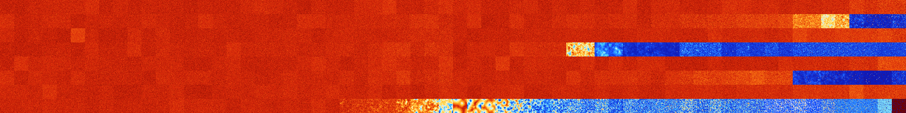

# B146 (41984-42495)

<details>
    <summary>Initial Grid</summary>
    
</details>


<details>
    <summary>Initial Grid RLE</summary>

```
#C Exported from GoGoL (https://github.com/marrow16/gogol)
#C Wrap mode: Toroidal
#C Boundary mode: Dead
#C Step: 0
x = 100, y = 100, rule = B146/S
7bo31bo3bo23bo6bo4bo17bo$6bo7bo10bo5bo4bo15bo7bo5bo5bo5bo$31bo5bo11bo
14bo11bo$15bo3bo12bo17bo25bo3bo3bo12bo$36bo6bo13bo13bo14bo5bo$2bo69bo
20bo$21bo8bo2bo11bo7bo10bo2bo5bo8bo4b2o$24bo22bo29bo$10b3o69bo3bo6bobo$
3bo2bo3bo9bo9bo3bo4bo8bo35bo5bo$8bo41bo12bobo24bo$5bo3bo3bo6bo42bo$2bo
19b2o7bo$14bo23bo7bo22bo3bo17bo5bo$11bo20bo5bo15bo18bo5bo$18bo11bo4bo3b
o4bo11bo7bobo32bo$11bo15bo42bo7bo$3bo14bo6bo56bo$54bo16bo$34bo17bo43bo$
7bo6bo26bo23bo6bobo3bo6bo$35bo2bo3bo11bo3bo21bo3bo$17bo5bo6bo32b2o12bo
11bo$16bo42bo9bo$5bo33bo6bo9bo2bo3bo30bo$5bo5bo69b2o$10bo21bo5bo35b2o$
10bo26bo58bo$13bo11bo15bo5bo9bo5bo9bo14bo9bo$3bo16bo9bo21bo7bo21bo11bo$
4bobo5bo59bo6bo$7bo6bo22bo22bo36bo$28bo27bo35bo$2bo11bo5bo$bo34bo3bo41b
o$16bo59bo2bo3bo13bo$7bobo13bo3bo18bo15bo2bo16bo6bo$17bo2bobo2bo54bo$
11bo4bobobo16bo15bo14bo8bo$18b2o7bo6bo12bo3b2o3bo9bo12b2o$13bo36bo2bo
13bo21bo$4bo43bo$3b2o5bo50bo2bo24bo$5bo14bo18bo20bo$18bo12bo53bo$11bo4b
o11bo19bo3bo4bo10b2o8bo17bo$85bo11bo$47bo15bo2bo5bo12b2obo5bo$28bo25b2o
7bo15bo$6bo9bo21bo3bobo11bo4bo11bo$42bo6bo24bo14b2o$bo58bobo33bo$59bobo
6bo$63bo2bo10bo8bo12bo$17bo10bo7bo56bo2bo$34bo4bo$67bo30bo$5bo15bo7bo8b
o3bo$5bo7bo8bo15bo13bo4bo$8bo36bobo12bo5bo29bo$6b2o4bo46bo3bo18bo$58bob
o6bo$9bo11bobo10bo11bo16bo$51bobo9bo30bo$4bo3bo39b2o16bo9bo12bo8bo$8b2o
16bo16bo16bo4bo10bo4bo6bo7bo$9bo35bo$13bo45bo7bobo20bo$30bo$2bo7bo17bo
19bo37bo$30bobo38bo22bo3bo$38bobo$9bo12bo8bo10bo55bo$27bo4bo9bobob2o5bo
14bo26bo$26bo37bo18bo$33bo16bo29bo$bo3bo23bo8bobo46bo2b2o4bo$6bo42bo5bo
14bo10bo8bo$6bo11bo15bo7bo6bo3bo19bo$o59bo3bo12bo17bo$41bo5bo$27bo16bo
8bo43bo$21bo60bo$6bo11b2o5bo27b2o42bo$4bo19bo23bo6bo8bobo23bo$39bo3bo3b
o$9bo26bo7bo22bo7bo$o10bo14bo$33bo6bo37bo10bo$bo$8bo5bo31bo10bo34bo4bo$
15bo9bo34bo5bo10bo$4bo14bo47bo$36bo16bo3bo9bo27b2o$2bo2b2o63bo23bo$32bo
66bo$13bo20bo6bo19bo22bo5bobo$3bo4bo8bo2b2o17bo2bo4bo12bo16bo$13bo46bo
2bo$15bo6bo21bo34bo10bo!
```
</details>
<details>
    <summary>Thumbnail</summary>

</details>
<table>
<tr>
    <td><a href="./41984%20S%20Heat%20Map%20Activity.png"></a><br>S (41984)<br>G>1000</td>    <td><a href="./41985%20S0%20Heat%20Map%20Activity.png"></a><br>S0 (41985)<br>G>1000</td>    <td><a href="./41986%20S1%20Heat%20Map%20Activity.png"></a><br>S1 (41986)<br>G>1000</td>    <td><a href="./41987%20S01%20Heat%20Map%20Activity.png"></a><br>S01 (41987)<br>G>1000</td>    <td><a href="./41988%20S2%20Heat%20Map%20Activity.png"></a><br>S2 (41988)<br>G>1000</td>    <td><a href="./41989%20S02%20Heat%20Map%20Activity.png"></a><br>S02 (41989)<br>G>1000</td>    <td><a href="./41990%20S12%20Heat%20Map%20Activity.png"></a><br>S12 (41990)<br>G>1000</td>    <td><a href="./41991%20S012%20Heat%20Map%20Activity.png"></a><br>S012 (41991)<br>G>1000</td>    <td><a href="./41992%20S3%20Heat%20Map%20Activity.png"></a><br>S3 (41992)<br>G>1000</td>    <td><a href="./41993%20S03%20Heat%20Map%20Activity.png"></a><br>S03 (41993)<br>G>1000</td>    <td><a href="./41994%20S13%20Heat%20Map%20Activity.png"></a><br>S13 (41994)<br>G>1000</td>    <td><a href="./41995%20S013%20Heat%20Map%20Activity.png"></a><br>S013 (41995)<br>G>1000</td>    <td><a href="./41996%20S23%20Heat%20Map%20Activity.png"></a><br>S23 (41996)<br>G>1000</td>    <td><a href="./41997%20S023%20Heat%20Map%20Activity.png"></a><br>S023 (41997)<br>G>1000</td>    <td><a href="./41998%20S123%20Heat%20Map%20Activity.png"></a><br>S123 (41998)<br>G>1000</td>    <td><a href="./41999%20S0123%20Heat%20Map%20Activity.png"></a><br>S0123 (41999)<br>G>1000</td>    <td><a href="./42000%20S4%20Heat%20Map%20Activity.png"></a><br>S4 (42000)<br>G>1000</td>    <td><a href="./42001%20S04%20Heat%20Map%20Activity.png"></a><br>S04 (42001)<br>G>1000</td>    <td><a href="./42002%20S14%20Heat%20Map%20Activity.png"></a><br>S14 (42002)<br>G>1000</td>    <td><a href="./42003%20S014%20Heat%20Map%20Activity.png"></a><br>S014 (42003)<br>G>1000</td>    <td><a href="./42004%20S24%20Heat%20Map%20Activity.png"></a><br>S24 (42004)<br>G>1000</td>    <td><a href="./42005%20S024%20Heat%20Map%20Activity.png"></a><br>S024 (42005)<br>G>1000</td>    <td><a href="./42006%20S124%20Heat%20Map%20Activity.png"></a><br>S124 (42006)<br>G>1000</td>    <td><a href="./42007%20S0124%20Heat%20Map%20Activity.png"></a><br>S0124 (42007)<br>G>1000</td>    <td><a href="./42008%20S34%20Heat%20Map%20Activity.png"></a><br>S34 (42008)<br>G>1000</td>    <td><a href="./42009%20S034%20Heat%20Map%20Activity.png"></a><br>S034 (42009)<br>G>1000</td>    <td><a href="./42010%20S134%20Heat%20Map%20Activity.png"></a><br>S134 (42010)<br>G>1000</td>    <td><a href="./42011%20S0134%20Heat%20Map%20Activity.png"></a><br>S0134 (42011)<br>G>1000</td>    <td><a href="./42012%20S234%20Heat%20Map%20Activity.png"></a><br>S234 (42012)<br>G>1000</td>    <td><a href="./42013%20S0234%20Heat%20Map%20Activity.png"></a><br>S0234 (42013)<br>G>1000</td>    <td><a href="./42014%20S1234%20Heat%20Map%20Activity.png"></a><br>S1234 (42014)<br>G>1000</td>    <td><a href="./42015%20S01234%20Heat%20Map%20Activity.png"></a><br>S01234 (42015)<br>G>1000</td>    <td><a href="./42016%20S5%20Heat%20Map%20Activity.png"></a><br>S5 (42016)<br>G>1000</td>    <td><a href="./42017%20S05%20Heat%20Map%20Activity.png"></a><br>S05 (42017)<br>G>1000</td>    <td><a href="./42018%20S15%20Heat%20Map%20Activity.png"></a><br>S15 (42018)<br>G>1000</td>    <td><a href="./42019%20S015%20Heat%20Map%20Activity.png"></a><br>S015 (42019)<br>G>1000</td>    <td><a href="./42020%20S25%20Heat%20Map%20Activity.png"></a><br>S25 (42020)<br>G>1000</td>    <td><a href="./42021%20S025%20Heat%20Map%20Activity.png"></a><br>S025 (42021)<br>G>1000</td>    <td><a href="./42022%20S125%20Heat%20Map%20Activity.png"></a><br>S125 (42022)<br>G>1000</td>    <td><a href="./42023%20S0125%20Heat%20Map%20Activity.png"></a><br>S0125 (42023)<br>G>1000</td>    <td><a href="./42024%20S35%20Heat%20Map%20Activity.png"></a><br>S35 (42024)<br>G>1000</td>    <td><a href="./42025%20S035%20Heat%20Map%20Activity.png"></a><br>S035 (42025)<br>G>1000</td>    <td><a href="./42026%20S135%20Heat%20Map%20Activity.png"></a><br>S135 (42026)<br>G>1000</td>    <td><a href="./42027%20S0135%20Heat%20Map%20Activity.png"></a><br>S0135 (42027)<br>G>1000</td>    <td><a href="./42028%20S235%20Heat%20Map%20Activity.png"></a><br>S235 (42028)<br>G>1000</td>    <td><a href="./42029%20S0235%20Heat%20Map%20Activity.png"></a><br>S0235 (42029)<br>G>1000</td>    <td><a href="./42030%20S1235%20Heat%20Map%20Activity.png"></a><br>S1235 (42030)<br>G>1000</td>    <td><a href="./42031%20S01235%20Heat%20Map%20Activity.png"></a><br>S01235 (42031)<br>G>1000</td>    <td><a href="./42032%20S45%20Heat%20Map%20Activity.png"></a><br>S45 (42032)<br>G>1000</td>    <td><a href="./42033%20S045%20Heat%20Map%20Activity.png"></a><br>S045 (42033)<br>G>1000</td>    <td><a href="./42034%20S145%20Heat%20Map%20Activity.png"></a><br>S145 (42034)<br>G>1000</td>    <td><a href="./42035%20S0145%20Heat%20Map%20Activity.png"></a><br>S0145 (42035)<br>G>1000</td>    <td><a href="./42036%20S245%20Heat%20Map%20Activity.png"></a><br>S245 (42036)<br>G>1000</td>    <td><a href="./42037%20S0245%20Heat%20Map%20Activity.png"></a><br>S0245 (42037)<br>G>1000</td>    <td><a href="./42038%20S1245%20Heat%20Map%20Activity.png"></a><br>S1245 (42038)<br>G>1000</td>    <td><a href="./42039%20S01245%20Heat%20Map%20Activity.png"></a><br>S01245 (42039)<br>G>1000</td>    <td><a href="./42040%20S345%20Heat%20Map%20Activity.png"></a><br>S345 (42040)<br>G>1000</td>    <td><a href="./42041%20S0345%20Heat%20Map%20Activity.png"></a><br>S0345 (42041)<br>G>1000</td>    <td><a href="./42042%20S1345%20Heat%20Map%20Activity.png"></a><br>S1345 (42042)<br>G>1000</td>    <td><a href="./42043%20S01345%20Heat%20Map%20Activity.png"></a><br>S01345 (42043)<br>G>1000</td>    <td><a href="./42044%20S2345%20Heat%20Map%20Activity.png"></a><br>S2345 (42044)<br>G>1000</td>    <td><a href="./42045%20S02345%20Heat%20Map%20Activity.png"></a><br>S02345 (42045)<br>G>1000</td>    <td><a href="./42046%20S12345%20Heat%20Map%20Activity.png"></a><br>S12345 (42046)<br>G>1000</td>    <td><a href="./42047%20S012345%20Heat%20Map%20Activity.png"></a><br>S012345 (42047)<br>G>1000</td></tr>
<tr>
    <td><a href="./42048%20S6%20Heat%20Map%20Activity.png"></a><br>S6 (42048)<br>G>1000</td>    <td><a href="./42049%20S06%20Heat%20Map%20Activity.png"></a><br>S06 (42049)<br>G>1000</td>    <td><a href="./42050%20S16%20Heat%20Map%20Activity.png"></a><br>S16 (42050)<br>G>1000</td>    <td><a href="./42051%20S016%20Heat%20Map%20Activity.png"></a><br>S016 (42051)<br>G>1000</td>    <td><a href="./42052%20S26%20Heat%20Map%20Activity.png"></a><br>S26 (42052)<br>G>1000</td>    <td><a href="./42053%20S026%20Heat%20Map%20Activity.png"></a><br>S026 (42053)<br>G>1000</td>    <td><a href="./42054%20S126%20Heat%20Map%20Activity.png"></a><br>S126 (42054)<br>G>1000</td>    <td><a href="./42055%20S0126%20Heat%20Map%20Activity.png"></a><br>S0126 (42055)<br>G>1000</td>    <td><a href="./42056%20S36%20Heat%20Map%20Activity.png"></a><br>S36 (42056)<br>G>1000</td>    <td><a href="./42057%20S036%20Heat%20Map%20Activity.png"></a><br>S036 (42057)<br>G>1000</td>    <td><a href="./42058%20S136%20Heat%20Map%20Activity.png"></a><br>S136 (42058)<br>G>1000</td>    <td><a href="./42059%20S0136%20Heat%20Map%20Activity.png"></a><br>S0136 (42059)<br>G>1000</td>    <td><a href="./42060%20S236%20Heat%20Map%20Activity.png"></a><br>S236 (42060)<br>G>1000</td>    <td><a href="./42061%20S0236%20Heat%20Map%20Activity.png"></a><br>S0236 (42061)<br>G>1000</td>    <td><a href="./42062%20S1236%20Heat%20Map%20Activity.png"></a><br>S1236 (42062)<br>G>1000</td>    <td><a href="./42063%20S01236%20Heat%20Map%20Activity.png"></a><br>S01236 (42063)<br>G>1000</td>    <td><a href="./42064%20S46%20Heat%20Map%20Activity.png"></a><br>S46 (42064)<br>G>1000</td>    <td><a href="./42065%20S046%20Heat%20Map%20Activity.png"></a><br>S046 (42065)<br>G>1000</td>    <td><a href="./42066%20S146%20Heat%20Map%20Activity.png"></a><br>S146 (42066)<br>G>1000</td>    <td><a href="./42067%20S0146%20Heat%20Map%20Activity.png"></a><br>S0146 (42067)<br>G>1000</td>    <td><a href="./42068%20S246%20Heat%20Map%20Activity.png"></a><br>S246 (42068)<br>G>1000</td>    <td><a href="./42069%20S0246%20Heat%20Map%20Activity.png"></a><br>S0246 (42069)<br>G>1000</td>    <td><a href="./42070%20S1246%20Heat%20Map%20Activity.png"></a><br>S1246 (42070)<br>G>1000</td>    <td><a href="./42071%20S01246%20Heat%20Map%20Activity.png"></a><br>S01246 (42071)<br>G>1000</td>    <td><a href="./42072%20S346%20Heat%20Map%20Activity.png"></a><br>S346 (42072)<br>G>1000</td>    <td><a href="./42073%20S0346%20Heat%20Map%20Activity.png"></a><br>S0346 (42073)<br>G>1000</td>    <td><a href="./42074%20S1346%20Heat%20Map%20Activity.png"></a><br>S1346 (42074)<br>G>1000</td>    <td><a href="./42075%20S01346%20Heat%20Map%20Activity.png"></a><br>S01346 (42075)<br>G>1000</td>    <td><a href="./42076%20S2346%20Heat%20Map%20Activity.png"></a><br>S2346 (42076)<br>G>1000</td>    <td><a href="./42077%20S02346%20Heat%20Map%20Activity.png"></a><br>S02346 (42077)<br>G>1000</td>    <td><a href="./42078%20S12346%20Heat%20Map%20Activity.png"></a><br>S12346 (42078)<br>G>1000</td>    <td><a href="./42079%20S012346%20Heat%20Map%20Activity.png"></a><br>S012346 (42079)<br>G>1000</td>    <td><a href="./42080%20S56%20Heat%20Map%20Activity.png"></a><br>S56 (42080)<br>G>1000</td>    <td><a href="./42081%20S056%20Heat%20Map%20Activity.png"></a><br>S056 (42081)<br>G>1000</td>    <td><a href="./42082%20S156%20Heat%20Map%20Activity.png"></a><br>S156 (42082)<br>G>1000</td>    <td><a href="./42083%20S0156%20Heat%20Map%20Activity.png"></a><br>S0156 (42083)<br>G>1000</td>    <td><a href="./42084%20S256%20Heat%20Map%20Activity.png"></a><br>S256 (42084)<br>G>1000</td>    <td><a href="./42085%20S0256%20Heat%20Map%20Activity.png"></a><br>S0256 (42085)<br>G>1000</td>    <td><a href="./42086%20S1256%20Heat%20Map%20Activity.png"></a><br>S1256 (42086)<br>G>1000</td>    <td><a href="./42087%20S01256%20Heat%20Map%20Activity.png"></a><br>S01256 (42087)<br>G>1000</td>    <td><a href="./42088%20S356%20Heat%20Map%20Activity.png"></a><br>S356 (42088)<br>G>1000</td>    <td><a href="./42089%20S0356%20Heat%20Map%20Activity.png"></a><br>S0356 (42089)<br>G>1000</td>    <td><a href="./42090%20S1356%20Heat%20Map%20Activity.png"></a><br>S1356 (42090)<br>G>1000</td>    <td><a href="./42091%20S01356%20Heat%20Map%20Activity.png"></a><br>S01356 (42091)<br>G>1000</td>    <td><a href="./42092%20S2356%20Heat%20Map%20Activity.png"></a><br>S2356 (42092)<br>G>1000</td>    <td><a href="./42093%20S02356%20Heat%20Map%20Activity.png"></a><br>S02356 (42093)<br>G>1000</td>    <td><a href="./42094%20S12356%20Heat%20Map%20Activity.png"></a><br>S12356 (42094)<br>G>1000</td>    <td><a href="./42095%20S012356%20Heat%20Map%20Activity.png"></a><br>S012356 (42095)<br>G>1000</td>    <td><a href="./42096%20S456%20Heat%20Map%20Activity.png"></a><br>S456 (42096)<br>G>1000</td>    <td><a href="./42097%20S0456%20Heat%20Map%20Activity.png"></a><br>S0456 (42097)<br>G>1000</td>    <td><a href="./42098%20S1456%20Heat%20Map%20Activity.png"></a><br>S1456 (42098)<br>G>1000</td>    <td><a href="./42099%20S01456%20Heat%20Map%20Activity.png"></a><br>S01456 (42099)<br>G>1000</td>    <td><a href="./42100%20S2456%20Heat%20Map%20Activity.png"></a><br>S2456 (42100)<br>G>1000</td>    <td><a href="./42101%20S02456%20Heat%20Map%20Activity.png"></a><br>S02456 (42101)<br>G>1000</td>    <td><a href="./42102%20S12456%20Heat%20Map%20Activity.png"></a><br>S12456 (42102)<br>G>1000</td>    <td><a href="./42103%20S012456%20Heat%20Map%20Activity.png"></a><br>S012456 (42103)<br>G>1000</td>    <td><a href="./42104%20S3456%20Heat%20Map%20Activity.png"></a><br>S3456 (42104)<br>G>1000</td>    <td><a href="./42105%20S03456%20Heat%20Map%20Activity.png"></a><br>S03456 (42105)<br>G>1000</td>    <td><a href="./42106%20S13456%20Heat%20Map%20Activity.png"></a><br>S13456 (42106)<br>G>1000</td>    <td><a href="./42107%20S013456%20Heat%20Map%20Activity.png"></a><br>S013456 (42107)<br>G>1000</td>    <td><a href="./42108%20S23456%20Heat%20Map%20Activity.png"></a><br>S23456 (42108)<br>R@124,p12</td>    <td><a href="./42109%20S023456%20Heat%20Map%20Activity.png"></a><br>S023456 (42109)<br>R@237,p120</td>    <td><a href="./42110%20S123456%20Heat%20Map%20Activity.png"></a><br>S123456 (42110)<br>R@145,p84</td>    <td><a href="./42111%20S0123456%20Heat%20Map%20Activity.png"></a><br>S0123456 (42111)<br>R@74,p12</td></tr>
<tr>
    <td><a href="./42112%20S7%20Heat%20Map%20Activity.png"></a><br>S7 (42112)<br>G>1000</td>    <td><a href="./42113%20S07%20Heat%20Map%20Activity.png"></a><br>S07 (42113)<br>G>1000</td>    <td><a href="./42114%20S17%20Heat%20Map%20Activity.png"></a><br>S17 (42114)<br>G>1000</td>    <td><a href="./42115%20S017%20Heat%20Map%20Activity.png"></a><br>S017 (42115)<br>G>1000</td>    <td><a href="./42116%20S27%20Heat%20Map%20Activity.png"></a><br>S27 (42116)<br>G>1000</td>    <td><a href="./42117%20S027%20Heat%20Map%20Activity.png"></a><br>S027 (42117)<br>G>1000</td>    <td><a href="./42118%20S127%20Heat%20Map%20Activity.png"></a><br>S127 (42118)<br>G>1000</td>    <td><a href="./42119%20S0127%20Heat%20Map%20Activity.png"></a><br>S0127 (42119)<br>G>1000</td>    <td><a href="./42120%20S37%20Heat%20Map%20Activity.png"></a><br>S37 (42120)<br>G>1000</td>    <td><a href="./42121%20S037%20Heat%20Map%20Activity.png"></a><br>S037 (42121)<br>G>1000</td>    <td><a href="./42122%20S137%20Heat%20Map%20Activity.png"></a><br>S137 (42122)<br>G>1000</td>    <td><a href="./42123%20S0137%20Heat%20Map%20Activity.png"></a><br>S0137 (42123)<br>G>1000</td>    <td><a href="./42124%20S237%20Heat%20Map%20Activity.png"></a><br>S237 (42124)<br>G>1000</td>    <td><a href="./42125%20S0237%20Heat%20Map%20Activity.png"></a><br>S0237 (42125)<br>G>1000</td>    <td><a href="./42126%20S1237%20Heat%20Map%20Activity.png"></a><br>S1237 (42126)<br>G>1000</td>    <td><a href="./42127%20S01237%20Heat%20Map%20Activity.png"></a><br>S01237 (42127)<br>G>1000</td>    <td><a href="./42128%20S47%20Heat%20Map%20Activity.png"></a><br>S47 (42128)<br>G>1000</td>    <td><a href="./42129%20S047%20Heat%20Map%20Activity.png"></a><br>S047 (42129)<br>G>1000</td>    <td><a href="./42130%20S147%20Heat%20Map%20Activity.png"></a><br>S147 (42130)<br>G>1000</td>    <td><a href="./42131%20S0147%20Heat%20Map%20Activity.png"></a><br>S0147 (42131)<br>G>1000</td>    <td><a href="./42132%20S247%20Heat%20Map%20Activity.png"></a><br>S247 (42132)<br>G>1000</td>    <td><a href="./42133%20S0247%20Heat%20Map%20Activity.png"></a><br>S0247 (42133)<br>G>1000</td>    <td><a href="./42134%20S1247%20Heat%20Map%20Activity.png"></a><br>S1247 (42134)<br>G>1000</td>    <td><a href="./42135%20S01247%20Heat%20Map%20Activity.png"></a><br>S01247 (42135)<br>G>1000</td>    <td><a href="./42136%20S347%20Heat%20Map%20Activity.png"></a><br>S347 (42136)<br>G>1000</td>    <td><a href="./42137%20S0347%20Heat%20Map%20Activity.png"></a><br>S0347 (42137)<br>G>1000</td>    <td><a href="./42138%20S1347%20Heat%20Map%20Activity.png"></a><br>S1347 (42138)<br>G>1000</td>    <td><a href="./42139%20S01347%20Heat%20Map%20Activity.png"></a><br>S01347 (42139)<br>G>1000</td>    <td><a href="./42140%20S2347%20Heat%20Map%20Activity.png"></a><br>S2347 (42140)<br>G>1000</td>    <td><a href="./42141%20S02347%20Heat%20Map%20Activity.png"></a><br>S02347 (42141)<br>G>1000</td>    <td><a href="./42142%20S12347%20Heat%20Map%20Activity.png"></a><br>S12347 (42142)<br>G>1000</td>    <td><a href="./42143%20S012347%20Heat%20Map%20Activity.png"></a><br>S012347 (42143)<br>G>1000</td>    <td><a href="./42144%20S57%20Heat%20Map%20Activity.png"></a><br>S57 (42144)<br>G>1000</td>    <td><a href="./42145%20S057%20Heat%20Map%20Activity.png"></a><br>S057 (42145)<br>G>1000</td>    <td><a href="./42146%20S157%20Heat%20Map%20Activity.png"></a><br>S157 (42146)<br>G>1000</td>    <td><a href="./42147%20S0157%20Heat%20Map%20Activity.png"></a><br>S0157 (42147)<br>G>1000</td>    <td><a href="./42148%20S257%20Heat%20Map%20Activity.png"></a><br>S257 (42148)<br>G>1000</td>    <td><a href="./42149%20S0257%20Heat%20Map%20Activity.png"></a><br>S0257 (42149)<br>G>1000</td>    <td><a href="./42150%20S1257%20Heat%20Map%20Activity.png"></a><br>S1257 (42150)<br>G>1000</td>    <td><a href="./42151%20S01257%20Heat%20Map%20Activity.png"></a><br>S01257 (42151)<br>G>1000</td>    <td><a href="./42152%20S357%20Heat%20Map%20Activity.png"></a><br>S357 (42152)<br>G>1000</td>    <td><a href="./42153%20S0357%20Heat%20Map%20Activity.png"></a><br>S0357 (42153)<br>G>1000</td>    <td><a href="./42154%20S1357%20Heat%20Map%20Activity.png"></a><br>S1357 (42154)<br>G>1000</td>    <td><a href="./42155%20S01357%20Heat%20Map%20Activity.png"></a><br>S01357 (42155)<br>G>1000</td>    <td><a href="./42156%20S2357%20Heat%20Map%20Activity.png"></a><br>S2357 (42156)<br>G>1000</td>    <td><a href="./42157%20S02357%20Heat%20Map%20Activity.png"></a><br>S02357 (42157)<br>G>1000</td>    <td><a href="./42158%20S12357%20Heat%20Map%20Activity.png"></a><br>S12357 (42158)<br>G>1000</td>    <td><a href="./42159%20S012357%20Heat%20Map%20Activity.png"></a><br>S012357 (42159)<br>G>1000</td>    <td><a href="./42160%20S457%20Heat%20Map%20Activity.png"></a><br>S457 (42160)<br>G>1000</td>    <td><a href="./42161%20S0457%20Heat%20Map%20Activity.png"></a><br>S0457 (42161)<br>G>1000</td>    <td><a href="./42162%20S1457%20Heat%20Map%20Activity.png"></a><br>S1457 (42162)<br>G>1000</td>    <td><a href="./42163%20S01457%20Heat%20Map%20Activity.png"></a><br>S01457 (42163)<br>G>1000</td>    <td><a href="./42164%20S2457%20Heat%20Map%20Activity.png"></a><br>S2457 (42164)<br>G>1000</td>    <td><a href="./42165%20S02457%20Heat%20Map%20Activity.png"></a><br>S02457 (42165)<br>G>1000</td>    <td><a href="./42166%20S12457%20Heat%20Map%20Activity.png"></a><br>S12457 (42166)<br>G>1000</td>    <td><a href="./42167%20S012457%20Heat%20Map%20Activity.png"></a><br>S012457 (42167)<br>G>1000</td>    <td><a href="./42168%20S3457%20Heat%20Map%20Activity.png"></a><br>S3457 (42168)<br>G>1000</td>    <td><a href="./42169%20S03457%20Heat%20Map%20Activity.png"></a><br>S03457 (42169)<br>G>1000</td>    <td><a href="./42170%20S13457%20Heat%20Map%20Activity.png"></a><br>S13457 (42170)<br>G>1000</td>    <td><a href="./42171%20S013457%20Heat%20Map%20Activity.png"></a><br>S013457 (42171)<br>G>1000</td>    <td><a href="./42172%20S23457%20Heat%20Map%20Activity.png"></a><br>S23457 (42172)<br>G>1000</td>    <td><a href="./42173%20S023457%20Heat%20Map%20Activity.png"></a><br>S023457 (42173)<br>G>1000</td>    <td><a href="./42174%20S123457%20Heat%20Map%20Activity.png"></a><br>S123457 (42174)<br>G>1000</td>    <td><a href="./42175%20S0123457%20Heat%20Map%20Activity.png"></a><br>S0123457 (42175)<br>G>1000</td></tr>
<tr>
    <td><a href="./42176%20S67%20Heat%20Map%20Activity.png"></a><br>S67 (42176)<br>G>1000</td>    <td><a href="./42177%20S067%20Heat%20Map%20Activity.png"></a><br>S067 (42177)<br>G>1000</td>    <td><a href="./42178%20S167%20Heat%20Map%20Activity.png"></a><br>S167 (42178)<br>G>1000</td>    <td><a href="./42179%20S0167%20Heat%20Map%20Activity.png"></a><br>S0167 (42179)<br>G>1000</td>    <td><a href="./42180%20S267%20Heat%20Map%20Activity.png"></a><br>S267 (42180)<br>G>1000</td>    <td><a href="./42181%20S0267%20Heat%20Map%20Activity.png"></a><br>S0267 (42181)<br>G>1000</td>    <td><a href="./42182%20S1267%20Heat%20Map%20Activity.png"></a><br>S1267 (42182)<br>G>1000</td>    <td><a href="./42183%20S01267%20Heat%20Map%20Activity.png"></a><br>S01267 (42183)<br>G>1000</td>    <td><a href="./42184%20S367%20Heat%20Map%20Activity.png"></a><br>S367 (42184)<br>G>1000</td>    <td><a href="./42185%20S0367%20Heat%20Map%20Activity.png"></a><br>S0367 (42185)<br>G>1000</td>    <td><a href="./42186%20S1367%20Heat%20Map%20Activity.png"></a><br>S1367 (42186)<br>G>1000</td>    <td><a href="./42187%20S01367%20Heat%20Map%20Activity.png"></a><br>S01367 (42187)<br>G>1000</td>    <td><a href="./42188%20S2367%20Heat%20Map%20Activity.png"></a><br>S2367 (42188)<br>G>1000</td>    <td><a href="./42189%20S02367%20Heat%20Map%20Activity.png"></a><br>S02367 (42189)<br>G>1000</td>    <td><a href="./42190%20S12367%20Heat%20Map%20Activity.png"></a><br>S12367 (42190)<br>G>1000</td>    <td><a href="./42191%20S012367%20Heat%20Map%20Activity.png"></a><br>S012367 (42191)<br>G>1000</td>    <td><a href="./42192%20S467%20Heat%20Map%20Activity.png"></a><br>S467 (42192)<br>G>1000</td>    <td><a href="./42193%20S0467%20Heat%20Map%20Activity.png"></a><br>S0467 (42193)<br>G>1000</td>    <td><a href="./42194%20S1467%20Heat%20Map%20Activity.png"></a><br>S1467 (42194)<br>G>1000</td>    <td><a href="./42195%20S01467%20Heat%20Map%20Activity.png"></a><br>S01467 (42195)<br>G>1000</td>    <td><a href="./42196%20S2467%20Heat%20Map%20Activity.png"></a><br>S2467 (42196)<br>G>1000</td>    <td><a href="./42197%20S02467%20Heat%20Map%20Activity.png"></a><br>S02467 (42197)<br>G>1000</td>    <td><a href="./42198%20S12467%20Heat%20Map%20Activity.png"></a><br>S12467 (42198)<br>G>1000</td>    <td><a href="./42199%20S012467%20Heat%20Map%20Activity.png"></a><br>S012467 (42199)<br>G>1000</td>    <td><a href="./42200%20S3467%20Heat%20Map%20Activity.png"></a><br>S3467 (42200)<br>G>1000</td>    <td><a href="./42201%20S03467%20Heat%20Map%20Activity.png"></a><br>S03467 (42201)<br>G>1000</td>    <td><a href="./42202%20S13467%20Heat%20Map%20Activity.png"></a><br>S13467 (42202)<br>G>1000</td>    <td><a href="./42203%20S013467%20Heat%20Map%20Activity.png"></a><br>S013467 (42203)<br>G>1000</td>    <td><a href="./42204%20S23467%20Heat%20Map%20Activity.png"></a><br>S23467 (42204)<br>G>1000</td>    <td><a href="./42205%20S023467%20Heat%20Map%20Activity.png"></a><br>S023467 (42205)<br>G>1000</td>    <td><a href="./42206%20S123467%20Heat%20Map%20Activity.png"></a><br>S123467 (42206)<br>G>1000</td>    <td><a href="./42207%20S0123467%20Heat%20Map%20Activity.png"></a><br>S0123467 (42207)<br>G>1000</td>    <td><a href="./42208%20S567%20Heat%20Map%20Activity.png"></a><br>S567 (42208)<br>G>1000</td>    <td><a href="./42209%20S0567%20Heat%20Map%20Activity.png"></a><br>S0567 (42209)<br>G>1000</td>    <td><a href="./42210%20S1567%20Heat%20Map%20Activity.png"></a><br>S1567 (42210)<br>G>1000</td>    <td><a href="./42211%20S01567%20Heat%20Map%20Activity.png"></a><br>S01567 (42211)<br>G>1000</td>    <td><a href="./42212%20S2567%20Heat%20Map%20Activity.png"></a><br>S2567 (42212)<br>G>1000</td>    <td><a href="./42213%20S02567%20Heat%20Map%20Activity.png"></a><br>S02567 (42213)<br>G>1000</td>    <td><a href="./42214%20S12567%20Heat%20Map%20Activity.png"></a><br>S12567 (42214)<br>G>1000</td>    <td><a href="./42215%20S012567%20Heat%20Map%20Activity.png"></a><br>S012567 (42215)<br>G>1000</td>    <td><a href="./42216%20S3567%20Heat%20Map%20Activity.png"></a><br>S3567 (42216)<br>G>1000</td>    <td><a href="./42217%20S03567%20Heat%20Map%20Activity.png"></a><br>S03567 (42217)<br>G>1000</td>    <td><a href="./42218%20S13567%20Heat%20Map%20Activity.png"></a><br>S13567 (42218)<br>G>1000</td>    <td><a href="./42219%20S013567%20Heat%20Map%20Activity.png"></a><br>S013567 (42219)<br>G>1000</td>    <td><a href="./42220%20S23567%20Heat%20Map%20Activity.png"></a><br>S23567 (42220)<br>R@536,p12</td>    <td><a href="./42221%20S023567%20Heat%20Map%20Activity.png"></a><br>S023567 (42221)<br>R@322,p20</td>    <td><a href="./42222%20S123567%20Heat%20Map%20Activity.png"></a><br>S123567 (42222)<br>R@443,p4</td>    <td><a href="./42223%20S0123567%20Heat%20Map%20Activity.png"></a><br>S0123567 (42223)<br>R@753,p20</td>    <td><a href="./42224%20S4567%20Heat%20Map%20Activity.png"></a><br>S4567 (42224)<br>R@42,p10</td>    <td><a href="./42225%20S04567%20Heat%20Map%20Activity.png"></a><br>S04567 (42225)<br>R@31,p2</td>    <td><a href="./42226%20S14567%20Heat%20Map%20Activity.png"></a><br>S14567 (42226)<br>R@34,p2</td>    <td><a href="./42227%20S014567%20Heat%20Map%20Activity.png"></a><br>S014567 (42227)<br>R@54,p30</td>    <td><a href="./42228%20S24567%20Heat%20Map%20Activity.png"></a><br>S24567 (42228)<br>R@32,p10</td>    <td><a href="./42229%20S024567%20Heat%20Map%20Activity.png"></a><br>S024567 (42229)<br>R@38,p10</td>    <td><a href="./42230%20S124567%20Heat%20Map%20Activity.png"></a><br>S124567 (42230)<br>R@25,p2</td>    <td><a href="./42231%20S0124567%20Heat%20Map%20Activity.png"></a><br>S0124567 (42231)<br>R@34,p12</td>    <td><a href="./42232%20S34567%20Heat%20Map%20Activity.png"></a><br>S34567 (42232)<br>R@22,p2</td>    <td><a href="./42233%20S034567%20Heat%20Map%20Activity.png"></a><br>S034567 (42233)<br>R@18,p2</td>    <td><a href="./42234%20S134567%20Heat%20Map%20Activity.png"></a><br>S134567 (42234)<br>R@20,p2</td>    <td><a href="./42235%20S0134567%20Heat%20Map%20Activity.png"></a><br>S0134567 (42235)<br>R@16,p2</td>    <td><a href="./42236%20S234567%20Heat%20Map%20Activity.png"></a><br>S234567 (42236)<br>R@15,p2</td>    <td><a href="./42237%20S0234567%20Heat%20Map%20Activity.png"></a><br>S0234567 (42237)<br>R@15,p2</td>    <td><a href="./42238%20S1234567%20Heat%20Map%20Activity.png"></a><br>S1234567 (42238)<br>R@16,p2</td>    <td><a href="./42239%20S01234567%20Heat%20Map%20Activity.png"></a><br>S01234567 (42239)<br>R@15,p2</td></tr>
<tr>
    <td><a href="./42240%20S8%20Heat%20Map%20Activity.png"></a><br>S8 (42240)<br>G>1000</td>    <td><a href="./42241%20S08%20Heat%20Map%20Activity.png"></a><br>S08 (42241)<br>G>1000</td>    <td><a href="./42242%20S18%20Heat%20Map%20Activity.png"></a><br>S18 (42242)<br>G>1000</td>    <td><a href="./42243%20S018%20Heat%20Map%20Activity.png"></a><br>S018 (42243)<br>G>1000</td>    <td><a href="./42244%20S28%20Heat%20Map%20Activity.png"></a><br>S28 (42244)<br>G>1000</td>    <td><a href="./42245%20S028%20Heat%20Map%20Activity.png"></a><br>S028 (42245)<br>G>1000</td>    <td><a href="./42246%20S128%20Heat%20Map%20Activity.png"></a><br>S128 (42246)<br>G>1000</td>    <td><a href="./42247%20S0128%20Heat%20Map%20Activity.png"></a><br>S0128 (42247)<br>G>1000</td>    <td><a href="./42248%20S38%20Heat%20Map%20Activity.png"></a><br>S38 (42248)<br>G>1000</td>    <td><a href="./42249%20S038%20Heat%20Map%20Activity.png"></a><br>S038 (42249)<br>G>1000</td>    <td><a href="./42250%20S138%20Heat%20Map%20Activity.png"></a><br>S138 (42250)<br>G>1000</td>    <td><a href="./42251%20S0138%20Heat%20Map%20Activity.png"></a><br>S0138 (42251)<br>G>1000</td>    <td><a href="./42252%20S238%20Heat%20Map%20Activity.png"></a><br>S238 (42252)<br>G>1000</td>    <td><a href="./42253%20S0238%20Heat%20Map%20Activity.png"></a><br>S0238 (42253)<br>G>1000</td>    <td><a href="./42254%20S1238%20Heat%20Map%20Activity.png"></a><br>S1238 (42254)<br>G>1000</td>    <td><a href="./42255%20S01238%20Heat%20Map%20Activity.png"></a><br>S01238 (42255)<br>G>1000</td>    <td><a href="./42256%20S48%20Heat%20Map%20Activity.png"></a><br>S48 (42256)<br>G>1000</td>    <td><a href="./42257%20S048%20Heat%20Map%20Activity.png"></a><br>S048 (42257)<br>G>1000</td>    <td><a href="./42258%20S148%20Heat%20Map%20Activity.png"></a><br>S148 (42258)<br>G>1000</td>    <td><a href="./42259%20S0148%20Heat%20Map%20Activity.png"></a><br>S0148 (42259)<br>G>1000</td>    <td><a href="./42260%20S248%20Heat%20Map%20Activity.png"></a><br>S248 (42260)<br>G>1000</td>    <td><a href="./42261%20S0248%20Heat%20Map%20Activity.png"></a><br>S0248 (42261)<br>G>1000</td>    <td><a href="./42262%20S1248%20Heat%20Map%20Activity.png"></a><br>S1248 (42262)<br>G>1000</td>    <td><a href="./42263%20S01248%20Heat%20Map%20Activity.png"></a><br>S01248 (42263)<br>G>1000</td>    <td><a href="./42264%20S348%20Heat%20Map%20Activity.png"></a><br>S348 (42264)<br>G>1000</td>    <td><a href="./42265%20S0348%20Heat%20Map%20Activity.png"></a><br>S0348 (42265)<br>G>1000</td>    <td><a href="./42266%20S1348%20Heat%20Map%20Activity.png"></a><br>S1348 (42266)<br>G>1000</td>    <td><a href="./42267%20S01348%20Heat%20Map%20Activity.png"></a><br>S01348 (42267)<br>G>1000</td>    <td><a href="./42268%20S2348%20Heat%20Map%20Activity.png"></a><br>S2348 (42268)<br>G>1000</td>    <td><a href="./42269%20S02348%20Heat%20Map%20Activity.png"></a><br>S02348 (42269)<br>G>1000</td>    <td><a href="./42270%20S12348%20Heat%20Map%20Activity.png"></a><br>S12348 (42270)<br>G>1000</td>    <td><a href="./42271%20S012348%20Heat%20Map%20Activity.png"></a><br>S012348 (42271)<br>G>1000</td>    <td><a href="./42272%20S58%20Heat%20Map%20Activity.png"></a><br>S58 (42272)<br>G>1000</td>    <td><a href="./42273%20S058%20Heat%20Map%20Activity.png"></a><br>S058 (42273)<br>G>1000</td>    <td><a href="./42274%20S158%20Heat%20Map%20Activity.png"></a><br>S158 (42274)<br>G>1000</td>    <td><a href="./42275%20S0158%20Heat%20Map%20Activity.png"></a><br>S0158 (42275)<br>G>1000</td>    <td><a href="./42276%20S258%20Heat%20Map%20Activity.png"></a><br>S258 (42276)<br>G>1000</td>    <td><a href="./42277%20S0258%20Heat%20Map%20Activity.png"></a><br>S0258 (42277)<br>G>1000</td>    <td><a href="./42278%20S1258%20Heat%20Map%20Activity.png"></a><br>S1258 (42278)<br>G>1000</td>    <td><a href="./42279%20S01258%20Heat%20Map%20Activity.png"></a><br>S01258 (42279)<br>G>1000</td>    <td><a href="./42280%20S358%20Heat%20Map%20Activity.png"></a><br>S358 (42280)<br>G>1000</td>    <td><a href="./42281%20S0358%20Heat%20Map%20Activity.png"></a><br>S0358 (42281)<br>G>1000</td>    <td><a href="./42282%20S1358%20Heat%20Map%20Activity.png"></a><br>S1358 (42282)<br>G>1000</td>    <td><a href="./42283%20S01358%20Heat%20Map%20Activity.png"></a><br>S01358 (42283)<br>G>1000</td>    <td><a href="./42284%20S2358%20Heat%20Map%20Activity.png"></a><br>S2358 (42284)<br>G>1000</td>    <td><a href="./42285%20S02358%20Heat%20Map%20Activity.png"></a><br>S02358 (42285)<br>G>1000</td>    <td><a href="./42286%20S12358%20Heat%20Map%20Activity.png"></a><br>S12358 (42286)<br>G>1000</td>    <td><a href="./42287%20S012358%20Heat%20Map%20Activity.png"></a><br>S012358 (42287)<br>G>1000</td>    <td><a href="./42288%20S458%20Heat%20Map%20Activity.png"></a><br>S458 (42288)<br>G>1000</td>    <td><a href="./42289%20S0458%20Heat%20Map%20Activity.png"></a><br>S0458 (42289)<br>G>1000</td>    <td><a href="./42290%20S1458%20Heat%20Map%20Activity.png"></a><br>S1458 (42290)<br>G>1000</td>    <td><a href="./42291%20S01458%20Heat%20Map%20Activity.png"></a><br>S01458 (42291)<br>G>1000</td>    <td><a href="./42292%20S2458%20Heat%20Map%20Activity.png"></a><br>S2458 (42292)<br>G>1000</td>    <td><a href="./42293%20S02458%20Heat%20Map%20Activity.png"></a><br>S02458 (42293)<br>G>1000</td>    <td><a href="./42294%20S12458%20Heat%20Map%20Activity.png"></a><br>S12458 (42294)<br>G>1000</td>    <td><a href="./42295%20S012458%20Heat%20Map%20Activity.png"></a><br>S012458 (42295)<br>G>1000</td>    <td><a href="./42296%20S3458%20Heat%20Map%20Activity.png"></a><br>S3458 (42296)<br>G>1000</td>    <td><a href="./42297%20S03458%20Heat%20Map%20Activity.png"></a><br>S03458 (42297)<br>G>1000</td>    <td><a href="./42298%20S13458%20Heat%20Map%20Activity.png"></a><br>S13458 (42298)<br>G>1000</td>    <td><a href="./42299%20S013458%20Heat%20Map%20Activity.png"></a><br>S013458 (42299)<br>G>1000</td>    <td><a href="./42300%20S23458%20Heat%20Map%20Activity.png"></a><br>S23458 (42300)<br>G>1000</td>    <td><a href="./42301%20S023458%20Heat%20Map%20Activity.png"></a><br>S023458 (42301)<br>G>1000</td>    <td><a href="./42302%20S123458%20Heat%20Map%20Activity.png"></a><br>S123458 (42302)<br>G>1000</td>    <td><a href="./42303%20S0123458%20Heat%20Map%20Activity.png"></a><br>S0123458 (42303)<br>G>1000</td></tr>
<tr>
    <td><a href="./42304%20S68%20Heat%20Map%20Activity.png"></a><br>S68 (42304)<br>G>1000</td>    <td><a href="./42305%20S068%20Heat%20Map%20Activity.png"></a><br>S068 (42305)<br>G>1000</td>    <td><a href="./42306%20S168%20Heat%20Map%20Activity.png"></a><br>S168 (42306)<br>G>1000</td>    <td><a href="./42307%20S0168%20Heat%20Map%20Activity.png"></a><br>S0168 (42307)<br>G>1000</td>    <td><a href="./42308%20S268%20Heat%20Map%20Activity.png"></a><br>S268 (42308)<br>G>1000</td>    <td><a href="./42309%20S0268%20Heat%20Map%20Activity.png"></a><br>S0268 (42309)<br>G>1000</td>    <td><a href="./42310%20S1268%20Heat%20Map%20Activity.png"></a><br>S1268 (42310)<br>G>1000</td>    <td><a href="./42311%20S01268%20Heat%20Map%20Activity.png"></a><br>S01268 (42311)<br>G>1000</td>    <td><a href="./42312%20S368%20Heat%20Map%20Activity.png"></a><br>S368 (42312)<br>G>1000</td>    <td><a href="./42313%20S0368%20Heat%20Map%20Activity.png"></a><br>S0368 (42313)<br>G>1000</td>    <td><a href="./42314%20S1368%20Heat%20Map%20Activity.png"></a><br>S1368 (42314)<br>G>1000</td>    <td><a href="./42315%20S01368%20Heat%20Map%20Activity.png"></a><br>S01368 (42315)<br>G>1000</td>    <td><a href="./42316%20S2368%20Heat%20Map%20Activity.png"></a><br>S2368 (42316)<br>G>1000</td>    <td><a href="./42317%20S02368%20Heat%20Map%20Activity.png"></a><br>S02368 (42317)<br>G>1000</td>    <td><a href="./42318%20S12368%20Heat%20Map%20Activity.png"></a><br>S12368 (42318)<br>G>1000</td>    <td><a href="./42319%20S012368%20Heat%20Map%20Activity.png"></a><br>S012368 (42319)<br>G>1000</td>    <td><a href="./42320%20S468%20Heat%20Map%20Activity.png"></a><br>S468 (42320)<br>G>1000</td>    <td><a href="./42321%20S0468%20Heat%20Map%20Activity.png"></a><br>S0468 (42321)<br>G>1000</td>    <td><a href="./42322%20S1468%20Heat%20Map%20Activity.png"></a><br>S1468 (42322)<br>G>1000</td>    <td><a href="./42323%20S01468%20Heat%20Map%20Activity.png"></a><br>S01468 (42323)<br>G>1000</td>    <td><a href="./42324%20S2468%20Heat%20Map%20Activity.png"></a><br>S2468 (42324)<br>G>1000</td>    <td><a href="./42325%20S02468%20Heat%20Map%20Activity.png"></a><br>S02468 (42325)<br>G>1000</td>    <td><a href="./42326%20S12468%20Heat%20Map%20Activity.png"></a><br>S12468 (42326)<br>G>1000</td>    <td><a href="./42327%20S012468%20Heat%20Map%20Activity.png"></a><br>S012468 (42327)<br>G>1000</td>    <td><a href="./42328%20S3468%20Heat%20Map%20Activity.png"></a><br>S3468 (42328)<br>G>1000</td>    <td><a href="./42329%20S03468%20Heat%20Map%20Activity.png"></a><br>S03468 (42329)<br>G>1000</td>    <td><a href="./42330%20S13468%20Heat%20Map%20Activity.png"></a><br>S13468 (42330)<br>G>1000</td>    <td><a href="./42331%20S013468%20Heat%20Map%20Activity.png"></a><br>S013468 (42331)<br>G>1000</td>    <td><a href="./42332%20S23468%20Heat%20Map%20Activity.png"></a><br>S23468 (42332)<br>G>1000</td>    <td><a href="./42333%20S023468%20Heat%20Map%20Activity.png"></a><br>S023468 (42333)<br>G>1000</td>    <td><a href="./42334%20S123468%20Heat%20Map%20Activity.png"></a><br>S123468 (42334)<br>G>1000</td>    <td><a href="./42335%20S0123468%20Heat%20Map%20Activity.png"></a><br>S0123468 (42335)<br>G>1000</td>    <td><a href="./42336%20S568%20Heat%20Map%20Activity.png"></a><br>S568 (42336)<br>G>1000</td>    <td><a href="./42337%20S0568%20Heat%20Map%20Activity.png"></a><br>S0568 (42337)<br>G>1000</td>    <td><a href="./42338%20S1568%20Heat%20Map%20Activity.png"></a><br>S1568 (42338)<br>G>1000</td>    <td><a href="./42339%20S01568%20Heat%20Map%20Activity.png"></a><br>S01568 (42339)<br>G>1000</td>    <td><a href="./42340%20S2568%20Heat%20Map%20Activity.png"></a><br>S2568 (42340)<br>G>1000</td>    <td><a href="./42341%20S02568%20Heat%20Map%20Activity.png"></a><br>S02568 (42341)<br>G>1000</td>    <td><a href="./42342%20S12568%20Heat%20Map%20Activity.png"></a><br>S12568 (42342)<br>G>1000</td>    <td><a href="./42343%20S012568%20Heat%20Map%20Activity.png"></a><br>S012568 (42343)<br>G>1000</td>    <td><a href="./42344%20S3568%20Heat%20Map%20Activity.png"></a><br>S3568 (42344)<br>G>1000</td>    <td><a href="./42345%20S03568%20Heat%20Map%20Activity.png"></a><br>S03568 (42345)<br>G>1000</td>    <td><a href="./42346%20S13568%20Heat%20Map%20Activity.png"></a><br>S13568 (42346)<br>G>1000</td>    <td><a href="./42347%20S013568%20Heat%20Map%20Activity.png"></a><br>S013568 (42347)<br>G>1000</td>    <td><a href="./42348%20S23568%20Heat%20Map%20Activity.png"></a><br>S23568 (42348)<br>G>1000</td>    <td><a href="./42349%20S023568%20Heat%20Map%20Activity.png"></a><br>S023568 (42349)<br>G>1000</td>    <td><a href="./42350%20S123568%20Heat%20Map%20Activity.png"></a><br>S123568 (42350)<br>G>1000</td>    <td><a href="./42351%20S0123568%20Heat%20Map%20Activity.png"></a><br>S0123568 (42351)<br>G>1000</td>    <td><a href="./42352%20S4568%20Heat%20Map%20Activity.png"></a><br>S4568 (42352)<br>G>1000</td>    <td><a href="./42353%20S04568%20Heat%20Map%20Activity.png"></a><br>S04568 (42353)<br>G>1000</td>    <td><a href="./42354%20S14568%20Heat%20Map%20Activity.png"></a><br>S14568 (42354)<br>G>1000</td>    <td><a href="./42355%20S014568%20Heat%20Map%20Activity.png"></a><br>S014568 (42355)<br>G>1000</td>    <td><a href="./42356%20S24568%20Heat%20Map%20Activity.png"></a><br>S24568 (42356)<br>G>1000</td>    <td><a href="./42357%20S024568%20Heat%20Map%20Activity.png"></a><br>S024568 (42357)<br>G>1000</td>    <td><a href="./42358%20S124568%20Heat%20Map%20Activity.png"></a><br>S124568 (42358)<br>G>1000</td>    <td><a href="./42359%20S0124568%20Heat%20Map%20Activity.png"></a><br>S0124568 (42359)<br>G>1000</td>    <td><a href="./42360%20S34568%20Heat%20Map%20Activity.png"></a><br>S34568 (42360)<br>R@605,p60</td>    <td><a href="./42361%20S034568%20Heat%20Map%20Activity.png"></a><br>S034568 (42361)<br>R@640,p60</td>    <td><a href="./42362%20S134568%20Heat%20Map%20Activity.png"></a><br>S134568 (42362)<br>R@524,p12</td>    <td><a href="./42363%20S0134568%20Heat%20Map%20Activity.png"></a><br>S0134568 (42363)<br>R@749,p12</td>    <td><a href="./42364%20S234568%20Heat%20Map%20Activity.png"></a><br>S234568 (42364)<br>R@250,p180</td>    <td><a href="./42365%20S0234568%20Heat%20Map%20Activity.png"></a><br>S0234568 (42365)<br>G>1000</td>    <td><a href="./42366%20S1234568%20Heat%20Map%20Activity.png"></a><br>S1234568 (42366)<br>R@492,p420</td>    <td><a href="./42367%20S01234568%20Heat%20Map%20Activity.png"></a><br>S01234568 (42367)<br>R@84,p12</td></tr>
<tr>
    <td><a href="./42368%20S78%20Heat%20Map%20Activity.png"></a><br>S78 (42368)<br>G>1000</td>    <td><a href="./42369%20S078%20Heat%20Map%20Activity.png"></a><br>S078 (42369)<br>G>1000</td>    <td><a href="./42370%20S178%20Heat%20Map%20Activity.png"></a><br>S178 (42370)<br>G>1000</td>    <td><a href="./42371%20S0178%20Heat%20Map%20Activity.png"></a><br>S0178 (42371)<br>G>1000</td>    <td><a href="./42372%20S278%20Heat%20Map%20Activity.png"></a><br>S278 (42372)<br>G>1000</td>    <td><a href="./42373%20S0278%20Heat%20Map%20Activity.png"></a><br>S0278 (42373)<br>G>1000</td>    <td><a href="./42374%20S1278%20Heat%20Map%20Activity.png"></a><br>S1278 (42374)<br>G>1000</td>    <td><a href="./42375%20S01278%20Heat%20Map%20Activity.png"></a><br>S01278 (42375)<br>G>1000</td>    <td><a href="./42376%20S378%20Heat%20Map%20Activity.png"></a><br>S378 (42376)<br>G>1000</td>    <td><a href="./42377%20S0378%20Heat%20Map%20Activity.png"></a><br>S0378 (42377)<br>G>1000</td>    <td><a href="./42378%20S1378%20Heat%20Map%20Activity.png"></a><br>S1378 (42378)<br>G>1000</td>    <td><a href="./42379%20S01378%20Heat%20Map%20Activity.png"></a><br>S01378 (42379)<br>G>1000</td>    <td><a href="./42380%20S2378%20Heat%20Map%20Activity.png"></a><br>S2378 (42380)<br>G>1000</td>    <td><a href="./42381%20S02378%20Heat%20Map%20Activity.png"></a><br>S02378 (42381)<br>G>1000</td>    <td><a href="./42382%20S12378%20Heat%20Map%20Activity.png"></a><br>S12378 (42382)<br>G>1000</td>    <td><a href="./42383%20S012378%20Heat%20Map%20Activity.png"></a><br>S012378 (42383)<br>G>1000</td>    <td><a href="./42384%20S478%20Heat%20Map%20Activity.png"></a><br>S478 (42384)<br>G>1000</td>    <td><a href="./42385%20S0478%20Heat%20Map%20Activity.png"></a><br>S0478 (42385)<br>G>1000</td>    <td><a href="./42386%20S1478%20Heat%20Map%20Activity.png"></a><br>S1478 (42386)<br>G>1000</td>    <td><a href="./42387%20S01478%20Heat%20Map%20Activity.png"></a><br>S01478 (42387)<br>G>1000</td>    <td><a href="./42388%20S2478%20Heat%20Map%20Activity.png"></a><br>S2478 (42388)<br>G>1000</td>    <td><a href="./42389%20S02478%20Heat%20Map%20Activity.png"></a><br>S02478 (42389)<br>G>1000</td>    <td><a href="./42390%20S12478%20Heat%20Map%20Activity.png"></a><br>S12478 (42390)<br>G>1000</td>    <td><a href="./42391%20S012478%20Heat%20Map%20Activity.png"></a><br>S012478 (42391)<br>G>1000</td>    <td><a href="./42392%20S3478%20Heat%20Map%20Activity.png"></a><br>S3478 (42392)<br>G>1000</td>    <td><a href="./42393%20S03478%20Heat%20Map%20Activity.png"></a><br>S03478 (42393)<br>G>1000</td>    <td><a href="./42394%20S13478%20Heat%20Map%20Activity.png"></a><br>S13478 (42394)<br>G>1000</td>    <td><a href="./42395%20S013478%20Heat%20Map%20Activity.png"></a><br>S013478 (42395)<br>G>1000</td>    <td><a href="./42396%20S23478%20Heat%20Map%20Activity.png"></a><br>S23478 (42396)<br>G>1000</td>    <td><a href="./42397%20S023478%20Heat%20Map%20Activity.png"></a><br>S023478 (42397)<br>G>1000</td>    <td><a href="./42398%20S123478%20Heat%20Map%20Activity.png"></a><br>S123478 (42398)<br>G>1000</td>    <td><a href="./42399%20S0123478%20Heat%20Map%20Activity.png"></a><br>S0123478 (42399)<br>G>1000</td>    <td><a href="./42400%20S578%20Heat%20Map%20Activity.png"></a><br>S578 (42400)<br>G>1000</td>    <td><a href="./42401%20S0578%20Heat%20Map%20Activity.png"></a><br>S0578 (42401)<br>G>1000</td>    <td><a href="./42402%20S1578%20Heat%20Map%20Activity.png"></a><br>S1578 (42402)<br>G>1000</td>    <td><a href="./42403%20S01578%20Heat%20Map%20Activity.png"></a><br>S01578 (42403)<br>G>1000</td>    <td><a href="./42404%20S2578%20Heat%20Map%20Activity.png"></a><br>S2578 (42404)<br>G>1000</td>    <td><a href="./42405%20S02578%20Heat%20Map%20Activity.png"></a><br>S02578 (42405)<br>G>1000</td>    <td><a href="./42406%20S12578%20Heat%20Map%20Activity.png"></a><br>S12578 (42406)<br>G>1000</td>    <td><a href="./42407%20S012578%20Heat%20Map%20Activity.png"></a><br>S012578 (42407)<br>G>1000</td>    <td><a href="./42408%20S3578%20Heat%20Map%20Activity.png"></a><br>S3578 (42408)<br>G>1000</td>    <td><a href="./42409%20S03578%20Heat%20Map%20Activity.png"></a><br>S03578 (42409)<br>G>1000</td>    <td><a href="./42410%20S13578%20Heat%20Map%20Activity.png"></a><br>S13578 (42410)<br>G>1000</td>    <td><a href="./42411%20S013578%20Heat%20Map%20Activity.png"></a><br>S013578 (42411)<br>G>1000</td>    <td><a href="./42412%20S23578%20Heat%20Map%20Activity.png"></a><br>S23578 (42412)<br>G>1000</td>    <td><a href="./42413%20S023578%20Heat%20Map%20Activity.png"></a><br>S023578 (42413)<br>G>1000</td>    <td><a href="./42414%20S123578%20Heat%20Map%20Activity.png"></a><br>S123578 (42414)<br>G>1000</td>    <td><a href="./42415%20S0123578%20Heat%20Map%20Activity.png"></a><br>S0123578 (42415)<br>G>1000</td>    <td><a href="./42416%20S4578%20Heat%20Map%20Activity.png"></a><br>S4578 (42416)<br>G>1000</td>    <td><a href="./42417%20S04578%20Heat%20Map%20Activity.png"></a><br>S04578 (42417)<br>G>1000</td>    <td><a href="./42418%20S14578%20Heat%20Map%20Activity.png"></a><br>S14578 (42418)<br>G>1000</td>    <td><a href="./42419%20S014578%20Heat%20Map%20Activity.png"></a><br>S014578 (42419)<br>G>1000</td>    <td><a href="./42420%20S24578%20Heat%20Map%20Activity.png"></a><br>S24578 (42420)<br>G>1000</td>    <td><a href="./42421%20S024578%20Heat%20Map%20Activity.png"></a><br>S024578 (42421)<br>G>1000</td>    <td><a href="./42422%20S124578%20Heat%20Map%20Activity.png"></a><br>S124578 (42422)<br>G>1000</td>    <td><a href="./42423%20S0124578%20Heat%20Map%20Activity.png"></a><br>S0124578 (42423)<br>G>1000</td>    <td><a href="./42424%20S34578%20Heat%20Map%20Activity.png"></a><br>S34578 (42424)<br>G>1000</td>    <td><a href="./42425%20S034578%20Heat%20Map%20Activity.png"></a><br>S034578 (42425)<br>G>1000</td>    <td><a href="./42426%20S134578%20Heat%20Map%20Activity.png"></a><br>S134578 (42426)<br>G>1000</td>    <td><a href="./42427%20S0134578%20Heat%20Map%20Activity.png"></a><br>S0134578 (42427)<br>G>1000</td>    <td><a href="./42428%20S234578%20Heat%20Map%20Activity.png"></a><br>S234578 (42428)<br>G>1000</td>    <td><a href="./42429%20S0234578%20Heat%20Map%20Activity.png"></a><br>S0234578 (42429)<br>G>1000</td>    <td><a href="./42430%20S1234578%20Heat%20Map%20Activity.png"></a><br>S1234578 (42430)<br>G>1000</td>    <td><a href="./42431%20S01234578%20Heat%20Map%20Activity.png"></a><br>S01234578 (42431)<br>G>1000</td></tr>
<tr>
    <td><a href="./42432%20S678%20Heat%20Map%20Activity.png"></a><br>S678 (42432)<br>G>1000</td>    <td><a href="./42433%20S0678%20Heat%20Map%20Activity.png"></a><br>S0678 (42433)<br>G>1000</td>    <td><a href="./42434%20S1678%20Heat%20Map%20Activity.png"></a><br>S1678 (42434)<br>G>1000</td>    <td><a href="./42435%20S01678%20Heat%20Map%20Activity.png"></a><br>S01678 (42435)<br>G>1000</td>    <td><a href="./42436%20S2678%20Heat%20Map%20Activity.png"></a><br>S2678 (42436)<br>G>1000</td>    <td><a href="./42437%20S02678%20Heat%20Map%20Activity.png"></a><br>S02678 (42437)<br>G>1000</td>    <td><a href="./42438%20S12678%20Heat%20Map%20Activity.png"></a><br>S12678 (42438)<br>G>1000</td>    <td><a href="./42439%20S012678%20Heat%20Map%20Activity.png"></a><br>S012678 (42439)<br>G>1000</td>    <td><a href="./42440%20S3678%20Heat%20Map%20Activity.png"></a><br>S3678 (42440)<br>G>1000</td>    <td><a href="./42441%20S03678%20Heat%20Map%20Activity.png"></a><br>S03678 (42441)<br>G>1000</td>    <td><a href="./42442%20S13678%20Heat%20Map%20Activity.png"></a><br>S13678 (42442)<br>G>1000</td>    <td><a href="./42443%20S013678%20Heat%20Map%20Activity.png"></a><br>S013678 (42443)<br>G>1000</td>    <td><a href="./42444%20S23678%20Heat%20Map%20Activity.png"></a><br>S23678 (42444)<br>G>1000</td>    <td><a href="./42445%20S023678%20Heat%20Map%20Activity.png"></a><br>S023678 (42445)<br>G>1000</td>    <td><a href="./42446%20S123678%20Heat%20Map%20Activity.png"></a><br>S123678 (42446)<br>G>1000</td>    <td><a href="./42447%20S0123678%20Heat%20Map%20Activity.png"></a><br>S0123678 (42447)<br>G>1000</td>    <td><a href="./42448%20S4678%20Heat%20Map%20Activity.png"></a><br>S4678 (42448)<br>G>1000</td>    <td><a href="./42449%20S04678%20Heat%20Map%20Activity.png"></a><br>S04678 (42449)<br>G>1000</td>    <td><a href="./42450%20S14678%20Heat%20Map%20Activity.png"></a><br>S14678 (42450)<br>G>1000</td>    <td><a href="./42451%20S014678%20Heat%20Map%20Activity.png"></a><br>S014678 (42451)<br>G>1000</td>    <td><a href="./42452%20S24678%20Heat%20Map%20Activity.png"></a><br>S24678 (42452)<br>G>1000</td>    <td><a href="./42453%20S024678%20Heat%20Map%20Activity.png"></a><br>S024678 (42453)<br>G>1000</td>    <td><a href="./42454%20S124678%20Heat%20Map%20Activity.png"></a><br>S124678 (42454)<br>G>1000</td>    <td><a href="./42455%20S0124678%20Heat%20Map%20Activity.png"></a><br>S0124678 (42455)<br>G>1000</td>    <td><a href="./42456%20S34678%20Heat%20Map%20Activity.png"></a><br>S34678 (42456)<br>G>1000</td>    <td><a href="./42457%20S034678%20Heat%20Map%20Activity.png"></a><br>S034678 (42457)<br>G>1000</td>    <td><a href="./42458%20S134678%20Heat%20Map%20Activity.png"></a><br>S134678 (42458)<br>G>1000</td>    <td><a href="./42459%20S0134678%20Heat%20Map%20Activity.png"></a><br>S0134678 (42459)<br>G>1000</td>    <td><a href="./42460%20S234678%20Heat%20Map%20Activity.png"></a><br>S234678 (42460)<br>G>1000</td>    <td><a href="./42461%20S0234678%20Heat%20Map%20Activity.png"></a><br>S0234678 (42461)<br>G>1000</td>    <td><a href="./42462%20S1234678%20Heat%20Map%20Activity.png"></a><br>S1234678 (42462)<br>G>1000</td>    <td><a href="./42463%20S01234678%20Heat%20Map%20Activity.png"></a><br>S01234678 (42463)<br>G>1000</td>    <td><a href="./42464%20S5678%20Heat%20Map%20Activity.png"></a><br>S5678 (42464)<br>G>1000</td>    <td><a href="./42465%20S05678%20Heat%20Map%20Activity.png"></a><br>S05678 (42465)<br>S@498</td>    <td><a href="./42466%20S15678%20Heat%20Map%20Activity.png"></a><br>S15678 (42466)<br>S@497</td>    <td><a href="./42467%20S015678%20Heat%20Map%20Activity.png"></a><br>S015678 (42467)<br>S@274</td>    <td><a href="./42468%20S25678%20Heat%20Map%20Activity.png"></a><br>S25678 (42468)<br>S@122</td>    <td><a href="./42469%20S025678%20Heat%20Map%20Activity.png"></a><br>S025678 (42469)<br>S@102</td>    <td><a href="./42470%20S125678%20Heat%20Map%20Activity.png"></a><br>S125678 (42470)<br>R@81,p2</td>    <td><a href="./42471%20S0125678%20Heat%20Map%20Activity.png"></a><br>S0125678 (42471)<br>S@62</td>    <td><a href="./42472%20S35678%20Heat%20Map%20Activity.png"></a><br>S35678 (42472)<br>S@36</td>    <td><a href="./42473%20S035678%20Heat%20Map%20Activity.png"></a><br>S035678 (42473)<br>S@34</td>    <td><a href="./42474%20S135678%20Heat%20Map%20Activity.png"></a><br>S135678 (42474)<br>S@30</td>    <td><a href="./42475%20S0135678%20Heat%20Map%20Activity.png"></a><br>S0135678 (42475)<br>R@29,p2</td>    <td><a href="./42476%20S235678%20Heat%20Map%20Activity.png"></a><br>S235678 (42476)<br>S@22</td>    <td><a href="./42477%20S0235678%20Heat%20Map%20Activity.png"></a><br>S0235678 (42477)<br>S@19</td>    <td><a href="./42478%20S1235678%20Heat%20Map%20Activity.png"></a><br>S1235678 (42478)<br>S@18</td>    <td><a href="./42479%20S01235678%20Heat%20Map%20Activity.png"></a><br>S01235678 (42479)<br>S@19</td>    <td><a href="./42480%20S45678%20Heat%20Map%20Activity.png"></a><br>S45678 (42480)<br>S@22</td>    <td><a href="./42481%20S045678%20Heat%20Map%20Activity.png"></a><br>S045678 (42481)<br>S@19</td>    <td><a href="./42482%20S145678%20Heat%20Map%20Activity.png"></a><br>S145678 (42482)<br>S@19</td>    <td><a href="./42483%20S0145678%20Heat%20Map%20Activity.png"></a><br>S0145678 (42483)<br>S@17</td>    <td><a href="./42484%20S245678%20Heat%20Map%20Activity.png"></a><br>S245678 (42484)<br>S@16</td>    <td><a href="./42485%20S0245678%20Heat%20Map%20Activity.png"></a><br>S0245678 (42485)<br>S@14</td>    <td><a href="./42486%20S1245678%20Heat%20Map%20Activity.png"></a><br>S1245678 (42486)<br>S@13</td>    <td><a href="./42487%20S01245678%20Heat%20Map%20Activity.png"></a><br>S01245678 (42487)<br>S@11</td>    <td><a href="./42488%20S345678%20Heat%20Map%20Activity.png"></a><br>S345678 (42488)<br>S@13</td>    <td><a href="./42489%20S0345678%20Heat%20Map%20Activity.png"></a><br>S0345678 (42489)<br>S@11</td>    <td><a href="./42490%20S1345678%20Heat%20Map%20Activity.png"></a><br>S1345678 (42490)<br>S@11</td>    <td><a href="./42491%20S01345678%20Heat%20Map%20Activity.png"></a><br>S01345678 (42491)<br>S@10</td>    <td><a href="./42492%20S2345678%20Heat%20Map%20Activity.png"></a><br>S2345678 (42492)<br>S@10</td>    <td><a href="./42493%20S02345678%20Heat%20Map%20Activity.png"></a><br>S02345678 (42493)<br>S@10</td>    <td><a href="./42494%20S12345678%20Heat%20Map%20Activity.png"></a><br>S12345678 (42494)<br>S@11</td>    <td><a href="./42495%20S012345678%20Heat%20Map%20Activity.png"></a><br>S012345678 (42495)<br>S@12</td></tr>
</table>
