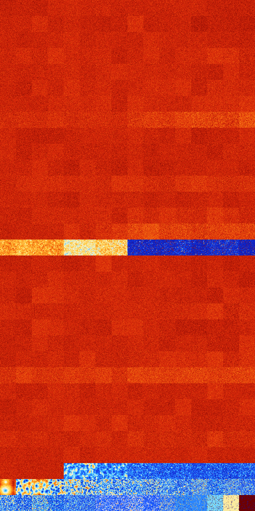

# B1467 (107520-108031)

<details>
    <summary>Initial Grid</summary>
    
</details>


<details>
    <summary>Initial Grid RLE</summary>

```
#C Exported from GoGoL (https://github.com/marrow16/gogol)
#C Wrap mode: Toroidal
#C Boundary mode: Dead
#C Step: 0
x = 100, y = 100, rule = B1467/S
31bo63bo$95bo$35bo23bo$16bo3bo19bo28bo19bo4bo$29bo15bo20bo$49bo4bo39bo$
7bo23b2o32bo6bo16bo$25bo$32bo11bo6bo3bo12bo$3bobo4bo13bo28bo7bo3bo8bo
13bo2bo7bo$10bo5bo10bobo20b2o3bo19bo$31bo47bo7bo5bo$20bob2o24bo2bo15bo
2bo3bo12b3o6bo$5bo30bo47bo$o6bo29bo3bo6bo34bo$4bo$4bo15b2o31bo19bo12bo
7b2o$12bobo18bo29bo22bo$3bo3bo4bo7bo2bo22bo7bo35b2o2bo2bo$26bo6bo11bo2b
o14bo16bo$23bo24bo20bo$11bo2bo10bo11bo18bo3bo22bo$bo18bo$o14bo5bo25bo
20bo$18bo11bobo3bo$12bo18bo32bo18bo$4b2o23bo48bo13bo6bo$o23bo61bo$4bo
11bo21bo$60bo$12bo10b2o36bo$27bo16bo12bo$12bo11bo12bo21bo16bo$9bo8bo21b
o$3bo18bo20b2o10bo25bo$11bo25bo43bo$19bo4bo22bo8bo3bo3bo32bo$o81bo$5bo
25bo19bo37bo$57bo2bo11bo$3bo2bo22bo8bo13bo3bo21bo12bo$17bo33bo17bo$32bo
11bo4bo6bo$14bo7bobo2bo2bo11bo11bobo24bo$4bo29bo19bo18b2o2bo$33bo4bo31b
o27bo$14bo13bo2bo23bo$12bo31bo$21bo29bobo6bo27bo$obo5bo4bo8bo11bo10b2o
36bo$83bo12bo$96b2o$10bo46bo7bo16bo11bo$3bo10bo25bo12bo7bo22bo$10bo20bo
13bo33bo6bo7bo$17bo3bo8bo25bo$bo27bo5bo15bo29b2obo6bo3bo$2bo48bo10bo11b
o3bo13bo$51bo19bo$2bo9bo13bo30bo30bo3bo2bo$3bo37bo2bo19bo3bo28bo$4bo7bo
12bo13bo42bo4bo$12bo31bo19bo5bo11b2o8bo2bo$4bo62bobo$8bo14bo2bo13b2o3bo
8bo2bo36bo$19bo11bo14bo5bo19bo20bo$32b2o10bo7b2o12bo2bo$8bo16bo10bo4bo
6bo10bo11bo7bo2bo3bo$2bo9bo34bo6bo28bo$24bo14bo12bo$36bo13bo7bo5bo17bo
2bo5bo$63bo6bo11bo13bo$7bo3bo49bo$56bo19bo$37bo2bo4bo4bo3bo$9bo11bo8bo$
16bo3bo9bo19bo5bo2bob2o3bo2bo6bo$4bo12bo24bo19bo7bo18bo$6bo12bo5bo59bo
4bo4bo$7bo5bo2bo41bo14bo6b2o3bo$6bo2bo35bo$o30bo5bo20bo4bo24bo$17bo29bo
11bo33bo$25bo7bo9bo15bo$23bo32bo3bo5bo29bo$bo22bo47bo$2o14bo9bo5bo24bo
2bo11b2o9bo7bo$10bo38b2o8bo14bo13bo$30bo13bo5bo21b2o24bo$49bo34bo$10bo
5bo42bo19bo15bo$2bo29bo7bo19bo$o30bo20bo5bo14bo16bo$9bo$2bobo47bo4b2o
10bo17bo$22b2o23bo5b2o2bo13bo$83bo$bo36b2o34bo$9bo33b2o$25bo29b2o!
```
</details>
<details>
    <summary>Thumbnail</summary>

</details>
<table>
<tr>
    <td><a href="./107520%20S%20Heat%20Map%20Activity.png"></a><br>S (107520)<br>G>1000</td>    <td><a href="./107521%20S0%20Heat%20Map%20Activity.png"></a><br>S0 (107521)<br>G>1000</td>    <td><a href="./107522%20S1%20Heat%20Map%20Activity.png"></a><br>S1 (107522)<br>G>1000</td>    <td><a href="./107523%20S01%20Heat%20Map%20Activity.png"></a><br>S01 (107523)<br>G>1000</td>    <td><a href="./107524%20S2%20Heat%20Map%20Activity.png"></a><br>S2 (107524)<br>G>1000</td>    <td><a href="./107525%20S02%20Heat%20Map%20Activity.png"></a><br>S02 (107525)<br>G>1000</td>    <td><a href="./107526%20S12%20Heat%20Map%20Activity.png"></a><br>S12 (107526)<br>G>1000</td>    <td><a href="./107527%20S012%20Heat%20Map%20Activity.png"></a><br>S012 (107527)<br>G>1000</td>    <td><a href="./107528%20S3%20Heat%20Map%20Activity.png"></a><br>S3 (107528)<br>G>1000</td>    <td><a href="./107529%20S03%20Heat%20Map%20Activity.png"></a><br>S03 (107529)<br>G>1000</td>    <td><a href="./107530%20S13%20Heat%20Map%20Activity.png"></a><br>S13 (107530)<br>G>1000</td>    <td><a href="./107531%20S013%20Heat%20Map%20Activity.png"></a><br>S013 (107531)<br>G>1000</td>    <td><a href="./107532%20S23%20Heat%20Map%20Activity.png"></a><br>S23 (107532)<br>G>1000</td>    <td><a href="./107533%20S023%20Heat%20Map%20Activity.png"></a><br>S023 (107533)<br>G>1000</td>    <td><a href="./107534%20S123%20Heat%20Map%20Activity.png"></a><br>S123 (107534)<br>G>1000</td>    <td><a href="./107535%20S0123%20Heat%20Map%20Activity.png"></a><br>S0123 (107535)<br>G>1000</td></tr>
<tr>
    <td><a href="./107536%20S4%20Heat%20Map%20Activity.png"></a><br>S4 (107536)<br>G>1000</td>    <td><a href="./107537%20S04%20Heat%20Map%20Activity.png"></a><br>S04 (107537)<br>G>1000</td>    <td><a href="./107538%20S14%20Heat%20Map%20Activity.png"></a><br>S14 (107538)<br>G>1000</td>    <td><a href="./107539%20S014%20Heat%20Map%20Activity.png"></a><br>S014 (107539)<br>G>1000</td>    <td><a href="./107540%20S24%20Heat%20Map%20Activity.png"></a><br>S24 (107540)<br>G>1000</td>    <td><a href="./107541%20S024%20Heat%20Map%20Activity.png"></a><br>S024 (107541)<br>G>1000</td>    <td><a href="./107542%20S124%20Heat%20Map%20Activity.png"></a><br>S124 (107542)<br>G>1000</td>    <td><a href="./107543%20S0124%20Heat%20Map%20Activity.png"></a><br>S0124 (107543)<br>G>1000</td>    <td><a href="./107544%20S34%20Heat%20Map%20Activity.png"></a><br>S34 (107544)<br>G>1000</td>    <td><a href="./107545%20S034%20Heat%20Map%20Activity.png"></a><br>S034 (107545)<br>G>1000</td>    <td><a href="./107546%20S134%20Heat%20Map%20Activity.png"></a><br>S134 (107546)<br>G>1000</td>    <td><a href="./107547%20S0134%20Heat%20Map%20Activity.png"></a><br>S0134 (107547)<br>G>1000</td>    <td><a href="./107548%20S234%20Heat%20Map%20Activity.png"></a><br>S234 (107548)<br>G>1000</td>    <td><a href="./107549%20S0234%20Heat%20Map%20Activity.png"></a><br>S0234 (107549)<br>G>1000</td>    <td><a href="./107550%20S1234%20Heat%20Map%20Activity.png"></a><br>S1234 (107550)<br>G>1000</td>    <td><a href="./107551%20S01234%20Heat%20Map%20Activity.png"></a><br>S01234 (107551)<br>G>1000</td></tr>
<tr>
    <td><a href="./107552%20S5%20Heat%20Map%20Activity.png"></a><br>S5 (107552)<br>G>1000</td>    <td><a href="./107553%20S05%20Heat%20Map%20Activity.png"></a><br>S05 (107553)<br>G>1000</td>    <td><a href="./107554%20S15%20Heat%20Map%20Activity.png"></a><br>S15 (107554)<br>G>1000</td>    <td><a href="./107555%20S015%20Heat%20Map%20Activity.png"></a><br>S015 (107555)<br>G>1000</td>    <td><a href="./107556%20S25%20Heat%20Map%20Activity.png"></a><br>S25 (107556)<br>G>1000</td>    <td><a href="./107557%20S025%20Heat%20Map%20Activity.png"></a><br>S025 (107557)<br>G>1000</td>    <td><a href="./107558%20S125%20Heat%20Map%20Activity.png"></a><br>S125 (107558)<br>G>1000</td>    <td><a href="./107559%20S0125%20Heat%20Map%20Activity.png"></a><br>S0125 (107559)<br>G>1000</td>    <td><a href="./107560%20S35%20Heat%20Map%20Activity.png"></a><br>S35 (107560)<br>G>1000</td>    <td><a href="./107561%20S035%20Heat%20Map%20Activity.png"></a><br>S035 (107561)<br>G>1000</td>    <td><a href="./107562%20S135%20Heat%20Map%20Activity.png"></a><br>S135 (107562)<br>G>1000</td>    <td><a href="./107563%20S0135%20Heat%20Map%20Activity.png"></a><br>S0135 (107563)<br>G>1000</td>    <td><a href="./107564%20S235%20Heat%20Map%20Activity.png"></a><br>S235 (107564)<br>G>1000</td>    <td><a href="./107565%20S0235%20Heat%20Map%20Activity.png"></a><br>S0235 (107565)<br>G>1000</td>    <td><a href="./107566%20S1235%20Heat%20Map%20Activity.png"></a><br>S1235 (107566)<br>G>1000</td>    <td><a href="./107567%20S01235%20Heat%20Map%20Activity.png"></a><br>S01235 (107567)<br>G>1000</td></tr>
<tr>
    <td><a href="./107568%20S45%20Heat%20Map%20Activity.png"></a><br>S45 (107568)<br>G>1000</td>    <td><a href="./107569%20S045%20Heat%20Map%20Activity.png"></a><br>S045 (107569)<br>G>1000</td>    <td><a href="./107570%20S145%20Heat%20Map%20Activity.png"></a><br>S145 (107570)<br>G>1000</td>    <td><a href="./107571%20S0145%20Heat%20Map%20Activity.png"></a><br>S0145 (107571)<br>G>1000</td>    <td><a href="./107572%20S245%20Heat%20Map%20Activity.png"></a><br>S245 (107572)<br>G>1000</td>    <td><a href="./107573%20S0245%20Heat%20Map%20Activity.png"></a><br>S0245 (107573)<br>G>1000</td>    <td><a href="./107574%20S1245%20Heat%20Map%20Activity.png"></a><br>S1245 (107574)<br>G>1000</td>    <td><a href="./107575%20S01245%20Heat%20Map%20Activity.png"></a><br>S01245 (107575)<br>G>1000</td>    <td><a href="./107576%20S345%20Heat%20Map%20Activity.png"></a><br>S345 (107576)<br>G>1000</td>    <td><a href="./107577%20S0345%20Heat%20Map%20Activity.png"></a><br>S0345 (107577)<br>G>1000</td>    <td><a href="./107578%20S1345%20Heat%20Map%20Activity.png"></a><br>S1345 (107578)<br>G>1000</td>    <td><a href="./107579%20S01345%20Heat%20Map%20Activity.png"></a><br>S01345 (107579)<br>G>1000</td>    <td><a href="./107580%20S2345%20Heat%20Map%20Activity.png"></a><br>S2345 (107580)<br>G>1000</td>    <td><a href="./107581%20S02345%20Heat%20Map%20Activity.png"></a><br>S02345 (107581)<br>G>1000</td>    <td><a href="./107582%20S12345%20Heat%20Map%20Activity.png"></a><br>S12345 (107582)<br>G>1000</td>    <td><a href="./107583%20S012345%20Heat%20Map%20Activity.png"></a><br>S012345 (107583)<br>G>1000</td></tr>
<tr>
    <td><a href="./107584%20S6%20Heat%20Map%20Activity.png"></a><br>S6 (107584)<br>G>1000</td>    <td><a href="./107585%20S06%20Heat%20Map%20Activity.png"></a><br>S06 (107585)<br>G>1000</td>    <td><a href="./107586%20S16%20Heat%20Map%20Activity.png"></a><br>S16 (107586)<br>G>1000</td>    <td><a href="./107587%20S016%20Heat%20Map%20Activity.png"></a><br>S016 (107587)<br>G>1000</td>    <td><a href="./107588%20S26%20Heat%20Map%20Activity.png"></a><br>S26 (107588)<br>G>1000</td>    <td><a href="./107589%20S026%20Heat%20Map%20Activity.png"></a><br>S026 (107589)<br>G>1000</td>    <td><a href="./107590%20S126%20Heat%20Map%20Activity.png"></a><br>S126 (107590)<br>G>1000</td>    <td><a href="./107591%20S0126%20Heat%20Map%20Activity.png"></a><br>S0126 (107591)<br>G>1000</td>    <td><a href="./107592%20S36%20Heat%20Map%20Activity.png"></a><br>S36 (107592)<br>G>1000</td>    <td><a href="./107593%20S036%20Heat%20Map%20Activity.png"></a><br>S036 (107593)<br>G>1000</td>    <td><a href="./107594%20S136%20Heat%20Map%20Activity.png"></a><br>S136 (107594)<br>G>1000</td>    <td><a href="./107595%20S0136%20Heat%20Map%20Activity.png"></a><br>S0136 (107595)<br>G>1000</td>    <td><a href="./107596%20S236%20Heat%20Map%20Activity.png"></a><br>S236 (107596)<br>G>1000</td>    <td><a href="./107597%20S0236%20Heat%20Map%20Activity.png"></a><br>S0236 (107597)<br>G>1000</td>    <td><a href="./107598%20S1236%20Heat%20Map%20Activity.png"></a><br>S1236 (107598)<br>G>1000</td>    <td><a href="./107599%20S01236%20Heat%20Map%20Activity.png"></a><br>S01236 (107599)<br>G>1000</td></tr>
<tr>
    <td><a href="./107600%20S46%20Heat%20Map%20Activity.png"></a><br>S46 (107600)<br>G>1000</td>    <td><a href="./107601%20S046%20Heat%20Map%20Activity.png"></a><br>S046 (107601)<br>G>1000</td>    <td><a href="./107602%20S146%20Heat%20Map%20Activity.png"></a><br>S146 (107602)<br>G>1000</td>    <td><a href="./107603%20S0146%20Heat%20Map%20Activity.png"></a><br>S0146 (107603)<br>G>1000</td>    <td><a href="./107604%20S246%20Heat%20Map%20Activity.png"></a><br>S246 (107604)<br>G>1000</td>    <td><a href="./107605%20S0246%20Heat%20Map%20Activity.png"></a><br>S0246 (107605)<br>G>1000</td>    <td><a href="./107606%20S1246%20Heat%20Map%20Activity.png"></a><br>S1246 (107606)<br>G>1000</td>    <td><a href="./107607%20S01246%20Heat%20Map%20Activity.png"></a><br>S01246 (107607)<br>G>1000</td>    <td><a href="./107608%20S346%20Heat%20Map%20Activity.png"></a><br>S346 (107608)<br>G>1000</td>    <td><a href="./107609%20S0346%20Heat%20Map%20Activity.png"></a><br>S0346 (107609)<br>G>1000</td>    <td><a href="./107610%20S1346%20Heat%20Map%20Activity.png"></a><br>S1346 (107610)<br>G>1000</td>    <td><a href="./107611%20S01346%20Heat%20Map%20Activity.png"></a><br>S01346 (107611)<br>G>1000</td>    <td><a href="./107612%20S2346%20Heat%20Map%20Activity.png"></a><br>S2346 (107612)<br>G>1000</td>    <td><a href="./107613%20S02346%20Heat%20Map%20Activity.png"></a><br>S02346 (107613)<br>G>1000</td>    <td><a href="./107614%20S12346%20Heat%20Map%20Activity.png"></a><br>S12346 (107614)<br>G>1000</td>    <td><a href="./107615%20S012346%20Heat%20Map%20Activity.png"></a><br>S012346 (107615)<br>G>1000</td></tr>
<tr>
    <td><a href="./107616%20S56%20Heat%20Map%20Activity.png"></a><br>S56 (107616)<br>G>1000</td>    <td><a href="./107617%20S056%20Heat%20Map%20Activity.png"></a><br>S056 (107617)<br>G>1000</td>    <td><a href="./107618%20S156%20Heat%20Map%20Activity.png"></a><br>S156 (107618)<br>G>1000</td>    <td><a href="./107619%20S0156%20Heat%20Map%20Activity.png"></a><br>S0156 (107619)<br>G>1000</td>    <td><a href="./107620%20S256%20Heat%20Map%20Activity.png"></a><br>S256 (107620)<br>G>1000</td>    <td><a href="./107621%20S0256%20Heat%20Map%20Activity.png"></a><br>S0256 (107621)<br>G>1000</td>    <td><a href="./107622%20S1256%20Heat%20Map%20Activity.png"></a><br>S1256 (107622)<br>G>1000</td>    <td><a href="./107623%20S01256%20Heat%20Map%20Activity.png"></a><br>S01256 (107623)<br>G>1000</td>    <td><a href="./107624%20S356%20Heat%20Map%20Activity.png"></a><br>S356 (107624)<br>G>1000</td>    <td><a href="./107625%20S0356%20Heat%20Map%20Activity.png"></a><br>S0356 (107625)<br>G>1000</td>    <td><a href="./107626%20S1356%20Heat%20Map%20Activity.png"></a><br>S1356 (107626)<br>G>1000</td>    <td><a href="./107627%20S01356%20Heat%20Map%20Activity.png"></a><br>S01356 (107627)<br>G>1000</td>    <td><a href="./107628%20S2356%20Heat%20Map%20Activity.png"></a><br>S2356 (107628)<br>G>1000</td>    <td><a href="./107629%20S02356%20Heat%20Map%20Activity.png"></a><br>S02356 (107629)<br>G>1000</td>    <td><a href="./107630%20S12356%20Heat%20Map%20Activity.png"></a><br>S12356 (107630)<br>G>1000</td>    <td><a href="./107631%20S012356%20Heat%20Map%20Activity.png"></a><br>S012356 (107631)<br>G>1000</td></tr>
<tr>
    <td><a href="./107632%20S456%20Heat%20Map%20Activity.png"></a><br>S456 (107632)<br>G>1000</td>    <td><a href="./107633%20S0456%20Heat%20Map%20Activity.png"></a><br>S0456 (107633)<br>G>1000</td>    <td><a href="./107634%20S1456%20Heat%20Map%20Activity.png"></a><br>S1456 (107634)<br>G>1000</td>    <td><a href="./107635%20S01456%20Heat%20Map%20Activity.png"></a><br>S01456 (107635)<br>G>1000</td>    <td><a href="./107636%20S2456%20Heat%20Map%20Activity.png"></a><br>S2456 (107636)<br>G>1000</td>    <td><a href="./107637%20S02456%20Heat%20Map%20Activity.png"></a><br>S02456 (107637)<br>G>1000</td>    <td><a href="./107638%20S12456%20Heat%20Map%20Activity.png"></a><br>S12456 (107638)<br>G>1000</td>    <td><a href="./107639%20S012456%20Heat%20Map%20Activity.png"></a><br>S012456 (107639)<br>G>1000</td>    <td><a href="./107640%20S3456%20Heat%20Map%20Activity.png"></a><br>S3456 (107640)<br>G>1000</td>    <td><a href="./107641%20S03456%20Heat%20Map%20Activity.png"></a><br>S03456 (107641)<br>G>1000</td>    <td><a href="./107642%20S13456%20Heat%20Map%20Activity.png"></a><br>S13456 (107642)<br>G>1000</td>    <td><a href="./107643%20S013456%20Heat%20Map%20Activity.png"></a><br>S013456 (107643)<br>G>1000</td>    <td><a href="./107644%20S23456%20Heat%20Map%20Activity.png"></a><br>S23456 (107644)<br>G>1000</td>    <td><a href="./107645%20S023456%20Heat%20Map%20Activity.png"></a><br>S023456 (107645)<br>G>1000</td>    <td><a href="./107646%20S123456%20Heat%20Map%20Activity.png"></a><br>S123456 (107646)<br>G>1000</td>    <td><a href="./107647%20S0123456%20Heat%20Map%20Activity.png"></a><br>S0123456 (107647)<br>G>1000</td></tr>
<tr>
    <td><a href="./107648%20S7%20Heat%20Map%20Activity.png"></a><br>S7 (107648)<br>G>1000</td>    <td><a href="./107649%20S07%20Heat%20Map%20Activity.png"></a><br>S07 (107649)<br>G>1000</td>    <td><a href="./107650%20S17%20Heat%20Map%20Activity.png"></a><br>S17 (107650)<br>G>1000</td>    <td><a href="./107651%20S017%20Heat%20Map%20Activity.png"></a><br>S017 (107651)<br>G>1000</td>    <td><a href="./107652%20S27%20Heat%20Map%20Activity.png"></a><br>S27 (107652)<br>G>1000</td>    <td><a href="./107653%20S027%20Heat%20Map%20Activity.png"></a><br>S027 (107653)<br>G>1000</td>    <td><a href="./107654%20S127%20Heat%20Map%20Activity.png"></a><br>S127 (107654)<br>G>1000</td>    <td><a href="./107655%20S0127%20Heat%20Map%20Activity.png"></a><br>S0127 (107655)<br>G>1000</td>    <td><a href="./107656%20S37%20Heat%20Map%20Activity.png"></a><br>S37 (107656)<br>G>1000</td>    <td><a href="./107657%20S037%20Heat%20Map%20Activity.png"></a><br>S037 (107657)<br>G>1000</td>    <td><a href="./107658%20S137%20Heat%20Map%20Activity.png"></a><br>S137 (107658)<br>G>1000</td>    <td><a href="./107659%20S0137%20Heat%20Map%20Activity.png"></a><br>S0137 (107659)<br>G>1000</td>    <td><a href="./107660%20S237%20Heat%20Map%20Activity.png"></a><br>S237 (107660)<br>G>1000</td>    <td><a href="./107661%20S0237%20Heat%20Map%20Activity.png"></a><br>S0237 (107661)<br>G>1000</td>    <td><a href="./107662%20S1237%20Heat%20Map%20Activity.png"></a><br>S1237 (107662)<br>G>1000</td>    <td><a href="./107663%20S01237%20Heat%20Map%20Activity.png"></a><br>S01237 (107663)<br>G>1000</td></tr>
<tr>
    <td><a href="./107664%20S47%20Heat%20Map%20Activity.png"></a><br>S47 (107664)<br>G>1000</td>    <td><a href="./107665%20S047%20Heat%20Map%20Activity.png"></a><br>S047 (107665)<br>G>1000</td>    <td><a href="./107666%20S147%20Heat%20Map%20Activity.png"></a><br>S147 (107666)<br>G>1000</td>    <td><a href="./107667%20S0147%20Heat%20Map%20Activity.png"></a><br>S0147 (107667)<br>G>1000</td>    <td><a href="./107668%20S247%20Heat%20Map%20Activity.png"></a><br>S247 (107668)<br>G>1000</td>    <td><a href="./107669%20S0247%20Heat%20Map%20Activity.png"></a><br>S0247 (107669)<br>G>1000</td>    <td><a href="./107670%20S1247%20Heat%20Map%20Activity.png"></a><br>S1247 (107670)<br>G>1000</td>    <td><a href="./107671%20S01247%20Heat%20Map%20Activity.png"></a><br>S01247 (107671)<br>G>1000</td>    <td><a href="./107672%20S347%20Heat%20Map%20Activity.png"></a><br>S347 (107672)<br>G>1000</td>    <td><a href="./107673%20S0347%20Heat%20Map%20Activity.png"></a><br>S0347 (107673)<br>G>1000</td>    <td><a href="./107674%20S1347%20Heat%20Map%20Activity.png"></a><br>S1347 (107674)<br>G>1000</td>    <td><a href="./107675%20S01347%20Heat%20Map%20Activity.png"></a><br>S01347 (107675)<br>G>1000</td>    <td><a href="./107676%20S2347%20Heat%20Map%20Activity.png"></a><br>S2347 (107676)<br>G>1000</td>    <td><a href="./107677%20S02347%20Heat%20Map%20Activity.png"></a><br>S02347 (107677)<br>G>1000</td>    <td><a href="./107678%20S12347%20Heat%20Map%20Activity.png"></a><br>S12347 (107678)<br>G>1000</td>    <td><a href="./107679%20S012347%20Heat%20Map%20Activity.png"></a><br>S012347 (107679)<br>G>1000</td></tr>
<tr>
    <td><a href="./107680%20S57%20Heat%20Map%20Activity.png"></a><br>S57 (107680)<br>G>1000</td>    <td><a href="./107681%20S057%20Heat%20Map%20Activity.png"></a><br>S057 (107681)<br>G>1000</td>    <td><a href="./107682%20S157%20Heat%20Map%20Activity.png"></a><br>S157 (107682)<br>G>1000</td>    <td><a href="./107683%20S0157%20Heat%20Map%20Activity.png"></a><br>S0157 (107683)<br>G>1000</td>    <td><a href="./107684%20S257%20Heat%20Map%20Activity.png"></a><br>S257 (107684)<br>G>1000</td>    <td><a href="./107685%20S0257%20Heat%20Map%20Activity.png"></a><br>S0257 (107685)<br>G>1000</td>    <td><a href="./107686%20S1257%20Heat%20Map%20Activity.png"></a><br>S1257 (107686)<br>G>1000</td>    <td><a href="./107687%20S01257%20Heat%20Map%20Activity.png"></a><br>S01257 (107687)<br>G>1000</td>    <td><a href="./107688%20S357%20Heat%20Map%20Activity.png"></a><br>S357 (107688)<br>G>1000</td>    <td><a href="./107689%20S0357%20Heat%20Map%20Activity.png"></a><br>S0357 (107689)<br>G>1000</td>    <td><a href="./107690%20S1357%20Heat%20Map%20Activity.png"></a><br>S1357 (107690)<br>G>1000</td>    <td><a href="./107691%20S01357%20Heat%20Map%20Activity.png"></a><br>S01357 (107691)<br>G>1000</td>    <td><a href="./107692%20S2357%20Heat%20Map%20Activity.png"></a><br>S2357 (107692)<br>G>1000</td>    <td><a href="./107693%20S02357%20Heat%20Map%20Activity.png"></a><br>S02357 (107693)<br>G>1000</td>    <td><a href="./107694%20S12357%20Heat%20Map%20Activity.png"></a><br>S12357 (107694)<br>G>1000</td>    <td><a href="./107695%20S012357%20Heat%20Map%20Activity.png"></a><br>S012357 (107695)<br>G>1000</td></tr>
<tr>
    <td><a href="./107696%20S457%20Heat%20Map%20Activity.png"></a><br>S457 (107696)<br>G>1000</td>    <td><a href="./107697%20S0457%20Heat%20Map%20Activity.png"></a><br>S0457 (107697)<br>G>1000</td>    <td><a href="./107698%20S1457%20Heat%20Map%20Activity.png"></a><br>S1457 (107698)<br>G>1000</td>    <td><a href="./107699%20S01457%20Heat%20Map%20Activity.png"></a><br>S01457 (107699)<br>G>1000</td>    <td><a href="./107700%20S2457%20Heat%20Map%20Activity.png"></a><br>S2457 (107700)<br>G>1000</td>    <td><a href="./107701%20S02457%20Heat%20Map%20Activity.png"></a><br>S02457 (107701)<br>G>1000</td>    <td><a href="./107702%20S12457%20Heat%20Map%20Activity.png"></a><br>S12457 (107702)<br>G>1000</td>    <td><a href="./107703%20S012457%20Heat%20Map%20Activity.png"></a><br>S012457 (107703)<br>G>1000</td>    <td><a href="./107704%20S3457%20Heat%20Map%20Activity.png"></a><br>S3457 (107704)<br>G>1000</td>    <td><a href="./107705%20S03457%20Heat%20Map%20Activity.png"></a><br>S03457 (107705)<br>G>1000</td>    <td><a href="./107706%20S13457%20Heat%20Map%20Activity.png"></a><br>S13457 (107706)<br>G>1000</td>    <td><a href="./107707%20S013457%20Heat%20Map%20Activity.png"></a><br>S013457 (107707)<br>G>1000</td>    <td><a href="./107708%20S23457%20Heat%20Map%20Activity.png"></a><br>S23457 (107708)<br>G>1000</td>    <td><a href="./107709%20S023457%20Heat%20Map%20Activity.png"></a><br>S023457 (107709)<br>G>1000</td>    <td><a href="./107710%20S123457%20Heat%20Map%20Activity.png"></a><br>S123457 (107710)<br>G>1000</td>    <td><a href="./107711%20S0123457%20Heat%20Map%20Activity.png"></a><br>S0123457 (107711)<br>G>1000</td></tr>
<tr>
    <td><a href="./107712%20S67%20Heat%20Map%20Activity.png"></a><br>S67 (107712)<br>G>1000</td>    <td><a href="./107713%20S067%20Heat%20Map%20Activity.png"></a><br>S067 (107713)<br>G>1000</td>    <td><a href="./107714%20S167%20Heat%20Map%20Activity.png"></a><br>S167 (107714)<br>G>1000</td>    <td><a href="./107715%20S0167%20Heat%20Map%20Activity.png"></a><br>S0167 (107715)<br>G>1000</td>    <td><a href="./107716%20S267%20Heat%20Map%20Activity.png"></a><br>S267 (107716)<br>G>1000</td>    <td><a href="./107717%20S0267%20Heat%20Map%20Activity.png"></a><br>S0267 (107717)<br>G>1000</td>    <td><a href="./107718%20S1267%20Heat%20Map%20Activity.png"></a><br>S1267 (107718)<br>G>1000</td>    <td><a href="./107719%20S01267%20Heat%20Map%20Activity.png"></a><br>S01267 (107719)<br>G>1000</td>    <td><a href="./107720%20S367%20Heat%20Map%20Activity.png"></a><br>S367 (107720)<br>G>1000</td>    <td><a href="./107721%20S0367%20Heat%20Map%20Activity.png"></a><br>S0367 (107721)<br>G>1000</td>    <td><a href="./107722%20S1367%20Heat%20Map%20Activity.png"></a><br>S1367 (107722)<br>G>1000</td>    <td><a href="./107723%20S01367%20Heat%20Map%20Activity.png"></a><br>S01367 (107723)<br>G>1000</td>    <td><a href="./107724%20S2367%20Heat%20Map%20Activity.png"></a><br>S2367 (107724)<br>G>1000</td>    <td><a href="./107725%20S02367%20Heat%20Map%20Activity.png"></a><br>S02367 (107725)<br>G>1000</td>    <td><a href="./107726%20S12367%20Heat%20Map%20Activity.png"></a><br>S12367 (107726)<br>G>1000</td>    <td><a href="./107727%20S012367%20Heat%20Map%20Activity.png"></a><br>S012367 (107727)<br>G>1000</td></tr>
<tr>
    <td><a href="./107728%20S467%20Heat%20Map%20Activity.png"></a><br>S467 (107728)<br>G>1000</td>    <td><a href="./107729%20S0467%20Heat%20Map%20Activity.png"></a><br>S0467 (107729)<br>G>1000</td>    <td><a href="./107730%20S1467%20Heat%20Map%20Activity.png"></a><br>S1467 (107730)<br>G>1000</td>    <td><a href="./107731%20S01467%20Heat%20Map%20Activity.png"></a><br>S01467 (107731)<br>G>1000</td>    <td><a href="./107732%20S2467%20Heat%20Map%20Activity.png"></a><br>S2467 (107732)<br>G>1000</td>    <td><a href="./107733%20S02467%20Heat%20Map%20Activity.png"></a><br>S02467 (107733)<br>G>1000</td>    <td><a href="./107734%20S12467%20Heat%20Map%20Activity.png"></a><br>S12467 (107734)<br>G>1000</td>    <td><a href="./107735%20S012467%20Heat%20Map%20Activity.png"></a><br>S012467 (107735)<br>G>1000</td>    <td><a href="./107736%20S3467%20Heat%20Map%20Activity.png"></a><br>S3467 (107736)<br>G>1000</td>    <td><a href="./107737%20S03467%20Heat%20Map%20Activity.png"></a><br>S03467 (107737)<br>G>1000</td>    <td><a href="./107738%20S13467%20Heat%20Map%20Activity.png"></a><br>S13467 (107738)<br>G>1000</td>    <td><a href="./107739%20S013467%20Heat%20Map%20Activity.png"></a><br>S013467 (107739)<br>G>1000</td>    <td><a href="./107740%20S23467%20Heat%20Map%20Activity.png"></a><br>S23467 (107740)<br>G>1000</td>    <td><a href="./107741%20S023467%20Heat%20Map%20Activity.png"></a><br>S023467 (107741)<br>G>1000</td>    <td><a href="./107742%20S123467%20Heat%20Map%20Activity.png"></a><br>S123467 (107742)<br>G>1000</td>    <td><a href="./107743%20S0123467%20Heat%20Map%20Activity.png"></a><br>S0123467 (107743)<br>G>1000</td></tr>
<tr>
    <td><a href="./107744%20S567%20Heat%20Map%20Activity.png"></a><br>S567 (107744)<br>G>1000</td>    <td><a href="./107745%20S0567%20Heat%20Map%20Activity.png"></a><br>S0567 (107745)<br>G>1000</td>    <td><a href="./107746%20S1567%20Heat%20Map%20Activity.png"></a><br>S1567 (107746)<br>G>1000</td>    <td><a href="./107747%20S01567%20Heat%20Map%20Activity.png"></a><br>S01567 (107747)<br>G>1000</td>    <td><a href="./107748%20S2567%20Heat%20Map%20Activity.png"></a><br>S2567 (107748)<br>G>1000</td>    <td><a href="./107749%20S02567%20Heat%20Map%20Activity.png"></a><br>S02567 (107749)<br>G>1000</td>    <td><a href="./107750%20S12567%20Heat%20Map%20Activity.png"></a><br>S12567 (107750)<br>G>1000</td>    <td><a href="./107751%20S012567%20Heat%20Map%20Activity.png"></a><br>S012567 (107751)<br>G>1000</td>    <td><a href="./107752%20S3567%20Heat%20Map%20Activity.png"></a><br>S3567 (107752)<br>G>1000</td>    <td><a href="./107753%20S03567%20Heat%20Map%20Activity.png"></a><br>S03567 (107753)<br>G>1000</td>    <td><a href="./107754%20S13567%20Heat%20Map%20Activity.png"></a><br>S13567 (107754)<br>G>1000</td>    <td><a href="./107755%20S013567%20Heat%20Map%20Activity.png"></a><br>S013567 (107755)<br>G>1000</td>    <td><a href="./107756%20S23567%20Heat%20Map%20Activity.png"></a><br>S23567 (107756)<br>G>1000</td>    <td><a href="./107757%20S023567%20Heat%20Map%20Activity.png"></a><br>S023567 (107757)<br>G>1000</td>    <td><a href="./107758%20S123567%20Heat%20Map%20Activity.png"></a><br>S123567 (107758)<br>G>1000</td>    <td><a href="./107759%20S0123567%20Heat%20Map%20Activity.png"></a><br>S0123567 (107759)<br>G>1000</td></tr>
<tr>
    <td><a href="./107760%20S4567%20Heat%20Map%20Activity.png"></a><br>S4567 (107760)<br>G>1000</td>    <td><a href="./107761%20S04567%20Heat%20Map%20Activity.png"></a><br>S04567 (107761)<br>G>1000</td>    <td><a href="./107762%20S14567%20Heat%20Map%20Activity.png"></a><br>S14567 (107762)<br>G>1000</td>    <td><a href="./107763%20S014567%20Heat%20Map%20Activity.png"></a><br>S014567 (107763)<br>G>1000</td>    <td><a href="./107764%20S24567%20Heat%20Map%20Activity.png"></a><br>S24567 (107764)<br>G>1000</td>    <td><a href="./107765%20S024567%20Heat%20Map%20Activity.png"></a><br>S024567 (107765)<br>G>1000</td>    <td><a href="./107766%20S124567%20Heat%20Map%20Activity.png"></a><br>S124567 (107766)<br>G>1000</td>    <td><a href="./107767%20S0124567%20Heat%20Map%20Activity.png"></a><br>S0124567 (107767)<br>G>1000</td>    <td><a href="./107768%20S34567%20Heat%20Map%20Activity.png"></a><br>S34567 (107768)<br>R@112,p60</td>    <td><a href="./107769%20S034567%20Heat%20Map%20Activity.png"></a><br>S034567 (107769)<br>R@111,p60</td>    <td><a href="./107770%20S134567%20Heat%20Map%20Activity.png"></a><br>S134567 (107770)<br>R@126,p60</td>    <td><a href="./107771%20S0134567%20Heat%20Map%20Activity.png"></a><br>S0134567 (107771)<br>R@65,p12</td>    <td><a href="./107772%20S234567%20Heat%20Map%20Activity.png"></a><br>S234567 (107772)<br>R@93,p60</td>    <td><a href="./107773%20S0234567%20Heat%20Map%20Activity.png"></a><br>S0234567 (107773)<br>R@53,p24</td>    <td><a href="./107774%20S1234567%20Heat%20Map%20Activity.png"></a><br>S1234567 (107774)<br>R@42,p12</td>    <td><a href="./107775%20S01234567%20Heat%20Map%20Activity.png"></a><br>S01234567 (107775)<br>R@91,p60</td></tr>
<tr>
    <td><a href="./107776%20S8%20Heat%20Map%20Activity.png"></a><br>S8 (107776)<br>G>1000</td>    <td><a href="./107777%20S08%20Heat%20Map%20Activity.png"></a><br>S08 (107777)<br>G>1000</td>    <td><a href="./107778%20S18%20Heat%20Map%20Activity.png"></a><br>S18 (107778)<br>G>1000</td>    <td><a href="./107779%20S018%20Heat%20Map%20Activity.png"></a><br>S018 (107779)<br>G>1000</td>    <td><a href="./107780%20S28%20Heat%20Map%20Activity.png"></a><br>S28 (107780)<br>G>1000</td>    <td><a href="./107781%20S028%20Heat%20Map%20Activity.png"></a><br>S028 (107781)<br>G>1000</td>    <td><a href="./107782%20S128%20Heat%20Map%20Activity.png"></a><br>S128 (107782)<br>G>1000</td>    <td><a href="./107783%20S0128%20Heat%20Map%20Activity.png"></a><br>S0128 (107783)<br>G>1000</td>    <td><a href="./107784%20S38%20Heat%20Map%20Activity.png"></a><br>S38 (107784)<br>G>1000</td>    <td><a href="./107785%20S038%20Heat%20Map%20Activity.png"></a><br>S038 (107785)<br>G>1000</td>    <td><a href="./107786%20S138%20Heat%20Map%20Activity.png"></a><br>S138 (107786)<br>G>1000</td>    <td><a href="./107787%20S0138%20Heat%20Map%20Activity.png"></a><br>S0138 (107787)<br>G>1000</td>    <td><a href="./107788%20S238%20Heat%20Map%20Activity.png"></a><br>S238 (107788)<br>G>1000</td>    <td><a href="./107789%20S0238%20Heat%20Map%20Activity.png"></a><br>S0238 (107789)<br>G>1000</td>    <td><a href="./107790%20S1238%20Heat%20Map%20Activity.png"></a><br>S1238 (107790)<br>G>1000</td>    <td><a href="./107791%20S01238%20Heat%20Map%20Activity.png"></a><br>S01238 (107791)<br>G>1000</td></tr>
<tr>
    <td><a href="./107792%20S48%20Heat%20Map%20Activity.png"></a><br>S48 (107792)<br>G>1000</td>    <td><a href="./107793%20S048%20Heat%20Map%20Activity.png"></a><br>S048 (107793)<br>G>1000</td>    <td><a href="./107794%20S148%20Heat%20Map%20Activity.png"></a><br>S148 (107794)<br>G>1000</td>    <td><a href="./107795%20S0148%20Heat%20Map%20Activity.png"></a><br>S0148 (107795)<br>G>1000</td>    <td><a href="./107796%20S248%20Heat%20Map%20Activity.png"></a><br>S248 (107796)<br>G>1000</td>    <td><a href="./107797%20S0248%20Heat%20Map%20Activity.png"></a><br>S0248 (107797)<br>G>1000</td>    <td><a href="./107798%20S1248%20Heat%20Map%20Activity.png"></a><br>S1248 (107798)<br>G>1000</td>    <td><a href="./107799%20S01248%20Heat%20Map%20Activity.png"></a><br>S01248 (107799)<br>G>1000</td>    <td><a href="./107800%20S348%20Heat%20Map%20Activity.png"></a><br>S348 (107800)<br>G>1000</td>    <td><a href="./107801%20S0348%20Heat%20Map%20Activity.png"></a><br>S0348 (107801)<br>G>1000</td>    <td><a href="./107802%20S1348%20Heat%20Map%20Activity.png"></a><br>S1348 (107802)<br>G>1000</td>    <td><a href="./107803%20S01348%20Heat%20Map%20Activity.png"></a><br>S01348 (107803)<br>G>1000</td>    <td><a href="./107804%20S2348%20Heat%20Map%20Activity.png"></a><br>S2348 (107804)<br>G>1000</td>    <td><a href="./107805%20S02348%20Heat%20Map%20Activity.png"></a><br>S02348 (107805)<br>G>1000</td>    <td><a href="./107806%20S12348%20Heat%20Map%20Activity.png"></a><br>S12348 (107806)<br>G>1000</td>    <td><a href="./107807%20S012348%20Heat%20Map%20Activity.png"></a><br>S012348 (107807)<br>G>1000</td></tr>
<tr>
    <td><a href="./107808%20S58%20Heat%20Map%20Activity.png"></a><br>S58 (107808)<br>G>1000</td>    <td><a href="./107809%20S058%20Heat%20Map%20Activity.png"></a><br>S058 (107809)<br>G>1000</td>    <td><a href="./107810%20S158%20Heat%20Map%20Activity.png"></a><br>S158 (107810)<br>G>1000</td>    <td><a href="./107811%20S0158%20Heat%20Map%20Activity.png"></a><br>S0158 (107811)<br>G>1000</td>    <td><a href="./107812%20S258%20Heat%20Map%20Activity.png"></a><br>S258 (107812)<br>G>1000</td>    <td><a href="./107813%20S0258%20Heat%20Map%20Activity.png"></a><br>S0258 (107813)<br>G>1000</td>    <td><a href="./107814%20S1258%20Heat%20Map%20Activity.png"></a><br>S1258 (107814)<br>G>1000</td>    <td><a href="./107815%20S01258%20Heat%20Map%20Activity.png"></a><br>S01258 (107815)<br>G>1000</td>    <td><a href="./107816%20S358%20Heat%20Map%20Activity.png"></a><br>S358 (107816)<br>G>1000</td>    <td><a href="./107817%20S0358%20Heat%20Map%20Activity.png"></a><br>S0358 (107817)<br>G>1000</td>    <td><a href="./107818%20S1358%20Heat%20Map%20Activity.png"></a><br>S1358 (107818)<br>G>1000</td>    <td><a href="./107819%20S01358%20Heat%20Map%20Activity.png"></a><br>S01358 (107819)<br>G>1000</td>    <td><a href="./107820%20S2358%20Heat%20Map%20Activity.png"></a><br>S2358 (107820)<br>G>1000</td>    <td><a href="./107821%20S02358%20Heat%20Map%20Activity.png"></a><br>S02358 (107821)<br>G>1000</td>    <td><a href="./107822%20S12358%20Heat%20Map%20Activity.png"></a><br>S12358 (107822)<br>G>1000</td>    <td><a href="./107823%20S012358%20Heat%20Map%20Activity.png"></a><br>S012358 (107823)<br>G>1000</td></tr>
<tr>
    <td><a href="./107824%20S458%20Heat%20Map%20Activity.png"></a><br>S458 (107824)<br>G>1000</td>    <td><a href="./107825%20S0458%20Heat%20Map%20Activity.png"></a><br>S0458 (107825)<br>G>1000</td>    <td><a href="./107826%20S1458%20Heat%20Map%20Activity.png"></a><br>S1458 (107826)<br>G>1000</td>    <td><a href="./107827%20S01458%20Heat%20Map%20Activity.png"></a><br>S01458 (107827)<br>G>1000</td>    <td><a href="./107828%20S2458%20Heat%20Map%20Activity.png"></a><br>S2458 (107828)<br>G>1000</td>    <td><a href="./107829%20S02458%20Heat%20Map%20Activity.png"></a><br>S02458 (107829)<br>G>1000</td>    <td><a href="./107830%20S12458%20Heat%20Map%20Activity.png"></a><br>S12458 (107830)<br>G>1000</td>    <td><a href="./107831%20S012458%20Heat%20Map%20Activity.png"></a><br>S012458 (107831)<br>G>1000</td>    <td><a href="./107832%20S3458%20Heat%20Map%20Activity.png"></a><br>S3458 (107832)<br>G>1000</td>    <td><a href="./107833%20S03458%20Heat%20Map%20Activity.png"></a><br>S03458 (107833)<br>G>1000</td>    <td><a href="./107834%20S13458%20Heat%20Map%20Activity.png"></a><br>S13458 (107834)<br>G>1000</td>    <td><a href="./107835%20S013458%20Heat%20Map%20Activity.png"></a><br>S013458 (107835)<br>G>1000</td>    <td><a href="./107836%20S23458%20Heat%20Map%20Activity.png"></a><br>S23458 (107836)<br>G>1000</td>    <td><a href="./107837%20S023458%20Heat%20Map%20Activity.png"></a><br>S023458 (107837)<br>G>1000</td>    <td><a href="./107838%20S123458%20Heat%20Map%20Activity.png"></a><br>S123458 (107838)<br>G>1000</td>    <td><a href="./107839%20S0123458%20Heat%20Map%20Activity.png"></a><br>S0123458 (107839)<br>G>1000</td></tr>
<tr>
    <td><a href="./107840%20S68%20Heat%20Map%20Activity.png"></a><br>S68 (107840)<br>G>1000</td>    <td><a href="./107841%20S068%20Heat%20Map%20Activity.png"></a><br>S068 (107841)<br>G>1000</td>    <td><a href="./107842%20S168%20Heat%20Map%20Activity.png"></a><br>S168 (107842)<br>G>1000</td>    <td><a href="./107843%20S0168%20Heat%20Map%20Activity.png"></a><br>S0168 (107843)<br>G>1000</td>    <td><a href="./107844%20S268%20Heat%20Map%20Activity.png"></a><br>S268 (107844)<br>G>1000</td>    <td><a href="./107845%20S0268%20Heat%20Map%20Activity.png"></a><br>S0268 (107845)<br>G>1000</td>    <td><a href="./107846%20S1268%20Heat%20Map%20Activity.png"></a><br>S1268 (107846)<br>G>1000</td>    <td><a href="./107847%20S01268%20Heat%20Map%20Activity.png"></a><br>S01268 (107847)<br>G>1000</td>    <td><a href="./107848%20S368%20Heat%20Map%20Activity.png"></a><br>S368 (107848)<br>G>1000</td>    <td><a href="./107849%20S0368%20Heat%20Map%20Activity.png"></a><br>S0368 (107849)<br>G>1000</td>    <td><a href="./107850%20S1368%20Heat%20Map%20Activity.png"></a><br>S1368 (107850)<br>G>1000</td>    <td><a href="./107851%20S01368%20Heat%20Map%20Activity.png"></a><br>S01368 (107851)<br>G>1000</td>    <td><a href="./107852%20S2368%20Heat%20Map%20Activity.png"></a><br>S2368 (107852)<br>G>1000</td>    <td><a href="./107853%20S02368%20Heat%20Map%20Activity.png"></a><br>S02368 (107853)<br>G>1000</td>    <td><a href="./107854%20S12368%20Heat%20Map%20Activity.png"></a><br>S12368 (107854)<br>G>1000</td>    <td><a href="./107855%20S012368%20Heat%20Map%20Activity.png"></a><br>S012368 (107855)<br>G>1000</td></tr>
<tr>
    <td><a href="./107856%20S468%20Heat%20Map%20Activity.png"></a><br>S468 (107856)<br>G>1000</td>    <td><a href="./107857%20S0468%20Heat%20Map%20Activity.png"></a><br>S0468 (107857)<br>G>1000</td>    <td><a href="./107858%20S1468%20Heat%20Map%20Activity.png"></a><br>S1468 (107858)<br>G>1000</td>    <td><a href="./107859%20S01468%20Heat%20Map%20Activity.png"></a><br>S01468 (107859)<br>G>1000</td>    <td><a href="./107860%20S2468%20Heat%20Map%20Activity.png"></a><br>S2468 (107860)<br>G>1000</td>    <td><a href="./107861%20S02468%20Heat%20Map%20Activity.png"></a><br>S02468 (107861)<br>G>1000</td>    <td><a href="./107862%20S12468%20Heat%20Map%20Activity.png"></a><br>S12468 (107862)<br>G>1000</td>    <td><a href="./107863%20S012468%20Heat%20Map%20Activity.png"></a><br>S012468 (107863)<br>G>1000</td>    <td><a href="./107864%20S3468%20Heat%20Map%20Activity.png"></a><br>S3468 (107864)<br>G>1000</td>    <td><a href="./107865%20S03468%20Heat%20Map%20Activity.png"></a><br>S03468 (107865)<br>G>1000</td>    <td><a href="./107866%20S13468%20Heat%20Map%20Activity.png"></a><br>S13468 (107866)<br>G>1000</td>    <td><a href="./107867%20S013468%20Heat%20Map%20Activity.png"></a><br>S013468 (107867)<br>G>1000</td>    <td><a href="./107868%20S23468%20Heat%20Map%20Activity.png"></a><br>S23468 (107868)<br>G>1000</td>    <td><a href="./107869%20S023468%20Heat%20Map%20Activity.png"></a><br>S023468 (107869)<br>G>1000</td>    <td><a href="./107870%20S123468%20Heat%20Map%20Activity.png"></a><br>S123468 (107870)<br>G>1000</td>    <td><a href="./107871%20S0123468%20Heat%20Map%20Activity.png"></a><br>S0123468 (107871)<br>G>1000</td></tr>
<tr>
    <td><a href="./107872%20S568%20Heat%20Map%20Activity.png"></a><br>S568 (107872)<br>G>1000</td>    <td><a href="./107873%20S0568%20Heat%20Map%20Activity.png"></a><br>S0568 (107873)<br>G>1000</td>    <td><a href="./107874%20S1568%20Heat%20Map%20Activity.png"></a><br>S1568 (107874)<br>G>1000</td>    <td><a href="./107875%20S01568%20Heat%20Map%20Activity.png"></a><br>S01568 (107875)<br>G>1000</td>    <td><a href="./107876%20S2568%20Heat%20Map%20Activity.png"></a><br>S2568 (107876)<br>G>1000</td>    <td><a href="./107877%20S02568%20Heat%20Map%20Activity.png"></a><br>S02568 (107877)<br>G>1000</td>    <td><a href="./107878%20S12568%20Heat%20Map%20Activity.png"></a><br>S12568 (107878)<br>G>1000</td>    <td><a href="./107879%20S012568%20Heat%20Map%20Activity.png"></a><br>S012568 (107879)<br>G>1000</td>    <td><a href="./107880%20S3568%20Heat%20Map%20Activity.png"></a><br>S3568 (107880)<br>G>1000</td>    <td><a href="./107881%20S03568%20Heat%20Map%20Activity.png"></a><br>S03568 (107881)<br>G>1000</td>    <td><a href="./107882%20S13568%20Heat%20Map%20Activity.png"></a><br>S13568 (107882)<br>G>1000</td>    <td><a href="./107883%20S013568%20Heat%20Map%20Activity.png"></a><br>S013568 (107883)<br>G>1000</td>    <td><a href="./107884%20S23568%20Heat%20Map%20Activity.png"></a><br>S23568 (107884)<br>G>1000</td>    <td><a href="./107885%20S023568%20Heat%20Map%20Activity.png"></a><br>S023568 (107885)<br>G>1000</td>    <td><a href="./107886%20S123568%20Heat%20Map%20Activity.png"></a><br>S123568 (107886)<br>G>1000</td>    <td><a href="./107887%20S0123568%20Heat%20Map%20Activity.png"></a><br>S0123568 (107887)<br>G>1000</td></tr>
<tr>
    <td><a href="./107888%20S4568%20Heat%20Map%20Activity.png"></a><br>S4568 (107888)<br>G>1000</td>    <td><a href="./107889%20S04568%20Heat%20Map%20Activity.png"></a><br>S04568 (107889)<br>G>1000</td>    <td><a href="./107890%20S14568%20Heat%20Map%20Activity.png"></a><br>S14568 (107890)<br>G>1000</td>    <td><a href="./107891%20S014568%20Heat%20Map%20Activity.png"></a><br>S014568 (107891)<br>G>1000</td>    <td><a href="./107892%20S24568%20Heat%20Map%20Activity.png"></a><br>S24568 (107892)<br>G>1000</td>    <td><a href="./107893%20S024568%20Heat%20Map%20Activity.png"></a><br>S024568 (107893)<br>G>1000</td>    <td><a href="./107894%20S124568%20Heat%20Map%20Activity.png"></a><br>S124568 (107894)<br>G>1000</td>    <td><a href="./107895%20S0124568%20Heat%20Map%20Activity.png"></a><br>S0124568 (107895)<br>G>1000</td>    <td><a href="./107896%20S34568%20Heat%20Map%20Activity.png"></a><br>S34568 (107896)<br>G>1000</td>    <td><a href="./107897%20S034568%20Heat%20Map%20Activity.png"></a><br>S034568 (107897)<br>G>1000</td>    <td><a href="./107898%20S134568%20Heat%20Map%20Activity.png"></a><br>S134568 (107898)<br>G>1000</td>    <td><a href="./107899%20S0134568%20Heat%20Map%20Activity.png"></a><br>S0134568 (107899)<br>G>1000</td>    <td><a href="./107900%20S234568%20Heat%20Map%20Activity.png"></a><br>S234568 (107900)<br>G>1000</td>    <td><a href="./107901%20S0234568%20Heat%20Map%20Activity.png"></a><br>S0234568 (107901)<br>G>1000</td>    <td><a href="./107902%20S1234568%20Heat%20Map%20Activity.png"></a><br>S1234568 (107902)<br>G>1000</td>    <td><a href="./107903%20S01234568%20Heat%20Map%20Activity.png"></a><br>S01234568 (107903)<br>G>1000</td></tr>
<tr>
    <td><a href="./107904%20S78%20Heat%20Map%20Activity.png"></a><br>S78 (107904)<br>G>1000</td>    <td><a href="./107905%20S078%20Heat%20Map%20Activity.png"></a><br>S078 (107905)<br>G>1000</td>    <td><a href="./107906%20S178%20Heat%20Map%20Activity.png"></a><br>S178 (107906)<br>G>1000</td>    <td><a href="./107907%20S0178%20Heat%20Map%20Activity.png"></a><br>S0178 (107907)<br>G>1000</td>    <td><a href="./107908%20S278%20Heat%20Map%20Activity.png"></a><br>S278 (107908)<br>G>1000</td>    <td><a href="./107909%20S0278%20Heat%20Map%20Activity.png"></a><br>S0278 (107909)<br>G>1000</td>    <td><a href="./107910%20S1278%20Heat%20Map%20Activity.png"></a><br>S1278 (107910)<br>G>1000</td>    <td><a href="./107911%20S01278%20Heat%20Map%20Activity.png"></a><br>S01278 (107911)<br>G>1000</td>    <td><a href="./107912%20S378%20Heat%20Map%20Activity.png"></a><br>S378 (107912)<br>G>1000</td>    <td><a href="./107913%20S0378%20Heat%20Map%20Activity.png"></a><br>S0378 (107913)<br>G>1000</td>    <td><a href="./107914%20S1378%20Heat%20Map%20Activity.png"></a><br>S1378 (107914)<br>G>1000</td>    <td><a href="./107915%20S01378%20Heat%20Map%20Activity.png"></a><br>S01378 (107915)<br>G>1000</td>    <td><a href="./107916%20S2378%20Heat%20Map%20Activity.png"></a><br>S2378 (107916)<br>G>1000</td>    <td><a href="./107917%20S02378%20Heat%20Map%20Activity.png"></a><br>S02378 (107917)<br>G>1000</td>    <td><a href="./107918%20S12378%20Heat%20Map%20Activity.png"></a><br>S12378 (107918)<br>G>1000</td>    <td><a href="./107919%20S012378%20Heat%20Map%20Activity.png"></a><br>S012378 (107919)<br>G>1000</td></tr>
<tr>
    <td><a href="./107920%20S478%20Heat%20Map%20Activity.png"></a><br>S478 (107920)<br>G>1000</td>    <td><a href="./107921%20S0478%20Heat%20Map%20Activity.png"></a><br>S0478 (107921)<br>G>1000</td>    <td><a href="./107922%20S1478%20Heat%20Map%20Activity.png"></a><br>S1478 (107922)<br>G>1000</td>    <td><a href="./107923%20S01478%20Heat%20Map%20Activity.png"></a><br>S01478 (107923)<br>G>1000</td>    <td><a href="./107924%20S2478%20Heat%20Map%20Activity.png"></a><br>S2478 (107924)<br>G>1000</td>    <td><a href="./107925%20S02478%20Heat%20Map%20Activity.png"></a><br>S02478 (107925)<br>G>1000</td>    <td><a href="./107926%20S12478%20Heat%20Map%20Activity.png"></a><br>S12478 (107926)<br>G>1000</td>    <td><a href="./107927%20S012478%20Heat%20Map%20Activity.png"></a><br>S012478 (107927)<br>G>1000</td>    <td><a href="./107928%20S3478%20Heat%20Map%20Activity.png"></a><br>S3478 (107928)<br>G>1000</td>    <td><a href="./107929%20S03478%20Heat%20Map%20Activity.png"></a><br>S03478 (107929)<br>G>1000</td>    <td><a href="./107930%20S13478%20Heat%20Map%20Activity.png"></a><br>S13478 (107930)<br>G>1000</td>    <td><a href="./107931%20S013478%20Heat%20Map%20Activity.png"></a><br>S013478 (107931)<br>G>1000</td>    <td><a href="./107932%20S23478%20Heat%20Map%20Activity.png"></a><br>S23478 (107932)<br>G>1000</td>    <td><a href="./107933%20S023478%20Heat%20Map%20Activity.png"></a><br>S023478 (107933)<br>G>1000</td>    <td><a href="./107934%20S123478%20Heat%20Map%20Activity.png"></a><br>S123478 (107934)<br>G>1000</td>    <td><a href="./107935%20S0123478%20Heat%20Map%20Activity.png"></a><br>S0123478 (107935)<br>G>1000</td></tr>
<tr>
    <td><a href="./107936%20S578%20Heat%20Map%20Activity.png"></a><br>S578 (107936)<br>G>1000</td>    <td><a href="./107937%20S0578%20Heat%20Map%20Activity.png"></a><br>S0578 (107937)<br>G>1000</td>    <td><a href="./107938%20S1578%20Heat%20Map%20Activity.png"></a><br>S1578 (107938)<br>G>1000</td>    <td><a href="./107939%20S01578%20Heat%20Map%20Activity.png"></a><br>S01578 (107939)<br>G>1000</td>    <td><a href="./107940%20S2578%20Heat%20Map%20Activity.png"></a><br>S2578 (107940)<br>G>1000</td>    <td><a href="./107941%20S02578%20Heat%20Map%20Activity.png"></a><br>S02578 (107941)<br>G>1000</td>    <td><a href="./107942%20S12578%20Heat%20Map%20Activity.png"></a><br>S12578 (107942)<br>G>1000</td>    <td><a href="./107943%20S012578%20Heat%20Map%20Activity.png"></a><br>S012578 (107943)<br>G>1000</td>    <td><a href="./107944%20S3578%20Heat%20Map%20Activity.png"></a><br>S3578 (107944)<br>G>1000</td>    <td><a href="./107945%20S03578%20Heat%20Map%20Activity.png"></a><br>S03578 (107945)<br>G>1000</td>    <td><a href="./107946%20S13578%20Heat%20Map%20Activity.png"></a><br>S13578 (107946)<br>G>1000</td>    <td><a href="./107947%20S013578%20Heat%20Map%20Activity.png"></a><br>S013578 (107947)<br>G>1000</td>    <td><a href="./107948%20S23578%20Heat%20Map%20Activity.png"></a><br>S23578 (107948)<br>G>1000</td>    <td><a href="./107949%20S023578%20Heat%20Map%20Activity.png"></a><br>S023578 (107949)<br>G>1000</td>    <td><a href="./107950%20S123578%20Heat%20Map%20Activity.png"></a><br>S123578 (107950)<br>G>1000</td>    <td><a href="./107951%20S0123578%20Heat%20Map%20Activity.png"></a><br>S0123578 (107951)<br>G>1000</td></tr>
<tr>
    <td><a href="./107952%20S4578%20Heat%20Map%20Activity.png"></a><br>S4578 (107952)<br>G>1000</td>    <td><a href="./107953%20S04578%20Heat%20Map%20Activity.png"></a><br>S04578 (107953)<br>G>1000</td>    <td><a href="./107954%20S14578%20Heat%20Map%20Activity.png"></a><br>S14578 (107954)<br>G>1000</td>    <td><a href="./107955%20S014578%20Heat%20Map%20Activity.png"></a><br>S014578 (107955)<br>G>1000</td>    <td><a href="./107956%20S24578%20Heat%20Map%20Activity.png"></a><br>S24578 (107956)<br>G>1000</td>    <td><a href="./107957%20S024578%20Heat%20Map%20Activity.png"></a><br>S024578 (107957)<br>G>1000</td>    <td><a href="./107958%20S124578%20Heat%20Map%20Activity.png"></a><br>S124578 (107958)<br>G>1000</td>    <td><a href="./107959%20S0124578%20Heat%20Map%20Activity.png"></a><br>S0124578 (107959)<br>G>1000</td>    <td><a href="./107960%20S34578%20Heat%20Map%20Activity.png"></a><br>S34578 (107960)<br>G>1000</td>    <td><a href="./107961%20S034578%20Heat%20Map%20Activity.png"></a><br>S034578 (107961)<br>G>1000</td>    <td><a href="./107962%20S134578%20Heat%20Map%20Activity.png"></a><br>S134578 (107962)<br>G>1000</td>    <td><a href="./107963%20S0134578%20Heat%20Map%20Activity.png"></a><br>S0134578 (107963)<br>G>1000</td>    <td><a href="./107964%20S234578%20Heat%20Map%20Activity.png"></a><br>S234578 (107964)<br>G>1000</td>    <td><a href="./107965%20S0234578%20Heat%20Map%20Activity.png"></a><br>S0234578 (107965)<br>G>1000</td>    <td><a href="./107966%20S1234578%20Heat%20Map%20Activity.png"></a><br>S1234578 (107966)<br>G>1000</td>    <td><a href="./107967%20S01234578%20Heat%20Map%20Activity.png"></a><br>S01234578 (107967)<br>G>1000</td></tr>
<tr>
    <td><a href="./107968%20S678%20Heat%20Map%20Activity.png"></a><br>S678 (107968)<br>G>1000</td>    <td><a href="./107969%20S0678%20Heat%20Map%20Activity.png"></a><br>S0678 (107969)<br>G>1000</td>    <td><a href="./107970%20S1678%20Heat%20Map%20Activity.png"></a><br>S1678 (107970)<br>G>1000</td>    <td><a href="./107971%20S01678%20Heat%20Map%20Activity.png"></a><br>S01678 (107971)<br>G>1000</td>    <td><a href="./107972%20S2678%20Heat%20Map%20Activity.png"></a><br>S2678 (107972)<br>G>1000</td>    <td><a href="./107973%20S02678%20Heat%20Map%20Activity.png"></a><br>S02678 (107973)<br>G>1000</td>    <td><a href="./107974%20S12678%20Heat%20Map%20Activity.png"></a><br>S12678 (107974)<br>G>1000</td>    <td><a href="./107975%20S012678%20Heat%20Map%20Activity.png"></a><br>S012678 (107975)<br>G>1000</td>    <td><a href="./107976%20S3678%20Heat%20Map%20Activity.png"></a><br>S3678 (107976)<br>G>1000</td>    <td><a href="./107977%20S03678%20Heat%20Map%20Activity.png"></a><br>S03678 (107977)<br>G>1000</td>    <td><a href="./107978%20S13678%20Heat%20Map%20Activity.png"></a><br>S13678 (107978)<br>G>1000</td>    <td><a href="./107979%20S013678%20Heat%20Map%20Activity.png"></a><br>S013678 (107979)<br>G>1000</td>    <td><a href="./107980%20S23678%20Heat%20Map%20Activity.png"></a><br>S23678 (107980)<br>G>1000</td>    <td><a href="./107981%20S023678%20Heat%20Map%20Activity.png"></a><br>S023678 (107981)<br>G>1000</td>    <td><a href="./107982%20S123678%20Heat%20Map%20Activity.png"></a><br>S123678 (107982)<br>G>1000</td>    <td><a href="./107983%20S0123678%20Heat%20Map%20Activity.png"></a><br>S0123678 (107983)<br>G>1000</td></tr>
<tr>
    <td><a href="./107984%20S4678%20Heat%20Map%20Activity.png"></a><br>S4678 (107984)<br>G>1000</td>    <td><a href="./107985%20S04678%20Heat%20Map%20Activity.png"></a><br>S04678 (107985)<br>G>1000</td>    <td><a href="./107986%20S14678%20Heat%20Map%20Activity.png"></a><br>S14678 (107986)<br>G>1000</td>    <td><a href="./107987%20S014678%20Heat%20Map%20Activity.png"></a><br>S014678 (107987)<br>G>1000</td>    <td><a href="./107988%20S24678%20Heat%20Map%20Activity.png"></a><br>S24678 (107988)<br>R@191,p4</td>    <td><a href="./107989%20S024678%20Heat%20Map%20Activity.png"></a><br>S024678 (107989)<br>R@195,p4</td>    <td><a href="./107990%20S124678%20Heat%20Map%20Activity.png"></a><br>S124678 (107990)<br>R@119,p2</td>    <td><a href="./107991%20S0124678%20Heat%20Map%20Activity.png"></a><br>S0124678 (107991)<br>R@116,p4</td>    <td><a href="./107992%20S34678%20Heat%20Map%20Activity.png"></a><br>S34678 (107992)<br>R@49,p4</td>    <td><a href="./107993%20S034678%20Heat%20Map%20Activity.png"></a><br>S034678 (107993)<br>R@47,p4</td>    <td><a href="./107994%20S134678%20Heat%20Map%20Activity.png"></a><br>S134678 (107994)<br>R@48,p4</td>    <td><a href="./107995%20S0134678%20Heat%20Map%20Activity.png"></a><br>S0134678 (107995)<br>R@41,p4</td>    <td><a href="./107996%20S234678%20Heat%20Map%20Activity.png"></a><br>S234678 (107996)<br>R@36,p4</td>    <td><a href="./107997%20S0234678%20Heat%20Map%20Activity.png"></a><br>S0234678 (107997)<br>R@34,p4</td>    <td><a href="./107998%20S1234678%20Heat%20Map%20Activity.png"></a><br>S1234678 (107998)<br>R@36,p4</td>    <td><a href="./107999%20S01234678%20Heat%20Map%20Activity.png"></a><br>S01234678 (107999)<br>R@31,p4</td></tr>
<tr>
    <td><a href="./108000%20S5678%20Heat%20Map%20Activity.png"></a><br>S5678 (108000)<br>S@821</td>    <td><a href="./108001%20S05678%20Heat%20Map%20Activity.png"></a><br>S05678 (108001)<br>S@185</td>    <td><a href="./108002%20S15678%20Heat%20Map%20Activity.png"></a><br>S15678 (108002)<br>S@213</td>    <td><a href="./108003%20S015678%20Heat%20Map%20Activity.png"></a><br>S015678 (108003)<br>S@111</td>    <td><a href="./108004%20S25678%20Heat%20Map%20Activity.png"></a><br>S25678 (108004)<br>S@66</td>    <td><a href="./108005%20S025678%20Heat%20Map%20Activity.png"></a><br>S025678 (108005)<br>S@54</td>    <td><a href="./108006%20S125678%20Heat%20Map%20Activity.png"></a><br>S125678 (108006)<br>S@46</td>    <td><a href="./108007%20S0125678%20Heat%20Map%20Activity.png"></a><br>S0125678 (108007)<br>S@33</td>    <td><a href="./108008%20S35678%20Heat%20Map%20Activity.png"></a><br>S35678 (108008)<br>S@30</td>    <td><a href="./108009%20S035678%20Heat%20Map%20Activity.png"></a><br>S035678 (108009)<br>S@24</td>    <td><a href="./108010%20S135678%20Heat%20Map%20Activity.png"></a><br>S135678 (108010)<br>S@24</td>    <td><a href="./108011%20S0135678%20Heat%20Map%20Activity.png"></a><br>S0135678 (108011)<br>S@20</td>    <td><a href="./108012%20S235678%20Heat%20Map%20Activity.png"></a><br>S235678 (108012)<br>S@16</td>    <td><a href="./108013%20S0235678%20Heat%20Map%20Activity.png"></a><br>S0235678 (108013)<br>S@18</td>    <td><a href="./108014%20S1235678%20Heat%20Map%20Activity.png"></a><br>S1235678 (108014)<br>S@15</td>    <td><a href="./108015%20S01235678%20Heat%20Map%20Activity.png"></a><br>S01235678 (108015)<br>S@15</td></tr>
<tr>
    <td><a href="./108016%20S45678%20Heat%20Map%20Activity.png"></a><br>S45678 (108016)<br>S@21</td>    <td><a href="./108017%20S045678%20Heat%20Map%20Activity.png"></a><br>S045678 (108017)<br>S@21</td>    <td><a href="./108018%20S145678%20Heat%20Map%20Activity.png"></a><br>S145678 (108018)<br>S@18</td>    <td><a href="./108019%20S0145678%20Heat%20Map%20Activity.png"></a><br>S0145678 (108019)<br>S@16</td>    <td><a href="./108020%20S245678%20Heat%20Map%20Activity.png"></a><br>S245678 (108020)<br>S@15</td>    <td><a href="./108021%20S0245678%20Heat%20Map%20Activity.png"></a><br>S0245678 (108021)<br>S@13</td>    <td><a href="./108022%20S1245678%20Heat%20Map%20Activity.png"></a><br>S1245678 (108022)<br>S@12</td>    <td><a href="./108023%20S01245678%20Heat%20Map%20Activity.png"></a><br>S01245678 (108023)<br>S@12</td>    <td><a href="./108024%20S345678%20Heat%20Map%20Activity.png"></a><br>S345678 (108024)<br>S@14</td>    <td><a href="./108025%20S0345678%20Heat%20Map%20Activity.png"></a><br>S0345678 (108025)<br>S@12</td>    <td><a href="./108026%20S1345678%20Heat%20Map%20Activity.png"></a><br>S1345678 (108026)<br>S@12</td>    <td><a href="./108027%20S01345678%20Heat%20Map%20Activity.png"></a><br>S01345678 (108027)<br>S@11</td>    <td><a href="./108028%20S2345678%20Heat%20Map%20Activity.png"></a><br>S2345678 (108028)<br>S@10</td>    <td><a href="./108029%20S02345678%20Heat%20Map%20Activity.png"></a><br>S02345678 (108029)<br>S@13</td>    <td><a href="./108030%20S12345678%20Heat%20Map%20Activity.png"></a><br>S12345678 (108030)<br>S@10</td>    <td><a href="./108031%20S012345678%20Heat%20Map%20Activity.png"></a><br>S012345678 (108031)<br>S@11</td></tr>
</table>
