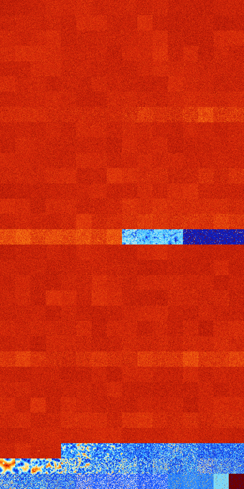

# B14678 (238592-239103)

<details>
    <summary>Initial Grid</summary>
    
</details>


<details>
    <summary>Initial Grid RLE</summary>

```
#C Exported from GoGoL (https://github.com/marrow16/gogol)
#C Wrap mode: Toroidal
#C Boundary mode: Dead
#C Step: 0
x = 100, y = 100, rule = B14678/S
17bo6bo25bo7bobo6bo17bo$35bo13bo23bo8bo11bo$12bo33bo7bo7bo20bo$56bobo
21b2o13bo3bo$7bo24bo50bo$28bo2bo17bo$3bo27bo3b2o20bo3bo$9bo18bo10bo24bo
16bo$18bo35bo16bo18bo$5bo27bo16bo4bo31bo$23b2o15bo17bo27bo4b2o2bo$17bo
7bo31bo9bo$22bo16bo48bo$6bo44bo18bo5b2o7bo$27bo10bo26bo14bo$36bo19bo12b
o14bo$14bo8b2o9bo52bo$4bo2bo51bo$18bo37bo16bo5bo4bo10bo$23bo9bo22bo20bo
10bo$90bo8bo$13bo52bo12bo$o17bo4bo5bo$52bobo4bo6bo3bo10bo$4bo20bo13bo
30bo$2bobo19bo11bo23bo5bobo$o20bobo11bo8b2o32b2o18bo$24bo7bo48bo$3bo3bo
7bo6bobo19bo38bo$25bo10bo$bo5bo4bo17b2o9bo13bo42bo$14bobobo18bo26bo3bo$
34bo9bo$o41bo5bo19bo29bo$10bo67bo17bo$22bo6bo58bo$34bobo4bo4bo27bo$32bo
18bo2bo24bo4bo$13bo15bo30b2o18bo5bo$41bobo13bo40bo$12bo50b2o2bo19bo11bo
$bo49bo5bo10bo$13bo20bo6bo3bo11bo31bo$23bo3bobo14bo34bo$3bo18bobo7bo34b
o$bo90bo$18bo32bo24bo$6bo21bo11bo31bo12bo2bo5bo$8bo11bo2b2o58bo15bo$28b
o24bo39bo$38bo32bo$24bo21bo25bo14bo$10bo32bo13b2o33bo$24bo71bo$o33bo26b
obo$8bo6bo6bo3bo10bo15bo5bo29bo$13bo2bo51bo$15b2o36bo23bo15bo3bo$19bo
25bo3bo17bo11bo6bo$47bo2bo18bo25bo$15bo3bo18bo23bo4bob2o9bo$22bo5bo7bo
14bo8bo36bo$55bo3bo14b2o2bobo16bo$21bo36bo23bo3bo7bo$33bo27bo15bobo$o5b
o23bo3bo18bo4bo4bo11bo12bo$20bo66b2o$19bo54bo$16bo3bo2bo47bo$7bo16bo6bo
53bo8bo$bo56bo$21bo27bo33bo$15bo40bo41bo$36bo7b2o15bo$18b2o60bob2o$25bo
5bo6bo18b2o$15bo9bo12bo16bo12bo3b2o10b2o$70bo5bo13bo3bo2bo$15bo6bo37bo
14bo$7bo14bo46bo10bo5bo$18bo2bo33bobo14bo$76bobo6bo5bo2bo$5bo9bo12bo17b
o13bo$23bo28bobo5bo3bo28bo$o17bo61bo6bo$58bo16bo22bo$67bo5bo18bo$bobo7b
o11bo4bo16bo11bo26bo8bo$25bo28bo38bo$8bo64bo2bo4bo16bo$13bo8bo16b2o21bo
8bo3bo$6bo25bo38bo8bo7bo$18bo19bo14bo7b2o10bo$o9bo19bo9bo10bo6bo12bo$
29bo2b2o64bo$bo44b3o40bobo6bo$o10bo32bo7bo14bo$20bo8bo19bo33bo12bo$11bo
22bo21bobo2b2o31bo$16bo15b2o11bo41bo!
```
</details>
<details>
    <summary>Thumbnail</summary>

</details>
<table>
<tr>
    <td><a href="./238592%20S%20Heat%20Map%20Activity.png"></a><br>S (238592)<br>G>1000</td>    <td><a href="./238593%20S0%20Heat%20Map%20Activity.png"></a><br>S0 (238593)<br>G>1000</td>    <td><a href="./238594%20S1%20Heat%20Map%20Activity.png"></a><br>S1 (238594)<br>G>1000</td>    <td><a href="./238595%20S01%20Heat%20Map%20Activity.png"></a><br>S01 (238595)<br>G>1000</td>    <td><a href="./238596%20S2%20Heat%20Map%20Activity.png"></a><br>S2 (238596)<br>G>1000</td>    <td><a href="./238597%20S02%20Heat%20Map%20Activity.png"></a><br>S02 (238597)<br>G>1000</td>    <td><a href="./238598%20S12%20Heat%20Map%20Activity.png"></a><br>S12 (238598)<br>G>1000</td>    <td><a href="./238599%20S012%20Heat%20Map%20Activity.png"></a><br>S012 (238599)<br>G>1000</td>    <td><a href="./238600%20S3%20Heat%20Map%20Activity.png"></a><br>S3 (238600)<br>G>1000</td>    <td><a href="./238601%20S03%20Heat%20Map%20Activity.png"></a><br>S03 (238601)<br>G>1000</td>    <td><a href="./238602%20S13%20Heat%20Map%20Activity.png"></a><br>S13 (238602)<br>G>1000</td>    <td><a href="./238603%20S013%20Heat%20Map%20Activity.png"></a><br>S013 (238603)<br>G>1000</td>    <td><a href="./238604%20S23%20Heat%20Map%20Activity.png"></a><br>S23 (238604)<br>G>1000</td>    <td><a href="./238605%20S023%20Heat%20Map%20Activity.png"></a><br>S023 (238605)<br>G>1000</td>    <td><a href="./238606%20S123%20Heat%20Map%20Activity.png"></a><br>S123 (238606)<br>G>1000</td>    <td><a href="./238607%20S0123%20Heat%20Map%20Activity.png"></a><br>S0123 (238607)<br>G>1000</td></tr>
<tr>
    <td><a href="./238608%20S4%20Heat%20Map%20Activity.png"></a><br>S4 (238608)<br>G>1000</td>    <td><a href="./238609%20S04%20Heat%20Map%20Activity.png"></a><br>S04 (238609)<br>G>1000</td>    <td><a href="./238610%20S14%20Heat%20Map%20Activity.png"></a><br>S14 (238610)<br>G>1000</td>    <td><a href="./238611%20S014%20Heat%20Map%20Activity.png"></a><br>S014 (238611)<br>G>1000</td>    <td><a href="./238612%20S24%20Heat%20Map%20Activity.png"></a><br>S24 (238612)<br>G>1000</td>    <td><a href="./238613%20S024%20Heat%20Map%20Activity.png"></a><br>S024 (238613)<br>G>1000</td>    <td><a href="./238614%20S124%20Heat%20Map%20Activity.png"></a><br>S124 (238614)<br>G>1000</td>    <td><a href="./238615%20S0124%20Heat%20Map%20Activity.png"></a><br>S0124 (238615)<br>G>1000</td>    <td><a href="./238616%20S34%20Heat%20Map%20Activity.png"></a><br>S34 (238616)<br>G>1000</td>    <td><a href="./238617%20S034%20Heat%20Map%20Activity.png"></a><br>S034 (238617)<br>G>1000</td>    <td><a href="./238618%20S134%20Heat%20Map%20Activity.png"></a><br>S134 (238618)<br>G>1000</td>    <td><a href="./238619%20S0134%20Heat%20Map%20Activity.png"></a><br>S0134 (238619)<br>G>1000</td>    <td><a href="./238620%20S234%20Heat%20Map%20Activity.png"></a><br>S234 (238620)<br>G>1000</td>    <td><a href="./238621%20S0234%20Heat%20Map%20Activity.png"></a><br>S0234 (238621)<br>G>1000</td>    <td><a href="./238622%20S1234%20Heat%20Map%20Activity.png"></a><br>S1234 (238622)<br>G>1000</td>    <td><a href="./238623%20S01234%20Heat%20Map%20Activity.png"></a><br>S01234 (238623)<br>G>1000</td></tr>
<tr>
    <td><a href="./238624%20S5%20Heat%20Map%20Activity.png"></a><br>S5 (238624)<br>G>1000</td>    <td><a href="./238625%20S05%20Heat%20Map%20Activity.png"></a><br>S05 (238625)<br>G>1000</td>    <td><a href="./238626%20S15%20Heat%20Map%20Activity.png"></a><br>S15 (238626)<br>G>1000</td>    <td><a href="./238627%20S015%20Heat%20Map%20Activity.png"></a><br>S015 (238627)<br>G>1000</td>    <td><a href="./238628%20S25%20Heat%20Map%20Activity.png"></a><br>S25 (238628)<br>G>1000</td>    <td><a href="./238629%20S025%20Heat%20Map%20Activity.png"></a><br>S025 (238629)<br>G>1000</td>    <td><a href="./238630%20S125%20Heat%20Map%20Activity.png"></a><br>S125 (238630)<br>G>1000</td>    <td><a href="./238631%20S0125%20Heat%20Map%20Activity.png"></a><br>S0125 (238631)<br>G>1000</td>    <td><a href="./238632%20S35%20Heat%20Map%20Activity.png"></a><br>S35 (238632)<br>G>1000</td>    <td><a href="./238633%20S035%20Heat%20Map%20Activity.png"></a><br>S035 (238633)<br>G>1000</td>    <td><a href="./238634%20S135%20Heat%20Map%20Activity.png"></a><br>S135 (238634)<br>G>1000</td>    <td><a href="./238635%20S0135%20Heat%20Map%20Activity.png"></a><br>S0135 (238635)<br>G>1000</td>    <td><a href="./238636%20S235%20Heat%20Map%20Activity.png"></a><br>S235 (238636)<br>G>1000</td>    <td><a href="./238637%20S0235%20Heat%20Map%20Activity.png"></a><br>S0235 (238637)<br>G>1000</td>    <td><a href="./238638%20S1235%20Heat%20Map%20Activity.png"></a><br>S1235 (238638)<br>G>1000</td>    <td><a href="./238639%20S01235%20Heat%20Map%20Activity.png"></a><br>S01235 (238639)<br>G>1000</td></tr>
<tr>
    <td><a href="./238640%20S45%20Heat%20Map%20Activity.png"></a><br>S45 (238640)<br>G>1000</td>    <td><a href="./238641%20S045%20Heat%20Map%20Activity.png"></a><br>S045 (238641)<br>G>1000</td>    <td><a href="./238642%20S145%20Heat%20Map%20Activity.png"></a><br>S145 (238642)<br>G>1000</td>    <td><a href="./238643%20S0145%20Heat%20Map%20Activity.png"></a><br>S0145 (238643)<br>G>1000</td>    <td><a href="./238644%20S245%20Heat%20Map%20Activity.png"></a><br>S245 (238644)<br>G>1000</td>    <td><a href="./238645%20S0245%20Heat%20Map%20Activity.png"></a><br>S0245 (238645)<br>G>1000</td>    <td><a href="./238646%20S1245%20Heat%20Map%20Activity.png"></a><br>S1245 (238646)<br>G>1000</td>    <td><a href="./238647%20S01245%20Heat%20Map%20Activity.png"></a><br>S01245 (238647)<br>G>1000</td>    <td><a href="./238648%20S345%20Heat%20Map%20Activity.png"></a><br>S345 (238648)<br>G>1000</td>    <td><a href="./238649%20S0345%20Heat%20Map%20Activity.png"></a><br>S0345 (238649)<br>G>1000</td>    <td><a href="./238650%20S1345%20Heat%20Map%20Activity.png"></a><br>S1345 (238650)<br>G>1000</td>    <td><a href="./238651%20S01345%20Heat%20Map%20Activity.png"></a><br>S01345 (238651)<br>G>1000</td>    <td><a href="./238652%20S2345%20Heat%20Map%20Activity.png"></a><br>S2345 (238652)<br>G>1000</td>    <td><a href="./238653%20S02345%20Heat%20Map%20Activity.png"></a><br>S02345 (238653)<br>G>1000</td>    <td><a href="./238654%20S12345%20Heat%20Map%20Activity.png"></a><br>S12345 (238654)<br>G>1000</td>    <td><a href="./238655%20S012345%20Heat%20Map%20Activity.png"></a><br>S012345 (238655)<br>G>1000</td></tr>
<tr>
    <td><a href="./238656%20S6%20Heat%20Map%20Activity.png"></a><br>S6 (238656)<br>G>1000</td>    <td><a href="./238657%20S06%20Heat%20Map%20Activity.png"></a><br>S06 (238657)<br>G>1000</td>    <td><a href="./238658%20S16%20Heat%20Map%20Activity.png"></a><br>S16 (238658)<br>G>1000</td>    <td><a href="./238659%20S016%20Heat%20Map%20Activity.png"></a><br>S016 (238659)<br>G>1000</td>    <td><a href="./238660%20S26%20Heat%20Map%20Activity.png"></a><br>S26 (238660)<br>G>1000</td>    <td><a href="./238661%20S026%20Heat%20Map%20Activity.png"></a><br>S026 (238661)<br>G>1000</td>    <td><a href="./238662%20S126%20Heat%20Map%20Activity.png"></a><br>S126 (238662)<br>G>1000</td>    <td><a href="./238663%20S0126%20Heat%20Map%20Activity.png"></a><br>S0126 (238663)<br>G>1000</td>    <td><a href="./238664%20S36%20Heat%20Map%20Activity.png"></a><br>S36 (238664)<br>G>1000</td>    <td><a href="./238665%20S036%20Heat%20Map%20Activity.png"></a><br>S036 (238665)<br>G>1000</td>    <td><a href="./238666%20S136%20Heat%20Map%20Activity.png"></a><br>S136 (238666)<br>G>1000</td>    <td><a href="./238667%20S0136%20Heat%20Map%20Activity.png"></a><br>S0136 (238667)<br>G>1000</td>    <td><a href="./238668%20S236%20Heat%20Map%20Activity.png"></a><br>S236 (238668)<br>G>1000</td>    <td><a href="./238669%20S0236%20Heat%20Map%20Activity.png"></a><br>S0236 (238669)<br>G>1000</td>    <td><a href="./238670%20S1236%20Heat%20Map%20Activity.png"></a><br>S1236 (238670)<br>G>1000</td>    <td><a href="./238671%20S01236%20Heat%20Map%20Activity.png"></a><br>S01236 (238671)<br>G>1000</td></tr>
<tr>
    <td><a href="./238672%20S46%20Heat%20Map%20Activity.png"></a><br>S46 (238672)<br>G>1000</td>    <td><a href="./238673%20S046%20Heat%20Map%20Activity.png"></a><br>S046 (238673)<br>G>1000</td>    <td><a href="./238674%20S146%20Heat%20Map%20Activity.png"></a><br>S146 (238674)<br>G>1000</td>    <td><a href="./238675%20S0146%20Heat%20Map%20Activity.png"></a><br>S0146 (238675)<br>G>1000</td>    <td><a href="./238676%20S246%20Heat%20Map%20Activity.png"></a><br>S246 (238676)<br>G>1000</td>    <td><a href="./238677%20S0246%20Heat%20Map%20Activity.png"></a><br>S0246 (238677)<br>G>1000</td>    <td><a href="./238678%20S1246%20Heat%20Map%20Activity.png"></a><br>S1246 (238678)<br>G>1000</td>    <td><a href="./238679%20S01246%20Heat%20Map%20Activity.png"></a><br>S01246 (238679)<br>G>1000</td>    <td><a href="./238680%20S346%20Heat%20Map%20Activity.png"></a><br>S346 (238680)<br>G>1000</td>    <td><a href="./238681%20S0346%20Heat%20Map%20Activity.png"></a><br>S0346 (238681)<br>G>1000</td>    <td><a href="./238682%20S1346%20Heat%20Map%20Activity.png"></a><br>S1346 (238682)<br>G>1000</td>    <td><a href="./238683%20S01346%20Heat%20Map%20Activity.png"></a><br>S01346 (238683)<br>G>1000</td>    <td><a href="./238684%20S2346%20Heat%20Map%20Activity.png"></a><br>S2346 (238684)<br>G>1000</td>    <td><a href="./238685%20S02346%20Heat%20Map%20Activity.png"></a><br>S02346 (238685)<br>G>1000</td>    <td><a href="./238686%20S12346%20Heat%20Map%20Activity.png"></a><br>S12346 (238686)<br>G>1000</td>    <td><a href="./238687%20S012346%20Heat%20Map%20Activity.png"></a><br>S012346 (238687)<br>G>1000</td></tr>
<tr>
    <td><a href="./238688%20S56%20Heat%20Map%20Activity.png"></a><br>S56 (238688)<br>G>1000</td>    <td><a href="./238689%20S056%20Heat%20Map%20Activity.png"></a><br>S056 (238689)<br>G>1000</td>    <td><a href="./238690%20S156%20Heat%20Map%20Activity.png"></a><br>S156 (238690)<br>G>1000</td>    <td><a href="./238691%20S0156%20Heat%20Map%20Activity.png"></a><br>S0156 (238691)<br>G>1000</td>    <td><a href="./238692%20S256%20Heat%20Map%20Activity.png"></a><br>S256 (238692)<br>G>1000</td>    <td><a href="./238693%20S0256%20Heat%20Map%20Activity.png"></a><br>S0256 (238693)<br>G>1000</td>    <td><a href="./238694%20S1256%20Heat%20Map%20Activity.png"></a><br>S1256 (238694)<br>G>1000</td>    <td><a href="./238695%20S01256%20Heat%20Map%20Activity.png"></a><br>S01256 (238695)<br>G>1000</td>    <td><a href="./238696%20S356%20Heat%20Map%20Activity.png"></a><br>S356 (238696)<br>G>1000</td>    <td><a href="./238697%20S0356%20Heat%20Map%20Activity.png"></a><br>S0356 (238697)<br>G>1000</td>    <td><a href="./238698%20S1356%20Heat%20Map%20Activity.png"></a><br>S1356 (238698)<br>G>1000</td>    <td><a href="./238699%20S01356%20Heat%20Map%20Activity.png"></a><br>S01356 (238699)<br>G>1000</td>    <td><a href="./238700%20S2356%20Heat%20Map%20Activity.png"></a><br>S2356 (238700)<br>G>1000</td>    <td><a href="./238701%20S02356%20Heat%20Map%20Activity.png"></a><br>S02356 (238701)<br>G>1000</td>    <td><a href="./238702%20S12356%20Heat%20Map%20Activity.png"></a><br>S12356 (238702)<br>G>1000</td>    <td><a href="./238703%20S012356%20Heat%20Map%20Activity.png"></a><br>S012356 (238703)<br>G>1000</td></tr>
<tr>
    <td><a href="./238704%20S456%20Heat%20Map%20Activity.png"></a><br>S456 (238704)<br>G>1000</td>    <td><a href="./238705%20S0456%20Heat%20Map%20Activity.png"></a><br>S0456 (238705)<br>G>1000</td>    <td><a href="./238706%20S1456%20Heat%20Map%20Activity.png"></a><br>S1456 (238706)<br>G>1000</td>    <td><a href="./238707%20S01456%20Heat%20Map%20Activity.png"></a><br>S01456 (238707)<br>G>1000</td>    <td><a href="./238708%20S2456%20Heat%20Map%20Activity.png"></a><br>S2456 (238708)<br>G>1000</td>    <td><a href="./238709%20S02456%20Heat%20Map%20Activity.png"></a><br>S02456 (238709)<br>G>1000</td>    <td><a href="./238710%20S12456%20Heat%20Map%20Activity.png"></a><br>S12456 (238710)<br>G>1000</td>    <td><a href="./238711%20S012456%20Heat%20Map%20Activity.png"></a><br>S012456 (238711)<br>G>1000</td>    <td><a href="./238712%20S3456%20Heat%20Map%20Activity.png"></a><br>S3456 (238712)<br>G>1000</td>    <td><a href="./238713%20S03456%20Heat%20Map%20Activity.png"></a><br>S03456 (238713)<br>G>1000</td>    <td><a href="./238714%20S13456%20Heat%20Map%20Activity.png"></a><br>S13456 (238714)<br>G>1000</td>    <td><a href="./238715%20S013456%20Heat%20Map%20Activity.png"></a><br>S013456 (238715)<br>G>1000</td>    <td><a href="./238716%20S23456%20Heat%20Map%20Activity.png"></a><br>S23456 (238716)<br>G>1000</td>    <td><a href="./238717%20S023456%20Heat%20Map%20Activity.png"></a><br>S023456 (238717)<br>G>1000</td>    <td><a href="./238718%20S123456%20Heat%20Map%20Activity.png"></a><br>S123456 (238718)<br>G>1000</td>    <td><a href="./238719%20S0123456%20Heat%20Map%20Activity.png"></a><br>S0123456 (238719)<br>G>1000</td></tr>
<tr>
    <td><a href="./238720%20S7%20Heat%20Map%20Activity.png"></a><br>S7 (238720)<br>G>1000</td>    <td><a href="./238721%20S07%20Heat%20Map%20Activity.png"></a><br>S07 (238721)<br>G>1000</td>    <td><a href="./238722%20S17%20Heat%20Map%20Activity.png"></a><br>S17 (238722)<br>G>1000</td>    <td><a href="./238723%20S017%20Heat%20Map%20Activity.png"></a><br>S017 (238723)<br>G>1000</td>    <td><a href="./238724%20S27%20Heat%20Map%20Activity.png"></a><br>S27 (238724)<br>G>1000</td>    <td><a href="./238725%20S027%20Heat%20Map%20Activity.png"></a><br>S027 (238725)<br>G>1000</td>    <td><a href="./238726%20S127%20Heat%20Map%20Activity.png"></a><br>S127 (238726)<br>G>1000</td>    <td><a href="./238727%20S0127%20Heat%20Map%20Activity.png"></a><br>S0127 (238727)<br>G>1000</td>    <td><a href="./238728%20S37%20Heat%20Map%20Activity.png"></a><br>S37 (238728)<br>G>1000</td>    <td><a href="./238729%20S037%20Heat%20Map%20Activity.png"></a><br>S037 (238729)<br>G>1000</td>    <td><a href="./238730%20S137%20Heat%20Map%20Activity.png"></a><br>S137 (238730)<br>G>1000</td>    <td><a href="./238731%20S0137%20Heat%20Map%20Activity.png"></a><br>S0137 (238731)<br>G>1000</td>    <td><a href="./238732%20S237%20Heat%20Map%20Activity.png"></a><br>S237 (238732)<br>G>1000</td>    <td><a href="./238733%20S0237%20Heat%20Map%20Activity.png"></a><br>S0237 (238733)<br>G>1000</td>    <td><a href="./238734%20S1237%20Heat%20Map%20Activity.png"></a><br>S1237 (238734)<br>G>1000</td>    <td><a href="./238735%20S01237%20Heat%20Map%20Activity.png"></a><br>S01237 (238735)<br>G>1000</td></tr>
<tr>
    <td><a href="./238736%20S47%20Heat%20Map%20Activity.png"></a><br>S47 (238736)<br>G>1000</td>    <td><a href="./238737%20S047%20Heat%20Map%20Activity.png"></a><br>S047 (238737)<br>G>1000</td>    <td><a href="./238738%20S147%20Heat%20Map%20Activity.png"></a><br>S147 (238738)<br>G>1000</td>    <td><a href="./238739%20S0147%20Heat%20Map%20Activity.png"></a><br>S0147 (238739)<br>G>1000</td>    <td><a href="./238740%20S247%20Heat%20Map%20Activity.png"></a><br>S247 (238740)<br>G>1000</td>    <td><a href="./238741%20S0247%20Heat%20Map%20Activity.png"></a><br>S0247 (238741)<br>G>1000</td>    <td><a href="./238742%20S1247%20Heat%20Map%20Activity.png"></a><br>S1247 (238742)<br>G>1000</td>    <td><a href="./238743%20S01247%20Heat%20Map%20Activity.png"></a><br>S01247 (238743)<br>G>1000</td>    <td><a href="./238744%20S347%20Heat%20Map%20Activity.png"></a><br>S347 (238744)<br>G>1000</td>    <td><a href="./238745%20S0347%20Heat%20Map%20Activity.png"></a><br>S0347 (238745)<br>G>1000</td>    <td><a href="./238746%20S1347%20Heat%20Map%20Activity.png"></a><br>S1347 (238746)<br>G>1000</td>    <td><a href="./238747%20S01347%20Heat%20Map%20Activity.png"></a><br>S01347 (238747)<br>G>1000</td>    <td><a href="./238748%20S2347%20Heat%20Map%20Activity.png"></a><br>S2347 (238748)<br>G>1000</td>    <td><a href="./238749%20S02347%20Heat%20Map%20Activity.png"></a><br>S02347 (238749)<br>G>1000</td>    <td><a href="./238750%20S12347%20Heat%20Map%20Activity.png"></a><br>S12347 (238750)<br>G>1000</td>    <td><a href="./238751%20S012347%20Heat%20Map%20Activity.png"></a><br>S012347 (238751)<br>G>1000</td></tr>
<tr>
    <td><a href="./238752%20S57%20Heat%20Map%20Activity.png"></a><br>S57 (238752)<br>G>1000</td>    <td><a href="./238753%20S057%20Heat%20Map%20Activity.png"></a><br>S057 (238753)<br>G>1000</td>    <td><a href="./238754%20S157%20Heat%20Map%20Activity.png"></a><br>S157 (238754)<br>G>1000</td>    <td><a href="./238755%20S0157%20Heat%20Map%20Activity.png"></a><br>S0157 (238755)<br>G>1000</td>    <td><a href="./238756%20S257%20Heat%20Map%20Activity.png"></a><br>S257 (238756)<br>G>1000</td>    <td><a href="./238757%20S0257%20Heat%20Map%20Activity.png"></a><br>S0257 (238757)<br>G>1000</td>    <td><a href="./238758%20S1257%20Heat%20Map%20Activity.png"></a><br>S1257 (238758)<br>G>1000</td>    <td><a href="./238759%20S01257%20Heat%20Map%20Activity.png"></a><br>S01257 (238759)<br>G>1000</td>    <td><a href="./238760%20S357%20Heat%20Map%20Activity.png"></a><br>S357 (238760)<br>G>1000</td>    <td><a href="./238761%20S0357%20Heat%20Map%20Activity.png"></a><br>S0357 (238761)<br>G>1000</td>    <td><a href="./238762%20S1357%20Heat%20Map%20Activity.png"></a><br>S1357 (238762)<br>G>1000</td>    <td><a href="./238763%20S01357%20Heat%20Map%20Activity.png"></a><br>S01357 (238763)<br>G>1000</td>    <td><a href="./238764%20S2357%20Heat%20Map%20Activity.png"></a><br>S2357 (238764)<br>G>1000</td>    <td><a href="./238765%20S02357%20Heat%20Map%20Activity.png"></a><br>S02357 (238765)<br>G>1000</td>    <td><a href="./238766%20S12357%20Heat%20Map%20Activity.png"></a><br>S12357 (238766)<br>G>1000</td>    <td><a href="./238767%20S012357%20Heat%20Map%20Activity.png"></a><br>S012357 (238767)<br>G>1000</td></tr>
<tr>
    <td><a href="./238768%20S457%20Heat%20Map%20Activity.png"></a><br>S457 (238768)<br>G>1000</td>    <td><a href="./238769%20S0457%20Heat%20Map%20Activity.png"></a><br>S0457 (238769)<br>G>1000</td>    <td><a href="./238770%20S1457%20Heat%20Map%20Activity.png"></a><br>S1457 (238770)<br>G>1000</td>    <td><a href="./238771%20S01457%20Heat%20Map%20Activity.png"></a><br>S01457 (238771)<br>G>1000</td>    <td><a href="./238772%20S2457%20Heat%20Map%20Activity.png"></a><br>S2457 (238772)<br>G>1000</td>    <td><a href="./238773%20S02457%20Heat%20Map%20Activity.png"></a><br>S02457 (238773)<br>G>1000</td>    <td><a href="./238774%20S12457%20Heat%20Map%20Activity.png"></a><br>S12457 (238774)<br>G>1000</td>    <td><a href="./238775%20S012457%20Heat%20Map%20Activity.png"></a><br>S012457 (238775)<br>G>1000</td>    <td><a href="./238776%20S3457%20Heat%20Map%20Activity.png"></a><br>S3457 (238776)<br>G>1000</td>    <td><a href="./238777%20S03457%20Heat%20Map%20Activity.png"></a><br>S03457 (238777)<br>G>1000</td>    <td><a href="./238778%20S13457%20Heat%20Map%20Activity.png"></a><br>S13457 (238778)<br>G>1000</td>    <td><a href="./238779%20S013457%20Heat%20Map%20Activity.png"></a><br>S013457 (238779)<br>G>1000</td>    <td><a href="./238780%20S23457%20Heat%20Map%20Activity.png"></a><br>S23457 (238780)<br>G>1000</td>    <td><a href="./238781%20S023457%20Heat%20Map%20Activity.png"></a><br>S023457 (238781)<br>G>1000</td>    <td><a href="./238782%20S123457%20Heat%20Map%20Activity.png"></a><br>S123457 (238782)<br>G>1000</td>    <td><a href="./238783%20S0123457%20Heat%20Map%20Activity.png"></a><br>S0123457 (238783)<br>G>1000</td></tr>
<tr>
    <td><a href="./238784%20S67%20Heat%20Map%20Activity.png"></a><br>S67 (238784)<br>G>1000</td>    <td><a href="./238785%20S067%20Heat%20Map%20Activity.png"></a><br>S067 (238785)<br>G>1000</td>    <td><a href="./238786%20S167%20Heat%20Map%20Activity.png"></a><br>S167 (238786)<br>G>1000</td>    <td><a href="./238787%20S0167%20Heat%20Map%20Activity.png"></a><br>S0167 (238787)<br>G>1000</td>    <td><a href="./238788%20S267%20Heat%20Map%20Activity.png"></a><br>S267 (238788)<br>G>1000</td>    <td><a href="./238789%20S0267%20Heat%20Map%20Activity.png"></a><br>S0267 (238789)<br>G>1000</td>    <td><a href="./238790%20S1267%20Heat%20Map%20Activity.png"></a><br>S1267 (238790)<br>G>1000</td>    <td><a href="./238791%20S01267%20Heat%20Map%20Activity.png"></a><br>S01267 (238791)<br>G>1000</td>    <td><a href="./238792%20S367%20Heat%20Map%20Activity.png"></a><br>S367 (238792)<br>G>1000</td>    <td><a href="./238793%20S0367%20Heat%20Map%20Activity.png"></a><br>S0367 (238793)<br>G>1000</td>    <td><a href="./238794%20S1367%20Heat%20Map%20Activity.png"></a><br>S1367 (238794)<br>G>1000</td>    <td><a href="./238795%20S01367%20Heat%20Map%20Activity.png"></a><br>S01367 (238795)<br>G>1000</td>    <td><a href="./238796%20S2367%20Heat%20Map%20Activity.png"></a><br>S2367 (238796)<br>G>1000</td>    <td><a href="./238797%20S02367%20Heat%20Map%20Activity.png"></a><br>S02367 (238797)<br>G>1000</td>    <td><a href="./238798%20S12367%20Heat%20Map%20Activity.png"></a><br>S12367 (238798)<br>G>1000</td>    <td><a href="./238799%20S012367%20Heat%20Map%20Activity.png"></a><br>S012367 (238799)<br>G>1000</td></tr>
<tr>
    <td><a href="./238800%20S467%20Heat%20Map%20Activity.png"></a><br>S467 (238800)<br>G>1000</td>    <td><a href="./238801%20S0467%20Heat%20Map%20Activity.png"></a><br>S0467 (238801)<br>G>1000</td>    <td><a href="./238802%20S1467%20Heat%20Map%20Activity.png"></a><br>S1467 (238802)<br>G>1000</td>    <td><a href="./238803%20S01467%20Heat%20Map%20Activity.png"></a><br>S01467 (238803)<br>G>1000</td>    <td><a href="./238804%20S2467%20Heat%20Map%20Activity.png"></a><br>S2467 (238804)<br>G>1000</td>    <td><a href="./238805%20S02467%20Heat%20Map%20Activity.png"></a><br>S02467 (238805)<br>G>1000</td>    <td><a href="./238806%20S12467%20Heat%20Map%20Activity.png"></a><br>S12467 (238806)<br>G>1000</td>    <td><a href="./238807%20S012467%20Heat%20Map%20Activity.png"></a><br>S012467 (238807)<br>G>1000</td>    <td><a href="./238808%20S3467%20Heat%20Map%20Activity.png"></a><br>S3467 (238808)<br>G>1000</td>    <td><a href="./238809%20S03467%20Heat%20Map%20Activity.png"></a><br>S03467 (238809)<br>G>1000</td>    <td><a href="./238810%20S13467%20Heat%20Map%20Activity.png"></a><br>S13467 (238810)<br>G>1000</td>    <td><a href="./238811%20S013467%20Heat%20Map%20Activity.png"></a><br>S013467 (238811)<br>G>1000</td>    <td><a href="./238812%20S23467%20Heat%20Map%20Activity.png"></a><br>S23467 (238812)<br>G>1000</td>    <td><a href="./238813%20S023467%20Heat%20Map%20Activity.png"></a><br>S023467 (238813)<br>G>1000</td>    <td><a href="./238814%20S123467%20Heat%20Map%20Activity.png"></a><br>S123467 (238814)<br>G>1000</td>    <td><a href="./238815%20S0123467%20Heat%20Map%20Activity.png"></a><br>S0123467 (238815)<br>G>1000</td></tr>
<tr>
    <td><a href="./238816%20S567%20Heat%20Map%20Activity.png"></a><br>S567 (238816)<br>G>1000</td>    <td><a href="./238817%20S0567%20Heat%20Map%20Activity.png"></a><br>S0567 (238817)<br>G>1000</td>    <td><a href="./238818%20S1567%20Heat%20Map%20Activity.png"></a><br>S1567 (238818)<br>G>1000</td>    <td><a href="./238819%20S01567%20Heat%20Map%20Activity.png"></a><br>S01567 (238819)<br>G>1000</td>    <td><a href="./238820%20S2567%20Heat%20Map%20Activity.png"></a><br>S2567 (238820)<br>G>1000</td>    <td><a href="./238821%20S02567%20Heat%20Map%20Activity.png"></a><br>S02567 (238821)<br>G>1000</td>    <td><a href="./238822%20S12567%20Heat%20Map%20Activity.png"></a><br>S12567 (238822)<br>G>1000</td>    <td><a href="./238823%20S012567%20Heat%20Map%20Activity.png"></a><br>S012567 (238823)<br>G>1000</td>    <td><a href="./238824%20S3567%20Heat%20Map%20Activity.png"></a><br>S3567 (238824)<br>G>1000</td>    <td><a href="./238825%20S03567%20Heat%20Map%20Activity.png"></a><br>S03567 (238825)<br>G>1000</td>    <td><a href="./238826%20S13567%20Heat%20Map%20Activity.png"></a><br>S13567 (238826)<br>G>1000</td>    <td><a href="./238827%20S013567%20Heat%20Map%20Activity.png"></a><br>S013567 (238827)<br>G>1000</td>    <td><a href="./238828%20S23567%20Heat%20Map%20Activity.png"></a><br>S23567 (238828)<br>G>1000</td>    <td><a href="./238829%20S023567%20Heat%20Map%20Activity.png"></a><br>S023567 (238829)<br>G>1000</td>    <td><a href="./238830%20S123567%20Heat%20Map%20Activity.png"></a><br>S123567 (238830)<br>G>1000</td>    <td><a href="./238831%20S0123567%20Heat%20Map%20Activity.png"></a><br>S0123567 (238831)<br>G>1000</td></tr>
<tr>
    <td><a href="./238832%20S4567%20Heat%20Map%20Activity.png"></a><br>S4567 (238832)<br>G>1000</td>    <td><a href="./238833%20S04567%20Heat%20Map%20Activity.png"></a><br>S04567 (238833)<br>G>1000</td>    <td><a href="./238834%20S14567%20Heat%20Map%20Activity.png"></a><br>S14567 (238834)<br>G>1000</td>    <td><a href="./238835%20S014567%20Heat%20Map%20Activity.png"></a><br>S014567 (238835)<br>G>1000</td>    <td><a href="./238836%20S24567%20Heat%20Map%20Activity.png"></a><br>S24567 (238836)<br>G>1000</td>    <td><a href="./238837%20S024567%20Heat%20Map%20Activity.png"></a><br>S024567 (238837)<br>G>1000</td>    <td><a href="./238838%20S124567%20Heat%20Map%20Activity.png"></a><br>S124567 (238838)<br>G>1000</td>    <td><a href="./238839%20S0124567%20Heat%20Map%20Activity.png"></a><br>S0124567 (238839)<br>G>1000</td>    <td><a href="./238840%20S34567%20Heat%20Map%20Activity.png"></a><br>S34567 (238840)<br>G>1000</td>    <td><a href="./238841%20S034567%20Heat%20Map%20Activity.png"></a><br>S034567 (238841)<br>G>1000</td>    <td><a href="./238842%20S134567%20Heat%20Map%20Activity.png"></a><br>S134567 (238842)<br>G>1000</td>    <td><a href="./238843%20S0134567%20Heat%20Map%20Activity.png"></a><br>S0134567 (238843)<br>G>1000</td>    <td><a href="./238844%20S234567%20Heat%20Map%20Activity.png"></a><br>S234567 (238844)<br>G>1000</td>    <td><a href="./238845%20S0234567%20Heat%20Map%20Activity.png"></a><br>S0234567 (238845)<br>G>1000</td>    <td><a href="./238846%20S1234567%20Heat%20Map%20Activity.png"></a><br>S1234567 (238846)<br>G>1000</td>    <td><a href="./238847%20S01234567%20Heat%20Map%20Activity.png"></a><br>S01234567 (238847)<br>G>1000</td></tr>
<tr>
    <td><a href="./238848%20S8%20Heat%20Map%20Activity.png"></a><br>S8 (238848)<br>G>1000</td>    <td><a href="./238849%20S08%20Heat%20Map%20Activity.png"></a><br>S08 (238849)<br>G>1000</td>    <td><a href="./238850%20S18%20Heat%20Map%20Activity.png"></a><br>S18 (238850)<br>G>1000</td>    <td><a href="./238851%20S018%20Heat%20Map%20Activity.png"></a><br>S018 (238851)<br>G>1000</td>    <td><a href="./238852%20S28%20Heat%20Map%20Activity.png"></a><br>S28 (238852)<br>G>1000</td>    <td><a href="./238853%20S028%20Heat%20Map%20Activity.png"></a><br>S028 (238853)<br>G>1000</td>    <td><a href="./238854%20S128%20Heat%20Map%20Activity.png"></a><br>S128 (238854)<br>G>1000</td>    <td><a href="./238855%20S0128%20Heat%20Map%20Activity.png"></a><br>S0128 (238855)<br>G>1000</td>    <td><a href="./238856%20S38%20Heat%20Map%20Activity.png"></a><br>S38 (238856)<br>G>1000</td>    <td><a href="./238857%20S038%20Heat%20Map%20Activity.png"></a><br>S038 (238857)<br>G>1000</td>    <td><a href="./238858%20S138%20Heat%20Map%20Activity.png"></a><br>S138 (238858)<br>G>1000</td>    <td><a href="./238859%20S0138%20Heat%20Map%20Activity.png"></a><br>S0138 (238859)<br>G>1000</td>    <td><a href="./238860%20S238%20Heat%20Map%20Activity.png"></a><br>S238 (238860)<br>G>1000</td>    <td><a href="./238861%20S0238%20Heat%20Map%20Activity.png"></a><br>S0238 (238861)<br>G>1000</td>    <td><a href="./238862%20S1238%20Heat%20Map%20Activity.png"></a><br>S1238 (238862)<br>G>1000</td>    <td><a href="./238863%20S01238%20Heat%20Map%20Activity.png"></a><br>S01238 (238863)<br>G>1000</td></tr>
<tr>
    <td><a href="./238864%20S48%20Heat%20Map%20Activity.png"></a><br>S48 (238864)<br>G>1000</td>    <td><a href="./238865%20S048%20Heat%20Map%20Activity.png"></a><br>S048 (238865)<br>G>1000</td>    <td><a href="./238866%20S148%20Heat%20Map%20Activity.png"></a><br>S148 (238866)<br>G>1000</td>    <td><a href="./238867%20S0148%20Heat%20Map%20Activity.png"></a><br>S0148 (238867)<br>G>1000</td>    <td><a href="./238868%20S248%20Heat%20Map%20Activity.png"></a><br>S248 (238868)<br>G>1000</td>    <td><a href="./238869%20S0248%20Heat%20Map%20Activity.png"></a><br>S0248 (238869)<br>G>1000</td>    <td><a href="./238870%20S1248%20Heat%20Map%20Activity.png"></a><br>S1248 (238870)<br>G>1000</td>    <td><a href="./238871%20S01248%20Heat%20Map%20Activity.png"></a><br>S01248 (238871)<br>G>1000</td>    <td><a href="./238872%20S348%20Heat%20Map%20Activity.png"></a><br>S348 (238872)<br>G>1000</td>    <td><a href="./238873%20S0348%20Heat%20Map%20Activity.png"></a><br>S0348 (238873)<br>G>1000</td>    <td><a href="./238874%20S1348%20Heat%20Map%20Activity.png"></a><br>S1348 (238874)<br>G>1000</td>    <td><a href="./238875%20S01348%20Heat%20Map%20Activity.png"></a><br>S01348 (238875)<br>G>1000</td>    <td><a href="./238876%20S2348%20Heat%20Map%20Activity.png"></a><br>S2348 (238876)<br>G>1000</td>    <td><a href="./238877%20S02348%20Heat%20Map%20Activity.png"></a><br>S02348 (238877)<br>G>1000</td>    <td><a href="./238878%20S12348%20Heat%20Map%20Activity.png"></a><br>S12348 (238878)<br>G>1000</td>    <td><a href="./238879%20S012348%20Heat%20Map%20Activity.png"></a><br>S012348 (238879)<br>G>1000</td></tr>
<tr>
    <td><a href="./238880%20S58%20Heat%20Map%20Activity.png"></a><br>S58 (238880)<br>G>1000</td>    <td><a href="./238881%20S058%20Heat%20Map%20Activity.png"></a><br>S058 (238881)<br>G>1000</td>    <td><a href="./238882%20S158%20Heat%20Map%20Activity.png"></a><br>S158 (238882)<br>G>1000</td>    <td><a href="./238883%20S0158%20Heat%20Map%20Activity.png"></a><br>S0158 (238883)<br>G>1000</td>    <td><a href="./238884%20S258%20Heat%20Map%20Activity.png"></a><br>S258 (238884)<br>G>1000</td>    <td><a href="./238885%20S0258%20Heat%20Map%20Activity.png"></a><br>S0258 (238885)<br>G>1000</td>    <td><a href="./238886%20S1258%20Heat%20Map%20Activity.png"></a><br>S1258 (238886)<br>G>1000</td>    <td><a href="./238887%20S01258%20Heat%20Map%20Activity.png"></a><br>S01258 (238887)<br>G>1000</td>    <td><a href="./238888%20S358%20Heat%20Map%20Activity.png"></a><br>S358 (238888)<br>G>1000</td>    <td><a href="./238889%20S0358%20Heat%20Map%20Activity.png"></a><br>S0358 (238889)<br>G>1000</td>    <td><a href="./238890%20S1358%20Heat%20Map%20Activity.png"></a><br>S1358 (238890)<br>G>1000</td>    <td><a href="./238891%20S01358%20Heat%20Map%20Activity.png"></a><br>S01358 (238891)<br>G>1000</td>    <td><a href="./238892%20S2358%20Heat%20Map%20Activity.png"></a><br>S2358 (238892)<br>G>1000</td>    <td><a href="./238893%20S02358%20Heat%20Map%20Activity.png"></a><br>S02358 (238893)<br>G>1000</td>    <td><a href="./238894%20S12358%20Heat%20Map%20Activity.png"></a><br>S12358 (238894)<br>G>1000</td>    <td><a href="./238895%20S012358%20Heat%20Map%20Activity.png"></a><br>S012358 (238895)<br>G>1000</td></tr>
<tr>
    <td><a href="./238896%20S458%20Heat%20Map%20Activity.png"></a><br>S458 (238896)<br>G>1000</td>    <td><a href="./238897%20S0458%20Heat%20Map%20Activity.png"></a><br>S0458 (238897)<br>G>1000</td>    <td><a href="./238898%20S1458%20Heat%20Map%20Activity.png"></a><br>S1458 (238898)<br>G>1000</td>    <td><a href="./238899%20S01458%20Heat%20Map%20Activity.png"></a><br>S01458 (238899)<br>G>1000</td>    <td><a href="./238900%20S2458%20Heat%20Map%20Activity.png"></a><br>S2458 (238900)<br>G>1000</td>    <td><a href="./238901%20S02458%20Heat%20Map%20Activity.png"></a><br>S02458 (238901)<br>G>1000</td>    <td><a href="./238902%20S12458%20Heat%20Map%20Activity.png"></a><br>S12458 (238902)<br>G>1000</td>    <td><a href="./238903%20S012458%20Heat%20Map%20Activity.png"></a><br>S012458 (238903)<br>G>1000</td>    <td><a href="./238904%20S3458%20Heat%20Map%20Activity.png"></a><br>S3458 (238904)<br>G>1000</td>    <td><a href="./238905%20S03458%20Heat%20Map%20Activity.png"></a><br>S03458 (238905)<br>G>1000</td>    <td><a href="./238906%20S13458%20Heat%20Map%20Activity.png"></a><br>S13458 (238906)<br>G>1000</td>    <td><a href="./238907%20S013458%20Heat%20Map%20Activity.png"></a><br>S013458 (238907)<br>G>1000</td>    <td><a href="./238908%20S23458%20Heat%20Map%20Activity.png"></a><br>S23458 (238908)<br>G>1000</td>    <td><a href="./238909%20S023458%20Heat%20Map%20Activity.png"></a><br>S023458 (238909)<br>G>1000</td>    <td><a href="./238910%20S123458%20Heat%20Map%20Activity.png"></a><br>S123458 (238910)<br>G>1000</td>    <td><a href="./238911%20S0123458%20Heat%20Map%20Activity.png"></a><br>S0123458 (238911)<br>G>1000</td></tr>
<tr>
    <td><a href="./238912%20S68%20Heat%20Map%20Activity.png"></a><br>S68 (238912)<br>G>1000</td>    <td><a href="./238913%20S068%20Heat%20Map%20Activity.png"></a><br>S068 (238913)<br>G>1000</td>    <td><a href="./238914%20S168%20Heat%20Map%20Activity.png"></a><br>S168 (238914)<br>G>1000</td>    <td><a href="./238915%20S0168%20Heat%20Map%20Activity.png"></a><br>S0168 (238915)<br>G>1000</td>    <td><a href="./238916%20S268%20Heat%20Map%20Activity.png"></a><br>S268 (238916)<br>G>1000</td>    <td><a href="./238917%20S0268%20Heat%20Map%20Activity.png"></a><br>S0268 (238917)<br>G>1000</td>    <td><a href="./238918%20S1268%20Heat%20Map%20Activity.png"></a><br>S1268 (238918)<br>G>1000</td>    <td><a href="./238919%20S01268%20Heat%20Map%20Activity.png"></a><br>S01268 (238919)<br>G>1000</td>    <td><a href="./238920%20S368%20Heat%20Map%20Activity.png"></a><br>S368 (238920)<br>G>1000</td>    <td><a href="./238921%20S0368%20Heat%20Map%20Activity.png"></a><br>S0368 (238921)<br>G>1000</td>    <td><a href="./238922%20S1368%20Heat%20Map%20Activity.png"></a><br>S1368 (238922)<br>G>1000</td>    <td><a href="./238923%20S01368%20Heat%20Map%20Activity.png"></a><br>S01368 (238923)<br>G>1000</td>    <td><a href="./238924%20S2368%20Heat%20Map%20Activity.png"></a><br>S2368 (238924)<br>G>1000</td>    <td><a href="./238925%20S02368%20Heat%20Map%20Activity.png"></a><br>S02368 (238925)<br>G>1000</td>    <td><a href="./238926%20S12368%20Heat%20Map%20Activity.png"></a><br>S12368 (238926)<br>G>1000</td>    <td><a href="./238927%20S012368%20Heat%20Map%20Activity.png"></a><br>S012368 (238927)<br>G>1000</td></tr>
<tr>
    <td><a href="./238928%20S468%20Heat%20Map%20Activity.png"></a><br>S468 (238928)<br>G>1000</td>    <td><a href="./238929%20S0468%20Heat%20Map%20Activity.png"></a><br>S0468 (238929)<br>G>1000</td>    <td><a href="./238930%20S1468%20Heat%20Map%20Activity.png"></a><br>S1468 (238930)<br>G>1000</td>    <td><a href="./238931%20S01468%20Heat%20Map%20Activity.png"></a><br>S01468 (238931)<br>G>1000</td>    <td><a href="./238932%20S2468%20Heat%20Map%20Activity.png"></a><br>S2468 (238932)<br>G>1000</td>    <td><a href="./238933%20S02468%20Heat%20Map%20Activity.png"></a><br>S02468 (238933)<br>G>1000</td>    <td><a href="./238934%20S12468%20Heat%20Map%20Activity.png"></a><br>S12468 (238934)<br>G>1000</td>    <td><a href="./238935%20S012468%20Heat%20Map%20Activity.png"></a><br>S012468 (238935)<br>G>1000</td>    <td><a href="./238936%20S3468%20Heat%20Map%20Activity.png"></a><br>S3468 (238936)<br>G>1000</td>    <td><a href="./238937%20S03468%20Heat%20Map%20Activity.png"></a><br>S03468 (238937)<br>G>1000</td>    <td><a href="./238938%20S13468%20Heat%20Map%20Activity.png"></a><br>S13468 (238938)<br>G>1000</td>    <td><a href="./238939%20S013468%20Heat%20Map%20Activity.png"></a><br>S013468 (238939)<br>G>1000</td>    <td><a href="./238940%20S23468%20Heat%20Map%20Activity.png"></a><br>S23468 (238940)<br>G>1000</td>    <td><a href="./238941%20S023468%20Heat%20Map%20Activity.png"></a><br>S023468 (238941)<br>G>1000</td>    <td><a href="./238942%20S123468%20Heat%20Map%20Activity.png"></a><br>S123468 (238942)<br>G>1000</td>    <td><a href="./238943%20S0123468%20Heat%20Map%20Activity.png"></a><br>S0123468 (238943)<br>G>1000</td></tr>
<tr>
    <td><a href="./238944%20S568%20Heat%20Map%20Activity.png"></a><br>S568 (238944)<br>G>1000</td>    <td><a href="./238945%20S0568%20Heat%20Map%20Activity.png"></a><br>S0568 (238945)<br>G>1000</td>    <td><a href="./238946%20S1568%20Heat%20Map%20Activity.png"></a><br>S1568 (238946)<br>G>1000</td>    <td><a href="./238947%20S01568%20Heat%20Map%20Activity.png"></a><br>S01568 (238947)<br>G>1000</td>    <td><a href="./238948%20S2568%20Heat%20Map%20Activity.png"></a><br>S2568 (238948)<br>G>1000</td>    <td><a href="./238949%20S02568%20Heat%20Map%20Activity.png"></a><br>S02568 (238949)<br>G>1000</td>    <td><a href="./238950%20S12568%20Heat%20Map%20Activity.png"></a><br>S12568 (238950)<br>G>1000</td>    <td><a href="./238951%20S012568%20Heat%20Map%20Activity.png"></a><br>S012568 (238951)<br>G>1000</td>    <td><a href="./238952%20S3568%20Heat%20Map%20Activity.png"></a><br>S3568 (238952)<br>G>1000</td>    <td><a href="./238953%20S03568%20Heat%20Map%20Activity.png"></a><br>S03568 (238953)<br>G>1000</td>    <td><a href="./238954%20S13568%20Heat%20Map%20Activity.png"></a><br>S13568 (238954)<br>G>1000</td>    <td><a href="./238955%20S013568%20Heat%20Map%20Activity.png"></a><br>S013568 (238955)<br>G>1000</td>    <td><a href="./238956%20S23568%20Heat%20Map%20Activity.png"></a><br>S23568 (238956)<br>G>1000</td>    <td><a href="./238957%20S023568%20Heat%20Map%20Activity.png"></a><br>S023568 (238957)<br>G>1000</td>    <td><a href="./238958%20S123568%20Heat%20Map%20Activity.png"></a><br>S123568 (238958)<br>G>1000</td>    <td><a href="./238959%20S0123568%20Heat%20Map%20Activity.png"></a><br>S0123568 (238959)<br>G>1000</td></tr>
<tr>
    <td><a href="./238960%20S4568%20Heat%20Map%20Activity.png"></a><br>S4568 (238960)<br>G>1000</td>    <td><a href="./238961%20S04568%20Heat%20Map%20Activity.png"></a><br>S04568 (238961)<br>G>1000</td>    <td><a href="./238962%20S14568%20Heat%20Map%20Activity.png"></a><br>S14568 (238962)<br>G>1000</td>    <td><a href="./238963%20S014568%20Heat%20Map%20Activity.png"></a><br>S014568 (238963)<br>G>1000</td>    <td><a href="./238964%20S24568%20Heat%20Map%20Activity.png"></a><br>S24568 (238964)<br>G>1000</td>    <td><a href="./238965%20S024568%20Heat%20Map%20Activity.png"></a><br>S024568 (238965)<br>G>1000</td>    <td><a href="./238966%20S124568%20Heat%20Map%20Activity.png"></a><br>S124568 (238966)<br>G>1000</td>    <td><a href="./238967%20S0124568%20Heat%20Map%20Activity.png"></a><br>S0124568 (238967)<br>G>1000</td>    <td><a href="./238968%20S34568%20Heat%20Map%20Activity.png"></a><br>S34568 (238968)<br>G>1000</td>    <td><a href="./238969%20S034568%20Heat%20Map%20Activity.png"></a><br>S034568 (238969)<br>G>1000</td>    <td><a href="./238970%20S134568%20Heat%20Map%20Activity.png"></a><br>S134568 (238970)<br>G>1000</td>    <td><a href="./238971%20S0134568%20Heat%20Map%20Activity.png"></a><br>S0134568 (238971)<br>G>1000</td>    <td><a href="./238972%20S234568%20Heat%20Map%20Activity.png"></a><br>S234568 (238972)<br>G>1000</td>    <td><a href="./238973%20S0234568%20Heat%20Map%20Activity.png"></a><br>S0234568 (238973)<br>G>1000</td>    <td><a href="./238974%20S1234568%20Heat%20Map%20Activity.png"></a><br>S1234568 (238974)<br>G>1000</td>    <td><a href="./238975%20S01234568%20Heat%20Map%20Activity.png"></a><br>S01234568 (238975)<br>G>1000</td></tr>
<tr>
    <td><a href="./238976%20S78%20Heat%20Map%20Activity.png"></a><br>S78 (238976)<br>G>1000</td>    <td><a href="./238977%20S078%20Heat%20Map%20Activity.png"></a><br>S078 (238977)<br>G>1000</td>    <td><a href="./238978%20S178%20Heat%20Map%20Activity.png"></a><br>S178 (238978)<br>G>1000</td>    <td><a href="./238979%20S0178%20Heat%20Map%20Activity.png"></a><br>S0178 (238979)<br>G>1000</td>    <td><a href="./238980%20S278%20Heat%20Map%20Activity.png"></a><br>S278 (238980)<br>G>1000</td>    <td><a href="./238981%20S0278%20Heat%20Map%20Activity.png"></a><br>S0278 (238981)<br>G>1000</td>    <td><a href="./238982%20S1278%20Heat%20Map%20Activity.png"></a><br>S1278 (238982)<br>G>1000</td>    <td><a href="./238983%20S01278%20Heat%20Map%20Activity.png"></a><br>S01278 (238983)<br>G>1000</td>    <td><a href="./238984%20S378%20Heat%20Map%20Activity.png"></a><br>S378 (238984)<br>G>1000</td>    <td><a href="./238985%20S0378%20Heat%20Map%20Activity.png"></a><br>S0378 (238985)<br>G>1000</td>    <td><a href="./238986%20S1378%20Heat%20Map%20Activity.png"></a><br>S1378 (238986)<br>G>1000</td>    <td><a href="./238987%20S01378%20Heat%20Map%20Activity.png"></a><br>S01378 (238987)<br>G>1000</td>    <td><a href="./238988%20S2378%20Heat%20Map%20Activity.png"></a><br>S2378 (238988)<br>G>1000</td>    <td><a href="./238989%20S02378%20Heat%20Map%20Activity.png"></a><br>S02378 (238989)<br>G>1000</td>    <td><a href="./238990%20S12378%20Heat%20Map%20Activity.png"></a><br>S12378 (238990)<br>G>1000</td>    <td><a href="./238991%20S012378%20Heat%20Map%20Activity.png"></a><br>S012378 (238991)<br>G>1000</td></tr>
<tr>
    <td><a href="./238992%20S478%20Heat%20Map%20Activity.png"></a><br>S478 (238992)<br>G>1000</td>    <td><a href="./238993%20S0478%20Heat%20Map%20Activity.png"></a><br>S0478 (238993)<br>G>1000</td>    <td><a href="./238994%20S1478%20Heat%20Map%20Activity.png"></a><br>S1478 (238994)<br>G>1000</td>    <td><a href="./238995%20S01478%20Heat%20Map%20Activity.png"></a><br>S01478 (238995)<br>G>1000</td>    <td><a href="./238996%20S2478%20Heat%20Map%20Activity.png"></a><br>S2478 (238996)<br>G>1000</td>    <td><a href="./238997%20S02478%20Heat%20Map%20Activity.png"></a><br>S02478 (238997)<br>G>1000</td>    <td><a href="./238998%20S12478%20Heat%20Map%20Activity.png"></a><br>S12478 (238998)<br>G>1000</td>    <td><a href="./238999%20S012478%20Heat%20Map%20Activity.png"></a><br>S012478 (238999)<br>G>1000</td>    <td><a href="./239000%20S3478%20Heat%20Map%20Activity.png"></a><br>S3478 (239000)<br>G>1000</td>    <td><a href="./239001%20S03478%20Heat%20Map%20Activity.png"></a><br>S03478 (239001)<br>G>1000</td>    <td><a href="./239002%20S13478%20Heat%20Map%20Activity.png"></a><br>S13478 (239002)<br>G>1000</td>    <td><a href="./239003%20S013478%20Heat%20Map%20Activity.png"></a><br>S013478 (239003)<br>G>1000</td>    <td><a href="./239004%20S23478%20Heat%20Map%20Activity.png"></a><br>S23478 (239004)<br>G>1000</td>    <td><a href="./239005%20S023478%20Heat%20Map%20Activity.png"></a><br>S023478 (239005)<br>G>1000</td>    <td><a href="./239006%20S123478%20Heat%20Map%20Activity.png"></a><br>S123478 (239006)<br>G>1000</td>    <td><a href="./239007%20S0123478%20Heat%20Map%20Activity.png"></a><br>S0123478 (239007)<br>G>1000</td></tr>
<tr>
    <td><a href="./239008%20S578%20Heat%20Map%20Activity.png"></a><br>S578 (239008)<br>G>1000</td>    <td><a href="./239009%20S0578%20Heat%20Map%20Activity.png"></a><br>S0578 (239009)<br>G>1000</td>    <td><a href="./239010%20S1578%20Heat%20Map%20Activity.png"></a><br>S1578 (239010)<br>G>1000</td>    <td><a href="./239011%20S01578%20Heat%20Map%20Activity.png"></a><br>S01578 (239011)<br>G>1000</td>    <td><a href="./239012%20S2578%20Heat%20Map%20Activity.png"></a><br>S2578 (239012)<br>G>1000</td>    <td><a href="./239013%20S02578%20Heat%20Map%20Activity.png"></a><br>S02578 (239013)<br>G>1000</td>    <td><a href="./239014%20S12578%20Heat%20Map%20Activity.png"></a><br>S12578 (239014)<br>G>1000</td>    <td><a href="./239015%20S012578%20Heat%20Map%20Activity.png"></a><br>S012578 (239015)<br>G>1000</td>    <td><a href="./239016%20S3578%20Heat%20Map%20Activity.png"></a><br>S3578 (239016)<br>G>1000</td>    <td><a href="./239017%20S03578%20Heat%20Map%20Activity.png"></a><br>S03578 (239017)<br>G>1000</td>    <td><a href="./239018%20S13578%20Heat%20Map%20Activity.png"></a><br>S13578 (239018)<br>G>1000</td>    <td><a href="./239019%20S013578%20Heat%20Map%20Activity.png"></a><br>S013578 (239019)<br>G>1000</td>    <td><a href="./239020%20S23578%20Heat%20Map%20Activity.png"></a><br>S23578 (239020)<br>G>1000</td>    <td><a href="./239021%20S023578%20Heat%20Map%20Activity.png"></a><br>S023578 (239021)<br>G>1000</td>    <td><a href="./239022%20S123578%20Heat%20Map%20Activity.png"></a><br>S123578 (239022)<br>G>1000</td>    <td><a href="./239023%20S0123578%20Heat%20Map%20Activity.png"></a><br>S0123578 (239023)<br>G>1000</td></tr>
<tr>
    <td><a href="./239024%20S4578%20Heat%20Map%20Activity.png"></a><br>S4578 (239024)<br>G>1000</td>    <td><a href="./239025%20S04578%20Heat%20Map%20Activity.png"></a><br>S04578 (239025)<br>G>1000</td>    <td><a href="./239026%20S14578%20Heat%20Map%20Activity.png"></a><br>S14578 (239026)<br>G>1000</td>    <td><a href="./239027%20S014578%20Heat%20Map%20Activity.png"></a><br>S014578 (239027)<br>G>1000</td>    <td><a href="./239028%20S24578%20Heat%20Map%20Activity.png"></a><br>S24578 (239028)<br>G>1000</td>    <td><a href="./239029%20S024578%20Heat%20Map%20Activity.png"></a><br>S024578 (239029)<br>G>1000</td>    <td><a href="./239030%20S124578%20Heat%20Map%20Activity.png"></a><br>S124578 (239030)<br>G>1000</td>    <td><a href="./239031%20S0124578%20Heat%20Map%20Activity.png"></a><br>S0124578 (239031)<br>G>1000</td>    <td><a href="./239032%20S34578%20Heat%20Map%20Activity.png"></a><br>S34578 (239032)<br>G>1000</td>    <td><a href="./239033%20S034578%20Heat%20Map%20Activity.png"></a><br>S034578 (239033)<br>G>1000</td>    <td><a href="./239034%20S134578%20Heat%20Map%20Activity.png"></a><br>S134578 (239034)<br>G>1000</td>    <td><a href="./239035%20S0134578%20Heat%20Map%20Activity.png"></a><br>S0134578 (239035)<br>G>1000</td>    <td><a href="./239036%20S234578%20Heat%20Map%20Activity.png"></a><br>S234578 (239036)<br>G>1000</td>    <td><a href="./239037%20S0234578%20Heat%20Map%20Activity.png"></a><br>S0234578 (239037)<br>G>1000</td>    <td><a href="./239038%20S1234578%20Heat%20Map%20Activity.png"></a><br>S1234578 (239038)<br>G>1000</td>    <td><a href="./239039%20S01234578%20Heat%20Map%20Activity.png"></a><br>S01234578 (239039)<br>G>1000</td></tr>
<tr>
    <td><a href="./239040%20S678%20Heat%20Map%20Activity.png"></a><br>S678 (239040)<br>G>1000</td>    <td><a href="./239041%20S0678%20Heat%20Map%20Activity.png"></a><br>S0678 (239041)<br>G>1000</td>    <td><a href="./239042%20S1678%20Heat%20Map%20Activity.png"></a><br>S1678 (239042)<br>G>1000</td>    <td><a href="./239043%20S01678%20Heat%20Map%20Activity.png"></a><br>S01678 (239043)<br>G>1000</td>    <td><a href="./239044%20S2678%20Heat%20Map%20Activity.png"></a><br>S2678 (239044)<br>G>1000</td>    <td><a href="./239045%20S02678%20Heat%20Map%20Activity.png"></a><br>S02678 (239045)<br>G>1000</td>    <td><a href="./239046%20S12678%20Heat%20Map%20Activity.png"></a><br>S12678 (239046)<br>G>1000</td>    <td><a href="./239047%20S012678%20Heat%20Map%20Activity.png"></a><br>S012678 (239047)<br>G>1000</td>    <td><a href="./239048%20S3678%20Heat%20Map%20Activity.png"></a><br>S3678 (239048)<br>G>1000</td>    <td><a href="./239049%20S03678%20Heat%20Map%20Activity.png"></a><br>S03678 (239049)<br>G>1000</td>    <td><a href="./239050%20S13678%20Heat%20Map%20Activity.png"></a><br>S13678 (239050)<br>G>1000</td>    <td><a href="./239051%20S013678%20Heat%20Map%20Activity.png"></a><br>S013678 (239051)<br>G>1000</td>    <td><a href="./239052%20S23678%20Heat%20Map%20Activity.png"></a><br>S23678 (239052)<br>G>1000</td>    <td><a href="./239053%20S023678%20Heat%20Map%20Activity.png"></a><br>S023678 (239053)<br>G>1000</td>    <td><a href="./239054%20S123678%20Heat%20Map%20Activity.png"></a><br>S123678 (239054)<br>G>1000</td>    <td><a href="./239055%20S0123678%20Heat%20Map%20Activity.png"></a><br>S0123678 (239055)<br>G>1000</td></tr>
<tr>
    <td><a href="./239056%20S4678%20Heat%20Map%20Activity.png"></a><br>S4678 (239056)<br>G>1000</td>    <td><a href="./239057%20S04678%20Heat%20Map%20Activity.png"></a><br>S04678 (239057)<br>G>1000</td>    <td><a href="./239058%20S14678%20Heat%20Map%20Activity.png"></a><br>S14678 (239058)<br>G>1000</td>    <td><a href="./239059%20S014678%20Heat%20Map%20Activity.png"></a><br>S014678 (239059)<br>G>1000</td>    <td><a href="./239060%20S24678%20Heat%20Map%20Activity.png"></a><br>S24678 (239060)<br>R@115,p2</td>    <td><a href="./239061%20S024678%20Heat%20Map%20Activity.png"></a><br>S024678 (239061)<br>S@100</td>    <td><a href="./239062%20S124678%20Heat%20Map%20Activity.png"></a><br>S124678 (239062)<br>R@76,p2</td>    <td><a href="./239063%20S0124678%20Heat%20Map%20Activity.png"></a><br>S0124678 (239063)<br>R@70,p2</td>    <td><a href="./239064%20S34678%20Heat%20Map%20Activity.png"></a><br>S34678 (239064)<br>R@38,p2</td>    <td><a href="./239065%20S034678%20Heat%20Map%20Activity.png"></a><br>S034678 (239065)<br>R@34,p2</td>    <td><a href="./239066%20S134678%20Heat%20Map%20Activity.png"></a><br>S134678 (239066)<br>R@30,p2</td>    <td><a href="./239067%20S0134678%20Heat%20Map%20Activity.png"></a><br>S0134678 (239067)<br>S@30</td>    <td><a href="./239068%20S234678%20Heat%20Map%20Activity.png"></a><br>S234678 (239068)<br>S@26</td>    <td><a href="./239069%20S0234678%20Heat%20Map%20Activity.png"></a><br>S0234678 (239069)<br>R@25,p2</td>    <td><a href="./239070%20S1234678%20Heat%20Map%20Activity.png"></a><br>S1234678 (239070)<br>R@25,p2</td>    <td><a href="./239071%20S01234678%20Heat%20Map%20Activity.png"></a><br>S01234678 (239071)<br>R@24,p2</td></tr>
<tr>
    <td><a href="./239072%20S5678%20Heat%20Map%20Activity.png"></a><br>S5678 (239072)<br>S@424</td>    <td><a href="./239073%20S05678%20Heat%20Map%20Activity.png"></a><br>S05678 (239073)<br>R@217,p2</td>    <td><a href="./239074%20S15678%20Heat%20Map%20Activity.png"></a><br>S15678 (239074)<br>S@190</td>    <td><a href="./239075%20S015678%20Heat%20Map%20Activity.png"></a><br>S015678 (239075)<br>S@126</td>    <td><a href="./239076%20S25678%20Heat%20Map%20Activity.png"></a><br>S25678 (239076)<br>S@64</td>    <td><a href="./239077%20S025678%20Heat%20Map%20Activity.png"></a><br>S025678 (239077)<br>S@60</td>    <td><a href="./239078%20S125678%20Heat%20Map%20Activity.png"></a><br>S125678 (239078)<br>S@37</td>    <td><a href="./239079%20S0125678%20Heat%20Map%20Activity.png"></a><br>S0125678 (239079)<br>S@36</td>    <td><a href="./239080%20S35678%20Heat%20Map%20Activity.png"></a><br>S35678 (239080)<br>S@25</td>    <td><a href="./239081%20S035678%20Heat%20Map%20Activity.png"></a><br>S035678 (239081)<br>S@25</td>    <td><a href="./239082%20S135678%20Heat%20Map%20Activity.png"></a><br>S135678 (239082)<br>S@22</td>    <td><a href="./239083%20S0135678%20Heat%20Map%20Activity.png"></a><br>S0135678 (239083)<br>S@21</td>    <td><a href="./239084%20S235678%20Heat%20Map%20Activity.png"></a><br>S235678 (239084)<br>S@17</td>    <td><a href="./239085%20S0235678%20Heat%20Map%20Activity.png"></a><br>S0235678 (239085)<br>S@14</td>    <td><a href="./239086%20S1235678%20Heat%20Map%20Activity.png"></a><br>S1235678 (239086)<br>S@15</td>    <td><a href="./239087%20S01235678%20Heat%20Map%20Activity.png"></a><br>S01235678 (239087)<br>S@16</td></tr>
<tr>
    <td><a href="./239088%20S45678%20Heat%20Map%20Activity.png"></a><br>S45678 (239088)<br>S@23</td>    <td><a href="./239089%20S045678%20Heat%20Map%20Activity.png"></a><br>S045678 (239089)<br>S@18</td>    <td><a href="./239090%20S145678%20Heat%20Map%20Activity.png"></a><br>S145678 (239090)<br>S@17</td>    <td><a href="./239091%20S0145678%20Heat%20Map%20Activity.png"></a><br>S0145678 (239091)<br>S@14</td>    <td><a href="./239092%20S245678%20Heat%20Map%20Activity.png"></a><br>S245678 (239092)<br>S@15</td>    <td><a href="./239093%20S0245678%20Heat%20Map%20Activity.png"></a><br>S0245678 (239093)<br>S@12</td>    <td><a href="./239094%20S1245678%20Heat%20Map%20Activity.png"></a><br>S1245678 (239094)<br>S@12</td>    <td><a href="./239095%20S01245678%20Heat%20Map%20Activity.png"></a><br>S01245678 (239095)<br>S@12</td>    <td><a href="./239096%20S345678%20Heat%20Map%20Activity.png"></a><br>S345678 (239096)<br>S@13</td>    <td><a href="./239097%20S0345678%20Heat%20Map%20Activity.png"></a><br>S0345678 (239097)<br>S@12</td>    <td><a href="./239098%20S1345678%20Heat%20Map%20Activity.png"></a><br>S1345678 (239098)<br>S@12</td>    <td><a href="./239099%20S01345678%20Heat%20Map%20Activity.png"></a><br>S01345678 (239099)<br>S@13</td>    <td><a href="./239100%20S2345678%20Heat%20Map%20Activity.png"></a><br>S2345678 (239100)<br>S@11</td>    <td><a href="./239101%20S02345678%20Heat%20Map%20Activity.png"></a><br>S02345678 (239101)<br>S@11</td>    <td><a href="./239102%20S12345678%20Heat%20Map%20Activity.png"></a><br>S12345678 (239102)<br>S@10</td>    <td><a href="./239103%20S012345678%20Heat%20Map%20Activity.png"></a><br>S012345678 (239103)<br>S@10</td></tr>
</table>
