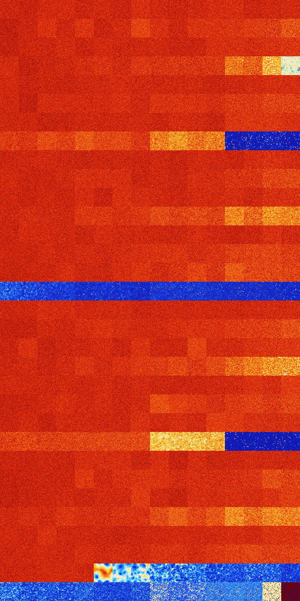

# B147 (74752-75263)

<details>
    <summary>Initial Grid</summary>
    
</details>


<details>
    <summary>Initial Grid RLE</summary>

```
#C Exported from GoGoL (https://github.com/marrow16/gogol)
#C Wrap mode: Toroidal
#C Boundary mode: Dead
#C Step: 0
x = 100, y = 100, rule = B147/S
6bo5bobo4bo6bo2bo25bo3bo6bo3bobo2bo$13bo40bo3bo$13bo4bo3bo7bo2bo6bo41bo
$40bo2bo$bo3bo37bo30bo4bo9bo$22bo9bo$21bo3bo8b2o7bo46bo$10bo65bo6bo2bo$
37bo13bo$11b2o9bo43bo11bo$37bo2bo6bo28bo$2bo55bo40bo$4bo21bo28bo24bo$3b
o9bo4bo2bo12bo5bo6bo11bo28bo2bo$39bo10bo32bo9bo$o26bo19bo5bo27bobo7bo$
9bo7bo26bo7b2o15bo9bo$16bo7bo15bo20bo13bo5bob2o$71bo5bo$2bo16bo2bo21bo
5b2o4bo23bo$57bo4bobo22bobo$16bo57bobo$19bo49bo24bo$16bo28bo7bo16bo$6bo
63bo14bo$8bobo22bo11bo5bo23bo20bo$42bo37b2o$18bo57bo4bo$o32bo23bo33bo4b
o$5bo20bo14bobo26bo3bo19bo$31bo10bo24bo$23bo18bo18bo33bo$o21bo12bo17bo$
11bo9bo29bo2bo42bo$28bo33bo22bobo$20bo37bo12bo$43bo13bo37bo$10bo$14bo6b
o23bo9bo39bobo$19b2ob2o16bo10bo20bo$39bo8bo25bo$68bo2bo$11bo32bo4bo30bo
$5bo22bo47b2o$3bo26bo19bo$3bo17bo33bo18bo7bo14bo$50bo20bobo$7bobo40bo
42bo4bo$2bo28bo2bo14bo6bo14bo9bo$16bo35bo7bo$19bo19bo13bo44bo$5bo5bo10b
o2bo7bo3bo5bo27bo22bo3bo$34bo11bo48bo$10bobo14bo33bo11bo16bo$51bo13bo$
44bo14bobo$14bo5bo2bo15bo2bo17bo5bo$o40bo4bo3bo32bo4bo$7bo6bo33bo43bobo
$28bo19bo33bo$2b2o8bo10b2o16bo21bo19bo$4bo20b2o15bo2bo27bo4bo$45bobo28b
o$6bo6bo8bo13bo9bo10bo5bo18bo$33bo11bo33bo$11b2o46b2o$5bo2b2o9bo8bobo
41bo7bo$10bo8bo32bo32bo7b2o$73bo11bo$o18bo19bo13bo34bo$4b2o55bo7bo17bo
9bo$7bo35bo13b2o3bo24bo$4bo70bo17bo4bo$38bo11b2o39bo3bo$16bo41b2o7bo27b
o$11bo23bo51bo$51b2o20bo19bo$8bo38bo19bo17bo2bo6bo$o22bo53bo3bo$14bo25b
o14bo2bo6bo2bo7bo14bo$9bo53bo8bo$4bo43bo25bo6bo6bo3bo2bo$32bo10bo17bo7b
o28bo$19bo41bo7bo18bo$7bo16bo$o10bo10b3o42bo16bo4bo6bo$45bo4b2o2bo3bo
21bo11bo$3bo6bo5bo47bo9bo8b2o11bo$17bo23bo$bo44bo9bo3bo30bo$18bo14bo16b
o2bo18bo6bo7bo$40bo5bo7bo5bo9bo2b2o9bo$28bo4bo7bo6bo23bo$3bo9bo5bo9bo
22bo$8bo19bo3bo18bo7bo6bo14bo4bo9bo$16bo7bobo3bo29bobo21bo2bo$7bo15bobo
42bo4bo16bo6bo$16bo7bo38bo$15b3o17bo30bo4bo$36bo12b2o38bo!
```
</details>
<details>
    <summary>Thumbnail</summary>

</details>
<table>
<tr>
    <td><a href="./74752%20S%20Heat%20Map%20Activity.png"></a><br>S (74752)<br>G>1000</td>    <td><a href="./74753%20S0%20Heat%20Map%20Activity.png"></a><br>S0 (74753)<br>G>1000</td>    <td><a href="./74754%20S1%20Heat%20Map%20Activity.png"></a><br>S1 (74754)<br>G>1000</td>    <td><a href="./74755%20S01%20Heat%20Map%20Activity.png"></a><br>S01 (74755)<br>G>1000</td>    <td><a href="./74756%20S2%20Heat%20Map%20Activity.png"></a><br>S2 (74756)<br>G>1000</td>    <td><a href="./74757%20S02%20Heat%20Map%20Activity.png"></a><br>S02 (74757)<br>G>1000</td>    <td><a href="./74758%20S12%20Heat%20Map%20Activity.png"></a><br>S12 (74758)<br>G>1000</td>    <td><a href="./74759%20S012%20Heat%20Map%20Activity.png"></a><br>S012 (74759)<br>G>1000</td>    <td><a href="./74760%20S3%20Heat%20Map%20Activity.png"></a><br>S3 (74760)<br>G>1000</td>    <td><a href="./74761%20S03%20Heat%20Map%20Activity.png"></a><br>S03 (74761)<br>G>1000</td>    <td><a href="./74762%20S13%20Heat%20Map%20Activity.png"></a><br>S13 (74762)<br>G>1000</td>    <td><a href="./74763%20S013%20Heat%20Map%20Activity.png"></a><br>S013 (74763)<br>G>1000</td>    <td><a href="./74764%20S23%20Heat%20Map%20Activity.png"></a><br>S23 (74764)<br>G>1000</td>    <td><a href="./74765%20S023%20Heat%20Map%20Activity.png"></a><br>S023 (74765)<br>G>1000</td>    <td><a href="./74766%20S123%20Heat%20Map%20Activity.png"></a><br>S123 (74766)<br>G>1000</td>    <td><a href="./74767%20S0123%20Heat%20Map%20Activity.png"></a><br>S0123 (74767)<br>G>1000</td></tr>
<tr>
    <td><a href="./74768%20S4%20Heat%20Map%20Activity.png"></a><br>S4 (74768)<br>G>1000</td>    <td><a href="./74769%20S04%20Heat%20Map%20Activity.png"></a><br>S04 (74769)<br>G>1000</td>    <td><a href="./74770%20S14%20Heat%20Map%20Activity.png"></a><br>S14 (74770)<br>G>1000</td>    <td><a href="./74771%20S014%20Heat%20Map%20Activity.png"></a><br>S014 (74771)<br>G>1000</td>    <td><a href="./74772%20S24%20Heat%20Map%20Activity.png"></a><br>S24 (74772)<br>G>1000</td>    <td><a href="./74773%20S024%20Heat%20Map%20Activity.png"></a><br>S024 (74773)<br>G>1000</td>    <td><a href="./74774%20S124%20Heat%20Map%20Activity.png"></a><br>S124 (74774)<br>G>1000</td>    <td><a href="./74775%20S0124%20Heat%20Map%20Activity.png"></a><br>S0124 (74775)<br>G>1000</td>    <td><a href="./74776%20S34%20Heat%20Map%20Activity.png"></a><br>S34 (74776)<br>G>1000</td>    <td><a href="./74777%20S034%20Heat%20Map%20Activity.png"></a><br>S034 (74777)<br>G>1000</td>    <td><a href="./74778%20S134%20Heat%20Map%20Activity.png"></a><br>S134 (74778)<br>G>1000</td>    <td><a href="./74779%20S0134%20Heat%20Map%20Activity.png"></a><br>S0134 (74779)<br>G>1000</td>    <td><a href="./74780%20S234%20Heat%20Map%20Activity.png"></a><br>S234 (74780)<br>G>1000</td>    <td><a href="./74781%20S0234%20Heat%20Map%20Activity.png"></a><br>S0234 (74781)<br>G>1000</td>    <td><a href="./74782%20S1234%20Heat%20Map%20Activity.png"></a><br>S1234 (74782)<br>G>1000</td>    <td><a href="./74783%20S01234%20Heat%20Map%20Activity.png"></a><br>S01234 (74783)<br>G>1000</td></tr>
<tr>
    <td><a href="./74784%20S5%20Heat%20Map%20Activity.png"></a><br>S5 (74784)<br>G>1000</td>    <td><a href="./74785%20S05%20Heat%20Map%20Activity.png"></a><br>S05 (74785)<br>G>1000</td>    <td><a href="./74786%20S15%20Heat%20Map%20Activity.png"></a><br>S15 (74786)<br>G>1000</td>    <td><a href="./74787%20S015%20Heat%20Map%20Activity.png"></a><br>S015 (74787)<br>G>1000</td>    <td><a href="./74788%20S25%20Heat%20Map%20Activity.png"></a><br>S25 (74788)<br>G>1000</td>    <td><a href="./74789%20S025%20Heat%20Map%20Activity.png"></a><br>S025 (74789)<br>G>1000</td>    <td><a href="./74790%20S125%20Heat%20Map%20Activity.png"></a><br>S125 (74790)<br>G>1000</td>    <td><a href="./74791%20S0125%20Heat%20Map%20Activity.png"></a><br>S0125 (74791)<br>G>1000</td>    <td><a href="./74792%20S35%20Heat%20Map%20Activity.png"></a><br>S35 (74792)<br>G>1000</td>    <td><a href="./74793%20S035%20Heat%20Map%20Activity.png"></a><br>S035 (74793)<br>G>1000</td>    <td><a href="./74794%20S135%20Heat%20Map%20Activity.png"></a><br>S135 (74794)<br>G>1000</td>    <td><a href="./74795%20S0135%20Heat%20Map%20Activity.png"></a><br>S0135 (74795)<br>G>1000</td>    <td><a href="./74796%20S235%20Heat%20Map%20Activity.png"></a><br>S235 (74796)<br>G>1000</td>    <td><a href="./74797%20S0235%20Heat%20Map%20Activity.png"></a><br>S0235 (74797)<br>G>1000</td>    <td><a href="./74798%20S1235%20Heat%20Map%20Activity.png"></a><br>S1235 (74798)<br>G>1000</td>    <td><a href="./74799%20S01235%20Heat%20Map%20Activity.png"></a><br>S01235 (74799)<br>G>1000</td></tr>
<tr>
    <td><a href="./74800%20S45%20Heat%20Map%20Activity.png"></a><br>S45 (74800)<br>G>1000</td>    <td><a href="./74801%20S045%20Heat%20Map%20Activity.png"></a><br>S045 (74801)<br>G>1000</td>    <td><a href="./74802%20S145%20Heat%20Map%20Activity.png"></a><br>S145 (74802)<br>G>1000</td>    <td><a href="./74803%20S0145%20Heat%20Map%20Activity.png"></a><br>S0145 (74803)<br>G>1000</td>    <td><a href="./74804%20S245%20Heat%20Map%20Activity.png"></a><br>S245 (74804)<br>G>1000</td>    <td><a href="./74805%20S0245%20Heat%20Map%20Activity.png"></a><br>S0245 (74805)<br>G>1000</td>    <td><a href="./74806%20S1245%20Heat%20Map%20Activity.png"></a><br>S1245 (74806)<br>G>1000</td>    <td><a href="./74807%20S01245%20Heat%20Map%20Activity.png"></a><br>S01245 (74807)<br>G>1000</td>    <td><a href="./74808%20S345%20Heat%20Map%20Activity.png"></a><br>S345 (74808)<br>G>1000</td>    <td><a href="./74809%20S0345%20Heat%20Map%20Activity.png"></a><br>S0345 (74809)<br>G>1000</td>    <td><a href="./74810%20S1345%20Heat%20Map%20Activity.png"></a><br>S1345 (74810)<br>G>1000</td>    <td><a href="./74811%20S01345%20Heat%20Map%20Activity.png"></a><br>S01345 (74811)<br>G>1000</td>    <td><a href="./74812%20S2345%20Heat%20Map%20Activity.png"></a><br>S2345 (74812)<br>G>1000</td>    <td><a href="./74813%20S02345%20Heat%20Map%20Activity.png"></a><br>S02345 (74813)<br>G>1000</td>    <td><a href="./74814%20S12345%20Heat%20Map%20Activity.png"></a><br>S12345 (74814)<br>G>1000</td>    <td><a href="./74815%20S012345%20Heat%20Map%20Activity.png"></a><br>S012345 (74815)<br>G>1000</td></tr>
<tr>
    <td><a href="./74816%20S6%20Heat%20Map%20Activity.png"></a><br>S6 (74816)<br>G>1000</td>    <td><a href="./74817%20S06%20Heat%20Map%20Activity.png"></a><br>S06 (74817)<br>G>1000</td>    <td><a href="./74818%20S16%20Heat%20Map%20Activity.png"></a><br>S16 (74818)<br>G>1000</td>    <td><a href="./74819%20S016%20Heat%20Map%20Activity.png"></a><br>S016 (74819)<br>G>1000</td>    <td><a href="./74820%20S26%20Heat%20Map%20Activity.png"></a><br>S26 (74820)<br>G>1000</td>    <td><a href="./74821%20S026%20Heat%20Map%20Activity.png"></a><br>S026 (74821)<br>G>1000</td>    <td><a href="./74822%20S126%20Heat%20Map%20Activity.png"></a><br>S126 (74822)<br>G>1000</td>    <td><a href="./74823%20S0126%20Heat%20Map%20Activity.png"></a><br>S0126 (74823)<br>G>1000</td>    <td><a href="./74824%20S36%20Heat%20Map%20Activity.png"></a><br>S36 (74824)<br>G>1000</td>    <td><a href="./74825%20S036%20Heat%20Map%20Activity.png"></a><br>S036 (74825)<br>G>1000</td>    <td><a href="./74826%20S136%20Heat%20Map%20Activity.png"></a><br>S136 (74826)<br>G>1000</td>    <td><a href="./74827%20S0136%20Heat%20Map%20Activity.png"></a><br>S0136 (74827)<br>G>1000</td>    <td><a href="./74828%20S236%20Heat%20Map%20Activity.png"></a><br>S236 (74828)<br>G>1000</td>    <td><a href="./74829%20S0236%20Heat%20Map%20Activity.png"></a><br>S0236 (74829)<br>G>1000</td>    <td><a href="./74830%20S1236%20Heat%20Map%20Activity.png"></a><br>S1236 (74830)<br>G>1000</td>    <td><a href="./74831%20S01236%20Heat%20Map%20Activity.png"></a><br>S01236 (74831)<br>G>1000</td></tr>
<tr>
    <td><a href="./74832%20S46%20Heat%20Map%20Activity.png"></a><br>S46 (74832)<br>G>1000</td>    <td><a href="./74833%20S046%20Heat%20Map%20Activity.png"></a><br>S046 (74833)<br>G>1000</td>    <td><a href="./74834%20S146%20Heat%20Map%20Activity.png"></a><br>S146 (74834)<br>G>1000</td>    <td><a href="./74835%20S0146%20Heat%20Map%20Activity.png"></a><br>S0146 (74835)<br>G>1000</td>    <td><a href="./74836%20S246%20Heat%20Map%20Activity.png"></a><br>S246 (74836)<br>G>1000</td>    <td><a href="./74837%20S0246%20Heat%20Map%20Activity.png"></a><br>S0246 (74837)<br>G>1000</td>    <td><a href="./74838%20S1246%20Heat%20Map%20Activity.png"></a><br>S1246 (74838)<br>G>1000</td>    <td><a href="./74839%20S01246%20Heat%20Map%20Activity.png"></a><br>S01246 (74839)<br>G>1000</td>    <td><a href="./74840%20S346%20Heat%20Map%20Activity.png"></a><br>S346 (74840)<br>G>1000</td>    <td><a href="./74841%20S0346%20Heat%20Map%20Activity.png"></a><br>S0346 (74841)<br>G>1000</td>    <td><a href="./74842%20S1346%20Heat%20Map%20Activity.png"></a><br>S1346 (74842)<br>G>1000</td>    <td><a href="./74843%20S01346%20Heat%20Map%20Activity.png"></a><br>S01346 (74843)<br>G>1000</td>    <td><a href="./74844%20S2346%20Heat%20Map%20Activity.png"></a><br>S2346 (74844)<br>G>1000</td>    <td><a href="./74845%20S02346%20Heat%20Map%20Activity.png"></a><br>S02346 (74845)<br>G>1000</td>    <td><a href="./74846%20S12346%20Heat%20Map%20Activity.png"></a><br>S12346 (74846)<br>G>1000</td>    <td><a href="./74847%20S012346%20Heat%20Map%20Activity.png"></a><br>S012346 (74847)<br>G>1000</td></tr>
<tr>
    <td><a href="./74848%20S56%20Heat%20Map%20Activity.png"></a><br>S56 (74848)<br>G>1000</td>    <td><a href="./74849%20S056%20Heat%20Map%20Activity.png"></a><br>S056 (74849)<br>G>1000</td>    <td><a href="./74850%20S156%20Heat%20Map%20Activity.png"></a><br>S156 (74850)<br>G>1000</td>    <td><a href="./74851%20S0156%20Heat%20Map%20Activity.png"></a><br>S0156 (74851)<br>G>1000</td>    <td><a href="./74852%20S256%20Heat%20Map%20Activity.png"></a><br>S256 (74852)<br>G>1000</td>    <td><a href="./74853%20S0256%20Heat%20Map%20Activity.png"></a><br>S0256 (74853)<br>G>1000</td>    <td><a href="./74854%20S1256%20Heat%20Map%20Activity.png"></a><br>S1256 (74854)<br>G>1000</td>    <td><a href="./74855%20S01256%20Heat%20Map%20Activity.png"></a><br>S01256 (74855)<br>G>1000</td>    <td><a href="./74856%20S356%20Heat%20Map%20Activity.png"></a><br>S356 (74856)<br>G>1000</td>    <td><a href="./74857%20S0356%20Heat%20Map%20Activity.png"></a><br>S0356 (74857)<br>G>1000</td>    <td><a href="./74858%20S1356%20Heat%20Map%20Activity.png"></a><br>S1356 (74858)<br>G>1000</td>    <td><a href="./74859%20S01356%20Heat%20Map%20Activity.png"></a><br>S01356 (74859)<br>G>1000</td>    <td><a href="./74860%20S2356%20Heat%20Map%20Activity.png"></a><br>S2356 (74860)<br>G>1000</td>    <td><a href="./74861%20S02356%20Heat%20Map%20Activity.png"></a><br>S02356 (74861)<br>G>1000</td>    <td><a href="./74862%20S12356%20Heat%20Map%20Activity.png"></a><br>S12356 (74862)<br>G>1000</td>    <td><a href="./74863%20S012356%20Heat%20Map%20Activity.png"></a><br>S012356 (74863)<br>G>1000</td></tr>
<tr>
    <td><a href="./74864%20S456%20Heat%20Map%20Activity.png"></a><br>S456 (74864)<br>G>1000</td>    <td><a href="./74865%20S0456%20Heat%20Map%20Activity.png"></a><br>S0456 (74865)<br>G>1000</td>    <td><a href="./74866%20S1456%20Heat%20Map%20Activity.png"></a><br>S1456 (74866)<br>G>1000</td>    <td><a href="./74867%20S01456%20Heat%20Map%20Activity.png"></a><br>S01456 (74867)<br>G>1000</td>    <td><a href="./74868%20S2456%20Heat%20Map%20Activity.png"></a><br>S2456 (74868)<br>G>1000</td>    <td><a href="./74869%20S02456%20Heat%20Map%20Activity.png"></a><br>S02456 (74869)<br>G>1000</td>    <td><a href="./74870%20S12456%20Heat%20Map%20Activity.png"></a><br>S12456 (74870)<br>G>1000</td>    <td><a href="./74871%20S012456%20Heat%20Map%20Activity.png"></a><br>S012456 (74871)<br>G>1000</td>    <td><a href="./74872%20S3456%20Heat%20Map%20Activity.png"></a><br>S3456 (74872)<br>G>1000</td>    <td><a href="./74873%20S03456%20Heat%20Map%20Activity.png"></a><br>S03456 (74873)<br>G>1000</td>    <td><a href="./74874%20S13456%20Heat%20Map%20Activity.png"></a><br>S13456 (74874)<br>G>1000</td>    <td><a href="./74875%20S013456%20Heat%20Map%20Activity.png"></a><br>S013456 (74875)<br>G>1000</td>    <td><a href="./74876%20S23456%20Heat%20Map%20Activity.png"></a><br>S23456 (74876)<br>G>1000</td>    <td><a href="./74877%20S023456%20Heat%20Map%20Activity.png"></a><br>S023456 (74877)<br>R@635,p360</td>    <td><a href="./74878%20S123456%20Heat%20Map%20Activity.png"></a><br>S123456 (74878)<br>R@378,p180</td>    <td><a href="./74879%20S0123456%20Heat%20Map%20Activity.png"></a><br>S0123456 (74879)<br>G>1000</td></tr>
<tr>
    <td><a href="./74880%20S7%20Heat%20Map%20Activity.png"></a><br>S7 (74880)<br>G>1000</td>    <td><a href="./74881%20S07%20Heat%20Map%20Activity.png"></a><br>S07 (74881)<br>G>1000</td>    <td><a href="./74882%20S17%20Heat%20Map%20Activity.png"></a><br>S17 (74882)<br>G>1000</td>    <td><a href="./74883%20S017%20Heat%20Map%20Activity.png"></a><br>S017 (74883)<br>G>1000</td>    <td><a href="./74884%20S27%20Heat%20Map%20Activity.png"></a><br>S27 (74884)<br>G>1000</td>    <td><a href="./74885%20S027%20Heat%20Map%20Activity.png"></a><br>S027 (74885)<br>G>1000</td>    <td><a href="./74886%20S127%20Heat%20Map%20Activity.png"></a><br>S127 (74886)<br>G>1000</td>    <td><a href="./74887%20S0127%20Heat%20Map%20Activity.png"></a><br>S0127 (74887)<br>G>1000</td>    <td><a href="./74888%20S37%20Heat%20Map%20Activity.png"></a><br>S37 (74888)<br>G>1000</td>    <td><a href="./74889%20S037%20Heat%20Map%20Activity.png"></a><br>S037 (74889)<br>G>1000</td>    <td><a href="./74890%20S137%20Heat%20Map%20Activity.png"></a><br>S137 (74890)<br>G>1000</td>    <td><a href="./74891%20S0137%20Heat%20Map%20Activity.png"></a><br>S0137 (74891)<br>G>1000</td>    <td><a href="./74892%20S237%20Heat%20Map%20Activity.png"></a><br>S237 (74892)<br>G>1000</td>    <td><a href="./74893%20S0237%20Heat%20Map%20Activity.png"></a><br>S0237 (74893)<br>G>1000</td>    <td><a href="./74894%20S1237%20Heat%20Map%20Activity.png"></a><br>S1237 (74894)<br>G>1000</td>    <td><a href="./74895%20S01237%20Heat%20Map%20Activity.png"></a><br>S01237 (74895)<br>G>1000</td></tr>
<tr>
    <td><a href="./74896%20S47%20Heat%20Map%20Activity.png"></a><br>S47 (74896)<br>G>1000</td>    <td><a href="./74897%20S047%20Heat%20Map%20Activity.png"></a><br>S047 (74897)<br>G>1000</td>    <td><a href="./74898%20S147%20Heat%20Map%20Activity.png"></a><br>S147 (74898)<br>G>1000</td>    <td><a href="./74899%20S0147%20Heat%20Map%20Activity.png"></a><br>S0147 (74899)<br>G>1000</td>    <td><a href="./74900%20S247%20Heat%20Map%20Activity.png"></a><br>S247 (74900)<br>G>1000</td>    <td><a href="./74901%20S0247%20Heat%20Map%20Activity.png"></a><br>S0247 (74901)<br>G>1000</td>    <td><a href="./74902%20S1247%20Heat%20Map%20Activity.png"></a><br>S1247 (74902)<br>G>1000</td>    <td><a href="./74903%20S01247%20Heat%20Map%20Activity.png"></a><br>S01247 (74903)<br>G>1000</td>    <td><a href="./74904%20S347%20Heat%20Map%20Activity.png"></a><br>S347 (74904)<br>G>1000</td>    <td><a href="./74905%20S0347%20Heat%20Map%20Activity.png"></a><br>S0347 (74905)<br>G>1000</td>    <td><a href="./74906%20S1347%20Heat%20Map%20Activity.png"></a><br>S1347 (74906)<br>G>1000</td>    <td><a href="./74907%20S01347%20Heat%20Map%20Activity.png"></a><br>S01347 (74907)<br>G>1000</td>    <td><a href="./74908%20S2347%20Heat%20Map%20Activity.png"></a><br>S2347 (74908)<br>G>1000</td>    <td><a href="./74909%20S02347%20Heat%20Map%20Activity.png"></a><br>S02347 (74909)<br>G>1000</td>    <td><a href="./74910%20S12347%20Heat%20Map%20Activity.png"></a><br>S12347 (74910)<br>G>1000</td>    <td><a href="./74911%20S012347%20Heat%20Map%20Activity.png"></a><br>S012347 (74911)<br>G>1000</td></tr>
<tr>
    <td><a href="./74912%20S57%20Heat%20Map%20Activity.png"></a><br>S57 (74912)<br>G>1000</td>    <td><a href="./74913%20S057%20Heat%20Map%20Activity.png"></a><br>S057 (74913)<br>G>1000</td>    <td><a href="./74914%20S157%20Heat%20Map%20Activity.png"></a><br>S157 (74914)<br>G>1000</td>    <td><a href="./74915%20S0157%20Heat%20Map%20Activity.png"></a><br>S0157 (74915)<br>G>1000</td>    <td><a href="./74916%20S257%20Heat%20Map%20Activity.png"></a><br>S257 (74916)<br>G>1000</td>    <td><a href="./74917%20S0257%20Heat%20Map%20Activity.png"></a><br>S0257 (74917)<br>G>1000</td>    <td><a href="./74918%20S1257%20Heat%20Map%20Activity.png"></a><br>S1257 (74918)<br>G>1000</td>    <td><a href="./74919%20S01257%20Heat%20Map%20Activity.png"></a><br>S01257 (74919)<br>G>1000</td>    <td><a href="./74920%20S357%20Heat%20Map%20Activity.png"></a><br>S357 (74920)<br>G>1000</td>    <td><a href="./74921%20S0357%20Heat%20Map%20Activity.png"></a><br>S0357 (74921)<br>G>1000</td>    <td><a href="./74922%20S1357%20Heat%20Map%20Activity.png"></a><br>S1357 (74922)<br>G>1000</td>    <td><a href="./74923%20S01357%20Heat%20Map%20Activity.png"></a><br>S01357 (74923)<br>G>1000</td>    <td><a href="./74924%20S2357%20Heat%20Map%20Activity.png"></a><br>S2357 (74924)<br>G>1000</td>    <td><a href="./74925%20S02357%20Heat%20Map%20Activity.png"></a><br>S02357 (74925)<br>G>1000</td>    <td><a href="./74926%20S12357%20Heat%20Map%20Activity.png"></a><br>S12357 (74926)<br>G>1000</td>    <td><a href="./74927%20S012357%20Heat%20Map%20Activity.png"></a><br>S012357 (74927)<br>G>1000</td></tr>
<tr>
    <td><a href="./74928%20S457%20Heat%20Map%20Activity.png"></a><br>S457 (74928)<br>G>1000</td>    <td><a href="./74929%20S0457%20Heat%20Map%20Activity.png"></a><br>S0457 (74929)<br>G>1000</td>    <td><a href="./74930%20S1457%20Heat%20Map%20Activity.png"></a><br>S1457 (74930)<br>G>1000</td>    <td><a href="./74931%20S01457%20Heat%20Map%20Activity.png"></a><br>S01457 (74931)<br>G>1000</td>    <td><a href="./74932%20S2457%20Heat%20Map%20Activity.png"></a><br>S2457 (74932)<br>G>1000</td>    <td><a href="./74933%20S02457%20Heat%20Map%20Activity.png"></a><br>S02457 (74933)<br>G>1000</td>    <td><a href="./74934%20S12457%20Heat%20Map%20Activity.png"></a><br>S12457 (74934)<br>G>1000</td>    <td><a href="./74935%20S012457%20Heat%20Map%20Activity.png"></a><br>S012457 (74935)<br>G>1000</td>    <td><a href="./74936%20S3457%20Heat%20Map%20Activity.png"></a><br>S3457 (74936)<br>G>1000</td>    <td><a href="./74937%20S03457%20Heat%20Map%20Activity.png"></a><br>S03457 (74937)<br>G>1000</td>    <td><a href="./74938%20S13457%20Heat%20Map%20Activity.png"></a><br>S13457 (74938)<br>G>1000</td>    <td><a href="./74939%20S013457%20Heat%20Map%20Activity.png"></a><br>S013457 (74939)<br>G>1000</td>    <td><a href="./74940%20S23457%20Heat%20Map%20Activity.png"></a><br>S23457 (74940)<br>G>1000</td>    <td><a href="./74941%20S023457%20Heat%20Map%20Activity.png"></a><br>S023457 (74941)<br>G>1000</td>    <td><a href="./74942%20S123457%20Heat%20Map%20Activity.png"></a><br>S123457 (74942)<br>G>1000</td>    <td><a href="./74943%20S0123457%20Heat%20Map%20Activity.png"></a><br>S0123457 (74943)<br>G>1000</td></tr>
<tr>
    <td><a href="./74944%20S67%20Heat%20Map%20Activity.png"></a><br>S67 (74944)<br>G>1000</td>    <td><a href="./74945%20S067%20Heat%20Map%20Activity.png"></a><br>S067 (74945)<br>G>1000</td>    <td><a href="./74946%20S167%20Heat%20Map%20Activity.png"></a><br>S167 (74946)<br>G>1000</td>    <td><a href="./74947%20S0167%20Heat%20Map%20Activity.png"></a><br>S0167 (74947)<br>G>1000</td>    <td><a href="./74948%20S267%20Heat%20Map%20Activity.png"></a><br>S267 (74948)<br>G>1000</td>    <td><a href="./74949%20S0267%20Heat%20Map%20Activity.png"></a><br>S0267 (74949)<br>G>1000</td>    <td><a href="./74950%20S1267%20Heat%20Map%20Activity.png"></a><br>S1267 (74950)<br>G>1000</td>    <td><a href="./74951%20S01267%20Heat%20Map%20Activity.png"></a><br>S01267 (74951)<br>G>1000</td>    <td><a href="./74952%20S367%20Heat%20Map%20Activity.png"></a><br>S367 (74952)<br>G>1000</td>    <td><a href="./74953%20S0367%20Heat%20Map%20Activity.png"></a><br>S0367 (74953)<br>G>1000</td>    <td><a href="./74954%20S1367%20Heat%20Map%20Activity.png"></a><br>S1367 (74954)<br>G>1000</td>    <td><a href="./74955%20S01367%20Heat%20Map%20Activity.png"></a><br>S01367 (74955)<br>G>1000</td>    <td><a href="./74956%20S2367%20Heat%20Map%20Activity.png"></a><br>S2367 (74956)<br>G>1000</td>    <td><a href="./74957%20S02367%20Heat%20Map%20Activity.png"></a><br>S02367 (74957)<br>G>1000</td>    <td><a href="./74958%20S12367%20Heat%20Map%20Activity.png"></a><br>S12367 (74958)<br>G>1000</td>    <td><a href="./74959%20S012367%20Heat%20Map%20Activity.png"></a><br>S012367 (74959)<br>G>1000</td></tr>
<tr>
    <td><a href="./74960%20S467%20Heat%20Map%20Activity.png"></a><br>S467 (74960)<br>G>1000</td>    <td><a href="./74961%20S0467%20Heat%20Map%20Activity.png"></a><br>S0467 (74961)<br>G>1000</td>    <td><a href="./74962%20S1467%20Heat%20Map%20Activity.png"></a><br>S1467 (74962)<br>G>1000</td>    <td><a href="./74963%20S01467%20Heat%20Map%20Activity.png"></a><br>S01467 (74963)<br>G>1000</td>    <td><a href="./74964%20S2467%20Heat%20Map%20Activity.png"></a><br>S2467 (74964)<br>G>1000</td>    <td><a href="./74965%20S02467%20Heat%20Map%20Activity.png"></a><br>S02467 (74965)<br>G>1000</td>    <td><a href="./74966%20S12467%20Heat%20Map%20Activity.png"></a><br>S12467 (74966)<br>G>1000</td>    <td><a href="./74967%20S012467%20Heat%20Map%20Activity.png"></a><br>S012467 (74967)<br>G>1000</td>    <td><a href="./74968%20S3467%20Heat%20Map%20Activity.png"></a><br>S3467 (74968)<br>G>1000</td>    <td><a href="./74969%20S03467%20Heat%20Map%20Activity.png"></a><br>S03467 (74969)<br>G>1000</td>    <td><a href="./74970%20S13467%20Heat%20Map%20Activity.png"></a><br>S13467 (74970)<br>G>1000</td>    <td><a href="./74971%20S013467%20Heat%20Map%20Activity.png"></a><br>S013467 (74971)<br>G>1000</td>    <td><a href="./74972%20S23467%20Heat%20Map%20Activity.png"></a><br>S23467 (74972)<br>G>1000</td>    <td><a href="./74973%20S023467%20Heat%20Map%20Activity.png"></a><br>S023467 (74973)<br>G>1000</td>    <td><a href="./74974%20S123467%20Heat%20Map%20Activity.png"></a><br>S123467 (74974)<br>G>1000</td>    <td><a href="./74975%20S0123467%20Heat%20Map%20Activity.png"></a><br>S0123467 (74975)<br>G>1000</td></tr>
<tr>
    <td><a href="./74976%20S567%20Heat%20Map%20Activity.png"></a><br>S567 (74976)<br>G>1000</td>    <td><a href="./74977%20S0567%20Heat%20Map%20Activity.png"></a><br>S0567 (74977)<br>G>1000</td>    <td><a href="./74978%20S1567%20Heat%20Map%20Activity.png"></a><br>S1567 (74978)<br>G>1000</td>    <td><a href="./74979%20S01567%20Heat%20Map%20Activity.png"></a><br>S01567 (74979)<br>G>1000</td>    <td><a href="./74980%20S2567%20Heat%20Map%20Activity.png"></a><br>S2567 (74980)<br>G>1000</td>    <td><a href="./74981%20S02567%20Heat%20Map%20Activity.png"></a><br>S02567 (74981)<br>G>1000</td>    <td><a href="./74982%20S12567%20Heat%20Map%20Activity.png"></a><br>S12567 (74982)<br>G>1000</td>    <td><a href="./74983%20S012567%20Heat%20Map%20Activity.png"></a><br>S012567 (74983)<br>G>1000</td>    <td><a href="./74984%20S3567%20Heat%20Map%20Activity.png"></a><br>S3567 (74984)<br>G>1000</td>    <td><a href="./74985%20S03567%20Heat%20Map%20Activity.png"></a><br>S03567 (74985)<br>G>1000</td>    <td><a href="./74986%20S13567%20Heat%20Map%20Activity.png"></a><br>S13567 (74986)<br>G>1000</td>    <td><a href="./74987%20S013567%20Heat%20Map%20Activity.png"></a><br>S013567 (74987)<br>G>1000</td>    <td><a href="./74988%20S23567%20Heat%20Map%20Activity.png"></a><br>S23567 (74988)<br>G>1000</td>    <td><a href="./74989%20S023567%20Heat%20Map%20Activity.png"></a><br>S023567 (74989)<br>G>1000</td>    <td><a href="./74990%20S123567%20Heat%20Map%20Activity.png"></a><br>S123567 (74990)<br>G>1000</td>    <td><a href="./74991%20S0123567%20Heat%20Map%20Activity.png"></a><br>S0123567 (74991)<br>G>1000</td></tr>
<tr>
    <td><a href="./74992%20S4567%20Heat%20Map%20Activity.png"></a><br>S4567 (74992)<br>R@73,p4</td>    <td><a href="./74993%20S04567%20Heat%20Map%20Activity.png"></a><br>S04567 (74993)<br>R@72,p6</td>    <td><a href="./74994%20S14567%20Heat%20Map%20Activity.png"></a><br>S14567 (74994)<br>R@78,p6</td>    <td><a href="./74995%20S014567%20Heat%20Map%20Activity.png"></a><br>S014567 (74995)<br>R@75,p12</td>    <td><a href="./74996%20S24567%20Heat%20Map%20Activity.png"></a><br>S24567 (74996)<br>R@89,p6</td>    <td><a href="./74997%20S024567%20Heat%20Map%20Activity.png"></a><br>S024567 (74997)<br>R@68,p12</td>    <td><a href="./74998%20S124567%20Heat%20Map%20Activity.png"></a><br>S124567 (74998)<br>R@72,p6</td>    <td><a href="./74999%20S0124567%20Heat%20Map%20Activity.png"></a><br>S0124567 (74999)<br>R@88,p30</td>    <td><a href="./75000%20S34567%20Heat%20Map%20Activity.png"></a><br>S34567 (75000)<br>R@43,p12</td>    <td><a href="./75001%20S034567%20Heat%20Map%20Activity.png"></a><br>S034567 (75001)<br>R@37,p12</td>    <td><a href="./75002%20S134567%20Heat%20Map%20Activity.png"></a><br>S134567 (75002)<br>R@36,p12</td>    <td><a href="./75003%20S0134567%20Heat%20Map%20Activity.png"></a><br>S0134567 (75003)<br>R@34,p12</td>    <td><a href="./75004%20S234567%20Heat%20Map%20Activity.png"></a><br>S234567 (75004)<br>R@34,p12</td>    <td><a href="./75005%20S0234567%20Heat%20Map%20Activity.png"></a><br>S0234567 (75005)<br>R@34,p12</td>    <td><a href="./75006%20S1234567%20Heat%20Map%20Activity.png"></a><br>S1234567 (75006)<br>R@30,p12</td>    <td><a href="./75007%20S01234567%20Heat%20Map%20Activity.png"></a><br>S01234567 (75007)<br>R@33,p12</td></tr>
<tr>
    <td><a href="./75008%20S8%20Heat%20Map%20Activity.png"></a><br>S8 (75008)<br>G>1000</td>    <td><a href="./75009%20S08%20Heat%20Map%20Activity.png"></a><br>S08 (75009)<br>G>1000</td>    <td><a href="./75010%20S18%20Heat%20Map%20Activity.png"></a><br>S18 (75010)<br>G>1000</td>    <td><a href="./75011%20S018%20Heat%20Map%20Activity.png"></a><br>S018 (75011)<br>G>1000</td>    <td><a href="./75012%20S28%20Heat%20Map%20Activity.png"></a><br>S28 (75012)<br>G>1000</td>    <td><a href="./75013%20S028%20Heat%20Map%20Activity.png"></a><br>S028 (75013)<br>G>1000</td>    <td><a href="./75014%20S128%20Heat%20Map%20Activity.png"></a><br>S128 (75014)<br>G>1000</td>    <td><a href="./75015%20S0128%20Heat%20Map%20Activity.png"></a><br>S0128 (75015)<br>G>1000</td>    <td><a href="./75016%20S38%20Heat%20Map%20Activity.png"></a><br>S38 (75016)<br>G>1000</td>    <td><a href="./75017%20S038%20Heat%20Map%20Activity.png"></a><br>S038 (75017)<br>G>1000</td>    <td><a href="./75018%20S138%20Heat%20Map%20Activity.png"></a><br>S138 (75018)<br>G>1000</td>    <td><a href="./75019%20S0138%20Heat%20Map%20Activity.png"></a><br>S0138 (75019)<br>G>1000</td>    <td><a href="./75020%20S238%20Heat%20Map%20Activity.png"></a><br>S238 (75020)<br>G>1000</td>    <td><a href="./75021%20S0238%20Heat%20Map%20Activity.png"></a><br>S0238 (75021)<br>G>1000</td>    <td><a href="./75022%20S1238%20Heat%20Map%20Activity.png"></a><br>S1238 (75022)<br>G>1000</td>    <td><a href="./75023%20S01238%20Heat%20Map%20Activity.png"></a><br>S01238 (75023)<br>G>1000</td></tr>
<tr>
    <td><a href="./75024%20S48%20Heat%20Map%20Activity.png"></a><br>S48 (75024)<br>G>1000</td>    <td><a href="./75025%20S048%20Heat%20Map%20Activity.png"></a><br>S048 (75025)<br>G>1000</td>    <td><a href="./75026%20S148%20Heat%20Map%20Activity.png"></a><br>S148 (75026)<br>G>1000</td>    <td><a href="./75027%20S0148%20Heat%20Map%20Activity.png"></a><br>S0148 (75027)<br>G>1000</td>    <td><a href="./75028%20S248%20Heat%20Map%20Activity.png"></a><br>S248 (75028)<br>G>1000</td>    <td><a href="./75029%20S0248%20Heat%20Map%20Activity.png"></a><br>S0248 (75029)<br>G>1000</td>    <td><a href="./75030%20S1248%20Heat%20Map%20Activity.png"></a><br>S1248 (75030)<br>G>1000</td>    <td><a href="./75031%20S01248%20Heat%20Map%20Activity.png"></a><br>S01248 (75031)<br>G>1000</td>    <td><a href="./75032%20S348%20Heat%20Map%20Activity.png"></a><br>S348 (75032)<br>G>1000</td>    <td><a href="./75033%20S0348%20Heat%20Map%20Activity.png"></a><br>S0348 (75033)<br>G>1000</td>    <td><a href="./75034%20S1348%20Heat%20Map%20Activity.png"></a><br>S1348 (75034)<br>G>1000</td>    <td><a href="./75035%20S01348%20Heat%20Map%20Activity.png"></a><br>S01348 (75035)<br>G>1000</td>    <td><a href="./75036%20S2348%20Heat%20Map%20Activity.png"></a><br>S2348 (75036)<br>G>1000</td>    <td><a href="./75037%20S02348%20Heat%20Map%20Activity.png"></a><br>S02348 (75037)<br>G>1000</td>    <td><a href="./75038%20S12348%20Heat%20Map%20Activity.png"></a><br>S12348 (75038)<br>G>1000</td>    <td><a href="./75039%20S012348%20Heat%20Map%20Activity.png"></a><br>S012348 (75039)<br>G>1000</td></tr>
<tr>
    <td><a href="./75040%20S58%20Heat%20Map%20Activity.png"></a><br>S58 (75040)<br>G>1000</td>    <td><a href="./75041%20S058%20Heat%20Map%20Activity.png"></a><br>S058 (75041)<br>G>1000</td>    <td><a href="./75042%20S158%20Heat%20Map%20Activity.png"></a><br>S158 (75042)<br>G>1000</td>    <td><a href="./75043%20S0158%20Heat%20Map%20Activity.png"></a><br>S0158 (75043)<br>G>1000</td>    <td><a href="./75044%20S258%20Heat%20Map%20Activity.png"></a><br>S258 (75044)<br>G>1000</td>    <td><a href="./75045%20S0258%20Heat%20Map%20Activity.png"></a><br>S0258 (75045)<br>G>1000</td>    <td><a href="./75046%20S1258%20Heat%20Map%20Activity.png"></a><br>S1258 (75046)<br>G>1000</td>    <td><a href="./75047%20S01258%20Heat%20Map%20Activity.png"></a><br>S01258 (75047)<br>G>1000</td>    <td><a href="./75048%20S358%20Heat%20Map%20Activity.png"></a><br>S358 (75048)<br>G>1000</td>    <td><a href="./75049%20S0358%20Heat%20Map%20Activity.png"></a><br>S0358 (75049)<br>G>1000</td>    <td><a href="./75050%20S1358%20Heat%20Map%20Activity.png"></a><br>S1358 (75050)<br>G>1000</td>    <td><a href="./75051%20S01358%20Heat%20Map%20Activity.png"></a><br>S01358 (75051)<br>G>1000</td>    <td><a href="./75052%20S2358%20Heat%20Map%20Activity.png"></a><br>S2358 (75052)<br>G>1000</td>    <td><a href="./75053%20S02358%20Heat%20Map%20Activity.png"></a><br>S02358 (75053)<br>G>1000</td>    <td><a href="./75054%20S12358%20Heat%20Map%20Activity.png"></a><br>S12358 (75054)<br>G>1000</td>    <td><a href="./75055%20S012358%20Heat%20Map%20Activity.png"></a><br>S012358 (75055)<br>G>1000</td></tr>
<tr>
    <td><a href="./75056%20S458%20Heat%20Map%20Activity.png"></a><br>S458 (75056)<br>G>1000</td>    <td><a href="./75057%20S0458%20Heat%20Map%20Activity.png"></a><br>S0458 (75057)<br>G>1000</td>    <td><a href="./75058%20S1458%20Heat%20Map%20Activity.png"></a><br>S1458 (75058)<br>G>1000</td>    <td><a href="./75059%20S01458%20Heat%20Map%20Activity.png"></a><br>S01458 (75059)<br>G>1000</td>    <td><a href="./75060%20S2458%20Heat%20Map%20Activity.png"></a><br>S2458 (75060)<br>G>1000</td>    <td><a href="./75061%20S02458%20Heat%20Map%20Activity.png"></a><br>S02458 (75061)<br>G>1000</td>    <td><a href="./75062%20S12458%20Heat%20Map%20Activity.png"></a><br>S12458 (75062)<br>G>1000</td>    <td><a href="./75063%20S012458%20Heat%20Map%20Activity.png"></a><br>S012458 (75063)<br>G>1000</td>    <td><a href="./75064%20S3458%20Heat%20Map%20Activity.png"></a><br>S3458 (75064)<br>G>1000</td>    <td><a href="./75065%20S03458%20Heat%20Map%20Activity.png"></a><br>S03458 (75065)<br>G>1000</td>    <td><a href="./75066%20S13458%20Heat%20Map%20Activity.png"></a><br>S13458 (75066)<br>G>1000</td>    <td><a href="./75067%20S013458%20Heat%20Map%20Activity.png"></a><br>S013458 (75067)<br>G>1000</td>    <td><a href="./75068%20S23458%20Heat%20Map%20Activity.png"></a><br>S23458 (75068)<br>G>1000</td>    <td><a href="./75069%20S023458%20Heat%20Map%20Activity.png"></a><br>S023458 (75069)<br>G>1000</td>    <td><a href="./75070%20S123458%20Heat%20Map%20Activity.png"></a><br>S123458 (75070)<br>G>1000</td>    <td><a href="./75071%20S0123458%20Heat%20Map%20Activity.png"></a><br>S0123458 (75071)<br>G>1000</td></tr>
<tr>
    <td><a href="./75072%20S68%20Heat%20Map%20Activity.png"></a><br>S68 (75072)<br>G>1000</td>    <td><a href="./75073%20S068%20Heat%20Map%20Activity.png"></a><br>S068 (75073)<br>G>1000</td>    <td><a href="./75074%20S168%20Heat%20Map%20Activity.png"></a><br>S168 (75074)<br>G>1000</td>    <td><a href="./75075%20S0168%20Heat%20Map%20Activity.png"></a><br>S0168 (75075)<br>G>1000</td>    <td><a href="./75076%20S268%20Heat%20Map%20Activity.png"></a><br>S268 (75076)<br>G>1000</td>    <td><a href="./75077%20S0268%20Heat%20Map%20Activity.png"></a><br>S0268 (75077)<br>G>1000</td>    <td><a href="./75078%20S1268%20Heat%20Map%20Activity.png"></a><br>S1268 (75078)<br>G>1000</td>    <td><a href="./75079%20S01268%20Heat%20Map%20Activity.png"></a><br>S01268 (75079)<br>G>1000</td>    <td><a href="./75080%20S368%20Heat%20Map%20Activity.png"></a><br>S368 (75080)<br>G>1000</td>    <td><a href="./75081%20S0368%20Heat%20Map%20Activity.png"></a><br>S0368 (75081)<br>G>1000</td>    <td><a href="./75082%20S1368%20Heat%20Map%20Activity.png"></a><br>S1368 (75082)<br>G>1000</td>    <td><a href="./75083%20S01368%20Heat%20Map%20Activity.png"></a><br>S01368 (75083)<br>G>1000</td>    <td><a href="./75084%20S2368%20Heat%20Map%20Activity.png"></a><br>S2368 (75084)<br>G>1000</td>    <td><a href="./75085%20S02368%20Heat%20Map%20Activity.png"></a><br>S02368 (75085)<br>G>1000</td>    <td><a href="./75086%20S12368%20Heat%20Map%20Activity.png"></a><br>S12368 (75086)<br>G>1000</td>    <td><a href="./75087%20S012368%20Heat%20Map%20Activity.png"></a><br>S012368 (75087)<br>G>1000</td></tr>
<tr>
    <td><a href="./75088%20S468%20Heat%20Map%20Activity.png"></a><br>S468 (75088)<br>G>1000</td>    <td><a href="./75089%20S0468%20Heat%20Map%20Activity.png"></a><br>S0468 (75089)<br>G>1000</td>    <td><a href="./75090%20S1468%20Heat%20Map%20Activity.png"></a><br>S1468 (75090)<br>G>1000</td>    <td><a href="./75091%20S01468%20Heat%20Map%20Activity.png"></a><br>S01468 (75091)<br>G>1000</td>    <td><a href="./75092%20S2468%20Heat%20Map%20Activity.png"></a><br>S2468 (75092)<br>G>1000</td>    <td><a href="./75093%20S02468%20Heat%20Map%20Activity.png"></a><br>S02468 (75093)<br>G>1000</td>    <td><a href="./75094%20S12468%20Heat%20Map%20Activity.png"></a><br>S12468 (75094)<br>G>1000</td>    <td><a href="./75095%20S012468%20Heat%20Map%20Activity.png"></a><br>S012468 (75095)<br>G>1000</td>    <td><a href="./75096%20S3468%20Heat%20Map%20Activity.png"></a><br>S3468 (75096)<br>G>1000</td>    <td><a href="./75097%20S03468%20Heat%20Map%20Activity.png"></a><br>S03468 (75097)<br>G>1000</td>    <td><a href="./75098%20S13468%20Heat%20Map%20Activity.png"></a><br>S13468 (75098)<br>G>1000</td>    <td><a href="./75099%20S013468%20Heat%20Map%20Activity.png"></a><br>S013468 (75099)<br>G>1000</td>    <td><a href="./75100%20S23468%20Heat%20Map%20Activity.png"></a><br>S23468 (75100)<br>G>1000</td>    <td><a href="./75101%20S023468%20Heat%20Map%20Activity.png"></a><br>S023468 (75101)<br>G>1000</td>    <td><a href="./75102%20S123468%20Heat%20Map%20Activity.png"></a><br>S123468 (75102)<br>G>1000</td>    <td><a href="./75103%20S0123468%20Heat%20Map%20Activity.png"></a><br>S0123468 (75103)<br>G>1000</td></tr>
<tr>
    <td><a href="./75104%20S568%20Heat%20Map%20Activity.png"></a><br>S568 (75104)<br>G>1000</td>    <td><a href="./75105%20S0568%20Heat%20Map%20Activity.png"></a><br>S0568 (75105)<br>G>1000</td>    <td><a href="./75106%20S1568%20Heat%20Map%20Activity.png"></a><br>S1568 (75106)<br>G>1000</td>    <td><a href="./75107%20S01568%20Heat%20Map%20Activity.png"></a><br>S01568 (75107)<br>G>1000</td>    <td><a href="./75108%20S2568%20Heat%20Map%20Activity.png"></a><br>S2568 (75108)<br>G>1000</td>    <td><a href="./75109%20S02568%20Heat%20Map%20Activity.png"></a><br>S02568 (75109)<br>G>1000</td>    <td><a href="./75110%20S12568%20Heat%20Map%20Activity.png"></a><br>S12568 (75110)<br>G>1000</td>    <td><a href="./75111%20S012568%20Heat%20Map%20Activity.png"></a><br>S012568 (75111)<br>G>1000</td>    <td><a href="./75112%20S3568%20Heat%20Map%20Activity.png"></a><br>S3568 (75112)<br>G>1000</td>    <td><a href="./75113%20S03568%20Heat%20Map%20Activity.png"></a><br>S03568 (75113)<br>G>1000</td>    <td><a href="./75114%20S13568%20Heat%20Map%20Activity.png"></a><br>S13568 (75114)<br>G>1000</td>    <td><a href="./75115%20S013568%20Heat%20Map%20Activity.png"></a><br>S013568 (75115)<br>G>1000</td>    <td><a href="./75116%20S23568%20Heat%20Map%20Activity.png"></a><br>S23568 (75116)<br>G>1000</td>    <td><a href="./75117%20S023568%20Heat%20Map%20Activity.png"></a><br>S023568 (75117)<br>G>1000</td>    <td><a href="./75118%20S123568%20Heat%20Map%20Activity.png"></a><br>S123568 (75118)<br>G>1000</td>    <td><a href="./75119%20S0123568%20Heat%20Map%20Activity.png"></a><br>S0123568 (75119)<br>G>1000</td></tr>
<tr>
    <td><a href="./75120%20S4568%20Heat%20Map%20Activity.png"></a><br>S4568 (75120)<br>G>1000</td>    <td><a href="./75121%20S04568%20Heat%20Map%20Activity.png"></a><br>S04568 (75121)<br>G>1000</td>    <td><a href="./75122%20S14568%20Heat%20Map%20Activity.png"></a><br>S14568 (75122)<br>G>1000</td>    <td><a href="./75123%20S014568%20Heat%20Map%20Activity.png"></a><br>S014568 (75123)<br>G>1000</td>    <td><a href="./75124%20S24568%20Heat%20Map%20Activity.png"></a><br>S24568 (75124)<br>G>1000</td>    <td><a href="./75125%20S024568%20Heat%20Map%20Activity.png"></a><br>S024568 (75125)<br>G>1000</td>    <td><a href="./75126%20S124568%20Heat%20Map%20Activity.png"></a><br>S124568 (75126)<br>G>1000</td>    <td><a href="./75127%20S0124568%20Heat%20Map%20Activity.png"></a><br>S0124568 (75127)<br>G>1000</td>    <td><a href="./75128%20S34568%20Heat%20Map%20Activity.png"></a><br>S34568 (75128)<br>G>1000</td>    <td><a href="./75129%20S034568%20Heat%20Map%20Activity.png"></a><br>S034568 (75129)<br>G>1000</td>    <td><a href="./75130%20S134568%20Heat%20Map%20Activity.png"></a><br>S134568 (75130)<br>G>1000</td>    <td><a href="./75131%20S0134568%20Heat%20Map%20Activity.png"></a><br>S0134568 (75131)<br>G>1000</td>    <td><a href="./75132%20S234568%20Heat%20Map%20Activity.png"></a><br>S234568 (75132)<br>G>1000</td>    <td><a href="./75133%20S0234568%20Heat%20Map%20Activity.png"></a><br>S0234568 (75133)<br>R@983,p840</td>    <td><a href="./75134%20S1234568%20Heat%20Map%20Activity.png"></a><br>S1234568 (75134)<br>G>1000</td>    <td><a href="./75135%20S01234568%20Heat%20Map%20Activity.png"></a><br>S01234568 (75135)<br>G>1000</td></tr>
<tr>
    <td><a href="./75136%20S78%20Heat%20Map%20Activity.png"></a><br>S78 (75136)<br>G>1000</td>    <td><a href="./75137%20S078%20Heat%20Map%20Activity.png"></a><br>S078 (75137)<br>G>1000</td>    <td><a href="./75138%20S178%20Heat%20Map%20Activity.png"></a><br>S178 (75138)<br>G>1000</td>    <td><a href="./75139%20S0178%20Heat%20Map%20Activity.png"></a><br>S0178 (75139)<br>G>1000</td>    <td><a href="./75140%20S278%20Heat%20Map%20Activity.png"></a><br>S278 (75140)<br>G>1000</td>    <td><a href="./75141%20S0278%20Heat%20Map%20Activity.png"></a><br>S0278 (75141)<br>G>1000</td>    <td><a href="./75142%20S1278%20Heat%20Map%20Activity.png"></a><br>S1278 (75142)<br>G>1000</td>    <td><a href="./75143%20S01278%20Heat%20Map%20Activity.png"></a><br>S01278 (75143)<br>G>1000</td>    <td><a href="./75144%20S378%20Heat%20Map%20Activity.png"></a><br>S378 (75144)<br>G>1000</td>    <td><a href="./75145%20S0378%20Heat%20Map%20Activity.png"></a><br>S0378 (75145)<br>G>1000</td>    <td><a href="./75146%20S1378%20Heat%20Map%20Activity.png"></a><br>S1378 (75146)<br>G>1000</td>    <td><a href="./75147%20S01378%20Heat%20Map%20Activity.png"></a><br>S01378 (75147)<br>G>1000</td>    <td><a href="./75148%20S2378%20Heat%20Map%20Activity.png"></a><br>S2378 (75148)<br>G>1000</td>    <td><a href="./75149%20S02378%20Heat%20Map%20Activity.png"></a><br>S02378 (75149)<br>G>1000</td>    <td><a href="./75150%20S12378%20Heat%20Map%20Activity.png"></a><br>S12378 (75150)<br>G>1000</td>    <td><a href="./75151%20S012378%20Heat%20Map%20Activity.png"></a><br>S012378 (75151)<br>G>1000</td></tr>
<tr>
    <td><a href="./75152%20S478%20Heat%20Map%20Activity.png"></a><br>S478 (75152)<br>G>1000</td>    <td><a href="./75153%20S0478%20Heat%20Map%20Activity.png"></a><br>S0478 (75153)<br>G>1000</td>    <td><a href="./75154%20S1478%20Heat%20Map%20Activity.png"></a><br>S1478 (75154)<br>G>1000</td>    <td><a href="./75155%20S01478%20Heat%20Map%20Activity.png"></a><br>S01478 (75155)<br>G>1000</td>    <td><a href="./75156%20S2478%20Heat%20Map%20Activity.png"></a><br>S2478 (75156)<br>G>1000</td>    <td><a href="./75157%20S02478%20Heat%20Map%20Activity.png"></a><br>S02478 (75157)<br>G>1000</td>    <td><a href="./75158%20S12478%20Heat%20Map%20Activity.png"></a><br>S12478 (75158)<br>G>1000</td>    <td><a href="./75159%20S012478%20Heat%20Map%20Activity.png"></a><br>S012478 (75159)<br>G>1000</td>    <td><a href="./75160%20S3478%20Heat%20Map%20Activity.png"></a><br>S3478 (75160)<br>G>1000</td>    <td><a href="./75161%20S03478%20Heat%20Map%20Activity.png"></a><br>S03478 (75161)<br>G>1000</td>    <td><a href="./75162%20S13478%20Heat%20Map%20Activity.png"></a><br>S13478 (75162)<br>G>1000</td>    <td><a href="./75163%20S013478%20Heat%20Map%20Activity.png"></a><br>S013478 (75163)<br>G>1000</td>    <td><a href="./75164%20S23478%20Heat%20Map%20Activity.png"></a><br>S23478 (75164)<br>G>1000</td>    <td><a href="./75165%20S023478%20Heat%20Map%20Activity.png"></a><br>S023478 (75165)<br>G>1000</td>    <td><a href="./75166%20S123478%20Heat%20Map%20Activity.png"></a><br>S123478 (75166)<br>G>1000</td>    <td><a href="./75167%20S0123478%20Heat%20Map%20Activity.png"></a><br>S0123478 (75167)<br>G>1000</td></tr>
<tr>
    <td><a href="./75168%20S578%20Heat%20Map%20Activity.png"></a><br>S578 (75168)<br>G>1000</td>    <td><a href="./75169%20S0578%20Heat%20Map%20Activity.png"></a><br>S0578 (75169)<br>G>1000</td>    <td><a href="./75170%20S1578%20Heat%20Map%20Activity.png"></a><br>S1578 (75170)<br>G>1000</td>    <td><a href="./75171%20S01578%20Heat%20Map%20Activity.png"></a><br>S01578 (75171)<br>G>1000</td>    <td><a href="./75172%20S2578%20Heat%20Map%20Activity.png"></a><br>S2578 (75172)<br>G>1000</td>    <td><a href="./75173%20S02578%20Heat%20Map%20Activity.png"></a><br>S02578 (75173)<br>G>1000</td>    <td><a href="./75174%20S12578%20Heat%20Map%20Activity.png"></a><br>S12578 (75174)<br>G>1000</td>    <td><a href="./75175%20S012578%20Heat%20Map%20Activity.png"></a><br>S012578 (75175)<br>G>1000</td>    <td><a href="./75176%20S3578%20Heat%20Map%20Activity.png"></a><br>S3578 (75176)<br>G>1000</td>    <td><a href="./75177%20S03578%20Heat%20Map%20Activity.png"></a><br>S03578 (75177)<br>G>1000</td>    <td><a href="./75178%20S13578%20Heat%20Map%20Activity.png"></a><br>S13578 (75178)<br>G>1000</td>    <td><a href="./75179%20S013578%20Heat%20Map%20Activity.png"></a><br>S013578 (75179)<br>G>1000</td>    <td><a href="./75180%20S23578%20Heat%20Map%20Activity.png"></a><br>S23578 (75180)<br>G>1000</td>    <td><a href="./75181%20S023578%20Heat%20Map%20Activity.png"></a><br>S023578 (75181)<br>G>1000</td>    <td><a href="./75182%20S123578%20Heat%20Map%20Activity.png"></a><br>S123578 (75182)<br>G>1000</td>    <td><a href="./75183%20S0123578%20Heat%20Map%20Activity.png"></a><br>S0123578 (75183)<br>G>1000</td></tr>
<tr>
    <td><a href="./75184%20S4578%20Heat%20Map%20Activity.png"></a><br>S4578 (75184)<br>G>1000</td>    <td><a href="./75185%20S04578%20Heat%20Map%20Activity.png"></a><br>S04578 (75185)<br>G>1000</td>    <td><a href="./75186%20S14578%20Heat%20Map%20Activity.png"></a><br>S14578 (75186)<br>G>1000</td>    <td><a href="./75187%20S014578%20Heat%20Map%20Activity.png"></a><br>S014578 (75187)<br>G>1000</td>    <td><a href="./75188%20S24578%20Heat%20Map%20Activity.png"></a><br>S24578 (75188)<br>G>1000</td>    <td><a href="./75189%20S024578%20Heat%20Map%20Activity.png"></a><br>S024578 (75189)<br>G>1000</td>    <td><a href="./75190%20S124578%20Heat%20Map%20Activity.png"></a><br>S124578 (75190)<br>G>1000</td>    <td><a href="./75191%20S0124578%20Heat%20Map%20Activity.png"></a><br>S0124578 (75191)<br>G>1000</td>    <td><a href="./75192%20S34578%20Heat%20Map%20Activity.png"></a><br>S34578 (75192)<br>G>1000</td>    <td><a href="./75193%20S034578%20Heat%20Map%20Activity.png"></a><br>S034578 (75193)<br>G>1000</td>    <td><a href="./75194%20S134578%20Heat%20Map%20Activity.png"></a><br>S134578 (75194)<br>G>1000</td>    <td><a href="./75195%20S0134578%20Heat%20Map%20Activity.png"></a><br>S0134578 (75195)<br>G>1000</td>    <td><a href="./75196%20S234578%20Heat%20Map%20Activity.png"></a><br>S234578 (75196)<br>G>1000</td>    <td><a href="./75197%20S0234578%20Heat%20Map%20Activity.png"></a><br>S0234578 (75197)<br>G>1000</td>    <td><a href="./75198%20S1234578%20Heat%20Map%20Activity.png"></a><br>S1234578 (75198)<br>G>1000</td>    <td><a href="./75199%20S01234578%20Heat%20Map%20Activity.png"></a><br>S01234578 (75199)<br>G>1000</td></tr>
<tr>
    <td><a href="./75200%20S678%20Heat%20Map%20Activity.png"></a><br>S678 (75200)<br>G>1000</td>    <td><a href="./75201%20S0678%20Heat%20Map%20Activity.png"></a><br>S0678 (75201)<br>G>1000</td>    <td><a href="./75202%20S1678%20Heat%20Map%20Activity.png"></a><br>S1678 (75202)<br>G>1000</td>    <td><a href="./75203%20S01678%20Heat%20Map%20Activity.png"></a><br>S01678 (75203)<br>G>1000</td>    <td><a href="./75204%20S2678%20Heat%20Map%20Activity.png"></a><br>S2678 (75204)<br>G>1000</td>    <td><a href="./75205%20S02678%20Heat%20Map%20Activity.png"></a><br>S02678 (75205)<br>G>1000</td>    <td><a href="./75206%20S12678%20Heat%20Map%20Activity.png"></a><br>S12678 (75206)<br>G>1000</td>    <td><a href="./75207%20S012678%20Heat%20Map%20Activity.png"></a><br>S012678 (75207)<br>G>1000</td>    <td><a href="./75208%20S3678%20Heat%20Map%20Activity.png"></a><br>S3678 (75208)<br>G>1000</td>    <td><a href="./75209%20S03678%20Heat%20Map%20Activity.png"></a><br>S03678 (75209)<br>G>1000</td>    <td><a href="./75210%20S13678%20Heat%20Map%20Activity.png"></a><br>S13678 (75210)<br>G>1000</td>    <td><a href="./75211%20S013678%20Heat%20Map%20Activity.png"></a><br>S013678 (75211)<br>G>1000</td>    <td><a href="./75212%20S23678%20Heat%20Map%20Activity.png"></a><br>S23678 (75212)<br>G>1000</td>    <td><a href="./75213%20S023678%20Heat%20Map%20Activity.png"></a><br>S023678 (75213)<br>G>1000</td>    <td><a href="./75214%20S123678%20Heat%20Map%20Activity.png"></a><br>S123678 (75214)<br>G>1000</td>    <td><a href="./75215%20S0123678%20Heat%20Map%20Activity.png"></a><br>S0123678 (75215)<br>G>1000</td></tr>
<tr>
    <td><a href="./75216%20S4678%20Heat%20Map%20Activity.png"></a><br>S4678 (75216)<br>G>1000</td>    <td><a href="./75217%20S04678%20Heat%20Map%20Activity.png"></a><br>S04678 (75217)<br>G>1000</td>    <td><a href="./75218%20S14678%20Heat%20Map%20Activity.png"></a><br>S14678 (75218)<br>G>1000</td>    <td><a href="./75219%20S014678%20Heat%20Map%20Activity.png"></a><br>S014678 (75219)<br>G>1000</td>    <td><a href="./75220%20S24678%20Heat%20Map%20Activity.png"></a><br>S24678 (75220)<br>G>1000</td>    <td><a href="./75221%20S024678%20Heat%20Map%20Activity.png"></a><br>S024678 (75221)<br>G>1000</td>    <td><a href="./75222%20S124678%20Heat%20Map%20Activity.png"></a><br>S124678 (75222)<br>G>1000</td>    <td><a href="./75223%20S0124678%20Heat%20Map%20Activity.png"></a><br>S0124678 (75223)<br>G>1000</td>    <td><a href="./75224%20S34678%20Heat%20Map%20Activity.png"></a><br>S34678 (75224)<br>G>1000</td>    <td><a href="./75225%20S034678%20Heat%20Map%20Activity.png"></a><br>S034678 (75225)<br>G>1000</td>    <td><a href="./75226%20S134678%20Heat%20Map%20Activity.png"></a><br>S134678 (75226)<br>G>1000</td>    <td><a href="./75227%20S0134678%20Heat%20Map%20Activity.png"></a><br>S0134678 (75227)<br>G>1000</td>    <td><a href="./75228%20S234678%20Heat%20Map%20Activity.png"></a><br>S234678 (75228)<br>G>1000</td>    <td><a href="./75229%20S0234678%20Heat%20Map%20Activity.png"></a><br>S0234678 (75229)<br>G>1000</td>    <td><a href="./75230%20S1234678%20Heat%20Map%20Activity.png"></a><br>S1234678 (75230)<br>G>1000</td>    <td><a href="./75231%20S01234678%20Heat%20Map%20Activity.png"></a><br>S01234678 (75231)<br>G>1000</td></tr>
<tr>
    <td><a href="./75232%20S5678%20Heat%20Map%20Activity.png"></a><br>S5678 (75232)<br>G>1000</td>    <td><a href="./75233%20S05678%20Heat%20Map%20Activity.png"></a><br>S05678 (75233)<br>G>1000</td>    <td><a href="./75234%20S15678%20Heat%20Map%20Activity.png"></a><br>S15678 (75234)<br>G>1000</td>    <td><a href="./75235%20S015678%20Heat%20Map%20Activity.png"></a><br>S015678 (75235)<br>G>1000</td>    <td><a href="./75236%20S25678%20Heat%20Map%20Activity.png"></a><br>S25678 (75236)<br>G>1000</td>    <td><a href="./75237%20S025678%20Heat%20Map%20Activity.png"></a><br>S025678 (75237)<br>R@909,p2</td>    <td><a href="./75238%20S125678%20Heat%20Map%20Activity.png"></a><br>S125678 (75238)<br>R@514,p2</td>    <td><a href="./75239%20S0125678%20Heat%20Map%20Activity.png"></a><br>S0125678 (75239)<br>R@386,p2</td>    <td><a href="./75240%20S35678%20Heat%20Map%20Activity.png"></a><br>S35678 (75240)<br>R@106,p2</td>    <td><a href="./75241%20S035678%20Heat%20Map%20Activity.png"></a><br>S035678 (75241)<br>R@87,p2</td>    <td><a href="./75242%20S135678%20Heat%20Map%20Activity.png"></a><br>S135678 (75242)<br>R@68,p4</td>    <td><a href="./75243%20S0135678%20Heat%20Map%20Activity.png"></a><br>S0135678 (75243)<br>R@71,p6</td>    <td><a href="./75244%20S235678%20Heat%20Map%20Activity.png"></a><br>S235678 (75244)<br>R@53,p2</td>    <td><a href="./75245%20S0235678%20Heat%20Map%20Activity.png"></a><br>S0235678 (75245)<br>R@40,p2</td>    <td><a href="./75246%20S1235678%20Heat%20Map%20Activity.png"></a><br>S1235678 (75246)<br>R@41,p2</td>    <td><a href="./75247%20S01235678%20Heat%20Map%20Activity.png"></a><br>S01235678 (75247)<br>R@48,p6</td></tr>
<tr>
    <td><a href="./75248%20S45678%20Heat%20Map%20Activity.png"></a><br>S45678 (75248)<br>R@37,p2</td>    <td><a href="./75249%20S045678%20Heat%20Map%20Activity.png"></a><br>S045678 (75249)<br>R@31,p2</td>    <td><a href="./75250%20S145678%20Heat%20Map%20Activity.png"></a><br>S145678 (75250)<br>R@32,p2</td>    <td><a href="./75251%20S0145678%20Heat%20Map%20Activity.png"></a><br>S0145678 (75251)<br>R@26,p2</td>    <td><a href="./75252%20S245678%20Heat%20Map%20Activity.png"></a><br>S245678 (75252)<br>R@23,p2</td>    <td><a href="./75253%20S0245678%20Heat%20Map%20Activity.png"></a><br>S0245678 (75253)<br>R@25,p4</td>    <td><a href="./75254%20S1245678%20Heat%20Map%20Activity.png"></a><br>S1245678 (75254)<br>R@22,p2</td>    <td><a href="./75255%20S01245678%20Heat%20Map%20Activity.png"></a><br>S01245678 (75255)<br>R@19,p2</td>    <td><a href="./75256%20S345678%20Heat%20Map%20Activity.png"></a><br>S345678 (75256)<br>S@18</td>    <td><a href="./75257%20S0345678%20Heat%20Map%20Activity.png"></a><br>S0345678 (75257)<br>S@14</td>    <td><a href="./75258%20S1345678%20Heat%20Map%20Activity.png"></a><br>S1345678 (75258)<br>S@15</td>    <td><a href="./75259%20S01345678%20Heat%20Map%20Activity.png"></a><br>S01345678 (75259)<br>S@13</td>    <td><a href="./75260%20S2345678%20Heat%20Map%20Activity.png"></a><br>S2345678 (75260)<br>S@14</td>    <td><a href="./75261%20S02345678%20Heat%20Map%20Activity.png"></a><br>S02345678 (75261)<br>S@18</td>    <td><a href="./75262%20S12345678%20Heat%20Map%20Activity.png"></a><br>S12345678 (75262)<br>S@14</td>    <td><a href="./75263%20S012345678%20Heat%20Map%20Activity.png"></a><br>S012345678 (75263)<br>S@14</td></tr>
</table>
