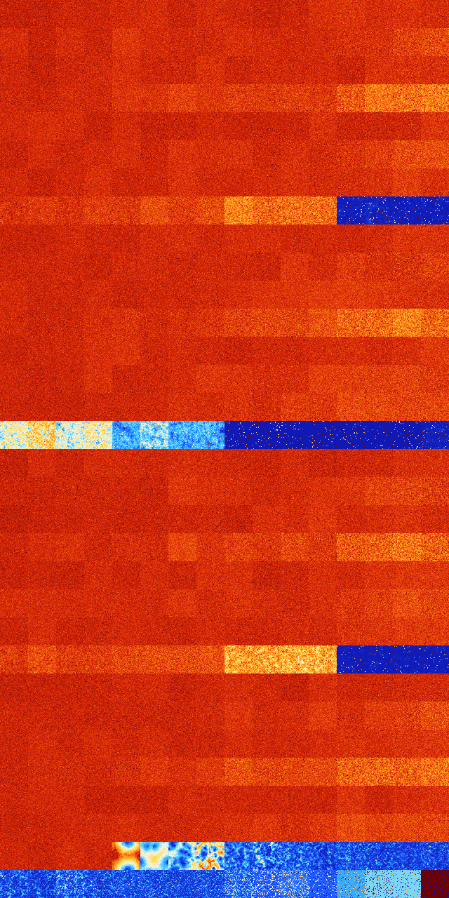

# B1478 (205824-206335)

<details>
    <summary>Initial Grid</summary>
    
</details>


<details>
    <summary>Initial Grid RLE</summary>

```
#C Exported from GoGoL (https://github.com/marrow16/gogol)
#C Wrap mode: Toroidal
#C Boundary mode: Dead
#C Step: 0
x = 100, y = 100, rule = B1478/S
7bo22bo50bo5bo$34bo14bo5bobo19bo$3bo61bo16b2obo10bo$3bo76bo10bo2bo$o20b
o55bo8bo3bo$bo61bo5bo7bo8bo$42bo17bo8bo5bo13bo2bobo$19bo4bo39bo19bo2bo$
30bo10bo21bo7bo22bo$9bo9bo13bo31bo25bo$9bobo33bobo2bo9bo15bo17bo$4bo56b
o$20bo2bo2bo20bo27bo12bo$8bo30bo4bo2bo40bo4bo$18bo45b2o$22bo26bo2bo14bo
24bo$38bo10bo10bo15bo21bo$9bo4bo2bo11bo2bo25bo20bo18bo$53bo$2bo10bo71bo
2bo$o21bo18bo37bo$bo56bo4bo3bo12bo$9bo18bo2bo2bo32bo30bo$24bo57bo$25bo
10bo4b2obo2bo6bo11bo$24bo14bo4bo18bo$31b2o26bo10bo20bo$6bo6bo9bo28bo3bo
14bo21bo$9bo12bo7bo32bo25bo6b2o$19bo36bo23bo6bo10bo$4bo5bo9bo32bo7bo$
22bo3bo47bo8bo$11bobo22bo49bo10bo$o33bo11bo22bo6bo18bo$33b2o20bo5b2o18b
o5bo$12bo51bo3b2o11bo10bo$12bo$60bo13bo20b2o2bo$9bo47bo17bo16bo$bo8bo5b
o21bo46bo3bo7bo$19bo20bo11bo2bo$6bo40bo9bo2bo15bo2bo$37bo22bob2o$36bo
14bo$13bo3bo25bo3bo17bo7bo8bo$bo8bo26bo24bo27bo$o30bo27bo$6bo16bo13bo
46bo$bo39bo28bo24b2o$11bobo14bo29bo23bo15bo$bo33bo12bo43bobo3bo$12bo26b
o25bo7bo14bo$9bo8bo21bo13b2o34bo$6bo77bo$4bo16bo4bo25bo13bo$20bo6bo31bo
12bo$5bo40bo48bo$5bo2bo10bo7bo4bo2bo12bo30bo13bo$33b2obo6bo41bo7bo$o6b
2o12bo18bo8bo8bo17bo22bo$2bo32bo8bo43bo2bo$11bo10bo6b2o21bo13bo17bo$10b
o29b2o42b2o8bo$9bo25b2o12bo2bo24bo$9bo35bo28bo$18bo14bo2bo13bo17b2o10bo
3bo14bo$31bo21bo4bo2b2o4bo$23bo18bo28bo10bo8b2o$24bo18bo$5bo13bo4bo29bo
$17bo5bo6bo13bo13bo9bo24bo$4bo26bo12bo48bo$36bobo23bo21bo$15bo8bo6bo4bo
11bo35bo$40bobo11bo30bo$2bo35bo2bo7bo11bo4bo14bo$13bo$32bo8bo$o12bo56bo
$23bo42bo10bo5bo3bo11bo$46bo$25bobo20bo17bo5bo3bo8bo12bo$27bo8bo21bo9bo
$7bo37bo4bo25bo12bo$10bobo3bobo42bo10bo$10bo10bo22bo$27bo37bo5bo3bo$54b
o6bo21bo11bo$19b2o6bo41bo2bo9bo12bo3bo$12bo11bo17b2o5bo9bo30bo$8bo7bo
10bo4bo21bo17bo$100b$11bo17bo17bo6bo4bo10bo19bo2bo$4bo38bo7bo31bo2bo$
25bo41bo$21bo14bo10bo12bo5bobo$10bo64bo22bo$24bo5bo9bo5bo17bo18bo5bo$4b
2o2bo4bo48bo34bo$16bo12bo24bo43b2o!
```
</details>
<details>
    <summary>Thumbnail</summary>

</details>
<table>
<tr>
    <td><a href="./205824%20S%20Heat%20Map%20Activity.png"></a><br>S (205824)<br>G>1000</td>    <td><a href="./205825%20S0%20Heat%20Map%20Activity.png"></a><br>S0 (205825)<br>G>1000</td>    <td><a href="./205826%20S1%20Heat%20Map%20Activity.png"></a><br>S1 (205826)<br>G>1000</td>    <td><a href="./205827%20S01%20Heat%20Map%20Activity.png"></a><br>S01 (205827)<br>G>1000</td>    <td><a href="./205828%20S2%20Heat%20Map%20Activity.png"></a><br>S2 (205828)<br>G>1000</td>    <td><a href="./205829%20S02%20Heat%20Map%20Activity.png"></a><br>S02 (205829)<br>G>1000</td>    <td><a href="./205830%20S12%20Heat%20Map%20Activity.png"></a><br>S12 (205830)<br>G>1000</td>    <td><a href="./205831%20S012%20Heat%20Map%20Activity.png"></a><br>S012 (205831)<br>G>1000</td>    <td><a href="./205832%20S3%20Heat%20Map%20Activity.png"></a><br>S3 (205832)<br>G>1000</td>    <td><a href="./205833%20S03%20Heat%20Map%20Activity.png"></a><br>S03 (205833)<br>G>1000</td>    <td><a href="./205834%20S13%20Heat%20Map%20Activity.png"></a><br>S13 (205834)<br>G>1000</td>    <td><a href="./205835%20S013%20Heat%20Map%20Activity.png"></a><br>S013 (205835)<br>G>1000</td>    <td><a href="./205836%20S23%20Heat%20Map%20Activity.png"></a><br>S23 (205836)<br>G>1000</td>    <td><a href="./205837%20S023%20Heat%20Map%20Activity.png"></a><br>S023 (205837)<br>G>1000</td>    <td><a href="./205838%20S123%20Heat%20Map%20Activity.png"></a><br>S123 (205838)<br>G>1000</td>    <td><a href="./205839%20S0123%20Heat%20Map%20Activity.png"></a><br>S0123 (205839)<br>G>1000</td></tr>
<tr>
    <td><a href="./205840%20S4%20Heat%20Map%20Activity.png"></a><br>S4 (205840)<br>G>1000</td>    <td><a href="./205841%20S04%20Heat%20Map%20Activity.png"></a><br>S04 (205841)<br>G>1000</td>    <td><a href="./205842%20S14%20Heat%20Map%20Activity.png"></a><br>S14 (205842)<br>G>1000</td>    <td><a href="./205843%20S014%20Heat%20Map%20Activity.png"></a><br>S014 (205843)<br>G>1000</td>    <td><a href="./205844%20S24%20Heat%20Map%20Activity.png"></a><br>S24 (205844)<br>G>1000</td>    <td><a href="./205845%20S024%20Heat%20Map%20Activity.png"></a><br>S024 (205845)<br>G>1000</td>    <td><a href="./205846%20S124%20Heat%20Map%20Activity.png"></a><br>S124 (205846)<br>G>1000</td>    <td><a href="./205847%20S0124%20Heat%20Map%20Activity.png"></a><br>S0124 (205847)<br>G>1000</td>    <td><a href="./205848%20S34%20Heat%20Map%20Activity.png"></a><br>S34 (205848)<br>G>1000</td>    <td><a href="./205849%20S034%20Heat%20Map%20Activity.png"></a><br>S034 (205849)<br>G>1000</td>    <td><a href="./205850%20S134%20Heat%20Map%20Activity.png"></a><br>S134 (205850)<br>G>1000</td>    <td><a href="./205851%20S0134%20Heat%20Map%20Activity.png"></a><br>S0134 (205851)<br>G>1000</td>    <td><a href="./205852%20S234%20Heat%20Map%20Activity.png"></a><br>S234 (205852)<br>G>1000</td>    <td><a href="./205853%20S0234%20Heat%20Map%20Activity.png"></a><br>S0234 (205853)<br>G>1000</td>    <td><a href="./205854%20S1234%20Heat%20Map%20Activity.png"></a><br>S1234 (205854)<br>G>1000</td>    <td><a href="./205855%20S01234%20Heat%20Map%20Activity.png"></a><br>S01234 (205855)<br>G>1000</td></tr>
<tr>
    <td><a href="./205856%20S5%20Heat%20Map%20Activity.png"></a><br>S5 (205856)<br>G>1000</td>    <td><a href="./205857%20S05%20Heat%20Map%20Activity.png"></a><br>S05 (205857)<br>G>1000</td>    <td><a href="./205858%20S15%20Heat%20Map%20Activity.png"></a><br>S15 (205858)<br>G>1000</td>    <td><a href="./205859%20S015%20Heat%20Map%20Activity.png"></a><br>S015 (205859)<br>G>1000</td>    <td><a href="./205860%20S25%20Heat%20Map%20Activity.png"></a><br>S25 (205860)<br>G>1000</td>    <td><a href="./205861%20S025%20Heat%20Map%20Activity.png"></a><br>S025 (205861)<br>G>1000</td>    <td><a href="./205862%20S125%20Heat%20Map%20Activity.png"></a><br>S125 (205862)<br>G>1000</td>    <td><a href="./205863%20S0125%20Heat%20Map%20Activity.png"></a><br>S0125 (205863)<br>G>1000</td>    <td><a href="./205864%20S35%20Heat%20Map%20Activity.png"></a><br>S35 (205864)<br>G>1000</td>    <td><a href="./205865%20S035%20Heat%20Map%20Activity.png"></a><br>S035 (205865)<br>G>1000</td>    <td><a href="./205866%20S135%20Heat%20Map%20Activity.png"></a><br>S135 (205866)<br>G>1000</td>    <td><a href="./205867%20S0135%20Heat%20Map%20Activity.png"></a><br>S0135 (205867)<br>G>1000</td>    <td><a href="./205868%20S235%20Heat%20Map%20Activity.png"></a><br>S235 (205868)<br>G>1000</td>    <td><a href="./205869%20S0235%20Heat%20Map%20Activity.png"></a><br>S0235 (205869)<br>G>1000</td>    <td><a href="./205870%20S1235%20Heat%20Map%20Activity.png"></a><br>S1235 (205870)<br>G>1000</td>    <td><a href="./205871%20S01235%20Heat%20Map%20Activity.png"></a><br>S01235 (205871)<br>G>1000</td></tr>
<tr>
    <td><a href="./205872%20S45%20Heat%20Map%20Activity.png"></a><br>S45 (205872)<br>G>1000</td>    <td><a href="./205873%20S045%20Heat%20Map%20Activity.png"></a><br>S045 (205873)<br>G>1000</td>    <td><a href="./205874%20S145%20Heat%20Map%20Activity.png"></a><br>S145 (205874)<br>G>1000</td>    <td><a href="./205875%20S0145%20Heat%20Map%20Activity.png"></a><br>S0145 (205875)<br>G>1000</td>    <td><a href="./205876%20S245%20Heat%20Map%20Activity.png"></a><br>S245 (205876)<br>G>1000</td>    <td><a href="./205877%20S0245%20Heat%20Map%20Activity.png"></a><br>S0245 (205877)<br>G>1000</td>    <td><a href="./205878%20S1245%20Heat%20Map%20Activity.png"></a><br>S1245 (205878)<br>G>1000</td>    <td><a href="./205879%20S01245%20Heat%20Map%20Activity.png"></a><br>S01245 (205879)<br>G>1000</td>    <td><a href="./205880%20S345%20Heat%20Map%20Activity.png"></a><br>S345 (205880)<br>G>1000</td>    <td><a href="./205881%20S0345%20Heat%20Map%20Activity.png"></a><br>S0345 (205881)<br>G>1000</td>    <td><a href="./205882%20S1345%20Heat%20Map%20Activity.png"></a><br>S1345 (205882)<br>G>1000</td>    <td><a href="./205883%20S01345%20Heat%20Map%20Activity.png"></a><br>S01345 (205883)<br>G>1000</td>    <td><a href="./205884%20S2345%20Heat%20Map%20Activity.png"></a><br>S2345 (205884)<br>G>1000</td>    <td><a href="./205885%20S02345%20Heat%20Map%20Activity.png"></a><br>S02345 (205885)<br>G>1000</td>    <td><a href="./205886%20S12345%20Heat%20Map%20Activity.png"></a><br>S12345 (205886)<br>G>1000</td>    <td><a href="./205887%20S012345%20Heat%20Map%20Activity.png"></a><br>S012345 (205887)<br>G>1000</td></tr>
<tr>
    <td><a href="./205888%20S6%20Heat%20Map%20Activity.png"></a><br>S6 (205888)<br>G>1000</td>    <td><a href="./205889%20S06%20Heat%20Map%20Activity.png"></a><br>S06 (205889)<br>G>1000</td>    <td><a href="./205890%20S16%20Heat%20Map%20Activity.png"></a><br>S16 (205890)<br>G>1000</td>    <td><a href="./205891%20S016%20Heat%20Map%20Activity.png"></a><br>S016 (205891)<br>G>1000</td>    <td><a href="./205892%20S26%20Heat%20Map%20Activity.png"></a><br>S26 (205892)<br>G>1000</td>    <td><a href="./205893%20S026%20Heat%20Map%20Activity.png"></a><br>S026 (205893)<br>G>1000</td>    <td><a href="./205894%20S126%20Heat%20Map%20Activity.png"></a><br>S126 (205894)<br>G>1000</td>    <td><a href="./205895%20S0126%20Heat%20Map%20Activity.png"></a><br>S0126 (205895)<br>G>1000</td>    <td><a href="./205896%20S36%20Heat%20Map%20Activity.png"></a><br>S36 (205896)<br>G>1000</td>    <td><a href="./205897%20S036%20Heat%20Map%20Activity.png"></a><br>S036 (205897)<br>G>1000</td>    <td><a href="./205898%20S136%20Heat%20Map%20Activity.png"></a><br>S136 (205898)<br>G>1000</td>    <td><a href="./205899%20S0136%20Heat%20Map%20Activity.png"></a><br>S0136 (205899)<br>G>1000</td>    <td><a href="./205900%20S236%20Heat%20Map%20Activity.png"></a><br>S236 (205900)<br>G>1000</td>    <td><a href="./205901%20S0236%20Heat%20Map%20Activity.png"></a><br>S0236 (205901)<br>G>1000</td>    <td><a href="./205902%20S1236%20Heat%20Map%20Activity.png"></a><br>S1236 (205902)<br>G>1000</td>    <td><a href="./205903%20S01236%20Heat%20Map%20Activity.png"></a><br>S01236 (205903)<br>G>1000</td></tr>
<tr>
    <td><a href="./205904%20S46%20Heat%20Map%20Activity.png"></a><br>S46 (205904)<br>G>1000</td>    <td><a href="./205905%20S046%20Heat%20Map%20Activity.png"></a><br>S046 (205905)<br>G>1000</td>    <td><a href="./205906%20S146%20Heat%20Map%20Activity.png"></a><br>S146 (205906)<br>G>1000</td>    <td><a href="./205907%20S0146%20Heat%20Map%20Activity.png"></a><br>S0146 (205907)<br>G>1000</td>    <td><a href="./205908%20S246%20Heat%20Map%20Activity.png"></a><br>S246 (205908)<br>G>1000</td>    <td><a href="./205909%20S0246%20Heat%20Map%20Activity.png"></a><br>S0246 (205909)<br>G>1000</td>    <td><a href="./205910%20S1246%20Heat%20Map%20Activity.png"></a><br>S1246 (205910)<br>G>1000</td>    <td><a href="./205911%20S01246%20Heat%20Map%20Activity.png"></a><br>S01246 (205911)<br>G>1000</td>    <td><a href="./205912%20S346%20Heat%20Map%20Activity.png"></a><br>S346 (205912)<br>G>1000</td>    <td><a href="./205913%20S0346%20Heat%20Map%20Activity.png"></a><br>S0346 (205913)<br>G>1000</td>    <td><a href="./205914%20S1346%20Heat%20Map%20Activity.png"></a><br>S1346 (205914)<br>G>1000</td>    <td><a href="./205915%20S01346%20Heat%20Map%20Activity.png"></a><br>S01346 (205915)<br>G>1000</td>    <td><a href="./205916%20S2346%20Heat%20Map%20Activity.png"></a><br>S2346 (205916)<br>G>1000</td>    <td><a href="./205917%20S02346%20Heat%20Map%20Activity.png"></a><br>S02346 (205917)<br>G>1000</td>    <td><a href="./205918%20S12346%20Heat%20Map%20Activity.png"></a><br>S12346 (205918)<br>G>1000</td>    <td><a href="./205919%20S012346%20Heat%20Map%20Activity.png"></a><br>S012346 (205919)<br>G>1000</td></tr>
<tr>
    <td><a href="./205920%20S56%20Heat%20Map%20Activity.png"></a><br>S56 (205920)<br>G>1000</td>    <td><a href="./205921%20S056%20Heat%20Map%20Activity.png"></a><br>S056 (205921)<br>G>1000</td>    <td><a href="./205922%20S156%20Heat%20Map%20Activity.png"></a><br>S156 (205922)<br>G>1000</td>    <td><a href="./205923%20S0156%20Heat%20Map%20Activity.png"></a><br>S0156 (205923)<br>G>1000</td>    <td><a href="./205924%20S256%20Heat%20Map%20Activity.png"></a><br>S256 (205924)<br>G>1000</td>    <td><a href="./205925%20S0256%20Heat%20Map%20Activity.png"></a><br>S0256 (205925)<br>G>1000</td>    <td><a href="./205926%20S1256%20Heat%20Map%20Activity.png"></a><br>S1256 (205926)<br>G>1000</td>    <td><a href="./205927%20S01256%20Heat%20Map%20Activity.png"></a><br>S01256 (205927)<br>G>1000</td>    <td><a href="./205928%20S356%20Heat%20Map%20Activity.png"></a><br>S356 (205928)<br>G>1000</td>    <td><a href="./205929%20S0356%20Heat%20Map%20Activity.png"></a><br>S0356 (205929)<br>G>1000</td>    <td><a href="./205930%20S1356%20Heat%20Map%20Activity.png"></a><br>S1356 (205930)<br>G>1000</td>    <td><a href="./205931%20S01356%20Heat%20Map%20Activity.png"></a><br>S01356 (205931)<br>G>1000</td>    <td><a href="./205932%20S2356%20Heat%20Map%20Activity.png"></a><br>S2356 (205932)<br>G>1000</td>    <td><a href="./205933%20S02356%20Heat%20Map%20Activity.png"></a><br>S02356 (205933)<br>G>1000</td>    <td><a href="./205934%20S12356%20Heat%20Map%20Activity.png"></a><br>S12356 (205934)<br>G>1000</td>    <td><a href="./205935%20S012356%20Heat%20Map%20Activity.png"></a><br>S012356 (205935)<br>G>1000</td></tr>
<tr>
    <td><a href="./205936%20S456%20Heat%20Map%20Activity.png"></a><br>S456 (205936)<br>G>1000</td>    <td><a href="./205937%20S0456%20Heat%20Map%20Activity.png"></a><br>S0456 (205937)<br>G>1000</td>    <td><a href="./205938%20S1456%20Heat%20Map%20Activity.png"></a><br>S1456 (205938)<br>G>1000</td>    <td><a href="./205939%20S01456%20Heat%20Map%20Activity.png"></a><br>S01456 (205939)<br>G>1000</td>    <td><a href="./205940%20S2456%20Heat%20Map%20Activity.png"></a><br>S2456 (205940)<br>G>1000</td>    <td><a href="./205941%20S02456%20Heat%20Map%20Activity.png"></a><br>S02456 (205941)<br>G>1000</td>    <td><a href="./205942%20S12456%20Heat%20Map%20Activity.png"></a><br>S12456 (205942)<br>G>1000</td>    <td><a href="./205943%20S012456%20Heat%20Map%20Activity.png"></a><br>S012456 (205943)<br>G>1000</td>    <td><a href="./205944%20S3456%20Heat%20Map%20Activity.png"></a><br>S3456 (205944)<br>G>1000</td>    <td><a href="./205945%20S03456%20Heat%20Map%20Activity.png"></a><br>S03456 (205945)<br>G>1000</td>    <td><a href="./205946%20S13456%20Heat%20Map%20Activity.png"></a><br>S13456 (205946)<br>G>1000</td>    <td><a href="./205947%20S013456%20Heat%20Map%20Activity.png"></a><br>S013456 (205947)<br>G>1000</td>    <td><a href="./205948%20S23456%20Heat%20Map%20Activity.png"></a><br>S23456 (205948)<br>G>1000</td>    <td><a href="./205949%20S023456%20Heat%20Map%20Activity.png"></a><br>S023456 (205949)<br>R@713,p420</td>    <td><a href="./205950%20S123456%20Heat%20Map%20Activity.png"></a><br>S123456 (205950)<br>G>1000</td>    <td><a href="./205951%20S0123456%20Heat%20Map%20Activity.png"></a><br>S0123456 (205951)<br>G>1000</td></tr>
<tr>
    <td><a href="./205952%20S7%20Heat%20Map%20Activity.png"></a><br>S7 (205952)<br>G>1000</td>    <td><a href="./205953%20S07%20Heat%20Map%20Activity.png"></a><br>S07 (205953)<br>G>1000</td>    <td><a href="./205954%20S17%20Heat%20Map%20Activity.png"></a><br>S17 (205954)<br>G>1000</td>    <td><a href="./205955%20S017%20Heat%20Map%20Activity.png"></a><br>S017 (205955)<br>G>1000</td>    <td><a href="./205956%20S27%20Heat%20Map%20Activity.png"></a><br>S27 (205956)<br>G>1000</td>    <td><a href="./205957%20S027%20Heat%20Map%20Activity.png"></a><br>S027 (205957)<br>G>1000</td>    <td><a href="./205958%20S127%20Heat%20Map%20Activity.png"></a><br>S127 (205958)<br>G>1000</td>    <td><a href="./205959%20S0127%20Heat%20Map%20Activity.png"></a><br>S0127 (205959)<br>G>1000</td>    <td><a href="./205960%20S37%20Heat%20Map%20Activity.png"></a><br>S37 (205960)<br>G>1000</td>    <td><a href="./205961%20S037%20Heat%20Map%20Activity.png"></a><br>S037 (205961)<br>G>1000</td>    <td><a href="./205962%20S137%20Heat%20Map%20Activity.png"></a><br>S137 (205962)<br>G>1000</td>    <td><a href="./205963%20S0137%20Heat%20Map%20Activity.png"></a><br>S0137 (205963)<br>G>1000</td>    <td><a href="./205964%20S237%20Heat%20Map%20Activity.png"></a><br>S237 (205964)<br>G>1000</td>    <td><a href="./205965%20S0237%20Heat%20Map%20Activity.png"></a><br>S0237 (205965)<br>G>1000</td>    <td><a href="./205966%20S1237%20Heat%20Map%20Activity.png"></a><br>S1237 (205966)<br>G>1000</td>    <td><a href="./205967%20S01237%20Heat%20Map%20Activity.png"></a><br>S01237 (205967)<br>G>1000</td></tr>
<tr>
    <td><a href="./205968%20S47%20Heat%20Map%20Activity.png"></a><br>S47 (205968)<br>G>1000</td>    <td><a href="./205969%20S047%20Heat%20Map%20Activity.png"></a><br>S047 (205969)<br>G>1000</td>    <td><a href="./205970%20S147%20Heat%20Map%20Activity.png"></a><br>S147 (205970)<br>G>1000</td>    <td><a href="./205971%20S0147%20Heat%20Map%20Activity.png"></a><br>S0147 (205971)<br>G>1000</td>    <td><a href="./205972%20S247%20Heat%20Map%20Activity.png"></a><br>S247 (205972)<br>G>1000</td>    <td><a href="./205973%20S0247%20Heat%20Map%20Activity.png"></a><br>S0247 (205973)<br>G>1000</td>    <td><a href="./205974%20S1247%20Heat%20Map%20Activity.png"></a><br>S1247 (205974)<br>G>1000</td>    <td><a href="./205975%20S01247%20Heat%20Map%20Activity.png"></a><br>S01247 (205975)<br>G>1000</td>    <td><a href="./205976%20S347%20Heat%20Map%20Activity.png"></a><br>S347 (205976)<br>G>1000</td>    <td><a href="./205977%20S0347%20Heat%20Map%20Activity.png"></a><br>S0347 (205977)<br>G>1000</td>    <td><a href="./205978%20S1347%20Heat%20Map%20Activity.png"></a><br>S1347 (205978)<br>G>1000</td>    <td><a href="./205979%20S01347%20Heat%20Map%20Activity.png"></a><br>S01347 (205979)<br>G>1000</td>    <td><a href="./205980%20S2347%20Heat%20Map%20Activity.png"></a><br>S2347 (205980)<br>G>1000</td>    <td><a href="./205981%20S02347%20Heat%20Map%20Activity.png"></a><br>S02347 (205981)<br>G>1000</td>    <td><a href="./205982%20S12347%20Heat%20Map%20Activity.png"></a><br>S12347 (205982)<br>G>1000</td>    <td><a href="./205983%20S012347%20Heat%20Map%20Activity.png"></a><br>S012347 (205983)<br>G>1000</td></tr>
<tr>
    <td><a href="./205984%20S57%20Heat%20Map%20Activity.png"></a><br>S57 (205984)<br>G>1000</td>    <td><a href="./205985%20S057%20Heat%20Map%20Activity.png"></a><br>S057 (205985)<br>G>1000</td>    <td><a href="./205986%20S157%20Heat%20Map%20Activity.png"></a><br>S157 (205986)<br>G>1000</td>    <td><a href="./205987%20S0157%20Heat%20Map%20Activity.png"></a><br>S0157 (205987)<br>G>1000</td>    <td><a href="./205988%20S257%20Heat%20Map%20Activity.png"></a><br>S257 (205988)<br>G>1000</td>    <td><a href="./205989%20S0257%20Heat%20Map%20Activity.png"></a><br>S0257 (205989)<br>G>1000</td>    <td><a href="./205990%20S1257%20Heat%20Map%20Activity.png"></a><br>S1257 (205990)<br>G>1000</td>    <td><a href="./205991%20S01257%20Heat%20Map%20Activity.png"></a><br>S01257 (205991)<br>G>1000</td>    <td><a href="./205992%20S357%20Heat%20Map%20Activity.png"></a><br>S357 (205992)<br>G>1000</td>    <td><a href="./205993%20S0357%20Heat%20Map%20Activity.png"></a><br>S0357 (205993)<br>G>1000</td>    <td><a href="./205994%20S1357%20Heat%20Map%20Activity.png"></a><br>S1357 (205994)<br>G>1000</td>    <td><a href="./205995%20S01357%20Heat%20Map%20Activity.png"></a><br>S01357 (205995)<br>G>1000</td>    <td><a href="./205996%20S2357%20Heat%20Map%20Activity.png"></a><br>S2357 (205996)<br>G>1000</td>    <td><a href="./205997%20S02357%20Heat%20Map%20Activity.png"></a><br>S02357 (205997)<br>G>1000</td>    <td><a href="./205998%20S12357%20Heat%20Map%20Activity.png"></a><br>S12357 (205998)<br>G>1000</td>    <td><a href="./205999%20S012357%20Heat%20Map%20Activity.png"></a><br>S012357 (205999)<br>G>1000</td></tr>
<tr>
    <td><a href="./206000%20S457%20Heat%20Map%20Activity.png"></a><br>S457 (206000)<br>G>1000</td>    <td><a href="./206001%20S0457%20Heat%20Map%20Activity.png"></a><br>S0457 (206001)<br>G>1000</td>    <td><a href="./206002%20S1457%20Heat%20Map%20Activity.png"></a><br>S1457 (206002)<br>G>1000</td>    <td><a href="./206003%20S01457%20Heat%20Map%20Activity.png"></a><br>S01457 (206003)<br>G>1000</td>    <td><a href="./206004%20S2457%20Heat%20Map%20Activity.png"></a><br>S2457 (206004)<br>G>1000</td>    <td><a href="./206005%20S02457%20Heat%20Map%20Activity.png"></a><br>S02457 (206005)<br>G>1000</td>    <td><a href="./206006%20S12457%20Heat%20Map%20Activity.png"></a><br>S12457 (206006)<br>G>1000</td>    <td><a href="./206007%20S012457%20Heat%20Map%20Activity.png"></a><br>S012457 (206007)<br>G>1000</td>    <td><a href="./206008%20S3457%20Heat%20Map%20Activity.png"></a><br>S3457 (206008)<br>G>1000</td>    <td><a href="./206009%20S03457%20Heat%20Map%20Activity.png"></a><br>S03457 (206009)<br>G>1000</td>    <td><a href="./206010%20S13457%20Heat%20Map%20Activity.png"></a><br>S13457 (206010)<br>G>1000</td>    <td><a href="./206011%20S013457%20Heat%20Map%20Activity.png"></a><br>S013457 (206011)<br>G>1000</td>    <td><a href="./206012%20S23457%20Heat%20Map%20Activity.png"></a><br>S23457 (206012)<br>G>1000</td>    <td><a href="./206013%20S023457%20Heat%20Map%20Activity.png"></a><br>S023457 (206013)<br>G>1000</td>    <td><a href="./206014%20S123457%20Heat%20Map%20Activity.png"></a><br>S123457 (206014)<br>G>1000</td>    <td><a href="./206015%20S0123457%20Heat%20Map%20Activity.png"></a><br>S0123457 (206015)<br>G>1000</td></tr>
<tr>
    <td><a href="./206016%20S67%20Heat%20Map%20Activity.png"></a><br>S67 (206016)<br>G>1000</td>    <td><a href="./206017%20S067%20Heat%20Map%20Activity.png"></a><br>S067 (206017)<br>G>1000</td>    <td><a href="./206018%20S167%20Heat%20Map%20Activity.png"></a><br>S167 (206018)<br>G>1000</td>    <td><a href="./206019%20S0167%20Heat%20Map%20Activity.png"></a><br>S0167 (206019)<br>G>1000</td>    <td><a href="./206020%20S267%20Heat%20Map%20Activity.png"></a><br>S267 (206020)<br>G>1000</td>    <td><a href="./206021%20S0267%20Heat%20Map%20Activity.png"></a><br>S0267 (206021)<br>G>1000</td>    <td><a href="./206022%20S1267%20Heat%20Map%20Activity.png"></a><br>S1267 (206022)<br>G>1000</td>    <td><a href="./206023%20S01267%20Heat%20Map%20Activity.png"></a><br>S01267 (206023)<br>G>1000</td>    <td><a href="./206024%20S367%20Heat%20Map%20Activity.png"></a><br>S367 (206024)<br>G>1000</td>    <td><a href="./206025%20S0367%20Heat%20Map%20Activity.png"></a><br>S0367 (206025)<br>G>1000</td>    <td><a href="./206026%20S1367%20Heat%20Map%20Activity.png"></a><br>S1367 (206026)<br>G>1000</td>    <td><a href="./206027%20S01367%20Heat%20Map%20Activity.png"></a><br>S01367 (206027)<br>G>1000</td>    <td><a href="./206028%20S2367%20Heat%20Map%20Activity.png"></a><br>S2367 (206028)<br>G>1000</td>    <td><a href="./206029%20S02367%20Heat%20Map%20Activity.png"></a><br>S02367 (206029)<br>G>1000</td>    <td><a href="./206030%20S12367%20Heat%20Map%20Activity.png"></a><br>S12367 (206030)<br>G>1000</td>    <td><a href="./206031%20S012367%20Heat%20Map%20Activity.png"></a><br>S012367 (206031)<br>G>1000</td></tr>
<tr>
    <td><a href="./206032%20S467%20Heat%20Map%20Activity.png"></a><br>S467 (206032)<br>G>1000</td>    <td><a href="./206033%20S0467%20Heat%20Map%20Activity.png"></a><br>S0467 (206033)<br>G>1000</td>    <td><a href="./206034%20S1467%20Heat%20Map%20Activity.png"></a><br>S1467 (206034)<br>G>1000</td>    <td><a href="./206035%20S01467%20Heat%20Map%20Activity.png"></a><br>S01467 (206035)<br>G>1000</td>    <td><a href="./206036%20S2467%20Heat%20Map%20Activity.png"></a><br>S2467 (206036)<br>G>1000</td>    <td><a href="./206037%20S02467%20Heat%20Map%20Activity.png"></a><br>S02467 (206037)<br>G>1000</td>    <td><a href="./206038%20S12467%20Heat%20Map%20Activity.png"></a><br>S12467 (206038)<br>G>1000</td>    <td><a href="./206039%20S012467%20Heat%20Map%20Activity.png"></a><br>S012467 (206039)<br>G>1000</td>    <td><a href="./206040%20S3467%20Heat%20Map%20Activity.png"></a><br>S3467 (206040)<br>G>1000</td>    <td><a href="./206041%20S03467%20Heat%20Map%20Activity.png"></a><br>S03467 (206041)<br>G>1000</td>    <td><a href="./206042%20S13467%20Heat%20Map%20Activity.png"></a><br>S13467 (206042)<br>G>1000</td>    <td><a href="./206043%20S013467%20Heat%20Map%20Activity.png"></a><br>S013467 (206043)<br>G>1000</td>    <td><a href="./206044%20S23467%20Heat%20Map%20Activity.png"></a><br>S23467 (206044)<br>G>1000</td>    <td><a href="./206045%20S023467%20Heat%20Map%20Activity.png"></a><br>S023467 (206045)<br>G>1000</td>    <td><a href="./206046%20S123467%20Heat%20Map%20Activity.png"></a><br>S123467 (206046)<br>G>1000</td>    <td><a href="./206047%20S0123467%20Heat%20Map%20Activity.png"></a><br>S0123467 (206047)<br>G>1000</td></tr>
<tr>
    <td><a href="./206048%20S567%20Heat%20Map%20Activity.png"></a><br>S567 (206048)<br>G>1000</td>    <td><a href="./206049%20S0567%20Heat%20Map%20Activity.png"></a><br>S0567 (206049)<br>G>1000</td>    <td><a href="./206050%20S1567%20Heat%20Map%20Activity.png"></a><br>S1567 (206050)<br>G>1000</td>    <td><a href="./206051%20S01567%20Heat%20Map%20Activity.png"></a><br>S01567 (206051)<br>G>1000</td>    <td><a href="./206052%20S2567%20Heat%20Map%20Activity.png"></a><br>S2567 (206052)<br>G>1000</td>    <td><a href="./206053%20S02567%20Heat%20Map%20Activity.png"></a><br>S02567 (206053)<br>G>1000</td>    <td><a href="./206054%20S12567%20Heat%20Map%20Activity.png"></a><br>S12567 (206054)<br>G>1000</td>    <td><a href="./206055%20S012567%20Heat%20Map%20Activity.png"></a><br>S012567 (206055)<br>G>1000</td>    <td><a href="./206056%20S3567%20Heat%20Map%20Activity.png"></a><br>S3567 (206056)<br>G>1000</td>    <td><a href="./206057%20S03567%20Heat%20Map%20Activity.png"></a><br>S03567 (206057)<br>G>1000</td>    <td><a href="./206058%20S13567%20Heat%20Map%20Activity.png"></a><br>S13567 (206058)<br>G>1000</td>    <td><a href="./206059%20S013567%20Heat%20Map%20Activity.png"></a><br>S013567 (206059)<br>G>1000</td>    <td><a href="./206060%20S23567%20Heat%20Map%20Activity.png"></a><br>S23567 (206060)<br>G>1000</td>    <td><a href="./206061%20S023567%20Heat%20Map%20Activity.png"></a><br>S023567 (206061)<br>G>1000</td>    <td><a href="./206062%20S123567%20Heat%20Map%20Activity.png"></a><br>S123567 (206062)<br>G>1000</td>    <td><a href="./206063%20S0123567%20Heat%20Map%20Activity.png"></a><br>S0123567 (206063)<br>G>1000</td></tr>
<tr>
    <td><a href="./206064%20S4567%20Heat%20Map%20Activity.png"></a><br>S4567 (206064)<br>G>1000</td>    <td><a href="./206065%20S04567%20Heat%20Map%20Activity.png"></a><br>S04567 (206065)<br>G>1000</td>    <td><a href="./206066%20S14567%20Heat%20Map%20Activity.png"></a><br>S14567 (206066)<br>G>1000</td>    <td><a href="./206067%20S014567%20Heat%20Map%20Activity.png"></a><br>S014567 (206067)<br>G>1000</td>    <td><a href="./206068%20S24567%20Heat%20Map%20Activity.png"></a><br>S24567 (206068)<br>G>1000</td>    <td><a href="./206069%20S024567%20Heat%20Map%20Activity.png"></a><br>S024567 (206069)<br>G>1000</td>    <td><a href="./206070%20S124567%20Heat%20Map%20Activity.png"></a><br>S124567 (206070)<br>G>1000</td>    <td><a href="./206071%20S0124567%20Heat%20Map%20Activity.png"></a><br>S0124567 (206071)<br>G>1000</td>    <td><a href="./206072%20S34567%20Heat%20Map%20Activity.png"></a><br>S34567 (206072)<br>G>1000</td>    <td><a href="./206073%20S034567%20Heat%20Map%20Activity.png"></a><br>S034567 (206073)<br>G>1000</td>    <td><a href="./206074%20S134567%20Heat%20Map%20Activity.png"></a><br>S134567 (206074)<br>G>1000</td>    <td><a href="./206075%20S0134567%20Heat%20Map%20Activity.png"></a><br>S0134567 (206075)<br>G>1000</td>    <td><a href="./206076%20S234567%20Heat%20Map%20Activity.png"></a><br>S234567 (206076)<br>G>1000</td>    <td><a href="./206077%20S0234567%20Heat%20Map%20Activity.png"></a><br>S0234567 (206077)<br>G>1000</td>    <td><a href="./206078%20S1234567%20Heat%20Map%20Activity.png"></a><br>S1234567 (206078)<br>G>1000</td>    <td><a href="./206079%20S01234567%20Heat%20Map%20Activity.png"></a><br>S01234567 (206079)<br>R@133,p84</td></tr>
<tr>
    <td><a href="./206080%20S8%20Heat%20Map%20Activity.png"></a><br>S8 (206080)<br>G>1000</td>    <td><a href="./206081%20S08%20Heat%20Map%20Activity.png"></a><br>S08 (206081)<br>G>1000</td>    <td><a href="./206082%20S18%20Heat%20Map%20Activity.png"></a><br>S18 (206082)<br>G>1000</td>    <td><a href="./206083%20S018%20Heat%20Map%20Activity.png"></a><br>S018 (206083)<br>G>1000</td>    <td><a href="./206084%20S28%20Heat%20Map%20Activity.png"></a><br>S28 (206084)<br>G>1000</td>    <td><a href="./206085%20S028%20Heat%20Map%20Activity.png"></a><br>S028 (206085)<br>G>1000</td>    <td><a href="./206086%20S128%20Heat%20Map%20Activity.png"></a><br>S128 (206086)<br>G>1000</td>    <td><a href="./206087%20S0128%20Heat%20Map%20Activity.png"></a><br>S0128 (206087)<br>G>1000</td>    <td><a href="./206088%20S38%20Heat%20Map%20Activity.png"></a><br>S38 (206088)<br>G>1000</td>    <td><a href="./206089%20S038%20Heat%20Map%20Activity.png"></a><br>S038 (206089)<br>G>1000</td>    <td><a href="./206090%20S138%20Heat%20Map%20Activity.png"></a><br>S138 (206090)<br>G>1000</td>    <td><a href="./206091%20S0138%20Heat%20Map%20Activity.png"></a><br>S0138 (206091)<br>G>1000</td>    <td><a href="./206092%20S238%20Heat%20Map%20Activity.png"></a><br>S238 (206092)<br>G>1000</td>    <td><a href="./206093%20S0238%20Heat%20Map%20Activity.png"></a><br>S0238 (206093)<br>G>1000</td>    <td><a href="./206094%20S1238%20Heat%20Map%20Activity.png"></a><br>S1238 (206094)<br>G>1000</td>    <td><a href="./206095%20S01238%20Heat%20Map%20Activity.png"></a><br>S01238 (206095)<br>G>1000</td></tr>
<tr>
    <td><a href="./206096%20S48%20Heat%20Map%20Activity.png"></a><br>S48 (206096)<br>G>1000</td>    <td><a href="./206097%20S048%20Heat%20Map%20Activity.png"></a><br>S048 (206097)<br>G>1000</td>    <td><a href="./206098%20S148%20Heat%20Map%20Activity.png"></a><br>S148 (206098)<br>G>1000</td>    <td><a href="./206099%20S0148%20Heat%20Map%20Activity.png"></a><br>S0148 (206099)<br>G>1000</td>    <td><a href="./206100%20S248%20Heat%20Map%20Activity.png"></a><br>S248 (206100)<br>G>1000</td>    <td><a href="./206101%20S0248%20Heat%20Map%20Activity.png"></a><br>S0248 (206101)<br>G>1000</td>    <td><a href="./206102%20S1248%20Heat%20Map%20Activity.png"></a><br>S1248 (206102)<br>G>1000</td>    <td><a href="./206103%20S01248%20Heat%20Map%20Activity.png"></a><br>S01248 (206103)<br>G>1000</td>    <td><a href="./206104%20S348%20Heat%20Map%20Activity.png"></a><br>S348 (206104)<br>G>1000</td>    <td><a href="./206105%20S0348%20Heat%20Map%20Activity.png"></a><br>S0348 (206105)<br>G>1000</td>    <td><a href="./206106%20S1348%20Heat%20Map%20Activity.png"></a><br>S1348 (206106)<br>G>1000</td>    <td><a href="./206107%20S01348%20Heat%20Map%20Activity.png"></a><br>S01348 (206107)<br>G>1000</td>    <td><a href="./206108%20S2348%20Heat%20Map%20Activity.png"></a><br>S2348 (206108)<br>G>1000</td>    <td><a href="./206109%20S02348%20Heat%20Map%20Activity.png"></a><br>S02348 (206109)<br>G>1000</td>    <td><a href="./206110%20S12348%20Heat%20Map%20Activity.png"></a><br>S12348 (206110)<br>G>1000</td>    <td><a href="./206111%20S012348%20Heat%20Map%20Activity.png"></a><br>S012348 (206111)<br>G>1000</td></tr>
<tr>
    <td><a href="./206112%20S58%20Heat%20Map%20Activity.png"></a><br>S58 (206112)<br>G>1000</td>    <td><a href="./206113%20S058%20Heat%20Map%20Activity.png"></a><br>S058 (206113)<br>G>1000</td>    <td><a href="./206114%20S158%20Heat%20Map%20Activity.png"></a><br>S158 (206114)<br>G>1000</td>    <td><a href="./206115%20S0158%20Heat%20Map%20Activity.png"></a><br>S0158 (206115)<br>G>1000</td>    <td><a href="./206116%20S258%20Heat%20Map%20Activity.png"></a><br>S258 (206116)<br>G>1000</td>    <td><a href="./206117%20S0258%20Heat%20Map%20Activity.png"></a><br>S0258 (206117)<br>G>1000</td>    <td><a href="./206118%20S1258%20Heat%20Map%20Activity.png"></a><br>S1258 (206118)<br>G>1000</td>    <td><a href="./206119%20S01258%20Heat%20Map%20Activity.png"></a><br>S01258 (206119)<br>G>1000</td>    <td><a href="./206120%20S358%20Heat%20Map%20Activity.png"></a><br>S358 (206120)<br>G>1000</td>    <td><a href="./206121%20S0358%20Heat%20Map%20Activity.png"></a><br>S0358 (206121)<br>G>1000</td>    <td><a href="./206122%20S1358%20Heat%20Map%20Activity.png"></a><br>S1358 (206122)<br>G>1000</td>    <td><a href="./206123%20S01358%20Heat%20Map%20Activity.png"></a><br>S01358 (206123)<br>G>1000</td>    <td><a href="./206124%20S2358%20Heat%20Map%20Activity.png"></a><br>S2358 (206124)<br>G>1000</td>    <td><a href="./206125%20S02358%20Heat%20Map%20Activity.png"></a><br>S02358 (206125)<br>G>1000</td>    <td><a href="./206126%20S12358%20Heat%20Map%20Activity.png"></a><br>S12358 (206126)<br>G>1000</td>    <td><a href="./206127%20S012358%20Heat%20Map%20Activity.png"></a><br>S012358 (206127)<br>G>1000</td></tr>
<tr>
    <td><a href="./206128%20S458%20Heat%20Map%20Activity.png"></a><br>S458 (206128)<br>G>1000</td>    <td><a href="./206129%20S0458%20Heat%20Map%20Activity.png"></a><br>S0458 (206129)<br>G>1000</td>    <td><a href="./206130%20S1458%20Heat%20Map%20Activity.png"></a><br>S1458 (206130)<br>G>1000</td>    <td><a href="./206131%20S01458%20Heat%20Map%20Activity.png"></a><br>S01458 (206131)<br>G>1000</td>    <td><a href="./206132%20S2458%20Heat%20Map%20Activity.png"></a><br>S2458 (206132)<br>G>1000</td>    <td><a href="./206133%20S02458%20Heat%20Map%20Activity.png"></a><br>S02458 (206133)<br>G>1000</td>    <td><a href="./206134%20S12458%20Heat%20Map%20Activity.png"></a><br>S12458 (206134)<br>G>1000</td>    <td><a href="./206135%20S012458%20Heat%20Map%20Activity.png"></a><br>S012458 (206135)<br>G>1000</td>    <td><a href="./206136%20S3458%20Heat%20Map%20Activity.png"></a><br>S3458 (206136)<br>G>1000</td>    <td><a href="./206137%20S03458%20Heat%20Map%20Activity.png"></a><br>S03458 (206137)<br>G>1000</td>    <td><a href="./206138%20S13458%20Heat%20Map%20Activity.png"></a><br>S13458 (206138)<br>G>1000</td>    <td><a href="./206139%20S013458%20Heat%20Map%20Activity.png"></a><br>S013458 (206139)<br>G>1000</td>    <td><a href="./206140%20S23458%20Heat%20Map%20Activity.png"></a><br>S23458 (206140)<br>G>1000</td>    <td><a href="./206141%20S023458%20Heat%20Map%20Activity.png"></a><br>S023458 (206141)<br>G>1000</td>    <td><a href="./206142%20S123458%20Heat%20Map%20Activity.png"></a><br>S123458 (206142)<br>G>1000</td>    <td><a href="./206143%20S0123458%20Heat%20Map%20Activity.png"></a><br>S0123458 (206143)<br>G>1000</td></tr>
<tr>
    <td><a href="./206144%20S68%20Heat%20Map%20Activity.png"></a><br>S68 (206144)<br>G>1000</td>    <td><a href="./206145%20S068%20Heat%20Map%20Activity.png"></a><br>S068 (206145)<br>G>1000</td>    <td><a href="./206146%20S168%20Heat%20Map%20Activity.png"></a><br>S168 (206146)<br>G>1000</td>    <td><a href="./206147%20S0168%20Heat%20Map%20Activity.png"></a><br>S0168 (206147)<br>G>1000</td>    <td><a href="./206148%20S268%20Heat%20Map%20Activity.png"></a><br>S268 (206148)<br>G>1000</td>    <td><a href="./206149%20S0268%20Heat%20Map%20Activity.png"></a><br>S0268 (206149)<br>G>1000</td>    <td><a href="./206150%20S1268%20Heat%20Map%20Activity.png"></a><br>S1268 (206150)<br>G>1000</td>    <td><a href="./206151%20S01268%20Heat%20Map%20Activity.png"></a><br>S01268 (206151)<br>G>1000</td>    <td><a href="./206152%20S368%20Heat%20Map%20Activity.png"></a><br>S368 (206152)<br>G>1000</td>    <td><a href="./206153%20S0368%20Heat%20Map%20Activity.png"></a><br>S0368 (206153)<br>G>1000</td>    <td><a href="./206154%20S1368%20Heat%20Map%20Activity.png"></a><br>S1368 (206154)<br>G>1000</td>    <td><a href="./206155%20S01368%20Heat%20Map%20Activity.png"></a><br>S01368 (206155)<br>G>1000</td>    <td><a href="./206156%20S2368%20Heat%20Map%20Activity.png"></a><br>S2368 (206156)<br>G>1000</td>    <td><a href="./206157%20S02368%20Heat%20Map%20Activity.png"></a><br>S02368 (206157)<br>G>1000</td>    <td><a href="./206158%20S12368%20Heat%20Map%20Activity.png"></a><br>S12368 (206158)<br>G>1000</td>    <td><a href="./206159%20S012368%20Heat%20Map%20Activity.png"></a><br>S012368 (206159)<br>G>1000</td></tr>
<tr>
    <td><a href="./206160%20S468%20Heat%20Map%20Activity.png"></a><br>S468 (206160)<br>G>1000</td>    <td><a href="./206161%20S0468%20Heat%20Map%20Activity.png"></a><br>S0468 (206161)<br>G>1000</td>    <td><a href="./206162%20S1468%20Heat%20Map%20Activity.png"></a><br>S1468 (206162)<br>G>1000</td>    <td><a href="./206163%20S01468%20Heat%20Map%20Activity.png"></a><br>S01468 (206163)<br>G>1000</td>    <td><a href="./206164%20S2468%20Heat%20Map%20Activity.png"></a><br>S2468 (206164)<br>G>1000</td>    <td><a href="./206165%20S02468%20Heat%20Map%20Activity.png"></a><br>S02468 (206165)<br>G>1000</td>    <td><a href="./206166%20S12468%20Heat%20Map%20Activity.png"></a><br>S12468 (206166)<br>G>1000</td>    <td><a href="./206167%20S012468%20Heat%20Map%20Activity.png"></a><br>S012468 (206167)<br>G>1000</td>    <td><a href="./206168%20S3468%20Heat%20Map%20Activity.png"></a><br>S3468 (206168)<br>G>1000</td>    <td><a href="./206169%20S03468%20Heat%20Map%20Activity.png"></a><br>S03468 (206169)<br>G>1000</td>    <td><a href="./206170%20S13468%20Heat%20Map%20Activity.png"></a><br>S13468 (206170)<br>G>1000</td>    <td><a href="./206171%20S013468%20Heat%20Map%20Activity.png"></a><br>S013468 (206171)<br>G>1000</td>    <td><a href="./206172%20S23468%20Heat%20Map%20Activity.png"></a><br>S23468 (206172)<br>G>1000</td>    <td><a href="./206173%20S023468%20Heat%20Map%20Activity.png"></a><br>S023468 (206173)<br>G>1000</td>    <td><a href="./206174%20S123468%20Heat%20Map%20Activity.png"></a><br>S123468 (206174)<br>G>1000</td>    <td><a href="./206175%20S0123468%20Heat%20Map%20Activity.png"></a><br>S0123468 (206175)<br>G>1000</td></tr>
<tr>
    <td><a href="./206176%20S568%20Heat%20Map%20Activity.png"></a><br>S568 (206176)<br>G>1000</td>    <td><a href="./206177%20S0568%20Heat%20Map%20Activity.png"></a><br>S0568 (206177)<br>G>1000</td>    <td><a href="./206178%20S1568%20Heat%20Map%20Activity.png"></a><br>S1568 (206178)<br>G>1000</td>    <td><a href="./206179%20S01568%20Heat%20Map%20Activity.png"></a><br>S01568 (206179)<br>G>1000</td>    <td><a href="./206180%20S2568%20Heat%20Map%20Activity.png"></a><br>S2568 (206180)<br>G>1000</td>    <td><a href="./206181%20S02568%20Heat%20Map%20Activity.png"></a><br>S02568 (206181)<br>G>1000</td>    <td><a href="./206182%20S12568%20Heat%20Map%20Activity.png"></a><br>S12568 (206182)<br>G>1000</td>    <td><a href="./206183%20S012568%20Heat%20Map%20Activity.png"></a><br>S012568 (206183)<br>G>1000</td>    <td><a href="./206184%20S3568%20Heat%20Map%20Activity.png"></a><br>S3568 (206184)<br>G>1000</td>    <td><a href="./206185%20S03568%20Heat%20Map%20Activity.png"></a><br>S03568 (206185)<br>G>1000</td>    <td><a href="./206186%20S13568%20Heat%20Map%20Activity.png"></a><br>S13568 (206186)<br>G>1000</td>    <td><a href="./206187%20S013568%20Heat%20Map%20Activity.png"></a><br>S013568 (206187)<br>G>1000</td>    <td><a href="./206188%20S23568%20Heat%20Map%20Activity.png"></a><br>S23568 (206188)<br>G>1000</td>    <td><a href="./206189%20S023568%20Heat%20Map%20Activity.png"></a><br>S023568 (206189)<br>G>1000</td>    <td><a href="./206190%20S123568%20Heat%20Map%20Activity.png"></a><br>S123568 (206190)<br>G>1000</td>    <td><a href="./206191%20S0123568%20Heat%20Map%20Activity.png"></a><br>S0123568 (206191)<br>G>1000</td></tr>
<tr>
    <td><a href="./206192%20S4568%20Heat%20Map%20Activity.png"></a><br>S4568 (206192)<br>G>1000</td>    <td><a href="./206193%20S04568%20Heat%20Map%20Activity.png"></a><br>S04568 (206193)<br>G>1000</td>    <td><a href="./206194%20S14568%20Heat%20Map%20Activity.png"></a><br>S14568 (206194)<br>G>1000</td>    <td><a href="./206195%20S014568%20Heat%20Map%20Activity.png"></a><br>S014568 (206195)<br>G>1000</td>    <td><a href="./206196%20S24568%20Heat%20Map%20Activity.png"></a><br>S24568 (206196)<br>G>1000</td>    <td><a href="./206197%20S024568%20Heat%20Map%20Activity.png"></a><br>S024568 (206197)<br>G>1000</td>    <td><a href="./206198%20S124568%20Heat%20Map%20Activity.png"></a><br>S124568 (206198)<br>G>1000</td>    <td><a href="./206199%20S0124568%20Heat%20Map%20Activity.png"></a><br>S0124568 (206199)<br>G>1000</td>    <td><a href="./206200%20S34568%20Heat%20Map%20Activity.png"></a><br>S34568 (206200)<br>G>1000</td>    <td><a href="./206201%20S034568%20Heat%20Map%20Activity.png"></a><br>S034568 (206201)<br>G>1000</td>    <td><a href="./206202%20S134568%20Heat%20Map%20Activity.png"></a><br>S134568 (206202)<br>G>1000</td>    <td><a href="./206203%20S0134568%20Heat%20Map%20Activity.png"></a><br>S0134568 (206203)<br>G>1000</td>    <td><a href="./206204%20S234568%20Heat%20Map%20Activity.png"></a><br>S234568 (206204)<br>G>1000</td>    <td><a href="./206205%20S0234568%20Heat%20Map%20Activity.png"></a><br>S0234568 (206205)<br>G>1000</td>    <td><a href="./206206%20S1234568%20Heat%20Map%20Activity.png"></a><br>S1234568 (206206)<br>G>1000</td>    <td><a href="./206207%20S01234568%20Heat%20Map%20Activity.png"></a><br>S01234568 (206207)<br>G>1000</td></tr>
<tr>
    <td><a href="./206208%20S78%20Heat%20Map%20Activity.png"></a><br>S78 (206208)<br>G>1000</td>    <td><a href="./206209%20S078%20Heat%20Map%20Activity.png"></a><br>S078 (206209)<br>G>1000</td>    <td><a href="./206210%20S178%20Heat%20Map%20Activity.png"></a><br>S178 (206210)<br>G>1000</td>    <td><a href="./206211%20S0178%20Heat%20Map%20Activity.png"></a><br>S0178 (206211)<br>G>1000</td>    <td><a href="./206212%20S278%20Heat%20Map%20Activity.png"></a><br>S278 (206212)<br>G>1000</td>    <td><a href="./206213%20S0278%20Heat%20Map%20Activity.png"></a><br>S0278 (206213)<br>G>1000</td>    <td><a href="./206214%20S1278%20Heat%20Map%20Activity.png"></a><br>S1278 (206214)<br>G>1000</td>    <td><a href="./206215%20S01278%20Heat%20Map%20Activity.png"></a><br>S01278 (206215)<br>G>1000</td>    <td><a href="./206216%20S378%20Heat%20Map%20Activity.png"></a><br>S378 (206216)<br>G>1000</td>    <td><a href="./206217%20S0378%20Heat%20Map%20Activity.png"></a><br>S0378 (206217)<br>G>1000</td>    <td><a href="./206218%20S1378%20Heat%20Map%20Activity.png"></a><br>S1378 (206218)<br>G>1000</td>    <td><a href="./206219%20S01378%20Heat%20Map%20Activity.png"></a><br>S01378 (206219)<br>G>1000</td>    <td><a href="./206220%20S2378%20Heat%20Map%20Activity.png"></a><br>S2378 (206220)<br>G>1000</td>    <td><a href="./206221%20S02378%20Heat%20Map%20Activity.png"></a><br>S02378 (206221)<br>G>1000</td>    <td><a href="./206222%20S12378%20Heat%20Map%20Activity.png"></a><br>S12378 (206222)<br>G>1000</td>    <td><a href="./206223%20S012378%20Heat%20Map%20Activity.png"></a><br>S012378 (206223)<br>G>1000</td></tr>
<tr>
    <td><a href="./206224%20S478%20Heat%20Map%20Activity.png"></a><br>S478 (206224)<br>G>1000</td>    <td><a href="./206225%20S0478%20Heat%20Map%20Activity.png"></a><br>S0478 (206225)<br>G>1000</td>    <td><a href="./206226%20S1478%20Heat%20Map%20Activity.png"></a><br>S1478 (206226)<br>G>1000</td>    <td><a href="./206227%20S01478%20Heat%20Map%20Activity.png"></a><br>S01478 (206227)<br>G>1000</td>    <td><a href="./206228%20S2478%20Heat%20Map%20Activity.png"></a><br>S2478 (206228)<br>G>1000</td>    <td><a href="./206229%20S02478%20Heat%20Map%20Activity.png"></a><br>S02478 (206229)<br>G>1000</td>    <td><a href="./206230%20S12478%20Heat%20Map%20Activity.png"></a><br>S12478 (206230)<br>G>1000</td>    <td><a href="./206231%20S012478%20Heat%20Map%20Activity.png"></a><br>S012478 (206231)<br>G>1000</td>    <td><a href="./206232%20S3478%20Heat%20Map%20Activity.png"></a><br>S3478 (206232)<br>G>1000</td>    <td><a href="./206233%20S03478%20Heat%20Map%20Activity.png"></a><br>S03478 (206233)<br>G>1000</td>    <td><a href="./206234%20S13478%20Heat%20Map%20Activity.png"></a><br>S13478 (206234)<br>G>1000</td>    <td><a href="./206235%20S013478%20Heat%20Map%20Activity.png"></a><br>S013478 (206235)<br>G>1000</td>    <td><a href="./206236%20S23478%20Heat%20Map%20Activity.png"></a><br>S23478 (206236)<br>G>1000</td>    <td><a href="./206237%20S023478%20Heat%20Map%20Activity.png"></a><br>S023478 (206237)<br>G>1000</td>    <td><a href="./206238%20S123478%20Heat%20Map%20Activity.png"></a><br>S123478 (206238)<br>G>1000</td>    <td><a href="./206239%20S0123478%20Heat%20Map%20Activity.png"></a><br>S0123478 (206239)<br>G>1000</td></tr>
<tr>
    <td><a href="./206240%20S578%20Heat%20Map%20Activity.png"></a><br>S578 (206240)<br>G>1000</td>    <td><a href="./206241%20S0578%20Heat%20Map%20Activity.png"></a><br>S0578 (206241)<br>G>1000</td>    <td><a href="./206242%20S1578%20Heat%20Map%20Activity.png"></a><br>S1578 (206242)<br>G>1000</td>    <td><a href="./206243%20S01578%20Heat%20Map%20Activity.png"></a><br>S01578 (206243)<br>G>1000</td>    <td><a href="./206244%20S2578%20Heat%20Map%20Activity.png"></a><br>S2578 (206244)<br>G>1000</td>    <td><a href="./206245%20S02578%20Heat%20Map%20Activity.png"></a><br>S02578 (206245)<br>G>1000</td>    <td><a href="./206246%20S12578%20Heat%20Map%20Activity.png"></a><br>S12578 (206246)<br>G>1000</td>    <td><a href="./206247%20S012578%20Heat%20Map%20Activity.png"></a><br>S012578 (206247)<br>G>1000</td>    <td><a href="./206248%20S3578%20Heat%20Map%20Activity.png"></a><br>S3578 (206248)<br>G>1000</td>    <td><a href="./206249%20S03578%20Heat%20Map%20Activity.png"></a><br>S03578 (206249)<br>G>1000</td>    <td><a href="./206250%20S13578%20Heat%20Map%20Activity.png"></a><br>S13578 (206250)<br>G>1000</td>    <td><a href="./206251%20S013578%20Heat%20Map%20Activity.png"></a><br>S013578 (206251)<br>G>1000</td>    <td><a href="./206252%20S23578%20Heat%20Map%20Activity.png"></a><br>S23578 (206252)<br>G>1000</td>    <td><a href="./206253%20S023578%20Heat%20Map%20Activity.png"></a><br>S023578 (206253)<br>G>1000</td>    <td><a href="./206254%20S123578%20Heat%20Map%20Activity.png"></a><br>S123578 (206254)<br>G>1000</td>    <td><a href="./206255%20S0123578%20Heat%20Map%20Activity.png"></a><br>S0123578 (206255)<br>G>1000</td></tr>
<tr>
    <td><a href="./206256%20S4578%20Heat%20Map%20Activity.png"></a><br>S4578 (206256)<br>G>1000</td>    <td><a href="./206257%20S04578%20Heat%20Map%20Activity.png"></a><br>S04578 (206257)<br>G>1000</td>    <td><a href="./206258%20S14578%20Heat%20Map%20Activity.png"></a><br>S14578 (206258)<br>G>1000</td>    <td><a href="./206259%20S014578%20Heat%20Map%20Activity.png"></a><br>S014578 (206259)<br>G>1000</td>    <td><a href="./206260%20S24578%20Heat%20Map%20Activity.png"></a><br>S24578 (206260)<br>G>1000</td>    <td><a href="./206261%20S024578%20Heat%20Map%20Activity.png"></a><br>S024578 (206261)<br>G>1000</td>    <td><a href="./206262%20S124578%20Heat%20Map%20Activity.png"></a><br>S124578 (206262)<br>G>1000</td>    <td><a href="./206263%20S0124578%20Heat%20Map%20Activity.png"></a><br>S0124578 (206263)<br>G>1000</td>    <td><a href="./206264%20S34578%20Heat%20Map%20Activity.png"></a><br>S34578 (206264)<br>G>1000</td>    <td><a href="./206265%20S034578%20Heat%20Map%20Activity.png"></a><br>S034578 (206265)<br>G>1000</td>    <td><a href="./206266%20S134578%20Heat%20Map%20Activity.png"></a><br>S134578 (206266)<br>G>1000</td>    <td><a href="./206267%20S0134578%20Heat%20Map%20Activity.png"></a><br>S0134578 (206267)<br>G>1000</td>    <td><a href="./206268%20S234578%20Heat%20Map%20Activity.png"></a><br>S234578 (206268)<br>G>1000</td>    <td><a href="./206269%20S0234578%20Heat%20Map%20Activity.png"></a><br>S0234578 (206269)<br>G>1000</td>    <td><a href="./206270%20S1234578%20Heat%20Map%20Activity.png"></a><br>S1234578 (206270)<br>G>1000</td>    <td><a href="./206271%20S01234578%20Heat%20Map%20Activity.png"></a><br>S01234578 (206271)<br>G>1000</td></tr>
<tr>
    <td><a href="./206272%20S678%20Heat%20Map%20Activity.png"></a><br>S678 (206272)<br>G>1000</td>    <td><a href="./206273%20S0678%20Heat%20Map%20Activity.png"></a><br>S0678 (206273)<br>G>1000</td>    <td><a href="./206274%20S1678%20Heat%20Map%20Activity.png"></a><br>S1678 (206274)<br>G>1000</td>    <td><a href="./206275%20S01678%20Heat%20Map%20Activity.png"></a><br>S01678 (206275)<br>G>1000</td>    <td><a href="./206276%20S2678%20Heat%20Map%20Activity.png"></a><br>S2678 (206276)<br>G>1000</td>    <td><a href="./206277%20S02678%20Heat%20Map%20Activity.png"></a><br>S02678 (206277)<br>G>1000</td>    <td><a href="./206278%20S12678%20Heat%20Map%20Activity.png"></a><br>S12678 (206278)<br>G>1000</td>    <td><a href="./206279%20S012678%20Heat%20Map%20Activity.png"></a><br>S012678 (206279)<br>G>1000</td>    <td><a href="./206280%20S3678%20Heat%20Map%20Activity.png"></a><br>S3678 (206280)<br>G>1000</td>    <td><a href="./206281%20S03678%20Heat%20Map%20Activity.png"></a><br>S03678 (206281)<br>G>1000</td>    <td><a href="./206282%20S13678%20Heat%20Map%20Activity.png"></a><br>S13678 (206282)<br>G>1000</td>    <td><a href="./206283%20S013678%20Heat%20Map%20Activity.png"></a><br>S013678 (206283)<br>G>1000</td>    <td><a href="./206284%20S23678%20Heat%20Map%20Activity.png"></a><br>S23678 (206284)<br>G>1000</td>    <td><a href="./206285%20S023678%20Heat%20Map%20Activity.png"></a><br>S023678 (206285)<br>G>1000</td>    <td><a href="./206286%20S123678%20Heat%20Map%20Activity.png"></a><br>S123678 (206286)<br>G>1000</td>    <td><a href="./206287%20S0123678%20Heat%20Map%20Activity.png"></a><br>S0123678 (206287)<br>G>1000</td></tr>
<tr>
    <td><a href="./206288%20S4678%20Heat%20Map%20Activity.png"></a><br>S4678 (206288)<br>G>1000</td>    <td><a href="./206289%20S04678%20Heat%20Map%20Activity.png"></a><br>S04678 (206289)<br>G>1000</td>    <td><a href="./206290%20S14678%20Heat%20Map%20Activity.png"></a><br>S14678 (206290)<br>G>1000</td>    <td><a href="./206291%20S014678%20Heat%20Map%20Activity.png"></a><br>S014678 (206291)<br>G>1000</td>    <td><a href="./206292%20S24678%20Heat%20Map%20Activity.png"></a><br>S24678 (206292)<br>G>1000</td>    <td><a href="./206293%20S024678%20Heat%20Map%20Activity.png"></a><br>S024678 (206293)<br>G>1000</td>    <td><a href="./206294%20S124678%20Heat%20Map%20Activity.png"></a><br>S124678 (206294)<br>G>1000</td>    <td><a href="./206295%20S0124678%20Heat%20Map%20Activity.png"></a><br>S0124678 (206295)<br>G>1000</td>    <td><a href="./206296%20S34678%20Heat%20Map%20Activity.png"></a><br>S34678 (206296)<br>G>1000</td>    <td><a href="./206297%20S034678%20Heat%20Map%20Activity.png"></a><br>S034678 (206297)<br>G>1000</td>    <td><a href="./206298%20S134678%20Heat%20Map%20Activity.png"></a><br>S134678 (206298)<br>G>1000</td>    <td><a href="./206299%20S0134678%20Heat%20Map%20Activity.png"></a><br>S0134678 (206299)<br>G>1000</td>    <td><a href="./206300%20S234678%20Heat%20Map%20Activity.png"></a><br>S234678 (206300)<br>G>1000</td>    <td><a href="./206301%20S0234678%20Heat%20Map%20Activity.png"></a><br>S0234678 (206301)<br>G>1000</td>    <td><a href="./206302%20S1234678%20Heat%20Map%20Activity.png"></a><br>S1234678 (206302)<br>G>1000</td>    <td><a href="./206303%20S01234678%20Heat%20Map%20Activity.png"></a><br>S01234678 (206303)<br>G>1000</td></tr>
<tr>
    <td><a href="./206304%20S5678%20Heat%20Map%20Activity.png"></a><br>S5678 (206304)<br>G>1000</td>    <td><a href="./206305%20S05678%20Heat%20Map%20Activity.png"></a><br>S05678 (206305)<br>G>1000</td>    <td><a href="./206306%20S15678%20Heat%20Map%20Activity.png"></a><br>S15678 (206306)<br>G>1000</td>    <td><a href="./206307%20S015678%20Heat%20Map%20Activity.png"></a><br>S015678 (206307)<br>G>1000</td>    <td><a href="./206308%20S25678%20Heat%20Map%20Activity.png"></a><br>S25678 (206308)<br>G>1000</td>    <td><a href="./206309%20S025678%20Heat%20Map%20Activity.png"></a><br>S025678 (206309)<br>R@959,p2</td>    <td><a href="./206310%20S125678%20Heat%20Map%20Activity.png"></a><br>S125678 (206310)<br>R@353,p2</td>    <td><a href="./206311%20S0125678%20Heat%20Map%20Activity.png"></a><br>S0125678 (206311)<br>R@275,p2</td>    <td><a href="./206312%20S35678%20Heat%20Map%20Activity.png"></a><br>S35678 (206312)<br>R@101,p6</td>    <td><a href="./206313%20S035678%20Heat%20Map%20Activity.png"></a><br>S035678 (206313)<br>R@91,p2</td>    <td><a href="./206314%20S135678%20Heat%20Map%20Activity.png"></a><br>S135678 (206314)<br>R@71,p6</td>    <td><a href="./206315%20S0135678%20Heat%20Map%20Activity.png"></a><br>S0135678 (206315)<br>R@70,p6</td>    <td><a href="./206316%20S235678%20Heat%20Map%20Activity.png"></a><br>S235678 (206316)<br>R@44,p2</td>    <td><a href="./206317%20S0235678%20Heat%20Map%20Activity.png"></a><br>S0235678 (206317)<br>R@43,p2</td>    <td><a href="./206318%20S1235678%20Heat%20Map%20Activity.png"></a><br>S1235678 (206318)<br>R@46,p6</td>    <td><a href="./206319%20S01235678%20Heat%20Map%20Activity.png"></a><br>S01235678 (206319)<br>R@40,p6</td></tr>
<tr>
    <td><a href="./206320%20S45678%20Heat%20Map%20Activity.png"></a><br>S45678 (206320)<br>R@39,p2</td>    <td><a href="./206321%20S045678%20Heat%20Map%20Activity.png"></a><br>S045678 (206321)<br>R@38,p8</td>    <td><a href="./206322%20S145678%20Heat%20Map%20Activity.png"></a><br>S145678 (206322)<br>R@26,p2</td>    <td><a href="./206323%20S0145678%20Heat%20Map%20Activity.png"></a><br>S0145678 (206323)<br>R@27,p2</td>    <td><a href="./206324%20S245678%20Heat%20Map%20Activity.png"></a><br>S245678 (206324)<br>R@20,p2</td>    <td><a href="./206325%20S0245678%20Heat%20Map%20Activity.png"></a><br>S0245678 (206325)<br>R@21,p2</td>    <td><a href="./206326%20S1245678%20Heat%20Map%20Activity.png"></a><br>S1245678 (206326)<br>R@20,p2</td>    <td><a href="./206327%20S01245678%20Heat%20Map%20Activity.png"></a><br>S01245678 (206327)<br>R@20,p2</td>    <td><a href="./206328%20S345678%20Heat%20Map%20Activity.png"></a><br>S345678 (206328)<br>S@15</td>    <td><a href="./206329%20S0345678%20Heat%20Map%20Activity.png"></a><br>S0345678 (206329)<br>S@15</td>    <td><a href="./206330%20S1345678%20Heat%20Map%20Activity.png"></a><br>S1345678 (206330)<br>S@15</td>    <td><a href="./206331%20S01345678%20Heat%20Map%20Activity.png"></a><br>S01345678 (206331)<br>S@15</td>    <td><a href="./206332%20S2345678%20Heat%20Map%20Activity.png"></a><br>S2345678 (206332)<br>S@14</td>    <td><a href="./206333%20S02345678%20Heat%20Map%20Activity.png"></a><br>S02345678 (206333)<br>S@14</td>    <td><a href="./206334%20S12345678%20Heat%20Map%20Activity.png"></a><br>S12345678 (206334)<br>S@15</td>    <td><a href="./206335%20S012345678%20Heat%20Map%20Activity.png"></a><br>S012345678 (206335)<br>S@15</td></tr>
</table>
