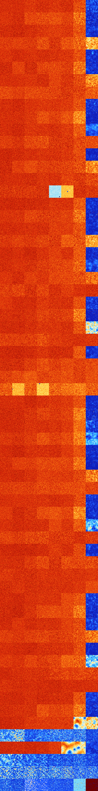

# B15678 (246784-247295)

<details>
    <summary>Initial Grid</summary>
    
</details>


<details>
    <summary>Initial Grid RLE</summary>

```
#C Exported from GoGoL (https://github.com/marrow16/gogol)
#C Wrap mode: Toroidal
#C Boundary mode: Dead
#C Step: 0
x = 100, y = 100, rule = B15678/S
20bo27bo22bo10bobo$3b2o8bo71bo$4bo7bobo10bo25bo6bo6bo22bo$4b2o19bo46bo
5bo4bo$25bo23b2obobo12bo$4bo71bo$12bo15bo66bo$25bo38bo29bo2bo$6bo4bo2bo
3bo26bobo44bo$4bo3bo5bo52b2o20bo9bo$15bo4bo4bo17bo17b2obo25bo7b2o$18bo
21bo4bo5bo6b2o23bo3bobo3bo$43bo25bo12bo$14bo2bo21bo5bo23bo$62bo33bo$24b
o18bo5bo23bo11bo$81bo7bo$7bo24b2o3bo15bo7bo35bo$o14bo5bo23bo9bo9bobo7bo
$13bo13bo14bo2bo47bo2bo$65bo17bobo$100b$20bo3bo66bo$74bo6bo$3bo64bo8bo
2bo$4bo5bo2bo$4bo75bo15bo$34bo56bo$16bo43bo35bo$13bo2bo55bo$15bo2bo5bo
30bo5bo11bo25bo$34bo18bo9bo$2bo7bobo17bo43bo16bo$11b2o24bo22bo2bo10bo
20bo$3bo10bo3bo2bo58bo$45bo10bo14bo2bo$15bo25bo28bo2bo2bo7bobo5bo3bo$2b
2o25bo4b2o55bo5bo$26bo6bo6bo20bobo$obo75bo7bo4bo$18bo4bo11bo6bo33bo7bob
o11bo$8bo2bo42bo18bo12bo$19b2o27bo3bo15bo11bo9b2o$43bo2bo8bo29bo4bo$79b
o2bo4bo$10bo44bo16bo$4bo26bo4bo3bo36bo20bo$3bo10bo23bo$9bo4bo11bo58bo$
21bo28bo19bo11bo$60bo$15bobo6bo17bo7b2o13bo15bo2bo$7bo5bo2bobobo34bo20b
o20bo$38bo10bo8bo26bo3bo$56bo18bo$8bo19bo41bo6bo19bo$10bo17bo30bo9bo21b
o$o67b2o$13bo20bo51bo$19bo17bo30bobo9bobo$11bo27bo47bo4bo$24b2o6bo11bo
4bo31bo6bo4bo4bo$10bo17bo4bo3bo15bo7bo5bo13bo$15bo19bo7bo5bo$7bo27bo21b
o7bo18bo$16bo12bo37bo3bo12bobo5bo$37bo19bo38b2o$5bo37b2o12bo35bo$10bo4b
o2bo7bo16b2o8bobo16bo3bo$27bo22bo2bo21bobo15bo$11bobo61bo6bo11bo2bo$11b
o14bo12bo29b2o3bo$bo12bo21bo23bo23bo3bo10bo$6bo28bo40bo$10bo4bo24bo16b
2o19b2o$28bobo42bo6bo$22bo61bo10bobo$37bo11bo5bo9bo$29bo11bo14bo3bo7bo
22bo$20bo10bo15bo8bo11bo9b2o2bo$22b2o9bo65bo$16bo30bo9bo9bo$21bo16bo25b
o$77bo2bo$18bo2bo5bo19bobo$21bo6bo18bo25b2o20bo$5bo21bo5bo18bo32bobo9bo
bo$13bo12bo6bo37bo16bo$4bo15bo49bo20b3o$3bo19bo34bo38bo$10bo15bobo$100b
$7bo68bo18bo$69bo26bo$bo46bo4bo$49bo6bo5bo11bo$10bo16bo40bo20bo$7bo12bo
17bob2o16bo2bo8bo26bo$10b2o3bo17bo11bo24bo21bo$47bo47bobo!
```
</details>
<details>
    <summary>Thumbnail</summary>

</details>
<table>
<tr>
    <td><a href="./246784%20S%20Heat%20Map%20Activity.png"></a><br>S (246784)<br>G>1000</td>    <td><a href="./246785%20S0%20Heat%20Map%20Activity.png"></a><br>S0 (246785)<br>G>1000</td>    <td><a href="./246786%20S1%20Heat%20Map%20Activity.png"></a><br>S1 (246786)<br>G>1000</td>    <td><a href="./246787%20S01%20Heat%20Map%20Activity.png"></a><br>S01 (246787)<br>G>1000</td>    <td><a href="./246788%20S2%20Heat%20Map%20Activity.png"></a><br>S2 (246788)<br>G>1000</td>    <td><a href="./246789%20S02%20Heat%20Map%20Activity.png"></a><br>S02 (246789)<br>G>1000</td>    <td><a href="./246790%20S12%20Heat%20Map%20Activity.png"></a><br>S12 (246790)<br>G>1000</td>    <td><a href="./246791%20S012%20Heat%20Map%20Activity.png"></a><br>S012 (246791)<br>R@140,p6</td></tr>
<tr>
    <td><a href="./246792%20S3%20Heat%20Map%20Activity.png"></a><br>S3 (246792)<br>G>1000</td>    <td><a href="./246793%20S03%20Heat%20Map%20Activity.png"></a><br>S03 (246793)<br>G>1000</td>    <td><a href="./246794%20S13%20Heat%20Map%20Activity.png"></a><br>S13 (246794)<br>G>1000</td>    <td><a href="./246795%20S013%20Heat%20Map%20Activity.png"></a><br>S013 (246795)<br>G>1000</td>    <td><a href="./246796%20S23%20Heat%20Map%20Activity.png"></a><br>S23 (246796)<br>G>1000</td>    <td><a href="./246797%20S023%20Heat%20Map%20Activity.png"></a><br>S023 (246797)<br>G>1000</td>    <td><a href="./246798%20S123%20Heat%20Map%20Activity.png"></a><br>S123 (246798)<br>G>1000</td>    <td><a href="./246799%20S0123%20Heat%20Map%20Activity.png"></a><br>S0123 (246799)<br>R@205,p12</td></tr>
<tr>
    <td><a href="./246800%20S4%20Heat%20Map%20Activity.png"></a><br>S4 (246800)<br>G>1000</td>    <td><a href="./246801%20S04%20Heat%20Map%20Activity.png"></a><br>S04 (246801)<br>G>1000</td>    <td><a href="./246802%20S14%20Heat%20Map%20Activity.png"></a><br>S14 (246802)<br>G>1000</td>    <td><a href="./246803%20S014%20Heat%20Map%20Activity.png"></a><br>S014 (246803)<br>G>1000</td>    <td><a href="./246804%20S24%20Heat%20Map%20Activity.png"></a><br>S24 (246804)<br>G>1000</td>    <td><a href="./246805%20S024%20Heat%20Map%20Activity.png"></a><br>S024 (246805)<br>G>1000</td>    <td><a href="./246806%20S124%20Heat%20Map%20Activity.png"></a><br>S124 (246806)<br>G>1000</td>    <td><a href="./246807%20S0124%20Heat%20Map%20Activity.png"></a><br>S0124 (246807)<br>R@432,p3</td></tr>
<tr>
    <td><a href="./246808%20S34%20Heat%20Map%20Activity.png"></a><br>S34 (246808)<br>G>1000</td>    <td><a href="./246809%20S034%20Heat%20Map%20Activity.png"></a><br>S034 (246809)<br>G>1000</td>    <td><a href="./246810%20S134%20Heat%20Map%20Activity.png"></a><br>S134 (246810)<br>G>1000</td>    <td><a href="./246811%20S0134%20Heat%20Map%20Activity.png"></a><br>S0134 (246811)<br>G>1000</td>    <td><a href="./246812%20S234%20Heat%20Map%20Activity.png"></a><br>S234 (246812)<br>G>1000</td>    <td><a href="./246813%20S0234%20Heat%20Map%20Activity.png"></a><br>S0234 (246813)<br>G>1000</td>    <td><a href="./246814%20S1234%20Heat%20Map%20Activity.png"></a><br>S1234 (246814)<br>G>1000</td>    <td><a href="./246815%20S01234%20Heat%20Map%20Activity.png"></a><br>S01234 (246815)<br>G>1000</td></tr>
<tr>
    <td><a href="./246816%20S5%20Heat%20Map%20Activity.png"></a><br>S5 (246816)<br>G>1000</td>    <td><a href="./246817%20S05%20Heat%20Map%20Activity.png"></a><br>S05 (246817)<br>G>1000</td>    <td><a href="./246818%20S15%20Heat%20Map%20Activity.png"></a><br>S15 (246818)<br>G>1000</td>    <td><a href="./246819%20S015%20Heat%20Map%20Activity.png"></a><br>S015 (246819)<br>G>1000</td>    <td><a href="./246820%20S25%20Heat%20Map%20Activity.png"></a><br>S25 (246820)<br>G>1000</td>    <td><a href="./246821%20S025%20Heat%20Map%20Activity.png"></a><br>S025 (246821)<br>G>1000</td>    <td><a href="./246822%20S125%20Heat%20Map%20Activity.png"></a><br>S125 (246822)<br>G>1000</td>    <td><a href="./246823%20S0125%20Heat%20Map%20Activity.png"></a><br>S0125 (246823)<br>R@409,p6</td></tr>
<tr>
    <td><a href="./246824%20S35%20Heat%20Map%20Activity.png"></a><br>S35 (246824)<br>G>1000</td>    <td><a href="./246825%20S035%20Heat%20Map%20Activity.png"></a><br>S035 (246825)<br>G>1000</td>    <td><a href="./246826%20S135%20Heat%20Map%20Activity.png"></a><br>S135 (246826)<br>G>1000</td>    <td><a href="./246827%20S0135%20Heat%20Map%20Activity.png"></a><br>S0135 (246827)<br>G>1000</td>    <td><a href="./246828%20S235%20Heat%20Map%20Activity.png"></a><br>S235 (246828)<br>G>1000</td>    <td><a href="./246829%20S0235%20Heat%20Map%20Activity.png"></a><br>S0235 (246829)<br>G>1000</td>    <td><a href="./246830%20S1235%20Heat%20Map%20Activity.png"></a><br>S1235 (246830)<br>G>1000</td>    <td><a href="./246831%20S01235%20Heat%20Map%20Activity.png"></a><br>S01235 (246831)<br>R@485,p24</td></tr>
<tr>
    <td><a href="./246832%20S45%20Heat%20Map%20Activity.png"></a><br>S45 (246832)<br>G>1000</td>    <td><a href="./246833%20S045%20Heat%20Map%20Activity.png"></a><br>S045 (246833)<br>G>1000</td>    <td><a href="./246834%20S145%20Heat%20Map%20Activity.png"></a><br>S145 (246834)<br>G>1000</td>    <td><a href="./246835%20S0145%20Heat%20Map%20Activity.png"></a><br>S0145 (246835)<br>G>1000</td>    <td><a href="./246836%20S245%20Heat%20Map%20Activity.png"></a><br>S245 (246836)<br>G>1000</td>    <td><a href="./246837%20S0245%20Heat%20Map%20Activity.png"></a><br>S0245 (246837)<br>G>1000</td>    <td><a href="./246838%20S1245%20Heat%20Map%20Activity.png"></a><br>S1245 (246838)<br>G>1000</td>    <td><a href="./246839%20S01245%20Heat%20Map%20Activity.png"></a><br>S01245 (246839)<br>G>1000</td></tr>
<tr>
    <td><a href="./246840%20S345%20Heat%20Map%20Activity.png"></a><br>S345 (246840)<br>G>1000</td>    <td><a href="./246841%20S0345%20Heat%20Map%20Activity.png"></a><br>S0345 (246841)<br>G>1000</td>    <td><a href="./246842%20S1345%20Heat%20Map%20Activity.png"></a><br>S1345 (246842)<br>G>1000</td>    <td><a href="./246843%20S01345%20Heat%20Map%20Activity.png"></a><br>S01345 (246843)<br>G>1000</td>    <td><a href="./246844%20S2345%20Heat%20Map%20Activity.png"></a><br>S2345 (246844)<br>G>1000</td>    <td><a href="./246845%20S02345%20Heat%20Map%20Activity.png"></a><br>S02345 (246845)<br>G>1000</td>    <td><a href="./246846%20S12345%20Heat%20Map%20Activity.png"></a><br>S12345 (246846)<br>G>1000</td>    <td><a href="./246847%20S012345%20Heat%20Map%20Activity.png"></a><br>S012345 (246847)<br>G>1000</td></tr>
<tr>
    <td><a href="./246848%20S6%20Heat%20Map%20Activity.png"></a><br>S6 (246848)<br>G>1000</td>    <td><a href="./246849%20S06%20Heat%20Map%20Activity.png"></a><br>S06 (246849)<br>G>1000</td>    <td><a href="./246850%20S16%20Heat%20Map%20Activity.png"></a><br>S16 (246850)<br>G>1000</td>    <td><a href="./246851%20S016%20Heat%20Map%20Activity.png"></a><br>S016 (246851)<br>G>1000</td>    <td><a href="./246852%20S26%20Heat%20Map%20Activity.png"></a><br>S26 (246852)<br>G>1000</td>    <td><a href="./246853%20S026%20Heat%20Map%20Activity.png"></a><br>S026 (246853)<br>G>1000</td>    <td><a href="./246854%20S126%20Heat%20Map%20Activity.png"></a><br>S126 (246854)<br>G>1000</td>    <td><a href="./246855%20S0126%20Heat%20Map%20Activity.png"></a><br>S0126 (246855)<br>R@129,p6</td></tr>
<tr>
    <td><a href="./246856%20S36%20Heat%20Map%20Activity.png"></a><br>S36 (246856)<br>G>1000</td>    <td><a href="./246857%20S036%20Heat%20Map%20Activity.png"></a><br>S036 (246857)<br>G>1000</td>    <td><a href="./246858%20S136%20Heat%20Map%20Activity.png"></a><br>S136 (246858)<br>G>1000</td>    <td><a href="./246859%20S0136%20Heat%20Map%20Activity.png"></a><br>S0136 (246859)<br>G>1000</td>    <td><a href="./246860%20S236%20Heat%20Map%20Activity.png"></a><br>S236 (246860)<br>G>1000</td>    <td><a href="./246861%20S0236%20Heat%20Map%20Activity.png"></a><br>S0236 (246861)<br>G>1000</td>    <td><a href="./246862%20S1236%20Heat%20Map%20Activity.png"></a><br>S1236 (246862)<br>G>1000</td>    <td><a href="./246863%20S01236%20Heat%20Map%20Activity.png"></a><br>S01236 (246863)<br>R@308,p4</td></tr>
<tr>
    <td><a href="./246864%20S46%20Heat%20Map%20Activity.png"></a><br>S46 (246864)<br>G>1000</td>    <td><a href="./246865%20S046%20Heat%20Map%20Activity.png"></a><br>S046 (246865)<br>G>1000</td>    <td><a href="./246866%20S146%20Heat%20Map%20Activity.png"></a><br>S146 (246866)<br>G>1000</td>    <td><a href="./246867%20S0146%20Heat%20Map%20Activity.png"></a><br>S0146 (246867)<br>G>1000</td>    <td><a href="./246868%20S246%20Heat%20Map%20Activity.png"></a><br>S246 (246868)<br>G>1000</td>    <td><a href="./246869%20S0246%20Heat%20Map%20Activity.png"></a><br>S0246 (246869)<br>G>1000</td>    <td><a href="./246870%20S1246%20Heat%20Map%20Activity.png"></a><br>S1246 (246870)<br>G>1000</td>    <td><a href="./246871%20S01246%20Heat%20Map%20Activity.png"></a><br>S01246 (246871)<br>G>1000</td></tr>
<tr>
    <td><a href="./246872%20S346%20Heat%20Map%20Activity.png"></a><br>S346 (246872)<br>G>1000</td>    <td><a href="./246873%20S0346%20Heat%20Map%20Activity.png"></a><br>S0346 (246873)<br>G>1000</td>    <td><a href="./246874%20S1346%20Heat%20Map%20Activity.png"></a><br>S1346 (246874)<br>G>1000</td>    <td><a href="./246875%20S01346%20Heat%20Map%20Activity.png"></a><br>S01346 (246875)<br>G>1000</td>    <td><a href="./246876%20S2346%20Heat%20Map%20Activity.png"></a><br>S2346 (246876)<br>G>1000</td>    <td><a href="./246877%20S02346%20Heat%20Map%20Activity.png"></a><br>S02346 (246877)<br>G>1000</td>    <td><a href="./246878%20S12346%20Heat%20Map%20Activity.png"></a><br>S12346 (246878)<br>G>1000</td>    <td><a href="./246879%20S012346%20Heat%20Map%20Activity.png"></a><br>S012346 (246879)<br>G>1000</td></tr>
<tr>
    <td><a href="./246880%20S56%20Heat%20Map%20Activity.png"></a><br>S56 (246880)<br>G>1000</td>    <td><a href="./246881%20S056%20Heat%20Map%20Activity.png"></a><br>S056 (246881)<br>G>1000</td>    <td><a href="./246882%20S156%20Heat%20Map%20Activity.png"></a><br>S156 (246882)<br>G>1000</td>    <td><a href="./246883%20S0156%20Heat%20Map%20Activity.png"></a><br>S0156 (246883)<br>G>1000</td>    <td><a href="./246884%20S256%20Heat%20Map%20Activity.png"></a><br>S256 (246884)<br>G>1000</td>    <td><a href="./246885%20S0256%20Heat%20Map%20Activity.png"></a><br>S0256 (246885)<br>G>1000</td>    <td><a href="./246886%20S1256%20Heat%20Map%20Activity.png"></a><br>S1256 (246886)<br>G>1000</td>    <td><a href="./246887%20S01256%20Heat%20Map%20Activity.png"></a><br>S01256 (246887)<br>R@560,p84</td></tr>
<tr>
    <td><a href="./246888%20S356%20Heat%20Map%20Activity.png"></a><br>S356 (246888)<br>G>1000</td>    <td><a href="./246889%20S0356%20Heat%20Map%20Activity.png"></a><br>S0356 (246889)<br>G>1000</td>    <td><a href="./246890%20S1356%20Heat%20Map%20Activity.png"></a><br>S1356 (246890)<br>G>1000</td>    <td><a href="./246891%20S01356%20Heat%20Map%20Activity.png"></a><br>S01356 (246891)<br>G>1000</td>    <td><a href="./246892%20S2356%20Heat%20Map%20Activity.png"></a><br>S2356 (246892)<br>G>1000</td>    <td><a href="./246893%20S02356%20Heat%20Map%20Activity.png"></a><br>S02356 (246893)<br>G>1000</td>    <td><a href="./246894%20S12356%20Heat%20Map%20Activity.png"></a><br>S12356 (246894)<br>G>1000</td>    <td><a href="./246895%20S012356%20Heat%20Map%20Activity.png"></a><br>S012356 (246895)<br>G>1000</td></tr>
<tr>
    <td><a href="./246896%20S456%20Heat%20Map%20Activity.png"></a><br>S456 (246896)<br>G>1000</td>    <td><a href="./246897%20S0456%20Heat%20Map%20Activity.png"></a><br>S0456 (246897)<br>G>1000</td>    <td><a href="./246898%20S1456%20Heat%20Map%20Activity.png"></a><br>S1456 (246898)<br>G>1000</td>    <td><a href="./246899%20S01456%20Heat%20Map%20Activity.png"></a><br>S01456 (246899)<br>G>1000</td>    <td><a href="./246900%20S2456%20Heat%20Map%20Activity.png"></a><br>S2456 (246900)<br>G>1000</td>    <td><a href="./246901%20S02456%20Heat%20Map%20Activity.png"></a><br>S02456 (246901)<br>G>1000</td>    <td><a href="./246902%20S12456%20Heat%20Map%20Activity.png"></a><br>S12456 (246902)<br>G>1000</td>    <td><a href="./246903%20S012456%20Heat%20Map%20Activity.png"></a><br>S012456 (246903)<br>G>1000</td></tr>
<tr>
    <td><a href="./246904%20S3456%20Heat%20Map%20Activity.png"></a><br>S3456 (246904)<br>G>1000</td>    <td><a href="./246905%20S03456%20Heat%20Map%20Activity.png"></a><br>S03456 (246905)<br>G>1000</td>    <td><a href="./246906%20S13456%20Heat%20Map%20Activity.png"></a><br>S13456 (246906)<br>G>1000</td>    <td><a href="./246907%20S013456%20Heat%20Map%20Activity.png"></a><br>S013456 (246907)<br>G>1000</td>    <td><a href="./246908%20S23456%20Heat%20Map%20Activity.png"></a><br>S23456 (246908)<br>G>1000</td>    <td><a href="./246909%20S023456%20Heat%20Map%20Activity.png"></a><br>S023456 (246909)<br>G>1000</td>    <td><a href="./246910%20S123456%20Heat%20Map%20Activity.png"></a><br>S123456 (246910)<br>G>1000</td>    <td><a href="./246911%20S0123456%20Heat%20Map%20Activity.png"></a><br>S0123456 (246911)<br>G>1000</td></tr>
<tr>
    <td><a href="./246912%20S7%20Heat%20Map%20Activity.png"></a><br>S7 (246912)<br>G>1000</td>    <td><a href="./246913%20S07%20Heat%20Map%20Activity.png"></a><br>S07 (246913)<br>G>1000</td>    <td><a href="./246914%20S17%20Heat%20Map%20Activity.png"></a><br>S17 (246914)<br>G>1000</td>    <td><a href="./246915%20S017%20Heat%20Map%20Activity.png"></a><br>S017 (246915)<br>G>1000</td>    <td><a href="./246916%20S27%20Heat%20Map%20Activity.png"></a><br>S27 (246916)<br>G>1000</td>    <td><a href="./246917%20S027%20Heat%20Map%20Activity.png"></a><br>S027 (246917)<br>G>1000</td>    <td><a href="./246918%20S127%20Heat%20Map%20Activity.png"></a><br>S127 (246918)<br>G>1000</td>    <td><a href="./246919%20S0127%20Heat%20Map%20Activity.png"></a><br>S0127 (246919)<br>R@162,p6</td></tr>
<tr>
    <td><a href="./246920%20S37%20Heat%20Map%20Activity.png"></a><br>S37 (246920)<br>G>1000</td>    <td><a href="./246921%20S037%20Heat%20Map%20Activity.png"></a><br>S037 (246921)<br>G>1000</td>    <td><a href="./246922%20S137%20Heat%20Map%20Activity.png"></a><br>S137 (246922)<br>G>1000</td>    <td><a href="./246923%20S0137%20Heat%20Map%20Activity.png"></a><br>S0137 (246923)<br>G>1000</td>    <td><a href="./246924%20S237%20Heat%20Map%20Activity.png"></a><br>S237 (246924)<br>G>1000</td>    <td><a href="./246925%20S0237%20Heat%20Map%20Activity.png"></a><br>S0237 (246925)<br>G>1000</td>    <td><a href="./246926%20S1237%20Heat%20Map%20Activity.png"></a><br>S1237 (246926)<br>G>1000</td>    <td><a href="./246927%20S01237%20Heat%20Map%20Activity.png"></a><br>S01237 (246927)<br>R@200,p12</td></tr>
<tr>
    <td><a href="./246928%20S47%20Heat%20Map%20Activity.png"></a><br>S47 (246928)<br>G>1000</td>    <td><a href="./246929%20S047%20Heat%20Map%20Activity.png"></a><br>S047 (246929)<br>G>1000</td>    <td><a href="./246930%20S147%20Heat%20Map%20Activity.png"></a><br>S147 (246930)<br>G>1000</td>    <td><a href="./246931%20S0147%20Heat%20Map%20Activity.png"></a><br>S0147 (246931)<br>G>1000</td>    <td><a href="./246932%20S247%20Heat%20Map%20Activity.png"></a><br>S247 (246932)<br>G>1000</td>    <td><a href="./246933%20S0247%20Heat%20Map%20Activity.png"></a><br>S0247 (246933)<br>G>1000</td>    <td><a href="./246934%20S1247%20Heat%20Map%20Activity.png"></a><br>S1247 (246934)<br>G>1000</td>    <td><a href="./246935%20S01247%20Heat%20Map%20Activity.png"></a><br>S01247 (246935)<br>R@523,p3</td></tr>
<tr>
    <td><a href="./246936%20S347%20Heat%20Map%20Activity.png"></a><br>S347 (246936)<br>G>1000</td>    <td><a href="./246937%20S0347%20Heat%20Map%20Activity.png"></a><br>S0347 (246937)<br>G>1000</td>    <td><a href="./246938%20S1347%20Heat%20Map%20Activity.png"></a><br>S1347 (246938)<br>G>1000</td>    <td><a href="./246939%20S01347%20Heat%20Map%20Activity.png"></a><br>S01347 (246939)<br>G>1000</td>    <td><a href="./246940%20S2347%20Heat%20Map%20Activity.png"></a><br>S2347 (246940)<br>G>1000</td>    <td><a href="./246941%20S02347%20Heat%20Map%20Activity.png"></a><br>S02347 (246941)<br>G>1000</td>    <td><a href="./246942%20S12347%20Heat%20Map%20Activity.png"></a><br>S12347 (246942)<br>G>1000</td>    <td><a href="./246943%20S012347%20Heat%20Map%20Activity.png"></a><br>S012347 (246943)<br>G>1000</td></tr>
<tr>
    <td><a href="./246944%20S57%20Heat%20Map%20Activity.png"></a><br>S57 (246944)<br>G>1000</td>    <td><a href="./246945%20S057%20Heat%20Map%20Activity.png"></a><br>S057 (246945)<br>G>1000</td>    <td><a href="./246946%20S157%20Heat%20Map%20Activity.png"></a><br>S157 (246946)<br>G>1000</td>    <td><a href="./246947%20S0157%20Heat%20Map%20Activity.png"></a><br>S0157 (246947)<br>G>1000</td>    <td><a href="./246948%20S257%20Heat%20Map%20Activity.png"></a><br>S257 (246948)<br>G>1000</td>    <td><a href="./246949%20S0257%20Heat%20Map%20Activity.png"></a><br>S0257 (246949)<br>G>1000</td>    <td><a href="./246950%20S1257%20Heat%20Map%20Activity.png"></a><br>S1257 (246950)<br>G>1000</td>    <td><a href="./246951%20S01257%20Heat%20Map%20Activity.png"></a><br>S01257 (246951)<br>R@318,p84</td></tr>
<tr>
    <td><a href="./246952%20S357%20Heat%20Map%20Activity.png"></a><br>S357 (246952)<br>G>1000</td>    <td><a href="./246953%20S0357%20Heat%20Map%20Activity.png"></a><br>S0357 (246953)<br>G>1000</td>    <td><a href="./246954%20S1357%20Heat%20Map%20Activity.png"></a><br>S1357 (246954)<br>G>1000</td>    <td><a href="./246955%20S01357%20Heat%20Map%20Activity.png"></a><br>S01357 (246955)<br>G>1000</td>    <td><a href="./246956%20S2357%20Heat%20Map%20Activity.png"></a><br>S2357 (246956)<br>G>1000</td>    <td><a href="./246957%20S02357%20Heat%20Map%20Activity.png"></a><br>S02357 (246957)<br>G>1000</td>    <td><a href="./246958%20S12357%20Heat%20Map%20Activity.png"></a><br>S12357 (246958)<br>G>1000</td>    <td><a href="./246959%20S012357%20Heat%20Map%20Activity.png"></a><br>S012357 (246959)<br>G>1000</td></tr>
<tr>
    <td><a href="./246960%20S457%20Heat%20Map%20Activity.png"></a><br>S457 (246960)<br>G>1000</td>    <td><a href="./246961%20S0457%20Heat%20Map%20Activity.png"></a><br>S0457 (246961)<br>G>1000</td>    <td><a href="./246962%20S1457%20Heat%20Map%20Activity.png"></a><br>S1457 (246962)<br>G>1000</td>    <td><a href="./246963%20S01457%20Heat%20Map%20Activity.png"></a><br>S01457 (246963)<br>G>1000</td>    <td><a href="./246964%20S2457%20Heat%20Map%20Activity.png"></a><br>S2457 (246964)<br>G>1000</td>    <td><a href="./246965%20S02457%20Heat%20Map%20Activity.png"></a><br>S02457 (246965)<br>G>1000</td>    <td><a href="./246966%20S12457%20Heat%20Map%20Activity.png"></a><br>S12457 (246966)<br>G>1000</td>    <td><a href="./246967%20S012457%20Heat%20Map%20Activity.png"></a><br>S012457 (246967)<br>G>1000</td></tr>
<tr>
    <td><a href="./246968%20S3457%20Heat%20Map%20Activity.png"></a><br>S3457 (246968)<br>G>1000</td>    <td><a href="./246969%20S03457%20Heat%20Map%20Activity.png"></a><br>S03457 (246969)<br>G>1000</td>    <td><a href="./246970%20S13457%20Heat%20Map%20Activity.png"></a><br>S13457 (246970)<br>G>1000</td>    <td><a href="./246971%20S013457%20Heat%20Map%20Activity.png"></a><br>S013457 (246971)<br>G>1000</td>    <td><a href="./246972%20S23457%20Heat%20Map%20Activity.png"></a><br>S23457 (246972)<br>G>1000</td>    <td><a href="./246973%20S023457%20Heat%20Map%20Activity.png"></a><br>S023457 (246973)<br>G>1000</td>    <td><a href="./246974%20S123457%20Heat%20Map%20Activity.png"></a><br>S123457 (246974)<br>G>1000</td>    <td><a href="./246975%20S0123457%20Heat%20Map%20Activity.png"></a><br>S0123457 (246975)<br>G>1000</td></tr>
<tr>
    <td><a href="./246976%20S67%20Heat%20Map%20Activity.png"></a><br>S67 (246976)<br>G>1000</td>    <td><a href="./246977%20S067%20Heat%20Map%20Activity.png"></a><br>S067 (246977)<br>G>1000</td>    <td><a href="./246978%20S167%20Heat%20Map%20Activity.png"></a><br>S167 (246978)<br>G>1000</td>    <td><a href="./246979%20S0167%20Heat%20Map%20Activity.png"></a><br>S0167 (246979)<br>G>1000</td>    <td><a href="./246980%20S267%20Heat%20Map%20Activity.png"></a><br>S267 (246980)<br>G>1000</td>    <td><a href="./246981%20S0267%20Heat%20Map%20Activity.png"></a><br>S0267 (246981)<br>G>1000</td>    <td><a href="./246982%20S1267%20Heat%20Map%20Activity.png"></a><br>S1267 (246982)<br>G>1000</td>    <td><a href="./246983%20S01267%20Heat%20Map%20Activity.png"></a><br>S01267 (246983)<br>R@161,p6</td></tr>
<tr>
    <td><a href="./246984%20S367%20Heat%20Map%20Activity.png"></a><br>S367 (246984)<br>G>1000</td>    <td><a href="./246985%20S0367%20Heat%20Map%20Activity.png"></a><br>S0367 (246985)<br>G>1000</td>    <td><a href="./246986%20S1367%20Heat%20Map%20Activity.png"></a><br>S1367 (246986)<br>G>1000</td>    <td><a href="./246987%20S01367%20Heat%20Map%20Activity.png"></a><br>S01367 (246987)<br>G>1000</td>    <td><a href="./246988%20S2367%20Heat%20Map%20Activity.png"></a><br>S2367 (246988)<br>G>1000</td>    <td><a href="./246989%20S02367%20Heat%20Map%20Activity.png"></a><br>S02367 (246989)<br>G>1000</td>    <td><a href="./246990%20S12367%20Heat%20Map%20Activity.png"></a><br>S12367 (246990)<br>G>1000</td>    <td><a href="./246991%20S012367%20Heat%20Map%20Activity.png"></a><br>S012367 (246991)<br>R@394,p180</td></tr>
<tr>
    <td><a href="./246992%20S467%20Heat%20Map%20Activity.png"></a><br>S467 (246992)<br>G>1000</td>    <td><a href="./246993%20S0467%20Heat%20Map%20Activity.png"></a><br>S0467 (246993)<br>G>1000</td>    <td><a href="./246994%20S1467%20Heat%20Map%20Activity.png"></a><br>S1467 (246994)<br>G>1000</td>    <td><a href="./246995%20S01467%20Heat%20Map%20Activity.png"></a><br>S01467 (246995)<br>G>1000</td>    <td><a href="./246996%20S2467%20Heat%20Map%20Activity.png"></a><br>S2467 (246996)<br>G>1000</td>    <td><a href="./246997%20S02467%20Heat%20Map%20Activity.png"></a><br>S02467 (246997)<br>G>1000</td>    <td><a href="./246998%20S12467%20Heat%20Map%20Activity.png"></a><br>S12467 (246998)<br>G>1000</td>    <td><a href="./246999%20S012467%20Heat%20Map%20Activity.png"></a><br>S012467 (246999)<br>G>1000</td></tr>
<tr>
    <td><a href="./247000%20S3467%20Heat%20Map%20Activity.png"></a><br>S3467 (247000)<br>G>1000</td>    <td><a href="./247001%20S03467%20Heat%20Map%20Activity.png"></a><br>S03467 (247001)<br>G>1000</td>    <td><a href="./247002%20S13467%20Heat%20Map%20Activity.png"></a><br>S13467 (247002)<br>G>1000</td>    <td><a href="./247003%20S013467%20Heat%20Map%20Activity.png"></a><br>S013467 (247003)<br>G>1000</td>    <td><a href="./247004%20S23467%20Heat%20Map%20Activity.png"></a><br>S23467 (247004)<br>G>1000</td>    <td><a href="./247005%20S023467%20Heat%20Map%20Activity.png"></a><br>S023467 (247005)<br>G>1000</td>    <td><a href="./247006%20S123467%20Heat%20Map%20Activity.png"></a><br>S123467 (247006)<br>G>1000</td>    <td><a href="./247007%20S0123467%20Heat%20Map%20Activity.png"></a><br>S0123467 (247007)<br>G>1000</td></tr>
<tr>
    <td><a href="./247008%20S567%20Heat%20Map%20Activity.png"></a><br>S567 (247008)<br>G>1000</td>    <td><a href="./247009%20S0567%20Heat%20Map%20Activity.png"></a><br>S0567 (247009)<br>G>1000</td>    <td><a href="./247010%20S1567%20Heat%20Map%20Activity.png"></a><br>S1567 (247010)<br>G>1000</td>    <td><a href="./247011%20S01567%20Heat%20Map%20Activity.png"></a><br>S01567 (247011)<br>G>1000</td>    <td><a href="./247012%20S2567%20Heat%20Map%20Activity.png"></a><br>S2567 (247012)<br>G>1000</td>    <td><a href="./247013%20S02567%20Heat%20Map%20Activity.png"></a><br>S02567 (247013)<br>G>1000</td>    <td><a href="./247014%20S12567%20Heat%20Map%20Activity.png"></a><br>S12567 (247014)<br>G>1000</td>    <td><a href="./247015%20S012567%20Heat%20Map%20Activity.png"></a><br>S012567 (247015)<br>G>1000</td></tr>
<tr>
    <td><a href="./247016%20S3567%20Heat%20Map%20Activity.png"></a><br>S3567 (247016)<br>G>1000</td>    <td><a href="./247017%20S03567%20Heat%20Map%20Activity.png"></a><br>S03567 (247017)<br>G>1000</td>    <td><a href="./247018%20S13567%20Heat%20Map%20Activity.png"></a><br>S13567 (247018)<br>G>1000</td>    <td><a href="./247019%20S013567%20Heat%20Map%20Activity.png"></a><br>S013567 (247019)<br>G>1000</td>    <td><a href="./247020%20S23567%20Heat%20Map%20Activity.png"></a><br>S23567 (247020)<br>G>1000</td>    <td><a href="./247021%20S023567%20Heat%20Map%20Activity.png"></a><br>S023567 (247021)<br>G>1000</td>    <td><a href="./247022%20S123567%20Heat%20Map%20Activity.png"></a><br>S123567 (247022)<br>G>1000</td>    <td><a href="./247023%20S0123567%20Heat%20Map%20Activity.png"></a><br>S0123567 (247023)<br>G>1000</td></tr>
<tr>
    <td><a href="./247024%20S4567%20Heat%20Map%20Activity.png"></a><br>S4567 (247024)<br>G>1000</td>    <td><a href="./247025%20S04567%20Heat%20Map%20Activity.png"></a><br>S04567 (247025)<br>G>1000</td>    <td><a href="./247026%20S14567%20Heat%20Map%20Activity.png"></a><br>S14567 (247026)<br>G>1000</td>    <td><a href="./247027%20S014567%20Heat%20Map%20Activity.png"></a><br>S014567 (247027)<br>G>1000</td>    <td><a href="./247028%20S24567%20Heat%20Map%20Activity.png"></a><br>S24567 (247028)<br>G>1000</td>    <td><a href="./247029%20S024567%20Heat%20Map%20Activity.png"></a><br>S024567 (247029)<br>G>1000</td>    <td><a href="./247030%20S124567%20Heat%20Map%20Activity.png"></a><br>S124567 (247030)<br>G>1000</td>    <td><a href="./247031%20S0124567%20Heat%20Map%20Activity.png"></a><br>S0124567 (247031)<br>G>1000</td></tr>
<tr>
    <td><a href="./247032%20S34567%20Heat%20Map%20Activity.png"></a><br>S34567 (247032)<br>G>1000</td>    <td><a href="./247033%20S034567%20Heat%20Map%20Activity.png"></a><br>S034567 (247033)<br>G>1000</td>    <td><a href="./247034%20S134567%20Heat%20Map%20Activity.png"></a><br>S134567 (247034)<br>G>1000</td>    <td><a href="./247035%20S0134567%20Heat%20Map%20Activity.png"></a><br>S0134567 (247035)<br>G>1000</td>    <td><a href="./247036%20S234567%20Heat%20Map%20Activity.png"></a><br>S234567 (247036)<br>G>1000</td>    <td><a href="./247037%20S0234567%20Heat%20Map%20Activity.png"></a><br>S0234567 (247037)<br>G>1000</td>    <td><a href="./247038%20S1234567%20Heat%20Map%20Activity.png"></a><br>S1234567 (247038)<br>G>1000</td>    <td><a href="./247039%20S01234567%20Heat%20Map%20Activity.png"></a><br>S01234567 (247039)<br>G>1000</td></tr>
<tr>
    <td><a href="./247040%20S8%20Heat%20Map%20Activity.png"></a><br>S8 (247040)<br>G>1000</td>    <td><a href="./247041%20S08%20Heat%20Map%20Activity.png"></a><br>S08 (247041)<br>G>1000</td>    <td><a href="./247042%20S18%20Heat%20Map%20Activity.png"></a><br>S18 (247042)<br>G>1000</td>    <td><a href="./247043%20S018%20Heat%20Map%20Activity.png"></a><br>S018 (247043)<br>G>1000</td>    <td><a href="./247044%20S28%20Heat%20Map%20Activity.png"></a><br>S28 (247044)<br>G>1000</td>    <td><a href="./247045%20S028%20Heat%20Map%20Activity.png"></a><br>S028 (247045)<br>G>1000</td>    <td><a href="./247046%20S128%20Heat%20Map%20Activity.png"></a><br>S128 (247046)<br>G>1000</td>    <td><a href="./247047%20S0128%20Heat%20Map%20Activity.png"></a><br>S0128 (247047)<br>R@290,p6</td></tr>
<tr>
    <td><a href="./247048%20S38%20Heat%20Map%20Activity.png"></a><br>S38 (247048)<br>G>1000</td>    <td><a href="./247049%20S038%20Heat%20Map%20Activity.png"></a><br>S038 (247049)<br>G>1000</td>    <td><a href="./247050%20S138%20Heat%20Map%20Activity.png"></a><br>S138 (247050)<br>G>1000</td>    <td><a href="./247051%20S0138%20Heat%20Map%20Activity.png"></a><br>S0138 (247051)<br>G>1000</td>    <td><a href="./247052%20S238%20Heat%20Map%20Activity.png"></a><br>S238 (247052)<br>G>1000</td>    <td><a href="./247053%20S0238%20Heat%20Map%20Activity.png"></a><br>S0238 (247053)<br>G>1000</td>    <td><a href="./247054%20S1238%20Heat%20Map%20Activity.png"></a><br>S1238 (247054)<br>G>1000</td>    <td><a href="./247055%20S01238%20Heat%20Map%20Activity.png"></a><br>S01238 (247055)<br>R@207,p28</td></tr>
<tr>
    <td><a href="./247056%20S48%20Heat%20Map%20Activity.png"></a><br>S48 (247056)<br>G>1000</td>    <td><a href="./247057%20S048%20Heat%20Map%20Activity.png"></a><br>S048 (247057)<br>G>1000</td>    <td><a href="./247058%20S148%20Heat%20Map%20Activity.png"></a><br>S148 (247058)<br>G>1000</td>    <td><a href="./247059%20S0148%20Heat%20Map%20Activity.png"></a><br>S0148 (247059)<br>G>1000</td>    <td><a href="./247060%20S248%20Heat%20Map%20Activity.png"></a><br>S248 (247060)<br>G>1000</td>    <td><a href="./247061%20S0248%20Heat%20Map%20Activity.png"></a><br>S0248 (247061)<br>G>1000</td>    <td><a href="./247062%20S1248%20Heat%20Map%20Activity.png"></a><br>S1248 (247062)<br>G>1000</td>    <td><a href="./247063%20S01248%20Heat%20Map%20Activity.png"></a><br>S01248 (247063)<br>R@455,p12</td></tr>
<tr>
    <td><a href="./247064%20S348%20Heat%20Map%20Activity.png"></a><br>S348 (247064)<br>G>1000</td>    <td><a href="./247065%20S0348%20Heat%20Map%20Activity.png"></a><br>S0348 (247065)<br>G>1000</td>    <td><a href="./247066%20S1348%20Heat%20Map%20Activity.png"></a><br>S1348 (247066)<br>G>1000</td>    <td><a href="./247067%20S01348%20Heat%20Map%20Activity.png"></a><br>S01348 (247067)<br>G>1000</td>    <td><a href="./247068%20S2348%20Heat%20Map%20Activity.png"></a><br>S2348 (247068)<br>G>1000</td>    <td><a href="./247069%20S02348%20Heat%20Map%20Activity.png"></a><br>S02348 (247069)<br>G>1000</td>    <td><a href="./247070%20S12348%20Heat%20Map%20Activity.png"></a><br>S12348 (247070)<br>G>1000</td>    <td><a href="./247071%20S012348%20Heat%20Map%20Activity.png"></a><br>S012348 (247071)<br>G>1000</td></tr>
<tr>
    <td><a href="./247072%20S58%20Heat%20Map%20Activity.png"></a><br>S58 (247072)<br>G>1000</td>    <td><a href="./247073%20S058%20Heat%20Map%20Activity.png"></a><br>S058 (247073)<br>G>1000</td>    <td><a href="./247074%20S158%20Heat%20Map%20Activity.png"></a><br>S158 (247074)<br>G>1000</td>    <td><a href="./247075%20S0158%20Heat%20Map%20Activity.png"></a><br>S0158 (247075)<br>G>1000</td>    <td><a href="./247076%20S258%20Heat%20Map%20Activity.png"></a><br>S258 (247076)<br>G>1000</td>    <td><a href="./247077%20S0258%20Heat%20Map%20Activity.png"></a><br>S0258 (247077)<br>G>1000</td>    <td><a href="./247078%20S1258%20Heat%20Map%20Activity.png"></a><br>S1258 (247078)<br>G>1000</td>    <td><a href="./247079%20S01258%20Heat%20Map%20Activity.png"></a><br>S01258 (247079)<br>R@424,p84</td></tr>
<tr>
    <td><a href="./247080%20S358%20Heat%20Map%20Activity.png"></a><br>S358 (247080)<br>G>1000</td>    <td><a href="./247081%20S0358%20Heat%20Map%20Activity.png"></a><br>S0358 (247081)<br>G>1000</td>    <td><a href="./247082%20S1358%20Heat%20Map%20Activity.png"></a><br>S1358 (247082)<br>G>1000</td>    <td><a href="./247083%20S01358%20Heat%20Map%20Activity.png"></a><br>S01358 (247083)<br>G>1000</td>    <td><a href="./247084%20S2358%20Heat%20Map%20Activity.png"></a><br>S2358 (247084)<br>G>1000</td>    <td><a href="./247085%20S02358%20Heat%20Map%20Activity.png"></a><br>S02358 (247085)<br>G>1000</td>    <td><a href="./247086%20S12358%20Heat%20Map%20Activity.png"></a><br>S12358 (247086)<br>G>1000</td>    <td><a href="./247087%20S012358%20Heat%20Map%20Activity.png"></a><br>S012358 (247087)<br>G>1000</td></tr>
<tr>
    <td><a href="./247088%20S458%20Heat%20Map%20Activity.png"></a><br>S458 (247088)<br>G>1000</td>    <td><a href="./247089%20S0458%20Heat%20Map%20Activity.png"></a><br>S0458 (247089)<br>G>1000</td>    <td><a href="./247090%20S1458%20Heat%20Map%20Activity.png"></a><br>S1458 (247090)<br>G>1000</td>    <td><a href="./247091%20S01458%20Heat%20Map%20Activity.png"></a><br>S01458 (247091)<br>G>1000</td>    <td><a href="./247092%20S2458%20Heat%20Map%20Activity.png"></a><br>S2458 (247092)<br>G>1000</td>    <td><a href="./247093%20S02458%20Heat%20Map%20Activity.png"></a><br>S02458 (247093)<br>G>1000</td>    <td><a href="./247094%20S12458%20Heat%20Map%20Activity.png"></a><br>S12458 (247094)<br>G>1000</td>    <td><a href="./247095%20S012458%20Heat%20Map%20Activity.png"></a><br>S012458 (247095)<br>G>1000</td></tr>
<tr>
    <td><a href="./247096%20S3458%20Heat%20Map%20Activity.png"></a><br>S3458 (247096)<br>G>1000</td>    <td><a href="./247097%20S03458%20Heat%20Map%20Activity.png"></a><br>S03458 (247097)<br>G>1000</td>    <td><a href="./247098%20S13458%20Heat%20Map%20Activity.png"></a><br>S13458 (247098)<br>G>1000</td>    <td><a href="./247099%20S013458%20Heat%20Map%20Activity.png"></a><br>S013458 (247099)<br>G>1000</td>    <td><a href="./247100%20S23458%20Heat%20Map%20Activity.png"></a><br>S23458 (247100)<br>G>1000</td>    <td><a href="./247101%20S023458%20Heat%20Map%20Activity.png"></a><br>S023458 (247101)<br>G>1000</td>    <td><a href="./247102%20S123458%20Heat%20Map%20Activity.png"></a><br>S123458 (247102)<br>G>1000</td>    <td><a href="./247103%20S0123458%20Heat%20Map%20Activity.png"></a><br>S0123458 (247103)<br>G>1000</td></tr>
<tr>
    <td><a href="./247104%20S68%20Heat%20Map%20Activity.png"></a><br>S68 (247104)<br>G>1000</td>    <td><a href="./247105%20S068%20Heat%20Map%20Activity.png"></a><br>S068 (247105)<br>G>1000</td>    <td><a href="./247106%20S168%20Heat%20Map%20Activity.png"></a><br>S168 (247106)<br>G>1000</td>    <td><a href="./247107%20S0168%20Heat%20Map%20Activity.png"></a><br>S0168 (247107)<br>G>1000</td>    <td><a href="./247108%20S268%20Heat%20Map%20Activity.png"></a><br>S268 (247108)<br>G>1000</td>    <td><a href="./247109%20S0268%20Heat%20Map%20Activity.png"></a><br>S0268 (247109)<br>G>1000</td>    <td><a href="./247110%20S1268%20Heat%20Map%20Activity.png"></a><br>S1268 (247110)<br>G>1000</td>    <td><a href="./247111%20S01268%20Heat%20Map%20Activity.png"></a><br>S01268 (247111)<br>R@139,p6</td></tr>
<tr>
    <td><a href="./247112%20S368%20Heat%20Map%20Activity.png"></a><br>S368 (247112)<br>G>1000</td>    <td><a href="./247113%20S0368%20Heat%20Map%20Activity.png"></a><br>S0368 (247113)<br>G>1000</td>    <td><a href="./247114%20S1368%20Heat%20Map%20Activity.png"></a><br>S1368 (247114)<br>G>1000</td>    <td><a href="./247115%20S01368%20Heat%20Map%20Activity.png"></a><br>S01368 (247115)<br>G>1000</td>    <td><a href="./247116%20S2368%20Heat%20Map%20Activity.png"></a><br>S2368 (247116)<br>G>1000</td>    <td><a href="./247117%20S02368%20Heat%20Map%20Activity.png"></a><br>S02368 (247117)<br>G>1000</td>    <td><a href="./247118%20S12368%20Heat%20Map%20Activity.png"></a><br>S12368 (247118)<br>G>1000</td>    <td><a href="./247119%20S012368%20Heat%20Map%20Activity.png"></a><br>S012368 (247119)<br>R@194,p12</td></tr>
<tr>
    <td><a href="./247120%20S468%20Heat%20Map%20Activity.png"></a><br>S468 (247120)<br>G>1000</td>    <td><a href="./247121%20S0468%20Heat%20Map%20Activity.png"></a><br>S0468 (247121)<br>G>1000</td>    <td><a href="./247122%20S1468%20Heat%20Map%20Activity.png"></a><br>S1468 (247122)<br>G>1000</td>    <td><a href="./247123%20S01468%20Heat%20Map%20Activity.png"></a><br>S01468 (247123)<br>G>1000</td>    <td><a href="./247124%20S2468%20Heat%20Map%20Activity.png"></a><br>S2468 (247124)<br>G>1000</td>    <td><a href="./247125%20S02468%20Heat%20Map%20Activity.png"></a><br>S02468 (247125)<br>G>1000</td>    <td><a href="./247126%20S12468%20Heat%20Map%20Activity.png"></a><br>S12468 (247126)<br>G>1000</td>    <td><a href="./247127%20S012468%20Heat%20Map%20Activity.png"></a><br>S012468 (247127)<br>G>1000</td></tr>
<tr>
    <td><a href="./247128%20S3468%20Heat%20Map%20Activity.png"></a><br>S3468 (247128)<br>G>1000</td>    <td><a href="./247129%20S03468%20Heat%20Map%20Activity.png"></a><br>S03468 (247129)<br>G>1000</td>    <td><a href="./247130%20S13468%20Heat%20Map%20Activity.png"></a><br>S13468 (247130)<br>G>1000</td>    <td><a href="./247131%20S013468%20Heat%20Map%20Activity.png"></a><br>S013468 (247131)<br>G>1000</td>    <td><a href="./247132%20S23468%20Heat%20Map%20Activity.png"></a><br>S23468 (247132)<br>G>1000</td>    <td><a href="./247133%20S023468%20Heat%20Map%20Activity.png"></a><br>S023468 (247133)<br>G>1000</td>    <td><a href="./247134%20S123468%20Heat%20Map%20Activity.png"></a><br>S123468 (247134)<br>G>1000</td>    <td><a href="./247135%20S0123468%20Heat%20Map%20Activity.png"></a><br>S0123468 (247135)<br>G>1000</td></tr>
<tr>
    <td><a href="./247136%20S568%20Heat%20Map%20Activity.png"></a><br>S568 (247136)<br>G>1000</td>    <td><a href="./247137%20S0568%20Heat%20Map%20Activity.png"></a><br>S0568 (247137)<br>G>1000</td>    <td><a href="./247138%20S1568%20Heat%20Map%20Activity.png"></a><br>S1568 (247138)<br>G>1000</td>    <td><a href="./247139%20S01568%20Heat%20Map%20Activity.png"></a><br>S01568 (247139)<br>G>1000</td>    <td><a href="./247140%20S2568%20Heat%20Map%20Activity.png"></a><br>S2568 (247140)<br>G>1000</td>    <td><a href="./247141%20S02568%20Heat%20Map%20Activity.png"></a><br>S02568 (247141)<br>G>1000</td>    <td><a href="./247142%20S12568%20Heat%20Map%20Activity.png"></a><br>S12568 (247142)<br>G>1000</td>    <td><a href="./247143%20S012568%20Heat%20Map%20Activity.png"></a><br>S012568 (247143)<br>R@580,p12</td></tr>
<tr>
    <td><a href="./247144%20S3568%20Heat%20Map%20Activity.png"></a><br>S3568 (247144)<br>G>1000</td>    <td><a href="./247145%20S03568%20Heat%20Map%20Activity.png"></a><br>S03568 (247145)<br>G>1000</td>    <td><a href="./247146%20S13568%20Heat%20Map%20Activity.png"></a><br>S13568 (247146)<br>G>1000</td>    <td><a href="./247147%20S013568%20Heat%20Map%20Activity.png"></a><br>S013568 (247147)<br>G>1000</td>    <td><a href="./247148%20S23568%20Heat%20Map%20Activity.png"></a><br>S23568 (247148)<br>G>1000</td>    <td><a href="./247149%20S023568%20Heat%20Map%20Activity.png"></a><br>S023568 (247149)<br>G>1000</td>    <td><a href="./247150%20S123568%20Heat%20Map%20Activity.png"></a><br>S123568 (247150)<br>G>1000</td>    <td><a href="./247151%20S0123568%20Heat%20Map%20Activity.png"></a><br>S0123568 (247151)<br>G>1000</td></tr>
<tr>
    <td><a href="./247152%20S4568%20Heat%20Map%20Activity.png"></a><br>S4568 (247152)<br>G>1000</td>    <td><a href="./247153%20S04568%20Heat%20Map%20Activity.png"></a><br>S04568 (247153)<br>G>1000</td>    <td><a href="./247154%20S14568%20Heat%20Map%20Activity.png"></a><br>S14568 (247154)<br>G>1000</td>    <td><a href="./247155%20S014568%20Heat%20Map%20Activity.png"></a><br>S014568 (247155)<br>G>1000</td>    <td><a href="./247156%20S24568%20Heat%20Map%20Activity.png"></a><br>S24568 (247156)<br>G>1000</td>    <td><a href="./247157%20S024568%20Heat%20Map%20Activity.png"></a><br>S024568 (247157)<br>G>1000</td>    <td><a href="./247158%20S124568%20Heat%20Map%20Activity.png"></a><br>S124568 (247158)<br>G>1000</td>    <td><a href="./247159%20S0124568%20Heat%20Map%20Activity.png"></a><br>S0124568 (247159)<br>G>1000</td></tr>
<tr>
    <td><a href="./247160%20S34568%20Heat%20Map%20Activity.png"></a><br>S34568 (247160)<br>G>1000</td>    <td><a href="./247161%20S034568%20Heat%20Map%20Activity.png"></a><br>S034568 (247161)<br>G>1000</td>    <td><a href="./247162%20S134568%20Heat%20Map%20Activity.png"></a><br>S134568 (247162)<br>G>1000</td>    <td><a href="./247163%20S0134568%20Heat%20Map%20Activity.png"></a><br>S0134568 (247163)<br>G>1000</td>    <td><a href="./247164%20S234568%20Heat%20Map%20Activity.png"></a><br>S234568 (247164)<br>G>1000</td>    <td><a href="./247165%20S0234568%20Heat%20Map%20Activity.png"></a><br>S0234568 (247165)<br>G>1000</td>    <td><a href="./247166%20S1234568%20Heat%20Map%20Activity.png"></a><br>S1234568 (247166)<br>G>1000</td>    <td><a href="./247167%20S01234568%20Heat%20Map%20Activity.png"></a><br>S01234568 (247167)<br>G>1000</td></tr>
<tr>
    <td><a href="./247168%20S78%20Heat%20Map%20Activity.png"></a><br>S78 (247168)<br>G>1000</td>    <td><a href="./247169%20S078%20Heat%20Map%20Activity.png"></a><br>S078 (247169)<br>G>1000</td>    <td><a href="./247170%20S178%20Heat%20Map%20Activity.png"></a><br>S178 (247170)<br>G>1000</td>    <td><a href="./247171%20S0178%20Heat%20Map%20Activity.png"></a><br>S0178 (247171)<br>G>1000</td>    <td><a href="./247172%20S278%20Heat%20Map%20Activity.png"></a><br>S278 (247172)<br>G>1000</td>    <td><a href="./247173%20S0278%20Heat%20Map%20Activity.png"></a><br>S0278 (247173)<br>G>1000</td>    <td><a href="./247174%20S1278%20Heat%20Map%20Activity.png"></a><br>S1278 (247174)<br>G>1000</td>    <td><a href="./247175%20S01278%20Heat%20Map%20Activity.png"></a><br>S01278 (247175)<br>R@115,p6</td></tr>
<tr>
    <td><a href="./247176%20S378%20Heat%20Map%20Activity.png"></a><br>S378 (247176)<br>G>1000</td>    <td><a href="./247177%20S0378%20Heat%20Map%20Activity.png"></a><br>S0378 (247177)<br>G>1000</td>    <td><a href="./247178%20S1378%20Heat%20Map%20Activity.png"></a><br>S1378 (247178)<br>G>1000</td>    <td><a href="./247179%20S01378%20Heat%20Map%20Activity.png"></a><br>S01378 (247179)<br>G>1000</td>    <td><a href="./247180%20S2378%20Heat%20Map%20Activity.png"></a><br>S2378 (247180)<br>G>1000</td>    <td><a href="./247181%20S02378%20Heat%20Map%20Activity.png"></a><br>S02378 (247181)<br>G>1000</td>    <td><a href="./247182%20S12378%20Heat%20Map%20Activity.png"></a><br>S12378 (247182)<br>G>1000</td>    <td><a href="./247183%20S012378%20Heat%20Map%20Activity.png"></a><br>S012378 (247183)<br>R@187,p12</td></tr>
<tr>
    <td><a href="./247184%20S478%20Heat%20Map%20Activity.png"></a><br>S478 (247184)<br>G>1000</td>    <td><a href="./247185%20S0478%20Heat%20Map%20Activity.png"></a><br>S0478 (247185)<br>G>1000</td>    <td><a href="./247186%20S1478%20Heat%20Map%20Activity.png"></a><br>S1478 (247186)<br>G>1000</td>    <td><a href="./247187%20S01478%20Heat%20Map%20Activity.png"></a><br>S01478 (247187)<br>G>1000</td>    <td><a href="./247188%20S2478%20Heat%20Map%20Activity.png"></a><br>S2478 (247188)<br>G>1000</td>    <td><a href="./247189%20S02478%20Heat%20Map%20Activity.png"></a><br>S02478 (247189)<br>G>1000</td>    <td><a href="./247190%20S12478%20Heat%20Map%20Activity.png"></a><br>S12478 (247190)<br>G>1000</td>    <td><a href="./247191%20S012478%20Heat%20Map%20Activity.png"></a><br>S012478 (247191)<br>R@337,p3</td></tr>
<tr>
    <td><a href="./247192%20S3478%20Heat%20Map%20Activity.png"></a><br>S3478 (247192)<br>G>1000</td>    <td><a href="./247193%20S03478%20Heat%20Map%20Activity.png"></a><br>S03478 (247193)<br>G>1000</td>    <td><a href="./247194%20S13478%20Heat%20Map%20Activity.png"></a><br>S13478 (247194)<br>G>1000</td>    <td><a href="./247195%20S013478%20Heat%20Map%20Activity.png"></a><br>S013478 (247195)<br>G>1000</td>    <td><a href="./247196%20S23478%20Heat%20Map%20Activity.png"></a><br>S23478 (247196)<br>G>1000</td>    <td><a href="./247197%20S023478%20Heat%20Map%20Activity.png"></a><br>S023478 (247197)<br>G>1000</td>    <td><a href="./247198%20S123478%20Heat%20Map%20Activity.png"></a><br>S123478 (247198)<br>G>1000</td>    <td><a href="./247199%20S0123478%20Heat%20Map%20Activity.png"></a><br>S0123478 (247199)<br>G>1000</td></tr>
<tr>
    <td><a href="./247200%20S578%20Heat%20Map%20Activity.png"></a><br>S578 (247200)<br>G>1000</td>    <td><a href="./247201%20S0578%20Heat%20Map%20Activity.png"></a><br>S0578 (247201)<br>G>1000</td>    <td><a href="./247202%20S1578%20Heat%20Map%20Activity.png"></a><br>S1578 (247202)<br>G>1000</td>    <td><a href="./247203%20S01578%20Heat%20Map%20Activity.png"></a><br>S01578 (247203)<br>G>1000</td>    <td><a href="./247204%20S2578%20Heat%20Map%20Activity.png"></a><br>S2578 (247204)<br>G>1000</td>    <td><a href="./247205%20S02578%20Heat%20Map%20Activity.png"></a><br>S02578 (247205)<br>G>1000</td>    <td><a href="./247206%20S12578%20Heat%20Map%20Activity.png"></a><br>S12578 (247206)<br>G>1000</td>    <td><a href="./247207%20S012578%20Heat%20Map%20Activity.png"></a><br>S012578 (247207)<br>R@539,p12</td></tr>
<tr>
    <td><a href="./247208%20S3578%20Heat%20Map%20Activity.png"></a><br>S3578 (247208)<br>G>1000</td>    <td><a href="./247209%20S03578%20Heat%20Map%20Activity.png"></a><br>S03578 (247209)<br>G>1000</td>    <td><a href="./247210%20S13578%20Heat%20Map%20Activity.png"></a><br>S13578 (247210)<br>G>1000</td>    <td><a href="./247211%20S013578%20Heat%20Map%20Activity.png"></a><br>S013578 (247211)<br>G>1000</td>    <td><a href="./247212%20S23578%20Heat%20Map%20Activity.png"></a><br>S23578 (247212)<br>G>1000</td>    <td><a href="./247213%20S023578%20Heat%20Map%20Activity.png"></a><br>S023578 (247213)<br>G>1000</td>    <td><a href="./247214%20S123578%20Heat%20Map%20Activity.png"></a><br>S123578 (247214)<br>G>1000</td>    <td><a href="./247215%20S0123578%20Heat%20Map%20Activity.png"></a><br>S0123578 (247215)<br>G>1000</td></tr>
<tr>
    <td><a href="./247216%20S4578%20Heat%20Map%20Activity.png"></a><br>S4578 (247216)<br>G>1000</td>    <td><a href="./247217%20S04578%20Heat%20Map%20Activity.png"></a><br>S04578 (247217)<br>G>1000</td>    <td><a href="./247218%20S14578%20Heat%20Map%20Activity.png"></a><br>S14578 (247218)<br>G>1000</td>    <td><a href="./247219%20S014578%20Heat%20Map%20Activity.png"></a><br>S014578 (247219)<br>G>1000</td>    <td><a href="./247220%20S24578%20Heat%20Map%20Activity.png"></a><br>S24578 (247220)<br>G>1000</td>    <td><a href="./247221%20S024578%20Heat%20Map%20Activity.png"></a><br>S024578 (247221)<br>G>1000</td>    <td><a href="./247222%20S124578%20Heat%20Map%20Activity.png"></a><br>S124578 (247222)<br>G>1000</td>    <td><a href="./247223%20S0124578%20Heat%20Map%20Activity.png"></a><br>S0124578 (247223)<br>G>1000</td></tr>
<tr>
    <td><a href="./247224%20S34578%20Heat%20Map%20Activity.png"></a><br>S34578 (247224)<br>G>1000</td>    <td><a href="./247225%20S034578%20Heat%20Map%20Activity.png"></a><br>S034578 (247225)<br>G>1000</td>    <td><a href="./247226%20S134578%20Heat%20Map%20Activity.png"></a><br>S134578 (247226)<br>G>1000</td>    <td><a href="./247227%20S0134578%20Heat%20Map%20Activity.png"></a><br>S0134578 (247227)<br>G>1000</td>    <td><a href="./247228%20S234578%20Heat%20Map%20Activity.png"></a><br>S234578 (247228)<br>G>1000</td>    <td><a href="./247229%20S0234578%20Heat%20Map%20Activity.png"></a><br>S0234578 (247229)<br>G>1000</td>    <td><a href="./247230%20S1234578%20Heat%20Map%20Activity.png"></a><br>S1234578 (247230)<br>G>1000</td>    <td><a href="./247231%20S01234578%20Heat%20Map%20Activity.png"></a><br>S01234578 (247231)<br>G>1000</td></tr>
<tr>
    <td><a href="./247232%20S678%20Heat%20Map%20Activity.png"></a><br>S678 (247232)<br>G>1000</td>    <td><a href="./247233%20S0678%20Heat%20Map%20Activity.png"></a><br>S0678 (247233)<br>G>1000</td>    <td><a href="./247234%20S1678%20Heat%20Map%20Activity.png"></a><br>S1678 (247234)<br>G>1000</td>    <td><a href="./247235%20S01678%20Heat%20Map%20Activity.png"></a><br>S01678 (247235)<br>G>1000</td>    <td><a href="./247236%20S2678%20Heat%20Map%20Activity.png"></a><br>S2678 (247236)<br>G>1000</td>    <td><a href="./247237%20S02678%20Heat%20Map%20Activity.png"></a><br>S02678 (247237)<br>G>1000</td>    <td><a href="./247238%20S12678%20Heat%20Map%20Activity.png"></a><br>S12678 (247238)<br>G>1000</td>    <td><a href="./247239%20S012678%20Heat%20Map%20Activity.png"></a><br>S012678 (247239)<br>R@133,p6</td></tr>
<tr>
    <td><a href="./247240%20S3678%20Heat%20Map%20Activity.png"></a><br>S3678 (247240)<br>G>1000</td>    <td><a href="./247241%20S03678%20Heat%20Map%20Activity.png"></a><br>S03678 (247241)<br>G>1000</td>    <td><a href="./247242%20S13678%20Heat%20Map%20Activity.png"></a><br>S13678 (247242)<br>G>1000</td>    <td><a href="./247243%20S013678%20Heat%20Map%20Activity.png"></a><br>S013678 (247243)<br>G>1000</td>    <td><a href="./247244%20S23678%20Heat%20Map%20Activity.png"></a><br>S23678 (247244)<br>G>1000</td>    <td><a href="./247245%20S023678%20Heat%20Map%20Activity.png"></a><br>S023678 (247245)<br>G>1000</td>    <td><a href="./247246%20S123678%20Heat%20Map%20Activity.png"></a><br>S123678 (247246)<br>G>1000</td>    <td><a href="./247247%20S0123678%20Heat%20Map%20Activity.png"></a><br>S0123678 (247247)<br>R@181,p4</td></tr>
<tr>
    <td><a href="./247248%20S4678%20Heat%20Map%20Activity.png"></a><br>S4678 (247248)<br>G>1000</td>    <td><a href="./247249%20S04678%20Heat%20Map%20Activity.png"></a><br>S04678 (247249)<br>G>1000</td>    <td><a href="./247250%20S14678%20Heat%20Map%20Activity.png"></a><br>S14678 (247250)<br>G>1000</td>    <td><a href="./247251%20S014678%20Heat%20Map%20Activity.png"></a><br>S014678 (247251)<br>G>1000</td>    <td><a href="./247252%20S24678%20Heat%20Map%20Activity.png"></a><br>S24678 (247252)<br>G>1000</td>    <td><a href="./247253%20S024678%20Heat%20Map%20Activity.png"></a><br>S024678 (247253)<br>G>1000</td>    <td><a href="./247254%20S124678%20Heat%20Map%20Activity.png"></a><br>S124678 (247254)<br>S@828</td>    <td><a href="./247255%20S0124678%20Heat%20Map%20Activity.png"></a><br>S0124678 (247255)<br>G>1000</td></tr>
<tr>
    <td><a href="./247256%20S34678%20Heat%20Map%20Activity.png"></a><br>S34678 (247256)<br>R@66,p2</td>    <td><a href="./247257%20S034678%20Heat%20Map%20Activity.png"></a><br>S034678 (247257)<br>S@56</td>    <td><a href="./247258%20S134678%20Heat%20Map%20Activity.png"></a><br>S134678 (247258)<br>R@57,p2</td>    <td><a href="./247259%20S0134678%20Heat%20Map%20Activity.png"></a><br>S0134678 (247259)<br>R@55,p2</td>    <td><a href="./247260%20S234678%20Heat%20Map%20Activity.png"></a><br>S234678 (247260)<br>R@34,p2</td>    <td><a href="./247261%20S0234678%20Heat%20Map%20Activity.png"></a><br>S0234678 (247261)<br>R@34,p2</td>    <td><a href="./247262%20S1234678%20Heat%20Map%20Activity.png"></a><br>S1234678 (247262)<br>S@31</td>    <td><a href="./247263%20S01234678%20Heat%20Map%20Activity.png"></a><br>S01234678 (247263)<br>R@32,p2</td></tr>
<tr>
    <td><a href="./247264%20S5678%20Heat%20Map%20Activity.png"></a><br>S5678 (247264)<br>G>1000</td>    <td><a href="./247265%20S05678%20Heat%20Map%20Activity.png"></a><br>S05678 (247265)<br>G>1000</td>    <td><a href="./247266%20S15678%20Heat%20Map%20Activity.png"></a><br>S15678 (247266)<br>G>1000</td>    <td><a href="./247267%20S015678%20Heat%20Map%20Activity.png"></a><br>S015678 (247267)<br>G>1000</td>    <td><a href="./247268%20S25678%20Heat%20Map%20Activity.png"></a><br>S25678 (247268)<br>G>1000</td>    <td><a href="./247269%20S025678%20Heat%20Map%20Activity.png"></a><br>S025678 (247269)<br>S@694</td>    <td><a href="./247270%20S125678%20Heat%20Map%20Activity.png"></a><br>S125678 (247270)<br>S@500</td>    <td><a href="./247271%20S0125678%20Heat%20Map%20Activity.png"></a><br>S0125678 (247271)<br>G>1000</td></tr>
<tr>
    <td><a href="./247272%20S35678%20Heat%20Map%20Activity.png"></a><br>S35678 (247272)<br>R@71,p2</td>    <td><a href="./247273%20S035678%20Heat%20Map%20Activity.png"></a><br>S035678 (247273)<br>R@53,p2</td>    <td><a href="./247274%20S135678%20Heat%20Map%20Activity.png"></a><br>S135678 (247274)<br>R@50,p2</td>    <td><a href="./247275%20S0135678%20Heat%20Map%20Activity.png"></a><br>S0135678 (247275)<br>R@38,p2</td>    <td><a href="./247276%20S235678%20Heat%20Map%20Activity.png"></a><br>S235678 (247276)<br>R@32,p2</td>    <td><a href="./247277%20S0235678%20Heat%20Map%20Activity.png"></a><br>S0235678 (247277)<br>R@31,p2</td>    <td><a href="./247278%20S1235678%20Heat%20Map%20Activity.png"></a><br>S1235678 (247278)<br>S@25</td>    <td><a href="./247279%20S01235678%20Heat%20Map%20Activity.png"></a><br>S01235678 (247279)<br>R@27,p2</td></tr>
<tr>
    <td><a href="./247280%20S45678%20Heat%20Map%20Activity.png"></a><br>S45678 (247280)<br>S@63</td>    <td><a href="./247281%20S045678%20Heat%20Map%20Activity.png"></a><br>S045678 (247281)<br>S@39</td>    <td><a href="./247282%20S145678%20Heat%20Map%20Activity.png"></a><br>S145678 (247282)<br>S@35</td>    <td><a href="./247283%20S0145678%20Heat%20Map%20Activity.png"></a><br>S0145678 (247283)<br>S@32</td>    <td><a href="./247284%20S245678%20Heat%20Map%20Activity.png"></a><br>S245678 (247284)<br>S@22</td>    <td><a href="./247285%20S0245678%20Heat%20Map%20Activity.png"></a><br>S0245678 (247285)<br>S@23</td>    <td><a href="./247286%20S1245678%20Heat%20Map%20Activity.png"></a><br>S1245678 (247286)<br>S@25</td>    <td><a href="./247287%20S01245678%20Heat%20Map%20Activity.png"></a><br>S01245678 (247287)<br>S@26</td></tr>
<tr>
    <td><a href="./247288%20S345678%20Heat%20Map%20Activity.png"></a><br>S345678 (247288)<br>S@20</td>    <td><a href="./247289%20S0345678%20Heat%20Map%20Activity.png"></a><br>S0345678 (247289)<br>S@22</td>    <td><a href="./247290%20S1345678%20Heat%20Map%20Activity.png"></a><br>S1345678 (247290)<br>S@19</td>    <td><a href="./247291%20S01345678%20Heat%20Map%20Activity.png"></a><br>S01345678 (247291)<br>S@18</td>    <td><a href="./247292%20S2345678%20Heat%20Map%20Activity.png"></a><br>S2345678 (247292)<br>S@18</td>    <td><a href="./247293%20S02345678%20Heat%20Map%20Activity.png"></a><br>S02345678 (247293)<br>S@17</td>    <td><a href="./247294%20S12345678%20Heat%20Map%20Activity.png"></a><br>S12345678 (247294)<br>S@14</td>    <td><a href="./247295%20S012345678%20Heat%20Map%20Activity.png"></a><br>S012345678 (247295)<br>S@14</td></tr>
</table>
