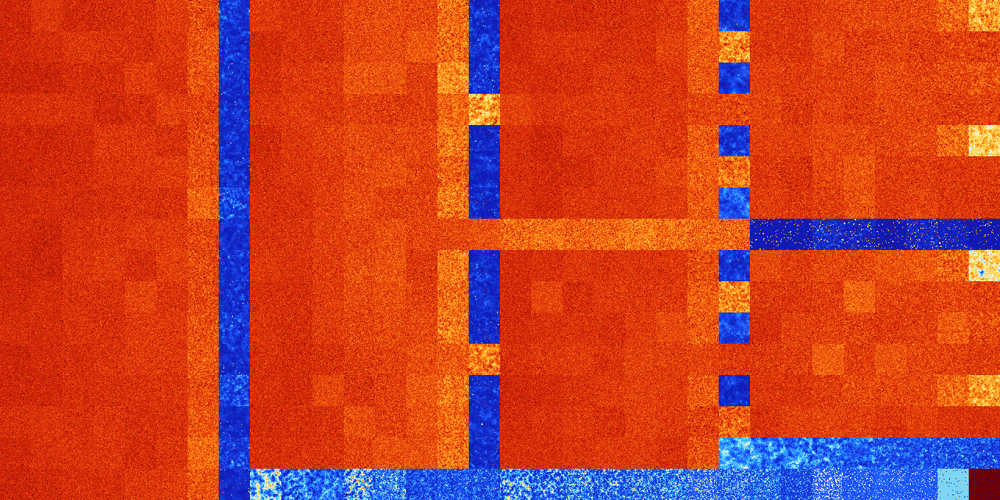

# B1568 (181248-181759)

<details>
    <summary>Initial Grid</summary>
    
</details>


<details>
    <summary>Initial Grid RLE</summary>

```
#C Exported from GoGoL (https://github.com/marrow16/gogol)
#C Wrap mode: Toroidal
#C Boundary mode: Dead
#C Step: 0
x = 100, y = 100, rule = B1568/S
2bo29bo45bo3bo3bo$5bo26bo14bo12bobo23bo$17bo8bo5bo$15bo44bo2b2o2bo26bo
2bo$9bo10bo8bo35bo17bo3bo$7bo6bo9bo2b2obo4bobo23bo3bo16bo$16bo31bo8b2o
35bo$34bo26bo33bo$11bo11bo44bo9bo$50bo14bo$44bo6bo44bo$12bo8bo8bo38bo$
3bo50bo$15bo3bo18bo13bo21bo12bo$83bo$51bo$8bobo33bo19bo22bo$13bo11bo50b
o2bo$16bo27bo15bo23bo3bo2bo$3bo3bo42bo6bo24bo10bo3bobo$11bo25bo2bo2bo
35bo19bo$4bo37bo24bo$9bo$47bo12bo$17bo9bo16bo18bo$15bo22bo56bo$89bo8bo$
11bo34bo2bo$10bobo5bo18bo47bo$4bo9bo41bo37bo$5bo7bo16bo33bo2bo16b2o10bo
2bo$5bo35bo14bo$18bo51bo21bo$38bo15bobo6bo33bo$23bo14bo4b2o13bo24bo$15b
o22bo23bo6bo$4bobo11bo3bo17bo4bo49bo3bo$35bo11bo11bo14bo12bo$7bobo30bo
27bo7bo10bo$6bo24bo5bo8bo21bo24bo5bo$100b$31bo2bo10bo16b2o18bo$13b2o19b
o50bo12bo$bo21bo14b2o24bo$77bo12bo$32bo4bo4bo7bo$16bo14bo3bo7bo22bo11bo
20bo$10bo30bo29bo16bo$16bo35bo19bo9bo2bo$39bo3bo8bo36bo3bo$19bo9bo12bo$
7bo32bo9bo45bo$3bo2bo3bo7bo23bo7bo7bo38bo$31bo40bo13bo$4bo3bo9bo25bo9bo
35bo6b2o$21bo4bo5bo10bo42bo$3bo11bo31bo2bo3bo4b3o4bo22bo$bo57bo9bobo4bo
$3bo3bo10bo8bo13bo3bo31bo11b2o$4bo3bobo16bo38bo4bo9bo2bo3bo9bo$45bo8bo
11bo15bo12bo$5bo9bo13b2o9bo23bo29bo$49bo11bo2bo8bo16bo$37bo46bo3bo$3bo
2bo3bo5bo25bo35bo$12bo21bobo29bo22bo$bo27bo63bo$27bo28bo31bo$45bobo$3bo
43bo8bo20bo2bo4bo$14bo4bo2b2o68bo$3bo11bo11bo11b2o33bo5bo16bo$25b2o2bo
32bo14bo21bo$11bo46bo4bo14bo8bo$4bo36bo15bo6bobo4bo5bo20bo$o21bo18b2o3b
obo35bo$27bo5bobo23bo13b2o$48bo3bo2bo20bo6bo6bo8bo$45bo19bo$12bo2bo17bo
38bo$2bo20bo2bo20bo49bo$bo6bo10bo$4bo6bo37bo2bo$26bo3bob2o14bo34bo13bo$
o13bo35bo9bo11bo15bo10bo$6bo12bo11bo4bobo27bo10bo7bo$9bo79bo$39bo33bo
21b2o$bo51bo3bo9bo20bo7bo$5bo2bo27bo14bo5bobo27bo$31bo37bo$7bo47bo19bo
10b2o$57bo24bo4bo$34bo16bo19bo25bo$3bo21bo35bo17bo$10bo17b2o6bo2bo19bo
31bo$37bo2bo17bo5bobobo$bo5bo19bo12bo5bo45bo2bo$10bo24bo2bo50bo$8bo32bo
26bo7bo2bo2bo10bo!
```
</details>
<details>
    <summary>Thumbnail</summary>

</details>
<table>
<tr>
    <td><a href="./181248%20S%20Heat%20Map%20Activity.png"></a><br>S (181248)<br>G>1000</td>    <td><a href="./181249%20S0%20Heat%20Map%20Activity.png"></a><br>S0 (181249)<br>G>1000</td>    <td><a href="./181250%20S1%20Heat%20Map%20Activity.png"></a><br>S1 (181250)<br>G>1000</td>    <td><a href="./181251%20S01%20Heat%20Map%20Activity.png"></a><br>S01 (181251)<br>G>1000</td>    <td><a href="./181252%20S2%20Heat%20Map%20Activity.png"></a><br>S2 (181252)<br>G>1000</td>    <td><a href="./181253%20S02%20Heat%20Map%20Activity.png"></a><br>S02 (181253)<br>G>1000</td>    <td><a href="./181254%20S12%20Heat%20Map%20Activity.png"></a><br>S12 (181254)<br>G>1000</td>    <td><a href="./181255%20S012%20Heat%20Map%20Activity.png"></a><br>S012 (181255)<br>R@198,p6</td>    <td><a href="./181256%20S3%20Heat%20Map%20Activity.png"></a><br>S3 (181256)<br>G>1000</td>    <td><a href="./181257%20S03%20Heat%20Map%20Activity.png"></a><br>S03 (181257)<br>G>1000</td>    <td><a href="./181258%20S13%20Heat%20Map%20Activity.png"></a><br>S13 (181258)<br>G>1000</td>    <td><a href="./181259%20S013%20Heat%20Map%20Activity.png"></a><br>S013 (181259)<br>G>1000</td>    <td><a href="./181260%20S23%20Heat%20Map%20Activity.png"></a><br>S23 (181260)<br>G>1000</td>    <td><a href="./181261%20S023%20Heat%20Map%20Activity.png"></a><br>S023 (181261)<br>G>1000</td>    <td><a href="./181262%20S123%20Heat%20Map%20Activity.png"></a><br>S123 (181262)<br>G>1000</td>    <td><a href="./181263%20S0123%20Heat%20Map%20Activity.png"></a><br>S0123 (181263)<br>R@237,p4</td>    <td><a href="./181264%20S4%20Heat%20Map%20Activity.png"></a><br>S4 (181264)<br>G>1000</td>    <td><a href="./181265%20S04%20Heat%20Map%20Activity.png"></a><br>S04 (181265)<br>G>1000</td>    <td><a href="./181266%20S14%20Heat%20Map%20Activity.png"></a><br>S14 (181266)<br>G>1000</td>    <td><a href="./181267%20S014%20Heat%20Map%20Activity.png"></a><br>S014 (181267)<br>G>1000</td>    <td><a href="./181268%20S24%20Heat%20Map%20Activity.png"></a><br>S24 (181268)<br>G>1000</td>    <td><a href="./181269%20S024%20Heat%20Map%20Activity.png"></a><br>S024 (181269)<br>G>1000</td>    <td><a href="./181270%20S124%20Heat%20Map%20Activity.png"></a><br>S124 (181270)<br>G>1000</td>    <td><a href="./181271%20S0124%20Heat%20Map%20Activity.png"></a><br>S0124 (181271)<br>R@441,p6</td>    <td><a href="./181272%20S34%20Heat%20Map%20Activity.png"></a><br>S34 (181272)<br>G>1000</td>    <td><a href="./181273%20S034%20Heat%20Map%20Activity.png"></a><br>S034 (181273)<br>G>1000</td>    <td><a href="./181274%20S134%20Heat%20Map%20Activity.png"></a><br>S134 (181274)<br>G>1000</td>    <td><a href="./181275%20S0134%20Heat%20Map%20Activity.png"></a><br>S0134 (181275)<br>G>1000</td>    <td><a href="./181276%20S234%20Heat%20Map%20Activity.png"></a><br>S234 (181276)<br>G>1000</td>    <td><a href="./181277%20S0234%20Heat%20Map%20Activity.png"></a><br>S0234 (181277)<br>G>1000</td>    <td><a href="./181278%20S1234%20Heat%20Map%20Activity.png"></a><br>S1234 (181278)<br>G>1000</td>    <td><a href="./181279%20S01234%20Heat%20Map%20Activity.png"></a><br>S01234 (181279)<br>G>1000</td></tr>
<tr>
    <td><a href="./181280%20S5%20Heat%20Map%20Activity.png"></a><br>S5 (181280)<br>G>1000</td>    <td><a href="./181281%20S05%20Heat%20Map%20Activity.png"></a><br>S05 (181281)<br>G>1000</td>    <td><a href="./181282%20S15%20Heat%20Map%20Activity.png"></a><br>S15 (181282)<br>G>1000</td>    <td><a href="./181283%20S015%20Heat%20Map%20Activity.png"></a><br>S015 (181283)<br>G>1000</td>    <td><a href="./181284%20S25%20Heat%20Map%20Activity.png"></a><br>S25 (181284)<br>G>1000</td>    <td><a href="./181285%20S025%20Heat%20Map%20Activity.png"></a><br>S025 (181285)<br>G>1000</td>    <td><a href="./181286%20S125%20Heat%20Map%20Activity.png"></a><br>S125 (181286)<br>G>1000</td>    <td><a href="./181287%20S0125%20Heat%20Map%20Activity.png"></a><br>S0125 (181287)<br>R@263,p12</td>    <td><a href="./181288%20S35%20Heat%20Map%20Activity.png"></a><br>S35 (181288)<br>G>1000</td>    <td><a href="./181289%20S035%20Heat%20Map%20Activity.png"></a><br>S035 (181289)<br>G>1000</td>    <td><a href="./181290%20S135%20Heat%20Map%20Activity.png"></a><br>S135 (181290)<br>G>1000</td>    <td><a href="./181291%20S0135%20Heat%20Map%20Activity.png"></a><br>S0135 (181291)<br>G>1000</td>    <td><a href="./181292%20S235%20Heat%20Map%20Activity.png"></a><br>S235 (181292)<br>G>1000</td>    <td><a href="./181293%20S0235%20Heat%20Map%20Activity.png"></a><br>S0235 (181293)<br>G>1000</td>    <td><a href="./181294%20S1235%20Heat%20Map%20Activity.png"></a><br>S1235 (181294)<br>G>1000</td>    <td><a href="./181295%20S01235%20Heat%20Map%20Activity.png"></a><br>S01235 (181295)<br>R@252,p8</td>    <td><a href="./181296%20S45%20Heat%20Map%20Activity.png"></a><br>S45 (181296)<br>G>1000</td>    <td><a href="./181297%20S045%20Heat%20Map%20Activity.png"></a><br>S045 (181297)<br>G>1000</td>    <td><a href="./181298%20S145%20Heat%20Map%20Activity.png"></a><br>S145 (181298)<br>G>1000</td>    <td><a href="./181299%20S0145%20Heat%20Map%20Activity.png"></a><br>S0145 (181299)<br>G>1000</td>    <td><a href="./181300%20S245%20Heat%20Map%20Activity.png"></a><br>S245 (181300)<br>G>1000</td>    <td><a href="./181301%20S0245%20Heat%20Map%20Activity.png"></a><br>S0245 (181301)<br>G>1000</td>    <td><a href="./181302%20S1245%20Heat%20Map%20Activity.png"></a><br>S1245 (181302)<br>G>1000</td>    <td><a href="./181303%20S01245%20Heat%20Map%20Activity.png"></a><br>S01245 (181303)<br>G>1000</td>    <td><a href="./181304%20S345%20Heat%20Map%20Activity.png"></a><br>S345 (181304)<br>G>1000</td>    <td><a href="./181305%20S0345%20Heat%20Map%20Activity.png"></a><br>S0345 (181305)<br>G>1000</td>    <td><a href="./181306%20S1345%20Heat%20Map%20Activity.png"></a><br>S1345 (181306)<br>G>1000</td>    <td><a href="./181307%20S01345%20Heat%20Map%20Activity.png"></a><br>S01345 (181307)<br>G>1000</td>    <td><a href="./181308%20S2345%20Heat%20Map%20Activity.png"></a><br>S2345 (181308)<br>G>1000</td>    <td><a href="./181309%20S02345%20Heat%20Map%20Activity.png"></a><br>S02345 (181309)<br>G>1000</td>    <td><a href="./181310%20S12345%20Heat%20Map%20Activity.png"></a><br>S12345 (181310)<br>G>1000</td>    <td><a href="./181311%20S012345%20Heat%20Map%20Activity.png"></a><br>S012345 (181311)<br>G>1000</td></tr>
<tr>
    <td><a href="./181312%20S6%20Heat%20Map%20Activity.png"></a><br>S6 (181312)<br>G>1000</td>    <td><a href="./181313%20S06%20Heat%20Map%20Activity.png"></a><br>S06 (181313)<br>G>1000</td>    <td><a href="./181314%20S16%20Heat%20Map%20Activity.png"></a><br>S16 (181314)<br>G>1000</td>    <td><a href="./181315%20S016%20Heat%20Map%20Activity.png"></a><br>S016 (181315)<br>G>1000</td>    <td><a href="./181316%20S26%20Heat%20Map%20Activity.png"></a><br>S26 (181316)<br>G>1000</td>    <td><a href="./181317%20S026%20Heat%20Map%20Activity.png"></a><br>S026 (181317)<br>G>1000</td>    <td><a href="./181318%20S126%20Heat%20Map%20Activity.png"></a><br>S126 (181318)<br>G>1000</td>    <td><a href="./181319%20S0126%20Heat%20Map%20Activity.png"></a><br>S0126 (181319)<br>R@162,p6</td>    <td><a href="./181320%20S36%20Heat%20Map%20Activity.png"></a><br>S36 (181320)<br>G>1000</td>    <td><a href="./181321%20S036%20Heat%20Map%20Activity.png"></a><br>S036 (181321)<br>G>1000</td>    <td><a href="./181322%20S136%20Heat%20Map%20Activity.png"></a><br>S136 (181322)<br>G>1000</td>    <td><a href="./181323%20S0136%20Heat%20Map%20Activity.png"></a><br>S0136 (181323)<br>G>1000</td>    <td><a href="./181324%20S236%20Heat%20Map%20Activity.png"></a><br>S236 (181324)<br>G>1000</td>    <td><a href="./181325%20S0236%20Heat%20Map%20Activity.png"></a><br>S0236 (181325)<br>G>1000</td>    <td><a href="./181326%20S1236%20Heat%20Map%20Activity.png"></a><br>S1236 (181326)<br>G>1000</td>    <td><a href="./181327%20S01236%20Heat%20Map%20Activity.png"></a><br>S01236 (181327)<br>R@141,p12</td>    <td><a href="./181328%20S46%20Heat%20Map%20Activity.png"></a><br>S46 (181328)<br>G>1000</td>    <td><a href="./181329%20S046%20Heat%20Map%20Activity.png"></a><br>S046 (181329)<br>G>1000</td>    <td><a href="./181330%20S146%20Heat%20Map%20Activity.png"></a><br>S146 (181330)<br>G>1000</td>    <td><a href="./181331%20S0146%20Heat%20Map%20Activity.png"></a><br>S0146 (181331)<br>G>1000</td>    <td><a href="./181332%20S246%20Heat%20Map%20Activity.png"></a><br>S246 (181332)<br>G>1000</td>    <td><a href="./181333%20S0246%20Heat%20Map%20Activity.png"></a><br>S0246 (181333)<br>G>1000</td>    <td><a href="./181334%20S1246%20Heat%20Map%20Activity.png"></a><br>S1246 (181334)<br>G>1000</td>    <td><a href="./181335%20S01246%20Heat%20Map%20Activity.png"></a><br>S01246 (181335)<br>G>1000</td>    <td><a href="./181336%20S346%20Heat%20Map%20Activity.png"></a><br>S346 (181336)<br>G>1000</td>    <td><a href="./181337%20S0346%20Heat%20Map%20Activity.png"></a><br>S0346 (181337)<br>G>1000</td>    <td><a href="./181338%20S1346%20Heat%20Map%20Activity.png"></a><br>S1346 (181338)<br>G>1000</td>    <td><a href="./181339%20S01346%20Heat%20Map%20Activity.png"></a><br>S01346 (181339)<br>G>1000</td>    <td><a href="./181340%20S2346%20Heat%20Map%20Activity.png"></a><br>S2346 (181340)<br>G>1000</td>    <td><a href="./181341%20S02346%20Heat%20Map%20Activity.png"></a><br>S02346 (181341)<br>G>1000</td>    <td><a href="./181342%20S12346%20Heat%20Map%20Activity.png"></a><br>S12346 (181342)<br>G>1000</td>    <td><a href="./181343%20S012346%20Heat%20Map%20Activity.png"></a><br>S012346 (181343)<br>G>1000</td></tr>
<tr>
    <td><a href="./181344%20S56%20Heat%20Map%20Activity.png"></a><br>S56 (181344)<br>G>1000</td>    <td><a href="./181345%20S056%20Heat%20Map%20Activity.png"></a><br>S056 (181345)<br>G>1000</td>    <td><a href="./181346%20S156%20Heat%20Map%20Activity.png"></a><br>S156 (181346)<br>G>1000</td>    <td><a href="./181347%20S0156%20Heat%20Map%20Activity.png"></a><br>S0156 (181347)<br>G>1000</td>    <td><a href="./181348%20S256%20Heat%20Map%20Activity.png"></a><br>S256 (181348)<br>G>1000</td>    <td><a href="./181349%20S0256%20Heat%20Map%20Activity.png"></a><br>S0256 (181349)<br>G>1000</td>    <td><a href="./181350%20S1256%20Heat%20Map%20Activity.png"></a><br>S1256 (181350)<br>G>1000</td>    <td><a href="./181351%20S01256%20Heat%20Map%20Activity.png"></a><br>S01256 (181351)<br>R@341,p12</td>    <td><a href="./181352%20S356%20Heat%20Map%20Activity.png"></a><br>S356 (181352)<br>G>1000</td>    <td><a href="./181353%20S0356%20Heat%20Map%20Activity.png"></a><br>S0356 (181353)<br>G>1000</td>    <td><a href="./181354%20S1356%20Heat%20Map%20Activity.png"></a><br>S1356 (181354)<br>G>1000</td>    <td><a href="./181355%20S01356%20Heat%20Map%20Activity.png"></a><br>S01356 (181355)<br>G>1000</td>    <td><a href="./181356%20S2356%20Heat%20Map%20Activity.png"></a><br>S2356 (181356)<br>G>1000</td>    <td><a href="./181357%20S02356%20Heat%20Map%20Activity.png"></a><br>S02356 (181357)<br>G>1000</td>    <td><a href="./181358%20S12356%20Heat%20Map%20Activity.png"></a><br>S12356 (181358)<br>G>1000</td>    <td><a href="./181359%20S012356%20Heat%20Map%20Activity.png"></a><br>S012356 (181359)<br>G>1000</td>    <td><a href="./181360%20S456%20Heat%20Map%20Activity.png"></a><br>S456 (181360)<br>G>1000</td>    <td><a href="./181361%20S0456%20Heat%20Map%20Activity.png"></a><br>S0456 (181361)<br>G>1000</td>    <td><a href="./181362%20S1456%20Heat%20Map%20Activity.png"></a><br>S1456 (181362)<br>G>1000</td>    <td><a href="./181363%20S01456%20Heat%20Map%20Activity.png"></a><br>S01456 (181363)<br>G>1000</td>    <td><a href="./181364%20S2456%20Heat%20Map%20Activity.png"></a><br>S2456 (181364)<br>G>1000</td>    <td><a href="./181365%20S02456%20Heat%20Map%20Activity.png"></a><br>S02456 (181365)<br>G>1000</td>    <td><a href="./181366%20S12456%20Heat%20Map%20Activity.png"></a><br>S12456 (181366)<br>G>1000</td>    <td><a href="./181367%20S012456%20Heat%20Map%20Activity.png"></a><br>S012456 (181367)<br>G>1000</td>    <td><a href="./181368%20S3456%20Heat%20Map%20Activity.png"></a><br>S3456 (181368)<br>G>1000</td>    <td><a href="./181369%20S03456%20Heat%20Map%20Activity.png"></a><br>S03456 (181369)<br>G>1000</td>    <td><a href="./181370%20S13456%20Heat%20Map%20Activity.png"></a><br>S13456 (181370)<br>G>1000</td>    <td><a href="./181371%20S013456%20Heat%20Map%20Activity.png"></a><br>S013456 (181371)<br>G>1000</td>    <td><a href="./181372%20S23456%20Heat%20Map%20Activity.png"></a><br>S23456 (181372)<br>G>1000</td>    <td><a href="./181373%20S023456%20Heat%20Map%20Activity.png"></a><br>S023456 (181373)<br>G>1000</td>    <td><a href="./181374%20S123456%20Heat%20Map%20Activity.png"></a><br>S123456 (181374)<br>G>1000</td>    <td><a href="./181375%20S0123456%20Heat%20Map%20Activity.png"></a><br>S0123456 (181375)<br>G>1000</td></tr>
<tr>
    <td><a href="./181376%20S7%20Heat%20Map%20Activity.png"></a><br>S7 (181376)<br>G>1000</td>    <td><a href="./181377%20S07%20Heat%20Map%20Activity.png"></a><br>S07 (181377)<br>G>1000</td>    <td><a href="./181378%20S17%20Heat%20Map%20Activity.png"></a><br>S17 (181378)<br>G>1000</td>    <td><a href="./181379%20S017%20Heat%20Map%20Activity.png"></a><br>S017 (181379)<br>G>1000</td>    <td><a href="./181380%20S27%20Heat%20Map%20Activity.png"></a><br>S27 (181380)<br>G>1000</td>    <td><a href="./181381%20S027%20Heat%20Map%20Activity.png"></a><br>S027 (181381)<br>G>1000</td>    <td><a href="./181382%20S127%20Heat%20Map%20Activity.png"></a><br>S127 (181382)<br>G>1000</td>    <td><a href="./181383%20S0127%20Heat%20Map%20Activity.png"></a><br>S0127 (181383)<br>R@190,p60</td>    <td><a href="./181384%20S37%20Heat%20Map%20Activity.png"></a><br>S37 (181384)<br>G>1000</td>    <td><a href="./181385%20S037%20Heat%20Map%20Activity.png"></a><br>S037 (181385)<br>G>1000</td>    <td><a href="./181386%20S137%20Heat%20Map%20Activity.png"></a><br>S137 (181386)<br>G>1000</td>    <td><a href="./181387%20S0137%20Heat%20Map%20Activity.png"></a><br>S0137 (181387)<br>G>1000</td>    <td><a href="./181388%20S237%20Heat%20Map%20Activity.png"></a><br>S237 (181388)<br>G>1000</td>    <td><a href="./181389%20S0237%20Heat%20Map%20Activity.png"></a><br>S0237 (181389)<br>G>1000</td>    <td><a href="./181390%20S1237%20Heat%20Map%20Activity.png"></a><br>S1237 (181390)<br>G>1000</td>    <td><a href="./181391%20S01237%20Heat%20Map%20Activity.png"></a><br>S01237 (181391)<br>R@210,p60</td>    <td><a href="./181392%20S47%20Heat%20Map%20Activity.png"></a><br>S47 (181392)<br>G>1000</td>    <td><a href="./181393%20S047%20Heat%20Map%20Activity.png"></a><br>S047 (181393)<br>G>1000</td>    <td><a href="./181394%20S147%20Heat%20Map%20Activity.png"></a><br>S147 (181394)<br>G>1000</td>    <td><a href="./181395%20S0147%20Heat%20Map%20Activity.png"></a><br>S0147 (181395)<br>G>1000</td>    <td><a href="./181396%20S247%20Heat%20Map%20Activity.png"></a><br>S247 (181396)<br>G>1000</td>    <td><a href="./181397%20S0247%20Heat%20Map%20Activity.png"></a><br>S0247 (181397)<br>G>1000</td>    <td><a href="./181398%20S1247%20Heat%20Map%20Activity.png"></a><br>S1247 (181398)<br>G>1000</td>    <td><a href="./181399%20S01247%20Heat%20Map%20Activity.png"></a><br>S01247 (181399)<br>R@320,p24</td>    <td><a href="./181400%20S347%20Heat%20Map%20Activity.png"></a><br>S347 (181400)<br>G>1000</td>    <td><a href="./181401%20S0347%20Heat%20Map%20Activity.png"></a><br>S0347 (181401)<br>G>1000</td>    <td><a href="./181402%20S1347%20Heat%20Map%20Activity.png"></a><br>S1347 (181402)<br>G>1000</td>    <td><a href="./181403%20S01347%20Heat%20Map%20Activity.png"></a><br>S01347 (181403)<br>G>1000</td>    <td><a href="./181404%20S2347%20Heat%20Map%20Activity.png"></a><br>S2347 (181404)<br>G>1000</td>    <td><a href="./181405%20S02347%20Heat%20Map%20Activity.png"></a><br>S02347 (181405)<br>G>1000</td>    <td><a href="./181406%20S12347%20Heat%20Map%20Activity.png"></a><br>S12347 (181406)<br>G>1000</td>    <td><a href="./181407%20S012347%20Heat%20Map%20Activity.png"></a><br>S012347 (181407)<br>G>1000</td></tr>
<tr>
    <td><a href="./181408%20S57%20Heat%20Map%20Activity.png"></a><br>S57 (181408)<br>G>1000</td>    <td><a href="./181409%20S057%20Heat%20Map%20Activity.png"></a><br>S057 (181409)<br>G>1000</td>    <td><a href="./181410%20S157%20Heat%20Map%20Activity.png"></a><br>S157 (181410)<br>G>1000</td>    <td><a href="./181411%20S0157%20Heat%20Map%20Activity.png"></a><br>S0157 (181411)<br>G>1000</td>    <td><a href="./181412%20S257%20Heat%20Map%20Activity.png"></a><br>S257 (181412)<br>G>1000</td>    <td><a href="./181413%20S0257%20Heat%20Map%20Activity.png"></a><br>S0257 (181413)<br>G>1000</td>    <td><a href="./181414%20S1257%20Heat%20Map%20Activity.png"></a><br>S1257 (181414)<br>G>1000</td>    <td><a href="./181415%20S01257%20Heat%20Map%20Activity.png"></a><br>S01257 (181415)<br>R@328,p12</td>    <td><a href="./181416%20S357%20Heat%20Map%20Activity.png"></a><br>S357 (181416)<br>G>1000</td>    <td><a href="./181417%20S0357%20Heat%20Map%20Activity.png"></a><br>S0357 (181417)<br>G>1000</td>    <td><a href="./181418%20S1357%20Heat%20Map%20Activity.png"></a><br>S1357 (181418)<br>G>1000</td>    <td><a href="./181419%20S01357%20Heat%20Map%20Activity.png"></a><br>S01357 (181419)<br>G>1000</td>    <td><a href="./181420%20S2357%20Heat%20Map%20Activity.png"></a><br>S2357 (181420)<br>G>1000</td>    <td><a href="./181421%20S02357%20Heat%20Map%20Activity.png"></a><br>S02357 (181421)<br>G>1000</td>    <td><a href="./181422%20S12357%20Heat%20Map%20Activity.png"></a><br>S12357 (181422)<br>G>1000</td>    <td><a href="./181423%20S012357%20Heat%20Map%20Activity.png"></a><br>S012357 (181423)<br>R@563,p8</td>    <td><a href="./181424%20S457%20Heat%20Map%20Activity.png"></a><br>S457 (181424)<br>G>1000</td>    <td><a href="./181425%20S0457%20Heat%20Map%20Activity.png"></a><br>S0457 (181425)<br>G>1000</td>    <td><a href="./181426%20S1457%20Heat%20Map%20Activity.png"></a><br>S1457 (181426)<br>G>1000</td>    <td><a href="./181427%20S01457%20Heat%20Map%20Activity.png"></a><br>S01457 (181427)<br>G>1000</td>    <td><a href="./181428%20S2457%20Heat%20Map%20Activity.png"></a><br>S2457 (181428)<br>G>1000</td>    <td><a href="./181429%20S02457%20Heat%20Map%20Activity.png"></a><br>S02457 (181429)<br>G>1000</td>    <td><a href="./181430%20S12457%20Heat%20Map%20Activity.png"></a><br>S12457 (181430)<br>G>1000</td>    <td><a href="./181431%20S012457%20Heat%20Map%20Activity.png"></a><br>S012457 (181431)<br>G>1000</td>    <td><a href="./181432%20S3457%20Heat%20Map%20Activity.png"></a><br>S3457 (181432)<br>G>1000</td>    <td><a href="./181433%20S03457%20Heat%20Map%20Activity.png"></a><br>S03457 (181433)<br>G>1000</td>    <td><a href="./181434%20S13457%20Heat%20Map%20Activity.png"></a><br>S13457 (181434)<br>G>1000</td>    <td><a href="./181435%20S013457%20Heat%20Map%20Activity.png"></a><br>S013457 (181435)<br>G>1000</td>    <td><a href="./181436%20S23457%20Heat%20Map%20Activity.png"></a><br>S23457 (181436)<br>G>1000</td>    <td><a href="./181437%20S023457%20Heat%20Map%20Activity.png"></a><br>S023457 (181437)<br>G>1000</td>    <td><a href="./181438%20S123457%20Heat%20Map%20Activity.png"></a><br>S123457 (181438)<br>G>1000</td>    <td><a href="./181439%20S0123457%20Heat%20Map%20Activity.png"></a><br>S0123457 (181439)<br>G>1000</td></tr>
<tr>
    <td><a href="./181440%20S67%20Heat%20Map%20Activity.png"></a><br>S67 (181440)<br>G>1000</td>    <td><a href="./181441%20S067%20Heat%20Map%20Activity.png"></a><br>S067 (181441)<br>G>1000</td>    <td><a href="./181442%20S167%20Heat%20Map%20Activity.png"></a><br>S167 (181442)<br>G>1000</td>    <td><a href="./181443%20S0167%20Heat%20Map%20Activity.png"></a><br>S0167 (181443)<br>G>1000</td>    <td><a href="./181444%20S267%20Heat%20Map%20Activity.png"></a><br>S267 (181444)<br>G>1000</td>    <td><a href="./181445%20S0267%20Heat%20Map%20Activity.png"></a><br>S0267 (181445)<br>G>1000</td>    <td><a href="./181446%20S1267%20Heat%20Map%20Activity.png"></a><br>S1267 (181446)<br>G>1000</td>    <td><a href="./181447%20S01267%20Heat%20Map%20Activity.png"></a><br>S01267 (181447)<br>R@134,p6</td>    <td><a href="./181448%20S367%20Heat%20Map%20Activity.png"></a><br>S367 (181448)<br>G>1000</td>    <td><a href="./181449%20S0367%20Heat%20Map%20Activity.png"></a><br>S0367 (181449)<br>G>1000</td>    <td><a href="./181450%20S1367%20Heat%20Map%20Activity.png"></a><br>S1367 (181450)<br>G>1000</td>    <td><a href="./181451%20S01367%20Heat%20Map%20Activity.png"></a><br>S01367 (181451)<br>G>1000</td>    <td><a href="./181452%20S2367%20Heat%20Map%20Activity.png"></a><br>S2367 (181452)<br>G>1000</td>    <td><a href="./181453%20S02367%20Heat%20Map%20Activity.png"></a><br>S02367 (181453)<br>G>1000</td>    <td><a href="./181454%20S12367%20Heat%20Map%20Activity.png"></a><br>S12367 (181454)<br>G>1000</td>    <td><a href="./181455%20S012367%20Heat%20Map%20Activity.png"></a><br>S012367 (181455)<br>R@199,p4</td>    <td><a href="./181456%20S467%20Heat%20Map%20Activity.png"></a><br>S467 (181456)<br>G>1000</td>    <td><a href="./181457%20S0467%20Heat%20Map%20Activity.png"></a><br>S0467 (181457)<br>G>1000</td>    <td><a href="./181458%20S1467%20Heat%20Map%20Activity.png"></a><br>S1467 (181458)<br>G>1000</td>    <td><a href="./181459%20S01467%20Heat%20Map%20Activity.png"></a><br>S01467 (181459)<br>G>1000</td>    <td><a href="./181460%20S2467%20Heat%20Map%20Activity.png"></a><br>S2467 (181460)<br>G>1000</td>    <td><a href="./181461%20S02467%20Heat%20Map%20Activity.png"></a><br>S02467 (181461)<br>G>1000</td>    <td><a href="./181462%20S12467%20Heat%20Map%20Activity.png"></a><br>S12467 (181462)<br>G>1000</td>    <td><a href="./181463%20S012467%20Heat%20Map%20Activity.png"></a><br>S012467 (181463)<br>G>1000</td>    <td><a href="./181464%20S3467%20Heat%20Map%20Activity.png"></a><br>S3467 (181464)<br>G>1000</td>    <td><a href="./181465%20S03467%20Heat%20Map%20Activity.png"></a><br>S03467 (181465)<br>G>1000</td>    <td><a href="./181466%20S13467%20Heat%20Map%20Activity.png"></a><br>S13467 (181466)<br>G>1000</td>    <td><a href="./181467%20S013467%20Heat%20Map%20Activity.png"></a><br>S013467 (181467)<br>G>1000</td>    <td><a href="./181468%20S23467%20Heat%20Map%20Activity.png"></a><br>S23467 (181468)<br>G>1000</td>    <td><a href="./181469%20S023467%20Heat%20Map%20Activity.png"></a><br>S023467 (181469)<br>G>1000</td>    <td><a href="./181470%20S123467%20Heat%20Map%20Activity.png"></a><br>S123467 (181470)<br>G>1000</td>    <td><a href="./181471%20S0123467%20Heat%20Map%20Activity.png"></a><br>S0123467 (181471)<br>G>1000</td></tr>
<tr>
    <td><a href="./181472%20S567%20Heat%20Map%20Activity.png"></a><br>S567 (181472)<br>G>1000</td>    <td><a href="./181473%20S0567%20Heat%20Map%20Activity.png"></a><br>S0567 (181473)<br>G>1000</td>    <td><a href="./181474%20S1567%20Heat%20Map%20Activity.png"></a><br>S1567 (181474)<br>G>1000</td>    <td><a href="./181475%20S01567%20Heat%20Map%20Activity.png"></a><br>S01567 (181475)<br>G>1000</td>    <td><a href="./181476%20S2567%20Heat%20Map%20Activity.png"></a><br>S2567 (181476)<br>G>1000</td>    <td><a href="./181477%20S02567%20Heat%20Map%20Activity.png"></a><br>S02567 (181477)<br>G>1000</td>    <td><a href="./181478%20S12567%20Heat%20Map%20Activity.png"></a><br>S12567 (181478)<br>G>1000</td>    <td><a href="./181479%20S012567%20Heat%20Map%20Activity.png"></a><br>S012567 (181479)<br>R@934,p12</td>    <td><a href="./181480%20S3567%20Heat%20Map%20Activity.png"></a><br>S3567 (181480)<br>G>1000</td>    <td><a href="./181481%20S03567%20Heat%20Map%20Activity.png"></a><br>S03567 (181481)<br>G>1000</td>    <td><a href="./181482%20S13567%20Heat%20Map%20Activity.png"></a><br>S13567 (181482)<br>G>1000</td>    <td><a href="./181483%20S013567%20Heat%20Map%20Activity.png"></a><br>S013567 (181483)<br>G>1000</td>    <td><a href="./181484%20S23567%20Heat%20Map%20Activity.png"></a><br>S23567 (181484)<br>G>1000</td>    <td><a href="./181485%20S023567%20Heat%20Map%20Activity.png"></a><br>S023567 (181485)<br>G>1000</td>    <td><a href="./181486%20S123567%20Heat%20Map%20Activity.png"></a><br>S123567 (181486)<br>G>1000</td>    <td><a href="./181487%20S0123567%20Heat%20Map%20Activity.png"></a><br>S0123567 (181487)<br>G>1000</td>    <td><a href="./181488%20S4567%20Heat%20Map%20Activity.png"></a><br>S4567 (181488)<br>G>1000</td>    <td><a href="./181489%20S04567%20Heat%20Map%20Activity.png"></a><br>S04567 (181489)<br>G>1000</td>    <td><a href="./181490%20S14567%20Heat%20Map%20Activity.png"></a><br>S14567 (181490)<br>G>1000</td>    <td><a href="./181491%20S014567%20Heat%20Map%20Activity.png"></a><br>S014567 (181491)<br>G>1000</td>    <td><a href="./181492%20S24567%20Heat%20Map%20Activity.png"></a><br>S24567 (181492)<br>G>1000</td>    <td><a href="./181493%20S024567%20Heat%20Map%20Activity.png"></a><br>S024567 (181493)<br>G>1000</td>    <td><a href="./181494%20S124567%20Heat%20Map%20Activity.png"></a><br>S124567 (181494)<br>G>1000</td>    <td><a href="./181495%20S0124567%20Heat%20Map%20Activity.png"></a><br>S0124567 (181495)<br>G>1000</td>    <td><a href="./181496%20S34567%20Heat%20Map%20Activity.png"></a><br>S34567 (181496)<br>G>1000</td>    <td><a href="./181497%20S034567%20Heat%20Map%20Activity.png"></a><br>S034567 (181497)<br>G>1000</td>    <td><a href="./181498%20S134567%20Heat%20Map%20Activity.png"></a><br>S134567 (181498)<br>R@141,p36</td>    <td><a href="./181499%20S0134567%20Heat%20Map%20Activity.png"></a><br>S0134567 (181499)<br>R@204,p120</td>    <td><a href="./181500%20S234567%20Heat%20Map%20Activity.png"></a><br>S234567 (181500)<br>G>1000</td>    <td><a href="./181501%20S0234567%20Heat%20Map%20Activity.png"></a><br>S0234567 (181501)<br>R@127,p72</td>    <td><a href="./181502%20S1234567%20Heat%20Map%20Activity.png"></a><br>S1234567 (181502)<br>R@170,p120</td>    <td><a href="./181503%20S01234567%20Heat%20Map%20Activity.png"></a><br>S01234567 (181503)<br>G>1000</td></tr>
<tr>
    <td><a href="./181504%20S8%20Heat%20Map%20Activity.png"></a><br>S8 (181504)<br>G>1000</td>    <td><a href="./181505%20S08%20Heat%20Map%20Activity.png"></a><br>S08 (181505)<br>G>1000</td>    <td><a href="./181506%20S18%20Heat%20Map%20Activity.png"></a><br>S18 (181506)<br>G>1000</td>    <td><a href="./181507%20S018%20Heat%20Map%20Activity.png"></a><br>S018 (181507)<br>G>1000</td>    <td><a href="./181508%20S28%20Heat%20Map%20Activity.png"></a><br>S28 (181508)<br>G>1000</td>    <td><a href="./181509%20S028%20Heat%20Map%20Activity.png"></a><br>S028 (181509)<br>G>1000</td>    <td><a href="./181510%20S128%20Heat%20Map%20Activity.png"></a><br>S128 (181510)<br>G>1000</td>    <td><a href="./181511%20S0128%20Heat%20Map%20Activity.png"></a><br>S0128 (181511)<br>R@174,p6</td>    <td><a href="./181512%20S38%20Heat%20Map%20Activity.png"></a><br>S38 (181512)<br>G>1000</td>    <td><a href="./181513%20S038%20Heat%20Map%20Activity.png"></a><br>S038 (181513)<br>G>1000</td>    <td><a href="./181514%20S138%20Heat%20Map%20Activity.png"></a><br>S138 (181514)<br>G>1000</td>    <td><a href="./181515%20S0138%20Heat%20Map%20Activity.png"></a><br>S0138 (181515)<br>G>1000</td>    <td><a href="./181516%20S238%20Heat%20Map%20Activity.png"></a><br>S238 (181516)<br>G>1000</td>    <td><a href="./181517%20S0238%20Heat%20Map%20Activity.png"></a><br>S0238 (181517)<br>G>1000</td>    <td><a href="./181518%20S1238%20Heat%20Map%20Activity.png"></a><br>S1238 (181518)<br>G>1000</td>    <td><a href="./181519%20S01238%20Heat%20Map%20Activity.png"></a><br>S01238 (181519)<br>R@246,p4</td>    <td><a href="./181520%20S48%20Heat%20Map%20Activity.png"></a><br>S48 (181520)<br>G>1000</td>    <td><a href="./181521%20S048%20Heat%20Map%20Activity.png"></a><br>S048 (181521)<br>G>1000</td>    <td><a href="./181522%20S148%20Heat%20Map%20Activity.png"></a><br>S148 (181522)<br>G>1000</td>    <td><a href="./181523%20S0148%20Heat%20Map%20Activity.png"></a><br>S0148 (181523)<br>G>1000</td>    <td><a href="./181524%20S248%20Heat%20Map%20Activity.png"></a><br>S248 (181524)<br>G>1000</td>    <td><a href="./181525%20S0248%20Heat%20Map%20Activity.png"></a><br>S0248 (181525)<br>G>1000</td>    <td><a href="./181526%20S1248%20Heat%20Map%20Activity.png"></a><br>S1248 (181526)<br>G>1000</td>    <td><a href="./181527%20S01248%20Heat%20Map%20Activity.png"></a><br>S01248 (181527)<br>R@438,p3</td>    <td><a href="./181528%20S348%20Heat%20Map%20Activity.png"></a><br>S348 (181528)<br>G>1000</td>    <td><a href="./181529%20S0348%20Heat%20Map%20Activity.png"></a><br>S0348 (181529)<br>G>1000</td>    <td><a href="./181530%20S1348%20Heat%20Map%20Activity.png"></a><br>S1348 (181530)<br>G>1000</td>    <td><a href="./181531%20S01348%20Heat%20Map%20Activity.png"></a><br>S01348 (181531)<br>G>1000</td>    <td><a href="./181532%20S2348%20Heat%20Map%20Activity.png"></a><br>S2348 (181532)<br>G>1000</td>    <td><a href="./181533%20S02348%20Heat%20Map%20Activity.png"></a><br>S02348 (181533)<br>G>1000</td>    <td><a href="./181534%20S12348%20Heat%20Map%20Activity.png"></a><br>S12348 (181534)<br>G>1000</td>    <td><a href="./181535%20S012348%20Heat%20Map%20Activity.png"></a><br>S012348 (181535)<br>G>1000</td></tr>
<tr>
    <td><a href="./181536%20S58%20Heat%20Map%20Activity.png"></a><br>S58 (181536)<br>G>1000</td>    <td><a href="./181537%20S058%20Heat%20Map%20Activity.png"></a><br>S058 (181537)<br>G>1000</td>    <td><a href="./181538%20S158%20Heat%20Map%20Activity.png"></a><br>S158 (181538)<br>G>1000</td>    <td><a href="./181539%20S0158%20Heat%20Map%20Activity.png"></a><br>S0158 (181539)<br>G>1000</td>    <td><a href="./181540%20S258%20Heat%20Map%20Activity.png"></a><br>S258 (181540)<br>G>1000</td>    <td><a href="./181541%20S0258%20Heat%20Map%20Activity.png"></a><br>S0258 (181541)<br>G>1000</td>    <td><a href="./181542%20S1258%20Heat%20Map%20Activity.png"></a><br>S1258 (181542)<br>G>1000</td>    <td><a href="./181543%20S01258%20Heat%20Map%20Activity.png"></a><br>S01258 (181543)<br>R@243,p12</td>    <td><a href="./181544%20S358%20Heat%20Map%20Activity.png"></a><br>S358 (181544)<br>G>1000</td>    <td><a href="./181545%20S0358%20Heat%20Map%20Activity.png"></a><br>S0358 (181545)<br>G>1000</td>    <td><a href="./181546%20S1358%20Heat%20Map%20Activity.png"></a><br>S1358 (181546)<br>G>1000</td>    <td><a href="./181547%20S01358%20Heat%20Map%20Activity.png"></a><br>S01358 (181547)<br>G>1000</td>    <td><a href="./181548%20S2358%20Heat%20Map%20Activity.png"></a><br>S2358 (181548)<br>G>1000</td>    <td><a href="./181549%20S02358%20Heat%20Map%20Activity.png"></a><br>S02358 (181549)<br>G>1000</td>    <td><a href="./181550%20S12358%20Heat%20Map%20Activity.png"></a><br>S12358 (181550)<br>G>1000</td>    <td><a href="./181551%20S012358%20Heat%20Map%20Activity.png"></a><br>S012358 (181551)<br>R@338,p6</td>    <td><a href="./181552%20S458%20Heat%20Map%20Activity.png"></a><br>S458 (181552)<br>G>1000</td>    <td><a href="./181553%20S0458%20Heat%20Map%20Activity.png"></a><br>S0458 (181553)<br>G>1000</td>    <td><a href="./181554%20S1458%20Heat%20Map%20Activity.png"></a><br>S1458 (181554)<br>G>1000</td>    <td><a href="./181555%20S01458%20Heat%20Map%20Activity.png"></a><br>S01458 (181555)<br>G>1000</td>    <td><a href="./181556%20S2458%20Heat%20Map%20Activity.png"></a><br>S2458 (181556)<br>G>1000</td>    <td><a href="./181557%20S02458%20Heat%20Map%20Activity.png"></a><br>S02458 (181557)<br>G>1000</td>    <td><a href="./181558%20S12458%20Heat%20Map%20Activity.png"></a><br>S12458 (181558)<br>G>1000</td>    <td><a href="./181559%20S012458%20Heat%20Map%20Activity.png"></a><br>S012458 (181559)<br>G>1000</td>    <td><a href="./181560%20S3458%20Heat%20Map%20Activity.png"></a><br>S3458 (181560)<br>G>1000</td>    <td><a href="./181561%20S03458%20Heat%20Map%20Activity.png"></a><br>S03458 (181561)<br>G>1000</td>    <td><a href="./181562%20S13458%20Heat%20Map%20Activity.png"></a><br>S13458 (181562)<br>G>1000</td>    <td><a href="./181563%20S013458%20Heat%20Map%20Activity.png"></a><br>S013458 (181563)<br>G>1000</td>    <td><a href="./181564%20S23458%20Heat%20Map%20Activity.png"></a><br>S23458 (181564)<br>G>1000</td>    <td><a href="./181565%20S023458%20Heat%20Map%20Activity.png"></a><br>S023458 (181565)<br>G>1000</td>    <td><a href="./181566%20S123458%20Heat%20Map%20Activity.png"></a><br>S123458 (181566)<br>G>1000</td>    <td><a href="./181567%20S0123458%20Heat%20Map%20Activity.png"></a><br>S0123458 (181567)<br>G>1000</td></tr>
<tr>
    <td><a href="./181568%20S68%20Heat%20Map%20Activity.png"></a><br>S68 (181568)<br>G>1000</td>    <td><a href="./181569%20S068%20Heat%20Map%20Activity.png"></a><br>S068 (181569)<br>G>1000</td>    <td><a href="./181570%20S168%20Heat%20Map%20Activity.png"></a><br>S168 (181570)<br>G>1000</td>    <td><a href="./181571%20S0168%20Heat%20Map%20Activity.png"></a><br>S0168 (181571)<br>G>1000</td>    <td><a href="./181572%20S268%20Heat%20Map%20Activity.png"></a><br>S268 (181572)<br>G>1000</td>    <td><a href="./181573%20S0268%20Heat%20Map%20Activity.png"></a><br>S0268 (181573)<br>G>1000</td>    <td><a href="./181574%20S1268%20Heat%20Map%20Activity.png"></a><br>S1268 (181574)<br>G>1000</td>    <td><a href="./181575%20S01268%20Heat%20Map%20Activity.png"></a><br>S01268 (181575)<br>R@127,p12</td>    <td><a href="./181576%20S368%20Heat%20Map%20Activity.png"></a><br>S368 (181576)<br>G>1000</td>    <td><a href="./181577%20S0368%20Heat%20Map%20Activity.png"></a><br>S0368 (181577)<br>G>1000</td>    <td><a href="./181578%20S1368%20Heat%20Map%20Activity.png"></a><br>S1368 (181578)<br>G>1000</td>    <td><a href="./181579%20S01368%20Heat%20Map%20Activity.png"></a><br>S01368 (181579)<br>G>1000</td>    <td><a href="./181580%20S2368%20Heat%20Map%20Activity.png"></a><br>S2368 (181580)<br>G>1000</td>    <td><a href="./181581%20S02368%20Heat%20Map%20Activity.png"></a><br>S02368 (181581)<br>G>1000</td>    <td><a href="./181582%20S12368%20Heat%20Map%20Activity.png"></a><br>S12368 (181582)<br>G>1000</td>    <td><a href="./181583%20S012368%20Heat%20Map%20Activity.png"></a><br>S012368 (181583)<br>R@158,p60</td>    <td><a href="./181584%20S468%20Heat%20Map%20Activity.png"></a><br>S468 (181584)<br>G>1000</td>    <td><a href="./181585%20S0468%20Heat%20Map%20Activity.png"></a><br>S0468 (181585)<br>G>1000</td>    <td><a href="./181586%20S1468%20Heat%20Map%20Activity.png"></a><br>S1468 (181586)<br>G>1000</td>    <td><a href="./181587%20S01468%20Heat%20Map%20Activity.png"></a><br>S01468 (181587)<br>G>1000</td>    <td><a href="./181588%20S2468%20Heat%20Map%20Activity.png"></a><br>S2468 (181588)<br>G>1000</td>    <td><a href="./181589%20S02468%20Heat%20Map%20Activity.png"></a><br>S02468 (181589)<br>G>1000</td>    <td><a href="./181590%20S12468%20Heat%20Map%20Activity.png"></a><br>S12468 (181590)<br>G>1000</td>    <td><a href="./181591%20S012468%20Heat%20Map%20Activity.png"></a><br>S012468 (181591)<br>G>1000</td>    <td><a href="./181592%20S3468%20Heat%20Map%20Activity.png"></a><br>S3468 (181592)<br>G>1000</td>    <td><a href="./181593%20S03468%20Heat%20Map%20Activity.png"></a><br>S03468 (181593)<br>G>1000</td>    <td><a href="./181594%20S13468%20Heat%20Map%20Activity.png"></a><br>S13468 (181594)<br>G>1000</td>    <td><a href="./181595%20S013468%20Heat%20Map%20Activity.png"></a><br>S013468 (181595)<br>G>1000</td>    <td><a href="./181596%20S23468%20Heat%20Map%20Activity.png"></a><br>S23468 (181596)<br>G>1000</td>    <td><a href="./181597%20S023468%20Heat%20Map%20Activity.png"></a><br>S023468 (181597)<br>G>1000</td>    <td><a href="./181598%20S123468%20Heat%20Map%20Activity.png"></a><br>S123468 (181598)<br>G>1000</td>    <td><a href="./181599%20S0123468%20Heat%20Map%20Activity.png"></a><br>S0123468 (181599)<br>G>1000</td></tr>
<tr>
    <td><a href="./181600%20S568%20Heat%20Map%20Activity.png"></a><br>S568 (181600)<br>G>1000</td>    <td><a href="./181601%20S0568%20Heat%20Map%20Activity.png"></a><br>S0568 (181601)<br>G>1000</td>    <td><a href="./181602%20S1568%20Heat%20Map%20Activity.png"></a><br>S1568 (181602)<br>G>1000</td>    <td><a href="./181603%20S01568%20Heat%20Map%20Activity.png"></a><br>S01568 (181603)<br>G>1000</td>    <td><a href="./181604%20S2568%20Heat%20Map%20Activity.png"></a><br>S2568 (181604)<br>G>1000</td>    <td><a href="./181605%20S02568%20Heat%20Map%20Activity.png"></a><br>S02568 (181605)<br>G>1000</td>    <td><a href="./181606%20S12568%20Heat%20Map%20Activity.png"></a><br>S12568 (181606)<br>G>1000</td>    <td><a href="./181607%20S012568%20Heat%20Map%20Activity.png"></a><br>S012568 (181607)<br>R@390,p12</td>    <td><a href="./181608%20S3568%20Heat%20Map%20Activity.png"></a><br>S3568 (181608)<br>G>1000</td>    <td><a href="./181609%20S03568%20Heat%20Map%20Activity.png"></a><br>S03568 (181609)<br>G>1000</td>    <td><a href="./181610%20S13568%20Heat%20Map%20Activity.png"></a><br>S13568 (181610)<br>G>1000</td>    <td><a href="./181611%20S013568%20Heat%20Map%20Activity.png"></a><br>S013568 (181611)<br>G>1000</td>    <td><a href="./181612%20S23568%20Heat%20Map%20Activity.png"></a><br>S23568 (181612)<br>G>1000</td>    <td><a href="./181613%20S023568%20Heat%20Map%20Activity.png"></a><br>S023568 (181613)<br>G>1000</td>    <td><a href="./181614%20S123568%20Heat%20Map%20Activity.png"></a><br>S123568 (181614)<br>G>1000</td>    <td><a href="./181615%20S0123568%20Heat%20Map%20Activity.png"></a><br>S0123568 (181615)<br>G>1000</td>    <td><a href="./181616%20S4568%20Heat%20Map%20Activity.png"></a><br>S4568 (181616)<br>G>1000</td>    <td><a href="./181617%20S04568%20Heat%20Map%20Activity.png"></a><br>S04568 (181617)<br>G>1000</td>    <td><a href="./181618%20S14568%20Heat%20Map%20Activity.png"></a><br>S14568 (181618)<br>G>1000</td>    <td><a href="./181619%20S014568%20Heat%20Map%20Activity.png"></a><br>S014568 (181619)<br>G>1000</td>    <td><a href="./181620%20S24568%20Heat%20Map%20Activity.png"></a><br>S24568 (181620)<br>G>1000</td>    <td><a href="./181621%20S024568%20Heat%20Map%20Activity.png"></a><br>S024568 (181621)<br>G>1000</td>    <td><a href="./181622%20S124568%20Heat%20Map%20Activity.png"></a><br>S124568 (181622)<br>G>1000</td>    <td><a href="./181623%20S0124568%20Heat%20Map%20Activity.png"></a><br>S0124568 (181623)<br>G>1000</td>    <td><a href="./181624%20S34568%20Heat%20Map%20Activity.png"></a><br>S34568 (181624)<br>G>1000</td>    <td><a href="./181625%20S034568%20Heat%20Map%20Activity.png"></a><br>S034568 (181625)<br>G>1000</td>    <td><a href="./181626%20S134568%20Heat%20Map%20Activity.png"></a><br>S134568 (181626)<br>G>1000</td>    <td><a href="./181627%20S0134568%20Heat%20Map%20Activity.png"></a><br>S0134568 (181627)<br>G>1000</td>    <td><a href="./181628%20S234568%20Heat%20Map%20Activity.png"></a><br>S234568 (181628)<br>G>1000</td>    <td><a href="./181629%20S0234568%20Heat%20Map%20Activity.png"></a><br>S0234568 (181629)<br>G>1000</td>    <td><a href="./181630%20S1234568%20Heat%20Map%20Activity.png"></a><br>S1234568 (181630)<br>G>1000</td>    <td><a href="./181631%20S01234568%20Heat%20Map%20Activity.png"></a><br>S01234568 (181631)<br>G>1000</td></tr>
<tr>
    <td><a href="./181632%20S78%20Heat%20Map%20Activity.png"></a><br>S78 (181632)<br>G>1000</td>    <td><a href="./181633%20S078%20Heat%20Map%20Activity.png"></a><br>S078 (181633)<br>G>1000</td>    <td><a href="./181634%20S178%20Heat%20Map%20Activity.png"></a><br>S178 (181634)<br>G>1000</td>    <td><a href="./181635%20S0178%20Heat%20Map%20Activity.png"></a><br>S0178 (181635)<br>G>1000</td>    <td><a href="./181636%20S278%20Heat%20Map%20Activity.png"></a><br>S278 (181636)<br>G>1000</td>    <td><a href="./181637%20S0278%20Heat%20Map%20Activity.png"></a><br>S0278 (181637)<br>G>1000</td>    <td><a href="./181638%20S1278%20Heat%20Map%20Activity.png"></a><br>S1278 (181638)<br>G>1000</td>    <td><a href="./181639%20S01278%20Heat%20Map%20Activity.png"></a><br>S01278 (181639)<br>R@109,p6</td>    <td><a href="./181640%20S378%20Heat%20Map%20Activity.png"></a><br>S378 (181640)<br>G>1000</td>    <td><a href="./181641%20S0378%20Heat%20Map%20Activity.png"></a><br>S0378 (181641)<br>G>1000</td>    <td><a href="./181642%20S1378%20Heat%20Map%20Activity.png"></a><br>S1378 (181642)<br>G>1000</td>    <td><a href="./181643%20S01378%20Heat%20Map%20Activity.png"></a><br>S01378 (181643)<br>G>1000</td>    <td><a href="./181644%20S2378%20Heat%20Map%20Activity.png"></a><br>S2378 (181644)<br>G>1000</td>    <td><a href="./181645%20S02378%20Heat%20Map%20Activity.png"></a><br>S02378 (181645)<br>G>1000</td>    <td><a href="./181646%20S12378%20Heat%20Map%20Activity.png"></a><br>S12378 (181646)<br>G>1000</td>    <td><a href="./181647%20S012378%20Heat%20Map%20Activity.png"></a><br>S012378 (181647)<br>R@187,p12</td>    <td><a href="./181648%20S478%20Heat%20Map%20Activity.png"></a><br>S478 (181648)<br>G>1000</td>    <td><a href="./181649%20S0478%20Heat%20Map%20Activity.png"></a><br>S0478 (181649)<br>G>1000</td>    <td><a href="./181650%20S1478%20Heat%20Map%20Activity.png"></a><br>S1478 (181650)<br>G>1000</td>    <td><a href="./181651%20S01478%20Heat%20Map%20Activity.png"></a><br>S01478 (181651)<br>G>1000</td>    <td><a href="./181652%20S2478%20Heat%20Map%20Activity.png"></a><br>S2478 (181652)<br>G>1000</td>    <td><a href="./181653%20S02478%20Heat%20Map%20Activity.png"></a><br>S02478 (181653)<br>G>1000</td>    <td><a href="./181654%20S12478%20Heat%20Map%20Activity.png"></a><br>S12478 (181654)<br>G>1000</td>    <td><a href="./181655%20S012478%20Heat%20Map%20Activity.png"></a><br>S012478 (181655)<br>R@445,p12</td>    <td><a href="./181656%20S3478%20Heat%20Map%20Activity.png"></a><br>S3478 (181656)<br>G>1000</td>    <td><a href="./181657%20S03478%20Heat%20Map%20Activity.png"></a><br>S03478 (181657)<br>G>1000</td>    <td><a href="./181658%20S13478%20Heat%20Map%20Activity.png"></a><br>S13478 (181658)<br>G>1000</td>    <td><a href="./181659%20S013478%20Heat%20Map%20Activity.png"></a><br>S013478 (181659)<br>G>1000</td>    <td><a href="./181660%20S23478%20Heat%20Map%20Activity.png"></a><br>S23478 (181660)<br>G>1000</td>    <td><a href="./181661%20S023478%20Heat%20Map%20Activity.png"></a><br>S023478 (181661)<br>G>1000</td>    <td><a href="./181662%20S123478%20Heat%20Map%20Activity.png"></a><br>S123478 (181662)<br>G>1000</td>    <td><a href="./181663%20S0123478%20Heat%20Map%20Activity.png"></a><br>S0123478 (181663)<br>G>1000</td></tr>
<tr>
    <td><a href="./181664%20S578%20Heat%20Map%20Activity.png"></a><br>S578 (181664)<br>G>1000</td>    <td><a href="./181665%20S0578%20Heat%20Map%20Activity.png"></a><br>S0578 (181665)<br>G>1000</td>    <td><a href="./181666%20S1578%20Heat%20Map%20Activity.png"></a><br>S1578 (181666)<br>G>1000</td>    <td><a href="./181667%20S01578%20Heat%20Map%20Activity.png"></a><br>S01578 (181667)<br>G>1000</td>    <td><a href="./181668%20S2578%20Heat%20Map%20Activity.png"></a><br>S2578 (181668)<br>G>1000</td>    <td><a href="./181669%20S02578%20Heat%20Map%20Activity.png"></a><br>S02578 (181669)<br>G>1000</td>    <td><a href="./181670%20S12578%20Heat%20Map%20Activity.png"></a><br>S12578 (181670)<br>G>1000</td>    <td><a href="./181671%20S012578%20Heat%20Map%20Activity.png"></a><br>S012578 (181671)<br>R@345,p12</td>    <td><a href="./181672%20S3578%20Heat%20Map%20Activity.png"></a><br>S3578 (181672)<br>G>1000</td>    <td><a href="./181673%20S03578%20Heat%20Map%20Activity.png"></a><br>S03578 (181673)<br>G>1000</td>    <td><a href="./181674%20S13578%20Heat%20Map%20Activity.png"></a><br>S13578 (181674)<br>G>1000</td>    <td><a href="./181675%20S013578%20Heat%20Map%20Activity.png"></a><br>S013578 (181675)<br>G>1000</td>    <td><a href="./181676%20S23578%20Heat%20Map%20Activity.png"></a><br>S23578 (181676)<br>G>1000</td>    <td><a href="./181677%20S023578%20Heat%20Map%20Activity.png"></a><br>S023578 (181677)<br>G>1000</td>    <td><a href="./181678%20S123578%20Heat%20Map%20Activity.png"></a><br>S123578 (181678)<br>G>1000</td>    <td><a href="./181679%20S0123578%20Heat%20Map%20Activity.png"></a><br>S0123578 (181679)<br>R@568,p4</td>    <td><a href="./181680%20S4578%20Heat%20Map%20Activity.png"></a><br>S4578 (181680)<br>G>1000</td>    <td><a href="./181681%20S04578%20Heat%20Map%20Activity.png"></a><br>S04578 (181681)<br>G>1000</td>    <td><a href="./181682%20S14578%20Heat%20Map%20Activity.png"></a><br>S14578 (181682)<br>G>1000</td>    <td><a href="./181683%20S014578%20Heat%20Map%20Activity.png"></a><br>S014578 (181683)<br>G>1000</td>    <td><a href="./181684%20S24578%20Heat%20Map%20Activity.png"></a><br>S24578 (181684)<br>G>1000</td>    <td><a href="./181685%20S024578%20Heat%20Map%20Activity.png"></a><br>S024578 (181685)<br>G>1000</td>    <td><a href="./181686%20S124578%20Heat%20Map%20Activity.png"></a><br>S124578 (181686)<br>G>1000</td>    <td><a href="./181687%20S0124578%20Heat%20Map%20Activity.png"></a><br>S0124578 (181687)<br>G>1000</td>    <td><a href="./181688%20S34578%20Heat%20Map%20Activity.png"></a><br>S34578 (181688)<br>G>1000</td>    <td><a href="./181689%20S034578%20Heat%20Map%20Activity.png"></a><br>S034578 (181689)<br>G>1000</td>    <td><a href="./181690%20S134578%20Heat%20Map%20Activity.png"></a><br>S134578 (181690)<br>G>1000</td>    <td><a href="./181691%20S0134578%20Heat%20Map%20Activity.png"></a><br>S0134578 (181691)<br>G>1000</td>    <td><a href="./181692%20S234578%20Heat%20Map%20Activity.png"></a><br>S234578 (181692)<br>G>1000</td>    <td><a href="./181693%20S0234578%20Heat%20Map%20Activity.png"></a><br>S0234578 (181693)<br>G>1000</td>    <td><a href="./181694%20S1234578%20Heat%20Map%20Activity.png"></a><br>S1234578 (181694)<br>G>1000</td>    <td><a href="./181695%20S01234578%20Heat%20Map%20Activity.png"></a><br>S01234578 (181695)<br>G>1000</td></tr>
<tr>
    <td><a href="./181696%20S678%20Heat%20Map%20Activity.png"></a><br>S678 (181696)<br>G>1000</td>    <td><a href="./181697%20S0678%20Heat%20Map%20Activity.png"></a><br>S0678 (181697)<br>G>1000</td>    <td><a href="./181698%20S1678%20Heat%20Map%20Activity.png"></a><br>S1678 (181698)<br>G>1000</td>    <td><a href="./181699%20S01678%20Heat%20Map%20Activity.png"></a><br>S01678 (181699)<br>G>1000</td>    <td><a href="./181700%20S2678%20Heat%20Map%20Activity.png"></a><br>S2678 (181700)<br>G>1000</td>    <td><a href="./181701%20S02678%20Heat%20Map%20Activity.png"></a><br>S02678 (181701)<br>G>1000</td>    <td><a href="./181702%20S12678%20Heat%20Map%20Activity.png"></a><br>S12678 (181702)<br>G>1000</td>    <td><a href="./181703%20S012678%20Heat%20Map%20Activity.png"></a><br>S012678 (181703)<br>R@151,p6</td>    <td><a href="./181704%20S3678%20Heat%20Map%20Activity.png"></a><br>S3678 (181704)<br>G>1000</td>    <td><a href="./181705%20S03678%20Heat%20Map%20Activity.png"></a><br>S03678 (181705)<br>G>1000</td>    <td><a href="./181706%20S13678%20Heat%20Map%20Activity.png"></a><br>S13678 (181706)<br>G>1000</td>    <td><a href="./181707%20S013678%20Heat%20Map%20Activity.png"></a><br>S013678 (181707)<br>G>1000</td>    <td><a href="./181708%20S23678%20Heat%20Map%20Activity.png"></a><br>S23678 (181708)<br>G>1000</td>    <td><a href="./181709%20S023678%20Heat%20Map%20Activity.png"></a><br>S023678 (181709)<br>G>1000</td>    <td><a href="./181710%20S123678%20Heat%20Map%20Activity.png"></a><br>S123678 (181710)<br>G>1000</td>    <td><a href="./181711%20S0123678%20Heat%20Map%20Activity.png"></a><br>S0123678 (181711)<br>R@192,p12</td>    <td><a href="./181712%20S4678%20Heat%20Map%20Activity.png"></a><br>S4678 (181712)<br>G>1000</td>    <td><a href="./181713%20S04678%20Heat%20Map%20Activity.png"></a><br>S04678 (181713)<br>G>1000</td>    <td><a href="./181714%20S14678%20Heat%20Map%20Activity.png"></a><br>S14678 (181714)<br>G>1000</td>    <td><a href="./181715%20S014678%20Heat%20Map%20Activity.png"></a><br>S014678 (181715)<br>G>1000</td>    <td><a href="./181716%20S24678%20Heat%20Map%20Activity.png"></a><br>S24678 (181716)<br>G>1000</td>    <td><a href="./181717%20S024678%20Heat%20Map%20Activity.png"></a><br>S024678 (181717)<br>G>1000</td>    <td><a href="./181718%20S124678%20Heat%20Map%20Activity.png"></a><br>S124678 (181718)<br>G>1000</td>    <td><a href="./181719%20S0124678%20Heat%20Map%20Activity.png"></a><br>S0124678 (181719)<br>G>1000</td>    <td><a href="./181720%20S34678%20Heat%20Map%20Activity.png"></a><br>S34678 (181720)<br>R@193,p2</td>    <td><a href="./181721%20S034678%20Heat%20Map%20Activity.png"></a><br>S034678 (181721)<br>R@143,p2</td>    <td><a href="./181722%20S134678%20Heat%20Map%20Activity.png"></a><br>S134678 (181722)<br>R@112,p2</td>    <td><a href="./181723%20S0134678%20Heat%20Map%20Activity.png"></a><br>S0134678 (181723)<br>R@128,p8</td>    <td><a href="./181724%20S234678%20Heat%20Map%20Activity.png"></a><br>S234678 (181724)<br>R@63,p8</td>    <td><a href="./181725%20S0234678%20Heat%20Map%20Activity.png"></a><br>S0234678 (181725)<br>R@65,p8</td>    <td><a href="./181726%20S1234678%20Heat%20Map%20Activity.png"></a><br>S1234678 (181726)<br>R@52,p8</td>    <td><a href="./181727%20S01234678%20Heat%20Map%20Activity.png"></a><br>S01234678 (181727)<br>R@49,p8</td></tr>
<tr>
    <td><a href="./181728%20S5678%20Heat%20Map%20Activity.png"></a><br>S5678 (181728)<br>G>1000</td>    <td><a href="./181729%20S05678%20Heat%20Map%20Activity.png"></a><br>S05678 (181729)<br>G>1000</td>    <td><a href="./181730%20S15678%20Heat%20Map%20Activity.png"></a><br>S15678 (181730)<br>G>1000</td>    <td><a href="./181731%20S015678%20Heat%20Map%20Activity.png"></a><br>S015678 (181731)<br>G>1000</td>    <td><a href="./181732%20S25678%20Heat%20Map%20Activity.png"></a><br>S25678 (181732)<br>G>1000</td>    <td><a href="./181733%20S025678%20Heat%20Map%20Activity.png"></a><br>S025678 (181733)<br>G>1000</td>    <td><a href="./181734%20S125678%20Heat%20Map%20Activity.png"></a><br>S125678 (181734)<br>G>1000</td>    <td><a href="./181735%20S0125678%20Heat%20Map%20Activity.png"></a><br>S0125678 (181735)<br>G>1000</td>    <td><a href="./181736%20S35678%20Heat%20Map%20Activity.png"></a><br>S35678 (181736)<br>R@92,p2</td>    <td><a href="./181737%20S035678%20Heat%20Map%20Activity.png"></a><br>S035678 (181737)<br>R@55,p2</td>    <td><a href="./181738%20S135678%20Heat%20Map%20Activity.png"></a><br>S135678 (181738)<br>R@67,p2</td>    <td><a href="./181739%20S0135678%20Heat%20Map%20Activity.png"></a><br>S0135678 (181739)<br>S@45</td>    <td><a href="./181740%20S235678%20Heat%20Map%20Activity.png"></a><br>S235678 (181740)<br>S@32</td>    <td><a href="./181741%20S0235678%20Heat%20Map%20Activity.png"></a><br>S0235678 (181741)<br>R@31,p2</td>    <td><a href="./181742%20S1235678%20Heat%20Map%20Activity.png"></a><br>S1235678 (181742)<br>R@28,p2</td>    <td><a href="./181743%20S01235678%20Heat%20Map%20Activity.png"></a><br>S01235678 (181743)<br>R@28,p2</td>    <td><a href="./181744%20S45678%20Heat%20Map%20Activity.png"></a><br>S45678 (181744)<br>S@41</td>    <td><a href="./181745%20S045678%20Heat%20Map%20Activity.png"></a><br>S045678 (181745)<br>S@35</td>    <td><a href="./181746%20S145678%20Heat%20Map%20Activity.png"></a><br>S145678 (181746)<br>S@32</td>    <td><a href="./181747%20S0145678%20Heat%20Map%20Activity.png"></a><br>S0145678 (181747)<br>S@28</td>    <td><a href="./181748%20S245678%20Heat%20Map%20Activity.png"></a><br>S245678 (181748)<br>S@25</td>    <td><a href="./181749%20S0245678%20Heat%20Map%20Activity.png"></a><br>S0245678 (181749)<br>S@20</td>    <td><a href="./181750%20S1245678%20Heat%20Map%20Activity.png"></a><br>S1245678 (181750)<br>S@24</td>    <td><a href="./181751%20S01245678%20Heat%20Map%20Activity.png"></a><br>S01245678 (181751)<br>S@29</td>    <td><a href="./181752%20S345678%20Heat%20Map%20Activity.png"></a><br>S345678 (181752)<br>S@25</td>    <td><a href="./181753%20S0345678%20Heat%20Map%20Activity.png"></a><br>S0345678 (181753)<br>S@25</td>    <td><a href="./181754%20S1345678%20Heat%20Map%20Activity.png"></a><br>S1345678 (181754)<br>S@22</td>    <td><a href="./181755%20S01345678%20Heat%20Map%20Activity.png"></a><br>S01345678 (181755)<br>S@18</td>    <td><a href="./181756%20S2345678%20Heat%20Map%20Activity.png"></a><br>S2345678 (181756)<br>S@18</td>    <td><a href="./181757%20S02345678%20Heat%20Map%20Activity.png"></a><br>S02345678 (181757)<br>S@15</td>    <td><a href="./181758%20S12345678%20Heat%20Map%20Activity.png"></a><br>S12345678 (181758)<br>S@14</td>    <td><a href="./181759%20S012345678%20Heat%20Map%20Activity.png"></a><br>S012345678 (181759)<br>S@13</td></tr>
</table>
