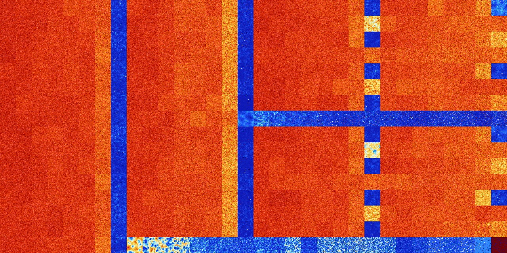

# B157 (82944-83455)

<details>
    <summary>Initial Grid</summary>
    
</details>


<details>
    <summary>Initial Grid RLE</summary>

```
#C Exported from GoGoL (https://github.com/marrow16/gogol)
#C Wrap mode: Toroidal
#C Boundary mode: Dead
#C Step: 0
x = 100, y = 100, rule = B157/S
8bo3bo6bo8bo13bo11bo$29bo2bo5bo40bo19bo$14bo15b2o7bo$3bo2bo29bo30bo5bo
25bo$8bo65bo18bo$19bo3bo9bo9bo4bo4b2o5bo6bo22bo$13bo22bo14bo7bo13bo8bo
10b2o$17bo3bo12bo40bo20bo$2bo3bo8bo25bo9bo2bo25bo$5bobo33bo34bo$48bo26b
obo7b2o$11bo19bo11bo$3bo3bo10bo23bo9bo$21bo73bo$14bo15bo12bo3bobo48bo$
20bo76bo$53b2o3bo16bo$2b2o71bo18bo$7b2o18bobo15bo26bo13bo3b2o$11bo14bo
12bo11bo2bo14bo9bo$18bo16bo20bo14bo$67bo15bobo5b2o$15bo52bo7bo7bo3bo3bo
$47bo5bo35bo$19bo56bo22bo$100b$2bo35bobobo14bo13bo9bo14bo$19bo2bo63bo$
6bo68bo$25bo10b2o16bo27bobo2bo$57b2o32bo$12bo79bo$16bo11bo35bo19bo2bo$
6bo12bo7bo28bobo12bo4bo17bo$bo4bo9bo67bo$o5bo17bo8b2o2b2o2bo20bo$13bo
45bo2bo$bo37bo3bo2bo20bo$22bo5bo27bo4bo3bo25bo$47bo16bo7b2o2bo$16bo28bo
31bo$5b2o19bobo4bo6bo47bo$2o18bo20bo$o27bo7bo19bo3bo8bo5bo$o15bobo2bo
10bo3bo13bo6bobo14bo18bo5bo$47bo13bo10bobo21bo$28bo12bo11b2o5bo21bo14bo
$2bo14bo8bo25bo16bo$2bo69bo$19bo25bobo14bo9bo25bo$2bo20bo65bo$21bo15bo
11bo20bo13bo$52bo19bo15bo$5bo10b2o5bo4bo6bo15bo6bo29bo$12bo3bo15bo50bo
12bo$bo21bo7bo41bobo4bo6b2o3bo$34bo15bo3bo7bobo22bo$14bo5b2o28bo5bo7bo
7bo19bo$19bo13bo5bobo40bo3bo$9bo13bo11bo15bobo$33bo9bo15bo6bo17bo9bo$8b
o3bo5bo15bo$20bo15bo24b2o13bobo13bobo$19bo13bo15bo7bo16bo4b2o$2bo69bo
18bobo$bo3bo25bo8bo9bo18bo20bo$13bo10bo15bo15bo$10bo10bo43bo3bo17bobo$
18bo2bo60bo5bo$2bo3bo3bo4bo26bo20bo3bo4bo9bo$46bo36bo5bo$16bo11bo7bo10b
o27bo11bo$o7bo15bo23bo13bo7bo2bo$28bo25bo12bo20bo$48b2o3bo27bo13bo2bo$o
21bo42bo$32bo38bo$31bo2b2o19bo15bo$41bo15bo2bo12bo16bo$12bo12bo15bo$3bo
18bobo2bo9bo3bo16bo15bo9bo$20bo13bobo2bobo$39bo3bo15bo18bo8bo$17bo81bo$
2bo4bo23bo12bo34bo$3bo4bo39bo13bo21bo12bo$13bo13bo18bobo39bo$38b2o59bo$
12bo24bo9bo8bo36bo$7bo7bo23bo48bo$7bo27bo11bo23bo$60bo$o18b3o23bo2bo18b
obo9bo$4bo40b2o46bo$27bo24bo21bo3bobo$23bo15bo32bo$30bo16bo44bo$15bo40b
o30bo4bo4bo$17bo16bo23bo19bo11bo$11bo13bo9bo18bo22bo5bo!
```
</details>
<details>
    <summary>Thumbnail</summary>

</details>
<table>
<tr>
    <td><a href="./82944%20S%20Heat%20Map%20Activity.png"></a><br>S (82944)<br>G>1000</td>    <td><a href="./82945%20S0%20Heat%20Map%20Activity.png"></a><br>S0 (82945)<br>G>1000</td>    <td><a href="./82946%20S1%20Heat%20Map%20Activity.png"></a><br>S1 (82946)<br>G>1000</td>    <td><a href="./82947%20S01%20Heat%20Map%20Activity.png"></a><br>S01 (82947)<br>G>1000</td>    <td><a href="./82948%20S2%20Heat%20Map%20Activity.png"></a><br>S2 (82948)<br>G>1000</td>    <td><a href="./82949%20S02%20Heat%20Map%20Activity.png"></a><br>S02 (82949)<br>G>1000</td>    <td><a href="./82950%20S12%20Heat%20Map%20Activity.png"></a><br>S12 (82950)<br>G>1000</td>    <td><a href="./82951%20S012%20Heat%20Map%20Activity.png"></a><br>S012 (82951)<br>R@188,p6</td>    <td><a href="./82952%20S3%20Heat%20Map%20Activity.png"></a><br>S3 (82952)<br>G>1000</td>    <td><a href="./82953%20S03%20Heat%20Map%20Activity.png"></a><br>S03 (82953)<br>G>1000</td>    <td><a href="./82954%20S13%20Heat%20Map%20Activity.png"></a><br>S13 (82954)<br>G>1000</td>    <td><a href="./82955%20S013%20Heat%20Map%20Activity.png"></a><br>S013 (82955)<br>G>1000</td>    <td><a href="./82956%20S23%20Heat%20Map%20Activity.png"></a><br>S23 (82956)<br>G>1000</td>    <td><a href="./82957%20S023%20Heat%20Map%20Activity.png"></a><br>S023 (82957)<br>G>1000</td>    <td><a href="./82958%20S123%20Heat%20Map%20Activity.png"></a><br>S123 (82958)<br>G>1000</td>    <td><a href="./82959%20S0123%20Heat%20Map%20Activity.png"></a><br>S0123 (82959)<br>R@159,p12</td>    <td><a href="./82960%20S4%20Heat%20Map%20Activity.png"></a><br>S4 (82960)<br>G>1000</td>    <td><a href="./82961%20S04%20Heat%20Map%20Activity.png"></a><br>S04 (82961)<br>G>1000</td>    <td><a href="./82962%20S14%20Heat%20Map%20Activity.png"></a><br>S14 (82962)<br>G>1000</td>    <td><a href="./82963%20S014%20Heat%20Map%20Activity.png"></a><br>S014 (82963)<br>G>1000</td>    <td><a href="./82964%20S24%20Heat%20Map%20Activity.png"></a><br>S24 (82964)<br>G>1000</td>    <td><a href="./82965%20S024%20Heat%20Map%20Activity.png"></a><br>S024 (82965)<br>G>1000</td>    <td><a href="./82966%20S124%20Heat%20Map%20Activity.png"></a><br>S124 (82966)<br>G>1000</td>    <td><a href="./82967%20S0124%20Heat%20Map%20Activity.png"></a><br>S0124 (82967)<br>R@177,p6</td>    <td><a href="./82968%20S34%20Heat%20Map%20Activity.png"></a><br>S34 (82968)<br>G>1000</td>    <td><a href="./82969%20S034%20Heat%20Map%20Activity.png"></a><br>S034 (82969)<br>G>1000</td>    <td><a href="./82970%20S134%20Heat%20Map%20Activity.png"></a><br>S134 (82970)<br>G>1000</td>    <td><a href="./82971%20S0134%20Heat%20Map%20Activity.png"></a><br>S0134 (82971)<br>G>1000</td>    <td><a href="./82972%20S234%20Heat%20Map%20Activity.png"></a><br>S234 (82972)<br>G>1000</td>    <td><a href="./82973%20S0234%20Heat%20Map%20Activity.png"></a><br>S0234 (82973)<br>G>1000</td>    <td><a href="./82974%20S1234%20Heat%20Map%20Activity.png"></a><br>S1234 (82974)<br>G>1000</td>    <td><a href="./82975%20S01234%20Heat%20Map%20Activity.png"></a><br>S01234 (82975)<br>G>1000</td></tr>
<tr>
    <td><a href="./82976%20S5%20Heat%20Map%20Activity.png"></a><br>S5 (82976)<br>G>1000</td>    <td><a href="./82977%20S05%20Heat%20Map%20Activity.png"></a><br>S05 (82977)<br>G>1000</td>    <td><a href="./82978%20S15%20Heat%20Map%20Activity.png"></a><br>S15 (82978)<br>G>1000</td>    <td><a href="./82979%20S015%20Heat%20Map%20Activity.png"></a><br>S015 (82979)<br>G>1000</td>    <td><a href="./82980%20S25%20Heat%20Map%20Activity.png"></a><br>S25 (82980)<br>G>1000</td>    <td><a href="./82981%20S025%20Heat%20Map%20Activity.png"></a><br>S025 (82981)<br>G>1000</td>    <td><a href="./82982%20S125%20Heat%20Map%20Activity.png"></a><br>S125 (82982)<br>G>1000</td>    <td><a href="./82983%20S0125%20Heat%20Map%20Activity.png"></a><br>S0125 (82983)<br>R@223,p28</td>    <td><a href="./82984%20S35%20Heat%20Map%20Activity.png"></a><br>S35 (82984)<br>G>1000</td>    <td><a href="./82985%20S035%20Heat%20Map%20Activity.png"></a><br>S035 (82985)<br>G>1000</td>    <td><a href="./82986%20S135%20Heat%20Map%20Activity.png"></a><br>S135 (82986)<br>G>1000</td>    <td><a href="./82987%20S0135%20Heat%20Map%20Activity.png"></a><br>S0135 (82987)<br>G>1000</td>    <td><a href="./82988%20S235%20Heat%20Map%20Activity.png"></a><br>S235 (82988)<br>G>1000</td>    <td><a href="./82989%20S0235%20Heat%20Map%20Activity.png"></a><br>S0235 (82989)<br>G>1000</td>    <td><a href="./82990%20S1235%20Heat%20Map%20Activity.png"></a><br>S1235 (82990)<br>G>1000</td>    <td><a href="./82991%20S01235%20Heat%20Map%20Activity.png"></a><br>S01235 (82991)<br>R@154,p18</td>    <td><a href="./82992%20S45%20Heat%20Map%20Activity.png"></a><br>S45 (82992)<br>G>1000</td>    <td><a href="./82993%20S045%20Heat%20Map%20Activity.png"></a><br>S045 (82993)<br>G>1000</td>    <td><a href="./82994%20S145%20Heat%20Map%20Activity.png"></a><br>S145 (82994)<br>G>1000</td>    <td><a href="./82995%20S0145%20Heat%20Map%20Activity.png"></a><br>S0145 (82995)<br>G>1000</td>    <td><a href="./82996%20S245%20Heat%20Map%20Activity.png"></a><br>S245 (82996)<br>G>1000</td>    <td><a href="./82997%20S0245%20Heat%20Map%20Activity.png"></a><br>S0245 (82997)<br>G>1000</td>    <td><a href="./82998%20S1245%20Heat%20Map%20Activity.png"></a><br>S1245 (82998)<br>G>1000</td>    <td><a href="./82999%20S01245%20Heat%20Map%20Activity.png"></a><br>S01245 (82999)<br>G>1000</td>    <td><a href="./83000%20S345%20Heat%20Map%20Activity.png"></a><br>S345 (83000)<br>G>1000</td>    <td><a href="./83001%20S0345%20Heat%20Map%20Activity.png"></a><br>S0345 (83001)<br>G>1000</td>    <td><a href="./83002%20S1345%20Heat%20Map%20Activity.png"></a><br>S1345 (83002)<br>G>1000</td>    <td><a href="./83003%20S01345%20Heat%20Map%20Activity.png"></a><br>S01345 (83003)<br>G>1000</td>    <td><a href="./83004%20S2345%20Heat%20Map%20Activity.png"></a><br>S2345 (83004)<br>G>1000</td>    <td><a href="./83005%20S02345%20Heat%20Map%20Activity.png"></a><br>S02345 (83005)<br>G>1000</td>    <td><a href="./83006%20S12345%20Heat%20Map%20Activity.png"></a><br>S12345 (83006)<br>G>1000</td>    <td><a href="./83007%20S012345%20Heat%20Map%20Activity.png"></a><br>S012345 (83007)<br>G>1000</td></tr>
<tr>
    <td><a href="./83008%20S6%20Heat%20Map%20Activity.png"></a><br>S6 (83008)<br>G>1000</td>    <td><a href="./83009%20S06%20Heat%20Map%20Activity.png"></a><br>S06 (83009)<br>G>1000</td>    <td><a href="./83010%20S16%20Heat%20Map%20Activity.png"></a><br>S16 (83010)<br>G>1000</td>    <td><a href="./83011%20S016%20Heat%20Map%20Activity.png"></a><br>S016 (83011)<br>G>1000</td>    <td><a href="./83012%20S26%20Heat%20Map%20Activity.png"></a><br>S26 (83012)<br>G>1000</td>    <td><a href="./83013%20S026%20Heat%20Map%20Activity.png"></a><br>S026 (83013)<br>G>1000</td>    <td><a href="./83014%20S126%20Heat%20Map%20Activity.png"></a><br>S126 (83014)<br>G>1000</td>    <td><a href="./83015%20S0126%20Heat%20Map%20Activity.png"></a><br>S0126 (83015)<br>R@125,p2</td>    <td><a href="./83016%20S36%20Heat%20Map%20Activity.png"></a><br>S36 (83016)<br>G>1000</td>    <td><a href="./83017%20S036%20Heat%20Map%20Activity.png"></a><br>S036 (83017)<br>G>1000</td>    <td><a href="./83018%20S136%20Heat%20Map%20Activity.png"></a><br>S136 (83018)<br>G>1000</td>    <td><a href="./83019%20S0136%20Heat%20Map%20Activity.png"></a><br>S0136 (83019)<br>G>1000</td>    <td><a href="./83020%20S236%20Heat%20Map%20Activity.png"></a><br>S236 (83020)<br>G>1000</td>    <td><a href="./83021%20S0236%20Heat%20Map%20Activity.png"></a><br>S0236 (83021)<br>G>1000</td>    <td><a href="./83022%20S1236%20Heat%20Map%20Activity.png"></a><br>S1236 (83022)<br>G>1000</td>    <td><a href="./83023%20S01236%20Heat%20Map%20Activity.png"></a><br>S01236 (83023)<br>R@168,p60</td>    <td><a href="./83024%20S46%20Heat%20Map%20Activity.png"></a><br>S46 (83024)<br>G>1000</td>    <td><a href="./83025%20S046%20Heat%20Map%20Activity.png"></a><br>S046 (83025)<br>G>1000</td>    <td><a href="./83026%20S146%20Heat%20Map%20Activity.png"></a><br>S146 (83026)<br>G>1000</td>    <td><a href="./83027%20S0146%20Heat%20Map%20Activity.png"></a><br>S0146 (83027)<br>G>1000</td>    <td><a href="./83028%20S246%20Heat%20Map%20Activity.png"></a><br>S246 (83028)<br>G>1000</td>    <td><a href="./83029%20S0246%20Heat%20Map%20Activity.png"></a><br>S0246 (83029)<br>G>1000</td>    <td><a href="./83030%20S1246%20Heat%20Map%20Activity.png"></a><br>S1246 (83030)<br>G>1000</td>    <td><a href="./83031%20S01246%20Heat%20Map%20Activity.png"></a><br>S01246 (83031)<br>R@319,p12</td>    <td><a href="./83032%20S346%20Heat%20Map%20Activity.png"></a><br>S346 (83032)<br>G>1000</td>    <td><a href="./83033%20S0346%20Heat%20Map%20Activity.png"></a><br>S0346 (83033)<br>G>1000</td>    <td><a href="./83034%20S1346%20Heat%20Map%20Activity.png"></a><br>S1346 (83034)<br>G>1000</td>    <td><a href="./83035%20S01346%20Heat%20Map%20Activity.png"></a><br>S01346 (83035)<br>G>1000</td>    <td><a href="./83036%20S2346%20Heat%20Map%20Activity.png"></a><br>S2346 (83036)<br>G>1000</td>    <td><a href="./83037%20S02346%20Heat%20Map%20Activity.png"></a><br>S02346 (83037)<br>G>1000</td>    <td><a href="./83038%20S12346%20Heat%20Map%20Activity.png"></a><br>S12346 (83038)<br>G>1000</td>    <td><a href="./83039%20S012346%20Heat%20Map%20Activity.png"></a><br>S012346 (83039)<br>G>1000</td></tr>
<tr>
    <td><a href="./83040%20S56%20Heat%20Map%20Activity.png"></a><br>S56 (83040)<br>G>1000</td>    <td><a href="./83041%20S056%20Heat%20Map%20Activity.png"></a><br>S056 (83041)<br>G>1000</td>    <td><a href="./83042%20S156%20Heat%20Map%20Activity.png"></a><br>S156 (83042)<br>G>1000</td>    <td><a href="./83043%20S0156%20Heat%20Map%20Activity.png"></a><br>S0156 (83043)<br>G>1000</td>    <td><a href="./83044%20S256%20Heat%20Map%20Activity.png"></a><br>S256 (83044)<br>G>1000</td>    <td><a href="./83045%20S0256%20Heat%20Map%20Activity.png"></a><br>S0256 (83045)<br>G>1000</td>    <td><a href="./83046%20S1256%20Heat%20Map%20Activity.png"></a><br>S1256 (83046)<br>G>1000</td>    <td><a href="./83047%20S01256%20Heat%20Map%20Activity.png"></a><br>S01256 (83047)<br>R@263,p12</td>    <td><a href="./83048%20S356%20Heat%20Map%20Activity.png"></a><br>S356 (83048)<br>G>1000</td>    <td><a href="./83049%20S0356%20Heat%20Map%20Activity.png"></a><br>S0356 (83049)<br>G>1000</td>    <td><a href="./83050%20S1356%20Heat%20Map%20Activity.png"></a><br>S1356 (83050)<br>G>1000</td>    <td><a href="./83051%20S01356%20Heat%20Map%20Activity.png"></a><br>S01356 (83051)<br>G>1000</td>    <td><a href="./83052%20S2356%20Heat%20Map%20Activity.png"></a><br>S2356 (83052)<br>G>1000</td>    <td><a href="./83053%20S02356%20Heat%20Map%20Activity.png"></a><br>S02356 (83053)<br>G>1000</td>    <td><a href="./83054%20S12356%20Heat%20Map%20Activity.png"></a><br>S12356 (83054)<br>G>1000</td>    <td><a href="./83055%20S012356%20Heat%20Map%20Activity.png"></a><br>S012356 (83055)<br>R@229,p12</td>    <td><a href="./83056%20S456%20Heat%20Map%20Activity.png"></a><br>S456 (83056)<br>G>1000</td>    <td><a href="./83057%20S0456%20Heat%20Map%20Activity.png"></a><br>S0456 (83057)<br>G>1000</td>    <td><a href="./83058%20S1456%20Heat%20Map%20Activity.png"></a><br>S1456 (83058)<br>G>1000</td>    <td><a href="./83059%20S01456%20Heat%20Map%20Activity.png"></a><br>S01456 (83059)<br>G>1000</td>    <td><a href="./83060%20S2456%20Heat%20Map%20Activity.png"></a><br>S2456 (83060)<br>G>1000</td>    <td><a href="./83061%20S02456%20Heat%20Map%20Activity.png"></a><br>S02456 (83061)<br>G>1000</td>    <td><a href="./83062%20S12456%20Heat%20Map%20Activity.png"></a><br>S12456 (83062)<br>G>1000</td>    <td><a href="./83063%20S012456%20Heat%20Map%20Activity.png"></a><br>S012456 (83063)<br>G>1000</td>    <td><a href="./83064%20S3456%20Heat%20Map%20Activity.png"></a><br>S3456 (83064)<br>G>1000</td>    <td><a href="./83065%20S03456%20Heat%20Map%20Activity.png"></a><br>S03456 (83065)<br>G>1000</td>    <td><a href="./83066%20S13456%20Heat%20Map%20Activity.png"></a><br>S13456 (83066)<br>G>1000</td>    <td><a href="./83067%20S013456%20Heat%20Map%20Activity.png"></a><br>S013456 (83067)<br>G>1000</td>    <td><a href="./83068%20S23456%20Heat%20Map%20Activity.png"></a><br>S23456 (83068)<br>G>1000</td>    <td><a href="./83069%20S023456%20Heat%20Map%20Activity.png"></a><br>S023456 (83069)<br>G>1000</td>    <td><a href="./83070%20S123456%20Heat%20Map%20Activity.png"></a><br>S123456 (83070)<br>G>1000</td>    <td><a href="./83071%20S0123456%20Heat%20Map%20Activity.png"></a><br>S0123456 (83071)<br>G>1000</td></tr>
<tr>
    <td><a href="./83072%20S7%20Heat%20Map%20Activity.png"></a><br>S7 (83072)<br>G>1000</td>    <td><a href="./83073%20S07%20Heat%20Map%20Activity.png"></a><br>S07 (83073)<br>G>1000</td>    <td><a href="./83074%20S17%20Heat%20Map%20Activity.png"></a><br>S17 (83074)<br>G>1000</td>    <td><a href="./83075%20S017%20Heat%20Map%20Activity.png"></a><br>S017 (83075)<br>G>1000</td>    <td><a href="./83076%20S27%20Heat%20Map%20Activity.png"></a><br>S27 (83076)<br>G>1000</td>    <td><a href="./83077%20S027%20Heat%20Map%20Activity.png"></a><br>S027 (83077)<br>G>1000</td>    <td><a href="./83078%20S127%20Heat%20Map%20Activity.png"></a><br>S127 (83078)<br>G>1000</td>    <td><a href="./83079%20S0127%20Heat%20Map%20Activity.png"></a><br>S0127 (83079)<br>R@170,p4</td>    <td><a href="./83080%20S37%20Heat%20Map%20Activity.png"></a><br>S37 (83080)<br>G>1000</td>    <td><a href="./83081%20S037%20Heat%20Map%20Activity.png"></a><br>S037 (83081)<br>G>1000</td>    <td><a href="./83082%20S137%20Heat%20Map%20Activity.png"></a><br>S137 (83082)<br>G>1000</td>    <td><a href="./83083%20S0137%20Heat%20Map%20Activity.png"></a><br>S0137 (83083)<br>G>1000</td>    <td><a href="./83084%20S237%20Heat%20Map%20Activity.png"></a><br>S237 (83084)<br>G>1000</td>    <td><a href="./83085%20S0237%20Heat%20Map%20Activity.png"></a><br>S0237 (83085)<br>G>1000</td>    <td><a href="./83086%20S1237%20Heat%20Map%20Activity.png"></a><br>S1237 (83086)<br>G>1000</td>    <td><a href="./83087%20S01237%20Heat%20Map%20Activity.png"></a><br>S01237 (83087)<br>R@220,p84</td>    <td><a href="./83088%20S47%20Heat%20Map%20Activity.png"></a><br>S47 (83088)<br>G>1000</td>    <td><a href="./83089%20S047%20Heat%20Map%20Activity.png"></a><br>S047 (83089)<br>G>1000</td>    <td><a href="./83090%20S147%20Heat%20Map%20Activity.png"></a><br>S147 (83090)<br>G>1000</td>    <td><a href="./83091%20S0147%20Heat%20Map%20Activity.png"></a><br>S0147 (83091)<br>G>1000</td>    <td><a href="./83092%20S247%20Heat%20Map%20Activity.png"></a><br>S247 (83092)<br>G>1000</td>    <td><a href="./83093%20S0247%20Heat%20Map%20Activity.png"></a><br>S0247 (83093)<br>G>1000</td>    <td><a href="./83094%20S1247%20Heat%20Map%20Activity.png"></a><br>S1247 (83094)<br>G>1000</td>    <td><a href="./83095%20S01247%20Heat%20Map%20Activity.png"></a><br>S01247 (83095)<br>R@206,p24</td>    <td><a href="./83096%20S347%20Heat%20Map%20Activity.png"></a><br>S347 (83096)<br>G>1000</td>    <td><a href="./83097%20S0347%20Heat%20Map%20Activity.png"></a><br>S0347 (83097)<br>G>1000</td>    <td><a href="./83098%20S1347%20Heat%20Map%20Activity.png"></a><br>S1347 (83098)<br>G>1000</td>    <td><a href="./83099%20S01347%20Heat%20Map%20Activity.png"></a><br>S01347 (83099)<br>G>1000</td>    <td><a href="./83100%20S2347%20Heat%20Map%20Activity.png"></a><br>S2347 (83100)<br>G>1000</td>    <td><a href="./83101%20S02347%20Heat%20Map%20Activity.png"></a><br>S02347 (83101)<br>G>1000</td>    <td><a href="./83102%20S12347%20Heat%20Map%20Activity.png"></a><br>S12347 (83102)<br>G>1000</td>    <td><a href="./83103%20S012347%20Heat%20Map%20Activity.png"></a><br>S012347 (83103)<br>G>1000</td></tr>
<tr>
    <td><a href="./83104%20S57%20Heat%20Map%20Activity.png"></a><br>S57 (83104)<br>G>1000</td>    <td><a href="./83105%20S057%20Heat%20Map%20Activity.png"></a><br>S057 (83105)<br>G>1000</td>    <td><a href="./83106%20S157%20Heat%20Map%20Activity.png"></a><br>S157 (83106)<br>G>1000</td>    <td><a href="./83107%20S0157%20Heat%20Map%20Activity.png"></a><br>S0157 (83107)<br>G>1000</td>    <td><a href="./83108%20S257%20Heat%20Map%20Activity.png"></a><br>S257 (83108)<br>G>1000</td>    <td><a href="./83109%20S0257%20Heat%20Map%20Activity.png"></a><br>S0257 (83109)<br>G>1000</td>    <td><a href="./83110%20S1257%20Heat%20Map%20Activity.png"></a><br>S1257 (83110)<br>G>1000</td>    <td><a href="./83111%20S01257%20Heat%20Map%20Activity.png"></a><br>S01257 (83111)<br>R@275,p84</td>    <td><a href="./83112%20S357%20Heat%20Map%20Activity.png"></a><br>S357 (83112)<br>G>1000</td>    <td><a href="./83113%20S0357%20Heat%20Map%20Activity.png"></a><br>S0357 (83113)<br>G>1000</td>    <td><a href="./83114%20S1357%20Heat%20Map%20Activity.png"></a><br>S1357 (83114)<br>G>1000</td>    <td><a href="./83115%20S01357%20Heat%20Map%20Activity.png"></a><br>S01357 (83115)<br>G>1000</td>    <td><a href="./83116%20S2357%20Heat%20Map%20Activity.png"></a><br>S2357 (83116)<br>G>1000</td>    <td><a href="./83117%20S02357%20Heat%20Map%20Activity.png"></a><br>S02357 (83117)<br>G>1000</td>    <td><a href="./83118%20S12357%20Heat%20Map%20Activity.png"></a><br>S12357 (83118)<br>G>1000</td>    <td><a href="./83119%20S012357%20Heat%20Map%20Activity.png"></a><br>S012357 (83119)<br>R@138,p36</td>    <td><a href="./83120%20S457%20Heat%20Map%20Activity.png"></a><br>S457 (83120)<br>G>1000</td>    <td><a href="./83121%20S0457%20Heat%20Map%20Activity.png"></a><br>S0457 (83121)<br>G>1000</td>    <td><a href="./83122%20S1457%20Heat%20Map%20Activity.png"></a><br>S1457 (83122)<br>G>1000</td>    <td><a href="./83123%20S01457%20Heat%20Map%20Activity.png"></a><br>S01457 (83123)<br>G>1000</td>    <td><a href="./83124%20S2457%20Heat%20Map%20Activity.png"></a><br>S2457 (83124)<br>G>1000</td>    <td><a href="./83125%20S02457%20Heat%20Map%20Activity.png"></a><br>S02457 (83125)<br>G>1000</td>    <td><a href="./83126%20S12457%20Heat%20Map%20Activity.png"></a><br>S12457 (83126)<br>G>1000</td>    <td><a href="./83127%20S012457%20Heat%20Map%20Activity.png"></a><br>S012457 (83127)<br>G>1000</td>    <td><a href="./83128%20S3457%20Heat%20Map%20Activity.png"></a><br>S3457 (83128)<br>G>1000</td>    <td><a href="./83129%20S03457%20Heat%20Map%20Activity.png"></a><br>S03457 (83129)<br>G>1000</td>    <td><a href="./83130%20S13457%20Heat%20Map%20Activity.png"></a><br>S13457 (83130)<br>G>1000</td>    <td><a href="./83131%20S013457%20Heat%20Map%20Activity.png"></a><br>S013457 (83131)<br>G>1000</td>    <td><a href="./83132%20S23457%20Heat%20Map%20Activity.png"></a><br>S23457 (83132)<br>G>1000</td>    <td><a href="./83133%20S023457%20Heat%20Map%20Activity.png"></a><br>S023457 (83133)<br>G>1000</td>    <td><a href="./83134%20S123457%20Heat%20Map%20Activity.png"></a><br>S123457 (83134)<br>G>1000</td>    <td><a href="./83135%20S0123457%20Heat%20Map%20Activity.png"></a><br>S0123457 (83135)<br>G>1000</td></tr>
<tr>
    <td><a href="./83136%20S67%20Heat%20Map%20Activity.png"></a><br>S67 (83136)<br>G>1000</td>    <td><a href="./83137%20S067%20Heat%20Map%20Activity.png"></a><br>S067 (83137)<br>G>1000</td>    <td><a href="./83138%20S167%20Heat%20Map%20Activity.png"></a><br>S167 (83138)<br>G>1000</td>    <td><a href="./83139%20S0167%20Heat%20Map%20Activity.png"></a><br>S0167 (83139)<br>G>1000</td>    <td><a href="./83140%20S267%20Heat%20Map%20Activity.png"></a><br>S267 (83140)<br>G>1000</td>    <td><a href="./83141%20S0267%20Heat%20Map%20Activity.png"></a><br>S0267 (83141)<br>G>1000</td>    <td><a href="./83142%20S1267%20Heat%20Map%20Activity.png"></a><br>S1267 (83142)<br>G>1000</td>    <td><a href="./83143%20S01267%20Heat%20Map%20Activity.png"></a><br>S01267 (83143)<br>R@161,p6</td>    <td><a href="./83144%20S367%20Heat%20Map%20Activity.png"></a><br>S367 (83144)<br>G>1000</td>    <td><a href="./83145%20S0367%20Heat%20Map%20Activity.png"></a><br>S0367 (83145)<br>G>1000</td>    <td><a href="./83146%20S1367%20Heat%20Map%20Activity.png"></a><br>S1367 (83146)<br>G>1000</td>    <td><a href="./83147%20S01367%20Heat%20Map%20Activity.png"></a><br>S01367 (83147)<br>G>1000</td>    <td><a href="./83148%20S2367%20Heat%20Map%20Activity.png"></a><br>S2367 (83148)<br>G>1000</td>    <td><a href="./83149%20S02367%20Heat%20Map%20Activity.png"></a><br>S02367 (83149)<br>G>1000</td>    <td><a href="./83150%20S12367%20Heat%20Map%20Activity.png"></a><br>S12367 (83150)<br>G>1000</td>    <td><a href="./83151%20S012367%20Heat%20Map%20Activity.png"></a><br>S012367 (83151)<br>R@755,p660</td>    <td><a href="./83152%20S467%20Heat%20Map%20Activity.png"></a><br>S467 (83152)<br>G>1000</td>    <td><a href="./83153%20S0467%20Heat%20Map%20Activity.png"></a><br>S0467 (83153)<br>G>1000</td>    <td><a href="./83154%20S1467%20Heat%20Map%20Activity.png"></a><br>S1467 (83154)<br>G>1000</td>    <td><a href="./83155%20S01467%20Heat%20Map%20Activity.png"></a><br>S01467 (83155)<br>G>1000</td>    <td><a href="./83156%20S2467%20Heat%20Map%20Activity.png"></a><br>S2467 (83156)<br>G>1000</td>    <td><a href="./83157%20S02467%20Heat%20Map%20Activity.png"></a><br>S02467 (83157)<br>G>1000</td>    <td><a href="./83158%20S12467%20Heat%20Map%20Activity.png"></a><br>S12467 (83158)<br>G>1000</td>    <td><a href="./83159%20S012467%20Heat%20Map%20Activity.png"></a><br>S012467 (83159)<br>R@268,p12</td>    <td><a href="./83160%20S3467%20Heat%20Map%20Activity.png"></a><br>S3467 (83160)<br>G>1000</td>    <td><a href="./83161%20S03467%20Heat%20Map%20Activity.png"></a><br>S03467 (83161)<br>G>1000</td>    <td><a href="./83162%20S13467%20Heat%20Map%20Activity.png"></a><br>S13467 (83162)<br>G>1000</td>    <td><a href="./83163%20S013467%20Heat%20Map%20Activity.png"></a><br>S013467 (83163)<br>G>1000</td>    <td><a href="./83164%20S23467%20Heat%20Map%20Activity.png"></a><br>S23467 (83164)<br>G>1000</td>    <td><a href="./83165%20S023467%20Heat%20Map%20Activity.png"></a><br>S023467 (83165)<br>G>1000</td>    <td><a href="./83166%20S123467%20Heat%20Map%20Activity.png"></a><br>S123467 (83166)<br>G>1000</td>    <td><a href="./83167%20S0123467%20Heat%20Map%20Activity.png"></a><br>S0123467 (83167)<br>G>1000</td></tr>
<tr>
    <td><a href="./83168%20S567%20Heat%20Map%20Activity.png"></a><br>S567 (83168)<br>G>1000</td>    <td><a href="./83169%20S0567%20Heat%20Map%20Activity.png"></a><br>S0567 (83169)<br>G>1000</td>    <td><a href="./83170%20S1567%20Heat%20Map%20Activity.png"></a><br>S1567 (83170)<br>G>1000</td>    <td><a href="./83171%20S01567%20Heat%20Map%20Activity.png"></a><br>S01567 (83171)<br>G>1000</td>    <td><a href="./83172%20S2567%20Heat%20Map%20Activity.png"></a><br>S2567 (83172)<br>G>1000</td>    <td><a href="./83173%20S02567%20Heat%20Map%20Activity.png"></a><br>S02567 (83173)<br>G>1000</td>    <td><a href="./83174%20S12567%20Heat%20Map%20Activity.png"></a><br>S12567 (83174)<br>G>1000</td>    <td><a href="./83175%20S012567%20Heat%20Map%20Activity.png"></a><br>S012567 (83175)<br>R@246,p4</td>    <td><a href="./83176%20S3567%20Heat%20Map%20Activity.png"></a><br>S3567 (83176)<br>G>1000</td>    <td><a href="./83177%20S03567%20Heat%20Map%20Activity.png"></a><br>S03567 (83177)<br>G>1000</td>    <td><a href="./83178%20S13567%20Heat%20Map%20Activity.png"></a><br>S13567 (83178)<br>G>1000</td>    <td><a href="./83179%20S013567%20Heat%20Map%20Activity.png"></a><br>S013567 (83179)<br>G>1000</td>    <td><a href="./83180%20S23567%20Heat%20Map%20Activity.png"></a><br>S23567 (83180)<br>G>1000</td>    <td><a href="./83181%20S023567%20Heat%20Map%20Activity.png"></a><br>S023567 (83181)<br>G>1000</td>    <td><a href="./83182%20S123567%20Heat%20Map%20Activity.png"></a><br>S123567 (83182)<br>G>1000</td>    <td><a href="./83183%20S0123567%20Heat%20Map%20Activity.png"></a><br>S0123567 (83183)<br>G>1000</td>    <td><a href="./83184%20S4567%20Heat%20Map%20Activity.png"></a><br>S4567 (83184)<br>R@176,p6</td>    <td><a href="./83185%20S04567%20Heat%20Map%20Activity.png"></a><br>S04567 (83185)<br>R@147,p12</td>    <td><a href="./83186%20S14567%20Heat%20Map%20Activity.png"></a><br>S14567 (83186)<br>R@153,p24</td>    <td><a href="./83187%20S014567%20Heat%20Map%20Activity.png"></a><br>S014567 (83187)<br>R@126,p6</td>    <td><a href="./83188%20S24567%20Heat%20Map%20Activity.png"></a><br>S24567 (83188)<br>R@108,p24</td>    <td><a href="./83189%20S024567%20Heat%20Map%20Activity.png"></a><br>S024567 (83189)<br>R@138,p24</td>    <td><a href="./83190%20S124567%20Heat%20Map%20Activity.png"></a><br>S124567 (83190)<br>R@102,p12</td>    <td><a href="./83191%20S0124567%20Heat%20Map%20Activity.png"></a><br>S0124567 (83191)<br>R@88,p6</td>    <td><a href="./83192%20S34567%20Heat%20Map%20Activity.png"></a><br>S34567 (83192)<br>R@52,p12</td>    <td><a href="./83193%20S034567%20Heat%20Map%20Activity.png"></a><br>S034567 (83193)<br>R@55,p12</td>    <td><a href="./83194%20S134567%20Heat%20Map%20Activity.png"></a><br>S134567 (83194)<br>R@67,p30</td>    <td><a href="./83195%20S0134567%20Heat%20Map%20Activity.png"></a><br>S0134567 (83195)<br>R@41,p6</td>    <td><a href="./83196%20S234567%20Heat%20Map%20Activity.png"></a><br>S234567 (83196)<br>R@30,p6</td>    <td><a href="./83197%20S0234567%20Heat%20Map%20Activity.png"></a><br>S0234567 (83197)<br>R@32,p6</td>    <td><a href="./83198%20S1234567%20Heat%20Map%20Activity.png"></a><br>S1234567 (83198)<br>R@52,p30</td>    <td><a href="./83199%20S01234567%20Heat%20Map%20Activity.png"></a><br>S01234567 (83199)<br>R@28,p6</td></tr>
<tr>
    <td><a href="./83200%20S8%20Heat%20Map%20Activity.png"></a><br>S8 (83200)<br>G>1000</td>    <td><a href="./83201%20S08%20Heat%20Map%20Activity.png"></a><br>S08 (83201)<br>G>1000</td>    <td><a href="./83202%20S18%20Heat%20Map%20Activity.png"></a><br>S18 (83202)<br>G>1000</td>    <td><a href="./83203%20S018%20Heat%20Map%20Activity.png"></a><br>S018 (83203)<br>G>1000</td>    <td><a href="./83204%20S28%20Heat%20Map%20Activity.png"></a><br>S28 (83204)<br>G>1000</td>    <td><a href="./83205%20S028%20Heat%20Map%20Activity.png"></a><br>S028 (83205)<br>G>1000</td>    <td><a href="./83206%20S128%20Heat%20Map%20Activity.png"></a><br>S128 (83206)<br>G>1000</td>    <td><a href="./83207%20S0128%20Heat%20Map%20Activity.png"></a><br>S0128 (83207)<br>R@129,p2</td>    <td><a href="./83208%20S38%20Heat%20Map%20Activity.png"></a><br>S38 (83208)<br>G>1000</td>    <td><a href="./83209%20S038%20Heat%20Map%20Activity.png"></a><br>S038 (83209)<br>G>1000</td>    <td><a href="./83210%20S138%20Heat%20Map%20Activity.png"></a><br>S138 (83210)<br>G>1000</td>    <td><a href="./83211%20S0138%20Heat%20Map%20Activity.png"></a><br>S0138 (83211)<br>G>1000</td>    <td><a href="./83212%20S238%20Heat%20Map%20Activity.png"></a><br>S238 (83212)<br>G>1000</td>    <td><a href="./83213%20S0238%20Heat%20Map%20Activity.png"></a><br>S0238 (83213)<br>G>1000</td>    <td><a href="./83214%20S1238%20Heat%20Map%20Activity.png"></a><br>S1238 (83214)<br>G>1000</td>    <td><a href="./83215%20S01238%20Heat%20Map%20Activity.png"></a><br>S01238 (83215)<br>R@427,p12</td>    <td><a href="./83216%20S48%20Heat%20Map%20Activity.png"></a><br>S48 (83216)<br>G>1000</td>    <td><a href="./83217%20S048%20Heat%20Map%20Activity.png"></a><br>S048 (83217)<br>G>1000</td>    <td><a href="./83218%20S148%20Heat%20Map%20Activity.png"></a><br>S148 (83218)<br>G>1000</td>    <td><a href="./83219%20S0148%20Heat%20Map%20Activity.png"></a><br>S0148 (83219)<br>G>1000</td>    <td><a href="./83220%20S248%20Heat%20Map%20Activity.png"></a><br>S248 (83220)<br>G>1000</td>    <td><a href="./83221%20S0248%20Heat%20Map%20Activity.png"></a><br>S0248 (83221)<br>G>1000</td>    <td><a href="./83222%20S1248%20Heat%20Map%20Activity.png"></a><br>S1248 (83222)<br>G>1000</td>    <td><a href="./83223%20S01248%20Heat%20Map%20Activity.png"></a><br>S01248 (83223)<br>R@284,p2</td>    <td><a href="./83224%20S348%20Heat%20Map%20Activity.png"></a><br>S348 (83224)<br>G>1000</td>    <td><a href="./83225%20S0348%20Heat%20Map%20Activity.png"></a><br>S0348 (83225)<br>G>1000</td>    <td><a href="./83226%20S1348%20Heat%20Map%20Activity.png"></a><br>S1348 (83226)<br>G>1000</td>    <td><a href="./83227%20S01348%20Heat%20Map%20Activity.png"></a><br>S01348 (83227)<br>G>1000</td>    <td><a href="./83228%20S2348%20Heat%20Map%20Activity.png"></a><br>S2348 (83228)<br>G>1000</td>    <td><a href="./83229%20S02348%20Heat%20Map%20Activity.png"></a><br>S02348 (83229)<br>G>1000</td>    <td><a href="./83230%20S12348%20Heat%20Map%20Activity.png"></a><br>S12348 (83230)<br>G>1000</td>    <td><a href="./83231%20S012348%20Heat%20Map%20Activity.png"></a><br>S012348 (83231)<br>G>1000</td></tr>
<tr>
    <td><a href="./83232%20S58%20Heat%20Map%20Activity.png"></a><br>S58 (83232)<br>G>1000</td>    <td><a href="./83233%20S058%20Heat%20Map%20Activity.png"></a><br>S058 (83233)<br>G>1000</td>    <td><a href="./83234%20S158%20Heat%20Map%20Activity.png"></a><br>S158 (83234)<br>G>1000</td>    <td><a href="./83235%20S0158%20Heat%20Map%20Activity.png"></a><br>S0158 (83235)<br>G>1000</td>    <td><a href="./83236%20S258%20Heat%20Map%20Activity.png"></a><br>S258 (83236)<br>G>1000</td>    <td><a href="./83237%20S0258%20Heat%20Map%20Activity.png"></a><br>S0258 (83237)<br>G>1000</td>    <td><a href="./83238%20S1258%20Heat%20Map%20Activity.png"></a><br>S1258 (83238)<br>G>1000</td>    <td><a href="./83239%20S01258%20Heat%20Map%20Activity.png"></a><br>S01258 (83239)<br>R@229,p12</td>    <td><a href="./83240%20S358%20Heat%20Map%20Activity.png"></a><br>S358 (83240)<br>G>1000</td>    <td><a href="./83241%20S0358%20Heat%20Map%20Activity.png"></a><br>S0358 (83241)<br>G>1000</td>    <td><a href="./83242%20S1358%20Heat%20Map%20Activity.png"></a><br>S1358 (83242)<br>G>1000</td>    <td><a href="./83243%20S01358%20Heat%20Map%20Activity.png"></a><br>S01358 (83243)<br>G>1000</td>    <td><a href="./83244%20S2358%20Heat%20Map%20Activity.png"></a><br>S2358 (83244)<br>G>1000</td>    <td><a href="./83245%20S02358%20Heat%20Map%20Activity.png"></a><br>S02358 (83245)<br>G>1000</td>    <td><a href="./83246%20S12358%20Heat%20Map%20Activity.png"></a><br>S12358 (83246)<br>G>1000</td>    <td><a href="./83247%20S012358%20Heat%20Map%20Activity.png"></a><br>S012358 (83247)<br>R@165,p12</td>    <td><a href="./83248%20S458%20Heat%20Map%20Activity.png"></a><br>S458 (83248)<br>G>1000</td>    <td><a href="./83249%20S0458%20Heat%20Map%20Activity.png"></a><br>S0458 (83249)<br>G>1000</td>    <td><a href="./83250%20S1458%20Heat%20Map%20Activity.png"></a><br>S1458 (83250)<br>G>1000</td>    <td><a href="./83251%20S01458%20Heat%20Map%20Activity.png"></a><br>S01458 (83251)<br>G>1000</td>    <td><a href="./83252%20S2458%20Heat%20Map%20Activity.png"></a><br>S2458 (83252)<br>G>1000</td>    <td><a href="./83253%20S02458%20Heat%20Map%20Activity.png"></a><br>S02458 (83253)<br>G>1000</td>    <td><a href="./83254%20S12458%20Heat%20Map%20Activity.png"></a><br>S12458 (83254)<br>G>1000</td>    <td><a href="./83255%20S012458%20Heat%20Map%20Activity.png"></a><br>S012458 (83255)<br>G>1000</td>    <td><a href="./83256%20S3458%20Heat%20Map%20Activity.png"></a><br>S3458 (83256)<br>G>1000</td>    <td><a href="./83257%20S03458%20Heat%20Map%20Activity.png"></a><br>S03458 (83257)<br>G>1000</td>    <td><a href="./83258%20S13458%20Heat%20Map%20Activity.png"></a><br>S13458 (83258)<br>G>1000</td>    <td><a href="./83259%20S013458%20Heat%20Map%20Activity.png"></a><br>S013458 (83259)<br>G>1000</td>    <td><a href="./83260%20S23458%20Heat%20Map%20Activity.png"></a><br>S23458 (83260)<br>G>1000</td>    <td><a href="./83261%20S023458%20Heat%20Map%20Activity.png"></a><br>S023458 (83261)<br>G>1000</td>    <td><a href="./83262%20S123458%20Heat%20Map%20Activity.png"></a><br>S123458 (83262)<br>G>1000</td>    <td><a href="./83263%20S0123458%20Heat%20Map%20Activity.png"></a><br>S0123458 (83263)<br>G>1000</td></tr>
<tr>
    <td><a href="./83264%20S68%20Heat%20Map%20Activity.png"></a><br>S68 (83264)<br>G>1000</td>    <td><a href="./83265%20S068%20Heat%20Map%20Activity.png"></a><br>S068 (83265)<br>G>1000</td>    <td><a href="./83266%20S168%20Heat%20Map%20Activity.png"></a><br>S168 (83266)<br>G>1000</td>    <td><a href="./83267%20S0168%20Heat%20Map%20Activity.png"></a><br>S0168 (83267)<br>G>1000</td>    <td><a href="./83268%20S268%20Heat%20Map%20Activity.png"></a><br>S268 (83268)<br>G>1000</td>    <td><a href="./83269%20S0268%20Heat%20Map%20Activity.png"></a><br>S0268 (83269)<br>G>1000</td>    <td><a href="./83270%20S1268%20Heat%20Map%20Activity.png"></a><br>S1268 (83270)<br>G>1000</td>    <td><a href="./83271%20S01268%20Heat%20Map%20Activity.png"></a><br>S01268 (83271)<br>R@256,p120</td>    <td><a href="./83272%20S368%20Heat%20Map%20Activity.png"></a><br>S368 (83272)<br>G>1000</td>    <td><a href="./83273%20S0368%20Heat%20Map%20Activity.png"></a><br>S0368 (83273)<br>G>1000</td>    <td><a href="./83274%20S1368%20Heat%20Map%20Activity.png"></a><br>S1368 (83274)<br>G>1000</td>    <td><a href="./83275%20S01368%20Heat%20Map%20Activity.png"></a><br>S01368 (83275)<br>G>1000</td>    <td><a href="./83276%20S2368%20Heat%20Map%20Activity.png"></a><br>S2368 (83276)<br>G>1000</td>    <td><a href="./83277%20S02368%20Heat%20Map%20Activity.png"></a><br>S02368 (83277)<br>G>1000</td>    <td><a href="./83278%20S12368%20Heat%20Map%20Activity.png"></a><br>S12368 (83278)<br>G>1000</td>    <td><a href="./83279%20S012368%20Heat%20Map%20Activity.png"></a><br>S012368 (83279)<br>R@379,p240</td>    <td><a href="./83280%20S468%20Heat%20Map%20Activity.png"></a><br>S468 (83280)<br>G>1000</td>    <td><a href="./83281%20S0468%20Heat%20Map%20Activity.png"></a><br>S0468 (83281)<br>G>1000</td>    <td><a href="./83282%20S1468%20Heat%20Map%20Activity.png"></a><br>S1468 (83282)<br>G>1000</td>    <td><a href="./83283%20S01468%20Heat%20Map%20Activity.png"></a><br>S01468 (83283)<br>G>1000</td>    <td><a href="./83284%20S2468%20Heat%20Map%20Activity.png"></a><br>S2468 (83284)<br>G>1000</td>    <td><a href="./83285%20S02468%20Heat%20Map%20Activity.png"></a><br>S02468 (83285)<br>G>1000</td>    <td><a href="./83286%20S12468%20Heat%20Map%20Activity.png"></a><br>S12468 (83286)<br>G>1000</td>    <td><a href="./83287%20S012468%20Heat%20Map%20Activity.png"></a><br>S012468 (83287)<br>R@280,p6</td>    <td><a href="./83288%20S3468%20Heat%20Map%20Activity.png"></a><br>S3468 (83288)<br>G>1000</td>    <td><a href="./83289%20S03468%20Heat%20Map%20Activity.png"></a><br>S03468 (83289)<br>G>1000</td>    <td><a href="./83290%20S13468%20Heat%20Map%20Activity.png"></a><br>S13468 (83290)<br>G>1000</td>    <td><a href="./83291%20S013468%20Heat%20Map%20Activity.png"></a><br>S013468 (83291)<br>G>1000</td>    <td><a href="./83292%20S23468%20Heat%20Map%20Activity.png"></a><br>S23468 (83292)<br>G>1000</td>    <td><a href="./83293%20S023468%20Heat%20Map%20Activity.png"></a><br>S023468 (83293)<br>G>1000</td>    <td><a href="./83294%20S123468%20Heat%20Map%20Activity.png"></a><br>S123468 (83294)<br>G>1000</td>    <td><a href="./83295%20S0123468%20Heat%20Map%20Activity.png"></a><br>S0123468 (83295)<br>G>1000</td></tr>
<tr>
    <td><a href="./83296%20S568%20Heat%20Map%20Activity.png"></a><br>S568 (83296)<br>G>1000</td>    <td><a href="./83297%20S0568%20Heat%20Map%20Activity.png"></a><br>S0568 (83297)<br>G>1000</td>    <td><a href="./83298%20S1568%20Heat%20Map%20Activity.png"></a><br>S1568 (83298)<br>G>1000</td>    <td><a href="./83299%20S01568%20Heat%20Map%20Activity.png"></a><br>S01568 (83299)<br>G>1000</td>    <td><a href="./83300%20S2568%20Heat%20Map%20Activity.png"></a><br>S2568 (83300)<br>G>1000</td>    <td><a href="./83301%20S02568%20Heat%20Map%20Activity.png"></a><br>S02568 (83301)<br>G>1000</td>    <td><a href="./83302%20S12568%20Heat%20Map%20Activity.png"></a><br>S12568 (83302)<br>G>1000</td>    <td><a href="./83303%20S012568%20Heat%20Map%20Activity.png"></a><br>S012568 (83303)<br>R@225,p4</td>    <td><a href="./83304%20S3568%20Heat%20Map%20Activity.png"></a><br>S3568 (83304)<br>G>1000</td>    <td><a href="./83305%20S03568%20Heat%20Map%20Activity.png"></a><br>S03568 (83305)<br>G>1000</td>    <td><a href="./83306%20S13568%20Heat%20Map%20Activity.png"></a><br>S13568 (83306)<br>G>1000</td>    <td><a href="./83307%20S013568%20Heat%20Map%20Activity.png"></a><br>S013568 (83307)<br>G>1000</td>    <td><a href="./83308%20S23568%20Heat%20Map%20Activity.png"></a><br>S23568 (83308)<br>G>1000</td>    <td><a href="./83309%20S023568%20Heat%20Map%20Activity.png"></a><br>S023568 (83309)<br>G>1000</td>    <td><a href="./83310%20S123568%20Heat%20Map%20Activity.png"></a><br>S123568 (83310)<br>G>1000</td>    <td><a href="./83311%20S0123568%20Heat%20Map%20Activity.png"></a><br>S0123568 (83311)<br>R@247,p30</td>    <td><a href="./83312%20S4568%20Heat%20Map%20Activity.png"></a><br>S4568 (83312)<br>G>1000</td>    <td><a href="./83313%20S04568%20Heat%20Map%20Activity.png"></a><br>S04568 (83313)<br>G>1000</td>    <td><a href="./83314%20S14568%20Heat%20Map%20Activity.png"></a><br>S14568 (83314)<br>G>1000</td>    <td><a href="./83315%20S014568%20Heat%20Map%20Activity.png"></a><br>S014568 (83315)<br>G>1000</td>    <td><a href="./83316%20S24568%20Heat%20Map%20Activity.png"></a><br>S24568 (83316)<br>G>1000</td>    <td><a href="./83317%20S024568%20Heat%20Map%20Activity.png"></a><br>S024568 (83317)<br>G>1000</td>    <td><a href="./83318%20S124568%20Heat%20Map%20Activity.png"></a><br>S124568 (83318)<br>G>1000</td>    <td><a href="./83319%20S0124568%20Heat%20Map%20Activity.png"></a><br>S0124568 (83319)<br>G>1000</td>    <td><a href="./83320%20S34568%20Heat%20Map%20Activity.png"></a><br>S34568 (83320)<br>G>1000</td>    <td><a href="./83321%20S034568%20Heat%20Map%20Activity.png"></a><br>S034568 (83321)<br>G>1000</td>    <td><a href="./83322%20S134568%20Heat%20Map%20Activity.png"></a><br>S134568 (83322)<br>G>1000</td>    <td><a href="./83323%20S0134568%20Heat%20Map%20Activity.png"></a><br>S0134568 (83323)<br>G>1000</td>    <td><a href="./83324%20S234568%20Heat%20Map%20Activity.png"></a><br>S234568 (83324)<br>G>1000</td>    <td><a href="./83325%20S0234568%20Heat%20Map%20Activity.png"></a><br>S0234568 (83325)<br>G>1000</td>    <td><a href="./83326%20S1234568%20Heat%20Map%20Activity.png"></a><br>S1234568 (83326)<br>G>1000</td>    <td><a href="./83327%20S01234568%20Heat%20Map%20Activity.png"></a><br>S01234568 (83327)<br>G>1000</td></tr>
<tr>
    <td><a href="./83328%20S78%20Heat%20Map%20Activity.png"></a><br>S78 (83328)<br>G>1000</td>    <td><a href="./83329%20S078%20Heat%20Map%20Activity.png"></a><br>S078 (83329)<br>G>1000</td>    <td><a href="./83330%20S178%20Heat%20Map%20Activity.png"></a><br>S178 (83330)<br>G>1000</td>    <td><a href="./83331%20S0178%20Heat%20Map%20Activity.png"></a><br>S0178 (83331)<br>G>1000</td>    <td><a href="./83332%20S278%20Heat%20Map%20Activity.png"></a><br>S278 (83332)<br>G>1000</td>    <td><a href="./83333%20S0278%20Heat%20Map%20Activity.png"></a><br>S0278 (83333)<br>G>1000</td>    <td><a href="./83334%20S1278%20Heat%20Map%20Activity.png"></a><br>S1278 (83334)<br>G>1000</td>    <td><a href="./83335%20S01278%20Heat%20Map%20Activity.png"></a><br>S01278 (83335)<br>R@168,p10</td>    <td><a href="./83336%20S378%20Heat%20Map%20Activity.png"></a><br>S378 (83336)<br>G>1000</td>    <td><a href="./83337%20S0378%20Heat%20Map%20Activity.png"></a><br>S0378 (83337)<br>G>1000</td>    <td><a href="./83338%20S1378%20Heat%20Map%20Activity.png"></a><br>S1378 (83338)<br>G>1000</td>    <td><a href="./83339%20S01378%20Heat%20Map%20Activity.png"></a><br>S01378 (83339)<br>G>1000</td>    <td><a href="./83340%20S2378%20Heat%20Map%20Activity.png"></a><br>S2378 (83340)<br>G>1000</td>    <td><a href="./83341%20S02378%20Heat%20Map%20Activity.png"></a><br>S02378 (83341)<br>G>1000</td>    <td><a href="./83342%20S12378%20Heat%20Map%20Activity.png"></a><br>S12378 (83342)<br>G>1000</td>    <td><a href="./83343%20S012378%20Heat%20Map%20Activity.png"></a><br>S012378 (83343)<br>R@334,p210</td>    <td><a href="./83344%20S478%20Heat%20Map%20Activity.png"></a><br>S478 (83344)<br>G>1000</td>    <td><a href="./83345%20S0478%20Heat%20Map%20Activity.png"></a><br>S0478 (83345)<br>G>1000</td>    <td><a href="./83346%20S1478%20Heat%20Map%20Activity.png"></a><br>S1478 (83346)<br>G>1000</td>    <td><a href="./83347%20S01478%20Heat%20Map%20Activity.png"></a><br>S01478 (83347)<br>G>1000</td>    <td><a href="./83348%20S2478%20Heat%20Map%20Activity.png"></a><br>S2478 (83348)<br>G>1000</td>    <td><a href="./83349%20S02478%20Heat%20Map%20Activity.png"></a><br>S02478 (83349)<br>G>1000</td>    <td><a href="./83350%20S12478%20Heat%20Map%20Activity.png"></a><br>S12478 (83350)<br>G>1000</td>    <td><a href="./83351%20S012478%20Heat%20Map%20Activity.png"></a><br>S012478 (83351)<br>R@203,p12</td>    <td><a href="./83352%20S3478%20Heat%20Map%20Activity.png"></a><br>S3478 (83352)<br>G>1000</td>    <td><a href="./83353%20S03478%20Heat%20Map%20Activity.png"></a><br>S03478 (83353)<br>G>1000</td>    <td><a href="./83354%20S13478%20Heat%20Map%20Activity.png"></a><br>S13478 (83354)<br>G>1000</td>    <td><a href="./83355%20S013478%20Heat%20Map%20Activity.png"></a><br>S013478 (83355)<br>G>1000</td>    <td><a href="./83356%20S23478%20Heat%20Map%20Activity.png"></a><br>S23478 (83356)<br>G>1000</td>    <td><a href="./83357%20S023478%20Heat%20Map%20Activity.png"></a><br>S023478 (83357)<br>G>1000</td>    <td><a href="./83358%20S123478%20Heat%20Map%20Activity.png"></a><br>S123478 (83358)<br>G>1000</td>    <td><a href="./83359%20S0123478%20Heat%20Map%20Activity.png"></a><br>S0123478 (83359)<br>G>1000</td></tr>
<tr>
    <td><a href="./83360%20S578%20Heat%20Map%20Activity.png"></a><br>S578 (83360)<br>G>1000</td>    <td><a href="./83361%20S0578%20Heat%20Map%20Activity.png"></a><br>S0578 (83361)<br>G>1000</td>    <td><a href="./83362%20S1578%20Heat%20Map%20Activity.png"></a><br>S1578 (83362)<br>G>1000</td>    <td><a href="./83363%20S01578%20Heat%20Map%20Activity.png"></a><br>S01578 (83363)<br>G>1000</td>    <td><a href="./83364%20S2578%20Heat%20Map%20Activity.png"></a><br>S2578 (83364)<br>G>1000</td>    <td><a href="./83365%20S02578%20Heat%20Map%20Activity.png"></a><br>S02578 (83365)<br>G>1000</td>    <td><a href="./83366%20S12578%20Heat%20Map%20Activity.png"></a><br>S12578 (83366)<br>G>1000</td>    <td><a href="./83367%20S012578%20Heat%20Map%20Activity.png"></a><br>S012578 (83367)<br>R@179,p12</td>    <td><a href="./83368%20S3578%20Heat%20Map%20Activity.png"></a><br>S3578 (83368)<br>G>1000</td>    <td><a href="./83369%20S03578%20Heat%20Map%20Activity.png"></a><br>S03578 (83369)<br>G>1000</td>    <td><a href="./83370%20S13578%20Heat%20Map%20Activity.png"></a><br>S13578 (83370)<br>G>1000</td>    <td><a href="./83371%20S013578%20Heat%20Map%20Activity.png"></a><br>S013578 (83371)<br>G>1000</td>    <td><a href="./83372%20S23578%20Heat%20Map%20Activity.png"></a><br>S23578 (83372)<br>G>1000</td>    <td><a href="./83373%20S023578%20Heat%20Map%20Activity.png"></a><br>S023578 (83373)<br>G>1000</td>    <td><a href="./83374%20S123578%20Heat%20Map%20Activity.png"></a><br>S123578 (83374)<br>G>1000</td>    <td><a href="./83375%20S0123578%20Heat%20Map%20Activity.png"></a><br>S0123578 (83375)<br>R@173,p4</td>    <td><a href="./83376%20S4578%20Heat%20Map%20Activity.png"></a><br>S4578 (83376)<br>G>1000</td>    <td><a href="./83377%20S04578%20Heat%20Map%20Activity.png"></a><br>S04578 (83377)<br>G>1000</td>    <td><a href="./83378%20S14578%20Heat%20Map%20Activity.png"></a><br>S14578 (83378)<br>G>1000</td>    <td><a href="./83379%20S014578%20Heat%20Map%20Activity.png"></a><br>S014578 (83379)<br>G>1000</td>    <td><a href="./83380%20S24578%20Heat%20Map%20Activity.png"></a><br>S24578 (83380)<br>G>1000</td>    <td><a href="./83381%20S024578%20Heat%20Map%20Activity.png"></a><br>S024578 (83381)<br>G>1000</td>    <td><a href="./83382%20S124578%20Heat%20Map%20Activity.png"></a><br>S124578 (83382)<br>G>1000</td>    <td><a href="./83383%20S0124578%20Heat%20Map%20Activity.png"></a><br>S0124578 (83383)<br>G>1000</td>    <td><a href="./83384%20S34578%20Heat%20Map%20Activity.png"></a><br>S34578 (83384)<br>G>1000</td>    <td><a href="./83385%20S034578%20Heat%20Map%20Activity.png"></a><br>S034578 (83385)<br>G>1000</td>    <td><a href="./83386%20S134578%20Heat%20Map%20Activity.png"></a><br>S134578 (83386)<br>G>1000</td>    <td><a href="./83387%20S0134578%20Heat%20Map%20Activity.png"></a><br>S0134578 (83387)<br>G>1000</td>    <td><a href="./83388%20S234578%20Heat%20Map%20Activity.png"></a><br>S234578 (83388)<br>G>1000</td>    <td><a href="./83389%20S0234578%20Heat%20Map%20Activity.png"></a><br>S0234578 (83389)<br>G>1000</td>    <td><a href="./83390%20S1234578%20Heat%20Map%20Activity.png"></a><br>S1234578 (83390)<br>G>1000</td>    <td><a href="./83391%20S01234578%20Heat%20Map%20Activity.png"></a><br>S01234578 (83391)<br>G>1000</td></tr>
<tr>
    <td><a href="./83392%20S678%20Heat%20Map%20Activity.png"></a><br>S678 (83392)<br>G>1000</td>    <td><a href="./83393%20S0678%20Heat%20Map%20Activity.png"></a><br>S0678 (83393)<br>G>1000</td>    <td><a href="./83394%20S1678%20Heat%20Map%20Activity.png"></a><br>S1678 (83394)<br>G>1000</td>    <td><a href="./83395%20S01678%20Heat%20Map%20Activity.png"></a><br>S01678 (83395)<br>G>1000</td>    <td><a href="./83396%20S2678%20Heat%20Map%20Activity.png"></a><br>S2678 (83396)<br>G>1000</td>    <td><a href="./83397%20S02678%20Heat%20Map%20Activity.png"></a><br>S02678 (83397)<br>G>1000</td>    <td><a href="./83398%20S12678%20Heat%20Map%20Activity.png"></a><br>S12678 (83398)<br>G>1000</td>    <td><a href="./83399%20S012678%20Heat%20Map%20Activity.png"></a><br>S012678 (83399)<br>R@150,p2</td>    <td><a href="./83400%20S3678%20Heat%20Map%20Activity.png"></a><br>S3678 (83400)<br>G>1000</td>    <td><a href="./83401%20S03678%20Heat%20Map%20Activity.png"></a><br>S03678 (83401)<br>G>1000</td>    <td><a href="./83402%20S13678%20Heat%20Map%20Activity.png"></a><br>S13678 (83402)<br>G>1000</td>    <td><a href="./83403%20S013678%20Heat%20Map%20Activity.png"></a><br>S013678 (83403)<br>G>1000</td>    <td><a href="./83404%20S23678%20Heat%20Map%20Activity.png"></a><br>S23678 (83404)<br>G>1000</td>    <td><a href="./83405%20S023678%20Heat%20Map%20Activity.png"></a><br>S023678 (83405)<br>G>1000</td>    <td><a href="./83406%20S123678%20Heat%20Map%20Activity.png"></a><br>S123678 (83406)<br>G>1000</td>    <td><a href="./83407%20S0123678%20Heat%20Map%20Activity.png"></a><br>S0123678 (83407)<br>R@183,p60</td>    <td><a href="./83408%20S4678%20Heat%20Map%20Activity.png"></a><br>S4678 (83408)<br>G>1000</td>    <td><a href="./83409%20S04678%20Heat%20Map%20Activity.png"></a><br>S04678 (83409)<br>G>1000</td>    <td><a href="./83410%20S14678%20Heat%20Map%20Activity.png"></a><br>S14678 (83410)<br>G>1000</td>    <td><a href="./83411%20S014678%20Heat%20Map%20Activity.png"></a><br>S014678 (83411)<br>G>1000</td>    <td><a href="./83412%20S24678%20Heat%20Map%20Activity.png"></a><br>S24678 (83412)<br>G>1000</td>    <td><a href="./83413%20S024678%20Heat%20Map%20Activity.png"></a><br>S024678 (83413)<br>G>1000</td>    <td><a href="./83414%20S124678%20Heat%20Map%20Activity.png"></a><br>S124678 (83414)<br>G>1000</td>    <td><a href="./83415%20S0124678%20Heat%20Map%20Activity.png"></a><br>S0124678 (83415)<br>R@459,p12</td>    <td><a href="./83416%20S34678%20Heat%20Map%20Activity.png"></a><br>S34678 (83416)<br>G>1000</td>    <td><a href="./83417%20S034678%20Heat%20Map%20Activity.png"></a><br>S034678 (83417)<br>G>1000</td>    <td><a href="./83418%20S134678%20Heat%20Map%20Activity.png"></a><br>S134678 (83418)<br>G>1000</td>    <td><a href="./83419%20S0134678%20Heat%20Map%20Activity.png"></a><br>S0134678 (83419)<br>G>1000</td>    <td><a href="./83420%20S234678%20Heat%20Map%20Activity.png"></a><br>S234678 (83420)<br>G>1000</td>    <td><a href="./83421%20S0234678%20Heat%20Map%20Activity.png"></a><br>S0234678 (83421)<br>G>1000</td>    <td><a href="./83422%20S1234678%20Heat%20Map%20Activity.png"></a><br>S1234678 (83422)<br>G>1000</td>    <td><a href="./83423%20S01234678%20Heat%20Map%20Activity.png"></a><br>S01234678 (83423)<br>G>1000</td></tr>
<tr>
    <td><a href="./83424%20S5678%20Heat%20Map%20Activity.png"></a><br>S5678 (83424)<br>G>1000</td>    <td><a href="./83425%20S05678%20Heat%20Map%20Activity.png"></a><br>S05678 (83425)<br>G>1000</td>    <td><a href="./83426%20S15678%20Heat%20Map%20Activity.png"></a><br>S15678 (83426)<br>G>1000</td>    <td><a href="./83427%20S015678%20Heat%20Map%20Activity.png"></a><br>S015678 (83427)<br>G>1000</td>    <td><a href="./83428%20S25678%20Heat%20Map%20Activity.png"></a><br>S25678 (83428)<br>G>1000</td>    <td><a href="./83429%20S025678%20Heat%20Map%20Activity.png"></a><br>S025678 (83429)<br>G>1000</td>    <td><a href="./83430%20S125678%20Heat%20Map%20Activity.png"></a><br>S125678 (83430)<br>G>1000</td>    <td><a href="./83431%20S0125678%20Heat%20Map%20Activity.png"></a><br>S0125678 (83431)<br>R@229,p12</td>    <td><a href="./83432%20S35678%20Heat%20Map%20Activity.png"></a><br>S35678 (83432)<br>S@525</td>    <td><a href="./83433%20S035678%20Heat%20Map%20Activity.png"></a><br>S035678 (83433)<br>S@264</td>    <td><a href="./83434%20S135678%20Heat%20Map%20Activity.png"></a><br>S135678 (83434)<br>S@200</td>    <td><a href="./83435%20S0135678%20Heat%20Map%20Activity.png"></a><br>S0135678 (83435)<br>S@151</td>    <td><a href="./83436%20S235678%20Heat%20Map%20Activity.png"></a><br>S235678 (83436)<br>R@63,p2</td>    <td><a href="./83437%20S0235678%20Heat%20Map%20Activity.png"></a><br>S0235678 (83437)<br>R@62,p2</td>    <td><a href="./83438%20S1235678%20Heat%20Map%20Activity.png"></a><br>S1235678 (83438)<br>R@50,p2</td>    <td><a href="./83439%20S01235678%20Heat%20Map%20Activity.png"></a><br>S01235678 (83439)<br>R@75,p2</td>    <td><a href="./83440%20S45678%20Heat%20Map%20Activity.png"></a><br>S45678 (83440)<br>R@81,p4</td>    <td><a href="./83441%20S045678%20Heat%20Map%20Activity.png"></a><br>S045678 (83441)<br>R@61,p4</td>    <td><a href="./83442%20S145678%20Heat%20Map%20Activity.png"></a><br>S145678 (83442)<br>S@61</td>    <td><a href="./83443%20S0145678%20Heat%20Map%20Activity.png"></a><br>S0145678 (83443)<br>S@69</td>    <td><a href="./83444%20S245678%20Heat%20Map%20Activity.png"></a><br>S245678 (83444)<br>S@37</td>    <td><a href="./83445%20S0245678%20Heat%20Map%20Activity.png"></a><br>S0245678 (83445)<br>S@39</td>    <td><a href="./83446%20S1245678%20Heat%20Map%20Activity.png"></a><br>S1245678 (83446)<br>S@32</td>    <td><a href="./83447%20S01245678%20Heat%20Map%20Activity.png"></a><br>S01245678 (83447)<br>S@34</td>    <td><a href="./83448%20S345678%20Heat%20Map%20Activity.png"></a><br>S345678 (83448)<br>S@29</td>    <td><a href="./83449%20S0345678%20Heat%20Map%20Activity.png"></a><br>S0345678 (83449)<br>S@34</td>    <td><a href="./83450%20S1345678%20Heat%20Map%20Activity.png"></a><br>S1345678 (83450)<br>R@27,p2</td>    <td><a href="./83451%20S01345678%20Heat%20Map%20Activity.png"></a><br>S01345678 (83451)<br>S@25</td>    <td><a href="./83452%20S2345678%20Heat%20Map%20Activity.png"></a><br>S2345678 (83452)<br>S@22</td>    <td><a href="./83453%20S02345678%20Heat%20Map%20Activity.png"></a><br>S02345678 (83453)<br>S@22</td>    <td><a href="./83454%20S12345678%20Heat%20Map%20Activity.png"></a><br>S12345678 (83454)<br>S@14</td>    <td><a href="./83455%20S012345678%20Heat%20Map%20Activity.png"></a><br>S012345678 (83455)<br>S@14</td></tr>
</table>
