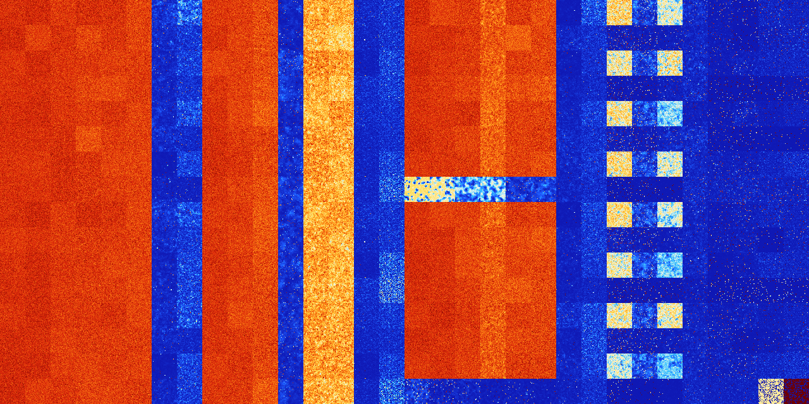

# B167 (99328-99839)

<details>
    <summary>Initial Grid</summary>
    
</details>


<details>
    <summary>Initial Grid RLE</summary>

```
#C Exported from GoGoL (https://github.com/marrow16/gogol)
#C Wrap mode: Toroidal
#C Boundary mode: Dead
#C Step: 0
x = 100, y = 100, rule = B167/S
26bobo22b2o8bo5bo12bo10bo$5bo7bo27bo32bo2bo$18bo2bo$3bo28bo55bo$27bo2bo
23bo35bo8bo$9b2o64bo$68bo11bo$16bo26bo6bo13bo6bo27bo$o26bo6b2o6bo40bo
15bo$9bo49bo$27bo9bo13bo23b2o2bo7bo$12bobo10bo19bo7bo44bo$4bo28bo45bo$
12bobo9bo9bo$7bo14bo53bo9bo$8bo44bo27bo12bob2o$21bo9bo20bo25bo11bo$3bo
21bo16bo31bo$41bo41bo$3bo4bo4b2o3bo38bo32bo7bo$17bo3bobo63bo4b2o$6bo42b
o9bo33bobo$11bo54bo28bo2bo$10bo21bo22bo13bo$2bo30bobo2b2o6bo25bo6bo$12b
o21bobo37bo8bo3bo5b2o$o9bo39bo15bo6bo$6bo3bo5bo57bo24bo$bo58bo8bo3bo$4b
o$21bo8bo22bo10bo10bo20bo$2bo5bo13bo55b2o14bo$13bo6bo58bo16bo$21bo24bo$
2bo21bo13bo28bo7bo2bo$6bo6bo27bo8bo42bo$9bo6bo5bo19bo10bo4bo5bo3bo5bo$
15bo16bo6bo20bo21bo11bobo$25bo19bo31bo10bo7bo$6bo9bo17bo11bo10b2o19bo
16bo$46bo37bo$7bo18bo63bo2bo3bo$5bo2bo15bobo5bo31bo$6bo2bo14bo2b2o6bo2b
o2bo8bo3bo$bo31bo12bobo34bo$15bo23bo37bobo$10bo34bo46bo$bo11bo22bo17b2o
30bo$2bobo2bo10bo21bo9bo7bo2bo32bo$4bo4bo40bo$8bo49bo15bo14bo$27bo52b2o
2bo$29bo16bo$4bo28bo6bo7bo8bo2bobo6bo$29bo33bo21bo$10bo17bo26bo33bo$3bo
56bo27bo$16bo19bo32bo$5bo3bo15bo55bo2bo$10bo9bo8bo44bo$14bo19bo3bo45bo$
36bobo3bo13bobo5bo2bobo15bo9bo$4bo34bobo12bo12bo21bo$4bob2o18bo22bo33bo
$4bo22bo25bo4bo12bo$25bobo20bo18bo6bo2bo$9bo7bo14bo5bo10bo28bo$16bo4bo
19bo15bo21bo$bo11bo22bo61bo$68bo24bo$o13bo36bo22bo$5bo38bo3bo12bo35bo$
36bo39bo21bo$17bo8bo5bo13b2o40bobo5bo$93bo$3bo53bo$12bo10bo36bo2bo23bo
4bo$obo3bo3bo11bo17bo23bo$15bo6bo6bo9bo12b5o3bo$26bo7bo3b2o15bo9bo21bo$
14bo11bo22bo4bo21bo20bo$bo5bo20bo54bo$22bo6bo7bo33bo14bo8bo$14bo14bo6bo
8bo33bo5bo8bo$21bo17bo12b2o45bo$27bobo28bo5bobo19bo$27b2o9bo9bob2o11bo
12bo7bo$4bo7bo4bo34bo6bo19bo18bo$9bo27bo9bo12bo30bo5bobo$21bo23bo$83bo
7bo$16bo37bo23bo$23bobo10bo15bo26bo$76bo$17bo38bo2bo11bo26bo$22bo3bo11b
o20bo11bo$10bo7bo2bo6bo42bo$24bo11b2o49bo$22bo37bo4bo$19bo5bo51bo!
```
</details>
<details>
    <summary>Thumbnail</summary>

</details>
<table>
<tr>
    <td><a href="./99328%20S%20Heat%20Map%20Activity.png"></a><br>S (99328)<br>G>1000</td>    <td><a href="./99329%20S0%20Heat%20Map%20Activity.png"></a><br>S0 (99329)<br>G>1000</td>    <td><a href="./99330%20S1%20Heat%20Map%20Activity.png"></a><br>S1 (99330)<br>G>1000</td>    <td><a href="./99331%20S01%20Heat%20Map%20Activity.png"></a><br>S01 (99331)<br>G>1000</td>    <td><a href="./99332%20S2%20Heat%20Map%20Activity.png"></a><br>S2 (99332)<br>G>1000</td>    <td><a href="./99333%20S02%20Heat%20Map%20Activity.png"></a><br>S02 (99333)<br>G>1000</td>    <td><a href="./99334%20S12%20Heat%20Map%20Activity.png"></a><br>S12 (99334)<br>R@193,p12</td>    <td><a href="./99335%20S012%20Heat%20Map%20Activity.png"></a><br>S012 (99335)<br>R@45,p6</td>    <td><a href="./99336%20S3%20Heat%20Map%20Activity.png"></a><br>S3 (99336)<br>G>1000</td>    <td><a href="./99337%20S03%20Heat%20Map%20Activity.png"></a><br>S03 (99337)<br>G>1000</td>    <td><a href="./99338%20S13%20Heat%20Map%20Activity.png"></a><br>S13 (99338)<br>G>1000</td>    <td><a href="./99339%20S013%20Heat%20Map%20Activity.png"></a><br>S013 (99339)<br>R@844,p84</td>    <td><a href="./99340%20S23%20Heat%20Map%20Activity.png"></a><br>S23 (99340)<br>G>1000</td>    <td><a href="./99341%20S023%20Heat%20Map%20Activity.png"></a><br>S023 (99341)<br>G>1000</td>    <td><a href="./99342%20S123%20Heat%20Map%20Activity.png"></a><br>S123 (99342)<br>R@39,p10</td>    <td><a href="./99343%20S0123%20Heat%20Map%20Activity.png"></a><br>S0123 (99343)<br>R@24,p6</td>    <td><a href="./99344%20S4%20Heat%20Map%20Activity.png"></a><br>S4 (99344)<br>G>1000</td>    <td><a href="./99345%20S04%20Heat%20Map%20Activity.png"></a><br>S04 (99345)<br>G>1000</td>    <td><a href="./99346%20S14%20Heat%20Map%20Activity.png"></a><br>S14 (99346)<br>G>1000</td>    <td><a href="./99347%20S014%20Heat%20Map%20Activity.png"></a><br>S014 (99347)<br>G>1000</td>    <td><a href="./99348%20S24%20Heat%20Map%20Activity.png"></a><br>S24 (99348)<br>G>1000</td>    <td><a href="./99349%20S024%20Heat%20Map%20Activity.png"></a><br>S024 (99349)<br>G>1000</td>    <td><a href="./99350%20S124%20Heat%20Map%20Activity.png"></a><br>S124 (99350)<br>R@418,p330</td>    <td><a href="./99351%20S0124%20Heat%20Map%20Activity.png"></a><br>S0124 (99351)<br>R@26,p6</td>    <td><a href="./99352%20S34%20Heat%20Map%20Activity.png"></a><br>S34 (99352)<br>G>1000</td>    <td><a href="./99353%20S034%20Heat%20Map%20Activity.png"></a><br>S034 (99353)<br>G>1000</td>    <td><a href="./99354%20S134%20Heat%20Map%20Activity.png"></a><br>S134 (99354)<br>G>1000</td>    <td><a href="./99355%20S0134%20Heat%20Map%20Activity.png"></a><br>S0134 (99355)<br>R@167,p24</td>    <td><a href="./99356%20S234%20Heat%20Map%20Activity.png"></a><br>S234 (99356)<br>R@475,p360</td>    <td><a href="./99357%20S0234%20Heat%20Map%20Activity.png"></a><br>S0234 (99357)<br>G>1000</td>    <td><a href="./99358%20S1234%20Heat%20Map%20Activity.png"></a><br>S1234 (99358)<br>R@35,p12</td>    <td><a href="./99359%20S01234%20Heat%20Map%20Activity.png"></a><br>S01234 (99359)<br>R@40,p24</td></tr>
<tr>
    <td><a href="./99360%20S5%20Heat%20Map%20Activity.png"></a><br>S5 (99360)<br>G>1000</td>    <td><a href="./99361%20S05%20Heat%20Map%20Activity.png"></a><br>S05 (99361)<br>G>1000</td>    <td><a href="./99362%20S15%20Heat%20Map%20Activity.png"></a><br>S15 (99362)<br>G>1000</td>    <td><a href="./99363%20S015%20Heat%20Map%20Activity.png"></a><br>S015 (99363)<br>G>1000</td>    <td><a href="./99364%20S25%20Heat%20Map%20Activity.png"></a><br>S25 (99364)<br>G>1000</td>    <td><a href="./99365%20S025%20Heat%20Map%20Activity.png"></a><br>S025 (99365)<br>G>1000</td>    <td><a href="./99366%20S125%20Heat%20Map%20Activity.png"></a><br>S125 (99366)<br>R@160,p12</td>    <td><a href="./99367%20S0125%20Heat%20Map%20Activity.png"></a><br>S0125 (99367)<br>R@41,p6</td>    <td><a href="./99368%20S35%20Heat%20Map%20Activity.png"></a><br>S35 (99368)<br>G>1000</td>    <td><a href="./99369%20S035%20Heat%20Map%20Activity.png"></a><br>S035 (99369)<br>G>1000</td>    <td><a href="./99370%20S135%20Heat%20Map%20Activity.png"></a><br>S135 (99370)<br>G>1000</td>    <td><a href="./99371%20S0135%20Heat%20Map%20Activity.png"></a><br>S0135 (99371)<br>G>1000</td>    <td><a href="./99372%20S235%20Heat%20Map%20Activity.png"></a><br>S235 (99372)<br>G>1000</td>    <td><a href="./99373%20S0235%20Heat%20Map%20Activity.png"></a><br>S0235 (99373)<br>G>1000</td>    <td><a href="./99374%20S1235%20Heat%20Map%20Activity.png"></a><br>S1235 (99374)<br>R@48,p12</td>    <td><a href="./99375%20S01235%20Heat%20Map%20Activity.png"></a><br>S01235 (99375)<br>R@20,p6</td>    <td><a href="./99376%20S45%20Heat%20Map%20Activity.png"></a><br>S45 (99376)<br>G>1000</td>    <td><a href="./99377%20S045%20Heat%20Map%20Activity.png"></a><br>S045 (99377)<br>G>1000</td>    <td><a href="./99378%20S145%20Heat%20Map%20Activity.png"></a><br>S145 (99378)<br>G>1000</td>    <td><a href="./99379%20S0145%20Heat%20Map%20Activity.png"></a><br>S0145 (99379)<br>G>1000</td>    <td><a href="./99380%20S245%20Heat%20Map%20Activity.png"></a><br>S245 (99380)<br>G>1000</td>    <td><a href="./99381%20S0245%20Heat%20Map%20Activity.png"></a><br>S0245 (99381)<br>G>1000</td>    <td><a href="./99382%20S1245%20Heat%20Map%20Activity.png"></a><br>S1245 (99382)<br>R@119,p20</td>    <td><a href="./99383%20S01245%20Heat%20Map%20Activity.png"></a><br>S01245 (99383)<br>R@37,p12</td>    <td><a href="./99384%20S345%20Heat%20Map%20Activity.png"></a><br>S345 (99384)<br>G>1000</td>    <td><a href="./99385%20S0345%20Heat%20Map%20Activity.png"></a><br>S0345 (99385)<br>G>1000</td>    <td><a href="./99386%20S1345%20Heat%20Map%20Activity.png"></a><br>S1345 (99386)<br>G>1000</td>    <td><a href="./99387%20S01345%20Heat%20Map%20Activity.png"></a><br>S01345 (99387)<br>R@149,p60</td>    <td><a href="./99388%20S2345%20Heat%20Map%20Activity.png"></a><br>S2345 (99388)<br>R@173,p120</td>    <td><a href="./99389%20S02345%20Heat%20Map%20Activity.png"></a><br>S02345 (99389)<br>G>1000</td>    <td><a href="./99390%20S12345%20Heat%20Map%20Activity.png"></a><br>S12345 (99390)<br>R@57,p24</td>    <td><a href="./99391%20S012345%20Heat%20Map%20Activity.png"></a><br>S012345 (99391)<br>R@37,p12</td></tr>
<tr>
    <td><a href="./99392%20S6%20Heat%20Map%20Activity.png"></a><br>S6 (99392)<br>G>1000</td>    <td><a href="./99393%20S06%20Heat%20Map%20Activity.png"></a><br>S06 (99393)<br>G>1000</td>    <td><a href="./99394%20S16%20Heat%20Map%20Activity.png"></a><br>S16 (99394)<br>G>1000</td>    <td><a href="./99395%20S016%20Heat%20Map%20Activity.png"></a><br>S016 (99395)<br>G>1000</td>    <td><a href="./99396%20S26%20Heat%20Map%20Activity.png"></a><br>S26 (99396)<br>G>1000</td>    <td><a href="./99397%20S026%20Heat%20Map%20Activity.png"></a><br>S026 (99397)<br>G>1000</td>    <td><a href="./99398%20S126%20Heat%20Map%20Activity.png"></a><br>S126 (99398)<br>R@254,p60</td>    <td><a href="./99399%20S0126%20Heat%20Map%20Activity.png"></a><br>S0126 (99399)<br>R@47,p12</td>    <td><a href="./99400%20S36%20Heat%20Map%20Activity.png"></a><br>S36 (99400)<br>G>1000</td>    <td><a href="./99401%20S036%20Heat%20Map%20Activity.png"></a><br>S036 (99401)<br>G>1000</td>    <td><a href="./99402%20S136%20Heat%20Map%20Activity.png"></a><br>S136 (99402)<br>G>1000</td>    <td><a href="./99403%20S0136%20Heat%20Map%20Activity.png"></a><br>S0136 (99403)<br>R@368,p24</td>    <td><a href="./99404%20S236%20Heat%20Map%20Activity.png"></a><br>S236 (99404)<br>G>1000</td>    <td><a href="./99405%20S0236%20Heat%20Map%20Activity.png"></a><br>S0236 (99405)<br>G>1000</td>    <td><a href="./99406%20S1236%20Heat%20Map%20Activity.png"></a><br>S1236 (99406)<br>R@76,p42</td>    <td><a href="./99407%20S01236%20Heat%20Map%20Activity.png"></a><br>S01236 (99407)<br>R@16,p2</td>    <td><a href="./99408%20S46%20Heat%20Map%20Activity.png"></a><br>S46 (99408)<br>G>1000</td>    <td><a href="./99409%20S046%20Heat%20Map%20Activity.png"></a><br>S046 (99409)<br>G>1000</td>    <td><a href="./99410%20S146%20Heat%20Map%20Activity.png"></a><br>S146 (99410)<br>G>1000</td>    <td><a href="./99411%20S0146%20Heat%20Map%20Activity.png"></a><br>S0146 (99411)<br>G>1000</td>    <td><a href="./99412%20S246%20Heat%20Map%20Activity.png"></a><br>S246 (99412)<br>G>1000</td>    <td><a href="./99413%20S0246%20Heat%20Map%20Activity.png"></a><br>S0246 (99413)<br>G>1000</td>    <td><a href="./99414%20S1246%20Heat%20Map%20Activity.png"></a><br>S1246 (99414)<br>R@340,p120</td>    <td><a href="./99415%20S01246%20Heat%20Map%20Activity.png"></a><br>S01246 (99415)<br>R@47,p24</td>    <td><a href="./99416%20S346%20Heat%20Map%20Activity.png"></a><br>S346 (99416)<br>G>1000</td>    <td><a href="./99417%20S0346%20Heat%20Map%20Activity.png"></a><br>S0346 (99417)<br>G>1000</td>    <td><a href="./99418%20S1346%20Heat%20Map%20Activity.png"></a><br>S1346 (99418)<br>G>1000</td>    <td><a href="./99419%20S01346%20Heat%20Map%20Activity.png"></a><br>S01346 (99419)<br>R@161,p24</td>    <td><a href="./99420%20S2346%20Heat%20Map%20Activity.png"></a><br>S2346 (99420)<br>R@279,p180</td>    <td><a href="./99421%20S02346%20Heat%20Map%20Activity.png"></a><br>S02346 (99421)<br>R@162,p84</td>    <td><a href="./99422%20S12346%20Heat%20Map%20Activity.png"></a><br>S12346 (99422)<br>R@41,p12</td>    <td><a href="./99423%20S012346%20Heat%20Map%20Activity.png"></a><br>S012346 (99423)<br>R@30,p12</td></tr>
<tr>
    <td><a href="./99424%20S56%20Heat%20Map%20Activity.png"></a><br>S56 (99424)<br>G>1000</td>    <td><a href="./99425%20S056%20Heat%20Map%20Activity.png"></a><br>S056 (99425)<br>G>1000</td>    <td><a href="./99426%20S156%20Heat%20Map%20Activity.png"></a><br>S156 (99426)<br>G>1000</td>    <td><a href="./99427%20S0156%20Heat%20Map%20Activity.png"></a><br>S0156 (99427)<br>G>1000</td>    <td><a href="./99428%20S256%20Heat%20Map%20Activity.png"></a><br>S256 (99428)<br>G>1000</td>    <td><a href="./99429%20S0256%20Heat%20Map%20Activity.png"></a><br>S0256 (99429)<br>G>1000</td>    <td><a href="./99430%20S1256%20Heat%20Map%20Activity.png"></a><br>S1256 (99430)<br>R@238,p60</td>    <td><a href="./99431%20S01256%20Heat%20Map%20Activity.png"></a><br>S01256 (99431)<br>R@45,p12</td>    <td><a href="./99432%20S356%20Heat%20Map%20Activity.png"></a><br>S356 (99432)<br>G>1000</td>    <td><a href="./99433%20S0356%20Heat%20Map%20Activity.png"></a><br>S0356 (99433)<br>G>1000</td>    <td><a href="./99434%20S1356%20Heat%20Map%20Activity.png"></a><br>S1356 (99434)<br>G>1000</td>    <td><a href="./99435%20S01356%20Heat%20Map%20Activity.png"></a><br>S01356 (99435)<br>R@772,p12</td>    <td><a href="./99436%20S2356%20Heat%20Map%20Activity.png"></a><br>S2356 (99436)<br>G>1000</td>    <td><a href="./99437%20S02356%20Heat%20Map%20Activity.png"></a><br>S02356 (99437)<br>G>1000</td>    <td><a href="./99438%20S12356%20Heat%20Map%20Activity.png"></a><br>S12356 (99438)<br>R@31,p2</td>    <td><a href="./99439%20S012356%20Heat%20Map%20Activity.png"></a><br>S012356 (99439)<br>R@19,p2</td>    <td><a href="./99440%20S456%20Heat%20Map%20Activity.png"></a><br>S456 (99440)<br>G>1000</td>    <td><a href="./99441%20S0456%20Heat%20Map%20Activity.png"></a><br>S0456 (99441)<br>G>1000</td>    <td><a href="./99442%20S1456%20Heat%20Map%20Activity.png"></a><br>S1456 (99442)<br>G>1000</td>    <td><a href="./99443%20S01456%20Heat%20Map%20Activity.png"></a><br>S01456 (99443)<br>G>1000</td>    <td><a href="./99444%20S2456%20Heat%20Map%20Activity.png"></a><br>S2456 (99444)<br>G>1000</td>    <td><a href="./99445%20S02456%20Heat%20Map%20Activity.png"></a><br>S02456 (99445)<br>G>1000</td>    <td><a href="./99446%20S12456%20Heat%20Map%20Activity.png"></a><br>S12456 (99446)<br>R@200,p66</td>    <td><a href="./99447%20S012456%20Heat%20Map%20Activity.png"></a><br>S012456 (99447)<br>R@52,p18</td>    <td><a href="./99448%20S3456%20Heat%20Map%20Activity.png"></a><br>S3456 (99448)<br>G>1000</td>    <td><a href="./99449%20S03456%20Heat%20Map%20Activity.png"></a><br>S03456 (99449)<br>G>1000</td>    <td><a href="./99450%20S13456%20Heat%20Map%20Activity.png"></a><br>S13456 (99450)<br>R@242,p120</td>    <td><a href="./99451%20S013456%20Heat%20Map%20Activity.png"></a><br>S013456 (99451)<br>R@62,p4</td>    <td><a href="./99452%20S23456%20Heat%20Map%20Activity.png"></a><br>S23456 (99452)<br>G>1000</td>    <td><a href="./99453%20S023456%20Heat%20Map%20Activity.png"></a><br>S023456 (99453)<br>R@893,p840</td>    <td><a href="./99454%20S123456%20Heat%20Map%20Activity.png"></a><br>S123456 (99454)<br>R@875,p840</td>    <td><a href="./99455%20S0123456%20Heat%20Map%20Activity.png"></a><br>S0123456 (99455)<br>R@168,p120</td></tr>
<tr>
    <td><a href="./99456%20S7%20Heat%20Map%20Activity.png"></a><br>S7 (99456)<br>G>1000</td>    <td><a href="./99457%20S07%20Heat%20Map%20Activity.png"></a><br>S07 (99457)<br>G>1000</td>    <td><a href="./99458%20S17%20Heat%20Map%20Activity.png"></a><br>S17 (99458)<br>G>1000</td>    <td><a href="./99459%20S017%20Heat%20Map%20Activity.png"></a><br>S017 (99459)<br>G>1000</td>    <td><a href="./99460%20S27%20Heat%20Map%20Activity.png"></a><br>S27 (99460)<br>G>1000</td>    <td><a href="./99461%20S027%20Heat%20Map%20Activity.png"></a><br>S027 (99461)<br>G>1000</td>    <td><a href="./99462%20S127%20Heat%20Map%20Activity.png"></a><br>S127 (99462)<br>R@274,p60</td>    <td><a href="./99463%20S0127%20Heat%20Map%20Activity.png"></a><br>S0127 (99463)<br>R@49,p12</td>    <td><a href="./99464%20S37%20Heat%20Map%20Activity.png"></a><br>S37 (99464)<br>G>1000</td>    <td><a href="./99465%20S037%20Heat%20Map%20Activity.png"></a><br>S037 (99465)<br>G>1000</td>    <td><a href="./99466%20S137%20Heat%20Map%20Activity.png"></a><br>S137 (99466)<br>G>1000</td>    <td><a href="./99467%20S0137%20Heat%20Map%20Activity.png"></a><br>S0137 (99467)<br>R@759,p36</td>    <td><a href="./99468%20S237%20Heat%20Map%20Activity.png"></a><br>S237 (99468)<br>G>1000</td>    <td><a href="./99469%20S0237%20Heat%20Map%20Activity.png"></a><br>S0237 (99469)<br>G>1000</td>    <td><a href="./99470%20S1237%20Heat%20Map%20Activity.png"></a><br>S1237 (99470)<br>R@34,p10</td>    <td><a href="./99471%20S01237%20Heat%20Map%20Activity.png"></a><br>S01237 (99471)<br>R@25,p6</td>    <td><a href="./99472%20S47%20Heat%20Map%20Activity.png"></a><br>S47 (99472)<br>G>1000</td>    <td><a href="./99473%20S047%20Heat%20Map%20Activity.png"></a><br>S047 (99473)<br>G>1000</td>    <td><a href="./99474%20S147%20Heat%20Map%20Activity.png"></a><br>S147 (99474)<br>G>1000</td>    <td><a href="./99475%20S0147%20Heat%20Map%20Activity.png"></a><br>S0147 (99475)<br>G>1000</td>    <td><a href="./99476%20S247%20Heat%20Map%20Activity.png"></a><br>S247 (99476)<br>G>1000</td>    <td><a href="./99477%20S0247%20Heat%20Map%20Activity.png"></a><br>S0247 (99477)<br>G>1000</td>    <td><a href="./99478%20S1247%20Heat%20Map%20Activity.png"></a><br>S1247 (99478)<br>R@164,p60</td>    <td><a href="./99479%20S01247%20Heat%20Map%20Activity.png"></a><br>S01247 (99479)<br>R@32,p6</td>    <td><a href="./99480%20S347%20Heat%20Map%20Activity.png"></a><br>S347 (99480)<br>G>1000</td>    <td><a href="./99481%20S0347%20Heat%20Map%20Activity.png"></a><br>S0347 (99481)<br>G>1000</td>    <td><a href="./99482%20S1347%20Heat%20Map%20Activity.png"></a><br>S1347 (99482)<br>G>1000</td>    <td><a href="./99483%20S01347%20Heat%20Map%20Activity.png"></a><br>S01347 (99483)<br>R@375,p240</td>    <td><a href="./99484%20S2347%20Heat%20Map%20Activity.png"></a><br>S2347 (99484)<br>R@480,p360</td>    <td><a href="./99485%20S02347%20Heat%20Map%20Activity.png"></a><br>S02347 (99485)<br>R@156,p60</td>    <td><a href="./99486%20S12347%20Heat%20Map%20Activity.png"></a><br>S12347 (99486)<br>R@81,p56</td>    <td><a href="./99487%20S012347%20Heat%20Map%20Activity.png"></a><br>S012347 (99487)<br>R@39,p24</td></tr>
<tr>
    <td><a href="./99488%20S57%20Heat%20Map%20Activity.png"></a><br>S57 (99488)<br>G>1000</td>    <td><a href="./99489%20S057%20Heat%20Map%20Activity.png"></a><br>S057 (99489)<br>G>1000</td>    <td><a href="./99490%20S157%20Heat%20Map%20Activity.png"></a><br>S157 (99490)<br>G>1000</td>    <td><a href="./99491%20S0157%20Heat%20Map%20Activity.png"></a><br>S0157 (99491)<br>G>1000</td>    <td><a href="./99492%20S257%20Heat%20Map%20Activity.png"></a><br>S257 (99492)<br>G>1000</td>    <td><a href="./99493%20S0257%20Heat%20Map%20Activity.png"></a><br>S0257 (99493)<br>G>1000</td>    <td><a href="./99494%20S1257%20Heat%20Map%20Activity.png"></a><br>S1257 (99494)<br>R@160,p12</td>    <td><a href="./99495%20S01257%20Heat%20Map%20Activity.png"></a><br>S01257 (99495)<br>R@68,p42</td>    <td><a href="./99496%20S357%20Heat%20Map%20Activity.png"></a><br>S357 (99496)<br>G>1000</td>    <td><a href="./99497%20S0357%20Heat%20Map%20Activity.png"></a><br>S0357 (99497)<br>G>1000</td>    <td><a href="./99498%20S1357%20Heat%20Map%20Activity.png"></a><br>S1357 (99498)<br>G>1000</td>    <td><a href="./99499%20S01357%20Heat%20Map%20Activity.png"></a><br>S01357 (99499)<br>R@620,p12</td>    <td><a href="./99500%20S2357%20Heat%20Map%20Activity.png"></a><br>S2357 (99500)<br>G>1000</td>    <td><a href="./99501%20S02357%20Heat%20Map%20Activity.png"></a><br>S02357 (99501)<br>G>1000</td>    <td><a href="./99502%20S12357%20Heat%20Map%20Activity.png"></a><br>S12357 (99502)<br>R@46,p2</td>    <td><a href="./99503%20S012357%20Heat%20Map%20Activity.png"></a><br>S012357 (99503)<br>R@23,p6</td>    <td><a href="./99504%20S457%20Heat%20Map%20Activity.png"></a><br>S457 (99504)<br>G>1000</td>    <td><a href="./99505%20S0457%20Heat%20Map%20Activity.png"></a><br>S0457 (99505)<br>G>1000</td>    <td><a href="./99506%20S1457%20Heat%20Map%20Activity.png"></a><br>S1457 (99506)<br>G>1000</td>    <td><a href="./99507%20S01457%20Heat%20Map%20Activity.png"></a><br>S01457 (99507)<br>G>1000</td>    <td><a href="./99508%20S2457%20Heat%20Map%20Activity.png"></a><br>S2457 (99508)<br>G>1000</td>    <td><a href="./99509%20S02457%20Heat%20Map%20Activity.png"></a><br>S02457 (99509)<br>G>1000</td>    <td><a href="./99510%20S12457%20Heat%20Map%20Activity.png"></a><br>S12457 (99510)<br>R@113,p10</td>    <td><a href="./99511%20S012457%20Heat%20Map%20Activity.png"></a><br>S012457 (99511)<br>R@37,p6</td>    <td><a href="./99512%20S3457%20Heat%20Map%20Activity.png"></a><br>S3457 (99512)<br>G>1000</td>    <td><a href="./99513%20S03457%20Heat%20Map%20Activity.png"></a><br>S03457 (99513)<br>G>1000</td>    <td><a href="./99514%20S13457%20Heat%20Map%20Activity.png"></a><br>S13457 (99514)<br>R@424,p120</td>    <td><a href="./99515%20S013457%20Heat%20Map%20Activity.png"></a><br>S013457 (99515)<br>R@95,p12</td>    <td><a href="./99516%20S23457%20Heat%20Map%20Activity.png"></a><br>S23457 (99516)<br>R@449,p360</td>    <td><a href="./99517%20S023457%20Heat%20Map%20Activity.png"></a><br>S023457 (99517)<br>G>1000</td>    <td><a href="./99518%20S123457%20Heat%20Map%20Activity.png"></a><br>S123457 (99518)<br>R@545,p504</td>    <td><a href="./99519%20S0123457%20Heat%20Map%20Activity.png"></a><br>S0123457 (99519)<br>R@870,p840</td></tr>
<tr>
    <td><a href="./99520%20S67%20Heat%20Map%20Activity.png"></a><br>S67 (99520)<br>G>1000</td>    <td><a href="./99521%20S067%20Heat%20Map%20Activity.png"></a><br>S067 (99521)<br>G>1000</td>    <td><a href="./99522%20S167%20Heat%20Map%20Activity.png"></a><br>S167 (99522)<br>G>1000</td>    <td><a href="./99523%20S0167%20Heat%20Map%20Activity.png"></a><br>S0167 (99523)<br>G>1000</td>    <td><a href="./99524%20S267%20Heat%20Map%20Activity.png"></a><br>S267 (99524)<br>G>1000</td>    <td><a href="./99525%20S0267%20Heat%20Map%20Activity.png"></a><br>S0267 (99525)<br>G>1000</td>    <td><a href="./99526%20S1267%20Heat%20Map%20Activity.png"></a><br>S1267 (99526)<br>R@993,p840</td>    <td><a href="./99527%20S01267%20Heat%20Map%20Activity.png"></a><br>S01267 (99527)<br>R@44,p12</td>    <td><a href="./99528%20S367%20Heat%20Map%20Activity.png"></a><br>S367 (99528)<br>G>1000</td>    <td><a href="./99529%20S0367%20Heat%20Map%20Activity.png"></a><br>S0367 (99529)<br>G>1000</td>    <td><a href="./99530%20S1367%20Heat%20Map%20Activity.png"></a><br>S1367 (99530)<br>G>1000</td>    <td><a href="./99531%20S01367%20Heat%20Map%20Activity.png"></a><br>S01367 (99531)<br>R@465,p60</td>    <td><a href="./99532%20S2367%20Heat%20Map%20Activity.png"></a><br>S2367 (99532)<br>G>1000</td>    <td><a href="./99533%20S02367%20Heat%20Map%20Activity.png"></a><br>S02367 (99533)<br>G>1000</td>    <td><a href="./99534%20S12367%20Heat%20Map%20Activity.png"></a><br>S12367 (99534)<br>R@48,p12</td>    <td><a href="./99535%20S012367%20Heat%20Map%20Activity.png"></a><br>S012367 (99535)<br>R@16,p4</td>    <td><a href="./99536%20S467%20Heat%20Map%20Activity.png"></a><br>S467 (99536)<br>G>1000</td>    <td><a href="./99537%20S0467%20Heat%20Map%20Activity.png"></a><br>S0467 (99537)<br>G>1000</td>    <td><a href="./99538%20S1467%20Heat%20Map%20Activity.png"></a><br>S1467 (99538)<br>G>1000</td>    <td><a href="./99539%20S01467%20Heat%20Map%20Activity.png"></a><br>S01467 (99539)<br>G>1000</td>    <td><a href="./99540%20S2467%20Heat%20Map%20Activity.png"></a><br>S2467 (99540)<br>G>1000</td>    <td><a href="./99541%20S02467%20Heat%20Map%20Activity.png"></a><br>S02467 (99541)<br>G>1000</td>    <td><a href="./99542%20S12467%20Heat%20Map%20Activity.png"></a><br>S12467 (99542)<br>R@124,p6</td>    <td><a href="./99543%20S012467%20Heat%20Map%20Activity.png"></a><br>S012467 (99543)<br>R@37,p12</td>    <td><a href="./99544%20S3467%20Heat%20Map%20Activity.png"></a><br>S3467 (99544)<br>G>1000</td>    <td><a href="./99545%20S03467%20Heat%20Map%20Activity.png"></a><br>S03467 (99545)<br>G>1000</td>    <td><a href="./99546%20S13467%20Heat%20Map%20Activity.png"></a><br>S13467 (99546)<br>G>1000</td>    <td><a href="./99547%20S013467%20Heat%20Map%20Activity.png"></a><br>S013467 (99547)<br>R@203,p60</td>    <td><a href="./99548%20S23467%20Heat%20Map%20Activity.png"></a><br>S23467 (99548)<br>R@169,p60</td>    <td><a href="./99549%20S023467%20Heat%20Map%20Activity.png"></a><br>S023467 (99549)<br>R@173,p60</td>    <td><a href="./99550%20S123467%20Heat%20Map%20Activity.png"></a><br>S123467 (99550)<br>R@36,p6</td>    <td><a href="./99551%20S0123467%20Heat%20Map%20Activity.png"></a><br>S0123467 (99551)<br>R@20,p2</td></tr>
<tr>
    <td><a href="./99552%20S567%20Heat%20Map%20Activity.png"></a><br>S567 (99552)<br>G>1000</td>    <td><a href="./99553%20S0567%20Heat%20Map%20Activity.png"></a><br>S0567 (99553)<br>G>1000</td>    <td><a href="./99554%20S1567%20Heat%20Map%20Activity.png"></a><br>S1567 (99554)<br>G>1000</td>    <td><a href="./99555%20S01567%20Heat%20Map%20Activity.png"></a><br>S01567 (99555)<br>G>1000</td>    <td><a href="./99556%20S2567%20Heat%20Map%20Activity.png"></a><br>S2567 (99556)<br>G>1000</td>    <td><a href="./99557%20S02567%20Heat%20Map%20Activity.png"></a><br>S02567 (99557)<br>G>1000</td>    <td><a href="./99558%20S12567%20Heat%20Map%20Activity.png"></a><br>S12567 (99558)<br>R@286,p120</td>    <td><a href="./99559%20S012567%20Heat%20Map%20Activity.png"></a><br>S012567 (99559)<br>R@123,p84</td>    <td><a href="./99560%20S3567%20Heat%20Map%20Activity.png"></a><br>S3567 (99560)<br>G>1000</td>    <td><a href="./99561%20S03567%20Heat%20Map%20Activity.png"></a><br>S03567 (99561)<br>G>1000</td>    <td><a href="./99562%20S13567%20Heat%20Map%20Activity.png"></a><br>S13567 (99562)<br>G>1000</td>    <td><a href="./99563%20S013567%20Heat%20Map%20Activity.png"></a><br>S013567 (99563)<br>R@933,p12</td>    <td><a href="./99564%20S23567%20Heat%20Map%20Activity.png"></a><br>S23567 (99564)<br>G>1000</td>    <td><a href="./99565%20S023567%20Heat%20Map%20Activity.png"></a><br>S023567 (99565)<br>G>1000</td>    <td><a href="./99566%20S123567%20Heat%20Map%20Activity.png"></a><br>S123567 (99566)<br>R@44,p14</td>    <td><a href="./99567%20S0123567%20Heat%20Map%20Activity.png"></a><br>S0123567 (99567)<br>S@15</td>    <td><a href="./99568%20S4567%20Heat%20Map%20Activity.png"></a><br>S4567 (99568)<br>G>1000</td>    <td><a href="./99569%20S04567%20Heat%20Map%20Activity.png"></a><br>S04567 (99569)<br>G>1000</td>    <td><a href="./99570%20S14567%20Heat%20Map%20Activity.png"></a><br>S14567 (99570)<br>G>1000</td>    <td><a href="./99571%20S014567%20Heat%20Map%20Activity.png"></a><br>S014567 (99571)<br>G>1000</td>    <td><a href="./99572%20S24567%20Heat%20Map%20Activity.png"></a><br>S24567 (99572)<br>G>1000</td>    <td><a href="./99573%20S024567%20Heat%20Map%20Activity.png"></a><br>S024567 (99573)<br>R@623,p12</td>    <td><a href="./99574%20S124567%20Heat%20Map%20Activity.png"></a><br>S124567 (99574)<br>R@126,p6</td>    <td><a href="./99575%20S0124567%20Heat%20Map%20Activity.png"></a><br>S0124567 (99575)<br>R@42,p6</td>    <td><a href="./99576%20S34567%20Heat%20Map%20Activity.png"></a><br>S34567 (99576)<br>G>1000</td>    <td><a href="./99577%20S034567%20Heat%20Map%20Activity.png"></a><br>S034567 (99577)<br>R@462,p420</td>    <td><a href="./99578%20S134567%20Heat%20Map%20Activity.png"></a><br>S134567 (99578)<br>R@884,p840</td>    <td><a href="./99579%20S0134567%20Heat%20Map%20Activity.png"></a><br>S0134567 (99579)<br>R@38,p12</td>    <td><a href="./99580%20S234567%20Heat%20Map%20Activity.png"></a><br>S234567 (99580)<br>R@45,p18</td>    <td><a href="./99581%20S0234567%20Heat%20Map%20Activity.png"></a><br>S0234567 (99581)<br>R@37,p12</td>    <td><a href="./99582%20S1234567%20Heat%20Map%20Activity.png"></a><br>S1234567 (99582)<br>R@39,p12</td>    <td><a href="./99583%20S01234567%20Heat%20Map%20Activity.png"></a><br>S01234567 (99583)<br>R@44,p12</td></tr>
<tr>
    <td><a href="./99584%20S8%20Heat%20Map%20Activity.png"></a><br>S8 (99584)<br>G>1000</td>    <td><a href="./99585%20S08%20Heat%20Map%20Activity.png"></a><br>S08 (99585)<br>G>1000</td>    <td><a href="./99586%20S18%20Heat%20Map%20Activity.png"></a><br>S18 (99586)<br>G>1000</td>    <td><a href="./99587%20S018%20Heat%20Map%20Activity.png"></a><br>S018 (99587)<br>G>1000</td>    <td><a href="./99588%20S28%20Heat%20Map%20Activity.png"></a><br>S28 (99588)<br>G>1000</td>    <td><a href="./99589%20S028%20Heat%20Map%20Activity.png"></a><br>S028 (99589)<br>G>1000</td>    <td><a href="./99590%20S128%20Heat%20Map%20Activity.png"></a><br>S128 (99590)<br>R@196,p12</td>    <td><a href="./99591%20S0128%20Heat%20Map%20Activity.png"></a><br>S0128 (99591)<br>R@53,p12</td>    <td><a href="./99592%20S38%20Heat%20Map%20Activity.png"></a><br>S38 (99592)<br>G>1000</td>    <td><a href="./99593%20S038%20Heat%20Map%20Activity.png"></a><br>S038 (99593)<br>G>1000</td>    <td><a href="./99594%20S138%20Heat%20Map%20Activity.png"></a><br>S138 (99594)<br>G>1000</td>    <td><a href="./99595%20S0138%20Heat%20Map%20Activity.png"></a><br>S0138 (99595)<br>R@497,p12</td>    <td><a href="./99596%20S238%20Heat%20Map%20Activity.png"></a><br>S238 (99596)<br>G>1000</td>    <td><a href="./99597%20S0238%20Heat%20Map%20Activity.png"></a><br>S0238 (99597)<br>G>1000</td>    <td><a href="./99598%20S1238%20Heat%20Map%20Activity.png"></a><br>S1238 (99598)<br>R@34,p10</td>    <td><a href="./99599%20S01238%20Heat%20Map%20Activity.png"></a><br>S01238 (99599)<br>R@24,p6</td>    <td><a href="./99600%20S48%20Heat%20Map%20Activity.png"></a><br>S48 (99600)<br>G>1000</td>    <td><a href="./99601%20S048%20Heat%20Map%20Activity.png"></a><br>S048 (99601)<br>G>1000</td>    <td><a href="./99602%20S148%20Heat%20Map%20Activity.png"></a><br>S148 (99602)<br>G>1000</td>    <td><a href="./99603%20S0148%20Heat%20Map%20Activity.png"></a><br>S0148 (99603)<br>G>1000</td>    <td><a href="./99604%20S248%20Heat%20Map%20Activity.png"></a><br>S248 (99604)<br>G>1000</td>    <td><a href="./99605%20S0248%20Heat%20Map%20Activity.png"></a><br>S0248 (99605)<br>G>1000</td>    <td><a href="./99606%20S1248%20Heat%20Map%20Activity.png"></a><br>S1248 (99606)<br>R@458,p330</td>    <td><a href="./99607%20S01248%20Heat%20Map%20Activity.png"></a><br>S01248 (99607)<br>R@33,p6</td>    <td><a href="./99608%20S348%20Heat%20Map%20Activity.png"></a><br>S348 (99608)<br>G>1000</td>    <td><a href="./99609%20S0348%20Heat%20Map%20Activity.png"></a><br>S0348 (99609)<br>G>1000</td>    <td><a href="./99610%20S1348%20Heat%20Map%20Activity.png"></a><br>S1348 (99610)<br>G>1000</td>    <td><a href="./99611%20S01348%20Heat%20Map%20Activity.png"></a><br>S01348 (99611)<br>R@261,p120</td>    <td><a href="./99612%20S2348%20Heat%20Map%20Activity.png"></a><br>S2348 (99612)<br>R@462,p360</td>    <td><a href="./99613%20S02348%20Heat%20Map%20Activity.png"></a><br>S02348 (99613)<br>R@214,p120</td>    <td><a href="./99614%20S12348%20Heat%20Map%20Activity.png"></a><br>S12348 (99614)<br>R@35,p12</td>    <td><a href="./99615%20S012348%20Heat%20Map%20Activity.png"></a><br>S012348 (99615)<br>R@40,p24</td></tr>
<tr>
    <td><a href="./99616%20S58%20Heat%20Map%20Activity.png"></a><br>S58 (99616)<br>G>1000</td>    <td><a href="./99617%20S058%20Heat%20Map%20Activity.png"></a><br>S058 (99617)<br>G>1000</td>    <td><a href="./99618%20S158%20Heat%20Map%20Activity.png"></a><br>S158 (99618)<br>G>1000</td>    <td><a href="./99619%20S0158%20Heat%20Map%20Activity.png"></a><br>S0158 (99619)<br>G>1000</td>    <td><a href="./99620%20S258%20Heat%20Map%20Activity.png"></a><br>S258 (99620)<br>G>1000</td>    <td><a href="./99621%20S0258%20Heat%20Map%20Activity.png"></a><br>S0258 (99621)<br>G>1000</td>    <td><a href="./99622%20S1258%20Heat%20Map%20Activity.png"></a><br>S1258 (99622)<br>R@182,p12</td>    <td><a href="./99623%20S01258%20Heat%20Map%20Activity.png"></a><br>S01258 (99623)<br>R@35,p6</td>    <td><a href="./99624%20S358%20Heat%20Map%20Activity.png"></a><br>S358 (99624)<br>G>1000</td>    <td><a href="./99625%20S0358%20Heat%20Map%20Activity.png"></a><br>S0358 (99625)<br>G>1000</td>    <td><a href="./99626%20S1358%20Heat%20Map%20Activity.png"></a><br>S1358 (99626)<br>G>1000</td>    <td><a href="./99627%20S01358%20Heat%20Map%20Activity.png"></a><br>S01358 (99627)<br>R@692,p12</td>    <td><a href="./99628%20S2358%20Heat%20Map%20Activity.png"></a><br>S2358 (99628)<br>G>1000</td>    <td><a href="./99629%20S02358%20Heat%20Map%20Activity.png"></a><br>S02358 (99629)<br>G>1000</td>    <td><a href="./99630%20S12358%20Heat%20Map%20Activity.png"></a><br>S12358 (99630)<br>R@48,p12</td>    <td><a href="./99631%20S012358%20Heat%20Map%20Activity.png"></a><br>S012358 (99631)<br>R@18,p6</td>    <td><a href="./99632%20S458%20Heat%20Map%20Activity.png"></a><br>S458 (99632)<br>G>1000</td>    <td><a href="./99633%20S0458%20Heat%20Map%20Activity.png"></a><br>S0458 (99633)<br>G>1000</td>    <td><a href="./99634%20S1458%20Heat%20Map%20Activity.png"></a><br>S1458 (99634)<br>G>1000</td>    <td><a href="./99635%20S01458%20Heat%20Map%20Activity.png"></a><br>S01458 (99635)<br>G>1000</td>    <td><a href="./99636%20S2458%20Heat%20Map%20Activity.png"></a><br>S2458 (99636)<br>G>1000</td>    <td><a href="./99637%20S02458%20Heat%20Map%20Activity.png"></a><br>S02458 (99637)<br>G>1000</td>    <td><a href="./99638%20S12458%20Heat%20Map%20Activity.png"></a><br>S12458 (99638)<br>R@169,p60</td>    <td><a href="./99639%20S012458%20Heat%20Map%20Activity.png"></a><br>S012458 (99639)<br>R@29,p6</td>    <td><a href="./99640%20S3458%20Heat%20Map%20Activity.png"></a><br>S3458 (99640)<br>G>1000</td>    <td><a href="./99641%20S03458%20Heat%20Map%20Activity.png"></a><br>S03458 (99641)<br>G>1000</td>    <td><a href="./99642%20S13458%20Heat%20Map%20Activity.png"></a><br>S13458 (99642)<br>G>1000</td>    <td><a href="./99643%20S013458%20Heat%20Map%20Activity.png"></a><br>S013458 (99643)<br>R@146,p60</td>    <td><a href="./99644%20S23458%20Heat%20Map%20Activity.png"></a><br>S23458 (99644)<br>R@169,p120</td>    <td><a href="./99645%20S023458%20Heat%20Map%20Activity.png"></a><br>S023458 (99645)<br>R@122,p60</td>    <td><a href="./99646%20S123458%20Heat%20Map%20Activity.png"></a><br>S123458 (99646)<br>G>1000</td>    <td><a href="./99647%20S0123458%20Heat%20Map%20Activity.png"></a><br>S0123458 (99647)<br>R@49,p24</td></tr>
<tr>
    <td><a href="./99648%20S68%20Heat%20Map%20Activity.png"></a><br>S68 (99648)<br>G>1000</td>    <td><a href="./99649%20S068%20Heat%20Map%20Activity.png"></a><br>S068 (99649)<br>G>1000</td>    <td><a href="./99650%20S168%20Heat%20Map%20Activity.png"></a><br>S168 (99650)<br>G>1000</td>    <td><a href="./99651%20S0168%20Heat%20Map%20Activity.png"></a><br>S0168 (99651)<br>G>1000</td>    <td><a href="./99652%20S268%20Heat%20Map%20Activity.png"></a><br>S268 (99652)<br>G>1000</td>    <td><a href="./99653%20S0268%20Heat%20Map%20Activity.png"></a><br>S0268 (99653)<br>G>1000</td>    <td><a href="./99654%20S1268%20Heat%20Map%20Activity.png"></a><br>S1268 (99654)<br>R@363,p140</td>    <td><a href="./99655%20S01268%20Heat%20Map%20Activity.png"></a><br>S01268 (99655)<br>R@40,p6</td>    <td><a href="./99656%20S368%20Heat%20Map%20Activity.png"></a><br>S368 (99656)<br>G>1000</td>    <td><a href="./99657%20S0368%20Heat%20Map%20Activity.png"></a><br>S0368 (99657)<br>G>1000</td>    <td><a href="./99658%20S1368%20Heat%20Map%20Activity.png"></a><br>S1368 (99658)<br>G>1000</td>    <td><a href="./99659%20S01368%20Heat%20Map%20Activity.png"></a><br>S01368 (99659)<br>R@313,p12</td>    <td><a href="./99660%20S2368%20Heat%20Map%20Activity.png"></a><br>S2368 (99660)<br>G>1000</td>    <td><a href="./99661%20S02368%20Heat%20Map%20Activity.png"></a><br>S02368 (99661)<br>G>1000</td>    <td><a href="./99662%20S12368%20Heat%20Map%20Activity.png"></a><br>S12368 (99662)<br>R@85,p42</td>    <td><a href="./99663%20S012368%20Heat%20Map%20Activity.png"></a><br>S012368 (99663)<br>S@14</td>    <td><a href="./99664%20S468%20Heat%20Map%20Activity.png"></a><br>S468 (99664)<br>G>1000</td>    <td><a href="./99665%20S0468%20Heat%20Map%20Activity.png"></a><br>S0468 (99665)<br>G>1000</td>    <td><a href="./99666%20S1468%20Heat%20Map%20Activity.png"></a><br>S1468 (99666)<br>G>1000</td>    <td><a href="./99667%20S01468%20Heat%20Map%20Activity.png"></a><br>S01468 (99667)<br>G>1000</td>    <td><a href="./99668%20S2468%20Heat%20Map%20Activity.png"></a><br>S2468 (99668)<br>G>1000</td>    <td><a href="./99669%20S02468%20Heat%20Map%20Activity.png"></a><br>S02468 (99669)<br>G>1000</td>    <td><a href="./99670%20S12468%20Heat%20Map%20Activity.png"></a><br>S12468 (99670)<br>R@212,p60</td>    <td><a href="./99671%20S012468%20Heat%20Map%20Activity.png"></a><br>S012468 (99671)<br>R@37,p12</td>    <td><a href="./99672%20S3468%20Heat%20Map%20Activity.png"></a><br>S3468 (99672)<br>G>1000</td>    <td><a href="./99673%20S03468%20Heat%20Map%20Activity.png"></a><br>S03468 (99673)<br>G>1000</td>    <td><a href="./99674%20S13468%20Heat%20Map%20Activity.png"></a><br>S13468 (99674)<br>G>1000</td>    <td><a href="./99675%20S013468%20Heat%20Map%20Activity.png"></a><br>S013468 (99675)<br>R@207,p24</td>    <td><a href="./99676%20S23468%20Heat%20Map%20Activity.png"></a><br>S23468 (99676)<br>G>1000</td>    <td><a href="./99677%20S023468%20Heat%20Map%20Activity.png"></a><br>S023468 (99677)<br>R@260,p120</td>    <td><a href="./99678%20S123468%20Heat%20Map%20Activity.png"></a><br>S123468 (99678)<br>R@31,p6</td>    <td><a href="./99679%20S0123468%20Heat%20Map%20Activity.png"></a><br>S0123468 (99679)<br>R@30,p12</td></tr>
<tr>
    <td><a href="./99680%20S568%20Heat%20Map%20Activity.png"></a><br>S568 (99680)<br>G>1000</td>    <td><a href="./99681%20S0568%20Heat%20Map%20Activity.png"></a><br>S0568 (99681)<br>G>1000</td>    <td><a href="./99682%20S1568%20Heat%20Map%20Activity.png"></a><br>S1568 (99682)<br>G>1000</td>    <td><a href="./99683%20S01568%20Heat%20Map%20Activity.png"></a><br>S01568 (99683)<br>G>1000</td>    <td><a href="./99684%20S2568%20Heat%20Map%20Activity.png"></a><br>S2568 (99684)<br>G>1000</td>    <td><a href="./99685%20S02568%20Heat%20Map%20Activity.png"></a><br>S02568 (99685)<br>G>1000</td>    <td><a href="./99686%20S12568%20Heat%20Map%20Activity.png"></a><br>S12568 (99686)<br>R@237,p60</td>    <td><a href="./99687%20S012568%20Heat%20Map%20Activity.png"></a><br>S012568 (99687)<br>R@29,p6</td>    <td><a href="./99688%20S3568%20Heat%20Map%20Activity.png"></a><br>S3568 (99688)<br>G>1000</td>    <td><a href="./99689%20S03568%20Heat%20Map%20Activity.png"></a><br>S03568 (99689)<br>G>1000</td>    <td><a href="./99690%20S13568%20Heat%20Map%20Activity.png"></a><br>S13568 (99690)<br>G>1000</td>    <td><a href="./99691%20S013568%20Heat%20Map%20Activity.png"></a><br>S013568 (99691)<br>G>1000</td>    <td><a href="./99692%20S23568%20Heat%20Map%20Activity.png"></a><br>S23568 (99692)<br>G>1000</td>    <td><a href="./99693%20S023568%20Heat%20Map%20Activity.png"></a><br>S023568 (99693)<br>G>1000</td>    <td><a href="./99694%20S123568%20Heat%20Map%20Activity.png"></a><br>S123568 (99694)<br>R@28,p2</td>    <td><a href="./99695%20S0123568%20Heat%20Map%20Activity.png"></a><br>S0123568 (99695)<br>S@14</td>    <td><a href="./99696%20S4568%20Heat%20Map%20Activity.png"></a><br>S4568 (99696)<br>G>1000</td>    <td><a href="./99697%20S04568%20Heat%20Map%20Activity.png"></a><br>S04568 (99697)<br>G>1000</td>    <td><a href="./99698%20S14568%20Heat%20Map%20Activity.png"></a><br>S14568 (99698)<br>G>1000</td>    <td><a href="./99699%20S014568%20Heat%20Map%20Activity.png"></a><br>S014568 (99699)<br>G>1000</td>    <td><a href="./99700%20S24568%20Heat%20Map%20Activity.png"></a><br>S24568 (99700)<br>G>1000</td>    <td><a href="./99701%20S024568%20Heat%20Map%20Activity.png"></a><br>S024568 (99701)<br>G>1000</td>    <td><a href="./99702%20S124568%20Heat%20Map%20Activity.png"></a><br>S124568 (99702)<br>R@238,p6</td>    <td><a href="./99703%20S0124568%20Heat%20Map%20Activity.png"></a><br>S0124568 (99703)<br>R@64,p36</td>    <td><a href="./99704%20S34568%20Heat%20Map%20Activity.png"></a><br>S34568 (99704)<br>G>1000</td>    <td><a href="./99705%20S034568%20Heat%20Map%20Activity.png"></a><br>S034568 (99705)<br>G>1000</td>    <td><a href="./99706%20S134568%20Heat%20Map%20Activity.png"></a><br>S134568 (99706)<br>G>1000</td>    <td><a href="./99707%20S0134568%20Heat%20Map%20Activity.png"></a><br>S0134568 (99707)<br>R@181,p120</td>    <td><a href="./99708%20S234568%20Heat%20Map%20Activity.png"></a><br>S234568 (99708)<br>G>1000</td>    <td><a href="./99709%20S0234568%20Heat%20Map%20Activity.png"></a><br>S0234568 (99709)<br>G>1000</td>    <td><a href="./99710%20S1234568%20Heat%20Map%20Activity.png"></a><br>S1234568 (99710)<br>G>1000</td>    <td><a href="./99711%20S01234568%20Heat%20Map%20Activity.png"></a><br>S01234568 (99711)<br>G>1000</td></tr>
<tr>
    <td><a href="./99712%20S78%20Heat%20Map%20Activity.png"></a><br>S78 (99712)<br>G>1000</td>    <td><a href="./99713%20S078%20Heat%20Map%20Activity.png"></a><br>S078 (99713)<br>G>1000</td>    <td><a href="./99714%20S178%20Heat%20Map%20Activity.png"></a><br>S178 (99714)<br>G>1000</td>    <td><a href="./99715%20S0178%20Heat%20Map%20Activity.png"></a><br>S0178 (99715)<br>G>1000</td>    <td><a href="./99716%20S278%20Heat%20Map%20Activity.png"></a><br>S278 (99716)<br>G>1000</td>    <td><a href="./99717%20S0278%20Heat%20Map%20Activity.png"></a><br>S0278 (99717)<br>G>1000</td>    <td><a href="./99718%20S1278%20Heat%20Map%20Activity.png"></a><br>S1278 (99718)<br>R@243,p60</td>    <td><a href="./99719%20S01278%20Heat%20Map%20Activity.png"></a><br>S01278 (99719)<br>R@46,p6</td>    <td><a href="./99720%20S378%20Heat%20Map%20Activity.png"></a><br>S378 (99720)<br>G>1000</td>    <td><a href="./99721%20S0378%20Heat%20Map%20Activity.png"></a><br>S0378 (99721)<br>G>1000</td>    <td><a href="./99722%20S1378%20Heat%20Map%20Activity.png"></a><br>S1378 (99722)<br>G>1000</td>    <td><a href="./99723%20S01378%20Heat%20Map%20Activity.png"></a><br>S01378 (99723)<br>R@413,p12</td>    <td><a href="./99724%20S2378%20Heat%20Map%20Activity.png"></a><br>S2378 (99724)<br>G>1000</td>    <td><a href="./99725%20S02378%20Heat%20Map%20Activity.png"></a><br>S02378 (99725)<br>G>1000</td>    <td><a href="./99726%20S12378%20Heat%20Map%20Activity.png"></a><br>S12378 (99726)<br>R@38,p10</td>    <td><a href="./99727%20S012378%20Heat%20Map%20Activity.png"></a><br>S012378 (99727)<br>R@21,p2</td>    <td><a href="./99728%20S478%20Heat%20Map%20Activity.png"></a><br>S478 (99728)<br>G>1000</td>    <td><a href="./99729%20S0478%20Heat%20Map%20Activity.png"></a><br>S0478 (99729)<br>G>1000</td>    <td><a href="./99730%20S1478%20Heat%20Map%20Activity.png"></a><br>S1478 (99730)<br>G>1000</td>    <td><a href="./99731%20S01478%20Heat%20Map%20Activity.png"></a><br>S01478 (99731)<br>G>1000</td>    <td><a href="./99732%20S2478%20Heat%20Map%20Activity.png"></a><br>S2478 (99732)<br>G>1000</td>    <td><a href="./99733%20S02478%20Heat%20Map%20Activity.png"></a><br>S02478 (99733)<br>G>1000</td>    <td><a href="./99734%20S12478%20Heat%20Map%20Activity.png"></a><br>S12478 (99734)<br>R@88,p6</td>    <td><a href="./99735%20S012478%20Heat%20Map%20Activity.png"></a><br>S012478 (99735)<br>R@26,p6</td>    <td><a href="./99736%20S3478%20Heat%20Map%20Activity.png"></a><br>S3478 (99736)<br>G>1000</td>    <td><a href="./99737%20S03478%20Heat%20Map%20Activity.png"></a><br>S03478 (99737)<br>G>1000</td>    <td><a href="./99738%20S13478%20Heat%20Map%20Activity.png"></a><br>S13478 (99738)<br>G>1000</td>    <td><a href="./99739%20S013478%20Heat%20Map%20Activity.png"></a><br>S013478 (99739)<br>R@250,p60</td>    <td><a href="./99740%20S23478%20Heat%20Map%20Activity.png"></a><br>S23478 (99740)<br>R@281,p180</td>    <td><a href="./99741%20S023478%20Heat%20Map%20Activity.png"></a><br>S023478 (99741)<br>R@158,p60</td>    <td><a href="./99742%20S123478%20Heat%20Map%20Activity.png"></a><br>S123478 (99742)<br>R@78,p56</td>    <td><a href="./99743%20S0123478%20Heat%20Map%20Activity.png"></a><br>S0123478 (99743)<br>R@39,p24</td></tr>
<tr>
    <td><a href="./99744%20S578%20Heat%20Map%20Activity.png"></a><br>S578 (99744)<br>G>1000</td>    <td><a href="./99745%20S0578%20Heat%20Map%20Activity.png"></a><br>S0578 (99745)<br>G>1000</td>    <td><a href="./99746%20S1578%20Heat%20Map%20Activity.png"></a><br>S1578 (99746)<br>G>1000</td>    <td><a href="./99747%20S01578%20Heat%20Map%20Activity.png"></a><br>S01578 (99747)<br>G>1000</td>    <td><a href="./99748%20S2578%20Heat%20Map%20Activity.png"></a><br>S2578 (99748)<br>G>1000</td>    <td><a href="./99749%20S02578%20Heat%20Map%20Activity.png"></a><br>S02578 (99749)<br>G>1000</td>    <td><a href="./99750%20S12578%20Heat%20Map%20Activity.png"></a><br>S12578 (99750)<br>R@200,p24</td>    <td><a href="./99751%20S012578%20Heat%20Map%20Activity.png"></a><br>S012578 (99751)<br>R@75,p42</td>    <td><a href="./99752%20S3578%20Heat%20Map%20Activity.png"></a><br>S3578 (99752)<br>G>1000</td>    <td><a href="./99753%20S03578%20Heat%20Map%20Activity.png"></a><br>S03578 (99753)<br>G>1000</td>    <td><a href="./99754%20S13578%20Heat%20Map%20Activity.png"></a><br>S13578 (99754)<br>G>1000</td>    <td><a href="./99755%20S013578%20Heat%20Map%20Activity.png"></a><br>S013578 (99755)<br>R@703,p12</td>    <td><a href="./99756%20S23578%20Heat%20Map%20Activity.png"></a><br>S23578 (99756)<br>G>1000</td>    <td><a href="./99757%20S023578%20Heat%20Map%20Activity.png"></a><br>S023578 (99757)<br>G>1000</td>    <td><a href="./99758%20S123578%20Heat%20Map%20Activity.png"></a><br>S123578 (99758)<br>R@46,p2</td>    <td><a href="./99759%20S0123578%20Heat%20Map%20Activity.png"></a><br>S0123578 (99759)<br>R@25,p6</td>    <td><a href="./99760%20S4578%20Heat%20Map%20Activity.png"></a><br>S4578 (99760)<br>G>1000</td>    <td><a href="./99761%20S04578%20Heat%20Map%20Activity.png"></a><br>S04578 (99761)<br>G>1000</td>    <td><a href="./99762%20S14578%20Heat%20Map%20Activity.png"></a><br>S14578 (99762)<br>G>1000</td>    <td><a href="./99763%20S014578%20Heat%20Map%20Activity.png"></a><br>S014578 (99763)<br>G>1000</td>    <td><a href="./99764%20S24578%20Heat%20Map%20Activity.png"></a><br>S24578 (99764)<br>G>1000</td>    <td><a href="./99765%20S024578%20Heat%20Map%20Activity.png"></a><br>S024578 (99765)<br>G>1000</td>    <td><a href="./99766%20S124578%20Heat%20Map%20Activity.png"></a><br>S124578 (99766)<br>R@234,p84</td>    <td><a href="./99767%20S0124578%20Heat%20Map%20Activity.png"></a><br>S0124578 (99767)<br>R@32,p3</td>    <td><a href="./99768%20S34578%20Heat%20Map%20Activity.png"></a><br>S34578 (99768)<br>G>1000</td>    <td><a href="./99769%20S034578%20Heat%20Map%20Activity.png"></a><br>S034578 (99769)<br>G>1000</td>    <td><a href="./99770%20S134578%20Heat%20Map%20Activity.png"></a><br>S134578 (99770)<br>G>1000</td>    <td><a href="./99771%20S0134578%20Heat%20Map%20Activity.png"></a><br>S0134578 (99771)<br>R@159,p60</td>    <td><a href="./99772%20S234578%20Heat%20Map%20Activity.png"></a><br>S234578 (99772)<br>R@110,p60</td>    <td><a href="./99773%20S0234578%20Heat%20Map%20Activity.png"></a><br>S0234578 (99773)<br>R@710,p660</td>    <td><a href="./99774%20S1234578%20Heat%20Map%20Activity.png"></a><br>S1234578 (99774)<br>R@166,p120</td>    <td><a href="./99775%20S01234578%20Heat%20Map%20Activity.png"></a><br>S01234578 (99775)<br>R@59,p24</td></tr>
<tr>
    <td><a href="./99776%20S678%20Heat%20Map%20Activity.png"></a><br>S678 (99776)<br>G>1000</td>    <td><a href="./99777%20S0678%20Heat%20Map%20Activity.png"></a><br>S0678 (99777)<br>G>1000</td>    <td><a href="./99778%20S1678%20Heat%20Map%20Activity.png"></a><br>S1678 (99778)<br>G>1000</td>    <td><a href="./99779%20S01678%20Heat%20Map%20Activity.png"></a><br>S01678 (99779)<br>G>1000</td>    <td><a href="./99780%20S2678%20Heat%20Map%20Activity.png"></a><br>S2678 (99780)<br>G>1000</td>    <td><a href="./99781%20S02678%20Heat%20Map%20Activity.png"></a><br>S02678 (99781)<br>G>1000</td>    <td><a href="./99782%20S12678%20Heat%20Map%20Activity.png"></a><br>S12678 (99782)<br>G>1000</td>    <td><a href="./99783%20S012678%20Heat%20Map%20Activity.png"></a><br>S012678 (99783)<br>R@41,p12</td>    <td><a href="./99784%20S3678%20Heat%20Map%20Activity.png"></a><br>S3678 (99784)<br>G>1000</td>    <td><a href="./99785%20S03678%20Heat%20Map%20Activity.png"></a><br>S03678 (99785)<br>G>1000</td>    <td><a href="./99786%20S13678%20Heat%20Map%20Activity.png"></a><br>S13678 (99786)<br>G>1000</td>    <td><a href="./99787%20S013678%20Heat%20Map%20Activity.png"></a><br>S013678 (99787)<br>R@655,p12</td>    <td><a href="./99788%20S23678%20Heat%20Map%20Activity.png"></a><br>S23678 (99788)<br>G>1000</td>    <td><a href="./99789%20S023678%20Heat%20Map%20Activity.png"></a><br>S023678 (99789)<br>G>1000</td>    <td><a href="./99790%20S123678%20Heat%20Map%20Activity.png"></a><br>S123678 (99790)<br>R@114,p84</td>    <td><a href="./99791%20S0123678%20Heat%20Map%20Activity.png"></a><br>S0123678 (99791)<br>R@19,p4</td>    <td><a href="./99792%20S4678%20Heat%20Map%20Activity.png"></a><br>S4678 (99792)<br>G>1000</td>    <td><a href="./99793%20S04678%20Heat%20Map%20Activity.png"></a><br>S04678 (99793)<br>G>1000</td>    <td><a href="./99794%20S14678%20Heat%20Map%20Activity.png"></a><br>S14678 (99794)<br>G>1000</td>    <td><a href="./99795%20S014678%20Heat%20Map%20Activity.png"></a><br>S014678 (99795)<br>G>1000</td>    <td><a href="./99796%20S24678%20Heat%20Map%20Activity.png"></a><br>S24678 (99796)<br>G>1000</td>    <td><a href="./99797%20S024678%20Heat%20Map%20Activity.png"></a><br>S024678 (99797)<br>G>1000</td>    <td><a href="./99798%20S124678%20Heat%20Map%20Activity.png"></a><br>S124678 (99798)<br>R@129,p4</td>    <td><a href="./99799%20S0124678%20Heat%20Map%20Activity.png"></a><br>S0124678 (99799)<br>R@31,p6</td>    <td><a href="./99800%20S34678%20Heat%20Map%20Activity.png"></a><br>S34678 (99800)<br>G>1000</td>    <td><a href="./99801%20S034678%20Heat%20Map%20Activity.png"></a><br>S034678 (99801)<br>G>1000</td>    <td><a href="./99802%20S134678%20Heat%20Map%20Activity.png"></a><br>S134678 (99802)<br>G>1000</td>    <td><a href="./99803%20S0134678%20Heat%20Map%20Activity.png"></a><br>S0134678 (99803)<br>R@243,p120</td>    <td><a href="./99804%20S234678%20Heat%20Map%20Activity.png"></a><br>S234678 (99804)<br>R@172,p60</td>    <td><a href="./99805%20S0234678%20Heat%20Map%20Activity.png"></a><br>S0234678 (99805)<br>R@138,p24</td>    <td><a href="./99806%20S1234678%20Heat%20Map%20Activity.png"></a><br>S1234678 (99806)<br>R@32,p6</td>    <td><a href="./99807%20S01234678%20Heat%20Map%20Activity.png"></a><br>S01234678 (99807)<br>R@20,p2</td></tr>
<tr>
    <td><a href="./99808%20S5678%20Heat%20Map%20Activity.png"></a><br>S5678 (99808)<br>G>1000</td>    <td><a href="./99809%20S05678%20Heat%20Map%20Activity.png"></a><br>S05678 (99809)<br>G>1000</td>    <td><a href="./99810%20S15678%20Heat%20Map%20Activity.png"></a><br>S15678 (99810)<br>G>1000</td>    <td><a href="./99811%20S015678%20Heat%20Map%20Activity.png"></a><br>S015678 (99811)<br>G>1000</td>    <td><a href="./99812%20S25678%20Heat%20Map%20Activity.png"></a><br>S25678 (99812)<br>G>1000</td>    <td><a href="./99813%20S025678%20Heat%20Map%20Activity.png"></a><br>S025678 (99813)<br>G>1000</td>    <td><a href="./99814%20S125678%20Heat%20Map%20Activity.png"></a><br>S125678 (99814)<br>R@244,p60</td>    <td><a href="./99815%20S0125678%20Heat%20Map%20Activity.png"></a><br>S0125678 (99815)<br>R@38,p12</td>    <td><a href="./99816%20S35678%20Heat%20Map%20Activity.png"></a><br>S35678 (99816)<br>G>1000</td>    <td><a href="./99817%20S035678%20Heat%20Map%20Activity.png"></a><br>S035678 (99817)<br>G>1000</td>    <td><a href="./99818%20S135678%20Heat%20Map%20Activity.png"></a><br>S135678 (99818)<br>G>1000</td>    <td><a href="./99819%20S0135678%20Heat%20Map%20Activity.png"></a><br>S0135678 (99819)<br>G>1000</td>    <td><a href="./99820%20S235678%20Heat%20Map%20Activity.png"></a><br>S235678 (99820)<br>G>1000</td>    <td><a href="./99821%20S0235678%20Heat%20Map%20Activity.png"></a><br>S0235678 (99821)<br>G>1000</td>    <td><a href="./99822%20S1235678%20Heat%20Map%20Activity.png"></a><br>S1235678 (99822)<br>R@49,p14</td>    <td><a href="./99823%20S01235678%20Heat%20Map%20Activity.png"></a><br>S01235678 (99823)<br>S@18</td>    <td><a href="./99824%20S45678%20Heat%20Map%20Activity.png"></a><br>S45678 (99824)<br>G>1000</td>    <td><a href="./99825%20S045678%20Heat%20Map%20Activity.png"></a><br>S045678 (99825)<br>G>1000</td>    <td><a href="./99826%20S145678%20Heat%20Map%20Activity.png"></a><br>S145678 (99826)<br>G>1000</td>    <td><a href="./99827%20S0145678%20Heat%20Map%20Activity.png"></a><br>S0145678 (99827)<br>G>1000</td>    <td><a href="./99828%20S245678%20Heat%20Map%20Activity.png"></a><br>S245678 (99828)<br>G>1000</td>    <td><a href="./99829%20S0245678%20Heat%20Map%20Activity.png"></a><br>S0245678 (99829)<br>G>1000</td>    <td><a href="./99830%20S1245678%20Heat%20Map%20Activity.png"></a><br>S1245678 (99830)<br>R@133,p60</td>    <td><a href="./99831%20S01245678%20Heat%20Map%20Activity.png"></a><br>S01245678 (99831)<br>R@34,p6</td>    <td><a href="./99832%20S345678%20Heat%20Map%20Activity.png"></a><br>S345678 (99832)<br>G>1000</td>    <td><a href="./99833%20S0345678%20Heat%20Map%20Activity.png"></a><br>S0345678 (99833)<br>G>1000</td>    <td><a href="./99834%20S1345678%20Heat%20Map%20Activity.png"></a><br>S1345678 (99834)<br>R@461,p420</td>    <td><a href="./99835%20S01345678%20Heat%20Map%20Activity.png"></a><br>S01345678 (99835)<br>R@32,p12</td>    <td><a href="./99836%20S2345678%20Heat%20Map%20Activity.png"></a><br>S2345678 (99836)<br>R@43,p18</td>    <td><a href="./99837%20S02345678%20Heat%20Map%20Activity.png"></a><br>S02345678 (99837)<br>R@37,p12</td>    <td><a href="./99838%20S12345678%20Heat%20Map%20Activity.png"></a><br>S12345678 (99838)<br>S@27</td>    <td><a href="./99839%20S012345678%20Heat%20Map%20Activity.png"></a><br>S012345678 (99839)<br>S@27</td></tr>
</table>
