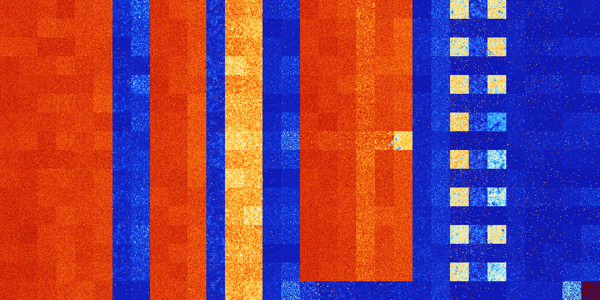

# B168 (164864-165375)

<details>
    <summary>Initial Grid</summary>
    
</details>


<details>
    <summary>Initial Grid RLE</summary>

```
#C Exported from GoGoL (https://github.com/marrow16/gogol)
#C Wrap mode: Toroidal
#C Boundary mode: Dead
#C Step: 0
x = 100, y = 100, rule = B168/S
32bo12b2o11bo32bo$o7bo13bo17bo10bo3bo13bo25bo$9bo28bo23bo31bo$4bo13bo2b
o12bobo12bo2bo2bo29bo4bo$32bo57bo$25bo$13bo15bo3bo14bo22bo$10bo7bo15bo
6bo14bo18bo$4bo19bo22bo31bo$16bo20bo11bo$3bo24bo8bo11bo17bo29bo$4bo33bo
56b2o$18bo46bo$14bo9bo32b2o28bo$11bo2bo37bo$18bo4bob2o56bo$19bo5bo43bo
7b2o$13bo11bo14bo9bo4bo33bo$10bo7b2o48bo9bo11bo$42bo17bo2bo27bo$bo12bo
47bob3o20bo$3bo3bobo2bo7bo9bo30bo2bo4bo19bo2bo$21bo2bo51bo2bo18bo$32bob
o9bo23bo9bo7bo$4bo18bo12bo18bobo27bobo9bo$3bo7bobo25bo13bo5bo2bobo30bo$
o19bo44bo$19bo74bo$4bo8bo13bo33bo13bo3bo$12bo31bo5bo27bo$36bo24bo7bo23b
o$2bo16bo25bo8bo10bo26bo$27bo14bo33bo$6bo17bo10bo$5bo2bobo42bo11bo17bo
4bo$o13bo15bo50b2o$o2bo14bo11bo24bo6bo23bo2bo6bo$bo33bo25bo28bo4bo$14bo
7bo$27bobo6bo17bo7bo8bo10bo9bo$3b2o4bo2bo37bo3bo$11bo53bo4bo$32bo10bo
14bo11bo9bo$63bo14bo$14bo25bo10bo5bo19bo14bo$14bo25bo13bo8bo24bo8bo$15b
o38bo11bo$11bo5bo16bo10bo17bo27bo2bo$22bo31b2o10bo$4bo17bo26bo9bo22bo$
3bo35bo2bo14bo12bo$bo17bo36bo7bo$4bo27bo31bo7bobo9bo$2bo88bo$47bo9bo$
18bo17bo5bo29b2o3bo9bo$9bo7bo46bo10bo$2bo10bo11bo30bo31b2o4bo$22bo8bo
15bo6bo17bo10bo$6bo7bo29bo26bo12bo13bo$71bo$47bo14bo$2bo36bo8bo12bo19bo
bo3bo$19bo23bo36bo10bo$13bo5bo38bo23bo$27bo22bo4bo15bo26bo$2bo28bo7bo8b
o31bo$4bobo52bo3bo26bo$37bo16b2o19bo18bo$39bo8bo10bo17bo$9bo16bo11bo2bo
8bo3bo9bo2bo7bo$13bo65bo17bo$41bo35bo13bo6bo$2b2o5bo10bo6bo6b2o2bo7bo
36bo$48bo14bo3bo5bo14bo$2bo8bo13bo9b2o21bo6bo5bo$19bo28bo18bo$14bo22bo
26bo33bo$bo45bobo38bo$36bo16bo17bo6b2o$48bo2bo$18bo8bo15bo21bo23bob2o$
92bo$47bo37bo12bo$50bo2bo15bo$19bo25bo34bo15b2o$bo3bo8bo52bo4bo4bo$23bo
44bobo11bo$bo2bo29bobo8b2o29bo$36bo5bo4bo18bo3bo18bo$5bo10bo34bo11bo18b
o$19bo8bo32b2o13bo13bo3bo$39bo8bo18bo4bo22bo2bo$51bo13bo8b2o$53bo7bo$o
5bo19bo5bo$4bo47bobo19bo4bo13bo4bo$66bo16bo8bo$31bo12bo25bobo18bo$8bo
39bo25bo!
```
</details>
<details>
    <summary>Thumbnail</summary>

</details>
<table>
<tr>
    <td><a href="./164864%20S%20Heat%20Map%20Activity.png"></a><br>S (164864)<br>G>1000</td>    <td><a href="./164865%20S0%20Heat%20Map%20Activity.png"></a><br>S0 (164865)<br>G>1000</td>    <td><a href="./164866%20S1%20Heat%20Map%20Activity.png"></a><br>S1 (164866)<br>G>1000</td>    <td><a href="./164867%20S01%20Heat%20Map%20Activity.png"></a><br>S01 (164867)<br>G>1000</td>    <td><a href="./164868%20S2%20Heat%20Map%20Activity.png"></a><br>S2 (164868)<br>G>1000</td>    <td><a href="./164869%20S02%20Heat%20Map%20Activity.png"></a><br>S02 (164869)<br>G>1000</td>    <td><a href="./164870%20S12%20Heat%20Map%20Activity.png"></a><br>S12 (164870)<br>R@249,p60</td>    <td><a href="./164871%20S012%20Heat%20Map%20Activity.png"></a><br>S012 (164871)<br>R@63,p6</td>    <td><a href="./164872%20S3%20Heat%20Map%20Activity.png"></a><br>S3 (164872)<br>G>1000</td>    <td><a href="./164873%20S03%20Heat%20Map%20Activity.png"></a><br>S03 (164873)<br>G>1000</td>    <td><a href="./164874%20S13%20Heat%20Map%20Activity.png"></a><br>S13 (164874)<br>G>1000</td>    <td><a href="./164875%20S013%20Heat%20Map%20Activity.png"></a><br>S013 (164875)<br>R@393,p12</td>    <td><a href="./164876%20S23%20Heat%20Map%20Activity.png"></a><br>S23 (164876)<br>G>1000</td>    <td><a href="./164877%20S023%20Heat%20Map%20Activity.png"></a><br>S023 (164877)<br>G>1000</td>    <td><a href="./164878%20S123%20Heat%20Map%20Activity.png"></a><br>S123 (164878)<br>R@42,p6</td>    <td><a href="./164879%20S0123%20Heat%20Map%20Activity.png"></a><br>S0123 (164879)<br>R@22,p6</td>    <td><a href="./164880%20S4%20Heat%20Map%20Activity.png"></a><br>S4 (164880)<br>G>1000</td>    <td><a href="./164881%20S04%20Heat%20Map%20Activity.png"></a><br>S04 (164881)<br>G>1000</td>    <td><a href="./164882%20S14%20Heat%20Map%20Activity.png"></a><br>S14 (164882)<br>G>1000</td>    <td><a href="./164883%20S014%20Heat%20Map%20Activity.png"></a><br>S014 (164883)<br>G>1000</td>    <td><a href="./164884%20S24%20Heat%20Map%20Activity.png"></a><br>S24 (164884)<br>G>1000</td>    <td><a href="./164885%20S024%20Heat%20Map%20Activity.png"></a><br>S024 (164885)<br>G>1000</td>    <td><a href="./164886%20S124%20Heat%20Map%20Activity.png"></a><br>S124 (164886)<br>R@458,p330</td>    <td><a href="./164887%20S0124%20Heat%20Map%20Activity.png"></a><br>S0124 (164887)<br>R@29,p6</td>    <td><a href="./164888%20S34%20Heat%20Map%20Activity.png"></a><br>S34 (164888)<br>G>1000</td>    <td><a href="./164889%20S034%20Heat%20Map%20Activity.png"></a><br>S034 (164889)<br>G>1000</td>    <td><a href="./164890%20S134%20Heat%20Map%20Activity.png"></a><br>S134 (164890)<br>G>1000</td>    <td><a href="./164891%20S0134%20Heat%20Map%20Activity.png"></a><br>S0134 (164891)<br>R@348,p180</td>    <td><a href="./164892%20S234%20Heat%20Map%20Activity.png"></a><br>S234 (164892)<br>R@509,p360</td>    <td><a href="./164893%20S0234%20Heat%20Map%20Activity.png"></a><br>S0234 (164893)<br>R@274,p120</td>    <td><a href="./164894%20S1234%20Heat%20Map%20Activity.png"></a><br>S1234 (164894)<br>R@167,p132</td>    <td><a href="./164895%20S01234%20Heat%20Map%20Activity.png"></a><br>S01234 (164895)<br>R@79,p60</td></tr>
<tr>
    <td><a href="./164896%20S5%20Heat%20Map%20Activity.png"></a><br>S5 (164896)<br>G>1000</td>    <td><a href="./164897%20S05%20Heat%20Map%20Activity.png"></a><br>S05 (164897)<br>G>1000</td>    <td><a href="./164898%20S15%20Heat%20Map%20Activity.png"></a><br>S15 (164898)<br>G>1000</td>    <td><a href="./164899%20S015%20Heat%20Map%20Activity.png"></a><br>S015 (164899)<br>G>1000</td>    <td><a href="./164900%20S25%20Heat%20Map%20Activity.png"></a><br>S25 (164900)<br>G>1000</td>    <td><a href="./164901%20S025%20Heat%20Map%20Activity.png"></a><br>S025 (164901)<br>G>1000</td>    <td><a href="./164902%20S125%20Heat%20Map%20Activity.png"></a><br>S125 (164902)<br>R@182,p12</td>    <td><a href="./164903%20S0125%20Heat%20Map%20Activity.png"></a><br>S0125 (164903)<br>R@34,p6</td>    <td><a href="./164904%20S35%20Heat%20Map%20Activity.png"></a><br>S35 (164904)<br>G>1000</td>    <td><a href="./164905%20S035%20Heat%20Map%20Activity.png"></a><br>S035 (164905)<br>G>1000</td>    <td><a href="./164906%20S135%20Heat%20Map%20Activity.png"></a><br>S135 (164906)<br>G>1000</td>    <td><a href="./164907%20S0135%20Heat%20Map%20Activity.png"></a><br>S0135 (164907)<br>R@346,p12</td>    <td><a href="./164908%20S235%20Heat%20Map%20Activity.png"></a><br>S235 (164908)<br>G>1000</td>    <td><a href="./164909%20S0235%20Heat%20Map%20Activity.png"></a><br>S0235 (164909)<br>G>1000</td>    <td><a href="./164910%20S1235%20Heat%20Map%20Activity.png"></a><br>S1235 (164910)<br>R@207,p180</td>    <td><a href="./164911%20S01235%20Heat%20Map%20Activity.png"></a><br>S01235 (164911)<br>R@45,p30</td>    <td><a href="./164912%20S45%20Heat%20Map%20Activity.png"></a><br>S45 (164912)<br>G>1000</td>    <td><a href="./164913%20S045%20Heat%20Map%20Activity.png"></a><br>S045 (164913)<br>G>1000</td>    <td><a href="./164914%20S145%20Heat%20Map%20Activity.png"></a><br>S145 (164914)<br>G>1000</td>    <td><a href="./164915%20S0145%20Heat%20Map%20Activity.png"></a><br>S0145 (164915)<br>G>1000</td>    <td><a href="./164916%20S245%20Heat%20Map%20Activity.png"></a><br>S245 (164916)<br>G>1000</td>    <td><a href="./164917%20S0245%20Heat%20Map%20Activity.png"></a><br>S0245 (164917)<br>G>1000</td>    <td><a href="./164918%20S1245%20Heat%20Map%20Activity.png"></a><br>S1245 (164918)<br>R@131,p12</td>    <td><a href="./164919%20S01245%20Heat%20Map%20Activity.png"></a><br>S01245 (164919)<br>R@26,p6</td>    <td><a href="./164920%20S345%20Heat%20Map%20Activity.png"></a><br>S345 (164920)<br>G>1000</td>    <td><a href="./164921%20S0345%20Heat%20Map%20Activity.png"></a><br>S0345 (164921)<br>G>1000</td>    <td><a href="./164922%20S1345%20Heat%20Map%20Activity.png"></a><br>S1345 (164922)<br>G>1000</td>    <td><a href="./164923%20S01345%20Heat%20Map%20Activity.png"></a><br>S01345 (164923)<br>R@139,p60</td>    <td><a href="./164924%20S2345%20Heat%20Map%20Activity.png"></a><br>S2345 (164924)<br>G>1000</td>    <td><a href="./164925%20S02345%20Heat%20Map%20Activity.png"></a><br>S02345 (164925)<br>G>1000</td>    <td><a href="./164926%20S12345%20Heat%20Map%20Activity.png"></a><br>S12345 (164926)<br>R@394,p360</td>    <td><a href="./164927%20S012345%20Heat%20Map%20Activity.png"></a><br>S012345 (164927)<br>R@386,p360</td></tr>
<tr>
    <td><a href="./164928%20S6%20Heat%20Map%20Activity.png"></a><br>S6 (164928)<br>G>1000</td>    <td><a href="./164929%20S06%20Heat%20Map%20Activity.png"></a><br>S06 (164929)<br>G>1000</td>    <td><a href="./164930%20S16%20Heat%20Map%20Activity.png"></a><br>S16 (164930)<br>G>1000</td>    <td><a href="./164931%20S016%20Heat%20Map%20Activity.png"></a><br>S016 (164931)<br>G>1000</td>    <td><a href="./164932%20S26%20Heat%20Map%20Activity.png"></a><br>S26 (164932)<br>G>1000</td>    <td><a href="./164933%20S026%20Heat%20Map%20Activity.png"></a><br>S026 (164933)<br>G>1000</td>    <td><a href="./164934%20S126%20Heat%20Map%20Activity.png"></a><br>S126 (164934)<br>R@586,p420</td>    <td><a href="./164935%20S0126%20Heat%20Map%20Activity.png"></a><br>S0126 (164935)<br>R@38,p6</td>    <td><a href="./164936%20S36%20Heat%20Map%20Activity.png"></a><br>S36 (164936)<br>G>1000</td>    <td><a href="./164937%20S036%20Heat%20Map%20Activity.png"></a><br>S036 (164937)<br>G>1000</td>    <td><a href="./164938%20S136%20Heat%20Map%20Activity.png"></a><br>S136 (164938)<br>G>1000</td>    <td><a href="./164939%20S0136%20Heat%20Map%20Activity.png"></a><br>S0136 (164939)<br>R@362,p84</td>    <td><a href="./164940%20S236%20Heat%20Map%20Activity.png"></a><br>S236 (164940)<br>G>1000</td>    <td><a href="./164941%20S0236%20Heat%20Map%20Activity.png"></a><br>S0236 (164941)<br>G>1000</td>    <td><a href="./164942%20S1236%20Heat%20Map%20Activity.png"></a><br>S1236 (164942)<br>R@45,p6</td>    <td><a href="./164943%20S01236%20Heat%20Map%20Activity.png"></a><br>S01236 (164943)<br>R@55,p42</td>    <td><a href="./164944%20S46%20Heat%20Map%20Activity.png"></a><br>S46 (164944)<br>G>1000</td>    <td><a href="./164945%20S046%20Heat%20Map%20Activity.png"></a><br>S046 (164945)<br>G>1000</td>    <td><a href="./164946%20S146%20Heat%20Map%20Activity.png"></a><br>S146 (164946)<br>G>1000</td>    <td><a href="./164947%20S0146%20Heat%20Map%20Activity.png"></a><br>S0146 (164947)<br>G>1000</td>    <td><a href="./164948%20S246%20Heat%20Map%20Activity.png"></a><br>S246 (164948)<br>G>1000</td>    <td><a href="./164949%20S0246%20Heat%20Map%20Activity.png"></a><br>S0246 (164949)<br>G>1000</td>    <td><a href="./164950%20S1246%20Heat%20Map%20Activity.png"></a><br>S1246 (164950)<br>R@129,p8</td>    <td><a href="./164951%20S01246%20Heat%20Map%20Activity.png"></a><br>S01246 (164951)<br>R@24,p6</td>    <td><a href="./164952%20S346%20Heat%20Map%20Activity.png"></a><br>S346 (164952)<br>G>1000</td>    <td><a href="./164953%20S0346%20Heat%20Map%20Activity.png"></a><br>S0346 (164953)<br>G>1000</td>    <td><a href="./164954%20S1346%20Heat%20Map%20Activity.png"></a><br>S1346 (164954)<br>G>1000</td>    <td><a href="./164955%20S01346%20Heat%20Map%20Activity.png"></a><br>S01346 (164955)<br>R@218,p120</td>    <td><a href="./164956%20S2346%20Heat%20Map%20Activity.png"></a><br>S2346 (164956)<br>R@347,p240</td>    <td><a href="./164957%20S02346%20Heat%20Map%20Activity.png"></a><br>S02346 (164957)<br>R@158,p60</td>    <td><a href="./164958%20S12346%20Heat%20Map%20Activity.png"></a><br>S12346 (164958)<br>R@35,p12</td>    <td><a href="./164959%20S012346%20Heat%20Map%20Activity.png"></a><br>S012346 (164959)<br>R@27,p12</td></tr>
<tr>
    <td><a href="./164960%20S56%20Heat%20Map%20Activity.png"></a><br>S56 (164960)<br>G>1000</td>    <td><a href="./164961%20S056%20Heat%20Map%20Activity.png"></a><br>S056 (164961)<br>G>1000</td>    <td><a href="./164962%20S156%20Heat%20Map%20Activity.png"></a><br>S156 (164962)<br>G>1000</td>    <td><a href="./164963%20S0156%20Heat%20Map%20Activity.png"></a><br>S0156 (164963)<br>G>1000</td>    <td><a href="./164964%20S256%20Heat%20Map%20Activity.png"></a><br>S256 (164964)<br>G>1000</td>    <td><a href="./164965%20S0256%20Heat%20Map%20Activity.png"></a><br>S0256 (164965)<br>G>1000</td>    <td><a href="./164966%20S1256%20Heat%20Map%20Activity.png"></a><br>S1256 (164966)<br>R@306,p120</td>    <td><a href="./164967%20S01256%20Heat%20Map%20Activity.png"></a><br>S01256 (164967)<br>R@95,p60</td>    <td><a href="./164968%20S356%20Heat%20Map%20Activity.png"></a><br>S356 (164968)<br>G>1000</td>    <td><a href="./164969%20S0356%20Heat%20Map%20Activity.png"></a><br>S0356 (164969)<br>G>1000</td>    <td><a href="./164970%20S1356%20Heat%20Map%20Activity.png"></a><br>S1356 (164970)<br>G>1000</td>    <td><a href="./164971%20S01356%20Heat%20Map%20Activity.png"></a><br>S01356 (164971)<br>R@398,p36</td>    <td><a href="./164972%20S2356%20Heat%20Map%20Activity.png"></a><br>S2356 (164972)<br>G>1000</td>    <td><a href="./164973%20S02356%20Heat%20Map%20Activity.png"></a><br>S02356 (164973)<br>G>1000</td>    <td><a href="./164974%20S12356%20Heat%20Map%20Activity.png"></a><br>S12356 (164974)<br>R@38,p2</td>    <td><a href="./164975%20S012356%20Heat%20Map%20Activity.png"></a><br>S012356 (164975)<br>R@22,p3</td>    <td><a href="./164976%20S456%20Heat%20Map%20Activity.png"></a><br>S456 (164976)<br>G>1000</td>    <td><a href="./164977%20S0456%20Heat%20Map%20Activity.png"></a><br>S0456 (164977)<br>G>1000</td>    <td><a href="./164978%20S1456%20Heat%20Map%20Activity.png"></a><br>S1456 (164978)<br>G>1000</td>    <td><a href="./164979%20S01456%20Heat%20Map%20Activity.png"></a><br>S01456 (164979)<br>G>1000</td>    <td><a href="./164980%20S2456%20Heat%20Map%20Activity.png"></a><br>S2456 (164980)<br>G>1000</td>    <td><a href="./164981%20S02456%20Heat%20Map%20Activity.png"></a><br>S02456 (164981)<br>G>1000</td>    <td><a href="./164982%20S12456%20Heat%20Map%20Activity.png"></a><br>S12456 (164982)<br>R@164,p2</td>    <td><a href="./164983%20S012456%20Heat%20Map%20Activity.png"></a><br>S012456 (164983)<br>R@31,p6</td>    <td><a href="./164984%20S3456%20Heat%20Map%20Activity.png"></a><br>S3456 (164984)<br>G>1000</td>    <td><a href="./164985%20S03456%20Heat%20Map%20Activity.png"></a><br>S03456 (164985)<br>G>1000</td>    <td><a href="./164986%20S13456%20Heat%20Map%20Activity.png"></a><br>S13456 (164986)<br>R@939,p840</td>    <td><a href="./164987%20S013456%20Heat%20Map%20Activity.png"></a><br>S013456 (164987)<br>R@129,p60</td>    <td><a href="./164988%20S23456%20Heat%20Map%20Activity.png"></a><br>S23456 (164988)<br>R@403,p360</td>    <td><a href="./164989%20S023456%20Heat%20Map%20Activity.png"></a><br>S023456 (164989)<br>G>1000</td>    <td><a href="./164990%20S123456%20Heat%20Map%20Activity.png"></a><br>S123456 (164990)<br>R@211,p168</td>    <td><a href="./164991%20S0123456%20Heat%20Map%20Activity.png"></a><br>S0123456 (164991)<br>G>1000</td></tr>
<tr>
    <td><a href="./164992%20S7%20Heat%20Map%20Activity.png"></a><br>S7 (164992)<br>G>1000</td>    <td><a href="./164993%20S07%20Heat%20Map%20Activity.png"></a><br>S07 (164993)<br>G>1000</td>    <td><a href="./164994%20S17%20Heat%20Map%20Activity.png"></a><br>S17 (164994)<br>G>1000</td>    <td><a href="./164995%20S017%20Heat%20Map%20Activity.png"></a><br>S017 (164995)<br>G>1000</td>    <td><a href="./164996%20S27%20Heat%20Map%20Activity.png"></a><br>S27 (164996)<br>G>1000</td>    <td><a href="./164997%20S027%20Heat%20Map%20Activity.png"></a><br>S027 (164997)<br>G>1000</td>    <td><a href="./164998%20S127%20Heat%20Map%20Activity.png"></a><br>S127 (164998)<br>R@274,p42</td>    <td><a href="./164999%20S0127%20Heat%20Map%20Activity.png"></a><br>S0127 (164999)<br>R@47,p6</td>    <td><a href="./165000%20S37%20Heat%20Map%20Activity.png"></a><br>S37 (165000)<br>G>1000</td>    <td><a href="./165001%20S037%20Heat%20Map%20Activity.png"></a><br>S037 (165001)<br>G>1000</td>    <td><a href="./165002%20S137%20Heat%20Map%20Activity.png"></a><br>S137 (165002)<br>G>1000</td>    <td><a href="./165003%20S0137%20Heat%20Map%20Activity.png"></a><br>S0137 (165003)<br>R@343,p12</td>    <td><a href="./165004%20S237%20Heat%20Map%20Activity.png"></a><br>S237 (165004)<br>G>1000</td>    <td><a href="./165005%20S0237%20Heat%20Map%20Activity.png"></a><br>S0237 (165005)<br>G>1000</td>    <td><a href="./165006%20S1237%20Heat%20Map%20Activity.png"></a><br>S1237 (165006)<br>R@37,p6</td>    <td><a href="./165007%20S01237%20Heat%20Map%20Activity.png"></a><br>S01237 (165007)<br>R@25,p6</td>    <td><a href="./165008%20S47%20Heat%20Map%20Activity.png"></a><br>S47 (165008)<br>G>1000</td>    <td><a href="./165009%20S047%20Heat%20Map%20Activity.png"></a><br>S047 (165009)<br>G>1000</td>    <td><a href="./165010%20S147%20Heat%20Map%20Activity.png"></a><br>S147 (165010)<br>G>1000</td>    <td><a href="./165011%20S0147%20Heat%20Map%20Activity.png"></a><br>S0147 (165011)<br>G>1000</td>    <td><a href="./165012%20S247%20Heat%20Map%20Activity.png"></a><br>S247 (165012)<br>G>1000</td>    <td><a href="./165013%20S0247%20Heat%20Map%20Activity.png"></a><br>S0247 (165013)<br>G>1000</td>    <td><a href="./165014%20S1247%20Heat%20Map%20Activity.png"></a><br>S1247 (165014)<br>R@874,p780</td>    <td><a href="./165015%20S01247%20Heat%20Map%20Activity.png"></a><br>S01247 (165015)<br>R@34,p12</td>    <td><a href="./165016%20S347%20Heat%20Map%20Activity.png"></a><br>S347 (165016)<br>G>1000</td>    <td><a href="./165017%20S0347%20Heat%20Map%20Activity.png"></a><br>S0347 (165017)<br>G>1000</td>    <td><a href="./165018%20S1347%20Heat%20Map%20Activity.png"></a><br>S1347 (165018)<br>G>1000</td>    <td><a href="./165019%20S01347%20Heat%20Map%20Activity.png"></a><br>S01347 (165019)<br>R@982,p840</td>    <td><a href="./165020%20S2347%20Heat%20Map%20Activity.png"></a><br>S2347 (165020)<br>R@171,p60</td>    <td><a href="./165021%20S02347%20Heat%20Map%20Activity.png"></a><br>S02347 (165021)<br>R@117,p24</td>    <td><a href="./165022%20S12347%20Heat%20Map%20Activity.png"></a><br>S12347 (165022)<br>R@83,p60</td>    <td><a href="./165023%20S012347%20Heat%20Map%20Activity.png"></a><br>S012347 (165023)<br>R@23,p6</td></tr>
<tr>
    <td><a href="./165024%20S57%20Heat%20Map%20Activity.png"></a><br>S57 (165024)<br>G>1000</td>    <td><a href="./165025%20S057%20Heat%20Map%20Activity.png"></a><br>S057 (165025)<br>G>1000</td>    <td><a href="./165026%20S157%20Heat%20Map%20Activity.png"></a><br>S157 (165026)<br>G>1000</td>    <td><a href="./165027%20S0157%20Heat%20Map%20Activity.png"></a><br>S0157 (165027)<br>G>1000</td>    <td><a href="./165028%20S257%20Heat%20Map%20Activity.png"></a><br>S257 (165028)<br>G>1000</td>    <td><a href="./165029%20S0257%20Heat%20Map%20Activity.png"></a><br>S0257 (165029)<br>G>1000</td>    <td><a href="./165030%20S1257%20Heat%20Map%20Activity.png"></a><br>S1257 (165030)<br>R@168,p20</td>    <td><a href="./165031%20S01257%20Heat%20Map%20Activity.png"></a><br>S01257 (165031)<br>R@48,p12</td>    <td><a href="./165032%20S357%20Heat%20Map%20Activity.png"></a><br>S357 (165032)<br>G>1000</td>    <td><a href="./165033%20S0357%20Heat%20Map%20Activity.png"></a><br>S0357 (165033)<br>G>1000</td>    <td><a href="./165034%20S1357%20Heat%20Map%20Activity.png"></a><br>S1357 (165034)<br>G>1000</td>    <td><a href="./165035%20S01357%20Heat%20Map%20Activity.png"></a><br>S01357 (165035)<br>R@382,p60</td>    <td><a href="./165036%20S2357%20Heat%20Map%20Activity.png"></a><br>S2357 (165036)<br>G>1000</td>    <td><a href="./165037%20S02357%20Heat%20Map%20Activity.png"></a><br>S02357 (165037)<br>G>1000</td>    <td><a href="./165038%20S12357%20Heat%20Map%20Activity.png"></a><br>S12357 (165038)<br>R@123,p90</td>    <td><a href="./165039%20S012357%20Heat%20Map%20Activity.png"></a><br>S012357 (165039)<br>R@45,p30</td>    <td><a href="./165040%20S457%20Heat%20Map%20Activity.png"></a><br>S457 (165040)<br>G>1000</td>    <td><a href="./165041%20S0457%20Heat%20Map%20Activity.png"></a><br>S0457 (165041)<br>G>1000</td>    <td><a href="./165042%20S1457%20Heat%20Map%20Activity.png"></a><br>S1457 (165042)<br>G>1000</td>    <td><a href="./165043%20S01457%20Heat%20Map%20Activity.png"></a><br>S01457 (165043)<br>G>1000</td>    <td><a href="./165044%20S2457%20Heat%20Map%20Activity.png"></a><br>S2457 (165044)<br>G>1000</td>    <td><a href="./165045%20S02457%20Heat%20Map%20Activity.png"></a><br>S02457 (165045)<br>G>1000</td>    <td><a href="./165046%20S12457%20Heat%20Map%20Activity.png"></a><br>S12457 (165046)<br>R@158,p60</td>    <td><a href="./165047%20S012457%20Heat%20Map%20Activity.png"></a><br>S012457 (165047)<br>R@31,p6</td>    <td><a href="./165048%20S3457%20Heat%20Map%20Activity.png"></a><br>S3457 (165048)<br>G>1000</td>    <td><a href="./165049%20S03457%20Heat%20Map%20Activity.png"></a><br>S03457 (165049)<br>G>1000</td>    <td><a href="./165050%20S13457%20Heat%20Map%20Activity.png"></a><br>S13457 (165050)<br>G>1000</td>    <td><a href="./165051%20S013457%20Heat%20Map%20Activity.png"></a><br>S013457 (165051)<br>R@151,p60</td>    <td><a href="./165052%20S23457%20Heat%20Map%20Activity.png"></a><br>S23457 (165052)<br>R@248,p180</td>    <td><a href="./165053%20S023457%20Heat%20Map%20Activity.png"></a><br>S023457 (165053)<br>R@191,p120</td>    <td><a href="./165054%20S123457%20Heat%20Map%20Activity.png"></a><br>S123457 (165054)<br>R@454,p420</td>    <td><a href="./165055%20S0123457%20Heat%20Map%20Activity.png"></a><br>S0123457 (165055)<br>R@204,p168</td></tr>
<tr>
    <td><a href="./165056%20S67%20Heat%20Map%20Activity.png"></a><br>S67 (165056)<br>G>1000</td>    <td><a href="./165057%20S067%20Heat%20Map%20Activity.png"></a><br>S067 (165057)<br>G>1000</td>    <td><a href="./165058%20S167%20Heat%20Map%20Activity.png"></a><br>S167 (165058)<br>G>1000</td>    <td><a href="./165059%20S0167%20Heat%20Map%20Activity.png"></a><br>S0167 (165059)<br>G>1000</td>    <td><a href="./165060%20S267%20Heat%20Map%20Activity.png"></a><br>S267 (165060)<br>G>1000</td>    <td><a href="./165061%20S0267%20Heat%20Map%20Activity.png"></a><br>S0267 (165061)<br>G>1000</td>    <td><a href="./165062%20S1267%20Heat%20Map%20Activity.png"></a><br>S1267 (165062)<br>R@612,p420</td>    <td><a href="./165063%20S01267%20Heat%20Map%20Activity.png"></a><br>S01267 (165063)<br>R@48,p12</td>    <td><a href="./165064%20S367%20Heat%20Map%20Activity.png"></a><br>S367 (165064)<br>G>1000</td>    <td><a href="./165065%20S0367%20Heat%20Map%20Activity.png"></a><br>S0367 (165065)<br>G>1000</td>    <td><a href="./165066%20S1367%20Heat%20Map%20Activity.png"></a><br>S1367 (165066)<br>G>1000</td>    <td><a href="./165067%20S01367%20Heat%20Map%20Activity.png"></a><br>S01367 (165067)<br>R@763,p12</td>    <td><a href="./165068%20S2367%20Heat%20Map%20Activity.png"></a><br>S2367 (165068)<br>G>1000</td>    <td><a href="./165069%20S02367%20Heat%20Map%20Activity.png"></a><br>S02367 (165069)<br>G>1000</td>    <td><a href="./165070%20S12367%20Heat%20Map%20Activity.png"></a><br>S12367 (165070)<br>R@57,p28</td>    <td><a href="./165071%20S012367%20Heat%20Map%20Activity.png"></a><br>S012367 (165071)<br>R@17,p4</td>    <td><a href="./165072%20S467%20Heat%20Map%20Activity.png"></a><br>S467 (165072)<br>G>1000</td>    <td><a href="./165073%20S0467%20Heat%20Map%20Activity.png"></a><br>S0467 (165073)<br>G>1000</td>    <td><a href="./165074%20S1467%20Heat%20Map%20Activity.png"></a><br>S1467 (165074)<br>G>1000</td>    <td><a href="./165075%20S01467%20Heat%20Map%20Activity.png"></a><br>S01467 (165075)<br>G>1000</td>    <td><a href="./165076%20S2467%20Heat%20Map%20Activity.png"></a><br>S2467 (165076)<br>G>1000</td>    <td><a href="./165077%20S02467%20Heat%20Map%20Activity.png"></a><br>S02467 (165077)<br>G>1000</td>    <td><a href="./165078%20S12467%20Heat%20Map%20Activity.png"></a><br>S12467 (165078)<br>R@216,p60</td>    <td><a href="./165079%20S012467%20Heat%20Map%20Activity.png"></a><br>S012467 (165079)<br>R@29,p6</td>    <td><a href="./165080%20S3467%20Heat%20Map%20Activity.png"></a><br>S3467 (165080)<br>G>1000</td>    <td><a href="./165081%20S03467%20Heat%20Map%20Activity.png"></a><br>S03467 (165081)<br>G>1000</td>    <td><a href="./165082%20S13467%20Heat%20Map%20Activity.png"></a><br>S13467 (165082)<br>G>1000</td>    <td><a href="./165083%20S013467%20Heat%20Map%20Activity.png"></a><br>S013467 (165083)<br>R@240,p120</td>    <td><a href="./165084%20S23467%20Heat%20Map%20Activity.png"></a><br>S23467 (165084)<br>R@449,p360</td>    <td><a href="./165085%20S023467%20Heat%20Map%20Activity.png"></a><br>S023467 (165085)<br>G>1000</td>    <td><a href="./165086%20S123467%20Heat%20Map%20Activity.png"></a><br>S123467 (165086)<br>R@39,p12</td>    <td><a href="./165087%20S0123467%20Heat%20Map%20Activity.png"></a><br>S0123467 (165087)<br>R@24,p6</td></tr>
<tr>
    <td><a href="./165088%20S567%20Heat%20Map%20Activity.png"></a><br>S567 (165088)<br>G>1000</td>    <td><a href="./165089%20S0567%20Heat%20Map%20Activity.png"></a><br>S0567 (165089)<br>G>1000</td>    <td><a href="./165090%20S1567%20Heat%20Map%20Activity.png"></a><br>S1567 (165090)<br>G>1000</td>    <td><a href="./165091%20S01567%20Heat%20Map%20Activity.png"></a><br>S01567 (165091)<br>G>1000</td>    <td><a href="./165092%20S2567%20Heat%20Map%20Activity.png"></a><br>S2567 (165092)<br>G>1000</td>    <td><a href="./165093%20S02567%20Heat%20Map%20Activity.png"></a><br>S02567 (165093)<br>G>1000</td>    <td><a href="./165094%20S12567%20Heat%20Map%20Activity.png"></a><br>S12567 (165094)<br>R@147,p20</td>    <td><a href="./165095%20S012567%20Heat%20Map%20Activity.png"></a><br>S012567 (165095)<br>R@71,p42</td>    <td><a href="./165096%20S3567%20Heat%20Map%20Activity.png"></a><br>S3567 (165096)<br>G>1000</td>    <td><a href="./165097%20S03567%20Heat%20Map%20Activity.png"></a><br>S03567 (165097)<br>G>1000</td>    <td><a href="./165098%20S13567%20Heat%20Map%20Activity.png"></a><br>S13567 (165098)<br>G>1000</td>    <td><a href="./165099%20S013567%20Heat%20Map%20Activity.png"></a><br>S013567 (165099)<br>R@538,p12</td>    <td><a href="./165100%20S23567%20Heat%20Map%20Activity.png"></a><br>S23567 (165100)<br>G>1000</td>    <td><a href="./165101%20S023567%20Heat%20Map%20Activity.png"></a><br>S023567 (165101)<br>G>1000</td>    <td><a href="./165102%20S123567%20Heat%20Map%20Activity.png"></a><br>S123567 (165102)<br>R@31,p2</td>    <td><a href="./165103%20S0123567%20Heat%20Map%20Activity.png"></a><br>S0123567 (165103)<br>S@15</td>    <td><a href="./165104%20S4567%20Heat%20Map%20Activity.png"></a><br>S4567 (165104)<br>G>1000</td>    <td><a href="./165105%20S04567%20Heat%20Map%20Activity.png"></a><br>S04567 (165105)<br>G>1000</td>    <td><a href="./165106%20S14567%20Heat%20Map%20Activity.png"></a><br>S14567 (165106)<br>G>1000</td>    <td><a href="./165107%20S014567%20Heat%20Map%20Activity.png"></a><br>S014567 (165107)<br>G>1000</td>    <td><a href="./165108%20S24567%20Heat%20Map%20Activity.png"></a><br>S24567 (165108)<br>G>1000</td>    <td><a href="./165109%20S024567%20Heat%20Map%20Activity.png"></a><br>S024567 (165109)<br>G>1000</td>    <td><a href="./165110%20S124567%20Heat%20Map%20Activity.png"></a><br>S124567 (165110)<br>R@147,p30</td>    <td><a href="./165111%20S0124567%20Heat%20Map%20Activity.png"></a><br>S0124567 (165111)<br>R@44,p6</td>    <td><a href="./165112%20S34567%20Heat%20Map%20Activity.png"></a><br>S34567 (165112)<br>G>1000</td>    <td><a href="./165113%20S034567%20Heat%20Map%20Activity.png"></a><br>S034567 (165113)<br>R@916,p840</td>    <td><a href="./165114%20S134567%20Heat%20Map%20Activity.png"></a><br>S134567 (165114)<br>R@885,p840</td>    <td><a href="./165115%20S0134567%20Heat%20Map%20Activity.png"></a><br>S0134567 (165115)<br>R@54,p12</td>    <td><a href="./165116%20S234567%20Heat%20Map%20Activity.png"></a><br>S234567 (165116)<br>R@43,p12</td>    <td><a href="./165117%20S0234567%20Heat%20Map%20Activity.png"></a><br>S0234567 (165117)<br>R@43,p12</td>    <td><a href="./165118%20S1234567%20Heat%20Map%20Activity.png"></a><br>S1234567 (165118)<br>R@32,p6</td>    <td><a href="./165119%20S01234567%20Heat%20Map%20Activity.png"></a><br>S01234567 (165119)<br>R@37,p6</td></tr>
<tr>
    <td><a href="./165120%20S8%20Heat%20Map%20Activity.png"></a><br>S8 (165120)<br>G>1000</td>    <td><a href="./165121%20S08%20Heat%20Map%20Activity.png"></a><br>S08 (165121)<br>G>1000</td>    <td><a href="./165122%20S18%20Heat%20Map%20Activity.png"></a><br>S18 (165122)<br>G>1000</td>    <td><a href="./165123%20S018%20Heat%20Map%20Activity.png"></a><br>S018 (165123)<br>G>1000</td>    <td><a href="./165124%20S28%20Heat%20Map%20Activity.png"></a><br>S28 (165124)<br>G>1000</td>    <td><a href="./165125%20S028%20Heat%20Map%20Activity.png"></a><br>S028 (165125)<br>G>1000</td>    <td><a href="./165126%20S128%20Heat%20Map%20Activity.png"></a><br>S128 (165126)<br>R@243,p12</td>    <td><a href="./165127%20S0128%20Heat%20Map%20Activity.png"></a><br>S0128 (165127)<br>R@103,p60</td>    <td><a href="./165128%20S38%20Heat%20Map%20Activity.png"></a><br>S38 (165128)<br>G>1000</td>    <td><a href="./165129%20S038%20Heat%20Map%20Activity.png"></a><br>S038 (165129)<br>G>1000</td>    <td><a href="./165130%20S138%20Heat%20Map%20Activity.png"></a><br>S138 (165130)<br>G>1000</td>    <td><a href="./165131%20S0138%20Heat%20Map%20Activity.png"></a><br>S0138 (165131)<br>R@285,p36</td>    <td><a href="./165132%20S238%20Heat%20Map%20Activity.png"></a><br>S238 (165132)<br>G>1000</td>    <td><a href="./165133%20S0238%20Heat%20Map%20Activity.png"></a><br>S0238 (165133)<br>G>1000</td>    <td><a href="./165134%20S1238%20Heat%20Map%20Activity.png"></a><br>S1238 (165134)<br>R@42,p6</td>    <td><a href="./165135%20S01238%20Heat%20Map%20Activity.png"></a><br>S01238 (165135)<br>R@20,p6</td>    <td><a href="./165136%20S48%20Heat%20Map%20Activity.png"></a><br>S48 (165136)<br>G>1000</td>    <td><a href="./165137%20S048%20Heat%20Map%20Activity.png"></a><br>S048 (165137)<br>G>1000</td>    <td><a href="./165138%20S148%20Heat%20Map%20Activity.png"></a><br>S148 (165138)<br>G>1000</td>    <td><a href="./165139%20S0148%20Heat%20Map%20Activity.png"></a><br>S0148 (165139)<br>G>1000</td>    <td><a href="./165140%20S248%20Heat%20Map%20Activity.png"></a><br>S248 (165140)<br>G>1000</td>    <td><a href="./165141%20S0248%20Heat%20Map%20Activity.png"></a><br>S0248 (165141)<br>G>1000</td>    <td><a href="./165142%20S1248%20Heat%20Map%20Activity.png"></a><br>S1248 (165142)<br>R@147,p60</td>    <td><a href="./165143%20S01248%20Heat%20Map%20Activity.png"></a><br>S01248 (165143)<br>R@30,p6</td>    <td><a href="./165144%20S348%20Heat%20Map%20Activity.png"></a><br>S348 (165144)<br>G>1000</td>    <td><a href="./165145%20S0348%20Heat%20Map%20Activity.png"></a><br>S0348 (165145)<br>G>1000</td>    <td><a href="./165146%20S1348%20Heat%20Map%20Activity.png"></a><br>S1348 (165146)<br>G>1000</td>    <td><a href="./165147%20S01348%20Heat%20Map%20Activity.png"></a><br>S01348 (165147)<br>R@989,p840</td>    <td><a href="./165148%20S2348%20Heat%20Map%20Activity.png"></a><br>S2348 (165148)<br>R@297,p180</td>    <td><a href="./165149%20S02348%20Heat%20Map%20Activity.png"></a><br>S02348 (165149)<br>R@542,p420</td>    <td><a href="./165150%20S12348%20Heat%20Map%20Activity.png"></a><br>S12348 (165150)<br>R@63,p12</td>    <td><a href="./165151%20S012348%20Heat%20Map%20Activity.png"></a><br>S012348 (165151)<br>R@79,p60</td></tr>
<tr>
    <td><a href="./165152%20S58%20Heat%20Map%20Activity.png"></a><br>S58 (165152)<br>G>1000</td>    <td><a href="./165153%20S058%20Heat%20Map%20Activity.png"></a><br>S058 (165153)<br>G>1000</td>    <td><a href="./165154%20S158%20Heat%20Map%20Activity.png"></a><br>S158 (165154)<br>G>1000</td>    <td><a href="./165155%20S0158%20Heat%20Map%20Activity.png"></a><br>S0158 (165155)<br>G>1000</td>    <td><a href="./165156%20S258%20Heat%20Map%20Activity.png"></a><br>S258 (165156)<br>G>1000</td>    <td><a href="./165157%20S0258%20Heat%20Map%20Activity.png"></a><br>S0258 (165157)<br>G>1000</td>    <td><a href="./165158%20S1258%20Heat%20Map%20Activity.png"></a><br>S1258 (165158)<br>R@205,p60</td>    <td><a href="./165159%20S01258%20Heat%20Map%20Activity.png"></a><br>S01258 (165159)<br>R@40,p6</td>    <td><a href="./165160%20S358%20Heat%20Map%20Activity.png"></a><br>S358 (165160)<br>G>1000</td>    <td><a href="./165161%20S0358%20Heat%20Map%20Activity.png"></a><br>S0358 (165161)<br>G>1000</td>    <td><a href="./165162%20S1358%20Heat%20Map%20Activity.png"></a><br>S1358 (165162)<br>G>1000</td>    <td><a href="./165163%20S01358%20Heat%20Map%20Activity.png"></a><br>S01358 (165163)<br>R@491,p36</td>    <td><a href="./165164%20S2358%20Heat%20Map%20Activity.png"></a><br>S2358 (165164)<br>G>1000</td>    <td><a href="./165165%20S02358%20Heat%20Map%20Activity.png"></a><br>S02358 (165165)<br>G>1000</td>    <td><a href="./165166%20S12358%20Heat%20Map%20Activity.png"></a><br>S12358 (165166)<br>R@207,p180</td>    <td><a href="./165167%20S012358%20Heat%20Map%20Activity.png"></a><br>S012358 (165167)<br>R@45,p30</td>    <td><a href="./165168%20S458%20Heat%20Map%20Activity.png"></a><br>S458 (165168)<br>G>1000</td>    <td><a href="./165169%20S0458%20Heat%20Map%20Activity.png"></a><br>S0458 (165169)<br>G>1000</td>    <td><a href="./165170%20S1458%20Heat%20Map%20Activity.png"></a><br>S1458 (165170)<br>G>1000</td>    <td><a href="./165171%20S01458%20Heat%20Map%20Activity.png"></a><br>S01458 (165171)<br>G>1000</td>    <td><a href="./165172%20S2458%20Heat%20Map%20Activity.png"></a><br>S2458 (165172)<br>G>1000</td>    <td><a href="./165173%20S02458%20Heat%20Map%20Activity.png"></a><br>S02458 (165173)<br>G>1000</td>    <td><a href="./165174%20S12458%20Heat%20Map%20Activity.png"></a><br>S12458 (165174)<br>R@156,p30</td>    <td><a href="./165175%20S012458%20Heat%20Map%20Activity.png"></a><br>S012458 (165175)<br>R@29,p6</td>    <td><a href="./165176%20S3458%20Heat%20Map%20Activity.png"></a><br>S3458 (165176)<br>G>1000</td>    <td><a href="./165177%20S03458%20Heat%20Map%20Activity.png"></a><br>S03458 (165177)<br>G>1000</td>    <td><a href="./165178%20S13458%20Heat%20Map%20Activity.png"></a><br>S13458 (165178)<br>G>1000</td>    <td><a href="./165179%20S013458%20Heat%20Map%20Activity.png"></a><br>S013458 (165179)<br>R@149,p60</td>    <td><a href="./165180%20S23458%20Heat%20Map%20Activity.png"></a><br>S23458 (165180)<br>R@229,p180</td>    <td><a href="./165181%20S023458%20Heat%20Map%20Activity.png"></a><br>S023458 (165181)<br>G>1000</td>    <td><a href="./165182%20S123458%20Heat%20Map%20Activity.png"></a><br>S123458 (165182)<br>G>1000</td>    <td><a href="./165183%20S0123458%20Heat%20Map%20Activity.png"></a><br>S0123458 (165183)<br>G>1000</td></tr>
<tr>
    <td><a href="./165184%20S68%20Heat%20Map%20Activity.png"></a><br>S68 (165184)<br>G>1000</td>    <td><a href="./165185%20S068%20Heat%20Map%20Activity.png"></a><br>S068 (165185)<br>G>1000</td>    <td><a href="./165186%20S168%20Heat%20Map%20Activity.png"></a><br>S168 (165186)<br>G>1000</td>    <td><a href="./165187%20S0168%20Heat%20Map%20Activity.png"></a><br>S0168 (165187)<br>G>1000</td>    <td><a href="./165188%20S268%20Heat%20Map%20Activity.png"></a><br>S268 (165188)<br>G>1000</td>    <td><a href="./165189%20S0268%20Heat%20Map%20Activity.png"></a><br>S0268 (165189)<br>G>1000</td>    <td><a href="./165190%20S1268%20Heat%20Map%20Activity.png"></a><br>S1268 (165190)<br>R@216,p4</td>    <td><a href="./165191%20S01268%20Heat%20Map%20Activity.png"></a><br>S01268 (165191)<br>R@47,p12</td>    <td><a href="./165192%20S368%20Heat%20Map%20Activity.png"></a><br>S368 (165192)<br>G>1000</td>    <td><a href="./165193%20S0368%20Heat%20Map%20Activity.png"></a><br>S0368 (165193)<br>G>1000</td>    <td><a href="./165194%20S1368%20Heat%20Map%20Activity.png"></a><br>S1368 (165194)<br>G>1000</td>    <td><a href="./165195%20S01368%20Heat%20Map%20Activity.png"></a><br>S01368 (165195)<br>R@429,p156</td>    <td><a href="./165196%20S2368%20Heat%20Map%20Activity.png"></a><br>S2368 (165196)<br>G>1000</td>    <td><a href="./165197%20S02368%20Heat%20Map%20Activity.png"></a><br>S02368 (165197)<br>G>1000</td>    <td><a href="./165198%20S12368%20Heat%20Map%20Activity.png"></a><br>S12368 (165198)<br>R@41,p2</td>    <td><a href="./165199%20S012368%20Heat%20Map%20Activity.png"></a><br>S012368 (165199)<br>R@25,p12</td>    <td><a href="./165200%20S468%20Heat%20Map%20Activity.png"></a><br>S468 (165200)<br>G>1000</td>    <td><a href="./165201%20S0468%20Heat%20Map%20Activity.png"></a><br>S0468 (165201)<br>G>1000</td>    <td><a href="./165202%20S1468%20Heat%20Map%20Activity.png"></a><br>S1468 (165202)<br>G>1000</td>    <td><a href="./165203%20S01468%20Heat%20Map%20Activity.png"></a><br>S01468 (165203)<br>G>1000</td>    <td><a href="./165204%20S2468%20Heat%20Map%20Activity.png"></a><br>S2468 (165204)<br>G>1000</td>    <td><a href="./165205%20S02468%20Heat%20Map%20Activity.png"></a><br>S02468 (165205)<br>G>1000</td>    <td><a href="./165206%20S12468%20Heat%20Map%20Activity.png"></a><br>S12468 (165206)<br>R@136,p20</td>    <td><a href="./165207%20S012468%20Heat%20Map%20Activity.png"></a><br>S012468 (165207)<br>R@28,p6</td>    <td><a href="./165208%20S3468%20Heat%20Map%20Activity.png"></a><br>S3468 (165208)<br>G>1000</td>    <td><a href="./165209%20S03468%20Heat%20Map%20Activity.png"></a><br>S03468 (165209)<br>G>1000</td>    <td><a href="./165210%20S13468%20Heat%20Map%20Activity.png"></a><br>S13468 (165210)<br>G>1000</td>    <td><a href="./165211%20S013468%20Heat%20Map%20Activity.png"></a><br>S013468 (165211)<br>R@175,p24</td>    <td><a href="./165212%20S23468%20Heat%20Map%20Activity.png"></a><br>S23468 (165212)<br>R@158,p60</td>    <td><a href="./165213%20S023468%20Heat%20Map%20Activity.png"></a><br>S023468 (165213)<br>R@305,p168</td>    <td><a href="./165214%20S123468%20Heat%20Map%20Activity.png"></a><br>S123468 (165214)<br>R@36,p4</td>    <td><a href="./165215%20S0123468%20Heat%20Map%20Activity.png"></a><br>S0123468 (165215)<br>R@19,p4</td></tr>
<tr>
    <td><a href="./165216%20S568%20Heat%20Map%20Activity.png"></a><br>S568 (165216)<br>G>1000</td>    <td><a href="./165217%20S0568%20Heat%20Map%20Activity.png"></a><br>S0568 (165217)<br>G>1000</td>    <td><a href="./165218%20S1568%20Heat%20Map%20Activity.png"></a><br>S1568 (165218)<br>G>1000</td>    <td><a href="./165219%20S01568%20Heat%20Map%20Activity.png"></a><br>S01568 (165219)<br>G>1000</td>    <td><a href="./165220%20S2568%20Heat%20Map%20Activity.png"></a><br>S2568 (165220)<br>G>1000</td>    <td><a href="./165221%20S02568%20Heat%20Map%20Activity.png"></a><br>S02568 (165221)<br>G>1000</td>    <td><a href="./165222%20S12568%20Heat%20Map%20Activity.png"></a><br>S12568 (165222)<br>R@240,p60</td>    <td><a href="./165223%20S012568%20Heat%20Map%20Activity.png"></a><br>S012568 (165223)<br>R@42,p12</td>    <td><a href="./165224%20S3568%20Heat%20Map%20Activity.png"></a><br>S3568 (165224)<br>G>1000</td>    <td><a href="./165225%20S03568%20Heat%20Map%20Activity.png"></a><br>S03568 (165225)<br>G>1000</td>    <td><a href="./165226%20S13568%20Heat%20Map%20Activity.png"></a><br>S13568 (165226)<br>G>1000</td>    <td><a href="./165227%20S013568%20Heat%20Map%20Activity.png"></a><br>S013568 (165227)<br>R@490,p12</td>    <td><a href="./165228%20S23568%20Heat%20Map%20Activity.png"></a><br>S23568 (165228)<br>G>1000</td>    <td><a href="./165229%20S023568%20Heat%20Map%20Activity.png"></a><br>S023568 (165229)<br>G>1000</td>    <td><a href="./165230%20S123568%20Heat%20Map%20Activity.png"></a><br>S123568 (165230)<br>R@31,p2</td>    <td><a href="./165231%20S0123568%20Heat%20Map%20Activity.png"></a><br>S0123568 (165231)<br>R@17,p2</td>    <td><a href="./165232%20S4568%20Heat%20Map%20Activity.png"></a><br>S4568 (165232)<br>G>1000</td>    <td><a href="./165233%20S04568%20Heat%20Map%20Activity.png"></a><br>S04568 (165233)<br>G>1000</td>    <td><a href="./165234%20S14568%20Heat%20Map%20Activity.png"></a><br>S14568 (165234)<br>G>1000</td>    <td><a href="./165235%20S014568%20Heat%20Map%20Activity.png"></a><br>S014568 (165235)<br>G>1000</td>    <td><a href="./165236%20S24568%20Heat%20Map%20Activity.png"></a><br>S24568 (165236)<br>G>1000</td>    <td><a href="./165237%20S024568%20Heat%20Map%20Activity.png"></a><br>S024568 (165237)<br>G>1000</td>    <td><a href="./165238%20S124568%20Heat%20Map%20Activity.png"></a><br>S124568 (165238)<br>R@179,p30</td>    <td><a href="./165239%20S0124568%20Heat%20Map%20Activity.png"></a><br>S0124568 (165239)<br>R@42,p12</td>    <td><a href="./165240%20S34568%20Heat%20Map%20Activity.png"></a><br>S34568 (165240)<br>R@559,p420</td>    <td><a href="./165241%20S034568%20Heat%20Map%20Activity.png"></a><br>S034568 (165241)<br>G>1000</td>    <td><a href="./165242%20S134568%20Heat%20Map%20Activity.png"></a><br>S134568 (165242)<br>R@928,p840</td>    <td><a href="./165243%20S0134568%20Heat%20Map%20Activity.png"></a><br>S0134568 (165243)<br>R@125,p60</td>    <td><a href="./165244%20S234568%20Heat%20Map%20Activity.png"></a><br>S234568 (165244)<br>G>1000</td>    <td><a href="./165245%20S0234568%20Heat%20Map%20Activity.png"></a><br>S0234568 (165245)<br>G>1000</td>    <td><a href="./165246%20S1234568%20Heat%20Map%20Activity.png"></a><br>S1234568 (165246)<br>G>1000</td>    <td><a href="./165247%20S01234568%20Heat%20Map%20Activity.png"></a><br>S01234568 (165247)<br>G>1000</td></tr>
<tr>
    <td><a href="./165248%20S78%20Heat%20Map%20Activity.png"></a><br>S78 (165248)<br>G>1000</td>    <td><a href="./165249%20S078%20Heat%20Map%20Activity.png"></a><br>S078 (165249)<br>G>1000</td>    <td><a href="./165250%20S178%20Heat%20Map%20Activity.png"></a><br>S178 (165250)<br>G>1000</td>    <td><a href="./165251%20S0178%20Heat%20Map%20Activity.png"></a><br>S0178 (165251)<br>G>1000</td>    <td><a href="./165252%20S278%20Heat%20Map%20Activity.png"></a><br>S278 (165252)<br>G>1000</td>    <td><a href="./165253%20S0278%20Heat%20Map%20Activity.png"></a><br>S0278 (165253)<br>G>1000</td>    <td><a href="./165254%20S1278%20Heat%20Map%20Activity.png"></a><br>S1278 (165254)<br>R@202,p20</td>    <td><a href="./165255%20S01278%20Heat%20Map%20Activity.png"></a><br>S01278 (165255)<br>R@47,p6</td>    <td><a href="./165256%20S378%20Heat%20Map%20Activity.png"></a><br>S378 (165256)<br>G>1000</td>    <td><a href="./165257%20S0378%20Heat%20Map%20Activity.png"></a><br>S0378 (165257)<br>G>1000</td>    <td><a href="./165258%20S1378%20Heat%20Map%20Activity.png"></a><br>S1378 (165258)<br>G>1000</td>    <td><a href="./165259%20S01378%20Heat%20Map%20Activity.png"></a><br>S01378 (165259)<br>R@281,p12</td>    <td><a href="./165260%20S2378%20Heat%20Map%20Activity.png"></a><br>S2378 (165260)<br>G>1000</td>    <td><a href="./165261%20S02378%20Heat%20Map%20Activity.png"></a><br>S02378 (165261)<br>G>1000</td>    <td><a href="./165262%20S12378%20Heat%20Map%20Activity.png"></a><br>S12378 (165262)<br>R@37,p6</td>    <td><a href="./165263%20S012378%20Heat%20Map%20Activity.png"></a><br>S012378 (165263)<br>R@22,p6</td>    <td><a href="./165264%20S478%20Heat%20Map%20Activity.png"></a><br>S478 (165264)<br>G>1000</td>    <td><a href="./165265%20S0478%20Heat%20Map%20Activity.png"></a><br>S0478 (165265)<br>G>1000</td>    <td><a href="./165266%20S1478%20Heat%20Map%20Activity.png"></a><br>S1478 (165266)<br>G>1000</td>    <td><a href="./165267%20S01478%20Heat%20Map%20Activity.png"></a><br>S01478 (165267)<br>G>1000</td>    <td><a href="./165268%20S2478%20Heat%20Map%20Activity.png"></a><br>S2478 (165268)<br>G>1000</td>    <td><a href="./165269%20S02478%20Heat%20Map%20Activity.png"></a><br>S02478 (165269)<br>G>1000</td>    <td><a href="./165270%20S12478%20Heat%20Map%20Activity.png"></a><br>S12478 (165270)<br>R@162,p12</td>    <td><a href="./165271%20S012478%20Heat%20Map%20Activity.png"></a><br>S012478 (165271)<br>R@36,p12</td>    <td><a href="./165272%20S3478%20Heat%20Map%20Activity.png"></a><br>S3478 (165272)<br>G>1000</td>    <td><a href="./165273%20S03478%20Heat%20Map%20Activity.png"></a><br>S03478 (165273)<br>G>1000</td>    <td><a href="./165274%20S13478%20Heat%20Map%20Activity.png"></a><br>S13478 (165274)<br>G>1000</td>    <td><a href="./165275%20S013478%20Heat%20Map%20Activity.png"></a><br>S013478 (165275)<br>R@246,p120</td>    <td><a href="./165276%20S23478%20Heat%20Map%20Activity.png"></a><br>S23478 (165276)<br>G>1000</td>    <td><a href="./165277%20S023478%20Heat%20Map%20Activity.png"></a><br>S023478 (165277)<br>G>1000</td>    <td><a href="./165278%20S123478%20Heat%20Map%20Activity.png"></a><br>S123478 (165278)<br>R@83,p60</td>    <td><a href="./165279%20S0123478%20Heat%20Map%20Activity.png"></a><br>S0123478 (165279)<br>R@19,p6</td></tr>
<tr>
    <td><a href="./165280%20S578%20Heat%20Map%20Activity.png"></a><br>S578 (165280)<br>G>1000</td>    <td><a href="./165281%20S0578%20Heat%20Map%20Activity.png"></a><br>S0578 (165281)<br>G>1000</td>    <td><a href="./165282%20S1578%20Heat%20Map%20Activity.png"></a><br>S1578 (165282)<br>G>1000</td>    <td><a href="./165283%20S01578%20Heat%20Map%20Activity.png"></a><br>S01578 (165283)<br>G>1000</td>    <td><a href="./165284%20S2578%20Heat%20Map%20Activity.png"></a><br>S2578 (165284)<br>G>1000</td>    <td><a href="./165285%20S02578%20Heat%20Map%20Activity.png"></a><br>S02578 (165285)<br>G>1000</td>    <td><a href="./165286%20S12578%20Heat%20Map%20Activity.png"></a><br>S12578 (165286)<br>R@221,p60</td>    <td><a href="./165287%20S012578%20Heat%20Map%20Activity.png"></a><br>S012578 (165287)<br>R@32,p6</td>    <td><a href="./165288%20S3578%20Heat%20Map%20Activity.png"></a><br>S3578 (165288)<br>G>1000</td>    <td><a href="./165289%20S03578%20Heat%20Map%20Activity.png"></a><br>S03578 (165289)<br>G>1000</td>    <td><a href="./165290%20S13578%20Heat%20Map%20Activity.png"></a><br>S13578 (165290)<br>G>1000</td>    <td><a href="./165291%20S013578%20Heat%20Map%20Activity.png"></a><br>S013578 (165291)<br>R@483,p12</td>    <td><a href="./165292%20S23578%20Heat%20Map%20Activity.png"></a><br>S23578 (165292)<br>G>1000</td>    <td><a href="./165293%20S023578%20Heat%20Map%20Activity.png"></a><br>S023578 (165293)<br>G>1000</td>    <td><a href="./165294%20S123578%20Heat%20Map%20Activity.png"></a><br>S123578 (165294)<br>R@123,p90</td>    <td><a href="./165295%20S0123578%20Heat%20Map%20Activity.png"></a><br>S0123578 (165295)<br>R@75,p60</td>    <td><a href="./165296%20S4578%20Heat%20Map%20Activity.png"></a><br>S4578 (165296)<br>G>1000</td>    <td><a href="./165297%20S04578%20Heat%20Map%20Activity.png"></a><br>S04578 (165297)<br>G>1000</td>    <td><a href="./165298%20S14578%20Heat%20Map%20Activity.png"></a><br>S14578 (165298)<br>G>1000</td>    <td><a href="./165299%20S014578%20Heat%20Map%20Activity.png"></a><br>S014578 (165299)<br>G>1000</td>    <td><a href="./165300%20S24578%20Heat%20Map%20Activity.png"></a><br>S24578 (165300)<br>G>1000</td>    <td><a href="./165301%20S024578%20Heat%20Map%20Activity.png"></a><br>S024578 (165301)<br>G>1000</td>    <td><a href="./165302%20S124578%20Heat%20Map%20Activity.png"></a><br>S124578 (165302)<br>R@123,p12</td>    <td><a href="./165303%20S0124578%20Heat%20Map%20Activity.png"></a><br>S0124578 (165303)<br>R@56,p30</td>    <td><a href="./165304%20S34578%20Heat%20Map%20Activity.png"></a><br>S34578 (165304)<br>G>1000</td>    <td><a href="./165305%20S034578%20Heat%20Map%20Activity.png"></a><br>S034578 (165305)<br>R@490,p240</td>    <td><a href="./165306%20S134578%20Heat%20Map%20Activity.png"></a><br>S134578 (165306)<br>G>1000</td>    <td><a href="./165307%20S0134578%20Heat%20Map%20Activity.png"></a><br>S0134578 (165307)<br>R@140,p60</td>    <td><a href="./165308%20S234578%20Heat%20Map%20Activity.png"></a><br>S234578 (165308)<br>G>1000</td>    <td><a href="./165309%20S0234578%20Heat%20Map%20Activity.png"></a><br>S0234578 (165309)<br>R@80,p12</td>    <td><a href="./165310%20S1234578%20Heat%20Map%20Activity.png"></a><br>S1234578 (165310)<br>R@168,p120</td>    <td><a href="./165311%20S01234578%20Heat%20Map%20Activity.png"></a><br>S01234578 (165311)<br>R@49,p12</td></tr>
<tr>
    <td><a href="./165312%20S678%20Heat%20Map%20Activity.png"></a><br>S678 (165312)<br>G>1000</td>    <td><a href="./165313%20S0678%20Heat%20Map%20Activity.png"></a><br>S0678 (165313)<br>G>1000</td>    <td><a href="./165314%20S1678%20Heat%20Map%20Activity.png"></a><br>S1678 (165314)<br>G>1000</td>    <td><a href="./165315%20S01678%20Heat%20Map%20Activity.png"></a><br>S01678 (165315)<br>G>1000</td>    <td><a href="./165316%20S2678%20Heat%20Map%20Activity.png"></a><br>S2678 (165316)<br>G>1000</td>    <td><a href="./165317%20S02678%20Heat%20Map%20Activity.png"></a><br>S02678 (165317)<br>G>1000</td>    <td><a href="./165318%20S12678%20Heat%20Map%20Activity.png"></a><br>S12678 (165318)<br>R@265,p60</td>    <td><a href="./165319%20S012678%20Heat%20Map%20Activity.png"></a><br>S012678 (165319)<br>R@51,p12</td>    <td><a href="./165320%20S3678%20Heat%20Map%20Activity.png"></a><br>S3678 (165320)<br>G>1000</td>    <td><a href="./165321%20S03678%20Heat%20Map%20Activity.png"></a><br>S03678 (165321)<br>G>1000</td>    <td><a href="./165322%20S13678%20Heat%20Map%20Activity.png"></a><br>S13678 (165322)<br>G>1000</td>    <td><a href="./165323%20S013678%20Heat%20Map%20Activity.png"></a><br>S013678 (165323)<br>R@407,p12</td>    <td><a href="./165324%20S23678%20Heat%20Map%20Activity.png"></a><br>S23678 (165324)<br>G>1000</td>    <td><a href="./165325%20S023678%20Heat%20Map%20Activity.png"></a><br>S023678 (165325)<br>G>1000</td>    <td><a href="./165326%20S123678%20Heat%20Map%20Activity.png"></a><br>S123678 (165326)<br>R@45,p14</td>    <td><a href="./165327%20S0123678%20Heat%20Map%20Activity.png"></a><br>S0123678 (165327)<br>R@18,p4</td>    <td><a href="./165328%20S4678%20Heat%20Map%20Activity.png"></a><br>S4678 (165328)<br>G>1000</td>    <td><a href="./165329%20S04678%20Heat%20Map%20Activity.png"></a><br>S04678 (165329)<br>G>1000</td>    <td><a href="./165330%20S14678%20Heat%20Map%20Activity.png"></a><br>S14678 (165330)<br>G>1000</td>    <td><a href="./165331%20S014678%20Heat%20Map%20Activity.png"></a><br>S014678 (165331)<br>G>1000</td>    <td><a href="./165332%20S24678%20Heat%20Map%20Activity.png"></a><br>S24678 (165332)<br>G>1000</td>    <td><a href="./165333%20S024678%20Heat%20Map%20Activity.png"></a><br>S024678 (165333)<br>G>1000</td>    <td><a href="./165334%20S124678%20Heat%20Map%20Activity.png"></a><br>S124678 (165334)<br>R@112,p20</td>    <td><a href="./165335%20S0124678%20Heat%20Map%20Activity.png"></a><br>S0124678 (165335)<br>R@41,p12</td>    <td><a href="./165336%20S34678%20Heat%20Map%20Activity.png"></a><br>S34678 (165336)<br>G>1000</td>    <td><a href="./165337%20S034678%20Heat%20Map%20Activity.png"></a><br>S034678 (165337)<br>G>1000</td>    <td><a href="./165338%20S134678%20Heat%20Map%20Activity.png"></a><br>S134678 (165338)<br>G>1000</td>    <td><a href="./165339%20S0134678%20Heat%20Map%20Activity.png"></a><br>S0134678 (165339)<br>R@199,p12</td>    <td><a href="./165340%20S234678%20Heat%20Map%20Activity.png"></a><br>S234678 (165340)<br>R@522,p420</td>    <td><a href="./165341%20S0234678%20Heat%20Map%20Activity.png"></a><br>S0234678 (165341)<br>R@287,p180</td>    <td><a href="./165342%20S1234678%20Heat%20Map%20Activity.png"></a><br>S1234678 (165342)<br>R@26,p4</td>    <td><a href="./165343%20S01234678%20Heat%20Map%20Activity.png"></a><br>S01234678 (165343)<br>R@18,p2</td></tr>
<tr>
    <td><a href="./165344%20S5678%20Heat%20Map%20Activity.png"></a><br>S5678 (165344)<br>G>1000</td>    <td><a href="./165345%20S05678%20Heat%20Map%20Activity.png"></a><br>S05678 (165345)<br>G>1000</td>    <td><a href="./165346%20S15678%20Heat%20Map%20Activity.png"></a><br>S15678 (165346)<br>G>1000</td>    <td><a href="./165347%20S015678%20Heat%20Map%20Activity.png"></a><br>S015678 (165347)<br>G>1000</td>    <td><a href="./165348%20S25678%20Heat%20Map%20Activity.png"></a><br>S25678 (165348)<br>G>1000</td>    <td><a href="./165349%20S025678%20Heat%20Map%20Activity.png"></a><br>S025678 (165349)<br>G>1000</td>    <td><a href="./165350%20S125678%20Heat%20Map%20Activity.png"></a><br>S125678 (165350)<br>R@593,p420</td>    <td><a href="./165351%20S0125678%20Heat%20Map%20Activity.png"></a><br>S0125678 (165351)<br>R@113,p84</td>    <td><a href="./165352%20S35678%20Heat%20Map%20Activity.png"></a><br>S35678 (165352)<br>G>1000</td>    <td><a href="./165353%20S035678%20Heat%20Map%20Activity.png"></a><br>S035678 (165353)<br>G>1000</td>    <td><a href="./165354%20S135678%20Heat%20Map%20Activity.png"></a><br>S135678 (165354)<br>G>1000</td>    <td><a href="./165355%20S0135678%20Heat%20Map%20Activity.png"></a><br>S0135678 (165355)<br>R@715,p60</td>    <td><a href="./165356%20S235678%20Heat%20Map%20Activity.png"></a><br>S235678 (165356)<br>G>1000</td>    <td><a href="./165357%20S0235678%20Heat%20Map%20Activity.png"></a><br>S0235678 (165357)<br>G>1000</td>    <td><a href="./165358%20S1235678%20Heat%20Map%20Activity.png"></a><br>S1235678 (165358)<br>R@34,p2</td>    <td><a href="./165359%20S01235678%20Heat%20Map%20Activity.png"></a><br>S01235678 (165359)<br>S@26</td>    <td><a href="./165360%20S45678%20Heat%20Map%20Activity.png"></a><br>S45678 (165360)<br>G>1000</td>    <td><a href="./165361%20S045678%20Heat%20Map%20Activity.png"></a><br>S045678 (165361)<br>G>1000</td>    <td><a href="./165362%20S145678%20Heat%20Map%20Activity.png"></a><br>S145678 (165362)<br>G>1000</td>    <td><a href="./165363%20S0145678%20Heat%20Map%20Activity.png"></a><br>S0145678 (165363)<br>G>1000</td>    <td><a href="./165364%20S245678%20Heat%20Map%20Activity.png"></a><br>S245678 (165364)<br>G>1000</td>    <td><a href="./165365%20S0245678%20Heat%20Map%20Activity.png"></a><br>S0245678 (165365)<br>R@435,p204</td>    <td><a href="./165366%20S1245678%20Heat%20Map%20Activity.png"></a><br>S1245678 (165366)<br>R@124,p2</td>    <td><a href="./165367%20S01245678%20Heat%20Map%20Activity.png"></a><br>S01245678 (165367)<br>R@42,p6</td>    <td><a href="./165368%20S345678%20Heat%20Map%20Activity.png"></a><br>S345678 (165368)<br>G>1000</td>    <td><a href="./165369%20S0345678%20Heat%20Map%20Activity.png"></a><br>S0345678 (165369)<br>R@463,p420</td>    <td><a href="./165370%20S1345678%20Heat%20Map%20Activity.png"></a><br>S1345678 (165370)<br>R@465,p420</td>    <td><a href="./165371%20S01345678%20Heat%20Map%20Activity.png"></a><br>S01345678 (165371)<br>R@30,p2</td>    <td><a href="./165372%20S2345678%20Heat%20Map%20Activity.png"></a><br>S2345678 (165372)<br>R@41,p12</td>    <td><a href="./165373%20S02345678%20Heat%20Map%20Activity.png"></a><br>S02345678 (165373)<br>R@37,p12</td>    <td><a href="./165374%20S12345678%20Heat%20Map%20Activity.png"></a><br>S12345678 (165374)<br>S@20</td>    <td><a href="./165375%20S012345678%20Heat%20Map%20Activity.png"></a><br>S012345678 (165375)<br>S@20</td></tr>
</table>
