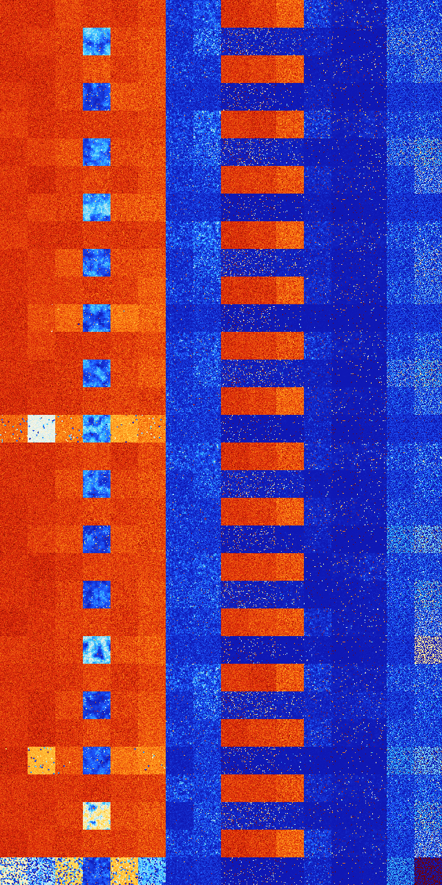

# B18 (132096-132607)

<details>
    <summary>Initial Grid</summary>
    
</details>


<details>
    <summary>Initial Grid RLE</summary>

```
#C Exported from GoGoL (https://github.com/marrow16/gogol)
#C Wrap mode: Toroidal
#C Boundary mode: Dead
#C Step: 0
x = 100, y = 100, rule = B18/S
21bo26bo11b2o33bo$5bo13bo48bo11bo10bo4bo$15bo10bo38b2o4bo$28bo15bo9b2o
21bo9bobo2bo6bo$13b2o11bo11bobo7bo23bo25bo$7bo43bobo25bo7bobo2bo$28bo
10bo21bo28bo$3bo6bo11bo35bobobo7bo$5bo9bo56bo$o52bo13bo8bo9bo2bo$29bo9b
o3bo29bo$6bo3bo63b2o17bobo$bo10bo11bo10bo10bo9bo6bo7bo$21bo15bobo4bo5bo
7bo30bobo$70bo16bo$6bo6b2o19bo10bobo6bo$6bo41bo9bo20bo$12bo2bo$20b2o12b
o9bo3bo17bo4bo3b2o10bo6bo$6bo6bo26bo22bo5bo11bo$bo9bo28bo31bo$36bo37bo$
5bo7bo44bo24bo$6bo16bobo35bo7bo$42bobo3bo46bo$74bo$20bo53bo21bo$4bo14bo
34bo$29bo23bo33bo8bo$69bo$bo17bo30bo14bo11bo18bo$bo12bo22bo3b2o41bo$26b
o35bo20bo$12bo49bo20bo12bo$20bo3b2o8b2o44bo$16bo56bo$19bo13bo28bo$7bo
19bo$6bo23bo39bo12bo$17bo44bo$35bo8bo40bo$2bo2b2o38bo16bo3bo3bo3bo$5bo
31bo15bo44bo$2bo17bo43bobo4bo26bo$bo33bo3b2o8bo41bo$11bobo13bo13bo20bo
9bo25bo$6bo37bo13bo$47bo16bo$22bo3bo13bo7bo2bo7bo17bo14bo$34bo3bo7bo14b
o$5bobo16bo7bobo45bo$38bo7bo37b2o7bo$10bo10bo34bo39bo$29b2o19bobo7bo33b
o$26bo51bo2bobo$18bo2bo10bo18bo45bo$4bo32bo15bo24bo2bo9bo$34bo6bo16bo5b
o16bo11bo$2bo14bo72bo7bo$23bo51bo4bo9bo7bo$5bo2bo13bo5b2o5bo8bo$23bo11b
o49bo2b2o$15bo14b2o25bo$11bo4bo13bo12bo6b2o15bo$16bo7bo5bo3bo20bo$67bo
9bo$13bo37bo4bo$32bo20bo6bo10bo27bo$6bo5bo35b2o41bo$10bo9bo16bo23bo13bo
$35bo2bo$25bo14bo12b2o$21b2o17b2o2bo20bo2bo$37bo24bo14bo$6b2o5bo41bo14b
o21bobobo$14b2o3bo13bo24bo27bo7bo$9bo19bo2bo32bo9bo23bo$2bo42bo8bo25bo
4bo2bo$3bo2bo5bo33bo12bo21bo$24bo3bo4bo42b2obo14bo$37b2o36bo$4bo9bo52bo
23bo$8b2o31bo9bo5bo12bo3bo4bo10bo$bo2bo30bo23bo24bo$11bo45bo$12b2o40bo
13bo21bo2bo$42bo27bo22bo4bo$5bo15bo15bo16b2o21bo$22bo13bo5bo5bo$14bo13b
o13bo2bo$11bo22bo9bo6bo9bo7bo$15b2o5bo44bobo29bo$25b3ob2o5bo2bo52bo$19b
o27bo15bo14bo$3bo21bo59bobo$75bo$2bo7bo4b2o7bo9bo16bo5b2o17bo$11bo32bo
6bobo18bo16bo$84bo7bobo$2bo22bo5bo4bo33bo!
```
</details>
<details>
    <summary>Thumbnail</summary>

</details>
<table>
<tr>
    <td><a href="./132096%20S%20Heat%20Map%20Activity.png"></a><br>S (132096)<br>G>1000</td>    <td><a href="./132097%20S0%20Heat%20Map%20Activity.png"></a><br>S0 (132097)<br>G>1000</td>    <td><a href="./132098%20S1%20Heat%20Map%20Activity.png"></a><br>S1 (132098)<br>G>1000</td>    <td><a href="./132099%20S01%20Heat%20Map%20Activity.png"></a><br>S01 (132099)<br>G>1000</td>    <td><a href="./132100%20S2%20Heat%20Map%20Activity.png"></a><br>S2 (132100)<br>G>1000</td>    <td><a href="./132101%20S02%20Heat%20Map%20Activity.png"></a><br>S02 (132101)<br>G>1000</td>    <td><a href="./132102%20S12%20Heat%20Map%20Activity.png"></a><br>S12 (132102)<br>R@61,p12</td>    <td><a href="./132103%20S012%20Heat%20Map%20Activity.png"></a><br>S012 (132103)<br>R@46,p12</td>    <td><a href="./132104%20S3%20Heat%20Map%20Activity.png"></a><br>S3 (132104)<br>G>1000</td>    <td><a href="./132105%20S03%20Heat%20Map%20Activity.png"></a><br>S03 (132105)<br>G>1000</td>    <td><a href="./132106%20S13%20Heat%20Map%20Activity.png"></a><br>S13 (132106)<br>G>1000</td>    <td><a href="./132107%20S013%20Heat%20Map%20Activity.png"></a><br>S013 (132107)<br>R@79,p12</td>    <td><a href="./132108%20S23%20Heat%20Map%20Activity.png"></a><br>S23 (132108)<br>G>1000</td>    <td><a href="./132109%20S023%20Heat%20Map%20Activity.png"></a><br>S023 (132109)<br>G>1000</td>    <td><a href="./132110%20S123%20Heat%20Map%20Activity.png"></a><br>S123 (132110)<br>R@15,p2</td>    <td><a href="./132111%20S0123%20Heat%20Map%20Activity.png"></a><br>S0123 (132111)<br>R@13,p2</td></tr>
<tr>
    <td><a href="./132112%20S4%20Heat%20Map%20Activity.png"></a><br>S4 (132112)<br>G>1000</td>    <td><a href="./132113%20S04%20Heat%20Map%20Activity.png"></a><br>S04 (132113)<br>G>1000</td>    <td><a href="./132114%20S14%20Heat%20Map%20Activity.png"></a><br>S14 (132114)<br>G>1000</td>    <td><a href="./132115%20S014%20Heat%20Map%20Activity.png"></a><br>S014 (132115)<br>G>1000</td>    <td><a href="./132116%20S24%20Heat%20Map%20Activity.png"></a><br>S24 (132116)<br>G>1000</td>    <td><a href="./132117%20S024%20Heat%20Map%20Activity.png"></a><br>S024 (132117)<br>G>1000</td>    <td><a href="./132118%20S124%20Heat%20Map%20Activity.png"></a><br>S124 (132118)<br>R@40,p12</td>    <td><a href="./132119%20S0124%20Heat%20Map%20Activity.png"></a><br>S0124 (132119)<br>R@21,p4</td>    <td><a href="./132120%20S34%20Heat%20Map%20Activity.png"></a><br>S34 (132120)<br>G>1000</td>    <td><a href="./132121%20S034%20Heat%20Map%20Activity.png"></a><br>S034 (132121)<br>G>1000</td>    <td><a href="./132122%20S134%20Heat%20Map%20Activity.png"></a><br>S134 (132122)<br>G>1000</td>    <td><a href="./132123%20S0134%20Heat%20Map%20Activity.png"></a><br>S0134 (132123)<br>R@126,p60</td>    <td><a href="./132124%20S234%20Heat%20Map%20Activity.png"></a><br>S234 (132124)<br>G>1000</td>    <td><a href="./132125%20S0234%20Heat%20Map%20Activity.png"></a><br>S0234 (132125)<br>R@449,p420</td>    <td><a href="./132126%20S1234%20Heat%20Map%20Activity.png"></a><br>S1234 (132126)<br>S@11</td>    <td><a href="./132127%20S01234%20Heat%20Map%20Activity.png"></a><br>S01234 (132127)<br>S@9</td></tr>
<tr>
    <td><a href="./132128%20S5%20Heat%20Map%20Activity.png"></a><br>S5 (132128)<br>G>1000</td>    <td><a href="./132129%20S05%20Heat%20Map%20Activity.png"></a><br>S05 (132129)<br>G>1000</td>    <td><a href="./132130%20S15%20Heat%20Map%20Activity.png"></a><br>S15 (132130)<br>G>1000</td>    <td><a href="./132131%20S015%20Heat%20Map%20Activity.png"></a><br>S015 (132131)<br>G>1000</td>    <td><a href="./132132%20S25%20Heat%20Map%20Activity.png"></a><br>S25 (132132)<br>G>1000</td>    <td><a href="./132133%20S025%20Heat%20Map%20Activity.png"></a><br>S025 (132133)<br>G>1000</td>    <td><a href="./132134%20S125%20Heat%20Map%20Activity.png"></a><br>S125 (132134)<br>R@46,p12</td>    <td><a href="./132135%20S0125%20Heat%20Map%20Activity.png"></a><br>S0125 (132135)<br>R@41,p6</td>    <td><a href="./132136%20S35%20Heat%20Map%20Activity.png"></a><br>S35 (132136)<br>G>1000</td>    <td><a href="./132137%20S035%20Heat%20Map%20Activity.png"></a><br>S035 (132137)<br>G>1000</td>    <td><a href="./132138%20S135%20Heat%20Map%20Activity.png"></a><br>S135 (132138)<br>G>1000</td>    <td><a href="./132139%20S0135%20Heat%20Map%20Activity.png"></a><br>S0135 (132139)<br>R@478,p420</td>    <td><a href="./132140%20S235%20Heat%20Map%20Activity.png"></a><br>S235 (132140)<br>G>1000</td>    <td><a href="./132141%20S0235%20Heat%20Map%20Activity.png"></a><br>S0235 (132141)<br>G>1000</td>    <td><a href="./132142%20S1235%20Heat%20Map%20Activity.png"></a><br>S1235 (132142)<br>R@13,p2</td>    <td><a href="./132143%20S01235%20Heat%20Map%20Activity.png"></a><br>S01235 (132143)<br>S@8</td></tr>
<tr>
    <td><a href="./132144%20S45%20Heat%20Map%20Activity.png"></a><br>S45 (132144)<br>G>1000</td>    <td><a href="./132145%20S045%20Heat%20Map%20Activity.png"></a><br>S045 (132145)<br>G>1000</td>    <td><a href="./132146%20S145%20Heat%20Map%20Activity.png"></a><br>S145 (132146)<br>G>1000</td>    <td><a href="./132147%20S0145%20Heat%20Map%20Activity.png"></a><br>S0145 (132147)<br>G>1000</td>    <td><a href="./132148%20S245%20Heat%20Map%20Activity.png"></a><br>S245 (132148)<br>G>1000</td>    <td><a href="./132149%20S0245%20Heat%20Map%20Activity.png"></a><br>S0245 (132149)<br>G>1000</td>    <td><a href="./132150%20S1245%20Heat%20Map%20Activity.png"></a><br>S1245 (132150)<br>R@45,p6</td>    <td><a href="./132151%20S01245%20Heat%20Map%20Activity.png"></a><br>S01245 (132151)<br>R@29,p12</td>    <td><a href="./132152%20S345%20Heat%20Map%20Activity.png"></a><br>S345 (132152)<br>G>1000</td>    <td><a href="./132153%20S0345%20Heat%20Map%20Activity.png"></a><br>S0345 (132153)<br>G>1000</td>    <td><a href="./132154%20S1345%20Heat%20Map%20Activity.png"></a><br>S1345 (132154)<br>G>1000</td>    <td><a href="./132155%20S01345%20Heat%20Map%20Activity.png"></a><br>S01345 (132155)<br>R@105,p60</td>    <td><a href="./132156%20S2345%20Heat%20Map%20Activity.png"></a><br>S2345 (132156)<br>R@382,p360</td>    <td><a href="./132157%20S02345%20Heat%20Map%20Activity.png"></a><br>S02345 (132157)<br>R@436,p420</td>    <td><a href="./132158%20S12345%20Heat%20Map%20Activity.png"></a><br>S12345 (132158)<br>R@11,p2</td>    <td><a href="./132159%20S012345%20Heat%20Map%20Activity.png"></a><br>S012345 (132159)<br>R@11,p2</td></tr>
<tr>
    <td><a href="./132160%20S6%20Heat%20Map%20Activity.png"></a><br>S6 (132160)<br>G>1000</td>    <td><a href="./132161%20S06%20Heat%20Map%20Activity.png"></a><br>S06 (132161)<br>G>1000</td>    <td><a href="./132162%20S16%20Heat%20Map%20Activity.png"></a><br>S16 (132162)<br>G>1000</td>    <td><a href="./132163%20S016%20Heat%20Map%20Activity.png"></a><br>S016 (132163)<br>G>1000</td>    <td><a href="./132164%20S26%20Heat%20Map%20Activity.png"></a><br>S26 (132164)<br>G>1000</td>    <td><a href="./132165%20S026%20Heat%20Map%20Activity.png"></a><br>S026 (132165)<br>G>1000</td>    <td><a href="./132166%20S126%20Heat%20Map%20Activity.png"></a><br>S126 (132166)<br>R@56,p12</td>    <td><a href="./132167%20S0126%20Heat%20Map%20Activity.png"></a><br>S0126 (132167)<br>R@36,p4</td>    <td><a href="./132168%20S36%20Heat%20Map%20Activity.png"></a><br>S36 (132168)<br>G>1000</td>    <td><a href="./132169%20S036%20Heat%20Map%20Activity.png"></a><br>S036 (132169)<br>G>1000</td>    <td><a href="./132170%20S136%20Heat%20Map%20Activity.png"></a><br>S136 (132170)<br>G>1000</td>    <td><a href="./132171%20S0136%20Heat%20Map%20Activity.png"></a><br>S0136 (132171)<br>R@65,p12</td>    <td><a href="./132172%20S236%20Heat%20Map%20Activity.png"></a><br>S236 (132172)<br>G>1000</td>    <td><a href="./132173%20S0236%20Heat%20Map%20Activity.png"></a><br>S0236 (132173)<br>R@394,p168</td>    <td><a href="./132174%20S1236%20Heat%20Map%20Activity.png"></a><br>S1236 (132174)<br>R@15,p2</td>    <td><a href="./132175%20S01236%20Heat%20Map%20Activity.png"></a><br>S01236 (132175)<br>R@11,p2</td></tr>
<tr>
    <td><a href="./132176%20S46%20Heat%20Map%20Activity.png"></a><br>S46 (132176)<br>G>1000</td>    <td><a href="./132177%20S046%20Heat%20Map%20Activity.png"></a><br>S046 (132177)<br>G>1000</td>    <td><a href="./132178%20S146%20Heat%20Map%20Activity.png"></a><br>S146 (132178)<br>G>1000</td>    <td><a href="./132179%20S0146%20Heat%20Map%20Activity.png"></a><br>S0146 (132179)<br>G>1000</td>    <td><a href="./132180%20S246%20Heat%20Map%20Activity.png"></a><br>S246 (132180)<br>G>1000</td>    <td><a href="./132181%20S0246%20Heat%20Map%20Activity.png"></a><br>S0246 (132181)<br>G>1000</td>    <td><a href="./132182%20S1246%20Heat%20Map%20Activity.png"></a><br>S1246 (132182)<br>R@29,p4</td>    <td><a href="./132183%20S01246%20Heat%20Map%20Activity.png"></a><br>S01246 (132183)<br>R@18,p2</td>    <td><a href="./132184%20S346%20Heat%20Map%20Activity.png"></a><br>S346 (132184)<br>G>1000</td>    <td><a href="./132185%20S0346%20Heat%20Map%20Activity.png"></a><br>S0346 (132185)<br>G>1000</td>    <td><a href="./132186%20S1346%20Heat%20Map%20Activity.png"></a><br>S1346 (132186)<br>G>1000</td>    <td><a href="./132187%20S01346%20Heat%20Map%20Activity.png"></a><br>S01346 (132187)<br>R@480,p420</td>    <td><a href="./132188%20S2346%20Heat%20Map%20Activity.png"></a><br>S2346 (132188)<br>R@212,p180</td>    <td><a href="./132189%20S02346%20Heat%20Map%20Activity.png"></a><br>S02346 (132189)<br>R@869,p840</td>    <td><a href="./132190%20S12346%20Heat%20Map%20Activity.png"></a><br>S12346 (132190)<br>S@9</td>    <td><a href="./132191%20S012346%20Heat%20Map%20Activity.png"></a><br>S012346 (132191)<br>S@9</td></tr>
<tr>
    <td><a href="./132192%20S56%20Heat%20Map%20Activity.png"></a><br>S56 (132192)<br>G>1000</td>    <td><a href="./132193%20S056%20Heat%20Map%20Activity.png"></a><br>S056 (132193)<br>G>1000</td>    <td><a href="./132194%20S156%20Heat%20Map%20Activity.png"></a><br>S156 (132194)<br>G>1000</td>    <td><a href="./132195%20S0156%20Heat%20Map%20Activity.png"></a><br>S0156 (132195)<br>G>1000</td>    <td><a href="./132196%20S256%20Heat%20Map%20Activity.png"></a><br>S256 (132196)<br>G>1000</td>    <td><a href="./132197%20S0256%20Heat%20Map%20Activity.png"></a><br>S0256 (132197)<br>G>1000</td>    <td><a href="./132198%20S1256%20Heat%20Map%20Activity.png"></a><br>S1256 (132198)<br>R@48,p12</td>    <td><a href="./132199%20S01256%20Heat%20Map%20Activity.png"></a><br>S01256 (132199)<br>R@29,p6</td>    <td><a href="./132200%20S356%20Heat%20Map%20Activity.png"></a><br>S356 (132200)<br>G>1000</td>    <td><a href="./132201%20S0356%20Heat%20Map%20Activity.png"></a><br>S0356 (132201)<br>G>1000</td>    <td><a href="./132202%20S1356%20Heat%20Map%20Activity.png"></a><br>S1356 (132202)<br>G>1000</td>    <td><a href="./132203%20S01356%20Heat%20Map%20Activity.png"></a><br>S01356 (132203)<br>R@141,p60</td>    <td><a href="./132204%20S2356%20Heat%20Map%20Activity.png"></a><br>S2356 (132204)<br>G>1000</td>    <td><a href="./132205%20S02356%20Heat%20Map%20Activity.png"></a><br>S02356 (132205)<br>G>1000</td>    <td><a href="./132206%20S12356%20Heat%20Map%20Activity.png"></a><br>S12356 (132206)<br>R@16,p2</td>    <td><a href="./132207%20S012356%20Heat%20Map%20Activity.png"></a><br>S012356 (132207)<br>S@10</td></tr>
<tr>
    <td><a href="./132208%20S456%20Heat%20Map%20Activity.png"></a><br>S456 (132208)<br>G>1000</td>    <td><a href="./132209%20S0456%20Heat%20Map%20Activity.png"></a><br>S0456 (132209)<br>G>1000</td>    <td><a href="./132210%20S1456%20Heat%20Map%20Activity.png"></a><br>S1456 (132210)<br>G>1000</td>    <td><a href="./132211%20S01456%20Heat%20Map%20Activity.png"></a><br>S01456 (132211)<br>G>1000</td>    <td><a href="./132212%20S2456%20Heat%20Map%20Activity.png"></a><br>S2456 (132212)<br>G>1000</td>    <td><a href="./132213%20S02456%20Heat%20Map%20Activity.png"></a><br>S02456 (132213)<br>G>1000</td>    <td><a href="./132214%20S12456%20Heat%20Map%20Activity.png"></a><br>S12456 (132214)<br>R@47,p12</td>    <td><a href="./132215%20S012456%20Heat%20Map%20Activity.png"></a><br>S012456 (132215)<br>R@27,p2</td>    <td><a href="./132216%20S3456%20Heat%20Map%20Activity.png"></a><br>S3456 (132216)<br>G>1000</td>    <td><a href="./132217%20S03456%20Heat%20Map%20Activity.png"></a><br>S03456 (132217)<br>G>1000</td>    <td><a href="./132218%20S13456%20Heat%20Map%20Activity.png"></a><br>S13456 (132218)<br>G>1000</td>    <td><a href="./132219%20S013456%20Heat%20Map%20Activity.png"></a><br>S013456 (132219)<br>R@96,p60</td>    <td><a href="./132220%20S23456%20Heat%20Map%20Activity.png"></a><br>S23456 (132220)<br>R@382,p360</td>    <td><a href="./132221%20S023456%20Heat%20Map%20Activity.png"></a><br>S023456 (132221)<br>R@99,p84</td>    <td><a href="./132222%20S123456%20Heat%20Map%20Activity.png"></a><br>S123456 (132222)<br>R@11,p2</td>    <td><a href="./132223%20S0123456%20Heat%20Map%20Activity.png"></a><br>S0123456 (132223)<br>R@11,p2</td></tr>
<tr>
    <td><a href="./132224%20S7%20Heat%20Map%20Activity.png"></a><br>S7 (132224)<br>G>1000</td>    <td><a href="./132225%20S07%20Heat%20Map%20Activity.png"></a><br>S07 (132225)<br>G>1000</td>    <td><a href="./132226%20S17%20Heat%20Map%20Activity.png"></a><br>S17 (132226)<br>G>1000</td>    <td><a href="./132227%20S017%20Heat%20Map%20Activity.png"></a><br>S017 (132227)<br>G>1000</td>    <td><a href="./132228%20S27%20Heat%20Map%20Activity.png"></a><br>S27 (132228)<br>G>1000</td>    <td><a href="./132229%20S027%20Heat%20Map%20Activity.png"></a><br>S027 (132229)<br>G>1000</td>    <td><a href="./132230%20S127%20Heat%20Map%20Activity.png"></a><br>S127 (132230)<br>R@48,p12</td>    <td><a href="./132231%20S0127%20Heat%20Map%20Activity.png"></a><br>S0127 (132231)<br>R@40,p4</td>    <td><a href="./132232%20S37%20Heat%20Map%20Activity.png"></a><br>S37 (132232)<br>G>1000</td>    <td><a href="./132233%20S037%20Heat%20Map%20Activity.png"></a><br>S037 (132233)<br>G>1000</td>    <td><a href="./132234%20S137%20Heat%20Map%20Activity.png"></a><br>S137 (132234)<br>G>1000</td>    <td><a href="./132235%20S0137%20Heat%20Map%20Activity.png"></a><br>S0137 (132235)<br>R@113,p60</td>    <td><a href="./132236%20S237%20Heat%20Map%20Activity.png"></a><br>S237 (132236)<br>G>1000</td>    <td><a href="./132237%20S0237%20Heat%20Map%20Activity.png"></a><br>S0237 (132237)<br>G>1000</td>    <td><a href="./132238%20S1237%20Heat%20Map%20Activity.png"></a><br>S1237 (132238)<br>R@14,p2</td>    <td><a href="./132239%20S01237%20Heat%20Map%20Activity.png"></a><br>S01237 (132239)<br>R@13,p2</td></tr>
<tr>
    <td><a href="./132240%20S47%20Heat%20Map%20Activity.png"></a><br>S47 (132240)<br>G>1000</td>    <td><a href="./132241%20S047%20Heat%20Map%20Activity.png"></a><br>S047 (132241)<br>G>1000</td>    <td><a href="./132242%20S147%20Heat%20Map%20Activity.png"></a><br>S147 (132242)<br>G>1000</td>    <td><a href="./132243%20S0147%20Heat%20Map%20Activity.png"></a><br>S0147 (132243)<br>G>1000</td>    <td><a href="./132244%20S247%20Heat%20Map%20Activity.png"></a><br>S247 (132244)<br>G>1000</td>    <td><a href="./132245%20S0247%20Heat%20Map%20Activity.png"></a><br>S0247 (132245)<br>G>1000</td>    <td><a href="./132246%20S1247%20Heat%20Map%20Activity.png"></a><br>S1247 (132246)<br>R@38,p12</td>    <td><a href="./132247%20S01247%20Heat%20Map%20Activity.png"></a><br>S01247 (132247)<br>R@20,p2</td>    <td><a href="./132248%20S347%20Heat%20Map%20Activity.png"></a><br>S347 (132248)<br>G>1000</td>    <td><a href="./132249%20S0347%20Heat%20Map%20Activity.png"></a><br>S0347 (132249)<br>G>1000</td>    <td><a href="./132250%20S1347%20Heat%20Map%20Activity.png"></a><br>S1347 (132250)<br>G>1000</td>    <td><a href="./132251%20S01347%20Heat%20Map%20Activity.png"></a><br>S01347 (132251)<br>R@117,p60</td>    <td><a href="./132252%20S2347%20Heat%20Map%20Activity.png"></a><br>S2347 (132252)<br>R@212,p180</td>    <td><a href="./132253%20S02347%20Heat%20Map%20Activity.png"></a><br>S02347 (132253)<br>R@153,p120</td>    <td><a href="./132254%20S12347%20Heat%20Map%20Activity.png"></a><br>S12347 (132254)<br>R@13,p2</td>    <td><a href="./132255%20S012347%20Heat%20Map%20Activity.png"></a><br>S012347 (132255)<br>S@9</td></tr>
<tr>
    <td><a href="./132256%20S57%20Heat%20Map%20Activity.png"></a><br>S57 (132256)<br>G>1000</td>    <td><a href="./132257%20S057%20Heat%20Map%20Activity.png"></a><br>S057 (132257)<br>G>1000</td>    <td><a href="./132258%20S157%20Heat%20Map%20Activity.png"></a><br>S157 (132258)<br>G>1000</td>    <td><a href="./132259%20S0157%20Heat%20Map%20Activity.png"></a><br>S0157 (132259)<br>G>1000</td>    <td><a href="./132260%20S257%20Heat%20Map%20Activity.png"></a><br>S257 (132260)<br>G>1000</td>    <td><a href="./132261%20S0257%20Heat%20Map%20Activity.png"></a><br>S0257 (132261)<br>G>1000</td>    <td><a href="./132262%20S1257%20Heat%20Map%20Activity.png"></a><br>S1257 (132262)<br>R@45,p12</td>    <td><a href="./132263%20S01257%20Heat%20Map%20Activity.png"></a><br>S01257 (132263)<br>R@30,p6</td>    <td><a href="./132264%20S357%20Heat%20Map%20Activity.png"></a><br>S357 (132264)<br>G>1000</td>    <td><a href="./132265%20S0357%20Heat%20Map%20Activity.png"></a><br>S0357 (132265)<br>G>1000</td>    <td><a href="./132266%20S1357%20Heat%20Map%20Activity.png"></a><br>S1357 (132266)<br>G>1000</td>    <td><a href="./132267%20S01357%20Heat%20Map%20Activity.png"></a><br>S01357 (132267)<br>R@106,p28</td>    <td><a href="./132268%20S2357%20Heat%20Map%20Activity.png"></a><br>S2357 (132268)<br>G>1000</td>    <td><a href="./132269%20S02357%20Heat%20Map%20Activity.png"></a><br>S02357 (132269)<br>G>1000</td>    <td><a href="./132270%20S12357%20Heat%20Map%20Activity.png"></a><br>S12357 (132270)<br>R@13,p2</td>    <td><a href="./132271%20S012357%20Heat%20Map%20Activity.png"></a><br>S012357 (132271)<br>S@8</td></tr>
<tr>
    <td><a href="./132272%20S457%20Heat%20Map%20Activity.png"></a><br>S457 (132272)<br>G>1000</td>    <td><a href="./132273%20S0457%20Heat%20Map%20Activity.png"></a><br>S0457 (132273)<br>G>1000</td>    <td><a href="./132274%20S1457%20Heat%20Map%20Activity.png"></a><br>S1457 (132274)<br>G>1000</td>    <td><a href="./132275%20S01457%20Heat%20Map%20Activity.png"></a><br>S01457 (132275)<br>G>1000</td>    <td><a href="./132276%20S2457%20Heat%20Map%20Activity.png"></a><br>S2457 (132276)<br>G>1000</td>    <td><a href="./132277%20S02457%20Heat%20Map%20Activity.png"></a><br>S02457 (132277)<br>G>1000</td>    <td><a href="./132278%20S12457%20Heat%20Map%20Activity.png"></a><br>S12457 (132278)<br>R@62,p30</td>    <td><a href="./132279%20S012457%20Heat%20Map%20Activity.png"></a><br>S012457 (132279)<br>R@28,p12</td>    <td><a href="./132280%20S3457%20Heat%20Map%20Activity.png"></a><br>S3457 (132280)<br>G>1000</td>    <td><a href="./132281%20S03457%20Heat%20Map%20Activity.png"></a><br>S03457 (132281)<br>G>1000</td>    <td><a href="./132282%20S13457%20Heat%20Map%20Activity.png"></a><br>S13457 (132282)<br>G>1000</td>    <td><a href="./132283%20S013457%20Heat%20Map%20Activity.png"></a><br>S013457 (132283)<br>R@466,p420</td>    <td><a href="./132284%20S23457%20Heat%20Map%20Activity.png"></a><br>S23457 (132284)<br>R@382,p360</td>    <td><a href="./132285%20S023457%20Heat%20Map%20Activity.png"></a><br>S023457 (132285)<br>R@436,p420</td>    <td><a href="./132286%20S123457%20Heat%20Map%20Activity.png"></a><br>S123457 (132286)<br>R@11,p2</td>    <td><a href="./132287%20S0123457%20Heat%20Map%20Activity.png"></a><br>S0123457 (132287)<br>R@11,p2</td></tr>
<tr>
    <td><a href="./132288%20S67%20Heat%20Map%20Activity.png"></a><br>S67 (132288)<br>G>1000</td>    <td><a href="./132289%20S067%20Heat%20Map%20Activity.png"></a><br>S067 (132289)<br>G>1000</td>    <td><a href="./132290%20S167%20Heat%20Map%20Activity.png"></a><br>S167 (132290)<br>G>1000</td>    <td><a href="./132291%20S0167%20Heat%20Map%20Activity.png"></a><br>S0167 (132291)<br>G>1000</td>    <td><a href="./132292%20S267%20Heat%20Map%20Activity.png"></a><br>S267 (132292)<br>G>1000</td>    <td><a href="./132293%20S0267%20Heat%20Map%20Activity.png"></a><br>S0267 (132293)<br>G>1000</td>    <td><a href="./132294%20S1267%20Heat%20Map%20Activity.png"></a><br>S1267 (132294)<br>R@55,p12</td>    <td><a href="./132295%20S01267%20Heat%20Map%20Activity.png"></a><br>S01267 (132295)<br>R@42,p6</td>    <td><a href="./132296%20S367%20Heat%20Map%20Activity.png"></a><br>S367 (132296)<br>G>1000</td>    <td><a href="./132297%20S0367%20Heat%20Map%20Activity.png"></a><br>S0367 (132297)<br>G>1000</td>    <td><a href="./132298%20S1367%20Heat%20Map%20Activity.png"></a><br>S1367 (132298)<br>G>1000</td>    <td><a href="./132299%20S01367%20Heat%20Map%20Activity.png"></a><br>S01367 (132299)<br>R@78,p12</td>    <td><a href="./132300%20S2367%20Heat%20Map%20Activity.png"></a><br>S2367 (132300)<br>G>1000</td>    <td><a href="./132301%20S02367%20Heat%20Map%20Activity.png"></a><br>S02367 (132301)<br>G>1000</td>    <td><a href="./132302%20S12367%20Heat%20Map%20Activity.png"></a><br>S12367 (132302)<br>R@15,p2</td>    <td><a href="./132303%20S012367%20Heat%20Map%20Activity.png"></a><br>S012367 (132303)<br>R@11,p2</td></tr>
<tr>
    <td><a href="./132304%20S467%20Heat%20Map%20Activity.png"></a><br>S467 (132304)<br>G>1000</td>    <td><a href="./132305%20S0467%20Heat%20Map%20Activity.png"></a><br>S0467 (132305)<br>G>1000</td>    <td><a href="./132306%20S1467%20Heat%20Map%20Activity.png"></a><br>S1467 (132306)<br>G>1000</td>    <td><a href="./132307%20S01467%20Heat%20Map%20Activity.png"></a><br>S01467 (132307)<br>G>1000</td>    <td><a href="./132308%20S2467%20Heat%20Map%20Activity.png"></a><br>S2467 (132308)<br>G>1000</td>    <td><a href="./132309%20S02467%20Heat%20Map%20Activity.png"></a><br>S02467 (132309)<br>G>1000</td>    <td><a href="./132310%20S12467%20Heat%20Map%20Activity.png"></a><br>S12467 (132310)<br>R@40,p12</td>    <td><a href="./132311%20S012467%20Heat%20Map%20Activity.png"></a><br>S012467 (132311)<br>R@20,p4</td>    <td><a href="./132312%20S3467%20Heat%20Map%20Activity.png"></a><br>S3467 (132312)<br>G>1000</td>    <td><a href="./132313%20S03467%20Heat%20Map%20Activity.png"></a><br>S03467 (132313)<br>G>1000</td>    <td><a href="./132314%20S13467%20Heat%20Map%20Activity.png"></a><br>S13467 (132314)<br>G>1000</td>    <td><a href="./132315%20S013467%20Heat%20Map%20Activity.png"></a><br>S013467 (132315)<br>R@170,p120</td>    <td><a href="./132316%20S23467%20Heat%20Map%20Activity.png"></a><br>S23467 (132316)<br>G>1000</td>    <td><a href="./132317%20S023467%20Heat%20Map%20Activity.png"></a><br>S023467 (132317)<br>R@875,p840</td>    <td><a href="./132318%20S123467%20Heat%20Map%20Activity.png"></a><br>S123467 (132318)<br>S@9</td>    <td><a href="./132319%20S0123467%20Heat%20Map%20Activity.png"></a><br>S0123467 (132319)<br>S@9</td></tr>
<tr>
    <td><a href="./132320%20S567%20Heat%20Map%20Activity.png"></a><br>S567 (132320)<br>G>1000</td>    <td><a href="./132321%20S0567%20Heat%20Map%20Activity.png"></a><br>S0567 (132321)<br>G>1000</td>    <td><a href="./132322%20S1567%20Heat%20Map%20Activity.png"></a><br>S1567 (132322)<br>G>1000</td>    <td><a href="./132323%20S01567%20Heat%20Map%20Activity.png"></a><br>S01567 (132323)<br>G>1000</td>    <td><a href="./132324%20S2567%20Heat%20Map%20Activity.png"></a><br>S2567 (132324)<br>G>1000</td>    <td><a href="./132325%20S02567%20Heat%20Map%20Activity.png"></a><br>S02567 (132325)<br>G>1000</td>    <td><a href="./132326%20S12567%20Heat%20Map%20Activity.png"></a><br>S12567 (132326)<br>R@43,p4</td>    <td><a href="./132327%20S012567%20Heat%20Map%20Activity.png"></a><br>S012567 (132327)<br>R@35,p12</td>    <td><a href="./132328%20S3567%20Heat%20Map%20Activity.png"></a><br>S3567 (132328)<br>G>1000</td>    <td><a href="./132329%20S03567%20Heat%20Map%20Activity.png"></a><br>S03567 (132329)<br>G>1000</td>    <td><a href="./132330%20S13567%20Heat%20Map%20Activity.png"></a><br>S13567 (132330)<br>G>1000</td>    <td><a href="./132331%20S013567%20Heat%20Map%20Activity.png"></a><br>S013567 (132331)<br>R@146,p84</td>    <td><a href="./132332%20S23567%20Heat%20Map%20Activity.png"></a><br>S23567 (132332)<br>G>1000</td>    <td><a href="./132333%20S023567%20Heat%20Map%20Activity.png"></a><br>S023567 (132333)<br>G>1000</td>    <td><a href="./132334%20S123567%20Heat%20Map%20Activity.png"></a><br>S123567 (132334)<br>R@16,p2</td>    <td><a href="./132335%20S0123567%20Heat%20Map%20Activity.png"></a><br>S0123567 (132335)<br>S@10</td></tr>
<tr>
    <td><a href="./132336%20S4567%20Heat%20Map%20Activity.png"></a><br>S4567 (132336)<br>G>1000</td>    <td><a href="./132337%20S04567%20Heat%20Map%20Activity.png"></a><br>S04567 (132337)<br>G>1000</td>    <td><a href="./132338%20S14567%20Heat%20Map%20Activity.png"></a><br>S14567 (132338)<br>G>1000</td>    <td><a href="./132339%20S014567%20Heat%20Map%20Activity.png"></a><br>S014567 (132339)<br>G>1000</td>    <td><a href="./132340%20S24567%20Heat%20Map%20Activity.png"></a><br>S24567 (132340)<br>G>1000</td>    <td><a href="./132341%20S024567%20Heat%20Map%20Activity.png"></a><br>S024567 (132341)<br>G>1000</td>    <td><a href="./132342%20S124567%20Heat%20Map%20Activity.png"></a><br>S124567 (132342)<br>R@37,p4</td>    <td><a href="./132343%20S0124567%20Heat%20Map%20Activity.png"></a><br>S0124567 (132343)<br>R@25,p2</td>    <td><a href="./132344%20S34567%20Heat%20Map%20Activity.png"></a><br>S34567 (132344)<br>G>1000</td>    <td><a href="./132345%20S034567%20Heat%20Map%20Activity.png"></a><br>S034567 (132345)<br>G>1000</td>    <td><a href="./132346%20S134567%20Heat%20Map%20Activity.png"></a><br>S134567 (132346)<br>G>1000</td>    <td><a href="./132347%20S0134567%20Heat%20Map%20Activity.png"></a><br>S0134567 (132347)<br>R@37,p4</td>    <td><a href="./132348%20S234567%20Heat%20Map%20Activity.png"></a><br>S234567 (132348)<br>R@382,p360</td>    <td><a href="./132349%20S0234567%20Heat%20Map%20Activity.png"></a><br>S0234567 (132349)<br>R@99,p84</td>    <td><a href="./132350%20S1234567%20Heat%20Map%20Activity.png"></a><br>S1234567 (132350)<br>R@11,p2</td>    <td><a href="./132351%20S01234567%20Heat%20Map%20Activity.png"></a><br>S01234567 (132351)<br>R@11,p2</td></tr>
<tr>
    <td><a href="./132352%20S8%20Heat%20Map%20Activity.png"></a><br>S8 (132352)<br>G>1000</td>    <td><a href="./132353%20S08%20Heat%20Map%20Activity.png"></a><br>S08 (132353)<br>G>1000</td>    <td><a href="./132354%20S18%20Heat%20Map%20Activity.png"></a><br>S18 (132354)<br>G>1000</td>    <td><a href="./132355%20S018%20Heat%20Map%20Activity.png"></a><br>S018 (132355)<br>G>1000</td>    <td><a href="./132356%20S28%20Heat%20Map%20Activity.png"></a><br>S28 (132356)<br>G>1000</td>    <td><a href="./132357%20S028%20Heat%20Map%20Activity.png"></a><br>S028 (132357)<br>G>1000</td>    <td><a href="./132358%20S128%20Heat%20Map%20Activity.png"></a><br>S128 (132358)<br>R@45,p12</td>    <td><a href="./132359%20S0128%20Heat%20Map%20Activity.png"></a><br>S0128 (132359)<br>R@53,p12</td>    <td><a href="./132360%20S38%20Heat%20Map%20Activity.png"></a><br>S38 (132360)<br>G>1000</td>    <td><a href="./132361%20S038%20Heat%20Map%20Activity.png"></a><br>S038 (132361)<br>G>1000</td>    <td><a href="./132362%20S138%20Heat%20Map%20Activity.png"></a><br>S138 (132362)<br>G>1000</td>    <td><a href="./132363%20S0138%20Heat%20Map%20Activity.png"></a><br>S0138 (132363)<br>R@136,p60</td>    <td><a href="./132364%20S238%20Heat%20Map%20Activity.png"></a><br>S238 (132364)<br>G>1000</td>    <td><a href="./132365%20S0238%20Heat%20Map%20Activity.png"></a><br>S0238 (132365)<br>R@724,p420</td>    <td><a href="./132366%20S1238%20Heat%20Map%20Activity.png"></a><br>S1238 (132366)<br>R@15,p2</td>    <td><a href="./132367%20S01238%20Heat%20Map%20Activity.png"></a><br>S01238 (132367)<br>S@11</td></tr>
<tr>
    <td><a href="./132368%20S48%20Heat%20Map%20Activity.png"></a><br>S48 (132368)<br>G>1000</td>    <td><a href="./132369%20S048%20Heat%20Map%20Activity.png"></a><br>S048 (132369)<br>G>1000</td>    <td><a href="./132370%20S148%20Heat%20Map%20Activity.png"></a><br>S148 (132370)<br>G>1000</td>    <td><a href="./132371%20S0148%20Heat%20Map%20Activity.png"></a><br>S0148 (132371)<br>G>1000</td>    <td><a href="./132372%20S248%20Heat%20Map%20Activity.png"></a><br>S248 (132372)<br>G>1000</td>    <td><a href="./132373%20S0248%20Heat%20Map%20Activity.png"></a><br>S0248 (132373)<br>G>1000</td>    <td><a href="./132374%20S1248%20Heat%20Map%20Activity.png"></a><br>S1248 (132374)<br>R@37,p12</td>    <td><a href="./132375%20S01248%20Heat%20Map%20Activity.png"></a><br>S01248 (132375)<br>R@25,p2</td>    <td><a href="./132376%20S348%20Heat%20Map%20Activity.png"></a><br>S348 (132376)<br>G>1000</td>    <td><a href="./132377%20S0348%20Heat%20Map%20Activity.png"></a><br>S0348 (132377)<br>G>1000</td>    <td><a href="./132378%20S1348%20Heat%20Map%20Activity.png"></a><br>S1348 (132378)<br>G>1000</td>    <td><a href="./132379%20S01348%20Heat%20Map%20Activity.png"></a><br>S01348 (132379)<br>R@476,p420</td>    <td><a href="./132380%20S2348%20Heat%20Map%20Activity.png"></a><br>S2348 (132380)<br>G>1000</td>    <td><a href="./132381%20S02348%20Heat%20Map%20Activity.png"></a><br>S02348 (132381)<br>R@198,p168</td>    <td><a href="./132382%20S12348%20Heat%20Map%20Activity.png"></a><br>S12348 (132382)<br>R@13,p2</td>    <td><a href="./132383%20S012348%20Heat%20Map%20Activity.png"></a><br>S012348 (132383)<br>S@9</td></tr>
<tr>
    <td><a href="./132384%20S58%20Heat%20Map%20Activity.png"></a><br>S58 (132384)<br>G>1000</td>    <td><a href="./132385%20S058%20Heat%20Map%20Activity.png"></a><br>S058 (132385)<br>G>1000</td>    <td><a href="./132386%20S158%20Heat%20Map%20Activity.png"></a><br>S158 (132386)<br>G>1000</td>    <td><a href="./132387%20S0158%20Heat%20Map%20Activity.png"></a><br>S0158 (132387)<br>G>1000</td>    <td><a href="./132388%20S258%20Heat%20Map%20Activity.png"></a><br>S258 (132388)<br>G>1000</td>    <td><a href="./132389%20S0258%20Heat%20Map%20Activity.png"></a><br>S0258 (132389)<br>G>1000</td>    <td><a href="./132390%20S1258%20Heat%20Map%20Activity.png"></a><br>S1258 (132390)<br>R@46,p12</td>    <td><a href="./132391%20S01258%20Heat%20Map%20Activity.png"></a><br>S01258 (132391)<br>R@35,p12</td>    <td><a href="./132392%20S358%20Heat%20Map%20Activity.png"></a><br>S358 (132392)<br>G>1000</td>    <td><a href="./132393%20S0358%20Heat%20Map%20Activity.png"></a><br>S0358 (132393)<br>G>1000</td>    <td><a href="./132394%20S1358%20Heat%20Map%20Activity.png"></a><br>S1358 (132394)<br>G>1000</td>    <td><a href="./132395%20S01358%20Heat%20Map%20Activity.png"></a><br>S01358 (132395)<br>R@122,p60</td>    <td><a href="./132396%20S2358%20Heat%20Map%20Activity.png"></a><br>S2358 (132396)<br>G>1000</td>    <td><a href="./132397%20S02358%20Heat%20Map%20Activity.png"></a><br>S02358 (132397)<br>G>1000</td>    <td><a href="./132398%20S12358%20Heat%20Map%20Activity.png"></a><br>S12358 (132398)<br>R@13,p2</td>    <td><a href="./132399%20S012358%20Heat%20Map%20Activity.png"></a><br>S012358 (132399)<br>R@13,p2</td></tr>
<tr>
    <td><a href="./132400%20S458%20Heat%20Map%20Activity.png"></a><br>S458 (132400)<br>G>1000</td>    <td><a href="./132401%20S0458%20Heat%20Map%20Activity.png"></a><br>S0458 (132401)<br>G>1000</td>    <td><a href="./132402%20S1458%20Heat%20Map%20Activity.png"></a><br>S1458 (132402)<br>G>1000</td>    <td><a href="./132403%20S01458%20Heat%20Map%20Activity.png"></a><br>S01458 (132403)<br>R@866,p120</td>    <td><a href="./132404%20S2458%20Heat%20Map%20Activity.png"></a><br>S2458 (132404)<br>G>1000</td>    <td><a href="./132405%20S02458%20Heat%20Map%20Activity.png"></a><br>S02458 (132405)<br>G>1000</td>    <td><a href="./132406%20S12458%20Heat%20Map%20Activity.png"></a><br>S12458 (132406)<br>R@32,p2</td>    <td><a href="./132407%20S012458%20Heat%20Map%20Activity.png"></a><br>S012458 (132407)<br>R@22,p6</td>    <td><a href="./132408%20S3458%20Heat%20Map%20Activity.png"></a><br>S3458 (132408)<br>G>1000</td>    <td><a href="./132409%20S03458%20Heat%20Map%20Activity.png"></a><br>S03458 (132409)<br>G>1000</td>    <td><a href="./132410%20S13458%20Heat%20Map%20Activity.png"></a><br>S13458 (132410)<br>G>1000</td>    <td><a href="./132411%20S013458%20Heat%20Map%20Activity.png"></a><br>S013458 (132411)<br>R@101,p60</td>    <td><a href="./132412%20S23458%20Heat%20Map%20Activity.png"></a><br>S23458 (132412)<br>R@382,p360</td>    <td><a href="./132413%20S023458%20Heat%20Map%20Activity.png"></a><br>S023458 (132413)<br>R@436,p420</td>    <td><a href="./132414%20S123458%20Heat%20Map%20Activity.png"></a><br>S123458 (132414)<br>S@9</td>    <td><a href="./132415%20S0123458%20Heat%20Map%20Activity.png"></a><br>S0123458 (132415)<br>S@9</td></tr>
<tr>
    <td><a href="./132416%20S68%20Heat%20Map%20Activity.png"></a><br>S68 (132416)<br>G>1000</td>    <td><a href="./132417%20S068%20Heat%20Map%20Activity.png"></a><br>S068 (132417)<br>G>1000</td>    <td><a href="./132418%20S168%20Heat%20Map%20Activity.png"></a><br>S168 (132418)<br>G>1000</td>    <td><a href="./132419%20S0168%20Heat%20Map%20Activity.png"></a><br>S0168 (132419)<br>G>1000</td>    <td><a href="./132420%20S268%20Heat%20Map%20Activity.png"></a><br>S268 (132420)<br>G>1000</td>    <td><a href="./132421%20S0268%20Heat%20Map%20Activity.png"></a><br>S0268 (132421)<br>G>1000</td>    <td><a href="./132422%20S1268%20Heat%20Map%20Activity.png"></a><br>S1268 (132422)<br>R@56,p12</td>    <td><a href="./132423%20S01268%20Heat%20Map%20Activity.png"></a><br>S01268 (132423)<br>R@48,p12</td>    <td><a href="./132424%20S368%20Heat%20Map%20Activity.png"></a><br>S368 (132424)<br>G>1000</td>    <td><a href="./132425%20S0368%20Heat%20Map%20Activity.png"></a><br>S0368 (132425)<br>G>1000</td>    <td><a href="./132426%20S1368%20Heat%20Map%20Activity.png"></a><br>S1368 (132426)<br>G>1000</td>    <td><a href="./132427%20S01368%20Heat%20Map%20Activity.png"></a><br>S01368 (132427)<br>R@987,p924</td>    <td><a href="./132428%20S2368%20Heat%20Map%20Activity.png"></a><br>S2368 (132428)<br>G>1000</td>    <td><a href="./132429%20S02368%20Heat%20Map%20Activity.png"></a><br>S02368 (132429)<br>R@322,p48</td>    <td><a href="./132430%20S12368%20Heat%20Map%20Activity.png"></a><br>S12368 (132430)<br>R@15,p2</td>    <td><a href="./132431%20S012368%20Heat%20Map%20Activity.png"></a><br>S012368 (132431)<br>R@11,p2</td></tr>
<tr>
    <td><a href="./132432%20S468%20Heat%20Map%20Activity.png"></a><br>S468 (132432)<br>G>1000</td>    <td><a href="./132433%20S0468%20Heat%20Map%20Activity.png"></a><br>S0468 (132433)<br>G>1000</td>    <td><a href="./132434%20S1468%20Heat%20Map%20Activity.png"></a><br>S1468 (132434)<br>G>1000</td>    <td><a href="./132435%20S01468%20Heat%20Map%20Activity.png"></a><br>S01468 (132435)<br>G>1000</td>    <td><a href="./132436%20S2468%20Heat%20Map%20Activity.png"></a><br>S2468 (132436)<br>G>1000</td>    <td><a href="./132437%20S02468%20Heat%20Map%20Activity.png"></a><br>S02468 (132437)<br>G>1000</td>    <td><a href="./132438%20S12468%20Heat%20Map%20Activity.png"></a><br>S12468 (132438)<br>R@27,p2</td>    <td><a href="./132439%20S012468%20Heat%20Map%20Activity.png"></a><br>S012468 (132439)<br>R@21,p4</td>    <td><a href="./132440%20S3468%20Heat%20Map%20Activity.png"></a><br>S3468 (132440)<br>G>1000</td>    <td><a href="./132441%20S03468%20Heat%20Map%20Activity.png"></a><br>S03468 (132441)<br>G>1000</td>    <td><a href="./132442%20S13468%20Heat%20Map%20Activity.png"></a><br>S13468 (132442)<br>G>1000</td>    <td><a href="./132443%20S013468%20Heat%20Map%20Activity.png"></a><br>S013468 (132443)<br>G>1000</td>    <td><a href="./132444%20S23468%20Heat%20Map%20Activity.png"></a><br>S23468 (132444)<br>R@218,p180</td>    <td><a href="./132445%20S023468%20Heat%20Map%20Activity.png"></a><br>S023468 (132445)<br>R@113,p84</td>    <td><a href="./132446%20S123468%20Heat%20Map%20Activity.png"></a><br>S123468 (132446)<br>R@11,p2</td>    <td><a href="./132447%20S0123468%20Heat%20Map%20Activity.png"></a><br>S0123468 (132447)<br>S@9</td></tr>
<tr>
    <td><a href="./132448%20S568%20Heat%20Map%20Activity.png"></a><br>S568 (132448)<br>G>1000</td>    <td><a href="./132449%20S0568%20Heat%20Map%20Activity.png"></a><br>S0568 (132449)<br>G>1000</td>    <td><a href="./132450%20S1568%20Heat%20Map%20Activity.png"></a><br>S1568 (132450)<br>G>1000</td>    <td><a href="./132451%20S01568%20Heat%20Map%20Activity.png"></a><br>S01568 (132451)<br>G>1000</td>    <td><a href="./132452%20S2568%20Heat%20Map%20Activity.png"></a><br>S2568 (132452)<br>G>1000</td>    <td><a href="./132453%20S02568%20Heat%20Map%20Activity.png"></a><br>S02568 (132453)<br>G>1000</td>    <td><a href="./132454%20S12568%20Heat%20Map%20Activity.png"></a><br>S12568 (132454)<br>R@48,p12</td>    <td><a href="./132455%20S012568%20Heat%20Map%20Activity.png"></a><br>S012568 (132455)<br>R@31,p6</td>    <td><a href="./132456%20S3568%20Heat%20Map%20Activity.png"></a><br>S3568 (132456)<br>G>1000</td>    <td><a href="./132457%20S03568%20Heat%20Map%20Activity.png"></a><br>S03568 (132457)<br>G>1000</td>    <td><a href="./132458%20S13568%20Heat%20Map%20Activity.png"></a><br>S13568 (132458)<br>G>1000</td>    <td><a href="./132459%20S013568%20Heat%20Map%20Activity.png"></a><br>S013568 (132459)<br>R@102,p12</td>    <td><a href="./132460%20S23568%20Heat%20Map%20Activity.png"></a><br>S23568 (132460)<br>G>1000</td>    <td><a href="./132461%20S023568%20Heat%20Map%20Activity.png"></a><br>S023568 (132461)<br>G>1000</td>    <td><a href="./132462%20S123568%20Heat%20Map%20Activity.png"></a><br>S123568 (132462)<br>R@16,p2</td>    <td><a href="./132463%20S0123568%20Heat%20Map%20Activity.png"></a><br>S0123568 (132463)<br>S@10</td></tr>
<tr>
    <td><a href="./132464%20S4568%20Heat%20Map%20Activity.png"></a><br>S4568 (132464)<br>G>1000</td>    <td><a href="./132465%20S04568%20Heat%20Map%20Activity.png"></a><br>S04568 (132465)<br>G>1000</td>    <td><a href="./132466%20S14568%20Heat%20Map%20Activity.png"></a><br>S14568 (132466)<br>G>1000</td>    <td><a href="./132467%20S014568%20Heat%20Map%20Activity.png"></a><br>S014568 (132467)<br>G>1000</td>    <td><a href="./132468%20S24568%20Heat%20Map%20Activity.png"></a><br>S24568 (132468)<br>G>1000</td>    <td><a href="./132469%20S024568%20Heat%20Map%20Activity.png"></a><br>S024568 (132469)<br>G>1000</td>    <td><a href="./132470%20S124568%20Heat%20Map%20Activity.png"></a><br>S124568 (132470)<br>R@47,p12</td>    <td><a href="./132471%20S0124568%20Heat%20Map%20Activity.png"></a><br>S0124568 (132471)<br>R@29,p6</td>    <td><a href="./132472%20S34568%20Heat%20Map%20Activity.png"></a><br>S34568 (132472)<br>G>1000</td>    <td><a href="./132473%20S034568%20Heat%20Map%20Activity.png"></a><br>S034568 (132473)<br>G>1000</td>    <td><a href="./132474%20S134568%20Heat%20Map%20Activity.png"></a><br>S134568 (132474)<br>G>1000</td>    <td><a href="./132475%20S0134568%20Heat%20Map%20Activity.png"></a><br>S0134568 (132475)<br>R@97,p60</td>    <td><a href="./132476%20S234568%20Heat%20Map%20Activity.png"></a><br>S234568 (132476)<br>R@382,p360</td>    <td><a href="./132477%20S0234568%20Heat%20Map%20Activity.png"></a><br>S0234568 (132477)<br>R@99,p84</td>    <td><a href="./132478%20S1234568%20Heat%20Map%20Activity.png"></a><br>S1234568 (132478)<br>R@11,p2</td>    <td><a href="./132479%20S01234568%20Heat%20Map%20Activity.png"></a><br>S01234568 (132479)<br>S@9</td></tr>
<tr>
    <td><a href="./132480%20S78%20Heat%20Map%20Activity.png"></a><br>S78 (132480)<br>G>1000</td>    <td><a href="./132481%20S078%20Heat%20Map%20Activity.png"></a><br>S078 (132481)<br>G>1000</td>    <td><a href="./132482%20S178%20Heat%20Map%20Activity.png"></a><br>S178 (132482)<br>G>1000</td>    <td><a href="./132483%20S0178%20Heat%20Map%20Activity.png"></a><br>S0178 (132483)<br>G>1000</td>    <td><a href="./132484%20S278%20Heat%20Map%20Activity.png"></a><br>S278 (132484)<br>G>1000</td>    <td><a href="./132485%20S0278%20Heat%20Map%20Activity.png"></a><br>S0278 (132485)<br>G>1000</td>    <td><a href="./132486%20S1278%20Heat%20Map%20Activity.png"></a><br>S1278 (132486)<br>R@48,p12</td>    <td><a href="./132487%20S01278%20Heat%20Map%20Activity.png"></a><br>S01278 (132487)<br>R@38,p4</td>    <td><a href="./132488%20S378%20Heat%20Map%20Activity.png"></a><br>S378 (132488)<br>G>1000</td>    <td><a href="./132489%20S0378%20Heat%20Map%20Activity.png"></a><br>S0378 (132489)<br>G>1000</td>    <td><a href="./132490%20S1378%20Heat%20Map%20Activity.png"></a><br>S1378 (132490)<br>G>1000</td>    <td><a href="./132491%20S01378%20Heat%20Map%20Activity.png"></a><br>S01378 (132491)<br>R@76,p12</td>    <td><a href="./132492%20S2378%20Heat%20Map%20Activity.png"></a><br>S2378 (132492)<br>G>1000</td>    <td><a href="./132493%20S02378%20Heat%20Map%20Activity.png"></a><br>S02378 (132493)<br>G>1000</td>    <td><a href="./132494%20S12378%20Heat%20Map%20Activity.png"></a><br>S12378 (132494)<br>R@14,p2</td>    <td><a href="./132495%20S012378%20Heat%20Map%20Activity.png"></a><br>S012378 (132495)<br>R@13,p2</td></tr>
<tr>
    <td><a href="./132496%20S478%20Heat%20Map%20Activity.png"></a><br>S478 (132496)<br>G>1000</td>    <td><a href="./132497%20S0478%20Heat%20Map%20Activity.png"></a><br>S0478 (132497)<br>G>1000</td>    <td><a href="./132498%20S1478%20Heat%20Map%20Activity.png"></a><br>S1478 (132498)<br>G>1000</td>    <td><a href="./132499%20S01478%20Heat%20Map%20Activity.png"></a><br>S01478 (132499)<br>G>1000</td>    <td><a href="./132500%20S2478%20Heat%20Map%20Activity.png"></a><br>S2478 (132500)<br>G>1000</td>    <td><a href="./132501%20S02478%20Heat%20Map%20Activity.png"></a><br>S02478 (132501)<br>G>1000</td>    <td><a href="./132502%20S12478%20Heat%20Map%20Activity.png"></a><br>S12478 (132502)<br>R@40,p12</td>    <td><a href="./132503%20S012478%20Heat%20Map%20Activity.png"></a><br>S012478 (132503)<br>R@20,p4</td>    <td><a href="./132504%20S3478%20Heat%20Map%20Activity.png"></a><br>S3478 (132504)<br>G>1000</td>    <td><a href="./132505%20S03478%20Heat%20Map%20Activity.png"></a><br>S03478 (132505)<br>G>1000</td>    <td><a href="./132506%20S13478%20Heat%20Map%20Activity.png"></a><br>S13478 (132506)<br>G>1000</td>    <td><a href="./132507%20S013478%20Heat%20Map%20Activity.png"></a><br>S013478 (132507)<br>R@113,p60</td>    <td><a href="./132508%20S23478%20Heat%20Map%20Activity.png"></a><br>S23478 (132508)<br>R@61,p36</td>    <td><a href="./132509%20S023478%20Heat%20Map%20Activity.png"></a><br>S023478 (132509)<br>R@42,p12</td>    <td><a href="./132510%20S123478%20Heat%20Map%20Activity.png"></a><br>S123478 (132510)<br>R@13,p2</td>    <td><a href="./132511%20S0123478%20Heat%20Map%20Activity.png"></a><br>S0123478 (132511)<br>S@9</td></tr>
<tr>
    <td><a href="./132512%20S578%20Heat%20Map%20Activity.png"></a><br>S578 (132512)<br>G>1000</td>    <td><a href="./132513%20S0578%20Heat%20Map%20Activity.png"></a><br>S0578 (132513)<br>G>1000</td>    <td><a href="./132514%20S1578%20Heat%20Map%20Activity.png"></a><br>S1578 (132514)<br>G>1000</td>    <td><a href="./132515%20S01578%20Heat%20Map%20Activity.png"></a><br>S01578 (132515)<br>G>1000</td>    <td><a href="./132516%20S2578%20Heat%20Map%20Activity.png"></a><br>S2578 (132516)<br>G>1000</td>    <td><a href="./132517%20S02578%20Heat%20Map%20Activity.png"></a><br>S02578 (132517)<br>G>1000</td>    <td><a href="./132518%20S12578%20Heat%20Map%20Activity.png"></a><br>S12578 (132518)<br>R@45,p12</td>    <td><a href="./132519%20S012578%20Heat%20Map%20Activity.png"></a><br>S012578 (132519)<br>R@34,p6</td>    <td><a href="./132520%20S3578%20Heat%20Map%20Activity.png"></a><br>S3578 (132520)<br>G>1000</td>    <td><a href="./132521%20S03578%20Heat%20Map%20Activity.png"></a><br>S03578 (132521)<br>G>1000</td>    <td><a href="./132522%20S13578%20Heat%20Map%20Activity.png"></a><br>S13578 (132522)<br>G>1000</td>    <td><a href="./132523%20S013578%20Heat%20Map%20Activity.png"></a><br>S013578 (132523)<br>R@83,p24</td>    <td><a href="./132524%20S23578%20Heat%20Map%20Activity.png"></a><br>S23578 (132524)<br>G>1000</td>    <td><a href="./132525%20S023578%20Heat%20Map%20Activity.png"></a><br>S023578 (132525)<br>G>1000</td>    <td><a href="./132526%20S123578%20Heat%20Map%20Activity.png"></a><br>S123578 (132526)<br>R@13,p2</td>    <td><a href="./132527%20S0123578%20Heat%20Map%20Activity.png"></a><br>S0123578 (132527)<br>R@13,p2</td></tr>
<tr>
    <td><a href="./132528%20S4578%20Heat%20Map%20Activity.png"></a><br>S4578 (132528)<br>G>1000</td>    <td><a href="./132529%20S04578%20Heat%20Map%20Activity.png"></a><br>S04578 (132529)<br>G>1000</td>    <td><a href="./132530%20S14578%20Heat%20Map%20Activity.png"></a><br>S14578 (132530)<br>G>1000</td>    <td><a href="./132531%20S014578%20Heat%20Map%20Activity.png"></a><br>S014578 (132531)<br>G>1000</td>    <td><a href="./132532%20S24578%20Heat%20Map%20Activity.png"></a><br>S24578 (132532)<br>G>1000</td>    <td><a href="./132533%20S024578%20Heat%20Map%20Activity.png"></a><br>S024578 (132533)<br>G>1000</td>    <td><a href="./132534%20S124578%20Heat%20Map%20Activity.png"></a><br>S124578 (132534)<br>R@91,p60</td>    <td><a href="./132535%20S0124578%20Heat%20Map%20Activity.png"></a><br>S0124578 (132535)<br>R@21,p6</td>    <td><a href="./132536%20S34578%20Heat%20Map%20Activity.png"></a><br>S34578 (132536)<br>G>1000</td>    <td><a href="./132537%20S034578%20Heat%20Map%20Activity.png"></a><br>S034578 (132537)<br>G>1000</td>    <td><a href="./132538%20S134578%20Heat%20Map%20Activity.png"></a><br>S134578 (132538)<br>G>1000</td>    <td><a href="./132539%20S0134578%20Heat%20Map%20Activity.png"></a><br>S0134578 (132539)<br>R@460,p420</td>    <td><a href="./132540%20S234578%20Heat%20Map%20Activity.png"></a><br>S234578 (132540)<br>R@382,p360</td>    <td><a href="./132541%20S0234578%20Heat%20Map%20Activity.png"></a><br>S0234578 (132541)<br>R@435,p420</td>    <td><a href="./132542%20S1234578%20Heat%20Map%20Activity.png"></a><br>S1234578 (132542)<br>S@9</td>    <td><a href="./132543%20S01234578%20Heat%20Map%20Activity.png"></a><br>S01234578 (132543)<br>S@9</td></tr>
<tr>
    <td><a href="./132544%20S678%20Heat%20Map%20Activity.png"></a><br>S678 (132544)<br>G>1000</td>    <td><a href="./132545%20S0678%20Heat%20Map%20Activity.png"></a><br>S0678 (132545)<br>G>1000</td>    <td><a href="./132546%20S1678%20Heat%20Map%20Activity.png"></a><br>S1678 (132546)<br>G>1000</td>    <td><a href="./132547%20S01678%20Heat%20Map%20Activity.png"></a><br>S01678 (132547)<br>G>1000</td>    <td><a href="./132548%20S2678%20Heat%20Map%20Activity.png"></a><br>S2678 (132548)<br>G>1000</td>    <td><a href="./132549%20S02678%20Heat%20Map%20Activity.png"></a><br>S02678 (132549)<br>G>1000</td>    <td><a href="./132550%20S12678%20Heat%20Map%20Activity.png"></a><br>S12678 (132550)<br>R@46,p12</td>    <td><a href="./132551%20S012678%20Heat%20Map%20Activity.png"></a><br>S012678 (132551)<br>R@48,p12</td>    <td><a href="./132552%20S3678%20Heat%20Map%20Activity.png"></a><br>S3678 (132552)<br>G>1000</td>    <td><a href="./132553%20S03678%20Heat%20Map%20Activity.png"></a><br>S03678 (132553)<br>G>1000</td>    <td><a href="./132554%20S13678%20Heat%20Map%20Activity.png"></a><br>S13678 (132554)<br>G>1000</td>    <td><a href="./132555%20S013678%20Heat%20Map%20Activity.png"></a><br>S013678 (132555)<br>R@124,p60</td>    <td><a href="./132556%20S23678%20Heat%20Map%20Activity.png"></a><br>S23678 (132556)<br>G>1000</td>    <td><a href="./132557%20S023678%20Heat%20Map%20Activity.png"></a><br>S023678 (132557)<br>G>1000</td>    <td><a href="./132558%20S123678%20Heat%20Map%20Activity.png"></a><br>S123678 (132558)<br>R@15,p2</td>    <td><a href="./132559%20S0123678%20Heat%20Map%20Activity.png"></a><br>S0123678 (132559)<br>R@11,p2</td></tr>
<tr>
    <td><a href="./132560%20S4678%20Heat%20Map%20Activity.png"></a><br>S4678 (132560)<br>G>1000</td>    <td><a href="./132561%20S04678%20Heat%20Map%20Activity.png"></a><br>S04678 (132561)<br>G>1000</td>    <td><a href="./132562%20S14678%20Heat%20Map%20Activity.png"></a><br>S14678 (132562)<br>G>1000</td>    <td><a href="./132563%20S014678%20Heat%20Map%20Activity.png"></a><br>S014678 (132563)<br>G>1000</td>    <td><a href="./132564%20S24678%20Heat%20Map%20Activity.png"></a><br>S24678 (132564)<br>G>1000</td>    <td><a href="./132565%20S024678%20Heat%20Map%20Activity.png"></a><br>S024678 (132565)<br>G>1000</td>    <td><a href="./132566%20S124678%20Heat%20Map%20Activity.png"></a><br>S124678 (132566)<br>R@87,p60</td>    <td><a href="./132567%20S0124678%20Heat%20Map%20Activity.png"></a><br>S0124678 (132567)<br>R@21,p4</td>    <td><a href="./132568%20S34678%20Heat%20Map%20Activity.png"></a><br>S34678 (132568)<br>G>1000</td>    <td><a href="./132569%20S034678%20Heat%20Map%20Activity.png"></a><br>S034678 (132569)<br>G>1000</td>    <td><a href="./132570%20S134678%20Heat%20Map%20Activity.png"></a><br>S134678 (132570)<br>G>1000</td>    <td><a href="./132571%20S0134678%20Heat%20Map%20Activity.png"></a><br>S0134678 (132571)<br>R@477,p420</td>    <td><a href="./132572%20S234678%20Heat%20Map%20Activity.png"></a><br>S234678 (132572)<br>R@221,p180</td>    <td><a href="./132573%20S0234678%20Heat%20Map%20Activity.png"></a><br>S0234678 (132573)<br>R@195,p168</td>    <td><a href="./132574%20S1234678%20Heat%20Map%20Activity.png"></a><br>S1234678 (132574)<br>R@11,p2</td>    <td><a href="./132575%20S01234678%20Heat%20Map%20Activity.png"></a><br>S01234678 (132575)<br>S@9</td></tr>
<tr>
    <td><a href="./132576%20S5678%20Heat%20Map%20Activity.png"></a><br>S5678 (132576)<br>G>1000</td>    <td><a href="./132577%20S05678%20Heat%20Map%20Activity.png"></a><br>S05678 (132577)<br>G>1000</td>    <td><a href="./132578%20S15678%20Heat%20Map%20Activity.png"></a><br>S15678 (132578)<br>G>1000</td>    <td><a href="./132579%20S015678%20Heat%20Map%20Activity.png"></a><br>S015678 (132579)<br>G>1000</td>    <td><a href="./132580%20S25678%20Heat%20Map%20Activity.png"></a><br>S25678 (132580)<br>G>1000</td>    <td><a href="./132581%20S025678%20Heat%20Map%20Activity.png"></a><br>S025678 (132581)<br>G>1000</td>    <td><a href="./132582%20S125678%20Heat%20Map%20Activity.png"></a><br>S125678 (132582)<br>R@43,p4</td>    <td><a href="./132583%20S0125678%20Heat%20Map%20Activity.png"></a><br>S0125678 (132583)<br>R@29,p6</td>    <td><a href="./132584%20S35678%20Heat%20Map%20Activity.png"></a><br>S35678 (132584)<br>G>1000</td>    <td><a href="./132585%20S035678%20Heat%20Map%20Activity.png"></a><br>S035678 (132585)<br>G>1000</td>    <td><a href="./132586%20S135678%20Heat%20Map%20Activity.png"></a><br>S135678 (132586)<br>G>1000</td>    <td><a href="./132587%20S0135678%20Heat%20Map%20Activity.png"></a><br>S0135678 (132587)<br>R@74,p8</td>    <td><a href="./132588%20S235678%20Heat%20Map%20Activity.png"></a><br>S235678 (132588)<br>G>1000</td>    <td><a href="./132589%20S0235678%20Heat%20Map%20Activity.png"></a><br>S0235678 (132589)<br>R@569,p420</td>    <td><a href="./132590%20S1235678%20Heat%20Map%20Activity.png"></a><br>S1235678 (132590)<br>R@16,p2</td>    <td><a href="./132591%20S01235678%20Heat%20Map%20Activity.png"></a><br>S01235678 (132591)<br>S@11</td></tr>
<tr>
    <td><a href="./132592%20S45678%20Heat%20Map%20Activity.png"></a><br>S45678 (132592)<br>G>1000</td>    <td><a href="./132593%20S045678%20Heat%20Map%20Activity.png"></a><br>S045678 (132593)<br>G>1000</td>    <td><a href="./132594%20S145678%20Heat%20Map%20Activity.png"></a><br>S145678 (132594)<br>G>1000</td>    <td><a href="./132595%20S0145678%20Heat%20Map%20Activity.png"></a><br>S0145678 (132595)<br>G>1000</td>    <td><a href="./132596%20S245678%20Heat%20Map%20Activity.png"></a><br>S245678 (132596)<br>G>1000</td>    <td><a href="./132597%20S0245678%20Heat%20Map%20Activity.png"></a><br>S0245678 (132597)<br>G>1000</td>    <td><a href="./132598%20S1245678%20Heat%20Map%20Activity.png"></a><br>S1245678 (132598)<br>R@51,p12</td>    <td><a href="./132599%20S01245678%20Heat%20Map%20Activity.png"></a><br>S01245678 (132599)<br>R@31,p2</td>    <td><a href="./132600%20S345678%20Heat%20Map%20Activity.png"></a><br>S345678 (132600)<br>G>1000</td>    <td><a href="./132601%20S0345678%20Heat%20Map%20Activity.png"></a><br>S0345678 (132601)<br>G>1000</td>    <td><a href="./132602%20S1345678%20Heat%20Map%20Activity.png"></a><br>S1345678 (132602)<br>G>1000</td>    <td><a href="./132603%20S01345678%20Heat%20Map%20Activity.png"></a><br>S01345678 (132603)<br>R@26,p4</td>    <td><a href="./132604%20S2345678%20Heat%20Map%20Activity.png"></a><br>S2345678 (132604)<br>R@382,p360</td>    <td><a href="./132605%20S02345678%20Heat%20Map%20Activity.png"></a><br>S02345678 (132605)<br>R@99,p84</td>    <td><a href="./132606%20S12345678%20Heat%20Map%20Activity.png"></a><br>S12345678 (132606)<br>S@9</td>    <td><a href="./132607%20S012345678%20Heat%20Map%20Activity.png"></a><br>S012345678 (132607)<br>S@9</td></tr>
</table>
