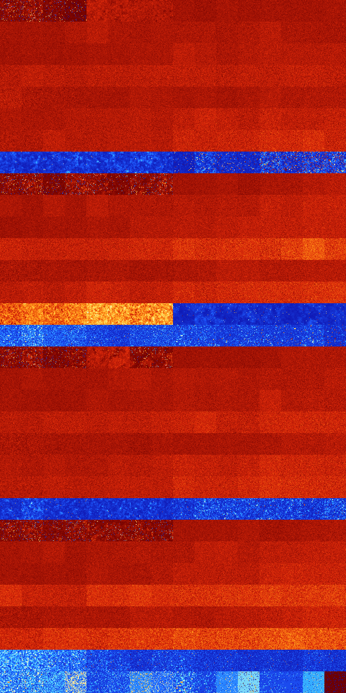

# B2345 (30720-31231)

<details>
    <summary>Initial Grid</summary>
    
</details>


<details>
    <summary>Initial Grid RLE</summary>

```
#C Exported from GoGoL (https://github.com/marrow16/gogol)
#C Wrap mode: Toroidal
#C Boundary mode: Dead
#C Step: 0
x = 100, y = 100, rule = B2345/S
10bo27bo47bo$o3bo8bo51bo$3bo40bo$2b2o19bo18bo46bo$3b2o14bo57bo6bo$22bo
6bo2bo28bo2bo16bo$16bo11bobo7bo18bo5bo33bo$66bo32bo$8bobo18bo34bo7bo9bo
$8bo20bo5bo2bo2bo18bo4bo3bo$12bo37bo23b2o2bo$3bo27bo9bo7bo13bobo22bo10b
o$3bo7bo6bo12bo4bo22bo10bo3b2o$o27bo13bo5bo4bo39bo$14bo5bo3bo3bo10bo3b
2o12bo25bo$42bo5bo7bo29bo4bo$35bo26bo8bo20bo$15bo21bo2bo12bo$2bo65bo$6b
o48b2o$3bo3bo29bo10bo21bo4bo20bo$5b2o29bo25bo$21bo40bo13bo2bo6bo11bo$
13bo16bo31bo4bo15b2obo4bo$10bo8bobo5bo45bo8bo$o19bo3bo2bo3bo6bo12bo5bo
10bo8bo$17bo6bo21bo20bo3bo8bo$o19bo3bo2bo12bo28bo6bo4b2o$19bo28bo25bo$
8bo13bo18bo31bo$3bo16bo29bo23bo$10bo4bo25b2o30bobo17bo$28bo41bob2o5bo$
43bo3bo5bo2bo3bo$15bo2bo9b2o57bo$7bo21bo7bo26bo11bo$21bo41bo7bo3bo10bo$
2bo40bo6bo44bo$b2o10bo2bo48bo10bo6bo$4bo7bo6bo2bo4bo5bo21bo11bo6bo16bo$
o64bo$10bo8bo28bo13b2o6bo$23bo16bo10bo17bo26bo$31bo19bobo6bo5bo4bo10b2o
$25bo42bo15bo$13bo64bo$82bo9bo$16bo$4bo14bo52bo$18bo23bo12bo$7bo20bo11b
o17bo39bo$3o59bo$70bobo$7bo6bo40bo$5bobo5bo40bo22bo7bo9bo$o12bo12bo4bo
21b2o8bo6bo6bo5bo12b2o$15bo8bo31bo18b2o2bo$3bo36bo5bo25bo7b2o$4bo4bo20b
o15bo33bo$3bo25bo48b2o$86bo5bo$12bo41bo9bobo11bo19bo$13b2o25bo3bo3bobo
19bo3bo6bo$5bo47bo11bo18bo$9bo34bo10bo2bo15bo3bo9bo6bo$31bo9bo53bo$8bo
20bo36bobo6bo13bo$9bo9bo41bo10bo9bo14b2o$4bo12bo4bo11bo$3bo37bo17bo5bo
9bo16bo$2b2o21bo14bo$4bo16bo29bo4bo10bo2bo16bo10bo$56bobo32bo2bo$5bo13b
o5bo3bo45bo11bo$2bo10bo10bo29bo8bo$5b2o20bo40bo9bo18bo$19bo38bo8bo13bo
7bo9bo$9bo9bo8bo14bo6bo10bo21bo7bo$30bobo18bo19bo22bo$11bo2bo9bo22bo31b
o9b2o3bo$19bo26bo7bo12bo3bo2bo4bo6bo$100b$2bo78bo$o4bo16bo30bo20bo15bo$
bo90bo$17bo2bo13bo10bo4bo11bo10bo9bo$12bo40b2o31bo$10bo19bo3bo3bo4bo4bo
$14bo71bo$8bo12bo9bo11bo20bo8bo4bo9bo$16bo34bo13bo5bo6bo16bo$25bo17bo
13bo6bo29bo$9bo3bo2bo3bo8bo53bo$9bo3bo4bo27bo5bo5bo22bo6bo$bo89bobo$24b
o19bo17bo15bo2bo13bo$13bo20bo5b2o15bo$bo39bo22bo15bo11bo$6bo8bo6bo19bo
2bobo40bo3bo3bo$35bo5bo12bo25bo6bo!
```
</details>
<details>
    <summary>Thumbnail</summary>

</details>
<table>
<tr>
    <td><a href="./30720%20S%20Heat%20Map%20Activity.png"></a><br>S (30720)<br>R@272,p120</td>    <td><a href="./30721%20S0%20Heat%20Map%20Activity.png"></a><br>S0 (30721)<br>R@189,p24</td>    <td><a href="./30722%20S1%20Heat%20Map%20Activity.png"></a><br>S1 (30722)<br>R@260,p120</td>    <td><a href="./30723%20S01%20Heat%20Map%20Activity.png"></a><br>S01 (30723)<br>R@639,p360</td>    <td><a href="./30724%20S2%20Heat%20Map%20Activity.png"></a><br>S2 (30724)<br>G>1000</td>    <td><a href="./30725%20S02%20Heat%20Map%20Activity.png"></a><br>S02 (30725)<br>G>1000</td>    <td><a href="./30726%20S12%20Heat%20Map%20Activity.png"></a><br>S12 (30726)<br>G>1000</td>    <td><a href="./30727%20S012%20Heat%20Map%20Activity.png"></a><br>S012 (30727)<br>G>1000</td>    <td><a href="./30728%20S3%20Heat%20Map%20Activity.png"></a><br>S3 (30728)<br>G>1000</td>    <td><a href="./30729%20S03%20Heat%20Map%20Activity.png"></a><br>S03 (30729)<br>G>1000</td>    <td><a href="./30730%20S13%20Heat%20Map%20Activity.png"></a><br>S13 (30730)<br>G>1000</td>    <td><a href="./30731%20S013%20Heat%20Map%20Activity.png"></a><br>S013 (30731)<br>G>1000</td>    <td><a href="./30732%20S23%20Heat%20Map%20Activity.png"></a><br>S23 (30732)<br>G>1000</td>    <td><a href="./30733%20S023%20Heat%20Map%20Activity.png"></a><br>S023 (30733)<br>G>1000</td>    <td><a href="./30734%20S123%20Heat%20Map%20Activity.png"></a><br>S123 (30734)<br>G>1000</td>    <td><a href="./30735%20S0123%20Heat%20Map%20Activity.png"></a><br>S0123 (30735)<br>G>1000</td></tr>
<tr>
    <td><a href="./30736%20S4%20Heat%20Map%20Activity.png"></a><br>S4 (30736)<br>G>1000</td>    <td><a href="./30737%20S04%20Heat%20Map%20Activity.png"></a><br>S04 (30737)<br>G>1000</td>    <td><a href="./30738%20S14%20Heat%20Map%20Activity.png"></a><br>S14 (30738)<br>G>1000</td>    <td><a href="./30739%20S014%20Heat%20Map%20Activity.png"></a><br>S014 (30739)<br>G>1000</td>    <td><a href="./30740%20S24%20Heat%20Map%20Activity.png"></a><br>S24 (30740)<br>G>1000</td>    <td><a href="./30741%20S024%20Heat%20Map%20Activity.png"></a><br>S024 (30741)<br>G>1000</td>    <td><a href="./30742%20S124%20Heat%20Map%20Activity.png"></a><br>S124 (30742)<br>G>1000</td>    <td><a href="./30743%20S0124%20Heat%20Map%20Activity.png"></a><br>S0124 (30743)<br>G>1000</td>    <td><a href="./30744%20S34%20Heat%20Map%20Activity.png"></a><br>S34 (30744)<br>G>1000</td>    <td><a href="./30745%20S034%20Heat%20Map%20Activity.png"></a><br>S034 (30745)<br>G>1000</td>    <td><a href="./30746%20S134%20Heat%20Map%20Activity.png"></a><br>S134 (30746)<br>G>1000</td>    <td><a href="./30747%20S0134%20Heat%20Map%20Activity.png"></a><br>S0134 (30747)<br>G>1000</td>    <td><a href="./30748%20S234%20Heat%20Map%20Activity.png"></a><br>S234 (30748)<br>G>1000</td>    <td><a href="./30749%20S0234%20Heat%20Map%20Activity.png"></a><br>S0234 (30749)<br>G>1000</td>    <td><a href="./30750%20S1234%20Heat%20Map%20Activity.png"></a><br>S1234 (30750)<br>G>1000</td>    <td><a href="./30751%20S01234%20Heat%20Map%20Activity.png"></a><br>S01234 (30751)<br>G>1000</td></tr>
<tr>
    <td><a href="./30752%20S5%20Heat%20Map%20Activity.png"></a><br>S5 (30752)<br>G>1000</td>    <td><a href="./30753%20S05%20Heat%20Map%20Activity.png"></a><br>S05 (30753)<br>G>1000</td>    <td><a href="./30754%20S15%20Heat%20Map%20Activity.png"></a><br>S15 (30754)<br>G>1000</td>    <td><a href="./30755%20S015%20Heat%20Map%20Activity.png"></a><br>S015 (30755)<br>G>1000</td>    <td><a href="./30756%20S25%20Heat%20Map%20Activity.png"></a><br>S25 (30756)<br>G>1000</td>    <td><a href="./30757%20S025%20Heat%20Map%20Activity.png"></a><br>S025 (30757)<br>G>1000</td>    <td><a href="./30758%20S125%20Heat%20Map%20Activity.png"></a><br>S125 (30758)<br>G>1000</td>    <td><a href="./30759%20S0125%20Heat%20Map%20Activity.png"></a><br>S0125 (30759)<br>G>1000</td>    <td><a href="./30760%20S35%20Heat%20Map%20Activity.png"></a><br>S35 (30760)<br>G>1000</td>    <td><a href="./30761%20S035%20Heat%20Map%20Activity.png"></a><br>S035 (30761)<br>G>1000</td>    <td><a href="./30762%20S135%20Heat%20Map%20Activity.png"></a><br>S135 (30762)<br>G>1000</td>    <td><a href="./30763%20S0135%20Heat%20Map%20Activity.png"></a><br>S0135 (30763)<br>G>1000</td>    <td><a href="./30764%20S235%20Heat%20Map%20Activity.png"></a><br>S235 (30764)<br>G>1000</td>    <td><a href="./30765%20S0235%20Heat%20Map%20Activity.png"></a><br>S0235 (30765)<br>G>1000</td>    <td><a href="./30766%20S1235%20Heat%20Map%20Activity.png"></a><br>S1235 (30766)<br>G>1000</td>    <td><a href="./30767%20S01235%20Heat%20Map%20Activity.png"></a><br>S01235 (30767)<br>G>1000</td></tr>
<tr>
    <td><a href="./30768%20S45%20Heat%20Map%20Activity.png"></a><br>S45 (30768)<br>G>1000</td>    <td><a href="./30769%20S045%20Heat%20Map%20Activity.png"></a><br>S045 (30769)<br>G>1000</td>    <td><a href="./30770%20S145%20Heat%20Map%20Activity.png"></a><br>S145 (30770)<br>G>1000</td>    <td><a href="./30771%20S0145%20Heat%20Map%20Activity.png"></a><br>S0145 (30771)<br>G>1000</td>    <td><a href="./30772%20S245%20Heat%20Map%20Activity.png"></a><br>S245 (30772)<br>G>1000</td>    <td><a href="./30773%20S0245%20Heat%20Map%20Activity.png"></a><br>S0245 (30773)<br>G>1000</td>    <td><a href="./30774%20S1245%20Heat%20Map%20Activity.png"></a><br>S1245 (30774)<br>G>1000</td>    <td><a href="./30775%20S01245%20Heat%20Map%20Activity.png"></a><br>S01245 (30775)<br>G>1000</td>    <td><a href="./30776%20S345%20Heat%20Map%20Activity.png"></a><br>S345 (30776)<br>G>1000</td>    <td><a href="./30777%20S0345%20Heat%20Map%20Activity.png"></a><br>S0345 (30777)<br>G>1000</td>    <td><a href="./30778%20S1345%20Heat%20Map%20Activity.png"></a><br>S1345 (30778)<br>G>1000</td>    <td><a href="./30779%20S01345%20Heat%20Map%20Activity.png"></a><br>S01345 (30779)<br>G>1000</td>    <td><a href="./30780%20S2345%20Heat%20Map%20Activity.png"></a><br>S2345 (30780)<br>G>1000</td>    <td><a href="./30781%20S02345%20Heat%20Map%20Activity.png"></a><br>S02345 (30781)<br>G>1000</td>    <td><a href="./30782%20S12345%20Heat%20Map%20Activity.png"></a><br>S12345 (30782)<br>G>1000</td>    <td><a href="./30783%20S012345%20Heat%20Map%20Activity.png"></a><br>S012345 (30783)<br>G>1000</td></tr>
<tr>
    <td><a href="./30784%20S6%20Heat%20Map%20Activity.png"></a><br>S6 (30784)<br>G>1000</td>    <td><a href="./30785%20S06%20Heat%20Map%20Activity.png"></a><br>S06 (30785)<br>G>1000</td>    <td><a href="./30786%20S16%20Heat%20Map%20Activity.png"></a><br>S16 (30786)<br>G>1000</td>    <td><a href="./30787%20S016%20Heat%20Map%20Activity.png"></a><br>S016 (30787)<br>G>1000</td>    <td><a href="./30788%20S26%20Heat%20Map%20Activity.png"></a><br>S26 (30788)<br>G>1000</td>    <td><a href="./30789%20S026%20Heat%20Map%20Activity.png"></a><br>S026 (30789)<br>G>1000</td>    <td><a href="./30790%20S126%20Heat%20Map%20Activity.png"></a><br>S126 (30790)<br>G>1000</td>    <td><a href="./30791%20S0126%20Heat%20Map%20Activity.png"></a><br>S0126 (30791)<br>G>1000</td>    <td><a href="./30792%20S36%20Heat%20Map%20Activity.png"></a><br>S36 (30792)<br>G>1000</td>    <td><a href="./30793%20S036%20Heat%20Map%20Activity.png"></a><br>S036 (30793)<br>G>1000</td>    <td><a href="./30794%20S136%20Heat%20Map%20Activity.png"></a><br>S136 (30794)<br>G>1000</td>    <td><a href="./30795%20S0136%20Heat%20Map%20Activity.png"></a><br>S0136 (30795)<br>G>1000</td>    <td><a href="./30796%20S236%20Heat%20Map%20Activity.png"></a><br>S236 (30796)<br>G>1000</td>    <td><a href="./30797%20S0236%20Heat%20Map%20Activity.png"></a><br>S0236 (30797)<br>G>1000</td>    <td><a href="./30798%20S1236%20Heat%20Map%20Activity.png"></a><br>S1236 (30798)<br>G>1000</td>    <td><a href="./30799%20S01236%20Heat%20Map%20Activity.png"></a><br>S01236 (30799)<br>G>1000</td></tr>
<tr>
    <td><a href="./30800%20S46%20Heat%20Map%20Activity.png"></a><br>S46 (30800)<br>G>1000</td>    <td><a href="./30801%20S046%20Heat%20Map%20Activity.png"></a><br>S046 (30801)<br>G>1000</td>    <td><a href="./30802%20S146%20Heat%20Map%20Activity.png"></a><br>S146 (30802)<br>G>1000</td>    <td><a href="./30803%20S0146%20Heat%20Map%20Activity.png"></a><br>S0146 (30803)<br>G>1000</td>    <td><a href="./30804%20S246%20Heat%20Map%20Activity.png"></a><br>S246 (30804)<br>G>1000</td>    <td><a href="./30805%20S0246%20Heat%20Map%20Activity.png"></a><br>S0246 (30805)<br>G>1000</td>    <td><a href="./30806%20S1246%20Heat%20Map%20Activity.png"></a><br>S1246 (30806)<br>G>1000</td>    <td><a href="./30807%20S01246%20Heat%20Map%20Activity.png"></a><br>S01246 (30807)<br>G>1000</td>    <td><a href="./30808%20S346%20Heat%20Map%20Activity.png"></a><br>S346 (30808)<br>G>1000</td>    <td><a href="./30809%20S0346%20Heat%20Map%20Activity.png"></a><br>S0346 (30809)<br>G>1000</td>    <td><a href="./30810%20S1346%20Heat%20Map%20Activity.png"></a><br>S1346 (30810)<br>G>1000</td>    <td><a href="./30811%20S01346%20Heat%20Map%20Activity.png"></a><br>S01346 (30811)<br>G>1000</td>    <td><a href="./30812%20S2346%20Heat%20Map%20Activity.png"></a><br>S2346 (30812)<br>G>1000</td>    <td><a href="./30813%20S02346%20Heat%20Map%20Activity.png"></a><br>S02346 (30813)<br>G>1000</td>    <td><a href="./30814%20S12346%20Heat%20Map%20Activity.png"></a><br>S12346 (30814)<br>G>1000</td>    <td><a href="./30815%20S012346%20Heat%20Map%20Activity.png"></a><br>S012346 (30815)<br>G>1000</td></tr>
<tr>
    <td><a href="./30816%20S56%20Heat%20Map%20Activity.png"></a><br>S56 (30816)<br>G>1000</td>    <td><a href="./30817%20S056%20Heat%20Map%20Activity.png"></a><br>S056 (30817)<br>G>1000</td>    <td><a href="./30818%20S156%20Heat%20Map%20Activity.png"></a><br>S156 (30818)<br>G>1000</td>    <td><a href="./30819%20S0156%20Heat%20Map%20Activity.png"></a><br>S0156 (30819)<br>G>1000</td>    <td><a href="./30820%20S256%20Heat%20Map%20Activity.png"></a><br>S256 (30820)<br>G>1000</td>    <td><a href="./30821%20S0256%20Heat%20Map%20Activity.png"></a><br>S0256 (30821)<br>G>1000</td>    <td><a href="./30822%20S1256%20Heat%20Map%20Activity.png"></a><br>S1256 (30822)<br>G>1000</td>    <td><a href="./30823%20S01256%20Heat%20Map%20Activity.png"></a><br>S01256 (30823)<br>G>1000</td>    <td><a href="./30824%20S356%20Heat%20Map%20Activity.png"></a><br>S356 (30824)<br>G>1000</td>    <td><a href="./30825%20S0356%20Heat%20Map%20Activity.png"></a><br>S0356 (30825)<br>G>1000</td>    <td><a href="./30826%20S1356%20Heat%20Map%20Activity.png"></a><br>S1356 (30826)<br>G>1000</td>    <td><a href="./30827%20S01356%20Heat%20Map%20Activity.png"></a><br>S01356 (30827)<br>G>1000</td>    <td><a href="./30828%20S2356%20Heat%20Map%20Activity.png"></a><br>S2356 (30828)<br>G>1000</td>    <td><a href="./30829%20S02356%20Heat%20Map%20Activity.png"></a><br>S02356 (30829)<br>G>1000</td>    <td><a href="./30830%20S12356%20Heat%20Map%20Activity.png"></a><br>S12356 (30830)<br>G>1000</td>    <td><a href="./30831%20S012356%20Heat%20Map%20Activity.png"></a><br>S012356 (30831)<br>G>1000</td></tr>
<tr>
    <td><a href="./30832%20S456%20Heat%20Map%20Activity.png"></a><br>S456 (30832)<br>R@311,p6</td>    <td><a href="./30833%20S0456%20Heat%20Map%20Activity.png"></a><br>S0456 (30833)<br>R@317,p6</td>    <td><a href="./30834%20S1456%20Heat%20Map%20Activity.png"></a><br>S1456 (30834)<br>R@326,p30</td>    <td><a href="./30835%20S01456%20Heat%20Map%20Activity.png"></a><br>S01456 (30835)<br>R@239,p6</td>    <td><a href="./30836%20S2456%20Heat%20Map%20Activity.png"></a><br>S2456 (30836)<br>R@265,p10</td>    <td><a href="./30837%20S02456%20Heat%20Map%20Activity.png"></a><br>S02456 (30837)<br>R@227,p10</td>    <td><a href="./30838%20S12456%20Heat%20Map%20Activity.png"></a><br>S12456 (30838)<br>R@216,p6</td>    <td><a href="./30839%20S012456%20Heat%20Map%20Activity.png"></a><br>S012456 (30839)<br>R@253,p60</td>    <td><a href="./30840%20S3456%20Heat%20Map%20Activity.png"></a><br>S3456 (30840)<br>R@258,p168</td>    <td><a href="./30841%20S03456%20Heat%20Map%20Activity.png"></a><br>S03456 (30841)<br>R@87,p24</td>    <td><a href="./30842%20S13456%20Heat%20Map%20Activity.png"></a><br>S13456 (30842)<br>R@179,p120</td>    <td><a href="./30843%20S013456%20Heat%20Map%20Activity.png"></a><br>S013456 (30843)<br>R@201,p120</td>    <td><a href="./30844%20S23456%20Heat%20Map%20Activity.png"></a><br>S23456 (30844)<br>R@76,p24</td>    <td><a href="./30845%20S023456%20Heat%20Map%20Activity.png"></a><br>S023456 (30845)<br>R@106,p60</td>    <td><a href="./30846%20S123456%20Heat%20Map%20Activity.png"></a><br>S123456 (30846)<br>R@90,p24</td>    <td><a href="./30847%20S0123456%20Heat%20Map%20Activity.png"></a><br>S0123456 (30847)<br>R@79,p12</td></tr>
<tr>
    <td><a href="./30848%20S7%20Heat%20Map%20Activity.png"></a><br>S7 (30848)<br>R@272,p120</td>    <td><a href="./30849%20S07%20Heat%20Map%20Activity.png"></a><br>S07 (30849)<br>R@179,p12</td>    <td><a href="./30850%20S17%20Heat%20Map%20Activity.png"></a><br>S17 (30850)<br>R@310,p120</td>    <td><a href="./30851%20S017%20Heat%20Map%20Activity.png"></a><br>S017 (30851)<br>R@129,p24</td>    <td><a href="./30852%20S27%20Heat%20Map%20Activity.png"></a><br>S27 (30852)<br>R@356,p24</td>    <td><a href="./30853%20S027%20Heat%20Map%20Activity.png"></a><br>S027 (30853)<br>R@563,p240</td>    <td><a href="./30854%20S127%20Heat%20Map%20Activity.png"></a><br>S127 (30854)<br>R@346,p24</td>    <td><a href="./30855%20S0127%20Heat%20Map%20Activity.png"></a><br>S0127 (30855)<br>R@200,p24</td>    <td><a href="./30856%20S37%20Heat%20Map%20Activity.png"></a><br>S37 (30856)<br>G>1000</td>    <td><a href="./30857%20S037%20Heat%20Map%20Activity.png"></a><br>S037 (30857)<br>G>1000</td>    <td><a href="./30858%20S137%20Heat%20Map%20Activity.png"></a><br>S137 (30858)<br>G>1000</td>    <td><a href="./30859%20S0137%20Heat%20Map%20Activity.png"></a><br>S0137 (30859)<br>G>1000</td>    <td><a href="./30860%20S237%20Heat%20Map%20Activity.png"></a><br>S237 (30860)<br>G>1000</td>    <td><a href="./30861%20S0237%20Heat%20Map%20Activity.png"></a><br>S0237 (30861)<br>G>1000</td>    <td><a href="./30862%20S1237%20Heat%20Map%20Activity.png"></a><br>S1237 (30862)<br>G>1000</td>    <td><a href="./30863%20S01237%20Heat%20Map%20Activity.png"></a><br>S01237 (30863)<br>G>1000</td></tr>
<tr>
    <td><a href="./30864%20S47%20Heat%20Map%20Activity.png"></a><br>S47 (30864)<br>G>1000</td>    <td><a href="./30865%20S047%20Heat%20Map%20Activity.png"></a><br>S047 (30865)<br>G>1000</td>    <td><a href="./30866%20S147%20Heat%20Map%20Activity.png"></a><br>S147 (30866)<br>G>1000</td>    <td><a href="./30867%20S0147%20Heat%20Map%20Activity.png"></a><br>S0147 (30867)<br>G>1000</td>    <td><a href="./30868%20S247%20Heat%20Map%20Activity.png"></a><br>S247 (30868)<br>G>1000</td>    <td><a href="./30869%20S0247%20Heat%20Map%20Activity.png"></a><br>S0247 (30869)<br>G>1000</td>    <td><a href="./30870%20S1247%20Heat%20Map%20Activity.png"></a><br>S1247 (30870)<br>G>1000</td>    <td><a href="./30871%20S01247%20Heat%20Map%20Activity.png"></a><br>S01247 (30871)<br>G>1000</td>    <td><a href="./30872%20S347%20Heat%20Map%20Activity.png"></a><br>S347 (30872)<br>G>1000</td>    <td><a href="./30873%20S0347%20Heat%20Map%20Activity.png"></a><br>S0347 (30873)<br>G>1000</td>    <td><a href="./30874%20S1347%20Heat%20Map%20Activity.png"></a><br>S1347 (30874)<br>G>1000</td>    <td><a href="./30875%20S01347%20Heat%20Map%20Activity.png"></a><br>S01347 (30875)<br>G>1000</td>    <td><a href="./30876%20S2347%20Heat%20Map%20Activity.png"></a><br>S2347 (30876)<br>G>1000</td>    <td><a href="./30877%20S02347%20Heat%20Map%20Activity.png"></a><br>S02347 (30877)<br>G>1000</td>    <td><a href="./30878%20S12347%20Heat%20Map%20Activity.png"></a><br>S12347 (30878)<br>G>1000</td>    <td><a href="./30879%20S012347%20Heat%20Map%20Activity.png"></a><br>S012347 (30879)<br>G>1000</td></tr>
<tr>
    <td><a href="./30880%20S57%20Heat%20Map%20Activity.png"></a><br>S57 (30880)<br>G>1000</td>    <td><a href="./30881%20S057%20Heat%20Map%20Activity.png"></a><br>S057 (30881)<br>G>1000</td>    <td><a href="./30882%20S157%20Heat%20Map%20Activity.png"></a><br>S157 (30882)<br>G>1000</td>    <td><a href="./30883%20S0157%20Heat%20Map%20Activity.png"></a><br>S0157 (30883)<br>G>1000</td>    <td><a href="./30884%20S257%20Heat%20Map%20Activity.png"></a><br>S257 (30884)<br>G>1000</td>    <td><a href="./30885%20S0257%20Heat%20Map%20Activity.png"></a><br>S0257 (30885)<br>G>1000</td>    <td><a href="./30886%20S1257%20Heat%20Map%20Activity.png"></a><br>S1257 (30886)<br>G>1000</td>    <td><a href="./30887%20S01257%20Heat%20Map%20Activity.png"></a><br>S01257 (30887)<br>G>1000</td>    <td><a href="./30888%20S357%20Heat%20Map%20Activity.png"></a><br>S357 (30888)<br>G>1000</td>    <td><a href="./30889%20S0357%20Heat%20Map%20Activity.png"></a><br>S0357 (30889)<br>G>1000</td>    <td><a href="./30890%20S1357%20Heat%20Map%20Activity.png"></a><br>S1357 (30890)<br>G>1000</td>    <td><a href="./30891%20S01357%20Heat%20Map%20Activity.png"></a><br>S01357 (30891)<br>G>1000</td>    <td><a href="./30892%20S2357%20Heat%20Map%20Activity.png"></a><br>S2357 (30892)<br>G>1000</td>    <td><a href="./30893%20S02357%20Heat%20Map%20Activity.png"></a><br>S02357 (30893)<br>G>1000</td>    <td><a href="./30894%20S12357%20Heat%20Map%20Activity.png"></a><br>S12357 (30894)<br>G>1000</td>    <td><a href="./30895%20S012357%20Heat%20Map%20Activity.png"></a><br>S012357 (30895)<br>G>1000</td></tr>
<tr>
    <td><a href="./30896%20S457%20Heat%20Map%20Activity.png"></a><br>S457 (30896)<br>G>1000</td>    <td><a href="./30897%20S0457%20Heat%20Map%20Activity.png"></a><br>S0457 (30897)<br>G>1000</td>    <td><a href="./30898%20S1457%20Heat%20Map%20Activity.png"></a><br>S1457 (30898)<br>G>1000</td>    <td><a href="./30899%20S01457%20Heat%20Map%20Activity.png"></a><br>S01457 (30899)<br>G>1000</td>    <td><a href="./30900%20S2457%20Heat%20Map%20Activity.png"></a><br>S2457 (30900)<br>G>1000</td>    <td><a href="./30901%20S02457%20Heat%20Map%20Activity.png"></a><br>S02457 (30901)<br>G>1000</td>    <td><a href="./30902%20S12457%20Heat%20Map%20Activity.png"></a><br>S12457 (30902)<br>G>1000</td>    <td><a href="./30903%20S012457%20Heat%20Map%20Activity.png"></a><br>S012457 (30903)<br>G>1000</td>    <td><a href="./30904%20S3457%20Heat%20Map%20Activity.png"></a><br>S3457 (30904)<br>G>1000</td>    <td><a href="./30905%20S03457%20Heat%20Map%20Activity.png"></a><br>S03457 (30905)<br>G>1000</td>    <td><a href="./30906%20S13457%20Heat%20Map%20Activity.png"></a><br>S13457 (30906)<br>G>1000</td>    <td><a href="./30907%20S013457%20Heat%20Map%20Activity.png"></a><br>S013457 (30907)<br>G>1000</td>    <td><a href="./30908%20S23457%20Heat%20Map%20Activity.png"></a><br>S23457 (30908)<br>G>1000</td>    <td><a href="./30909%20S023457%20Heat%20Map%20Activity.png"></a><br>S023457 (30909)<br>G>1000</td>    <td><a href="./30910%20S123457%20Heat%20Map%20Activity.png"></a><br>S123457 (30910)<br>G>1000</td>    <td><a href="./30911%20S0123457%20Heat%20Map%20Activity.png"></a><br>S0123457 (30911)<br>G>1000</td></tr>
<tr>
    <td><a href="./30912%20S67%20Heat%20Map%20Activity.png"></a><br>S67 (30912)<br>G>1000</td>    <td><a href="./30913%20S067%20Heat%20Map%20Activity.png"></a><br>S067 (30913)<br>G>1000</td>    <td><a href="./30914%20S167%20Heat%20Map%20Activity.png"></a><br>S167 (30914)<br>G>1000</td>    <td><a href="./30915%20S0167%20Heat%20Map%20Activity.png"></a><br>S0167 (30915)<br>G>1000</td>    <td><a href="./30916%20S267%20Heat%20Map%20Activity.png"></a><br>S267 (30916)<br>G>1000</td>    <td><a href="./30917%20S0267%20Heat%20Map%20Activity.png"></a><br>S0267 (30917)<br>G>1000</td>    <td><a href="./30918%20S1267%20Heat%20Map%20Activity.png"></a><br>S1267 (30918)<br>G>1000</td>    <td><a href="./30919%20S01267%20Heat%20Map%20Activity.png"></a><br>S01267 (30919)<br>G>1000</td>    <td><a href="./30920%20S367%20Heat%20Map%20Activity.png"></a><br>S367 (30920)<br>G>1000</td>    <td><a href="./30921%20S0367%20Heat%20Map%20Activity.png"></a><br>S0367 (30921)<br>G>1000</td>    <td><a href="./30922%20S1367%20Heat%20Map%20Activity.png"></a><br>S1367 (30922)<br>G>1000</td>    <td><a href="./30923%20S01367%20Heat%20Map%20Activity.png"></a><br>S01367 (30923)<br>G>1000</td>    <td><a href="./30924%20S2367%20Heat%20Map%20Activity.png"></a><br>S2367 (30924)<br>G>1000</td>    <td><a href="./30925%20S02367%20Heat%20Map%20Activity.png"></a><br>S02367 (30925)<br>G>1000</td>    <td><a href="./30926%20S12367%20Heat%20Map%20Activity.png"></a><br>S12367 (30926)<br>G>1000</td>    <td><a href="./30927%20S012367%20Heat%20Map%20Activity.png"></a><br>S012367 (30927)<br>G>1000</td></tr>
<tr>
    <td><a href="./30928%20S467%20Heat%20Map%20Activity.png"></a><br>S467 (30928)<br>G>1000</td>    <td><a href="./30929%20S0467%20Heat%20Map%20Activity.png"></a><br>S0467 (30929)<br>G>1000</td>    <td><a href="./30930%20S1467%20Heat%20Map%20Activity.png"></a><br>S1467 (30930)<br>G>1000</td>    <td><a href="./30931%20S01467%20Heat%20Map%20Activity.png"></a><br>S01467 (30931)<br>G>1000</td>    <td><a href="./30932%20S2467%20Heat%20Map%20Activity.png"></a><br>S2467 (30932)<br>G>1000</td>    <td><a href="./30933%20S02467%20Heat%20Map%20Activity.png"></a><br>S02467 (30933)<br>G>1000</td>    <td><a href="./30934%20S12467%20Heat%20Map%20Activity.png"></a><br>S12467 (30934)<br>G>1000</td>    <td><a href="./30935%20S012467%20Heat%20Map%20Activity.png"></a><br>S012467 (30935)<br>G>1000</td>    <td><a href="./30936%20S3467%20Heat%20Map%20Activity.png"></a><br>S3467 (30936)<br>G>1000</td>    <td><a href="./30937%20S03467%20Heat%20Map%20Activity.png"></a><br>S03467 (30937)<br>G>1000</td>    <td><a href="./30938%20S13467%20Heat%20Map%20Activity.png"></a><br>S13467 (30938)<br>G>1000</td>    <td><a href="./30939%20S013467%20Heat%20Map%20Activity.png"></a><br>S013467 (30939)<br>G>1000</td>    <td><a href="./30940%20S23467%20Heat%20Map%20Activity.png"></a><br>S23467 (30940)<br>G>1000</td>    <td><a href="./30941%20S023467%20Heat%20Map%20Activity.png"></a><br>S023467 (30941)<br>G>1000</td>    <td><a href="./30942%20S123467%20Heat%20Map%20Activity.png"></a><br>S123467 (30942)<br>G>1000</td>    <td><a href="./30943%20S0123467%20Heat%20Map%20Activity.png"></a><br>S0123467 (30943)<br>G>1000</td></tr>
<tr>
    <td><a href="./30944%20S567%20Heat%20Map%20Activity.png"></a><br>S567 (30944)<br>G>1000</td>    <td><a href="./30945%20S0567%20Heat%20Map%20Activity.png"></a><br>S0567 (30945)<br>G>1000</td>    <td><a href="./30946%20S1567%20Heat%20Map%20Activity.png"></a><br>S1567 (30946)<br>G>1000</td>    <td><a href="./30947%20S01567%20Heat%20Map%20Activity.png"></a><br>S01567 (30947)<br>G>1000</td>    <td><a href="./30948%20S2567%20Heat%20Map%20Activity.png"></a><br>S2567 (30948)<br>G>1000</td>    <td><a href="./30949%20S02567%20Heat%20Map%20Activity.png"></a><br>S02567 (30949)<br>G>1000</td>    <td><a href="./30950%20S12567%20Heat%20Map%20Activity.png"></a><br>S12567 (30950)<br>G>1000</td>    <td><a href="./30951%20S012567%20Heat%20Map%20Activity.png"></a><br>S012567 (30951)<br>G>1000</td>    <td><a href="./30952%20S3567%20Heat%20Map%20Activity.png"></a><br>S3567 (30952)<br>G>1000</td>    <td><a href="./30953%20S03567%20Heat%20Map%20Activity.png"></a><br>S03567 (30953)<br>R@950,p12</td>    <td><a href="./30954%20S13567%20Heat%20Map%20Activity.png"></a><br>S13567 (30954)<br>G>1000</td>    <td><a href="./30955%20S013567%20Heat%20Map%20Activity.png"></a><br>S013567 (30955)<br>G>1000</td>    <td><a href="./30956%20S23567%20Heat%20Map%20Activity.png"></a><br>S23567 (30956)<br>R@392,p60</td>    <td><a href="./30957%20S023567%20Heat%20Map%20Activity.png"></a><br>S023567 (30957)<br>R@848,p12</td>    <td><a href="./30958%20S123567%20Heat%20Map%20Activity.png"></a><br>S123567 (30958)<br>R@707,p60</td>    <td><a href="./30959%20S0123567%20Heat%20Map%20Activity.png"></a><br>S0123567 (30959)<br>G>1000</td></tr>
<tr>
    <td><a href="./30960%20S4567%20Heat%20Map%20Activity.png"></a><br>S4567 (30960)<br>R@30,p2</td>    <td><a href="./30961%20S04567%20Heat%20Map%20Activity.png"></a><br>S04567 (30961)<br>R@20,p2</td>    <td><a href="./30962%20S14567%20Heat%20Map%20Activity.png"></a><br>S14567 (30962)<br>R@20,p2</td>    <td><a href="./30963%20S014567%20Heat%20Map%20Activity.png"></a><br>S014567 (30963)<br>R@18,p2</td>    <td><a href="./30964%20S24567%20Heat%20Map%20Activity.png"></a><br>S24567 (30964)<br>R@21,p2</td>    <td><a href="./30965%20S024567%20Heat%20Map%20Activity.png"></a><br>S024567 (30965)<br>R@25,p6</td>    <td><a href="./30966%20S124567%20Heat%20Map%20Activity.png"></a><br>S124567 (30966)<br>R@19,p2</td>    <td><a href="./30967%20S0124567%20Heat%20Map%20Activity.png"></a><br>S0124567 (30967)<br>R@19,p2</td>    <td><a href="./30968%20S34567%20Heat%20Map%20Activity.png"></a><br>S34567 (30968)<br>R@22,p2</td>    <td><a href="./30969%20S034567%20Heat%20Map%20Activity.png"></a><br>S034567 (30969)<br>R@19,p2</td>    <td><a href="./30970%20S134567%20Heat%20Map%20Activity.png"></a><br>S134567 (30970)<br>R@23,p2</td>    <td><a href="./30971%20S0134567%20Heat%20Map%20Activity.png"></a><br>S0134567 (30971)<br>R@19,p2</td>    <td><a href="./30972%20S234567%20Heat%20Map%20Activity.png"></a><br>S234567 (30972)<br>R@22,p2</td>    <td><a href="./30973%20S0234567%20Heat%20Map%20Activity.png"></a><br>S0234567 (30973)<br>R@21,p6</td>    <td><a href="./30974%20S1234567%20Heat%20Map%20Activity.png"></a><br>S1234567 (30974)<br>R@19,p2</td>    <td><a href="./30975%20S01234567%20Heat%20Map%20Activity.png"></a><br>S01234567 (30975)<br>R@29,p6</td></tr>
<tr>
    <td><a href="./30976%20S8%20Heat%20Map%20Activity.png"></a><br>S8 (30976)<br>R@272,p120</td>    <td><a href="./30977%20S08%20Heat%20Map%20Activity.png"></a><br>S08 (30977)<br>R@163,p12</td>    <td><a href="./30978%20S18%20Heat%20Map%20Activity.png"></a><br>S18 (30978)<br>R@287,p120</td>    <td><a href="./30979%20S018%20Heat%20Map%20Activity.png"></a><br>S018 (30979)<br>R@190,p24</td>    <td><a href="./30980%20S28%20Heat%20Map%20Activity.png"></a><br>S28 (30980)<br>G>1000</td>    <td><a href="./30981%20S028%20Heat%20Map%20Activity.png"></a><br>S028 (30981)<br>G>1000</td>    <td><a href="./30982%20S128%20Heat%20Map%20Activity.png"></a><br>S128 (30982)<br>G>1000</td>    <td><a href="./30983%20S0128%20Heat%20Map%20Activity.png"></a><br>S0128 (30983)<br>R@477,p12</td>    <td><a href="./30984%20S38%20Heat%20Map%20Activity.png"></a><br>S38 (30984)<br>G>1000</td>    <td><a href="./30985%20S038%20Heat%20Map%20Activity.png"></a><br>S038 (30985)<br>G>1000</td>    <td><a href="./30986%20S138%20Heat%20Map%20Activity.png"></a><br>S138 (30986)<br>G>1000</td>    <td><a href="./30987%20S0138%20Heat%20Map%20Activity.png"></a><br>S0138 (30987)<br>G>1000</td>    <td><a href="./30988%20S238%20Heat%20Map%20Activity.png"></a><br>S238 (30988)<br>G>1000</td>    <td><a href="./30989%20S0238%20Heat%20Map%20Activity.png"></a><br>S0238 (30989)<br>G>1000</td>    <td><a href="./30990%20S1238%20Heat%20Map%20Activity.png"></a><br>S1238 (30990)<br>G>1000</td>    <td><a href="./30991%20S01238%20Heat%20Map%20Activity.png"></a><br>S01238 (30991)<br>G>1000</td></tr>
<tr>
    <td><a href="./30992%20S48%20Heat%20Map%20Activity.png"></a><br>S48 (30992)<br>G>1000</td>    <td><a href="./30993%20S048%20Heat%20Map%20Activity.png"></a><br>S048 (30993)<br>G>1000</td>    <td><a href="./30994%20S148%20Heat%20Map%20Activity.png"></a><br>S148 (30994)<br>G>1000</td>    <td><a href="./30995%20S0148%20Heat%20Map%20Activity.png"></a><br>S0148 (30995)<br>G>1000</td>    <td><a href="./30996%20S248%20Heat%20Map%20Activity.png"></a><br>S248 (30996)<br>G>1000</td>    <td><a href="./30997%20S0248%20Heat%20Map%20Activity.png"></a><br>S0248 (30997)<br>G>1000</td>    <td><a href="./30998%20S1248%20Heat%20Map%20Activity.png"></a><br>S1248 (30998)<br>G>1000</td>    <td><a href="./30999%20S01248%20Heat%20Map%20Activity.png"></a><br>S01248 (30999)<br>G>1000</td>    <td><a href="./31000%20S348%20Heat%20Map%20Activity.png"></a><br>S348 (31000)<br>G>1000</td>    <td><a href="./31001%20S0348%20Heat%20Map%20Activity.png"></a><br>S0348 (31001)<br>G>1000</td>    <td><a href="./31002%20S1348%20Heat%20Map%20Activity.png"></a><br>S1348 (31002)<br>G>1000</td>    <td><a href="./31003%20S01348%20Heat%20Map%20Activity.png"></a><br>S01348 (31003)<br>G>1000</td>    <td><a href="./31004%20S2348%20Heat%20Map%20Activity.png"></a><br>S2348 (31004)<br>G>1000</td>    <td><a href="./31005%20S02348%20Heat%20Map%20Activity.png"></a><br>S02348 (31005)<br>G>1000</td>    <td><a href="./31006%20S12348%20Heat%20Map%20Activity.png"></a><br>S12348 (31006)<br>G>1000</td>    <td><a href="./31007%20S012348%20Heat%20Map%20Activity.png"></a><br>S012348 (31007)<br>G>1000</td></tr>
<tr>
    <td><a href="./31008%20S58%20Heat%20Map%20Activity.png"></a><br>S58 (31008)<br>G>1000</td>    <td><a href="./31009%20S058%20Heat%20Map%20Activity.png"></a><br>S058 (31009)<br>G>1000</td>    <td><a href="./31010%20S158%20Heat%20Map%20Activity.png"></a><br>S158 (31010)<br>G>1000</td>    <td><a href="./31011%20S0158%20Heat%20Map%20Activity.png"></a><br>S0158 (31011)<br>G>1000</td>    <td><a href="./31012%20S258%20Heat%20Map%20Activity.png"></a><br>S258 (31012)<br>G>1000</td>    <td><a href="./31013%20S0258%20Heat%20Map%20Activity.png"></a><br>S0258 (31013)<br>G>1000</td>    <td><a href="./31014%20S1258%20Heat%20Map%20Activity.png"></a><br>S1258 (31014)<br>G>1000</td>    <td><a href="./31015%20S01258%20Heat%20Map%20Activity.png"></a><br>S01258 (31015)<br>G>1000</td>    <td><a href="./31016%20S358%20Heat%20Map%20Activity.png"></a><br>S358 (31016)<br>G>1000</td>    <td><a href="./31017%20S0358%20Heat%20Map%20Activity.png"></a><br>S0358 (31017)<br>G>1000</td>    <td><a href="./31018%20S1358%20Heat%20Map%20Activity.png"></a><br>S1358 (31018)<br>G>1000</td>    <td><a href="./31019%20S01358%20Heat%20Map%20Activity.png"></a><br>S01358 (31019)<br>G>1000</td>    <td><a href="./31020%20S2358%20Heat%20Map%20Activity.png"></a><br>S2358 (31020)<br>G>1000</td>    <td><a href="./31021%20S02358%20Heat%20Map%20Activity.png"></a><br>S02358 (31021)<br>G>1000</td>    <td><a href="./31022%20S12358%20Heat%20Map%20Activity.png"></a><br>S12358 (31022)<br>G>1000</td>    <td><a href="./31023%20S012358%20Heat%20Map%20Activity.png"></a><br>S012358 (31023)<br>G>1000</td></tr>
<tr>
    <td><a href="./31024%20S458%20Heat%20Map%20Activity.png"></a><br>S458 (31024)<br>G>1000</td>    <td><a href="./31025%20S0458%20Heat%20Map%20Activity.png"></a><br>S0458 (31025)<br>G>1000</td>    <td><a href="./31026%20S1458%20Heat%20Map%20Activity.png"></a><br>S1458 (31026)<br>G>1000</td>    <td><a href="./31027%20S01458%20Heat%20Map%20Activity.png"></a><br>S01458 (31027)<br>G>1000</td>    <td><a href="./31028%20S2458%20Heat%20Map%20Activity.png"></a><br>S2458 (31028)<br>G>1000</td>    <td><a href="./31029%20S02458%20Heat%20Map%20Activity.png"></a><br>S02458 (31029)<br>G>1000</td>    <td><a href="./31030%20S12458%20Heat%20Map%20Activity.png"></a><br>S12458 (31030)<br>G>1000</td>    <td><a href="./31031%20S012458%20Heat%20Map%20Activity.png"></a><br>S012458 (31031)<br>G>1000</td>    <td><a href="./31032%20S3458%20Heat%20Map%20Activity.png"></a><br>S3458 (31032)<br>G>1000</td>    <td><a href="./31033%20S03458%20Heat%20Map%20Activity.png"></a><br>S03458 (31033)<br>G>1000</td>    <td><a href="./31034%20S13458%20Heat%20Map%20Activity.png"></a><br>S13458 (31034)<br>G>1000</td>    <td><a href="./31035%20S013458%20Heat%20Map%20Activity.png"></a><br>S013458 (31035)<br>G>1000</td>    <td><a href="./31036%20S23458%20Heat%20Map%20Activity.png"></a><br>S23458 (31036)<br>G>1000</td>    <td><a href="./31037%20S023458%20Heat%20Map%20Activity.png"></a><br>S023458 (31037)<br>G>1000</td>    <td><a href="./31038%20S123458%20Heat%20Map%20Activity.png"></a><br>S123458 (31038)<br>G>1000</td>    <td><a href="./31039%20S0123458%20Heat%20Map%20Activity.png"></a><br>S0123458 (31039)<br>G>1000</td></tr>
<tr>
    <td><a href="./31040%20S68%20Heat%20Map%20Activity.png"></a><br>S68 (31040)<br>G>1000</td>    <td><a href="./31041%20S068%20Heat%20Map%20Activity.png"></a><br>S068 (31041)<br>G>1000</td>    <td><a href="./31042%20S168%20Heat%20Map%20Activity.png"></a><br>S168 (31042)<br>G>1000</td>    <td><a href="./31043%20S0168%20Heat%20Map%20Activity.png"></a><br>S0168 (31043)<br>G>1000</td>    <td><a href="./31044%20S268%20Heat%20Map%20Activity.png"></a><br>S268 (31044)<br>G>1000</td>    <td><a href="./31045%20S0268%20Heat%20Map%20Activity.png"></a><br>S0268 (31045)<br>G>1000</td>    <td><a href="./31046%20S1268%20Heat%20Map%20Activity.png"></a><br>S1268 (31046)<br>G>1000</td>    <td><a href="./31047%20S01268%20Heat%20Map%20Activity.png"></a><br>S01268 (31047)<br>G>1000</td>    <td><a href="./31048%20S368%20Heat%20Map%20Activity.png"></a><br>S368 (31048)<br>G>1000</td>    <td><a href="./31049%20S0368%20Heat%20Map%20Activity.png"></a><br>S0368 (31049)<br>G>1000</td>    <td><a href="./31050%20S1368%20Heat%20Map%20Activity.png"></a><br>S1368 (31050)<br>G>1000</td>    <td><a href="./31051%20S01368%20Heat%20Map%20Activity.png"></a><br>S01368 (31051)<br>G>1000</td>    <td><a href="./31052%20S2368%20Heat%20Map%20Activity.png"></a><br>S2368 (31052)<br>G>1000</td>    <td><a href="./31053%20S02368%20Heat%20Map%20Activity.png"></a><br>S02368 (31053)<br>G>1000</td>    <td><a href="./31054%20S12368%20Heat%20Map%20Activity.png"></a><br>S12368 (31054)<br>G>1000</td>    <td><a href="./31055%20S012368%20Heat%20Map%20Activity.png"></a><br>S012368 (31055)<br>G>1000</td></tr>
<tr>
    <td><a href="./31056%20S468%20Heat%20Map%20Activity.png"></a><br>S468 (31056)<br>G>1000</td>    <td><a href="./31057%20S0468%20Heat%20Map%20Activity.png"></a><br>S0468 (31057)<br>G>1000</td>    <td><a href="./31058%20S1468%20Heat%20Map%20Activity.png"></a><br>S1468 (31058)<br>G>1000</td>    <td><a href="./31059%20S01468%20Heat%20Map%20Activity.png"></a><br>S01468 (31059)<br>G>1000</td>    <td><a href="./31060%20S2468%20Heat%20Map%20Activity.png"></a><br>S2468 (31060)<br>G>1000</td>    <td><a href="./31061%20S02468%20Heat%20Map%20Activity.png"></a><br>S02468 (31061)<br>G>1000</td>    <td><a href="./31062%20S12468%20Heat%20Map%20Activity.png"></a><br>S12468 (31062)<br>G>1000</td>    <td><a href="./31063%20S012468%20Heat%20Map%20Activity.png"></a><br>S012468 (31063)<br>G>1000</td>    <td><a href="./31064%20S3468%20Heat%20Map%20Activity.png"></a><br>S3468 (31064)<br>G>1000</td>    <td><a href="./31065%20S03468%20Heat%20Map%20Activity.png"></a><br>S03468 (31065)<br>G>1000</td>    <td><a href="./31066%20S13468%20Heat%20Map%20Activity.png"></a><br>S13468 (31066)<br>G>1000</td>    <td><a href="./31067%20S013468%20Heat%20Map%20Activity.png"></a><br>S013468 (31067)<br>G>1000</td>    <td><a href="./31068%20S23468%20Heat%20Map%20Activity.png"></a><br>S23468 (31068)<br>G>1000</td>    <td><a href="./31069%20S023468%20Heat%20Map%20Activity.png"></a><br>S023468 (31069)<br>G>1000</td>    <td><a href="./31070%20S123468%20Heat%20Map%20Activity.png"></a><br>S123468 (31070)<br>G>1000</td>    <td><a href="./31071%20S0123468%20Heat%20Map%20Activity.png"></a><br>S0123468 (31071)<br>G>1000</td></tr>
<tr>
    <td><a href="./31072%20S568%20Heat%20Map%20Activity.png"></a><br>S568 (31072)<br>G>1000</td>    <td><a href="./31073%20S0568%20Heat%20Map%20Activity.png"></a><br>S0568 (31073)<br>G>1000</td>    <td><a href="./31074%20S1568%20Heat%20Map%20Activity.png"></a><br>S1568 (31074)<br>G>1000</td>    <td><a href="./31075%20S01568%20Heat%20Map%20Activity.png"></a><br>S01568 (31075)<br>G>1000</td>    <td><a href="./31076%20S2568%20Heat%20Map%20Activity.png"></a><br>S2568 (31076)<br>G>1000</td>    <td><a href="./31077%20S02568%20Heat%20Map%20Activity.png"></a><br>S02568 (31077)<br>G>1000</td>    <td><a href="./31078%20S12568%20Heat%20Map%20Activity.png"></a><br>S12568 (31078)<br>G>1000</td>    <td><a href="./31079%20S012568%20Heat%20Map%20Activity.png"></a><br>S012568 (31079)<br>G>1000</td>    <td><a href="./31080%20S3568%20Heat%20Map%20Activity.png"></a><br>S3568 (31080)<br>G>1000</td>    <td><a href="./31081%20S03568%20Heat%20Map%20Activity.png"></a><br>S03568 (31081)<br>G>1000</td>    <td><a href="./31082%20S13568%20Heat%20Map%20Activity.png"></a><br>S13568 (31082)<br>G>1000</td>    <td><a href="./31083%20S013568%20Heat%20Map%20Activity.png"></a><br>S013568 (31083)<br>G>1000</td>    <td><a href="./31084%20S23568%20Heat%20Map%20Activity.png"></a><br>S23568 (31084)<br>G>1000</td>    <td><a href="./31085%20S023568%20Heat%20Map%20Activity.png"></a><br>S023568 (31085)<br>G>1000</td>    <td><a href="./31086%20S123568%20Heat%20Map%20Activity.png"></a><br>S123568 (31086)<br>G>1000</td>    <td><a href="./31087%20S0123568%20Heat%20Map%20Activity.png"></a><br>S0123568 (31087)<br>G>1000</td></tr>
<tr>
    <td><a href="./31088%20S4568%20Heat%20Map%20Activity.png"></a><br>S4568 (31088)<br>R@173,p30</td>    <td><a href="./31089%20S04568%20Heat%20Map%20Activity.png"></a><br>S04568 (31089)<br>R@108,p6</td>    <td><a href="./31090%20S14568%20Heat%20Map%20Activity.png"></a><br>S14568 (31090)<br>R@190,p6</td>    <td><a href="./31091%20S014568%20Heat%20Map%20Activity.png"></a><br>S014568 (31091)<br>R@193,p6</td>    <td><a href="./31092%20S24568%20Heat%20Map%20Activity.png"></a><br>S24568 (31092)<br>R@188,p24</td>    <td><a href="./31093%20S024568%20Heat%20Map%20Activity.png"></a><br>S024568 (31093)<br>R@170,p6</td>    <td><a href="./31094%20S124568%20Heat%20Map%20Activity.png"></a><br>S124568 (31094)<br>R@164,p4</td>    <td><a href="./31095%20S0124568%20Heat%20Map%20Activity.png"></a><br>S0124568 (31095)<br>R@177,p12</td>    <td><a href="./31096%20S34568%20Heat%20Map%20Activity.png"></a><br>S34568 (31096)<br>R@64,p6</td>    <td><a href="./31097%20S034568%20Heat%20Map%20Activity.png"></a><br>S034568 (31097)<br>R@39,p6</td>    <td><a href="./31098%20S134568%20Heat%20Map%20Activity.png"></a><br>S134568 (31098)<br>R@48,p6</td>    <td><a href="./31099%20S0134568%20Heat%20Map%20Activity.png"></a><br>S0134568 (31099)<br>R@42,p6</td>    <td><a href="./31100%20S234568%20Heat%20Map%20Activity.png"></a><br>S234568 (31100)<br>R@42,p4</td>    <td><a href="./31101%20S0234568%20Heat%20Map%20Activity.png"></a><br>S0234568 (31101)<br>R@42,p2</td>    <td><a href="./31102%20S1234568%20Heat%20Map%20Activity.png"></a><br>S1234568 (31102)<br>R@46,p12</td>    <td><a href="./31103%20S01234568%20Heat%20Map%20Activity.png"></a><br>S01234568 (31103)<br>R@37,p6</td></tr>
<tr>
    <td><a href="./31104%20S78%20Heat%20Map%20Activity.png"></a><br>S78 (31104)<br>R@272,p120</td>    <td><a href="./31105%20S078%20Heat%20Map%20Activity.png"></a><br>S078 (31105)<br>R@186,p24</td>    <td><a href="./31106%20S178%20Heat%20Map%20Activity.png"></a><br>S178 (31106)<br>R@218,p24</td>    <td><a href="./31107%20S0178%20Heat%20Map%20Activity.png"></a><br>S0178 (31107)<br>R@160,p24</td>    <td><a href="./31108%20S278%20Heat%20Map%20Activity.png"></a><br>S278 (31108)<br>R@354,p12</td>    <td><a href="./31109%20S0278%20Heat%20Map%20Activity.png"></a><br>S0278 (31109)<br>R@331,p120</td>    <td><a href="./31110%20S1278%20Heat%20Map%20Activity.png"></a><br>S1278 (31110)<br>R@291,p84</td>    <td><a href="./31111%20S01278%20Heat%20Map%20Activity.png"></a><br>S01278 (31111)<br>R@354,p84</td>    <td><a href="./31112%20S378%20Heat%20Map%20Activity.png"></a><br>S378 (31112)<br>G>1000</td>    <td><a href="./31113%20S0378%20Heat%20Map%20Activity.png"></a><br>S0378 (31113)<br>G>1000</td>    <td><a href="./31114%20S1378%20Heat%20Map%20Activity.png"></a><br>S1378 (31114)<br>G>1000</td>    <td><a href="./31115%20S01378%20Heat%20Map%20Activity.png"></a><br>S01378 (31115)<br>G>1000</td>    <td><a href="./31116%20S2378%20Heat%20Map%20Activity.png"></a><br>S2378 (31116)<br>G>1000</td>    <td><a href="./31117%20S02378%20Heat%20Map%20Activity.png"></a><br>S02378 (31117)<br>G>1000</td>    <td><a href="./31118%20S12378%20Heat%20Map%20Activity.png"></a><br>S12378 (31118)<br>G>1000</td>    <td><a href="./31119%20S012378%20Heat%20Map%20Activity.png"></a><br>S012378 (31119)<br>G>1000</td></tr>
<tr>
    <td><a href="./31120%20S478%20Heat%20Map%20Activity.png"></a><br>S478 (31120)<br>G>1000</td>    <td><a href="./31121%20S0478%20Heat%20Map%20Activity.png"></a><br>S0478 (31121)<br>G>1000</td>    <td><a href="./31122%20S1478%20Heat%20Map%20Activity.png"></a><br>S1478 (31122)<br>G>1000</td>    <td><a href="./31123%20S01478%20Heat%20Map%20Activity.png"></a><br>S01478 (31123)<br>G>1000</td>    <td><a href="./31124%20S2478%20Heat%20Map%20Activity.png"></a><br>S2478 (31124)<br>G>1000</td>    <td><a href="./31125%20S02478%20Heat%20Map%20Activity.png"></a><br>S02478 (31125)<br>G>1000</td>    <td><a href="./31126%20S12478%20Heat%20Map%20Activity.png"></a><br>S12478 (31126)<br>G>1000</td>    <td><a href="./31127%20S012478%20Heat%20Map%20Activity.png"></a><br>S012478 (31127)<br>G>1000</td>    <td><a href="./31128%20S3478%20Heat%20Map%20Activity.png"></a><br>S3478 (31128)<br>G>1000</td>    <td><a href="./31129%20S03478%20Heat%20Map%20Activity.png"></a><br>S03478 (31129)<br>G>1000</td>    <td><a href="./31130%20S13478%20Heat%20Map%20Activity.png"></a><br>S13478 (31130)<br>G>1000</td>    <td><a href="./31131%20S013478%20Heat%20Map%20Activity.png"></a><br>S013478 (31131)<br>G>1000</td>    <td><a href="./31132%20S23478%20Heat%20Map%20Activity.png"></a><br>S23478 (31132)<br>G>1000</td>    <td><a href="./31133%20S023478%20Heat%20Map%20Activity.png"></a><br>S023478 (31133)<br>G>1000</td>    <td><a href="./31134%20S123478%20Heat%20Map%20Activity.png"></a><br>S123478 (31134)<br>G>1000</td>    <td><a href="./31135%20S0123478%20Heat%20Map%20Activity.png"></a><br>S0123478 (31135)<br>G>1000</td></tr>
<tr>
    <td><a href="./31136%20S578%20Heat%20Map%20Activity.png"></a><br>S578 (31136)<br>G>1000</td>    <td><a href="./31137%20S0578%20Heat%20Map%20Activity.png"></a><br>S0578 (31137)<br>G>1000</td>    <td><a href="./31138%20S1578%20Heat%20Map%20Activity.png"></a><br>S1578 (31138)<br>G>1000</td>    <td><a href="./31139%20S01578%20Heat%20Map%20Activity.png"></a><br>S01578 (31139)<br>G>1000</td>    <td><a href="./31140%20S2578%20Heat%20Map%20Activity.png"></a><br>S2578 (31140)<br>G>1000</td>    <td><a href="./31141%20S02578%20Heat%20Map%20Activity.png"></a><br>S02578 (31141)<br>G>1000</td>    <td><a href="./31142%20S12578%20Heat%20Map%20Activity.png"></a><br>S12578 (31142)<br>G>1000</td>    <td><a href="./31143%20S012578%20Heat%20Map%20Activity.png"></a><br>S012578 (31143)<br>G>1000</td>    <td><a href="./31144%20S3578%20Heat%20Map%20Activity.png"></a><br>S3578 (31144)<br>G>1000</td>    <td><a href="./31145%20S03578%20Heat%20Map%20Activity.png"></a><br>S03578 (31145)<br>G>1000</td>    <td><a href="./31146%20S13578%20Heat%20Map%20Activity.png"></a><br>S13578 (31146)<br>G>1000</td>    <td><a href="./31147%20S013578%20Heat%20Map%20Activity.png"></a><br>S013578 (31147)<br>G>1000</td>    <td><a href="./31148%20S23578%20Heat%20Map%20Activity.png"></a><br>S23578 (31148)<br>G>1000</td>    <td><a href="./31149%20S023578%20Heat%20Map%20Activity.png"></a><br>S023578 (31149)<br>G>1000</td>    <td><a href="./31150%20S123578%20Heat%20Map%20Activity.png"></a><br>S123578 (31150)<br>G>1000</td>    <td><a href="./31151%20S0123578%20Heat%20Map%20Activity.png"></a><br>S0123578 (31151)<br>G>1000</td></tr>
<tr>
    <td><a href="./31152%20S4578%20Heat%20Map%20Activity.png"></a><br>S4578 (31152)<br>G>1000</td>    <td><a href="./31153%20S04578%20Heat%20Map%20Activity.png"></a><br>S04578 (31153)<br>G>1000</td>    <td><a href="./31154%20S14578%20Heat%20Map%20Activity.png"></a><br>S14578 (31154)<br>G>1000</td>    <td><a href="./31155%20S014578%20Heat%20Map%20Activity.png"></a><br>S014578 (31155)<br>G>1000</td>    <td><a href="./31156%20S24578%20Heat%20Map%20Activity.png"></a><br>S24578 (31156)<br>G>1000</td>    <td><a href="./31157%20S024578%20Heat%20Map%20Activity.png"></a><br>S024578 (31157)<br>G>1000</td>    <td><a href="./31158%20S124578%20Heat%20Map%20Activity.png"></a><br>S124578 (31158)<br>G>1000</td>    <td><a href="./31159%20S0124578%20Heat%20Map%20Activity.png"></a><br>S0124578 (31159)<br>G>1000</td>    <td><a href="./31160%20S34578%20Heat%20Map%20Activity.png"></a><br>S34578 (31160)<br>G>1000</td>    <td><a href="./31161%20S034578%20Heat%20Map%20Activity.png"></a><br>S034578 (31161)<br>G>1000</td>    <td><a href="./31162%20S134578%20Heat%20Map%20Activity.png"></a><br>S134578 (31162)<br>G>1000</td>    <td><a href="./31163%20S0134578%20Heat%20Map%20Activity.png"></a><br>S0134578 (31163)<br>G>1000</td>    <td><a href="./31164%20S234578%20Heat%20Map%20Activity.png"></a><br>S234578 (31164)<br>G>1000</td>    <td><a href="./31165%20S0234578%20Heat%20Map%20Activity.png"></a><br>S0234578 (31165)<br>G>1000</td>    <td><a href="./31166%20S1234578%20Heat%20Map%20Activity.png"></a><br>S1234578 (31166)<br>G>1000</td>    <td><a href="./31167%20S01234578%20Heat%20Map%20Activity.png"></a><br>S01234578 (31167)<br>G>1000</td></tr>
<tr>
    <td><a href="./31168%20S678%20Heat%20Map%20Activity.png"></a><br>S678 (31168)<br>G>1000</td>    <td><a href="./31169%20S0678%20Heat%20Map%20Activity.png"></a><br>S0678 (31169)<br>G>1000</td>    <td><a href="./31170%20S1678%20Heat%20Map%20Activity.png"></a><br>S1678 (31170)<br>G>1000</td>    <td><a href="./31171%20S01678%20Heat%20Map%20Activity.png"></a><br>S01678 (31171)<br>G>1000</td>    <td><a href="./31172%20S2678%20Heat%20Map%20Activity.png"></a><br>S2678 (31172)<br>G>1000</td>    <td><a href="./31173%20S02678%20Heat%20Map%20Activity.png"></a><br>S02678 (31173)<br>G>1000</td>    <td><a href="./31174%20S12678%20Heat%20Map%20Activity.png"></a><br>S12678 (31174)<br>G>1000</td>    <td><a href="./31175%20S012678%20Heat%20Map%20Activity.png"></a><br>S012678 (31175)<br>G>1000</td>    <td><a href="./31176%20S3678%20Heat%20Map%20Activity.png"></a><br>S3678 (31176)<br>G>1000</td>    <td><a href="./31177%20S03678%20Heat%20Map%20Activity.png"></a><br>S03678 (31177)<br>G>1000</td>    <td><a href="./31178%20S13678%20Heat%20Map%20Activity.png"></a><br>S13678 (31178)<br>G>1000</td>    <td><a href="./31179%20S013678%20Heat%20Map%20Activity.png"></a><br>S013678 (31179)<br>G>1000</td>    <td><a href="./31180%20S23678%20Heat%20Map%20Activity.png"></a><br>S23678 (31180)<br>G>1000</td>    <td><a href="./31181%20S023678%20Heat%20Map%20Activity.png"></a><br>S023678 (31181)<br>G>1000</td>    <td><a href="./31182%20S123678%20Heat%20Map%20Activity.png"></a><br>S123678 (31182)<br>G>1000</td>    <td><a href="./31183%20S0123678%20Heat%20Map%20Activity.png"></a><br>S0123678 (31183)<br>G>1000</td></tr>
<tr>
    <td><a href="./31184%20S4678%20Heat%20Map%20Activity.png"></a><br>S4678 (31184)<br>G>1000</td>    <td><a href="./31185%20S04678%20Heat%20Map%20Activity.png"></a><br>S04678 (31185)<br>G>1000</td>    <td><a href="./31186%20S14678%20Heat%20Map%20Activity.png"></a><br>S14678 (31186)<br>G>1000</td>    <td><a href="./31187%20S014678%20Heat%20Map%20Activity.png"></a><br>S014678 (31187)<br>G>1000</td>    <td><a href="./31188%20S24678%20Heat%20Map%20Activity.png"></a><br>S24678 (31188)<br>G>1000</td>    <td><a href="./31189%20S024678%20Heat%20Map%20Activity.png"></a><br>S024678 (31189)<br>G>1000</td>    <td><a href="./31190%20S124678%20Heat%20Map%20Activity.png"></a><br>S124678 (31190)<br>G>1000</td>    <td><a href="./31191%20S0124678%20Heat%20Map%20Activity.png"></a><br>S0124678 (31191)<br>G>1000</td>    <td><a href="./31192%20S34678%20Heat%20Map%20Activity.png"></a><br>S34678 (31192)<br>G>1000</td>    <td><a href="./31193%20S034678%20Heat%20Map%20Activity.png"></a><br>S034678 (31193)<br>G>1000</td>    <td><a href="./31194%20S134678%20Heat%20Map%20Activity.png"></a><br>S134678 (31194)<br>G>1000</td>    <td><a href="./31195%20S0134678%20Heat%20Map%20Activity.png"></a><br>S0134678 (31195)<br>G>1000</td>    <td><a href="./31196%20S234678%20Heat%20Map%20Activity.png"></a><br>S234678 (31196)<br>G>1000</td>    <td><a href="./31197%20S0234678%20Heat%20Map%20Activity.png"></a><br>S0234678 (31197)<br>G>1000</td>    <td><a href="./31198%20S1234678%20Heat%20Map%20Activity.png"></a><br>S1234678 (31198)<br>G>1000</td>    <td><a href="./31199%20S01234678%20Heat%20Map%20Activity.png"></a><br>S01234678 (31199)<br>G>1000</td></tr>
<tr>
    <td><a href="./31200%20S5678%20Heat%20Map%20Activity.png"></a><br>S5678 (31200)<br>R@61,p4</td>    <td><a href="./31201%20S05678%20Heat%20Map%20Activity.png"></a><br>S05678 (31201)<br>R@49,p4</td>    <td><a href="./31202%20S15678%20Heat%20Map%20Activity.png"></a><br>S15678 (31202)<br>R@38,p4</td>    <td><a href="./31203%20S015678%20Heat%20Map%20Activity.png"></a><br>S015678 (31203)<br>R@36,p4</td>    <td><a href="./31204%20S25678%20Heat%20Map%20Activity.png"></a><br>S25678 (31204)<br>R@33,p4</td>    <td><a href="./31205%20S025678%20Heat%20Map%20Activity.png"></a><br>S025678 (31205)<br>R@38,p8</td>    <td><a href="./31206%20S125678%20Heat%20Map%20Activity.png"></a><br>S125678 (31206)<br>R@43,p4</td>    <td><a href="./31207%20S0125678%20Heat%20Map%20Activity.png"></a><br>S0125678 (31207)<br>R@35,p4</td>    <td><a href="./31208%20S35678%20Heat%20Map%20Activity.png"></a><br>S35678 (31208)<br>R@39,p12</td>    <td><a href="./31209%20S035678%20Heat%20Map%20Activity.png"></a><br>S035678 (31209)<br>R@40,p12</td>    <td><a href="./31210%20S135678%20Heat%20Map%20Activity.png"></a><br>S135678 (31210)<br>R@37,p12</td>    <td><a href="./31211%20S0135678%20Heat%20Map%20Activity.png"></a><br>S0135678 (31211)<br>R@41,p12</td>    <td><a href="./31212%20S235678%20Heat%20Map%20Activity.png"></a><br>S235678 (31212)<br>R@37,p12</td>    <td><a href="./31213%20S0235678%20Heat%20Map%20Activity.png"></a><br>S0235678 (31213)<br>R@42,p12</td>    <td><a href="./31214%20S1235678%20Heat%20Map%20Activity.png"></a><br>S1235678 (31214)<br>R@29,p6</td>    <td><a href="./31215%20S01235678%20Heat%20Map%20Activity.png"></a><br>S01235678 (31215)<br>R@36,p12</td></tr>
<tr>
    <td><a href="./31216%20S45678%20Heat%20Map%20Activity.png"></a><br>S45678 (31216)<br>S@24</td>    <td><a href="./31217%20S045678%20Heat%20Map%20Activity.png"></a><br>S045678 (31217)<br>S@17</td>    <td><a href="./31218%20S145678%20Heat%20Map%20Activity.png"></a><br>S145678 (31218)<br>R@16,p2</td>    <td><a href="./31219%20S0145678%20Heat%20Map%20Activity.png"></a><br>S0145678 (31219)<br>S@13</td>    <td><a href="./31220%20S245678%20Heat%20Map%20Activity.png"></a><br>S245678 (31220)<br>R@16,p2</td>    <td><a href="./31221%20S0245678%20Heat%20Map%20Activity.png"></a><br>S0245678 (31221)<br>S@13</td>    <td><a href="./31222%20S1245678%20Heat%20Map%20Activity.png"></a><br>S1245678 (31222)<br>S@14</td>    <td><a href="./31223%20S01245678%20Heat%20Map%20Activity.png"></a><br>S01245678 (31223)<br>R@14,p2</td>    <td><a href="./31224%20S345678%20Heat%20Map%20Activity.png"></a><br>S345678 (31224)<br>S@17</td>    <td><a href="./31225%20S0345678%20Heat%20Map%20Activity.png"></a><br>S0345678 (31225)<br>S@13</td>    <td><a href="./31226%20S1345678%20Heat%20Map%20Activity.png"></a><br>S1345678 (31226)<br>S@13</td>    <td><a href="./31227%20S01345678%20Heat%20Map%20Activity.png"></a><br>S01345678 (31227)<br>S@11</td>    <td><a href="./31228%20S2345678%20Heat%20Map%20Activity.png"></a><br>S2345678 (31228)<br>S@13</td>    <td><a href="./31229%20S02345678%20Heat%20Map%20Activity.png"></a><br>S02345678 (31229)<br>S@12</td>    <td><a href="./31230%20S12345678%20Heat%20Map%20Activity.png"></a><br>S12345678 (31230)<br>S@13</td>    <td><a href="./31231%20S012345678%20Heat%20Map%20Activity.png"></a><br>S012345678 (31231)<br>S@11</td></tr>
</table>
