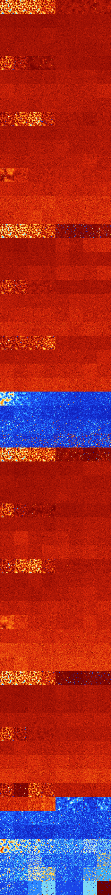

# B23456 (63488-63999)

<details>
    <summary>Initial Grid</summary>
    
</details>


<details>
    <summary>Initial Grid RLE</summary>

```
#C Exported from GoGoL (https://github.com/marrow16/gogol)
#C Wrap mode: Toroidal
#C Boundary mode: Dead
#C Step: 0
x = 100, y = 100, rule = B23456/S
2bo3bo14bo52bo7bo14b2o$o7bo$10bo19bo23bo16bo$7bo4bo15bo41bo10bo16bo$3bo
8bo12bo7bo8bo2bo39bo2bo10bo$o9bo44bo21bo$7bo9bo2bo2bo7bo2bo49bo2bo2bo$
9bo16b2o20bo31bo13b2o$100b$o8bo8bo13bo3bobo43bo$8bo6bo16bo7bo47bo$2b2o
5bo4bo16bobo11bo$14bo10bo20bo3bo19b2o7bo3bob2o$17bo7bo$72bo6bo14bo$12bo
13bo16bo2bo6bo25bo$26bo3bo23bo7b2o33bo$3bobo46bo$30bo2bo27bo6bo4b2o20bo
$2bo5bo18bo6bo9bo17bo14bo16bo$24b2o2bo4bo22b2o12bo3bo13bo$9bo4bo$6bo31b
o43bo5bo10bo$40bo21bo2bo19bo$bo6bo2bo20bo8bo19bo7bo20bo$o17bo22bo$7bo
28bo20bo$6bo27bo46bo$14bo17bo44bo4bo$42bobo9bo9bo$21bo10bo34bo$6b2obo
12bobo9bo6bo7bo21bo2bo13bo$4bo2b2o18bo31bo7bo7bo13bo$37bo16bo3bo25bo$
10bo15bo62bo$20bo3bo2bo23bo2bo35bo5bobo$28bo51bo9bo$14bo19bo38bo5bo$21b
o17bo25bo2bo18bo$16bo33bo6bo22bo16bo$6bo3bo17bo31bo2bo5bo$23bo16bo34bob
o20bo$18bo5bo23bo9bo$30bo17bo38bo$42bo7bo30bo15bo$12bo38bo20bo12bo3bo$
7bo2bo30bo31bobo22bo$12bo20bo17bo7bo7bo$5bo20bo72bo$34bo12bo15bo$9bo20b
o$2bo12bo13bo15bo8bo11bo26bo$3bo18bobo57bo16bo$10bo33bo26bo$42bo5bo5bob
o6bo8bo3bo$12bo58bo4bo7bo$18bo33bo33bo$6bo11bo27bo20b2o26bo$9bo3bo7bo
10bo24bo9bo$3bo46bo3bo16bobo17b2o$o14bo21bo46bo$4bo84bo$18bo5bobo4bo54b
o$5bo4bo4bo3bo2bo20bo30bo$6bo31bo15bo5bo33b2o2bo$13bo57bo24bo$25b2o4bo
7bo14bo9b2o25bo$3bo15bo20bo4bo16bo$18bo15bo3bobo2bo4bo17bo22bo$4bo4bo7b
o13bo60bo$23bobo27bo6bo27bo4bo$2bo22bo22b2o3bo36bo$30bo26bo10bo6bo15bo
4bobo$25b2o42bo2bo$3bo48bo33bo$bo5b2o3bo14bo$11bo3bo27bo46bo$20bo10bo4b
o7bo21bo$o21bo17bo6bo51bo$8bo5bo9bo7bo19bo28bo$31bo38bo22bo2bo$32bo49bo
$43bobo5bo3bo9bo$bo20bo8bobo20bo5bo14bo10b2o$16bo12b2o3bo5bo18bo20bo18b
o$22bo2bo$12bo23bo26bo14bo15bo$15bo17bo3bo2bo$7bo35bo10b2o8bo13bo4bo2b
2o$2bo23bo25bo22bo$bobo3bo8bo20bo7b2o25bo11bo$35bo46bo$44bo6bo12bo3bo
17bo$34bo7bo21bo8bo3bo20bo$11bo9bo4bo18bo6bo24bo19bobo$32bo25bo16bo14bo
7bo$36bo34bo9bo$2bo21bo17bo10bo3bo18bo18bo$14bo2bo38bo4bo9bo16bo10bo$
29bo6bobo20bo2bo27bo!
```
</details>
<details>
    <summary>Thumbnail</summary>

</details>
<table>
<tr>
    <td><a href="./63488%20S%20Heat%20Map%20Activity.png"></a><br>S (63488)<br>R@19,p2</td>    <td><a href="./63489%20S0%20Heat%20Map%20Activity.png"></a><br>S0 (63489)<br>R@18,p2</td>    <td><a href="./63490%20S1%20Heat%20Map%20Activity.png"></a><br>S1 (63490)<br>R@17,p4</td>    <td><a href="./63491%20S01%20Heat%20Map%20Activity.png"></a><br>S01 (63491)<br>R@22,p4</td>    <td><a href="./63492%20S2%20Heat%20Map%20Activity.png"></a><br>S2 (63492)<br>G>1000</td>    <td><a href="./63493%20S02%20Heat%20Map%20Activity.png"></a><br>S02 (63493)<br>G>1000</td>    <td><a href="./63494%20S12%20Heat%20Map%20Activity.png"></a><br>S12 (63494)<br>G>1000</td>    <td><a href="./63495%20S012%20Heat%20Map%20Activity.png"></a><br>S012 (63495)<br>G>1000</td></tr>
<tr>
    <td><a href="./63496%20S3%20Heat%20Map%20Activity.png"></a><br>S3 (63496)<br>G>1000</td>    <td><a href="./63497%20S03%20Heat%20Map%20Activity.png"></a><br>S03 (63497)<br>G>1000</td>    <td><a href="./63498%20S13%20Heat%20Map%20Activity.png"></a><br>S13 (63498)<br>G>1000</td>    <td><a href="./63499%20S013%20Heat%20Map%20Activity.png"></a><br>S013 (63499)<br>G>1000</td>    <td><a href="./63500%20S23%20Heat%20Map%20Activity.png"></a><br>S23 (63500)<br>G>1000</td>    <td><a href="./63501%20S023%20Heat%20Map%20Activity.png"></a><br>S023 (63501)<br>G>1000</td>    <td><a href="./63502%20S123%20Heat%20Map%20Activity.png"></a><br>S123 (63502)<br>G>1000</td>    <td><a href="./63503%20S0123%20Heat%20Map%20Activity.png"></a><br>S0123 (63503)<br>G>1000</td></tr>
<tr>
    <td><a href="./63504%20S4%20Heat%20Map%20Activity.png"></a><br>S4 (63504)<br>G>1000</td>    <td><a href="./63505%20S04%20Heat%20Map%20Activity.png"></a><br>S04 (63505)<br>G>1000</td>    <td><a href="./63506%20S14%20Heat%20Map%20Activity.png"></a><br>S14 (63506)<br>G>1000</td>    <td><a href="./63507%20S014%20Heat%20Map%20Activity.png"></a><br>S014 (63507)<br>G>1000</td>    <td><a href="./63508%20S24%20Heat%20Map%20Activity.png"></a><br>S24 (63508)<br>G>1000</td>    <td><a href="./63509%20S024%20Heat%20Map%20Activity.png"></a><br>S024 (63509)<br>G>1000</td>    <td><a href="./63510%20S124%20Heat%20Map%20Activity.png"></a><br>S124 (63510)<br>G>1000</td>    <td><a href="./63511%20S0124%20Heat%20Map%20Activity.png"></a><br>S0124 (63511)<br>G>1000</td></tr>
<tr>
    <td><a href="./63512%20S34%20Heat%20Map%20Activity.png"></a><br>S34 (63512)<br>G>1000</td>    <td><a href="./63513%20S034%20Heat%20Map%20Activity.png"></a><br>S034 (63513)<br>G>1000</td>    <td><a href="./63514%20S134%20Heat%20Map%20Activity.png"></a><br>S134 (63514)<br>G>1000</td>    <td><a href="./63515%20S0134%20Heat%20Map%20Activity.png"></a><br>S0134 (63515)<br>G>1000</td>    <td><a href="./63516%20S234%20Heat%20Map%20Activity.png"></a><br>S234 (63516)<br>G>1000</td>    <td><a href="./63517%20S0234%20Heat%20Map%20Activity.png"></a><br>S0234 (63517)<br>G>1000</td>    <td><a href="./63518%20S1234%20Heat%20Map%20Activity.png"></a><br>S1234 (63518)<br>G>1000</td>    <td><a href="./63519%20S01234%20Heat%20Map%20Activity.png"></a><br>S01234 (63519)<br>G>1000</td></tr>
<tr>
    <td><a href="./63520%20S5%20Heat%20Map%20Activity.png"></a><br>S5 (63520)<br>R@36,p2</td>    <td><a href="./63521%20S05%20Heat%20Map%20Activity.png"></a><br>S05 (63521)<br>R@70,p2</td>    <td><a href="./63522%20S15%20Heat%20Map%20Activity.png"></a><br>S15 (63522)<br>G>1000</td>    <td><a href="./63523%20S015%20Heat%20Map%20Activity.png"></a><br>S015 (63523)<br>G>1000</td>    <td><a href="./63524%20S25%20Heat%20Map%20Activity.png"></a><br>S25 (63524)<br>G>1000</td>    <td><a href="./63525%20S025%20Heat%20Map%20Activity.png"></a><br>S025 (63525)<br>G>1000</td>    <td><a href="./63526%20S125%20Heat%20Map%20Activity.png"></a><br>S125 (63526)<br>G>1000</td>    <td><a href="./63527%20S0125%20Heat%20Map%20Activity.png"></a><br>S0125 (63527)<br>G>1000</td></tr>
<tr>
    <td><a href="./63528%20S35%20Heat%20Map%20Activity.png"></a><br>S35 (63528)<br>G>1000</td>    <td><a href="./63529%20S035%20Heat%20Map%20Activity.png"></a><br>S035 (63529)<br>G>1000</td>    <td><a href="./63530%20S135%20Heat%20Map%20Activity.png"></a><br>S135 (63530)<br>G>1000</td>    <td><a href="./63531%20S0135%20Heat%20Map%20Activity.png"></a><br>S0135 (63531)<br>G>1000</td>    <td><a href="./63532%20S235%20Heat%20Map%20Activity.png"></a><br>S235 (63532)<br>G>1000</td>    <td><a href="./63533%20S0235%20Heat%20Map%20Activity.png"></a><br>S0235 (63533)<br>G>1000</td>    <td><a href="./63534%20S1235%20Heat%20Map%20Activity.png"></a><br>S1235 (63534)<br>G>1000</td>    <td><a href="./63535%20S01235%20Heat%20Map%20Activity.png"></a><br>S01235 (63535)<br>G>1000</td></tr>
<tr>
    <td><a href="./63536%20S45%20Heat%20Map%20Activity.png"></a><br>S45 (63536)<br>G>1000</td>    <td><a href="./63537%20S045%20Heat%20Map%20Activity.png"></a><br>S045 (63537)<br>G>1000</td>    <td><a href="./63538%20S145%20Heat%20Map%20Activity.png"></a><br>S145 (63538)<br>G>1000</td>    <td><a href="./63539%20S0145%20Heat%20Map%20Activity.png"></a><br>S0145 (63539)<br>G>1000</td>    <td><a href="./63540%20S245%20Heat%20Map%20Activity.png"></a><br>S245 (63540)<br>G>1000</td>    <td><a href="./63541%20S0245%20Heat%20Map%20Activity.png"></a><br>S0245 (63541)<br>G>1000</td>    <td><a href="./63542%20S1245%20Heat%20Map%20Activity.png"></a><br>S1245 (63542)<br>G>1000</td>    <td><a href="./63543%20S01245%20Heat%20Map%20Activity.png"></a><br>S01245 (63543)<br>G>1000</td></tr>
<tr>
    <td><a href="./63544%20S345%20Heat%20Map%20Activity.png"></a><br>S345 (63544)<br>G>1000</td>    <td><a href="./63545%20S0345%20Heat%20Map%20Activity.png"></a><br>S0345 (63545)<br>G>1000</td>    <td><a href="./63546%20S1345%20Heat%20Map%20Activity.png"></a><br>S1345 (63546)<br>G>1000</td>    <td><a href="./63547%20S01345%20Heat%20Map%20Activity.png"></a><br>S01345 (63547)<br>G>1000</td>    <td><a href="./63548%20S2345%20Heat%20Map%20Activity.png"></a><br>S2345 (63548)<br>G>1000</td>    <td><a href="./63549%20S02345%20Heat%20Map%20Activity.png"></a><br>S02345 (63549)<br>G>1000</td>    <td><a href="./63550%20S12345%20Heat%20Map%20Activity.png"></a><br>S12345 (63550)<br>G>1000</td>    <td><a href="./63551%20S012345%20Heat%20Map%20Activity.png"></a><br>S012345 (63551)<br>G>1000</td></tr>
<tr>
    <td><a href="./63552%20S6%20Heat%20Map%20Activity.png"></a><br>S6 (63552)<br>R@53,p16</td>    <td><a href="./63553%20S06%20Heat%20Map%20Activity.png"></a><br>S06 (63553)<br>R@27,p4</td>    <td><a href="./63554%20S16%20Heat%20Map%20Activity.png"></a><br>S16 (63554)<br>R@18,p4</td>    <td><a href="./63555%20S016%20Heat%20Map%20Activity.png"></a><br>S016 (63555)<br>R@36,p12</td>    <td><a href="./63556%20S26%20Heat%20Map%20Activity.png"></a><br>S26 (63556)<br>G>1000</td>    <td><a href="./63557%20S026%20Heat%20Map%20Activity.png"></a><br>S026 (63557)<br>G>1000</td>    <td><a href="./63558%20S126%20Heat%20Map%20Activity.png"></a><br>S126 (63558)<br>G>1000</td>    <td><a href="./63559%20S0126%20Heat%20Map%20Activity.png"></a><br>S0126 (63559)<br>G>1000</td></tr>
<tr>
    <td><a href="./63560%20S36%20Heat%20Map%20Activity.png"></a><br>S36 (63560)<br>G>1000</td>    <td><a href="./63561%20S036%20Heat%20Map%20Activity.png"></a><br>S036 (63561)<br>G>1000</td>    <td><a href="./63562%20S136%20Heat%20Map%20Activity.png"></a><br>S136 (63562)<br>G>1000</td>    <td><a href="./63563%20S0136%20Heat%20Map%20Activity.png"></a><br>S0136 (63563)<br>G>1000</td>    <td><a href="./63564%20S236%20Heat%20Map%20Activity.png"></a><br>S236 (63564)<br>G>1000</td>    <td><a href="./63565%20S0236%20Heat%20Map%20Activity.png"></a><br>S0236 (63565)<br>G>1000</td>    <td><a href="./63566%20S1236%20Heat%20Map%20Activity.png"></a><br>S1236 (63566)<br>G>1000</td>    <td><a href="./63567%20S01236%20Heat%20Map%20Activity.png"></a><br>S01236 (63567)<br>G>1000</td></tr>
<tr>
    <td><a href="./63568%20S46%20Heat%20Map%20Activity.png"></a><br>S46 (63568)<br>G>1000</td>    <td><a href="./63569%20S046%20Heat%20Map%20Activity.png"></a><br>S046 (63569)<br>G>1000</td>    <td><a href="./63570%20S146%20Heat%20Map%20Activity.png"></a><br>S146 (63570)<br>G>1000</td>    <td><a href="./63571%20S0146%20Heat%20Map%20Activity.png"></a><br>S0146 (63571)<br>G>1000</td>    <td><a href="./63572%20S246%20Heat%20Map%20Activity.png"></a><br>S246 (63572)<br>G>1000</td>    <td><a href="./63573%20S0246%20Heat%20Map%20Activity.png"></a><br>S0246 (63573)<br>G>1000</td>    <td><a href="./63574%20S1246%20Heat%20Map%20Activity.png"></a><br>S1246 (63574)<br>G>1000</td>    <td><a href="./63575%20S01246%20Heat%20Map%20Activity.png"></a><br>S01246 (63575)<br>G>1000</td></tr>
<tr>
    <td><a href="./63576%20S346%20Heat%20Map%20Activity.png"></a><br>S346 (63576)<br>G>1000</td>    <td><a href="./63577%20S0346%20Heat%20Map%20Activity.png"></a><br>S0346 (63577)<br>G>1000</td>    <td><a href="./63578%20S1346%20Heat%20Map%20Activity.png"></a><br>S1346 (63578)<br>G>1000</td>    <td><a href="./63579%20S01346%20Heat%20Map%20Activity.png"></a><br>S01346 (63579)<br>G>1000</td>    <td><a href="./63580%20S2346%20Heat%20Map%20Activity.png"></a><br>S2346 (63580)<br>G>1000</td>    <td><a href="./63581%20S02346%20Heat%20Map%20Activity.png"></a><br>S02346 (63581)<br>G>1000</td>    <td><a href="./63582%20S12346%20Heat%20Map%20Activity.png"></a><br>S12346 (63582)<br>G>1000</td>    <td><a href="./63583%20S012346%20Heat%20Map%20Activity.png"></a><br>S012346 (63583)<br>G>1000</td></tr>
<tr>
    <td><a href="./63584%20S56%20Heat%20Map%20Activity.png"></a><br>S56 (63584)<br>G>1000</td>    <td><a href="./63585%20S056%20Heat%20Map%20Activity.png"></a><br>S056 (63585)<br>G>1000</td>    <td><a href="./63586%20S156%20Heat%20Map%20Activity.png"></a><br>S156 (63586)<br>G>1000</td>    <td><a href="./63587%20S0156%20Heat%20Map%20Activity.png"></a><br>S0156 (63587)<br>G>1000</td>    <td><a href="./63588%20S256%20Heat%20Map%20Activity.png"></a><br>S256 (63588)<br>G>1000</td>    <td><a href="./63589%20S0256%20Heat%20Map%20Activity.png"></a><br>S0256 (63589)<br>G>1000</td>    <td><a href="./63590%20S1256%20Heat%20Map%20Activity.png"></a><br>S1256 (63590)<br>G>1000</td>    <td><a href="./63591%20S01256%20Heat%20Map%20Activity.png"></a><br>S01256 (63591)<br>G>1000</td></tr>
<tr>
    <td><a href="./63592%20S356%20Heat%20Map%20Activity.png"></a><br>S356 (63592)<br>G>1000</td>    <td><a href="./63593%20S0356%20Heat%20Map%20Activity.png"></a><br>S0356 (63593)<br>G>1000</td>    <td><a href="./63594%20S1356%20Heat%20Map%20Activity.png"></a><br>S1356 (63594)<br>G>1000</td>    <td><a href="./63595%20S01356%20Heat%20Map%20Activity.png"></a><br>S01356 (63595)<br>G>1000</td>    <td><a href="./63596%20S2356%20Heat%20Map%20Activity.png"></a><br>S2356 (63596)<br>G>1000</td>    <td><a href="./63597%20S02356%20Heat%20Map%20Activity.png"></a><br>S02356 (63597)<br>G>1000</td>    <td><a href="./63598%20S12356%20Heat%20Map%20Activity.png"></a><br>S12356 (63598)<br>G>1000</td>    <td><a href="./63599%20S012356%20Heat%20Map%20Activity.png"></a><br>S012356 (63599)<br>G>1000</td></tr>
<tr>
    <td><a href="./63600%20S456%20Heat%20Map%20Activity.png"></a><br>S456 (63600)<br>G>1000</td>    <td><a href="./63601%20S0456%20Heat%20Map%20Activity.png"></a><br>S0456 (63601)<br>G>1000</td>    <td><a href="./63602%20S1456%20Heat%20Map%20Activity.png"></a><br>S1456 (63602)<br>G>1000</td>    <td><a href="./63603%20S01456%20Heat%20Map%20Activity.png"></a><br>S01456 (63603)<br>G>1000</td>    <td><a href="./63604%20S2456%20Heat%20Map%20Activity.png"></a><br>S2456 (63604)<br>G>1000</td>    <td><a href="./63605%20S02456%20Heat%20Map%20Activity.png"></a><br>S02456 (63605)<br>G>1000</td>    <td><a href="./63606%20S12456%20Heat%20Map%20Activity.png"></a><br>S12456 (63606)<br>G>1000</td>    <td><a href="./63607%20S012456%20Heat%20Map%20Activity.png"></a><br>S012456 (63607)<br>G>1000</td></tr>
<tr>
    <td><a href="./63608%20S3456%20Heat%20Map%20Activity.png"></a><br>S3456 (63608)<br>G>1000</td>    <td><a href="./63609%20S03456%20Heat%20Map%20Activity.png"></a><br>S03456 (63609)<br>G>1000</td>    <td><a href="./63610%20S13456%20Heat%20Map%20Activity.png"></a><br>S13456 (63610)<br>G>1000</td>    <td><a href="./63611%20S013456%20Heat%20Map%20Activity.png"></a><br>S013456 (63611)<br>G>1000</td>    <td><a href="./63612%20S23456%20Heat%20Map%20Activity.png"></a><br>S23456 (63612)<br>G>1000</td>    <td><a href="./63613%20S023456%20Heat%20Map%20Activity.png"></a><br>S023456 (63613)<br>G>1000</td>    <td><a href="./63614%20S123456%20Heat%20Map%20Activity.png"></a><br>S123456 (63614)<br>G>1000</td>    <td><a href="./63615%20S0123456%20Heat%20Map%20Activity.png"></a><br>S0123456 (63615)<br>G>1000</td></tr>
<tr>
    <td><a href="./63616%20S7%20Heat%20Map%20Activity.png"></a><br>S7 (63616)<br>R@19,p2</td>    <td><a href="./63617%20S07%20Heat%20Map%20Activity.png"></a><br>S07 (63617)<br>R@18,p2</td>    <td><a href="./63618%20S17%20Heat%20Map%20Activity.png"></a><br>S17 (63618)<br>R@19,p4</td>    <td><a href="./63619%20S017%20Heat%20Map%20Activity.png"></a><br>S017 (63619)<br>R@24,p4</td>    <td><a href="./63620%20S27%20Heat%20Map%20Activity.png"></a><br>S27 (63620)<br>R@244,p120</td>    <td><a href="./63621%20S027%20Heat%20Map%20Activity.png"></a><br>S027 (63621)<br>R@345,p120</td>    <td><a href="./63622%20S127%20Heat%20Map%20Activity.png"></a><br>S127 (63622)<br>R@209,p24</td>    <td><a href="./63623%20S0127%20Heat%20Map%20Activity.png"></a><br>S0127 (63623)<br>R@132,p24</td></tr>
<tr>
    <td><a href="./63624%20S37%20Heat%20Map%20Activity.png"></a><br>S37 (63624)<br>G>1000</td>    <td><a href="./63625%20S037%20Heat%20Map%20Activity.png"></a><br>S037 (63625)<br>G>1000</td>    <td><a href="./63626%20S137%20Heat%20Map%20Activity.png"></a><br>S137 (63626)<br>G>1000</td>    <td><a href="./63627%20S0137%20Heat%20Map%20Activity.png"></a><br>S0137 (63627)<br>G>1000</td>    <td><a href="./63628%20S237%20Heat%20Map%20Activity.png"></a><br>S237 (63628)<br>G>1000</td>    <td><a href="./63629%20S0237%20Heat%20Map%20Activity.png"></a><br>S0237 (63629)<br>G>1000</td>    <td><a href="./63630%20S1237%20Heat%20Map%20Activity.png"></a><br>S1237 (63630)<br>G>1000</td>    <td><a href="./63631%20S01237%20Heat%20Map%20Activity.png"></a><br>S01237 (63631)<br>G>1000</td></tr>
<tr>
    <td><a href="./63632%20S47%20Heat%20Map%20Activity.png"></a><br>S47 (63632)<br>G>1000</td>    <td><a href="./63633%20S047%20Heat%20Map%20Activity.png"></a><br>S047 (63633)<br>G>1000</td>    <td><a href="./63634%20S147%20Heat%20Map%20Activity.png"></a><br>S147 (63634)<br>G>1000</td>    <td><a href="./63635%20S0147%20Heat%20Map%20Activity.png"></a><br>S0147 (63635)<br>G>1000</td>    <td><a href="./63636%20S247%20Heat%20Map%20Activity.png"></a><br>S247 (63636)<br>G>1000</td>    <td><a href="./63637%20S0247%20Heat%20Map%20Activity.png"></a><br>S0247 (63637)<br>G>1000</td>    <td><a href="./63638%20S1247%20Heat%20Map%20Activity.png"></a><br>S1247 (63638)<br>G>1000</td>    <td><a href="./63639%20S01247%20Heat%20Map%20Activity.png"></a><br>S01247 (63639)<br>G>1000</td></tr>
<tr>
    <td><a href="./63640%20S347%20Heat%20Map%20Activity.png"></a><br>S347 (63640)<br>G>1000</td>    <td><a href="./63641%20S0347%20Heat%20Map%20Activity.png"></a><br>S0347 (63641)<br>G>1000</td>    <td><a href="./63642%20S1347%20Heat%20Map%20Activity.png"></a><br>S1347 (63642)<br>G>1000</td>    <td><a href="./63643%20S01347%20Heat%20Map%20Activity.png"></a><br>S01347 (63643)<br>G>1000</td>    <td><a href="./63644%20S2347%20Heat%20Map%20Activity.png"></a><br>S2347 (63644)<br>G>1000</td>    <td><a href="./63645%20S02347%20Heat%20Map%20Activity.png"></a><br>S02347 (63645)<br>G>1000</td>    <td><a href="./63646%20S12347%20Heat%20Map%20Activity.png"></a><br>S12347 (63646)<br>G>1000</td>    <td><a href="./63647%20S012347%20Heat%20Map%20Activity.png"></a><br>S012347 (63647)<br>G>1000</td></tr>
<tr>
    <td><a href="./63648%20S57%20Heat%20Map%20Activity.png"></a><br>S57 (63648)<br>R@43,p2</td>    <td><a href="./63649%20S057%20Heat%20Map%20Activity.png"></a><br>S057 (63649)<br>R@52,p2</td>    <td><a href="./63650%20S157%20Heat%20Map%20Activity.png"></a><br>S157 (63650)<br>G>1000</td>    <td><a href="./63651%20S0157%20Heat%20Map%20Activity.png"></a><br>S0157 (63651)<br>G>1000</td>    <td><a href="./63652%20S257%20Heat%20Map%20Activity.png"></a><br>S257 (63652)<br>G>1000</td>    <td><a href="./63653%20S0257%20Heat%20Map%20Activity.png"></a><br>S0257 (63653)<br>G>1000</td>    <td><a href="./63654%20S1257%20Heat%20Map%20Activity.png"></a><br>S1257 (63654)<br>G>1000</td>    <td><a href="./63655%20S01257%20Heat%20Map%20Activity.png"></a><br>S01257 (63655)<br>G>1000</td></tr>
<tr>
    <td><a href="./63656%20S357%20Heat%20Map%20Activity.png"></a><br>S357 (63656)<br>G>1000</td>    <td><a href="./63657%20S0357%20Heat%20Map%20Activity.png"></a><br>S0357 (63657)<br>G>1000</td>    <td><a href="./63658%20S1357%20Heat%20Map%20Activity.png"></a><br>S1357 (63658)<br>G>1000</td>    <td><a href="./63659%20S01357%20Heat%20Map%20Activity.png"></a><br>S01357 (63659)<br>G>1000</td>    <td><a href="./63660%20S2357%20Heat%20Map%20Activity.png"></a><br>S2357 (63660)<br>G>1000</td>    <td><a href="./63661%20S02357%20Heat%20Map%20Activity.png"></a><br>S02357 (63661)<br>G>1000</td>    <td><a href="./63662%20S12357%20Heat%20Map%20Activity.png"></a><br>S12357 (63662)<br>G>1000</td>    <td><a href="./63663%20S012357%20Heat%20Map%20Activity.png"></a><br>S012357 (63663)<br>G>1000</td></tr>
<tr>
    <td><a href="./63664%20S457%20Heat%20Map%20Activity.png"></a><br>S457 (63664)<br>G>1000</td>    <td><a href="./63665%20S0457%20Heat%20Map%20Activity.png"></a><br>S0457 (63665)<br>G>1000</td>    <td><a href="./63666%20S1457%20Heat%20Map%20Activity.png"></a><br>S1457 (63666)<br>G>1000</td>    <td><a href="./63667%20S01457%20Heat%20Map%20Activity.png"></a><br>S01457 (63667)<br>G>1000</td>    <td><a href="./63668%20S2457%20Heat%20Map%20Activity.png"></a><br>S2457 (63668)<br>G>1000</td>    <td><a href="./63669%20S02457%20Heat%20Map%20Activity.png"></a><br>S02457 (63669)<br>G>1000</td>    <td><a href="./63670%20S12457%20Heat%20Map%20Activity.png"></a><br>S12457 (63670)<br>G>1000</td>    <td><a href="./63671%20S012457%20Heat%20Map%20Activity.png"></a><br>S012457 (63671)<br>G>1000</td></tr>
<tr>
    <td><a href="./63672%20S3457%20Heat%20Map%20Activity.png"></a><br>S3457 (63672)<br>G>1000</td>    <td><a href="./63673%20S03457%20Heat%20Map%20Activity.png"></a><br>S03457 (63673)<br>G>1000</td>    <td><a href="./63674%20S13457%20Heat%20Map%20Activity.png"></a><br>S13457 (63674)<br>G>1000</td>    <td><a href="./63675%20S013457%20Heat%20Map%20Activity.png"></a><br>S013457 (63675)<br>G>1000</td>    <td><a href="./63676%20S23457%20Heat%20Map%20Activity.png"></a><br>S23457 (63676)<br>G>1000</td>    <td><a href="./63677%20S023457%20Heat%20Map%20Activity.png"></a><br>S023457 (63677)<br>G>1000</td>    <td><a href="./63678%20S123457%20Heat%20Map%20Activity.png"></a><br>S123457 (63678)<br>G>1000</td>    <td><a href="./63679%20S0123457%20Heat%20Map%20Activity.png"></a><br>S0123457 (63679)<br>G>1000</td></tr>
<tr>
    <td><a href="./63680%20S67%20Heat%20Map%20Activity.png"></a><br>S67 (63680)<br>R@53,p16</td>    <td><a href="./63681%20S067%20Heat%20Map%20Activity.png"></a><br>S067 (63681)<br>R@39,p16</td>    <td><a href="./63682%20S167%20Heat%20Map%20Activity.png"></a><br>S167 (63682)<br>R@32,p8</td>    <td><a href="./63683%20S0167%20Heat%20Map%20Activity.png"></a><br>S0167 (63683)<br>R@22,p4</td>    <td><a href="./63684%20S267%20Heat%20Map%20Activity.png"></a><br>S267 (63684)<br>G>1000</td>    <td><a href="./63685%20S0267%20Heat%20Map%20Activity.png"></a><br>S0267 (63685)<br>G>1000</td>    <td><a href="./63686%20S1267%20Heat%20Map%20Activity.png"></a><br>S1267 (63686)<br>G>1000</td>    <td><a href="./63687%20S01267%20Heat%20Map%20Activity.png"></a><br>S01267 (63687)<br>G>1000</td></tr>
<tr>
    <td><a href="./63688%20S367%20Heat%20Map%20Activity.png"></a><br>S367 (63688)<br>G>1000</td>    <td><a href="./63689%20S0367%20Heat%20Map%20Activity.png"></a><br>S0367 (63689)<br>G>1000</td>    <td><a href="./63690%20S1367%20Heat%20Map%20Activity.png"></a><br>S1367 (63690)<br>G>1000</td>    <td><a href="./63691%20S01367%20Heat%20Map%20Activity.png"></a><br>S01367 (63691)<br>G>1000</td>    <td><a href="./63692%20S2367%20Heat%20Map%20Activity.png"></a><br>S2367 (63692)<br>G>1000</td>    <td><a href="./63693%20S02367%20Heat%20Map%20Activity.png"></a><br>S02367 (63693)<br>G>1000</td>    <td><a href="./63694%20S12367%20Heat%20Map%20Activity.png"></a><br>S12367 (63694)<br>G>1000</td>    <td><a href="./63695%20S012367%20Heat%20Map%20Activity.png"></a><br>S012367 (63695)<br>G>1000</td></tr>
<tr>
    <td><a href="./63696%20S467%20Heat%20Map%20Activity.png"></a><br>S467 (63696)<br>G>1000</td>    <td><a href="./63697%20S0467%20Heat%20Map%20Activity.png"></a><br>S0467 (63697)<br>G>1000</td>    <td><a href="./63698%20S1467%20Heat%20Map%20Activity.png"></a><br>S1467 (63698)<br>G>1000</td>    <td><a href="./63699%20S01467%20Heat%20Map%20Activity.png"></a><br>S01467 (63699)<br>G>1000</td>    <td><a href="./63700%20S2467%20Heat%20Map%20Activity.png"></a><br>S2467 (63700)<br>G>1000</td>    <td><a href="./63701%20S02467%20Heat%20Map%20Activity.png"></a><br>S02467 (63701)<br>G>1000</td>    <td><a href="./63702%20S12467%20Heat%20Map%20Activity.png"></a><br>S12467 (63702)<br>G>1000</td>    <td><a href="./63703%20S012467%20Heat%20Map%20Activity.png"></a><br>S012467 (63703)<br>G>1000</td></tr>
<tr>
    <td><a href="./63704%20S3467%20Heat%20Map%20Activity.png"></a><br>S3467 (63704)<br>G>1000</td>    <td><a href="./63705%20S03467%20Heat%20Map%20Activity.png"></a><br>S03467 (63705)<br>G>1000</td>    <td><a href="./63706%20S13467%20Heat%20Map%20Activity.png"></a><br>S13467 (63706)<br>G>1000</td>    <td><a href="./63707%20S013467%20Heat%20Map%20Activity.png"></a><br>S013467 (63707)<br>G>1000</td>    <td><a href="./63708%20S23467%20Heat%20Map%20Activity.png"></a><br>S23467 (63708)<br>G>1000</td>    <td><a href="./63709%20S023467%20Heat%20Map%20Activity.png"></a><br>S023467 (63709)<br>G>1000</td>    <td><a href="./63710%20S123467%20Heat%20Map%20Activity.png"></a><br>S123467 (63710)<br>G>1000</td>    <td><a href="./63711%20S0123467%20Heat%20Map%20Activity.png"></a><br>S0123467 (63711)<br>G>1000</td></tr>
<tr>
    <td><a href="./63712%20S567%20Heat%20Map%20Activity.png"></a><br>S567 (63712)<br>R@121,p4</td>    <td><a href="./63713%20S0567%20Heat%20Map%20Activity.png"></a><br>S0567 (63713)<br>R@121,p6</td>    <td><a href="./63714%20S1567%20Heat%20Map%20Activity.png"></a><br>S1567 (63714)<br>R@102,p6</td>    <td><a href="./63715%20S01567%20Heat%20Map%20Activity.png"></a><br>S01567 (63715)<br>R@96,p6</td>    <td><a href="./63716%20S2567%20Heat%20Map%20Activity.png"></a><br>S2567 (63716)<br>R@71,p6</td>    <td><a href="./63717%20S02567%20Heat%20Map%20Activity.png"></a><br>S02567 (63717)<br>R@81,p6</td>    <td><a href="./63718%20S12567%20Heat%20Map%20Activity.png"></a><br>S12567 (63718)<br>R@78,p6</td>    <td><a href="./63719%20S012567%20Heat%20Map%20Activity.png"></a><br>S012567 (63719)<br>R@73,p2</td></tr>
<tr>
    <td><a href="./63720%20S3567%20Heat%20Map%20Activity.png"></a><br>S3567 (63720)<br>R@100,p2</td>    <td><a href="./63721%20S03567%20Heat%20Map%20Activity.png"></a><br>S03567 (63721)<br>R@61,p2</td>    <td><a href="./63722%20S13567%20Heat%20Map%20Activity.png"></a><br>S13567 (63722)<br>R@57,p2</td>    <td><a href="./63723%20S013567%20Heat%20Map%20Activity.png"></a><br>S013567 (63723)<br>R@75,p12</td>    <td><a href="./63724%20S23567%20Heat%20Map%20Activity.png"></a><br>S23567 (63724)<br>R@86,p10</td>    <td><a href="./63725%20S023567%20Heat%20Map%20Activity.png"></a><br>S023567 (63725)<br>R@111,p12</td>    <td><a href="./63726%20S123567%20Heat%20Map%20Activity.png"></a><br>S123567 (63726)<br>R@93,p2</td>    <td><a href="./63727%20S0123567%20Heat%20Map%20Activity.png"></a><br>S0123567 (63727)<br>R@111,p30</td></tr>
<tr>
    <td><a href="./63728%20S4567%20Heat%20Map%20Activity.png"></a><br>S4567 (63728)<br>R@41,p12</td>    <td><a href="./63729%20S04567%20Heat%20Map%20Activity.png"></a><br>S04567 (63729)<br>R@32,p6</td>    <td><a href="./63730%20S14567%20Heat%20Map%20Activity.png"></a><br>S14567 (63730)<br>R@29,p6</td>    <td><a href="./63731%20S014567%20Heat%20Map%20Activity.png"></a><br>S014567 (63731)<br>R@26,p6</td>    <td><a href="./63732%20S24567%20Heat%20Map%20Activity.png"></a><br>S24567 (63732)<br>R@38,p12</td>    <td><a href="./63733%20S024567%20Heat%20Map%20Activity.png"></a><br>S024567 (63733)<br>R@33,p6</td>    <td><a href="./63734%20S124567%20Heat%20Map%20Activity.png"></a><br>S124567 (63734)<br>R@29,p6</td>    <td><a href="./63735%20S0124567%20Heat%20Map%20Activity.png"></a><br>S0124567 (63735)<br>R@32,p6</td></tr>
<tr>
    <td><a href="./63736%20S34567%20Heat%20Map%20Activity.png"></a><br>S34567 (63736)<br>R@31,p6</td>    <td><a href="./63737%20S034567%20Heat%20Map%20Activity.png"></a><br>S034567 (63737)<br>R@28,p6</td>    <td><a href="./63738%20S134567%20Heat%20Map%20Activity.png"></a><br>S134567 (63738)<br>R@37,p6</td>    <td><a href="./63739%20S0134567%20Heat%20Map%20Activity.png"></a><br>S0134567 (63739)<br>R@32,p6</td>    <td><a href="./63740%20S234567%20Heat%20Map%20Activity.png"></a><br>S234567 (63740)<br>R@37,p6</td>    <td><a href="./63741%20S0234567%20Heat%20Map%20Activity.png"></a><br>S0234567 (63741)<br>R@32,p6</td>    <td><a href="./63742%20S1234567%20Heat%20Map%20Activity.png"></a><br>S1234567 (63742)<br>R@35,p6</td>    <td><a href="./63743%20S01234567%20Heat%20Map%20Activity.png"></a><br>S01234567 (63743)<br>R@33,p6</td></tr>
<tr>
    <td><a href="./63744%20S8%20Heat%20Map%20Activity.png"></a><br>S8 (63744)<br>R@19,p2</td>    <td><a href="./63745%20S08%20Heat%20Map%20Activity.png"></a><br>S08 (63745)<br>R@18,p2</td>    <td><a href="./63746%20S18%20Heat%20Map%20Activity.png"></a><br>S18 (63746)<br>R@20,p4</td>    <td><a href="./63747%20S018%20Heat%20Map%20Activity.png"></a><br>S018 (63747)<br>R@19,p4</td>    <td><a href="./63748%20S28%20Heat%20Map%20Activity.png"></a><br>S28 (63748)<br>G>1000</td>    <td><a href="./63749%20S028%20Heat%20Map%20Activity.png"></a><br>S028 (63749)<br>G>1000</td>    <td><a href="./63750%20S128%20Heat%20Map%20Activity.png"></a><br>S128 (63750)<br>R@993,p24</td>    <td><a href="./63751%20S0128%20Heat%20Map%20Activity.png"></a><br>S0128 (63751)<br>R@239,p24</td></tr>
<tr>
    <td><a href="./63752%20S38%20Heat%20Map%20Activity.png"></a><br>S38 (63752)<br>G>1000</td>    <td><a href="./63753%20S038%20Heat%20Map%20Activity.png"></a><br>S038 (63753)<br>G>1000</td>    <td><a href="./63754%20S138%20Heat%20Map%20Activity.png"></a><br>S138 (63754)<br>G>1000</td>    <td><a href="./63755%20S0138%20Heat%20Map%20Activity.png"></a><br>S0138 (63755)<br>G>1000</td>    <td><a href="./63756%20S238%20Heat%20Map%20Activity.png"></a><br>S238 (63756)<br>G>1000</td>    <td><a href="./63757%20S0238%20Heat%20Map%20Activity.png"></a><br>S0238 (63757)<br>G>1000</td>    <td><a href="./63758%20S1238%20Heat%20Map%20Activity.png"></a><br>S1238 (63758)<br>G>1000</td>    <td><a href="./63759%20S01238%20Heat%20Map%20Activity.png"></a><br>S01238 (63759)<br>G>1000</td></tr>
<tr>
    <td><a href="./63760%20S48%20Heat%20Map%20Activity.png"></a><br>S48 (63760)<br>G>1000</td>    <td><a href="./63761%20S048%20Heat%20Map%20Activity.png"></a><br>S048 (63761)<br>G>1000</td>    <td><a href="./63762%20S148%20Heat%20Map%20Activity.png"></a><br>S148 (63762)<br>G>1000</td>    <td><a href="./63763%20S0148%20Heat%20Map%20Activity.png"></a><br>S0148 (63763)<br>G>1000</td>    <td><a href="./63764%20S248%20Heat%20Map%20Activity.png"></a><br>S248 (63764)<br>G>1000</td>    <td><a href="./63765%20S0248%20Heat%20Map%20Activity.png"></a><br>S0248 (63765)<br>G>1000</td>    <td><a href="./63766%20S1248%20Heat%20Map%20Activity.png"></a><br>S1248 (63766)<br>G>1000</td>    <td><a href="./63767%20S01248%20Heat%20Map%20Activity.png"></a><br>S01248 (63767)<br>G>1000</td></tr>
<tr>
    <td><a href="./63768%20S348%20Heat%20Map%20Activity.png"></a><br>S348 (63768)<br>G>1000</td>    <td><a href="./63769%20S0348%20Heat%20Map%20Activity.png"></a><br>S0348 (63769)<br>G>1000</td>    <td><a href="./63770%20S1348%20Heat%20Map%20Activity.png"></a><br>S1348 (63770)<br>G>1000</td>    <td><a href="./63771%20S01348%20Heat%20Map%20Activity.png"></a><br>S01348 (63771)<br>G>1000</td>    <td><a href="./63772%20S2348%20Heat%20Map%20Activity.png"></a><br>S2348 (63772)<br>G>1000</td>    <td><a href="./63773%20S02348%20Heat%20Map%20Activity.png"></a><br>S02348 (63773)<br>G>1000</td>    <td><a href="./63774%20S12348%20Heat%20Map%20Activity.png"></a><br>S12348 (63774)<br>G>1000</td>    <td><a href="./63775%20S012348%20Heat%20Map%20Activity.png"></a><br>S012348 (63775)<br>G>1000</td></tr>
<tr>
    <td><a href="./63776%20S58%20Heat%20Map%20Activity.png"></a><br>S58 (63776)<br>R@36,p2</td>    <td><a href="./63777%20S058%20Heat%20Map%20Activity.png"></a><br>S058 (63777)<br>R@84,p2</td>    <td><a href="./63778%20S158%20Heat%20Map%20Activity.png"></a><br>S158 (63778)<br>G>1000</td>    <td><a href="./63779%20S0158%20Heat%20Map%20Activity.png"></a><br>S0158 (63779)<br>G>1000</td>    <td><a href="./63780%20S258%20Heat%20Map%20Activity.png"></a><br>S258 (63780)<br>G>1000</td>    <td><a href="./63781%20S0258%20Heat%20Map%20Activity.png"></a><br>S0258 (63781)<br>G>1000</td>    <td><a href="./63782%20S1258%20Heat%20Map%20Activity.png"></a><br>S1258 (63782)<br>G>1000</td>    <td><a href="./63783%20S01258%20Heat%20Map%20Activity.png"></a><br>S01258 (63783)<br>G>1000</td></tr>
<tr>
    <td><a href="./63784%20S358%20Heat%20Map%20Activity.png"></a><br>S358 (63784)<br>G>1000</td>    <td><a href="./63785%20S0358%20Heat%20Map%20Activity.png"></a><br>S0358 (63785)<br>G>1000</td>    <td><a href="./63786%20S1358%20Heat%20Map%20Activity.png"></a><br>S1358 (63786)<br>G>1000</td>    <td><a href="./63787%20S01358%20Heat%20Map%20Activity.png"></a><br>S01358 (63787)<br>G>1000</td>    <td><a href="./63788%20S2358%20Heat%20Map%20Activity.png"></a><br>S2358 (63788)<br>G>1000</td>    <td><a href="./63789%20S02358%20Heat%20Map%20Activity.png"></a><br>S02358 (63789)<br>G>1000</td>    <td><a href="./63790%20S12358%20Heat%20Map%20Activity.png"></a><br>S12358 (63790)<br>G>1000</td>    <td><a href="./63791%20S012358%20Heat%20Map%20Activity.png"></a><br>S012358 (63791)<br>G>1000</td></tr>
<tr>
    <td><a href="./63792%20S458%20Heat%20Map%20Activity.png"></a><br>S458 (63792)<br>G>1000</td>    <td><a href="./63793%20S0458%20Heat%20Map%20Activity.png"></a><br>S0458 (63793)<br>G>1000</td>    <td><a href="./63794%20S1458%20Heat%20Map%20Activity.png"></a><br>S1458 (63794)<br>G>1000</td>    <td><a href="./63795%20S01458%20Heat%20Map%20Activity.png"></a><br>S01458 (63795)<br>G>1000</td>    <td><a href="./63796%20S2458%20Heat%20Map%20Activity.png"></a><br>S2458 (63796)<br>G>1000</td>    <td><a href="./63797%20S02458%20Heat%20Map%20Activity.png"></a><br>S02458 (63797)<br>G>1000</td>    <td><a href="./63798%20S12458%20Heat%20Map%20Activity.png"></a><br>S12458 (63798)<br>G>1000</td>    <td><a href="./63799%20S012458%20Heat%20Map%20Activity.png"></a><br>S012458 (63799)<br>G>1000</td></tr>
<tr>
    <td><a href="./63800%20S3458%20Heat%20Map%20Activity.png"></a><br>S3458 (63800)<br>G>1000</td>    <td><a href="./63801%20S03458%20Heat%20Map%20Activity.png"></a><br>S03458 (63801)<br>G>1000</td>    <td><a href="./63802%20S13458%20Heat%20Map%20Activity.png"></a><br>S13458 (63802)<br>G>1000</td>    <td><a href="./63803%20S013458%20Heat%20Map%20Activity.png"></a><br>S013458 (63803)<br>G>1000</td>    <td><a href="./63804%20S23458%20Heat%20Map%20Activity.png"></a><br>S23458 (63804)<br>G>1000</td>    <td><a href="./63805%20S023458%20Heat%20Map%20Activity.png"></a><br>S023458 (63805)<br>G>1000</td>    <td><a href="./63806%20S123458%20Heat%20Map%20Activity.png"></a><br>S123458 (63806)<br>G>1000</td>    <td><a href="./63807%20S0123458%20Heat%20Map%20Activity.png"></a><br>S0123458 (63807)<br>G>1000</td></tr>
<tr>
    <td><a href="./63808%20S68%20Heat%20Map%20Activity.png"></a><br>S68 (63808)<br>R@53,p16</td>    <td><a href="./63809%20S068%20Heat%20Map%20Activity.png"></a><br>S068 (63809)<br>R@25,p4</td>    <td><a href="./63810%20S168%20Heat%20Map%20Activity.png"></a><br>S168 (63810)<br>R@18,p4</td>    <td><a href="./63811%20S0168%20Heat%20Map%20Activity.png"></a><br>S0168 (63811)<br>R@38,p12</td>    <td><a href="./63812%20S268%20Heat%20Map%20Activity.png"></a><br>S268 (63812)<br>G>1000</td>    <td><a href="./63813%20S0268%20Heat%20Map%20Activity.png"></a><br>S0268 (63813)<br>G>1000</td>    <td><a href="./63814%20S1268%20Heat%20Map%20Activity.png"></a><br>S1268 (63814)<br>G>1000</td>    <td><a href="./63815%20S01268%20Heat%20Map%20Activity.png"></a><br>S01268 (63815)<br>G>1000</td></tr>
<tr>
    <td><a href="./63816%20S368%20Heat%20Map%20Activity.png"></a><br>S368 (63816)<br>G>1000</td>    <td><a href="./63817%20S0368%20Heat%20Map%20Activity.png"></a><br>S0368 (63817)<br>G>1000</td>    <td><a href="./63818%20S1368%20Heat%20Map%20Activity.png"></a><br>S1368 (63818)<br>G>1000</td>    <td><a href="./63819%20S01368%20Heat%20Map%20Activity.png"></a><br>S01368 (63819)<br>G>1000</td>    <td><a href="./63820%20S2368%20Heat%20Map%20Activity.png"></a><br>S2368 (63820)<br>G>1000</td>    <td><a href="./63821%20S02368%20Heat%20Map%20Activity.png"></a><br>S02368 (63821)<br>G>1000</td>    <td><a href="./63822%20S12368%20Heat%20Map%20Activity.png"></a><br>S12368 (63822)<br>G>1000</td>    <td><a href="./63823%20S012368%20Heat%20Map%20Activity.png"></a><br>S012368 (63823)<br>G>1000</td></tr>
<tr>
    <td><a href="./63824%20S468%20Heat%20Map%20Activity.png"></a><br>S468 (63824)<br>G>1000</td>    <td><a href="./63825%20S0468%20Heat%20Map%20Activity.png"></a><br>S0468 (63825)<br>G>1000</td>    <td><a href="./63826%20S1468%20Heat%20Map%20Activity.png"></a><br>S1468 (63826)<br>G>1000</td>    <td><a href="./63827%20S01468%20Heat%20Map%20Activity.png"></a><br>S01468 (63827)<br>G>1000</td>    <td><a href="./63828%20S2468%20Heat%20Map%20Activity.png"></a><br>S2468 (63828)<br>G>1000</td>    <td><a href="./63829%20S02468%20Heat%20Map%20Activity.png"></a><br>S02468 (63829)<br>G>1000</td>    <td><a href="./63830%20S12468%20Heat%20Map%20Activity.png"></a><br>S12468 (63830)<br>G>1000</td>    <td><a href="./63831%20S012468%20Heat%20Map%20Activity.png"></a><br>S012468 (63831)<br>G>1000</td></tr>
<tr>
    <td><a href="./63832%20S3468%20Heat%20Map%20Activity.png"></a><br>S3468 (63832)<br>G>1000</td>    <td><a href="./63833%20S03468%20Heat%20Map%20Activity.png"></a><br>S03468 (63833)<br>G>1000</td>    <td><a href="./63834%20S13468%20Heat%20Map%20Activity.png"></a><br>S13468 (63834)<br>G>1000</td>    <td><a href="./63835%20S013468%20Heat%20Map%20Activity.png"></a><br>S013468 (63835)<br>G>1000</td>    <td><a href="./63836%20S23468%20Heat%20Map%20Activity.png"></a><br>S23468 (63836)<br>G>1000</td>    <td><a href="./63837%20S023468%20Heat%20Map%20Activity.png"></a><br>S023468 (63837)<br>G>1000</td>    <td><a href="./63838%20S123468%20Heat%20Map%20Activity.png"></a><br>S123468 (63838)<br>G>1000</td>    <td><a href="./63839%20S0123468%20Heat%20Map%20Activity.png"></a><br>S0123468 (63839)<br>G>1000</td></tr>
<tr>
    <td><a href="./63840%20S568%20Heat%20Map%20Activity.png"></a><br>S568 (63840)<br>G>1000</td>    <td><a href="./63841%20S0568%20Heat%20Map%20Activity.png"></a><br>S0568 (63841)<br>G>1000</td>    <td><a href="./63842%20S1568%20Heat%20Map%20Activity.png"></a><br>S1568 (63842)<br>G>1000</td>    <td><a href="./63843%20S01568%20Heat%20Map%20Activity.png"></a><br>S01568 (63843)<br>G>1000</td>    <td><a href="./63844%20S2568%20Heat%20Map%20Activity.png"></a><br>S2568 (63844)<br>G>1000</td>    <td><a href="./63845%20S02568%20Heat%20Map%20Activity.png"></a><br>S02568 (63845)<br>G>1000</td>    <td><a href="./63846%20S12568%20Heat%20Map%20Activity.png"></a><br>S12568 (63846)<br>G>1000</td>    <td><a href="./63847%20S012568%20Heat%20Map%20Activity.png"></a><br>S012568 (63847)<br>G>1000</td></tr>
<tr>
    <td><a href="./63848%20S3568%20Heat%20Map%20Activity.png"></a><br>S3568 (63848)<br>G>1000</td>    <td><a href="./63849%20S03568%20Heat%20Map%20Activity.png"></a><br>S03568 (63849)<br>G>1000</td>    <td><a href="./63850%20S13568%20Heat%20Map%20Activity.png"></a><br>S13568 (63850)<br>G>1000</td>    <td><a href="./63851%20S013568%20Heat%20Map%20Activity.png"></a><br>S013568 (63851)<br>G>1000</td>    <td><a href="./63852%20S23568%20Heat%20Map%20Activity.png"></a><br>S23568 (63852)<br>G>1000</td>    <td><a href="./63853%20S023568%20Heat%20Map%20Activity.png"></a><br>S023568 (63853)<br>G>1000</td>    <td><a href="./63854%20S123568%20Heat%20Map%20Activity.png"></a><br>S123568 (63854)<br>G>1000</td>    <td><a href="./63855%20S0123568%20Heat%20Map%20Activity.png"></a><br>S0123568 (63855)<br>G>1000</td></tr>
<tr>
    <td><a href="./63856%20S4568%20Heat%20Map%20Activity.png"></a><br>S4568 (63856)<br>G>1000</td>    <td><a href="./63857%20S04568%20Heat%20Map%20Activity.png"></a><br>S04568 (63857)<br>G>1000</td>    <td><a href="./63858%20S14568%20Heat%20Map%20Activity.png"></a><br>S14568 (63858)<br>G>1000</td>    <td><a href="./63859%20S014568%20Heat%20Map%20Activity.png"></a><br>S014568 (63859)<br>G>1000</td>    <td><a href="./63860%20S24568%20Heat%20Map%20Activity.png"></a><br>S24568 (63860)<br>G>1000</td>    <td><a href="./63861%20S024568%20Heat%20Map%20Activity.png"></a><br>S024568 (63861)<br>G>1000</td>    <td><a href="./63862%20S124568%20Heat%20Map%20Activity.png"></a><br>S124568 (63862)<br>G>1000</td>    <td><a href="./63863%20S0124568%20Heat%20Map%20Activity.png"></a><br>S0124568 (63863)<br>G>1000</td></tr>
<tr>
    <td><a href="./63864%20S34568%20Heat%20Map%20Activity.png"></a><br>S34568 (63864)<br>G>1000</td>    <td><a href="./63865%20S034568%20Heat%20Map%20Activity.png"></a><br>S034568 (63865)<br>G>1000</td>    <td><a href="./63866%20S134568%20Heat%20Map%20Activity.png"></a><br>S134568 (63866)<br>G>1000</td>    <td><a href="./63867%20S0134568%20Heat%20Map%20Activity.png"></a><br>S0134568 (63867)<br>G>1000</td>    <td><a href="./63868%20S234568%20Heat%20Map%20Activity.png"></a><br>S234568 (63868)<br>G>1000</td>    <td><a href="./63869%20S0234568%20Heat%20Map%20Activity.png"></a><br>S0234568 (63869)<br>G>1000</td>    <td><a href="./63870%20S1234568%20Heat%20Map%20Activity.png"></a><br>S1234568 (63870)<br>G>1000</td>    <td><a href="./63871%20S01234568%20Heat%20Map%20Activity.png"></a><br>S01234568 (63871)<br>G>1000</td></tr>
<tr>
    <td><a href="./63872%20S78%20Heat%20Map%20Activity.png"></a><br>S78 (63872)<br>R@19,p2</td>    <td><a href="./63873%20S078%20Heat%20Map%20Activity.png"></a><br>S078 (63873)<br>R@18,p2</td>    <td><a href="./63874%20S178%20Heat%20Map%20Activity.png"></a><br>S178 (63874)<br>R@17,p4</td>    <td><a href="./63875%20S0178%20Heat%20Map%20Activity.png"></a><br>S0178 (63875)<br>R@25,p4</td>    <td><a href="./63876%20S278%20Heat%20Map%20Activity.png"></a><br>S278 (63876)<br>R@425,p120</td>    <td><a href="./63877%20S0278%20Heat%20Map%20Activity.png"></a><br>S0278 (63877)<br>G>1000</td>    <td><a href="./63878%20S1278%20Heat%20Map%20Activity.png"></a><br>S1278 (63878)<br>R@251,p120</td>    <td><a href="./63879%20S01278%20Heat%20Map%20Activity.png"></a><br>S01278 (63879)<br>R@339,p120</td></tr>
<tr>
    <td><a href="./63880%20S378%20Heat%20Map%20Activity.png"></a><br>S378 (63880)<br>G>1000</td>    <td><a href="./63881%20S0378%20Heat%20Map%20Activity.png"></a><br>S0378 (63881)<br>G>1000</td>    <td><a href="./63882%20S1378%20Heat%20Map%20Activity.png"></a><br>S1378 (63882)<br>G>1000</td>    <td><a href="./63883%20S01378%20Heat%20Map%20Activity.png"></a><br>S01378 (63883)<br>G>1000</td>    <td><a href="./63884%20S2378%20Heat%20Map%20Activity.png"></a><br>S2378 (63884)<br>G>1000</td>    <td><a href="./63885%20S02378%20Heat%20Map%20Activity.png"></a><br>S02378 (63885)<br>G>1000</td>    <td><a href="./63886%20S12378%20Heat%20Map%20Activity.png"></a><br>S12378 (63886)<br>G>1000</td>    <td><a href="./63887%20S012378%20Heat%20Map%20Activity.png"></a><br>S012378 (63887)<br>G>1000</td></tr>
<tr>
    <td><a href="./63888%20S478%20Heat%20Map%20Activity.png"></a><br>S478 (63888)<br>G>1000</td>    <td><a href="./63889%20S0478%20Heat%20Map%20Activity.png"></a><br>S0478 (63889)<br>G>1000</td>    <td><a href="./63890%20S1478%20Heat%20Map%20Activity.png"></a><br>S1478 (63890)<br>G>1000</td>    <td><a href="./63891%20S01478%20Heat%20Map%20Activity.png"></a><br>S01478 (63891)<br>G>1000</td>    <td><a href="./63892%20S2478%20Heat%20Map%20Activity.png"></a><br>S2478 (63892)<br>G>1000</td>    <td><a href="./63893%20S02478%20Heat%20Map%20Activity.png"></a><br>S02478 (63893)<br>G>1000</td>    <td><a href="./63894%20S12478%20Heat%20Map%20Activity.png"></a><br>S12478 (63894)<br>G>1000</td>    <td><a href="./63895%20S012478%20Heat%20Map%20Activity.png"></a><br>S012478 (63895)<br>G>1000</td></tr>
<tr>
    <td><a href="./63896%20S3478%20Heat%20Map%20Activity.png"></a><br>S3478 (63896)<br>G>1000</td>    <td><a href="./63897%20S03478%20Heat%20Map%20Activity.png"></a><br>S03478 (63897)<br>G>1000</td>    <td><a href="./63898%20S13478%20Heat%20Map%20Activity.png"></a><br>S13478 (63898)<br>G>1000</td>    <td><a href="./63899%20S013478%20Heat%20Map%20Activity.png"></a><br>S013478 (63899)<br>G>1000</td>    <td><a href="./63900%20S23478%20Heat%20Map%20Activity.png"></a><br>S23478 (63900)<br>G>1000</td>    <td><a href="./63901%20S023478%20Heat%20Map%20Activity.png"></a><br>S023478 (63901)<br>G>1000</td>    <td><a href="./63902%20S123478%20Heat%20Map%20Activity.png"></a><br>S123478 (63902)<br>G>1000</td>    <td><a href="./63903%20S0123478%20Heat%20Map%20Activity.png"></a><br>S0123478 (63903)<br>G>1000</td></tr>
<tr>
    <td><a href="./63904%20S578%20Heat%20Map%20Activity.png"></a><br>S578 (63904)<br>R@36,p2</td>    <td><a href="./63905%20S0578%20Heat%20Map%20Activity.png"></a><br>S0578 (63905)<br>R@68,p2</td>    <td><a href="./63906%20S1578%20Heat%20Map%20Activity.png"></a><br>S1578 (63906)<br>G>1000</td>    <td><a href="./63907%20S01578%20Heat%20Map%20Activity.png"></a><br>S01578 (63907)<br>G>1000</td>    <td><a href="./63908%20S2578%20Heat%20Map%20Activity.png"></a><br>S2578 (63908)<br>G>1000</td>    <td><a href="./63909%20S02578%20Heat%20Map%20Activity.png"></a><br>S02578 (63909)<br>G>1000</td>    <td><a href="./63910%20S12578%20Heat%20Map%20Activity.png"></a><br>S12578 (63910)<br>G>1000</td>    <td><a href="./63911%20S012578%20Heat%20Map%20Activity.png"></a><br>S012578 (63911)<br>G>1000</td></tr>
<tr>
    <td><a href="./63912%20S3578%20Heat%20Map%20Activity.png"></a><br>S3578 (63912)<br>G>1000</td>    <td><a href="./63913%20S03578%20Heat%20Map%20Activity.png"></a><br>S03578 (63913)<br>G>1000</td>    <td><a href="./63914%20S13578%20Heat%20Map%20Activity.png"></a><br>S13578 (63914)<br>G>1000</td>    <td><a href="./63915%20S013578%20Heat%20Map%20Activity.png"></a><br>S013578 (63915)<br>G>1000</td>    <td><a href="./63916%20S23578%20Heat%20Map%20Activity.png"></a><br>S23578 (63916)<br>G>1000</td>    <td><a href="./63917%20S023578%20Heat%20Map%20Activity.png"></a><br>S023578 (63917)<br>G>1000</td>    <td><a href="./63918%20S123578%20Heat%20Map%20Activity.png"></a><br>S123578 (63918)<br>G>1000</td>    <td><a href="./63919%20S0123578%20Heat%20Map%20Activity.png"></a><br>S0123578 (63919)<br>G>1000</td></tr>
<tr>
    <td><a href="./63920%20S4578%20Heat%20Map%20Activity.png"></a><br>S4578 (63920)<br>G>1000</td>    <td><a href="./63921%20S04578%20Heat%20Map%20Activity.png"></a><br>S04578 (63921)<br>G>1000</td>    <td><a href="./63922%20S14578%20Heat%20Map%20Activity.png"></a><br>S14578 (63922)<br>G>1000</td>    <td><a href="./63923%20S014578%20Heat%20Map%20Activity.png"></a><br>S014578 (63923)<br>G>1000</td>    <td><a href="./63924%20S24578%20Heat%20Map%20Activity.png"></a><br>S24578 (63924)<br>G>1000</td>    <td><a href="./63925%20S024578%20Heat%20Map%20Activity.png"></a><br>S024578 (63925)<br>G>1000</td>    <td><a href="./63926%20S124578%20Heat%20Map%20Activity.png"></a><br>S124578 (63926)<br>G>1000</td>    <td><a href="./63927%20S0124578%20Heat%20Map%20Activity.png"></a><br>S0124578 (63927)<br>G>1000</td></tr>
<tr>
    <td><a href="./63928%20S34578%20Heat%20Map%20Activity.png"></a><br>S34578 (63928)<br>G>1000</td>    <td><a href="./63929%20S034578%20Heat%20Map%20Activity.png"></a><br>S034578 (63929)<br>G>1000</td>    <td><a href="./63930%20S134578%20Heat%20Map%20Activity.png"></a><br>S134578 (63930)<br>G>1000</td>    <td><a href="./63931%20S0134578%20Heat%20Map%20Activity.png"></a><br>S0134578 (63931)<br>G>1000</td>    <td><a href="./63932%20S234578%20Heat%20Map%20Activity.png"></a><br>S234578 (63932)<br>G>1000</td>    <td><a href="./63933%20S0234578%20Heat%20Map%20Activity.png"></a><br>S0234578 (63933)<br>G>1000</td>    <td><a href="./63934%20S1234578%20Heat%20Map%20Activity.png"></a><br>S1234578 (63934)<br>G>1000</td>    <td><a href="./63935%20S01234578%20Heat%20Map%20Activity.png"></a><br>S01234578 (63935)<br>G>1000</td></tr>
<tr>
    <td><a href="./63936%20S678%20Heat%20Map%20Activity.png"></a><br>S678 (63936)<br>R@53,p16</td>    <td><a href="./63937%20S0678%20Heat%20Map%20Activity.png"></a><br>S0678 (63937)<br>R@191,p168</td>    <td><a href="./63938%20S1678%20Heat%20Map%20Activity.png"></a><br>S1678 (63938)<br>R@25,p4</td>    <td><a href="./63939%20S01678%20Heat%20Map%20Activity.png"></a><br>S01678 (63939)<br>R@33,p12</td>    <td><a href="./63940%20S2678%20Heat%20Map%20Activity.png"></a><br>S2678 (63940)<br>G>1000</td>    <td><a href="./63941%20S02678%20Heat%20Map%20Activity.png"></a><br>S02678 (63941)<br>G>1000</td>    <td><a href="./63942%20S12678%20Heat%20Map%20Activity.png"></a><br>S12678 (63942)<br>G>1000</td>    <td><a href="./63943%20S012678%20Heat%20Map%20Activity.png"></a><br>S012678 (63943)<br>G>1000</td></tr>
<tr>
    <td><a href="./63944%20S3678%20Heat%20Map%20Activity.png"></a><br>S3678 (63944)<br>G>1000</td>    <td><a href="./63945%20S03678%20Heat%20Map%20Activity.png"></a><br>S03678 (63945)<br>G>1000</td>    <td><a href="./63946%20S13678%20Heat%20Map%20Activity.png"></a><br>S13678 (63946)<br>G>1000</td>    <td><a href="./63947%20S013678%20Heat%20Map%20Activity.png"></a><br>S013678 (63947)<br>G>1000</td>    <td><a href="./63948%20S23678%20Heat%20Map%20Activity.png"></a><br>S23678 (63948)<br>R@359,p8</td>    <td><a href="./63949%20S023678%20Heat%20Map%20Activity.png"></a><br>S023678 (63949)<br>R@402,p8</td>    <td><a href="./63950%20S123678%20Heat%20Map%20Activity.png"></a><br>S123678 (63950)<br>R@403,p8</td>    <td><a href="./63951%20S0123678%20Heat%20Map%20Activity.png"></a><br>S0123678 (63951)<br>R@276,p8</td></tr>
<tr>
    <td><a href="./63952%20S4678%20Heat%20Map%20Activity.png"></a><br>S4678 (63952)<br>R@98,p4</td>    <td><a href="./63953%20S04678%20Heat%20Map%20Activity.png"></a><br>S04678 (63953)<br>R@100,p12</td>    <td><a href="./63954%20S14678%20Heat%20Map%20Activity.png"></a><br>S14678 (63954)<br>R@71,p4</td>    <td><a href="./63955%20S014678%20Heat%20Map%20Activity.png"></a><br>S014678 (63955)<br>R@76,p4</td>    <td><a href="./63956%20S24678%20Heat%20Map%20Activity.png"></a><br>S24678 (63956)<br>R@61,p2</td>    <td><a href="./63957%20S024678%20Heat%20Map%20Activity.png"></a><br>S024678 (63957)<br>R@65,p4</td>    <td><a href="./63958%20S124678%20Heat%20Map%20Activity.png"></a><br>S124678 (63958)<br>R@53,p6</td>    <td><a href="./63959%20S0124678%20Heat%20Map%20Activity.png"></a><br>S0124678 (63959)<br>R@49,p4</td></tr>
<tr>
    <td><a href="./63960%20S34678%20Heat%20Map%20Activity.png"></a><br>S34678 (63960)<br>R@46,p4</td>    <td><a href="./63961%20S034678%20Heat%20Map%20Activity.png"></a><br>S034678 (63961)<br>R@62,p12</td>    <td><a href="./63962%20S134678%20Heat%20Map%20Activity.png"></a><br>S134678 (63962)<br>R@62,p4</td>    <td><a href="./63963%20S0134678%20Heat%20Map%20Activity.png"></a><br>S0134678 (63963)<br>R@57,p12</td>    <td><a href="./63964%20S234678%20Heat%20Map%20Activity.png"></a><br>S234678 (63964)<br>R@47,p4</td>    <td><a href="./63965%20S0234678%20Heat%20Map%20Activity.png"></a><br>S0234678 (63965)<br>R@43,p4</td>    <td><a href="./63966%20S1234678%20Heat%20Map%20Activity.png"></a><br>S1234678 (63966)<br>R@46,p2</td>    <td><a href="./63967%20S01234678%20Heat%20Map%20Activity.png"></a><br>S01234678 (63967)<br>R@36,p2</td></tr>
<tr>
    <td><a href="./63968%20S5678%20Heat%20Map%20Activity.png"></a><br>S5678 (63968)<br>S@63</td>    <td><a href="./63969%20S05678%20Heat%20Map%20Activity.png"></a><br>S05678 (63969)<br>R@41,p2</td>    <td><a href="./63970%20S15678%20Heat%20Map%20Activity.png"></a><br>S15678 (63970)<br>S@32</td>    <td><a href="./63971%20S015678%20Heat%20Map%20Activity.png"></a><br>S015678 (63971)<br>S@23</td>    <td><a href="./63972%20S25678%20Heat%20Map%20Activity.png"></a><br>S25678 (63972)<br>R@20,p2</td>    <td><a href="./63973%20S025678%20Heat%20Map%20Activity.png"></a><br>S025678 (63973)<br>R@22,p2</td>    <td><a href="./63974%20S125678%20Heat%20Map%20Activity.png"></a><br>S125678 (63974)<br>S@17</td>    <td><a href="./63975%20S0125678%20Heat%20Map%20Activity.png"></a><br>S0125678 (63975)<br>R@17,p2</td></tr>
<tr>
    <td><a href="./63976%20S35678%20Heat%20Map%20Activity.png"></a><br>S35678 (63976)<br>R@21,p2</td>    <td><a href="./63977%20S035678%20Heat%20Map%20Activity.png"></a><br>S035678 (63977)<br>S@15</td>    <td><a href="./63978%20S135678%20Heat%20Map%20Activity.png"></a><br>S135678 (63978)<br>S@16</td>    <td><a href="./63979%20S0135678%20Heat%20Map%20Activity.png"></a><br>S0135678 (63979)<br>R@16,p2</td>    <td><a href="./63980%20S235678%20Heat%20Map%20Activity.png"></a><br>S235678 (63980)<br>R@18,p2</td>    <td><a href="./63981%20S0235678%20Heat%20Map%20Activity.png"></a><br>S0235678 (63981)<br>S@14</td>    <td><a href="./63982%20S1235678%20Heat%20Map%20Activity.png"></a><br>S1235678 (63982)<br>R@17,p2</td>    <td><a href="./63983%20S01235678%20Heat%20Map%20Activity.png"></a><br>S01235678 (63983)<br>S@13</td></tr>
<tr>
    <td><a href="./63984%20S45678%20Heat%20Map%20Activity.png"></a><br>S45678 (63984)<br>S@21</td>    <td><a href="./63985%20S045678%20Heat%20Map%20Activity.png"></a><br>S045678 (63985)<br>S@15</td>    <td><a href="./63986%20S145678%20Heat%20Map%20Activity.png"></a><br>S145678 (63986)<br>S@15</td>    <td><a href="./63987%20S0145678%20Heat%20Map%20Activity.png"></a><br>S0145678 (63987)<br>S@14</td>    <td><a href="./63988%20S245678%20Heat%20Map%20Activity.png"></a><br>S245678 (63988)<br>S@15</td>    <td><a href="./63989%20S0245678%20Heat%20Map%20Activity.png"></a><br>S0245678 (63989)<br>S@13</td>    <td><a href="./63990%20S1245678%20Heat%20Map%20Activity.png"></a><br>S1245678 (63990)<br>S@14</td>    <td><a href="./63991%20S01245678%20Heat%20Map%20Activity.png"></a><br>S01245678 (63991)<br>S@13</td></tr>
<tr>
    <td><a href="./63992%20S345678%20Heat%20Map%20Activity.png"></a><br>S345678 (63992)<br>S@17</td>    <td><a href="./63993%20S0345678%20Heat%20Map%20Activity.png"></a><br>S0345678 (63993)<br>S@13</td>    <td><a href="./63994%20S1345678%20Heat%20Map%20Activity.png"></a><br>S1345678 (63994)<br>S@14</td>    <td><a href="./63995%20S01345678%20Heat%20Map%20Activity.png"></a><br>S01345678 (63995)<br>S@12</td>    <td><a href="./63996%20S2345678%20Heat%20Map%20Activity.png"></a><br>S2345678 (63996)<br>S@14</td>    <td><a href="./63997%20S02345678%20Heat%20Map%20Activity.png"></a><br>S02345678 (63997)<br>S@13</td>    <td><a href="./63998%20S12345678%20Heat%20Map%20Activity.png"></a><br>S12345678 (63998)<br>S@14</td>    <td><a href="./63999%20S012345678%20Heat%20Map%20Activity.png"></a><br>S012345678 (63999)<br>S@12</td></tr>
</table>
