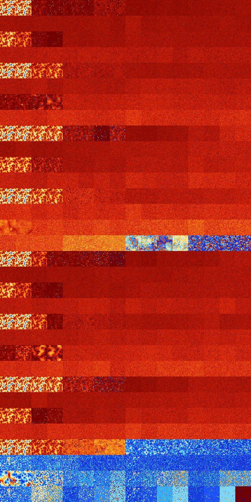

# B234567 (129024-129535)

<details>
    <summary>Initial Grid</summary>
    
</details>


<details>
    <summary>Initial Grid RLE</summary>

```
#C Exported from GoGoL (https://github.com/marrow16/gogol)
#C Wrap mode: Toroidal
#C Boundary mode: Dead
#C Step: 0
x = 100, y = 100, rule = B234567/S
5bo43bo3bo18bo12bo2bo$24bo17bo3bo3bo28bo18bo$bo16bo38bo17b2o20bo$21bobo
7b2o4bo7bo11bo18bo8bo$21bo29bo16bo$20bo7bo65bo$16bo33bo3bo$18bo2b2o$17b
o15bo$5bo7bo50bo$12bo11bo55bo$5bo13bo39bo23bo$5bo20b3o21bo$7bo11bo16bo
28bo11bo$14bo4bo2bo10bo21bo4bo$9bo4bo31bo34bo3bo6bo$26bo18bo13bo2bo10bo
13bo$o95bo$bo7bo3bo24bo11bo27bo20bo$15bo7bo3bo$32bo15bo24bo13bo6bo$80bo
$10bo15bo9bo6bo55bo$5bo21bo11bo54b3o$4bo3bo22bo2bobo2bo11b2o9bo31bo$71b
o14bo$45bo27bo21bo$33b2o20bo6bo12bo12bo6b2o$12bo4bo8bo7bo9bo36bo5bo8bo$
o18bo17bo27bo21bo$2bo23bo30bo6bo20bo3bo$14bo11bo5bo3bo6bo5bo24bo7bo9bo
6bo$30bo5bo11bo14bo12bo11bo$o2bo14bo19b2o15bo28bo6bo$5bo37bo46bo5bo$4bo
bo2bo16bo6bo24bo11bo$14bo60bo$26bo13bo26bo19bo4bo$24bo4bo13bo12bo35bo$
26bo8bo61bo$41bo15bo4b2o12bo17bo3bo$37bo25bo$10bo32bo11bo35bo$15bo4bo
56bo$9bo26bo18bo$2bo62bo5bo10bo$18bo12bo17bo$o13bo73bo$41bo2bo8bo15bo
22bo2bo$6bo15bo15bo13bo4bo2bo$9bo17bo14bo36bo3bo$5bo4bo28bo15bo29bo9bo$
89bobo$bo23bo53bo18bo$33bo25bo8bo8bo10bo$22bo10bo19bo$40bo36bo12b2o$15b
o76bo$2bo2bo4bo32bo17bo18bo$7bo3bo20bo5bo9bo15bo22bobo3bo$39bo14bo8bo$
4bo53bo22b3o14bo$10bo19bo2bo12bo21bo21bo$4bo73bo3bo$39bo8bo$10bo3bo6bo
36bo4bo11bo13bo$bobo32bo2bo49bo$43bo10bo$17b2o16bo10bobo22bo$22bo18bo
32bo11bo$14bo24bo56bo$2bo22bo46bobo12bo5bo$3bo25bo27bo6bo$7bo3bo20b2o
18bo29bo3bo$60bo5bo5bo16bo2bo$4bo9bo7bo44bo$8bo31bo10bo28bobo5bo$21bo
19bo$25bo10bo39bo12bo$3bo22bo14bo9bo36bo9bo$8bo15bo5bo12bo16bo27bo$27bo
8bobo7bo41b2o$31bo7bo38bo$96bo$20bo4bo11bo17bo16bo2bo5bo7b2o$9bo2bo7bo
48bo$6bo13bo30bo8bo6bo12bo$6b2obo6bo11bo4bo60bo3bo$68bo20bo$41bo42bo$bo
6bo12bo51bo$45bo5bo31bo2bo$23bo22bo27bo5bo12bo5bo$17bo55bo16bo3bo$2bo2b
o5b2o30bo3bo2bo25bo7bo$37bo2bo14bo19bo20bo$6bo3bo16bo50bo$20bo23bo4bo
18bo23bo$66bo18bo3bo$o12bo17bobo18bo32bo!
```
</details>
<details>
    <summary>Thumbnail</summary>

</details>
<table>
<tr>
    <td><a href="./129024%20S%20Heat%20Map%20Activity.png"></a><br>S (129024)<br>R@20,p2</td>    <td><a href="./129025%20S0%20Heat%20Map%20Activity.png"></a><br>S0 (129025)<br>R@17,p2</td>    <td><a href="./129026%20S1%20Heat%20Map%20Activity.png"></a><br>S1 (129026)<br>R@138,p120</td>    <td><a href="./129027%20S01%20Heat%20Map%20Activity.png"></a><br>S01 (129027)<br>R@275,p240</td>    <td><a href="./129028%20S2%20Heat%20Map%20Activity.png"></a><br>S2 (129028)<br>R@815,p120</td>    <td><a href="./129029%20S02%20Heat%20Map%20Activity.png"></a><br>S02 (129029)<br>R@866,p120</td>    <td><a href="./129030%20S12%20Heat%20Map%20Activity.png"></a><br>S12 (129030)<br>G>1000</td>    <td><a href="./129031%20S012%20Heat%20Map%20Activity.png"></a><br>S012 (129031)<br>G>1000</td>    <td><a href="./129032%20S3%20Heat%20Map%20Activity.png"></a><br>S3 (129032)<br>G>1000</td>    <td><a href="./129033%20S03%20Heat%20Map%20Activity.png"></a><br>S03 (129033)<br>G>1000</td>    <td><a href="./129034%20S13%20Heat%20Map%20Activity.png"></a><br>S13 (129034)<br>G>1000</td>    <td><a href="./129035%20S013%20Heat%20Map%20Activity.png"></a><br>S013 (129035)<br>G>1000</td>    <td><a href="./129036%20S23%20Heat%20Map%20Activity.png"></a><br>S23 (129036)<br>G>1000</td>    <td><a href="./129037%20S023%20Heat%20Map%20Activity.png"></a><br>S023 (129037)<br>G>1000</td>    <td><a href="./129038%20S123%20Heat%20Map%20Activity.png"></a><br>S123 (129038)<br>G>1000</td>    <td><a href="./129039%20S0123%20Heat%20Map%20Activity.png"></a><br>S0123 (129039)<br>G>1000</td></tr>
<tr>
    <td><a href="./129040%20S4%20Heat%20Map%20Activity.png"></a><br>S4 (129040)<br>G>1000</td>    <td><a href="./129041%20S04%20Heat%20Map%20Activity.png"></a><br>S04 (129041)<br>G>1000</td>    <td><a href="./129042%20S14%20Heat%20Map%20Activity.png"></a><br>S14 (129042)<br>G>1000</td>    <td><a href="./129043%20S014%20Heat%20Map%20Activity.png"></a><br>S014 (129043)<br>G>1000</td>    <td><a href="./129044%20S24%20Heat%20Map%20Activity.png"></a><br>S24 (129044)<br>G>1000</td>    <td><a href="./129045%20S024%20Heat%20Map%20Activity.png"></a><br>S024 (129045)<br>G>1000</td>    <td><a href="./129046%20S124%20Heat%20Map%20Activity.png"></a><br>S124 (129046)<br>G>1000</td>    <td><a href="./129047%20S0124%20Heat%20Map%20Activity.png"></a><br>S0124 (129047)<br>G>1000</td>    <td><a href="./129048%20S34%20Heat%20Map%20Activity.png"></a><br>S34 (129048)<br>G>1000</td>    <td><a href="./129049%20S034%20Heat%20Map%20Activity.png"></a><br>S034 (129049)<br>G>1000</td>    <td><a href="./129050%20S134%20Heat%20Map%20Activity.png"></a><br>S134 (129050)<br>G>1000</td>    <td><a href="./129051%20S0134%20Heat%20Map%20Activity.png"></a><br>S0134 (129051)<br>G>1000</td>    <td><a href="./129052%20S234%20Heat%20Map%20Activity.png"></a><br>S234 (129052)<br>G>1000</td>    <td><a href="./129053%20S0234%20Heat%20Map%20Activity.png"></a><br>S0234 (129053)<br>G>1000</td>    <td><a href="./129054%20S1234%20Heat%20Map%20Activity.png"></a><br>S1234 (129054)<br>G>1000</td>    <td><a href="./129055%20S01234%20Heat%20Map%20Activity.png"></a><br>S01234 (129055)<br>G>1000</td></tr>
<tr>
    <td><a href="./129056%20S5%20Heat%20Map%20Activity.png"></a><br>S5 (129056)<br>R@30,p2</td>    <td><a href="./129057%20S05%20Heat%20Map%20Activity.png"></a><br>S05 (129057)<br>R@40,p10</td>    <td><a href="./129058%20S15%20Heat%20Map%20Activity.png"></a><br>S15 (129058)<br>R@322,p72</td>    <td><a href="./129059%20S015%20Heat%20Map%20Activity.png"></a><br>S015 (129059)<br>G>1000</td>    <td><a href="./129060%20S25%20Heat%20Map%20Activity.png"></a><br>S25 (129060)<br>G>1000</td>    <td><a href="./129061%20S025%20Heat%20Map%20Activity.png"></a><br>S025 (129061)<br>G>1000</td>    <td><a href="./129062%20S125%20Heat%20Map%20Activity.png"></a><br>S125 (129062)<br>G>1000</td>    <td><a href="./129063%20S0125%20Heat%20Map%20Activity.png"></a><br>S0125 (129063)<br>G>1000</td>    <td><a href="./129064%20S35%20Heat%20Map%20Activity.png"></a><br>S35 (129064)<br>G>1000</td>    <td><a href="./129065%20S035%20Heat%20Map%20Activity.png"></a><br>S035 (129065)<br>G>1000</td>    <td><a href="./129066%20S135%20Heat%20Map%20Activity.png"></a><br>S135 (129066)<br>G>1000</td>    <td><a href="./129067%20S0135%20Heat%20Map%20Activity.png"></a><br>S0135 (129067)<br>G>1000</td>    <td><a href="./129068%20S235%20Heat%20Map%20Activity.png"></a><br>S235 (129068)<br>G>1000</td>    <td><a href="./129069%20S0235%20Heat%20Map%20Activity.png"></a><br>S0235 (129069)<br>G>1000</td>    <td><a href="./129070%20S1235%20Heat%20Map%20Activity.png"></a><br>S1235 (129070)<br>G>1000</td>    <td><a href="./129071%20S01235%20Heat%20Map%20Activity.png"></a><br>S01235 (129071)<br>G>1000</td></tr>
<tr>
    <td><a href="./129072%20S45%20Heat%20Map%20Activity.png"></a><br>S45 (129072)<br>G>1000</td>    <td><a href="./129073%20S045%20Heat%20Map%20Activity.png"></a><br>S045 (129073)<br>G>1000</td>    <td><a href="./129074%20S145%20Heat%20Map%20Activity.png"></a><br>S145 (129074)<br>G>1000</td>    <td><a href="./129075%20S0145%20Heat%20Map%20Activity.png"></a><br>S0145 (129075)<br>G>1000</td>    <td><a href="./129076%20S245%20Heat%20Map%20Activity.png"></a><br>S245 (129076)<br>G>1000</td>    <td><a href="./129077%20S0245%20Heat%20Map%20Activity.png"></a><br>S0245 (129077)<br>G>1000</td>    <td><a href="./129078%20S1245%20Heat%20Map%20Activity.png"></a><br>S1245 (129078)<br>G>1000</td>    <td><a href="./129079%20S01245%20Heat%20Map%20Activity.png"></a><br>S01245 (129079)<br>G>1000</td>    <td><a href="./129080%20S345%20Heat%20Map%20Activity.png"></a><br>S345 (129080)<br>G>1000</td>    <td><a href="./129081%20S0345%20Heat%20Map%20Activity.png"></a><br>S0345 (129081)<br>G>1000</td>    <td><a href="./129082%20S1345%20Heat%20Map%20Activity.png"></a><br>S1345 (129082)<br>G>1000</td>    <td><a href="./129083%20S01345%20Heat%20Map%20Activity.png"></a><br>S01345 (129083)<br>G>1000</td>    <td><a href="./129084%20S2345%20Heat%20Map%20Activity.png"></a><br>S2345 (129084)<br>G>1000</td>    <td><a href="./129085%20S02345%20Heat%20Map%20Activity.png"></a><br>S02345 (129085)<br>G>1000</td>    <td><a href="./129086%20S12345%20Heat%20Map%20Activity.png"></a><br>S12345 (129086)<br>G>1000</td>    <td><a href="./129087%20S012345%20Heat%20Map%20Activity.png"></a><br>S012345 (129087)<br>G>1000</td></tr>
<tr>
    <td><a href="./129088%20S6%20Heat%20Map%20Activity.png"></a><br>S6 (129088)<br>R@20,p2</td>    <td><a href="./129089%20S06%20Heat%20Map%20Activity.png"></a><br>S06 (129089)<br>R@17,p2</td>    <td><a href="./129090%20S16%20Heat%20Map%20Activity.png"></a><br>S16 (129090)<br>R@33,p12</td>    <td><a href="./129091%20S016%20Heat%20Map%20Activity.png"></a><br>S016 (129091)<br>R@27,p4</td>    <td><a href="./129092%20S26%20Heat%20Map%20Activity.png"></a><br>S26 (129092)<br>G>1000</td>    <td><a href="./129093%20S026%20Heat%20Map%20Activity.png"></a><br>S026 (129093)<br>G>1000</td>    <td><a href="./129094%20S126%20Heat%20Map%20Activity.png"></a><br>S126 (129094)<br>G>1000</td>    <td><a href="./129095%20S0126%20Heat%20Map%20Activity.png"></a><br>S0126 (129095)<br>G>1000</td>    <td><a href="./129096%20S36%20Heat%20Map%20Activity.png"></a><br>S36 (129096)<br>G>1000</td>    <td><a href="./129097%20S036%20Heat%20Map%20Activity.png"></a><br>S036 (129097)<br>G>1000</td>    <td><a href="./129098%20S136%20Heat%20Map%20Activity.png"></a><br>S136 (129098)<br>G>1000</td>    <td><a href="./129099%20S0136%20Heat%20Map%20Activity.png"></a><br>S0136 (129099)<br>G>1000</td>    <td><a href="./129100%20S236%20Heat%20Map%20Activity.png"></a><br>S236 (129100)<br>G>1000</td>    <td><a href="./129101%20S0236%20Heat%20Map%20Activity.png"></a><br>S0236 (129101)<br>G>1000</td>    <td><a href="./129102%20S1236%20Heat%20Map%20Activity.png"></a><br>S1236 (129102)<br>G>1000</td>    <td><a href="./129103%20S01236%20Heat%20Map%20Activity.png"></a><br>S01236 (129103)<br>G>1000</td></tr>
<tr>
    <td><a href="./129104%20S46%20Heat%20Map%20Activity.png"></a><br>S46 (129104)<br>G>1000</td>    <td><a href="./129105%20S046%20Heat%20Map%20Activity.png"></a><br>S046 (129105)<br>G>1000</td>    <td><a href="./129106%20S146%20Heat%20Map%20Activity.png"></a><br>S146 (129106)<br>G>1000</td>    <td><a href="./129107%20S0146%20Heat%20Map%20Activity.png"></a><br>S0146 (129107)<br>G>1000</td>    <td><a href="./129108%20S246%20Heat%20Map%20Activity.png"></a><br>S246 (129108)<br>G>1000</td>    <td><a href="./129109%20S0246%20Heat%20Map%20Activity.png"></a><br>S0246 (129109)<br>G>1000</td>    <td><a href="./129110%20S1246%20Heat%20Map%20Activity.png"></a><br>S1246 (129110)<br>G>1000</td>    <td><a href="./129111%20S01246%20Heat%20Map%20Activity.png"></a><br>S01246 (129111)<br>G>1000</td>    <td><a href="./129112%20S346%20Heat%20Map%20Activity.png"></a><br>S346 (129112)<br>G>1000</td>    <td><a href="./129113%20S0346%20Heat%20Map%20Activity.png"></a><br>S0346 (129113)<br>G>1000</td>    <td><a href="./129114%20S1346%20Heat%20Map%20Activity.png"></a><br>S1346 (129114)<br>G>1000</td>    <td><a href="./129115%20S01346%20Heat%20Map%20Activity.png"></a><br>S01346 (129115)<br>G>1000</td>    <td><a href="./129116%20S2346%20Heat%20Map%20Activity.png"></a><br>S2346 (129116)<br>G>1000</td>    <td><a href="./129117%20S02346%20Heat%20Map%20Activity.png"></a><br>S02346 (129117)<br>G>1000</td>    <td><a href="./129118%20S12346%20Heat%20Map%20Activity.png"></a><br>S12346 (129118)<br>G>1000</td>    <td><a href="./129119%20S012346%20Heat%20Map%20Activity.png"></a><br>S012346 (129119)<br>G>1000</td></tr>
<tr>
    <td><a href="./129120%20S56%20Heat%20Map%20Activity.png"></a><br>S56 (129120)<br>R@193,p124</td>    <td><a href="./129121%20S056%20Heat%20Map%20Activity.png"></a><br>S056 (129121)<br>R@154,p12</td>    <td><a href="./129122%20S156%20Heat%20Map%20Activity.png"></a><br>S156 (129122)<br>R@669,p84</td>    <td><a href="./129123%20S0156%20Heat%20Map%20Activity.png"></a><br>S0156 (129123)<br>R@575,p12</td>    <td><a href="./129124%20S256%20Heat%20Map%20Activity.png"></a><br>S256 (129124)<br>G>1000</td>    <td><a href="./129125%20S0256%20Heat%20Map%20Activity.png"></a><br>S0256 (129125)<br>G>1000</td>    <td><a href="./129126%20S1256%20Heat%20Map%20Activity.png"></a><br>S1256 (129126)<br>G>1000</td>    <td><a href="./129127%20S01256%20Heat%20Map%20Activity.png"></a><br>S01256 (129127)<br>G>1000</td>    <td><a href="./129128%20S356%20Heat%20Map%20Activity.png"></a><br>S356 (129128)<br>G>1000</td>    <td><a href="./129129%20S0356%20Heat%20Map%20Activity.png"></a><br>S0356 (129129)<br>G>1000</td>    <td><a href="./129130%20S1356%20Heat%20Map%20Activity.png"></a><br>S1356 (129130)<br>G>1000</td>    <td><a href="./129131%20S01356%20Heat%20Map%20Activity.png"></a><br>S01356 (129131)<br>G>1000</td>    <td><a href="./129132%20S2356%20Heat%20Map%20Activity.png"></a><br>S2356 (129132)<br>G>1000</td>    <td><a href="./129133%20S02356%20Heat%20Map%20Activity.png"></a><br>S02356 (129133)<br>G>1000</td>    <td><a href="./129134%20S12356%20Heat%20Map%20Activity.png"></a><br>S12356 (129134)<br>G>1000</td>    <td><a href="./129135%20S012356%20Heat%20Map%20Activity.png"></a><br>S012356 (129135)<br>G>1000</td></tr>
<tr>
    <td><a href="./129136%20S456%20Heat%20Map%20Activity.png"></a><br>S456 (129136)<br>G>1000</td>    <td><a href="./129137%20S0456%20Heat%20Map%20Activity.png"></a><br>S0456 (129137)<br>G>1000</td>    <td><a href="./129138%20S1456%20Heat%20Map%20Activity.png"></a><br>S1456 (129138)<br>G>1000</td>    <td><a href="./129139%20S01456%20Heat%20Map%20Activity.png"></a><br>S01456 (129139)<br>G>1000</td>    <td><a href="./129140%20S2456%20Heat%20Map%20Activity.png"></a><br>S2456 (129140)<br>G>1000</td>    <td><a href="./129141%20S02456%20Heat%20Map%20Activity.png"></a><br>S02456 (129141)<br>G>1000</td>    <td><a href="./129142%20S12456%20Heat%20Map%20Activity.png"></a><br>S12456 (129142)<br>G>1000</td>    <td><a href="./129143%20S012456%20Heat%20Map%20Activity.png"></a><br>S012456 (129143)<br>G>1000</td>    <td><a href="./129144%20S3456%20Heat%20Map%20Activity.png"></a><br>S3456 (129144)<br>G>1000</td>    <td><a href="./129145%20S03456%20Heat%20Map%20Activity.png"></a><br>S03456 (129145)<br>G>1000</td>    <td><a href="./129146%20S13456%20Heat%20Map%20Activity.png"></a><br>S13456 (129146)<br>G>1000</td>    <td><a href="./129147%20S013456%20Heat%20Map%20Activity.png"></a><br>S013456 (129147)<br>G>1000</td>    <td><a href="./129148%20S23456%20Heat%20Map%20Activity.png"></a><br>S23456 (129148)<br>G>1000</td>    <td><a href="./129149%20S023456%20Heat%20Map%20Activity.png"></a><br>S023456 (129149)<br>G>1000</td>    <td><a href="./129150%20S123456%20Heat%20Map%20Activity.png"></a><br>S123456 (129150)<br>G>1000</td>    <td><a href="./129151%20S0123456%20Heat%20Map%20Activity.png"></a><br>S0123456 (129151)<br>G>1000</td></tr>
<tr>
    <td><a href="./129152%20S7%20Heat%20Map%20Activity.png"></a><br>S7 (129152)<br>R@20,p2</td>    <td><a href="./129153%20S07%20Heat%20Map%20Activity.png"></a><br>S07 (129153)<br>R@17,p2</td>    <td><a href="./129154%20S17%20Heat%20Map%20Activity.png"></a><br>S17 (129154)<br>R@19,p4</td>    <td><a href="./129155%20S017%20Heat%20Map%20Activity.png"></a><br>S017 (129155)<br>R@19,p4</td>    <td><a href="./129156%20S27%20Heat%20Map%20Activity.png"></a><br>S27 (129156)<br>R@133,p24</td>    <td><a href="./129157%20S027%20Heat%20Map%20Activity.png"></a><br>S027 (129157)<br>R@126,p24</td>    <td><a href="./129158%20S127%20Heat%20Map%20Activity.png"></a><br>S127 (129158)<br>G>1000</td>    <td><a href="./129159%20S0127%20Heat%20Map%20Activity.png"></a><br>S0127 (129159)<br>R@97,p24</td>    <td><a href="./129160%20S37%20Heat%20Map%20Activity.png"></a><br>S37 (129160)<br>G>1000</td>    <td><a href="./129161%20S037%20Heat%20Map%20Activity.png"></a><br>S037 (129161)<br>G>1000</td>    <td><a href="./129162%20S137%20Heat%20Map%20Activity.png"></a><br>S137 (129162)<br>G>1000</td>    <td><a href="./129163%20S0137%20Heat%20Map%20Activity.png"></a><br>S0137 (129163)<br>G>1000</td>    <td><a href="./129164%20S237%20Heat%20Map%20Activity.png"></a><br>S237 (129164)<br>G>1000</td>    <td><a href="./129165%20S0237%20Heat%20Map%20Activity.png"></a><br>S0237 (129165)<br>G>1000</td>    <td><a href="./129166%20S1237%20Heat%20Map%20Activity.png"></a><br>S1237 (129166)<br>G>1000</td>    <td><a href="./129167%20S01237%20Heat%20Map%20Activity.png"></a><br>S01237 (129167)<br>G>1000</td></tr>
<tr>
    <td><a href="./129168%20S47%20Heat%20Map%20Activity.png"></a><br>S47 (129168)<br>G>1000</td>    <td><a href="./129169%20S047%20Heat%20Map%20Activity.png"></a><br>S047 (129169)<br>G>1000</td>    <td><a href="./129170%20S147%20Heat%20Map%20Activity.png"></a><br>S147 (129170)<br>G>1000</td>    <td><a href="./129171%20S0147%20Heat%20Map%20Activity.png"></a><br>S0147 (129171)<br>G>1000</td>    <td><a href="./129172%20S247%20Heat%20Map%20Activity.png"></a><br>S247 (129172)<br>G>1000</td>    <td><a href="./129173%20S0247%20Heat%20Map%20Activity.png"></a><br>S0247 (129173)<br>G>1000</td>    <td><a href="./129174%20S1247%20Heat%20Map%20Activity.png"></a><br>S1247 (129174)<br>G>1000</td>    <td><a href="./129175%20S01247%20Heat%20Map%20Activity.png"></a><br>S01247 (129175)<br>G>1000</td>    <td><a href="./129176%20S347%20Heat%20Map%20Activity.png"></a><br>S347 (129176)<br>G>1000</td>    <td><a href="./129177%20S0347%20Heat%20Map%20Activity.png"></a><br>S0347 (129177)<br>G>1000</td>    <td><a href="./129178%20S1347%20Heat%20Map%20Activity.png"></a><br>S1347 (129178)<br>G>1000</td>    <td><a href="./129179%20S01347%20Heat%20Map%20Activity.png"></a><br>S01347 (129179)<br>G>1000</td>    <td><a href="./129180%20S2347%20Heat%20Map%20Activity.png"></a><br>S2347 (129180)<br>G>1000</td>    <td><a href="./129181%20S02347%20Heat%20Map%20Activity.png"></a><br>S02347 (129181)<br>G>1000</td>    <td><a href="./129182%20S12347%20Heat%20Map%20Activity.png"></a><br>S12347 (129182)<br>G>1000</td>    <td><a href="./129183%20S012347%20Heat%20Map%20Activity.png"></a><br>S012347 (129183)<br>G>1000</td></tr>
<tr>
    <td><a href="./129184%20S57%20Heat%20Map%20Activity.png"></a><br>S57 (129184)<br>R@30,p2</td>    <td><a href="./129185%20S057%20Heat%20Map%20Activity.png"></a><br>S057 (129185)<br>R@27,p2</td>    <td><a href="./129186%20S157%20Heat%20Map%20Activity.png"></a><br>S157 (129186)<br>R@85,p8</td>    <td><a href="./129187%20S0157%20Heat%20Map%20Activity.png"></a><br>S0157 (129187)<br>R@78,p8</td>    <td><a href="./129188%20S257%20Heat%20Map%20Activity.png"></a><br>S257 (129188)<br>G>1000</td>    <td><a href="./129189%20S0257%20Heat%20Map%20Activity.png"></a><br>S0257 (129189)<br>G>1000</td>    <td><a href="./129190%20S1257%20Heat%20Map%20Activity.png"></a><br>S1257 (129190)<br>G>1000</td>    <td><a href="./129191%20S01257%20Heat%20Map%20Activity.png"></a><br>S01257 (129191)<br>G>1000</td>    <td><a href="./129192%20S357%20Heat%20Map%20Activity.png"></a><br>S357 (129192)<br>G>1000</td>    <td><a href="./129193%20S0357%20Heat%20Map%20Activity.png"></a><br>S0357 (129193)<br>G>1000</td>    <td><a href="./129194%20S1357%20Heat%20Map%20Activity.png"></a><br>S1357 (129194)<br>G>1000</td>    <td><a href="./129195%20S01357%20Heat%20Map%20Activity.png"></a><br>S01357 (129195)<br>G>1000</td>    <td><a href="./129196%20S2357%20Heat%20Map%20Activity.png"></a><br>S2357 (129196)<br>G>1000</td>    <td><a href="./129197%20S02357%20Heat%20Map%20Activity.png"></a><br>S02357 (129197)<br>G>1000</td>    <td><a href="./129198%20S12357%20Heat%20Map%20Activity.png"></a><br>S12357 (129198)<br>G>1000</td>    <td><a href="./129199%20S012357%20Heat%20Map%20Activity.png"></a><br>S012357 (129199)<br>G>1000</td></tr>
<tr>
    <td><a href="./129200%20S457%20Heat%20Map%20Activity.png"></a><br>S457 (129200)<br>G>1000</td>    <td><a href="./129201%20S0457%20Heat%20Map%20Activity.png"></a><br>S0457 (129201)<br>G>1000</td>    <td><a href="./129202%20S1457%20Heat%20Map%20Activity.png"></a><br>S1457 (129202)<br>G>1000</td>    <td><a href="./129203%20S01457%20Heat%20Map%20Activity.png"></a><br>S01457 (129203)<br>G>1000</td>    <td><a href="./129204%20S2457%20Heat%20Map%20Activity.png"></a><br>S2457 (129204)<br>G>1000</td>    <td><a href="./129205%20S02457%20Heat%20Map%20Activity.png"></a><br>S02457 (129205)<br>G>1000</td>    <td><a href="./129206%20S12457%20Heat%20Map%20Activity.png"></a><br>S12457 (129206)<br>G>1000</td>    <td><a href="./129207%20S012457%20Heat%20Map%20Activity.png"></a><br>S012457 (129207)<br>G>1000</td>    <td><a href="./129208%20S3457%20Heat%20Map%20Activity.png"></a><br>S3457 (129208)<br>G>1000</td>    <td><a href="./129209%20S03457%20Heat%20Map%20Activity.png"></a><br>S03457 (129209)<br>G>1000</td>    <td><a href="./129210%20S13457%20Heat%20Map%20Activity.png"></a><br>S13457 (129210)<br>G>1000</td>    <td><a href="./129211%20S013457%20Heat%20Map%20Activity.png"></a><br>S013457 (129211)<br>G>1000</td>    <td><a href="./129212%20S23457%20Heat%20Map%20Activity.png"></a><br>S23457 (129212)<br>G>1000</td>    <td><a href="./129213%20S023457%20Heat%20Map%20Activity.png"></a><br>S023457 (129213)<br>G>1000</td>    <td><a href="./129214%20S123457%20Heat%20Map%20Activity.png"></a><br>S123457 (129214)<br>G>1000</td>    <td><a href="./129215%20S0123457%20Heat%20Map%20Activity.png"></a><br>S0123457 (129215)<br>G>1000</td></tr>
<tr>
    <td><a href="./129216%20S67%20Heat%20Map%20Activity.png"></a><br>S67 (129216)<br>R@20,p2</td>    <td><a href="./129217%20S067%20Heat%20Map%20Activity.png"></a><br>S067 (129217)<br>R@17,p2</td>    <td><a href="./129218%20S167%20Heat%20Map%20Activity.png"></a><br>S167 (129218)<br>R@23,p2</td>    <td><a href="./129219%20S0167%20Heat%20Map%20Activity.png"></a><br>S0167 (129219)<br>R@24,p6</td>    <td><a href="./129220%20S267%20Heat%20Map%20Activity.png"></a><br>S267 (129220)<br>G>1000</td>    <td><a href="./129221%20S0267%20Heat%20Map%20Activity.png"></a><br>S0267 (129221)<br>G>1000</td>    <td><a href="./129222%20S1267%20Heat%20Map%20Activity.png"></a><br>S1267 (129222)<br>G>1000</td>    <td><a href="./129223%20S01267%20Heat%20Map%20Activity.png"></a><br>S01267 (129223)<br>G>1000</td>    <td><a href="./129224%20S367%20Heat%20Map%20Activity.png"></a><br>S367 (129224)<br>G>1000</td>    <td><a href="./129225%20S0367%20Heat%20Map%20Activity.png"></a><br>S0367 (129225)<br>G>1000</td>    <td><a href="./129226%20S1367%20Heat%20Map%20Activity.png"></a><br>S1367 (129226)<br>G>1000</td>    <td><a href="./129227%20S01367%20Heat%20Map%20Activity.png"></a><br>S01367 (129227)<br>G>1000</td>    <td><a href="./129228%20S2367%20Heat%20Map%20Activity.png"></a><br>S2367 (129228)<br>G>1000</td>    <td><a href="./129229%20S02367%20Heat%20Map%20Activity.png"></a><br>S02367 (129229)<br>G>1000</td>    <td><a href="./129230%20S12367%20Heat%20Map%20Activity.png"></a><br>S12367 (129230)<br>G>1000</td>    <td><a href="./129231%20S012367%20Heat%20Map%20Activity.png"></a><br>S012367 (129231)<br>G>1000</td></tr>
<tr>
    <td><a href="./129232%20S467%20Heat%20Map%20Activity.png"></a><br>S467 (129232)<br>G>1000</td>    <td><a href="./129233%20S0467%20Heat%20Map%20Activity.png"></a><br>S0467 (129233)<br>G>1000</td>    <td><a href="./129234%20S1467%20Heat%20Map%20Activity.png"></a><br>S1467 (129234)<br>G>1000</td>    <td><a href="./129235%20S01467%20Heat%20Map%20Activity.png"></a><br>S01467 (129235)<br>G>1000</td>    <td><a href="./129236%20S2467%20Heat%20Map%20Activity.png"></a><br>S2467 (129236)<br>G>1000</td>    <td><a href="./129237%20S02467%20Heat%20Map%20Activity.png"></a><br>S02467 (129237)<br>G>1000</td>    <td><a href="./129238%20S12467%20Heat%20Map%20Activity.png"></a><br>S12467 (129238)<br>G>1000</td>    <td><a href="./129239%20S012467%20Heat%20Map%20Activity.png"></a><br>S012467 (129239)<br>G>1000</td>    <td><a href="./129240%20S3467%20Heat%20Map%20Activity.png"></a><br>S3467 (129240)<br>G>1000</td>    <td><a href="./129241%20S03467%20Heat%20Map%20Activity.png"></a><br>S03467 (129241)<br>G>1000</td>    <td><a href="./129242%20S13467%20Heat%20Map%20Activity.png"></a><br>S13467 (129242)<br>G>1000</td>    <td><a href="./129243%20S013467%20Heat%20Map%20Activity.png"></a><br>S013467 (129243)<br>G>1000</td>    <td><a href="./129244%20S23467%20Heat%20Map%20Activity.png"></a><br>S23467 (129244)<br>G>1000</td>    <td><a href="./129245%20S023467%20Heat%20Map%20Activity.png"></a><br>S023467 (129245)<br>G>1000</td>    <td><a href="./129246%20S123467%20Heat%20Map%20Activity.png"></a><br>S123467 (129246)<br>G>1000</td>    <td><a href="./129247%20S0123467%20Heat%20Map%20Activity.png"></a><br>S0123467 (129247)<br>G>1000</td></tr>
<tr>
    <td><a href="./129248%20S567%20Heat%20Map%20Activity.png"></a><br>S567 (129248)<br>G>1000</td>    <td><a href="./129249%20S0567%20Heat%20Map%20Activity.png"></a><br>S0567 (129249)<br>G>1000</td>    <td><a href="./129250%20S1567%20Heat%20Map%20Activity.png"></a><br>S1567 (129250)<br>G>1000</td>    <td><a href="./129251%20S01567%20Heat%20Map%20Activity.png"></a><br>S01567 (129251)<br>G>1000</td>    <td><a href="./129252%20S2567%20Heat%20Map%20Activity.png"></a><br>S2567 (129252)<br>G>1000</td>    <td><a href="./129253%20S02567%20Heat%20Map%20Activity.png"></a><br>S02567 (129253)<br>G>1000</td>    <td><a href="./129254%20S12567%20Heat%20Map%20Activity.png"></a><br>S12567 (129254)<br>G>1000</td>    <td><a href="./129255%20S012567%20Heat%20Map%20Activity.png"></a><br>S012567 (129255)<br>G>1000</td>    <td><a href="./129256%20S3567%20Heat%20Map%20Activity.png"></a><br>S3567 (129256)<br>G>1000</td>    <td><a href="./129257%20S03567%20Heat%20Map%20Activity.png"></a><br>S03567 (129257)<br>G>1000</td>    <td><a href="./129258%20S13567%20Heat%20Map%20Activity.png"></a><br>S13567 (129258)<br>G>1000</td>    <td><a href="./129259%20S013567%20Heat%20Map%20Activity.png"></a><br>S013567 (129259)<br>G>1000</td>    <td><a href="./129260%20S23567%20Heat%20Map%20Activity.png"></a><br>S23567 (129260)<br>G>1000</td>    <td><a href="./129261%20S023567%20Heat%20Map%20Activity.png"></a><br>S023567 (129261)<br>G>1000</td>    <td><a href="./129262%20S123567%20Heat%20Map%20Activity.png"></a><br>S123567 (129262)<br>G>1000</td>    <td><a href="./129263%20S0123567%20Heat%20Map%20Activity.png"></a><br>S0123567 (129263)<br>G>1000</td></tr>
<tr>
    <td><a href="./129264%20S4567%20Heat%20Map%20Activity.png"></a><br>S4567 (129264)<br>G>1000</td>    <td><a href="./129265%20S04567%20Heat%20Map%20Activity.png"></a><br>S04567 (129265)<br>G>1000</td>    <td><a href="./129266%20S14567%20Heat%20Map%20Activity.png"></a><br>S14567 (129266)<br>G>1000</td>    <td><a href="./129267%20S014567%20Heat%20Map%20Activity.png"></a><br>S014567 (129267)<br>G>1000</td>    <td><a href="./129268%20S24567%20Heat%20Map%20Activity.png"></a><br>S24567 (129268)<br>G>1000</td>    <td><a href="./129269%20S024567%20Heat%20Map%20Activity.png"></a><br>S024567 (129269)<br>G>1000</td>    <td><a href="./129270%20S124567%20Heat%20Map%20Activity.png"></a><br>S124567 (129270)<br>G>1000</td>    <td><a href="./129271%20S0124567%20Heat%20Map%20Activity.png"></a><br>S0124567 (129271)<br>G>1000</td>    <td><a href="./129272%20S34567%20Heat%20Map%20Activity.png"></a><br>S34567 (129272)<br>G>1000</td>    <td><a href="./129273%20S034567%20Heat%20Map%20Activity.png"></a><br>S034567 (129273)<br>G>1000</td>    <td><a href="./129274%20S134567%20Heat%20Map%20Activity.png"></a><br>S134567 (129274)<br>G>1000</td>    <td><a href="./129275%20S0134567%20Heat%20Map%20Activity.png"></a><br>S0134567 (129275)<br>G>1000</td>    <td><a href="./129276%20S234567%20Heat%20Map%20Activity.png"></a><br>S234567 (129276)<br>R@58,p6</td>    <td><a href="./129277%20S0234567%20Heat%20Map%20Activity.png"></a><br>S0234567 (129277)<br>R@48,p6</td>    <td><a href="./129278%20S1234567%20Heat%20Map%20Activity.png"></a><br>S1234567 (129278)<br>R@50,p6</td>    <td><a href="./129279%20S01234567%20Heat%20Map%20Activity.png"></a><br>S01234567 (129279)<br>R@50,p6</td></tr>
<tr>
    <td><a href="./129280%20S8%20Heat%20Map%20Activity.png"></a><br>S8 (129280)<br>R@20,p2</td>    <td><a href="./129281%20S08%20Heat%20Map%20Activity.png"></a><br>S08 (129281)<br>R@17,p2</td>    <td><a href="./129282%20S18%20Heat%20Map%20Activity.png"></a><br>S18 (129282)<br>R@39,p24</td>    <td><a href="./129283%20S018%20Heat%20Map%20Activity.png"></a><br>S018 (129283)<br>R@147,p120</td>    <td><a href="./129284%20S28%20Heat%20Map%20Activity.png"></a><br>S28 (129284)<br>R@456,p120</td>    <td><a href="./129285%20S028%20Heat%20Map%20Activity.png"></a><br>S028 (129285)<br>R@334,p8</td>    <td><a href="./129286%20S128%20Heat%20Map%20Activity.png"></a><br>S128 (129286)<br>R@363,p168</td>    <td><a href="./129287%20S0128%20Heat%20Map%20Activity.png"></a><br>S0128 (129287)<br>R@965,p840</td>    <td><a href="./129288%20S38%20Heat%20Map%20Activity.png"></a><br>S38 (129288)<br>G>1000</td>    <td><a href="./129289%20S038%20Heat%20Map%20Activity.png"></a><br>S038 (129289)<br>G>1000</td>    <td><a href="./129290%20S138%20Heat%20Map%20Activity.png"></a><br>S138 (129290)<br>G>1000</td>    <td><a href="./129291%20S0138%20Heat%20Map%20Activity.png"></a><br>S0138 (129291)<br>G>1000</td>    <td><a href="./129292%20S238%20Heat%20Map%20Activity.png"></a><br>S238 (129292)<br>G>1000</td>    <td><a href="./129293%20S0238%20Heat%20Map%20Activity.png"></a><br>S0238 (129293)<br>G>1000</td>    <td><a href="./129294%20S1238%20Heat%20Map%20Activity.png"></a><br>S1238 (129294)<br>G>1000</td>    <td><a href="./129295%20S01238%20Heat%20Map%20Activity.png"></a><br>S01238 (129295)<br>G>1000</td></tr>
<tr>
    <td><a href="./129296%20S48%20Heat%20Map%20Activity.png"></a><br>S48 (129296)<br>G>1000</td>    <td><a href="./129297%20S048%20Heat%20Map%20Activity.png"></a><br>S048 (129297)<br>G>1000</td>    <td><a href="./129298%20S148%20Heat%20Map%20Activity.png"></a><br>S148 (129298)<br>G>1000</td>    <td><a href="./129299%20S0148%20Heat%20Map%20Activity.png"></a><br>S0148 (129299)<br>G>1000</td>    <td><a href="./129300%20S248%20Heat%20Map%20Activity.png"></a><br>S248 (129300)<br>G>1000</td>    <td><a href="./129301%20S0248%20Heat%20Map%20Activity.png"></a><br>S0248 (129301)<br>G>1000</td>    <td><a href="./129302%20S1248%20Heat%20Map%20Activity.png"></a><br>S1248 (129302)<br>G>1000</td>    <td><a href="./129303%20S01248%20Heat%20Map%20Activity.png"></a><br>S01248 (129303)<br>G>1000</td>    <td><a href="./129304%20S348%20Heat%20Map%20Activity.png"></a><br>S348 (129304)<br>G>1000</td>    <td><a href="./129305%20S0348%20Heat%20Map%20Activity.png"></a><br>S0348 (129305)<br>G>1000</td>    <td><a href="./129306%20S1348%20Heat%20Map%20Activity.png"></a><br>S1348 (129306)<br>G>1000</td>    <td><a href="./129307%20S01348%20Heat%20Map%20Activity.png"></a><br>S01348 (129307)<br>G>1000</td>    <td><a href="./129308%20S2348%20Heat%20Map%20Activity.png"></a><br>S2348 (129308)<br>G>1000</td>    <td><a href="./129309%20S02348%20Heat%20Map%20Activity.png"></a><br>S02348 (129309)<br>G>1000</td>    <td><a href="./129310%20S12348%20Heat%20Map%20Activity.png"></a><br>S12348 (129310)<br>G>1000</td>    <td><a href="./129311%20S012348%20Heat%20Map%20Activity.png"></a><br>S012348 (129311)<br>G>1000</td></tr>
<tr>
    <td><a href="./129312%20S58%20Heat%20Map%20Activity.png"></a><br>S58 (129312)<br>R@30,p2</td>    <td><a href="./129313%20S058%20Heat%20Map%20Activity.png"></a><br>S058 (129313)<br>R@43,p10</td>    <td><a href="./129314%20S158%20Heat%20Map%20Activity.png"></a><br>S158 (129314)<br>R@294,p48</td>    <td><a href="./129315%20S0158%20Heat%20Map%20Activity.png"></a><br>S0158 (129315)<br>R@532,p336</td>    <td><a href="./129316%20S258%20Heat%20Map%20Activity.png"></a><br>S258 (129316)<br>G>1000</td>    <td><a href="./129317%20S0258%20Heat%20Map%20Activity.png"></a><br>S0258 (129317)<br>G>1000</td>    <td><a href="./129318%20S1258%20Heat%20Map%20Activity.png"></a><br>S1258 (129318)<br>G>1000</td>    <td><a href="./129319%20S01258%20Heat%20Map%20Activity.png"></a><br>S01258 (129319)<br>G>1000</td>    <td><a href="./129320%20S358%20Heat%20Map%20Activity.png"></a><br>S358 (129320)<br>G>1000</td>    <td><a href="./129321%20S0358%20Heat%20Map%20Activity.png"></a><br>S0358 (129321)<br>G>1000</td>    <td><a href="./129322%20S1358%20Heat%20Map%20Activity.png"></a><br>S1358 (129322)<br>G>1000</td>    <td><a href="./129323%20S01358%20Heat%20Map%20Activity.png"></a><br>S01358 (129323)<br>G>1000</td>    <td><a href="./129324%20S2358%20Heat%20Map%20Activity.png"></a><br>S2358 (129324)<br>G>1000</td>    <td><a href="./129325%20S02358%20Heat%20Map%20Activity.png"></a><br>S02358 (129325)<br>G>1000</td>    <td><a href="./129326%20S12358%20Heat%20Map%20Activity.png"></a><br>S12358 (129326)<br>G>1000</td>    <td><a href="./129327%20S012358%20Heat%20Map%20Activity.png"></a><br>S012358 (129327)<br>G>1000</td></tr>
<tr>
    <td><a href="./129328%20S458%20Heat%20Map%20Activity.png"></a><br>S458 (129328)<br>G>1000</td>    <td><a href="./129329%20S0458%20Heat%20Map%20Activity.png"></a><br>S0458 (129329)<br>G>1000</td>    <td><a href="./129330%20S1458%20Heat%20Map%20Activity.png"></a><br>S1458 (129330)<br>G>1000</td>    <td><a href="./129331%20S01458%20Heat%20Map%20Activity.png"></a><br>S01458 (129331)<br>G>1000</td>    <td><a href="./129332%20S2458%20Heat%20Map%20Activity.png"></a><br>S2458 (129332)<br>G>1000</td>    <td><a href="./129333%20S02458%20Heat%20Map%20Activity.png"></a><br>S02458 (129333)<br>G>1000</td>    <td><a href="./129334%20S12458%20Heat%20Map%20Activity.png"></a><br>S12458 (129334)<br>G>1000</td>    <td><a href="./129335%20S012458%20Heat%20Map%20Activity.png"></a><br>S012458 (129335)<br>G>1000</td>    <td><a href="./129336%20S3458%20Heat%20Map%20Activity.png"></a><br>S3458 (129336)<br>G>1000</td>    <td><a href="./129337%20S03458%20Heat%20Map%20Activity.png"></a><br>S03458 (129337)<br>G>1000</td>    <td><a href="./129338%20S13458%20Heat%20Map%20Activity.png"></a><br>S13458 (129338)<br>G>1000</td>    <td><a href="./129339%20S013458%20Heat%20Map%20Activity.png"></a><br>S013458 (129339)<br>G>1000</td>    <td><a href="./129340%20S23458%20Heat%20Map%20Activity.png"></a><br>S23458 (129340)<br>G>1000</td>    <td><a href="./129341%20S023458%20Heat%20Map%20Activity.png"></a><br>S023458 (129341)<br>G>1000</td>    <td><a href="./129342%20S123458%20Heat%20Map%20Activity.png"></a><br>S123458 (129342)<br>G>1000</td>    <td><a href="./129343%20S0123458%20Heat%20Map%20Activity.png"></a><br>S0123458 (129343)<br>G>1000</td></tr>
<tr>
    <td><a href="./129344%20S68%20Heat%20Map%20Activity.png"></a><br>S68 (129344)<br>R@20,p2</td>    <td><a href="./129345%20S068%20Heat%20Map%20Activity.png"></a><br>S068 (129345)<br>R@17,p2</td>    <td><a href="./129346%20S168%20Heat%20Map%20Activity.png"></a><br>S168 (129346)<br>R@33,p12</td>    <td><a href="./129347%20S0168%20Heat%20Map%20Activity.png"></a><br>S0168 (129347)<br>R@171,p144</td>    <td><a href="./129348%20S268%20Heat%20Map%20Activity.png"></a><br>S268 (129348)<br>G>1000</td>    <td><a href="./129349%20S0268%20Heat%20Map%20Activity.png"></a><br>S0268 (129349)<br>G>1000</td>    <td><a href="./129350%20S1268%20Heat%20Map%20Activity.png"></a><br>S1268 (129350)<br>G>1000</td>    <td><a href="./129351%20S01268%20Heat%20Map%20Activity.png"></a><br>S01268 (129351)<br>G>1000</td>    <td><a href="./129352%20S368%20Heat%20Map%20Activity.png"></a><br>S368 (129352)<br>G>1000</td>    <td><a href="./129353%20S0368%20Heat%20Map%20Activity.png"></a><br>S0368 (129353)<br>G>1000</td>    <td><a href="./129354%20S1368%20Heat%20Map%20Activity.png"></a><br>S1368 (129354)<br>G>1000</td>    <td><a href="./129355%20S01368%20Heat%20Map%20Activity.png"></a><br>S01368 (129355)<br>G>1000</td>    <td><a href="./129356%20S2368%20Heat%20Map%20Activity.png"></a><br>S2368 (129356)<br>G>1000</td>    <td><a href="./129357%20S02368%20Heat%20Map%20Activity.png"></a><br>S02368 (129357)<br>G>1000</td>    <td><a href="./129358%20S12368%20Heat%20Map%20Activity.png"></a><br>S12368 (129358)<br>G>1000</td>    <td><a href="./129359%20S012368%20Heat%20Map%20Activity.png"></a><br>S012368 (129359)<br>G>1000</td></tr>
<tr>
    <td><a href="./129360%20S468%20Heat%20Map%20Activity.png"></a><br>S468 (129360)<br>G>1000</td>    <td><a href="./129361%20S0468%20Heat%20Map%20Activity.png"></a><br>S0468 (129361)<br>G>1000</td>    <td><a href="./129362%20S1468%20Heat%20Map%20Activity.png"></a><br>S1468 (129362)<br>G>1000</td>    <td><a href="./129363%20S01468%20Heat%20Map%20Activity.png"></a><br>S01468 (129363)<br>G>1000</td>    <td><a href="./129364%20S2468%20Heat%20Map%20Activity.png"></a><br>S2468 (129364)<br>G>1000</td>    <td><a href="./129365%20S02468%20Heat%20Map%20Activity.png"></a><br>S02468 (129365)<br>G>1000</td>    <td><a href="./129366%20S12468%20Heat%20Map%20Activity.png"></a><br>S12468 (129366)<br>G>1000</td>    <td><a href="./129367%20S012468%20Heat%20Map%20Activity.png"></a><br>S012468 (129367)<br>G>1000</td>    <td><a href="./129368%20S3468%20Heat%20Map%20Activity.png"></a><br>S3468 (129368)<br>G>1000</td>    <td><a href="./129369%20S03468%20Heat%20Map%20Activity.png"></a><br>S03468 (129369)<br>G>1000</td>    <td><a href="./129370%20S13468%20Heat%20Map%20Activity.png"></a><br>S13468 (129370)<br>G>1000</td>    <td><a href="./129371%20S013468%20Heat%20Map%20Activity.png"></a><br>S013468 (129371)<br>G>1000</td>    <td><a href="./129372%20S23468%20Heat%20Map%20Activity.png"></a><br>S23468 (129372)<br>G>1000</td>    <td><a href="./129373%20S023468%20Heat%20Map%20Activity.png"></a><br>S023468 (129373)<br>G>1000</td>    <td><a href="./129374%20S123468%20Heat%20Map%20Activity.png"></a><br>S123468 (129374)<br>G>1000</td>    <td><a href="./129375%20S0123468%20Heat%20Map%20Activity.png"></a><br>S0123468 (129375)<br>G>1000</td></tr>
<tr>
    <td><a href="./129376%20S568%20Heat%20Map%20Activity.png"></a><br>S568 (129376)<br>R@183,p124</td>    <td><a href="./129377%20S0568%20Heat%20Map%20Activity.png"></a><br>S0568 (129377)<br>R@62,p12</td>    <td><a href="./129378%20S1568%20Heat%20Map%20Activity.png"></a><br>S1568 (129378)<br>R@560,p24</td>    <td><a href="./129379%20S01568%20Heat%20Map%20Activity.png"></a><br>S01568 (129379)<br>R@638,p12</td>    <td><a href="./129380%20S2568%20Heat%20Map%20Activity.png"></a><br>S2568 (129380)<br>G>1000</td>    <td><a href="./129381%20S02568%20Heat%20Map%20Activity.png"></a><br>S02568 (129381)<br>G>1000</td>    <td><a href="./129382%20S12568%20Heat%20Map%20Activity.png"></a><br>S12568 (129382)<br>G>1000</td>    <td><a href="./129383%20S012568%20Heat%20Map%20Activity.png"></a><br>S012568 (129383)<br>G>1000</td>    <td><a href="./129384%20S3568%20Heat%20Map%20Activity.png"></a><br>S3568 (129384)<br>G>1000</td>    <td><a href="./129385%20S03568%20Heat%20Map%20Activity.png"></a><br>S03568 (129385)<br>G>1000</td>    <td><a href="./129386%20S13568%20Heat%20Map%20Activity.png"></a><br>S13568 (129386)<br>G>1000</td>    <td><a href="./129387%20S013568%20Heat%20Map%20Activity.png"></a><br>S013568 (129387)<br>G>1000</td>    <td><a href="./129388%20S23568%20Heat%20Map%20Activity.png"></a><br>S23568 (129388)<br>G>1000</td>    <td><a href="./129389%20S023568%20Heat%20Map%20Activity.png"></a><br>S023568 (129389)<br>G>1000</td>    <td><a href="./129390%20S123568%20Heat%20Map%20Activity.png"></a><br>S123568 (129390)<br>G>1000</td>    <td><a href="./129391%20S0123568%20Heat%20Map%20Activity.png"></a><br>S0123568 (129391)<br>G>1000</td></tr>
<tr>
    <td><a href="./129392%20S4568%20Heat%20Map%20Activity.png"></a><br>S4568 (129392)<br>G>1000</td>    <td><a href="./129393%20S04568%20Heat%20Map%20Activity.png"></a><br>S04568 (129393)<br>G>1000</td>    <td><a href="./129394%20S14568%20Heat%20Map%20Activity.png"></a><br>S14568 (129394)<br>G>1000</td>    <td><a href="./129395%20S014568%20Heat%20Map%20Activity.png"></a><br>S014568 (129395)<br>G>1000</td>    <td><a href="./129396%20S24568%20Heat%20Map%20Activity.png"></a><br>S24568 (129396)<br>G>1000</td>    <td><a href="./129397%20S024568%20Heat%20Map%20Activity.png"></a><br>S024568 (129397)<br>G>1000</td>    <td><a href="./129398%20S124568%20Heat%20Map%20Activity.png"></a><br>S124568 (129398)<br>G>1000</td>    <td><a href="./129399%20S0124568%20Heat%20Map%20Activity.png"></a><br>S0124568 (129399)<br>G>1000</td>    <td><a href="./129400%20S34568%20Heat%20Map%20Activity.png"></a><br>S34568 (129400)<br>G>1000</td>    <td><a href="./129401%20S034568%20Heat%20Map%20Activity.png"></a><br>S034568 (129401)<br>G>1000</td>    <td><a href="./129402%20S134568%20Heat%20Map%20Activity.png"></a><br>S134568 (129402)<br>G>1000</td>    <td><a href="./129403%20S0134568%20Heat%20Map%20Activity.png"></a><br>S0134568 (129403)<br>G>1000</td>    <td><a href="./129404%20S234568%20Heat%20Map%20Activity.png"></a><br>S234568 (129404)<br>G>1000</td>    <td><a href="./129405%20S0234568%20Heat%20Map%20Activity.png"></a><br>S0234568 (129405)<br>G>1000</td>    <td><a href="./129406%20S1234568%20Heat%20Map%20Activity.png"></a><br>S1234568 (129406)<br>G>1000</td>    <td><a href="./129407%20S01234568%20Heat%20Map%20Activity.png"></a><br>S01234568 (129407)<br>G>1000</td></tr>
<tr>
    <td><a href="./129408%20S78%20Heat%20Map%20Activity.png"></a><br>S78 (129408)<br>R@20,p2</td>    <td><a href="./129409%20S078%20Heat%20Map%20Activity.png"></a><br>S078 (129409)<br>R@17,p2</td>    <td><a href="./129410%20S178%20Heat%20Map%20Activity.png"></a><br>S178 (129410)<br>R@17,p2</td>    <td><a href="./129411%20S0178%20Heat%20Map%20Activity.png"></a><br>S0178 (129411)<br>R@19,p4</td>    <td><a href="./129412%20S278%20Heat%20Map%20Activity.png"></a><br>S278 (129412)<br>R@118,p24</td>    <td><a href="./129413%20S0278%20Heat%20Map%20Activity.png"></a><br>S0278 (129413)<br>R@88,p12</td>    <td><a href="./129414%20S1278%20Heat%20Map%20Activity.png"></a><br>S1278 (129414)<br>R@184,p24</td>    <td><a href="./129415%20S01278%20Heat%20Map%20Activity.png"></a><br>S01278 (129415)<br>R@203,p60</td>    <td><a href="./129416%20S378%20Heat%20Map%20Activity.png"></a><br>S378 (129416)<br>G>1000</td>    <td><a href="./129417%20S0378%20Heat%20Map%20Activity.png"></a><br>S0378 (129417)<br>G>1000</td>    <td><a href="./129418%20S1378%20Heat%20Map%20Activity.png"></a><br>S1378 (129418)<br>G>1000</td>    <td><a href="./129419%20S01378%20Heat%20Map%20Activity.png"></a><br>S01378 (129419)<br>G>1000</td>    <td><a href="./129420%20S2378%20Heat%20Map%20Activity.png"></a><br>S2378 (129420)<br>G>1000</td>    <td><a href="./129421%20S02378%20Heat%20Map%20Activity.png"></a><br>S02378 (129421)<br>G>1000</td>    <td><a href="./129422%20S12378%20Heat%20Map%20Activity.png"></a><br>S12378 (129422)<br>G>1000</td>    <td><a href="./129423%20S012378%20Heat%20Map%20Activity.png"></a><br>S012378 (129423)<br>G>1000</td></tr>
<tr>
    <td><a href="./129424%20S478%20Heat%20Map%20Activity.png"></a><br>S478 (129424)<br>G>1000</td>    <td><a href="./129425%20S0478%20Heat%20Map%20Activity.png"></a><br>S0478 (129425)<br>G>1000</td>    <td><a href="./129426%20S1478%20Heat%20Map%20Activity.png"></a><br>S1478 (129426)<br>G>1000</td>    <td><a href="./129427%20S01478%20Heat%20Map%20Activity.png"></a><br>S01478 (129427)<br>G>1000</td>    <td><a href="./129428%20S2478%20Heat%20Map%20Activity.png"></a><br>S2478 (129428)<br>G>1000</td>    <td><a href="./129429%20S02478%20Heat%20Map%20Activity.png"></a><br>S02478 (129429)<br>G>1000</td>    <td><a href="./129430%20S12478%20Heat%20Map%20Activity.png"></a><br>S12478 (129430)<br>G>1000</td>    <td><a href="./129431%20S012478%20Heat%20Map%20Activity.png"></a><br>S012478 (129431)<br>G>1000</td>    <td><a href="./129432%20S3478%20Heat%20Map%20Activity.png"></a><br>S3478 (129432)<br>G>1000</td>    <td><a href="./129433%20S03478%20Heat%20Map%20Activity.png"></a><br>S03478 (129433)<br>G>1000</td>    <td><a href="./129434%20S13478%20Heat%20Map%20Activity.png"></a><br>S13478 (129434)<br>G>1000</td>    <td><a href="./129435%20S013478%20Heat%20Map%20Activity.png"></a><br>S013478 (129435)<br>G>1000</td>    <td><a href="./129436%20S23478%20Heat%20Map%20Activity.png"></a><br>S23478 (129436)<br>G>1000</td>    <td><a href="./129437%20S023478%20Heat%20Map%20Activity.png"></a><br>S023478 (129437)<br>G>1000</td>    <td><a href="./129438%20S123478%20Heat%20Map%20Activity.png"></a><br>S123478 (129438)<br>G>1000</td>    <td><a href="./129439%20S0123478%20Heat%20Map%20Activity.png"></a><br>S0123478 (129439)<br>G>1000</td></tr>
<tr>
    <td><a href="./129440%20S578%20Heat%20Map%20Activity.png"></a><br>S578 (129440)<br>R@30,p2</td>    <td><a href="./129441%20S0578%20Heat%20Map%20Activity.png"></a><br>S0578 (129441)<br>R@29,p2</td>    <td><a href="./129442%20S1578%20Heat%20Map%20Activity.png"></a><br>S1578 (129442)<br>R@592,p440</td>    <td><a href="./129443%20S01578%20Heat%20Map%20Activity.png"></a><br>S01578 (129443)<br>R@164,p12</td>    <td><a href="./129444%20S2578%20Heat%20Map%20Activity.png"></a><br>S2578 (129444)<br>G>1000</td>    <td><a href="./129445%20S02578%20Heat%20Map%20Activity.png"></a><br>S02578 (129445)<br>G>1000</td>    <td><a href="./129446%20S12578%20Heat%20Map%20Activity.png"></a><br>S12578 (129446)<br>G>1000</td>    <td><a href="./129447%20S012578%20Heat%20Map%20Activity.png"></a><br>S012578 (129447)<br>G>1000</td>    <td><a href="./129448%20S3578%20Heat%20Map%20Activity.png"></a><br>S3578 (129448)<br>G>1000</td>    <td><a href="./129449%20S03578%20Heat%20Map%20Activity.png"></a><br>S03578 (129449)<br>G>1000</td>    <td><a href="./129450%20S13578%20Heat%20Map%20Activity.png"></a><br>S13578 (129450)<br>G>1000</td>    <td><a href="./129451%20S013578%20Heat%20Map%20Activity.png"></a><br>S013578 (129451)<br>G>1000</td>    <td><a href="./129452%20S23578%20Heat%20Map%20Activity.png"></a><br>S23578 (129452)<br>G>1000</td>    <td><a href="./129453%20S023578%20Heat%20Map%20Activity.png"></a><br>S023578 (129453)<br>G>1000</td>    <td><a href="./129454%20S123578%20Heat%20Map%20Activity.png"></a><br>S123578 (129454)<br>G>1000</td>    <td><a href="./129455%20S0123578%20Heat%20Map%20Activity.png"></a><br>S0123578 (129455)<br>G>1000</td></tr>
<tr>
    <td><a href="./129456%20S4578%20Heat%20Map%20Activity.png"></a><br>S4578 (129456)<br>G>1000</td>    <td><a href="./129457%20S04578%20Heat%20Map%20Activity.png"></a><br>S04578 (129457)<br>G>1000</td>    <td><a href="./129458%20S14578%20Heat%20Map%20Activity.png"></a><br>S14578 (129458)<br>G>1000</td>    <td><a href="./129459%20S014578%20Heat%20Map%20Activity.png"></a><br>S014578 (129459)<br>G>1000</td>    <td><a href="./129460%20S24578%20Heat%20Map%20Activity.png"></a><br>S24578 (129460)<br>G>1000</td>    <td><a href="./129461%20S024578%20Heat%20Map%20Activity.png"></a><br>S024578 (129461)<br>G>1000</td>    <td><a href="./129462%20S124578%20Heat%20Map%20Activity.png"></a><br>S124578 (129462)<br>G>1000</td>    <td><a href="./129463%20S0124578%20Heat%20Map%20Activity.png"></a><br>S0124578 (129463)<br>G>1000</td>    <td><a href="./129464%20S34578%20Heat%20Map%20Activity.png"></a><br>S34578 (129464)<br>G>1000</td>    <td><a href="./129465%20S034578%20Heat%20Map%20Activity.png"></a><br>S034578 (129465)<br>G>1000</td>    <td><a href="./129466%20S134578%20Heat%20Map%20Activity.png"></a><br>S134578 (129466)<br>G>1000</td>    <td><a href="./129467%20S0134578%20Heat%20Map%20Activity.png"></a><br>S0134578 (129467)<br>G>1000</td>    <td><a href="./129468%20S234578%20Heat%20Map%20Activity.png"></a><br>S234578 (129468)<br>G>1000</td>    <td><a href="./129469%20S0234578%20Heat%20Map%20Activity.png"></a><br>S0234578 (129469)<br>G>1000</td>    <td><a href="./129470%20S1234578%20Heat%20Map%20Activity.png"></a><br>S1234578 (129470)<br>G>1000</td>    <td><a href="./129471%20S01234578%20Heat%20Map%20Activity.png"></a><br>S01234578 (129471)<br>G>1000</td></tr>
<tr>
    <td><a href="./129472%20S678%20Heat%20Map%20Activity.png"></a><br>S678 (129472)<br>R@20,p2</td>    <td><a href="./129473%20S0678%20Heat%20Map%20Activity.png"></a><br>S0678 (129473)<br>R@17,p2</td>    <td><a href="./129474%20S1678%20Heat%20Map%20Activity.png"></a><br>S1678 (129474)<br>R@29,p4</td>    <td><a href="./129475%20S01678%20Heat%20Map%20Activity.png"></a><br>S01678 (129475)<br>R@25,p6</td>    <td><a href="./129476%20S2678%20Heat%20Map%20Activity.png"></a><br>S2678 (129476)<br>G>1000</td>    <td><a href="./129477%20S02678%20Heat%20Map%20Activity.png"></a><br>S02678 (129477)<br>G>1000</td>    <td><a href="./129478%20S12678%20Heat%20Map%20Activity.png"></a><br>S12678 (129478)<br>G>1000</td>    <td><a href="./129479%20S012678%20Heat%20Map%20Activity.png"></a><br>S012678 (129479)<br>G>1000</td>    <td><a href="./129480%20S3678%20Heat%20Map%20Activity.png"></a><br>S3678 (129480)<br>R@88,p12</td>    <td><a href="./129481%20S03678%20Heat%20Map%20Activity.png"></a><br>S03678 (129481)<br>R@68,p4</td>    <td><a href="./129482%20S13678%20Heat%20Map%20Activity.png"></a><br>S13678 (129482)<br>R@65,p4</td>    <td><a href="./129483%20S013678%20Heat%20Map%20Activity.png"></a><br>S013678 (129483)<br>R@62,p4</td>    <td><a href="./129484%20S23678%20Heat%20Map%20Activity.png"></a><br>S23678 (129484)<br>R@39,p4</td>    <td><a href="./129485%20S023678%20Heat%20Map%20Activity.png"></a><br>S023678 (129485)<br>R@40,p4</td>    <td><a href="./129486%20S123678%20Heat%20Map%20Activity.png"></a><br>S123678 (129486)<br>R@41,p4</td>    <td><a href="./129487%20S0123678%20Heat%20Map%20Activity.png"></a><br>S0123678 (129487)<br>R@40,p4</td></tr>
<tr>
    <td><a href="./129488%20S4678%20Heat%20Map%20Activity.png"></a><br>S4678 (129488)<br>R@42,p4</td>    <td><a href="./129489%20S04678%20Heat%20Map%20Activity.png"></a><br>S04678 (129489)<br>R@31,p4</td>    <td><a href="./129490%20S14678%20Heat%20Map%20Activity.png"></a><br>S14678 (129490)<br>R@31,p4</td>    <td><a href="./129491%20S014678%20Heat%20Map%20Activity.png"></a><br>S014678 (129491)<br>R@30,p4</td>    <td><a href="./129492%20S24678%20Heat%20Map%20Activity.png"></a><br>S24678 (129492)<br>R@26,p4</td>    <td><a href="./129493%20S024678%20Heat%20Map%20Activity.png"></a><br>S024678 (129493)<br>R@29,p4</td>    <td><a href="./129494%20S124678%20Heat%20Map%20Activity.png"></a><br>S124678 (129494)<br>R@25,p4</td>    <td><a href="./129495%20S0124678%20Heat%20Map%20Activity.png"></a><br>S0124678 (129495)<br>R@25,p4</td>    <td><a href="./129496%20S34678%20Heat%20Map%20Activity.png"></a><br>S34678 (129496)<br>R@26,p4</td>    <td><a href="./129497%20S034678%20Heat%20Map%20Activity.png"></a><br>S034678 (129497)<br>R@24,p4</td>    <td><a href="./129498%20S134678%20Heat%20Map%20Activity.png"></a><br>S134678 (129498)<br>R@22,p4</td>    <td><a href="./129499%20S0134678%20Heat%20Map%20Activity.png"></a><br>S0134678 (129499)<br>R@23,p4</td>    <td><a href="./129500%20S234678%20Heat%20Map%20Activity.png"></a><br>S234678 (129500)<br>R@24,p4</td>    <td><a href="./129501%20S0234678%20Heat%20Map%20Activity.png"></a><br>S0234678 (129501)<br>R@26,p4</td>    <td><a href="./129502%20S1234678%20Heat%20Map%20Activity.png"></a><br>S1234678 (129502)<br>R@23,p4</td>    <td><a href="./129503%20S01234678%20Heat%20Map%20Activity.png"></a><br>S01234678 (129503)<br>R@24,p4</td></tr>
<tr>
    <td><a href="./129504%20S5678%20Heat%20Map%20Activity.png"></a><br>S5678 (129504)<br>S@110</td>    <td><a href="./129505%20S05678%20Heat%20Map%20Activity.png"></a><br>S05678 (129505)<br>S@62</td>    <td><a href="./129506%20S15678%20Heat%20Map%20Activity.png"></a><br>S15678 (129506)<br>S@36</td>    <td><a href="./129507%20S015678%20Heat%20Map%20Activity.png"></a><br>S015678 (129507)<br>S@25</td>    <td><a href="./129508%20S25678%20Heat%20Map%20Activity.png"></a><br>S25678 (129508)<br>S@18</td>    <td><a href="./129509%20S025678%20Heat%20Map%20Activity.png"></a><br>S025678 (129509)<br>S@16</td>    <td><a href="./129510%20S125678%20Heat%20Map%20Activity.png"></a><br>S125678 (129510)<br>S@18</td>    <td><a href="./129511%20S0125678%20Heat%20Map%20Activity.png"></a><br>S0125678 (129511)<br>S@18</td>    <td><a href="./129512%20S35678%20Heat%20Map%20Activity.png"></a><br>S35678 (129512)<br>S@20</td>    <td><a href="./129513%20S035678%20Heat%20Map%20Activity.png"></a><br>S035678 (129513)<br>S@17</td>    <td><a href="./129514%20S135678%20Heat%20Map%20Activity.png"></a><br>S135678 (129514)<br>S@18</td>    <td><a href="./129515%20S0135678%20Heat%20Map%20Activity.png"></a><br>S0135678 (129515)<br>S@16</td>    <td><a href="./129516%20S235678%20Heat%20Map%20Activity.png"></a><br>S235678 (129516)<br>S@17</td>    <td><a href="./129517%20S0235678%20Heat%20Map%20Activity.png"></a><br>S0235678 (129517)<br>S@15</td>    <td><a href="./129518%20S1235678%20Heat%20Map%20Activity.png"></a><br>S1235678 (129518)<br>S@17</td>    <td><a href="./129519%20S01235678%20Heat%20Map%20Activity.png"></a><br>S01235678 (129519)<br>S@15</td></tr>
<tr>
    <td><a href="./129520%20S45678%20Heat%20Map%20Activity.png"></a><br>S45678 (129520)<br>S@24</td>    <td><a href="./129521%20S045678%20Heat%20Map%20Activity.png"></a><br>S045678 (129521)<br>S@17</td>    <td><a href="./129522%20S145678%20Heat%20Map%20Activity.png"></a><br>S145678 (129522)<br>S@17</td>    <td><a href="./129523%20S0145678%20Heat%20Map%20Activity.png"></a><br>S0145678 (129523)<br>S@15</td>    <td><a href="./129524%20S245678%20Heat%20Map%20Activity.png"></a><br>S245678 (129524)<br>S@17</td>    <td><a href="./129525%20S0245678%20Heat%20Map%20Activity.png"></a><br>S0245678 (129525)<br>S@15</td>    <td><a href="./129526%20S1245678%20Heat%20Map%20Activity.png"></a><br>S1245678 (129526)<br>S@16</td>    <td><a href="./129527%20S01245678%20Heat%20Map%20Activity.png"></a><br>S01245678 (129527)<br>S@15</td>    <td><a href="./129528%20S345678%20Heat%20Map%20Activity.png"></a><br>S345678 (129528)<br>S@18</td>    <td><a href="./129529%20S0345678%20Heat%20Map%20Activity.png"></a><br>S0345678 (129529)<br>S@15</td>    <td><a href="./129530%20S1345678%20Heat%20Map%20Activity.png"></a><br>S1345678 (129530)<br>S@16</td>    <td><a href="./129531%20S01345678%20Heat%20Map%20Activity.png"></a><br>S01345678 (129531)<br>S@14</td>    <td><a href="./129532%20S2345678%20Heat%20Map%20Activity.png"></a><br>S2345678 (129532)<br>S@16</td>    <td><a href="./129533%20S02345678%20Heat%20Map%20Activity.png"></a><br>S02345678 (129533)<br>S@14</td>    <td><a href="./129534%20S12345678%20Heat%20Map%20Activity.png"></a><br>S12345678 (129534)<br>S@16</td>    <td><a href="./129535%20S012345678%20Heat%20Map%20Activity.png"></a><br>S012345678 (129535)<br>S@14</td></tr>
</table>
