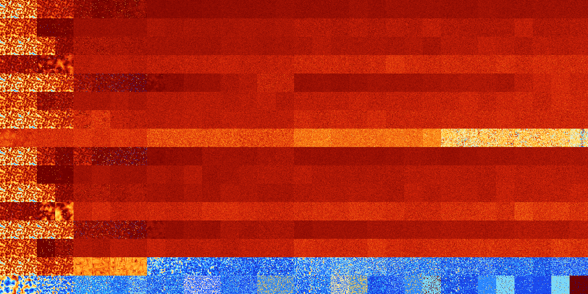

# B2345678 (260096-260607)

<details>
    <summary>Initial Grid</summary>
    
</details>


<details>
    <summary>Initial Grid RLE</summary>

```
#C Exported from GoGoL (https://github.com/marrow16/gogol)
#C Wrap mode: Toroidal
#C Boundary mode: Dead
#C Step: 0
x = 100, y = 100, rule = B2345678/S
8bo22bo2bobo3bo2bo10bo12bo4bo$o33bo16bo42bo3bo$37bo14bo$31bo3bo12bo8bo
6b2o4bo7bo12bo$31bo7bo12bo18bo$obo64bo10bo8bobo$8bo7bo28bo2b2o2bo15bo
10bo11bo$2bo17bo35bo7bo6bo11bo$8bo38bo22bo$17bobo53bobo6bo2bo2bo$7bo60b
2o2bo17bo$bo34bo19bo21bo4bo2b2o8bobo$11bo5bo75bo2bo$14bo55b2o18bo$22bo
4bo7bob3o7bo16bo$27bo13bo15bo4bo7bo6bo$3bo3bo2bo16bo7bo39bo6bo$6bo4bo
30bo8bo17bo$10bo13bo22bo16bo26bo$4bo9bobo49bo$40bob2o22bo2bo21bo$33bo
10b2o18bo22bo$50bo12bo18bo2bo$6bo10bo2bo3bo26bo10bo19bo10bo$19bo2bo10bo
6bo13bo2bo30bo7bo$23bo13bo47bo$39bo22bo17bo$29bo8bo17bo5bo32bo$28bo54bo
$5bo3bo28bo14bo21bo9bo6bo3bo$bo18bo67bo$13bo23bo14bo$18bo8bo44bo$31bo
28bo6bo6bo$46bo$28bo31bo3bo10bo4bo10bobo4bo$31b2o13bo6bo25bo19bo$34bo3b
o3bobo2bo17bo8bo6bo8bo$39bo8bo24bo3bo$20bo26bo2bo2bo26bo6bo$2bo3bo7bo
25bo5bo23bo21bo$2bo7bo4bo17bo16bo2bo31bo3bo5bo$7bo19bo25bobo18bo9bo3bo
6bo$17bo13bo7bo29bo11bo$o11bo55bo11bo$11bo33bo5bo5bo16bo$25bo20b2o4bo6b
2o14bo$21bo10bo35bo2bo17bo$23bo16bo17bo5bobo27bo$2bo3bo18bo6bo2bo7bo44b
o$28bo3bo14bo10b2o5bo5bo$9bo29bo9bo4bo32bo3bo$49bo14bo16bo$bo29bo49bo$
2bo63bo6b2o2bo15bo$15bo11bo30b3o9bo3bo$42bo5bo$10bo4bo13bo16b2o4bo14bo$
9bo36bo17bo32bo$4bo8bo14bo9bo58bo$11bo47bo15b2o7bo7bo$5bo42bo25bo2bo7bo
7bo$25bo16bo25bo$23b2o21bo8bo5bo11bo$o53b2o34bo$9b2o16bo5bo9bo14bo11bo
7b2o13bo2bo$19bo16bo7bo3bo39bo4bo$36bo21bo6bo6bo$25bo$7bo24bo2bo23bo3bo
$78bo$43bo13bo16bo$2bo8bo30bobobo21bo10bo$20bo38bo10bo22bo$38bo15bo7bo
35bo$bo14bo5bo15bo16bo11bo5bo7bo9bo4bo$25bo4bo25bo19bo$12bo18bo5bo2bo
53bo$6bo11bo9bo21bo21bo3bo$13b2o4bo4bo6bo24bo12bo12bo$7bo30bo10b2obo6bo
11bo$16bo4bo10bo4bo10bo20bo11bo17bo$34bobo3bo27bo6bo20bo$7bo5bo18bo6bo
5bobobo21bo13bo$bo8bo51bo9bo$9bo29bo12bo10bo2bo19bo$92bo$8bo9bo15b2o37b
o17bo$2bo4bo6bo4bo16bo2bo14bo$4bo16bo3bo8bo5bo10bo11bo29bo2bo$7b2o46bo
2bo$3bo4bo73bo2bo$8bo21bo11bo50bo$21bo28bo4bo6bo$27bo$2bo32bo$6bo2bo9bo
12bo28bo24bo$26bo7bo42bo3bo$47bo6bo3bo12bobo16bo$11b2o3bo6bo19bo!
```
</details>
<details>
    <summary>Thumbnail</summary>

</details>
<table>
<tr>
    <td><a href="./260096%20S%20Heat%20Map%20Activity.png"></a><br>S (260096)<br>R@17,p2</td>    <td><a href="./260097%20S0%20Heat%20Map%20Activity.png"></a><br>S0 (260097)<br>R@17,p4</td>    <td><a href="./260098%20S1%20Heat%20Map%20Activity.png"></a><br>S1 (260098)<br>R@40,p24</td>    <td><a href="./260099%20S01%20Heat%20Map%20Activity.png"></a><br>S01 (260099)<br>R@37,p8</td>    <td><a href="./260100%20S2%20Heat%20Map%20Activity.png"></a><br>S2 (260100)<br>R@171,p24</td>    <td><a href="./260101%20S02%20Heat%20Map%20Activity.png"></a><br>S02 (260101)<br>R@540,p24</td>    <td><a href="./260102%20S12%20Heat%20Map%20Activity.png"></a><br>S12 (260102)<br>G>1000</td>    <td><a href="./260103%20S012%20Heat%20Map%20Activity.png"></a><br>S012 (260103)<br>G>1000</td>    <td><a href="./260104%20S3%20Heat%20Map%20Activity.png"></a><br>S3 (260104)<br>G>1000</td>    <td><a href="./260105%20S03%20Heat%20Map%20Activity.png"></a><br>S03 (260105)<br>G>1000</td>    <td><a href="./260106%20S13%20Heat%20Map%20Activity.png"></a><br>S13 (260106)<br>G>1000</td>    <td><a href="./260107%20S013%20Heat%20Map%20Activity.png"></a><br>S013 (260107)<br>G>1000</td>    <td><a href="./260108%20S23%20Heat%20Map%20Activity.png"></a><br>S23 (260108)<br>G>1000</td>    <td><a href="./260109%20S023%20Heat%20Map%20Activity.png"></a><br>S023 (260109)<br>G>1000</td>    <td><a href="./260110%20S123%20Heat%20Map%20Activity.png"></a><br>S123 (260110)<br>G>1000</td>    <td><a href="./260111%20S0123%20Heat%20Map%20Activity.png"></a><br>S0123 (260111)<br>G>1000</td>    <td><a href="./260112%20S4%20Heat%20Map%20Activity.png"></a><br>S4 (260112)<br>G>1000</td>    <td><a href="./260113%20S04%20Heat%20Map%20Activity.png"></a><br>S04 (260113)<br>G>1000</td>    <td><a href="./260114%20S14%20Heat%20Map%20Activity.png"></a><br>S14 (260114)<br>G>1000</td>    <td><a href="./260115%20S014%20Heat%20Map%20Activity.png"></a><br>S014 (260115)<br>G>1000</td>    <td><a href="./260116%20S24%20Heat%20Map%20Activity.png"></a><br>S24 (260116)<br>G>1000</td>    <td><a href="./260117%20S024%20Heat%20Map%20Activity.png"></a><br>S024 (260117)<br>G>1000</td>    <td><a href="./260118%20S124%20Heat%20Map%20Activity.png"></a><br>S124 (260118)<br>G>1000</td>    <td><a href="./260119%20S0124%20Heat%20Map%20Activity.png"></a><br>S0124 (260119)<br>G>1000</td>    <td><a href="./260120%20S34%20Heat%20Map%20Activity.png"></a><br>S34 (260120)<br>G>1000</td>    <td><a href="./260121%20S034%20Heat%20Map%20Activity.png"></a><br>S034 (260121)<br>G>1000</td>    <td><a href="./260122%20S134%20Heat%20Map%20Activity.png"></a><br>S134 (260122)<br>G>1000</td>    <td><a href="./260123%20S0134%20Heat%20Map%20Activity.png"></a><br>S0134 (260123)<br>G>1000</td>    <td><a href="./260124%20S234%20Heat%20Map%20Activity.png"></a><br>S234 (260124)<br>G>1000</td>    <td><a href="./260125%20S0234%20Heat%20Map%20Activity.png"></a><br>S0234 (260125)<br>G>1000</td>    <td><a href="./260126%20S1234%20Heat%20Map%20Activity.png"></a><br>S1234 (260126)<br>G>1000</td>    <td><a href="./260127%20S01234%20Heat%20Map%20Activity.png"></a><br>S01234 (260127)<br>G>1000</td></tr>
<tr>
    <td><a href="./260128%20S5%20Heat%20Map%20Activity.png"></a><br>S5 (260128)<br>R@28,p4</td>    <td><a href="./260129%20S05%20Heat%20Map%20Activity.png"></a><br>S05 (260129)<br>R@29,p4</td>    <td><a href="./260130%20S15%20Heat%20Map%20Activity.png"></a><br>S15 (260130)<br>R@647,p336</td>    <td><a href="./260131%20S015%20Heat%20Map%20Activity.png"></a><br>S015 (260131)<br>R@373,p72</td>    <td><a href="./260132%20S25%20Heat%20Map%20Activity.png"></a><br>S25 (260132)<br>G>1000</td>    <td><a href="./260133%20S025%20Heat%20Map%20Activity.png"></a><br>S025 (260133)<br>G>1000</td>    <td><a href="./260134%20S125%20Heat%20Map%20Activity.png"></a><br>S125 (260134)<br>G>1000</td>    <td><a href="./260135%20S0125%20Heat%20Map%20Activity.png"></a><br>S0125 (260135)<br>G>1000</td>    <td><a href="./260136%20S35%20Heat%20Map%20Activity.png"></a><br>S35 (260136)<br>G>1000</td>    <td><a href="./260137%20S035%20Heat%20Map%20Activity.png"></a><br>S035 (260137)<br>G>1000</td>    <td><a href="./260138%20S135%20Heat%20Map%20Activity.png"></a><br>S135 (260138)<br>G>1000</td>    <td><a href="./260139%20S0135%20Heat%20Map%20Activity.png"></a><br>S0135 (260139)<br>G>1000</td>    <td><a href="./260140%20S235%20Heat%20Map%20Activity.png"></a><br>S235 (260140)<br>G>1000</td>    <td><a href="./260141%20S0235%20Heat%20Map%20Activity.png"></a><br>S0235 (260141)<br>G>1000</td>    <td><a href="./260142%20S1235%20Heat%20Map%20Activity.png"></a><br>S1235 (260142)<br>G>1000</td>    <td><a href="./260143%20S01235%20Heat%20Map%20Activity.png"></a><br>S01235 (260143)<br>G>1000</td>    <td><a href="./260144%20S45%20Heat%20Map%20Activity.png"></a><br>S45 (260144)<br>G>1000</td>    <td><a href="./260145%20S045%20Heat%20Map%20Activity.png"></a><br>S045 (260145)<br>G>1000</td>    <td><a href="./260146%20S145%20Heat%20Map%20Activity.png"></a><br>S145 (260146)<br>G>1000</td>    <td><a href="./260147%20S0145%20Heat%20Map%20Activity.png"></a><br>S0145 (260147)<br>G>1000</td>    <td><a href="./260148%20S245%20Heat%20Map%20Activity.png"></a><br>S245 (260148)<br>G>1000</td>    <td><a href="./260149%20S0245%20Heat%20Map%20Activity.png"></a><br>S0245 (260149)<br>G>1000</td>    <td><a href="./260150%20S1245%20Heat%20Map%20Activity.png"></a><br>S1245 (260150)<br>G>1000</td>    <td><a href="./260151%20S01245%20Heat%20Map%20Activity.png"></a><br>S01245 (260151)<br>G>1000</td>    <td><a href="./260152%20S345%20Heat%20Map%20Activity.png"></a><br>S345 (260152)<br>G>1000</td>    <td><a href="./260153%20S0345%20Heat%20Map%20Activity.png"></a><br>S0345 (260153)<br>G>1000</td>    <td><a href="./260154%20S1345%20Heat%20Map%20Activity.png"></a><br>S1345 (260154)<br>G>1000</td>    <td><a href="./260155%20S01345%20Heat%20Map%20Activity.png"></a><br>S01345 (260155)<br>G>1000</td>    <td><a href="./260156%20S2345%20Heat%20Map%20Activity.png"></a><br>S2345 (260156)<br>G>1000</td>    <td><a href="./260157%20S02345%20Heat%20Map%20Activity.png"></a><br>S02345 (260157)<br>G>1000</td>    <td><a href="./260158%20S12345%20Heat%20Map%20Activity.png"></a><br>S12345 (260158)<br>G>1000</td>    <td><a href="./260159%20S012345%20Heat%20Map%20Activity.png"></a><br>S012345 (260159)<br>G>1000</td></tr>
<tr>
    <td><a href="./260160%20S6%20Heat%20Map%20Activity.png"></a><br>S6 (260160)<br>R@19,p2</td>    <td><a href="./260161%20S06%20Heat%20Map%20Activity.png"></a><br>S06 (260161)<br>R@15,p2</td>    <td><a href="./260162%20S16%20Heat%20Map%20Activity.png"></a><br>S16 (260162)<br>R@21,p4</td>    <td><a href="./260163%20S016%20Heat%20Map%20Activity.png"></a><br>S016 (260163)<br>R@79,p60</td>    <td><a href="./260164%20S26%20Heat%20Map%20Activity.png"></a><br>S26 (260164)<br>G>1000</td>    <td><a href="./260165%20S026%20Heat%20Map%20Activity.png"></a><br>S026 (260165)<br>G>1000</td>    <td><a href="./260166%20S126%20Heat%20Map%20Activity.png"></a><br>S126 (260166)<br>G>1000</td>    <td><a href="./260167%20S0126%20Heat%20Map%20Activity.png"></a><br>S0126 (260167)<br>G>1000</td>    <td><a href="./260168%20S36%20Heat%20Map%20Activity.png"></a><br>S36 (260168)<br>G>1000</td>    <td><a href="./260169%20S036%20Heat%20Map%20Activity.png"></a><br>S036 (260169)<br>G>1000</td>    <td><a href="./260170%20S136%20Heat%20Map%20Activity.png"></a><br>S136 (260170)<br>G>1000</td>    <td><a href="./260171%20S0136%20Heat%20Map%20Activity.png"></a><br>S0136 (260171)<br>G>1000</td>    <td><a href="./260172%20S236%20Heat%20Map%20Activity.png"></a><br>S236 (260172)<br>G>1000</td>    <td><a href="./260173%20S0236%20Heat%20Map%20Activity.png"></a><br>S0236 (260173)<br>G>1000</td>    <td><a href="./260174%20S1236%20Heat%20Map%20Activity.png"></a><br>S1236 (260174)<br>G>1000</td>    <td><a href="./260175%20S01236%20Heat%20Map%20Activity.png"></a><br>S01236 (260175)<br>G>1000</td>    <td><a href="./260176%20S46%20Heat%20Map%20Activity.png"></a><br>S46 (260176)<br>G>1000</td>    <td><a href="./260177%20S046%20Heat%20Map%20Activity.png"></a><br>S046 (260177)<br>G>1000</td>    <td><a href="./260178%20S146%20Heat%20Map%20Activity.png"></a><br>S146 (260178)<br>G>1000</td>    <td><a href="./260179%20S0146%20Heat%20Map%20Activity.png"></a><br>S0146 (260179)<br>G>1000</td>    <td><a href="./260180%20S246%20Heat%20Map%20Activity.png"></a><br>S246 (260180)<br>G>1000</td>    <td><a href="./260181%20S0246%20Heat%20Map%20Activity.png"></a><br>S0246 (260181)<br>G>1000</td>    <td><a href="./260182%20S1246%20Heat%20Map%20Activity.png"></a><br>S1246 (260182)<br>G>1000</td>    <td><a href="./260183%20S01246%20Heat%20Map%20Activity.png"></a><br>S01246 (260183)<br>G>1000</td>    <td><a href="./260184%20S346%20Heat%20Map%20Activity.png"></a><br>S346 (260184)<br>G>1000</td>    <td><a href="./260185%20S0346%20Heat%20Map%20Activity.png"></a><br>S0346 (260185)<br>G>1000</td>    <td><a href="./260186%20S1346%20Heat%20Map%20Activity.png"></a><br>S1346 (260186)<br>G>1000</td>    <td><a href="./260187%20S01346%20Heat%20Map%20Activity.png"></a><br>S01346 (260187)<br>G>1000</td>    <td><a href="./260188%20S2346%20Heat%20Map%20Activity.png"></a><br>S2346 (260188)<br>G>1000</td>    <td><a href="./260189%20S02346%20Heat%20Map%20Activity.png"></a><br>S02346 (260189)<br>G>1000</td>    <td><a href="./260190%20S12346%20Heat%20Map%20Activity.png"></a><br>S12346 (260190)<br>G>1000</td>    <td><a href="./260191%20S012346%20Heat%20Map%20Activity.png"></a><br>S012346 (260191)<br>G>1000</td></tr>
<tr>
    <td><a href="./260192%20S56%20Heat%20Map%20Activity.png"></a><br>S56 (260192)<br>R@80,p12</td>    <td><a href="./260193%20S056%20Heat%20Map%20Activity.png"></a><br>S056 (260193)<br>R@88,p20</td>    <td><a href="./260194%20S156%20Heat%20Map%20Activity.png"></a><br>S156 (260194)<br>R@675,p60</td>    <td><a href="./260195%20S0156%20Heat%20Map%20Activity.png"></a><br>S0156 (260195)<br>G>1000</td>    <td><a href="./260196%20S256%20Heat%20Map%20Activity.png"></a><br>S256 (260196)<br>G>1000</td>    <td><a href="./260197%20S0256%20Heat%20Map%20Activity.png"></a><br>S0256 (260197)<br>G>1000</td>    <td><a href="./260198%20S1256%20Heat%20Map%20Activity.png"></a><br>S1256 (260198)<br>G>1000</td>    <td><a href="./260199%20S01256%20Heat%20Map%20Activity.png"></a><br>S01256 (260199)<br>G>1000</td>    <td><a href="./260200%20S356%20Heat%20Map%20Activity.png"></a><br>S356 (260200)<br>G>1000</td>    <td><a href="./260201%20S0356%20Heat%20Map%20Activity.png"></a><br>S0356 (260201)<br>G>1000</td>    <td><a href="./260202%20S1356%20Heat%20Map%20Activity.png"></a><br>S1356 (260202)<br>G>1000</td>    <td><a href="./260203%20S01356%20Heat%20Map%20Activity.png"></a><br>S01356 (260203)<br>G>1000</td>    <td><a href="./260204%20S2356%20Heat%20Map%20Activity.png"></a><br>S2356 (260204)<br>G>1000</td>    <td><a href="./260205%20S02356%20Heat%20Map%20Activity.png"></a><br>S02356 (260205)<br>G>1000</td>    <td><a href="./260206%20S12356%20Heat%20Map%20Activity.png"></a><br>S12356 (260206)<br>G>1000</td>    <td><a href="./260207%20S012356%20Heat%20Map%20Activity.png"></a><br>S012356 (260207)<br>G>1000</td>    <td><a href="./260208%20S456%20Heat%20Map%20Activity.png"></a><br>S456 (260208)<br>G>1000</td>    <td><a href="./260209%20S0456%20Heat%20Map%20Activity.png"></a><br>S0456 (260209)<br>G>1000</td>    <td><a href="./260210%20S1456%20Heat%20Map%20Activity.png"></a><br>S1456 (260210)<br>G>1000</td>    <td><a href="./260211%20S01456%20Heat%20Map%20Activity.png"></a><br>S01456 (260211)<br>G>1000</td>    <td><a href="./260212%20S2456%20Heat%20Map%20Activity.png"></a><br>S2456 (260212)<br>G>1000</td>    <td><a href="./260213%20S02456%20Heat%20Map%20Activity.png"></a><br>S02456 (260213)<br>G>1000</td>    <td><a href="./260214%20S12456%20Heat%20Map%20Activity.png"></a><br>S12456 (260214)<br>G>1000</td>    <td><a href="./260215%20S012456%20Heat%20Map%20Activity.png"></a><br>S012456 (260215)<br>G>1000</td>    <td><a href="./260216%20S3456%20Heat%20Map%20Activity.png"></a><br>S3456 (260216)<br>G>1000</td>    <td><a href="./260217%20S03456%20Heat%20Map%20Activity.png"></a><br>S03456 (260217)<br>G>1000</td>    <td><a href="./260218%20S13456%20Heat%20Map%20Activity.png"></a><br>S13456 (260218)<br>G>1000</td>    <td><a href="./260219%20S013456%20Heat%20Map%20Activity.png"></a><br>S013456 (260219)<br>G>1000</td>    <td><a href="./260220%20S23456%20Heat%20Map%20Activity.png"></a><br>S23456 (260220)<br>G>1000</td>    <td><a href="./260221%20S023456%20Heat%20Map%20Activity.png"></a><br>S023456 (260221)<br>G>1000</td>    <td><a href="./260222%20S123456%20Heat%20Map%20Activity.png"></a><br>S123456 (260222)<br>G>1000</td>    <td><a href="./260223%20S0123456%20Heat%20Map%20Activity.png"></a><br>S0123456 (260223)<br>G>1000</td></tr>
<tr>
    <td><a href="./260224%20S7%20Heat%20Map%20Activity.png"></a><br>S7 (260224)<br>R@17,p2</td>    <td><a href="./260225%20S07%20Heat%20Map%20Activity.png"></a><br>S07 (260225)<br>R@17,p4</td>    <td><a href="./260226%20S17%20Heat%20Map%20Activity.png"></a><br>S17 (260226)<br>R@16,p4</td>    <td><a href="./260227%20S017%20Heat%20Map%20Activity.png"></a><br>S017 (260227)<br>R@21,p4</td>    <td><a href="./260228%20S27%20Heat%20Map%20Activity.png"></a><br>S27 (260228)<br>R@100,p24</td>    <td><a href="./260229%20S027%20Heat%20Map%20Activity.png"></a><br>S027 (260229)<br>R@149,p48</td>    <td><a href="./260230%20S127%20Heat%20Map%20Activity.png"></a><br>S127 (260230)<br>R@159,p72</td>    <td><a href="./260231%20S0127%20Heat%20Map%20Activity.png"></a><br>S0127 (260231)<br>R@309,p240</td>    <td><a href="./260232%20S37%20Heat%20Map%20Activity.png"></a><br>S37 (260232)<br>G>1000</td>    <td><a href="./260233%20S037%20Heat%20Map%20Activity.png"></a><br>S037 (260233)<br>G>1000</td>    <td><a href="./260234%20S137%20Heat%20Map%20Activity.png"></a><br>S137 (260234)<br>G>1000</td>    <td><a href="./260235%20S0137%20Heat%20Map%20Activity.png"></a><br>S0137 (260235)<br>G>1000</td>    <td><a href="./260236%20S237%20Heat%20Map%20Activity.png"></a><br>S237 (260236)<br>G>1000</td>    <td><a href="./260237%20S0237%20Heat%20Map%20Activity.png"></a><br>S0237 (260237)<br>G>1000</td>    <td><a href="./260238%20S1237%20Heat%20Map%20Activity.png"></a><br>S1237 (260238)<br>G>1000</td>    <td><a href="./260239%20S01237%20Heat%20Map%20Activity.png"></a><br>S01237 (260239)<br>G>1000</td>    <td><a href="./260240%20S47%20Heat%20Map%20Activity.png"></a><br>S47 (260240)<br>G>1000</td>    <td><a href="./260241%20S047%20Heat%20Map%20Activity.png"></a><br>S047 (260241)<br>G>1000</td>    <td><a href="./260242%20S147%20Heat%20Map%20Activity.png"></a><br>S147 (260242)<br>G>1000</td>    <td><a href="./260243%20S0147%20Heat%20Map%20Activity.png"></a><br>S0147 (260243)<br>G>1000</td>    <td><a href="./260244%20S247%20Heat%20Map%20Activity.png"></a><br>S247 (260244)<br>G>1000</td>    <td><a href="./260245%20S0247%20Heat%20Map%20Activity.png"></a><br>S0247 (260245)<br>G>1000</td>    <td><a href="./260246%20S1247%20Heat%20Map%20Activity.png"></a><br>S1247 (260246)<br>G>1000</td>    <td><a href="./260247%20S01247%20Heat%20Map%20Activity.png"></a><br>S01247 (260247)<br>G>1000</td>    <td><a href="./260248%20S347%20Heat%20Map%20Activity.png"></a><br>S347 (260248)<br>G>1000</td>    <td><a href="./260249%20S0347%20Heat%20Map%20Activity.png"></a><br>S0347 (260249)<br>G>1000</td>    <td><a href="./260250%20S1347%20Heat%20Map%20Activity.png"></a><br>S1347 (260250)<br>G>1000</td>    <td><a href="./260251%20S01347%20Heat%20Map%20Activity.png"></a><br>S01347 (260251)<br>G>1000</td>    <td><a href="./260252%20S2347%20Heat%20Map%20Activity.png"></a><br>S2347 (260252)<br>G>1000</td>    <td><a href="./260253%20S02347%20Heat%20Map%20Activity.png"></a><br>S02347 (260253)<br>G>1000</td>    <td><a href="./260254%20S12347%20Heat%20Map%20Activity.png"></a><br>S12347 (260254)<br>G>1000</td>    <td><a href="./260255%20S012347%20Heat%20Map%20Activity.png"></a><br>S012347 (260255)<br>G>1000</td></tr>
<tr>
    <td><a href="./260256%20S57%20Heat%20Map%20Activity.png"></a><br>S57 (260256)<br>R@29,p4</td>    <td><a href="./260257%20S057%20Heat%20Map%20Activity.png"></a><br>S057 (260257)<br>R@25,p2</td>    <td><a href="./260258%20S157%20Heat%20Map%20Activity.png"></a><br>S157 (260258)<br>R@104,p8</td>    <td><a href="./260259%20S0157%20Heat%20Map%20Activity.png"></a><br>S0157 (260259)<br>R@72,p12</td>    <td><a href="./260260%20S257%20Heat%20Map%20Activity.png"></a><br>S257 (260260)<br>G>1000</td>    <td><a href="./260261%20S0257%20Heat%20Map%20Activity.png"></a><br>S0257 (260261)<br>G>1000</td>    <td><a href="./260262%20S1257%20Heat%20Map%20Activity.png"></a><br>S1257 (260262)<br>G>1000</td>    <td><a href="./260263%20S01257%20Heat%20Map%20Activity.png"></a><br>S01257 (260263)<br>G>1000</td>    <td><a href="./260264%20S357%20Heat%20Map%20Activity.png"></a><br>S357 (260264)<br>G>1000</td>    <td><a href="./260265%20S0357%20Heat%20Map%20Activity.png"></a><br>S0357 (260265)<br>G>1000</td>    <td><a href="./260266%20S1357%20Heat%20Map%20Activity.png"></a><br>S1357 (260266)<br>G>1000</td>    <td><a href="./260267%20S01357%20Heat%20Map%20Activity.png"></a><br>S01357 (260267)<br>G>1000</td>    <td><a href="./260268%20S2357%20Heat%20Map%20Activity.png"></a><br>S2357 (260268)<br>G>1000</td>    <td><a href="./260269%20S02357%20Heat%20Map%20Activity.png"></a><br>S02357 (260269)<br>G>1000</td>    <td><a href="./260270%20S12357%20Heat%20Map%20Activity.png"></a><br>S12357 (260270)<br>G>1000</td>    <td><a href="./260271%20S012357%20Heat%20Map%20Activity.png"></a><br>S012357 (260271)<br>G>1000</td>    <td><a href="./260272%20S457%20Heat%20Map%20Activity.png"></a><br>S457 (260272)<br>G>1000</td>    <td><a href="./260273%20S0457%20Heat%20Map%20Activity.png"></a><br>S0457 (260273)<br>G>1000</td>    <td><a href="./260274%20S1457%20Heat%20Map%20Activity.png"></a><br>S1457 (260274)<br>G>1000</td>    <td><a href="./260275%20S01457%20Heat%20Map%20Activity.png"></a><br>S01457 (260275)<br>G>1000</td>    <td><a href="./260276%20S2457%20Heat%20Map%20Activity.png"></a><br>S2457 (260276)<br>G>1000</td>    <td><a href="./260277%20S02457%20Heat%20Map%20Activity.png"></a><br>S02457 (260277)<br>G>1000</td>    <td><a href="./260278%20S12457%20Heat%20Map%20Activity.png"></a><br>S12457 (260278)<br>G>1000</td>    <td><a href="./260279%20S012457%20Heat%20Map%20Activity.png"></a><br>S012457 (260279)<br>G>1000</td>    <td><a href="./260280%20S3457%20Heat%20Map%20Activity.png"></a><br>S3457 (260280)<br>G>1000</td>    <td><a href="./260281%20S03457%20Heat%20Map%20Activity.png"></a><br>S03457 (260281)<br>G>1000</td>    <td><a href="./260282%20S13457%20Heat%20Map%20Activity.png"></a><br>S13457 (260282)<br>G>1000</td>    <td><a href="./260283%20S013457%20Heat%20Map%20Activity.png"></a><br>S013457 (260283)<br>G>1000</td>    <td><a href="./260284%20S23457%20Heat%20Map%20Activity.png"></a><br>S23457 (260284)<br>G>1000</td>    <td><a href="./260285%20S023457%20Heat%20Map%20Activity.png"></a><br>S023457 (260285)<br>G>1000</td>    <td><a href="./260286%20S123457%20Heat%20Map%20Activity.png"></a><br>S123457 (260286)<br>G>1000</td>    <td><a href="./260287%20S0123457%20Heat%20Map%20Activity.png"></a><br>S0123457 (260287)<br>G>1000</td></tr>
<tr>
    <td><a href="./260288%20S67%20Heat%20Map%20Activity.png"></a><br>S67 (260288)<br>R@19,p2</td>    <td><a href="./260289%20S067%20Heat%20Map%20Activity.png"></a><br>S067 (260289)<br>R@15,p2</td>    <td><a href="./260290%20S167%20Heat%20Map%20Activity.png"></a><br>S167 (260290)<br>R@19,p2</td>    <td><a href="./260291%20S0167%20Heat%20Map%20Activity.png"></a><br>S0167 (260291)<br>R@23,p4</td>    <td><a href="./260292%20S267%20Heat%20Map%20Activity.png"></a><br>S267 (260292)<br>G>1000</td>    <td><a href="./260293%20S0267%20Heat%20Map%20Activity.png"></a><br>S0267 (260293)<br>G>1000</td>    <td><a href="./260294%20S1267%20Heat%20Map%20Activity.png"></a><br>S1267 (260294)<br>G>1000</td>    <td><a href="./260295%20S01267%20Heat%20Map%20Activity.png"></a><br>S01267 (260295)<br>G>1000</td>    <td><a href="./260296%20S367%20Heat%20Map%20Activity.png"></a><br>S367 (260296)<br>G>1000</td>    <td><a href="./260297%20S0367%20Heat%20Map%20Activity.png"></a><br>S0367 (260297)<br>G>1000</td>    <td><a href="./260298%20S1367%20Heat%20Map%20Activity.png"></a><br>S1367 (260298)<br>G>1000</td>    <td><a href="./260299%20S01367%20Heat%20Map%20Activity.png"></a><br>S01367 (260299)<br>G>1000</td>    <td><a href="./260300%20S2367%20Heat%20Map%20Activity.png"></a><br>S2367 (260300)<br>G>1000</td>    <td><a href="./260301%20S02367%20Heat%20Map%20Activity.png"></a><br>S02367 (260301)<br>G>1000</td>    <td><a href="./260302%20S12367%20Heat%20Map%20Activity.png"></a><br>S12367 (260302)<br>G>1000</td>    <td><a href="./260303%20S012367%20Heat%20Map%20Activity.png"></a><br>S012367 (260303)<br>G>1000</td>    <td><a href="./260304%20S467%20Heat%20Map%20Activity.png"></a><br>S467 (260304)<br>G>1000</td>    <td><a href="./260305%20S0467%20Heat%20Map%20Activity.png"></a><br>S0467 (260305)<br>G>1000</td>    <td><a href="./260306%20S1467%20Heat%20Map%20Activity.png"></a><br>S1467 (260306)<br>G>1000</td>    <td><a href="./260307%20S01467%20Heat%20Map%20Activity.png"></a><br>S01467 (260307)<br>G>1000</td>    <td><a href="./260308%20S2467%20Heat%20Map%20Activity.png"></a><br>S2467 (260308)<br>G>1000</td>    <td><a href="./260309%20S02467%20Heat%20Map%20Activity.png"></a><br>S02467 (260309)<br>G>1000</td>    <td><a href="./260310%20S12467%20Heat%20Map%20Activity.png"></a><br>S12467 (260310)<br>G>1000</td>    <td><a href="./260311%20S012467%20Heat%20Map%20Activity.png"></a><br>S012467 (260311)<br>G>1000</td>    <td><a href="./260312%20S3467%20Heat%20Map%20Activity.png"></a><br>S3467 (260312)<br>G>1000</td>    <td><a href="./260313%20S03467%20Heat%20Map%20Activity.png"></a><br>S03467 (260313)<br>G>1000</td>    <td><a href="./260314%20S13467%20Heat%20Map%20Activity.png"></a><br>S13467 (260314)<br>G>1000</td>    <td><a href="./260315%20S013467%20Heat%20Map%20Activity.png"></a><br>S013467 (260315)<br>G>1000</td>    <td><a href="./260316%20S23467%20Heat%20Map%20Activity.png"></a><br>S23467 (260316)<br>G>1000</td>    <td><a href="./260317%20S023467%20Heat%20Map%20Activity.png"></a><br>S023467 (260317)<br>G>1000</td>    <td><a href="./260318%20S123467%20Heat%20Map%20Activity.png"></a><br>S123467 (260318)<br>G>1000</td>    <td><a href="./260319%20S0123467%20Heat%20Map%20Activity.png"></a><br>S0123467 (260319)<br>G>1000</td></tr>
<tr>
    <td><a href="./260320%20S567%20Heat%20Map%20Activity.png"></a><br>S567 (260320)<br>G>1000</td>    <td><a href="./260321%20S0567%20Heat%20Map%20Activity.png"></a><br>S0567 (260321)<br>G>1000</td>    <td><a href="./260322%20S1567%20Heat%20Map%20Activity.png"></a><br>S1567 (260322)<br>G>1000</td>    <td><a href="./260323%20S01567%20Heat%20Map%20Activity.png"></a><br>S01567 (260323)<br>G>1000</td>    <td><a href="./260324%20S2567%20Heat%20Map%20Activity.png"></a><br>S2567 (260324)<br>G>1000</td>    <td><a href="./260325%20S02567%20Heat%20Map%20Activity.png"></a><br>S02567 (260325)<br>G>1000</td>    <td><a href="./260326%20S12567%20Heat%20Map%20Activity.png"></a><br>S12567 (260326)<br>G>1000</td>    <td><a href="./260327%20S012567%20Heat%20Map%20Activity.png"></a><br>S012567 (260327)<br>G>1000</td>    <td><a href="./260328%20S3567%20Heat%20Map%20Activity.png"></a><br>S3567 (260328)<br>G>1000</td>    <td><a href="./260329%20S03567%20Heat%20Map%20Activity.png"></a><br>S03567 (260329)<br>G>1000</td>    <td><a href="./260330%20S13567%20Heat%20Map%20Activity.png"></a><br>S13567 (260330)<br>G>1000</td>    <td><a href="./260331%20S013567%20Heat%20Map%20Activity.png"></a><br>S013567 (260331)<br>G>1000</td>    <td><a href="./260332%20S23567%20Heat%20Map%20Activity.png"></a><br>S23567 (260332)<br>G>1000</td>    <td><a href="./260333%20S023567%20Heat%20Map%20Activity.png"></a><br>S023567 (260333)<br>G>1000</td>    <td><a href="./260334%20S123567%20Heat%20Map%20Activity.png"></a><br>S123567 (260334)<br>G>1000</td>    <td><a href="./260335%20S0123567%20Heat%20Map%20Activity.png"></a><br>S0123567 (260335)<br>G>1000</td>    <td><a href="./260336%20S4567%20Heat%20Map%20Activity.png"></a><br>S4567 (260336)<br>G>1000</td>    <td><a href="./260337%20S04567%20Heat%20Map%20Activity.png"></a><br>S04567 (260337)<br>G>1000</td>    <td><a href="./260338%20S14567%20Heat%20Map%20Activity.png"></a><br>S14567 (260338)<br>G>1000</td>    <td><a href="./260339%20S014567%20Heat%20Map%20Activity.png"></a><br>S014567 (260339)<br>G>1000</td>    <td><a href="./260340%20S24567%20Heat%20Map%20Activity.png"></a><br>S24567 (260340)<br>G>1000</td>    <td><a href="./260341%20S024567%20Heat%20Map%20Activity.png"></a><br>S024567 (260341)<br>G>1000</td>    <td><a href="./260342%20S124567%20Heat%20Map%20Activity.png"></a><br>S124567 (260342)<br>G>1000</td>    <td><a href="./260343%20S0124567%20Heat%20Map%20Activity.png"></a><br>S0124567 (260343)<br>G>1000</td>    <td><a href="./260344%20S34567%20Heat%20Map%20Activity.png"></a><br>S34567 (260344)<br>G>1000</td>    <td><a href="./260345%20S034567%20Heat%20Map%20Activity.png"></a><br>S034567 (260345)<br>G>1000</td>    <td><a href="./260346%20S134567%20Heat%20Map%20Activity.png"></a><br>S134567 (260346)<br>G>1000</td>    <td><a href="./260347%20S0134567%20Heat%20Map%20Activity.png"></a><br>S0134567 (260347)<br>G>1000</td>    <td><a href="./260348%20S234567%20Heat%20Map%20Activity.png"></a><br>S234567 (260348)<br>G>1000</td>    <td><a href="./260349%20S0234567%20Heat%20Map%20Activity.png"></a><br>S0234567 (260349)<br>G>1000</td>    <td><a href="./260350%20S1234567%20Heat%20Map%20Activity.png"></a><br>S1234567 (260350)<br>G>1000</td>    <td><a href="./260351%20S01234567%20Heat%20Map%20Activity.png"></a><br>S01234567 (260351)<br>G>1000</td></tr>
<tr>
    <td><a href="./260352%20S8%20Heat%20Map%20Activity.png"></a><br>S8 (260352)<br>R@17,p2</td>    <td><a href="./260353%20S08%20Heat%20Map%20Activity.png"></a><br>S08 (260353)<br>R@15,p2</td>    <td><a href="./260354%20S18%20Heat%20Map%20Activity.png"></a><br>S18 (260354)<br>R@40,p24</td>    <td><a href="./260355%20S018%20Heat%20Map%20Activity.png"></a><br>S018 (260355)<br>R@151,p120</td>    <td><a href="./260356%20S28%20Heat%20Map%20Activity.png"></a><br>S28 (260356)<br>R@72,p8</td>    <td><a href="./260357%20S028%20Heat%20Map%20Activity.png"></a><br>S028 (260357)<br>R@209,p120</td>    <td><a href="./260358%20S128%20Heat%20Map%20Activity.png"></a><br>S128 (260358)<br>R@196,p120</td>    <td><a href="./260359%20S0128%20Heat%20Map%20Activity.png"></a><br>S0128 (260359)<br>R@191,p120</td>    <td><a href="./260360%20S38%20Heat%20Map%20Activity.png"></a><br>S38 (260360)<br>G>1000</td>    <td><a href="./260361%20S038%20Heat%20Map%20Activity.png"></a><br>S038 (260361)<br>G>1000</td>    <td><a href="./260362%20S138%20Heat%20Map%20Activity.png"></a><br>S138 (260362)<br>G>1000</td>    <td><a href="./260363%20S0138%20Heat%20Map%20Activity.png"></a><br>S0138 (260363)<br>G>1000</td>    <td><a href="./260364%20S238%20Heat%20Map%20Activity.png"></a><br>S238 (260364)<br>G>1000</td>    <td><a href="./260365%20S0238%20Heat%20Map%20Activity.png"></a><br>S0238 (260365)<br>G>1000</td>    <td><a href="./260366%20S1238%20Heat%20Map%20Activity.png"></a><br>S1238 (260366)<br>G>1000</td>    <td><a href="./260367%20S01238%20Heat%20Map%20Activity.png"></a><br>S01238 (260367)<br>G>1000</td>    <td><a href="./260368%20S48%20Heat%20Map%20Activity.png"></a><br>S48 (260368)<br>G>1000</td>    <td><a href="./260369%20S048%20Heat%20Map%20Activity.png"></a><br>S048 (260369)<br>G>1000</td>    <td><a href="./260370%20S148%20Heat%20Map%20Activity.png"></a><br>S148 (260370)<br>G>1000</td>    <td><a href="./260371%20S0148%20Heat%20Map%20Activity.png"></a><br>S0148 (260371)<br>G>1000</td>    <td><a href="./260372%20S248%20Heat%20Map%20Activity.png"></a><br>S248 (260372)<br>G>1000</td>    <td><a href="./260373%20S0248%20Heat%20Map%20Activity.png"></a><br>S0248 (260373)<br>G>1000</td>    <td><a href="./260374%20S1248%20Heat%20Map%20Activity.png"></a><br>S1248 (260374)<br>G>1000</td>    <td><a href="./260375%20S01248%20Heat%20Map%20Activity.png"></a><br>S01248 (260375)<br>G>1000</td>    <td><a href="./260376%20S348%20Heat%20Map%20Activity.png"></a><br>S348 (260376)<br>G>1000</td>    <td><a href="./260377%20S0348%20Heat%20Map%20Activity.png"></a><br>S0348 (260377)<br>G>1000</td>    <td><a href="./260378%20S1348%20Heat%20Map%20Activity.png"></a><br>S1348 (260378)<br>G>1000</td>    <td><a href="./260379%20S01348%20Heat%20Map%20Activity.png"></a><br>S01348 (260379)<br>G>1000</td>    <td><a href="./260380%20S2348%20Heat%20Map%20Activity.png"></a><br>S2348 (260380)<br>G>1000</td>    <td><a href="./260381%20S02348%20Heat%20Map%20Activity.png"></a><br>S02348 (260381)<br>G>1000</td>    <td><a href="./260382%20S12348%20Heat%20Map%20Activity.png"></a><br>S12348 (260382)<br>G>1000</td>    <td><a href="./260383%20S012348%20Heat%20Map%20Activity.png"></a><br>S012348 (260383)<br>G>1000</td></tr>
<tr>
    <td><a href="./260384%20S58%20Heat%20Map%20Activity.png"></a><br>S58 (260384)<br>R@28,p4</td>    <td><a href="./260385%20S058%20Heat%20Map%20Activity.png"></a><br>S058 (260385)<br>R@30,p2</td>    <td><a href="./260386%20S158%20Heat%20Map%20Activity.png"></a><br>S158 (260386)<br>G>1000</td>    <td><a href="./260387%20S0158%20Heat%20Map%20Activity.png"></a><br>S0158 (260387)<br>R@683,p336</td>    <td><a href="./260388%20S258%20Heat%20Map%20Activity.png"></a><br>S258 (260388)<br>G>1000</td>    <td><a href="./260389%20S0258%20Heat%20Map%20Activity.png"></a><br>S0258 (260389)<br>G>1000</td>    <td><a href="./260390%20S1258%20Heat%20Map%20Activity.png"></a><br>S1258 (260390)<br>G>1000</td>    <td><a href="./260391%20S01258%20Heat%20Map%20Activity.png"></a><br>S01258 (260391)<br>G>1000</td>    <td><a href="./260392%20S358%20Heat%20Map%20Activity.png"></a><br>S358 (260392)<br>G>1000</td>    <td><a href="./260393%20S0358%20Heat%20Map%20Activity.png"></a><br>S0358 (260393)<br>G>1000</td>    <td><a href="./260394%20S1358%20Heat%20Map%20Activity.png"></a><br>S1358 (260394)<br>G>1000</td>    <td><a href="./260395%20S01358%20Heat%20Map%20Activity.png"></a><br>S01358 (260395)<br>G>1000</td>    <td><a href="./260396%20S2358%20Heat%20Map%20Activity.png"></a><br>S2358 (260396)<br>G>1000</td>    <td><a href="./260397%20S02358%20Heat%20Map%20Activity.png"></a><br>S02358 (260397)<br>G>1000</td>    <td><a href="./260398%20S12358%20Heat%20Map%20Activity.png"></a><br>S12358 (260398)<br>G>1000</td>    <td><a href="./260399%20S012358%20Heat%20Map%20Activity.png"></a><br>S012358 (260399)<br>G>1000</td>    <td><a href="./260400%20S458%20Heat%20Map%20Activity.png"></a><br>S458 (260400)<br>G>1000</td>    <td><a href="./260401%20S0458%20Heat%20Map%20Activity.png"></a><br>S0458 (260401)<br>G>1000</td>    <td><a href="./260402%20S1458%20Heat%20Map%20Activity.png"></a><br>S1458 (260402)<br>G>1000</td>    <td><a href="./260403%20S01458%20Heat%20Map%20Activity.png"></a><br>S01458 (260403)<br>G>1000</td>    <td><a href="./260404%20S2458%20Heat%20Map%20Activity.png"></a><br>S2458 (260404)<br>G>1000</td>    <td><a href="./260405%20S02458%20Heat%20Map%20Activity.png"></a><br>S02458 (260405)<br>G>1000</td>    <td><a href="./260406%20S12458%20Heat%20Map%20Activity.png"></a><br>S12458 (260406)<br>G>1000</td>    <td><a href="./260407%20S012458%20Heat%20Map%20Activity.png"></a><br>S012458 (260407)<br>G>1000</td>    <td><a href="./260408%20S3458%20Heat%20Map%20Activity.png"></a><br>S3458 (260408)<br>G>1000</td>    <td><a href="./260409%20S03458%20Heat%20Map%20Activity.png"></a><br>S03458 (260409)<br>G>1000</td>    <td><a href="./260410%20S13458%20Heat%20Map%20Activity.png"></a><br>S13458 (260410)<br>G>1000</td>    <td><a href="./260411%20S013458%20Heat%20Map%20Activity.png"></a><br>S013458 (260411)<br>G>1000</td>    <td><a href="./260412%20S23458%20Heat%20Map%20Activity.png"></a><br>S23458 (260412)<br>G>1000</td>    <td><a href="./260413%20S023458%20Heat%20Map%20Activity.png"></a><br>S023458 (260413)<br>G>1000</td>    <td><a href="./260414%20S123458%20Heat%20Map%20Activity.png"></a><br>S123458 (260414)<br>G>1000</td>    <td><a href="./260415%20S0123458%20Heat%20Map%20Activity.png"></a><br>S0123458 (260415)<br>G>1000</td></tr>
<tr>
    <td><a href="./260416%20S68%20Heat%20Map%20Activity.png"></a><br>S68 (260416)<br>R@19,p2</td>    <td><a href="./260417%20S068%20Heat%20Map%20Activity.png"></a><br>S068 (260417)<br>R@15,p2</td>    <td><a href="./260418%20S168%20Heat%20Map%20Activity.png"></a><br>S168 (260418)<br>R@19,p4</td>    <td><a href="./260419%20S0168%20Heat%20Map%20Activity.png"></a><br>S0168 (260419)<br>R@77,p60</td>    <td><a href="./260420%20S268%20Heat%20Map%20Activity.png"></a><br>S268 (260420)<br>G>1000</td>    <td><a href="./260421%20S0268%20Heat%20Map%20Activity.png"></a><br>S0268 (260421)<br>G>1000</td>    <td><a href="./260422%20S1268%20Heat%20Map%20Activity.png"></a><br>S1268 (260422)<br>G>1000</td>    <td><a href="./260423%20S01268%20Heat%20Map%20Activity.png"></a><br>S01268 (260423)<br>G>1000</td>    <td><a href="./260424%20S368%20Heat%20Map%20Activity.png"></a><br>S368 (260424)<br>G>1000</td>    <td><a href="./260425%20S0368%20Heat%20Map%20Activity.png"></a><br>S0368 (260425)<br>G>1000</td>    <td><a href="./260426%20S1368%20Heat%20Map%20Activity.png"></a><br>S1368 (260426)<br>G>1000</td>    <td><a href="./260427%20S01368%20Heat%20Map%20Activity.png"></a><br>S01368 (260427)<br>G>1000</td>    <td><a href="./260428%20S2368%20Heat%20Map%20Activity.png"></a><br>S2368 (260428)<br>G>1000</td>    <td><a href="./260429%20S02368%20Heat%20Map%20Activity.png"></a><br>S02368 (260429)<br>G>1000</td>    <td><a href="./260430%20S12368%20Heat%20Map%20Activity.png"></a><br>S12368 (260430)<br>G>1000</td>    <td><a href="./260431%20S012368%20Heat%20Map%20Activity.png"></a><br>S012368 (260431)<br>G>1000</td>    <td><a href="./260432%20S468%20Heat%20Map%20Activity.png"></a><br>S468 (260432)<br>G>1000</td>    <td><a href="./260433%20S0468%20Heat%20Map%20Activity.png"></a><br>S0468 (260433)<br>G>1000</td>    <td><a href="./260434%20S1468%20Heat%20Map%20Activity.png"></a><br>S1468 (260434)<br>G>1000</td>    <td><a href="./260435%20S01468%20Heat%20Map%20Activity.png"></a><br>S01468 (260435)<br>G>1000</td>    <td><a href="./260436%20S2468%20Heat%20Map%20Activity.png"></a><br>S2468 (260436)<br>G>1000</td>    <td><a href="./260437%20S02468%20Heat%20Map%20Activity.png"></a><br>S02468 (260437)<br>G>1000</td>    <td><a href="./260438%20S12468%20Heat%20Map%20Activity.png"></a><br>S12468 (260438)<br>G>1000</td>    <td><a href="./260439%20S012468%20Heat%20Map%20Activity.png"></a><br>S012468 (260439)<br>G>1000</td>    <td><a href="./260440%20S3468%20Heat%20Map%20Activity.png"></a><br>S3468 (260440)<br>G>1000</td>    <td><a href="./260441%20S03468%20Heat%20Map%20Activity.png"></a><br>S03468 (260441)<br>G>1000</td>    <td><a href="./260442%20S13468%20Heat%20Map%20Activity.png"></a><br>S13468 (260442)<br>G>1000</td>    <td><a href="./260443%20S013468%20Heat%20Map%20Activity.png"></a><br>S013468 (260443)<br>G>1000</td>    <td><a href="./260444%20S23468%20Heat%20Map%20Activity.png"></a><br>S23468 (260444)<br>G>1000</td>    <td><a href="./260445%20S023468%20Heat%20Map%20Activity.png"></a><br>S023468 (260445)<br>G>1000</td>    <td><a href="./260446%20S123468%20Heat%20Map%20Activity.png"></a><br>S123468 (260446)<br>G>1000</td>    <td><a href="./260447%20S0123468%20Heat%20Map%20Activity.png"></a><br>S0123468 (260447)<br>G>1000</td></tr>
<tr>
    <td><a href="./260448%20S568%20Heat%20Map%20Activity.png"></a><br>S568 (260448)<br>R@81,p12</td>    <td><a href="./260449%20S0568%20Heat%20Map%20Activity.png"></a><br>S0568 (260449)<br>R@99,p8</td>    <td><a href="./260450%20S1568%20Heat%20Map%20Activity.png"></a><br>S1568 (260450)<br>R@624,p48</td>    <td><a href="./260451%20S01568%20Heat%20Map%20Activity.png"></a><br>S01568 (260451)<br>G>1000</td>    <td><a href="./260452%20S2568%20Heat%20Map%20Activity.png"></a><br>S2568 (260452)<br>G>1000</td>    <td><a href="./260453%20S02568%20Heat%20Map%20Activity.png"></a><br>S02568 (260453)<br>G>1000</td>    <td><a href="./260454%20S12568%20Heat%20Map%20Activity.png"></a><br>S12568 (260454)<br>G>1000</td>    <td><a href="./260455%20S012568%20Heat%20Map%20Activity.png"></a><br>S012568 (260455)<br>G>1000</td>    <td><a href="./260456%20S3568%20Heat%20Map%20Activity.png"></a><br>S3568 (260456)<br>G>1000</td>    <td><a href="./260457%20S03568%20Heat%20Map%20Activity.png"></a><br>S03568 (260457)<br>G>1000</td>    <td><a href="./260458%20S13568%20Heat%20Map%20Activity.png"></a><br>S13568 (260458)<br>G>1000</td>    <td><a href="./260459%20S013568%20Heat%20Map%20Activity.png"></a><br>S013568 (260459)<br>G>1000</td>    <td><a href="./260460%20S23568%20Heat%20Map%20Activity.png"></a><br>S23568 (260460)<br>G>1000</td>    <td><a href="./260461%20S023568%20Heat%20Map%20Activity.png"></a><br>S023568 (260461)<br>G>1000</td>    <td><a href="./260462%20S123568%20Heat%20Map%20Activity.png"></a><br>S123568 (260462)<br>G>1000</td>    <td><a href="./260463%20S0123568%20Heat%20Map%20Activity.png"></a><br>S0123568 (260463)<br>G>1000</td>    <td><a href="./260464%20S4568%20Heat%20Map%20Activity.png"></a><br>S4568 (260464)<br>G>1000</td>    <td><a href="./260465%20S04568%20Heat%20Map%20Activity.png"></a><br>S04568 (260465)<br>G>1000</td>    <td><a href="./260466%20S14568%20Heat%20Map%20Activity.png"></a><br>S14568 (260466)<br>G>1000</td>    <td><a href="./260467%20S014568%20Heat%20Map%20Activity.png"></a><br>S014568 (260467)<br>G>1000</td>    <td><a href="./260468%20S24568%20Heat%20Map%20Activity.png"></a><br>S24568 (260468)<br>G>1000</td>    <td><a href="./260469%20S024568%20Heat%20Map%20Activity.png"></a><br>S024568 (260469)<br>G>1000</td>    <td><a href="./260470%20S124568%20Heat%20Map%20Activity.png"></a><br>S124568 (260470)<br>G>1000</td>    <td><a href="./260471%20S0124568%20Heat%20Map%20Activity.png"></a><br>S0124568 (260471)<br>G>1000</td>    <td><a href="./260472%20S34568%20Heat%20Map%20Activity.png"></a><br>S34568 (260472)<br>G>1000</td>    <td><a href="./260473%20S034568%20Heat%20Map%20Activity.png"></a><br>S034568 (260473)<br>G>1000</td>    <td><a href="./260474%20S134568%20Heat%20Map%20Activity.png"></a><br>S134568 (260474)<br>G>1000</td>    <td><a href="./260475%20S0134568%20Heat%20Map%20Activity.png"></a><br>S0134568 (260475)<br>G>1000</td>    <td><a href="./260476%20S234568%20Heat%20Map%20Activity.png"></a><br>S234568 (260476)<br>G>1000</td>    <td><a href="./260477%20S0234568%20Heat%20Map%20Activity.png"></a><br>S0234568 (260477)<br>G>1000</td>    <td><a href="./260478%20S1234568%20Heat%20Map%20Activity.png"></a><br>S1234568 (260478)<br>G>1000</td>    <td><a href="./260479%20S01234568%20Heat%20Map%20Activity.png"></a><br>S01234568 (260479)<br>G>1000</td></tr>
<tr>
    <td><a href="./260480%20S78%20Heat%20Map%20Activity.png"></a><br>S78 (260480)<br>R@17,p2</td>    <td><a href="./260481%20S078%20Heat%20Map%20Activity.png"></a><br>S078 (260481)<br>R@15,p2</td>    <td><a href="./260482%20S178%20Heat%20Map%20Activity.png"></a><br>S178 (260482)<br>R@14,p2</td>    <td><a href="./260483%20S0178%20Heat%20Map%20Activity.png"></a><br>S0178 (260483)<br>R@17,p2</td>    <td><a href="./260484%20S278%20Heat%20Map%20Activity.png"></a><br>S278 (260484)<br>R@125,p12</td>    <td><a href="./260485%20S0278%20Heat%20Map%20Activity.png"></a><br>S0278 (260485)<br>R@142,p12</td>    <td><a href="./260486%20S1278%20Heat%20Map%20Activity.png"></a><br>S1278 (260486)<br>R@151,p12</td>    <td><a href="./260487%20S01278%20Heat%20Map%20Activity.png"></a><br>S01278 (260487)<br>R@277,p120</td>    <td><a href="./260488%20S378%20Heat%20Map%20Activity.png"></a><br>S378 (260488)<br>G>1000</td>    <td><a href="./260489%20S0378%20Heat%20Map%20Activity.png"></a><br>S0378 (260489)<br>G>1000</td>    <td><a href="./260490%20S1378%20Heat%20Map%20Activity.png"></a><br>S1378 (260490)<br>G>1000</td>    <td><a href="./260491%20S01378%20Heat%20Map%20Activity.png"></a><br>S01378 (260491)<br>G>1000</td>    <td><a href="./260492%20S2378%20Heat%20Map%20Activity.png"></a><br>S2378 (260492)<br>G>1000</td>    <td><a href="./260493%20S02378%20Heat%20Map%20Activity.png"></a><br>S02378 (260493)<br>G>1000</td>    <td><a href="./260494%20S12378%20Heat%20Map%20Activity.png"></a><br>S12378 (260494)<br>G>1000</td>    <td><a href="./260495%20S012378%20Heat%20Map%20Activity.png"></a><br>S012378 (260495)<br>G>1000</td>    <td><a href="./260496%20S478%20Heat%20Map%20Activity.png"></a><br>S478 (260496)<br>G>1000</td>    <td><a href="./260497%20S0478%20Heat%20Map%20Activity.png"></a><br>S0478 (260497)<br>G>1000</td>    <td><a href="./260498%20S1478%20Heat%20Map%20Activity.png"></a><br>S1478 (260498)<br>G>1000</td>    <td><a href="./260499%20S01478%20Heat%20Map%20Activity.png"></a><br>S01478 (260499)<br>G>1000</td>    <td><a href="./260500%20S2478%20Heat%20Map%20Activity.png"></a><br>S2478 (260500)<br>G>1000</td>    <td><a href="./260501%20S02478%20Heat%20Map%20Activity.png"></a><br>S02478 (260501)<br>G>1000</td>    <td><a href="./260502%20S12478%20Heat%20Map%20Activity.png"></a><br>S12478 (260502)<br>G>1000</td>    <td><a href="./260503%20S012478%20Heat%20Map%20Activity.png"></a><br>S012478 (260503)<br>G>1000</td>    <td><a href="./260504%20S3478%20Heat%20Map%20Activity.png"></a><br>S3478 (260504)<br>G>1000</td>    <td><a href="./260505%20S03478%20Heat%20Map%20Activity.png"></a><br>S03478 (260505)<br>G>1000</td>    <td><a href="./260506%20S13478%20Heat%20Map%20Activity.png"></a><br>S13478 (260506)<br>G>1000</td>    <td><a href="./260507%20S013478%20Heat%20Map%20Activity.png"></a><br>S013478 (260507)<br>G>1000</td>    <td><a href="./260508%20S23478%20Heat%20Map%20Activity.png"></a><br>S23478 (260508)<br>G>1000</td>    <td><a href="./260509%20S023478%20Heat%20Map%20Activity.png"></a><br>S023478 (260509)<br>G>1000</td>    <td><a href="./260510%20S123478%20Heat%20Map%20Activity.png"></a><br>S123478 (260510)<br>G>1000</td>    <td><a href="./260511%20S0123478%20Heat%20Map%20Activity.png"></a><br>S0123478 (260511)<br>G>1000</td></tr>
<tr>
    <td><a href="./260512%20S578%20Heat%20Map%20Activity.png"></a><br>S578 (260512)<br>R@29,p4</td>    <td><a href="./260513%20S0578%20Heat%20Map%20Activity.png"></a><br>S0578 (260513)<br>R@25,p2</td>    <td><a href="./260514%20S1578%20Heat%20Map%20Activity.png"></a><br>S1578 (260514)<br>G>1000</td>    <td><a href="./260515%20S01578%20Heat%20Map%20Activity.png"></a><br>S01578 (260515)<br>R@99,p8</td>    <td><a href="./260516%20S2578%20Heat%20Map%20Activity.png"></a><br>S2578 (260516)<br>G>1000</td>    <td><a href="./260517%20S02578%20Heat%20Map%20Activity.png"></a><br>S02578 (260517)<br>G>1000</td>    <td><a href="./260518%20S12578%20Heat%20Map%20Activity.png"></a><br>S12578 (260518)<br>G>1000</td>    <td><a href="./260519%20S012578%20Heat%20Map%20Activity.png"></a><br>S012578 (260519)<br>G>1000</td>    <td><a href="./260520%20S3578%20Heat%20Map%20Activity.png"></a><br>S3578 (260520)<br>G>1000</td>    <td><a href="./260521%20S03578%20Heat%20Map%20Activity.png"></a><br>S03578 (260521)<br>G>1000</td>    <td><a href="./260522%20S13578%20Heat%20Map%20Activity.png"></a><br>S13578 (260522)<br>G>1000</td>    <td><a href="./260523%20S013578%20Heat%20Map%20Activity.png"></a><br>S013578 (260523)<br>G>1000</td>    <td><a href="./260524%20S23578%20Heat%20Map%20Activity.png"></a><br>S23578 (260524)<br>G>1000</td>    <td><a href="./260525%20S023578%20Heat%20Map%20Activity.png"></a><br>S023578 (260525)<br>G>1000</td>    <td><a href="./260526%20S123578%20Heat%20Map%20Activity.png"></a><br>S123578 (260526)<br>G>1000</td>    <td><a href="./260527%20S0123578%20Heat%20Map%20Activity.png"></a><br>S0123578 (260527)<br>G>1000</td>    <td><a href="./260528%20S4578%20Heat%20Map%20Activity.png"></a><br>S4578 (260528)<br>G>1000</td>    <td><a href="./260529%20S04578%20Heat%20Map%20Activity.png"></a><br>S04578 (260529)<br>G>1000</td>    <td><a href="./260530%20S14578%20Heat%20Map%20Activity.png"></a><br>S14578 (260530)<br>G>1000</td>    <td><a href="./260531%20S014578%20Heat%20Map%20Activity.png"></a><br>S014578 (260531)<br>G>1000</td>    <td><a href="./260532%20S24578%20Heat%20Map%20Activity.png"></a><br>S24578 (260532)<br>G>1000</td>    <td><a href="./260533%20S024578%20Heat%20Map%20Activity.png"></a><br>S024578 (260533)<br>G>1000</td>    <td><a href="./260534%20S124578%20Heat%20Map%20Activity.png"></a><br>S124578 (260534)<br>G>1000</td>    <td><a href="./260535%20S0124578%20Heat%20Map%20Activity.png"></a><br>S0124578 (260535)<br>G>1000</td>    <td><a href="./260536%20S34578%20Heat%20Map%20Activity.png"></a><br>S34578 (260536)<br>G>1000</td>    <td><a href="./260537%20S034578%20Heat%20Map%20Activity.png"></a><br>S034578 (260537)<br>G>1000</td>    <td><a href="./260538%20S134578%20Heat%20Map%20Activity.png"></a><br>S134578 (260538)<br>G>1000</td>    <td><a href="./260539%20S0134578%20Heat%20Map%20Activity.png"></a><br>S0134578 (260539)<br>G>1000</td>    <td><a href="./260540%20S234578%20Heat%20Map%20Activity.png"></a><br>S234578 (260540)<br>G>1000</td>    <td><a href="./260541%20S0234578%20Heat%20Map%20Activity.png"></a><br>S0234578 (260541)<br>G>1000</td>    <td><a href="./260542%20S1234578%20Heat%20Map%20Activity.png"></a><br>S1234578 (260542)<br>G>1000</td>    <td><a href="./260543%20S01234578%20Heat%20Map%20Activity.png"></a><br>S01234578 (260543)<br>G>1000</td></tr>
<tr>
    <td><a href="./260544%20S678%20Heat%20Map%20Activity.png"></a><br>S678 (260544)<br>R@19,p2</td>    <td><a href="./260545%20S0678%20Heat%20Map%20Activity.png"></a><br>S0678 (260545)<br>R@16,p2</td>    <td><a href="./260546%20S1678%20Heat%20Map%20Activity.png"></a><br>S1678 (260546)<br>R@26,p4</td>    <td><a href="./260547%20S01678%20Heat%20Map%20Activity.png"></a><br>S01678 (260547)<br>R@21,p2</td>    <td><a href="./260548%20S2678%20Heat%20Map%20Activity.png"></a><br>S2678 (260548)<br>G>1000</td>    <td><a href="./260549%20S02678%20Heat%20Map%20Activity.png"></a><br>S02678 (260549)<br>G>1000</td>    <td><a href="./260550%20S12678%20Heat%20Map%20Activity.png"></a><br>S12678 (260550)<br>G>1000</td>    <td><a href="./260551%20S012678%20Heat%20Map%20Activity.png"></a><br>S012678 (260551)<br>G>1000</td>    <td><a href="./260552%20S3678%20Heat%20Map%20Activity.png"></a><br>S3678 (260552)<br>R@62,p2</td>    <td><a href="./260553%20S03678%20Heat%20Map%20Activity.png"></a><br>S03678 (260553)<br>R@57,p2</td>    <td><a href="./260554%20S13678%20Heat%20Map%20Activity.png"></a><br>S13678 (260554)<br>R@50,p2</td>    <td><a href="./260555%20S013678%20Heat%20Map%20Activity.png"></a><br>S013678 (260555)<br>R@55,p2</td>    <td><a href="./260556%20S23678%20Heat%20Map%20Activity.png"></a><br>S23678 (260556)<br>R@30,p2</td>    <td><a href="./260557%20S023678%20Heat%20Map%20Activity.png"></a><br>S023678 (260557)<br>R@32,p2</td>    <td><a href="./260558%20S123678%20Heat%20Map%20Activity.png"></a><br>S123678 (260558)<br>R@27,p2</td>    <td><a href="./260559%20S0123678%20Heat%20Map%20Activity.png"></a><br>S0123678 (260559)<br>R@26,p2</td>    <td><a href="./260560%20S4678%20Heat%20Map%20Activity.png"></a><br>S4678 (260560)<br>S@29</td>    <td><a href="./260561%20S04678%20Heat%20Map%20Activity.png"></a><br>S04678 (260561)<br>S@22</td>    <td><a href="./260562%20S14678%20Heat%20Map%20Activity.png"></a><br>S14678 (260562)<br>S@20</td>    <td><a href="./260563%20S014678%20Heat%20Map%20Activity.png"></a><br>S014678 (260563)<br>S@21</td>    <td><a href="./260564%20S24678%20Heat%20Map%20Activity.png"></a><br>S24678 (260564)<br>S@18</td>    <td><a href="./260565%20S024678%20Heat%20Map%20Activity.png"></a><br>S024678 (260565)<br>S@19</td>    <td><a href="./260566%20S124678%20Heat%20Map%20Activity.png"></a><br>S124678 (260566)<br>S@19</td>    <td><a href="./260567%20S0124678%20Heat%20Map%20Activity.png"></a><br>S0124678 (260567)<br>S@16</td>    <td><a href="./260568%20S34678%20Heat%20Map%20Activity.png"></a><br>S34678 (260568)<br>S@19</td>    <td><a href="./260569%20S034678%20Heat%20Map%20Activity.png"></a><br>S034678 (260569)<br>S@18</td>    <td><a href="./260570%20S134678%20Heat%20Map%20Activity.png"></a><br>S134678 (260570)<br>S@16</td>    <td><a href="./260571%20S0134678%20Heat%20Map%20Activity.png"></a><br>S0134678 (260571)<br>S@16</td>    <td><a href="./260572%20S234678%20Heat%20Map%20Activity.png"></a><br>S234678 (260572)<br>S@16</td>    <td><a href="./260573%20S0234678%20Heat%20Map%20Activity.png"></a><br>S0234678 (260573)<br>S@16</td>    <td><a href="./260574%20S1234678%20Heat%20Map%20Activity.png"></a><br>S1234678 (260574)<br>S@15</td>    <td><a href="./260575%20S01234678%20Heat%20Map%20Activity.png"></a><br>S01234678 (260575)<br>S@14</td></tr>
<tr>
    <td><a href="./260576%20S5678%20Heat%20Map%20Activity.png"></a><br>S5678 (260576)<br>S@101</td>    <td><a href="./260577%20S05678%20Heat%20Map%20Activity.png"></a><br>S05678 (260577)<br>S@52</td>    <td><a href="./260578%20S15678%20Heat%20Map%20Activity.png"></a><br>S15678 (260578)<br>S@32</td>    <td><a href="./260579%20S015678%20Heat%20Map%20Activity.png"></a><br>S015678 (260579)<br>S@23</td>    <td><a href="./260580%20S25678%20Heat%20Map%20Activity.png"></a><br>S25678 (260580)<br>S@16</td>    <td><a href="./260581%20S025678%20Heat%20Map%20Activity.png"></a><br>S025678 (260581)<br>S@16</td>    <td><a href="./260582%20S125678%20Heat%20Map%20Activity.png"></a><br>S125678 (260582)<br>S@15</td>    <td><a href="./260583%20S0125678%20Heat%20Map%20Activity.png"></a><br>S0125678 (260583)<br>S@15</td>    <td><a href="./260584%20S35678%20Heat%20Map%20Activity.png"></a><br>S35678 (260584)<br>S@17</td>    <td><a href="./260585%20S035678%20Heat%20Map%20Activity.png"></a><br>S035678 (260585)<br>S@14</td>    <td><a href="./260586%20S135678%20Heat%20Map%20Activity.png"></a><br>S135678 (260586)<br>S@15</td>    <td><a href="./260587%20S0135678%20Heat%20Map%20Activity.png"></a><br>S0135678 (260587)<br>S@13</td>    <td><a href="./260588%20S235678%20Heat%20Map%20Activity.png"></a><br>S235678 (260588)<br>S@15</td>    <td><a href="./260589%20S0235678%20Heat%20Map%20Activity.png"></a><br>S0235678 (260589)<br>S@13</td>    <td><a href="./260590%20S1235678%20Heat%20Map%20Activity.png"></a><br>S1235678 (260590)<br>S@14</td>    <td><a href="./260591%20S01235678%20Heat%20Map%20Activity.png"></a><br>S01235678 (260591)<br>S@13</td>    <td><a href="./260592%20S45678%20Heat%20Map%20Activity.png"></a><br>S45678 (260592)<br>S@19</td>    <td><a href="./260593%20S045678%20Heat%20Map%20Activity.png"></a><br>S045678 (260593)<br>S@15</td>    <td><a href="./260594%20S145678%20Heat%20Map%20Activity.png"></a><br>S145678 (260594)<br>S@14</td>    <td><a href="./260595%20S0145678%20Heat%20Map%20Activity.png"></a><br>S0145678 (260595)<br>S@13</td>    <td><a href="./260596%20S245678%20Heat%20Map%20Activity.png"></a><br>S245678 (260596)<br>S@15</td>    <td><a href="./260597%20S0245678%20Heat%20Map%20Activity.png"></a><br>S0245678 (260597)<br>S@13</td>    <td><a href="./260598%20S1245678%20Heat%20Map%20Activity.png"></a><br>S1245678 (260598)<br>S@13</td>    <td><a href="./260599%20S01245678%20Heat%20Map%20Activity.png"></a><br>S01245678 (260599)<br>S@13</td>    <td><a href="./260600%20S345678%20Heat%20Map%20Activity.png"></a><br>S345678 (260600)<br>S@15</td>    <td><a href="./260601%20S0345678%20Heat%20Map%20Activity.png"></a><br>S0345678 (260601)<br>S@13</td>    <td><a href="./260602%20S1345678%20Heat%20Map%20Activity.png"></a><br>S1345678 (260602)<br>S@13</td>    <td><a href="./260603%20S01345678%20Heat%20Map%20Activity.png"></a><br>S01345678 (260603)<br>S@12</td>    <td><a href="./260604%20S2345678%20Heat%20Map%20Activity.png"></a><br>S2345678 (260604)<br>S@14</td>    <td><a href="./260605%20S02345678%20Heat%20Map%20Activity.png"></a><br>S02345678 (260605)<br>S@13</td>    <td><a href="./260606%20S12345678%20Heat%20Map%20Activity.png"></a><br>S12345678 (260606)<br>S@13</td>    <td><a href="./260607%20S012345678%20Heat%20Map%20Activity.png"></a><br>S012345678 (260607)<br>S@12</td></tr>
</table>
