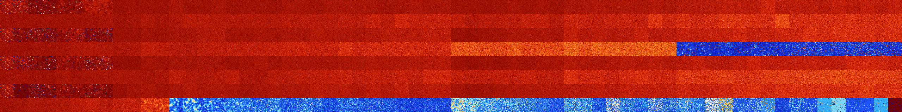

# B23457 (96256-96767)

<details>
    <summary>Initial Grid</summary>
    
</details>


<details>
    <summary>Initial Grid RLE</summary>

```
#C Exported from GoGoL (https://github.com/marrow16/gogol)
#C Wrap mode: Toroidal
#C Boundary mode: Dead
#C Step: 0
x = 100, y = 100, rule = B23457/S
6bo27bo2b2o$21bo48bo26bo$o13bo7bo63bo$28bo44bo7bo16bo$6bo17bo20b2o$3bo
10bo42bo10bo15bo14bo$2bo3bo19bo21bo17bo14bo11bo$50bo24bo8bo4bo$44bo$22b
o$4bo34bo11bo10bobo$15bo71bo$2bo62bo32bo$35bo8bo9bo8bo10bo13bo3bo$14bo
13bo19bo28bo12bo$o71bo$20bo$10bo18bo4bo13bo10bo18bo17bo$12bo19b3o37bo
19bo$13bo9bo13bo37bo$82bobo$bo10bo2bo64bo13bo$32bo16bo15bo24bo8bo$20bo
10bo53bo10bo$43bo21bo$21bo27bo3bo$2bo5bo18bo7bobo8bo13bo$bo13bo18bo58bo
$19bo66bo$23bobo22bo30bo$64bo$5bo15bo73bo$5bo24bo33bo4bo4bo4bo$6bo12bo
14bo$18bob2o57bo7bo4b2o$o66bo21bo4bobo$13bo12bo4bo4bo32bo$90bo2bo$bo19b
o50bo18bo$8bo12bo13bo6bobo26bo$24bo16bo28bo5bo13bo$bo2bo8bo19bo3bo$5bo
3bobo43bo34bobo$26bobo30bo32bo$7bo14bo4bo23bo9bo14b2o2bo7bo$16bo5bo27b
2o2bo44bo$10bo3b2o5bo22bo26bo13bo$b2o12bo7bo6bo22bo2bo$98bo$11bo55bo5bo
$20bo7bo8bo52bobo$bo12bo2bo37bo30bo4bo$11bo11bo3bo26bo25bo14bo$4b2o4bo
23bo12bo4bo23bo$7bobo12bo10bo23bo4bo$36bo25bo11bo13bo$14bo19bo18bo20b2o
5bo11bo$18bo14bo18bo9bo$9bo29bo9bo4bo6bo32bo$54bo13bo12bo7bo2bo$2bo6bo
17bo44bo19bo4bo$79bo17bo$28b2o11bo21bo9bo11bo$7bo11bo10bo25bo5bo30bo$
15bo6bo33bo$4bo8bo28bo36bo9bo$22bo24bo$10bo49bo21bo$3b2o15bo22bo7bo10bo
35bo$11bo8bo10bo5b2o2bo6bo25bo3bo3bo2bo$2b2o5bo38bo22bo8bo4bo12bo$10bo
2bo15bo28bo31bo$11bo5b2o6bo17bo3bo41bo3bo$5bo10bo5bo50bo$33bo$39bo19bo
3b2o$46b2obo9bo20bo15bo$25bo6b2o40bobo8bo3bo$4bo25bobo27bo8bo$13bo40bo
6bo10bo20bo$61bo5bo$35bo16bo38bo2bo$5bo11bo20bobo2b2o21bo4bo3bo17bo5bo$
33bo6bo9bo14bobo13bo$7bo9bo49bo8bo16bo$16bo2bo10b2o2bo56bo$18bo10bo18bo
18bo2bo12bo8bo$6bo21bobo$12bo25bo2bo$26bo6bo$49bo4b2o9bo5bo10bo2bo11bo$
o5bo38bo15bo11bo3bo16bo$19bo2bo47bo$23bo14bo$14bo25bo8bo15bo21bo$36bo
26bo4b2o13bo$14bo26bo$13bo32bo29bo5bo4bo9bo$8bo5bo19bo5bo5bobo16bo9bo$o
41bo2bo7b2o5bo21bo4bo2bo!
```
</details>
<details>
    <summary>Thumbnail</summary>

</details>
<table>
<tr>
    <td><a href="./96256%20S%20Heat%20Map%20Activity.png"></a><br>S (96256)<br>R@144,p24</td>    <td><a href="./96257%20S0%20Heat%20Map%20Activity.png"></a><br>S0 (96257)<br>R@128,p12</td>    <td><a href="./96258%20S1%20Heat%20Map%20Activity.png"></a><br>S1 (96258)<br>R@363,p120</td>    <td><a href="./96259%20S01%20Heat%20Map%20Activity.png"></a><br>S01 (96259)<br>R@316,p120</td>    <td><a href="./96260%20S2%20Heat%20Map%20Activity.png"></a><br>S2 (96260)<br>R@372,p24</td>    <td><a href="./96261%20S02%20Heat%20Map%20Activity.png"></a><br>S02 (96261)<br>R@330,p24</td>    <td><a href="./96262%20S12%20Heat%20Map%20Activity.png"></a><br>S12 (96262)<br>G>1000</td>    <td><a href="./96263%20S012%20Heat%20Map%20Activity.png"></a><br>S012 (96263)<br>G>1000</td>    <td><a href="./96264%20S3%20Heat%20Map%20Activity.png"></a><br>S3 (96264)<br>G>1000</td>    <td><a href="./96265%20S03%20Heat%20Map%20Activity.png"></a><br>S03 (96265)<br>G>1000</td>    <td><a href="./96266%20S13%20Heat%20Map%20Activity.png"></a><br>S13 (96266)<br>G>1000</td>    <td><a href="./96267%20S013%20Heat%20Map%20Activity.png"></a><br>S013 (96267)<br>G>1000</td>    <td><a href="./96268%20S23%20Heat%20Map%20Activity.png"></a><br>S23 (96268)<br>G>1000</td>    <td><a href="./96269%20S023%20Heat%20Map%20Activity.png"></a><br>S023 (96269)<br>G>1000</td>    <td><a href="./96270%20S123%20Heat%20Map%20Activity.png"></a><br>S123 (96270)<br>G>1000</td>    <td><a href="./96271%20S0123%20Heat%20Map%20Activity.png"></a><br>S0123 (96271)<br>G>1000</td>    <td><a href="./96272%20S4%20Heat%20Map%20Activity.png"></a><br>S4 (96272)<br>G>1000</td>    <td><a href="./96273%20S04%20Heat%20Map%20Activity.png"></a><br>S04 (96273)<br>G>1000</td>    <td><a href="./96274%20S14%20Heat%20Map%20Activity.png"></a><br>S14 (96274)<br>G>1000</td>    <td><a href="./96275%20S014%20Heat%20Map%20Activity.png"></a><br>S014 (96275)<br>G>1000</td>    <td><a href="./96276%20S24%20Heat%20Map%20Activity.png"></a><br>S24 (96276)<br>G>1000</td>    <td><a href="./96277%20S024%20Heat%20Map%20Activity.png"></a><br>S024 (96277)<br>G>1000</td>    <td><a href="./96278%20S124%20Heat%20Map%20Activity.png"></a><br>S124 (96278)<br>G>1000</td>    <td><a href="./96279%20S0124%20Heat%20Map%20Activity.png"></a><br>S0124 (96279)<br>G>1000</td>    <td><a href="./96280%20S34%20Heat%20Map%20Activity.png"></a><br>S34 (96280)<br>G>1000</td>    <td><a href="./96281%20S034%20Heat%20Map%20Activity.png"></a><br>S034 (96281)<br>G>1000</td>    <td><a href="./96282%20S134%20Heat%20Map%20Activity.png"></a><br>S134 (96282)<br>G>1000</td>    <td><a href="./96283%20S0134%20Heat%20Map%20Activity.png"></a><br>S0134 (96283)<br>G>1000</td>    <td><a href="./96284%20S234%20Heat%20Map%20Activity.png"></a><br>S234 (96284)<br>G>1000</td>    <td><a href="./96285%20S0234%20Heat%20Map%20Activity.png"></a><br>S0234 (96285)<br>G>1000</td>    <td><a href="./96286%20S1234%20Heat%20Map%20Activity.png"></a><br>S1234 (96286)<br>G>1000</td>    <td><a href="./96287%20S01234%20Heat%20Map%20Activity.png"></a><br>S01234 (96287)<br>G>1000</td>    <td><a href="./96288%20S5%20Heat%20Map%20Activity.png"></a><br>S5 (96288)<br>G>1000</td>    <td><a href="./96289%20S05%20Heat%20Map%20Activity.png"></a><br>S05 (96289)<br>G>1000</td>    <td><a href="./96290%20S15%20Heat%20Map%20Activity.png"></a><br>S15 (96290)<br>G>1000</td>    <td><a href="./96291%20S015%20Heat%20Map%20Activity.png"></a><br>S015 (96291)<br>G>1000</td>    <td><a href="./96292%20S25%20Heat%20Map%20Activity.png"></a><br>S25 (96292)<br>G>1000</td>    <td><a href="./96293%20S025%20Heat%20Map%20Activity.png"></a><br>S025 (96293)<br>G>1000</td>    <td><a href="./96294%20S125%20Heat%20Map%20Activity.png"></a><br>S125 (96294)<br>G>1000</td>    <td><a href="./96295%20S0125%20Heat%20Map%20Activity.png"></a><br>S0125 (96295)<br>G>1000</td>    <td><a href="./96296%20S35%20Heat%20Map%20Activity.png"></a><br>S35 (96296)<br>G>1000</td>    <td><a href="./96297%20S035%20Heat%20Map%20Activity.png"></a><br>S035 (96297)<br>G>1000</td>    <td><a href="./96298%20S135%20Heat%20Map%20Activity.png"></a><br>S135 (96298)<br>G>1000</td>    <td><a href="./96299%20S0135%20Heat%20Map%20Activity.png"></a><br>S0135 (96299)<br>G>1000</td>    <td><a href="./96300%20S235%20Heat%20Map%20Activity.png"></a><br>S235 (96300)<br>G>1000</td>    <td><a href="./96301%20S0235%20Heat%20Map%20Activity.png"></a><br>S0235 (96301)<br>G>1000</td>    <td><a href="./96302%20S1235%20Heat%20Map%20Activity.png"></a><br>S1235 (96302)<br>G>1000</td>    <td><a href="./96303%20S01235%20Heat%20Map%20Activity.png"></a><br>S01235 (96303)<br>G>1000</td>    <td><a href="./96304%20S45%20Heat%20Map%20Activity.png"></a><br>S45 (96304)<br>G>1000</td>    <td><a href="./96305%20S045%20Heat%20Map%20Activity.png"></a><br>S045 (96305)<br>G>1000</td>    <td><a href="./96306%20S145%20Heat%20Map%20Activity.png"></a><br>S145 (96306)<br>G>1000</td>    <td><a href="./96307%20S0145%20Heat%20Map%20Activity.png"></a><br>S0145 (96307)<br>G>1000</td>    <td><a href="./96308%20S245%20Heat%20Map%20Activity.png"></a><br>S245 (96308)<br>G>1000</td>    <td><a href="./96309%20S0245%20Heat%20Map%20Activity.png"></a><br>S0245 (96309)<br>G>1000</td>    <td><a href="./96310%20S1245%20Heat%20Map%20Activity.png"></a><br>S1245 (96310)<br>G>1000</td>    <td><a href="./96311%20S01245%20Heat%20Map%20Activity.png"></a><br>S01245 (96311)<br>G>1000</td>    <td><a href="./96312%20S345%20Heat%20Map%20Activity.png"></a><br>S345 (96312)<br>G>1000</td>    <td><a href="./96313%20S0345%20Heat%20Map%20Activity.png"></a><br>S0345 (96313)<br>G>1000</td>    <td><a href="./96314%20S1345%20Heat%20Map%20Activity.png"></a><br>S1345 (96314)<br>G>1000</td>    <td><a href="./96315%20S01345%20Heat%20Map%20Activity.png"></a><br>S01345 (96315)<br>G>1000</td>    <td><a href="./96316%20S2345%20Heat%20Map%20Activity.png"></a><br>S2345 (96316)<br>G>1000</td>    <td><a href="./96317%20S02345%20Heat%20Map%20Activity.png"></a><br>S02345 (96317)<br>G>1000</td>    <td><a href="./96318%20S12345%20Heat%20Map%20Activity.png"></a><br>S12345 (96318)<br>G>1000</td>    <td><a href="./96319%20S012345%20Heat%20Map%20Activity.png"></a><br>S012345 (96319)<br>G>1000</td></tr>
<tr>
    <td><a href="./96320%20S6%20Heat%20Map%20Activity.png"></a><br>S6 (96320)<br>G>1000</td>    <td><a href="./96321%20S06%20Heat%20Map%20Activity.png"></a><br>S06 (96321)<br>G>1000</td>    <td><a href="./96322%20S16%20Heat%20Map%20Activity.png"></a><br>S16 (96322)<br>G>1000</td>    <td><a href="./96323%20S016%20Heat%20Map%20Activity.png"></a><br>S016 (96323)<br>G>1000</td>    <td><a href="./96324%20S26%20Heat%20Map%20Activity.png"></a><br>S26 (96324)<br>G>1000</td>    <td><a href="./96325%20S026%20Heat%20Map%20Activity.png"></a><br>S026 (96325)<br>G>1000</td>    <td><a href="./96326%20S126%20Heat%20Map%20Activity.png"></a><br>S126 (96326)<br>G>1000</td>    <td><a href="./96327%20S0126%20Heat%20Map%20Activity.png"></a><br>S0126 (96327)<br>G>1000</td>    <td><a href="./96328%20S36%20Heat%20Map%20Activity.png"></a><br>S36 (96328)<br>G>1000</td>    <td><a href="./96329%20S036%20Heat%20Map%20Activity.png"></a><br>S036 (96329)<br>G>1000</td>    <td><a href="./96330%20S136%20Heat%20Map%20Activity.png"></a><br>S136 (96330)<br>G>1000</td>    <td><a href="./96331%20S0136%20Heat%20Map%20Activity.png"></a><br>S0136 (96331)<br>G>1000</td>    <td><a href="./96332%20S236%20Heat%20Map%20Activity.png"></a><br>S236 (96332)<br>G>1000</td>    <td><a href="./96333%20S0236%20Heat%20Map%20Activity.png"></a><br>S0236 (96333)<br>G>1000</td>    <td><a href="./96334%20S1236%20Heat%20Map%20Activity.png"></a><br>S1236 (96334)<br>G>1000</td>    <td><a href="./96335%20S01236%20Heat%20Map%20Activity.png"></a><br>S01236 (96335)<br>G>1000</td>    <td><a href="./96336%20S46%20Heat%20Map%20Activity.png"></a><br>S46 (96336)<br>G>1000</td>    <td><a href="./96337%20S046%20Heat%20Map%20Activity.png"></a><br>S046 (96337)<br>G>1000</td>    <td><a href="./96338%20S146%20Heat%20Map%20Activity.png"></a><br>S146 (96338)<br>G>1000</td>    <td><a href="./96339%20S0146%20Heat%20Map%20Activity.png"></a><br>S0146 (96339)<br>G>1000</td>    <td><a href="./96340%20S246%20Heat%20Map%20Activity.png"></a><br>S246 (96340)<br>G>1000</td>    <td><a href="./96341%20S0246%20Heat%20Map%20Activity.png"></a><br>S0246 (96341)<br>G>1000</td>    <td><a href="./96342%20S1246%20Heat%20Map%20Activity.png"></a><br>S1246 (96342)<br>G>1000</td>    <td><a href="./96343%20S01246%20Heat%20Map%20Activity.png"></a><br>S01246 (96343)<br>G>1000</td>    <td><a href="./96344%20S346%20Heat%20Map%20Activity.png"></a><br>S346 (96344)<br>G>1000</td>    <td><a href="./96345%20S0346%20Heat%20Map%20Activity.png"></a><br>S0346 (96345)<br>G>1000</td>    <td><a href="./96346%20S1346%20Heat%20Map%20Activity.png"></a><br>S1346 (96346)<br>G>1000</td>    <td><a href="./96347%20S01346%20Heat%20Map%20Activity.png"></a><br>S01346 (96347)<br>G>1000</td>    <td><a href="./96348%20S2346%20Heat%20Map%20Activity.png"></a><br>S2346 (96348)<br>G>1000</td>    <td><a href="./96349%20S02346%20Heat%20Map%20Activity.png"></a><br>S02346 (96349)<br>G>1000</td>    <td><a href="./96350%20S12346%20Heat%20Map%20Activity.png"></a><br>S12346 (96350)<br>G>1000</td>    <td><a href="./96351%20S012346%20Heat%20Map%20Activity.png"></a><br>S012346 (96351)<br>G>1000</td>    <td><a href="./96352%20S56%20Heat%20Map%20Activity.png"></a><br>S56 (96352)<br>G>1000</td>    <td><a href="./96353%20S056%20Heat%20Map%20Activity.png"></a><br>S056 (96353)<br>G>1000</td>    <td><a href="./96354%20S156%20Heat%20Map%20Activity.png"></a><br>S156 (96354)<br>G>1000</td>    <td><a href="./96355%20S0156%20Heat%20Map%20Activity.png"></a><br>S0156 (96355)<br>G>1000</td>    <td><a href="./96356%20S256%20Heat%20Map%20Activity.png"></a><br>S256 (96356)<br>G>1000</td>    <td><a href="./96357%20S0256%20Heat%20Map%20Activity.png"></a><br>S0256 (96357)<br>G>1000</td>    <td><a href="./96358%20S1256%20Heat%20Map%20Activity.png"></a><br>S1256 (96358)<br>G>1000</td>    <td><a href="./96359%20S01256%20Heat%20Map%20Activity.png"></a><br>S01256 (96359)<br>G>1000</td>    <td><a href="./96360%20S356%20Heat%20Map%20Activity.png"></a><br>S356 (96360)<br>G>1000</td>    <td><a href="./96361%20S0356%20Heat%20Map%20Activity.png"></a><br>S0356 (96361)<br>G>1000</td>    <td><a href="./96362%20S1356%20Heat%20Map%20Activity.png"></a><br>S1356 (96362)<br>G>1000</td>    <td><a href="./96363%20S01356%20Heat%20Map%20Activity.png"></a><br>S01356 (96363)<br>G>1000</td>    <td><a href="./96364%20S2356%20Heat%20Map%20Activity.png"></a><br>S2356 (96364)<br>G>1000</td>    <td><a href="./96365%20S02356%20Heat%20Map%20Activity.png"></a><br>S02356 (96365)<br>G>1000</td>    <td><a href="./96366%20S12356%20Heat%20Map%20Activity.png"></a><br>S12356 (96366)<br>G>1000</td>    <td><a href="./96367%20S012356%20Heat%20Map%20Activity.png"></a><br>S012356 (96367)<br>G>1000</td>    <td><a href="./96368%20S456%20Heat%20Map%20Activity.png"></a><br>S456 (96368)<br>G>1000</td>    <td><a href="./96369%20S0456%20Heat%20Map%20Activity.png"></a><br>S0456 (96369)<br>G>1000</td>    <td><a href="./96370%20S1456%20Heat%20Map%20Activity.png"></a><br>S1456 (96370)<br>G>1000</td>    <td><a href="./96371%20S01456%20Heat%20Map%20Activity.png"></a><br>S01456 (96371)<br>G>1000</td>    <td><a href="./96372%20S2456%20Heat%20Map%20Activity.png"></a><br>S2456 (96372)<br>G>1000</td>    <td><a href="./96373%20S02456%20Heat%20Map%20Activity.png"></a><br>S02456 (96373)<br>G>1000</td>    <td><a href="./96374%20S12456%20Heat%20Map%20Activity.png"></a><br>S12456 (96374)<br>G>1000</td>    <td><a href="./96375%20S012456%20Heat%20Map%20Activity.png"></a><br>S012456 (96375)<br>G>1000</td>    <td><a href="./96376%20S3456%20Heat%20Map%20Activity.png"></a><br>S3456 (96376)<br>G>1000</td>    <td><a href="./96377%20S03456%20Heat%20Map%20Activity.png"></a><br>S03456 (96377)<br>G>1000</td>    <td><a href="./96378%20S13456%20Heat%20Map%20Activity.png"></a><br>S13456 (96378)<br>G>1000</td>    <td><a href="./96379%20S013456%20Heat%20Map%20Activity.png"></a><br>S013456 (96379)<br>G>1000</td>    <td><a href="./96380%20S23456%20Heat%20Map%20Activity.png"></a><br>S23456 (96380)<br>G>1000</td>    <td><a href="./96381%20S023456%20Heat%20Map%20Activity.png"></a><br>S023456 (96381)<br>G>1000</td>    <td><a href="./96382%20S123456%20Heat%20Map%20Activity.png"></a><br>S123456 (96382)<br>G>1000</td>    <td><a href="./96383%20S0123456%20Heat%20Map%20Activity.png"></a><br>S0123456 (96383)<br>G>1000</td></tr>
<tr>
    <td><a href="./96384%20S7%20Heat%20Map%20Activity.png"></a><br>S7 (96384)<br>R@144,p24</td>    <td><a href="./96385%20S07%20Heat%20Map%20Activity.png"></a><br>S07 (96385)<br>R@246,p120</td>    <td><a href="./96386%20S17%20Heat%20Map%20Activity.png"></a><br>S17 (96386)<br>R@242,p56</td>    <td><a href="./96387%20S017%20Heat%20Map%20Activity.png"></a><br>S017 (96387)<br>R@326,p120</td>    <td><a href="./96388%20S27%20Heat%20Map%20Activity.png"></a><br>S27 (96388)<br>R@191,p16</td>    <td><a href="./96389%20S027%20Heat%20Map%20Activity.png"></a><br>S027 (96389)<br>R@133,p12</td>    <td><a href="./96390%20S127%20Heat%20Map%20Activity.png"></a><br>S127 (96390)<br>R@319,p168</td>    <td><a href="./96391%20S0127%20Heat%20Map%20Activity.png"></a><br>S0127 (96391)<br>R@273,p120</td>    <td><a href="./96392%20S37%20Heat%20Map%20Activity.png"></a><br>S37 (96392)<br>G>1000</td>    <td><a href="./96393%20S037%20Heat%20Map%20Activity.png"></a><br>S037 (96393)<br>G>1000</td>    <td><a href="./96394%20S137%20Heat%20Map%20Activity.png"></a><br>S137 (96394)<br>G>1000</td>    <td><a href="./96395%20S0137%20Heat%20Map%20Activity.png"></a><br>S0137 (96395)<br>G>1000</td>    <td><a href="./96396%20S237%20Heat%20Map%20Activity.png"></a><br>S237 (96396)<br>G>1000</td>    <td><a href="./96397%20S0237%20Heat%20Map%20Activity.png"></a><br>S0237 (96397)<br>G>1000</td>    <td><a href="./96398%20S1237%20Heat%20Map%20Activity.png"></a><br>S1237 (96398)<br>G>1000</td>    <td><a href="./96399%20S01237%20Heat%20Map%20Activity.png"></a><br>S01237 (96399)<br>G>1000</td>    <td><a href="./96400%20S47%20Heat%20Map%20Activity.png"></a><br>S47 (96400)<br>G>1000</td>    <td><a href="./96401%20S047%20Heat%20Map%20Activity.png"></a><br>S047 (96401)<br>G>1000</td>    <td><a href="./96402%20S147%20Heat%20Map%20Activity.png"></a><br>S147 (96402)<br>G>1000</td>    <td><a href="./96403%20S0147%20Heat%20Map%20Activity.png"></a><br>S0147 (96403)<br>G>1000</td>    <td><a href="./96404%20S247%20Heat%20Map%20Activity.png"></a><br>S247 (96404)<br>G>1000</td>    <td><a href="./96405%20S0247%20Heat%20Map%20Activity.png"></a><br>S0247 (96405)<br>G>1000</td>    <td><a href="./96406%20S1247%20Heat%20Map%20Activity.png"></a><br>S1247 (96406)<br>G>1000</td>    <td><a href="./96407%20S01247%20Heat%20Map%20Activity.png"></a><br>S01247 (96407)<br>G>1000</td>    <td><a href="./96408%20S347%20Heat%20Map%20Activity.png"></a><br>S347 (96408)<br>G>1000</td>    <td><a href="./96409%20S0347%20Heat%20Map%20Activity.png"></a><br>S0347 (96409)<br>G>1000</td>    <td><a href="./96410%20S1347%20Heat%20Map%20Activity.png"></a><br>S1347 (96410)<br>G>1000</td>    <td><a href="./96411%20S01347%20Heat%20Map%20Activity.png"></a><br>S01347 (96411)<br>G>1000</td>    <td><a href="./96412%20S2347%20Heat%20Map%20Activity.png"></a><br>S2347 (96412)<br>G>1000</td>    <td><a href="./96413%20S02347%20Heat%20Map%20Activity.png"></a><br>S02347 (96413)<br>G>1000</td>    <td><a href="./96414%20S12347%20Heat%20Map%20Activity.png"></a><br>S12347 (96414)<br>G>1000</td>    <td><a href="./96415%20S012347%20Heat%20Map%20Activity.png"></a><br>S012347 (96415)<br>G>1000</td>    <td><a href="./96416%20S57%20Heat%20Map%20Activity.png"></a><br>S57 (96416)<br>G>1000</td>    <td><a href="./96417%20S057%20Heat%20Map%20Activity.png"></a><br>S057 (96417)<br>G>1000</td>    <td><a href="./96418%20S157%20Heat%20Map%20Activity.png"></a><br>S157 (96418)<br>G>1000</td>    <td><a href="./96419%20S0157%20Heat%20Map%20Activity.png"></a><br>S0157 (96419)<br>G>1000</td>    <td><a href="./96420%20S257%20Heat%20Map%20Activity.png"></a><br>S257 (96420)<br>G>1000</td>    <td><a href="./96421%20S0257%20Heat%20Map%20Activity.png"></a><br>S0257 (96421)<br>G>1000</td>    <td><a href="./96422%20S1257%20Heat%20Map%20Activity.png"></a><br>S1257 (96422)<br>G>1000</td>    <td><a href="./96423%20S01257%20Heat%20Map%20Activity.png"></a><br>S01257 (96423)<br>G>1000</td>    <td><a href="./96424%20S357%20Heat%20Map%20Activity.png"></a><br>S357 (96424)<br>G>1000</td>    <td><a href="./96425%20S0357%20Heat%20Map%20Activity.png"></a><br>S0357 (96425)<br>G>1000</td>    <td><a href="./96426%20S1357%20Heat%20Map%20Activity.png"></a><br>S1357 (96426)<br>G>1000</td>    <td><a href="./96427%20S01357%20Heat%20Map%20Activity.png"></a><br>S01357 (96427)<br>G>1000</td>    <td><a href="./96428%20S2357%20Heat%20Map%20Activity.png"></a><br>S2357 (96428)<br>G>1000</td>    <td><a href="./96429%20S02357%20Heat%20Map%20Activity.png"></a><br>S02357 (96429)<br>G>1000</td>    <td><a href="./96430%20S12357%20Heat%20Map%20Activity.png"></a><br>S12357 (96430)<br>G>1000</td>    <td><a href="./96431%20S012357%20Heat%20Map%20Activity.png"></a><br>S012357 (96431)<br>G>1000</td>    <td><a href="./96432%20S457%20Heat%20Map%20Activity.png"></a><br>S457 (96432)<br>G>1000</td>    <td><a href="./96433%20S0457%20Heat%20Map%20Activity.png"></a><br>S0457 (96433)<br>G>1000</td>    <td><a href="./96434%20S1457%20Heat%20Map%20Activity.png"></a><br>S1457 (96434)<br>G>1000</td>    <td><a href="./96435%20S01457%20Heat%20Map%20Activity.png"></a><br>S01457 (96435)<br>G>1000</td>    <td><a href="./96436%20S2457%20Heat%20Map%20Activity.png"></a><br>S2457 (96436)<br>G>1000</td>    <td><a href="./96437%20S02457%20Heat%20Map%20Activity.png"></a><br>S02457 (96437)<br>G>1000</td>    <td><a href="./96438%20S12457%20Heat%20Map%20Activity.png"></a><br>S12457 (96438)<br>G>1000</td>    <td><a href="./96439%20S012457%20Heat%20Map%20Activity.png"></a><br>S012457 (96439)<br>G>1000</td>    <td><a href="./96440%20S3457%20Heat%20Map%20Activity.png"></a><br>S3457 (96440)<br>G>1000</td>    <td><a href="./96441%20S03457%20Heat%20Map%20Activity.png"></a><br>S03457 (96441)<br>G>1000</td>    <td><a href="./96442%20S13457%20Heat%20Map%20Activity.png"></a><br>S13457 (96442)<br>G>1000</td>    <td><a href="./96443%20S013457%20Heat%20Map%20Activity.png"></a><br>S013457 (96443)<br>G>1000</td>    <td><a href="./96444%20S23457%20Heat%20Map%20Activity.png"></a><br>S23457 (96444)<br>G>1000</td>    <td><a href="./96445%20S023457%20Heat%20Map%20Activity.png"></a><br>S023457 (96445)<br>G>1000</td>    <td><a href="./96446%20S123457%20Heat%20Map%20Activity.png"></a><br>S123457 (96446)<br>G>1000</td>    <td><a href="./96447%20S0123457%20Heat%20Map%20Activity.png"></a><br>S0123457 (96447)<br>G>1000</td></tr>
<tr>
    <td><a href="./96448%20S67%20Heat%20Map%20Activity.png"></a><br>S67 (96448)<br>G>1000</td>    <td><a href="./96449%20S067%20Heat%20Map%20Activity.png"></a><br>S067 (96449)<br>G>1000</td>    <td><a href="./96450%20S167%20Heat%20Map%20Activity.png"></a><br>S167 (96450)<br>G>1000</td>    <td><a href="./96451%20S0167%20Heat%20Map%20Activity.png"></a><br>S0167 (96451)<br>G>1000</td>    <td><a href="./96452%20S267%20Heat%20Map%20Activity.png"></a><br>S267 (96452)<br>G>1000</td>    <td><a href="./96453%20S0267%20Heat%20Map%20Activity.png"></a><br>S0267 (96453)<br>G>1000</td>    <td><a href="./96454%20S1267%20Heat%20Map%20Activity.png"></a><br>S1267 (96454)<br>G>1000</td>    <td><a href="./96455%20S01267%20Heat%20Map%20Activity.png"></a><br>S01267 (96455)<br>G>1000</td>    <td><a href="./96456%20S367%20Heat%20Map%20Activity.png"></a><br>S367 (96456)<br>G>1000</td>    <td><a href="./96457%20S0367%20Heat%20Map%20Activity.png"></a><br>S0367 (96457)<br>G>1000</td>    <td><a href="./96458%20S1367%20Heat%20Map%20Activity.png"></a><br>S1367 (96458)<br>G>1000</td>    <td><a href="./96459%20S01367%20Heat%20Map%20Activity.png"></a><br>S01367 (96459)<br>G>1000</td>    <td><a href="./96460%20S2367%20Heat%20Map%20Activity.png"></a><br>S2367 (96460)<br>G>1000</td>    <td><a href="./96461%20S02367%20Heat%20Map%20Activity.png"></a><br>S02367 (96461)<br>G>1000</td>    <td><a href="./96462%20S12367%20Heat%20Map%20Activity.png"></a><br>S12367 (96462)<br>G>1000</td>    <td><a href="./96463%20S012367%20Heat%20Map%20Activity.png"></a><br>S012367 (96463)<br>G>1000</td>    <td><a href="./96464%20S467%20Heat%20Map%20Activity.png"></a><br>S467 (96464)<br>G>1000</td>    <td><a href="./96465%20S0467%20Heat%20Map%20Activity.png"></a><br>S0467 (96465)<br>G>1000</td>    <td><a href="./96466%20S1467%20Heat%20Map%20Activity.png"></a><br>S1467 (96466)<br>G>1000</td>    <td><a href="./96467%20S01467%20Heat%20Map%20Activity.png"></a><br>S01467 (96467)<br>G>1000</td>    <td><a href="./96468%20S2467%20Heat%20Map%20Activity.png"></a><br>S2467 (96468)<br>G>1000</td>    <td><a href="./96469%20S02467%20Heat%20Map%20Activity.png"></a><br>S02467 (96469)<br>G>1000</td>    <td><a href="./96470%20S12467%20Heat%20Map%20Activity.png"></a><br>S12467 (96470)<br>G>1000</td>    <td><a href="./96471%20S012467%20Heat%20Map%20Activity.png"></a><br>S012467 (96471)<br>G>1000</td>    <td><a href="./96472%20S3467%20Heat%20Map%20Activity.png"></a><br>S3467 (96472)<br>G>1000</td>    <td><a href="./96473%20S03467%20Heat%20Map%20Activity.png"></a><br>S03467 (96473)<br>G>1000</td>    <td><a href="./96474%20S13467%20Heat%20Map%20Activity.png"></a><br>S13467 (96474)<br>G>1000</td>    <td><a href="./96475%20S013467%20Heat%20Map%20Activity.png"></a><br>S013467 (96475)<br>G>1000</td>    <td><a href="./96476%20S23467%20Heat%20Map%20Activity.png"></a><br>S23467 (96476)<br>G>1000</td>    <td><a href="./96477%20S023467%20Heat%20Map%20Activity.png"></a><br>S023467 (96477)<br>G>1000</td>    <td><a href="./96478%20S123467%20Heat%20Map%20Activity.png"></a><br>S123467 (96478)<br>G>1000</td>    <td><a href="./96479%20S0123467%20Heat%20Map%20Activity.png"></a><br>S0123467 (96479)<br>G>1000</td>    <td><a href="./96480%20S567%20Heat%20Map%20Activity.png"></a><br>S567 (96480)<br>G>1000</td>    <td><a href="./96481%20S0567%20Heat%20Map%20Activity.png"></a><br>S0567 (96481)<br>G>1000</td>    <td><a href="./96482%20S1567%20Heat%20Map%20Activity.png"></a><br>S1567 (96482)<br>G>1000</td>    <td><a href="./96483%20S01567%20Heat%20Map%20Activity.png"></a><br>S01567 (96483)<br>G>1000</td>    <td><a href="./96484%20S2567%20Heat%20Map%20Activity.png"></a><br>S2567 (96484)<br>G>1000</td>    <td><a href="./96485%20S02567%20Heat%20Map%20Activity.png"></a><br>S02567 (96485)<br>G>1000</td>    <td><a href="./96486%20S12567%20Heat%20Map%20Activity.png"></a><br>S12567 (96486)<br>G>1000</td>    <td><a href="./96487%20S012567%20Heat%20Map%20Activity.png"></a><br>S012567 (96487)<br>G>1000</td>    <td><a href="./96488%20S3567%20Heat%20Map%20Activity.png"></a><br>S3567 (96488)<br>G>1000</td>    <td><a href="./96489%20S03567%20Heat%20Map%20Activity.png"></a><br>S03567 (96489)<br>G>1000</td>    <td><a href="./96490%20S13567%20Heat%20Map%20Activity.png"></a><br>S13567 (96490)<br>G>1000</td>    <td><a href="./96491%20S013567%20Heat%20Map%20Activity.png"></a><br>S013567 (96491)<br>G>1000</td>    <td><a href="./96492%20S23567%20Heat%20Map%20Activity.png"></a><br>S23567 (96492)<br>G>1000</td>    <td><a href="./96493%20S023567%20Heat%20Map%20Activity.png"></a><br>S023567 (96493)<br>G>1000</td>    <td><a href="./96494%20S123567%20Heat%20Map%20Activity.png"></a><br>S123567 (96494)<br>G>1000</td>    <td><a href="./96495%20S0123567%20Heat%20Map%20Activity.png"></a><br>S0123567 (96495)<br>G>1000</td>    <td><a href="./96496%20S4567%20Heat%20Map%20Activity.png"></a><br>S4567 (96496)<br>R@151,p12</td>    <td><a href="./96497%20S04567%20Heat%20Map%20Activity.png"></a><br>S04567 (96497)<br>R@190,p6</td>    <td><a href="./96498%20S14567%20Heat%20Map%20Activity.png"></a><br>S14567 (96498)<br>R@213,p24</td>    <td><a href="./96499%20S014567%20Heat%20Map%20Activity.png"></a><br>S014567 (96499)<br>R@132,p6</td>    <td><a href="./96500%20S24567%20Heat%20Map%20Activity.png"></a><br>S24567 (96500)<br>R@152,p12</td>    <td><a href="./96501%20S024567%20Heat%20Map%20Activity.png"></a><br>S024567 (96501)<br>R@107,p12</td>    <td><a href="./96502%20S124567%20Heat%20Map%20Activity.png"></a><br>S124567 (96502)<br>R@104,p6</td>    <td><a href="./96503%20S0124567%20Heat%20Map%20Activity.png"></a><br>S0124567 (96503)<br>R@103,p12</td>    <td><a href="./96504%20S34567%20Heat%20Map%20Activity.png"></a><br>S34567 (96504)<br>R@48,p6</td>    <td><a href="./96505%20S034567%20Heat%20Map%20Activity.png"></a><br>S034567 (96505)<br>R@42,p6</td>    <td><a href="./96506%20S134567%20Heat%20Map%20Activity.png"></a><br>S134567 (96506)<br>R@43,p6</td>    <td><a href="./96507%20S0134567%20Heat%20Map%20Activity.png"></a><br>S0134567 (96507)<br>R@42,p6</td>    <td><a href="./96508%20S234567%20Heat%20Map%20Activity.png"></a><br>S234567 (96508)<br>R@33,p6</td>    <td><a href="./96509%20S0234567%20Heat%20Map%20Activity.png"></a><br>S0234567 (96509)<br>R@34,p6</td>    <td><a href="./96510%20S1234567%20Heat%20Map%20Activity.png"></a><br>S1234567 (96510)<br>R@35,p6</td>    <td><a href="./96511%20S01234567%20Heat%20Map%20Activity.png"></a><br>S01234567 (96511)<br>R@38,p6</td></tr>
<tr>
    <td><a href="./96512%20S8%20Heat%20Map%20Activity.png"></a><br>S8 (96512)<br>R@144,p24</td>    <td><a href="./96513%20S08%20Heat%20Map%20Activity.png"></a><br>S08 (96513)<br>R@157,p12</td>    <td><a href="./96514%20S18%20Heat%20Map%20Activity.png"></a><br>S18 (96514)<br>R@259,p24</td>    <td><a href="./96515%20S018%20Heat%20Map%20Activity.png"></a><br>S018 (96515)<br>R@375,p168</td>    <td><a href="./96516%20S28%20Heat%20Map%20Activity.png"></a><br>S28 (96516)<br>R@213,p24</td>    <td><a href="./96517%20S028%20Heat%20Map%20Activity.png"></a><br>S028 (96517)<br>R@208,p8</td>    <td><a href="./96518%20S128%20Heat%20Map%20Activity.png"></a><br>S128 (96518)<br>R@354,p24</td>    <td><a href="./96519%20S0128%20Heat%20Map%20Activity.png"></a><br>S0128 (96519)<br>R@195,p24</td>    <td><a href="./96520%20S38%20Heat%20Map%20Activity.png"></a><br>S38 (96520)<br>G>1000</td>    <td><a href="./96521%20S038%20Heat%20Map%20Activity.png"></a><br>S038 (96521)<br>G>1000</td>    <td><a href="./96522%20S138%20Heat%20Map%20Activity.png"></a><br>S138 (96522)<br>G>1000</td>    <td><a href="./96523%20S0138%20Heat%20Map%20Activity.png"></a><br>S0138 (96523)<br>G>1000</td>    <td><a href="./96524%20S238%20Heat%20Map%20Activity.png"></a><br>S238 (96524)<br>G>1000</td>    <td><a href="./96525%20S0238%20Heat%20Map%20Activity.png"></a><br>S0238 (96525)<br>G>1000</td>    <td><a href="./96526%20S1238%20Heat%20Map%20Activity.png"></a><br>S1238 (96526)<br>G>1000</td>    <td><a href="./96527%20S01238%20Heat%20Map%20Activity.png"></a><br>S01238 (96527)<br>G>1000</td>    <td><a href="./96528%20S48%20Heat%20Map%20Activity.png"></a><br>S48 (96528)<br>G>1000</td>    <td><a href="./96529%20S048%20Heat%20Map%20Activity.png"></a><br>S048 (96529)<br>G>1000</td>    <td><a href="./96530%20S148%20Heat%20Map%20Activity.png"></a><br>S148 (96530)<br>G>1000</td>    <td><a href="./96531%20S0148%20Heat%20Map%20Activity.png"></a><br>S0148 (96531)<br>G>1000</td>    <td><a href="./96532%20S248%20Heat%20Map%20Activity.png"></a><br>S248 (96532)<br>G>1000</td>    <td><a href="./96533%20S0248%20Heat%20Map%20Activity.png"></a><br>S0248 (96533)<br>G>1000</td>    <td><a href="./96534%20S1248%20Heat%20Map%20Activity.png"></a><br>S1248 (96534)<br>G>1000</td>    <td><a href="./96535%20S01248%20Heat%20Map%20Activity.png"></a><br>S01248 (96535)<br>G>1000</td>    <td><a href="./96536%20S348%20Heat%20Map%20Activity.png"></a><br>S348 (96536)<br>G>1000</td>    <td><a href="./96537%20S0348%20Heat%20Map%20Activity.png"></a><br>S0348 (96537)<br>G>1000</td>    <td><a href="./96538%20S1348%20Heat%20Map%20Activity.png"></a><br>S1348 (96538)<br>G>1000</td>    <td><a href="./96539%20S01348%20Heat%20Map%20Activity.png"></a><br>S01348 (96539)<br>G>1000</td>    <td><a href="./96540%20S2348%20Heat%20Map%20Activity.png"></a><br>S2348 (96540)<br>G>1000</td>    <td><a href="./96541%20S02348%20Heat%20Map%20Activity.png"></a><br>S02348 (96541)<br>G>1000</td>    <td><a href="./96542%20S12348%20Heat%20Map%20Activity.png"></a><br>S12348 (96542)<br>G>1000</td>    <td><a href="./96543%20S012348%20Heat%20Map%20Activity.png"></a><br>S012348 (96543)<br>G>1000</td>    <td><a href="./96544%20S58%20Heat%20Map%20Activity.png"></a><br>S58 (96544)<br>G>1000</td>    <td><a href="./96545%20S058%20Heat%20Map%20Activity.png"></a><br>S058 (96545)<br>G>1000</td>    <td><a href="./96546%20S158%20Heat%20Map%20Activity.png"></a><br>S158 (96546)<br>G>1000</td>    <td><a href="./96547%20S0158%20Heat%20Map%20Activity.png"></a><br>S0158 (96547)<br>G>1000</td>    <td><a href="./96548%20S258%20Heat%20Map%20Activity.png"></a><br>S258 (96548)<br>G>1000</td>    <td><a href="./96549%20S0258%20Heat%20Map%20Activity.png"></a><br>S0258 (96549)<br>G>1000</td>    <td><a href="./96550%20S1258%20Heat%20Map%20Activity.png"></a><br>S1258 (96550)<br>G>1000</td>    <td><a href="./96551%20S01258%20Heat%20Map%20Activity.png"></a><br>S01258 (96551)<br>G>1000</td>    <td><a href="./96552%20S358%20Heat%20Map%20Activity.png"></a><br>S358 (96552)<br>G>1000</td>    <td><a href="./96553%20S0358%20Heat%20Map%20Activity.png"></a><br>S0358 (96553)<br>G>1000</td>    <td><a href="./96554%20S1358%20Heat%20Map%20Activity.png"></a><br>S1358 (96554)<br>G>1000</td>    <td><a href="./96555%20S01358%20Heat%20Map%20Activity.png"></a><br>S01358 (96555)<br>G>1000</td>    <td><a href="./96556%20S2358%20Heat%20Map%20Activity.png"></a><br>S2358 (96556)<br>G>1000</td>    <td><a href="./96557%20S02358%20Heat%20Map%20Activity.png"></a><br>S02358 (96557)<br>G>1000</td>    <td><a href="./96558%20S12358%20Heat%20Map%20Activity.png"></a><br>S12358 (96558)<br>G>1000</td>    <td><a href="./96559%20S012358%20Heat%20Map%20Activity.png"></a><br>S012358 (96559)<br>G>1000</td>    <td><a href="./96560%20S458%20Heat%20Map%20Activity.png"></a><br>S458 (96560)<br>G>1000</td>    <td><a href="./96561%20S0458%20Heat%20Map%20Activity.png"></a><br>S0458 (96561)<br>G>1000</td>    <td><a href="./96562%20S1458%20Heat%20Map%20Activity.png"></a><br>S1458 (96562)<br>G>1000</td>    <td><a href="./96563%20S01458%20Heat%20Map%20Activity.png"></a><br>S01458 (96563)<br>G>1000</td>    <td><a href="./96564%20S2458%20Heat%20Map%20Activity.png"></a><br>S2458 (96564)<br>G>1000</td>    <td><a href="./96565%20S02458%20Heat%20Map%20Activity.png"></a><br>S02458 (96565)<br>G>1000</td>    <td><a href="./96566%20S12458%20Heat%20Map%20Activity.png"></a><br>S12458 (96566)<br>G>1000</td>    <td><a href="./96567%20S012458%20Heat%20Map%20Activity.png"></a><br>S012458 (96567)<br>G>1000</td>    <td><a href="./96568%20S3458%20Heat%20Map%20Activity.png"></a><br>S3458 (96568)<br>G>1000</td>    <td><a href="./96569%20S03458%20Heat%20Map%20Activity.png"></a><br>S03458 (96569)<br>G>1000</td>    <td><a href="./96570%20S13458%20Heat%20Map%20Activity.png"></a><br>S13458 (96570)<br>G>1000</td>    <td><a href="./96571%20S013458%20Heat%20Map%20Activity.png"></a><br>S013458 (96571)<br>G>1000</td>    <td><a href="./96572%20S23458%20Heat%20Map%20Activity.png"></a><br>S23458 (96572)<br>G>1000</td>    <td><a href="./96573%20S023458%20Heat%20Map%20Activity.png"></a><br>S023458 (96573)<br>G>1000</td>    <td><a href="./96574%20S123458%20Heat%20Map%20Activity.png"></a><br>S123458 (96574)<br>G>1000</td>    <td><a href="./96575%20S0123458%20Heat%20Map%20Activity.png"></a><br>S0123458 (96575)<br>G>1000</td></tr>
<tr>
    <td><a href="./96576%20S68%20Heat%20Map%20Activity.png"></a><br>S68 (96576)<br>G>1000</td>    <td><a href="./96577%20S068%20Heat%20Map%20Activity.png"></a><br>S068 (96577)<br>G>1000</td>    <td><a href="./96578%20S168%20Heat%20Map%20Activity.png"></a><br>S168 (96578)<br>G>1000</td>    <td><a href="./96579%20S0168%20Heat%20Map%20Activity.png"></a><br>S0168 (96579)<br>G>1000</td>    <td><a href="./96580%20S268%20Heat%20Map%20Activity.png"></a><br>S268 (96580)<br>G>1000</td>    <td><a href="./96581%20S0268%20Heat%20Map%20Activity.png"></a><br>S0268 (96581)<br>G>1000</td>    <td><a href="./96582%20S1268%20Heat%20Map%20Activity.png"></a><br>S1268 (96582)<br>G>1000</td>    <td><a href="./96583%20S01268%20Heat%20Map%20Activity.png"></a><br>S01268 (96583)<br>G>1000</td>    <td><a href="./96584%20S368%20Heat%20Map%20Activity.png"></a><br>S368 (96584)<br>G>1000</td>    <td><a href="./96585%20S0368%20Heat%20Map%20Activity.png"></a><br>S0368 (96585)<br>G>1000</td>    <td><a href="./96586%20S1368%20Heat%20Map%20Activity.png"></a><br>S1368 (96586)<br>G>1000</td>    <td><a href="./96587%20S01368%20Heat%20Map%20Activity.png"></a><br>S01368 (96587)<br>G>1000</td>    <td><a href="./96588%20S2368%20Heat%20Map%20Activity.png"></a><br>S2368 (96588)<br>G>1000</td>    <td><a href="./96589%20S02368%20Heat%20Map%20Activity.png"></a><br>S02368 (96589)<br>G>1000</td>    <td><a href="./96590%20S12368%20Heat%20Map%20Activity.png"></a><br>S12368 (96590)<br>G>1000</td>    <td><a href="./96591%20S012368%20Heat%20Map%20Activity.png"></a><br>S012368 (96591)<br>G>1000</td>    <td><a href="./96592%20S468%20Heat%20Map%20Activity.png"></a><br>S468 (96592)<br>G>1000</td>    <td><a href="./96593%20S0468%20Heat%20Map%20Activity.png"></a><br>S0468 (96593)<br>G>1000</td>    <td><a href="./96594%20S1468%20Heat%20Map%20Activity.png"></a><br>S1468 (96594)<br>G>1000</td>    <td><a href="./96595%20S01468%20Heat%20Map%20Activity.png"></a><br>S01468 (96595)<br>G>1000</td>    <td><a href="./96596%20S2468%20Heat%20Map%20Activity.png"></a><br>S2468 (96596)<br>G>1000</td>    <td><a href="./96597%20S02468%20Heat%20Map%20Activity.png"></a><br>S02468 (96597)<br>G>1000</td>    <td><a href="./96598%20S12468%20Heat%20Map%20Activity.png"></a><br>S12468 (96598)<br>G>1000</td>    <td><a href="./96599%20S012468%20Heat%20Map%20Activity.png"></a><br>S012468 (96599)<br>G>1000</td>    <td><a href="./96600%20S3468%20Heat%20Map%20Activity.png"></a><br>S3468 (96600)<br>G>1000</td>    <td><a href="./96601%20S03468%20Heat%20Map%20Activity.png"></a><br>S03468 (96601)<br>G>1000</td>    <td><a href="./96602%20S13468%20Heat%20Map%20Activity.png"></a><br>S13468 (96602)<br>G>1000</td>    <td><a href="./96603%20S013468%20Heat%20Map%20Activity.png"></a><br>S013468 (96603)<br>G>1000</td>    <td><a href="./96604%20S23468%20Heat%20Map%20Activity.png"></a><br>S23468 (96604)<br>G>1000</td>    <td><a href="./96605%20S023468%20Heat%20Map%20Activity.png"></a><br>S023468 (96605)<br>G>1000</td>    <td><a href="./96606%20S123468%20Heat%20Map%20Activity.png"></a><br>S123468 (96606)<br>G>1000</td>    <td><a href="./96607%20S0123468%20Heat%20Map%20Activity.png"></a><br>S0123468 (96607)<br>G>1000</td>    <td><a href="./96608%20S568%20Heat%20Map%20Activity.png"></a><br>S568 (96608)<br>G>1000</td>    <td><a href="./96609%20S0568%20Heat%20Map%20Activity.png"></a><br>S0568 (96609)<br>G>1000</td>    <td><a href="./96610%20S1568%20Heat%20Map%20Activity.png"></a><br>S1568 (96610)<br>G>1000</td>    <td><a href="./96611%20S01568%20Heat%20Map%20Activity.png"></a><br>S01568 (96611)<br>G>1000</td>    <td><a href="./96612%20S2568%20Heat%20Map%20Activity.png"></a><br>S2568 (96612)<br>G>1000</td>    <td><a href="./96613%20S02568%20Heat%20Map%20Activity.png"></a><br>S02568 (96613)<br>G>1000</td>    <td><a href="./96614%20S12568%20Heat%20Map%20Activity.png"></a><br>S12568 (96614)<br>G>1000</td>    <td><a href="./96615%20S012568%20Heat%20Map%20Activity.png"></a><br>S012568 (96615)<br>G>1000</td>    <td><a href="./96616%20S3568%20Heat%20Map%20Activity.png"></a><br>S3568 (96616)<br>G>1000</td>    <td><a href="./96617%20S03568%20Heat%20Map%20Activity.png"></a><br>S03568 (96617)<br>G>1000</td>    <td><a href="./96618%20S13568%20Heat%20Map%20Activity.png"></a><br>S13568 (96618)<br>G>1000</td>    <td><a href="./96619%20S013568%20Heat%20Map%20Activity.png"></a><br>S013568 (96619)<br>G>1000</td>    <td><a href="./96620%20S23568%20Heat%20Map%20Activity.png"></a><br>S23568 (96620)<br>G>1000</td>    <td><a href="./96621%20S023568%20Heat%20Map%20Activity.png"></a><br>S023568 (96621)<br>G>1000</td>    <td><a href="./96622%20S123568%20Heat%20Map%20Activity.png"></a><br>S123568 (96622)<br>G>1000</td>    <td><a href="./96623%20S0123568%20Heat%20Map%20Activity.png"></a><br>S0123568 (96623)<br>G>1000</td>    <td><a href="./96624%20S4568%20Heat%20Map%20Activity.png"></a><br>S4568 (96624)<br>G>1000</td>    <td><a href="./96625%20S04568%20Heat%20Map%20Activity.png"></a><br>S04568 (96625)<br>G>1000</td>    <td><a href="./96626%20S14568%20Heat%20Map%20Activity.png"></a><br>S14568 (96626)<br>G>1000</td>    <td><a href="./96627%20S014568%20Heat%20Map%20Activity.png"></a><br>S014568 (96627)<br>G>1000</td>    <td><a href="./96628%20S24568%20Heat%20Map%20Activity.png"></a><br>S24568 (96628)<br>G>1000</td>    <td><a href="./96629%20S024568%20Heat%20Map%20Activity.png"></a><br>S024568 (96629)<br>G>1000</td>    <td><a href="./96630%20S124568%20Heat%20Map%20Activity.png"></a><br>S124568 (96630)<br>G>1000</td>    <td><a href="./96631%20S0124568%20Heat%20Map%20Activity.png"></a><br>S0124568 (96631)<br>G>1000</td>    <td><a href="./96632%20S34568%20Heat%20Map%20Activity.png"></a><br>S34568 (96632)<br>G>1000</td>    <td><a href="./96633%20S034568%20Heat%20Map%20Activity.png"></a><br>S034568 (96633)<br>G>1000</td>    <td><a href="./96634%20S134568%20Heat%20Map%20Activity.png"></a><br>S134568 (96634)<br>G>1000</td>    <td><a href="./96635%20S0134568%20Heat%20Map%20Activity.png"></a><br>S0134568 (96635)<br>G>1000</td>    <td><a href="./96636%20S234568%20Heat%20Map%20Activity.png"></a><br>S234568 (96636)<br>G>1000</td>    <td><a href="./96637%20S0234568%20Heat%20Map%20Activity.png"></a><br>S0234568 (96637)<br>G>1000</td>    <td><a href="./96638%20S1234568%20Heat%20Map%20Activity.png"></a><br>S1234568 (96638)<br>G>1000</td>    <td><a href="./96639%20S01234568%20Heat%20Map%20Activity.png"></a><br>S01234568 (96639)<br>G>1000</td></tr>
<tr>
    <td><a href="./96640%20S78%20Heat%20Map%20Activity.png"></a><br>S78 (96640)<br>R@144,p24</td>    <td><a href="./96641%20S078%20Heat%20Map%20Activity.png"></a><br>S078 (96641)<br>G>1000</td>    <td><a href="./96642%20S178%20Heat%20Map%20Activity.png"></a><br>S178 (96642)<br>R@454,p168</td>    <td><a href="./96643%20S0178%20Heat%20Map%20Activity.png"></a><br>S0178 (96643)<br>R@383,p120</td>    <td><a href="./96644%20S278%20Heat%20Map%20Activity.png"></a><br>S278 (96644)<br>R@205,p72</td>    <td><a href="./96645%20S0278%20Heat%20Map%20Activity.png"></a><br>S0278 (96645)<br>R@225,p60</td>    <td><a href="./96646%20S1278%20Heat%20Map%20Activity.png"></a><br>S1278 (96646)<br>R@410,p120</td>    <td><a href="./96647%20S01278%20Heat%20Map%20Activity.png"></a><br>S01278 (96647)<br>R@486,p60</td>    <td><a href="./96648%20S378%20Heat%20Map%20Activity.png"></a><br>S378 (96648)<br>G>1000</td>    <td><a href="./96649%20S0378%20Heat%20Map%20Activity.png"></a><br>S0378 (96649)<br>G>1000</td>    <td><a href="./96650%20S1378%20Heat%20Map%20Activity.png"></a><br>S1378 (96650)<br>G>1000</td>    <td><a href="./96651%20S01378%20Heat%20Map%20Activity.png"></a><br>S01378 (96651)<br>G>1000</td>    <td><a href="./96652%20S2378%20Heat%20Map%20Activity.png"></a><br>S2378 (96652)<br>G>1000</td>    <td><a href="./96653%20S02378%20Heat%20Map%20Activity.png"></a><br>S02378 (96653)<br>G>1000</td>    <td><a href="./96654%20S12378%20Heat%20Map%20Activity.png"></a><br>S12378 (96654)<br>G>1000</td>    <td><a href="./96655%20S012378%20Heat%20Map%20Activity.png"></a><br>S012378 (96655)<br>G>1000</td>    <td><a href="./96656%20S478%20Heat%20Map%20Activity.png"></a><br>S478 (96656)<br>G>1000</td>    <td><a href="./96657%20S0478%20Heat%20Map%20Activity.png"></a><br>S0478 (96657)<br>G>1000</td>    <td><a href="./96658%20S1478%20Heat%20Map%20Activity.png"></a><br>S1478 (96658)<br>G>1000</td>    <td><a href="./96659%20S01478%20Heat%20Map%20Activity.png"></a><br>S01478 (96659)<br>G>1000</td>    <td><a href="./96660%20S2478%20Heat%20Map%20Activity.png"></a><br>S2478 (96660)<br>G>1000</td>    <td><a href="./96661%20S02478%20Heat%20Map%20Activity.png"></a><br>S02478 (96661)<br>G>1000</td>    <td><a href="./96662%20S12478%20Heat%20Map%20Activity.png"></a><br>S12478 (96662)<br>G>1000</td>    <td><a href="./96663%20S012478%20Heat%20Map%20Activity.png"></a><br>S012478 (96663)<br>G>1000</td>    <td><a href="./96664%20S3478%20Heat%20Map%20Activity.png"></a><br>S3478 (96664)<br>G>1000</td>    <td><a href="./96665%20S03478%20Heat%20Map%20Activity.png"></a><br>S03478 (96665)<br>G>1000</td>    <td><a href="./96666%20S13478%20Heat%20Map%20Activity.png"></a><br>S13478 (96666)<br>G>1000</td>    <td><a href="./96667%20S013478%20Heat%20Map%20Activity.png"></a><br>S013478 (96667)<br>G>1000</td>    <td><a href="./96668%20S23478%20Heat%20Map%20Activity.png"></a><br>S23478 (96668)<br>G>1000</td>    <td><a href="./96669%20S023478%20Heat%20Map%20Activity.png"></a><br>S023478 (96669)<br>G>1000</td>    <td><a href="./96670%20S123478%20Heat%20Map%20Activity.png"></a><br>S123478 (96670)<br>G>1000</td>    <td><a href="./96671%20S0123478%20Heat%20Map%20Activity.png"></a><br>S0123478 (96671)<br>G>1000</td>    <td><a href="./96672%20S578%20Heat%20Map%20Activity.png"></a><br>S578 (96672)<br>G>1000</td>    <td><a href="./96673%20S0578%20Heat%20Map%20Activity.png"></a><br>S0578 (96673)<br>G>1000</td>    <td><a href="./96674%20S1578%20Heat%20Map%20Activity.png"></a><br>S1578 (96674)<br>G>1000</td>    <td><a href="./96675%20S01578%20Heat%20Map%20Activity.png"></a><br>S01578 (96675)<br>G>1000</td>    <td><a href="./96676%20S2578%20Heat%20Map%20Activity.png"></a><br>S2578 (96676)<br>G>1000</td>    <td><a href="./96677%20S02578%20Heat%20Map%20Activity.png"></a><br>S02578 (96677)<br>G>1000</td>    <td><a href="./96678%20S12578%20Heat%20Map%20Activity.png"></a><br>S12578 (96678)<br>G>1000</td>    <td><a href="./96679%20S012578%20Heat%20Map%20Activity.png"></a><br>S012578 (96679)<br>G>1000</td>    <td><a href="./96680%20S3578%20Heat%20Map%20Activity.png"></a><br>S3578 (96680)<br>G>1000</td>    <td><a href="./96681%20S03578%20Heat%20Map%20Activity.png"></a><br>S03578 (96681)<br>G>1000</td>    <td><a href="./96682%20S13578%20Heat%20Map%20Activity.png"></a><br>S13578 (96682)<br>G>1000</td>    <td><a href="./96683%20S013578%20Heat%20Map%20Activity.png"></a><br>S013578 (96683)<br>G>1000</td>    <td><a href="./96684%20S23578%20Heat%20Map%20Activity.png"></a><br>S23578 (96684)<br>G>1000</td>    <td><a href="./96685%20S023578%20Heat%20Map%20Activity.png"></a><br>S023578 (96685)<br>G>1000</td>    <td><a href="./96686%20S123578%20Heat%20Map%20Activity.png"></a><br>S123578 (96686)<br>G>1000</td>    <td><a href="./96687%20S0123578%20Heat%20Map%20Activity.png"></a><br>S0123578 (96687)<br>G>1000</td>    <td><a href="./96688%20S4578%20Heat%20Map%20Activity.png"></a><br>S4578 (96688)<br>G>1000</td>    <td><a href="./96689%20S04578%20Heat%20Map%20Activity.png"></a><br>S04578 (96689)<br>G>1000</td>    <td><a href="./96690%20S14578%20Heat%20Map%20Activity.png"></a><br>S14578 (96690)<br>G>1000</td>    <td><a href="./96691%20S014578%20Heat%20Map%20Activity.png"></a><br>S014578 (96691)<br>G>1000</td>    <td><a href="./96692%20S24578%20Heat%20Map%20Activity.png"></a><br>S24578 (96692)<br>G>1000</td>    <td><a href="./96693%20S024578%20Heat%20Map%20Activity.png"></a><br>S024578 (96693)<br>G>1000</td>    <td><a href="./96694%20S124578%20Heat%20Map%20Activity.png"></a><br>S124578 (96694)<br>G>1000</td>    <td><a href="./96695%20S0124578%20Heat%20Map%20Activity.png"></a><br>S0124578 (96695)<br>G>1000</td>    <td><a href="./96696%20S34578%20Heat%20Map%20Activity.png"></a><br>S34578 (96696)<br>G>1000</td>    <td><a href="./96697%20S034578%20Heat%20Map%20Activity.png"></a><br>S034578 (96697)<br>G>1000</td>    <td><a href="./96698%20S134578%20Heat%20Map%20Activity.png"></a><br>S134578 (96698)<br>G>1000</td>    <td><a href="./96699%20S0134578%20Heat%20Map%20Activity.png"></a><br>S0134578 (96699)<br>G>1000</td>    <td><a href="./96700%20S234578%20Heat%20Map%20Activity.png"></a><br>S234578 (96700)<br>G>1000</td>    <td><a href="./96701%20S0234578%20Heat%20Map%20Activity.png"></a><br>S0234578 (96701)<br>G>1000</td>    <td><a href="./96702%20S1234578%20Heat%20Map%20Activity.png"></a><br>S1234578 (96702)<br>G>1000</td>    <td><a href="./96703%20S01234578%20Heat%20Map%20Activity.png"></a><br>S01234578 (96703)<br>G>1000</td></tr>
<tr>
    <td><a href="./96704%20S678%20Heat%20Map%20Activity.png"></a><br>S678 (96704)<br>G>1000</td>    <td><a href="./96705%20S0678%20Heat%20Map%20Activity.png"></a><br>S0678 (96705)<br>G>1000</td>    <td><a href="./96706%20S1678%20Heat%20Map%20Activity.png"></a><br>S1678 (96706)<br>G>1000</td>    <td><a href="./96707%20S01678%20Heat%20Map%20Activity.png"></a><br>S01678 (96707)<br>G>1000</td>    <td><a href="./96708%20S2678%20Heat%20Map%20Activity.png"></a><br>S2678 (96708)<br>G>1000</td>    <td><a href="./96709%20S02678%20Heat%20Map%20Activity.png"></a><br>S02678 (96709)<br>G>1000</td>    <td><a href="./96710%20S12678%20Heat%20Map%20Activity.png"></a><br>S12678 (96710)<br>G>1000</td>    <td><a href="./96711%20S012678%20Heat%20Map%20Activity.png"></a><br>S012678 (96711)<br>G>1000</td>    <td><a href="./96712%20S3678%20Heat%20Map%20Activity.png"></a><br>S3678 (96712)<br>G>1000</td>    <td><a href="./96713%20S03678%20Heat%20Map%20Activity.png"></a><br>S03678 (96713)<br>G>1000</td>    <td><a href="./96714%20S13678%20Heat%20Map%20Activity.png"></a><br>S13678 (96714)<br>G>1000</td>    <td><a href="./96715%20S013678%20Heat%20Map%20Activity.png"></a><br>S013678 (96715)<br>G>1000</td>    <td><a href="./96716%20S23678%20Heat%20Map%20Activity.png"></a><br>S23678 (96716)<br>R@299,p12</td>    <td><a href="./96717%20S023678%20Heat%20Map%20Activity.png"></a><br>S023678 (96717)<br>R@234,p4</td>    <td><a href="./96718%20S123678%20Heat%20Map%20Activity.png"></a><br>S123678 (96718)<br>R@149,p4</td>    <td><a href="./96719%20S0123678%20Heat%20Map%20Activity.png"></a><br>S0123678 (96719)<br>R@161,p4</td>    <td><a href="./96720%20S4678%20Heat%20Map%20Activity.png"></a><br>S4678 (96720)<br>R@72,p2</td>    <td><a href="./96721%20S04678%20Heat%20Map%20Activity.png"></a><br>S04678 (96721)<br>R@70,p4</td>    <td><a href="./96722%20S14678%20Heat%20Map%20Activity.png"></a><br>S14678 (96722)<br>R@64,p4</td>    <td><a href="./96723%20S014678%20Heat%20Map%20Activity.png"></a><br>S014678 (96723)<br>R@56,p4</td>    <td><a href="./96724%20S24678%20Heat%20Map%20Activity.png"></a><br>S24678 (96724)<br>R@52,p4</td>    <td><a href="./96725%20S024678%20Heat%20Map%20Activity.png"></a><br>S024678 (96725)<br>R@41,p4</td>    <td><a href="./96726%20S124678%20Heat%20Map%20Activity.png"></a><br>S124678 (96726)<br>R@41,p2</td>    <td><a href="./96727%20S0124678%20Heat%20Map%20Activity.png"></a><br>S0124678 (96727)<br>R@51,p4</td>    <td><a href="./96728%20S34678%20Heat%20Map%20Activity.png"></a><br>S34678 (96728)<br>R@34,p2</td>    <td><a href="./96729%20S034678%20Heat%20Map%20Activity.png"></a><br>S034678 (96729)<br>R@30,p2</td>    <td><a href="./96730%20S134678%20Heat%20Map%20Activity.png"></a><br>S134678 (96730)<br>R@32,p2</td>    <td><a href="./96731%20S0134678%20Heat%20Map%20Activity.png"></a><br>S0134678 (96731)<br>R@32,p2</td>    <td><a href="./96732%20S234678%20Heat%20Map%20Activity.png"></a><br>S234678 (96732)<br>R@34,p2</td>    <td><a href="./96733%20S0234678%20Heat%20Map%20Activity.png"></a><br>S0234678 (96733)<br>R@40,p2</td>    <td><a href="./96734%20S1234678%20Heat%20Map%20Activity.png"></a><br>S1234678 (96734)<br>R@29,p2</td>    <td><a href="./96735%20S01234678%20Heat%20Map%20Activity.png"></a><br>S01234678 (96735)<br>R@33,p2</td>    <td><a href="./96736%20S5678%20Heat%20Map%20Activity.png"></a><br>S5678 (96736)<br>S@34</td>    <td><a href="./96737%20S05678%20Heat%20Map%20Activity.png"></a><br>S05678 (96737)<br>R@31,p2</td>    <td><a href="./96738%20S15678%20Heat%20Map%20Activity.png"></a><br>S15678 (96738)<br>R@26,p2</td>    <td><a href="./96739%20S015678%20Heat%20Map%20Activity.png"></a><br>S015678 (96739)<br>R@27,p2</td>    <td><a href="./96740%20S25678%20Heat%20Map%20Activity.png"></a><br>S25678 (96740)<br>R@23,p2</td>    <td><a href="./96741%20S025678%20Heat%20Map%20Activity.png"></a><br>S025678 (96741)<br>S@24</td>    <td><a href="./96742%20S125678%20Heat%20Map%20Activity.png"></a><br>S125678 (96742)<br>R@21,p2</td>    <td><a href="./96743%20S0125678%20Heat%20Map%20Activity.png"></a><br>S0125678 (96743)<br>R@23,p2</td>    <td><a href="./96744%20S35678%20Heat%20Map%20Activity.png"></a><br>S35678 (96744)<br>S@22</td>    <td><a href="./96745%20S035678%20Heat%20Map%20Activity.png"></a><br>S035678 (96745)<br>S@18</td>    <td><a href="./96746%20S135678%20Heat%20Map%20Activity.png"></a><br>S135678 (96746)<br>R@22,p2</td>    <td><a href="./96747%20S0135678%20Heat%20Map%20Activity.png"></a><br>S0135678 (96747)<br>S@19</td>    <td><a href="./96748%20S235678%20Heat%20Map%20Activity.png"></a><br>S235678 (96748)<br>S@19</td>    <td><a href="./96749%20S0235678%20Heat%20Map%20Activity.png"></a><br>S0235678 (96749)<br>S@18</td>    <td><a href="./96750%20S1235678%20Heat%20Map%20Activity.png"></a><br>S1235678 (96750)<br>S@19</td>    <td><a href="./96751%20S01235678%20Heat%20Map%20Activity.png"></a><br>S01235678 (96751)<br>S@18</td>    <td><a href="./96752%20S45678%20Heat%20Map%20Activity.png"></a><br>S45678 (96752)<br>S@23</td>    <td><a href="./96753%20S045678%20Heat%20Map%20Activity.png"></a><br>S045678 (96753)<br>R@22,p2</td>    <td><a href="./96754%20S145678%20Heat%20Map%20Activity.png"></a><br>S145678 (96754)<br>S@18</td>    <td><a href="./96755%20S0145678%20Heat%20Map%20Activity.png"></a><br>S0145678 (96755)<br>S@19</td>    <td><a href="./96756%20S245678%20Heat%20Map%20Activity.png"></a><br>S245678 (96756)<br>S@17</td>    <td><a href="./96757%20S0245678%20Heat%20Map%20Activity.png"></a><br>S0245678 (96757)<br>S@18</td>    <td><a href="./96758%20S1245678%20Heat%20Map%20Activity.png"></a><br>S1245678 (96758)<br>S@16</td>    <td><a href="./96759%20S01245678%20Heat%20Map%20Activity.png"></a><br>S01245678 (96759)<br>R@20,p2</td>    <td><a href="./96760%20S345678%20Heat%20Map%20Activity.png"></a><br>S345678 (96760)<br>S@21</td>    <td><a href="./96761%20S0345678%20Heat%20Map%20Activity.png"></a><br>S0345678 (96761)<br>S@16</td>    <td><a href="./96762%20S1345678%20Heat%20Map%20Activity.png"></a><br>S1345678 (96762)<br>S@16</td>    <td><a href="./96763%20S01345678%20Heat%20Map%20Activity.png"></a><br>S01345678 (96763)<br>S@16</td>    <td><a href="./96764%20S2345678%20Heat%20Map%20Activity.png"></a><br>S2345678 (96764)<br>S@17</td>    <td><a href="./96765%20S02345678%20Heat%20Map%20Activity.png"></a><br>S02345678 (96765)<br>S@16</td>    <td><a href="./96766%20S12345678%20Heat%20Map%20Activity.png"></a><br>S12345678 (96766)<br>S@16</td>    <td><a href="./96767%20S012345678%20Heat%20Map%20Activity.png"></a><br>S012345678 (96767)<br>S@16</td></tr>
</table>
