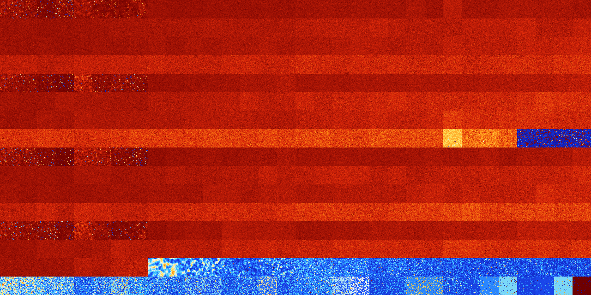

# B234578 (227328-227839)

<details>
    <summary>Initial Grid</summary>
    
</details>


<details>
    <summary>Initial Grid RLE</summary>

```
#C Exported from GoGoL (https://github.com/marrow16/gogol)
#C Wrap mode: Toroidal
#C Boundary mode: Dead
#C Step: 0
x = 100, y = 100, rule = B234578/S
6bo27bo4bo6bo33bo11bo$2bo21bobo9bo15bo28bo$20bo22bo5bo16bo4bo10bobo$74b
o5bo5bo$71bo24b2obo$3bo6bo6bo10b2o4bo$15bo6bo12bo3bo32b2o13bo$14bo9bo7b
o23bo5bo18bo$58bo3bo7bo$5bo12bo10bo8bo25bo22bo8bo$9bo4bo56bo20bo$7bo7bo
15bo8bo$33bo6bo9bo4bo$10bo16bo6bo53bo4bo$6bo24bobo11bo3bo35bo8bobo$2bo
62bo29b2o$2bo70bo$3bo8bo8bo55bo$25bo22bo$15bo15bo54bo2bo$5bo4bo24bo44b
2o6bo$bo9bo8bo36bo12bo12bo7bo$34bo14bo25bo5bo$29bo4bo36bo$15bo43bo$6bo
70bo9bobo$18bo15bo11bo9b2o28bobo9bo$25bo16bo16bo6bo11bo12b2o$6bo12bo45b
obo31bo$bo3bo12bo16bo43bo6bo6bo$10bo8bo15bobo17bo35bo$11bo2bo12bo34bo
24bo$34bo37bo5bo5bo$16bo12bo49bo$4bo3b2o25bo46bo4bo2bo2bo$7bo15bo46bo
11bo$6bo39bo11bobo15bo$6bo19bo57bo5b2o$11bo3bo10bo5bo11bo2bo14bo4bo2bo
7bo$4bobo4bo33bo15bo9bo4bobo7bo$9bo10bo9bo17bo$17bo33bo4bo20bo13bo5bo$
12bobo9bo18bo$100b$16bo11bo35bo2bo9bo$3bo22bo19bo14bo$31bo35bo$15bo8bo
22bo15bo15bo14bo$o5bo5bo18b2o6bo6bo3bo22bobo4bob2o10bo$12bo23bo13bo5bo
5bo13bo7bo$11bo4bo14bo$28bo8bo50bo$60bo2bobo24bo$19bo9bo59bo3bo$27bo20b
o26bo22bo$3bo29b2o22bo22bo7bo2bo6b2o$8bo2bo6bo22bo12bo10bo27bo$20bo10bo
11bobo9bo3bo10bo4bo10b2o4bo$14b2o8bo64bo$28bo20bo3bo13bo$8bo62bo12bo$2b
o40b2o23bo8bobo$19bo14bo5bo41bo3bo3bo5bo$12bo20bo5bo54bo$7bo5bo11bo15bo
49bo5bo$41bo27bo6bo10bo$23bo$31bo13bo10bo4bo8bo$14bo15bo25bo8bob2o5bo$
11bo27bo21bo$10bo10bo3bo26bobo18bo3bo$b2o14bo2bo8bo49bo$7bo6bo7bo15bo
10bo15bo33bo$7bo$4bo12bo25bo6bo48bo$19bo17bo33bo16bo$14bo11bo6bo14bo13b
2o$3bo13bo2bobo26bo15bo$14bo17bo13bo16b2o29bo$63bobo9bo15bo4bo$71bo4b2o
11bo$13bo21bo$59bo5bo22b2o$22b2o18b2o24bo17bo$18bo15bo4bobo10bo3bo5b2o
31bo$18bo7bo63bo$15bo32bo7bo5bo7bo28bo$27bo17bo24bo5bo2bobo9bo$14bo2bo
5bo2bo2bo12b2obo10bo2bo35bo$58bobo$6bo19bo37bo21bo6bo$2bo14bo10bo18bo
21bo9bo$b2obo7bo33bo39bo$54bo13bo9bo$7bo2bo16bobo33bo18bo$100b$8bo4b2o
3bo14bo22bo7bobo2bo$6bo32bo10bo2bo24bo13bo$17bo2bo11bobo2bo4bo9bo4bobo
16bo2bo4bo$8bo12bo47bo5bo7bo!
```
</details>
<details>
    <summary>Thumbnail</summary>

</details>
<table>
<tr>
    <td><a href="./227328%20S%20Heat%20Map%20Activity.png"></a><br>S (227328)<br>R@125,p24</td>    <td><a href="./227329%20S0%20Heat%20Map%20Activity.png"></a><br>S0 (227329)<br>R@147,p24</td>    <td><a href="./227330%20S1%20Heat%20Map%20Activity.png"></a><br>S1 (227330)<br>R@304,p24</td>    <td><a href="./227331%20S01%20Heat%20Map%20Activity.png"></a><br>S01 (227331)<br>R@194,p24</td>    <td><a href="./227332%20S2%20Heat%20Map%20Activity.png"></a><br>S2 (227332)<br>R@142,p12</td>    <td><a href="./227333%20S02%20Heat%20Map%20Activity.png"></a><br>S02 (227333)<br>R@317,p8</td>    <td><a href="./227334%20S12%20Heat%20Map%20Activity.png"></a><br>S12 (227334)<br>R@995,p24</td>    <td><a href="./227335%20S012%20Heat%20Map%20Activity.png"></a><br>S012 (227335)<br>G>1000</td>    <td><a href="./227336%20S3%20Heat%20Map%20Activity.png"></a><br>S3 (227336)<br>G>1000</td>    <td><a href="./227337%20S03%20Heat%20Map%20Activity.png"></a><br>S03 (227337)<br>G>1000</td>    <td><a href="./227338%20S13%20Heat%20Map%20Activity.png"></a><br>S13 (227338)<br>G>1000</td>    <td><a href="./227339%20S013%20Heat%20Map%20Activity.png"></a><br>S013 (227339)<br>G>1000</td>    <td><a href="./227340%20S23%20Heat%20Map%20Activity.png"></a><br>S23 (227340)<br>G>1000</td>    <td><a href="./227341%20S023%20Heat%20Map%20Activity.png"></a><br>S023 (227341)<br>G>1000</td>    <td><a href="./227342%20S123%20Heat%20Map%20Activity.png"></a><br>S123 (227342)<br>G>1000</td>    <td><a href="./227343%20S0123%20Heat%20Map%20Activity.png"></a><br>S0123 (227343)<br>G>1000</td>    <td><a href="./227344%20S4%20Heat%20Map%20Activity.png"></a><br>S4 (227344)<br>G>1000</td>    <td><a href="./227345%20S04%20Heat%20Map%20Activity.png"></a><br>S04 (227345)<br>G>1000</td>    <td><a href="./227346%20S14%20Heat%20Map%20Activity.png"></a><br>S14 (227346)<br>G>1000</td>    <td><a href="./227347%20S014%20Heat%20Map%20Activity.png"></a><br>S014 (227347)<br>G>1000</td>    <td><a href="./227348%20S24%20Heat%20Map%20Activity.png"></a><br>S24 (227348)<br>G>1000</td>    <td><a href="./227349%20S024%20Heat%20Map%20Activity.png"></a><br>S024 (227349)<br>G>1000</td>    <td><a href="./227350%20S124%20Heat%20Map%20Activity.png"></a><br>S124 (227350)<br>G>1000</td>    <td><a href="./227351%20S0124%20Heat%20Map%20Activity.png"></a><br>S0124 (227351)<br>G>1000</td>    <td><a href="./227352%20S34%20Heat%20Map%20Activity.png"></a><br>S34 (227352)<br>G>1000</td>    <td><a href="./227353%20S034%20Heat%20Map%20Activity.png"></a><br>S034 (227353)<br>G>1000</td>    <td><a href="./227354%20S134%20Heat%20Map%20Activity.png"></a><br>S134 (227354)<br>G>1000</td>    <td><a href="./227355%20S0134%20Heat%20Map%20Activity.png"></a><br>S0134 (227355)<br>G>1000</td>    <td><a href="./227356%20S234%20Heat%20Map%20Activity.png"></a><br>S234 (227356)<br>G>1000</td>    <td><a href="./227357%20S0234%20Heat%20Map%20Activity.png"></a><br>S0234 (227357)<br>G>1000</td>    <td><a href="./227358%20S1234%20Heat%20Map%20Activity.png"></a><br>S1234 (227358)<br>G>1000</td>    <td><a href="./227359%20S01234%20Heat%20Map%20Activity.png"></a><br>S01234 (227359)<br>G>1000</td></tr>
<tr>
    <td><a href="./227360%20S5%20Heat%20Map%20Activity.png"></a><br>S5 (227360)<br>G>1000</td>    <td><a href="./227361%20S05%20Heat%20Map%20Activity.png"></a><br>S05 (227361)<br>G>1000</td>    <td><a href="./227362%20S15%20Heat%20Map%20Activity.png"></a><br>S15 (227362)<br>G>1000</td>    <td><a href="./227363%20S015%20Heat%20Map%20Activity.png"></a><br>S015 (227363)<br>G>1000</td>    <td><a href="./227364%20S25%20Heat%20Map%20Activity.png"></a><br>S25 (227364)<br>G>1000</td>    <td><a href="./227365%20S025%20Heat%20Map%20Activity.png"></a><br>S025 (227365)<br>G>1000</td>    <td><a href="./227366%20S125%20Heat%20Map%20Activity.png"></a><br>S125 (227366)<br>G>1000</td>    <td><a href="./227367%20S0125%20Heat%20Map%20Activity.png"></a><br>S0125 (227367)<br>G>1000</td>    <td><a href="./227368%20S35%20Heat%20Map%20Activity.png"></a><br>S35 (227368)<br>G>1000</td>    <td><a href="./227369%20S035%20Heat%20Map%20Activity.png"></a><br>S035 (227369)<br>G>1000</td>    <td><a href="./227370%20S135%20Heat%20Map%20Activity.png"></a><br>S135 (227370)<br>G>1000</td>    <td><a href="./227371%20S0135%20Heat%20Map%20Activity.png"></a><br>S0135 (227371)<br>G>1000</td>    <td><a href="./227372%20S235%20Heat%20Map%20Activity.png"></a><br>S235 (227372)<br>G>1000</td>    <td><a href="./227373%20S0235%20Heat%20Map%20Activity.png"></a><br>S0235 (227373)<br>G>1000</td>    <td><a href="./227374%20S1235%20Heat%20Map%20Activity.png"></a><br>S1235 (227374)<br>G>1000</td>    <td><a href="./227375%20S01235%20Heat%20Map%20Activity.png"></a><br>S01235 (227375)<br>G>1000</td>    <td><a href="./227376%20S45%20Heat%20Map%20Activity.png"></a><br>S45 (227376)<br>G>1000</td>    <td><a href="./227377%20S045%20Heat%20Map%20Activity.png"></a><br>S045 (227377)<br>G>1000</td>    <td><a href="./227378%20S145%20Heat%20Map%20Activity.png"></a><br>S145 (227378)<br>G>1000</td>    <td><a href="./227379%20S0145%20Heat%20Map%20Activity.png"></a><br>S0145 (227379)<br>G>1000</td>    <td><a href="./227380%20S245%20Heat%20Map%20Activity.png"></a><br>S245 (227380)<br>G>1000</td>    <td><a href="./227381%20S0245%20Heat%20Map%20Activity.png"></a><br>S0245 (227381)<br>G>1000</td>    <td><a href="./227382%20S1245%20Heat%20Map%20Activity.png"></a><br>S1245 (227382)<br>G>1000</td>    <td><a href="./227383%20S01245%20Heat%20Map%20Activity.png"></a><br>S01245 (227383)<br>G>1000</td>    <td><a href="./227384%20S345%20Heat%20Map%20Activity.png"></a><br>S345 (227384)<br>G>1000</td>    <td><a href="./227385%20S0345%20Heat%20Map%20Activity.png"></a><br>S0345 (227385)<br>G>1000</td>    <td><a href="./227386%20S1345%20Heat%20Map%20Activity.png"></a><br>S1345 (227386)<br>G>1000</td>    <td><a href="./227387%20S01345%20Heat%20Map%20Activity.png"></a><br>S01345 (227387)<br>G>1000</td>    <td><a href="./227388%20S2345%20Heat%20Map%20Activity.png"></a><br>S2345 (227388)<br>G>1000</td>    <td><a href="./227389%20S02345%20Heat%20Map%20Activity.png"></a><br>S02345 (227389)<br>G>1000</td>    <td><a href="./227390%20S12345%20Heat%20Map%20Activity.png"></a><br>S12345 (227390)<br>G>1000</td>    <td><a href="./227391%20S012345%20Heat%20Map%20Activity.png"></a><br>S012345 (227391)<br>G>1000</td></tr>
<tr>
    <td><a href="./227392%20S6%20Heat%20Map%20Activity.png"></a><br>S6 (227392)<br>G>1000</td>    <td><a href="./227393%20S06%20Heat%20Map%20Activity.png"></a><br>S06 (227393)<br>G>1000</td>    <td><a href="./227394%20S16%20Heat%20Map%20Activity.png"></a><br>S16 (227394)<br>G>1000</td>    <td><a href="./227395%20S016%20Heat%20Map%20Activity.png"></a><br>S016 (227395)<br>G>1000</td>    <td><a href="./227396%20S26%20Heat%20Map%20Activity.png"></a><br>S26 (227396)<br>G>1000</td>    <td><a href="./227397%20S026%20Heat%20Map%20Activity.png"></a><br>S026 (227397)<br>G>1000</td>    <td><a href="./227398%20S126%20Heat%20Map%20Activity.png"></a><br>S126 (227398)<br>G>1000</td>    <td><a href="./227399%20S0126%20Heat%20Map%20Activity.png"></a><br>S0126 (227399)<br>G>1000</td>    <td><a href="./227400%20S36%20Heat%20Map%20Activity.png"></a><br>S36 (227400)<br>G>1000</td>    <td><a href="./227401%20S036%20Heat%20Map%20Activity.png"></a><br>S036 (227401)<br>G>1000</td>    <td><a href="./227402%20S136%20Heat%20Map%20Activity.png"></a><br>S136 (227402)<br>G>1000</td>    <td><a href="./227403%20S0136%20Heat%20Map%20Activity.png"></a><br>S0136 (227403)<br>G>1000</td>    <td><a href="./227404%20S236%20Heat%20Map%20Activity.png"></a><br>S236 (227404)<br>G>1000</td>    <td><a href="./227405%20S0236%20Heat%20Map%20Activity.png"></a><br>S0236 (227405)<br>G>1000</td>    <td><a href="./227406%20S1236%20Heat%20Map%20Activity.png"></a><br>S1236 (227406)<br>G>1000</td>    <td><a href="./227407%20S01236%20Heat%20Map%20Activity.png"></a><br>S01236 (227407)<br>G>1000</td>    <td><a href="./227408%20S46%20Heat%20Map%20Activity.png"></a><br>S46 (227408)<br>G>1000</td>    <td><a href="./227409%20S046%20Heat%20Map%20Activity.png"></a><br>S046 (227409)<br>G>1000</td>    <td><a href="./227410%20S146%20Heat%20Map%20Activity.png"></a><br>S146 (227410)<br>G>1000</td>    <td><a href="./227411%20S0146%20Heat%20Map%20Activity.png"></a><br>S0146 (227411)<br>G>1000</td>    <td><a href="./227412%20S246%20Heat%20Map%20Activity.png"></a><br>S246 (227412)<br>G>1000</td>    <td><a href="./227413%20S0246%20Heat%20Map%20Activity.png"></a><br>S0246 (227413)<br>G>1000</td>    <td><a href="./227414%20S1246%20Heat%20Map%20Activity.png"></a><br>S1246 (227414)<br>G>1000</td>    <td><a href="./227415%20S01246%20Heat%20Map%20Activity.png"></a><br>S01246 (227415)<br>G>1000</td>    <td><a href="./227416%20S346%20Heat%20Map%20Activity.png"></a><br>S346 (227416)<br>G>1000</td>    <td><a href="./227417%20S0346%20Heat%20Map%20Activity.png"></a><br>S0346 (227417)<br>G>1000</td>    <td><a href="./227418%20S1346%20Heat%20Map%20Activity.png"></a><br>S1346 (227418)<br>G>1000</td>    <td><a href="./227419%20S01346%20Heat%20Map%20Activity.png"></a><br>S01346 (227419)<br>G>1000</td>    <td><a href="./227420%20S2346%20Heat%20Map%20Activity.png"></a><br>S2346 (227420)<br>G>1000</td>    <td><a href="./227421%20S02346%20Heat%20Map%20Activity.png"></a><br>S02346 (227421)<br>G>1000</td>    <td><a href="./227422%20S12346%20Heat%20Map%20Activity.png"></a><br>S12346 (227422)<br>G>1000</td>    <td><a href="./227423%20S012346%20Heat%20Map%20Activity.png"></a><br>S012346 (227423)<br>G>1000</td></tr>
<tr>
    <td><a href="./227424%20S56%20Heat%20Map%20Activity.png"></a><br>S56 (227424)<br>G>1000</td>    <td><a href="./227425%20S056%20Heat%20Map%20Activity.png"></a><br>S056 (227425)<br>G>1000</td>    <td><a href="./227426%20S156%20Heat%20Map%20Activity.png"></a><br>S156 (227426)<br>G>1000</td>    <td><a href="./227427%20S0156%20Heat%20Map%20Activity.png"></a><br>S0156 (227427)<br>G>1000</td>    <td><a href="./227428%20S256%20Heat%20Map%20Activity.png"></a><br>S256 (227428)<br>G>1000</td>    <td><a href="./227429%20S0256%20Heat%20Map%20Activity.png"></a><br>S0256 (227429)<br>G>1000</td>    <td><a href="./227430%20S1256%20Heat%20Map%20Activity.png"></a><br>S1256 (227430)<br>G>1000</td>    <td><a href="./227431%20S01256%20Heat%20Map%20Activity.png"></a><br>S01256 (227431)<br>G>1000</td>    <td><a href="./227432%20S356%20Heat%20Map%20Activity.png"></a><br>S356 (227432)<br>G>1000</td>    <td><a href="./227433%20S0356%20Heat%20Map%20Activity.png"></a><br>S0356 (227433)<br>G>1000</td>    <td><a href="./227434%20S1356%20Heat%20Map%20Activity.png"></a><br>S1356 (227434)<br>G>1000</td>    <td><a href="./227435%20S01356%20Heat%20Map%20Activity.png"></a><br>S01356 (227435)<br>G>1000</td>    <td><a href="./227436%20S2356%20Heat%20Map%20Activity.png"></a><br>S2356 (227436)<br>G>1000</td>    <td><a href="./227437%20S02356%20Heat%20Map%20Activity.png"></a><br>S02356 (227437)<br>G>1000</td>    <td><a href="./227438%20S12356%20Heat%20Map%20Activity.png"></a><br>S12356 (227438)<br>G>1000</td>    <td><a href="./227439%20S012356%20Heat%20Map%20Activity.png"></a><br>S012356 (227439)<br>G>1000</td>    <td><a href="./227440%20S456%20Heat%20Map%20Activity.png"></a><br>S456 (227440)<br>G>1000</td>    <td><a href="./227441%20S0456%20Heat%20Map%20Activity.png"></a><br>S0456 (227441)<br>G>1000</td>    <td><a href="./227442%20S1456%20Heat%20Map%20Activity.png"></a><br>S1456 (227442)<br>G>1000</td>    <td><a href="./227443%20S01456%20Heat%20Map%20Activity.png"></a><br>S01456 (227443)<br>G>1000</td>    <td><a href="./227444%20S2456%20Heat%20Map%20Activity.png"></a><br>S2456 (227444)<br>G>1000</td>    <td><a href="./227445%20S02456%20Heat%20Map%20Activity.png"></a><br>S02456 (227445)<br>G>1000</td>    <td><a href="./227446%20S12456%20Heat%20Map%20Activity.png"></a><br>S12456 (227446)<br>G>1000</td>    <td><a href="./227447%20S012456%20Heat%20Map%20Activity.png"></a><br>S012456 (227447)<br>G>1000</td>    <td><a href="./227448%20S3456%20Heat%20Map%20Activity.png"></a><br>S3456 (227448)<br>G>1000</td>    <td><a href="./227449%20S03456%20Heat%20Map%20Activity.png"></a><br>S03456 (227449)<br>G>1000</td>    <td><a href="./227450%20S13456%20Heat%20Map%20Activity.png"></a><br>S13456 (227450)<br>G>1000</td>    <td><a href="./227451%20S013456%20Heat%20Map%20Activity.png"></a><br>S013456 (227451)<br>G>1000</td>    <td><a href="./227452%20S23456%20Heat%20Map%20Activity.png"></a><br>S23456 (227452)<br>G>1000</td>    <td><a href="./227453%20S023456%20Heat%20Map%20Activity.png"></a><br>S023456 (227453)<br>G>1000</td>    <td><a href="./227454%20S123456%20Heat%20Map%20Activity.png"></a><br>S123456 (227454)<br>G>1000</td>    <td><a href="./227455%20S0123456%20Heat%20Map%20Activity.png"></a><br>S0123456 (227455)<br>G>1000</td></tr>
<tr>
    <td><a href="./227456%20S7%20Heat%20Map%20Activity.png"></a><br>S7 (227456)<br>R@125,p24</td>    <td><a href="./227457%20S07%20Heat%20Map%20Activity.png"></a><br>S07 (227457)<br>R@154,p24</td>    <td><a href="./227458%20S17%20Heat%20Map%20Activity.png"></a><br>S17 (227458)<br>R@251,p120</td>    <td><a href="./227459%20S017%20Heat%20Map%20Activity.png"></a><br>S017 (227459)<br>R@539,p360</td>    <td><a href="./227460%20S27%20Heat%20Map%20Activity.png"></a><br>S27 (227460)<br>R@66,p4</td>    <td><a href="./227461%20S027%20Heat%20Map%20Activity.png"></a><br>S027 (227461)<br>R@168,p24</td>    <td><a href="./227462%20S127%20Heat%20Map%20Activity.png"></a><br>S127 (227462)<br>R@159,p12</td>    <td><a href="./227463%20S0127%20Heat%20Map%20Activity.png"></a><br>S0127 (227463)<br>R@203,p24</td>    <td><a href="./227464%20S37%20Heat%20Map%20Activity.png"></a><br>S37 (227464)<br>G>1000</td>    <td><a href="./227465%20S037%20Heat%20Map%20Activity.png"></a><br>S037 (227465)<br>G>1000</td>    <td><a href="./227466%20S137%20Heat%20Map%20Activity.png"></a><br>S137 (227466)<br>G>1000</td>    <td><a href="./227467%20S0137%20Heat%20Map%20Activity.png"></a><br>S0137 (227467)<br>G>1000</td>    <td><a href="./227468%20S237%20Heat%20Map%20Activity.png"></a><br>S237 (227468)<br>G>1000</td>    <td><a href="./227469%20S0237%20Heat%20Map%20Activity.png"></a><br>S0237 (227469)<br>G>1000</td>    <td><a href="./227470%20S1237%20Heat%20Map%20Activity.png"></a><br>S1237 (227470)<br>G>1000</td>    <td><a href="./227471%20S01237%20Heat%20Map%20Activity.png"></a><br>S01237 (227471)<br>G>1000</td>    <td><a href="./227472%20S47%20Heat%20Map%20Activity.png"></a><br>S47 (227472)<br>G>1000</td>    <td><a href="./227473%20S047%20Heat%20Map%20Activity.png"></a><br>S047 (227473)<br>G>1000</td>    <td><a href="./227474%20S147%20Heat%20Map%20Activity.png"></a><br>S147 (227474)<br>G>1000</td>    <td><a href="./227475%20S0147%20Heat%20Map%20Activity.png"></a><br>S0147 (227475)<br>G>1000</td>    <td><a href="./227476%20S247%20Heat%20Map%20Activity.png"></a><br>S247 (227476)<br>G>1000</td>    <td><a href="./227477%20S0247%20Heat%20Map%20Activity.png"></a><br>S0247 (227477)<br>G>1000</td>    <td><a href="./227478%20S1247%20Heat%20Map%20Activity.png"></a><br>S1247 (227478)<br>G>1000</td>    <td><a href="./227479%20S01247%20Heat%20Map%20Activity.png"></a><br>S01247 (227479)<br>G>1000</td>    <td><a href="./227480%20S347%20Heat%20Map%20Activity.png"></a><br>S347 (227480)<br>G>1000</td>    <td><a href="./227481%20S0347%20Heat%20Map%20Activity.png"></a><br>S0347 (227481)<br>G>1000</td>    <td><a href="./227482%20S1347%20Heat%20Map%20Activity.png"></a><br>S1347 (227482)<br>G>1000</td>    <td><a href="./227483%20S01347%20Heat%20Map%20Activity.png"></a><br>S01347 (227483)<br>G>1000</td>    <td><a href="./227484%20S2347%20Heat%20Map%20Activity.png"></a><br>S2347 (227484)<br>G>1000</td>    <td><a href="./227485%20S02347%20Heat%20Map%20Activity.png"></a><br>S02347 (227485)<br>G>1000</td>    <td><a href="./227486%20S12347%20Heat%20Map%20Activity.png"></a><br>S12347 (227486)<br>G>1000</td>    <td><a href="./227487%20S012347%20Heat%20Map%20Activity.png"></a><br>S012347 (227487)<br>G>1000</td></tr>
<tr>
    <td><a href="./227488%20S57%20Heat%20Map%20Activity.png"></a><br>S57 (227488)<br>G>1000</td>    <td><a href="./227489%20S057%20Heat%20Map%20Activity.png"></a><br>S057 (227489)<br>G>1000</td>    <td><a href="./227490%20S157%20Heat%20Map%20Activity.png"></a><br>S157 (227490)<br>G>1000</td>    <td><a href="./227491%20S0157%20Heat%20Map%20Activity.png"></a><br>S0157 (227491)<br>G>1000</td>    <td><a href="./227492%20S257%20Heat%20Map%20Activity.png"></a><br>S257 (227492)<br>G>1000</td>    <td><a href="./227493%20S0257%20Heat%20Map%20Activity.png"></a><br>S0257 (227493)<br>G>1000</td>    <td><a href="./227494%20S1257%20Heat%20Map%20Activity.png"></a><br>S1257 (227494)<br>G>1000</td>    <td><a href="./227495%20S01257%20Heat%20Map%20Activity.png"></a><br>S01257 (227495)<br>G>1000</td>    <td><a href="./227496%20S357%20Heat%20Map%20Activity.png"></a><br>S357 (227496)<br>G>1000</td>    <td><a href="./227497%20S0357%20Heat%20Map%20Activity.png"></a><br>S0357 (227497)<br>G>1000</td>    <td><a href="./227498%20S1357%20Heat%20Map%20Activity.png"></a><br>S1357 (227498)<br>G>1000</td>    <td><a href="./227499%20S01357%20Heat%20Map%20Activity.png"></a><br>S01357 (227499)<br>G>1000</td>    <td><a href="./227500%20S2357%20Heat%20Map%20Activity.png"></a><br>S2357 (227500)<br>G>1000</td>    <td><a href="./227501%20S02357%20Heat%20Map%20Activity.png"></a><br>S02357 (227501)<br>G>1000</td>    <td><a href="./227502%20S12357%20Heat%20Map%20Activity.png"></a><br>S12357 (227502)<br>G>1000</td>    <td><a href="./227503%20S012357%20Heat%20Map%20Activity.png"></a><br>S012357 (227503)<br>G>1000</td>    <td><a href="./227504%20S457%20Heat%20Map%20Activity.png"></a><br>S457 (227504)<br>G>1000</td>    <td><a href="./227505%20S0457%20Heat%20Map%20Activity.png"></a><br>S0457 (227505)<br>G>1000</td>    <td><a href="./227506%20S1457%20Heat%20Map%20Activity.png"></a><br>S1457 (227506)<br>G>1000</td>    <td><a href="./227507%20S01457%20Heat%20Map%20Activity.png"></a><br>S01457 (227507)<br>G>1000</td>    <td><a href="./227508%20S2457%20Heat%20Map%20Activity.png"></a><br>S2457 (227508)<br>G>1000</td>    <td><a href="./227509%20S02457%20Heat%20Map%20Activity.png"></a><br>S02457 (227509)<br>G>1000</td>    <td><a href="./227510%20S12457%20Heat%20Map%20Activity.png"></a><br>S12457 (227510)<br>G>1000</td>    <td><a href="./227511%20S012457%20Heat%20Map%20Activity.png"></a><br>S012457 (227511)<br>G>1000</td>    <td><a href="./227512%20S3457%20Heat%20Map%20Activity.png"></a><br>S3457 (227512)<br>G>1000</td>    <td><a href="./227513%20S03457%20Heat%20Map%20Activity.png"></a><br>S03457 (227513)<br>G>1000</td>    <td><a href="./227514%20S13457%20Heat%20Map%20Activity.png"></a><br>S13457 (227514)<br>G>1000</td>    <td><a href="./227515%20S013457%20Heat%20Map%20Activity.png"></a><br>S013457 (227515)<br>G>1000</td>    <td><a href="./227516%20S23457%20Heat%20Map%20Activity.png"></a><br>S23457 (227516)<br>G>1000</td>    <td><a href="./227517%20S023457%20Heat%20Map%20Activity.png"></a><br>S023457 (227517)<br>G>1000</td>    <td><a href="./227518%20S123457%20Heat%20Map%20Activity.png"></a><br>S123457 (227518)<br>G>1000</td>    <td><a href="./227519%20S0123457%20Heat%20Map%20Activity.png"></a><br>S0123457 (227519)<br>G>1000</td></tr>
<tr>
    <td><a href="./227520%20S67%20Heat%20Map%20Activity.png"></a><br>S67 (227520)<br>G>1000</td>    <td><a href="./227521%20S067%20Heat%20Map%20Activity.png"></a><br>S067 (227521)<br>G>1000</td>    <td><a href="./227522%20S167%20Heat%20Map%20Activity.png"></a><br>S167 (227522)<br>G>1000</td>    <td><a href="./227523%20S0167%20Heat%20Map%20Activity.png"></a><br>S0167 (227523)<br>G>1000</td>    <td><a href="./227524%20S267%20Heat%20Map%20Activity.png"></a><br>S267 (227524)<br>G>1000</td>    <td><a href="./227525%20S0267%20Heat%20Map%20Activity.png"></a><br>S0267 (227525)<br>G>1000</td>    <td><a href="./227526%20S1267%20Heat%20Map%20Activity.png"></a><br>S1267 (227526)<br>G>1000</td>    <td><a href="./227527%20S01267%20Heat%20Map%20Activity.png"></a><br>S01267 (227527)<br>G>1000</td>    <td><a href="./227528%20S367%20Heat%20Map%20Activity.png"></a><br>S367 (227528)<br>G>1000</td>    <td><a href="./227529%20S0367%20Heat%20Map%20Activity.png"></a><br>S0367 (227529)<br>G>1000</td>    <td><a href="./227530%20S1367%20Heat%20Map%20Activity.png"></a><br>S1367 (227530)<br>G>1000</td>    <td><a href="./227531%20S01367%20Heat%20Map%20Activity.png"></a><br>S01367 (227531)<br>G>1000</td>    <td><a href="./227532%20S2367%20Heat%20Map%20Activity.png"></a><br>S2367 (227532)<br>G>1000</td>    <td><a href="./227533%20S02367%20Heat%20Map%20Activity.png"></a><br>S02367 (227533)<br>G>1000</td>    <td><a href="./227534%20S12367%20Heat%20Map%20Activity.png"></a><br>S12367 (227534)<br>G>1000</td>    <td><a href="./227535%20S012367%20Heat%20Map%20Activity.png"></a><br>S012367 (227535)<br>G>1000</td>    <td><a href="./227536%20S467%20Heat%20Map%20Activity.png"></a><br>S467 (227536)<br>G>1000</td>    <td><a href="./227537%20S0467%20Heat%20Map%20Activity.png"></a><br>S0467 (227537)<br>G>1000</td>    <td><a href="./227538%20S1467%20Heat%20Map%20Activity.png"></a><br>S1467 (227538)<br>G>1000</td>    <td><a href="./227539%20S01467%20Heat%20Map%20Activity.png"></a><br>S01467 (227539)<br>G>1000</td>    <td><a href="./227540%20S2467%20Heat%20Map%20Activity.png"></a><br>S2467 (227540)<br>G>1000</td>    <td><a href="./227541%20S02467%20Heat%20Map%20Activity.png"></a><br>S02467 (227541)<br>G>1000</td>    <td><a href="./227542%20S12467%20Heat%20Map%20Activity.png"></a><br>S12467 (227542)<br>G>1000</td>    <td><a href="./227543%20S012467%20Heat%20Map%20Activity.png"></a><br>S012467 (227543)<br>G>1000</td>    <td><a href="./227544%20S3467%20Heat%20Map%20Activity.png"></a><br>S3467 (227544)<br>G>1000</td>    <td><a href="./227545%20S03467%20Heat%20Map%20Activity.png"></a><br>S03467 (227545)<br>G>1000</td>    <td><a href="./227546%20S13467%20Heat%20Map%20Activity.png"></a><br>S13467 (227546)<br>G>1000</td>    <td><a href="./227547%20S013467%20Heat%20Map%20Activity.png"></a><br>S013467 (227547)<br>G>1000</td>    <td><a href="./227548%20S23467%20Heat%20Map%20Activity.png"></a><br>S23467 (227548)<br>G>1000</td>    <td><a href="./227549%20S023467%20Heat%20Map%20Activity.png"></a><br>S023467 (227549)<br>G>1000</td>    <td><a href="./227550%20S123467%20Heat%20Map%20Activity.png"></a><br>S123467 (227550)<br>G>1000</td>    <td><a href="./227551%20S0123467%20Heat%20Map%20Activity.png"></a><br>S0123467 (227551)<br>G>1000</td></tr>
<tr>
    <td><a href="./227552%20S567%20Heat%20Map%20Activity.png"></a><br>S567 (227552)<br>G>1000</td>    <td><a href="./227553%20S0567%20Heat%20Map%20Activity.png"></a><br>S0567 (227553)<br>G>1000</td>    <td><a href="./227554%20S1567%20Heat%20Map%20Activity.png"></a><br>S1567 (227554)<br>G>1000</td>    <td><a href="./227555%20S01567%20Heat%20Map%20Activity.png"></a><br>S01567 (227555)<br>G>1000</td>    <td><a href="./227556%20S2567%20Heat%20Map%20Activity.png"></a><br>S2567 (227556)<br>G>1000</td>    <td><a href="./227557%20S02567%20Heat%20Map%20Activity.png"></a><br>S02567 (227557)<br>G>1000</td>    <td><a href="./227558%20S12567%20Heat%20Map%20Activity.png"></a><br>S12567 (227558)<br>G>1000</td>    <td><a href="./227559%20S012567%20Heat%20Map%20Activity.png"></a><br>S012567 (227559)<br>G>1000</td>    <td><a href="./227560%20S3567%20Heat%20Map%20Activity.png"></a><br>S3567 (227560)<br>G>1000</td>    <td><a href="./227561%20S03567%20Heat%20Map%20Activity.png"></a><br>S03567 (227561)<br>G>1000</td>    <td><a href="./227562%20S13567%20Heat%20Map%20Activity.png"></a><br>S13567 (227562)<br>G>1000</td>    <td><a href="./227563%20S013567%20Heat%20Map%20Activity.png"></a><br>S013567 (227563)<br>G>1000</td>    <td><a href="./227564%20S23567%20Heat%20Map%20Activity.png"></a><br>S23567 (227564)<br>G>1000</td>    <td><a href="./227565%20S023567%20Heat%20Map%20Activity.png"></a><br>S023567 (227565)<br>G>1000</td>    <td><a href="./227566%20S123567%20Heat%20Map%20Activity.png"></a><br>S123567 (227566)<br>G>1000</td>    <td><a href="./227567%20S0123567%20Heat%20Map%20Activity.png"></a><br>S0123567 (227567)<br>G>1000</td>    <td><a href="./227568%20S4567%20Heat%20Map%20Activity.png"></a><br>S4567 (227568)<br>G>1000</td>    <td><a href="./227569%20S04567%20Heat%20Map%20Activity.png"></a><br>S04567 (227569)<br>G>1000</td>    <td><a href="./227570%20S14567%20Heat%20Map%20Activity.png"></a><br>S14567 (227570)<br>G>1000</td>    <td><a href="./227571%20S014567%20Heat%20Map%20Activity.png"></a><br>S014567 (227571)<br>G>1000</td>    <td><a href="./227572%20S24567%20Heat%20Map%20Activity.png"></a><br>S24567 (227572)<br>G>1000</td>    <td><a href="./227573%20S024567%20Heat%20Map%20Activity.png"></a><br>S024567 (227573)<br>G>1000</td>    <td><a href="./227574%20S124567%20Heat%20Map%20Activity.png"></a><br>S124567 (227574)<br>G>1000</td>    <td><a href="./227575%20S0124567%20Heat%20Map%20Activity.png"></a><br>S0124567 (227575)<br>G>1000</td>    <td><a href="./227576%20S34567%20Heat%20Map%20Activity.png"></a><br>S34567 (227576)<br>G>1000</td>    <td><a href="./227577%20S034567%20Heat%20Map%20Activity.png"></a><br>S034567 (227577)<br>G>1000</td>    <td><a href="./227578%20S134567%20Heat%20Map%20Activity.png"></a><br>S134567 (227578)<br>G>1000</td>    <td><a href="./227579%20S0134567%20Heat%20Map%20Activity.png"></a><br>S0134567 (227579)<br>G>1000</td>    <td><a href="./227580%20S234567%20Heat%20Map%20Activity.png"></a><br>S234567 (227580)<br>G>1000</td>    <td><a href="./227581%20S0234567%20Heat%20Map%20Activity.png"></a><br>S0234567 (227581)<br>G>1000</td>    <td><a href="./227582%20S1234567%20Heat%20Map%20Activity.png"></a><br>S1234567 (227582)<br>G>1000</td>    <td><a href="./227583%20S01234567%20Heat%20Map%20Activity.png"></a><br>S01234567 (227583)<br>G>1000</td></tr>
<tr>
    <td><a href="./227584%20S8%20Heat%20Map%20Activity.png"></a><br>S8 (227584)<br>R@125,p24</td>    <td><a href="./227585%20S08%20Heat%20Map%20Activity.png"></a><br>S08 (227585)<br>R@145,p24</td>    <td><a href="./227586%20S18%20Heat%20Map%20Activity.png"></a><br>S18 (227586)<br>R@211,p24</td>    <td><a href="./227587%20S018%20Heat%20Map%20Activity.png"></a><br>S018 (227587)<br>R@592,p420</td>    <td><a href="./227588%20S28%20Heat%20Map%20Activity.png"></a><br>S28 (227588)<br>R@83,p2</td>    <td><a href="./227589%20S028%20Heat%20Map%20Activity.png"></a><br>S028 (227589)<br>R@95,p12</td>    <td><a href="./227590%20S128%20Heat%20Map%20Activity.png"></a><br>S128 (227590)<br>R@205,p12</td>    <td><a href="./227591%20S0128%20Heat%20Map%20Activity.png"></a><br>S0128 (227591)<br>R@243,p120</td>    <td><a href="./227592%20S38%20Heat%20Map%20Activity.png"></a><br>S38 (227592)<br>G>1000</td>    <td><a href="./227593%20S038%20Heat%20Map%20Activity.png"></a><br>S038 (227593)<br>G>1000</td>    <td><a href="./227594%20S138%20Heat%20Map%20Activity.png"></a><br>S138 (227594)<br>G>1000</td>    <td><a href="./227595%20S0138%20Heat%20Map%20Activity.png"></a><br>S0138 (227595)<br>G>1000</td>    <td><a href="./227596%20S238%20Heat%20Map%20Activity.png"></a><br>S238 (227596)<br>G>1000</td>    <td><a href="./227597%20S0238%20Heat%20Map%20Activity.png"></a><br>S0238 (227597)<br>G>1000</td>    <td><a href="./227598%20S1238%20Heat%20Map%20Activity.png"></a><br>S1238 (227598)<br>G>1000</td>    <td><a href="./227599%20S01238%20Heat%20Map%20Activity.png"></a><br>S01238 (227599)<br>G>1000</td>    <td><a href="./227600%20S48%20Heat%20Map%20Activity.png"></a><br>S48 (227600)<br>G>1000</td>    <td><a href="./227601%20S048%20Heat%20Map%20Activity.png"></a><br>S048 (227601)<br>G>1000</td>    <td><a href="./227602%20S148%20Heat%20Map%20Activity.png"></a><br>S148 (227602)<br>G>1000</td>    <td><a href="./227603%20S0148%20Heat%20Map%20Activity.png"></a><br>S0148 (227603)<br>G>1000</td>    <td><a href="./227604%20S248%20Heat%20Map%20Activity.png"></a><br>S248 (227604)<br>G>1000</td>    <td><a href="./227605%20S0248%20Heat%20Map%20Activity.png"></a><br>S0248 (227605)<br>G>1000</td>    <td><a href="./227606%20S1248%20Heat%20Map%20Activity.png"></a><br>S1248 (227606)<br>G>1000</td>    <td><a href="./227607%20S01248%20Heat%20Map%20Activity.png"></a><br>S01248 (227607)<br>G>1000</td>    <td><a href="./227608%20S348%20Heat%20Map%20Activity.png"></a><br>S348 (227608)<br>G>1000</td>    <td><a href="./227609%20S0348%20Heat%20Map%20Activity.png"></a><br>S0348 (227609)<br>G>1000</td>    <td><a href="./227610%20S1348%20Heat%20Map%20Activity.png"></a><br>S1348 (227610)<br>G>1000</td>    <td><a href="./227611%20S01348%20Heat%20Map%20Activity.png"></a><br>S01348 (227611)<br>G>1000</td>    <td><a href="./227612%20S2348%20Heat%20Map%20Activity.png"></a><br>S2348 (227612)<br>G>1000</td>    <td><a href="./227613%20S02348%20Heat%20Map%20Activity.png"></a><br>S02348 (227613)<br>G>1000</td>    <td><a href="./227614%20S12348%20Heat%20Map%20Activity.png"></a><br>S12348 (227614)<br>G>1000</td>    <td><a href="./227615%20S012348%20Heat%20Map%20Activity.png"></a><br>S012348 (227615)<br>G>1000</td></tr>
<tr>
    <td><a href="./227616%20S58%20Heat%20Map%20Activity.png"></a><br>S58 (227616)<br>G>1000</td>    <td><a href="./227617%20S058%20Heat%20Map%20Activity.png"></a><br>S058 (227617)<br>G>1000</td>    <td><a href="./227618%20S158%20Heat%20Map%20Activity.png"></a><br>S158 (227618)<br>G>1000</td>    <td><a href="./227619%20S0158%20Heat%20Map%20Activity.png"></a><br>S0158 (227619)<br>G>1000</td>    <td><a href="./227620%20S258%20Heat%20Map%20Activity.png"></a><br>S258 (227620)<br>G>1000</td>    <td><a href="./227621%20S0258%20Heat%20Map%20Activity.png"></a><br>S0258 (227621)<br>G>1000</td>    <td><a href="./227622%20S1258%20Heat%20Map%20Activity.png"></a><br>S1258 (227622)<br>G>1000</td>    <td><a href="./227623%20S01258%20Heat%20Map%20Activity.png"></a><br>S01258 (227623)<br>G>1000</td>    <td><a href="./227624%20S358%20Heat%20Map%20Activity.png"></a><br>S358 (227624)<br>G>1000</td>    <td><a href="./227625%20S0358%20Heat%20Map%20Activity.png"></a><br>S0358 (227625)<br>G>1000</td>    <td><a href="./227626%20S1358%20Heat%20Map%20Activity.png"></a><br>S1358 (227626)<br>G>1000</td>    <td><a href="./227627%20S01358%20Heat%20Map%20Activity.png"></a><br>S01358 (227627)<br>G>1000</td>    <td><a href="./227628%20S2358%20Heat%20Map%20Activity.png"></a><br>S2358 (227628)<br>G>1000</td>    <td><a href="./227629%20S02358%20Heat%20Map%20Activity.png"></a><br>S02358 (227629)<br>G>1000</td>    <td><a href="./227630%20S12358%20Heat%20Map%20Activity.png"></a><br>S12358 (227630)<br>G>1000</td>    <td><a href="./227631%20S012358%20Heat%20Map%20Activity.png"></a><br>S012358 (227631)<br>G>1000</td>    <td><a href="./227632%20S458%20Heat%20Map%20Activity.png"></a><br>S458 (227632)<br>G>1000</td>    <td><a href="./227633%20S0458%20Heat%20Map%20Activity.png"></a><br>S0458 (227633)<br>G>1000</td>    <td><a href="./227634%20S1458%20Heat%20Map%20Activity.png"></a><br>S1458 (227634)<br>G>1000</td>    <td><a href="./227635%20S01458%20Heat%20Map%20Activity.png"></a><br>S01458 (227635)<br>G>1000</td>    <td><a href="./227636%20S2458%20Heat%20Map%20Activity.png"></a><br>S2458 (227636)<br>G>1000</td>    <td><a href="./227637%20S02458%20Heat%20Map%20Activity.png"></a><br>S02458 (227637)<br>G>1000</td>    <td><a href="./227638%20S12458%20Heat%20Map%20Activity.png"></a><br>S12458 (227638)<br>G>1000</td>    <td><a href="./227639%20S012458%20Heat%20Map%20Activity.png"></a><br>S012458 (227639)<br>G>1000</td>    <td><a href="./227640%20S3458%20Heat%20Map%20Activity.png"></a><br>S3458 (227640)<br>G>1000</td>    <td><a href="./227641%20S03458%20Heat%20Map%20Activity.png"></a><br>S03458 (227641)<br>G>1000</td>    <td><a href="./227642%20S13458%20Heat%20Map%20Activity.png"></a><br>S13458 (227642)<br>G>1000</td>    <td><a href="./227643%20S013458%20Heat%20Map%20Activity.png"></a><br>S013458 (227643)<br>G>1000</td>    <td><a href="./227644%20S23458%20Heat%20Map%20Activity.png"></a><br>S23458 (227644)<br>G>1000</td>    <td><a href="./227645%20S023458%20Heat%20Map%20Activity.png"></a><br>S023458 (227645)<br>G>1000</td>    <td><a href="./227646%20S123458%20Heat%20Map%20Activity.png"></a><br>S123458 (227646)<br>G>1000</td>    <td><a href="./227647%20S0123458%20Heat%20Map%20Activity.png"></a><br>S0123458 (227647)<br>G>1000</td></tr>
<tr>
    <td><a href="./227648%20S68%20Heat%20Map%20Activity.png"></a><br>S68 (227648)<br>G>1000</td>    <td><a href="./227649%20S068%20Heat%20Map%20Activity.png"></a><br>S068 (227649)<br>G>1000</td>    <td><a href="./227650%20S168%20Heat%20Map%20Activity.png"></a><br>S168 (227650)<br>G>1000</td>    <td><a href="./227651%20S0168%20Heat%20Map%20Activity.png"></a><br>S0168 (227651)<br>G>1000</td>    <td><a href="./227652%20S268%20Heat%20Map%20Activity.png"></a><br>S268 (227652)<br>G>1000</td>    <td><a href="./227653%20S0268%20Heat%20Map%20Activity.png"></a><br>S0268 (227653)<br>G>1000</td>    <td><a href="./227654%20S1268%20Heat%20Map%20Activity.png"></a><br>S1268 (227654)<br>G>1000</td>    <td><a href="./227655%20S01268%20Heat%20Map%20Activity.png"></a><br>S01268 (227655)<br>G>1000</td>    <td><a href="./227656%20S368%20Heat%20Map%20Activity.png"></a><br>S368 (227656)<br>G>1000</td>    <td><a href="./227657%20S0368%20Heat%20Map%20Activity.png"></a><br>S0368 (227657)<br>G>1000</td>    <td><a href="./227658%20S1368%20Heat%20Map%20Activity.png"></a><br>S1368 (227658)<br>G>1000</td>    <td><a href="./227659%20S01368%20Heat%20Map%20Activity.png"></a><br>S01368 (227659)<br>G>1000</td>    <td><a href="./227660%20S2368%20Heat%20Map%20Activity.png"></a><br>S2368 (227660)<br>G>1000</td>    <td><a href="./227661%20S02368%20Heat%20Map%20Activity.png"></a><br>S02368 (227661)<br>G>1000</td>    <td><a href="./227662%20S12368%20Heat%20Map%20Activity.png"></a><br>S12368 (227662)<br>G>1000</td>    <td><a href="./227663%20S012368%20Heat%20Map%20Activity.png"></a><br>S012368 (227663)<br>G>1000</td>    <td><a href="./227664%20S468%20Heat%20Map%20Activity.png"></a><br>S468 (227664)<br>G>1000</td>    <td><a href="./227665%20S0468%20Heat%20Map%20Activity.png"></a><br>S0468 (227665)<br>G>1000</td>    <td><a href="./227666%20S1468%20Heat%20Map%20Activity.png"></a><br>S1468 (227666)<br>G>1000</td>    <td><a href="./227667%20S01468%20Heat%20Map%20Activity.png"></a><br>S01468 (227667)<br>G>1000</td>    <td><a href="./227668%20S2468%20Heat%20Map%20Activity.png"></a><br>S2468 (227668)<br>G>1000</td>    <td><a href="./227669%20S02468%20Heat%20Map%20Activity.png"></a><br>S02468 (227669)<br>G>1000</td>    <td><a href="./227670%20S12468%20Heat%20Map%20Activity.png"></a><br>S12468 (227670)<br>G>1000</td>    <td><a href="./227671%20S012468%20Heat%20Map%20Activity.png"></a><br>S012468 (227671)<br>G>1000</td>    <td><a href="./227672%20S3468%20Heat%20Map%20Activity.png"></a><br>S3468 (227672)<br>G>1000</td>    <td><a href="./227673%20S03468%20Heat%20Map%20Activity.png"></a><br>S03468 (227673)<br>G>1000</td>    <td><a href="./227674%20S13468%20Heat%20Map%20Activity.png"></a><br>S13468 (227674)<br>G>1000</td>    <td><a href="./227675%20S013468%20Heat%20Map%20Activity.png"></a><br>S013468 (227675)<br>G>1000</td>    <td><a href="./227676%20S23468%20Heat%20Map%20Activity.png"></a><br>S23468 (227676)<br>G>1000</td>    <td><a href="./227677%20S023468%20Heat%20Map%20Activity.png"></a><br>S023468 (227677)<br>G>1000</td>    <td><a href="./227678%20S123468%20Heat%20Map%20Activity.png"></a><br>S123468 (227678)<br>G>1000</td>    <td><a href="./227679%20S0123468%20Heat%20Map%20Activity.png"></a><br>S0123468 (227679)<br>G>1000</td></tr>
<tr>
    <td><a href="./227680%20S568%20Heat%20Map%20Activity.png"></a><br>S568 (227680)<br>G>1000</td>    <td><a href="./227681%20S0568%20Heat%20Map%20Activity.png"></a><br>S0568 (227681)<br>G>1000</td>    <td><a href="./227682%20S1568%20Heat%20Map%20Activity.png"></a><br>S1568 (227682)<br>G>1000</td>    <td><a href="./227683%20S01568%20Heat%20Map%20Activity.png"></a><br>S01568 (227683)<br>G>1000</td>    <td><a href="./227684%20S2568%20Heat%20Map%20Activity.png"></a><br>S2568 (227684)<br>G>1000</td>    <td><a href="./227685%20S02568%20Heat%20Map%20Activity.png"></a><br>S02568 (227685)<br>G>1000</td>    <td><a href="./227686%20S12568%20Heat%20Map%20Activity.png"></a><br>S12568 (227686)<br>G>1000</td>    <td><a href="./227687%20S012568%20Heat%20Map%20Activity.png"></a><br>S012568 (227687)<br>G>1000</td>    <td><a href="./227688%20S3568%20Heat%20Map%20Activity.png"></a><br>S3568 (227688)<br>G>1000</td>    <td><a href="./227689%20S03568%20Heat%20Map%20Activity.png"></a><br>S03568 (227689)<br>G>1000</td>    <td><a href="./227690%20S13568%20Heat%20Map%20Activity.png"></a><br>S13568 (227690)<br>G>1000</td>    <td><a href="./227691%20S013568%20Heat%20Map%20Activity.png"></a><br>S013568 (227691)<br>G>1000</td>    <td><a href="./227692%20S23568%20Heat%20Map%20Activity.png"></a><br>S23568 (227692)<br>G>1000</td>    <td><a href="./227693%20S023568%20Heat%20Map%20Activity.png"></a><br>S023568 (227693)<br>G>1000</td>    <td><a href="./227694%20S123568%20Heat%20Map%20Activity.png"></a><br>S123568 (227694)<br>G>1000</td>    <td><a href="./227695%20S0123568%20Heat%20Map%20Activity.png"></a><br>S0123568 (227695)<br>G>1000</td>    <td><a href="./227696%20S4568%20Heat%20Map%20Activity.png"></a><br>S4568 (227696)<br>G>1000</td>    <td><a href="./227697%20S04568%20Heat%20Map%20Activity.png"></a><br>S04568 (227697)<br>G>1000</td>    <td><a href="./227698%20S14568%20Heat%20Map%20Activity.png"></a><br>S14568 (227698)<br>G>1000</td>    <td><a href="./227699%20S014568%20Heat%20Map%20Activity.png"></a><br>S014568 (227699)<br>G>1000</td>    <td><a href="./227700%20S24568%20Heat%20Map%20Activity.png"></a><br>S24568 (227700)<br>G>1000</td>    <td><a href="./227701%20S024568%20Heat%20Map%20Activity.png"></a><br>S024568 (227701)<br>G>1000</td>    <td><a href="./227702%20S124568%20Heat%20Map%20Activity.png"></a><br>S124568 (227702)<br>G>1000</td>    <td><a href="./227703%20S0124568%20Heat%20Map%20Activity.png"></a><br>S0124568 (227703)<br>G>1000</td>    <td><a href="./227704%20S34568%20Heat%20Map%20Activity.png"></a><br>S34568 (227704)<br>G>1000</td>    <td><a href="./227705%20S034568%20Heat%20Map%20Activity.png"></a><br>S034568 (227705)<br>G>1000</td>    <td><a href="./227706%20S134568%20Heat%20Map%20Activity.png"></a><br>S134568 (227706)<br>G>1000</td>    <td><a href="./227707%20S0134568%20Heat%20Map%20Activity.png"></a><br>S0134568 (227707)<br>G>1000</td>    <td><a href="./227708%20S234568%20Heat%20Map%20Activity.png"></a><br>S234568 (227708)<br>G>1000</td>    <td><a href="./227709%20S0234568%20Heat%20Map%20Activity.png"></a><br>S0234568 (227709)<br>G>1000</td>    <td><a href="./227710%20S1234568%20Heat%20Map%20Activity.png"></a><br>S1234568 (227710)<br>G>1000</td>    <td><a href="./227711%20S01234568%20Heat%20Map%20Activity.png"></a><br>S01234568 (227711)<br>G>1000</td></tr>
<tr>
    <td><a href="./227712%20S78%20Heat%20Map%20Activity.png"></a><br>S78 (227712)<br>R@125,p24</td>    <td><a href="./227713%20S078%20Heat%20Map%20Activity.png"></a><br>S078 (227713)<br>R@154,p24</td>    <td><a href="./227714%20S178%20Heat%20Map%20Activity.png"></a><br>S178 (227714)<br>R@173,p12</td>    <td><a href="./227715%20S0178%20Heat%20Map%20Activity.png"></a><br>S0178 (227715)<br>R@278,p48</td>    <td><a href="./227716%20S278%20Heat%20Map%20Activity.png"></a><br>S278 (227716)<br>R@67,p12</td>    <td><a href="./227717%20S0278%20Heat%20Map%20Activity.png"></a><br>S0278 (227717)<br>R@154,p12</td>    <td><a href="./227718%20S1278%20Heat%20Map%20Activity.png"></a><br>S1278 (227718)<br>R@518,p12</td>    <td><a href="./227719%20S01278%20Heat%20Map%20Activity.png"></a><br>S01278 (227719)<br>R@388,p24</td>    <td><a href="./227720%20S378%20Heat%20Map%20Activity.png"></a><br>S378 (227720)<br>G>1000</td>    <td><a href="./227721%20S0378%20Heat%20Map%20Activity.png"></a><br>S0378 (227721)<br>G>1000</td>    <td><a href="./227722%20S1378%20Heat%20Map%20Activity.png"></a><br>S1378 (227722)<br>G>1000</td>    <td><a href="./227723%20S01378%20Heat%20Map%20Activity.png"></a><br>S01378 (227723)<br>G>1000</td>    <td><a href="./227724%20S2378%20Heat%20Map%20Activity.png"></a><br>S2378 (227724)<br>G>1000</td>    <td><a href="./227725%20S02378%20Heat%20Map%20Activity.png"></a><br>S02378 (227725)<br>G>1000</td>    <td><a href="./227726%20S12378%20Heat%20Map%20Activity.png"></a><br>S12378 (227726)<br>G>1000</td>    <td><a href="./227727%20S012378%20Heat%20Map%20Activity.png"></a><br>S012378 (227727)<br>G>1000</td>    <td><a href="./227728%20S478%20Heat%20Map%20Activity.png"></a><br>S478 (227728)<br>G>1000</td>    <td><a href="./227729%20S0478%20Heat%20Map%20Activity.png"></a><br>S0478 (227729)<br>G>1000</td>    <td><a href="./227730%20S1478%20Heat%20Map%20Activity.png"></a><br>S1478 (227730)<br>G>1000</td>    <td><a href="./227731%20S01478%20Heat%20Map%20Activity.png"></a><br>S01478 (227731)<br>G>1000</td>    <td><a href="./227732%20S2478%20Heat%20Map%20Activity.png"></a><br>S2478 (227732)<br>G>1000</td>    <td><a href="./227733%20S02478%20Heat%20Map%20Activity.png"></a><br>S02478 (227733)<br>G>1000</td>    <td><a href="./227734%20S12478%20Heat%20Map%20Activity.png"></a><br>S12478 (227734)<br>G>1000</td>    <td><a href="./227735%20S012478%20Heat%20Map%20Activity.png"></a><br>S012478 (227735)<br>G>1000</td>    <td><a href="./227736%20S3478%20Heat%20Map%20Activity.png"></a><br>S3478 (227736)<br>G>1000</td>    <td><a href="./227737%20S03478%20Heat%20Map%20Activity.png"></a><br>S03478 (227737)<br>G>1000</td>    <td><a href="./227738%20S13478%20Heat%20Map%20Activity.png"></a><br>S13478 (227738)<br>G>1000</td>    <td><a href="./227739%20S013478%20Heat%20Map%20Activity.png"></a><br>S013478 (227739)<br>G>1000</td>    <td><a href="./227740%20S23478%20Heat%20Map%20Activity.png"></a><br>S23478 (227740)<br>G>1000</td>    <td><a href="./227741%20S023478%20Heat%20Map%20Activity.png"></a><br>S023478 (227741)<br>G>1000</td>    <td><a href="./227742%20S123478%20Heat%20Map%20Activity.png"></a><br>S123478 (227742)<br>G>1000</td>    <td><a href="./227743%20S0123478%20Heat%20Map%20Activity.png"></a><br>S0123478 (227743)<br>G>1000</td></tr>
<tr>
    <td><a href="./227744%20S578%20Heat%20Map%20Activity.png"></a><br>S578 (227744)<br>G>1000</td>    <td><a href="./227745%20S0578%20Heat%20Map%20Activity.png"></a><br>S0578 (227745)<br>G>1000</td>    <td><a href="./227746%20S1578%20Heat%20Map%20Activity.png"></a><br>S1578 (227746)<br>G>1000</td>    <td><a href="./227747%20S01578%20Heat%20Map%20Activity.png"></a><br>S01578 (227747)<br>G>1000</td>    <td><a href="./227748%20S2578%20Heat%20Map%20Activity.png"></a><br>S2578 (227748)<br>G>1000</td>    <td><a href="./227749%20S02578%20Heat%20Map%20Activity.png"></a><br>S02578 (227749)<br>G>1000</td>    <td><a href="./227750%20S12578%20Heat%20Map%20Activity.png"></a><br>S12578 (227750)<br>G>1000</td>    <td><a href="./227751%20S012578%20Heat%20Map%20Activity.png"></a><br>S012578 (227751)<br>G>1000</td>    <td><a href="./227752%20S3578%20Heat%20Map%20Activity.png"></a><br>S3578 (227752)<br>G>1000</td>    <td><a href="./227753%20S03578%20Heat%20Map%20Activity.png"></a><br>S03578 (227753)<br>G>1000</td>    <td><a href="./227754%20S13578%20Heat%20Map%20Activity.png"></a><br>S13578 (227754)<br>G>1000</td>    <td><a href="./227755%20S013578%20Heat%20Map%20Activity.png"></a><br>S013578 (227755)<br>G>1000</td>    <td><a href="./227756%20S23578%20Heat%20Map%20Activity.png"></a><br>S23578 (227756)<br>G>1000</td>    <td><a href="./227757%20S023578%20Heat%20Map%20Activity.png"></a><br>S023578 (227757)<br>G>1000</td>    <td><a href="./227758%20S123578%20Heat%20Map%20Activity.png"></a><br>S123578 (227758)<br>G>1000</td>    <td><a href="./227759%20S0123578%20Heat%20Map%20Activity.png"></a><br>S0123578 (227759)<br>G>1000</td>    <td><a href="./227760%20S4578%20Heat%20Map%20Activity.png"></a><br>S4578 (227760)<br>G>1000</td>    <td><a href="./227761%20S04578%20Heat%20Map%20Activity.png"></a><br>S04578 (227761)<br>G>1000</td>    <td><a href="./227762%20S14578%20Heat%20Map%20Activity.png"></a><br>S14578 (227762)<br>G>1000</td>    <td><a href="./227763%20S014578%20Heat%20Map%20Activity.png"></a><br>S014578 (227763)<br>G>1000</td>    <td><a href="./227764%20S24578%20Heat%20Map%20Activity.png"></a><br>S24578 (227764)<br>G>1000</td>    <td><a href="./227765%20S024578%20Heat%20Map%20Activity.png"></a><br>S024578 (227765)<br>G>1000</td>    <td><a href="./227766%20S124578%20Heat%20Map%20Activity.png"></a><br>S124578 (227766)<br>G>1000</td>    <td><a href="./227767%20S0124578%20Heat%20Map%20Activity.png"></a><br>S0124578 (227767)<br>G>1000</td>    <td><a href="./227768%20S34578%20Heat%20Map%20Activity.png"></a><br>S34578 (227768)<br>G>1000</td>    <td><a href="./227769%20S034578%20Heat%20Map%20Activity.png"></a><br>S034578 (227769)<br>G>1000</td>    <td><a href="./227770%20S134578%20Heat%20Map%20Activity.png"></a><br>S134578 (227770)<br>G>1000</td>    <td><a href="./227771%20S0134578%20Heat%20Map%20Activity.png"></a><br>S0134578 (227771)<br>G>1000</td>    <td><a href="./227772%20S234578%20Heat%20Map%20Activity.png"></a><br>S234578 (227772)<br>G>1000</td>    <td><a href="./227773%20S0234578%20Heat%20Map%20Activity.png"></a><br>S0234578 (227773)<br>G>1000</td>    <td><a href="./227774%20S1234578%20Heat%20Map%20Activity.png"></a><br>S1234578 (227774)<br>G>1000</td>    <td><a href="./227775%20S01234578%20Heat%20Map%20Activity.png"></a><br>S01234578 (227775)<br>G>1000</td></tr>
<tr>
    <td><a href="./227776%20S678%20Heat%20Map%20Activity.png"></a><br>S678 (227776)<br>G>1000</td>    <td><a href="./227777%20S0678%20Heat%20Map%20Activity.png"></a><br>S0678 (227777)<br>G>1000</td>    <td><a href="./227778%20S1678%20Heat%20Map%20Activity.png"></a><br>S1678 (227778)<br>G>1000</td>    <td><a href="./227779%20S01678%20Heat%20Map%20Activity.png"></a><br>S01678 (227779)<br>G>1000</td>    <td><a href="./227780%20S2678%20Heat%20Map%20Activity.png"></a><br>S2678 (227780)<br>G>1000</td>    <td><a href="./227781%20S02678%20Heat%20Map%20Activity.png"></a><br>S02678 (227781)<br>G>1000</td>    <td><a href="./227782%20S12678%20Heat%20Map%20Activity.png"></a><br>S12678 (227782)<br>G>1000</td>    <td><a href="./227783%20S012678%20Heat%20Map%20Activity.png"></a><br>S012678 (227783)<br>G>1000</td>    <td><a href="./227784%20S3678%20Heat%20Map%20Activity.png"></a><br>S3678 (227784)<br>R@430,p4</td>    <td><a href="./227785%20S03678%20Heat%20Map%20Activity.png"></a><br>S03678 (227785)<br>R@332,p2</td>    <td><a href="./227786%20S13678%20Heat%20Map%20Activity.png"></a><br>S13678 (227786)<br>R@148,p4</td>    <td><a href="./227787%20S013678%20Heat%20Map%20Activity.png"></a><br>S013678 (227787)<br>R@139,p4</td>    <td><a href="./227788%20S23678%20Heat%20Map%20Activity.png"></a><br>S23678 (227788)<br>R@87,p12</td>    <td><a href="./227789%20S023678%20Heat%20Map%20Activity.png"></a><br>S023678 (227789)<br>R@96,p4</td>    <td><a href="./227790%20S123678%20Heat%20Map%20Activity.png"></a><br>S123678 (227790)<br>R@65,p4</td>    <td><a href="./227791%20S0123678%20Heat%20Map%20Activity.png"></a><br>S0123678 (227791)<br>R@58,p2</td>    <td><a href="./227792%20S4678%20Heat%20Map%20Activity.png"></a><br>S4678 (227792)<br>R@51,p12</td>    <td><a href="./227793%20S04678%20Heat%20Map%20Activity.png"></a><br>S04678 (227793)<br>R@45,p4</td>    <td><a href="./227794%20S14678%20Heat%20Map%20Activity.png"></a><br>S14678 (227794)<br>R@45,p4</td>    <td><a href="./227795%20S014678%20Heat%20Map%20Activity.png"></a><br>S014678 (227795)<br>R@38,p4</td>    <td><a href="./227796%20S24678%20Heat%20Map%20Activity.png"></a><br>S24678 (227796)<br>R@34,p4</td>    <td><a href="./227797%20S024678%20Heat%20Map%20Activity.png"></a><br>S024678 (227797)<br>R@31,p4</td>    <td><a href="./227798%20S124678%20Heat%20Map%20Activity.png"></a><br>S124678 (227798)<br>R@30,p4</td>    <td><a href="./227799%20S0124678%20Heat%20Map%20Activity.png"></a><br>S0124678 (227799)<br>R@31,p4</td>    <td><a href="./227800%20S34678%20Heat%20Map%20Activity.png"></a><br>S34678 (227800)<br>R@30,p2</td>    <td><a href="./227801%20S034678%20Heat%20Map%20Activity.png"></a><br>S034678 (227801)<br>R@26,p2</td>    <td><a href="./227802%20S134678%20Heat%20Map%20Activity.png"></a><br>S134678 (227802)<br>R@24,p2</td>    <td><a href="./227803%20S0134678%20Heat%20Map%20Activity.png"></a><br>S0134678 (227803)<br>R@24,p2</td>    <td><a href="./227804%20S234678%20Heat%20Map%20Activity.png"></a><br>S234678 (227804)<br>R@24,p2</td>    <td><a href="./227805%20S0234678%20Heat%20Map%20Activity.png"></a><br>S0234678 (227805)<br>R@23,p2</td>    <td><a href="./227806%20S1234678%20Heat%20Map%20Activity.png"></a><br>S1234678 (227806)<br>R@24,p2</td>    <td><a href="./227807%20S01234678%20Heat%20Map%20Activity.png"></a><br>S01234678 (227807)<br>R@21,p2</td></tr>
<tr>
    <td><a href="./227808%20S5678%20Heat%20Map%20Activity.png"></a><br>S5678 (227808)<br>S@32</td>    <td><a href="./227809%20S05678%20Heat%20Map%20Activity.png"></a><br>S05678 (227809)<br>S@27</td>    <td><a href="./227810%20S15678%20Heat%20Map%20Activity.png"></a><br>S15678 (227810)<br>R@24,p2</td>    <td><a href="./227811%20S015678%20Heat%20Map%20Activity.png"></a><br>S015678 (227811)<br>R@22,p2</td>    <td><a href="./227812%20S25678%20Heat%20Map%20Activity.png"></a><br>S25678 (227812)<br>S@19</td>    <td><a href="./227813%20S025678%20Heat%20Map%20Activity.png"></a><br>S025678 (227813)<br>R@19,p2</td>    <td><a href="./227814%20S125678%20Heat%20Map%20Activity.png"></a><br>S125678 (227814)<br>S@17</td>    <td><a href="./227815%20S0125678%20Heat%20Map%20Activity.png"></a><br>S0125678 (227815)<br>R@18,p2</td>    <td><a href="./227816%20S35678%20Heat%20Map%20Activity.png"></a><br>S35678 (227816)<br>S@18</td>    <td><a href="./227817%20S035678%20Heat%20Map%20Activity.png"></a><br>S035678 (227817)<br>S@15</td>    <td><a href="./227818%20S135678%20Heat%20Map%20Activity.png"></a><br>S135678 (227818)<br>S@15</td>    <td><a href="./227819%20S0135678%20Heat%20Map%20Activity.png"></a><br>S0135678 (227819)<br>S@14</td>    <td><a href="./227820%20S235678%20Heat%20Map%20Activity.png"></a><br>S235678 (227820)<br>R@18,p2</td>    <td><a href="./227821%20S0235678%20Heat%20Map%20Activity.png"></a><br>S0235678 (227821)<br>R@16,p2</td>    <td><a href="./227822%20S1235678%20Heat%20Map%20Activity.png"></a><br>S1235678 (227822)<br>S@15</td>    <td><a href="./227823%20S01235678%20Heat%20Map%20Activity.png"></a><br>S01235678 (227823)<br>S@14</td>    <td><a href="./227824%20S45678%20Heat%20Map%20Activity.png"></a><br>S45678 (227824)<br>R@20,p2</td>    <td><a href="./227825%20S045678%20Heat%20Map%20Activity.png"></a><br>S045678 (227825)<br>S@17</td>    <td><a href="./227826%20S145678%20Heat%20Map%20Activity.png"></a><br>S145678 (227826)<br>S@15</td>    <td><a href="./227827%20S0145678%20Heat%20Map%20Activity.png"></a><br>S0145678 (227827)<br>S@14</td>    <td><a href="./227828%20S245678%20Heat%20Map%20Activity.png"></a><br>S245678 (227828)<br>S@14</td>    <td><a href="./227829%20S0245678%20Heat%20Map%20Activity.png"></a><br>S0245678 (227829)<br>S@13</td>    <td><a href="./227830%20S1245678%20Heat%20Map%20Activity.png"></a><br>S1245678 (227830)<br>S@13</td>    <td><a href="./227831%20S01245678%20Heat%20Map%20Activity.png"></a><br>S01245678 (227831)<br>S@14</td>    <td><a href="./227832%20S345678%20Heat%20Map%20Activity.png"></a><br>S345678 (227832)<br>S@17</td>    <td><a href="./227833%20S0345678%20Heat%20Map%20Activity.png"></a><br>S0345678 (227833)<br>S@14</td>    <td><a href="./227834%20S1345678%20Heat%20Map%20Activity.png"></a><br>S1345678 (227834)<br>S@14</td>    <td><a href="./227835%20S01345678%20Heat%20Map%20Activity.png"></a><br>S01345678 (227835)<br>S@13</td>    <td><a href="./227836%20S2345678%20Heat%20Map%20Activity.png"></a><br>S2345678 (227836)<br>S@14</td>    <td><a href="./227837%20S02345678%20Heat%20Map%20Activity.png"></a><br>S02345678 (227837)<br>S@13</td>    <td><a href="./227838%20S12345678%20Heat%20Map%20Activity.png"></a><br>S12345678 (227838)<br>S@13</td>    <td><a href="./227839%20S012345678%20Heat%20Map%20Activity.png"></a><br>S012345678 (227839)<br>S@12</td></tr>
</table>
