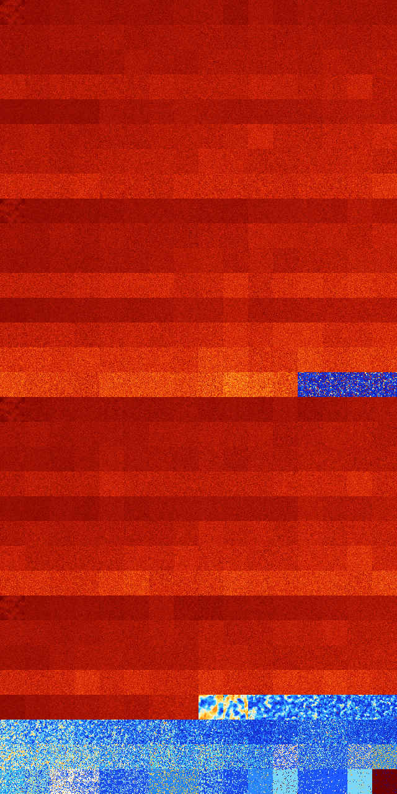

# B234678 (243712-244223)

<details>
    <summary>Initial Grid</summary>
    
</details>


<details>
    <summary>Initial Grid RLE</summary>

```
#C Exported from GoGoL (https://github.com/marrow16/gogol)
#C Wrap mode: Toroidal
#C Boundary mode: Dead
#C Step: 0
x = 100, y = 100, rule = B234678/S
62bobo31bo$15bo8bo26bo$5bo3bo8bo10bo8bo2bo9bo6bo$11bo16bo58bo7bo$17bo
15bo8bobo39bo$95bo$13bo16bo51bo6bo$20bo8bo7b3o32bo3bo$51bo38bo$32bo2bo
12bo$2bo27bo20bo23bo$b2obo35b2o21bo25bo$33bo7bo23bo$11bo4bo30bo5bobo7bo
8bo5bo16bo$bo51bo11bo3b2o$5bo17b2o24bo15bo24bo$bo15bo25b2o11b2o5bo13b2o
2bo3bo4bo$50bo2bo25bo16bo$9bo43bo3bo4bo23bo12bo$2bo19bo26bo4bo21bo9bo$
9b2o12bo13bo21bo2bo$16bobo60bo$40bo31bo$13bo4bo19bo40bo18bo$bo43bobo36b
o10bo$20bo19bo14bo25bo5bo$59bo3bo8bo16bo$7bo6bo11bo5bo12bo22bo11bo7bo7b
o$48bo9bo11b2o23bo$2bo5bo6bo33bobo8bo7bo9bo19bo$5bo11bo6bo26bo4bo28bo2b
o$7bo63bo2bo$35bo$24bo28bo11bobo$24bo4bobo4bo4bo9bo26bo$o36bo17bo13bo4b
o$2bo14bo70bo$20bo10bo3bo60bo$60bo$5b2o32bo5bo11bo5bo9bo$3bo13bo2bo76bo
$obo22bo4bo26bo7bo11bo$bo69bo22bo$21bo21bo7bo3bo2b2o9bo10bo2bo8bo$69bo
10bo$o17bo19bo6bo18bo21bo$37bo20bo5bo$2bo12bo11bo4bo57bo$11bo5bo28bo$2b
o8bo10bo41bo3bo$12bo13bo21bo13bo6bo3bo8bo15bo$2bo3bo7bo7b2o12b2o52bo$
69bo26bo$bo2bo61bo3bo16bo$11bo3bo29bo4bobo12bo3bo10bo$o37bo4bo8bo15bo
23bo$61bo$16bo11bo$7bo2bo2bo50bo31bo$bo26bobo18bo2bo45bo$28bo18b2o16bo
5bobo16bobo3bo$7bobo38bo$10bo3bo14bo$14bo10bo25bo3b2obo2bo13bo7bo15bo$
10bo10bo16bo32bo$25bo42bo$10bo19bo28bo3bo7bo7bo14bo$5bo6bo29bo16bo23bob
o$56bo23bo7bo$10bo17bo17bo2bo21bo14bobo$o5bo15bo5bo30bo26bo8bo2bo$31bo
4bo18bobo21bo6bo$13bo32bo9bo25bobo10bo$54bo8bo11bo3bo$2b2o9b2o41bo$38bo
2bobo34bo3bo10bo$7bo17bo6bo6bo17bo35b2o$2bo42bo2bo20bo25bo$18bo8bo9bo6b
o8bo10bo10bo$12bo3bo39bo13bo$5bo20bo26bo19b2o5bo4b2o12bo$25bo9bo56b2o2b
o$9bo10bo7bo25bo35bo7bo$2bo31bo5bo$10bo14bo2bo58bo$41b2o42bo11bo$49bo
33bo$2bo7bo34bo3bo3bo35bo3bo5bo$40bo15bo25bo2bo12bo$4bo19bo39bo9bo10bo$
2bo37bo38bo$30bo32bo27bobo$bobo6bo2bo24bo15bo10bo17b2o$4bo58bo5bo10bo
15bo$4bo47bo42bo2bo$9b2o35bo8bo4bo$8bo34bo30bo17bo$30bo3bobo7bo6bo35bo
4bo$11bo2bo47bo7bo16bo$bo31bo11bo18bo2bo4bo4bo10bo!
```
</details>
<details>
    <summary>Thumbnail</summary>

</details>
<table>
<tr>
    <td><a href="./243712%20S%20Heat%20Map%20Activity.png"></a><br>S (243712)<br>G>1000</td>    <td><a href="./243713%20S0%20Heat%20Map%20Activity.png"></a><br>S0 (243713)<br>G>1000</td>    <td><a href="./243714%20S1%20Heat%20Map%20Activity.png"></a><br>S1 (243714)<br>G>1000</td>    <td><a href="./243715%20S01%20Heat%20Map%20Activity.png"></a><br>S01 (243715)<br>G>1000</td>    <td><a href="./243716%20S2%20Heat%20Map%20Activity.png"></a><br>S2 (243716)<br>G>1000</td>    <td><a href="./243717%20S02%20Heat%20Map%20Activity.png"></a><br>S02 (243717)<br>G>1000</td>    <td><a href="./243718%20S12%20Heat%20Map%20Activity.png"></a><br>S12 (243718)<br>G>1000</td>    <td><a href="./243719%20S012%20Heat%20Map%20Activity.png"></a><br>S012 (243719)<br>G>1000</td>    <td><a href="./243720%20S3%20Heat%20Map%20Activity.png"></a><br>S3 (243720)<br>G>1000</td>    <td><a href="./243721%20S03%20Heat%20Map%20Activity.png"></a><br>S03 (243721)<br>G>1000</td>    <td><a href="./243722%20S13%20Heat%20Map%20Activity.png"></a><br>S13 (243722)<br>G>1000</td>    <td><a href="./243723%20S013%20Heat%20Map%20Activity.png"></a><br>S013 (243723)<br>G>1000</td>    <td><a href="./243724%20S23%20Heat%20Map%20Activity.png"></a><br>S23 (243724)<br>G>1000</td>    <td><a href="./243725%20S023%20Heat%20Map%20Activity.png"></a><br>S023 (243725)<br>G>1000</td>    <td><a href="./243726%20S123%20Heat%20Map%20Activity.png"></a><br>S123 (243726)<br>G>1000</td>    <td><a href="./243727%20S0123%20Heat%20Map%20Activity.png"></a><br>S0123 (243727)<br>G>1000</td></tr>
<tr>
    <td><a href="./243728%20S4%20Heat%20Map%20Activity.png"></a><br>S4 (243728)<br>G>1000</td>    <td><a href="./243729%20S04%20Heat%20Map%20Activity.png"></a><br>S04 (243729)<br>G>1000</td>    <td><a href="./243730%20S14%20Heat%20Map%20Activity.png"></a><br>S14 (243730)<br>G>1000</td>    <td><a href="./243731%20S014%20Heat%20Map%20Activity.png"></a><br>S014 (243731)<br>G>1000</td>    <td><a href="./243732%20S24%20Heat%20Map%20Activity.png"></a><br>S24 (243732)<br>G>1000</td>    <td><a href="./243733%20S024%20Heat%20Map%20Activity.png"></a><br>S024 (243733)<br>G>1000</td>    <td><a href="./243734%20S124%20Heat%20Map%20Activity.png"></a><br>S124 (243734)<br>G>1000</td>    <td><a href="./243735%20S0124%20Heat%20Map%20Activity.png"></a><br>S0124 (243735)<br>G>1000</td>    <td><a href="./243736%20S34%20Heat%20Map%20Activity.png"></a><br>S34 (243736)<br>G>1000</td>    <td><a href="./243737%20S034%20Heat%20Map%20Activity.png"></a><br>S034 (243737)<br>G>1000</td>    <td><a href="./243738%20S134%20Heat%20Map%20Activity.png"></a><br>S134 (243738)<br>G>1000</td>    <td><a href="./243739%20S0134%20Heat%20Map%20Activity.png"></a><br>S0134 (243739)<br>G>1000</td>    <td><a href="./243740%20S234%20Heat%20Map%20Activity.png"></a><br>S234 (243740)<br>G>1000</td>    <td><a href="./243741%20S0234%20Heat%20Map%20Activity.png"></a><br>S0234 (243741)<br>G>1000</td>    <td><a href="./243742%20S1234%20Heat%20Map%20Activity.png"></a><br>S1234 (243742)<br>G>1000</td>    <td><a href="./243743%20S01234%20Heat%20Map%20Activity.png"></a><br>S01234 (243743)<br>G>1000</td></tr>
<tr>
    <td><a href="./243744%20S5%20Heat%20Map%20Activity.png"></a><br>S5 (243744)<br>G>1000</td>    <td><a href="./243745%20S05%20Heat%20Map%20Activity.png"></a><br>S05 (243745)<br>G>1000</td>    <td><a href="./243746%20S15%20Heat%20Map%20Activity.png"></a><br>S15 (243746)<br>G>1000</td>    <td><a href="./243747%20S015%20Heat%20Map%20Activity.png"></a><br>S015 (243747)<br>G>1000</td>    <td><a href="./243748%20S25%20Heat%20Map%20Activity.png"></a><br>S25 (243748)<br>G>1000</td>    <td><a href="./243749%20S025%20Heat%20Map%20Activity.png"></a><br>S025 (243749)<br>G>1000</td>    <td><a href="./243750%20S125%20Heat%20Map%20Activity.png"></a><br>S125 (243750)<br>G>1000</td>    <td><a href="./243751%20S0125%20Heat%20Map%20Activity.png"></a><br>S0125 (243751)<br>G>1000</td>    <td><a href="./243752%20S35%20Heat%20Map%20Activity.png"></a><br>S35 (243752)<br>G>1000</td>    <td><a href="./243753%20S035%20Heat%20Map%20Activity.png"></a><br>S035 (243753)<br>G>1000</td>    <td><a href="./243754%20S135%20Heat%20Map%20Activity.png"></a><br>S135 (243754)<br>G>1000</td>    <td><a href="./243755%20S0135%20Heat%20Map%20Activity.png"></a><br>S0135 (243755)<br>G>1000</td>    <td><a href="./243756%20S235%20Heat%20Map%20Activity.png"></a><br>S235 (243756)<br>G>1000</td>    <td><a href="./243757%20S0235%20Heat%20Map%20Activity.png"></a><br>S0235 (243757)<br>G>1000</td>    <td><a href="./243758%20S1235%20Heat%20Map%20Activity.png"></a><br>S1235 (243758)<br>G>1000</td>    <td><a href="./243759%20S01235%20Heat%20Map%20Activity.png"></a><br>S01235 (243759)<br>G>1000</td></tr>
<tr>
    <td><a href="./243760%20S45%20Heat%20Map%20Activity.png"></a><br>S45 (243760)<br>G>1000</td>    <td><a href="./243761%20S045%20Heat%20Map%20Activity.png"></a><br>S045 (243761)<br>G>1000</td>    <td><a href="./243762%20S145%20Heat%20Map%20Activity.png"></a><br>S145 (243762)<br>G>1000</td>    <td><a href="./243763%20S0145%20Heat%20Map%20Activity.png"></a><br>S0145 (243763)<br>G>1000</td>    <td><a href="./243764%20S245%20Heat%20Map%20Activity.png"></a><br>S245 (243764)<br>G>1000</td>    <td><a href="./243765%20S0245%20Heat%20Map%20Activity.png"></a><br>S0245 (243765)<br>G>1000</td>    <td><a href="./243766%20S1245%20Heat%20Map%20Activity.png"></a><br>S1245 (243766)<br>G>1000</td>    <td><a href="./243767%20S01245%20Heat%20Map%20Activity.png"></a><br>S01245 (243767)<br>G>1000</td>    <td><a href="./243768%20S345%20Heat%20Map%20Activity.png"></a><br>S345 (243768)<br>G>1000</td>    <td><a href="./243769%20S0345%20Heat%20Map%20Activity.png"></a><br>S0345 (243769)<br>G>1000</td>    <td><a href="./243770%20S1345%20Heat%20Map%20Activity.png"></a><br>S1345 (243770)<br>G>1000</td>    <td><a href="./243771%20S01345%20Heat%20Map%20Activity.png"></a><br>S01345 (243771)<br>G>1000</td>    <td><a href="./243772%20S2345%20Heat%20Map%20Activity.png"></a><br>S2345 (243772)<br>G>1000</td>    <td><a href="./243773%20S02345%20Heat%20Map%20Activity.png"></a><br>S02345 (243773)<br>G>1000</td>    <td><a href="./243774%20S12345%20Heat%20Map%20Activity.png"></a><br>S12345 (243774)<br>G>1000</td>    <td><a href="./243775%20S012345%20Heat%20Map%20Activity.png"></a><br>S012345 (243775)<br>G>1000</td></tr>
<tr>
    <td><a href="./243776%20S6%20Heat%20Map%20Activity.png"></a><br>S6 (243776)<br>G>1000</td>    <td><a href="./243777%20S06%20Heat%20Map%20Activity.png"></a><br>S06 (243777)<br>G>1000</td>    <td><a href="./243778%20S16%20Heat%20Map%20Activity.png"></a><br>S16 (243778)<br>G>1000</td>    <td><a href="./243779%20S016%20Heat%20Map%20Activity.png"></a><br>S016 (243779)<br>G>1000</td>    <td><a href="./243780%20S26%20Heat%20Map%20Activity.png"></a><br>S26 (243780)<br>G>1000</td>    <td><a href="./243781%20S026%20Heat%20Map%20Activity.png"></a><br>S026 (243781)<br>G>1000</td>    <td><a href="./243782%20S126%20Heat%20Map%20Activity.png"></a><br>S126 (243782)<br>G>1000</td>    <td><a href="./243783%20S0126%20Heat%20Map%20Activity.png"></a><br>S0126 (243783)<br>G>1000</td>    <td><a href="./243784%20S36%20Heat%20Map%20Activity.png"></a><br>S36 (243784)<br>G>1000</td>    <td><a href="./243785%20S036%20Heat%20Map%20Activity.png"></a><br>S036 (243785)<br>G>1000</td>    <td><a href="./243786%20S136%20Heat%20Map%20Activity.png"></a><br>S136 (243786)<br>G>1000</td>    <td><a href="./243787%20S0136%20Heat%20Map%20Activity.png"></a><br>S0136 (243787)<br>G>1000</td>    <td><a href="./243788%20S236%20Heat%20Map%20Activity.png"></a><br>S236 (243788)<br>G>1000</td>    <td><a href="./243789%20S0236%20Heat%20Map%20Activity.png"></a><br>S0236 (243789)<br>G>1000</td>    <td><a href="./243790%20S1236%20Heat%20Map%20Activity.png"></a><br>S1236 (243790)<br>G>1000</td>    <td><a href="./243791%20S01236%20Heat%20Map%20Activity.png"></a><br>S01236 (243791)<br>G>1000</td></tr>
<tr>
    <td><a href="./243792%20S46%20Heat%20Map%20Activity.png"></a><br>S46 (243792)<br>G>1000</td>    <td><a href="./243793%20S046%20Heat%20Map%20Activity.png"></a><br>S046 (243793)<br>G>1000</td>    <td><a href="./243794%20S146%20Heat%20Map%20Activity.png"></a><br>S146 (243794)<br>G>1000</td>    <td><a href="./243795%20S0146%20Heat%20Map%20Activity.png"></a><br>S0146 (243795)<br>G>1000</td>    <td><a href="./243796%20S246%20Heat%20Map%20Activity.png"></a><br>S246 (243796)<br>G>1000</td>    <td><a href="./243797%20S0246%20Heat%20Map%20Activity.png"></a><br>S0246 (243797)<br>G>1000</td>    <td><a href="./243798%20S1246%20Heat%20Map%20Activity.png"></a><br>S1246 (243798)<br>G>1000</td>    <td><a href="./243799%20S01246%20Heat%20Map%20Activity.png"></a><br>S01246 (243799)<br>G>1000</td>    <td><a href="./243800%20S346%20Heat%20Map%20Activity.png"></a><br>S346 (243800)<br>G>1000</td>    <td><a href="./243801%20S0346%20Heat%20Map%20Activity.png"></a><br>S0346 (243801)<br>G>1000</td>    <td><a href="./243802%20S1346%20Heat%20Map%20Activity.png"></a><br>S1346 (243802)<br>G>1000</td>    <td><a href="./243803%20S01346%20Heat%20Map%20Activity.png"></a><br>S01346 (243803)<br>G>1000</td>    <td><a href="./243804%20S2346%20Heat%20Map%20Activity.png"></a><br>S2346 (243804)<br>G>1000</td>    <td><a href="./243805%20S02346%20Heat%20Map%20Activity.png"></a><br>S02346 (243805)<br>G>1000</td>    <td><a href="./243806%20S12346%20Heat%20Map%20Activity.png"></a><br>S12346 (243806)<br>G>1000</td>    <td><a href="./243807%20S012346%20Heat%20Map%20Activity.png"></a><br>S012346 (243807)<br>G>1000</td></tr>
<tr>
    <td><a href="./243808%20S56%20Heat%20Map%20Activity.png"></a><br>S56 (243808)<br>G>1000</td>    <td><a href="./243809%20S056%20Heat%20Map%20Activity.png"></a><br>S056 (243809)<br>G>1000</td>    <td><a href="./243810%20S156%20Heat%20Map%20Activity.png"></a><br>S156 (243810)<br>G>1000</td>    <td><a href="./243811%20S0156%20Heat%20Map%20Activity.png"></a><br>S0156 (243811)<br>G>1000</td>    <td><a href="./243812%20S256%20Heat%20Map%20Activity.png"></a><br>S256 (243812)<br>G>1000</td>    <td><a href="./243813%20S0256%20Heat%20Map%20Activity.png"></a><br>S0256 (243813)<br>G>1000</td>    <td><a href="./243814%20S1256%20Heat%20Map%20Activity.png"></a><br>S1256 (243814)<br>G>1000</td>    <td><a href="./243815%20S01256%20Heat%20Map%20Activity.png"></a><br>S01256 (243815)<br>G>1000</td>    <td><a href="./243816%20S356%20Heat%20Map%20Activity.png"></a><br>S356 (243816)<br>G>1000</td>    <td><a href="./243817%20S0356%20Heat%20Map%20Activity.png"></a><br>S0356 (243817)<br>G>1000</td>    <td><a href="./243818%20S1356%20Heat%20Map%20Activity.png"></a><br>S1356 (243818)<br>G>1000</td>    <td><a href="./243819%20S01356%20Heat%20Map%20Activity.png"></a><br>S01356 (243819)<br>G>1000</td>    <td><a href="./243820%20S2356%20Heat%20Map%20Activity.png"></a><br>S2356 (243820)<br>G>1000</td>    <td><a href="./243821%20S02356%20Heat%20Map%20Activity.png"></a><br>S02356 (243821)<br>G>1000</td>    <td><a href="./243822%20S12356%20Heat%20Map%20Activity.png"></a><br>S12356 (243822)<br>G>1000</td>    <td><a href="./243823%20S012356%20Heat%20Map%20Activity.png"></a><br>S012356 (243823)<br>G>1000</td></tr>
<tr>
    <td><a href="./243824%20S456%20Heat%20Map%20Activity.png"></a><br>S456 (243824)<br>G>1000</td>    <td><a href="./243825%20S0456%20Heat%20Map%20Activity.png"></a><br>S0456 (243825)<br>G>1000</td>    <td><a href="./243826%20S1456%20Heat%20Map%20Activity.png"></a><br>S1456 (243826)<br>G>1000</td>    <td><a href="./243827%20S01456%20Heat%20Map%20Activity.png"></a><br>S01456 (243827)<br>G>1000</td>    <td><a href="./243828%20S2456%20Heat%20Map%20Activity.png"></a><br>S2456 (243828)<br>G>1000</td>    <td><a href="./243829%20S02456%20Heat%20Map%20Activity.png"></a><br>S02456 (243829)<br>G>1000</td>    <td><a href="./243830%20S12456%20Heat%20Map%20Activity.png"></a><br>S12456 (243830)<br>G>1000</td>    <td><a href="./243831%20S012456%20Heat%20Map%20Activity.png"></a><br>S012456 (243831)<br>G>1000</td>    <td><a href="./243832%20S3456%20Heat%20Map%20Activity.png"></a><br>S3456 (243832)<br>G>1000</td>    <td><a href="./243833%20S03456%20Heat%20Map%20Activity.png"></a><br>S03456 (243833)<br>G>1000</td>    <td><a href="./243834%20S13456%20Heat%20Map%20Activity.png"></a><br>S13456 (243834)<br>G>1000</td>    <td><a href="./243835%20S013456%20Heat%20Map%20Activity.png"></a><br>S013456 (243835)<br>G>1000</td>    <td><a href="./243836%20S23456%20Heat%20Map%20Activity.png"></a><br>S23456 (243836)<br>G>1000</td>    <td><a href="./243837%20S023456%20Heat%20Map%20Activity.png"></a><br>S023456 (243837)<br>G>1000</td>    <td><a href="./243838%20S123456%20Heat%20Map%20Activity.png"></a><br>S123456 (243838)<br>G>1000</td>    <td><a href="./243839%20S0123456%20Heat%20Map%20Activity.png"></a><br>S0123456 (243839)<br>G>1000</td></tr>
<tr>
    <td><a href="./243840%20S7%20Heat%20Map%20Activity.png"></a><br>S7 (243840)<br>G>1000</td>    <td><a href="./243841%20S07%20Heat%20Map%20Activity.png"></a><br>S07 (243841)<br>G>1000</td>    <td><a href="./243842%20S17%20Heat%20Map%20Activity.png"></a><br>S17 (243842)<br>G>1000</td>    <td><a href="./243843%20S017%20Heat%20Map%20Activity.png"></a><br>S017 (243843)<br>G>1000</td>    <td><a href="./243844%20S27%20Heat%20Map%20Activity.png"></a><br>S27 (243844)<br>G>1000</td>    <td><a href="./243845%20S027%20Heat%20Map%20Activity.png"></a><br>S027 (243845)<br>G>1000</td>    <td><a href="./243846%20S127%20Heat%20Map%20Activity.png"></a><br>S127 (243846)<br>G>1000</td>    <td><a href="./243847%20S0127%20Heat%20Map%20Activity.png"></a><br>S0127 (243847)<br>G>1000</td>    <td><a href="./243848%20S37%20Heat%20Map%20Activity.png"></a><br>S37 (243848)<br>G>1000</td>    <td><a href="./243849%20S037%20Heat%20Map%20Activity.png"></a><br>S037 (243849)<br>G>1000</td>    <td><a href="./243850%20S137%20Heat%20Map%20Activity.png"></a><br>S137 (243850)<br>G>1000</td>    <td><a href="./243851%20S0137%20Heat%20Map%20Activity.png"></a><br>S0137 (243851)<br>G>1000</td>    <td><a href="./243852%20S237%20Heat%20Map%20Activity.png"></a><br>S237 (243852)<br>G>1000</td>    <td><a href="./243853%20S0237%20Heat%20Map%20Activity.png"></a><br>S0237 (243853)<br>G>1000</td>    <td><a href="./243854%20S1237%20Heat%20Map%20Activity.png"></a><br>S1237 (243854)<br>G>1000</td>    <td><a href="./243855%20S01237%20Heat%20Map%20Activity.png"></a><br>S01237 (243855)<br>G>1000</td></tr>
<tr>
    <td><a href="./243856%20S47%20Heat%20Map%20Activity.png"></a><br>S47 (243856)<br>G>1000</td>    <td><a href="./243857%20S047%20Heat%20Map%20Activity.png"></a><br>S047 (243857)<br>G>1000</td>    <td><a href="./243858%20S147%20Heat%20Map%20Activity.png"></a><br>S147 (243858)<br>G>1000</td>    <td><a href="./243859%20S0147%20Heat%20Map%20Activity.png"></a><br>S0147 (243859)<br>G>1000</td>    <td><a href="./243860%20S247%20Heat%20Map%20Activity.png"></a><br>S247 (243860)<br>G>1000</td>    <td><a href="./243861%20S0247%20Heat%20Map%20Activity.png"></a><br>S0247 (243861)<br>G>1000</td>    <td><a href="./243862%20S1247%20Heat%20Map%20Activity.png"></a><br>S1247 (243862)<br>G>1000</td>    <td><a href="./243863%20S01247%20Heat%20Map%20Activity.png"></a><br>S01247 (243863)<br>G>1000</td>    <td><a href="./243864%20S347%20Heat%20Map%20Activity.png"></a><br>S347 (243864)<br>G>1000</td>    <td><a href="./243865%20S0347%20Heat%20Map%20Activity.png"></a><br>S0347 (243865)<br>G>1000</td>    <td><a href="./243866%20S1347%20Heat%20Map%20Activity.png"></a><br>S1347 (243866)<br>G>1000</td>    <td><a href="./243867%20S01347%20Heat%20Map%20Activity.png"></a><br>S01347 (243867)<br>G>1000</td>    <td><a href="./243868%20S2347%20Heat%20Map%20Activity.png"></a><br>S2347 (243868)<br>G>1000</td>    <td><a href="./243869%20S02347%20Heat%20Map%20Activity.png"></a><br>S02347 (243869)<br>G>1000</td>    <td><a href="./243870%20S12347%20Heat%20Map%20Activity.png"></a><br>S12347 (243870)<br>G>1000</td>    <td><a href="./243871%20S012347%20Heat%20Map%20Activity.png"></a><br>S012347 (243871)<br>G>1000</td></tr>
<tr>
    <td><a href="./243872%20S57%20Heat%20Map%20Activity.png"></a><br>S57 (243872)<br>G>1000</td>    <td><a href="./243873%20S057%20Heat%20Map%20Activity.png"></a><br>S057 (243873)<br>G>1000</td>    <td><a href="./243874%20S157%20Heat%20Map%20Activity.png"></a><br>S157 (243874)<br>G>1000</td>    <td><a href="./243875%20S0157%20Heat%20Map%20Activity.png"></a><br>S0157 (243875)<br>G>1000</td>    <td><a href="./243876%20S257%20Heat%20Map%20Activity.png"></a><br>S257 (243876)<br>G>1000</td>    <td><a href="./243877%20S0257%20Heat%20Map%20Activity.png"></a><br>S0257 (243877)<br>G>1000</td>    <td><a href="./243878%20S1257%20Heat%20Map%20Activity.png"></a><br>S1257 (243878)<br>G>1000</td>    <td><a href="./243879%20S01257%20Heat%20Map%20Activity.png"></a><br>S01257 (243879)<br>G>1000</td>    <td><a href="./243880%20S357%20Heat%20Map%20Activity.png"></a><br>S357 (243880)<br>G>1000</td>    <td><a href="./243881%20S0357%20Heat%20Map%20Activity.png"></a><br>S0357 (243881)<br>G>1000</td>    <td><a href="./243882%20S1357%20Heat%20Map%20Activity.png"></a><br>S1357 (243882)<br>G>1000</td>    <td><a href="./243883%20S01357%20Heat%20Map%20Activity.png"></a><br>S01357 (243883)<br>G>1000</td>    <td><a href="./243884%20S2357%20Heat%20Map%20Activity.png"></a><br>S2357 (243884)<br>G>1000</td>    <td><a href="./243885%20S02357%20Heat%20Map%20Activity.png"></a><br>S02357 (243885)<br>G>1000</td>    <td><a href="./243886%20S12357%20Heat%20Map%20Activity.png"></a><br>S12357 (243886)<br>G>1000</td>    <td><a href="./243887%20S012357%20Heat%20Map%20Activity.png"></a><br>S012357 (243887)<br>G>1000</td></tr>
<tr>
    <td><a href="./243888%20S457%20Heat%20Map%20Activity.png"></a><br>S457 (243888)<br>G>1000</td>    <td><a href="./243889%20S0457%20Heat%20Map%20Activity.png"></a><br>S0457 (243889)<br>G>1000</td>    <td><a href="./243890%20S1457%20Heat%20Map%20Activity.png"></a><br>S1457 (243890)<br>G>1000</td>    <td><a href="./243891%20S01457%20Heat%20Map%20Activity.png"></a><br>S01457 (243891)<br>G>1000</td>    <td><a href="./243892%20S2457%20Heat%20Map%20Activity.png"></a><br>S2457 (243892)<br>G>1000</td>    <td><a href="./243893%20S02457%20Heat%20Map%20Activity.png"></a><br>S02457 (243893)<br>G>1000</td>    <td><a href="./243894%20S12457%20Heat%20Map%20Activity.png"></a><br>S12457 (243894)<br>G>1000</td>    <td><a href="./243895%20S012457%20Heat%20Map%20Activity.png"></a><br>S012457 (243895)<br>G>1000</td>    <td><a href="./243896%20S3457%20Heat%20Map%20Activity.png"></a><br>S3457 (243896)<br>G>1000</td>    <td><a href="./243897%20S03457%20Heat%20Map%20Activity.png"></a><br>S03457 (243897)<br>G>1000</td>    <td><a href="./243898%20S13457%20Heat%20Map%20Activity.png"></a><br>S13457 (243898)<br>G>1000</td>    <td><a href="./243899%20S013457%20Heat%20Map%20Activity.png"></a><br>S013457 (243899)<br>G>1000</td>    <td><a href="./243900%20S23457%20Heat%20Map%20Activity.png"></a><br>S23457 (243900)<br>G>1000</td>    <td><a href="./243901%20S023457%20Heat%20Map%20Activity.png"></a><br>S023457 (243901)<br>G>1000</td>    <td><a href="./243902%20S123457%20Heat%20Map%20Activity.png"></a><br>S123457 (243902)<br>G>1000</td>    <td><a href="./243903%20S0123457%20Heat%20Map%20Activity.png"></a><br>S0123457 (243903)<br>G>1000</td></tr>
<tr>
    <td><a href="./243904%20S67%20Heat%20Map%20Activity.png"></a><br>S67 (243904)<br>G>1000</td>    <td><a href="./243905%20S067%20Heat%20Map%20Activity.png"></a><br>S067 (243905)<br>G>1000</td>    <td><a href="./243906%20S167%20Heat%20Map%20Activity.png"></a><br>S167 (243906)<br>G>1000</td>    <td><a href="./243907%20S0167%20Heat%20Map%20Activity.png"></a><br>S0167 (243907)<br>G>1000</td>    <td><a href="./243908%20S267%20Heat%20Map%20Activity.png"></a><br>S267 (243908)<br>G>1000</td>    <td><a href="./243909%20S0267%20Heat%20Map%20Activity.png"></a><br>S0267 (243909)<br>G>1000</td>    <td><a href="./243910%20S1267%20Heat%20Map%20Activity.png"></a><br>S1267 (243910)<br>G>1000</td>    <td><a href="./243911%20S01267%20Heat%20Map%20Activity.png"></a><br>S01267 (243911)<br>G>1000</td>    <td><a href="./243912%20S367%20Heat%20Map%20Activity.png"></a><br>S367 (243912)<br>G>1000</td>    <td><a href="./243913%20S0367%20Heat%20Map%20Activity.png"></a><br>S0367 (243913)<br>G>1000</td>    <td><a href="./243914%20S1367%20Heat%20Map%20Activity.png"></a><br>S1367 (243914)<br>G>1000</td>    <td><a href="./243915%20S01367%20Heat%20Map%20Activity.png"></a><br>S01367 (243915)<br>G>1000</td>    <td><a href="./243916%20S2367%20Heat%20Map%20Activity.png"></a><br>S2367 (243916)<br>G>1000</td>    <td><a href="./243917%20S02367%20Heat%20Map%20Activity.png"></a><br>S02367 (243917)<br>G>1000</td>    <td><a href="./243918%20S12367%20Heat%20Map%20Activity.png"></a><br>S12367 (243918)<br>G>1000</td>    <td><a href="./243919%20S012367%20Heat%20Map%20Activity.png"></a><br>S012367 (243919)<br>G>1000</td></tr>
<tr>
    <td><a href="./243920%20S467%20Heat%20Map%20Activity.png"></a><br>S467 (243920)<br>G>1000</td>    <td><a href="./243921%20S0467%20Heat%20Map%20Activity.png"></a><br>S0467 (243921)<br>G>1000</td>    <td><a href="./243922%20S1467%20Heat%20Map%20Activity.png"></a><br>S1467 (243922)<br>G>1000</td>    <td><a href="./243923%20S01467%20Heat%20Map%20Activity.png"></a><br>S01467 (243923)<br>G>1000</td>    <td><a href="./243924%20S2467%20Heat%20Map%20Activity.png"></a><br>S2467 (243924)<br>G>1000</td>    <td><a href="./243925%20S02467%20Heat%20Map%20Activity.png"></a><br>S02467 (243925)<br>G>1000</td>    <td><a href="./243926%20S12467%20Heat%20Map%20Activity.png"></a><br>S12467 (243926)<br>G>1000</td>    <td><a href="./243927%20S012467%20Heat%20Map%20Activity.png"></a><br>S012467 (243927)<br>G>1000</td>    <td><a href="./243928%20S3467%20Heat%20Map%20Activity.png"></a><br>S3467 (243928)<br>G>1000</td>    <td><a href="./243929%20S03467%20Heat%20Map%20Activity.png"></a><br>S03467 (243929)<br>G>1000</td>    <td><a href="./243930%20S13467%20Heat%20Map%20Activity.png"></a><br>S13467 (243930)<br>G>1000</td>    <td><a href="./243931%20S013467%20Heat%20Map%20Activity.png"></a><br>S013467 (243931)<br>G>1000</td>    <td><a href="./243932%20S23467%20Heat%20Map%20Activity.png"></a><br>S23467 (243932)<br>G>1000</td>    <td><a href="./243933%20S023467%20Heat%20Map%20Activity.png"></a><br>S023467 (243933)<br>G>1000</td>    <td><a href="./243934%20S123467%20Heat%20Map%20Activity.png"></a><br>S123467 (243934)<br>G>1000</td>    <td><a href="./243935%20S0123467%20Heat%20Map%20Activity.png"></a><br>S0123467 (243935)<br>G>1000</td></tr>
<tr>
    <td><a href="./243936%20S567%20Heat%20Map%20Activity.png"></a><br>S567 (243936)<br>G>1000</td>    <td><a href="./243937%20S0567%20Heat%20Map%20Activity.png"></a><br>S0567 (243937)<br>G>1000</td>    <td><a href="./243938%20S1567%20Heat%20Map%20Activity.png"></a><br>S1567 (243938)<br>G>1000</td>    <td><a href="./243939%20S01567%20Heat%20Map%20Activity.png"></a><br>S01567 (243939)<br>G>1000</td>    <td><a href="./243940%20S2567%20Heat%20Map%20Activity.png"></a><br>S2567 (243940)<br>G>1000</td>    <td><a href="./243941%20S02567%20Heat%20Map%20Activity.png"></a><br>S02567 (243941)<br>G>1000</td>    <td><a href="./243942%20S12567%20Heat%20Map%20Activity.png"></a><br>S12567 (243942)<br>G>1000</td>    <td><a href="./243943%20S012567%20Heat%20Map%20Activity.png"></a><br>S012567 (243943)<br>G>1000</td>    <td><a href="./243944%20S3567%20Heat%20Map%20Activity.png"></a><br>S3567 (243944)<br>G>1000</td>    <td><a href="./243945%20S03567%20Heat%20Map%20Activity.png"></a><br>S03567 (243945)<br>G>1000</td>    <td><a href="./243946%20S13567%20Heat%20Map%20Activity.png"></a><br>S13567 (243946)<br>G>1000</td>    <td><a href="./243947%20S013567%20Heat%20Map%20Activity.png"></a><br>S013567 (243947)<br>G>1000</td>    <td><a href="./243948%20S23567%20Heat%20Map%20Activity.png"></a><br>S23567 (243948)<br>G>1000</td>    <td><a href="./243949%20S023567%20Heat%20Map%20Activity.png"></a><br>S023567 (243949)<br>G>1000</td>    <td><a href="./243950%20S123567%20Heat%20Map%20Activity.png"></a><br>S123567 (243950)<br>G>1000</td>    <td><a href="./243951%20S0123567%20Heat%20Map%20Activity.png"></a><br>S0123567 (243951)<br>G>1000</td></tr>
<tr>
    <td><a href="./243952%20S4567%20Heat%20Map%20Activity.png"></a><br>S4567 (243952)<br>G>1000</td>    <td><a href="./243953%20S04567%20Heat%20Map%20Activity.png"></a><br>S04567 (243953)<br>G>1000</td>    <td><a href="./243954%20S14567%20Heat%20Map%20Activity.png"></a><br>S14567 (243954)<br>G>1000</td>    <td><a href="./243955%20S014567%20Heat%20Map%20Activity.png"></a><br>S014567 (243955)<br>G>1000</td>    <td><a href="./243956%20S24567%20Heat%20Map%20Activity.png"></a><br>S24567 (243956)<br>G>1000</td>    <td><a href="./243957%20S024567%20Heat%20Map%20Activity.png"></a><br>S024567 (243957)<br>G>1000</td>    <td><a href="./243958%20S124567%20Heat%20Map%20Activity.png"></a><br>S124567 (243958)<br>G>1000</td>    <td><a href="./243959%20S0124567%20Heat%20Map%20Activity.png"></a><br>S0124567 (243959)<br>G>1000</td>    <td><a href="./243960%20S34567%20Heat%20Map%20Activity.png"></a><br>S34567 (243960)<br>G>1000</td>    <td><a href="./243961%20S034567%20Heat%20Map%20Activity.png"></a><br>S034567 (243961)<br>G>1000</td>    <td><a href="./243962%20S134567%20Heat%20Map%20Activity.png"></a><br>S134567 (243962)<br>G>1000</td>    <td><a href="./243963%20S0134567%20Heat%20Map%20Activity.png"></a><br>S0134567 (243963)<br>G>1000</td>    <td><a href="./243964%20S234567%20Heat%20Map%20Activity.png"></a><br>S234567 (243964)<br>G>1000</td>    <td><a href="./243965%20S0234567%20Heat%20Map%20Activity.png"></a><br>S0234567 (243965)<br>G>1000</td>    <td><a href="./243966%20S1234567%20Heat%20Map%20Activity.png"></a><br>S1234567 (243966)<br>G>1000</td>    <td><a href="./243967%20S01234567%20Heat%20Map%20Activity.png"></a><br>S01234567 (243967)<br>G>1000</td></tr>
<tr>
    <td><a href="./243968%20S8%20Heat%20Map%20Activity.png"></a><br>S8 (243968)<br>G>1000</td>    <td><a href="./243969%20S08%20Heat%20Map%20Activity.png"></a><br>S08 (243969)<br>G>1000</td>    <td><a href="./243970%20S18%20Heat%20Map%20Activity.png"></a><br>S18 (243970)<br>G>1000</td>    <td><a href="./243971%20S018%20Heat%20Map%20Activity.png"></a><br>S018 (243971)<br>G>1000</td>    <td><a href="./243972%20S28%20Heat%20Map%20Activity.png"></a><br>S28 (243972)<br>G>1000</td>    <td><a href="./243973%20S028%20Heat%20Map%20Activity.png"></a><br>S028 (243973)<br>G>1000</td>    <td><a href="./243974%20S128%20Heat%20Map%20Activity.png"></a><br>S128 (243974)<br>G>1000</td>    <td><a href="./243975%20S0128%20Heat%20Map%20Activity.png"></a><br>S0128 (243975)<br>G>1000</td>    <td><a href="./243976%20S38%20Heat%20Map%20Activity.png"></a><br>S38 (243976)<br>G>1000</td>    <td><a href="./243977%20S038%20Heat%20Map%20Activity.png"></a><br>S038 (243977)<br>G>1000</td>    <td><a href="./243978%20S138%20Heat%20Map%20Activity.png"></a><br>S138 (243978)<br>G>1000</td>    <td><a href="./243979%20S0138%20Heat%20Map%20Activity.png"></a><br>S0138 (243979)<br>G>1000</td>    <td><a href="./243980%20S238%20Heat%20Map%20Activity.png"></a><br>S238 (243980)<br>G>1000</td>    <td><a href="./243981%20S0238%20Heat%20Map%20Activity.png"></a><br>S0238 (243981)<br>G>1000</td>    <td><a href="./243982%20S1238%20Heat%20Map%20Activity.png"></a><br>S1238 (243982)<br>G>1000</td>    <td><a href="./243983%20S01238%20Heat%20Map%20Activity.png"></a><br>S01238 (243983)<br>G>1000</td></tr>
<tr>
    <td><a href="./243984%20S48%20Heat%20Map%20Activity.png"></a><br>S48 (243984)<br>G>1000</td>    <td><a href="./243985%20S048%20Heat%20Map%20Activity.png"></a><br>S048 (243985)<br>G>1000</td>    <td><a href="./243986%20S148%20Heat%20Map%20Activity.png"></a><br>S148 (243986)<br>G>1000</td>    <td><a href="./243987%20S0148%20Heat%20Map%20Activity.png"></a><br>S0148 (243987)<br>G>1000</td>    <td><a href="./243988%20S248%20Heat%20Map%20Activity.png"></a><br>S248 (243988)<br>G>1000</td>    <td><a href="./243989%20S0248%20Heat%20Map%20Activity.png"></a><br>S0248 (243989)<br>G>1000</td>    <td><a href="./243990%20S1248%20Heat%20Map%20Activity.png"></a><br>S1248 (243990)<br>G>1000</td>    <td><a href="./243991%20S01248%20Heat%20Map%20Activity.png"></a><br>S01248 (243991)<br>G>1000</td>    <td><a href="./243992%20S348%20Heat%20Map%20Activity.png"></a><br>S348 (243992)<br>G>1000</td>    <td><a href="./243993%20S0348%20Heat%20Map%20Activity.png"></a><br>S0348 (243993)<br>G>1000</td>    <td><a href="./243994%20S1348%20Heat%20Map%20Activity.png"></a><br>S1348 (243994)<br>G>1000</td>    <td><a href="./243995%20S01348%20Heat%20Map%20Activity.png"></a><br>S01348 (243995)<br>G>1000</td>    <td><a href="./243996%20S2348%20Heat%20Map%20Activity.png"></a><br>S2348 (243996)<br>G>1000</td>    <td><a href="./243997%20S02348%20Heat%20Map%20Activity.png"></a><br>S02348 (243997)<br>G>1000</td>    <td><a href="./243998%20S12348%20Heat%20Map%20Activity.png"></a><br>S12348 (243998)<br>G>1000</td>    <td><a href="./243999%20S012348%20Heat%20Map%20Activity.png"></a><br>S012348 (243999)<br>G>1000</td></tr>
<tr>
    <td><a href="./244000%20S58%20Heat%20Map%20Activity.png"></a><br>S58 (244000)<br>G>1000</td>    <td><a href="./244001%20S058%20Heat%20Map%20Activity.png"></a><br>S058 (244001)<br>G>1000</td>    <td><a href="./244002%20S158%20Heat%20Map%20Activity.png"></a><br>S158 (244002)<br>G>1000</td>    <td><a href="./244003%20S0158%20Heat%20Map%20Activity.png"></a><br>S0158 (244003)<br>G>1000</td>    <td><a href="./244004%20S258%20Heat%20Map%20Activity.png"></a><br>S258 (244004)<br>G>1000</td>    <td><a href="./244005%20S0258%20Heat%20Map%20Activity.png"></a><br>S0258 (244005)<br>G>1000</td>    <td><a href="./244006%20S1258%20Heat%20Map%20Activity.png"></a><br>S1258 (244006)<br>G>1000</td>    <td><a href="./244007%20S01258%20Heat%20Map%20Activity.png"></a><br>S01258 (244007)<br>G>1000</td>    <td><a href="./244008%20S358%20Heat%20Map%20Activity.png"></a><br>S358 (244008)<br>G>1000</td>    <td><a href="./244009%20S0358%20Heat%20Map%20Activity.png"></a><br>S0358 (244009)<br>G>1000</td>    <td><a href="./244010%20S1358%20Heat%20Map%20Activity.png"></a><br>S1358 (244010)<br>G>1000</td>    <td><a href="./244011%20S01358%20Heat%20Map%20Activity.png"></a><br>S01358 (244011)<br>G>1000</td>    <td><a href="./244012%20S2358%20Heat%20Map%20Activity.png"></a><br>S2358 (244012)<br>G>1000</td>    <td><a href="./244013%20S02358%20Heat%20Map%20Activity.png"></a><br>S02358 (244013)<br>G>1000</td>    <td><a href="./244014%20S12358%20Heat%20Map%20Activity.png"></a><br>S12358 (244014)<br>G>1000</td>    <td><a href="./244015%20S012358%20Heat%20Map%20Activity.png"></a><br>S012358 (244015)<br>G>1000</td></tr>
<tr>
    <td><a href="./244016%20S458%20Heat%20Map%20Activity.png"></a><br>S458 (244016)<br>G>1000</td>    <td><a href="./244017%20S0458%20Heat%20Map%20Activity.png"></a><br>S0458 (244017)<br>G>1000</td>    <td><a href="./244018%20S1458%20Heat%20Map%20Activity.png"></a><br>S1458 (244018)<br>G>1000</td>    <td><a href="./244019%20S01458%20Heat%20Map%20Activity.png"></a><br>S01458 (244019)<br>G>1000</td>    <td><a href="./244020%20S2458%20Heat%20Map%20Activity.png"></a><br>S2458 (244020)<br>G>1000</td>    <td><a href="./244021%20S02458%20Heat%20Map%20Activity.png"></a><br>S02458 (244021)<br>G>1000</td>    <td><a href="./244022%20S12458%20Heat%20Map%20Activity.png"></a><br>S12458 (244022)<br>G>1000</td>    <td><a href="./244023%20S012458%20Heat%20Map%20Activity.png"></a><br>S012458 (244023)<br>G>1000</td>    <td><a href="./244024%20S3458%20Heat%20Map%20Activity.png"></a><br>S3458 (244024)<br>G>1000</td>    <td><a href="./244025%20S03458%20Heat%20Map%20Activity.png"></a><br>S03458 (244025)<br>G>1000</td>    <td><a href="./244026%20S13458%20Heat%20Map%20Activity.png"></a><br>S13458 (244026)<br>G>1000</td>    <td><a href="./244027%20S013458%20Heat%20Map%20Activity.png"></a><br>S013458 (244027)<br>G>1000</td>    <td><a href="./244028%20S23458%20Heat%20Map%20Activity.png"></a><br>S23458 (244028)<br>G>1000</td>    <td><a href="./244029%20S023458%20Heat%20Map%20Activity.png"></a><br>S023458 (244029)<br>G>1000</td>    <td><a href="./244030%20S123458%20Heat%20Map%20Activity.png"></a><br>S123458 (244030)<br>G>1000</td>    <td><a href="./244031%20S0123458%20Heat%20Map%20Activity.png"></a><br>S0123458 (244031)<br>G>1000</td></tr>
<tr>
    <td><a href="./244032%20S68%20Heat%20Map%20Activity.png"></a><br>S68 (244032)<br>G>1000</td>    <td><a href="./244033%20S068%20Heat%20Map%20Activity.png"></a><br>S068 (244033)<br>G>1000</td>    <td><a href="./244034%20S168%20Heat%20Map%20Activity.png"></a><br>S168 (244034)<br>G>1000</td>    <td><a href="./244035%20S0168%20Heat%20Map%20Activity.png"></a><br>S0168 (244035)<br>G>1000</td>    <td><a href="./244036%20S268%20Heat%20Map%20Activity.png"></a><br>S268 (244036)<br>G>1000</td>    <td><a href="./244037%20S0268%20Heat%20Map%20Activity.png"></a><br>S0268 (244037)<br>G>1000</td>    <td><a href="./244038%20S1268%20Heat%20Map%20Activity.png"></a><br>S1268 (244038)<br>G>1000</td>    <td><a href="./244039%20S01268%20Heat%20Map%20Activity.png"></a><br>S01268 (244039)<br>G>1000</td>    <td><a href="./244040%20S368%20Heat%20Map%20Activity.png"></a><br>S368 (244040)<br>G>1000</td>    <td><a href="./244041%20S0368%20Heat%20Map%20Activity.png"></a><br>S0368 (244041)<br>G>1000</td>    <td><a href="./244042%20S1368%20Heat%20Map%20Activity.png"></a><br>S1368 (244042)<br>G>1000</td>    <td><a href="./244043%20S01368%20Heat%20Map%20Activity.png"></a><br>S01368 (244043)<br>G>1000</td>    <td><a href="./244044%20S2368%20Heat%20Map%20Activity.png"></a><br>S2368 (244044)<br>G>1000</td>    <td><a href="./244045%20S02368%20Heat%20Map%20Activity.png"></a><br>S02368 (244045)<br>G>1000</td>    <td><a href="./244046%20S12368%20Heat%20Map%20Activity.png"></a><br>S12368 (244046)<br>G>1000</td>    <td><a href="./244047%20S012368%20Heat%20Map%20Activity.png"></a><br>S012368 (244047)<br>G>1000</td></tr>
<tr>
    <td><a href="./244048%20S468%20Heat%20Map%20Activity.png"></a><br>S468 (244048)<br>G>1000</td>    <td><a href="./244049%20S0468%20Heat%20Map%20Activity.png"></a><br>S0468 (244049)<br>G>1000</td>    <td><a href="./244050%20S1468%20Heat%20Map%20Activity.png"></a><br>S1468 (244050)<br>G>1000</td>    <td><a href="./244051%20S01468%20Heat%20Map%20Activity.png"></a><br>S01468 (244051)<br>G>1000</td>    <td><a href="./244052%20S2468%20Heat%20Map%20Activity.png"></a><br>S2468 (244052)<br>G>1000</td>    <td><a href="./244053%20S02468%20Heat%20Map%20Activity.png"></a><br>S02468 (244053)<br>G>1000</td>    <td><a href="./244054%20S12468%20Heat%20Map%20Activity.png"></a><br>S12468 (244054)<br>G>1000</td>    <td><a href="./244055%20S012468%20Heat%20Map%20Activity.png"></a><br>S012468 (244055)<br>G>1000</td>    <td><a href="./244056%20S3468%20Heat%20Map%20Activity.png"></a><br>S3468 (244056)<br>G>1000</td>    <td><a href="./244057%20S03468%20Heat%20Map%20Activity.png"></a><br>S03468 (244057)<br>G>1000</td>    <td><a href="./244058%20S13468%20Heat%20Map%20Activity.png"></a><br>S13468 (244058)<br>G>1000</td>    <td><a href="./244059%20S013468%20Heat%20Map%20Activity.png"></a><br>S013468 (244059)<br>G>1000</td>    <td><a href="./244060%20S23468%20Heat%20Map%20Activity.png"></a><br>S23468 (244060)<br>G>1000</td>    <td><a href="./244061%20S023468%20Heat%20Map%20Activity.png"></a><br>S023468 (244061)<br>G>1000</td>    <td><a href="./244062%20S123468%20Heat%20Map%20Activity.png"></a><br>S123468 (244062)<br>G>1000</td>    <td><a href="./244063%20S0123468%20Heat%20Map%20Activity.png"></a><br>S0123468 (244063)<br>G>1000</td></tr>
<tr>
    <td><a href="./244064%20S568%20Heat%20Map%20Activity.png"></a><br>S568 (244064)<br>G>1000</td>    <td><a href="./244065%20S0568%20Heat%20Map%20Activity.png"></a><br>S0568 (244065)<br>G>1000</td>    <td><a href="./244066%20S1568%20Heat%20Map%20Activity.png"></a><br>S1568 (244066)<br>G>1000</td>    <td><a href="./244067%20S01568%20Heat%20Map%20Activity.png"></a><br>S01568 (244067)<br>G>1000</td>    <td><a href="./244068%20S2568%20Heat%20Map%20Activity.png"></a><br>S2568 (244068)<br>G>1000</td>    <td><a href="./244069%20S02568%20Heat%20Map%20Activity.png"></a><br>S02568 (244069)<br>G>1000</td>    <td><a href="./244070%20S12568%20Heat%20Map%20Activity.png"></a><br>S12568 (244070)<br>G>1000</td>    <td><a href="./244071%20S012568%20Heat%20Map%20Activity.png"></a><br>S012568 (244071)<br>G>1000</td>    <td><a href="./244072%20S3568%20Heat%20Map%20Activity.png"></a><br>S3568 (244072)<br>G>1000</td>    <td><a href="./244073%20S03568%20Heat%20Map%20Activity.png"></a><br>S03568 (244073)<br>G>1000</td>    <td><a href="./244074%20S13568%20Heat%20Map%20Activity.png"></a><br>S13568 (244074)<br>G>1000</td>    <td><a href="./244075%20S013568%20Heat%20Map%20Activity.png"></a><br>S013568 (244075)<br>G>1000</td>    <td><a href="./244076%20S23568%20Heat%20Map%20Activity.png"></a><br>S23568 (244076)<br>G>1000</td>    <td><a href="./244077%20S023568%20Heat%20Map%20Activity.png"></a><br>S023568 (244077)<br>G>1000</td>    <td><a href="./244078%20S123568%20Heat%20Map%20Activity.png"></a><br>S123568 (244078)<br>G>1000</td>    <td><a href="./244079%20S0123568%20Heat%20Map%20Activity.png"></a><br>S0123568 (244079)<br>G>1000</td></tr>
<tr>
    <td><a href="./244080%20S4568%20Heat%20Map%20Activity.png"></a><br>S4568 (244080)<br>G>1000</td>    <td><a href="./244081%20S04568%20Heat%20Map%20Activity.png"></a><br>S04568 (244081)<br>G>1000</td>    <td><a href="./244082%20S14568%20Heat%20Map%20Activity.png"></a><br>S14568 (244082)<br>G>1000</td>    <td><a href="./244083%20S014568%20Heat%20Map%20Activity.png"></a><br>S014568 (244083)<br>G>1000</td>    <td><a href="./244084%20S24568%20Heat%20Map%20Activity.png"></a><br>S24568 (244084)<br>G>1000</td>    <td><a href="./244085%20S024568%20Heat%20Map%20Activity.png"></a><br>S024568 (244085)<br>G>1000</td>    <td><a href="./244086%20S124568%20Heat%20Map%20Activity.png"></a><br>S124568 (244086)<br>G>1000</td>    <td><a href="./244087%20S0124568%20Heat%20Map%20Activity.png"></a><br>S0124568 (244087)<br>G>1000</td>    <td><a href="./244088%20S34568%20Heat%20Map%20Activity.png"></a><br>S34568 (244088)<br>G>1000</td>    <td><a href="./244089%20S034568%20Heat%20Map%20Activity.png"></a><br>S034568 (244089)<br>G>1000</td>    <td><a href="./244090%20S134568%20Heat%20Map%20Activity.png"></a><br>S134568 (244090)<br>G>1000</td>    <td><a href="./244091%20S0134568%20Heat%20Map%20Activity.png"></a><br>S0134568 (244091)<br>G>1000</td>    <td><a href="./244092%20S234568%20Heat%20Map%20Activity.png"></a><br>S234568 (244092)<br>G>1000</td>    <td><a href="./244093%20S0234568%20Heat%20Map%20Activity.png"></a><br>S0234568 (244093)<br>G>1000</td>    <td><a href="./244094%20S1234568%20Heat%20Map%20Activity.png"></a><br>S1234568 (244094)<br>G>1000</td>    <td><a href="./244095%20S01234568%20Heat%20Map%20Activity.png"></a><br>S01234568 (244095)<br>G>1000</td></tr>
<tr>
    <td><a href="./244096%20S78%20Heat%20Map%20Activity.png"></a><br>S78 (244096)<br>G>1000</td>    <td><a href="./244097%20S078%20Heat%20Map%20Activity.png"></a><br>S078 (244097)<br>G>1000</td>    <td><a href="./244098%20S178%20Heat%20Map%20Activity.png"></a><br>S178 (244098)<br>G>1000</td>    <td><a href="./244099%20S0178%20Heat%20Map%20Activity.png"></a><br>S0178 (244099)<br>G>1000</td>    <td><a href="./244100%20S278%20Heat%20Map%20Activity.png"></a><br>S278 (244100)<br>G>1000</td>    <td><a href="./244101%20S0278%20Heat%20Map%20Activity.png"></a><br>S0278 (244101)<br>G>1000</td>    <td><a href="./244102%20S1278%20Heat%20Map%20Activity.png"></a><br>S1278 (244102)<br>G>1000</td>    <td><a href="./244103%20S01278%20Heat%20Map%20Activity.png"></a><br>S01278 (244103)<br>G>1000</td>    <td><a href="./244104%20S378%20Heat%20Map%20Activity.png"></a><br>S378 (244104)<br>G>1000</td>    <td><a href="./244105%20S0378%20Heat%20Map%20Activity.png"></a><br>S0378 (244105)<br>G>1000</td>    <td><a href="./244106%20S1378%20Heat%20Map%20Activity.png"></a><br>S1378 (244106)<br>G>1000</td>    <td><a href="./244107%20S01378%20Heat%20Map%20Activity.png"></a><br>S01378 (244107)<br>G>1000</td>    <td><a href="./244108%20S2378%20Heat%20Map%20Activity.png"></a><br>S2378 (244108)<br>G>1000</td>    <td><a href="./244109%20S02378%20Heat%20Map%20Activity.png"></a><br>S02378 (244109)<br>G>1000</td>    <td><a href="./244110%20S12378%20Heat%20Map%20Activity.png"></a><br>S12378 (244110)<br>G>1000</td>    <td><a href="./244111%20S012378%20Heat%20Map%20Activity.png"></a><br>S012378 (244111)<br>G>1000</td></tr>
<tr>
    <td><a href="./244112%20S478%20Heat%20Map%20Activity.png"></a><br>S478 (244112)<br>G>1000</td>    <td><a href="./244113%20S0478%20Heat%20Map%20Activity.png"></a><br>S0478 (244113)<br>G>1000</td>    <td><a href="./244114%20S1478%20Heat%20Map%20Activity.png"></a><br>S1478 (244114)<br>G>1000</td>    <td><a href="./244115%20S01478%20Heat%20Map%20Activity.png"></a><br>S01478 (244115)<br>G>1000</td>    <td><a href="./244116%20S2478%20Heat%20Map%20Activity.png"></a><br>S2478 (244116)<br>G>1000</td>    <td><a href="./244117%20S02478%20Heat%20Map%20Activity.png"></a><br>S02478 (244117)<br>G>1000</td>    <td><a href="./244118%20S12478%20Heat%20Map%20Activity.png"></a><br>S12478 (244118)<br>G>1000</td>    <td><a href="./244119%20S012478%20Heat%20Map%20Activity.png"></a><br>S012478 (244119)<br>G>1000</td>    <td><a href="./244120%20S3478%20Heat%20Map%20Activity.png"></a><br>S3478 (244120)<br>G>1000</td>    <td><a href="./244121%20S03478%20Heat%20Map%20Activity.png"></a><br>S03478 (244121)<br>G>1000</td>    <td><a href="./244122%20S13478%20Heat%20Map%20Activity.png"></a><br>S13478 (244122)<br>G>1000</td>    <td><a href="./244123%20S013478%20Heat%20Map%20Activity.png"></a><br>S013478 (244123)<br>G>1000</td>    <td><a href="./244124%20S23478%20Heat%20Map%20Activity.png"></a><br>S23478 (244124)<br>G>1000</td>    <td><a href="./244125%20S023478%20Heat%20Map%20Activity.png"></a><br>S023478 (244125)<br>G>1000</td>    <td><a href="./244126%20S123478%20Heat%20Map%20Activity.png"></a><br>S123478 (244126)<br>G>1000</td>    <td><a href="./244127%20S0123478%20Heat%20Map%20Activity.png"></a><br>S0123478 (244127)<br>G>1000</td></tr>
<tr>
    <td><a href="./244128%20S578%20Heat%20Map%20Activity.png"></a><br>S578 (244128)<br>G>1000</td>    <td><a href="./244129%20S0578%20Heat%20Map%20Activity.png"></a><br>S0578 (244129)<br>G>1000</td>    <td><a href="./244130%20S1578%20Heat%20Map%20Activity.png"></a><br>S1578 (244130)<br>G>1000</td>    <td><a href="./244131%20S01578%20Heat%20Map%20Activity.png"></a><br>S01578 (244131)<br>G>1000</td>    <td><a href="./244132%20S2578%20Heat%20Map%20Activity.png"></a><br>S2578 (244132)<br>G>1000</td>    <td><a href="./244133%20S02578%20Heat%20Map%20Activity.png"></a><br>S02578 (244133)<br>G>1000</td>    <td><a href="./244134%20S12578%20Heat%20Map%20Activity.png"></a><br>S12578 (244134)<br>G>1000</td>    <td><a href="./244135%20S012578%20Heat%20Map%20Activity.png"></a><br>S012578 (244135)<br>G>1000</td>    <td><a href="./244136%20S3578%20Heat%20Map%20Activity.png"></a><br>S3578 (244136)<br>G>1000</td>    <td><a href="./244137%20S03578%20Heat%20Map%20Activity.png"></a><br>S03578 (244137)<br>G>1000</td>    <td><a href="./244138%20S13578%20Heat%20Map%20Activity.png"></a><br>S13578 (244138)<br>G>1000</td>    <td><a href="./244139%20S013578%20Heat%20Map%20Activity.png"></a><br>S013578 (244139)<br>G>1000</td>    <td><a href="./244140%20S23578%20Heat%20Map%20Activity.png"></a><br>S23578 (244140)<br>G>1000</td>    <td><a href="./244141%20S023578%20Heat%20Map%20Activity.png"></a><br>S023578 (244141)<br>G>1000</td>    <td><a href="./244142%20S123578%20Heat%20Map%20Activity.png"></a><br>S123578 (244142)<br>G>1000</td>    <td><a href="./244143%20S0123578%20Heat%20Map%20Activity.png"></a><br>S0123578 (244143)<br>G>1000</td></tr>
<tr>
    <td><a href="./244144%20S4578%20Heat%20Map%20Activity.png"></a><br>S4578 (244144)<br>G>1000</td>    <td><a href="./244145%20S04578%20Heat%20Map%20Activity.png"></a><br>S04578 (244145)<br>G>1000</td>    <td><a href="./244146%20S14578%20Heat%20Map%20Activity.png"></a><br>S14578 (244146)<br>G>1000</td>    <td><a href="./244147%20S014578%20Heat%20Map%20Activity.png"></a><br>S014578 (244147)<br>G>1000</td>    <td><a href="./244148%20S24578%20Heat%20Map%20Activity.png"></a><br>S24578 (244148)<br>G>1000</td>    <td><a href="./244149%20S024578%20Heat%20Map%20Activity.png"></a><br>S024578 (244149)<br>G>1000</td>    <td><a href="./244150%20S124578%20Heat%20Map%20Activity.png"></a><br>S124578 (244150)<br>G>1000</td>    <td><a href="./244151%20S0124578%20Heat%20Map%20Activity.png"></a><br>S0124578 (244151)<br>G>1000</td>    <td><a href="./244152%20S34578%20Heat%20Map%20Activity.png"></a><br>S34578 (244152)<br>G>1000</td>    <td><a href="./244153%20S034578%20Heat%20Map%20Activity.png"></a><br>S034578 (244153)<br>G>1000</td>    <td><a href="./244154%20S134578%20Heat%20Map%20Activity.png"></a><br>S134578 (244154)<br>G>1000</td>    <td><a href="./244155%20S0134578%20Heat%20Map%20Activity.png"></a><br>S0134578 (244155)<br>G>1000</td>    <td><a href="./244156%20S234578%20Heat%20Map%20Activity.png"></a><br>S234578 (244156)<br>G>1000</td>    <td><a href="./244157%20S0234578%20Heat%20Map%20Activity.png"></a><br>S0234578 (244157)<br>G>1000</td>    <td><a href="./244158%20S1234578%20Heat%20Map%20Activity.png"></a><br>S1234578 (244158)<br>G>1000</td>    <td><a href="./244159%20S01234578%20Heat%20Map%20Activity.png"></a><br>S01234578 (244159)<br>G>1000</td></tr>
<tr>
    <td><a href="./244160%20S678%20Heat%20Map%20Activity.png"></a><br>S678 (244160)<br>G>1000</td>    <td><a href="./244161%20S0678%20Heat%20Map%20Activity.png"></a><br>S0678 (244161)<br>G>1000</td>    <td><a href="./244162%20S1678%20Heat%20Map%20Activity.png"></a><br>S1678 (244162)<br>G>1000</td>    <td><a href="./244163%20S01678%20Heat%20Map%20Activity.png"></a><br>S01678 (244163)<br>G>1000</td>    <td><a href="./244164%20S2678%20Heat%20Map%20Activity.png"></a><br>S2678 (244164)<br>G>1000</td>    <td><a href="./244165%20S02678%20Heat%20Map%20Activity.png"></a><br>S02678 (244165)<br>G>1000</td>    <td><a href="./244166%20S12678%20Heat%20Map%20Activity.png"></a><br>S12678 (244166)<br>G>1000</td>    <td><a href="./244167%20S012678%20Heat%20Map%20Activity.png"></a><br>S012678 (244167)<br>G>1000</td>    <td><a href="./244168%20S3678%20Heat%20Map%20Activity.png"></a><br>S3678 (244168)<br>R@424,p2</td>    <td><a href="./244169%20S03678%20Heat%20Map%20Activity.png"></a><br>S03678 (244169)<br>R@264,p6</td>    <td><a href="./244170%20S13678%20Heat%20Map%20Activity.png"></a><br>S13678 (244170)<br>R@158,p6</td>    <td><a href="./244171%20S013678%20Heat%20Map%20Activity.png"></a><br>S013678 (244171)<br>R@163,p6</td>    <td><a href="./244172%20S23678%20Heat%20Map%20Activity.png"></a><br>S23678 (244172)<br>R@85,p6</td>    <td><a href="./244173%20S023678%20Heat%20Map%20Activity.png"></a><br>S023678 (244173)<br>R@83,p6</td>    <td><a href="./244174%20S123678%20Heat%20Map%20Activity.png"></a><br>S123678 (244174)<br>R@75,p6</td>    <td><a href="./244175%20S0123678%20Heat%20Map%20Activity.png"></a><br>S0123678 (244175)<br>R@69,p6</td></tr>
<tr>
    <td><a href="./244176%20S4678%20Heat%20Map%20Activity.png"></a><br>S4678 (244176)<br>R@42,p2</td>    <td><a href="./244177%20S04678%20Heat%20Map%20Activity.png"></a><br>S04678 (244177)<br>R@36,p2</td>    <td><a href="./244178%20S14678%20Heat%20Map%20Activity.png"></a><br>S14678 (244178)<br>R@33,p2</td>    <td><a href="./244179%20S014678%20Heat%20Map%20Activity.png"></a><br>S014678 (244179)<br>R@36,p2</td>    <td><a href="./244180%20S24678%20Heat%20Map%20Activity.png"></a><br>S24678 (244180)<br>R@29,p2</td>    <td><a href="./244181%20S024678%20Heat%20Map%20Activity.png"></a><br>S024678 (244181)<br>R@27,p2</td>    <td><a href="./244182%20S124678%20Heat%20Map%20Activity.png"></a><br>S124678 (244182)<br>S@27</td>    <td><a href="./244183%20S0124678%20Heat%20Map%20Activity.png"></a><br>S0124678 (244183)<br>R@29,p2</td>    <td><a href="./244184%20S34678%20Heat%20Map%20Activity.png"></a><br>S34678 (244184)<br>R@26,p2</td>    <td><a href="./244185%20S034678%20Heat%20Map%20Activity.png"></a><br>S034678 (244185)<br>R@21,p2</td>    <td><a href="./244186%20S134678%20Heat%20Map%20Activity.png"></a><br>S134678 (244186)<br>R@25,p2</td>    <td><a href="./244187%20S0134678%20Heat%20Map%20Activity.png"></a><br>S0134678 (244187)<br>R@20,p2</td>    <td><a href="./244188%20S234678%20Heat%20Map%20Activity.png"></a><br>S234678 (244188)<br>R@22,p2</td>    <td><a href="./244189%20S0234678%20Heat%20Map%20Activity.png"></a><br>S0234678 (244189)<br>S@23</td>    <td><a href="./244190%20S1234678%20Heat%20Map%20Activity.png"></a><br>S1234678 (244190)<br>R@20,p2</td>    <td><a href="./244191%20S01234678%20Heat%20Map%20Activity.png"></a><br>S01234678 (244191)<br>R@21,p2</td></tr>
<tr>
    <td><a href="./244192%20S5678%20Heat%20Map%20Activity.png"></a><br>S5678 (244192)<br>S@29</td>    <td><a href="./244193%20S05678%20Heat%20Map%20Activity.png"></a><br>S05678 (244193)<br>S@24</td>    <td><a href="./244194%20S15678%20Heat%20Map%20Activity.png"></a><br>S15678 (244194)<br>S@21</td>    <td><a href="./244195%20S015678%20Heat%20Map%20Activity.png"></a><br>S015678 (244195)<br>S@21</td>    <td><a href="./244196%20S25678%20Heat%20Map%20Activity.png"></a><br>S25678 (244196)<br>S@19</td>    <td><a href="./244197%20S025678%20Heat%20Map%20Activity.png"></a><br>S025678 (244197)<br>S@18</td>    <td><a href="./244198%20S125678%20Heat%20Map%20Activity.png"></a><br>S125678 (244198)<br>S@18</td>    <td><a href="./244199%20S0125678%20Heat%20Map%20Activity.png"></a><br>S0125678 (244199)<br>S@17</td>    <td><a href="./244200%20S35678%20Heat%20Map%20Activity.png"></a><br>S35678 (244200)<br>S@19</td>    <td><a href="./244201%20S035678%20Heat%20Map%20Activity.png"></a><br>S035678 (244201)<br>S@16</td>    <td><a href="./244202%20S135678%20Heat%20Map%20Activity.png"></a><br>S135678 (244202)<br>S@16</td>    <td><a href="./244203%20S0135678%20Heat%20Map%20Activity.png"></a><br>S0135678 (244203)<br>S@16</td>    <td><a href="./244204%20S235678%20Heat%20Map%20Activity.png"></a><br>S235678 (244204)<br>S@17</td>    <td><a href="./244205%20S0235678%20Heat%20Map%20Activity.png"></a><br>S0235678 (244205)<br>S@14</td>    <td><a href="./244206%20S1235678%20Heat%20Map%20Activity.png"></a><br>S1235678 (244206)<br>S@16</td>    <td><a href="./244207%20S01235678%20Heat%20Map%20Activity.png"></a><br>S01235678 (244207)<br>S@14</td></tr>
<tr>
    <td><a href="./244208%20S45678%20Heat%20Map%20Activity.png"></a><br>S45678 (244208)<br>S@19</td>    <td><a href="./244209%20S045678%20Heat%20Map%20Activity.png"></a><br>S045678 (244209)<br>S@17</td>    <td><a href="./244210%20S145678%20Heat%20Map%20Activity.png"></a><br>S145678 (244210)<br>S@17</td>    <td><a href="./244211%20S0145678%20Heat%20Map%20Activity.png"></a><br>S0145678 (244211)<br>S@15</td>    <td><a href="./244212%20S245678%20Heat%20Map%20Activity.png"></a><br>S245678 (244212)<br>S@15</td>    <td><a href="./244213%20S0245678%20Heat%20Map%20Activity.png"></a><br>S0245678 (244213)<br>S@14</td>    <td><a href="./244214%20S1245678%20Heat%20Map%20Activity.png"></a><br>S1245678 (244214)<br>S@15</td>    <td><a href="./244215%20S01245678%20Heat%20Map%20Activity.png"></a><br>S01245678 (244215)<br>S@14</td>    <td><a href="./244216%20S345678%20Heat%20Map%20Activity.png"></a><br>S345678 (244216)<br>S@19</td>    <td><a href="./244217%20S0345678%20Heat%20Map%20Activity.png"></a><br>S0345678 (244217)<br>S@14</td>    <td><a href="./244218%20S1345678%20Heat%20Map%20Activity.png"></a><br>S1345678 (244218)<br>S@15</td>    <td><a href="./244219%20S01345678%20Heat%20Map%20Activity.png"></a><br>S01345678 (244219)<br>S@13</td>    <td><a href="./244220%20S2345678%20Heat%20Map%20Activity.png"></a><br>S2345678 (244220)<br>S@15</td>    <td><a href="./244221%20S02345678%20Heat%20Map%20Activity.png"></a><br>S02345678 (244221)<br>S@14</td>    <td><a href="./244222%20S12345678%20Heat%20Map%20Activity.png"></a><br>S12345678 (244222)<br>S@15</td>    <td><a href="./244223%20S012345678%20Heat%20Map%20Activity.png"></a><br>S012345678 (244223)<br>S@13</td></tr>
</table>
