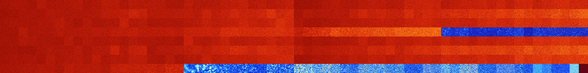

# B2357 (88064-88575)

<details>
    <summary>Initial Grid</summary>
    
</details>


<details>
    <summary>Initial Grid RLE</summary>

```
#C Exported from GoGoL (https://github.com/marrow16/gogol)
#C Wrap mode: Toroidal
#C Boundary mode: Dead
#C Step: 0
x = 100, y = 100, rule = B2357/S
14bo7bo40bo$7bo15bo43bo$16bo40bo22bo$25bo11bo5bo12bo13bo23bo$20bo17bo9b
o17bo$bo14bo23b3o34bo9bo$2bo26bobo13bo36b2o10bo2bo$13bo29bo14bo15bo11bo
$11bo27bo2bo3bo$39bo7bo17bo2bo28bobo$14b2o33bo7bo$2o5bo21bobo32bo17bo$
6bo17bo25bo47bo$bo15bo17bo36bo16bo$3bo7bo4bo5bo21bo9bo6bo3bo33bo$21bo
23bo29bo$27bobo6bo24bo20bo13bo$7bo6bo2bo9bo29bo9bo$7bo4bo22bo9bo33bo8bo
$26bo2bo6b2o26bo2bo$12bo3bo66bo6bo5bo$17b2obo43bo27bo$6bo5bo37bo38bo2bo
$9b2o34bo$29bo12bo8bo8bo$10bobo28bo9bo36bo$bo9bo12bo6bo33bo14bo11bo$34b
o23bo4bo16bo5bo$18b2o14bo11bo$8bo3bo27bo$o57bo16b2o17bo$3bo2bo3bo20bobo
32bo9bo$10bo62b2o24bo$11bo40bo39bo$17bo5bo13bo8bobo14bo14bo$12bo20bo$
25bo59bo4bo$10bo8bo9bo3bo6bo$32bo16bo33b3o7bo$28bo5bo8bo5bo3bo4bo28b3o
5b4o$31b2o8bo9bo16bobo16bo2bo$bo35bobo2bo24bo19bo$2bo14bo6bo3bo9bo35bo$
bo5bo57bo$20bo6bo13bo40bo14bo$bo6bo5bo41bobo$30bo31bo6bo18bo$o46bo33bo$
27bo38bo$22bo6bo$61bo6bo13bo13bobo$bo11bo30bo26bo26bo$bo5bo11bo10bo4bo
3bo26bo26bo$59bo2bo16bo12bo$o21bo27bo3bo32bo$2bobo15bo11bo33bo$10bo9bo
10bo27bo28bo2bo$34bo34bo18bo$18bo71bo3bo$18bo21bo4b2o2bo13bo17bob2o$6bo
4bo20bo34bo19bo2bo$33bo17bo6bo7bo5bo7bo$9bo11bobo3bo12bobo5bo10bo25bo5b
o$17bo4bo40bo8bo6bo6bo$3bo12bo29bo43bo$10bo3bo19bo17bo5bo30b2o$10bo25bo
2bobo9bo26bo$9bo19bo15bo10bo12bo29bo$16bo6bo13bo13bo4bo35bo$3bo16bo26bo
16b2o8bo21bo$9bo18bo20b2o$24bo29bobo8bo3b2o15bo$7bo13bo11bo10bo22b2o8bo
15bo$5bo18bo34bo21bo13bo$47bo9bo3bo2bo26bo$o6bo17bo29bo$48bo29bo9bo$16b
o12bo15bo20bo$18bo16bo6bo15bo7bo12bo9bo$24bo6bo26bo2bo$4bo3bo7bo7bo14bo
2bobo6bo5bo20bo14bo$9b2o3bo2bo18bo16bo34bo$o25bo11bo12bo42bo$88bo$17bo
5bo14bo9bo7bo33bo$19bo2bo6bo12bo9bo9bo3bo8bo$17bo11bo9bo14bo9bo29bo$33b
o2bo18bo12bo26bo$17bo63bo9bo$22bo31bo11bo$4bo26bo3bo22bo39bo$11bobo22bo
14bo4bo10bo29bo$3bo53bo$9bo47bo5bo$8bo30bo9bo42bo$5bo28bo20bo7bo2bo$20b
o25bo13bo4bo24b2o2bo$9bo7bo15b3o10bo50bo$38bo12bo12bo5bo3bo2b2o$2bo8bo
2bo10b2o29bo3bo7bo!
```
</details>
<details>
    <summary>Thumbnail</summary>

</details>
<table>
<tr>
    <td><a href="./88064%20S%20Heat%20Map%20Activity.png"></a><br>S (88064)<br>G>1000</td>    <td><a href="./88065%20S0%20Heat%20Map%20Activity.png"></a><br>S0 (88065)<br>G>1000</td>    <td><a href="./88066%20S1%20Heat%20Map%20Activity.png"></a><br>S1 (88066)<br>G>1000</td>    <td><a href="./88067%20S01%20Heat%20Map%20Activity.png"></a><br>S01 (88067)<br>G>1000</td>    <td><a href="./88068%20S2%20Heat%20Map%20Activity.png"></a><br>S2 (88068)<br>G>1000</td>    <td><a href="./88069%20S02%20Heat%20Map%20Activity.png"></a><br>S02 (88069)<br>G>1000</td>    <td><a href="./88070%20S12%20Heat%20Map%20Activity.png"></a><br>S12 (88070)<br>G>1000</td>    <td><a href="./88071%20S012%20Heat%20Map%20Activity.png"></a><br>S012 (88071)<br>G>1000</td>    <td><a href="./88072%20S3%20Heat%20Map%20Activity.png"></a><br>S3 (88072)<br>G>1000</td>    <td><a href="./88073%20S03%20Heat%20Map%20Activity.png"></a><br>S03 (88073)<br>G>1000</td>    <td><a href="./88074%20S13%20Heat%20Map%20Activity.png"></a><br>S13 (88074)<br>G>1000</td>    <td><a href="./88075%20S013%20Heat%20Map%20Activity.png"></a><br>S013 (88075)<br>G>1000</td>    <td><a href="./88076%20S23%20Heat%20Map%20Activity.png"></a><br>S23 (88076)<br>G>1000</td>    <td><a href="./88077%20S023%20Heat%20Map%20Activity.png"></a><br>S023 (88077)<br>G>1000</td>    <td><a href="./88078%20S123%20Heat%20Map%20Activity.png"></a><br>S123 (88078)<br>G>1000</td>    <td><a href="./88079%20S0123%20Heat%20Map%20Activity.png"></a><br>S0123 (88079)<br>G>1000</td>    <td><a href="./88080%20S4%20Heat%20Map%20Activity.png"></a><br>S4 (88080)<br>G>1000</td>    <td><a href="./88081%20S04%20Heat%20Map%20Activity.png"></a><br>S04 (88081)<br>G>1000</td>    <td><a href="./88082%20S14%20Heat%20Map%20Activity.png"></a><br>S14 (88082)<br>G>1000</td>    <td><a href="./88083%20S014%20Heat%20Map%20Activity.png"></a><br>S014 (88083)<br>G>1000</td>    <td><a href="./88084%20S24%20Heat%20Map%20Activity.png"></a><br>S24 (88084)<br>G>1000</td>    <td><a href="./88085%20S024%20Heat%20Map%20Activity.png"></a><br>S024 (88085)<br>G>1000</td>    <td><a href="./88086%20S124%20Heat%20Map%20Activity.png"></a><br>S124 (88086)<br>G>1000</td>    <td><a href="./88087%20S0124%20Heat%20Map%20Activity.png"></a><br>S0124 (88087)<br>G>1000</td>    <td><a href="./88088%20S34%20Heat%20Map%20Activity.png"></a><br>S34 (88088)<br>G>1000</td>    <td><a href="./88089%20S034%20Heat%20Map%20Activity.png"></a><br>S034 (88089)<br>G>1000</td>    <td><a href="./88090%20S134%20Heat%20Map%20Activity.png"></a><br>S134 (88090)<br>G>1000</td>    <td><a href="./88091%20S0134%20Heat%20Map%20Activity.png"></a><br>S0134 (88091)<br>G>1000</td>    <td><a href="./88092%20S234%20Heat%20Map%20Activity.png"></a><br>S234 (88092)<br>G>1000</td>    <td><a href="./88093%20S0234%20Heat%20Map%20Activity.png"></a><br>S0234 (88093)<br>G>1000</td>    <td><a href="./88094%20S1234%20Heat%20Map%20Activity.png"></a><br>S1234 (88094)<br>G>1000</td>    <td><a href="./88095%20S01234%20Heat%20Map%20Activity.png"></a><br>S01234 (88095)<br>G>1000</td>    <td><a href="./88096%20S5%20Heat%20Map%20Activity.png"></a><br>S5 (88096)<br>G>1000</td>    <td><a href="./88097%20S05%20Heat%20Map%20Activity.png"></a><br>S05 (88097)<br>G>1000</td>    <td><a href="./88098%20S15%20Heat%20Map%20Activity.png"></a><br>S15 (88098)<br>G>1000</td>    <td><a href="./88099%20S015%20Heat%20Map%20Activity.png"></a><br>S015 (88099)<br>G>1000</td>    <td><a href="./88100%20S25%20Heat%20Map%20Activity.png"></a><br>S25 (88100)<br>G>1000</td>    <td><a href="./88101%20S025%20Heat%20Map%20Activity.png"></a><br>S025 (88101)<br>G>1000</td>    <td><a href="./88102%20S125%20Heat%20Map%20Activity.png"></a><br>S125 (88102)<br>G>1000</td>    <td><a href="./88103%20S0125%20Heat%20Map%20Activity.png"></a><br>S0125 (88103)<br>G>1000</td>    <td><a href="./88104%20S35%20Heat%20Map%20Activity.png"></a><br>S35 (88104)<br>G>1000</td>    <td><a href="./88105%20S035%20Heat%20Map%20Activity.png"></a><br>S035 (88105)<br>G>1000</td>    <td><a href="./88106%20S135%20Heat%20Map%20Activity.png"></a><br>S135 (88106)<br>G>1000</td>    <td><a href="./88107%20S0135%20Heat%20Map%20Activity.png"></a><br>S0135 (88107)<br>G>1000</td>    <td><a href="./88108%20S235%20Heat%20Map%20Activity.png"></a><br>S235 (88108)<br>G>1000</td>    <td><a href="./88109%20S0235%20Heat%20Map%20Activity.png"></a><br>S0235 (88109)<br>G>1000</td>    <td><a href="./88110%20S1235%20Heat%20Map%20Activity.png"></a><br>S1235 (88110)<br>G>1000</td>    <td><a href="./88111%20S01235%20Heat%20Map%20Activity.png"></a><br>S01235 (88111)<br>G>1000</td>    <td><a href="./88112%20S45%20Heat%20Map%20Activity.png"></a><br>S45 (88112)<br>G>1000</td>    <td><a href="./88113%20S045%20Heat%20Map%20Activity.png"></a><br>S045 (88113)<br>G>1000</td>    <td><a href="./88114%20S145%20Heat%20Map%20Activity.png"></a><br>S145 (88114)<br>G>1000</td>    <td><a href="./88115%20S0145%20Heat%20Map%20Activity.png"></a><br>S0145 (88115)<br>G>1000</td>    <td><a href="./88116%20S245%20Heat%20Map%20Activity.png"></a><br>S245 (88116)<br>G>1000</td>    <td><a href="./88117%20S0245%20Heat%20Map%20Activity.png"></a><br>S0245 (88117)<br>G>1000</td>    <td><a href="./88118%20S1245%20Heat%20Map%20Activity.png"></a><br>S1245 (88118)<br>G>1000</td>    <td><a href="./88119%20S01245%20Heat%20Map%20Activity.png"></a><br>S01245 (88119)<br>G>1000</td>    <td><a href="./88120%20S345%20Heat%20Map%20Activity.png"></a><br>S345 (88120)<br>G>1000</td>    <td><a href="./88121%20S0345%20Heat%20Map%20Activity.png"></a><br>S0345 (88121)<br>G>1000</td>    <td><a href="./88122%20S1345%20Heat%20Map%20Activity.png"></a><br>S1345 (88122)<br>G>1000</td>    <td><a href="./88123%20S01345%20Heat%20Map%20Activity.png"></a><br>S01345 (88123)<br>G>1000</td>    <td><a href="./88124%20S2345%20Heat%20Map%20Activity.png"></a><br>S2345 (88124)<br>G>1000</td>    <td><a href="./88125%20S02345%20Heat%20Map%20Activity.png"></a><br>S02345 (88125)<br>G>1000</td>    <td><a href="./88126%20S12345%20Heat%20Map%20Activity.png"></a><br>S12345 (88126)<br>G>1000</td>    <td><a href="./88127%20S012345%20Heat%20Map%20Activity.png"></a><br>S012345 (88127)<br>G>1000</td></tr>
<tr>
    <td><a href="./88128%20S6%20Heat%20Map%20Activity.png"></a><br>S6 (88128)<br>G>1000</td>    <td><a href="./88129%20S06%20Heat%20Map%20Activity.png"></a><br>S06 (88129)<br>G>1000</td>    <td><a href="./88130%20S16%20Heat%20Map%20Activity.png"></a><br>S16 (88130)<br>G>1000</td>    <td><a href="./88131%20S016%20Heat%20Map%20Activity.png"></a><br>S016 (88131)<br>G>1000</td>    <td><a href="./88132%20S26%20Heat%20Map%20Activity.png"></a><br>S26 (88132)<br>G>1000</td>    <td><a href="./88133%20S026%20Heat%20Map%20Activity.png"></a><br>S026 (88133)<br>G>1000</td>    <td><a href="./88134%20S126%20Heat%20Map%20Activity.png"></a><br>S126 (88134)<br>G>1000</td>    <td><a href="./88135%20S0126%20Heat%20Map%20Activity.png"></a><br>S0126 (88135)<br>G>1000</td>    <td><a href="./88136%20S36%20Heat%20Map%20Activity.png"></a><br>S36 (88136)<br>G>1000</td>    <td><a href="./88137%20S036%20Heat%20Map%20Activity.png"></a><br>S036 (88137)<br>G>1000</td>    <td><a href="./88138%20S136%20Heat%20Map%20Activity.png"></a><br>S136 (88138)<br>G>1000</td>    <td><a href="./88139%20S0136%20Heat%20Map%20Activity.png"></a><br>S0136 (88139)<br>G>1000</td>    <td><a href="./88140%20S236%20Heat%20Map%20Activity.png"></a><br>S236 (88140)<br>G>1000</td>    <td><a href="./88141%20S0236%20Heat%20Map%20Activity.png"></a><br>S0236 (88141)<br>G>1000</td>    <td><a href="./88142%20S1236%20Heat%20Map%20Activity.png"></a><br>S1236 (88142)<br>G>1000</td>    <td><a href="./88143%20S01236%20Heat%20Map%20Activity.png"></a><br>S01236 (88143)<br>G>1000</td>    <td><a href="./88144%20S46%20Heat%20Map%20Activity.png"></a><br>S46 (88144)<br>G>1000</td>    <td><a href="./88145%20S046%20Heat%20Map%20Activity.png"></a><br>S046 (88145)<br>G>1000</td>    <td><a href="./88146%20S146%20Heat%20Map%20Activity.png"></a><br>S146 (88146)<br>G>1000</td>    <td><a href="./88147%20S0146%20Heat%20Map%20Activity.png"></a><br>S0146 (88147)<br>G>1000</td>    <td><a href="./88148%20S246%20Heat%20Map%20Activity.png"></a><br>S246 (88148)<br>G>1000</td>    <td><a href="./88149%20S0246%20Heat%20Map%20Activity.png"></a><br>S0246 (88149)<br>G>1000</td>    <td><a href="./88150%20S1246%20Heat%20Map%20Activity.png"></a><br>S1246 (88150)<br>G>1000</td>    <td><a href="./88151%20S01246%20Heat%20Map%20Activity.png"></a><br>S01246 (88151)<br>G>1000</td>    <td><a href="./88152%20S346%20Heat%20Map%20Activity.png"></a><br>S346 (88152)<br>G>1000</td>    <td><a href="./88153%20S0346%20Heat%20Map%20Activity.png"></a><br>S0346 (88153)<br>G>1000</td>    <td><a href="./88154%20S1346%20Heat%20Map%20Activity.png"></a><br>S1346 (88154)<br>G>1000</td>    <td><a href="./88155%20S01346%20Heat%20Map%20Activity.png"></a><br>S01346 (88155)<br>G>1000</td>    <td><a href="./88156%20S2346%20Heat%20Map%20Activity.png"></a><br>S2346 (88156)<br>G>1000</td>    <td><a href="./88157%20S02346%20Heat%20Map%20Activity.png"></a><br>S02346 (88157)<br>G>1000</td>    <td><a href="./88158%20S12346%20Heat%20Map%20Activity.png"></a><br>S12346 (88158)<br>G>1000</td>    <td><a href="./88159%20S012346%20Heat%20Map%20Activity.png"></a><br>S012346 (88159)<br>G>1000</td>    <td><a href="./88160%20S56%20Heat%20Map%20Activity.png"></a><br>S56 (88160)<br>G>1000</td>    <td><a href="./88161%20S056%20Heat%20Map%20Activity.png"></a><br>S056 (88161)<br>G>1000</td>    <td><a href="./88162%20S156%20Heat%20Map%20Activity.png"></a><br>S156 (88162)<br>G>1000</td>    <td><a href="./88163%20S0156%20Heat%20Map%20Activity.png"></a><br>S0156 (88163)<br>G>1000</td>    <td><a href="./88164%20S256%20Heat%20Map%20Activity.png"></a><br>S256 (88164)<br>G>1000</td>    <td><a href="./88165%20S0256%20Heat%20Map%20Activity.png"></a><br>S0256 (88165)<br>G>1000</td>    <td><a href="./88166%20S1256%20Heat%20Map%20Activity.png"></a><br>S1256 (88166)<br>G>1000</td>    <td><a href="./88167%20S01256%20Heat%20Map%20Activity.png"></a><br>S01256 (88167)<br>G>1000</td>    <td><a href="./88168%20S356%20Heat%20Map%20Activity.png"></a><br>S356 (88168)<br>G>1000</td>    <td><a href="./88169%20S0356%20Heat%20Map%20Activity.png"></a><br>S0356 (88169)<br>G>1000</td>    <td><a href="./88170%20S1356%20Heat%20Map%20Activity.png"></a><br>S1356 (88170)<br>G>1000</td>    <td><a href="./88171%20S01356%20Heat%20Map%20Activity.png"></a><br>S01356 (88171)<br>G>1000</td>    <td><a href="./88172%20S2356%20Heat%20Map%20Activity.png"></a><br>S2356 (88172)<br>G>1000</td>    <td><a href="./88173%20S02356%20Heat%20Map%20Activity.png"></a><br>S02356 (88173)<br>G>1000</td>    <td><a href="./88174%20S12356%20Heat%20Map%20Activity.png"></a><br>S12356 (88174)<br>G>1000</td>    <td><a href="./88175%20S012356%20Heat%20Map%20Activity.png"></a><br>S012356 (88175)<br>G>1000</td>    <td><a href="./88176%20S456%20Heat%20Map%20Activity.png"></a><br>S456 (88176)<br>G>1000</td>    <td><a href="./88177%20S0456%20Heat%20Map%20Activity.png"></a><br>S0456 (88177)<br>G>1000</td>    <td><a href="./88178%20S1456%20Heat%20Map%20Activity.png"></a><br>S1456 (88178)<br>G>1000</td>    <td><a href="./88179%20S01456%20Heat%20Map%20Activity.png"></a><br>S01456 (88179)<br>G>1000</td>    <td><a href="./88180%20S2456%20Heat%20Map%20Activity.png"></a><br>S2456 (88180)<br>G>1000</td>    <td><a href="./88181%20S02456%20Heat%20Map%20Activity.png"></a><br>S02456 (88181)<br>G>1000</td>    <td><a href="./88182%20S12456%20Heat%20Map%20Activity.png"></a><br>S12456 (88182)<br>G>1000</td>    <td><a href="./88183%20S012456%20Heat%20Map%20Activity.png"></a><br>S012456 (88183)<br>G>1000</td>    <td><a href="./88184%20S3456%20Heat%20Map%20Activity.png"></a><br>S3456 (88184)<br>G>1000</td>    <td><a href="./88185%20S03456%20Heat%20Map%20Activity.png"></a><br>S03456 (88185)<br>G>1000</td>    <td><a href="./88186%20S13456%20Heat%20Map%20Activity.png"></a><br>S13456 (88186)<br>G>1000</td>    <td><a href="./88187%20S013456%20Heat%20Map%20Activity.png"></a><br>S013456 (88187)<br>G>1000</td>    <td><a href="./88188%20S23456%20Heat%20Map%20Activity.png"></a><br>S23456 (88188)<br>G>1000</td>    <td><a href="./88189%20S023456%20Heat%20Map%20Activity.png"></a><br>S023456 (88189)<br>G>1000</td>    <td><a href="./88190%20S123456%20Heat%20Map%20Activity.png"></a><br>S123456 (88190)<br>G>1000</td>    <td><a href="./88191%20S0123456%20Heat%20Map%20Activity.png"></a><br>S0123456 (88191)<br>G>1000</td></tr>
<tr>
    <td><a href="./88192%20S7%20Heat%20Map%20Activity.png"></a><br>S7 (88192)<br>G>1000</td>    <td><a href="./88193%20S07%20Heat%20Map%20Activity.png"></a><br>S07 (88193)<br>G>1000</td>    <td><a href="./88194%20S17%20Heat%20Map%20Activity.png"></a><br>S17 (88194)<br>G>1000</td>    <td><a href="./88195%20S017%20Heat%20Map%20Activity.png"></a><br>S017 (88195)<br>G>1000</td>    <td><a href="./88196%20S27%20Heat%20Map%20Activity.png"></a><br>S27 (88196)<br>G>1000</td>    <td><a href="./88197%20S027%20Heat%20Map%20Activity.png"></a><br>S027 (88197)<br>G>1000</td>    <td><a href="./88198%20S127%20Heat%20Map%20Activity.png"></a><br>S127 (88198)<br>G>1000</td>    <td><a href="./88199%20S0127%20Heat%20Map%20Activity.png"></a><br>S0127 (88199)<br>G>1000</td>    <td><a href="./88200%20S37%20Heat%20Map%20Activity.png"></a><br>S37 (88200)<br>G>1000</td>    <td><a href="./88201%20S037%20Heat%20Map%20Activity.png"></a><br>S037 (88201)<br>G>1000</td>    <td><a href="./88202%20S137%20Heat%20Map%20Activity.png"></a><br>S137 (88202)<br>G>1000</td>    <td><a href="./88203%20S0137%20Heat%20Map%20Activity.png"></a><br>S0137 (88203)<br>G>1000</td>    <td><a href="./88204%20S237%20Heat%20Map%20Activity.png"></a><br>S237 (88204)<br>G>1000</td>    <td><a href="./88205%20S0237%20Heat%20Map%20Activity.png"></a><br>S0237 (88205)<br>G>1000</td>    <td><a href="./88206%20S1237%20Heat%20Map%20Activity.png"></a><br>S1237 (88206)<br>G>1000</td>    <td><a href="./88207%20S01237%20Heat%20Map%20Activity.png"></a><br>S01237 (88207)<br>G>1000</td>    <td><a href="./88208%20S47%20Heat%20Map%20Activity.png"></a><br>S47 (88208)<br>G>1000</td>    <td><a href="./88209%20S047%20Heat%20Map%20Activity.png"></a><br>S047 (88209)<br>G>1000</td>    <td><a href="./88210%20S147%20Heat%20Map%20Activity.png"></a><br>S147 (88210)<br>G>1000</td>    <td><a href="./88211%20S0147%20Heat%20Map%20Activity.png"></a><br>S0147 (88211)<br>G>1000</td>    <td><a href="./88212%20S247%20Heat%20Map%20Activity.png"></a><br>S247 (88212)<br>G>1000</td>    <td><a href="./88213%20S0247%20Heat%20Map%20Activity.png"></a><br>S0247 (88213)<br>G>1000</td>    <td><a href="./88214%20S1247%20Heat%20Map%20Activity.png"></a><br>S1247 (88214)<br>G>1000</td>    <td><a href="./88215%20S01247%20Heat%20Map%20Activity.png"></a><br>S01247 (88215)<br>G>1000</td>    <td><a href="./88216%20S347%20Heat%20Map%20Activity.png"></a><br>S347 (88216)<br>G>1000</td>    <td><a href="./88217%20S0347%20Heat%20Map%20Activity.png"></a><br>S0347 (88217)<br>G>1000</td>    <td><a href="./88218%20S1347%20Heat%20Map%20Activity.png"></a><br>S1347 (88218)<br>G>1000</td>    <td><a href="./88219%20S01347%20Heat%20Map%20Activity.png"></a><br>S01347 (88219)<br>G>1000</td>    <td><a href="./88220%20S2347%20Heat%20Map%20Activity.png"></a><br>S2347 (88220)<br>G>1000</td>    <td><a href="./88221%20S02347%20Heat%20Map%20Activity.png"></a><br>S02347 (88221)<br>G>1000</td>    <td><a href="./88222%20S12347%20Heat%20Map%20Activity.png"></a><br>S12347 (88222)<br>G>1000</td>    <td><a href="./88223%20S012347%20Heat%20Map%20Activity.png"></a><br>S012347 (88223)<br>G>1000</td>    <td><a href="./88224%20S57%20Heat%20Map%20Activity.png"></a><br>S57 (88224)<br>G>1000</td>    <td><a href="./88225%20S057%20Heat%20Map%20Activity.png"></a><br>S057 (88225)<br>G>1000</td>    <td><a href="./88226%20S157%20Heat%20Map%20Activity.png"></a><br>S157 (88226)<br>G>1000</td>    <td><a href="./88227%20S0157%20Heat%20Map%20Activity.png"></a><br>S0157 (88227)<br>G>1000</td>    <td><a href="./88228%20S257%20Heat%20Map%20Activity.png"></a><br>S257 (88228)<br>G>1000</td>    <td><a href="./88229%20S0257%20Heat%20Map%20Activity.png"></a><br>S0257 (88229)<br>G>1000</td>    <td><a href="./88230%20S1257%20Heat%20Map%20Activity.png"></a><br>S1257 (88230)<br>G>1000</td>    <td><a href="./88231%20S01257%20Heat%20Map%20Activity.png"></a><br>S01257 (88231)<br>G>1000</td>    <td><a href="./88232%20S357%20Heat%20Map%20Activity.png"></a><br>S357 (88232)<br>G>1000</td>    <td><a href="./88233%20S0357%20Heat%20Map%20Activity.png"></a><br>S0357 (88233)<br>G>1000</td>    <td><a href="./88234%20S1357%20Heat%20Map%20Activity.png"></a><br>S1357 (88234)<br>G>1000</td>    <td><a href="./88235%20S01357%20Heat%20Map%20Activity.png"></a><br>S01357 (88235)<br>G>1000</td>    <td><a href="./88236%20S2357%20Heat%20Map%20Activity.png"></a><br>S2357 (88236)<br>G>1000</td>    <td><a href="./88237%20S02357%20Heat%20Map%20Activity.png"></a><br>S02357 (88237)<br>G>1000</td>    <td><a href="./88238%20S12357%20Heat%20Map%20Activity.png"></a><br>S12357 (88238)<br>G>1000</td>    <td><a href="./88239%20S012357%20Heat%20Map%20Activity.png"></a><br>S012357 (88239)<br>G>1000</td>    <td><a href="./88240%20S457%20Heat%20Map%20Activity.png"></a><br>S457 (88240)<br>G>1000</td>    <td><a href="./88241%20S0457%20Heat%20Map%20Activity.png"></a><br>S0457 (88241)<br>G>1000</td>    <td><a href="./88242%20S1457%20Heat%20Map%20Activity.png"></a><br>S1457 (88242)<br>G>1000</td>    <td><a href="./88243%20S01457%20Heat%20Map%20Activity.png"></a><br>S01457 (88243)<br>G>1000</td>    <td><a href="./88244%20S2457%20Heat%20Map%20Activity.png"></a><br>S2457 (88244)<br>G>1000</td>    <td><a href="./88245%20S02457%20Heat%20Map%20Activity.png"></a><br>S02457 (88245)<br>G>1000</td>    <td><a href="./88246%20S12457%20Heat%20Map%20Activity.png"></a><br>S12457 (88246)<br>G>1000</td>    <td><a href="./88247%20S012457%20Heat%20Map%20Activity.png"></a><br>S012457 (88247)<br>G>1000</td>    <td><a href="./88248%20S3457%20Heat%20Map%20Activity.png"></a><br>S3457 (88248)<br>G>1000</td>    <td><a href="./88249%20S03457%20Heat%20Map%20Activity.png"></a><br>S03457 (88249)<br>G>1000</td>    <td><a href="./88250%20S13457%20Heat%20Map%20Activity.png"></a><br>S13457 (88250)<br>G>1000</td>    <td><a href="./88251%20S013457%20Heat%20Map%20Activity.png"></a><br>S013457 (88251)<br>G>1000</td>    <td><a href="./88252%20S23457%20Heat%20Map%20Activity.png"></a><br>S23457 (88252)<br>G>1000</td>    <td><a href="./88253%20S023457%20Heat%20Map%20Activity.png"></a><br>S023457 (88253)<br>G>1000</td>    <td><a href="./88254%20S123457%20Heat%20Map%20Activity.png"></a><br>S123457 (88254)<br>G>1000</td>    <td><a href="./88255%20S0123457%20Heat%20Map%20Activity.png"></a><br>S0123457 (88255)<br>G>1000</td></tr>
<tr>
    <td><a href="./88256%20S67%20Heat%20Map%20Activity.png"></a><br>S67 (88256)<br>G>1000</td>    <td><a href="./88257%20S067%20Heat%20Map%20Activity.png"></a><br>S067 (88257)<br>G>1000</td>    <td><a href="./88258%20S167%20Heat%20Map%20Activity.png"></a><br>S167 (88258)<br>G>1000</td>    <td><a href="./88259%20S0167%20Heat%20Map%20Activity.png"></a><br>S0167 (88259)<br>G>1000</td>    <td><a href="./88260%20S267%20Heat%20Map%20Activity.png"></a><br>S267 (88260)<br>G>1000</td>    <td><a href="./88261%20S0267%20Heat%20Map%20Activity.png"></a><br>S0267 (88261)<br>G>1000</td>    <td><a href="./88262%20S1267%20Heat%20Map%20Activity.png"></a><br>S1267 (88262)<br>G>1000</td>    <td><a href="./88263%20S01267%20Heat%20Map%20Activity.png"></a><br>S01267 (88263)<br>G>1000</td>    <td><a href="./88264%20S367%20Heat%20Map%20Activity.png"></a><br>S367 (88264)<br>G>1000</td>    <td><a href="./88265%20S0367%20Heat%20Map%20Activity.png"></a><br>S0367 (88265)<br>G>1000</td>    <td><a href="./88266%20S1367%20Heat%20Map%20Activity.png"></a><br>S1367 (88266)<br>G>1000</td>    <td><a href="./88267%20S01367%20Heat%20Map%20Activity.png"></a><br>S01367 (88267)<br>G>1000</td>    <td><a href="./88268%20S2367%20Heat%20Map%20Activity.png"></a><br>S2367 (88268)<br>G>1000</td>    <td><a href="./88269%20S02367%20Heat%20Map%20Activity.png"></a><br>S02367 (88269)<br>G>1000</td>    <td><a href="./88270%20S12367%20Heat%20Map%20Activity.png"></a><br>S12367 (88270)<br>G>1000</td>    <td><a href="./88271%20S012367%20Heat%20Map%20Activity.png"></a><br>S012367 (88271)<br>G>1000</td>    <td><a href="./88272%20S467%20Heat%20Map%20Activity.png"></a><br>S467 (88272)<br>G>1000</td>    <td><a href="./88273%20S0467%20Heat%20Map%20Activity.png"></a><br>S0467 (88273)<br>G>1000</td>    <td><a href="./88274%20S1467%20Heat%20Map%20Activity.png"></a><br>S1467 (88274)<br>G>1000</td>    <td><a href="./88275%20S01467%20Heat%20Map%20Activity.png"></a><br>S01467 (88275)<br>G>1000</td>    <td><a href="./88276%20S2467%20Heat%20Map%20Activity.png"></a><br>S2467 (88276)<br>G>1000</td>    <td><a href="./88277%20S02467%20Heat%20Map%20Activity.png"></a><br>S02467 (88277)<br>G>1000</td>    <td><a href="./88278%20S12467%20Heat%20Map%20Activity.png"></a><br>S12467 (88278)<br>G>1000</td>    <td><a href="./88279%20S012467%20Heat%20Map%20Activity.png"></a><br>S012467 (88279)<br>G>1000</td>    <td><a href="./88280%20S3467%20Heat%20Map%20Activity.png"></a><br>S3467 (88280)<br>G>1000</td>    <td><a href="./88281%20S03467%20Heat%20Map%20Activity.png"></a><br>S03467 (88281)<br>G>1000</td>    <td><a href="./88282%20S13467%20Heat%20Map%20Activity.png"></a><br>S13467 (88282)<br>G>1000</td>    <td><a href="./88283%20S013467%20Heat%20Map%20Activity.png"></a><br>S013467 (88283)<br>G>1000</td>    <td><a href="./88284%20S23467%20Heat%20Map%20Activity.png"></a><br>S23467 (88284)<br>G>1000</td>    <td><a href="./88285%20S023467%20Heat%20Map%20Activity.png"></a><br>S023467 (88285)<br>G>1000</td>    <td><a href="./88286%20S123467%20Heat%20Map%20Activity.png"></a><br>S123467 (88286)<br>G>1000</td>    <td><a href="./88287%20S0123467%20Heat%20Map%20Activity.png"></a><br>S0123467 (88287)<br>G>1000</td>    <td><a href="./88288%20S567%20Heat%20Map%20Activity.png"></a><br>S567 (88288)<br>G>1000</td>    <td><a href="./88289%20S0567%20Heat%20Map%20Activity.png"></a><br>S0567 (88289)<br>G>1000</td>    <td><a href="./88290%20S1567%20Heat%20Map%20Activity.png"></a><br>S1567 (88290)<br>G>1000</td>    <td><a href="./88291%20S01567%20Heat%20Map%20Activity.png"></a><br>S01567 (88291)<br>G>1000</td>    <td><a href="./88292%20S2567%20Heat%20Map%20Activity.png"></a><br>S2567 (88292)<br>G>1000</td>    <td><a href="./88293%20S02567%20Heat%20Map%20Activity.png"></a><br>S02567 (88293)<br>G>1000</td>    <td><a href="./88294%20S12567%20Heat%20Map%20Activity.png"></a><br>S12567 (88294)<br>G>1000</td>    <td><a href="./88295%20S012567%20Heat%20Map%20Activity.png"></a><br>S012567 (88295)<br>G>1000</td>    <td><a href="./88296%20S3567%20Heat%20Map%20Activity.png"></a><br>S3567 (88296)<br>G>1000</td>    <td><a href="./88297%20S03567%20Heat%20Map%20Activity.png"></a><br>S03567 (88297)<br>G>1000</td>    <td><a href="./88298%20S13567%20Heat%20Map%20Activity.png"></a><br>S13567 (88298)<br>G>1000</td>    <td><a href="./88299%20S013567%20Heat%20Map%20Activity.png"></a><br>S013567 (88299)<br>G>1000</td>    <td><a href="./88300%20S23567%20Heat%20Map%20Activity.png"></a><br>S23567 (88300)<br>G>1000</td>    <td><a href="./88301%20S023567%20Heat%20Map%20Activity.png"></a><br>S023567 (88301)<br>G>1000</td>    <td><a href="./88302%20S123567%20Heat%20Map%20Activity.png"></a><br>S123567 (88302)<br>G>1000</td>    <td><a href="./88303%20S0123567%20Heat%20Map%20Activity.png"></a><br>S0123567 (88303)<br>G>1000</td>    <td><a href="./88304%20S4567%20Heat%20Map%20Activity.png"></a><br>S4567 (88304)<br>R@118,p12</td>    <td><a href="./88305%20S04567%20Heat%20Map%20Activity.png"></a><br>S04567 (88305)<br>R@126,p42</td>    <td><a href="./88306%20S14567%20Heat%20Map%20Activity.png"></a><br>S14567 (88306)<br>R@94,p12</td>    <td><a href="./88307%20S014567%20Heat%20Map%20Activity.png"></a><br>S014567 (88307)<br>R@168,p60</td>    <td><a href="./88308%20S24567%20Heat%20Map%20Activity.png"></a><br>S24567 (88308)<br>R@107,p12</td>    <td><a href="./88309%20S024567%20Heat%20Map%20Activity.png"></a><br>S024567 (88309)<br>R@149,p12</td>    <td><a href="./88310%20S124567%20Heat%20Map%20Activity.png"></a><br>S124567 (88310)<br>R@95,p12</td>    <td><a href="./88311%20S0124567%20Heat%20Map%20Activity.png"></a><br>S0124567 (88311)<br>R@77,p12</td>    <td><a href="./88312%20S34567%20Heat%20Map%20Activity.png"></a><br>S34567 (88312)<br>R@42,p12</td>    <td><a href="./88313%20S034567%20Heat%20Map%20Activity.png"></a><br>S034567 (88313)<br>R@123,p84</td>    <td><a href="./88314%20S134567%20Heat%20Map%20Activity.png"></a><br>S134567 (88314)<br>R@42,p12</td>    <td><a href="./88315%20S0134567%20Heat%20Map%20Activity.png"></a><br>S0134567 (88315)<br>R@43,p12</td>    <td><a href="./88316%20S234567%20Heat%20Map%20Activity.png"></a><br>S234567 (88316)<br>R@39,p12</td>    <td><a href="./88317%20S0234567%20Heat%20Map%20Activity.png"></a><br>S0234567 (88317)<br>R@40,p12</td>    <td><a href="./88318%20S1234567%20Heat%20Map%20Activity.png"></a><br>S1234567 (88318)<br>R@37,p12</td>    <td><a href="./88319%20S01234567%20Heat%20Map%20Activity.png"></a><br>S01234567 (88319)<br>R@39,p12</td></tr>
<tr>
    <td><a href="./88320%20S8%20Heat%20Map%20Activity.png"></a><br>S8 (88320)<br>G>1000</td>    <td><a href="./88321%20S08%20Heat%20Map%20Activity.png"></a><br>S08 (88321)<br>G>1000</td>    <td><a href="./88322%20S18%20Heat%20Map%20Activity.png"></a><br>S18 (88322)<br>G>1000</td>    <td><a href="./88323%20S018%20Heat%20Map%20Activity.png"></a><br>S018 (88323)<br>G>1000</td>    <td><a href="./88324%20S28%20Heat%20Map%20Activity.png"></a><br>S28 (88324)<br>G>1000</td>    <td><a href="./88325%20S028%20Heat%20Map%20Activity.png"></a><br>S028 (88325)<br>G>1000</td>    <td><a href="./88326%20S128%20Heat%20Map%20Activity.png"></a><br>S128 (88326)<br>G>1000</td>    <td><a href="./88327%20S0128%20Heat%20Map%20Activity.png"></a><br>S0128 (88327)<br>G>1000</td>    <td><a href="./88328%20S38%20Heat%20Map%20Activity.png"></a><br>S38 (88328)<br>G>1000</td>    <td><a href="./88329%20S038%20Heat%20Map%20Activity.png"></a><br>S038 (88329)<br>G>1000</td>    <td><a href="./88330%20S138%20Heat%20Map%20Activity.png"></a><br>S138 (88330)<br>G>1000</td>    <td><a href="./88331%20S0138%20Heat%20Map%20Activity.png"></a><br>S0138 (88331)<br>G>1000</td>    <td><a href="./88332%20S238%20Heat%20Map%20Activity.png"></a><br>S238 (88332)<br>G>1000</td>    <td><a href="./88333%20S0238%20Heat%20Map%20Activity.png"></a><br>S0238 (88333)<br>G>1000</td>    <td><a href="./88334%20S1238%20Heat%20Map%20Activity.png"></a><br>S1238 (88334)<br>G>1000</td>    <td><a href="./88335%20S01238%20Heat%20Map%20Activity.png"></a><br>S01238 (88335)<br>G>1000</td>    <td><a href="./88336%20S48%20Heat%20Map%20Activity.png"></a><br>S48 (88336)<br>G>1000</td>    <td><a href="./88337%20S048%20Heat%20Map%20Activity.png"></a><br>S048 (88337)<br>G>1000</td>    <td><a href="./88338%20S148%20Heat%20Map%20Activity.png"></a><br>S148 (88338)<br>G>1000</td>    <td><a href="./88339%20S0148%20Heat%20Map%20Activity.png"></a><br>S0148 (88339)<br>G>1000</td>    <td><a href="./88340%20S248%20Heat%20Map%20Activity.png"></a><br>S248 (88340)<br>G>1000</td>    <td><a href="./88341%20S0248%20Heat%20Map%20Activity.png"></a><br>S0248 (88341)<br>G>1000</td>    <td><a href="./88342%20S1248%20Heat%20Map%20Activity.png"></a><br>S1248 (88342)<br>G>1000</td>    <td><a href="./88343%20S01248%20Heat%20Map%20Activity.png"></a><br>S01248 (88343)<br>G>1000</td>    <td><a href="./88344%20S348%20Heat%20Map%20Activity.png"></a><br>S348 (88344)<br>G>1000</td>    <td><a href="./88345%20S0348%20Heat%20Map%20Activity.png"></a><br>S0348 (88345)<br>G>1000</td>    <td><a href="./88346%20S1348%20Heat%20Map%20Activity.png"></a><br>S1348 (88346)<br>G>1000</td>    <td><a href="./88347%20S01348%20Heat%20Map%20Activity.png"></a><br>S01348 (88347)<br>G>1000</td>    <td><a href="./88348%20S2348%20Heat%20Map%20Activity.png"></a><br>S2348 (88348)<br>G>1000</td>    <td><a href="./88349%20S02348%20Heat%20Map%20Activity.png"></a><br>S02348 (88349)<br>G>1000</td>    <td><a href="./88350%20S12348%20Heat%20Map%20Activity.png"></a><br>S12348 (88350)<br>G>1000</td>    <td><a href="./88351%20S012348%20Heat%20Map%20Activity.png"></a><br>S012348 (88351)<br>G>1000</td>    <td><a href="./88352%20S58%20Heat%20Map%20Activity.png"></a><br>S58 (88352)<br>G>1000</td>    <td><a href="./88353%20S058%20Heat%20Map%20Activity.png"></a><br>S058 (88353)<br>G>1000</td>    <td><a href="./88354%20S158%20Heat%20Map%20Activity.png"></a><br>S158 (88354)<br>G>1000</td>    <td><a href="./88355%20S0158%20Heat%20Map%20Activity.png"></a><br>S0158 (88355)<br>G>1000</td>    <td><a href="./88356%20S258%20Heat%20Map%20Activity.png"></a><br>S258 (88356)<br>G>1000</td>    <td><a href="./88357%20S0258%20Heat%20Map%20Activity.png"></a><br>S0258 (88357)<br>G>1000</td>    <td><a href="./88358%20S1258%20Heat%20Map%20Activity.png"></a><br>S1258 (88358)<br>G>1000</td>    <td><a href="./88359%20S01258%20Heat%20Map%20Activity.png"></a><br>S01258 (88359)<br>G>1000</td>    <td><a href="./88360%20S358%20Heat%20Map%20Activity.png"></a><br>S358 (88360)<br>G>1000</td>    <td><a href="./88361%20S0358%20Heat%20Map%20Activity.png"></a><br>S0358 (88361)<br>G>1000</td>    <td><a href="./88362%20S1358%20Heat%20Map%20Activity.png"></a><br>S1358 (88362)<br>G>1000</td>    <td><a href="./88363%20S01358%20Heat%20Map%20Activity.png"></a><br>S01358 (88363)<br>G>1000</td>    <td><a href="./88364%20S2358%20Heat%20Map%20Activity.png"></a><br>S2358 (88364)<br>G>1000</td>    <td><a href="./88365%20S02358%20Heat%20Map%20Activity.png"></a><br>S02358 (88365)<br>G>1000</td>    <td><a href="./88366%20S12358%20Heat%20Map%20Activity.png"></a><br>S12358 (88366)<br>G>1000</td>    <td><a href="./88367%20S012358%20Heat%20Map%20Activity.png"></a><br>S012358 (88367)<br>G>1000</td>    <td><a href="./88368%20S458%20Heat%20Map%20Activity.png"></a><br>S458 (88368)<br>G>1000</td>    <td><a href="./88369%20S0458%20Heat%20Map%20Activity.png"></a><br>S0458 (88369)<br>G>1000</td>    <td><a href="./88370%20S1458%20Heat%20Map%20Activity.png"></a><br>S1458 (88370)<br>G>1000</td>    <td><a href="./88371%20S01458%20Heat%20Map%20Activity.png"></a><br>S01458 (88371)<br>G>1000</td>    <td><a href="./88372%20S2458%20Heat%20Map%20Activity.png"></a><br>S2458 (88372)<br>G>1000</td>    <td><a href="./88373%20S02458%20Heat%20Map%20Activity.png"></a><br>S02458 (88373)<br>G>1000</td>    <td><a href="./88374%20S12458%20Heat%20Map%20Activity.png"></a><br>S12458 (88374)<br>G>1000</td>    <td><a href="./88375%20S012458%20Heat%20Map%20Activity.png"></a><br>S012458 (88375)<br>G>1000</td>    <td><a href="./88376%20S3458%20Heat%20Map%20Activity.png"></a><br>S3458 (88376)<br>G>1000</td>    <td><a href="./88377%20S03458%20Heat%20Map%20Activity.png"></a><br>S03458 (88377)<br>G>1000</td>    <td><a href="./88378%20S13458%20Heat%20Map%20Activity.png"></a><br>S13458 (88378)<br>G>1000</td>    <td><a href="./88379%20S013458%20Heat%20Map%20Activity.png"></a><br>S013458 (88379)<br>G>1000</td>    <td><a href="./88380%20S23458%20Heat%20Map%20Activity.png"></a><br>S23458 (88380)<br>G>1000</td>    <td><a href="./88381%20S023458%20Heat%20Map%20Activity.png"></a><br>S023458 (88381)<br>G>1000</td>    <td><a href="./88382%20S123458%20Heat%20Map%20Activity.png"></a><br>S123458 (88382)<br>G>1000</td>    <td><a href="./88383%20S0123458%20Heat%20Map%20Activity.png"></a><br>S0123458 (88383)<br>G>1000</td></tr>
<tr>
    <td><a href="./88384%20S68%20Heat%20Map%20Activity.png"></a><br>S68 (88384)<br>G>1000</td>    <td><a href="./88385%20S068%20Heat%20Map%20Activity.png"></a><br>S068 (88385)<br>G>1000</td>    <td><a href="./88386%20S168%20Heat%20Map%20Activity.png"></a><br>S168 (88386)<br>G>1000</td>    <td><a href="./88387%20S0168%20Heat%20Map%20Activity.png"></a><br>S0168 (88387)<br>G>1000</td>    <td><a href="./88388%20S268%20Heat%20Map%20Activity.png"></a><br>S268 (88388)<br>G>1000</td>    <td><a href="./88389%20S0268%20Heat%20Map%20Activity.png"></a><br>S0268 (88389)<br>G>1000</td>    <td><a href="./88390%20S1268%20Heat%20Map%20Activity.png"></a><br>S1268 (88390)<br>G>1000</td>    <td><a href="./88391%20S01268%20Heat%20Map%20Activity.png"></a><br>S01268 (88391)<br>G>1000</td>    <td><a href="./88392%20S368%20Heat%20Map%20Activity.png"></a><br>S368 (88392)<br>G>1000</td>    <td><a href="./88393%20S0368%20Heat%20Map%20Activity.png"></a><br>S0368 (88393)<br>G>1000</td>    <td><a href="./88394%20S1368%20Heat%20Map%20Activity.png"></a><br>S1368 (88394)<br>G>1000</td>    <td><a href="./88395%20S01368%20Heat%20Map%20Activity.png"></a><br>S01368 (88395)<br>G>1000</td>    <td><a href="./88396%20S2368%20Heat%20Map%20Activity.png"></a><br>S2368 (88396)<br>G>1000</td>    <td><a href="./88397%20S02368%20Heat%20Map%20Activity.png"></a><br>S02368 (88397)<br>G>1000</td>    <td><a href="./88398%20S12368%20Heat%20Map%20Activity.png"></a><br>S12368 (88398)<br>G>1000</td>    <td><a href="./88399%20S012368%20Heat%20Map%20Activity.png"></a><br>S012368 (88399)<br>G>1000</td>    <td><a href="./88400%20S468%20Heat%20Map%20Activity.png"></a><br>S468 (88400)<br>G>1000</td>    <td><a href="./88401%20S0468%20Heat%20Map%20Activity.png"></a><br>S0468 (88401)<br>G>1000</td>    <td><a href="./88402%20S1468%20Heat%20Map%20Activity.png"></a><br>S1468 (88402)<br>G>1000</td>    <td><a href="./88403%20S01468%20Heat%20Map%20Activity.png"></a><br>S01468 (88403)<br>G>1000</td>    <td><a href="./88404%20S2468%20Heat%20Map%20Activity.png"></a><br>S2468 (88404)<br>G>1000</td>    <td><a href="./88405%20S02468%20Heat%20Map%20Activity.png"></a><br>S02468 (88405)<br>G>1000</td>    <td><a href="./88406%20S12468%20Heat%20Map%20Activity.png"></a><br>S12468 (88406)<br>G>1000</td>    <td><a href="./88407%20S012468%20Heat%20Map%20Activity.png"></a><br>S012468 (88407)<br>G>1000</td>    <td><a href="./88408%20S3468%20Heat%20Map%20Activity.png"></a><br>S3468 (88408)<br>G>1000</td>    <td><a href="./88409%20S03468%20Heat%20Map%20Activity.png"></a><br>S03468 (88409)<br>G>1000</td>    <td><a href="./88410%20S13468%20Heat%20Map%20Activity.png"></a><br>S13468 (88410)<br>G>1000</td>    <td><a href="./88411%20S013468%20Heat%20Map%20Activity.png"></a><br>S013468 (88411)<br>G>1000</td>    <td><a href="./88412%20S23468%20Heat%20Map%20Activity.png"></a><br>S23468 (88412)<br>G>1000</td>    <td><a href="./88413%20S023468%20Heat%20Map%20Activity.png"></a><br>S023468 (88413)<br>G>1000</td>    <td><a href="./88414%20S123468%20Heat%20Map%20Activity.png"></a><br>S123468 (88414)<br>G>1000</td>    <td><a href="./88415%20S0123468%20Heat%20Map%20Activity.png"></a><br>S0123468 (88415)<br>G>1000</td>    <td><a href="./88416%20S568%20Heat%20Map%20Activity.png"></a><br>S568 (88416)<br>G>1000</td>    <td><a href="./88417%20S0568%20Heat%20Map%20Activity.png"></a><br>S0568 (88417)<br>G>1000</td>    <td><a href="./88418%20S1568%20Heat%20Map%20Activity.png"></a><br>S1568 (88418)<br>G>1000</td>    <td><a href="./88419%20S01568%20Heat%20Map%20Activity.png"></a><br>S01568 (88419)<br>G>1000</td>    <td><a href="./88420%20S2568%20Heat%20Map%20Activity.png"></a><br>S2568 (88420)<br>G>1000</td>    <td><a href="./88421%20S02568%20Heat%20Map%20Activity.png"></a><br>S02568 (88421)<br>G>1000</td>    <td><a href="./88422%20S12568%20Heat%20Map%20Activity.png"></a><br>S12568 (88422)<br>G>1000</td>    <td><a href="./88423%20S012568%20Heat%20Map%20Activity.png"></a><br>S012568 (88423)<br>G>1000</td>    <td><a href="./88424%20S3568%20Heat%20Map%20Activity.png"></a><br>S3568 (88424)<br>G>1000</td>    <td><a href="./88425%20S03568%20Heat%20Map%20Activity.png"></a><br>S03568 (88425)<br>G>1000</td>    <td><a href="./88426%20S13568%20Heat%20Map%20Activity.png"></a><br>S13568 (88426)<br>G>1000</td>    <td><a href="./88427%20S013568%20Heat%20Map%20Activity.png"></a><br>S013568 (88427)<br>G>1000</td>    <td><a href="./88428%20S23568%20Heat%20Map%20Activity.png"></a><br>S23568 (88428)<br>G>1000</td>    <td><a href="./88429%20S023568%20Heat%20Map%20Activity.png"></a><br>S023568 (88429)<br>G>1000</td>    <td><a href="./88430%20S123568%20Heat%20Map%20Activity.png"></a><br>S123568 (88430)<br>G>1000</td>    <td><a href="./88431%20S0123568%20Heat%20Map%20Activity.png"></a><br>S0123568 (88431)<br>G>1000</td>    <td><a href="./88432%20S4568%20Heat%20Map%20Activity.png"></a><br>S4568 (88432)<br>G>1000</td>    <td><a href="./88433%20S04568%20Heat%20Map%20Activity.png"></a><br>S04568 (88433)<br>G>1000</td>    <td><a href="./88434%20S14568%20Heat%20Map%20Activity.png"></a><br>S14568 (88434)<br>G>1000</td>    <td><a href="./88435%20S014568%20Heat%20Map%20Activity.png"></a><br>S014568 (88435)<br>G>1000</td>    <td><a href="./88436%20S24568%20Heat%20Map%20Activity.png"></a><br>S24568 (88436)<br>G>1000</td>    <td><a href="./88437%20S024568%20Heat%20Map%20Activity.png"></a><br>S024568 (88437)<br>G>1000</td>    <td><a href="./88438%20S124568%20Heat%20Map%20Activity.png"></a><br>S124568 (88438)<br>G>1000</td>    <td><a href="./88439%20S0124568%20Heat%20Map%20Activity.png"></a><br>S0124568 (88439)<br>G>1000</td>    <td><a href="./88440%20S34568%20Heat%20Map%20Activity.png"></a><br>S34568 (88440)<br>G>1000</td>    <td><a href="./88441%20S034568%20Heat%20Map%20Activity.png"></a><br>S034568 (88441)<br>G>1000</td>    <td><a href="./88442%20S134568%20Heat%20Map%20Activity.png"></a><br>S134568 (88442)<br>G>1000</td>    <td><a href="./88443%20S0134568%20Heat%20Map%20Activity.png"></a><br>S0134568 (88443)<br>G>1000</td>    <td><a href="./88444%20S234568%20Heat%20Map%20Activity.png"></a><br>S234568 (88444)<br>G>1000</td>    <td><a href="./88445%20S0234568%20Heat%20Map%20Activity.png"></a><br>S0234568 (88445)<br>G>1000</td>    <td><a href="./88446%20S1234568%20Heat%20Map%20Activity.png"></a><br>S1234568 (88446)<br>G>1000</td>    <td><a href="./88447%20S01234568%20Heat%20Map%20Activity.png"></a><br>S01234568 (88447)<br>G>1000</td></tr>
<tr>
    <td><a href="./88448%20S78%20Heat%20Map%20Activity.png"></a><br>S78 (88448)<br>G>1000</td>    <td><a href="./88449%20S078%20Heat%20Map%20Activity.png"></a><br>S078 (88449)<br>G>1000</td>    <td><a href="./88450%20S178%20Heat%20Map%20Activity.png"></a><br>S178 (88450)<br>G>1000</td>    <td><a href="./88451%20S0178%20Heat%20Map%20Activity.png"></a><br>S0178 (88451)<br>G>1000</td>    <td><a href="./88452%20S278%20Heat%20Map%20Activity.png"></a><br>S278 (88452)<br>G>1000</td>    <td><a href="./88453%20S0278%20Heat%20Map%20Activity.png"></a><br>S0278 (88453)<br>G>1000</td>    <td><a href="./88454%20S1278%20Heat%20Map%20Activity.png"></a><br>S1278 (88454)<br>G>1000</td>    <td><a href="./88455%20S01278%20Heat%20Map%20Activity.png"></a><br>S01278 (88455)<br>G>1000</td>    <td><a href="./88456%20S378%20Heat%20Map%20Activity.png"></a><br>S378 (88456)<br>G>1000</td>    <td><a href="./88457%20S0378%20Heat%20Map%20Activity.png"></a><br>S0378 (88457)<br>G>1000</td>    <td><a href="./88458%20S1378%20Heat%20Map%20Activity.png"></a><br>S1378 (88458)<br>G>1000</td>    <td><a href="./88459%20S01378%20Heat%20Map%20Activity.png"></a><br>S01378 (88459)<br>G>1000</td>    <td><a href="./88460%20S2378%20Heat%20Map%20Activity.png"></a><br>S2378 (88460)<br>G>1000</td>    <td><a href="./88461%20S02378%20Heat%20Map%20Activity.png"></a><br>S02378 (88461)<br>G>1000</td>    <td><a href="./88462%20S12378%20Heat%20Map%20Activity.png"></a><br>S12378 (88462)<br>G>1000</td>    <td><a href="./88463%20S012378%20Heat%20Map%20Activity.png"></a><br>S012378 (88463)<br>G>1000</td>    <td><a href="./88464%20S478%20Heat%20Map%20Activity.png"></a><br>S478 (88464)<br>G>1000</td>    <td><a href="./88465%20S0478%20Heat%20Map%20Activity.png"></a><br>S0478 (88465)<br>G>1000</td>    <td><a href="./88466%20S1478%20Heat%20Map%20Activity.png"></a><br>S1478 (88466)<br>G>1000</td>    <td><a href="./88467%20S01478%20Heat%20Map%20Activity.png"></a><br>S01478 (88467)<br>G>1000</td>    <td><a href="./88468%20S2478%20Heat%20Map%20Activity.png"></a><br>S2478 (88468)<br>G>1000</td>    <td><a href="./88469%20S02478%20Heat%20Map%20Activity.png"></a><br>S02478 (88469)<br>G>1000</td>    <td><a href="./88470%20S12478%20Heat%20Map%20Activity.png"></a><br>S12478 (88470)<br>G>1000</td>    <td><a href="./88471%20S012478%20Heat%20Map%20Activity.png"></a><br>S012478 (88471)<br>G>1000</td>    <td><a href="./88472%20S3478%20Heat%20Map%20Activity.png"></a><br>S3478 (88472)<br>G>1000</td>    <td><a href="./88473%20S03478%20Heat%20Map%20Activity.png"></a><br>S03478 (88473)<br>G>1000</td>    <td><a href="./88474%20S13478%20Heat%20Map%20Activity.png"></a><br>S13478 (88474)<br>G>1000</td>    <td><a href="./88475%20S013478%20Heat%20Map%20Activity.png"></a><br>S013478 (88475)<br>G>1000</td>    <td><a href="./88476%20S23478%20Heat%20Map%20Activity.png"></a><br>S23478 (88476)<br>G>1000</td>    <td><a href="./88477%20S023478%20Heat%20Map%20Activity.png"></a><br>S023478 (88477)<br>G>1000</td>    <td><a href="./88478%20S123478%20Heat%20Map%20Activity.png"></a><br>S123478 (88478)<br>G>1000</td>    <td><a href="./88479%20S0123478%20Heat%20Map%20Activity.png"></a><br>S0123478 (88479)<br>G>1000</td>    <td><a href="./88480%20S578%20Heat%20Map%20Activity.png"></a><br>S578 (88480)<br>G>1000</td>    <td><a href="./88481%20S0578%20Heat%20Map%20Activity.png"></a><br>S0578 (88481)<br>G>1000</td>    <td><a href="./88482%20S1578%20Heat%20Map%20Activity.png"></a><br>S1578 (88482)<br>G>1000</td>    <td><a href="./88483%20S01578%20Heat%20Map%20Activity.png"></a><br>S01578 (88483)<br>G>1000</td>    <td><a href="./88484%20S2578%20Heat%20Map%20Activity.png"></a><br>S2578 (88484)<br>G>1000</td>    <td><a href="./88485%20S02578%20Heat%20Map%20Activity.png"></a><br>S02578 (88485)<br>G>1000</td>    <td><a href="./88486%20S12578%20Heat%20Map%20Activity.png"></a><br>S12578 (88486)<br>G>1000</td>    <td><a href="./88487%20S012578%20Heat%20Map%20Activity.png"></a><br>S012578 (88487)<br>G>1000</td>    <td><a href="./88488%20S3578%20Heat%20Map%20Activity.png"></a><br>S3578 (88488)<br>G>1000</td>    <td><a href="./88489%20S03578%20Heat%20Map%20Activity.png"></a><br>S03578 (88489)<br>G>1000</td>    <td><a href="./88490%20S13578%20Heat%20Map%20Activity.png"></a><br>S13578 (88490)<br>G>1000</td>    <td><a href="./88491%20S013578%20Heat%20Map%20Activity.png"></a><br>S013578 (88491)<br>G>1000</td>    <td><a href="./88492%20S23578%20Heat%20Map%20Activity.png"></a><br>S23578 (88492)<br>G>1000</td>    <td><a href="./88493%20S023578%20Heat%20Map%20Activity.png"></a><br>S023578 (88493)<br>G>1000</td>    <td><a href="./88494%20S123578%20Heat%20Map%20Activity.png"></a><br>S123578 (88494)<br>G>1000</td>    <td><a href="./88495%20S0123578%20Heat%20Map%20Activity.png"></a><br>S0123578 (88495)<br>G>1000</td>    <td><a href="./88496%20S4578%20Heat%20Map%20Activity.png"></a><br>S4578 (88496)<br>G>1000</td>    <td><a href="./88497%20S04578%20Heat%20Map%20Activity.png"></a><br>S04578 (88497)<br>G>1000</td>    <td><a href="./88498%20S14578%20Heat%20Map%20Activity.png"></a><br>S14578 (88498)<br>G>1000</td>    <td><a href="./88499%20S014578%20Heat%20Map%20Activity.png"></a><br>S014578 (88499)<br>G>1000</td>    <td><a href="./88500%20S24578%20Heat%20Map%20Activity.png"></a><br>S24578 (88500)<br>G>1000</td>    <td><a href="./88501%20S024578%20Heat%20Map%20Activity.png"></a><br>S024578 (88501)<br>G>1000</td>    <td><a href="./88502%20S124578%20Heat%20Map%20Activity.png"></a><br>S124578 (88502)<br>G>1000</td>    <td><a href="./88503%20S0124578%20Heat%20Map%20Activity.png"></a><br>S0124578 (88503)<br>G>1000</td>    <td><a href="./88504%20S34578%20Heat%20Map%20Activity.png"></a><br>S34578 (88504)<br>G>1000</td>    <td><a href="./88505%20S034578%20Heat%20Map%20Activity.png"></a><br>S034578 (88505)<br>G>1000</td>    <td><a href="./88506%20S134578%20Heat%20Map%20Activity.png"></a><br>S134578 (88506)<br>G>1000</td>    <td><a href="./88507%20S0134578%20Heat%20Map%20Activity.png"></a><br>S0134578 (88507)<br>G>1000</td>    <td><a href="./88508%20S234578%20Heat%20Map%20Activity.png"></a><br>S234578 (88508)<br>G>1000</td>    <td><a href="./88509%20S0234578%20Heat%20Map%20Activity.png"></a><br>S0234578 (88509)<br>G>1000</td>    <td><a href="./88510%20S1234578%20Heat%20Map%20Activity.png"></a><br>S1234578 (88510)<br>G>1000</td>    <td><a href="./88511%20S01234578%20Heat%20Map%20Activity.png"></a><br>S01234578 (88511)<br>G>1000</td></tr>
<tr>
    <td><a href="./88512%20S678%20Heat%20Map%20Activity.png"></a><br>S678 (88512)<br>G>1000</td>    <td><a href="./88513%20S0678%20Heat%20Map%20Activity.png"></a><br>S0678 (88513)<br>G>1000</td>    <td><a href="./88514%20S1678%20Heat%20Map%20Activity.png"></a><br>S1678 (88514)<br>G>1000</td>    <td><a href="./88515%20S01678%20Heat%20Map%20Activity.png"></a><br>S01678 (88515)<br>G>1000</td>    <td><a href="./88516%20S2678%20Heat%20Map%20Activity.png"></a><br>S2678 (88516)<br>G>1000</td>    <td><a href="./88517%20S02678%20Heat%20Map%20Activity.png"></a><br>S02678 (88517)<br>G>1000</td>    <td><a href="./88518%20S12678%20Heat%20Map%20Activity.png"></a><br>S12678 (88518)<br>G>1000</td>    <td><a href="./88519%20S012678%20Heat%20Map%20Activity.png"></a><br>S012678 (88519)<br>G>1000</td>    <td><a href="./88520%20S3678%20Heat%20Map%20Activity.png"></a><br>S3678 (88520)<br>G>1000</td>    <td><a href="./88521%20S03678%20Heat%20Map%20Activity.png"></a><br>S03678 (88521)<br>G>1000</td>    <td><a href="./88522%20S13678%20Heat%20Map%20Activity.png"></a><br>S13678 (88522)<br>G>1000</td>    <td><a href="./88523%20S013678%20Heat%20Map%20Activity.png"></a><br>S013678 (88523)<br>G>1000</td>    <td><a href="./88524%20S23678%20Heat%20Map%20Activity.png"></a><br>S23678 (88524)<br>G>1000</td>    <td><a href="./88525%20S023678%20Heat%20Map%20Activity.png"></a><br>S023678 (88525)<br>G>1000</td>    <td><a href="./88526%20S123678%20Heat%20Map%20Activity.png"></a><br>S123678 (88526)<br>G>1000</td>    <td><a href="./88527%20S0123678%20Heat%20Map%20Activity.png"></a><br>S0123678 (88527)<br>G>1000</td>    <td><a href="./88528%20S4678%20Heat%20Map%20Activity.png"></a><br>S4678 (88528)<br>G>1000</td>    <td><a href="./88529%20S04678%20Heat%20Map%20Activity.png"></a><br>S04678 (88529)<br>G>1000</td>    <td><a href="./88530%20S14678%20Heat%20Map%20Activity.png"></a><br>S14678 (88530)<br>G>1000</td>    <td><a href="./88531%20S014678%20Heat%20Map%20Activity.png"></a><br>S014678 (88531)<br>G>1000</td>    <td><a href="./88532%20S24678%20Heat%20Map%20Activity.png"></a><br>S24678 (88532)<br>R@712,p4</td>    <td><a href="./88533%20S024678%20Heat%20Map%20Activity.png"></a><br>S024678 (88533)<br>R@718,p4</td>    <td><a href="./88534%20S124678%20Heat%20Map%20Activity.png"></a><br>S124678 (88534)<br>R@359,p4</td>    <td><a href="./88535%20S0124678%20Heat%20Map%20Activity.png"></a><br>S0124678 (88535)<br>R@364,p4</td>    <td><a href="./88536%20S34678%20Heat%20Map%20Activity.png"></a><br>S34678 (88536)<br>R@112,p4</td>    <td><a href="./88537%20S034678%20Heat%20Map%20Activity.png"></a><br>S034678 (88537)<br>R@104,p4</td>    <td><a href="./88538%20S134678%20Heat%20Map%20Activity.png"></a><br>S134678 (88538)<br>R@89,p4</td>    <td><a href="./88539%20S0134678%20Heat%20Map%20Activity.png"></a><br>S0134678 (88539)<br>R@97,p4</td>    <td><a href="./88540%20S234678%20Heat%20Map%20Activity.png"></a><br>S234678 (88540)<br>R@102,p4</td>    <td><a href="./88541%20S0234678%20Heat%20Map%20Activity.png"></a><br>S0234678 (88541)<br>R@73,p4</td>    <td><a href="./88542%20S1234678%20Heat%20Map%20Activity.png"></a><br>S1234678 (88542)<br>R@61,p4</td>    <td><a href="./88543%20S01234678%20Heat%20Map%20Activity.png"></a><br>S01234678 (88543)<br>R@75,p4</td>    <td><a href="./88544%20S5678%20Heat%20Map%20Activity.png"></a><br>S5678 (88544)<br>S@57</td>    <td><a href="./88545%20S05678%20Heat%20Map%20Activity.png"></a><br>S05678 (88545)<br>R@45,p2</td>    <td><a href="./88546%20S15678%20Heat%20Map%20Activity.png"></a><br>S15678 (88546)<br>R@37,p2</td>    <td><a href="./88547%20S015678%20Heat%20Map%20Activity.png"></a><br>S015678 (88547)<br>S@32</td>    <td><a href="./88548%20S25678%20Heat%20Map%20Activity.png"></a><br>S25678 (88548)<br>S@28</td>    <td><a href="./88549%20S025678%20Heat%20Map%20Activity.png"></a><br>S025678 (88549)<br>R@30,p2</td>    <td><a href="./88550%20S125678%20Heat%20Map%20Activity.png"></a><br>S125678 (88550)<br>R@27,p2</td>    <td><a href="./88551%20S0125678%20Heat%20Map%20Activity.png"></a><br>S0125678 (88551)<br>S@24</td>    <td><a href="./88552%20S35678%20Heat%20Map%20Activity.png"></a><br>S35678 (88552)<br>R@26,p2</td>    <td><a href="./88553%20S035678%20Heat%20Map%20Activity.png"></a><br>S035678 (88553)<br>S@22</td>    <td><a href="./88554%20S135678%20Heat%20Map%20Activity.png"></a><br>S135678 (88554)<br>S@22</td>    <td><a href="./88555%20S0135678%20Heat%20Map%20Activity.png"></a><br>S0135678 (88555)<br>S@22</td>    <td><a href="./88556%20S235678%20Heat%20Map%20Activity.png"></a><br>S235678 (88556)<br>R@23,p2</td>    <td><a href="./88557%20S0235678%20Heat%20Map%20Activity.png"></a><br>S0235678 (88557)<br>R@21,p2</td>    <td><a href="./88558%20S1235678%20Heat%20Map%20Activity.png"></a><br>S1235678 (88558)<br>S@19</td>    <td><a href="./88559%20S01235678%20Heat%20Map%20Activity.png"></a><br>S01235678 (88559)<br>S@17</td>    <td><a href="./88560%20S45678%20Heat%20Map%20Activity.png"></a><br>S45678 (88560)<br>S@21</td>    <td><a href="./88561%20S045678%20Heat%20Map%20Activity.png"></a><br>S045678 (88561)<br>S@18</td>    <td><a href="./88562%20S145678%20Heat%20Map%20Activity.png"></a><br>S145678 (88562)<br>S@20</td>    <td><a href="./88563%20S0145678%20Heat%20Map%20Activity.png"></a><br>S0145678 (88563)<br>S@16</td>    <td><a href="./88564%20S245678%20Heat%20Map%20Activity.png"></a><br>S245678 (88564)<br>S@18</td>    <td><a href="./88565%20S0245678%20Heat%20Map%20Activity.png"></a><br>S0245678 (88565)<br>S@18</td>    <td><a href="./88566%20S1245678%20Heat%20Map%20Activity.png"></a><br>S1245678 (88566)<br>S@16</td>    <td><a href="./88567%20S01245678%20Heat%20Map%20Activity.png"></a><br>S01245678 (88567)<br>S@15</td>    <td><a href="./88568%20S345678%20Heat%20Map%20Activity.png"></a><br>S345678 (88568)<br>S@18</td>    <td><a href="./88569%20S0345678%20Heat%20Map%20Activity.png"></a><br>S0345678 (88569)<br>S@15</td>    <td><a href="./88570%20S1345678%20Heat%20Map%20Activity.png"></a><br>S1345678 (88570)<br>S@15</td>    <td><a href="./88571%20S01345678%20Heat%20Map%20Activity.png"></a><br>S01345678 (88571)<br>S@14</td>    <td><a href="./88572%20S2345678%20Heat%20Map%20Activity.png"></a><br>S2345678 (88572)<br>S@17</td>    <td><a href="./88573%20S02345678%20Heat%20Map%20Activity.png"></a><br>S02345678 (88573)<br>S@15</td>    <td><a href="./88574%20S12345678%20Heat%20Map%20Activity.png"></a><br>S12345678 (88574)<br>S@17</td>    <td><a href="./88575%20S012345678%20Heat%20Map%20Activity.png"></a><br>S012345678 (88575)<br>S@14</td></tr>
</table>
