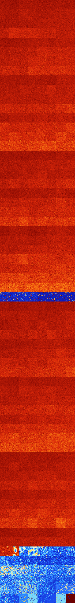

# B23578 (219136-219647)

<details>
    <summary>Initial Grid</summary>
    
</details>


<details>
    <summary>Initial Grid RLE</summary>

```
#C Exported from GoGoL (https://github.com/marrow16/gogol)
#C Wrap mode: Toroidal
#C Boundary mode: Dead
#C Step: 0
x = 100, y = 100, rule = B23578/S
17bo44bo13bo22bo$8bo9bo6bo27bo25bobo6bo8bo$55bo4b2o14bo6bo11bo$15bo16bo
3bo46b2o$21bo23bo16bo9bo4bo$bo24bo55b2o2bo7bo$43bo44bo4bo$bobo26b2o4bo
17bo12bo16bo$44bo17bo3bo25bo$29bo69bo$3bo31bo11b2o9bo15bo$43bo$54bo21bo
7bo11bo$14bo24bo15bo6b2o20b2o$73bo$12bo13bo64bo$6bo9bo8bo5bo34bo12bo$
17bo17bo12bo10bo$11b2o32bo41bo$22bo9bo3b3o21bo15bo9bo10bo$9bo2bo9bo40bo
23bo9bo$48bo4bobo29bo2bo$11bo15b2o9bobo49bobo6bo$39bo27bo31bo$8bo7bo35b
o20bo4bo14bo$28bo7bo35bo12bo6bo$36bo6bo15bo24bo2b2o8bo$20bo6bo4bo9bo2bo
7bo16bo27bo$13bo21bo54bo$4bo5bo18bo52bo9bo$6bo6bob2o36bo7bo31bo$7bo22b
2o7bo$30bo10bo29bobobo16bo$9bo9bo13bo6bo41bo$bo5bo31bo55bo$13bobo18bo
32bo17bo5bo$25bo16b2o44bo10bo$11bobo36bo16bo16bo6bo$6bo8bobo8bo9bob2o
15bo37bo$2o14bo13bo32bo6bo25bo$10bo23bo18bo5bo36bo$3bo20bo3b2o5bo7bo5bo
$16bo10b2o5bo26bo9bo$13bo4bo8bo30b2o34bo$5bo10bo24bo$26bo32bo33bo4bo$
11bo4bo13bo17bo41bo$38bo6b2o17bo15bo$6bo14bobo5bo2bo31bo16bo3bobo$4bo
17bo11bo14bo19bo4bo$21bo31bob2o21bo9bo5bo$41bo4bo41bo$19bo59bo2bo14bo$
11bo4bo17bo30bo29bo$o20bo23bo2bo36bo6bo3bo$10bo10bo20bo$o22bo38bo20bo
10b2o$o6bo16bo19bo14bo29bo7bo$bo40bo15bo10bo20bo$7bo32bo28bo3bo23bo$11b
o32bo12bo8bo12b2o$36bo12bo37bobo$12bo22bo2bo18bo$3bo34bo29bo17bo5bobobo
$7b2o49bo14bo13bobo$12bo37bo33b2o2bo$64bobo28bo$17bo6b2o7bo9bo52bo$4bo
34bo41bo$3bo13bo30bo45bo$20bo6bo2bo13b2o30b2o17bo$11bo2bo5bo51bo9bo4bo
11bo$bo27bo18bo8bo14bobo$26bo3bo25bo15bo$4bo8bo13bo11bobo27bo6bo$5bo16b
o15bo43bo6bo$32bo29bo9bo6bo$24bo47bo$19bo35bo15bo$23bo$5bo4bo8bo7bo15bo
13bo$4bo4bo20b2o9bo3bo29bo15bo$21bo42bobo$bo28bo$24bo8bo15bobo13bo24bo
6bo$5bobo17bo17bo25bo23bo2bo$40bo20bo28bo$23bo7bo6bo34bo17bo$12bo73bo5b
o$29bo14bo13bo15bo14bobo$24bo7bo2bo18bo26bo$59bo10bo7b2o3bo$4bo27bo11bo
bo32bobo$10bo3bo82bo$3b2o13bo2bo4bo9bo5bo$7b2o13bo7b2o62bo2bo$14bo28bo
20bo2bo30bo$2b2o2bo18bo37bo5bo$10bo15bo4bo46bo$7bo17bo16bo10bo18bo!
```
</details>
<details>
    <summary>Thumbnail</summary>

</details>
<table>
<tr>
    <td><a href="./219136%20S%20Heat%20Map%20Activity.png"></a><br>S (219136)<br>G>1000</td>    <td><a href="./219137%20S0%20Heat%20Map%20Activity.png"></a><br>S0 (219137)<br>G>1000</td>    <td><a href="./219138%20S1%20Heat%20Map%20Activity.png"></a><br>S1 (219138)<br>G>1000</td>    <td><a href="./219139%20S01%20Heat%20Map%20Activity.png"></a><br>S01 (219139)<br>G>1000</td>    <td><a href="./219140%20S2%20Heat%20Map%20Activity.png"></a><br>S2 (219140)<br>G>1000</td>    <td><a href="./219141%20S02%20Heat%20Map%20Activity.png"></a><br>S02 (219141)<br>G>1000</td>    <td><a href="./219142%20S12%20Heat%20Map%20Activity.png"></a><br>S12 (219142)<br>G>1000</td>    <td><a href="./219143%20S012%20Heat%20Map%20Activity.png"></a><br>S012 (219143)<br>G>1000</td></tr>
<tr>
    <td><a href="./219144%20S3%20Heat%20Map%20Activity.png"></a><br>S3 (219144)<br>G>1000</td>    <td><a href="./219145%20S03%20Heat%20Map%20Activity.png"></a><br>S03 (219145)<br>G>1000</td>    <td><a href="./219146%20S13%20Heat%20Map%20Activity.png"></a><br>S13 (219146)<br>G>1000</td>    <td><a href="./219147%20S013%20Heat%20Map%20Activity.png"></a><br>S013 (219147)<br>G>1000</td>    <td><a href="./219148%20S23%20Heat%20Map%20Activity.png"></a><br>S23 (219148)<br>G>1000</td>    <td><a href="./219149%20S023%20Heat%20Map%20Activity.png"></a><br>S023 (219149)<br>G>1000</td>    <td><a href="./219150%20S123%20Heat%20Map%20Activity.png"></a><br>S123 (219150)<br>G>1000</td>    <td><a href="./219151%20S0123%20Heat%20Map%20Activity.png"></a><br>S0123 (219151)<br>G>1000</td></tr>
<tr>
    <td><a href="./219152%20S4%20Heat%20Map%20Activity.png"></a><br>S4 (219152)<br>G>1000</td>    <td><a href="./219153%20S04%20Heat%20Map%20Activity.png"></a><br>S04 (219153)<br>G>1000</td>    <td><a href="./219154%20S14%20Heat%20Map%20Activity.png"></a><br>S14 (219154)<br>G>1000</td>    <td><a href="./219155%20S014%20Heat%20Map%20Activity.png"></a><br>S014 (219155)<br>G>1000</td>    <td><a href="./219156%20S24%20Heat%20Map%20Activity.png"></a><br>S24 (219156)<br>G>1000</td>    <td><a href="./219157%20S024%20Heat%20Map%20Activity.png"></a><br>S024 (219157)<br>G>1000</td>    <td><a href="./219158%20S124%20Heat%20Map%20Activity.png"></a><br>S124 (219158)<br>G>1000</td>    <td><a href="./219159%20S0124%20Heat%20Map%20Activity.png"></a><br>S0124 (219159)<br>G>1000</td></tr>
<tr>
    <td><a href="./219160%20S34%20Heat%20Map%20Activity.png"></a><br>S34 (219160)<br>G>1000</td>    <td><a href="./219161%20S034%20Heat%20Map%20Activity.png"></a><br>S034 (219161)<br>G>1000</td>    <td><a href="./219162%20S134%20Heat%20Map%20Activity.png"></a><br>S134 (219162)<br>G>1000</td>    <td><a href="./219163%20S0134%20Heat%20Map%20Activity.png"></a><br>S0134 (219163)<br>G>1000</td>    <td><a href="./219164%20S234%20Heat%20Map%20Activity.png"></a><br>S234 (219164)<br>G>1000</td>    <td><a href="./219165%20S0234%20Heat%20Map%20Activity.png"></a><br>S0234 (219165)<br>G>1000</td>    <td><a href="./219166%20S1234%20Heat%20Map%20Activity.png"></a><br>S1234 (219166)<br>G>1000</td>    <td><a href="./219167%20S01234%20Heat%20Map%20Activity.png"></a><br>S01234 (219167)<br>G>1000</td></tr>
<tr>
    <td><a href="./219168%20S5%20Heat%20Map%20Activity.png"></a><br>S5 (219168)<br>G>1000</td>    <td><a href="./219169%20S05%20Heat%20Map%20Activity.png"></a><br>S05 (219169)<br>G>1000</td>    <td><a href="./219170%20S15%20Heat%20Map%20Activity.png"></a><br>S15 (219170)<br>G>1000</td>    <td><a href="./219171%20S015%20Heat%20Map%20Activity.png"></a><br>S015 (219171)<br>G>1000</td>    <td><a href="./219172%20S25%20Heat%20Map%20Activity.png"></a><br>S25 (219172)<br>G>1000</td>    <td><a href="./219173%20S025%20Heat%20Map%20Activity.png"></a><br>S025 (219173)<br>G>1000</td>    <td><a href="./219174%20S125%20Heat%20Map%20Activity.png"></a><br>S125 (219174)<br>G>1000</td>    <td><a href="./219175%20S0125%20Heat%20Map%20Activity.png"></a><br>S0125 (219175)<br>G>1000</td></tr>
<tr>
    <td><a href="./219176%20S35%20Heat%20Map%20Activity.png"></a><br>S35 (219176)<br>G>1000</td>    <td><a href="./219177%20S035%20Heat%20Map%20Activity.png"></a><br>S035 (219177)<br>G>1000</td>    <td><a href="./219178%20S135%20Heat%20Map%20Activity.png"></a><br>S135 (219178)<br>G>1000</td>    <td><a href="./219179%20S0135%20Heat%20Map%20Activity.png"></a><br>S0135 (219179)<br>G>1000</td>    <td><a href="./219180%20S235%20Heat%20Map%20Activity.png"></a><br>S235 (219180)<br>G>1000</td>    <td><a href="./219181%20S0235%20Heat%20Map%20Activity.png"></a><br>S0235 (219181)<br>G>1000</td>    <td><a href="./219182%20S1235%20Heat%20Map%20Activity.png"></a><br>S1235 (219182)<br>G>1000</td>    <td><a href="./219183%20S01235%20Heat%20Map%20Activity.png"></a><br>S01235 (219183)<br>G>1000</td></tr>
<tr>
    <td><a href="./219184%20S45%20Heat%20Map%20Activity.png"></a><br>S45 (219184)<br>G>1000</td>    <td><a href="./219185%20S045%20Heat%20Map%20Activity.png"></a><br>S045 (219185)<br>G>1000</td>    <td><a href="./219186%20S145%20Heat%20Map%20Activity.png"></a><br>S145 (219186)<br>G>1000</td>    <td><a href="./219187%20S0145%20Heat%20Map%20Activity.png"></a><br>S0145 (219187)<br>G>1000</td>    <td><a href="./219188%20S245%20Heat%20Map%20Activity.png"></a><br>S245 (219188)<br>G>1000</td>    <td><a href="./219189%20S0245%20Heat%20Map%20Activity.png"></a><br>S0245 (219189)<br>G>1000</td>    <td><a href="./219190%20S1245%20Heat%20Map%20Activity.png"></a><br>S1245 (219190)<br>G>1000</td>    <td><a href="./219191%20S01245%20Heat%20Map%20Activity.png"></a><br>S01245 (219191)<br>G>1000</td></tr>
<tr>
    <td><a href="./219192%20S345%20Heat%20Map%20Activity.png"></a><br>S345 (219192)<br>G>1000</td>    <td><a href="./219193%20S0345%20Heat%20Map%20Activity.png"></a><br>S0345 (219193)<br>G>1000</td>    <td><a href="./219194%20S1345%20Heat%20Map%20Activity.png"></a><br>S1345 (219194)<br>G>1000</td>    <td><a href="./219195%20S01345%20Heat%20Map%20Activity.png"></a><br>S01345 (219195)<br>G>1000</td>    <td><a href="./219196%20S2345%20Heat%20Map%20Activity.png"></a><br>S2345 (219196)<br>G>1000</td>    <td><a href="./219197%20S02345%20Heat%20Map%20Activity.png"></a><br>S02345 (219197)<br>G>1000</td>    <td><a href="./219198%20S12345%20Heat%20Map%20Activity.png"></a><br>S12345 (219198)<br>G>1000</td>    <td><a href="./219199%20S012345%20Heat%20Map%20Activity.png"></a><br>S012345 (219199)<br>G>1000</td></tr>
<tr>
    <td><a href="./219200%20S6%20Heat%20Map%20Activity.png"></a><br>S6 (219200)<br>G>1000</td>    <td><a href="./219201%20S06%20Heat%20Map%20Activity.png"></a><br>S06 (219201)<br>G>1000</td>    <td><a href="./219202%20S16%20Heat%20Map%20Activity.png"></a><br>S16 (219202)<br>G>1000</td>    <td><a href="./219203%20S016%20Heat%20Map%20Activity.png"></a><br>S016 (219203)<br>G>1000</td>    <td><a href="./219204%20S26%20Heat%20Map%20Activity.png"></a><br>S26 (219204)<br>G>1000</td>    <td><a href="./219205%20S026%20Heat%20Map%20Activity.png"></a><br>S026 (219205)<br>G>1000</td>    <td><a href="./219206%20S126%20Heat%20Map%20Activity.png"></a><br>S126 (219206)<br>G>1000</td>    <td><a href="./219207%20S0126%20Heat%20Map%20Activity.png"></a><br>S0126 (219207)<br>G>1000</td></tr>
<tr>
    <td><a href="./219208%20S36%20Heat%20Map%20Activity.png"></a><br>S36 (219208)<br>G>1000</td>    <td><a href="./219209%20S036%20Heat%20Map%20Activity.png"></a><br>S036 (219209)<br>G>1000</td>    <td><a href="./219210%20S136%20Heat%20Map%20Activity.png"></a><br>S136 (219210)<br>G>1000</td>    <td><a href="./219211%20S0136%20Heat%20Map%20Activity.png"></a><br>S0136 (219211)<br>G>1000</td>    <td><a href="./219212%20S236%20Heat%20Map%20Activity.png"></a><br>S236 (219212)<br>G>1000</td>    <td><a href="./219213%20S0236%20Heat%20Map%20Activity.png"></a><br>S0236 (219213)<br>G>1000</td>    <td><a href="./219214%20S1236%20Heat%20Map%20Activity.png"></a><br>S1236 (219214)<br>G>1000</td>    <td><a href="./219215%20S01236%20Heat%20Map%20Activity.png"></a><br>S01236 (219215)<br>G>1000</td></tr>
<tr>
    <td><a href="./219216%20S46%20Heat%20Map%20Activity.png"></a><br>S46 (219216)<br>G>1000</td>    <td><a href="./219217%20S046%20Heat%20Map%20Activity.png"></a><br>S046 (219217)<br>G>1000</td>    <td><a href="./219218%20S146%20Heat%20Map%20Activity.png"></a><br>S146 (219218)<br>G>1000</td>    <td><a href="./219219%20S0146%20Heat%20Map%20Activity.png"></a><br>S0146 (219219)<br>G>1000</td>    <td><a href="./219220%20S246%20Heat%20Map%20Activity.png"></a><br>S246 (219220)<br>G>1000</td>    <td><a href="./219221%20S0246%20Heat%20Map%20Activity.png"></a><br>S0246 (219221)<br>G>1000</td>    <td><a href="./219222%20S1246%20Heat%20Map%20Activity.png"></a><br>S1246 (219222)<br>G>1000</td>    <td><a href="./219223%20S01246%20Heat%20Map%20Activity.png"></a><br>S01246 (219223)<br>G>1000</td></tr>
<tr>
    <td><a href="./219224%20S346%20Heat%20Map%20Activity.png"></a><br>S346 (219224)<br>G>1000</td>    <td><a href="./219225%20S0346%20Heat%20Map%20Activity.png"></a><br>S0346 (219225)<br>G>1000</td>    <td><a href="./219226%20S1346%20Heat%20Map%20Activity.png"></a><br>S1346 (219226)<br>G>1000</td>    <td><a href="./219227%20S01346%20Heat%20Map%20Activity.png"></a><br>S01346 (219227)<br>G>1000</td>    <td><a href="./219228%20S2346%20Heat%20Map%20Activity.png"></a><br>S2346 (219228)<br>G>1000</td>    <td><a href="./219229%20S02346%20Heat%20Map%20Activity.png"></a><br>S02346 (219229)<br>G>1000</td>    <td><a href="./219230%20S12346%20Heat%20Map%20Activity.png"></a><br>S12346 (219230)<br>G>1000</td>    <td><a href="./219231%20S012346%20Heat%20Map%20Activity.png"></a><br>S012346 (219231)<br>G>1000</td></tr>
<tr>
    <td><a href="./219232%20S56%20Heat%20Map%20Activity.png"></a><br>S56 (219232)<br>G>1000</td>    <td><a href="./219233%20S056%20Heat%20Map%20Activity.png"></a><br>S056 (219233)<br>G>1000</td>    <td><a href="./219234%20S156%20Heat%20Map%20Activity.png"></a><br>S156 (219234)<br>G>1000</td>    <td><a href="./219235%20S0156%20Heat%20Map%20Activity.png"></a><br>S0156 (219235)<br>G>1000</td>    <td><a href="./219236%20S256%20Heat%20Map%20Activity.png"></a><br>S256 (219236)<br>G>1000</td>    <td><a href="./219237%20S0256%20Heat%20Map%20Activity.png"></a><br>S0256 (219237)<br>G>1000</td>    <td><a href="./219238%20S1256%20Heat%20Map%20Activity.png"></a><br>S1256 (219238)<br>G>1000</td>    <td><a href="./219239%20S01256%20Heat%20Map%20Activity.png"></a><br>S01256 (219239)<br>G>1000</td></tr>
<tr>
    <td><a href="./219240%20S356%20Heat%20Map%20Activity.png"></a><br>S356 (219240)<br>G>1000</td>    <td><a href="./219241%20S0356%20Heat%20Map%20Activity.png"></a><br>S0356 (219241)<br>G>1000</td>    <td><a href="./219242%20S1356%20Heat%20Map%20Activity.png"></a><br>S1356 (219242)<br>G>1000</td>    <td><a href="./219243%20S01356%20Heat%20Map%20Activity.png"></a><br>S01356 (219243)<br>G>1000</td>    <td><a href="./219244%20S2356%20Heat%20Map%20Activity.png"></a><br>S2356 (219244)<br>G>1000</td>    <td><a href="./219245%20S02356%20Heat%20Map%20Activity.png"></a><br>S02356 (219245)<br>G>1000</td>    <td><a href="./219246%20S12356%20Heat%20Map%20Activity.png"></a><br>S12356 (219246)<br>G>1000</td>    <td><a href="./219247%20S012356%20Heat%20Map%20Activity.png"></a><br>S012356 (219247)<br>G>1000</td></tr>
<tr>
    <td><a href="./219248%20S456%20Heat%20Map%20Activity.png"></a><br>S456 (219248)<br>G>1000</td>    <td><a href="./219249%20S0456%20Heat%20Map%20Activity.png"></a><br>S0456 (219249)<br>G>1000</td>    <td><a href="./219250%20S1456%20Heat%20Map%20Activity.png"></a><br>S1456 (219250)<br>G>1000</td>    <td><a href="./219251%20S01456%20Heat%20Map%20Activity.png"></a><br>S01456 (219251)<br>G>1000</td>    <td><a href="./219252%20S2456%20Heat%20Map%20Activity.png"></a><br>S2456 (219252)<br>G>1000</td>    <td><a href="./219253%20S02456%20Heat%20Map%20Activity.png"></a><br>S02456 (219253)<br>G>1000</td>    <td><a href="./219254%20S12456%20Heat%20Map%20Activity.png"></a><br>S12456 (219254)<br>G>1000</td>    <td><a href="./219255%20S012456%20Heat%20Map%20Activity.png"></a><br>S012456 (219255)<br>G>1000</td></tr>
<tr>
    <td><a href="./219256%20S3456%20Heat%20Map%20Activity.png"></a><br>S3456 (219256)<br>G>1000</td>    <td><a href="./219257%20S03456%20Heat%20Map%20Activity.png"></a><br>S03456 (219257)<br>G>1000</td>    <td><a href="./219258%20S13456%20Heat%20Map%20Activity.png"></a><br>S13456 (219258)<br>G>1000</td>    <td><a href="./219259%20S013456%20Heat%20Map%20Activity.png"></a><br>S013456 (219259)<br>G>1000</td>    <td><a href="./219260%20S23456%20Heat%20Map%20Activity.png"></a><br>S23456 (219260)<br>G>1000</td>    <td><a href="./219261%20S023456%20Heat%20Map%20Activity.png"></a><br>S023456 (219261)<br>G>1000</td>    <td><a href="./219262%20S123456%20Heat%20Map%20Activity.png"></a><br>S123456 (219262)<br>G>1000</td>    <td><a href="./219263%20S0123456%20Heat%20Map%20Activity.png"></a><br>S0123456 (219263)<br>G>1000</td></tr>
<tr>
    <td><a href="./219264%20S7%20Heat%20Map%20Activity.png"></a><br>S7 (219264)<br>G>1000</td>    <td><a href="./219265%20S07%20Heat%20Map%20Activity.png"></a><br>S07 (219265)<br>G>1000</td>    <td><a href="./219266%20S17%20Heat%20Map%20Activity.png"></a><br>S17 (219266)<br>G>1000</td>    <td><a href="./219267%20S017%20Heat%20Map%20Activity.png"></a><br>S017 (219267)<br>G>1000</td>    <td><a href="./219268%20S27%20Heat%20Map%20Activity.png"></a><br>S27 (219268)<br>G>1000</td>    <td><a href="./219269%20S027%20Heat%20Map%20Activity.png"></a><br>S027 (219269)<br>G>1000</td>    <td><a href="./219270%20S127%20Heat%20Map%20Activity.png"></a><br>S127 (219270)<br>G>1000</td>    <td><a href="./219271%20S0127%20Heat%20Map%20Activity.png"></a><br>S0127 (219271)<br>G>1000</td></tr>
<tr>
    <td><a href="./219272%20S37%20Heat%20Map%20Activity.png"></a><br>S37 (219272)<br>G>1000</td>    <td><a href="./219273%20S037%20Heat%20Map%20Activity.png"></a><br>S037 (219273)<br>G>1000</td>    <td><a href="./219274%20S137%20Heat%20Map%20Activity.png"></a><br>S137 (219274)<br>G>1000</td>    <td><a href="./219275%20S0137%20Heat%20Map%20Activity.png"></a><br>S0137 (219275)<br>G>1000</td>    <td><a href="./219276%20S237%20Heat%20Map%20Activity.png"></a><br>S237 (219276)<br>G>1000</td>    <td><a href="./219277%20S0237%20Heat%20Map%20Activity.png"></a><br>S0237 (219277)<br>G>1000</td>    <td><a href="./219278%20S1237%20Heat%20Map%20Activity.png"></a><br>S1237 (219278)<br>G>1000</td>    <td><a href="./219279%20S01237%20Heat%20Map%20Activity.png"></a><br>S01237 (219279)<br>G>1000</td></tr>
<tr>
    <td><a href="./219280%20S47%20Heat%20Map%20Activity.png"></a><br>S47 (219280)<br>G>1000</td>    <td><a href="./219281%20S047%20Heat%20Map%20Activity.png"></a><br>S047 (219281)<br>G>1000</td>    <td><a href="./219282%20S147%20Heat%20Map%20Activity.png"></a><br>S147 (219282)<br>G>1000</td>    <td><a href="./219283%20S0147%20Heat%20Map%20Activity.png"></a><br>S0147 (219283)<br>G>1000</td>    <td><a href="./219284%20S247%20Heat%20Map%20Activity.png"></a><br>S247 (219284)<br>G>1000</td>    <td><a href="./219285%20S0247%20Heat%20Map%20Activity.png"></a><br>S0247 (219285)<br>G>1000</td>    <td><a href="./219286%20S1247%20Heat%20Map%20Activity.png"></a><br>S1247 (219286)<br>G>1000</td>    <td><a href="./219287%20S01247%20Heat%20Map%20Activity.png"></a><br>S01247 (219287)<br>G>1000</td></tr>
<tr>
    <td><a href="./219288%20S347%20Heat%20Map%20Activity.png"></a><br>S347 (219288)<br>G>1000</td>    <td><a href="./219289%20S0347%20Heat%20Map%20Activity.png"></a><br>S0347 (219289)<br>G>1000</td>    <td><a href="./219290%20S1347%20Heat%20Map%20Activity.png"></a><br>S1347 (219290)<br>G>1000</td>    <td><a href="./219291%20S01347%20Heat%20Map%20Activity.png"></a><br>S01347 (219291)<br>G>1000</td>    <td><a href="./219292%20S2347%20Heat%20Map%20Activity.png"></a><br>S2347 (219292)<br>G>1000</td>    <td><a href="./219293%20S02347%20Heat%20Map%20Activity.png"></a><br>S02347 (219293)<br>G>1000</td>    <td><a href="./219294%20S12347%20Heat%20Map%20Activity.png"></a><br>S12347 (219294)<br>G>1000</td>    <td><a href="./219295%20S012347%20Heat%20Map%20Activity.png"></a><br>S012347 (219295)<br>G>1000</td></tr>
<tr>
    <td><a href="./219296%20S57%20Heat%20Map%20Activity.png"></a><br>S57 (219296)<br>G>1000</td>    <td><a href="./219297%20S057%20Heat%20Map%20Activity.png"></a><br>S057 (219297)<br>G>1000</td>    <td><a href="./219298%20S157%20Heat%20Map%20Activity.png"></a><br>S157 (219298)<br>G>1000</td>    <td><a href="./219299%20S0157%20Heat%20Map%20Activity.png"></a><br>S0157 (219299)<br>G>1000</td>    <td><a href="./219300%20S257%20Heat%20Map%20Activity.png"></a><br>S257 (219300)<br>G>1000</td>    <td><a href="./219301%20S0257%20Heat%20Map%20Activity.png"></a><br>S0257 (219301)<br>G>1000</td>    <td><a href="./219302%20S1257%20Heat%20Map%20Activity.png"></a><br>S1257 (219302)<br>G>1000</td>    <td><a href="./219303%20S01257%20Heat%20Map%20Activity.png"></a><br>S01257 (219303)<br>G>1000</td></tr>
<tr>
    <td><a href="./219304%20S357%20Heat%20Map%20Activity.png"></a><br>S357 (219304)<br>G>1000</td>    <td><a href="./219305%20S0357%20Heat%20Map%20Activity.png"></a><br>S0357 (219305)<br>G>1000</td>    <td><a href="./219306%20S1357%20Heat%20Map%20Activity.png"></a><br>S1357 (219306)<br>G>1000</td>    <td><a href="./219307%20S01357%20Heat%20Map%20Activity.png"></a><br>S01357 (219307)<br>G>1000</td>    <td><a href="./219308%20S2357%20Heat%20Map%20Activity.png"></a><br>S2357 (219308)<br>G>1000</td>    <td><a href="./219309%20S02357%20Heat%20Map%20Activity.png"></a><br>S02357 (219309)<br>G>1000</td>    <td><a href="./219310%20S12357%20Heat%20Map%20Activity.png"></a><br>S12357 (219310)<br>G>1000</td>    <td><a href="./219311%20S012357%20Heat%20Map%20Activity.png"></a><br>S012357 (219311)<br>G>1000</td></tr>
<tr>
    <td><a href="./219312%20S457%20Heat%20Map%20Activity.png"></a><br>S457 (219312)<br>G>1000</td>    <td><a href="./219313%20S0457%20Heat%20Map%20Activity.png"></a><br>S0457 (219313)<br>G>1000</td>    <td><a href="./219314%20S1457%20Heat%20Map%20Activity.png"></a><br>S1457 (219314)<br>G>1000</td>    <td><a href="./219315%20S01457%20Heat%20Map%20Activity.png"></a><br>S01457 (219315)<br>G>1000</td>    <td><a href="./219316%20S2457%20Heat%20Map%20Activity.png"></a><br>S2457 (219316)<br>G>1000</td>    <td><a href="./219317%20S02457%20Heat%20Map%20Activity.png"></a><br>S02457 (219317)<br>G>1000</td>    <td><a href="./219318%20S12457%20Heat%20Map%20Activity.png"></a><br>S12457 (219318)<br>G>1000</td>    <td><a href="./219319%20S012457%20Heat%20Map%20Activity.png"></a><br>S012457 (219319)<br>G>1000</td></tr>
<tr>
    <td><a href="./219320%20S3457%20Heat%20Map%20Activity.png"></a><br>S3457 (219320)<br>G>1000</td>    <td><a href="./219321%20S03457%20Heat%20Map%20Activity.png"></a><br>S03457 (219321)<br>G>1000</td>    <td><a href="./219322%20S13457%20Heat%20Map%20Activity.png"></a><br>S13457 (219322)<br>G>1000</td>    <td><a href="./219323%20S013457%20Heat%20Map%20Activity.png"></a><br>S013457 (219323)<br>G>1000</td>    <td><a href="./219324%20S23457%20Heat%20Map%20Activity.png"></a><br>S23457 (219324)<br>G>1000</td>    <td><a href="./219325%20S023457%20Heat%20Map%20Activity.png"></a><br>S023457 (219325)<br>G>1000</td>    <td><a href="./219326%20S123457%20Heat%20Map%20Activity.png"></a><br>S123457 (219326)<br>G>1000</td>    <td><a href="./219327%20S0123457%20Heat%20Map%20Activity.png"></a><br>S0123457 (219327)<br>G>1000</td></tr>
<tr>
    <td><a href="./219328%20S67%20Heat%20Map%20Activity.png"></a><br>S67 (219328)<br>G>1000</td>    <td><a href="./219329%20S067%20Heat%20Map%20Activity.png"></a><br>S067 (219329)<br>G>1000</td>    <td><a href="./219330%20S167%20Heat%20Map%20Activity.png"></a><br>S167 (219330)<br>G>1000</td>    <td><a href="./219331%20S0167%20Heat%20Map%20Activity.png"></a><br>S0167 (219331)<br>G>1000</td>    <td><a href="./219332%20S267%20Heat%20Map%20Activity.png"></a><br>S267 (219332)<br>G>1000</td>    <td><a href="./219333%20S0267%20Heat%20Map%20Activity.png"></a><br>S0267 (219333)<br>G>1000</td>    <td><a href="./219334%20S1267%20Heat%20Map%20Activity.png"></a><br>S1267 (219334)<br>G>1000</td>    <td><a href="./219335%20S01267%20Heat%20Map%20Activity.png"></a><br>S01267 (219335)<br>G>1000</td></tr>
<tr>
    <td><a href="./219336%20S367%20Heat%20Map%20Activity.png"></a><br>S367 (219336)<br>G>1000</td>    <td><a href="./219337%20S0367%20Heat%20Map%20Activity.png"></a><br>S0367 (219337)<br>G>1000</td>    <td><a href="./219338%20S1367%20Heat%20Map%20Activity.png"></a><br>S1367 (219338)<br>G>1000</td>    <td><a href="./219339%20S01367%20Heat%20Map%20Activity.png"></a><br>S01367 (219339)<br>G>1000</td>    <td><a href="./219340%20S2367%20Heat%20Map%20Activity.png"></a><br>S2367 (219340)<br>G>1000</td>    <td><a href="./219341%20S02367%20Heat%20Map%20Activity.png"></a><br>S02367 (219341)<br>G>1000</td>    <td><a href="./219342%20S12367%20Heat%20Map%20Activity.png"></a><br>S12367 (219342)<br>G>1000</td>    <td><a href="./219343%20S012367%20Heat%20Map%20Activity.png"></a><br>S012367 (219343)<br>G>1000</td></tr>
<tr>
    <td><a href="./219344%20S467%20Heat%20Map%20Activity.png"></a><br>S467 (219344)<br>G>1000</td>    <td><a href="./219345%20S0467%20Heat%20Map%20Activity.png"></a><br>S0467 (219345)<br>G>1000</td>    <td><a href="./219346%20S1467%20Heat%20Map%20Activity.png"></a><br>S1467 (219346)<br>G>1000</td>    <td><a href="./219347%20S01467%20Heat%20Map%20Activity.png"></a><br>S01467 (219347)<br>G>1000</td>    <td><a href="./219348%20S2467%20Heat%20Map%20Activity.png"></a><br>S2467 (219348)<br>G>1000</td>    <td><a href="./219349%20S02467%20Heat%20Map%20Activity.png"></a><br>S02467 (219349)<br>G>1000</td>    <td><a href="./219350%20S12467%20Heat%20Map%20Activity.png"></a><br>S12467 (219350)<br>G>1000</td>    <td><a href="./219351%20S012467%20Heat%20Map%20Activity.png"></a><br>S012467 (219351)<br>G>1000</td></tr>
<tr>
    <td><a href="./219352%20S3467%20Heat%20Map%20Activity.png"></a><br>S3467 (219352)<br>G>1000</td>    <td><a href="./219353%20S03467%20Heat%20Map%20Activity.png"></a><br>S03467 (219353)<br>G>1000</td>    <td><a href="./219354%20S13467%20Heat%20Map%20Activity.png"></a><br>S13467 (219354)<br>G>1000</td>    <td><a href="./219355%20S013467%20Heat%20Map%20Activity.png"></a><br>S013467 (219355)<br>G>1000</td>    <td><a href="./219356%20S23467%20Heat%20Map%20Activity.png"></a><br>S23467 (219356)<br>G>1000</td>    <td><a href="./219357%20S023467%20Heat%20Map%20Activity.png"></a><br>S023467 (219357)<br>G>1000</td>    <td><a href="./219358%20S123467%20Heat%20Map%20Activity.png"></a><br>S123467 (219358)<br>G>1000</td>    <td><a href="./219359%20S0123467%20Heat%20Map%20Activity.png"></a><br>S0123467 (219359)<br>G>1000</td></tr>
<tr>
    <td><a href="./219360%20S567%20Heat%20Map%20Activity.png"></a><br>S567 (219360)<br>G>1000</td>    <td><a href="./219361%20S0567%20Heat%20Map%20Activity.png"></a><br>S0567 (219361)<br>G>1000</td>    <td><a href="./219362%20S1567%20Heat%20Map%20Activity.png"></a><br>S1567 (219362)<br>G>1000</td>    <td><a href="./219363%20S01567%20Heat%20Map%20Activity.png"></a><br>S01567 (219363)<br>G>1000</td>    <td><a href="./219364%20S2567%20Heat%20Map%20Activity.png"></a><br>S2567 (219364)<br>G>1000</td>    <td><a href="./219365%20S02567%20Heat%20Map%20Activity.png"></a><br>S02567 (219365)<br>G>1000</td>    <td><a href="./219366%20S12567%20Heat%20Map%20Activity.png"></a><br>S12567 (219366)<br>G>1000</td>    <td><a href="./219367%20S012567%20Heat%20Map%20Activity.png"></a><br>S012567 (219367)<br>G>1000</td></tr>
<tr>
    <td><a href="./219368%20S3567%20Heat%20Map%20Activity.png"></a><br>S3567 (219368)<br>G>1000</td>    <td><a href="./219369%20S03567%20Heat%20Map%20Activity.png"></a><br>S03567 (219369)<br>G>1000</td>    <td><a href="./219370%20S13567%20Heat%20Map%20Activity.png"></a><br>S13567 (219370)<br>G>1000</td>    <td><a href="./219371%20S013567%20Heat%20Map%20Activity.png"></a><br>S013567 (219371)<br>G>1000</td>    <td><a href="./219372%20S23567%20Heat%20Map%20Activity.png"></a><br>S23567 (219372)<br>G>1000</td>    <td><a href="./219373%20S023567%20Heat%20Map%20Activity.png"></a><br>S023567 (219373)<br>G>1000</td>    <td><a href="./219374%20S123567%20Heat%20Map%20Activity.png"></a><br>S123567 (219374)<br>G>1000</td>    <td><a href="./219375%20S0123567%20Heat%20Map%20Activity.png"></a><br>S0123567 (219375)<br>G>1000</td></tr>
<tr>
    <td><a href="./219376%20S4567%20Heat%20Map%20Activity.png"></a><br>S4567 (219376)<br>G>1000</td>    <td><a href="./219377%20S04567%20Heat%20Map%20Activity.png"></a><br>S04567 (219377)<br>G>1000</td>    <td><a href="./219378%20S14567%20Heat%20Map%20Activity.png"></a><br>S14567 (219378)<br>G>1000</td>    <td><a href="./219379%20S014567%20Heat%20Map%20Activity.png"></a><br>S014567 (219379)<br>G>1000</td>    <td><a href="./219380%20S24567%20Heat%20Map%20Activity.png"></a><br>S24567 (219380)<br>G>1000</td>    <td><a href="./219381%20S024567%20Heat%20Map%20Activity.png"></a><br>S024567 (219381)<br>G>1000</td>    <td><a href="./219382%20S124567%20Heat%20Map%20Activity.png"></a><br>S124567 (219382)<br>G>1000</td>    <td><a href="./219383%20S0124567%20Heat%20Map%20Activity.png"></a><br>S0124567 (219383)<br>G>1000</td></tr>
<tr>
    <td><a href="./219384%20S34567%20Heat%20Map%20Activity.png"></a><br>S34567 (219384)<br>G>1000</td>    <td><a href="./219385%20S034567%20Heat%20Map%20Activity.png"></a><br>S034567 (219385)<br>G>1000</td>    <td><a href="./219386%20S134567%20Heat%20Map%20Activity.png"></a><br>S134567 (219386)<br>G>1000</td>    <td><a href="./219387%20S0134567%20Heat%20Map%20Activity.png"></a><br>S0134567 (219387)<br>G>1000</td>    <td><a href="./219388%20S234567%20Heat%20Map%20Activity.png"></a><br>S234567 (219388)<br>G>1000</td>    <td><a href="./219389%20S0234567%20Heat%20Map%20Activity.png"></a><br>S0234567 (219389)<br>G>1000</td>    <td><a href="./219390%20S1234567%20Heat%20Map%20Activity.png"></a><br>S1234567 (219390)<br>G>1000</td>    <td><a href="./219391%20S01234567%20Heat%20Map%20Activity.png"></a><br>S01234567 (219391)<br>G>1000</td></tr>
<tr>
    <td><a href="./219392%20S8%20Heat%20Map%20Activity.png"></a><br>S8 (219392)<br>G>1000</td>    <td><a href="./219393%20S08%20Heat%20Map%20Activity.png"></a><br>S08 (219393)<br>G>1000</td>    <td><a href="./219394%20S18%20Heat%20Map%20Activity.png"></a><br>S18 (219394)<br>G>1000</td>    <td><a href="./219395%20S018%20Heat%20Map%20Activity.png"></a><br>S018 (219395)<br>G>1000</td>    <td><a href="./219396%20S28%20Heat%20Map%20Activity.png"></a><br>S28 (219396)<br>G>1000</td>    <td><a href="./219397%20S028%20Heat%20Map%20Activity.png"></a><br>S028 (219397)<br>G>1000</td>    <td><a href="./219398%20S128%20Heat%20Map%20Activity.png"></a><br>S128 (219398)<br>G>1000</td>    <td><a href="./219399%20S0128%20Heat%20Map%20Activity.png"></a><br>S0128 (219399)<br>G>1000</td></tr>
<tr>
    <td><a href="./219400%20S38%20Heat%20Map%20Activity.png"></a><br>S38 (219400)<br>G>1000</td>    <td><a href="./219401%20S038%20Heat%20Map%20Activity.png"></a><br>S038 (219401)<br>G>1000</td>    <td><a href="./219402%20S138%20Heat%20Map%20Activity.png"></a><br>S138 (219402)<br>G>1000</td>    <td><a href="./219403%20S0138%20Heat%20Map%20Activity.png"></a><br>S0138 (219403)<br>G>1000</td>    <td><a href="./219404%20S238%20Heat%20Map%20Activity.png"></a><br>S238 (219404)<br>G>1000</td>    <td><a href="./219405%20S0238%20Heat%20Map%20Activity.png"></a><br>S0238 (219405)<br>G>1000</td>    <td><a href="./219406%20S1238%20Heat%20Map%20Activity.png"></a><br>S1238 (219406)<br>G>1000</td>    <td><a href="./219407%20S01238%20Heat%20Map%20Activity.png"></a><br>S01238 (219407)<br>G>1000</td></tr>
<tr>
    <td><a href="./219408%20S48%20Heat%20Map%20Activity.png"></a><br>S48 (219408)<br>G>1000</td>    <td><a href="./219409%20S048%20Heat%20Map%20Activity.png"></a><br>S048 (219409)<br>G>1000</td>    <td><a href="./219410%20S148%20Heat%20Map%20Activity.png"></a><br>S148 (219410)<br>G>1000</td>    <td><a href="./219411%20S0148%20Heat%20Map%20Activity.png"></a><br>S0148 (219411)<br>G>1000</td>    <td><a href="./219412%20S248%20Heat%20Map%20Activity.png"></a><br>S248 (219412)<br>G>1000</td>    <td><a href="./219413%20S0248%20Heat%20Map%20Activity.png"></a><br>S0248 (219413)<br>G>1000</td>    <td><a href="./219414%20S1248%20Heat%20Map%20Activity.png"></a><br>S1248 (219414)<br>G>1000</td>    <td><a href="./219415%20S01248%20Heat%20Map%20Activity.png"></a><br>S01248 (219415)<br>G>1000</td></tr>
<tr>
    <td><a href="./219416%20S348%20Heat%20Map%20Activity.png"></a><br>S348 (219416)<br>G>1000</td>    <td><a href="./219417%20S0348%20Heat%20Map%20Activity.png"></a><br>S0348 (219417)<br>G>1000</td>    <td><a href="./219418%20S1348%20Heat%20Map%20Activity.png"></a><br>S1348 (219418)<br>G>1000</td>    <td><a href="./219419%20S01348%20Heat%20Map%20Activity.png"></a><br>S01348 (219419)<br>G>1000</td>    <td><a href="./219420%20S2348%20Heat%20Map%20Activity.png"></a><br>S2348 (219420)<br>G>1000</td>    <td><a href="./219421%20S02348%20Heat%20Map%20Activity.png"></a><br>S02348 (219421)<br>G>1000</td>    <td><a href="./219422%20S12348%20Heat%20Map%20Activity.png"></a><br>S12348 (219422)<br>G>1000</td>    <td><a href="./219423%20S012348%20Heat%20Map%20Activity.png"></a><br>S012348 (219423)<br>G>1000</td></tr>
<tr>
    <td><a href="./219424%20S58%20Heat%20Map%20Activity.png"></a><br>S58 (219424)<br>G>1000</td>    <td><a href="./219425%20S058%20Heat%20Map%20Activity.png"></a><br>S058 (219425)<br>G>1000</td>    <td><a href="./219426%20S158%20Heat%20Map%20Activity.png"></a><br>S158 (219426)<br>G>1000</td>    <td><a href="./219427%20S0158%20Heat%20Map%20Activity.png"></a><br>S0158 (219427)<br>G>1000</td>    <td><a href="./219428%20S258%20Heat%20Map%20Activity.png"></a><br>S258 (219428)<br>G>1000</td>    <td><a href="./219429%20S0258%20Heat%20Map%20Activity.png"></a><br>S0258 (219429)<br>G>1000</td>    <td><a href="./219430%20S1258%20Heat%20Map%20Activity.png"></a><br>S1258 (219430)<br>G>1000</td>    <td><a href="./219431%20S01258%20Heat%20Map%20Activity.png"></a><br>S01258 (219431)<br>G>1000</td></tr>
<tr>
    <td><a href="./219432%20S358%20Heat%20Map%20Activity.png"></a><br>S358 (219432)<br>G>1000</td>    <td><a href="./219433%20S0358%20Heat%20Map%20Activity.png"></a><br>S0358 (219433)<br>G>1000</td>    <td><a href="./219434%20S1358%20Heat%20Map%20Activity.png"></a><br>S1358 (219434)<br>G>1000</td>    <td><a href="./219435%20S01358%20Heat%20Map%20Activity.png"></a><br>S01358 (219435)<br>G>1000</td>    <td><a href="./219436%20S2358%20Heat%20Map%20Activity.png"></a><br>S2358 (219436)<br>G>1000</td>    <td><a href="./219437%20S02358%20Heat%20Map%20Activity.png"></a><br>S02358 (219437)<br>G>1000</td>    <td><a href="./219438%20S12358%20Heat%20Map%20Activity.png"></a><br>S12358 (219438)<br>G>1000</td>    <td><a href="./219439%20S012358%20Heat%20Map%20Activity.png"></a><br>S012358 (219439)<br>G>1000</td></tr>
<tr>
    <td><a href="./219440%20S458%20Heat%20Map%20Activity.png"></a><br>S458 (219440)<br>G>1000</td>    <td><a href="./219441%20S0458%20Heat%20Map%20Activity.png"></a><br>S0458 (219441)<br>G>1000</td>    <td><a href="./219442%20S1458%20Heat%20Map%20Activity.png"></a><br>S1458 (219442)<br>G>1000</td>    <td><a href="./219443%20S01458%20Heat%20Map%20Activity.png"></a><br>S01458 (219443)<br>G>1000</td>    <td><a href="./219444%20S2458%20Heat%20Map%20Activity.png"></a><br>S2458 (219444)<br>G>1000</td>    <td><a href="./219445%20S02458%20Heat%20Map%20Activity.png"></a><br>S02458 (219445)<br>G>1000</td>    <td><a href="./219446%20S12458%20Heat%20Map%20Activity.png"></a><br>S12458 (219446)<br>G>1000</td>    <td><a href="./219447%20S012458%20Heat%20Map%20Activity.png"></a><br>S012458 (219447)<br>G>1000</td></tr>
<tr>
    <td><a href="./219448%20S3458%20Heat%20Map%20Activity.png"></a><br>S3458 (219448)<br>G>1000</td>    <td><a href="./219449%20S03458%20Heat%20Map%20Activity.png"></a><br>S03458 (219449)<br>G>1000</td>    <td><a href="./219450%20S13458%20Heat%20Map%20Activity.png"></a><br>S13458 (219450)<br>G>1000</td>    <td><a href="./219451%20S013458%20Heat%20Map%20Activity.png"></a><br>S013458 (219451)<br>G>1000</td>    <td><a href="./219452%20S23458%20Heat%20Map%20Activity.png"></a><br>S23458 (219452)<br>G>1000</td>    <td><a href="./219453%20S023458%20Heat%20Map%20Activity.png"></a><br>S023458 (219453)<br>G>1000</td>    <td><a href="./219454%20S123458%20Heat%20Map%20Activity.png"></a><br>S123458 (219454)<br>G>1000</td>    <td><a href="./219455%20S0123458%20Heat%20Map%20Activity.png"></a><br>S0123458 (219455)<br>G>1000</td></tr>
<tr>
    <td><a href="./219456%20S68%20Heat%20Map%20Activity.png"></a><br>S68 (219456)<br>G>1000</td>    <td><a href="./219457%20S068%20Heat%20Map%20Activity.png"></a><br>S068 (219457)<br>G>1000</td>    <td><a href="./219458%20S168%20Heat%20Map%20Activity.png"></a><br>S168 (219458)<br>G>1000</td>    <td><a href="./219459%20S0168%20Heat%20Map%20Activity.png"></a><br>S0168 (219459)<br>G>1000</td>    <td><a href="./219460%20S268%20Heat%20Map%20Activity.png"></a><br>S268 (219460)<br>G>1000</td>    <td><a href="./219461%20S0268%20Heat%20Map%20Activity.png"></a><br>S0268 (219461)<br>G>1000</td>    <td><a href="./219462%20S1268%20Heat%20Map%20Activity.png"></a><br>S1268 (219462)<br>G>1000</td>    <td><a href="./219463%20S01268%20Heat%20Map%20Activity.png"></a><br>S01268 (219463)<br>G>1000</td></tr>
<tr>
    <td><a href="./219464%20S368%20Heat%20Map%20Activity.png"></a><br>S368 (219464)<br>G>1000</td>    <td><a href="./219465%20S0368%20Heat%20Map%20Activity.png"></a><br>S0368 (219465)<br>G>1000</td>    <td><a href="./219466%20S1368%20Heat%20Map%20Activity.png"></a><br>S1368 (219466)<br>G>1000</td>    <td><a href="./219467%20S01368%20Heat%20Map%20Activity.png"></a><br>S01368 (219467)<br>G>1000</td>    <td><a href="./219468%20S2368%20Heat%20Map%20Activity.png"></a><br>S2368 (219468)<br>G>1000</td>    <td><a href="./219469%20S02368%20Heat%20Map%20Activity.png"></a><br>S02368 (219469)<br>G>1000</td>    <td><a href="./219470%20S12368%20Heat%20Map%20Activity.png"></a><br>S12368 (219470)<br>G>1000</td>    <td><a href="./219471%20S012368%20Heat%20Map%20Activity.png"></a><br>S012368 (219471)<br>G>1000</td></tr>
<tr>
    <td><a href="./219472%20S468%20Heat%20Map%20Activity.png"></a><br>S468 (219472)<br>G>1000</td>    <td><a href="./219473%20S0468%20Heat%20Map%20Activity.png"></a><br>S0468 (219473)<br>G>1000</td>    <td><a href="./219474%20S1468%20Heat%20Map%20Activity.png"></a><br>S1468 (219474)<br>G>1000</td>    <td><a href="./219475%20S01468%20Heat%20Map%20Activity.png"></a><br>S01468 (219475)<br>G>1000</td>    <td><a href="./219476%20S2468%20Heat%20Map%20Activity.png"></a><br>S2468 (219476)<br>G>1000</td>    <td><a href="./219477%20S02468%20Heat%20Map%20Activity.png"></a><br>S02468 (219477)<br>G>1000</td>    <td><a href="./219478%20S12468%20Heat%20Map%20Activity.png"></a><br>S12468 (219478)<br>G>1000</td>    <td><a href="./219479%20S012468%20Heat%20Map%20Activity.png"></a><br>S012468 (219479)<br>G>1000</td></tr>
<tr>
    <td><a href="./219480%20S3468%20Heat%20Map%20Activity.png"></a><br>S3468 (219480)<br>G>1000</td>    <td><a href="./219481%20S03468%20Heat%20Map%20Activity.png"></a><br>S03468 (219481)<br>G>1000</td>    <td><a href="./219482%20S13468%20Heat%20Map%20Activity.png"></a><br>S13468 (219482)<br>G>1000</td>    <td><a href="./219483%20S013468%20Heat%20Map%20Activity.png"></a><br>S013468 (219483)<br>G>1000</td>    <td><a href="./219484%20S23468%20Heat%20Map%20Activity.png"></a><br>S23468 (219484)<br>G>1000</td>    <td><a href="./219485%20S023468%20Heat%20Map%20Activity.png"></a><br>S023468 (219485)<br>G>1000</td>    <td><a href="./219486%20S123468%20Heat%20Map%20Activity.png"></a><br>S123468 (219486)<br>G>1000</td>    <td><a href="./219487%20S0123468%20Heat%20Map%20Activity.png"></a><br>S0123468 (219487)<br>G>1000</td></tr>
<tr>
    <td><a href="./219488%20S568%20Heat%20Map%20Activity.png"></a><br>S568 (219488)<br>G>1000</td>    <td><a href="./219489%20S0568%20Heat%20Map%20Activity.png"></a><br>S0568 (219489)<br>G>1000</td>    <td><a href="./219490%20S1568%20Heat%20Map%20Activity.png"></a><br>S1568 (219490)<br>G>1000</td>    <td><a href="./219491%20S01568%20Heat%20Map%20Activity.png"></a><br>S01568 (219491)<br>G>1000</td>    <td><a href="./219492%20S2568%20Heat%20Map%20Activity.png"></a><br>S2568 (219492)<br>G>1000</td>    <td><a href="./219493%20S02568%20Heat%20Map%20Activity.png"></a><br>S02568 (219493)<br>G>1000</td>    <td><a href="./219494%20S12568%20Heat%20Map%20Activity.png"></a><br>S12568 (219494)<br>G>1000</td>    <td><a href="./219495%20S012568%20Heat%20Map%20Activity.png"></a><br>S012568 (219495)<br>G>1000</td></tr>
<tr>
    <td><a href="./219496%20S3568%20Heat%20Map%20Activity.png"></a><br>S3568 (219496)<br>G>1000</td>    <td><a href="./219497%20S03568%20Heat%20Map%20Activity.png"></a><br>S03568 (219497)<br>G>1000</td>    <td><a href="./219498%20S13568%20Heat%20Map%20Activity.png"></a><br>S13568 (219498)<br>G>1000</td>    <td><a href="./219499%20S013568%20Heat%20Map%20Activity.png"></a><br>S013568 (219499)<br>G>1000</td>    <td><a href="./219500%20S23568%20Heat%20Map%20Activity.png"></a><br>S23568 (219500)<br>G>1000</td>    <td><a href="./219501%20S023568%20Heat%20Map%20Activity.png"></a><br>S023568 (219501)<br>G>1000</td>    <td><a href="./219502%20S123568%20Heat%20Map%20Activity.png"></a><br>S123568 (219502)<br>G>1000</td>    <td><a href="./219503%20S0123568%20Heat%20Map%20Activity.png"></a><br>S0123568 (219503)<br>G>1000</td></tr>
<tr>
    <td><a href="./219504%20S4568%20Heat%20Map%20Activity.png"></a><br>S4568 (219504)<br>G>1000</td>    <td><a href="./219505%20S04568%20Heat%20Map%20Activity.png"></a><br>S04568 (219505)<br>G>1000</td>    <td><a href="./219506%20S14568%20Heat%20Map%20Activity.png"></a><br>S14568 (219506)<br>G>1000</td>    <td><a href="./219507%20S014568%20Heat%20Map%20Activity.png"></a><br>S014568 (219507)<br>G>1000</td>    <td><a href="./219508%20S24568%20Heat%20Map%20Activity.png"></a><br>S24568 (219508)<br>G>1000</td>    <td><a href="./219509%20S024568%20Heat%20Map%20Activity.png"></a><br>S024568 (219509)<br>G>1000</td>    <td><a href="./219510%20S124568%20Heat%20Map%20Activity.png"></a><br>S124568 (219510)<br>G>1000</td>    <td><a href="./219511%20S0124568%20Heat%20Map%20Activity.png"></a><br>S0124568 (219511)<br>G>1000</td></tr>
<tr>
    <td><a href="./219512%20S34568%20Heat%20Map%20Activity.png"></a><br>S34568 (219512)<br>G>1000</td>    <td><a href="./219513%20S034568%20Heat%20Map%20Activity.png"></a><br>S034568 (219513)<br>G>1000</td>    <td><a href="./219514%20S134568%20Heat%20Map%20Activity.png"></a><br>S134568 (219514)<br>G>1000</td>    <td><a href="./219515%20S0134568%20Heat%20Map%20Activity.png"></a><br>S0134568 (219515)<br>G>1000</td>    <td><a href="./219516%20S234568%20Heat%20Map%20Activity.png"></a><br>S234568 (219516)<br>G>1000</td>    <td><a href="./219517%20S0234568%20Heat%20Map%20Activity.png"></a><br>S0234568 (219517)<br>G>1000</td>    <td><a href="./219518%20S1234568%20Heat%20Map%20Activity.png"></a><br>S1234568 (219518)<br>G>1000</td>    <td><a href="./219519%20S01234568%20Heat%20Map%20Activity.png"></a><br>S01234568 (219519)<br>G>1000</td></tr>
<tr>
    <td><a href="./219520%20S78%20Heat%20Map%20Activity.png"></a><br>S78 (219520)<br>G>1000</td>    <td><a href="./219521%20S078%20Heat%20Map%20Activity.png"></a><br>S078 (219521)<br>G>1000</td>    <td><a href="./219522%20S178%20Heat%20Map%20Activity.png"></a><br>S178 (219522)<br>G>1000</td>    <td><a href="./219523%20S0178%20Heat%20Map%20Activity.png"></a><br>S0178 (219523)<br>G>1000</td>    <td><a href="./219524%20S278%20Heat%20Map%20Activity.png"></a><br>S278 (219524)<br>G>1000</td>    <td><a href="./219525%20S0278%20Heat%20Map%20Activity.png"></a><br>S0278 (219525)<br>G>1000</td>    <td><a href="./219526%20S1278%20Heat%20Map%20Activity.png"></a><br>S1278 (219526)<br>G>1000</td>    <td><a href="./219527%20S01278%20Heat%20Map%20Activity.png"></a><br>S01278 (219527)<br>G>1000</td></tr>
<tr>
    <td><a href="./219528%20S378%20Heat%20Map%20Activity.png"></a><br>S378 (219528)<br>G>1000</td>    <td><a href="./219529%20S0378%20Heat%20Map%20Activity.png"></a><br>S0378 (219529)<br>G>1000</td>    <td><a href="./219530%20S1378%20Heat%20Map%20Activity.png"></a><br>S1378 (219530)<br>G>1000</td>    <td><a href="./219531%20S01378%20Heat%20Map%20Activity.png"></a><br>S01378 (219531)<br>G>1000</td>    <td><a href="./219532%20S2378%20Heat%20Map%20Activity.png"></a><br>S2378 (219532)<br>G>1000</td>    <td><a href="./219533%20S02378%20Heat%20Map%20Activity.png"></a><br>S02378 (219533)<br>G>1000</td>    <td><a href="./219534%20S12378%20Heat%20Map%20Activity.png"></a><br>S12378 (219534)<br>G>1000</td>    <td><a href="./219535%20S012378%20Heat%20Map%20Activity.png"></a><br>S012378 (219535)<br>G>1000</td></tr>
<tr>
    <td><a href="./219536%20S478%20Heat%20Map%20Activity.png"></a><br>S478 (219536)<br>G>1000</td>    <td><a href="./219537%20S0478%20Heat%20Map%20Activity.png"></a><br>S0478 (219537)<br>G>1000</td>    <td><a href="./219538%20S1478%20Heat%20Map%20Activity.png"></a><br>S1478 (219538)<br>G>1000</td>    <td><a href="./219539%20S01478%20Heat%20Map%20Activity.png"></a><br>S01478 (219539)<br>G>1000</td>    <td><a href="./219540%20S2478%20Heat%20Map%20Activity.png"></a><br>S2478 (219540)<br>G>1000</td>    <td><a href="./219541%20S02478%20Heat%20Map%20Activity.png"></a><br>S02478 (219541)<br>G>1000</td>    <td><a href="./219542%20S12478%20Heat%20Map%20Activity.png"></a><br>S12478 (219542)<br>G>1000</td>    <td><a href="./219543%20S012478%20Heat%20Map%20Activity.png"></a><br>S012478 (219543)<br>G>1000</td></tr>
<tr>
    <td><a href="./219544%20S3478%20Heat%20Map%20Activity.png"></a><br>S3478 (219544)<br>G>1000</td>    <td><a href="./219545%20S03478%20Heat%20Map%20Activity.png"></a><br>S03478 (219545)<br>G>1000</td>    <td><a href="./219546%20S13478%20Heat%20Map%20Activity.png"></a><br>S13478 (219546)<br>G>1000</td>    <td><a href="./219547%20S013478%20Heat%20Map%20Activity.png"></a><br>S013478 (219547)<br>G>1000</td>    <td><a href="./219548%20S23478%20Heat%20Map%20Activity.png"></a><br>S23478 (219548)<br>G>1000</td>    <td><a href="./219549%20S023478%20Heat%20Map%20Activity.png"></a><br>S023478 (219549)<br>G>1000</td>    <td><a href="./219550%20S123478%20Heat%20Map%20Activity.png"></a><br>S123478 (219550)<br>G>1000</td>    <td><a href="./219551%20S0123478%20Heat%20Map%20Activity.png"></a><br>S0123478 (219551)<br>G>1000</td></tr>
<tr>
    <td><a href="./219552%20S578%20Heat%20Map%20Activity.png"></a><br>S578 (219552)<br>G>1000</td>    <td><a href="./219553%20S0578%20Heat%20Map%20Activity.png"></a><br>S0578 (219553)<br>G>1000</td>    <td><a href="./219554%20S1578%20Heat%20Map%20Activity.png"></a><br>S1578 (219554)<br>G>1000</td>    <td><a href="./219555%20S01578%20Heat%20Map%20Activity.png"></a><br>S01578 (219555)<br>G>1000</td>    <td><a href="./219556%20S2578%20Heat%20Map%20Activity.png"></a><br>S2578 (219556)<br>G>1000</td>    <td><a href="./219557%20S02578%20Heat%20Map%20Activity.png"></a><br>S02578 (219557)<br>G>1000</td>    <td><a href="./219558%20S12578%20Heat%20Map%20Activity.png"></a><br>S12578 (219558)<br>G>1000</td>    <td><a href="./219559%20S012578%20Heat%20Map%20Activity.png"></a><br>S012578 (219559)<br>G>1000</td></tr>
<tr>
    <td><a href="./219560%20S3578%20Heat%20Map%20Activity.png"></a><br>S3578 (219560)<br>G>1000</td>    <td><a href="./219561%20S03578%20Heat%20Map%20Activity.png"></a><br>S03578 (219561)<br>G>1000</td>    <td><a href="./219562%20S13578%20Heat%20Map%20Activity.png"></a><br>S13578 (219562)<br>G>1000</td>    <td><a href="./219563%20S013578%20Heat%20Map%20Activity.png"></a><br>S013578 (219563)<br>G>1000</td>    <td><a href="./219564%20S23578%20Heat%20Map%20Activity.png"></a><br>S23578 (219564)<br>G>1000</td>    <td><a href="./219565%20S023578%20Heat%20Map%20Activity.png"></a><br>S023578 (219565)<br>G>1000</td>    <td><a href="./219566%20S123578%20Heat%20Map%20Activity.png"></a><br>S123578 (219566)<br>G>1000</td>    <td><a href="./219567%20S0123578%20Heat%20Map%20Activity.png"></a><br>S0123578 (219567)<br>G>1000</td></tr>
<tr>
    <td><a href="./219568%20S4578%20Heat%20Map%20Activity.png"></a><br>S4578 (219568)<br>G>1000</td>    <td><a href="./219569%20S04578%20Heat%20Map%20Activity.png"></a><br>S04578 (219569)<br>G>1000</td>    <td><a href="./219570%20S14578%20Heat%20Map%20Activity.png"></a><br>S14578 (219570)<br>G>1000</td>    <td><a href="./219571%20S014578%20Heat%20Map%20Activity.png"></a><br>S014578 (219571)<br>G>1000</td>    <td><a href="./219572%20S24578%20Heat%20Map%20Activity.png"></a><br>S24578 (219572)<br>G>1000</td>    <td><a href="./219573%20S024578%20Heat%20Map%20Activity.png"></a><br>S024578 (219573)<br>G>1000</td>    <td><a href="./219574%20S124578%20Heat%20Map%20Activity.png"></a><br>S124578 (219574)<br>G>1000</td>    <td><a href="./219575%20S0124578%20Heat%20Map%20Activity.png"></a><br>S0124578 (219575)<br>G>1000</td></tr>
<tr>
    <td><a href="./219576%20S34578%20Heat%20Map%20Activity.png"></a><br>S34578 (219576)<br>G>1000</td>    <td><a href="./219577%20S034578%20Heat%20Map%20Activity.png"></a><br>S034578 (219577)<br>G>1000</td>    <td><a href="./219578%20S134578%20Heat%20Map%20Activity.png"></a><br>S134578 (219578)<br>G>1000</td>    <td><a href="./219579%20S0134578%20Heat%20Map%20Activity.png"></a><br>S0134578 (219579)<br>G>1000</td>    <td><a href="./219580%20S234578%20Heat%20Map%20Activity.png"></a><br>S234578 (219580)<br>G>1000</td>    <td><a href="./219581%20S0234578%20Heat%20Map%20Activity.png"></a><br>S0234578 (219581)<br>G>1000</td>    <td><a href="./219582%20S1234578%20Heat%20Map%20Activity.png"></a><br>S1234578 (219582)<br>G>1000</td>    <td><a href="./219583%20S01234578%20Heat%20Map%20Activity.png"></a><br>S01234578 (219583)<br>G>1000</td></tr>
<tr>
    <td><a href="./219584%20S678%20Heat%20Map%20Activity.png"></a><br>S678 (219584)<br>G>1000</td>    <td><a href="./219585%20S0678%20Heat%20Map%20Activity.png"></a><br>S0678 (219585)<br>G>1000</td>    <td><a href="./219586%20S1678%20Heat%20Map%20Activity.png"></a><br>S1678 (219586)<br>G>1000</td>    <td><a href="./219587%20S01678%20Heat%20Map%20Activity.png"></a><br>S01678 (219587)<br>G>1000</td>    <td><a href="./219588%20S2678%20Heat%20Map%20Activity.png"></a><br>S2678 (219588)<br>G>1000</td>    <td><a href="./219589%20S02678%20Heat%20Map%20Activity.png"></a><br>S02678 (219589)<br>G>1000</td>    <td><a href="./219590%20S12678%20Heat%20Map%20Activity.png"></a><br>S12678 (219590)<br>G>1000</td>    <td><a href="./219591%20S012678%20Heat%20Map%20Activity.png"></a><br>S012678 (219591)<br>G>1000</td></tr>
<tr>
    <td><a href="./219592%20S3678%20Heat%20Map%20Activity.png"></a><br>S3678 (219592)<br>G>1000</td>    <td><a href="./219593%20S03678%20Heat%20Map%20Activity.png"></a><br>S03678 (219593)<br>G>1000</td>    <td><a href="./219594%20S13678%20Heat%20Map%20Activity.png"></a><br>S13678 (219594)<br>G>1000</td>    <td><a href="./219595%20S013678%20Heat%20Map%20Activity.png"></a><br>S013678 (219595)<br>G>1000</td>    <td><a href="./219596%20S23678%20Heat%20Map%20Activity.png"></a><br>S23678 (219596)<br>G>1000</td>    <td><a href="./219597%20S023678%20Heat%20Map%20Activity.png"></a><br>S023678 (219597)<br>G>1000</td>    <td><a href="./219598%20S123678%20Heat%20Map%20Activity.png"></a><br>S123678 (219598)<br>G>1000</td>    <td><a href="./219599%20S0123678%20Heat%20Map%20Activity.png"></a><br>S0123678 (219599)<br>G>1000</td></tr>
<tr>
    <td><a href="./219600%20S4678%20Heat%20Map%20Activity.png"></a><br>S4678 (219600)<br>G>1000</td>    <td><a href="./219601%20S04678%20Heat%20Map%20Activity.png"></a><br>S04678 (219601)<br>G>1000</td>    <td><a href="./219602%20S14678%20Heat%20Map%20Activity.png"></a><br>S14678 (219602)<br>R@489,p4</td>    <td><a href="./219603%20S014678%20Heat%20Map%20Activity.png"></a><br>S014678 (219603)<br>R@430,p4</td>    <td><a href="./219604%20S24678%20Heat%20Map%20Activity.png"></a><br>S24678 (219604)<br>R@142,p4</td>    <td><a href="./219605%20S024678%20Heat%20Map%20Activity.png"></a><br>S024678 (219605)<br>R@141,p4</td>    <td><a href="./219606%20S124678%20Heat%20Map%20Activity.png"></a><br>S124678 (219606)<br>R@132,p4</td>    <td><a href="./219607%20S0124678%20Heat%20Map%20Activity.png"></a><br>S0124678 (219607)<br>R@113,p4</td></tr>
<tr>
    <td><a href="./219608%20S34678%20Heat%20Map%20Activity.png"></a><br>S34678 (219608)<br>R@57,p4</td>    <td><a href="./219609%20S034678%20Heat%20Map%20Activity.png"></a><br>S034678 (219609)<br>R@61,p4</td>    <td><a href="./219610%20S134678%20Heat%20Map%20Activity.png"></a><br>S134678 (219610)<br>R@52,p4</td>    <td><a href="./219611%20S0134678%20Heat%20Map%20Activity.png"></a><br>S0134678 (219611)<br>R@57,p4</td>    <td><a href="./219612%20S234678%20Heat%20Map%20Activity.png"></a><br>S234678 (219612)<br>R@62,p4</td>    <td><a href="./219613%20S0234678%20Heat%20Map%20Activity.png"></a><br>S0234678 (219613)<br>R@52,p4</td>    <td><a href="./219614%20S1234678%20Heat%20Map%20Activity.png"></a><br>S1234678 (219614)<br>R@44,p4</td>    <td><a href="./219615%20S01234678%20Heat%20Map%20Activity.png"></a><br>S01234678 (219615)<br>R@49,p4</td></tr>
<tr>
    <td><a href="./219616%20S5678%20Heat%20Map%20Activity.png"></a><br>S5678 (219616)<br>S@47</td>    <td><a href="./219617%20S05678%20Heat%20Map%20Activity.png"></a><br>S05678 (219617)<br>S@42</td>    <td><a href="./219618%20S15678%20Heat%20Map%20Activity.png"></a><br>S15678 (219618)<br>S@30</td>    <td><a href="./219619%20S015678%20Heat%20Map%20Activity.png"></a><br>S015678 (219619)<br>S@31</td>    <td><a href="./219620%20S25678%20Heat%20Map%20Activity.png"></a><br>S25678 (219620)<br>R@31,p2</td>    <td><a href="./219621%20S025678%20Heat%20Map%20Activity.png"></a><br>S025678 (219621)<br>R@27,p2</td>    <td><a href="./219622%20S125678%20Heat%20Map%20Activity.png"></a><br>S125678 (219622)<br>R@27,p2</td>    <td><a href="./219623%20S0125678%20Heat%20Map%20Activity.png"></a><br>S0125678 (219623)<br>S@27</td></tr>
<tr>
    <td><a href="./219624%20S35678%20Heat%20Map%20Activity.png"></a><br>S35678 (219624)<br>R@25,p2</td>    <td><a href="./219625%20S035678%20Heat%20Map%20Activity.png"></a><br>S035678 (219625)<br>R@22,p2</td>    <td><a href="./219626%20S135678%20Heat%20Map%20Activity.png"></a><br>S135678 (219626)<br>S@20</td>    <td><a href="./219627%20S0135678%20Heat%20Map%20Activity.png"></a><br>S0135678 (219627)<br>S@20</td>    <td><a href="./219628%20S235678%20Heat%20Map%20Activity.png"></a><br>S235678 (219628)<br>S@22</td>    <td><a href="./219629%20S0235678%20Heat%20Map%20Activity.png"></a><br>S0235678 (219629)<br>R@21,p2</td>    <td><a href="./219630%20S1235678%20Heat%20Map%20Activity.png"></a><br>S1235678 (219630)<br>R@21,p2</td>    <td><a href="./219631%20S01235678%20Heat%20Map%20Activity.png"></a><br>S01235678 (219631)<br>R@20,p2</td></tr>
<tr>
    <td><a href="./219632%20S45678%20Heat%20Map%20Activity.png"></a><br>S45678 (219632)<br>S@20</td>    <td><a href="./219633%20S045678%20Heat%20Map%20Activity.png"></a><br>S045678 (219633)<br>S@18</td>    <td><a href="./219634%20S145678%20Heat%20Map%20Activity.png"></a><br>S145678 (219634)<br>S@19</td>    <td><a href="./219635%20S0145678%20Heat%20Map%20Activity.png"></a><br>S0145678 (219635)<br>S@17</td>    <td><a href="./219636%20S245678%20Heat%20Map%20Activity.png"></a><br>S245678 (219636)<br>S@18</td>    <td><a href="./219637%20S0245678%20Heat%20Map%20Activity.png"></a><br>S0245678 (219637)<br>S@15</td>    <td><a href="./219638%20S1245678%20Heat%20Map%20Activity.png"></a><br>S1245678 (219638)<br>S@16</td>    <td><a href="./219639%20S01245678%20Heat%20Map%20Activity.png"></a><br>S01245678 (219639)<br>S@15</td></tr>
<tr>
    <td><a href="./219640%20S345678%20Heat%20Map%20Activity.png"></a><br>S345678 (219640)<br>S@18</td>    <td><a href="./219641%20S0345678%20Heat%20Map%20Activity.png"></a><br>S0345678 (219641)<br>S@14</td>    <td><a href="./219642%20S1345678%20Heat%20Map%20Activity.png"></a><br>S1345678 (219642)<br>S@14</td>    <td><a href="./219643%20S01345678%20Heat%20Map%20Activity.png"></a><br>S01345678 (219643)<br>S@16</td>    <td><a href="./219644%20S2345678%20Heat%20Map%20Activity.png"></a><br>S2345678 (219644)<br>S@17</td>    <td><a href="./219645%20S02345678%20Heat%20Map%20Activity.png"></a><br>S02345678 (219645)<br>S@15</td>    <td><a href="./219646%20S12345678%20Heat%20Map%20Activity.png"></a><br>S12345678 (219646)<br>S@15</td>    <td><a href="./219647%20S012345678%20Heat%20Map%20Activity.png"></a><br>S012345678 (219647)<br>S@16</td></tr>
</table>
