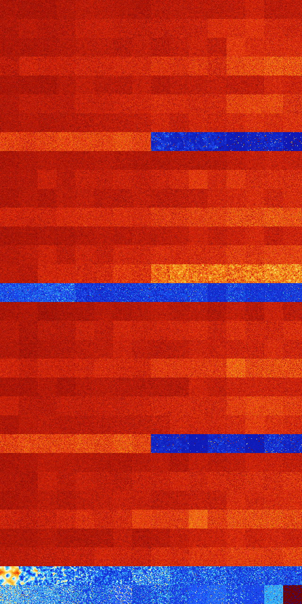

# B236 (38912-39423)

<details>
    <summary>Initial Grid</summary>
    
</details>


<details>
    <summary>Initial Grid RLE</summary>

```
#C Exported from GoGoL (https://github.com/marrow16/gogol)
#C Wrap mode: Toroidal
#C Boundary mode: Dead
#C Step: 0
x = 100, y = 100, rule = B236/S
bo30bo11bo35b2o11bo$bo33bo5bo20bo14bo20bo$45bo25bo25bo$45bo27bo$32bo36b
o11bo3bo12bo$3bo39bo14bo$22bo27b2o11b2o10bo19bo$10bo19bo13bo16bo19b2o$
10bo2bo7bo24bo17bo8bo18bo$8b2o7bo12bo48bo19bo$18bo11bo48bo$15bo21bo20bo
2bo27bo6bo$bo12bo37bo8bo2bo9bo$47bo16bo10bo3b2o4bo13bo$30bo$18bo5bo7bo
30b2o30bo$o8bo12bo8bo12bo20bo$6bo4bo32bo26bo$34bo4bo9bo29bobo7bo$8bo38b
o$o17bo3bo64bobo$29bo7bo40bo$44bo18bo22bo5bobo$38bo17bo$7b2o38bo11bo5bo
3bobo25bo$9b2o18bo65bo$12bo42bo20bo20bo$6bo37bo15bo$13bo66bo5bo$100b$
17b2o17bo19bo12bo$40bo11bo9bo23bo$39bobo16bo28bo$4bo6bo6bo7bo5bo3bo3bo
32bo$21bo$11bo7bo11bo30bo10bo$3bo2bo14bo58bobo$25bo2bo5bobo18bo13bo3bo
3bo$o30bo3bo13bo28bo12b2o$3bo68bo25bo$13bo25bo7bo42bo4bo$37bo20bo5b2obo
13bo5bo2bo$8bo24bo2b2o7bobo16bo12bo18b2obo$7bo37bo5bo10bo7bo3bo24bo$5bo
2bo13bo8bo$2bo73bo$31bo10bo8bo6bobo2bo$bo17bo12bo46bo$15bo65bo$24bo11bo
16bo11bo$47bo5bo$10b2o4bo16bo15bo17bo6bo$16bo16bo54bo2bo$5bo18bo39bo11b
o$21bo4bo$7bo12b2o2bo17bo3bo36bo4bo$18bo23bo21bo30bo$32bo27bo3bo$22bo6b
o8bo19bo4bo21bo8bo$30bobo4bo18bo33bo$6bo6bo7bo17bo2bo4bo47bo$bo3bo15bo
13bobo39bo$5bo38bo7bo5bo18bo$17bo19bo26bobo19bo12bo$3bo9bo10bo12bo28bo
16bo$18bo3bo29bo4bo37bobo$17bo2bo23bo34bo$69bo4bo9b2o$7bo22bo12bo9bo7bo
$55bo43bo$10bo30bo10bo2bo9bo2b2o$23b2o26bo14bo2bo7bo$24b2o3bo13bo42bo$
70bo15bo$33bo47bo2bo9bo$5bo8bo11bo56bo15bo$14bo22bo8bo21bo$20bo11bo16bo
25bo$4bo31bo22bo3bo14bo13bo$10bo16bo2bo27bobo$bo14bo50bo28bo$74bo12bo$
2bo12bo5bo29b2obo7bo33bo$62bo25bo$68bo18bo$22b2o3bo11bobo4bo10bo12bo$9b
o3bo2bo8bo43bo22bo$14bo24bo3bo16bo$12bo32bo27bo2bo15bo$2bo16bo20bo16bo
26bo9bo3bo$3bo6bo17bo16bobo15bo5bo17bob2o5bo$21bo56bo$20bo18bo3bo32bo7b
o10bo$4bo6bo10bo21bo49bo3bo$bo11bo23bo12bo$16bo$4bo2bo35bo38bo4bo3bo5bo
$49bo9bo26bo$9bo25bo15bo29bo$o16bo23bo20bo8bo!
```
</details>
<details>
    <summary>Thumbnail</summary>

</details>
<table>
<tr>
    <td><a href="./38912%20S%20Heat%20Map%20Activity.png"></a><br>S (38912)<br>G>1000</td>    <td><a href="./38913%20S0%20Heat%20Map%20Activity.png"></a><br>S0 (38913)<br>G>1000</td>    <td><a href="./38914%20S1%20Heat%20Map%20Activity.png"></a><br>S1 (38914)<br>G>1000</td>    <td><a href="./38915%20S01%20Heat%20Map%20Activity.png"></a><br>S01 (38915)<br>G>1000</td>    <td><a href="./38916%20S2%20Heat%20Map%20Activity.png"></a><br>S2 (38916)<br>G>1000</td>    <td><a href="./38917%20S02%20Heat%20Map%20Activity.png"></a><br>S02 (38917)<br>G>1000</td>    <td><a href="./38918%20S12%20Heat%20Map%20Activity.png"></a><br>S12 (38918)<br>G>1000</td>    <td><a href="./38919%20S012%20Heat%20Map%20Activity.png"></a><br>S012 (38919)<br>G>1000</td>    <td><a href="./38920%20S3%20Heat%20Map%20Activity.png"></a><br>S3 (38920)<br>G>1000</td>    <td><a href="./38921%20S03%20Heat%20Map%20Activity.png"></a><br>S03 (38921)<br>G>1000</td>    <td><a href="./38922%20S13%20Heat%20Map%20Activity.png"></a><br>S13 (38922)<br>G>1000</td>    <td><a href="./38923%20S013%20Heat%20Map%20Activity.png"></a><br>S013 (38923)<br>G>1000</td>    <td><a href="./38924%20S23%20Heat%20Map%20Activity.png"></a><br>S23 (38924)<br>G>1000</td>    <td><a href="./38925%20S023%20Heat%20Map%20Activity.png"></a><br>S023 (38925)<br>G>1000</td>    <td><a href="./38926%20S123%20Heat%20Map%20Activity.png"></a><br>S123 (38926)<br>G>1000</td>    <td><a href="./38927%20S0123%20Heat%20Map%20Activity.png"></a><br>S0123 (38927)<br>G>1000</td></tr>
<tr>
    <td><a href="./38928%20S4%20Heat%20Map%20Activity.png"></a><br>S4 (38928)<br>G>1000</td>    <td><a href="./38929%20S04%20Heat%20Map%20Activity.png"></a><br>S04 (38929)<br>G>1000</td>    <td><a href="./38930%20S14%20Heat%20Map%20Activity.png"></a><br>S14 (38930)<br>G>1000</td>    <td><a href="./38931%20S014%20Heat%20Map%20Activity.png"></a><br>S014 (38931)<br>G>1000</td>    <td><a href="./38932%20S24%20Heat%20Map%20Activity.png"></a><br>S24 (38932)<br>G>1000</td>    <td><a href="./38933%20S024%20Heat%20Map%20Activity.png"></a><br>S024 (38933)<br>G>1000</td>    <td><a href="./38934%20S124%20Heat%20Map%20Activity.png"></a><br>S124 (38934)<br>G>1000</td>    <td><a href="./38935%20S0124%20Heat%20Map%20Activity.png"></a><br>S0124 (38935)<br>G>1000</td>    <td><a href="./38936%20S34%20Heat%20Map%20Activity.png"></a><br>S34 (38936)<br>G>1000</td>    <td><a href="./38937%20S034%20Heat%20Map%20Activity.png"></a><br>S034 (38937)<br>G>1000</td>    <td><a href="./38938%20S134%20Heat%20Map%20Activity.png"></a><br>S134 (38938)<br>G>1000</td>    <td><a href="./38939%20S0134%20Heat%20Map%20Activity.png"></a><br>S0134 (38939)<br>G>1000</td>    <td><a href="./38940%20S234%20Heat%20Map%20Activity.png"></a><br>S234 (38940)<br>G>1000</td>    <td><a href="./38941%20S0234%20Heat%20Map%20Activity.png"></a><br>S0234 (38941)<br>G>1000</td>    <td><a href="./38942%20S1234%20Heat%20Map%20Activity.png"></a><br>S1234 (38942)<br>G>1000</td>    <td><a href="./38943%20S01234%20Heat%20Map%20Activity.png"></a><br>S01234 (38943)<br>G>1000</td></tr>
<tr>
    <td><a href="./38944%20S5%20Heat%20Map%20Activity.png"></a><br>S5 (38944)<br>G>1000</td>    <td><a href="./38945%20S05%20Heat%20Map%20Activity.png"></a><br>S05 (38945)<br>G>1000</td>    <td><a href="./38946%20S15%20Heat%20Map%20Activity.png"></a><br>S15 (38946)<br>G>1000</td>    <td><a href="./38947%20S015%20Heat%20Map%20Activity.png"></a><br>S015 (38947)<br>G>1000</td>    <td><a href="./38948%20S25%20Heat%20Map%20Activity.png"></a><br>S25 (38948)<br>G>1000</td>    <td><a href="./38949%20S025%20Heat%20Map%20Activity.png"></a><br>S025 (38949)<br>G>1000</td>    <td><a href="./38950%20S125%20Heat%20Map%20Activity.png"></a><br>S125 (38950)<br>G>1000</td>    <td><a href="./38951%20S0125%20Heat%20Map%20Activity.png"></a><br>S0125 (38951)<br>G>1000</td>    <td><a href="./38952%20S35%20Heat%20Map%20Activity.png"></a><br>S35 (38952)<br>G>1000</td>    <td><a href="./38953%20S035%20Heat%20Map%20Activity.png"></a><br>S035 (38953)<br>G>1000</td>    <td><a href="./38954%20S135%20Heat%20Map%20Activity.png"></a><br>S135 (38954)<br>G>1000</td>    <td><a href="./38955%20S0135%20Heat%20Map%20Activity.png"></a><br>S0135 (38955)<br>G>1000</td>    <td><a href="./38956%20S235%20Heat%20Map%20Activity.png"></a><br>S235 (38956)<br>G>1000</td>    <td><a href="./38957%20S0235%20Heat%20Map%20Activity.png"></a><br>S0235 (38957)<br>G>1000</td>    <td><a href="./38958%20S1235%20Heat%20Map%20Activity.png"></a><br>S1235 (38958)<br>G>1000</td>    <td><a href="./38959%20S01235%20Heat%20Map%20Activity.png"></a><br>S01235 (38959)<br>G>1000</td></tr>
<tr>
    <td><a href="./38960%20S45%20Heat%20Map%20Activity.png"></a><br>S45 (38960)<br>G>1000</td>    <td><a href="./38961%20S045%20Heat%20Map%20Activity.png"></a><br>S045 (38961)<br>G>1000</td>    <td><a href="./38962%20S145%20Heat%20Map%20Activity.png"></a><br>S145 (38962)<br>G>1000</td>    <td><a href="./38963%20S0145%20Heat%20Map%20Activity.png"></a><br>S0145 (38963)<br>G>1000</td>    <td><a href="./38964%20S245%20Heat%20Map%20Activity.png"></a><br>S245 (38964)<br>G>1000</td>    <td><a href="./38965%20S0245%20Heat%20Map%20Activity.png"></a><br>S0245 (38965)<br>G>1000</td>    <td><a href="./38966%20S1245%20Heat%20Map%20Activity.png"></a><br>S1245 (38966)<br>G>1000</td>    <td><a href="./38967%20S01245%20Heat%20Map%20Activity.png"></a><br>S01245 (38967)<br>G>1000</td>    <td><a href="./38968%20S345%20Heat%20Map%20Activity.png"></a><br>S345 (38968)<br>G>1000</td>    <td><a href="./38969%20S0345%20Heat%20Map%20Activity.png"></a><br>S0345 (38969)<br>G>1000</td>    <td><a href="./38970%20S1345%20Heat%20Map%20Activity.png"></a><br>S1345 (38970)<br>G>1000</td>    <td><a href="./38971%20S01345%20Heat%20Map%20Activity.png"></a><br>S01345 (38971)<br>G>1000</td>    <td><a href="./38972%20S2345%20Heat%20Map%20Activity.png"></a><br>S2345 (38972)<br>G>1000</td>    <td><a href="./38973%20S02345%20Heat%20Map%20Activity.png"></a><br>S02345 (38973)<br>G>1000</td>    <td><a href="./38974%20S12345%20Heat%20Map%20Activity.png"></a><br>S12345 (38974)<br>G>1000</td>    <td><a href="./38975%20S012345%20Heat%20Map%20Activity.png"></a><br>S012345 (38975)<br>G>1000</td></tr>
<tr>
    <td><a href="./38976%20S6%20Heat%20Map%20Activity.png"></a><br>S6 (38976)<br>G>1000</td>    <td><a href="./38977%20S06%20Heat%20Map%20Activity.png"></a><br>S06 (38977)<br>G>1000</td>    <td><a href="./38978%20S16%20Heat%20Map%20Activity.png"></a><br>S16 (38978)<br>G>1000</td>    <td><a href="./38979%20S016%20Heat%20Map%20Activity.png"></a><br>S016 (38979)<br>G>1000</td>    <td><a href="./38980%20S26%20Heat%20Map%20Activity.png"></a><br>S26 (38980)<br>G>1000</td>    <td><a href="./38981%20S026%20Heat%20Map%20Activity.png"></a><br>S026 (38981)<br>G>1000</td>    <td><a href="./38982%20S126%20Heat%20Map%20Activity.png"></a><br>S126 (38982)<br>G>1000</td>    <td><a href="./38983%20S0126%20Heat%20Map%20Activity.png"></a><br>S0126 (38983)<br>G>1000</td>    <td><a href="./38984%20S36%20Heat%20Map%20Activity.png"></a><br>S36 (38984)<br>G>1000</td>    <td><a href="./38985%20S036%20Heat%20Map%20Activity.png"></a><br>S036 (38985)<br>G>1000</td>    <td><a href="./38986%20S136%20Heat%20Map%20Activity.png"></a><br>S136 (38986)<br>G>1000</td>    <td><a href="./38987%20S0136%20Heat%20Map%20Activity.png"></a><br>S0136 (38987)<br>G>1000</td>    <td><a href="./38988%20S236%20Heat%20Map%20Activity.png"></a><br>S236 (38988)<br>G>1000</td>    <td><a href="./38989%20S0236%20Heat%20Map%20Activity.png"></a><br>S0236 (38989)<br>G>1000</td>    <td><a href="./38990%20S1236%20Heat%20Map%20Activity.png"></a><br>S1236 (38990)<br>G>1000</td>    <td><a href="./38991%20S01236%20Heat%20Map%20Activity.png"></a><br>S01236 (38991)<br>G>1000</td></tr>
<tr>
    <td><a href="./38992%20S46%20Heat%20Map%20Activity.png"></a><br>S46 (38992)<br>G>1000</td>    <td><a href="./38993%20S046%20Heat%20Map%20Activity.png"></a><br>S046 (38993)<br>G>1000</td>    <td><a href="./38994%20S146%20Heat%20Map%20Activity.png"></a><br>S146 (38994)<br>G>1000</td>    <td><a href="./38995%20S0146%20Heat%20Map%20Activity.png"></a><br>S0146 (38995)<br>G>1000</td>    <td><a href="./38996%20S246%20Heat%20Map%20Activity.png"></a><br>S246 (38996)<br>G>1000</td>    <td><a href="./38997%20S0246%20Heat%20Map%20Activity.png"></a><br>S0246 (38997)<br>G>1000</td>    <td><a href="./38998%20S1246%20Heat%20Map%20Activity.png"></a><br>S1246 (38998)<br>G>1000</td>    <td><a href="./38999%20S01246%20Heat%20Map%20Activity.png"></a><br>S01246 (38999)<br>G>1000</td>    <td><a href="./39000%20S346%20Heat%20Map%20Activity.png"></a><br>S346 (39000)<br>G>1000</td>    <td><a href="./39001%20S0346%20Heat%20Map%20Activity.png"></a><br>S0346 (39001)<br>G>1000</td>    <td><a href="./39002%20S1346%20Heat%20Map%20Activity.png"></a><br>S1346 (39002)<br>G>1000</td>    <td><a href="./39003%20S01346%20Heat%20Map%20Activity.png"></a><br>S01346 (39003)<br>G>1000</td>    <td><a href="./39004%20S2346%20Heat%20Map%20Activity.png"></a><br>S2346 (39004)<br>G>1000</td>    <td><a href="./39005%20S02346%20Heat%20Map%20Activity.png"></a><br>S02346 (39005)<br>G>1000</td>    <td><a href="./39006%20S12346%20Heat%20Map%20Activity.png"></a><br>S12346 (39006)<br>G>1000</td>    <td><a href="./39007%20S012346%20Heat%20Map%20Activity.png"></a><br>S012346 (39007)<br>G>1000</td></tr>
<tr>
    <td><a href="./39008%20S56%20Heat%20Map%20Activity.png"></a><br>S56 (39008)<br>G>1000</td>    <td><a href="./39009%20S056%20Heat%20Map%20Activity.png"></a><br>S056 (39009)<br>G>1000</td>    <td><a href="./39010%20S156%20Heat%20Map%20Activity.png"></a><br>S156 (39010)<br>G>1000</td>    <td><a href="./39011%20S0156%20Heat%20Map%20Activity.png"></a><br>S0156 (39011)<br>G>1000</td>    <td><a href="./39012%20S256%20Heat%20Map%20Activity.png"></a><br>S256 (39012)<br>G>1000</td>    <td><a href="./39013%20S0256%20Heat%20Map%20Activity.png"></a><br>S0256 (39013)<br>G>1000</td>    <td><a href="./39014%20S1256%20Heat%20Map%20Activity.png"></a><br>S1256 (39014)<br>G>1000</td>    <td><a href="./39015%20S01256%20Heat%20Map%20Activity.png"></a><br>S01256 (39015)<br>G>1000</td>    <td><a href="./39016%20S356%20Heat%20Map%20Activity.png"></a><br>S356 (39016)<br>G>1000</td>    <td><a href="./39017%20S0356%20Heat%20Map%20Activity.png"></a><br>S0356 (39017)<br>G>1000</td>    <td><a href="./39018%20S1356%20Heat%20Map%20Activity.png"></a><br>S1356 (39018)<br>G>1000</td>    <td><a href="./39019%20S01356%20Heat%20Map%20Activity.png"></a><br>S01356 (39019)<br>G>1000</td>    <td><a href="./39020%20S2356%20Heat%20Map%20Activity.png"></a><br>S2356 (39020)<br>G>1000</td>    <td><a href="./39021%20S02356%20Heat%20Map%20Activity.png"></a><br>S02356 (39021)<br>G>1000</td>    <td><a href="./39022%20S12356%20Heat%20Map%20Activity.png"></a><br>S12356 (39022)<br>G>1000</td>    <td><a href="./39023%20S012356%20Heat%20Map%20Activity.png"></a><br>S012356 (39023)<br>G>1000</td></tr>
<tr>
    <td><a href="./39024%20S456%20Heat%20Map%20Activity.png"></a><br>S456 (39024)<br>G>1000</td>    <td><a href="./39025%20S0456%20Heat%20Map%20Activity.png"></a><br>S0456 (39025)<br>G>1000</td>    <td><a href="./39026%20S1456%20Heat%20Map%20Activity.png"></a><br>S1456 (39026)<br>G>1000</td>    <td><a href="./39027%20S01456%20Heat%20Map%20Activity.png"></a><br>S01456 (39027)<br>G>1000</td>    <td><a href="./39028%20S2456%20Heat%20Map%20Activity.png"></a><br>S2456 (39028)<br>G>1000</td>    <td><a href="./39029%20S02456%20Heat%20Map%20Activity.png"></a><br>S02456 (39029)<br>G>1000</td>    <td><a href="./39030%20S12456%20Heat%20Map%20Activity.png"></a><br>S12456 (39030)<br>G>1000</td>    <td><a href="./39031%20S012456%20Heat%20Map%20Activity.png"></a><br>S012456 (39031)<br>G>1000</td>    <td><a href="./39032%20S3456%20Heat%20Map%20Activity.png"></a><br>S3456 (39032)<br>R@553,p60</td>    <td><a href="./39033%20S03456%20Heat%20Map%20Activity.png"></a><br>S03456 (39033)<br>R@708,p24</td>    <td><a href="./39034%20S13456%20Heat%20Map%20Activity.png"></a><br>S13456 (39034)<br>R@585,p60</td>    <td><a href="./39035%20S013456%20Heat%20Map%20Activity.png"></a><br>S013456 (39035)<br>R@564,p60</td>    <td><a href="./39036%20S23456%20Heat%20Map%20Activity.png"></a><br>S23456 (39036)<br>R@519,p420</td>    <td><a href="./39037%20S023456%20Heat%20Map%20Activity.png"></a><br>S023456 (39037)<br>R@192,p60</td>    <td><a href="./39038%20S123456%20Heat%20Map%20Activity.png"></a><br>S123456 (39038)<br>R@130,p60</td>    <td><a href="./39039%20S0123456%20Heat%20Map%20Activity.png"></a><br>S0123456 (39039)<br>G>1000</td></tr>
<tr>
    <td><a href="./39040%20S7%20Heat%20Map%20Activity.png"></a><br>S7 (39040)<br>G>1000</td>    <td><a href="./39041%20S07%20Heat%20Map%20Activity.png"></a><br>S07 (39041)<br>G>1000</td>    <td><a href="./39042%20S17%20Heat%20Map%20Activity.png"></a><br>S17 (39042)<br>G>1000</td>    <td><a href="./39043%20S017%20Heat%20Map%20Activity.png"></a><br>S017 (39043)<br>G>1000</td>    <td><a href="./39044%20S27%20Heat%20Map%20Activity.png"></a><br>S27 (39044)<br>G>1000</td>    <td><a href="./39045%20S027%20Heat%20Map%20Activity.png"></a><br>S027 (39045)<br>G>1000</td>    <td><a href="./39046%20S127%20Heat%20Map%20Activity.png"></a><br>S127 (39046)<br>G>1000</td>    <td><a href="./39047%20S0127%20Heat%20Map%20Activity.png"></a><br>S0127 (39047)<br>G>1000</td>    <td><a href="./39048%20S37%20Heat%20Map%20Activity.png"></a><br>S37 (39048)<br>G>1000</td>    <td><a href="./39049%20S037%20Heat%20Map%20Activity.png"></a><br>S037 (39049)<br>G>1000</td>    <td><a href="./39050%20S137%20Heat%20Map%20Activity.png"></a><br>S137 (39050)<br>G>1000</td>    <td><a href="./39051%20S0137%20Heat%20Map%20Activity.png"></a><br>S0137 (39051)<br>G>1000</td>    <td><a href="./39052%20S237%20Heat%20Map%20Activity.png"></a><br>S237 (39052)<br>G>1000</td>    <td><a href="./39053%20S0237%20Heat%20Map%20Activity.png"></a><br>S0237 (39053)<br>G>1000</td>    <td><a href="./39054%20S1237%20Heat%20Map%20Activity.png"></a><br>S1237 (39054)<br>G>1000</td>    <td><a href="./39055%20S01237%20Heat%20Map%20Activity.png"></a><br>S01237 (39055)<br>G>1000</td></tr>
<tr>
    <td><a href="./39056%20S47%20Heat%20Map%20Activity.png"></a><br>S47 (39056)<br>G>1000</td>    <td><a href="./39057%20S047%20Heat%20Map%20Activity.png"></a><br>S047 (39057)<br>G>1000</td>    <td><a href="./39058%20S147%20Heat%20Map%20Activity.png"></a><br>S147 (39058)<br>G>1000</td>    <td><a href="./39059%20S0147%20Heat%20Map%20Activity.png"></a><br>S0147 (39059)<br>G>1000</td>    <td><a href="./39060%20S247%20Heat%20Map%20Activity.png"></a><br>S247 (39060)<br>G>1000</td>    <td><a href="./39061%20S0247%20Heat%20Map%20Activity.png"></a><br>S0247 (39061)<br>G>1000</td>    <td><a href="./39062%20S1247%20Heat%20Map%20Activity.png"></a><br>S1247 (39062)<br>G>1000</td>    <td><a href="./39063%20S01247%20Heat%20Map%20Activity.png"></a><br>S01247 (39063)<br>G>1000</td>    <td><a href="./39064%20S347%20Heat%20Map%20Activity.png"></a><br>S347 (39064)<br>G>1000</td>    <td><a href="./39065%20S0347%20Heat%20Map%20Activity.png"></a><br>S0347 (39065)<br>G>1000</td>    <td><a href="./39066%20S1347%20Heat%20Map%20Activity.png"></a><br>S1347 (39066)<br>G>1000</td>    <td><a href="./39067%20S01347%20Heat%20Map%20Activity.png"></a><br>S01347 (39067)<br>G>1000</td>    <td><a href="./39068%20S2347%20Heat%20Map%20Activity.png"></a><br>S2347 (39068)<br>G>1000</td>    <td><a href="./39069%20S02347%20Heat%20Map%20Activity.png"></a><br>S02347 (39069)<br>G>1000</td>    <td><a href="./39070%20S12347%20Heat%20Map%20Activity.png"></a><br>S12347 (39070)<br>G>1000</td>    <td><a href="./39071%20S012347%20Heat%20Map%20Activity.png"></a><br>S012347 (39071)<br>G>1000</td></tr>
<tr>
    <td><a href="./39072%20S57%20Heat%20Map%20Activity.png"></a><br>S57 (39072)<br>G>1000</td>    <td><a href="./39073%20S057%20Heat%20Map%20Activity.png"></a><br>S057 (39073)<br>G>1000</td>    <td><a href="./39074%20S157%20Heat%20Map%20Activity.png"></a><br>S157 (39074)<br>G>1000</td>    <td><a href="./39075%20S0157%20Heat%20Map%20Activity.png"></a><br>S0157 (39075)<br>G>1000</td>    <td><a href="./39076%20S257%20Heat%20Map%20Activity.png"></a><br>S257 (39076)<br>G>1000</td>    <td><a href="./39077%20S0257%20Heat%20Map%20Activity.png"></a><br>S0257 (39077)<br>G>1000</td>    <td><a href="./39078%20S1257%20Heat%20Map%20Activity.png"></a><br>S1257 (39078)<br>G>1000</td>    <td><a href="./39079%20S01257%20Heat%20Map%20Activity.png"></a><br>S01257 (39079)<br>G>1000</td>    <td><a href="./39080%20S357%20Heat%20Map%20Activity.png"></a><br>S357 (39080)<br>G>1000</td>    <td><a href="./39081%20S0357%20Heat%20Map%20Activity.png"></a><br>S0357 (39081)<br>G>1000</td>    <td><a href="./39082%20S1357%20Heat%20Map%20Activity.png"></a><br>S1357 (39082)<br>G>1000</td>    <td><a href="./39083%20S01357%20Heat%20Map%20Activity.png"></a><br>S01357 (39083)<br>G>1000</td>    <td><a href="./39084%20S2357%20Heat%20Map%20Activity.png"></a><br>S2357 (39084)<br>G>1000</td>    <td><a href="./39085%20S02357%20Heat%20Map%20Activity.png"></a><br>S02357 (39085)<br>G>1000</td>    <td><a href="./39086%20S12357%20Heat%20Map%20Activity.png"></a><br>S12357 (39086)<br>G>1000</td>    <td><a href="./39087%20S012357%20Heat%20Map%20Activity.png"></a><br>S012357 (39087)<br>G>1000</td></tr>
<tr>
    <td><a href="./39088%20S457%20Heat%20Map%20Activity.png"></a><br>S457 (39088)<br>G>1000</td>    <td><a href="./39089%20S0457%20Heat%20Map%20Activity.png"></a><br>S0457 (39089)<br>G>1000</td>    <td><a href="./39090%20S1457%20Heat%20Map%20Activity.png"></a><br>S1457 (39090)<br>G>1000</td>    <td><a href="./39091%20S01457%20Heat%20Map%20Activity.png"></a><br>S01457 (39091)<br>G>1000</td>    <td><a href="./39092%20S2457%20Heat%20Map%20Activity.png"></a><br>S2457 (39092)<br>G>1000</td>    <td><a href="./39093%20S02457%20Heat%20Map%20Activity.png"></a><br>S02457 (39093)<br>G>1000</td>    <td><a href="./39094%20S12457%20Heat%20Map%20Activity.png"></a><br>S12457 (39094)<br>G>1000</td>    <td><a href="./39095%20S012457%20Heat%20Map%20Activity.png"></a><br>S012457 (39095)<br>G>1000</td>    <td><a href="./39096%20S3457%20Heat%20Map%20Activity.png"></a><br>S3457 (39096)<br>G>1000</td>    <td><a href="./39097%20S03457%20Heat%20Map%20Activity.png"></a><br>S03457 (39097)<br>G>1000</td>    <td><a href="./39098%20S13457%20Heat%20Map%20Activity.png"></a><br>S13457 (39098)<br>G>1000</td>    <td><a href="./39099%20S013457%20Heat%20Map%20Activity.png"></a><br>S013457 (39099)<br>G>1000</td>    <td><a href="./39100%20S23457%20Heat%20Map%20Activity.png"></a><br>S23457 (39100)<br>G>1000</td>    <td><a href="./39101%20S023457%20Heat%20Map%20Activity.png"></a><br>S023457 (39101)<br>G>1000</td>    <td><a href="./39102%20S123457%20Heat%20Map%20Activity.png"></a><br>S123457 (39102)<br>G>1000</td>    <td><a href="./39103%20S0123457%20Heat%20Map%20Activity.png"></a><br>S0123457 (39103)<br>G>1000</td></tr>
<tr>
    <td><a href="./39104%20S67%20Heat%20Map%20Activity.png"></a><br>S67 (39104)<br>G>1000</td>    <td><a href="./39105%20S067%20Heat%20Map%20Activity.png"></a><br>S067 (39105)<br>G>1000</td>    <td><a href="./39106%20S167%20Heat%20Map%20Activity.png"></a><br>S167 (39106)<br>G>1000</td>    <td><a href="./39107%20S0167%20Heat%20Map%20Activity.png"></a><br>S0167 (39107)<br>G>1000</td>    <td><a href="./39108%20S267%20Heat%20Map%20Activity.png"></a><br>S267 (39108)<br>G>1000</td>    <td><a href="./39109%20S0267%20Heat%20Map%20Activity.png"></a><br>S0267 (39109)<br>G>1000</td>    <td><a href="./39110%20S1267%20Heat%20Map%20Activity.png"></a><br>S1267 (39110)<br>G>1000</td>    <td><a href="./39111%20S01267%20Heat%20Map%20Activity.png"></a><br>S01267 (39111)<br>G>1000</td>    <td><a href="./39112%20S367%20Heat%20Map%20Activity.png"></a><br>S367 (39112)<br>G>1000</td>    <td><a href="./39113%20S0367%20Heat%20Map%20Activity.png"></a><br>S0367 (39113)<br>G>1000</td>    <td><a href="./39114%20S1367%20Heat%20Map%20Activity.png"></a><br>S1367 (39114)<br>G>1000</td>    <td><a href="./39115%20S01367%20Heat%20Map%20Activity.png"></a><br>S01367 (39115)<br>G>1000</td>    <td><a href="./39116%20S2367%20Heat%20Map%20Activity.png"></a><br>S2367 (39116)<br>G>1000</td>    <td><a href="./39117%20S02367%20Heat%20Map%20Activity.png"></a><br>S02367 (39117)<br>G>1000</td>    <td><a href="./39118%20S12367%20Heat%20Map%20Activity.png"></a><br>S12367 (39118)<br>G>1000</td>    <td><a href="./39119%20S012367%20Heat%20Map%20Activity.png"></a><br>S012367 (39119)<br>G>1000</td></tr>
<tr>
    <td><a href="./39120%20S467%20Heat%20Map%20Activity.png"></a><br>S467 (39120)<br>G>1000</td>    <td><a href="./39121%20S0467%20Heat%20Map%20Activity.png"></a><br>S0467 (39121)<br>G>1000</td>    <td><a href="./39122%20S1467%20Heat%20Map%20Activity.png"></a><br>S1467 (39122)<br>G>1000</td>    <td><a href="./39123%20S01467%20Heat%20Map%20Activity.png"></a><br>S01467 (39123)<br>G>1000</td>    <td><a href="./39124%20S2467%20Heat%20Map%20Activity.png"></a><br>S2467 (39124)<br>G>1000</td>    <td><a href="./39125%20S02467%20Heat%20Map%20Activity.png"></a><br>S02467 (39125)<br>G>1000</td>    <td><a href="./39126%20S12467%20Heat%20Map%20Activity.png"></a><br>S12467 (39126)<br>G>1000</td>    <td><a href="./39127%20S012467%20Heat%20Map%20Activity.png"></a><br>S012467 (39127)<br>G>1000</td>    <td><a href="./39128%20S3467%20Heat%20Map%20Activity.png"></a><br>S3467 (39128)<br>G>1000</td>    <td><a href="./39129%20S03467%20Heat%20Map%20Activity.png"></a><br>S03467 (39129)<br>G>1000</td>    <td><a href="./39130%20S13467%20Heat%20Map%20Activity.png"></a><br>S13467 (39130)<br>G>1000</td>    <td><a href="./39131%20S013467%20Heat%20Map%20Activity.png"></a><br>S013467 (39131)<br>G>1000</td>    <td><a href="./39132%20S23467%20Heat%20Map%20Activity.png"></a><br>S23467 (39132)<br>G>1000</td>    <td><a href="./39133%20S023467%20Heat%20Map%20Activity.png"></a><br>S023467 (39133)<br>G>1000</td>    <td><a href="./39134%20S123467%20Heat%20Map%20Activity.png"></a><br>S123467 (39134)<br>G>1000</td>    <td><a href="./39135%20S0123467%20Heat%20Map%20Activity.png"></a><br>S0123467 (39135)<br>G>1000</td></tr>
<tr>
    <td><a href="./39136%20S567%20Heat%20Map%20Activity.png"></a><br>S567 (39136)<br>G>1000</td>    <td><a href="./39137%20S0567%20Heat%20Map%20Activity.png"></a><br>S0567 (39137)<br>G>1000</td>    <td><a href="./39138%20S1567%20Heat%20Map%20Activity.png"></a><br>S1567 (39138)<br>G>1000</td>    <td><a href="./39139%20S01567%20Heat%20Map%20Activity.png"></a><br>S01567 (39139)<br>G>1000</td>    <td><a href="./39140%20S2567%20Heat%20Map%20Activity.png"></a><br>S2567 (39140)<br>G>1000</td>    <td><a href="./39141%20S02567%20Heat%20Map%20Activity.png"></a><br>S02567 (39141)<br>G>1000</td>    <td><a href="./39142%20S12567%20Heat%20Map%20Activity.png"></a><br>S12567 (39142)<br>G>1000</td>    <td><a href="./39143%20S012567%20Heat%20Map%20Activity.png"></a><br>S012567 (39143)<br>G>1000</td>    <td><a href="./39144%20S3567%20Heat%20Map%20Activity.png"></a><br>S3567 (39144)<br>G>1000</td>    <td><a href="./39145%20S03567%20Heat%20Map%20Activity.png"></a><br>S03567 (39145)<br>G>1000</td>    <td><a href="./39146%20S13567%20Heat%20Map%20Activity.png"></a><br>S13567 (39146)<br>G>1000</td>    <td><a href="./39147%20S013567%20Heat%20Map%20Activity.png"></a><br>S013567 (39147)<br>G>1000</td>    <td><a href="./39148%20S23567%20Heat%20Map%20Activity.png"></a><br>S23567 (39148)<br>G>1000</td>    <td><a href="./39149%20S023567%20Heat%20Map%20Activity.png"></a><br>S023567 (39149)<br>G>1000</td>    <td><a href="./39150%20S123567%20Heat%20Map%20Activity.png"></a><br>S123567 (39150)<br>G>1000</td>    <td><a href="./39151%20S0123567%20Heat%20Map%20Activity.png"></a><br>S0123567 (39151)<br>G>1000</td></tr>
<tr>
    <td><a href="./39152%20S4567%20Heat%20Map%20Activity.png"></a><br>S4567 (39152)<br>R@42,p4</td>    <td><a href="./39153%20S04567%20Heat%20Map%20Activity.png"></a><br>S04567 (39153)<br>R@40,p12</td>    <td><a href="./39154%20S14567%20Heat%20Map%20Activity.png"></a><br>S14567 (39154)<br>R@31,p4</td>    <td><a href="./39155%20S014567%20Heat%20Map%20Activity.png"></a><br>S014567 (39155)<br>R@31,p4</td>    <td><a href="./39156%20S24567%20Heat%20Map%20Activity.png"></a><br>S24567 (39156)<br>R@36,p12</td>    <td><a href="./39157%20S024567%20Heat%20Map%20Activity.png"></a><br>S024567 (39157)<br>R@37,p12</td>    <td><a href="./39158%20S124567%20Heat%20Map%20Activity.png"></a><br>S124567 (39158)<br>R@28,p4</td>    <td><a href="./39159%20S0124567%20Heat%20Map%20Activity.png"></a><br>S0124567 (39159)<br>R@27,p4</td>    <td><a href="./39160%20S34567%20Heat%20Map%20Activity.png"></a><br>S34567 (39160)<br>R@33,p6</td>    <td><a href="./39161%20S034567%20Heat%20Map%20Activity.png"></a><br>S034567 (39161)<br>R@23,p6</td>    <td><a href="./39162%20S134567%20Heat%20Map%20Activity.png"></a><br>S134567 (39162)<br>R@22,p2</td>    <td><a href="./39163%20S0134567%20Heat%20Map%20Activity.png"></a><br>S0134567 (39163)<br>R@27,p10</td>    <td><a href="./39164%20S234567%20Heat%20Map%20Activity.png"></a><br>S234567 (39164)<br>R@20,p2</td>    <td><a href="./39165%20S0234567%20Heat%20Map%20Activity.png"></a><br>S0234567 (39165)<br>R@23,p6</td>    <td><a href="./39166%20S1234567%20Heat%20Map%20Activity.png"></a><br>S1234567 (39166)<br>R@24,p4</td>    <td><a href="./39167%20S01234567%20Heat%20Map%20Activity.png"></a><br>S01234567 (39167)<br>R@19,p4</td></tr>
<tr>
    <td><a href="./39168%20S8%20Heat%20Map%20Activity.png"></a><br>S8 (39168)<br>G>1000</td>    <td><a href="./39169%20S08%20Heat%20Map%20Activity.png"></a><br>S08 (39169)<br>G>1000</td>    <td><a href="./39170%20S18%20Heat%20Map%20Activity.png"></a><br>S18 (39170)<br>G>1000</td>    <td><a href="./39171%20S018%20Heat%20Map%20Activity.png"></a><br>S018 (39171)<br>G>1000</td>    <td><a href="./39172%20S28%20Heat%20Map%20Activity.png"></a><br>S28 (39172)<br>G>1000</td>    <td><a href="./39173%20S028%20Heat%20Map%20Activity.png"></a><br>S028 (39173)<br>G>1000</td>    <td><a href="./39174%20S128%20Heat%20Map%20Activity.png"></a><br>S128 (39174)<br>G>1000</td>    <td><a href="./39175%20S0128%20Heat%20Map%20Activity.png"></a><br>S0128 (39175)<br>G>1000</td>    <td><a href="./39176%20S38%20Heat%20Map%20Activity.png"></a><br>S38 (39176)<br>G>1000</td>    <td><a href="./39177%20S038%20Heat%20Map%20Activity.png"></a><br>S038 (39177)<br>G>1000</td>    <td><a href="./39178%20S138%20Heat%20Map%20Activity.png"></a><br>S138 (39178)<br>G>1000</td>    <td><a href="./39179%20S0138%20Heat%20Map%20Activity.png"></a><br>S0138 (39179)<br>G>1000</td>    <td><a href="./39180%20S238%20Heat%20Map%20Activity.png"></a><br>S238 (39180)<br>G>1000</td>    <td><a href="./39181%20S0238%20Heat%20Map%20Activity.png"></a><br>S0238 (39181)<br>G>1000</td>    <td><a href="./39182%20S1238%20Heat%20Map%20Activity.png"></a><br>S1238 (39182)<br>G>1000</td>    <td><a href="./39183%20S01238%20Heat%20Map%20Activity.png"></a><br>S01238 (39183)<br>G>1000</td></tr>
<tr>
    <td><a href="./39184%20S48%20Heat%20Map%20Activity.png"></a><br>S48 (39184)<br>G>1000</td>    <td><a href="./39185%20S048%20Heat%20Map%20Activity.png"></a><br>S048 (39185)<br>G>1000</td>    <td><a href="./39186%20S148%20Heat%20Map%20Activity.png"></a><br>S148 (39186)<br>G>1000</td>    <td><a href="./39187%20S0148%20Heat%20Map%20Activity.png"></a><br>S0148 (39187)<br>G>1000</td>    <td><a href="./39188%20S248%20Heat%20Map%20Activity.png"></a><br>S248 (39188)<br>G>1000</td>    <td><a href="./39189%20S0248%20Heat%20Map%20Activity.png"></a><br>S0248 (39189)<br>G>1000</td>    <td><a href="./39190%20S1248%20Heat%20Map%20Activity.png"></a><br>S1248 (39190)<br>G>1000</td>    <td><a href="./39191%20S01248%20Heat%20Map%20Activity.png"></a><br>S01248 (39191)<br>G>1000</td>    <td><a href="./39192%20S348%20Heat%20Map%20Activity.png"></a><br>S348 (39192)<br>G>1000</td>    <td><a href="./39193%20S0348%20Heat%20Map%20Activity.png"></a><br>S0348 (39193)<br>G>1000</td>    <td><a href="./39194%20S1348%20Heat%20Map%20Activity.png"></a><br>S1348 (39194)<br>G>1000</td>    <td><a href="./39195%20S01348%20Heat%20Map%20Activity.png"></a><br>S01348 (39195)<br>G>1000</td>    <td><a href="./39196%20S2348%20Heat%20Map%20Activity.png"></a><br>S2348 (39196)<br>G>1000</td>    <td><a href="./39197%20S02348%20Heat%20Map%20Activity.png"></a><br>S02348 (39197)<br>G>1000</td>    <td><a href="./39198%20S12348%20Heat%20Map%20Activity.png"></a><br>S12348 (39198)<br>G>1000</td>    <td><a href="./39199%20S012348%20Heat%20Map%20Activity.png"></a><br>S012348 (39199)<br>G>1000</td></tr>
<tr>
    <td><a href="./39200%20S58%20Heat%20Map%20Activity.png"></a><br>S58 (39200)<br>G>1000</td>    <td><a href="./39201%20S058%20Heat%20Map%20Activity.png"></a><br>S058 (39201)<br>G>1000</td>    <td><a href="./39202%20S158%20Heat%20Map%20Activity.png"></a><br>S158 (39202)<br>G>1000</td>    <td><a href="./39203%20S0158%20Heat%20Map%20Activity.png"></a><br>S0158 (39203)<br>G>1000</td>    <td><a href="./39204%20S258%20Heat%20Map%20Activity.png"></a><br>S258 (39204)<br>G>1000</td>    <td><a href="./39205%20S0258%20Heat%20Map%20Activity.png"></a><br>S0258 (39205)<br>G>1000</td>    <td><a href="./39206%20S1258%20Heat%20Map%20Activity.png"></a><br>S1258 (39206)<br>G>1000</td>    <td><a href="./39207%20S01258%20Heat%20Map%20Activity.png"></a><br>S01258 (39207)<br>G>1000</td>    <td><a href="./39208%20S358%20Heat%20Map%20Activity.png"></a><br>S358 (39208)<br>G>1000</td>    <td><a href="./39209%20S0358%20Heat%20Map%20Activity.png"></a><br>S0358 (39209)<br>G>1000</td>    <td><a href="./39210%20S1358%20Heat%20Map%20Activity.png"></a><br>S1358 (39210)<br>G>1000</td>    <td><a href="./39211%20S01358%20Heat%20Map%20Activity.png"></a><br>S01358 (39211)<br>G>1000</td>    <td><a href="./39212%20S2358%20Heat%20Map%20Activity.png"></a><br>S2358 (39212)<br>G>1000</td>    <td><a href="./39213%20S02358%20Heat%20Map%20Activity.png"></a><br>S02358 (39213)<br>G>1000</td>    <td><a href="./39214%20S12358%20Heat%20Map%20Activity.png"></a><br>S12358 (39214)<br>G>1000</td>    <td><a href="./39215%20S012358%20Heat%20Map%20Activity.png"></a><br>S012358 (39215)<br>G>1000</td></tr>
<tr>
    <td><a href="./39216%20S458%20Heat%20Map%20Activity.png"></a><br>S458 (39216)<br>G>1000</td>    <td><a href="./39217%20S0458%20Heat%20Map%20Activity.png"></a><br>S0458 (39217)<br>G>1000</td>    <td><a href="./39218%20S1458%20Heat%20Map%20Activity.png"></a><br>S1458 (39218)<br>G>1000</td>    <td><a href="./39219%20S01458%20Heat%20Map%20Activity.png"></a><br>S01458 (39219)<br>G>1000</td>    <td><a href="./39220%20S2458%20Heat%20Map%20Activity.png"></a><br>S2458 (39220)<br>G>1000</td>    <td><a href="./39221%20S02458%20Heat%20Map%20Activity.png"></a><br>S02458 (39221)<br>G>1000</td>    <td><a href="./39222%20S12458%20Heat%20Map%20Activity.png"></a><br>S12458 (39222)<br>G>1000</td>    <td><a href="./39223%20S012458%20Heat%20Map%20Activity.png"></a><br>S012458 (39223)<br>G>1000</td>    <td><a href="./39224%20S3458%20Heat%20Map%20Activity.png"></a><br>S3458 (39224)<br>G>1000</td>    <td><a href="./39225%20S03458%20Heat%20Map%20Activity.png"></a><br>S03458 (39225)<br>G>1000</td>    <td><a href="./39226%20S13458%20Heat%20Map%20Activity.png"></a><br>S13458 (39226)<br>G>1000</td>    <td><a href="./39227%20S013458%20Heat%20Map%20Activity.png"></a><br>S013458 (39227)<br>G>1000</td>    <td><a href="./39228%20S23458%20Heat%20Map%20Activity.png"></a><br>S23458 (39228)<br>G>1000</td>    <td><a href="./39229%20S023458%20Heat%20Map%20Activity.png"></a><br>S023458 (39229)<br>G>1000</td>    <td><a href="./39230%20S123458%20Heat%20Map%20Activity.png"></a><br>S123458 (39230)<br>G>1000</td>    <td><a href="./39231%20S0123458%20Heat%20Map%20Activity.png"></a><br>S0123458 (39231)<br>G>1000</td></tr>
<tr>
    <td><a href="./39232%20S68%20Heat%20Map%20Activity.png"></a><br>S68 (39232)<br>G>1000</td>    <td><a href="./39233%20S068%20Heat%20Map%20Activity.png"></a><br>S068 (39233)<br>G>1000</td>    <td><a href="./39234%20S168%20Heat%20Map%20Activity.png"></a><br>S168 (39234)<br>G>1000</td>    <td><a href="./39235%20S0168%20Heat%20Map%20Activity.png"></a><br>S0168 (39235)<br>G>1000</td>    <td><a href="./39236%20S268%20Heat%20Map%20Activity.png"></a><br>S268 (39236)<br>G>1000</td>    <td><a href="./39237%20S0268%20Heat%20Map%20Activity.png"></a><br>S0268 (39237)<br>G>1000</td>    <td><a href="./39238%20S1268%20Heat%20Map%20Activity.png"></a><br>S1268 (39238)<br>G>1000</td>    <td><a href="./39239%20S01268%20Heat%20Map%20Activity.png"></a><br>S01268 (39239)<br>G>1000</td>    <td><a href="./39240%20S368%20Heat%20Map%20Activity.png"></a><br>S368 (39240)<br>G>1000</td>    <td><a href="./39241%20S0368%20Heat%20Map%20Activity.png"></a><br>S0368 (39241)<br>G>1000</td>    <td><a href="./39242%20S1368%20Heat%20Map%20Activity.png"></a><br>S1368 (39242)<br>G>1000</td>    <td><a href="./39243%20S01368%20Heat%20Map%20Activity.png"></a><br>S01368 (39243)<br>G>1000</td>    <td><a href="./39244%20S2368%20Heat%20Map%20Activity.png"></a><br>S2368 (39244)<br>G>1000</td>    <td><a href="./39245%20S02368%20Heat%20Map%20Activity.png"></a><br>S02368 (39245)<br>G>1000</td>    <td><a href="./39246%20S12368%20Heat%20Map%20Activity.png"></a><br>S12368 (39246)<br>G>1000</td>    <td><a href="./39247%20S012368%20Heat%20Map%20Activity.png"></a><br>S012368 (39247)<br>G>1000</td></tr>
<tr>
    <td><a href="./39248%20S468%20Heat%20Map%20Activity.png"></a><br>S468 (39248)<br>G>1000</td>    <td><a href="./39249%20S0468%20Heat%20Map%20Activity.png"></a><br>S0468 (39249)<br>G>1000</td>    <td><a href="./39250%20S1468%20Heat%20Map%20Activity.png"></a><br>S1468 (39250)<br>G>1000</td>    <td><a href="./39251%20S01468%20Heat%20Map%20Activity.png"></a><br>S01468 (39251)<br>G>1000</td>    <td><a href="./39252%20S2468%20Heat%20Map%20Activity.png"></a><br>S2468 (39252)<br>G>1000</td>    <td><a href="./39253%20S02468%20Heat%20Map%20Activity.png"></a><br>S02468 (39253)<br>G>1000</td>    <td><a href="./39254%20S12468%20Heat%20Map%20Activity.png"></a><br>S12468 (39254)<br>G>1000</td>    <td><a href="./39255%20S012468%20Heat%20Map%20Activity.png"></a><br>S012468 (39255)<br>G>1000</td>    <td><a href="./39256%20S3468%20Heat%20Map%20Activity.png"></a><br>S3468 (39256)<br>G>1000</td>    <td><a href="./39257%20S03468%20Heat%20Map%20Activity.png"></a><br>S03468 (39257)<br>G>1000</td>    <td><a href="./39258%20S13468%20Heat%20Map%20Activity.png"></a><br>S13468 (39258)<br>G>1000</td>    <td><a href="./39259%20S013468%20Heat%20Map%20Activity.png"></a><br>S013468 (39259)<br>G>1000</td>    <td><a href="./39260%20S23468%20Heat%20Map%20Activity.png"></a><br>S23468 (39260)<br>G>1000</td>    <td><a href="./39261%20S023468%20Heat%20Map%20Activity.png"></a><br>S023468 (39261)<br>G>1000</td>    <td><a href="./39262%20S123468%20Heat%20Map%20Activity.png"></a><br>S123468 (39262)<br>G>1000</td>    <td><a href="./39263%20S0123468%20Heat%20Map%20Activity.png"></a><br>S0123468 (39263)<br>G>1000</td></tr>
<tr>
    <td><a href="./39264%20S568%20Heat%20Map%20Activity.png"></a><br>S568 (39264)<br>G>1000</td>    <td><a href="./39265%20S0568%20Heat%20Map%20Activity.png"></a><br>S0568 (39265)<br>G>1000</td>    <td><a href="./39266%20S1568%20Heat%20Map%20Activity.png"></a><br>S1568 (39266)<br>G>1000</td>    <td><a href="./39267%20S01568%20Heat%20Map%20Activity.png"></a><br>S01568 (39267)<br>G>1000</td>    <td><a href="./39268%20S2568%20Heat%20Map%20Activity.png"></a><br>S2568 (39268)<br>G>1000</td>    <td><a href="./39269%20S02568%20Heat%20Map%20Activity.png"></a><br>S02568 (39269)<br>G>1000</td>    <td><a href="./39270%20S12568%20Heat%20Map%20Activity.png"></a><br>S12568 (39270)<br>G>1000</td>    <td><a href="./39271%20S012568%20Heat%20Map%20Activity.png"></a><br>S012568 (39271)<br>G>1000</td>    <td><a href="./39272%20S3568%20Heat%20Map%20Activity.png"></a><br>S3568 (39272)<br>G>1000</td>    <td><a href="./39273%20S03568%20Heat%20Map%20Activity.png"></a><br>S03568 (39273)<br>G>1000</td>    <td><a href="./39274%20S13568%20Heat%20Map%20Activity.png"></a><br>S13568 (39274)<br>G>1000</td>    <td><a href="./39275%20S013568%20Heat%20Map%20Activity.png"></a><br>S013568 (39275)<br>G>1000</td>    <td><a href="./39276%20S23568%20Heat%20Map%20Activity.png"></a><br>S23568 (39276)<br>G>1000</td>    <td><a href="./39277%20S023568%20Heat%20Map%20Activity.png"></a><br>S023568 (39277)<br>G>1000</td>    <td><a href="./39278%20S123568%20Heat%20Map%20Activity.png"></a><br>S123568 (39278)<br>G>1000</td>    <td><a href="./39279%20S0123568%20Heat%20Map%20Activity.png"></a><br>S0123568 (39279)<br>G>1000</td></tr>
<tr>
    <td><a href="./39280%20S4568%20Heat%20Map%20Activity.png"></a><br>S4568 (39280)<br>G>1000</td>    <td><a href="./39281%20S04568%20Heat%20Map%20Activity.png"></a><br>S04568 (39281)<br>G>1000</td>    <td><a href="./39282%20S14568%20Heat%20Map%20Activity.png"></a><br>S14568 (39282)<br>G>1000</td>    <td><a href="./39283%20S014568%20Heat%20Map%20Activity.png"></a><br>S014568 (39283)<br>G>1000</td>    <td><a href="./39284%20S24568%20Heat%20Map%20Activity.png"></a><br>S24568 (39284)<br>G>1000</td>    <td><a href="./39285%20S024568%20Heat%20Map%20Activity.png"></a><br>S024568 (39285)<br>G>1000</td>    <td><a href="./39286%20S124568%20Heat%20Map%20Activity.png"></a><br>S124568 (39286)<br>G>1000</td>    <td><a href="./39287%20S0124568%20Heat%20Map%20Activity.png"></a><br>S0124568 (39287)<br>G>1000</td>    <td><a href="./39288%20S34568%20Heat%20Map%20Activity.png"></a><br>S34568 (39288)<br>R@253,p120</td>    <td><a href="./39289%20S034568%20Heat%20Map%20Activity.png"></a><br>S034568 (39289)<br>R@244,p84</td>    <td><a href="./39290%20S134568%20Heat%20Map%20Activity.png"></a><br>S134568 (39290)<br>G>1000</td>    <td><a href="./39291%20S0134568%20Heat%20Map%20Activity.png"></a><br>S0134568 (39291)<br>R@173,p60</td>    <td><a href="./39292%20S234568%20Heat%20Map%20Activity.png"></a><br>S234568 (39292)<br>R@126,p60</td>    <td><a href="./39293%20S0234568%20Heat%20Map%20Activity.png"></a><br>S0234568 (39293)<br>R@534,p468</td>    <td><a href="./39294%20S1234568%20Heat%20Map%20Activity.png"></a><br>S1234568 (39294)<br>R@76,p12</td>    <td><a href="./39295%20S01234568%20Heat%20Map%20Activity.png"></a><br>S01234568 (39295)<br>R@122,p60</td></tr>
<tr>
    <td><a href="./39296%20S78%20Heat%20Map%20Activity.png"></a><br>S78 (39296)<br>G>1000</td>    <td><a href="./39297%20S078%20Heat%20Map%20Activity.png"></a><br>S078 (39297)<br>G>1000</td>    <td><a href="./39298%20S178%20Heat%20Map%20Activity.png"></a><br>S178 (39298)<br>G>1000</td>    <td><a href="./39299%20S0178%20Heat%20Map%20Activity.png"></a><br>S0178 (39299)<br>G>1000</td>    <td><a href="./39300%20S278%20Heat%20Map%20Activity.png"></a><br>S278 (39300)<br>G>1000</td>    <td><a href="./39301%20S0278%20Heat%20Map%20Activity.png"></a><br>S0278 (39301)<br>G>1000</td>    <td><a href="./39302%20S1278%20Heat%20Map%20Activity.png"></a><br>S1278 (39302)<br>G>1000</td>    <td><a href="./39303%20S01278%20Heat%20Map%20Activity.png"></a><br>S01278 (39303)<br>G>1000</td>    <td><a href="./39304%20S378%20Heat%20Map%20Activity.png"></a><br>S378 (39304)<br>G>1000</td>    <td><a href="./39305%20S0378%20Heat%20Map%20Activity.png"></a><br>S0378 (39305)<br>G>1000</td>    <td><a href="./39306%20S1378%20Heat%20Map%20Activity.png"></a><br>S1378 (39306)<br>G>1000</td>    <td><a href="./39307%20S01378%20Heat%20Map%20Activity.png"></a><br>S01378 (39307)<br>G>1000</td>    <td><a href="./39308%20S2378%20Heat%20Map%20Activity.png"></a><br>S2378 (39308)<br>G>1000</td>    <td><a href="./39309%20S02378%20Heat%20Map%20Activity.png"></a><br>S02378 (39309)<br>G>1000</td>    <td><a href="./39310%20S12378%20Heat%20Map%20Activity.png"></a><br>S12378 (39310)<br>G>1000</td>    <td><a href="./39311%20S012378%20Heat%20Map%20Activity.png"></a><br>S012378 (39311)<br>G>1000</td></tr>
<tr>
    <td><a href="./39312%20S478%20Heat%20Map%20Activity.png"></a><br>S478 (39312)<br>G>1000</td>    <td><a href="./39313%20S0478%20Heat%20Map%20Activity.png"></a><br>S0478 (39313)<br>G>1000</td>    <td><a href="./39314%20S1478%20Heat%20Map%20Activity.png"></a><br>S1478 (39314)<br>G>1000</td>    <td><a href="./39315%20S01478%20Heat%20Map%20Activity.png"></a><br>S01478 (39315)<br>G>1000</td>    <td><a href="./39316%20S2478%20Heat%20Map%20Activity.png"></a><br>S2478 (39316)<br>G>1000</td>    <td><a href="./39317%20S02478%20Heat%20Map%20Activity.png"></a><br>S02478 (39317)<br>G>1000</td>    <td><a href="./39318%20S12478%20Heat%20Map%20Activity.png"></a><br>S12478 (39318)<br>G>1000</td>    <td><a href="./39319%20S012478%20Heat%20Map%20Activity.png"></a><br>S012478 (39319)<br>G>1000</td>    <td><a href="./39320%20S3478%20Heat%20Map%20Activity.png"></a><br>S3478 (39320)<br>G>1000</td>    <td><a href="./39321%20S03478%20Heat%20Map%20Activity.png"></a><br>S03478 (39321)<br>G>1000</td>    <td><a href="./39322%20S13478%20Heat%20Map%20Activity.png"></a><br>S13478 (39322)<br>G>1000</td>    <td><a href="./39323%20S013478%20Heat%20Map%20Activity.png"></a><br>S013478 (39323)<br>G>1000</td>    <td><a href="./39324%20S23478%20Heat%20Map%20Activity.png"></a><br>S23478 (39324)<br>G>1000</td>    <td><a href="./39325%20S023478%20Heat%20Map%20Activity.png"></a><br>S023478 (39325)<br>G>1000</td>    <td><a href="./39326%20S123478%20Heat%20Map%20Activity.png"></a><br>S123478 (39326)<br>G>1000</td>    <td><a href="./39327%20S0123478%20Heat%20Map%20Activity.png"></a><br>S0123478 (39327)<br>G>1000</td></tr>
<tr>
    <td><a href="./39328%20S578%20Heat%20Map%20Activity.png"></a><br>S578 (39328)<br>G>1000</td>    <td><a href="./39329%20S0578%20Heat%20Map%20Activity.png"></a><br>S0578 (39329)<br>G>1000</td>    <td><a href="./39330%20S1578%20Heat%20Map%20Activity.png"></a><br>S1578 (39330)<br>G>1000</td>    <td><a href="./39331%20S01578%20Heat%20Map%20Activity.png"></a><br>S01578 (39331)<br>G>1000</td>    <td><a href="./39332%20S2578%20Heat%20Map%20Activity.png"></a><br>S2578 (39332)<br>G>1000</td>    <td><a href="./39333%20S02578%20Heat%20Map%20Activity.png"></a><br>S02578 (39333)<br>G>1000</td>    <td><a href="./39334%20S12578%20Heat%20Map%20Activity.png"></a><br>S12578 (39334)<br>G>1000</td>    <td><a href="./39335%20S012578%20Heat%20Map%20Activity.png"></a><br>S012578 (39335)<br>G>1000</td>    <td><a href="./39336%20S3578%20Heat%20Map%20Activity.png"></a><br>S3578 (39336)<br>G>1000</td>    <td><a href="./39337%20S03578%20Heat%20Map%20Activity.png"></a><br>S03578 (39337)<br>G>1000</td>    <td><a href="./39338%20S13578%20Heat%20Map%20Activity.png"></a><br>S13578 (39338)<br>G>1000</td>    <td><a href="./39339%20S013578%20Heat%20Map%20Activity.png"></a><br>S013578 (39339)<br>G>1000</td>    <td><a href="./39340%20S23578%20Heat%20Map%20Activity.png"></a><br>S23578 (39340)<br>G>1000</td>    <td><a href="./39341%20S023578%20Heat%20Map%20Activity.png"></a><br>S023578 (39341)<br>G>1000</td>    <td><a href="./39342%20S123578%20Heat%20Map%20Activity.png"></a><br>S123578 (39342)<br>G>1000</td>    <td><a href="./39343%20S0123578%20Heat%20Map%20Activity.png"></a><br>S0123578 (39343)<br>G>1000</td></tr>
<tr>
    <td><a href="./39344%20S4578%20Heat%20Map%20Activity.png"></a><br>S4578 (39344)<br>G>1000</td>    <td><a href="./39345%20S04578%20Heat%20Map%20Activity.png"></a><br>S04578 (39345)<br>G>1000</td>    <td><a href="./39346%20S14578%20Heat%20Map%20Activity.png"></a><br>S14578 (39346)<br>G>1000</td>    <td><a href="./39347%20S014578%20Heat%20Map%20Activity.png"></a><br>S014578 (39347)<br>G>1000</td>    <td><a href="./39348%20S24578%20Heat%20Map%20Activity.png"></a><br>S24578 (39348)<br>G>1000</td>    <td><a href="./39349%20S024578%20Heat%20Map%20Activity.png"></a><br>S024578 (39349)<br>G>1000</td>    <td><a href="./39350%20S124578%20Heat%20Map%20Activity.png"></a><br>S124578 (39350)<br>G>1000</td>    <td><a href="./39351%20S0124578%20Heat%20Map%20Activity.png"></a><br>S0124578 (39351)<br>G>1000</td>    <td><a href="./39352%20S34578%20Heat%20Map%20Activity.png"></a><br>S34578 (39352)<br>G>1000</td>    <td><a href="./39353%20S034578%20Heat%20Map%20Activity.png"></a><br>S034578 (39353)<br>G>1000</td>    <td><a href="./39354%20S134578%20Heat%20Map%20Activity.png"></a><br>S134578 (39354)<br>G>1000</td>    <td><a href="./39355%20S0134578%20Heat%20Map%20Activity.png"></a><br>S0134578 (39355)<br>G>1000</td>    <td><a href="./39356%20S234578%20Heat%20Map%20Activity.png"></a><br>S234578 (39356)<br>G>1000</td>    <td><a href="./39357%20S0234578%20Heat%20Map%20Activity.png"></a><br>S0234578 (39357)<br>G>1000</td>    <td><a href="./39358%20S1234578%20Heat%20Map%20Activity.png"></a><br>S1234578 (39358)<br>G>1000</td>    <td><a href="./39359%20S01234578%20Heat%20Map%20Activity.png"></a><br>S01234578 (39359)<br>G>1000</td></tr>
<tr>
    <td><a href="./39360%20S678%20Heat%20Map%20Activity.png"></a><br>S678 (39360)<br>G>1000</td>    <td><a href="./39361%20S0678%20Heat%20Map%20Activity.png"></a><br>S0678 (39361)<br>G>1000</td>    <td><a href="./39362%20S1678%20Heat%20Map%20Activity.png"></a><br>S1678 (39362)<br>G>1000</td>    <td><a href="./39363%20S01678%20Heat%20Map%20Activity.png"></a><br>S01678 (39363)<br>G>1000</td>    <td><a href="./39364%20S2678%20Heat%20Map%20Activity.png"></a><br>S2678 (39364)<br>G>1000</td>    <td><a href="./39365%20S02678%20Heat%20Map%20Activity.png"></a><br>S02678 (39365)<br>G>1000</td>    <td><a href="./39366%20S12678%20Heat%20Map%20Activity.png"></a><br>S12678 (39366)<br>G>1000</td>    <td><a href="./39367%20S012678%20Heat%20Map%20Activity.png"></a><br>S012678 (39367)<br>G>1000</td>    <td><a href="./39368%20S3678%20Heat%20Map%20Activity.png"></a><br>S3678 (39368)<br>G>1000</td>    <td><a href="./39369%20S03678%20Heat%20Map%20Activity.png"></a><br>S03678 (39369)<br>G>1000</td>    <td><a href="./39370%20S13678%20Heat%20Map%20Activity.png"></a><br>S13678 (39370)<br>G>1000</td>    <td><a href="./39371%20S013678%20Heat%20Map%20Activity.png"></a><br>S013678 (39371)<br>G>1000</td>    <td><a href="./39372%20S23678%20Heat%20Map%20Activity.png"></a><br>S23678 (39372)<br>G>1000</td>    <td><a href="./39373%20S023678%20Heat%20Map%20Activity.png"></a><br>S023678 (39373)<br>G>1000</td>    <td><a href="./39374%20S123678%20Heat%20Map%20Activity.png"></a><br>S123678 (39374)<br>G>1000</td>    <td><a href="./39375%20S0123678%20Heat%20Map%20Activity.png"></a><br>S0123678 (39375)<br>G>1000</td></tr>
<tr>
    <td><a href="./39376%20S4678%20Heat%20Map%20Activity.png"></a><br>S4678 (39376)<br>G>1000</td>    <td><a href="./39377%20S04678%20Heat%20Map%20Activity.png"></a><br>S04678 (39377)<br>G>1000</td>    <td><a href="./39378%20S14678%20Heat%20Map%20Activity.png"></a><br>S14678 (39378)<br>G>1000</td>    <td><a href="./39379%20S014678%20Heat%20Map%20Activity.png"></a><br>S014678 (39379)<br>G>1000</td>    <td><a href="./39380%20S24678%20Heat%20Map%20Activity.png"></a><br>S24678 (39380)<br>G>1000</td>    <td><a href="./39381%20S024678%20Heat%20Map%20Activity.png"></a><br>S024678 (39381)<br>G>1000</td>    <td><a href="./39382%20S124678%20Heat%20Map%20Activity.png"></a><br>S124678 (39382)<br>G>1000</td>    <td><a href="./39383%20S0124678%20Heat%20Map%20Activity.png"></a><br>S0124678 (39383)<br>G>1000</td>    <td><a href="./39384%20S34678%20Heat%20Map%20Activity.png"></a><br>S34678 (39384)<br>G>1000</td>    <td><a href="./39385%20S034678%20Heat%20Map%20Activity.png"></a><br>S034678 (39385)<br>G>1000</td>    <td><a href="./39386%20S134678%20Heat%20Map%20Activity.png"></a><br>S134678 (39386)<br>G>1000</td>    <td><a href="./39387%20S0134678%20Heat%20Map%20Activity.png"></a><br>S0134678 (39387)<br>G>1000</td>    <td><a href="./39388%20S234678%20Heat%20Map%20Activity.png"></a><br>S234678 (39388)<br>G>1000</td>    <td><a href="./39389%20S0234678%20Heat%20Map%20Activity.png"></a><br>S0234678 (39389)<br>G>1000</td>    <td><a href="./39390%20S1234678%20Heat%20Map%20Activity.png"></a><br>S1234678 (39390)<br>G>1000</td>    <td><a href="./39391%20S01234678%20Heat%20Map%20Activity.png"></a><br>S01234678 (39391)<br>G>1000</td></tr>
<tr>
    <td><a href="./39392%20S5678%20Heat%20Map%20Activity.png"></a><br>S5678 (39392)<br>R@776,p2</td>    <td><a href="./39393%20S05678%20Heat%20Map%20Activity.png"></a><br>S05678 (39393)<br>R@253,p2</td>    <td><a href="./39394%20S15678%20Heat%20Map%20Activity.png"></a><br>S15678 (39394)<br>R@113,p2</td>    <td><a href="./39395%20S015678%20Heat%20Map%20Activity.png"></a><br>S015678 (39395)<br>R@93,p2</td>    <td><a href="./39396%20S25678%20Heat%20Map%20Activity.png"></a><br>S25678 (39396)<br>R@61,p2</td>    <td><a href="./39397%20S025678%20Heat%20Map%20Activity.png"></a><br>S025678 (39397)<br>R@73,p2</td>    <td><a href="./39398%20S125678%20Heat%20Map%20Activity.png"></a><br>S125678 (39398)<br>R@51,p2</td>    <td><a href="./39399%20S0125678%20Heat%20Map%20Activity.png"></a><br>S0125678 (39399)<br>R@41,p2</td>    <td><a href="./39400%20S35678%20Heat%20Map%20Activity.png"></a><br>S35678 (39400)<br>R@41,p2</td>    <td><a href="./39401%20S035678%20Heat%20Map%20Activity.png"></a><br>S035678 (39401)<br>R@43,p2</td>    <td><a href="./39402%20S135678%20Heat%20Map%20Activity.png"></a><br>S135678 (39402)<br>R@35,p2</td>    <td><a href="./39403%20S0135678%20Heat%20Map%20Activity.png"></a><br>S0135678 (39403)<br>R@34,p2</td>    <td><a href="./39404%20S235678%20Heat%20Map%20Activity.png"></a><br>S235678 (39404)<br>R@32,p2</td>    <td><a href="./39405%20S0235678%20Heat%20Map%20Activity.png"></a><br>S0235678 (39405)<br>R@28,p2</td>    <td><a href="./39406%20S1235678%20Heat%20Map%20Activity.png"></a><br>S1235678 (39406)<br>R@29,p2</td>    <td><a href="./39407%20S01235678%20Heat%20Map%20Activity.png"></a><br>S01235678 (39407)<br>R@30,p2</td></tr>
<tr>
    <td><a href="./39408%20S45678%20Heat%20Map%20Activity.png"></a><br>S45678 (39408)<br>S@27</td>    <td><a href="./39409%20S045678%20Heat%20Map%20Activity.png"></a><br>S045678 (39409)<br>S@23</td>    <td><a href="./39410%20S145678%20Heat%20Map%20Activity.png"></a><br>S145678 (39410)<br>S@22</td>    <td><a href="./39411%20S0145678%20Heat%20Map%20Activity.png"></a><br>S0145678 (39411)<br>S@19</td>    <td><a href="./39412%20S245678%20Heat%20Map%20Activity.png"></a><br>S245678 (39412)<br>S@18</td>    <td><a href="./39413%20S0245678%20Heat%20Map%20Activity.png"></a><br>S0245678 (39413)<br>S@22</td>    <td><a href="./39414%20S1245678%20Heat%20Map%20Activity.png"></a><br>S1245678 (39414)<br>S@20</td>    <td><a href="./39415%20S01245678%20Heat%20Map%20Activity.png"></a><br>S01245678 (39415)<br>R@18,p2</td>    <td><a href="./39416%20S345678%20Heat%20Map%20Activity.png"></a><br>S345678 (39416)<br>S@27</td>    <td><a href="./39417%20S0345678%20Heat%20Map%20Activity.png"></a><br>S0345678 (39417)<br>S@15</td>    <td><a href="./39418%20S1345678%20Heat%20Map%20Activity.png"></a><br>S1345678 (39418)<br>S@19</td>    <td><a href="./39419%20S01345678%20Heat%20Map%20Activity.png"></a><br>S01345678 (39419)<br>S@14</td>    <td><a href="./39420%20S2345678%20Heat%20Map%20Activity.png"></a><br>S2345678 (39420)<br>S@18</td>    <td><a href="./39421%20S02345678%20Heat%20Map%20Activity.png"></a><br>S02345678 (39421)<br>S@15</td>    <td><a href="./39422%20S12345678%20Heat%20Map%20Activity.png"></a><br>S12345678 (39422)<br>S@18</td>    <td><a href="./39423%20S012345678%20Heat%20Map%20Activity.png"></a><br>S012345678 (39423)<br>S@14</td></tr>
</table>
