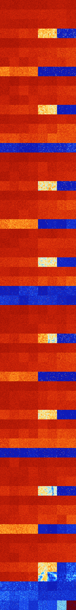

# B237 (71680-72191)

<details>
    <summary>Initial Grid</summary>
    
</details>


<details>
    <summary>Initial Grid RLE</summary>

```
#C Exported from GoGoL (https://github.com/marrow16/gogol)
#C Wrap mode: Toroidal
#C Boundary mode: Dead
#C Step: 0
x = 100, y = 100, rule = B237/S
9bobo8bo17bo23bo14bo3bo2bo$5bo53bo12bo14bo$35bo39bo4bo11bo3bo$18bo36bo
7bo$9bo34bo5bo$4bo24bo3bob2o24bo4bo5bo$100b$24bo19bo4b2o12b2o$14bo6bo
24bo15bo$28bo18bo35bo$o6b2o20bo9bo6bo32bo$11bo42bo3bo17b2o$8bo42b2o7bo
23b2o$21bo3bo24bobo10bo25bo$27bo24bo2bo16bo26bo$17bo$26bo16bo38bo5bo3bo
6bo$7bo34bo13bo$8bo23bo5bo10bo4bo32bo9bo$15bobo61bo$5bo30bo24bo$o20bo
75bo$2bo7bo43bo30bo$24bo9bo52bo9bo$6bo43bo11bo13bo7bo$18bo4bo24bo15bo
24bo$16bo27bo37bo$29bo2bo39bo$7bo9bo16bo3bo43bo3bo$41bo12bo27bo$6bo25bo
22bo8bo$11bo2bo14bo4bo10bo34bo$24b2obo30bo6bo4bo3bo17bo$56bo3bo27bo$53b
o15bo17bo$bo40bo3bo9bo9bo15bo$10bo7bo8bo17bo11bo5b2o18bo$24bo11bo28b2o
2bo19bo8b2o$16bo16bo2bo27bo23bo$23bo4bo63bo2bo$26bo14bo20bo8bo$10bobo8b
o5bo16bo2bo25bo5bo6bo$20bo10bo4bo4b2o9bo14bo14bo$2bo2bo23bo20bo7bo13bo
2bo$47bo5bo29bo2bo3bo5bo$50bo16bobo9bo3bo$14b2o28bo3bo26bo$2b2o29bo24bo
bo8bo$o4bo72bo$7bobo9bo31bo11bo9bo15bo5bo$10bo13bo8bo9bo7bo14bo14bo11bo
$38bo28bo13bo9bo$o11bo15bo27bo2bo22bo12bo$bo4bo3bo23bo12bo2b2o30bo$10bo
22bo7bo27bo3b2o8bo$6bo12bo25bo42bo8bo$15bo54bo$10bo9bo15bo11bo10bo17bo
13bo7bo$9bo66bo19bo$5bo6bo62bo$36bo12b2o20bo17bo3bo$5bo27bo48bo$o34bo
17bo4bo22bo4bo8bo$2b2o24bo20bo30bo8bo$4bobo43bo5b2o3bo3bo$5bo10bo39bo5b
o11bo14bo$16bo24bo24bo$20bo66bo$18bo21bo4bo$22bo35bo15bo2b3o$28bo48bo$
16bo2bo19bo3bo$12bo23bo19bo25bo6bo$10bo21bo18bo$42bo7bo9bo29bo6bo$bo19b
o45bo12bo13bobobo$4bo18bo21bo6bo$o22bo4bo10bo4bo16bo2bo$5bo28bo4bo58bo$
16bo28bo48bo$6b2o5bo15bo6bo22bo17bo20bo$bobobobo2bo8bo21bob2o3bobo18b2o
25bo$17bo4bo55bo5bo10bo$bo14bobo63bo16bo$11bo38b2o38bo$14bo10bo8bo14bo
11bo18bo3bo8bo$30bo2bo58bo$o59bobo$16bo24bo35bo15bo$35bo42bob2o$39bo24b
o3bo3bo11bo$71bo$15bo20bo28bo4bo13bo$13bo17bo17bo19bo21bo6bo$24bo12bo
28bo4bobo13bo3bo$26bo24bo22bo10bobo$44bo27bo21bo$11bo14bo38bo15bo$2bobo
$o4bo7bo4bo21bo16bo13bo15b2o3bo4bo!
```
</details>
<details>
    <summary>Thumbnail</summary>

</details>
<table>
<tr>
    <td><a href="./71680%20S%20Heat%20Map%20Activity.png"></a><br>S (71680)<br>G>1000</td>    <td><a href="./71681%20S0%20Heat%20Map%20Activity.png"></a><br>S0 (71681)<br>G>1000</td>    <td><a href="./71682%20S1%20Heat%20Map%20Activity.png"></a><br>S1 (71682)<br>G>1000</td>    <td><a href="./71683%20S01%20Heat%20Map%20Activity.png"></a><br>S01 (71683)<br>G>1000</td>    <td><a href="./71684%20S2%20Heat%20Map%20Activity.png"></a><br>S2 (71684)<br>G>1000</td>    <td><a href="./71685%20S02%20Heat%20Map%20Activity.png"></a><br>S02 (71685)<br>G>1000</td>    <td><a href="./71686%20S12%20Heat%20Map%20Activity.png"></a><br>S12 (71686)<br>G>1000</td>    <td><a href="./71687%20S012%20Heat%20Map%20Activity.png"></a><br>S012 (71687)<br>G>1000</td></tr>
<tr>
    <td><a href="./71688%20S3%20Heat%20Map%20Activity.png"></a><br>S3 (71688)<br>G>1000</td>    <td><a href="./71689%20S03%20Heat%20Map%20Activity.png"></a><br>S03 (71689)<br>G>1000</td>    <td><a href="./71690%20S13%20Heat%20Map%20Activity.png"></a><br>S13 (71690)<br>G>1000</td>    <td><a href="./71691%20S013%20Heat%20Map%20Activity.png"></a><br>S013 (71691)<br>G>1000</td>    <td><a href="./71692%20S23%20Heat%20Map%20Activity.png"></a><br>S23 (71692)<br>G>1000</td>    <td><a href="./71693%20S023%20Heat%20Map%20Activity.png"></a><br>S023 (71693)<br>G>1000</td>    <td><a href="./71694%20S123%20Heat%20Map%20Activity.png"></a><br>S123 (71694)<br>G>1000</td>    <td><a href="./71695%20S0123%20Heat%20Map%20Activity.png"></a><br>S0123 (71695)<br>G>1000</td></tr>
<tr>
    <td><a href="./71696%20S4%20Heat%20Map%20Activity.png"></a><br>S4 (71696)<br>G>1000</td>    <td><a href="./71697%20S04%20Heat%20Map%20Activity.png"></a><br>S04 (71697)<br>G>1000</td>    <td><a href="./71698%20S14%20Heat%20Map%20Activity.png"></a><br>S14 (71698)<br>G>1000</td>    <td><a href="./71699%20S014%20Heat%20Map%20Activity.png"></a><br>S014 (71699)<br>G>1000</td>    <td><a href="./71700%20S24%20Heat%20Map%20Activity.png"></a><br>S24 (71700)<br>G>1000</td>    <td><a href="./71701%20S024%20Heat%20Map%20Activity.png"></a><br>S024 (71701)<br>G>1000</td>    <td><a href="./71702%20S124%20Heat%20Map%20Activity.png"></a><br>S124 (71702)<br>G>1000</td>    <td><a href="./71703%20S0124%20Heat%20Map%20Activity.png"></a><br>S0124 (71703)<br>G>1000</td></tr>
<tr>
    <td><a href="./71704%20S34%20Heat%20Map%20Activity.png"></a><br>S34 (71704)<br>G>1000</td>    <td><a href="./71705%20S034%20Heat%20Map%20Activity.png"></a><br>S034 (71705)<br>G>1000</td>    <td><a href="./71706%20S134%20Heat%20Map%20Activity.png"></a><br>S134 (71706)<br>G>1000</td>    <td><a href="./71707%20S0134%20Heat%20Map%20Activity.png"></a><br>S0134 (71707)<br>G>1000</td>    <td><a href="./71708%20S234%20Heat%20Map%20Activity.png"></a><br>S234 (71708)<br>G>1000</td>    <td><a href="./71709%20S0234%20Heat%20Map%20Activity.png"></a><br>S0234 (71709)<br>G>1000</td>    <td><a href="./71710%20S1234%20Heat%20Map%20Activity.png"></a><br>S1234 (71710)<br>G>1000</td>    <td><a href="./71711%20S01234%20Heat%20Map%20Activity.png"></a><br>S01234 (71711)<br>G>1000</td></tr>
<tr>
    <td><a href="./71712%20S5%20Heat%20Map%20Activity.png"></a><br>S5 (71712)<br>G>1000</td>    <td><a href="./71713%20S05%20Heat%20Map%20Activity.png"></a><br>S05 (71713)<br>G>1000</td>    <td><a href="./71714%20S15%20Heat%20Map%20Activity.png"></a><br>S15 (71714)<br>G>1000</td>    <td><a href="./71715%20S015%20Heat%20Map%20Activity.png"></a><br>S015 (71715)<br>G>1000</td>    <td><a href="./71716%20S25%20Heat%20Map%20Activity.png"></a><br>S25 (71716)<br>G>1000</td>    <td><a href="./71717%20S025%20Heat%20Map%20Activity.png"></a><br>S025 (71717)<br>G>1000</td>    <td><a href="./71718%20S125%20Heat%20Map%20Activity.png"></a><br>S125 (71718)<br>G>1000</td>    <td><a href="./71719%20S0125%20Heat%20Map%20Activity.png"></a><br>S0125 (71719)<br>G>1000</td></tr>
<tr>
    <td><a href="./71720%20S35%20Heat%20Map%20Activity.png"></a><br>S35 (71720)<br>G>1000</td>    <td><a href="./71721%20S035%20Heat%20Map%20Activity.png"></a><br>S035 (71721)<br>G>1000</td>    <td><a href="./71722%20S135%20Heat%20Map%20Activity.png"></a><br>S135 (71722)<br>G>1000</td>    <td><a href="./71723%20S0135%20Heat%20Map%20Activity.png"></a><br>S0135 (71723)<br>G>1000</td>    <td><a href="./71724%20S235%20Heat%20Map%20Activity.png"></a><br>S235 (71724)<br>G>1000</td>    <td><a href="./71725%20S0235%20Heat%20Map%20Activity.png"></a><br>S0235 (71725)<br>G>1000</td>    <td><a href="./71726%20S1235%20Heat%20Map%20Activity.png"></a><br>S1235 (71726)<br>G>1000</td>    <td><a href="./71727%20S01235%20Heat%20Map%20Activity.png"></a><br>S01235 (71727)<br>G>1000</td></tr>
<tr>
    <td><a href="./71728%20S45%20Heat%20Map%20Activity.png"></a><br>S45 (71728)<br>G>1000</td>    <td><a href="./71729%20S045%20Heat%20Map%20Activity.png"></a><br>S045 (71729)<br>G>1000</td>    <td><a href="./71730%20S145%20Heat%20Map%20Activity.png"></a><br>S145 (71730)<br>G>1000</td>    <td><a href="./71731%20S0145%20Heat%20Map%20Activity.png"></a><br>S0145 (71731)<br>G>1000</td>    <td><a href="./71732%20S245%20Heat%20Map%20Activity.png"></a><br>S245 (71732)<br>G>1000</td>    <td><a href="./71733%20S0245%20Heat%20Map%20Activity.png"></a><br>S0245 (71733)<br>G>1000</td>    <td><a href="./71734%20S1245%20Heat%20Map%20Activity.png"></a><br>S1245 (71734)<br>G>1000</td>    <td><a href="./71735%20S01245%20Heat%20Map%20Activity.png"></a><br>S01245 (71735)<br>G>1000</td></tr>
<tr>
    <td><a href="./71736%20S345%20Heat%20Map%20Activity.png"></a><br>S345 (71736)<br>G>1000</td>    <td><a href="./71737%20S0345%20Heat%20Map%20Activity.png"></a><br>S0345 (71737)<br>G>1000</td>    <td><a href="./71738%20S1345%20Heat%20Map%20Activity.png"></a><br>S1345 (71738)<br>G>1000</td>    <td><a href="./71739%20S01345%20Heat%20Map%20Activity.png"></a><br>S01345 (71739)<br>G>1000</td>    <td><a href="./71740%20S2345%20Heat%20Map%20Activity.png"></a><br>S2345 (71740)<br>G>1000</td>    <td><a href="./71741%20S02345%20Heat%20Map%20Activity.png"></a><br>S02345 (71741)<br>G>1000</td>    <td><a href="./71742%20S12345%20Heat%20Map%20Activity.png"></a><br>S12345 (71742)<br>G>1000</td>    <td><a href="./71743%20S012345%20Heat%20Map%20Activity.png"></a><br>S012345 (71743)<br>G>1000</td></tr>
<tr>
    <td><a href="./71744%20S6%20Heat%20Map%20Activity.png"></a><br>S6 (71744)<br>G>1000</td>    <td><a href="./71745%20S06%20Heat%20Map%20Activity.png"></a><br>S06 (71745)<br>G>1000</td>    <td><a href="./71746%20S16%20Heat%20Map%20Activity.png"></a><br>S16 (71746)<br>G>1000</td>    <td><a href="./71747%20S016%20Heat%20Map%20Activity.png"></a><br>S016 (71747)<br>G>1000</td>    <td><a href="./71748%20S26%20Heat%20Map%20Activity.png"></a><br>S26 (71748)<br>G>1000</td>    <td><a href="./71749%20S026%20Heat%20Map%20Activity.png"></a><br>S026 (71749)<br>G>1000</td>    <td><a href="./71750%20S126%20Heat%20Map%20Activity.png"></a><br>S126 (71750)<br>G>1000</td>    <td><a href="./71751%20S0126%20Heat%20Map%20Activity.png"></a><br>S0126 (71751)<br>G>1000</td></tr>
<tr>
    <td><a href="./71752%20S36%20Heat%20Map%20Activity.png"></a><br>S36 (71752)<br>G>1000</td>    <td><a href="./71753%20S036%20Heat%20Map%20Activity.png"></a><br>S036 (71753)<br>G>1000</td>    <td><a href="./71754%20S136%20Heat%20Map%20Activity.png"></a><br>S136 (71754)<br>G>1000</td>    <td><a href="./71755%20S0136%20Heat%20Map%20Activity.png"></a><br>S0136 (71755)<br>G>1000</td>    <td><a href="./71756%20S236%20Heat%20Map%20Activity.png"></a><br>S236 (71756)<br>G>1000</td>    <td><a href="./71757%20S0236%20Heat%20Map%20Activity.png"></a><br>S0236 (71757)<br>G>1000</td>    <td><a href="./71758%20S1236%20Heat%20Map%20Activity.png"></a><br>S1236 (71758)<br>G>1000</td>    <td><a href="./71759%20S01236%20Heat%20Map%20Activity.png"></a><br>S01236 (71759)<br>G>1000</td></tr>
<tr>
    <td><a href="./71760%20S46%20Heat%20Map%20Activity.png"></a><br>S46 (71760)<br>G>1000</td>    <td><a href="./71761%20S046%20Heat%20Map%20Activity.png"></a><br>S046 (71761)<br>G>1000</td>    <td><a href="./71762%20S146%20Heat%20Map%20Activity.png"></a><br>S146 (71762)<br>G>1000</td>    <td><a href="./71763%20S0146%20Heat%20Map%20Activity.png"></a><br>S0146 (71763)<br>G>1000</td>    <td><a href="./71764%20S246%20Heat%20Map%20Activity.png"></a><br>S246 (71764)<br>G>1000</td>    <td><a href="./71765%20S0246%20Heat%20Map%20Activity.png"></a><br>S0246 (71765)<br>G>1000</td>    <td><a href="./71766%20S1246%20Heat%20Map%20Activity.png"></a><br>S1246 (71766)<br>G>1000</td>    <td><a href="./71767%20S01246%20Heat%20Map%20Activity.png"></a><br>S01246 (71767)<br>G>1000</td></tr>
<tr>
    <td><a href="./71768%20S346%20Heat%20Map%20Activity.png"></a><br>S346 (71768)<br>G>1000</td>    <td><a href="./71769%20S0346%20Heat%20Map%20Activity.png"></a><br>S0346 (71769)<br>G>1000</td>    <td><a href="./71770%20S1346%20Heat%20Map%20Activity.png"></a><br>S1346 (71770)<br>G>1000</td>    <td><a href="./71771%20S01346%20Heat%20Map%20Activity.png"></a><br>S01346 (71771)<br>G>1000</td>    <td><a href="./71772%20S2346%20Heat%20Map%20Activity.png"></a><br>S2346 (71772)<br>G>1000</td>    <td><a href="./71773%20S02346%20Heat%20Map%20Activity.png"></a><br>S02346 (71773)<br>G>1000</td>    <td><a href="./71774%20S12346%20Heat%20Map%20Activity.png"></a><br>S12346 (71774)<br>R@835,p660</td>    <td><a href="./71775%20S012346%20Heat%20Map%20Activity.png"></a><br>S012346 (71775)<br>R@588,p420</td></tr>
<tr>
    <td><a href="./71776%20S56%20Heat%20Map%20Activity.png"></a><br>S56 (71776)<br>G>1000</td>    <td><a href="./71777%20S056%20Heat%20Map%20Activity.png"></a><br>S056 (71777)<br>G>1000</td>    <td><a href="./71778%20S156%20Heat%20Map%20Activity.png"></a><br>S156 (71778)<br>G>1000</td>    <td><a href="./71779%20S0156%20Heat%20Map%20Activity.png"></a><br>S0156 (71779)<br>G>1000</td>    <td><a href="./71780%20S256%20Heat%20Map%20Activity.png"></a><br>S256 (71780)<br>G>1000</td>    <td><a href="./71781%20S0256%20Heat%20Map%20Activity.png"></a><br>S0256 (71781)<br>G>1000</td>    <td><a href="./71782%20S1256%20Heat%20Map%20Activity.png"></a><br>S1256 (71782)<br>G>1000</td>    <td><a href="./71783%20S01256%20Heat%20Map%20Activity.png"></a><br>S01256 (71783)<br>G>1000</td></tr>
<tr>
    <td><a href="./71784%20S356%20Heat%20Map%20Activity.png"></a><br>S356 (71784)<br>G>1000</td>    <td><a href="./71785%20S0356%20Heat%20Map%20Activity.png"></a><br>S0356 (71785)<br>G>1000</td>    <td><a href="./71786%20S1356%20Heat%20Map%20Activity.png"></a><br>S1356 (71786)<br>G>1000</td>    <td><a href="./71787%20S01356%20Heat%20Map%20Activity.png"></a><br>S01356 (71787)<br>G>1000</td>    <td><a href="./71788%20S2356%20Heat%20Map%20Activity.png"></a><br>S2356 (71788)<br>G>1000</td>    <td><a href="./71789%20S02356%20Heat%20Map%20Activity.png"></a><br>S02356 (71789)<br>G>1000</td>    <td><a href="./71790%20S12356%20Heat%20Map%20Activity.png"></a><br>S12356 (71790)<br>G>1000</td>    <td><a href="./71791%20S012356%20Heat%20Map%20Activity.png"></a><br>S012356 (71791)<br>G>1000</td></tr>
<tr>
    <td><a href="./71792%20S456%20Heat%20Map%20Activity.png"></a><br>S456 (71792)<br>G>1000</td>    <td><a href="./71793%20S0456%20Heat%20Map%20Activity.png"></a><br>S0456 (71793)<br>G>1000</td>    <td><a href="./71794%20S1456%20Heat%20Map%20Activity.png"></a><br>S1456 (71794)<br>G>1000</td>    <td><a href="./71795%20S01456%20Heat%20Map%20Activity.png"></a><br>S01456 (71795)<br>G>1000</td>    <td><a href="./71796%20S2456%20Heat%20Map%20Activity.png"></a><br>S2456 (71796)<br>G>1000</td>    <td><a href="./71797%20S02456%20Heat%20Map%20Activity.png"></a><br>S02456 (71797)<br>G>1000</td>    <td><a href="./71798%20S12456%20Heat%20Map%20Activity.png"></a><br>S12456 (71798)<br>G>1000</td>    <td><a href="./71799%20S012456%20Heat%20Map%20Activity.png"></a><br>S012456 (71799)<br>G>1000</td></tr>
<tr>
    <td><a href="./71800%20S3456%20Heat%20Map%20Activity.png"></a><br>S3456 (71800)<br>R@230,p60</td>    <td><a href="./71801%20S03456%20Heat%20Map%20Activity.png"></a><br>S03456 (71801)<br>R@238,p84</td>    <td><a href="./71802%20S13456%20Heat%20Map%20Activity.png"></a><br>S13456 (71802)<br>G>1000</td>    <td><a href="./71803%20S013456%20Heat%20Map%20Activity.png"></a><br>S013456 (71803)<br>G>1000</td>    <td><a href="./71804%20S23456%20Heat%20Map%20Activity.png"></a><br>S23456 (71804)<br>R@104,p36</td>    <td><a href="./71805%20S023456%20Heat%20Map%20Activity.png"></a><br>S023456 (71805)<br>R@80,p12</td>    <td><a href="./71806%20S123456%20Heat%20Map%20Activity.png"></a><br>S123456 (71806)<br>R@82,p24</td>    <td><a href="./71807%20S0123456%20Heat%20Map%20Activity.png"></a><br>S0123456 (71807)<br>R@40,p12</td></tr>
<tr>
    <td><a href="./71808%20S7%20Heat%20Map%20Activity.png"></a><br>S7 (71808)<br>G>1000</td>    <td><a href="./71809%20S07%20Heat%20Map%20Activity.png"></a><br>S07 (71809)<br>G>1000</td>    <td><a href="./71810%20S17%20Heat%20Map%20Activity.png"></a><br>S17 (71810)<br>G>1000</td>    <td><a href="./71811%20S017%20Heat%20Map%20Activity.png"></a><br>S017 (71811)<br>G>1000</td>    <td><a href="./71812%20S27%20Heat%20Map%20Activity.png"></a><br>S27 (71812)<br>G>1000</td>    <td><a href="./71813%20S027%20Heat%20Map%20Activity.png"></a><br>S027 (71813)<br>G>1000</td>    <td><a href="./71814%20S127%20Heat%20Map%20Activity.png"></a><br>S127 (71814)<br>G>1000</td>    <td><a href="./71815%20S0127%20Heat%20Map%20Activity.png"></a><br>S0127 (71815)<br>G>1000</td></tr>
<tr>
    <td><a href="./71816%20S37%20Heat%20Map%20Activity.png"></a><br>S37 (71816)<br>G>1000</td>    <td><a href="./71817%20S037%20Heat%20Map%20Activity.png"></a><br>S037 (71817)<br>G>1000</td>    <td><a href="./71818%20S137%20Heat%20Map%20Activity.png"></a><br>S137 (71818)<br>G>1000</td>    <td><a href="./71819%20S0137%20Heat%20Map%20Activity.png"></a><br>S0137 (71819)<br>G>1000</td>    <td><a href="./71820%20S237%20Heat%20Map%20Activity.png"></a><br>S237 (71820)<br>G>1000</td>    <td><a href="./71821%20S0237%20Heat%20Map%20Activity.png"></a><br>S0237 (71821)<br>G>1000</td>    <td><a href="./71822%20S1237%20Heat%20Map%20Activity.png"></a><br>S1237 (71822)<br>G>1000</td>    <td><a href="./71823%20S01237%20Heat%20Map%20Activity.png"></a><br>S01237 (71823)<br>G>1000</td></tr>
<tr>
    <td><a href="./71824%20S47%20Heat%20Map%20Activity.png"></a><br>S47 (71824)<br>G>1000</td>    <td><a href="./71825%20S047%20Heat%20Map%20Activity.png"></a><br>S047 (71825)<br>G>1000</td>    <td><a href="./71826%20S147%20Heat%20Map%20Activity.png"></a><br>S147 (71826)<br>G>1000</td>    <td><a href="./71827%20S0147%20Heat%20Map%20Activity.png"></a><br>S0147 (71827)<br>G>1000</td>    <td><a href="./71828%20S247%20Heat%20Map%20Activity.png"></a><br>S247 (71828)<br>G>1000</td>    <td><a href="./71829%20S0247%20Heat%20Map%20Activity.png"></a><br>S0247 (71829)<br>G>1000</td>    <td><a href="./71830%20S1247%20Heat%20Map%20Activity.png"></a><br>S1247 (71830)<br>G>1000</td>    <td><a href="./71831%20S01247%20Heat%20Map%20Activity.png"></a><br>S01247 (71831)<br>G>1000</td></tr>
<tr>
    <td><a href="./71832%20S347%20Heat%20Map%20Activity.png"></a><br>S347 (71832)<br>G>1000</td>    <td><a href="./71833%20S0347%20Heat%20Map%20Activity.png"></a><br>S0347 (71833)<br>G>1000</td>    <td><a href="./71834%20S1347%20Heat%20Map%20Activity.png"></a><br>S1347 (71834)<br>G>1000</td>    <td><a href="./71835%20S01347%20Heat%20Map%20Activity.png"></a><br>S01347 (71835)<br>G>1000</td>    <td><a href="./71836%20S2347%20Heat%20Map%20Activity.png"></a><br>S2347 (71836)<br>G>1000</td>    <td><a href="./71837%20S02347%20Heat%20Map%20Activity.png"></a><br>S02347 (71837)<br>G>1000</td>    <td><a href="./71838%20S12347%20Heat%20Map%20Activity.png"></a><br>S12347 (71838)<br>G>1000</td>    <td><a href="./71839%20S012347%20Heat%20Map%20Activity.png"></a><br>S012347 (71839)<br>G>1000</td></tr>
<tr>
    <td><a href="./71840%20S57%20Heat%20Map%20Activity.png"></a><br>S57 (71840)<br>G>1000</td>    <td><a href="./71841%20S057%20Heat%20Map%20Activity.png"></a><br>S057 (71841)<br>G>1000</td>    <td><a href="./71842%20S157%20Heat%20Map%20Activity.png"></a><br>S157 (71842)<br>G>1000</td>    <td><a href="./71843%20S0157%20Heat%20Map%20Activity.png"></a><br>S0157 (71843)<br>G>1000</td>    <td><a href="./71844%20S257%20Heat%20Map%20Activity.png"></a><br>S257 (71844)<br>G>1000</td>    <td><a href="./71845%20S0257%20Heat%20Map%20Activity.png"></a><br>S0257 (71845)<br>G>1000</td>    <td><a href="./71846%20S1257%20Heat%20Map%20Activity.png"></a><br>S1257 (71846)<br>G>1000</td>    <td><a href="./71847%20S01257%20Heat%20Map%20Activity.png"></a><br>S01257 (71847)<br>G>1000</td></tr>
<tr>
    <td><a href="./71848%20S357%20Heat%20Map%20Activity.png"></a><br>S357 (71848)<br>G>1000</td>    <td><a href="./71849%20S0357%20Heat%20Map%20Activity.png"></a><br>S0357 (71849)<br>G>1000</td>    <td><a href="./71850%20S1357%20Heat%20Map%20Activity.png"></a><br>S1357 (71850)<br>G>1000</td>    <td><a href="./71851%20S01357%20Heat%20Map%20Activity.png"></a><br>S01357 (71851)<br>G>1000</td>    <td><a href="./71852%20S2357%20Heat%20Map%20Activity.png"></a><br>S2357 (71852)<br>G>1000</td>    <td><a href="./71853%20S02357%20Heat%20Map%20Activity.png"></a><br>S02357 (71853)<br>G>1000</td>    <td><a href="./71854%20S12357%20Heat%20Map%20Activity.png"></a><br>S12357 (71854)<br>G>1000</td>    <td><a href="./71855%20S012357%20Heat%20Map%20Activity.png"></a><br>S012357 (71855)<br>G>1000</td></tr>
<tr>
    <td><a href="./71856%20S457%20Heat%20Map%20Activity.png"></a><br>S457 (71856)<br>G>1000</td>    <td><a href="./71857%20S0457%20Heat%20Map%20Activity.png"></a><br>S0457 (71857)<br>G>1000</td>    <td><a href="./71858%20S1457%20Heat%20Map%20Activity.png"></a><br>S1457 (71858)<br>G>1000</td>    <td><a href="./71859%20S01457%20Heat%20Map%20Activity.png"></a><br>S01457 (71859)<br>G>1000</td>    <td><a href="./71860%20S2457%20Heat%20Map%20Activity.png"></a><br>S2457 (71860)<br>G>1000</td>    <td><a href="./71861%20S02457%20Heat%20Map%20Activity.png"></a><br>S02457 (71861)<br>G>1000</td>    <td><a href="./71862%20S12457%20Heat%20Map%20Activity.png"></a><br>S12457 (71862)<br>G>1000</td>    <td><a href="./71863%20S012457%20Heat%20Map%20Activity.png"></a><br>S012457 (71863)<br>G>1000</td></tr>
<tr>
    <td><a href="./71864%20S3457%20Heat%20Map%20Activity.png"></a><br>S3457 (71864)<br>G>1000</td>    <td><a href="./71865%20S03457%20Heat%20Map%20Activity.png"></a><br>S03457 (71865)<br>G>1000</td>    <td><a href="./71866%20S13457%20Heat%20Map%20Activity.png"></a><br>S13457 (71866)<br>G>1000</td>    <td><a href="./71867%20S013457%20Heat%20Map%20Activity.png"></a><br>S013457 (71867)<br>G>1000</td>    <td><a href="./71868%20S23457%20Heat%20Map%20Activity.png"></a><br>S23457 (71868)<br>G>1000</td>    <td><a href="./71869%20S023457%20Heat%20Map%20Activity.png"></a><br>S023457 (71869)<br>R@146,p84</td>    <td><a href="./71870%20S123457%20Heat%20Map%20Activity.png"></a><br>S123457 (71870)<br>R@215,p168</td>    <td><a href="./71871%20S0123457%20Heat%20Map%20Activity.png"></a><br>S0123457 (71871)<br>R@42,p12</td></tr>
<tr>
    <td><a href="./71872%20S67%20Heat%20Map%20Activity.png"></a><br>S67 (71872)<br>G>1000</td>    <td><a href="./71873%20S067%20Heat%20Map%20Activity.png"></a><br>S067 (71873)<br>G>1000</td>    <td><a href="./71874%20S167%20Heat%20Map%20Activity.png"></a><br>S167 (71874)<br>G>1000</td>    <td><a href="./71875%20S0167%20Heat%20Map%20Activity.png"></a><br>S0167 (71875)<br>G>1000</td>    <td><a href="./71876%20S267%20Heat%20Map%20Activity.png"></a><br>S267 (71876)<br>G>1000</td>    <td><a href="./71877%20S0267%20Heat%20Map%20Activity.png"></a><br>S0267 (71877)<br>G>1000</td>    <td><a href="./71878%20S1267%20Heat%20Map%20Activity.png"></a><br>S1267 (71878)<br>G>1000</td>    <td><a href="./71879%20S01267%20Heat%20Map%20Activity.png"></a><br>S01267 (71879)<br>G>1000</td></tr>
<tr>
    <td><a href="./71880%20S367%20Heat%20Map%20Activity.png"></a><br>S367 (71880)<br>G>1000</td>    <td><a href="./71881%20S0367%20Heat%20Map%20Activity.png"></a><br>S0367 (71881)<br>G>1000</td>    <td><a href="./71882%20S1367%20Heat%20Map%20Activity.png"></a><br>S1367 (71882)<br>G>1000</td>    <td><a href="./71883%20S01367%20Heat%20Map%20Activity.png"></a><br>S01367 (71883)<br>G>1000</td>    <td><a href="./71884%20S2367%20Heat%20Map%20Activity.png"></a><br>S2367 (71884)<br>G>1000</td>    <td><a href="./71885%20S02367%20Heat%20Map%20Activity.png"></a><br>S02367 (71885)<br>G>1000</td>    <td><a href="./71886%20S12367%20Heat%20Map%20Activity.png"></a><br>S12367 (71886)<br>G>1000</td>    <td><a href="./71887%20S012367%20Heat%20Map%20Activity.png"></a><br>S012367 (71887)<br>G>1000</td></tr>
<tr>
    <td><a href="./71888%20S467%20Heat%20Map%20Activity.png"></a><br>S467 (71888)<br>G>1000</td>    <td><a href="./71889%20S0467%20Heat%20Map%20Activity.png"></a><br>S0467 (71889)<br>G>1000</td>    <td><a href="./71890%20S1467%20Heat%20Map%20Activity.png"></a><br>S1467 (71890)<br>G>1000</td>    <td><a href="./71891%20S01467%20Heat%20Map%20Activity.png"></a><br>S01467 (71891)<br>G>1000</td>    <td><a href="./71892%20S2467%20Heat%20Map%20Activity.png"></a><br>S2467 (71892)<br>G>1000</td>    <td><a href="./71893%20S02467%20Heat%20Map%20Activity.png"></a><br>S02467 (71893)<br>G>1000</td>    <td><a href="./71894%20S12467%20Heat%20Map%20Activity.png"></a><br>S12467 (71894)<br>G>1000</td>    <td><a href="./71895%20S012467%20Heat%20Map%20Activity.png"></a><br>S012467 (71895)<br>G>1000</td></tr>
<tr>
    <td><a href="./71896%20S3467%20Heat%20Map%20Activity.png"></a><br>S3467 (71896)<br>G>1000</td>    <td><a href="./71897%20S03467%20Heat%20Map%20Activity.png"></a><br>S03467 (71897)<br>G>1000</td>    <td><a href="./71898%20S13467%20Heat%20Map%20Activity.png"></a><br>S13467 (71898)<br>G>1000</td>    <td><a href="./71899%20S013467%20Heat%20Map%20Activity.png"></a><br>S013467 (71899)<br>G>1000</td>    <td><a href="./71900%20S23467%20Heat%20Map%20Activity.png"></a><br>S23467 (71900)<br>G>1000</td>    <td><a href="./71901%20S023467%20Heat%20Map%20Activity.png"></a><br>S023467 (71901)<br>G>1000</td>    <td><a href="./71902%20S123467%20Heat%20Map%20Activity.png"></a><br>S123467 (71902)<br>R@236,p120</td>    <td><a href="./71903%20S0123467%20Heat%20Map%20Activity.png"></a><br>S0123467 (71903)<br>R@270,p180</td></tr>
<tr>
    <td><a href="./71904%20S567%20Heat%20Map%20Activity.png"></a><br>S567 (71904)<br>G>1000</td>    <td><a href="./71905%20S0567%20Heat%20Map%20Activity.png"></a><br>S0567 (71905)<br>G>1000</td>    <td><a href="./71906%20S1567%20Heat%20Map%20Activity.png"></a><br>S1567 (71906)<br>G>1000</td>    <td><a href="./71907%20S01567%20Heat%20Map%20Activity.png"></a><br>S01567 (71907)<br>G>1000</td>    <td><a href="./71908%20S2567%20Heat%20Map%20Activity.png"></a><br>S2567 (71908)<br>G>1000</td>    <td><a href="./71909%20S02567%20Heat%20Map%20Activity.png"></a><br>S02567 (71909)<br>G>1000</td>    <td><a href="./71910%20S12567%20Heat%20Map%20Activity.png"></a><br>S12567 (71910)<br>G>1000</td>    <td><a href="./71911%20S012567%20Heat%20Map%20Activity.png"></a><br>S012567 (71911)<br>G>1000</td></tr>
<tr>
    <td><a href="./71912%20S3567%20Heat%20Map%20Activity.png"></a><br>S3567 (71912)<br>G>1000</td>    <td><a href="./71913%20S03567%20Heat%20Map%20Activity.png"></a><br>S03567 (71913)<br>G>1000</td>    <td><a href="./71914%20S13567%20Heat%20Map%20Activity.png"></a><br>S13567 (71914)<br>G>1000</td>    <td><a href="./71915%20S013567%20Heat%20Map%20Activity.png"></a><br>S013567 (71915)<br>G>1000</td>    <td><a href="./71916%20S23567%20Heat%20Map%20Activity.png"></a><br>S23567 (71916)<br>G>1000</td>    <td><a href="./71917%20S023567%20Heat%20Map%20Activity.png"></a><br>S023567 (71917)<br>G>1000</td>    <td><a href="./71918%20S123567%20Heat%20Map%20Activity.png"></a><br>S123567 (71918)<br>G>1000</td>    <td><a href="./71919%20S0123567%20Heat%20Map%20Activity.png"></a><br>S0123567 (71919)<br>G>1000</td></tr>
<tr>
    <td><a href="./71920%20S4567%20Heat%20Map%20Activity.png"></a><br>S4567 (71920)<br>R@521,p420</td>    <td><a href="./71921%20S04567%20Heat%20Map%20Activity.png"></a><br>S04567 (71921)<br>R@524,p420</td>    <td><a href="./71922%20S14567%20Heat%20Map%20Activity.png"></a><br>S14567 (71922)<br>R@118,p12</td>    <td><a href="./71923%20S014567%20Heat%20Map%20Activity.png"></a><br>S014567 (71923)<br>R@88,p12</td>    <td><a href="./71924%20S24567%20Heat%20Map%20Activity.png"></a><br>S24567 (71924)<br>R@488,p420</td>    <td><a href="./71925%20S024567%20Heat%20Map%20Activity.png"></a><br>S024567 (71925)<br>R@109,p42</td>    <td><a href="./71926%20S124567%20Heat%20Map%20Activity.png"></a><br>S124567 (71926)<br>R@116,p42</td>    <td><a href="./71927%20S0124567%20Heat%20Map%20Activity.png"></a><br>S0124567 (71927)<br>R@80,p6</td></tr>
<tr>
    <td><a href="./71928%20S34567%20Heat%20Map%20Activity.png"></a><br>S34567 (71928)<br>R@41,p12</td>    <td><a href="./71929%20S034567%20Heat%20Map%20Activity.png"></a><br>S034567 (71929)<br>R@36,p12</td>    <td><a href="./71930%20S134567%20Heat%20Map%20Activity.png"></a><br>S134567 (71930)<br>R@110,p84</td>    <td><a href="./71931%20S0134567%20Heat%20Map%20Activity.png"></a><br>S0134567 (71931)<br>R@32,p6</td>    <td><a href="./71932%20S234567%20Heat%20Map%20Activity.png"></a><br>S234567 (71932)<br>R@32,p6</td>    <td><a href="./71933%20S0234567%20Heat%20Map%20Activity.png"></a><br>S0234567 (71933)<br>R@33,p6</td>    <td><a href="./71934%20S1234567%20Heat%20Map%20Activity.png"></a><br>S1234567 (71934)<br>R@65,p42</td>    <td><a href="./71935%20S01234567%20Heat%20Map%20Activity.png"></a><br>S01234567 (71935)<br>R@106,p84</td></tr>
<tr>
    <td><a href="./71936%20S8%20Heat%20Map%20Activity.png"></a><br>S8 (71936)<br>G>1000</td>    <td><a href="./71937%20S08%20Heat%20Map%20Activity.png"></a><br>S08 (71937)<br>G>1000</td>    <td><a href="./71938%20S18%20Heat%20Map%20Activity.png"></a><br>S18 (71938)<br>G>1000</td>    <td><a href="./71939%20S018%20Heat%20Map%20Activity.png"></a><br>S018 (71939)<br>G>1000</td>    <td><a href="./71940%20S28%20Heat%20Map%20Activity.png"></a><br>S28 (71940)<br>G>1000</td>    <td><a href="./71941%20S028%20Heat%20Map%20Activity.png"></a><br>S028 (71941)<br>G>1000</td>    <td><a href="./71942%20S128%20Heat%20Map%20Activity.png"></a><br>S128 (71942)<br>G>1000</td>    <td><a href="./71943%20S0128%20Heat%20Map%20Activity.png"></a><br>S0128 (71943)<br>G>1000</td></tr>
<tr>
    <td><a href="./71944%20S38%20Heat%20Map%20Activity.png"></a><br>S38 (71944)<br>G>1000</td>    <td><a href="./71945%20S038%20Heat%20Map%20Activity.png"></a><br>S038 (71945)<br>G>1000</td>    <td><a href="./71946%20S138%20Heat%20Map%20Activity.png"></a><br>S138 (71946)<br>G>1000</td>    <td><a href="./71947%20S0138%20Heat%20Map%20Activity.png"></a><br>S0138 (71947)<br>G>1000</td>    <td><a href="./71948%20S238%20Heat%20Map%20Activity.png"></a><br>S238 (71948)<br>G>1000</td>    <td><a href="./71949%20S0238%20Heat%20Map%20Activity.png"></a><br>S0238 (71949)<br>G>1000</td>    <td><a href="./71950%20S1238%20Heat%20Map%20Activity.png"></a><br>S1238 (71950)<br>G>1000</td>    <td><a href="./71951%20S01238%20Heat%20Map%20Activity.png"></a><br>S01238 (71951)<br>G>1000</td></tr>
<tr>
    <td><a href="./71952%20S48%20Heat%20Map%20Activity.png"></a><br>S48 (71952)<br>G>1000</td>    <td><a href="./71953%20S048%20Heat%20Map%20Activity.png"></a><br>S048 (71953)<br>G>1000</td>    <td><a href="./71954%20S148%20Heat%20Map%20Activity.png"></a><br>S148 (71954)<br>G>1000</td>    <td><a href="./71955%20S0148%20Heat%20Map%20Activity.png"></a><br>S0148 (71955)<br>G>1000</td>    <td><a href="./71956%20S248%20Heat%20Map%20Activity.png"></a><br>S248 (71956)<br>G>1000</td>    <td><a href="./71957%20S0248%20Heat%20Map%20Activity.png"></a><br>S0248 (71957)<br>G>1000</td>    <td><a href="./71958%20S1248%20Heat%20Map%20Activity.png"></a><br>S1248 (71958)<br>G>1000</td>    <td><a href="./71959%20S01248%20Heat%20Map%20Activity.png"></a><br>S01248 (71959)<br>G>1000</td></tr>
<tr>
    <td><a href="./71960%20S348%20Heat%20Map%20Activity.png"></a><br>S348 (71960)<br>G>1000</td>    <td><a href="./71961%20S0348%20Heat%20Map%20Activity.png"></a><br>S0348 (71961)<br>G>1000</td>    <td><a href="./71962%20S1348%20Heat%20Map%20Activity.png"></a><br>S1348 (71962)<br>G>1000</td>    <td><a href="./71963%20S01348%20Heat%20Map%20Activity.png"></a><br>S01348 (71963)<br>G>1000</td>    <td><a href="./71964%20S2348%20Heat%20Map%20Activity.png"></a><br>S2348 (71964)<br>G>1000</td>    <td><a href="./71965%20S02348%20Heat%20Map%20Activity.png"></a><br>S02348 (71965)<br>G>1000</td>    <td><a href="./71966%20S12348%20Heat%20Map%20Activity.png"></a><br>S12348 (71966)<br>G>1000</td>    <td><a href="./71967%20S012348%20Heat%20Map%20Activity.png"></a><br>S012348 (71967)<br>G>1000</td></tr>
<tr>
    <td><a href="./71968%20S58%20Heat%20Map%20Activity.png"></a><br>S58 (71968)<br>G>1000</td>    <td><a href="./71969%20S058%20Heat%20Map%20Activity.png"></a><br>S058 (71969)<br>G>1000</td>    <td><a href="./71970%20S158%20Heat%20Map%20Activity.png"></a><br>S158 (71970)<br>G>1000</td>    <td><a href="./71971%20S0158%20Heat%20Map%20Activity.png"></a><br>S0158 (71971)<br>G>1000</td>    <td><a href="./71972%20S258%20Heat%20Map%20Activity.png"></a><br>S258 (71972)<br>G>1000</td>    <td><a href="./71973%20S0258%20Heat%20Map%20Activity.png"></a><br>S0258 (71973)<br>G>1000</td>    <td><a href="./71974%20S1258%20Heat%20Map%20Activity.png"></a><br>S1258 (71974)<br>G>1000</td>    <td><a href="./71975%20S01258%20Heat%20Map%20Activity.png"></a><br>S01258 (71975)<br>G>1000</td></tr>
<tr>
    <td><a href="./71976%20S358%20Heat%20Map%20Activity.png"></a><br>S358 (71976)<br>G>1000</td>    <td><a href="./71977%20S0358%20Heat%20Map%20Activity.png"></a><br>S0358 (71977)<br>G>1000</td>    <td><a href="./71978%20S1358%20Heat%20Map%20Activity.png"></a><br>S1358 (71978)<br>G>1000</td>    <td><a href="./71979%20S01358%20Heat%20Map%20Activity.png"></a><br>S01358 (71979)<br>G>1000</td>    <td><a href="./71980%20S2358%20Heat%20Map%20Activity.png"></a><br>S2358 (71980)<br>G>1000</td>    <td><a href="./71981%20S02358%20Heat%20Map%20Activity.png"></a><br>S02358 (71981)<br>G>1000</td>    <td><a href="./71982%20S12358%20Heat%20Map%20Activity.png"></a><br>S12358 (71982)<br>G>1000</td>    <td><a href="./71983%20S012358%20Heat%20Map%20Activity.png"></a><br>S012358 (71983)<br>G>1000</td></tr>
<tr>
    <td><a href="./71984%20S458%20Heat%20Map%20Activity.png"></a><br>S458 (71984)<br>G>1000</td>    <td><a href="./71985%20S0458%20Heat%20Map%20Activity.png"></a><br>S0458 (71985)<br>G>1000</td>    <td><a href="./71986%20S1458%20Heat%20Map%20Activity.png"></a><br>S1458 (71986)<br>G>1000</td>    <td><a href="./71987%20S01458%20Heat%20Map%20Activity.png"></a><br>S01458 (71987)<br>G>1000</td>    <td><a href="./71988%20S2458%20Heat%20Map%20Activity.png"></a><br>S2458 (71988)<br>G>1000</td>    <td><a href="./71989%20S02458%20Heat%20Map%20Activity.png"></a><br>S02458 (71989)<br>G>1000</td>    <td><a href="./71990%20S12458%20Heat%20Map%20Activity.png"></a><br>S12458 (71990)<br>G>1000</td>    <td><a href="./71991%20S012458%20Heat%20Map%20Activity.png"></a><br>S012458 (71991)<br>G>1000</td></tr>
<tr>
    <td><a href="./71992%20S3458%20Heat%20Map%20Activity.png"></a><br>S3458 (71992)<br>G>1000</td>    <td><a href="./71993%20S03458%20Heat%20Map%20Activity.png"></a><br>S03458 (71993)<br>G>1000</td>    <td><a href="./71994%20S13458%20Heat%20Map%20Activity.png"></a><br>S13458 (71994)<br>G>1000</td>    <td><a href="./71995%20S013458%20Heat%20Map%20Activity.png"></a><br>S013458 (71995)<br>G>1000</td>    <td><a href="./71996%20S23458%20Heat%20Map%20Activity.png"></a><br>S23458 (71996)<br>G>1000</td>    <td><a href="./71997%20S023458%20Heat%20Map%20Activity.png"></a><br>S023458 (71997)<br>G>1000</td>    <td><a href="./71998%20S123458%20Heat%20Map%20Activity.png"></a><br>S123458 (71998)<br>G>1000</td>    <td><a href="./71999%20S0123458%20Heat%20Map%20Activity.png"></a><br>S0123458 (71999)<br>G>1000</td></tr>
<tr>
    <td><a href="./72000%20S68%20Heat%20Map%20Activity.png"></a><br>S68 (72000)<br>G>1000</td>    <td><a href="./72001%20S068%20Heat%20Map%20Activity.png"></a><br>S068 (72001)<br>G>1000</td>    <td><a href="./72002%20S168%20Heat%20Map%20Activity.png"></a><br>S168 (72002)<br>G>1000</td>    <td><a href="./72003%20S0168%20Heat%20Map%20Activity.png"></a><br>S0168 (72003)<br>G>1000</td>    <td><a href="./72004%20S268%20Heat%20Map%20Activity.png"></a><br>S268 (72004)<br>G>1000</td>    <td><a href="./72005%20S0268%20Heat%20Map%20Activity.png"></a><br>S0268 (72005)<br>G>1000</td>    <td><a href="./72006%20S1268%20Heat%20Map%20Activity.png"></a><br>S1268 (72006)<br>G>1000</td>    <td><a href="./72007%20S01268%20Heat%20Map%20Activity.png"></a><br>S01268 (72007)<br>G>1000</td></tr>
<tr>
    <td><a href="./72008%20S368%20Heat%20Map%20Activity.png"></a><br>S368 (72008)<br>G>1000</td>    <td><a href="./72009%20S0368%20Heat%20Map%20Activity.png"></a><br>S0368 (72009)<br>G>1000</td>    <td><a href="./72010%20S1368%20Heat%20Map%20Activity.png"></a><br>S1368 (72010)<br>G>1000</td>    <td><a href="./72011%20S01368%20Heat%20Map%20Activity.png"></a><br>S01368 (72011)<br>G>1000</td>    <td><a href="./72012%20S2368%20Heat%20Map%20Activity.png"></a><br>S2368 (72012)<br>G>1000</td>    <td><a href="./72013%20S02368%20Heat%20Map%20Activity.png"></a><br>S02368 (72013)<br>G>1000</td>    <td><a href="./72014%20S12368%20Heat%20Map%20Activity.png"></a><br>S12368 (72014)<br>G>1000</td>    <td><a href="./72015%20S012368%20Heat%20Map%20Activity.png"></a><br>S012368 (72015)<br>G>1000</td></tr>
<tr>
    <td><a href="./72016%20S468%20Heat%20Map%20Activity.png"></a><br>S468 (72016)<br>G>1000</td>    <td><a href="./72017%20S0468%20Heat%20Map%20Activity.png"></a><br>S0468 (72017)<br>G>1000</td>    <td><a href="./72018%20S1468%20Heat%20Map%20Activity.png"></a><br>S1468 (72018)<br>G>1000</td>    <td><a href="./72019%20S01468%20Heat%20Map%20Activity.png"></a><br>S01468 (72019)<br>G>1000</td>    <td><a href="./72020%20S2468%20Heat%20Map%20Activity.png"></a><br>S2468 (72020)<br>G>1000</td>    <td><a href="./72021%20S02468%20Heat%20Map%20Activity.png"></a><br>S02468 (72021)<br>G>1000</td>    <td><a href="./72022%20S12468%20Heat%20Map%20Activity.png"></a><br>S12468 (72022)<br>G>1000</td>    <td><a href="./72023%20S012468%20Heat%20Map%20Activity.png"></a><br>S012468 (72023)<br>G>1000</td></tr>
<tr>
    <td><a href="./72024%20S3468%20Heat%20Map%20Activity.png"></a><br>S3468 (72024)<br>G>1000</td>    <td><a href="./72025%20S03468%20Heat%20Map%20Activity.png"></a><br>S03468 (72025)<br>G>1000</td>    <td><a href="./72026%20S13468%20Heat%20Map%20Activity.png"></a><br>S13468 (72026)<br>G>1000</td>    <td><a href="./72027%20S013468%20Heat%20Map%20Activity.png"></a><br>S013468 (72027)<br>G>1000</td>    <td><a href="./72028%20S23468%20Heat%20Map%20Activity.png"></a><br>S23468 (72028)<br>G>1000</td>    <td><a href="./72029%20S023468%20Heat%20Map%20Activity.png"></a><br>S023468 (72029)<br>G>1000</td>    <td><a href="./72030%20S123468%20Heat%20Map%20Activity.png"></a><br>S123468 (72030)<br>R@983,p840</td>    <td><a href="./72031%20S0123468%20Heat%20Map%20Activity.png"></a><br>S0123468 (72031)<br>G>1000</td></tr>
<tr>
    <td><a href="./72032%20S568%20Heat%20Map%20Activity.png"></a><br>S568 (72032)<br>G>1000</td>    <td><a href="./72033%20S0568%20Heat%20Map%20Activity.png"></a><br>S0568 (72033)<br>G>1000</td>    <td><a href="./72034%20S1568%20Heat%20Map%20Activity.png"></a><br>S1568 (72034)<br>G>1000</td>    <td><a href="./72035%20S01568%20Heat%20Map%20Activity.png"></a><br>S01568 (72035)<br>G>1000</td>    <td><a href="./72036%20S2568%20Heat%20Map%20Activity.png"></a><br>S2568 (72036)<br>G>1000</td>    <td><a href="./72037%20S02568%20Heat%20Map%20Activity.png"></a><br>S02568 (72037)<br>G>1000</td>    <td><a href="./72038%20S12568%20Heat%20Map%20Activity.png"></a><br>S12568 (72038)<br>G>1000</td>    <td><a href="./72039%20S012568%20Heat%20Map%20Activity.png"></a><br>S012568 (72039)<br>G>1000</td></tr>
<tr>
    <td><a href="./72040%20S3568%20Heat%20Map%20Activity.png"></a><br>S3568 (72040)<br>G>1000</td>    <td><a href="./72041%20S03568%20Heat%20Map%20Activity.png"></a><br>S03568 (72041)<br>G>1000</td>    <td><a href="./72042%20S13568%20Heat%20Map%20Activity.png"></a><br>S13568 (72042)<br>G>1000</td>    <td><a href="./72043%20S013568%20Heat%20Map%20Activity.png"></a><br>S013568 (72043)<br>G>1000</td>    <td><a href="./72044%20S23568%20Heat%20Map%20Activity.png"></a><br>S23568 (72044)<br>G>1000</td>    <td><a href="./72045%20S023568%20Heat%20Map%20Activity.png"></a><br>S023568 (72045)<br>G>1000</td>    <td><a href="./72046%20S123568%20Heat%20Map%20Activity.png"></a><br>S123568 (72046)<br>G>1000</td>    <td><a href="./72047%20S0123568%20Heat%20Map%20Activity.png"></a><br>S0123568 (72047)<br>G>1000</td></tr>
<tr>
    <td><a href="./72048%20S4568%20Heat%20Map%20Activity.png"></a><br>S4568 (72048)<br>G>1000</td>    <td><a href="./72049%20S04568%20Heat%20Map%20Activity.png"></a><br>S04568 (72049)<br>G>1000</td>    <td><a href="./72050%20S14568%20Heat%20Map%20Activity.png"></a><br>S14568 (72050)<br>G>1000</td>    <td><a href="./72051%20S014568%20Heat%20Map%20Activity.png"></a><br>S014568 (72051)<br>G>1000</td>    <td><a href="./72052%20S24568%20Heat%20Map%20Activity.png"></a><br>S24568 (72052)<br>G>1000</td>    <td><a href="./72053%20S024568%20Heat%20Map%20Activity.png"></a><br>S024568 (72053)<br>G>1000</td>    <td><a href="./72054%20S124568%20Heat%20Map%20Activity.png"></a><br>S124568 (72054)<br>G>1000</td>    <td><a href="./72055%20S0124568%20Heat%20Map%20Activity.png"></a><br>S0124568 (72055)<br>G>1000</td></tr>
<tr>
    <td><a href="./72056%20S34568%20Heat%20Map%20Activity.png"></a><br>S34568 (72056)<br>R@533,p420</td>    <td><a href="./72057%20S034568%20Heat%20Map%20Activity.png"></a><br>S034568 (72057)<br>R@548,p420</td>    <td><a href="./72058%20S134568%20Heat%20Map%20Activity.png"></a><br>S134568 (72058)<br>R@565,p420</td>    <td><a href="./72059%20S0134568%20Heat%20Map%20Activity.png"></a><br>S0134568 (72059)<br>R@240,p120</td>    <td><a href="./72060%20S234568%20Heat%20Map%20Activity.png"></a><br>S234568 (72060)<br>R@479,p420</td>    <td><a href="./72061%20S0234568%20Heat%20Map%20Activity.png"></a><br>S0234568 (72061)<br>R@213,p168</td>    <td><a href="./72062%20S1234568%20Heat%20Map%20Activity.png"></a><br>S1234568 (72062)<br>G>1000</td>    <td><a href="./72063%20S01234568%20Heat%20Map%20Activity.png"></a><br>S01234568 (72063)<br>R@165,p120</td></tr>
<tr>
    <td><a href="./72064%20S78%20Heat%20Map%20Activity.png"></a><br>S78 (72064)<br>G>1000</td>    <td><a href="./72065%20S078%20Heat%20Map%20Activity.png"></a><br>S078 (72065)<br>G>1000</td>    <td><a href="./72066%20S178%20Heat%20Map%20Activity.png"></a><br>S178 (72066)<br>G>1000</td>    <td><a href="./72067%20S0178%20Heat%20Map%20Activity.png"></a><br>S0178 (72067)<br>G>1000</td>    <td><a href="./72068%20S278%20Heat%20Map%20Activity.png"></a><br>S278 (72068)<br>G>1000</td>    <td><a href="./72069%20S0278%20Heat%20Map%20Activity.png"></a><br>S0278 (72069)<br>G>1000</td>    <td><a href="./72070%20S1278%20Heat%20Map%20Activity.png"></a><br>S1278 (72070)<br>G>1000</td>    <td><a href="./72071%20S01278%20Heat%20Map%20Activity.png"></a><br>S01278 (72071)<br>G>1000</td></tr>
<tr>
    <td><a href="./72072%20S378%20Heat%20Map%20Activity.png"></a><br>S378 (72072)<br>G>1000</td>    <td><a href="./72073%20S0378%20Heat%20Map%20Activity.png"></a><br>S0378 (72073)<br>G>1000</td>    <td><a href="./72074%20S1378%20Heat%20Map%20Activity.png"></a><br>S1378 (72074)<br>G>1000</td>    <td><a href="./72075%20S01378%20Heat%20Map%20Activity.png"></a><br>S01378 (72075)<br>G>1000</td>    <td><a href="./72076%20S2378%20Heat%20Map%20Activity.png"></a><br>S2378 (72076)<br>G>1000</td>    <td><a href="./72077%20S02378%20Heat%20Map%20Activity.png"></a><br>S02378 (72077)<br>G>1000</td>    <td><a href="./72078%20S12378%20Heat%20Map%20Activity.png"></a><br>S12378 (72078)<br>G>1000</td>    <td><a href="./72079%20S012378%20Heat%20Map%20Activity.png"></a><br>S012378 (72079)<br>G>1000</td></tr>
<tr>
    <td><a href="./72080%20S478%20Heat%20Map%20Activity.png"></a><br>S478 (72080)<br>G>1000</td>    <td><a href="./72081%20S0478%20Heat%20Map%20Activity.png"></a><br>S0478 (72081)<br>G>1000</td>    <td><a href="./72082%20S1478%20Heat%20Map%20Activity.png"></a><br>S1478 (72082)<br>G>1000</td>    <td><a href="./72083%20S01478%20Heat%20Map%20Activity.png"></a><br>S01478 (72083)<br>G>1000</td>    <td><a href="./72084%20S2478%20Heat%20Map%20Activity.png"></a><br>S2478 (72084)<br>G>1000</td>    <td><a href="./72085%20S02478%20Heat%20Map%20Activity.png"></a><br>S02478 (72085)<br>G>1000</td>    <td><a href="./72086%20S12478%20Heat%20Map%20Activity.png"></a><br>S12478 (72086)<br>G>1000</td>    <td><a href="./72087%20S012478%20Heat%20Map%20Activity.png"></a><br>S012478 (72087)<br>G>1000</td></tr>
<tr>
    <td><a href="./72088%20S3478%20Heat%20Map%20Activity.png"></a><br>S3478 (72088)<br>G>1000</td>    <td><a href="./72089%20S03478%20Heat%20Map%20Activity.png"></a><br>S03478 (72089)<br>G>1000</td>    <td><a href="./72090%20S13478%20Heat%20Map%20Activity.png"></a><br>S13478 (72090)<br>G>1000</td>    <td><a href="./72091%20S013478%20Heat%20Map%20Activity.png"></a><br>S013478 (72091)<br>G>1000</td>    <td><a href="./72092%20S23478%20Heat%20Map%20Activity.png"></a><br>S23478 (72092)<br>G>1000</td>    <td><a href="./72093%20S023478%20Heat%20Map%20Activity.png"></a><br>S023478 (72093)<br>G>1000</td>    <td><a href="./72094%20S123478%20Heat%20Map%20Activity.png"></a><br>S123478 (72094)<br>G>1000</td>    <td><a href="./72095%20S0123478%20Heat%20Map%20Activity.png"></a><br>S0123478 (72095)<br>G>1000</td></tr>
<tr>
    <td><a href="./72096%20S578%20Heat%20Map%20Activity.png"></a><br>S578 (72096)<br>G>1000</td>    <td><a href="./72097%20S0578%20Heat%20Map%20Activity.png"></a><br>S0578 (72097)<br>G>1000</td>    <td><a href="./72098%20S1578%20Heat%20Map%20Activity.png"></a><br>S1578 (72098)<br>G>1000</td>    <td><a href="./72099%20S01578%20Heat%20Map%20Activity.png"></a><br>S01578 (72099)<br>G>1000</td>    <td><a href="./72100%20S2578%20Heat%20Map%20Activity.png"></a><br>S2578 (72100)<br>G>1000</td>    <td><a href="./72101%20S02578%20Heat%20Map%20Activity.png"></a><br>S02578 (72101)<br>G>1000</td>    <td><a href="./72102%20S12578%20Heat%20Map%20Activity.png"></a><br>S12578 (72102)<br>G>1000</td>    <td><a href="./72103%20S012578%20Heat%20Map%20Activity.png"></a><br>S012578 (72103)<br>G>1000</td></tr>
<tr>
    <td><a href="./72104%20S3578%20Heat%20Map%20Activity.png"></a><br>S3578 (72104)<br>G>1000</td>    <td><a href="./72105%20S03578%20Heat%20Map%20Activity.png"></a><br>S03578 (72105)<br>G>1000</td>    <td><a href="./72106%20S13578%20Heat%20Map%20Activity.png"></a><br>S13578 (72106)<br>G>1000</td>    <td><a href="./72107%20S013578%20Heat%20Map%20Activity.png"></a><br>S013578 (72107)<br>G>1000</td>    <td><a href="./72108%20S23578%20Heat%20Map%20Activity.png"></a><br>S23578 (72108)<br>G>1000</td>    <td><a href="./72109%20S023578%20Heat%20Map%20Activity.png"></a><br>S023578 (72109)<br>G>1000</td>    <td><a href="./72110%20S123578%20Heat%20Map%20Activity.png"></a><br>S123578 (72110)<br>G>1000</td>    <td><a href="./72111%20S0123578%20Heat%20Map%20Activity.png"></a><br>S0123578 (72111)<br>G>1000</td></tr>
<tr>
    <td><a href="./72112%20S4578%20Heat%20Map%20Activity.png"></a><br>S4578 (72112)<br>G>1000</td>    <td><a href="./72113%20S04578%20Heat%20Map%20Activity.png"></a><br>S04578 (72113)<br>G>1000</td>    <td><a href="./72114%20S14578%20Heat%20Map%20Activity.png"></a><br>S14578 (72114)<br>G>1000</td>    <td><a href="./72115%20S014578%20Heat%20Map%20Activity.png"></a><br>S014578 (72115)<br>G>1000</td>    <td><a href="./72116%20S24578%20Heat%20Map%20Activity.png"></a><br>S24578 (72116)<br>G>1000</td>    <td><a href="./72117%20S024578%20Heat%20Map%20Activity.png"></a><br>S024578 (72117)<br>G>1000</td>    <td><a href="./72118%20S124578%20Heat%20Map%20Activity.png"></a><br>S124578 (72118)<br>G>1000</td>    <td><a href="./72119%20S0124578%20Heat%20Map%20Activity.png"></a><br>S0124578 (72119)<br>G>1000</td></tr>
<tr>
    <td><a href="./72120%20S34578%20Heat%20Map%20Activity.png"></a><br>S34578 (72120)<br>G>1000</td>    <td><a href="./72121%20S034578%20Heat%20Map%20Activity.png"></a><br>S034578 (72121)<br>G>1000</td>    <td><a href="./72122%20S134578%20Heat%20Map%20Activity.png"></a><br>S134578 (72122)<br>G>1000</td>    <td><a href="./72123%20S0134578%20Heat%20Map%20Activity.png"></a><br>S0134578 (72123)<br>G>1000</td>    <td><a href="./72124%20S234578%20Heat%20Map%20Activity.png"></a><br>S234578 (72124)<br>R@131,p72</td>    <td><a href="./72125%20S0234578%20Heat%20Map%20Activity.png"></a><br>S0234578 (72125)<br>R@892,p840</td>    <td><a href="./72126%20S1234578%20Heat%20Map%20Activity.png"></a><br>S1234578 (72126)<br>R@61,p24</td>    <td><a href="./72127%20S01234578%20Heat%20Map%20Activity.png"></a><br>S01234578 (72127)<br>R@38,p12</td></tr>
<tr>
    <td><a href="./72128%20S678%20Heat%20Map%20Activity.png"></a><br>S678 (72128)<br>G>1000</td>    <td><a href="./72129%20S0678%20Heat%20Map%20Activity.png"></a><br>S0678 (72129)<br>G>1000</td>    <td><a href="./72130%20S1678%20Heat%20Map%20Activity.png"></a><br>S1678 (72130)<br>G>1000</td>    <td><a href="./72131%20S01678%20Heat%20Map%20Activity.png"></a><br>S01678 (72131)<br>G>1000</td>    <td><a href="./72132%20S2678%20Heat%20Map%20Activity.png"></a><br>S2678 (72132)<br>G>1000</td>    <td><a href="./72133%20S02678%20Heat%20Map%20Activity.png"></a><br>S02678 (72133)<br>G>1000</td>    <td><a href="./72134%20S12678%20Heat%20Map%20Activity.png"></a><br>S12678 (72134)<br>G>1000</td>    <td><a href="./72135%20S012678%20Heat%20Map%20Activity.png"></a><br>S012678 (72135)<br>G>1000</td></tr>
<tr>
    <td><a href="./72136%20S3678%20Heat%20Map%20Activity.png"></a><br>S3678 (72136)<br>G>1000</td>    <td><a href="./72137%20S03678%20Heat%20Map%20Activity.png"></a><br>S03678 (72137)<br>G>1000</td>    <td><a href="./72138%20S13678%20Heat%20Map%20Activity.png"></a><br>S13678 (72138)<br>G>1000</td>    <td><a href="./72139%20S013678%20Heat%20Map%20Activity.png"></a><br>S013678 (72139)<br>G>1000</td>    <td><a href="./72140%20S23678%20Heat%20Map%20Activity.png"></a><br>S23678 (72140)<br>G>1000</td>    <td><a href="./72141%20S023678%20Heat%20Map%20Activity.png"></a><br>S023678 (72141)<br>G>1000</td>    <td><a href="./72142%20S123678%20Heat%20Map%20Activity.png"></a><br>S123678 (72142)<br>G>1000</td>    <td><a href="./72143%20S0123678%20Heat%20Map%20Activity.png"></a><br>S0123678 (72143)<br>G>1000</td></tr>
<tr>
    <td><a href="./72144%20S4678%20Heat%20Map%20Activity.png"></a><br>S4678 (72144)<br>G>1000</td>    <td><a href="./72145%20S04678%20Heat%20Map%20Activity.png"></a><br>S04678 (72145)<br>G>1000</td>    <td><a href="./72146%20S14678%20Heat%20Map%20Activity.png"></a><br>S14678 (72146)<br>G>1000</td>    <td><a href="./72147%20S014678%20Heat%20Map%20Activity.png"></a><br>S014678 (72147)<br>G>1000</td>    <td><a href="./72148%20S24678%20Heat%20Map%20Activity.png"></a><br>S24678 (72148)<br>G>1000</td>    <td><a href="./72149%20S024678%20Heat%20Map%20Activity.png"></a><br>S024678 (72149)<br>G>1000</td>    <td><a href="./72150%20S124678%20Heat%20Map%20Activity.png"></a><br>S124678 (72150)<br>G>1000</td>    <td><a href="./72151%20S0124678%20Heat%20Map%20Activity.png"></a><br>S0124678 (72151)<br>G>1000</td></tr>
<tr>
    <td><a href="./72152%20S34678%20Heat%20Map%20Activity.png"></a><br>S34678 (72152)<br>G>1000</td>    <td><a href="./72153%20S034678%20Heat%20Map%20Activity.png"></a><br>S034678 (72153)<br>G>1000</td>    <td><a href="./72154%20S134678%20Heat%20Map%20Activity.png"></a><br>S134678 (72154)<br>G>1000</td>    <td><a href="./72155%20S0134678%20Heat%20Map%20Activity.png"></a><br>S0134678 (72155)<br>G>1000</td>    <td><a href="./72156%20S234678%20Heat%20Map%20Activity.png"></a><br>S234678 (72156)<br>G>1000</td>    <td><a href="./72157%20S0234678%20Heat%20Map%20Activity.png"></a><br>S0234678 (72157)<br>G>1000</td>    <td><a href="./72158%20S1234678%20Heat%20Map%20Activity.png"></a><br>S1234678 (72158)<br>R@178,p84</td>    <td><a href="./72159%20S01234678%20Heat%20Map%20Activity.png"></a><br>S01234678 (72159)<br>R@157,p12</td></tr>
<tr>
    <td><a href="./72160%20S5678%20Heat%20Map%20Activity.png"></a><br>S5678 (72160)<br>G>1000</td>    <td><a href="./72161%20S05678%20Heat%20Map%20Activity.png"></a><br>S05678 (72161)<br>G>1000</td>    <td><a href="./72162%20S15678%20Heat%20Map%20Activity.png"></a><br>S15678 (72162)<br>G>1000</td>    <td><a href="./72163%20S015678%20Heat%20Map%20Activity.png"></a><br>S015678 (72163)<br>G>1000</td>    <td><a href="./72164%20S25678%20Heat%20Map%20Activity.png"></a><br>S25678 (72164)<br>G>1000</td>    <td><a href="./72165%20S025678%20Heat%20Map%20Activity.png"></a><br>S025678 (72165)<br>R@818,p12</td>    <td><a href="./72166%20S125678%20Heat%20Map%20Activity.png"></a><br>S125678 (72166)<br>R@669,p420</td>    <td><a href="./72167%20S0125678%20Heat%20Map%20Activity.png"></a><br>S0125678 (72167)<br>R@231,p12</td></tr>
<tr>
    <td><a href="./72168%20S35678%20Heat%20Map%20Activity.png"></a><br>S35678 (72168)<br>R@193,p12</td>    <td><a href="./72169%20S035678%20Heat%20Map%20Activity.png"></a><br>S035678 (72169)<br>R@182,p60</td>    <td><a href="./72170%20S135678%20Heat%20Map%20Activity.png"></a><br>S135678 (72170)<br>R@126,p24</td>    <td><a href="./72171%20S0135678%20Heat%20Map%20Activity.png"></a><br>S0135678 (72171)<br>R@99,p6</td>    <td><a href="./72172%20S235678%20Heat%20Map%20Activity.png"></a><br>S235678 (72172)<br>R@243,p120</td>    <td><a href="./72173%20S0235678%20Heat%20Map%20Activity.png"></a><br>S0235678 (72173)<br>R@506,p420</td>    <td><a href="./72174%20S1235678%20Heat%20Map%20Activity.png"></a><br>S1235678 (72174)<br>R@112,p12</td>    <td><a href="./72175%20S01235678%20Heat%20Map%20Activity.png"></a><br>S01235678 (72175)<br>R@122,p42</td></tr>
<tr>
    <td><a href="./72176%20S45678%20Heat%20Map%20Activity.png"></a><br>S45678 (72176)<br>R@41,p2</td>    <td><a href="./72177%20S045678%20Heat%20Map%20Activity.png"></a><br>S045678 (72177)<br>R@44,p4</td>    <td><a href="./72178%20S145678%20Heat%20Map%20Activity.png"></a><br>S145678 (72178)<br>R@34,p6</td>    <td><a href="./72179%20S0145678%20Heat%20Map%20Activity.png"></a><br>S0145678 (72179)<br>R@33,p6</td>    <td><a href="./72180%20S245678%20Heat%20Map%20Activity.png"></a><br>S245678 (72180)<br>R@41,p12</td>    <td><a href="./72181%20S0245678%20Heat%20Map%20Activity.png"></a><br>S0245678 (72181)<br>R@34,p6</td>    <td><a href="./72182%20S1245678%20Heat%20Map%20Activity.png"></a><br>S1245678 (72182)<br>R@29,p6</td>    <td><a href="./72183%20S01245678%20Heat%20Map%20Activity.png"></a><br>S01245678 (72183)<br>R@32,p6</td></tr>
<tr>
    <td><a href="./72184%20S345678%20Heat%20Map%20Activity.png"></a><br>S345678 (72184)<br>R@26,p2</td>    <td><a href="./72185%20S0345678%20Heat%20Map%20Activity.png"></a><br>S0345678 (72185)<br>R@23,p4</td>    <td><a href="./72186%20S1345678%20Heat%20Map%20Activity.png"></a><br>S1345678 (72186)<br>S@17</td>    <td><a href="./72187%20S01345678%20Heat%20Map%20Activity.png"></a><br>S01345678 (72187)<br>R@19,p2</td>    <td><a href="./72188%20S2345678%20Heat%20Map%20Activity.png"></a><br>S2345678 (72188)<br>S@20</td>    <td><a href="./72189%20S02345678%20Heat%20Map%20Activity.png"></a><br>S02345678 (72189)<br>S@18</td>    <td><a href="./72190%20S12345678%20Heat%20Map%20Activity.png"></a><br>S12345678 (72190)<br>S@16</td>    <td><a href="./72191%20S012345678%20Heat%20Map%20Activity.png"></a><br>S012345678 (72191)<br>S@16</td></tr>
</table>
