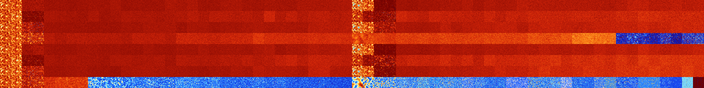

# B24567 (124928-125439)

<details>
    <summary>Initial Grid</summary>
    
</details>


<details>
    <summary>Initial Grid RLE</summary>

```
#C Exported from GoGoL (https://github.com/marrow16/gogol)
#C Wrap mode: Toroidal
#C Boundary mode: Dead
#C Step: 0
x = 100, y = 100, rule = B24567/S
o7bo9bo51bo10bo13bo3bo$33bo2bo6bobo2bo$25bo14bo56bo$13b2o24bo12bo19bo3b
obo8bo9bo$5bo38bo22bo14bo16bo$19b2o16bo31bo3bo19bo$19bo23bo17b3o$10bo
10bo32bo10bo20bo$39bo28bo7bo$4bo10bo13bo17bo23bo$bo2bo3bo22bo25bo10bo$
9bo15bo6bo18bo10bo29bo$16bo31bo4bo9bo11bo3bo9bo5bob2o$46bo8bo12bo$bo2bo
17bo44bobo$11bo5bo2bo11bo11bobo11bo2bo33bo$9bo11bo3bo53bo$37bo14bo43bob
o$o20bo10bo42bo$bo32bo16bo6bo14bo7b2o$28bo25bo$36bo3bo22bo19bo10bo2bo$
16bo9b2o19bo11bo11bo5bo$43bo9bo14bo$5bo4bo15bo16bo8bobo11bo$28bo3bo17bo
2bo10bo18bo$38bo7bo26bo5bo$13bo7bo24bo51bo$23bo6bo18bo11bo18bo3bo7bo$
11bo38bo$o11b2o38bo12bo4bo9bo2bobo$37bo9bo28bo3bo16bo$12bo34bo18bo17b3o
$9bo14bo7bo13bo6bo17bo24bo$18bo22bo38bo17b2o$36bo21bo10bo12bo$13bo33bo$
32bo2bo22bobo5bo22bo2bo6bo$3bo38bob2o16bo6bobo$17bo50bo17bo5bo$9bo31bo
30bo$8bo6bo20bo4bo41bo10bo$12bo10bo9bo33bo$2b2o25bo11bo11bo30bo8bo$44bo
2bo$28bo17bo24bo7bo$23bo$16bo6bo6bobo21bo$15bo48bo4bo$2bo33bo$10bo30bo
19bo$bo36bo4bo25bo5bo22bo$12bo10bo56bo4bo4bobo$4bo15bo55bo18bo3bo$24bo
5bo40bo$bo26bo3bo4bo28bobo3bo$39bo4bo23bo6bo$21bo30bo$4b2o9bo7bo21bo13b
o28bo6bo$bo26bo23bo21bo13bo$4bo27bo20bo3bo$15bo29b2o$17bo4bo6bo5bo4bo
18bo14bo$5bo5bo3bo22bo18bo2bo4bo11bo5bo12bo$10bo6bo10bo46bo11bo$24bo9bo
7bo17bo26bo8bo$2bo8bo29bo7bo$65bo$15bo62bo11bo$20bo56bo$6bo28b2o9b2o7bo
25bo6bo$bo36b2o5bo18bo10bo9bo$6bo29bo13bo6bo8bo2bo18bo$7bo52bo6bo19bo2b
o$51bo39bo$79bo11bo5bo$2bo2bo8bo38bo22bo$19bo4bo19bo38bo$25bo4bo42bo8bo
8bo$40bobo7bo23bo21b2o$16bo2bo47bo8bobo19bo$21bo18bo$100b$20bo14bo23bo
21bo$2bo17bo6bo11bo10bobo8bo21bo10bo$7bo21bo8bo22bo4bo5bo20bo$2bo23bo
18bo2bo17bo12bo12bo$13bo10bo8bo14bo$bo28bo2b2o20bo12bo26bo2b2o$22bo3bo
6bo36bo23bo$7b2o16bo14bo51bo6bo$46bobobo11bo27bo2bo$19bobo9bobo7bo13bo
17bo8bo5b2o3bo$36bo24bo6bo$52bobo$2bo29bo5bo29bo11bo$3bobo8bo12bo7bo4bo
$bo13bo35bo13b2o3bo6bo10bo$25bo13bo10bo7bo3bo9bo25bo$20bo7bo2bobo6bo10b
o16b2o!
```
</details>
<details>
    <summary>Thumbnail</summary>

</details>
<table>
<tr>
    <td><a href="./124928%20S%20Heat%20Map%20Activity.png"></a><br>S (124928)<br>R@38,p2</td>    <td><a href="./124929%20S0%20Heat%20Map%20Activity.png"></a><br>S0 (124929)<br>R@39,p2</td>    <td><a href="./124930%20S1%20Heat%20Map%20Activity.png"></a><br>S1 (124930)<br>G>1000</td>    <td><a href="./124931%20S01%20Heat%20Map%20Activity.png"></a><br>S01 (124931)<br>G>1000</td>    <td><a href="./124932%20S2%20Heat%20Map%20Activity.png"></a><br>S2 (124932)<br>G>1000</td>    <td><a href="./124933%20S02%20Heat%20Map%20Activity.png"></a><br>S02 (124933)<br>G>1000</td>    <td><a href="./124934%20S12%20Heat%20Map%20Activity.png"></a><br>S12 (124934)<br>G>1000</td>    <td><a href="./124935%20S012%20Heat%20Map%20Activity.png"></a><br>S012 (124935)<br>G>1000</td>    <td><a href="./124936%20S3%20Heat%20Map%20Activity.png"></a><br>S3 (124936)<br>G>1000</td>    <td><a href="./124937%20S03%20Heat%20Map%20Activity.png"></a><br>S03 (124937)<br>G>1000</td>    <td><a href="./124938%20S13%20Heat%20Map%20Activity.png"></a><br>S13 (124938)<br>G>1000</td>    <td><a href="./124939%20S013%20Heat%20Map%20Activity.png"></a><br>S013 (124939)<br>G>1000</td>    <td><a href="./124940%20S23%20Heat%20Map%20Activity.png"></a><br>S23 (124940)<br>G>1000</td>    <td><a href="./124941%20S023%20Heat%20Map%20Activity.png"></a><br>S023 (124941)<br>G>1000</td>    <td><a href="./124942%20S123%20Heat%20Map%20Activity.png"></a><br>S123 (124942)<br>G>1000</td>    <td><a href="./124943%20S0123%20Heat%20Map%20Activity.png"></a><br>S0123 (124943)<br>G>1000</td>    <td><a href="./124944%20S4%20Heat%20Map%20Activity.png"></a><br>S4 (124944)<br>G>1000</td>    <td><a href="./124945%20S04%20Heat%20Map%20Activity.png"></a><br>S04 (124945)<br>G>1000</td>    <td><a href="./124946%20S14%20Heat%20Map%20Activity.png"></a><br>S14 (124946)<br>G>1000</td>    <td><a href="./124947%20S014%20Heat%20Map%20Activity.png"></a><br>S014 (124947)<br>G>1000</td>    <td><a href="./124948%20S24%20Heat%20Map%20Activity.png"></a><br>S24 (124948)<br>G>1000</td>    <td><a href="./124949%20S024%20Heat%20Map%20Activity.png"></a><br>S024 (124949)<br>G>1000</td>    <td><a href="./124950%20S124%20Heat%20Map%20Activity.png"></a><br>S124 (124950)<br>G>1000</td>    <td><a href="./124951%20S0124%20Heat%20Map%20Activity.png"></a><br>S0124 (124951)<br>G>1000</td>    <td><a href="./124952%20S34%20Heat%20Map%20Activity.png"></a><br>S34 (124952)<br>G>1000</td>    <td><a href="./124953%20S034%20Heat%20Map%20Activity.png"></a><br>S034 (124953)<br>G>1000</td>    <td><a href="./124954%20S134%20Heat%20Map%20Activity.png"></a><br>S134 (124954)<br>G>1000</td>    <td><a href="./124955%20S0134%20Heat%20Map%20Activity.png"></a><br>S0134 (124955)<br>G>1000</td>    <td><a href="./124956%20S234%20Heat%20Map%20Activity.png"></a><br>S234 (124956)<br>G>1000</td>    <td><a href="./124957%20S0234%20Heat%20Map%20Activity.png"></a><br>S0234 (124957)<br>G>1000</td>    <td><a href="./124958%20S1234%20Heat%20Map%20Activity.png"></a><br>S1234 (124958)<br>G>1000</td>    <td><a href="./124959%20S01234%20Heat%20Map%20Activity.png"></a><br>S01234 (124959)<br>G>1000</td>    <td><a href="./124960%20S5%20Heat%20Map%20Activity.png"></a><br>S5 (124960)<br>R@29,p2</td>    <td><a href="./124961%20S05%20Heat%20Map%20Activity.png"></a><br>S05 (124961)<br>R@33,p2</td>    <td><a href="./124962%20S15%20Heat%20Map%20Activity.png"></a><br>S15 (124962)<br>R@555,p168</td>    <td><a href="./124963%20S015%20Heat%20Map%20Activity.png"></a><br>S015 (124963)<br>R@437,p120</td>    <td><a href="./124964%20S25%20Heat%20Map%20Activity.png"></a><br>S25 (124964)<br>G>1000</td>    <td><a href="./124965%20S025%20Heat%20Map%20Activity.png"></a><br>S025 (124965)<br>G>1000</td>    <td><a href="./124966%20S125%20Heat%20Map%20Activity.png"></a><br>S125 (124966)<br>G>1000</td>    <td><a href="./124967%20S0125%20Heat%20Map%20Activity.png"></a><br>S0125 (124967)<br>G>1000</td>    <td><a href="./124968%20S35%20Heat%20Map%20Activity.png"></a><br>S35 (124968)<br>G>1000</td>    <td><a href="./124969%20S035%20Heat%20Map%20Activity.png"></a><br>S035 (124969)<br>G>1000</td>    <td><a href="./124970%20S135%20Heat%20Map%20Activity.png"></a><br>S135 (124970)<br>G>1000</td>    <td><a href="./124971%20S0135%20Heat%20Map%20Activity.png"></a><br>S0135 (124971)<br>G>1000</td>    <td><a href="./124972%20S235%20Heat%20Map%20Activity.png"></a><br>S235 (124972)<br>G>1000</td>    <td><a href="./124973%20S0235%20Heat%20Map%20Activity.png"></a><br>S0235 (124973)<br>G>1000</td>    <td><a href="./124974%20S1235%20Heat%20Map%20Activity.png"></a><br>S1235 (124974)<br>G>1000</td>    <td><a href="./124975%20S01235%20Heat%20Map%20Activity.png"></a><br>S01235 (124975)<br>G>1000</td>    <td><a href="./124976%20S45%20Heat%20Map%20Activity.png"></a><br>S45 (124976)<br>G>1000</td>    <td><a href="./124977%20S045%20Heat%20Map%20Activity.png"></a><br>S045 (124977)<br>G>1000</td>    <td><a href="./124978%20S145%20Heat%20Map%20Activity.png"></a><br>S145 (124978)<br>G>1000</td>    <td><a href="./124979%20S0145%20Heat%20Map%20Activity.png"></a><br>S0145 (124979)<br>G>1000</td>    <td><a href="./124980%20S245%20Heat%20Map%20Activity.png"></a><br>S245 (124980)<br>G>1000</td>    <td><a href="./124981%20S0245%20Heat%20Map%20Activity.png"></a><br>S0245 (124981)<br>G>1000</td>    <td><a href="./124982%20S1245%20Heat%20Map%20Activity.png"></a><br>S1245 (124982)<br>G>1000</td>    <td><a href="./124983%20S01245%20Heat%20Map%20Activity.png"></a><br>S01245 (124983)<br>G>1000</td>    <td><a href="./124984%20S345%20Heat%20Map%20Activity.png"></a><br>S345 (124984)<br>G>1000</td>    <td><a href="./124985%20S0345%20Heat%20Map%20Activity.png"></a><br>S0345 (124985)<br>G>1000</td>    <td><a href="./124986%20S1345%20Heat%20Map%20Activity.png"></a><br>S1345 (124986)<br>G>1000</td>    <td><a href="./124987%20S01345%20Heat%20Map%20Activity.png"></a><br>S01345 (124987)<br>G>1000</td>    <td><a href="./124988%20S2345%20Heat%20Map%20Activity.png"></a><br>S2345 (124988)<br>G>1000</td>    <td><a href="./124989%20S02345%20Heat%20Map%20Activity.png"></a><br>S02345 (124989)<br>G>1000</td>    <td><a href="./124990%20S12345%20Heat%20Map%20Activity.png"></a><br>S12345 (124990)<br>G>1000</td>    <td><a href="./124991%20S012345%20Heat%20Map%20Activity.png"></a><br>S012345 (124991)<br>G>1000</td></tr>
<tr>
    <td><a href="./124992%20S6%20Heat%20Map%20Activity.png"></a><br>S6 (124992)<br>R@43,p4</td>    <td><a href="./124993%20S06%20Heat%20Map%20Activity.png"></a><br>S06 (124993)<br>R@30,p2</td>    <td><a href="./124994%20S16%20Heat%20Map%20Activity.png"></a><br>S16 (124994)<br>R@236,p120</td>    <td><a href="./124995%20S016%20Heat%20Map%20Activity.png"></a><br>S016 (124995)<br>R@232,p120</td>    <td><a href="./124996%20S26%20Heat%20Map%20Activity.png"></a><br>S26 (124996)<br>G>1000</td>    <td><a href="./124997%20S026%20Heat%20Map%20Activity.png"></a><br>S026 (124997)<br>G>1000</td>    <td><a href="./124998%20S126%20Heat%20Map%20Activity.png"></a><br>S126 (124998)<br>G>1000</td>    <td><a href="./124999%20S0126%20Heat%20Map%20Activity.png"></a><br>S0126 (124999)<br>G>1000</td>    <td><a href="./125000%20S36%20Heat%20Map%20Activity.png"></a><br>S36 (125000)<br>G>1000</td>    <td><a href="./125001%20S036%20Heat%20Map%20Activity.png"></a><br>S036 (125001)<br>G>1000</td>    <td><a href="./125002%20S136%20Heat%20Map%20Activity.png"></a><br>S136 (125002)<br>G>1000</td>    <td><a href="./125003%20S0136%20Heat%20Map%20Activity.png"></a><br>S0136 (125003)<br>G>1000</td>    <td><a href="./125004%20S236%20Heat%20Map%20Activity.png"></a><br>S236 (125004)<br>G>1000</td>    <td><a href="./125005%20S0236%20Heat%20Map%20Activity.png"></a><br>S0236 (125005)<br>G>1000</td>    <td><a href="./125006%20S1236%20Heat%20Map%20Activity.png"></a><br>S1236 (125006)<br>G>1000</td>    <td><a href="./125007%20S01236%20Heat%20Map%20Activity.png"></a><br>S01236 (125007)<br>G>1000</td>    <td><a href="./125008%20S46%20Heat%20Map%20Activity.png"></a><br>S46 (125008)<br>G>1000</td>    <td><a href="./125009%20S046%20Heat%20Map%20Activity.png"></a><br>S046 (125009)<br>G>1000</td>    <td><a href="./125010%20S146%20Heat%20Map%20Activity.png"></a><br>S146 (125010)<br>G>1000</td>    <td><a href="./125011%20S0146%20Heat%20Map%20Activity.png"></a><br>S0146 (125011)<br>G>1000</td>    <td><a href="./125012%20S246%20Heat%20Map%20Activity.png"></a><br>S246 (125012)<br>G>1000</td>    <td><a href="./125013%20S0246%20Heat%20Map%20Activity.png"></a><br>S0246 (125013)<br>G>1000</td>    <td><a href="./125014%20S1246%20Heat%20Map%20Activity.png"></a><br>S1246 (125014)<br>G>1000</td>    <td><a href="./125015%20S01246%20Heat%20Map%20Activity.png"></a><br>S01246 (125015)<br>G>1000</td>    <td><a href="./125016%20S346%20Heat%20Map%20Activity.png"></a><br>S346 (125016)<br>G>1000</td>    <td><a href="./125017%20S0346%20Heat%20Map%20Activity.png"></a><br>S0346 (125017)<br>G>1000</td>    <td><a href="./125018%20S1346%20Heat%20Map%20Activity.png"></a><br>S1346 (125018)<br>G>1000</td>    <td><a href="./125019%20S01346%20Heat%20Map%20Activity.png"></a><br>S01346 (125019)<br>G>1000</td>    <td><a href="./125020%20S2346%20Heat%20Map%20Activity.png"></a><br>S2346 (125020)<br>G>1000</td>    <td><a href="./125021%20S02346%20Heat%20Map%20Activity.png"></a><br>S02346 (125021)<br>G>1000</td>    <td><a href="./125022%20S12346%20Heat%20Map%20Activity.png"></a><br>S12346 (125022)<br>G>1000</td>    <td><a href="./125023%20S012346%20Heat%20Map%20Activity.png"></a><br>S012346 (125023)<br>G>1000</td>    <td><a href="./125024%20S56%20Heat%20Map%20Activity.png"></a><br>S56 (125024)<br>R@50,p12</td>    <td><a href="./125025%20S056%20Heat%20Map%20Activity.png"></a><br>S056 (125025)<br>R@119,p84</td>    <td><a href="./125026%20S156%20Heat%20Map%20Activity.png"></a><br>S156 (125026)<br>R@277,p120</td>    <td><a href="./125027%20S0156%20Heat%20Map%20Activity.png"></a><br>S0156 (125027)<br>R@221,p60</td>    <td><a href="./125028%20S256%20Heat%20Map%20Activity.png"></a><br>S256 (125028)<br>G>1000</td>    <td><a href="./125029%20S0256%20Heat%20Map%20Activity.png"></a><br>S0256 (125029)<br>G>1000</td>    <td><a href="./125030%20S1256%20Heat%20Map%20Activity.png"></a><br>S1256 (125030)<br>G>1000</td>    <td><a href="./125031%20S01256%20Heat%20Map%20Activity.png"></a><br>S01256 (125031)<br>G>1000</td>    <td><a href="./125032%20S356%20Heat%20Map%20Activity.png"></a><br>S356 (125032)<br>G>1000</td>    <td><a href="./125033%20S0356%20Heat%20Map%20Activity.png"></a><br>S0356 (125033)<br>G>1000</td>    <td><a href="./125034%20S1356%20Heat%20Map%20Activity.png"></a><br>S1356 (125034)<br>G>1000</td>    <td><a href="./125035%20S01356%20Heat%20Map%20Activity.png"></a><br>S01356 (125035)<br>G>1000</td>    <td><a href="./125036%20S2356%20Heat%20Map%20Activity.png"></a><br>S2356 (125036)<br>G>1000</td>    <td><a href="./125037%20S02356%20Heat%20Map%20Activity.png"></a><br>S02356 (125037)<br>G>1000</td>    <td><a href="./125038%20S12356%20Heat%20Map%20Activity.png"></a><br>S12356 (125038)<br>G>1000</td>    <td><a href="./125039%20S012356%20Heat%20Map%20Activity.png"></a><br>S012356 (125039)<br>G>1000</td>    <td><a href="./125040%20S456%20Heat%20Map%20Activity.png"></a><br>S456 (125040)<br>G>1000</td>    <td><a href="./125041%20S0456%20Heat%20Map%20Activity.png"></a><br>S0456 (125041)<br>G>1000</td>    <td><a href="./125042%20S1456%20Heat%20Map%20Activity.png"></a><br>S1456 (125042)<br>G>1000</td>    <td><a href="./125043%20S01456%20Heat%20Map%20Activity.png"></a><br>S01456 (125043)<br>G>1000</td>    <td><a href="./125044%20S2456%20Heat%20Map%20Activity.png"></a><br>S2456 (125044)<br>G>1000</td>    <td><a href="./125045%20S02456%20Heat%20Map%20Activity.png"></a><br>S02456 (125045)<br>G>1000</td>    <td><a href="./125046%20S12456%20Heat%20Map%20Activity.png"></a><br>S12456 (125046)<br>G>1000</td>    <td><a href="./125047%20S012456%20Heat%20Map%20Activity.png"></a><br>S012456 (125047)<br>G>1000</td>    <td><a href="./125048%20S3456%20Heat%20Map%20Activity.png"></a><br>S3456 (125048)<br>G>1000</td>    <td><a href="./125049%20S03456%20Heat%20Map%20Activity.png"></a><br>S03456 (125049)<br>G>1000</td>    <td><a href="./125050%20S13456%20Heat%20Map%20Activity.png"></a><br>S13456 (125050)<br>G>1000</td>    <td><a href="./125051%20S013456%20Heat%20Map%20Activity.png"></a><br>S013456 (125051)<br>G>1000</td>    <td><a href="./125052%20S23456%20Heat%20Map%20Activity.png"></a><br>S23456 (125052)<br>G>1000</td>    <td><a href="./125053%20S023456%20Heat%20Map%20Activity.png"></a><br>S023456 (125053)<br>G>1000</td>    <td><a href="./125054%20S123456%20Heat%20Map%20Activity.png"></a><br>S123456 (125054)<br>G>1000</td>    <td><a href="./125055%20S0123456%20Heat%20Map%20Activity.png"></a><br>S0123456 (125055)<br>G>1000</td></tr>
<tr>
    <td><a href="./125056%20S7%20Heat%20Map%20Activity.png"></a><br>S7 (125056)<br>R@38,p2</td>    <td><a href="./125057%20S07%20Heat%20Map%20Activity.png"></a><br>S07 (125057)<br>R@37,p2</td>    <td><a href="./125058%20S17%20Heat%20Map%20Activity.png"></a><br>S17 (125058)<br>R@83,p2</td>    <td><a href="./125059%20S017%20Heat%20Map%20Activity.png"></a><br>S017 (125059)<br>R@124,p20</td>    <td><a href="./125060%20S27%20Heat%20Map%20Activity.png"></a><br>S27 (125060)<br>G>1000</td>    <td><a href="./125061%20S027%20Heat%20Map%20Activity.png"></a><br>S027 (125061)<br>G>1000</td>    <td><a href="./125062%20S127%20Heat%20Map%20Activity.png"></a><br>S127 (125062)<br>G>1000</td>    <td><a href="./125063%20S0127%20Heat%20Map%20Activity.png"></a><br>S0127 (125063)<br>G>1000</td>    <td><a href="./125064%20S37%20Heat%20Map%20Activity.png"></a><br>S37 (125064)<br>G>1000</td>    <td><a href="./125065%20S037%20Heat%20Map%20Activity.png"></a><br>S037 (125065)<br>G>1000</td>    <td><a href="./125066%20S137%20Heat%20Map%20Activity.png"></a><br>S137 (125066)<br>G>1000</td>    <td><a href="./125067%20S0137%20Heat%20Map%20Activity.png"></a><br>S0137 (125067)<br>G>1000</td>    <td><a href="./125068%20S237%20Heat%20Map%20Activity.png"></a><br>S237 (125068)<br>G>1000</td>    <td><a href="./125069%20S0237%20Heat%20Map%20Activity.png"></a><br>S0237 (125069)<br>G>1000</td>    <td><a href="./125070%20S1237%20Heat%20Map%20Activity.png"></a><br>S1237 (125070)<br>G>1000</td>    <td><a href="./125071%20S01237%20Heat%20Map%20Activity.png"></a><br>S01237 (125071)<br>G>1000</td>    <td><a href="./125072%20S47%20Heat%20Map%20Activity.png"></a><br>S47 (125072)<br>G>1000</td>    <td><a href="./125073%20S047%20Heat%20Map%20Activity.png"></a><br>S047 (125073)<br>G>1000</td>    <td><a href="./125074%20S147%20Heat%20Map%20Activity.png"></a><br>S147 (125074)<br>G>1000</td>    <td><a href="./125075%20S0147%20Heat%20Map%20Activity.png"></a><br>S0147 (125075)<br>G>1000</td>    <td><a href="./125076%20S247%20Heat%20Map%20Activity.png"></a><br>S247 (125076)<br>G>1000</td>    <td><a href="./125077%20S0247%20Heat%20Map%20Activity.png"></a><br>S0247 (125077)<br>G>1000</td>    <td><a href="./125078%20S1247%20Heat%20Map%20Activity.png"></a><br>S1247 (125078)<br>G>1000</td>    <td><a href="./125079%20S01247%20Heat%20Map%20Activity.png"></a><br>S01247 (125079)<br>G>1000</td>    <td><a href="./125080%20S347%20Heat%20Map%20Activity.png"></a><br>S347 (125080)<br>G>1000</td>    <td><a href="./125081%20S0347%20Heat%20Map%20Activity.png"></a><br>S0347 (125081)<br>G>1000</td>    <td><a href="./125082%20S1347%20Heat%20Map%20Activity.png"></a><br>S1347 (125082)<br>G>1000</td>    <td><a href="./125083%20S01347%20Heat%20Map%20Activity.png"></a><br>S01347 (125083)<br>G>1000</td>    <td><a href="./125084%20S2347%20Heat%20Map%20Activity.png"></a><br>S2347 (125084)<br>G>1000</td>    <td><a href="./125085%20S02347%20Heat%20Map%20Activity.png"></a><br>S02347 (125085)<br>G>1000</td>    <td><a href="./125086%20S12347%20Heat%20Map%20Activity.png"></a><br>S12347 (125086)<br>G>1000</td>    <td><a href="./125087%20S012347%20Heat%20Map%20Activity.png"></a><br>S012347 (125087)<br>G>1000</td>    <td><a href="./125088%20S57%20Heat%20Map%20Activity.png"></a><br>S57 (125088)<br>R@29,p2</td>    <td><a href="./125089%20S057%20Heat%20Map%20Activity.png"></a><br>S057 (125089)<br>R@33,p2</td>    <td><a href="./125090%20S157%20Heat%20Map%20Activity.png"></a><br>S157 (125090)<br>R@95,p4</td>    <td><a href="./125091%20S0157%20Heat%20Map%20Activity.png"></a><br>S0157 (125091)<br>R@89,p12</td>    <td><a href="./125092%20S257%20Heat%20Map%20Activity.png"></a><br>S257 (125092)<br>G>1000</td>    <td><a href="./125093%20S0257%20Heat%20Map%20Activity.png"></a><br>S0257 (125093)<br>G>1000</td>    <td><a href="./125094%20S1257%20Heat%20Map%20Activity.png"></a><br>S1257 (125094)<br>G>1000</td>    <td><a href="./125095%20S01257%20Heat%20Map%20Activity.png"></a><br>S01257 (125095)<br>G>1000</td>    <td><a href="./125096%20S357%20Heat%20Map%20Activity.png"></a><br>S357 (125096)<br>G>1000</td>    <td><a href="./125097%20S0357%20Heat%20Map%20Activity.png"></a><br>S0357 (125097)<br>G>1000</td>    <td><a href="./125098%20S1357%20Heat%20Map%20Activity.png"></a><br>S1357 (125098)<br>G>1000</td>    <td><a href="./125099%20S01357%20Heat%20Map%20Activity.png"></a><br>S01357 (125099)<br>G>1000</td>    <td><a href="./125100%20S2357%20Heat%20Map%20Activity.png"></a><br>S2357 (125100)<br>G>1000</td>    <td><a href="./125101%20S02357%20Heat%20Map%20Activity.png"></a><br>S02357 (125101)<br>G>1000</td>    <td><a href="./125102%20S12357%20Heat%20Map%20Activity.png"></a><br>S12357 (125102)<br>G>1000</td>    <td><a href="./125103%20S012357%20Heat%20Map%20Activity.png"></a><br>S012357 (125103)<br>G>1000</td>    <td><a href="./125104%20S457%20Heat%20Map%20Activity.png"></a><br>S457 (125104)<br>G>1000</td>    <td><a href="./125105%20S0457%20Heat%20Map%20Activity.png"></a><br>S0457 (125105)<br>G>1000</td>    <td><a href="./125106%20S1457%20Heat%20Map%20Activity.png"></a><br>S1457 (125106)<br>G>1000</td>    <td><a href="./125107%20S01457%20Heat%20Map%20Activity.png"></a><br>S01457 (125107)<br>G>1000</td>    <td><a href="./125108%20S2457%20Heat%20Map%20Activity.png"></a><br>S2457 (125108)<br>G>1000</td>    <td><a href="./125109%20S02457%20Heat%20Map%20Activity.png"></a><br>S02457 (125109)<br>G>1000</td>    <td><a href="./125110%20S12457%20Heat%20Map%20Activity.png"></a><br>S12457 (125110)<br>G>1000</td>    <td><a href="./125111%20S012457%20Heat%20Map%20Activity.png"></a><br>S012457 (125111)<br>G>1000</td>    <td><a href="./125112%20S3457%20Heat%20Map%20Activity.png"></a><br>S3457 (125112)<br>G>1000</td>    <td><a href="./125113%20S03457%20Heat%20Map%20Activity.png"></a><br>S03457 (125113)<br>G>1000</td>    <td><a href="./125114%20S13457%20Heat%20Map%20Activity.png"></a><br>S13457 (125114)<br>G>1000</td>    <td><a href="./125115%20S013457%20Heat%20Map%20Activity.png"></a><br>S013457 (125115)<br>G>1000</td>    <td><a href="./125116%20S23457%20Heat%20Map%20Activity.png"></a><br>S23457 (125116)<br>G>1000</td>    <td><a href="./125117%20S023457%20Heat%20Map%20Activity.png"></a><br>S023457 (125117)<br>G>1000</td>    <td><a href="./125118%20S123457%20Heat%20Map%20Activity.png"></a><br>S123457 (125118)<br>G>1000</td>    <td><a href="./125119%20S0123457%20Heat%20Map%20Activity.png"></a><br>S0123457 (125119)<br>G>1000</td></tr>
<tr>
    <td><a href="./125120%20S67%20Heat%20Map%20Activity.png"></a><br>S67 (125120)<br>R@43,p4</td>    <td><a href="./125121%20S067%20Heat%20Map%20Activity.png"></a><br>S067 (125121)<br>R@34,p2</td>    <td><a href="./125122%20S167%20Heat%20Map%20Activity.png"></a><br>S167 (125122)<br>R@41,p12</td>    <td><a href="./125123%20S0167%20Heat%20Map%20Activity.png"></a><br>S0167 (125123)<br>R@43,p12</td>    <td><a href="./125124%20S267%20Heat%20Map%20Activity.png"></a><br>S267 (125124)<br>G>1000</td>    <td><a href="./125125%20S0267%20Heat%20Map%20Activity.png"></a><br>S0267 (125125)<br>G>1000</td>    <td><a href="./125126%20S1267%20Heat%20Map%20Activity.png"></a><br>S1267 (125126)<br>G>1000</td>    <td><a href="./125127%20S01267%20Heat%20Map%20Activity.png"></a><br>S01267 (125127)<br>G>1000</td>    <td><a href="./125128%20S367%20Heat%20Map%20Activity.png"></a><br>S367 (125128)<br>G>1000</td>    <td><a href="./125129%20S0367%20Heat%20Map%20Activity.png"></a><br>S0367 (125129)<br>G>1000</td>    <td><a href="./125130%20S1367%20Heat%20Map%20Activity.png"></a><br>S1367 (125130)<br>G>1000</td>    <td><a href="./125131%20S01367%20Heat%20Map%20Activity.png"></a><br>S01367 (125131)<br>G>1000</td>    <td><a href="./125132%20S2367%20Heat%20Map%20Activity.png"></a><br>S2367 (125132)<br>G>1000</td>    <td><a href="./125133%20S02367%20Heat%20Map%20Activity.png"></a><br>S02367 (125133)<br>G>1000</td>    <td><a href="./125134%20S12367%20Heat%20Map%20Activity.png"></a><br>S12367 (125134)<br>G>1000</td>    <td><a href="./125135%20S012367%20Heat%20Map%20Activity.png"></a><br>S012367 (125135)<br>G>1000</td>    <td><a href="./125136%20S467%20Heat%20Map%20Activity.png"></a><br>S467 (125136)<br>G>1000</td>    <td><a href="./125137%20S0467%20Heat%20Map%20Activity.png"></a><br>S0467 (125137)<br>G>1000</td>    <td><a href="./125138%20S1467%20Heat%20Map%20Activity.png"></a><br>S1467 (125138)<br>G>1000</td>    <td><a href="./125139%20S01467%20Heat%20Map%20Activity.png"></a><br>S01467 (125139)<br>G>1000</td>    <td><a href="./125140%20S2467%20Heat%20Map%20Activity.png"></a><br>S2467 (125140)<br>G>1000</td>    <td><a href="./125141%20S02467%20Heat%20Map%20Activity.png"></a><br>S02467 (125141)<br>G>1000</td>    <td><a href="./125142%20S12467%20Heat%20Map%20Activity.png"></a><br>S12467 (125142)<br>G>1000</td>    <td><a href="./125143%20S012467%20Heat%20Map%20Activity.png"></a><br>S012467 (125143)<br>G>1000</td>    <td><a href="./125144%20S3467%20Heat%20Map%20Activity.png"></a><br>S3467 (125144)<br>G>1000</td>    <td><a href="./125145%20S03467%20Heat%20Map%20Activity.png"></a><br>S03467 (125145)<br>G>1000</td>    <td><a href="./125146%20S13467%20Heat%20Map%20Activity.png"></a><br>S13467 (125146)<br>G>1000</td>    <td><a href="./125147%20S013467%20Heat%20Map%20Activity.png"></a><br>S013467 (125147)<br>G>1000</td>    <td><a href="./125148%20S23467%20Heat%20Map%20Activity.png"></a><br>S23467 (125148)<br>G>1000</td>    <td><a href="./125149%20S023467%20Heat%20Map%20Activity.png"></a><br>S023467 (125149)<br>G>1000</td>    <td><a href="./125150%20S123467%20Heat%20Map%20Activity.png"></a><br>S123467 (125150)<br>G>1000</td>    <td><a href="./125151%20S0123467%20Heat%20Map%20Activity.png"></a><br>S0123467 (125151)<br>G>1000</td>    <td><a href="./125152%20S567%20Heat%20Map%20Activity.png"></a><br>S567 (125152)<br>G>1000</td>    <td><a href="./125153%20S0567%20Heat%20Map%20Activity.png"></a><br>S0567 (125153)<br>G>1000</td>    <td><a href="./125154%20S1567%20Heat%20Map%20Activity.png"></a><br>S1567 (125154)<br>G>1000</td>    <td><a href="./125155%20S01567%20Heat%20Map%20Activity.png"></a><br>S01567 (125155)<br>G>1000</td>    <td><a href="./125156%20S2567%20Heat%20Map%20Activity.png"></a><br>S2567 (125156)<br>G>1000</td>    <td><a href="./125157%20S02567%20Heat%20Map%20Activity.png"></a><br>S02567 (125157)<br>G>1000</td>    <td><a href="./125158%20S12567%20Heat%20Map%20Activity.png"></a><br>S12567 (125158)<br>G>1000</td>    <td><a href="./125159%20S012567%20Heat%20Map%20Activity.png"></a><br>S012567 (125159)<br>G>1000</td>    <td><a href="./125160%20S3567%20Heat%20Map%20Activity.png"></a><br>S3567 (125160)<br>G>1000</td>    <td><a href="./125161%20S03567%20Heat%20Map%20Activity.png"></a><br>S03567 (125161)<br>G>1000</td>    <td><a href="./125162%20S13567%20Heat%20Map%20Activity.png"></a><br>S13567 (125162)<br>G>1000</td>    <td><a href="./125163%20S013567%20Heat%20Map%20Activity.png"></a><br>S013567 (125163)<br>G>1000</td>    <td><a href="./125164%20S23567%20Heat%20Map%20Activity.png"></a><br>S23567 (125164)<br>G>1000</td>    <td><a href="./125165%20S023567%20Heat%20Map%20Activity.png"></a><br>S023567 (125165)<br>G>1000</td>    <td><a href="./125166%20S123567%20Heat%20Map%20Activity.png"></a><br>S123567 (125166)<br>G>1000</td>    <td><a href="./125167%20S0123567%20Heat%20Map%20Activity.png"></a><br>S0123567 (125167)<br>G>1000</td>    <td><a href="./125168%20S4567%20Heat%20Map%20Activity.png"></a><br>S4567 (125168)<br>G>1000</td>    <td><a href="./125169%20S04567%20Heat%20Map%20Activity.png"></a><br>S04567 (125169)<br>G>1000</td>    <td><a href="./125170%20S14567%20Heat%20Map%20Activity.png"></a><br>S14567 (125170)<br>G>1000</td>    <td><a href="./125171%20S014567%20Heat%20Map%20Activity.png"></a><br>S014567 (125171)<br>G>1000</td>    <td><a href="./125172%20S24567%20Heat%20Map%20Activity.png"></a><br>S24567 (125172)<br>G>1000</td>    <td><a href="./125173%20S024567%20Heat%20Map%20Activity.png"></a><br>S024567 (125173)<br>G>1000</td>    <td><a href="./125174%20S124567%20Heat%20Map%20Activity.png"></a><br>S124567 (125174)<br>G>1000</td>    <td><a href="./125175%20S0124567%20Heat%20Map%20Activity.png"></a><br>S0124567 (125175)<br>G>1000</td>    <td><a href="./125176%20S34567%20Heat%20Map%20Activity.png"></a><br>S34567 (125176)<br>R@468,p210</td>    <td><a href="./125177%20S034567%20Heat%20Map%20Activity.png"></a><br>S034567 (125177)<br>R@261,p42</td>    <td><a href="./125178%20S134567%20Heat%20Map%20Activity.png"></a><br>S134567 (125178)<br>R@458,p210</td>    <td><a href="./125179%20S0134567%20Heat%20Map%20Activity.png"></a><br>S0134567 (125179)<br>R@856,p630</td>    <td><a href="./125180%20S234567%20Heat%20Map%20Activity.png"></a><br>S234567 (125180)<br>R@95,p36</td>    <td><a href="./125181%20S0234567%20Heat%20Map%20Activity.png"></a><br>S0234567 (125181)<br>R@766,p720</td>    <td><a href="./125182%20S1234567%20Heat%20Map%20Activity.png"></a><br>S1234567 (125182)<br>R@73,p18</td>    <td><a href="./125183%20S01234567%20Heat%20Map%20Activity.png"></a><br>S01234567 (125183)<br>R@55,p12</td></tr>
<tr>
    <td><a href="./125184%20S8%20Heat%20Map%20Activity.png"></a><br>S8 (125184)<br>R@38,p2</td>    <td><a href="./125185%20S08%20Heat%20Map%20Activity.png"></a><br>S08 (125185)<br>R@39,p2</td>    <td><a href="./125186%20S18%20Heat%20Map%20Activity.png"></a><br>S18 (125186)<br>G>1000</td>    <td><a href="./125187%20S018%20Heat%20Map%20Activity.png"></a><br>S018 (125187)<br>G>1000</td>    <td><a href="./125188%20S28%20Heat%20Map%20Activity.png"></a><br>S28 (125188)<br>G>1000</td>    <td><a href="./125189%20S028%20Heat%20Map%20Activity.png"></a><br>S028 (125189)<br>G>1000</td>    <td><a href="./125190%20S128%20Heat%20Map%20Activity.png"></a><br>S128 (125190)<br>G>1000</td>    <td><a href="./125191%20S0128%20Heat%20Map%20Activity.png"></a><br>S0128 (125191)<br>G>1000</td>    <td><a href="./125192%20S38%20Heat%20Map%20Activity.png"></a><br>S38 (125192)<br>G>1000</td>    <td><a href="./125193%20S038%20Heat%20Map%20Activity.png"></a><br>S038 (125193)<br>G>1000</td>    <td><a href="./125194%20S138%20Heat%20Map%20Activity.png"></a><br>S138 (125194)<br>G>1000</td>    <td><a href="./125195%20S0138%20Heat%20Map%20Activity.png"></a><br>S0138 (125195)<br>G>1000</td>    <td><a href="./125196%20S238%20Heat%20Map%20Activity.png"></a><br>S238 (125196)<br>G>1000</td>    <td><a href="./125197%20S0238%20Heat%20Map%20Activity.png"></a><br>S0238 (125197)<br>G>1000</td>    <td><a href="./125198%20S1238%20Heat%20Map%20Activity.png"></a><br>S1238 (125198)<br>G>1000</td>    <td><a href="./125199%20S01238%20Heat%20Map%20Activity.png"></a><br>S01238 (125199)<br>G>1000</td>    <td><a href="./125200%20S48%20Heat%20Map%20Activity.png"></a><br>S48 (125200)<br>G>1000</td>    <td><a href="./125201%20S048%20Heat%20Map%20Activity.png"></a><br>S048 (125201)<br>G>1000</td>    <td><a href="./125202%20S148%20Heat%20Map%20Activity.png"></a><br>S148 (125202)<br>G>1000</td>    <td><a href="./125203%20S0148%20Heat%20Map%20Activity.png"></a><br>S0148 (125203)<br>G>1000</td>    <td><a href="./125204%20S248%20Heat%20Map%20Activity.png"></a><br>S248 (125204)<br>G>1000</td>    <td><a href="./125205%20S0248%20Heat%20Map%20Activity.png"></a><br>S0248 (125205)<br>G>1000</td>    <td><a href="./125206%20S1248%20Heat%20Map%20Activity.png"></a><br>S1248 (125206)<br>G>1000</td>    <td><a href="./125207%20S01248%20Heat%20Map%20Activity.png"></a><br>S01248 (125207)<br>G>1000</td>    <td><a href="./125208%20S348%20Heat%20Map%20Activity.png"></a><br>S348 (125208)<br>G>1000</td>    <td><a href="./125209%20S0348%20Heat%20Map%20Activity.png"></a><br>S0348 (125209)<br>G>1000</td>    <td><a href="./125210%20S1348%20Heat%20Map%20Activity.png"></a><br>S1348 (125210)<br>G>1000</td>    <td><a href="./125211%20S01348%20Heat%20Map%20Activity.png"></a><br>S01348 (125211)<br>G>1000</td>    <td><a href="./125212%20S2348%20Heat%20Map%20Activity.png"></a><br>S2348 (125212)<br>G>1000</td>    <td><a href="./125213%20S02348%20Heat%20Map%20Activity.png"></a><br>S02348 (125213)<br>G>1000</td>    <td><a href="./125214%20S12348%20Heat%20Map%20Activity.png"></a><br>S12348 (125214)<br>G>1000</td>    <td><a href="./125215%20S012348%20Heat%20Map%20Activity.png"></a><br>S012348 (125215)<br>G>1000</td>    <td><a href="./125216%20S58%20Heat%20Map%20Activity.png"></a><br>S58 (125216)<br>R@29,p2</td>    <td><a href="./125217%20S058%20Heat%20Map%20Activity.png"></a><br>S058 (125217)<br>R@33,p2</td>    <td><a href="./125218%20S158%20Heat%20Map%20Activity.png"></a><br>S158 (125218)<br>R@516,p168</td>    <td><a href="./125219%20S0158%20Heat%20Map%20Activity.png"></a><br>S0158 (125219)<br>R@454,p96</td>    <td><a href="./125220%20S258%20Heat%20Map%20Activity.png"></a><br>S258 (125220)<br>G>1000</td>    <td><a href="./125221%20S0258%20Heat%20Map%20Activity.png"></a><br>S0258 (125221)<br>G>1000</td>    <td><a href="./125222%20S1258%20Heat%20Map%20Activity.png"></a><br>S1258 (125222)<br>G>1000</td>    <td><a href="./125223%20S01258%20Heat%20Map%20Activity.png"></a><br>S01258 (125223)<br>G>1000</td>    <td><a href="./125224%20S358%20Heat%20Map%20Activity.png"></a><br>S358 (125224)<br>G>1000</td>    <td><a href="./125225%20S0358%20Heat%20Map%20Activity.png"></a><br>S0358 (125225)<br>G>1000</td>    <td><a href="./125226%20S1358%20Heat%20Map%20Activity.png"></a><br>S1358 (125226)<br>G>1000</td>    <td><a href="./125227%20S01358%20Heat%20Map%20Activity.png"></a><br>S01358 (125227)<br>G>1000</td>    <td><a href="./125228%20S2358%20Heat%20Map%20Activity.png"></a><br>S2358 (125228)<br>G>1000</td>    <td><a href="./125229%20S02358%20Heat%20Map%20Activity.png"></a><br>S02358 (125229)<br>G>1000</td>    <td><a href="./125230%20S12358%20Heat%20Map%20Activity.png"></a><br>S12358 (125230)<br>G>1000</td>    <td><a href="./125231%20S012358%20Heat%20Map%20Activity.png"></a><br>S012358 (125231)<br>G>1000</td>    <td><a href="./125232%20S458%20Heat%20Map%20Activity.png"></a><br>S458 (125232)<br>G>1000</td>    <td><a href="./125233%20S0458%20Heat%20Map%20Activity.png"></a><br>S0458 (125233)<br>G>1000</td>    <td><a href="./125234%20S1458%20Heat%20Map%20Activity.png"></a><br>S1458 (125234)<br>G>1000</td>    <td><a href="./125235%20S01458%20Heat%20Map%20Activity.png"></a><br>S01458 (125235)<br>G>1000</td>    <td><a href="./125236%20S2458%20Heat%20Map%20Activity.png"></a><br>S2458 (125236)<br>G>1000</td>    <td><a href="./125237%20S02458%20Heat%20Map%20Activity.png"></a><br>S02458 (125237)<br>G>1000</td>    <td><a href="./125238%20S12458%20Heat%20Map%20Activity.png"></a><br>S12458 (125238)<br>G>1000</td>    <td><a href="./125239%20S012458%20Heat%20Map%20Activity.png"></a><br>S012458 (125239)<br>G>1000</td>    <td><a href="./125240%20S3458%20Heat%20Map%20Activity.png"></a><br>S3458 (125240)<br>G>1000</td>    <td><a href="./125241%20S03458%20Heat%20Map%20Activity.png"></a><br>S03458 (125241)<br>G>1000</td>    <td><a href="./125242%20S13458%20Heat%20Map%20Activity.png"></a><br>S13458 (125242)<br>G>1000</td>    <td><a href="./125243%20S013458%20Heat%20Map%20Activity.png"></a><br>S013458 (125243)<br>G>1000</td>    <td><a href="./125244%20S23458%20Heat%20Map%20Activity.png"></a><br>S23458 (125244)<br>G>1000</td>    <td><a href="./125245%20S023458%20Heat%20Map%20Activity.png"></a><br>S023458 (125245)<br>G>1000</td>    <td><a href="./125246%20S123458%20Heat%20Map%20Activity.png"></a><br>S123458 (125246)<br>G>1000</td>    <td><a href="./125247%20S0123458%20Heat%20Map%20Activity.png"></a><br>S0123458 (125247)<br>G>1000</td></tr>
<tr>
    <td><a href="./125248%20S68%20Heat%20Map%20Activity.png"></a><br>S68 (125248)<br>R@43,p4</td>    <td><a href="./125249%20S068%20Heat%20Map%20Activity.png"></a><br>S068 (125249)<br>R@30,p2</td>    <td><a href="./125250%20S168%20Heat%20Map%20Activity.png"></a><br>S168 (125250)<br>R@220,p120</td>    <td><a href="./125251%20S0168%20Heat%20Map%20Activity.png"></a><br>S0168 (125251)<br>R@236,p120</td>    <td><a href="./125252%20S268%20Heat%20Map%20Activity.png"></a><br>S268 (125252)<br>G>1000</td>    <td><a href="./125253%20S0268%20Heat%20Map%20Activity.png"></a><br>S0268 (125253)<br>G>1000</td>    <td><a href="./125254%20S1268%20Heat%20Map%20Activity.png"></a><br>S1268 (125254)<br>G>1000</td>    <td><a href="./125255%20S01268%20Heat%20Map%20Activity.png"></a><br>S01268 (125255)<br>G>1000</td>    <td><a href="./125256%20S368%20Heat%20Map%20Activity.png"></a><br>S368 (125256)<br>G>1000</td>    <td><a href="./125257%20S0368%20Heat%20Map%20Activity.png"></a><br>S0368 (125257)<br>G>1000</td>    <td><a href="./125258%20S1368%20Heat%20Map%20Activity.png"></a><br>S1368 (125258)<br>G>1000</td>    <td><a href="./125259%20S01368%20Heat%20Map%20Activity.png"></a><br>S01368 (125259)<br>G>1000</td>    <td><a href="./125260%20S2368%20Heat%20Map%20Activity.png"></a><br>S2368 (125260)<br>G>1000</td>    <td><a href="./125261%20S02368%20Heat%20Map%20Activity.png"></a><br>S02368 (125261)<br>G>1000</td>    <td><a href="./125262%20S12368%20Heat%20Map%20Activity.png"></a><br>S12368 (125262)<br>G>1000</td>    <td><a href="./125263%20S012368%20Heat%20Map%20Activity.png"></a><br>S012368 (125263)<br>G>1000</td>    <td><a href="./125264%20S468%20Heat%20Map%20Activity.png"></a><br>S468 (125264)<br>G>1000</td>    <td><a href="./125265%20S0468%20Heat%20Map%20Activity.png"></a><br>S0468 (125265)<br>G>1000</td>    <td><a href="./125266%20S1468%20Heat%20Map%20Activity.png"></a><br>S1468 (125266)<br>G>1000</td>    <td><a href="./125267%20S01468%20Heat%20Map%20Activity.png"></a><br>S01468 (125267)<br>G>1000</td>    <td><a href="./125268%20S2468%20Heat%20Map%20Activity.png"></a><br>S2468 (125268)<br>G>1000</td>    <td><a href="./125269%20S02468%20Heat%20Map%20Activity.png"></a><br>S02468 (125269)<br>G>1000</td>    <td><a href="./125270%20S12468%20Heat%20Map%20Activity.png"></a><br>S12468 (125270)<br>G>1000</td>    <td><a href="./125271%20S012468%20Heat%20Map%20Activity.png"></a><br>S012468 (125271)<br>G>1000</td>    <td><a href="./125272%20S3468%20Heat%20Map%20Activity.png"></a><br>S3468 (125272)<br>G>1000</td>    <td><a href="./125273%20S03468%20Heat%20Map%20Activity.png"></a><br>S03468 (125273)<br>G>1000</td>    <td><a href="./125274%20S13468%20Heat%20Map%20Activity.png"></a><br>S13468 (125274)<br>G>1000</td>    <td><a href="./125275%20S013468%20Heat%20Map%20Activity.png"></a><br>S013468 (125275)<br>G>1000</td>    <td><a href="./125276%20S23468%20Heat%20Map%20Activity.png"></a><br>S23468 (125276)<br>G>1000</td>    <td><a href="./125277%20S023468%20Heat%20Map%20Activity.png"></a><br>S023468 (125277)<br>G>1000</td>    <td><a href="./125278%20S123468%20Heat%20Map%20Activity.png"></a><br>S123468 (125278)<br>G>1000</td>    <td><a href="./125279%20S0123468%20Heat%20Map%20Activity.png"></a><br>S0123468 (125279)<br>G>1000</td>    <td><a href="./125280%20S568%20Heat%20Map%20Activity.png"></a><br>S568 (125280)<br>R@52,p12</td>    <td><a href="./125281%20S0568%20Heat%20Map%20Activity.png"></a><br>S0568 (125281)<br>R@130,p84</td>    <td><a href="./125282%20S1568%20Heat%20Map%20Activity.png"></a><br>S1568 (125282)<br>R@197,p24</td>    <td><a href="./125283%20S01568%20Heat%20Map%20Activity.png"></a><br>S01568 (125283)<br>R@310,p120</td>    <td><a href="./125284%20S2568%20Heat%20Map%20Activity.png"></a><br>S2568 (125284)<br>G>1000</td>    <td><a href="./125285%20S02568%20Heat%20Map%20Activity.png"></a><br>S02568 (125285)<br>G>1000</td>    <td><a href="./125286%20S12568%20Heat%20Map%20Activity.png"></a><br>S12568 (125286)<br>G>1000</td>    <td><a href="./125287%20S012568%20Heat%20Map%20Activity.png"></a><br>S012568 (125287)<br>G>1000</td>    <td><a href="./125288%20S3568%20Heat%20Map%20Activity.png"></a><br>S3568 (125288)<br>G>1000</td>    <td><a href="./125289%20S03568%20Heat%20Map%20Activity.png"></a><br>S03568 (125289)<br>G>1000</td>    <td><a href="./125290%20S13568%20Heat%20Map%20Activity.png"></a><br>S13568 (125290)<br>G>1000</td>    <td><a href="./125291%20S013568%20Heat%20Map%20Activity.png"></a><br>S013568 (125291)<br>G>1000</td>    <td><a href="./125292%20S23568%20Heat%20Map%20Activity.png"></a><br>S23568 (125292)<br>G>1000</td>    <td><a href="./125293%20S023568%20Heat%20Map%20Activity.png"></a><br>S023568 (125293)<br>G>1000</td>    <td><a href="./125294%20S123568%20Heat%20Map%20Activity.png"></a><br>S123568 (125294)<br>G>1000</td>    <td><a href="./125295%20S0123568%20Heat%20Map%20Activity.png"></a><br>S0123568 (125295)<br>G>1000</td>    <td><a href="./125296%20S4568%20Heat%20Map%20Activity.png"></a><br>S4568 (125296)<br>G>1000</td>    <td><a href="./125297%20S04568%20Heat%20Map%20Activity.png"></a><br>S04568 (125297)<br>G>1000</td>    <td><a href="./125298%20S14568%20Heat%20Map%20Activity.png"></a><br>S14568 (125298)<br>G>1000</td>    <td><a href="./125299%20S014568%20Heat%20Map%20Activity.png"></a><br>S014568 (125299)<br>G>1000</td>    <td><a href="./125300%20S24568%20Heat%20Map%20Activity.png"></a><br>S24568 (125300)<br>G>1000</td>    <td><a href="./125301%20S024568%20Heat%20Map%20Activity.png"></a><br>S024568 (125301)<br>G>1000</td>    <td><a href="./125302%20S124568%20Heat%20Map%20Activity.png"></a><br>S124568 (125302)<br>G>1000</td>    <td><a href="./125303%20S0124568%20Heat%20Map%20Activity.png"></a><br>S0124568 (125303)<br>G>1000</td>    <td><a href="./125304%20S34568%20Heat%20Map%20Activity.png"></a><br>S34568 (125304)<br>G>1000</td>    <td><a href="./125305%20S034568%20Heat%20Map%20Activity.png"></a><br>S034568 (125305)<br>G>1000</td>    <td><a href="./125306%20S134568%20Heat%20Map%20Activity.png"></a><br>S134568 (125306)<br>G>1000</td>    <td><a href="./125307%20S0134568%20Heat%20Map%20Activity.png"></a><br>S0134568 (125307)<br>G>1000</td>    <td><a href="./125308%20S234568%20Heat%20Map%20Activity.png"></a><br>S234568 (125308)<br>G>1000</td>    <td><a href="./125309%20S0234568%20Heat%20Map%20Activity.png"></a><br>S0234568 (125309)<br>G>1000</td>    <td><a href="./125310%20S1234568%20Heat%20Map%20Activity.png"></a><br>S1234568 (125310)<br>G>1000</td>    <td><a href="./125311%20S01234568%20Heat%20Map%20Activity.png"></a><br>S01234568 (125311)<br>G>1000</td></tr>
<tr>
    <td><a href="./125312%20S78%20Heat%20Map%20Activity.png"></a><br>S78 (125312)<br>R@38,p2</td>    <td><a href="./125313%20S078%20Heat%20Map%20Activity.png"></a><br>S078 (125313)<br>R@33,p2</td>    <td><a href="./125314%20S178%20Heat%20Map%20Activity.png"></a><br>S178 (125314)<br>R@75,p2</td>    <td><a href="./125315%20S0178%20Heat%20Map%20Activity.png"></a><br>S0178 (125315)<br>R@72,p4</td>    <td><a href="./125316%20S278%20Heat%20Map%20Activity.png"></a><br>S278 (125316)<br>G>1000</td>    <td><a href="./125317%20S0278%20Heat%20Map%20Activity.png"></a><br>S0278 (125317)<br>G>1000</td>    <td><a href="./125318%20S1278%20Heat%20Map%20Activity.png"></a><br>S1278 (125318)<br>G>1000</td>    <td><a href="./125319%20S01278%20Heat%20Map%20Activity.png"></a><br>S01278 (125319)<br>G>1000</td>    <td><a href="./125320%20S378%20Heat%20Map%20Activity.png"></a><br>S378 (125320)<br>G>1000</td>    <td><a href="./125321%20S0378%20Heat%20Map%20Activity.png"></a><br>S0378 (125321)<br>G>1000</td>    <td><a href="./125322%20S1378%20Heat%20Map%20Activity.png"></a><br>S1378 (125322)<br>G>1000</td>    <td><a href="./125323%20S01378%20Heat%20Map%20Activity.png"></a><br>S01378 (125323)<br>G>1000</td>    <td><a href="./125324%20S2378%20Heat%20Map%20Activity.png"></a><br>S2378 (125324)<br>G>1000</td>    <td><a href="./125325%20S02378%20Heat%20Map%20Activity.png"></a><br>S02378 (125325)<br>G>1000</td>    <td><a href="./125326%20S12378%20Heat%20Map%20Activity.png"></a><br>S12378 (125326)<br>G>1000</td>    <td><a href="./125327%20S012378%20Heat%20Map%20Activity.png"></a><br>S012378 (125327)<br>G>1000</td>    <td><a href="./125328%20S478%20Heat%20Map%20Activity.png"></a><br>S478 (125328)<br>G>1000</td>    <td><a href="./125329%20S0478%20Heat%20Map%20Activity.png"></a><br>S0478 (125329)<br>G>1000</td>    <td><a href="./125330%20S1478%20Heat%20Map%20Activity.png"></a><br>S1478 (125330)<br>G>1000</td>    <td><a href="./125331%20S01478%20Heat%20Map%20Activity.png"></a><br>S01478 (125331)<br>G>1000</td>    <td><a href="./125332%20S2478%20Heat%20Map%20Activity.png"></a><br>S2478 (125332)<br>G>1000</td>    <td><a href="./125333%20S02478%20Heat%20Map%20Activity.png"></a><br>S02478 (125333)<br>G>1000</td>    <td><a href="./125334%20S12478%20Heat%20Map%20Activity.png"></a><br>S12478 (125334)<br>G>1000</td>    <td><a href="./125335%20S012478%20Heat%20Map%20Activity.png"></a><br>S012478 (125335)<br>G>1000</td>    <td><a href="./125336%20S3478%20Heat%20Map%20Activity.png"></a><br>S3478 (125336)<br>G>1000</td>    <td><a href="./125337%20S03478%20Heat%20Map%20Activity.png"></a><br>S03478 (125337)<br>G>1000</td>    <td><a href="./125338%20S13478%20Heat%20Map%20Activity.png"></a><br>S13478 (125338)<br>G>1000</td>    <td><a href="./125339%20S013478%20Heat%20Map%20Activity.png"></a><br>S013478 (125339)<br>G>1000</td>    <td><a href="./125340%20S23478%20Heat%20Map%20Activity.png"></a><br>S23478 (125340)<br>G>1000</td>    <td><a href="./125341%20S023478%20Heat%20Map%20Activity.png"></a><br>S023478 (125341)<br>G>1000</td>    <td><a href="./125342%20S123478%20Heat%20Map%20Activity.png"></a><br>S123478 (125342)<br>G>1000</td>    <td><a href="./125343%20S0123478%20Heat%20Map%20Activity.png"></a><br>S0123478 (125343)<br>G>1000</td>    <td><a href="./125344%20S578%20Heat%20Map%20Activity.png"></a><br>S578 (125344)<br>R@29,p2</td>    <td><a href="./125345%20S0578%20Heat%20Map%20Activity.png"></a><br>S0578 (125345)<br>R@33,p2</td>    <td><a href="./125346%20S1578%20Heat%20Map%20Activity.png"></a><br>S1578 (125346)<br>R@251,p120</td>    <td><a href="./125347%20S01578%20Heat%20Map%20Activity.png"></a><br>S01578 (125347)<br>R@275,p60</td>    <td><a href="./125348%20S2578%20Heat%20Map%20Activity.png"></a><br>S2578 (125348)<br>G>1000</td>    <td><a href="./125349%20S02578%20Heat%20Map%20Activity.png"></a><br>S02578 (125349)<br>G>1000</td>    <td><a href="./125350%20S12578%20Heat%20Map%20Activity.png"></a><br>S12578 (125350)<br>G>1000</td>    <td><a href="./125351%20S012578%20Heat%20Map%20Activity.png"></a><br>S012578 (125351)<br>G>1000</td>    <td><a href="./125352%20S3578%20Heat%20Map%20Activity.png"></a><br>S3578 (125352)<br>G>1000</td>    <td><a href="./125353%20S03578%20Heat%20Map%20Activity.png"></a><br>S03578 (125353)<br>G>1000</td>    <td><a href="./125354%20S13578%20Heat%20Map%20Activity.png"></a><br>S13578 (125354)<br>G>1000</td>    <td><a href="./125355%20S013578%20Heat%20Map%20Activity.png"></a><br>S013578 (125355)<br>G>1000</td>    <td><a href="./125356%20S23578%20Heat%20Map%20Activity.png"></a><br>S23578 (125356)<br>G>1000</td>    <td><a href="./125357%20S023578%20Heat%20Map%20Activity.png"></a><br>S023578 (125357)<br>G>1000</td>    <td><a href="./125358%20S123578%20Heat%20Map%20Activity.png"></a><br>S123578 (125358)<br>G>1000</td>    <td><a href="./125359%20S0123578%20Heat%20Map%20Activity.png"></a><br>S0123578 (125359)<br>G>1000</td>    <td><a href="./125360%20S4578%20Heat%20Map%20Activity.png"></a><br>S4578 (125360)<br>G>1000</td>    <td><a href="./125361%20S04578%20Heat%20Map%20Activity.png"></a><br>S04578 (125361)<br>G>1000</td>    <td><a href="./125362%20S14578%20Heat%20Map%20Activity.png"></a><br>S14578 (125362)<br>G>1000</td>    <td><a href="./125363%20S014578%20Heat%20Map%20Activity.png"></a><br>S014578 (125363)<br>G>1000</td>    <td><a href="./125364%20S24578%20Heat%20Map%20Activity.png"></a><br>S24578 (125364)<br>G>1000</td>    <td><a href="./125365%20S024578%20Heat%20Map%20Activity.png"></a><br>S024578 (125365)<br>G>1000</td>    <td><a href="./125366%20S124578%20Heat%20Map%20Activity.png"></a><br>S124578 (125366)<br>G>1000</td>    <td><a href="./125367%20S0124578%20Heat%20Map%20Activity.png"></a><br>S0124578 (125367)<br>G>1000</td>    <td><a href="./125368%20S34578%20Heat%20Map%20Activity.png"></a><br>S34578 (125368)<br>G>1000</td>    <td><a href="./125369%20S034578%20Heat%20Map%20Activity.png"></a><br>S034578 (125369)<br>G>1000</td>    <td><a href="./125370%20S134578%20Heat%20Map%20Activity.png"></a><br>S134578 (125370)<br>G>1000</td>    <td><a href="./125371%20S0134578%20Heat%20Map%20Activity.png"></a><br>S0134578 (125371)<br>G>1000</td>    <td><a href="./125372%20S234578%20Heat%20Map%20Activity.png"></a><br>S234578 (125372)<br>G>1000</td>    <td><a href="./125373%20S0234578%20Heat%20Map%20Activity.png"></a><br>S0234578 (125373)<br>G>1000</td>    <td><a href="./125374%20S1234578%20Heat%20Map%20Activity.png"></a><br>S1234578 (125374)<br>G>1000</td>    <td><a href="./125375%20S01234578%20Heat%20Map%20Activity.png"></a><br>S01234578 (125375)<br>G>1000</td></tr>
<tr>
    <td><a href="./125376%20S678%20Heat%20Map%20Activity.png"></a><br>S678 (125376)<br>R@43,p4</td>    <td><a href="./125377%20S0678%20Heat%20Map%20Activity.png"></a><br>S0678 (125377)<br>R@34,p2</td>    <td><a href="./125378%20S1678%20Heat%20Map%20Activity.png"></a><br>S1678 (125378)<br>R@53,p12</td>    <td><a href="./125379%20S01678%20Heat%20Map%20Activity.png"></a><br>S01678 (125379)<br>R@43,p12</td>    <td><a href="./125380%20S2678%20Heat%20Map%20Activity.png"></a><br>S2678 (125380)<br>G>1000</td>    <td><a href="./125381%20S02678%20Heat%20Map%20Activity.png"></a><br>S02678 (125381)<br>G>1000</td>    <td><a href="./125382%20S12678%20Heat%20Map%20Activity.png"></a><br>S12678 (125382)<br>G>1000</td>    <td><a href="./125383%20S012678%20Heat%20Map%20Activity.png"></a><br>S012678 (125383)<br>G>1000</td>    <td><a href="./125384%20S3678%20Heat%20Map%20Activity.png"></a><br>S3678 (125384)<br>R@112,p4</td>    <td><a href="./125385%20S03678%20Heat%20Map%20Activity.png"></a><br>S03678 (125385)<br>R@102,p12</td>    <td><a href="./125386%20S13678%20Heat%20Map%20Activity.png"></a><br>S13678 (125386)<br>R@87,p4</td>    <td><a href="./125387%20S013678%20Heat%20Map%20Activity.png"></a><br>S013678 (125387)<br>R@99,p12</td>    <td><a href="./125388%20S23678%20Heat%20Map%20Activity.png"></a><br>S23678 (125388)<br>R@54,p4</td>    <td><a href="./125389%20S023678%20Heat%20Map%20Activity.png"></a><br>S023678 (125389)<br>R@48,p4</td>    <td><a href="./125390%20S123678%20Heat%20Map%20Activity.png"></a><br>S123678 (125390)<br>R@45,p4</td>    <td><a href="./125391%20S0123678%20Heat%20Map%20Activity.png"></a><br>S0123678 (125391)<br>R@47,p4</td>    <td><a href="./125392%20S4678%20Heat%20Map%20Activity.png"></a><br>S4678 (125392)<br>R@40,p4</td>    <td><a href="./125393%20S04678%20Heat%20Map%20Activity.png"></a><br>S04678 (125393)<br>R@37,p4</td>    <td><a href="./125394%20S14678%20Heat%20Map%20Activity.png"></a><br>S14678 (125394)<br>R@32,p4</td>    <td><a href="./125395%20S014678%20Heat%20Map%20Activity.png"></a><br>S014678 (125395)<br>R@30,p4</td>    <td><a href="./125396%20S24678%20Heat%20Map%20Activity.png"></a><br>S24678 (125396)<br>R@30,p4</td>    <td><a href="./125397%20S024678%20Heat%20Map%20Activity.png"></a><br>S024678 (125397)<br>R@31,p4</td>    <td><a href="./125398%20S124678%20Heat%20Map%20Activity.png"></a><br>S124678 (125398)<br>R@27,p4</td>    <td><a href="./125399%20S0124678%20Heat%20Map%20Activity.png"></a><br>S0124678 (125399)<br>R@27,p4</td>    <td><a href="./125400%20S34678%20Heat%20Map%20Activity.png"></a><br>S34678 (125400)<br>R@30,p4</td>    <td><a href="./125401%20S034678%20Heat%20Map%20Activity.png"></a><br>S034678 (125401)<br>R@27,p4</td>    <td><a href="./125402%20S134678%20Heat%20Map%20Activity.png"></a><br>S134678 (125402)<br>R@24,p4</td>    <td><a href="./125403%20S0134678%20Heat%20Map%20Activity.png"></a><br>S0134678 (125403)<br>R@25,p4</td>    <td><a href="./125404%20S234678%20Heat%20Map%20Activity.png"></a><br>S234678 (125404)<br>R@27,p4</td>    <td><a href="./125405%20S0234678%20Heat%20Map%20Activity.png"></a><br>S0234678 (125405)<br>R@24,p4</td>    <td><a href="./125406%20S1234678%20Heat%20Map%20Activity.png"></a><br>S1234678 (125406)<br>R@25,p4</td>    <td><a href="./125407%20S01234678%20Heat%20Map%20Activity.png"></a><br>S01234678 (125407)<br>R@24,p4</td>    <td><a href="./125408%20S5678%20Heat%20Map%20Activity.png"></a><br>S5678 (125408)<br>S@116</td>    <td><a href="./125409%20S05678%20Heat%20Map%20Activity.png"></a><br>S05678 (125409)<br>S@56</td>    <td><a href="./125410%20S15678%20Heat%20Map%20Activity.png"></a><br>S15678 (125410)<br>S@27</td>    <td><a href="./125411%20S015678%20Heat%20Map%20Activity.png"></a><br>S015678 (125411)<br>S@26</td>    <td><a href="./125412%20S25678%20Heat%20Map%20Activity.png"></a><br>S25678 (125412)<br>S@22</td>    <td><a href="./125413%20S025678%20Heat%20Map%20Activity.png"></a><br>S025678 (125413)<br>S@21</td>    <td><a href="./125414%20S125678%20Heat%20Map%20Activity.png"></a><br>S125678 (125414)<br>S@20</td>    <td><a href="./125415%20S0125678%20Heat%20Map%20Activity.png"></a><br>S0125678 (125415)<br>R@18,p2</td>    <td><a href="./125416%20S35678%20Heat%20Map%20Activity.png"></a><br>S35678 (125416)<br>S@21</td>    <td><a href="./125417%20S035678%20Heat%20Map%20Activity.png"></a><br>S035678 (125417)<br>R@21,p2</td>    <td><a href="./125418%20S135678%20Heat%20Map%20Activity.png"></a><br>S135678 (125418)<br>S@20</td>    <td><a href="./125419%20S0135678%20Heat%20Map%20Activity.png"></a><br>S0135678 (125419)<br>S@16</td>    <td><a href="./125420%20S235678%20Heat%20Map%20Activity.png"></a><br>S235678 (125420)<br>S@19</td>    <td><a href="./125421%20S0235678%20Heat%20Map%20Activity.png"></a><br>S0235678 (125421)<br>S@18</td>    <td><a href="./125422%20S1235678%20Heat%20Map%20Activity.png"></a><br>S1235678 (125422)<br>S@18</td>    <td><a href="./125423%20S01235678%20Heat%20Map%20Activity.png"></a><br>S01235678 (125423)<br>S@16</td>    <td><a href="./125424%20S45678%20Heat%20Map%20Activity.png"></a><br>S45678 (125424)<br>S@23</td>    <td><a href="./125425%20S045678%20Heat%20Map%20Activity.png"></a><br>S045678 (125425)<br>S@20</td>    <td><a href="./125426%20S145678%20Heat%20Map%20Activity.png"></a><br>S145678 (125426)<br>S@21</td>    <td><a href="./125427%20S0145678%20Heat%20Map%20Activity.png"></a><br>S0145678 (125427)<br>S@16</td>    <td><a href="./125428%20S245678%20Heat%20Map%20Activity.png"></a><br>S245678 (125428)<br>S@18</td>    <td><a href="./125429%20S0245678%20Heat%20Map%20Activity.png"></a><br>S0245678 (125429)<br>S@18</td>    <td><a href="./125430%20S1245678%20Heat%20Map%20Activity.png"></a><br>S1245678 (125430)<br>S@16</td>    <td><a href="./125431%20S01245678%20Heat%20Map%20Activity.png"></a><br>S01245678 (125431)<br>S@15</td>    <td><a href="./125432%20S345678%20Heat%20Map%20Activity.png"></a><br>S345678 (125432)<br>S@20</td>    <td><a href="./125433%20S0345678%20Heat%20Map%20Activity.png"></a><br>S0345678 (125433)<br>S@17</td>    <td><a href="./125434%20S1345678%20Heat%20Map%20Activity.png"></a><br>S1345678 (125434)<br>S@17</td>    <td><a href="./125435%20S01345678%20Heat%20Map%20Activity.png"></a><br>S01345678 (125435)<br>S@15</td>    <td><a href="./125436%20S2345678%20Heat%20Map%20Activity.png"></a><br>S2345678 (125436)<br>S@18</td>    <td><a href="./125437%20S02345678%20Heat%20Map%20Activity.png"></a><br>S02345678 (125437)<br>S@16</td>    <td><a href="./125438%20S12345678%20Heat%20Map%20Activity.png"></a><br>S12345678 (125438)<br>S@17</td>    <td><a href="./125439%20S012345678%20Heat%20Map%20Activity.png"></a><br>S012345678 (125439)<br>S@14</td></tr>
</table>
