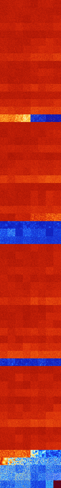

# B246 (43008-43519)

<details>
    <summary>Initial Grid</summary>
    
</details>


<details>
    <summary>Initial Grid RLE</summary>

```
#C Exported from GoGoL (https://github.com/marrow16/gogol)
#C Wrap mode: Toroidal
#C Boundary mode: Dead
#C Step: 0
x = 100, y = 100, rule = B246/S
29bo20bo20bo11bo$5b2o14bo16bo18bo4bo12bo$21bo13bo2bo5bo47bo$3bo20bo2b2o
4bo11bo7bo21bo21bo$38bo6bo18bo9bo$45bo23bo6bo18bo$2bo3bo34bo2bo23bo$bo
47bo5bo$13bo22bob2o2bo3bo3bo4bo10bo11bo18bo$24bo19bo52bo$5bo2bo17bo21bo
3bo40bo$13bo14bo2bo11bo12bo29bo$22bo6bo20bo6bo39bo$86bo2bo7bo$o26bo5bo
20bo23bo$9bo12bo4bo14bo36bo8bo3bo$5bo10bo12bo17bo11bo3bo2bo28bo$o8bo10b
o7bo52bo5bo$68bo29bo$8bo24bo15bo35bo7bo$2bo3bo8bo33bobo2bo2bo38bo$87bo$
13bo7bo15bo7bobo21b2o$6bo27bo2bo7bo16bo32bo$8bo$12bo28bobo23bo2bobo2bo
2bo9bo$15bo2bo29bo3bo25bo$77b2o9bo8bo$3bo33bo19bo4bo11bo$99bo$34b2o9b2o
2bo8bobo13b2o$2bo34bo11bo2bo$4bo46bo12bo$10bo75bo7b2o$22bo55bo17bo$29bo
20bo5bo12bo$12bo77bo$47bo45bo$14bo5bo10bo16bo30bo17bo$24bo2bo51bo19bo$
3bo12bo10bo36bo$33bo12bo31bo2bo12bo$6bo3b2o9bo32bo32bo$9bo3bo4bo18bo43b
o6bo2bo$3bo38bo2bo6bo6bo24bobobo$o59b2o14bo9bobo8bo$bo10bo30b3o2bo4bo
12bo$9bo17bobo6bo20bo2bo6bo$11bo24bo15bo6bo28bo$bo14bo7bo6bo2bo15bo9bo
12bo9bo$52bo32bo$3bo30b2obo3bo27bobo$21bo14bo33bo$9bob2o6bo23bo7bo39bo$
24bo23bobo12bo15bo$o67bo22bo$14bobo7bo14bo$8bo13bo11bo15bo13bo9bo$8bo$
10bo14bo28bo43bo$19bo11bo6bo15bo$21bo3bo9bo14bo5bo3bo12bo6bobo$43bo30bo
$6bo43bo40bo$12bo10bo10bo23bobo4bo14bo14bo$24bo17bo14bo6bo$o21bo6bo19bo
13bo17bo13bo$o8bo4bo31bo41bo7bo$4bo8bo6bo31bo32bo$10bo34b2o13bo$40bo2bo
$14b2o7bo27bo22bo$25bo31bo27bo12bo$19bob2o8bo9bo9bo31bo$24bo54bo7bo$8bo
14bo3bo9bo9bo22bo6bo6b2o$3bo75bo2bo4bo10bo$bo5bo55bo17bo$32bo2bo18bo7b
2o14bo17bo$70bo$39bo15bo7bo12bo3bo12bo$2bo16bo2bobo16bo11bo34bo$16bo4bo
22bo13b2o2bo5bo28bo$bobo$15bo43bobo25bo2bo4bo$5bo5bo21bo45bo$18bo4bobo
5bo18bo11bo28bo$16bo13bo18bo14bo17bo13bo$2o13bo4bo6bo7bo9bo19bo14bo$2bo
bo20bo19bo20bo21bo$9bo12bo7bo26bo5bo31bo$bo16bo16bo10bo40bo9bo$20bo5bob
o3bo4bo10bo21bo12bo3bo5bo$49bo19bo18bo$o7bo44bo5bo6bo30bo$o15bo10bo8bo
10bo10b2o3bo2bo2bobo5bo$30b3o48bo2bo2bo$26bo5bo38bo17bo$34b2o3bo4bo17bo
$36bo2bo55bo!
```
</details>
<details>
    <summary>Thumbnail</summary>

</details>
<table>
<tr>
    <td><a href="./43008%20S%20Heat%20Map%20Activity.png"></a><br>S (43008)<br>G>1000</td>    <td><a href="./43009%20S0%20Heat%20Map%20Activity.png"></a><br>S0 (43009)<br>G>1000</td>    <td><a href="./43010%20S1%20Heat%20Map%20Activity.png"></a><br>S1 (43010)<br>G>1000</td>    <td><a href="./43011%20S01%20Heat%20Map%20Activity.png"></a><br>S01 (43011)<br>G>1000</td>    <td><a href="./43012%20S2%20Heat%20Map%20Activity.png"></a><br>S2 (43012)<br>G>1000</td>    <td><a href="./43013%20S02%20Heat%20Map%20Activity.png"></a><br>S02 (43013)<br>G>1000</td>    <td><a href="./43014%20S12%20Heat%20Map%20Activity.png"></a><br>S12 (43014)<br>G>1000</td>    <td><a href="./43015%20S012%20Heat%20Map%20Activity.png"></a><br>S012 (43015)<br>G>1000</td></tr>
<tr>
    <td><a href="./43016%20S3%20Heat%20Map%20Activity.png"></a><br>S3 (43016)<br>G>1000</td>    <td><a href="./43017%20S03%20Heat%20Map%20Activity.png"></a><br>S03 (43017)<br>G>1000</td>    <td><a href="./43018%20S13%20Heat%20Map%20Activity.png"></a><br>S13 (43018)<br>G>1000</td>    <td><a href="./43019%20S013%20Heat%20Map%20Activity.png"></a><br>S013 (43019)<br>G>1000</td>    <td><a href="./43020%20S23%20Heat%20Map%20Activity.png"></a><br>S23 (43020)<br>G>1000</td>    <td><a href="./43021%20S023%20Heat%20Map%20Activity.png"></a><br>S023 (43021)<br>G>1000</td>    <td><a href="./43022%20S123%20Heat%20Map%20Activity.png"></a><br>S123 (43022)<br>G>1000</td>    <td><a href="./43023%20S0123%20Heat%20Map%20Activity.png"></a><br>S0123 (43023)<br>G>1000</td></tr>
<tr>
    <td><a href="./43024%20S4%20Heat%20Map%20Activity.png"></a><br>S4 (43024)<br>G>1000</td>    <td><a href="./43025%20S04%20Heat%20Map%20Activity.png"></a><br>S04 (43025)<br>G>1000</td>    <td><a href="./43026%20S14%20Heat%20Map%20Activity.png"></a><br>S14 (43026)<br>G>1000</td>    <td><a href="./43027%20S014%20Heat%20Map%20Activity.png"></a><br>S014 (43027)<br>G>1000</td>    <td><a href="./43028%20S24%20Heat%20Map%20Activity.png"></a><br>S24 (43028)<br>G>1000</td>    <td><a href="./43029%20S024%20Heat%20Map%20Activity.png"></a><br>S024 (43029)<br>G>1000</td>    <td><a href="./43030%20S124%20Heat%20Map%20Activity.png"></a><br>S124 (43030)<br>G>1000</td>    <td><a href="./43031%20S0124%20Heat%20Map%20Activity.png"></a><br>S0124 (43031)<br>G>1000</td></tr>
<tr>
    <td><a href="./43032%20S34%20Heat%20Map%20Activity.png"></a><br>S34 (43032)<br>G>1000</td>    <td><a href="./43033%20S034%20Heat%20Map%20Activity.png"></a><br>S034 (43033)<br>G>1000</td>    <td><a href="./43034%20S134%20Heat%20Map%20Activity.png"></a><br>S134 (43034)<br>G>1000</td>    <td><a href="./43035%20S0134%20Heat%20Map%20Activity.png"></a><br>S0134 (43035)<br>G>1000</td>    <td><a href="./43036%20S234%20Heat%20Map%20Activity.png"></a><br>S234 (43036)<br>G>1000</td>    <td><a href="./43037%20S0234%20Heat%20Map%20Activity.png"></a><br>S0234 (43037)<br>G>1000</td>    <td><a href="./43038%20S1234%20Heat%20Map%20Activity.png"></a><br>S1234 (43038)<br>G>1000</td>    <td><a href="./43039%20S01234%20Heat%20Map%20Activity.png"></a><br>S01234 (43039)<br>G>1000</td></tr>
<tr>
    <td><a href="./43040%20S5%20Heat%20Map%20Activity.png"></a><br>S5 (43040)<br>G>1000</td>    <td><a href="./43041%20S05%20Heat%20Map%20Activity.png"></a><br>S05 (43041)<br>G>1000</td>    <td><a href="./43042%20S15%20Heat%20Map%20Activity.png"></a><br>S15 (43042)<br>G>1000</td>    <td><a href="./43043%20S015%20Heat%20Map%20Activity.png"></a><br>S015 (43043)<br>G>1000</td>    <td><a href="./43044%20S25%20Heat%20Map%20Activity.png"></a><br>S25 (43044)<br>G>1000</td>    <td><a href="./43045%20S025%20Heat%20Map%20Activity.png"></a><br>S025 (43045)<br>G>1000</td>    <td><a href="./43046%20S125%20Heat%20Map%20Activity.png"></a><br>S125 (43046)<br>G>1000</td>    <td><a href="./43047%20S0125%20Heat%20Map%20Activity.png"></a><br>S0125 (43047)<br>G>1000</td></tr>
<tr>
    <td><a href="./43048%20S35%20Heat%20Map%20Activity.png"></a><br>S35 (43048)<br>G>1000</td>    <td><a href="./43049%20S035%20Heat%20Map%20Activity.png"></a><br>S035 (43049)<br>G>1000</td>    <td><a href="./43050%20S135%20Heat%20Map%20Activity.png"></a><br>S135 (43050)<br>G>1000</td>    <td><a href="./43051%20S0135%20Heat%20Map%20Activity.png"></a><br>S0135 (43051)<br>G>1000</td>    <td><a href="./43052%20S235%20Heat%20Map%20Activity.png"></a><br>S235 (43052)<br>G>1000</td>    <td><a href="./43053%20S0235%20Heat%20Map%20Activity.png"></a><br>S0235 (43053)<br>G>1000</td>    <td><a href="./43054%20S1235%20Heat%20Map%20Activity.png"></a><br>S1235 (43054)<br>G>1000</td>    <td><a href="./43055%20S01235%20Heat%20Map%20Activity.png"></a><br>S01235 (43055)<br>G>1000</td></tr>
<tr>
    <td><a href="./43056%20S45%20Heat%20Map%20Activity.png"></a><br>S45 (43056)<br>G>1000</td>    <td><a href="./43057%20S045%20Heat%20Map%20Activity.png"></a><br>S045 (43057)<br>G>1000</td>    <td><a href="./43058%20S145%20Heat%20Map%20Activity.png"></a><br>S145 (43058)<br>G>1000</td>    <td><a href="./43059%20S0145%20Heat%20Map%20Activity.png"></a><br>S0145 (43059)<br>G>1000</td>    <td><a href="./43060%20S245%20Heat%20Map%20Activity.png"></a><br>S245 (43060)<br>G>1000</td>    <td><a href="./43061%20S0245%20Heat%20Map%20Activity.png"></a><br>S0245 (43061)<br>G>1000</td>    <td><a href="./43062%20S1245%20Heat%20Map%20Activity.png"></a><br>S1245 (43062)<br>G>1000</td>    <td><a href="./43063%20S01245%20Heat%20Map%20Activity.png"></a><br>S01245 (43063)<br>G>1000</td></tr>
<tr>
    <td><a href="./43064%20S345%20Heat%20Map%20Activity.png"></a><br>S345 (43064)<br>G>1000</td>    <td><a href="./43065%20S0345%20Heat%20Map%20Activity.png"></a><br>S0345 (43065)<br>G>1000</td>    <td><a href="./43066%20S1345%20Heat%20Map%20Activity.png"></a><br>S1345 (43066)<br>G>1000</td>    <td><a href="./43067%20S01345%20Heat%20Map%20Activity.png"></a><br>S01345 (43067)<br>G>1000</td>    <td><a href="./43068%20S2345%20Heat%20Map%20Activity.png"></a><br>S2345 (43068)<br>G>1000</td>    <td><a href="./43069%20S02345%20Heat%20Map%20Activity.png"></a><br>S02345 (43069)<br>G>1000</td>    <td><a href="./43070%20S12345%20Heat%20Map%20Activity.png"></a><br>S12345 (43070)<br>G>1000</td>    <td><a href="./43071%20S012345%20Heat%20Map%20Activity.png"></a><br>S012345 (43071)<br>G>1000</td></tr>
<tr>
    <td><a href="./43072%20S6%20Heat%20Map%20Activity.png"></a><br>S6 (43072)<br>G>1000</td>    <td><a href="./43073%20S06%20Heat%20Map%20Activity.png"></a><br>S06 (43073)<br>G>1000</td>    <td><a href="./43074%20S16%20Heat%20Map%20Activity.png"></a><br>S16 (43074)<br>G>1000</td>    <td><a href="./43075%20S016%20Heat%20Map%20Activity.png"></a><br>S016 (43075)<br>G>1000</td>    <td><a href="./43076%20S26%20Heat%20Map%20Activity.png"></a><br>S26 (43076)<br>G>1000</td>    <td><a href="./43077%20S026%20Heat%20Map%20Activity.png"></a><br>S026 (43077)<br>G>1000</td>    <td><a href="./43078%20S126%20Heat%20Map%20Activity.png"></a><br>S126 (43078)<br>G>1000</td>    <td><a href="./43079%20S0126%20Heat%20Map%20Activity.png"></a><br>S0126 (43079)<br>G>1000</td></tr>
<tr>
    <td><a href="./43080%20S36%20Heat%20Map%20Activity.png"></a><br>S36 (43080)<br>G>1000</td>    <td><a href="./43081%20S036%20Heat%20Map%20Activity.png"></a><br>S036 (43081)<br>G>1000</td>    <td><a href="./43082%20S136%20Heat%20Map%20Activity.png"></a><br>S136 (43082)<br>G>1000</td>    <td><a href="./43083%20S0136%20Heat%20Map%20Activity.png"></a><br>S0136 (43083)<br>G>1000</td>    <td><a href="./43084%20S236%20Heat%20Map%20Activity.png"></a><br>S236 (43084)<br>G>1000</td>    <td><a href="./43085%20S0236%20Heat%20Map%20Activity.png"></a><br>S0236 (43085)<br>G>1000</td>    <td><a href="./43086%20S1236%20Heat%20Map%20Activity.png"></a><br>S1236 (43086)<br>G>1000</td>    <td><a href="./43087%20S01236%20Heat%20Map%20Activity.png"></a><br>S01236 (43087)<br>G>1000</td></tr>
<tr>
    <td><a href="./43088%20S46%20Heat%20Map%20Activity.png"></a><br>S46 (43088)<br>G>1000</td>    <td><a href="./43089%20S046%20Heat%20Map%20Activity.png"></a><br>S046 (43089)<br>G>1000</td>    <td><a href="./43090%20S146%20Heat%20Map%20Activity.png"></a><br>S146 (43090)<br>G>1000</td>    <td><a href="./43091%20S0146%20Heat%20Map%20Activity.png"></a><br>S0146 (43091)<br>G>1000</td>    <td><a href="./43092%20S246%20Heat%20Map%20Activity.png"></a><br>S246 (43092)<br>G>1000</td>    <td><a href="./43093%20S0246%20Heat%20Map%20Activity.png"></a><br>S0246 (43093)<br>G>1000</td>    <td><a href="./43094%20S1246%20Heat%20Map%20Activity.png"></a><br>S1246 (43094)<br>G>1000</td>    <td><a href="./43095%20S01246%20Heat%20Map%20Activity.png"></a><br>S01246 (43095)<br>G>1000</td></tr>
<tr>
    <td><a href="./43096%20S346%20Heat%20Map%20Activity.png"></a><br>S346 (43096)<br>G>1000</td>    <td><a href="./43097%20S0346%20Heat%20Map%20Activity.png"></a><br>S0346 (43097)<br>G>1000</td>    <td><a href="./43098%20S1346%20Heat%20Map%20Activity.png"></a><br>S1346 (43098)<br>G>1000</td>    <td><a href="./43099%20S01346%20Heat%20Map%20Activity.png"></a><br>S01346 (43099)<br>G>1000</td>    <td><a href="./43100%20S2346%20Heat%20Map%20Activity.png"></a><br>S2346 (43100)<br>G>1000</td>    <td><a href="./43101%20S02346%20Heat%20Map%20Activity.png"></a><br>S02346 (43101)<br>G>1000</td>    <td><a href="./43102%20S12346%20Heat%20Map%20Activity.png"></a><br>S12346 (43102)<br>G>1000</td>    <td><a href="./43103%20S012346%20Heat%20Map%20Activity.png"></a><br>S012346 (43103)<br>G>1000</td></tr>
<tr>
    <td><a href="./43104%20S56%20Heat%20Map%20Activity.png"></a><br>S56 (43104)<br>G>1000</td>    <td><a href="./43105%20S056%20Heat%20Map%20Activity.png"></a><br>S056 (43105)<br>G>1000</td>    <td><a href="./43106%20S156%20Heat%20Map%20Activity.png"></a><br>S156 (43106)<br>G>1000</td>    <td><a href="./43107%20S0156%20Heat%20Map%20Activity.png"></a><br>S0156 (43107)<br>G>1000</td>    <td><a href="./43108%20S256%20Heat%20Map%20Activity.png"></a><br>S256 (43108)<br>G>1000</td>    <td><a href="./43109%20S0256%20Heat%20Map%20Activity.png"></a><br>S0256 (43109)<br>G>1000</td>    <td><a href="./43110%20S1256%20Heat%20Map%20Activity.png"></a><br>S1256 (43110)<br>G>1000</td>    <td><a href="./43111%20S01256%20Heat%20Map%20Activity.png"></a><br>S01256 (43111)<br>G>1000</td></tr>
<tr>
    <td><a href="./43112%20S356%20Heat%20Map%20Activity.png"></a><br>S356 (43112)<br>G>1000</td>    <td><a href="./43113%20S0356%20Heat%20Map%20Activity.png"></a><br>S0356 (43113)<br>G>1000</td>    <td><a href="./43114%20S1356%20Heat%20Map%20Activity.png"></a><br>S1356 (43114)<br>G>1000</td>    <td><a href="./43115%20S01356%20Heat%20Map%20Activity.png"></a><br>S01356 (43115)<br>G>1000</td>    <td><a href="./43116%20S2356%20Heat%20Map%20Activity.png"></a><br>S2356 (43116)<br>G>1000</td>    <td><a href="./43117%20S02356%20Heat%20Map%20Activity.png"></a><br>S02356 (43117)<br>G>1000</td>    <td><a href="./43118%20S12356%20Heat%20Map%20Activity.png"></a><br>S12356 (43118)<br>G>1000</td>    <td><a href="./43119%20S012356%20Heat%20Map%20Activity.png"></a><br>S012356 (43119)<br>G>1000</td></tr>
<tr>
    <td><a href="./43120%20S456%20Heat%20Map%20Activity.png"></a><br>S456 (43120)<br>G>1000</td>    <td><a href="./43121%20S0456%20Heat%20Map%20Activity.png"></a><br>S0456 (43121)<br>G>1000</td>    <td><a href="./43122%20S1456%20Heat%20Map%20Activity.png"></a><br>S1456 (43122)<br>G>1000</td>    <td><a href="./43123%20S01456%20Heat%20Map%20Activity.png"></a><br>S01456 (43123)<br>G>1000</td>    <td><a href="./43124%20S2456%20Heat%20Map%20Activity.png"></a><br>S2456 (43124)<br>G>1000</td>    <td><a href="./43125%20S02456%20Heat%20Map%20Activity.png"></a><br>S02456 (43125)<br>G>1000</td>    <td><a href="./43126%20S12456%20Heat%20Map%20Activity.png"></a><br>S12456 (43126)<br>G>1000</td>    <td><a href="./43127%20S012456%20Heat%20Map%20Activity.png"></a><br>S012456 (43127)<br>G>1000</td></tr>
<tr>
    <td><a href="./43128%20S3456%20Heat%20Map%20Activity.png"></a><br>S3456 (43128)<br>G>1000</td>    <td><a href="./43129%20S03456%20Heat%20Map%20Activity.png"></a><br>S03456 (43129)<br>G>1000</td>    <td><a href="./43130%20S13456%20Heat%20Map%20Activity.png"></a><br>S13456 (43130)<br>G>1000</td>    <td><a href="./43131%20S013456%20Heat%20Map%20Activity.png"></a><br>S013456 (43131)<br>G>1000</td>    <td><a href="./43132%20S23456%20Heat%20Map%20Activity.png"></a><br>S23456 (43132)<br>R@125,p12</td>    <td><a href="./43133%20S023456%20Heat%20Map%20Activity.png"></a><br>S023456 (43133)<br>R@149,p60</td>    <td><a href="./43134%20S123456%20Heat%20Map%20Activity.png"></a><br>S123456 (43134)<br>G>1000</td>    <td><a href="./43135%20S0123456%20Heat%20Map%20Activity.png"></a><br>S0123456 (43135)<br>G>1000</td></tr>
<tr>
    <td><a href="./43136%20S7%20Heat%20Map%20Activity.png"></a><br>S7 (43136)<br>G>1000</td>    <td><a href="./43137%20S07%20Heat%20Map%20Activity.png"></a><br>S07 (43137)<br>G>1000</td>    <td><a href="./43138%20S17%20Heat%20Map%20Activity.png"></a><br>S17 (43138)<br>G>1000</td>    <td><a href="./43139%20S017%20Heat%20Map%20Activity.png"></a><br>S017 (43139)<br>G>1000</td>    <td><a href="./43140%20S27%20Heat%20Map%20Activity.png"></a><br>S27 (43140)<br>G>1000</td>    <td><a href="./43141%20S027%20Heat%20Map%20Activity.png"></a><br>S027 (43141)<br>G>1000</td>    <td><a href="./43142%20S127%20Heat%20Map%20Activity.png"></a><br>S127 (43142)<br>G>1000</td>    <td><a href="./43143%20S0127%20Heat%20Map%20Activity.png"></a><br>S0127 (43143)<br>G>1000</td></tr>
<tr>
    <td><a href="./43144%20S37%20Heat%20Map%20Activity.png"></a><br>S37 (43144)<br>G>1000</td>    <td><a href="./43145%20S037%20Heat%20Map%20Activity.png"></a><br>S037 (43145)<br>G>1000</td>    <td><a href="./43146%20S137%20Heat%20Map%20Activity.png"></a><br>S137 (43146)<br>G>1000</td>    <td><a href="./43147%20S0137%20Heat%20Map%20Activity.png"></a><br>S0137 (43147)<br>G>1000</td>    <td><a href="./43148%20S237%20Heat%20Map%20Activity.png"></a><br>S237 (43148)<br>G>1000</td>    <td><a href="./43149%20S0237%20Heat%20Map%20Activity.png"></a><br>S0237 (43149)<br>G>1000</td>    <td><a href="./43150%20S1237%20Heat%20Map%20Activity.png"></a><br>S1237 (43150)<br>G>1000</td>    <td><a href="./43151%20S01237%20Heat%20Map%20Activity.png"></a><br>S01237 (43151)<br>G>1000</td></tr>
<tr>
    <td><a href="./43152%20S47%20Heat%20Map%20Activity.png"></a><br>S47 (43152)<br>G>1000</td>    <td><a href="./43153%20S047%20Heat%20Map%20Activity.png"></a><br>S047 (43153)<br>G>1000</td>    <td><a href="./43154%20S147%20Heat%20Map%20Activity.png"></a><br>S147 (43154)<br>G>1000</td>    <td><a href="./43155%20S0147%20Heat%20Map%20Activity.png"></a><br>S0147 (43155)<br>G>1000</td>    <td><a href="./43156%20S247%20Heat%20Map%20Activity.png"></a><br>S247 (43156)<br>G>1000</td>    <td><a href="./43157%20S0247%20Heat%20Map%20Activity.png"></a><br>S0247 (43157)<br>G>1000</td>    <td><a href="./43158%20S1247%20Heat%20Map%20Activity.png"></a><br>S1247 (43158)<br>G>1000</td>    <td><a href="./43159%20S01247%20Heat%20Map%20Activity.png"></a><br>S01247 (43159)<br>G>1000</td></tr>
<tr>
    <td><a href="./43160%20S347%20Heat%20Map%20Activity.png"></a><br>S347 (43160)<br>G>1000</td>    <td><a href="./43161%20S0347%20Heat%20Map%20Activity.png"></a><br>S0347 (43161)<br>G>1000</td>    <td><a href="./43162%20S1347%20Heat%20Map%20Activity.png"></a><br>S1347 (43162)<br>G>1000</td>    <td><a href="./43163%20S01347%20Heat%20Map%20Activity.png"></a><br>S01347 (43163)<br>G>1000</td>    <td><a href="./43164%20S2347%20Heat%20Map%20Activity.png"></a><br>S2347 (43164)<br>G>1000</td>    <td><a href="./43165%20S02347%20Heat%20Map%20Activity.png"></a><br>S02347 (43165)<br>G>1000</td>    <td><a href="./43166%20S12347%20Heat%20Map%20Activity.png"></a><br>S12347 (43166)<br>G>1000</td>    <td><a href="./43167%20S012347%20Heat%20Map%20Activity.png"></a><br>S012347 (43167)<br>G>1000</td></tr>
<tr>
    <td><a href="./43168%20S57%20Heat%20Map%20Activity.png"></a><br>S57 (43168)<br>G>1000</td>    <td><a href="./43169%20S057%20Heat%20Map%20Activity.png"></a><br>S057 (43169)<br>G>1000</td>    <td><a href="./43170%20S157%20Heat%20Map%20Activity.png"></a><br>S157 (43170)<br>G>1000</td>    <td><a href="./43171%20S0157%20Heat%20Map%20Activity.png"></a><br>S0157 (43171)<br>G>1000</td>    <td><a href="./43172%20S257%20Heat%20Map%20Activity.png"></a><br>S257 (43172)<br>G>1000</td>    <td><a href="./43173%20S0257%20Heat%20Map%20Activity.png"></a><br>S0257 (43173)<br>G>1000</td>    <td><a href="./43174%20S1257%20Heat%20Map%20Activity.png"></a><br>S1257 (43174)<br>G>1000</td>    <td><a href="./43175%20S01257%20Heat%20Map%20Activity.png"></a><br>S01257 (43175)<br>G>1000</td></tr>
<tr>
    <td><a href="./43176%20S357%20Heat%20Map%20Activity.png"></a><br>S357 (43176)<br>G>1000</td>    <td><a href="./43177%20S0357%20Heat%20Map%20Activity.png"></a><br>S0357 (43177)<br>G>1000</td>    <td><a href="./43178%20S1357%20Heat%20Map%20Activity.png"></a><br>S1357 (43178)<br>G>1000</td>    <td><a href="./43179%20S01357%20Heat%20Map%20Activity.png"></a><br>S01357 (43179)<br>G>1000</td>    <td><a href="./43180%20S2357%20Heat%20Map%20Activity.png"></a><br>S2357 (43180)<br>G>1000</td>    <td><a href="./43181%20S02357%20Heat%20Map%20Activity.png"></a><br>S02357 (43181)<br>G>1000</td>    <td><a href="./43182%20S12357%20Heat%20Map%20Activity.png"></a><br>S12357 (43182)<br>G>1000</td>    <td><a href="./43183%20S012357%20Heat%20Map%20Activity.png"></a><br>S012357 (43183)<br>G>1000</td></tr>
<tr>
    <td><a href="./43184%20S457%20Heat%20Map%20Activity.png"></a><br>S457 (43184)<br>G>1000</td>    <td><a href="./43185%20S0457%20Heat%20Map%20Activity.png"></a><br>S0457 (43185)<br>G>1000</td>    <td><a href="./43186%20S1457%20Heat%20Map%20Activity.png"></a><br>S1457 (43186)<br>G>1000</td>    <td><a href="./43187%20S01457%20Heat%20Map%20Activity.png"></a><br>S01457 (43187)<br>G>1000</td>    <td><a href="./43188%20S2457%20Heat%20Map%20Activity.png"></a><br>S2457 (43188)<br>G>1000</td>    <td><a href="./43189%20S02457%20Heat%20Map%20Activity.png"></a><br>S02457 (43189)<br>G>1000</td>    <td><a href="./43190%20S12457%20Heat%20Map%20Activity.png"></a><br>S12457 (43190)<br>G>1000</td>    <td><a href="./43191%20S012457%20Heat%20Map%20Activity.png"></a><br>S012457 (43191)<br>G>1000</td></tr>
<tr>
    <td><a href="./43192%20S3457%20Heat%20Map%20Activity.png"></a><br>S3457 (43192)<br>G>1000</td>    <td><a href="./43193%20S03457%20Heat%20Map%20Activity.png"></a><br>S03457 (43193)<br>G>1000</td>    <td><a href="./43194%20S13457%20Heat%20Map%20Activity.png"></a><br>S13457 (43194)<br>G>1000</td>    <td><a href="./43195%20S013457%20Heat%20Map%20Activity.png"></a><br>S013457 (43195)<br>G>1000</td>    <td><a href="./43196%20S23457%20Heat%20Map%20Activity.png"></a><br>S23457 (43196)<br>G>1000</td>    <td><a href="./43197%20S023457%20Heat%20Map%20Activity.png"></a><br>S023457 (43197)<br>G>1000</td>    <td><a href="./43198%20S123457%20Heat%20Map%20Activity.png"></a><br>S123457 (43198)<br>G>1000</td>    <td><a href="./43199%20S0123457%20Heat%20Map%20Activity.png"></a><br>S0123457 (43199)<br>G>1000</td></tr>
<tr>
    <td><a href="./43200%20S67%20Heat%20Map%20Activity.png"></a><br>S67 (43200)<br>G>1000</td>    <td><a href="./43201%20S067%20Heat%20Map%20Activity.png"></a><br>S067 (43201)<br>G>1000</td>    <td><a href="./43202%20S167%20Heat%20Map%20Activity.png"></a><br>S167 (43202)<br>G>1000</td>    <td><a href="./43203%20S0167%20Heat%20Map%20Activity.png"></a><br>S0167 (43203)<br>G>1000</td>    <td><a href="./43204%20S267%20Heat%20Map%20Activity.png"></a><br>S267 (43204)<br>G>1000</td>    <td><a href="./43205%20S0267%20Heat%20Map%20Activity.png"></a><br>S0267 (43205)<br>G>1000</td>    <td><a href="./43206%20S1267%20Heat%20Map%20Activity.png"></a><br>S1267 (43206)<br>G>1000</td>    <td><a href="./43207%20S01267%20Heat%20Map%20Activity.png"></a><br>S01267 (43207)<br>G>1000</td></tr>
<tr>
    <td><a href="./43208%20S367%20Heat%20Map%20Activity.png"></a><br>S367 (43208)<br>G>1000</td>    <td><a href="./43209%20S0367%20Heat%20Map%20Activity.png"></a><br>S0367 (43209)<br>G>1000</td>    <td><a href="./43210%20S1367%20Heat%20Map%20Activity.png"></a><br>S1367 (43210)<br>G>1000</td>    <td><a href="./43211%20S01367%20Heat%20Map%20Activity.png"></a><br>S01367 (43211)<br>G>1000</td>    <td><a href="./43212%20S2367%20Heat%20Map%20Activity.png"></a><br>S2367 (43212)<br>G>1000</td>    <td><a href="./43213%20S02367%20Heat%20Map%20Activity.png"></a><br>S02367 (43213)<br>G>1000</td>    <td><a href="./43214%20S12367%20Heat%20Map%20Activity.png"></a><br>S12367 (43214)<br>G>1000</td>    <td><a href="./43215%20S012367%20Heat%20Map%20Activity.png"></a><br>S012367 (43215)<br>G>1000</td></tr>
<tr>
    <td><a href="./43216%20S467%20Heat%20Map%20Activity.png"></a><br>S467 (43216)<br>G>1000</td>    <td><a href="./43217%20S0467%20Heat%20Map%20Activity.png"></a><br>S0467 (43217)<br>G>1000</td>    <td><a href="./43218%20S1467%20Heat%20Map%20Activity.png"></a><br>S1467 (43218)<br>G>1000</td>    <td><a href="./43219%20S01467%20Heat%20Map%20Activity.png"></a><br>S01467 (43219)<br>G>1000</td>    <td><a href="./43220%20S2467%20Heat%20Map%20Activity.png"></a><br>S2467 (43220)<br>G>1000</td>    <td><a href="./43221%20S02467%20Heat%20Map%20Activity.png"></a><br>S02467 (43221)<br>G>1000</td>    <td><a href="./43222%20S12467%20Heat%20Map%20Activity.png"></a><br>S12467 (43222)<br>G>1000</td>    <td><a href="./43223%20S012467%20Heat%20Map%20Activity.png"></a><br>S012467 (43223)<br>G>1000</td></tr>
<tr>
    <td><a href="./43224%20S3467%20Heat%20Map%20Activity.png"></a><br>S3467 (43224)<br>G>1000</td>    <td><a href="./43225%20S03467%20Heat%20Map%20Activity.png"></a><br>S03467 (43225)<br>G>1000</td>    <td><a href="./43226%20S13467%20Heat%20Map%20Activity.png"></a><br>S13467 (43226)<br>G>1000</td>    <td><a href="./43227%20S013467%20Heat%20Map%20Activity.png"></a><br>S013467 (43227)<br>G>1000</td>    <td><a href="./43228%20S23467%20Heat%20Map%20Activity.png"></a><br>S23467 (43228)<br>G>1000</td>    <td><a href="./43229%20S023467%20Heat%20Map%20Activity.png"></a><br>S023467 (43229)<br>G>1000</td>    <td><a href="./43230%20S123467%20Heat%20Map%20Activity.png"></a><br>S123467 (43230)<br>G>1000</td>    <td><a href="./43231%20S0123467%20Heat%20Map%20Activity.png"></a><br>S0123467 (43231)<br>G>1000</td></tr>
<tr>
    <td><a href="./43232%20S567%20Heat%20Map%20Activity.png"></a><br>S567 (43232)<br>G>1000</td>    <td><a href="./43233%20S0567%20Heat%20Map%20Activity.png"></a><br>S0567 (43233)<br>G>1000</td>    <td><a href="./43234%20S1567%20Heat%20Map%20Activity.png"></a><br>S1567 (43234)<br>G>1000</td>    <td><a href="./43235%20S01567%20Heat%20Map%20Activity.png"></a><br>S01567 (43235)<br>G>1000</td>    <td><a href="./43236%20S2567%20Heat%20Map%20Activity.png"></a><br>S2567 (43236)<br>G>1000</td>    <td><a href="./43237%20S02567%20Heat%20Map%20Activity.png"></a><br>S02567 (43237)<br>G>1000</td>    <td><a href="./43238%20S12567%20Heat%20Map%20Activity.png"></a><br>S12567 (43238)<br>G>1000</td>    <td><a href="./43239%20S012567%20Heat%20Map%20Activity.png"></a><br>S012567 (43239)<br>G>1000</td></tr>
<tr>
    <td><a href="./43240%20S3567%20Heat%20Map%20Activity.png"></a><br>S3567 (43240)<br>R@816,p12</td>    <td><a href="./43241%20S03567%20Heat%20Map%20Activity.png"></a><br>S03567 (43241)<br>R@817,p20</td>    <td><a href="./43242%20S13567%20Heat%20Map%20Activity.png"></a><br>S13567 (43242)<br>R@939,p12</td>    <td><a href="./43243%20S013567%20Heat%20Map%20Activity.png"></a><br>S013567 (43243)<br>R@357,p2</td>    <td><a href="./43244%20S23567%20Heat%20Map%20Activity.png"></a><br>S23567 (43244)<br>R@317,p4</td>    <td><a href="./43245%20S023567%20Heat%20Map%20Activity.png"></a><br>S023567 (43245)<br>R@400,p20</td>    <td><a href="./43246%20S123567%20Heat%20Map%20Activity.png"></a><br>S123567 (43246)<br>R@317,p12</td>    <td><a href="./43247%20S0123567%20Heat%20Map%20Activity.png"></a><br>S0123567 (43247)<br>R@223,p20</td></tr>
<tr>
    <td><a href="./43248%20S4567%20Heat%20Map%20Activity.png"></a><br>S4567 (43248)<br>R@56,p6</td>    <td><a href="./43249%20S04567%20Heat%20Map%20Activity.png"></a><br>S04567 (43249)<br>R@31,p2</td>    <td><a href="./43250%20S14567%20Heat%20Map%20Activity.png"></a><br>S14567 (43250)<br>R@88,p60</td>    <td><a href="./43251%20S014567%20Heat%20Map%20Activity.png"></a><br>S014567 (43251)<br>R@29,p6</td>    <td><a href="./43252%20S24567%20Heat%20Map%20Activity.png"></a><br>S24567 (43252)<br>R@33,p2</td>    <td><a href="./43253%20S024567%20Heat%20Map%20Activity.png"></a><br>S024567 (43253)<br>R@28,p2</td>    <td><a href="./43254%20S124567%20Heat%20Map%20Activity.png"></a><br>S124567 (43254)<br>R@89,p60</td>    <td><a href="./43255%20S0124567%20Heat%20Map%20Activity.png"></a><br>S0124567 (43255)<br>R@29,p6</td></tr>
<tr>
    <td><a href="./43256%20S34567%20Heat%20Map%20Activity.png"></a><br>S34567 (43256)<br>R@30,p4</td>    <td><a href="./43257%20S034567%20Heat%20Map%20Activity.png"></a><br>S034567 (43257)<br>R@23,p2</td>    <td><a href="./43258%20S134567%20Heat%20Map%20Activity.png"></a><br>S134567 (43258)<br>R@23,p4</td>    <td><a href="./43259%20S0134567%20Heat%20Map%20Activity.png"></a><br>S0134567 (43259)<br>R@20,p2</td>    <td><a href="./43260%20S234567%20Heat%20Map%20Activity.png"></a><br>S234567 (43260)<br>R@25,p2</td>    <td><a href="./43261%20S0234567%20Heat%20Map%20Activity.png"></a><br>S0234567 (43261)<br>R@20,p2</td>    <td><a href="./43262%20S1234567%20Heat%20Map%20Activity.png"></a><br>S1234567 (43262)<br>R@22,p2</td>    <td><a href="./43263%20S01234567%20Heat%20Map%20Activity.png"></a><br>S01234567 (43263)<br>R@21,p2</td></tr>
<tr>
    <td><a href="./43264%20S8%20Heat%20Map%20Activity.png"></a><br>S8 (43264)<br>G>1000</td>    <td><a href="./43265%20S08%20Heat%20Map%20Activity.png"></a><br>S08 (43265)<br>G>1000</td>    <td><a href="./43266%20S18%20Heat%20Map%20Activity.png"></a><br>S18 (43266)<br>G>1000</td>    <td><a href="./43267%20S018%20Heat%20Map%20Activity.png"></a><br>S018 (43267)<br>G>1000</td>    <td><a href="./43268%20S28%20Heat%20Map%20Activity.png"></a><br>S28 (43268)<br>G>1000</td>    <td><a href="./43269%20S028%20Heat%20Map%20Activity.png"></a><br>S028 (43269)<br>G>1000</td>    <td><a href="./43270%20S128%20Heat%20Map%20Activity.png"></a><br>S128 (43270)<br>G>1000</td>    <td><a href="./43271%20S0128%20Heat%20Map%20Activity.png"></a><br>S0128 (43271)<br>G>1000</td></tr>
<tr>
    <td><a href="./43272%20S38%20Heat%20Map%20Activity.png"></a><br>S38 (43272)<br>G>1000</td>    <td><a href="./43273%20S038%20Heat%20Map%20Activity.png"></a><br>S038 (43273)<br>G>1000</td>    <td><a href="./43274%20S138%20Heat%20Map%20Activity.png"></a><br>S138 (43274)<br>G>1000</td>    <td><a href="./43275%20S0138%20Heat%20Map%20Activity.png"></a><br>S0138 (43275)<br>G>1000</td>    <td><a href="./43276%20S238%20Heat%20Map%20Activity.png"></a><br>S238 (43276)<br>G>1000</td>    <td><a href="./43277%20S0238%20Heat%20Map%20Activity.png"></a><br>S0238 (43277)<br>G>1000</td>    <td><a href="./43278%20S1238%20Heat%20Map%20Activity.png"></a><br>S1238 (43278)<br>G>1000</td>    <td><a href="./43279%20S01238%20Heat%20Map%20Activity.png"></a><br>S01238 (43279)<br>G>1000</td></tr>
<tr>
    <td><a href="./43280%20S48%20Heat%20Map%20Activity.png"></a><br>S48 (43280)<br>G>1000</td>    <td><a href="./43281%20S048%20Heat%20Map%20Activity.png"></a><br>S048 (43281)<br>G>1000</td>    <td><a href="./43282%20S148%20Heat%20Map%20Activity.png"></a><br>S148 (43282)<br>G>1000</td>    <td><a href="./43283%20S0148%20Heat%20Map%20Activity.png"></a><br>S0148 (43283)<br>G>1000</td>    <td><a href="./43284%20S248%20Heat%20Map%20Activity.png"></a><br>S248 (43284)<br>G>1000</td>    <td><a href="./43285%20S0248%20Heat%20Map%20Activity.png"></a><br>S0248 (43285)<br>G>1000</td>    <td><a href="./43286%20S1248%20Heat%20Map%20Activity.png"></a><br>S1248 (43286)<br>G>1000</td>    <td><a href="./43287%20S01248%20Heat%20Map%20Activity.png"></a><br>S01248 (43287)<br>G>1000</td></tr>
<tr>
    <td><a href="./43288%20S348%20Heat%20Map%20Activity.png"></a><br>S348 (43288)<br>G>1000</td>    <td><a href="./43289%20S0348%20Heat%20Map%20Activity.png"></a><br>S0348 (43289)<br>G>1000</td>    <td><a href="./43290%20S1348%20Heat%20Map%20Activity.png"></a><br>S1348 (43290)<br>G>1000</td>    <td><a href="./43291%20S01348%20Heat%20Map%20Activity.png"></a><br>S01348 (43291)<br>G>1000</td>    <td><a href="./43292%20S2348%20Heat%20Map%20Activity.png"></a><br>S2348 (43292)<br>G>1000</td>    <td><a href="./43293%20S02348%20Heat%20Map%20Activity.png"></a><br>S02348 (43293)<br>G>1000</td>    <td><a href="./43294%20S12348%20Heat%20Map%20Activity.png"></a><br>S12348 (43294)<br>G>1000</td>    <td><a href="./43295%20S012348%20Heat%20Map%20Activity.png"></a><br>S012348 (43295)<br>G>1000</td></tr>
<tr>
    <td><a href="./43296%20S58%20Heat%20Map%20Activity.png"></a><br>S58 (43296)<br>G>1000</td>    <td><a href="./43297%20S058%20Heat%20Map%20Activity.png"></a><br>S058 (43297)<br>G>1000</td>    <td><a href="./43298%20S158%20Heat%20Map%20Activity.png"></a><br>S158 (43298)<br>G>1000</td>    <td><a href="./43299%20S0158%20Heat%20Map%20Activity.png"></a><br>S0158 (43299)<br>G>1000</td>    <td><a href="./43300%20S258%20Heat%20Map%20Activity.png"></a><br>S258 (43300)<br>G>1000</td>    <td><a href="./43301%20S0258%20Heat%20Map%20Activity.png"></a><br>S0258 (43301)<br>G>1000</td>    <td><a href="./43302%20S1258%20Heat%20Map%20Activity.png"></a><br>S1258 (43302)<br>G>1000</td>    <td><a href="./43303%20S01258%20Heat%20Map%20Activity.png"></a><br>S01258 (43303)<br>G>1000</td></tr>
<tr>
    <td><a href="./43304%20S358%20Heat%20Map%20Activity.png"></a><br>S358 (43304)<br>G>1000</td>    <td><a href="./43305%20S0358%20Heat%20Map%20Activity.png"></a><br>S0358 (43305)<br>G>1000</td>    <td><a href="./43306%20S1358%20Heat%20Map%20Activity.png"></a><br>S1358 (43306)<br>G>1000</td>    <td><a href="./43307%20S01358%20Heat%20Map%20Activity.png"></a><br>S01358 (43307)<br>G>1000</td>    <td><a href="./43308%20S2358%20Heat%20Map%20Activity.png"></a><br>S2358 (43308)<br>G>1000</td>    <td><a href="./43309%20S02358%20Heat%20Map%20Activity.png"></a><br>S02358 (43309)<br>G>1000</td>    <td><a href="./43310%20S12358%20Heat%20Map%20Activity.png"></a><br>S12358 (43310)<br>G>1000</td>    <td><a href="./43311%20S012358%20Heat%20Map%20Activity.png"></a><br>S012358 (43311)<br>G>1000</td></tr>
<tr>
    <td><a href="./43312%20S458%20Heat%20Map%20Activity.png"></a><br>S458 (43312)<br>G>1000</td>    <td><a href="./43313%20S0458%20Heat%20Map%20Activity.png"></a><br>S0458 (43313)<br>G>1000</td>    <td><a href="./43314%20S1458%20Heat%20Map%20Activity.png"></a><br>S1458 (43314)<br>G>1000</td>    <td><a href="./43315%20S01458%20Heat%20Map%20Activity.png"></a><br>S01458 (43315)<br>G>1000</td>    <td><a href="./43316%20S2458%20Heat%20Map%20Activity.png"></a><br>S2458 (43316)<br>G>1000</td>    <td><a href="./43317%20S02458%20Heat%20Map%20Activity.png"></a><br>S02458 (43317)<br>G>1000</td>    <td><a href="./43318%20S12458%20Heat%20Map%20Activity.png"></a><br>S12458 (43318)<br>G>1000</td>    <td><a href="./43319%20S012458%20Heat%20Map%20Activity.png"></a><br>S012458 (43319)<br>G>1000</td></tr>
<tr>
    <td><a href="./43320%20S3458%20Heat%20Map%20Activity.png"></a><br>S3458 (43320)<br>G>1000</td>    <td><a href="./43321%20S03458%20Heat%20Map%20Activity.png"></a><br>S03458 (43321)<br>G>1000</td>    <td><a href="./43322%20S13458%20Heat%20Map%20Activity.png"></a><br>S13458 (43322)<br>G>1000</td>    <td><a href="./43323%20S013458%20Heat%20Map%20Activity.png"></a><br>S013458 (43323)<br>G>1000</td>    <td><a href="./43324%20S23458%20Heat%20Map%20Activity.png"></a><br>S23458 (43324)<br>G>1000</td>    <td><a href="./43325%20S023458%20Heat%20Map%20Activity.png"></a><br>S023458 (43325)<br>G>1000</td>    <td><a href="./43326%20S123458%20Heat%20Map%20Activity.png"></a><br>S123458 (43326)<br>G>1000</td>    <td><a href="./43327%20S0123458%20Heat%20Map%20Activity.png"></a><br>S0123458 (43327)<br>G>1000</td></tr>
<tr>
    <td><a href="./43328%20S68%20Heat%20Map%20Activity.png"></a><br>S68 (43328)<br>G>1000</td>    <td><a href="./43329%20S068%20Heat%20Map%20Activity.png"></a><br>S068 (43329)<br>G>1000</td>    <td><a href="./43330%20S168%20Heat%20Map%20Activity.png"></a><br>S168 (43330)<br>G>1000</td>    <td><a href="./43331%20S0168%20Heat%20Map%20Activity.png"></a><br>S0168 (43331)<br>G>1000</td>    <td><a href="./43332%20S268%20Heat%20Map%20Activity.png"></a><br>S268 (43332)<br>G>1000</td>    <td><a href="./43333%20S0268%20Heat%20Map%20Activity.png"></a><br>S0268 (43333)<br>G>1000</td>    <td><a href="./43334%20S1268%20Heat%20Map%20Activity.png"></a><br>S1268 (43334)<br>G>1000</td>    <td><a href="./43335%20S01268%20Heat%20Map%20Activity.png"></a><br>S01268 (43335)<br>G>1000</td></tr>
<tr>
    <td><a href="./43336%20S368%20Heat%20Map%20Activity.png"></a><br>S368 (43336)<br>G>1000</td>    <td><a href="./43337%20S0368%20Heat%20Map%20Activity.png"></a><br>S0368 (43337)<br>G>1000</td>    <td><a href="./43338%20S1368%20Heat%20Map%20Activity.png"></a><br>S1368 (43338)<br>G>1000</td>    <td><a href="./43339%20S01368%20Heat%20Map%20Activity.png"></a><br>S01368 (43339)<br>G>1000</td>    <td><a href="./43340%20S2368%20Heat%20Map%20Activity.png"></a><br>S2368 (43340)<br>G>1000</td>    <td><a href="./43341%20S02368%20Heat%20Map%20Activity.png"></a><br>S02368 (43341)<br>G>1000</td>    <td><a href="./43342%20S12368%20Heat%20Map%20Activity.png"></a><br>S12368 (43342)<br>G>1000</td>    <td><a href="./43343%20S012368%20Heat%20Map%20Activity.png"></a><br>S012368 (43343)<br>G>1000</td></tr>
<tr>
    <td><a href="./43344%20S468%20Heat%20Map%20Activity.png"></a><br>S468 (43344)<br>G>1000</td>    <td><a href="./43345%20S0468%20Heat%20Map%20Activity.png"></a><br>S0468 (43345)<br>G>1000</td>    <td><a href="./43346%20S1468%20Heat%20Map%20Activity.png"></a><br>S1468 (43346)<br>G>1000</td>    <td><a href="./43347%20S01468%20Heat%20Map%20Activity.png"></a><br>S01468 (43347)<br>G>1000</td>    <td><a href="./43348%20S2468%20Heat%20Map%20Activity.png"></a><br>S2468 (43348)<br>G>1000</td>    <td><a href="./43349%20S02468%20Heat%20Map%20Activity.png"></a><br>S02468 (43349)<br>G>1000</td>    <td><a href="./43350%20S12468%20Heat%20Map%20Activity.png"></a><br>S12468 (43350)<br>G>1000</td>    <td><a href="./43351%20S012468%20Heat%20Map%20Activity.png"></a><br>S012468 (43351)<br>G>1000</td></tr>
<tr>
    <td><a href="./43352%20S3468%20Heat%20Map%20Activity.png"></a><br>S3468 (43352)<br>G>1000</td>    <td><a href="./43353%20S03468%20Heat%20Map%20Activity.png"></a><br>S03468 (43353)<br>G>1000</td>    <td><a href="./43354%20S13468%20Heat%20Map%20Activity.png"></a><br>S13468 (43354)<br>G>1000</td>    <td><a href="./43355%20S013468%20Heat%20Map%20Activity.png"></a><br>S013468 (43355)<br>G>1000</td>    <td><a href="./43356%20S23468%20Heat%20Map%20Activity.png"></a><br>S23468 (43356)<br>G>1000</td>    <td><a href="./43357%20S023468%20Heat%20Map%20Activity.png"></a><br>S023468 (43357)<br>G>1000</td>    <td><a href="./43358%20S123468%20Heat%20Map%20Activity.png"></a><br>S123468 (43358)<br>G>1000</td>    <td><a href="./43359%20S0123468%20Heat%20Map%20Activity.png"></a><br>S0123468 (43359)<br>G>1000</td></tr>
<tr>
    <td><a href="./43360%20S568%20Heat%20Map%20Activity.png"></a><br>S568 (43360)<br>G>1000</td>    <td><a href="./43361%20S0568%20Heat%20Map%20Activity.png"></a><br>S0568 (43361)<br>G>1000</td>    <td><a href="./43362%20S1568%20Heat%20Map%20Activity.png"></a><br>S1568 (43362)<br>G>1000</td>    <td><a href="./43363%20S01568%20Heat%20Map%20Activity.png"></a><br>S01568 (43363)<br>G>1000</td>    <td><a href="./43364%20S2568%20Heat%20Map%20Activity.png"></a><br>S2568 (43364)<br>G>1000</td>    <td><a href="./43365%20S02568%20Heat%20Map%20Activity.png"></a><br>S02568 (43365)<br>G>1000</td>    <td><a href="./43366%20S12568%20Heat%20Map%20Activity.png"></a><br>S12568 (43366)<br>G>1000</td>    <td><a href="./43367%20S012568%20Heat%20Map%20Activity.png"></a><br>S012568 (43367)<br>G>1000</td></tr>
<tr>
    <td><a href="./43368%20S3568%20Heat%20Map%20Activity.png"></a><br>S3568 (43368)<br>G>1000</td>    <td><a href="./43369%20S03568%20Heat%20Map%20Activity.png"></a><br>S03568 (43369)<br>G>1000</td>    <td><a href="./43370%20S13568%20Heat%20Map%20Activity.png"></a><br>S13568 (43370)<br>G>1000</td>    <td><a href="./43371%20S013568%20Heat%20Map%20Activity.png"></a><br>S013568 (43371)<br>G>1000</td>    <td><a href="./43372%20S23568%20Heat%20Map%20Activity.png"></a><br>S23568 (43372)<br>G>1000</td>    <td><a href="./43373%20S023568%20Heat%20Map%20Activity.png"></a><br>S023568 (43373)<br>G>1000</td>    <td><a href="./43374%20S123568%20Heat%20Map%20Activity.png"></a><br>S123568 (43374)<br>G>1000</td>    <td><a href="./43375%20S0123568%20Heat%20Map%20Activity.png"></a><br>S0123568 (43375)<br>G>1000</td></tr>
<tr>
    <td><a href="./43376%20S4568%20Heat%20Map%20Activity.png"></a><br>S4568 (43376)<br>G>1000</td>    <td><a href="./43377%20S04568%20Heat%20Map%20Activity.png"></a><br>S04568 (43377)<br>G>1000</td>    <td><a href="./43378%20S14568%20Heat%20Map%20Activity.png"></a><br>S14568 (43378)<br>G>1000</td>    <td><a href="./43379%20S014568%20Heat%20Map%20Activity.png"></a><br>S014568 (43379)<br>G>1000</td>    <td><a href="./43380%20S24568%20Heat%20Map%20Activity.png"></a><br>S24568 (43380)<br>G>1000</td>    <td><a href="./43381%20S024568%20Heat%20Map%20Activity.png"></a><br>S024568 (43381)<br>G>1000</td>    <td><a href="./43382%20S124568%20Heat%20Map%20Activity.png"></a><br>S124568 (43382)<br>G>1000</td>    <td><a href="./43383%20S0124568%20Heat%20Map%20Activity.png"></a><br>S0124568 (43383)<br>G>1000</td></tr>
<tr>
    <td><a href="./43384%20S34568%20Heat%20Map%20Activity.png"></a><br>S34568 (43384)<br>G>1000</td>    <td><a href="./43385%20S034568%20Heat%20Map%20Activity.png"></a><br>S034568 (43385)<br>R@662,p60</td>    <td><a href="./43386%20S134568%20Heat%20Map%20Activity.png"></a><br>S134568 (43386)<br>R@630,p180</td>    <td><a href="./43387%20S0134568%20Heat%20Map%20Activity.png"></a><br>S0134568 (43387)<br>R@561,p12</td>    <td><a href="./43388%20S234568%20Heat%20Map%20Activity.png"></a><br>S234568 (43388)<br>R@165,p60</td>    <td><a href="./43389%20S0234568%20Heat%20Map%20Activity.png"></a><br>S0234568 (43389)<br>R@82,p12</td>    <td><a href="./43390%20S1234568%20Heat%20Map%20Activity.png"></a><br>S1234568 (43390)<br>R@147,p60</td>    <td><a href="./43391%20S01234568%20Heat%20Map%20Activity.png"></a><br>S01234568 (43391)<br>R@129,p60</td></tr>
<tr>
    <td><a href="./43392%20S78%20Heat%20Map%20Activity.png"></a><br>S78 (43392)<br>G>1000</td>    <td><a href="./43393%20S078%20Heat%20Map%20Activity.png"></a><br>S078 (43393)<br>G>1000</td>    <td><a href="./43394%20S178%20Heat%20Map%20Activity.png"></a><br>S178 (43394)<br>G>1000</td>    <td><a href="./43395%20S0178%20Heat%20Map%20Activity.png"></a><br>S0178 (43395)<br>G>1000</td>    <td><a href="./43396%20S278%20Heat%20Map%20Activity.png"></a><br>S278 (43396)<br>G>1000</td>    <td><a href="./43397%20S0278%20Heat%20Map%20Activity.png"></a><br>S0278 (43397)<br>G>1000</td>    <td><a href="./43398%20S1278%20Heat%20Map%20Activity.png"></a><br>S1278 (43398)<br>G>1000</td>    <td><a href="./43399%20S01278%20Heat%20Map%20Activity.png"></a><br>S01278 (43399)<br>G>1000</td></tr>
<tr>
    <td><a href="./43400%20S378%20Heat%20Map%20Activity.png"></a><br>S378 (43400)<br>G>1000</td>    <td><a href="./43401%20S0378%20Heat%20Map%20Activity.png"></a><br>S0378 (43401)<br>G>1000</td>    <td><a href="./43402%20S1378%20Heat%20Map%20Activity.png"></a><br>S1378 (43402)<br>G>1000</td>    <td><a href="./43403%20S01378%20Heat%20Map%20Activity.png"></a><br>S01378 (43403)<br>G>1000</td>    <td><a href="./43404%20S2378%20Heat%20Map%20Activity.png"></a><br>S2378 (43404)<br>G>1000</td>    <td><a href="./43405%20S02378%20Heat%20Map%20Activity.png"></a><br>S02378 (43405)<br>G>1000</td>    <td><a href="./43406%20S12378%20Heat%20Map%20Activity.png"></a><br>S12378 (43406)<br>G>1000</td>    <td><a href="./43407%20S012378%20Heat%20Map%20Activity.png"></a><br>S012378 (43407)<br>G>1000</td></tr>
<tr>
    <td><a href="./43408%20S478%20Heat%20Map%20Activity.png"></a><br>S478 (43408)<br>G>1000</td>    <td><a href="./43409%20S0478%20Heat%20Map%20Activity.png"></a><br>S0478 (43409)<br>G>1000</td>    <td><a href="./43410%20S1478%20Heat%20Map%20Activity.png"></a><br>S1478 (43410)<br>G>1000</td>    <td><a href="./43411%20S01478%20Heat%20Map%20Activity.png"></a><br>S01478 (43411)<br>G>1000</td>    <td><a href="./43412%20S2478%20Heat%20Map%20Activity.png"></a><br>S2478 (43412)<br>G>1000</td>    <td><a href="./43413%20S02478%20Heat%20Map%20Activity.png"></a><br>S02478 (43413)<br>G>1000</td>    <td><a href="./43414%20S12478%20Heat%20Map%20Activity.png"></a><br>S12478 (43414)<br>G>1000</td>    <td><a href="./43415%20S012478%20Heat%20Map%20Activity.png"></a><br>S012478 (43415)<br>G>1000</td></tr>
<tr>
    <td><a href="./43416%20S3478%20Heat%20Map%20Activity.png"></a><br>S3478 (43416)<br>G>1000</td>    <td><a href="./43417%20S03478%20Heat%20Map%20Activity.png"></a><br>S03478 (43417)<br>G>1000</td>    <td><a href="./43418%20S13478%20Heat%20Map%20Activity.png"></a><br>S13478 (43418)<br>G>1000</td>    <td><a href="./43419%20S013478%20Heat%20Map%20Activity.png"></a><br>S013478 (43419)<br>G>1000</td>    <td><a href="./43420%20S23478%20Heat%20Map%20Activity.png"></a><br>S23478 (43420)<br>G>1000</td>    <td><a href="./43421%20S023478%20Heat%20Map%20Activity.png"></a><br>S023478 (43421)<br>G>1000</td>    <td><a href="./43422%20S123478%20Heat%20Map%20Activity.png"></a><br>S123478 (43422)<br>G>1000</td>    <td><a href="./43423%20S0123478%20Heat%20Map%20Activity.png"></a><br>S0123478 (43423)<br>G>1000</td></tr>
<tr>
    <td><a href="./43424%20S578%20Heat%20Map%20Activity.png"></a><br>S578 (43424)<br>G>1000</td>    <td><a href="./43425%20S0578%20Heat%20Map%20Activity.png"></a><br>S0578 (43425)<br>G>1000</td>    <td><a href="./43426%20S1578%20Heat%20Map%20Activity.png"></a><br>S1578 (43426)<br>G>1000</td>    <td><a href="./43427%20S01578%20Heat%20Map%20Activity.png"></a><br>S01578 (43427)<br>G>1000</td>    <td><a href="./43428%20S2578%20Heat%20Map%20Activity.png"></a><br>S2578 (43428)<br>G>1000</td>    <td><a href="./43429%20S02578%20Heat%20Map%20Activity.png"></a><br>S02578 (43429)<br>G>1000</td>    <td><a href="./43430%20S12578%20Heat%20Map%20Activity.png"></a><br>S12578 (43430)<br>G>1000</td>    <td><a href="./43431%20S012578%20Heat%20Map%20Activity.png"></a><br>S012578 (43431)<br>G>1000</td></tr>
<tr>
    <td><a href="./43432%20S3578%20Heat%20Map%20Activity.png"></a><br>S3578 (43432)<br>G>1000</td>    <td><a href="./43433%20S03578%20Heat%20Map%20Activity.png"></a><br>S03578 (43433)<br>G>1000</td>    <td><a href="./43434%20S13578%20Heat%20Map%20Activity.png"></a><br>S13578 (43434)<br>G>1000</td>    <td><a href="./43435%20S013578%20Heat%20Map%20Activity.png"></a><br>S013578 (43435)<br>G>1000</td>    <td><a href="./43436%20S23578%20Heat%20Map%20Activity.png"></a><br>S23578 (43436)<br>G>1000</td>    <td><a href="./43437%20S023578%20Heat%20Map%20Activity.png"></a><br>S023578 (43437)<br>G>1000</td>    <td><a href="./43438%20S123578%20Heat%20Map%20Activity.png"></a><br>S123578 (43438)<br>G>1000</td>    <td><a href="./43439%20S0123578%20Heat%20Map%20Activity.png"></a><br>S0123578 (43439)<br>G>1000</td></tr>
<tr>
    <td><a href="./43440%20S4578%20Heat%20Map%20Activity.png"></a><br>S4578 (43440)<br>G>1000</td>    <td><a href="./43441%20S04578%20Heat%20Map%20Activity.png"></a><br>S04578 (43441)<br>G>1000</td>    <td><a href="./43442%20S14578%20Heat%20Map%20Activity.png"></a><br>S14578 (43442)<br>G>1000</td>    <td><a href="./43443%20S014578%20Heat%20Map%20Activity.png"></a><br>S014578 (43443)<br>G>1000</td>    <td><a href="./43444%20S24578%20Heat%20Map%20Activity.png"></a><br>S24578 (43444)<br>G>1000</td>    <td><a href="./43445%20S024578%20Heat%20Map%20Activity.png"></a><br>S024578 (43445)<br>G>1000</td>    <td><a href="./43446%20S124578%20Heat%20Map%20Activity.png"></a><br>S124578 (43446)<br>G>1000</td>    <td><a href="./43447%20S0124578%20Heat%20Map%20Activity.png"></a><br>S0124578 (43447)<br>G>1000</td></tr>
<tr>
    <td><a href="./43448%20S34578%20Heat%20Map%20Activity.png"></a><br>S34578 (43448)<br>G>1000</td>    <td><a href="./43449%20S034578%20Heat%20Map%20Activity.png"></a><br>S034578 (43449)<br>G>1000</td>    <td><a href="./43450%20S134578%20Heat%20Map%20Activity.png"></a><br>S134578 (43450)<br>G>1000</td>    <td><a href="./43451%20S0134578%20Heat%20Map%20Activity.png"></a><br>S0134578 (43451)<br>G>1000</td>    <td><a href="./43452%20S234578%20Heat%20Map%20Activity.png"></a><br>S234578 (43452)<br>G>1000</td>    <td><a href="./43453%20S0234578%20Heat%20Map%20Activity.png"></a><br>S0234578 (43453)<br>G>1000</td>    <td><a href="./43454%20S1234578%20Heat%20Map%20Activity.png"></a><br>S1234578 (43454)<br>G>1000</td>    <td><a href="./43455%20S01234578%20Heat%20Map%20Activity.png"></a><br>S01234578 (43455)<br>G>1000</td></tr>
<tr>
    <td><a href="./43456%20S678%20Heat%20Map%20Activity.png"></a><br>S678 (43456)<br>G>1000</td>    <td><a href="./43457%20S0678%20Heat%20Map%20Activity.png"></a><br>S0678 (43457)<br>G>1000</td>    <td><a href="./43458%20S1678%20Heat%20Map%20Activity.png"></a><br>S1678 (43458)<br>G>1000</td>    <td><a href="./43459%20S01678%20Heat%20Map%20Activity.png"></a><br>S01678 (43459)<br>G>1000</td>    <td><a href="./43460%20S2678%20Heat%20Map%20Activity.png"></a><br>S2678 (43460)<br>G>1000</td>    <td><a href="./43461%20S02678%20Heat%20Map%20Activity.png"></a><br>S02678 (43461)<br>G>1000</td>    <td><a href="./43462%20S12678%20Heat%20Map%20Activity.png"></a><br>S12678 (43462)<br>G>1000</td>    <td><a href="./43463%20S012678%20Heat%20Map%20Activity.png"></a><br>S012678 (43463)<br>G>1000</td></tr>
<tr>
    <td><a href="./43464%20S3678%20Heat%20Map%20Activity.png"></a><br>S3678 (43464)<br>G>1000</td>    <td><a href="./43465%20S03678%20Heat%20Map%20Activity.png"></a><br>S03678 (43465)<br>G>1000</td>    <td><a href="./43466%20S13678%20Heat%20Map%20Activity.png"></a><br>S13678 (43466)<br>G>1000</td>    <td><a href="./43467%20S013678%20Heat%20Map%20Activity.png"></a><br>S013678 (43467)<br>G>1000</td>    <td><a href="./43468%20S23678%20Heat%20Map%20Activity.png"></a><br>S23678 (43468)<br>G>1000</td>    <td><a href="./43469%20S023678%20Heat%20Map%20Activity.png"></a><br>S023678 (43469)<br>G>1000</td>    <td><a href="./43470%20S123678%20Heat%20Map%20Activity.png"></a><br>S123678 (43470)<br>G>1000</td>    <td><a href="./43471%20S0123678%20Heat%20Map%20Activity.png"></a><br>S0123678 (43471)<br>G>1000</td></tr>
<tr>
    <td><a href="./43472%20S4678%20Heat%20Map%20Activity.png"></a><br>S4678 (43472)<br>G>1000</td>    <td><a href="./43473%20S04678%20Heat%20Map%20Activity.png"></a><br>S04678 (43473)<br>G>1000</td>    <td><a href="./43474%20S14678%20Heat%20Map%20Activity.png"></a><br>S14678 (43474)<br>G>1000</td>    <td><a href="./43475%20S014678%20Heat%20Map%20Activity.png"></a><br>S014678 (43475)<br>G>1000</td>    <td><a href="./43476%20S24678%20Heat%20Map%20Activity.png"></a><br>S24678 (43476)<br>G>1000</td>    <td><a href="./43477%20S024678%20Heat%20Map%20Activity.png"></a><br>S024678 (43477)<br>G>1000</td>    <td><a href="./43478%20S124678%20Heat%20Map%20Activity.png"></a><br>S124678 (43478)<br>G>1000</td>    <td><a href="./43479%20S0124678%20Heat%20Map%20Activity.png"></a><br>S0124678 (43479)<br>G>1000</td></tr>
<tr>
    <td><a href="./43480%20S34678%20Heat%20Map%20Activity.png"></a><br>S34678 (43480)<br>G>1000</td>    <td><a href="./43481%20S034678%20Heat%20Map%20Activity.png"></a><br>S034678 (43481)<br>G>1000</td>    <td><a href="./43482%20S134678%20Heat%20Map%20Activity.png"></a><br>S134678 (43482)<br>G>1000</td>    <td><a href="./43483%20S0134678%20Heat%20Map%20Activity.png"></a><br>S0134678 (43483)<br>G>1000</td>    <td><a href="./43484%20S234678%20Heat%20Map%20Activity.png"></a><br>S234678 (43484)<br>G>1000</td>    <td><a href="./43485%20S0234678%20Heat%20Map%20Activity.png"></a><br>S0234678 (43485)<br>G>1000</td>    <td><a href="./43486%20S1234678%20Heat%20Map%20Activity.png"></a><br>S1234678 (43486)<br>G>1000</td>    <td><a href="./43487%20S01234678%20Heat%20Map%20Activity.png"></a><br>S01234678 (43487)<br>R@969,p4</td></tr>
<tr>
    <td><a href="./43488%20S5678%20Heat%20Map%20Activity.png"></a><br>S5678 (43488)<br>S@759</td>    <td><a href="./43489%20S05678%20Heat%20Map%20Activity.png"></a><br>S05678 (43489)<br>S@183</td>    <td><a href="./43490%20S15678%20Heat%20Map%20Activity.png"></a><br>S15678 (43490)<br>S@78</td>    <td><a href="./43491%20S015678%20Heat%20Map%20Activity.png"></a><br>S015678 (43491)<br>S@76</td>    <td><a href="./43492%20S25678%20Heat%20Map%20Activity.png"></a><br>S25678 (43492)<br>S@59</td>    <td><a href="./43493%20S025678%20Heat%20Map%20Activity.png"></a><br>S025678 (43493)<br>R@49,p2</td>    <td><a href="./43494%20S125678%20Heat%20Map%20Activity.png"></a><br>S125678 (43494)<br>S@37</td>    <td><a href="./43495%20S0125678%20Heat%20Map%20Activity.png"></a><br>S0125678 (43495)<br>S@40</td></tr>
<tr>
    <td><a href="./43496%20S35678%20Heat%20Map%20Activity.png"></a><br>S35678 (43496)<br>S@32</td>    <td><a href="./43497%20S035678%20Heat%20Map%20Activity.png"></a><br>S035678 (43497)<br>S@28</td>    <td><a href="./43498%20S135678%20Heat%20Map%20Activity.png"></a><br>S135678 (43498)<br>S@28</td>    <td><a href="./43499%20S0135678%20Heat%20Map%20Activity.png"></a><br>S0135678 (43499)<br>S@23</td>    <td><a href="./43500%20S235678%20Heat%20Map%20Activity.png"></a><br>S235678 (43500)<br>R@27,p2</td>    <td><a href="./43501%20S0235678%20Heat%20Map%20Activity.png"></a><br>S0235678 (43501)<br>R@29,p2</td>    <td><a href="./43502%20S1235678%20Heat%20Map%20Activity.png"></a><br>S1235678 (43502)<br>S@24</td>    <td><a href="./43503%20S01235678%20Heat%20Map%20Activity.png"></a><br>S01235678 (43503)<br>S@21</td></tr>
<tr>
    <td><a href="./43504%20S45678%20Heat%20Map%20Activity.png"></a><br>S45678 (43504)<br>S@31</td>    <td><a href="./43505%20S045678%20Heat%20Map%20Activity.png"></a><br>S045678 (43505)<br>S@26</td>    <td><a href="./43506%20S145678%20Heat%20Map%20Activity.png"></a><br>S145678 (43506)<br>S@23</td>    <td><a href="./43507%20S0145678%20Heat%20Map%20Activity.png"></a><br>S0145678 (43507)<br>S@20</td>    <td><a href="./43508%20S245678%20Heat%20Map%20Activity.png"></a><br>S245678 (43508)<br>S@23</td>    <td><a href="./43509%20S0245678%20Heat%20Map%20Activity.png"></a><br>S0245678 (43509)<br>S@20</td>    <td><a href="./43510%20S1245678%20Heat%20Map%20Activity.png"></a><br>S1245678 (43510)<br>S@21</td>    <td><a href="./43511%20S01245678%20Heat%20Map%20Activity.png"></a><br>S01245678 (43511)<br>S@16</td></tr>
<tr>
    <td><a href="./43512%20S345678%20Heat%20Map%20Activity.png"></a><br>S345678 (43512)<br>S@26</td>    <td><a href="./43513%20S0345678%20Heat%20Map%20Activity.png"></a><br>S0345678 (43513)<br>S@19</td>    <td><a href="./43514%20S1345678%20Heat%20Map%20Activity.png"></a><br>S1345678 (43514)<br>S@19</td>    <td><a href="./43515%20S01345678%20Heat%20Map%20Activity.png"></a><br>S01345678 (43515)<br>S@18</td>    <td><a href="./43516%20S2345678%20Heat%20Map%20Activity.png"></a><br>S2345678 (43516)<br>S@21</td>    <td><a href="./43517%20S02345678%20Heat%20Map%20Activity.png"></a><br>S02345678 (43517)<br>S@17</td>    <td><a href="./43518%20S12345678%20Heat%20Map%20Activity.png"></a><br>S12345678 (43518)<br>S@18</td>    <td><a href="./43519%20S012345678%20Heat%20Map%20Activity.png"></a><br>S012345678 (43519)<br>S@16</td></tr>
</table>
