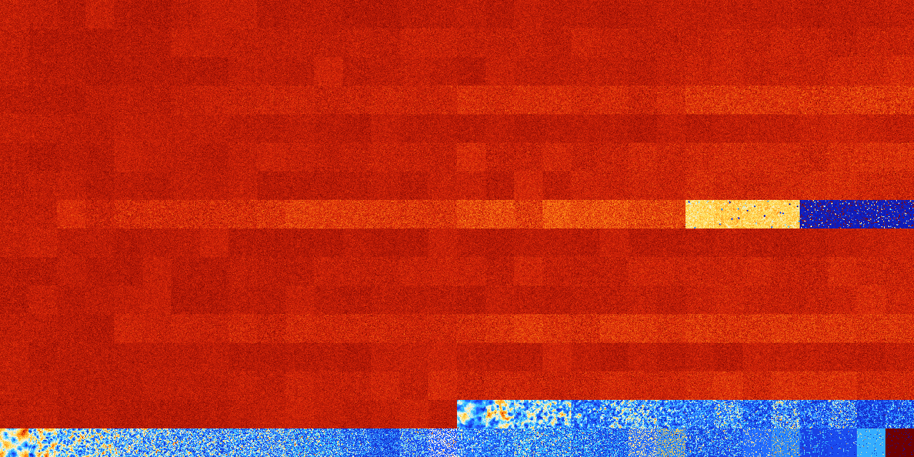

# B24678 (239616-240127)

<details>
    <summary>Initial Grid</summary>
    
</details>


<details>
    <summary>Initial Grid RLE</summary>

```
#C Exported from GoGoL (https://github.com/marrow16/gogol)
#C Wrap mode: Toroidal
#C Boundary mode: Dead
#C Step: 0
x = 100, y = 100, rule = B24678/S
6bo$36bo16bo13bo5bo23bo$12bo7bo5bo16bo2bo13b2obo23bo11bo$9bo19bo65bobo$
6bo69bo$6bo7bo12bo20bo36bo4bo$14bo10bo17bo27bo23bo$6bo24bo51b2o7bo$15bo
15bo27bo9bo8bo11bo$10bo6bo8b2o19bo27bo$63b2obo9bo$bo25bo5bo9bo18bo9bo$
5bo8bo49bo6bo10bo6bo4bo$27bo52bo$3bo23bo62bo6bo$40bo28bo$bo9bo28bo3bo4b
o23bo$5bo12bo7bo31bo13bo13bo$o8bo3bo10bo7bobo45bo2bo$9bo6bo31bo21bo15bo
bo8bo$5bo19bo44bo25bo$11bo4bo31b3o12bo3bo3bo6bo$46bo18bo9bo9bo$6bo28bo$
52bo11bo28bo$26bobo11bobo3bo$22bo5bo3bo48b2o$88bo$6bo21bo9b2o5bo37b2o6b
o$12bo4bo2bo30bo8bo$25bo2bo29bo28bobo$3bo12bo33bo7bo19bo2bo2bo12bo$75bo
18bo$4bo4bo12bo18bo44bo2bo2bo$15bo18bo31bo13bo12bo$35bo2bo18bo7bobo12bo
4bo$20bo4bo18bobo10bo10bo$o11bo16bo14bo10bo8bo4bo20bo$65bo7bo17bo$27bo
8bo29bo$9bo68bo12bo$21bo13bo28bo20bo$8bo2b2o44bo8bo$o14bo7bo15bo7bo20bo
$19bo4bo11bo41bo$23bo21bo4bo8bo20bo2bo$22bo6bo24bo40bo$o13bo5bo16bo3bo
16bo2bo15bo4bo12bo$12bo21bo15bo28bo8bo$6bo30bo35bo$14bo19bo50bo4bo$9bo
22bo8bo30bo11bo5bo$17bo4bo9bo31bo3b3o7bo$33bo12bo16bo19bo15bo$43bo31bo
18b2o$7bobobo2bo73bo9bo$8bo8bo9bo19bo33bo17bo$38bo4bo18bo20bo$3bo13bo5b
o59bo4bo$23b2o36bo12bo2bo$8bo24bo22bo7bo6bo7bo8bo9bo$18bo20bo18bo23bo
11bo$3bo6bo5bo7bo$38bo46bo4bo$22bo9bo39bo$o15bo9bo12bo3bo7bo18bo6bo$11b
o8bo28bo9bo9bo7bo2bo$5bo4bo50bo32bo$36bo7bo18b2o2bo14bo$16bo6bo12bo42bo
14bobo$5bo7bo35bo29bo2bo$4bo7bo7bo13bo9bo14bo6bo$43bo49bo$o3bo61bo10bo$
35bo34bo9bo$13bo24bo5bo37bo7bo$29bo33bo$53b2o8bo$60b2o$18bo14bo35bobo6b
o11bo$3bo57bo7bo4bo$79bo$24bo6bo14bobo13bo$7bo8bo16bo21bo24bo10bo7bo$
20bo26bo13bo14bo14b2o$7bo9bo19bo30bo27bo$7bo60bo8bo$28bo2bo2b2o$o14bo
23bo4bo15b2o7bo20bo$34bo10bobo13bo4bo29bo$6bo3bo26bo5bo6bo13bo$2bo10bob
o29bo38bo6bobo$29bo11bo54bo$3bo20bo43bo20bo$9bo25bo9bo7bo6bo8bo29bo$20b
o50bo$10bo40bo28bo$bo5bo29bobo44bo$4bo15bo33bo7bo27bo$8bo35bo6bo14bo!
```
</details>
<details>
    <summary>Thumbnail</summary>

</details>
<table>
<tr>
    <td><a href="./239616%20S%20Heat%20Map%20Activity.png"></a><br>S (239616)<br>G>1000</td>    <td><a href="./239617%20S0%20Heat%20Map%20Activity.png"></a><br>S0 (239617)<br>G>1000</td>    <td><a href="./239618%20S1%20Heat%20Map%20Activity.png"></a><br>S1 (239618)<br>G>1000</td>    <td><a href="./239619%20S01%20Heat%20Map%20Activity.png"></a><br>S01 (239619)<br>G>1000</td>    <td><a href="./239620%20S2%20Heat%20Map%20Activity.png"></a><br>S2 (239620)<br>G>1000</td>    <td><a href="./239621%20S02%20Heat%20Map%20Activity.png"></a><br>S02 (239621)<br>G>1000</td>    <td><a href="./239622%20S12%20Heat%20Map%20Activity.png"></a><br>S12 (239622)<br>G>1000</td>    <td><a href="./239623%20S012%20Heat%20Map%20Activity.png"></a><br>S012 (239623)<br>G>1000</td>    <td><a href="./239624%20S3%20Heat%20Map%20Activity.png"></a><br>S3 (239624)<br>G>1000</td>    <td><a href="./239625%20S03%20Heat%20Map%20Activity.png"></a><br>S03 (239625)<br>G>1000</td>    <td><a href="./239626%20S13%20Heat%20Map%20Activity.png"></a><br>S13 (239626)<br>G>1000</td>    <td><a href="./239627%20S013%20Heat%20Map%20Activity.png"></a><br>S013 (239627)<br>G>1000</td>    <td><a href="./239628%20S23%20Heat%20Map%20Activity.png"></a><br>S23 (239628)<br>G>1000</td>    <td><a href="./239629%20S023%20Heat%20Map%20Activity.png"></a><br>S023 (239629)<br>G>1000</td>    <td><a href="./239630%20S123%20Heat%20Map%20Activity.png"></a><br>S123 (239630)<br>G>1000</td>    <td><a href="./239631%20S0123%20Heat%20Map%20Activity.png"></a><br>S0123 (239631)<br>G>1000</td>    <td><a href="./239632%20S4%20Heat%20Map%20Activity.png"></a><br>S4 (239632)<br>G>1000</td>    <td><a href="./239633%20S04%20Heat%20Map%20Activity.png"></a><br>S04 (239633)<br>G>1000</td>    <td><a href="./239634%20S14%20Heat%20Map%20Activity.png"></a><br>S14 (239634)<br>G>1000</td>    <td><a href="./239635%20S014%20Heat%20Map%20Activity.png"></a><br>S014 (239635)<br>G>1000</td>    <td><a href="./239636%20S24%20Heat%20Map%20Activity.png"></a><br>S24 (239636)<br>G>1000</td>    <td><a href="./239637%20S024%20Heat%20Map%20Activity.png"></a><br>S024 (239637)<br>G>1000</td>    <td><a href="./239638%20S124%20Heat%20Map%20Activity.png"></a><br>S124 (239638)<br>G>1000</td>    <td><a href="./239639%20S0124%20Heat%20Map%20Activity.png"></a><br>S0124 (239639)<br>G>1000</td>    <td><a href="./239640%20S34%20Heat%20Map%20Activity.png"></a><br>S34 (239640)<br>G>1000</td>    <td><a href="./239641%20S034%20Heat%20Map%20Activity.png"></a><br>S034 (239641)<br>G>1000</td>    <td><a href="./239642%20S134%20Heat%20Map%20Activity.png"></a><br>S134 (239642)<br>G>1000</td>    <td><a href="./239643%20S0134%20Heat%20Map%20Activity.png"></a><br>S0134 (239643)<br>G>1000</td>    <td><a href="./239644%20S234%20Heat%20Map%20Activity.png"></a><br>S234 (239644)<br>G>1000</td>    <td><a href="./239645%20S0234%20Heat%20Map%20Activity.png"></a><br>S0234 (239645)<br>G>1000</td>    <td><a href="./239646%20S1234%20Heat%20Map%20Activity.png"></a><br>S1234 (239646)<br>G>1000</td>    <td><a href="./239647%20S01234%20Heat%20Map%20Activity.png"></a><br>S01234 (239647)<br>G>1000</td></tr>
<tr>
    <td><a href="./239648%20S5%20Heat%20Map%20Activity.png"></a><br>S5 (239648)<br>G>1000</td>    <td><a href="./239649%20S05%20Heat%20Map%20Activity.png"></a><br>S05 (239649)<br>G>1000</td>    <td><a href="./239650%20S15%20Heat%20Map%20Activity.png"></a><br>S15 (239650)<br>G>1000</td>    <td><a href="./239651%20S015%20Heat%20Map%20Activity.png"></a><br>S015 (239651)<br>G>1000</td>    <td><a href="./239652%20S25%20Heat%20Map%20Activity.png"></a><br>S25 (239652)<br>G>1000</td>    <td><a href="./239653%20S025%20Heat%20Map%20Activity.png"></a><br>S025 (239653)<br>G>1000</td>    <td><a href="./239654%20S125%20Heat%20Map%20Activity.png"></a><br>S125 (239654)<br>G>1000</td>    <td><a href="./239655%20S0125%20Heat%20Map%20Activity.png"></a><br>S0125 (239655)<br>G>1000</td>    <td><a href="./239656%20S35%20Heat%20Map%20Activity.png"></a><br>S35 (239656)<br>G>1000</td>    <td><a href="./239657%20S035%20Heat%20Map%20Activity.png"></a><br>S035 (239657)<br>G>1000</td>    <td><a href="./239658%20S135%20Heat%20Map%20Activity.png"></a><br>S135 (239658)<br>G>1000</td>    <td><a href="./239659%20S0135%20Heat%20Map%20Activity.png"></a><br>S0135 (239659)<br>G>1000</td>    <td><a href="./239660%20S235%20Heat%20Map%20Activity.png"></a><br>S235 (239660)<br>G>1000</td>    <td><a href="./239661%20S0235%20Heat%20Map%20Activity.png"></a><br>S0235 (239661)<br>G>1000</td>    <td><a href="./239662%20S1235%20Heat%20Map%20Activity.png"></a><br>S1235 (239662)<br>G>1000</td>    <td><a href="./239663%20S01235%20Heat%20Map%20Activity.png"></a><br>S01235 (239663)<br>G>1000</td>    <td><a href="./239664%20S45%20Heat%20Map%20Activity.png"></a><br>S45 (239664)<br>G>1000</td>    <td><a href="./239665%20S045%20Heat%20Map%20Activity.png"></a><br>S045 (239665)<br>G>1000</td>    <td><a href="./239666%20S145%20Heat%20Map%20Activity.png"></a><br>S145 (239666)<br>G>1000</td>    <td><a href="./239667%20S0145%20Heat%20Map%20Activity.png"></a><br>S0145 (239667)<br>G>1000</td>    <td><a href="./239668%20S245%20Heat%20Map%20Activity.png"></a><br>S245 (239668)<br>G>1000</td>    <td><a href="./239669%20S0245%20Heat%20Map%20Activity.png"></a><br>S0245 (239669)<br>G>1000</td>    <td><a href="./239670%20S1245%20Heat%20Map%20Activity.png"></a><br>S1245 (239670)<br>G>1000</td>    <td><a href="./239671%20S01245%20Heat%20Map%20Activity.png"></a><br>S01245 (239671)<br>G>1000</td>    <td><a href="./239672%20S345%20Heat%20Map%20Activity.png"></a><br>S345 (239672)<br>G>1000</td>    <td><a href="./239673%20S0345%20Heat%20Map%20Activity.png"></a><br>S0345 (239673)<br>G>1000</td>    <td><a href="./239674%20S1345%20Heat%20Map%20Activity.png"></a><br>S1345 (239674)<br>G>1000</td>    <td><a href="./239675%20S01345%20Heat%20Map%20Activity.png"></a><br>S01345 (239675)<br>G>1000</td>    <td><a href="./239676%20S2345%20Heat%20Map%20Activity.png"></a><br>S2345 (239676)<br>G>1000</td>    <td><a href="./239677%20S02345%20Heat%20Map%20Activity.png"></a><br>S02345 (239677)<br>G>1000</td>    <td><a href="./239678%20S12345%20Heat%20Map%20Activity.png"></a><br>S12345 (239678)<br>G>1000</td>    <td><a href="./239679%20S012345%20Heat%20Map%20Activity.png"></a><br>S012345 (239679)<br>G>1000</td></tr>
<tr>
    <td><a href="./239680%20S6%20Heat%20Map%20Activity.png"></a><br>S6 (239680)<br>G>1000</td>    <td><a href="./239681%20S06%20Heat%20Map%20Activity.png"></a><br>S06 (239681)<br>G>1000</td>    <td><a href="./239682%20S16%20Heat%20Map%20Activity.png"></a><br>S16 (239682)<br>G>1000</td>    <td><a href="./239683%20S016%20Heat%20Map%20Activity.png"></a><br>S016 (239683)<br>G>1000</td>    <td><a href="./239684%20S26%20Heat%20Map%20Activity.png"></a><br>S26 (239684)<br>G>1000</td>    <td><a href="./239685%20S026%20Heat%20Map%20Activity.png"></a><br>S026 (239685)<br>G>1000</td>    <td><a href="./239686%20S126%20Heat%20Map%20Activity.png"></a><br>S126 (239686)<br>G>1000</td>    <td><a href="./239687%20S0126%20Heat%20Map%20Activity.png"></a><br>S0126 (239687)<br>G>1000</td>    <td><a href="./239688%20S36%20Heat%20Map%20Activity.png"></a><br>S36 (239688)<br>G>1000</td>    <td><a href="./239689%20S036%20Heat%20Map%20Activity.png"></a><br>S036 (239689)<br>G>1000</td>    <td><a href="./239690%20S136%20Heat%20Map%20Activity.png"></a><br>S136 (239690)<br>G>1000</td>    <td><a href="./239691%20S0136%20Heat%20Map%20Activity.png"></a><br>S0136 (239691)<br>G>1000</td>    <td><a href="./239692%20S236%20Heat%20Map%20Activity.png"></a><br>S236 (239692)<br>G>1000</td>    <td><a href="./239693%20S0236%20Heat%20Map%20Activity.png"></a><br>S0236 (239693)<br>G>1000</td>    <td><a href="./239694%20S1236%20Heat%20Map%20Activity.png"></a><br>S1236 (239694)<br>G>1000</td>    <td><a href="./239695%20S01236%20Heat%20Map%20Activity.png"></a><br>S01236 (239695)<br>G>1000</td>    <td><a href="./239696%20S46%20Heat%20Map%20Activity.png"></a><br>S46 (239696)<br>G>1000</td>    <td><a href="./239697%20S046%20Heat%20Map%20Activity.png"></a><br>S046 (239697)<br>G>1000</td>    <td><a href="./239698%20S146%20Heat%20Map%20Activity.png"></a><br>S146 (239698)<br>G>1000</td>    <td><a href="./239699%20S0146%20Heat%20Map%20Activity.png"></a><br>S0146 (239699)<br>G>1000</td>    <td><a href="./239700%20S246%20Heat%20Map%20Activity.png"></a><br>S246 (239700)<br>G>1000</td>    <td><a href="./239701%20S0246%20Heat%20Map%20Activity.png"></a><br>S0246 (239701)<br>G>1000</td>    <td><a href="./239702%20S1246%20Heat%20Map%20Activity.png"></a><br>S1246 (239702)<br>G>1000</td>    <td><a href="./239703%20S01246%20Heat%20Map%20Activity.png"></a><br>S01246 (239703)<br>G>1000</td>    <td><a href="./239704%20S346%20Heat%20Map%20Activity.png"></a><br>S346 (239704)<br>G>1000</td>    <td><a href="./239705%20S0346%20Heat%20Map%20Activity.png"></a><br>S0346 (239705)<br>G>1000</td>    <td><a href="./239706%20S1346%20Heat%20Map%20Activity.png"></a><br>S1346 (239706)<br>G>1000</td>    <td><a href="./239707%20S01346%20Heat%20Map%20Activity.png"></a><br>S01346 (239707)<br>G>1000</td>    <td><a href="./239708%20S2346%20Heat%20Map%20Activity.png"></a><br>S2346 (239708)<br>G>1000</td>    <td><a href="./239709%20S02346%20Heat%20Map%20Activity.png"></a><br>S02346 (239709)<br>G>1000</td>    <td><a href="./239710%20S12346%20Heat%20Map%20Activity.png"></a><br>S12346 (239710)<br>G>1000</td>    <td><a href="./239711%20S012346%20Heat%20Map%20Activity.png"></a><br>S012346 (239711)<br>G>1000</td></tr>
<tr>
    <td><a href="./239712%20S56%20Heat%20Map%20Activity.png"></a><br>S56 (239712)<br>G>1000</td>    <td><a href="./239713%20S056%20Heat%20Map%20Activity.png"></a><br>S056 (239713)<br>G>1000</td>    <td><a href="./239714%20S156%20Heat%20Map%20Activity.png"></a><br>S156 (239714)<br>G>1000</td>    <td><a href="./239715%20S0156%20Heat%20Map%20Activity.png"></a><br>S0156 (239715)<br>G>1000</td>    <td><a href="./239716%20S256%20Heat%20Map%20Activity.png"></a><br>S256 (239716)<br>G>1000</td>    <td><a href="./239717%20S0256%20Heat%20Map%20Activity.png"></a><br>S0256 (239717)<br>G>1000</td>    <td><a href="./239718%20S1256%20Heat%20Map%20Activity.png"></a><br>S1256 (239718)<br>G>1000</td>    <td><a href="./239719%20S01256%20Heat%20Map%20Activity.png"></a><br>S01256 (239719)<br>G>1000</td>    <td><a href="./239720%20S356%20Heat%20Map%20Activity.png"></a><br>S356 (239720)<br>G>1000</td>    <td><a href="./239721%20S0356%20Heat%20Map%20Activity.png"></a><br>S0356 (239721)<br>G>1000</td>    <td><a href="./239722%20S1356%20Heat%20Map%20Activity.png"></a><br>S1356 (239722)<br>G>1000</td>    <td><a href="./239723%20S01356%20Heat%20Map%20Activity.png"></a><br>S01356 (239723)<br>G>1000</td>    <td><a href="./239724%20S2356%20Heat%20Map%20Activity.png"></a><br>S2356 (239724)<br>G>1000</td>    <td><a href="./239725%20S02356%20Heat%20Map%20Activity.png"></a><br>S02356 (239725)<br>G>1000</td>    <td><a href="./239726%20S12356%20Heat%20Map%20Activity.png"></a><br>S12356 (239726)<br>G>1000</td>    <td><a href="./239727%20S012356%20Heat%20Map%20Activity.png"></a><br>S012356 (239727)<br>G>1000</td>    <td><a href="./239728%20S456%20Heat%20Map%20Activity.png"></a><br>S456 (239728)<br>G>1000</td>    <td><a href="./239729%20S0456%20Heat%20Map%20Activity.png"></a><br>S0456 (239729)<br>G>1000</td>    <td><a href="./239730%20S1456%20Heat%20Map%20Activity.png"></a><br>S1456 (239730)<br>G>1000</td>    <td><a href="./239731%20S01456%20Heat%20Map%20Activity.png"></a><br>S01456 (239731)<br>G>1000</td>    <td><a href="./239732%20S2456%20Heat%20Map%20Activity.png"></a><br>S2456 (239732)<br>G>1000</td>    <td><a href="./239733%20S02456%20Heat%20Map%20Activity.png"></a><br>S02456 (239733)<br>G>1000</td>    <td><a href="./239734%20S12456%20Heat%20Map%20Activity.png"></a><br>S12456 (239734)<br>G>1000</td>    <td><a href="./239735%20S012456%20Heat%20Map%20Activity.png"></a><br>S012456 (239735)<br>G>1000</td>    <td><a href="./239736%20S3456%20Heat%20Map%20Activity.png"></a><br>S3456 (239736)<br>G>1000</td>    <td><a href="./239737%20S03456%20Heat%20Map%20Activity.png"></a><br>S03456 (239737)<br>G>1000</td>    <td><a href="./239738%20S13456%20Heat%20Map%20Activity.png"></a><br>S13456 (239738)<br>G>1000</td>    <td><a href="./239739%20S013456%20Heat%20Map%20Activity.png"></a><br>S013456 (239739)<br>G>1000</td>    <td><a href="./239740%20S23456%20Heat%20Map%20Activity.png"></a><br>S23456 (239740)<br>G>1000</td>    <td><a href="./239741%20S023456%20Heat%20Map%20Activity.png"></a><br>S023456 (239741)<br>G>1000</td>    <td><a href="./239742%20S123456%20Heat%20Map%20Activity.png"></a><br>S123456 (239742)<br>G>1000</td>    <td><a href="./239743%20S0123456%20Heat%20Map%20Activity.png"></a><br>S0123456 (239743)<br>G>1000</td></tr>
<tr>
    <td><a href="./239744%20S7%20Heat%20Map%20Activity.png"></a><br>S7 (239744)<br>G>1000</td>    <td><a href="./239745%20S07%20Heat%20Map%20Activity.png"></a><br>S07 (239745)<br>G>1000</td>    <td><a href="./239746%20S17%20Heat%20Map%20Activity.png"></a><br>S17 (239746)<br>G>1000</td>    <td><a href="./239747%20S017%20Heat%20Map%20Activity.png"></a><br>S017 (239747)<br>G>1000</td>    <td><a href="./239748%20S27%20Heat%20Map%20Activity.png"></a><br>S27 (239748)<br>G>1000</td>    <td><a href="./239749%20S027%20Heat%20Map%20Activity.png"></a><br>S027 (239749)<br>G>1000</td>    <td><a href="./239750%20S127%20Heat%20Map%20Activity.png"></a><br>S127 (239750)<br>G>1000</td>    <td><a href="./239751%20S0127%20Heat%20Map%20Activity.png"></a><br>S0127 (239751)<br>G>1000</td>    <td><a href="./239752%20S37%20Heat%20Map%20Activity.png"></a><br>S37 (239752)<br>G>1000</td>    <td><a href="./239753%20S037%20Heat%20Map%20Activity.png"></a><br>S037 (239753)<br>G>1000</td>    <td><a href="./239754%20S137%20Heat%20Map%20Activity.png"></a><br>S137 (239754)<br>G>1000</td>    <td><a href="./239755%20S0137%20Heat%20Map%20Activity.png"></a><br>S0137 (239755)<br>G>1000</td>    <td><a href="./239756%20S237%20Heat%20Map%20Activity.png"></a><br>S237 (239756)<br>G>1000</td>    <td><a href="./239757%20S0237%20Heat%20Map%20Activity.png"></a><br>S0237 (239757)<br>G>1000</td>    <td><a href="./239758%20S1237%20Heat%20Map%20Activity.png"></a><br>S1237 (239758)<br>G>1000</td>    <td><a href="./239759%20S01237%20Heat%20Map%20Activity.png"></a><br>S01237 (239759)<br>G>1000</td>    <td><a href="./239760%20S47%20Heat%20Map%20Activity.png"></a><br>S47 (239760)<br>G>1000</td>    <td><a href="./239761%20S047%20Heat%20Map%20Activity.png"></a><br>S047 (239761)<br>G>1000</td>    <td><a href="./239762%20S147%20Heat%20Map%20Activity.png"></a><br>S147 (239762)<br>G>1000</td>    <td><a href="./239763%20S0147%20Heat%20Map%20Activity.png"></a><br>S0147 (239763)<br>G>1000</td>    <td><a href="./239764%20S247%20Heat%20Map%20Activity.png"></a><br>S247 (239764)<br>G>1000</td>    <td><a href="./239765%20S0247%20Heat%20Map%20Activity.png"></a><br>S0247 (239765)<br>G>1000</td>    <td><a href="./239766%20S1247%20Heat%20Map%20Activity.png"></a><br>S1247 (239766)<br>G>1000</td>    <td><a href="./239767%20S01247%20Heat%20Map%20Activity.png"></a><br>S01247 (239767)<br>G>1000</td>    <td><a href="./239768%20S347%20Heat%20Map%20Activity.png"></a><br>S347 (239768)<br>G>1000</td>    <td><a href="./239769%20S0347%20Heat%20Map%20Activity.png"></a><br>S0347 (239769)<br>G>1000</td>    <td><a href="./239770%20S1347%20Heat%20Map%20Activity.png"></a><br>S1347 (239770)<br>G>1000</td>    <td><a href="./239771%20S01347%20Heat%20Map%20Activity.png"></a><br>S01347 (239771)<br>G>1000</td>    <td><a href="./239772%20S2347%20Heat%20Map%20Activity.png"></a><br>S2347 (239772)<br>G>1000</td>    <td><a href="./239773%20S02347%20Heat%20Map%20Activity.png"></a><br>S02347 (239773)<br>G>1000</td>    <td><a href="./239774%20S12347%20Heat%20Map%20Activity.png"></a><br>S12347 (239774)<br>G>1000</td>    <td><a href="./239775%20S012347%20Heat%20Map%20Activity.png"></a><br>S012347 (239775)<br>G>1000</td></tr>
<tr>
    <td><a href="./239776%20S57%20Heat%20Map%20Activity.png"></a><br>S57 (239776)<br>G>1000</td>    <td><a href="./239777%20S057%20Heat%20Map%20Activity.png"></a><br>S057 (239777)<br>G>1000</td>    <td><a href="./239778%20S157%20Heat%20Map%20Activity.png"></a><br>S157 (239778)<br>G>1000</td>    <td><a href="./239779%20S0157%20Heat%20Map%20Activity.png"></a><br>S0157 (239779)<br>G>1000</td>    <td><a href="./239780%20S257%20Heat%20Map%20Activity.png"></a><br>S257 (239780)<br>G>1000</td>    <td><a href="./239781%20S0257%20Heat%20Map%20Activity.png"></a><br>S0257 (239781)<br>G>1000</td>    <td><a href="./239782%20S1257%20Heat%20Map%20Activity.png"></a><br>S1257 (239782)<br>G>1000</td>    <td><a href="./239783%20S01257%20Heat%20Map%20Activity.png"></a><br>S01257 (239783)<br>G>1000</td>    <td><a href="./239784%20S357%20Heat%20Map%20Activity.png"></a><br>S357 (239784)<br>G>1000</td>    <td><a href="./239785%20S0357%20Heat%20Map%20Activity.png"></a><br>S0357 (239785)<br>G>1000</td>    <td><a href="./239786%20S1357%20Heat%20Map%20Activity.png"></a><br>S1357 (239786)<br>G>1000</td>    <td><a href="./239787%20S01357%20Heat%20Map%20Activity.png"></a><br>S01357 (239787)<br>G>1000</td>    <td><a href="./239788%20S2357%20Heat%20Map%20Activity.png"></a><br>S2357 (239788)<br>G>1000</td>    <td><a href="./239789%20S02357%20Heat%20Map%20Activity.png"></a><br>S02357 (239789)<br>G>1000</td>    <td><a href="./239790%20S12357%20Heat%20Map%20Activity.png"></a><br>S12357 (239790)<br>G>1000</td>    <td><a href="./239791%20S012357%20Heat%20Map%20Activity.png"></a><br>S012357 (239791)<br>G>1000</td>    <td><a href="./239792%20S457%20Heat%20Map%20Activity.png"></a><br>S457 (239792)<br>G>1000</td>    <td><a href="./239793%20S0457%20Heat%20Map%20Activity.png"></a><br>S0457 (239793)<br>G>1000</td>    <td><a href="./239794%20S1457%20Heat%20Map%20Activity.png"></a><br>S1457 (239794)<br>G>1000</td>    <td><a href="./239795%20S01457%20Heat%20Map%20Activity.png"></a><br>S01457 (239795)<br>G>1000</td>    <td><a href="./239796%20S2457%20Heat%20Map%20Activity.png"></a><br>S2457 (239796)<br>G>1000</td>    <td><a href="./239797%20S02457%20Heat%20Map%20Activity.png"></a><br>S02457 (239797)<br>G>1000</td>    <td><a href="./239798%20S12457%20Heat%20Map%20Activity.png"></a><br>S12457 (239798)<br>G>1000</td>    <td><a href="./239799%20S012457%20Heat%20Map%20Activity.png"></a><br>S012457 (239799)<br>G>1000</td>    <td><a href="./239800%20S3457%20Heat%20Map%20Activity.png"></a><br>S3457 (239800)<br>G>1000</td>    <td><a href="./239801%20S03457%20Heat%20Map%20Activity.png"></a><br>S03457 (239801)<br>G>1000</td>    <td><a href="./239802%20S13457%20Heat%20Map%20Activity.png"></a><br>S13457 (239802)<br>G>1000</td>    <td><a href="./239803%20S013457%20Heat%20Map%20Activity.png"></a><br>S013457 (239803)<br>G>1000</td>    <td><a href="./239804%20S23457%20Heat%20Map%20Activity.png"></a><br>S23457 (239804)<br>G>1000</td>    <td><a href="./239805%20S023457%20Heat%20Map%20Activity.png"></a><br>S023457 (239805)<br>G>1000</td>    <td><a href="./239806%20S123457%20Heat%20Map%20Activity.png"></a><br>S123457 (239806)<br>G>1000</td>    <td><a href="./239807%20S0123457%20Heat%20Map%20Activity.png"></a><br>S0123457 (239807)<br>G>1000</td></tr>
<tr>
    <td><a href="./239808%20S67%20Heat%20Map%20Activity.png"></a><br>S67 (239808)<br>G>1000</td>    <td><a href="./239809%20S067%20Heat%20Map%20Activity.png"></a><br>S067 (239809)<br>G>1000</td>    <td><a href="./239810%20S167%20Heat%20Map%20Activity.png"></a><br>S167 (239810)<br>G>1000</td>    <td><a href="./239811%20S0167%20Heat%20Map%20Activity.png"></a><br>S0167 (239811)<br>G>1000</td>    <td><a href="./239812%20S267%20Heat%20Map%20Activity.png"></a><br>S267 (239812)<br>G>1000</td>    <td><a href="./239813%20S0267%20Heat%20Map%20Activity.png"></a><br>S0267 (239813)<br>G>1000</td>    <td><a href="./239814%20S1267%20Heat%20Map%20Activity.png"></a><br>S1267 (239814)<br>G>1000</td>    <td><a href="./239815%20S01267%20Heat%20Map%20Activity.png"></a><br>S01267 (239815)<br>G>1000</td>    <td><a href="./239816%20S367%20Heat%20Map%20Activity.png"></a><br>S367 (239816)<br>G>1000</td>    <td><a href="./239817%20S0367%20Heat%20Map%20Activity.png"></a><br>S0367 (239817)<br>G>1000</td>    <td><a href="./239818%20S1367%20Heat%20Map%20Activity.png"></a><br>S1367 (239818)<br>G>1000</td>    <td><a href="./239819%20S01367%20Heat%20Map%20Activity.png"></a><br>S01367 (239819)<br>G>1000</td>    <td><a href="./239820%20S2367%20Heat%20Map%20Activity.png"></a><br>S2367 (239820)<br>G>1000</td>    <td><a href="./239821%20S02367%20Heat%20Map%20Activity.png"></a><br>S02367 (239821)<br>G>1000</td>    <td><a href="./239822%20S12367%20Heat%20Map%20Activity.png"></a><br>S12367 (239822)<br>G>1000</td>    <td><a href="./239823%20S012367%20Heat%20Map%20Activity.png"></a><br>S012367 (239823)<br>G>1000</td>    <td><a href="./239824%20S467%20Heat%20Map%20Activity.png"></a><br>S467 (239824)<br>G>1000</td>    <td><a href="./239825%20S0467%20Heat%20Map%20Activity.png"></a><br>S0467 (239825)<br>G>1000</td>    <td><a href="./239826%20S1467%20Heat%20Map%20Activity.png"></a><br>S1467 (239826)<br>G>1000</td>    <td><a href="./239827%20S01467%20Heat%20Map%20Activity.png"></a><br>S01467 (239827)<br>G>1000</td>    <td><a href="./239828%20S2467%20Heat%20Map%20Activity.png"></a><br>S2467 (239828)<br>G>1000</td>    <td><a href="./239829%20S02467%20Heat%20Map%20Activity.png"></a><br>S02467 (239829)<br>G>1000</td>    <td><a href="./239830%20S12467%20Heat%20Map%20Activity.png"></a><br>S12467 (239830)<br>G>1000</td>    <td><a href="./239831%20S012467%20Heat%20Map%20Activity.png"></a><br>S012467 (239831)<br>G>1000</td>    <td><a href="./239832%20S3467%20Heat%20Map%20Activity.png"></a><br>S3467 (239832)<br>G>1000</td>    <td><a href="./239833%20S03467%20Heat%20Map%20Activity.png"></a><br>S03467 (239833)<br>G>1000</td>    <td><a href="./239834%20S13467%20Heat%20Map%20Activity.png"></a><br>S13467 (239834)<br>G>1000</td>    <td><a href="./239835%20S013467%20Heat%20Map%20Activity.png"></a><br>S013467 (239835)<br>G>1000</td>    <td><a href="./239836%20S23467%20Heat%20Map%20Activity.png"></a><br>S23467 (239836)<br>G>1000</td>    <td><a href="./239837%20S023467%20Heat%20Map%20Activity.png"></a><br>S023467 (239837)<br>G>1000</td>    <td><a href="./239838%20S123467%20Heat%20Map%20Activity.png"></a><br>S123467 (239838)<br>G>1000</td>    <td><a href="./239839%20S0123467%20Heat%20Map%20Activity.png"></a><br>S0123467 (239839)<br>G>1000</td></tr>
<tr>
    <td><a href="./239840%20S567%20Heat%20Map%20Activity.png"></a><br>S567 (239840)<br>G>1000</td>    <td><a href="./239841%20S0567%20Heat%20Map%20Activity.png"></a><br>S0567 (239841)<br>G>1000</td>    <td><a href="./239842%20S1567%20Heat%20Map%20Activity.png"></a><br>S1567 (239842)<br>G>1000</td>    <td><a href="./239843%20S01567%20Heat%20Map%20Activity.png"></a><br>S01567 (239843)<br>G>1000</td>    <td><a href="./239844%20S2567%20Heat%20Map%20Activity.png"></a><br>S2567 (239844)<br>G>1000</td>    <td><a href="./239845%20S02567%20Heat%20Map%20Activity.png"></a><br>S02567 (239845)<br>G>1000</td>    <td><a href="./239846%20S12567%20Heat%20Map%20Activity.png"></a><br>S12567 (239846)<br>G>1000</td>    <td><a href="./239847%20S012567%20Heat%20Map%20Activity.png"></a><br>S012567 (239847)<br>G>1000</td>    <td><a href="./239848%20S3567%20Heat%20Map%20Activity.png"></a><br>S3567 (239848)<br>G>1000</td>    <td><a href="./239849%20S03567%20Heat%20Map%20Activity.png"></a><br>S03567 (239849)<br>G>1000</td>    <td><a href="./239850%20S13567%20Heat%20Map%20Activity.png"></a><br>S13567 (239850)<br>G>1000</td>    <td><a href="./239851%20S013567%20Heat%20Map%20Activity.png"></a><br>S013567 (239851)<br>G>1000</td>    <td><a href="./239852%20S23567%20Heat%20Map%20Activity.png"></a><br>S23567 (239852)<br>G>1000</td>    <td><a href="./239853%20S023567%20Heat%20Map%20Activity.png"></a><br>S023567 (239853)<br>G>1000</td>    <td><a href="./239854%20S123567%20Heat%20Map%20Activity.png"></a><br>S123567 (239854)<br>G>1000</td>    <td><a href="./239855%20S0123567%20Heat%20Map%20Activity.png"></a><br>S0123567 (239855)<br>G>1000</td>    <td><a href="./239856%20S4567%20Heat%20Map%20Activity.png"></a><br>S4567 (239856)<br>G>1000</td>    <td><a href="./239857%20S04567%20Heat%20Map%20Activity.png"></a><br>S04567 (239857)<br>G>1000</td>    <td><a href="./239858%20S14567%20Heat%20Map%20Activity.png"></a><br>S14567 (239858)<br>G>1000</td>    <td><a href="./239859%20S014567%20Heat%20Map%20Activity.png"></a><br>S014567 (239859)<br>G>1000</td>    <td><a href="./239860%20S24567%20Heat%20Map%20Activity.png"></a><br>S24567 (239860)<br>G>1000</td>    <td><a href="./239861%20S024567%20Heat%20Map%20Activity.png"></a><br>S024567 (239861)<br>G>1000</td>    <td><a href="./239862%20S124567%20Heat%20Map%20Activity.png"></a><br>S124567 (239862)<br>G>1000</td>    <td><a href="./239863%20S0124567%20Heat%20Map%20Activity.png"></a><br>S0124567 (239863)<br>G>1000</td>    <td><a href="./239864%20S34567%20Heat%20Map%20Activity.png"></a><br>S34567 (239864)<br>G>1000</td>    <td><a href="./239865%20S034567%20Heat%20Map%20Activity.png"></a><br>S034567 (239865)<br>G>1000</td>    <td><a href="./239866%20S134567%20Heat%20Map%20Activity.png"></a><br>S134567 (239866)<br>G>1000</td>    <td><a href="./239867%20S0134567%20Heat%20Map%20Activity.png"></a><br>S0134567 (239867)<br>G>1000</td>    <td><a href="./239868%20S234567%20Heat%20Map%20Activity.png"></a><br>S234567 (239868)<br>G>1000</td>    <td><a href="./239869%20S0234567%20Heat%20Map%20Activity.png"></a><br>S0234567 (239869)<br>G>1000</td>    <td><a href="./239870%20S1234567%20Heat%20Map%20Activity.png"></a><br>S1234567 (239870)<br>G>1000</td>    <td><a href="./239871%20S01234567%20Heat%20Map%20Activity.png"></a><br>S01234567 (239871)<br>G>1000</td></tr>
<tr>
    <td><a href="./239872%20S8%20Heat%20Map%20Activity.png"></a><br>S8 (239872)<br>G>1000</td>    <td><a href="./239873%20S08%20Heat%20Map%20Activity.png"></a><br>S08 (239873)<br>G>1000</td>    <td><a href="./239874%20S18%20Heat%20Map%20Activity.png"></a><br>S18 (239874)<br>G>1000</td>    <td><a href="./239875%20S018%20Heat%20Map%20Activity.png"></a><br>S018 (239875)<br>G>1000</td>    <td><a href="./239876%20S28%20Heat%20Map%20Activity.png"></a><br>S28 (239876)<br>G>1000</td>    <td><a href="./239877%20S028%20Heat%20Map%20Activity.png"></a><br>S028 (239877)<br>G>1000</td>    <td><a href="./239878%20S128%20Heat%20Map%20Activity.png"></a><br>S128 (239878)<br>G>1000</td>    <td><a href="./239879%20S0128%20Heat%20Map%20Activity.png"></a><br>S0128 (239879)<br>G>1000</td>    <td><a href="./239880%20S38%20Heat%20Map%20Activity.png"></a><br>S38 (239880)<br>G>1000</td>    <td><a href="./239881%20S038%20Heat%20Map%20Activity.png"></a><br>S038 (239881)<br>G>1000</td>    <td><a href="./239882%20S138%20Heat%20Map%20Activity.png"></a><br>S138 (239882)<br>G>1000</td>    <td><a href="./239883%20S0138%20Heat%20Map%20Activity.png"></a><br>S0138 (239883)<br>G>1000</td>    <td><a href="./239884%20S238%20Heat%20Map%20Activity.png"></a><br>S238 (239884)<br>G>1000</td>    <td><a href="./239885%20S0238%20Heat%20Map%20Activity.png"></a><br>S0238 (239885)<br>G>1000</td>    <td><a href="./239886%20S1238%20Heat%20Map%20Activity.png"></a><br>S1238 (239886)<br>G>1000</td>    <td><a href="./239887%20S01238%20Heat%20Map%20Activity.png"></a><br>S01238 (239887)<br>G>1000</td>    <td><a href="./239888%20S48%20Heat%20Map%20Activity.png"></a><br>S48 (239888)<br>G>1000</td>    <td><a href="./239889%20S048%20Heat%20Map%20Activity.png"></a><br>S048 (239889)<br>G>1000</td>    <td><a href="./239890%20S148%20Heat%20Map%20Activity.png"></a><br>S148 (239890)<br>G>1000</td>    <td><a href="./239891%20S0148%20Heat%20Map%20Activity.png"></a><br>S0148 (239891)<br>G>1000</td>    <td><a href="./239892%20S248%20Heat%20Map%20Activity.png"></a><br>S248 (239892)<br>G>1000</td>    <td><a href="./239893%20S0248%20Heat%20Map%20Activity.png"></a><br>S0248 (239893)<br>G>1000</td>    <td><a href="./239894%20S1248%20Heat%20Map%20Activity.png"></a><br>S1248 (239894)<br>G>1000</td>    <td><a href="./239895%20S01248%20Heat%20Map%20Activity.png"></a><br>S01248 (239895)<br>G>1000</td>    <td><a href="./239896%20S348%20Heat%20Map%20Activity.png"></a><br>S348 (239896)<br>G>1000</td>    <td><a href="./239897%20S0348%20Heat%20Map%20Activity.png"></a><br>S0348 (239897)<br>G>1000</td>    <td><a href="./239898%20S1348%20Heat%20Map%20Activity.png"></a><br>S1348 (239898)<br>G>1000</td>    <td><a href="./239899%20S01348%20Heat%20Map%20Activity.png"></a><br>S01348 (239899)<br>G>1000</td>    <td><a href="./239900%20S2348%20Heat%20Map%20Activity.png"></a><br>S2348 (239900)<br>G>1000</td>    <td><a href="./239901%20S02348%20Heat%20Map%20Activity.png"></a><br>S02348 (239901)<br>G>1000</td>    <td><a href="./239902%20S12348%20Heat%20Map%20Activity.png"></a><br>S12348 (239902)<br>G>1000</td>    <td><a href="./239903%20S012348%20Heat%20Map%20Activity.png"></a><br>S012348 (239903)<br>G>1000</td></tr>
<tr>
    <td><a href="./239904%20S58%20Heat%20Map%20Activity.png"></a><br>S58 (239904)<br>G>1000</td>    <td><a href="./239905%20S058%20Heat%20Map%20Activity.png"></a><br>S058 (239905)<br>G>1000</td>    <td><a href="./239906%20S158%20Heat%20Map%20Activity.png"></a><br>S158 (239906)<br>G>1000</td>    <td><a href="./239907%20S0158%20Heat%20Map%20Activity.png"></a><br>S0158 (239907)<br>G>1000</td>    <td><a href="./239908%20S258%20Heat%20Map%20Activity.png"></a><br>S258 (239908)<br>G>1000</td>    <td><a href="./239909%20S0258%20Heat%20Map%20Activity.png"></a><br>S0258 (239909)<br>G>1000</td>    <td><a href="./239910%20S1258%20Heat%20Map%20Activity.png"></a><br>S1258 (239910)<br>G>1000</td>    <td><a href="./239911%20S01258%20Heat%20Map%20Activity.png"></a><br>S01258 (239911)<br>G>1000</td>    <td><a href="./239912%20S358%20Heat%20Map%20Activity.png"></a><br>S358 (239912)<br>G>1000</td>    <td><a href="./239913%20S0358%20Heat%20Map%20Activity.png"></a><br>S0358 (239913)<br>G>1000</td>    <td><a href="./239914%20S1358%20Heat%20Map%20Activity.png"></a><br>S1358 (239914)<br>G>1000</td>    <td><a href="./239915%20S01358%20Heat%20Map%20Activity.png"></a><br>S01358 (239915)<br>G>1000</td>    <td><a href="./239916%20S2358%20Heat%20Map%20Activity.png"></a><br>S2358 (239916)<br>G>1000</td>    <td><a href="./239917%20S02358%20Heat%20Map%20Activity.png"></a><br>S02358 (239917)<br>G>1000</td>    <td><a href="./239918%20S12358%20Heat%20Map%20Activity.png"></a><br>S12358 (239918)<br>G>1000</td>    <td><a href="./239919%20S012358%20Heat%20Map%20Activity.png"></a><br>S012358 (239919)<br>G>1000</td>    <td><a href="./239920%20S458%20Heat%20Map%20Activity.png"></a><br>S458 (239920)<br>G>1000</td>    <td><a href="./239921%20S0458%20Heat%20Map%20Activity.png"></a><br>S0458 (239921)<br>G>1000</td>    <td><a href="./239922%20S1458%20Heat%20Map%20Activity.png"></a><br>S1458 (239922)<br>G>1000</td>    <td><a href="./239923%20S01458%20Heat%20Map%20Activity.png"></a><br>S01458 (239923)<br>G>1000</td>    <td><a href="./239924%20S2458%20Heat%20Map%20Activity.png"></a><br>S2458 (239924)<br>G>1000</td>    <td><a href="./239925%20S02458%20Heat%20Map%20Activity.png"></a><br>S02458 (239925)<br>G>1000</td>    <td><a href="./239926%20S12458%20Heat%20Map%20Activity.png"></a><br>S12458 (239926)<br>G>1000</td>    <td><a href="./239927%20S012458%20Heat%20Map%20Activity.png"></a><br>S012458 (239927)<br>G>1000</td>    <td><a href="./239928%20S3458%20Heat%20Map%20Activity.png"></a><br>S3458 (239928)<br>G>1000</td>    <td><a href="./239929%20S03458%20Heat%20Map%20Activity.png"></a><br>S03458 (239929)<br>G>1000</td>    <td><a href="./239930%20S13458%20Heat%20Map%20Activity.png"></a><br>S13458 (239930)<br>G>1000</td>    <td><a href="./239931%20S013458%20Heat%20Map%20Activity.png"></a><br>S013458 (239931)<br>G>1000</td>    <td><a href="./239932%20S23458%20Heat%20Map%20Activity.png"></a><br>S23458 (239932)<br>G>1000</td>    <td><a href="./239933%20S023458%20Heat%20Map%20Activity.png"></a><br>S023458 (239933)<br>G>1000</td>    <td><a href="./239934%20S123458%20Heat%20Map%20Activity.png"></a><br>S123458 (239934)<br>G>1000</td>    <td><a href="./239935%20S0123458%20Heat%20Map%20Activity.png"></a><br>S0123458 (239935)<br>G>1000</td></tr>
<tr>
    <td><a href="./239936%20S68%20Heat%20Map%20Activity.png"></a><br>S68 (239936)<br>G>1000</td>    <td><a href="./239937%20S068%20Heat%20Map%20Activity.png"></a><br>S068 (239937)<br>G>1000</td>    <td><a href="./239938%20S168%20Heat%20Map%20Activity.png"></a><br>S168 (239938)<br>G>1000</td>    <td><a href="./239939%20S0168%20Heat%20Map%20Activity.png"></a><br>S0168 (239939)<br>G>1000</td>    <td><a href="./239940%20S268%20Heat%20Map%20Activity.png"></a><br>S268 (239940)<br>G>1000</td>    <td><a href="./239941%20S0268%20Heat%20Map%20Activity.png"></a><br>S0268 (239941)<br>G>1000</td>    <td><a href="./239942%20S1268%20Heat%20Map%20Activity.png"></a><br>S1268 (239942)<br>G>1000</td>    <td><a href="./239943%20S01268%20Heat%20Map%20Activity.png"></a><br>S01268 (239943)<br>G>1000</td>    <td><a href="./239944%20S368%20Heat%20Map%20Activity.png"></a><br>S368 (239944)<br>G>1000</td>    <td><a href="./239945%20S0368%20Heat%20Map%20Activity.png"></a><br>S0368 (239945)<br>G>1000</td>    <td><a href="./239946%20S1368%20Heat%20Map%20Activity.png"></a><br>S1368 (239946)<br>G>1000</td>    <td><a href="./239947%20S01368%20Heat%20Map%20Activity.png"></a><br>S01368 (239947)<br>G>1000</td>    <td><a href="./239948%20S2368%20Heat%20Map%20Activity.png"></a><br>S2368 (239948)<br>G>1000</td>    <td><a href="./239949%20S02368%20Heat%20Map%20Activity.png"></a><br>S02368 (239949)<br>G>1000</td>    <td><a href="./239950%20S12368%20Heat%20Map%20Activity.png"></a><br>S12368 (239950)<br>G>1000</td>    <td><a href="./239951%20S012368%20Heat%20Map%20Activity.png"></a><br>S012368 (239951)<br>G>1000</td>    <td><a href="./239952%20S468%20Heat%20Map%20Activity.png"></a><br>S468 (239952)<br>G>1000</td>    <td><a href="./239953%20S0468%20Heat%20Map%20Activity.png"></a><br>S0468 (239953)<br>G>1000</td>    <td><a href="./239954%20S1468%20Heat%20Map%20Activity.png"></a><br>S1468 (239954)<br>G>1000</td>    <td><a href="./239955%20S01468%20Heat%20Map%20Activity.png"></a><br>S01468 (239955)<br>G>1000</td>    <td><a href="./239956%20S2468%20Heat%20Map%20Activity.png"></a><br>S2468 (239956)<br>G>1000</td>    <td><a href="./239957%20S02468%20Heat%20Map%20Activity.png"></a><br>S02468 (239957)<br>G>1000</td>    <td><a href="./239958%20S12468%20Heat%20Map%20Activity.png"></a><br>S12468 (239958)<br>G>1000</td>    <td><a href="./239959%20S012468%20Heat%20Map%20Activity.png"></a><br>S012468 (239959)<br>G>1000</td>    <td><a href="./239960%20S3468%20Heat%20Map%20Activity.png"></a><br>S3468 (239960)<br>G>1000</td>    <td><a href="./239961%20S03468%20Heat%20Map%20Activity.png"></a><br>S03468 (239961)<br>G>1000</td>    <td><a href="./239962%20S13468%20Heat%20Map%20Activity.png"></a><br>S13468 (239962)<br>G>1000</td>    <td><a href="./239963%20S013468%20Heat%20Map%20Activity.png"></a><br>S013468 (239963)<br>G>1000</td>    <td><a href="./239964%20S23468%20Heat%20Map%20Activity.png"></a><br>S23468 (239964)<br>G>1000</td>    <td><a href="./239965%20S023468%20Heat%20Map%20Activity.png"></a><br>S023468 (239965)<br>G>1000</td>    <td><a href="./239966%20S123468%20Heat%20Map%20Activity.png"></a><br>S123468 (239966)<br>G>1000</td>    <td><a href="./239967%20S0123468%20Heat%20Map%20Activity.png"></a><br>S0123468 (239967)<br>G>1000</td></tr>
<tr>
    <td><a href="./239968%20S568%20Heat%20Map%20Activity.png"></a><br>S568 (239968)<br>G>1000</td>    <td><a href="./239969%20S0568%20Heat%20Map%20Activity.png"></a><br>S0568 (239969)<br>G>1000</td>    <td><a href="./239970%20S1568%20Heat%20Map%20Activity.png"></a><br>S1568 (239970)<br>G>1000</td>    <td><a href="./239971%20S01568%20Heat%20Map%20Activity.png"></a><br>S01568 (239971)<br>G>1000</td>    <td><a href="./239972%20S2568%20Heat%20Map%20Activity.png"></a><br>S2568 (239972)<br>G>1000</td>    <td><a href="./239973%20S02568%20Heat%20Map%20Activity.png"></a><br>S02568 (239973)<br>G>1000</td>    <td><a href="./239974%20S12568%20Heat%20Map%20Activity.png"></a><br>S12568 (239974)<br>G>1000</td>    <td><a href="./239975%20S012568%20Heat%20Map%20Activity.png"></a><br>S012568 (239975)<br>G>1000</td>    <td><a href="./239976%20S3568%20Heat%20Map%20Activity.png"></a><br>S3568 (239976)<br>G>1000</td>    <td><a href="./239977%20S03568%20Heat%20Map%20Activity.png"></a><br>S03568 (239977)<br>G>1000</td>    <td><a href="./239978%20S13568%20Heat%20Map%20Activity.png"></a><br>S13568 (239978)<br>G>1000</td>    <td><a href="./239979%20S013568%20Heat%20Map%20Activity.png"></a><br>S013568 (239979)<br>G>1000</td>    <td><a href="./239980%20S23568%20Heat%20Map%20Activity.png"></a><br>S23568 (239980)<br>G>1000</td>    <td><a href="./239981%20S023568%20Heat%20Map%20Activity.png"></a><br>S023568 (239981)<br>G>1000</td>    <td><a href="./239982%20S123568%20Heat%20Map%20Activity.png"></a><br>S123568 (239982)<br>G>1000</td>    <td><a href="./239983%20S0123568%20Heat%20Map%20Activity.png"></a><br>S0123568 (239983)<br>G>1000</td>    <td><a href="./239984%20S4568%20Heat%20Map%20Activity.png"></a><br>S4568 (239984)<br>G>1000</td>    <td><a href="./239985%20S04568%20Heat%20Map%20Activity.png"></a><br>S04568 (239985)<br>G>1000</td>    <td><a href="./239986%20S14568%20Heat%20Map%20Activity.png"></a><br>S14568 (239986)<br>G>1000</td>    <td><a href="./239987%20S014568%20Heat%20Map%20Activity.png"></a><br>S014568 (239987)<br>G>1000</td>    <td><a href="./239988%20S24568%20Heat%20Map%20Activity.png"></a><br>S24568 (239988)<br>G>1000</td>    <td><a href="./239989%20S024568%20Heat%20Map%20Activity.png"></a><br>S024568 (239989)<br>G>1000</td>    <td><a href="./239990%20S124568%20Heat%20Map%20Activity.png"></a><br>S124568 (239990)<br>G>1000</td>    <td><a href="./239991%20S0124568%20Heat%20Map%20Activity.png"></a><br>S0124568 (239991)<br>G>1000</td>    <td><a href="./239992%20S34568%20Heat%20Map%20Activity.png"></a><br>S34568 (239992)<br>G>1000</td>    <td><a href="./239993%20S034568%20Heat%20Map%20Activity.png"></a><br>S034568 (239993)<br>G>1000</td>    <td><a href="./239994%20S134568%20Heat%20Map%20Activity.png"></a><br>S134568 (239994)<br>G>1000</td>    <td><a href="./239995%20S0134568%20Heat%20Map%20Activity.png"></a><br>S0134568 (239995)<br>G>1000</td>    <td><a href="./239996%20S234568%20Heat%20Map%20Activity.png"></a><br>S234568 (239996)<br>G>1000</td>    <td><a href="./239997%20S0234568%20Heat%20Map%20Activity.png"></a><br>S0234568 (239997)<br>G>1000</td>    <td><a href="./239998%20S1234568%20Heat%20Map%20Activity.png"></a><br>S1234568 (239998)<br>G>1000</td>    <td><a href="./239999%20S01234568%20Heat%20Map%20Activity.png"></a><br>S01234568 (239999)<br>G>1000</td></tr>
<tr>
    <td><a href="./240000%20S78%20Heat%20Map%20Activity.png"></a><br>S78 (240000)<br>G>1000</td>    <td><a href="./240001%20S078%20Heat%20Map%20Activity.png"></a><br>S078 (240001)<br>G>1000</td>    <td><a href="./240002%20S178%20Heat%20Map%20Activity.png"></a><br>S178 (240002)<br>G>1000</td>    <td><a href="./240003%20S0178%20Heat%20Map%20Activity.png"></a><br>S0178 (240003)<br>G>1000</td>    <td><a href="./240004%20S278%20Heat%20Map%20Activity.png"></a><br>S278 (240004)<br>G>1000</td>    <td><a href="./240005%20S0278%20Heat%20Map%20Activity.png"></a><br>S0278 (240005)<br>G>1000</td>    <td><a href="./240006%20S1278%20Heat%20Map%20Activity.png"></a><br>S1278 (240006)<br>G>1000</td>    <td><a href="./240007%20S01278%20Heat%20Map%20Activity.png"></a><br>S01278 (240007)<br>G>1000</td>    <td><a href="./240008%20S378%20Heat%20Map%20Activity.png"></a><br>S378 (240008)<br>G>1000</td>    <td><a href="./240009%20S0378%20Heat%20Map%20Activity.png"></a><br>S0378 (240009)<br>G>1000</td>    <td><a href="./240010%20S1378%20Heat%20Map%20Activity.png"></a><br>S1378 (240010)<br>G>1000</td>    <td><a href="./240011%20S01378%20Heat%20Map%20Activity.png"></a><br>S01378 (240011)<br>G>1000</td>    <td><a href="./240012%20S2378%20Heat%20Map%20Activity.png"></a><br>S2378 (240012)<br>G>1000</td>    <td><a href="./240013%20S02378%20Heat%20Map%20Activity.png"></a><br>S02378 (240013)<br>G>1000</td>    <td><a href="./240014%20S12378%20Heat%20Map%20Activity.png"></a><br>S12378 (240014)<br>G>1000</td>    <td><a href="./240015%20S012378%20Heat%20Map%20Activity.png"></a><br>S012378 (240015)<br>G>1000</td>    <td><a href="./240016%20S478%20Heat%20Map%20Activity.png"></a><br>S478 (240016)<br>G>1000</td>    <td><a href="./240017%20S0478%20Heat%20Map%20Activity.png"></a><br>S0478 (240017)<br>G>1000</td>    <td><a href="./240018%20S1478%20Heat%20Map%20Activity.png"></a><br>S1478 (240018)<br>G>1000</td>    <td><a href="./240019%20S01478%20Heat%20Map%20Activity.png"></a><br>S01478 (240019)<br>G>1000</td>    <td><a href="./240020%20S2478%20Heat%20Map%20Activity.png"></a><br>S2478 (240020)<br>G>1000</td>    <td><a href="./240021%20S02478%20Heat%20Map%20Activity.png"></a><br>S02478 (240021)<br>G>1000</td>    <td><a href="./240022%20S12478%20Heat%20Map%20Activity.png"></a><br>S12478 (240022)<br>G>1000</td>    <td><a href="./240023%20S012478%20Heat%20Map%20Activity.png"></a><br>S012478 (240023)<br>G>1000</td>    <td><a href="./240024%20S3478%20Heat%20Map%20Activity.png"></a><br>S3478 (240024)<br>G>1000</td>    <td><a href="./240025%20S03478%20Heat%20Map%20Activity.png"></a><br>S03478 (240025)<br>G>1000</td>    <td><a href="./240026%20S13478%20Heat%20Map%20Activity.png"></a><br>S13478 (240026)<br>G>1000</td>    <td><a href="./240027%20S013478%20Heat%20Map%20Activity.png"></a><br>S013478 (240027)<br>G>1000</td>    <td><a href="./240028%20S23478%20Heat%20Map%20Activity.png"></a><br>S23478 (240028)<br>G>1000</td>    <td><a href="./240029%20S023478%20Heat%20Map%20Activity.png"></a><br>S023478 (240029)<br>G>1000</td>    <td><a href="./240030%20S123478%20Heat%20Map%20Activity.png"></a><br>S123478 (240030)<br>G>1000</td>    <td><a href="./240031%20S0123478%20Heat%20Map%20Activity.png"></a><br>S0123478 (240031)<br>G>1000</td></tr>
<tr>
    <td><a href="./240032%20S578%20Heat%20Map%20Activity.png"></a><br>S578 (240032)<br>G>1000</td>    <td><a href="./240033%20S0578%20Heat%20Map%20Activity.png"></a><br>S0578 (240033)<br>G>1000</td>    <td><a href="./240034%20S1578%20Heat%20Map%20Activity.png"></a><br>S1578 (240034)<br>G>1000</td>    <td><a href="./240035%20S01578%20Heat%20Map%20Activity.png"></a><br>S01578 (240035)<br>G>1000</td>    <td><a href="./240036%20S2578%20Heat%20Map%20Activity.png"></a><br>S2578 (240036)<br>G>1000</td>    <td><a href="./240037%20S02578%20Heat%20Map%20Activity.png"></a><br>S02578 (240037)<br>G>1000</td>    <td><a href="./240038%20S12578%20Heat%20Map%20Activity.png"></a><br>S12578 (240038)<br>G>1000</td>    <td><a href="./240039%20S012578%20Heat%20Map%20Activity.png"></a><br>S012578 (240039)<br>G>1000</td>    <td><a href="./240040%20S3578%20Heat%20Map%20Activity.png"></a><br>S3578 (240040)<br>G>1000</td>    <td><a href="./240041%20S03578%20Heat%20Map%20Activity.png"></a><br>S03578 (240041)<br>G>1000</td>    <td><a href="./240042%20S13578%20Heat%20Map%20Activity.png"></a><br>S13578 (240042)<br>G>1000</td>    <td><a href="./240043%20S013578%20Heat%20Map%20Activity.png"></a><br>S013578 (240043)<br>G>1000</td>    <td><a href="./240044%20S23578%20Heat%20Map%20Activity.png"></a><br>S23578 (240044)<br>G>1000</td>    <td><a href="./240045%20S023578%20Heat%20Map%20Activity.png"></a><br>S023578 (240045)<br>G>1000</td>    <td><a href="./240046%20S123578%20Heat%20Map%20Activity.png"></a><br>S123578 (240046)<br>G>1000</td>    <td><a href="./240047%20S0123578%20Heat%20Map%20Activity.png"></a><br>S0123578 (240047)<br>G>1000</td>    <td><a href="./240048%20S4578%20Heat%20Map%20Activity.png"></a><br>S4578 (240048)<br>G>1000</td>    <td><a href="./240049%20S04578%20Heat%20Map%20Activity.png"></a><br>S04578 (240049)<br>G>1000</td>    <td><a href="./240050%20S14578%20Heat%20Map%20Activity.png"></a><br>S14578 (240050)<br>G>1000</td>    <td><a href="./240051%20S014578%20Heat%20Map%20Activity.png"></a><br>S014578 (240051)<br>G>1000</td>    <td><a href="./240052%20S24578%20Heat%20Map%20Activity.png"></a><br>S24578 (240052)<br>G>1000</td>    <td><a href="./240053%20S024578%20Heat%20Map%20Activity.png"></a><br>S024578 (240053)<br>G>1000</td>    <td><a href="./240054%20S124578%20Heat%20Map%20Activity.png"></a><br>S124578 (240054)<br>G>1000</td>    <td><a href="./240055%20S0124578%20Heat%20Map%20Activity.png"></a><br>S0124578 (240055)<br>G>1000</td>    <td><a href="./240056%20S34578%20Heat%20Map%20Activity.png"></a><br>S34578 (240056)<br>G>1000</td>    <td><a href="./240057%20S034578%20Heat%20Map%20Activity.png"></a><br>S034578 (240057)<br>G>1000</td>    <td><a href="./240058%20S134578%20Heat%20Map%20Activity.png"></a><br>S134578 (240058)<br>G>1000</td>    <td><a href="./240059%20S0134578%20Heat%20Map%20Activity.png"></a><br>S0134578 (240059)<br>G>1000</td>    <td><a href="./240060%20S234578%20Heat%20Map%20Activity.png"></a><br>S234578 (240060)<br>G>1000</td>    <td><a href="./240061%20S0234578%20Heat%20Map%20Activity.png"></a><br>S0234578 (240061)<br>G>1000</td>    <td><a href="./240062%20S1234578%20Heat%20Map%20Activity.png"></a><br>S1234578 (240062)<br>G>1000</td>    <td><a href="./240063%20S01234578%20Heat%20Map%20Activity.png"></a><br>S01234578 (240063)<br>G>1000</td></tr>
<tr>
    <td><a href="./240064%20S678%20Heat%20Map%20Activity.png"></a><br>S678 (240064)<br>G>1000</td>    <td><a href="./240065%20S0678%20Heat%20Map%20Activity.png"></a><br>S0678 (240065)<br>G>1000</td>    <td><a href="./240066%20S1678%20Heat%20Map%20Activity.png"></a><br>S1678 (240066)<br>G>1000</td>    <td><a href="./240067%20S01678%20Heat%20Map%20Activity.png"></a><br>S01678 (240067)<br>G>1000</td>    <td><a href="./240068%20S2678%20Heat%20Map%20Activity.png"></a><br>S2678 (240068)<br>G>1000</td>    <td><a href="./240069%20S02678%20Heat%20Map%20Activity.png"></a><br>S02678 (240069)<br>G>1000</td>    <td><a href="./240070%20S12678%20Heat%20Map%20Activity.png"></a><br>S12678 (240070)<br>G>1000</td>    <td><a href="./240071%20S012678%20Heat%20Map%20Activity.png"></a><br>S012678 (240071)<br>G>1000</td>    <td><a href="./240072%20S3678%20Heat%20Map%20Activity.png"></a><br>S3678 (240072)<br>G>1000</td>    <td><a href="./240073%20S03678%20Heat%20Map%20Activity.png"></a><br>S03678 (240073)<br>G>1000</td>    <td><a href="./240074%20S13678%20Heat%20Map%20Activity.png"></a><br>S13678 (240074)<br>G>1000</td>    <td><a href="./240075%20S013678%20Heat%20Map%20Activity.png"></a><br>S013678 (240075)<br>G>1000</td>    <td><a href="./240076%20S23678%20Heat%20Map%20Activity.png"></a><br>S23678 (240076)<br>G>1000</td>    <td><a href="./240077%20S023678%20Heat%20Map%20Activity.png"></a><br>S023678 (240077)<br>G>1000</td>    <td><a href="./240078%20S123678%20Heat%20Map%20Activity.png"></a><br>S123678 (240078)<br>G>1000</td>    <td><a href="./240079%20S0123678%20Heat%20Map%20Activity.png"></a><br>S0123678 (240079)<br>G>1000</td>    <td><a href="./240080%20S4678%20Heat%20Map%20Activity.png"></a><br>S4678 (240080)<br>R@351,p2</td>    <td><a href="./240081%20S04678%20Heat%20Map%20Activity.png"></a><br>S04678 (240081)<br>R@207,p2</td>    <td><a href="./240082%20S14678%20Heat%20Map%20Activity.png"></a><br>S14678 (240082)<br>R@109,p2</td>    <td><a href="./240083%20S014678%20Heat%20Map%20Activity.png"></a><br>S014678 (240083)<br>R@96,p4</td>    <td><a href="./240084%20S24678%20Heat%20Map%20Activity.png"></a><br>S24678 (240084)<br>R@75,p2</td>    <td><a href="./240085%20S024678%20Heat%20Map%20Activity.png"></a><br>S024678 (240085)<br>R@55,p2</td>    <td><a href="./240086%20S124678%20Heat%20Map%20Activity.png"></a><br>S124678 (240086)<br>R@48,p2</td>    <td><a href="./240087%20S0124678%20Heat%20Map%20Activity.png"></a><br>S0124678 (240087)<br>R@51,p2</td>    <td><a href="./240088%20S34678%20Heat%20Map%20Activity.png"></a><br>S34678 (240088)<br>R@39,p2</td>    <td><a href="./240089%20S034678%20Heat%20Map%20Activity.png"></a><br>S034678 (240089)<br>S@31</td>    <td><a href="./240090%20S134678%20Heat%20Map%20Activity.png"></a><br>S134678 (240090)<br>R@32,p2</td>    <td><a href="./240091%20S0134678%20Heat%20Map%20Activity.png"></a><br>S0134678 (240091)<br>S@26</td>    <td><a href="./240092%20S234678%20Heat%20Map%20Activity.png"></a><br>S234678 (240092)<br>R@31,p2</td>    <td><a href="./240093%20S0234678%20Heat%20Map%20Activity.png"></a><br>S0234678 (240093)<br>S@30</td>    <td><a href="./240094%20S1234678%20Heat%20Map%20Activity.png"></a><br>S1234678 (240094)<br>R@31,p2</td>    <td><a href="./240095%20S01234678%20Heat%20Map%20Activity.png"></a><br>S01234678 (240095)<br>R@25,p2</td></tr>
<tr>
    <td><a href="./240096%20S5678%20Heat%20Map%20Activity.png"></a><br>S5678 (240096)<br>S@224</td>    <td><a href="./240097%20S05678%20Heat%20Map%20Activity.png"></a><br>S05678 (240097)<br>S@95</td>    <td><a href="./240098%20S15678%20Heat%20Map%20Activity.png"></a><br>S15678 (240098)<br>S@52</td>    <td><a href="./240099%20S015678%20Heat%20Map%20Activity.png"></a><br>S015678 (240099)<br>S@42</td>    <td><a href="./240100%20S25678%20Heat%20Map%20Activity.png"></a><br>S25678 (240100)<br>S@34</td>    <td><a href="./240101%20S025678%20Heat%20Map%20Activity.png"></a><br>S025678 (240101)<br>S@32</td>    <td><a href="./240102%20S125678%20Heat%20Map%20Activity.png"></a><br>S125678 (240102)<br>S@27</td>    <td><a href="./240103%20S0125678%20Heat%20Map%20Activity.png"></a><br>S0125678 (240103)<br>S@23</td>    <td><a href="./240104%20S35678%20Heat%20Map%20Activity.png"></a><br>S35678 (240104)<br>S@29</td>    <td><a href="./240105%20S035678%20Heat%20Map%20Activity.png"></a><br>S035678 (240105)<br>S@27</td>    <td><a href="./240106%20S135678%20Heat%20Map%20Activity.png"></a><br>S135678 (240106)<br>S@24</td>    <td><a href="./240107%20S0135678%20Heat%20Map%20Activity.png"></a><br>S0135678 (240107)<br>S@21</td>    <td><a href="./240108%20S235678%20Heat%20Map%20Activity.png"></a><br>S235678 (240108)<br>S@26</td>    <td><a href="./240109%20S0235678%20Heat%20Map%20Activity.png"></a><br>S0235678 (240109)<br>S@20</td>    <td><a href="./240110%20S1235678%20Heat%20Map%20Activity.png"></a><br>S1235678 (240110)<br>S@24</td>    <td><a href="./240111%20S01235678%20Heat%20Map%20Activity.png"></a><br>S01235678 (240111)<br>S@18</td>    <td><a href="./240112%20S45678%20Heat%20Map%20Activity.png"></a><br>S45678 (240112)<br>S@29</td>    <td><a href="./240113%20S045678%20Heat%20Map%20Activity.png"></a><br>S045678 (240113)<br>S@24</td>    <td><a href="./240114%20S145678%20Heat%20Map%20Activity.png"></a><br>S145678 (240114)<br>S@22</td>    <td><a href="./240115%20S0145678%20Heat%20Map%20Activity.png"></a><br>S0145678 (240115)<br>S@19</td>    <td><a href="./240116%20S245678%20Heat%20Map%20Activity.png"></a><br>S245678 (240116)<br>S@23</td>    <td><a href="./240117%20S0245678%20Heat%20Map%20Activity.png"></a><br>S0245678 (240117)<br>S@20</td>    <td><a href="./240118%20S1245678%20Heat%20Map%20Activity.png"></a><br>S1245678 (240118)<br>S@20</td>    <td><a href="./240119%20S01245678%20Heat%20Map%20Activity.png"></a><br>S01245678 (240119)<br>S@17</td>    <td><a href="./240120%20S345678%20Heat%20Map%20Activity.png"></a><br>S345678 (240120)<br>S@25</td>    <td><a href="./240121%20S0345678%20Heat%20Map%20Activity.png"></a><br>S0345678 (240121)<br>S@19</td>    <td><a href="./240122%20S1345678%20Heat%20Map%20Activity.png"></a><br>S1345678 (240122)<br>S@21</td>    <td><a href="./240123%20S01345678%20Heat%20Map%20Activity.png"></a><br>S01345678 (240123)<br>S@18</td>    <td><a href="./240124%20S2345678%20Heat%20Map%20Activity.png"></a><br>S2345678 (240124)<br>S@21</td>    <td><a href="./240125%20S02345678%20Heat%20Map%20Activity.png"></a><br>S02345678 (240125)<br>S@18</td>    <td><a href="./240126%20S12345678%20Heat%20Map%20Activity.png"></a><br>S12345678 (240126)<br>S@20</td>    <td><a href="./240127%20S012345678%20Heat%20Map%20Activity.png"></a><br>S012345678 (240127)<br>S@16</td></tr>
</table>
