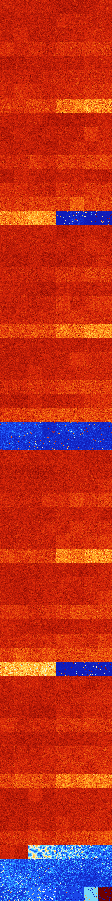

# B247 (75776-76287)

<details>
    <summary>Initial Grid</summary>
    
</details>


<details>
    <summary>Initial Grid RLE</summary>

```
#C Exported from GoGoL (https://github.com/marrow16/gogol)
#C Wrap mode: Toroidal
#C Boundary mode: Dead
#C Step: 0
x = 100, y = 100, rule = B247/S
28bo17bo29bo$11bo$37bo23b2o18bo17bo$14bo66b2o$8bo36bo$bo13bo4b2o32bo5bo
$25bo20bo6bo$12bo48bo17bo10bo$8bo39bo2bo19bo5bo$18b2o11bo2bo22bo35bo$o
9bo9bo36bo15bo24bo$33bo6bo32bo2bo9bo$8bo33bo14bo6bo13bo11bo$9bo65bo20bo
$22bo2bo6bo28bo4bo10bo2bo6bobo6bo$12bo27bo4bo7bobo9bo$11bo31bo27bo$bo3b
o19bo4bo8bo2bo19bo22bo$14bo7bo19bo2bo7bo$19bo25bobo17bo19bo$11bo16bo28b
o$6bo47bo5bo2bo19bo$21bo33bo8bo29bo$12bo19bo20bo31bo2bo$7bo77bo8bo$5bo
9bo19bo3bo12bo15bo$6bo37b3o5bo10bo35bo$41bo19bo5bo$68bobo2bo16bo$8b2o
75bo$9bo7bo3bo48bo$6bo25bo18bo35bo$12bo4bo11bo2bo37bo3bo5bo$4bobo20bo
37bo12bo6bo$5bo60bobo3bo15b2o5bo3bo$64bo2bo20bo$4bo18bo4bo50bo3bo10bo$
9bo48bo6bo3bo14bo$6bo70bo13bo$26b2o4bo3bo5bo15bo17bo13bo$10bo38bo$9b2o
7bo40bo9bo13bo$43bo7bo14bo9bo9bo$19bo12bo$15bo2bo19bo26bo$50bo28bo13bo$
64bo13bo9bo$7bo8bo10bo9bo16bob2o$15bo18bo28bo2bo4bo$35bobo3bo3bo22bo18b
o$15bobo10bo14bo3bo22bo5bo21bo$37bo19bo20bo$7bobo5bo17bo15bob2o38bo$6bo
2bo45bo11bo14bo$15bo13b2o32bo9bo18bobo$10bo2bo4bo11bo33bo18b2o$9bo22bo
13bo14bo14bo2bo6bo$85bo9bo$3bo39bo47bo$26bob2o$20bo28bo2bo3bo$o10bo3bo
31bo$26bo6bo27bo23bo$100b$95bo$20bo9bo10bo8bo7bo22bo6bo$9bo32bo5bo32bo
9bo3bo3bo$50bo18bo23bo$19bo15bo54bo$42bo22bo7bo$4bo6bo51bo11bo2bo$14bo
34bo4bo19bob2o11bo$o9bo13bobo8bo10bo42bo$30bo25bo22bob2o$bo2bo10bo74bo$
6bobo22bo9b2o47bo$18bo17bo12bo17bo20bo3bo$6bo18bo2bo6bo25bo2bo16bo$8bo
42bo13bo3bo20bo$40bo10bo$15bo8bo5bo52bo15bo$40bo21bobo13bo8bo$34bobo23b
2o3bo2bo5bo5bo9bo$23bo3bo8bo8bo15bo8bo18bobo6bo$23bo74bo$3bo4bo28bobo7b
o27bo19bo$57bo38bo$3bo6bo11bo60bo6bo$3b2o33bo5bo6bo20bo5bo$93bo$5bo21bo
19b2o23bo14bo$3o8bo6bo8bo3bobo34bo23bo$38bo2bo37bobo9bo4bobo$6bo63bo$
17bo4bo12bo41bo$28bo13bobo11b2o$3bo6bo30bo27bo27bo$o11bo17bo25bo2bo9bo
4bo24bo$10bo62bo5bo$bo11b2o3bo15bo24bo!
```
</details>
<details>
    <summary>Thumbnail</summary>

</details>
<table>
<tr>
    <td><a href="./75776%20S%20Heat%20Map%20Activity.png"></a><br>S (75776)<br>G>1000</td>    <td><a href="./75777%20S0%20Heat%20Map%20Activity.png"></a><br>S0 (75777)<br>G>1000</td>    <td><a href="./75778%20S1%20Heat%20Map%20Activity.png"></a><br>S1 (75778)<br>G>1000</td>    <td><a href="./75779%20S01%20Heat%20Map%20Activity.png"></a><br>S01 (75779)<br>G>1000</td>    <td><a href="./75780%20S2%20Heat%20Map%20Activity.png"></a><br>S2 (75780)<br>G>1000</td>    <td><a href="./75781%20S02%20Heat%20Map%20Activity.png"></a><br>S02 (75781)<br>G>1000</td>    <td><a href="./75782%20S12%20Heat%20Map%20Activity.png"></a><br>S12 (75782)<br>G>1000</td>    <td><a href="./75783%20S012%20Heat%20Map%20Activity.png"></a><br>S012 (75783)<br>G>1000</td></tr>
<tr>
    <td><a href="./75784%20S3%20Heat%20Map%20Activity.png"></a><br>S3 (75784)<br>G>1000</td>    <td><a href="./75785%20S03%20Heat%20Map%20Activity.png"></a><br>S03 (75785)<br>G>1000</td>    <td><a href="./75786%20S13%20Heat%20Map%20Activity.png"></a><br>S13 (75786)<br>G>1000</td>    <td><a href="./75787%20S013%20Heat%20Map%20Activity.png"></a><br>S013 (75787)<br>G>1000</td>    <td><a href="./75788%20S23%20Heat%20Map%20Activity.png"></a><br>S23 (75788)<br>G>1000</td>    <td><a href="./75789%20S023%20Heat%20Map%20Activity.png"></a><br>S023 (75789)<br>G>1000</td>    <td><a href="./75790%20S123%20Heat%20Map%20Activity.png"></a><br>S123 (75790)<br>G>1000</td>    <td><a href="./75791%20S0123%20Heat%20Map%20Activity.png"></a><br>S0123 (75791)<br>G>1000</td></tr>
<tr>
    <td><a href="./75792%20S4%20Heat%20Map%20Activity.png"></a><br>S4 (75792)<br>G>1000</td>    <td><a href="./75793%20S04%20Heat%20Map%20Activity.png"></a><br>S04 (75793)<br>G>1000</td>    <td><a href="./75794%20S14%20Heat%20Map%20Activity.png"></a><br>S14 (75794)<br>G>1000</td>    <td><a href="./75795%20S014%20Heat%20Map%20Activity.png"></a><br>S014 (75795)<br>G>1000</td>    <td><a href="./75796%20S24%20Heat%20Map%20Activity.png"></a><br>S24 (75796)<br>G>1000</td>    <td><a href="./75797%20S024%20Heat%20Map%20Activity.png"></a><br>S024 (75797)<br>G>1000</td>    <td><a href="./75798%20S124%20Heat%20Map%20Activity.png"></a><br>S124 (75798)<br>G>1000</td>    <td><a href="./75799%20S0124%20Heat%20Map%20Activity.png"></a><br>S0124 (75799)<br>G>1000</td></tr>
<tr>
    <td><a href="./75800%20S34%20Heat%20Map%20Activity.png"></a><br>S34 (75800)<br>G>1000</td>    <td><a href="./75801%20S034%20Heat%20Map%20Activity.png"></a><br>S034 (75801)<br>G>1000</td>    <td><a href="./75802%20S134%20Heat%20Map%20Activity.png"></a><br>S134 (75802)<br>G>1000</td>    <td><a href="./75803%20S0134%20Heat%20Map%20Activity.png"></a><br>S0134 (75803)<br>G>1000</td>    <td><a href="./75804%20S234%20Heat%20Map%20Activity.png"></a><br>S234 (75804)<br>G>1000</td>    <td><a href="./75805%20S0234%20Heat%20Map%20Activity.png"></a><br>S0234 (75805)<br>G>1000</td>    <td><a href="./75806%20S1234%20Heat%20Map%20Activity.png"></a><br>S1234 (75806)<br>G>1000</td>    <td><a href="./75807%20S01234%20Heat%20Map%20Activity.png"></a><br>S01234 (75807)<br>G>1000</td></tr>
<tr>
    <td><a href="./75808%20S5%20Heat%20Map%20Activity.png"></a><br>S5 (75808)<br>G>1000</td>    <td><a href="./75809%20S05%20Heat%20Map%20Activity.png"></a><br>S05 (75809)<br>G>1000</td>    <td><a href="./75810%20S15%20Heat%20Map%20Activity.png"></a><br>S15 (75810)<br>G>1000</td>    <td><a href="./75811%20S015%20Heat%20Map%20Activity.png"></a><br>S015 (75811)<br>G>1000</td>    <td><a href="./75812%20S25%20Heat%20Map%20Activity.png"></a><br>S25 (75812)<br>G>1000</td>    <td><a href="./75813%20S025%20Heat%20Map%20Activity.png"></a><br>S025 (75813)<br>G>1000</td>    <td><a href="./75814%20S125%20Heat%20Map%20Activity.png"></a><br>S125 (75814)<br>G>1000</td>    <td><a href="./75815%20S0125%20Heat%20Map%20Activity.png"></a><br>S0125 (75815)<br>G>1000</td></tr>
<tr>
    <td><a href="./75816%20S35%20Heat%20Map%20Activity.png"></a><br>S35 (75816)<br>G>1000</td>    <td><a href="./75817%20S035%20Heat%20Map%20Activity.png"></a><br>S035 (75817)<br>G>1000</td>    <td><a href="./75818%20S135%20Heat%20Map%20Activity.png"></a><br>S135 (75818)<br>G>1000</td>    <td><a href="./75819%20S0135%20Heat%20Map%20Activity.png"></a><br>S0135 (75819)<br>G>1000</td>    <td><a href="./75820%20S235%20Heat%20Map%20Activity.png"></a><br>S235 (75820)<br>G>1000</td>    <td><a href="./75821%20S0235%20Heat%20Map%20Activity.png"></a><br>S0235 (75821)<br>G>1000</td>    <td><a href="./75822%20S1235%20Heat%20Map%20Activity.png"></a><br>S1235 (75822)<br>G>1000</td>    <td><a href="./75823%20S01235%20Heat%20Map%20Activity.png"></a><br>S01235 (75823)<br>G>1000</td></tr>
<tr>
    <td><a href="./75824%20S45%20Heat%20Map%20Activity.png"></a><br>S45 (75824)<br>G>1000</td>    <td><a href="./75825%20S045%20Heat%20Map%20Activity.png"></a><br>S045 (75825)<br>G>1000</td>    <td><a href="./75826%20S145%20Heat%20Map%20Activity.png"></a><br>S145 (75826)<br>G>1000</td>    <td><a href="./75827%20S0145%20Heat%20Map%20Activity.png"></a><br>S0145 (75827)<br>G>1000</td>    <td><a href="./75828%20S245%20Heat%20Map%20Activity.png"></a><br>S245 (75828)<br>G>1000</td>    <td><a href="./75829%20S0245%20Heat%20Map%20Activity.png"></a><br>S0245 (75829)<br>G>1000</td>    <td><a href="./75830%20S1245%20Heat%20Map%20Activity.png"></a><br>S1245 (75830)<br>G>1000</td>    <td><a href="./75831%20S01245%20Heat%20Map%20Activity.png"></a><br>S01245 (75831)<br>G>1000</td></tr>
<tr>
    <td><a href="./75832%20S345%20Heat%20Map%20Activity.png"></a><br>S345 (75832)<br>G>1000</td>    <td><a href="./75833%20S0345%20Heat%20Map%20Activity.png"></a><br>S0345 (75833)<br>G>1000</td>    <td><a href="./75834%20S1345%20Heat%20Map%20Activity.png"></a><br>S1345 (75834)<br>G>1000</td>    <td><a href="./75835%20S01345%20Heat%20Map%20Activity.png"></a><br>S01345 (75835)<br>G>1000</td>    <td><a href="./75836%20S2345%20Heat%20Map%20Activity.png"></a><br>S2345 (75836)<br>G>1000</td>    <td><a href="./75837%20S02345%20Heat%20Map%20Activity.png"></a><br>S02345 (75837)<br>G>1000</td>    <td><a href="./75838%20S12345%20Heat%20Map%20Activity.png"></a><br>S12345 (75838)<br>G>1000</td>    <td><a href="./75839%20S012345%20Heat%20Map%20Activity.png"></a><br>S012345 (75839)<br>G>1000</td></tr>
<tr>
    <td><a href="./75840%20S6%20Heat%20Map%20Activity.png"></a><br>S6 (75840)<br>G>1000</td>    <td><a href="./75841%20S06%20Heat%20Map%20Activity.png"></a><br>S06 (75841)<br>G>1000</td>    <td><a href="./75842%20S16%20Heat%20Map%20Activity.png"></a><br>S16 (75842)<br>G>1000</td>    <td><a href="./75843%20S016%20Heat%20Map%20Activity.png"></a><br>S016 (75843)<br>G>1000</td>    <td><a href="./75844%20S26%20Heat%20Map%20Activity.png"></a><br>S26 (75844)<br>G>1000</td>    <td><a href="./75845%20S026%20Heat%20Map%20Activity.png"></a><br>S026 (75845)<br>G>1000</td>    <td><a href="./75846%20S126%20Heat%20Map%20Activity.png"></a><br>S126 (75846)<br>G>1000</td>    <td><a href="./75847%20S0126%20Heat%20Map%20Activity.png"></a><br>S0126 (75847)<br>G>1000</td></tr>
<tr>
    <td><a href="./75848%20S36%20Heat%20Map%20Activity.png"></a><br>S36 (75848)<br>G>1000</td>    <td><a href="./75849%20S036%20Heat%20Map%20Activity.png"></a><br>S036 (75849)<br>G>1000</td>    <td><a href="./75850%20S136%20Heat%20Map%20Activity.png"></a><br>S136 (75850)<br>G>1000</td>    <td><a href="./75851%20S0136%20Heat%20Map%20Activity.png"></a><br>S0136 (75851)<br>G>1000</td>    <td><a href="./75852%20S236%20Heat%20Map%20Activity.png"></a><br>S236 (75852)<br>G>1000</td>    <td><a href="./75853%20S0236%20Heat%20Map%20Activity.png"></a><br>S0236 (75853)<br>G>1000</td>    <td><a href="./75854%20S1236%20Heat%20Map%20Activity.png"></a><br>S1236 (75854)<br>G>1000</td>    <td><a href="./75855%20S01236%20Heat%20Map%20Activity.png"></a><br>S01236 (75855)<br>G>1000</td></tr>
<tr>
    <td><a href="./75856%20S46%20Heat%20Map%20Activity.png"></a><br>S46 (75856)<br>G>1000</td>    <td><a href="./75857%20S046%20Heat%20Map%20Activity.png"></a><br>S046 (75857)<br>G>1000</td>    <td><a href="./75858%20S146%20Heat%20Map%20Activity.png"></a><br>S146 (75858)<br>G>1000</td>    <td><a href="./75859%20S0146%20Heat%20Map%20Activity.png"></a><br>S0146 (75859)<br>G>1000</td>    <td><a href="./75860%20S246%20Heat%20Map%20Activity.png"></a><br>S246 (75860)<br>G>1000</td>    <td><a href="./75861%20S0246%20Heat%20Map%20Activity.png"></a><br>S0246 (75861)<br>G>1000</td>    <td><a href="./75862%20S1246%20Heat%20Map%20Activity.png"></a><br>S1246 (75862)<br>G>1000</td>    <td><a href="./75863%20S01246%20Heat%20Map%20Activity.png"></a><br>S01246 (75863)<br>G>1000</td></tr>
<tr>
    <td><a href="./75864%20S346%20Heat%20Map%20Activity.png"></a><br>S346 (75864)<br>G>1000</td>    <td><a href="./75865%20S0346%20Heat%20Map%20Activity.png"></a><br>S0346 (75865)<br>G>1000</td>    <td><a href="./75866%20S1346%20Heat%20Map%20Activity.png"></a><br>S1346 (75866)<br>G>1000</td>    <td><a href="./75867%20S01346%20Heat%20Map%20Activity.png"></a><br>S01346 (75867)<br>G>1000</td>    <td><a href="./75868%20S2346%20Heat%20Map%20Activity.png"></a><br>S2346 (75868)<br>G>1000</td>    <td><a href="./75869%20S02346%20Heat%20Map%20Activity.png"></a><br>S02346 (75869)<br>G>1000</td>    <td><a href="./75870%20S12346%20Heat%20Map%20Activity.png"></a><br>S12346 (75870)<br>G>1000</td>    <td><a href="./75871%20S012346%20Heat%20Map%20Activity.png"></a><br>S012346 (75871)<br>G>1000</td></tr>
<tr>
    <td><a href="./75872%20S56%20Heat%20Map%20Activity.png"></a><br>S56 (75872)<br>G>1000</td>    <td><a href="./75873%20S056%20Heat%20Map%20Activity.png"></a><br>S056 (75873)<br>G>1000</td>    <td><a href="./75874%20S156%20Heat%20Map%20Activity.png"></a><br>S156 (75874)<br>G>1000</td>    <td><a href="./75875%20S0156%20Heat%20Map%20Activity.png"></a><br>S0156 (75875)<br>G>1000</td>    <td><a href="./75876%20S256%20Heat%20Map%20Activity.png"></a><br>S256 (75876)<br>G>1000</td>    <td><a href="./75877%20S0256%20Heat%20Map%20Activity.png"></a><br>S0256 (75877)<br>G>1000</td>    <td><a href="./75878%20S1256%20Heat%20Map%20Activity.png"></a><br>S1256 (75878)<br>G>1000</td>    <td><a href="./75879%20S01256%20Heat%20Map%20Activity.png"></a><br>S01256 (75879)<br>G>1000</td></tr>
<tr>
    <td><a href="./75880%20S356%20Heat%20Map%20Activity.png"></a><br>S356 (75880)<br>G>1000</td>    <td><a href="./75881%20S0356%20Heat%20Map%20Activity.png"></a><br>S0356 (75881)<br>G>1000</td>    <td><a href="./75882%20S1356%20Heat%20Map%20Activity.png"></a><br>S1356 (75882)<br>G>1000</td>    <td><a href="./75883%20S01356%20Heat%20Map%20Activity.png"></a><br>S01356 (75883)<br>G>1000</td>    <td><a href="./75884%20S2356%20Heat%20Map%20Activity.png"></a><br>S2356 (75884)<br>G>1000</td>    <td><a href="./75885%20S02356%20Heat%20Map%20Activity.png"></a><br>S02356 (75885)<br>G>1000</td>    <td><a href="./75886%20S12356%20Heat%20Map%20Activity.png"></a><br>S12356 (75886)<br>G>1000</td>    <td><a href="./75887%20S012356%20Heat%20Map%20Activity.png"></a><br>S012356 (75887)<br>G>1000</td></tr>
<tr>
    <td><a href="./75888%20S456%20Heat%20Map%20Activity.png"></a><br>S456 (75888)<br>G>1000</td>    <td><a href="./75889%20S0456%20Heat%20Map%20Activity.png"></a><br>S0456 (75889)<br>G>1000</td>    <td><a href="./75890%20S1456%20Heat%20Map%20Activity.png"></a><br>S1456 (75890)<br>G>1000</td>    <td><a href="./75891%20S01456%20Heat%20Map%20Activity.png"></a><br>S01456 (75891)<br>G>1000</td>    <td><a href="./75892%20S2456%20Heat%20Map%20Activity.png"></a><br>S2456 (75892)<br>G>1000</td>    <td><a href="./75893%20S02456%20Heat%20Map%20Activity.png"></a><br>S02456 (75893)<br>G>1000</td>    <td><a href="./75894%20S12456%20Heat%20Map%20Activity.png"></a><br>S12456 (75894)<br>G>1000</td>    <td><a href="./75895%20S012456%20Heat%20Map%20Activity.png"></a><br>S012456 (75895)<br>G>1000</td></tr>
<tr>
    <td><a href="./75896%20S3456%20Heat%20Map%20Activity.png"></a><br>S3456 (75896)<br>G>1000</td>    <td><a href="./75897%20S03456%20Heat%20Map%20Activity.png"></a><br>S03456 (75897)<br>G>1000</td>    <td><a href="./75898%20S13456%20Heat%20Map%20Activity.png"></a><br>S13456 (75898)<br>G>1000</td>    <td><a href="./75899%20S013456%20Heat%20Map%20Activity.png"></a><br>S013456 (75899)<br>G>1000</td>    <td><a href="./75900%20S23456%20Heat%20Map%20Activity.png"></a><br>S23456 (75900)<br>G>1000</td>    <td><a href="./75901%20S023456%20Heat%20Map%20Activity.png"></a><br>S023456 (75901)<br>R@344,p120</td>    <td><a href="./75902%20S123456%20Heat%20Map%20Activity.png"></a><br>S123456 (75902)<br>G>1000</td>    <td><a href="./75903%20S0123456%20Heat%20Map%20Activity.png"></a><br>S0123456 (75903)<br>G>1000</td></tr>
<tr>
    <td><a href="./75904%20S7%20Heat%20Map%20Activity.png"></a><br>S7 (75904)<br>G>1000</td>    <td><a href="./75905%20S07%20Heat%20Map%20Activity.png"></a><br>S07 (75905)<br>G>1000</td>    <td><a href="./75906%20S17%20Heat%20Map%20Activity.png"></a><br>S17 (75906)<br>G>1000</td>    <td><a href="./75907%20S017%20Heat%20Map%20Activity.png"></a><br>S017 (75907)<br>G>1000</td>    <td><a href="./75908%20S27%20Heat%20Map%20Activity.png"></a><br>S27 (75908)<br>G>1000</td>    <td><a href="./75909%20S027%20Heat%20Map%20Activity.png"></a><br>S027 (75909)<br>G>1000</td>    <td><a href="./75910%20S127%20Heat%20Map%20Activity.png"></a><br>S127 (75910)<br>G>1000</td>    <td><a href="./75911%20S0127%20Heat%20Map%20Activity.png"></a><br>S0127 (75911)<br>G>1000</td></tr>
<tr>
    <td><a href="./75912%20S37%20Heat%20Map%20Activity.png"></a><br>S37 (75912)<br>G>1000</td>    <td><a href="./75913%20S037%20Heat%20Map%20Activity.png"></a><br>S037 (75913)<br>G>1000</td>    <td><a href="./75914%20S137%20Heat%20Map%20Activity.png"></a><br>S137 (75914)<br>G>1000</td>    <td><a href="./75915%20S0137%20Heat%20Map%20Activity.png"></a><br>S0137 (75915)<br>G>1000</td>    <td><a href="./75916%20S237%20Heat%20Map%20Activity.png"></a><br>S237 (75916)<br>G>1000</td>    <td><a href="./75917%20S0237%20Heat%20Map%20Activity.png"></a><br>S0237 (75917)<br>G>1000</td>    <td><a href="./75918%20S1237%20Heat%20Map%20Activity.png"></a><br>S1237 (75918)<br>G>1000</td>    <td><a href="./75919%20S01237%20Heat%20Map%20Activity.png"></a><br>S01237 (75919)<br>G>1000</td></tr>
<tr>
    <td><a href="./75920%20S47%20Heat%20Map%20Activity.png"></a><br>S47 (75920)<br>G>1000</td>    <td><a href="./75921%20S047%20Heat%20Map%20Activity.png"></a><br>S047 (75921)<br>G>1000</td>    <td><a href="./75922%20S147%20Heat%20Map%20Activity.png"></a><br>S147 (75922)<br>G>1000</td>    <td><a href="./75923%20S0147%20Heat%20Map%20Activity.png"></a><br>S0147 (75923)<br>G>1000</td>    <td><a href="./75924%20S247%20Heat%20Map%20Activity.png"></a><br>S247 (75924)<br>G>1000</td>    <td><a href="./75925%20S0247%20Heat%20Map%20Activity.png"></a><br>S0247 (75925)<br>G>1000</td>    <td><a href="./75926%20S1247%20Heat%20Map%20Activity.png"></a><br>S1247 (75926)<br>G>1000</td>    <td><a href="./75927%20S01247%20Heat%20Map%20Activity.png"></a><br>S01247 (75927)<br>G>1000</td></tr>
<tr>
    <td><a href="./75928%20S347%20Heat%20Map%20Activity.png"></a><br>S347 (75928)<br>G>1000</td>    <td><a href="./75929%20S0347%20Heat%20Map%20Activity.png"></a><br>S0347 (75929)<br>G>1000</td>    <td><a href="./75930%20S1347%20Heat%20Map%20Activity.png"></a><br>S1347 (75930)<br>G>1000</td>    <td><a href="./75931%20S01347%20Heat%20Map%20Activity.png"></a><br>S01347 (75931)<br>G>1000</td>    <td><a href="./75932%20S2347%20Heat%20Map%20Activity.png"></a><br>S2347 (75932)<br>G>1000</td>    <td><a href="./75933%20S02347%20Heat%20Map%20Activity.png"></a><br>S02347 (75933)<br>G>1000</td>    <td><a href="./75934%20S12347%20Heat%20Map%20Activity.png"></a><br>S12347 (75934)<br>G>1000</td>    <td><a href="./75935%20S012347%20Heat%20Map%20Activity.png"></a><br>S012347 (75935)<br>G>1000</td></tr>
<tr>
    <td><a href="./75936%20S57%20Heat%20Map%20Activity.png"></a><br>S57 (75936)<br>G>1000</td>    <td><a href="./75937%20S057%20Heat%20Map%20Activity.png"></a><br>S057 (75937)<br>G>1000</td>    <td><a href="./75938%20S157%20Heat%20Map%20Activity.png"></a><br>S157 (75938)<br>G>1000</td>    <td><a href="./75939%20S0157%20Heat%20Map%20Activity.png"></a><br>S0157 (75939)<br>G>1000</td>    <td><a href="./75940%20S257%20Heat%20Map%20Activity.png"></a><br>S257 (75940)<br>G>1000</td>    <td><a href="./75941%20S0257%20Heat%20Map%20Activity.png"></a><br>S0257 (75941)<br>G>1000</td>    <td><a href="./75942%20S1257%20Heat%20Map%20Activity.png"></a><br>S1257 (75942)<br>G>1000</td>    <td><a href="./75943%20S01257%20Heat%20Map%20Activity.png"></a><br>S01257 (75943)<br>G>1000</td></tr>
<tr>
    <td><a href="./75944%20S357%20Heat%20Map%20Activity.png"></a><br>S357 (75944)<br>G>1000</td>    <td><a href="./75945%20S0357%20Heat%20Map%20Activity.png"></a><br>S0357 (75945)<br>G>1000</td>    <td><a href="./75946%20S1357%20Heat%20Map%20Activity.png"></a><br>S1357 (75946)<br>G>1000</td>    <td><a href="./75947%20S01357%20Heat%20Map%20Activity.png"></a><br>S01357 (75947)<br>G>1000</td>    <td><a href="./75948%20S2357%20Heat%20Map%20Activity.png"></a><br>S2357 (75948)<br>G>1000</td>    <td><a href="./75949%20S02357%20Heat%20Map%20Activity.png"></a><br>S02357 (75949)<br>G>1000</td>    <td><a href="./75950%20S12357%20Heat%20Map%20Activity.png"></a><br>S12357 (75950)<br>G>1000</td>    <td><a href="./75951%20S012357%20Heat%20Map%20Activity.png"></a><br>S012357 (75951)<br>G>1000</td></tr>
<tr>
    <td><a href="./75952%20S457%20Heat%20Map%20Activity.png"></a><br>S457 (75952)<br>G>1000</td>    <td><a href="./75953%20S0457%20Heat%20Map%20Activity.png"></a><br>S0457 (75953)<br>G>1000</td>    <td><a href="./75954%20S1457%20Heat%20Map%20Activity.png"></a><br>S1457 (75954)<br>G>1000</td>    <td><a href="./75955%20S01457%20Heat%20Map%20Activity.png"></a><br>S01457 (75955)<br>G>1000</td>    <td><a href="./75956%20S2457%20Heat%20Map%20Activity.png"></a><br>S2457 (75956)<br>G>1000</td>    <td><a href="./75957%20S02457%20Heat%20Map%20Activity.png"></a><br>S02457 (75957)<br>G>1000</td>    <td><a href="./75958%20S12457%20Heat%20Map%20Activity.png"></a><br>S12457 (75958)<br>G>1000</td>    <td><a href="./75959%20S012457%20Heat%20Map%20Activity.png"></a><br>S012457 (75959)<br>G>1000</td></tr>
<tr>
    <td><a href="./75960%20S3457%20Heat%20Map%20Activity.png"></a><br>S3457 (75960)<br>G>1000</td>    <td><a href="./75961%20S03457%20Heat%20Map%20Activity.png"></a><br>S03457 (75961)<br>G>1000</td>    <td><a href="./75962%20S13457%20Heat%20Map%20Activity.png"></a><br>S13457 (75962)<br>G>1000</td>    <td><a href="./75963%20S013457%20Heat%20Map%20Activity.png"></a><br>S013457 (75963)<br>G>1000</td>    <td><a href="./75964%20S23457%20Heat%20Map%20Activity.png"></a><br>S23457 (75964)<br>G>1000</td>    <td><a href="./75965%20S023457%20Heat%20Map%20Activity.png"></a><br>S023457 (75965)<br>G>1000</td>    <td><a href="./75966%20S123457%20Heat%20Map%20Activity.png"></a><br>S123457 (75966)<br>G>1000</td>    <td><a href="./75967%20S0123457%20Heat%20Map%20Activity.png"></a><br>S0123457 (75967)<br>G>1000</td></tr>
<tr>
    <td><a href="./75968%20S67%20Heat%20Map%20Activity.png"></a><br>S67 (75968)<br>G>1000</td>    <td><a href="./75969%20S067%20Heat%20Map%20Activity.png"></a><br>S067 (75969)<br>G>1000</td>    <td><a href="./75970%20S167%20Heat%20Map%20Activity.png"></a><br>S167 (75970)<br>G>1000</td>    <td><a href="./75971%20S0167%20Heat%20Map%20Activity.png"></a><br>S0167 (75971)<br>G>1000</td>    <td><a href="./75972%20S267%20Heat%20Map%20Activity.png"></a><br>S267 (75972)<br>G>1000</td>    <td><a href="./75973%20S0267%20Heat%20Map%20Activity.png"></a><br>S0267 (75973)<br>G>1000</td>    <td><a href="./75974%20S1267%20Heat%20Map%20Activity.png"></a><br>S1267 (75974)<br>G>1000</td>    <td><a href="./75975%20S01267%20Heat%20Map%20Activity.png"></a><br>S01267 (75975)<br>G>1000</td></tr>
<tr>
    <td><a href="./75976%20S367%20Heat%20Map%20Activity.png"></a><br>S367 (75976)<br>G>1000</td>    <td><a href="./75977%20S0367%20Heat%20Map%20Activity.png"></a><br>S0367 (75977)<br>G>1000</td>    <td><a href="./75978%20S1367%20Heat%20Map%20Activity.png"></a><br>S1367 (75978)<br>G>1000</td>    <td><a href="./75979%20S01367%20Heat%20Map%20Activity.png"></a><br>S01367 (75979)<br>G>1000</td>    <td><a href="./75980%20S2367%20Heat%20Map%20Activity.png"></a><br>S2367 (75980)<br>G>1000</td>    <td><a href="./75981%20S02367%20Heat%20Map%20Activity.png"></a><br>S02367 (75981)<br>G>1000</td>    <td><a href="./75982%20S12367%20Heat%20Map%20Activity.png"></a><br>S12367 (75982)<br>G>1000</td>    <td><a href="./75983%20S012367%20Heat%20Map%20Activity.png"></a><br>S012367 (75983)<br>G>1000</td></tr>
<tr>
    <td><a href="./75984%20S467%20Heat%20Map%20Activity.png"></a><br>S467 (75984)<br>G>1000</td>    <td><a href="./75985%20S0467%20Heat%20Map%20Activity.png"></a><br>S0467 (75985)<br>G>1000</td>    <td><a href="./75986%20S1467%20Heat%20Map%20Activity.png"></a><br>S1467 (75986)<br>G>1000</td>    <td><a href="./75987%20S01467%20Heat%20Map%20Activity.png"></a><br>S01467 (75987)<br>G>1000</td>    <td><a href="./75988%20S2467%20Heat%20Map%20Activity.png"></a><br>S2467 (75988)<br>G>1000</td>    <td><a href="./75989%20S02467%20Heat%20Map%20Activity.png"></a><br>S02467 (75989)<br>G>1000</td>    <td><a href="./75990%20S12467%20Heat%20Map%20Activity.png"></a><br>S12467 (75990)<br>G>1000</td>    <td><a href="./75991%20S012467%20Heat%20Map%20Activity.png"></a><br>S012467 (75991)<br>G>1000</td></tr>
<tr>
    <td><a href="./75992%20S3467%20Heat%20Map%20Activity.png"></a><br>S3467 (75992)<br>G>1000</td>    <td><a href="./75993%20S03467%20Heat%20Map%20Activity.png"></a><br>S03467 (75993)<br>G>1000</td>    <td><a href="./75994%20S13467%20Heat%20Map%20Activity.png"></a><br>S13467 (75994)<br>G>1000</td>    <td><a href="./75995%20S013467%20Heat%20Map%20Activity.png"></a><br>S013467 (75995)<br>G>1000</td>    <td><a href="./75996%20S23467%20Heat%20Map%20Activity.png"></a><br>S23467 (75996)<br>G>1000</td>    <td><a href="./75997%20S023467%20Heat%20Map%20Activity.png"></a><br>S023467 (75997)<br>G>1000</td>    <td><a href="./75998%20S123467%20Heat%20Map%20Activity.png"></a><br>S123467 (75998)<br>G>1000</td>    <td><a href="./75999%20S0123467%20Heat%20Map%20Activity.png"></a><br>S0123467 (75999)<br>G>1000</td></tr>
<tr>
    <td><a href="./76000%20S567%20Heat%20Map%20Activity.png"></a><br>S567 (76000)<br>G>1000</td>    <td><a href="./76001%20S0567%20Heat%20Map%20Activity.png"></a><br>S0567 (76001)<br>G>1000</td>    <td><a href="./76002%20S1567%20Heat%20Map%20Activity.png"></a><br>S1567 (76002)<br>G>1000</td>    <td><a href="./76003%20S01567%20Heat%20Map%20Activity.png"></a><br>S01567 (76003)<br>G>1000</td>    <td><a href="./76004%20S2567%20Heat%20Map%20Activity.png"></a><br>S2567 (76004)<br>G>1000</td>    <td><a href="./76005%20S02567%20Heat%20Map%20Activity.png"></a><br>S02567 (76005)<br>G>1000</td>    <td><a href="./76006%20S12567%20Heat%20Map%20Activity.png"></a><br>S12567 (76006)<br>G>1000</td>    <td><a href="./76007%20S012567%20Heat%20Map%20Activity.png"></a><br>S012567 (76007)<br>G>1000</td></tr>
<tr>
    <td><a href="./76008%20S3567%20Heat%20Map%20Activity.png"></a><br>S3567 (76008)<br>G>1000</td>    <td><a href="./76009%20S03567%20Heat%20Map%20Activity.png"></a><br>S03567 (76009)<br>G>1000</td>    <td><a href="./76010%20S13567%20Heat%20Map%20Activity.png"></a><br>S13567 (76010)<br>G>1000</td>    <td><a href="./76011%20S013567%20Heat%20Map%20Activity.png"></a><br>S013567 (76011)<br>G>1000</td>    <td><a href="./76012%20S23567%20Heat%20Map%20Activity.png"></a><br>S23567 (76012)<br>G>1000</td>    <td><a href="./76013%20S023567%20Heat%20Map%20Activity.png"></a><br>S023567 (76013)<br>G>1000</td>    <td><a href="./76014%20S123567%20Heat%20Map%20Activity.png"></a><br>S123567 (76014)<br>G>1000</td>    <td><a href="./76015%20S0123567%20Heat%20Map%20Activity.png"></a><br>S0123567 (76015)<br>G>1000</td></tr>
<tr>
    <td><a href="./76016%20S4567%20Heat%20Map%20Activity.png"></a><br>S4567 (76016)<br>R@93,p10</td>    <td><a href="./76017%20S04567%20Heat%20Map%20Activity.png"></a><br>S04567 (76017)<br>R@77,p6</td>    <td><a href="./76018%20S14567%20Heat%20Map%20Activity.png"></a><br>S14567 (76018)<br>R@69,p12</td>    <td><a href="./76019%20S014567%20Heat%20Map%20Activity.png"></a><br>S014567 (76019)<br>R@139,p60</td>    <td><a href="./76020%20S24567%20Heat%20Map%20Activity.png"></a><br>S24567 (76020)<br>R@66,p6</td>    <td><a href="./76021%20S024567%20Heat%20Map%20Activity.png"></a><br>S024567 (76021)<br>R@58,p4</td>    <td><a href="./76022%20S124567%20Heat%20Map%20Activity.png"></a><br>S124567 (76022)<br>R@67,p12</td>    <td><a href="./76023%20S0124567%20Heat%20Map%20Activity.png"></a><br>S0124567 (76023)<br>R@89,p6</td></tr>
<tr>
    <td><a href="./76024%20S34567%20Heat%20Map%20Activity.png"></a><br>S34567 (76024)<br>R@41,p12</td>    <td><a href="./76025%20S034567%20Heat%20Map%20Activity.png"></a><br>S034567 (76025)<br>R@42,p12</td>    <td><a href="./76026%20S134567%20Heat%20Map%20Activity.png"></a><br>S134567 (76026)<br>R@35,p12</td>    <td><a href="./76027%20S0134567%20Heat%20Map%20Activity.png"></a><br>S0134567 (76027)<br>R@39,p12</td>    <td><a href="./76028%20S234567%20Heat%20Map%20Activity.png"></a><br>S234567 (76028)<br>R@40,p12</td>    <td><a href="./76029%20S0234567%20Heat%20Map%20Activity.png"></a><br>S0234567 (76029)<br>R@38,p12</td>    <td><a href="./76030%20S1234567%20Heat%20Map%20Activity.png"></a><br>S1234567 (76030)<br>R@39,p12</td>    <td><a href="./76031%20S01234567%20Heat%20Map%20Activity.png"></a><br>S01234567 (76031)<br>R@33,p12</td></tr>
<tr>
    <td><a href="./76032%20S8%20Heat%20Map%20Activity.png"></a><br>S8 (76032)<br>G>1000</td>    <td><a href="./76033%20S08%20Heat%20Map%20Activity.png"></a><br>S08 (76033)<br>G>1000</td>    <td><a href="./76034%20S18%20Heat%20Map%20Activity.png"></a><br>S18 (76034)<br>G>1000</td>    <td><a href="./76035%20S018%20Heat%20Map%20Activity.png"></a><br>S018 (76035)<br>G>1000</td>    <td><a href="./76036%20S28%20Heat%20Map%20Activity.png"></a><br>S28 (76036)<br>G>1000</td>    <td><a href="./76037%20S028%20Heat%20Map%20Activity.png"></a><br>S028 (76037)<br>G>1000</td>    <td><a href="./76038%20S128%20Heat%20Map%20Activity.png"></a><br>S128 (76038)<br>G>1000</td>    <td><a href="./76039%20S0128%20Heat%20Map%20Activity.png"></a><br>S0128 (76039)<br>G>1000</td></tr>
<tr>
    <td><a href="./76040%20S38%20Heat%20Map%20Activity.png"></a><br>S38 (76040)<br>G>1000</td>    <td><a href="./76041%20S038%20Heat%20Map%20Activity.png"></a><br>S038 (76041)<br>G>1000</td>    <td><a href="./76042%20S138%20Heat%20Map%20Activity.png"></a><br>S138 (76042)<br>G>1000</td>    <td><a href="./76043%20S0138%20Heat%20Map%20Activity.png"></a><br>S0138 (76043)<br>G>1000</td>    <td><a href="./76044%20S238%20Heat%20Map%20Activity.png"></a><br>S238 (76044)<br>G>1000</td>    <td><a href="./76045%20S0238%20Heat%20Map%20Activity.png"></a><br>S0238 (76045)<br>G>1000</td>    <td><a href="./76046%20S1238%20Heat%20Map%20Activity.png"></a><br>S1238 (76046)<br>G>1000</td>    <td><a href="./76047%20S01238%20Heat%20Map%20Activity.png"></a><br>S01238 (76047)<br>G>1000</td></tr>
<tr>
    <td><a href="./76048%20S48%20Heat%20Map%20Activity.png"></a><br>S48 (76048)<br>G>1000</td>    <td><a href="./76049%20S048%20Heat%20Map%20Activity.png"></a><br>S048 (76049)<br>G>1000</td>    <td><a href="./76050%20S148%20Heat%20Map%20Activity.png"></a><br>S148 (76050)<br>G>1000</td>    <td><a href="./76051%20S0148%20Heat%20Map%20Activity.png"></a><br>S0148 (76051)<br>G>1000</td>    <td><a href="./76052%20S248%20Heat%20Map%20Activity.png"></a><br>S248 (76052)<br>G>1000</td>    <td><a href="./76053%20S0248%20Heat%20Map%20Activity.png"></a><br>S0248 (76053)<br>G>1000</td>    <td><a href="./76054%20S1248%20Heat%20Map%20Activity.png"></a><br>S1248 (76054)<br>G>1000</td>    <td><a href="./76055%20S01248%20Heat%20Map%20Activity.png"></a><br>S01248 (76055)<br>G>1000</td></tr>
<tr>
    <td><a href="./76056%20S348%20Heat%20Map%20Activity.png"></a><br>S348 (76056)<br>G>1000</td>    <td><a href="./76057%20S0348%20Heat%20Map%20Activity.png"></a><br>S0348 (76057)<br>G>1000</td>    <td><a href="./76058%20S1348%20Heat%20Map%20Activity.png"></a><br>S1348 (76058)<br>G>1000</td>    <td><a href="./76059%20S01348%20Heat%20Map%20Activity.png"></a><br>S01348 (76059)<br>G>1000</td>    <td><a href="./76060%20S2348%20Heat%20Map%20Activity.png"></a><br>S2348 (76060)<br>G>1000</td>    <td><a href="./76061%20S02348%20Heat%20Map%20Activity.png"></a><br>S02348 (76061)<br>G>1000</td>    <td><a href="./76062%20S12348%20Heat%20Map%20Activity.png"></a><br>S12348 (76062)<br>G>1000</td>    <td><a href="./76063%20S012348%20Heat%20Map%20Activity.png"></a><br>S012348 (76063)<br>G>1000</td></tr>
<tr>
    <td><a href="./76064%20S58%20Heat%20Map%20Activity.png"></a><br>S58 (76064)<br>G>1000</td>    <td><a href="./76065%20S058%20Heat%20Map%20Activity.png"></a><br>S058 (76065)<br>G>1000</td>    <td><a href="./76066%20S158%20Heat%20Map%20Activity.png"></a><br>S158 (76066)<br>G>1000</td>    <td><a href="./76067%20S0158%20Heat%20Map%20Activity.png"></a><br>S0158 (76067)<br>G>1000</td>    <td><a href="./76068%20S258%20Heat%20Map%20Activity.png"></a><br>S258 (76068)<br>G>1000</td>    <td><a href="./76069%20S0258%20Heat%20Map%20Activity.png"></a><br>S0258 (76069)<br>G>1000</td>    <td><a href="./76070%20S1258%20Heat%20Map%20Activity.png"></a><br>S1258 (76070)<br>G>1000</td>    <td><a href="./76071%20S01258%20Heat%20Map%20Activity.png"></a><br>S01258 (76071)<br>G>1000</td></tr>
<tr>
    <td><a href="./76072%20S358%20Heat%20Map%20Activity.png"></a><br>S358 (76072)<br>G>1000</td>    <td><a href="./76073%20S0358%20Heat%20Map%20Activity.png"></a><br>S0358 (76073)<br>G>1000</td>    <td><a href="./76074%20S1358%20Heat%20Map%20Activity.png"></a><br>S1358 (76074)<br>G>1000</td>    <td><a href="./76075%20S01358%20Heat%20Map%20Activity.png"></a><br>S01358 (76075)<br>G>1000</td>    <td><a href="./76076%20S2358%20Heat%20Map%20Activity.png"></a><br>S2358 (76076)<br>G>1000</td>    <td><a href="./76077%20S02358%20Heat%20Map%20Activity.png"></a><br>S02358 (76077)<br>G>1000</td>    <td><a href="./76078%20S12358%20Heat%20Map%20Activity.png"></a><br>S12358 (76078)<br>G>1000</td>    <td><a href="./76079%20S012358%20Heat%20Map%20Activity.png"></a><br>S012358 (76079)<br>G>1000</td></tr>
<tr>
    <td><a href="./76080%20S458%20Heat%20Map%20Activity.png"></a><br>S458 (76080)<br>G>1000</td>    <td><a href="./76081%20S0458%20Heat%20Map%20Activity.png"></a><br>S0458 (76081)<br>G>1000</td>    <td><a href="./76082%20S1458%20Heat%20Map%20Activity.png"></a><br>S1458 (76082)<br>G>1000</td>    <td><a href="./76083%20S01458%20Heat%20Map%20Activity.png"></a><br>S01458 (76083)<br>G>1000</td>    <td><a href="./76084%20S2458%20Heat%20Map%20Activity.png"></a><br>S2458 (76084)<br>G>1000</td>    <td><a href="./76085%20S02458%20Heat%20Map%20Activity.png"></a><br>S02458 (76085)<br>G>1000</td>    <td><a href="./76086%20S12458%20Heat%20Map%20Activity.png"></a><br>S12458 (76086)<br>G>1000</td>    <td><a href="./76087%20S012458%20Heat%20Map%20Activity.png"></a><br>S012458 (76087)<br>G>1000</td></tr>
<tr>
    <td><a href="./76088%20S3458%20Heat%20Map%20Activity.png"></a><br>S3458 (76088)<br>G>1000</td>    <td><a href="./76089%20S03458%20Heat%20Map%20Activity.png"></a><br>S03458 (76089)<br>G>1000</td>    <td><a href="./76090%20S13458%20Heat%20Map%20Activity.png"></a><br>S13458 (76090)<br>G>1000</td>    <td><a href="./76091%20S013458%20Heat%20Map%20Activity.png"></a><br>S013458 (76091)<br>G>1000</td>    <td><a href="./76092%20S23458%20Heat%20Map%20Activity.png"></a><br>S23458 (76092)<br>G>1000</td>    <td><a href="./76093%20S023458%20Heat%20Map%20Activity.png"></a><br>S023458 (76093)<br>G>1000</td>    <td><a href="./76094%20S123458%20Heat%20Map%20Activity.png"></a><br>S123458 (76094)<br>G>1000</td>    <td><a href="./76095%20S0123458%20Heat%20Map%20Activity.png"></a><br>S0123458 (76095)<br>G>1000</td></tr>
<tr>
    <td><a href="./76096%20S68%20Heat%20Map%20Activity.png"></a><br>S68 (76096)<br>G>1000</td>    <td><a href="./76097%20S068%20Heat%20Map%20Activity.png"></a><br>S068 (76097)<br>G>1000</td>    <td><a href="./76098%20S168%20Heat%20Map%20Activity.png"></a><br>S168 (76098)<br>G>1000</td>    <td><a href="./76099%20S0168%20Heat%20Map%20Activity.png"></a><br>S0168 (76099)<br>G>1000</td>    <td><a href="./76100%20S268%20Heat%20Map%20Activity.png"></a><br>S268 (76100)<br>G>1000</td>    <td><a href="./76101%20S0268%20Heat%20Map%20Activity.png"></a><br>S0268 (76101)<br>G>1000</td>    <td><a href="./76102%20S1268%20Heat%20Map%20Activity.png"></a><br>S1268 (76102)<br>G>1000</td>    <td><a href="./76103%20S01268%20Heat%20Map%20Activity.png"></a><br>S01268 (76103)<br>G>1000</td></tr>
<tr>
    <td><a href="./76104%20S368%20Heat%20Map%20Activity.png"></a><br>S368 (76104)<br>G>1000</td>    <td><a href="./76105%20S0368%20Heat%20Map%20Activity.png"></a><br>S0368 (76105)<br>G>1000</td>    <td><a href="./76106%20S1368%20Heat%20Map%20Activity.png"></a><br>S1368 (76106)<br>G>1000</td>    <td><a href="./76107%20S01368%20Heat%20Map%20Activity.png"></a><br>S01368 (76107)<br>G>1000</td>    <td><a href="./76108%20S2368%20Heat%20Map%20Activity.png"></a><br>S2368 (76108)<br>G>1000</td>    <td><a href="./76109%20S02368%20Heat%20Map%20Activity.png"></a><br>S02368 (76109)<br>G>1000</td>    <td><a href="./76110%20S12368%20Heat%20Map%20Activity.png"></a><br>S12368 (76110)<br>G>1000</td>    <td><a href="./76111%20S012368%20Heat%20Map%20Activity.png"></a><br>S012368 (76111)<br>G>1000</td></tr>
<tr>
    <td><a href="./76112%20S468%20Heat%20Map%20Activity.png"></a><br>S468 (76112)<br>G>1000</td>    <td><a href="./76113%20S0468%20Heat%20Map%20Activity.png"></a><br>S0468 (76113)<br>G>1000</td>    <td><a href="./76114%20S1468%20Heat%20Map%20Activity.png"></a><br>S1468 (76114)<br>G>1000</td>    <td><a href="./76115%20S01468%20Heat%20Map%20Activity.png"></a><br>S01468 (76115)<br>G>1000</td>    <td><a href="./76116%20S2468%20Heat%20Map%20Activity.png"></a><br>S2468 (76116)<br>G>1000</td>    <td><a href="./76117%20S02468%20Heat%20Map%20Activity.png"></a><br>S02468 (76117)<br>G>1000</td>    <td><a href="./76118%20S12468%20Heat%20Map%20Activity.png"></a><br>S12468 (76118)<br>G>1000</td>    <td><a href="./76119%20S012468%20Heat%20Map%20Activity.png"></a><br>S012468 (76119)<br>G>1000</td></tr>
<tr>
    <td><a href="./76120%20S3468%20Heat%20Map%20Activity.png"></a><br>S3468 (76120)<br>G>1000</td>    <td><a href="./76121%20S03468%20Heat%20Map%20Activity.png"></a><br>S03468 (76121)<br>G>1000</td>    <td><a href="./76122%20S13468%20Heat%20Map%20Activity.png"></a><br>S13468 (76122)<br>G>1000</td>    <td><a href="./76123%20S013468%20Heat%20Map%20Activity.png"></a><br>S013468 (76123)<br>G>1000</td>    <td><a href="./76124%20S23468%20Heat%20Map%20Activity.png"></a><br>S23468 (76124)<br>G>1000</td>    <td><a href="./76125%20S023468%20Heat%20Map%20Activity.png"></a><br>S023468 (76125)<br>G>1000</td>    <td><a href="./76126%20S123468%20Heat%20Map%20Activity.png"></a><br>S123468 (76126)<br>G>1000</td>    <td><a href="./76127%20S0123468%20Heat%20Map%20Activity.png"></a><br>S0123468 (76127)<br>G>1000</td></tr>
<tr>
    <td><a href="./76128%20S568%20Heat%20Map%20Activity.png"></a><br>S568 (76128)<br>G>1000</td>    <td><a href="./76129%20S0568%20Heat%20Map%20Activity.png"></a><br>S0568 (76129)<br>G>1000</td>    <td><a href="./76130%20S1568%20Heat%20Map%20Activity.png"></a><br>S1568 (76130)<br>G>1000</td>    <td><a href="./76131%20S01568%20Heat%20Map%20Activity.png"></a><br>S01568 (76131)<br>G>1000</td>    <td><a href="./76132%20S2568%20Heat%20Map%20Activity.png"></a><br>S2568 (76132)<br>G>1000</td>    <td><a href="./76133%20S02568%20Heat%20Map%20Activity.png"></a><br>S02568 (76133)<br>G>1000</td>    <td><a href="./76134%20S12568%20Heat%20Map%20Activity.png"></a><br>S12568 (76134)<br>G>1000</td>    <td><a href="./76135%20S012568%20Heat%20Map%20Activity.png"></a><br>S012568 (76135)<br>G>1000</td></tr>
<tr>
    <td><a href="./76136%20S3568%20Heat%20Map%20Activity.png"></a><br>S3568 (76136)<br>G>1000</td>    <td><a href="./76137%20S03568%20Heat%20Map%20Activity.png"></a><br>S03568 (76137)<br>G>1000</td>    <td><a href="./76138%20S13568%20Heat%20Map%20Activity.png"></a><br>S13568 (76138)<br>G>1000</td>    <td><a href="./76139%20S013568%20Heat%20Map%20Activity.png"></a><br>S013568 (76139)<br>G>1000</td>    <td><a href="./76140%20S23568%20Heat%20Map%20Activity.png"></a><br>S23568 (76140)<br>G>1000</td>    <td><a href="./76141%20S023568%20Heat%20Map%20Activity.png"></a><br>S023568 (76141)<br>G>1000</td>    <td><a href="./76142%20S123568%20Heat%20Map%20Activity.png"></a><br>S123568 (76142)<br>G>1000</td>    <td><a href="./76143%20S0123568%20Heat%20Map%20Activity.png"></a><br>S0123568 (76143)<br>G>1000</td></tr>
<tr>
    <td><a href="./76144%20S4568%20Heat%20Map%20Activity.png"></a><br>S4568 (76144)<br>G>1000</td>    <td><a href="./76145%20S04568%20Heat%20Map%20Activity.png"></a><br>S04568 (76145)<br>G>1000</td>    <td><a href="./76146%20S14568%20Heat%20Map%20Activity.png"></a><br>S14568 (76146)<br>G>1000</td>    <td><a href="./76147%20S014568%20Heat%20Map%20Activity.png"></a><br>S014568 (76147)<br>G>1000</td>    <td><a href="./76148%20S24568%20Heat%20Map%20Activity.png"></a><br>S24568 (76148)<br>G>1000</td>    <td><a href="./76149%20S024568%20Heat%20Map%20Activity.png"></a><br>S024568 (76149)<br>G>1000</td>    <td><a href="./76150%20S124568%20Heat%20Map%20Activity.png"></a><br>S124568 (76150)<br>G>1000</td>    <td><a href="./76151%20S0124568%20Heat%20Map%20Activity.png"></a><br>S0124568 (76151)<br>G>1000</td></tr>
<tr>
    <td><a href="./76152%20S34568%20Heat%20Map%20Activity.png"></a><br>S34568 (76152)<br>G>1000</td>    <td><a href="./76153%20S034568%20Heat%20Map%20Activity.png"></a><br>S034568 (76153)<br>G>1000</td>    <td><a href="./76154%20S134568%20Heat%20Map%20Activity.png"></a><br>S134568 (76154)<br>G>1000</td>    <td><a href="./76155%20S0134568%20Heat%20Map%20Activity.png"></a><br>S0134568 (76155)<br>G>1000</td>    <td><a href="./76156%20S234568%20Heat%20Map%20Activity.png"></a><br>S234568 (76156)<br>G>1000</td>    <td><a href="./76157%20S0234568%20Heat%20Map%20Activity.png"></a><br>S0234568 (76157)<br>G>1000</td>    <td><a href="./76158%20S1234568%20Heat%20Map%20Activity.png"></a><br>S1234568 (76158)<br>R@422,p168</td>    <td><a href="./76159%20S01234568%20Heat%20Map%20Activity.png"></a><br>S01234568 (76159)<br>R@670,p504</td></tr>
<tr>
    <td><a href="./76160%20S78%20Heat%20Map%20Activity.png"></a><br>S78 (76160)<br>G>1000</td>    <td><a href="./76161%20S078%20Heat%20Map%20Activity.png"></a><br>S078 (76161)<br>G>1000</td>    <td><a href="./76162%20S178%20Heat%20Map%20Activity.png"></a><br>S178 (76162)<br>G>1000</td>    <td><a href="./76163%20S0178%20Heat%20Map%20Activity.png"></a><br>S0178 (76163)<br>G>1000</td>    <td><a href="./76164%20S278%20Heat%20Map%20Activity.png"></a><br>S278 (76164)<br>G>1000</td>    <td><a href="./76165%20S0278%20Heat%20Map%20Activity.png"></a><br>S0278 (76165)<br>G>1000</td>    <td><a href="./76166%20S1278%20Heat%20Map%20Activity.png"></a><br>S1278 (76166)<br>G>1000</td>    <td><a href="./76167%20S01278%20Heat%20Map%20Activity.png"></a><br>S01278 (76167)<br>G>1000</td></tr>
<tr>
    <td><a href="./76168%20S378%20Heat%20Map%20Activity.png"></a><br>S378 (76168)<br>G>1000</td>    <td><a href="./76169%20S0378%20Heat%20Map%20Activity.png"></a><br>S0378 (76169)<br>G>1000</td>    <td><a href="./76170%20S1378%20Heat%20Map%20Activity.png"></a><br>S1378 (76170)<br>G>1000</td>    <td><a href="./76171%20S01378%20Heat%20Map%20Activity.png"></a><br>S01378 (76171)<br>G>1000</td>    <td><a href="./76172%20S2378%20Heat%20Map%20Activity.png"></a><br>S2378 (76172)<br>G>1000</td>    <td><a href="./76173%20S02378%20Heat%20Map%20Activity.png"></a><br>S02378 (76173)<br>G>1000</td>    <td><a href="./76174%20S12378%20Heat%20Map%20Activity.png"></a><br>S12378 (76174)<br>G>1000</td>    <td><a href="./76175%20S012378%20Heat%20Map%20Activity.png"></a><br>S012378 (76175)<br>G>1000</td></tr>
<tr>
    <td><a href="./76176%20S478%20Heat%20Map%20Activity.png"></a><br>S478 (76176)<br>G>1000</td>    <td><a href="./76177%20S0478%20Heat%20Map%20Activity.png"></a><br>S0478 (76177)<br>G>1000</td>    <td><a href="./76178%20S1478%20Heat%20Map%20Activity.png"></a><br>S1478 (76178)<br>G>1000</td>    <td><a href="./76179%20S01478%20Heat%20Map%20Activity.png"></a><br>S01478 (76179)<br>G>1000</td>    <td><a href="./76180%20S2478%20Heat%20Map%20Activity.png"></a><br>S2478 (76180)<br>G>1000</td>    <td><a href="./76181%20S02478%20Heat%20Map%20Activity.png"></a><br>S02478 (76181)<br>G>1000</td>    <td><a href="./76182%20S12478%20Heat%20Map%20Activity.png"></a><br>S12478 (76182)<br>G>1000</td>    <td><a href="./76183%20S012478%20Heat%20Map%20Activity.png"></a><br>S012478 (76183)<br>G>1000</td></tr>
<tr>
    <td><a href="./76184%20S3478%20Heat%20Map%20Activity.png"></a><br>S3478 (76184)<br>G>1000</td>    <td><a href="./76185%20S03478%20Heat%20Map%20Activity.png"></a><br>S03478 (76185)<br>G>1000</td>    <td><a href="./76186%20S13478%20Heat%20Map%20Activity.png"></a><br>S13478 (76186)<br>G>1000</td>    <td><a href="./76187%20S013478%20Heat%20Map%20Activity.png"></a><br>S013478 (76187)<br>G>1000</td>    <td><a href="./76188%20S23478%20Heat%20Map%20Activity.png"></a><br>S23478 (76188)<br>G>1000</td>    <td><a href="./76189%20S023478%20Heat%20Map%20Activity.png"></a><br>S023478 (76189)<br>G>1000</td>    <td><a href="./76190%20S123478%20Heat%20Map%20Activity.png"></a><br>S123478 (76190)<br>G>1000</td>    <td><a href="./76191%20S0123478%20Heat%20Map%20Activity.png"></a><br>S0123478 (76191)<br>G>1000</td></tr>
<tr>
    <td><a href="./76192%20S578%20Heat%20Map%20Activity.png"></a><br>S578 (76192)<br>G>1000</td>    <td><a href="./76193%20S0578%20Heat%20Map%20Activity.png"></a><br>S0578 (76193)<br>G>1000</td>    <td><a href="./76194%20S1578%20Heat%20Map%20Activity.png"></a><br>S1578 (76194)<br>G>1000</td>    <td><a href="./76195%20S01578%20Heat%20Map%20Activity.png"></a><br>S01578 (76195)<br>G>1000</td>    <td><a href="./76196%20S2578%20Heat%20Map%20Activity.png"></a><br>S2578 (76196)<br>G>1000</td>    <td><a href="./76197%20S02578%20Heat%20Map%20Activity.png"></a><br>S02578 (76197)<br>G>1000</td>    <td><a href="./76198%20S12578%20Heat%20Map%20Activity.png"></a><br>S12578 (76198)<br>G>1000</td>    <td><a href="./76199%20S012578%20Heat%20Map%20Activity.png"></a><br>S012578 (76199)<br>G>1000</td></tr>
<tr>
    <td><a href="./76200%20S3578%20Heat%20Map%20Activity.png"></a><br>S3578 (76200)<br>G>1000</td>    <td><a href="./76201%20S03578%20Heat%20Map%20Activity.png"></a><br>S03578 (76201)<br>G>1000</td>    <td><a href="./76202%20S13578%20Heat%20Map%20Activity.png"></a><br>S13578 (76202)<br>G>1000</td>    <td><a href="./76203%20S013578%20Heat%20Map%20Activity.png"></a><br>S013578 (76203)<br>G>1000</td>    <td><a href="./76204%20S23578%20Heat%20Map%20Activity.png"></a><br>S23578 (76204)<br>G>1000</td>    <td><a href="./76205%20S023578%20Heat%20Map%20Activity.png"></a><br>S023578 (76205)<br>G>1000</td>    <td><a href="./76206%20S123578%20Heat%20Map%20Activity.png"></a><br>S123578 (76206)<br>G>1000</td>    <td><a href="./76207%20S0123578%20Heat%20Map%20Activity.png"></a><br>S0123578 (76207)<br>G>1000</td></tr>
<tr>
    <td><a href="./76208%20S4578%20Heat%20Map%20Activity.png"></a><br>S4578 (76208)<br>G>1000</td>    <td><a href="./76209%20S04578%20Heat%20Map%20Activity.png"></a><br>S04578 (76209)<br>G>1000</td>    <td><a href="./76210%20S14578%20Heat%20Map%20Activity.png"></a><br>S14578 (76210)<br>G>1000</td>    <td><a href="./76211%20S014578%20Heat%20Map%20Activity.png"></a><br>S014578 (76211)<br>G>1000</td>    <td><a href="./76212%20S24578%20Heat%20Map%20Activity.png"></a><br>S24578 (76212)<br>G>1000</td>    <td><a href="./76213%20S024578%20Heat%20Map%20Activity.png"></a><br>S024578 (76213)<br>G>1000</td>    <td><a href="./76214%20S124578%20Heat%20Map%20Activity.png"></a><br>S124578 (76214)<br>G>1000</td>    <td><a href="./76215%20S0124578%20Heat%20Map%20Activity.png"></a><br>S0124578 (76215)<br>G>1000</td></tr>
<tr>
    <td><a href="./76216%20S34578%20Heat%20Map%20Activity.png"></a><br>S34578 (76216)<br>G>1000</td>    <td><a href="./76217%20S034578%20Heat%20Map%20Activity.png"></a><br>S034578 (76217)<br>G>1000</td>    <td><a href="./76218%20S134578%20Heat%20Map%20Activity.png"></a><br>S134578 (76218)<br>G>1000</td>    <td><a href="./76219%20S0134578%20Heat%20Map%20Activity.png"></a><br>S0134578 (76219)<br>G>1000</td>    <td><a href="./76220%20S234578%20Heat%20Map%20Activity.png"></a><br>S234578 (76220)<br>G>1000</td>    <td><a href="./76221%20S0234578%20Heat%20Map%20Activity.png"></a><br>S0234578 (76221)<br>G>1000</td>    <td><a href="./76222%20S1234578%20Heat%20Map%20Activity.png"></a><br>S1234578 (76222)<br>G>1000</td>    <td><a href="./76223%20S01234578%20Heat%20Map%20Activity.png"></a><br>S01234578 (76223)<br>G>1000</td></tr>
<tr>
    <td><a href="./76224%20S678%20Heat%20Map%20Activity.png"></a><br>S678 (76224)<br>G>1000</td>    <td><a href="./76225%20S0678%20Heat%20Map%20Activity.png"></a><br>S0678 (76225)<br>G>1000</td>    <td><a href="./76226%20S1678%20Heat%20Map%20Activity.png"></a><br>S1678 (76226)<br>G>1000</td>    <td><a href="./76227%20S01678%20Heat%20Map%20Activity.png"></a><br>S01678 (76227)<br>G>1000</td>    <td><a href="./76228%20S2678%20Heat%20Map%20Activity.png"></a><br>S2678 (76228)<br>G>1000</td>    <td><a href="./76229%20S02678%20Heat%20Map%20Activity.png"></a><br>S02678 (76229)<br>G>1000</td>    <td><a href="./76230%20S12678%20Heat%20Map%20Activity.png"></a><br>S12678 (76230)<br>G>1000</td>    <td><a href="./76231%20S012678%20Heat%20Map%20Activity.png"></a><br>S012678 (76231)<br>G>1000</td></tr>
<tr>
    <td><a href="./76232%20S3678%20Heat%20Map%20Activity.png"></a><br>S3678 (76232)<br>G>1000</td>    <td><a href="./76233%20S03678%20Heat%20Map%20Activity.png"></a><br>S03678 (76233)<br>G>1000</td>    <td><a href="./76234%20S13678%20Heat%20Map%20Activity.png"></a><br>S13678 (76234)<br>G>1000</td>    <td><a href="./76235%20S013678%20Heat%20Map%20Activity.png"></a><br>S013678 (76235)<br>G>1000</td>    <td><a href="./76236%20S23678%20Heat%20Map%20Activity.png"></a><br>S23678 (76236)<br>G>1000</td>    <td><a href="./76237%20S023678%20Heat%20Map%20Activity.png"></a><br>S023678 (76237)<br>G>1000</td>    <td><a href="./76238%20S123678%20Heat%20Map%20Activity.png"></a><br>S123678 (76238)<br>G>1000</td>    <td><a href="./76239%20S0123678%20Heat%20Map%20Activity.png"></a><br>S0123678 (76239)<br>G>1000</td></tr>
<tr>
    <td><a href="./76240%20S4678%20Heat%20Map%20Activity.png"></a><br>S4678 (76240)<br>G>1000</td>    <td><a href="./76241%20S04678%20Heat%20Map%20Activity.png"></a><br>S04678 (76241)<br>G>1000</td>    <td><a href="./76242%20S14678%20Heat%20Map%20Activity.png"></a><br>S14678 (76242)<br>G>1000</td>    <td><a href="./76243%20S014678%20Heat%20Map%20Activity.png"></a><br>S014678 (76243)<br>G>1000</td>    <td><a href="./76244%20S24678%20Heat%20Map%20Activity.png"></a><br>S24678 (76244)<br>G>1000</td>    <td><a href="./76245%20S024678%20Heat%20Map%20Activity.png"></a><br>S024678 (76245)<br>G>1000</td>    <td><a href="./76246%20S124678%20Heat%20Map%20Activity.png"></a><br>S124678 (76246)<br>G>1000</td>    <td><a href="./76247%20S0124678%20Heat%20Map%20Activity.png"></a><br>S0124678 (76247)<br>G>1000</td></tr>
<tr>
    <td><a href="./76248%20S34678%20Heat%20Map%20Activity.png"></a><br>S34678 (76248)<br>G>1000</td>    <td><a href="./76249%20S034678%20Heat%20Map%20Activity.png"></a><br>S034678 (76249)<br>G>1000</td>    <td><a href="./76250%20S134678%20Heat%20Map%20Activity.png"></a><br>S134678 (76250)<br>G>1000</td>    <td><a href="./76251%20S0134678%20Heat%20Map%20Activity.png"></a><br>S0134678 (76251)<br>G>1000</td>    <td><a href="./76252%20S234678%20Heat%20Map%20Activity.png"></a><br>S234678 (76252)<br>G>1000</td>    <td><a href="./76253%20S0234678%20Heat%20Map%20Activity.png"></a><br>S0234678 (76253)<br>G>1000</td>    <td><a href="./76254%20S1234678%20Heat%20Map%20Activity.png"></a><br>S1234678 (76254)<br>G>1000</td>    <td><a href="./76255%20S01234678%20Heat%20Map%20Activity.png"></a><br>S01234678 (76255)<br>G>1000</td></tr>
<tr>
    <td><a href="./76256%20S5678%20Heat%20Map%20Activity.png"></a><br>S5678 (76256)<br>G>1000</td>    <td><a href="./76257%20S05678%20Heat%20Map%20Activity.png"></a><br>S05678 (76257)<br>G>1000</td>    <td><a href="./76258%20S15678%20Heat%20Map%20Activity.png"></a><br>S15678 (76258)<br>R@356,p2</td>    <td><a href="./76259%20S015678%20Heat%20Map%20Activity.png"></a><br>S015678 (76259)<br>R@229,p2</td>    <td><a href="./76260%20S25678%20Heat%20Map%20Activity.png"></a><br>S25678 (76260)<br>R@140,p2</td>    <td><a href="./76261%20S025678%20Heat%20Map%20Activity.png"></a><br>S025678 (76261)<br>R@101,p2</td>    <td><a href="./76262%20S125678%20Heat%20Map%20Activity.png"></a><br>S125678 (76262)<br>R@88,p2</td>    <td><a href="./76263%20S0125678%20Heat%20Map%20Activity.png"></a><br>S0125678 (76263)<br>R@87,p2</td></tr>
<tr>
    <td><a href="./76264%20S35678%20Heat%20Map%20Activity.png"></a><br>S35678 (76264)<br>R@59,p2</td>    <td><a href="./76265%20S035678%20Heat%20Map%20Activity.png"></a><br>S035678 (76265)<br>R@66,p12</td>    <td><a href="./76266%20S135678%20Heat%20Map%20Activity.png"></a><br>S135678 (76266)<br>R@46,p6</td>    <td><a href="./76267%20S0135678%20Heat%20Map%20Activity.png"></a><br>S0135678 (76267)<br>R@45,p2</td>    <td><a href="./76268%20S235678%20Heat%20Map%20Activity.png"></a><br>S235678 (76268)<br>R@38,p2</td>    <td><a href="./76269%20S0235678%20Heat%20Map%20Activity.png"></a><br>S0235678 (76269)<br>R@40,p2</td>    <td><a href="./76270%20S1235678%20Heat%20Map%20Activity.png"></a><br>S1235678 (76270)<br>R@38,p2</td>    <td><a href="./76271%20S01235678%20Heat%20Map%20Activity.png"></a><br>S01235678 (76271)<br>R@36,p6</td></tr>
<tr>
    <td><a href="./76272%20S45678%20Heat%20Map%20Activity.png"></a><br>S45678 (76272)<br>R@41,p2</td>    <td><a href="./76273%20S045678%20Heat%20Map%20Activity.png"></a><br>S045678 (76273)<br>R@33,p2</td>    <td><a href="./76274%20S145678%20Heat%20Map%20Activity.png"></a><br>S145678 (76274)<br>R@28,p2</td>    <td><a href="./76275%20S0145678%20Heat%20Map%20Activity.png"></a><br>S0145678 (76275)<br>R@28,p2</td>    <td><a href="./76276%20S245678%20Heat%20Map%20Activity.png"></a><br>S245678 (76276)<br>R@28,p2</td>    <td><a href="./76277%20S0245678%20Heat%20Map%20Activity.png"></a><br>S0245678 (76277)<br>R@24,p2</td>    <td><a href="./76278%20S1245678%20Heat%20Map%20Activity.png"></a><br>S1245678 (76278)<br>R@29,p2</td>    <td><a href="./76279%20S01245678%20Heat%20Map%20Activity.png"></a><br>S01245678 (76279)<br>R@23,p2</td></tr>
<tr>
    <td><a href="./76280%20S345678%20Heat%20Map%20Activity.png"></a><br>S345678 (76280)<br>S@26</td>    <td><a href="./76281%20S0345678%20Heat%20Map%20Activity.png"></a><br>S0345678 (76281)<br>S@23</td>    <td><a href="./76282%20S1345678%20Heat%20Map%20Activity.png"></a><br>S1345678 (76282)<br>S@20</td>    <td><a href="./76283%20S01345678%20Heat%20Map%20Activity.png"></a><br>S01345678 (76283)<br>S@18</td>    <td><a href="./76284%20S2345678%20Heat%20Map%20Activity.png"></a><br>S2345678 (76284)<br>S@21</td>    <td><a href="./76285%20S02345678%20Heat%20Map%20Activity.png"></a><br>S02345678 (76285)<br>S@17</td>    <td><a href="./76286%20S12345678%20Heat%20Map%20Activity.png"></a><br>S12345678 (76286)<br>S@20</td>    <td><a href="./76287%20S012345678%20Heat%20Map%20Activity.png"></a><br>S012345678 (76287)<br>S@17</td></tr>
</table>
