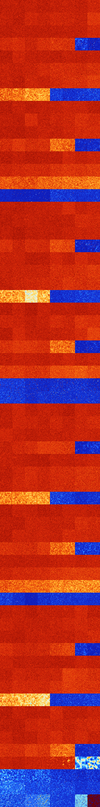

# B248 (141312-141823)

<details>
    <summary>Initial Grid</summary>
    
</details>


<details>
    <summary>Initial Grid RLE</summary>

```
#C Exported from GoGoL (https://github.com/marrow16/gogol)
#C Wrap mode: Toroidal
#C Boundary mode: Dead
#C Step: 0
x = 100, y = 100, rule = B248/S
18bo15bo41bo$3bo69bo$25bo18bo13bo25bo10bo$41bo10bo19bo$41bo33bo19bo$14b
o7bo20bo9bo42bo$5b2o3bo42bo16bo$3bo25bo4bo57bo$41bo9bo14bo9bo$24bo9bo
11bo2bo18bo3bo$7bo22bo49bo$2bo38bo13bobo4bo31bo$4bo56bo$23bo41bo8bo24bo
$36bo30bo$17bo4bo37bo10bo16bo$35bo28bo5bo17bo6bo$4bo29bo$41bo23b2o19bo
4bo$15bobo2bo12bo15bo17bo5bo$32bo10bo26bo6bo10bo$30bo3bo52bo3bo$22bo10b
o20bo5bo34bo$54b2o$73bo9bo$11bo15bo11bo32bo14bo$4bo76bo17bo$11bo3bo8bo
6bo19bo27bo14bo$8bo40bo25bo8bo5bo$31bo32b2o10bobo4bo9bo$47bo25bo14bo$
48bo2bo9bo19bo11bo4bo$17bo38bo$59bo5bo32bo$11bo41bo5bo23bo$6bo67bo5bo8b
o$17bo16bo30bo$66bo19bo$49bobo37bo$6bo15bo5bo$8bo36bo39bo8bo$8bo8bo8bo
19bo$o42bo3bo27bo3bo6bo$65bo6bo11bo$40b2o17bo17bo10bo$3bo16bo9bo30bo35b
o$25bo3bo3bo3bo22bo17bob2o5bo$5b2o88bo$18bo28bo49bo$22bo15bo43bo16bo$
14b2o18bo48bo2bo10bo$15bo6bo32bo40bo$15bo23b2o4bo27bo14bo$3bo5bo14bo29b
o8bo7bo15bo3bobo$20bo3bo12bo29bo8bobo$16b2o2bo30b2obo$20bo5bo15bo23bo
16bo$22bo14bo13b2obo$11b2o12bo59bo$bo2bo14bo25bo43b2o$14bo5bo$14bo21bo
9bo7bo2b2o40bo$46bo30bo14bo$6bo24bo29bo19bo4bo$bo8bo16bo15bo3b2o$27bo4b
o3bo14bo28bo$4bo5bo22bo$10bo10bo3bo$11b2o12bo12bo9bo9bo3bo7bo20bo$18bo
25bo9bo44bo$60bo9bo10bo$36bo28b2o20bo$17bo33bo31bo3bo$4bo10bo15bo64bo$
10bo9bo8bo24bo22bo14bo$29bo4bo17bo5bo2bobo4bobo21bo$bo9bo13bo$2b3o9bo
64bo9bo$17bo13bo3bobo28bo$21bo2bo8bo6bobo7bo7bo11b2o4bo$75bo2bo$10bo5bo
39bob2o6bo$46bo37bo$100b$14bo5bobo63bo9bo$48bo5bo21bo3bo11bo3bo$23bo15b
o$49bob2o6bo26bo$18b2o7bo25bo18b2o19bo$2bobo10bo81bo$73bo$2bobo8b2o65b
2o3bo11bo$20bo57bo20bo$33bo20bo9bo18bo14bo$3bo68bo3bo13bo$54bo22bobo8bo
$6bo16bo$12bo7bo6bo29bo7bo19b2o12bo$obo39b2o22bo20bobo$6bo2b2o4bo23bo
31bo18bo!
```
</details>
<details>
    <summary>Thumbnail</summary>

</details>
<table>
<tr>
    <td><a href="./141312%20S%20Heat%20Map%20Activity.png"></a><br>S (141312)<br>G>1000</td>    <td><a href="./141313%20S0%20Heat%20Map%20Activity.png"></a><br>S0 (141313)<br>G>1000</td>    <td><a href="./141314%20S1%20Heat%20Map%20Activity.png"></a><br>S1 (141314)<br>G>1000</td>    <td><a href="./141315%20S01%20Heat%20Map%20Activity.png"></a><br>S01 (141315)<br>G>1000</td>    <td><a href="./141316%20S2%20Heat%20Map%20Activity.png"></a><br>S2 (141316)<br>G>1000</td>    <td><a href="./141317%20S02%20Heat%20Map%20Activity.png"></a><br>S02 (141317)<br>G>1000</td>    <td><a href="./141318%20S12%20Heat%20Map%20Activity.png"></a><br>S12 (141318)<br>G>1000</td>    <td><a href="./141319%20S012%20Heat%20Map%20Activity.png"></a><br>S012 (141319)<br>G>1000</td></tr>
<tr>
    <td><a href="./141320%20S3%20Heat%20Map%20Activity.png"></a><br>S3 (141320)<br>G>1000</td>    <td><a href="./141321%20S03%20Heat%20Map%20Activity.png"></a><br>S03 (141321)<br>G>1000</td>    <td><a href="./141322%20S13%20Heat%20Map%20Activity.png"></a><br>S13 (141322)<br>G>1000</td>    <td><a href="./141323%20S013%20Heat%20Map%20Activity.png"></a><br>S013 (141323)<br>G>1000</td>    <td><a href="./141324%20S23%20Heat%20Map%20Activity.png"></a><br>S23 (141324)<br>G>1000</td>    <td><a href="./141325%20S023%20Heat%20Map%20Activity.png"></a><br>S023 (141325)<br>G>1000</td>    <td><a href="./141326%20S123%20Heat%20Map%20Activity.png"></a><br>S123 (141326)<br>G>1000</td>    <td><a href="./141327%20S0123%20Heat%20Map%20Activity.png"></a><br>S0123 (141327)<br>G>1000</td></tr>
<tr>
    <td><a href="./141328%20S4%20Heat%20Map%20Activity.png"></a><br>S4 (141328)<br>G>1000</td>    <td><a href="./141329%20S04%20Heat%20Map%20Activity.png"></a><br>S04 (141329)<br>G>1000</td>    <td><a href="./141330%20S14%20Heat%20Map%20Activity.png"></a><br>S14 (141330)<br>G>1000</td>    <td><a href="./141331%20S014%20Heat%20Map%20Activity.png"></a><br>S014 (141331)<br>G>1000</td>    <td><a href="./141332%20S24%20Heat%20Map%20Activity.png"></a><br>S24 (141332)<br>G>1000</td>    <td><a href="./141333%20S024%20Heat%20Map%20Activity.png"></a><br>S024 (141333)<br>G>1000</td>    <td><a href="./141334%20S124%20Heat%20Map%20Activity.png"></a><br>S124 (141334)<br>G>1000</td>    <td><a href="./141335%20S0124%20Heat%20Map%20Activity.png"></a><br>S0124 (141335)<br>G>1000</td></tr>
<tr>
    <td><a href="./141336%20S34%20Heat%20Map%20Activity.png"></a><br>S34 (141336)<br>G>1000</td>    <td><a href="./141337%20S034%20Heat%20Map%20Activity.png"></a><br>S034 (141337)<br>G>1000</td>    <td><a href="./141338%20S134%20Heat%20Map%20Activity.png"></a><br>S134 (141338)<br>G>1000</td>    <td><a href="./141339%20S0134%20Heat%20Map%20Activity.png"></a><br>S0134 (141339)<br>G>1000</td>    <td><a href="./141340%20S234%20Heat%20Map%20Activity.png"></a><br>S234 (141340)<br>G>1000</td>    <td><a href="./141341%20S0234%20Heat%20Map%20Activity.png"></a><br>S0234 (141341)<br>G>1000</td>    <td><a href="./141342%20S1234%20Heat%20Map%20Activity.png"></a><br>S1234 (141342)<br>R@370,p36</td>    <td><a href="./141343%20S01234%20Heat%20Map%20Activity.png"></a><br>S01234 (141343)<br>R@973,p720</td></tr>
<tr>
    <td><a href="./141344%20S5%20Heat%20Map%20Activity.png"></a><br>S5 (141344)<br>G>1000</td>    <td><a href="./141345%20S05%20Heat%20Map%20Activity.png"></a><br>S05 (141345)<br>G>1000</td>    <td><a href="./141346%20S15%20Heat%20Map%20Activity.png"></a><br>S15 (141346)<br>G>1000</td>    <td><a href="./141347%20S015%20Heat%20Map%20Activity.png"></a><br>S015 (141347)<br>G>1000</td>    <td><a href="./141348%20S25%20Heat%20Map%20Activity.png"></a><br>S25 (141348)<br>G>1000</td>    <td><a href="./141349%20S025%20Heat%20Map%20Activity.png"></a><br>S025 (141349)<br>G>1000</td>    <td><a href="./141350%20S125%20Heat%20Map%20Activity.png"></a><br>S125 (141350)<br>G>1000</td>    <td><a href="./141351%20S0125%20Heat%20Map%20Activity.png"></a><br>S0125 (141351)<br>G>1000</td></tr>
<tr>
    <td><a href="./141352%20S35%20Heat%20Map%20Activity.png"></a><br>S35 (141352)<br>G>1000</td>    <td><a href="./141353%20S035%20Heat%20Map%20Activity.png"></a><br>S035 (141353)<br>G>1000</td>    <td><a href="./141354%20S135%20Heat%20Map%20Activity.png"></a><br>S135 (141354)<br>G>1000</td>    <td><a href="./141355%20S0135%20Heat%20Map%20Activity.png"></a><br>S0135 (141355)<br>G>1000</td>    <td><a href="./141356%20S235%20Heat%20Map%20Activity.png"></a><br>S235 (141356)<br>G>1000</td>    <td><a href="./141357%20S0235%20Heat%20Map%20Activity.png"></a><br>S0235 (141357)<br>G>1000</td>    <td><a href="./141358%20S1235%20Heat%20Map%20Activity.png"></a><br>S1235 (141358)<br>G>1000</td>    <td><a href="./141359%20S01235%20Heat%20Map%20Activity.png"></a><br>S01235 (141359)<br>G>1000</td></tr>
<tr>
    <td><a href="./141360%20S45%20Heat%20Map%20Activity.png"></a><br>S45 (141360)<br>G>1000</td>    <td><a href="./141361%20S045%20Heat%20Map%20Activity.png"></a><br>S045 (141361)<br>G>1000</td>    <td><a href="./141362%20S145%20Heat%20Map%20Activity.png"></a><br>S145 (141362)<br>G>1000</td>    <td><a href="./141363%20S0145%20Heat%20Map%20Activity.png"></a><br>S0145 (141363)<br>G>1000</td>    <td><a href="./141364%20S245%20Heat%20Map%20Activity.png"></a><br>S245 (141364)<br>G>1000</td>    <td><a href="./141365%20S0245%20Heat%20Map%20Activity.png"></a><br>S0245 (141365)<br>G>1000</td>    <td><a href="./141366%20S1245%20Heat%20Map%20Activity.png"></a><br>S1245 (141366)<br>G>1000</td>    <td><a href="./141367%20S01245%20Heat%20Map%20Activity.png"></a><br>S01245 (141367)<br>G>1000</td></tr>
<tr>
    <td><a href="./141368%20S345%20Heat%20Map%20Activity.png"></a><br>S345 (141368)<br>G>1000</td>    <td><a href="./141369%20S0345%20Heat%20Map%20Activity.png"></a><br>S0345 (141369)<br>G>1000</td>    <td><a href="./141370%20S1345%20Heat%20Map%20Activity.png"></a><br>S1345 (141370)<br>G>1000</td>    <td><a href="./141371%20S01345%20Heat%20Map%20Activity.png"></a><br>S01345 (141371)<br>G>1000</td>    <td><a href="./141372%20S2345%20Heat%20Map%20Activity.png"></a><br>S2345 (141372)<br>R@50,p6</td>    <td><a href="./141373%20S02345%20Heat%20Map%20Activity.png"></a><br>S02345 (141373)<br>R@64,p6</td>    <td><a href="./141374%20S12345%20Heat%20Map%20Activity.png"></a><br>S12345 (141374)<br>R@40,p6</td>    <td><a href="./141375%20S012345%20Heat%20Map%20Activity.png"></a><br>S012345 (141375)<br>R@34,p6</td></tr>
<tr>
    <td><a href="./141376%20S6%20Heat%20Map%20Activity.png"></a><br>S6 (141376)<br>G>1000</td>    <td><a href="./141377%20S06%20Heat%20Map%20Activity.png"></a><br>S06 (141377)<br>G>1000</td>    <td><a href="./141378%20S16%20Heat%20Map%20Activity.png"></a><br>S16 (141378)<br>G>1000</td>    <td><a href="./141379%20S016%20Heat%20Map%20Activity.png"></a><br>S016 (141379)<br>G>1000</td>    <td><a href="./141380%20S26%20Heat%20Map%20Activity.png"></a><br>S26 (141380)<br>G>1000</td>    <td><a href="./141381%20S026%20Heat%20Map%20Activity.png"></a><br>S026 (141381)<br>G>1000</td>    <td><a href="./141382%20S126%20Heat%20Map%20Activity.png"></a><br>S126 (141382)<br>G>1000</td>    <td><a href="./141383%20S0126%20Heat%20Map%20Activity.png"></a><br>S0126 (141383)<br>G>1000</td></tr>
<tr>
    <td><a href="./141384%20S36%20Heat%20Map%20Activity.png"></a><br>S36 (141384)<br>G>1000</td>    <td><a href="./141385%20S036%20Heat%20Map%20Activity.png"></a><br>S036 (141385)<br>G>1000</td>    <td><a href="./141386%20S136%20Heat%20Map%20Activity.png"></a><br>S136 (141386)<br>G>1000</td>    <td><a href="./141387%20S0136%20Heat%20Map%20Activity.png"></a><br>S0136 (141387)<br>G>1000</td>    <td><a href="./141388%20S236%20Heat%20Map%20Activity.png"></a><br>S236 (141388)<br>G>1000</td>    <td><a href="./141389%20S0236%20Heat%20Map%20Activity.png"></a><br>S0236 (141389)<br>G>1000</td>    <td><a href="./141390%20S1236%20Heat%20Map%20Activity.png"></a><br>S1236 (141390)<br>G>1000</td>    <td><a href="./141391%20S01236%20Heat%20Map%20Activity.png"></a><br>S01236 (141391)<br>G>1000</td></tr>
<tr>
    <td><a href="./141392%20S46%20Heat%20Map%20Activity.png"></a><br>S46 (141392)<br>G>1000</td>    <td><a href="./141393%20S046%20Heat%20Map%20Activity.png"></a><br>S046 (141393)<br>G>1000</td>    <td><a href="./141394%20S146%20Heat%20Map%20Activity.png"></a><br>S146 (141394)<br>G>1000</td>    <td><a href="./141395%20S0146%20Heat%20Map%20Activity.png"></a><br>S0146 (141395)<br>G>1000</td>    <td><a href="./141396%20S246%20Heat%20Map%20Activity.png"></a><br>S246 (141396)<br>G>1000</td>    <td><a href="./141397%20S0246%20Heat%20Map%20Activity.png"></a><br>S0246 (141397)<br>G>1000</td>    <td><a href="./141398%20S1246%20Heat%20Map%20Activity.png"></a><br>S1246 (141398)<br>G>1000</td>    <td><a href="./141399%20S01246%20Heat%20Map%20Activity.png"></a><br>S01246 (141399)<br>G>1000</td></tr>
<tr>
    <td><a href="./141400%20S346%20Heat%20Map%20Activity.png"></a><br>S346 (141400)<br>G>1000</td>    <td><a href="./141401%20S0346%20Heat%20Map%20Activity.png"></a><br>S0346 (141401)<br>G>1000</td>    <td><a href="./141402%20S1346%20Heat%20Map%20Activity.png"></a><br>S1346 (141402)<br>G>1000</td>    <td><a href="./141403%20S01346%20Heat%20Map%20Activity.png"></a><br>S01346 (141403)<br>G>1000</td>    <td><a href="./141404%20S2346%20Heat%20Map%20Activity.png"></a><br>S2346 (141404)<br>G>1000</td>    <td><a href="./141405%20S02346%20Heat%20Map%20Activity.png"></a><br>S02346 (141405)<br>G>1000</td>    <td><a href="./141406%20S12346%20Heat%20Map%20Activity.png"></a><br>S12346 (141406)<br>R@312,p60</td>    <td><a href="./141407%20S012346%20Heat%20Map%20Activity.png"></a><br>S012346 (141407)<br>R@249,p84</td></tr>
<tr>
    <td><a href="./141408%20S56%20Heat%20Map%20Activity.png"></a><br>S56 (141408)<br>G>1000</td>    <td><a href="./141409%20S056%20Heat%20Map%20Activity.png"></a><br>S056 (141409)<br>G>1000</td>    <td><a href="./141410%20S156%20Heat%20Map%20Activity.png"></a><br>S156 (141410)<br>G>1000</td>    <td><a href="./141411%20S0156%20Heat%20Map%20Activity.png"></a><br>S0156 (141411)<br>G>1000</td>    <td><a href="./141412%20S256%20Heat%20Map%20Activity.png"></a><br>S256 (141412)<br>G>1000</td>    <td><a href="./141413%20S0256%20Heat%20Map%20Activity.png"></a><br>S0256 (141413)<br>G>1000</td>    <td><a href="./141414%20S1256%20Heat%20Map%20Activity.png"></a><br>S1256 (141414)<br>G>1000</td>    <td><a href="./141415%20S01256%20Heat%20Map%20Activity.png"></a><br>S01256 (141415)<br>G>1000</td></tr>
<tr>
    <td><a href="./141416%20S356%20Heat%20Map%20Activity.png"></a><br>S356 (141416)<br>G>1000</td>    <td><a href="./141417%20S0356%20Heat%20Map%20Activity.png"></a><br>S0356 (141417)<br>G>1000</td>    <td><a href="./141418%20S1356%20Heat%20Map%20Activity.png"></a><br>S1356 (141418)<br>G>1000</td>    <td><a href="./141419%20S01356%20Heat%20Map%20Activity.png"></a><br>S01356 (141419)<br>G>1000</td>    <td><a href="./141420%20S2356%20Heat%20Map%20Activity.png"></a><br>S2356 (141420)<br>G>1000</td>    <td><a href="./141421%20S02356%20Heat%20Map%20Activity.png"></a><br>S02356 (141421)<br>G>1000</td>    <td><a href="./141422%20S12356%20Heat%20Map%20Activity.png"></a><br>S12356 (141422)<br>G>1000</td>    <td><a href="./141423%20S012356%20Heat%20Map%20Activity.png"></a><br>S012356 (141423)<br>G>1000</td></tr>
<tr>
    <td><a href="./141424%20S456%20Heat%20Map%20Activity.png"></a><br>S456 (141424)<br>G>1000</td>    <td><a href="./141425%20S0456%20Heat%20Map%20Activity.png"></a><br>S0456 (141425)<br>G>1000</td>    <td><a href="./141426%20S1456%20Heat%20Map%20Activity.png"></a><br>S1456 (141426)<br>G>1000</td>    <td><a href="./141427%20S01456%20Heat%20Map%20Activity.png"></a><br>S01456 (141427)<br>G>1000</td>    <td><a href="./141428%20S2456%20Heat%20Map%20Activity.png"></a><br>S2456 (141428)<br>G>1000</td>    <td><a href="./141429%20S02456%20Heat%20Map%20Activity.png"></a><br>S02456 (141429)<br>G>1000</td>    <td><a href="./141430%20S12456%20Heat%20Map%20Activity.png"></a><br>S12456 (141430)<br>G>1000</td>    <td><a href="./141431%20S012456%20Heat%20Map%20Activity.png"></a><br>S012456 (141431)<br>G>1000</td></tr>
<tr>
    <td><a href="./141432%20S3456%20Heat%20Map%20Activity.png"></a><br>S3456 (141432)<br>R@113,p60</td>    <td><a href="./141433%20S03456%20Heat%20Map%20Activity.png"></a><br>S03456 (141433)<br>R@133,p84</td>    <td><a href="./141434%20S13456%20Heat%20Map%20Activity.png"></a><br>S13456 (141434)<br>R@106,p60</td>    <td><a href="./141435%20S013456%20Heat%20Map%20Activity.png"></a><br>S013456 (141435)<br>R@106,p60</td>    <td><a href="./141436%20S23456%20Heat%20Map%20Activity.png"></a><br>S23456 (141436)<br>R@30,p6</td>    <td><a href="./141437%20S023456%20Heat%20Map%20Activity.png"></a><br>S023456 (141437)<br>R@30,p6</td>    <td><a href="./141438%20S123456%20Heat%20Map%20Activity.png"></a><br>S123456 (141438)<br>R@33,p12</td>    <td><a href="./141439%20S0123456%20Heat%20Map%20Activity.png"></a><br>S0123456 (141439)<br>R@27,p6</td></tr>
<tr>
    <td><a href="./141440%20S7%20Heat%20Map%20Activity.png"></a><br>S7 (141440)<br>G>1000</td>    <td><a href="./141441%20S07%20Heat%20Map%20Activity.png"></a><br>S07 (141441)<br>G>1000</td>    <td><a href="./141442%20S17%20Heat%20Map%20Activity.png"></a><br>S17 (141442)<br>G>1000</td>    <td><a href="./141443%20S017%20Heat%20Map%20Activity.png"></a><br>S017 (141443)<br>G>1000</td>    <td><a href="./141444%20S27%20Heat%20Map%20Activity.png"></a><br>S27 (141444)<br>G>1000</td>    <td><a href="./141445%20S027%20Heat%20Map%20Activity.png"></a><br>S027 (141445)<br>G>1000</td>    <td><a href="./141446%20S127%20Heat%20Map%20Activity.png"></a><br>S127 (141446)<br>G>1000</td>    <td><a href="./141447%20S0127%20Heat%20Map%20Activity.png"></a><br>S0127 (141447)<br>G>1000</td></tr>
<tr>
    <td><a href="./141448%20S37%20Heat%20Map%20Activity.png"></a><br>S37 (141448)<br>G>1000</td>    <td><a href="./141449%20S037%20Heat%20Map%20Activity.png"></a><br>S037 (141449)<br>G>1000</td>    <td><a href="./141450%20S137%20Heat%20Map%20Activity.png"></a><br>S137 (141450)<br>G>1000</td>    <td><a href="./141451%20S0137%20Heat%20Map%20Activity.png"></a><br>S0137 (141451)<br>G>1000</td>    <td><a href="./141452%20S237%20Heat%20Map%20Activity.png"></a><br>S237 (141452)<br>G>1000</td>    <td><a href="./141453%20S0237%20Heat%20Map%20Activity.png"></a><br>S0237 (141453)<br>G>1000</td>    <td><a href="./141454%20S1237%20Heat%20Map%20Activity.png"></a><br>S1237 (141454)<br>G>1000</td>    <td><a href="./141455%20S01237%20Heat%20Map%20Activity.png"></a><br>S01237 (141455)<br>G>1000</td></tr>
<tr>
    <td><a href="./141456%20S47%20Heat%20Map%20Activity.png"></a><br>S47 (141456)<br>G>1000</td>    <td><a href="./141457%20S047%20Heat%20Map%20Activity.png"></a><br>S047 (141457)<br>G>1000</td>    <td><a href="./141458%20S147%20Heat%20Map%20Activity.png"></a><br>S147 (141458)<br>G>1000</td>    <td><a href="./141459%20S0147%20Heat%20Map%20Activity.png"></a><br>S0147 (141459)<br>G>1000</td>    <td><a href="./141460%20S247%20Heat%20Map%20Activity.png"></a><br>S247 (141460)<br>G>1000</td>    <td><a href="./141461%20S0247%20Heat%20Map%20Activity.png"></a><br>S0247 (141461)<br>G>1000</td>    <td><a href="./141462%20S1247%20Heat%20Map%20Activity.png"></a><br>S1247 (141462)<br>G>1000</td>    <td><a href="./141463%20S01247%20Heat%20Map%20Activity.png"></a><br>S01247 (141463)<br>G>1000</td></tr>
<tr>
    <td><a href="./141464%20S347%20Heat%20Map%20Activity.png"></a><br>S347 (141464)<br>G>1000</td>    <td><a href="./141465%20S0347%20Heat%20Map%20Activity.png"></a><br>S0347 (141465)<br>G>1000</td>    <td><a href="./141466%20S1347%20Heat%20Map%20Activity.png"></a><br>S1347 (141466)<br>G>1000</td>    <td><a href="./141467%20S01347%20Heat%20Map%20Activity.png"></a><br>S01347 (141467)<br>G>1000</td>    <td><a href="./141468%20S2347%20Heat%20Map%20Activity.png"></a><br>S2347 (141468)<br>G>1000</td>    <td><a href="./141469%20S02347%20Heat%20Map%20Activity.png"></a><br>S02347 (141469)<br>G>1000</td>    <td><a href="./141470%20S12347%20Heat%20Map%20Activity.png"></a><br>S12347 (141470)<br>G>1000</td>    <td><a href="./141471%20S012347%20Heat%20Map%20Activity.png"></a><br>S012347 (141471)<br>R@571,p24</td></tr>
<tr>
    <td><a href="./141472%20S57%20Heat%20Map%20Activity.png"></a><br>S57 (141472)<br>G>1000</td>    <td><a href="./141473%20S057%20Heat%20Map%20Activity.png"></a><br>S057 (141473)<br>G>1000</td>    <td><a href="./141474%20S157%20Heat%20Map%20Activity.png"></a><br>S157 (141474)<br>G>1000</td>    <td><a href="./141475%20S0157%20Heat%20Map%20Activity.png"></a><br>S0157 (141475)<br>G>1000</td>    <td><a href="./141476%20S257%20Heat%20Map%20Activity.png"></a><br>S257 (141476)<br>G>1000</td>    <td><a href="./141477%20S0257%20Heat%20Map%20Activity.png"></a><br>S0257 (141477)<br>G>1000</td>    <td><a href="./141478%20S1257%20Heat%20Map%20Activity.png"></a><br>S1257 (141478)<br>G>1000</td>    <td><a href="./141479%20S01257%20Heat%20Map%20Activity.png"></a><br>S01257 (141479)<br>G>1000</td></tr>
<tr>
    <td><a href="./141480%20S357%20Heat%20Map%20Activity.png"></a><br>S357 (141480)<br>G>1000</td>    <td><a href="./141481%20S0357%20Heat%20Map%20Activity.png"></a><br>S0357 (141481)<br>G>1000</td>    <td><a href="./141482%20S1357%20Heat%20Map%20Activity.png"></a><br>S1357 (141482)<br>G>1000</td>    <td><a href="./141483%20S01357%20Heat%20Map%20Activity.png"></a><br>S01357 (141483)<br>G>1000</td>    <td><a href="./141484%20S2357%20Heat%20Map%20Activity.png"></a><br>S2357 (141484)<br>G>1000</td>    <td><a href="./141485%20S02357%20Heat%20Map%20Activity.png"></a><br>S02357 (141485)<br>G>1000</td>    <td><a href="./141486%20S12357%20Heat%20Map%20Activity.png"></a><br>S12357 (141486)<br>G>1000</td>    <td><a href="./141487%20S012357%20Heat%20Map%20Activity.png"></a><br>S012357 (141487)<br>G>1000</td></tr>
<tr>
    <td><a href="./141488%20S457%20Heat%20Map%20Activity.png"></a><br>S457 (141488)<br>G>1000</td>    <td><a href="./141489%20S0457%20Heat%20Map%20Activity.png"></a><br>S0457 (141489)<br>G>1000</td>    <td><a href="./141490%20S1457%20Heat%20Map%20Activity.png"></a><br>S1457 (141490)<br>G>1000</td>    <td><a href="./141491%20S01457%20Heat%20Map%20Activity.png"></a><br>S01457 (141491)<br>G>1000</td>    <td><a href="./141492%20S2457%20Heat%20Map%20Activity.png"></a><br>S2457 (141492)<br>G>1000</td>    <td><a href="./141493%20S02457%20Heat%20Map%20Activity.png"></a><br>S02457 (141493)<br>G>1000</td>    <td><a href="./141494%20S12457%20Heat%20Map%20Activity.png"></a><br>S12457 (141494)<br>G>1000</td>    <td><a href="./141495%20S012457%20Heat%20Map%20Activity.png"></a><br>S012457 (141495)<br>G>1000</td></tr>
<tr>
    <td><a href="./141496%20S3457%20Heat%20Map%20Activity.png"></a><br>S3457 (141496)<br>G>1000</td>    <td><a href="./141497%20S03457%20Heat%20Map%20Activity.png"></a><br>S03457 (141497)<br>G>1000</td>    <td><a href="./141498%20S13457%20Heat%20Map%20Activity.png"></a><br>S13457 (141498)<br>G>1000</td>    <td><a href="./141499%20S013457%20Heat%20Map%20Activity.png"></a><br>S013457 (141499)<br>G>1000</td>    <td><a href="./141500%20S23457%20Heat%20Map%20Activity.png"></a><br>S23457 (141500)<br>R@59,p24</td>    <td><a href="./141501%20S023457%20Heat%20Map%20Activity.png"></a><br>S023457 (141501)<br>R@44,p6</td>    <td><a href="./141502%20S123457%20Heat%20Map%20Activity.png"></a><br>S123457 (141502)<br>R@30,p2</td>    <td><a href="./141503%20S0123457%20Heat%20Map%20Activity.png"></a><br>S0123457 (141503)<br>R@27,p2</td></tr>
<tr>
    <td><a href="./141504%20S67%20Heat%20Map%20Activity.png"></a><br>S67 (141504)<br>G>1000</td>    <td><a href="./141505%20S067%20Heat%20Map%20Activity.png"></a><br>S067 (141505)<br>G>1000</td>    <td><a href="./141506%20S167%20Heat%20Map%20Activity.png"></a><br>S167 (141506)<br>G>1000</td>    <td><a href="./141507%20S0167%20Heat%20Map%20Activity.png"></a><br>S0167 (141507)<br>G>1000</td>    <td><a href="./141508%20S267%20Heat%20Map%20Activity.png"></a><br>S267 (141508)<br>G>1000</td>    <td><a href="./141509%20S0267%20Heat%20Map%20Activity.png"></a><br>S0267 (141509)<br>G>1000</td>    <td><a href="./141510%20S1267%20Heat%20Map%20Activity.png"></a><br>S1267 (141510)<br>G>1000</td>    <td><a href="./141511%20S01267%20Heat%20Map%20Activity.png"></a><br>S01267 (141511)<br>G>1000</td></tr>
<tr>
    <td><a href="./141512%20S367%20Heat%20Map%20Activity.png"></a><br>S367 (141512)<br>G>1000</td>    <td><a href="./141513%20S0367%20Heat%20Map%20Activity.png"></a><br>S0367 (141513)<br>G>1000</td>    <td><a href="./141514%20S1367%20Heat%20Map%20Activity.png"></a><br>S1367 (141514)<br>G>1000</td>    <td><a href="./141515%20S01367%20Heat%20Map%20Activity.png"></a><br>S01367 (141515)<br>G>1000</td>    <td><a href="./141516%20S2367%20Heat%20Map%20Activity.png"></a><br>S2367 (141516)<br>G>1000</td>    <td><a href="./141517%20S02367%20Heat%20Map%20Activity.png"></a><br>S02367 (141517)<br>G>1000</td>    <td><a href="./141518%20S12367%20Heat%20Map%20Activity.png"></a><br>S12367 (141518)<br>G>1000</td>    <td><a href="./141519%20S012367%20Heat%20Map%20Activity.png"></a><br>S012367 (141519)<br>G>1000</td></tr>
<tr>
    <td><a href="./141520%20S467%20Heat%20Map%20Activity.png"></a><br>S467 (141520)<br>G>1000</td>    <td><a href="./141521%20S0467%20Heat%20Map%20Activity.png"></a><br>S0467 (141521)<br>G>1000</td>    <td><a href="./141522%20S1467%20Heat%20Map%20Activity.png"></a><br>S1467 (141522)<br>G>1000</td>    <td><a href="./141523%20S01467%20Heat%20Map%20Activity.png"></a><br>S01467 (141523)<br>G>1000</td>    <td><a href="./141524%20S2467%20Heat%20Map%20Activity.png"></a><br>S2467 (141524)<br>G>1000</td>    <td><a href="./141525%20S02467%20Heat%20Map%20Activity.png"></a><br>S02467 (141525)<br>G>1000</td>    <td><a href="./141526%20S12467%20Heat%20Map%20Activity.png"></a><br>S12467 (141526)<br>G>1000</td>    <td><a href="./141527%20S012467%20Heat%20Map%20Activity.png"></a><br>S012467 (141527)<br>G>1000</td></tr>
<tr>
    <td><a href="./141528%20S3467%20Heat%20Map%20Activity.png"></a><br>S3467 (141528)<br>G>1000</td>    <td><a href="./141529%20S03467%20Heat%20Map%20Activity.png"></a><br>S03467 (141529)<br>G>1000</td>    <td><a href="./141530%20S13467%20Heat%20Map%20Activity.png"></a><br>S13467 (141530)<br>G>1000</td>    <td><a href="./141531%20S013467%20Heat%20Map%20Activity.png"></a><br>S013467 (141531)<br>G>1000</td>    <td><a href="./141532%20S23467%20Heat%20Map%20Activity.png"></a><br>S23467 (141532)<br>G>1000</td>    <td><a href="./141533%20S023467%20Heat%20Map%20Activity.png"></a><br>S023467 (141533)<br>G>1000</td>    <td><a href="./141534%20S123467%20Heat%20Map%20Activity.png"></a><br>S123467 (141534)<br>R@438,p252</td>    <td><a href="./141535%20S0123467%20Heat%20Map%20Activity.png"></a><br>S0123467 (141535)<br>R@330,p36</td></tr>
<tr>
    <td><a href="./141536%20S567%20Heat%20Map%20Activity.png"></a><br>S567 (141536)<br>G>1000</td>    <td><a href="./141537%20S0567%20Heat%20Map%20Activity.png"></a><br>S0567 (141537)<br>G>1000</td>    <td><a href="./141538%20S1567%20Heat%20Map%20Activity.png"></a><br>S1567 (141538)<br>G>1000</td>    <td><a href="./141539%20S01567%20Heat%20Map%20Activity.png"></a><br>S01567 (141539)<br>G>1000</td>    <td><a href="./141540%20S2567%20Heat%20Map%20Activity.png"></a><br>S2567 (141540)<br>G>1000</td>    <td><a href="./141541%20S02567%20Heat%20Map%20Activity.png"></a><br>S02567 (141541)<br>G>1000</td>    <td><a href="./141542%20S12567%20Heat%20Map%20Activity.png"></a><br>S12567 (141542)<br>G>1000</td>    <td><a href="./141543%20S012567%20Heat%20Map%20Activity.png"></a><br>S012567 (141543)<br>G>1000</td></tr>
<tr>
    <td><a href="./141544%20S3567%20Heat%20Map%20Activity.png"></a><br>S3567 (141544)<br>G>1000</td>    <td><a href="./141545%20S03567%20Heat%20Map%20Activity.png"></a><br>S03567 (141545)<br>G>1000</td>    <td><a href="./141546%20S13567%20Heat%20Map%20Activity.png"></a><br>S13567 (141546)<br>G>1000</td>    <td><a href="./141547%20S013567%20Heat%20Map%20Activity.png"></a><br>S013567 (141547)<br>G>1000</td>    <td><a href="./141548%20S23567%20Heat%20Map%20Activity.png"></a><br>S23567 (141548)<br>G>1000</td>    <td><a href="./141549%20S023567%20Heat%20Map%20Activity.png"></a><br>S023567 (141549)<br>G>1000</td>    <td><a href="./141550%20S123567%20Heat%20Map%20Activity.png"></a><br>S123567 (141550)<br>G>1000</td>    <td><a href="./141551%20S0123567%20Heat%20Map%20Activity.png"></a><br>S0123567 (141551)<br>G>1000</td></tr>
<tr>
    <td><a href="./141552%20S4567%20Heat%20Map%20Activity.png"></a><br>S4567 (141552)<br>R@132,p60</td>    <td><a href="./141553%20S04567%20Heat%20Map%20Activity.png"></a><br>S04567 (141553)<br>R@100,p12</td>    <td><a href="./141554%20S14567%20Heat%20Map%20Activity.png"></a><br>S14567 (141554)<br>R@103,p30</td>    <td><a href="./141555%20S014567%20Heat%20Map%20Activity.png"></a><br>S014567 (141555)<br>R@126,p36</td>    <td><a href="./141556%20S24567%20Heat%20Map%20Activity.png"></a><br>S24567 (141556)<br>R@68,p12</td>    <td><a href="./141557%20S024567%20Heat%20Map%20Activity.png"></a><br>S024567 (141557)<br>R@66,p6</td>    <td><a href="./141558%20S124567%20Heat%20Map%20Activity.png"></a><br>S124567 (141558)<br>R@50,p12</td>    <td><a href="./141559%20S0124567%20Heat%20Map%20Activity.png"></a><br>S0124567 (141559)<br>R@74,p12</td></tr>
<tr>
    <td><a href="./141560%20S34567%20Heat%20Map%20Activity.png"></a><br>S34567 (141560)<br>R@34,p4</td>    <td><a href="./141561%20S034567%20Heat%20Map%20Activity.png"></a><br>S034567 (141561)<br>R@31,p4</td>    <td><a href="./141562%20S134567%20Heat%20Map%20Activity.png"></a><br>S134567 (141562)<br>R@34,p12</td>    <td><a href="./141563%20S0134567%20Heat%20Map%20Activity.png"></a><br>S0134567 (141563)<br>R@26,p4</td>    <td><a href="./141564%20S234567%20Heat%20Map%20Activity.png"></a><br>S234567 (141564)<br>R@29,p6</td>    <td><a href="./141565%20S0234567%20Heat%20Map%20Activity.png"></a><br>S0234567 (141565)<br>R@25,p2</td>    <td><a href="./141566%20S1234567%20Heat%20Map%20Activity.png"></a><br>S1234567 (141566)<br>R@23,p2</td>    <td><a href="./141567%20S01234567%20Heat%20Map%20Activity.png"></a><br>S01234567 (141567)<br>R@21,p2</td></tr>
<tr>
    <td><a href="./141568%20S8%20Heat%20Map%20Activity.png"></a><br>S8 (141568)<br>G>1000</td>    <td><a href="./141569%20S08%20Heat%20Map%20Activity.png"></a><br>S08 (141569)<br>G>1000</td>    <td><a href="./141570%20S18%20Heat%20Map%20Activity.png"></a><br>S18 (141570)<br>G>1000</td>    <td><a href="./141571%20S018%20Heat%20Map%20Activity.png"></a><br>S018 (141571)<br>G>1000</td>    <td><a href="./141572%20S28%20Heat%20Map%20Activity.png"></a><br>S28 (141572)<br>G>1000</td>    <td><a href="./141573%20S028%20Heat%20Map%20Activity.png"></a><br>S028 (141573)<br>G>1000</td>    <td><a href="./141574%20S128%20Heat%20Map%20Activity.png"></a><br>S128 (141574)<br>G>1000</td>    <td><a href="./141575%20S0128%20Heat%20Map%20Activity.png"></a><br>S0128 (141575)<br>G>1000</td></tr>
<tr>
    <td><a href="./141576%20S38%20Heat%20Map%20Activity.png"></a><br>S38 (141576)<br>G>1000</td>    <td><a href="./141577%20S038%20Heat%20Map%20Activity.png"></a><br>S038 (141577)<br>G>1000</td>    <td><a href="./141578%20S138%20Heat%20Map%20Activity.png"></a><br>S138 (141578)<br>G>1000</td>    <td><a href="./141579%20S0138%20Heat%20Map%20Activity.png"></a><br>S0138 (141579)<br>G>1000</td>    <td><a href="./141580%20S238%20Heat%20Map%20Activity.png"></a><br>S238 (141580)<br>G>1000</td>    <td><a href="./141581%20S0238%20Heat%20Map%20Activity.png"></a><br>S0238 (141581)<br>G>1000</td>    <td><a href="./141582%20S1238%20Heat%20Map%20Activity.png"></a><br>S1238 (141582)<br>G>1000</td>    <td><a href="./141583%20S01238%20Heat%20Map%20Activity.png"></a><br>S01238 (141583)<br>G>1000</td></tr>
<tr>
    <td><a href="./141584%20S48%20Heat%20Map%20Activity.png"></a><br>S48 (141584)<br>G>1000</td>    <td><a href="./141585%20S048%20Heat%20Map%20Activity.png"></a><br>S048 (141585)<br>G>1000</td>    <td><a href="./141586%20S148%20Heat%20Map%20Activity.png"></a><br>S148 (141586)<br>G>1000</td>    <td><a href="./141587%20S0148%20Heat%20Map%20Activity.png"></a><br>S0148 (141587)<br>G>1000</td>    <td><a href="./141588%20S248%20Heat%20Map%20Activity.png"></a><br>S248 (141588)<br>G>1000</td>    <td><a href="./141589%20S0248%20Heat%20Map%20Activity.png"></a><br>S0248 (141589)<br>G>1000</td>    <td><a href="./141590%20S1248%20Heat%20Map%20Activity.png"></a><br>S1248 (141590)<br>G>1000</td>    <td><a href="./141591%20S01248%20Heat%20Map%20Activity.png"></a><br>S01248 (141591)<br>G>1000</td></tr>
<tr>
    <td><a href="./141592%20S348%20Heat%20Map%20Activity.png"></a><br>S348 (141592)<br>G>1000</td>    <td><a href="./141593%20S0348%20Heat%20Map%20Activity.png"></a><br>S0348 (141593)<br>G>1000</td>    <td><a href="./141594%20S1348%20Heat%20Map%20Activity.png"></a><br>S1348 (141594)<br>G>1000</td>    <td><a href="./141595%20S01348%20Heat%20Map%20Activity.png"></a><br>S01348 (141595)<br>G>1000</td>    <td><a href="./141596%20S2348%20Heat%20Map%20Activity.png"></a><br>S2348 (141596)<br>G>1000</td>    <td><a href="./141597%20S02348%20Heat%20Map%20Activity.png"></a><br>S02348 (141597)<br>G>1000</td>    <td><a href="./141598%20S12348%20Heat%20Map%20Activity.png"></a><br>S12348 (141598)<br>G>1000</td>    <td><a href="./141599%20S012348%20Heat%20Map%20Activity.png"></a><br>S012348 (141599)<br>R@430,p120</td></tr>
<tr>
    <td><a href="./141600%20S58%20Heat%20Map%20Activity.png"></a><br>S58 (141600)<br>G>1000</td>    <td><a href="./141601%20S058%20Heat%20Map%20Activity.png"></a><br>S058 (141601)<br>G>1000</td>    <td><a href="./141602%20S158%20Heat%20Map%20Activity.png"></a><br>S158 (141602)<br>G>1000</td>    <td><a href="./141603%20S0158%20Heat%20Map%20Activity.png"></a><br>S0158 (141603)<br>G>1000</td>    <td><a href="./141604%20S258%20Heat%20Map%20Activity.png"></a><br>S258 (141604)<br>G>1000</td>    <td><a href="./141605%20S0258%20Heat%20Map%20Activity.png"></a><br>S0258 (141605)<br>G>1000</td>    <td><a href="./141606%20S1258%20Heat%20Map%20Activity.png"></a><br>S1258 (141606)<br>G>1000</td>    <td><a href="./141607%20S01258%20Heat%20Map%20Activity.png"></a><br>S01258 (141607)<br>G>1000</td></tr>
<tr>
    <td><a href="./141608%20S358%20Heat%20Map%20Activity.png"></a><br>S358 (141608)<br>G>1000</td>    <td><a href="./141609%20S0358%20Heat%20Map%20Activity.png"></a><br>S0358 (141609)<br>G>1000</td>    <td><a href="./141610%20S1358%20Heat%20Map%20Activity.png"></a><br>S1358 (141610)<br>G>1000</td>    <td><a href="./141611%20S01358%20Heat%20Map%20Activity.png"></a><br>S01358 (141611)<br>G>1000</td>    <td><a href="./141612%20S2358%20Heat%20Map%20Activity.png"></a><br>S2358 (141612)<br>G>1000</td>    <td><a href="./141613%20S02358%20Heat%20Map%20Activity.png"></a><br>S02358 (141613)<br>G>1000</td>    <td><a href="./141614%20S12358%20Heat%20Map%20Activity.png"></a><br>S12358 (141614)<br>G>1000</td>    <td><a href="./141615%20S012358%20Heat%20Map%20Activity.png"></a><br>S012358 (141615)<br>G>1000</td></tr>
<tr>
    <td><a href="./141616%20S458%20Heat%20Map%20Activity.png"></a><br>S458 (141616)<br>G>1000</td>    <td><a href="./141617%20S0458%20Heat%20Map%20Activity.png"></a><br>S0458 (141617)<br>G>1000</td>    <td><a href="./141618%20S1458%20Heat%20Map%20Activity.png"></a><br>S1458 (141618)<br>G>1000</td>    <td><a href="./141619%20S01458%20Heat%20Map%20Activity.png"></a><br>S01458 (141619)<br>G>1000</td>    <td><a href="./141620%20S2458%20Heat%20Map%20Activity.png"></a><br>S2458 (141620)<br>G>1000</td>    <td><a href="./141621%20S02458%20Heat%20Map%20Activity.png"></a><br>S02458 (141621)<br>G>1000</td>    <td><a href="./141622%20S12458%20Heat%20Map%20Activity.png"></a><br>S12458 (141622)<br>G>1000</td>    <td><a href="./141623%20S012458%20Heat%20Map%20Activity.png"></a><br>S012458 (141623)<br>G>1000</td></tr>
<tr>
    <td><a href="./141624%20S3458%20Heat%20Map%20Activity.png"></a><br>S3458 (141624)<br>G>1000</td>    <td><a href="./141625%20S03458%20Heat%20Map%20Activity.png"></a><br>S03458 (141625)<br>G>1000</td>    <td><a href="./141626%20S13458%20Heat%20Map%20Activity.png"></a><br>S13458 (141626)<br>G>1000</td>    <td><a href="./141627%20S013458%20Heat%20Map%20Activity.png"></a><br>S013458 (141627)<br>G>1000</td>    <td><a href="./141628%20S23458%20Heat%20Map%20Activity.png"></a><br>S23458 (141628)<br>R@39,p2</td>    <td><a href="./141629%20S023458%20Heat%20Map%20Activity.png"></a><br>S023458 (141629)<br>R@42,p6</td>    <td><a href="./141630%20S123458%20Heat%20Map%20Activity.png"></a><br>S123458 (141630)<br>R@59,p30</td>    <td><a href="./141631%20S0123458%20Heat%20Map%20Activity.png"></a><br>S0123458 (141631)<br>R@44,p12</td></tr>
<tr>
    <td><a href="./141632%20S68%20Heat%20Map%20Activity.png"></a><br>S68 (141632)<br>G>1000</td>    <td><a href="./141633%20S068%20Heat%20Map%20Activity.png"></a><br>S068 (141633)<br>G>1000</td>    <td><a href="./141634%20S168%20Heat%20Map%20Activity.png"></a><br>S168 (141634)<br>G>1000</td>    <td><a href="./141635%20S0168%20Heat%20Map%20Activity.png"></a><br>S0168 (141635)<br>G>1000</td>    <td><a href="./141636%20S268%20Heat%20Map%20Activity.png"></a><br>S268 (141636)<br>G>1000</td>    <td><a href="./141637%20S0268%20Heat%20Map%20Activity.png"></a><br>S0268 (141637)<br>G>1000</td>    <td><a href="./141638%20S1268%20Heat%20Map%20Activity.png"></a><br>S1268 (141638)<br>G>1000</td>    <td><a href="./141639%20S01268%20Heat%20Map%20Activity.png"></a><br>S01268 (141639)<br>G>1000</td></tr>
<tr>
    <td><a href="./141640%20S368%20Heat%20Map%20Activity.png"></a><br>S368 (141640)<br>G>1000</td>    <td><a href="./141641%20S0368%20Heat%20Map%20Activity.png"></a><br>S0368 (141641)<br>G>1000</td>    <td><a href="./141642%20S1368%20Heat%20Map%20Activity.png"></a><br>S1368 (141642)<br>G>1000</td>    <td><a href="./141643%20S01368%20Heat%20Map%20Activity.png"></a><br>S01368 (141643)<br>G>1000</td>    <td><a href="./141644%20S2368%20Heat%20Map%20Activity.png"></a><br>S2368 (141644)<br>G>1000</td>    <td><a href="./141645%20S02368%20Heat%20Map%20Activity.png"></a><br>S02368 (141645)<br>G>1000</td>    <td><a href="./141646%20S12368%20Heat%20Map%20Activity.png"></a><br>S12368 (141646)<br>G>1000</td>    <td><a href="./141647%20S012368%20Heat%20Map%20Activity.png"></a><br>S012368 (141647)<br>G>1000</td></tr>
<tr>
    <td><a href="./141648%20S468%20Heat%20Map%20Activity.png"></a><br>S468 (141648)<br>G>1000</td>    <td><a href="./141649%20S0468%20Heat%20Map%20Activity.png"></a><br>S0468 (141649)<br>G>1000</td>    <td><a href="./141650%20S1468%20Heat%20Map%20Activity.png"></a><br>S1468 (141650)<br>G>1000</td>    <td><a href="./141651%20S01468%20Heat%20Map%20Activity.png"></a><br>S01468 (141651)<br>G>1000</td>    <td><a href="./141652%20S2468%20Heat%20Map%20Activity.png"></a><br>S2468 (141652)<br>G>1000</td>    <td><a href="./141653%20S02468%20Heat%20Map%20Activity.png"></a><br>S02468 (141653)<br>G>1000</td>    <td><a href="./141654%20S12468%20Heat%20Map%20Activity.png"></a><br>S12468 (141654)<br>G>1000</td>    <td><a href="./141655%20S012468%20Heat%20Map%20Activity.png"></a><br>S012468 (141655)<br>G>1000</td></tr>
<tr>
    <td><a href="./141656%20S3468%20Heat%20Map%20Activity.png"></a><br>S3468 (141656)<br>G>1000</td>    <td><a href="./141657%20S03468%20Heat%20Map%20Activity.png"></a><br>S03468 (141657)<br>G>1000</td>    <td><a href="./141658%20S13468%20Heat%20Map%20Activity.png"></a><br>S13468 (141658)<br>G>1000</td>    <td><a href="./141659%20S013468%20Heat%20Map%20Activity.png"></a><br>S013468 (141659)<br>G>1000</td>    <td><a href="./141660%20S23468%20Heat%20Map%20Activity.png"></a><br>S23468 (141660)<br>G>1000</td>    <td><a href="./141661%20S023468%20Heat%20Map%20Activity.png"></a><br>S023468 (141661)<br>G>1000</td>    <td><a href="./141662%20S123468%20Heat%20Map%20Activity.png"></a><br>S123468 (141662)<br>R@176,p12</td>    <td><a href="./141663%20S0123468%20Heat%20Map%20Activity.png"></a><br>S0123468 (141663)<br>R@148,p12</td></tr>
<tr>
    <td><a href="./141664%20S568%20Heat%20Map%20Activity.png"></a><br>S568 (141664)<br>G>1000</td>    <td><a href="./141665%20S0568%20Heat%20Map%20Activity.png"></a><br>S0568 (141665)<br>G>1000</td>    <td><a href="./141666%20S1568%20Heat%20Map%20Activity.png"></a><br>S1568 (141666)<br>G>1000</td>    <td><a href="./141667%20S01568%20Heat%20Map%20Activity.png"></a><br>S01568 (141667)<br>G>1000</td>    <td><a href="./141668%20S2568%20Heat%20Map%20Activity.png"></a><br>S2568 (141668)<br>G>1000</td>    <td><a href="./141669%20S02568%20Heat%20Map%20Activity.png"></a><br>S02568 (141669)<br>G>1000</td>    <td><a href="./141670%20S12568%20Heat%20Map%20Activity.png"></a><br>S12568 (141670)<br>G>1000</td>    <td><a href="./141671%20S012568%20Heat%20Map%20Activity.png"></a><br>S012568 (141671)<br>G>1000</td></tr>
<tr>
    <td><a href="./141672%20S3568%20Heat%20Map%20Activity.png"></a><br>S3568 (141672)<br>G>1000</td>    <td><a href="./141673%20S03568%20Heat%20Map%20Activity.png"></a><br>S03568 (141673)<br>G>1000</td>    <td><a href="./141674%20S13568%20Heat%20Map%20Activity.png"></a><br>S13568 (141674)<br>G>1000</td>    <td><a href="./141675%20S013568%20Heat%20Map%20Activity.png"></a><br>S013568 (141675)<br>G>1000</td>    <td><a href="./141676%20S23568%20Heat%20Map%20Activity.png"></a><br>S23568 (141676)<br>G>1000</td>    <td><a href="./141677%20S023568%20Heat%20Map%20Activity.png"></a><br>S023568 (141677)<br>G>1000</td>    <td><a href="./141678%20S123568%20Heat%20Map%20Activity.png"></a><br>S123568 (141678)<br>G>1000</td>    <td><a href="./141679%20S0123568%20Heat%20Map%20Activity.png"></a><br>S0123568 (141679)<br>G>1000</td></tr>
<tr>
    <td><a href="./141680%20S4568%20Heat%20Map%20Activity.png"></a><br>S4568 (141680)<br>G>1000</td>    <td><a href="./141681%20S04568%20Heat%20Map%20Activity.png"></a><br>S04568 (141681)<br>G>1000</td>    <td><a href="./141682%20S14568%20Heat%20Map%20Activity.png"></a><br>S14568 (141682)<br>G>1000</td>    <td><a href="./141683%20S014568%20Heat%20Map%20Activity.png"></a><br>S014568 (141683)<br>G>1000</td>    <td><a href="./141684%20S24568%20Heat%20Map%20Activity.png"></a><br>S24568 (141684)<br>G>1000</td>    <td><a href="./141685%20S024568%20Heat%20Map%20Activity.png"></a><br>S024568 (141685)<br>G>1000</td>    <td><a href="./141686%20S124568%20Heat%20Map%20Activity.png"></a><br>S124568 (141686)<br>G>1000</td>    <td><a href="./141687%20S0124568%20Heat%20Map%20Activity.png"></a><br>S0124568 (141687)<br>G>1000</td></tr>
<tr>
    <td><a href="./141688%20S34568%20Heat%20Map%20Activity.png"></a><br>S34568 (141688)<br>R@49,p12</td>    <td><a href="./141689%20S034568%20Heat%20Map%20Activity.png"></a><br>S034568 (141689)<br>R@50,p4</td>    <td><a href="./141690%20S134568%20Heat%20Map%20Activity.png"></a><br>S134568 (141690)<br>R@100,p60</td>    <td><a href="./141691%20S0134568%20Heat%20Map%20Activity.png"></a><br>S0134568 (141691)<br>R@39,p6</td>    <td><a href="./141692%20S234568%20Heat%20Map%20Activity.png"></a><br>S234568 (141692)<br>R@28,p4</td>    <td><a href="./141693%20S0234568%20Heat%20Map%20Activity.png"></a><br>S0234568 (141693)<br>R@26,p2</td>    <td><a href="./141694%20S1234568%20Heat%20Map%20Activity.png"></a><br>S1234568 (141694)<br>R@24,p2</td>    <td><a href="./141695%20S01234568%20Heat%20Map%20Activity.png"></a><br>S01234568 (141695)<br>R@23,p2</td></tr>
<tr>
    <td><a href="./141696%20S78%20Heat%20Map%20Activity.png"></a><br>S78 (141696)<br>G>1000</td>    <td><a href="./141697%20S078%20Heat%20Map%20Activity.png"></a><br>S078 (141697)<br>G>1000</td>    <td><a href="./141698%20S178%20Heat%20Map%20Activity.png"></a><br>S178 (141698)<br>G>1000</td>    <td><a href="./141699%20S0178%20Heat%20Map%20Activity.png"></a><br>S0178 (141699)<br>G>1000</td>    <td><a href="./141700%20S278%20Heat%20Map%20Activity.png"></a><br>S278 (141700)<br>G>1000</td>    <td><a href="./141701%20S0278%20Heat%20Map%20Activity.png"></a><br>S0278 (141701)<br>G>1000</td>    <td><a href="./141702%20S1278%20Heat%20Map%20Activity.png"></a><br>S1278 (141702)<br>G>1000</td>    <td><a href="./141703%20S01278%20Heat%20Map%20Activity.png"></a><br>S01278 (141703)<br>G>1000</td></tr>
<tr>
    <td><a href="./141704%20S378%20Heat%20Map%20Activity.png"></a><br>S378 (141704)<br>G>1000</td>    <td><a href="./141705%20S0378%20Heat%20Map%20Activity.png"></a><br>S0378 (141705)<br>G>1000</td>    <td><a href="./141706%20S1378%20Heat%20Map%20Activity.png"></a><br>S1378 (141706)<br>G>1000</td>    <td><a href="./141707%20S01378%20Heat%20Map%20Activity.png"></a><br>S01378 (141707)<br>G>1000</td>    <td><a href="./141708%20S2378%20Heat%20Map%20Activity.png"></a><br>S2378 (141708)<br>G>1000</td>    <td><a href="./141709%20S02378%20Heat%20Map%20Activity.png"></a><br>S02378 (141709)<br>G>1000</td>    <td><a href="./141710%20S12378%20Heat%20Map%20Activity.png"></a><br>S12378 (141710)<br>G>1000</td>    <td><a href="./141711%20S012378%20Heat%20Map%20Activity.png"></a><br>S012378 (141711)<br>G>1000</td></tr>
<tr>
    <td><a href="./141712%20S478%20Heat%20Map%20Activity.png"></a><br>S478 (141712)<br>G>1000</td>    <td><a href="./141713%20S0478%20Heat%20Map%20Activity.png"></a><br>S0478 (141713)<br>G>1000</td>    <td><a href="./141714%20S1478%20Heat%20Map%20Activity.png"></a><br>S1478 (141714)<br>G>1000</td>    <td><a href="./141715%20S01478%20Heat%20Map%20Activity.png"></a><br>S01478 (141715)<br>G>1000</td>    <td><a href="./141716%20S2478%20Heat%20Map%20Activity.png"></a><br>S2478 (141716)<br>G>1000</td>    <td><a href="./141717%20S02478%20Heat%20Map%20Activity.png"></a><br>S02478 (141717)<br>G>1000</td>    <td><a href="./141718%20S12478%20Heat%20Map%20Activity.png"></a><br>S12478 (141718)<br>G>1000</td>    <td><a href="./141719%20S012478%20Heat%20Map%20Activity.png"></a><br>S012478 (141719)<br>G>1000</td></tr>
<tr>
    <td><a href="./141720%20S3478%20Heat%20Map%20Activity.png"></a><br>S3478 (141720)<br>G>1000</td>    <td><a href="./141721%20S03478%20Heat%20Map%20Activity.png"></a><br>S03478 (141721)<br>G>1000</td>    <td><a href="./141722%20S13478%20Heat%20Map%20Activity.png"></a><br>S13478 (141722)<br>G>1000</td>    <td><a href="./141723%20S013478%20Heat%20Map%20Activity.png"></a><br>S013478 (141723)<br>G>1000</td>    <td><a href="./141724%20S23478%20Heat%20Map%20Activity.png"></a><br>S23478 (141724)<br>G>1000</td>    <td><a href="./141725%20S023478%20Heat%20Map%20Activity.png"></a><br>S023478 (141725)<br>G>1000</td>    <td><a href="./141726%20S123478%20Heat%20Map%20Activity.png"></a><br>S123478 (141726)<br>R@369,p120</td>    <td><a href="./141727%20S0123478%20Heat%20Map%20Activity.png"></a><br>S0123478 (141727)<br>R@766,p360</td></tr>
<tr>
    <td><a href="./141728%20S578%20Heat%20Map%20Activity.png"></a><br>S578 (141728)<br>G>1000</td>    <td><a href="./141729%20S0578%20Heat%20Map%20Activity.png"></a><br>S0578 (141729)<br>G>1000</td>    <td><a href="./141730%20S1578%20Heat%20Map%20Activity.png"></a><br>S1578 (141730)<br>G>1000</td>    <td><a href="./141731%20S01578%20Heat%20Map%20Activity.png"></a><br>S01578 (141731)<br>G>1000</td>    <td><a href="./141732%20S2578%20Heat%20Map%20Activity.png"></a><br>S2578 (141732)<br>G>1000</td>    <td><a href="./141733%20S02578%20Heat%20Map%20Activity.png"></a><br>S02578 (141733)<br>G>1000</td>    <td><a href="./141734%20S12578%20Heat%20Map%20Activity.png"></a><br>S12578 (141734)<br>G>1000</td>    <td><a href="./141735%20S012578%20Heat%20Map%20Activity.png"></a><br>S012578 (141735)<br>G>1000</td></tr>
<tr>
    <td><a href="./141736%20S3578%20Heat%20Map%20Activity.png"></a><br>S3578 (141736)<br>G>1000</td>    <td><a href="./141737%20S03578%20Heat%20Map%20Activity.png"></a><br>S03578 (141737)<br>G>1000</td>    <td><a href="./141738%20S13578%20Heat%20Map%20Activity.png"></a><br>S13578 (141738)<br>G>1000</td>    <td><a href="./141739%20S013578%20Heat%20Map%20Activity.png"></a><br>S013578 (141739)<br>G>1000</td>    <td><a href="./141740%20S23578%20Heat%20Map%20Activity.png"></a><br>S23578 (141740)<br>G>1000</td>    <td><a href="./141741%20S023578%20Heat%20Map%20Activity.png"></a><br>S023578 (141741)<br>G>1000</td>    <td><a href="./141742%20S123578%20Heat%20Map%20Activity.png"></a><br>S123578 (141742)<br>G>1000</td>    <td><a href="./141743%20S0123578%20Heat%20Map%20Activity.png"></a><br>S0123578 (141743)<br>G>1000</td></tr>
<tr>
    <td><a href="./141744%20S4578%20Heat%20Map%20Activity.png"></a><br>S4578 (141744)<br>G>1000</td>    <td><a href="./141745%20S04578%20Heat%20Map%20Activity.png"></a><br>S04578 (141745)<br>G>1000</td>    <td><a href="./141746%20S14578%20Heat%20Map%20Activity.png"></a><br>S14578 (141746)<br>G>1000</td>    <td><a href="./141747%20S014578%20Heat%20Map%20Activity.png"></a><br>S014578 (141747)<br>G>1000</td>    <td><a href="./141748%20S24578%20Heat%20Map%20Activity.png"></a><br>S24578 (141748)<br>G>1000</td>    <td><a href="./141749%20S024578%20Heat%20Map%20Activity.png"></a><br>S024578 (141749)<br>G>1000</td>    <td><a href="./141750%20S124578%20Heat%20Map%20Activity.png"></a><br>S124578 (141750)<br>G>1000</td>    <td><a href="./141751%20S0124578%20Heat%20Map%20Activity.png"></a><br>S0124578 (141751)<br>G>1000</td></tr>
<tr>
    <td><a href="./141752%20S34578%20Heat%20Map%20Activity.png"></a><br>S34578 (141752)<br>G>1000</td>    <td><a href="./141753%20S034578%20Heat%20Map%20Activity.png"></a><br>S034578 (141753)<br>G>1000</td>    <td><a href="./141754%20S134578%20Heat%20Map%20Activity.png"></a><br>S134578 (141754)<br>G>1000</td>    <td><a href="./141755%20S0134578%20Heat%20Map%20Activity.png"></a><br>S0134578 (141755)<br>G>1000</td>    <td><a href="./141756%20S234578%20Heat%20Map%20Activity.png"></a><br>S234578 (141756)<br>R@47,p8</td>    <td><a href="./141757%20S0234578%20Heat%20Map%20Activity.png"></a><br>S0234578 (141757)<br>R@38,p6</td>    <td><a href="./141758%20S1234578%20Heat%20Map%20Activity.png"></a><br>S1234578 (141758)<br>R@33,p2</td>    <td><a href="./141759%20S01234578%20Heat%20Map%20Activity.png"></a><br>S01234578 (141759)<br>R@30,p2</td></tr>
<tr>
    <td><a href="./141760%20S678%20Heat%20Map%20Activity.png"></a><br>S678 (141760)<br>G>1000</td>    <td><a href="./141761%20S0678%20Heat%20Map%20Activity.png"></a><br>S0678 (141761)<br>G>1000</td>    <td><a href="./141762%20S1678%20Heat%20Map%20Activity.png"></a><br>S1678 (141762)<br>G>1000</td>    <td><a href="./141763%20S01678%20Heat%20Map%20Activity.png"></a><br>S01678 (141763)<br>G>1000</td>    <td><a href="./141764%20S2678%20Heat%20Map%20Activity.png"></a><br>S2678 (141764)<br>G>1000</td>    <td><a href="./141765%20S02678%20Heat%20Map%20Activity.png"></a><br>S02678 (141765)<br>G>1000</td>    <td><a href="./141766%20S12678%20Heat%20Map%20Activity.png"></a><br>S12678 (141766)<br>G>1000</td>    <td><a href="./141767%20S012678%20Heat%20Map%20Activity.png"></a><br>S012678 (141767)<br>G>1000</td></tr>
<tr>
    <td><a href="./141768%20S3678%20Heat%20Map%20Activity.png"></a><br>S3678 (141768)<br>G>1000</td>    <td><a href="./141769%20S03678%20Heat%20Map%20Activity.png"></a><br>S03678 (141769)<br>G>1000</td>    <td><a href="./141770%20S13678%20Heat%20Map%20Activity.png"></a><br>S13678 (141770)<br>G>1000</td>    <td><a href="./141771%20S013678%20Heat%20Map%20Activity.png"></a><br>S013678 (141771)<br>G>1000</td>    <td><a href="./141772%20S23678%20Heat%20Map%20Activity.png"></a><br>S23678 (141772)<br>G>1000</td>    <td><a href="./141773%20S023678%20Heat%20Map%20Activity.png"></a><br>S023678 (141773)<br>G>1000</td>    <td><a href="./141774%20S123678%20Heat%20Map%20Activity.png"></a><br>S123678 (141774)<br>G>1000</td>    <td><a href="./141775%20S0123678%20Heat%20Map%20Activity.png"></a><br>S0123678 (141775)<br>G>1000</td></tr>
<tr>
    <td><a href="./141776%20S4678%20Heat%20Map%20Activity.png"></a><br>S4678 (141776)<br>G>1000</td>    <td><a href="./141777%20S04678%20Heat%20Map%20Activity.png"></a><br>S04678 (141777)<br>G>1000</td>    <td><a href="./141778%20S14678%20Heat%20Map%20Activity.png"></a><br>S14678 (141778)<br>G>1000</td>    <td><a href="./141779%20S014678%20Heat%20Map%20Activity.png"></a><br>S014678 (141779)<br>G>1000</td>    <td><a href="./141780%20S24678%20Heat%20Map%20Activity.png"></a><br>S24678 (141780)<br>G>1000</td>    <td><a href="./141781%20S024678%20Heat%20Map%20Activity.png"></a><br>S024678 (141781)<br>G>1000</td>    <td><a href="./141782%20S124678%20Heat%20Map%20Activity.png"></a><br>S124678 (141782)<br>G>1000</td>    <td><a href="./141783%20S0124678%20Heat%20Map%20Activity.png"></a><br>S0124678 (141783)<br>G>1000</td></tr>
<tr>
    <td><a href="./141784%20S34678%20Heat%20Map%20Activity.png"></a><br>S34678 (141784)<br>G>1000</td>    <td><a href="./141785%20S034678%20Heat%20Map%20Activity.png"></a><br>S034678 (141785)<br>G>1000</td>    <td><a href="./141786%20S134678%20Heat%20Map%20Activity.png"></a><br>S134678 (141786)<br>G>1000</td>    <td><a href="./141787%20S0134678%20Heat%20Map%20Activity.png"></a><br>S0134678 (141787)<br>G>1000</td>    <td><a href="./141788%20S234678%20Heat%20Map%20Activity.png"></a><br>S234678 (141788)<br>G>1000</td>    <td><a href="./141789%20S0234678%20Heat%20Map%20Activity.png"></a><br>S0234678 (141789)<br>G>1000</td>    <td><a href="./141790%20S1234678%20Heat%20Map%20Activity.png"></a><br>S1234678 (141790)<br>R@301,p36</td>    <td><a href="./141791%20S01234678%20Heat%20Map%20Activity.png"></a><br>S01234678 (141791)<br>R@243,p84</td></tr>
<tr>
    <td><a href="./141792%20S5678%20Heat%20Map%20Activity.png"></a><br>S5678 (141792)<br>G>1000</td>    <td><a href="./141793%20S05678%20Heat%20Map%20Activity.png"></a><br>S05678 (141793)<br>G>1000</td>    <td><a href="./141794%20S15678%20Heat%20Map%20Activity.png"></a><br>S15678 (141794)<br>G>1000</td>    <td><a href="./141795%20S015678%20Heat%20Map%20Activity.png"></a><br>S015678 (141795)<br>G>1000</td>    <td><a href="./141796%20S25678%20Heat%20Map%20Activity.png"></a><br>S25678 (141796)<br>G>1000</td>    <td><a href="./141797%20S025678%20Heat%20Map%20Activity.png"></a><br>S025678 (141797)<br>G>1000</td>    <td><a href="./141798%20S125678%20Heat%20Map%20Activity.png"></a><br>S125678 (141798)<br>R@805,p12</td>    <td><a href="./141799%20S0125678%20Heat%20Map%20Activity.png"></a><br>S0125678 (141799)<br>R@571,p6</td></tr>
<tr>
    <td><a href="./141800%20S35678%20Heat%20Map%20Activity.png"></a><br>S35678 (141800)<br>R@160,p2</td>    <td><a href="./141801%20S035678%20Heat%20Map%20Activity.png"></a><br>S035678 (141801)<br>R@190,p30</td>    <td><a href="./141802%20S135678%20Heat%20Map%20Activity.png"></a><br>S135678 (141802)<br>R@164,p12</td>    <td><a href="./141803%20S0135678%20Heat%20Map%20Activity.png"></a><br>S0135678 (141803)<br>R@124,p12</td>    <td><a href="./141804%20S235678%20Heat%20Map%20Activity.png"></a><br>S235678 (141804)<br>R@172,p30</td>    <td><a href="./141805%20S0235678%20Heat%20Map%20Activity.png"></a><br>S0235678 (141805)<br>R@179,p60</td>    <td><a href="./141806%20S1235678%20Heat%20Map%20Activity.png"></a><br>S1235678 (141806)<br>R@191,p60</td>    <td><a href="./141807%20S01235678%20Heat%20Map%20Activity.png"></a><br>S01235678 (141807)<br>R@160,p24</td></tr>
<tr>
    <td><a href="./141808%20S45678%20Heat%20Map%20Activity.png"></a><br>S45678 (141808)<br>R@45,p4</td>    <td><a href="./141809%20S045678%20Heat%20Map%20Activity.png"></a><br>S045678 (141809)<br>R@38,p4</td>    <td><a href="./141810%20S145678%20Heat%20Map%20Activity.png"></a><br>S145678 (141810)<br>R@38,p4</td>    <td><a href="./141811%20S0145678%20Heat%20Map%20Activity.png"></a><br>S0145678 (141811)<br>R@34,p4</td>    <td><a href="./141812%20S245678%20Heat%20Map%20Activity.png"></a><br>S245678 (141812)<br>R@31,p4</td>    <td><a href="./141813%20S0245678%20Heat%20Map%20Activity.png"></a><br>S0245678 (141813)<br>R@30,p4</td>    <td><a href="./141814%20S1245678%20Heat%20Map%20Activity.png"></a><br>S1245678 (141814)<br>R@33,p4</td>    <td><a href="./141815%20S01245678%20Heat%20Map%20Activity.png"></a><br>S01245678 (141815)<br>R@27,p2</td></tr>
<tr>
    <td><a href="./141816%20S345678%20Heat%20Map%20Activity.png"></a><br>S345678 (141816)<br>S@27</td>    <td><a href="./141817%20S0345678%20Heat%20Map%20Activity.png"></a><br>S0345678 (141817)<br>S@22</td>    <td><a href="./141818%20S1345678%20Heat%20Map%20Activity.png"></a><br>S1345678 (141818)<br>S@20</td>    <td><a href="./141819%20S01345678%20Heat%20Map%20Activity.png"></a><br>S01345678 (141819)<br>S@18</td>    <td><a href="./141820%20S2345678%20Heat%20Map%20Activity.png"></a><br>S2345678 (141820)<br>S@21</td>    <td><a href="./141821%20S02345678%20Heat%20Map%20Activity.png"></a><br>S02345678 (141821)<br>S@22</td>    <td><a href="./141822%20S12345678%20Heat%20Map%20Activity.png"></a><br>S12345678 (141822)<br>S@20</td>    <td><a href="./141823%20S012345678%20Heat%20Map%20Activity.png"></a><br>S012345678 (141823)<br>S@17</td></tr>
</table>
