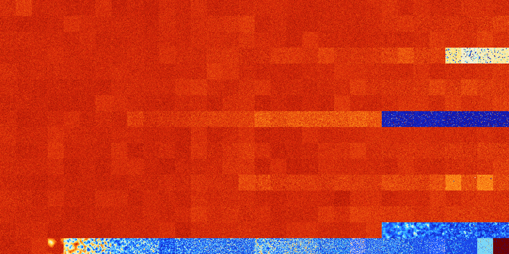

# B2578 (215040-215551)

<details>
    <summary>Initial Grid</summary>
    
</details>


<details>
    <summary>Initial Grid RLE</summary>

```
#C Exported from GoGoL (https://github.com/marrow16/gogol)
#C Wrap mode: Toroidal
#C Boundary mode: Dead
#C Step: 0
x = 100, y = 100, rule = B2578/S
16b2o$43bo25bo$2bo7b2o5bo11bobo53bo$19bo6bo4bo34bo3bo11bo3bo$11bo6bo18b
o37bo$21bo3bo23bo6bo8bo22b2o$23bo3bo40bo2bo17bo$38bo33bo26bo$17bo20bo
36bo2bo19bo$16bo42bo14bo$2bo18bo5bo21bo11bo23bo6bo$bo49bo5bo$53b2o14bo
26bo$20bo4bo32bo6bo$9bobo14bo48bo5bo15b2o$o4bo5bo21bo23bo5bo31bo$21bo
18bo15bo14bo$bo11bo9bo3bo17bo5bobo22bo3bo$bo4bo14bo11bo22bo25bo4bo$11bo
47bo$32bobo25bo2bobo14bo3bo2bo6bo$6bo10bo3bo10bobo26bo3bo7bobo13bo6bo$
21bo43bo19bo$23bo18bo21bo3bo$53bo40bo$9b2o$8bo15bo25bo4bo$o11bo3bo14bo
47bo7bo10bo$21bo33bo$31bo12bo42bo$18b2o27bo3bobo9bo20bo7bo$4bo2bo41bo
12bo17bobo$21b2o9bo2bo6bo3bo$14bo39bo27bo$9bo11bo4bo40b2o18b2o$76bo6bo$
17bo3bo28bo20bo17bo8bo$17b2obo7bo10bo17b2o6bo18bo2bo4bo$49bo17bo3b2o21b
o$8bo15bo13b2o3bo8bo2bo3bo28bobo$19bo2bo33bo3bo23bo$26bo38bo12bo$20bo6b
o12b2o25bo15bobo5bo$6bo39bo3bo37bo$19b2o29bo$18bo26bo23bo$27bo35bo15bo
8bo$2bo10bo31b2o39b2o$25bo42bo4bobo2bo$33bo3bo7bo4bo37bo$15bo17bo5bo16b
o26bo$11bo4bo41bo13bo15b2o$39bo53bo3bobo$37bo6bo9bo12bo$2bo23bo11bo31bo
$2bo8bo22bo22bo24bo$33bo3bo15bo22bo$53bo2bo2bo33bo$15bo7bo14bo$9bo18bo
18bo9bo17bo18bo$19b2o12bo5bo10bo30bo4bo12bo$18bo14bo17bo17bo$26bo2bo64b
o$13bo14bo27bo4bo24bobo$3bo23bo23bo11bo$2bo15bo8b2o$22bo12bo17bo28bo$
39bo3bo14bo20bo11bo$7b2o28bo55bo$11bo19bo5bo41bo14bo$5bo5bobo6bo6bo5bob
o27bo2bo29bo$36b2o31bo22bo$o22bo27bo10bo7bo9bo15bo$2bo2b2o51bo9bo2bo9bo
4bo$34bo3bo2bo36bo4bo$41bo23bo3bo$2bobo19bo2bo27bo$7bo37bo13bo22bo$5bo
7bo6bo25bo25bo$23bo34b2o16bo20bo$22bo40bo2bo28bo$30bo62bo$15bo27b2o10b
2o16bo11bo$8bo10bo47bo5bo9bo3bo$23bo2bo14bo27bo4bo6bo10bo$17bo18bo34bo
5bo6b2o$7bo16bo11bo10bo$30bo4bo30bo7bo$48bo4bo19bo5b2obobo5bo$66bo3bo$
8bo18bo13bo$16bo10bo$13bo65bobo$12bo32bo16bo19bo8bo6bo$bo2bo3bo13b2o20b
o41bo$41bo2bo7bo25bo13bo$6bo2bo25bo55bo$18bo25bo6bo5bo12bo12bo$80bo$39b
o13bo11b2o25bo5bo!
```
</details>
<details>
    <summary>Thumbnail</summary>

</details>
<table>
<tr>
    <td><a href="./215040%20S%20Heat%20Map%20Activity.png"></a><br>S (215040)<br>G>1000</td>    <td><a href="./215041%20S0%20Heat%20Map%20Activity.png"></a><br>S0 (215041)<br>G>1000</td>    <td><a href="./215042%20S1%20Heat%20Map%20Activity.png"></a><br>S1 (215042)<br>G>1000</td>    <td><a href="./215043%20S01%20Heat%20Map%20Activity.png"></a><br>S01 (215043)<br>G>1000</td>    <td><a href="./215044%20S2%20Heat%20Map%20Activity.png"></a><br>S2 (215044)<br>G>1000</td>    <td><a href="./215045%20S02%20Heat%20Map%20Activity.png"></a><br>S02 (215045)<br>G>1000</td>    <td><a href="./215046%20S12%20Heat%20Map%20Activity.png"></a><br>S12 (215046)<br>G>1000</td>    <td><a href="./215047%20S012%20Heat%20Map%20Activity.png"></a><br>S012 (215047)<br>G>1000</td>    <td><a href="./215048%20S3%20Heat%20Map%20Activity.png"></a><br>S3 (215048)<br>G>1000</td>    <td><a href="./215049%20S03%20Heat%20Map%20Activity.png"></a><br>S03 (215049)<br>G>1000</td>    <td><a href="./215050%20S13%20Heat%20Map%20Activity.png"></a><br>S13 (215050)<br>G>1000</td>    <td><a href="./215051%20S013%20Heat%20Map%20Activity.png"></a><br>S013 (215051)<br>G>1000</td>    <td><a href="./215052%20S23%20Heat%20Map%20Activity.png"></a><br>S23 (215052)<br>G>1000</td>    <td><a href="./215053%20S023%20Heat%20Map%20Activity.png"></a><br>S023 (215053)<br>G>1000</td>    <td><a href="./215054%20S123%20Heat%20Map%20Activity.png"></a><br>S123 (215054)<br>G>1000</td>    <td><a href="./215055%20S0123%20Heat%20Map%20Activity.png"></a><br>S0123 (215055)<br>G>1000</td>    <td><a href="./215056%20S4%20Heat%20Map%20Activity.png"></a><br>S4 (215056)<br>G>1000</td>    <td><a href="./215057%20S04%20Heat%20Map%20Activity.png"></a><br>S04 (215057)<br>G>1000</td>    <td><a href="./215058%20S14%20Heat%20Map%20Activity.png"></a><br>S14 (215058)<br>G>1000</td>    <td><a href="./215059%20S014%20Heat%20Map%20Activity.png"></a><br>S014 (215059)<br>G>1000</td>    <td><a href="./215060%20S24%20Heat%20Map%20Activity.png"></a><br>S24 (215060)<br>G>1000</td>    <td><a href="./215061%20S024%20Heat%20Map%20Activity.png"></a><br>S024 (215061)<br>G>1000</td>    <td><a href="./215062%20S124%20Heat%20Map%20Activity.png"></a><br>S124 (215062)<br>G>1000</td>    <td><a href="./215063%20S0124%20Heat%20Map%20Activity.png"></a><br>S0124 (215063)<br>G>1000</td>    <td><a href="./215064%20S34%20Heat%20Map%20Activity.png"></a><br>S34 (215064)<br>G>1000</td>    <td><a href="./215065%20S034%20Heat%20Map%20Activity.png"></a><br>S034 (215065)<br>G>1000</td>    <td><a href="./215066%20S134%20Heat%20Map%20Activity.png"></a><br>S134 (215066)<br>G>1000</td>    <td><a href="./215067%20S0134%20Heat%20Map%20Activity.png"></a><br>S0134 (215067)<br>G>1000</td>    <td><a href="./215068%20S234%20Heat%20Map%20Activity.png"></a><br>S234 (215068)<br>G>1000</td>    <td><a href="./215069%20S0234%20Heat%20Map%20Activity.png"></a><br>S0234 (215069)<br>G>1000</td>    <td><a href="./215070%20S1234%20Heat%20Map%20Activity.png"></a><br>S1234 (215070)<br>G>1000</td>    <td><a href="./215071%20S01234%20Heat%20Map%20Activity.png"></a><br>S01234 (215071)<br>G>1000</td></tr>
<tr>
    <td><a href="./215072%20S5%20Heat%20Map%20Activity.png"></a><br>S5 (215072)<br>G>1000</td>    <td><a href="./215073%20S05%20Heat%20Map%20Activity.png"></a><br>S05 (215073)<br>G>1000</td>    <td><a href="./215074%20S15%20Heat%20Map%20Activity.png"></a><br>S15 (215074)<br>G>1000</td>    <td><a href="./215075%20S015%20Heat%20Map%20Activity.png"></a><br>S015 (215075)<br>G>1000</td>    <td><a href="./215076%20S25%20Heat%20Map%20Activity.png"></a><br>S25 (215076)<br>G>1000</td>    <td><a href="./215077%20S025%20Heat%20Map%20Activity.png"></a><br>S025 (215077)<br>G>1000</td>    <td><a href="./215078%20S125%20Heat%20Map%20Activity.png"></a><br>S125 (215078)<br>G>1000</td>    <td><a href="./215079%20S0125%20Heat%20Map%20Activity.png"></a><br>S0125 (215079)<br>G>1000</td>    <td><a href="./215080%20S35%20Heat%20Map%20Activity.png"></a><br>S35 (215080)<br>G>1000</td>    <td><a href="./215081%20S035%20Heat%20Map%20Activity.png"></a><br>S035 (215081)<br>G>1000</td>    <td><a href="./215082%20S135%20Heat%20Map%20Activity.png"></a><br>S135 (215082)<br>G>1000</td>    <td><a href="./215083%20S0135%20Heat%20Map%20Activity.png"></a><br>S0135 (215083)<br>G>1000</td>    <td><a href="./215084%20S235%20Heat%20Map%20Activity.png"></a><br>S235 (215084)<br>G>1000</td>    <td><a href="./215085%20S0235%20Heat%20Map%20Activity.png"></a><br>S0235 (215085)<br>G>1000</td>    <td><a href="./215086%20S1235%20Heat%20Map%20Activity.png"></a><br>S1235 (215086)<br>G>1000</td>    <td><a href="./215087%20S01235%20Heat%20Map%20Activity.png"></a><br>S01235 (215087)<br>G>1000</td>    <td><a href="./215088%20S45%20Heat%20Map%20Activity.png"></a><br>S45 (215088)<br>G>1000</td>    <td><a href="./215089%20S045%20Heat%20Map%20Activity.png"></a><br>S045 (215089)<br>G>1000</td>    <td><a href="./215090%20S145%20Heat%20Map%20Activity.png"></a><br>S145 (215090)<br>G>1000</td>    <td><a href="./215091%20S0145%20Heat%20Map%20Activity.png"></a><br>S0145 (215091)<br>G>1000</td>    <td><a href="./215092%20S245%20Heat%20Map%20Activity.png"></a><br>S245 (215092)<br>G>1000</td>    <td><a href="./215093%20S0245%20Heat%20Map%20Activity.png"></a><br>S0245 (215093)<br>G>1000</td>    <td><a href="./215094%20S1245%20Heat%20Map%20Activity.png"></a><br>S1245 (215094)<br>G>1000</td>    <td><a href="./215095%20S01245%20Heat%20Map%20Activity.png"></a><br>S01245 (215095)<br>G>1000</td>    <td><a href="./215096%20S345%20Heat%20Map%20Activity.png"></a><br>S345 (215096)<br>G>1000</td>    <td><a href="./215097%20S0345%20Heat%20Map%20Activity.png"></a><br>S0345 (215097)<br>G>1000</td>    <td><a href="./215098%20S1345%20Heat%20Map%20Activity.png"></a><br>S1345 (215098)<br>G>1000</td>    <td><a href="./215099%20S01345%20Heat%20Map%20Activity.png"></a><br>S01345 (215099)<br>G>1000</td>    <td><a href="./215100%20S2345%20Heat%20Map%20Activity.png"></a><br>S2345 (215100)<br>G>1000</td>    <td><a href="./215101%20S02345%20Heat%20Map%20Activity.png"></a><br>S02345 (215101)<br>G>1000</td>    <td><a href="./215102%20S12345%20Heat%20Map%20Activity.png"></a><br>S12345 (215102)<br>G>1000</td>    <td><a href="./215103%20S012345%20Heat%20Map%20Activity.png"></a><br>S012345 (215103)<br>G>1000</td></tr>
<tr>
    <td><a href="./215104%20S6%20Heat%20Map%20Activity.png"></a><br>S6 (215104)<br>G>1000</td>    <td><a href="./215105%20S06%20Heat%20Map%20Activity.png"></a><br>S06 (215105)<br>G>1000</td>    <td><a href="./215106%20S16%20Heat%20Map%20Activity.png"></a><br>S16 (215106)<br>G>1000</td>    <td><a href="./215107%20S016%20Heat%20Map%20Activity.png"></a><br>S016 (215107)<br>G>1000</td>    <td><a href="./215108%20S26%20Heat%20Map%20Activity.png"></a><br>S26 (215108)<br>G>1000</td>    <td><a href="./215109%20S026%20Heat%20Map%20Activity.png"></a><br>S026 (215109)<br>G>1000</td>    <td><a href="./215110%20S126%20Heat%20Map%20Activity.png"></a><br>S126 (215110)<br>G>1000</td>    <td><a href="./215111%20S0126%20Heat%20Map%20Activity.png"></a><br>S0126 (215111)<br>G>1000</td>    <td><a href="./215112%20S36%20Heat%20Map%20Activity.png"></a><br>S36 (215112)<br>G>1000</td>    <td><a href="./215113%20S036%20Heat%20Map%20Activity.png"></a><br>S036 (215113)<br>G>1000</td>    <td><a href="./215114%20S136%20Heat%20Map%20Activity.png"></a><br>S136 (215114)<br>G>1000</td>    <td><a href="./215115%20S0136%20Heat%20Map%20Activity.png"></a><br>S0136 (215115)<br>G>1000</td>    <td><a href="./215116%20S236%20Heat%20Map%20Activity.png"></a><br>S236 (215116)<br>G>1000</td>    <td><a href="./215117%20S0236%20Heat%20Map%20Activity.png"></a><br>S0236 (215117)<br>G>1000</td>    <td><a href="./215118%20S1236%20Heat%20Map%20Activity.png"></a><br>S1236 (215118)<br>G>1000</td>    <td><a href="./215119%20S01236%20Heat%20Map%20Activity.png"></a><br>S01236 (215119)<br>G>1000</td>    <td><a href="./215120%20S46%20Heat%20Map%20Activity.png"></a><br>S46 (215120)<br>G>1000</td>    <td><a href="./215121%20S046%20Heat%20Map%20Activity.png"></a><br>S046 (215121)<br>G>1000</td>    <td><a href="./215122%20S146%20Heat%20Map%20Activity.png"></a><br>S146 (215122)<br>G>1000</td>    <td><a href="./215123%20S0146%20Heat%20Map%20Activity.png"></a><br>S0146 (215123)<br>G>1000</td>    <td><a href="./215124%20S246%20Heat%20Map%20Activity.png"></a><br>S246 (215124)<br>G>1000</td>    <td><a href="./215125%20S0246%20Heat%20Map%20Activity.png"></a><br>S0246 (215125)<br>G>1000</td>    <td><a href="./215126%20S1246%20Heat%20Map%20Activity.png"></a><br>S1246 (215126)<br>G>1000</td>    <td><a href="./215127%20S01246%20Heat%20Map%20Activity.png"></a><br>S01246 (215127)<br>G>1000</td>    <td><a href="./215128%20S346%20Heat%20Map%20Activity.png"></a><br>S346 (215128)<br>G>1000</td>    <td><a href="./215129%20S0346%20Heat%20Map%20Activity.png"></a><br>S0346 (215129)<br>G>1000</td>    <td><a href="./215130%20S1346%20Heat%20Map%20Activity.png"></a><br>S1346 (215130)<br>G>1000</td>    <td><a href="./215131%20S01346%20Heat%20Map%20Activity.png"></a><br>S01346 (215131)<br>G>1000</td>    <td><a href="./215132%20S2346%20Heat%20Map%20Activity.png"></a><br>S2346 (215132)<br>G>1000</td>    <td><a href="./215133%20S02346%20Heat%20Map%20Activity.png"></a><br>S02346 (215133)<br>G>1000</td>    <td><a href="./215134%20S12346%20Heat%20Map%20Activity.png"></a><br>S12346 (215134)<br>G>1000</td>    <td><a href="./215135%20S012346%20Heat%20Map%20Activity.png"></a><br>S012346 (215135)<br>G>1000</td></tr>
<tr>
    <td><a href="./215136%20S56%20Heat%20Map%20Activity.png"></a><br>S56 (215136)<br>G>1000</td>    <td><a href="./215137%20S056%20Heat%20Map%20Activity.png"></a><br>S056 (215137)<br>G>1000</td>    <td><a href="./215138%20S156%20Heat%20Map%20Activity.png"></a><br>S156 (215138)<br>G>1000</td>    <td><a href="./215139%20S0156%20Heat%20Map%20Activity.png"></a><br>S0156 (215139)<br>G>1000</td>    <td><a href="./215140%20S256%20Heat%20Map%20Activity.png"></a><br>S256 (215140)<br>G>1000</td>    <td><a href="./215141%20S0256%20Heat%20Map%20Activity.png"></a><br>S0256 (215141)<br>G>1000</td>    <td><a href="./215142%20S1256%20Heat%20Map%20Activity.png"></a><br>S1256 (215142)<br>G>1000</td>    <td><a href="./215143%20S01256%20Heat%20Map%20Activity.png"></a><br>S01256 (215143)<br>G>1000</td>    <td><a href="./215144%20S356%20Heat%20Map%20Activity.png"></a><br>S356 (215144)<br>G>1000</td>    <td><a href="./215145%20S0356%20Heat%20Map%20Activity.png"></a><br>S0356 (215145)<br>G>1000</td>    <td><a href="./215146%20S1356%20Heat%20Map%20Activity.png"></a><br>S1356 (215146)<br>G>1000</td>    <td><a href="./215147%20S01356%20Heat%20Map%20Activity.png"></a><br>S01356 (215147)<br>G>1000</td>    <td><a href="./215148%20S2356%20Heat%20Map%20Activity.png"></a><br>S2356 (215148)<br>G>1000</td>    <td><a href="./215149%20S02356%20Heat%20Map%20Activity.png"></a><br>S02356 (215149)<br>G>1000</td>    <td><a href="./215150%20S12356%20Heat%20Map%20Activity.png"></a><br>S12356 (215150)<br>G>1000</td>    <td><a href="./215151%20S012356%20Heat%20Map%20Activity.png"></a><br>S012356 (215151)<br>G>1000</td>    <td><a href="./215152%20S456%20Heat%20Map%20Activity.png"></a><br>S456 (215152)<br>G>1000</td>    <td><a href="./215153%20S0456%20Heat%20Map%20Activity.png"></a><br>S0456 (215153)<br>G>1000</td>    <td><a href="./215154%20S1456%20Heat%20Map%20Activity.png"></a><br>S1456 (215154)<br>G>1000</td>    <td><a href="./215155%20S01456%20Heat%20Map%20Activity.png"></a><br>S01456 (215155)<br>G>1000</td>    <td><a href="./215156%20S2456%20Heat%20Map%20Activity.png"></a><br>S2456 (215156)<br>G>1000</td>    <td><a href="./215157%20S02456%20Heat%20Map%20Activity.png"></a><br>S02456 (215157)<br>G>1000</td>    <td><a href="./215158%20S12456%20Heat%20Map%20Activity.png"></a><br>S12456 (215158)<br>G>1000</td>    <td><a href="./215159%20S012456%20Heat%20Map%20Activity.png"></a><br>S012456 (215159)<br>G>1000</td>    <td><a href="./215160%20S3456%20Heat%20Map%20Activity.png"></a><br>S3456 (215160)<br>G>1000</td>    <td><a href="./215161%20S03456%20Heat%20Map%20Activity.png"></a><br>S03456 (215161)<br>G>1000</td>    <td><a href="./215162%20S13456%20Heat%20Map%20Activity.png"></a><br>S13456 (215162)<br>G>1000</td>    <td><a href="./215163%20S013456%20Heat%20Map%20Activity.png"></a><br>S013456 (215163)<br>G>1000</td>    <td><a href="./215164%20S23456%20Heat%20Map%20Activity.png"></a><br>S23456 (215164)<br>G>1000</td>    <td><a href="./215165%20S023456%20Heat%20Map%20Activity.png"></a><br>S023456 (215165)<br>G>1000</td>    <td><a href="./215166%20S123456%20Heat%20Map%20Activity.png"></a><br>S123456 (215166)<br>G>1000</td>    <td><a href="./215167%20S0123456%20Heat%20Map%20Activity.png"></a><br>S0123456 (215167)<br>G>1000</td></tr>
<tr>
    <td><a href="./215168%20S7%20Heat%20Map%20Activity.png"></a><br>S7 (215168)<br>G>1000</td>    <td><a href="./215169%20S07%20Heat%20Map%20Activity.png"></a><br>S07 (215169)<br>G>1000</td>    <td><a href="./215170%20S17%20Heat%20Map%20Activity.png"></a><br>S17 (215170)<br>G>1000</td>    <td><a href="./215171%20S017%20Heat%20Map%20Activity.png"></a><br>S017 (215171)<br>G>1000</td>    <td><a href="./215172%20S27%20Heat%20Map%20Activity.png"></a><br>S27 (215172)<br>G>1000</td>    <td><a href="./215173%20S027%20Heat%20Map%20Activity.png"></a><br>S027 (215173)<br>G>1000</td>    <td><a href="./215174%20S127%20Heat%20Map%20Activity.png"></a><br>S127 (215174)<br>G>1000</td>    <td><a href="./215175%20S0127%20Heat%20Map%20Activity.png"></a><br>S0127 (215175)<br>G>1000</td>    <td><a href="./215176%20S37%20Heat%20Map%20Activity.png"></a><br>S37 (215176)<br>G>1000</td>    <td><a href="./215177%20S037%20Heat%20Map%20Activity.png"></a><br>S037 (215177)<br>G>1000</td>    <td><a href="./215178%20S137%20Heat%20Map%20Activity.png"></a><br>S137 (215178)<br>G>1000</td>    <td><a href="./215179%20S0137%20Heat%20Map%20Activity.png"></a><br>S0137 (215179)<br>G>1000</td>    <td><a href="./215180%20S237%20Heat%20Map%20Activity.png"></a><br>S237 (215180)<br>G>1000</td>    <td><a href="./215181%20S0237%20Heat%20Map%20Activity.png"></a><br>S0237 (215181)<br>G>1000</td>    <td><a href="./215182%20S1237%20Heat%20Map%20Activity.png"></a><br>S1237 (215182)<br>G>1000</td>    <td><a href="./215183%20S01237%20Heat%20Map%20Activity.png"></a><br>S01237 (215183)<br>G>1000</td>    <td><a href="./215184%20S47%20Heat%20Map%20Activity.png"></a><br>S47 (215184)<br>G>1000</td>    <td><a href="./215185%20S047%20Heat%20Map%20Activity.png"></a><br>S047 (215185)<br>G>1000</td>    <td><a href="./215186%20S147%20Heat%20Map%20Activity.png"></a><br>S147 (215186)<br>G>1000</td>    <td><a href="./215187%20S0147%20Heat%20Map%20Activity.png"></a><br>S0147 (215187)<br>G>1000</td>    <td><a href="./215188%20S247%20Heat%20Map%20Activity.png"></a><br>S247 (215188)<br>G>1000</td>    <td><a href="./215189%20S0247%20Heat%20Map%20Activity.png"></a><br>S0247 (215189)<br>G>1000</td>    <td><a href="./215190%20S1247%20Heat%20Map%20Activity.png"></a><br>S1247 (215190)<br>G>1000</td>    <td><a href="./215191%20S01247%20Heat%20Map%20Activity.png"></a><br>S01247 (215191)<br>G>1000</td>    <td><a href="./215192%20S347%20Heat%20Map%20Activity.png"></a><br>S347 (215192)<br>G>1000</td>    <td><a href="./215193%20S0347%20Heat%20Map%20Activity.png"></a><br>S0347 (215193)<br>G>1000</td>    <td><a href="./215194%20S1347%20Heat%20Map%20Activity.png"></a><br>S1347 (215194)<br>G>1000</td>    <td><a href="./215195%20S01347%20Heat%20Map%20Activity.png"></a><br>S01347 (215195)<br>G>1000</td>    <td><a href="./215196%20S2347%20Heat%20Map%20Activity.png"></a><br>S2347 (215196)<br>G>1000</td>    <td><a href="./215197%20S02347%20Heat%20Map%20Activity.png"></a><br>S02347 (215197)<br>G>1000</td>    <td><a href="./215198%20S12347%20Heat%20Map%20Activity.png"></a><br>S12347 (215198)<br>G>1000</td>    <td><a href="./215199%20S012347%20Heat%20Map%20Activity.png"></a><br>S012347 (215199)<br>G>1000</td></tr>
<tr>
    <td><a href="./215200%20S57%20Heat%20Map%20Activity.png"></a><br>S57 (215200)<br>G>1000</td>    <td><a href="./215201%20S057%20Heat%20Map%20Activity.png"></a><br>S057 (215201)<br>G>1000</td>    <td><a href="./215202%20S157%20Heat%20Map%20Activity.png"></a><br>S157 (215202)<br>G>1000</td>    <td><a href="./215203%20S0157%20Heat%20Map%20Activity.png"></a><br>S0157 (215203)<br>G>1000</td>    <td><a href="./215204%20S257%20Heat%20Map%20Activity.png"></a><br>S257 (215204)<br>G>1000</td>    <td><a href="./215205%20S0257%20Heat%20Map%20Activity.png"></a><br>S0257 (215205)<br>G>1000</td>    <td><a href="./215206%20S1257%20Heat%20Map%20Activity.png"></a><br>S1257 (215206)<br>G>1000</td>    <td><a href="./215207%20S01257%20Heat%20Map%20Activity.png"></a><br>S01257 (215207)<br>G>1000</td>    <td><a href="./215208%20S357%20Heat%20Map%20Activity.png"></a><br>S357 (215208)<br>G>1000</td>    <td><a href="./215209%20S0357%20Heat%20Map%20Activity.png"></a><br>S0357 (215209)<br>G>1000</td>    <td><a href="./215210%20S1357%20Heat%20Map%20Activity.png"></a><br>S1357 (215210)<br>G>1000</td>    <td><a href="./215211%20S01357%20Heat%20Map%20Activity.png"></a><br>S01357 (215211)<br>G>1000</td>    <td><a href="./215212%20S2357%20Heat%20Map%20Activity.png"></a><br>S2357 (215212)<br>G>1000</td>    <td><a href="./215213%20S02357%20Heat%20Map%20Activity.png"></a><br>S02357 (215213)<br>G>1000</td>    <td><a href="./215214%20S12357%20Heat%20Map%20Activity.png"></a><br>S12357 (215214)<br>G>1000</td>    <td><a href="./215215%20S012357%20Heat%20Map%20Activity.png"></a><br>S012357 (215215)<br>G>1000</td>    <td><a href="./215216%20S457%20Heat%20Map%20Activity.png"></a><br>S457 (215216)<br>G>1000</td>    <td><a href="./215217%20S0457%20Heat%20Map%20Activity.png"></a><br>S0457 (215217)<br>G>1000</td>    <td><a href="./215218%20S1457%20Heat%20Map%20Activity.png"></a><br>S1457 (215218)<br>G>1000</td>    <td><a href="./215219%20S01457%20Heat%20Map%20Activity.png"></a><br>S01457 (215219)<br>G>1000</td>    <td><a href="./215220%20S2457%20Heat%20Map%20Activity.png"></a><br>S2457 (215220)<br>G>1000</td>    <td><a href="./215221%20S02457%20Heat%20Map%20Activity.png"></a><br>S02457 (215221)<br>G>1000</td>    <td><a href="./215222%20S12457%20Heat%20Map%20Activity.png"></a><br>S12457 (215222)<br>G>1000</td>    <td><a href="./215223%20S012457%20Heat%20Map%20Activity.png"></a><br>S012457 (215223)<br>G>1000</td>    <td><a href="./215224%20S3457%20Heat%20Map%20Activity.png"></a><br>S3457 (215224)<br>G>1000</td>    <td><a href="./215225%20S03457%20Heat%20Map%20Activity.png"></a><br>S03457 (215225)<br>G>1000</td>    <td><a href="./215226%20S13457%20Heat%20Map%20Activity.png"></a><br>S13457 (215226)<br>G>1000</td>    <td><a href="./215227%20S013457%20Heat%20Map%20Activity.png"></a><br>S013457 (215227)<br>G>1000</td>    <td><a href="./215228%20S23457%20Heat%20Map%20Activity.png"></a><br>S23457 (215228)<br>G>1000</td>    <td><a href="./215229%20S023457%20Heat%20Map%20Activity.png"></a><br>S023457 (215229)<br>G>1000</td>    <td><a href="./215230%20S123457%20Heat%20Map%20Activity.png"></a><br>S123457 (215230)<br>G>1000</td>    <td><a href="./215231%20S0123457%20Heat%20Map%20Activity.png"></a><br>S0123457 (215231)<br>G>1000</td></tr>
<tr>
    <td><a href="./215232%20S67%20Heat%20Map%20Activity.png"></a><br>S67 (215232)<br>G>1000</td>    <td><a href="./215233%20S067%20Heat%20Map%20Activity.png"></a><br>S067 (215233)<br>G>1000</td>    <td><a href="./215234%20S167%20Heat%20Map%20Activity.png"></a><br>S167 (215234)<br>G>1000</td>    <td><a href="./215235%20S0167%20Heat%20Map%20Activity.png"></a><br>S0167 (215235)<br>G>1000</td>    <td><a href="./215236%20S267%20Heat%20Map%20Activity.png"></a><br>S267 (215236)<br>G>1000</td>    <td><a href="./215237%20S0267%20Heat%20Map%20Activity.png"></a><br>S0267 (215237)<br>G>1000</td>    <td><a href="./215238%20S1267%20Heat%20Map%20Activity.png"></a><br>S1267 (215238)<br>G>1000</td>    <td><a href="./215239%20S01267%20Heat%20Map%20Activity.png"></a><br>S01267 (215239)<br>G>1000</td>    <td><a href="./215240%20S367%20Heat%20Map%20Activity.png"></a><br>S367 (215240)<br>G>1000</td>    <td><a href="./215241%20S0367%20Heat%20Map%20Activity.png"></a><br>S0367 (215241)<br>G>1000</td>    <td><a href="./215242%20S1367%20Heat%20Map%20Activity.png"></a><br>S1367 (215242)<br>G>1000</td>    <td><a href="./215243%20S01367%20Heat%20Map%20Activity.png"></a><br>S01367 (215243)<br>G>1000</td>    <td><a href="./215244%20S2367%20Heat%20Map%20Activity.png"></a><br>S2367 (215244)<br>G>1000</td>    <td><a href="./215245%20S02367%20Heat%20Map%20Activity.png"></a><br>S02367 (215245)<br>G>1000</td>    <td><a href="./215246%20S12367%20Heat%20Map%20Activity.png"></a><br>S12367 (215246)<br>G>1000</td>    <td><a href="./215247%20S012367%20Heat%20Map%20Activity.png"></a><br>S012367 (215247)<br>G>1000</td>    <td><a href="./215248%20S467%20Heat%20Map%20Activity.png"></a><br>S467 (215248)<br>G>1000</td>    <td><a href="./215249%20S0467%20Heat%20Map%20Activity.png"></a><br>S0467 (215249)<br>G>1000</td>    <td><a href="./215250%20S1467%20Heat%20Map%20Activity.png"></a><br>S1467 (215250)<br>G>1000</td>    <td><a href="./215251%20S01467%20Heat%20Map%20Activity.png"></a><br>S01467 (215251)<br>G>1000</td>    <td><a href="./215252%20S2467%20Heat%20Map%20Activity.png"></a><br>S2467 (215252)<br>G>1000</td>    <td><a href="./215253%20S02467%20Heat%20Map%20Activity.png"></a><br>S02467 (215253)<br>G>1000</td>    <td><a href="./215254%20S12467%20Heat%20Map%20Activity.png"></a><br>S12467 (215254)<br>G>1000</td>    <td><a href="./215255%20S012467%20Heat%20Map%20Activity.png"></a><br>S012467 (215255)<br>G>1000</td>    <td><a href="./215256%20S3467%20Heat%20Map%20Activity.png"></a><br>S3467 (215256)<br>G>1000</td>    <td><a href="./215257%20S03467%20Heat%20Map%20Activity.png"></a><br>S03467 (215257)<br>G>1000</td>    <td><a href="./215258%20S13467%20Heat%20Map%20Activity.png"></a><br>S13467 (215258)<br>G>1000</td>    <td><a href="./215259%20S013467%20Heat%20Map%20Activity.png"></a><br>S013467 (215259)<br>G>1000</td>    <td><a href="./215260%20S23467%20Heat%20Map%20Activity.png"></a><br>S23467 (215260)<br>G>1000</td>    <td><a href="./215261%20S023467%20Heat%20Map%20Activity.png"></a><br>S023467 (215261)<br>G>1000</td>    <td><a href="./215262%20S123467%20Heat%20Map%20Activity.png"></a><br>S123467 (215262)<br>G>1000</td>    <td><a href="./215263%20S0123467%20Heat%20Map%20Activity.png"></a><br>S0123467 (215263)<br>G>1000</td></tr>
<tr>
    <td><a href="./215264%20S567%20Heat%20Map%20Activity.png"></a><br>S567 (215264)<br>G>1000</td>    <td><a href="./215265%20S0567%20Heat%20Map%20Activity.png"></a><br>S0567 (215265)<br>G>1000</td>    <td><a href="./215266%20S1567%20Heat%20Map%20Activity.png"></a><br>S1567 (215266)<br>G>1000</td>    <td><a href="./215267%20S01567%20Heat%20Map%20Activity.png"></a><br>S01567 (215267)<br>G>1000</td>    <td><a href="./215268%20S2567%20Heat%20Map%20Activity.png"></a><br>S2567 (215268)<br>G>1000</td>    <td><a href="./215269%20S02567%20Heat%20Map%20Activity.png"></a><br>S02567 (215269)<br>G>1000</td>    <td><a href="./215270%20S12567%20Heat%20Map%20Activity.png"></a><br>S12567 (215270)<br>G>1000</td>    <td><a href="./215271%20S012567%20Heat%20Map%20Activity.png"></a><br>S012567 (215271)<br>G>1000</td>    <td><a href="./215272%20S3567%20Heat%20Map%20Activity.png"></a><br>S3567 (215272)<br>G>1000</td>    <td><a href="./215273%20S03567%20Heat%20Map%20Activity.png"></a><br>S03567 (215273)<br>G>1000</td>    <td><a href="./215274%20S13567%20Heat%20Map%20Activity.png"></a><br>S13567 (215274)<br>G>1000</td>    <td><a href="./215275%20S013567%20Heat%20Map%20Activity.png"></a><br>S013567 (215275)<br>G>1000</td>    <td><a href="./215276%20S23567%20Heat%20Map%20Activity.png"></a><br>S23567 (215276)<br>G>1000</td>    <td><a href="./215277%20S023567%20Heat%20Map%20Activity.png"></a><br>S023567 (215277)<br>G>1000</td>    <td><a href="./215278%20S123567%20Heat%20Map%20Activity.png"></a><br>S123567 (215278)<br>G>1000</td>    <td><a href="./215279%20S0123567%20Heat%20Map%20Activity.png"></a><br>S0123567 (215279)<br>G>1000</td>    <td><a href="./215280%20S4567%20Heat%20Map%20Activity.png"></a><br>S4567 (215280)<br>G>1000</td>    <td><a href="./215281%20S04567%20Heat%20Map%20Activity.png"></a><br>S04567 (215281)<br>G>1000</td>    <td><a href="./215282%20S14567%20Heat%20Map%20Activity.png"></a><br>S14567 (215282)<br>G>1000</td>    <td><a href="./215283%20S014567%20Heat%20Map%20Activity.png"></a><br>S014567 (215283)<br>G>1000</td>    <td><a href="./215284%20S24567%20Heat%20Map%20Activity.png"></a><br>S24567 (215284)<br>G>1000</td>    <td><a href="./215285%20S024567%20Heat%20Map%20Activity.png"></a><br>S024567 (215285)<br>G>1000</td>    <td><a href="./215286%20S124567%20Heat%20Map%20Activity.png"></a><br>S124567 (215286)<br>G>1000</td>    <td><a href="./215287%20S0124567%20Heat%20Map%20Activity.png"></a><br>S0124567 (215287)<br>G>1000</td>    <td><a href="./215288%20S34567%20Heat%20Map%20Activity.png"></a><br>S34567 (215288)<br>G>1000</td>    <td><a href="./215289%20S034567%20Heat%20Map%20Activity.png"></a><br>S034567 (215289)<br>G>1000</td>    <td><a href="./215290%20S134567%20Heat%20Map%20Activity.png"></a><br>S134567 (215290)<br>G>1000</td>    <td><a href="./215291%20S0134567%20Heat%20Map%20Activity.png"></a><br>S0134567 (215291)<br>G>1000</td>    <td><a href="./215292%20S234567%20Heat%20Map%20Activity.png"></a><br>S234567 (215292)<br>G>1000</td>    <td><a href="./215293%20S0234567%20Heat%20Map%20Activity.png"></a><br>S0234567 (215293)<br>G>1000</td>    <td><a href="./215294%20S1234567%20Heat%20Map%20Activity.png"></a><br>S1234567 (215294)<br>G>1000</td>    <td><a href="./215295%20S01234567%20Heat%20Map%20Activity.png"></a><br>S01234567 (215295)<br>G>1000</td></tr>
<tr>
    <td><a href="./215296%20S8%20Heat%20Map%20Activity.png"></a><br>S8 (215296)<br>G>1000</td>    <td><a href="./215297%20S08%20Heat%20Map%20Activity.png"></a><br>S08 (215297)<br>G>1000</td>    <td><a href="./215298%20S18%20Heat%20Map%20Activity.png"></a><br>S18 (215298)<br>G>1000</td>    <td><a href="./215299%20S018%20Heat%20Map%20Activity.png"></a><br>S018 (215299)<br>G>1000</td>    <td><a href="./215300%20S28%20Heat%20Map%20Activity.png"></a><br>S28 (215300)<br>G>1000</td>    <td><a href="./215301%20S028%20Heat%20Map%20Activity.png"></a><br>S028 (215301)<br>G>1000</td>    <td><a href="./215302%20S128%20Heat%20Map%20Activity.png"></a><br>S128 (215302)<br>G>1000</td>    <td><a href="./215303%20S0128%20Heat%20Map%20Activity.png"></a><br>S0128 (215303)<br>G>1000</td>    <td><a href="./215304%20S38%20Heat%20Map%20Activity.png"></a><br>S38 (215304)<br>G>1000</td>    <td><a href="./215305%20S038%20Heat%20Map%20Activity.png"></a><br>S038 (215305)<br>G>1000</td>    <td><a href="./215306%20S138%20Heat%20Map%20Activity.png"></a><br>S138 (215306)<br>G>1000</td>    <td><a href="./215307%20S0138%20Heat%20Map%20Activity.png"></a><br>S0138 (215307)<br>G>1000</td>    <td><a href="./215308%20S238%20Heat%20Map%20Activity.png"></a><br>S238 (215308)<br>G>1000</td>    <td><a href="./215309%20S0238%20Heat%20Map%20Activity.png"></a><br>S0238 (215309)<br>G>1000</td>    <td><a href="./215310%20S1238%20Heat%20Map%20Activity.png"></a><br>S1238 (215310)<br>G>1000</td>    <td><a href="./215311%20S01238%20Heat%20Map%20Activity.png"></a><br>S01238 (215311)<br>G>1000</td>    <td><a href="./215312%20S48%20Heat%20Map%20Activity.png"></a><br>S48 (215312)<br>G>1000</td>    <td><a href="./215313%20S048%20Heat%20Map%20Activity.png"></a><br>S048 (215313)<br>G>1000</td>    <td><a href="./215314%20S148%20Heat%20Map%20Activity.png"></a><br>S148 (215314)<br>G>1000</td>    <td><a href="./215315%20S0148%20Heat%20Map%20Activity.png"></a><br>S0148 (215315)<br>G>1000</td>    <td><a href="./215316%20S248%20Heat%20Map%20Activity.png"></a><br>S248 (215316)<br>G>1000</td>    <td><a href="./215317%20S0248%20Heat%20Map%20Activity.png"></a><br>S0248 (215317)<br>G>1000</td>    <td><a href="./215318%20S1248%20Heat%20Map%20Activity.png"></a><br>S1248 (215318)<br>G>1000</td>    <td><a href="./215319%20S01248%20Heat%20Map%20Activity.png"></a><br>S01248 (215319)<br>G>1000</td>    <td><a href="./215320%20S348%20Heat%20Map%20Activity.png"></a><br>S348 (215320)<br>G>1000</td>    <td><a href="./215321%20S0348%20Heat%20Map%20Activity.png"></a><br>S0348 (215321)<br>G>1000</td>    <td><a href="./215322%20S1348%20Heat%20Map%20Activity.png"></a><br>S1348 (215322)<br>G>1000</td>    <td><a href="./215323%20S01348%20Heat%20Map%20Activity.png"></a><br>S01348 (215323)<br>G>1000</td>    <td><a href="./215324%20S2348%20Heat%20Map%20Activity.png"></a><br>S2348 (215324)<br>G>1000</td>    <td><a href="./215325%20S02348%20Heat%20Map%20Activity.png"></a><br>S02348 (215325)<br>G>1000</td>    <td><a href="./215326%20S12348%20Heat%20Map%20Activity.png"></a><br>S12348 (215326)<br>G>1000</td>    <td><a href="./215327%20S012348%20Heat%20Map%20Activity.png"></a><br>S012348 (215327)<br>G>1000</td></tr>
<tr>
    <td><a href="./215328%20S58%20Heat%20Map%20Activity.png"></a><br>S58 (215328)<br>G>1000</td>    <td><a href="./215329%20S058%20Heat%20Map%20Activity.png"></a><br>S058 (215329)<br>G>1000</td>    <td><a href="./215330%20S158%20Heat%20Map%20Activity.png"></a><br>S158 (215330)<br>G>1000</td>    <td><a href="./215331%20S0158%20Heat%20Map%20Activity.png"></a><br>S0158 (215331)<br>G>1000</td>    <td><a href="./215332%20S258%20Heat%20Map%20Activity.png"></a><br>S258 (215332)<br>G>1000</td>    <td><a href="./215333%20S0258%20Heat%20Map%20Activity.png"></a><br>S0258 (215333)<br>G>1000</td>    <td><a href="./215334%20S1258%20Heat%20Map%20Activity.png"></a><br>S1258 (215334)<br>G>1000</td>    <td><a href="./215335%20S01258%20Heat%20Map%20Activity.png"></a><br>S01258 (215335)<br>G>1000</td>    <td><a href="./215336%20S358%20Heat%20Map%20Activity.png"></a><br>S358 (215336)<br>G>1000</td>    <td><a href="./215337%20S0358%20Heat%20Map%20Activity.png"></a><br>S0358 (215337)<br>G>1000</td>    <td><a href="./215338%20S1358%20Heat%20Map%20Activity.png"></a><br>S1358 (215338)<br>G>1000</td>    <td><a href="./215339%20S01358%20Heat%20Map%20Activity.png"></a><br>S01358 (215339)<br>G>1000</td>    <td><a href="./215340%20S2358%20Heat%20Map%20Activity.png"></a><br>S2358 (215340)<br>G>1000</td>    <td><a href="./215341%20S02358%20Heat%20Map%20Activity.png"></a><br>S02358 (215341)<br>G>1000</td>    <td><a href="./215342%20S12358%20Heat%20Map%20Activity.png"></a><br>S12358 (215342)<br>G>1000</td>    <td><a href="./215343%20S012358%20Heat%20Map%20Activity.png"></a><br>S012358 (215343)<br>G>1000</td>    <td><a href="./215344%20S458%20Heat%20Map%20Activity.png"></a><br>S458 (215344)<br>G>1000</td>    <td><a href="./215345%20S0458%20Heat%20Map%20Activity.png"></a><br>S0458 (215345)<br>G>1000</td>    <td><a href="./215346%20S1458%20Heat%20Map%20Activity.png"></a><br>S1458 (215346)<br>G>1000</td>    <td><a href="./215347%20S01458%20Heat%20Map%20Activity.png"></a><br>S01458 (215347)<br>G>1000</td>    <td><a href="./215348%20S2458%20Heat%20Map%20Activity.png"></a><br>S2458 (215348)<br>G>1000</td>    <td><a href="./215349%20S02458%20Heat%20Map%20Activity.png"></a><br>S02458 (215349)<br>G>1000</td>    <td><a href="./215350%20S12458%20Heat%20Map%20Activity.png"></a><br>S12458 (215350)<br>G>1000</td>    <td><a href="./215351%20S012458%20Heat%20Map%20Activity.png"></a><br>S012458 (215351)<br>G>1000</td>    <td><a href="./215352%20S3458%20Heat%20Map%20Activity.png"></a><br>S3458 (215352)<br>G>1000</td>    <td><a href="./215353%20S03458%20Heat%20Map%20Activity.png"></a><br>S03458 (215353)<br>G>1000</td>    <td><a href="./215354%20S13458%20Heat%20Map%20Activity.png"></a><br>S13458 (215354)<br>G>1000</td>    <td><a href="./215355%20S013458%20Heat%20Map%20Activity.png"></a><br>S013458 (215355)<br>G>1000</td>    <td><a href="./215356%20S23458%20Heat%20Map%20Activity.png"></a><br>S23458 (215356)<br>G>1000</td>    <td><a href="./215357%20S023458%20Heat%20Map%20Activity.png"></a><br>S023458 (215357)<br>G>1000</td>    <td><a href="./215358%20S123458%20Heat%20Map%20Activity.png"></a><br>S123458 (215358)<br>G>1000</td>    <td><a href="./215359%20S0123458%20Heat%20Map%20Activity.png"></a><br>S0123458 (215359)<br>G>1000</td></tr>
<tr>
    <td><a href="./215360%20S68%20Heat%20Map%20Activity.png"></a><br>S68 (215360)<br>G>1000</td>    <td><a href="./215361%20S068%20Heat%20Map%20Activity.png"></a><br>S068 (215361)<br>G>1000</td>    <td><a href="./215362%20S168%20Heat%20Map%20Activity.png"></a><br>S168 (215362)<br>G>1000</td>    <td><a href="./215363%20S0168%20Heat%20Map%20Activity.png"></a><br>S0168 (215363)<br>G>1000</td>    <td><a href="./215364%20S268%20Heat%20Map%20Activity.png"></a><br>S268 (215364)<br>G>1000</td>    <td><a href="./215365%20S0268%20Heat%20Map%20Activity.png"></a><br>S0268 (215365)<br>G>1000</td>    <td><a href="./215366%20S1268%20Heat%20Map%20Activity.png"></a><br>S1268 (215366)<br>G>1000</td>    <td><a href="./215367%20S01268%20Heat%20Map%20Activity.png"></a><br>S01268 (215367)<br>G>1000</td>    <td><a href="./215368%20S368%20Heat%20Map%20Activity.png"></a><br>S368 (215368)<br>G>1000</td>    <td><a href="./215369%20S0368%20Heat%20Map%20Activity.png"></a><br>S0368 (215369)<br>G>1000</td>    <td><a href="./215370%20S1368%20Heat%20Map%20Activity.png"></a><br>S1368 (215370)<br>G>1000</td>    <td><a href="./215371%20S01368%20Heat%20Map%20Activity.png"></a><br>S01368 (215371)<br>G>1000</td>    <td><a href="./215372%20S2368%20Heat%20Map%20Activity.png"></a><br>S2368 (215372)<br>G>1000</td>    <td><a href="./215373%20S02368%20Heat%20Map%20Activity.png"></a><br>S02368 (215373)<br>G>1000</td>    <td><a href="./215374%20S12368%20Heat%20Map%20Activity.png"></a><br>S12368 (215374)<br>G>1000</td>    <td><a href="./215375%20S012368%20Heat%20Map%20Activity.png"></a><br>S012368 (215375)<br>G>1000</td>    <td><a href="./215376%20S468%20Heat%20Map%20Activity.png"></a><br>S468 (215376)<br>G>1000</td>    <td><a href="./215377%20S0468%20Heat%20Map%20Activity.png"></a><br>S0468 (215377)<br>G>1000</td>    <td><a href="./215378%20S1468%20Heat%20Map%20Activity.png"></a><br>S1468 (215378)<br>G>1000</td>    <td><a href="./215379%20S01468%20Heat%20Map%20Activity.png"></a><br>S01468 (215379)<br>G>1000</td>    <td><a href="./215380%20S2468%20Heat%20Map%20Activity.png"></a><br>S2468 (215380)<br>G>1000</td>    <td><a href="./215381%20S02468%20Heat%20Map%20Activity.png"></a><br>S02468 (215381)<br>G>1000</td>    <td><a href="./215382%20S12468%20Heat%20Map%20Activity.png"></a><br>S12468 (215382)<br>G>1000</td>    <td><a href="./215383%20S012468%20Heat%20Map%20Activity.png"></a><br>S012468 (215383)<br>G>1000</td>    <td><a href="./215384%20S3468%20Heat%20Map%20Activity.png"></a><br>S3468 (215384)<br>G>1000</td>    <td><a href="./215385%20S03468%20Heat%20Map%20Activity.png"></a><br>S03468 (215385)<br>G>1000</td>    <td><a href="./215386%20S13468%20Heat%20Map%20Activity.png"></a><br>S13468 (215386)<br>G>1000</td>    <td><a href="./215387%20S013468%20Heat%20Map%20Activity.png"></a><br>S013468 (215387)<br>G>1000</td>    <td><a href="./215388%20S23468%20Heat%20Map%20Activity.png"></a><br>S23468 (215388)<br>G>1000</td>    <td><a href="./215389%20S023468%20Heat%20Map%20Activity.png"></a><br>S023468 (215389)<br>G>1000</td>    <td><a href="./215390%20S123468%20Heat%20Map%20Activity.png"></a><br>S123468 (215390)<br>G>1000</td>    <td><a href="./215391%20S0123468%20Heat%20Map%20Activity.png"></a><br>S0123468 (215391)<br>G>1000</td></tr>
<tr>
    <td><a href="./215392%20S568%20Heat%20Map%20Activity.png"></a><br>S568 (215392)<br>G>1000</td>    <td><a href="./215393%20S0568%20Heat%20Map%20Activity.png"></a><br>S0568 (215393)<br>G>1000</td>    <td><a href="./215394%20S1568%20Heat%20Map%20Activity.png"></a><br>S1568 (215394)<br>G>1000</td>    <td><a href="./215395%20S01568%20Heat%20Map%20Activity.png"></a><br>S01568 (215395)<br>G>1000</td>    <td><a href="./215396%20S2568%20Heat%20Map%20Activity.png"></a><br>S2568 (215396)<br>G>1000</td>    <td><a href="./215397%20S02568%20Heat%20Map%20Activity.png"></a><br>S02568 (215397)<br>G>1000</td>    <td><a href="./215398%20S12568%20Heat%20Map%20Activity.png"></a><br>S12568 (215398)<br>G>1000</td>    <td><a href="./215399%20S012568%20Heat%20Map%20Activity.png"></a><br>S012568 (215399)<br>G>1000</td>    <td><a href="./215400%20S3568%20Heat%20Map%20Activity.png"></a><br>S3568 (215400)<br>G>1000</td>    <td><a href="./215401%20S03568%20Heat%20Map%20Activity.png"></a><br>S03568 (215401)<br>G>1000</td>    <td><a href="./215402%20S13568%20Heat%20Map%20Activity.png"></a><br>S13568 (215402)<br>G>1000</td>    <td><a href="./215403%20S013568%20Heat%20Map%20Activity.png"></a><br>S013568 (215403)<br>G>1000</td>    <td><a href="./215404%20S23568%20Heat%20Map%20Activity.png"></a><br>S23568 (215404)<br>G>1000</td>    <td><a href="./215405%20S023568%20Heat%20Map%20Activity.png"></a><br>S023568 (215405)<br>G>1000</td>    <td><a href="./215406%20S123568%20Heat%20Map%20Activity.png"></a><br>S123568 (215406)<br>G>1000</td>    <td><a href="./215407%20S0123568%20Heat%20Map%20Activity.png"></a><br>S0123568 (215407)<br>G>1000</td>    <td><a href="./215408%20S4568%20Heat%20Map%20Activity.png"></a><br>S4568 (215408)<br>G>1000</td>    <td><a href="./215409%20S04568%20Heat%20Map%20Activity.png"></a><br>S04568 (215409)<br>G>1000</td>    <td><a href="./215410%20S14568%20Heat%20Map%20Activity.png"></a><br>S14568 (215410)<br>G>1000</td>    <td><a href="./215411%20S014568%20Heat%20Map%20Activity.png"></a><br>S014568 (215411)<br>G>1000</td>    <td><a href="./215412%20S24568%20Heat%20Map%20Activity.png"></a><br>S24568 (215412)<br>G>1000</td>    <td><a href="./215413%20S024568%20Heat%20Map%20Activity.png"></a><br>S024568 (215413)<br>G>1000</td>    <td><a href="./215414%20S124568%20Heat%20Map%20Activity.png"></a><br>S124568 (215414)<br>G>1000</td>    <td><a href="./215415%20S0124568%20Heat%20Map%20Activity.png"></a><br>S0124568 (215415)<br>G>1000</td>    <td><a href="./215416%20S34568%20Heat%20Map%20Activity.png"></a><br>S34568 (215416)<br>G>1000</td>    <td><a href="./215417%20S034568%20Heat%20Map%20Activity.png"></a><br>S034568 (215417)<br>G>1000</td>    <td><a href="./215418%20S134568%20Heat%20Map%20Activity.png"></a><br>S134568 (215418)<br>G>1000</td>    <td><a href="./215419%20S0134568%20Heat%20Map%20Activity.png"></a><br>S0134568 (215419)<br>G>1000</td>    <td><a href="./215420%20S234568%20Heat%20Map%20Activity.png"></a><br>S234568 (215420)<br>G>1000</td>    <td><a href="./215421%20S0234568%20Heat%20Map%20Activity.png"></a><br>S0234568 (215421)<br>G>1000</td>    <td><a href="./215422%20S1234568%20Heat%20Map%20Activity.png"></a><br>S1234568 (215422)<br>G>1000</td>    <td><a href="./215423%20S01234568%20Heat%20Map%20Activity.png"></a><br>S01234568 (215423)<br>G>1000</td></tr>
<tr>
    <td><a href="./215424%20S78%20Heat%20Map%20Activity.png"></a><br>S78 (215424)<br>G>1000</td>    <td><a href="./215425%20S078%20Heat%20Map%20Activity.png"></a><br>S078 (215425)<br>G>1000</td>    <td><a href="./215426%20S178%20Heat%20Map%20Activity.png"></a><br>S178 (215426)<br>G>1000</td>    <td><a href="./215427%20S0178%20Heat%20Map%20Activity.png"></a><br>S0178 (215427)<br>G>1000</td>    <td><a href="./215428%20S278%20Heat%20Map%20Activity.png"></a><br>S278 (215428)<br>G>1000</td>    <td><a href="./215429%20S0278%20Heat%20Map%20Activity.png"></a><br>S0278 (215429)<br>G>1000</td>    <td><a href="./215430%20S1278%20Heat%20Map%20Activity.png"></a><br>S1278 (215430)<br>G>1000</td>    <td><a href="./215431%20S01278%20Heat%20Map%20Activity.png"></a><br>S01278 (215431)<br>G>1000</td>    <td><a href="./215432%20S378%20Heat%20Map%20Activity.png"></a><br>S378 (215432)<br>G>1000</td>    <td><a href="./215433%20S0378%20Heat%20Map%20Activity.png"></a><br>S0378 (215433)<br>G>1000</td>    <td><a href="./215434%20S1378%20Heat%20Map%20Activity.png"></a><br>S1378 (215434)<br>G>1000</td>    <td><a href="./215435%20S01378%20Heat%20Map%20Activity.png"></a><br>S01378 (215435)<br>G>1000</td>    <td><a href="./215436%20S2378%20Heat%20Map%20Activity.png"></a><br>S2378 (215436)<br>G>1000</td>    <td><a href="./215437%20S02378%20Heat%20Map%20Activity.png"></a><br>S02378 (215437)<br>G>1000</td>    <td><a href="./215438%20S12378%20Heat%20Map%20Activity.png"></a><br>S12378 (215438)<br>G>1000</td>    <td><a href="./215439%20S012378%20Heat%20Map%20Activity.png"></a><br>S012378 (215439)<br>G>1000</td>    <td><a href="./215440%20S478%20Heat%20Map%20Activity.png"></a><br>S478 (215440)<br>G>1000</td>    <td><a href="./215441%20S0478%20Heat%20Map%20Activity.png"></a><br>S0478 (215441)<br>G>1000</td>    <td><a href="./215442%20S1478%20Heat%20Map%20Activity.png"></a><br>S1478 (215442)<br>G>1000</td>    <td><a href="./215443%20S01478%20Heat%20Map%20Activity.png"></a><br>S01478 (215443)<br>G>1000</td>    <td><a href="./215444%20S2478%20Heat%20Map%20Activity.png"></a><br>S2478 (215444)<br>G>1000</td>    <td><a href="./215445%20S02478%20Heat%20Map%20Activity.png"></a><br>S02478 (215445)<br>G>1000</td>    <td><a href="./215446%20S12478%20Heat%20Map%20Activity.png"></a><br>S12478 (215446)<br>G>1000</td>    <td><a href="./215447%20S012478%20Heat%20Map%20Activity.png"></a><br>S012478 (215447)<br>G>1000</td>    <td><a href="./215448%20S3478%20Heat%20Map%20Activity.png"></a><br>S3478 (215448)<br>G>1000</td>    <td><a href="./215449%20S03478%20Heat%20Map%20Activity.png"></a><br>S03478 (215449)<br>G>1000</td>    <td><a href="./215450%20S13478%20Heat%20Map%20Activity.png"></a><br>S13478 (215450)<br>G>1000</td>    <td><a href="./215451%20S013478%20Heat%20Map%20Activity.png"></a><br>S013478 (215451)<br>G>1000</td>    <td><a href="./215452%20S23478%20Heat%20Map%20Activity.png"></a><br>S23478 (215452)<br>G>1000</td>    <td><a href="./215453%20S023478%20Heat%20Map%20Activity.png"></a><br>S023478 (215453)<br>G>1000</td>    <td><a href="./215454%20S123478%20Heat%20Map%20Activity.png"></a><br>S123478 (215454)<br>G>1000</td>    <td><a href="./215455%20S0123478%20Heat%20Map%20Activity.png"></a><br>S0123478 (215455)<br>G>1000</td></tr>
<tr>
    <td><a href="./215456%20S578%20Heat%20Map%20Activity.png"></a><br>S578 (215456)<br>G>1000</td>    <td><a href="./215457%20S0578%20Heat%20Map%20Activity.png"></a><br>S0578 (215457)<br>G>1000</td>    <td><a href="./215458%20S1578%20Heat%20Map%20Activity.png"></a><br>S1578 (215458)<br>G>1000</td>    <td><a href="./215459%20S01578%20Heat%20Map%20Activity.png"></a><br>S01578 (215459)<br>G>1000</td>    <td><a href="./215460%20S2578%20Heat%20Map%20Activity.png"></a><br>S2578 (215460)<br>G>1000</td>    <td><a href="./215461%20S02578%20Heat%20Map%20Activity.png"></a><br>S02578 (215461)<br>G>1000</td>    <td><a href="./215462%20S12578%20Heat%20Map%20Activity.png"></a><br>S12578 (215462)<br>G>1000</td>    <td><a href="./215463%20S012578%20Heat%20Map%20Activity.png"></a><br>S012578 (215463)<br>G>1000</td>    <td><a href="./215464%20S3578%20Heat%20Map%20Activity.png"></a><br>S3578 (215464)<br>G>1000</td>    <td><a href="./215465%20S03578%20Heat%20Map%20Activity.png"></a><br>S03578 (215465)<br>G>1000</td>    <td><a href="./215466%20S13578%20Heat%20Map%20Activity.png"></a><br>S13578 (215466)<br>G>1000</td>    <td><a href="./215467%20S013578%20Heat%20Map%20Activity.png"></a><br>S013578 (215467)<br>G>1000</td>    <td><a href="./215468%20S23578%20Heat%20Map%20Activity.png"></a><br>S23578 (215468)<br>G>1000</td>    <td><a href="./215469%20S023578%20Heat%20Map%20Activity.png"></a><br>S023578 (215469)<br>G>1000</td>    <td><a href="./215470%20S123578%20Heat%20Map%20Activity.png"></a><br>S123578 (215470)<br>G>1000</td>    <td><a href="./215471%20S0123578%20Heat%20Map%20Activity.png"></a><br>S0123578 (215471)<br>G>1000</td>    <td><a href="./215472%20S4578%20Heat%20Map%20Activity.png"></a><br>S4578 (215472)<br>G>1000</td>    <td><a href="./215473%20S04578%20Heat%20Map%20Activity.png"></a><br>S04578 (215473)<br>G>1000</td>    <td><a href="./215474%20S14578%20Heat%20Map%20Activity.png"></a><br>S14578 (215474)<br>G>1000</td>    <td><a href="./215475%20S014578%20Heat%20Map%20Activity.png"></a><br>S014578 (215475)<br>G>1000</td>    <td><a href="./215476%20S24578%20Heat%20Map%20Activity.png"></a><br>S24578 (215476)<br>G>1000</td>    <td><a href="./215477%20S024578%20Heat%20Map%20Activity.png"></a><br>S024578 (215477)<br>G>1000</td>    <td><a href="./215478%20S124578%20Heat%20Map%20Activity.png"></a><br>S124578 (215478)<br>G>1000</td>    <td><a href="./215479%20S0124578%20Heat%20Map%20Activity.png"></a><br>S0124578 (215479)<br>G>1000</td>    <td><a href="./215480%20S34578%20Heat%20Map%20Activity.png"></a><br>S34578 (215480)<br>G>1000</td>    <td><a href="./215481%20S034578%20Heat%20Map%20Activity.png"></a><br>S034578 (215481)<br>G>1000</td>    <td><a href="./215482%20S134578%20Heat%20Map%20Activity.png"></a><br>S134578 (215482)<br>G>1000</td>    <td><a href="./215483%20S0134578%20Heat%20Map%20Activity.png"></a><br>S0134578 (215483)<br>G>1000</td>    <td><a href="./215484%20S234578%20Heat%20Map%20Activity.png"></a><br>S234578 (215484)<br>G>1000</td>    <td><a href="./215485%20S0234578%20Heat%20Map%20Activity.png"></a><br>S0234578 (215485)<br>G>1000</td>    <td><a href="./215486%20S1234578%20Heat%20Map%20Activity.png"></a><br>S1234578 (215486)<br>G>1000</td>    <td><a href="./215487%20S01234578%20Heat%20Map%20Activity.png"></a><br>S01234578 (215487)<br>G>1000</td></tr>
<tr>
    <td><a href="./215488%20S678%20Heat%20Map%20Activity.png"></a><br>S678 (215488)<br>G>1000</td>    <td><a href="./215489%20S0678%20Heat%20Map%20Activity.png"></a><br>S0678 (215489)<br>G>1000</td>    <td><a href="./215490%20S1678%20Heat%20Map%20Activity.png"></a><br>S1678 (215490)<br>G>1000</td>    <td><a href="./215491%20S01678%20Heat%20Map%20Activity.png"></a><br>S01678 (215491)<br>G>1000</td>    <td><a href="./215492%20S2678%20Heat%20Map%20Activity.png"></a><br>S2678 (215492)<br>G>1000</td>    <td><a href="./215493%20S02678%20Heat%20Map%20Activity.png"></a><br>S02678 (215493)<br>G>1000</td>    <td><a href="./215494%20S12678%20Heat%20Map%20Activity.png"></a><br>S12678 (215494)<br>G>1000</td>    <td><a href="./215495%20S012678%20Heat%20Map%20Activity.png"></a><br>S012678 (215495)<br>G>1000</td>    <td><a href="./215496%20S3678%20Heat%20Map%20Activity.png"></a><br>S3678 (215496)<br>G>1000</td>    <td><a href="./215497%20S03678%20Heat%20Map%20Activity.png"></a><br>S03678 (215497)<br>G>1000</td>    <td><a href="./215498%20S13678%20Heat%20Map%20Activity.png"></a><br>S13678 (215498)<br>G>1000</td>    <td><a href="./215499%20S013678%20Heat%20Map%20Activity.png"></a><br>S013678 (215499)<br>G>1000</td>    <td><a href="./215500%20S23678%20Heat%20Map%20Activity.png"></a><br>S23678 (215500)<br>G>1000</td>    <td><a href="./215501%20S023678%20Heat%20Map%20Activity.png"></a><br>S023678 (215501)<br>G>1000</td>    <td><a href="./215502%20S123678%20Heat%20Map%20Activity.png"></a><br>S123678 (215502)<br>G>1000</td>    <td><a href="./215503%20S0123678%20Heat%20Map%20Activity.png"></a><br>S0123678 (215503)<br>G>1000</td>    <td><a href="./215504%20S4678%20Heat%20Map%20Activity.png"></a><br>S4678 (215504)<br>G>1000</td>    <td><a href="./215505%20S04678%20Heat%20Map%20Activity.png"></a><br>S04678 (215505)<br>G>1000</td>    <td><a href="./215506%20S14678%20Heat%20Map%20Activity.png"></a><br>S14678 (215506)<br>G>1000</td>    <td><a href="./215507%20S014678%20Heat%20Map%20Activity.png"></a><br>S014678 (215507)<br>G>1000</td>    <td><a href="./215508%20S24678%20Heat%20Map%20Activity.png"></a><br>S24678 (215508)<br>G>1000</td>    <td><a href="./215509%20S024678%20Heat%20Map%20Activity.png"></a><br>S024678 (215509)<br>G>1000</td>    <td><a href="./215510%20S124678%20Heat%20Map%20Activity.png"></a><br>S124678 (215510)<br>G>1000</td>    <td><a href="./215511%20S0124678%20Heat%20Map%20Activity.png"></a><br>S0124678 (215511)<br>G>1000</td>    <td><a href="./215512%20S34678%20Heat%20Map%20Activity.png"></a><br>S34678 (215512)<br>R@525,p4</td>    <td><a href="./215513%20S034678%20Heat%20Map%20Activity.png"></a><br>S034678 (215513)<br>R@410,p4</td>    <td><a href="./215514%20S134678%20Heat%20Map%20Activity.png"></a><br>S134678 (215514)<br>R@260,p4</td>    <td><a href="./215515%20S0134678%20Heat%20Map%20Activity.png"></a><br>S0134678 (215515)<br>R@262,p2</td>    <td><a href="./215516%20S234678%20Heat%20Map%20Activity.png"></a><br>S234678 (215516)<br>R@109,p4</td>    <td><a href="./215517%20S0234678%20Heat%20Map%20Activity.png"></a><br>S0234678 (215517)<br>R@106,p4</td>    <td><a href="./215518%20S1234678%20Heat%20Map%20Activity.png"></a><br>S1234678 (215518)<br>R@100,p4</td>    <td><a href="./215519%20S01234678%20Heat%20Map%20Activity.png"></a><br>S01234678 (215519)<br>R@102,p4</td></tr>
<tr>
    <td><a href="./215520%20S5678%20Heat%20Map%20Activity.png"></a><br>S5678 (215520)<br>G>1000</td>    <td><a href="./215521%20S05678%20Heat%20Map%20Activity.png"></a><br>S05678 (215521)<br>G>1000</td>    <td><a href="./215522%20S15678%20Heat%20Map%20Activity.png"></a><br>S15678 (215522)<br>G>1000</td>    <td><a href="./215523%20S015678%20Heat%20Map%20Activity.png"></a><br>S015678 (215523)<br>G>1000</td>    <td><a href="./215524%20S25678%20Heat%20Map%20Activity.png"></a><br>S25678 (215524)<br>S@319</td>    <td><a href="./215525%20S025678%20Heat%20Map%20Activity.png"></a><br>S025678 (215525)<br>S@180</td>    <td><a href="./215526%20S125678%20Heat%20Map%20Activity.png"></a><br>S125678 (215526)<br>S@113</td>    <td><a href="./215527%20S0125678%20Heat%20Map%20Activity.png"></a><br>S0125678 (215527)<br>R@105,p2</td>    <td><a href="./215528%20S35678%20Heat%20Map%20Activity.png"></a><br>S35678 (215528)<br>R@68,p2</td>    <td><a href="./215529%20S035678%20Heat%20Map%20Activity.png"></a><br>S035678 (215529)<br>R@64,p2</td>    <td><a href="./215530%20S135678%20Heat%20Map%20Activity.png"></a><br>S135678 (215530)<br>R@49,p2</td>    <td><a href="./215531%20S0135678%20Heat%20Map%20Activity.png"></a><br>S0135678 (215531)<br>S@44</td>    <td><a href="./215532%20S235678%20Heat%20Map%20Activity.png"></a><br>S235678 (215532)<br>R@37,p2</td>    <td><a href="./215533%20S0235678%20Heat%20Map%20Activity.png"></a><br>S0235678 (215533)<br>S@32</td>    <td><a href="./215534%20S1235678%20Heat%20Map%20Activity.png"></a><br>S1235678 (215534)<br>S@29</td>    <td><a href="./215535%20S01235678%20Heat%20Map%20Activity.png"></a><br>S01235678 (215535)<br>R@29,p2</td>    <td><a href="./215536%20S45678%20Heat%20Map%20Activity.png"></a><br>S45678 (215536)<br>S@51</td>    <td><a href="./215537%20S045678%20Heat%20Map%20Activity.png"></a><br>S045678 (215537)<br>S@41</td>    <td><a href="./215538%20S145678%20Heat%20Map%20Activity.png"></a><br>S145678 (215538)<br>S@29</td>    <td><a href="./215539%20S0145678%20Heat%20Map%20Activity.png"></a><br>S0145678 (215539)<br>S@31</td>    <td><a href="./215540%20S245678%20Heat%20Map%20Activity.png"></a><br>S245678 (215540)<br>S@26</td>    <td><a href="./215541%20S0245678%20Heat%20Map%20Activity.png"></a><br>S0245678 (215541)<br>S@25</td>    <td><a href="./215542%20S1245678%20Heat%20Map%20Activity.png"></a><br>S1245678 (215542)<br>S@22</td>    <td><a href="./215543%20S01245678%20Heat%20Map%20Activity.png"></a><br>S01245678 (215543)<br>S@21</td>    <td><a href="./215544%20S345678%20Heat%20Map%20Activity.png"></a><br>S345678 (215544)<br>S@30</td>    <td><a href="./215545%20S0345678%20Heat%20Map%20Activity.png"></a><br>S0345678 (215545)<br>S@28</td>    <td><a href="./215546%20S1345678%20Heat%20Map%20Activity.png"></a><br>S1345678 (215546)<br>S@25</td>    <td><a href="./215547%20S01345678%20Heat%20Map%20Activity.png"></a><br>S01345678 (215547)<br>S@26</td>    <td><a href="./215548%20S2345678%20Heat%20Map%20Activity.png"></a><br>S2345678 (215548)<br>S@28</td>    <td><a href="./215549%20S02345678%20Heat%20Map%20Activity.png"></a><br>S02345678 (215549)<br>S@23</td>    <td><a href="./215550%20S12345678%20Heat%20Map%20Activity.png"></a><br>S12345678 (215550)<br>S@20</td>    <td><a href="./215551%20S012345678%20Heat%20Map%20Activity.png"></a><br>S012345678 (215551)<br>S@19</td></tr>
</table>
