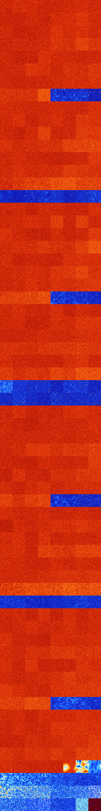

# B258 (149504-150015)

<details>
    <summary>Initial Grid</summary>
    
</details>


<details>
    <summary>Initial Grid RLE</summary>

```
#C Exported from GoGoL (https://github.com/marrow16/gogol)
#C Wrap mode: Toroidal
#C Boundary mode: Dead
#C Step: 0
x = 100, y = 100, rule = B258/S
8bo11bo41bo12bo$2o27bo25bo3bo10bo22bo$27bo30bo14bo9b2o3bo5bo$o24bo10bo
2bo24bo18bo4bobo8bo$13bo53bo5bo$bo$19bo56bo2bo11bo$23bo11bo4bo16bo2bo2b
o25bo$3bo6b2o6bo17bo19bobo2bo5bo16bo$3bo52bo15bo$7bo24bo3bo20bo12bo17bo
5bo$6b2o8bo24bobo2bo$30bo8b2o18bo21bo$12bo11bo13bo28bo$47bo18bo13bobo$
32bo4bo44bo$29bo$66bobo6bo23bo$100b$24bo6bo32bobo12bo$19bo18bo7bo3bo12b
o$48bobo26bo16bo3bo$7bo6bo$o19bo5bo14bo49bo7bo$11bo16bo7bo11bo12bo$37bo
26bo25bo$34bo19bo8bo13bo6bo$9bo6bo10bo33bo13bo9bo10bo2bo$33b2o25bo13b2o
22bo$2bo38bo29bo2bobo20bo$6bo$2b2o5bo11bo4bo15bo8bo15bo24b2o4bo$11bo27b
o24bobo19bo$25bobo13bo15bo9bo$21bo16bobo20bo18bo6bo$55bo7bo8bo5bobo14bo
$20bo33bo7bo4bo15bo11bo$33bo16bo12bo16bo$13bobo4bo15bo12bo9bo13bo4bo4bo
$25bo6bo13bo4bo44b2obo$16bo40bo4bo23bo3bo3bo$15bo27bo$4bo8bo20bo12bo10b
o$34bo$o27bo8bo14bo9bo10bo5bo$4bo14bo32bo14bo$8bo5bo30bo10bo21bo$27bo
15bo15bo5bo$21bo71bo$21bo4bobo25bo5bo10bo18bo3bo$9bo3bo9bo5bo24bo32bo
10bo$2b2o10bo10bo23bo21bo11bo$31bo22bo6bo29bo$23bo6bo13bo21bo$22bo41bo
5bo11bo13bo$3bo3bo17bo27bo2bo26bo$3bo2b2o18bo16bo7bo3bo25bo$18bo6bo26bo
16bo15bo$17bo9bo9bo9bo2bo30bo$18bo6bo25b2o2b2o22bo$61bo9bo15bo$9bo24bo$
14bo5bo21bobo34bo3bo5bo9bo$44bo20bo11bobo17bo$24bo6bo11bo4bo32bobo14bo$
5b2o9bo2bo18bo9bo7bobo3bo20bo15bo$6bo5bobo2bo6bo14bo20bobo14bo$o9bo12bo
2bo54bo$16bo46bo4bo6bo7bo8bo$3bo3bo8bo47bo3bo7bo12bo2bo$24bo5bo8bo14bo
14bo20bo$23bo22bo12bobo3bo$7bobo16bo12b2o11bo22bo$bo21bo9bo41bo21bo$62b
2o15bo$3bo26bo25bo3bo$16b2o60bo$44bo3bo27bo6bobo$69bo14bobo$8bo24bo35bo
15bo$20bo19bo2bo22bo13bo$bobo37bo18bo$33bo22bo$43bo5b2o6bo2bo9bo13bo$5b
o13bo16bo9bo21bo9bo$34bo3bo8bobo18bo6bo$2bo4b2o84bo$7bo74bo$31bo14bo43b
o$3bo4bo2bo7bo40bo8bo$3bo25bo43bo15bo$3b2o28bo10bo18bo8bo6bo9bo$7bo10bo
20b2o3bo20bo16b2o13bo$6bo23bo28bo$36bo29bobobo4bo$24bo37bo33bo$8bo13bo
44bo6bo$28bo23bo42bo$o27bo30bo18bo$97bo!
```
</details>
<details>
    <summary>Thumbnail</summary>

</details>
<table>
<tr>
    <td><a href="./149504%20S%20Heat%20Map%20Activity.png"></a><br>S (149504)<br>G>1000</td>    <td><a href="./149505%20S0%20Heat%20Map%20Activity.png"></a><br>S0 (149505)<br>G>1000</td>    <td><a href="./149506%20S1%20Heat%20Map%20Activity.png"></a><br>S1 (149506)<br>G>1000</td>    <td><a href="./149507%20S01%20Heat%20Map%20Activity.png"></a><br>S01 (149507)<br>G>1000</td>    <td><a href="./149508%20S2%20Heat%20Map%20Activity.png"></a><br>S2 (149508)<br>G>1000</td>    <td><a href="./149509%20S02%20Heat%20Map%20Activity.png"></a><br>S02 (149509)<br>G>1000</td>    <td><a href="./149510%20S12%20Heat%20Map%20Activity.png"></a><br>S12 (149510)<br>G>1000</td>    <td><a href="./149511%20S012%20Heat%20Map%20Activity.png"></a><br>S012 (149511)<br>G>1000</td></tr>
<tr>
    <td><a href="./149512%20S3%20Heat%20Map%20Activity.png"></a><br>S3 (149512)<br>G>1000</td>    <td><a href="./149513%20S03%20Heat%20Map%20Activity.png"></a><br>S03 (149513)<br>G>1000</td>    <td><a href="./149514%20S13%20Heat%20Map%20Activity.png"></a><br>S13 (149514)<br>G>1000</td>    <td><a href="./149515%20S013%20Heat%20Map%20Activity.png"></a><br>S013 (149515)<br>G>1000</td>    <td><a href="./149516%20S23%20Heat%20Map%20Activity.png"></a><br>S23 (149516)<br>G>1000</td>    <td><a href="./149517%20S023%20Heat%20Map%20Activity.png"></a><br>S023 (149517)<br>G>1000</td>    <td><a href="./149518%20S123%20Heat%20Map%20Activity.png"></a><br>S123 (149518)<br>G>1000</td>    <td><a href="./149519%20S0123%20Heat%20Map%20Activity.png"></a><br>S0123 (149519)<br>G>1000</td></tr>
<tr>
    <td><a href="./149520%20S4%20Heat%20Map%20Activity.png"></a><br>S4 (149520)<br>G>1000</td>    <td><a href="./149521%20S04%20Heat%20Map%20Activity.png"></a><br>S04 (149521)<br>G>1000</td>    <td><a href="./149522%20S14%20Heat%20Map%20Activity.png"></a><br>S14 (149522)<br>G>1000</td>    <td><a href="./149523%20S014%20Heat%20Map%20Activity.png"></a><br>S014 (149523)<br>G>1000</td>    <td><a href="./149524%20S24%20Heat%20Map%20Activity.png"></a><br>S24 (149524)<br>G>1000</td>    <td><a href="./149525%20S024%20Heat%20Map%20Activity.png"></a><br>S024 (149525)<br>G>1000</td>    <td><a href="./149526%20S124%20Heat%20Map%20Activity.png"></a><br>S124 (149526)<br>G>1000</td>    <td><a href="./149527%20S0124%20Heat%20Map%20Activity.png"></a><br>S0124 (149527)<br>G>1000</td></tr>
<tr>
    <td><a href="./149528%20S34%20Heat%20Map%20Activity.png"></a><br>S34 (149528)<br>G>1000</td>    <td><a href="./149529%20S034%20Heat%20Map%20Activity.png"></a><br>S034 (149529)<br>G>1000</td>    <td><a href="./149530%20S134%20Heat%20Map%20Activity.png"></a><br>S134 (149530)<br>G>1000</td>    <td><a href="./149531%20S0134%20Heat%20Map%20Activity.png"></a><br>S0134 (149531)<br>G>1000</td>    <td><a href="./149532%20S234%20Heat%20Map%20Activity.png"></a><br>S234 (149532)<br>G>1000</td>    <td><a href="./149533%20S0234%20Heat%20Map%20Activity.png"></a><br>S0234 (149533)<br>G>1000</td>    <td><a href="./149534%20S1234%20Heat%20Map%20Activity.png"></a><br>S1234 (149534)<br>G>1000</td>    <td><a href="./149535%20S01234%20Heat%20Map%20Activity.png"></a><br>S01234 (149535)<br>G>1000</td></tr>
<tr>
    <td><a href="./149536%20S5%20Heat%20Map%20Activity.png"></a><br>S5 (149536)<br>G>1000</td>    <td><a href="./149537%20S05%20Heat%20Map%20Activity.png"></a><br>S05 (149537)<br>G>1000</td>    <td><a href="./149538%20S15%20Heat%20Map%20Activity.png"></a><br>S15 (149538)<br>G>1000</td>    <td><a href="./149539%20S015%20Heat%20Map%20Activity.png"></a><br>S015 (149539)<br>G>1000</td>    <td><a href="./149540%20S25%20Heat%20Map%20Activity.png"></a><br>S25 (149540)<br>G>1000</td>    <td><a href="./149541%20S025%20Heat%20Map%20Activity.png"></a><br>S025 (149541)<br>G>1000</td>    <td><a href="./149542%20S125%20Heat%20Map%20Activity.png"></a><br>S125 (149542)<br>G>1000</td>    <td><a href="./149543%20S0125%20Heat%20Map%20Activity.png"></a><br>S0125 (149543)<br>G>1000</td></tr>
<tr>
    <td><a href="./149544%20S35%20Heat%20Map%20Activity.png"></a><br>S35 (149544)<br>G>1000</td>    <td><a href="./149545%20S035%20Heat%20Map%20Activity.png"></a><br>S035 (149545)<br>G>1000</td>    <td><a href="./149546%20S135%20Heat%20Map%20Activity.png"></a><br>S135 (149546)<br>G>1000</td>    <td><a href="./149547%20S0135%20Heat%20Map%20Activity.png"></a><br>S0135 (149547)<br>G>1000</td>    <td><a href="./149548%20S235%20Heat%20Map%20Activity.png"></a><br>S235 (149548)<br>G>1000</td>    <td><a href="./149549%20S0235%20Heat%20Map%20Activity.png"></a><br>S0235 (149549)<br>G>1000</td>    <td><a href="./149550%20S1235%20Heat%20Map%20Activity.png"></a><br>S1235 (149550)<br>G>1000</td>    <td><a href="./149551%20S01235%20Heat%20Map%20Activity.png"></a><br>S01235 (149551)<br>G>1000</td></tr>
<tr>
    <td><a href="./149552%20S45%20Heat%20Map%20Activity.png"></a><br>S45 (149552)<br>G>1000</td>    <td><a href="./149553%20S045%20Heat%20Map%20Activity.png"></a><br>S045 (149553)<br>G>1000</td>    <td><a href="./149554%20S145%20Heat%20Map%20Activity.png"></a><br>S145 (149554)<br>G>1000</td>    <td><a href="./149555%20S0145%20Heat%20Map%20Activity.png"></a><br>S0145 (149555)<br>G>1000</td>    <td><a href="./149556%20S245%20Heat%20Map%20Activity.png"></a><br>S245 (149556)<br>G>1000</td>    <td><a href="./149557%20S0245%20Heat%20Map%20Activity.png"></a><br>S0245 (149557)<br>G>1000</td>    <td><a href="./149558%20S1245%20Heat%20Map%20Activity.png"></a><br>S1245 (149558)<br>G>1000</td>    <td><a href="./149559%20S01245%20Heat%20Map%20Activity.png"></a><br>S01245 (149559)<br>G>1000</td></tr>
<tr>
    <td><a href="./149560%20S345%20Heat%20Map%20Activity.png"></a><br>S345 (149560)<br>G>1000</td>    <td><a href="./149561%20S0345%20Heat%20Map%20Activity.png"></a><br>S0345 (149561)<br>G>1000</td>    <td><a href="./149562%20S1345%20Heat%20Map%20Activity.png"></a><br>S1345 (149562)<br>G>1000</td>    <td><a href="./149563%20S01345%20Heat%20Map%20Activity.png"></a><br>S01345 (149563)<br>G>1000</td>    <td><a href="./149564%20S2345%20Heat%20Map%20Activity.png"></a><br>S2345 (149564)<br>G>1000</td>    <td><a href="./149565%20S02345%20Heat%20Map%20Activity.png"></a><br>S02345 (149565)<br>G>1000</td>    <td><a href="./149566%20S12345%20Heat%20Map%20Activity.png"></a><br>S12345 (149566)<br>R@284,p6</td>    <td><a href="./149567%20S012345%20Heat%20Map%20Activity.png"></a><br>S012345 (149567)<br>G>1000</td></tr>
<tr>
    <td><a href="./149568%20S6%20Heat%20Map%20Activity.png"></a><br>S6 (149568)<br>G>1000</td>    <td><a href="./149569%20S06%20Heat%20Map%20Activity.png"></a><br>S06 (149569)<br>G>1000</td>    <td><a href="./149570%20S16%20Heat%20Map%20Activity.png"></a><br>S16 (149570)<br>G>1000</td>    <td><a href="./149571%20S016%20Heat%20Map%20Activity.png"></a><br>S016 (149571)<br>G>1000</td>    <td><a href="./149572%20S26%20Heat%20Map%20Activity.png"></a><br>S26 (149572)<br>G>1000</td>    <td><a href="./149573%20S026%20Heat%20Map%20Activity.png"></a><br>S026 (149573)<br>G>1000</td>    <td><a href="./149574%20S126%20Heat%20Map%20Activity.png"></a><br>S126 (149574)<br>G>1000</td>    <td><a href="./149575%20S0126%20Heat%20Map%20Activity.png"></a><br>S0126 (149575)<br>G>1000</td></tr>
<tr>
    <td><a href="./149576%20S36%20Heat%20Map%20Activity.png"></a><br>S36 (149576)<br>G>1000</td>    <td><a href="./149577%20S036%20Heat%20Map%20Activity.png"></a><br>S036 (149577)<br>G>1000</td>    <td><a href="./149578%20S136%20Heat%20Map%20Activity.png"></a><br>S136 (149578)<br>G>1000</td>    <td><a href="./149579%20S0136%20Heat%20Map%20Activity.png"></a><br>S0136 (149579)<br>G>1000</td>    <td><a href="./149580%20S236%20Heat%20Map%20Activity.png"></a><br>S236 (149580)<br>G>1000</td>    <td><a href="./149581%20S0236%20Heat%20Map%20Activity.png"></a><br>S0236 (149581)<br>G>1000</td>    <td><a href="./149582%20S1236%20Heat%20Map%20Activity.png"></a><br>S1236 (149582)<br>G>1000</td>    <td><a href="./149583%20S01236%20Heat%20Map%20Activity.png"></a><br>S01236 (149583)<br>G>1000</td></tr>
<tr>
    <td><a href="./149584%20S46%20Heat%20Map%20Activity.png"></a><br>S46 (149584)<br>G>1000</td>    <td><a href="./149585%20S046%20Heat%20Map%20Activity.png"></a><br>S046 (149585)<br>G>1000</td>    <td><a href="./149586%20S146%20Heat%20Map%20Activity.png"></a><br>S146 (149586)<br>G>1000</td>    <td><a href="./149587%20S0146%20Heat%20Map%20Activity.png"></a><br>S0146 (149587)<br>G>1000</td>    <td><a href="./149588%20S246%20Heat%20Map%20Activity.png"></a><br>S246 (149588)<br>G>1000</td>    <td><a href="./149589%20S0246%20Heat%20Map%20Activity.png"></a><br>S0246 (149589)<br>G>1000</td>    <td><a href="./149590%20S1246%20Heat%20Map%20Activity.png"></a><br>S1246 (149590)<br>G>1000</td>    <td><a href="./149591%20S01246%20Heat%20Map%20Activity.png"></a><br>S01246 (149591)<br>G>1000</td></tr>
<tr>
    <td><a href="./149592%20S346%20Heat%20Map%20Activity.png"></a><br>S346 (149592)<br>G>1000</td>    <td><a href="./149593%20S0346%20Heat%20Map%20Activity.png"></a><br>S0346 (149593)<br>G>1000</td>    <td><a href="./149594%20S1346%20Heat%20Map%20Activity.png"></a><br>S1346 (149594)<br>G>1000</td>    <td><a href="./149595%20S01346%20Heat%20Map%20Activity.png"></a><br>S01346 (149595)<br>G>1000</td>    <td><a href="./149596%20S2346%20Heat%20Map%20Activity.png"></a><br>S2346 (149596)<br>G>1000</td>    <td><a href="./149597%20S02346%20Heat%20Map%20Activity.png"></a><br>S02346 (149597)<br>G>1000</td>    <td><a href="./149598%20S12346%20Heat%20Map%20Activity.png"></a><br>S12346 (149598)<br>G>1000</td>    <td><a href="./149599%20S012346%20Heat%20Map%20Activity.png"></a><br>S012346 (149599)<br>G>1000</td></tr>
<tr>
    <td><a href="./149600%20S56%20Heat%20Map%20Activity.png"></a><br>S56 (149600)<br>G>1000</td>    <td><a href="./149601%20S056%20Heat%20Map%20Activity.png"></a><br>S056 (149601)<br>G>1000</td>    <td><a href="./149602%20S156%20Heat%20Map%20Activity.png"></a><br>S156 (149602)<br>G>1000</td>    <td><a href="./149603%20S0156%20Heat%20Map%20Activity.png"></a><br>S0156 (149603)<br>G>1000</td>    <td><a href="./149604%20S256%20Heat%20Map%20Activity.png"></a><br>S256 (149604)<br>G>1000</td>    <td><a href="./149605%20S0256%20Heat%20Map%20Activity.png"></a><br>S0256 (149605)<br>G>1000</td>    <td><a href="./149606%20S1256%20Heat%20Map%20Activity.png"></a><br>S1256 (149606)<br>G>1000</td>    <td><a href="./149607%20S01256%20Heat%20Map%20Activity.png"></a><br>S01256 (149607)<br>G>1000</td></tr>
<tr>
    <td><a href="./149608%20S356%20Heat%20Map%20Activity.png"></a><br>S356 (149608)<br>G>1000</td>    <td><a href="./149609%20S0356%20Heat%20Map%20Activity.png"></a><br>S0356 (149609)<br>G>1000</td>    <td><a href="./149610%20S1356%20Heat%20Map%20Activity.png"></a><br>S1356 (149610)<br>G>1000</td>    <td><a href="./149611%20S01356%20Heat%20Map%20Activity.png"></a><br>S01356 (149611)<br>G>1000</td>    <td><a href="./149612%20S2356%20Heat%20Map%20Activity.png"></a><br>S2356 (149612)<br>G>1000</td>    <td><a href="./149613%20S02356%20Heat%20Map%20Activity.png"></a><br>S02356 (149613)<br>G>1000</td>    <td><a href="./149614%20S12356%20Heat%20Map%20Activity.png"></a><br>S12356 (149614)<br>G>1000</td>    <td><a href="./149615%20S012356%20Heat%20Map%20Activity.png"></a><br>S012356 (149615)<br>G>1000</td></tr>
<tr>
    <td><a href="./149616%20S456%20Heat%20Map%20Activity.png"></a><br>S456 (149616)<br>G>1000</td>    <td><a href="./149617%20S0456%20Heat%20Map%20Activity.png"></a><br>S0456 (149617)<br>G>1000</td>    <td><a href="./149618%20S1456%20Heat%20Map%20Activity.png"></a><br>S1456 (149618)<br>G>1000</td>    <td><a href="./149619%20S01456%20Heat%20Map%20Activity.png"></a><br>S01456 (149619)<br>G>1000</td>    <td><a href="./149620%20S2456%20Heat%20Map%20Activity.png"></a><br>S2456 (149620)<br>G>1000</td>    <td><a href="./149621%20S02456%20Heat%20Map%20Activity.png"></a><br>S02456 (149621)<br>G>1000</td>    <td><a href="./149622%20S12456%20Heat%20Map%20Activity.png"></a><br>S12456 (149622)<br>G>1000</td>    <td><a href="./149623%20S012456%20Heat%20Map%20Activity.png"></a><br>S012456 (149623)<br>G>1000</td></tr>
<tr>
    <td><a href="./149624%20S3456%20Heat%20Map%20Activity.png"></a><br>S3456 (149624)<br>R@414,p12</td>    <td><a href="./149625%20S03456%20Heat%20Map%20Activity.png"></a><br>S03456 (149625)<br>R@999,p630</td>    <td><a href="./149626%20S13456%20Heat%20Map%20Activity.png"></a><br>S13456 (149626)<br>R@284,p24</td>    <td><a href="./149627%20S013456%20Heat%20Map%20Activity.png"></a><br>S013456 (149627)<br>R@179,p24</td>    <td><a href="./149628%20S23456%20Heat%20Map%20Activity.png"></a><br>S23456 (149628)<br>R@69,p12</td>    <td><a href="./149629%20S023456%20Heat%20Map%20Activity.png"></a><br>S023456 (149629)<br>R@134,p84</td>    <td><a href="./149630%20S123456%20Heat%20Map%20Activity.png"></a><br>S123456 (149630)<br>R@59,p24</td>    <td><a href="./149631%20S0123456%20Heat%20Map%20Activity.png"></a><br>S0123456 (149631)<br>R@42,p6</td></tr>
<tr>
    <td><a href="./149632%20S7%20Heat%20Map%20Activity.png"></a><br>S7 (149632)<br>G>1000</td>    <td><a href="./149633%20S07%20Heat%20Map%20Activity.png"></a><br>S07 (149633)<br>G>1000</td>    <td><a href="./149634%20S17%20Heat%20Map%20Activity.png"></a><br>S17 (149634)<br>G>1000</td>    <td><a href="./149635%20S017%20Heat%20Map%20Activity.png"></a><br>S017 (149635)<br>G>1000</td>    <td><a href="./149636%20S27%20Heat%20Map%20Activity.png"></a><br>S27 (149636)<br>G>1000</td>    <td><a href="./149637%20S027%20Heat%20Map%20Activity.png"></a><br>S027 (149637)<br>G>1000</td>    <td><a href="./149638%20S127%20Heat%20Map%20Activity.png"></a><br>S127 (149638)<br>G>1000</td>    <td><a href="./149639%20S0127%20Heat%20Map%20Activity.png"></a><br>S0127 (149639)<br>G>1000</td></tr>
<tr>
    <td><a href="./149640%20S37%20Heat%20Map%20Activity.png"></a><br>S37 (149640)<br>G>1000</td>    <td><a href="./149641%20S037%20Heat%20Map%20Activity.png"></a><br>S037 (149641)<br>G>1000</td>    <td><a href="./149642%20S137%20Heat%20Map%20Activity.png"></a><br>S137 (149642)<br>G>1000</td>    <td><a href="./149643%20S0137%20Heat%20Map%20Activity.png"></a><br>S0137 (149643)<br>G>1000</td>    <td><a href="./149644%20S237%20Heat%20Map%20Activity.png"></a><br>S237 (149644)<br>G>1000</td>    <td><a href="./149645%20S0237%20Heat%20Map%20Activity.png"></a><br>S0237 (149645)<br>G>1000</td>    <td><a href="./149646%20S1237%20Heat%20Map%20Activity.png"></a><br>S1237 (149646)<br>G>1000</td>    <td><a href="./149647%20S01237%20Heat%20Map%20Activity.png"></a><br>S01237 (149647)<br>G>1000</td></tr>
<tr>
    <td><a href="./149648%20S47%20Heat%20Map%20Activity.png"></a><br>S47 (149648)<br>G>1000</td>    <td><a href="./149649%20S047%20Heat%20Map%20Activity.png"></a><br>S047 (149649)<br>G>1000</td>    <td><a href="./149650%20S147%20Heat%20Map%20Activity.png"></a><br>S147 (149650)<br>G>1000</td>    <td><a href="./149651%20S0147%20Heat%20Map%20Activity.png"></a><br>S0147 (149651)<br>G>1000</td>    <td><a href="./149652%20S247%20Heat%20Map%20Activity.png"></a><br>S247 (149652)<br>G>1000</td>    <td><a href="./149653%20S0247%20Heat%20Map%20Activity.png"></a><br>S0247 (149653)<br>G>1000</td>    <td><a href="./149654%20S1247%20Heat%20Map%20Activity.png"></a><br>S1247 (149654)<br>G>1000</td>    <td><a href="./149655%20S01247%20Heat%20Map%20Activity.png"></a><br>S01247 (149655)<br>G>1000</td></tr>
<tr>
    <td><a href="./149656%20S347%20Heat%20Map%20Activity.png"></a><br>S347 (149656)<br>G>1000</td>    <td><a href="./149657%20S0347%20Heat%20Map%20Activity.png"></a><br>S0347 (149657)<br>G>1000</td>    <td><a href="./149658%20S1347%20Heat%20Map%20Activity.png"></a><br>S1347 (149658)<br>G>1000</td>    <td><a href="./149659%20S01347%20Heat%20Map%20Activity.png"></a><br>S01347 (149659)<br>G>1000</td>    <td><a href="./149660%20S2347%20Heat%20Map%20Activity.png"></a><br>S2347 (149660)<br>G>1000</td>    <td><a href="./149661%20S02347%20Heat%20Map%20Activity.png"></a><br>S02347 (149661)<br>G>1000</td>    <td><a href="./149662%20S12347%20Heat%20Map%20Activity.png"></a><br>S12347 (149662)<br>G>1000</td>    <td><a href="./149663%20S012347%20Heat%20Map%20Activity.png"></a><br>S012347 (149663)<br>G>1000</td></tr>
<tr>
    <td><a href="./149664%20S57%20Heat%20Map%20Activity.png"></a><br>S57 (149664)<br>G>1000</td>    <td><a href="./149665%20S057%20Heat%20Map%20Activity.png"></a><br>S057 (149665)<br>G>1000</td>    <td><a href="./149666%20S157%20Heat%20Map%20Activity.png"></a><br>S157 (149666)<br>G>1000</td>    <td><a href="./149667%20S0157%20Heat%20Map%20Activity.png"></a><br>S0157 (149667)<br>G>1000</td>    <td><a href="./149668%20S257%20Heat%20Map%20Activity.png"></a><br>S257 (149668)<br>G>1000</td>    <td><a href="./149669%20S0257%20Heat%20Map%20Activity.png"></a><br>S0257 (149669)<br>G>1000</td>    <td><a href="./149670%20S1257%20Heat%20Map%20Activity.png"></a><br>S1257 (149670)<br>G>1000</td>    <td><a href="./149671%20S01257%20Heat%20Map%20Activity.png"></a><br>S01257 (149671)<br>G>1000</td></tr>
<tr>
    <td><a href="./149672%20S357%20Heat%20Map%20Activity.png"></a><br>S357 (149672)<br>G>1000</td>    <td><a href="./149673%20S0357%20Heat%20Map%20Activity.png"></a><br>S0357 (149673)<br>G>1000</td>    <td><a href="./149674%20S1357%20Heat%20Map%20Activity.png"></a><br>S1357 (149674)<br>G>1000</td>    <td><a href="./149675%20S01357%20Heat%20Map%20Activity.png"></a><br>S01357 (149675)<br>G>1000</td>    <td><a href="./149676%20S2357%20Heat%20Map%20Activity.png"></a><br>S2357 (149676)<br>G>1000</td>    <td><a href="./149677%20S02357%20Heat%20Map%20Activity.png"></a><br>S02357 (149677)<br>G>1000</td>    <td><a href="./149678%20S12357%20Heat%20Map%20Activity.png"></a><br>S12357 (149678)<br>G>1000</td>    <td><a href="./149679%20S012357%20Heat%20Map%20Activity.png"></a><br>S012357 (149679)<br>G>1000</td></tr>
<tr>
    <td><a href="./149680%20S457%20Heat%20Map%20Activity.png"></a><br>S457 (149680)<br>G>1000</td>    <td><a href="./149681%20S0457%20Heat%20Map%20Activity.png"></a><br>S0457 (149681)<br>G>1000</td>    <td><a href="./149682%20S1457%20Heat%20Map%20Activity.png"></a><br>S1457 (149682)<br>G>1000</td>    <td><a href="./149683%20S01457%20Heat%20Map%20Activity.png"></a><br>S01457 (149683)<br>G>1000</td>    <td><a href="./149684%20S2457%20Heat%20Map%20Activity.png"></a><br>S2457 (149684)<br>G>1000</td>    <td><a href="./149685%20S02457%20Heat%20Map%20Activity.png"></a><br>S02457 (149685)<br>G>1000</td>    <td><a href="./149686%20S12457%20Heat%20Map%20Activity.png"></a><br>S12457 (149686)<br>G>1000</td>    <td><a href="./149687%20S012457%20Heat%20Map%20Activity.png"></a><br>S012457 (149687)<br>G>1000</td></tr>
<tr>
    <td><a href="./149688%20S3457%20Heat%20Map%20Activity.png"></a><br>S3457 (149688)<br>G>1000</td>    <td><a href="./149689%20S03457%20Heat%20Map%20Activity.png"></a><br>S03457 (149689)<br>G>1000</td>    <td><a href="./149690%20S13457%20Heat%20Map%20Activity.png"></a><br>S13457 (149690)<br>G>1000</td>    <td><a href="./149691%20S013457%20Heat%20Map%20Activity.png"></a><br>S013457 (149691)<br>G>1000</td>    <td><a href="./149692%20S23457%20Heat%20Map%20Activity.png"></a><br>S23457 (149692)<br>R@501,p12</td>    <td><a href="./149693%20S023457%20Heat%20Map%20Activity.png"></a><br>S023457 (149693)<br>R@557,p12</td>    <td><a href="./149694%20S123457%20Heat%20Map%20Activity.png"></a><br>S123457 (149694)<br>R@371,p30</td>    <td><a href="./149695%20S0123457%20Heat%20Map%20Activity.png"></a><br>S0123457 (149695)<br>R@588,p312</td></tr>
<tr>
    <td><a href="./149696%20S67%20Heat%20Map%20Activity.png"></a><br>S67 (149696)<br>G>1000</td>    <td><a href="./149697%20S067%20Heat%20Map%20Activity.png"></a><br>S067 (149697)<br>G>1000</td>    <td><a href="./149698%20S167%20Heat%20Map%20Activity.png"></a><br>S167 (149698)<br>G>1000</td>    <td><a href="./149699%20S0167%20Heat%20Map%20Activity.png"></a><br>S0167 (149699)<br>G>1000</td>    <td><a href="./149700%20S267%20Heat%20Map%20Activity.png"></a><br>S267 (149700)<br>G>1000</td>    <td><a href="./149701%20S0267%20Heat%20Map%20Activity.png"></a><br>S0267 (149701)<br>G>1000</td>    <td><a href="./149702%20S1267%20Heat%20Map%20Activity.png"></a><br>S1267 (149702)<br>G>1000</td>    <td><a href="./149703%20S01267%20Heat%20Map%20Activity.png"></a><br>S01267 (149703)<br>G>1000</td></tr>
<tr>
    <td><a href="./149704%20S367%20Heat%20Map%20Activity.png"></a><br>S367 (149704)<br>G>1000</td>    <td><a href="./149705%20S0367%20Heat%20Map%20Activity.png"></a><br>S0367 (149705)<br>G>1000</td>    <td><a href="./149706%20S1367%20Heat%20Map%20Activity.png"></a><br>S1367 (149706)<br>G>1000</td>    <td><a href="./149707%20S01367%20Heat%20Map%20Activity.png"></a><br>S01367 (149707)<br>G>1000</td>    <td><a href="./149708%20S2367%20Heat%20Map%20Activity.png"></a><br>S2367 (149708)<br>G>1000</td>    <td><a href="./149709%20S02367%20Heat%20Map%20Activity.png"></a><br>S02367 (149709)<br>G>1000</td>    <td><a href="./149710%20S12367%20Heat%20Map%20Activity.png"></a><br>S12367 (149710)<br>G>1000</td>    <td><a href="./149711%20S012367%20Heat%20Map%20Activity.png"></a><br>S012367 (149711)<br>G>1000</td></tr>
<tr>
    <td><a href="./149712%20S467%20Heat%20Map%20Activity.png"></a><br>S467 (149712)<br>G>1000</td>    <td><a href="./149713%20S0467%20Heat%20Map%20Activity.png"></a><br>S0467 (149713)<br>G>1000</td>    <td><a href="./149714%20S1467%20Heat%20Map%20Activity.png"></a><br>S1467 (149714)<br>G>1000</td>    <td><a href="./149715%20S01467%20Heat%20Map%20Activity.png"></a><br>S01467 (149715)<br>G>1000</td>    <td><a href="./149716%20S2467%20Heat%20Map%20Activity.png"></a><br>S2467 (149716)<br>G>1000</td>    <td><a href="./149717%20S02467%20Heat%20Map%20Activity.png"></a><br>S02467 (149717)<br>G>1000</td>    <td><a href="./149718%20S12467%20Heat%20Map%20Activity.png"></a><br>S12467 (149718)<br>G>1000</td>    <td><a href="./149719%20S012467%20Heat%20Map%20Activity.png"></a><br>S012467 (149719)<br>G>1000</td></tr>
<tr>
    <td><a href="./149720%20S3467%20Heat%20Map%20Activity.png"></a><br>S3467 (149720)<br>G>1000</td>    <td><a href="./149721%20S03467%20Heat%20Map%20Activity.png"></a><br>S03467 (149721)<br>G>1000</td>    <td><a href="./149722%20S13467%20Heat%20Map%20Activity.png"></a><br>S13467 (149722)<br>G>1000</td>    <td><a href="./149723%20S013467%20Heat%20Map%20Activity.png"></a><br>S013467 (149723)<br>G>1000</td>    <td><a href="./149724%20S23467%20Heat%20Map%20Activity.png"></a><br>S23467 (149724)<br>G>1000</td>    <td><a href="./149725%20S023467%20Heat%20Map%20Activity.png"></a><br>S023467 (149725)<br>G>1000</td>    <td><a href="./149726%20S123467%20Heat%20Map%20Activity.png"></a><br>S123467 (149726)<br>G>1000</td>    <td><a href="./149727%20S0123467%20Heat%20Map%20Activity.png"></a><br>S0123467 (149727)<br>G>1000</td></tr>
<tr>
    <td><a href="./149728%20S567%20Heat%20Map%20Activity.png"></a><br>S567 (149728)<br>G>1000</td>    <td><a href="./149729%20S0567%20Heat%20Map%20Activity.png"></a><br>S0567 (149729)<br>G>1000</td>    <td><a href="./149730%20S1567%20Heat%20Map%20Activity.png"></a><br>S1567 (149730)<br>G>1000</td>    <td><a href="./149731%20S01567%20Heat%20Map%20Activity.png"></a><br>S01567 (149731)<br>G>1000</td>    <td><a href="./149732%20S2567%20Heat%20Map%20Activity.png"></a><br>S2567 (149732)<br>G>1000</td>    <td><a href="./149733%20S02567%20Heat%20Map%20Activity.png"></a><br>S02567 (149733)<br>G>1000</td>    <td><a href="./149734%20S12567%20Heat%20Map%20Activity.png"></a><br>S12567 (149734)<br>G>1000</td>    <td><a href="./149735%20S012567%20Heat%20Map%20Activity.png"></a><br>S012567 (149735)<br>G>1000</td></tr>
<tr>
    <td><a href="./149736%20S3567%20Heat%20Map%20Activity.png"></a><br>S3567 (149736)<br>G>1000</td>    <td><a href="./149737%20S03567%20Heat%20Map%20Activity.png"></a><br>S03567 (149737)<br>G>1000</td>    <td><a href="./149738%20S13567%20Heat%20Map%20Activity.png"></a><br>S13567 (149738)<br>G>1000</td>    <td><a href="./149739%20S013567%20Heat%20Map%20Activity.png"></a><br>S013567 (149739)<br>G>1000</td>    <td><a href="./149740%20S23567%20Heat%20Map%20Activity.png"></a><br>S23567 (149740)<br>G>1000</td>    <td><a href="./149741%20S023567%20Heat%20Map%20Activity.png"></a><br>S023567 (149741)<br>G>1000</td>    <td><a href="./149742%20S123567%20Heat%20Map%20Activity.png"></a><br>S123567 (149742)<br>G>1000</td>    <td><a href="./149743%20S0123567%20Heat%20Map%20Activity.png"></a><br>S0123567 (149743)<br>G>1000</td></tr>
<tr>
    <td><a href="./149744%20S4567%20Heat%20Map%20Activity.png"></a><br>S4567 (149744)<br>R@126,p12</td>    <td><a href="./149745%20S04567%20Heat%20Map%20Activity.png"></a><br>S04567 (149745)<br>R@173,p60</td>    <td><a href="./149746%20S14567%20Heat%20Map%20Activity.png"></a><br>S14567 (149746)<br>R@160,p60</td>    <td><a href="./149747%20S014567%20Heat%20Map%20Activity.png"></a><br>S014567 (149747)<br>R@137,p60</td>    <td><a href="./149748%20S24567%20Heat%20Map%20Activity.png"></a><br>S24567 (149748)<br>R@225,p156</td>    <td><a href="./149749%20S024567%20Heat%20Map%20Activity.png"></a><br>S024567 (149749)<br>R@75,p12</td>    <td><a href="./149750%20S124567%20Heat%20Map%20Activity.png"></a><br>S124567 (149750)<br>R@64,p6</td>    <td><a href="./149751%20S0124567%20Heat%20Map%20Activity.png"></a><br>S0124567 (149751)<br>R@130,p60</td></tr>
<tr>
    <td><a href="./149752%20S34567%20Heat%20Map%20Activity.png"></a><br>S34567 (149752)<br>R@104,p60</td>    <td><a href="./149753%20S034567%20Heat%20Map%20Activity.png"></a><br>S034567 (149753)<br>R@47,p12</td>    <td><a href="./149754%20S134567%20Heat%20Map%20Activity.png"></a><br>S134567 (149754)<br>R@53,p12</td>    <td><a href="./149755%20S0134567%20Heat%20Map%20Activity.png"></a><br>S0134567 (149755)<br>R@86,p60</td>    <td><a href="./149756%20S234567%20Heat%20Map%20Activity.png"></a><br>S234567 (149756)<br>R@42,p12</td>    <td><a href="./149757%20S0234567%20Heat%20Map%20Activity.png"></a><br>S0234567 (149757)<br>R@41,p12</td>    <td><a href="./149758%20S1234567%20Heat%20Map%20Activity.png"></a><br>S1234567 (149758)<br>R@37,p12</td>    <td><a href="./149759%20S01234567%20Heat%20Map%20Activity.png"></a><br>S01234567 (149759)<br>R@33,p12</td></tr>
<tr>
    <td><a href="./149760%20S8%20Heat%20Map%20Activity.png"></a><br>S8 (149760)<br>G>1000</td>    <td><a href="./149761%20S08%20Heat%20Map%20Activity.png"></a><br>S08 (149761)<br>G>1000</td>    <td><a href="./149762%20S18%20Heat%20Map%20Activity.png"></a><br>S18 (149762)<br>G>1000</td>    <td><a href="./149763%20S018%20Heat%20Map%20Activity.png"></a><br>S018 (149763)<br>G>1000</td>    <td><a href="./149764%20S28%20Heat%20Map%20Activity.png"></a><br>S28 (149764)<br>G>1000</td>    <td><a href="./149765%20S028%20Heat%20Map%20Activity.png"></a><br>S028 (149765)<br>G>1000</td>    <td><a href="./149766%20S128%20Heat%20Map%20Activity.png"></a><br>S128 (149766)<br>G>1000</td>    <td><a href="./149767%20S0128%20Heat%20Map%20Activity.png"></a><br>S0128 (149767)<br>G>1000</td></tr>
<tr>
    <td><a href="./149768%20S38%20Heat%20Map%20Activity.png"></a><br>S38 (149768)<br>G>1000</td>    <td><a href="./149769%20S038%20Heat%20Map%20Activity.png"></a><br>S038 (149769)<br>G>1000</td>    <td><a href="./149770%20S138%20Heat%20Map%20Activity.png"></a><br>S138 (149770)<br>G>1000</td>    <td><a href="./149771%20S0138%20Heat%20Map%20Activity.png"></a><br>S0138 (149771)<br>G>1000</td>    <td><a href="./149772%20S238%20Heat%20Map%20Activity.png"></a><br>S238 (149772)<br>G>1000</td>    <td><a href="./149773%20S0238%20Heat%20Map%20Activity.png"></a><br>S0238 (149773)<br>G>1000</td>    <td><a href="./149774%20S1238%20Heat%20Map%20Activity.png"></a><br>S1238 (149774)<br>G>1000</td>    <td><a href="./149775%20S01238%20Heat%20Map%20Activity.png"></a><br>S01238 (149775)<br>G>1000</td></tr>
<tr>
    <td><a href="./149776%20S48%20Heat%20Map%20Activity.png"></a><br>S48 (149776)<br>G>1000</td>    <td><a href="./149777%20S048%20Heat%20Map%20Activity.png"></a><br>S048 (149777)<br>G>1000</td>    <td><a href="./149778%20S148%20Heat%20Map%20Activity.png"></a><br>S148 (149778)<br>G>1000</td>    <td><a href="./149779%20S0148%20Heat%20Map%20Activity.png"></a><br>S0148 (149779)<br>G>1000</td>    <td><a href="./149780%20S248%20Heat%20Map%20Activity.png"></a><br>S248 (149780)<br>G>1000</td>    <td><a href="./149781%20S0248%20Heat%20Map%20Activity.png"></a><br>S0248 (149781)<br>G>1000</td>    <td><a href="./149782%20S1248%20Heat%20Map%20Activity.png"></a><br>S1248 (149782)<br>G>1000</td>    <td><a href="./149783%20S01248%20Heat%20Map%20Activity.png"></a><br>S01248 (149783)<br>G>1000</td></tr>
<tr>
    <td><a href="./149784%20S348%20Heat%20Map%20Activity.png"></a><br>S348 (149784)<br>G>1000</td>    <td><a href="./149785%20S0348%20Heat%20Map%20Activity.png"></a><br>S0348 (149785)<br>G>1000</td>    <td><a href="./149786%20S1348%20Heat%20Map%20Activity.png"></a><br>S1348 (149786)<br>G>1000</td>    <td><a href="./149787%20S01348%20Heat%20Map%20Activity.png"></a><br>S01348 (149787)<br>G>1000</td>    <td><a href="./149788%20S2348%20Heat%20Map%20Activity.png"></a><br>S2348 (149788)<br>G>1000</td>    <td><a href="./149789%20S02348%20Heat%20Map%20Activity.png"></a><br>S02348 (149789)<br>G>1000</td>    <td><a href="./149790%20S12348%20Heat%20Map%20Activity.png"></a><br>S12348 (149790)<br>G>1000</td>    <td><a href="./149791%20S012348%20Heat%20Map%20Activity.png"></a><br>S012348 (149791)<br>G>1000</td></tr>
<tr>
    <td><a href="./149792%20S58%20Heat%20Map%20Activity.png"></a><br>S58 (149792)<br>G>1000</td>    <td><a href="./149793%20S058%20Heat%20Map%20Activity.png"></a><br>S058 (149793)<br>G>1000</td>    <td><a href="./149794%20S158%20Heat%20Map%20Activity.png"></a><br>S158 (149794)<br>G>1000</td>    <td><a href="./149795%20S0158%20Heat%20Map%20Activity.png"></a><br>S0158 (149795)<br>G>1000</td>    <td><a href="./149796%20S258%20Heat%20Map%20Activity.png"></a><br>S258 (149796)<br>G>1000</td>    <td><a href="./149797%20S0258%20Heat%20Map%20Activity.png"></a><br>S0258 (149797)<br>G>1000</td>    <td><a href="./149798%20S1258%20Heat%20Map%20Activity.png"></a><br>S1258 (149798)<br>G>1000</td>    <td><a href="./149799%20S01258%20Heat%20Map%20Activity.png"></a><br>S01258 (149799)<br>G>1000</td></tr>
<tr>
    <td><a href="./149800%20S358%20Heat%20Map%20Activity.png"></a><br>S358 (149800)<br>G>1000</td>    <td><a href="./149801%20S0358%20Heat%20Map%20Activity.png"></a><br>S0358 (149801)<br>G>1000</td>    <td><a href="./149802%20S1358%20Heat%20Map%20Activity.png"></a><br>S1358 (149802)<br>G>1000</td>    <td><a href="./149803%20S01358%20Heat%20Map%20Activity.png"></a><br>S01358 (149803)<br>G>1000</td>    <td><a href="./149804%20S2358%20Heat%20Map%20Activity.png"></a><br>S2358 (149804)<br>G>1000</td>    <td><a href="./149805%20S02358%20Heat%20Map%20Activity.png"></a><br>S02358 (149805)<br>G>1000</td>    <td><a href="./149806%20S12358%20Heat%20Map%20Activity.png"></a><br>S12358 (149806)<br>G>1000</td>    <td><a href="./149807%20S012358%20Heat%20Map%20Activity.png"></a><br>S012358 (149807)<br>G>1000</td></tr>
<tr>
    <td><a href="./149808%20S458%20Heat%20Map%20Activity.png"></a><br>S458 (149808)<br>G>1000</td>    <td><a href="./149809%20S0458%20Heat%20Map%20Activity.png"></a><br>S0458 (149809)<br>G>1000</td>    <td><a href="./149810%20S1458%20Heat%20Map%20Activity.png"></a><br>S1458 (149810)<br>G>1000</td>    <td><a href="./149811%20S01458%20Heat%20Map%20Activity.png"></a><br>S01458 (149811)<br>G>1000</td>    <td><a href="./149812%20S2458%20Heat%20Map%20Activity.png"></a><br>S2458 (149812)<br>G>1000</td>    <td><a href="./149813%20S02458%20Heat%20Map%20Activity.png"></a><br>S02458 (149813)<br>G>1000</td>    <td><a href="./149814%20S12458%20Heat%20Map%20Activity.png"></a><br>S12458 (149814)<br>G>1000</td>    <td><a href="./149815%20S012458%20Heat%20Map%20Activity.png"></a><br>S012458 (149815)<br>G>1000</td></tr>
<tr>
    <td><a href="./149816%20S3458%20Heat%20Map%20Activity.png"></a><br>S3458 (149816)<br>G>1000</td>    <td><a href="./149817%20S03458%20Heat%20Map%20Activity.png"></a><br>S03458 (149817)<br>G>1000</td>    <td><a href="./149818%20S13458%20Heat%20Map%20Activity.png"></a><br>S13458 (149818)<br>G>1000</td>    <td><a href="./149819%20S013458%20Heat%20Map%20Activity.png"></a><br>S013458 (149819)<br>G>1000</td>    <td><a href="./149820%20S23458%20Heat%20Map%20Activity.png"></a><br>S23458 (149820)<br>G>1000</td>    <td><a href="./149821%20S023458%20Heat%20Map%20Activity.png"></a><br>S023458 (149821)<br>R@903,p6</td>    <td><a href="./149822%20S123458%20Heat%20Map%20Activity.png"></a><br>S123458 (149822)<br>R@466,p30</td>    <td><a href="./149823%20S0123458%20Heat%20Map%20Activity.png"></a><br>S0123458 (149823)<br>R@452,p180</td></tr>
<tr>
    <td><a href="./149824%20S68%20Heat%20Map%20Activity.png"></a><br>S68 (149824)<br>G>1000</td>    <td><a href="./149825%20S068%20Heat%20Map%20Activity.png"></a><br>S068 (149825)<br>G>1000</td>    <td><a href="./149826%20S168%20Heat%20Map%20Activity.png"></a><br>S168 (149826)<br>G>1000</td>    <td><a href="./149827%20S0168%20Heat%20Map%20Activity.png"></a><br>S0168 (149827)<br>G>1000</td>    <td><a href="./149828%20S268%20Heat%20Map%20Activity.png"></a><br>S268 (149828)<br>G>1000</td>    <td><a href="./149829%20S0268%20Heat%20Map%20Activity.png"></a><br>S0268 (149829)<br>G>1000</td>    <td><a href="./149830%20S1268%20Heat%20Map%20Activity.png"></a><br>S1268 (149830)<br>G>1000</td>    <td><a href="./149831%20S01268%20Heat%20Map%20Activity.png"></a><br>S01268 (149831)<br>G>1000</td></tr>
<tr>
    <td><a href="./149832%20S368%20Heat%20Map%20Activity.png"></a><br>S368 (149832)<br>G>1000</td>    <td><a href="./149833%20S0368%20Heat%20Map%20Activity.png"></a><br>S0368 (149833)<br>G>1000</td>    <td><a href="./149834%20S1368%20Heat%20Map%20Activity.png"></a><br>S1368 (149834)<br>G>1000</td>    <td><a href="./149835%20S01368%20Heat%20Map%20Activity.png"></a><br>S01368 (149835)<br>G>1000</td>    <td><a href="./149836%20S2368%20Heat%20Map%20Activity.png"></a><br>S2368 (149836)<br>G>1000</td>    <td><a href="./149837%20S02368%20Heat%20Map%20Activity.png"></a><br>S02368 (149837)<br>G>1000</td>    <td><a href="./149838%20S12368%20Heat%20Map%20Activity.png"></a><br>S12368 (149838)<br>G>1000</td>    <td><a href="./149839%20S012368%20Heat%20Map%20Activity.png"></a><br>S012368 (149839)<br>G>1000</td></tr>
<tr>
    <td><a href="./149840%20S468%20Heat%20Map%20Activity.png"></a><br>S468 (149840)<br>G>1000</td>    <td><a href="./149841%20S0468%20Heat%20Map%20Activity.png"></a><br>S0468 (149841)<br>G>1000</td>    <td><a href="./149842%20S1468%20Heat%20Map%20Activity.png"></a><br>S1468 (149842)<br>G>1000</td>    <td><a href="./149843%20S01468%20Heat%20Map%20Activity.png"></a><br>S01468 (149843)<br>G>1000</td>    <td><a href="./149844%20S2468%20Heat%20Map%20Activity.png"></a><br>S2468 (149844)<br>G>1000</td>    <td><a href="./149845%20S02468%20Heat%20Map%20Activity.png"></a><br>S02468 (149845)<br>G>1000</td>    <td><a href="./149846%20S12468%20Heat%20Map%20Activity.png"></a><br>S12468 (149846)<br>G>1000</td>    <td><a href="./149847%20S012468%20Heat%20Map%20Activity.png"></a><br>S012468 (149847)<br>G>1000</td></tr>
<tr>
    <td><a href="./149848%20S3468%20Heat%20Map%20Activity.png"></a><br>S3468 (149848)<br>G>1000</td>    <td><a href="./149849%20S03468%20Heat%20Map%20Activity.png"></a><br>S03468 (149849)<br>G>1000</td>    <td><a href="./149850%20S13468%20Heat%20Map%20Activity.png"></a><br>S13468 (149850)<br>G>1000</td>    <td><a href="./149851%20S013468%20Heat%20Map%20Activity.png"></a><br>S013468 (149851)<br>G>1000</td>    <td><a href="./149852%20S23468%20Heat%20Map%20Activity.png"></a><br>S23468 (149852)<br>G>1000</td>    <td><a href="./149853%20S023468%20Heat%20Map%20Activity.png"></a><br>S023468 (149853)<br>G>1000</td>    <td><a href="./149854%20S123468%20Heat%20Map%20Activity.png"></a><br>S123468 (149854)<br>G>1000</td>    <td><a href="./149855%20S0123468%20Heat%20Map%20Activity.png"></a><br>S0123468 (149855)<br>G>1000</td></tr>
<tr>
    <td><a href="./149856%20S568%20Heat%20Map%20Activity.png"></a><br>S568 (149856)<br>G>1000</td>    <td><a href="./149857%20S0568%20Heat%20Map%20Activity.png"></a><br>S0568 (149857)<br>G>1000</td>    <td><a href="./149858%20S1568%20Heat%20Map%20Activity.png"></a><br>S1568 (149858)<br>G>1000</td>    <td><a href="./149859%20S01568%20Heat%20Map%20Activity.png"></a><br>S01568 (149859)<br>G>1000</td>    <td><a href="./149860%20S2568%20Heat%20Map%20Activity.png"></a><br>S2568 (149860)<br>G>1000</td>    <td><a href="./149861%20S02568%20Heat%20Map%20Activity.png"></a><br>S02568 (149861)<br>G>1000</td>    <td><a href="./149862%20S12568%20Heat%20Map%20Activity.png"></a><br>S12568 (149862)<br>G>1000</td>    <td><a href="./149863%20S012568%20Heat%20Map%20Activity.png"></a><br>S012568 (149863)<br>G>1000</td></tr>
<tr>
    <td><a href="./149864%20S3568%20Heat%20Map%20Activity.png"></a><br>S3568 (149864)<br>G>1000</td>    <td><a href="./149865%20S03568%20Heat%20Map%20Activity.png"></a><br>S03568 (149865)<br>G>1000</td>    <td><a href="./149866%20S13568%20Heat%20Map%20Activity.png"></a><br>S13568 (149866)<br>G>1000</td>    <td><a href="./149867%20S013568%20Heat%20Map%20Activity.png"></a><br>S013568 (149867)<br>G>1000</td>    <td><a href="./149868%20S23568%20Heat%20Map%20Activity.png"></a><br>S23568 (149868)<br>G>1000</td>    <td><a href="./149869%20S023568%20Heat%20Map%20Activity.png"></a><br>S023568 (149869)<br>G>1000</td>    <td><a href="./149870%20S123568%20Heat%20Map%20Activity.png"></a><br>S123568 (149870)<br>G>1000</td>    <td><a href="./149871%20S0123568%20Heat%20Map%20Activity.png"></a><br>S0123568 (149871)<br>G>1000</td></tr>
<tr>
    <td><a href="./149872%20S4568%20Heat%20Map%20Activity.png"></a><br>S4568 (149872)<br>G>1000</td>    <td><a href="./149873%20S04568%20Heat%20Map%20Activity.png"></a><br>S04568 (149873)<br>G>1000</td>    <td><a href="./149874%20S14568%20Heat%20Map%20Activity.png"></a><br>S14568 (149874)<br>G>1000</td>    <td><a href="./149875%20S014568%20Heat%20Map%20Activity.png"></a><br>S014568 (149875)<br>G>1000</td>    <td><a href="./149876%20S24568%20Heat%20Map%20Activity.png"></a><br>S24568 (149876)<br>G>1000</td>    <td><a href="./149877%20S024568%20Heat%20Map%20Activity.png"></a><br>S024568 (149877)<br>G>1000</td>    <td><a href="./149878%20S124568%20Heat%20Map%20Activity.png"></a><br>S124568 (149878)<br>G>1000</td>    <td><a href="./149879%20S0124568%20Heat%20Map%20Activity.png"></a><br>S0124568 (149879)<br>G>1000</td></tr>
<tr>
    <td><a href="./149880%20S34568%20Heat%20Map%20Activity.png"></a><br>S34568 (149880)<br>R@127,p4</td>    <td><a href="./149881%20S034568%20Heat%20Map%20Activity.png"></a><br>S034568 (149881)<br>R@106,p6</td>    <td><a href="./149882%20S134568%20Heat%20Map%20Activity.png"></a><br>S134568 (149882)<br>R@162,p6</td>    <td><a href="./149883%20S0134568%20Heat%20Map%20Activity.png"></a><br>S0134568 (149883)<br>R@168,p24</td>    <td><a href="./149884%20S234568%20Heat%20Map%20Activity.png"></a><br>S234568 (149884)<br>R@71,p30</td>    <td><a href="./149885%20S0234568%20Heat%20Map%20Activity.png"></a><br>S0234568 (149885)<br>R@50,p12</td>    <td><a href="./149886%20S1234568%20Heat%20Map%20Activity.png"></a><br>S1234568 (149886)<br>R@35,p2</td>    <td><a href="./149887%20S01234568%20Heat%20Map%20Activity.png"></a><br>S01234568 (149887)<br>R@47,p12</td></tr>
<tr>
    <td><a href="./149888%20S78%20Heat%20Map%20Activity.png"></a><br>S78 (149888)<br>G>1000</td>    <td><a href="./149889%20S078%20Heat%20Map%20Activity.png"></a><br>S078 (149889)<br>G>1000</td>    <td><a href="./149890%20S178%20Heat%20Map%20Activity.png"></a><br>S178 (149890)<br>G>1000</td>    <td><a href="./149891%20S0178%20Heat%20Map%20Activity.png"></a><br>S0178 (149891)<br>G>1000</td>    <td><a href="./149892%20S278%20Heat%20Map%20Activity.png"></a><br>S278 (149892)<br>G>1000</td>    <td><a href="./149893%20S0278%20Heat%20Map%20Activity.png"></a><br>S0278 (149893)<br>G>1000</td>    <td><a href="./149894%20S1278%20Heat%20Map%20Activity.png"></a><br>S1278 (149894)<br>G>1000</td>    <td><a href="./149895%20S01278%20Heat%20Map%20Activity.png"></a><br>S01278 (149895)<br>G>1000</td></tr>
<tr>
    <td><a href="./149896%20S378%20Heat%20Map%20Activity.png"></a><br>S378 (149896)<br>G>1000</td>    <td><a href="./149897%20S0378%20Heat%20Map%20Activity.png"></a><br>S0378 (149897)<br>G>1000</td>    <td><a href="./149898%20S1378%20Heat%20Map%20Activity.png"></a><br>S1378 (149898)<br>G>1000</td>    <td><a href="./149899%20S01378%20Heat%20Map%20Activity.png"></a><br>S01378 (149899)<br>G>1000</td>    <td><a href="./149900%20S2378%20Heat%20Map%20Activity.png"></a><br>S2378 (149900)<br>G>1000</td>    <td><a href="./149901%20S02378%20Heat%20Map%20Activity.png"></a><br>S02378 (149901)<br>G>1000</td>    <td><a href="./149902%20S12378%20Heat%20Map%20Activity.png"></a><br>S12378 (149902)<br>G>1000</td>    <td><a href="./149903%20S012378%20Heat%20Map%20Activity.png"></a><br>S012378 (149903)<br>G>1000</td></tr>
<tr>
    <td><a href="./149904%20S478%20Heat%20Map%20Activity.png"></a><br>S478 (149904)<br>G>1000</td>    <td><a href="./149905%20S0478%20Heat%20Map%20Activity.png"></a><br>S0478 (149905)<br>G>1000</td>    <td><a href="./149906%20S1478%20Heat%20Map%20Activity.png"></a><br>S1478 (149906)<br>G>1000</td>    <td><a href="./149907%20S01478%20Heat%20Map%20Activity.png"></a><br>S01478 (149907)<br>G>1000</td>    <td><a href="./149908%20S2478%20Heat%20Map%20Activity.png"></a><br>S2478 (149908)<br>G>1000</td>    <td><a href="./149909%20S02478%20Heat%20Map%20Activity.png"></a><br>S02478 (149909)<br>G>1000</td>    <td><a href="./149910%20S12478%20Heat%20Map%20Activity.png"></a><br>S12478 (149910)<br>G>1000</td>    <td><a href="./149911%20S012478%20Heat%20Map%20Activity.png"></a><br>S012478 (149911)<br>G>1000</td></tr>
<tr>
    <td><a href="./149912%20S3478%20Heat%20Map%20Activity.png"></a><br>S3478 (149912)<br>G>1000</td>    <td><a href="./149913%20S03478%20Heat%20Map%20Activity.png"></a><br>S03478 (149913)<br>G>1000</td>    <td><a href="./149914%20S13478%20Heat%20Map%20Activity.png"></a><br>S13478 (149914)<br>G>1000</td>    <td><a href="./149915%20S013478%20Heat%20Map%20Activity.png"></a><br>S013478 (149915)<br>G>1000</td>    <td><a href="./149916%20S23478%20Heat%20Map%20Activity.png"></a><br>S23478 (149916)<br>G>1000</td>    <td><a href="./149917%20S023478%20Heat%20Map%20Activity.png"></a><br>S023478 (149917)<br>G>1000</td>    <td><a href="./149918%20S123478%20Heat%20Map%20Activity.png"></a><br>S123478 (149918)<br>G>1000</td>    <td><a href="./149919%20S0123478%20Heat%20Map%20Activity.png"></a><br>S0123478 (149919)<br>G>1000</td></tr>
<tr>
    <td><a href="./149920%20S578%20Heat%20Map%20Activity.png"></a><br>S578 (149920)<br>G>1000</td>    <td><a href="./149921%20S0578%20Heat%20Map%20Activity.png"></a><br>S0578 (149921)<br>G>1000</td>    <td><a href="./149922%20S1578%20Heat%20Map%20Activity.png"></a><br>S1578 (149922)<br>G>1000</td>    <td><a href="./149923%20S01578%20Heat%20Map%20Activity.png"></a><br>S01578 (149923)<br>G>1000</td>    <td><a href="./149924%20S2578%20Heat%20Map%20Activity.png"></a><br>S2578 (149924)<br>G>1000</td>    <td><a href="./149925%20S02578%20Heat%20Map%20Activity.png"></a><br>S02578 (149925)<br>G>1000</td>    <td><a href="./149926%20S12578%20Heat%20Map%20Activity.png"></a><br>S12578 (149926)<br>G>1000</td>    <td><a href="./149927%20S012578%20Heat%20Map%20Activity.png"></a><br>S012578 (149927)<br>G>1000</td></tr>
<tr>
    <td><a href="./149928%20S3578%20Heat%20Map%20Activity.png"></a><br>S3578 (149928)<br>G>1000</td>    <td><a href="./149929%20S03578%20Heat%20Map%20Activity.png"></a><br>S03578 (149929)<br>G>1000</td>    <td><a href="./149930%20S13578%20Heat%20Map%20Activity.png"></a><br>S13578 (149930)<br>G>1000</td>    <td><a href="./149931%20S013578%20Heat%20Map%20Activity.png"></a><br>S013578 (149931)<br>G>1000</td>    <td><a href="./149932%20S23578%20Heat%20Map%20Activity.png"></a><br>S23578 (149932)<br>G>1000</td>    <td><a href="./149933%20S023578%20Heat%20Map%20Activity.png"></a><br>S023578 (149933)<br>G>1000</td>    <td><a href="./149934%20S123578%20Heat%20Map%20Activity.png"></a><br>S123578 (149934)<br>G>1000</td>    <td><a href="./149935%20S0123578%20Heat%20Map%20Activity.png"></a><br>S0123578 (149935)<br>G>1000</td></tr>
<tr>
    <td><a href="./149936%20S4578%20Heat%20Map%20Activity.png"></a><br>S4578 (149936)<br>G>1000</td>    <td><a href="./149937%20S04578%20Heat%20Map%20Activity.png"></a><br>S04578 (149937)<br>G>1000</td>    <td><a href="./149938%20S14578%20Heat%20Map%20Activity.png"></a><br>S14578 (149938)<br>G>1000</td>    <td><a href="./149939%20S014578%20Heat%20Map%20Activity.png"></a><br>S014578 (149939)<br>G>1000</td>    <td><a href="./149940%20S24578%20Heat%20Map%20Activity.png"></a><br>S24578 (149940)<br>G>1000</td>    <td><a href="./149941%20S024578%20Heat%20Map%20Activity.png"></a><br>S024578 (149941)<br>G>1000</td>    <td><a href="./149942%20S124578%20Heat%20Map%20Activity.png"></a><br>S124578 (149942)<br>G>1000</td>    <td><a href="./149943%20S0124578%20Heat%20Map%20Activity.png"></a><br>S0124578 (149943)<br>G>1000</td></tr>
<tr>
    <td><a href="./149944%20S34578%20Heat%20Map%20Activity.png"></a><br>S34578 (149944)<br>G>1000</td>    <td><a href="./149945%20S034578%20Heat%20Map%20Activity.png"></a><br>S034578 (149945)<br>G>1000</td>    <td><a href="./149946%20S134578%20Heat%20Map%20Activity.png"></a><br>S134578 (149946)<br>G>1000</td>    <td><a href="./149947%20S0134578%20Heat%20Map%20Activity.png"></a><br>S0134578 (149947)<br>G>1000</td>    <td><a href="./149948%20S234578%20Heat%20Map%20Activity.png"></a><br>S234578 (149948)<br>R@577,p6</td>    <td><a href="./149949%20S0234578%20Heat%20Map%20Activity.png"></a><br>S0234578 (149949)<br>R@536,p60</td>    <td><a href="./149950%20S1234578%20Heat%20Map%20Activity.png"></a><br>S1234578 (149950)<br>R@466,p120</td>    <td><a href="./149951%20S01234578%20Heat%20Map%20Activity.png"></a><br>S01234578 (149951)<br>R@484,p12</td></tr>
<tr>
    <td><a href="./149952%20S678%20Heat%20Map%20Activity.png"></a><br>S678 (149952)<br>G>1000</td>    <td><a href="./149953%20S0678%20Heat%20Map%20Activity.png"></a><br>S0678 (149953)<br>G>1000</td>    <td><a href="./149954%20S1678%20Heat%20Map%20Activity.png"></a><br>S1678 (149954)<br>G>1000</td>    <td><a href="./149955%20S01678%20Heat%20Map%20Activity.png"></a><br>S01678 (149955)<br>G>1000</td>    <td><a href="./149956%20S2678%20Heat%20Map%20Activity.png"></a><br>S2678 (149956)<br>G>1000</td>    <td><a href="./149957%20S02678%20Heat%20Map%20Activity.png"></a><br>S02678 (149957)<br>G>1000</td>    <td><a href="./149958%20S12678%20Heat%20Map%20Activity.png"></a><br>S12678 (149958)<br>G>1000</td>    <td><a href="./149959%20S012678%20Heat%20Map%20Activity.png"></a><br>S012678 (149959)<br>G>1000</td></tr>
<tr>
    <td><a href="./149960%20S3678%20Heat%20Map%20Activity.png"></a><br>S3678 (149960)<br>G>1000</td>    <td><a href="./149961%20S03678%20Heat%20Map%20Activity.png"></a><br>S03678 (149961)<br>G>1000</td>    <td><a href="./149962%20S13678%20Heat%20Map%20Activity.png"></a><br>S13678 (149962)<br>G>1000</td>    <td><a href="./149963%20S013678%20Heat%20Map%20Activity.png"></a><br>S013678 (149963)<br>G>1000</td>    <td><a href="./149964%20S23678%20Heat%20Map%20Activity.png"></a><br>S23678 (149964)<br>G>1000</td>    <td><a href="./149965%20S023678%20Heat%20Map%20Activity.png"></a><br>S023678 (149965)<br>G>1000</td>    <td><a href="./149966%20S123678%20Heat%20Map%20Activity.png"></a><br>S123678 (149966)<br>G>1000</td>    <td><a href="./149967%20S0123678%20Heat%20Map%20Activity.png"></a><br>S0123678 (149967)<br>G>1000</td></tr>
<tr>
    <td><a href="./149968%20S4678%20Heat%20Map%20Activity.png"></a><br>S4678 (149968)<br>G>1000</td>    <td><a href="./149969%20S04678%20Heat%20Map%20Activity.png"></a><br>S04678 (149969)<br>G>1000</td>    <td><a href="./149970%20S14678%20Heat%20Map%20Activity.png"></a><br>S14678 (149970)<br>G>1000</td>    <td><a href="./149971%20S014678%20Heat%20Map%20Activity.png"></a><br>S014678 (149971)<br>G>1000</td>    <td><a href="./149972%20S24678%20Heat%20Map%20Activity.png"></a><br>S24678 (149972)<br>G>1000</td>    <td><a href="./149973%20S024678%20Heat%20Map%20Activity.png"></a><br>S024678 (149973)<br>G>1000</td>    <td><a href="./149974%20S124678%20Heat%20Map%20Activity.png"></a><br>S124678 (149974)<br>G>1000</td>    <td><a href="./149975%20S0124678%20Heat%20Map%20Activity.png"></a><br>S0124678 (149975)<br>G>1000</td></tr>
<tr>
    <td><a href="./149976%20S34678%20Heat%20Map%20Activity.png"></a><br>S34678 (149976)<br>G>1000</td>    <td><a href="./149977%20S034678%20Heat%20Map%20Activity.png"></a><br>S034678 (149977)<br>G>1000</td>    <td><a href="./149978%20S134678%20Heat%20Map%20Activity.png"></a><br>S134678 (149978)<br>G>1000</td>    <td><a href="./149979%20S0134678%20Heat%20Map%20Activity.png"></a><br>S0134678 (149979)<br>G>1000</td>    <td><a href="./149980%20S234678%20Heat%20Map%20Activity.png"></a><br>S234678 (149980)<br>G>1000</td>    <td><a href="./149981%20S0234678%20Heat%20Map%20Activity.png"></a><br>S0234678 (149981)<br>G>1000</td>    <td><a href="./149982%20S1234678%20Heat%20Map%20Activity.png"></a><br>S1234678 (149982)<br>G>1000</td>    <td><a href="./149983%20S01234678%20Heat%20Map%20Activity.png"></a><br>S01234678 (149983)<br>G>1000</td></tr>
<tr>
    <td><a href="./149984%20S5678%20Heat%20Map%20Activity.png"></a><br>S5678 (149984)<br>G>1000</td>    <td><a href="./149985%20S05678%20Heat%20Map%20Activity.png"></a><br>S05678 (149985)<br>G>1000</td>    <td><a href="./149986%20S15678%20Heat%20Map%20Activity.png"></a><br>S15678 (149986)<br>G>1000</td>    <td><a href="./149987%20S015678%20Heat%20Map%20Activity.png"></a><br>S015678 (149987)<br>G>1000</td>    <td><a href="./149988%20S25678%20Heat%20Map%20Activity.png"></a><br>S25678 (149988)<br>G>1000</td>    <td><a href="./149989%20S025678%20Heat%20Map%20Activity.png"></a><br>S025678 (149989)<br>G>1000</td>    <td><a href="./149990%20S125678%20Heat%20Map%20Activity.png"></a><br>S125678 (149990)<br>S@375</td>    <td><a href="./149991%20S0125678%20Heat%20Map%20Activity.png"></a><br>S0125678 (149991)<br>R@352,p2</td></tr>
<tr>
    <td><a href="./149992%20S35678%20Heat%20Map%20Activity.png"></a><br>S35678 (149992)<br>R@114,p2</td>    <td><a href="./149993%20S035678%20Heat%20Map%20Activity.png"></a><br>S035678 (149993)<br>R@90,p2</td>    <td><a href="./149994%20S135678%20Heat%20Map%20Activity.png"></a><br>S135678 (149994)<br>R@67,p4</td>    <td><a href="./149995%20S0135678%20Heat%20Map%20Activity.png"></a><br>S0135678 (149995)<br>R@65,p2</td>    <td><a href="./149996%20S235678%20Heat%20Map%20Activity.png"></a><br>S235678 (149996)<br>R@55,p4</td>    <td><a href="./149997%20S0235678%20Heat%20Map%20Activity.png"></a><br>S0235678 (149997)<br>R@55,p4</td>    <td><a href="./149998%20S1235678%20Heat%20Map%20Activity.png"></a><br>S1235678 (149998)<br>R@56,p12</td>    <td><a href="./149999%20S01235678%20Heat%20Map%20Activity.png"></a><br>S01235678 (149999)<br>R@50,p4</td></tr>
<tr>
    <td><a href="./150000%20S45678%20Heat%20Map%20Activity.png"></a><br>S45678 (150000)<br>S@55</td>    <td><a href="./150001%20S045678%20Heat%20Map%20Activity.png"></a><br>S045678 (150001)<br>S@43</td>    <td><a href="./150002%20S145678%20Heat%20Map%20Activity.png"></a><br>S145678 (150002)<br>S@31</td>    <td><a href="./150003%20S0145678%20Heat%20Map%20Activity.png"></a><br>S0145678 (150003)<br>S@29</td>    <td><a href="./150004%20S245678%20Heat%20Map%20Activity.png"></a><br>S245678 (150004)<br>S@31</td>    <td><a href="./150005%20S0245678%20Heat%20Map%20Activity.png"></a><br>S0245678 (150005)<br>S@26</td>    <td><a href="./150006%20S1245678%20Heat%20Map%20Activity.png"></a><br>S1245678 (150006)<br>S@22</td>    <td><a href="./150007%20S01245678%20Heat%20Map%20Activity.png"></a><br>S01245678 (150007)<br>S@23</td></tr>
<tr>
    <td><a href="./150008%20S345678%20Heat%20Map%20Activity.png"></a><br>S345678 (150008)<br>S@32</td>    <td><a href="./150009%20S0345678%20Heat%20Map%20Activity.png"></a><br>S0345678 (150009)<br>S@25</td>    <td><a href="./150010%20S1345678%20Heat%20Map%20Activity.png"></a><br>S1345678 (150010)<br>S@23</td>    <td><a href="./150011%20S01345678%20Heat%20Map%20Activity.png"></a><br>S01345678 (150011)<br>R@22,p2</td>    <td><a href="./150012%20S2345678%20Heat%20Map%20Activity.png"></a><br>S2345678 (150012)<br>S@26</td>    <td><a href="./150013%20S02345678%20Heat%20Map%20Activity.png"></a><br>S02345678 (150013)<br>S@22</td>    <td><a href="./150014%20S12345678%20Heat%20Map%20Activity.png"></a><br>S12345678 (150014)<br>S@20</td>    <td><a href="./150015%20S012345678%20Heat%20Map%20Activity.png"></a><br>S012345678 (150015)<br>S@17</td></tr>
</table>
