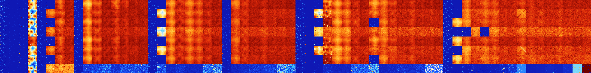

# B345678 (258048-258559)

<details>
    <summary>Initial Grid</summary>
    
</details>


<details>
    <summary>Initial Grid RLE</summary>

```
#C Exported from GoGoL (https://github.com/marrow16/gogol)
#C Wrap mode: Toroidal
#C Boundary mode: Dead
#C Step: 0
x = 100, y = 100, rule = B345678/S
9bo21bo8bo20bo9bo16bo$13bo38bo$7bo8bo34bo11b2o14bo$26bo26bo33b2o$79bo
17bo$8bo2bo60bo$12bo16bo4bo13bo15bo$2o6bo31bo10bo23bo$8bobo11b2o35bo4bo
22bo4bo6bo$24bo47b2o6bo$12bo36bo40bo5bo$2o19bo18bo26bo20bo$17bo$84bo$
17bo2bo7bo25bo$19bo20bo14bo6bo6bo9bo$6bo21bo5bo5bo5bo$35bo3bo13bo4bo$bo
52bo6bo7bo9bo3bo11bobo$13bo9bo9bo33bo25bo$bo6bo9bo7bo32bo38bo$3bo34bo
14bo12bo2bo8bo$11bo23bo5bo30bo2bo10bo$8bobo27bo25bo$14bo3bo7bo25bo15bo
7bo$17bo4bo20bo28bo$52bo$31bo26bo3bo27bo2bo$8bo9bo26bo34bo14bo$10bo40bo
8bo$4b2o5bo79bo$2bo$4bo11bo14bo20bo2bobo36bo$17bo15bo18bo30bo5bo5bo$37b
o3bo14bo23bo7bo$6bo4bo4bobo41bobo4bo31bo$2bo33bo2bo8bo28bo$6bo13bo26bob
o38bo$13bo62bo11bo$22bo22bo8bo36bo6bo$4bo91bo$bo5bo11bobo7bobo24bo$o6bo
68bo$77bo5bo8bo$6bobo29b2o23bo20bo11bo$7bo$3bo5bo9bo14bo4bo2bobo34bo$4b
o24b3o4bo8bo13bo$5bo36bo55bo$2bo30bo17bo$3bo12bo32bo11bo$23bo$o13bo16bo
4bo$13bo2bo2bo2bo66bo$44bo23bo26bo$9bo4bo31bo19bo$9bo31bo8bo9bo19bo5bo
10bo$2b3o6bo18bo$42bobo6bo8bo8bo3bo$o16bo35bo$12bo5bo43bo$2bo4bo6bo11bo
46bo$8bobo4bo21bo7bo7bo10bo26bo$bo26bo11bo22bo33bo$bo33bo8bo46bo$8bo21b
obo37bo4bo7bo15bo$11bo24bo5bo$18bo15bo20bo$2bo8bo38bo5bo$14bo5bo7bo32bo
$17bo13bo4bo4bo2bo3bo13b2o25bo4bo$5b2o43bo21bo24bo$12bo3b2o27bo11bo14bo
20bo$5bo34bo5bo9bo23bo$bo2bo15bo14bo6bo35bo3bo7bo$8bo15bo5bo20bo27bo$2b
o33bobo45bo$29bo39bo5b2obo13bo$10bo10bo31bo7bo3bo2bo5bo17bo$24bo7bo27bo
$5bo15bo60bo$o14bo32bo6bo12bo25bo$16bo14bo39bo9bo4bo$20bo36bo$9bobo38b
2o2bo37bobo$10bo80bo$3bo6bo6bo9bo7bo26bo22bo8bobo$5bo4bo23bobo11bo3b2o
13bo$5b2o2bo25bo10bobo20bo5bo$24bo27bobo$3bo2bo26bo3bo$2bo3b2o23b2obo
19bo31bo12bo$20bo32bo25bo15bo$18bo4bo2bo49bo6bo9bobo$bo34bo19bo5bo2bo8b
o$bo9bo19bo26bo22b2o7bo8bo$76bo$18bo20bo5bo11bo12bobo18bo$10bo10bo47bo$
19bo30bo2bo4bo8bo27bo!
```
</details>
<details>
    <summary>Thumbnail</summary>

</details>
<table>
<tr>
    <td><a href="./258048%20S%20Heat%20Map%20Activity.png"></a><br>S (258048)<br>R@6,p2</td>    <td><a href="./258049%20S0%20Heat%20Map%20Activity.png"></a><br>S0 (258049)<br>R@27,p4</td>    <td><a href="./258050%20S1%20Heat%20Map%20Activity.png"></a><br>S1 (258050)<br>R@17,p2</td>    <td><a href="./258051%20S01%20Heat%20Map%20Activity.png"></a><br>S01 (258051)<br>R@432,p120</td>    <td><a href="./258052%20S2%20Heat%20Map%20Activity.png"></a><br>S2 (258052)<br>R@7,p2</td>    <td><a href="./258053%20S02%20Heat%20Map%20Activity.png"></a><br>S02 (258053)<br>R@12,p4</td>    <td><a href="./258054%20S12%20Heat%20Map%20Activity.png"></a><br>S12 (258054)<br>G>1000</td>    <td><a href="./258055%20S012%20Heat%20Map%20Activity.png"></a><br>S012 (258055)<br>G>1000</td>    <td><a href="./258056%20S3%20Heat%20Map%20Activity.png"></a><br>S3 (258056)<br>R@7,p2</td>    <td><a href="./258057%20S03%20Heat%20Map%20Activity.png"></a><br>S03 (258057)<br>G>1000</td>    <td><a href="./258058%20S13%20Heat%20Map%20Activity.png"></a><br>S13 (258058)<br>G>1000</td>    <td><a href="./258059%20S013%20Heat%20Map%20Activity.png"></a><br>S013 (258059)<br>G>1000</td>    <td><a href="./258060%20S23%20Heat%20Map%20Activity.png"></a><br>S23 (258060)<br>G>1000</td>    <td><a href="./258061%20S023%20Heat%20Map%20Activity.png"></a><br>S023 (258061)<br>G>1000</td>    <td><a href="./258062%20S123%20Heat%20Map%20Activity.png"></a><br>S123 (258062)<br>G>1000</td>    <td><a href="./258063%20S0123%20Heat%20Map%20Activity.png"></a><br>S0123 (258063)<br>G>1000</td>    <td><a href="./258064%20S4%20Heat%20Map%20Activity.png"></a><br>S4 (258064)<br>R@6,p2</td>    <td><a href="./258065%20S04%20Heat%20Map%20Activity.png"></a><br>S04 (258065)<br>R@19,p2</td>    <td><a href="./258066%20S14%20Heat%20Map%20Activity.png"></a><br>S14 (258066)<br>G>1000</td>    <td><a href="./258067%20S014%20Heat%20Map%20Activity.png"></a><br>S014 (258067)<br>G>1000</td>    <td><a href="./258068%20S24%20Heat%20Map%20Activity.png"></a><br>S24 (258068)<br>G>1000</td>    <td><a href="./258069%20S024%20Heat%20Map%20Activity.png"></a><br>S024 (258069)<br>G>1000</td>    <td><a href="./258070%20S124%20Heat%20Map%20Activity.png"></a><br>S124 (258070)<br>G>1000</td>    <td><a href="./258071%20S0124%20Heat%20Map%20Activity.png"></a><br>S0124 (258071)<br>G>1000</td>    <td><a href="./258072%20S34%20Heat%20Map%20Activity.png"></a><br>S34 (258072)<br>R@11,p3</td>    <td><a href="./258073%20S034%20Heat%20Map%20Activity.png"></a><br>S034 (258073)<br>G>1000</td>    <td><a href="./258074%20S134%20Heat%20Map%20Activity.png"></a><br>S134 (258074)<br>G>1000</td>    <td><a href="./258075%20S0134%20Heat%20Map%20Activity.png"></a><br>S0134 (258075)<br>G>1000</td>    <td><a href="./258076%20S234%20Heat%20Map%20Activity.png"></a><br>S234 (258076)<br>G>1000</td>    <td><a href="./258077%20S0234%20Heat%20Map%20Activity.png"></a><br>S0234 (258077)<br>G>1000</td>    <td><a href="./258078%20S1234%20Heat%20Map%20Activity.png"></a><br>S1234 (258078)<br>G>1000</td>    <td><a href="./258079%20S01234%20Heat%20Map%20Activity.png"></a><br>S01234 (258079)<br>G>1000</td>    <td><a href="./258080%20S5%20Heat%20Map%20Activity.png"></a><br>S5 (258080)<br>R@6,p2</td>    <td><a href="./258081%20S05%20Heat%20Map%20Activity.png"></a><br>S05 (258081)<br>R@32,p4</td>    <td><a href="./258082%20S15%20Heat%20Map%20Activity.png"></a><br>S15 (258082)<br>R@55,p2</td>    <td><a href="./258083%20S015%20Heat%20Map%20Activity.png"></a><br>S015 (258083)<br>R@375,p24</td>    <td><a href="./258084%20S25%20Heat%20Map%20Activity.png"></a><br>S25 (258084)<br>G>1000</td>    <td><a href="./258085%20S025%20Heat%20Map%20Activity.png"></a><br>S025 (258085)<br>G>1000</td>    <td><a href="./258086%20S125%20Heat%20Map%20Activity.png"></a><br>S125 (258086)<br>G>1000</td>    <td><a href="./258087%20S0125%20Heat%20Map%20Activity.png"></a><br>S0125 (258087)<br>G>1000</td>    <td><a href="./258088%20S35%20Heat%20Map%20Activity.png"></a><br>S35 (258088)<br>G>1000</td>    <td><a href="./258089%20S035%20Heat%20Map%20Activity.png"></a><br>S035 (258089)<br>G>1000</td>    <td><a href="./258090%20S135%20Heat%20Map%20Activity.png"></a><br>S135 (258090)<br>G>1000</td>    <td><a href="./258091%20S0135%20Heat%20Map%20Activity.png"></a><br>S0135 (258091)<br>G>1000</td>    <td><a href="./258092%20S235%20Heat%20Map%20Activity.png"></a><br>S235 (258092)<br>G>1000</td>    <td><a href="./258093%20S0235%20Heat%20Map%20Activity.png"></a><br>S0235 (258093)<br>G>1000</td>    <td><a href="./258094%20S1235%20Heat%20Map%20Activity.png"></a><br>S1235 (258094)<br>G>1000</td>    <td><a href="./258095%20S01235%20Heat%20Map%20Activity.png"></a><br>S01235 (258095)<br>G>1000</td>    <td><a href="./258096%20S45%20Heat%20Map%20Activity.png"></a><br>S45 (258096)<br>R@6,p2</td>    <td><a href="./258097%20S045%20Heat%20Map%20Activity.png"></a><br>S045 (258097)<br>R@149,p2</td>    <td><a href="./258098%20S145%20Heat%20Map%20Activity.png"></a><br>S145 (258098)<br>G>1000</td>    <td><a href="./258099%20S0145%20Heat%20Map%20Activity.png"></a><br>S0145 (258099)<br>G>1000</td>    <td><a href="./258100%20S245%20Heat%20Map%20Activity.png"></a><br>S245 (258100)<br>G>1000</td>    <td><a href="./258101%20S0245%20Heat%20Map%20Activity.png"></a><br>S0245 (258101)<br>G>1000</td>    <td><a href="./258102%20S1245%20Heat%20Map%20Activity.png"></a><br>S1245 (258102)<br>G>1000</td>    <td><a href="./258103%20S01245%20Heat%20Map%20Activity.png"></a><br>S01245 (258103)<br>G>1000</td>    <td><a href="./258104%20S345%20Heat%20Map%20Activity.png"></a><br>S345 (258104)<br>G>1000</td>    <td><a href="./258105%20S0345%20Heat%20Map%20Activity.png"></a><br>S0345 (258105)<br>G>1000</td>    <td><a href="./258106%20S1345%20Heat%20Map%20Activity.png"></a><br>S1345 (258106)<br>G>1000</td>    <td><a href="./258107%20S01345%20Heat%20Map%20Activity.png"></a><br>S01345 (258107)<br>G>1000</td>    <td><a href="./258108%20S2345%20Heat%20Map%20Activity.png"></a><br>S2345 (258108)<br>G>1000</td>    <td><a href="./258109%20S02345%20Heat%20Map%20Activity.png"></a><br>S02345 (258109)<br>G>1000</td>    <td><a href="./258110%20S12345%20Heat%20Map%20Activity.png"></a><br>S12345 (258110)<br>G>1000</td>    <td><a href="./258111%20S012345%20Heat%20Map%20Activity.png"></a><br>S012345 (258111)<br>G>1000</td></tr>
<tr>
    <td><a href="./258112%20S6%20Heat%20Map%20Activity.png"></a><br>S6 (258112)<br>R@6,p2</td>    <td><a href="./258113%20S06%20Heat%20Map%20Activity.png"></a><br>S06 (258113)<br>R@27,p4</td>    <td><a href="./258114%20S16%20Heat%20Map%20Activity.png"></a><br>S16 (258114)<br>R@29,p2</td>    <td><a href="./258115%20S016%20Heat%20Map%20Activity.png"></a><br>S016 (258115)<br>R@288,p12</td>    <td><a href="./258116%20S26%20Heat%20Map%20Activity.png"></a><br>S26 (258116)<br>R@7,p2</td>    <td><a href="./258117%20S026%20Heat%20Map%20Activity.png"></a><br>S026 (258117)<br>G>1000</td>    <td><a href="./258118%20S126%20Heat%20Map%20Activity.png"></a><br>S126 (258118)<br>G>1000</td>    <td><a href="./258119%20S0126%20Heat%20Map%20Activity.png"></a><br>S0126 (258119)<br>G>1000</td>    <td><a href="./258120%20S36%20Heat%20Map%20Activity.png"></a><br>S36 (258120)<br>R@7,p2</td>    <td><a href="./258121%20S036%20Heat%20Map%20Activity.png"></a><br>S036 (258121)<br>G>1000</td>    <td><a href="./258122%20S136%20Heat%20Map%20Activity.png"></a><br>S136 (258122)<br>G>1000</td>    <td><a href="./258123%20S0136%20Heat%20Map%20Activity.png"></a><br>S0136 (258123)<br>G>1000</td>    <td><a href="./258124%20S236%20Heat%20Map%20Activity.png"></a><br>S236 (258124)<br>G>1000</td>    <td><a href="./258125%20S0236%20Heat%20Map%20Activity.png"></a><br>S0236 (258125)<br>G>1000</td>    <td><a href="./258126%20S1236%20Heat%20Map%20Activity.png"></a><br>S1236 (258126)<br>G>1000</td>    <td><a href="./258127%20S01236%20Heat%20Map%20Activity.png"></a><br>S01236 (258127)<br>G>1000</td>    <td><a href="./258128%20S46%20Heat%20Map%20Activity.png"></a><br>S46 (258128)<br>R@6,p2</td>    <td><a href="./258129%20S046%20Heat%20Map%20Activity.png"></a><br>S046 (258129)<br>G>1000</td>    <td><a href="./258130%20S146%20Heat%20Map%20Activity.png"></a><br>S146 (258130)<br>G>1000</td>    <td><a href="./258131%20S0146%20Heat%20Map%20Activity.png"></a><br>S0146 (258131)<br>G>1000</td>    <td><a href="./258132%20S246%20Heat%20Map%20Activity.png"></a><br>S246 (258132)<br>G>1000</td>    <td><a href="./258133%20S0246%20Heat%20Map%20Activity.png"></a><br>S0246 (258133)<br>G>1000</td>    <td><a href="./258134%20S1246%20Heat%20Map%20Activity.png"></a><br>S1246 (258134)<br>G>1000</td>    <td><a href="./258135%20S01246%20Heat%20Map%20Activity.png"></a><br>S01246 (258135)<br>G>1000</td>    <td><a href="./258136%20S346%20Heat%20Map%20Activity.png"></a><br>S346 (258136)<br>R@11,p3</td>    <td><a href="./258137%20S0346%20Heat%20Map%20Activity.png"></a><br>S0346 (258137)<br>G>1000</td>    <td><a href="./258138%20S1346%20Heat%20Map%20Activity.png"></a><br>S1346 (258138)<br>G>1000</td>    <td><a href="./258139%20S01346%20Heat%20Map%20Activity.png"></a><br>S01346 (258139)<br>G>1000</td>    <td><a href="./258140%20S2346%20Heat%20Map%20Activity.png"></a><br>S2346 (258140)<br>G>1000</td>    <td><a href="./258141%20S02346%20Heat%20Map%20Activity.png"></a><br>S02346 (258141)<br>G>1000</td>    <td><a href="./258142%20S12346%20Heat%20Map%20Activity.png"></a><br>S12346 (258142)<br>G>1000</td>    <td><a href="./258143%20S012346%20Heat%20Map%20Activity.png"></a><br>S012346 (258143)<br>G>1000</td>    <td><a href="./258144%20S56%20Heat%20Map%20Activity.png"></a><br>S56 (258144)<br>R@6,p2</td>    <td><a href="./258145%20S056%20Heat%20Map%20Activity.png"></a><br>S056 (258145)<br>R@32,p4</td>    <td><a href="./258146%20S156%20Heat%20Map%20Activity.png"></a><br>S156 (258146)<br>R@593,p12</td>    <td><a href="./258147%20S0156%20Heat%20Map%20Activity.png"></a><br>S0156 (258147)<br>R@404,p120</td>    <td><a href="./258148%20S256%20Heat%20Map%20Activity.png"></a><br>S256 (258148)<br>G>1000</td>    <td><a href="./258149%20S0256%20Heat%20Map%20Activity.png"></a><br>S0256 (258149)<br>G>1000</td>    <td><a href="./258150%20S1256%20Heat%20Map%20Activity.png"></a><br>S1256 (258150)<br>G>1000</td>    <td><a href="./258151%20S01256%20Heat%20Map%20Activity.png"></a><br>S01256 (258151)<br>G>1000</td>    <td><a href="./258152%20S356%20Heat%20Map%20Activity.png"></a><br>S356 (258152)<br>G>1000</td>    <td><a href="./258153%20S0356%20Heat%20Map%20Activity.png"></a><br>S0356 (258153)<br>G>1000</td>    <td><a href="./258154%20S1356%20Heat%20Map%20Activity.png"></a><br>S1356 (258154)<br>G>1000</td>    <td><a href="./258155%20S01356%20Heat%20Map%20Activity.png"></a><br>S01356 (258155)<br>G>1000</td>    <td><a href="./258156%20S2356%20Heat%20Map%20Activity.png"></a><br>S2356 (258156)<br>G>1000</td>    <td><a href="./258157%20S02356%20Heat%20Map%20Activity.png"></a><br>S02356 (258157)<br>G>1000</td>    <td><a href="./258158%20S12356%20Heat%20Map%20Activity.png"></a><br>S12356 (258158)<br>G>1000</td>    <td><a href="./258159%20S012356%20Heat%20Map%20Activity.png"></a><br>S012356 (258159)<br>G>1000</td>    <td><a href="./258160%20S456%20Heat%20Map%20Activity.png"></a><br>S456 (258160)<br>R@6,p2</td>    <td><a href="./258161%20S0456%20Heat%20Map%20Activity.png"></a><br>S0456 (258161)<br>R@36,p6</td>    <td><a href="./258162%20S1456%20Heat%20Map%20Activity.png"></a><br>S1456 (258162)<br>G>1000</td>    <td><a href="./258163%20S01456%20Heat%20Map%20Activity.png"></a><br>S01456 (258163)<br>G>1000</td>    <td><a href="./258164%20S2456%20Heat%20Map%20Activity.png"></a><br>S2456 (258164)<br>G>1000</td>    <td><a href="./258165%20S02456%20Heat%20Map%20Activity.png"></a><br>S02456 (258165)<br>G>1000</td>    <td><a href="./258166%20S12456%20Heat%20Map%20Activity.png"></a><br>S12456 (258166)<br>G>1000</td>    <td><a href="./258167%20S012456%20Heat%20Map%20Activity.png"></a><br>S012456 (258167)<br>G>1000</td>    <td><a href="./258168%20S3456%20Heat%20Map%20Activity.png"></a><br>S3456 (258168)<br>G>1000</td>    <td><a href="./258169%20S03456%20Heat%20Map%20Activity.png"></a><br>S03456 (258169)<br>G>1000</td>    <td><a href="./258170%20S13456%20Heat%20Map%20Activity.png"></a><br>S13456 (258170)<br>G>1000</td>    <td><a href="./258171%20S013456%20Heat%20Map%20Activity.png"></a><br>S013456 (258171)<br>G>1000</td>    <td><a href="./258172%20S23456%20Heat%20Map%20Activity.png"></a><br>S23456 (258172)<br>G>1000</td>    <td><a href="./258173%20S023456%20Heat%20Map%20Activity.png"></a><br>S023456 (258173)<br>G>1000</td>    <td><a href="./258174%20S123456%20Heat%20Map%20Activity.png"></a><br>S123456 (258174)<br>G>1000</td>    <td><a href="./258175%20S0123456%20Heat%20Map%20Activity.png"></a><br>S0123456 (258175)<br>G>1000</td></tr>
<tr>
    <td><a href="./258176%20S7%20Heat%20Map%20Activity.png"></a><br>S7 (258176)<br>R@6,p2</td>    <td><a href="./258177%20S07%20Heat%20Map%20Activity.png"></a><br>S07 (258177)<br>R@27,p4</td>    <td><a href="./258178%20S17%20Heat%20Map%20Activity.png"></a><br>S17 (258178)<br>R@18,p2</td>    <td><a href="./258179%20S017%20Heat%20Map%20Activity.png"></a><br>S017 (258179)<br>R@271,p24</td>    <td><a href="./258180%20S27%20Heat%20Map%20Activity.png"></a><br>S27 (258180)<br>R@7,p2</td>    <td><a href="./258181%20S027%20Heat%20Map%20Activity.png"></a><br>S027 (258181)<br>R@12,p4</td>    <td><a href="./258182%20S127%20Heat%20Map%20Activity.png"></a><br>S127 (258182)<br>G>1000</td>    <td><a href="./258183%20S0127%20Heat%20Map%20Activity.png"></a><br>S0127 (258183)<br>G>1000</td>    <td><a href="./258184%20S37%20Heat%20Map%20Activity.png"></a><br>S37 (258184)<br>R@7,p2</td>    <td><a href="./258185%20S037%20Heat%20Map%20Activity.png"></a><br>S037 (258185)<br>G>1000</td>    <td><a href="./258186%20S137%20Heat%20Map%20Activity.png"></a><br>S137 (258186)<br>G>1000</td>    <td><a href="./258187%20S0137%20Heat%20Map%20Activity.png"></a><br>S0137 (258187)<br>G>1000</td>    <td><a href="./258188%20S237%20Heat%20Map%20Activity.png"></a><br>S237 (258188)<br>G>1000</td>    <td><a href="./258189%20S0237%20Heat%20Map%20Activity.png"></a><br>S0237 (258189)<br>G>1000</td>    <td><a href="./258190%20S1237%20Heat%20Map%20Activity.png"></a><br>S1237 (258190)<br>G>1000</td>    <td><a href="./258191%20S01237%20Heat%20Map%20Activity.png"></a><br>S01237 (258191)<br>G>1000</td>    <td><a href="./258192%20S47%20Heat%20Map%20Activity.png"></a><br>S47 (258192)<br>R@6,p2</td>    <td><a href="./258193%20S047%20Heat%20Map%20Activity.png"></a><br>S047 (258193)<br>R@19,p2</td>    <td><a href="./258194%20S147%20Heat%20Map%20Activity.png"></a><br>S147 (258194)<br>G>1000</td>    <td><a href="./258195%20S0147%20Heat%20Map%20Activity.png"></a><br>S0147 (258195)<br>G>1000</td>    <td><a href="./258196%20S247%20Heat%20Map%20Activity.png"></a><br>S247 (258196)<br>G>1000</td>    <td><a href="./258197%20S0247%20Heat%20Map%20Activity.png"></a><br>S0247 (258197)<br>G>1000</td>    <td><a href="./258198%20S1247%20Heat%20Map%20Activity.png"></a><br>S1247 (258198)<br>G>1000</td>    <td><a href="./258199%20S01247%20Heat%20Map%20Activity.png"></a><br>S01247 (258199)<br>G>1000</td>    <td><a href="./258200%20S347%20Heat%20Map%20Activity.png"></a><br>S347 (258200)<br>R@11,p3</td>    <td><a href="./258201%20S0347%20Heat%20Map%20Activity.png"></a><br>S0347 (258201)<br>G>1000</td>    <td><a href="./258202%20S1347%20Heat%20Map%20Activity.png"></a><br>S1347 (258202)<br>G>1000</td>    <td><a href="./258203%20S01347%20Heat%20Map%20Activity.png"></a><br>S01347 (258203)<br>G>1000</td>    <td><a href="./258204%20S2347%20Heat%20Map%20Activity.png"></a><br>S2347 (258204)<br>G>1000</td>    <td><a href="./258205%20S02347%20Heat%20Map%20Activity.png"></a><br>S02347 (258205)<br>G>1000</td>    <td><a href="./258206%20S12347%20Heat%20Map%20Activity.png"></a><br>S12347 (258206)<br>G>1000</td>    <td><a href="./258207%20S012347%20Heat%20Map%20Activity.png"></a><br>S012347 (258207)<br>G>1000</td>    <td><a href="./258208%20S57%20Heat%20Map%20Activity.png"></a><br>S57 (258208)<br>R@6,p2</td>    <td><a href="./258209%20S057%20Heat%20Map%20Activity.png"></a><br>S057 (258209)<br>R@32,p4</td>    <td><a href="./258210%20S157%20Heat%20Map%20Activity.png"></a><br>S157 (258210)<br>R@55,p2</td>    <td><a href="./258211%20S0157%20Heat%20Map%20Activity.png"></a><br>S0157 (258211)<br>G>1000</td>    <td><a href="./258212%20S257%20Heat%20Map%20Activity.png"></a><br>S257 (258212)<br>G>1000</td>    <td><a href="./258213%20S0257%20Heat%20Map%20Activity.png"></a><br>S0257 (258213)<br>G>1000</td>    <td><a href="./258214%20S1257%20Heat%20Map%20Activity.png"></a><br>S1257 (258214)<br>G>1000</td>    <td><a href="./258215%20S01257%20Heat%20Map%20Activity.png"></a><br>S01257 (258215)<br>G>1000</td>    <td><a href="./258216%20S357%20Heat%20Map%20Activity.png"></a><br>S357 (258216)<br>R@10,p4</td>    <td><a href="./258217%20S0357%20Heat%20Map%20Activity.png"></a><br>S0357 (258217)<br>G>1000</td>    <td><a href="./258218%20S1357%20Heat%20Map%20Activity.png"></a><br>S1357 (258218)<br>G>1000</td>    <td><a href="./258219%20S01357%20Heat%20Map%20Activity.png"></a><br>S01357 (258219)<br>G>1000</td>    <td><a href="./258220%20S2357%20Heat%20Map%20Activity.png"></a><br>S2357 (258220)<br>G>1000</td>    <td><a href="./258221%20S02357%20Heat%20Map%20Activity.png"></a><br>S02357 (258221)<br>G>1000</td>    <td><a href="./258222%20S12357%20Heat%20Map%20Activity.png"></a><br>S12357 (258222)<br>G>1000</td>    <td><a href="./258223%20S012357%20Heat%20Map%20Activity.png"></a><br>S012357 (258223)<br>G>1000</td>    <td><a href="./258224%20S457%20Heat%20Map%20Activity.png"></a><br>S457 (258224)<br>R@6,p2</td>    <td><a href="./258225%20S0457%20Heat%20Map%20Activity.png"></a><br>S0457 (258225)<br>G>1000</td>    <td><a href="./258226%20S1457%20Heat%20Map%20Activity.png"></a><br>S1457 (258226)<br>G>1000</td>    <td><a href="./258227%20S01457%20Heat%20Map%20Activity.png"></a><br>S01457 (258227)<br>G>1000</td>    <td><a href="./258228%20S2457%20Heat%20Map%20Activity.png"></a><br>S2457 (258228)<br>G>1000</td>    <td><a href="./258229%20S02457%20Heat%20Map%20Activity.png"></a><br>S02457 (258229)<br>G>1000</td>    <td><a href="./258230%20S12457%20Heat%20Map%20Activity.png"></a><br>S12457 (258230)<br>G>1000</td>    <td><a href="./258231%20S012457%20Heat%20Map%20Activity.png"></a><br>S012457 (258231)<br>G>1000</td>    <td><a href="./258232%20S3457%20Heat%20Map%20Activity.png"></a><br>S3457 (258232)<br>G>1000</td>    <td><a href="./258233%20S03457%20Heat%20Map%20Activity.png"></a><br>S03457 (258233)<br>G>1000</td>    <td><a href="./258234%20S13457%20Heat%20Map%20Activity.png"></a><br>S13457 (258234)<br>G>1000</td>    <td><a href="./258235%20S013457%20Heat%20Map%20Activity.png"></a><br>S013457 (258235)<br>G>1000</td>    <td><a href="./258236%20S23457%20Heat%20Map%20Activity.png"></a><br>S23457 (258236)<br>G>1000</td>    <td><a href="./258237%20S023457%20Heat%20Map%20Activity.png"></a><br>S023457 (258237)<br>G>1000</td>    <td><a href="./258238%20S123457%20Heat%20Map%20Activity.png"></a><br>S123457 (258238)<br>G>1000</td>    <td><a href="./258239%20S0123457%20Heat%20Map%20Activity.png"></a><br>S0123457 (258239)<br>G>1000</td></tr>
<tr>
    <td><a href="./258240%20S67%20Heat%20Map%20Activity.png"></a><br>S67 (258240)<br>R@6,p2</td>    <td><a href="./258241%20S067%20Heat%20Map%20Activity.png"></a><br>S067 (258241)<br>R@27,p4</td>    <td><a href="./258242%20S167%20Heat%20Map%20Activity.png"></a><br>S167 (258242)<br>R@32,p2</td>    <td><a href="./258243%20S0167%20Heat%20Map%20Activity.png"></a><br>S0167 (258243)<br>R@231,p6</td>    <td><a href="./258244%20S267%20Heat%20Map%20Activity.png"></a><br>S267 (258244)<br>R@8,p2</td>    <td><a href="./258245%20S0267%20Heat%20Map%20Activity.png"></a><br>S0267 (258245)<br>G>1000</td>    <td><a href="./258246%20S1267%20Heat%20Map%20Activity.png"></a><br>S1267 (258246)<br>G>1000</td>    <td><a href="./258247%20S01267%20Heat%20Map%20Activity.png"></a><br>S01267 (258247)<br>G>1000</td>    <td><a href="./258248%20S367%20Heat%20Map%20Activity.png"></a><br>S367 (258248)<br>R@7,p2</td>    <td><a href="./258249%20S0367%20Heat%20Map%20Activity.png"></a><br>S0367 (258249)<br>G>1000</td>    <td><a href="./258250%20S1367%20Heat%20Map%20Activity.png"></a><br>S1367 (258250)<br>G>1000</td>    <td><a href="./258251%20S01367%20Heat%20Map%20Activity.png"></a><br>S01367 (258251)<br>G>1000</td>    <td><a href="./258252%20S2367%20Heat%20Map%20Activity.png"></a><br>S2367 (258252)<br>G>1000</td>    <td><a href="./258253%20S02367%20Heat%20Map%20Activity.png"></a><br>S02367 (258253)<br>G>1000</td>    <td><a href="./258254%20S12367%20Heat%20Map%20Activity.png"></a><br>S12367 (258254)<br>G>1000</td>    <td><a href="./258255%20S012367%20Heat%20Map%20Activity.png"></a><br>S012367 (258255)<br>G>1000</td>    <td><a href="./258256%20S467%20Heat%20Map%20Activity.png"></a><br>S467 (258256)<br>R@6,p2</td>    <td><a href="./258257%20S0467%20Heat%20Map%20Activity.png"></a><br>S0467 (258257)<br>G>1000</td>    <td><a href="./258258%20S1467%20Heat%20Map%20Activity.png"></a><br>S1467 (258258)<br>G>1000</td>    <td><a href="./258259%20S01467%20Heat%20Map%20Activity.png"></a><br>S01467 (258259)<br>G>1000</td>    <td><a href="./258260%20S2467%20Heat%20Map%20Activity.png"></a><br>S2467 (258260)<br>G>1000</td>    <td><a href="./258261%20S02467%20Heat%20Map%20Activity.png"></a><br>S02467 (258261)<br>G>1000</td>    <td><a href="./258262%20S12467%20Heat%20Map%20Activity.png"></a><br>S12467 (258262)<br>G>1000</td>    <td><a href="./258263%20S012467%20Heat%20Map%20Activity.png"></a><br>S012467 (258263)<br>G>1000</td>    <td><a href="./258264%20S3467%20Heat%20Map%20Activity.png"></a><br>S3467 (258264)<br>R@11,p3</td>    <td><a href="./258265%20S03467%20Heat%20Map%20Activity.png"></a><br>S03467 (258265)<br>G>1000</td>    <td><a href="./258266%20S13467%20Heat%20Map%20Activity.png"></a><br>S13467 (258266)<br>G>1000</td>    <td><a href="./258267%20S013467%20Heat%20Map%20Activity.png"></a><br>S013467 (258267)<br>G>1000</td>    <td><a href="./258268%20S23467%20Heat%20Map%20Activity.png"></a><br>S23467 (258268)<br>G>1000</td>    <td><a href="./258269%20S023467%20Heat%20Map%20Activity.png"></a><br>S023467 (258269)<br>G>1000</td>    <td><a href="./258270%20S123467%20Heat%20Map%20Activity.png"></a><br>S123467 (258270)<br>G>1000</td>    <td><a href="./258271%20S0123467%20Heat%20Map%20Activity.png"></a><br>S0123467 (258271)<br>G>1000</td>    <td><a href="./258272%20S567%20Heat%20Map%20Activity.png"></a><br>S567 (258272)<br>R@6,p2</td>    <td><a href="./258273%20S0567%20Heat%20Map%20Activity.png"></a><br>S0567 (258273)<br>R@32,p4</td>    <td><a href="./258274%20S1567%20Heat%20Map%20Activity.png"></a><br>S1567 (258274)<br>G>1000</td>    <td><a href="./258275%20S01567%20Heat%20Map%20Activity.png"></a><br>S01567 (258275)<br>G>1000</td>    <td><a href="./258276%20S2567%20Heat%20Map%20Activity.png"></a><br>S2567 (258276)<br>G>1000</td>    <td><a href="./258277%20S02567%20Heat%20Map%20Activity.png"></a><br>S02567 (258277)<br>G>1000</td>    <td><a href="./258278%20S12567%20Heat%20Map%20Activity.png"></a><br>S12567 (258278)<br>G>1000</td>    <td><a href="./258279%20S012567%20Heat%20Map%20Activity.png"></a><br>S012567 (258279)<br>G>1000</td>    <td><a href="./258280%20S3567%20Heat%20Map%20Activity.png"></a><br>S3567 (258280)<br>G>1000</td>    <td><a href="./258281%20S03567%20Heat%20Map%20Activity.png"></a><br>S03567 (258281)<br>G>1000</td>    <td><a href="./258282%20S13567%20Heat%20Map%20Activity.png"></a><br>S13567 (258282)<br>G>1000</td>    <td><a href="./258283%20S013567%20Heat%20Map%20Activity.png"></a><br>S013567 (258283)<br>G>1000</td>    <td><a href="./258284%20S23567%20Heat%20Map%20Activity.png"></a><br>S23567 (258284)<br>G>1000</td>    <td><a href="./258285%20S023567%20Heat%20Map%20Activity.png"></a><br>S023567 (258285)<br>G>1000</td>    <td><a href="./258286%20S123567%20Heat%20Map%20Activity.png"></a><br>S123567 (258286)<br>G>1000</td>    <td><a href="./258287%20S0123567%20Heat%20Map%20Activity.png"></a><br>S0123567 (258287)<br>G>1000</td>    <td><a href="./258288%20S4567%20Heat%20Map%20Activity.png"></a><br>S4567 (258288)<br>R@6,p2</td>    <td><a href="./258289%20S04567%20Heat%20Map%20Activity.png"></a><br>S04567 (258289)<br>R@18,p4</td>    <td><a href="./258290%20S14567%20Heat%20Map%20Activity.png"></a><br>S14567 (258290)<br>R@18,p6</td>    <td><a href="./258291%20S014567%20Heat%20Map%20Activity.png"></a><br>S014567 (258291)<br>G>1000</td>    <td><a href="./258292%20S24567%20Heat%20Map%20Activity.png"></a><br>S24567 (258292)<br>R@22,p2</td>    <td><a href="./258293%20S024567%20Heat%20Map%20Activity.png"></a><br>S024567 (258293)<br>G>1000</td>    <td><a href="./258294%20S124567%20Heat%20Map%20Activity.png"></a><br>S124567 (258294)<br>G>1000</td>    <td><a href="./258295%20S0124567%20Heat%20Map%20Activity.png"></a><br>S0124567 (258295)<br>G>1000</td>    <td><a href="./258296%20S34567%20Heat%20Map%20Activity.png"></a><br>S34567 (258296)<br>G>1000</td>    <td><a href="./258297%20S034567%20Heat%20Map%20Activity.png"></a><br>S034567 (258297)<br>G>1000</td>    <td><a href="./258298%20S134567%20Heat%20Map%20Activity.png"></a><br>S134567 (258298)<br>G>1000</td>    <td><a href="./258299%20S0134567%20Heat%20Map%20Activity.png"></a><br>S0134567 (258299)<br>G>1000</td>    <td><a href="./258300%20S234567%20Heat%20Map%20Activity.png"></a><br>S234567 (258300)<br>G>1000</td>    <td><a href="./258301%20S0234567%20Heat%20Map%20Activity.png"></a><br>S0234567 (258301)<br>G>1000</td>    <td><a href="./258302%20S1234567%20Heat%20Map%20Activity.png"></a><br>S1234567 (258302)<br>G>1000</td>    <td><a href="./258303%20S01234567%20Heat%20Map%20Activity.png"></a><br>S01234567 (258303)<br>G>1000</td></tr>
<tr>
    <td><a href="./258304%20S8%20Heat%20Map%20Activity.png"></a><br>S8 (258304)<br>R@6,p2</td>    <td><a href="./258305%20S08%20Heat%20Map%20Activity.png"></a><br>S08 (258305)<br>R@27,p4</td>    <td><a href="./258306%20S18%20Heat%20Map%20Activity.png"></a><br>S18 (258306)<br>R@17,p2</td>    <td><a href="./258307%20S018%20Heat%20Map%20Activity.png"></a><br>S018 (258307)<br>G>1000</td>    <td><a href="./258308%20S28%20Heat%20Map%20Activity.png"></a><br>S28 (258308)<br>R@7,p2</td>    <td><a href="./258309%20S028%20Heat%20Map%20Activity.png"></a><br>S028 (258309)<br>R@12,p4</td>    <td><a href="./258310%20S128%20Heat%20Map%20Activity.png"></a><br>S128 (258310)<br>G>1000</td>    <td><a href="./258311%20S0128%20Heat%20Map%20Activity.png"></a><br>S0128 (258311)<br>G>1000</td>    <td><a href="./258312%20S38%20Heat%20Map%20Activity.png"></a><br>S38 (258312)<br>R@7,p2</td>    <td><a href="./258313%20S038%20Heat%20Map%20Activity.png"></a><br>S038 (258313)<br>G>1000</td>    <td><a href="./258314%20S138%20Heat%20Map%20Activity.png"></a><br>S138 (258314)<br>G>1000</td>    <td><a href="./258315%20S0138%20Heat%20Map%20Activity.png"></a><br>S0138 (258315)<br>G>1000</td>    <td><a href="./258316%20S238%20Heat%20Map%20Activity.png"></a><br>S238 (258316)<br>G>1000</td>    <td><a href="./258317%20S0238%20Heat%20Map%20Activity.png"></a><br>S0238 (258317)<br>G>1000</td>    <td><a href="./258318%20S1238%20Heat%20Map%20Activity.png"></a><br>S1238 (258318)<br>G>1000</td>    <td><a href="./258319%20S01238%20Heat%20Map%20Activity.png"></a><br>S01238 (258319)<br>G>1000</td>    <td><a href="./258320%20S48%20Heat%20Map%20Activity.png"></a><br>S48 (258320)<br>R@6,p2</td>    <td><a href="./258321%20S048%20Heat%20Map%20Activity.png"></a><br>S048 (258321)<br>R@19,p2</td>    <td><a href="./258322%20S148%20Heat%20Map%20Activity.png"></a><br>S148 (258322)<br>G>1000</td>    <td><a href="./258323%20S0148%20Heat%20Map%20Activity.png"></a><br>S0148 (258323)<br>G>1000</td>    <td><a href="./258324%20S248%20Heat%20Map%20Activity.png"></a><br>S248 (258324)<br>G>1000</td>    <td><a href="./258325%20S0248%20Heat%20Map%20Activity.png"></a><br>S0248 (258325)<br>G>1000</td>    <td><a href="./258326%20S1248%20Heat%20Map%20Activity.png"></a><br>S1248 (258326)<br>G>1000</td>    <td><a href="./258327%20S01248%20Heat%20Map%20Activity.png"></a><br>S01248 (258327)<br>G>1000</td>    <td><a href="./258328%20S348%20Heat%20Map%20Activity.png"></a><br>S348 (258328)<br>R@10,p2</td>    <td><a href="./258329%20S0348%20Heat%20Map%20Activity.png"></a><br>S0348 (258329)<br>G>1000</td>    <td><a href="./258330%20S1348%20Heat%20Map%20Activity.png"></a><br>S1348 (258330)<br>G>1000</td>    <td><a href="./258331%20S01348%20Heat%20Map%20Activity.png"></a><br>S01348 (258331)<br>G>1000</td>    <td><a href="./258332%20S2348%20Heat%20Map%20Activity.png"></a><br>S2348 (258332)<br>G>1000</td>    <td><a href="./258333%20S02348%20Heat%20Map%20Activity.png"></a><br>S02348 (258333)<br>G>1000</td>    <td><a href="./258334%20S12348%20Heat%20Map%20Activity.png"></a><br>S12348 (258334)<br>G>1000</td>    <td><a href="./258335%20S012348%20Heat%20Map%20Activity.png"></a><br>S012348 (258335)<br>G>1000</td>    <td><a href="./258336%20S58%20Heat%20Map%20Activity.png"></a><br>S58 (258336)<br>R@6,p2</td>    <td><a href="./258337%20S058%20Heat%20Map%20Activity.png"></a><br>S058 (258337)<br>R@32,p4</td>    <td><a href="./258338%20S158%20Heat%20Map%20Activity.png"></a><br>S158 (258338)<br>R@55,p2</td>    <td><a href="./258339%20S0158%20Heat%20Map%20Activity.png"></a><br>S0158 (258339)<br>R@505,p24</td>    <td><a href="./258340%20S258%20Heat%20Map%20Activity.png"></a><br>S258 (258340)<br>G>1000</td>    <td><a href="./258341%20S0258%20Heat%20Map%20Activity.png"></a><br>S0258 (258341)<br>G>1000</td>    <td><a href="./258342%20S1258%20Heat%20Map%20Activity.png"></a><br>S1258 (258342)<br>G>1000</td>    <td><a href="./258343%20S01258%20Heat%20Map%20Activity.png"></a><br>S01258 (258343)<br>G>1000</td>    <td><a href="./258344%20S358%20Heat%20Map%20Activity.png"></a><br>S358 (258344)<br>G>1000</td>    <td><a href="./258345%20S0358%20Heat%20Map%20Activity.png"></a><br>S0358 (258345)<br>G>1000</td>    <td><a href="./258346%20S1358%20Heat%20Map%20Activity.png"></a><br>S1358 (258346)<br>G>1000</td>    <td><a href="./258347%20S01358%20Heat%20Map%20Activity.png"></a><br>S01358 (258347)<br>G>1000</td>    <td><a href="./258348%20S2358%20Heat%20Map%20Activity.png"></a><br>S2358 (258348)<br>G>1000</td>    <td><a href="./258349%20S02358%20Heat%20Map%20Activity.png"></a><br>S02358 (258349)<br>G>1000</td>    <td><a href="./258350%20S12358%20Heat%20Map%20Activity.png"></a><br>S12358 (258350)<br>G>1000</td>    <td><a href="./258351%20S012358%20Heat%20Map%20Activity.png"></a><br>S012358 (258351)<br>G>1000</td>    <td><a href="./258352%20S458%20Heat%20Map%20Activity.png"></a><br>S458 (258352)<br>R@6,p2</td>    <td><a href="./258353%20S0458%20Heat%20Map%20Activity.png"></a><br>S0458 (258353)<br>G>1000</td>    <td><a href="./258354%20S1458%20Heat%20Map%20Activity.png"></a><br>S1458 (258354)<br>G>1000</td>    <td><a href="./258355%20S01458%20Heat%20Map%20Activity.png"></a><br>S01458 (258355)<br>G>1000</td>    <td><a href="./258356%20S2458%20Heat%20Map%20Activity.png"></a><br>S2458 (258356)<br>G>1000</td>    <td><a href="./258357%20S02458%20Heat%20Map%20Activity.png"></a><br>S02458 (258357)<br>G>1000</td>    <td><a href="./258358%20S12458%20Heat%20Map%20Activity.png"></a><br>S12458 (258358)<br>G>1000</td>    <td><a href="./258359%20S012458%20Heat%20Map%20Activity.png"></a><br>S012458 (258359)<br>G>1000</td>    <td><a href="./258360%20S3458%20Heat%20Map%20Activity.png"></a><br>S3458 (258360)<br>G>1000</td>    <td><a href="./258361%20S03458%20Heat%20Map%20Activity.png"></a><br>S03458 (258361)<br>G>1000</td>    <td><a href="./258362%20S13458%20Heat%20Map%20Activity.png"></a><br>S13458 (258362)<br>G>1000</td>    <td><a href="./258363%20S013458%20Heat%20Map%20Activity.png"></a><br>S013458 (258363)<br>G>1000</td>    <td><a href="./258364%20S23458%20Heat%20Map%20Activity.png"></a><br>S23458 (258364)<br>G>1000</td>    <td><a href="./258365%20S023458%20Heat%20Map%20Activity.png"></a><br>S023458 (258365)<br>G>1000</td>    <td><a href="./258366%20S123458%20Heat%20Map%20Activity.png"></a><br>S123458 (258366)<br>G>1000</td>    <td><a href="./258367%20S0123458%20Heat%20Map%20Activity.png"></a><br>S0123458 (258367)<br>G>1000</td></tr>
<tr>
    <td><a href="./258368%20S68%20Heat%20Map%20Activity.png"></a><br>S68 (258368)<br>R@6,p2</td>    <td><a href="./258369%20S068%20Heat%20Map%20Activity.png"></a><br>S068 (258369)<br>R@27,p4</td>    <td><a href="./258370%20S168%20Heat%20Map%20Activity.png"></a><br>S168 (258370)<br>R@29,p2</td>    <td><a href="./258371%20S0168%20Heat%20Map%20Activity.png"></a><br>S0168 (258371)<br>R@335,p60</td>    <td><a href="./258372%20S268%20Heat%20Map%20Activity.png"></a><br>S268 (258372)<br>R@7,p2</td>    <td><a href="./258373%20S0268%20Heat%20Map%20Activity.png"></a><br>S0268 (258373)<br>G>1000</td>    <td><a href="./258374%20S1268%20Heat%20Map%20Activity.png"></a><br>S1268 (258374)<br>G>1000</td>    <td><a href="./258375%20S01268%20Heat%20Map%20Activity.png"></a><br>S01268 (258375)<br>G>1000</td>    <td><a href="./258376%20S368%20Heat%20Map%20Activity.png"></a><br>S368 (258376)<br>R@7,p2</td>    <td><a href="./258377%20S0368%20Heat%20Map%20Activity.png"></a><br>S0368 (258377)<br>G>1000</td>    <td><a href="./258378%20S1368%20Heat%20Map%20Activity.png"></a><br>S1368 (258378)<br>G>1000</td>    <td><a href="./258379%20S01368%20Heat%20Map%20Activity.png"></a><br>S01368 (258379)<br>G>1000</td>    <td><a href="./258380%20S2368%20Heat%20Map%20Activity.png"></a><br>S2368 (258380)<br>G>1000</td>    <td><a href="./258381%20S02368%20Heat%20Map%20Activity.png"></a><br>S02368 (258381)<br>G>1000</td>    <td><a href="./258382%20S12368%20Heat%20Map%20Activity.png"></a><br>S12368 (258382)<br>G>1000</td>    <td><a href="./258383%20S012368%20Heat%20Map%20Activity.png"></a><br>S012368 (258383)<br>G>1000</td>    <td><a href="./258384%20S468%20Heat%20Map%20Activity.png"></a><br>S468 (258384)<br>R@6,p2</td>    <td><a href="./258385%20S0468%20Heat%20Map%20Activity.png"></a><br>S0468 (258385)<br>G>1000</td>    <td><a href="./258386%20S1468%20Heat%20Map%20Activity.png"></a><br>S1468 (258386)<br>G>1000</td>    <td><a href="./258387%20S01468%20Heat%20Map%20Activity.png"></a><br>S01468 (258387)<br>G>1000</td>    <td><a href="./258388%20S2468%20Heat%20Map%20Activity.png"></a><br>S2468 (258388)<br>G>1000</td>    <td><a href="./258389%20S02468%20Heat%20Map%20Activity.png"></a><br>S02468 (258389)<br>G>1000</td>    <td><a href="./258390%20S12468%20Heat%20Map%20Activity.png"></a><br>S12468 (258390)<br>G>1000</td>    <td><a href="./258391%20S012468%20Heat%20Map%20Activity.png"></a><br>S012468 (258391)<br>G>1000</td>    <td><a href="./258392%20S3468%20Heat%20Map%20Activity.png"></a><br>S3468 (258392)<br>R@10,p2</td>    <td><a href="./258393%20S03468%20Heat%20Map%20Activity.png"></a><br>S03468 (258393)<br>G>1000</td>    <td><a href="./258394%20S13468%20Heat%20Map%20Activity.png"></a><br>S13468 (258394)<br>G>1000</td>    <td><a href="./258395%20S013468%20Heat%20Map%20Activity.png"></a><br>S013468 (258395)<br>G>1000</td>    <td><a href="./258396%20S23468%20Heat%20Map%20Activity.png"></a><br>S23468 (258396)<br>G>1000</td>    <td><a href="./258397%20S023468%20Heat%20Map%20Activity.png"></a><br>S023468 (258397)<br>G>1000</td>    <td><a href="./258398%20S123468%20Heat%20Map%20Activity.png"></a><br>S123468 (258398)<br>G>1000</td>    <td><a href="./258399%20S0123468%20Heat%20Map%20Activity.png"></a><br>S0123468 (258399)<br>G>1000</td>    <td><a href="./258400%20S568%20Heat%20Map%20Activity.png"></a><br>S568 (258400)<br>R@6,p2</td>    <td><a href="./258401%20S0568%20Heat%20Map%20Activity.png"></a><br>S0568 (258401)<br>R@32,p4</td>    <td><a href="./258402%20S1568%20Heat%20Map%20Activity.png"></a><br>S1568 (258402)<br>R@681,p48</td>    <td><a href="./258403%20S01568%20Heat%20Map%20Activity.png"></a><br>S01568 (258403)<br>R@546,p6</td>    <td><a href="./258404%20S2568%20Heat%20Map%20Activity.png"></a><br>S2568 (258404)<br>G>1000</td>    <td><a href="./258405%20S02568%20Heat%20Map%20Activity.png"></a><br>S02568 (258405)<br>G>1000</td>    <td><a href="./258406%20S12568%20Heat%20Map%20Activity.png"></a><br>S12568 (258406)<br>G>1000</td>    <td><a href="./258407%20S012568%20Heat%20Map%20Activity.png"></a><br>S012568 (258407)<br>G>1000</td>    <td><a href="./258408%20S3568%20Heat%20Map%20Activity.png"></a><br>S3568 (258408)<br>G>1000</td>    <td><a href="./258409%20S03568%20Heat%20Map%20Activity.png"></a><br>S03568 (258409)<br>G>1000</td>    <td><a href="./258410%20S13568%20Heat%20Map%20Activity.png"></a><br>S13568 (258410)<br>G>1000</td>    <td><a href="./258411%20S013568%20Heat%20Map%20Activity.png"></a><br>S013568 (258411)<br>G>1000</td>    <td><a href="./258412%20S23568%20Heat%20Map%20Activity.png"></a><br>S23568 (258412)<br>G>1000</td>    <td><a href="./258413%20S023568%20Heat%20Map%20Activity.png"></a><br>S023568 (258413)<br>G>1000</td>    <td><a href="./258414%20S123568%20Heat%20Map%20Activity.png"></a><br>S123568 (258414)<br>G>1000</td>    <td><a href="./258415%20S0123568%20Heat%20Map%20Activity.png"></a><br>S0123568 (258415)<br>G>1000</td>    <td><a href="./258416%20S4568%20Heat%20Map%20Activity.png"></a><br>S4568 (258416)<br>R@6,p2</td>    <td><a href="./258417%20S04568%20Heat%20Map%20Activity.png"></a><br>S04568 (258417)<br>R@17,p2</td>    <td><a href="./258418%20S14568%20Heat%20Map%20Activity.png"></a><br>S14568 (258418)<br>G>1000</td>    <td><a href="./258419%20S014568%20Heat%20Map%20Activity.png"></a><br>S014568 (258419)<br>G>1000</td>    <td><a href="./258420%20S24568%20Heat%20Map%20Activity.png"></a><br>S24568 (258420)<br>G>1000</td>    <td><a href="./258421%20S024568%20Heat%20Map%20Activity.png"></a><br>S024568 (258421)<br>G>1000</td>    <td><a href="./258422%20S124568%20Heat%20Map%20Activity.png"></a><br>S124568 (258422)<br>G>1000</td>    <td><a href="./258423%20S0124568%20Heat%20Map%20Activity.png"></a><br>S0124568 (258423)<br>G>1000</td>    <td><a href="./258424%20S34568%20Heat%20Map%20Activity.png"></a><br>S34568 (258424)<br>G>1000</td>    <td><a href="./258425%20S034568%20Heat%20Map%20Activity.png"></a><br>S034568 (258425)<br>G>1000</td>    <td><a href="./258426%20S134568%20Heat%20Map%20Activity.png"></a><br>S134568 (258426)<br>G>1000</td>    <td><a href="./258427%20S0134568%20Heat%20Map%20Activity.png"></a><br>S0134568 (258427)<br>G>1000</td>    <td><a href="./258428%20S234568%20Heat%20Map%20Activity.png"></a><br>S234568 (258428)<br>G>1000</td>    <td><a href="./258429%20S0234568%20Heat%20Map%20Activity.png"></a><br>S0234568 (258429)<br>G>1000</td>    <td><a href="./258430%20S1234568%20Heat%20Map%20Activity.png"></a><br>S1234568 (258430)<br>G>1000</td>    <td><a href="./258431%20S01234568%20Heat%20Map%20Activity.png"></a><br>S01234568 (258431)<br>G>1000</td></tr>
<tr>
    <td><a href="./258432%20S78%20Heat%20Map%20Activity.png"></a><br>S78 (258432)<br>R@6,p2</td>    <td><a href="./258433%20S078%20Heat%20Map%20Activity.png"></a><br>S078 (258433)<br>R@27,p4</td>    <td><a href="./258434%20S178%20Heat%20Map%20Activity.png"></a><br>S178 (258434)<br>R@19,p2</td>    <td><a href="./258435%20S0178%20Heat%20Map%20Activity.png"></a><br>S0178 (258435)<br>R@325,p20</td>    <td><a href="./258436%20S278%20Heat%20Map%20Activity.png"></a><br>S278 (258436)<br>R@7,p2</td>    <td><a href="./258437%20S0278%20Heat%20Map%20Activity.png"></a><br>S0278 (258437)<br>R@12,p4</td>    <td><a href="./258438%20S1278%20Heat%20Map%20Activity.png"></a><br>S1278 (258438)<br>G>1000</td>    <td><a href="./258439%20S01278%20Heat%20Map%20Activity.png"></a><br>S01278 (258439)<br>G>1000</td>    <td><a href="./258440%20S378%20Heat%20Map%20Activity.png"></a><br>S378 (258440)<br>R@7,p2</td>    <td><a href="./258441%20S0378%20Heat%20Map%20Activity.png"></a><br>S0378 (258441)<br>G>1000</td>    <td><a href="./258442%20S1378%20Heat%20Map%20Activity.png"></a><br>S1378 (258442)<br>G>1000</td>    <td><a href="./258443%20S01378%20Heat%20Map%20Activity.png"></a><br>S01378 (258443)<br>G>1000</td>    <td><a href="./258444%20S2378%20Heat%20Map%20Activity.png"></a><br>S2378 (258444)<br>G>1000</td>    <td><a href="./258445%20S02378%20Heat%20Map%20Activity.png"></a><br>S02378 (258445)<br>G>1000</td>    <td><a href="./258446%20S12378%20Heat%20Map%20Activity.png"></a><br>S12378 (258446)<br>G>1000</td>    <td><a href="./258447%20S012378%20Heat%20Map%20Activity.png"></a><br>S012378 (258447)<br>G>1000</td>    <td><a href="./258448%20S478%20Heat%20Map%20Activity.png"></a><br>S478 (258448)<br>R@6,p2</td>    <td><a href="./258449%20S0478%20Heat%20Map%20Activity.png"></a><br>S0478 (258449)<br>R@19,p2</td>    <td><a href="./258450%20S1478%20Heat%20Map%20Activity.png"></a><br>S1478 (258450)<br>G>1000</td>    <td><a href="./258451%20S01478%20Heat%20Map%20Activity.png"></a><br>S01478 (258451)<br>G>1000</td>    <td><a href="./258452%20S2478%20Heat%20Map%20Activity.png"></a><br>S2478 (258452)<br>G>1000</td>    <td><a href="./258453%20S02478%20Heat%20Map%20Activity.png"></a><br>S02478 (258453)<br>G>1000</td>    <td><a href="./258454%20S12478%20Heat%20Map%20Activity.png"></a><br>S12478 (258454)<br>G>1000</td>    <td><a href="./258455%20S012478%20Heat%20Map%20Activity.png"></a><br>S012478 (258455)<br>G>1000</td>    <td><a href="./258456%20S3478%20Heat%20Map%20Activity.png"></a><br>S3478 (258456)<br>R@10,p2</td>    <td><a href="./258457%20S03478%20Heat%20Map%20Activity.png"></a><br>S03478 (258457)<br>G>1000</td>    <td><a href="./258458%20S13478%20Heat%20Map%20Activity.png"></a><br>S13478 (258458)<br>G>1000</td>    <td><a href="./258459%20S013478%20Heat%20Map%20Activity.png"></a><br>S013478 (258459)<br>G>1000</td>    <td><a href="./258460%20S23478%20Heat%20Map%20Activity.png"></a><br>S23478 (258460)<br>G>1000</td>    <td><a href="./258461%20S023478%20Heat%20Map%20Activity.png"></a><br>S023478 (258461)<br>G>1000</td>    <td><a href="./258462%20S123478%20Heat%20Map%20Activity.png"></a><br>S123478 (258462)<br>G>1000</td>    <td><a href="./258463%20S0123478%20Heat%20Map%20Activity.png"></a><br>S0123478 (258463)<br>G>1000</td>    <td><a href="./258464%20S578%20Heat%20Map%20Activity.png"></a><br>S578 (258464)<br>R@6,p2</td>    <td><a href="./258465%20S0578%20Heat%20Map%20Activity.png"></a><br>S0578 (258465)<br>R@32,p4</td>    <td><a href="./258466%20S1578%20Heat%20Map%20Activity.png"></a><br>S1578 (258466)<br>R@55,p2</td>    <td><a href="./258467%20S01578%20Heat%20Map%20Activity.png"></a><br>S01578 (258467)<br>G>1000</td>    <td><a href="./258468%20S2578%20Heat%20Map%20Activity.png"></a><br>S2578 (258468)<br>G>1000</td>    <td><a href="./258469%20S02578%20Heat%20Map%20Activity.png"></a><br>S02578 (258469)<br>G>1000</td>    <td><a href="./258470%20S12578%20Heat%20Map%20Activity.png"></a><br>S12578 (258470)<br>G>1000</td>    <td><a href="./258471%20S012578%20Heat%20Map%20Activity.png"></a><br>S012578 (258471)<br>G>1000</td>    <td><a href="./258472%20S3578%20Heat%20Map%20Activity.png"></a><br>S3578 (258472)<br>R@10,p4</td>    <td><a href="./258473%20S03578%20Heat%20Map%20Activity.png"></a><br>S03578 (258473)<br>G>1000</td>    <td><a href="./258474%20S13578%20Heat%20Map%20Activity.png"></a><br>S13578 (258474)<br>G>1000</td>    <td><a href="./258475%20S013578%20Heat%20Map%20Activity.png"></a><br>S013578 (258475)<br>G>1000</td>    <td><a href="./258476%20S23578%20Heat%20Map%20Activity.png"></a><br>S23578 (258476)<br>G>1000</td>    <td><a href="./258477%20S023578%20Heat%20Map%20Activity.png"></a><br>S023578 (258477)<br>G>1000</td>    <td><a href="./258478%20S123578%20Heat%20Map%20Activity.png"></a><br>S123578 (258478)<br>G>1000</td>    <td><a href="./258479%20S0123578%20Heat%20Map%20Activity.png"></a><br>S0123578 (258479)<br>G>1000</td>    <td><a href="./258480%20S4578%20Heat%20Map%20Activity.png"></a><br>S4578 (258480)<br>R@6,p2</td>    <td><a href="./258481%20S04578%20Heat%20Map%20Activity.png"></a><br>S04578 (258481)<br>G>1000</td>    <td><a href="./258482%20S14578%20Heat%20Map%20Activity.png"></a><br>S14578 (258482)<br>G>1000</td>    <td><a href="./258483%20S014578%20Heat%20Map%20Activity.png"></a><br>S014578 (258483)<br>G>1000</td>    <td><a href="./258484%20S24578%20Heat%20Map%20Activity.png"></a><br>S24578 (258484)<br>G>1000</td>    <td><a href="./258485%20S024578%20Heat%20Map%20Activity.png"></a><br>S024578 (258485)<br>G>1000</td>    <td><a href="./258486%20S124578%20Heat%20Map%20Activity.png"></a><br>S124578 (258486)<br>G>1000</td>    <td><a href="./258487%20S0124578%20Heat%20Map%20Activity.png"></a><br>S0124578 (258487)<br>G>1000</td>    <td><a href="./258488%20S34578%20Heat%20Map%20Activity.png"></a><br>S34578 (258488)<br>G>1000</td>    <td><a href="./258489%20S034578%20Heat%20Map%20Activity.png"></a><br>S034578 (258489)<br>G>1000</td>    <td><a href="./258490%20S134578%20Heat%20Map%20Activity.png"></a><br>S134578 (258490)<br>G>1000</td>    <td><a href="./258491%20S0134578%20Heat%20Map%20Activity.png"></a><br>S0134578 (258491)<br>G>1000</td>    <td><a href="./258492%20S234578%20Heat%20Map%20Activity.png"></a><br>S234578 (258492)<br>G>1000</td>    <td><a href="./258493%20S0234578%20Heat%20Map%20Activity.png"></a><br>S0234578 (258493)<br>G>1000</td>    <td><a href="./258494%20S1234578%20Heat%20Map%20Activity.png"></a><br>S1234578 (258494)<br>G>1000</td>    <td><a href="./258495%20S01234578%20Heat%20Map%20Activity.png"></a><br>S01234578 (258495)<br>G>1000</td></tr>
<tr>
    <td><a href="./258496%20S678%20Heat%20Map%20Activity.png"></a><br>S678 (258496)<br>R@6,p2</td>    <td><a href="./258497%20S0678%20Heat%20Map%20Activity.png"></a><br>S0678 (258497)<br>R@27,p4</td>    <td><a href="./258498%20S1678%20Heat%20Map%20Activity.png"></a><br>S1678 (258498)<br>R@32,p2</td>    <td><a href="./258499%20S01678%20Heat%20Map%20Activity.png"></a><br>S01678 (258499)<br>R@207,p2</td>    <td><a href="./258500%20S2678%20Heat%20Map%20Activity.png"></a><br>S2678 (258500)<br>R@8,p2</td>    <td><a href="./258501%20S02678%20Heat%20Map%20Activity.png"></a><br>S02678 (258501)<br>G>1000</td>    <td><a href="./258502%20S12678%20Heat%20Map%20Activity.png"></a><br>S12678 (258502)<br>G>1000</td>    <td><a href="./258503%20S012678%20Heat%20Map%20Activity.png"></a><br>S012678 (258503)<br>G>1000</td>    <td><a href="./258504%20S3678%20Heat%20Map%20Activity.png"></a><br>S3678 (258504)<br>R@7,p2</td>    <td><a href="./258505%20S03678%20Heat%20Map%20Activity.png"></a><br>S03678 (258505)<br>R@266,p2</td>    <td><a href="./258506%20S13678%20Heat%20Map%20Activity.png"></a><br>S13678 (258506)<br>R@174,p2</td>    <td><a href="./258507%20S013678%20Heat%20Map%20Activity.png"></a><br>S013678 (258507)<br>R@95,p2</td>    <td><a href="./258508%20S23678%20Heat%20Map%20Activity.png"></a><br>S23678 (258508)<br>R@133,p2</td>    <td><a href="./258509%20S023678%20Heat%20Map%20Activity.png"></a><br>S023678 (258509)<br>R@90,p2</td>    <td><a href="./258510%20S123678%20Heat%20Map%20Activity.png"></a><br>S123678 (258510)<br>R@76,p2</td>    <td><a href="./258511%20S0123678%20Heat%20Map%20Activity.png"></a><br>S0123678 (258511)<br>R@62,p2</td>    <td><a href="./258512%20S4678%20Heat%20Map%20Activity.png"></a><br>S4678 (258512)<br>R@6,p2</td>    <td><a href="./258513%20S04678%20Heat%20Map%20Activity.png"></a><br>S04678 (258513)<br>S@576</td>    <td><a href="./258514%20S14678%20Heat%20Map%20Activity.png"></a><br>S14678 (258514)<br>S@275</td>    <td><a href="./258515%20S014678%20Heat%20Map%20Activity.png"></a><br>S014678 (258515)<br>S@139</td>    <td><a href="./258516%20S24678%20Heat%20Map%20Activity.png"></a><br>S24678 (258516)<br>S@227</td>    <td><a href="./258517%20S024678%20Heat%20Map%20Activity.png"></a><br>S024678 (258517)<br>S@181</td>    <td><a href="./258518%20S124678%20Heat%20Map%20Activity.png"></a><br>S124678 (258518)<br>S@124</td>    <td><a href="./258519%20S0124678%20Heat%20Map%20Activity.png"></a><br>S0124678 (258519)<br>S@68</td>    <td><a href="./258520%20S34678%20Heat%20Map%20Activity.png"></a><br>S34678 (258520)<br>R@10,p2</td>    <td><a href="./258521%20S034678%20Heat%20Map%20Activity.png"></a><br>S034678 (258521)<br>S@117</td>    <td><a href="./258522%20S134678%20Heat%20Map%20Activity.png"></a><br>S134678 (258522)<br>S@101</td>    <td><a href="./258523%20S0134678%20Heat%20Map%20Activity.png"></a><br>S0134678 (258523)<br>S@58</td>    <td><a href="./258524%20S234678%20Heat%20Map%20Activity.png"></a><br>S234678 (258524)<br>S@113</td>    <td><a href="./258525%20S0234678%20Heat%20Map%20Activity.png"></a><br>S0234678 (258525)<br>S@66</td>    <td><a href="./258526%20S1234678%20Heat%20Map%20Activity.png"></a><br>S1234678 (258526)<br>S@58</td>    <td><a href="./258527%20S01234678%20Heat%20Map%20Activity.png"></a><br>S01234678 (258527)<br>S@45</td>    <td><a href="./258528%20S5678%20Heat%20Map%20Activity.png"></a><br>S5678 (258528)<br>R@6,p2</td>    <td><a href="./258529%20S05678%20Heat%20Map%20Activity.png"></a><br>S05678 (258529)<br>R@32,p4</td>    <td><a href="./258530%20S15678%20Heat%20Map%20Activity.png"></a><br>S15678 (258530)<br>R@55,p2</td>    <td><a href="./258531%20S015678%20Heat%20Map%20Activity.png"></a><br>S015678 (258531)<br>S@163</td>    <td><a href="./258532%20S25678%20Heat%20Map%20Activity.png"></a><br>S25678 (258532)<br>S@181</td>    <td><a href="./258533%20S025678%20Heat%20Map%20Activity.png"></a><br>S025678 (258533)<br>S@176</td>    <td><a href="./258534%20S125678%20Heat%20Map%20Activity.png"></a><br>S125678 (258534)<br>S@82</td>    <td><a href="./258535%20S0125678%20Heat%20Map%20Activity.png"></a><br>S0125678 (258535)<br>S@67</td>    <td><a href="./258536%20S35678%20Heat%20Map%20Activity.png"></a><br>S35678 (258536)<br>S@163</td>    <td><a href="./258537%20S035678%20Heat%20Map%20Activity.png"></a><br>S035678 (258537)<br>S@138</td>    <td><a href="./258538%20S135678%20Heat%20Map%20Activity.png"></a><br>S135678 (258538)<br>S@114</td>    <td><a href="./258539%20S0135678%20Heat%20Map%20Activity.png"></a><br>S0135678 (258539)<br>S@59</td>    <td><a href="./258540%20S235678%20Heat%20Map%20Activity.png"></a><br>S235678 (258540)<br>S@109</td>    <td><a href="./258541%20S0235678%20Heat%20Map%20Activity.png"></a><br>S0235678 (258541)<br>S@68</td>    <td><a href="./258542%20S1235678%20Heat%20Map%20Activity.png"></a><br>S1235678 (258542)<br>S@61</td>    <td><a href="./258543%20S01235678%20Heat%20Map%20Activity.png"></a><br>S01235678 (258543)<br>S@48</td>    <td><a href="./258544%20S45678%20Heat%20Map%20Activity.png"></a><br>S45678 (258544)<br>R@6,p2</td>    <td><a href="./258545%20S045678%20Heat%20Map%20Activity.png"></a><br>S045678 (258545)<br>R@16,p2</td>    <td><a href="./258546%20S145678%20Heat%20Map%20Activity.png"></a><br>S145678 (258546)<br>R@12,p2</td>    <td><a href="./258547%20S0145678%20Heat%20Map%20Activity.png"></a><br>S0145678 (258547)<br>S@192</td>    <td><a href="./258548%20S245678%20Heat%20Map%20Activity.png"></a><br>S245678 (258548)<br>S@240</td>    <td><a href="./258549%20S0245678%20Heat%20Map%20Activity.png"></a><br>S0245678 (258549)<br>S@155</td>    <td><a href="./258550%20S1245678%20Heat%20Map%20Activity.png"></a><br>S1245678 (258550)<br>S@93</td>    <td><a href="./258551%20S01245678%20Heat%20Map%20Activity.png"></a><br>S01245678 (258551)<br>S@55</td>    <td><a href="./258552%20S345678%20Heat%20Map%20Activity.png"></a><br>S345678 (258552)<br>S@148</td>    <td><a href="./258553%20S0345678%20Heat%20Map%20Activity.png"></a><br>S0345678 (258553)<br>S@89</td>    <td><a href="./258554%20S1345678%20Heat%20Map%20Activity.png"></a><br>S1345678 (258554)<br>S@88</td>    <td><a href="./258555%20S01345678%20Heat%20Map%20Activity.png"></a><br>S01345678 (258555)<br>S@45</td>    <td><a href="./258556%20S2345678%20Heat%20Map%20Activity.png"></a><br>S2345678 (258556)<br>S@95</td>    <td><a href="./258557%20S02345678%20Heat%20Map%20Activity.png"></a><br>S02345678 (258557)<br>S@59</td>    <td><a href="./258558%20S12345678%20Heat%20Map%20Activity.png"></a><br>S12345678 (258558)<br>S@51</td>    <td><a href="./258559%20S012345678%20Heat%20Map%20Activity.png"></a><br>S012345678 (258559)<br>S@39</td></tr>
</table>
