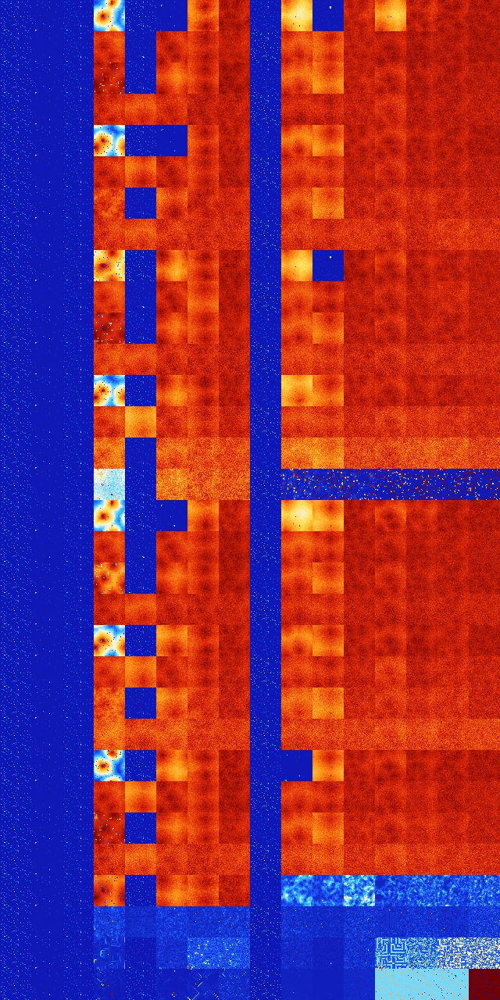

# B34568 (192512-193023)

<details>
    <summary>Initial Grid</summary>
    
</details>


<details>
    <summary>Initial Grid RLE</summary>

```
#C Exported from GoGoL (https://github.com/marrow16/gogol)
#C Wrap mode: Toroidal
#C Boundary mode: Dead
#C Step: 0
x = 100, y = 100, rule = B34568/S
16bo55bobo$49bo$14bo6b2o11b2o35bo13bo$21bo48bo17bo$o15bo24bo12bo6bo21bo
10bo$27bo7bo5bo15bobo4bo22bo$6bo4bo24bo20bo13bo$o25bo$13bo31bo12bo8bo$
48bo34bo$6bo20bo39bo26bo$19bo13bo2bo15bo4bo$34bo20bo7bo16bo$2bo18bo42b
2o15bo$8bo9bo52bo4bo$60bo$17bobo26b2obo5bo13bo5bo$33bo4bo4bo10bo32bobo$
17bo2bo65bo9bo$5bo15bo2bo53bo$26bobo58bo$o5bo10bo4bo28bo4bobo23bo4bo$
57bo$20bo15bo10bo10bo39bo$5bo7bo23bo3bo27bo17bobo$11bo13bo10bo20bo25bo
10bo$9bo48bo$66bo$10bo5bo3bo7bo63bo$o24bo12bo$39bo9bo2bo37bobo$o15bo23b
o10bo3bo28bo$4bo8bo7bo26bo9bo18bo9bo$5bo69bo$26bo23bo21bo$44bo26bo$38bo
$2bo48bo3bo27bo$17bo24bo3bo8bo22bo5bo3bo6bo$20bo53bo4bo$52bo7bo2bo13bo
8bo$23bo25bo$o57bo6bo$o7bo47bo17bo$11bo7bo5bo56bo7bo$5bo26bo40bo4bo15bo
2bobo$43bo$2bo9bo26bo5bo$28bo$17bo7b2o15bo6bo17bo20bo7bo$bo15b2o8bo2bo
2bo39bo3bo5bo8bo$36bo29bo21bo7bo$15bo4bo25bo26bo19bo$7bo21b2o29bo5bo9bo
$45b2o47bo$46bo21bo10bo$6bo6bo3bo17bo16bo24bo17bo$9bobo9bo12bo5bo48bo$
3bo84bo6bo2bo$4bo18bo21bo6bobo$4bo79bo2bo10bo$14bo6bo$7bo19bo36bo14bo$
4bo6bo22bo7bo2bo2bo24bo$12bo2bo27bo13bo16bo4bo10bo$23bo29bo$31bo27bo30b
o7bo$4bo9bo5bo6bo22bo28b2o$13bo30bo8bobo8bo$41bo18bo12bo9bo11bo$bo5bo4b
o9bo23bo47bo$18bo45bo21bo$3b2obo15bo8bo$70bo9bo6bob2o$3bo35bo$9bo14bo8b
o3bo22bo33b2o$13bo13bo11bo11bo6bo33bo$12bo18bo$10bo16bo15bo2bo42bo$bo
42bo47bobo$2bo17bo35bobo6bo5bo$10bo2bo24bo12bo19bo$24bo6bo8bo17b2o9bo$
8bo50bo13bo$37bo23bo4bo$7bo19bo7bo12bo18bo17bo7bo4bo$16b2o36bo11bo11bo
2bo$7bo16bo16bo$42bobo29bo$12bobo44bo34b2o3bo$bo57bo14bo11bo$8bo26bo17b
o42bo$o33bo16bo35bo$4b2o15b2o2bo13bo16bo8bo$8bo5bo7bo12bo18bo12bo12bo$
16bo40bo13bo$13bobo8bo47bo8bo$15bo$o25bobo10bo22bo20bo7bo$13bo46bo!
```
</details>
<details>
    <summary>Thumbnail</summary>

</details>
<table>
<tr>
    <td><a href="./192512%20S%20Heat%20Map%20Activity.png"></a><br>S (192512)<br>R@6,p2</td>    <td><a href="./192513%20S0%20Heat%20Map%20Activity.png"></a><br>S0 (192513)<br>R@10,p4</td>    <td><a href="./192514%20S1%20Heat%20Map%20Activity.png"></a><br>S1 (192514)<br>R@9,p2</td>    <td><a href="./192515%20S01%20Heat%20Map%20Activity.png"></a><br>S01 (192515)<br>R@358,p24</td>    <td><a href="./192516%20S2%20Heat%20Map%20Activity.png"></a><br>S2 (192516)<br>S@6</td>    <td><a href="./192517%20S02%20Heat%20Map%20Activity.png"></a><br>S02 (192517)<br>R@40,p4</td>    <td><a href="./192518%20S12%20Heat%20Map%20Activity.png"></a><br>S12 (192518)<br>G>1000</td>    <td><a href="./192519%20S012%20Heat%20Map%20Activity.png"></a><br>S012 (192519)<br>G>1000</td>    <td><a href="./192520%20S3%20Heat%20Map%20Activity.png"></a><br>S3 (192520)<br>R@9,p6</td>    <td><a href="./192521%20S03%20Heat%20Map%20Activity.png"></a><br>S03 (192521)<br>G>1000</td>    <td><a href="./192522%20S13%20Heat%20Map%20Activity.png"></a><br>S13 (192522)<br>R@22,p2</td>    <td><a href="./192523%20S013%20Heat%20Map%20Activity.png"></a><br>S013 (192523)<br>G>1000</td>    <td><a href="./192524%20S23%20Heat%20Map%20Activity.png"></a><br>S23 (192524)<br>G>1000</td>    <td><a href="./192525%20S023%20Heat%20Map%20Activity.png"></a><br>S023 (192525)<br>G>1000</td>    <td><a href="./192526%20S123%20Heat%20Map%20Activity.png"></a><br>S123 (192526)<br>G>1000</td>    <td><a href="./192527%20S0123%20Heat%20Map%20Activity.png"></a><br>S0123 (192527)<br>G>1000</td></tr>
<tr>
    <td><a href="./192528%20S4%20Heat%20Map%20Activity.png"></a><br>S4 (192528)<br>R@6,p2</td>    <td><a href="./192529%20S04%20Heat%20Map%20Activity.png"></a><br>S04 (192529)<br>R@33,p20</td>    <td><a href="./192530%20S14%20Heat%20Map%20Activity.png"></a><br>S14 (192530)<br>R@9,p2</td>    <td><a href="./192531%20S014%20Heat%20Map%20Activity.png"></a><br>S014 (192531)<br>G>1000</td>    <td><a href="./192532%20S24%20Heat%20Map%20Activity.png"></a><br>S24 (192532)<br>R@15,p2</td>    <td><a href="./192533%20S024%20Heat%20Map%20Activity.png"></a><br>S024 (192533)<br>G>1000</td>    <td><a href="./192534%20S124%20Heat%20Map%20Activity.png"></a><br>S124 (192534)<br>G>1000</td>    <td><a href="./192535%20S0124%20Heat%20Map%20Activity.png"></a><br>S0124 (192535)<br>G>1000</td>    <td><a href="./192536%20S34%20Heat%20Map%20Activity.png"></a><br>S34 (192536)<br>R@5,p2</td>    <td><a href="./192537%20S034%20Heat%20Map%20Activity.png"></a><br>S034 (192537)<br>G>1000</td>    <td><a href="./192538%20S134%20Heat%20Map%20Activity.png"></a><br>S134 (192538)<br>G>1000</td>    <td><a href="./192539%20S0134%20Heat%20Map%20Activity.png"></a><br>S0134 (192539)<br>G>1000</td>    <td><a href="./192540%20S234%20Heat%20Map%20Activity.png"></a><br>S234 (192540)<br>G>1000</td>    <td><a href="./192541%20S0234%20Heat%20Map%20Activity.png"></a><br>S0234 (192541)<br>G>1000</td>    <td><a href="./192542%20S1234%20Heat%20Map%20Activity.png"></a><br>S1234 (192542)<br>G>1000</td>    <td><a href="./192543%20S01234%20Heat%20Map%20Activity.png"></a><br>S01234 (192543)<br>G>1000</td></tr>
<tr>
    <td><a href="./192544%20S5%20Heat%20Map%20Activity.png"></a><br>S5 (192544)<br>R@6,p2</td>    <td><a href="./192545%20S05%20Heat%20Map%20Activity.png"></a><br>S05 (192545)<br>R@10,p4</td>    <td><a href="./192546%20S15%20Heat%20Map%20Activity.png"></a><br>S15 (192546)<br>R@9,p2</td>    <td><a href="./192547%20S015%20Heat%20Map%20Activity.png"></a><br>S015 (192547)<br>G>1000</td>    <td><a href="./192548%20S25%20Heat%20Map%20Activity.png"></a><br>S25 (192548)<br>R@8,p2</td>    <td><a href="./192549%20S025%20Heat%20Map%20Activity.png"></a><br>S025 (192549)<br>G>1000</td>    <td><a href="./192550%20S125%20Heat%20Map%20Activity.png"></a><br>S125 (192550)<br>G>1000</td>    <td><a href="./192551%20S0125%20Heat%20Map%20Activity.png"></a><br>S0125 (192551)<br>G>1000</td>    <td><a href="./192552%20S35%20Heat%20Map%20Activity.png"></a><br>S35 (192552)<br>R@9,p6</td>    <td><a href="./192553%20S035%20Heat%20Map%20Activity.png"></a><br>S035 (192553)<br>G>1000</td>    <td><a href="./192554%20S135%20Heat%20Map%20Activity.png"></a><br>S135 (192554)<br>G>1000</td>    <td><a href="./192555%20S0135%20Heat%20Map%20Activity.png"></a><br>S0135 (192555)<br>G>1000</td>    <td><a href="./192556%20S235%20Heat%20Map%20Activity.png"></a><br>S235 (192556)<br>G>1000</td>    <td><a href="./192557%20S0235%20Heat%20Map%20Activity.png"></a><br>S0235 (192557)<br>G>1000</td>    <td><a href="./192558%20S1235%20Heat%20Map%20Activity.png"></a><br>S1235 (192558)<br>G>1000</td>    <td><a href="./192559%20S01235%20Heat%20Map%20Activity.png"></a><br>S01235 (192559)<br>G>1000</td></tr>
<tr>
    <td><a href="./192560%20S45%20Heat%20Map%20Activity.png"></a><br>S45 (192560)<br>R@6,p2</td>    <td><a href="./192561%20S045%20Heat%20Map%20Activity.png"></a><br>S045 (192561)<br>R@29,p12</td>    <td><a href="./192562%20S145%20Heat%20Map%20Activity.png"></a><br>S145 (192562)<br>R@9,p2</td>    <td><a href="./192563%20S0145%20Heat%20Map%20Activity.png"></a><br>S0145 (192563)<br>G>1000</td>    <td><a href="./192564%20S245%20Heat%20Map%20Activity.png"></a><br>S245 (192564)<br>G>1000</td>    <td><a href="./192565%20S0245%20Heat%20Map%20Activity.png"></a><br>S0245 (192565)<br>G>1000</td>    <td><a href="./192566%20S1245%20Heat%20Map%20Activity.png"></a><br>S1245 (192566)<br>G>1000</td>    <td><a href="./192567%20S01245%20Heat%20Map%20Activity.png"></a><br>S01245 (192567)<br>G>1000</td>    <td><a href="./192568%20S345%20Heat%20Map%20Activity.png"></a><br>S345 (192568)<br>R@5,p2</td>    <td><a href="./192569%20S0345%20Heat%20Map%20Activity.png"></a><br>S0345 (192569)<br>G>1000</td>    <td><a href="./192570%20S1345%20Heat%20Map%20Activity.png"></a><br>S1345 (192570)<br>G>1000</td>    <td><a href="./192571%20S01345%20Heat%20Map%20Activity.png"></a><br>S01345 (192571)<br>G>1000</td>    <td><a href="./192572%20S2345%20Heat%20Map%20Activity.png"></a><br>S2345 (192572)<br>G>1000</td>    <td><a href="./192573%20S02345%20Heat%20Map%20Activity.png"></a><br>S02345 (192573)<br>G>1000</td>    <td><a href="./192574%20S12345%20Heat%20Map%20Activity.png"></a><br>S12345 (192574)<br>G>1000</td>    <td><a href="./192575%20S012345%20Heat%20Map%20Activity.png"></a><br>S012345 (192575)<br>G>1000</td></tr>
<tr>
    <td><a href="./192576%20S6%20Heat%20Map%20Activity.png"></a><br>S6 (192576)<br>R@6,p2</td>    <td><a href="./192577%20S06%20Heat%20Map%20Activity.png"></a><br>S06 (192577)<br>R@10,p4</td>    <td><a href="./192578%20S16%20Heat%20Map%20Activity.png"></a><br>S16 (192578)<br>R@9,p2</td>    <td><a href="./192579%20S016%20Heat%20Map%20Activity.png"></a><br>S016 (192579)<br>R@330,p24</td>    <td><a href="./192580%20S26%20Heat%20Map%20Activity.png"></a><br>S26 (192580)<br>R@9,p3</td>    <td><a href="./192581%20S026%20Heat%20Map%20Activity.png"></a><br>S026 (192581)<br>S@61</td>    <td><a href="./192582%20S126%20Heat%20Map%20Activity.png"></a><br>S126 (192582)<br>G>1000</td>    <td><a href="./192583%20S0126%20Heat%20Map%20Activity.png"></a><br>S0126 (192583)<br>G>1000</td>    <td><a href="./192584%20S36%20Heat%20Map%20Activity.png"></a><br>S36 (192584)<br>R@9,p6</td>    <td><a href="./192585%20S036%20Heat%20Map%20Activity.png"></a><br>S036 (192585)<br>G>1000</td>    <td><a href="./192586%20S136%20Heat%20Map%20Activity.png"></a><br>S136 (192586)<br>G>1000</td>    <td><a href="./192587%20S0136%20Heat%20Map%20Activity.png"></a><br>S0136 (192587)<br>G>1000</td>    <td><a href="./192588%20S236%20Heat%20Map%20Activity.png"></a><br>S236 (192588)<br>G>1000</td>    <td><a href="./192589%20S0236%20Heat%20Map%20Activity.png"></a><br>S0236 (192589)<br>G>1000</td>    <td><a href="./192590%20S1236%20Heat%20Map%20Activity.png"></a><br>S1236 (192590)<br>G>1000</td>    <td><a href="./192591%20S01236%20Heat%20Map%20Activity.png"></a><br>S01236 (192591)<br>G>1000</td></tr>
<tr>
    <td><a href="./192592%20S46%20Heat%20Map%20Activity.png"></a><br>S46 (192592)<br>R@6,p2</td>    <td><a href="./192593%20S046%20Heat%20Map%20Activity.png"></a><br>S046 (192593)<br>R@28,p20</td>    <td><a href="./192594%20S146%20Heat%20Map%20Activity.png"></a><br>S146 (192594)<br>R@9,p2</td>    <td><a href="./192595%20S0146%20Heat%20Map%20Activity.png"></a><br>S0146 (192595)<br>G>1000</td>    <td><a href="./192596%20S246%20Heat%20Map%20Activity.png"></a><br>S246 (192596)<br>G>1000</td>    <td><a href="./192597%20S0246%20Heat%20Map%20Activity.png"></a><br>S0246 (192597)<br>G>1000</td>    <td><a href="./192598%20S1246%20Heat%20Map%20Activity.png"></a><br>S1246 (192598)<br>G>1000</td>    <td><a href="./192599%20S01246%20Heat%20Map%20Activity.png"></a><br>S01246 (192599)<br>G>1000</td>    <td><a href="./192600%20S346%20Heat%20Map%20Activity.png"></a><br>S346 (192600)<br>R@5,p2</td>    <td><a href="./192601%20S0346%20Heat%20Map%20Activity.png"></a><br>S0346 (192601)<br>G>1000</td>    <td><a href="./192602%20S1346%20Heat%20Map%20Activity.png"></a><br>S1346 (192602)<br>G>1000</td>    <td><a href="./192603%20S01346%20Heat%20Map%20Activity.png"></a><br>S01346 (192603)<br>G>1000</td>    <td><a href="./192604%20S2346%20Heat%20Map%20Activity.png"></a><br>S2346 (192604)<br>G>1000</td>    <td><a href="./192605%20S02346%20Heat%20Map%20Activity.png"></a><br>S02346 (192605)<br>G>1000</td>    <td><a href="./192606%20S12346%20Heat%20Map%20Activity.png"></a><br>S12346 (192606)<br>G>1000</td>    <td><a href="./192607%20S012346%20Heat%20Map%20Activity.png"></a><br>S012346 (192607)<br>G>1000</td></tr>
<tr>
    <td><a href="./192608%20S56%20Heat%20Map%20Activity.png"></a><br>S56 (192608)<br>R@6,p2</td>    <td><a href="./192609%20S056%20Heat%20Map%20Activity.png"></a><br>S056 (192609)<br>R@10,p4</td>    <td><a href="./192610%20S156%20Heat%20Map%20Activity.png"></a><br>S156 (192610)<br>R@9,p2</td>    <td><a href="./192611%20S0156%20Heat%20Map%20Activity.png"></a><br>S0156 (192611)<br>G>1000</td>    <td><a href="./192612%20S256%20Heat%20Map%20Activity.png"></a><br>S256 (192612)<br>R@12,p6</td>    <td><a href="./192613%20S0256%20Heat%20Map%20Activity.png"></a><br>S0256 (192613)<br>G>1000</td>    <td><a href="./192614%20S1256%20Heat%20Map%20Activity.png"></a><br>S1256 (192614)<br>G>1000</td>    <td><a href="./192615%20S01256%20Heat%20Map%20Activity.png"></a><br>S01256 (192615)<br>G>1000</td>    <td><a href="./192616%20S356%20Heat%20Map%20Activity.png"></a><br>S356 (192616)<br>R@9,p6</td>    <td><a href="./192617%20S0356%20Heat%20Map%20Activity.png"></a><br>S0356 (192617)<br>G>1000</td>    <td><a href="./192618%20S1356%20Heat%20Map%20Activity.png"></a><br>S1356 (192618)<br>G>1000</td>    <td><a href="./192619%20S01356%20Heat%20Map%20Activity.png"></a><br>S01356 (192619)<br>G>1000</td>    <td><a href="./192620%20S2356%20Heat%20Map%20Activity.png"></a><br>S2356 (192620)<br>G>1000</td>    <td><a href="./192621%20S02356%20Heat%20Map%20Activity.png"></a><br>S02356 (192621)<br>G>1000</td>    <td><a href="./192622%20S12356%20Heat%20Map%20Activity.png"></a><br>S12356 (192622)<br>G>1000</td>    <td><a href="./192623%20S012356%20Heat%20Map%20Activity.png"></a><br>S012356 (192623)<br>G>1000</td></tr>
<tr>
    <td><a href="./192624%20S456%20Heat%20Map%20Activity.png"></a><br>S456 (192624)<br>R@6,p2</td>    <td><a href="./192625%20S0456%20Heat%20Map%20Activity.png"></a><br>S0456 (192625)<br>R@18,p12</td>    <td><a href="./192626%20S1456%20Heat%20Map%20Activity.png"></a><br>S1456 (192626)<br>R@9,p2</td>    <td><a href="./192627%20S01456%20Heat%20Map%20Activity.png"></a><br>S01456 (192627)<br>G>1000</td>    <td><a href="./192628%20S2456%20Heat%20Map%20Activity.png"></a><br>S2456 (192628)<br>G>1000</td>    <td><a href="./192629%20S02456%20Heat%20Map%20Activity.png"></a><br>S02456 (192629)<br>G>1000</td>    <td><a href="./192630%20S12456%20Heat%20Map%20Activity.png"></a><br>S12456 (192630)<br>G>1000</td>    <td><a href="./192631%20S012456%20Heat%20Map%20Activity.png"></a><br>S012456 (192631)<br>G>1000</td>    <td><a href="./192632%20S3456%20Heat%20Map%20Activity.png"></a><br>S3456 (192632)<br>R@5,p2</td>    <td><a href="./192633%20S03456%20Heat%20Map%20Activity.png"></a><br>S03456 (192633)<br>G>1000</td>    <td><a href="./192634%20S13456%20Heat%20Map%20Activity.png"></a><br>S13456 (192634)<br>G>1000</td>    <td><a href="./192635%20S013456%20Heat%20Map%20Activity.png"></a><br>S013456 (192635)<br>G>1000</td>    <td><a href="./192636%20S23456%20Heat%20Map%20Activity.png"></a><br>S23456 (192636)<br>G>1000</td>    <td><a href="./192637%20S023456%20Heat%20Map%20Activity.png"></a><br>S023456 (192637)<br>G>1000</td>    <td><a href="./192638%20S123456%20Heat%20Map%20Activity.png"></a><br>S123456 (192638)<br>G>1000</td>    <td><a href="./192639%20S0123456%20Heat%20Map%20Activity.png"></a><br>S0123456 (192639)<br>G>1000</td></tr>
<tr>
    <td><a href="./192640%20S7%20Heat%20Map%20Activity.png"></a><br>S7 (192640)<br>R@6,p2</td>    <td><a href="./192641%20S07%20Heat%20Map%20Activity.png"></a><br>S07 (192641)<br>R@10,p4</td>    <td><a href="./192642%20S17%20Heat%20Map%20Activity.png"></a><br>S17 (192642)<br>R@9,p2</td>    <td><a href="./192643%20S017%20Heat%20Map%20Activity.png"></a><br>S017 (192643)<br>R@563,p240</td>    <td><a href="./192644%20S27%20Heat%20Map%20Activity.png"></a><br>S27 (192644)<br>S@6</td>    <td><a href="./192645%20S027%20Heat%20Map%20Activity.png"></a><br>S027 (192645)<br>G>1000</td>    <td><a href="./192646%20S127%20Heat%20Map%20Activity.png"></a><br>S127 (192646)<br>G>1000</td>    <td><a href="./192647%20S0127%20Heat%20Map%20Activity.png"></a><br>S0127 (192647)<br>G>1000</td>    <td><a href="./192648%20S37%20Heat%20Map%20Activity.png"></a><br>S37 (192648)<br>R@9,p6</td>    <td><a href="./192649%20S037%20Heat%20Map%20Activity.png"></a><br>S037 (192649)<br>G>1000</td>    <td><a href="./192650%20S137%20Heat%20Map%20Activity.png"></a><br>S137 (192650)<br>R@21,p2</td>    <td><a href="./192651%20S0137%20Heat%20Map%20Activity.png"></a><br>S0137 (192651)<br>G>1000</td>    <td><a href="./192652%20S237%20Heat%20Map%20Activity.png"></a><br>S237 (192652)<br>G>1000</td>    <td><a href="./192653%20S0237%20Heat%20Map%20Activity.png"></a><br>S0237 (192653)<br>G>1000</td>    <td><a href="./192654%20S1237%20Heat%20Map%20Activity.png"></a><br>S1237 (192654)<br>G>1000</td>    <td><a href="./192655%20S01237%20Heat%20Map%20Activity.png"></a><br>S01237 (192655)<br>G>1000</td></tr>
<tr>
    <td><a href="./192656%20S47%20Heat%20Map%20Activity.png"></a><br>S47 (192656)<br>R@6,p2</td>    <td><a href="./192657%20S047%20Heat%20Map%20Activity.png"></a><br>S047 (192657)<br>R@33,p20</td>    <td><a href="./192658%20S147%20Heat%20Map%20Activity.png"></a><br>S147 (192658)<br>R@9,p2</td>    <td><a href="./192659%20S0147%20Heat%20Map%20Activity.png"></a><br>S0147 (192659)<br>G>1000</td>    <td><a href="./192660%20S247%20Heat%20Map%20Activity.png"></a><br>S247 (192660)<br>R@15,p2</td>    <td><a href="./192661%20S0247%20Heat%20Map%20Activity.png"></a><br>S0247 (192661)<br>G>1000</td>    <td><a href="./192662%20S1247%20Heat%20Map%20Activity.png"></a><br>S1247 (192662)<br>G>1000</td>    <td><a href="./192663%20S01247%20Heat%20Map%20Activity.png"></a><br>S01247 (192663)<br>G>1000</td>    <td><a href="./192664%20S347%20Heat%20Map%20Activity.png"></a><br>S347 (192664)<br>R@5,p2</td>    <td><a href="./192665%20S0347%20Heat%20Map%20Activity.png"></a><br>S0347 (192665)<br>G>1000</td>    <td><a href="./192666%20S1347%20Heat%20Map%20Activity.png"></a><br>S1347 (192666)<br>G>1000</td>    <td><a href="./192667%20S01347%20Heat%20Map%20Activity.png"></a><br>S01347 (192667)<br>G>1000</td>    <td><a href="./192668%20S2347%20Heat%20Map%20Activity.png"></a><br>S2347 (192668)<br>G>1000</td>    <td><a href="./192669%20S02347%20Heat%20Map%20Activity.png"></a><br>S02347 (192669)<br>G>1000</td>    <td><a href="./192670%20S12347%20Heat%20Map%20Activity.png"></a><br>S12347 (192670)<br>G>1000</td>    <td><a href="./192671%20S012347%20Heat%20Map%20Activity.png"></a><br>S012347 (192671)<br>G>1000</td></tr>
<tr>
    <td><a href="./192672%20S57%20Heat%20Map%20Activity.png"></a><br>S57 (192672)<br>R@6,p2</td>    <td><a href="./192673%20S057%20Heat%20Map%20Activity.png"></a><br>S057 (192673)<br>R@10,p4</td>    <td><a href="./192674%20S157%20Heat%20Map%20Activity.png"></a><br>S157 (192674)<br>R@9,p2</td>    <td><a href="./192675%20S0157%20Heat%20Map%20Activity.png"></a><br>S0157 (192675)<br>G>1000</td>    <td><a href="./192676%20S257%20Heat%20Map%20Activity.png"></a><br>S257 (192676)<br>R@8,p2</td>    <td><a href="./192677%20S0257%20Heat%20Map%20Activity.png"></a><br>S0257 (192677)<br>G>1000</td>    <td><a href="./192678%20S1257%20Heat%20Map%20Activity.png"></a><br>S1257 (192678)<br>G>1000</td>    <td><a href="./192679%20S01257%20Heat%20Map%20Activity.png"></a><br>S01257 (192679)<br>G>1000</td>    <td><a href="./192680%20S357%20Heat%20Map%20Activity.png"></a><br>S357 (192680)<br>R@9,p6</td>    <td><a href="./192681%20S0357%20Heat%20Map%20Activity.png"></a><br>S0357 (192681)<br>G>1000</td>    <td><a href="./192682%20S1357%20Heat%20Map%20Activity.png"></a><br>S1357 (192682)<br>G>1000</td>    <td><a href="./192683%20S01357%20Heat%20Map%20Activity.png"></a><br>S01357 (192683)<br>G>1000</td>    <td><a href="./192684%20S2357%20Heat%20Map%20Activity.png"></a><br>S2357 (192684)<br>G>1000</td>    <td><a href="./192685%20S02357%20Heat%20Map%20Activity.png"></a><br>S02357 (192685)<br>G>1000</td>    <td><a href="./192686%20S12357%20Heat%20Map%20Activity.png"></a><br>S12357 (192686)<br>G>1000</td>    <td><a href="./192687%20S012357%20Heat%20Map%20Activity.png"></a><br>S012357 (192687)<br>G>1000</td></tr>
<tr>
    <td><a href="./192688%20S457%20Heat%20Map%20Activity.png"></a><br>S457 (192688)<br>R@6,p2</td>    <td><a href="./192689%20S0457%20Heat%20Map%20Activity.png"></a><br>S0457 (192689)<br>R@29,p12</td>    <td><a href="./192690%20S1457%20Heat%20Map%20Activity.png"></a><br>S1457 (192690)<br>R@9,p2</td>    <td><a href="./192691%20S01457%20Heat%20Map%20Activity.png"></a><br>S01457 (192691)<br>G>1000</td>    <td><a href="./192692%20S2457%20Heat%20Map%20Activity.png"></a><br>S2457 (192692)<br>G>1000</td>    <td><a href="./192693%20S02457%20Heat%20Map%20Activity.png"></a><br>S02457 (192693)<br>G>1000</td>    <td><a href="./192694%20S12457%20Heat%20Map%20Activity.png"></a><br>S12457 (192694)<br>G>1000</td>    <td><a href="./192695%20S012457%20Heat%20Map%20Activity.png"></a><br>S012457 (192695)<br>G>1000</td>    <td><a href="./192696%20S3457%20Heat%20Map%20Activity.png"></a><br>S3457 (192696)<br>R@5,p2</td>    <td><a href="./192697%20S03457%20Heat%20Map%20Activity.png"></a><br>S03457 (192697)<br>G>1000</td>    <td><a href="./192698%20S13457%20Heat%20Map%20Activity.png"></a><br>S13457 (192698)<br>G>1000</td>    <td><a href="./192699%20S013457%20Heat%20Map%20Activity.png"></a><br>S013457 (192699)<br>G>1000</td>    <td><a href="./192700%20S23457%20Heat%20Map%20Activity.png"></a><br>S23457 (192700)<br>G>1000</td>    <td><a href="./192701%20S023457%20Heat%20Map%20Activity.png"></a><br>S023457 (192701)<br>G>1000</td>    <td><a href="./192702%20S123457%20Heat%20Map%20Activity.png"></a><br>S123457 (192702)<br>G>1000</td>    <td><a href="./192703%20S0123457%20Heat%20Map%20Activity.png"></a><br>S0123457 (192703)<br>G>1000</td></tr>
<tr>
    <td><a href="./192704%20S67%20Heat%20Map%20Activity.png"></a><br>S67 (192704)<br>R@6,p2</td>    <td><a href="./192705%20S067%20Heat%20Map%20Activity.png"></a><br>S067 (192705)<br>R@10,p4</td>    <td><a href="./192706%20S167%20Heat%20Map%20Activity.png"></a><br>S167 (192706)<br>R@9,p2</td>    <td><a href="./192707%20S0167%20Heat%20Map%20Activity.png"></a><br>S0167 (192707)<br>R@341,p12</td>    <td><a href="./192708%20S267%20Heat%20Map%20Activity.png"></a><br>S267 (192708)<br>R@9,p3</td>    <td><a href="./192709%20S0267%20Heat%20Map%20Activity.png"></a><br>S0267 (192709)<br>G>1000</td>    <td><a href="./192710%20S1267%20Heat%20Map%20Activity.png"></a><br>S1267 (192710)<br>G>1000</td>    <td><a href="./192711%20S01267%20Heat%20Map%20Activity.png"></a><br>S01267 (192711)<br>G>1000</td>    <td><a href="./192712%20S367%20Heat%20Map%20Activity.png"></a><br>S367 (192712)<br>R@9,p6</td>    <td><a href="./192713%20S0367%20Heat%20Map%20Activity.png"></a><br>S0367 (192713)<br>G>1000</td>    <td><a href="./192714%20S1367%20Heat%20Map%20Activity.png"></a><br>S1367 (192714)<br>G>1000</td>    <td><a href="./192715%20S01367%20Heat%20Map%20Activity.png"></a><br>S01367 (192715)<br>G>1000</td>    <td><a href="./192716%20S2367%20Heat%20Map%20Activity.png"></a><br>S2367 (192716)<br>G>1000</td>    <td><a href="./192717%20S02367%20Heat%20Map%20Activity.png"></a><br>S02367 (192717)<br>G>1000</td>    <td><a href="./192718%20S12367%20Heat%20Map%20Activity.png"></a><br>S12367 (192718)<br>G>1000</td>    <td><a href="./192719%20S012367%20Heat%20Map%20Activity.png"></a><br>S012367 (192719)<br>G>1000</td></tr>
<tr>
    <td><a href="./192720%20S467%20Heat%20Map%20Activity.png"></a><br>S467 (192720)<br>R@6,p2</td>    <td><a href="./192721%20S0467%20Heat%20Map%20Activity.png"></a><br>S0467 (192721)<br>R@28,p20</td>    <td><a href="./192722%20S1467%20Heat%20Map%20Activity.png"></a><br>S1467 (192722)<br>R@9,p2</td>    <td><a href="./192723%20S01467%20Heat%20Map%20Activity.png"></a><br>S01467 (192723)<br>G>1000</td>    <td><a href="./192724%20S2467%20Heat%20Map%20Activity.png"></a><br>S2467 (192724)<br>G>1000</td>    <td><a href="./192725%20S02467%20Heat%20Map%20Activity.png"></a><br>S02467 (192725)<br>G>1000</td>    <td><a href="./192726%20S12467%20Heat%20Map%20Activity.png"></a><br>S12467 (192726)<br>G>1000</td>    <td><a href="./192727%20S012467%20Heat%20Map%20Activity.png"></a><br>S012467 (192727)<br>G>1000</td>    <td><a href="./192728%20S3467%20Heat%20Map%20Activity.png"></a><br>S3467 (192728)<br>R@5,p2</td>    <td><a href="./192729%20S03467%20Heat%20Map%20Activity.png"></a><br>S03467 (192729)<br>G>1000</td>    <td><a href="./192730%20S13467%20Heat%20Map%20Activity.png"></a><br>S13467 (192730)<br>G>1000</td>    <td><a href="./192731%20S013467%20Heat%20Map%20Activity.png"></a><br>S013467 (192731)<br>G>1000</td>    <td><a href="./192732%20S23467%20Heat%20Map%20Activity.png"></a><br>S23467 (192732)<br>G>1000</td>    <td><a href="./192733%20S023467%20Heat%20Map%20Activity.png"></a><br>S023467 (192733)<br>G>1000</td>    <td><a href="./192734%20S123467%20Heat%20Map%20Activity.png"></a><br>S123467 (192734)<br>G>1000</td>    <td><a href="./192735%20S0123467%20Heat%20Map%20Activity.png"></a><br>S0123467 (192735)<br>G>1000</td></tr>
<tr>
    <td><a href="./192736%20S567%20Heat%20Map%20Activity.png"></a><br>S567 (192736)<br>R@6,p2</td>    <td><a href="./192737%20S0567%20Heat%20Map%20Activity.png"></a><br>S0567 (192737)<br>R@10,p4</td>    <td><a href="./192738%20S1567%20Heat%20Map%20Activity.png"></a><br>S1567 (192738)<br>R@9,p2</td>    <td><a href="./192739%20S01567%20Heat%20Map%20Activity.png"></a><br>S01567 (192739)<br>G>1000</td>    <td><a href="./192740%20S2567%20Heat%20Map%20Activity.png"></a><br>S2567 (192740)<br>R@12,p6</td>    <td><a href="./192741%20S02567%20Heat%20Map%20Activity.png"></a><br>S02567 (192741)<br>G>1000</td>    <td><a href="./192742%20S12567%20Heat%20Map%20Activity.png"></a><br>S12567 (192742)<br>G>1000</td>    <td><a href="./192743%20S012567%20Heat%20Map%20Activity.png"></a><br>S012567 (192743)<br>G>1000</td>    <td><a href="./192744%20S3567%20Heat%20Map%20Activity.png"></a><br>S3567 (192744)<br>R@9,p6</td>    <td><a href="./192745%20S03567%20Heat%20Map%20Activity.png"></a><br>S03567 (192745)<br>G>1000</td>    <td><a href="./192746%20S13567%20Heat%20Map%20Activity.png"></a><br>S13567 (192746)<br>G>1000</td>    <td><a href="./192747%20S013567%20Heat%20Map%20Activity.png"></a><br>S013567 (192747)<br>G>1000</td>    <td><a href="./192748%20S23567%20Heat%20Map%20Activity.png"></a><br>S23567 (192748)<br>G>1000</td>    <td><a href="./192749%20S023567%20Heat%20Map%20Activity.png"></a><br>S023567 (192749)<br>G>1000</td>    <td><a href="./192750%20S123567%20Heat%20Map%20Activity.png"></a><br>S123567 (192750)<br>G>1000</td>    <td><a href="./192751%20S0123567%20Heat%20Map%20Activity.png"></a><br>S0123567 (192751)<br>G>1000</td></tr>
<tr>
    <td><a href="./192752%20S4567%20Heat%20Map%20Activity.png"></a><br>S4567 (192752)<br>R@6,p2</td>    <td><a href="./192753%20S04567%20Heat%20Map%20Activity.png"></a><br>S04567 (192753)<br>R@17,p12</td>    <td><a href="./192754%20S14567%20Heat%20Map%20Activity.png"></a><br>S14567 (192754)<br>R@9,p2</td>    <td><a href="./192755%20S014567%20Heat%20Map%20Activity.png"></a><br>S014567 (192755)<br>G>1000</td>    <td><a href="./192756%20S24567%20Heat%20Map%20Activity.png"></a><br>S24567 (192756)<br>R@7,p2</td>    <td><a href="./192757%20S024567%20Heat%20Map%20Activity.png"></a><br>S024567 (192757)<br>G>1000</td>    <td><a href="./192758%20S124567%20Heat%20Map%20Activity.png"></a><br>S124567 (192758)<br>G>1000</td>    <td><a href="./192759%20S0124567%20Heat%20Map%20Activity.png"></a><br>S0124567 (192759)<br>G>1000</td>    <td><a href="./192760%20S34567%20Heat%20Map%20Activity.png"></a><br>S34567 (192760)<br>R@5,p2</td>    <td><a href="./192761%20S034567%20Heat%20Map%20Activity.png"></a><br>S034567 (192761)<br>R@610,p360</td>    <td><a href="./192762%20S134567%20Heat%20Map%20Activity.png"></a><br>S134567 (192762)<br>G>1000</td>    <td><a href="./192763%20S0134567%20Heat%20Map%20Activity.png"></a><br>S0134567 (192763)<br>G>1000</td>    <td><a href="./192764%20S234567%20Heat%20Map%20Activity.png"></a><br>S234567 (192764)<br>G>1000</td>    <td><a href="./192765%20S0234567%20Heat%20Map%20Activity.png"></a><br>S0234567 (192765)<br>G>1000</td>    <td><a href="./192766%20S1234567%20Heat%20Map%20Activity.png"></a><br>S1234567 (192766)<br>G>1000</td>    <td><a href="./192767%20S01234567%20Heat%20Map%20Activity.png"></a><br>S01234567 (192767)<br>G>1000</td></tr>
<tr>
    <td><a href="./192768%20S8%20Heat%20Map%20Activity.png"></a><br>S8 (192768)<br>R@6,p2</td>    <td><a href="./192769%20S08%20Heat%20Map%20Activity.png"></a><br>S08 (192769)<br>R@10,p4</td>    <td><a href="./192770%20S18%20Heat%20Map%20Activity.png"></a><br>S18 (192770)<br>R@9,p2</td>    <td><a href="./192771%20S018%20Heat%20Map%20Activity.png"></a><br>S018 (192771)<br>R@393,p24</td>    <td><a href="./192772%20S28%20Heat%20Map%20Activity.png"></a><br>S28 (192772)<br>S@6</td>    <td><a href="./192773%20S028%20Heat%20Map%20Activity.png"></a><br>S028 (192773)<br>R@40,p4</td>    <td><a href="./192774%20S128%20Heat%20Map%20Activity.png"></a><br>S128 (192774)<br>G>1000</td>    <td><a href="./192775%20S0128%20Heat%20Map%20Activity.png"></a><br>S0128 (192775)<br>G>1000</td>    <td><a href="./192776%20S38%20Heat%20Map%20Activity.png"></a><br>S38 (192776)<br>R@9,p6</td>    <td><a href="./192777%20S038%20Heat%20Map%20Activity.png"></a><br>S038 (192777)<br>G>1000</td>    <td><a href="./192778%20S138%20Heat%20Map%20Activity.png"></a><br>S138 (192778)<br>G>1000</td>    <td><a href="./192779%20S0138%20Heat%20Map%20Activity.png"></a><br>S0138 (192779)<br>G>1000</td>    <td><a href="./192780%20S238%20Heat%20Map%20Activity.png"></a><br>S238 (192780)<br>G>1000</td>    <td><a href="./192781%20S0238%20Heat%20Map%20Activity.png"></a><br>S0238 (192781)<br>G>1000</td>    <td><a href="./192782%20S1238%20Heat%20Map%20Activity.png"></a><br>S1238 (192782)<br>G>1000</td>    <td><a href="./192783%20S01238%20Heat%20Map%20Activity.png"></a><br>S01238 (192783)<br>G>1000</td></tr>
<tr>
    <td><a href="./192784%20S48%20Heat%20Map%20Activity.png"></a><br>S48 (192784)<br>R@6,p2</td>    <td><a href="./192785%20S048%20Heat%20Map%20Activity.png"></a><br>S048 (192785)<br>R@33,p20</td>    <td><a href="./192786%20S148%20Heat%20Map%20Activity.png"></a><br>S148 (192786)<br>R@9,p2</td>    <td><a href="./192787%20S0148%20Heat%20Map%20Activity.png"></a><br>S0148 (192787)<br>G>1000</td>    <td><a href="./192788%20S248%20Heat%20Map%20Activity.png"></a><br>S248 (192788)<br>R@12,p2</td>    <td><a href="./192789%20S0248%20Heat%20Map%20Activity.png"></a><br>S0248 (192789)<br>G>1000</td>    <td><a href="./192790%20S1248%20Heat%20Map%20Activity.png"></a><br>S1248 (192790)<br>G>1000</td>    <td><a href="./192791%20S01248%20Heat%20Map%20Activity.png"></a><br>S01248 (192791)<br>G>1000</td>    <td><a href="./192792%20S348%20Heat%20Map%20Activity.png"></a><br>S348 (192792)<br>R@5,p2</td>    <td><a href="./192793%20S0348%20Heat%20Map%20Activity.png"></a><br>S0348 (192793)<br>G>1000</td>    <td><a href="./192794%20S1348%20Heat%20Map%20Activity.png"></a><br>S1348 (192794)<br>G>1000</td>    <td><a href="./192795%20S01348%20Heat%20Map%20Activity.png"></a><br>S01348 (192795)<br>G>1000</td>    <td><a href="./192796%20S2348%20Heat%20Map%20Activity.png"></a><br>S2348 (192796)<br>G>1000</td>    <td><a href="./192797%20S02348%20Heat%20Map%20Activity.png"></a><br>S02348 (192797)<br>G>1000</td>    <td><a href="./192798%20S12348%20Heat%20Map%20Activity.png"></a><br>S12348 (192798)<br>G>1000</td>    <td><a href="./192799%20S012348%20Heat%20Map%20Activity.png"></a><br>S012348 (192799)<br>G>1000</td></tr>
<tr>
    <td><a href="./192800%20S58%20Heat%20Map%20Activity.png"></a><br>S58 (192800)<br>R@6,p2</td>    <td><a href="./192801%20S058%20Heat%20Map%20Activity.png"></a><br>S058 (192801)<br>R@10,p4</td>    <td><a href="./192802%20S158%20Heat%20Map%20Activity.png"></a><br>S158 (192802)<br>R@9,p2</td>    <td><a href="./192803%20S0158%20Heat%20Map%20Activity.png"></a><br>S0158 (192803)<br>R@454,p24</td>    <td><a href="./192804%20S258%20Heat%20Map%20Activity.png"></a><br>S258 (192804)<br>R@8,p2</td>    <td><a href="./192805%20S0258%20Heat%20Map%20Activity.png"></a><br>S0258 (192805)<br>G>1000</td>    <td><a href="./192806%20S1258%20Heat%20Map%20Activity.png"></a><br>S1258 (192806)<br>G>1000</td>    <td><a href="./192807%20S01258%20Heat%20Map%20Activity.png"></a><br>S01258 (192807)<br>G>1000</td>    <td><a href="./192808%20S358%20Heat%20Map%20Activity.png"></a><br>S358 (192808)<br>R@9,p6</td>    <td><a href="./192809%20S0358%20Heat%20Map%20Activity.png"></a><br>S0358 (192809)<br>G>1000</td>    <td><a href="./192810%20S1358%20Heat%20Map%20Activity.png"></a><br>S1358 (192810)<br>G>1000</td>    <td><a href="./192811%20S01358%20Heat%20Map%20Activity.png"></a><br>S01358 (192811)<br>G>1000</td>    <td><a href="./192812%20S2358%20Heat%20Map%20Activity.png"></a><br>S2358 (192812)<br>G>1000</td>    <td><a href="./192813%20S02358%20Heat%20Map%20Activity.png"></a><br>S02358 (192813)<br>G>1000</td>    <td><a href="./192814%20S12358%20Heat%20Map%20Activity.png"></a><br>S12358 (192814)<br>G>1000</td>    <td><a href="./192815%20S012358%20Heat%20Map%20Activity.png"></a><br>S012358 (192815)<br>G>1000</td></tr>
<tr>
    <td><a href="./192816%20S458%20Heat%20Map%20Activity.png"></a><br>S458 (192816)<br>R@6,p2</td>    <td><a href="./192817%20S0458%20Heat%20Map%20Activity.png"></a><br>S0458 (192817)<br>R@29,p12</td>    <td><a href="./192818%20S1458%20Heat%20Map%20Activity.png"></a><br>S1458 (192818)<br>R@9,p2</td>    <td><a href="./192819%20S01458%20Heat%20Map%20Activity.png"></a><br>S01458 (192819)<br>G>1000</td>    <td><a href="./192820%20S2458%20Heat%20Map%20Activity.png"></a><br>S2458 (192820)<br>G>1000</td>    <td><a href="./192821%20S02458%20Heat%20Map%20Activity.png"></a><br>S02458 (192821)<br>G>1000</td>    <td><a href="./192822%20S12458%20Heat%20Map%20Activity.png"></a><br>S12458 (192822)<br>G>1000</td>    <td><a href="./192823%20S012458%20Heat%20Map%20Activity.png"></a><br>S012458 (192823)<br>G>1000</td>    <td><a href="./192824%20S3458%20Heat%20Map%20Activity.png"></a><br>S3458 (192824)<br>R@5,p2</td>    <td><a href="./192825%20S03458%20Heat%20Map%20Activity.png"></a><br>S03458 (192825)<br>G>1000</td>    <td><a href="./192826%20S13458%20Heat%20Map%20Activity.png"></a><br>S13458 (192826)<br>G>1000</td>    <td><a href="./192827%20S013458%20Heat%20Map%20Activity.png"></a><br>S013458 (192827)<br>G>1000</td>    <td><a href="./192828%20S23458%20Heat%20Map%20Activity.png"></a><br>S23458 (192828)<br>G>1000</td>    <td><a href="./192829%20S023458%20Heat%20Map%20Activity.png"></a><br>S023458 (192829)<br>G>1000</td>    <td><a href="./192830%20S123458%20Heat%20Map%20Activity.png"></a><br>S123458 (192830)<br>G>1000</td>    <td><a href="./192831%20S0123458%20Heat%20Map%20Activity.png"></a><br>S0123458 (192831)<br>G>1000</td></tr>
<tr>
    <td><a href="./192832%20S68%20Heat%20Map%20Activity.png"></a><br>S68 (192832)<br>R@6,p2</td>    <td><a href="./192833%20S068%20Heat%20Map%20Activity.png"></a><br>S068 (192833)<br>R@10,p4</td>    <td><a href="./192834%20S168%20Heat%20Map%20Activity.png"></a><br>S168 (192834)<br>R@9,p2</td>    <td><a href="./192835%20S0168%20Heat%20Map%20Activity.png"></a><br>S0168 (192835)<br>R@345,p12</td>    <td><a href="./192836%20S268%20Heat%20Map%20Activity.png"></a><br>S268 (192836)<br>R@9,p3</td>    <td><a href="./192837%20S0268%20Heat%20Map%20Activity.png"></a><br>S0268 (192837)<br>G>1000</td>    <td><a href="./192838%20S1268%20Heat%20Map%20Activity.png"></a><br>S1268 (192838)<br>G>1000</td>    <td><a href="./192839%20S01268%20Heat%20Map%20Activity.png"></a><br>S01268 (192839)<br>G>1000</td>    <td><a href="./192840%20S368%20Heat%20Map%20Activity.png"></a><br>S368 (192840)<br>R@9,p6</td>    <td><a href="./192841%20S0368%20Heat%20Map%20Activity.png"></a><br>S0368 (192841)<br>G>1000</td>    <td><a href="./192842%20S1368%20Heat%20Map%20Activity.png"></a><br>S1368 (192842)<br>G>1000</td>    <td><a href="./192843%20S01368%20Heat%20Map%20Activity.png"></a><br>S01368 (192843)<br>G>1000</td>    <td><a href="./192844%20S2368%20Heat%20Map%20Activity.png"></a><br>S2368 (192844)<br>G>1000</td>    <td><a href="./192845%20S02368%20Heat%20Map%20Activity.png"></a><br>S02368 (192845)<br>G>1000</td>    <td><a href="./192846%20S12368%20Heat%20Map%20Activity.png"></a><br>S12368 (192846)<br>G>1000</td>    <td><a href="./192847%20S012368%20Heat%20Map%20Activity.png"></a><br>S012368 (192847)<br>G>1000</td></tr>
<tr>
    <td><a href="./192848%20S468%20Heat%20Map%20Activity.png"></a><br>S468 (192848)<br>R@6,p2</td>    <td><a href="./192849%20S0468%20Heat%20Map%20Activity.png"></a><br>S0468 (192849)<br>R@28,p20</td>    <td><a href="./192850%20S1468%20Heat%20Map%20Activity.png"></a><br>S1468 (192850)<br>R@9,p2</td>    <td><a href="./192851%20S01468%20Heat%20Map%20Activity.png"></a><br>S01468 (192851)<br>G>1000</td>    <td><a href="./192852%20S2468%20Heat%20Map%20Activity.png"></a><br>S2468 (192852)<br>G>1000</td>    <td><a href="./192853%20S02468%20Heat%20Map%20Activity.png"></a><br>S02468 (192853)<br>G>1000</td>    <td><a href="./192854%20S12468%20Heat%20Map%20Activity.png"></a><br>S12468 (192854)<br>G>1000</td>    <td><a href="./192855%20S012468%20Heat%20Map%20Activity.png"></a><br>S012468 (192855)<br>G>1000</td>    <td><a href="./192856%20S3468%20Heat%20Map%20Activity.png"></a><br>S3468 (192856)<br>R@5,p2</td>    <td><a href="./192857%20S03468%20Heat%20Map%20Activity.png"></a><br>S03468 (192857)<br>G>1000</td>    <td><a href="./192858%20S13468%20Heat%20Map%20Activity.png"></a><br>S13468 (192858)<br>G>1000</td>    <td><a href="./192859%20S013468%20Heat%20Map%20Activity.png"></a><br>S013468 (192859)<br>G>1000</td>    <td><a href="./192860%20S23468%20Heat%20Map%20Activity.png"></a><br>S23468 (192860)<br>G>1000</td>    <td><a href="./192861%20S023468%20Heat%20Map%20Activity.png"></a><br>S023468 (192861)<br>G>1000</td>    <td><a href="./192862%20S123468%20Heat%20Map%20Activity.png"></a><br>S123468 (192862)<br>G>1000</td>    <td><a href="./192863%20S0123468%20Heat%20Map%20Activity.png"></a><br>S0123468 (192863)<br>G>1000</td></tr>
<tr>
    <td><a href="./192864%20S568%20Heat%20Map%20Activity.png"></a><br>S568 (192864)<br>R@6,p2</td>    <td><a href="./192865%20S0568%20Heat%20Map%20Activity.png"></a><br>S0568 (192865)<br>R@10,p4</td>    <td><a href="./192866%20S1568%20Heat%20Map%20Activity.png"></a><br>S1568 (192866)<br>R@9,p2</td>    <td><a href="./192867%20S01568%20Heat%20Map%20Activity.png"></a><br>S01568 (192867)<br>G>1000</td>    <td><a href="./192868%20S2568%20Heat%20Map%20Activity.png"></a><br>S2568 (192868)<br>R@12,p6</td>    <td><a href="./192869%20S02568%20Heat%20Map%20Activity.png"></a><br>S02568 (192869)<br>G>1000</td>    <td><a href="./192870%20S12568%20Heat%20Map%20Activity.png"></a><br>S12568 (192870)<br>G>1000</td>    <td><a href="./192871%20S012568%20Heat%20Map%20Activity.png"></a><br>S012568 (192871)<br>G>1000</td>    <td><a href="./192872%20S3568%20Heat%20Map%20Activity.png"></a><br>S3568 (192872)<br>R@9,p6</td>    <td><a href="./192873%20S03568%20Heat%20Map%20Activity.png"></a><br>S03568 (192873)<br>G>1000</td>    <td><a href="./192874%20S13568%20Heat%20Map%20Activity.png"></a><br>S13568 (192874)<br>G>1000</td>    <td><a href="./192875%20S013568%20Heat%20Map%20Activity.png"></a><br>S013568 (192875)<br>G>1000</td>    <td><a href="./192876%20S23568%20Heat%20Map%20Activity.png"></a><br>S23568 (192876)<br>G>1000</td>    <td><a href="./192877%20S023568%20Heat%20Map%20Activity.png"></a><br>S023568 (192877)<br>G>1000</td>    <td><a href="./192878%20S123568%20Heat%20Map%20Activity.png"></a><br>S123568 (192878)<br>G>1000</td>    <td><a href="./192879%20S0123568%20Heat%20Map%20Activity.png"></a><br>S0123568 (192879)<br>G>1000</td></tr>
<tr>
    <td><a href="./192880%20S4568%20Heat%20Map%20Activity.png"></a><br>S4568 (192880)<br>R@6,p2</td>    <td><a href="./192881%20S04568%20Heat%20Map%20Activity.png"></a><br>S04568 (192881)<br>R@18,p12</td>    <td><a href="./192882%20S14568%20Heat%20Map%20Activity.png"></a><br>S14568 (192882)<br>R@9,p2</td>    <td><a href="./192883%20S014568%20Heat%20Map%20Activity.png"></a><br>S014568 (192883)<br>G>1000</td>    <td><a href="./192884%20S24568%20Heat%20Map%20Activity.png"></a><br>S24568 (192884)<br>G>1000</td>    <td><a href="./192885%20S024568%20Heat%20Map%20Activity.png"></a><br>S024568 (192885)<br>G>1000</td>    <td><a href="./192886%20S124568%20Heat%20Map%20Activity.png"></a><br>S124568 (192886)<br>G>1000</td>    <td><a href="./192887%20S0124568%20Heat%20Map%20Activity.png"></a><br>S0124568 (192887)<br>G>1000</td>    <td><a href="./192888%20S34568%20Heat%20Map%20Activity.png"></a><br>S34568 (192888)<br>R@5,p2</td>    <td><a href="./192889%20S034568%20Heat%20Map%20Activity.png"></a><br>S034568 (192889)<br>G>1000</td>    <td><a href="./192890%20S134568%20Heat%20Map%20Activity.png"></a><br>S134568 (192890)<br>G>1000</td>    <td><a href="./192891%20S0134568%20Heat%20Map%20Activity.png"></a><br>S0134568 (192891)<br>G>1000</td>    <td><a href="./192892%20S234568%20Heat%20Map%20Activity.png"></a><br>S234568 (192892)<br>G>1000</td>    <td><a href="./192893%20S0234568%20Heat%20Map%20Activity.png"></a><br>S0234568 (192893)<br>G>1000</td>    <td><a href="./192894%20S1234568%20Heat%20Map%20Activity.png"></a><br>S1234568 (192894)<br>G>1000</td>    <td><a href="./192895%20S01234568%20Heat%20Map%20Activity.png"></a><br>S01234568 (192895)<br>G>1000</td></tr>
<tr>
    <td><a href="./192896%20S78%20Heat%20Map%20Activity.png"></a><br>S78 (192896)<br>R@6,p2</td>    <td><a href="./192897%20S078%20Heat%20Map%20Activity.png"></a><br>S078 (192897)<br>R@10,p4</td>    <td><a href="./192898%20S178%20Heat%20Map%20Activity.png"></a><br>S178 (192898)<br>R@9,p2</td>    <td><a href="./192899%20S0178%20Heat%20Map%20Activity.png"></a><br>S0178 (192899)<br>R@309,p12</td>    <td><a href="./192900%20S278%20Heat%20Map%20Activity.png"></a><br>S278 (192900)<br>S@6</td>    <td><a href="./192901%20S0278%20Heat%20Map%20Activity.png"></a><br>S0278 (192901)<br>G>1000</td>    <td><a href="./192902%20S1278%20Heat%20Map%20Activity.png"></a><br>S1278 (192902)<br>G>1000</td>    <td><a href="./192903%20S01278%20Heat%20Map%20Activity.png"></a><br>S01278 (192903)<br>G>1000</td>    <td><a href="./192904%20S378%20Heat%20Map%20Activity.png"></a><br>S378 (192904)<br>R@9,p6</td>    <td><a href="./192905%20S0378%20Heat%20Map%20Activity.png"></a><br>S0378 (192905)<br>R@36,p12</td>    <td><a href="./192906%20S1378%20Heat%20Map%20Activity.png"></a><br>S1378 (192906)<br>G>1000</td>    <td><a href="./192907%20S01378%20Heat%20Map%20Activity.png"></a><br>S01378 (192907)<br>G>1000</td>    <td><a href="./192908%20S2378%20Heat%20Map%20Activity.png"></a><br>S2378 (192908)<br>G>1000</td>    <td><a href="./192909%20S02378%20Heat%20Map%20Activity.png"></a><br>S02378 (192909)<br>G>1000</td>    <td><a href="./192910%20S12378%20Heat%20Map%20Activity.png"></a><br>S12378 (192910)<br>G>1000</td>    <td><a href="./192911%20S012378%20Heat%20Map%20Activity.png"></a><br>S012378 (192911)<br>G>1000</td></tr>
<tr>
    <td><a href="./192912%20S478%20Heat%20Map%20Activity.png"></a><br>S478 (192912)<br>R@6,p2</td>    <td><a href="./192913%20S0478%20Heat%20Map%20Activity.png"></a><br>S0478 (192913)<br>R@33,p20</td>    <td><a href="./192914%20S1478%20Heat%20Map%20Activity.png"></a><br>S1478 (192914)<br>R@9,p2</td>    <td><a href="./192915%20S01478%20Heat%20Map%20Activity.png"></a><br>S01478 (192915)<br>G>1000</td>    <td><a href="./192916%20S2478%20Heat%20Map%20Activity.png"></a><br>S2478 (192916)<br>G>1000</td>    <td><a href="./192917%20S02478%20Heat%20Map%20Activity.png"></a><br>S02478 (192917)<br>G>1000</td>    <td><a href="./192918%20S12478%20Heat%20Map%20Activity.png"></a><br>S12478 (192918)<br>G>1000</td>    <td><a href="./192919%20S012478%20Heat%20Map%20Activity.png"></a><br>S012478 (192919)<br>G>1000</td>    <td><a href="./192920%20S3478%20Heat%20Map%20Activity.png"></a><br>S3478 (192920)<br>R@5,p2</td>    <td><a href="./192921%20S03478%20Heat%20Map%20Activity.png"></a><br>S03478 (192921)<br>G>1000</td>    <td><a href="./192922%20S13478%20Heat%20Map%20Activity.png"></a><br>S13478 (192922)<br>G>1000</td>    <td><a href="./192923%20S013478%20Heat%20Map%20Activity.png"></a><br>S013478 (192923)<br>G>1000</td>    <td><a href="./192924%20S23478%20Heat%20Map%20Activity.png"></a><br>S23478 (192924)<br>G>1000</td>    <td><a href="./192925%20S023478%20Heat%20Map%20Activity.png"></a><br>S023478 (192925)<br>G>1000</td>    <td><a href="./192926%20S123478%20Heat%20Map%20Activity.png"></a><br>S123478 (192926)<br>G>1000</td>    <td><a href="./192927%20S0123478%20Heat%20Map%20Activity.png"></a><br>S0123478 (192927)<br>G>1000</td></tr>
<tr>
    <td><a href="./192928%20S578%20Heat%20Map%20Activity.png"></a><br>S578 (192928)<br>R@6,p2</td>    <td><a href="./192929%20S0578%20Heat%20Map%20Activity.png"></a><br>S0578 (192929)<br>R@10,p4</td>    <td><a href="./192930%20S1578%20Heat%20Map%20Activity.png"></a><br>S1578 (192930)<br>R@9,p2</td>    <td><a href="./192931%20S01578%20Heat%20Map%20Activity.png"></a><br>S01578 (192931)<br>G>1000</td>    <td><a href="./192932%20S2578%20Heat%20Map%20Activity.png"></a><br>S2578 (192932)<br>R@8,p2</td>    <td><a href="./192933%20S02578%20Heat%20Map%20Activity.png"></a><br>S02578 (192933)<br>G>1000</td>    <td><a href="./192934%20S12578%20Heat%20Map%20Activity.png"></a><br>S12578 (192934)<br>G>1000</td>    <td><a href="./192935%20S012578%20Heat%20Map%20Activity.png"></a><br>S012578 (192935)<br>G>1000</td>    <td><a href="./192936%20S3578%20Heat%20Map%20Activity.png"></a><br>S3578 (192936)<br>R@9,p6</td>    <td><a href="./192937%20S03578%20Heat%20Map%20Activity.png"></a><br>S03578 (192937)<br>G>1000</td>    <td><a href="./192938%20S13578%20Heat%20Map%20Activity.png"></a><br>S13578 (192938)<br>G>1000</td>    <td><a href="./192939%20S013578%20Heat%20Map%20Activity.png"></a><br>S013578 (192939)<br>G>1000</td>    <td><a href="./192940%20S23578%20Heat%20Map%20Activity.png"></a><br>S23578 (192940)<br>G>1000</td>    <td><a href="./192941%20S023578%20Heat%20Map%20Activity.png"></a><br>S023578 (192941)<br>G>1000</td>    <td><a href="./192942%20S123578%20Heat%20Map%20Activity.png"></a><br>S123578 (192942)<br>G>1000</td>    <td><a href="./192943%20S0123578%20Heat%20Map%20Activity.png"></a><br>S0123578 (192943)<br>G>1000</td></tr>
<tr>
    <td><a href="./192944%20S4578%20Heat%20Map%20Activity.png"></a><br>S4578 (192944)<br>R@6,p2</td>    <td><a href="./192945%20S04578%20Heat%20Map%20Activity.png"></a><br>S04578 (192945)<br>R@29,p12</td>    <td><a href="./192946%20S14578%20Heat%20Map%20Activity.png"></a><br>S14578 (192946)<br>R@9,p2</td>    <td><a href="./192947%20S014578%20Heat%20Map%20Activity.png"></a><br>S014578 (192947)<br>G>1000</td>    <td><a href="./192948%20S24578%20Heat%20Map%20Activity.png"></a><br>S24578 (192948)<br>G>1000</td>    <td><a href="./192949%20S024578%20Heat%20Map%20Activity.png"></a><br>S024578 (192949)<br>G>1000</td>    <td><a href="./192950%20S124578%20Heat%20Map%20Activity.png"></a><br>S124578 (192950)<br>G>1000</td>    <td><a href="./192951%20S0124578%20Heat%20Map%20Activity.png"></a><br>S0124578 (192951)<br>G>1000</td>    <td><a href="./192952%20S34578%20Heat%20Map%20Activity.png"></a><br>S34578 (192952)<br>R@5,p2</td>    <td><a href="./192953%20S034578%20Heat%20Map%20Activity.png"></a><br>S034578 (192953)<br>G>1000</td>    <td><a href="./192954%20S134578%20Heat%20Map%20Activity.png"></a><br>S134578 (192954)<br>G>1000</td>    <td><a href="./192955%20S0134578%20Heat%20Map%20Activity.png"></a><br>S0134578 (192955)<br>G>1000</td>    <td><a href="./192956%20S234578%20Heat%20Map%20Activity.png"></a><br>S234578 (192956)<br>G>1000</td>    <td><a href="./192957%20S0234578%20Heat%20Map%20Activity.png"></a><br>S0234578 (192957)<br>G>1000</td>    <td><a href="./192958%20S1234578%20Heat%20Map%20Activity.png"></a><br>S1234578 (192958)<br>G>1000</td>    <td><a href="./192959%20S01234578%20Heat%20Map%20Activity.png"></a><br>S01234578 (192959)<br>G>1000</td></tr>
<tr>
    <td><a href="./192960%20S678%20Heat%20Map%20Activity.png"></a><br>S678 (192960)<br>R@6,p2</td>    <td><a href="./192961%20S0678%20Heat%20Map%20Activity.png"></a><br>S0678 (192961)<br>R@10,p4</td>    <td><a href="./192962%20S1678%20Heat%20Map%20Activity.png"></a><br>S1678 (192962)<br>R@9,p2</td>    <td><a href="./192963%20S01678%20Heat%20Map%20Activity.png"></a><br>S01678 (192963)<br>G>1000</td>    <td><a href="./192964%20S2678%20Heat%20Map%20Activity.png"></a><br>S2678 (192964)<br>R@9,p3</td>    <td><a href="./192965%20S02678%20Heat%20Map%20Activity.png"></a><br>S02678 (192965)<br>G>1000</td>    <td><a href="./192966%20S12678%20Heat%20Map%20Activity.png"></a><br>S12678 (192966)<br>G>1000</td>    <td><a href="./192967%20S012678%20Heat%20Map%20Activity.png"></a><br>S012678 (192967)<br>G>1000</td>    <td><a href="./192968%20S3678%20Heat%20Map%20Activity.png"></a><br>S3678 (192968)<br>R@9,p6</td>    <td><a href="./192969%20S03678%20Heat%20Map%20Activity.png"></a><br>S03678 (192969)<br>R@425,p2</td>    <td><a href="./192970%20S13678%20Heat%20Map%20Activity.png"></a><br>S13678 (192970)<br>R@334,p2</td>    <td><a href="./192971%20S013678%20Heat%20Map%20Activity.png"></a><br>S013678 (192971)<br>R@192,p2</td>    <td><a href="./192972%20S23678%20Heat%20Map%20Activity.png"></a><br>S23678 (192972)<br>R@161,p2</td>    <td><a href="./192973%20S023678%20Heat%20Map%20Activity.png"></a><br>S023678 (192973)<br>R@119,p2</td>    <td><a href="./192974%20S123678%20Heat%20Map%20Activity.png"></a><br>S123678 (192974)<br>R@103,p2</td>    <td><a href="./192975%20S0123678%20Heat%20Map%20Activity.png"></a><br>S0123678 (192975)<br>R@89,p2</td></tr>
<tr>
    <td><a href="./192976%20S4678%20Heat%20Map%20Activity.png"></a><br>S4678 (192976)<br>R@6,p2</td>    <td><a href="./192977%20S04678%20Heat%20Map%20Activity.png"></a><br>S04678 (192977)<br>R@28,p20</td>    <td><a href="./192978%20S14678%20Heat%20Map%20Activity.png"></a><br>S14678 (192978)<br>R@9,p2</td>    <td><a href="./192979%20S014678%20Heat%20Map%20Activity.png"></a><br>S014678 (192979)<br>R@177,p2</td>    <td><a href="./192980%20S24678%20Heat%20Map%20Activity.png"></a><br>S24678 (192980)<br>R@243,p2</td>    <td><a href="./192981%20S024678%20Heat%20Map%20Activity.png"></a><br>S024678 (192981)<br>R@150,p2</td>    <td><a href="./192982%20S124678%20Heat%20Map%20Activity.png"></a><br>S124678 (192982)<br>R@167,p2</td>    <td><a href="./192983%20S0124678%20Heat%20Map%20Activity.png"></a><br>S0124678 (192983)<br>R@90,p2</td>    <td><a href="./192984%20S34678%20Heat%20Map%20Activity.png"></a><br>S34678 (192984)<br>R@5,p2</td>    <td><a href="./192985%20S034678%20Heat%20Map%20Activity.png"></a><br>S034678 (192985)<br>R@132,p2</td>    <td><a href="./192986%20S134678%20Heat%20Map%20Activity.png"></a><br>S134678 (192986)<br>R@129,p2</td>    <td><a href="./192987%20S0134678%20Heat%20Map%20Activity.png"></a><br>S0134678 (192987)<br>R@75,p2</td>    <td><a href="./192988%20S234678%20Heat%20Map%20Activity.png"></a><br>S234678 (192988)<br>R@115,p2</td>    <td><a href="./192989%20S0234678%20Heat%20Map%20Activity.png"></a><br>S0234678 (192989)<br>R@83,p2</td>    <td><a href="./192990%20S1234678%20Heat%20Map%20Activity.png"></a><br>S1234678 (192990)<br>R@77,p2</td>    <td><a href="./192991%20S01234678%20Heat%20Map%20Activity.png"></a><br>S01234678 (192991)<br>R@48,p2</td></tr>
<tr>
    <td><a href="./192992%20S5678%20Heat%20Map%20Activity.png"></a><br>S5678 (192992)<br>R@6,p2</td>    <td><a href="./192993%20S05678%20Heat%20Map%20Activity.png"></a><br>S05678 (192993)<br>R@10,p4</td>    <td><a href="./192994%20S15678%20Heat%20Map%20Activity.png"></a><br>S15678 (192994)<br>R@9,p2</td>    <td><a href="./192995%20S015678%20Heat%20Map%20Activity.png"></a><br>S015678 (192995)<br>S@206</td>    <td><a href="./192996%20S25678%20Heat%20Map%20Activity.png"></a><br>S25678 (192996)<br>R@12,p6</td>    <td><a href="./192997%20S025678%20Heat%20Map%20Activity.png"></a><br>S025678 (192997)<br>S@173</td>    <td><a href="./192998%20S125678%20Heat%20Map%20Activity.png"></a><br>S125678 (192998)<br>S@96</td>    <td><a href="./192999%20S0125678%20Heat%20Map%20Activity.png"></a><br>S0125678 (192999)<br>S@77</td>    <td><a href="./193000%20S35678%20Heat%20Map%20Activity.png"></a><br>S35678 (193000)<br>R@9,p6</td>    <td><a href="./193001%20S035678%20Heat%20Map%20Activity.png"></a><br>S035678 (193001)<br>S@126</td>    <td><a href="./193002%20S135678%20Heat%20Map%20Activity.png"></a><br>S135678 (193002)<br>S@157</td>    <td><a href="./193003%20S0135678%20Heat%20Map%20Activity.png"></a><br>S0135678 (193003)<br>S@63</td>    <td><a href="./193004%20S235678%20Heat%20Map%20Activity.png"></a><br>S235678 (193004)<br>S@113</td>    <td><a href="./193005%20S0235678%20Heat%20Map%20Activity.png"></a><br>S0235678 (193005)<br>S@83</td>    <td><a href="./193006%20S1235678%20Heat%20Map%20Activity.png"></a><br>S1235678 (193006)<br>S@72</td>    <td><a href="./193007%20S01235678%20Heat%20Map%20Activity.png"></a><br>S01235678 (193007)<br>S@43</td></tr>
<tr>
    <td><a href="./193008%20S45678%20Heat%20Map%20Activity.png"></a><br>S45678 (193008)<br>R@6,p2</td>    <td><a href="./193009%20S045678%20Heat%20Map%20Activity.png"></a><br>S045678 (193009)<br>R@17,p12</td>    <td><a href="./193010%20S145678%20Heat%20Map%20Activity.png"></a><br>S145678 (193010)<br>R@9,p2</td>    <td><a href="./193011%20S0145678%20Heat%20Map%20Activity.png"></a><br>S0145678 (193011)<br>S@228</td>    <td><a href="./193012%20S245678%20Heat%20Map%20Activity.png"></a><br>S245678 (193012)<br>R@7,p2</td>    <td><a href="./193013%20S0245678%20Heat%20Map%20Activity.png"></a><br>S0245678 (193013)<br>S@137</td>    <td><a href="./193014%20S1245678%20Heat%20Map%20Activity.png"></a><br>S1245678 (193014)<br>S@127</td>    <td><a href="./193015%20S01245678%20Heat%20Map%20Activity.png"></a><br>S01245678 (193015)<br>S@76</td>    <td><a href="./193016%20S345678%20Heat%20Map%20Activity.png"></a><br>S345678 (193016)<br>R@5,p2</td>    <td><a href="./193017%20S0345678%20Heat%20Map%20Activity.png"></a><br>S0345678 (193017)<br>S@92</td>    <td><a href="./193018%20S1345678%20Heat%20Map%20Activity.png"></a><br>S1345678 (193018)<br>S@94</td>    <td><a href="./193019%20S01345678%20Heat%20Map%20Activity.png"></a><br>S01345678 (193019)<br>S@42</td>    <td><a href="./193020%20S2345678%20Heat%20Map%20Activity.png"></a><br>S2345678 (193020)<br>S@100</td>    <td><a href="./193021%20S02345678%20Heat%20Map%20Activity.png"></a><br>S02345678 (193021)<br>S@65</td>    <td><a href="./193022%20S12345678%20Heat%20Map%20Activity.png"></a><br>S12345678 (193022)<br>S@63</td>    <td><a href="./193023%20S012345678%20Heat%20Map%20Activity.png"></a><br>S012345678 (193023)<br>S@36</td></tr>
</table>
