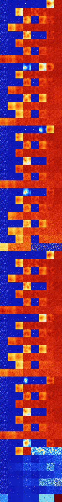

# B34678 (241664-242175)

<details>
    <summary>Initial Grid</summary>
    
</details>


<details>
    <summary>Initial Grid RLE</summary>

```
#C Exported from GoGoL (https://github.com/marrow16/gogol)
#C Wrap mode: Toroidal
#C Boundary mode: Dead
#C Step: 0
x = 100, y = 100, rule = B34678/S
6bo26bo20bo11bo26bobo$18bo7b2obo23bo10bo2bo12bo8bo2bo$20bo4bo15b3o2bo2b
o8bo6bo$16bo2bo20bo16bo25bobo10bobo$10bo21bo30bo5bo29bo$6bo8bobo61bo3bo
$57bo15bo3bo$45bo$3bo11bo4bo$7bo7bo56bo8bo$b2o9bo25bo22bo6bo7bo7bo9bo$
18b2o13bo10bo13bo$32bo17bo7bo32bo$28bo7bo6b2o4bo6bo4bo21bo$4bo15bo39bo
35bo$9bo6bo21bo56bo$28bo2bobo30bo11bo7bo11bo$29bo7bo61bo$100b$2bo13bo
19bo13bo7bo10bo21bo$13bo31bo14bo9bo$43bo5bo34bo$4bo23bo42bo4bo20bo$33bo
9bo12b2o25bo15bo$33bo6bo3bo5bo17bo13bo2bo$5bobo53bo12bo11bo6bo5bo$9b2o
6bo16bo3b3o7bo$6bo44bo19bo3bo5bo9bo$17bo7bo56b2o3bo$4bo82bo2bo$12bo8bo
3bo10bo4bo4bo8bo12bo12bo15bo$4bo11bo20bo6bo11bo$33bo37bo13bo3bo$3bo11bo
23bo3bo36bo$4bo9bo39bo6bo10bo15bo$7bo37bo41bob2o$37bo14b2o38b2o$15bo3bo
8bo48bo8bo7bo$4bo43bo3bo25bo$8bo41bo39bo$55bo7bo6bo6bo10bo10bo$bo13bo6b
obo39bo8bo20bo$7bo35bo8bo2bo12b2o13bo$16bo13bo20bo18bo5bo11bo$30bo3bo8b
o37b2o11bo$22bo9bo2bo46bo4bo8bo$24bo40bo2b2o8b2o10bo7bo$13bo16bo54bo$8b
o17bo5bo30bo23bo$26bo6bo30bo$22bo6bo3bo17b2o15bo$25bo2bo2bo8bo53bo$27bo
3bo12bo10bo13bo22bo$22bo16bo27bo18bo$4bo90bo$12bo30bo$14bo34bo9bo4bo6bo
4bo17bo$8bo39bobo6bo2bo$58bo12bo18bo8bo$4bo41bo16bo24bo$16bo33bo8bobo3b
o16bo11bo$9bo47bo4bo14bo5bo$8bo13bob2o4bo14bo12bo$bo10bo11bo15bo30bo17b
o4bo$bo2bobo55bo6bo25bo3bo$2bo19bo16bo11bo$20bo22bo32bo$21bo2bobo20bo
20bo17bo$9bo20bo2bo38bo$bo10bo19bo2bo26bo32bo$o30bobo11bo43bo4bo$o3bo6b
2o22bo$12bo4bo22bo53bo$22bo17bo36bo$5bo31b2o10bo5bo27bo$29bo17bobo10bob
o11bo12bo$72bo3bo18bo$8bo23bo4bo3bo7bo6bo8bo8bo24bo$22bo27bo22bo$13bo3b
o19bo$45bo38bo$27bo6bo4bo6bo51bo$3bo2bo25bo40bo4bo$17bo73bo$3bo6bo17bo
16bo33bo5bobo5bo$36bo23bo$bo11bo11bo$12bo26bo23bo$11bo26bobo18bo5bo6bo
17bo8bo$15bo59bobo$13bo24bo52bo$3bob2o16b2o8bo14bo9bo31bo$11bo2bo52bo
16bo6bo5bo$38bo13bo$5bo75bo10bo$8bo5bo38bo9bo17bo$bo5bo10bo35bo3bo$9bo
21bo$35bo55b2o$36bo12bo12bo!
```
</details>
<details>
    <summary>Thumbnail</summary>

</details>
<table>
<tr>
    <td><a href="./241664%20S%20Heat%20Map%20Activity.png"></a><br>S (241664)<br>S@4</td>    <td><a href="./241665%20S0%20Heat%20Map%20Activity.png"></a><br>S0 (241665)<br>R@10,p4</td>    <td><a href="./241666%20S1%20Heat%20Map%20Activity.png"></a><br>S1 (241666)<br>R@11,p2</td>    <td><a href="./241667%20S01%20Heat%20Map%20Activity.png"></a><br>S01 (241667)<br>R@224,p8</td>    <td><a href="./241668%20S2%20Heat%20Map%20Activity.png"></a><br>S2 (241668)<br>R@12,p2</td>    <td><a href="./241669%20S02%20Heat%20Map%20Activity.png"></a><br>S02 (241669)<br>R@27,p4</td>    <td><a href="./241670%20S12%20Heat%20Map%20Activity.png"></a><br>S12 (241670)<br>G>1000</td>    <td><a href="./241671%20S012%20Heat%20Map%20Activity.png"></a><br>S012 (241671)<br>G>1000</td></tr>
<tr>
    <td><a href="./241672%20S3%20Heat%20Map%20Activity.png"></a><br>S3 (241672)<br>S@4</td>    <td><a href="./241673%20S03%20Heat%20Map%20Activity.png"></a><br>S03 (241673)<br>R@24,p12</td>    <td><a href="./241674%20S13%20Heat%20Map%20Activity.png"></a><br>S13 (241674)<br>G>1000</td>    <td><a href="./241675%20S013%20Heat%20Map%20Activity.png"></a><br>S013 (241675)<br>G>1000</td>    <td><a href="./241676%20S23%20Heat%20Map%20Activity.png"></a><br>S23 (241676)<br>G>1000</td>    <td><a href="./241677%20S023%20Heat%20Map%20Activity.png"></a><br>S023 (241677)<br>G>1000</td>    <td><a href="./241678%20S123%20Heat%20Map%20Activity.png"></a><br>S123 (241678)<br>G>1000</td>    <td><a href="./241679%20S0123%20Heat%20Map%20Activity.png"></a><br>S0123 (241679)<br>G>1000</td></tr>
<tr>
    <td><a href="./241680%20S4%20Heat%20Map%20Activity.png"></a><br>S4 (241680)<br>S@4</td>    <td><a href="./241681%20S04%20Heat%20Map%20Activity.png"></a><br>S04 (241681)<br>R@12,p4</td>    <td><a href="./241682%20S14%20Heat%20Map%20Activity.png"></a><br>S14 (241682)<br>R@11,p2</td>    <td><a href="./241683%20S014%20Heat%20Map%20Activity.png"></a><br>S014 (241683)<br>G>1000</td>    <td><a href="./241684%20S24%20Heat%20Map%20Activity.png"></a><br>S24 (241684)<br>R@11,p4</td>    <td><a href="./241685%20S024%20Heat%20Map%20Activity.png"></a><br>S024 (241685)<br>G>1000</td>    <td><a href="./241686%20S124%20Heat%20Map%20Activity.png"></a><br>S124 (241686)<br>G>1000</td>    <td><a href="./241687%20S0124%20Heat%20Map%20Activity.png"></a><br>S0124 (241687)<br>G>1000</td></tr>
<tr>
    <td><a href="./241688%20S34%20Heat%20Map%20Activity.png"></a><br>S34 (241688)<br>R@6,p2</td>    <td><a href="./241689%20S034%20Heat%20Map%20Activity.png"></a><br>S034 (241689)<br>G>1000</td>    <td><a href="./241690%20S134%20Heat%20Map%20Activity.png"></a><br>S134 (241690)<br>G>1000</td>    <td><a href="./241691%20S0134%20Heat%20Map%20Activity.png"></a><br>S0134 (241691)<br>G>1000</td>    <td><a href="./241692%20S234%20Heat%20Map%20Activity.png"></a><br>S234 (241692)<br>G>1000</td>    <td><a href="./241693%20S0234%20Heat%20Map%20Activity.png"></a><br>S0234 (241693)<br>G>1000</td>    <td><a href="./241694%20S1234%20Heat%20Map%20Activity.png"></a><br>S1234 (241694)<br>G>1000</td>    <td><a href="./241695%20S01234%20Heat%20Map%20Activity.png"></a><br>S01234 (241695)<br>G>1000</td></tr>
<tr>
    <td><a href="./241696%20S5%20Heat%20Map%20Activity.png"></a><br>S5 (241696)<br>S@4</td>    <td><a href="./241697%20S05%20Heat%20Map%20Activity.png"></a><br>S05 (241697)<br>R@10,p4</td>    <td><a href="./241698%20S15%20Heat%20Map%20Activity.png"></a><br>S15 (241698)<br>R@14,p2</td>    <td><a href="./241699%20S015%20Heat%20Map%20Activity.png"></a><br>S015 (241699)<br>G>1000</td>    <td><a href="./241700%20S25%20Heat%20Map%20Activity.png"></a><br>S25 (241700)<br>R@12,p2</td>    <td><a href="./241701%20S025%20Heat%20Map%20Activity.png"></a><br>S025 (241701)<br>R@34,p4</td>    <td><a href="./241702%20S125%20Heat%20Map%20Activity.png"></a><br>S125 (241702)<br>G>1000</td>    <td><a href="./241703%20S0125%20Heat%20Map%20Activity.png"></a><br>S0125 (241703)<br>G>1000</td></tr>
<tr>
    <td><a href="./241704%20S35%20Heat%20Map%20Activity.png"></a><br>S35 (241704)<br>S@4</td>    <td><a href="./241705%20S035%20Heat%20Map%20Activity.png"></a><br>S035 (241705)<br>R@32,p12</td>    <td><a href="./241706%20S135%20Heat%20Map%20Activity.png"></a><br>S135 (241706)<br>G>1000</td>    <td><a href="./241707%20S0135%20Heat%20Map%20Activity.png"></a><br>S0135 (241707)<br>G>1000</td>    <td><a href="./241708%20S235%20Heat%20Map%20Activity.png"></a><br>S235 (241708)<br>G>1000</td>    <td><a href="./241709%20S0235%20Heat%20Map%20Activity.png"></a><br>S0235 (241709)<br>G>1000</td>    <td><a href="./241710%20S1235%20Heat%20Map%20Activity.png"></a><br>S1235 (241710)<br>G>1000</td>    <td><a href="./241711%20S01235%20Heat%20Map%20Activity.png"></a><br>S01235 (241711)<br>G>1000</td></tr>
<tr>
    <td><a href="./241712%20S45%20Heat%20Map%20Activity.png"></a><br>S45 (241712)<br>S@4</td>    <td><a href="./241713%20S045%20Heat%20Map%20Activity.png"></a><br>S045 (241713)<br>R@12,p4</td>    <td><a href="./241714%20S145%20Heat%20Map%20Activity.png"></a><br>S145 (241714)<br>R@25,p2</td>    <td><a href="./241715%20S0145%20Heat%20Map%20Activity.png"></a><br>S0145 (241715)<br>G>1000</td>    <td><a href="./241716%20S245%20Heat%20Map%20Activity.png"></a><br>S245 (241716)<br>R@11,p4</td>    <td><a href="./241717%20S0245%20Heat%20Map%20Activity.png"></a><br>S0245 (241717)<br>G>1000</td>    <td><a href="./241718%20S1245%20Heat%20Map%20Activity.png"></a><br>S1245 (241718)<br>G>1000</td>    <td><a href="./241719%20S01245%20Heat%20Map%20Activity.png"></a><br>S01245 (241719)<br>G>1000</td></tr>
<tr>
    <td><a href="./241720%20S345%20Heat%20Map%20Activity.png"></a><br>S345 (241720)<br>G>1000</td>    <td><a href="./241721%20S0345%20Heat%20Map%20Activity.png"></a><br>S0345 (241721)<br>G>1000</td>    <td><a href="./241722%20S1345%20Heat%20Map%20Activity.png"></a><br>S1345 (241722)<br>G>1000</td>    <td><a href="./241723%20S01345%20Heat%20Map%20Activity.png"></a><br>S01345 (241723)<br>G>1000</td>    <td><a href="./241724%20S2345%20Heat%20Map%20Activity.png"></a><br>S2345 (241724)<br>G>1000</td>    <td><a href="./241725%20S02345%20Heat%20Map%20Activity.png"></a><br>S02345 (241725)<br>G>1000</td>    <td><a href="./241726%20S12345%20Heat%20Map%20Activity.png"></a><br>S12345 (241726)<br>G>1000</td>    <td><a href="./241727%20S012345%20Heat%20Map%20Activity.png"></a><br>S012345 (241727)<br>G>1000</td></tr>
<tr>
    <td><a href="./241728%20S6%20Heat%20Map%20Activity.png"></a><br>S6 (241728)<br>S@4</td>    <td><a href="./241729%20S06%20Heat%20Map%20Activity.png"></a><br>S06 (241729)<br>R@10,p4</td>    <td><a href="./241730%20S16%20Heat%20Map%20Activity.png"></a><br>S16 (241730)<br>R@14,p2</td>    <td><a href="./241731%20S016%20Heat%20Map%20Activity.png"></a><br>S016 (241731)<br>G>1000</td>    <td><a href="./241732%20S26%20Heat%20Map%20Activity.png"></a><br>S26 (241732)<br>R@12,p2</td>    <td><a href="./241733%20S026%20Heat%20Map%20Activity.png"></a><br>S026 (241733)<br>G>1000</td>    <td><a href="./241734%20S126%20Heat%20Map%20Activity.png"></a><br>S126 (241734)<br>G>1000</td>    <td><a href="./241735%20S0126%20Heat%20Map%20Activity.png"></a><br>S0126 (241735)<br>G>1000</td></tr>
<tr>
    <td><a href="./241736%20S36%20Heat%20Map%20Activity.png"></a><br>S36 (241736)<br>S@4</td>    <td><a href="./241737%20S036%20Heat%20Map%20Activity.png"></a><br>S036 (241737)<br>R@21,p12</td>    <td><a href="./241738%20S136%20Heat%20Map%20Activity.png"></a><br>S136 (241738)<br>G>1000</td>    <td><a href="./241739%20S0136%20Heat%20Map%20Activity.png"></a><br>S0136 (241739)<br>G>1000</td>    <td><a href="./241740%20S236%20Heat%20Map%20Activity.png"></a><br>S236 (241740)<br>G>1000</td>    <td><a href="./241741%20S0236%20Heat%20Map%20Activity.png"></a><br>S0236 (241741)<br>G>1000</td>    <td><a href="./241742%20S1236%20Heat%20Map%20Activity.png"></a><br>S1236 (241742)<br>G>1000</td>    <td><a href="./241743%20S01236%20Heat%20Map%20Activity.png"></a><br>S01236 (241743)<br>G>1000</td></tr>
<tr>
    <td><a href="./241744%20S46%20Heat%20Map%20Activity.png"></a><br>S46 (241744)<br>S@4</td>    <td><a href="./241745%20S046%20Heat%20Map%20Activity.png"></a><br>S046 (241745)<br>R@12,p4</td>    <td><a href="./241746%20S146%20Heat%20Map%20Activity.png"></a><br>S146 (241746)<br>R@18,p2</td>    <td><a href="./241747%20S0146%20Heat%20Map%20Activity.png"></a><br>S0146 (241747)<br>G>1000</td>    <td><a href="./241748%20S246%20Heat%20Map%20Activity.png"></a><br>S246 (241748)<br>R@11,p4</td>    <td><a href="./241749%20S0246%20Heat%20Map%20Activity.png"></a><br>S0246 (241749)<br>G>1000</td>    <td><a href="./241750%20S1246%20Heat%20Map%20Activity.png"></a><br>S1246 (241750)<br>G>1000</td>    <td><a href="./241751%20S01246%20Heat%20Map%20Activity.png"></a><br>S01246 (241751)<br>G>1000</td></tr>
<tr>
    <td><a href="./241752%20S346%20Heat%20Map%20Activity.png"></a><br>S346 (241752)<br>R@6,p2</td>    <td><a href="./241753%20S0346%20Heat%20Map%20Activity.png"></a><br>S0346 (241753)<br>G>1000</td>    <td><a href="./241754%20S1346%20Heat%20Map%20Activity.png"></a><br>S1346 (241754)<br>G>1000</td>    <td><a href="./241755%20S01346%20Heat%20Map%20Activity.png"></a><br>S01346 (241755)<br>G>1000</td>    <td><a href="./241756%20S2346%20Heat%20Map%20Activity.png"></a><br>S2346 (241756)<br>G>1000</td>    <td><a href="./241757%20S02346%20Heat%20Map%20Activity.png"></a><br>S02346 (241757)<br>G>1000</td>    <td><a href="./241758%20S12346%20Heat%20Map%20Activity.png"></a><br>S12346 (241758)<br>G>1000</td>    <td><a href="./241759%20S012346%20Heat%20Map%20Activity.png"></a><br>S012346 (241759)<br>G>1000</td></tr>
<tr>
    <td><a href="./241760%20S56%20Heat%20Map%20Activity.png"></a><br>S56 (241760)<br>S@4</td>    <td><a href="./241761%20S056%20Heat%20Map%20Activity.png"></a><br>S056 (241761)<br>R@10,p4</td>    <td><a href="./241762%20S156%20Heat%20Map%20Activity.png"></a><br>S156 (241762)<br>R@13,p2</td>    <td><a href="./241763%20S0156%20Heat%20Map%20Activity.png"></a><br>S0156 (241763)<br>G>1000</td>    <td><a href="./241764%20S256%20Heat%20Map%20Activity.png"></a><br>S256 (241764)<br>R@12,p2</td>    <td><a href="./241765%20S0256%20Heat%20Map%20Activity.png"></a><br>S0256 (241765)<br>G>1000</td>    <td><a href="./241766%20S1256%20Heat%20Map%20Activity.png"></a><br>S1256 (241766)<br>G>1000</td>    <td><a href="./241767%20S01256%20Heat%20Map%20Activity.png"></a><br>S01256 (241767)<br>G>1000</td></tr>
<tr>
    <td><a href="./241768%20S356%20Heat%20Map%20Activity.png"></a><br>S356 (241768)<br>S@4</td>    <td><a href="./241769%20S0356%20Heat%20Map%20Activity.png"></a><br>S0356 (241769)<br>G>1000</td>    <td><a href="./241770%20S1356%20Heat%20Map%20Activity.png"></a><br>S1356 (241770)<br>G>1000</td>    <td><a href="./241771%20S01356%20Heat%20Map%20Activity.png"></a><br>S01356 (241771)<br>G>1000</td>    <td><a href="./241772%20S2356%20Heat%20Map%20Activity.png"></a><br>S2356 (241772)<br>G>1000</td>    <td><a href="./241773%20S02356%20Heat%20Map%20Activity.png"></a><br>S02356 (241773)<br>G>1000</td>    <td><a href="./241774%20S12356%20Heat%20Map%20Activity.png"></a><br>S12356 (241774)<br>G>1000</td>    <td><a href="./241775%20S012356%20Heat%20Map%20Activity.png"></a><br>S012356 (241775)<br>G>1000</td></tr>
<tr>
    <td><a href="./241776%20S456%20Heat%20Map%20Activity.png"></a><br>S456 (241776)<br>S@4</td>    <td><a href="./241777%20S0456%20Heat%20Map%20Activity.png"></a><br>S0456 (241777)<br>R@12,p4</td>    <td><a href="./241778%20S1456%20Heat%20Map%20Activity.png"></a><br>S1456 (241778)<br>G>1000</td>    <td><a href="./241779%20S01456%20Heat%20Map%20Activity.png"></a><br>S01456 (241779)<br>G>1000</td>    <td><a href="./241780%20S2456%20Heat%20Map%20Activity.png"></a><br>S2456 (241780)<br>R@11,p4</td>    <td><a href="./241781%20S02456%20Heat%20Map%20Activity.png"></a><br>S02456 (241781)<br>G>1000</td>    <td><a href="./241782%20S12456%20Heat%20Map%20Activity.png"></a><br>S12456 (241782)<br>G>1000</td>    <td><a href="./241783%20S012456%20Heat%20Map%20Activity.png"></a><br>S012456 (241783)<br>G>1000</td></tr>
<tr>
    <td><a href="./241784%20S3456%20Heat%20Map%20Activity.png"></a><br>S3456 (241784)<br>G>1000</td>    <td><a href="./241785%20S03456%20Heat%20Map%20Activity.png"></a><br>S03456 (241785)<br>G>1000</td>    <td><a href="./241786%20S13456%20Heat%20Map%20Activity.png"></a><br>S13456 (241786)<br>G>1000</td>    <td><a href="./241787%20S013456%20Heat%20Map%20Activity.png"></a><br>S013456 (241787)<br>G>1000</td>    <td><a href="./241788%20S23456%20Heat%20Map%20Activity.png"></a><br>S23456 (241788)<br>G>1000</td>    <td><a href="./241789%20S023456%20Heat%20Map%20Activity.png"></a><br>S023456 (241789)<br>G>1000</td>    <td><a href="./241790%20S123456%20Heat%20Map%20Activity.png"></a><br>S123456 (241790)<br>G>1000</td>    <td><a href="./241791%20S0123456%20Heat%20Map%20Activity.png"></a><br>S0123456 (241791)<br>G>1000</td></tr>
<tr>
    <td><a href="./241792%20S7%20Heat%20Map%20Activity.png"></a><br>S7 (241792)<br>S@4</td>    <td><a href="./241793%20S07%20Heat%20Map%20Activity.png"></a><br>S07 (241793)<br>R@10,p4</td>    <td><a href="./241794%20S17%20Heat%20Map%20Activity.png"></a><br>S17 (241794)<br>R@11,p2</td>    <td><a href="./241795%20S017%20Heat%20Map%20Activity.png"></a><br>S017 (241795)<br>R@73,p8</td>    <td><a href="./241796%20S27%20Heat%20Map%20Activity.png"></a><br>S27 (241796)<br>R@12,p2</td>    <td><a href="./241797%20S027%20Heat%20Map%20Activity.png"></a><br>S027 (241797)<br>G>1000</td>    <td><a href="./241798%20S127%20Heat%20Map%20Activity.png"></a><br>S127 (241798)<br>G>1000</td>    <td><a href="./241799%20S0127%20Heat%20Map%20Activity.png"></a><br>S0127 (241799)<br>G>1000</td></tr>
<tr>
    <td><a href="./241800%20S37%20Heat%20Map%20Activity.png"></a><br>S37 (241800)<br>S@4</td>    <td><a href="./241801%20S037%20Heat%20Map%20Activity.png"></a><br>S037 (241801)<br>R@24,p12</td>    <td><a href="./241802%20S137%20Heat%20Map%20Activity.png"></a><br>S137 (241802)<br>G>1000</td>    <td><a href="./241803%20S0137%20Heat%20Map%20Activity.png"></a><br>S0137 (241803)<br>G>1000</td>    <td><a href="./241804%20S237%20Heat%20Map%20Activity.png"></a><br>S237 (241804)<br>G>1000</td>    <td><a href="./241805%20S0237%20Heat%20Map%20Activity.png"></a><br>S0237 (241805)<br>G>1000</td>    <td><a href="./241806%20S1237%20Heat%20Map%20Activity.png"></a><br>S1237 (241806)<br>G>1000</td>    <td><a href="./241807%20S01237%20Heat%20Map%20Activity.png"></a><br>S01237 (241807)<br>G>1000</td></tr>
<tr>
    <td><a href="./241808%20S47%20Heat%20Map%20Activity.png"></a><br>S47 (241808)<br>S@4</td>    <td><a href="./241809%20S047%20Heat%20Map%20Activity.png"></a><br>S047 (241809)<br>R@12,p4</td>    <td><a href="./241810%20S147%20Heat%20Map%20Activity.png"></a><br>S147 (241810)<br>R@11,p2</td>    <td><a href="./241811%20S0147%20Heat%20Map%20Activity.png"></a><br>S0147 (241811)<br>G>1000</td>    <td><a href="./241812%20S247%20Heat%20Map%20Activity.png"></a><br>S247 (241812)<br>R@11,p4</td>    <td><a href="./241813%20S0247%20Heat%20Map%20Activity.png"></a><br>S0247 (241813)<br>G>1000</td>    <td><a href="./241814%20S1247%20Heat%20Map%20Activity.png"></a><br>S1247 (241814)<br>G>1000</td>    <td><a href="./241815%20S01247%20Heat%20Map%20Activity.png"></a><br>S01247 (241815)<br>G>1000</td></tr>
<tr>
    <td><a href="./241816%20S347%20Heat%20Map%20Activity.png"></a><br>S347 (241816)<br>R@6,p2</td>    <td><a href="./241817%20S0347%20Heat%20Map%20Activity.png"></a><br>S0347 (241817)<br>R@21,p12</td>    <td><a href="./241818%20S1347%20Heat%20Map%20Activity.png"></a><br>S1347 (241818)<br>G>1000</td>    <td><a href="./241819%20S01347%20Heat%20Map%20Activity.png"></a><br>S01347 (241819)<br>G>1000</td>    <td><a href="./241820%20S2347%20Heat%20Map%20Activity.png"></a><br>S2347 (241820)<br>G>1000</td>    <td><a href="./241821%20S02347%20Heat%20Map%20Activity.png"></a><br>S02347 (241821)<br>G>1000</td>    <td><a href="./241822%20S12347%20Heat%20Map%20Activity.png"></a><br>S12347 (241822)<br>G>1000</td>    <td><a href="./241823%20S012347%20Heat%20Map%20Activity.png"></a><br>S012347 (241823)<br>G>1000</td></tr>
<tr>
    <td><a href="./241824%20S57%20Heat%20Map%20Activity.png"></a><br>S57 (241824)<br>S@4</td>    <td><a href="./241825%20S057%20Heat%20Map%20Activity.png"></a><br>S057 (241825)<br>R@10,p4</td>    <td><a href="./241826%20S157%20Heat%20Map%20Activity.png"></a><br>S157 (241826)<br>R@14,p2</td>    <td><a href="./241827%20S0157%20Heat%20Map%20Activity.png"></a><br>S0157 (241827)<br>G>1000</td>    <td><a href="./241828%20S257%20Heat%20Map%20Activity.png"></a><br>S257 (241828)<br>R@12,p2</td>    <td><a href="./241829%20S0257%20Heat%20Map%20Activity.png"></a><br>S0257 (241829)<br>R@29,p4</td>    <td><a href="./241830%20S1257%20Heat%20Map%20Activity.png"></a><br>S1257 (241830)<br>G>1000</td>    <td><a href="./241831%20S01257%20Heat%20Map%20Activity.png"></a><br>S01257 (241831)<br>G>1000</td></tr>
<tr>
    <td><a href="./241832%20S357%20Heat%20Map%20Activity.png"></a><br>S357 (241832)<br>S@4</td>    <td><a href="./241833%20S0357%20Heat%20Map%20Activity.png"></a><br>S0357 (241833)<br>R@39,p12</td>    <td><a href="./241834%20S1357%20Heat%20Map%20Activity.png"></a><br>S1357 (241834)<br>G>1000</td>    <td><a href="./241835%20S01357%20Heat%20Map%20Activity.png"></a><br>S01357 (241835)<br>G>1000</td>    <td><a href="./241836%20S2357%20Heat%20Map%20Activity.png"></a><br>S2357 (241836)<br>G>1000</td>    <td><a href="./241837%20S02357%20Heat%20Map%20Activity.png"></a><br>S02357 (241837)<br>G>1000</td>    <td><a href="./241838%20S12357%20Heat%20Map%20Activity.png"></a><br>S12357 (241838)<br>G>1000</td>    <td><a href="./241839%20S012357%20Heat%20Map%20Activity.png"></a><br>S012357 (241839)<br>G>1000</td></tr>
<tr>
    <td><a href="./241840%20S457%20Heat%20Map%20Activity.png"></a><br>S457 (241840)<br>S@4</td>    <td><a href="./241841%20S0457%20Heat%20Map%20Activity.png"></a><br>S0457 (241841)<br>R@12,p4</td>    <td><a href="./241842%20S1457%20Heat%20Map%20Activity.png"></a><br>S1457 (241842)<br>R@51,p2</td>    <td><a href="./241843%20S01457%20Heat%20Map%20Activity.png"></a><br>S01457 (241843)<br>G>1000</td>    <td><a href="./241844%20S2457%20Heat%20Map%20Activity.png"></a><br>S2457 (241844)<br>R@11,p4</td>    <td><a href="./241845%20S02457%20Heat%20Map%20Activity.png"></a><br>S02457 (241845)<br>G>1000</td>    <td><a href="./241846%20S12457%20Heat%20Map%20Activity.png"></a><br>S12457 (241846)<br>G>1000</td>    <td><a href="./241847%20S012457%20Heat%20Map%20Activity.png"></a><br>S012457 (241847)<br>G>1000</td></tr>
<tr>
    <td><a href="./241848%20S3457%20Heat%20Map%20Activity.png"></a><br>S3457 (241848)<br>G>1000</td>    <td><a href="./241849%20S03457%20Heat%20Map%20Activity.png"></a><br>S03457 (241849)<br>G>1000</td>    <td><a href="./241850%20S13457%20Heat%20Map%20Activity.png"></a><br>S13457 (241850)<br>G>1000</td>    <td><a href="./241851%20S013457%20Heat%20Map%20Activity.png"></a><br>S013457 (241851)<br>G>1000</td>    <td><a href="./241852%20S23457%20Heat%20Map%20Activity.png"></a><br>S23457 (241852)<br>G>1000</td>    <td><a href="./241853%20S023457%20Heat%20Map%20Activity.png"></a><br>S023457 (241853)<br>G>1000</td>    <td><a href="./241854%20S123457%20Heat%20Map%20Activity.png"></a><br>S123457 (241854)<br>G>1000</td>    <td><a href="./241855%20S0123457%20Heat%20Map%20Activity.png"></a><br>S0123457 (241855)<br>G>1000</td></tr>
<tr>
    <td><a href="./241856%20S67%20Heat%20Map%20Activity.png"></a><br>S67 (241856)<br>S@4</td>    <td><a href="./241857%20S067%20Heat%20Map%20Activity.png"></a><br>S067 (241857)<br>R@10,p4</td>    <td><a href="./241858%20S167%20Heat%20Map%20Activity.png"></a><br>S167 (241858)<br>R@14,p2</td>    <td><a href="./241859%20S0167%20Heat%20Map%20Activity.png"></a><br>S0167 (241859)<br>G>1000</td>    <td><a href="./241860%20S267%20Heat%20Map%20Activity.png"></a><br>S267 (241860)<br>R@12,p2</td>    <td><a href="./241861%20S0267%20Heat%20Map%20Activity.png"></a><br>S0267 (241861)<br>R@17,p4</td>    <td><a href="./241862%20S1267%20Heat%20Map%20Activity.png"></a><br>S1267 (241862)<br>G>1000</td>    <td><a href="./241863%20S01267%20Heat%20Map%20Activity.png"></a><br>S01267 (241863)<br>G>1000</td></tr>
<tr>
    <td><a href="./241864%20S367%20Heat%20Map%20Activity.png"></a><br>S367 (241864)<br>S@4</td>    <td><a href="./241865%20S0367%20Heat%20Map%20Activity.png"></a><br>S0367 (241865)<br>R@21,p12</td>    <td><a href="./241866%20S1367%20Heat%20Map%20Activity.png"></a><br>S1367 (241866)<br>G>1000</td>    <td><a href="./241867%20S01367%20Heat%20Map%20Activity.png"></a><br>S01367 (241867)<br>G>1000</td>    <td><a href="./241868%20S2367%20Heat%20Map%20Activity.png"></a><br>S2367 (241868)<br>G>1000</td>    <td><a href="./241869%20S02367%20Heat%20Map%20Activity.png"></a><br>S02367 (241869)<br>G>1000</td>    <td><a href="./241870%20S12367%20Heat%20Map%20Activity.png"></a><br>S12367 (241870)<br>G>1000</td>    <td><a href="./241871%20S012367%20Heat%20Map%20Activity.png"></a><br>S012367 (241871)<br>G>1000</td></tr>
<tr>
    <td><a href="./241872%20S467%20Heat%20Map%20Activity.png"></a><br>S467 (241872)<br>S@4</td>    <td><a href="./241873%20S0467%20Heat%20Map%20Activity.png"></a><br>S0467 (241873)<br>R@12,p4</td>    <td><a href="./241874%20S1467%20Heat%20Map%20Activity.png"></a><br>S1467 (241874)<br>R@35,p2</td>    <td><a href="./241875%20S01467%20Heat%20Map%20Activity.png"></a><br>S01467 (241875)<br>G>1000</td>    <td><a href="./241876%20S2467%20Heat%20Map%20Activity.png"></a><br>S2467 (241876)<br>R@11,p4</td>    <td><a href="./241877%20S02467%20Heat%20Map%20Activity.png"></a><br>S02467 (241877)<br>G>1000</td>    <td><a href="./241878%20S12467%20Heat%20Map%20Activity.png"></a><br>S12467 (241878)<br>G>1000</td>    <td><a href="./241879%20S012467%20Heat%20Map%20Activity.png"></a><br>S012467 (241879)<br>G>1000</td></tr>
<tr>
    <td><a href="./241880%20S3467%20Heat%20Map%20Activity.png"></a><br>S3467 (241880)<br>R@6,p2</td>    <td><a href="./241881%20S03467%20Heat%20Map%20Activity.png"></a><br>S03467 (241881)<br>G>1000</td>    <td><a href="./241882%20S13467%20Heat%20Map%20Activity.png"></a><br>S13467 (241882)<br>G>1000</td>    <td><a href="./241883%20S013467%20Heat%20Map%20Activity.png"></a><br>S013467 (241883)<br>G>1000</td>    <td><a href="./241884%20S23467%20Heat%20Map%20Activity.png"></a><br>S23467 (241884)<br>G>1000</td>    <td><a href="./241885%20S023467%20Heat%20Map%20Activity.png"></a><br>S023467 (241885)<br>G>1000</td>    <td><a href="./241886%20S123467%20Heat%20Map%20Activity.png"></a><br>S123467 (241886)<br>G>1000</td>    <td><a href="./241887%20S0123467%20Heat%20Map%20Activity.png"></a><br>S0123467 (241887)<br>G>1000</td></tr>
<tr>
    <td><a href="./241888%20S567%20Heat%20Map%20Activity.png"></a><br>S567 (241888)<br>S@4</td>    <td><a href="./241889%20S0567%20Heat%20Map%20Activity.png"></a><br>S0567 (241889)<br>R@10,p4</td>    <td><a href="./241890%20S1567%20Heat%20Map%20Activity.png"></a><br>S1567 (241890)<br>R@13,p2</td>    <td><a href="./241891%20S01567%20Heat%20Map%20Activity.png"></a><br>S01567 (241891)<br>G>1000</td>    <td><a href="./241892%20S2567%20Heat%20Map%20Activity.png"></a><br>S2567 (241892)<br>R@12,p2</td>    <td><a href="./241893%20S02567%20Heat%20Map%20Activity.png"></a><br>S02567 (241893)<br>G>1000</td>    <td><a href="./241894%20S12567%20Heat%20Map%20Activity.png"></a><br>S12567 (241894)<br>G>1000</td>    <td><a href="./241895%20S012567%20Heat%20Map%20Activity.png"></a><br>S012567 (241895)<br>G>1000</td></tr>
<tr>
    <td><a href="./241896%20S3567%20Heat%20Map%20Activity.png"></a><br>S3567 (241896)<br>S@4</td>    <td><a href="./241897%20S03567%20Heat%20Map%20Activity.png"></a><br>S03567 (241897)<br>G>1000</td>    <td><a href="./241898%20S13567%20Heat%20Map%20Activity.png"></a><br>S13567 (241898)<br>G>1000</td>    <td><a href="./241899%20S013567%20Heat%20Map%20Activity.png"></a><br>S013567 (241899)<br>G>1000</td>    <td><a href="./241900%20S23567%20Heat%20Map%20Activity.png"></a><br>S23567 (241900)<br>G>1000</td>    <td><a href="./241901%20S023567%20Heat%20Map%20Activity.png"></a><br>S023567 (241901)<br>G>1000</td>    <td><a href="./241902%20S123567%20Heat%20Map%20Activity.png"></a><br>S123567 (241902)<br>G>1000</td>    <td><a href="./241903%20S0123567%20Heat%20Map%20Activity.png"></a><br>S0123567 (241903)<br>G>1000</td></tr>
<tr>
    <td><a href="./241904%20S4567%20Heat%20Map%20Activity.png"></a><br>S4567 (241904)<br>S@4</td>    <td><a href="./241905%20S04567%20Heat%20Map%20Activity.png"></a><br>S04567 (241905)<br>R@12,p4</td>    <td><a href="./241906%20S14567%20Heat%20Map%20Activity.png"></a><br>S14567 (241906)<br>G>1000</td>    <td><a href="./241907%20S014567%20Heat%20Map%20Activity.png"></a><br>S014567 (241907)<br>G>1000</td>    <td><a href="./241908%20S24567%20Heat%20Map%20Activity.png"></a><br>S24567 (241908)<br>R@11,p4</td>    <td><a href="./241909%20S024567%20Heat%20Map%20Activity.png"></a><br>S024567 (241909)<br>G>1000</td>    <td><a href="./241910%20S124567%20Heat%20Map%20Activity.png"></a><br>S124567 (241910)<br>G>1000</td>    <td><a href="./241911%20S0124567%20Heat%20Map%20Activity.png"></a><br>S0124567 (241911)<br>G>1000</td></tr>
<tr>
    <td><a href="./241912%20S34567%20Heat%20Map%20Activity.png"></a><br>S34567 (241912)<br>G>1000</td>    <td><a href="./241913%20S034567%20Heat%20Map%20Activity.png"></a><br>S034567 (241913)<br>G>1000</td>    <td><a href="./241914%20S134567%20Heat%20Map%20Activity.png"></a><br>S134567 (241914)<br>G>1000</td>    <td><a href="./241915%20S0134567%20Heat%20Map%20Activity.png"></a><br>S0134567 (241915)<br>G>1000</td>    <td><a href="./241916%20S234567%20Heat%20Map%20Activity.png"></a><br>S234567 (241916)<br>G>1000</td>    <td><a href="./241917%20S0234567%20Heat%20Map%20Activity.png"></a><br>S0234567 (241917)<br>G>1000</td>    <td><a href="./241918%20S1234567%20Heat%20Map%20Activity.png"></a><br>S1234567 (241918)<br>G>1000</td>    <td><a href="./241919%20S01234567%20Heat%20Map%20Activity.png"></a><br>S01234567 (241919)<br>G>1000</td></tr>
<tr>
    <td><a href="./241920%20S8%20Heat%20Map%20Activity.png"></a><br>S8 (241920)<br>S@4</td>    <td><a href="./241921%20S08%20Heat%20Map%20Activity.png"></a><br>S08 (241921)<br>R@10,p4</td>    <td><a href="./241922%20S18%20Heat%20Map%20Activity.png"></a><br>S18 (241922)<br>R@11,p2</td>    <td><a href="./241923%20S018%20Heat%20Map%20Activity.png"></a><br>S018 (241923)<br>R@134,p8</td>    <td><a href="./241924%20S28%20Heat%20Map%20Activity.png"></a><br>S28 (241924)<br>R@12,p2</td>    <td><a href="./241925%20S028%20Heat%20Map%20Activity.png"></a><br>S028 (241925)<br>R@27,p4</td>    <td><a href="./241926%20S128%20Heat%20Map%20Activity.png"></a><br>S128 (241926)<br>G>1000</td>    <td><a href="./241927%20S0128%20Heat%20Map%20Activity.png"></a><br>S0128 (241927)<br>G>1000</td></tr>
<tr>
    <td><a href="./241928%20S38%20Heat%20Map%20Activity.png"></a><br>S38 (241928)<br>S@4</td>    <td><a href="./241929%20S038%20Heat%20Map%20Activity.png"></a><br>S038 (241929)<br>R@24,p12</td>    <td><a href="./241930%20S138%20Heat%20Map%20Activity.png"></a><br>S138 (241930)<br>G>1000</td>    <td><a href="./241931%20S0138%20Heat%20Map%20Activity.png"></a><br>S0138 (241931)<br>G>1000</td>    <td><a href="./241932%20S238%20Heat%20Map%20Activity.png"></a><br>S238 (241932)<br>G>1000</td>    <td><a href="./241933%20S0238%20Heat%20Map%20Activity.png"></a><br>S0238 (241933)<br>G>1000</td>    <td><a href="./241934%20S1238%20Heat%20Map%20Activity.png"></a><br>S1238 (241934)<br>G>1000</td>    <td><a href="./241935%20S01238%20Heat%20Map%20Activity.png"></a><br>S01238 (241935)<br>G>1000</td></tr>
<tr>
    <td><a href="./241936%20S48%20Heat%20Map%20Activity.png"></a><br>S48 (241936)<br>S@4</td>    <td><a href="./241937%20S048%20Heat%20Map%20Activity.png"></a><br>S048 (241937)<br>R@12,p4</td>    <td><a href="./241938%20S148%20Heat%20Map%20Activity.png"></a><br>S148 (241938)<br>R@11,p2</td>    <td><a href="./241939%20S0148%20Heat%20Map%20Activity.png"></a><br>S0148 (241939)<br>G>1000</td>    <td><a href="./241940%20S248%20Heat%20Map%20Activity.png"></a><br>S248 (241940)<br>R@11,p4</td>    <td><a href="./241941%20S0248%20Heat%20Map%20Activity.png"></a><br>S0248 (241941)<br>G>1000</td>    <td><a href="./241942%20S1248%20Heat%20Map%20Activity.png"></a><br>S1248 (241942)<br>G>1000</td>    <td><a href="./241943%20S01248%20Heat%20Map%20Activity.png"></a><br>S01248 (241943)<br>G>1000</td></tr>
<tr>
    <td><a href="./241944%20S348%20Heat%20Map%20Activity.png"></a><br>S348 (241944)<br>R@6,p2</td>    <td><a href="./241945%20S0348%20Heat%20Map%20Activity.png"></a><br>S0348 (241945)<br>G>1000</td>    <td><a href="./241946%20S1348%20Heat%20Map%20Activity.png"></a><br>S1348 (241946)<br>G>1000</td>    <td><a href="./241947%20S01348%20Heat%20Map%20Activity.png"></a><br>S01348 (241947)<br>G>1000</td>    <td><a href="./241948%20S2348%20Heat%20Map%20Activity.png"></a><br>S2348 (241948)<br>G>1000</td>    <td><a href="./241949%20S02348%20Heat%20Map%20Activity.png"></a><br>S02348 (241949)<br>G>1000</td>    <td><a href="./241950%20S12348%20Heat%20Map%20Activity.png"></a><br>S12348 (241950)<br>G>1000</td>    <td><a href="./241951%20S012348%20Heat%20Map%20Activity.png"></a><br>S012348 (241951)<br>G>1000</td></tr>
<tr>
    <td><a href="./241952%20S58%20Heat%20Map%20Activity.png"></a><br>S58 (241952)<br>S@4</td>    <td><a href="./241953%20S058%20Heat%20Map%20Activity.png"></a><br>S058 (241953)<br>R@10,p4</td>    <td><a href="./241954%20S158%20Heat%20Map%20Activity.png"></a><br>S158 (241954)<br>R@14,p2</td>    <td><a href="./241955%20S0158%20Heat%20Map%20Activity.png"></a><br>S0158 (241955)<br>G>1000</td>    <td><a href="./241956%20S258%20Heat%20Map%20Activity.png"></a><br>S258 (241956)<br>R@12,p2</td>    <td><a href="./241957%20S0258%20Heat%20Map%20Activity.png"></a><br>S0258 (241957)<br>R@34,p4</td>    <td><a href="./241958%20S1258%20Heat%20Map%20Activity.png"></a><br>S1258 (241958)<br>G>1000</td>    <td><a href="./241959%20S01258%20Heat%20Map%20Activity.png"></a><br>S01258 (241959)<br>G>1000</td></tr>
<tr>
    <td><a href="./241960%20S358%20Heat%20Map%20Activity.png"></a><br>S358 (241960)<br>S@4</td>    <td><a href="./241961%20S0358%20Heat%20Map%20Activity.png"></a><br>S0358 (241961)<br>R@32,p12</td>    <td><a href="./241962%20S1358%20Heat%20Map%20Activity.png"></a><br>S1358 (241962)<br>G>1000</td>    <td><a href="./241963%20S01358%20Heat%20Map%20Activity.png"></a><br>S01358 (241963)<br>G>1000</td>    <td><a href="./241964%20S2358%20Heat%20Map%20Activity.png"></a><br>S2358 (241964)<br>G>1000</td>    <td><a href="./241965%20S02358%20Heat%20Map%20Activity.png"></a><br>S02358 (241965)<br>G>1000</td>    <td><a href="./241966%20S12358%20Heat%20Map%20Activity.png"></a><br>S12358 (241966)<br>G>1000</td>    <td><a href="./241967%20S012358%20Heat%20Map%20Activity.png"></a><br>S012358 (241967)<br>G>1000</td></tr>
<tr>
    <td><a href="./241968%20S458%20Heat%20Map%20Activity.png"></a><br>S458 (241968)<br>S@4</td>    <td><a href="./241969%20S0458%20Heat%20Map%20Activity.png"></a><br>S0458 (241969)<br>R@12,p4</td>    <td><a href="./241970%20S1458%20Heat%20Map%20Activity.png"></a><br>S1458 (241970)<br>R@25,p2</td>    <td><a href="./241971%20S01458%20Heat%20Map%20Activity.png"></a><br>S01458 (241971)<br>G>1000</td>    <td><a href="./241972%20S2458%20Heat%20Map%20Activity.png"></a><br>S2458 (241972)<br>R@11,p4</td>    <td><a href="./241973%20S02458%20Heat%20Map%20Activity.png"></a><br>S02458 (241973)<br>G>1000</td>    <td><a href="./241974%20S12458%20Heat%20Map%20Activity.png"></a><br>S12458 (241974)<br>G>1000</td>    <td><a href="./241975%20S012458%20Heat%20Map%20Activity.png"></a><br>S012458 (241975)<br>G>1000</td></tr>
<tr>
    <td><a href="./241976%20S3458%20Heat%20Map%20Activity.png"></a><br>S3458 (241976)<br>G>1000</td>    <td><a href="./241977%20S03458%20Heat%20Map%20Activity.png"></a><br>S03458 (241977)<br>G>1000</td>    <td><a href="./241978%20S13458%20Heat%20Map%20Activity.png"></a><br>S13458 (241978)<br>G>1000</td>    <td><a href="./241979%20S013458%20Heat%20Map%20Activity.png"></a><br>S013458 (241979)<br>G>1000</td>    <td><a href="./241980%20S23458%20Heat%20Map%20Activity.png"></a><br>S23458 (241980)<br>G>1000</td>    <td><a href="./241981%20S023458%20Heat%20Map%20Activity.png"></a><br>S023458 (241981)<br>G>1000</td>    <td><a href="./241982%20S123458%20Heat%20Map%20Activity.png"></a><br>S123458 (241982)<br>G>1000</td>    <td><a href="./241983%20S0123458%20Heat%20Map%20Activity.png"></a><br>S0123458 (241983)<br>G>1000</td></tr>
<tr>
    <td><a href="./241984%20S68%20Heat%20Map%20Activity.png"></a><br>S68 (241984)<br>S@4</td>    <td><a href="./241985%20S068%20Heat%20Map%20Activity.png"></a><br>S068 (241985)<br>R@10,p4</td>    <td><a href="./241986%20S168%20Heat%20Map%20Activity.png"></a><br>S168 (241986)<br>R@14,p2</td>    <td><a href="./241987%20S0168%20Heat%20Map%20Activity.png"></a><br>S0168 (241987)<br>R@222,p8</td>    <td><a href="./241988%20S268%20Heat%20Map%20Activity.png"></a><br>S268 (241988)<br>R@12,p2</td>    <td><a href="./241989%20S0268%20Heat%20Map%20Activity.png"></a><br>S0268 (241989)<br>G>1000</td>    <td><a href="./241990%20S1268%20Heat%20Map%20Activity.png"></a><br>S1268 (241990)<br>G>1000</td>    <td><a href="./241991%20S01268%20Heat%20Map%20Activity.png"></a><br>S01268 (241991)<br>G>1000</td></tr>
<tr>
    <td><a href="./241992%20S368%20Heat%20Map%20Activity.png"></a><br>S368 (241992)<br>S@4</td>    <td><a href="./241993%20S0368%20Heat%20Map%20Activity.png"></a><br>S0368 (241993)<br>R@21,p12</td>    <td><a href="./241994%20S1368%20Heat%20Map%20Activity.png"></a><br>S1368 (241994)<br>G>1000</td>    <td><a href="./241995%20S01368%20Heat%20Map%20Activity.png"></a><br>S01368 (241995)<br>G>1000</td>    <td><a href="./241996%20S2368%20Heat%20Map%20Activity.png"></a><br>S2368 (241996)<br>G>1000</td>    <td><a href="./241997%20S02368%20Heat%20Map%20Activity.png"></a><br>S02368 (241997)<br>G>1000</td>    <td><a href="./241998%20S12368%20Heat%20Map%20Activity.png"></a><br>S12368 (241998)<br>G>1000</td>    <td><a href="./241999%20S012368%20Heat%20Map%20Activity.png"></a><br>S012368 (241999)<br>G>1000</td></tr>
<tr>
    <td><a href="./242000%20S468%20Heat%20Map%20Activity.png"></a><br>S468 (242000)<br>S@4</td>    <td><a href="./242001%20S0468%20Heat%20Map%20Activity.png"></a><br>S0468 (242001)<br>R@12,p4</td>    <td><a href="./242002%20S1468%20Heat%20Map%20Activity.png"></a><br>S1468 (242002)<br>R@18,p2</td>    <td><a href="./242003%20S01468%20Heat%20Map%20Activity.png"></a><br>S01468 (242003)<br>G>1000</td>    <td><a href="./242004%20S2468%20Heat%20Map%20Activity.png"></a><br>S2468 (242004)<br>R@11,p4</td>    <td><a href="./242005%20S02468%20Heat%20Map%20Activity.png"></a><br>S02468 (242005)<br>G>1000</td>    <td><a href="./242006%20S12468%20Heat%20Map%20Activity.png"></a><br>S12468 (242006)<br>G>1000</td>    <td><a href="./242007%20S012468%20Heat%20Map%20Activity.png"></a><br>S012468 (242007)<br>G>1000</td></tr>
<tr>
    <td><a href="./242008%20S3468%20Heat%20Map%20Activity.png"></a><br>S3468 (242008)<br>R@6,p2</td>    <td><a href="./242009%20S03468%20Heat%20Map%20Activity.png"></a><br>S03468 (242009)<br>G>1000</td>    <td><a href="./242010%20S13468%20Heat%20Map%20Activity.png"></a><br>S13468 (242010)<br>G>1000</td>    <td><a href="./242011%20S013468%20Heat%20Map%20Activity.png"></a><br>S013468 (242011)<br>G>1000</td>    <td><a href="./242012%20S23468%20Heat%20Map%20Activity.png"></a><br>S23468 (242012)<br>G>1000</td>    <td><a href="./242013%20S023468%20Heat%20Map%20Activity.png"></a><br>S023468 (242013)<br>G>1000</td>    <td><a href="./242014%20S123468%20Heat%20Map%20Activity.png"></a><br>S123468 (242014)<br>G>1000</td>    <td><a href="./242015%20S0123468%20Heat%20Map%20Activity.png"></a><br>S0123468 (242015)<br>G>1000</td></tr>
<tr>
    <td><a href="./242016%20S568%20Heat%20Map%20Activity.png"></a><br>S568 (242016)<br>S@4</td>    <td><a href="./242017%20S0568%20Heat%20Map%20Activity.png"></a><br>S0568 (242017)<br>R@10,p4</td>    <td><a href="./242018%20S1568%20Heat%20Map%20Activity.png"></a><br>S1568 (242018)<br>R@13,p2</td>    <td><a href="./242019%20S01568%20Heat%20Map%20Activity.png"></a><br>S01568 (242019)<br>G>1000</td>    <td><a href="./242020%20S2568%20Heat%20Map%20Activity.png"></a><br>S2568 (242020)<br>R@12,p2</td>    <td><a href="./242021%20S02568%20Heat%20Map%20Activity.png"></a><br>S02568 (242021)<br>G>1000</td>    <td><a href="./242022%20S12568%20Heat%20Map%20Activity.png"></a><br>S12568 (242022)<br>G>1000</td>    <td><a href="./242023%20S012568%20Heat%20Map%20Activity.png"></a><br>S012568 (242023)<br>G>1000</td></tr>
<tr>
    <td><a href="./242024%20S3568%20Heat%20Map%20Activity.png"></a><br>S3568 (242024)<br>S@4</td>    <td><a href="./242025%20S03568%20Heat%20Map%20Activity.png"></a><br>S03568 (242025)<br>G>1000</td>    <td><a href="./242026%20S13568%20Heat%20Map%20Activity.png"></a><br>S13568 (242026)<br>G>1000</td>    <td><a href="./242027%20S013568%20Heat%20Map%20Activity.png"></a><br>S013568 (242027)<br>G>1000</td>    <td><a href="./242028%20S23568%20Heat%20Map%20Activity.png"></a><br>S23568 (242028)<br>G>1000</td>    <td><a href="./242029%20S023568%20Heat%20Map%20Activity.png"></a><br>S023568 (242029)<br>G>1000</td>    <td><a href="./242030%20S123568%20Heat%20Map%20Activity.png"></a><br>S123568 (242030)<br>G>1000</td>    <td><a href="./242031%20S0123568%20Heat%20Map%20Activity.png"></a><br>S0123568 (242031)<br>G>1000</td></tr>
<tr>
    <td><a href="./242032%20S4568%20Heat%20Map%20Activity.png"></a><br>S4568 (242032)<br>S@4</td>    <td><a href="./242033%20S04568%20Heat%20Map%20Activity.png"></a><br>S04568 (242033)<br>R@12,p4</td>    <td><a href="./242034%20S14568%20Heat%20Map%20Activity.png"></a><br>S14568 (242034)<br>G>1000</td>    <td><a href="./242035%20S014568%20Heat%20Map%20Activity.png"></a><br>S014568 (242035)<br>G>1000</td>    <td><a href="./242036%20S24568%20Heat%20Map%20Activity.png"></a><br>S24568 (242036)<br>R@11,p4</td>    <td><a href="./242037%20S024568%20Heat%20Map%20Activity.png"></a><br>S024568 (242037)<br>G>1000</td>    <td><a href="./242038%20S124568%20Heat%20Map%20Activity.png"></a><br>S124568 (242038)<br>G>1000</td>    <td><a href="./242039%20S0124568%20Heat%20Map%20Activity.png"></a><br>S0124568 (242039)<br>G>1000</td></tr>
<tr>
    <td><a href="./242040%20S34568%20Heat%20Map%20Activity.png"></a><br>S34568 (242040)<br>G>1000</td>    <td><a href="./242041%20S034568%20Heat%20Map%20Activity.png"></a><br>S034568 (242041)<br>G>1000</td>    <td><a href="./242042%20S134568%20Heat%20Map%20Activity.png"></a><br>S134568 (242042)<br>G>1000</td>    <td><a href="./242043%20S0134568%20Heat%20Map%20Activity.png"></a><br>S0134568 (242043)<br>G>1000</td>    <td><a href="./242044%20S234568%20Heat%20Map%20Activity.png"></a><br>S234568 (242044)<br>G>1000</td>    <td><a href="./242045%20S0234568%20Heat%20Map%20Activity.png"></a><br>S0234568 (242045)<br>G>1000</td>    <td><a href="./242046%20S1234568%20Heat%20Map%20Activity.png"></a><br>S1234568 (242046)<br>G>1000</td>    <td><a href="./242047%20S01234568%20Heat%20Map%20Activity.png"></a><br>S01234568 (242047)<br>G>1000</td></tr>
<tr>
    <td><a href="./242048%20S78%20Heat%20Map%20Activity.png"></a><br>S78 (242048)<br>S@4</td>    <td><a href="./242049%20S078%20Heat%20Map%20Activity.png"></a><br>S078 (242049)<br>R@10,p4</td>    <td><a href="./242050%20S178%20Heat%20Map%20Activity.png"></a><br>S178 (242050)<br>R@11,p2</td>    <td><a href="./242051%20S0178%20Heat%20Map%20Activity.png"></a><br>S0178 (242051)<br>G>1000</td>    <td><a href="./242052%20S278%20Heat%20Map%20Activity.png"></a><br>S278 (242052)<br>R@12,p2</td>    <td><a href="./242053%20S0278%20Heat%20Map%20Activity.png"></a><br>S0278 (242053)<br>R@43,p4</td>    <td><a href="./242054%20S1278%20Heat%20Map%20Activity.png"></a><br>S1278 (242054)<br>G>1000</td>    <td><a href="./242055%20S01278%20Heat%20Map%20Activity.png"></a><br>S01278 (242055)<br>G>1000</td></tr>
<tr>
    <td><a href="./242056%20S378%20Heat%20Map%20Activity.png"></a><br>S378 (242056)<br>S@4</td>    <td><a href="./242057%20S0378%20Heat%20Map%20Activity.png"></a><br>S0378 (242057)<br>R@24,p12</td>    <td><a href="./242058%20S1378%20Heat%20Map%20Activity.png"></a><br>S1378 (242058)<br>G>1000</td>    <td><a href="./242059%20S01378%20Heat%20Map%20Activity.png"></a><br>S01378 (242059)<br>G>1000</td>    <td><a href="./242060%20S2378%20Heat%20Map%20Activity.png"></a><br>S2378 (242060)<br>G>1000</td>    <td><a href="./242061%20S02378%20Heat%20Map%20Activity.png"></a><br>S02378 (242061)<br>G>1000</td>    <td><a href="./242062%20S12378%20Heat%20Map%20Activity.png"></a><br>S12378 (242062)<br>G>1000</td>    <td><a href="./242063%20S012378%20Heat%20Map%20Activity.png"></a><br>S012378 (242063)<br>G>1000</td></tr>
<tr>
    <td><a href="./242064%20S478%20Heat%20Map%20Activity.png"></a><br>S478 (242064)<br>S@4</td>    <td><a href="./242065%20S0478%20Heat%20Map%20Activity.png"></a><br>S0478 (242065)<br>R@12,p4</td>    <td><a href="./242066%20S1478%20Heat%20Map%20Activity.png"></a><br>S1478 (242066)<br>R@11,p2</td>    <td><a href="./242067%20S01478%20Heat%20Map%20Activity.png"></a><br>S01478 (242067)<br>G>1000</td>    <td><a href="./242068%20S2478%20Heat%20Map%20Activity.png"></a><br>S2478 (242068)<br>R@11,p4</td>    <td><a href="./242069%20S02478%20Heat%20Map%20Activity.png"></a><br>S02478 (242069)<br>G>1000</td>    <td><a href="./242070%20S12478%20Heat%20Map%20Activity.png"></a><br>S12478 (242070)<br>G>1000</td>    <td><a href="./242071%20S012478%20Heat%20Map%20Activity.png"></a><br>S012478 (242071)<br>G>1000</td></tr>
<tr>
    <td><a href="./242072%20S3478%20Heat%20Map%20Activity.png"></a><br>S3478 (242072)<br>R@6,p2</td>    <td><a href="./242073%20S03478%20Heat%20Map%20Activity.png"></a><br>S03478 (242073)<br>R@21,p12</td>    <td><a href="./242074%20S13478%20Heat%20Map%20Activity.png"></a><br>S13478 (242074)<br>G>1000</td>    <td><a href="./242075%20S013478%20Heat%20Map%20Activity.png"></a><br>S013478 (242075)<br>G>1000</td>    <td><a href="./242076%20S23478%20Heat%20Map%20Activity.png"></a><br>S23478 (242076)<br>G>1000</td>    <td><a href="./242077%20S023478%20Heat%20Map%20Activity.png"></a><br>S023478 (242077)<br>G>1000</td>    <td><a href="./242078%20S123478%20Heat%20Map%20Activity.png"></a><br>S123478 (242078)<br>G>1000</td>    <td><a href="./242079%20S0123478%20Heat%20Map%20Activity.png"></a><br>S0123478 (242079)<br>G>1000</td></tr>
<tr>
    <td><a href="./242080%20S578%20Heat%20Map%20Activity.png"></a><br>S578 (242080)<br>S@4</td>    <td><a href="./242081%20S0578%20Heat%20Map%20Activity.png"></a><br>S0578 (242081)<br>R@10,p4</td>    <td><a href="./242082%20S1578%20Heat%20Map%20Activity.png"></a><br>S1578 (242082)<br>R@14,p2</td>    <td><a href="./242083%20S01578%20Heat%20Map%20Activity.png"></a><br>S01578 (242083)<br>G>1000</td>    <td><a href="./242084%20S2578%20Heat%20Map%20Activity.png"></a><br>S2578 (242084)<br>R@12,p2</td>    <td><a href="./242085%20S02578%20Heat%20Map%20Activity.png"></a><br>S02578 (242085)<br>R@29,p4</td>    <td><a href="./242086%20S12578%20Heat%20Map%20Activity.png"></a><br>S12578 (242086)<br>G>1000</td>    <td><a href="./242087%20S012578%20Heat%20Map%20Activity.png"></a><br>S012578 (242087)<br>G>1000</td></tr>
<tr>
    <td><a href="./242088%20S3578%20Heat%20Map%20Activity.png"></a><br>S3578 (242088)<br>S@4</td>    <td><a href="./242089%20S03578%20Heat%20Map%20Activity.png"></a><br>S03578 (242089)<br>R@61,p12</td>    <td><a href="./242090%20S13578%20Heat%20Map%20Activity.png"></a><br>S13578 (242090)<br>G>1000</td>    <td><a href="./242091%20S013578%20Heat%20Map%20Activity.png"></a><br>S013578 (242091)<br>G>1000</td>    <td><a href="./242092%20S23578%20Heat%20Map%20Activity.png"></a><br>S23578 (242092)<br>G>1000</td>    <td><a href="./242093%20S023578%20Heat%20Map%20Activity.png"></a><br>S023578 (242093)<br>G>1000</td>    <td><a href="./242094%20S123578%20Heat%20Map%20Activity.png"></a><br>S123578 (242094)<br>G>1000</td>    <td><a href="./242095%20S0123578%20Heat%20Map%20Activity.png"></a><br>S0123578 (242095)<br>G>1000</td></tr>
<tr>
    <td><a href="./242096%20S4578%20Heat%20Map%20Activity.png"></a><br>S4578 (242096)<br>S@4</td>    <td><a href="./242097%20S04578%20Heat%20Map%20Activity.png"></a><br>S04578 (242097)<br>R@12,p4</td>    <td><a href="./242098%20S14578%20Heat%20Map%20Activity.png"></a><br>S14578 (242098)<br>R@29,p2</td>    <td><a href="./242099%20S014578%20Heat%20Map%20Activity.png"></a><br>S014578 (242099)<br>G>1000</td>    <td><a href="./242100%20S24578%20Heat%20Map%20Activity.png"></a><br>S24578 (242100)<br>R@11,p4</td>    <td><a href="./242101%20S024578%20Heat%20Map%20Activity.png"></a><br>S024578 (242101)<br>G>1000</td>    <td><a href="./242102%20S124578%20Heat%20Map%20Activity.png"></a><br>S124578 (242102)<br>G>1000</td>    <td><a href="./242103%20S0124578%20Heat%20Map%20Activity.png"></a><br>S0124578 (242103)<br>G>1000</td></tr>
<tr>
    <td><a href="./242104%20S34578%20Heat%20Map%20Activity.png"></a><br>S34578 (242104)<br>G>1000</td>    <td><a href="./242105%20S034578%20Heat%20Map%20Activity.png"></a><br>S034578 (242105)<br>G>1000</td>    <td><a href="./242106%20S134578%20Heat%20Map%20Activity.png"></a><br>S134578 (242106)<br>G>1000</td>    <td><a href="./242107%20S0134578%20Heat%20Map%20Activity.png"></a><br>S0134578 (242107)<br>G>1000</td>    <td><a href="./242108%20S234578%20Heat%20Map%20Activity.png"></a><br>S234578 (242108)<br>G>1000</td>    <td><a href="./242109%20S0234578%20Heat%20Map%20Activity.png"></a><br>S0234578 (242109)<br>G>1000</td>    <td><a href="./242110%20S1234578%20Heat%20Map%20Activity.png"></a><br>S1234578 (242110)<br>G>1000</td>    <td><a href="./242111%20S01234578%20Heat%20Map%20Activity.png"></a><br>S01234578 (242111)<br>G>1000</td></tr>
<tr>
    <td><a href="./242112%20S678%20Heat%20Map%20Activity.png"></a><br>S678 (242112)<br>S@4</td>    <td><a href="./242113%20S0678%20Heat%20Map%20Activity.png"></a><br>S0678 (242113)<br>R@10,p4</td>    <td><a href="./242114%20S1678%20Heat%20Map%20Activity.png"></a><br>S1678 (242114)<br>R@14,p2</td>    <td><a href="./242115%20S01678%20Heat%20Map%20Activity.png"></a><br>S01678 (242115)<br>G>1000</td>    <td><a href="./242116%20S2678%20Heat%20Map%20Activity.png"></a><br>S2678 (242116)<br>R@12,p2</td>    <td><a href="./242117%20S02678%20Heat%20Map%20Activity.png"></a><br>S02678 (242117)<br>R@17,p4</td>    <td><a href="./242118%20S12678%20Heat%20Map%20Activity.png"></a><br>S12678 (242118)<br>G>1000</td>    <td><a href="./242119%20S012678%20Heat%20Map%20Activity.png"></a><br>S012678 (242119)<br>G>1000</td></tr>
<tr>
    <td><a href="./242120%20S3678%20Heat%20Map%20Activity.png"></a><br>S3678 (242120)<br>S@4</td>    <td><a href="./242121%20S03678%20Heat%20Map%20Activity.png"></a><br>S03678 (242121)<br>R@21,p12</td>    <td><a href="./242122%20S13678%20Heat%20Map%20Activity.png"></a><br>S13678 (242122)<br>G>1000</td>    <td><a href="./242123%20S013678%20Heat%20Map%20Activity.png"></a><br>S013678 (242123)<br>G>1000</td>    <td><a href="./242124%20S23678%20Heat%20Map%20Activity.png"></a><br>S23678 (242124)<br>R@311,p6</td>    <td><a href="./242125%20S023678%20Heat%20Map%20Activity.png"></a><br>S023678 (242125)<br>R@325,p6</td>    <td><a href="./242126%20S123678%20Heat%20Map%20Activity.png"></a><br>S123678 (242126)<br>R@182,p6</td>    <td><a href="./242127%20S0123678%20Heat%20Map%20Activity.png"></a><br>S0123678 (242127)<br>R@173,p6</td></tr>
<tr>
    <td><a href="./242128%20S4678%20Heat%20Map%20Activity.png"></a><br>S4678 (242128)<br>S@4</td>    <td><a href="./242129%20S04678%20Heat%20Map%20Activity.png"></a><br>S04678 (242129)<br>R@12,p4</td>    <td><a href="./242130%20S14678%20Heat%20Map%20Activity.png"></a><br>S14678 (242130)<br>R@35,p2</td>    <td><a href="./242131%20S014678%20Heat%20Map%20Activity.png"></a><br>S014678 (242131)<br>R@218,p2</td>    <td><a href="./242132%20S24678%20Heat%20Map%20Activity.png"></a><br>S24678 (242132)<br>R@11,p4</td>    <td><a href="./242133%20S024678%20Heat%20Map%20Activity.png"></a><br>S024678 (242133)<br>R@163,p2</td>    <td><a href="./242134%20S124678%20Heat%20Map%20Activity.png"></a><br>S124678 (242134)<br>R@114,p2</td>    <td><a href="./242135%20S0124678%20Heat%20Map%20Activity.png"></a><br>S0124678 (242135)<br>R@70,p2</td></tr>
<tr>
    <td><a href="./242136%20S34678%20Heat%20Map%20Activity.png"></a><br>S34678 (242136)<br>R@6,p2</td>    <td><a href="./242137%20S034678%20Heat%20Map%20Activity.png"></a><br>S034678 (242137)<br>S@208</td>    <td><a href="./242138%20S134678%20Heat%20Map%20Activity.png"></a><br>S134678 (242138)<br>S@104</td>    <td><a href="./242139%20S0134678%20Heat%20Map%20Activity.png"></a><br>S0134678 (242139)<br>R@52,p2</td>    <td><a href="./242140%20S234678%20Heat%20Map%20Activity.png"></a><br>S234678 (242140)<br>S@103</td>    <td><a href="./242141%20S0234678%20Heat%20Map%20Activity.png"></a><br>S0234678 (242141)<br>R@61,p2</td>    <td><a href="./242142%20S1234678%20Heat%20Map%20Activity.png"></a><br>S1234678 (242142)<br>S@55</td>    <td><a href="./242143%20S01234678%20Heat%20Map%20Activity.png"></a><br>S01234678 (242143)<br>R@40,p2</td></tr>
<tr>
    <td><a href="./242144%20S5678%20Heat%20Map%20Activity.png"></a><br>S5678 (242144)<br>S@4</td>    <td><a href="./242145%20S05678%20Heat%20Map%20Activity.png"></a><br>S05678 (242145)<br>R@10,p4</td>    <td><a href="./242146%20S15678%20Heat%20Map%20Activity.png"></a><br>S15678 (242146)<br>R@13,p2</td>    <td><a href="./242147%20S015678%20Heat%20Map%20Activity.png"></a><br>S015678 (242147)<br>S@262</td>    <td><a href="./242148%20S25678%20Heat%20Map%20Activity.png"></a><br>S25678 (242148)<br>R@12,p2</td>    <td><a href="./242149%20S025678%20Heat%20Map%20Activity.png"></a><br>S025678 (242149)<br>S@287</td>    <td><a href="./242150%20S125678%20Heat%20Map%20Activity.png"></a><br>S125678 (242150)<br>S@114</td>    <td><a href="./242151%20S0125678%20Heat%20Map%20Activity.png"></a><br>S0125678 (242151)<br>S@58</td></tr>
<tr>
    <td><a href="./242152%20S35678%20Heat%20Map%20Activity.png"></a><br>S35678 (242152)<br>S@4</td>    <td><a href="./242153%20S035678%20Heat%20Map%20Activity.png"></a><br>S035678 (242153)<br>S@223</td>    <td><a href="./242154%20S135678%20Heat%20Map%20Activity.png"></a><br>S135678 (242154)<br>S@182</td>    <td><a href="./242155%20S0135678%20Heat%20Map%20Activity.png"></a><br>S0135678 (242155)<br>S@57</td>    <td><a href="./242156%20S235678%20Heat%20Map%20Activity.png"></a><br>S235678 (242156)<br>S@92</td>    <td><a href="./242157%20S0235678%20Heat%20Map%20Activity.png"></a><br>S0235678 (242157)<br>S@66</td>    <td><a href="./242158%20S1235678%20Heat%20Map%20Activity.png"></a><br>S1235678 (242158)<br>S@50</td>    <td><a href="./242159%20S01235678%20Heat%20Map%20Activity.png"></a><br>S01235678 (242159)<br>S@35</td></tr>
<tr>
    <td><a href="./242160%20S45678%20Heat%20Map%20Activity.png"></a><br>S45678 (242160)<br>S@4</td>    <td><a href="./242161%20S045678%20Heat%20Map%20Activity.png"></a><br>S045678 (242161)<br>R@12,p4</td>    <td><a href="./242162%20S145678%20Heat%20Map%20Activity.png"></a><br>S145678 (242162)<br>S@190</td>    <td><a href="./242163%20S0145678%20Heat%20Map%20Activity.png"></a><br>S0145678 (242163)<br>S@76</td>    <td><a href="./242164%20S245678%20Heat%20Map%20Activity.png"></a><br>S245678 (242164)<br>R@11,p4</td>    <td><a href="./242165%20S0245678%20Heat%20Map%20Activity.png"></a><br>S0245678 (242165)<br>S@106</td>    <td><a href="./242166%20S1245678%20Heat%20Map%20Activity.png"></a><br>S1245678 (242166)<br>S@61</td>    <td><a href="./242167%20S01245678%20Heat%20Map%20Activity.png"></a><br>S01245678 (242167)<br>S@45</td></tr>
<tr>
    <td><a href="./242168%20S345678%20Heat%20Map%20Activity.png"></a><br>S345678 (242168)<br>S@149</td>    <td><a href="./242169%20S0345678%20Heat%20Map%20Activity.png"></a><br>S0345678 (242169)<br>S@96</td>    <td><a href="./242170%20S1345678%20Heat%20Map%20Activity.png"></a><br>S1345678 (242170)<br>S@77</td>    <td><a href="./242171%20S01345678%20Heat%20Map%20Activity.png"></a><br>S01345678 (242171)<br>S@37</td>    <td><a href="./242172%20S2345678%20Heat%20Map%20Activity.png"></a><br>S2345678 (242172)<br>S@83</td>    <td><a href="./242173%20S02345678%20Heat%20Map%20Activity.png"></a><br>S02345678 (242173)<br>S@48</td>    <td><a href="./242174%20S12345678%20Heat%20Map%20Activity.png"></a><br>S12345678 (242174)<br>S@41</td>    <td><a href="./242175%20S012345678%20Heat%20Map%20Activity.png"></a><br>S012345678 (242175)<br>S@30</td></tr>
</table>
