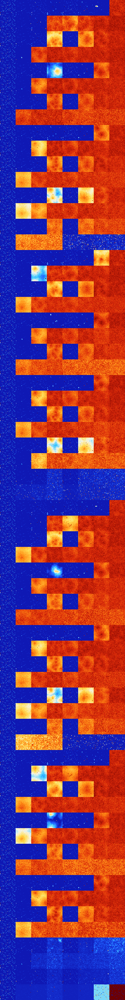

# B347 (77824-78335)

<details>
    <summary>Initial Grid</summary>
    
</details>


<details>
    <summary>Initial Grid RLE</summary>

```
#C Exported from GoGoL (https://github.com/marrow16/gogol)
#C Wrap mode: Toroidal
#C Boundary mode: Dead
#C Step: 0
x = 100, y = 100, rule = B347/S
26bo14bo23bo17bo$5bo7bobo51bo10bo3bo14bo$8bo19b2o5bo34bo6bo3bo15bo$2bo
7bo11bo12bo22bo28bo10bo$4bo28bo32bo3bo23bo$26bo36bo$15bo14bo49bo8bobobo
bo$11bo56bo18bo$11bo10bo7bo$bobo29bo34bo3bo$9bo42bo11bo11bo10bo$23bo2bo
5bo9bo56bo$77bo11b2o$14bo10bo12bo14bo6bo2bo21bo$25bo27bo5bo20bo$23bo2bo
5bobo13bo3bo8bo17bo3bobo13bo$5bobo20bo38bo13bo$10bo16bo12bo6b2o12bo$9bo
10bo43bo$39bo16bo32bo$14bo22bo$9bo4b2o7bo9bo32bo3bo3bo22bo$22bo10bo6bo
54bo$31bo52bobo$54bo4bo10bo26bo$26bo2bo16bo$45bo42bo$3bo49bo$58bo7bobo
24b2o$11bo3bo18bobo14bo$8bo34bo$6bo20bo24bo27bo9bo$16bo30bo3bo7bo5bo27b
o$13bo10bo10bo2bo8bob2o7bo32b2o3bo$5bo3bo3bo66bo$8bo80bo$o57bo19bo5bo$
7bo3b2o4bo10bo9bo4bo49bo4bo$21b2o72bo$9bo18bo2b2o19bo2bobobo$8bo3b3obo
21bo20bo10bo9bo4bo$2bo18bo12bo14bo$3bo34bo21b2o30bo5bo$39bo36bo$8bo10bo
19bo27bo$8bo14bo43bo10bo$25bo$27bo34bo30bo$4b2o6bo29bo35bobo4bo$3bo17bo
8bo4bo$73bo24bo$2bo12bo25bo5bobo13b2o31bo$31b2o3bo16bo18bo25bo$13bo22b
2o20bo9bo15bo$10bo23bo24bo4bo6bo$10bo30bo15bo$45bobo6bo9bo18bo5bo$56bo
9bo21bo$4bo15bo12bo5bo8bo6bobobo2bo18bo2bo2bo$3bo5bo5bob2o4bo11b2o10bo
7bo9bo$9bo74bo$7bo40bo47bo$18b2o29bo3bo10bo2bo$16bo3bo16bo12bo10bo29bo$
4bo22bo21bo$2b2obo11bo31bo8bo7bo15bo14bo$o20bo2bo9bo2bo3bo14bo31bo3bo$
6bo32b2o6bo26bo$21bo4bo39bo$10bo28bo27bo18bo$8bo5bo5bo29bo21bo25bo$13bo
3bo14b2o7bo43bo$15bo22bo26bo9bo10bo8bo$8bo11bobo41bo14bo7bo7bo$22bo11bo
27bo2bo3bo3bo$12bo27bo9bo$9bo63bo8bo7bo3b2o$9bo3bo57bo15bo$bobo38bo27bo
7bo3bobo$17bo13bo10bo4bo6bo3bo2bo33bo$2bob2o4bo6bo5bo10bo3bo7bo27bo8bo
7bo$34bo22bo14bo19bo$2bo11bo7bo49bobo$4bo24bo12b2o8bo2bo34bobobo$bo12b
2o18bo12bo2bo6bo25bo$57bo29bo9bo$7bo6bo28bo7bo25bo5bo5bo$bo19bo50bo18bo
$10bo70bo$5bobo3bo39bo3bo6bo$b2obo12bobo19bo2bo14bo$2bo14bo64bo$78bo$5b
o16bo36bo$40bo33bo24bo$20bo2bo7bo16bo25bo15bo7bo$3bo21bo5bo18bo18bo16bo
12bo$2bo10bo11bo29bo9bo3bo25bo$bo27bo6bo53bo$28bo29bo5bo7bo!
```
</details>
<details>
    <summary>Thumbnail</summary>

</details>
<table>
<tr>
    <td><a href="./77824%20S%20Heat%20Map%20Activity.png"></a><br>S (77824)<br>R@5,p2</td>    <td><a href="./77825%20S0%20Heat%20Map%20Activity.png"></a><br>S0 (77825)<br>R@13,p4</td>    <td><a href="./77826%20S1%20Heat%20Map%20Activity.png"></a><br>S1 (77826)<br>R@12,p2</td>    <td><a href="./77827%20S01%20Heat%20Map%20Activity.png"></a><br>S01 (77827)<br>R@56,p4</td>    <td><a href="./77828%20S2%20Heat%20Map%20Activity.png"></a><br>S2 (77828)<br>R@10,p2</td>    <td><a href="./77829%20S02%20Heat%20Map%20Activity.png"></a><br>S02 (77829)<br>R@23,p2</td>    <td><a href="./77830%20S12%20Heat%20Map%20Activity.png"></a><br>S12 (77830)<br>S@185</td>    <td><a href="./77831%20S012%20Heat%20Map%20Activity.png"></a><br>S012 (77831)<br>G>1000</td></tr>
<tr>
    <td><a href="./77832%20S3%20Heat%20Map%20Activity.png"></a><br>S3 (77832)<br>R@5,p2</td>    <td><a href="./77833%20S03%20Heat%20Map%20Activity.png"></a><br>S03 (77833)<br>R@22,p12</td>    <td><a href="./77834%20S13%20Heat%20Map%20Activity.png"></a><br>S13 (77834)<br>R@30,p4</td>    <td><a href="./77835%20S013%20Heat%20Map%20Activity.png"></a><br>S013 (77835)<br>G>1000</td>    <td><a href="./77836%20S23%20Heat%20Map%20Activity.png"></a><br>S23 (77836)<br>G>1000</td>    <td><a href="./77837%20S023%20Heat%20Map%20Activity.png"></a><br>S023 (77837)<br>G>1000</td>    <td><a href="./77838%20S123%20Heat%20Map%20Activity.png"></a><br>S123 (77838)<br>G>1000</td>    <td><a href="./77839%20S0123%20Heat%20Map%20Activity.png"></a><br>S0123 (77839)<br>G>1000</td></tr>
<tr>
    <td><a href="./77840%20S4%20Heat%20Map%20Activity.png"></a><br>S4 (77840)<br>R@5,p2</td>    <td><a href="./77841%20S04%20Heat%20Map%20Activity.png"></a><br>S04 (77841)<br>R@13,p4</td>    <td><a href="./77842%20S14%20Heat%20Map%20Activity.png"></a><br>S14 (77842)<br>R@12,p2</td>    <td><a href="./77843%20S014%20Heat%20Map%20Activity.png"></a><br>S014 (77843)<br>G>1000</td>    <td><a href="./77844%20S24%20Heat%20Map%20Activity.png"></a><br>S24 (77844)<br>R@13,p4</td>    <td><a href="./77845%20S024%20Heat%20Map%20Activity.png"></a><br>S024 (77845)<br>G>1000</td>    <td><a href="./77846%20S124%20Heat%20Map%20Activity.png"></a><br>S124 (77846)<br>G>1000</td>    <td><a href="./77847%20S0124%20Heat%20Map%20Activity.png"></a><br>S0124 (77847)<br>G>1000</td></tr>
<tr>
    <td><a href="./77848%20S34%20Heat%20Map%20Activity.png"></a><br>S34 (77848)<br>R@5,p2</td>    <td><a href="./77849%20S034%20Heat%20Map%20Activity.png"></a><br>S034 (77849)<br>R@75,p12</td>    <td><a href="./77850%20S134%20Heat%20Map%20Activity.png"></a><br>S134 (77850)<br>G>1000</td>    <td><a href="./77851%20S0134%20Heat%20Map%20Activity.png"></a><br>S0134 (77851)<br>G>1000</td>    <td><a href="./77852%20S234%20Heat%20Map%20Activity.png"></a><br>S234 (77852)<br>G>1000</td>    <td><a href="./77853%20S0234%20Heat%20Map%20Activity.png"></a><br>S0234 (77853)<br>G>1000</td>    <td><a href="./77854%20S1234%20Heat%20Map%20Activity.png"></a><br>S1234 (77854)<br>G>1000</td>    <td><a href="./77855%20S01234%20Heat%20Map%20Activity.png"></a><br>S01234 (77855)<br>G>1000</td></tr>
<tr>
    <td><a href="./77856%20S5%20Heat%20Map%20Activity.png"></a><br>S5 (77856)<br>R@5,p2</td>    <td><a href="./77857%20S05%20Heat%20Map%20Activity.png"></a><br>S05 (77857)<br>R@13,p4</td>    <td><a href="./77858%20S15%20Heat%20Map%20Activity.png"></a><br>S15 (77858)<br>R@12,p2</td>    <td><a href="./77859%20S015%20Heat%20Map%20Activity.png"></a><br>S015 (77859)<br>G>1000</td>    <td><a href="./77860%20S25%20Heat%20Map%20Activity.png"></a><br>S25 (77860)<br>R@10,p2</td>    <td><a href="./77861%20S025%20Heat%20Map%20Activity.png"></a><br>S025 (77861)<br>R@28,p4</td>    <td><a href="./77862%20S125%20Heat%20Map%20Activity.png"></a><br>S125 (77862)<br>G>1000</td>    <td><a href="./77863%20S0125%20Heat%20Map%20Activity.png"></a><br>S0125 (77863)<br>G>1000</td></tr>
<tr>
    <td><a href="./77864%20S35%20Heat%20Map%20Activity.png"></a><br>S35 (77864)<br>R@5,p2</td>    <td><a href="./77865%20S035%20Heat%20Map%20Activity.png"></a><br>S035 (77865)<br>R@30,p12</td>    <td><a href="./77866%20S135%20Heat%20Map%20Activity.png"></a><br>S135 (77866)<br>G>1000</td>    <td><a href="./77867%20S0135%20Heat%20Map%20Activity.png"></a><br>S0135 (77867)<br>G>1000</td>    <td><a href="./77868%20S235%20Heat%20Map%20Activity.png"></a><br>S235 (77868)<br>G>1000</td>    <td><a href="./77869%20S0235%20Heat%20Map%20Activity.png"></a><br>S0235 (77869)<br>G>1000</td>    <td><a href="./77870%20S1235%20Heat%20Map%20Activity.png"></a><br>S1235 (77870)<br>G>1000</td>    <td><a href="./77871%20S01235%20Heat%20Map%20Activity.png"></a><br>S01235 (77871)<br>G>1000</td></tr>
<tr>
    <td><a href="./77872%20S45%20Heat%20Map%20Activity.png"></a><br>S45 (77872)<br>R@5,p2</td>    <td><a href="./77873%20S045%20Heat%20Map%20Activity.png"></a><br>S045 (77873)<br>R@18,p4</td>    <td><a href="./77874%20S145%20Heat%20Map%20Activity.png"></a><br>S145 (77874)<br>R@12,p2</td>    <td><a href="./77875%20S0145%20Heat%20Map%20Activity.png"></a><br>S0145 (77875)<br>G>1000</td>    <td><a href="./77876%20S245%20Heat%20Map%20Activity.png"></a><br>S245 (77876)<br>R@12,p4</td>    <td><a href="./77877%20S0245%20Heat%20Map%20Activity.png"></a><br>S0245 (77877)<br>G>1000</td>    <td><a href="./77878%20S1245%20Heat%20Map%20Activity.png"></a><br>S1245 (77878)<br>G>1000</td>    <td><a href="./77879%20S01245%20Heat%20Map%20Activity.png"></a><br>S01245 (77879)<br>G>1000</td></tr>
<tr>
    <td><a href="./77880%20S345%20Heat%20Map%20Activity.png"></a><br>S345 (77880)<br>R@5,p2</td>    <td><a href="./77881%20S0345%20Heat%20Map%20Activity.png"></a><br>S0345 (77881)<br>G>1000</td>    <td><a href="./77882%20S1345%20Heat%20Map%20Activity.png"></a><br>S1345 (77882)<br>G>1000</td>    <td><a href="./77883%20S01345%20Heat%20Map%20Activity.png"></a><br>S01345 (77883)<br>G>1000</td>    <td><a href="./77884%20S2345%20Heat%20Map%20Activity.png"></a><br>S2345 (77884)<br>G>1000</td>    <td><a href="./77885%20S02345%20Heat%20Map%20Activity.png"></a><br>S02345 (77885)<br>G>1000</td>    <td><a href="./77886%20S12345%20Heat%20Map%20Activity.png"></a><br>S12345 (77886)<br>G>1000</td>    <td><a href="./77887%20S012345%20Heat%20Map%20Activity.png"></a><br>S012345 (77887)<br>G>1000</td></tr>
<tr>
    <td><a href="./77888%20S6%20Heat%20Map%20Activity.png"></a><br>S6 (77888)<br>R@5,p2</td>    <td><a href="./77889%20S06%20Heat%20Map%20Activity.png"></a><br>S06 (77889)<br>R@13,p4</td>    <td><a href="./77890%20S16%20Heat%20Map%20Activity.png"></a><br>S16 (77890)<br>R@12,p2</td>    <td><a href="./77891%20S016%20Heat%20Map%20Activity.png"></a><br>S016 (77891)<br>R@46,p8</td>    <td><a href="./77892%20S26%20Heat%20Map%20Activity.png"></a><br>S26 (77892)<br>R@10,p2</td>    <td><a href="./77893%20S026%20Heat%20Map%20Activity.png"></a><br>S026 (77893)<br>R@35,p2</td>    <td><a href="./77894%20S126%20Heat%20Map%20Activity.png"></a><br>S126 (77894)<br>G>1000</td>    <td><a href="./77895%20S0126%20Heat%20Map%20Activity.png"></a><br>S0126 (77895)<br>G>1000</td></tr>
<tr>
    <td><a href="./77896%20S36%20Heat%20Map%20Activity.png"></a><br>S36 (77896)<br>R@5,p2</td>    <td><a href="./77897%20S036%20Heat%20Map%20Activity.png"></a><br>S036 (77897)<br>R@22,p12</td>    <td><a href="./77898%20S136%20Heat%20Map%20Activity.png"></a><br>S136 (77898)<br>G>1000</td>    <td><a href="./77899%20S0136%20Heat%20Map%20Activity.png"></a><br>S0136 (77899)<br>G>1000</td>    <td><a href="./77900%20S236%20Heat%20Map%20Activity.png"></a><br>S236 (77900)<br>G>1000</td>    <td><a href="./77901%20S0236%20Heat%20Map%20Activity.png"></a><br>S0236 (77901)<br>G>1000</td>    <td><a href="./77902%20S1236%20Heat%20Map%20Activity.png"></a><br>S1236 (77902)<br>G>1000</td>    <td><a href="./77903%20S01236%20Heat%20Map%20Activity.png"></a><br>S01236 (77903)<br>G>1000</td></tr>
<tr>
    <td><a href="./77904%20S46%20Heat%20Map%20Activity.png"></a><br>S46 (77904)<br>R@5,p2</td>    <td><a href="./77905%20S046%20Heat%20Map%20Activity.png"></a><br>S046 (77905)<br>R@13,p4</td>    <td><a href="./77906%20S146%20Heat%20Map%20Activity.png"></a><br>S146 (77906)<br>R@12,p2</td>    <td><a href="./77907%20S0146%20Heat%20Map%20Activity.png"></a><br>S0146 (77907)<br>G>1000</td>    <td><a href="./77908%20S246%20Heat%20Map%20Activity.png"></a><br>S246 (77908)<br>R@13,p4</td>    <td><a href="./77909%20S0246%20Heat%20Map%20Activity.png"></a><br>S0246 (77909)<br>G>1000</td>    <td><a href="./77910%20S1246%20Heat%20Map%20Activity.png"></a><br>S1246 (77910)<br>G>1000</td>    <td><a href="./77911%20S01246%20Heat%20Map%20Activity.png"></a><br>S01246 (77911)<br>G>1000</td></tr>
<tr>
    <td><a href="./77912%20S346%20Heat%20Map%20Activity.png"></a><br>S346 (77912)<br>R@5,p2</td>    <td><a href="./77913%20S0346%20Heat%20Map%20Activity.png"></a><br>S0346 (77913)<br>G>1000</td>    <td><a href="./77914%20S1346%20Heat%20Map%20Activity.png"></a><br>S1346 (77914)<br>G>1000</td>    <td><a href="./77915%20S01346%20Heat%20Map%20Activity.png"></a><br>S01346 (77915)<br>G>1000</td>    <td><a href="./77916%20S2346%20Heat%20Map%20Activity.png"></a><br>S2346 (77916)<br>G>1000</td>    <td><a href="./77917%20S02346%20Heat%20Map%20Activity.png"></a><br>S02346 (77917)<br>G>1000</td>    <td><a href="./77918%20S12346%20Heat%20Map%20Activity.png"></a><br>S12346 (77918)<br>G>1000</td>    <td><a href="./77919%20S012346%20Heat%20Map%20Activity.png"></a><br>S012346 (77919)<br>G>1000</td></tr>
<tr>
    <td><a href="./77920%20S56%20Heat%20Map%20Activity.png"></a><br>S56 (77920)<br>R@5,p2</td>    <td><a href="./77921%20S056%20Heat%20Map%20Activity.png"></a><br>S056 (77921)<br>R@13,p4</td>    <td><a href="./77922%20S156%20Heat%20Map%20Activity.png"></a><br>S156 (77922)<br>R@12,p2</td>    <td><a href="./77923%20S0156%20Heat%20Map%20Activity.png"></a><br>S0156 (77923)<br>G>1000</td>    <td><a href="./77924%20S256%20Heat%20Map%20Activity.png"></a><br>S256 (77924)<br>R@10,p2</td>    <td><a href="./77925%20S0256%20Heat%20Map%20Activity.png"></a><br>S0256 (77925)<br>G>1000</td>    <td><a href="./77926%20S1256%20Heat%20Map%20Activity.png"></a><br>S1256 (77926)<br>G>1000</td>    <td><a href="./77927%20S01256%20Heat%20Map%20Activity.png"></a><br>S01256 (77927)<br>G>1000</td></tr>
<tr>
    <td><a href="./77928%20S356%20Heat%20Map%20Activity.png"></a><br>S356 (77928)<br>R@5,p2</td>    <td><a href="./77929%20S0356%20Heat%20Map%20Activity.png"></a><br>S0356 (77929)<br>G>1000</td>    <td><a href="./77930%20S1356%20Heat%20Map%20Activity.png"></a><br>S1356 (77930)<br>G>1000</td>    <td><a href="./77931%20S01356%20Heat%20Map%20Activity.png"></a><br>S01356 (77931)<br>G>1000</td>    <td><a href="./77932%20S2356%20Heat%20Map%20Activity.png"></a><br>S2356 (77932)<br>G>1000</td>    <td><a href="./77933%20S02356%20Heat%20Map%20Activity.png"></a><br>S02356 (77933)<br>G>1000</td>    <td><a href="./77934%20S12356%20Heat%20Map%20Activity.png"></a><br>S12356 (77934)<br>G>1000</td>    <td><a href="./77935%20S012356%20Heat%20Map%20Activity.png"></a><br>S012356 (77935)<br>G>1000</td></tr>
<tr>
    <td><a href="./77936%20S456%20Heat%20Map%20Activity.png"></a><br>S456 (77936)<br>R@5,p2</td>    <td><a href="./77937%20S0456%20Heat%20Map%20Activity.png"></a><br>S0456 (77937)<br>R@18,p4</td>    <td><a href="./77938%20S1456%20Heat%20Map%20Activity.png"></a><br>S1456 (77938)<br>R@12,p2</td>    <td><a href="./77939%20S01456%20Heat%20Map%20Activity.png"></a><br>S01456 (77939)<br>G>1000</td>    <td><a href="./77940%20S2456%20Heat%20Map%20Activity.png"></a><br>S2456 (77940)<br>R@12,p4</td>    <td><a href="./77941%20S02456%20Heat%20Map%20Activity.png"></a><br>S02456 (77941)<br>G>1000</td>    <td><a href="./77942%20S12456%20Heat%20Map%20Activity.png"></a><br>S12456 (77942)<br>G>1000</td>    <td><a href="./77943%20S012456%20Heat%20Map%20Activity.png"></a><br>S012456 (77943)<br>G>1000</td></tr>
<tr>
    <td><a href="./77944%20S3456%20Heat%20Map%20Activity.png"></a><br>S3456 (77944)<br>R@5,p2</td>    <td><a href="./77945%20S03456%20Heat%20Map%20Activity.png"></a><br>S03456 (77945)<br>G>1000</td>    <td><a href="./77946%20S13456%20Heat%20Map%20Activity.png"></a><br>S13456 (77946)<br>G>1000</td>    <td><a href="./77947%20S013456%20Heat%20Map%20Activity.png"></a><br>S013456 (77947)<br>G>1000</td>    <td><a href="./77948%20S23456%20Heat%20Map%20Activity.png"></a><br>S23456 (77948)<br>G>1000</td>    <td><a href="./77949%20S023456%20Heat%20Map%20Activity.png"></a><br>S023456 (77949)<br>G>1000</td>    <td><a href="./77950%20S123456%20Heat%20Map%20Activity.png"></a><br>S123456 (77950)<br>R@505,p240</td>    <td><a href="./77951%20S0123456%20Heat%20Map%20Activity.png"></a><br>S0123456 (77951)<br>R@633,p360</td></tr>
<tr>
    <td><a href="./77952%20S7%20Heat%20Map%20Activity.png"></a><br>S7 (77952)<br>R@5,p2</td>    <td><a href="./77953%20S07%20Heat%20Map%20Activity.png"></a><br>S07 (77953)<br>R@13,p4</td>    <td><a href="./77954%20S17%20Heat%20Map%20Activity.png"></a><br>S17 (77954)<br>R@12,p2</td>    <td><a href="./77955%20S017%20Heat%20Map%20Activity.png"></a><br>S017 (77955)<br>R@56,p4</td>    <td><a href="./77956%20S27%20Heat%20Map%20Activity.png"></a><br>S27 (77956)<br>R@10,p2</td>    <td><a href="./77957%20S027%20Heat%20Map%20Activity.png"></a><br>S027 (77957)<br>R@23,p2</td>    <td><a href="./77958%20S127%20Heat%20Map%20Activity.png"></a><br>S127 (77958)<br>G>1000</td>    <td><a href="./77959%20S0127%20Heat%20Map%20Activity.png"></a><br>S0127 (77959)<br>G>1000</td></tr>
<tr>
    <td><a href="./77960%20S37%20Heat%20Map%20Activity.png"></a><br>S37 (77960)<br>R@5,p2</td>    <td><a href="./77961%20S037%20Heat%20Map%20Activity.png"></a><br>S037 (77961)<br>R@27,p12</td>    <td><a href="./77962%20S137%20Heat%20Map%20Activity.png"></a><br>S137 (77962)<br>G>1000</td>    <td><a href="./77963%20S0137%20Heat%20Map%20Activity.png"></a><br>S0137 (77963)<br>G>1000</td>    <td><a href="./77964%20S237%20Heat%20Map%20Activity.png"></a><br>S237 (77964)<br>G>1000</td>    <td><a href="./77965%20S0237%20Heat%20Map%20Activity.png"></a><br>S0237 (77965)<br>G>1000</td>    <td><a href="./77966%20S1237%20Heat%20Map%20Activity.png"></a><br>S1237 (77966)<br>G>1000</td>    <td><a href="./77967%20S01237%20Heat%20Map%20Activity.png"></a><br>S01237 (77967)<br>G>1000</td></tr>
<tr>
    <td><a href="./77968%20S47%20Heat%20Map%20Activity.png"></a><br>S47 (77968)<br>R@5,p2</td>    <td><a href="./77969%20S047%20Heat%20Map%20Activity.png"></a><br>S047 (77969)<br>R@13,p4</td>    <td><a href="./77970%20S147%20Heat%20Map%20Activity.png"></a><br>S147 (77970)<br>R@12,p2</td>    <td><a href="./77971%20S0147%20Heat%20Map%20Activity.png"></a><br>S0147 (77971)<br>G>1000</td>    <td><a href="./77972%20S247%20Heat%20Map%20Activity.png"></a><br>S247 (77972)<br>R@13,p4</td>    <td><a href="./77973%20S0247%20Heat%20Map%20Activity.png"></a><br>S0247 (77973)<br>G>1000</td>    <td><a href="./77974%20S1247%20Heat%20Map%20Activity.png"></a><br>S1247 (77974)<br>G>1000</td>    <td><a href="./77975%20S01247%20Heat%20Map%20Activity.png"></a><br>S01247 (77975)<br>G>1000</td></tr>
<tr>
    <td><a href="./77976%20S347%20Heat%20Map%20Activity.png"></a><br>S347 (77976)<br>R@5,p2</td>    <td><a href="./77977%20S0347%20Heat%20Map%20Activity.png"></a><br>S0347 (77977)<br>G>1000</td>    <td><a href="./77978%20S1347%20Heat%20Map%20Activity.png"></a><br>S1347 (77978)<br>G>1000</td>    <td><a href="./77979%20S01347%20Heat%20Map%20Activity.png"></a><br>S01347 (77979)<br>G>1000</td>    <td><a href="./77980%20S2347%20Heat%20Map%20Activity.png"></a><br>S2347 (77980)<br>G>1000</td>    <td><a href="./77981%20S02347%20Heat%20Map%20Activity.png"></a><br>S02347 (77981)<br>G>1000</td>    <td><a href="./77982%20S12347%20Heat%20Map%20Activity.png"></a><br>S12347 (77982)<br>G>1000</td>    <td><a href="./77983%20S012347%20Heat%20Map%20Activity.png"></a><br>S012347 (77983)<br>G>1000</td></tr>
<tr>
    <td><a href="./77984%20S57%20Heat%20Map%20Activity.png"></a><br>S57 (77984)<br>R@5,p2</td>    <td><a href="./77985%20S057%20Heat%20Map%20Activity.png"></a><br>S057 (77985)<br>R@13,p4</td>    <td><a href="./77986%20S157%20Heat%20Map%20Activity.png"></a><br>S157 (77986)<br>R@12,p2</td>    <td><a href="./77987%20S0157%20Heat%20Map%20Activity.png"></a><br>S0157 (77987)<br>R@81,p4</td>    <td><a href="./77988%20S257%20Heat%20Map%20Activity.png"></a><br>S257 (77988)<br>R@10,p2</td>    <td><a href="./77989%20S0257%20Heat%20Map%20Activity.png"></a><br>S0257 (77989)<br>R@28,p4</td>    <td><a href="./77990%20S1257%20Heat%20Map%20Activity.png"></a><br>S1257 (77990)<br>G>1000</td>    <td><a href="./77991%20S01257%20Heat%20Map%20Activity.png"></a><br>S01257 (77991)<br>G>1000</td></tr>
<tr>
    <td><a href="./77992%20S357%20Heat%20Map%20Activity.png"></a><br>S357 (77992)<br>R@5,p2</td>    <td><a href="./77993%20S0357%20Heat%20Map%20Activity.png"></a><br>S0357 (77993)<br>R@50,p12</td>    <td><a href="./77994%20S1357%20Heat%20Map%20Activity.png"></a><br>S1357 (77994)<br>G>1000</td>    <td><a href="./77995%20S01357%20Heat%20Map%20Activity.png"></a><br>S01357 (77995)<br>G>1000</td>    <td><a href="./77996%20S2357%20Heat%20Map%20Activity.png"></a><br>S2357 (77996)<br>G>1000</td>    <td><a href="./77997%20S02357%20Heat%20Map%20Activity.png"></a><br>S02357 (77997)<br>G>1000</td>    <td><a href="./77998%20S12357%20Heat%20Map%20Activity.png"></a><br>S12357 (77998)<br>G>1000</td>    <td><a href="./77999%20S012357%20Heat%20Map%20Activity.png"></a><br>S012357 (77999)<br>G>1000</td></tr>
<tr>
    <td><a href="./78000%20S457%20Heat%20Map%20Activity.png"></a><br>S457 (78000)<br>R@5,p2</td>    <td><a href="./78001%20S0457%20Heat%20Map%20Activity.png"></a><br>S0457 (78001)<br>R@18,p4</td>    <td><a href="./78002%20S1457%20Heat%20Map%20Activity.png"></a><br>S1457 (78002)<br>R@12,p2</td>    <td><a href="./78003%20S01457%20Heat%20Map%20Activity.png"></a><br>S01457 (78003)<br>G>1000</td>    <td><a href="./78004%20S2457%20Heat%20Map%20Activity.png"></a><br>S2457 (78004)<br>R@12,p4</td>    <td><a href="./78005%20S02457%20Heat%20Map%20Activity.png"></a><br>S02457 (78005)<br>G>1000</td>    <td><a href="./78006%20S12457%20Heat%20Map%20Activity.png"></a><br>S12457 (78006)<br>G>1000</td>    <td><a href="./78007%20S012457%20Heat%20Map%20Activity.png"></a><br>S012457 (78007)<br>G>1000</td></tr>
<tr>
    <td><a href="./78008%20S3457%20Heat%20Map%20Activity.png"></a><br>S3457 (78008)<br>R@5,p2</td>    <td><a href="./78009%20S03457%20Heat%20Map%20Activity.png"></a><br>S03457 (78009)<br>G>1000</td>    <td><a href="./78010%20S13457%20Heat%20Map%20Activity.png"></a><br>S13457 (78010)<br>G>1000</td>    <td><a href="./78011%20S013457%20Heat%20Map%20Activity.png"></a><br>S013457 (78011)<br>G>1000</td>    <td><a href="./78012%20S23457%20Heat%20Map%20Activity.png"></a><br>S23457 (78012)<br>G>1000</td>    <td><a href="./78013%20S023457%20Heat%20Map%20Activity.png"></a><br>S023457 (78013)<br>G>1000</td>    <td><a href="./78014%20S123457%20Heat%20Map%20Activity.png"></a><br>S123457 (78014)<br>G>1000</td>    <td><a href="./78015%20S0123457%20Heat%20Map%20Activity.png"></a><br>S0123457 (78015)<br>G>1000</td></tr>
<tr>
    <td><a href="./78016%20S67%20Heat%20Map%20Activity.png"></a><br>S67 (78016)<br>R@5,p2</td>    <td><a href="./78017%20S067%20Heat%20Map%20Activity.png"></a><br>S067 (78017)<br>R@13,p4</td>    <td><a href="./78018%20S167%20Heat%20Map%20Activity.png"></a><br>S167 (78018)<br>R@12,p2</td>    <td><a href="./78019%20S0167%20Heat%20Map%20Activity.png"></a><br>S0167 (78019)<br>R@70,p8</td>    <td><a href="./78020%20S267%20Heat%20Map%20Activity.png"></a><br>S267 (78020)<br>R@10,p2</td>    <td><a href="./78021%20S0267%20Heat%20Map%20Activity.png"></a><br>S0267 (78021)<br>R@35,p2</td>    <td><a href="./78022%20S1267%20Heat%20Map%20Activity.png"></a><br>S1267 (78022)<br>G>1000</td>    <td><a href="./78023%20S01267%20Heat%20Map%20Activity.png"></a><br>S01267 (78023)<br>G>1000</td></tr>
<tr>
    <td><a href="./78024%20S367%20Heat%20Map%20Activity.png"></a><br>S367 (78024)<br>R@5,p2</td>    <td><a href="./78025%20S0367%20Heat%20Map%20Activity.png"></a><br>S0367 (78025)<br>R@27,p12</td>    <td><a href="./78026%20S1367%20Heat%20Map%20Activity.png"></a><br>S1367 (78026)<br>G>1000</td>    <td><a href="./78027%20S01367%20Heat%20Map%20Activity.png"></a><br>S01367 (78027)<br>G>1000</td>    <td><a href="./78028%20S2367%20Heat%20Map%20Activity.png"></a><br>S2367 (78028)<br>G>1000</td>    <td><a href="./78029%20S02367%20Heat%20Map%20Activity.png"></a><br>S02367 (78029)<br>G>1000</td>    <td><a href="./78030%20S12367%20Heat%20Map%20Activity.png"></a><br>S12367 (78030)<br>G>1000</td>    <td><a href="./78031%20S012367%20Heat%20Map%20Activity.png"></a><br>S012367 (78031)<br>G>1000</td></tr>
<tr>
    <td><a href="./78032%20S467%20Heat%20Map%20Activity.png"></a><br>S467 (78032)<br>R@5,p2</td>    <td><a href="./78033%20S0467%20Heat%20Map%20Activity.png"></a><br>S0467 (78033)<br>R@13,p4</td>    <td><a href="./78034%20S1467%20Heat%20Map%20Activity.png"></a><br>S1467 (78034)<br>R@12,p2</td>    <td><a href="./78035%20S01467%20Heat%20Map%20Activity.png"></a><br>S01467 (78035)<br>G>1000</td>    <td><a href="./78036%20S2467%20Heat%20Map%20Activity.png"></a><br>S2467 (78036)<br>R@13,p4</td>    <td><a href="./78037%20S02467%20Heat%20Map%20Activity.png"></a><br>S02467 (78037)<br>G>1000</td>    <td><a href="./78038%20S12467%20Heat%20Map%20Activity.png"></a><br>S12467 (78038)<br>G>1000</td>    <td><a href="./78039%20S012467%20Heat%20Map%20Activity.png"></a><br>S012467 (78039)<br>G>1000</td></tr>
<tr>
    <td><a href="./78040%20S3467%20Heat%20Map%20Activity.png"></a><br>S3467 (78040)<br>R@5,p2</td>    <td><a href="./78041%20S03467%20Heat%20Map%20Activity.png"></a><br>S03467 (78041)<br>G>1000</td>    <td><a href="./78042%20S13467%20Heat%20Map%20Activity.png"></a><br>S13467 (78042)<br>G>1000</td>    <td><a href="./78043%20S013467%20Heat%20Map%20Activity.png"></a><br>S013467 (78043)<br>G>1000</td>    <td><a href="./78044%20S23467%20Heat%20Map%20Activity.png"></a><br>S23467 (78044)<br>G>1000</td>    <td><a href="./78045%20S023467%20Heat%20Map%20Activity.png"></a><br>S023467 (78045)<br>G>1000</td>    <td><a href="./78046%20S123467%20Heat%20Map%20Activity.png"></a><br>S123467 (78046)<br>G>1000</td>    <td><a href="./78047%20S0123467%20Heat%20Map%20Activity.png"></a><br>S0123467 (78047)<br>G>1000</td></tr>
<tr>
    <td><a href="./78048%20S567%20Heat%20Map%20Activity.png"></a><br>S567 (78048)<br>R@5,p2</td>    <td><a href="./78049%20S0567%20Heat%20Map%20Activity.png"></a><br>S0567 (78049)<br>R@13,p4</td>    <td><a href="./78050%20S1567%20Heat%20Map%20Activity.png"></a><br>S1567 (78050)<br>R@12,p2</td>    <td><a href="./78051%20S01567%20Heat%20Map%20Activity.png"></a><br>S01567 (78051)<br>G>1000</td>    <td><a href="./78052%20S2567%20Heat%20Map%20Activity.png"></a><br>S2567 (78052)<br>R@10,p2</td>    <td><a href="./78053%20S02567%20Heat%20Map%20Activity.png"></a><br>S02567 (78053)<br>G>1000</td>    <td><a href="./78054%20S12567%20Heat%20Map%20Activity.png"></a><br>S12567 (78054)<br>G>1000</td>    <td><a href="./78055%20S012567%20Heat%20Map%20Activity.png"></a><br>S012567 (78055)<br>G>1000</td></tr>
<tr>
    <td><a href="./78056%20S3567%20Heat%20Map%20Activity.png"></a><br>S3567 (78056)<br>R@5,p2</td>    <td><a href="./78057%20S03567%20Heat%20Map%20Activity.png"></a><br>S03567 (78057)<br>R@38,p12</td>    <td><a href="./78058%20S13567%20Heat%20Map%20Activity.png"></a><br>S13567 (78058)<br>G>1000</td>    <td><a href="./78059%20S013567%20Heat%20Map%20Activity.png"></a><br>S013567 (78059)<br>G>1000</td>    <td><a href="./78060%20S23567%20Heat%20Map%20Activity.png"></a><br>S23567 (78060)<br>G>1000</td>    <td><a href="./78061%20S023567%20Heat%20Map%20Activity.png"></a><br>S023567 (78061)<br>G>1000</td>    <td><a href="./78062%20S123567%20Heat%20Map%20Activity.png"></a><br>S123567 (78062)<br>G>1000</td>    <td><a href="./78063%20S0123567%20Heat%20Map%20Activity.png"></a><br>S0123567 (78063)<br>G>1000</td></tr>
<tr>
    <td><a href="./78064%20S4567%20Heat%20Map%20Activity.png"></a><br>S4567 (78064)<br>R@5,p2</td>    <td><a href="./78065%20S04567%20Heat%20Map%20Activity.png"></a><br>S04567 (78065)<br>R@18,p4</td>    <td><a href="./78066%20S14567%20Heat%20Map%20Activity.png"></a><br>S14567 (78066)<br>R@12,p2</td>    <td><a href="./78067%20S014567%20Heat%20Map%20Activity.png"></a><br>S014567 (78067)<br>R@148,p12</td>    <td><a href="./78068%20S24567%20Heat%20Map%20Activity.png"></a><br>S24567 (78068)<br>R@12,p4</td>    <td><a href="./78069%20S024567%20Heat%20Map%20Activity.png"></a><br>S024567 (78069)<br>R@136,p6</td>    <td><a href="./78070%20S124567%20Heat%20Map%20Activity.png"></a><br>S124567 (78070)<br>R@110,p12</td>    <td><a href="./78071%20S0124567%20Heat%20Map%20Activity.png"></a><br>S0124567 (78071)<br>R@95,p6</td></tr>
<tr>
    <td><a href="./78072%20S34567%20Heat%20Map%20Activity.png"></a><br>S34567 (78072)<br>R@5,p2</td>    <td><a href="./78073%20S034567%20Heat%20Map%20Activity.png"></a><br>S034567 (78073)<br>R@121,p12</td>    <td><a href="./78074%20S134567%20Heat%20Map%20Activity.png"></a><br>S134567 (78074)<br>R@81,p6</td>    <td><a href="./78075%20S0134567%20Heat%20Map%20Activity.png"></a><br>S0134567 (78075)<br>R@56,p6</td>    <td><a href="./78076%20S234567%20Heat%20Map%20Activity.png"></a><br>S234567 (78076)<br>R@127,p36</td>    <td><a href="./78077%20S0234567%20Heat%20Map%20Activity.png"></a><br>S0234567 (78077)<br>R@75,p12</td>    <td><a href="./78078%20S1234567%20Heat%20Map%20Activity.png"></a><br>S1234567 (78078)<br>R@76,p6</td>    <td><a href="./78079%20S01234567%20Heat%20Map%20Activity.png"></a><br>S01234567 (78079)<br>R@53,p12</td></tr>
<tr>
    <td><a href="./78080%20S8%20Heat%20Map%20Activity.png"></a><br>S8 (78080)<br>R@5,p2</td>    <td><a href="./78081%20S08%20Heat%20Map%20Activity.png"></a><br>S08 (78081)<br>R@13,p4</td>    <td><a href="./78082%20S18%20Heat%20Map%20Activity.png"></a><br>S18 (78082)<br>R@12,p2</td>    <td><a href="./78083%20S018%20Heat%20Map%20Activity.png"></a><br>S018 (78083)<br>R@56,p4</td>    <td><a href="./78084%20S28%20Heat%20Map%20Activity.png"></a><br>S28 (78084)<br>R@10,p2</td>    <td><a href="./78085%20S028%20Heat%20Map%20Activity.png"></a><br>S028 (78085)<br>R@23,p2</td>    <td><a href="./78086%20S128%20Heat%20Map%20Activity.png"></a><br>S128 (78086)<br>S@104</td>    <td><a href="./78087%20S0128%20Heat%20Map%20Activity.png"></a><br>S0128 (78087)<br>G>1000</td></tr>
<tr>
    <td><a href="./78088%20S38%20Heat%20Map%20Activity.png"></a><br>S38 (78088)<br>R@5,p2</td>    <td><a href="./78089%20S038%20Heat%20Map%20Activity.png"></a><br>S038 (78089)<br>R@22,p12</td>    <td><a href="./78090%20S138%20Heat%20Map%20Activity.png"></a><br>S138 (78090)<br>R@32,p4</td>    <td><a href="./78091%20S0138%20Heat%20Map%20Activity.png"></a><br>S0138 (78091)<br>G>1000</td>    <td><a href="./78092%20S238%20Heat%20Map%20Activity.png"></a><br>S238 (78092)<br>G>1000</td>    <td><a href="./78093%20S0238%20Heat%20Map%20Activity.png"></a><br>S0238 (78093)<br>G>1000</td>    <td><a href="./78094%20S1238%20Heat%20Map%20Activity.png"></a><br>S1238 (78094)<br>G>1000</td>    <td><a href="./78095%20S01238%20Heat%20Map%20Activity.png"></a><br>S01238 (78095)<br>G>1000</td></tr>
<tr>
    <td><a href="./78096%20S48%20Heat%20Map%20Activity.png"></a><br>S48 (78096)<br>R@5,p2</td>    <td><a href="./78097%20S048%20Heat%20Map%20Activity.png"></a><br>S048 (78097)<br>R@13,p4</td>    <td><a href="./78098%20S148%20Heat%20Map%20Activity.png"></a><br>S148 (78098)<br>R@12,p2</td>    <td><a href="./78099%20S0148%20Heat%20Map%20Activity.png"></a><br>S0148 (78099)<br>G>1000</td>    <td><a href="./78100%20S248%20Heat%20Map%20Activity.png"></a><br>S248 (78100)<br>R@13,p4</td>    <td><a href="./78101%20S0248%20Heat%20Map%20Activity.png"></a><br>S0248 (78101)<br>G>1000</td>    <td><a href="./78102%20S1248%20Heat%20Map%20Activity.png"></a><br>S1248 (78102)<br>G>1000</td>    <td><a href="./78103%20S01248%20Heat%20Map%20Activity.png"></a><br>S01248 (78103)<br>G>1000</td></tr>
<tr>
    <td><a href="./78104%20S348%20Heat%20Map%20Activity.png"></a><br>S348 (78104)<br>R@5,p2</td>    <td><a href="./78105%20S0348%20Heat%20Map%20Activity.png"></a><br>S0348 (78105)<br>G>1000</td>    <td><a href="./78106%20S1348%20Heat%20Map%20Activity.png"></a><br>S1348 (78106)<br>G>1000</td>    <td><a href="./78107%20S01348%20Heat%20Map%20Activity.png"></a><br>S01348 (78107)<br>G>1000</td>    <td><a href="./78108%20S2348%20Heat%20Map%20Activity.png"></a><br>S2348 (78108)<br>G>1000</td>    <td><a href="./78109%20S02348%20Heat%20Map%20Activity.png"></a><br>S02348 (78109)<br>G>1000</td>    <td><a href="./78110%20S12348%20Heat%20Map%20Activity.png"></a><br>S12348 (78110)<br>G>1000</td>    <td><a href="./78111%20S012348%20Heat%20Map%20Activity.png"></a><br>S012348 (78111)<br>G>1000</td></tr>
<tr>
    <td><a href="./78112%20S58%20Heat%20Map%20Activity.png"></a><br>S58 (78112)<br>R@5,p2</td>    <td><a href="./78113%20S058%20Heat%20Map%20Activity.png"></a><br>S058 (78113)<br>R@13,p4</td>    <td><a href="./78114%20S158%20Heat%20Map%20Activity.png"></a><br>S158 (78114)<br>R@12,p2</td>    <td><a href="./78115%20S0158%20Heat%20Map%20Activity.png"></a><br>S0158 (78115)<br>G>1000</td>    <td><a href="./78116%20S258%20Heat%20Map%20Activity.png"></a><br>S258 (78116)<br>R@10,p2</td>    <td><a href="./78117%20S0258%20Heat%20Map%20Activity.png"></a><br>S0258 (78117)<br>R@37,p4</td>    <td><a href="./78118%20S1258%20Heat%20Map%20Activity.png"></a><br>S1258 (78118)<br>G>1000</td>    <td><a href="./78119%20S01258%20Heat%20Map%20Activity.png"></a><br>S01258 (78119)<br>G>1000</td></tr>
<tr>
    <td><a href="./78120%20S358%20Heat%20Map%20Activity.png"></a><br>S358 (78120)<br>R@5,p2</td>    <td><a href="./78121%20S0358%20Heat%20Map%20Activity.png"></a><br>S0358 (78121)<br>R@30,p12</td>    <td><a href="./78122%20S1358%20Heat%20Map%20Activity.png"></a><br>S1358 (78122)<br>G>1000</td>    <td><a href="./78123%20S01358%20Heat%20Map%20Activity.png"></a><br>S01358 (78123)<br>G>1000</td>    <td><a href="./78124%20S2358%20Heat%20Map%20Activity.png"></a><br>S2358 (78124)<br>G>1000</td>    <td><a href="./78125%20S02358%20Heat%20Map%20Activity.png"></a><br>S02358 (78125)<br>G>1000</td>    <td><a href="./78126%20S12358%20Heat%20Map%20Activity.png"></a><br>S12358 (78126)<br>G>1000</td>    <td><a href="./78127%20S012358%20Heat%20Map%20Activity.png"></a><br>S012358 (78127)<br>G>1000</td></tr>
<tr>
    <td><a href="./78128%20S458%20Heat%20Map%20Activity.png"></a><br>S458 (78128)<br>R@5,p2</td>    <td><a href="./78129%20S0458%20Heat%20Map%20Activity.png"></a><br>S0458 (78129)<br>R@18,p4</td>    <td><a href="./78130%20S1458%20Heat%20Map%20Activity.png"></a><br>S1458 (78130)<br>R@12,p2</td>    <td><a href="./78131%20S01458%20Heat%20Map%20Activity.png"></a><br>S01458 (78131)<br>G>1000</td>    <td><a href="./78132%20S2458%20Heat%20Map%20Activity.png"></a><br>S2458 (78132)<br>R@12,p4</td>    <td><a href="./78133%20S02458%20Heat%20Map%20Activity.png"></a><br>S02458 (78133)<br>G>1000</td>    <td><a href="./78134%20S12458%20Heat%20Map%20Activity.png"></a><br>S12458 (78134)<br>G>1000</td>    <td><a href="./78135%20S012458%20Heat%20Map%20Activity.png"></a><br>S012458 (78135)<br>G>1000</td></tr>
<tr>
    <td><a href="./78136%20S3458%20Heat%20Map%20Activity.png"></a><br>S3458 (78136)<br>R@5,p2</td>    <td><a href="./78137%20S03458%20Heat%20Map%20Activity.png"></a><br>S03458 (78137)<br>G>1000</td>    <td><a href="./78138%20S13458%20Heat%20Map%20Activity.png"></a><br>S13458 (78138)<br>G>1000</td>    <td><a href="./78139%20S013458%20Heat%20Map%20Activity.png"></a><br>S013458 (78139)<br>G>1000</td>    <td><a href="./78140%20S23458%20Heat%20Map%20Activity.png"></a><br>S23458 (78140)<br>G>1000</td>    <td><a href="./78141%20S023458%20Heat%20Map%20Activity.png"></a><br>S023458 (78141)<br>G>1000</td>    <td><a href="./78142%20S123458%20Heat%20Map%20Activity.png"></a><br>S123458 (78142)<br>G>1000</td>    <td><a href="./78143%20S0123458%20Heat%20Map%20Activity.png"></a><br>S0123458 (78143)<br>G>1000</td></tr>
<tr>
    <td><a href="./78144%20S68%20Heat%20Map%20Activity.png"></a><br>S68 (78144)<br>R@5,p2</td>    <td><a href="./78145%20S068%20Heat%20Map%20Activity.png"></a><br>S068 (78145)<br>R@13,p4</td>    <td><a href="./78146%20S168%20Heat%20Map%20Activity.png"></a><br>S168 (78146)<br>R@12,p2</td>    <td><a href="./78147%20S0168%20Heat%20Map%20Activity.png"></a><br>S0168 (78147)<br>R@46,p8</td>    <td><a href="./78148%20S268%20Heat%20Map%20Activity.png"></a><br>S268 (78148)<br>R@10,p2</td>    <td><a href="./78149%20S0268%20Heat%20Map%20Activity.png"></a><br>S0268 (78149)<br>R@35,p2</td>    <td><a href="./78150%20S1268%20Heat%20Map%20Activity.png"></a><br>S1268 (78150)<br>G>1000</td>    <td><a href="./78151%20S01268%20Heat%20Map%20Activity.png"></a><br>S01268 (78151)<br>G>1000</td></tr>
<tr>
    <td><a href="./78152%20S368%20Heat%20Map%20Activity.png"></a><br>S368 (78152)<br>R@5,p2</td>    <td><a href="./78153%20S0368%20Heat%20Map%20Activity.png"></a><br>S0368 (78153)<br>R@22,p12</td>    <td><a href="./78154%20S1368%20Heat%20Map%20Activity.png"></a><br>S1368 (78154)<br>G>1000</td>    <td><a href="./78155%20S01368%20Heat%20Map%20Activity.png"></a><br>S01368 (78155)<br>G>1000</td>    <td><a href="./78156%20S2368%20Heat%20Map%20Activity.png"></a><br>S2368 (78156)<br>G>1000</td>    <td><a href="./78157%20S02368%20Heat%20Map%20Activity.png"></a><br>S02368 (78157)<br>G>1000</td>    <td><a href="./78158%20S12368%20Heat%20Map%20Activity.png"></a><br>S12368 (78158)<br>G>1000</td>    <td><a href="./78159%20S012368%20Heat%20Map%20Activity.png"></a><br>S012368 (78159)<br>G>1000</td></tr>
<tr>
    <td><a href="./78160%20S468%20Heat%20Map%20Activity.png"></a><br>S468 (78160)<br>R@5,p2</td>    <td><a href="./78161%20S0468%20Heat%20Map%20Activity.png"></a><br>S0468 (78161)<br>R@13,p4</td>    <td><a href="./78162%20S1468%20Heat%20Map%20Activity.png"></a><br>S1468 (78162)<br>R@12,p2</td>    <td><a href="./78163%20S01468%20Heat%20Map%20Activity.png"></a><br>S01468 (78163)<br>G>1000</td>    <td><a href="./78164%20S2468%20Heat%20Map%20Activity.png"></a><br>S2468 (78164)<br>R@13,p4</td>    <td><a href="./78165%20S02468%20Heat%20Map%20Activity.png"></a><br>S02468 (78165)<br>G>1000</td>    <td><a href="./78166%20S12468%20Heat%20Map%20Activity.png"></a><br>S12468 (78166)<br>G>1000</td>    <td><a href="./78167%20S012468%20Heat%20Map%20Activity.png"></a><br>S012468 (78167)<br>G>1000</td></tr>
<tr>
    <td><a href="./78168%20S3468%20Heat%20Map%20Activity.png"></a><br>S3468 (78168)<br>R@5,p2</td>    <td><a href="./78169%20S03468%20Heat%20Map%20Activity.png"></a><br>S03468 (78169)<br>G>1000</td>    <td><a href="./78170%20S13468%20Heat%20Map%20Activity.png"></a><br>S13468 (78170)<br>G>1000</td>    <td><a href="./78171%20S013468%20Heat%20Map%20Activity.png"></a><br>S013468 (78171)<br>G>1000</td>    <td><a href="./78172%20S23468%20Heat%20Map%20Activity.png"></a><br>S23468 (78172)<br>G>1000</td>    <td><a href="./78173%20S023468%20Heat%20Map%20Activity.png"></a><br>S023468 (78173)<br>G>1000</td>    <td><a href="./78174%20S123468%20Heat%20Map%20Activity.png"></a><br>S123468 (78174)<br>G>1000</td>    <td><a href="./78175%20S0123468%20Heat%20Map%20Activity.png"></a><br>S0123468 (78175)<br>G>1000</td></tr>
<tr>
    <td><a href="./78176%20S568%20Heat%20Map%20Activity.png"></a><br>S568 (78176)<br>R@5,p2</td>    <td><a href="./78177%20S0568%20Heat%20Map%20Activity.png"></a><br>S0568 (78177)<br>R@13,p4</td>    <td><a href="./78178%20S1568%20Heat%20Map%20Activity.png"></a><br>S1568 (78178)<br>R@12,p2</td>    <td><a href="./78179%20S01568%20Heat%20Map%20Activity.png"></a><br>S01568 (78179)<br>G>1000</td>    <td><a href="./78180%20S2568%20Heat%20Map%20Activity.png"></a><br>S2568 (78180)<br>R@10,p2</td>    <td><a href="./78181%20S02568%20Heat%20Map%20Activity.png"></a><br>S02568 (78181)<br>G>1000</td>    <td><a href="./78182%20S12568%20Heat%20Map%20Activity.png"></a><br>S12568 (78182)<br>G>1000</td>    <td><a href="./78183%20S012568%20Heat%20Map%20Activity.png"></a><br>S012568 (78183)<br>G>1000</td></tr>
<tr>
    <td><a href="./78184%20S3568%20Heat%20Map%20Activity.png"></a><br>S3568 (78184)<br>R@5,p2</td>    <td><a href="./78185%20S03568%20Heat%20Map%20Activity.png"></a><br>S03568 (78185)<br>G>1000</td>    <td><a href="./78186%20S13568%20Heat%20Map%20Activity.png"></a><br>S13568 (78186)<br>G>1000</td>    <td><a href="./78187%20S013568%20Heat%20Map%20Activity.png"></a><br>S013568 (78187)<br>G>1000</td>    <td><a href="./78188%20S23568%20Heat%20Map%20Activity.png"></a><br>S23568 (78188)<br>G>1000</td>    <td><a href="./78189%20S023568%20Heat%20Map%20Activity.png"></a><br>S023568 (78189)<br>G>1000</td>    <td><a href="./78190%20S123568%20Heat%20Map%20Activity.png"></a><br>S123568 (78190)<br>G>1000</td>    <td><a href="./78191%20S0123568%20Heat%20Map%20Activity.png"></a><br>S0123568 (78191)<br>G>1000</td></tr>
<tr>
    <td><a href="./78192%20S4568%20Heat%20Map%20Activity.png"></a><br>S4568 (78192)<br>R@5,p2</td>    <td><a href="./78193%20S04568%20Heat%20Map%20Activity.png"></a><br>S04568 (78193)<br>R@18,p4</td>    <td><a href="./78194%20S14568%20Heat%20Map%20Activity.png"></a><br>S14568 (78194)<br>R@12,p2</td>    <td><a href="./78195%20S014568%20Heat%20Map%20Activity.png"></a><br>S014568 (78195)<br>G>1000</td>    <td><a href="./78196%20S24568%20Heat%20Map%20Activity.png"></a><br>S24568 (78196)<br>R@12,p4</td>    <td><a href="./78197%20S024568%20Heat%20Map%20Activity.png"></a><br>S024568 (78197)<br>G>1000</td>    <td><a href="./78198%20S124568%20Heat%20Map%20Activity.png"></a><br>S124568 (78198)<br>G>1000</td>    <td><a href="./78199%20S0124568%20Heat%20Map%20Activity.png"></a><br>S0124568 (78199)<br>G>1000</td></tr>
<tr>
    <td><a href="./78200%20S34568%20Heat%20Map%20Activity.png"></a><br>S34568 (78200)<br>R@5,p2</td>    <td><a href="./78201%20S034568%20Heat%20Map%20Activity.png"></a><br>S034568 (78201)<br>G>1000</td>    <td><a href="./78202%20S134568%20Heat%20Map%20Activity.png"></a><br>S134568 (78202)<br>G>1000</td>    <td><a href="./78203%20S0134568%20Heat%20Map%20Activity.png"></a><br>S0134568 (78203)<br>G>1000</td>    <td><a href="./78204%20S234568%20Heat%20Map%20Activity.png"></a><br>S234568 (78204)<br>G>1000</td>    <td><a href="./78205%20S0234568%20Heat%20Map%20Activity.png"></a><br>S0234568 (78205)<br>G>1000</td>    <td><a href="./78206%20S1234568%20Heat%20Map%20Activity.png"></a><br>S1234568 (78206)<br>G>1000</td>    <td><a href="./78207%20S01234568%20Heat%20Map%20Activity.png"></a><br>S01234568 (78207)<br>G>1000</td></tr>
<tr>
    <td><a href="./78208%20S78%20Heat%20Map%20Activity.png"></a><br>S78 (78208)<br>R@5,p2</td>    <td><a href="./78209%20S078%20Heat%20Map%20Activity.png"></a><br>S078 (78209)<br>R@13,p4</td>    <td><a href="./78210%20S178%20Heat%20Map%20Activity.png"></a><br>S178 (78210)<br>R@12,p2</td>    <td><a href="./78211%20S0178%20Heat%20Map%20Activity.png"></a><br>S0178 (78211)<br>R@56,p4</td>    <td><a href="./78212%20S278%20Heat%20Map%20Activity.png"></a><br>S278 (78212)<br>R@10,p2</td>    <td><a href="./78213%20S0278%20Heat%20Map%20Activity.png"></a><br>S0278 (78213)<br>R@23,p2</td>    <td><a href="./78214%20S1278%20Heat%20Map%20Activity.png"></a><br>S1278 (78214)<br>R@34,p2</td>    <td><a href="./78215%20S01278%20Heat%20Map%20Activity.png"></a><br>S01278 (78215)<br>G>1000</td></tr>
<tr>
    <td><a href="./78216%20S378%20Heat%20Map%20Activity.png"></a><br>S378 (78216)<br>R@5,p2</td>    <td><a href="./78217%20S0378%20Heat%20Map%20Activity.png"></a><br>S0378 (78217)<br>R@27,p12</td>    <td><a href="./78218%20S1378%20Heat%20Map%20Activity.png"></a><br>S1378 (78218)<br>G>1000</td>    <td><a href="./78219%20S01378%20Heat%20Map%20Activity.png"></a><br>S01378 (78219)<br>G>1000</td>    <td><a href="./78220%20S2378%20Heat%20Map%20Activity.png"></a><br>S2378 (78220)<br>G>1000</td>    <td><a href="./78221%20S02378%20Heat%20Map%20Activity.png"></a><br>S02378 (78221)<br>G>1000</td>    <td><a href="./78222%20S12378%20Heat%20Map%20Activity.png"></a><br>S12378 (78222)<br>G>1000</td>    <td><a href="./78223%20S012378%20Heat%20Map%20Activity.png"></a><br>S012378 (78223)<br>G>1000</td></tr>
<tr>
    <td><a href="./78224%20S478%20Heat%20Map%20Activity.png"></a><br>S478 (78224)<br>R@5,p2</td>    <td><a href="./78225%20S0478%20Heat%20Map%20Activity.png"></a><br>S0478 (78225)<br>R@13,p4</td>    <td><a href="./78226%20S1478%20Heat%20Map%20Activity.png"></a><br>S1478 (78226)<br>R@12,p2</td>    <td><a href="./78227%20S01478%20Heat%20Map%20Activity.png"></a><br>S01478 (78227)<br>G>1000</td>    <td><a href="./78228%20S2478%20Heat%20Map%20Activity.png"></a><br>S2478 (78228)<br>R@13,p4</td>    <td><a href="./78229%20S02478%20Heat%20Map%20Activity.png"></a><br>S02478 (78229)<br>G>1000</td>    <td><a href="./78230%20S12478%20Heat%20Map%20Activity.png"></a><br>S12478 (78230)<br>G>1000</td>    <td><a href="./78231%20S012478%20Heat%20Map%20Activity.png"></a><br>S012478 (78231)<br>G>1000</td></tr>
<tr>
    <td><a href="./78232%20S3478%20Heat%20Map%20Activity.png"></a><br>S3478 (78232)<br>R@5,p2</td>    <td><a href="./78233%20S03478%20Heat%20Map%20Activity.png"></a><br>S03478 (78233)<br>G>1000</td>    <td><a href="./78234%20S13478%20Heat%20Map%20Activity.png"></a><br>S13478 (78234)<br>G>1000</td>    <td><a href="./78235%20S013478%20Heat%20Map%20Activity.png"></a><br>S013478 (78235)<br>G>1000</td>    <td><a href="./78236%20S23478%20Heat%20Map%20Activity.png"></a><br>S23478 (78236)<br>G>1000</td>    <td><a href="./78237%20S023478%20Heat%20Map%20Activity.png"></a><br>S023478 (78237)<br>G>1000</td>    <td><a href="./78238%20S123478%20Heat%20Map%20Activity.png"></a><br>S123478 (78238)<br>G>1000</td>    <td><a href="./78239%20S0123478%20Heat%20Map%20Activity.png"></a><br>S0123478 (78239)<br>G>1000</td></tr>
<tr>
    <td><a href="./78240%20S578%20Heat%20Map%20Activity.png"></a><br>S578 (78240)<br>R@5,p2</td>    <td><a href="./78241%20S0578%20Heat%20Map%20Activity.png"></a><br>S0578 (78241)<br>R@13,p4</td>    <td><a href="./78242%20S1578%20Heat%20Map%20Activity.png"></a><br>S1578 (78242)<br>R@12,p2</td>    <td><a href="./78243%20S01578%20Heat%20Map%20Activity.png"></a><br>S01578 (78243)<br>G>1000</td>    <td><a href="./78244%20S2578%20Heat%20Map%20Activity.png"></a><br>S2578 (78244)<br>R@10,p2</td>    <td><a href="./78245%20S02578%20Heat%20Map%20Activity.png"></a><br>S02578 (78245)<br>R@28,p4</td>    <td><a href="./78246%20S12578%20Heat%20Map%20Activity.png"></a><br>S12578 (78246)<br>G>1000</td>    <td><a href="./78247%20S012578%20Heat%20Map%20Activity.png"></a><br>S012578 (78247)<br>G>1000</td></tr>
<tr>
    <td><a href="./78248%20S3578%20Heat%20Map%20Activity.png"></a><br>S3578 (78248)<br>R@5,p2</td>    <td><a href="./78249%20S03578%20Heat%20Map%20Activity.png"></a><br>S03578 (78249)<br>G>1000</td>    <td><a href="./78250%20S13578%20Heat%20Map%20Activity.png"></a><br>S13578 (78250)<br>G>1000</td>    <td><a href="./78251%20S013578%20Heat%20Map%20Activity.png"></a><br>S013578 (78251)<br>G>1000</td>    <td><a href="./78252%20S23578%20Heat%20Map%20Activity.png"></a><br>S23578 (78252)<br>G>1000</td>    <td><a href="./78253%20S023578%20Heat%20Map%20Activity.png"></a><br>S023578 (78253)<br>G>1000</td>    <td><a href="./78254%20S123578%20Heat%20Map%20Activity.png"></a><br>S123578 (78254)<br>G>1000</td>    <td><a href="./78255%20S0123578%20Heat%20Map%20Activity.png"></a><br>S0123578 (78255)<br>G>1000</td></tr>
<tr>
    <td><a href="./78256%20S4578%20Heat%20Map%20Activity.png"></a><br>S4578 (78256)<br>R@5,p2</td>    <td><a href="./78257%20S04578%20Heat%20Map%20Activity.png"></a><br>S04578 (78257)<br>R@18,p4</td>    <td><a href="./78258%20S14578%20Heat%20Map%20Activity.png"></a><br>S14578 (78258)<br>R@12,p2</td>    <td><a href="./78259%20S014578%20Heat%20Map%20Activity.png"></a><br>S014578 (78259)<br>G>1000</td>    <td><a href="./78260%20S24578%20Heat%20Map%20Activity.png"></a><br>S24578 (78260)<br>R@12,p4</td>    <td><a href="./78261%20S024578%20Heat%20Map%20Activity.png"></a><br>S024578 (78261)<br>G>1000</td>    <td><a href="./78262%20S124578%20Heat%20Map%20Activity.png"></a><br>S124578 (78262)<br>G>1000</td>    <td><a href="./78263%20S0124578%20Heat%20Map%20Activity.png"></a><br>S0124578 (78263)<br>G>1000</td></tr>
<tr>
    <td><a href="./78264%20S34578%20Heat%20Map%20Activity.png"></a><br>S34578 (78264)<br>R@5,p2</td>    <td><a href="./78265%20S034578%20Heat%20Map%20Activity.png"></a><br>S034578 (78265)<br>G>1000</td>    <td><a href="./78266%20S134578%20Heat%20Map%20Activity.png"></a><br>S134578 (78266)<br>G>1000</td>    <td><a href="./78267%20S0134578%20Heat%20Map%20Activity.png"></a><br>S0134578 (78267)<br>G>1000</td>    <td><a href="./78268%20S234578%20Heat%20Map%20Activity.png"></a><br>S234578 (78268)<br>G>1000</td>    <td><a href="./78269%20S0234578%20Heat%20Map%20Activity.png"></a><br>S0234578 (78269)<br>G>1000</td>    <td><a href="./78270%20S1234578%20Heat%20Map%20Activity.png"></a><br>S1234578 (78270)<br>G>1000</td>    <td><a href="./78271%20S01234578%20Heat%20Map%20Activity.png"></a><br>S01234578 (78271)<br>G>1000</td></tr>
<tr>
    <td><a href="./78272%20S678%20Heat%20Map%20Activity.png"></a><br>S678 (78272)<br>R@5,p2</td>    <td><a href="./78273%20S0678%20Heat%20Map%20Activity.png"></a><br>S0678 (78273)<br>R@13,p4</td>    <td><a href="./78274%20S1678%20Heat%20Map%20Activity.png"></a><br>S1678 (78274)<br>R@12,p2</td>    <td><a href="./78275%20S01678%20Heat%20Map%20Activity.png"></a><br>S01678 (78275)<br>R@70,p8</td>    <td><a href="./78276%20S2678%20Heat%20Map%20Activity.png"></a><br>S2678 (78276)<br>R@10,p2</td>    <td><a href="./78277%20S02678%20Heat%20Map%20Activity.png"></a><br>S02678 (78277)<br>R@35,p2</td>    <td><a href="./78278%20S12678%20Heat%20Map%20Activity.png"></a><br>S12678 (78278)<br>G>1000</td>    <td><a href="./78279%20S012678%20Heat%20Map%20Activity.png"></a><br>S012678 (78279)<br>G>1000</td></tr>
<tr>
    <td><a href="./78280%20S3678%20Heat%20Map%20Activity.png"></a><br>S3678 (78280)<br>R@5,p2</td>    <td><a href="./78281%20S03678%20Heat%20Map%20Activity.png"></a><br>S03678 (78281)<br>R@27,p12</td>    <td><a href="./78282%20S13678%20Heat%20Map%20Activity.png"></a><br>S13678 (78282)<br>G>1000</td>    <td><a href="./78283%20S013678%20Heat%20Map%20Activity.png"></a><br>S013678 (78283)<br>G>1000</td>    <td><a href="./78284%20S23678%20Heat%20Map%20Activity.png"></a><br>S23678 (78284)<br>G>1000</td>    <td><a href="./78285%20S023678%20Heat%20Map%20Activity.png"></a><br>S023678 (78285)<br>G>1000</td>    <td><a href="./78286%20S123678%20Heat%20Map%20Activity.png"></a><br>S123678 (78286)<br>G>1000</td>    <td><a href="./78287%20S0123678%20Heat%20Map%20Activity.png"></a><br>S0123678 (78287)<br>G>1000</td></tr>
<tr>
    <td><a href="./78288%20S4678%20Heat%20Map%20Activity.png"></a><br>S4678 (78288)<br>R@5,p2</td>    <td><a href="./78289%20S04678%20Heat%20Map%20Activity.png"></a><br>S04678 (78289)<br>R@13,p4</td>    <td><a href="./78290%20S14678%20Heat%20Map%20Activity.png"></a><br>S14678 (78290)<br>R@12,p2</td>    <td><a href="./78291%20S014678%20Heat%20Map%20Activity.png"></a><br>S014678 (78291)<br>G>1000</td>    <td><a href="./78292%20S24678%20Heat%20Map%20Activity.png"></a><br>S24678 (78292)<br>R@13,p4</td>    <td><a href="./78293%20S024678%20Heat%20Map%20Activity.png"></a><br>S024678 (78293)<br>G>1000</td>    <td><a href="./78294%20S124678%20Heat%20Map%20Activity.png"></a><br>S124678 (78294)<br>G>1000</td>    <td><a href="./78295%20S0124678%20Heat%20Map%20Activity.png"></a><br>S0124678 (78295)<br>G>1000</td></tr>
<tr>
    <td><a href="./78296%20S34678%20Heat%20Map%20Activity.png"></a><br>S34678 (78296)<br>R@5,p2</td>    <td><a href="./78297%20S034678%20Heat%20Map%20Activity.png"></a><br>S034678 (78297)<br>G>1000</td>    <td><a href="./78298%20S134678%20Heat%20Map%20Activity.png"></a><br>S134678 (78298)<br>G>1000</td>    <td><a href="./78299%20S0134678%20Heat%20Map%20Activity.png"></a><br>S0134678 (78299)<br>G>1000</td>    <td><a href="./78300%20S234678%20Heat%20Map%20Activity.png"></a><br>S234678 (78300)<br>G>1000</td>    <td><a href="./78301%20S0234678%20Heat%20Map%20Activity.png"></a><br>S0234678 (78301)<br>G>1000</td>    <td><a href="./78302%20S1234678%20Heat%20Map%20Activity.png"></a><br>S1234678 (78302)<br>G>1000</td>    <td><a href="./78303%20S01234678%20Heat%20Map%20Activity.png"></a><br>S01234678 (78303)<br>G>1000</td></tr>
<tr>
    <td><a href="./78304%20S5678%20Heat%20Map%20Activity.png"></a><br>S5678 (78304)<br>R@5,p2</td>    <td><a href="./78305%20S05678%20Heat%20Map%20Activity.png"></a><br>S05678 (78305)<br>R@13,p4</td>    <td><a href="./78306%20S15678%20Heat%20Map%20Activity.png"></a><br>S15678 (78306)<br>R@12,p2</td>    <td><a href="./78307%20S015678%20Heat%20Map%20Activity.png"></a><br>S015678 (78307)<br>R@465,p2</td>    <td><a href="./78308%20S25678%20Heat%20Map%20Activity.png"></a><br>S25678 (78308)<br>R@10,p2</td>    <td><a href="./78309%20S025678%20Heat%20Map%20Activity.png"></a><br>S025678 (78309)<br>R@461,p2</td>    <td><a href="./78310%20S125678%20Heat%20Map%20Activity.png"></a><br>S125678 (78310)<br>R@130,p2</td>    <td><a href="./78311%20S0125678%20Heat%20Map%20Activity.png"></a><br>S0125678 (78311)<br>R@85,p2</td></tr>
<tr>
    <td><a href="./78312%20S35678%20Heat%20Map%20Activity.png"></a><br>S35678 (78312)<br>R@5,p2</td>    <td><a href="./78313%20S035678%20Heat%20Map%20Activity.png"></a><br>S035678 (78313)<br>R@38,p12</td>    <td><a href="./78314%20S135678%20Heat%20Map%20Activity.png"></a><br>S135678 (78314)<br>R@198,p2</td>    <td><a href="./78315%20S0135678%20Heat%20Map%20Activity.png"></a><br>S0135678 (78315)<br>R@82,p2</td>    <td><a href="./78316%20S235678%20Heat%20Map%20Activity.png"></a><br>S235678 (78316)<br>R@121,p2</td>    <td><a href="./78317%20S0235678%20Heat%20Map%20Activity.png"></a><br>S0235678 (78317)<br>R@83,p2</td>    <td><a href="./78318%20S1235678%20Heat%20Map%20Activity.png"></a><br>S1235678 (78318)<br>R@76,p2</td>    <td><a href="./78319%20S01235678%20Heat%20Map%20Activity.png"></a><br>S01235678 (78319)<br>R@53,p2</td></tr>
<tr>
    <td><a href="./78320%20S45678%20Heat%20Map%20Activity.png"></a><br>S45678 (78320)<br>R@5,p2</td>    <td><a href="./78321%20S045678%20Heat%20Map%20Activity.png"></a><br>S045678 (78321)<br>R@18,p4</td>    <td><a href="./78322%20S145678%20Heat%20Map%20Activity.png"></a><br>S145678 (78322)<br>R@12,p2</td>    <td><a href="./78323%20S0145678%20Heat%20Map%20Activity.png"></a><br>S0145678 (78323)<br>R@98,p2</td>    <td><a href="./78324%20S245678%20Heat%20Map%20Activity.png"></a><br>S245678 (78324)<br>R@12,p4</td>    <td><a href="./78325%20S0245678%20Heat%20Map%20Activity.png"></a><br>S0245678 (78325)<br>R@108,p2</td>    <td><a href="./78326%20S1245678%20Heat%20Map%20Activity.png"></a><br>S1245678 (78326)<br>R@79,p2</td>    <td><a href="./78327%20S01245678%20Heat%20Map%20Activity.png"></a><br>S01245678 (78327)<br>S@50</td></tr>
<tr>
    <td><a href="./78328%20S345678%20Heat%20Map%20Activity.png"></a><br>S345678 (78328)<br>R@5,p2</td>    <td><a href="./78329%20S0345678%20Heat%20Map%20Activity.png"></a><br>S0345678 (78329)<br>S@98</td>    <td><a href="./78330%20S1345678%20Heat%20Map%20Activity.png"></a><br>S1345678 (78330)<br>S@69</td>    <td><a href="./78331%20S01345678%20Heat%20Map%20Activity.png"></a><br>S01345678 (78331)<br>S@41</td>    <td><a href="./78332%20S2345678%20Heat%20Map%20Activity.png"></a><br>S2345678 (78332)<br>S@79</td>    <td><a href="./78333%20S02345678%20Heat%20Map%20Activity.png"></a><br>S02345678 (78333)<br>S@55</td>    <td><a href="./78334%20S12345678%20Heat%20Map%20Activity.png"></a><br>S12345678 (78334)<br>S@44</td>    <td><a href="./78335%20S012345678%20Heat%20Map%20Activity.png"></a><br>S012345678 (78335)<br>S@34</td></tr>
</table>
