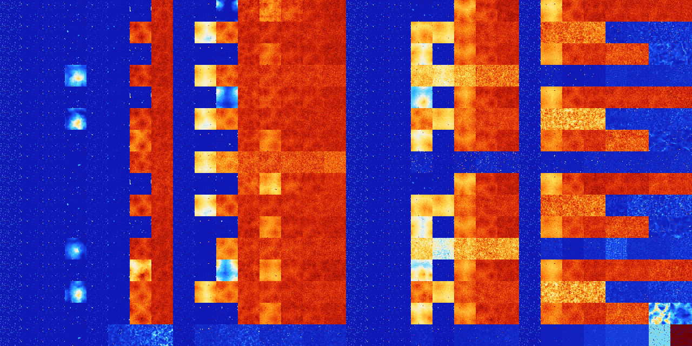

# B348 (143360-143871)

<details>
    <summary>Initial Grid</summary>
    
</details>


<details>
    <summary>Initial Grid RLE</summary>

```
#C Exported from GoGoL (https://github.com/marrow16/gogol)
#C Wrap mode: Toroidal
#C Boundary mode: Dead
#C Step: 0
x = 100, y = 100, rule = B348/S
7bo34bobo21bo21bo5bo$29bo16bo$14bo2bo2bo8bo19bo$9bo12bo39bo$13bo3bo6bo
30bob2o23bo9bobobo$o26bobo2bo20bo4bo26bo11bo$77bo21bo$19bo18bo38bo3bo$
11bo28bo16bo10bo18bo5bo$3bo7bo3bo2bo35bo30bo3bo8bo$18b2o9bo41bo2bo$11bo
11bo23bo12bo27bo6bo$34bo19bo2bo29bo9bo$8bo36bo47bo$7bo12bo13bo21b2o17bo
20bo$7bo7bo14bo11bo24bo20bo$10bo5bo27bo32bo20bo$5bo2bo11b2o8bo33bo14bo
19bo$21bo8bo2b2o6bo24bo13bo18bo$35bo28bo19bo14bo$31bo60bo$11bo11bo2bo$
24bo26bo11bo$2b2o6bo11bo3b2o45bo17bo4bo$o16bo9bo61bo$31bo20bo28bo2bo$
17bo25bo9bo21bo12bo$2bo3b2o14bo29bo11bo8bo$12bo2bo21bo2bo3bo5bo4bo17b2o
$32bo$49bo20bo27bo$bo8bo12bo23bo12bo13bo9bo$o14bo41bo27bo12b2o$51bo11bo
18bo$5bo19bo11bo35bo$13bo5bo6bo66bo$3bo35bo5bo31bo$28bo7bo43bo4bo$13bo
4bo29bo4bo2bo24bo11bo$24bo11bo11bo17bo15bo13b3o$11bo49bo7bo$30bo24bo33b
o$bo7bo45bo3bo24bo4bo3bobo$29bo3bo7bo40bo$5bo11bo13bo44b2o13bo$10bo44bo
6bo36bo$13bobo19bo2bo$9bo8bo2bo21bo34bo9bo$14bo63bo$7bo5bo84bo$24bo5bo
19bo3bo5bo23bo$2bo36bo3bo10bo33bo$3bo13bo12bo33bo5bo9bo7bo4bo$47bo11bo$
8bo43bo21b2o$6bo6bo13bo6bo12bo7bo7bo8bo26bo$10bo88bo$5bo2bo4bo13bo3bo2b
o8bo46bo$49bo22bobo10bo$2bo68bo3bo9bo2bo$15bo17bo3bo12bo3bo8bo$22bo27bo
19bo$49bo10bo2bo32bo$3bo2bo11bo26bo27bo11bo$64bo8bo$11bo11bo11bo5bo15bo
3bo$19bo9bo18bo13bobo34bo$13bo7bo16bo5bo8bo18bo10bo5bo$31bo6bo24bo18bo
6bobo$11bo41bo12bo18bo$84bo2bo4bo3bo$6bo33bo6bo6b2o8b2o$26bo35bo$2bo2bo
18bo10bobo6bo12bo11bo10bo12bo$25bo24bo4bo2bo34bo$40b2o14bo17bo15bo$bo4b
o26bo39b3o17bo$26bo10bo4bo8b2o33bo12bo$9bo7bo5bo36bo$38bo25bo33b2o$bo5b
o22bo21bo13bo$38bo23bo35bo$56bo28bo10bo$9bo7bobo23bo23bo20bo3bo$16bo3bo
10bo28bo4bo$33bo63bo$bo11bo15bo20bo9bo$18bobo10bo20bo13bo21bo$35bo21bob
o25bo3bo$13bo24bo22bo7bo$25bo6bo24bo8bo26bo5bo$12bo12b2o8bo11bo29bo7bo$
2bo6bo56bo6bo3bo6bo2bo$23bo16bobo24bo$24bo12bo14bo$13bo23bobo14bo3bo7bo
3bobo21bo$bo34bo45bo7bo$12bo21bo16bo4bo7bo5bo$16bo51bo20bo$60bo2bo10bo
18bo3bo!
```
</details>
<details>
    <summary>Thumbnail</summary>

</details>
<table>
<tr>
    <td><a href="./143360%20S%20Heat%20Map%20Activity.png"></a><br>S (143360)<br>R@5,p2</td>    <td><a href="./143361%20S0%20Heat%20Map%20Activity.png"></a><br>S0 (143361)<br>S@8</td>    <td><a href="./143362%20S1%20Heat%20Map%20Activity.png"></a><br>S1 (143362)<br>R@10,p2</td>    <td><a href="./143363%20S01%20Heat%20Map%20Activity.png"></a><br>S01 (143363)<br>R@19,p4</td>    <td><a href="./143364%20S2%20Heat%20Map%20Activity.png"></a><br>S2 (143364)<br>R@8,p2</td>    <td><a href="./143365%20S02%20Heat%20Map%20Activity.png"></a><br>S02 (143365)<br>R@16,p4</td>    <td><a href="./143366%20S12%20Heat%20Map%20Activity.png"></a><br>S12 (143366)<br>S@190</td>    <td><a href="./143367%20S012%20Heat%20Map%20Activity.png"></a><br>S012 (143367)<br>G>1000</td>    <td><a href="./143368%20S3%20Heat%20Map%20Activity.png"></a><br>S3 (143368)<br>R@9,p6</td>    <td><a href="./143369%20S03%20Heat%20Map%20Activity.png"></a><br>S03 (143369)<br>R@18,p6</td>    <td><a href="./143370%20S13%20Heat%20Map%20Activity.png"></a><br>S13 (143370)<br>G>1000</td>    <td><a href="./143371%20S013%20Heat%20Map%20Activity.png"></a><br>S013 (143371)<br>G>1000</td>    <td><a href="./143372%20S23%20Heat%20Map%20Activity.png"></a><br>S23 (143372)<br>G>1000</td>    <td><a href="./143373%20S023%20Heat%20Map%20Activity.png"></a><br>S023 (143373)<br>G>1000</td>    <td><a href="./143374%20S123%20Heat%20Map%20Activity.png"></a><br>S123 (143374)<br>G>1000</td>    <td><a href="./143375%20S0123%20Heat%20Map%20Activity.png"></a><br>S0123 (143375)<br>G>1000</td>    <td><a href="./143376%20S4%20Heat%20Map%20Activity.png"></a><br>S4 (143376)<br>R@5,p2</td>    <td><a href="./143377%20S04%20Heat%20Map%20Activity.png"></a><br>S04 (143377)<br>S@7</td>    <td><a href="./143378%20S14%20Heat%20Map%20Activity.png"></a><br>S14 (143378)<br>R@10,p2</td>    <td><a href="./143379%20S014%20Heat%20Map%20Activity.png"></a><br>S014 (143379)<br>R@66,p4</td>    <td><a href="./143380%20S24%20Heat%20Map%20Activity.png"></a><br>S24 (143380)<br>R@11,p4</td>    <td><a href="./143381%20S024%20Heat%20Map%20Activity.png"></a><br>S024 (143381)<br>G>1000</td>    <td><a href="./143382%20S124%20Heat%20Map%20Activity.png"></a><br>S124 (143382)<br>G>1000</td>    <td><a href="./143383%20S0124%20Heat%20Map%20Activity.png"></a><br>S0124 (143383)<br>G>1000</td>    <td><a href="./143384%20S34%20Heat%20Map%20Activity.png"></a><br>S34 (143384)<br>R@5,p2</td>    <td><a href="./143385%20S034%20Heat%20Map%20Activity.png"></a><br>S034 (143385)<br>G>1000</td>    <td><a href="./143386%20S134%20Heat%20Map%20Activity.png"></a><br>S134 (143386)<br>G>1000</td>    <td><a href="./143387%20S0134%20Heat%20Map%20Activity.png"></a><br>S0134 (143387)<br>G>1000</td>    <td><a href="./143388%20S234%20Heat%20Map%20Activity.png"></a><br>S234 (143388)<br>G>1000</td>    <td><a href="./143389%20S0234%20Heat%20Map%20Activity.png"></a><br>S0234 (143389)<br>G>1000</td>    <td><a href="./143390%20S1234%20Heat%20Map%20Activity.png"></a><br>S1234 (143390)<br>G>1000</td>    <td><a href="./143391%20S01234%20Heat%20Map%20Activity.png"></a><br>S01234 (143391)<br>G>1000</td></tr>
<tr>
    <td><a href="./143392%20S5%20Heat%20Map%20Activity.png"></a><br>S5 (143392)<br>R@5,p2</td>    <td><a href="./143393%20S05%20Heat%20Map%20Activity.png"></a><br>S05 (143393)<br>S@8</td>    <td><a href="./143394%20S15%20Heat%20Map%20Activity.png"></a><br>S15 (143394)<br>R@10,p2</td>    <td><a href="./143395%20S015%20Heat%20Map%20Activity.png"></a><br>S015 (143395)<br>R@77,p4</td>    <td><a href="./143396%20S25%20Heat%20Map%20Activity.png"></a><br>S25 (143396)<br>R@11,p2</td>    <td><a href="./143397%20S025%20Heat%20Map%20Activity.png"></a><br>S025 (143397)<br>R@13,p4</td>    <td><a href="./143398%20S125%20Heat%20Map%20Activity.png"></a><br>S125 (143398)<br>G>1000</td>    <td><a href="./143399%20S0125%20Heat%20Map%20Activity.png"></a><br>S0125 (143399)<br>G>1000</td>    <td><a href="./143400%20S35%20Heat%20Map%20Activity.png"></a><br>S35 (143400)<br>R@9,p6</td>    <td><a href="./143401%20S035%20Heat%20Map%20Activity.png"></a><br>S035 (143401)<br>G>1000</td>    <td><a href="./143402%20S135%20Heat%20Map%20Activity.png"></a><br>S135 (143402)<br>G>1000</td>    <td><a href="./143403%20S0135%20Heat%20Map%20Activity.png"></a><br>S0135 (143403)<br>G>1000</td>    <td><a href="./143404%20S235%20Heat%20Map%20Activity.png"></a><br>S235 (143404)<br>G>1000</td>    <td><a href="./143405%20S0235%20Heat%20Map%20Activity.png"></a><br>S0235 (143405)<br>G>1000</td>    <td><a href="./143406%20S1235%20Heat%20Map%20Activity.png"></a><br>S1235 (143406)<br>G>1000</td>    <td><a href="./143407%20S01235%20Heat%20Map%20Activity.png"></a><br>S01235 (143407)<br>G>1000</td>    <td><a href="./143408%20S45%20Heat%20Map%20Activity.png"></a><br>S45 (143408)<br>R@5,p2</td>    <td><a href="./143409%20S045%20Heat%20Map%20Activity.png"></a><br>S045 (143409)<br>S@7</td>    <td><a href="./143410%20S145%20Heat%20Map%20Activity.png"></a><br>S145 (143410)<br>R@10,p2</td>    <td><a href="./143411%20S0145%20Heat%20Map%20Activity.png"></a><br>S0145 (143411)<br>G>1000</td>    <td><a href="./143412%20S245%20Heat%20Map%20Activity.png"></a><br>S245 (143412)<br>G>1000</td>    <td><a href="./143413%20S0245%20Heat%20Map%20Activity.png"></a><br>S0245 (143413)<br>G>1000</td>    <td><a href="./143414%20S1245%20Heat%20Map%20Activity.png"></a><br>S1245 (143414)<br>G>1000</td>    <td><a href="./143415%20S01245%20Heat%20Map%20Activity.png"></a><br>S01245 (143415)<br>G>1000</td>    <td><a href="./143416%20S345%20Heat%20Map%20Activity.png"></a><br>S345 (143416)<br>R@5,p2</td>    <td><a href="./143417%20S0345%20Heat%20Map%20Activity.png"></a><br>S0345 (143417)<br>G>1000</td>    <td><a href="./143418%20S1345%20Heat%20Map%20Activity.png"></a><br>S1345 (143418)<br>G>1000</td>    <td><a href="./143419%20S01345%20Heat%20Map%20Activity.png"></a><br>S01345 (143419)<br>G>1000</td>    <td><a href="./143420%20S2345%20Heat%20Map%20Activity.png"></a><br>S2345 (143420)<br>R@208,p84</td>    <td><a href="./143421%20S02345%20Heat%20Map%20Activity.png"></a><br>S02345 (143421)<br>R@140,p12</td>    <td><a href="./143422%20S12345%20Heat%20Map%20Activity.png"></a><br>S12345 (143422)<br>R@81,p12</td>    <td><a href="./143423%20S012345%20Heat%20Map%20Activity.png"></a><br>S012345 (143423)<br>R@84,p12</td></tr>
<tr>
    <td><a href="./143424%20S6%20Heat%20Map%20Activity.png"></a><br>S6 (143424)<br>R@5,p2</td>    <td><a href="./143425%20S06%20Heat%20Map%20Activity.png"></a><br>S06 (143425)<br>S@8</td>    <td><a href="./143426%20S16%20Heat%20Map%20Activity.png"></a><br>S16 (143426)<br>R@10,p2</td>    <td><a href="./143427%20S016%20Heat%20Map%20Activity.png"></a><br>S016 (143427)<br>R@19,p4</td>    <td><a href="./143428%20S26%20Heat%20Map%20Activity.png"></a><br>S26 (143428)<br>R@8,p2</td>    <td><a href="./143429%20S026%20Heat%20Map%20Activity.png"></a><br>S026 (143429)<br>R@16,p4</td>    <td><a href="./143430%20S126%20Heat%20Map%20Activity.png"></a><br>S126 (143430)<br>S@16</td>    <td><a href="./143431%20S0126%20Heat%20Map%20Activity.png"></a><br>S0126 (143431)<br>G>1000</td>    <td><a href="./143432%20S36%20Heat%20Map%20Activity.png"></a><br>S36 (143432)<br>R@9,p6</td>    <td><a href="./143433%20S036%20Heat%20Map%20Activity.png"></a><br>S036 (143433)<br>R@41,p30</td>    <td><a href="./143434%20S136%20Heat%20Map%20Activity.png"></a><br>S136 (143434)<br>R@32,p2</td>    <td><a href="./143435%20S0136%20Heat%20Map%20Activity.png"></a><br>S0136 (143435)<br>G>1000</td>    <td><a href="./143436%20S236%20Heat%20Map%20Activity.png"></a><br>S236 (143436)<br>G>1000</td>    <td><a href="./143437%20S0236%20Heat%20Map%20Activity.png"></a><br>S0236 (143437)<br>G>1000</td>    <td><a href="./143438%20S1236%20Heat%20Map%20Activity.png"></a><br>S1236 (143438)<br>G>1000</td>    <td><a href="./143439%20S01236%20Heat%20Map%20Activity.png"></a><br>S01236 (143439)<br>G>1000</td>    <td><a href="./143440%20S46%20Heat%20Map%20Activity.png"></a><br>S46 (143440)<br>R@5,p2</td>    <td><a href="./143441%20S046%20Heat%20Map%20Activity.png"></a><br>S046 (143441)<br>S@7</td>    <td><a href="./143442%20S146%20Heat%20Map%20Activity.png"></a><br>S146 (143442)<br>R@10,p2</td>    <td><a href="./143443%20S0146%20Heat%20Map%20Activity.png"></a><br>S0146 (143443)<br>G>1000</td>    <td><a href="./143444%20S246%20Heat%20Map%20Activity.png"></a><br>S246 (143444)<br>R@11,p4</td>    <td><a href="./143445%20S0246%20Heat%20Map%20Activity.png"></a><br>S0246 (143445)<br>G>1000</td>    <td><a href="./143446%20S1246%20Heat%20Map%20Activity.png"></a><br>S1246 (143446)<br>G>1000</td>    <td><a href="./143447%20S01246%20Heat%20Map%20Activity.png"></a><br>S01246 (143447)<br>G>1000</td>    <td><a href="./143448%20S346%20Heat%20Map%20Activity.png"></a><br>S346 (143448)<br>R@5,p2</td>    <td><a href="./143449%20S0346%20Heat%20Map%20Activity.png"></a><br>S0346 (143449)<br>G>1000</td>    <td><a href="./143450%20S1346%20Heat%20Map%20Activity.png"></a><br>S1346 (143450)<br>G>1000</td>    <td><a href="./143451%20S01346%20Heat%20Map%20Activity.png"></a><br>S01346 (143451)<br>G>1000</td>    <td><a href="./143452%20S2346%20Heat%20Map%20Activity.png"></a><br>S2346 (143452)<br>G>1000</td>    <td><a href="./143453%20S02346%20Heat%20Map%20Activity.png"></a><br>S02346 (143453)<br>G>1000</td>    <td><a href="./143454%20S12346%20Heat%20Map%20Activity.png"></a><br>S12346 (143454)<br>R@763,p20</td>    <td><a href="./143455%20S012346%20Heat%20Map%20Activity.png"></a><br>S012346 (143455)<br>R@832,p120</td></tr>
<tr>
    <td><a href="./143456%20S56%20Heat%20Map%20Activity.png"></a><br>S56 (143456)<br>R@5,p2</td>    <td><a href="./143457%20S056%20Heat%20Map%20Activity.png"></a><br>S056 (143457)<br>S@8</td>    <td><a href="./143458%20S156%20Heat%20Map%20Activity.png"></a><br>S156 (143458)<br>R@10,p2</td>    <td><a href="./143459%20S0156%20Heat%20Map%20Activity.png"></a><br>S0156 (143459)<br>G>1000</td>    <td><a href="./143460%20S256%20Heat%20Map%20Activity.png"></a><br>S256 (143460)<br>R@8,p2</td>    <td><a href="./143461%20S0256%20Heat%20Map%20Activity.png"></a><br>S0256 (143461)<br>R@22,p4</td>    <td><a href="./143462%20S1256%20Heat%20Map%20Activity.png"></a><br>S1256 (143462)<br>G>1000</td>    <td><a href="./143463%20S01256%20Heat%20Map%20Activity.png"></a><br>S01256 (143463)<br>G>1000</td>    <td><a href="./143464%20S356%20Heat%20Map%20Activity.png"></a><br>S356 (143464)<br>R@9,p6</td>    <td><a href="./143465%20S0356%20Heat%20Map%20Activity.png"></a><br>S0356 (143465)<br>G>1000</td>    <td><a href="./143466%20S1356%20Heat%20Map%20Activity.png"></a><br>S1356 (143466)<br>G>1000</td>    <td><a href="./143467%20S01356%20Heat%20Map%20Activity.png"></a><br>S01356 (143467)<br>G>1000</td>    <td><a href="./143468%20S2356%20Heat%20Map%20Activity.png"></a><br>S2356 (143468)<br>G>1000</td>    <td><a href="./143469%20S02356%20Heat%20Map%20Activity.png"></a><br>S02356 (143469)<br>G>1000</td>    <td><a href="./143470%20S12356%20Heat%20Map%20Activity.png"></a><br>S12356 (143470)<br>G>1000</td>    <td><a href="./143471%20S012356%20Heat%20Map%20Activity.png"></a><br>S012356 (143471)<br>G>1000</td>    <td><a href="./143472%20S456%20Heat%20Map%20Activity.png"></a><br>S456 (143472)<br>R@5,p2</td>    <td><a href="./143473%20S0456%20Heat%20Map%20Activity.png"></a><br>S0456 (143473)<br>S@7</td>    <td><a href="./143474%20S1456%20Heat%20Map%20Activity.png"></a><br>S1456 (143474)<br>R@10,p2</td>    <td><a href="./143475%20S01456%20Heat%20Map%20Activity.png"></a><br>S01456 (143475)<br>G>1000</td>    <td><a href="./143476%20S2456%20Heat%20Map%20Activity.png"></a><br>S2456 (143476)<br>G>1000</td>    <td><a href="./143477%20S02456%20Heat%20Map%20Activity.png"></a><br>S02456 (143477)<br>G>1000</td>    <td><a href="./143478%20S12456%20Heat%20Map%20Activity.png"></a><br>S12456 (143478)<br>G>1000</td>    <td><a href="./143479%20S012456%20Heat%20Map%20Activity.png"></a><br>S012456 (143479)<br>G>1000</td>    <td><a href="./143480%20S3456%20Heat%20Map%20Activity.png"></a><br>S3456 (143480)<br>R@5,p2</td>    <td><a href="./143481%20S03456%20Heat%20Map%20Activity.png"></a><br>S03456 (143481)<br>R@189,p60</td>    <td><a href="./143482%20S13456%20Heat%20Map%20Activity.png"></a><br>S13456 (143482)<br>G>1000</td>    <td><a href="./143483%20S013456%20Heat%20Map%20Activity.png"></a><br>S013456 (143483)<br>R@268,p210</td>    <td><a href="./143484%20S23456%20Heat%20Map%20Activity.png"></a><br>S23456 (143484)<br>R@87,p2</td>    <td><a href="./143485%20S023456%20Heat%20Map%20Activity.png"></a><br>S023456 (143485)<br>R@64,p4</td>    <td><a href="./143486%20S123456%20Heat%20Map%20Activity.png"></a><br>S123456 (143486)<br>R@61,p6</td>    <td><a href="./143487%20S0123456%20Heat%20Map%20Activity.png"></a><br>S0123456 (143487)<br>R@40,p2</td></tr>
<tr>
    <td><a href="./143488%20S7%20Heat%20Map%20Activity.png"></a><br>S7 (143488)<br>R@5,p2</td>    <td><a href="./143489%20S07%20Heat%20Map%20Activity.png"></a><br>S07 (143489)<br>S@8</td>    <td><a href="./143490%20S17%20Heat%20Map%20Activity.png"></a><br>S17 (143490)<br>R@10,p2</td>    <td><a href="./143491%20S017%20Heat%20Map%20Activity.png"></a><br>S017 (143491)<br>R@19,p4</td>    <td><a href="./143492%20S27%20Heat%20Map%20Activity.png"></a><br>S27 (143492)<br>R@8,p2</td>    <td><a href="./143493%20S027%20Heat%20Map%20Activity.png"></a><br>S027 (143493)<br>R@22,p4</td>    <td><a href="./143494%20S127%20Heat%20Map%20Activity.png"></a><br>S127 (143494)<br>R@198,p14</td>    <td><a href="./143495%20S0127%20Heat%20Map%20Activity.png"></a><br>S0127 (143495)<br>G>1000</td>    <td><a href="./143496%20S37%20Heat%20Map%20Activity.png"></a><br>S37 (143496)<br>R@9,p6</td>    <td><a href="./143497%20S037%20Heat%20Map%20Activity.png"></a><br>S037 (143497)<br>R@18,p6</td>    <td><a href="./143498%20S137%20Heat%20Map%20Activity.png"></a><br>S137 (143498)<br>G>1000</td>    <td><a href="./143499%20S0137%20Heat%20Map%20Activity.png"></a><br>S0137 (143499)<br>G>1000</td>    <td><a href="./143500%20S237%20Heat%20Map%20Activity.png"></a><br>S237 (143500)<br>G>1000</td>    <td><a href="./143501%20S0237%20Heat%20Map%20Activity.png"></a><br>S0237 (143501)<br>G>1000</td>    <td><a href="./143502%20S1237%20Heat%20Map%20Activity.png"></a><br>S1237 (143502)<br>G>1000</td>    <td><a href="./143503%20S01237%20Heat%20Map%20Activity.png"></a><br>S01237 (143503)<br>G>1000</td>    <td><a href="./143504%20S47%20Heat%20Map%20Activity.png"></a><br>S47 (143504)<br>R@5,p2</td>    <td><a href="./143505%20S047%20Heat%20Map%20Activity.png"></a><br>S047 (143505)<br>S@7</td>    <td><a href="./143506%20S147%20Heat%20Map%20Activity.png"></a><br>S147 (143506)<br>R@10,p2</td>    <td><a href="./143507%20S0147%20Heat%20Map%20Activity.png"></a><br>S0147 (143507)<br>G>1000</td>    <td><a href="./143508%20S247%20Heat%20Map%20Activity.png"></a><br>S247 (143508)<br>R@11,p4</td>    <td><a href="./143509%20S0247%20Heat%20Map%20Activity.png"></a><br>S0247 (143509)<br>G>1000</td>    <td><a href="./143510%20S1247%20Heat%20Map%20Activity.png"></a><br>S1247 (143510)<br>G>1000</td>    <td><a href="./143511%20S01247%20Heat%20Map%20Activity.png"></a><br>S01247 (143511)<br>G>1000</td>    <td><a href="./143512%20S347%20Heat%20Map%20Activity.png"></a><br>S347 (143512)<br>R@5,p2</td>    <td><a href="./143513%20S0347%20Heat%20Map%20Activity.png"></a><br>S0347 (143513)<br>G>1000</td>    <td><a href="./143514%20S1347%20Heat%20Map%20Activity.png"></a><br>S1347 (143514)<br>G>1000</td>    <td><a href="./143515%20S01347%20Heat%20Map%20Activity.png"></a><br>S01347 (143515)<br>G>1000</td>    <td><a href="./143516%20S2347%20Heat%20Map%20Activity.png"></a><br>S2347 (143516)<br>G>1000</td>    <td><a href="./143517%20S02347%20Heat%20Map%20Activity.png"></a><br>S02347 (143517)<br>G>1000</td>    <td><a href="./143518%20S12347%20Heat%20Map%20Activity.png"></a><br>S12347 (143518)<br>G>1000</td>    <td><a href="./143519%20S012347%20Heat%20Map%20Activity.png"></a><br>S012347 (143519)<br>G>1000</td></tr>
<tr>
    <td><a href="./143520%20S57%20Heat%20Map%20Activity.png"></a><br>S57 (143520)<br>R@5,p2</td>    <td><a href="./143521%20S057%20Heat%20Map%20Activity.png"></a><br>S057 (143521)<br>S@8</td>    <td><a href="./143522%20S157%20Heat%20Map%20Activity.png"></a><br>S157 (143522)<br>R@10,p2</td>    <td><a href="./143523%20S0157%20Heat%20Map%20Activity.png"></a><br>S0157 (143523)<br>G>1000</td>    <td><a href="./143524%20S257%20Heat%20Map%20Activity.png"></a><br>S257 (143524)<br>R@11,p2</td>    <td><a href="./143525%20S0257%20Heat%20Map%20Activity.png"></a><br>S0257 (143525)<br>R@26,p4</td>    <td><a href="./143526%20S1257%20Heat%20Map%20Activity.png"></a><br>S1257 (143526)<br>G>1000</td>    <td><a href="./143527%20S01257%20Heat%20Map%20Activity.png"></a><br>S01257 (143527)<br>G>1000</td>    <td><a href="./143528%20S357%20Heat%20Map%20Activity.png"></a><br>S357 (143528)<br>R@9,p6</td>    <td><a href="./143529%20S0357%20Heat%20Map%20Activity.png"></a><br>S0357 (143529)<br>G>1000</td>    <td><a href="./143530%20S1357%20Heat%20Map%20Activity.png"></a><br>S1357 (143530)<br>G>1000</td>    <td><a href="./143531%20S01357%20Heat%20Map%20Activity.png"></a><br>S01357 (143531)<br>G>1000</td>    <td><a href="./143532%20S2357%20Heat%20Map%20Activity.png"></a><br>S2357 (143532)<br>G>1000</td>    <td><a href="./143533%20S02357%20Heat%20Map%20Activity.png"></a><br>S02357 (143533)<br>G>1000</td>    <td><a href="./143534%20S12357%20Heat%20Map%20Activity.png"></a><br>S12357 (143534)<br>G>1000</td>    <td><a href="./143535%20S012357%20Heat%20Map%20Activity.png"></a><br>S012357 (143535)<br>G>1000</td>    <td><a href="./143536%20S457%20Heat%20Map%20Activity.png"></a><br>S457 (143536)<br>R@5,p2</td>    <td><a href="./143537%20S0457%20Heat%20Map%20Activity.png"></a><br>S0457 (143537)<br>S@7</td>    <td><a href="./143538%20S1457%20Heat%20Map%20Activity.png"></a><br>S1457 (143538)<br>R@10,p2</td>    <td><a href="./143539%20S01457%20Heat%20Map%20Activity.png"></a><br>S01457 (143539)<br>G>1000</td>    <td><a href="./143540%20S2457%20Heat%20Map%20Activity.png"></a><br>S2457 (143540)<br>G>1000</td>    <td><a href="./143541%20S02457%20Heat%20Map%20Activity.png"></a><br>S02457 (143541)<br>G>1000</td>    <td><a href="./143542%20S12457%20Heat%20Map%20Activity.png"></a><br>S12457 (143542)<br>G>1000</td>    <td><a href="./143543%20S012457%20Heat%20Map%20Activity.png"></a><br>S012457 (143543)<br>G>1000</td>    <td><a href="./143544%20S3457%20Heat%20Map%20Activity.png"></a><br>S3457 (143544)<br>R@5,p2</td>    <td><a href="./143545%20S03457%20Heat%20Map%20Activity.png"></a><br>S03457 (143545)<br>G>1000</td>    <td><a href="./143546%20S13457%20Heat%20Map%20Activity.png"></a><br>S13457 (143546)<br>G>1000</td>    <td><a href="./143547%20S013457%20Heat%20Map%20Activity.png"></a><br>S013457 (143547)<br>G>1000</td>    <td><a href="./143548%20S23457%20Heat%20Map%20Activity.png"></a><br>S23457 (143548)<br>R@101,p4</td>    <td><a href="./143549%20S023457%20Heat%20Map%20Activity.png"></a><br>S023457 (143549)<br>R@77,p12</td>    <td><a href="./143550%20S123457%20Heat%20Map%20Activity.png"></a><br>S123457 (143550)<br>R@69,p6</td>    <td><a href="./143551%20S0123457%20Heat%20Map%20Activity.png"></a><br>S0123457 (143551)<br>R@54,p6</td></tr>
<tr>
    <td><a href="./143552%20S67%20Heat%20Map%20Activity.png"></a><br>S67 (143552)<br>R@5,p2</td>    <td><a href="./143553%20S067%20Heat%20Map%20Activity.png"></a><br>S067 (143553)<br>S@8</td>    <td><a href="./143554%20S167%20Heat%20Map%20Activity.png"></a><br>S167 (143554)<br>R@10,p2</td>    <td><a href="./143555%20S0167%20Heat%20Map%20Activity.png"></a><br>S0167 (143555)<br>R@19,p4</td>    <td><a href="./143556%20S267%20Heat%20Map%20Activity.png"></a><br>S267 (143556)<br>R@8,p2</td>    <td><a href="./143557%20S0267%20Heat%20Map%20Activity.png"></a><br>S0267 (143557)<br>R@32,p4</td>    <td><a href="./143558%20S1267%20Heat%20Map%20Activity.png"></a><br>S1267 (143558)<br>G>1000</td>    <td><a href="./143559%20S01267%20Heat%20Map%20Activity.png"></a><br>S01267 (143559)<br>G>1000</td>    <td><a href="./143560%20S367%20Heat%20Map%20Activity.png"></a><br>S367 (143560)<br>R@9,p6</td>    <td><a href="./143561%20S0367%20Heat%20Map%20Activity.png"></a><br>S0367 (143561)<br>R@41,p30</td>    <td><a href="./143562%20S1367%20Heat%20Map%20Activity.png"></a><br>S1367 (143562)<br>R@20,p2</td>    <td><a href="./143563%20S01367%20Heat%20Map%20Activity.png"></a><br>S01367 (143563)<br>G>1000</td>    <td><a href="./143564%20S2367%20Heat%20Map%20Activity.png"></a><br>S2367 (143564)<br>G>1000</td>    <td><a href="./143565%20S02367%20Heat%20Map%20Activity.png"></a><br>S02367 (143565)<br>G>1000</td>    <td><a href="./143566%20S12367%20Heat%20Map%20Activity.png"></a><br>S12367 (143566)<br>G>1000</td>    <td><a href="./143567%20S012367%20Heat%20Map%20Activity.png"></a><br>S012367 (143567)<br>G>1000</td>    <td><a href="./143568%20S467%20Heat%20Map%20Activity.png"></a><br>S467 (143568)<br>R@5,p2</td>    <td><a href="./143569%20S0467%20Heat%20Map%20Activity.png"></a><br>S0467 (143569)<br>S@7</td>    <td><a href="./143570%20S1467%20Heat%20Map%20Activity.png"></a><br>S1467 (143570)<br>R@10,p2</td>    <td><a href="./143571%20S01467%20Heat%20Map%20Activity.png"></a><br>S01467 (143571)<br>G>1000</td>    <td><a href="./143572%20S2467%20Heat%20Map%20Activity.png"></a><br>S2467 (143572)<br>R@11,p4</td>    <td><a href="./143573%20S02467%20Heat%20Map%20Activity.png"></a><br>S02467 (143573)<br>G>1000</td>    <td><a href="./143574%20S12467%20Heat%20Map%20Activity.png"></a><br>S12467 (143574)<br>G>1000</td>    <td><a href="./143575%20S012467%20Heat%20Map%20Activity.png"></a><br>S012467 (143575)<br>G>1000</td>    <td><a href="./143576%20S3467%20Heat%20Map%20Activity.png"></a><br>S3467 (143576)<br>R@5,p2</td>    <td><a href="./143577%20S03467%20Heat%20Map%20Activity.png"></a><br>S03467 (143577)<br>G>1000</td>    <td><a href="./143578%20S13467%20Heat%20Map%20Activity.png"></a><br>S13467 (143578)<br>G>1000</td>    <td><a href="./143579%20S013467%20Heat%20Map%20Activity.png"></a><br>S013467 (143579)<br>G>1000</td>    <td><a href="./143580%20S23467%20Heat%20Map%20Activity.png"></a><br>S23467 (143580)<br>G>1000</td>    <td><a href="./143581%20S023467%20Heat%20Map%20Activity.png"></a><br>S023467 (143581)<br>G>1000</td>    <td><a href="./143582%20S123467%20Heat%20Map%20Activity.png"></a><br>S123467 (143582)<br>R@800,p20</td>    <td><a href="./143583%20S0123467%20Heat%20Map%20Activity.png"></a><br>S0123467 (143583)<br>G>1000</td></tr>
<tr>
    <td><a href="./143584%20S567%20Heat%20Map%20Activity.png"></a><br>S567 (143584)<br>R@5,p2</td>    <td><a href="./143585%20S0567%20Heat%20Map%20Activity.png"></a><br>S0567 (143585)<br>S@8</td>    <td><a href="./143586%20S1567%20Heat%20Map%20Activity.png"></a><br>S1567 (143586)<br>R@10,p2</td>    <td><a href="./143587%20S01567%20Heat%20Map%20Activity.png"></a><br>S01567 (143587)<br>R@168,p4</td>    <td><a href="./143588%20S2567%20Heat%20Map%20Activity.png"></a><br>S2567 (143588)<br>R@8,p2</td>    <td><a href="./143589%20S02567%20Heat%20Map%20Activity.png"></a><br>S02567 (143589)<br>R@33,p4</td>    <td><a href="./143590%20S12567%20Heat%20Map%20Activity.png"></a><br>S12567 (143590)<br>G>1000</td>    <td><a href="./143591%20S012567%20Heat%20Map%20Activity.png"></a><br>S012567 (143591)<br>G>1000</td>    <td><a href="./143592%20S3567%20Heat%20Map%20Activity.png"></a><br>S3567 (143592)<br>R@9,p6</td>    <td><a href="./143593%20S03567%20Heat%20Map%20Activity.png"></a><br>S03567 (143593)<br>G>1000</td>    <td><a href="./143594%20S13567%20Heat%20Map%20Activity.png"></a><br>S13567 (143594)<br>G>1000</td>    <td><a href="./143595%20S013567%20Heat%20Map%20Activity.png"></a><br>S013567 (143595)<br>G>1000</td>    <td><a href="./143596%20S23567%20Heat%20Map%20Activity.png"></a><br>S23567 (143596)<br>G>1000</td>    <td><a href="./143597%20S023567%20Heat%20Map%20Activity.png"></a><br>S023567 (143597)<br>G>1000</td>    <td><a href="./143598%20S123567%20Heat%20Map%20Activity.png"></a><br>S123567 (143598)<br>G>1000</td>    <td><a href="./143599%20S0123567%20Heat%20Map%20Activity.png"></a><br>S0123567 (143599)<br>G>1000</td>    <td><a href="./143600%20S4567%20Heat%20Map%20Activity.png"></a><br>S4567 (143600)<br>R@5,p2</td>    <td><a href="./143601%20S04567%20Heat%20Map%20Activity.png"></a><br>S04567 (143601)<br>S@7</td>    <td><a href="./143602%20S14567%20Heat%20Map%20Activity.png"></a><br>S14567 (143602)<br>R@10,p2</td>    <td><a href="./143603%20S014567%20Heat%20Map%20Activity.png"></a><br>S014567 (143603)<br>R@170,p24</td>    <td><a href="./143604%20S24567%20Heat%20Map%20Activity.png"></a><br>S24567 (143604)<br>R@10,p4</td>    <td><a href="./143605%20S024567%20Heat%20Map%20Activity.png"></a><br>S024567 (143605)<br>R@264,p132</td>    <td><a href="./143606%20S124567%20Heat%20Map%20Activity.png"></a><br>S124567 (143606)<br>R@118,p12</td>    <td><a href="./143607%20S0124567%20Heat%20Map%20Activity.png"></a><br>S0124567 (143607)<br>R@146,p60</td>    <td><a href="./143608%20S34567%20Heat%20Map%20Activity.png"></a><br>S34567 (143608)<br>R@5,p2</td>    <td><a href="./143609%20S034567%20Heat%20Map%20Activity.png"></a><br>S034567 (143609)<br>R@120,p30</td>    <td><a href="./143610%20S134567%20Heat%20Map%20Activity.png"></a><br>S134567 (143610)<br>R@121,p40</td>    <td><a href="./143611%20S0134567%20Heat%20Map%20Activity.png"></a><br>S0134567 (143611)<br>R@58,p10</td>    <td><a href="./143612%20S234567%20Heat%20Map%20Activity.png"></a><br>S234567 (143612)<br>R@84,p2</td>    <td><a href="./143613%20S0234567%20Heat%20Map%20Activity.png"></a><br>S0234567 (143613)<br>R@71,p12</td>    <td><a href="./143614%20S1234567%20Heat%20Map%20Activity.png"></a><br>S1234567 (143614)<br>R@57,p2</td>    <td><a href="./143615%20S01234567%20Heat%20Map%20Activity.png"></a><br>S01234567 (143615)<br>R@42,p6</td></tr>
<tr>
    <td><a href="./143616%20S8%20Heat%20Map%20Activity.png"></a><br>S8 (143616)<br>R@5,p2</td>    <td><a href="./143617%20S08%20Heat%20Map%20Activity.png"></a><br>S08 (143617)<br>S@8</td>    <td><a href="./143618%20S18%20Heat%20Map%20Activity.png"></a><br>S18 (143618)<br>R@10,p2</td>    <td><a href="./143619%20S018%20Heat%20Map%20Activity.png"></a><br>S018 (143619)<br>R@19,p4</td>    <td><a href="./143620%20S28%20Heat%20Map%20Activity.png"></a><br>S28 (143620)<br>R@8,p2</td>    <td><a href="./143621%20S028%20Heat%20Map%20Activity.png"></a><br>S028 (143621)<br>R@16,p4</td>    <td><a href="./143622%20S128%20Heat%20Map%20Activity.png"></a><br>S128 (143622)<br>S@190</td>    <td><a href="./143623%20S0128%20Heat%20Map%20Activity.png"></a><br>S0128 (143623)<br>G>1000</td>    <td><a href="./143624%20S38%20Heat%20Map%20Activity.png"></a><br>S38 (143624)<br>R@9,p6</td>    <td><a href="./143625%20S038%20Heat%20Map%20Activity.png"></a><br>S038 (143625)<br>R@18,p6</td>    <td><a href="./143626%20S138%20Heat%20Map%20Activity.png"></a><br>S138 (143626)<br>R@120,p2</td>    <td><a href="./143627%20S0138%20Heat%20Map%20Activity.png"></a><br>S0138 (143627)<br>G>1000</td>    <td><a href="./143628%20S238%20Heat%20Map%20Activity.png"></a><br>S238 (143628)<br>G>1000</td>    <td><a href="./143629%20S0238%20Heat%20Map%20Activity.png"></a><br>S0238 (143629)<br>G>1000</td>    <td><a href="./143630%20S1238%20Heat%20Map%20Activity.png"></a><br>S1238 (143630)<br>G>1000</td>    <td><a href="./143631%20S01238%20Heat%20Map%20Activity.png"></a><br>S01238 (143631)<br>G>1000</td>    <td><a href="./143632%20S48%20Heat%20Map%20Activity.png"></a><br>S48 (143632)<br>R@5,p2</td>    <td><a href="./143633%20S048%20Heat%20Map%20Activity.png"></a><br>S048 (143633)<br>S@7</td>    <td><a href="./143634%20S148%20Heat%20Map%20Activity.png"></a><br>S148 (143634)<br>R@10,p2</td>    <td><a href="./143635%20S0148%20Heat%20Map%20Activity.png"></a><br>S0148 (143635)<br>R@66,p4</td>    <td><a href="./143636%20S248%20Heat%20Map%20Activity.png"></a><br>S248 (143636)<br>R@11,p4</td>    <td><a href="./143637%20S0248%20Heat%20Map%20Activity.png"></a><br>S0248 (143637)<br>G>1000</td>    <td><a href="./143638%20S1248%20Heat%20Map%20Activity.png"></a><br>S1248 (143638)<br>G>1000</td>    <td><a href="./143639%20S01248%20Heat%20Map%20Activity.png"></a><br>S01248 (143639)<br>G>1000</td>    <td><a href="./143640%20S348%20Heat%20Map%20Activity.png"></a><br>S348 (143640)<br>R@5,p2</td>    <td><a href="./143641%20S0348%20Heat%20Map%20Activity.png"></a><br>S0348 (143641)<br>G>1000</td>    <td><a href="./143642%20S1348%20Heat%20Map%20Activity.png"></a><br>S1348 (143642)<br>G>1000</td>    <td><a href="./143643%20S01348%20Heat%20Map%20Activity.png"></a><br>S01348 (143643)<br>G>1000</td>    <td><a href="./143644%20S2348%20Heat%20Map%20Activity.png"></a><br>S2348 (143644)<br>G>1000</td>    <td><a href="./143645%20S02348%20Heat%20Map%20Activity.png"></a><br>S02348 (143645)<br>G>1000</td>    <td><a href="./143646%20S12348%20Heat%20Map%20Activity.png"></a><br>S12348 (143646)<br>G>1000</td>    <td><a href="./143647%20S012348%20Heat%20Map%20Activity.png"></a><br>S012348 (143647)<br>G>1000</td></tr>
<tr>
    <td><a href="./143648%20S58%20Heat%20Map%20Activity.png"></a><br>S58 (143648)<br>R@5,p2</td>    <td><a href="./143649%20S058%20Heat%20Map%20Activity.png"></a><br>S058 (143649)<br>S@8</td>    <td><a href="./143650%20S158%20Heat%20Map%20Activity.png"></a><br>S158 (143650)<br>R@10,p2</td>    <td><a href="./143651%20S0158%20Heat%20Map%20Activity.png"></a><br>S0158 (143651)<br>R@77,p4</td>    <td><a href="./143652%20S258%20Heat%20Map%20Activity.png"></a><br>S258 (143652)<br>R@11,p2</td>    <td><a href="./143653%20S0258%20Heat%20Map%20Activity.png"></a><br>S0258 (143653)<br>R@13,p4</td>    <td><a href="./143654%20S1258%20Heat%20Map%20Activity.png"></a><br>S1258 (143654)<br>G>1000</td>    <td><a href="./143655%20S01258%20Heat%20Map%20Activity.png"></a><br>S01258 (143655)<br>G>1000</td>    <td><a href="./143656%20S358%20Heat%20Map%20Activity.png"></a><br>S358 (143656)<br>R@9,p6</td>    <td><a href="./143657%20S0358%20Heat%20Map%20Activity.png"></a><br>S0358 (143657)<br>G>1000</td>    <td><a href="./143658%20S1358%20Heat%20Map%20Activity.png"></a><br>S1358 (143658)<br>G>1000</td>    <td><a href="./143659%20S01358%20Heat%20Map%20Activity.png"></a><br>S01358 (143659)<br>G>1000</td>    <td><a href="./143660%20S2358%20Heat%20Map%20Activity.png"></a><br>S2358 (143660)<br>G>1000</td>    <td><a href="./143661%20S02358%20Heat%20Map%20Activity.png"></a><br>S02358 (143661)<br>G>1000</td>    <td><a href="./143662%20S12358%20Heat%20Map%20Activity.png"></a><br>S12358 (143662)<br>G>1000</td>    <td><a href="./143663%20S012358%20Heat%20Map%20Activity.png"></a><br>S012358 (143663)<br>G>1000</td>    <td><a href="./143664%20S458%20Heat%20Map%20Activity.png"></a><br>S458 (143664)<br>R@5,p2</td>    <td><a href="./143665%20S0458%20Heat%20Map%20Activity.png"></a><br>S0458 (143665)<br>S@7</td>    <td><a href="./143666%20S1458%20Heat%20Map%20Activity.png"></a><br>S1458 (143666)<br>R@10,p2</td>    <td><a href="./143667%20S01458%20Heat%20Map%20Activity.png"></a><br>S01458 (143667)<br>G>1000</td>    <td><a href="./143668%20S2458%20Heat%20Map%20Activity.png"></a><br>S2458 (143668)<br>G>1000</td>    <td><a href="./143669%20S02458%20Heat%20Map%20Activity.png"></a><br>S02458 (143669)<br>G>1000</td>    <td><a href="./143670%20S12458%20Heat%20Map%20Activity.png"></a><br>S12458 (143670)<br>G>1000</td>    <td><a href="./143671%20S012458%20Heat%20Map%20Activity.png"></a><br>S012458 (143671)<br>G>1000</td>    <td><a href="./143672%20S3458%20Heat%20Map%20Activity.png"></a><br>S3458 (143672)<br>R@5,p2</td>    <td><a href="./143673%20S03458%20Heat%20Map%20Activity.png"></a><br>S03458 (143673)<br>G>1000</td>    <td><a href="./143674%20S13458%20Heat%20Map%20Activity.png"></a><br>S13458 (143674)<br>G>1000</td>    <td><a href="./143675%20S013458%20Heat%20Map%20Activity.png"></a><br>S013458 (143675)<br>G>1000</td>    <td><a href="./143676%20S23458%20Heat%20Map%20Activity.png"></a><br>S23458 (143676)<br>R@155,p60</td>    <td><a href="./143677%20S023458%20Heat%20Map%20Activity.png"></a><br>S023458 (143677)<br>R@95,p12</td>    <td><a href="./143678%20S123458%20Heat%20Map%20Activity.png"></a><br>S123458 (143678)<br>R@82,p4</td>    <td><a href="./143679%20S0123458%20Heat%20Map%20Activity.png"></a><br>S0123458 (143679)<br>R@71,p4</td></tr>
<tr>
    <td><a href="./143680%20S68%20Heat%20Map%20Activity.png"></a><br>S68 (143680)<br>R@5,p2</td>    <td><a href="./143681%20S068%20Heat%20Map%20Activity.png"></a><br>S068 (143681)<br>S@8</td>    <td><a href="./143682%20S168%20Heat%20Map%20Activity.png"></a><br>S168 (143682)<br>R@10,p2</td>    <td><a href="./143683%20S0168%20Heat%20Map%20Activity.png"></a><br>S0168 (143683)<br>R@19,p4</td>    <td><a href="./143684%20S268%20Heat%20Map%20Activity.png"></a><br>S268 (143684)<br>R@8,p2</td>    <td><a href="./143685%20S0268%20Heat%20Map%20Activity.png"></a><br>S0268 (143685)<br>R@16,p4</td>    <td><a href="./143686%20S1268%20Heat%20Map%20Activity.png"></a><br>S1268 (143686)<br>S@18</td>    <td><a href="./143687%20S01268%20Heat%20Map%20Activity.png"></a><br>S01268 (143687)<br>G>1000</td>    <td><a href="./143688%20S368%20Heat%20Map%20Activity.png"></a><br>S368 (143688)<br>R@9,p6</td>    <td><a href="./143689%20S0368%20Heat%20Map%20Activity.png"></a><br>S0368 (143689)<br>R@41,p30</td>    <td><a href="./143690%20S1368%20Heat%20Map%20Activity.png"></a><br>S1368 (143690)<br>R@32,p2</td>    <td><a href="./143691%20S01368%20Heat%20Map%20Activity.png"></a><br>S01368 (143691)<br>G>1000</td>    <td><a href="./143692%20S2368%20Heat%20Map%20Activity.png"></a><br>S2368 (143692)<br>G>1000</td>    <td><a href="./143693%20S02368%20Heat%20Map%20Activity.png"></a><br>S02368 (143693)<br>G>1000</td>    <td><a href="./143694%20S12368%20Heat%20Map%20Activity.png"></a><br>S12368 (143694)<br>G>1000</td>    <td><a href="./143695%20S012368%20Heat%20Map%20Activity.png"></a><br>S012368 (143695)<br>G>1000</td>    <td><a href="./143696%20S468%20Heat%20Map%20Activity.png"></a><br>S468 (143696)<br>R@5,p2</td>    <td><a href="./143697%20S0468%20Heat%20Map%20Activity.png"></a><br>S0468 (143697)<br>S@7</td>    <td><a href="./143698%20S1468%20Heat%20Map%20Activity.png"></a><br>S1468 (143698)<br>R@10,p2</td>    <td><a href="./143699%20S01468%20Heat%20Map%20Activity.png"></a><br>S01468 (143699)<br>G>1000</td>    <td><a href="./143700%20S2468%20Heat%20Map%20Activity.png"></a><br>S2468 (143700)<br>R@11,p4</td>    <td><a href="./143701%20S02468%20Heat%20Map%20Activity.png"></a><br>S02468 (143701)<br>G>1000</td>    <td><a href="./143702%20S12468%20Heat%20Map%20Activity.png"></a><br>S12468 (143702)<br>G>1000</td>    <td><a href="./143703%20S012468%20Heat%20Map%20Activity.png"></a><br>S012468 (143703)<br>G>1000</td>    <td><a href="./143704%20S3468%20Heat%20Map%20Activity.png"></a><br>S3468 (143704)<br>R@5,p2</td>    <td><a href="./143705%20S03468%20Heat%20Map%20Activity.png"></a><br>S03468 (143705)<br>G>1000</td>    <td><a href="./143706%20S13468%20Heat%20Map%20Activity.png"></a><br>S13468 (143706)<br>G>1000</td>    <td><a href="./143707%20S013468%20Heat%20Map%20Activity.png"></a><br>S013468 (143707)<br>G>1000</td>    <td><a href="./143708%20S23468%20Heat%20Map%20Activity.png"></a><br>S23468 (143708)<br>G>1000</td>    <td><a href="./143709%20S023468%20Heat%20Map%20Activity.png"></a><br>S023468 (143709)<br>G>1000</td>    <td><a href="./143710%20S123468%20Heat%20Map%20Activity.png"></a><br>S123468 (143710)<br>G>1000</td>    <td><a href="./143711%20S0123468%20Heat%20Map%20Activity.png"></a><br>S0123468 (143711)<br>G>1000</td></tr>
<tr>
    <td><a href="./143712%20S568%20Heat%20Map%20Activity.png"></a><br>S568 (143712)<br>R@5,p2</td>    <td><a href="./143713%20S0568%20Heat%20Map%20Activity.png"></a><br>S0568 (143713)<br>S@8</td>    <td><a href="./143714%20S1568%20Heat%20Map%20Activity.png"></a><br>S1568 (143714)<br>R@10,p2</td>    <td><a href="./143715%20S01568%20Heat%20Map%20Activity.png"></a><br>S01568 (143715)<br>G>1000</td>    <td><a href="./143716%20S2568%20Heat%20Map%20Activity.png"></a><br>S2568 (143716)<br>R@8,p2</td>    <td><a href="./143717%20S02568%20Heat%20Map%20Activity.png"></a><br>S02568 (143717)<br>R@22,p4</td>    <td><a href="./143718%20S12568%20Heat%20Map%20Activity.png"></a><br>S12568 (143718)<br>G>1000</td>    <td><a href="./143719%20S012568%20Heat%20Map%20Activity.png"></a><br>S012568 (143719)<br>G>1000</td>    <td><a href="./143720%20S3568%20Heat%20Map%20Activity.png"></a><br>S3568 (143720)<br>R@9,p6</td>    <td><a href="./143721%20S03568%20Heat%20Map%20Activity.png"></a><br>S03568 (143721)<br>R@64,p30</td>    <td><a href="./143722%20S13568%20Heat%20Map%20Activity.png"></a><br>S13568 (143722)<br>G>1000</td>    <td><a href="./143723%20S013568%20Heat%20Map%20Activity.png"></a><br>S013568 (143723)<br>G>1000</td>    <td><a href="./143724%20S23568%20Heat%20Map%20Activity.png"></a><br>S23568 (143724)<br>G>1000</td>    <td><a href="./143725%20S023568%20Heat%20Map%20Activity.png"></a><br>S023568 (143725)<br>G>1000</td>    <td><a href="./143726%20S123568%20Heat%20Map%20Activity.png"></a><br>S123568 (143726)<br>G>1000</td>    <td><a href="./143727%20S0123568%20Heat%20Map%20Activity.png"></a><br>S0123568 (143727)<br>G>1000</td>    <td><a href="./143728%20S4568%20Heat%20Map%20Activity.png"></a><br>S4568 (143728)<br>R@5,p2</td>    <td><a href="./143729%20S04568%20Heat%20Map%20Activity.png"></a><br>S04568 (143729)<br>S@7</td>    <td><a href="./143730%20S14568%20Heat%20Map%20Activity.png"></a><br>S14568 (143730)<br>R@10,p2</td>    <td><a href="./143731%20S014568%20Heat%20Map%20Activity.png"></a><br>S014568 (143731)<br>G>1000</td>    <td><a href="./143732%20S24568%20Heat%20Map%20Activity.png"></a><br>S24568 (143732)<br>G>1000</td>    <td><a href="./143733%20S024568%20Heat%20Map%20Activity.png"></a><br>S024568 (143733)<br>G>1000</td>    <td><a href="./143734%20S124568%20Heat%20Map%20Activity.png"></a><br>S124568 (143734)<br>G>1000</td>    <td><a href="./143735%20S0124568%20Heat%20Map%20Activity.png"></a><br>S0124568 (143735)<br>G>1000</td>    <td><a href="./143736%20S34568%20Heat%20Map%20Activity.png"></a><br>S34568 (143736)<br>R@5,p2</td>    <td><a href="./143737%20S034568%20Heat%20Map%20Activity.png"></a><br>S034568 (143737)<br>R@110,p14</td>    <td><a href="./143738%20S134568%20Heat%20Map%20Activity.png"></a><br>S134568 (143738)<br>R@220,p126</td>    <td><a href="./143739%20S0134568%20Heat%20Map%20Activity.png"></a><br>S0134568 (143739)<br>R@71,p14</td>    <td><a href="./143740%20S234568%20Heat%20Map%20Activity.png"></a><br>S234568 (143740)<br>S@80</td>    <td><a href="./143741%20S0234568%20Heat%20Map%20Activity.png"></a><br>S0234568 (143741)<br>R@59,p2</td>    <td><a href="./143742%20S1234568%20Heat%20Map%20Activity.png"></a><br>S1234568 (143742)<br>R@57,p2</td>    <td><a href="./143743%20S01234568%20Heat%20Map%20Activity.png"></a><br>S01234568 (143743)<br>R@39,p2</td></tr>
<tr>
    <td><a href="./143744%20S78%20Heat%20Map%20Activity.png"></a><br>S78 (143744)<br>R@5,p2</td>    <td><a href="./143745%20S078%20Heat%20Map%20Activity.png"></a><br>S078 (143745)<br>S@8</td>    <td><a href="./143746%20S178%20Heat%20Map%20Activity.png"></a><br>S178 (143746)<br>R@10,p2</td>    <td><a href="./143747%20S0178%20Heat%20Map%20Activity.png"></a><br>S0178 (143747)<br>R@19,p4</td>    <td><a href="./143748%20S278%20Heat%20Map%20Activity.png"></a><br>S278 (143748)<br>R@8,p2</td>    <td><a href="./143749%20S0278%20Heat%20Map%20Activity.png"></a><br>S0278 (143749)<br>R@22,p4</td>    <td><a href="./143750%20S1278%20Heat%20Map%20Activity.png"></a><br>S1278 (143750)<br>G>1000</td>    <td><a href="./143751%20S01278%20Heat%20Map%20Activity.png"></a><br>S01278 (143751)<br>G>1000</td>    <td><a href="./143752%20S378%20Heat%20Map%20Activity.png"></a><br>S378 (143752)<br>R@9,p6</td>    <td><a href="./143753%20S0378%20Heat%20Map%20Activity.png"></a><br>S0378 (143753)<br>R@18,p6</td>    <td><a href="./143754%20S1378%20Heat%20Map%20Activity.png"></a><br>S1378 (143754)<br>G>1000</td>    <td><a href="./143755%20S01378%20Heat%20Map%20Activity.png"></a><br>S01378 (143755)<br>G>1000</td>    <td><a href="./143756%20S2378%20Heat%20Map%20Activity.png"></a><br>S2378 (143756)<br>G>1000</td>    <td><a href="./143757%20S02378%20Heat%20Map%20Activity.png"></a><br>S02378 (143757)<br>G>1000</td>    <td><a href="./143758%20S12378%20Heat%20Map%20Activity.png"></a><br>S12378 (143758)<br>G>1000</td>    <td><a href="./143759%20S012378%20Heat%20Map%20Activity.png"></a><br>S012378 (143759)<br>G>1000</td>    <td><a href="./143760%20S478%20Heat%20Map%20Activity.png"></a><br>S478 (143760)<br>R@5,p2</td>    <td><a href="./143761%20S0478%20Heat%20Map%20Activity.png"></a><br>S0478 (143761)<br>S@7</td>    <td><a href="./143762%20S1478%20Heat%20Map%20Activity.png"></a><br>S1478 (143762)<br>R@10,p2</td>    <td><a href="./143763%20S01478%20Heat%20Map%20Activity.png"></a><br>S01478 (143763)<br>G>1000</td>    <td><a href="./143764%20S2478%20Heat%20Map%20Activity.png"></a><br>S2478 (143764)<br>R@11,p4</td>    <td><a href="./143765%20S02478%20Heat%20Map%20Activity.png"></a><br>S02478 (143765)<br>G>1000</td>    <td><a href="./143766%20S12478%20Heat%20Map%20Activity.png"></a><br>S12478 (143766)<br>G>1000</td>    <td><a href="./143767%20S012478%20Heat%20Map%20Activity.png"></a><br>S012478 (143767)<br>G>1000</td>    <td><a href="./143768%20S3478%20Heat%20Map%20Activity.png"></a><br>S3478 (143768)<br>R@5,p2</td>    <td><a href="./143769%20S03478%20Heat%20Map%20Activity.png"></a><br>S03478 (143769)<br>G>1000</td>    <td><a href="./143770%20S13478%20Heat%20Map%20Activity.png"></a><br>S13478 (143770)<br>G>1000</td>    <td><a href="./143771%20S013478%20Heat%20Map%20Activity.png"></a><br>S013478 (143771)<br>G>1000</td>    <td><a href="./143772%20S23478%20Heat%20Map%20Activity.png"></a><br>S23478 (143772)<br>G>1000</td>    <td><a href="./143773%20S023478%20Heat%20Map%20Activity.png"></a><br>S023478 (143773)<br>G>1000</td>    <td><a href="./143774%20S123478%20Heat%20Map%20Activity.png"></a><br>S123478 (143774)<br>G>1000</td>    <td><a href="./143775%20S0123478%20Heat%20Map%20Activity.png"></a><br>S0123478 (143775)<br>G>1000</td></tr>
<tr>
    <td><a href="./143776%20S578%20Heat%20Map%20Activity.png"></a><br>S578 (143776)<br>R@5,p2</td>    <td><a href="./143777%20S0578%20Heat%20Map%20Activity.png"></a><br>S0578 (143777)<br>S@8</td>    <td><a href="./143778%20S1578%20Heat%20Map%20Activity.png"></a><br>S1578 (143778)<br>R@10,p2</td>    <td><a href="./143779%20S01578%20Heat%20Map%20Activity.png"></a><br>S01578 (143779)<br>G>1000</td>    <td><a href="./143780%20S2578%20Heat%20Map%20Activity.png"></a><br>S2578 (143780)<br>R@11,p2</td>    <td><a href="./143781%20S02578%20Heat%20Map%20Activity.png"></a><br>S02578 (143781)<br>R@26,p4</td>    <td><a href="./143782%20S12578%20Heat%20Map%20Activity.png"></a><br>S12578 (143782)<br>G>1000</td>    <td><a href="./143783%20S012578%20Heat%20Map%20Activity.png"></a><br>S012578 (143783)<br>G>1000</td>    <td><a href="./143784%20S3578%20Heat%20Map%20Activity.png"></a><br>S3578 (143784)<br>R@9,p6</td>    <td><a href="./143785%20S03578%20Heat%20Map%20Activity.png"></a><br>S03578 (143785)<br>G>1000</td>    <td><a href="./143786%20S13578%20Heat%20Map%20Activity.png"></a><br>S13578 (143786)<br>G>1000</td>    <td><a href="./143787%20S013578%20Heat%20Map%20Activity.png"></a><br>S013578 (143787)<br>G>1000</td>    <td><a href="./143788%20S23578%20Heat%20Map%20Activity.png"></a><br>S23578 (143788)<br>G>1000</td>    <td><a href="./143789%20S023578%20Heat%20Map%20Activity.png"></a><br>S023578 (143789)<br>G>1000</td>    <td><a href="./143790%20S123578%20Heat%20Map%20Activity.png"></a><br>S123578 (143790)<br>G>1000</td>    <td><a href="./143791%20S0123578%20Heat%20Map%20Activity.png"></a><br>S0123578 (143791)<br>G>1000</td>    <td><a href="./143792%20S4578%20Heat%20Map%20Activity.png"></a><br>S4578 (143792)<br>R@5,p2</td>    <td><a href="./143793%20S04578%20Heat%20Map%20Activity.png"></a><br>S04578 (143793)<br>S@7</td>    <td><a href="./143794%20S14578%20Heat%20Map%20Activity.png"></a><br>S14578 (143794)<br>R@10,p2</td>    <td><a href="./143795%20S014578%20Heat%20Map%20Activity.png"></a><br>S014578 (143795)<br>G>1000</td>    <td><a href="./143796%20S24578%20Heat%20Map%20Activity.png"></a><br>S24578 (143796)<br>G>1000</td>    <td><a href="./143797%20S024578%20Heat%20Map%20Activity.png"></a><br>S024578 (143797)<br>G>1000</td>    <td><a href="./143798%20S124578%20Heat%20Map%20Activity.png"></a><br>S124578 (143798)<br>G>1000</td>    <td><a href="./143799%20S0124578%20Heat%20Map%20Activity.png"></a><br>S0124578 (143799)<br>G>1000</td>    <td><a href="./143800%20S34578%20Heat%20Map%20Activity.png"></a><br>S34578 (143800)<br>R@5,p2</td>    <td><a href="./143801%20S034578%20Heat%20Map%20Activity.png"></a><br>S034578 (143801)<br>G>1000</td>    <td><a href="./143802%20S134578%20Heat%20Map%20Activity.png"></a><br>S134578 (143802)<br>G>1000</td>    <td><a href="./143803%20S0134578%20Heat%20Map%20Activity.png"></a><br>S0134578 (143803)<br>G>1000</td>    <td><a href="./143804%20S234578%20Heat%20Map%20Activity.png"></a><br>S234578 (143804)<br>R@108,p6</td>    <td><a href="./143805%20S0234578%20Heat%20Map%20Activity.png"></a><br>S0234578 (143805)<br>R@89,p20</td>    <td><a href="./143806%20S1234578%20Heat%20Map%20Activity.png"></a><br>S1234578 (143806)<br>R@74,p6</td>    <td><a href="./143807%20S01234578%20Heat%20Map%20Activity.png"></a><br>S01234578 (143807)<br>R@57,p10</td></tr>
<tr>
    <td><a href="./143808%20S678%20Heat%20Map%20Activity.png"></a><br>S678 (143808)<br>R@5,p2</td>    <td><a href="./143809%20S0678%20Heat%20Map%20Activity.png"></a><br>S0678 (143809)<br>S@8</td>    <td><a href="./143810%20S1678%20Heat%20Map%20Activity.png"></a><br>S1678 (143810)<br>R@10,p2</td>    <td><a href="./143811%20S01678%20Heat%20Map%20Activity.png"></a><br>S01678 (143811)<br>R@19,p4</td>    <td><a href="./143812%20S2678%20Heat%20Map%20Activity.png"></a><br>S2678 (143812)<br>R@8,p2</td>    <td><a href="./143813%20S02678%20Heat%20Map%20Activity.png"></a><br>S02678 (143813)<br>R@32,p4</td>    <td><a href="./143814%20S12678%20Heat%20Map%20Activity.png"></a><br>S12678 (143814)<br>G>1000</td>    <td><a href="./143815%20S012678%20Heat%20Map%20Activity.png"></a><br>S012678 (143815)<br>G>1000</td>    <td><a href="./143816%20S3678%20Heat%20Map%20Activity.png"></a><br>S3678 (143816)<br>R@9,p6</td>    <td><a href="./143817%20S03678%20Heat%20Map%20Activity.png"></a><br>S03678 (143817)<br>R@41,p30</td>    <td><a href="./143818%20S13678%20Heat%20Map%20Activity.png"></a><br>S13678 (143818)<br>R@16,p2</td>    <td><a href="./143819%20S013678%20Heat%20Map%20Activity.png"></a><br>S013678 (143819)<br>G>1000</td>    <td><a href="./143820%20S23678%20Heat%20Map%20Activity.png"></a><br>S23678 (143820)<br>G>1000</td>    <td><a href="./143821%20S023678%20Heat%20Map%20Activity.png"></a><br>S023678 (143821)<br>G>1000</td>    <td><a href="./143822%20S123678%20Heat%20Map%20Activity.png"></a><br>S123678 (143822)<br>G>1000</td>    <td><a href="./143823%20S0123678%20Heat%20Map%20Activity.png"></a><br>S0123678 (143823)<br>G>1000</td>    <td><a href="./143824%20S4678%20Heat%20Map%20Activity.png"></a><br>S4678 (143824)<br>R@5,p2</td>    <td><a href="./143825%20S04678%20Heat%20Map%20Activity.png"></a><br>S04678 (143825)<br>S@7</td>    <td><a href="./143826%20S14678%20Heat%20Map%20Activity.png"></a><br>S14678 (143826)<br>R@10,p2</td>    <td><a href="./143827%20S014678%20Heat%20Map%20Activity.png"></a><br>S014678 (143827)<br>G>1000</td>    <td><a href="./143828%20S24678%20Heat%20Map%20Activity.png"></a><br>S24678 (143828)<br>R@11,p4</td>    <td><a href="./143829%20S024678%20Heat%20Map%20Activity.png"></a><br>S024678 (143829)<br>G>1000</td>    <td><a href="./143830%20S124678%20Heat%20Map%20Activity.png"></a><br>S124678 (143830)<br>G>1000</td>    <td><a href="./143831%20S0124678%20Heat%20Map%20Activity.png"></a><br>S0124678 (143831)<br>G>1000</td>    <td><a href="./143832%20S34678%20Heat%20Map%20Activity.png"></a><br>S34678 (143832)<br>R@5,p2</td>    <td><a href="./143833%20S034678%20Heat%20Map%20Activity.png"></a><br>S034678 (143833)<br>G>1000</td>    <td><a href="./143834%20S134678%20Heat%20Map%20Activity.png"></a><br>S134678 (143834)<br>G>1000</td>    <td><a href="./143835%20S0134678%20Heat%20Map%20Activity.png"></a><br>S0134678 (143835)<br>G>1000</td>    <td><a href="./143836%20S234678%20Heat%20Map%20Activity.png"></a><br>S234678 (143836)<br>G>1000</td>    <td><a href="./143837%20S0234678%20Heat%20Map%20Activity.png"></a><br>S0234678 (143837)<br>G>1000</td>    <td><a href="./143838%20S1234678%20Heat%20Map%20Activity.png"></a><br>S1234678 (143838)<br>G>1000</td>    <td><a href="./143839%20S01234678%20Heat%20Map%20Activity.png"></a><br>S01234678 (143839)<br>G>1000</td></tr>
<tr>
    <td><a href="./143840%20S5678%20Heat%20Map%20Activity.png"></a><br>S5678 (143840)<br>R@5,p2</td>    <td><a href="./143841%20S05678%20Heat%20Map%20Activity.png"></a><br>S05678 (143841)<br>S@8</td>    <td><a href="./143842%20S15678%20Heat%20Map%20Activity.png"></a><br>S15678 (143842)<br>R@10,p2</td>    <td><a href="./143843%20S015678%20Heat%20Map%20Activity.png"></a><br>S015678 (143843)<br>R@168,p4</td>    <td><a href="./143844%20S25678%20Heat%20Map%20Activity.png"></a><br>S25678 (143844)<br>R@8,p2</td>    <td><a href="./143845%20S025678%20Heat%20Map%20Activity.png"></a><br>S025678 (143845)<br>R@692,p168</td>    <td><a href="./143846%20S125678%20Heat%20Map%20Activity.png"></a><br>S125678 (143846)<br>R@223,p12</td>    <td><a href="./143847%20S0125678%20Heat%20Map%20Activity.png"></a><br>S0125678 (143847)<br>R@174,p12</td>    <td><a href="./143848%20S35678%20Heat%20Map%20Activity.png"></a><br>S35678 (143848)<br>R@9,p6</td>    <td><a href="./143849%20S035678%20Heat%20Map%20Activity.png"></a><br>S035678 (143849)<br>R@394,p30</td>    <td><a href="./143850%20S135678%20Heat%20Map%20Activity.png"></a><br>S135678 (143850)<br>R@189,p4</td>    <td><a href="./143851%20S0135678%20Heat%20Map%20Activity.png"></a><br>S0135678 (143851)<br>R@135,p18</td>    <td><a href="./143852%20S235678%20Heat%20Map%20Activity.png"></a><br>S235678 (143852)<br>R@162,p6</td>    <td><a href="./143853%20S0235678%20Heat%20Map%20Activity.png"></a><br>S0235678 (143853)<br>R@123,p12</td>    <td><a href="./143854%20S1235678%20Heat%20Map%20Activity.png"></a><br>S1235678 (143854)<br>R@171,p60</td>    <td><a href="./143855%20S01235678%20Heat%20Map%20Activity.png"></a><br>S01235678 (143855)<br>R@142,p60</td>    <td><a href="./143856%20S45678%20Heat%20Map%20Activity.png"></a><br>S45678 (143856)<br>R@5,p2</td>    <td><a href="./143857%20S045678%20Heat%20Map%20Activity.png"></a><br>S045678 (143857)<br>S@7</td>    <td><a href="./143858%20S145678%20Heat%20Map%20Activity.png"></a><br>S145678 (143858)<br>R@10,p2</td>    <td><a href="./143859%20S0145678%20Heat%20Map%20Activity.png"></a><br>S0145678 (143859)<br>R@106,p4</td>    <td><a href="./143860%20S245678%20Heat%20Map%20Activity.png"></a><br>S245678 (143860)<br>R@10,p4</td>    <td><a href="./143861%20S0245678%20Heat%20Map%20Activity.png"></a><br>S0245678 (143861)<br>R@121,p2</td>    <td><a href="./143862%20S1245678%20Heat%20Map%20Activity.png"></a><br>S1245678 (143862)<br>R@90,p6</td>    <td><a href="./143863%20S01245678%20Heat%20Map%20Activity.png"></a><br>S01245678 (143863)<br>R@69,p12</td>    <td><a href="./143864%20S345678%20Heat%20Map%20Activity.png"></a><br>S345678 (143864)<br>R@5,p2</td>    <td><a href="./143865%20S0345678%20Heat%20Map%20Activity.png"></a><br>S0345678 (143865)<br>S@87</td>    <td><a href="./143866%20S1345678%20Heat%20Map%20Activity.png"></a><br>S1345678 (143866)<br>S@71</td>    <td><a href="./143867%20S01345678%20Heat%20Map%20Activity.png"></a><br>S01345678 (143867)<br>S@44</td>    <td><a href="./143868%20S2345678%20Heat%20Map%20Activity.png"></a><br>S2345678 (143868)<br>S@77</td>    <td><a href="./143869%20S02345678%20Heat%20Map%20Activity.png"></a><br>S02345678 (143869)<br>S@56</td>    <td><a href="./143870%20S12345678%20Heat%20Map%20Activity.png"></a><br>S12345678 (143870)<br>S@54</td>    <td><a href="./143871%20S012345678%20Heat%20Map%20Activity.png"></a><br>S012345678 (143871)<br>S@34</td></tr>
</table>
