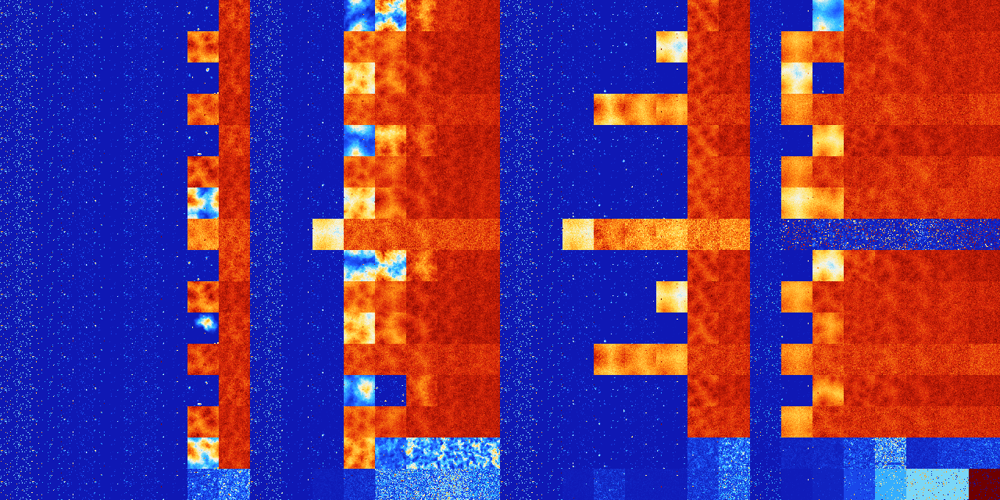

# B3567 (118784-119295)

<details>
    <summary>Initial Grid</summary>
    
</details>


<details>
    <summary>Initial Grid RLE</summary>

```
#C Exported from GoGoL (https://github.com/marrow16/gogol)
#C Wrap mode: Toroidal
#C Boundary mode: Dead
#C Step: 0
x = 100, y = 100, rule = B3567/S
40bo10bo34bo$31bo24bo$5bo16bo14bo8bo21b2o3bo2bo$bo11bo25bo28bo10bo6bo9b
o$11bo20bo8bo4bo2bo$83bo$35bo5bo45bo9bo$4bo11bo43bo5bo19bo$28bo33bo5bo
12bo15bo$8bo56b2obo6bo20bo$24bo9bo46bo$21bo6bo18bo7bo14bo$4bo4bo38bobo
40bo4bo$35bo15bo4bo$41bo17bo2bo20bo11b2o$17bo13bo37bo7bo8bo$52bo8bo23bo
11bo$23b2o5bo$27bo18bo$12bo2bo7bo12bo21bo4bo3bo9bobo7bo$26bo3bo11bo23b
2o23bo$13bo11bo17bo14bo2bo5bo17bo$19b2o17bo23bo$3bo11bo42bo4bo28bo6bo$b
o40b2o12b2o25bo2bo$5b2o14bo10bo10bo16bo12bo$60bo2bo7bo12bo$29bo24bo12bo
21bo$3b2o19bo2bo20bo12bo17bo5bo10bo$41bo20bo19bo14bobo$31bo4bo55bo$b2o
11bo77bo3bo$o19bo21bo5bo5bo4bo8bobo$23bo13bo13bo6bo19bo7b2o$62bo24bo$2b
o7bo37bo19bo19bo8bo$12bo6b2o4b2o5bo12bo29bo9bo$9bo8bo78bobo$68bo$8bo10b
o11bo6bo41bo$2bo4b2o22bo20bo7bo3bo$7bo10bo5bo58bo$3b2obo13bo14bo3bo33bo
$3bo9bo14bo7bo34bo17bo6bo$14bo45bo$bo36bo9bo49bo$6bo11bo41b2o9bo3bo2bo
17bo$6bo5bo2bo15bo20b2o9bo3bo8bo20bo$16bobo2bo6bo23bo27bo$bo74bo$58bo2b
o15b2o$7bo7bo21bo31bo$7bo2bo13bo16bob2o25bo20bo$3bo17bo50bo$18bo10bo63b
o5bo$o20bo7bo9bo4bo20bo24b2o$b2o2bobo8b2o31bo38bo$35bobo49bo$17bo9bo2bo
11bobo11bo$8bo18bo60bo10bo$bo2bo8bo40bobo42bo$9bo86bo$12bo21bo6bo25bo$
10bo42bo4bo18bo5bo4b2o$9bo13bo36bo18bo2bo7b2o$2bo17bo34bo10b2o6bo15bo$
35bo12bo5bo18bo$6bo63bo$o3bo6bo33bo8bobo29bo$71b2o8bobobo4bo$15bo11bo
13bo2bo12bo10bo$27bo48bobo20bo$99bo$14bo23bo50b2o$11bo$4bo47bo9bo12bo
16bo$obo21bo22bo5bo$4bo25bo62bo$o82bo$26bo2bo17b2o11bo2bo16bo12bo$2bo
23bo6bo36bo2bo$33bo60bo4bo$19bo69bo$33b2o18bo34bo2bo5bo$17bobo13bo22bo
19bo6bo5bo$o73bo12bo$23bo13bo15bo8bo4bo14bo2bo9bo$16bo24bo7bo$4bo4bo83b
o2bo$9bo9bo24bo27bo$34bo5bo2bo15bo5b2o27bo$17bo16bo38bo$15bo23bo53bo$
29bo4b2o5bo2bo2bo4bo2bo10bo6bo3bo$18bo4bo26bo5bo29bo4bo$8bo4bo18b2o12bo
4bo47bo$9bo2bo70bo$25bo27bo43bo$21bobo20bo18bo8bo13bo7bobobo$2bo17bobob
o4bo35bo6bo8bo5bo!
```
</details>
<details>
    <summary>Thumbnail</summary>

</details>
<table>
<tr>
    <td><a href="./118784%20S%20Heat%20Map%20Activity.png"></a><br>S (118784)<br>S@3</td>    <td><a href="./118785%20S0%20Heat%20Map%20Activity.png"></a><br>S0 (118785)<br>S@4</td>    <td><a href="./118786%20S1%20Heat%20Map%20Activity.png"></a><br>S1 (118786)<br>R@11,p2</td>    <td><a href="./118787%20S01%20Heat%20Map%20Activity.png"></a><br>S01 (118787)<br>R@34,p2</td>    <td><a href="./118788%20S2%20Heat%20Map%20Activity.png"></a><br>S2 (118788)<br>R@9,p4</td>    <td><a href="./118789%20S02%20Heat%20Map%20Activity.png"></a><br>S02 (118789)<br>R@12,p4</td>    <td><a href="./118790%20S12%20Heat%20Map%20Activity.png"></a><br>S12 (118790)<br>S@43</td>    <td><a href="./118791%20S012%20Heat%20Map%20Activity.png"></a><br>S012 (118791)<br>G>1000</td>    <td><a href="./118792%20S3%20Heat%20Map%20Activity.png"></a><br>S3 (118792)<br>S@3</td>    <td><a href="./118793%20S03%20Heat%20Map%20Activity.png"></a><br>S03 (118793)<br>R@11,p4</td>    <td><a href="./118794%20S13%20Heat%20Map%20Activity.png"></a><br>S13 (118794)<br>R@11,p2</td>    <td><a href="./118795%20S013%20Heat%20Map%20Activity.png"></a><br>S013 (118795)<br>G>1000</td>    <td><a href="./118796%20S23%20Heat%20Map%20Activity.png"></a><br>S23 (118796)<br>G>1000</td>    <td><a href="./118797%20S023%20Heat%20Map%20Activity.png"></a><br>S023 (118797)<br>G>1000</td>    <td><a href="./118798%20S123%20Heat%20Map%20Activity.png"></a><br>S123 (118798)<br>G>1000</td>    <td><a href="./118799%20S0123%20Heat%20Map%20Activity.png"></a><br>S0123 (118799)<br>G>1000</td>    <td><a href="./118800%20S4%20Heat%20Map%20Activity.png"></a><br>S4 (118800)<br>S@3</td>    <td><a href="./118801%20S04%20Heat%20Map%20Activity.png"></a><br>S04 (118801)<br>S@4</td>    <td><a href="./118802%20S14%20Heat%20Map%20Activity.png"></a><br>S14 (118802)<br>R@11,p2</td>    <td><a href="./118803%20S014%20Heat%20Map%20Activity.png"></a><br>S014 (118803)<br>R@23,p2</td>    <td><a href="./118804%20S24%20Heat%20Map%20Activity.png"></a><br>S24 (118804)<br>R@14,p4</td>    <td><a href="./118805%20S024%20Heat%20Map%20Activity.png"></a><br>S024 (118805)<br>R@13,p4</td>    <td><a href="./118806%20S124%20Heat%20Map%20Activity.png"></a><br>S124 (118806)<br>G>1000</td>    <td><a href="./118807%20S0124%20Heat%20Map%20Activity.png"></a><br>S0124 (118807)<br>G>1000</td>    <td><a href="./118808%20S34%20Heat%20Map%20Activity.png"></a><br>S34 (118808)<br>R@20,p16</td>    <td><a href="./118809%20S034%20Heat%20Map%20Activity.png"></a><br>S034 (118809)<br>R@37,p16</td>    <td><a href="./118810%20S134%20Heat%20Map%20Activity.png"></a><br>S134 (118810)<br>G>1000</td>    <td><a href="./118811%20S0134%20Heat%20Map%20Activity.png"></a><br>S0134 (118811)<br>G>1000</td>    <td><a href="./118812%20S234%20Heat%20Map%20Activity.png"></a><br>S234 (118812)<br>G>1000</td>    <td><a href="./118813%20S0234%20Heat%20Map%20Activity.png"></a><br>S0234 (118813)<br>G>1000</td>    <td><a href="./118814%20S1234%20Heat%20Map%20Activity.png"></a><br>S1234 (118814)<br>G>1000</td>    <td><a href="./118815%20S01234%20Heat%20Map%20Activity.png"></a><br>S01234 (118815)<br>G>1000</td></tr>
<tr>
    <td><a href="./118816%20S5%20Heat%20Map%20Activity.png"></a><br>S5 (118816)<br>S@3</td>    <td><a href="./118817%20S05%20Heat%20Map%20Activity.png"></a><br>S05 (118817)<br>S@4</td>    <td><a href="./118818%20S15%20Heat%20Map%20Activity.png"></a><br>S15 (118818)<br>R@12,p2</td>    <td><a href="./118819%20S015%20Heat%20Map%20Activity.png"></a><br>S015 (118819)<br>R@22,p2</td>    <td><a href="./118820%20S25%20Heat%20Map%20Activity.png"></a><br>S25 (118820)<br>R@11,p4</td>    <td><a href="./118821%20S025%20Heat%20Map%20Activity.png"></a><br>S025 (118821)<br>R@17,p4</td>    <td><a href="./118822%20S125%20Heat%20Map%20Activity.png"></a><br>S125 (118822)<br>G>1000</td>    <td><a href="./118823%20S0125%20Heat%20Map%20Activity.png"></a><br>S0125 (118823)<br>G>1000</td>    <td><a href="./118824%20S35%20Heat%20Map%20Activity.png"></a><br>S35 (118824)<br>S@4</td>    <td><a href="./118825%20S035%20Heat%20Map%20Activity.png"></a><br>S035 (118825)<br>R@13,p4</td>    <td><a href="./118826%20S135%20Heat%20Map%20Activity.png"></a><br>S135 (118826)<br>R@20,p2</td>    <td><a href="./118827%20S0135%20Heat%20Map%20Activity.png"></a><br>S0135 (118827)<br>G>1000</td>    <td><a href="./118828%20S235%20Heat%20Map%20Activity.png"></a><br>S235 (118828)<br>G>1000</td>    <td><a href="./118829%20S0235%20Heat%20Map%20Activity.png"></a><br>S0235 (118829)<br>G>1000</td>    <td><a href="./118830%20S1235%20Heat%20Map%20Activity.png"></a><br>S1235 (118830)<br>G>1000</td>    <td><a href="./118831%20S01235%20Heat%20Map%20Activity.png"></a><br>S01235 (118831)<br>G>1000</td>    <td><a href="./118832%20S45%20Heat%20Map%20Activity.png"></a><br>S45 (118832)<br>S@3</td>    <td><a href="./118833%20S045%20Heat%20Map%20Activity.png"></a><br>S045 (118833)<br>S@4</td>    <td><a href="./118834%20S145%20Heat%20Map%20Activity.png"></a><br>S145 (118834)<br>R@23,p8</td>    <td><a href="./118835%20S0145%20Heat%20Map%20Activity.png"></a><br>S0145 (118835)<br>R@22,p2</td>    <td><a href="./118836%20S245%20Heat%20Map%20Activity.png"></a><br>S245 (118836)<br>R@35,p4</td>    <td><a href="./118837%20S0245%20Heat%20Map%20Activity.png"></a><br>S0245 (118837)<br>G>1000</td>    <td><a href="./118838%20S1245%20Heat%20Map%20Activity.png"></a><br>S1245 (118838)<br>G>1000</td>    <td><a href="./118839%20S01245%20Heat%20Map%20Activity.png"></a><br>S01245 (118839)<br>G>1000</td>    <td><a href="./118840%20S345%20Heat%20Map%20Activity.png"></a><br>S345 (118840)<br>S@4</td>    <td><a href="./118841%20S0345%20Heat%20Map%20Activity.png"></a><br>S0345 (118841)<br>G>1000</td>    <td><a href="./118842%20S1345%20Heat%20Map%20Activity.png"></a><br>S1345 (118842)<br>G>1000</td>    <td><a href="./118843%20S01345%20Heat%20Map%20Activity.png"></a><br>S01345 (118843)<br>G>1000</td>    <td><a href="./118844%20S2345%20Heat%20Map%20Activity.png"></a><br>S2345 (118844)<br>G>1000</td>    <td><a href="./118845%20S02345%20Heat%20Map%20Activity.png"></a><br>S02345 (118845)<br>G>1000</td>    <td><a href="./118846%20S12345%20Heat%20Map%20Activity.png"></a><br>S12345 (118846)<br>G>1000</td>    <td><a href="./118847%20S012345%20Heat%20Map%20Activity.png"></a><br>S012345 (118847)<br>G>1000</td></tr>
<tr>
    <td><a href="./118848%20S6%20Heat%20Map%20Activity.png"></a><br>S6 (118848)<br>S@3</td>    <td><a href="./118849%20S06%20Heat%20Map%20Activity.png"></a><br>S06 (118849)<br>S@4</td>    <td><a href="./118850%20S16%20Heat%20Map%20Activity.png"></a><br>S16 (118850)<br>R@11,p2</td>    <td><a href="./118851%20S016%20Heat%20Map%20Activity.png"></a><br>S016 (118851)<br>R@34,p2</td>    <td><a href="./118852%20S26%20Heat%20Map%20Activity.png"></a><br>S26 (118852)<br>R@9,p4</td>    <td><a href="./118853%20S026%20Heat%20Map%20Activity.png"></a><br>S026 (118853)<br>R@12,p4</td>    <td><a href="./118854%20S126%20Heat%20Map%20Activity.png"></a><br>S126 (118854)<br>R@135,p12</td>    <td><a href="./118855%20S0126%20Heat%20Map%20Activity.png"></a><br>S0126 (118855)<br>G>1000</td>    <td><a href="./118856%20S36%20Heat%20Map%20Activity.png"></a><br>S36 (118856)<br>S@3</td>    <td><a href="./118857%20S036%20Heat%20Map%20Activity.png"></a><br>S036 (118857)<br>R@11,p4</td>    <td><a href="./118858%20S136%20Heat%20Map%20Activity.png"></a><br>S136 (118858)<br>R@11,p2</td>    <td><a href="./118859%20S0136%20Heat%20Map%20Activity.png"></a><br>S0136 (118859)<br>G>1000</td>    <td><a href="./118860%20S236%20Heat%20Map%20Activity.png"></a><br>S236 (118860)<br>G>1000</td>    <td><a href="./118861%20S0236%20Heat%20Map%20Activity.png"></a><br>S0236 (118861)<br>G>1000</td>    <td><a href="./118862%20S1236%20Heat%20Map%20Activity.png"></a><br>S1236 (118862)<br>G>1000</td>    <td><a href="./118863%20S01236%20Heat%20Map%20Activity.png"></a><br>S01236 (118863)<br>G>1000</td>    <td><a href="./118864%20S46%20Heat%20Map%20Activity.png"></a><br>S46 (118864)<br>S@3</td>    <td><a href="./118865%20S046%20Heat%20Map%20Activity.png"></a><br>S046 (118865)<br>S@4</td>    <td><a href="./118866%20S146%20Heat%20Map%20Activity.png"></a><br>S146 (118866)<br>R@11,p2</td>    <td><a href="./118867%20S0146%20Heat%20Map%20Activity.png"></a><br>S0146 (118867)<br>R@56,p4</td>    <td><a href="./118868%20S246%20Heat%20Map%20Activity.png"></a><br>S246 (118868)<br>R@14,p4</td>    <td><a href="./118869%20S0246%20Heat%20Map%20Activity.png"></a><br>S0246 (118869)<br>R@112,p4</td>    <td><a href="./118870%20S1246%20Heat%20Map%20Activity.png"></a><br>S1246 (118870)<br>G>1000</td>    <td><a href="./118871%20S01246%20Heat%20Map%20Activity.png"></a><br>S01246 (118871)<br>G>1000</td>    <td><a href="./118872%20S346%20Heat%20Map%20Activity.png"></a><br>S346 (118872)<br>R@20,p16</td>    <td><a href="./118873%20S0346%20Heat%20Map%20Activity.png"></a><br>S0346 (118873)<br>G>1000</td>    <td><a href="./118874%20S1346%20Heat%20Map%20Activity.png"></a><br>S1346 (118874)<br>R@28,p2</td>    <td><a href="./118875%20S01346%20Heat%20Map%20Activity.png"></a><br>S01346 (118875)<br>G>1000</td>    <td><a href="./118876%20S2346%20Heat%20Map%20Activity.png"></a><br>S2346 (118876)<br>G>1000</td>    <td><a href="./118877%20S02346%20Heat%20Map%20Activity.png"></a><br>S02346 (118877)<br>G>1000</td>    <td><a href="./118878%20S12346%20Heat%20Map%20Activity.png"></a><br>S12346 (118878)<br>G>1000</td>    <td><a href="./118879%20S012346%20Heat%20Map%20Activity.png"></a><br>S012346 (118879)<br>G>1000</td></tr>
<tr>
    <td><a href="./118880%20S56%20Heat%20Map%20Activity.png"></a><br>S56 (118880)<br>S@3</td>    <td><a href="./118881%20S056%20Heat%20Map%20Activity.png"></a><br>S056 (118881)<br>S@4</td>    <td><a href="./118882%20S156%20Heat%20Map%20Activity.png"></a><br>S156 (118882)<br>R@12,p2</td>    <td><a href="./118883%20S0156%20Heat%20Map%20Activity.png"></a><br>S0156 (118883)<br>R@22,p2</td>    <td><a href="./118884%20S256%20Heat%20Map%20Activity.png"></a><br>S256 (118884)<br>R@11,p4</td>    <td><a href="./118885%20S0256%20Heat%20Map%20Activity.png"></a><br>S0256 (118885)<br>R@17,p4</td>    <td><a href="./118886%20S1256%20Heat%20Map%20Activity.png"></a><br>S1256 (118886)<br>G>1000</td>    <td><a href="./118887%20S01256%20Heat%20Map%20Activity.png"></a><br>S01256 (118887)<br>G>1000</td>    <td><a href="./118888%20S356%20Heat%20Map%20Activity.png"></a><br>S356 (118888)<br>S@4</td>    <td><a href="./118889%20S0356%20Heat%20Map%20Activity.png"></a><br>S0356 (118889)<br>R@13,p4</td>    <td><a href="./118890%20S1356%20Heat%20Map%20Activity.png"></a><br>S1356 (118890)<br>R@20,p2</td>    <td><a href="./118891%20S01356%20Heat%20Map%20Activity.png"></a><br>S01356 (118891)<br>G>1000</td>    <td><a href="./118892%20S2356%20Heat%20Map%20Activity.png"></a><br>S2356 (118892)<br>G>1000</td>    <td><a href="./118893%20S02356%20Heat%20Map%20Activity.png"></a><br>S02356 (118893)<br>G>1000</td>    <td><a href="./118894%20S12356%20Heat%20Map%20Activity.png"></a><br>S12356 (118894)<br>G>1000</td>    <td><a href="./118895%20S012356%20Heat%20Map%20Activity.png"></a><br>S012356 (118895)<br>G>1000</td>    <td><a href="./118896%20S456%20Heat%20Map%20Activity.png"></a><br>S456 (118896)<br>S@3</td>    <td><a href="./118897%20S0456%20Heat%20Map%20Activity.png"></a><br>S0456 (118897)<br>S@4</td>    <td><a href="./118898%20S1456%20Heat%20Map%20Activity.png"></a><br>S1456 (118898)<br>R@23,p8</td>    <td><a href="./118899%20S01456%20Heat%20Map%20Activity.png"></a><br>S01456 (118899)<br>G>1000</td>    <td><a href="./118900%20S2456%20Heat%20Map%20Activity.png"></a><br>S2456 (118900)<br>G>1000</td>    <td><a href="./118901%20S02456%20Heat%20Map%20Activity.png"></a><br>S02456 (118901)<br>G>1000</td>    <td><a href="./118902%20S12456%20Heat%20Map%20Activity.png"></a><br>S12456 (118902)<br>G>1000</td>    <td><a href="./118903%20S012456%20Heat%20Map%20Activity.png"></a><br>S012456 (118903)<br>G>1000</td>    <td><a href="./118904%20S3456%20Heat%20Map%20Activity.png"></a><br>S3456 (118904)<br>S@4</td>    <td><a href="./118905%20S03456%20Heat%20Map%20Activity.png"></a><br>S03456 (118905)<br>G>1000</td>    <td><a href="./118906%20S13456%20Heat%20Map%20Activity.png"></a><br>S13456 (118906)<br>G>1000</td>    <td><a href="./118907%20S013456%20Heat%20Map%20Activity.png"></a><br>S013456 (118907)<br>G>1000</td>    <td><a href="./118908%20S23456%20Heat%20Map%20Activity.png"></a><br>S23456 (118908)<br>G>1000</td>    <td><a href="./118909%20S023456%20Heat%20Map%20Activity.png"></a><br>S023456 (118909)<br>G>1000</td>    <td><a href="./118910%20S123456%20Heat%20Map%20Activity.png"></a><br>S123456 (118910)<br>G>1000</td>    <td><a href="./118911%20S0123456%20Heat%20Map%20Activity.png"></a><br>S0123456 (118911)<br>G>1000</td></tr>
<tr>
    <td><a href="./118912%20S7%20Heat%20Map%20Activity.png"></a><br>S7 (118912)<br>S@3</td>    <td><a href="./118913%20S07%20Heat%20Map%20Activity.png"></a><br>S07 (118913)<br>S@4</td>    <td><a href="./118914%20S17%20Heat%20Map%20Activity.png"></a><br>S17 (118914)<br>R@11,p2</td>    <td><a href="./118915%20S017%20Heat%20Map%20Activity.png"></a><br>S017 (118915)<br>R@34,p2</td>    <td><a href="./118916%20S27%20Heat%20Map%20Activity.png"></a><br>S27 (118916)<br>R@9,p4</td>    <td><a href="./118917%20S027%20Heat%20Map%20Activity.png"></a><br>S027 (118917)<br>R@12,p4</td>    <td><a href="./118918%20S127%20Heat%20Map%20Activity.png"></a><br>S127 (118918)<br>S@73</td>    <td><a href="./118919%20S0127%20Heat%20Map%20Activity.png"></a><br>S0127 (118919)<br>G>1000</td>    <td><a href="./118920%20S37%20Heat%20Map%20Activity.png"></a><br>S37 (118920)<br>S@3</td>    <td><a href="./118921%20S037%20Heat%20Map%20Activity.png"></a><br>S037 (118921)<br>R@11,p4</td>    <td><a href="./118922%20S137%20Heat%20Map%20Activity.png"></a><br>S137 (118922)<br>R@12,p2</td>    <td><a href="./118923%20S0137%20Heat%20Map%20Activity.png"></a><br>S0137 (118923)<br>G>1000</td>    <td><a href="./118924%20S237%20Heat%20Map%20Activity.png"></a><br>S237 (118924)<br>G>1000</td>    <td><a href="./118925%20S0237%20Heat%20Map%20Activity.png"></a><br>S0237 (118925)<br>G>1000</td>    <td><a href="./118926%20S1237%20Heat%20Map%20Activity.png"></a><br>S1237 (118926)<br>G>1000</td>    <td><a href="./118927%20S01237%20Heat%20Map%20Activity.png"></a><br>S01237 (118927)<br>G>1000</td>    <td><a href="./118928%20S47%20Heat%20Map%20Activity.png"></a><br>S47 (118928)<br>S@3</td>    <td><a href="./118929%20S047%20Heat%20Map%20Activity.png"></a><br>S047 (118929)<br>S@4</td>    <td><a href="./118930%20S147%20Heat%20Map%20Activity.png"></a><br>S147 (118930)<br>R@11,p2</td>    <td><a href="./118931%20S0147%20Heat%20Map%20Activity.png"></a><br>S0147 (118931)<br>R@23,p2</td>    <td><a href="./118932%20S247%20Heat%20Map%20Activity.png"></a><br>S247 (118932)<br>R@14,p4</td>    <td><a href="./118933%20S0247%20Heat%20Map%20Activity.png"></a><br>S0247 (118933)<br>R@13,p4</td>    <td><a href="./118934%20S1247%20Heat%20Map%20Activity.png"></a><br>S1247 (118934)<br>G>1000</td>    <td><a href="./118935%20S01247%20Heat%20Map%20Activity.png"></a><br>S01247 (118935)<br>G>1000</td>    <td><a href="./118936%20S347%20Heat%20Map%20Activity.png"></a><br>S347 (118936)<br>R@20,p16</td>    <td><a href="./118937%20S0347%20Heat%20Map%20Activity.png"></a><br>S0347 (118937)<br>R@37,p16</td>    <td><a href="./118938%20S1347%20Heat%20Map%20Activity.png"></a><br>S1347 (118938)<br>G>1000</td>    <td><a href="./118939%20S01347%20Heat%20Map%20Activity.png"></a><br>S01347 (118939)<br>G>1000</td>    <td><a href="./118940%20S2347%20Heat%20Map%20Activity.png"></a><br>S2347 (118940)<br>G>1000</td>    <td><a href="./118941%20S02347%20Heat%20Map%20Activity.png"></a><br>S02347 (118941)<br>G>1000</td>    <td><a href="./118942%20S12347%20Heat%20Map%20Activity.png"></a><br>S12347 (118942)<br>G>1000</td>    <td><a href="./118943%20S012347%20Heat%20Map%20Activity.png"></a><br>S012347 (118943)<br>G>1000</td></tr>
<tr>
    <td><a href="./118944%20S57%20Heat%20Map%20Activity.png"></a><br>S57 (118944)<br>S@3</td>    <td><a href="./118945%20S057%20Heat%20Map%20Activity.png"></a><br>S057 (118945)<br>S@4</td>    <td><a href="./118946%20S157%20Heat%20Map%20Activity.png"></a><br>S157 (118946)<br>R@12,p2</td>    <td><a href="./118947%20S0157%20Heat%20Map%20Activity.png"></a><br>S0157 (118947)<br>R@22,p2</td>    <td><a href="./118948%20S257%20Heat%20Map%20Activity.png"></a><br>S257 (118948)<br>R@11,p4</td>    <td><a href="./118949%20S0257%20Heat%20Map%20Activity.png"></a><br>S0257 (118949)<br>R@17,p4</td>    <td><a href="./118950%20S1257%20Heat%20Map%20Activity.png"></a><br>S1257 (118950)<br>G>1000</td>    <td><a href="./118951%20S01257%20Heat%20Map%20Activity.png"></a><br>S01257 (118951)<br>G>1000</td>    <td><a href="./118952%20S357%20Heat%20Map%20Activity.png"></a><br>S357 (118952)<br>S@4</td>    <td><a href="./118953%20S0357%20Heat%20Map%20Activity.png"></a><br>S0357 (118953)<br>R@13,p4</td>    <td><a href="./118954%20S1357%20Heat%20Map%20Activity.png"></a><br>S1357 (118954)<br>R@50,p2</td>    <td><a href="./118955%20S01357%20Heat%20Map%20Activity.png"></a><br>S01357 (118955)<br>G>1000</td>    <td><a href="./118956%20S2357%20Heat%20Map%20Activity.png"></a><br>S2357 (118956)<br>G>1000</td>    <td><a href="./118957%20S02357%20Heat%20Map%20Activity.png"></a><br>S02357 (118957)<br>G>1000</td>    <td><a href="./118958%20S12357%20Heat%20Map%20Activity.png"></a><br>S12357 (118958)<br>G>1000</td>    <td><a href="./118959%20S012357%20Heat%20Map%20Activity.png"></a><br>S012357 (118959)<br>G>1000</td>    <td><a href="./118960%20S457%20Heat%20Map%20Activity.png"></a><br>S457 (118960)<br>S@3</td>    <td><a href="./118961%20S0457%20Heat%20Map%20Activity.png"></a><br>S0457 (118961)<br>S@4</td>    <td><a href="./118962%20S1457%20Heat%20Map%20Activity.png"></a><br>S1457 (118962)<br>R@26,p8</td>    <td><a href="./118963%20S01457%20Heat%20Map%20Activity.png"></a><br>S01457 (118963)<br>R@91,p2</td>    <td><a href="./118964%20S2457%20Heat%20Map%20Activity.png"></a><br>S2457 (118964)<br>R@20,p4</td>    <td><a href="./118965%20S02457%20Heat%20Map%20Activity.png"></a><br>S02457 (118965)<br>R@14,p4</td>    <td><a href="./118966%20S12457%20Heat%20Map%20Activity.png"></a><br>S12457 (118966)<br>G>1000</td>    <td><a href="./118967%20S012457%20Heat%20Map%20Activity.png"></a><br>S012457 (118967)<br>G>1000</td>    <td><a href="./118968%20S3457%20Heat%20Map%20Activity.png"></a><br>S3457 (118968)<br>S@4</td>    <td><a href="./118969%20S03457%20Heat%20Map%20Activity.png"></a><br>S03457 (118969)<br>G>1000</td>    <td><a href="./118970%20S13457%20Heat%20Map%20Activity.png"></a><br>S13457 (118970)<br>G>1000</td>    <td><a href="./118971%20S013457%20Heat%20Map%20Activity.png"></a><br>S013457 (118971)<br>G>1000</td>    <td><a href="./118972%20S23457%20Heat%20Map%20Activity.png"></a><br>S23457 (118972)<br>G>1000</td>    <td><a href="./118973%20S023457%20Heat%20Map%20Activity.png"></a><br>S023457 (118973)<br>G>1000</td>    <td><a href="./118974%20S123457%20Heat%20Map%20Activity.png"></a><br>S123457 (118974)<br>G>1000</td>    <td><a href="./118975%20S0123457%20Heat%20Map%20Activity.png"></a><br>S0123457 (118975)<br>G>1000</td></tr>
<tr>
    <td><a href="./118976%20S67%20Heat%20Map%20Activity.png"></a><br>S67 (118976)<br>S@3</td>    <td><a href="./118977%20S067%20Heat%20Map%20Activity.png"></a><br>S067 (118977)<br>S@4</td>    <td><a href="./118978%20S167%20Heat%20Map%20Activity.png"></a><br>S167 (118978)<br>R@11,p2</td>    <td><a href="./118979%20S0167%20Heat%20Map%20Activity.png"></a><br>S0167 (118979)<br>R@34,p2</td>    <td><a href="./118980%20S267%20Heat%20Map%20Activity.png"></a><br>S267 (118980)<br>R@9,p4</td>    <td><a href="./118981%20S0267%20Heat%20Map%20Activity.png"></a><br>S0267 (118981)<br>R@12,p4</td>    <td><a href="./118982%20S1267%20Heat%20Map%20Activity.png"></a><br>S1267 (118982)<br>G>1000</td>    <td><a href="./118983%20S01267%20Heat%20Map%20Activity.png"></a><br>S01267 (118983)<br>G>1000</td>    <td><a href="./118984%20S367%20Heat%20Map%20Activity.png"></a><br>S367 (118984)<br>S@3</td>    <td><a href="./118985%20S0367%20Heat%20Map%20Activity.png"></a><br>S0367 (118985)<br>R@11,p4</td>    <td><a href="./118986%20S1367%20Heat%20Map%20Activity.png"></a><br>S1367 (118986)<br>R@12,p2</td>    <td><a href="./118987%20S01367%20Heat%20Map%20Activity.png"></a><br>S01367 (118987)<br>G>1000</td>    <td><a href="./118988%20S2367%20Heat%20Map%20Activity.png"></a><br>S2367 (118988)<br>G>1000</td>    <td><a href="./118989%20S02367%20Heat%20Map%20Activity.png"></a><br>S02367 (118989)<br>G>1000</td>    <td><a href="./118990%20S12367%20Heat%20Map%20Activity.png"></a><br>S12367 (118990)<br>G>1000</td>    <td><a href="./118991%20S012367%20Heat%20Map%20Activity.png"></a><br>S012367 (118991)<br>G>1000</td>    <td><a href="./118992%20S467%20Heat%20Map%20Activity.png"></a><br>S467 (118992)<br>S@3</td>    <td><a href="./118993%20S0467%20Heat%20Map%20Activity.png"></a><br>S0467 (118993)<br>S@4</td>    <td><a href="./118994%20S1467%20Heat%20Map%20Activity.png"></a><br>S1467 (118994)<br>R@13,p2</td>    <td><a href="./118995%20S01467%20Heat%20Map%20Activity.png"></a><br>S01467 (118995)<br>R@37,p4</td>    <td><a href="./118996%20S2467%20Heat%20Map%20Activity.png"></a><br>S2467 (118996)<br>R@14,p4</td>    <td><a href="./118997%20S02467%20Heat%20Map%20Activity.png"></a><br>S02467 (118997)<br>R@14,p4</td>    <td><a href="./118998%20S12467%20Heat%20Map%20Activity.png"></a><br>S12467 (118998)<br>G>1000</td>    <td><a href="./118999%20S012467%20Heat%20Map%20Activity.png"></a><br>S012467 (118999)<br>G>1000</td>    <td><a href="./119000%20S3467%20Heat%20Map%20Activity.png"></a><br>S3467 (119000)<br>R@20,p16</td>    <td><a href="./119001%20S03467%20Heat%20Map%20Activity.png"></a><br>S03467 (119001)<br>G>1000</td>    <td><a href="./119002%20S13467%20Heat%20Map%20Activity.png"></a><br>S13467 (119002)<br>G>1000</td>    <td><a href="./119003%20S013467%20Heat%20Map%20Activity.png"></a><br>S013467 (119003)<br>G>1000</td>    <td><a href="./119004%20S23467%20Heat%20Map%20Activity.png"></a><br>S23467 (119004)<br>G>1000</td>    <td><a href="./119005%20S023467%20Heat%20Map%20Activity.png"></a><br>S023467 (119005)<br>G>1000</td>    <td><a href="./119006%20S123467%20Heat%20Map%20Activity.png"></a><br>S123467 (119006)<br>G>1000</td>    <td><a href="./119007%20S0123467%20Heat%20Map%20Activity.png"></a><br>S0123467 (119007)<br>G>1000</td></tr>
<tr>
    <td><a href="./119008%20S567%20Heat%20Map%20Activity.png"></a><br>S567 (119008)<br>S@3</td>    <td><a href="./119009%20S0567%20Heat%20Map%20Activity.png"></a><br>S0567 (119009)<br>S@4</td>    <td><a href="./119010%20S1567%20Heat%20Map%20Activity.png"></a><br>S1567 (119010)<br>R@12,p2</td>    <td><a href="./119011%20S01567%20Heat%20Map%20Activity.png"></a><br>S01567 (119011)<br>R@22,p2</td>    <td><a href="./119012%20S2567%20Heat%20Map%20Activity.png"></a><br>S2567 (119012)<br>R@11,p4</td>    <td><a href="./119013%20S02567%20Heat%20Map%20Activity.png"></a><br>S02567 (119013)<br>R@17,p4</td>    <td><a href="./119014%20S12567%20Heat%20Map%20Activity.png"></a><br>S12567 (119014)<br>G>1000</td>    <td><a href="./119015%20S012567%20Heat%20Map%20Activity.png"></a><br>S012567 (119015)<br>G>1000</td>    <td><a href="./119016%20S3567%20Heat%20Map%20Activity.png"></a><br>S3567 (119016)<br>S@4</td>    <td><a href="./119017%20S03567%20Heat%20Map%20Activity.png"></a><br>S03567 (119017)<br>R@13,p4</td>    <td><a href="./119018%20S13567%20Heat%20Map%20Activity.png"></a><br>S13567 (119018)<br>G>1000</td>    <td><a href="./119019%20S013567%20Heat%20Map%20Activity.png"></a><br>S013567 (119019)<br>G>1000</td>    <td><a href="./119020%20S23567%20Heat%20Map%20Activity.png"></a><br>S23567 (119020)<br>G>1000</td>    <td><a href="./119021%20S023567%20Heat%20Map%20Activity.png"></a><br>S023567 (119021)<br>G>1000</td>    <td><a href="./119022%20S123567%20Heat%20Map%20Activity.png"></a><br>S123567 (119022)<br>G>1000</td>    <td><a href="./119023%20S0123567%20Heat%20Map%20Activity.png"></a><br>S0123567 (119023)<br>G>1000</td>    <td><a href="./119024%20S4567%20Heat%20Map%20Activity.png"></a><br>S4567 (119024)<br>S@3</td>    <td><a href="./119025%20S04567%20Heat%20Map%20Activity.png"></a><br>S04567 (119025)<br>S@4</td>    <td><a href="./119026%20S14567%20Heat%20Map%20Activity.png"></a><br>S14567 (119026)<br>G>1000</td>    <td><a href="./119027%20S014567%20Heat%20Map%20Activity.png"></a><br>S014567 (119027)<br>G>1000</td>    <td><a href="./119028%20S24567%20Heat%20Map%20Activity.png"></a><br>S24567 (119028)<br>G>1000</td>    <td><a href="./119029%20S024567%20Heat%20Map%20Activity.png"></a><br>S024567 (119029)<br>G>1000</td>    <td><a href="./119030%20S124567%20Heat%20Map%20Activity.png"></a><br>S124567 (119030)<br>G>1000</td>    <td><a href="./119031%20S0124567%20Heat%20Map%20Activity.png"></a><br>S0124567 (119031)<br>G>1000</td>    <td><a href="./119032%20S34567%20Heat%20Map%20Activity.png"></a><br>S34567 (119032)<br>S@4</td>    <td><a href="./119033%20S034567%20Heat%20Map%20Activity.png"></a><br>S034567 (119033)<br>R@663,p420</td>    <td><a href="./119034%20S134567%20Heat%20Map%20Activity.png"></a><br>S134567 (119034)<br>R@316,p84</td>    <td><a href="./119035%20S0134567%20Heat%20Map%20Activity.png"></a><br>S0134567 (119035)<br>R@284,p126</td>    <td><a href="./119036%20S234567%20Heat%20Map%20Activity.png"></a><br>S234567 (119036)<br>R@210,p84</td>    <td><a href="./119037%20S0234567%20Heat%20Map%20Activity.png"></a><br>S0234567 (119037)<br>R@122,p12</td>    <td><a href="./119038%20S1234567%20Heat%20Map%20Activity.png"></a><br>S1234567 (119038)<br>R@171,p84</td>    <td><a href="./119039%20S01234567%20Heat%20Map%20Activity.png"></a><br>S01234567 (119039)<br>R@201,p126</td></tr>
<tr>
    <td><a href="./119040%20S8%20Heat%20Map%20Activity.png"></a><br>S8 (119040)<br>S@3</td>    <td><a href="./119041%20S08%20Heat%20Map%20Activity.png"></a><br>S08 (119041)<br>S@4</td>    <td><a href="./119042%20S18%20Heat%20Map%20Activity.png"></a><br>S18 (119042)<br>R@11,p2</td>    <td><a href="./119043%20S018%20Heat%20Map%20Activity.png"></a><br>S018 (119043)<br>R@34,p2</td>    <td><a href="./119044%20S28%20Heat%20Map%20Activity.png"></a><br>S28 (119044)<br>R@9,p4</td>    <td><a href="./119045%20S028%20Heat%20Map%20Activity.png"></a><br>S028 (119045)<br>R@12,p4</td>    <td><a href="./119046%20S128%20Heat%20Map%20Activity.png"></a><br>S128 (119046)<br>S@33</td>    <td><a href="./119047%20S0128%20Heat%20Map%20Activity.png"></a><br>S0128 (119047)<br>G>1000</td>    <td><a href="./119048%20S38%20Heat%20Map%20Activity.png"></a><br>S38 (119048)<br>S@3</td>    <td><a href="./119049%20S038%20Heat%20Map%20Activity.png"></a><br>S038 (119049)<br>R@11,p4</td>    <td><a href="./119050%20S138%20Heat%20Map%20Activity.png"></a><br>S138 (119050)<br>R@11,p2</td>    <td><a href="./119051%20S0138%20Heat%20Map%20Activity.png"></a><br>S0138 (119051)<br>G>1000</td>    <td><a href="./119052%20S238%20Heat%20Map%20Activity.png"></a><br>S238 (119052)<br>G>1000</td>    <td><a href="./119053%20S0238%20Heat%20Map%20Activity.png"></a><br>S0238 (119053)<br>G>1000</td>    <td><a href="./119054%20S1238%20Heat%20Map%20Activity.png"></a><br>S1238 (119054)<br>G>1000</td>    <td><a href="./119055%20S01238%20Heat%20Map%20Activity.png"></a><br>S01238 (119055)<br>G>1000</td>    <td><a href="./119056%20S48%20Heat%20Map%20Activity.png"></a><br>S48 (119056)<br>S@3</td>    <td><a href="./119057%20S048%20Heat%20Map%20Activity.png"></a><br>S048 (119057)<br>S@4</td>    <td><a href="./119058%20S148%20Heat%20Map%20Activity.png"></a><br>S148 (119058)<br>R@11,p2</td>    <td><a href="./119059%20S0148%20Heat%20Map%20Activity.png"></a><br>S0148 (119059)<br>R@23,p2</td>    <td><a href="./119060%20S248%20Heat%20Map%20Activity.png"></a><br>S248 (119060)<br>R@14,p4</td>    <td><a href="./119061%20S0248%20Heat%20Map%20Activity.png"></a><br>S0248 (119061)<br>R@13,p4</td>    <td><a href="./119062%20S1248%20Heat%20Map%20Activity.png"></a><br>S1248 (119062)<br>G>1000</td>    <td><a href="./119063%20S01248%20Heat%20Map%20Activity.png"></a><br>S01248 (119063)<br>G>1000</td>    <td><a href="./119064%20S348%20Heat%20Map%20Activity.png"></a><br>S348 (119064)<br>R@20,p16</td>    <td><a href="./119065%20S0348%20Heat%20Map%20Activity.png"></a><br>S0348 (119065)<br>R@37,p16</td>    <td><a href="./119066%20S1348%20Heat%20Map%20Activity.png"></a><br>S1348 (119066)<br>G>1000</td>    <td><a href="./119067%20S01348%20Heat%20Map%20Activity.png"></a><br>S01348 (119067)<br>G>1000</td>    <td><a href="./119068%20S2348%20Heat%20Map%20Activity.png"></a><br>S2348 (119068)<br>G>1000</td>    <td><a href="./119069%20S02348%20Heat%20Map%20Activity.png"></a><br>S02348 (119069)<br>G>1000</td>    <td><a href="./119070%20S12348%20Heat%20Map%20Activity.png"></a><br>S12348 (119070)<br>G>1000</td>    <td><a href="./119071%20S012348%20Heat%20Map%20Activity.png"></a><br>S012348 (119071)<br>G>1000</td></tr>
<tr>
    <td><a href="./119072%20S58%20Heat%20Map%20Activity.png"></a><br>S58 (119072)<br>S@3</td>    <td><a href="./119073%20S058%20Heat%20Map%20Activity.png"></a><br>S058 (119073)<br>S@4</td>    <td><a href="./119074%20S158%20Heat%20Map%20Activity.png"></a><br>S158 (119074)<br>R@12,p2</td>    <td><a href="./119075%20S0158%20Heat%20Map%20Activity.png"></a><br>S0158 (119075)<br>R@22,p2</td>    <td><a href="./119076%20S258%20Heat%20Map%20Activity.png"></a><br>S258 (119076)<br>R@11,p4</td>    <td><a href="./119077%20S0258%20Heat%20Map%20Activity.png"></a><br>S0258 (119077)<br>R@17,p4</td>    <td><a href="./119078%20S1258%20Heat%20Map%20Activity.png"></a><br>S1258 (119078)<br>G>1000</td>    <td><a href="./119079%20S01258%20Heat%20Map%20Activity.png"></a><br>S01258 (119079)<br>G>1000</td>    <td><a href="./119080%20S358%20Heat%20Map%20Activity.png"></a><br>S358 (119080)<br>S@4</td>    <td><a href="./119081%20S0358%20Heat%20Map%20Activity.png"></a><br>S0358 (119081)<br>R@13,p4</td>    <td><a href="./119082%20S1358%20Heat%20Map%20Activity.png"></a><br>S1358 (119082)<br>R@20,p2</td>    <td><a href="./119083%20S01358%20Heat%20Map%20Activity.png"></a><br>S01358 (119083)<br>G>1000</td>    <td><a href="./119084%20S2358%20Heat%20Map%20Activity.png"></a><br>S2358 (119084)<br>G>1000</td>    <td><a href="./119085%20S02358%20Heat%20Map%20Activity.png"></a><br>S02358 (119085)<br>G>1000</td>    <td><a href="./119086%20S12358%20Heat%20Map%20Activity.png"></a><br>S12358 (119086)<br>G>1000</td>    <td><a href="./119087%20S012358%20Heat%20Map%20Activity.png"></a><br>S012358 (119087)<br>G>1000</td>    <td><a href="./119088%20S458%20Heat%20Map%20Activity.png"></a><br>S458 (119088)<br>S@3</td>    <td><a href="./119089%20S0458%20Heat%20Map%20Activity.png"></a><br>S0458 (119089)<br>S@4</td>    <td><a href="./119090%20S1458%20Heat%20Map%20Activity.png"></a><br>S1458 (119090)<br>R@23,p8</td>    <td><a href="./119091%20S01458%20Heat%20Map%20Activity.png"></a><br>S01458 (119091)<br>R@22,p2</td>    <td><a href="./119092%20S2458%20Heat%20Map%20Activity.png"></a><br>S2458 (119092)<br>R@30,p4</td>    <td><a href="./119093%20S02458%20Heat%20Map%20Activity.png"></a><br>S02458 (119093)<br>G>1000</td>    <td><a href="./119094%20S12458%20Heat%20Map%20Activity.png"></a><br>S12458 (119094)<br>G>1000</td>    <td><a href="./119095%20S012458%20Heat%20Map%20Activity.png"></a><br>S012458 (119095)<br>G>1000</td>    <td><a href="./119096%20S3458%20Heat%20Map%20Activity.png"></a><br>S3458 (119096)<br>S@4</td>    <td><a href="./119097%20S03458%20Heat%20Map%20Activity.png"></a><br>S03458 (119097)<br>G>1000</td>    <td><a href="./119098%20S13458%20Heat%20Map%20Activity.png"></a><br>S13458 (119098)<br>G>1000</td>    <td><a href="./119099%20S013458%20Heat%20Map%20Activity.png"></a><br>S013458 (119099)<br>G>1000</td>    <td><a href="./119100%20S23458%20Heat%20Map%20Activity.png"></a><br>S23458 (119100)<br>G>1000</td>    <td><a href="./119101%20S023458%20Heat%20Map%20Activity.png"></a><br>S023458 (119101)<br>G>1000</td>    <td><a href="./119102%20S123458%20Heat%20Map%20Activity.png"></a><br>S123458 (119102)<br>G>1000</td>    <td><a href="./119103%20S0123458%20Heat%20Map%20Activity.png"></a><br>S0123458 (119103)<br>G>1000</td></tr>
<tr>
    <td><a href="./119104%20S68%20Heat%20Map%20Activity.png"></a><br>S68 (119104)<br>S@3</td>    <td><a href="./119105%20S068%20Heat%20Map%20Activity.png"></a><br>S068 (119105)<br>S@4</td>    <td><a href="./119106%20S168%20Heat%20Map%20Activity.png"></a><br>S168 (119106)<br>R@11,p2</td>    <td><a href="./119107%20S0168%20Heat%20Map%20Activity.png"></a><br>S0168 (119107)<br>R@34,p2</td>    <td><a href="./119108%20S268%20Heat%20Map%20Activity.png"></a><br>S268 (119108)<br>R@9,p4</td>    <td><a href="./119109%20S0268%20Heat%20Map%20Activity.png"></a><br>S0268 (119109)<br>R@12,p4</td>    <td><a href="./119110%20S1268%20Heat%20Map%20Activity.png"></a><br>S1268 (119110)<br>G>1000</td>    <td><a href="./119111%20S01268%20Heat%20Map%20Activity.png"></a><br>S01268 (119111)<br>G>1000</td>    <td><a href="./119112%20S368%20Heat%20Map%20Activity.png"></a><br>S368 (119112)<br>S@3</td>    <td><a href="./119113%20S0368%20Heat%20Map%20Activity.png"></a><br>S0368 (119113)<br>R@11,p4</td>    <td><a href="./119114%20S1368%20Heat%20Map%20Activity.png"></a><br>S1368 (119114)<br>R@11,p2</td>    <td><a href="./119115%20S01368%20Heat%20Map%20Activity.png"></a><br>S01368 (119115)<br>G>1000</td>    <td><a href="./119116%20S2368%20Heat%20Map%20Activity.png"></a><br>S2368 (119116)<br>G>1000</td>    <td><a href="./119117%20S02368%20Heat%20Map%20Activity.png"></a><br>S02368 (119117)<br>G>1000</td>    <td><a href="./119118%20S12368%20Heat%20Map%20Activity.png"></a><br>S12368 (119118)<br>G>1000</td>    <td><a href="./119119%20S012368%20Heat%20Map%20Activity.png"></a><br>S012368 (119119)<br>G>1000</td>    <td><a href="./119120%20S468%20Heat%20Map%20Activity.png"></a><br>S468 (119120)<br>S@3</td>    <td><a href="./119121%20S0468%20Heat%20Map%20Activity.png"></a><br>S0468 (119121)<br>S@4</td>    <td><a href="./119122%20S1468%20Heat%20Map%20Activity.png"></a><br>S1468 (119122)<br>R@11,p2</td>    <td><a href="./119123%20S01468%20Heat%20Map%20Activity.png"></a><br>S01468 (119123)<br>R@56,p4</td>    <td><a href="./119124%20S2468%20Heat%20Map%20Activity.png"></a><br>S2468 (119124)<br>R@14,p4</td>    <td><a href="./119125%20S02468%20Heat%20Map%20Activity.png"></a><br>S02468 (119125)<br>R@112,p4</td>    <td><a href="./119126%20S12468%20Heat%20Map%20Activity.png"></a><br>S12468 (119126)<br>G>1000</td>    <td><a href="./119127%20S012468%20Heat%20Map%20Activity.png"></a><br>S012468 (119127)<br>G>1000</td>    <td><a href="./119128%20S3468%20Heat%20Map%20Activity.png"></a><br>S3468 (119128)<br>R@20,p16</td>    <td><a href="./119129%20S03468%20Heat%20Map%20Activity.png"></a><br>S03468 (119129)<br>R@41,p16</td>    <td><a href="./119130%20S13468%20Heat%20Map%20Activity.png"></a><br>S13468 (119130)<br>G>1000</td>    <td><a href="./119131%20S013468%20Heat%20Map%20Activity.png"></a><br>S013468 (119131)<br>G>1000</td>    <td><a href="./119132%20S23468%20Heat%20Map%20Activity.png"></a><br>S23468 (119132)<br>G>1000</td>    <td><a href="./119133%20S023468%20Heat%20Map%20Activity.png"></a><br>S023468 (119133)<br>G>1000</td>    <td><a href="./119134%20S123468%20Heat%20Map%20Activity.png"></a><br>S123468 (119134)<br>G>1000</td>    <td><a href="./119135%20S0123468%20Heat%20Map%20Activity.png"></a><br>S0123468 (119135)<br>G>1000</td></tr>
<tr>
    <td><a href="./119136%20S568%20Heat%20Map%20Activity.png"></a><br>S568 (119136)<br>S@3</td>    <td><a href="./119137%20S0568%20Heat%20Map%20Activity.png"></a><br>S0568 (119137)<br>S@4</td>    <td><a href="./119138%20S1568%20Heat%20Map%20Activity.png"></a><br>S1568 (119138)<br>R@12,p2</td>    <td><a href="./119139%20S01568%20Heat%20Map%20Activity.png"></a><br>S01568 (119139)<br>R@22,p2</td>    <td><a href="./119140%20S2568%20Heat%20Map%20Activity.png"></a><br>S2568 (119140)<br>R@11,p4</td>    <td><a href="./119141%20S02568%20Heat%20Map%20Activity.png"></a><br>S02568 (119141)<br>R@17,p4</td>    <td><a href="./119142%20S12568%20Heat%20Map%20Activity.png"></a><br>S12568 (119142)<br>G>1000</td>    <td><a href="./119143%20S012568%20Heat%20Map%20Activity.png"></a><br>S012568 (119143)<br>G>1000</td>    <td><a href="./119144%20S3568%20Heat%20Map%20Activity.png"></a><br>S3568 (119144)<br>S@4</td>    <td><a href="./119145%20S03568%20Heat%20Map%20Activity.png"></a><br>S03568 (119145)<br>R@13,p4</td>    <td><a href="./119146%20S13568%20Heat%20Map%20Activity.png"></a><br>S13568 (119146)<br>R@20,p2</td>    <td><a href="./119147%20S013568%20Heat%20Map%20Activity.png"></a><br>S013568 (119147)<br>G>1000</td>    <td><a href="./119148%20S23568%20Heat%20Map%20Activity.png"></a><br>S23568 (119148)<br>G>1000</td>    <td><a href="./119149%20S023568%20Heat%20Map%20Activity.png"></a><br>S023568 (119149)<br>G>1000</td>    <td><a href="./119150%20S123568%20Heat%20Map%20Activity.png"></a><br>S123568 (119150)<br>G>1000</td>    <td><a href="./119151%20S0123568%20Heat%20Map%20Activity.png"></a><br>S0123568 (119151)<br>G>1000</td>    <td><a href="./119152%20S4568%20Heat%20Map%20Activity.png"></a><br>S4568 (119152)<br>S@3</td>    <td><a href="./119153%20S04568%20Heat%20Map%20Activity.png"></a><br>S04568 (119153)<br>S@4</td>    <td><a href="./119154%20S14568%20Heat%20Map%20Activity.png"></a><br>S14568 (119154)<br>R@26,p8</td>    <td><a href="./119155%20S014568%20Heat%20Map%20Activity.png"></a><br>S014568 (119155)<br>G>1000</td>    <td><a href="./119156%20S24568%20Heat%20Map%20Activity.png"></a><br>S24568 (119156)<br>G>1000</td>    <td><a href="./119157%20S024568%20Heat%20Map%20Activity.png"></a><br>S024568 (119157)<br>G>1000</td>    <td><a href="./119158%20S124568%20Heat%20Map%20Activity.png"></a><br>S124568 (119158)<br>G>1000</td>    <td><a href="./119159%20S0124568%20Heat%20Map%20Activity.png"></a><br>S0124568 (119159)<br>G>1000</td>    <td><a href="./119160%20S34568%20Heat%20Map%20Activity.png"></a><br>S34568 (119160)<br>S@4</td>    <td><a href="./119161%20S034568%20Heat%20Map%20Activity.png"></a><br>S034568 (119161)<br>G>1000</td>    <td><a href="./119162%20S134568%20Heat%20Map%20Activity.png"></a><br>S134568 (119162)<br>G>1000</td>    <td><a href="./119163%20S0134568%20Heat%20Map%20Activity.png"></a><br>S0134568 (119163)<br>G>1000</td>    <td><a href="./119164%20S234568%20Heat%20Map%20Activity.png"></a><br>S234568 (119164)<br>G>1000</td>    <td><a href="./119165%20S0234568%20Heat%20Map%20Activity.png"></a><br>S0234568 (119165)<br>G>1000</td>    <td><a href="./119166%20S1234568%20Heat%20Map%20Activity.png"></a><br>S1234568 (119166)<br>G>1000</td>    <td><a href="./119167%20S01234568%20Heat%20Map%20Activity.png"></a><br>S01234568 (119167)<br>G>1000</td></tr>
<tr>
    <td><a href="./119168%20S78%20Heat%20Map%20Activity.png"></a><br>S78 (119168)<br>S@3</td>    <td><a href="./119169%20S078%20Heat%20Map%20Activity.png"></a><br>S078 (119169)<br>S@4</td>    <td><a href="./119170%20S178%20Heat%20Map%20Activity.png"></a><br>S178 (119170)<br>R@11,p2</td>    <td><a href="./119171%20S0178%20Heat%20Map%20Activity.png"></a><br>S0178 (119171)<br>R@34,p2</td>    <td><a href="./119172%20S278%20Heat%20Map%20Activity.png"></a><br>S278 (119172)<br>R@9,p4</td>    <td><a href="./119173%20S0278%20Heat%20Map%20Activity.png"></a><br>S0278 (119173)<br>R@12,p4</td>    <td><a href="./119174%20S1278%20Heat%20Map%20Activity.png"></a><br>S1278 (119174)<br>S@73</td>    <td><a href="./119175%20S01278%20Heat%20Map%20Activity.png"></a><br>S01278 (119175)<br>G>1000</td>    <td><a href="./119176%20S378%20Heat%20Map%20Activity.png"></a><br>S378 (119176)<br>S@3</td>    <td><a href="./119177%20S0378%20Heat%20Map%20Activity.png"></a><br>S0378 (119177)<br>R@11,p4</td>    <td><a href="./119178%20S1378%20Heat%20Map%20Activity.png"></a><br>S1378 (119178)<br>R@12,p2</td>    <td><a href="./119179%20S01378%20Heat%20Map%20Activity.png"></a><br>S01378 (119179)<br>G>1000</td>    <td><a href="./119180%20S2378%20Heat%20Map%20Activity.png"></a><br>S2378 (119180)<br>S@18</td>    <td><a href="./119181%20S02378%20Heat%20Map%20Activity.png"></a><br>S02378 (119181)<br>G>1000</td>    <td><a href="./119182%20S12378%20Heat%20Map%20Activity.png"></a><br>S12378 (119182)<br>G>1000</td>    <td><a href="./119183%20S012378%20Heat%20Map%20Activity.png"></a><br>S012378 (119183)<br>G>1000</td>    <td><a href="./119184%20S478%20Heat%20Map%20Activity.png"></a><br>S478 (119184)<br>S@3</td>    <td><a href="./119185%20S0478%20Heat%20Map%20Activity.png"></a><br>S0478 (119185)<br>S@4</td>    <td><a href="./119186%20S1478%20Heat%20Map%20Activity.png"></a><br>S1478 (119186)<br>R@11,p2</td>    <td><a href="./119187%20S01478%20Heat%20Map%20Activity.png"></a><br>S01478 (119187)<br>R@23,p2</td>    <td><a href="./119188%20S2478%20Heat%20Map%20Activity.png"></a><br>S2478 (119188)<br>R@14,p4</td>    <td><a href="./119189%20S02478%20Heat%20Map%20Activity.png"></a><br>S02478 (119189)<br>R@13,p4</td>    <td><a href="./119190%20S12478%20Heat%20Map%20Activity.png"></a><br>S12478 (119190)<br>G>1000</td>    <td><a href="./119191%20S012478%20Heat%20Map%20Activity.png"></a><br>S012478 (119191)<br>G>1000</td>    <td><a href="./119192%20S3478%20Heat%20Map%20Activity.png"></a><br>S3478 (119192)<br>R@20,p16</td>    <td><a href="./119193%20S03478%20Heat%20Map%20Activity.png"></a><br>S03478 (119193)<br>R@37,p16</td>    <td><a href="./119194%20S13478%20Heat%20Map%20Activity.png"></a><br>S13478 (119194)<br>G>1000</td>    <td><a href="./119195%20S013478%20Heat%20Map%20Activity.png"></a><br>S013478 (119195)<br>G>1000</td>    <td><a href="./119196%20S23478%20Heat%20Map%20Activity.png"></a><br>S23478 (119196)<br>G>1000</td>    <td><a href="./119197%20S023478%20Heat%20Map%20Activity.png"></a><br>S023478 (119197)<br>G>1000</td>    <td><a href="./119198%20S123478%20Heat%20Map%20Activity.png"></a><br>S123478 (119198)<br>G>1000</td>    <td><a href="./119199%20S0123478%20Heat%20Map%20Activity.png"></a><br>S0123478 (119199)<br>G>1000</td></tr>
<tr>
    <td><a href="./119200%20S578%20Heat%20Map%20Activity.png"></a><br>S578 (119200)<br>S@3</td>    <td><a href="./119201%20S0578%20Heat%20Map%20Activity.png"></a><br>S0578 (119201)<br>S@4</td>    <td><a href="./119202%20S1578%20Heat%20Map%20Activity.png"></a><br>S1578 (119202)<br>R@12,p2</td>    <td><a href="./119203%20S01578%20Heat%20Map%20Activity.png"></a><br>S01578 (119203)<br>R@22,p2</td>    <td><a href="./119204%20S2578%20Heat%20Map%20Activity.png"></a><br>S2578 (119204)<br>R@11,p4</td>    <td><a href="./119205%20S02578%20Heat%20Map%20Activity.png"></a><br>S02578 (119205)<br>R@17,p4</td>    <td><a href="./119206%20S12578%20Heat%20Map%20Activity.png"></a><br>S12578 (119206)<br>G>1000</td>    <td><a href="./119207%20S012578%20Heat%20Map%20Activity.png"></a><br>S012578 (119207)<br>G>1000</td>    <td><a href="./119208%20S3578%20Heat%20Map%20Activity.png"></a><br>S3578 (119208)<br>S@4</td>    <td><a href="./119209%20S03578%20Heat%20Map%20Activity.png"></a><br>S03578 (119209)<br>R@13,p4</td>    <td><a href="./119210%20S13578%20Heat%20Map%20Activity.png"></a><br>S13578 (119210)<br>R@50,p2</td>    <td><a href="./119211%20S013578%20Heat%20Map%20Activity.png"></a><br>S013578 (119211)<br>G>1000</td>    <td><a href="./119212%20S23578%20Heat%20Map%20Activity.png"></a><br>S23578 (119212)<br>G>1000</td>    <td><a href="./119213%20S023578%20Heat%20Map%20Activity.png"></a><br>S023578 (119213)<br>G>1000</td>    <td><a href="./119214%20S123578%20Heat%20Map%20Activity.png"></a><br>S123578 (119214)<br>G>1000</td>    <td><a href="./119215%20S0123578%20Heat%20Map%20Activity.png"></a><br>S0123578 (119215)<br>G>1000</td>    <td><a href="./119216%20S4578%20Heat%20Map%20Activity.png"></a><br>S4578 (119216)<br>S@3</td>    <td><a href="./119217%20S04578%20Heat%20Map%20Activity.png"></a><br>S04578 (119217)<br>S@4</td>    <td><a href="./119218%20S14578%20Heat%20Map%20Activity.png"></a><br>S14578 (119218)<br>R@26,p8</td>    <td><a href="./119219%20S014578%20Heat%20Map%20Activity.png"></a><br>S014578 (119219)<br>R@31,p2</td>    <td><a href="./119220%20S24578%20Heat%20Map%20Activity.png"></a><br>S24578 (119220)<br>R@17,p4</td>    <td><a href="./119221%20S024578%20Heat%20Map%20Activity.png"></a><br>S024578 (119221)<br>R@14,p4</td>    <td><a href="./119222%20S124578%20Heat%20Map%20Activity.png"></a><br>S124578 (119222)<br>G>1000</td>    <td><a href="./119223%20S0124578%20Heat%20Map%20Activity.png"></a><br>S0124578 (119223)<br>G>1000</td>    <td><a href="./119224%20S34578%20Heat%20Map%20Activity.png"></a><br>S34578 (119224)<br>S@4</td>    <td><a href="./119225%20S034578%20Heat%20Map%20Activity.png"></a><br>S034578 (119225)<br>G>1000</td>    <td><a href="./119226%20S134578%20Heat%20Map%20Activity.png"></a><br>S134578 (119226)<br>G>1000</td>    <td><a href="./119227%20S0134578%20Heat%20Map%20Activity.png"></a><br>S0134578 (119227)<br>G>1000</td>    <td><a href="./119228%20S234578%20Heat%20Map%20Activity.png"></a><br>S234578 (119228)<br>G>1000</td>    <td><a href="./119229%20S0234578%20Heat%20Map%20Activity.png"></a><br>S0234578 (119229)<br>G>1000</td>    <td><a href="./119230%20S1234578%20Heat%20Map%20Activity.png"></a><br>S1234578 (119230)<br>G>1000</td>    <td><a href="./119231%20S01234578%20Heat%20Map%20Activity.png"></a><br>S01234578 (119231)<br>G>1000</td></tr>
<tr>
    <td><a href="./119232%20S678%20Heat%20Map%20Activity.png"></a><br>S678 (119232)<br>S@3</td>    <td><a href="./119233%20S0678%20Heat%20Map%20Activity.png"></a><br>S0678 (119233)<br>S@4</td>    <td><a href="./119234%20S1678%20Heat%20Map%20Activity.png"></a><br>S1678 (119234)<br>R@11,p2</td>    <td><a href="./119235%20S01678%20Heat%20Map%20Activity.png"></a><br>S01678 (119235)<br>R@34,p2</td>    <td><a href="./119236%20S2678%20Heat%20Map%20Activity.png"></a><br>S2678 (119236)<br>R@9,p4</td>    <td><a href="./119237%20S02678%20Heat%20Map%20Activity.png"></a><br>S02678 (119237)<br>R@12,p4</td>    <td><a href="./119238%20S12678%20Heat%20Map%20Activity.png"></a><br>S12678 (119238)<br>G>1000</td>    <td><a href="./119239%20S012678%20Heat%20Map%20Activity.png"></a><br>S012678 (119239)<br>G>1000</td>    <td><a href="./119240%20S3678%20Heat%20Map%20Activity.png"></a><br>S3678 (119240)<br>S@3</td>    <td><a href="./119241%20S03678%20Heat%20Map%20Activity.png"></a><br>S03678 (119241)<br>R@11,p4</td>    <td><a href="./119242%20S13678%20Heat%20Map%20Activity.png"></a><br>S13678 (119242)<br>R@12,p2</td>    <td><a href="./119243%20S013678%20Heat%20Map%20Activity.png"></a><br>S013678 (119243)<br>G>1000</td>    <td><a href="./119244%20S23678%20Heat%20Map%20Activity.png"></a><br>S23678 (119244)<br>R@422,p4</td>    <td><a href="./119245%20S023678%20Heat%20Map%20Activity.png"></a><br>S023678 (119245)<br>R@271,p4</td>    <td><a href="./119246%20S123678%20Heat%20Map%20Activity.png"></a><br>S123678 (119246)<br>R@181,p4</td>    <td><a href="./119247%20S0123678%20Heat%20Map%20Activity.png"></a><br>S0123678 (119247)<br>R@157,p4</td>    <td><a href="./119248%20S4678%20Heat%20Map%20Activity.png"></a><br>S4678 (119248)<br>S@3</td>    <td><a href="./119249%20S04678%20Heat%20Map%20Activity.png"></a><br>S04678 (119249)<br>S@4</td>    <td><a href="./119250%20S14678%20Heat%20Map%20Activity.png"></a><br>S14678 (119250)<br>R@13,p2</td>    <td><a href="./119251%20S014678%20Heat%20Map%20Activity.png"></a><br>S014678 (119251)<br>R@37,p4</td>    <td><a href="./119252%20S24678%20Heat%20Map%20Activity.png"></a><br>S24678 (119252)<br>R@14,p4</td>    <td><a href="./119253%20S024678%20Heat%20Map%20Activity.png"></a><br>S024678 (119253)<br>R@14,p4</td>    <td><a href="./119254%20S124678%20Heat%20Map%20Activity.png"></a><br>S124678 (119254)<br>S@168</td>    <td><a href="./119255%20S0124678%20Heat%20Map%20Activity.png"></a><br>S0124678 (119255)<br>R@89,p4</td>    <td><a href="./119256%20S34678%20Heat%20Map%20Activity.png"></a><br>S34678 (119256)<br>R@20,p16</td>    <td><a href="./119257%20S034678%20Heat%20Map%20Activity.png"></a><br>S034678 (119257)<br>R@359,p4</td>    <td><a href="./119258%20S134678%20Heat%20Map%20Activity.png"></a><br>S134678 (119258)<br>S@184</td>    <td><a href="./119259%20S0134678%20Heat%20Map%20Activity.png"></a><br>S0134678 (119259)<br>S@106</td>    <td><a href="./119260%20S234678%20Heat%20Map%20Activity.png"></a><br>S234678 (119260)<br>S@109</td>    <td><a href="./119261%20S0234678%20Heat%20Map%20Activity.png"></a><br>S0234678 (119261)<br>R@98,p4</td>    <td><a href="./119262%20S1234678%20Heat%20Map%20Activity.png"></a><br>S1234678 (119262)<br>R@70,p4</td>    <td><a href="./119263%20S01234678%20Heat%20Map%20Activity.png"></a><br>S01234678 (119263)<br>R@54,p4</td></tr>
<tr>
    <td><a href="./119264%20S5678%20Heat%20Map%20Activity.png"></a><br>S5678 (119264)<br>S@3</td>    <td><a href="./119265%20S05678%20Heat%20Map%20Activity.png"></a><br>S05678 (119265)<br>S@4</td>    <td><a href="./119266%20S15678%20Heat%20Map%20Activity.png"></a><br><strong><sup>"Bugs"</sup></strong><br>S15678 (119266)<br>R@12,p2</td>    <td><a href="./119267%20S015678%20Heat%20Map%20Activity.png"></a><br>S015678 (119267)<br>R@22,p2</td>    <td><a href="./119268%20S25678%20Heat%20Map%20Activity.png"></a><br>S25678 (119268)<br>R@11,p4</td>    <td><a href="./119269%20S025678%20Heat%20Map%20Activity.png"></a><br>S025678 (119269)<br>R@17,p4</td>    <td><a href="./119270%20S125678%20Heat%20Map%20Activity.png"></a><br>S125678 (119270)<br>S@129</td>    <td><a href="./119271%20S0125678%20Heat%20Map%20Activity.png"></a><br>S0125678 (119271)<br>S@79</td>    <td><a href="./119272%20S35678%20Heat%20Map%20Activity.png"></a><br>S35678 (119272)<br>S@4</td>    <td><a href="./119273%20S035678%20Heat%20Map%20Activity.png"></a><br>S035678 (119273)<br>R@13,p4</td>    <td><a href="./119274%20S135678%20Heat%20Map%20Activity.png"></a><br>S135678 (119274)<br>S@277</td>    <td><a href="./119275%20S0135678%20Heat%20Map%20Activity.png"></a><br>S0135678 (119275)<br>S@110</td>    <td><a href="./119276%20S235678%20Heat%20Map%20Activity.png"></a><br>S235678 (119276)<br>S@138</td>    <td><a href="./119277%20S0235678%20Heat%20Map%20Activity.png"></a><br>S0235678 (119277)<br>S@116</td>    <td><a href="./119278%20S1235678%20Heat%20Map%20Activity.png"></a><br>S1235678 (119278)<br>S@72</td>    <td><a href="./119279%20S01235678%20Heat%20Map%20Activity.png"></a><br>S01235678 (119279)<br>S@58</td>    <td><a href="./119280%20S45678%20Heat%20Map%20Activity.png"></a><br><strong><sup>"Fungus"</sup></strong><br>S45678 (119280)<br>S@3</td>    <td><a href="./119281%20S045678%20Heat%20Map%20Activity.png"></a><br>S045678 (119281)<br>S@4</td>    <td><a href="./119282%20S145678%20Heat%20Map%20Activity.png"></a><br>S145678 (119282)<br>S@269</td>    <td><a href="./119283%20S0145678%20Heat%20Map%20Activity.png"></a><br>S0145678 (119283)<br>S@144</td>    <td><a href="./119284%20S245678%20Heat%20Map%20Activity.png"></a><br>S245678 (119284)<br>S@173</td>    <td><a href="./119285%20S0245678%20Heat%20Map%20Activity.png"></a><br>S0245678 (119285)<br>S@209</td>    <td><a href="./119286%20S1245678%20Heat%20Map%20Activity.png"></a><br>S1245678 (119286)<br>S@97</td>    <td><a href="./119287%20S01245678%20Heat%20Map%20Activity.png"></a><br>S01245678 (119287)<br>S@63</td>    <td><a href="./119288%20S345678%20Heat%20Map%20Activity.png"></a><br>S345678 (119288)<br>S@4</td>    <td><a href="./119289%20S0345678%20Heat%20Map%20Activity.png"></a><br>S0345678 (119289)<br>S@164</td>    <td><a href="./119290%20S1345678%20Heat%20Map%20Activity.png"></a><br>S1345678 (119290)<br>S@92</td>    <td><a href="./119291%20S01345678%20Heat%20Map%20Activity.png"></a><br>S01345678 (119291)<br>S@52</td>    <td><a href="./119292%20S2345678%20Heat%20Map%20Activity.png"></a><br>S2345678 (119292)<br>S@106</td>    <td><a href="./119293%20S02345678%20Heat%20Map%20Activity.png"></a><br>S02345678 (119293)<br>S@81</td>    <td><a href="./119294%20S12345678%20Heat%20Map%20Activity.png"></a><br>S12345678 (119294)<br>S@63</td>    <td><a href="./119295%20S012345678%20Heat%20Map%20Activity.png"></a><br>S012345678 (119295)<br>S@44</td></tr>
</table>
