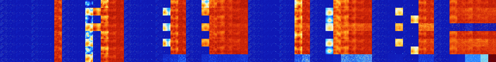

# B3568 (184320-184831)

<details>
    <summary>Initial Grid</summary>
    
</details>


<details>
    <summary>Initial Grid RLE</summary>

```
#C Exported from GoGoL (https://github.com/marrow16/gogol)
#C Wrap mode: Toroidal
#C Boundary mode: Dead
#C Step: 0
x = 100, y = 100, rule = B3568/S
29bo19bo7bo11bo5bo$11bo$74bo12bo$8bo5bo6bo6bo14b2o5bo26bo9bo7bo$22bo3bo
53bo$4bo11bo5b2o5bo10bo4bo17bo2bo$45bo27bo5bo6bo$o25bo19bo4bo7bo4bo31bo
$5bo5bo3bo8bo5bob2o15bo19bo12bo2bo$21bo16bo15bo$62bo30bo$5bo5bo6bo9bo2b
o$23bo6bo21bo32bo2bo$16bo9bo20bo26bo3bo11bo$35b2o31b2o9bo9bo$32bo6bo21b
o10bo19bo$50bo33bo$3bo27bo19bo22bo5bo$6bo68bo$23bo8bo37b2o7bo4bo$35bo
18bo$11bobo68bo$57b2o13bo8bo$44bo4bo5bo19bo19bo$4bo7bo2bo10bo34bo12bo5b
o$24bo5bo2bo13b2o$2bo6bobo27bo25bo19bo$o4bo10bo3bo64bo$11bo11bo13bo6bo
22bo5b2o6bo$4bo29bo11bo12bo8bo$14bo2bo10bo$8bo14bobo14bo3bo9bo11bo16bo$
16bo12bo3bo16bo9bo$37bobo5bo$26bo19bo35bo13bo$35bo3bo30bo10bo13bo$29bo
5bo10bo27bo$9bo31bo7bo16bo22bo$87bo$9bo9bo6bo6bo40b2o16bo$3bo43bo50bo$
9bo4bo51bo$6bo33bo12bo20bo$45bo13bo37bo$2b2o6bo40bo4bo$bo10bo3bo24bo2bo
14bo31bo6bo$67bo12b2o$17bo10bo8bo5bo24bo26b2o2bo$5bo13bo10bo18bo6bo17bo
$24bo2bo12bo26bo$13bo2bo22bo13bo24bo$36bo26bo2bo17bo$20bo$36bobo32bo15b
2o$o8bo19bo13bo46bo2bo$60bo11bo$5bo3bo47bo11bo6bo11bo$37bo38bo16bobo$
10bo19bo5bo2bo14bo$o4bo17bo12bo11bo19bo30bo$8bo12b2o8bo59bo$5bo12bo3b2o
17b2o13bo36bo$5bo3bo2bo41bo4bo$5b2o18bo2bo64bo$18bo32bo3b2o$31bo3bo4bo
11bo9bo6bo$18bo36bo15bo4b2o$20bo9bo15bo8bo6bobo6b2o13bo$4b2o11b2obo13bo
64bo$21b2o8bo3bo2bo11bo29bo5b2o$2bo9bo10bo6bo17bo$25bo30bo10bo12bo2bo
13bo$o3bo34bo15bo$o3bo5bo38bo12bo25bo$6b2o6bo12b2obo4bo13bobo17bo$49bo
4bo3bo3bo2bo7bo12bo$12bo8bo8bo8bo27bo21bobo$11b2o9bo3bo17bo22bo30bo$75b
o5bo$6bo29bo20bo23bo$8bo10bo35bo34b2o$11bo11bobo45bo11bobo11bo$6b2o29bo
27bo11bo$26bo33bo14bo4bo$4bo16bo21bo11b2o$4bo9bo30bo6bo23bo4bo14bo$18bo
7bo$o10bo14bo2bo27bobo21bobo$19bo38bo31bo6bobo$2bo22bo2bo4bo5bo25bo11bo
6bo8bo2bo$o57bo7bo7bo2bo21bo$15bo15bo2bobo41bo16bo$bo17bo19bo39bobo11bo
$11bo26bo9bo20bo5bo9bobo$27bo25bo17bo10bo$3bo38bo$3bo$45bo29bo14bo$21bo
6bo18bo48bobo$46bo3bo18bo12bo!
```
</details>
<details>
    <summary>Thumbnail</summary>

</details>
<table>
<tr>
    <td><a href="./184320%20S%20Heat%20Map%20Activity.png"></a><br>S (184320)<br>S@3</td>    <td><a href="./184321%20S0%20Heat%20Map%20Activity.png"></a><br>S0 (184321)<br>S@4</td>    <td><a href="./184322%20S1%20Heat%20Map%20Activity.png"></a><br>S1 (184322)<br>R@11,p2</td>    <td><a href="./184323%20S01%20Heat%20Map%20Activity.png"></a><br>S01 (184323)<br>R@15,p2</td>    <td><a href="./184324%20S2%20Heat%20Map%20Activity.png"></a><br>S2 (184324)<br>S@4</td>    <td><a href="./184325%20S02%20Heat%20Map%20Activity.png"></a><br>S02 (184325)<br>R@10,p4</td>    <td><a href="./184326%20S12%20Heat%20Map%20Activity.png"></a><br>S12 (184326)<br>S@52</td>    <td><a href="./184327%20S012%20Heat%20Map%20Activity.png"></a><br>S012 (184327)<br>G>1000</td>    <td><a href="./184328%20S3%20Heat%20Map%20Activity.png"></a><br>S3 (184328)<br>S@3</td>    <td><a href="./184329%20S03%20Heat%20Map%20Activity.png"></a><br>S03 (184329)<br>R@6,p2</td>    <td><a href="./184330%20S13%20Heat%20Map%20Activity.png"></a><br>S13 (184330)<br>R@18,p2</td>    <td><a href="./184331%20S013%20Heat%20Map%20Activity.png"></a><br>S013 (184331)<br>G>1000</td>    <td><a href="./184332%20S23%20Heat%20Map%20Activity.png"></a><br>S23 (184332)<br>S@15</td>    <td><a href="./184333%20S023%20Heat%20Map%20Activity.png"></a><br>S023 (184333)<br>G>1000</td>    <td><a href="./184334%20S123%20Heat%20Map%20Activity.png"></a><br>S123 (184334)<br>G>1000</td>    <td><a href="./184335%20S0123%20Heat%20Map%20Activity.png"></a><br>S0123 (184335)<br>G>1000</td>    <td><a href="./184336%20S4%20Heat%20Map%20Activity.png"></a><br>S4 (184336)<br>S@3</td>    <td><a href="./184337%20S04%20Heat%20Map%20Activity.png"></a><br>S04 (184337)<br>S@4</td>    <td><a href="./184338%20S14%20Heat%20Map%20Activity.png"></a><br>S14 (184338)<br>R@10,p2</td>    <td><a href="./184339%20S014%20Heat%20Map%20Activity.png"></a><br>S014 (184339)<br>R@21,p2</td>    <td><a href="./184340%20S24%20Heat%20Map%20Activity.png"></a><br>S24 (184340)<br>R@10,p4</td>    <td><a href="./184341%20S024%20Heat%20Map%20Activity.png"></a><br>S024 (184341)<br>R@19,p4</td>    <td><a href="./184342%20S124%20Heat%20Map%20Activity.png"></a><br>S124 (184342)<br>G>1000</td>    <td><a href="./184343%20S0124%20Heat%20Map%20Activity.png"></a><br>S0124 (184343)<br>G>1000</td>    <td><a href="./184344%20S34%20Heat%20Map%20Activity.png"></a><br>S34 (184344)<br>S@3</td>    <td><a href="./184345%20S034%20Heat%20Map%20Activity.png"></a><br>S034 (184345)<br>R@6,p2</td>    <td><a href="./184346%20S134%20Heat%20Map%20Activity.png"></a><br>S134 (184346)<br>G>1000</td>    <td><a href="./184347%20S0134%20Heat%20Map%20Activity.png"></a><br>S0134 (184347)<br>G>1000</td>    <td><a href="./184348%20S234%20Heat%20Map%20Activity.png"></a><br>S234 (184348)<br>G>1000</td>    <td><a href="./184349%20S0234%20Heat%20Map%20Activity.png"></a><br>S0234 (184349)<br>G>1000</td>    <td><a href="./184350%20S1234%20Heat%20Map%20Activity.png"></a><br>S1234 (184350)<br>G>1000</td>    <td><a href="./184351%20S01234%20Heat%20Map%20Activity.png"></a><br>S01234 (184351)<br>G>1000</td>    <td><a href="./184352%20S5%20Heat%20Map%20Activity.png"></a><br>S5 (184352)<br>S@3</td>    <td><a href="./184353%20S05%20Heat%20Map%20Activity.png"></a><br>S05 (184353)<br>S@4</td>    <td><a href="./184354%20S15%20Heat%20Map%20Activity.png"></a><br>S15 (184354)<br>R@15,p2</td>    <td><a href="./184355%20S015%20Heat%20Map%20Activity.png"></a><br>S015 (184355)<br>R@21,p2</td>    <td><a href="./184356%20S25%20Heat%20Map%20Activity.png"></a><br>S25 (184356)<br>S@4</td>    <td><a href="./184357%20S025%20Heat%20Map%20Activity.png"></a><br>S025 (184357)<br>R@10,p4</td>    <td><a href="./184358%20S125%20Heat%20Map%20Activity.png"></a><br>S125 (184358)<br>G>1000</td>    <td><a href="./184359%20S0125%20Heat%20Map%20Activity.png"></a><br>S0125 (184359)<br>G>1000</td>    <td><a href="./184360%20S35%20Heat%20Map%20Activity.png"></a><br>S35 (184360)<br>S@3</td>    <td><a href="./184361%20S035%20Heat%20Map%20Activity.png"></a><br>S035 (184361)<br>R@6,p2</td>    <td><a href="./184362%20S135%20Heat%20Map%20Activity.png"></a><br>S135 (184362)<br>R@38,p2</td>    <td><a href="./184363%20S0135%20Heat%20Map%20Activity.png"></a><br>S0135 (184363)<br>G>1000</td>    <td><a href="./184364%20S235%20Heat%20Map%20Activity.png"></a><br>S235 (184364)<br>G>1000</td>    <td><a href="./184365%20S0235%20Heat%20Map%20Activity.png"></a><br>S0235 (184365)<br>G>1000</td>    <td><a href="./184366%20S1235%20Heat%20Map%20Activity.png"></a><br>S1235 (184366)<br>G>1000</td>    <td><a href="./184367%20S01235%20Heat%20Map%20Activity.png"></a><br>S01235 (184367)<br>G>1000</td>    <td><a href="./184368%20S45%20Heat%20Map%20Activity.png"></a><br>S45 (184368)<br>S@3</td>    <td><a href="./184369%20S045%20Heat%20Map%20Activity.png"></a><br>S045 (184369)<br>S@4</td>    <td><a href="./184370%20S145%20Heat%20Map%20Activity.png"></a><br>S145 (184370)<br>R@11,p2</td>    <td><a href="./184371%20S0145%20Heat%20Map%20Activity.png"></a><br>S0145 (184371)<br>R@71,p2</td>    <td><a href="./184372%20S245%20Heat%20Map%20Activity.png"></a><br>S245 (184372)<br>R@10,p4</td>    <td><a href="./184373%20S0245%20Heat%20Map%20Activity.png"></a><br>S0245 (184373)<br>R@50,p12</td>    <td><a href="./184374%20S1245%20Heat%20Map%20Activity.png"></a><br>S1245 (184374)<br>G>1000</td>    <td><a href="./184375%20S01245%20Heat%20Map%20Activity.png"></a><br>S01245 (184375)<br>G>1000</td>    <td><a href="./184376%20S345%20Heat%20Map%20Activity.png"></a><br>S345 (184376)<br>S@3</td>    <td><a href="./184377%20S0345%20Heat%20Map%20Activity.png"></a><br>S0345 (184377)<br>R@6,p2</td>    <td><a href="./184378%20S1345%20Heat%20Map%20Activity.png"></a><br>S1345 (184378)<br>G>1000</td>    <td><a href="./184379%20S01345%20Heat%20Map%20Activity.png"></a><br>S01345 (184379)<br>G>1000</td>    <td><a href="./184380%20S2345%20Heat%20Map%20Activity.png"></a><br>S2345 (184380)<br>G>1000</td>    <td><a href="./184381%20S02345%20Heat%20Map%20Activity.png"></a><br>S02345 (184381)<br>G>1000</td>    <td><a href="./184382%20S12345%20Heat%20Map%20Activity.png"></a><br>S12345 (184382)<br>G>1000</td>    <td><a href="./184383%20S012345%20Heat%20Map%20Activity.png"></a><br>S012345 (184383)<br>G>1000</td></tr>
<tr>
    <td><a href="./184384%20S6%20Heat%20Map%20Activity.png"></a><br>S6 (184384)<br>S@3</td>    <td><a href="./184385%20S06%20Heat%20Map%20Activity.png"></a><br>S06 (184385)<br>S@4</td>    <td><a href="./184386%20S16%20Heat%20Map%20Activity.png"></a><br>S16 (184386)<br>R@11,p2</td>    <td><a href="./184387%20S016%20Heat%20Map%20Activity.png"></a><br>S016 (184387)<br>R@15,p2</td>    <td><a href="./184388%20S26%20Heat%20Map%20Activity.png"></a><br>S26 (184388)<br>S@4</td>    <td><a href="./184389%20S026%20Heat%20Map%20Activity.png"></a><br>S026 (184389)<br>R@10,p4</td>    <td><a href="./184390%20S126%20Heat%20Map%20Activity.png"></a><br>S126 (184390)<br>R@35,p12</td>    <td><a href="./184391%20S0126%20Heat%20Map%20Activity.png"></a><br>S0126 (184391)<br>G>1000</td>    <td><a href="./184392%20S36%20Heat%20Map%20Activity.png"></a><br>S36 (184392)<br>S@3</td>    <td><a href="./184393%20S036%20Heat%20Map%20Activity.png"></a><br>S036 (184393)<br>R@6,p2</td>    <td><a href="./184394%20S136%20Heat%20Map%20Activity.png"></a><br>S136 (184394)<br>R@30,p2</td>    <td><a href="./184395%20S0136%20Heat%20Map%20Activity.png"></a><br>S0136 (184395)<br>G>1000</td>    <td><a href="./184396%20S236%20Heat%20Map%20Activity.png"></a><br>S236 (184396)<br>G>1000</td>    <td><a href="./184397%20S0236%20Heat%20Map%20Activity.png"></a><br>S0236 (184397)<br>G>1000</td>    <td><a href="./184398%20S1236%20Heat%20Map%20Activity.png"></a><br>S1236 (184398)<br>G>1000</td>    <td><a href="./184399%20S01236%20Heat%20Map%20Activity.png"></a><br>S01236 (184399)<br>G>1000</td>    <td><a href="./184400%20S46%20Heat%20Map%20Activity.png"></a><br>S46 (184400)<br>S@3</td>    <td><a href="./184401%20S046%20Heat%20Map%20Activity.png"></a><br>S046 (184401)<br>S@4</td>    <td><a href="./184402%20S146%20Heat%20Map%20Activity.png"></a><br>S146 (184402)<br>R@10,p2</td>    <td><a href="./184403%20S0146%20Heat%20Map%20Activity.png"></a><br>S0146 (184403)<br>R@16,p2</td>    <td><a href="./184404%20S246%20Heat%20Map%20Activity.png"></a><br>S246 (184404)<br>R@10,p4</td>    <td><a href="./184405%20S0246%20Heat%20Map%20Activity.png"></a><br>S0246 (184405)<br>G>1000</td>    <td><a href="./184406%20S1246%20Heat%20Map%20Activity.png"></a><br>S1246 (184406)<br>G>1000</td>    <td><a href="./184407%20S01246%20Heat%20Map%20Activity.png"></a><br>S01246 (184407)<br>G>1000</td>    <td><a href="./184408%20S346%20Heat%20Map%20Activity.png"></a><br>S346 (184408)<br>S@3</td>    <td><a href="./184409%20S0346%20Heat%20Map%20Activity.png"></a><br>S0346 (184409)<br>R@6,p2</td>    <td><a href="./184410%20S1346%20Heat%20Map%20Activity.png"></a><br>S1346 (184410)<br>G>1000</td>    <td><a href="./184411%20S01346%20Heat%20Map%20Activity.png"></a><br>S01346 (184411)<br>G>1000</td>    <td><a href="./184412%20S2346%20Heat%20Map%20Activity.png"></a><br>S2346 (184412)<br>G>1000</td>    <td><a href="./184413%20S02346%20Heat%20Map%20Activity.png"></a><br>S02346 (184413)<br>G>1000</td>    <td><a href="./184414%20S12346%20Heat%20Map%20Activity.png"></a><br>S12346 (184414)<br>G>1000</td>    <td><a href="./184415%20S012346%20Heat%20Map%20Activity.png"></a><br>S012346 (184415)<br>G>1000</td>    <td><a href="./184416%20S56%20Heat%20Map%20Activity.png"></a><br>S56 (184416)<br>S@3</td>    <td><a href="./184417%20S056%20Heat%20Map%20Activity.png"></a><br>S056 (184417)<br>S@4</td>    <td><a href="./184418%20S156%20Heat%20Map%20Activity.png"></a><br>S156 (184418)<br>R@15,p2</td>    <td><a href="./184419%20S0156%20Heat%20Map%20Activity.png"></a><br>S0156 (184419)<br>R@16,p2</td>    <td><a href="./184420%20S256%20Heat%20Map%20Activity.png"></a><br>S256 (184420)<br>S@4</td>    <td><a href="./184421%20S0256%20Heat%20Map%20Activity.png"></a><br>S0256 (184421)<br>R@10,p4</td>    <td><a href="./184422%20S1256%20Heat%20Map%20Activity.png"></a><br>S1256 (184422)<br>G>1000</td>    <td><a href="./184423%20S01256%20Heat%20Map%20Activity.png"></a><br>S01256 (184423)<br>G>1000</td>    <td><a href="./184424%20S356%20Heat%20Map%20Activity.png"></a><br>S356 (184424)<br>S@3</td>    <td><a href="./184425%20S0356%20Heat%20Map%20Activity.png"></a><br>S0356 (184425)<br>R@6,p2</td>    <td><a href="./184426%20S1356%20Heat%20Map%20Activity.png"></a><br>S1356 (184426)<br>G>1000</td>    <td><a href="./184427%20S01356%20Heat%20Map%20Activity.png"></a><br>S01356 (184427)<br>G>1000</td>    <td><a href="./184428%20S2356%20Heat%20Map%20Activity.png"></a><br>S2356 (184428)<br>G>1000</td>    <td><a href="./184429%20S02356%20Heat%20Map%20Activity.png"></a><br>S02356 (184429)<br>G>1000</td>    <td><a href="./184430%20S12356%20Heat%20Map%20Activity.png"></a><br>S12356 (184430)<br>G>1000</td>    <td><a href="./184431%20S012356%20Heat%20Map%20Activity.png"></a><br>S012356 (184431)<br>G>1000</td>    <td><a href="./184432%20S456%20Heat%20Map%20Activity.png"></a><br>S456 (184432)<br>S@3</td>    <td><a href="./184433%20S0456%20Heat%20Map%20Activity.png"></a><br>S0456 (184433)<br>S@4</td>    <td><a href="./184434%20S1456%20Heat%20Map%20Activity.png"></a><br>S1456 (184434)<br>R@27,p2</td>    <td><a href="./184435%20S01456%20Heat%20Map%20Activity.png"></a><br>S01456 (184435)<br>G>1000</td>    <td><a href="./184436%20S2456%20Heat%20Map%20Activity.png"></a><br>S2456 (184436)<br>R@10,p4</td>    <td><a href="./184437%20S02456%20Heat%20Map%20Activity.png"></a><br>S02456 (184437)<br>R@17,p4</td>    <td><a href="./184438%20S12456%20Heat%20Map%20Activity.png"></a><br>S12456 (184438)<br>G>1000</td>    <td><a href="./184439%20S012456%20Heat%20Map%20Activity.png"></a><br>S012456 (184439)<br>G>1000</td>    <td><a href="./184440%20S3456%20Heat%20Map%20Activity.png"></a><br>S3456 (184440)<br>S@3</td>    <td><a href="./184441%20S03456%20Heat%20Map%20Activity.png"></a><br>S03456 (184441)<br>R@6,p2</td>    <td><a href="./184442%20S13456%20Heat%20Map%20Activity.png"></a><br>S13456 (184442)<br>G>1000</td>    <td><a href="./184443%20S013456%20Heat%20Map%20Activity.png"></a><br>S013456 (184443)<br>G>1000</td>    <td><a href="./184444%20S23456%20Heat%20Map%20Activity.png"></a><br>S23456 (184444)<br>G>1000</td>    <td><a href="./184445%20S023456%20Heat%20Map%20Activity.png"></a><br>S023456 (184445)<br>G>1000</td>    <td><a href="./184446%20S123456%20Heat%20Map%20Activity.png"></a><br>S123456 (184446)<br>G>1000</td>    <td><a href="./184447%20S0123456%20Heat%20Map%20Activity.png"></a><br>S0123456 (184447)<br>G>1000</td></tr>
<tr>
    <td><a href="./184448%20S7%20Heat%20Map%20Activity.png"></a><br>S7 (184448)<br>S@3</td>    <td><a href="./184449%20S07%20Heat%20Map%20Activity.png"></a><br>S07 (184449)<br>S@4</td>    <td><a href="./184450%20S17%20Heat%20Map%20Activity.png"></a><br>S17 (184450)<br>R@11,p2</td>    <td><a href="./184451%20S017%20Heat%20Map%20Activity.png"></a><br>S017 (184451)<br>R@23,p2</td>    <td><a href="./184452%20S27%20Heat%20Map%20Activity.png"></a><br>S27 (184452)<br>S@4</td>    <td><a href="./184453%20S027%20Heat%20Map%20Activity.png"></a><br>S027 (184453)<br>R@10,p4</td>    <td><a href="./184454%20S127%20Heat%20Map%20Activity.png"></a><br>S127 (184454)<br>S@52</td>    <td><a href="./184455%20S0127%20Heat%20Map%20Activity.png"></a><br>S0127 (184455)<br>G>1000</td>    <td><a href="./184456%20S37%20Heat%20Map%20Activity.png"></a><br>S37 (184456)<br>S@3</td>    <td><a href="./184457%20S037%20Heat%20Map%20Activity.png"></a><br>S037 (184457)<br>R@6,p2</td>    <td><a href="./184458%20S137%20Heat%20Map%20Activity.png"></a><br>S137 (184458)<br>R@18,p2</td>    <td><a href="./184459%20S0137%20Heat%20Map%20Activity.png"></a><br>S0137 (184459)<br>G>1000</td>    <td><a href="./184460%20S237%20Heat%20Map%20Activity.png"></a><br>S237 (184460)<br>S@15</td>    <td><a href="./184461%20S0237%20Heat%20Map%20Activity.png"></a><br>S0237 (184461)<br>G>1000</td>    <td><a href="./184462%20S1237%20Heat%20Map%20Activity.png"></a><br>S1237 (184462)<br>G>1000</td>    <td><a href="./184463%20S01237%20Heat%20Map%20Activity.png"></a><br>S01237 (184463)<br>G>1000</td>    <td><a href="./184464%20S47%20Heat%20Map%20Activity.png"></a><br>S47 (184464)<br>S@3</td>    <td><a href="./184465%20S047%20Heat%20Map%20Activity.png"></a><br>S047 (184465)<br>S@4</td>    <td><a href="./184466%20S147%20Heat%20Map%20Activity.png"></a><br>S147 (184466)<br>R@10,p2</td>    <td><a href="./184467%20S0147%20Heat%20Map%20Activity.png"></a><br>S0147 (184467)<br>R@25,p2</td>    <td><a href="./184468%20S247%20Heat%20Map%20Activity.png"></a><br>S247 (184468)<br>R@10,p4</td>    <td><a href="./184469%20S0247%20Heat%20Map%20Activity.png"></a><br>S0247 (184469)<br>R@20,p4</td>    <td><a href="./184470%20S1247%20Heat%20Map%20Activity.png"></a><br>S1247 (184470)<br>G>1000</td>    <td><a href="./184471%20S01247%20Heat%20Map%20Activity.png"></a><br>S01247 (184471)<br>G>1000</td>    <td><a href="./184472%20S347%20Heat%20Map%20Activity.png"></a><br>S347 (184472)<br>S@3</td>    <td><a href="./184473%20S0347%20Heat%20Map%20Activity.png"></a><br>S0347 (184473)<br>R@6,p2</td>    <td><a href="./184474%20S1347%20Heat%20Map%20Activity.png"></a><br>S1347 (184474)<br>R@49,p2</td>    <td><a href="./184475%20S01347%20Heat%20Map%20Activity.png"></a><br>S01347 (184475)<br>G>1000</td>    <td><a href="./184476%20S2347%20Heat%20Map%20Activity.png"></a><br>S2347 (184476)<br>G>1000</td>    <td><a href="./184477%20S02347%20Heat%20Map%20Activity.png"></a><br>S02347 (184477)<br>G>1000</td>    <td><a href="./184478%20S12347%20Heat%20Map%20Activity.png"></a><br>S12347 (184478)<br>G>1000</td>    <td><a href="./184479%20S012347%20Heat%20Map%20Activity.png"></a><br>S012347 (184479)<br>G>1000</td>    <td><a href="./184480%20S57%20Heat%20Map%20Activity.png"></a><br>S57 (184480)<br>S@3</td>    <td><a href="./184481%20S057%20Heat%20Map%20Activity.png"></a><br>S057 (184481)<br>S@4</td>    <td><a href="./184482%20S157%20Heat%20Map%20Activity.png"></a><br>S157 (184482)<br>R@15,p2</td>    <td><a href="./184483%20S0157%20Heat%20Map%20Activity.png"></a><br>S0157 (184483)<br>R@21,p2</td>    <td><a href="./184484%20S257%20Heat%20Map%20Activity.png"></a><br>S257 (184484)<br>S@4</td>    <td><a href="./184485%20S0257%20Heat%20Map%20Activity.png"></a><br>S0257 (184485)<br>R@10,p4</td>    <td><a href="./184486%20S1257%20Heat%20Map%20Activity.png"></a><br>S1257 (184486)<br>G>1000</td>    <td><a href="./184487%20S01257%20Heat%20Map%20Activity.png"></a><br>S01257 (184487)<br>G>1000</td>    <td><a href="./184488%20S357%20Heat%20Map%20Activity.png"></a><br>S357 (184488)<br>S@3</td>    <td><a href="./184489%20S0357%20Heat%20Map%20Activity.png"></a><br>S0357 (184489)<br>R@6,p2</td>    <td><a href="./184490%20S1357%20Heat%20Map%20Activity.png"></a><br>S1357 (184490)<br>G>1000</td>    <td><a href="./184491%20S01357%20Heat%20Map%20Activity.png"></a><br>S01357 (184491)<br>G>1000</td>    <td><a href="./184492%20S2357%20Heat%20Map%20Activity.png"></a><br>S2357 (184492)<br>G>1000</td>    <td><a href="./184493%20S02357%20Heat%20Map%20Activity.png"></a><br>S02357 (184493)<br>G>1000</td>    <td><a href="./184494%20S12357%20Heat%20Map%20Activity.png"></a><br>S12357 (184494)<br>G>1000</td>    <td><a href="./184495%20S012357%20Heat%20Map%20Activity.png"></a><br>S012357 (184495)<br>G>1000</td>    <td><a href="./184496%20S457%20Heat%20Map%20Activity.png"></a><br>S457 (184496)<br>S@3</td>    <td><a href="./184497%20S0457%20Heat%20Map%20Activity.png"></a><br>S0457 (184497)<br>S@4</td>    <td><a href="./184498%20S1457%20Heat%20Map%20Activity.png"></a><br>S1457 (184498)<br>R@11,p2</td>    <td><a href="./184499%20S01457%20Heat%20Map%20Activity.png"></a><br>S01457 (184499)<br>R@135,p2</td>    <td><a href="./184500%20S2457%20Heat%20Map%20Activity.png"></a><br>S2457 (184500)<br>R@10,p4</td>    <td><a href="./184501%20S02457%20Heat%20Map%20Activity.png"></a><br>S02457 (184501)<br>G>1000</td>    <td><a href="./184502%20S12457%20Heat%20Map%20Activity.png"></a><br>S12457 (184502)<br>G>1000</td>    <td><a href="./184503%20S012457%20Heat%20Map%20Activity.png"></a><br>S012457 (184503)<br>G>1000</td>    <td><a href="./184504%20S3457%20Heat%20Map%20Activity.png"></a><br>S3457 (184504)<br>S@3</td>    <td><a href="./184505%20S03457%20Heat%20Map%20Activity.png"></a><br>S03457 (184505)<br>R@6,p2</td>    <td><a href="./184506%20S13457%20Heat%20Map%20Activity.png"></a><br>S13457 (184506)<br>G>1000</td>    <td><a href="./184507%20S013457%20Heat%20Map%20Activity.png"></a><br>S013457 (184507)<br>G>1000</td>    <td><a href="./184508%20S23457%20Heat%20Map%20Activity.png"></a><br>S23457 (184508)<br>G>1000</td>    <td><a href="./184509%20S023457%20Heat%20Map%20Activity.png"></a><br>S023457 (184509)<br>G>1000</td>    <td><a href="./184510%20S123457%20Heat%20Map%20Activity.png"></a><br>S123457 (184510)<br>G>1000</td>    <td><a href="./184511%20S0123457%20Heat%20Map%20Activity.png"></a><br>S0123457 (184511)<br>G>1000</td></tr>
<tr>
    <td><a href="./184512%20S67%20Heat%20Map%20Activity.png"></a><br>S67 (184512)<br>S@3</td>    <td><a href="./184513%20S067%20Heat%20Map%20Activity.png"></a><br>S067 (184513)<br>S@4</td>    <td><a href="./184514%20S167%20Heat%20Map%20Activity.png"></a><br>S167 (184514)<br>R@11,p2</td>    <td><a href="./184515%20S0167%20Heat%20Map%20Activity.png"></a><br>S0167 (184515)<br>R@21,p2</td>    <td><a href="./184516%20S267%20Heat%20Map%20Activity.png"></a><br>S267 (184516)<br>S@4</td>    <td><a href="./184517%20S0267%20Heat%20Map%20Activity.png"></a><br>S0267 (184517)<br>R@10,p4</td>    <td><a href="./184518%20S1267%20Heat%20Map%20Activity.png"></a><br>S1267 (184518)<br>R@35,p12</td>    <td><a href="./184519%20S01267%20Heat%20Map%20Activity.png"></a><br>S01267 (184519)<br>G>1000</td>    <td><a href="./184520%20S367%20Heat%20Map%20Activity.png"></a><br>S367 (184520)<br>S@3</td>    <td><a href="./184521%20S0367%20Heat%20Map%20Activity.png"></a><br>S0367 (184521)<br>R@6,p2</td>    <td><a href="./184522%20S1367%20Heat%20Map%20Activity.png"></a><br>S1367 (184522)<br>R@30,p2</td>    <td><a href="./184523%20S01367%20Heat%20Map%20Activity.png"></a><br>S01367 (184523)<br>G>1000</td>    <td><a href="./184524%20S2367%20Heat%20Map%20Activity.png"></a><br>S2367 (184524)<br>G>1000</td>    <td><a href="./184525%20S02367%20Heat%20Map%20Activity.png"></a><br>S02367 (184525)<br>G>1000</td>    <td><a href="./184526%20S12367%20Heat%20Map%20Activity.png"></a><br>S12367 (184526)<br>G>1000</td>    <td><a href="./184527%20S012367%20Heat%20Map%20Activity.png"></a><br>S012367 (184527)<br>G>1000</td>    <td><a href="./184528%20S467%20Heat%20Map%20Activity.png"></a><br>S467 (184528)<br>S@3</td>    <td><a href="./184529%20S0467%20Heat%20Map%20Activity.png"></a><br>S0467 (184529)<br>S@4</td>    <td><a href="./184530%20S1467%20Heat%20Map%20Activity.png"></a><br>S1467 (184530)<br>R@10,p2</td>    <td><a href="./184531%20S01467%20Heat%20Map%20Activity.png"></a><br>S01467 (184531)<br>R@28,p2</td>    <td><a href="./184532%20S2467%20Heat%20Map%20Activity.png"></a><br>S2467 (184532)<br>R@10,p4</td>    <td><a href="./184533%20S02467%20Heat%20Map%20Activity.png"></a><br>S02467 (184533)<br>G>1000</td>    <td><a href="./184534%20S12467%20Heat%20Map%20Activity.png"></a><br>S12467 (184534)<br>G>1000</td>    <td><a href="./184535%20S012467%20Heat%20Map%20Activity.png"></a><br>S012467 (184535)<br>G>1000</td>    <td><a href="./184536%20S3467%20Heat%20Map%20Activity.png"></a><br>S3467 (184536)<br>S@3</td>    <td><a href="./184537%20S03467%20Heat%20Map%20Activity.png"></a><br>S03467 (184537)<br>R@6,p2</td>    <td><a href="./184538%20S13467%20Heat%20Map%20Activity.png"></a><br>S13467 (184538)<br>G>1000</td>    <td><a href="./184539%20S013467%20Heat%20Map%20Activity.png"></a><br>S013467 (184539)<br>G>1000</td>    <td><a href="./184540%20S23467%20Heat%20Map%20Activity.png"></a><br>S23467 (184540)<br>G>1000</td>    <td><a href="./184541%20S023467%20Heat%20Map%20Activity.png"></a><br>S023467 (184541)<br>G>1000</td>    <td><a href="./184542%20S123467%20Heat%20Map%20Activity.png"></a><br>S123467 (184542)<br>G>1000</td>    <td><a href="./184543%20S0123467%20Heat%20Map%20Activity.png"></a><br>S0123467 (184543)<br>G>1000</td>    <td><a href="./184544%20S567%20Heat%20Map%20Activity.png"></a><br>S567 (184544)<br>S@3</td>    <td><a href="./184545%20S0567%20Heat%20Map%20Activity.png"></a><br>S0567 (184545)<br>S@4</td>    <td><a href="./184546%20S1567%20Heat%20Map%20Activity.png"></a><br>S1567 (184546)<br>R@15,p2</td>    <td><a href="./184547%20S01567%20Heat%20Map%20Activity.png"></a><br>S01567 (184547)<br>R@16,p2</td>    <td><a href="./184548%20S2567%20Heat%20Map%20Activity.png"></a><br>S2567 (184548)<br>S@4</td>    <td><a href="./184549%20S02567%20Heat%20Map%20Activity.png"></a><br>S02567 (184549)<br>R@10,p4</td>    <td><a href="./184550%20S12567%20Heat%20Map%20Activity.png"></a><br>S12567 (184550)<br>G>1000</td>    <td><a href="./184551%20S012567%20Heat%20Map%20Activity.png"></a><br>S012567 (184551)<br>G>1000</td>    <td><a href="./184552%20S3567%20Heat%20Map%20Activity.png"></a><br>S3567 (184552)<br>S@3</td>    <td><a href="./184553%20S03567%20Heat%20Map%20Activity.png"></a><br>S03567 (184553)<br>R@6,p2</td>    <td><a href="./184554%20S13567%20Heat%20Map%20Activity.png"></a><br>S13567 (184554)<br>G>1000</td>    <td><a href="./184555%20S013567%20Heat%20Map%20Activity.png"></a><br>S013567 (184555)<br>G>1000</td>    <td><a href="./184556%20S23567%20Heat%20Map%20Activity.png"></a><br>S23567 (184556)<br>G>1000</td>    <td><a href="./184557%20S023567%20Heat%20Map%20Activity.png"></a><br>S023567 (184557)<br>G>1000</td>    <td><a href="./184558%20S123567%20Heat%20Map%20Activity.png"></a><br>S123567 (184558)<br>G>1000</td>    <td><a href="./184559%20S0123567%20Heat%20Map%20Activity.png"></a><br>S0123567 (184559)<br>G>1000</td>    <td><a href="./184560%20S4567%20Heat%20Map%20Activity.png"></a><br>S4567 (184560)<br>S@3</td>    <td><a href="./184561%20S04567%20Heat%20Map%20Activity.png"></a><br>S04567 (184561)<br>S@4</td>    <td><a href="./184562%20S14567%20Heat%20Map%20Activity.png"></a><br>S14567 (184562)<br>R@23,p2</td>    <td><a href="./184563%20S014567%20Heat%20Map%20Activity.png"></a><br>S014567 (184563)<br>G>1000</td>    <td><a href="./184564%20S24567%20Heat%20Map%20Activity.png"></a><br>S24567 (184564)<br>R@10,p4</td>    <td><a href="./184565%20S024567%20Heat%20Map%20Activity.png"></a><br>S024567 (184565)<br>R@17,p4</td>    <td><a href="./184566%20S124567%20Heat%20Map%20Activity.png"></a><br>S124567 (184566)<br>G>1000</td>    <td><a href="./184567%20S0124567%20Heat%20Map%20Activity.png"></a><br>S0124567 (184567)<br>G>1000</td>    <td><a href="./184568%20S34567%20Heat%20Map%20Activity.png"></a><br>S34567 (184568)<br>S@3</td>    <td><a href="./184569%20S034567%20Heat%20Map%20Activity.png"></a><br>S034567 (184569)<br>R@6,p2</td>    <td><a href="./184570%20S134567%20Heat%20Map%20Activity.png"></a><br>S134567 (184570)<br>R@994,p840</td>    <td><a href="./184571%20S0134567%20Heat%20Map%20Activity.png"></a><br>S0134567 (184571)<br>G>1000</td>    <td><a href="./184572%20S234567%20Heat%20Map%20Activity.png"></a><br>S234567 (184572)<br>R@178,p36</td>    <td><a href="./184573%20S0234567%20Heat%20Map%20Activity.png"></a><br>S0234567 (184573)<br>G>1000</td>    <td><a href="./184574%20S1234567%20Heat%20Map%20Activity.png"></a><br>S1234567 (184574)<br>R@293,p180</td>    <td><a href="./184575%20S01234567%20Heat%20Map%20Activity.png"></a><br>S01234567 (184575)<br>G>1000</td></tr>
<tr>
    <td><a href="./184576%20S8%20Heat%20Map%20Activity.png"></a><br>S8 (184576)<br>S@3</td>    <td><a href="./184577%20S08%20Heat%20Map%20Activity.png"></a><br>S08 (184577)<br>S@4</td>    <td><a href="./184578%20S18%20Heat%20Map%20Activity.png"></a><br>S18 (184578)<br>R@11,p2</td>    <td><a href="./184579%20S018%20Heat%20Map%20Activity.png"></a><br>S018 (184579)<br>R@15,p2</td>    <td><a href="./184580%20S28%20Heat%20Map%20Activity.png"></a><br>S28 (184580)<br>S@4</td>    <td><a href="./184581%20S028%20Heat%20Map%20Activity.png"></a><br>S028 (184581)<br>R@10,p4</td>    <td><a href="./184582%20S128%20Heat%20Map%20Activity.png"></a><br>S128 (184582)<br>S@52</td>    <td><a href="./184583%20S0128%20Heat%20Map%20Activity.png"></a><br>S0128 (184583)<br>G>1000</td>    <td><a href="./184584%20S38%20Heat%20Map%20Activity.png"></a><br>S38 (184584)<br>S@3</td>    <td><a href="./184585%20S038%20Heat%20Map%20Activity.png"></a><br>S038 (184585)<br>R@6,p2</td>    <td><a href="./184586%20S138%20Heat%20Map%20Activity.png"></a><br>S138 (184586)<br>R@18,p2</td>    <td><a href="./184587%20S0138%20Heat%20Map%20Activity.png"></a><br>S0138 (184587)<br>G>1000</td>    <td><a href="./184588%20S238%20Heat%20Map%20Activity.png"></a><br>S238 (184588)<br>S@12</td>    <td><a href="./184589%20S0238%20Heat%20Map%20Activity.png"></a><br>S0238 (184589)<br>G>1000</td>    <td><a href="./184590%20S1238%20Heat%20Map%20Activity.png"></a><br>S1238 (184590)<br>G>1000</td>    <td><a href="./184591%20S01238%20Heat%20Map%20Activity.png"></a><br>S01238 (184591)<br>G>1000</td>    <td><a href="./184592%20S48%20Heat%20Map%20Activity.png"></a><br>S48 (184592)<br>S@3</td>    <td><a href="./184593%20S048%20Heat%20Map%20Activity.png"></a><br>S048 (184593)<br>S@4</td>    <td><a href="./184594%20S148%20Heat%20Map%20Activity.png"></a><br>S148 (184594)<br>R@10,p2</td>    <td><a href="./184595%20S0148%20Heat%20Map%20Activity.png"></a><br>S0148 (184595)<br>R@21,p2</td>    <td><a href="./184596%20S248%20Heat%20Map%20Activity.png"></a><br>S248 (184596)<br>R@10,p4</td>    <td><a href="./184597%20S0248%20Heat%20Map%20Activity.png"></a><br>S0248 (184597)<br>R@19,p4</td>    <td><a href="./184598%20S1248%20Heat%20Map%20Activity.png"></a><br>S1248 (184598)<br>G>1000</td>    <td><a href="./184599%20S01248%20Heat%20Map%20Activity.png"></a><br>S01248 (184599)<br>G>1000</td>    <td><a href="./184600%20S348%20Heat%20Map%20Activity.png"></a><br>S348 (184600)<br>S@3</td>    <td><a href="./184601%20S0348%20Heat%20Map%20Activity.png"></a><br>S0348 (184601)<br>R@6,p2</td>    <td><a href="./184602%20S1348%20Heat%20Map%20Activity.png"></a><br>S1348 (184602)<br>R@30,p10</td>    <td><a href="./184603%20S01348%20Heat%20Map%20Activity.png"></a><br>S01348 (184603)<br>G>1000</td>    <td><a href="./184604%20S2348%20Heat%20Map%20Activity.png"></a><br>S2348 (184604)<br>G>1000</td>    <td><a href="./184605%20S02348%20Heat%20Map%20Activity.png"></a><br>S02348 (184605)<br>G>1000</td>    <td><a href="./184606%20S12348%20Heat%20Map%20Activity.png"></a><br>S12348 (184606)<br>G>1000</td>    <td><a href="./184607%20S012348%20Heat%20Map%20Activity.png"></a><br>S012348 (184607)<br>G>1000</td>    <td><a href="./184608%20S58%20Heat%20Map%20Activity.png"></a><br>S58 (184608)<br>S@3</td>    <td><a href="./184609%20S058%20Heat%20Map%20Activity.png"></a><br>S058 (184609)<br>S@4</td>    <td><a href="./184610%20S158%20Heat%20Map%20Activity.png"></a><br>S158 (184610)<br>R@15,p2</td>    <td><a href="./184611%20S0158%20Heat%20Map%20Activity.png"></a><br>S0158 (184611)<br>R@21,p2</td>    <td><a href="./184612%20S258%20Heat%20Map%20Activity.png"></a><br>S258 (184612)<br>S@4</td>    <td><a href="./184613%20S0258%20Heat%20Map%20Activity.png"></a><br>S0258 (184613)<br>R@10,p4</td>    <td><a href="./184614%20S1258%20Heat%20Map%20Activity.png"></a><br>S1258 (184614)<br>G>1000</td>    <td><a href="./184615%20S01258%20Heat%20Map%20Activity.png"></a><br>S01258 (184615)<br>G>1000</td>    <td><a href="./184616%20S358%20Heat%20Map%20Activity.png"></a><br>S358 (184616)<br>S@3</td>    <td><a href="./184617%20S0358%20Heat%20Map%20Activity.png"></a><br>S0358 (184617)<br>R@6,p2</td>    <td><a href="./184618%20S1358%20Heat%20Map%20Activity.png"></a><br>S1358 (184618)<br>R@38,p2</td>    <td><a href="./184619%20S01358%20Heat%20Map%20Activity.png"></a><br>S01358 (184619)<br>G>1000</td>    <td><a href="./184620%20S2358%20Heat%20Map%20Activity.png"></a><br>S2358 (184620)<br>G>1000</td>    <td><a href="./184621%20S02358%20Heat%20Map%20Activity.png"></a><br>S02358 (184621)<br>G>1000</td>    <td><a href="./184622%20S12358%20Heat%20Map%20Activity.png"></a><br>S12358 (184622)<br>G>1000</td>    <td><a href="./184623%20S012358%20Heat%20Map%20Activity.png"></a><br>S012358 (184623)<br>G>1000</td>    <td><a href="./184624%20S458%20Heat%20Map%20Activity.png"></a><br>S458 (184624)<br>S@3</td>    <td><a href="./184625%20S0458%20Heat%20Map%20Activity.png"></a><br>S0458 (184625)<br>S@4</td>    <td><a href="./184626%20S1458%20Heat%20Map%20Activity.png"></a><br>S1458 (184626)<br>R@11,p2</td>    <td><a href="./184627%20S01458%20Heat%20Map%20Activity.png"></a><br>S01458 (184627)<br>R@125,p2</td>    <td><a href="./184628%20S2458%20Heat%20Map%20Activity.png"></a><br>S2458 (184628)<br>R@10,p4</td>    <td><a href="./184629%20S02458%20Heat%20Map%20Activity.png"></a><br>S02458 (184629)<br>R@46,p12</td>    <td><a href="./184630%20S12458%20Heat%20Map%20Activity.png"></a><br>S12458 (184630)<br>G>1000</td>    <td><a href="./184631%20S012458%20Heat%20Map%20Activity.png"></a><br>S012458 (184631)<br>G>1000</td>    <td><a href="./184632%20S3458%20Heat%20Map%20Activity.png"></a><br>S3458 (184632)<br>S@3</td>    <td><a href="./184633%20S03458%20Heat%20Map%20Activity.png"></a><br>S03458 (184633)<br>R@6,p2</td>    <td><a href="./184634%20S13458%20Heat%20Map%20Activity.png"></a><br>S13458 (184634)<br>G>1000</td>    <td><a href="./184635%20S013458%20Heat%20Map%20Activity.png"></a><br>S013458 (184635)<br>G>1000</td>    <td><a href="./184636%20S23458%20Heat%20Map%20Activity.png"></a><br>S23458 (184636)<br>G>1000</td>    <td><a href="./184637%20S023458%20Heat%20Map%20Activity.png"></a><br>S023458 (184637)<br>G>1000</td>    <td><a href="./184638%20S123458%20Heat%20Map%20Activity.png"></a><br>S123458 (184638)<br>G>1000</td>    <td><a href="./184639%20S0123458%20Heat%20Map%20Activity.png"></a><br>S0123458 (184639)<br>G>1000</td></tr>
<tr>
    <td><a href="./184640%20S68%20Heat%20Map%20Activity.png"></a><br>S68 (184640)<br>S@3</td>    <td><a href="./184641%20S068%20Heat%20Map%20Activity.png"></a><br>S068 (184641)<br>S@4</td>    <td><a href="./184642%20S168%20Heat%20Map%20Activity.png"></a><br>S168 (184642)<br>R@11,p2</td>    <td><a href="./184643%20S0168%20Heat%20Map%20Activity.png"></a><br>S0168 (184643)<br>R@15,p2</td>    <td><a href="./184644%20S268%20Heat%20Map%20Activity.png"></a><br>S268 (184644)<br>S@4</td>    <td><a href="./184645%20S0268%20Heat%20Map%20Activity.png"></a><br>S0268 (184645)<br>R@10,p4</td>    <td><a href="./184646%20S1268%20Heat%20Map%20Activity.png"></a><br>S1268 (184646)<br>R@35,p12</td>    <td><a href="./184647%20S01268%20Heat%20Map%20Activity.png"></a><br>S01268 (184647)<br>G>1000</td>    <td><a href="./184648%20S368%20Heat%20Map%20Activity.png"></a><br>S368 (184648)<br>S@3</td>    <td><a href="./184649%20S0368%20Heat%20Map%20Activity.png"></a><br>S0368 (184649)<br>R@6,p2</td>    <td><a href="./184650%20S1368%20Heat%20Map%20Activity.png"></a><br>S1368 (184650)<br>R@30,p2</td>    <td><a href="./184651%20S01368%20Heat%20Map%20Activity.png"></a><br>S01368 (184651)<br>G>1000</td>    <td><a href="./184652%20S2368%20Heat%20Map%20Activity.png"></a><br>S2368 (184652)<br>S@15</td>    <td><a href="./184653%20S02368%20Heat%20Map%20Activity.png"></a><br>S02368 (184653)<br>G>1000</td>    <td><a href="./184654%20S12368%20Heat%20Map%20Activity.png"></a><br>S12368 (184654)<br>G>1000</td>    <td><a href="./184655%20S012368%20Heat%20Map%20Activity.png"></a><br>S012368 (184655)<br>G>1000</td>    <td><a href="./184656%20S468%20Heat%20Map%20Activity.png"></a><br>S468 (184656)<br>S@3</td>    <td><a href="./184657%20S0468%20Heat%20Map%20Activity.png"></a><br>S0468 (184657)<br>S@4</td>    <td><a href="./184658%20S1468%20Heat%20Map%20Activity.png"></a><br>S1468 (184658)<br>R@10,p2</td>    <td><a href="./184659%20S01468%20Heat%20Map%20Activity.png"></a><br>S01468 (184659)<br>R@16,p2</td>    <td><a href="./184660%20S2468%20Heat%20Map%20Activity.png"></a><br>S2468 (184660)<br>R@10,p4</td>    <td><a href="./184661%20S02468%20Heat%20Map%20Activity.png"></a><br>S02468 (184661)<br>G>1000</td>    <td><a href="./184662%20S12468%20Heat%20Map%20Activity.png"></a><br>S12468 (184662)<br>G>1000</td>    <td><a href="./184663%20S012468%20Heat%20Map%20Activity.png"></a><br>S012468 (184663)<br>G>1000</td>    <td><a href="./184664%20S3468%20Heat%20Map%20Activity.png"></a><br>S3468 (184664)<br>S@3</td>    <td><a href="./184665%20S03468%20Heat%20Map%20Activity.png"></a><br>S03468 (184665)<br>R@6,p2</td>    <td><a href="./184666%20S13468%20Heat%20Map%20Activity.png"></a><br>S13468 (184666)<br>G>1000</td>    <td><a href="./184667%20S013468%20Heat%20Map%20Activity.png"></a><br>S013468 (184667)<br>G>1000</td>    <td><a href="./184668%20S23468%20Heat%20Map%20Activity.png"></a><br>S23468 (184668)<br>G>1000</td>    <td><a href="./184669%20S023468%20Heat%20Map%20Activity.png"></a><br>S023468 (184669)<br>G>1000</td>    <td><a href="./184670%20S123468%20Heat%20Map%20Activity.png"></a><br>S123468 (184670)<br>G>1000</td>    <td><a href="./184671%20S0123468%20Heat%20Map%20Activity.png"></a><br>S0123468 (184671)<br>G>1000</td>    <td><a href="./184672%20S568%20Heat%20Map%20Activity.png"></a><br>S568 (184672)<br>S@3</td>    <td><a href="./184673%20S0568%20Heat%20Map%20Activity.png"></a><br>S0568 (184673)<br>S@4</td>    <td><a href="./184674%20S1568%20Heat%20Map%20Activity.png"></a><br>S1568 (184674)<br>R@15,p2</td>    <td><a href="./184675%20S01568%20Heat%20Map%20Activity.png"></a><br>S01568 (184675)<br>R@16,p2</td>    <td><a href="./184676%20S2568%20Heat%20Map%20Activity.png"></a><br>S2568 (184676)<br>S@4</td>    <td><a href="./184677%20S02568%20Heat%20Map%20Activity.png"></a><br>S02568 (184677)<br>R@10,p4</td>    <td><a href="./184678%20S12568%20Heat%20Map%20Activity.png"></a><br>S12568 (184678)<br>G>1000</td>    <td><a href="./184679%20S012568%20Heat%20Map%20Activity.png"></a><br>S012568 (184679)<br>G>1000</td>    <td><a href="./184680%20S3568%20Heat%20Map%20Activity.png"></a><br>S3568 (184680)<br>S@3</td>    <td><a href="./184681%20S03568%20Heat%20Map%20Activity.png"></a><br>S03568 (184681)<br>R@6,p2</td>    <td><a href="./184682%20S13568%20Heat%20Map%20Activity.png"></a><br>S13568 (184682)<br>G>1000</td>    <td><a href="./184683%20S013568%20Heat%20Map%20Activity.png"></a><br>S013568 (184683)<br>G>1000</td>    <td><a href="./184684%20S23568%20Heat%20Map%20Activity.png"></a><br>S23568 (184684)<br>G>1000</td>    <td><a href="./184685%20S023568%20Heat%20Map%20Activity.png"></a><br>S023568 (184685)<br>G>1000</td>    <td><a href="./184686%20S123568%20Heat%20Map%20Activity.png"></a><br>S123568 (184686)<br>G>1000</td>    <td><a href="./184687%20S0123568%20Heat%20Map%20Activity.png"></a><br>S0123568 (184687)<br>G>1000</td>    <td><a href="./184688%20S4568%20Heat%20Map%20Activity.png"></a><br>S4568 (184688)<br>S@3</td>    <td><a href="./184689%20S04568%20Heat%20Map%20Activity.png"></a><br>S04568 (184689)<br>S@4</td>    <td><a href="./184690%20S14568%20Heat%20Map%20Activity.png"></a><br>S14568 (184690)<br>R@28,p2</td>    <td><a href="./184691%20S014568%20Heat%20Map%20Activity.png"></a><br>S014568 (184691)<br>G>1000</td>    <td><a href="./184692%20S24568%20Heat%20Map%20Activity.png"></a><br>S24568 (184692)<br>R@10,p4</td>    <td><a href="./184693%20S024568%20Heat%20Map%20Activity.png"></a><br>S024568 (184693)<br>R@17,p4</td>    <td><a href="./184694%20S124568%20Heat%20Map%20Activity.png"></a><br>S124568 (184694)<br>G>1000</td>    <td><a href="./184695%20S0124568%20Heat%20Map%20Activity.png"></a><br>S0124568 (184695)<br>G>1000</td>    <td><a href="./184696%20S34568%20Heat%20Map%20Activity.png"></a><br>S34568 (184696)<br>S@3</td>    <td><a href="./184697%20S034568%20Heat%20Map%20Activity.png"></a><br>S034568 (184697)<br>R@6,p2</td>    <td><a href="./184698%20S134568%20Heat%20Map%20Activity.png"></a><br>S134568 (184698)<br>G>1000</td>    <td><a href="./184699%20S0134568%20Heat%20Map%20Activity.png"></a><br>S0134568 (184699)<br>G>1000</td>    <td><a href="./184700%20S234568%20Heat%20Map%20Activity.png"></a><br>S234568 (184700)<br>G>1000</td>    <td><a href="./184701%20S0234568%20Heat%20Map%20Activity.png"></a><br>S0234568 (184701)<br>G>1000</td>    <td><a href="./184702%20S1234568%20Heat%20Map%20Activity.png"></a><br>S1234568 (184702)<br>G>1000</td>    <td><a href="./184703%20S01234568%20Heat%20Map%20Activity.png"></a><br>S01234568 (184703)<br>G>1000</td></tr>
<tr>
    <td><a href="./184704%20S78%20Heat%20Map%20Activity.png"></a><br>S78 (184704)<br>S@3</td>    <td><a href="./184705%20S078%20Heat%20Map%20Activity.png"></a><br>S078 (184705)<br>S@4</td>    <td><a href="./184706%20S178%20Heat%20Map%20Activity.png"></a><br>S178 (184706)<br>R@11,p2</td>    <td><a href="./184707%20S0178%20Heat%20Map%20Activity.png"></a><br>S0178 (184707)<br>R@23,p2</td>    <td><a href="./184708%20S278%20Heat%20Map%20Activity.png"></a><br>S278 (184708)<br>S@4</td>    <td><a href="./184709%20S0278%20Heat%20Map%20Activity.png"></a><br>S0278 (184709)<br>R@10,p4</td>    <td><a href="./184710%20S1278%20Heat%20Map%20Activity.png"></a><br>S1278 (184710)<br>S@52</td>    <td><a href="./184711%20S01278%20Heat%20Map%20Activity.png"></a><br>S01278 (184711)<br>G>1000</td>    <td><a href="./184712%20S378%20Heat%20Map%20Activity.png"></a><br>S378 (184712)<br>S@3</td>    <td><a href="./184713%20S0378%20Heat%20Map%20Activity.png"></a><br>S0378 (184713)<br>R@6,p2</td>    <td><a href="./184714%20S1378%20Heat%20Map%20Activity.png"></a><br>S1378 (184714)<br>R@18,p2</td>    <td><a href="./184715%20S01378%20Heat%20Map%20Activity.png"></a><br>S01378 (184715)<br>G>1000</td>    <td><a href="./184716%20S2378%20Heat%20Map%20Activity.png"></a><br>S2378 (184716)<br>S@15</td>    <td><a href="./184717%20S02378%20Heat%20Map%20Activity.png"></a><br>S02378 (184717)<br>G>1000</td>    <td><a href="./184718%20S12378%20Heat%20Map%20Activity.png"></a><br>S12378 (184718)<br>G>1000</td>    <td><a href="./184719%20S012378%20Heat%20Map%20Activity.png"></a><br>S012378 (184719)<br>G>1000</td>    <td><a href="./184720%20S478%20Heat%20Map%20Activity.png"></a><br>S478 (184720)<br>S@3</td>    <td><a href="./184721%20S0478%20Heat%20Map%20Activity.png"></a><br>S0478 (184721)<br>S@4</td>    <td><a href="./184722%20S1478%20Heat%20Map%20Activity.png"></a><br>S1478 (184722)<br>R@10,p2</td>    <td><a href="./184723%20S01478%20Heat%20Map%20Activity.png"></a><br>S01478 (184723)<br>R@25,p2</td>    <td><a href="./184724%20S2478%20Heat%20Map%20Activity.png"></a><br>S2478 (184724)<br>R@10,p4</td>    <td><a href="./184725%20S02478%20Heat%20Map%20Activity.png"></a><br>S02478 (184725)<br>R@20,p4</td>    <td><a href="./184726%20S12478%20Heat%20Map%20Activity.png"></a><br>S12478 (184726)<br>G>1000</td>    <td><a href="./184727%20S012478%20Heat%20Map%20Activity.png"></a><br>S012478 (184727)<br>G>1000</td>    <td><a href="./184728%20S3478%20Heat%20Map%20Activity.png"></a><br>S3478 (184728)<br>S@3</td>    <td><a href="./184729%20S03478%20Heat%20Map%20Activity.png"></a><br>S03478 (184729)<br>R@6,p2</td>    <td><a href="./184730%20S13478%20Heat%20Map%20Activity.png"></a><br>S13478 (184730)<br>R@20,p2</td>    <td><a href="./184731%20S013478%20Heat%20Map%20Activity.png"></a><br>S013478 (184731)<br>G>1000</td>    <td><a href="./184732%20S23478%20Heat%20Map%20Activity.png"></a><br>S23478 (184732)<br>G>1000</td>    <td><a href="./184733%20S023478%20Heat%20Map%20Activity.png"></a><br>S023478 (184733)<br>G>1000</td>    <td><a href="./184734%20S123478%20Heat%20Map%20Activity.png"></a><br>S123478 (184734)<br>G>1000</td>    <td><a href="./184735%20S0123478%20Heat%20Map%20Activity.png"></a><br>S0123478 (184735)<br>G>1000</td>    <td><a href="./184736%20S578%20Heat%20Map%20Activity.png"></a><br>S578 (184736)<br>S@3</td>    <td><a href="./184737%20S0578%20Heat%20Map%20Activity.png"></a><br>S0578 (184737)<br>S@4</td>    <td><a href="./184738%20S1578%20Heat%20Map%20Activity.png"></a><br>S1578 (184738)<br>R@15,p2</td>    <td><a href="./184739%20S01578%20Heat%20Map%20Activity.png"></a><br>S01578 (184739)<br>R@21,p2</td>    <td><a href="./184740%20S2578%20Heat%20Map%20Activity.png"></a><br>S2578 (184740)<br>S@4</td>    <td><a href="./184741%20S02578%20Heat%20Map%20Activity.png"></a><br>S02578 (184741)<br>R@10,p4</td>    <td><a href="./184742%20S12578%20Heat%20Map%20Activity.png"></a><br>S12578 (184742)<br>G>1000</td>    <td><a href="./184743%20S012578%20Heat%20Map%20Activity.png"></a><br>S012578 (184743)<br>G>1000</td>    <td><a href="./184744%20S3578%20Heat%20Map%20Activity.png"></a><br>S3578 (184744)<br>S@3</td>    <td><a href="./184745%20S03578%20Heat%20Map%20Activity.png"></a><br>S03578 (184745)<br>R@6,p2</td>    <td><a href="./184746%20S13578%20Heat%20Map%20Activity.png"></a><br>S13578 (184746)<br>G>1000</td>    <td><a href="./184747%20S013578%20Heat%20Map%20Activity.png"></a><br>S013578 (184747)<br>G>1000</td>    <td><a href="./184748%20S23578%20Heat%20Map%20Activity.png"></a><br>S23578 (184748)<br>G>1000</td>    <td><a href="./184749%20S023578%20Heat%20Map%20Activity.png"></a><br>S023578 (184749)<br>G>1000</td>    <td><a href="./184750%20S123578%20Heat%20Map%20Activity.png"></a><br>S123578 (184750)<br>G>1000</td>    <td><a href="./184751%20S0123578%20Heat%20Map%20Activity.png"></a><br>S0123578 (184751)<br>G>1000</td>    <td><a href="./184752%20S4578%20Heat%20Map%20Activity.png"></a><br>S4578 (184752)<br>S@3</td>    <td><a href="./184753%20S04578%20Heat%20Map%20Activity.png"></a><br>S04578 (184753)<br>S@4</td>    <td><a href="./184754%20S14578%20Heat%20Map%20Activity.png"></a><br>S14578 (184754)<br>R@11,p2</td>    <td><a href="./184755%20S014578%20Heat%20Map%20Activity.png"></a><br>S014578 (184755)<br>R@230,p2</td>    <td><a href="./184756%20S24578%20Heat%20Map%20Activity.png"></a><br>S24578 (184756)<br>R@10,p4</td>    <td><a href="./184757%20S024578%20Heat%20Map%20Activity.png"></a><br>S024578 (184757)<br>G>1000</td>    <td><a href="./184758%20S124578%20Heat%20Map%20Activity.png"></a><br>S124578 (184758)<br>G>1000</td>    <td><a href="./184759%20S0124578%20Heat%20Map%20Activity.png"></a><br>S0124578 (184759)<br>G>1000</td>    <td><a href="./184760%20S34578%20Heat%20Map%20Activity.png"></a><br>S34578 (184760)<br>S@3</td>    <td><a href="./184761%20S034578%20Heat%20Map%20Activity.png"></a><br>S034578 (184761)<br>R@6,p2</td>    <td><a href="./184762%20S134578%20Heat%20Map%20Activity.png"></a><br>S134578 (184762)<br>G>1000</td>    <td><a href="./184763%20S0134578%20Heat%20Map%20Activity.png"></a><br>S0134578 (184763)<br>G>1000</td>    <td><a href="./184764%20S234578%20Heat%20Map%20Activity.png"></a><br>S234578 (184764)<br>G>1000</td>    <td><a href="./184765%20S0234578%20Heat%20Map%20Activity.png"></a><br>S0234578 (184765)<br>G>1000</td>    <td><a href="./184766%20S1234578%20Heat%20Map%20Activity.png"></a><br>S1234578 (184766)<br>G>1000</td>    <td><a href="./184767%20S01234578%20Heat%20Map%20Activity.png"></a><br>S01234578 (184767)<br>G>1000</td></tr>
<tr>
    <td><a href="./184768%20S678%20Heat%20Map%20Activity.png"></a><br>S678 (184768)<br>S@3</td>    <td><a href="./184769%20S0678%20Heat%20Map%20Activity.png"></a><br>S0678 (184769)<br>S@4</td>    <td><a href="./184770%20S1678%20Heat%20Map%20Activity.png"></a><br>S1678 (184770)<br>R@11,p2</td>    <td><a href="./184771%20S01678%20Heat%20Map%20Activity.png"></a><br>S01678 (184771)<br>R@21,p2</td>    <td><a href="./184772%20S2678%20Heat%20Map%20Activity.png"></a><br>S2678 (184772)<br>S@4</td>    <td><a href="./184773%20S02678%20Heat%20Map%20Activity.png"></a><br>S02678 (184773)<br>R@10,p4</td>    <td><a href="./184774%20S12678%20Heat%20Map%20Activity.png"></a><br>S12678 (184774)<br>R@35,p12</td>    <td><a href="./184775%20S012678%20Heat%20Map%20Activity.png"></a><br>S012678 (184775)<br>G>1000</td>    <td><a href="./184776%20S3678%20Heat%20Map%20Activity.png"></a><br>S3678 (184776)<br>S@3</td>    <td><a href="./184777%20S03678%20Heat%20Map%20Activity.png"></a><br>S03678 (184777)<br>R@6,p2</td>    <td><a href="./184778%20S13678%20Heat%20Map%20Activity.png"></a><br>S13678 (184778)<br>R@30,p2</td>    <td><a href="./184779%20S013678%20Heat%20Map%20Activity.png"></a><br>S013678 (184779)<br>G>1000</td>    <td><a href="./184780%20S23678%20Heat%20Map%20Activity.png"></a><br>S23678 (184780)<br>S@15</td>    <td><a href="./184781%20S023678%20Heat%20Map%20Activity.png"></a><br>S023678 (184781)<br>G>1000</td>    <td><a href="./184782%20S123678%20Heat%20Map%20Activity.png"></a><br>S123678 (184782)<br>G>1000</td>    <td><a href="./184783%20S0123678%20Heat%20Map%20Activity.png"></a><br>S0123678 (184783)<br>G>1000</td>    <td><a href="./184784%20S4678%20Heat%20Map%20Activity.png"></a><br>S4678 (184784)<br>S@3</td>    <td><a href="./184785%20S04678%20Heat%20Map%20Activity.png"></a><br>S04678 (184785)<br>S@4</td>    <td><a href="./184786%20S14678%20Heat%20Map%20Activity.png"></a><br>S14678 (184786)<br>R@10,p2</td>    <td><a href="./184787%20S014678%20Heat%20Map%20Activity.png"></a><br>S014678 (184787)<br>R@28,p2</td>    <td><a href="./184788%20S24678%20Heat%20Map%20Activity.png"></a><br>S24678 (184788)<br>R@10,p4</td>    <td><a href="./184789%20S024678%20Heat%20Map%20Activity.png"></a><br>S024678 (184789)<br>R@506,p2</td>    <td><a href="./184790%20S124678%20Heat%20Map%20Activity.png"></a><br>S124678 (184790)<br>R@244,p8</td>    <td><a href="./184791%20S0124678%20Heat%20Map%20Activity.png"></a><br>S0124678 (184791)<br>R@135,p8</td>    <td><a href="./184792%20S34678%20Heat%20Map%20Activity.png"></a><br>S34678 (184792)<br>S@3</td>    <td><a href="./184793%20S034678%20Heat%20Map%20Activity.png"></a><br>S034678 (184793)<br>R@6,p2</td>    <td><a href="./184794%20S134678%20Heat%20Map%20Activity.png"></a><br>S134678 (184794)<br>R@275,p2</td>    <td><a href="./184795%20S0134678%20Heat%20Map%20Activity.png"></a><br>S0134678 (184795)<br>R@131,p2</td>    <td><a href="./184796%20S234678%20Heat%20Map%20Activity.png"></a><br>S234678 (184796)<br>R@142,p8</td>    <td><a href="./184797%20S0234678%20Heat%20Map%20Activity.png"></a><br>S0234678 (184797)<br>R@118,p8</td>    <td><a href="./184798%20S1234678%20Heat%20Map%20Activity.png"></a><br>S1234678 (184798)<br>R@97,p2</td>    <td><a href="./184799%20S01234678%20Heat%20Map%20Activity.png"></a><br>S01234678 (184799)<br>R@78,p8</td>    <td><a href="./184800%20S5678%20Heat%20Map%20Activity.png"></a><br>S5678 (184800)<br>S@3</td>    <td><a href="./184801%20S05678%20Heat%20Map%20Activity.png"></a><br>S05678 (184801)<br>S@4</td>    <td><a href="./184802%20S15678%20Heat%20Map%20Activity.png"></a><br>S15678 (184802)<br>R@15,p2</td>    <td><a href="./184803%20S015678%20Heat%20Map%20Activity.png"></a><br>S015678 (184803)<br>R@16,p2</td>    <td><a href="./184804%20S25678%20Heat%20Map%20Activity.png"></a><br>S25678 (184804)<br>S@4</td>    <td><a href="./184805%20S025678%20Heat%20Map%20Activity.png"></a><br>S025678 (184805)<br>R@10,p4</td>    <td><a href="./184806%20S125678%20Heat%20Map%20Activity.png"></a><br>S125678 (184806)<br>S@204</td>    <td><a href="./184807%20S0125678%20Heat%20Map%20Activity.png"></a><br>S0125678 (184807)<br>S@113</td>    <td><a href="./184808%20S35678%20Heat%20Map%20Activity.png"></a><br>S35678 (184808)<br>S@3</td>    <td><a href="./184809%20S035678%20Heat%20Map%20Activity.png"></a><br>S035678 (184809)<br>R@6,p2</td>    <td><a href="./184810%20S135678%20Heat%20Map%20Activity.png"></a><br>S135678 (184810)<br>S@299</td>    <td><a href="./184811%20S0135678%20Heat%20Map%20Activity.png"></a><br>S0135678 (184811)<br>S@157</td>    <td><a href="./184812%20S235678%20Heat%20Map%20Activity.png"></a><br>S235678 (184812)<br>S@199</td>    <td><a href="./184813%20S0235678%20Heat%20Map%20Activity.png"></a><br>S0235678 (184813)<br>S@174</td>    <td><a href="./184814%20S1235678%20Heat%20Map%20Activity.png"></a><br>S1235678 (184814)<br>S@104</td>    <td><a href="./184815%20S01235678%20Heat%20Map%20Activity.png"></a><br>S01235678 (184815)<br>S@68</td>    <td><a href="./184816%20S45678%20Heat%20Map%20Activity.png"></a><br>S45678 (184816)<br>S@3</td>    <td><a href="./184817%20S045678%20Heat%20Map%20Activity.png"></a><br>S045678 (184817)<br>S@4</td>    <td><a href="./184818%20S145678%20Heat%20Map%20Activity.png"></a><br>S145678 (184818)<br>S@268</td>    <td><a href="./184819%20S0145678%20Heat%20Map%20Activity.png"></a><br>S0145678 (184819)<br>S@176</td>    <td><a href="./184820%20S245678%20Heat%20Map%20Activity.png"></a><br>S245678 (184820)<br>R@10,p4</td>    <td><a href="./184821%20S0245678%20Heat%20Map%20Activity.png"></a><br>S0245678 (184821)<br>R@17,p4</td>    <td><a href="./184822%20S1245678%20Heat%20Map%20Activity.png"></a><br>S1245678 (184822)<br>S@130</td>    <td><a href="./184823%20S01245678%20Heat%20Map%20Activity.png"></a><br>S01245678 (184823)<br>S@84</td>    <td><a href="./184824%20S345678%20Heat%20Map%20Activity.png"></a><br>S345678 (184824)<br>S@3</td>    <td><a href="./184825%20S0345678%20Heat%20Map%20Activity.png"></a><br>S0345678 (184825)<br>R@6,p2</td>    <td><a href="./184826%20S1345678%20Heat%20Map%20Activity.png"></a><br>S1345678 (184826)<br>S@125</td>    <td><a href="./184827%20S01345678%20Heat%20Map%20Activity.png"></a><br>S01345678 (184827)<br>S@68</td>    <td><a href="./184828%20S2345678%20Heat%20Map%20Activity.png"></a><br>S2345678 (184828)<br>S@123</td>    <td><a href="./184829%20S02345678%20Heat%20Map%20Activity.png"></a><br>S02345678 (184829)<br>S@96</td>    <td><a href="./184830%20S12345678%20Heat%20Map%20Activity.png"></a><br>S12345678 (184830)<br>S@90</td>    <td><a href="./184831%20S012345678%20Heat%20Map%20Activity.png"></a><br>S012345678 (184831)<br>S@58</td></tr>
</table>
