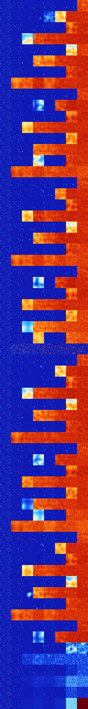

# B3578 (217088-217599)

<details>
    <summary>Initial Grid</summary>
    
</details>


<details>
    <summary>Initial Grid RLE</summary>

```
#C Exported from GoGoL (https://github.com/marrow16/gogol)
#C Wrap mode: Toroidal
#C Boundary mode: Dead
#C Step: 0
x = 100, y = 100, rule = B3578/S
8bo14bo7bo7bo29bo4bo$o3bo47bo28bo$21bo6bobo10bo42b2o4bo$17bo19bo22bo2bo
33bo$4bo4bo5bo21bo3bo8bobo$5bo17bo42bo28bo$11bo24bo21bo39bo$24bo14bo41b
o15bo$19bo8bo42bo9bo$13bo5bo22bo7bo45bo$3bo3bo34bo2b2o19b2o16bo$29bo14b
o29bo$58bobo7bo4bo4bo$45bo31bo$26b2o26bo16bobo18bo$19bo2bo43bo2bo6bo$9b
o17b2o14bo49bo$23bo11bo2bo19bo26bo5bo$69bo3b3o9bo$43bo7bo35bo7bo$22bo
12bo10bo9bo13bo$17b2o5bo16bo2b2obo23bo4bo7b3o5bo$16bo20bo21bo19bo12bo$
12bo13bo12bo45bo2bo$23bo43bo12bo$10bo10bo14bo2bo11bobo9bo3bo8bo21bo$56b
o7bo18bo$12bo13bo36bo19bo14bo$9bo15bo7bo2bo13bo14bo13bo12bo$8bo17bo57bo
9bobo$19bo24bo31bo21bo$33b2o50bo$37bo30bo24bobobo$37bo16bo33bo6bo2bo$5b
o3bo9bo8bo7bo25bo22bo$2bo40bo2bo7bo10bo9bo$62bo10bo$28bo6bo9bo18bo20bo$
4bo19bo13b2o49bo$49bo14bo16bo14bo$bo4bo37bo9bo3bo26bo8bo$57bo12bo14bo5b
o$20bobo25bo20bo4b2o15bo$5bo28bo9bo11bo7b3o3bo27bo$20bo62b2o$40bo7bo6bo
15bo$11bo2bo32bo5bo27bo$11bo13bo3bo11bo54bo$6bo11bo18bo42bo2bo3bo9bo$
61bo8bo5bo$o13bo10bo14b2o49bo$22bo35bo3bobo2bo13bobo$12bo3bo13bo49bo$
10bo13bo12bo16bo9bobo$9bo13bo15bo9bo33bo$21bo2bo15bo7bo32bo$o39bo43bo$
5bo13bo10bo6bo3bo8bo$8bo11bo8bo4bo32bo10bo14bo$100b$32bo9bo5bobo4bo$22b
o$5bo23bo33b2o2bo$67bobo26bo$16bo17bo3bo27bo3bo18bo$2bo2b2o7bo58bobo6bo
bo$3bo26bobo22b2o30bo$ob2o7bo28b2o16bo24bo9bo$94bo$2o13bo16bo22bo3bo10b
o24bo$22bo7bo4bo2bo21bo4bo17bo$2bo7bo2bo23bo11bo$9bo3bo43bo10bo4bo18bo
5bo$3bo55bo7bo31bo$12bobo6bo24bo7bo$38bo3bo5bo2bo10bo8bo16bo$34bo3bo5bo
10bo16bo6bo4bo4bo$13bo3bo4bo48bo17b2o$6bo27bo32bo9bobo$49bo4bo6bo15bo$
38b3o7bo6bo6bo8bo4bo2bo18bo$3bo7bo17bo21bo34bo$4bo9bo3bo31bo$28bo14bobo
12bo$15b2o5bo8bo38bo23b3o$2b2o20bo5bo2bo15bo12b2o4b2o3bo$24bo49bo$7bo
21bobo6bo13bo21bo3bo5bobo$16bo23bo13bo2bo$31bo16bo22bo4bo2bo12bo$13bo
25b2o20bo21bo$19bo14b2o19bo5bo2bo$13bo27bo10bo$4bo13bo20bo43bo$4bo70bo
15bo$27bo7bo23bobo12b2o3bo$18bo9bo14bo6bo$51bo18bo$o5bobo22bo6bo8bo$10b
o10bo50bo16bo!
```
</details>
<details>
    <summary>Thumbnail</summary>

</details>
<table>
<tr>
    <td><a href="./217088%20S%20Heat%20Map%20Activity.png"></a><br>S (217088)<br>S@4</td>    <td><a href="./217089%20S0%20Heat%20Map%20Activity.png"></a><br>S0 (217089)<br>S@5</td>    <td><a href="./217090%20S1%20Heat%20Map%20Activity.png"></a><br>S1 (217090)<br>R@11,p2</td>    <td><a href="./217091%20S01%20Heat%20Map%20Activity.png"></a><br>S01 (217091)<br>R@14,p2</td>    <td><a href="./217092%20S2%20Heat%20Map%20Activity.png"></a><br>S2 (217092)<br>R@8,p2</td>    <td><a href="./217093%20S02%20Heat%20Map%20Activity.png"></a><br>S02 (217093)<br>R@15,p4</td>    <td><a href="./217094%20S12%20Heat%20Map%20Activity.png"></a><br>S12 (217094)<br>S@29</td>    <td><a href="./217095%20S012%20Heat%20Map%20Activity.png"></a><br>S012 (217095)<br>G>1000</td></tr>
<tr>
    <td><a href="./217096%20S3%20Heat%20Map%20Activity.png"></a><br>S3 (217096)<br>S@4</td>    <td><a href="./217097%20S03%20Heat%20Map%20Activity.png"></a><br>S03 (217097)<br>S@7</td>    <td><a href="./217098%20S13%20Heat%20Map%20Activity.png"></a><br>S13 (217098)<br>R@15,p4</td>    <td><a href="./217099%20S013%20Heat%20Map%20Activity.png"></a><br>S013 (217099)<br>R@627,p4</td>    <td><a href="./217100%20S23%20Heat%20Map%20Activity.png"></a><br>S23 (217100)<br>G>1000</td>    <td><a href="./217101%20S023%20Heat%20Map%20Activity.png"></a><br>S023 (217101)<br>G>1000</td>    <td><a href="./217102%20S123%20Heat%20Map%20Activity.png"></a><br>S123 (217102)<br>G>1000</td>    <td><a href="./217103%20S0123%20Heat%20Map%20Activity.png"></a><br>S0123 (217103)<br>G>1000</td></tr>
<tr>
    <td><a href="./217104%20S4%20Heat%20Map%20Activity.png"></a><br>S4 (217104)<br>S@4</td>    <td><a href="./217105%20S04%20Heat%20Map%20Activity.png"></a><br>S04 (217105)<br>S@5</td>    <td><a href="./217106%20S14%20Heat%20Map%20Activity.png"></a><br>S14 (217106)<br>R@19,p8</td>    <td><a href="./217107%20S014%20Heat%20Map%20Activity.png"></a><br>S014 (217107)<br>R@27,p2</td>    <td><a href="./217108%20S24%20Heat%20Map%20Activity.png"></a><br>S24 (217108)<br>R@10,p4</td>    <td><a href="./217109%20S024%20Heat%20Map%20Activity.png"></a><br>S024 (217109)<br>R@13,p4</td>    <td><a href="./217110%20S124%20Heat%20Map%20Activity.png"></a><br>S124 (217110)<br>G>1000</td>    <td><a href="./217111%20S0124%20Heat%20Map%20Activity.png"></a><br>S0124 (217111)<br>G>1000</td></tr>
<tr>
    <td><a href="./217112%20S34%20Heat%20Map%20Activity.png"></a><br>S34 (217112)<br>S@4</td>    <td><a href="./217113%20S034%20Heat%20Map%20Activity.png"></a><br>S034 (217113)<br>S@9</td>    <td><a href="./217114%20S134%20Heat%20Map%20Activity.png"></a><br>S134 (217114)<br>G>1000</td>    <td><a href="./217115%20S0134%20Heat%20Map%20Activity.png"></a><br>S0134 (217115)<br>G>1000</td>    <td><a href="./217116%20S234%20Heat%20Map%20Activity.png"></a><br>S234 (217116)<br>G>1000</td>    <td><a href="./217117%20S0234%20Heat%20Map%20Activity.png"></a><br>S0234 (217117)<br>G>1000</td>    <td><a href="./217118%20S1234%20Heat%20Map%20Activity.png"></a><br>S1234 (217118)<br>G>1000</td>    <td><a href="./217119%20S01234%20Heat%20Map%20Activity.png"></a><br>S01234 (217119)<br>G>1000</td></tr>
<tr>
    <td><a href="./217120%20S5%20Heat%20Map%20Activity.png"></a><br>S5 (217120)<br>S@4</td>    <td><a href="./217121%20S05%20Heat%20Map%20Activity.png"></a><br>S05 (217121)<br>S@5</td>    <td><a href="./217122%20S15%20Heat%20Map%20Activity.png"></a><br>S15 (217122)<br>R@13,p2</td>    <td><a href="./217123%20S015%20Heat%20Map%20Activity.png"></a><br>S015 (217123)<br>R@21,p2</td>    <td><a href="./217124%20S25%20Heat%20Map%20Activity.png"></a><br>S25 (217124)<br>R@8,p2</td>    <td><a href="./217125%20S025%20Heat%20Map%20Activity.png"></a><br>S025 (217125)<br>R@15,p4</td>    <td><a href="./217126%20S125%20Heat%20Map%20Activity.png"></a><br>S125 (217126)<br>G>1000</td>    <td><a href="./217127%20S0125%20Heat%20Map%20Activity.png"></a><br>S0125 (217127)<br>G>1000</td></tr>
<tr>
    <td><a href="./217128%20S35%20Heat%20Map%20Activity.png"></a><br>S35 (217128)<br>S@4</td>    <td><a href="./217129%20S035%20Heat%20Map%20Activity.png"></a><br>S035 (217129)<br>S@7</td>    <td><a href="./217130%20S135%20Heat%20Map%20Activity.png"></a><br>S135 (217130)<br>R@65,p4</td>    <td><a href="./217131%20S0135%20Heat%20Map%20Activity.png"></a><br>S0135 (217131)<br>G>1000</td>    <td><a href="./217132%20S235%20Heat%20Map%20Activity.png"></a><br>S235 (217132)<br>G>1000</td>    <td><a href="./217133%20S0235%20Heat%20Map%20Activity.png"></a><br>S0235 (217133)<br>G>1000</td>    <td><a href="./217134%20S1235%20Heat%20Map%20Activity.png"></a><br>S1235 (217134)<br>G>1000</td>    <td><a href="./217135%20S01235%20Heat%20Map%20Activity.png"></a><br>S01235 (217135)<br>G>1000</td></tr>
<tr>
    <td><a href="./217136%20S45%20Heat%20Map%20Activity.png"></a><br>S45 (217136)<br>S@4</td>    <td><a href="./217137%20S045%20Heat%20Map%20Activity.png"></a><br>S045 (217137)<br>S@5</td>    <td><a href="./217138%20S145%20Heat%20Map%20Activity.png"></a><br>S145 (217138)<br>R@21,p8</td>    <td><a href="./217139%20S0145%20Heat%20Map%20Activity.png"></a><br>S0145 (217139)<br>R@71,p6</td>    <td><a href="./217140%20S245%20Heat%20Map%20Activity.png"></a><br>S245 (217140)<br>R@10,p4</td>    <td><a href="./217141%20S0245%20Heat%20Map%20Activity.png"></a><br>S0245 (217141)<br>R@23,p12</td>    <td><a href="./217142%20S1245%20Heat%20Map%20Activity.png"></a><br>S1245 (217142)<br>G>1000</td>    <td><a href="./217143%20S01245%20Heat%20Map%20Activity.png"></a><br>S01245 (217143)<br>G>1000</td></tr>
<tr>
    <td><a href="./217144%20S345%20Heat%20Map%20Activity.png"></a><br>S345 (217144)<br>S@4</td>    <td><a href="./217145%20S0345%20Heat%20Map%20Activity.png"></a><br>S0345 (217145)<br>G>1000</td>    <td><a href="./217146%20S1345%20Heat%20Map%20Activity.png"></a><br>S1345 (217146)<br>G>1000</td>    <td><a href="./217147%20S01345%20Heat%20Map%20Activity.png"></a><br>S01345 (217147)<br>G>1000</td>    <td><a href="./217148%20S2345%20Heat%20Map%20Activity.png"></a><br>S2345 (217148)<br>G>1000</td>    <td><a href="./217149%20S02345%20Heat%20Map%20Activity.png"></a><br>S02345 (217149)<br>G>1000</td>    <td><a href="./217150%20S12345%20Heat%20Map%20Activity.png"></a><br>S12345 (217150)<br>G>1000</td>    <td><a href="./217151%20S012345%20Heat%20Map%20Activity.png"></a><br>S012345 (217151)<br>G>1000</td></tr>
<tr>
    <td><a href="./217152%20S6%20Heat%20Map%20Activity.png"></a><br>S6 (217152)<br>S@4</td>    <td><a href="./217153%20S06%20Heat%20Map%20Activity.png"></a><br>S06 (217153)<br>S@5</td>    <td><a href="./217154%20S16%20Heat%20Map%20Activity.png"></a><br>S16 (217154)<br>R@11,p2</td>    <td><a href="./217155%20S016%20Heat%20Map%20Activity.png"></a><br>S016 (217155)<br>R@22,p2</td>    <td><a href="./217156%20S26%20Heat%20Map%20Activity.png"></a><br>S26 (217156)<br>R@8,p2</td>    <td><a href="./217157%20S026%20Heat%20Map%20Activity.png"></a><br>S026 (217157)<br>R@15,p4</td>    <td><a href="./217158%20S126%20Heat%20Map%20Activity.png"></a><br>S126 (217158)<br>R@55,p12</td>    <td><a href="./217159%20S0126%20Heat%20Map%20Activity.png"></a><br>S0126 (217159)<br>G>1000</td></tr>
<tr>
    <td><a href="./217160%20S36%20Heat%20Map%20Activity.png"></a><br>S36 (217160)<br>S@4</td>    <td><a href="./217161%20S036%20Heat%20Map%20Activity.png"></a><br>S036 (217161)<br>S@7</td>    <td><a href="./217162%20S136%20Heat%20Map%20Activity.png"></a><br>S136 (217162)<br>R@23,p4</td>    <td><a href="./217163%20S0136%20Heat%20Map%20Activity.png"></a><br>S0136 (217163)<br>G>1000</td>    <td><a href="./217164%20S236%20Heat%20Map%20Activity.png"></a><br>S236 (217164)<br>R@268,p250</td>    <td><a href="./217165%20S0236%20Heat%20Map%20Activity.png"></a><br>S0236 (217165)<br>G>1000</td>    <td><a href="./217166%20S1236%20Heat%20Map%20Activity.png"></a><br>S1236 (217166)<br>G>1000</td>    <td><a href="./217167%20S01236%20Heat%20Map%20Activity.png"></a><br>S01236 (217167)<br>G>1000</td></tr>
<tr>
    <td><a href="./217168%20S46%20Heat%20Map%20Activity.png"></a><br>S46 (217168)<br>S@4</td>    <td><a href="./217169%20S046%20Heat%20Map%20Activity.png"></a><br>S046 (217169)<br>S@5</td>    <td><a href="./217170%20S146%20Heat%20Map%20Activity.png"></a><br>S146 (217170)<br>R@19,p8</td>    <td><a href="./217171%20S0146%20Heat%20Map%20Activity.png"></a><br>S0146 (217171)<br>R@30,p4</td>    <td><a href="./217172%20S246%20Heat%20Map%20Activity.png"></a><br>S246 (217172)<br>R@10,p4</td>    <td><a href="./217173%20S0246%20Heat%20Map%20Activity.png"></a><br>S0246 (217173)<br>R@14,p4</td>    <td><a href="./217174%20S1246%20Heat%20Map%20Activity.png"></a><br>S1246 (217174)<br>G>1000</td>    <td><a href="./217175%20S01246%20Heat%20Map%20Activity.png"></a><br>S01246 (217175)<br>G>1000</td></tr>
<tr>
    <td><a href="./217176%20S346%20Heat%20Map%20Activity.png"></a><br>S346 (217176)<br>S@4</td>    <td><a href="./217177%20S0346%20Heat%20Map%20Activity.png"></a><br>S0346 (217177)<br>S@9</td>    <td><a href="./217178%20S1346%20Heat%20Map%20Activity.png"></a><br>S1346 (217178)<br>G>1000</td>    <td><a href="./217179%20S01346%20Heat%20Map%20Activity.png"></a><br>S01346 (217179)<br>G>1000</td>    <td><a href="./217180%20S2346%20Heat%20Map%20Activity.png"></a><br>S2346 (217180)<br>G>1000</td>    <td><a href="./217181%20S02346%20Heat%20Map%20Activity.png"></a><br>S02346 (217181)<br>G>1000</td>    <td><a href="./217182%20S12346%20Heat%20Map%20Activity.png"></a><br>S12346 (217182)<br>G>1000</td>    <td><a href="./217183%20S012346%20Heat%20Map%20Activity.png"></a><br>S012346 (217183)<br>G>1000</td></tr>
<tr>
    <td><a href="./217184%20S56%20Heat%20Map%20Activity.png"></a><br>S56 (217184)<br>S@4</td>    <td><a href="./217185%20S056%20Heat%20Map%20Activity.png"></a><br>S056 (217185)<br>S@5</td>    <td><a href="./217186%20S156%20Heat%20Map%20Activity.png"></a><br>S156 (217186)<br>R@13,p2</td>    <td><a href="./217187%20S0156%20Heat%20Map%20Activity.png"></a><br>S0156 (217187)<br>R@21,p2</td>    <td><a href="./217188%20S256%20Heat%20Map%20Activity.png"></a><br>S256 (217188)<br>R@8,p2</td>    <td><a href="./217189%20S0256%20Heat%20Map%20Activity.png"></a><br>S0256 (217189)<br>R@15,p4</td>    <td><a href="./217190%20S1256%20Heat%20Map%20Activity.png"></a><br>S1256 (217190)<br>G>1000</td>    <td><a href="./217191%20S01256%20Heat%20Map%20Activity.png"></a><br>S01256 (217191)<br>G>1000</td></tr>
<tr>
    <td><a href="./217192%20S356%20Heat%20Map%20Activity.png"></a><br>S356 (217192)<br>S@4</td>    <td><a href="./217193%20S0356%20Heat%20Map%20Activity.png"></a><br>S0356 (217193)<br>S@7</td>    <td><a href="./217194%20S1356%20Heat%20Map%20Activity.png"></a><br>S1356 (217194)<br>R@48,p4</td>    <td><a href="./217195%20S01356%20Heat%20Map%20Activity.png"></a><br>S01356 (217195)<br>G>1000</td>    <td><a href="./217196%20S2356%20Heat%20Map%20Activity.png"></a><br>S2356 (217196)<br>G>1000</td>    <td><a href="./217197%20S02356%20Heat%20Map%20Activity.png"></a><br>S02356 (217197)<br>G>1000</td>    <td><a href="./217198%20S12356%20Heat%20Map%20Activity.png"></a><br>S12356 (217198)<br>G>1000</td>    <td><a href="./217199%20S012356%20Heat%20Map%20Activity.png"></a><br>S012356 (217199)<br>G>1000</td></tr>
<tr>
    <td><a href="./217200%20S456%20Heat%20Map%20Activity.png"></a><br>S456 (217200)<br>S@4</td>    <td><a href="./217201%20S0456%20Heat%20Map%20Activity.png"></a><br>S0456 (217201)<br>S@5</td>    <td><a href="./217202%20S1456%20Heat%20Map%20Activity.png"></a><br>S1456 (217202)<br>R@21,p8</td>    <td><a href="./217203%20S01456%20Heat%20Map%20Activity.png"></a><br>S01456 (217203)<br>G>1000</td>    <td><a href="./217204%20S2456%20Heat%20Map%20Activity.png"></a><br>S2456 (217204)<br>R@10,p4</td>    <td><a href="./217205%20S02456%20Heat%20Map%20Activity.png"></a><br>S02456 (217205)<br>R@15,p4</td>    <td><a href="./217206%20S12456%20Heat%20Map%20Activity.png"></a><br>S12456 (217206)<br>G>1000</td>    <td><a href="./217207%20S012456%20Heat%20Map%20Activity.png"></a><br>S012456 (217207)<br>G>1000</td></tr>
<tr>
    <td><a href="./217208%20S3456%20Heat%20Map%20Activity.png"></a><br>S3456 (217208)<br>S@4</td>    <td><a href="./217209%20S03456%20Heat%20Map%20Activity.png"></a><br>S03456 (217209)<br>G>1000</td>    <td><a href="./217210%20S13456%20Heat%20Map%20Activity.png"></a><br>S13456 (217210)<br>G>1000</td>    <td><a href="./217211%20S013456%20Heat%20Map%20Activity.png"></a><br>S013456 (217211)<br>G>1000</td>    <td><a href="./217212%20S23456%20Heat%20Map%20Activity.png"></a><br>S23456 (217212)<br>G>1000</td>    <td><a href="./217213%20S023456%20Heat%20Map%20Activity.png"></a><br>S023456 (217213)<br>G>1000</td>    <td><a href="./217214%20S123456%20Heat%20Map%20Activity.png"></a><br>S123456 (217214)<br>G>1000</td>    <td><a href="./217215%20S0123456%20Heat%20Map%20Activity.png"></a><br>S0123456 (217215)<br>G>1000</td></tr>
<tr>
    <td><a href="./217216%20S7%20Heat%20Map%20Activity.png"></a><br>S7 (217216)<br>S@4</td>    <td><a href="./217217%20S07%20Heat%20Map%20Activity.png"></a><br>S07 (217217)<br>S@5</td>    <td><a href="./217218%20S17%20Heat%20Map%20Activity.png"></a><br>S17 (217218)<br>R@13,p4</td>    <td><a href="./217219%20S017%20Heat%20Map%20Activity.png"></a><br>S017 (217219)<br>R@14,p2</td>    <td><a href="./217220%20S27%20Heat%20Map%20Activity.png"></a><br>S27 (217220)<br>R@8,p2</td>    <td><a href="./217221%20S027%20Heat%20Map%20Activity.png"></a><br>S027 (217221)<br>R@15,p4</td>    <td><a href="./217222%20S127%20Heat%20Map%20Activity.png"></a><br>S127 (217222)<br>S@46</td>    <td><a href="./217223%20S0127%20Heat%20Map%20Activity.png"></a><br>S0127 (217223)<br>G>1000</td></tr>
<tr>
    <td><a href="./217224%20S37%20Heat%20Map%20Activity.png"></a><br>S37 (217224)<br>S@4</td>    <td><a href="./217225%20S037%20Heat%20Map%20Activity.png"></a><br>S037 (217225)<br>S@7</td>    <td><a href="./217226%20S137%20Heat%20Map%20Activity.png"></a><br>S137 (217226)<br>R@14,p4</td>    <td><a href="./217227%20S0137%20Heat%20Map%20Activity.png"></a><br>S0137 (217227)<br>R@156,p6</td>    <td><a href="./217228%20S237%20Heat%20Map%20Activity.png"></a><br>S237 (217228)<br>R@35,p2</td>    <td><a href="./217229%20S0237%20Heat%20Map%20Activity.png"></a><br>S0237 (217229)<br>G>1000</td>    <td><a href="./217230%20S1237%20Heat%20Map%20Activity.png"></a><br>S1237 (217230)<br>G>1000</td>    <td><a href="./217231%20S01237%20Heat%20Map%20Activity.png"></a><br>S01237 (217231)<br>G>1000</td></tr>
<tr>
    <td><a href="./217232%20S47%20Heat%20Map%20Activity.png"></a><br>S47 (217232)<br>S@4</td>    <td><a href="./217233%20S047%20Heat%20Map%20Activity.png"></a><br>S047 (217233)<br>S@5</td>    <td><a href="./217234%20S147%20Heat%20Map%20Activity.png"></a><br>S147 (217234)<br>R@19,p8</td>    <td><a href="./217235%20S0147%20Heat%20Map%20Activity.png"></a><br>S0147 (217235)<br>R@37,p2</td>    <td><a href="./217236%20S247%20Heat%20Map%20Activity.png"></a><br>S247 (217236)<br>R@10,p4</td>    <td><a href="./217237%20S0247%20Heat%20Map%20Activity.png"></a><br>S0247 (217237)<br>R@13,p4</td>    <td><a href="./217238%20S1247%20Heat%20Map%20Activity.png"></a><br>S1247 (217238)<br>G>1000</td>    <td><a href="./217239%20S01247%20Heat%20Map%20Activity.png"></a><br>S01247 (217239)<br>G>1000</td></tr>
<tr>
    <td><a href="./217240%20S347%20Heat%20Map%20Activity.png"></a><br>S347 (217240)<br>S@4</td>    <td><a href="./217241%20S0347%20Heat%20Map%20Activity.png"></a><br>S0347 (217241)<br>S@9</td>    <td><a href="./217242%20S1347%20Heat%20Map%20Activity.png"></a><br>S1347 (217242)<br>G>1000</td>    <td><a href="./217243%20S01347%20Heat%20Map%20Activity.png"></a><br>S01347 (217243)<br>G>1000</td>    <td><a href="./217244%20S2347%20Heat%20Map%20Activity.png"></a><br>S2347 (217244)<br>G>1000</td>    <td><a href="./217245%20S02347%20Heat%20Map%20Activity.png"></a><br>S02347 (217245)<br>G>1000</td>    <td><a href="./217246%20S12347%20Heat%20Map%20Activity.png"></a><br>S12347 (217246)<br>G>1000</td>    <td><a href="./217247%20S012347%20Heat%20Map%20Activity.png"></a><br>S012347 (217247)<br>G>1000</td></tr>
<tr>
    <td><a href="./217248%20S57%20Heat%20Map%20Activity.png"></a><br>S57 (217248)<br>S@4</td>    <td><a href="./217249%20S057%20Heat%20Map%20Activity.png"></a><br>S057 (217249)<br>S@5</td>    <td><a href="./217250%20S157%20Heat%20Map%20Activity.png"></a><br>S157 (217250)<br>R@11,p2</td>    <td><a href="./217251%20S0157%20Heat%20Map%20Activity.png"></a><br>S0157 (217251)<br>R@21,p2</td>    <td><a href="./217252%20S257%20Heat%20Map%20Activity.png"></a><br>S257 (217252)<br>R@8,p2</td>    <td><a href="./217253%20S0257%20Heat%20Map%20Activity.png"></a><br>S0257 (217253)<br>R@15,p4</td>    <td><a href="./217254%20S1257%20Heat%20Map%20Activity.png"></a><br>S1257 (217254)<br>G>1000</td>    <td><a href="./217255%20S01257%20Heat%20Map%20Activity.png"></a><br>S01257 (217255)<br>G>1000</td></tr>
<tr>
    <td><a href="./217256%20S357%20Heat%20Map%20Activity.png"></a><br>S357 (217256)<br>S@4</td>    <td><a href="./217257%20S0357%20Heat%20Map%20Activity.png"></a><br>S0357 (217257)<br>S@7</td>    <td><a href="./217258%20S1357%20Heat%20Map%20Activity.png"></a><br>S1357 (217258)<br>R@42,p4</td>    <td><a href="./217259%20S01357%20Heat%20Map%20Activity.png"></a><br>S01357 (217259)<br>G>1000</td>    <td><a href="./217260%20S2357%20Heat%20Map%20Activity.png"></a><br>S2357 (217260)<br>G>1000</td>    <td><a href="./217261%20S02357%20Heat%20Map%20Activity.png"></a><br>S02357 (217261)<br>G>1000</td>    <td><a href="./217262%20S12357%20Heat%20Map%20Activity.png"></a><br>S12357 (217262)<br>G>1000</td>    <td><a href="./217263%20S012357%20Heat%20Map%20Activity.png"></a><br>S012357 (217263)<br>G>1000</td></tr>
<tr>
    <td><a href="./217264%20S457%20Heat%20Map%20Activity.png"></a><br>S457 (217264)<br>S@4</td>    <td><a href="./217265%20S0457%20Heat%20Map%20Activity.png"></a><br>S0457 (217265)<br>S@5</td>    <td><a href="./217266%20S1457%20Heat%20Map%20Activity.png"></a><br>S1457 (217266)<br>R@21,p8</td>    <td><a href="./217267%20S01457%20Heat%20Map%20Activity.png"></a><br>S01457 (217267)<br>R@182,p2</td>    <td><a href="./217268%20S2457%20Heat%20Map%20Activity.png"></a><br>S2457 (217268)<br>R@10,p4</td>    <td><a href="./217269%20S02457%20Heat%20Map%20Activity.png"></a><br>S02457 (217269)<br>R@23,p12</td>    <td><a href="./217270%20S12457%20Heat%20Map%20Activity.png"></a><br>S12457 (217270)<br>G>1000</td>    <td><a href="./217271%20S012457%20Heat%20Map%20Activity.png"></a><br>S012457 (217271)<br>G>1000</td></tr>
<tr>
    <td><a href="./217272%20S3457%20Heat%20Map%20Activity.png"></a><br>S3457 (217272)<br>S@4</td>    <td><a href="./217273%20S03457%20Heat%20Map%20Activity.png"></a><br>S03457 (217273)<br>G>1000</td>    <td><a href="./217274%20S13457%20Heat%20Map%20Activity.png"></a><br>S13457 (217274)<br>G>1000</td>    <td><a href="./217275%20S013457%20Heat%20Map%20Activity.png"></a><br>S013457 (217275)<br>G>1000</td>    <td><a href="./217276%20S23457%20Heat%20Map%20Activity.png"></a><br>S23457 (217276)<br>G>1000</td>    <td><a href="./217277%20S023457%20Heat%20Map%20Activity.png"></a><br>S023457 (217277)<br>G>1000</td>    <td><a href="./217278%20S123457%20Heat%20Map%20Activity.png"></a><br>S123457 (217278)<br>G>1000</td>    <td><a href="./217279%20S0123457%20Heat%20Map%20Activity.png"></a><br>S0123457 (217279)<br>G>1000</td></tr>
<tr>
    <td><a href="./217280%20S67%20Heat%20Map%20Activity.png"></a><br>S67 (217280)<br>S@4</td>    <td><a href="./217281%20S067%20Heat%20Map%20Activity.png"></a><br>S067 (217281)<br>S@5</td>    <td><a href="./217282%20S167%20Heat%20Map%20Activity.png"></a><br>S167 (217282)<br>R@13,p4</td>    <td><a href="./217283%20S0167%20Heat%20Map%20Activity.png"></a><br>S0167 (217283)<br>R@22,p2</td>    <td><a href="./217284%20S267%20Heat%20Map%20Activity.png"></a><br>S267 (217284)<br>R@8,p2</td>    <td><a href="./217285%20S0267%20Heat%20Map%20Activity.png"></a><br>S0267 (217285)<br>R@15,p4</td>    <td><a href="./217286%20S1267%20Heat%20Map%20Activity.png"></a><br>S1267 (217286)<br>R@35,p12</td>    <td><a href="./217287%20S01267%20Heat%20Map%20Activity.png"></a><br>S01267 (217287)<br>G>1000</td></tr>
<tr>
    <td><a href="./217288%20S367%20Heat%20Map%20Activity.png"></a><br>S367 (217288)<br>S@4</td>    <td><a href="./217289%20S0367%20Heat%20Map%20Activity.png"></a><br>S0367 (217289)<br>S@7</td>    <td><a href="./217290%20S1367%20Heat%20Map%20Activity.png"></a><br>S1367 (217290)<br>R@20,p4</td>    <td><a href="./217291%20S01367%20Heat%20Map%20Activity.png"></a><br>S01367 (217291)<br>G>1000</td>    <td><a href="./217292%20S2367%20Heat%20Map%20Activity.png"></a><br>S2367 (217292)<br>R@268,p250</td>    <td><a href="./217293%20S02367%20Heat%20Map%20Activity.png"></a><br>S02367 (217293)<br>G>1000</td>    <td><a href="./217294%20S12367%20Heat%20Map%20Activity.png"></a><br>S12367 (217294)<br>G>1000</td>    <td><a href="./217295%20S012367%20Heat%20Map%20Activity.png"></a><br>S012367 (217295)<br>G>1000</td></tr>
<tr>
    <td><a href="./217296%20S467%20Heat%20Map%20Activity.png"></a><br>S467 (217296)<br>S@4</td>    <td><a href="./217297%20S0467%20Heat%20Map%20Activity.png"></a><br>S0467 (217297)<br>S@5</td>    <td><a href="./217298%20S1467%20Heat%20Map%20Activity.png"></a><br>S1467 (217298)<br>R@19,p8</td>    <td><a href="./217299%20S01467%20Heat%20Map%20Activity.png"></a><br>S01467 (217299)<br>R@79,p2</td>    <td><a href="./217300%20S2467%20Heat%20Map%20Activity.png"></a><br>S2467 (217300)<br>R@10,p4</td>    <td><a href="./217301%20S02467%20Heat%20Map%20Activity.png"></a><br>S02467 (217301)<br>R@14,p4</td>    <td><a href="./217302%20S12467%20Heat%20Map%20Activity.png"></a><br>S12467 (217302)<br>G>1000</td>    <td><a href="./217303%20S012467%20Heat%20Map%20Activity.png"></a><br>S012467 (217303)<br>G>1000</td></tr>
<tr>
    <td><a href="./217304%20S3467%20Heat%20Map%20Activity.png"></a><br>S3467 (217304)<br>S@4</td>    <td><a href="./217305%20S03467%20Heat%20Map%20Activity.png"></a><br>S03467 (217305)<br>S@9</td>    <td><a href="./217306%20S13467%20Heat%20Map%20Activity.png"></a><br>S13467 (217306)<br>G>1000</td>    <td><a href="./217307%20S013467%20Heat%20Map%20Activity.png"></a><br>S013467 (217307)<br>G>1000</td>    <td><a href="./217308%20S23467%20Heat%20Map%20Activity.png"></a><br>S23467 (217308)<br>G>1000</td>    <td><a href="./217309%20S023467%20Heat%20Map%20Activity.png"></a><br>S023467 (217309)<br>G>1000</td>    <td><a href="./217310%20S123467%20Heat%20Map%20Activity.png"></a><br>S123467 (217310)<br>G>1000</td>    <td><a href="./217311%20S0123467%20Heat%20Map%20Activity.png"></a><br>S0123467 (217311)<br>G>1000</td></tr>
<tr>
    <td><a href="./217312%20S567%20Heat%20Map%20Activity.png"></a><br>S567 (217312)<br>S@4</td>    <td><a href="./217313%20S0567%20Heat%20Map%20Activity.png"></a><br>S0567 (217313)<br>S@5</td>    <td><a href="./217314%20S1567%20Heat%20Map%20Activity.png"></a><br>S1567 (217314)<br>R@11,p2</td>    <td><a href="./217315%20S01567%20Heat%20Map%20Activity.png"></a><br>S01567 (217315)<br>R@21,p2</td>    <td><a href="./217316%20S2567%20Heat%20Map%20Activity.png"></a><br>S2567 (217316)<br>R@8,p2</td>    <td><a href="./217317%20S02567%20Heat%20Map%20Activity.png"></a><br>S02567 (217317)<br>R@15,p4</td>    <td><a href="./217318%20S12567%20Heat%20Map%20Activity.png"></a><br>S12567 (217318)<br>G>1000</td>    <td><a href="./217319%20S012567%20Heat%20Map%20Activity.png"></a><br>S012567 (217319)<br>G>1000</td></tr>
<tr>
    <td><a href="./217320%20S3567%20Heat%20Map%20Activity.png"></a><br>S3567 (217320)<br>S@4</td>    <td><a href="./217321%20S03567%20Heat%20Map%20Activity.png"></a><br>S03567 (217321)<br>S@7</td>    <td><a href="./217322%20S13567%20Heat%20Map%20Activity.png"></a><br>S13567 (217322)<br>G>1000</td>    <td><a href="./217323%20S013567%20Heat%20Map%20Activity.png"></a><br>S013567 (217323)<br>G>1000</td>    <td><a href="./217324%20S23567%20Heat%20Map%20Activity.png"></a><br>S23567 (217324)<br>G>1000</td>    <td><a href="./217325%20S023567%20Heat%20Map%20Activity.png"></a><br>S023567 (217325)<br>G>1000</td>    <td><a href="./217326%20S123567%20Heat%20Map%20Activity.png"></a><br>S123567 (217326)<br>G>1000</td>    <td><a href="./217327%20S0123567%20Heat%20Map%20Activity.png"></a><br>S0123567 (217327)<br>G>1000</td></tr>
<tr>
    <td><a href="./217328%20S4567%20Heat%20Map%20Activity.png"></a><br>S4567 (217328)<br>S@4</td>    <td><a href="./217329%20S04567%20Heat%20Map%20Activity.png"></a><br>S04567 (217329)<br>S@5</td>    <td><a href="./217330%20S14567%20Heat%20Map%20Activity.png"></a><br>S14567 (217330)<br>R@21,p8</td>    <td><a href="./217331%20S014567%20Heat%20Map%20Activity.png"></a><br>S014567 (217331)<br>G>1000</td>    <td><a href="./217332%20S24567%20Heat%20Map%20Activity.png"></a><br>S24567 (217332)<br>R@10,p4</td>    <td><a href="./217333%20S024567%20Heat%20Map%20Activity.png"></a><br>S024567 (217333)<br>R@15,p4</td>    <td><a href="./217334%20S124567%20Heat%20Map%20Activity.png"></a><br>S124567 (217334)<br>G>1000</td>    <td><a href="./217335%20S0124567%20Heat%20Map%20Activity.png"></a><br>S0124567 (217335)<br>G>1000</td></tr>
<tr>
    <td><a href="./217336%20S34567%20Heat%20Map%20Activity.png"></a><br>S34567 (217336)<br>S@4</td>    <td><a href="./217337%20S034567%20Heat%20Map%20Activity.png"></a><br>S034567 (217337)<br>G>1000</td>    <td><a href="./217338%20S134567%20Heat%20Map%20Activity.png"></a><br>S134567 (217338)<br>G>1000</td>    <td><a href="./217339%20S0134567%20Heat%20Map%20Activity.png"></a><br>S0134567 (217339)<br>G>1000</td>    <td><a href="./217340%20S234567%20Heat%20Map%20Activity.png"></a><br>S234567 (217340)<br>G>1000</td>    <td><a href="./217341%20S0234567%20Heat%20Map%20Activity.png"></a><br>S0234567 (217341)<br>G>1000</td>    <td><a href="./217342%20S1234567%20Heat%20Map%20Activity.png"></a><br>S1234567 (217342)<br>G>1000</td>    <td><a href="./217343%20S01234567%20Heat%20Map%20Activity.png"></a><br>S01234567 (217343)<br>G>1000</td></tr>
<tr>
    <td><a href="./217344%20S8%20Heat%20Map%20Activity.png"></a><br>S8 (217344)<br>S@4</td>    <td><a href="./217345%20S08%20Heat%20Map%20Activity.png"></a><br>S08 (217345)<br>S@5</td>    <td><a href="./217346%20S18%20Heat%20Map%20Activity.png"></a><br>S18 (217346)<br>R@11,p2</td>    <td><a href="./217347%20S018%20Heat%20Map%20Activity.png"></a><br>S018 (217347)<br>R@14,p2</td>    <td><a href="./217348%20S28%20Heat%20Map%20Activity.png"></a><br>S28 (217348)<br>R@8,p2</td>    <td><a href="./217349%20S028%20Heat%20Map%20Activity.png"></a><br>S028 (217349)<br>R@15,p4</td>    <td><a href="./217350%20S128%20Heat%20Map%20Activity.png"></a><br>S128 (217350)<br>S@29</td>    <td><a href="./217351%20S0128%20Heat%20Map%20Activity.png"></a><br>S0128 (217351)<br>G>1000</td></tr>
<tr>
    <td><a href="./217352%20S38%20Heat%20Map%20Activity.png"></a><br>S38 (217352)<br>S@4</td>    <td><a href="./217353%20S038%20Heat%20Map%20Activity.png"></a><br>S038 (217353)<br>S@7</td>    <td><a href="./217354%20S138%20Heat%20Map%20Activity.png"></a><br>S138 (217354)<br>R@15,p4</td>    <td><a href="./217355%20S0138%20Heat%20Map%20Activity.png"></a><br>S0138 (217355)<br>R@621,p2</td>    <td><a href="./217356%20S238%20Heat%20Map%20Activity.png"></a><br>S238 (217356)<br>R@18,p2</td>    <td><a href="./217357%20S0238%20Heat%20Map%20Activity.png"></a><br>S0238 (217357)<br>G>1000</td>    <td><a href="./217358%20S1238%20Heat%20Map%20Activity.png"></a><br>S1238 (217358)<br>G>1000</td>    <td><a href="./217359%20S01238%20Heat%20Map%20Activity.png"></a><br>S01238 (217359)<br>G>1000</td></tr>
<tr>
    <td><a href="./217360%20S48%20Heat%20Map%20Activity.png"></a><br>S48 (217360)<br>S@4</td>    <td><a href="./217361%20S048%20Heat%20Map%20Activity.png"></a><br>S048 (217361)<br>S@5</td>    <td><a href="./217362%20S148%20Heat%20Map%20Activity.png"></a><br>S148 (217362)<br>R@19,p8</td>    <td><a href="./217363%20S0148%20Heat%20Map%20Activity.png"></a><br>S0148 (217363)<br>R@27,p2</td>    <td><a href="./217364%20S248%20Heat%20Map%20Activity.png"></a><br>S248 (217364)<br>R@10,p4</td>    <td><a href="./217365%20S0248%20Heat%20Map%20Activity.png"></a><br>S0248 (217365)<br>R@13,p4</td>    <td><a href="./217366%20S1248%20Heat%20Map%20Activity.png"></a><br>S1248 (217366)<br>G>1000</td>    <td><a href="./217367%20S01248%20Heat%20Map%20Activity.png"></a><br>S01248 (217367)<br>G>1000</td></tr>
<tr>
    <td><a href="./217368%20S348%20Heat%20Map%20Activity.png"></a><br>S348 (217368)<br>S@4</td>    <td><a href="./217369%20S0348%20Heat%20Map%20Activity.png"></a><br>S0348 (217369)<br>R@11,p4</td>    <td><a href="./217370%20S1348%20Heat%20Map%20Activity.png"></a><br>S1348 (217370)<br>G>1000</td>    <td><a href="./217371%20S01348%20Heat%20Map%20Activity.png"></a><br>S01348 (217371)<br>G>1000</td>    <td><a href="./217372%20S2348%20Heat%20Map%20Activity.png"></a><br>S2348 (217372)<br>G>1000</td>    <td><a href="./217373%20S02348%20Heat%20Map%20Activity.png"></a><br>S02348 (217373)<br>G>1000</td>    <td><a href="./217374%20S12348%20Heat%20Map%20Activity.png"></a><br>S12348 (217374)<br>G>1000</td>    <td><a href="./217375%20S012348%20Heat%20Map%20Activity.png"></a><br>S012348 (217375)<br>G>1000</td></tr>
<tr>
    <td><a href="./217376%20S58%20Heat%20Map%20Activity.png"></a><br>S58 (217376)<br>S@4</td>    <td><a href="./217377%20S058%20Heat%20Map%20Activity.png"></a><br>S058 (217377)<br>S@5</td>    <td><a href="./217378%20S158%20Heat%20Map%20Activity.png"></a><br>S158 (217378)<br>R@13,p2</td>    <td><a href="./217379%20S0158%20Heat%20Map%20Activity.png"></a><br>S0158 (217379)<br>R@21,p2</td>    <td><a href="./217380%20S258%20Heat%20Map%20Activity.png"></a><br>S258 (217380)<br>R@8,p2</td>    <td><a href="./217381%20S0258%20Heat%20Map%20Activity.png"></a><br>S0258 (217381)<br>R@15,p4</td>    <td><a href="./217382%20S1258%20Heat%20Map%20Activity.png"></a><br>S1258 (217382)<br>G>1000</td>    <td><a href="./217383%20S01258%20Heat%20Map%20Activity.png"></a><br>S01258 (217383)<br>G>1000</td></tr>
<tr>
    <td><a href="./217384%20S358%20Heat%20Map%20Activity.png"></a><br>S358 (217384)<br>S@4</td>    <td><a href="./217385%20S0358%20Heat%20Map%20Activity.png"></a><br>S0358 (217385)<br>S@7</td>    <td><a href="./217386%20S1358%20Heat%20Map%20Activity.png"></a><br>S1358 (217386)<br>R@194,p4</td>    <td><a href="./217387%20S01358%20Heat%20Map%20Activity.png"></a><br>S01358 (217387)<br>G>1000</td>    <td><a href="./217388%20S2358%20Heat%20Map%20Activity.png"></a><br>S2358 (217388)<br>G>1000</td>    <td><a href="./217389%20S02358%20Heat%20Map%20Activity.png"></a><br>S02358 (217389)<br>G>1000</td>    <td><a href="./217390%20S12358%20Heat%20Map%20Activity.png"></a><br>S12358 (217390)<br>G>1000</td>    <td><a href="./217391%20S012358%20Heat%20Map%20Activity.png"></a><br>S012358 (217391)<br>G>1000</td></tr>
<tr>
    <td><a href="./217392%20S458%20Heat%20Map%20Activity.png"></a><br>S458 (217392)<br>S@4</td>    <td><a href="./217393%20S0458%20Heat%20Map%20Activity.png"></a><br>S0458 (217393)<br>S@5</td>    <td><a href="./217394%20S1458%20Heat%20Map%20Activity.png"></a><br>S1458 (217394)<br>R@21,p8</td>    <td><a href="./217395%20S01458%20Heat%20Map%20Activity.png"></a><br>S01458 (217395)<br>R@40,p6</td>    <td><a href="./217396%20S2458%20Heat%20Map%20Activity.png"></a><br>S2458 (217396)<br>R@10,p4</td>    <td><a href="./217397%20S02458%20Heat%20Map%20Activity.png"></a><br>S02458 (217397)<br>R@23,p12</td>    <td><a href="./217398%20S12458%20Heat%20Map%20Activity.png"></a><br>S12458 (217398)<br>G>1000</td>    <td><a href="./217399%20S012458%20Heat%20Map%20Activity.png"></a><br>S012458 (217399)<br>G>1000</td></tr>
<tr>
    <td><a href="./217400%20S3458%20Heat%20Map%20Activity.png"></a><br>S3458 (217400)<br>S@4</td>    <td><a href="./217401%20S03458%20Heat%20Map%20Activity.png"></a><br>S03458 (217401)<br>G>1000</td>    <td><a href="./217402%20S13458%20Heat%20Map%20Activity.png"></a><br>S13458 (217402)<br>G>1000</td>    <td><a href="./217403%20S013458%20Heat%20Map%20Activity.png"></a><br>S013458 (217403)<br>G>1000</td>    <td><a href="./217404%20S23458%20Heat%20Map%20Activity.png"></a><br>S23458 (217404)<br>G>1000</td>    <td><a href="./217405%20S023458%20Heat%20Map%20Activity.png"></a><br>S023458 (217405)<br>G>1000</td>    <td><a href="./217406%20S123458%20Heat%20Map%20Activity.png"></a><br>S123458 (217406)<br>G>1000</td>    <td><a href="./217407%20S0123458%20Heat%20Map%20Activity.png"></a><br>S0123458 (217407)<br>G>1000</td></tr>
<tr>
    <td><a href="./217408%20S68%20Heat%20Map%20Activity.png"></a><br>S68 (217408)<br>S@4</td>    <td><a href="./217409%20S068%20Heat%20Map%20Activity.png"></a><br>S068 (217409)<br>S@5</td>    <td><a href="./217410%20S168%20Heat%20Map%20Activity.png"></a><br>S168 (217410)<br>R@11,p2</td>    <td><a href="./217411%20S0168%20Heat%20Map%20Activity.png"></a><br>S0168 (217411)<br>R@22,p2</td>    <td><a href="./217412%20S268%20Heat%20Map%20Activity.png"></a><br>S268 (217412)<br>R@8,p2</td>    <td><a href="./217413%20S0268%20Heat%20Map%20Activity.png"></a><br>S0268 (217413)<br>R@15,p4</td>    <td><a href="./217414%20S1268%20Heat%20Map%20Activity.png"></a><br>S1268 (217414)<br>R@55,p12</td>    <td><a href="./217415%20S01268%20Heat%20Map%20Activity.png"></a><br>S01268 (217415)<br>G>1000</td></tr>
<tr>
    <td><a href="./217416%20S368%20Heat%20Map%20Activity.png"></a><br>S368 (217416)<br>S@4</td>    <td><a href="./217417%20S0368%20Heat%20Map%20Activity.png"></a><br>S0368 (217417)<br>S@7</td>    <td><a href="./217418%20S1368%20Heat%20Map%20Activity.png"></a><br>S1368 (217418)<br>R@23,p4</td>    <td><a href="./217419%20S01368%20Heat%20Map%20Activity.png"></a><br>S01368 (217419)<br>G>1000</td>    <td><a href="./217420%20S2368%20Heat%20Map%20Activity.png"></a><br>S2368 (217420)<br>R@21,p2</td>    <td><a href="./217421%20S02368%20Heat%20Map%20Activity.png"></a><br>S02368 (217421)<br>G>1000</td>    <td><a href="./217422%20S12368%20Heat%20Map%20Activity.png"></a><br>S12368 (217422)<br>G>1000</td>    <td><a href="./217423%20S012368%20Heat%20Map%20Activity.png"></a><br>S012368 (217423)<br>G>1000</td></tr>
<tr>
    <td><a href="./217424%20S468%20Heat%20Map%20Activity.png"></a><br>S468 (217424)<br>S@4</td>    <td><a href="./217425%20S0468%20Heat%20Map%20Activity.png"></a><br>S0468 (217425)<br>S@5</td>    <td><a href="./217426%20S1468%20Heat%20Map%20Activity.png"></a><br>S1468 (217426)<br>R@19,p8</td>    <td><a href="./217427%20S01468%20Heat%20Map%20Activity.png"></a><br>S01468 (217427)<br>R@30,p4</td>    <td><a href="./217428%20S2468%20Heat%20Map%20Activity.png"></a><br>S2468 (217428)<br>R@10,p4</td>    <td><a href="./217429%20S02468%20Heat%20Map%20Activity.png"></a><br>S02468 (217429)<br>R@14,p4</td>    <td><a href="./217430%20S12468%20Heat%20Map%20Activity.png"></a><br>S12468 (217430)<br>G>1000</td>    <td><a href="./217431%20S012468%20Heat%20Map%20Activity.png"></a><br>S012468 (217431)<br>G>1000</td></tr>
<tr>
    <td><a href="./217432%20S3468%20Heat%20Map%20Activity.png"></a><br>S3468 (217432)<br>S@4</td>    <td><a href="./217433%20S03468%20Heat%20Map%20Activity.png"></a><br>S03468 (217433)<br>R@11,p4</td>    <td><a href="./217434%20S13468%20Heat%20Map%20Activity.png"></a><br>S13468 (217434)<br>G>1000</td>    <td><a href="./217435%20S013468%20Heat%20Map%20Activity.png"></a><br>S013468 (217435)<br>G>1000</td>    <td><a href="./217436%20S23468%20Heat%20Map%20Activity.png"></a><br>S23468 (217436)<br>G>1000</td>    <td><a href="./217437%20S023468%20Heat%20Map%20Activity.png"></a><br>S023468 (217437)<br>G>1000</td>    <td><a href="./217438%20S123468%20Heat%20Map%20Activity.png"></a><br>S123468 (217438)<br>G>1000</td>    <td><a href="./217439%20S0123468%20Heat%20Map%20Activity.png"></a><br>S0123468 (217439)<br>G>1000</td></tr>
<tr>
    <td><a href="./217440%20S568%20Heat%20Map%20Activity.png"></a><br>S568 (217440)<br>S@4</td>    <td><a href="./217441%20S0568%20Heat%20Map%20Activity.png"></a><br>S0568 (217441)<br>S@5</td>    <td><a href="./217442%20S1568%20Heat%20Map%20Activity.png"></a><br>S1568 (217442)<br>R@13,p2</td>    <td><a href="./217443%20S01568%20Heat%20Map%20Activity.png"></a><br>S01568 (217443)<br>R@21,p2</td>    <td><a href="./217444%20S2568%20Heat%20Map%20Activity.png"></a><br>S2568 (217444)<br>R@8,p2</td>    <td><a href="./217445%20S02568%20Heat%20Map%20Activity.png"></a><br>S02568 (217445)<br>R@15,p4</td>    <td><a href="./217446%20S12568%20Heat%20Map%20Activity.png"></a><br>S12568 (217446)<br>G>1000</td>    <td><a href="./217447%20S012568%20Heat%20Map%20Activity.png"></a><br>S012568 (217447)<br>G>1000</td></tr>
<tr>
    <td><a href="./217448%20S3568%20Heat%20Map%20Activity.png"></a><br>S3568 (217448)<br>S@4</td>    <td><a href="./217449%20S03568%20Heat%20Map%20Activity.png"></a><br>S03568 (217449)<br>S@7</td>    <td><a href="./217450%20S13568%20Heat%20Map%20Activity.png"></a><br>S13568 (217450)<br>G>1000</td>    <td><a href="./217451%20S013568%20Heat%20Map%20Activity.png"></a><br>S013568 (217451)<br>G>1000</td>    <td><a href="./217452%20S23568%20Heat%20Map%20Activity.png"></a><br>S23568 (217452)<br>G>1000</td>    <td><a href="./217453%20S023568%20Heat%20Map%20Activity.png"></a><br>S023568 (217453)<br>G>1000</td>    <td><a href="./217454%20S123568%20Heat%20Map%20Activity.png"></a><br>S123568 (217454)<br>G>1000</td>    <td><a href="./217455%20S0123568%20Heat%20Map%20Activity.png"></a><br>S0123568 (217455)<br>G>1000</td></tr>
<tr>
    <td><a href="./217456%20S4568%20Heat%20Map%20Activity.png"></a><br>S4568 (217456)<br>S@4</td>    <td><a href="./217457%20S04568%20Heat%20Map%20Activity.png"></a><br>S04568 (217457)<br>S@5</td>    <td><a href="./217458%20S14568%20Heat%20Map%20Activity.png"></a><br>S14568 (217458)<br>R@21,p8</td>    <td><a href="./217459%20S014568%20Heat%20Map%20Activity.png"></a><br>S014568 (217459)<br>G>1000</td>    <td><a href="./217460%20S24568%20Heat%20Map%20Activity.png"></a><br>S24568 (217460)<br>R@10,p4</td>    <td><a href="./217461%20S024568%20Heat%20Map%20Activity.png"></a><br>S024568 (217461)<br>R@15,p4</td>    <td><a href="./217462%20S124568%20Heat%20Map%20Activity.png"></a><br>S124568 (217462)<br>G>1000</td>    <td><a href="./217463%20S0124568%20Heat%20Map%20Activity.png"></a><br>S0124568 (217463)<br>G>1000</td></tr>
<tr>
    <td><a href="./217464%20S34568%20Heat%20Map%20Activity.png"></a><br>S34568 (217464)<br>S@4</td>    <td><a href="./217465%20S034568%20Heat%20Map%20Activity.png"></a><br>S034568 (217465)<br>G>1000</td>    <td><a href="./217466%20S134568%20Heat%20Map%20Activity.png"></a><br>S134568 (217466)<br>G>1000</td>    <td><a href="./217467%20S0134568%20Heat%20Map%20Activity.png"></a><br>S0134568 (217467)<br>G>1000</td>    <td><a href="./217468%20S234568%20Heat%20Map%20Activity.png"></a><br>S234568 (217468)<br>G>1000</td>    <td><a href="./217469%20S0234568%20Heat%20Map%20Activity.png"></a><br>S0234568 (217469)<br>G>1000</td>    <td><a href="./217470%20S1234568%20Heat%20Map%20Activity.png"></a><br>S1234568 (217470)<br>G>1000</td>    <td><a href="./217471%20S01234568%20Heat%20Map%20Activity.png"></a><br>S01234568 (217471)<br>G>1000</td></tr>
<tr>
    <td><a href="./217472%20S78%20Heat%20Map%20Activity.png"></a><br>S78 (217472)<br>S@4</td>    <td><a href="./217473%20S078%20Heat%20Map%20Activity.png"></a><br>S078 (217473)<br>S@5</td>    <td><a href="./217474%20S178%20Heat%20Map%20Activity.png"></a><br>S178 (217474)<br>R@13,p4</td>    <td><a href="./217475%20S0178%20Heat%20Map%20Activity.png"></a><br>S0178 (217475)<br>R@14,p2</td>    <td><a href="./217476%20S278%20Heat%20Map%20Activity.png"></a><br>S278 (217476)<br>R@8,p2</td>    <td><a href="./217477%20S0278%20Heat%20Map%20Activity.png"></a><br>S0278 (217477)<br>R@15,p4</td>    <td><a href="./217478%20S1278%20Heat%20Map%20Activity.png"></a><br>S1278 (217478)<br>S@33</td>    <td><a href="./217479%20S01278%20Heat%20Map%20Activity.png"></a><br>S01278 (217479)<br>G>1000</td></tr>
<tr>
    <td><a href="./217480%20S378%20Heat%20Map%20Activity.png"></a><br>S378 (217480)<br>S@4</td>    <td><a href="./217481%20S0378%20Heat%20Map%20Activity.png"></a><br>S0378 (217481)<br>S@7</td>    <td><a href="./217482%20S1378%20Heat%20Map%20Activity.png"></a><br>S1378 (217482)<br>R@14,p4</td>    <td><a href="./217483%20S01378%20Heat%20Map%20Activity.png"></a><br>S01378 (217483)<br>R@139,p6</td>    <td><a href="./217484%20S2378%20Heat%20Map%20Activity.png"></a><br>S2378 (217484)<br>R@23,p2</td>    <td><a href="./217485%20S02378%20Heat%20Map%20Activity.png"></a><br>S02378 (217485)<br>G>1000</td>    <td><a href="./217486%20S12378%20Heat%20Map%20Activity.png"></a><br>S12378 (217486)<br>G>1000</td>    <td><a href="./217487%20S012378%20Heat%20Map%20Activity.png"></a><br>S012378 (217487)<br>G>1000</td></tr>
<tr>
    <td><a href="./217488%20S478%20Heat%20Map%20Activity.png"></a><br>S478 (217488)<br>S@4</td>    <td><a href="./217489%20S0478%20Heat%20Map%20Activity.png"></a><br>S0478 (217489)<br>S@5</td>    <td><a href="./217490%20S1478%20Heat%20Map%20Activity.png"></a><br>S1478 (217490)<br>R@19,p8</td>    <td><a href="./217491%20S01478%20Heat%20Map%20Activity.png"></a><br>S01478 (217491)<br>R@37,p2</td>    <td><a href="./217492%20S2478%20Heat%20Map%20Activity.png"></a><br>S2478 (217492)<br>R@10,p4</td>    <td><a href="./217493%20S02478%20Heat%20Map%20Activity.png"></a><br>S02478 (217493)<br>R@13,p4</td>    <td><a href="./217494%20S12478%20Heat%20Map%20Activity.png"></a><br>S12478 (217494)<br>G>1000</td>    <td><a href="./217495%20S012478%20Heat%20Map%20Activity.png"></a><br>S012478 (217495)<br>G>1000</td></tr>
<tr>
    <td><a href="./217496%20S3478%20Heat%20Map%20Activity.png"></a><br>S3478 (217496)<br>S@4</td>    <td><a href="./217497%20S03478%20Heat%20Map%20Activity.png"></a><br>S03478 (217497)<br>R@11,p4</td>    <td><a href="./217498%20S13478%20Heat%20Map%20Activity.png"></a><br>S13478 (217498)<br>G>1000</td>    <td><a href="./217499%20S013478%20Heat%20Map%20Activity.png"></a><br>S013478 (217499)<br>G>1000</td>    <td><a href="./217500%20S23478%20Heat%20Map%20Activity.png"></a><br>S23478 (217500)<br>G>1000</td>    <td><a href="./217501%20S023478%20Heat%20Map%20Activity.png"></a><br>S023478 (217501)<br>G>1000</td>    <td><a href="./217502%20S123478%20Heat%20Map%20Activity.png"></a><br>S123478 (217502)<br>G>1000</td>    <td><a href="./217503%20S0123478%20Heat%20Map%20Activity.png"></a><br>S0123478 (217503)<br>G>1000</td></tr>
<tr>
    <td><a href="./217504%20S578%20Heat%20Map%20Activity.png"></a><br>S578 (217504)<br>S@4</td>    <td><a href="./217505%20S0578%20Heat%20Map%20Activity.png"></a><br>S0578 (217505)<br>S@5</td>    <td><a href="./217506%20S1578%20Heat%20Map%20Activity.png"></a><br>S1578 (217506)<br>R@11,p2</td>    <td><a href="./217507%20S01578%20Heat%20Map%20Activity.png"></a><br>S01578 (217507)<br>R@21,p2</td>    <td><a href="./217508%20S2578%20Heat%20Map%20Activity.png"></a><br>S2578 (217508)<br>R@8,p2</td>    <td><a href="./217509%20S02578%20Heat%20Map%20Activity.png"></a><br>S02578 (217509)<br>R@15,p4</td>    <td><a href="./217510%20S12578%20Heat%20Map%20Activity.png"></a><br>S12578 (217510)<br>G>1000</td>    <td><a href="./217511%20S012578%20Heat%20Map%20Activity.png"></a><br>S012578 (217511)<br>G>1000</td></tr>
<tr>
    <td><a href="./217512%20S3578%20Heat%20Map%20Activity.png"></a><br>S3578 (217512)<br>S@4</td>    <td><a href="./217513%20S03578%20Heat%20Map%20Activity.png"></a><br>S03578 (217513)<br>S@7</td>    <td><a href="./217514%20S13578%20Heat%20Map%20Activity.png"></a><br>S13578 (217514)<br>G>1000</td>    <td><a href="./217515%20S013578%20Heat%20Map%20Activity.png"></a><br>S013578 (217515)<br>G>1000</td>    <td><a href="./217516%20S23578%20Heat%20Map%20Activity.png"></a><br>S23578 (217516)<br>G>1000</td>    <td><a href="./217517%20S023578%20Heat%20Map%20Activity.png"></a><br>S023578 (217517)<br>G>1000</td>    <td><a href="./217518%20S123578%20Heat%20Map%20Activity.png"></a><br>S123578 (217518)<br>G>1000</td>    <td><a href="./217519%20S0123578%20Heat%20Map%20Activity.png"></a><br>S0123578 (217519)<br>G>1000</td></tr>
<tr>
    <td><a href="./217520%20S4578%20Heat%20Map%20Activity.png"></a><br>S4578 (217520)<br>S@4</td>    <td><a href="./217521%20S04578%20Heat%20Map%20Activity.png"></a><br>S04578 (217521)<br>S@5</td>    <td><a href="./217522%20S14578%20Heat%20Map%20Activity.png"></a><br>S14578 (217522)<br>R@21,p8</td>    <td><a href="./217523%20S014578%20Heat%20Map%20Activity.png"></a><br>S014578 (217523)<br>R@111,p2</td>    <td><a href="./217524%20S24578%20Heat%20Map%20Activity.png"></a><br>S24578 (217524)<br>R@10,p4</td>    <td><a href="./217525%20S024578%20Heat%20Map%20Activity.png"></a><br>S024578 (217525)<br>R@23,p12</td>    <td><a href="./217526%20S124578%20Heat%20Map%20Activity.png"></a><br>S124578 (217526)<br>G>1000</td>    <td><a href="./217527%20S0124578%20Heat%20Map%20Activity.png"></a><br>S0124578 (217527)<br>G>1000</td></tr>
<tr>
    <td><a href="./217528%20S34578%20Heat%20Map%20Activity.png"></a><br>S34578 (217528)<br>S@4</td>    <td><a href="./217529%20S034578%20Heat%20Map%20Activity.png"></a><br>S034578 (217529)<br>G>1000</td>    <td><a href="./217530%20S134578%20Heat%20Map%20Activity.png"></a><br>S134578 (217530)<br>G>1000</td>    <td><a href="./217531%20S0134578%20Heat%20Map%20Activity.png"></a><br>S0134578 (217531)<br>G>1000</td>    <td><a href="./217532%20S234578%20Heat%20Map%20Activity.png"></a><br>S234578 (217532)<br>G>1000</td>    <td><a href="./217533%20S0234578%20Heat%20Map%20Activity.png"></a><br>S0234578 (217533)<br>G>1000</td>    <td><a href="./217534%20S1234578%20Heat%20Map%20Activity.png"></a><br>S1234578 (217534)<br>G>1000</td>    <td><a href="./217535%20S01234578%20Heat%20Map%20Activity.png"></a><br>S01234578 (217535)<br>G>1000</td></tr>
<tr>
    <td><a href="./217536%20S678%20Heat%20Map%20Activity.png"></a><br>S678 (217536)<br>S@4</td>    <td><a href="./217537%20S0678%20Heat%20Map%20Activity.png"></a><br>S0678 (217537)<br>S@5</td>    <td><a href="./217538%20S1678%20Heat%20Map%20Activity.png"></a><br>S1678 (217538)<br>R@13,p4</td>    <td><a href="./217539%20S01678%20Heat%20Map%20Activity.png"></a><br>S01678 (217539)<br>R@22,p2</td>    <td><a href="./217540%20S2678%20Heat%20Map%20Activity.png"></a><br>S2678 (217540)<br>R@8,p2</td>    <td><a href="./217541%20S02678%20Heat%20Map%20Activity.png"></a><br>S02678 (217541)<br>R@15,p4</td>    <td><a href="./217542%20S12678%20Heat%20Map%20Activity.png"></a><br>S12678 (217542)<br>R@35,p12</td>    <td><a href="./217543%20S012678%20Heat%20Map%20Activity.png"></a><br>S012678 (217543)<br>G>1000</td></tr>
<tr>
    <td><a href="./217544%20S3678%20Heat%20Map%20Activity.png"></a><br>S3678 (217544)<br>S@4</td>    <td><a href="./217545%20S03678%20Heat%20Map%20Activity.png"></a><br>S03678 (217545)<br>S@7</td>    <td><a href="./217546%20S13678%20Heat%20Map%20Activity.png"></a><br>S13678 (217546)<br>R@20,p4</td>    <td><a href="./217547%20S013678%20Heat%20Map%20Activity.png"></a><br>S013678 (217547)<br>G>1000</td>    <td><a href="./217548%20S23678%20Heat%20Map%20Activity.png"></a><br>S23678 (217548)<br>R@21,p2</td>    <td><a href="./217549%20S023678%20Heat%20Map%20Activity.png"></a><br>S023678 (217549)<br>G>1000</td>    <td><a href="./217550%20S123678%20Heat%20Map%20Activity.png"></a><br>S123678 (217550)<br>G>1000</td>    <td><a href="./217551%20S0123678%20Heat%20Map%20Activity.png"></a><br>S0123678 (217551)<br>G>1000</td></tr>
<tr>
    <td><a href="./217552%20S4678%20Heat%20Map%20Activity.png"></a><br>S4678 (217552)<br>S@4</td>    <td><a href="./217553%20S04678%20Heat%20Map%20Activity.png"></a><br>S04678 (217553)<br>S@5</td>    <td><a href="./217554%20S14678%20Heat%20Map%20Activity.png"></a><br>S14678 (217554)<br>R@19,p8</td>    <td><a href="./217555%20S014678%20Heat%20Map%20Activity.png"></a><br>S014678 (217555)<br>R@79,p2</td>    <td><a href="./217556%20S24678%20Heat%20Map%20Activity.png"></a><br>S24678 (217556)<br>R@10,p4</td>    <td><a href="./217557%20S024678%20Heat%20Map%20Activity.png"></a><br>S024678 (217557)<br>R@14,p4</td>    <td><a href="./217558%20S124678%20Heat%20Map%20Activity.png"></a><br>S124678 (217558)<br>R@641,p4</td>    <td><a href="./217559%20S0124678%20Heat%20Map%20Activity.png"></a><br>S0124678 (217559)<br>R@477,p4</td></tr>
<tr>
    <td><a href="./217560%20S34678%20Heat%20Map%20Activity.png"></a><br>S34678 (217560)<br>S@4</td>    <td><a href="./217561%20S034678%20Heat%20Map%20Activity.png"></a><br>S034678 (217561)<br>R@11,p4</td>    <td><a href="./217562%20S134678%20Heat%20Map%20Activity.png"></a><br>S134678 (217562)<br>R@287,p4</td>    <td><a href="./217563%20S0134678%20Heat%20Map%20Activity.png"></a><br>S0134678 (217563)<br>R@155,p4</td>    <td><a href="./217564%20S234678%20Heat%20Map%20Activity.png"></a><br>S234678 (217564)<br>R@134,p4</td>    <td><a href="./217565%20S0234678%20Heat%20Map%20Activity.png"></a><br>S0234678 (217565)<br>R@106,p4</td>    <td><a href="./217566%20S1234678%20Heat%20Map%20Activity.png"></a><br>S1234678 (217566)<br>R@92,p4</td>    <td><a href="./217567%20S01234678%20Heat%20Map%20Activity.png"></a><br>S01234678 (217567)<br>R@76,p4</td></tr>
<tr>
    <td><a href="./217568%20S5678%20Heat%20Map%20Activity.png"></a><br>S5678 (217568)<br>S@4</td>    <td><a href="./217569%20S05678%20Heat%20Map%20Activity.png"></a><br>S05678 (217569)<br>S@5</td>    <td><a href="./217570%20S15678%20Heat%20Map%20Activity.png"></a><br>S15678 (217570)<br>R@11,p2</td>    <td><a href="./217571%20S015678%20Heat%20Map%20Activity.png"></a><br>S015678 (217571)<br>R@21,p2</td>    <td><a href="./217572%20S25678%20Heat%20Map%20Activity.png"></a><br>S25678 (217572)<br>R@8,p2</td>    <td><a href="./217573%20S025678%20Heat%20Map%20Activity.png"></a><br>S025678 (217573)<br>R@15,p4</td>    <td><a href="./217574%20S125678%20Heat%20Map%20Activity.png"></a><br>S125678 (217574)<br>S@188</td>    <td><a href="./217575%20S0125678%20Heat%20Map%20Activity.png"></a><br>S0125678 (217575)<br>R@90,p2</td></tr>
<tr>
    <td><a href="./217576%20S35678%20Heat%20Map%20Activity.png"></a><br>S35678 (217576)<br>S@4</td>    <td><a href="./217577%20S035678%20Heat%20Map%20Activity.png"></a><br>S035678 (217577)<br>S@7</td>    <td><a href="./217578%20S135678%20Heat%20Map%20Activity.png"></a><br>S135678 (217578)<br>S@290</td>    <td><a href="./217579%20S0135678%20Heat%20Map%20Activity.png"></a><br>S0135678 (217579)<br>S@118</td>    <td><a href="./217580%20S235678%20Heat%20Map%20Activity.png"></a><br>S235678 (217580)<br>R@128,p2</td>    <td><a href="./217581%20S0235678%20Heat%20Map%20Activity.png"></a><br>S0235678 (217581)<br>S@102</td>    <td><a href="./217582%20S1235678%20Heat%20Map%20Activity.png"></a><br>S1235678 (217582)<br>S@69</td>    <td><a href="./217583%20S01235678%20Heat%20Map%20Activity.png"></a><br>S01235678 (217583)<br>S@51</td></tr>
<tr>
    <td><a href="./217584%20S45678%20Heat%20Map%20Activity.png"></a><br>S45678 (217584)<br>S@4</td>    <td><a href="./217585%20S045678%20Heat%20Map%20Activity.png"></a><br>S045678 (217585)<br>S@5</td>    <td><a href="./217586%20S145678%20Heat%20Map%20Activity.png"></a><br>S145678 (217586)<br>R@21,p8</td>    <td><a href="./217587%20S0145678%20Heat%20Map%20Activity.png"></a><br>S0145678 (217587)<br>S@173</td>    <td><a href="./217588%20S245678%20Heat%20Map%20Activity.png"></a><br>S245678 (217588)<br>R@10,p4</td>    <td><a href="./217589%20S0245678%20Heat%20Map%20Activity.png"></a><br>S0245678 (217589)<br>R@15,p4</td>    <td><a href="./217590%20S1245678%20Heat%20Map%20Activity.png"></a><br>S1245678 (217590)<br>S@113</td>    <td><a href="./217591%20S01245678%20Heat%20Map%20Activity.png"></a><br>S01245678 (217591)<br>S@72</td></tr>
<tr>
    <td><a href="./217592%20S345678%20Heat%20Map%20Activity.png"></a><br>S345678 (217592)<br>S@4</td>    <td><a href="./217593%20S0345678%20Heat%20Map%20Activity.png"></a><br>S0345678 (217593)<br>S@7</td>    <td><a href="./217594%20S1345678%20Heat%20Map%20Activity.png"></a><br>S1345678 (217594)<br>S@93</td>    <td><a href="./217595%20S01345678%20Heat%20Map%20Activity.png"></a><br>S01345678 (217595)<br>S@67</td>    <td><a href="./217596%20S2345678%20Heat%20Map%20Activity.png"></a><br>S2345678 (217596)<br>S@110</td>    <td><a href="./217597%20S02345678%20Heat%20Map%20Activity.png"></a><br>S02345678 (217597)<br>S@71</td>    <td><a href="./217598%20S12345678%20Heat%20Map%20Activity.png"></a><br>S12345678 (217598)<br>S@66</td>    <td><a href="./217599%20S012345678%20Heat%20Map%20Activity.png"></a><br>S012345678 (217599)<br>S@41</td></tr>
</table>
