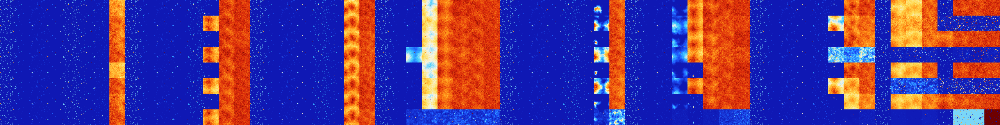

# B367 (102400-102911)

<details>
    <summary>Initial Grid</summary>
    
</details>


<details>
    <summary>Initial Grid RLE</summary>

```
#C Exported from GoGoL (https://github.com/marrow16/gogol)
#C Wrap mode: Toroidal
#C Boundary mode: Dead
#C Step: 0
x = 100, y = 100, rule = B367/S
2bo14bo19bo48bo$9bo2bo6bo$8bo26bo20bo6bo21bob2o$3bo37b2o25bo9bobo2bo$bo
18bo78bo$14bo31bo$3bo38bo5bo18bo7bo4bo$25b2o$21bo18bo16bo8bo6bo15bo7bo$
11bo10bo8bo16bo7bo25bo$2bo36bo45bo9bo$17b2o36bo8bobo$23bo16bo6bo51bo$5b
o8bo22bo8bo36bo$21bo$6b2o72b2o4bo8bo$39bobo7bo13bo4bo10bo14bo$2bobo9bo
5bo$100b$30bo9bo$15bo4bo47bo9bo$o17bo3bo7bo7bo41bo14bo$9bo19bobo22bo22b
o6bo$16bo21bo58bo$2bo9bo3bo19bo14bo12bo$10bo47bo12bo13bo9bo$4bo30bo29bo
22bo$21bo15bo26bo9bo13bo$19bo$10bo26b2o3bo42bo$16bo38bo9bo$10bo21bo14bo
2bo2bo30bo$7bo3bo9bo6bo32bo36bo$45bo$17bo3bobo52bo4bo$14bobo27bo11bo32b
o$23bo28bo6bo8bo$53b2o23bo4bo$2bo13bo11bo15bo2bo9bo$13bo42bo10bo12bo$8b
o3bo4bo5bobo11bo11bo3bo3bo15bo5bo$3bo38bo2bo$b2o53bo5bo15bo4bo4bo$17bo
70bo4b2o$25bo7bo29bo11bo15bo$bo40bo21bo33bo$5bo27bo8bo12bo32bo$12bo3bo
38bo23bo15bo$15bo3bo37bo8bo$3b2o34bobo4bo3bo4b2o15bo$64bo$9bo2bo16bo4bo
7bo23bo$31bo4bo33bo17bo$10bo22bo7bo31bo24bo$16bo$5bo17bo10bo7bo$21bo20b
o20bo$bo15b2o37bobo28bo6bo$38b2o10bo25bo7bo12bo$10bo21bo6bo23bo$4bo20bo
7bo8bo8bo3bo22bo$6b2o20bo19bo5bo5bo3bo9bo7bo5bo10bo$3b3o2bo4bo6bobo17bo
16bo$24bo9bo26bo$4bo4bo15bobo39bo19bobo2bo$4bo5bo4bo17bo2bo7bo4bo21bo2b
o20bo$10bo29bo19bobo28bo5b2o$15bo9bo21bo8bo8bo15bo17bo$6bobo4bo6bo14bo
18bo21bo8bo6bo$21bo14bo9bo16bo3bo5bo7bo$27bo20bo28bo$100b$5bo27bo5b2o
24bo27bo$25bo29bo12bo$29bo$32bo5bo22bo$17bo18bo8bo19bo$31bo55bo$8bo21bo
64bo$7bo6bo30bo7bo3bo22bo$5b2o13bo14bo46bo$18bo5bo19bo19bo31bo$9bo16bo
51bo3bo3bo$20bo32bo20bo2bo17bo$36b2obo9bo12b2o$5bo2bo28bo11bo6bo33bo$
10bo40bo26bo2bo13bo$13bo28bo3bo22bo$8bobo25bo8bo29bo11bo$33bo20bo18bo$
15bo24bo9bo$bo27bo5bo12bo32bo$17bo9bo66bo$4bo14bo2b2o$41bo33bo$36bo22bo
26bo$7bobobo40bo2bo12bobo7bo$60bo16bo3bo4bo10bo$17bobo19bo5bo20bo8bo$o
2bo25bo35bo!
```
</details>
<details>
    <summary>Thumbnail</summary>

</details>
<table>
<tr>
    <td><a href="./102400%20S%20Heat%20Map%20Activity.png"></a><br>S (102400)<br>S@3</td>    <td><a href="./102401%20S0%20Heat%20Map%20Activity.png"></a><br>S0 (102401)<br>R@8,p4</td>    <td><a href="./102402%20S1%20Heat%20Map%20Activity.png"></a><br>S1 (102402)<br>R@12,p2</td>    <td><a href="./102403%20S01%20Heat%20Map%20Activity.png"></a><br>S01 (102403)<br>R@14,p4</td>    <td><a href="./102404%20S2%20Heat%20Map%20Activity.png"></a><br>S2 (102404)<br>S@3</td>    <td><a href="./102405%20S02%20Heat%20Map%20Activity.png"></a><br>S02 (102405)<br>S@6</td>    <td><a href="./102406%20S12%20Heat%20Map%20Activity.png"></a><br>S12 (102406)<br>R@20,p4</td>    <td><a href="./102407%20S012%20Heat%20Map%20Activity.png"></a><br>S012 (102407)<br>G>1000</td>    <td><a href="./102408%20S3%20Heat%20Map%20Activity.png"></a><br>S3 (102408)<br>S@3</td>    <td><a href="./102409%20S03%20Heat%20Map%20Activity.png"></a><br>S03 (102409)<br>R@9,p4</td>    <td><a href="./102410%20S13%20Heat%20Map%20Activity.png"></a><br>S13 (102410)<br>R@13,p2</td>    <td><a href="./102411%20S013%20Heat%20Map%20Activity.png"></a><br>S013 (102411)<br>R@33,p4</td>    <td><a href="./102412%20S23%20Heat%20Map%20Activity.png"></a><br>S23 (102412)<br>S@4</td>    <td><a href="./102413%20S023%20Heat%20Map%20Activity.png"></a><br>S023 (102413)<br>S@20</td>    <td><a href="./102414%20S123%20Heat%20Map%20Activity.png"></a><br>S123 (102414)<br>G>1000</td>    <td><a href="./102415%20S0123%20Heat%20Map%20Activity.png"></a><br>S0123 (102415)<br>G>1000</td>    <td><a href="./102416%20S4%20Heat%20Map%20Activity.png"></a><br>S4 (102416)<br>S@3</td>    <td><a href="./102417%20S04%20Heat%20Map%20Activity.png"></a><br>S04 (102417)<br>R@8,p4</td>    <td><a href="./102418%20S14%20Heat%20Map%20Activity.png"></a><br>S14 (102418)<br>R@11,p2</td>    <td><a href="./102419%20S014%20Heat%20Map%20Activity.png"></a><br>S014 (102419)<br>R@19,p8</td>    <td><a href="./102420%20S24%20Heat%20Map%20Activity.png"></a><br>S24 (102420)<br>S@5</td>    <td><a href="./102421%20S024%20Heat%20Map%20Activity.png"></a><br>S024 (102421)<br>S@12</td>    <td><a href="./102422%20S124%20Heat%20Map%20Activity.png"></a><br>S124 (102422)<br>G>1000</td>    <td><a href="./102423%20S0124%20Heat%20Map%20Activity.png"></a><br>S0124 (102423)<br>G>1000</td>    <td><a href="./102424%20S34%20Heat%20Map%20Activity.png"></a><br>S34 (102424)<br>S@3</td>    <td><a href="./102425%20S034%20Heat%20Map%20Activity.png"></a><br>S034 (102425)<br>R@10,p4</td>    <td><a href="./102426%20S134%20Heat%20Map%20Activity.png"></a><br>S134 (102426)<br>R@23,p2</td>    <td><a href="./102427%20S0134%20Heat%20Map%20Activity.png"></a><br>S0134 (102427)<br>G>1000</td>    <td><a href="./102428%20S234%20Heat%20Map%20Activity.png"></a><br>S234 (102428)<br>G>1000</td>    <td><a href="./102429%20S0234%20Heat%20Map%20Activity.png"></a><br>S0234 (102429)<br>G>1000</td>    <td><a href="./102430%20S1234%20Heat%20Map%20Activity.png"></a><br>S1234 (102430)<br>G>1000</td>    <td><a href="./102431%20S01234%20Heat%20Map%20Activity.png"></a><br>S01234 (102431)<br>G>1000</td>    <td><a href="./102432%20S5%20Heat%20Map%20Activity.png"></a><br>S5 (102432)<br>S@3</td>    <td><a href="./102433%20S05%20Heat%20Map%20Activity.png"></a><br>S05 (102433)<br>R@8,p4</td>    <td><a href="./102434%20S15%20Heat%20Map%20Activity.png"></a><br>S15 (102434)<br>R@12,p2</td>    <td><a href="./102435%20S015%20Heat%20Map%20Activity.png"></a><br>S015 (102435)<br>R@14,p4</td>    <td><a href="./102436%20S25%20Heat%20Map%20Activity.png"></a><br>S25 (102436)<br>R@5,p2</td>    <td><a href="./102437%20S025%20Heat%20Map%20Activity.png"></a><br>S025 (102437)<br>S@7</td>    <td><a href="./102438%20S125%20Heat%20Map%20Activity.png"></a><br>S125 (102438)<br>G>1000</td>    <td><a href="./102439%20S0125%20Heat%20Map%20Activity.png"></a><br>S0125 (102439)<br>G>1000</td>    <td><a href="./102440%20S35%20Heat%20Map%20Activity.png"></a><br>S35 (102440)<br>S@3</td>    <td><a href="./102441%20S035%20Heat%20Map%20Activity.png"></a><br>S035 (102441)<br>R@12,p4</td>    <td><a href="./102442%20S135%20Heat%20Map%20Activity.png"></a><br>S135 (102442)<br>R@14,p2</td>    <td><a href="./102443%20S0135%20Heat%20Map%20Activity.png"></a><br>S0135 (102443)<br>G>1000</td>    <td><a href="./102444%20S235%20Heat%20Map%20Activity.png"></a><br>S235 (102444)<br>G>1000</td>    <td><a href="./102445%20S0235%20Heat%20Map%20Activity.png"></a><br>S0235 (102445)<br>G>1000</td>    <td><a href="./102446%20S1235%20Heat%20Map%20Activity.png"></a><br>S1235 (102446)<br>G>1000</td>    <td><a href="./102447%20S01235%20Heat%20Map%20Activity.png"></a><br>S01235 (102447)<br>G>1000</td>    <td><a href="./102448%20S45%20Heat%20Map%20Activity.png"></a><br>S45 (102448)<br>S@3</td>    <td><a href="./102449%20S045%20Heat%20Map%20Activity.png"></a><br>S045 (102449)<br>R@8,p4</td>    <td><a href="./102450%20S145%20Heat%20Map%20Activity.png"></a><br>S145 (102450)<br>R@11,p2</td>    <td><a href="./102451%20S0145%20Heat%20Map%20Activity.png"></a><br>S0145 (102451)<br>R@30,p8</td>    <td><a href="./102452%20S245%20Heat%20Map%20Activity.png"></a><br>S245 (102452)<br>R@9,p2</td>    <td><a href="./102453%20S0245%20Heat%20Map%20Activity.png"></a><br>S0245 (102453)<br>S@30</td>    <td><a href="./102454%20S1245%20Heat%20Map%20Activity.png"></a><br>S1245 (102454)<br>G>1000</td>    <td><a href="./102455%20S01245%20Heat%20Map%20Activity.png"></a><br>S01245 (102455)<br>G>1000</td>    <td><a href="./102456%20S345%20Heat%20Map%20Activity.png"></a><br>S345 (102456)<br>S@3</td>    <td><a href="./102457%20S0345%20Heat%20Map%20Activity.png"></a><br>S0345 (102457)<br>G>1000</td>    <td><a href="./102458%20S1345%20Heat%20Map%20Activity.png"></a><br>S1345 (102458)<br>G>1000</td>    <td><a href="./102459%20S01345%20Heat%20Map%20Activity.png"></a><br>S01345 (102459)<br>G>1000</td>    <td><a href="./102460%20S2345%20Heat%20Map%20Activity.png"></a><br>S2345 (102460)<br>S@6</td>    <td><a href="./102461%20S02345%20Heat%20Map%20Activity.png"></a><br>S02345 (102461)<br>G>1000</td>    <td><a href="./102462%20S12345%20Heat%20Map%20Activity.png"></a><br>S12345 (102462)<br>G>1000</td>    <td><a href="./102463%20S012345%20Heat%20Map%20Activity.png"></a><br>S012345 (102463)<br>G>1000</td></tr>
<tr>
    <td><a href="./102464%20S6%20Heat%20Map%20Activity.png"></a><br>S6 (102464)<br>S@3</td>    <td><a href="./102465%20S06%20Heat%20Map%20Activity.png"></a><br>S06 (102465)<br>R@8,p4</td>    <td><a href="./102466%20S16%20Heat%20Map%20Activity.png"></a><br>S16 (102466)<br>R@12,p2</td>    <td><a href="./102467%20S016%20Heat%20Map%20Activity.png"></a><br>S016 (102467)<br>R@14,p4</td>    <td><a href="./102468%20S26%20Heat%20Map%20Activity.png"></a><br>S26 (102468)<br>S@3</td>    <td><a href="./102469%20S026%20Heat%20Map%20Activity.png"></a><br>S026 (102469)<br>S@6</td>    <td><a href="./102470%20S126%20Heat%20Map%20Activity.png"></a><br>S126 (102470)<br>S@24</td>    <td><a href="./102471%20S0126%20Heat%20Map%20Activity.png"></a><br>S0126 (102471)<br>G>1000</td>    <td><a href="./102472%20S36%20Heat%20Map%20Activity.png"></a><br>S36 (102472)<br>S@3</td>    <td><a href="./102473%20S036%20Heat%20Map%20Activity.png"></a><br>S036 (102473)<br>R@10,p4</td>    <td><a href="./102474%20S136%20Heat%20Map%20Activity.png"></a><br>S136 (102474)<br>R@28,p2</td>    <td><a href="./102475%20S0136%20Heat%20Map%20Activity.png"></a><br>S0136 (102475)<br>R@115,p4</td>    <td><a href="./102476%20S236%20Heat%20Map%20Activity.png"></a><br>S236 (102476)<br>S@4</td>    <td><a href="./102477%20S0236%20Heat%20Map%20Activity.png"></a><br>S0236 (102477)<br>G>1000</td>    <td><a href="./102478%20S1236%20Heat%20Map%20Activity.png"></a><br>S1236 (102478)<br>G>1000</td>    <td><a href="./102479%20S01236%20Heat%20Map%20Activity.png"></a><br>S01236 (102479)<br>G>1000</td>    <td><a href="./102480%20S46%20Heat%20Map%20Activity.png"></a><br>S46 (102480)<br>S@3</td>    <td><a href="./102481%20S046%20Heat%20Map%20Activity.png"></a><br>S046 (102481)<br>R@8,p4</td>    <td><a href="./102482%20S146%20Heat%20Map%20Activity.png"></a><br>S146 (102482)<br>R@11,p2</td>    <td><a href="./102483%20S0146%20Heat%20Map%20Activity.png"></a><br>S0146 (102483)<br>R@19,p8</td>    <td><a href="./102484%20S246%20Heat%20Map%20Activity.png"></a><br>S246 (102484)<br>S@5</td>    <td><a href="./102485%20S0246%20Heat%20Map%20Activity.png"></a><br>S0246 (102485)<br>S@12</td>    <td><a href="./102486%20S1246%20Heat%20Map%20Activity.png"></a><br>S1246 (102486)<br>G>1000</td>    <td><a href="./102487%20S01246%20Heat%20Map%20Activity.png"></a><br>S01246 (102487)<br>G>1000</td>    <td><a href="./102488%20S346%20Heat%20Map%20Activity.png"></a><br>S346 (102488)<br>S@3</td>    <td><a href="./102489%20S0346%20Heat%20Map%20Activity.png"></a><br>S0346 (102489)<br>R@13,p4</td>    <td><a href="./102490%20S1346%20Heat%20Map%20Activity.png"></a><br>S1346 (102490)<br>R@22,p2</td>    <td><a href="./102491%20S01346%20Heat%20Map%20Activity.png"></a><br>S01346 (102491)<br>G>1000</td>    <td><a href="./102492%20S2346%20Heat%20Map%20Activity.png"></a><br>S2346 (102492)<br>G>1000</td>    <td><a href="./102493%20S02346%20Heat%20Map%20Activity.png"></a><br>S02346 (102493)<br>G>1000</td>    <td><a href="./102494%20S12346%20Heat%20Map%20Activity.png"></a><br>S12346 (102494)<br>G>1000</td>    <td><a href="./102495%20S012346%20Heat%20Map%20Activity.png"></a><br>S012346 (102495)<br>G>1000</td>    <td><a href="./102496%20S56%20Heat%20Map%20Activity.png"></a><br>S56 (102496)<br>S@3</td>    <td><a href="./102497%20S056%20Heat%20Map%20Activity.png"></a><br>S056 (102497)<br>R@8,p4</td>    <td><a href="./102498%20S156%20Heat%20Map%20Activity.png"></a><br>S156 (102498)<br>R@12,p2</td>    <td><a href="./102499%20S0156%20Heat%20Map%20Activity.png"></a><br>S0156 (102499)<br>R@14,p4</td>    <td><a href="./102500%20S256%20Heat%20Map%20Activity.png"></a><br>S256 (102500)<br>R@5,p2</td>    <td><a href="./102501%20S0256%20Heat%20Map%20Activity.png"></a><br>S0256 (102501)<br>S@7</td>    <td><a href="./102502%20S1256%20Heat%20Map%20Activity.png"></a><br>S1256 (102502)<br>G>1000</td>    <td><a href="./102503%20S01256%20Heat%20Map%20Activity.png"></a><br>S01256 (102503)<br>G>1000</td>    <td><a href="./102504%20S356%20Heat%20Map%20Activity.png"></a><br>S356 (102504)<br>S@3</td>    <td><a href="./102505%20S0356%20Heat%20Map%20Activity.png"></a><br>S0356 (102505)<br>R@11,p4</td>    <td><a href="./102506%20S1356%20Heat%20Map%20Activity.png"></a><br>S1356 (102506)<br>R@24,p2</td>    <td><a href="./102507%20S01356%20Heat%20Map%20Activity.png"></a><br>S01356 (102507)<br>G>1000</td>    <td><a href="./102508%20S2356%20Heat%20Map%20Activity.png"></a><br>S2356 (102508)<br>G>1000</td>    <td><a href="./102509%20S02356%20Heat%20Map%20Activity.png"></a><br>S02356 (102509)<br>G>1000</td>    <td><a href="./102510%20S12356%20Heat%20Map%20Activity.png"></a><br>S12356 (102510)<br>G>1000</td>    <td><a href="./102511%20S012356%20Heat%20Map%20Activity.png"></a><br>S012356 (102511)<br>G>1000</td>    <td><a href="./102512%20S456%20Heat%20Map%20Activity.png"></a><br>S456 (102512)<br>S@3</td>    <td><a href="./102513%20S0456%20Heat%20Map%20Activity.png"></a><br>S0456 (102513)<br>R@8,p4</td>    <td><a href="./102514%20S1456%20Heat%20Map%20Activity.png"></a><br>S1456 (102514)<br>R@11,p2</td>    <td><a href="./102515%20S01456%20Heat%20Map%20Activity.png"></a><br>S01456 (102515)<br>R@30,p8</td>    <td><a href="./102516%20S2456%20Heat%20Map%20Activity.png"></a><br>S2456 (102516)<br>R@9,p2</td>    <td><a href="./102517%20S02456%20Heat%20Map%20Activity.png"></a><br>S02456 (102517)<br>G>1000</td>    <td><a href="./102518%20S12456%20Heat%20Map%20Activity.png"></a><br>S12456 (102518)<br>G>1000</td>    <td><a href="./102519%20S012456%20Heat%20Map%20Activity.png"></a><br>S012456 (102519)<br>G>1000</td>    <td><a href="./102520%20S3456%20Heat%20Map%20Activity.png"></a><br>S3456 (102520)<br>S@3</td>    <td><a href="./102521%20S03456%20Heat%20Map%20Activity.png"></a><br>S03456 (102521)<br>G>1000</td>    <td><a href="./102522%20S13456%20Heat%20Map%20Activity.png"></a><br>S13456 (102522)<br>G>1000</td>    <td><a href="./102523%20S013456%20Heat%20Map%20Activity.png"></a><br>S013456 (102523)<br>G>1000</td>    <td><a href="./102524%20S23456%20Heat%20Map%20Activity.png"></a><br>S23456 (102524)<br>G>1000</td>    <td><a href="./102525%20S023456%20Heat%20Map%20Activity.png"></a><br>S023456 (102525)<br>G>1000</td>    <td><a href="./102526%20S123456%20Heat%20Map%20Activity.png"></a><br>S123456 (102526)<br>G>1000</td>    <td><a href="./102527%20S0123456%20Heat%20Map%20Activity.png"></a><br>S0123456 (102527)<br>G>1000</td></tr>
<tr>
    <td><a href="./102528%20S7%20Heat%20Map%20Activity.png"></a><br>S7 (102528)<br>S@3</td>    <td><a href="./102529%20S07%20Heat%20Map%20Activity.png"></a><br>S07 (102529)<br>R@8,p4</td>    <td><a href="./102530%20S17%20Heat%20Map%20Activity.png"></a><br>S17 (102530)<br>R@12,p2</td>    <td><a href="./102531%20S017%20Heat%20Map%20Activity.png"></a><br>S017 (102531)<br>R@14,p4</td>    <td><a href="./102532%20S27%20Heat%20Map%20Activity.png"></a><br>S27 (102532)<br>S@3</td>    <td><a href="./102533%20S027%20Heat%20Map%20Activity.png"></a><br>S027 (102533)<br>S@6</td>    <td><a href="./102534%20S127%20Heat%20Map%20Activity.png"></a><br>S127 (102534)<br>S@43</td>    <td><a href="./102535%20S0127%20Heat%20Map%20Activity.png"></a><br>S0127 (102535)<br>G>1000</td>    <td><a href="./102536%20S37%20Heat%20Map%20Activity.png"></a><br>S37 (102536)<br>S@3</td>    <td><a href="./102537%20S037%20Heat%20Map%20Activity.png"></a><br>S037 (102537)<br>R@9,p4</td>    <td><a href="./102538%20S137%20Heat%20Map%20Activity.png"></a><br>S137 (102538)<br>R@11,p2</td>    <td><a href="./102539%20S0137%20Heat%20Map%20Activity.png"></a><br>S0137 (102539)<br>R@66,p4</td>    <td><a href="./102540%20S237%20Heat%20Map%20Activity.png"></a><br>S237 (102540)<br>S@4</td>    <td><a href="./102541%20S0237%20Heat%20Map%20Activity.png"></a><br>S0237 (102541)<br>S@12</td>    <td><a href="./102542%20S1237%20Heat%20Map%20Activity.png"></a><br>S1237 (102542)<br>G>1000</td>    <td><a href="./102543%20S01237%20Heat%20Map%20Activity.png"></a><br>S01237 (102543)<br>G>1000</td>    <td><a href="./102544%20S47%20Heat%20Map%20Activity.png"></a><br>S47 (102544)<br>S@3</td>    <td><a href="./102545%20S047%20Heat%20Map%20Activity.png"></a><br>S047 (102545)<br>R@8,p4</td>    <td><a href="./102546%20S147%20Heat%20Map%20Activity.png"></a><br>S147 (102546)<br>R@11,p2</td>    <td><a href="./102547%20S0147%20Heat%20Map%20Activity.png"></a><br>S0147 (102547)<br>R@19,p8</td>    <td><a href="./102548%20S247%20Heat%20Map%20Activity.png"></a><br>S247 (102548)<br>S@5</td>    <td><a href="./102549%20S0247%20Heat%20Map%20Activity.png"></a><br>S0247 (102549)<br>S@12</td>    <td><a href="./102550%20S1247%20Heat%20Map%20Activity.png"></a><br>S1247 (102550)<br>G>1000</td>    <td><a href="./102551%20S01247%20Heat%20Map%20Activity.png"></a><br>S01247 (102551)<br>G>1000</td>    <td><a href="./102552%20S347%20Heat%20Map%20Activity.png"></a><br>S347 (102552)<br>S@3</td>    <td><a href="./102553%20S0347%20Heat%20Map%20Activity.png"></a><br>S0347 (102553)<br>R@10,p4</td>    <td><a href="./102554%20S1347%20Heat%20Map%20Activity.png"></a><br>S1347 (102554)<br>R@30,p2</td>    <td><a href="./102555%20S01347%20Heat%20Map%20Activity.png"></a><br>S01347 (102555)<br>G>1000</td>    <td><a href="./102556%20S2347%20Heat%20Map%20Activity.png"></a><br>S2347 (102556)<br>G>1000</td>    <td><a href="./102557%20S02347%20Heat%20Map%20Activity.png"></a><br>S02347 (102557)<br>G>1000</td>    <td><a href="./102558%20S12347%20Heat%20Map%20Activity.png"></a><br>S12347 (102558)<br>G>1000</td>    <td><a href="./102559%20S012347%20Heat%20Map%20Activity.png"></a><br>S012347 (102559)<br>G>1000</td>    <td><a href="./102560%20S57%20Heat%20Map%20Activity.png"></a><br>S57 (102560)<br>S@3</td>    <td><a href="./102561%20S057%20Heat%20Map%20Activity.png"></a><br>S057 (102561)<br>R@8,p4</td>    <td><a href="./102562%20S157%20Heat%20Map%20Activity.png"></a><br>S157 (102562)<br>R@12,p2</td>    <td><a href="./102563%20S0157%20Heat%20Map%20Activity.png"></a><br>S0157 (102563)<br>R@14,p4</td>    <td><a href="./102564%20S257%20Heat%20Map%20Activity.png"></a><br>S257 (102564)<br>R@5,p2</td>    <td><a href="./102565%20S0257%20Heat%20Map%20Activity.png"></a><br>S0257 (102565)<br>S@7</td>    <td><a href="./102566%20S1257%20Heat%20Map%20Activity.png"></a><br>S1257 (102566)<br>S@551</td>    <td><a href="./102567%20S01257%20Heat%20Map%20Activity.png"></a><br>S01257 (102567)<br>G>1000</td>    <td><a href="./102568%20S357%20Heat%20Map%20Activity.png"></a><br>S357 (102568)<br>S@3</td>    <td><a href="./102569%20S0357%20Heat%20Map%20Activity.png"></a><br>S0357 (102569)<br>R@12,p4</td>    <td><a href="./102570%20S1357%20Heat%20Map%20Activity.png"></a><br>S1357 (102570)<br>R@18,p2</td>    <td><a href="./102571%20S01357%20Heat%20Map%20Activity.png"></a><br>S01357 (102571)<br>G>1000</td>    <td><a href="./102572%20S2357%20Heat%20Map%20Activity.png"></a><br>S2357 (102572)<br>G>1000</td>    <td><a href="./102573%20S02357%20Heat%20Map%20Activity.png"></a><br>S02357 (102573)<br>G>1000</td>    <td><a href="./102574%20S12357%20Heat%20Map%20Activity.png"></a><br>S12357 (102574)<br>G>1000</td>    <td><a href="./102575%20S012357%20Heat%20Map%20Activity.png"></a><br>S012357 (102575)<br>G>1000</td>    <td><a href="./102576%20S457%20Heat%20Map%20Activity.png"></a><br>S457 (102576)<br>S@3</td>    <td><a href="./102577%20S0457%20Heat%20Map%20Activity.png"></a><br>S0457 (102577)<br>R@8,p4</td>    <td><a href="./102578%20S1457%20Heat%20Map%20Activity.png"></a><br>S1457 (102578)<br>R@11,p2</td>    <td><a href="./102579%20S01457%20Heat%20Map%20Activity.png"></a><br>S01457 (102579)<br>R@30,p8</td>    <td><a href="./102580%20S2457%20Heat%20Map%20Activity.png"></a><br>S2457 (102580)<br>R@9,p2</td>    <td><a href="./102581%20S02457%20Heat%20Map%20Activity.png"></a><br>S02457 (102581)<br>S@55</td>    <td><a href="./102582%20S12457%20Heat%20Map%20Activity.png"></a><br>S12457 (102582)<br>G>1000</td>    <td><a href="./102583%20S012457%20Heat%20Map%20Activity.png"></a><br>S012457 (102583)<br>G>1000</td>    <td><a href="./102584%20S3457%20Heat%20Map%20Activity.png"></a><br>S3457 (102584)<br>S@3</td>    <td><a href="./102585%20S03457%20Heat%20Map%20Activity.png"></a><br>S03457 (102585)<br>G>1000</td>    <td><a href="./102586%20S13457%20Heat%20Map%20Activity.png"></a><br>S13457 (102586)<br>G>1000</td>    <td><a href="./102587%20S013457%20Heat%20Map%20Activity.png"></a><br>S013457 (102587)<br>G>1000</td>    <td><a href="./102588%20S23457%20Heat%20Map%20Activity.png"></a><br>S23457 (102588)<br>G>1000</td>    <td><a href="./102589%20S023457%20Heat%20Map%20Activity.png"></a><br>S023457 (102589)<br>G>1000</td>    <td><a href="./102590%20S123457%20Heat%20Map%20Activity.png"></a><br>S123457 (102590)<br>G>1000</td>    <td><a href="./102591%20S0123457%20Heat%20Map%20Activity.png"></a><br>S0123457 (102591)<br>G>1000</td></tr>
<tr>
    <td><a href="./102592%20S67%20Heat%20Map%20Activity.png"></a><br>S67 (102592)<br>S@3</td>    <td><a href="./102593%20S067%20Heat%20Map%20Activity.png"></a><br>S067 (102593)<br>R@8,p4</td>    <td><a href="./102594%20S167%20Heat%20Map%20Activity.png"></a><br>S167 (102594)<br>R@12,p2</td>    <td><a href="./102595%20S0167%20Heat%20Map%20Activity.png"></a><br>S0167 (102595)<br>R@14,p4</td>    <td><a href="./102596%20S267%20Heat%20Map%20Activity.png"></a><br>S267 (102596)<br>S@3</td>    <td><a href="./102597%20S0267%20Heat%20Map%20Activity.png"></a><br>S0267 (102597)<br>S@6</td>    <td><a href="./102598%20S1267%20Heat%20Map%20Activity.png"></a><br>S1267 (102598)<br>S@46</td>    <td><a href="./102599%20S01267%20Heat%20Map%20Activity.png"></a><br>S01267 (102599)<br>G>1000</td>    <td><a href="./102600%20S367%20Heat%20Map%20Activity.png"></a><br>S367 (102600)<br>S@3</td>    <td><a href="./102601%20S0367%20Heat%20Map%20Activity.png"></a><br>S0367 (102601)<br>R@10,p4</td>    <td><a href="./102602%20S1367%20Heat%20Map%20Activity.png"></a><br>S1367 (102602)<br>R@20,p2</td>    <td><a href="./102603%20S01367%20Heat%20Map%20Activity.png"></a><br>S01367 (102603)<br>R@65,p4</td>    <td><a href="./102604%20S2367%20Heat%20Map%20Activity.png"></a><br>S2367 (102604)<br>S@4</td>    <td><a href="./102605%20S02367%20Heat%20Map%20Activity.png"></a><br>S02367 (102605)<br>G>1000</td>    <td><a href="./102606%20S12367%20Heat%20Map%20Activity.png"></a><br>S12367 (102606)<br>G>1000</td>    <td><a href="./102607%20S012367%20Heat%20Map%20Activity.png"></a><br>S012367 (102607)<br>G>1000</td>    <td><a href="./102608%20S467%20Heat%20Map%20Activity.png"></a><br>S467 (102608)<br>S@3</td>    <td><a href="./102609%20S0467%20Heat%20Map%20Activity.png"></a><br>S0467 (102609)<br>R@8,p4</td>    <td><a href="./102610%20S1467%20Heat%20Map%20Activity.png"></a><br>S1467 (102610)<br>R@11,p2</td>    <td><a href="./102611%20S01467%20Heat%20Map%20Activity.png"></a><br>S01467 (102611)<br>R@19,p8</td>    <td><a href="./102612%20S2467%20Heat%20Map%20Activity.png"></a><br>S2467 (102612)<br>S@5</td>    <td><a href="./102613%20S02467%20Heat%20Map%20Activity.png"></a><br>S02467 (102613)<br>S@12</td>    <td><a href="./102614%20S12467%20Heat%20Map%20Activity.png"></a><br>S12467 (102614)<br>G>1000</td>    <td><a href="./102615%20S012467%20Heat%20Map%20Activity.png"></a><br>S012467 (102615)<br>G>1000</td>    <td><a href="./102616%20S3467%20Heat%20Map%20Activity.png"></a><br>S3467 (102616)<br>S@3</td>    <td><a href="./102617%20S03467%20Heat%20Map%20Activity.png"></a><br>S03467 (102617)<br>R@13,p4</td>    <td><a href="./102618%20S13467%20Heat%20Map%20Activity.png"></a><br>S13467 (102618)<br>G>1000</td>    <td><a href="./102619%20S013467%20Heat%20Map%20Activity.png"></a><br>S013467 (102619)<br>G>1000</td>    <td><a href="./102620%20S23467%20Heat%20Map%20Activity.png"></a><br>S23467 (102620)<br>G>1000</td>    <td><a href="./102621%20S023467%20Heat%20Map%20Activity.png"></a><br>S023467 (102621)<br>G>1000</td>    <td><a href="./102622%20S123467%20Heat%20Map%20Activity.png"></a><br>S123467 (102622)<br>G>1000</td>    <td><a href="./102623%20S0123467%20Heat%20Map%20Activity.png"></a><br>S0123467 (102623)<br>G>1000</td>    <td><a href="./102624%20S567%20Heat%20Map%20Activity.png"></a><br>S567 (102624)<br>S@3</td>    <td><a href="./102625%20S0567%20Heat%20Map%20Activity.png"></a><br>S0567 (102625)<br>R@8,p4</td>    <td><a href="./102626%20S1567%20Heat%20Map%20Activity.png"></a><br>S1567 (102626)<br>R@12,p2</td>    <td><a href="./102627%20S01567%20Heat%20Map%20Activity.png"></a><br>S01567 (102627)<br>R@14,p4</td>    <td><a href="./102628%20S2567%20Heat%20Map%20Activity.png"></a><br>S2567 (102628)<br>R@5,p2</td>    <td><a href="./102629%20S02567%20Heat%20Map%20Activity.png"></a><br>S02567 (102629)<br>S@7</td>    <td><a href="./102630%20S12567%20Heat%20Map%20Activity.png"></a><br>S12567 (102630)<br>G>1000</td>    <td><a href="./102631%20S012567%20Heat%20Map%20Activity.png"></a><br>S012567 (102631)<br>G>1000</td>    <td><a href="./102632%20S3567%20Heat%20Map%20Activity.png"></a><br>S3567 (102632)<br>S@3</td>    <td><a href="./102633%20S03567%20Heat%20Map%20Activity.png"></a><br>S03567 (102633)<br>R@11,p4</td>    <td><a href="./102634%20S13567%20Heat%20Map%20Activity.png"></a><br>S13567 (102634)<br>R@17,p2</td>    <td><a href="./102635%20S013567%20Heat%20Map%20Activity.png"></a><br>S013567 (102635)<br>G>1000</td>    <td><a href="./102636%20S23567%20Heat%20Map%20Activity.png"></a><br>S23567 (102636)<br>G>1000</td>    <td><a href="./102637%20S023567%20Heat%20Map%20Activity.png"></a><br>S023567 (102637)<br>G>1000</td>    <td><a href="./102638%20S123567%20Heat%20Map%20Activity.png"></a><br>S123567 (102638)<br>G>1000</td>    <td><a href="./102639%20S0123567%20Heat%20Map%20Activity.png"></a><br>S0123567 (102639)<br>G>1000</td>    <td><a href="./102640%20S4567%20Heat%20Map%20Activity.png"></a><br>S4567 (102640)<br>S@3</td>    <td><a href="./102641%20S04567%20Heat%20Map%20Activity.png"></a><br>S04567 (102641)<br>R@8,p4</td>    <td><a href="./102642%20S14567%20Heat%20Map%20Activity.png"></a><br>S14567 (102642)<br>R@11,p2</td>    <td><a href="./102643%20S014567%20Heat%20Map%20Activity.png"></a><br>S014567 (102643)<br>R@30,p8</td>    <td><a href="./102644%20S24567%20Heat%20Map%20Activity.png"></a><br>S24567 (102644)<br>R@9,p2</td>    <td><a href="./102645%20S024567%20Heat%20Map%20Activity.png"></a><br>S024567 (102645)<br>G>1000</td>    <td><a href="./102646%20S124567%20Heat%20Map%20Activity.png"></a><br>S124567 (102646)<br>G>1000</td>    <td><a href="./102647%20S0124567%20Heat%20Map%20Activity.png"></a><br>S0124567 (102647)<br>G>1000</td>    <td><a href="./102648%20S34567%20Heat%20Map%20Activity.png"></a><br>S34567 (102648)<br>S@3</td>    <td><a href="./102649%20S034567%20Heat%20Map%20Activity.png"></a><br>S034567 (102649)<br>R@260,p60</td>    <td><a href="./102650%20S134567%20Heat%20Map%20Activity.png"></a><br>S134567 (102650)<br>R@198,p12</td>    <td><a href="./102651%20S0134567%20Heat%20Map%20Activity.png"></a><br>S0134567 (102651)<br>R@185,p60</td>    <td><a href="./102652%20S234567%20Heat%20Map%20Activity.png"></a><br>S234567 (102652)<br>S@6</td>    <td><a href="./102653%20S0234567%20Heat%20Map%20Activity.png"></a><br>S0234567 (102653)<br>R@225,p60</td>    <td><a href="./102654%20S1234567%20Heat%20Map%20Activity.png"></a><br>S1234567 (102654)<br>R@573,p420</td>    <td><a href="./102655%20S01234567%20Heat%20Map%20Activity.png"></a><br>S01234567 (102655)<br>R@178,p84</td></tr>
<tr>
    <td><a href="./102656%20S8%20Heat%20Map%20Activity.png"></a><br>S8 (102656)<br>S@3</td>    <td><a href="./102657%20S08%20Heat%20Map%20Activity.png"></a><br>S08 (102657)<br>R@8,p4</td>    <td><a href="./102658%20S18%20Heat%20Map%20Activity.png"></a><br>S18 (102658)<br>R@12,p2</td>    <td><a href="./102659%20S018%20Heat%20Map%20Activity.png"></a><br>S018 (102659)<br>R@14,p4</td>    <td><a href="./102660%20S28%20Heat%20Map%20Activity.png"></a><br>S28 (102660)<br>S@3</td>    <td><a href="./102661%20S028%20Heat%20Map%20Activity.png"></a><br>S028 (102661)<br>S@6</td>    <td><a href="./102662%20S128%20Heat%20Map%20Activity.png"></a><br>S128 (102662)<br>R@21,p4</td>    <td><a href="./102663%20S0128%20Heat%20Map%20Activity.png"></a><br>S0128 (102663)<br>G>1000</td>    <td><a href="./102664%20S38%20Heat%20Map%20Activity.png"></a><br>S38 (102664)<br>S@3</td>    <td><a href="./102665%20S038%20Heat%20Map%20Activity.png"></a><br>S038 (102665)<br>R@9,p4</td>    <td><a href="./102666%20S138%20Heat%20Map%20Activity.png"></a><br>S138 (102666)<br>R@13,p2</td>    <td><a href="./102667%20S0138%20Heat%20Map%20Activity.png"></a><br>S0138 (102667)<br>R@33,p4</td>    <td><a href="./102668%20S238%20Heat%20Map%20Activity.png"></a><br>S238 (102668)<br>S@4</td>    <td><a href="./102669%20S0238%20Heat%20Map%20Activity.png"></a><br>S0238 (102669)<br>S@20</td>    <td><a href="./102670%20S1238%20Heat%20Map%20Activity.png"></a><br>S1238 (102670)<br>G>1000</td>    <td><a href="./102671%20S01238%20Heat%20Map%20Activity.png"></a><br>S01238 (102671)<br>G>1000</td>    <td><a href="./102672%20S48%20Heat%20Map%20Activity.png"></a><br>S48 (102672)<br>S@3</td>    <td><a href="./102673%20S048%20Heat%20Map%20Activity.png"></a><br>S048 (102673)<br>R@8,p4</td>    <td><a href="./102674%20S148%20Heat%20Map%20Activity.png"></a><br>S148 (102674)<br>R@11,p2</td>    <td><a href="./102675%20S0148%20Heat%20Map%20Activity.png"></a><br>S0148 (102675)<br>R@19,p8</td>    <td><a href="./102676%20S248%20Heat%20Map%20Activity.png"></a><br>S248 (102676)<br>S@5</td>    <td><a href="./102677%20S0248%20Heat%20Map%20Activity.png"></a><br>S0248 (102677)<br>S@12</td>    <td><a href="./102678%20S1248%20Heat%20Map%20Activity.png"></a><br>S1248 (102678)<br>G>1000</td>    <td><a href="./102679%20S01248%20Heat%20Map%20Activity.png"></a><br>S01248 (102679)<br>G>1000</td>    <td><a href="./102680%20S348%20Heat%20Map%20Activity.png"></a><br>S348 (102680)<br>S@3</td>    <td><a href="./102681%20S0348%20Heat%20Map%20Activity.png"></a><br>S0348 (102681)<br>R@10,p4</td>    <td><a href="./102682%20S1348%20Heat%20Map%20Activity.png"></a><br>S1348 (102682)<br>R@23,p2</td>    <td><a href="./102683%20S01348%20Heat%20Map%20Activity.png"></a><br>S01348 (102683)<br>G>1000</td>    <td><a href="./102684%20S2348%20Heat%20Map%20Activity.png"></a><br>S2348 (102684)<br>G>1000</td>    <td><a href="./102685%20S02348%20Heat%20Map%20Activity.png"></a><br>S02348 (102685)<br>G>1000</td>    <td><a href="./102686%20S12348%20Heat%20Map%20Activity.png"></a><br>S12348 (102686)<br>G>1000</td>    <td><a href="./102687%20S012348%20Heat%20Map%20Activity.png"></a><br>S012348 (102687)<br>G>1000</td>    <td><a href="./102688%20S58%20Heat%20Map%20Activity.png"></a><br>S58 (102688)<br>S@3</td>    <td><a href="./102689%20S058%20Heat%20Map%20Activity.png"></a><br>S058 (102689)<br>R@8,p4</td>    <td><a href="./102690%20S158%20Heat%20Map%20Activity.png"></a><br>S158 (102690)<br>R@12,p2</td>    <td><a href="./102691%20S0158%20Heat%20Map%20Activity.png"></a><br>S0158 (102691)<br>R@14,p4</td>    <td><a href="./102692%20S258%20Heat%20Map%20Activity.png"></a><br>S258 (102692)<br>R@5,p2</td>    <td><a href="./102693%20S0258%20Heat%20Map%20Activity.png"></a><br>S0258 (102693)<br>S@7</td>    <td><a href="./102694%20S1258%20Heat%20Map%20Activity.png"></a><br>S1258 (102694)<br>S@379</td>    <td><a href="./102695%20S01258%20Heat%20Map%20Activity.png"></a><br>S01258 (102695)<br>G>1000</td>    <td><a href="./102696%20S358%20Heat%20Map%20Activity.png"></a><br>S358 (102696)<br>S@3</td>    <td><a href="./102697%20S0358%20Heat%20Map%20Activity.png"></a><br>S0358 (102697)<br>R@12,p4</td>    <td><a href="./102698%20S1358%20Heat%20Map%20Activity.png"></a><br>S1358 (102698)<br>R@14,p2</td>    <td><a href="./102699%20S01358%20Heat%20Map%20Activity.png"></a><br>S01358 (102699)<br>G>1000</td>    <td><a href="./102700%20S2358%20Heat%20Map%20Activity.png"></a><br>S2358 (102700)<br>S@25</td>    <td><a href="./102701%20S02358%20Heat%20Map%20Activity.png"></a><br>S02358 (102701)<br>G>1000</td>    <td><a href="./102702%20S12358%20Heat%20Map%20Activity.png"></a><br>S12358 (102702)<br>G>1000</td>    <td><a href="./102703%20S012358%20Heat%20Map%20Activity.png"></a><br>S012358 (102703)<br>G>1000</td>    <td><a href="./102704%20S458%20Heat%20Map%20Activity.png"></a><br>S458 (102704)<br>S@3</td>    <td><a href="./102705%20S0458%20Heat%20Map%20Activity.png"></a><br>S0458 (102705)<br>R@8,p4</td>    <td><a href="./102706%20S1458%20Heat%20Map%20Activity.png"></a><br>S1458 (102706)<br>R@11,p2</td>    <td><a href="./102707%20S01458%20Heat%20Map%20Activity.png"></a><br>S01458 (102707)<br>R@30,p8</td>    <td><a href="./102708%20S2458%20Heat%20Map%20Activity.png"></a><br>S2458 (102708)<br>R@9,p2</td>    <td><a href="./102709%20S02458%20Heat%20Map%20Activity.png"></a><br>S02458 (102709)<br>R@32,p2</td>    <td><a href="./102710%20S12458%20Heat%20Map%20Activity.png"></a><br>S12458 (102710)<br>G>1000</td>    <td><a href="./102711%20S012458%20Heat%20Map%20Activity.png"></a><br>S012458 (102711)<br>G>1000</td>    <td><a href="./102712%20S3458%20Heat%20Map%20Activity.png"></a><br>S3458 (102712)<br>S@3</td>    <td><a href="./102713%20S03458%20Heat%20Map%20Activity.png"></a><br>S03458 (102713)<br>G>1000</td>    <td><a href="./102714%20S13458%20Heat%20Map%20Activity.png"></a><br>S13458 (102714)<br>G>1000</td>    <td><a href="./102715%20S013458%20Heat%20Map%20Activity.png"></a><br>S013458 (102715)<br>G>1000</td>    <td><a href="./102716%20S23458%20Heat%20Map%20Activity.png"></a><br>S23458 (102716)<br>R@9,p5</td>    <td><a href="./102717%20S023458%20Heat%20Map%20Activity.png"></a><br>S023458 (102717)<br>G>1000</td>    <td><a href="./102718%20S123458%20Heat%20Map%20Activity.png"></a><br>S123458 (102718)<br>G>1000</td>    <td><a href="./102719%20S0123458%20Heat%20Map%20Activity.png"></a><br>S0123458 (102719)<br>G>1000</td></tr>
<tr>
    <td><a href="./102720%20S68%20Heat%20Map%20Activity.png"></a><br>S68 (102720)<br>S@3</td>    <td><a href="./102721%20S068%20Heat%20Map%20Activity.png"></a><br>S068 (102721)<br>R@8,p4</td>    <td><a href="./102722%20S168%20Heat%20Map%20Activity.png"></a><br>S168 (102722)<br>R@12,p2</td>    <td><a href="./102723%20S0168%20Heat%20Map%20Activity.png"></a><br>S0168 (102723)<br>R@14,p4</td>    <td><a href="./102724%20S268%20Heat%20Map%20Activity.png"></a><br>S268 (102724)<br>S@3</td>    <td><a href="./102725%20S0268%20Heat%20Map%20Activity.png"></a><br>S0268 (102725)<br>S@6</td>    <td><a href="./102726%20S1268%20Heat%20Map%20Activity.png"></a><br>S1268 (102726)<br>R@45,p2</td>    <td><a href="./102727%20S01268%20Heat%20Map%20Activity.png"></a><br>S01268 (102727)<br>G>1000</td>    <td><a href="./102728%20S368%20Heat%20Map%20Activity.png"></a><br>S368 (102728)<br>S@3</td>    <td><a href="./102729%20S0368%20Heat%20Map%20Activity.png"></a><br>S0368 (102729)<br>R@10,p4</td>    <td><a href="./102730%20S1368%20Heat%20Map%20Activity.png"></a><br>S1368 (102730)<br>R@28,p2</td>    <td><a href="./102731%20S01368%20Heat%20Map%20Activity.png"></a><br>S01368 (102731)<br>R@115,p4</td>    <td><a href="./102732%20S2368%20Heat%20Map%20Activity.png"></a><br>S2368 (102732)<br>S@4</td>    <td><a href="./102733%20S02368%20Heat%20Map%20Activity.png"></a><br>S02368 (102733)<br>G>1000</td>    <td><a href="./102734%20S12368%20Heat%20Map%20Activity.png"></a><br>S12368 (102734)<br>G>1000</td>    <td><a href="./102735%20S012368%20Heat%20Map%20Activity.png"></a><br>S012368 (102735)<br>G>1000</td>    <td><a href="./102736%20S468%20Heat%20Map%20Activity.png"></a><br>S468 (102736)<br>S@3</td>    <td><a href="./102737%20S0468%20Heat%20Map%20Activity.png"></a><br>S0468 (102737)<br>R@8,p4</td>    <td><a href="./102738%20S1468%20Heat%20Map%20Activity.png"></a><br>S1468 (102738)<br>R@11,p2</td>    <td><a href="./102739%20S01468%20Heat%20Map%20Activity.png"></a><br>S01468 (102739)<br>R@19,p8</td>    <td><a href="./102740%20S2468%20Heat%20Map%20Activity.png"></a><br>S2468 (102740)<br>S@5</td>    <td><a href="./102741%20S02468%20Heat%20Map%20Activity.png"></a><br>S02468 (102741)<br>S@12</td>    <td><a href="./102742%20S12468%20Heat%20Map%20Activity.png"></a><br>S12468 (102742)<br>G>1000</td>    <td><a href="./102743%20S012468%20Heat%20Map%20Activity.png"></a><br>S012468 (102743)<br>G>1000</td>    <td><a href="./102744%20S3468%20Heat%20Map%20Activity.png"></a><br>S3468 (102744)<br>S@3</td>    <td><a href="./102745%20S03468%20Heat%20Map%20Activity.png"></a><br>S03468 (102745)<br>R@13,p4</td>    <td><a href="./102746%20S13468%20Heat%20Map%20Activity.png"></a><br>S13468 (102746)<br>R@22,p2</td>    <td><a href="./102747%20S013468%20Heat%20Map%20Activity.png"></a><br>S013468 (102747)<br>G>1000</td>    <td><a href="./102748%20S23468%20Heat%20Map%20Activity.png"></a><br>S23468 (102748)<br>G>1000</td>    <td><a href="./102749%20S023468%20Heat%20Map%20Activity.png"></a><br>S023468 (102749)<br>G>1000</td>    <td><a href="./102750%20S123468%20Heat%20Map%20Activity.png"></a><br>S123468 (102750)<br>G>1000</td>    <td><a href="./102751%20S0123468%20Heat%20Map%20Activity.png"></a><br>S0123468 (102751)<br>G>1000</td>    <td><a href="./102752%20S568%20Heat%20Map%20Activity.png"></a><br>S568 (102752)<br>S@3</td>    <td><a href="./102753%20S0568%20Heat%20Map%20Activity.png"></a><br>S0568 (102753)<br>R@8,p4</td>    <td><a href="./102754%20S1568%20Heat%20Map%20Activity.png"></a><br>S1568 (102754)<br>R@12,p2</td>    <td><a href="./102755%20S01568%20Heat%20Map%20Activity.png"></a><br>S01568 (102755)<br>R@14,p4</td>    <td><a href="./102756%20S2568%20Heat%20Map%20Activity.png"></a><br>S2568 (102756)<br>R@5,p2</td>    <td><a href="./102757%20S02568%20Heat%20Map%20Activity.png"></a><br>S02568 (102757)<br>S@7</td>    <td><a href="./102758%20S12568%20Heat%20Map%20Activity.png"></a><br>S12568 (102758)<br>G>1000</td>    <td><a href="./102759%20S012568%20Heat%20Map%20Activity.png"></a><br>S012568 (102759)<br>G>1000</td>    <td><a href="./102760%20S3568%20Heat%20Map%20Activity.png"></a><br>S3568 (102760)<br>S@3</td>    <td><a href="./102761%20S03568%20Heat%20Map%20Activity.png"></a><br>S03568 (102761)<br>R@11,p4</td>    <td><a href="./102762%20S13568%20Heat%20Map%20Activity.png"></a><br>S13568 (102762)<br>R@10,p2</td>    <td><a href="./102763%20S013568%20Heat%20Map%20Activity.png"></a><br>S013568 (102763)<br>G>1000</td>    <td><a href="./102764%20S23568%20Heat%20Map%20Activity.png"></a><br>S23568 (102764)<br>G>1000</td>    <td><a href="./102765%20S023568%20Heat%20Map%20Activity.png"></a><br>S023568 (102765)<br>G>1000</td>    <td><a href="./102766%20S123568%20Heat%20Map%20Activity.png"></a><br>S123568 (102766)<br>G>1000</td>    <td><a href="./102767%20S0123568%20Heat%20Map%20Activity.png"></a><br>S0123568 (102767)<br>G>1000</td>    <td><a href="./102768%20S4568%20Heat%20Map%20Activity.png"></a><br>S4568 (102768)<br>S@3</td>    <td><a href="./102769%20S04568%20Heat%20Map%20Activity.png"></a><br>S04568 (102769)<br>R@8,p4</td>    <td><a href="./102770%20S14568%20Heat%20Map%20Activity.png"></a><br>S14568 (102770)<br>R@11,p2</td>    <td><a href="./102771%20S014568%20Heat%20Map%20Activity.png"></a><br>S014568 (102771)<br>R@30,p8</td>    <td><a href="./102772%20S24568%20Heat%20Map%20Activity.png"></a><br>S24568 (102772)<br>R@9,p2</td>    <td><a href="./102773%20S024568%20Heat%20Map%20Activity.png"></a><br>S024568 (102773)<br>G>1000</td>    <td><a href="./102774%20S124568%20Heat%20Map%20Activity.png"></a><br>S124568 (102774)<br>G>1000</td>    <td><a href="./102775%20S0124568%20Heat%20Map%20Activity.png"></a><br>S0124568 (102775)<br>G>1000</td>    <td><a href="./102776%20S34568%20Heat%20Map%20Activity.png"></a><br>S34568 (102776)<br>S@3</td>    <td><a href="./102777%20S034568%20Heat%20Map%20Activity.png"></a><br>S034568 (102777)<br>G>1000</td>    <td><a href="./102778%20S134568%20Heat%20Map%20Activity.png"></a><br>S134568 (102778)<br>G>1000</td>    <td><a href="./102779%20S0134568%20Heat%20Map%20Activity.png"></a><br>S0134568 (102779)<br>G>1000</td>    <td><a href="./102780%20S234568%20Heat%20Map%20Activity.png"></a><br>S234568 (102780)<br>G>1000</td>    <td><a href="./102781%20S0234568%20Heat%20Map%20Activity.png"></a><br>S0234568 (102781)<br>G>1000</td>    <td><a href="./102782%20S1234568%20Heat%20Map%20Activity.png"></a><br>S1234568 (102782)<br>G>1000</td>    <td><a href="./102783%20S01234568%20Heat%20Map%20Activity.png"></a><br>S01234568 (102783)<br>G>1000</td></tr>
<tr>
    <td><a href="./102784%20S78%20Heat%20Map%20Activity.png"></a><br>S78 (102784)<br>S@3</td>    <td><a href="./102785%20S078%20Heat%20Map%20Activity.png"></a><br>S078 (102785)<br>R@8,p4</td>    <td><a href="./102786%20S178%20Heat%20Map%20Activity.png"></a><br>S178 (102786)<br>R@12,p2</td>    <td><a href="./102787%20S0178%20Heat%20Map%20Activity.png"></a><br>S0178 (102787)<br>R@14,p4</td>    <td><a href="./102788%20S278%20Heat%20Map%20Activity.png"></a><br>S278 (102788)<br>S@3</td>    <td><a href="./102789%20S0278%20Heat%20Map%20Activity.png"></a><br>S0278 (102789)<br>S@6</td>    <td><a href="./102790%20S1278%20Heat%20Map%20Activity.png"></a><br>S1278 (102790)<br>S@25</td>    <td><a href="./102791%20S01278%20Heat%20Map%20Activity.png"></a><br>S01278 (102791)<br>G>1000</td>    <td><a href="./102792%20S378%20Heat%20Map%20Activity.png"></a><br>S378 (102792)<br>S@3</td>    <td><a href="./102793%20S0378%20Heat%20Map%20Activity.png"></a><br>S0378 (102793)<br>R@9,p4</td>    <td><a href="./102794%20S1378%20Heat%20Map%20Activity.png"></a><br>S1378 (102794)<br>R@11,p2</td>    <td><a href="./102795%20S01378%20Heat%20Map%20Activity.png"></a><br>S01378 (102795)<br>R@66,p4</td>    <td><a href="./102796%20S2378%20Heat%20Map%20Activity.png"></a><br>S2378 (102796)<br>S@4</td>    <td><a href="./102797%20S02378%20Heat%20Map%20Activity.png"></a><br>S02378 (102797)<br>S@12</td>    <td><a href="./102798%20S12378%20Heat%20Map%20Activity.png"></a><br>S12378 (102798)<br>G>1000</td>    <td><a href="./102799%20S012378%20Heat%20Map%20Activity.png"></a><br>S012378 (102799)<br>G>1000</td>    <td><a href="./102800%20S478%20Heat%20Map%20Activity.png"></a><br>S478 (102800)<br>S@3</td>    <td><a href="./102801%20S0478%20Heat%20Map%20Activity.png"></a><br>S0478 (102801)<br>R@8,p4</td>    <td><a href="./102802%20S1478%20Heat%20Map%20Activity.png"></a><br>S1478 (102802)<br>R@11,p2</td>    <td><a href="./102803%20S01478%20Heat%20Map%20Activity.png"></a><br>S01478 (102803)<br>R@19,p8</td>    <td><a href="./102804%20S2478%20Heat%20Map%20Activity.png"></a><br>S2478 (102804)<br>S@5</td>    <td><a href="./102805%20S02478%20Heat%20Map%20Activity.png"></a><br>S02478 (102805)<br>S@12</td>    <td><a href="./102806%20S12478%20Heat%20Map%20Activity.png"></a><br>S12478 (102806)<br>G>1000</td>    <td><a href="./102807%20S012478%20Heat%20Map%20Activity.png"></a><br>S012478 (102807)<br>G>1000</td>    <td><a href="./102808%20S3478%20Heat%20Map%20Activity.png"></a><br>S3478 (102808)<br>S@3</td>    <td><a href="./102809%20S03478%20Heat%20Map%20Activity.png"></a><br>S03478 (102809)<br>R@10,p4</td>    <td><a href="./102810%20S13478%20Heat%20Map%20Activity.png"></a><br>S13478 (102810)<br>R@30,p2</td>    <td><a href="./102811%20S013478%20Heat%20Map%20Activity.png"></a><br>S013478 (102811)<br>G>1000</td>    <td><a href="./102812%20S23478%20Heat%20Map%20Activity.png"></a><br>S23478 (102812)<br>G>1000</td>    <td><a href="./102813%20S023478%20Heat%20Map%20Activity.png"></a><br>S023478 (102813)<br>G>1000</td>    <td><a href="./102814%20S123478%20Heat%20Map%20Activity.png"></a><br>S123478 (102814)<br>G>1000</td>    <td><a href="./102815%20S0123478%20Heat%20Map%20Activity.png"></a><br>S0123478 (102815)<br>G>1000</td>    <td><a href="./102816%20S578%20Heat%20Map%20Activity.png"></a><br>S578 (102816)<br>S@3</td>    <td><a href="./102817%20S0578%20Heat%20Map%20Activity.png"></a><br>S0578 (102817)<br>R@8,p4</td>    <td><a href="./102818%20S1578%20Heat%20Map%20Activity.png"></a><br>S1578 (102818)<br>R@12,p2</td>    <td><a href="./102819%20S01578%20Heat%20Map%20Activity.png"></a><br>S01578 (102819)<br>R@14,p4</td>    <td><a href="./102820%20S2578%20Heat%20Map%20Activity.png"></a><br>S2578 (102820)<br>R@5,p2</td>    <td><a href="./102821%20S02578%20Heat%20Map%20Activity.png"></a><br>S02578 (102821)<br>S@7</td>    <td><a href="./102822%20S12578%20Heat%20Map%20Activity.png"></a><br>S12578 (102822)<br>G>1000</td>    <td><a href="./102823%20S012578%20Heat%20Map%20Activity.png"></a><br>S012578 (102823)<br>G>1000</td>    <td><a href="./102824%20S3578%20Heat%20Map%20Activity.png"></a><br>S3578 (102824)<br>S@3</td>    <td><a href="./102825%20S03578%20Heat%20Map%20Activity.png"></a><br>S03578 (102825)<br>R@12,p4</td>    <td><a href="./102826%20S13578%20Heat%20Map%20Activity.png"></a><br>S13578 (102826)<br>R@18,p2</td>    <td><a href="./102827%20S013578%20Heat%20Map%20Activity.png"></a><br>S013578 (102827)<br>G>1000</td>    <td><a href="./102828%20S23578%20Heat%20Map%20Activity.png"></a><br>S23578 (102828)<br>S@17</td>    <td><a href="./102829%20S023578%20Heat%20Map%20Activity.png"></a><br>S023578 (102829)<br>G>1000</td>    <td><a href="./102830%20S123578%20Heat%20Map%20Activity.png"></a><br>S123578 (102830)<br>G>1000</td>    <td><a href="./102831%20S0123578%20Heat%20Map%20Activity.png"></a><br>S0123578 (102831)<br>G>1000</td>    <td><a href="./102832%20S4578%20Heat%20Map%20Activity.png"></a><br>S4578 (102832)<br>S@3</td>    <td><a href="./102833%20S04578%20Heat%20Map%20Activity.png"></a><br>S04578 (102833)<br>R@8,p4</td>    <td><a href="./102834%20S14578%20Heat%20Map%20Activity.png"></a><br>S14578 (102834)<br>R@11,p2</td>    <td><a href="./102835%20S014578%20Heat%20Map%20Activity.png"></a><br>S014578 (102835)<br>R@30,p8</td>    <td><a href="./102836%20S24578%20Heat%20Map%20Activity.png"></a><br>S24578 (102836)<br>R@9,p2</td>    <td><a href="./102837%20S024578%20Heat%20Map%20Activity.png"></a><br>S024578 (102837)<br>S@66</td>    <td><a href="./102838%20S124578%20Heat%20Map%20Activity.png"></a><br>S124578 (102838)<br>G>1000</td>    <td><a href="./102839%20S0124578%20Heat%20Map%20Activity.png"></a><br>S0124578 (102839)<br>G>1000</td>    <td><a href="./102840%20S34578%20Heat%20Map%20Activity.png"></a><br>S34578 (102840)<br>S@3</td>    <td><a href="./102841%20S034578%20Heat%20Map%20Activity.png"></a><br>S034578 (102841)<br>G>1000</td>    <td><a href="./102842%20S134578%20Heat%20Map%20Activity.png"></a><br>S134578 (102842)<br>G>1000</td>    <td><a href="./102843%20S0134578%20Heat%20Map%20Activity.png"></a><br>S0134578 (102843)<br>G>1000</td>    <td><a href="./102844%20S234578%20Heat%20Map%20Activity.png"></a><br>S234578 (102844)<br>G>1000</td>    <td><a href="./102845%20S0234578%20Heat%20Map%20Activity.png"></a><br>S0234578 (102845)<br>G>1000</td>    <td><a href="./102846%20S1234578%20Heat%20Map%20Activity.png"></a><br>S1234578 (102846)<br>G>1000</td>    <td><a href="./102847%20S01234578%20Heat%20Map%20Activity.png"></a><br>S01234578 (102847)<br>G>1000</td></tr>
<tr>
    <td><a href="./102848%20S678%20Heat%20Map%20Activity.png"></a><br>S678 (102848)<br>S@3</td>    <td><a href="./102849%20S0678%20Heat%20Map%20Activity.png"></a><br>S0678 (102849)<br>R@8,p4</td>    <td><a href="./102850%20S1678%20Heat%20Map%20Activity.png"></a><br>S1678 (102850)<br>R@12,p2</td>    <td><a href="./102851%20S01678%20Heat%20Map%20Activity.png"></a><br>S01678 (102851)<br>R@14,p4</td>    <td><a href="./102852%20S2678%20Heat%20Map%20Activity.png"></a><br>S2678 (102852)<br>S@3</td>    <td><a href="./102853%20S02678%20Heat%20Map%20Activity.png"></a><br>S02678 (102853)<br>S@6</td>    <td><a href="./102854%20S12678%20Heat%20Map%20Activity.png"></a><br>S12678 (102854)<br>S@20</td>    <td><a href="./102855%20S012678%20Heat%20Map%20Activity.png"></a><br>S012678 (102855)<br>G>1000</td>    <td><a href="./102856%20S3678%20Heat%20Map%20Activity.png"></a><br>S3678 (102856)<br>S@3</td>    <td><a href="./102857%20S03678%20Heat%20Map%20Activity.png"></a><br>S03678 (102857)<br>R@10,p4</td>    <td><a href="./102858%20S13678%20Heat%20Map%20Activity.png"></a><br>S13678 (102858)<br>R@20,p2</td>    <td><a href="./102859%20S013678%20Heat%20Map%20Activity.png"></a><br>S013678 (102859)<br>R@68,p4</td>    <td><a href="./102860%20S23678%20Heat%20Map%20Activity.png"></a><br>S23678 (102860)<br>S@4</td>    <td><a href="./102861%20S023678%20Heat%20Map%20Activity.png"></a><br>S023678 (102861)<br>G>1000</td>    <td><a href="./102862%20S123678%20Heat%20Map%20Activity.png"></a><br>S123678 (102862)<br>G>1000</td>    <td><a href="./102863%20S0123678%20Heat%20Map%20Activity.png"></a><br>S0123678 (102863)<br>G>1000</td>    <td><a href="./102864%20S4678%20Heat%20Map%20Activity.png"></a><br>S4678 (102864)<br>S@3</td>    <td><a href="./102865%20S04678%20Heat%20Map%20Activity.png"></a><br>S04678 (102865)<br>R@8,p4</td>    <td><a href="./102866%20S14678%20Heat%20Map%20Activity.png"></a><br>S14678 (102866)<br>R@11,p2</td>    <td><a href="./102867%20S014678%20Heat%20Map%20Activity.png"></a><br>S014678 (102867)<br>R@19,p8</td>    <td><a href="./102868%20S24678%20Heat%20Map%20Activity.png"></a><br>S24678 (102868)<br>S@5</td>    <td><a href="./102869%20S024678%20Heat%20Map%20Activity.png"></a><br>S024678 (102869)<br>S@12</td>    <td><a href="./102870%20S124678%20Heat%20Map%20Activity.png"></a><br>S124678 (102870)<br>G>1000</td>    <td><a href="./102871%20S0124678%20Heat%20Map%20Activity.png"></a><br>S0124678 (102871)<br>G>1000</td>    <td><a href="./102872%20S34678%20Heat%20Map%20Activity.png"></a><br>S34678 (102872)<br>S@3</td>    <td><a href="./102873%20S034678%20Heat%20Map%20Activity.png"></a><br>S034678 (102873)<br>R@13,p4</td>    <td><a href="./102874%20S134678%20Heat%20Map%20Activity.png"></a><br>S134678 (102874)<br>R@951,p16</td>    <td><a href="./102875%20S0134678%20Heat%20Map%20Activity.png"></a><br>S0134678 (102875)<br>R@539,p16</td>    <td><a href="./102876%20S234678%20Heat%20Map%20Activity.png"></a><br>S234678 (102876)<br>R@313,p16</td>    <td><a href="./102877%20S0234678%20Heat%20Map%20Activity.png"></a><br>S0234678 (102877)<br>R@176,p16</td>    <td><a href="./102878%20S1234678%20Heat%20Map%20Activity.png"></a><br>S1234678 (102878)<br>R@186,p16</td>    <td><a href="./102879%20S01234678%20Heat%20Map%20Activity.png"></a><br>S01234678 (102879)<br>R@147,p16</td>    <td><a href="./102880%20S5678%20Heat%20Map%20Activity.png"></a><br>S5678 (102880)<br>S@3</td>    <td><a href="./102881%20S05678%20Heat%20Map%20Activity.png"></a><br>S05678 (102881)<br>R@8,p4</td>    <td><a href="./102882%20S15678%20Heat%20Map%20Activity.png"></a><br>S15678 (102882)<br>R@12,p2</td>    <td><a href="./102883%20S015678%20Heat%20Map%20Activity.png"></a><br>S015678 (102883)<br>R@14,p4</td>    <td><a href="./102884%20S25678%20Heat%20Map%20Activity.png"></a><br>S25678 (102884)<br>R@5,p2</td>    <td><a href="./102885%20S025678%20Heat%20Map%20Activity.png"></a><br>S025678 (102885)<br>S@7</td>    <td><a href="./102886%20S125678%20Heat%20Map%20Activity.png"></a><br><strong><sup>"Slow Blob"</sup></strong><br>S125678 (102886)<br>G>1000</td>    <td><a href="./102887%20S0125678%20Heat%20Map%20Activity.png"></a><br>S0125678 (102887)<br>S@265</td>    <td><a href="./102888%20S35678%20Heat%20Map%20Activity.png"></a><br>S35678 (102888)<br>S@3</td>    <td><a href="./102889%20S035678%20Heat%20Map%20Activity.png"></a><br>S035678 (102889)<br>R@11,p4</td>    <td><a href="./102890%20S135678%20Heat%20Map%20Activity.png"></a><br>S135678 (102890)<br>R@17,p2</td>    <td><a href="./102891%20S0135678%20Heat%20Map%20Activity.png"></a><br>S0135678 (102891)<br>S@850</td>    <td><a href="./102892%20S235678%20Heat%20Map%20Activity.png"></a><br>S235678 (102892)<br>R@18,p2</td>    <td><a href="./102893%20S0235678%20Heat%20Map%20Activity.png"></a><br>S0235678 (102893)<br>S@832</td>    <td><a href="./102894%20S1235678%20Heat%20Map%20Activity.png"></a><br>S1235678 (102894)<br>R@140,p2</td>    <td><a href="./102895%20S01235678%20Heat%20Map%20Activity.png"></a><br>S01235678 (102895)<br>S@95</td>    <td><a href="./102896%20S45678%20Heat%20Map%20Activity.png"></a><br>S45678 (102896)<br>S@3</td>    <td><a href="./102897%20S045678%20Heat%20Map%20Activity.png"></a><br>S045678 (102897)<br>R@8,p4</td>    <td><a href="./102898%20S145678%20Heat%20Map%20Activity.png"></a><br>S145678 (102898)<br>R@11,p2</td>    <td><a href="./102899%20S0145678%20Heat%20Map%20Activity.png"></a><br>S0145678 (102899)<br>R@30,p8</td>    <td><a href="./102900%20S245678%20Heat%20Map%20Activity.png"></a><br>S245678 (102900)<br>R@9,p2</td>    <td><a href="./102901%20S0245678%20Heat%20Map%20Activity.png"></a><br>S0245678 (102901)<br>R@37,p4</td>    <td><a href="./102902%20S1245678%20Heat%20Map%20Activity.png"></a><br>S1245678 (102902)<br>R@538,p12</td>    <td><a href="./102903%20S01245678%20Heat%20Map%20Activity.png"></a><br>S01245678 (102903)<br>R@267,p2</td>    <td><a href="./102904%20S345678%20Heat%20Map%20Activity.png"></a><br>S345678 (102904)<br>S@3</td>    <td><a href="./102905%20S0345678%20Heat%20Map%20Activity.png"></a><br>S0345678 (102905)<br>S@213</td>    <td><a href="./102906%20S1345678%20Heat%20Map%20Activity.png"></a><br>S1345678 (102906)<br>S@209</td>    <td><a href="./102907%20S01345678%20Heat%20Map%20Activity.png"></a><br>S01345678 (102907)<br>S@128</td>    <td><a href="./102908%20S2345678%20Heat%20Map%20Activity.png"></a><br>S2345678 (102908)<br>S@6</td>    <td><a href="./102909%20S02345678%20Heat%20Map%20Activity.png"></a><br>S02345678 (102909)<br>S@150</td>    <td><a href="./102910%20S12345678%20Heat%20Map%20Activity.png"></a><br>S12345678 (102910)<br>S@146</td>    <td><a href="./102911%20S012345678%20Heat%20Map%20Activity.png"></a><br>S012345678 (102911)<br>S@86</td></tr>
</table>
