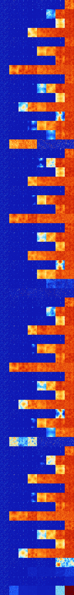

# B368 (167936-168447)

<details>
    <summary>Initial Grid</summary>
    
</details>


<details>
    <summary>Initial Grid RLE</summary>

```
#C Exported from GoGoL (https://github.com/marrow16/gogol)
#C Wrap mode: Toroidal
#C Boundary mode: Dead
#C Step: 0
x = 100, y = 100, rule = B368/S
20bo6bo3bo38bo9bo13bo$bo16bo14bo4bo15bo6bo3bo5bo$4bo44bobo$48bo2bo10bo$
15bo26bo9bob3o18bo21bo$20bo10bo24bobo3bo10bo7bo12bo$40bo9bobo15bo28b2o$
17bo5bo13bo2bo21bo5bo2bo11bobo11bo$53bo5bo37b2o$67bo8bo$16bo25bo41bo3bo
$43bo$16bo47bo21bo$19bo24bo8bo16bo$25bo16bo4bo4bobo$59bobo19bo12bo$6bo
30bo7bo5bo12bo17bo6bo6bo$9bo8bo6bobo24bo3bo11b2o26bo$17bo15bo9bo35bo$
42bo7bo6b2o6bo$5bo45bo5bo13bo8bo14bo2bo$bo7bo2bo13bo12bo55bo$19bo6bo14b
o25bo$15bo16bo16bo19bo11bo5bo$bo34bo5bo15bo6bo6bo5bo$50bo36bo$12bo16bo
69bo$o67bo21bo$o42bo8bo3bo$5bo33bo17bobo12bo25bo$17bo68bo6bo$19bo10bo2b
o12b2o$34bobo6bo4bo9bo$25bo27bo11bo$o87bo$19bob2o31bo22bo$4bo8bo8bo7bo
3bo6bo37bo$42bo$5bo20bo8bo11bo27bo$9bo48bo2bo29bo$25bo11bo17bo7bo6bo2b
2o12bobo$11bo22bo25bo6bo6bo16bo3bo$12bo7bo9bo$13bo18bo27bo6bo19bo$86b2o
$3b2o32bo39bo$37bo5bo8bo25bobo$o39bobo6bo3bo10bo3bo7bo6bo$4bo53bo31bo$
17bo19bo15b2o28bo$98bo$100b$4bo12bo24bo46bo$6bo7bo3bo8bo12bo46bo$bo13bo
32bo20bo10bo$bo25bo18bo42bo$6bo14bo44bo2bo11bo17bo$48bo10bo4bo8bo9bo$5b
o16bo24bo13bo3bo14bo4bo4bo4bo$28bo70bo$36bob2o4bo9bo2bo32bo$24bo28bo3bo
4bo$2bo3bo16bo6bo15bo4bo8bo31bo$o10bo9bobo2bo5bo21bo25bo6bo$6bo2bo11bo
18bo5bo7bo39bo$3bo5bobo3bo20bo2bo6bo8bo16bo$25bo36bo30bo$36bo6bo49bo$
77bo$5bo8bo3bo22bo51bo$35bo8bo10bo$45bo32bo$o90bo$5bo49bo$23bo15bo16bo
23bo14bo$31bo18bo15bo23bo2bo$21bo20bo35bo16bo$bo52bo9bo17bo$13bo20bo11b
o33bo$14bo34bo$9bo8bo28bobo37bo$7bo5bo12bo3bo11bo30bo14bobo$11bo18bo5bo
11bobo39bo$10bo12bo37bo25bo$o95bo$14bobo25bo5bo$54bo21bo$9bo3bo27bo51bo
$bo45bo25bo9bo$4bo24bo37bo$o81bo$8bo14bo17bo30bo5bo8bo$9bo2bo12bo20bo
25bo15bo9b2o$11bo2bo75bo$24bo4bo33bo$20bo2bo42bo26bo$56bo6bo$77bo$22b3o
20bo12b2o10bo13bo$7bo23bo11bo6bobo42bo!
```
</details>
<details>
    <summary>Thumbnail</summary>

</details>
<table>
<tr>
    <td><a href="./167936%20S%20Heat%20Map%20Activity.png"></a><br>S (167936)<br>S@4</td>    <td><a href="./167937%20S0%20Heat%20Map%20Activity.png"></a><br>S0 (167937)<br>S@4</td>    <td><a href="./167938%20S1%20Heat%20Map%20Activity.png"></a><br>S1 (167938)<br>R@8,p2</td>    <td><a href="./167939%20S01%20Heat%20Map%20Activity.png"></a><br>S01 (167939)<br>R@9,p2</td>    <td><a href="./167940%20S2%20Heat%20Map%20Activity.png"></a><br>S2 (167940)<br>R@6,p2</td>    <td><a href="./167941%20S02%20Heat%20Map%20Activity.png"></a><br>S02 (167941)<br>R@8,p2</td>    <td><a href="./167942%20S12%20Heat%20Map%20Activity.png"></a><br>S12 (167942)<br>S@20</td>    <td><a href="./167943%20S012%20Heat%20Map%20Activity.png"></a><br>S012 (167943)<br>G>1000</td></tr>
<tr>
    <td><a href="./167944%20S3%20Heat%20Map%20Activity.png"></a><br>S3 (167944)<br>S@4</td>    <td><a href="./167945%20S03%20Heat%20Map%20Activity.png"></a><br>S03 (167945)<br>S@6</td>    <td><a href="./167946%20S13%20Heat%20Map%20Activity.png"></a><br>S13 (167946)<br>R@10,p2</td>    <td><a href="./167947%20S013%20Heat%20Map%20Activity.png"></a><br>S013 (167947)<br>R@102,p2</td>    <td><a href="./167948%20S23%20Heat%20Map%20Activity.png"></a><br>S23 (167948)<br>R@28,p2</td>    <td><a href="./167949%20S023%20Heat%20Map%20Activity.png"></a><br>S023 (167949)<br>G>1000</td>    <td><a href="./167950%20S123%20Heat%20Map%20Activity.png"></a><br>S123 (167950)<br>G>1000</td>    <td><a href="./167951%20S0123%20Heat%20Map%20Activity.png"></a><br>S0123 (167951)<br>G>1000</td></tr>
<tr>
    <td><a href="./167952%20S4%20Heat%20Map%20Activity.png"></a><br>S4 (167952)<br>S@4</td>    <td><a href="./167953%20S04%20Heat%20Map%20Activity.png"></a><br>S04 (167953)<br>S@6</td>    <td><a href="./167954%20S14%20Heat%20Map%20Activity.png"></a><br>S14 (167954)<br>R@8,p2</td>    <td><a href="./167955%20S014%20Heat%20Map%20Activity.png"></a><br>S014 (167955)<br>R@12,p2</td>    <td><a href="./167956%20S24%20Heat%20Map%20Activity.png"></a><br>S24 (167956)<br>R@8,p4</td>    <td><a href="./167957%20S024%20Heat%20Map%20Activity.png"></a><br>S024 (167957)<br>R@21,p2</td>    <td><a href="./167958%20S124%20Heat%20Map%20Activity.png"></a><br>S124 (167958)<br>G>1000</td>    <td><a href="./167959%20S0124%20Heat%20Map%20Activity.png"></a><br>S0124 (167959)<br>G>1000</td></tr>
<tr>
    <td><a href="./167960%20S34%20Heat%20Map%20Activity.png"></a><br>S34 (167960)<br>S@4</td>    <td><a href="./167961%20S034%20Heat%20Map%20Activity.png"></a><br>S034 (167961)<br>S@18</td>    <td><a href="./167962%20S134%20Heat%20Map%20Activity.png"></a><br>S134 (167962)<br>R@29,p2</td>    <td><a href="./167963%20S0134%20Heat%20Map%20Activity.png"></a><br>S0134 (167963)<br>G>1000</td>    <td><a href="./167964%20S234%20Heat%20Map%20Activity.png"></a><br>S234 (167964)<br>G>1000</td>    <td><a href="./167965%20S0234%20Heat%20Map%20Activity.png"></a><br>S0234 (167965)<br>G>1000</td>    <td><a href="./167966%20S1234%20Heat%20Map%20Activity.png"></a><br>S1234 (167966)<br>G>1000</td>    <td><a href="./167967%20S01234%20Heat%20Map%20Activity.png"></a><br>S01234 (167967)<br>G>1000</td></tr>
<tr>
    <td><a href="./167968%20S5%20Heat%20Map%20Activity.png"></a><br>S5 (167968)<br>S@4</td>    <td><a href="./167969%20S05%20Heat%20Map%20Activity.png"></a><br>S05 (167969)<br>S@4</td>    <td><a href="./167970%20S15%20Heat%20Map%20Activity.png"></a><br>S15 (167970)<br>R@8,p2</td>    <td><a href="./167971%20S015%20Heat%20Map%20Activity.png"></a><br>S015 (167971)<br>R@9,p2</td>    <td><a href="./167972%20S25%20Heat%20Map%20Activity.png"></a><br>S25 (167972)<br>R@6,p2</td>    <td><a href="./167973%20S025%20Heat%20Map%20Activity.png"></a><br>S025 (167973)<br>R@9,p2</td>    <td><a href="./167974%20S125%20Heat%20Map%20Activity.png"></a><br>S125 (167974)<br>S@29</td>    <td><a href="./167975%20S0125%20Heat%20Map%20Activity.png"></a><br>S0125 (167975)<br>G>1000</td></tr>
<tr>
    <td><a href="./167976%20S35%20Heat%20Map%20Activity.png"></a><br>S35 (167976)<br>S@4</td>    <td><a href="./167977%20S035%20Heat%20Map%20Activity.png"></a><br>S035 (167977)<br>S@11</td>    <td><a href="./167978%20S135%20Heat%20Map%20Activity.png"></a><br>S135 (167978)<br>R@25,p4</td>    <td><a href="./167979%20S0135%20Heat%20Map%20Activity.png"></a><br>S0135 (167979)<br>R@208,p2</td>    <td><a href="./167980%20S235%20Heat%20Map%20Activity.png"></a><br>S235 (167980)<br>G>1000</td>    <td><a href="./167981%20S0235%20Heat%20Map%20Activity.png"></a><br>S0235 (167981)<br>G>1000</td>    <td><a href="./167982%20S1235%20Heat%20Map%20Activity.png"></a><br>S1235 (167982)<br>G>1000</td>    <td><a href="./167983%20S01235%20Heat%20Map%20Activity.png"></a><br>S01235 (167983)<br>G>1000</td></tr>
<tr>
    <td><a href="./167984%20S45%20Heat%20Map%20Activity.png"></a><br>S45 (167984)<br>S@4</td>    <td><a href="./167985%20S045%20Heat%20Map%20Activity.png"></a><br>S045 (167985)<br>S@9</td>    <td><a href="./167986%20S145%20Heat%20Map%20Activity.png"></a><br>S145 (167986)<br>R@8,p2</td>    <td><a href="./167987%20S0145%20Heat%20Map%20Activity.png"></a><br>S0145 (167987)<br>R@12,p2</td>    <td><a href="./167988%20S245%20Heat%20Map%20Activity.png"></a><br><strong><sup>"Move"</sup></strong><br>S245 (167988)<br>R@8,p4</td>    <td><a href="./167989%20S0245%20Heat%20Map%20Activity.png"></a><br>S0245 (167989)<br>R@16,p2</td>    <td><a href="./167990%20S1245%20Heat%20Map%20Activity.png"></a><br>S1245 (167990)<br>G>1000</td>    <td><a href="./167991%20S01245%20Heat%20Map%20Activity.png"></a><br>S01245 (167991)<br>G>1000</td></tr>
<tr>
    <td><a href="./167992%20S345%20Heat%20Map%20Activity.png"></a><br>S345 (167992)<br>S@4</td>    <td><a href="./167993%20S0345%20Heat%20Map%20Activity.png"></a><br>S0345 (167993)<br>G>1000</td>    <td><a href="./167994%20S1345%20Heat%20Map%20Activity.png"></a><br>S1345 (167994)<br>G>1000</td>    <td><a href="./167995%20S01345%20Heat%20Map%20Activity.png"></a><br>S01345 (167995)<br>G>1000</td>    <td><a href="./167996%20S2345%20Heat%20Map%20Activity.png"></a><br>S2345 (167996)<br>G>1000</td>    <td><a href="./167997%20S02345%20Heat%20Map%20Activity.png"></a><br>S02345 (167997)<br>G>1000</td>    <td><a href="./167998%20S12345%20Heat%20Map%20Activity.png"></a><br>S12345 (167998)<br>G>1000</td>    <td><a href="./167999%20S012345%20Heat%20Map%20Activity.png"></a><br>S012345 (167999)<br>G>1000</td></tr>
<tr>
    <td><a href="./168000%20S6%20Heat%20Map%20Activity.png"></a><br>S6 (168000)<br>S@4</td>    <td><a href="./168001%20S06%20Heat%20Map%20Activity.png"></a><br>S06 (168001)<br>S@4</td>    <td><a href="./168002%20S16%20Heat%20Map%20Activity.png"></a><br>S16 (168002)<br>R@8,p2</td>    <td><a href="./168003%20S016%20Heat%20Map%20Activity.png"></a><br>S016 (168003)<br>R@9,p2</td>    <td><a href="./168004%20S26%20Heat%20Map%20Activity.png"></a><br>S26 (168004)<br>R@6,p2</td>    <td><a href="./168005%20S026%20Heat%20Map%20Activity.png"></a><br>S026 (168005)<br>R@8,p2</td>    <td><a href="./168006%20S126%20Heat%20Map%20Activity.png"></a><br>S126 (168006)<br>S@20</td>    <td><a href="./168007%20S0126%20Heat%20Map%20Activity.png"></a><br>S0126 (168007)<br>G>1000</td></tr>
<tr>
    <td><a href="./168008%20S36%20Heat%20Map%20Activity.png"></a><br>S36 (168008)<br>S@4</td>    <td><a href="./168009%20S036%20Heat%20Map%20Activity.png"></a><br>S036 (168009)<br>S@6</td>    <td><a href="./168010%20S136%20Heat%20Map%20Activity.png"></a><br>S136 (168010)<br>R@11,p2</td>    <td><a href="./168011%20S0136%20Heat%20Map%20Activity.png"></a><br>S0136 (168011)<br>R@77,p2</td>    <td><a href="./168012%20S236%20Heat%20Map%20Activity.png"></a><br>S236 (168012)<br>G>1000</td>    <td><a href="./168013%20S0236%20Heat%20Map%20Activity.png"></a><br>S0236 (168013)<br>G>1000</td>    <td><a href="./168014%20S1236%20Heat%20Map%20Activity.png"></a><br>S1236 (168014)<br>G>1000</td>    <td><a href="./168015%20S01236%20Heat%20Map%20Activity.png"></a><br>S01236 (168015)<br>G>1000</td></tr>
<tr>
    <td><a href="./168016%20S46%20Heat%20Map%20Activity.png"></a><br>S46 (168016)<br>S@4</td>    <td><a href="./168017%20S046%20Heat%20Map%20Activity.png"></a><br>S046 (168017)<br>S@6</td>    <td><a href="./168018%20S146%20Heat%20Map%20Activity.png"></a><br>S146 (168018)<br>R@8,p2</td>    <td><a href="./168019%20S0146%20Heat%20Map%20Activity.png"></a><br>S0146 (168019)<br>R@12,p2</td>    <td><a href="./168020%20S246%20Heat%20Map%20Activity.png"></a><br>S246 (168020)<br>R@8,p4</td>    <td><a href="./168021%20S0246%20Heat%20Map%20Activity.png"></a><br>S0246 (168021)<br>R@21,p2</td>    <td><a href="./168022%20S1246%20Heat%20Map%20Activity.png"></a><br>S1246 (168022)<br>G>1000</td>    <td><a href="./168023%20S01246%20Heat%20Map%20Activity.png"></a><br>S01246 (168023)<br>G>1000</td></tr>
<tr>
    <td><a href="./168024%20S346%20Heat%20Map%20Activity.png"></a><br>S346 (168024)<br>S@4</td>    <td><a href="./168025%20S0346%20Heat%20Map%20Activity.png"></a><br>S0346 (168025)<br>S@11</td>    <td><a href="./168026%20S1346%20Heat%20Map%20Activity.png"></a><br>S1346 (168026)<br>G>1000</td>    <td><a href="./168027%20S01346%20Heat%20Map%20Activity.png"></a><br>S01346 (168027)<br>G>1000</td>    <td><a href="./168028%20S2346%20Heat%20Map%20Activity.png"></a><br>S2346 (168028)<br>G>1000</td>    <td><a href="./168029%20S02346%20Heat%20Map%20Activity.png"></a><br>S02346 (168029)<br>G>1000</td>    <td><a href="./168030%20S12346%20Heat%20Map%20Activity.png"></a><br>S12346 (168030)<br>G>1000</td>    <td><a href="./168031%20S012346%20Heat%20Map%20Activity.png"></a><br>S012346 (168031)<br>G>1000</td></tr>
<tr>
    <td><a href="./168032%20S56%20Heat%20Map%20Activity.png"></a><br>S56 (168032)<br>S@4</td>    <td><a href="./168033%20S056%20Heat%20Map%20Activity.png"></a><br>S056 (168033)<br>S@4</td>    <td><a href="./168034%20S156%20Heat%20Map%20Activity.png"></a><br>S156 (168034)<br>R@8,p2</td>    <td><a href="./168035%20S0156%20Heat%20Map%20Activity.png"></a><br>S0156 (168035)<br>R@9,p2</td>    <td><a href="./168036%20S256%20Heat%20Map%20Activity.png"></a><br>S256 (168036)<br>R@6,p2</td>    <td><a href="./168037%20S0256%20Heat%20Map%20Activity.png"></a><br>S0256 (168037)<br>R@9,p2</td>    <td><a href="./168038%20S1256%20Heat%20Map%20Activity.png"></a><br>S1256 (168038)<br>G>1000</td>    <td><a href="./168039%20S01256%20Heat%20Map%20Activity.png"></a><br>S01256 (168039)<br>G>1000</td></tr>
<tr>
    <td><a href="./168040%20S356%20Heat%20Map%20Activity.png"></a><br>S356 (168040)<br>S@4</td>    <td><a href="./168041%20S0356%20Heat%20Map%20Activity.png"></a><br>S0356 (168041)<br>S@11</td>    <td><a href="./168042%20S1356%20Heat%20Map%20Activity.png"></a><br>S1356 (168042)<br>R@30,p2</td>    <td><a href="./168043%20S01356%20Heat%20Map%20Activity.png"></a><br>S01356 (168043)<br>G>1000</td>    <td><a href="./168044%20S2356%20Heat%20Map%20Activity.png"></a><br>S2356 (168044)<br>G>1000</td>    <td><a href="./168045%20S02356%20Heat%20Map%20Activity.png"></a><br>S02356 (168045)<br>G>1000</td>    <td><a href="./168046%20S12356%20Heat%20Map%20Activity.png"></a><br>S12356 (168046)<br>G>1000</td>    <td><a href="./168047%20S012356%20Heat%20Map%20Activity.png"></a><br>S012356 (168047)<br>G>1000</td></tr>
<tr>
    <td><a href="./168048%20S456%20Heat%20Map%20Activity.png"></a><br>S456 (168048)<br>S@4</td>    <td><a href="./168049%20S0456%20Heat%20Map%20Activity.png"></a><br>S0456 (168049)<br>S@9</td>    <td><a href="./168050%20S1456%20Heat%20Map%20Activity.png"></a><br>S1456 (168050)<br>R@8,p2</td>    <td><a href="./168051%20S01456%20Heat%20Map%20Activity.png"></a><br>S01456 (168051)<br>R@12,p2</td>    <td><a href="./168052%20S2456%20Heat%20Map%20Activity.png"></a><br>S2456 (168052)<br>R@8,p4</td>    <td><a href="./168053%20S02456%20Heat%20Map%20Activity.png"></a><br>S02456 (168053)<br>G>1000</td>    <td><a href="./168054%20S12456%20Heat%20Map%20Activity.png"></a><br>S12456 (168054)<br>G>1000</td>    <td><a href="./168055%20S012456%20Heat%20Map%20Activity.png"></a><br>S012456 (168055)<br>G>1000</td></tr>
<tr>
    <td><a href="./168056%20S3456%20Heat%20Map%20Activity.png"></a><br>S3456 (168056)<br>S@4</td>    <td><a href="./168057%20S03456%20Heat%20Map%20Activity.png"></a><br>S03456 (168057)<br>G>1000</td>    <td><a href="./168058%20S13456%20Heat%20Map%20Activity.png"></a><br>S13456 (168058)<br>G>1000</td>    <td><a href="./168059%20S013456%20Heat%20Map%20Activity.png"></a><br>S013456 (168059)<br>G>1000</td>    <td><a href="./168060%20S23456%20Heat%20Map%20Activity.png"></a><br>S23456 (168060)<br>G>1000</td>    <td><a href="./168061%20S023456%20Heat%20Map%20Activity.png"></a><br>S023456 (168061)<br>G>1000</td>    <td><a href="./168062%20S123456%20Heat%20Map%20Activity.png"></a><br>S123456 (168062)<br>G>1000</td>    <td><a href="./168063%20S0123456%20Heat%20Map%20Activity.png"></a><br>S0123456 (168063)<br>G>1000</td></tr>
<tr>
    <td><a href="./168064%20S7%20Heat%20Map%20Activity.png"></a><br>S7 (168064)<br>S@4</td>    <td><a href="./168065%20S07%20Heat%20Map%20Activity.png"></a><br>S07 (168065)<br>S@4</td>    <td><a href="./168066%20S17%20Heat%20Map%20Activity.png"></a><br>S17 (168066)<br>R@8,p2</td>    <td><a href="./168067%20S017%20Heat%20Map%20Activity.png"></a><br>S017 (168067)<br>R@9,p2</td>    <td><a href="./168068%20S27%20Heat%20Map%20Activity.png"></a><br>S27 (168068)<br>R@6,p2</td>    <td><a href="./168069%20S027%20Heat%20Map%20Activity.png"></a><br>S027 (168069)<br>R@8,p2</td>    <td><a href="./168070%20S127%20Heat%20Map%20Activity.png"></a><br>S127 (168070)<br>S@20</td>    <td><a href="./168071%20S0127%20Heat%20Map%20Activity.png"></a><br>S0127 (168071)<br>G>1000</td></tr>
<tr>
    <td><a href="./168072%20S37%20Heat%20Map%20Activity.png"></a><br>S37 (168072)<br>S@4</td>    <td><a href="./168073%20S037%20Heat%20Map%20Activity.png"></a><br>S037 (168073)<br>S@6</td>    <td><a href="./168074%20S137%20Heat%20Map%20Activity.png"></a><br>S137 (168074)<br>R@10,p2</td>    <td><a href="./168075%20S0137%20Heat%20Map%20Activity.png"></a><br>S0137 (168075)<br>R@31,p2</td>    <td><a href="./168076%20S237%20Heat%20Map%20Activity.png"></a><br>S237 (168076)<br>G>1000</td>    <td><a href="./168077%20S0237%20Heat%20Map%20Activity.png"></a><br>S0237 (168077)<br>G>1000</td>    <td><a href="./168078%20S1237%20Heat%20Map%20Activity.png"></a><br>S1237 (168078)<br>G>1000</td>    <td><a href="./168079%20S01237%20Heat%20Map%20Activity.png"></a><br>S01237 (168079)<br>G>1000</td></tr>
<tr>
    <td><a href="./168080%20S47%20Heat%20Map%20Activity.png"></a><br>S47 (168080)<br>S@4</td>    <td><a href="./168081%20S047%20Heat%20Map%20Activity.png"></a><br>S047 (168081)<br>S@6</td>    <td><a href="./168082%20S147%20Heat%20Map%20Activity.png"></a><br>S147 (168082)<br>R@8,p2</td>    <td><a href="./168083%20S0147%20Heat%20Map%20Activity.png"></a><br>S0147 (168083)<br>R@12,p2</td>    <td><a href="./168084%20S247%20Heat%20Map%20Activity.png"></a><br>S247 (168084)<br>R@8,p4</td>    <td><a href="./168085%20S0247%20Heat%20Map%20Activity.png"></a><br>S0247 (168085)<br>R@21,p2</td>    <td><a href="./168086%20S1247%20Heat%20Map%20Activity.png"></a><br>S1247 (168086)<br>G>1000</td>    <td><a href="./168087%20S01247%20Heat%20Map%20Activity.png"></a><br>S01247 (168087)<br>G>1000</td></tr>
<tr>
    <td><a href="./168088%20S347%20Heat%20Map%20Activity.png"></a><br>S347 (168088)<br>S@4</td>    <td><a href="./168089%20S0347%20Heat%20Map%20Activity.png"></a><br>S0347 (168089)<br>S@22</td>    <td><a href="./168090%20S1347%20Heat%20Map%20Activity.png"></a><br>S1347 (168090)<br>R@29,p2</td>    <td><a href="./168091%20S01347%20Heat%20Map%20Activity.png"></a><br>S01347 (168091)<br>G>1000</td>    <td><a href="./168092%20S2347%20Heat%20Map%20Activity.png"></a><br>S2347 (168092)<br>G>1000</td>    <td><a href="./168093%20S02347%20Heat%20Map%20Activity.png"></a><br>S02347 (168093)<br>G>1000</td>    <td><a href="./168094%20S12347%20Heat%20Map%20Activity.png"></a><br>S12347 (168094)<br>G>1000</td>    <td><a href="./168095%20S012347%20Heat%20Map%20Activity.png"></a><br>S012347 (168095)<br>G>1000</td></tr>
<tr>
    <td><a href="./168096%20S57%20Heat%20Map%20Activity.png"></a><br>S57 (168096)<br>S@4</td>    <td><a href="./168097%20S057%20Heat%20Map%20Activity.png"></a><br>S057 (168097)<br>S@4</td>    <td><a href="./168098%20S157%20Heat%20Map%20Activity.png"></a><br>S157 (168098)<br>R@8,p2</td>    <td><a href="./168099%20S0157%20Heat%20Map%20Activity.png"></a><br>S0157 (168099)<br>R@9,p2</td>    <td><a href="./168100%20S257%20Heat%20Map%20Activity.png"></a><br>S257 (168100)<br>R@6,p2</td>    <td><a href="./168101%20S0257%20Heat%20Map%20Activity.png"></a><br>S0257 (168101)<br>R@9,p2</td>    <td><a href="./168102%20S1257%20Heat%20Map%20Activity.png"></a><br>S1257 (168102)<br>S@29</td>    <td><a href="./168103%20S01257%20Heat%20Map%20Activity.png"></a><br>S01257 (168103)<br>G>1000</td></tr>
<tr>
    <td><a href="./168104%20S357%20Heat%20Map%20Activity.png"></a><br>S357 (168104)<br>S@4</td>    <td><a href="./168105%20S0357%20Heat%20Map%20Activity.png"></a><br>S0357 (168105)<br>S@11</td>    <td><a href="./168106%20S1357%20Heat%20Map%20Activity.png"></a><br>S1357 (168106)<br>R@25,p4</td>    <td><a href="./168107%20S01357%20Heat%20Map%20Activity.png"></a><br>S01357 (168107)<br>G>1000</td>    <td><a href="./168108%20S2357%20Heat%20Map%20Activity.png"></a><br>S2357 (168108)<br>G>1000</td>    <td><a href="./168109%20S02357%20Heat%20Map%20Activity.png"></a><br>S02357 (168109)<br>G>1000</td>    <td><a href="./168110%20S12357%20Heat%20Map%20Activity.png"></a><br>S12357 (168110)<br>G>1000</td>    <td><a href="./168111%20S012357%20Heat%20Map%20Activity.png"></a><br>S012357 (168111)<br>G>1000</td></tr>
<tr>
    <td><a href="./168112%20S457%20Heat%20Map%20Activity.png"></a><br>S457 (168112)<br>S@4</td>    <td><a href="./168113%20S0457%20Heat%20Map%20Activity.png"></a><br>S0457 (168113)<br>S@9</td>    <td><a href="./168114%20S1457%20Heat%20Map%20Activity.png"></a><br>S1457 (168114)<br>R@8,p2</td>    <td><a href="./168115%20S01457%20Heat%20Map%20Activity.png"></a><br>S01457 (168115)<br>R@12,p2</td>    <td><a href="./168116%20S2457%20Heat%20Map%20Activity.png"></a><br>S2457 (168116)<br>R@8,p4</td>    <td><a href="./168117%20S02457%20Heat%20Map%20Activity.png"></a><br>S02457 (168117)<br>R@15,p2</td>    <td><a href="./168118%20S12457%20Heat%20Map%20Activity.png"></a><br>S12457 (168118)<br>G>1000</td>    <td><a href="./168119%20S012457%20Heat%20Map%20Activity.png"></a><br>S012457 (168119)<br>G>1000</td></tr>
<tr>
    <td><a href="./168120%20S3457%20Heat%20Map%20Activity.png"></a><br>S3457 (168120)<br>S@4</td>    <td><a href="./168121%20S03457%20Heat%20Map%20Activity.png"></a><br>S03457 (168121)<br>G>1000</td>    <td><a href="./168122%20S13457%20Heat%20Map%20Activity.png"></a><br>S13457 (168122)<br>G>1000</td>    <td><a href="./168123%20S013457%20Heat%20Map%20Activity.png"></a><br>S013457 (168123)<br>G>1000</td>    <td><a href="./168124%20S23457%20Heat%20Map%20Activity.png"></a><br>S23457 (168124)<br>G>1000</td>    <td><a href="./168125%20S023457%20Heat%20Map%20Activity.png"></a><br>S023457 (168125)<br>G>1000</td>    <td><a href="./168126%20S123457%20Heat%20Map%20Activity.png"></a><br>S123457 (168126)<br>G>1000</td>    <td><a href="./168127%20S0123457%20Heat%20Map%20Activity.png"></a><br>S0123457 (168127)<br>G>1000</td></tr>
<tr>
    <td><a href="./168128%20S67%20Heat%20Map%20Activity.png"></a><br>S67 (168128)<br>S@4</td>    <td><a href="./168129%20S067%20Heat%20Map%20Activity.png"></a><br>S067 (168129)<br>S@4</td>    <td><a href="./168130%20S167%20Heat%20Map%20Activity.png"></a><br>S167 (168130)<br>R@8,p2</td>    <td><a href="./168131%20S0167%20Heat%20Map%20Activity.png"></a><br>S0167 (168131)<br>R@9,p2</td>    <td><a href="./168132%20S267%20Heat%20Map%20Activity.png"></a><br>S267 (168132)<br>R@6,p2</td>    <td><a href="./168133%20S0267%20Heat%20Map%20Activity.png"></a><br>S0267 (168133)<br>R@8,p2</td>    <td><a href="./168134%20S1267%20Heat%20Map%20Activity.png"></a><br>S1267 (168134)<br>S@20</td>    <td><a href="./168135%20S01267%20Heat%20Map%20Activity.png"></a><br>S01267 (168135)<br>G>1000</td></tr>
<tr>
    <td><a href="./168136%20S367%20Heat%20Map%20Activity.png"></a><br>S367 (168136)<br>S@4</td>    <td><a href="./168137%20S0367%20Heat%20Map%20Activity.png"></a><br>S0367 (168137)<br>S@6</td>    <td><a href="./168138%20S1367%20Heat%20Map%20Activity.png"></a><br>S1367 (168138)<br>R@12,p2</td>    <td><a href="./168139%20S01367%20Heat%20Map%20Activity.png"></a><br>S01367 (168139)<br>R@66,p2</td>    <td><a href="./168140%20S2367%20Heat%20Map%20Activity.png"></a><br>S2367 (168140)<br>G>1000</td>    <td><a href="./168141%20S02367%20Heat%20Map%20Activity.png"></a><br>S02367 (168141)<br>G>1000</td>    <td><a href="./168142%20S12367%20Heat%20Map%20Activity.png"></a><br>S12367 (168142)<br>G>1000</td>    <td><a href="./168143%20S012367%20Heat%20Map%20Activity.png"></a><br>S012367 (168143)<br>G>1000</td></tr>
<tr>
    <td><a href="./168144%20S467%20Heat%20Map%20Activity.png"></a><br>S467 (168144)<br>S@4</td>    <td><a href="./168145%20S0467%20Heat%20Map%20Activity.png"></a><br>S0467 (168145)<br>S@6</td>    <td><a href="./168146%20S1467%20Heat%20Map%20Activity.png"></a><br>S1467 (168146)<br>R@8,p2</td>    <td><a href="./168147%20S01467%20Heat%20Map%20Activity.png"></a><br>S01467 (168147)<br>R@12,p2</td>    <td><a href="./168148%20S2467%20Heat%20Map%20Activity.png"></a><br>S2467 (168148)<br>R@8,p4</td>    <td><a href="./168149%20S02467%20Heat%20Map%20Activity.png"></a><br>S02467 (168149)<br>R@21,p2</td>    <td><a href="./168150%20S12467%20Heat%20Map%20Activity.png"></a><br>S12467 (168150)<br>G>1000</td>    <td><a href="./168151%20S012467%20Heat%20Map%20Activity.png"></a><br>S012467 (168151)<br>G>1000</td></tr>
<tr>
    <td><a href="./168152%20S3467%20Heat%20Map%20Activity.png"></a><br>S3467 (168152)<br>S@4</td>    <td><a href="./168153%20S03467%20Heat%20Map%20Activity.png"></a><br>S03467 (168153)<br>R@38,p16</td>    <td><a href="./168154%20S13467%20Heat%20Map%20Activity.png"></a><br>S13467 (168154)<br>R@28,p2</td>    <td><a href="./168155%20S013467%20Heat%20Map%20Activity.png"></a><br>S013467 (168155)<br>G>1000</td>    <td><a href="./168156%20S23467%20Heat%20Map%20Activity.png"></a><br>S23467 (168156)<br>G>1000</td>    <td><a href="./168157%20S023467%20Heat%20Map%20Activity.png"></a><br>S023467 (168157)<br>G>1000</td>    <td><a href="./168158%20S123467%20Heat%20Map%20Activity.png"></a><br>S123467 (168158)<br>G>1000</td>    <td><a href="./168159%20S0123467%20Heat%20Map%20Activity.png"></a><br>S0123467 (168159)<br>G>1000</td></tr>
<tr>
    <td><a href="./168160%20S567%20Heat%20Map%20Activity.png"></a><br>S567 (168160)<br>S@4</td>    <td><a href="./168161%20S0567%20Heat%20Map%20Activity.png"></a><br>S0567 (168161)<br>S@4</td>    <td><a href="./168162%20S1567%20Heat%20Map%20Activity.png"></a><br>S1567 (168162)<br>R@8,p2</td>    <td><a href="./168163%20S01567%20Heat%20Map%20Activity.png"></a><br>S01567 (168163)<br>R@9,p2</td>    <td><a href="./168164%20S2567%20Heat%20Map%20Activity.png"></a><br>S2567 (168164)<br>R@6,p2</td>    <td><a href="./168165%20S02567%20Heat%20Map%20Activity.png"></a><br>S02567 (168165)<br>R@9,p2</td>    <td><a href="./168166%20S12567%20Heat%20Map%20Activity.png"></a><br>S12567 (168166)<br>G>1000</td>    <td><a href="./168167%20S012567%20Heat%20Map%20Activity.png"></a><br>S012567 (168167)<br>G>1000</td></tr>
<tr>
    <td><a href="./168168%20S3567%20Heat%20Map%20Activity.png"></a><br>S3567 (168168)<br>S@4</td>    <td><a href="./168169%20S03567%20Heat%20Map%20Activity.png"></a><br>S03567 (168169)<br>S@11</td>    <td><a href="./168170%20S13567%20Heat%20Map%20Activity.png"></a><br>S13567 (168170)<br>R@31,p2</td>    <td><a href="./168171%20S013567%20Heat%20Map%20Activity.png"></a><br>S013567 (168171)<br>R@121,p2</td>    <td><a href="./168172%20S23567%20Heat%20Map%20Activity.png"></a><br>S23567 (168172)<br>G>1000</td>    <td><a href="./168173%20S023567%20Heat%20Map%20Activity.png"></a><br>S023567 (168173)<br>G>1000</td>    <td><a href="./168174%20S123567%20Heat%20Map%20Activity.png"></a><br>S123567 (168174)<br>G>1000</td>    <td><a href="./168175%20S0123567%20Heat%20Map%20Activity.png"></a><br>S0123567 (168175)<br>G>1000</td></tr>
<tr>
    <td><a href="./168176%20S4567%20Heat%20Map%20Activity.png"></a><br>S4567 (168176)<br>S@4</td>    <td><a href="./168177%20S04567%20Heat%20Map%20Activity.png"></a><br>S04567 (168177)<br>S@9</td>    <td><a href="./168178%20S14567%20Heat%20Map%20Activity.png"></a><br>S14567 (168178)<br>R@8,p2</td>    <td><a href="./168179%20S014567%20Heat%20Map%20Activity.png"></a><br>S014567 (168179)<br>R@12,p2</td>    <td><a href="./168180%20S24567%20Heat%20Map%20Activity.png"></a><br>S24567 (168180)<br>R@8,p4</td>    <td><a href="./168181%20S024567%20Heat%20Map%20Activity.png"></a><br>S024567 (168181)<br>G>1000</td>    <td><a href="./168182%20S124567%20Heat%20Map%20Activity.png"></a><br>S124567 (168182)<br>G>1000</td>    <td><a href="./168183%20S0124567%20Heat%20Map%20Activity.png"></a><br>S0124567 (168183)<br>G>1000</td></tr>
<tr>
    <td><a href="./168184%20S34567%20Heat%20Map%20Activity.png"></a><br>S34567 (168184)<br>S@4</td>    <td><a href="./168185%20S034567%20Heat%20Map%20Activity.png"></a><br>S034567 (168185)<br>R@279,p60</td>    <td><a href="./168186%20S134567%20Heat%20Map%20Activity.png"></a><br>S134567 (168186)<br>R@411,p252</td>    <td><a href="./168187%20S0134567%20Heat%20Map%20Activity.png"></a><br>S0134567 (168187)<br>R@160,p60</td>    <td><a href="./168188%20S234567%20Heat%20Map%20Activity.png"></a><br>S234567 (168188)<br>R@226,p60</td>    <td><a href="./168189%20S0234567%20Heat%20Map%20Activity.png"></a><br>S0234567 (168189)<br>R@450,p252</td>    <td><a href="./168190%20S1234567%20Heat%20Map%20Activity.png"></a><br>S1234567 (168190)<br>R@183,p84</td>    <td><a href="./168191%20S01234567%20Heat%20Map%20Activity.png"></a><br>S01234567 (168191)<br>R@141,p60</td></tr>
<tr>
    <td><a href="./168192%20S8%20Heat%20Map%20Activity.png"></a><br>S8 (168192)<br>S@4</td>    <td><a href="./168193%20S08%20Heat%20Map%20Activity.png"></a><br>S08 (168193)<br>S@4</td>    <td><a href="./168194%20S18%20Heat%20Map%20Activity.png"></a><br>S18 (168194)<br>R@8,p2</td>    <td><a href="./168195%20S018%20Heat%20Map%20Activity.png"></a><br>S018 (168195)<br>R@9,p2</td>    <td><a href="./168196%20S28%20Heat%20Map%20Activity.png"></a><br>S28 (168196)<br>R@6,p2</td>    <td><a href="./168197%20S028%20Heat%20Map%20Activity.png"></a><br>S028 (168197)<br>R@8,p2</td>    <td><a href="./168198%20S128%20Heat%20Map%20Activity.png"></a><br>S128 (168198)<br>S@20</td>    <td><a href="./168199%20S0128%20Heat%20Map%20Activity.png"></a><br>S0128 (168199)<br>G>1000</td></tr>
<tr>
    <td><a href="./168200%20S38%20Heat%20Map%20Activity.png"></a><br>S38 (168200)<br>S@4</td>    <td><a href="./168201%20S038%20Heat%20Map%20Activity.png"></a><br>S038 (168201)<br>S@6</td>    <td><a href="./168202%20S138%20Heat%20Map%20Activity.png"></a><br>S138 (168202)<br>R@10,p2</td>    <td><a href="./168203%20S0138%20Heat%20Map%20Activity.png"></a><br>S0138 (168203)<br>R@102,p2</td>    <td><a href="./168204%20S238%20Heat%20Map%20Activity.png"></a><br><strong><sup>"LowDeath"</sup></strong><br>S238 (168204)<br>R@28,p2</td>    <td><a href="./168205%20S0238%20Heat%20Map%20Activity.png"></a><br>S0238 (168205)<br>G>1000</td>    <td><a href="./168206%20S1238%20Heat%20Map%20Activity.png"></a><br>S1238 (168206)<br>G>1000</td>    <td><a href="./168207%20S01238%20Heat%20Map%20Activity.png"></a><br>S01238 (168207)<br>G>1000</td></tr>
<tr>
    <td><a href="./168208%20S48%20Heat%20Map%20Activity.png"></a><br>S48 (168208)<br>S@4</td>    <td><a href="./168209%20S048%20Heat%20Map%20Activity.png"></a><br>S048 (168209)<br>S@6</td>    <td><a href="./168210%20S148%20Heat%20Map%20Activity.png"></a><br>S148 (168210)<br>R@8,p2</td>    <td><a href="./168211%20S0148%20Heat%20Map%20Activity.png"></a><br>S0148 (168211)<br>R@12,p2</td>    <td><a href="./168212%20S248%20Heat%20Map%20Activity.png"></a><br>S248 (168212)<br>R@8,p4</td>    <td><a href="./168213%20S0248%20Heat%20Map%20Activity.png"></a><br>S0248 (168213)<br>R@21,p2</td>    <td><a href="./168214%20S1248%20Heat%20Map%20Activity.png"></a><br>S1248 (168214)<br>G>1000</td>    <td><a href="./168215%20S01248%20Heat%20Map%20Activity.png"></a><br>S01248 (168215)<br>G>1000</td></tr>
<tr>
    <td><a href="./168216%20S348%20Heat%20Map%20Activity.png"></a><br>S348 (168216)<br>S@4</td>    <td><a href="./168217%20S0348%20Heat%20Map%20Activity.png"></a><br>S0348 (168217)<br>S@10</td>    <td><a href="./168218%20S1348%20Heat%20Map%20Activity.png"></a><br>S1348 (168218)<br>R@33,p6</td>    <td><a href="./168219%20S01348%20Heat%20Map%20Activity.png"></a><br>S01348 (168219)<br>G>1000</td>    <td><a href="./168220%20S2348%20Heat%20Map%20Activity.png"></a><br>S2348 (168220)<br>G>1000</td>    <td><a href="./168221%20S02348%20Heat%20Map%20Activity.png"></a><br>S02348 (168221)<br>G>1000</td>    <td><a href="./168222%20S12348%20Heat%20Map%20Activity.png"></a><br>S12348 (168222)<br>G>1000</td>    <td><a href="./168223%20S012348%20Heat%20Map%20Activity.png"></a><br>S012348 (168223)<br>G>1000</td></tr>
<tr>
    <td><a href="./168224%20S58%20Heat%20Map%20Activity.png"></a><br>S58 (168224)<br>S@4</td>    <td><a href="./168225%20S058%20Heat%20Map%20Activity.png"></a><br>S058 (168225)<br>S@4</td>    <td><a href="./168226%20S158%20Heat%20Map%20Activity.png"></a><br>S158 (168226)<br>R@8,p2</td>    <td><a href="./168227%20S0158%20Heat%20Map%20Activity.png"></a><br>S0158 (168227)<br>R@9,p2</td>    <td><a href="./168228%20S258%20Heat%20Map%20Activity.png"></a><br>S258 (168228)<br>R@6,p2</td>    <td><a href="./168229%20S0258%20Heat%20Map%20Activity.png"></a><br>S0258 (168229)<br>R@9,p2</td>    <td><a href="./168230%20S1258%20Heat%20Map%20Activity.png"></a><br>S1258 (168230)<br>S@29</td>    <td><a href="./168231%20S01258%20Heat%20Map%20Activity.png"></a><br>S01258 (168231)<br>G>1000</td></tr>
<tr>
    <td><a href="./168232%20S358%20Heat%20Map%20Activity.png"></a><br>S358 (168232)<br>S@4</td>    <td><a href="./168233%20S0358%20Heat%20Map%20Activity.png"></a><br>S0358 (168233)<br>S@11</td>    <td><a href="./168234%20S1358%20Heat%20Map%20Activity.png"></a><br>S1358 (168234)<br>R@25,p4</td>    <td><a href="./168235%20S01358%20Heat%20Map%20Activity.png"></a><br>S01358 (168235)<br>G>1000</td>    <td><a href="./168236%20S2358%20Heat%20Map%20Activity.png"></a><br>S2358 (168236)<br>G>1000</td>    <td><a href="./168237%20S02358%20Heat%20Map%20Activity.png"></a><br>S02358 (168237)<br>G>1000</td>    <td><a href="./168238%20S12358%20Heat%20Map%20Activity.png"></a><br>S12358 (168238)<br>G>1000</td>    <td><a href="./168239%20S012358%20Heat%20Map%20Activity.png"></a><br>S012358 (168239)<br>G>1000</td></tr>
<tr>
    <td><a href="./168240%20S458%20Heat%20Map%20Activity.png"></a><br>S458 (168240)<br>S@4</td>    <td><a href="./168241%20S0458%20Heat%20Map%20Activity.png"></a><br>S0458 (168241)<br>S@9</td>    <td><a href="./168242%20S1458%20Heat%20Map%20Activity.png"></a><br>S1458 (168242)<br>R@8,p2</td>    <td><a href="./168243%20S01458%20Heat%20Map%20Activity.png"></a><br>S01458 (168243)<br>R@12,p2</td>    <td><a href="./168244%20S2458%20Heat%20Map%20Activity.png"></a><br>S2458 (168244)<br>R@8,p4</td>    <td><a href="./168245%20S02458%20Heat%20Map%20Activity.png"></a><br>S02458 (168245)<br>R@16,p2</td>    <td><a href="./168246%20S12458%20Heat%20Map%20Activity.png"></a><br>S12458 (168246)<br>G>1000</td>    <td><a href="./168247%20S012458%20Heat%20Map%20Activity.png"></a><br>S012458 (168247)<br>G>1000</td></tr>
<tr>
    <td><a href="./168248%20S3458%20Heat%20Map%20Activity.png"></a><br>S3458 (168248)<br>S@4</td>    <td><a href="./168249%20S03458%20Heat%20Map%20Activity.png"></a><br>S03458 (168249)<br>G>1000</td>    <td><a href="./168250%20S13458%20Heat%20Map%20Activity.png"></a><br>S13458 (168250)<br>G>1000</td>    <td><a href="./168251%20S013458%20Heat%20Map%20Activity.png"></a><br>S013458 (168251)<br>G>1000</td>    <td><a href="./168252%20S23458%20Heat%20Map%20Activity.png"></a><br>S23458 (168252)<br>G>1000</td>    <td><a href="./168253%20S023458%20Heat%20Map%20Activity.png"></a><br>S023458 (168253)<br>G>1000</td>    <td><a href="./168254%20S123458%20Heat%20Map%20Activity.png"></a><br>S123458 (168254)<br>G>1000</td>    <td><a href="./168255%20S0123458%20Heat%20Map%20Activity.png"></a><br>S0123458 (168255)<br>G>1000</td></tr>
<tr>
    <td><a href="./168256%20S68%20Heat%20Map%20Activity.png"></a><br>S68 (168256)<br>S@4</td>    <td><a href="./168257%20S068%20Heat%20Map%20Activity.png"></a><br>S068 (168257)<br>S@4</td>    <td><a href="./168258%20S168%20Heat%20Map%20Activity.png"></a><br>S168 (168258)<br>R@8,p2</td>    <td><a href="./168259%20S0168%20Heat%20Map%20Activity.png"></a><br>S0168 (168259)<br>R@9,p2</td>    <td><a href="./168260%20S268%20Heat%20Map%20Activity.png"></a><br>S268 (168260)<br>R@6,p2</td>    <td><a href="./168261%20S0268%20Heat%20Map%20Activity.png"></a><br>S0268 (168261)<br>R@8,p2</td>    <td><a href="./168262%20S1268%20Heat%20Map%20Activity.png"></a><br>S1268 (168262)<br>S@20</td>    <td><a href="./168263%20S01268%20Heat%20Map%20Activity.png"></a><br>S01268 (168263)<br>G>1000</td></tr>
<tr>
    <td><a href="./168264%20S368%20Heat%20Map%20Activity.png"></a><br>S368 (168264)<br>S@4</td>    <td><a href="./168265%20S0368%20Heat%20Map%20Activity.png"></a><br>S0368 (168265)<br>S@6</td>    <td><a href="./168266%20S1368%20Heat%20Map%20Activity.png"></a><br>S1368 (168266)<br>R@11,p2</td>    <td><a href="./168267%20S01368%20Heat%20Map%20Activity.png"></a><br>S01368 (168267)<br>R@63,p2</td>    <td><a href="./168268%20S2368%20Heat%20Map%20Activity.png"></a><br>S2368 (168268)<br>G>1000</td>    <td><a href="./168269%20S02368%20Heat%20Map%20Activity.png"></a><br>S02368 (168269)<br>G>1000</td>    <td><a href="./168270%20S12368%20Heat%20Map%20Activity.png"></a><br>S12368 (168270)<br>G>1000</td>    <td><a href="./168271%20S012368%20Heat%20Map%20Activity.png"></a><br>S012368 (168271)<br>G>1000</td></tr>
<tr>
    <td><a href="./168272%20S468%20Heat%20Map%20Activity.png"></a><br>S468 (168272)<br>S@4</td>    <td><a href="./168273%20S0468%20Heat%20Map%20Activity.png"></a><br>S0468 (168273)<br>S@6</td>    <td><a href="./168274%20S1468%20Heat%20Map%20Activity.png"></a><br>S1468 (168274)<br>R@8,p2</td>    <td><a href="./168275%20S01468%20Heat%20Map%20Activity.png"></a><br>S01468 (168275)<br>R@12,p2</td>    <td><a href="./168276%20S2468%20Heat%20Map%20Activity.png"></a><br>S2468 (168276)<br>R@8,p4</td>    <td><a href="./168277%20S02468%20Heat%20Map%20Activity.png"></a><br>S02468 (168277)<br>R@21,p2</td>    <td><a href="./168278%20S12468%20Heat%20Map%20Activity.png"></a><br>S12468 (168278)<br>G>1000</td>    <td><a href="./168279%20S012468%20Heat%20Map%20Activity.png"></a><br>S012468 (168279)<br>G>1000</td></tr>
<tr>
    <td><a href="./168280%20S3468%20Heat%20Map%20Activity.png"></a><br>S3468 (168280)<br>S@4</td>    <td><a href="./168281%20S03468%20Heat%20Map%20Activity.png"></a><br>S03468 (168281)<br>S@18</td>    <td><a href="./168282%20S13468%20Heat%20Map%20Activity.png"></a><br>S13468 (168282)<br>G>1000</td>    <td><a href="./168283%20S013468%20Heat%20Map%20Activity.png"></a><br>S013468 (168283)<br>G>1000</td>    <td><a href="./168284%20S23468%20Heat%20Map%20Activity.png"></a><br>S23468 (168284)<br>G>1000</td>    <td><a href="./168285%20S023468%20Heat%20Map%20Activity.png"></a><br>S023468 (168285)<br>G>1000</td>    <td><a href="./168286%20S123468%20Heat%20Map%20Activity.png"></a><br>S123468 (168286)<br>G>1000</td>    <td><a href="./168287%20S0123468%20Heat%20Map%20Activity.png"></a><br>S0123468 (168287)<br>G>1000</td></tr>
<tr>
    <td><a href="./168288%20S568%20Heat%20Map%20Activity.png"></a><br>S568 (168288)<br>S@4</td>    <td><a href="./168289%20S0568%20Heat%20Map%20Activity.png"></a><br>S0568 (168289)<br>S@4</td>    <td><a href="./168290%20S1568%20Heat%20Map%20Activity.png"></a><br>S1568 (168290)<br>R@8,p2</td>    <td><a href="./168291%20S01568%20Heat%20Map%20Activity.png"></a><br>S01568 (168291)<br>R@9,p2</td>    <td><a href="./168292%20S2568%20Heat%20Map%20Activity.png"></a><br>S2568 (168292)<br>R@6,p2</td>    <td><a href="./168293%20S02568%20Heat%20Map%20Activity.png"></a><br>S02568 (168293)<br>R@9,p2</td>    <td><a href="./168294%20S12568%20Heat%20Map%20Activity.png"></a><br>S12568 (168294)<br>G>1000</td>    <td><a href="./168295%20S012568%20Heat%20Map%20Activity.png"></a><br>S012568 (168295)<br>G>1000</td></tr>
<tr>
    <td><a href="./168296%20S3568%20Heat%20Map%20Activity.png"></a><br>S3568 (168296)<br>S@4</td>    <td><a href="./168297%20S03568%20Heat%20Map%20Activity.png"></a><br>S03568 (168297)<br>S@11</td>    <td><a href="./168298%20S13568%20Heat%20Map%20Activity.png"></a><br>S13568 (168298)<br>R@30,p2</td>    <td><a href="./168299%20S013568%20Heat%20Map%20Activity.png"></a><br>S013568 (168299)<br>G>1000</td>    <td><a href="./168300%20S23568%20Heat%20Map%20Activity.png"></a><br>S23568 (168300)<br>G>1000</td>    <td><a href="./168301%20S023568%20Heat%20Map%20Activity.png"></a><br>S023568 (168301)<br>G>1000</td>    <td><a href="./168302%20S123568%20Heat%20Map%20Activity.png"></a><br>S123568 (168302)<br>G>1000</td>    <td><a href="./168303%20S0123568%20Heat%20Map%20Activity.png"></a><br>S0123568 (168303)<br>G>1000</td></tr>
<tr>
    <td><a href="./168304%20S4568%20Heat%20Map%20Activity.png"></a><br>S4568 (168304)<br>S@4</td>    <td><a href="./168305%20S04568%20Heat%20Map%20Activity.png"></a><br>S04568 (168305)<br>S@9</td>    <td><a href="./168306%20S14568%20Heat%20Map%20Activity.png"></a><br>S14568 (168306)<br>R@8,p2</td>    <td><a href="./168307%20S014568%20Heat%20Map%20Activity.png"></a><br>S014568 (168307)<br>R@12,p2</td>    <td><a href="./168308%20S24568%20Heat%20Map%20Activity.png"></a><br>S24568 (168308)<br>R@8,p4</td>    <td><a href="./168309%20S024568%20Heat%20Map%20Activity.png"></a><br>S024568 (168309)<br>G>1000</td>    <td><a href="./168310%20S124568%20Heat%20Map%20Activity.png"></a><br>S124568 (168310)<br>G>1000</td>    <td><a href="./168311%20S0124568%20Heat%20Map%20Activity.png"></a><br>S0124568 (168311)<br>G>1000</td></tr>
<tr>
    <td><a href="./168312%20S34568%20Heat%20Map%20Activity.png"></a><br>S34568 (168312)<br>S@4</td>    <td><a href="./168313%20S034568%20Heat%20Map%20Activity.png"></a><br>S034568 (168313)<br>G>1000</td>    <td><a href="./168314%20S134568%20Heat%20Map%20Activity.png"></a><br>S134568 (168314)<br>G>1000</td>    <td><a href="./168315%20S0134568%20Heat%20Map%20Activity.png"></a><br>S0134568 (168315)<br>G>1000</td>    <td><a href="./168316%20S234568%20Heat%20Map%20Activity.png"></a><br>S234568 (168316)<br>G>1000</td>    <td><a href="./168317%20S0234568%20Heat%20Map%20Activity.png"></a><br>S0234568 (168317)<br>G>1000</td>    <td><a href="./168318%20S1234568%20Heat%20Map%20Activity.png"></a><br>S1234568 (168318)<br>G>1000</td>    <td><a href="./168319%20S01234568%20Heat%20Map%20Activity.png"></a><br>S01234568 (168319)<br>G>1000</td></tr>
<tr>
    <td><a href="./168320%20S78%20Heat%20Map%20Activity.png"></a><br>S78 (168320)<br>S@4</td>    <td><a href="./168321%20S078%20Heat%20Map%20Activity.png"></a><br>S078 (168321)<br>S@4</td>    <td><a href="./168322%20S178%20Heat%20Map%20Activity.png"></a><br>S178 (168322)<br>R@8,p2</td>    <td><a href="./168323%20S0178%20Heat%20Map%20Activity.png"></a><br>S0178 (168323)<br>R@9,p2</td>    <td><a href="./168324%20S278%20Heat%20Map%20Activity.png"></a><br>S278 (168324)<br>R@6,p2</td>    <td><a href="./168325%20S0278%20Heat%20Map%20Activity.png"></a><br>S0278 (168325)<br>R@8,p2</td>    <td><a href="./168326%20S1278%20Heat%20Map%20Activity.png"></a><br>S1278 (168326)<br>S@20</td>    <td><a href="./168327%20S01278%20Heat%20Map%20Activity.png"></a><br>S01278 (168327)<br>G>1000</td></tr>
<tr>
    <td><a href="./168328%20S378%20Heat%20Map%20Activity.png"></a><br>S378 (168328)<br>S@4</td>    <td><a href="./168329%20S0378%20Heat%20Map%20Activity.png"></a><br>S0378 (168329)<br>S@6</td>    <td><a href="./168330%20S1378%20Heat%20Map%20Activity.png"></a><br>S1378 (168330)<br>R@10,p2</td>    <td><a href="./168331%20S01378%20Heat%20Map%20Activity.png"></a><br>S01378 (168331)<br>R@31,p2</td>    <td><a href="./168332%20S2378%20Heat%20Map%20Activity.png"></a><br>S2378 (168332)<br>G>1000</td>    <td><a href="./168333%20S02378%20Heat%20Map%20Activity.png"></a><br>S02378 (168333)<br>G>1000</td>    <td><a href="./168334%20S12378%20Heat%20Map%20Activity.png"></a><br>S12378 (168334)<br>G>1000</td>    <td><a href="./168335%20S012378%20Heat%20Map%20Activity.png"></a><br>S012378 (168335)<br>G>1000</td></tr>
<tr>
    <td><a href="./168336%20S478%20Heat%20Map%20Activity.png"></a><br>S478 (168336)<br>S@4</td>    <td><a href="./168337%20S0478%20Heat%20Map%20Activity.png"></a><br>S0478 (168337)<br>S@6</td>    <td><a href="./168338%20S1478%20Heat%20Map%20Activity.png"></a><br>S1478 (168338)<br>R@8,p2</td>    <td><a href="./168339%20S01478%20Heat%20Map%20Activity.png"></a><br>S01478 (168339)<br>R@12,p2</td>    <td><a href="./168340%20S2478%20Heat%20Map%20Activity.png"></a><br>S2478 (168340)<br>R@8,p4</td>    <td><a href="./168341%20S02478%20Heat%20Map%20Activity.png"></a><br>S02478 (168341)<br>R@21,p2</td>    <td><a href="./168342%20S12478%20Heat%20Map%20Activity.png"></a><br>S12478 (168342)<br>G>1000</td>    <td><a href="./168343%20S012478%20Heat%20Map%20Activity.png"></a><br>S012478 (168343)<br>G>1000</td></tr>
<tr>
    <td><a href="./168344%20S3478%20Heat%20Map%20Activity.png"></a><br>S3478 (168344)<br>S@4</td>    <td><a href="./168345%20S03478%20Heat%20Map%20Activity.png"></a><br>S03478 (168345)<br>S@10</td>    <td><a href="./168346%20S13478%20Heat%20Map%20Activity.png"></a><br>S13478 (168346)<br>R@33,p6</td>    <td><a href="./168347%20S013478%20Heat%20Map%20Activity.png"></a><br>S013478 (168347)<br>G>1000</td>    <td><a href="./168348%20S23478%20Heat%20Map%20Activity.png"></a><br>S23478 (168348)<br>G>1000</td>    <td><a href="./168349%20S023478%20Heat%20Map%20Activity.png"></a><br>S023478 (168349)<br>G>1000</td>    <td><a href="./168350%20S123478%20Heat%20Map%20Activity.png"></a><br>S123478 (168350)<br>G>1000</td>    <td><a href="./168351%20S0123478%20Heat%20Map%20Activity.png"></a><br>S0123478 (168351)<br>G>1000</td></tr>
<tr>
    <td><a href="./168352%20S578%20Heat%20Map%20Activity.png"></a><br>S578 (168352)<br>S@4</td>    <td><a href="./168353%20S0578%20Heat%20Map%20Activity.png"></a><br>S0578 (168353)<br>S@4</td>    <td><a href="./168354%20S1578%20Heat%20Map%20Activity.png"></a><br>S1578 (168354)<br>R@8,p2</td>    <td><a href="./168355%20S01578%20Heat%20Map%20Activity.png"></a><br>S01578 (168355)<br>R@9,p2</td>    <td><a href="./168356%20S2578%20Heat%20Map%20Activity.png"></a><br>S2578 (168356)<br>R@6,p2</td>    <td><a href="./168357%20S02578%20Heat%20Map%20Activity.png"></a><br>S02578 (168357)<br>R@9,p2</td>    <td><a href="./168358%20S12578%20Heat%20Map%20Activity.png"></a><br>S12578 (168358)<br>S@29</td>    <td><a href="./168359%20S012578%20Heat%20Map%20Activity.png"></a><br>S012578 (168359)<br>G>1000</td></tr>
<tr>
    <td><a href="./168360%20S3578%20Heat%20Map%20Activity.png"></a><br>S3578 (168360)<br>S@4</td>    <td><a href="./168361%20S03578%20Heat%20Map%20Activity.png"></a><br>S03578 (168361)<br>S@11</td>    <td><a href="./168362%20S13578%20Heat%20Map%20Activity.png"></a><br>S13578 (168362)<br>R@25,p4</td>    <td><a href="./168363%20S013578%20Heat%20Map%20Activity.png"></a><br>S013578 (168363)<br>G>1000</td>    <td><a href="./168364%20S23578%20Heat%20Map%20Activity.png"></a><br>S23578 (168364)<br>G>1000</td>    <td><a href="./168365%20S023578%20Heat%20Map%20Activity.png"></a><br>S023578 (168365)<br>G>1000</td>    <td><a href="./168366%20S123578%20Heat%20Map%20Activity.png"></a><br>S123578 (168366)<br>G>1000</td>    <td><a href="./168367%20S0123578%20Heat%20Map%20Activity.png"></a><br>S0123578 (168367)<br>G>1000</td></tr>
<tr>
    <td><a href="./168368%20S4578%20Heat%20Map%20Activity.png"></a><br>S4578 (168368)<br>S@4</td>    <td><a href="./168369%20S04578%20Heat%20Map%20Activity.png"></a><br>S04578 (168369)<br>S@9</td>    <td><a href="./168370%20S14578%20Heat%20Map%20Activity.png"></a><br>S14578 (168370)<br>R@8,p2</td>    <td><a href="./168371%20S014578%20Heat%20Map%20Activity.png"></a><br>S014578 (168371)<br>R@12,p2</td>    <td><a href="./168372%20S24578%20Heat%20Map%20Activity.png"></a><br>S24578 (168372)<br>R@8,p4</td>    <td><a href="./168373%20S024578%20Heat%20Map%20Activity.png"></a><br>S024578 (168373)<br>R@15,p2</td>    <td><a href="./168374%20S124578%20Heat%20Map%20Activity.png"></a><br>S124578 (168374)<br>G>1000</td>    <td><a href="./168375%20S0124578%20Heat%20Map%20Activity.png"></a><br>S0124578 (168375)<br>G>1000</td></tr>
<tr>
    <td><a href="./168376%20S34578%20Heat%20Map%20Activity.png"></a><br>S34578 (168376)<br>S@4</td>    <td><a href="./168377%20S034578%20Heat%20Map%20Activity.png"></a><br>S034578 (168377)<br>G>1000</td>    <td><a href="./168378%20S134578%20Heat%20Map%20Activity.png"></a><br>S134578 (168378)<br>G>1000</td>    <td><a href="./168379%20S0134578%20Heat%20Map%20Activity.png"></a><br>S0134578 (168379)<br>G>1000</td>    <td><a href="./168380%20S234578%20Heat%20Map%20Activity.png"></a><br>S234578 (168380)<br>G>1000</td>    <td><a href="./168381%20S0234578%20Heat%20Map%20Activity.png"></a><br>S0234578 (168381)<br>G>1000</td>    <td><a href="./168382%20S1234578%20Heat%20Map%20Activity.png"></a><br>S1234578 (168382)<br>G>1000</td>    <td><a href="./168383%20S01234578%20Heat%20Map%20Activity.png"></a><br>S01234578 (168383)<br>G>1000</td></tr>
<tr>
    <td><a href="./168384%20S678%20Heat%20Map%20Activity.png"></a><br>S678 (168384)<br>S@4</td>    <td><a href="./168385%20S0678%20Heat%20Map%20Activity.png"></a><br>S0678 (168385)<br>S@4</td>    <td><a href="./168386%20S1678%20Heat%20Map%20Activity.png"></a><br>S1678 (168386)<br>R@8,p2</td>    <td><a href="./168387%20S01678%20Heat%20Map%20Activity.png"></a><br>S01678 (168387)<br>R@9,p2</td>    <td><a href="./168388%20S2678%20Heat%20Map%20Activity.png"></a><br>S2678 (168388)<br>R@6,p2</td>    <td><a href="./168389%20S02678%20Heat%20Map%20Activity.png"></a><br>S02678 (168389)<br>R@8,p2</td>    <td><a href="./168390%20S12678%20Heat%20Map%20Activity.png"></a><br>S12678 (168390)<br>S@20</td>    <td><a href="./168391%20S012678%20Heat%20Map%20Activity.png"></a><br>S012678 (168391)<br>G>1000</td></tr>
<tr>
    <td><a href="./168392%20S3678%20Heat%20Map%20Activity.png"></a><br>S3678 (168392)<br>S@4</td>    <td><a href="./168393%20S03678%20Heat%20Map%20Activity.png"></a><br>S03678 (168393)<br>S@6</td>    <td><a href="./168394%20S13678%20Heat%20Map%20Activity.png"></a><br>S13678 (168394)<br>R@12,p2</td>    <td><a href="./168395%20S013678%20Heat%20Map%20Activity.png"></a><br>S013678 (168395)<br>R@64,p2</td>    <td><a href="./168396%20S23678%20Heat%20Map%20Activity.png"></a><br>S23678 (168396)<br>G>1000</td>    <td><a href="./168397%20S023678%20Heat%20Map%20Activity.png"></a><br>S023678 (168397)<br>G>1000</td>    <td><a href="./168398%20S123678%20Heat%20Map%20Activity.png"></a><br>S123678 (168398)<br>G>1000</td>    <td><a href="./168399%20S0123678%20Heat%20Map%20Activity.png"></a><br>S0123678 (168399)<br>G>1000</td></tr>
<tr>
    <td><a href="./168400%20S4678%20Heat%20Map%20Activity.png"></a><br>S4678 (168400)<br>S@4</td>    <td><a href="./168401%20S04678%20Heat%20Map%20Activity.png"></a><br>S04678 (168401)<br>S@6</td>    <td><a href="./168402%20S14678%20Heat%20Map%20Activity.png"></a><br>S14678 (168402)<br>R@8,p2</td>    <td><a href="./168403%20S014678%20Heat%20Map%20Activity.png"></a><br>S014678 (168403)<br>R@12,p2</td>    <td><a href="./168404%20S24678%20Heat%20Map%20Activity.png"></a><br>S24678 (168404)<br>R@8,p4</td>    <td><a href="./168405%20S024678%20Heat%20Map%20Activity.png"></a><br>S024678 (168405)<br>R@21,p2</td>    <td><a href="./168406%20S124678%20Heat%20Map%20Activity.png"></a><br>S124678 (168406)<br>G>1000</td>    <td><a href="./168407%20S0124678%20Heat%20Map%20Activity.png"></a><br>S0124678 (168407)<br>G>1000</td></tr>
<tr>
    <td><a href="./168408%20S34678%20Heat%20Map%20Activity.png"></a><br>S34678 (168408)<br>S@4</td>    <td><a href="./168409%20S034678%20Heat%20Map%20Activity.png"></a><br>S034678 (168409)<br>S@11</td>    <td><a href="./168410%20S134678%20Heat%20Map%20Activity.png"></a><br>S134678 (168410)<br>G>1000</td>    <td><a href="./168411%20S0134678%20Heat%20Map%20Activity.png"></a><br>S0134678 (168411)<br>G>1000</td>    <td><a href="./168412%20S234678%20Heat%20Map%20Activity.png"></a><br>S234678 (168412)<br>G>1000</td>    <td><a href="./168413%20S0234678%20Heat%20Map%20Activity.png"></a><br>S0234678 (168413)<br>G>1000</td>    <td><a href="./168414%20S1234678%20Heat%20Map%20Activity.png"></a><br>S1234678 (168414)<br>G>1000</td>    <td><a href="./168415%20S01234678%20Heat%20Map%20Activity.png"></a><br>S01234678 (168415)<br>G>1000</td></tr>
<tr>
    <td><a href="./168416%20S5678%20Heat%20Map%20Activity.png"></a><br>S5678 (168416)<br>S@4</td>    <td><a href="./168417%20S05678%20Heat%20Map%20Activity.png"></a><br>S05678 (168417)<br>S@4</td>    <td><a href="./168418%20S15678%20Heat%20Map%20Activity.png"></a><br>S15678 (168418)<br>R@8,p2</td>    <td><a href="./168419%20S015678%20Heat%20Map%20Activity.png"></a><br>S015678 (168419)<br>R@9,p2</td>    <td><a href="./168420%20S25678%20Heat%20Map%20Activity.png"></a><br>S25678 (168420)<br>R@6,p2</td>    <td><a href="./168421%20S025678%20Heat%20Map%20Activity.png"></a><br>S025678 (168421)<br>R@9,p2</td>    <td><a href="./168422%20S125678%20Heat%20Map%20Activity.png"></a><br>S125678 (168422)<br>G>1000</td>    <td><a href="./168423%20S0125678%20Heat%20Map%20Activity.png"></a><br>S0125678 (168423)<br>R@496,p2</td></tr>
<tr>
    <td><a href="./168424%20S35678%20Heat%20Map%20Activity.png"></a><br>S35678 (168424)<br>S@4</td>    <td><a href="./168425%20S035678%20Heat%20Map%20Activity.png"></a><br>S035678 (168425)<br>S@11</td>    <td><a href="./168426%20S135678%20Heat%20Map%20Activity.png"></a><br>S135678 (168426)<br>R@31,p2</td>    <td><a href="./168427%20S0135678%20Heat%20Map%20Activity.png"></a><br>S0135678 (168427)<br>S@642</td>    <td><a href="./168428%20S235678%20Heat%20Map%20Activity.png"></a><br>S235678 (168428)<br>R@691,p6</td>    <td><a href="./168429%20S0235678%20Heat%20Map%20Activity.png"></a><br>S0235678 (168429)<br>R@378,p2</td>    <td><a href="./168430%20S1235678%20Heat%20Map%20Activity.png"></a><br>S1235678 (168430)<br>R@153,p2</td>    <td><a href="./168431%20S01235678%20Heat%20Map%20Activity.png"></a><br>S01235678 (168431)<br>R@79,p2</td></tr>
<tr>
    <td><a href="./168432%20S45678%20Heat%20Map%20Activity.png"></a><br>S45678 (168432)<br>S@4</td>    <td><a href="./168433%20S045678%20Heat%20Map%20Activity.png"></a><br>S045678 (168433)<br>S@9</td>    <td><a href="./168434%20S145678%20Heat%20Map%20Activity.png"></a><br>S145678 (168434)<br>R@8,p2</td>    <td><a href="./168435%20S0145678%20Heat%20Map%20Activity.png"></a><br>S0145678 (168435)<br>R@12,p2</td>    <td><a href="./168436%20S245678%20Heat%20Map%20Activity.png"></a><br>S245678 (168436)<br>R@8,p4</td>    <td><a href="./168437%20S0245678%20Heat%20Map%20Activity.png"></a><br>S0245678 (168437)<br>R@21,p2</td>    <td><a href="./168438%20S1245678%20Heat%20Map%20Activity.png"></a><br>S1245678 (168438)<br>R@260,p12</td>    <td><a href="./168439%20S01245678%20Heat%20Map%20Activity.png"></a><br>S01245678 (168439)<br>R@177,p2</td></tr>
<tr>
    <td><a href="./168440%20S345678%20Heat%20Map%20Activity.png"></a><br>S345678 (168440)<br>S@4</td>    <td><a href="./168441%20S0345678%20Heat%20Map%20Activity.png"></a><br>S0345678 (168441)<br>S@233</td>    <td><a href="./168442%20S1345678%20Heat%20Map%20Activity.png"></a><br>S1345678 (168442)<br>S@174</td>    <td><a href="./168443%20S01345678%20Heat%20Map%20Activity.png"></a><br>S01345678 (168443)<br>S@96</td>    <td><a href="./168444%20S2345678%20Heat%20Map%20Activity.png"></a><br>S2345678 (168444)<br>S@164</td>    <td><a href="./168445%20S02345678%20Heat%20Map%20Activity.png"></a><br>S02345678 (168445)<br>S@197</td>    <td><a href="./168446%20S12345678%20Heat%20Map%20Activity.png"></a><br>S12345678 (168446)<br>S@95</td>    <td><a href="./168447%20S012345678%20Heat%20Map%20Activity.png"></a><br>S012345678 (168447)<br>S@77</td></tr>
</table>
