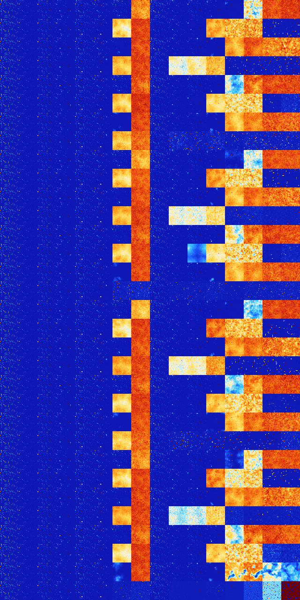

# B37 (69632-70143)

<details>
    <summary>Initial Grid</summary>
    
</details>


<details>
    <summary>Initial Grid RLE</summary>

```
#C Exported from GoGoL (https://github.com/marrow16/gogol)
#C Wrap mode: Toroidal
#C Boundary mode: Dead
#C Step: 0
x = 100, y = 100, rule = B37/S
8bo12bo8bobobo27bo2bo$5bobo74bo6bo$7bobo9bo7bo49bo$7bo2bo3bo12bo8bo42bo
9bo$12bo5b2obo3bo23bobobo40bo$5bo14bo7bo2b2o8bo9b2o26bo2bo13bo$o5bobo
19bo16bo42bo5bo$2bo48b2o13bo$35bo19bo$10bo12bo44bo10bo5bo$7bo7bo27bo15b
o18bo3bo14bo$9bo16bo33bo26bo$o5bo2bo7bo3bo4bo25bo3bo24bo$6bo16bobo13bo
6bo12bo9bo$57bo13bo27bo$3bobo43bo10bo7bo$31bo4bo24bo2bo24bo4bo$12bo38bo
17bo2bo14bo4bobo$o34bo16bo13bo18bo$50bo$3bo28bo4bo22bo17bo19bo$bobo12bo
39bob2o7bobo23bo5bo$4bo8bo39bo10bo4b2o7bo$o6bo17bo$o3bo12bo18bo7bo12bo$
18bo17bo21bo18bo$17bo18bo31bo7bo12bo2bo$2bo13bo24bo16bo10bo28bo$19bo4bo
18bobo7bo29bo$41bo15bo5b2o20bo$20bo77bo$bo8bo22bo35bo4bo5bo3bo10bo$9bo
9bo5bo10b2o13bo39bo$16bo8bo23bo20bo$51bo32bo$12bo3bo47bo8bo$2bo8bo7bo4b
o4b2o22b2o24bo9b2o$22bo3bo11bo10bo3bo39bo$10bo6bo36bo18bo5bo$bo18bo46bo
10bo$7bo16bo25bo19bo17bobo7bo$64bo17bo$o20bo24bo19bo4bo$3bo14bo5bo69bo$
3bo6bo37bo$o9bo2bo76bo$29bo21bo44bobo$35bo5bo3bo16bo4bo$o10bo10bo2bo4bo
11bo19bo9bo$21bo11bo18bo$20bo11bo10bo32bo20bo$8bo30bo25b2o$43bo17bo5bo
9bo15bobo$14bo70bo$16bo9bo21bobo28bo5bo6bo$8bo12bo4bo7b2o9b2o4bo6bo23bo
11bo$6bo10bobo41bo12bo$o18b2o8bo2bo$b2o7bo9bo8bo13bo21b2o9bo2bo$2bo9bo
9bo10bo14bo25bo19bo$18bo32bo13bo8bo$6bobo16bo20bo12bo23bo5bo2bo$o24b2o
8bo47bo$31bo42b2o18bo$4bobo9bo43bo12bo5bo$31bo13bobo$25bo5bo13bo$4bo7bo
bo39bo2bo27bo3bo$26bo16bo49bo$2bo12bo15bo22bo25bo4bo4bo$10bo9bo52bo2bo
4bo$8bo31bo26bo$8bo17bo11bo18bo25bo$12bo22bo11bo38bo$9bo25bo2bo48bo$4bo
2bo6bo17bo9b2o20bo12bo19bo$19bo4bo10bo12bo$36bo27bo2bo13bo$8bo15b2o4bo
26bo7bo$11bo44bo15bobo$3bo20bo6bo10bo9bo10bo12bo4bo6b2o$14bo10bo5bo5bo
10bo21bo13bo9bo$31bo5bo22bo9bo26bo$26bo10bo11bobo2bo13bo20bo$2bo15bo7bo
5bo3bo49bo4bo7bo$20bo5bo4bo$7bo20bo$34bo15bo3bo7b2o$4bo24bo38bo5bobo7bo
$10bo2bo27bo11bo$4bo23b2o14bo22bo$31bo4bo2bo3bo17bo30bo$19bo39bo2bo2bo
9bo$o25bo3bo18bo9bo18bo18bo$17bo7bo2bo42bo8bo3bo$2bo4bo6bo3bo46bo24bo$
24bo59bo4bo$o27bo18bo6bo10bo$27bo23bo2bo36bo7bo$bo2bo19bo24bo19bo16bo!
```
</details>
<details>
    <summary>Thumbnail</summary>

</details>
<table>
<tr>
    <td><a href="./69632%20S%20Heat%20Map%20Activity.png"></a><br>S (69632)<br>S@4</td>    <td><a href="./69633%20S0%20Heat%20Map%20Activity.png"></a><br>S0 (69633)<br>R@14,p4</td>    <td><a href="./69634%20S1%20Heat%20Map%20Activity.png"></a><br>S1 (69634)<br>R@11,p2</td>    <td><a href="./69635%20S01%20Heat%20Map%20Activity.png"></a><br>S01 (69635)<br>R@14,p4</td>    <td><a href="./69636%20S2%20Heat%20Map%20Activity.png"></a><br>S2 (69636)<br>R@8,p2</td>    <td><a href="./69637%20S02%20Heat%20Map%20Activity.png"></a><br>S02 (69637)<br>R@10,p2</td>    <td><a href="./69638%20S12%20Heat%20Map%20Activity.png"></a><br>S12 (69638)<br>R@13,p2</td>    <td><a href="./69639%20S012%20Heat%20Map%20Activity.png"></a><br>S012 (69639)<br>G>1000</td>    <td><a href="./69640%20S3%20Heat%20Map%20Activity.png"></a><br>S3 (69640)<br>S@6</td>    <td><a href="./69641%20S03%20Heat%20Map%20Activity.png"></a><br>S03 (69641)<br>R@14,p4</td>    <td><a href="./69642%20S13%20Heat%20Map%20Activity.png"></a><br>S13 (69642)<br>R@15,p2</td>    <td><a href="./69643%20S013%20Heat%20Map%20Activity.png"></a><br>S013 (69643)<br>R@64,p4</td>    <td><a href="./69644%20S23%20Heat%20Map%20Activity.png"></a><br><strong><sup>"DryLife"</sup></strong><br>S23 (69644)<br>R@76,p2</td>    <td><a href="./69645%20S023%20Heat%20Map%20Activity.png"></a><br>S023 (69645)<br>G>1000</td>    <td><a href="./69646%20S123%20Heat%20Map%20Activity.png"></a><br>S123 (69646)<br>G>1000</td>    <td><a href="./69647%20S0123%20Heat%20Map%20Activity.png"></a><br>S0123 (69647)<br>G>1000</td></tr>
<tr>
    <td><a href="./69648%20S4%20Heat%20Map%20Activity.png"></a><br>S4 (69648)<br>S@4</td>    <td><a href="./69649%20S04%20Heat%20Map%20Activity.png"></a><br>S04 (69649)<br>R@14,p4</td>    <td><a href="./69650%20S14%20Heat%20Map%20Activity.png"></a><br>S14 (69650)<br>R@11,p2</td>    <td><a href="./69651%20S014%20Heat%20Map%20Activity.png"></a><br>S014 (69651)<br>R@17,p4</td>    <td><a href="./69652%20S24%20Heat%20Map%20Activity.png"></a><br>S24 (69652)<br>R@11,p4</td>    <td><a href="./69653%20S024%20Heat%20Map%20Activity.png"></a><br>S024 (69653)<br>R@19,p4</td>    <td><a href="./69654%20S124%20Heat%20Map%20Activity.png"></a><br>S124 (69654)<br>G>1000</td>    <td><a href="./69655%20S0124%20Heat%20Map%20Activity.png"></a><br>S0124 (69655)<br>G>1000</td>    <td><a href="./69656%20S34%20Heat%20Map%20Activity.png"></a><br>S34 (69656)<br>R@23,p16</td>    <td><a href="./69657%20S034%20Heat%20Map%20Activity.png"></a><br>S034 (69657)<br>R@11,p4</td>    <td><a href="./69658%20S134%20Heat%20Map%20Activity.png"></a><br>S134 (69658)<br>R@40,p6</td>    <td><a href="./69659%20S0134%20Heat%20Map%20Activity.png"></a><br>S0134 (69659)<br>G>1000</td>    <td><a href="./69660%20S234%20Heat%20Map%20Activity.png"></a><br>S234 (69660)<br>G>1000</td>    <td><a href="./69661%20S0234%20Heat%20Map%20Activity.png"></a><br>S0234 (69661)<br>G>1000</td>    <td><a href="./69662%20S1234%20Heat%20Map%20Activity.png"></a><br><strong><sup>"Mazectric with Mice"</sup></strong><br>S1234 (69662)<br>G>1000</td>    <td><a href="./69663%20S01234%20Heat%20Map%20Activity.png"></a><br>S01234 (69663)<br>G>1000</td></tr>
<tr>
    <td><a href="./69664%20S5%20Heat%20Map%20Activity.png"></a><br>S5 (69664)<br>S@4</td>    <td><a href="./69665%20S05%20Heat%20Map%20Activity.png"></a><br>S05 (69665)<br>R@14,p4</td>    <td><a href="./69666%20S15%20Heat%20Map%20Activity.png"></a><br>S15 (69666)<br>R@11,p2</td>    <td><a href="./69667%20S015%20Heat%20Map%20Activity.png"></a><br>S015 (69667)<br>R@17,p4</td>    <td><a href="./69668%20S25%20Heat%20Map%20Activity.png"></a><br>S25 (69668)<br>R@8,p2</td>    <td><a href="./69669%20S025%20Heat%20Map%20Activity.png"></a><br>S025 (69669)<br>R@10,p2</td>    <td><a href="./69670%20S125%20Heat%20Map%20Activity.png"></a><br>S125 (69670)<br>R@52,p2</td>    <td><a href="./69671%20S0125%20Heat%20Map%20Activity.png"></a><br>S0125 (69671)<br>G>1000</td>    <td><a href="./69672%20S35%20Heat%20Map%20Activity.png"></a><br>S35 (69672)<br>S@6</td>    <td><a href="./69673%20S035%20Heat%20Map%20Activity.png"></a><br>S035 (69673)<br>R@14,p4</td>    <td><a href="./69674%20S135%20Heat%20Map%20Activity.png"></a><br>S135 (69674)<br>R@28,p2</td>    <td><a href="./69675%20S0135%20Heat%20Map%20Activity.png"></a><br>S0135 (69675)<br>R@449,p4</td>    <td><a href="./69676%20S235%20Heat%20Map%20Activity.png"></a><br>S235 (69676)<br>G>1000</td>    <td><a href="./69677%20S0235%20Heat%20Map%20Activity.png"></a><br>S0235 (69677)<br>G>1000</td>    <td><a href="./69678%20S1235%20Heat%20Map%20Activity.png"></a><br>S1235 (69678)<br>G>1000</td>    <td><a href="./69679%20S01235%20Heat%20Map%20Activity.png"></a><br>S01235 (69679)<br>G>1000</td></tr>
<tr>
    <td><a href="./69680%20S45%20Heat%20Map%20Activity.png"></a><br>S45 (69680)<br>S@4</td>    <td><a href="./69681%20S045%20Heat%20Map%20Activity.png"></a><br>S045 (69681)<br>R@14,p4</td>    <td><a href="./69682%20S145%20Heat%20Map%20Activity.png"></a><br>S145 (69682)<br>R@11,p2</td>    <td><a href="./69683%20S0145%20Heat%20Map%20Activity.png"></a><br>S0145 (69683)<br>R@49,p4</td>    <td><a href="./69684%20S245%20Heat%20Map%20Activity.png"></a><br>S245 (69684)<br>R@11,p4</td>    <td><a href="./69685%20S0245%20Heat%20Map%20Activity.png"></a><br>S0245 (69685)<br>R@41,p4</td>    <td><a href="./69686%20S1245%20Heat%20Map%20Activity.png"></a><br>S1245 (69686)<br>G>1000</td>    <td><a href="./69687%20S01245%20Heat%20Map%20Activity.png"></a><br>S01245 (69687)<br>G>1000</td>    <td><a href="./69688%20S345%20Heat%20Map%20Activity.png"></a><br>S345 (69688)<br>S@7</td>    <td><a href="./69689%20S0345%20Heat%20Map%20Activity.png"></a><br>S0345 (69689)<br>G>1000</td>    <td><a href="./69690%20S1345%20Heat%20Map%20Activity.png"></a><br>S1345 (69690)<br>G>1000</td>    <td><a href="./69691%20S01345%20Heat%20Map%20Activity.png"></a><br>S01345 (69691)<br>G>1000</td>    <td><a href="./69692%20S2345%20Heat%20Map%20Activity.png"></a><br>S2345 (69692)<br>G>1000</td>    <td><a href="./69693%20S02345%20Heat%20Map%20Activity.png"></a><br>S02345 (69693)<br>G>1000</td>    <td><a href="./69694%20S12345%20Heat%20Map%20Activity.png"></a><br><strong><sup>"Maze with Mice"</sup></strong><br>S12345 (69694)<br>R@254,p168</td>    <td><a href="./69695%20S012345%20Heat%20Map%20Activity.png"></a><br>S012345 (69695)<br>R@475,p420</td></tr>
<tr>
    <td><a href="./69696%20S6%20Heat%20Map%20Activity.png"></a><br>S6 (69696)<br>S@4</td>    <td><a href="./69697%20S06%20Heat%20Map%20Activity.png"></a><br>S06 (69697)<br>R@14,p4</td>    <td><a href="./69698%20S16%20Heat%20Map%20Activity.png"></a><br>S16 (69698)<br>R@11,p2</td>    <td><a href="./69699%20S016%20Heat%20Map%20Activity.png"></a><br>S016 (69699)<br>R@12,p4</td>    <td><a href="./69700%20S26%20Heat%20Map%20Activity.png"></a><br>S26 (69700)<br>R@8,p2</td>    <td><a href="./69701%20S026%20Heat%20Map%20Activity.png"></a><br>S026 (69701)<br>R@10,p2</td>    <td><a href="./69702%20S126%20Heat%20Map%20Activity.png"></a><br>S126 (69702)<br>R@13,p2</td>    <td><a href="./69703%20S0126%20Heat%20Map%20Activity.png"></a><br>S0126 (69703)<br>G>1000</td>    <td><a href="./69704%20S36%20Heat%20Map%20Activity.png"></a><br>S36 (69704)<br>S@6</td>    <td><a href="./69705%20S036%20Heat%20Map%20Activity.png"></a><br>S036 (69705)<br>R@14,p4</td>    <td><a href="./69706%20S136%20Heat%20Map%20Activity.png"></a><br>S136 (69706)<br>R@15,p2</td>    <td><a href="./69707%20S0136%20Heat%20Map%20Activity.png"></a><br>S0136 (69707)<br>R@58,p4</td>    <td><a href="./69708%20S236%20Heat%20Map%20Activity.png"></a><br>S236 (69708)<br>G>1000</td>    <td><a href="./69709%20S0236%20Heat%20Map%20Activity.png"></a><br>S0236 (69709)<br>G>1000</td>    <td><a href="./69710%20S1236%20Heat%20Map%20Activity.png"></a><br>S1236 (69710)<br>G>1000</td>    <td><a href="./69711%20S01236%20Heat%20Map%20Activity.png"></a><br>S01236 (69711)<br>G>1000</td></tr>
<tr>
    <td><a href="./69712%20S46%20Heat%20Map%20Activity.png"></a><br>S46 (69712)<br>S@4</td>    <td><a href="./69713%20S046%20Heat%20Map%20Activity.png"></a><br>S046 (69713)<br>R@14,p4</td>    <td><a href="./69714%20S146%20Heat%20Map%20Activity.png"></a><br>S146 (69714)<br>R@11,p2</td>    <td><a href="./69715%20S0146%20Heat%20Map%20Activity.png"></a><br>S0146 (69715)<br>R@30,p4</td>    <td><a href="./69716%20S246%20Heat%20Map%20Activity.png"></a><br>S246 (69716)<br>R@11,p4</td>    <td><a href="./69717%20S0246%20Heat%20Map%20Activity.png"></a><br>S0246 (69717)<br>R@19,p4</td>    <td><a href="./69718%20S1246%20Heat%20Map%20Activity.png"></a><br>S1246 (69718)<br>G>1000</td>    <td><a href="./69719%20S01246%20Heat%20Map%20Activity.png"></a><br>S01246 (69719)<br>G>1000</td>    <td><a href="./69720%20S346%20Heat%20Map%20Activity.png"></a><br>S346 (69720)<br>R@23,p16</td>    <td><a href="./69721%20S0346%20Heat%20Map%20Activity.png"></a><br>S0346 (69721)<br>R@24,p16</td>    <td><a href="./69722%20S1346%20Heat%20Map%20Activity.png"></a><br>S1346 (69722)<br>R@47,p6</td>    <td><a href="./69723%20S01346%20Heat%20Map%20Activity.png"></a><br>S01346 (69723)<br>G>1000</td>    <td><a href="./69724%20S2346%20Heat%20Map%20Activity.png"></a><br>S2346 (69724)<br>G>1000</td>    <td><a href="./69725%20S02346%20Heat%20Map%20Activity.png"></a><br>S02346 (69725)<br>G>1000</td>    <td><a href="./69726%20S12346%20Heat%20Map%20Activity.png"></a><br>S12346 (69726)<br>R@555,p420</td>    <td><a href="./69727%20S012346%20Heat%20Map%20Activity.png"></a><br>S012346 (69727)<br>R@118,p30</td></tr>
<tr>
    <td><a href="./69728%20S56%20Heat%20Map%20Activity.png"></a><br>S56 (69728)<br>S@4</td>    <td><a href="./69729%20S056%20Heat%20Map%20Activity.png"></a><br>S056 (69729)<br>R@14,p4</td>    <td><a href="./69730%20S156%20Heat%20Map%20Activity.png"></a><br>S156 (69730)<br>R@11,p2</td>    <td><a href="./69731%20S0156%20Heat%20Map%20Activity.png"></a><br>S0156 (69731)<br>R@16,p4</td>    <td><a href="./69732%20S256%20Heat%20Map%20Activity.png"></a><br>S256 (69732)<br>R@8,p2</td>    <td><a href="./69733%20S0256%20Heat%20Map%20Activity.png"></a><br>S0256 (69733)<br>R@13,p2</td>    <td><a href="./69734%20S1256%20Heat%20Map%20Activity.png"></a><br>S1256 (69734)<br>R@324,p2</td>    <td><a href="./69735%20S01256%20Heat%20Map%20Activity.png"></a><br>S01256 (69735)<br>G>1000</td>    <td><a href="./69736%20S356%20Heat%20Map%20Activity.png"></a><br>S356 (69736)<br>S@6</td>    <td><a href="./69737%20S0356%20Heat%20Map%20Activity.png"></a><br>S0356 (69737)<br>R@14,p4</td>    <td><a href="./69738%20S1356%20Heat%20Map%20Activity.png"></a><br>S1356 (69738)<br>R@28,p2</td>    <td><a href="./69739%20S01356%20Heat%20Map%20Activity.png"></a><br>S01356 (69739)<br>R@374,p4</td>    <td><a href="./69740%20S2356%20Heat%20Map%20Activity.png"></a><br>S2356 (69740)<br>G>1000</td>    <td><a href="./69741%20S02356%20Heat%20Map%20Activity.png"></a><br>S02356 (69741)<br>G>1000</td>    <td><a href="./69742%20S12356%20Heat%20Map%20Activity.png"></a><br>S12356 (69742)<br>G>1000</td>    <td><a href="./69743%20S012356%20Heat%20Map%20Activity.png"></a><br>S012356 (69743)<br>G>1000</td></tr>
<tr>
    <td><a href="./69744%20S456%20Heat%20Map%20Activity.png"></a><br>S456 (69744)<br>S@4</td>    <td><a href="./69745%20S0456%20Heat%20Map%20Activity.png"></a><br>S0456 (69745)<br>R@14,p4</td>    <td><a href="./69746%20S1456%20Heat%20Map%20Activity.png"></a><br>S1456 (69746)<br>R@11,p2</td>    <td><a href="./69747%20S01456%20Heat%20Map%20Activity.png"></a><br>S01456 (69747)<br>R@30,p4</td>    <td><a href="./69748%20S2456%20Heat%20Map%20Activity.png"></a><br>S2456 (69748)<br>R@11,p4</td>    <td><a href="./69749%20S02456%20Heat%20Map%20Activity.png"></a><br>S02456 (69749)<br>R@23,p4</td>    <td><a href="./69750%20S12456%20Heat%20Map%20Activity.png"></a><br>S12456 (69750)<br>G>1000</td>    <td><a href="./69751%20S012456%20Heat%20Map%20Activity.png"></a><br>S012456 (69751)<br>G>1000</td>    <td><a href="./69752%20S3456%20Heat%20Map%20Activity.png"></a><br>S3456 (69752)<br>S@7</td>    <td><a href="./69753%20S03456%20Heat%20Map%20Activity.png"></a><br>S03456 (69753)<br>R@354,p12</td>    <td><a href="./69754%20S13456%20Heat%20Map%20Activity.png"></a><br>S13456 (69754)<br>R@482,p180</td>    <td><a href="./69755%20S013456%20Heat%20Map%20Activity.png"></a><br>S013456 (69755)<br>R@259,p60</td>    <td><a href="./69756%20S23456%20Heat%20Map%20Activity.png"></a><br>S23456 (69756)<br>R@242,p120</td>    <td><a href="./69757%20S023456%20Heat%20Map%20Activity.png"></a><br>S023456 (69757)<br>R@139,p12</td>    <td><a href="./69758%20S123456%20Heat%20Map%20Activity.png"></a><br>S123456 (69758)<br>R@156,p60</td>    <td><a href="./69759%20S0123456%20Heat%20Map%20Activity.png"></a><br>S0123456 (69759)<br>R@121,p60</td></tr>
<tr>
    <td><a href="./69760%20S7%20Heat%20Map%20Activity.png"></a><br>S7 (69760)<br>S@4</td>    <td><a href="./69761%20S07%20Heat%20Map%20Activity.png"></a><br>S07 (69761)<br>R@14,p4</td>    <td><a href="./69762%20S17%20Heat%20Map%20Activity.png"></a><br>S17 (69762)<br>R@11,p2</td>    <td><a href="./69763%20S017%20Heat%20Map%20Activity.png"></a><br>S017 (69763)<br>R@14,p4</td>    <td><a href="./69764%20S27%20Heat%20Map%20Activity.png"></a><br>S27 (69764)<br>R@8,p2</td>    <td><a href="./69765%20S027%20Heat%20Map%20Activity.png"></a><br>S027 (69765)<br>R@10,p2</td>    <td><a href="./69766%20S127%20Heat%20Map%20Activity.png"></a><br>S127 (69766)<br>R@13,p2</td>    <td><a href="./69767%20S0127%20Heat%20Map%20Activity.png"></a><br>S0127 (69767)<br>G>1000</td>    <td><a href="./69768%20S37%20Heat%20Map%20Activity.png"></a><br>S37 (69768)<br>S@6</td>    <td><a href="./69769%20S037%20Heat%20Map%20Activity.png"></a><br>S037 (69769)<br>R@14,p4</td>    <td><a href="./69770%20S137%20Heat%20Map%20Activity.png"></a><br>S137 (69770)<br>R@15,p2</td>    <td><a href="./69771%20S0137%20Heat%20Map%20Activity.png"></a><br>S0137 (69771)<br>R@64,p4</td>    <td><a href="./69772%20S237%20Heat%20Map%20Activity.png"></a><br>S237 (69772)<br>G>1000</td>    <td><a href="./69773%20S0237%20Heat%20Map%20Activity.png"></a><br>S0237 (69773)<br>G>1000</td>    <td><a href="./69774%20S1237%20Heat%20Map%20Activity.png"></a><br>S1237 (69774)<br>G>1000</td>    <td><a href="./69775%20S01237%20Heat%20Map%20Activity.png"></a><br>S01237 (69775)<br>G>1000</td></tr>
<tr>
    <td><a href="./69776%20S47%20Heat%20Map%20Activity.png"></a><br>S47 (69776)<br>S@4</td>    <td><a href="./69777%20S047%20Heat%20Map%20Activity.png"></a><br>S047 (69777)<br>R@14,p4</td>    <td><a href="./69778%20S147%20Heat%20Map%20Activity.png"></a><br>S147 (69778)<br>R@11,p2</td>    <td><a href="./69779%20S0147%20Heat%20Map%20Activity.png"></a><br>S0147 (69779)<br>R@17,p4</td>    <td><a href="./69780%20S247%20Heat%20Map%20Activity.png"></a><br>S247 (69780)<br>R@11,p4</td>    <td><a href="./69781%20S0247%20Heat%20Map%20Activity.png"></a><br>S0247 (69781)<br>R@19,p4</td>    <td><a href="./69782%20S1247%20Heat%20Map%20Activity.png"></a><br>S1247 (69782)<br>G>1000</td>    <td><a href="./69783%20S01247%20Heat%20Map%20Activity.png"></a><br>S01247 (69783)<br>G>1000</td>    <td><a href="./69784%20S347%20Heat%20Map%20Activity.png"></a><br>S347 (69784)<br>R@23,p16</td>    <td><a href="./69785%20S0347%20Heat%20Map%20Activity.png"></a><br>S0347 (69785)<br>R@11,p4</td>    <td><a href="./69786%20S1347%20Heat%20Map%20Activity.png"></a><br>S1347 (69786)<br>R@40,p6</td>    <td><a href="./69787%20S01347%20Heat%20Map%20Activity.png"></a><br>S01347 (69787)<br>G>1000</td>    <td><a href="./69788%20S2347%20Heat%20Map%20Activity.png"></a><br>S2347 (69788)<br>G>1000</td>    <td><a href="./69789%20S02347%20Heat%20Map%20Activity.png"></a><br>S02347 (69789)<br>G>1000</td>    <td><a href="./69790%20S12347%20Heat%20Map%20Activity.png"></a><br>S12347 (69790)<br>R@960,p840</td>    <td><a href="./69791%20S012347%20Heat%20Map%20Activity.png"></a><br>S012347 (69791)<br>G>1000</td></tr>
<tr>
    <td><a href="./69792%20S57%20Heat%20Map%20Activity.png"></a><br>S57 (69792)<br>S@4</td>    <td><a href="./69793%20S057%20Heat%20Map%20Activity.png"></a><br>S057 (69793)<br>R@14,p4</td>    <td><a href="./69794%20S157%20Heat%20Map%20Activity.png"></a><br>S157 (69794)<br>R@11,p2</td>    <td><a href="./69795%20S0157%20Heat%20Map%20Activity.png"></a><br>S0157 (69795)<br>R@17,p4</td>    <td><a href="./69796%20S257%20Heat%20Map%20Activity.png"></a><br>S257 (69796)<br>R@8,p2</td>    <td><a href="./69797%20S0257%20Heat%20Map%20Activity.png"></a><br>S0257 (69797)<br>R@10,p2</td>    <td><a href="./69798%20S1257%20Heat%20Map%20Activity.png"></a><br>S1257 (69798)<br>R@38,p2</td>    <td><a href="./69799%20S01257%20Heat%20Map%20Activity.png"></a><br>S01257 (69799)<br>G>1000</td>    <td><a href="./69800%20S357%20Heat%20Map%20Activity.png"></a><br>S357 (69800)<br>S@6</td>    <td><a href="./69801%20S0357%20Heat%20Map%20Activity.png"></a><br>S0357 (69801)<br>R@14,p4</td>    <td><a href="./69802%20S1357%20Heat%20Map%20Activity.png"></a><br>S1357 (69802)<br>R@21,p2</td>    <td><a href="./69803%20S01357%20Heat%20Map%20Activity.png"></a><br>S01357 (69803)<br>R@282,p4</td>    <td><a href="./69804%20S2357%20Heat%20Map%20Activity.png"></a><br>S2357 (69804)<br>G>1000</td>    <td><a href="./69805%20S02357%20Heat%20Map%20Activity.png"></a><br>S02357 (69805)<br>G>1000</td>    <td><a href="./69806%20S12357%20Heat%20Map%20Activity.png"></a><br>S12357 (69806)<br>G>1000</td>    <td><a href="./69807%20S012357%20Heat%20Map%20Activity.png"></a><br>S012357 (69807)<br>G>1000</td></tr>
<tr>
    <td><a href="./69808%20S457%20Heat%20Map%20Activity.png"></a><br>S457 (69808)<br>S@4</td>    <td><a href="./69809%20S0457%20Heat%20Map%20Activity.png"></a><br>S0457 (69809)<br>R@14,p4</td>    <td><a href="./69810%20S1457%20Heat%20Map%20Activity.png"></a><br>S1457 (69810)<br>R@11,p2</td>    <td><a href="./69811%20S01457%20Heat%20Map%20Activity.png"></a><br>S01457 (69811)<br>R@48,p4</td>    <td><a href="./69812%20S2457%20Heat%20Map%20Activity.png"></a><br>S2457 (69812)<br>R@11,p4</td>    <td><a href="./69813%20S02457%20Heat%20Map%20Activity.png"></a><br>S02457 (69813)<br>R@22,p4</td>    <td><a href="./69814%20S12457%20Heat%20Map%20Activity.png"></a><br>S12457 (69814)<br>G>1000</td>    <td><a href="./69815%20S012457%20Heat%20Map%20Activity.png"></a><br>S012457 (69815)<br>G>1000</td>    <td><a href="./69816%20S3457%20Heat%20Map%20Activity.png"></a><br>S3457 (69816)<br>S@7</td>    <td><a href="./69817%20S03457%20Heat%20Map%20Activity.png"></a><br>S03457 (69817)<br>G>1000</td>    <td><a href="./69818%20S13457%20Heat%20Map%20Activity.png"></a><br>S13457 (69818)<br>G>1000</td>    <td><a href="./69819%20S013457%20Heat%20Map%20Activity.png"></a><br>S013457 (69819)<br>G>1000</td>    <td><a href="./69820%20S23457%20Heat%20Map%20Activity.png"></a><br>S23457 (69820)<br>R@218,p84</td>    <td><a href="./69821%20S023457%20Heat%20Map%20Activity.png"></a><br>S023457 (69821)<br>R@126,p12</td>    <td><a href="./69822%20S123457%20Heat%20Map%20Activity.png"></a><br>S123457 (69822)<br>R@175,p84</td>    <td><a href="./69823%20S0123457%20Heat%20Map%20Activity.png"></a><br>S0123457 (69823)<br>R@149,p84</td></tr>
<tr>
    <td><a href="./69824%20S67%20Heat%20Map%20Activity.png"></a><br>S67 (69824)<br>S@4</td>    <td><a href="./69825%20S067%20Heat%20Map%20Activity.png"></a><br>S067 (69825)<br>R@14,p4</td>    <td><a href="./69826%20S167%20Heat%20Map%20Activity.png"></a><br>S167 (69826)<br>R@11,p2</td>    <td><a href="./69827%20S0167%20Heat%20Map%20Activity.png"></a><br>S0167 (69827)<br>R@12,p4</td>    <td><a href="./69828%20S267%20Heat%20Map%20Activity.png"></a><br>S267 (69828)<br>R@8,p2</td>    <td><a href="./69829%20S0267%20Heat%20Map%20Activity.png"></a><br>S0267 (69829)<br>R@10,p2</td>    <td><a href="./69830%20S1267%20Heat%20Map%20Activity.png"></a><br>S1267 (69830)<br>R@21,p2</td>    <td><a href="./69831%20S01267%20Heat%20Map%20Activity.png"></a><br>S01267 (69831)<br>G>1000</td>    <td><a href="./69832%20S367%20Heat%20Map%20Activity.png"></a><br>S367 (69832)<br>S@6</td>    <td><a href="./69833%20S0367%20Heat%20Map%20Activity.png"></a><br>S0367 (69833)<br>R@14,p4</td>    <td><a href="./69834%20S1367%20Heat%20Map%20Activity.png"></a><br>S1367 (69834)<br>R@15,p2</td>    <td><a href="./69835%20S01367%20Heat%20Map%20Activity.png"></a><br>S01367 (69835)<br>R@44,p4</td>    <td><a href="./69836%20S2367%20Heat%20Map%20Activity.png"></a><br>S2367 (69836)<br>G>1000</td>    <td><a href="./69837%20S02367%20Heat%20Map%20Activity.png"></a><br>S02367 (69837)<br>G>1000</td>    <td><a href="./69838%20S12367%20Heat%20Map%20Activity.png"></a><br>S12367 (69838)<br>G>1000</td>    <td><a href="./69839%20S012367%20Heat%20Map%20Activity.png"></a><br>S012367 (69839)<br>G>1000</td></tr>
<tr>
    <td><a href="./69840%20S467%20Heat%20Map%20Activity.png"></a><br>S467 (69840)<br>S@4</td>    <td><a href="./69841%20S0467%20Heat%20Map%20Activity.png"></a><br>S0467 (69841)<br>R@14,p4</td>    <td><a href="./69842%20S1467%20Heat%20Map%20Activity.png"></a><br>S1467 (69842)<br>R@11,p2</td>    <td><a href="./69843%20S01467%20Heat%20Map%20Activity.png"></a><br>S01467 (69843)<br>R@22,p4</td>    <td><a href="./69844%20S2467%20Heat%20Map%20Activity.png"></a><br>S2467 (69844)<br>R@11,p4</td>    <td><a href="./69845%20S02467%20Heat%20Map%20Activity.png"></a><br>S02467 (69845)<br>R@19,p4</td>    <td><a href="./69846%20S12467%20Heat%20Map%20Activity.png"></a><br>S12467 (69846)<br>G>1000</td>    <td><a href="./69847%20S012467%20Heat%20Map%20Activity.png"></a><br>S012467 (69847)<br>G>1000</td>    <td><a href="./69848%20S3467%20Heat%20Map%20Activity.png"></a><br>S3467 (69848)<br>R@23,p16</td>    <td><a href="./69849%20S03467%20Heat%20Map%20Activity.png"></a><br>S03467 (69849)<br>R@24,p16</td>    <td><a href="./69850%20S13467%20Heat%20Map%20Activity.png"></a><br>S13467 (69850)<br>G>1000</td>    <td><a href="./69851%20S013467%20Heat%20Map%20Activity.png"></a><br>S013467 (69851)<br>G>1000</td>    <td><a href="./69852%20S23467%20Heat%20Map%20Activity.png"></a><br>S23467 (69852)<br>G>1000</td>    <td><a href="./69853%20S023467%20Heat%20Map%20Activity.png"></a><br>S023467 (69853)<br>G>1000</td>    <td><a href="./69854%20S123467%20Heat%20Map%20Activity.png"></a><br>S123467 (69854)<br>R@579,p440</td>    <td><a href="./69855%20S0123467%20Heat%20Map%20Activity.png"></a><br>S0123467 (69855)<br>R@162,p40</td></tr>
<tr>
    <td><a href="./69856%20S567%20Heat%20Map%20Activity.png"></a><br>S567 (69856)<br>S@4</td>    <td><a href="./69857%20S0567%20Heat%20Map%20Activity.png"></a><br>S0567 (69857)<br>R@14,p4</td>    <td><a href="./69858%20S1567%20Heat%20Map%20Activity.png"></a><br>S1567 (69858)<br>R@11,p2</td>    <td><a href="./69859%20S01567%20Heat%20Map%20Activity.png"></a><br>S01567 (69859)<br>R@16,p4</td>    <td><a href="./69860%20S2567%20Heat%20Map%20Activity.png"></a><br>S2567 (69860)<br>R@8,p2</td>    <td><a href="./69861%20S02567%20Heat%20Map%20Activity.png"></a><br>S02567 (69861)<br>R@13,p2</td>    <td><a href="./69862%20S12567%20Heat%20Map%20Activity.png"></a><br>S12567 (69862)<br>R@976,p2</td>    <td><a href="./69863%20S012567%20Heat%20Map%20Activity.png"></a><br>S012567 (69863)<br>G>1000</td>    <td><a href="./69864%20S3567%20Heat%20Map%20Activity.png"></a><br>S3567 (69864)<br>S@6</td>    <td><a href="./69865%20S03567%20Heat%20Map%20Activity.png"></a><br>S03567 (69865)<br>R@14,p4</td>    <td><a href="./69866%20S13567%20Heat%20Map%20Activity.png"></a><br>S13567 (69866)<br>R@21,p2</td>    <td><a href="./69867%20S013567%20Heat%20Map%20Activity.png"></a><br>S013567 (69867)<br>R@278,p4</td>    <td><a href="./69868%20S23567%20Heat%20Map%20Activity.png"></a><br>S23567 (69868)<br>G>1000</td>    <td><a href="./69869%20S023567%20Heat%20Map%20Activity.png"></a><br>S023567 (69869)<br>G>1000</td>    <td><a href="./69870%20S123567%20Heat%20Map%20Activity.png"></a><br>S123567 (69870)<br>G>1000</td>    <td><a href="./69871%20S0123567%20Heat%20Map%20Activity.png"></a><br>S0123567 (69871)<br>G>1000</td></tr>
<tr>
    <td><a href="./69872%20S4567%20Heat%20Map%20Activity.png"></a><br>S4567 (69872)<br>S@4</td>    <td><a href="./69873%20S04567%20Heat%20Map%20Activity.png"></a><br>S04567 (69873)<br>R@14,p4</td>    <td><a href="./69874%20S14567%20Heat%20Map%20Activity.png"></a><br>S14567 (69874)<br>R@11,p2</td>    <td><a href="./69875%20S014567%20Heat%20Map%20Activity.png"></a><br>S014567 (69875)<br>R@20,p4</td>    <td><a href="./69876%20S24567%20Heat%20Map%20Activity.png"></a><br>S24567 (69876)<br>R@11,p4</td>    <td><a href="./69877%20S024567%20Heat%20Map%20Activity.png"></a><br>S024567 (69877)<br>R@39,p4</td>    <td><a href="./69878%20S124567%20Heat%20Map%20Activity.png"></a><br>S124567 (69878)<br>R@371,p60</td>    <td><a href="./69879%20S0124567%20Heat%20Map%20Activity.png"></a><br>S0124567 (69879)<br>R@190,p30</td>    <td><a href="./69880%20S34567%20Heat%20Map%20Activity.png"></a><br>S34567 (69880)<br>S@7</td>    <td><a href="./69881%20S034567%20Heat%20Map%20Activity.png"></a><br>S034567 (69881)<br>R@187,p12</td>    <td><a href="./69882%20S134567%20Heat%20Map%20Activity.png"></a><br>S134567 (69882)<br>R@184,p12</td>    <td><a href="./69883%20S0134567%20Heat%20Map%20Activity.png"></a><br>S0134567 (69883)<br>R@109,p6</td>    <td><a href="./69884%20S234567%20Heat%20Map%20Activity.png"></a><br>S234567 (69884)<br>R@206,p6</td>    <td><a href="./69885%20S0234567%20Heat%20Map%20Activity.png"></a><br>S0234567 (69885)<br>R@113,p6</td>    <td><a href="./69886%20S1234567%20Heat%20Map%20Activity.png"></a><br>S1234567 (69886)<br>R@98,p6</td>    <td><a href="./69887%20S01234567%20Heat%20Map%20Activity.png"></a><br>S01234567 (69887)<br>R@67,p6</td></tr>
<tr>
    <td><a href="./69888%20S8%20Heat%20Map%20Activity.png"></a><br>S8 (69888)<br>S@4</td>    <td><a href="./69889%20S08%20Heat%20Map%20Activity.png"></a><br>S08 (69889)<br>R@14,p4</td>    <td><a href="./69890%20S18%20Heat%20Map%20Activity.png"></a><br>S18 (69890)<br>R@11,p2</td>    <td><a href="./69891%20S018%20Heat%20Map%20Activity.png"></a><br>S018 (69891)<br>R@14,p4</td>    <td><a href="./69892%20S28%20Heat%20Map%20Activity.png"></a><br>S28 (69892)<br>R@8,p2</td>    <td><a href="./69893%20S028%20Heat%20Map%20Activity.png"></a><br>S028 (69893)<br>R@10,p2</td>    <td><a href="./69894%20S128%20Heat%20Map%20Activity.png"></a><br>S128 (69894)<br>R@13,p2</td>    <td><a href="./69895%20S0128%20Heat%20Map%20Activity.png"></a><br>S0128 (69895)<br>G>1000</td>    <td><a href="./69896%20S38%20Heat%20Map%20Activity.png"></a><br>S38 (69896)<br>S@6</td>    <td><a href="./69897%20S038%20Heat%20Map%20Activity.png"></a><br>S038 (69897)<br>R@14,p4</td>    <td><a href="./69898%20S138%20Heat%20Map%20Activity.png"></a><br>S138 (69898)<br>R@15,p2</td>    <td><a href="./69899%20S0138%20Heat%20Map%20Activity.png"></a><br>S0138 (69899)<br>R@64,p4</td>    <td><a href="./69900%20S238%20Heat%20Map%20Activity.png"></a><br>S238 (69900)<br>R@76,p2</td>    <td><a href="./69901%20S0238%20Heat%20Map%20Activity.png"></a><br>S0238 (69901)<br>G>1000</td>    <td><a href="./69902%20S1238%20Heat%20Map%20Activity.png"></a><br>S1238 (69902)<br>G>1000</td>    <td><a href="./69903%20S01238%20Heat%20Map%20Activity.png"></a><br>S01238 (69903)<br>G>1000</td></tr>
<tr>
    <td><a href="./69904%20S48%20Heat%20Map%20Activity.png"></a><br>S48 (69904)<br>S@4</td>    <td><a href="./69905%20S048%20Heat%20Map%20Activity.png"></a><br>S048 (69905)<br>R@14,p4</td>    <td><a href="./69906%20S148%20Heat%20Map%20Activity.png"></a><br>S148 (69906)<br>R@11,p2</td>    <td><a href="./69907%20S0148%20Heat%20Map%20Activity.png"></a><br>S0148 (69907)<br>R@17,p4</td>    <td><a href="./69908%20S248%20Heat%20Map%20Activity.png"></a><br>S248 (69908)<br>R@11,p4</td>    <td><a href="./69909%20S0248%20Heat%20Map%20Activity.png"></a><br>S0248 (69909)<br>R@19,p4</td>    <td><a href="./69910%20S1248%20Heat%20Map%20Activity.png"></a><br>S1248 (69910)<br>G>1000</td>    <td><a href="./69911%20S01248%20Heat%20Map%20Activity.png"></a><br>S01248 (69911)<br>G>1000</td>    <td><a href="./69912%20S348%20Heat%20Map%20Activity.png"></a><br>S348 (69912)<br>R@23,p16</td>    <td><a href="./69913%20S0348%20Heat%20Map%20Activity.png"></a><br>S0348 (69913)<br>R@11,p4</td>    <td><a href="./69914%20S1348%20Heat%20Map%20Activity.png"></a><br>S1348 (69914)<br>R@40,p6</td>    <td><a href="./69915%20S01348%20Heat%20Map%20Activity.png"></a><br>S01348 (69915)<br>G>1000</td>    <td><a href="./69916%20S2348%20Heat%20Map%20Activity.png"></a><br>S2348 (69916)<br>G>1000</td>    <td><a href="./69917%20S02348%20Heat%20Map%20Activity.png"></a><br>S02348 (69917)<br>G>1000</td>    <td><a href="./69918%20S12348%20Heat%20Map%20Activity.png"></a><br>S12348 (69918)<br>G>1000</td>    <td><a href="./69919%20S012348%20Heat%20Map%20Activity.png"></a><br>S012348 (69919)<br>G>1000</td></tr>
<tr>
    <td><a href="./69920%20S58%20Heat%20Map%20Activity.png"></a><br>S58 (69920)<br>S@4</td>    <td><a href="./69921%20S058%20Heat%20Map%20Activity.png"></a><br>S058 (69921)<br>R@14,p4</td>    <td><a href="./69922%20S158%20Heat%20Map%20Activity.png"></a><br>S158 (69922)<br>R@11,p2</td>    <td><a href="./69923%20S0158%20Heat%20Map%20Activity.png"></a><br>S0158 (69923)<br>R@17,p4</td>    <td><a href="./69924%20S258%20Heat%20Map%20Activity.png"></a><br>S258 (69924)<br>R@8,p2</td>    <td><a href="./69925%20S0258%20Heat%20Map%20Activity.png"></a><br>S0258 (69925)<br>R@10,p2</td>    <td><a href="./69926%20S1258%20Heat%20Map%20Activity.png"></a><br>S1258 (69926)<br>R@35,p2</td>    <td><a href="./69927%20S01258%20Heat%20Map%20Activity.png"></a><br>S01258 (69927)<br>G>1000</td>    <td><a href="./69928%20S358%20Heat%20Map%20Activity.png"></a><br>S358 (69928)<br>S@6</td>    <td><a href="./69929%20S0358%20Heat%20Map%20Activity.png"></a><br>S0358 (69929)<br>R@14,p4</td>    <td><a href="./69930%20S1358%20Heat%20Map%20Activity.png"></a><br>S1358 (69930)<br>R@27,p2</td>    <td><a href="./69931%20S01358%20Heat%20Map%20Activity.png"></a><br>S01358 (69931)<br>R@215,p4</td>    <td><a href="./69932%20S2358%20Heat%20Map%20Activity.png"></a><br>S2358 (69932)<br>G>1000</td>    <td><a href="./69933%20S02358%20Heat%20Map%20Activity.png"></a><br>S02358 (69933)<br>G>1000</td>    <td><a href="./69934%20S12358%20Heat%20Map%20Activity.png"></a><br>S12358 (69934)<br>G>1000</td>    <td><a href="./69935%20S012358%20Heat%20Map%20Activity.png"></a><br>S012358 (69935)<br>G>1000</td></tr>
<tr>
    <td><a href="./69936%20S458%20Heat%20Map%20Activity.png"></a><br>S458 (69936)<br>S@4</td>    <td><a href="./69937%20S0458%20Heat%20Map%20Activity.png"></a><br>S0458 (69937)<br>R@14,p4</td>    <td><a href="./69938%20S1458%20Heat%20Map%20Activity.png"></a><br>S1458 (69938)<br>R@11,p2</td>    <td><a href="./69939%20S01458%20Heat%20Map%20Activity.png"></a><br>S01458 (69939)<br>R@49,p4</td>    <td><a href="./69940%20S2458%20Heat%20Map%20Activity.png"></a><br>S2458 (69940)<br>R@11,p4</td>    <td><a href="./69941%20S02458%20Heat%20Map%20Activity.png"></a><br>S02458 (69941)<br>R@41,p4</td>    <td><a href="./69942%20S12458%20Heat%20Map%20Activity.png"></a><br>S12458 (69942)<br>G>1000</td>    <td><a href="./69943%20S012458%20Heat%20Map%20Activity.png"></a><br>S012458 (69943)<br>G>1000</td>    <td><a href="./69944%20S3458%20Heat%20Map%20Activity.png"></a><br>S3458 (69944)<br>S@7</td>    <td><a href="./69945%20S03458%20Heat%20Map%20Activity.png"></a><br>S03458 (69945)<br>G>1000</td>    <td><a href="./69946%20S13458%20Heat%20Map%20Activity.png"></a><br>S13458 (69946)<br>G>1000</td>    <td><a href="./69947%20S013458%20Heat%20Map%20Activity.png"></a><br>S013458 (69947)<br>G>1000</td>    <td><a href="./69948%20S23458%20Heat%20Map%20Activity.png"></a><br>S23458 (69948)<br>G>1000</td>    <td><a href="./69949%20S023458%20Heat%20Map%20Activity.png"></a><br>S023458 (69949)<br>G>1000</td>    <td><a href="./69950%20S123458%20Heat%20Map%20Activity.png"></a><br>S123458 (69950)<br>R@923,p840</td>    <td><a href="./69951%20S0123458%20Heat%20Map%20Activity.png"></a><br>S0123458 (69951)<br>G>1000</td></tr>
<tr>
    <td><a href="./69952%20S68%20Heat%20Map%20Activity.png"></a><br>S68 (69952)<br>S@4</td>    <td><a href="./69953%20S068%20Heat%20Map%20Activity.png"></a><br>S068 (69953)<br>R@14,p4</td>    <td><a href="./69954%20S168%20Heat%20Map%20Activity.png"></a><br>S168 (69954)<br>R@11,p2</td>    <td><a href="./69955%20S0168%20Heat%20Map%20Activity.png"></a><br>S0168 (69955)<br>R@12,p4</td>    <td><a href="./69956%20S268%20Heat%20Map%20Activity.png"></a><br>S268 (69956)<br>R@8,p2</td>    <td><a href="./69957%20S0268%20Heat%20Map%20Activity.png"></a><br>S0268 (69957)<br>R@10,p2</td>    <td><a href="./69958%20S1268%20Heat%20Map%20Activity.png"></a><br>S1268 (69958)<br>R@13,p2</td>    <td><a href="./69959%20S01268%20Heat%20Map%20Activity.png"></a><br>S01268 (69959)<br>G>1000</td>    <td><a href="./69960%20S368%20Heat%20Map%20Activity.png"></a><br>S368 (69960)<br>S@6</td>    <td><a href="./69961%20S0368%20Heat%20Map%20Activity.png"></a><br>S0368 (69961)<br>R@14,p4</td>    <td><a href="./69962%20S1368%20Heat%20Map%20Activity.png"></a><br>S1368 (69962)<br>R@15,p2</td>    <td><a href="./69963%20S01368%20Heat%20Map%20Activity.png"></a><br>S01368 (69963)<br>R@58,p4</td>    <td><a href="./69964%20S2368%20Heat%20Map%20Activity.png"></a><br>S2368 (69964)<br>G>1000</td>    <td><a href="./69965%20S02368%20Heat%20Map%20Activity.png"></a><br>S02368 (69965)<br>G>1000</td>    <td><a href="./69966%20S12368%20Heat%20Map%20Activity.png"></a><br>S12368 (69966)<br>G>1000</td>    <td><a href="./69967%20S012368%20Heat%20Map%20Activity.png"></a><br>S012368 (69967)<br>G>1000</td></tr>
<tr>
    <td><a href="./69968%20S468%20Heat%20Map%20Activity.png"></a><br>S468 (69968)<br>S@4</td>    <td><a href="./69969%20S0468%20Heat%20Map%20Activity.png"></a><br>S0468 (69969)<br>R@14,p4</td>    <td><a href="./69970%20S1468%20Heat%20Map%20Activity.png"></a><br>S1468 (69970)<br>R@11,p2</td>    <td><a href="./69971%20S01468%20Heat%20Map%20Activity.png"></a><br>S01468 (69971)<br>R@30,p4</td>    <td><a href="./69972%20S2468%20Heat%20Map%20Activity.png"></a><br>S2468 (69972)<br>R@11,p4</td>    <td><a href="./69973%20S02468%20Heat%20Map%20Activity.png"></a><br>S02468 (69973)<br>R@19,p4</td>    <td><a href="./69974%20S12468%20Heat%20Map%20Activity.png"></a><br>S12468 (69974)<br>G>1000</td>    <td><a href="./69975%20S012468%20Heat%20Map%20Activity.png"></a><br>S012468 (69975)<br>G>1000</td>    <td><a href="./69976%20S3468%20Heat%20Map%20Activity.png"></a><br>S3468 (69976)<br>R@23,p16</td>    <td><a href="./69977%20S03468%20Heat%20Map%20Activity.png"></a><br>S03468 (69977)<br>R@24,p16</td>    <td><a href="./69978%20S13468%20Heat%20Map%20Activity.png"></a><br>S13468 (69978)<br>R@30,p6</td>    <td><a href="./69979%20S013468%20Heat%20Map%20Activity.png"></a><br>S013468 (69979)<br>G>1000</td>    <td><a href="./69980%20S23468%20Heat%20Map%20Activity.png"></a><br>S23468 (69980)<br>G>1000</td>    <td><a href="./69981%20S023468%20Heat%20Map%20Activity.png"></a><br>S023468 (69981)<br>G>1000</td>    <td><a href="./69982%20S123468%20Heat%20Map%20Activity.png"></a><br>S123468 (69982)<br>R@633,p420</td>    <td><a href="./69983%20S0123468%20Heat%20Map%20Activity.png"></a><br>S0123468 (69983)<br>G>1000</td></tr>
<tr>
    <td><a href="./69984%20S568%20Heat%20Map%20Activity.png"></a><br>S568 (69984)<br>S@4</td>    <td><a href="./69985%20S0568%20Heat%20Map%20Activity.png"></a><br>S0568 (69985)<br>R@14,p4</td>    <td><a href="./69986%20S1568%20Heat%20Map%20Activity.png"></a><br>S1568 (69986)<br>R@11,p2</td>    <td><a href="./69987%20S01568%20Heat%20Map%20Activity.png"></a><br>S01568 (69987)<br>R@16,p4</td>    <td><a href="./69988%20S2568%20Heat%20Map%20Activity.png"></a><br>S2568 (69988)<br>R@8,p2</td>    <td><a href="./69989%20S02568%20Heat%20Map%20Activity.png"></a><br>S02568 (69989)<br>R@13,p2</td>    <td><a href="./69990%20S12568%20Heat%20Map%20Activity.png"></a><br>S12568 (69990)<br>R@720,p2</td>    <td><a href="./69991%20S012568%20Heat%20Map%20Activity.png"></a><br>S012568 (69991)<br>G>1000</td>    <td><a href="./69992%20S3568%20Heat%20Map%20Activity.png"></a><br>S3568 (69992)<br>S@6</td>    <td><a href="./69993%20S03568%20Heat%20Map%20Activity.png"></a><br>S03568 (69993)<br>R@14,p4</td>    <td><a href="./69994%20S13568%20Heat%20Map%20Activity.png"></a><br>S13568 (69994)<br>R@24,p4</td>    <td><a href="./69995%20S013568%20Heat%20Map%20Activity.png"></a><br>S013568 (69995)<br>G>1000</td>    <td><a href="./69996%20S23568%20Heat%20Map%20Activity.png"></a><br>S23568 (69996)<br>G>1000</td>    <td><a href="./69997%20S023568%20Heat%20Map%20Activity.png"></a><br>S023568 (69997)<br>G>1000</td>    <td><a href="./69998%20S123568%20Heat%20Map%20Activity.png"></a><br>S123568 (69998)<br>G>1000</td>    <td><a href="./69999%20S0123568%20Heat%20Map%20Activity.png"></a><br>S0123568 (69999)<br>G>1000</td></tr>
<tr>
    <td><a href="./70000%20S4568%20Heat%20Map%20Activity.png"></a><br>S4568 (70000)<br>S@4</td>    <td><a href="./70001%20S04568%20Heat%20Map%20Activity.png"></a><br>S04568 (70001)<br>R@14,p4</td>    <td><a href="./70002%20S14568%20Heat%20Map%20Activity.png"></a><br>S14568 (70002)<br>R@11,p2</td>    <td><a href="./70003%20S014568%20Heat%20Map%20Activity.png"></a><br>S014568 (70003)<br>R@30,p4</td>    <td><a href="./70004%20S24568%20Heat%20Map%20Activity.png"></a><br>S24568 (70004)<br>R@11,p4</td>    <td><a href="./70005%20S024568%20Heat%20Map%20Activity.png"></a><br>S024568 (70005)<br>R@23,p4</td>    <td><a href="./70006%20S124568%20Heat%20Map%20Activity.png"></a><br>S124568 (70006)<br>G>1000</td>    <td><a href="./70007%20S0124568%20Heat%20Map%20Activity.png"></a><br>S0124568 (70007)<br>G>1000</td>    <td><a href="./70008%20S34568%20Heat%20Map%20Activity.png"></a><br>S34568 (70008)<br>S@7</td>    <td><a href="./70009%20S034568%20Heat%20Map%20Activity.png"></a><br>S034568 (70009)<br>R@433,p180</td>    <td><a href="./70010%20S134568%20Heat%20Map%20Activity.png"></a><br>S134568 (70010)<br>R@625,p420</td>    <td><a href="./70011%20S0134568%20Heat%20Map%20Activity.png"></a><br>S0134568 (70011)<br>R@600,p420</td>    <td><a href="./70012%20S234568%20Heat%20Map%20Activity.png"></a><br>S234568 (70012)<br>R@486,p360</td>    <td><a href="./70013%20S0234568%20Heat%20Map%20Activity.png"></a><br>S0234568 (70013)<br>R@950,p840</td>    <td><a href="./70014%20S1234568%20Heat%20Map%20Activity.png"></a><br>S1234568 (70014)<br>G>1000</td>    <td><a href="./70015%20S01234568%20Heat%20Map%20Activity.png"></a><br>S01234568 (70015)<br>R@87,p24</td></tr>
<tr>
    <td><a href="./70016%20S78%20Heat%20Map%20Activity.png"></a><br>S78 (70016)<br>S@4</td>    <td><a href="./70017%20S078%20Heat%20Map%20Activity.png"></a><br>S078 (70017)<br>R@14,p4</td>    <td><a href="./70018%20S178%20Heat%20Map%20Activity.png"></a><br>S178 (70018)<br>R@11,p2</td>    <td><a href="./70019%20S0178%20Heat%20Map%20Activity.png"></a><br>S0178 (70019)<br>R@14,p4</td>    <td><a href="./70020%20S278%20Heat%20Map%20Activity.png"></a><br>S278 (70020)<br>R@8,p2</td>    <td><a href="./70021%20S0278%20Heat%20Map%20Activity.png"></a><br>S0278 (70021)<br>R@10,p2</td>    <td><a href="./70022%20S1278%20Heat%20Map%20Activity.png"></a><br>S1278 (70022)<br>R@13,p2</td>    <td><a href="./70023%20S01278%20Heat%20Map%20Activity.png"></a><br>S01278 (70023)<br>G>1000</td>    <td><a href="./70024%20S378%20Heat%20Map%20Activity.png"></a><br>S378 (70024)<br>S@6</td>    <td><a href="./70025%20S0378%20Heat%20Map%20Activity.png"></a><br>S0378 (70025)<br>R@14,p4</td>    <td><a href="./70026%20S1378%20Heat%20Map%20Activity.png"></a><br>S1378 (70026)<br>R@15,p2</td>    <td><a href="./70027%20S01378%20Heat%20Map%20Activity.png"></a><br>S01378 (70027)<br>R@64,p4</td>    <td><a href="./70028%20S2378%20Heat%20Map%20Activity.png"></a><br>S2378 (70028)<br>G>1000</td>    <td><a href="./70029%20S02378%20Heat%20Map%20Activity.png"></a><br>S02378 (70029)<br>G>1000</td>    <td><a href="./70030%20S12378%20Heat%20Map%20Activity.png"></a><br>S12378 (70030)<br>G>1000</td>    <td><a href="./70031%20S012378%20Heat%20Map%20Activity.png"></a><br>S012378 (70031)<br>G>1000</td></tr>
<tr>
    <td><a href="./70032%20S478%20Heat%20Map%20Activity.png"></a><br>S478 (70032)<br>S@4</td>    <td><a href="./70033%20S0478%20Heat%20Map%20Activity.png"></a><br>S0478 (70033)<br>R@14,p4</td>    <td><a href="./70034%20S1478%20Heat%20Map%20Activity.png"></a><br>S1478 (70034)<br>R@11,p2</td>    <td><a href="./70035%20S01478%20Heat%20Map%20Activity.png"></a><br>S01478 (70035)<br>R@17,p4</td>    <td><a href="./70036%20S2478%20Heat%20Map%20Activity.png"></a><br>S2478 (70036)<br>R@11,p4</td>    <td><a href="./70037%20S02478%20Heat%20Map%20Activity.png"></a><br>S02478 (70037)<br>R@19,p4</td>    <td><a href="./70038%20S12478%20Heat%20Map%20Activity.png"></a><br>S12478 (70038)<br>G>1000</td>    <td><a href="./70039%20S012478%20Heat%20Map%20Activity.png"></a><br>S012478 (70039)<br>G>1000</td>    <td><a href="./70040%20S3478%20Heat%20Map%20Activity.png"></a><br>S3478 (70040)<br>R@23,p16</td>    <td><a href="./70041%20S03478%20Heat%20Map%20Activity.png"></a><br>S03478 (70041)<br>R@11,p4</td>    <td><a href="./70042%20S13478%20Heat%20Map%20Activity.png"></a><br>S13478 (70042)<br>R@40,p6</td>    <td><a href="./70043%20S013478%20Heat%20Map%20Activity.png"></a><br>S013478 (70043)<br>G>1000</td>    <td><a href="./70044%20S23478%20Heat%20Map%20Activity.png"></a><br>S23478 (70044)<br>G>1000</td>    <td><a href="./70045%20S023478%20Heat%20Map%20Activity.png"></a><br>S023478 (70045)<br>G>1000</td>    <td><a href="./70046%20S123478%20Heat%20Map%20Activity.png"></a><br>S123478 (70046)<br>G>1000</td>    <td><a href="./70047%20S0123478%20Heat%20Map%20Activity.png"></a><br>S0123478 (70047)<br>G>1000</td></tr>
<tr>
    <td><a href="./70048%20S578%20Heat%20Map%20Activity.png"></a><br>S578 (70048)<br>S@4</td>    <td><a href="./70049%20S0578%20Heat%20Map%20Activity.png"></a><br>S0578 (70049)<br>R@14,p4</td>    <td><a href="./70050%20S1578%20Heat%20Map%20Activity.png"></a><br>S1578 (70050)<br>R@11,p2</td>    <td><a href="./70051%20S01578%20Heat%20Map%20Activity.png"></a><br>S01578 (70051)<br>R@17,p4</td>    <td><a href="./70052%20S2578%20Heat%20Map%20Activity.png"></a><br>S2578 (70052)<br>R@8,p2</td>    <td><a href="./70053%20S02578%20Heat%20Map%20Activity.png"></a><br>S02578 (70053)<br>R@10,p2</td>    <td><a href="./70054%20S12578%20Heat%20Map%20Activity.png"></a><br>S12578 (70054)<br>R@32,p2</td>    <td><a href="./70055%20S012578%20Heat%20Map%20Activity.png"></a><br>S012578 (70055)<br>G>1000</td>    <td><a href="./70056%20S3578%20Heat%20Map%20Activity.png"></a><br>S3578 (70056)<br>S@6</td>    <td><a href="./70057%20S03578%20Heat%20Map%20Activity.png"></a><br>S03578 (70057)<br>R@14,p4</td>    <td><a href="./70058%20S13578%20Heat%20Map%20Activity.png"></a><br>S13578 (70058)<br>R@21,p2</td>    <td><a href="./70059%20S013578%20Heat%20Map%20Activity.png"></a><br>S013578 (70059)<br>R@303,p4</td>    <td><a href="./70060%20S23578%20Heat%20Map%20Activity.png"></a><br>S23578 (70060)<br>G>1000</td>    <td><a href="./70061%20S023578%20Heat%20Map%20Activity.png"></a><br>S023578 (70061)<br>G>1000</td>    <td><a href="./70062%20S123578%20Heat%20Map%20Activity.png"></a><br>S123578 (70062)<br>G>1000</td>    <td><a href="./70063%20S0123578%20Heat%20Map%20Activity.png"></a><br>S0123578 (70063)<br>G>1000</td></tr>
<tr>
    <td><a href="./70064%20S4578%20Heat%20Map%20Activity.png"></a><br>S4578 (70064)<br>S@4</td>    <td><a href="./70065%20S04578%20Heat%20Map%20Activity.png"></a><br>S04578 (70065)<br>R@14,p4</td>    <td><a href="./70066%20S14578%20Heat%20Map%20Activity.png"></a><br>S14578 (70066)<br>R@11,p2</td>    <td><a href="./70067%20S014578%20Heat%20Map%20Activity.png"></a><br>S014578 (70067)<br>R@48,p4</td>    <td><a href="./70068%20S24578%20Heat%20Map%20Activity.png"></a><br>S24578 (70068)<br>R@11,p4</td>    <td><a href="./70069%20S024578%20Heat%20Map%20Activity.png"></a><br>S024578 (70069)<br>R@22,p4</td>    <td><a href="./70070%20S124578%20Heat%20Map%20Activity.png"></a><br>S124578 (70070)<br>G>1000</td>    <td><a href="./70071%20S0124578%20Heat%20Map%20Activity.png"></a><br>S0124578 (70071)<br>G>1000</td>    <td><a href="./70072%20S34578%20Heat%20Map%20Activity.png"></a><br>S34578 (70072)<br>S@7</td>    <td><a href="./70073%20S034578%20Heat%20Map%20Activity.png"></a><br>S034578 (70073)<br>G>1000</td>    <td><a href="./70074%20S134578%20Heat%20Map%20Activity.png"></a><br>S134578 (70074)<br>G>1000</td>    <td><a href="./70075%20S0134578%20Heat%20Map%20Activity.png"></a><br>S0134578 (70075)<br>G>1000</td>    <td><a href="./70076%20S234578%20Heat%20Map%20Activity.png"></a><br>S234578 (70076)<br>R@137,p6</td>    <td><a href="./70077%20S0234578%20Heat%20Map%20Activity.png"></a><br>S0234578 (70077)<br>R@289,p168</td>    <td><a href="./70078%20S1234578%20Heat%20Map%20Activity.png"></a><br>S1234578 (70078)<br>R@167,p84</td>    <td><a href="./70079%20S01234578%20Heat%20Map%20Activity.png"></a><br>S01234578 (70079)<br>R@112,p42</td></tr>
<tr>
    <td><a href="./70080%20S678%20Heat%20Map%20Activity.png"></a><br>S678 (70080)<br>S@4</td>    <td><a href="./70081%20S0678%20Heat%20Map%20Activity.png"></a><br>S0678 (70081)<br>R@14,p4</td>    <td><a href="./70082%20S1678%20Heat%20Map%20Activity.png"></a><br>S1678 (70082)<br>R@11,p2</td>    <td><a href="./70083%20S01678%20Heat%20Map%20Activity.png"></a><br>S01678 (70083)<br>R@12,p4</td>    <td><a href="./70084%20S2678%20Heat%20Map%20Activity.png"></a><br>S2678 (70084)<br>R@8,p2</td>    <td><a href="./70085%20S02678%20Heat%20Map%20Activity.png"></a><br>S02678 (70085)<br>R@10,p2</td>    <td><a href="./70086%20S12678%20Heat%20Map%20Activity.png"></a><br>S12678 (70086)<br>R@21,p2</td>    <td><a href="./70087%20S012678%20Heat%20Map%20Activity.png"></a><br>S012678 (70087)<br>G>1000</td>    <td><a href="./70088%20S3678%20Heat%20Map%20Activity.png"></a><br>S3678 (70088)<br>S@6</td>    <td><a href="./70089%20S03678%20Heat%20Map%20Activity.png"></a><br>S03678 (70089)<br>R@14,p4</td>    <td><a href="./70090%20S13678%20Heat%20Map%20Activity.png"></a><br>S13678 (70090)<br>R@15,p2</td>    <td><a href="./70091%20S013678%20Heat%20Map%20Activity.png"></a><br>S013678 (70091)<br>R@44,p4</td>    <td><a href="./70092%20S23678%20Heat%20Map%20Activity.png"></a><br>S23678 (70092)<br>G>1000</td>    <td><a href="./70093%20S023678%20Heat%20Map%20Activity.png"></a><br>S023678 (70093)<br>G>1000</td>    <td><a href="./70094%20S123678%20Heat%20Map%20Activity.png"></a><br>S123678 (70094)<br>G>1000</td>    <td><a href="./70095%20S0123678%20Heat%20Map%20Activity.png"></a><br>S0123678 (70095)<br>G>1000</td></tr>
<tr>
    <td><a href="./70096%20S4678%20Heat%20Map%20Activity.png"></a><br>S4678 (70096)<br>S@4</td>    <td><a href="./70097%20S04678%20Heat%20Map%20Activity.png"></a><br>S04678 (70097)<br>R@14,p4</td>    <td><a href="./70098%20S14678%20Heat%20Map%20Activity.png"></a><br>S14678 (70098)<br>R@11,p2</td>    <td><a href="./70099%20S014678%20Heat%20Map%20Activity.png"></a><br>S014678 (70099)<br>R@22,p4</td>    <td><a href="./70100%20S24678%20Heat%20Map%20Activity.png"></a><br>S24678 (70100)<br>R@11,p4</td>    <td><a href="./70101%20S024678%20Heat%20Map%20Activity.png"></a><br>S024678 (70101)<br>R@19,p4</td>    <td><a href="./70102%20S124678%20Heat%20Map%20Activity.png"></a><br>S124678 (70102)<br>G>1000</td>    <td><a href="./70103%20S0124678%20Heat%20Map%20Activity.png"></a><br>S0124678 (70103)<br>G>1000</td>    <td><a href="./70104%20S34678%20Heat%20Map%20Activity.png"></a><br>S34678 (70104)<br>R@23,p16</td>    <td><a href="./70105%20S034678%20Heat%20Map%20Activity.png"></a><br>S034678 (70105)<br>R@24,p16</td>    <td><a href="./70106%20S134678%20Heat%20Map%20Activity.png"></a><br>S134678 (70106)<br>R@26,p6</td>    <td><a href="./70107%20S0134678%20Heat%20Map%20Activity.png"></a><br>S0134678 (70107)<br>G>1000</td>    <td><a href="./70108%20S234678%20Heat%20Map%20Activity.png"></a><br>S234678 (70108)<br>G>1000</td>    <td><a href="./70109%20S0234678%20Heat%20Map%20Activity.png"></a><br>S0234678 (70109)<br>G>1000</td>    <td><a href="./70110%20S1234678%20Heat%20Map%20Activity.png"></a><br>S1234678 (70110)<br>R@168,p12</td>    <td><a href="./70111%20S01234678%20Heat%20Map%20Activity.png"></a><br>S01234678 (70111)<br>R@142,p24</td></tr>
<tr>
    <td><a href="./70112%20S5678%20Heat%20Map%20Activity.png"></a><br>S5678 (70112)<br>S@4</td>    <td><a href="./70113%20S05678%20Heat%20Map%20Activity.png"></a><br>S05678 (70113)<br>R@14,p4</td>    <td><a href="./70114%20S15678%20Heat%20Map%20Activity.png"></a><br>S15678 (70114)<br>R@11,p2</td>    <td><a href="./70115%20S015678%20Heat%20Map%20Activity.png"></a><br>S015678 (70115)<br>R@16,p4</td>    <td><a href="./70116%20S25678%20Heat%20Map%20Activity.png"></a><br>S25678 (70116)<br>R@8,p2</td>    <td><a href="./70117%20S025678%20Heat%20Map%20Activity.png"></a><br>S025678 (70117)<br>R@13,p2</td>    <td><a href="./70118%20S125678%20Heat%20Map%20Activity.png"></a><br>S125678 (70118)<br>G>1000</td>    <td><a href="./70119%20S0125678%20Heat%20Map%20Activity.png"></a><br>S0125678 (70119)<br>G>1000</td>    <td><a href="./70120%20S35678%20Heat%20Map%20Activity.png"></a><br>S35678 (70120)<br>S@6</td>    <td><a href="./70121%20S035678%20Heat%20Map%20Activity.png"></a><br>S035678 (70121)<br>R@14,p4</td>    <td><a href="./70122%20S135678%20Heat%20Map%20Activity.png"></a><br>S135678 (70122)<br>R@21,p2</td>    <td><a href="./70123%20S0135678%20Heat%20Map%20Activity.png"></a><br>S0135678 (70123)<br>R@437,p4</td>    <td><a href="./70124%20S235678%20Heat%20Map%20Activity.png"></a><br>S235678 (70124)<br>G>1000</td>    <td><a href="./70125%20S0235678%20Heat%20Map%20Activity.png"></a><br>S0235678 (70125)<br>G>1000</td>    <td><a href="./70126%20S1235678%20Heat%20Map%20Activity.png"></a><br>S1235678 (70126)<br>G>1000</td>    <td><a href="./70127%20S01235678%20Heat%20Map%20Activity.png"></a><br>S01235678 (70127)<br>G>1000</td></tr>
<tr>
    <td><a href="./70128%20S45678%20Heat%20Map%20Activity.png"></a><br>S45678 (70128)<br>S@4</td>    <td><a href="./70129%20S045678%20Heat%20Map%20Activity.png"></a><br>S045678 (70129)<br>R@14,p4</td>    <td><a href="./70130%20S145678%20Heat%20Map%20Activity.png"></a><br>S145678 (70130)<br>R@11,p2</td>    <td><a href="./70131%20S0145678%20Heat%20Map%20Activity.png"></a><br>S0145678 (70131)<br>R@20,p4</td>    <td><a href="./70132%20S245678%20Heat%20Map%20Activity.png"></a><br>S245678 (70132)<br>R@11,p4</td>    <td><a href="./70133%20S0245678%20Heat%20Map%20Activity.png"></a><br>S0245678 (70133)<br>R@32,p4</td>    <td><a href="./70134%20S1245678%20Heat%20Map%20Activity.png"></a><br>S1245678 (70134)<br>R@410,p12</td>    <td><a href="./70135%20S01245678%20Heat%20Map%20Activity.png"></a><br>S01245678 (70135)<br>R@143,p12</td>    <td><a href="./70136%20S345678%20Heat%20Map%20Activity.png"></a><br>S345678 (70136)<br>S@7</td>    <td><a href="./70137%20S0345678%20Heat%20Map%20Activity.png"></a><br>S0345678 (70137)<br>S@188</td>    <td><a href="./70138%20S1345678%20Heat%20Map%20Activity.png"></a><br>S1345678 (70138)<br>S@167</td>    <td><a href="./70139%20S01345678%20Heat%20Map%20Activity.png"></a><br>S01345678 (70139)<br>S@112</td>    <td><a href="./70140%20S2345678%20Heat%20Map%20Activity.png"></a><br>S2345678 (70140)<br>S@199</td>    <td><a href="./70141%20S02345678%20Heat%20Map%20Activity.png"></a><br>S02345678 (70141)<br>S@106</td>    <td><a href="./70142%20S12345678%20Heat%20Map%20Activity.png"></a><br>S12345678 (70142)<br>S@89</td>    <td><a href="./70143%20S012345678%20Heat%20Map%20Activity.png"></a><br>S012345678 (70143)<br>S@61</td></tr>
</table>
