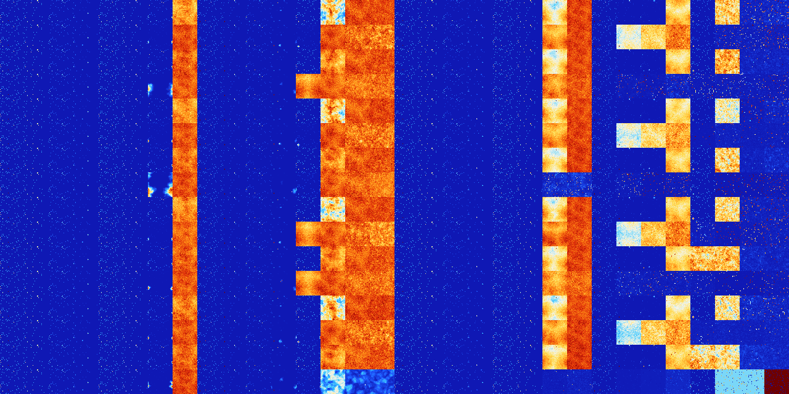

# B378 (200704-201215)

<details>
    <summary>Initial Grid</summary>
    
</details>


<details>
    <summary>Initial Grid RLE</summary>

```
#C Exported from GoGoL (https://github.com/marrow16/gogol)
#C Wrap mode: Toroidal
#C Boundary mode: Dead
#C Step: 0
x = 100, y = 100, rule = B378/S
5bo55bo7bo18bo2bo$11bo19bo6bo13bobo17bo8bo$13bo13bo$28bo21bob2o5bo9bo3b
obo19bo$29bo61bo$8bo12bo14bo2bo2bobo40bo$52bo11bo3bo5bo5bo4bo$33bo3bo9b
o7bo4bo16b2o$55bo14bo3bo$3bo29bo22bo34bo$26bobo22bo2bo7b2o25bo$8b2o39bo
2bo12bo32bo$20bo5bo13bo5bo18bo$16bo31bo19bo16bo$6bo48bo7bo4bo4bo23bo$
14bo14bo5bo42bo19bo$55bo$5bo$32bo11bo23bo20bo$25bo14bo26bo20bo$5bo3bo
41bo34bo$6bo8bo44bo21bo11bo$4bo2bo$4bo19bo36bo10bobo9bo$12bo8bo2bo10bo
21bo13bo$32b2o13bo19bo$26bo17bo49bo$17bobo9bo21bo4bo$84bo$26bo16bo12bo
40bobo$11bo80bo$24bo9bobo11bo$36bo11bo19bo15bo$3bo26bo19bo22bobo17bo$
46bo12bo5bo$6bo2bo15bo20bo8bo24bo7bo$20bo61bo7bo7bo$o36bo5bo14bo4bo9bo$
9bo20bo45bo15bo$23bo16bo4bo10bo26bo10bo$6bo17bo11bo32bo4bo18bo$9bo12bo
18bo28bo$39bobo21bo7bo15bo9bobo$4bo50bo18bo$17b2o9bo6bo18bo2bo8bo20bo$
15bo29bo50bo$29bo24bo3bo$4bo22bo15bo42bo9bo$24bo12bo61bo$37bo30bo17bo$
15bo$2bo5bo4bo6bo39bo9bo24bo$9bo27bo18bobo11bo$4bo31bo17bo24bo10bo5bo$
20bo33bo$45bo2bo33bo14bo$13bo35bo$20bo19bo42bo$2bo3bobo3bo13bo35bo7bo$
42bo31bo$29bo36bo$18bo23bo36bo4bo$bo29bo3bo33bo8bo17bo$2bo21bo6bo2bo15b
o$bo13bo8bo12bo36bo21bo$31bo20bo9bo5bo23bo$12bo15bo18bo13bo15bo$o6bo5bo
42bo10bo3bo3bo$71bo7bo14bo3bo$o98bo$3b2o22bo36bo25bo6b2o$9bo4bo5bo4bo
38b2o24bo$4bo2bo25bo23bo15bo$24bo27bo44bo$14bobo16bo10bo4bo5bo$2o9bo7bo
34bo16bo25bo$19bo24bo4bo2bo20bo22bo$67bo17bo$bo74bo17bo$39bo10bo6bo9bo
12bo3bo$8bo49bo22bo$34bo29bobo$63bo5bo13bo6bo7bo$19bo2bo9bobo4bo4bo23bo
17bo$2bo2bo2bo3bo19bo2b2o5bo55bo$68bo13bo9bo$11bo39bo$o10b2o10b2o34bo
36bobo$10bo32bo11bo28bo$15bo15bo2bo3bo2bo7bo31bo$28bo21bo6bobo$94bo$14b
o6bo21bo47bo$40bo4bo32bo3bo$10bo40bo4b2o20bo16bo$6bo2bo10bo60bo17bo$9bo
16bo12bo7bo13bo17bo$12bo35bo$bo5bo2bo12bo9bo28bo16bo$21b2o21bobo7bo36bo
5bo!
```
</details>
<details>
    <summary>Thumbnail</summary>

</details>
<table>
<tr>
    <td><a href="./200704%20S%20Heat%20Map%20Activity.png"></a><br>S (200704)<br>S@4</td>    <td><a href="./200705%20S0%20Heat%20Map%20Activity.png"></a><br>S0 (200705)<br>S@5</td>    <td><a href="./200706%20S1%20Heat%20Map%20Activity.png"></a><br>S1 (200706)<br>R@7,p2</td>    <td><a href="./200707%20S01%20Heat%20Map%20Activity.png"></a><br>S01 (200707)<br>R@17,p2</td>    <td><a href="./200708%20S2%20Heat%20Map%20Activity.png"></a><br>S2 (200708)<br>S@4</td>    <td><a href="./200709%20S02%20Heat%20Map%20Activity.png"></a><br>S02 (200709)<br>S@8</td>    <td><a href="./200710%20S12%20Heat%20Map%20Activity.png"></a><br>S12 (200710)<br>S@12</td>    <td><a href="./200711%20S012%20Heat%20Map%20Activity.png"></a><br>S012 (200711)<br>G>1000</td>    <td><a href="./200712%20S3%20Heat%20Map%20Activity.png"></a><br>S3 (200712)<br>R@6,p2</td>    <td><a href="./200713%20S03%20Heat%20Map%20Activity.png"></a><br>S03 (200713)<br>R@9,p2</td>    <td><a href="./200714%20S13%20Heat%20Map%20Activity.png"></a><br>S13 (200714)<br>R@12,p2</td>    <td><a href="./200715%20S013%20Heat%20Map%20Activity.png"></a><br>S013 (200715)<br>R@42,p12</td>    <td><a href="./200716%20S23%20Heat%20Map%20Activity.png"></a><br>S23 (200716)<br>S@4</td>    <td><a href="./200717%20S023%20Heat%20Map%20Activity.png"></a><br>S023 (200717)<br>G>1000</td>    <td><a href="./200718%20S123%20Heat%20Map%20Activity.png"></a><br>S123 (200718)<br>G>1000</td>    <td><a href="./200719%20S0123%20Heat%20Map%20Activity.png"></a><br>S0123 (200719)<br>G>1000</td>    <td><a href="./200720%20S4%20Heat%20Map%20Activity.png"></a><br>S4 (200720)<br>S@4</td>    <td><a href="./200721%20S04%20Heat%20Map%20Activity.png"></a><br>S04 (200721)<br>S@5</td>    <td><a href="./200722%20S14%20Heat%20Map%20Activity.png"></a><br>S14 (200722)<br>R@10,p2</td>    <td><a href="./200723%20S014%20Heat%20Map%20Activity.png"></a><br>S014 (200723)<br>R@20,p2</td>    <td><a href="./200724%20S24%20Heat%20Map%20Activity.png"></a><br>S24 (200724)<br>S@4</td>    <td><a href="./200725%20S024%20Heat%20Map%20Activity.png"></a><br>S024 (200725)<br>S@8</td>    <td><a href="./200726%20S124%20Heat%20Map%20Activity.png"></a><br>S124 (200726)<br>G>1000</td>    <td><a href="./200727%20S0124%20Heat%20Map%20Activity.png"></a><br>S0124 (200727)<br>G>1000</td>    <td><a href="./200728%20S34%20Heat%20Map%20Activity.png"></a><br>S34 (200728)<br>R@6,p2</td>    <td><a href="./200729%20S034%20Heat%20Map%20Activity.png"></a><br>S034 (200729)<br>R@17,p2</td>    <td><a href="./200730%20S134%20Heat%20Map%20Activity.png"></a><br>S134 (200730)<br>R@44,p2</td>    <td><a href="./200731%20S0134%20Heat%20Map%20Activity.png"></a><br>S0134 (200731)<br>G>1000</td>    <td><a href="./200732%20S234%20Heat%20Map%20Activity.png"></a><br>S234 (200732)<br>S@7</td>    <td><a href="./200733%20S0234%20Heat%20Map%20Activity.png"></a><br>S0234 (200733)<br>G>1000</td>    <td><a href="./200734%20S1234%20Heat%20Map%20Activity.png"></a><br>S1234 (200734)<br>R@199,p24</td>    <td><a href="./200735%20S01234%20Heat%20Map%20Activity.png"></a><br>S01234 (200735)<br>R@118,p20</td></tr>
<tr>
    <td><a href="./200736%20S5%20Heat%20Map%20Activity.png"></a><br>S5 (200736)<br>S@4</td>    <td><a href="./200737%20S05%20Heat%20Map%20Activity.png"></a><br>S05 (200737)<br>S@5</td>    <td><a href="./200738%20S15%20Heat%20Map%20Activity.png"></a><br>S15 (200738)<br>R@7,p2</td>    <td><a href="./200739%20S015%20Heat%20Map%20Activity.png"></a><br>S015 (200739)<br>R@15,p2</td>    <td><a href="./200740%20S25%20Heat%20Map%20Activity.png"></a><br>S25 (200740)<br>S@4</td>    <td><a href="./200741%20S025%20Heat%20Map%20Activity.png"></a><br>S025 (200741)<br>S@8</td>    <td><a href="./200742%20S125%20Heat%20Map%20Activity.png"></a><br>S125 (200742)<br>S@65</td>    <td><a href="./200743%20S0125%20Heat%20Map%20Activity.png"></a><br>S0125 (200743)<br>G>1000</td>    <td><a href="./200744%20S35%20Heat%20Map%20Activity.png"></a><br>S35 (200744)<br>R@6,p2</td>    <td><a href="./200745%20S035%20Heat%20Map%20Activity.png"></a><br>S035 (200745)<br>R@9,p2</td>    <td><a href="./200746%20S135%20Heat%20Map%20Activity.png"></a><br>S135 (200746)<br>R@9,p2</td>    <td><a href="./200747%20S0135%20Heat%20Map%20Activity.png"></a><br>S0135 (200747)<br>R@61,p2</td>    <td><a href="./200748%20S235%20Heat%20Map%20Activity.png"></a><br>S235 (200748)<br>R@25,p2</td>    <td><a href="./200749%20S0235%20Heat%20Map%20Activity.png"></a><br>S0235 (200749)<br>G>1000</td>    <td><a href="./200750%20S1235%20Heat%20Map%20Activity.png"></a><br>S1235 (200750)<br>G>1000</td>    <td><a href="./200751%20S01235%20Heat%20Map%20Activity.png"></a><br>S01235 (200751)<br>G>1000</td>    <td><a href="./200752%20S45%20Heat%20Map%20Activity.png"></a><br>S45 (200752)<br>S@4</td>    <td><a href="./200753%20S045%20Heat%20Map%20Activity.png"></a><br>S045 (200753)<br>S@5</td>    <td><a href="./200754%20S145%20Heat%20Map%20Activity.png"></a><br>S145 (200754)<br>R@7,p2</td>    <td><a href="./200755%20S0145%20Heat%20Map%20Activity.png"></a><br>S0145 (200755)<br>R@15,p2</td>    <td><a href="./200756%20S245%20Heat%20Map%20Activity.png"></a><br>S245 (200756)<br>S@4</td>    <td><a href="./200757%20S0245%20Heat%20Map%20Activity.png"></a><br>S0245 (200757)<br>S@8</td>    <td><a href="./200758%20S1245%20Heat%20Map%20Activity.png"></a><br>S1245 (200758)<br>G>1000</td>    <td><a href="./200759%20S01245%20Heat%20Map%20Activity.png"></a><br>S01245 (200759)<br>G>1000</td>    <td><a href="./200760%20S345%20Heat%20Map%20Activity.png"></a><br>S345 (200760)<br>R@6,p2</td>    <td><a href="./200761%20S0345%20Heat%20Map%20Activity.png"></a><br>S0345 (200761)<br>G>1000</td>    <td><a href="./200762%20S1345%20Heat%20Map%20Activity.png"></a><br>S1345 (200762)<br>G>1000</td>    <td><a href="./200763%20S01345%20Heat%20Map%20Activity.png"></a><br>S01345 (200763)<br>G>1000</td>    <td><a href="./200764%20S2345%20Heat%20Map%20Activity.png"></a><br>S2345 (200764)<br>S@9</td>    <td><a href="./200765%20S02345%20Heat%20Map%20Activity.png"></a><br>S02345 (200765)<br>R@245,p60</td>    <td><a href="./200766%20S12345%20Heat%20Map%20Activity.png"></a><br>S12345 (200766)<br>R@158,p20</td>    <td><a href="./200767%20S012345%20Heat%20Map%20Activity.png"></a><br>S012345 (200767)<br>R@139,p60</td></tr>
<tr>
    <td><a href="./200768%20S6%20Heat%20Map%20Activity.png"></a><br>S6 (200768)<br>S@4</td>    <td><a href="./200769%20S06%20Heat%20Map%20Activity.png"></a><br>S06 (200769)<br>S@5</td>    <td><a href="./200770%20S16%20Heat%20Map%20Activity.png"></a><br>S16 (200770)<br>R@7,p2</td>    <td><a href="./200771%20S016%20Heat%20Map%20Activity.png"></a><br>S016 (200771)<br>R@17,p2</td>    <td><a href="./200772%20S26%20Heat%20Map%20Activity.png"></a><br>S26 (200772)<br>S@4</td>    <td><a href="./200773%20S026%20Heat%20Map%20Activity.png"></a><br>S026 (200773)<br>S@8</td>    <td><a href="./200774%20S126%20Heat%20Map%20Activity.png"></a><br>S126 (200774)<br>S@22</td>    <td><a href="./200775%20S0126%20Heat%20Map%20Activity.png"></a><br>S0126 (200775)<br>G>1000</td>    <td><a href="./200776%20S36%20Heat%20Map%20Activity.png"></a><br>S36 (200776)<br>R@6,p2</td>    <td><a href="./200777%20S036%20Heat%20Map%20Activity.png"></a><br>S036 (200777)<br>R@9,p2</td>    <td><a href="./200778%20S136%20Heat%20Map%20Activity.png"></a><br>S136 (200778)<br>R@12,p2</td>    <td><a href="./200779%20S0136%20Heat%20Map%20Activity.png"></a><br>S0136 (200779)<br>R@35,p12</td>    <td><a href="./200780%20S236%20Heat%20Map%20Activity.png"></a><br>S236 (200780)<br>S@4</td>    <td><a href="./200781%20S0236%20Heat%20Map%20Activity.png"></a><br>S0236 (200781)<br>G>1000</td>    <td><a href="./200782%20S1236%20Heat%20Map%20Activity.png"></a><br>S1236 (200782)<br>G>1000</td>    <td><a href="./200783%20S01236%20Heat%20Map%20Activity.png"></a><br>S01236 (200783)<br>G>1000</td>    <td><a href="./200784%20S46%20Heat%20Map%20Activity.png"></a><br>S46 (200784)<br>S@4</td>    <td><a href="./200785%20S046%20Heat%20Map%20Activity.png"></a><br>S046 (200785)<br>S@5</td>    <td><a href="./200786%20S146%20Heat%20Map%20Activity.png"></a><br>S146 (200786)<br>R@10,p2</td>    <td><a href="./200787%20S0146%20Heat%20Map%20Activity.png"></a><br>S0146 (200787)<br>R@20,p2</td>    <td><a href="./200788%20S246%20Heat%20Map%20Activity.png"></a><br>S246 (200788)<br>S@4</td>    <td><a href="./200789%20S0246%20Heat%20Map%20Activity.png"></a><br>S0246 (200789)<br>S@8</td>    <td><a href="./200790%20S1246%20Heat%20Map%20Activity.png"></a><br>S1246 (200790)<br>G>1000</td>    <td><a href="./200791%20S01246%20Heat%20Map%20Activity.png"></a><br>S01246 (200791)<br>G>1000</td>    <td><a href="./200792%20S346%20Heat%20Map%20Activity.png"></a><br>S346 (200792)<br>R@6,p2</td>    <td><a href="./200793%20S0346%20Heat%20Map%20Activity.png"></a><br>S0346 (200793)<br>R@17,p2</td>    <td><a href="./200794%20S1346%20Heat%20Map%20Activity.png"></a><br>S1346 (200794)<br>R@22,p2</td>    <td><a href="./200795%20S01346%20Heat%20Map%20Activity.png"></a><br>S01346 (200795)<br>G>1000</td>    <td><a href="./200796%20S2346%20Heat%20Map%20Activity.png"></a><br>S2346 (200796)<br>S@7</td>    <td><a href="./200797%20S02346%20Heat%20Map%20Activity.png"></a><br>S02346 (200797)<br>G>1000</td>    <td><a href="./200798%20S12346%20Heat%20Map%20Activity.png"></a><br>S12346 (200798)<br>R@239,p60</td>    <td><a href="./200799%20S012346%20Heat%20Map%20Activity.png"></a><br>S012346 (200799)<br>R@193,p60</td></tr>
<tr>
    <td><a href="./200800%20S56%20Heat%20Map%20Activity.png"></a><br>S56 (200800)<br>S@4</td>    <td><a href="./200801%20S056%20Heat%20Map%20Activity.png"></a><br>S056 (200801)<br>S@5</td>    <td><a href="./200802%20S156%20Heat%20Map%20Activity.png"></a><br>S156 (200802)<br>R@7,p2</td>    <td><a href="./200803%20S0156%20Heat%20Map%20Activity.png"></a><br>S0156 (200803)<br>R@15,p2</td>    <td><a href="./200804%20S256%20Heat%20Map%20Activity.png"></a><br>S256 (200804)<br>S@4</td>    <td><a href="./200805%20S0256%20Heat%20Map%20Activity.png"></a><br>S0256 (200805)<br>S@8</td>    <td><a href="./200806%20S1256%20Heat%20Map%20Activity.png"></a><br>S1256 (200806)<br>G>1000</td>    <td><a href="./200807%20S01256%20Heat%20Map%20Activity.png"></a><br>S01256 (200807)<br>G>1000</td>    <td><a href="./200808%20S356%20Heat%20Map%20Activity.png"></a><br>S356 (200808)<br>R@6,p2</td>    <td><a href="./200809%20S0356%20Heat%20Map%20Activity.png"></a><br>S0356 (200809)<br>R@9,p2</td>    <td><a href="./200810%20S1356%20Heat%20Map%20Activity.png"></a><br>S1356 (200810)<br>R@9,p2</td>    <td><a href="./200811%20S01356%20Heat%20Map%20Activity.png"></a><br>S01356 (200811)<br>R@214,p2</td>    <td><a href="./200812%20S2356%20Heat%20Map%20Activity.png"></a><br>S2356 (200812)<br>G>1000</td>    <td><a href="./200813%20S02356%20Heat%20Map%20Activity.png"></a><br>S02356 (200813)<br>G>1000</td>    <td><a href="./200814%20S12356%20Heat%20Map%20Activity.png"></a><br>S12356 (200814)<br>G>1000</td>    <td><a href="./200815%20S012356%20Heat%20Map%20Activity.png"></a><br>S012356 (200815)<br>G>1000</td>    <td><a href="./200816%20S456%20Heat%20Map%20Activity.png"></a><br>S456 (200816)<br>S@4</td>    <td><a href="./200817%20S0456%20Heat%20Map%20Activity.png"></a><br>S0456 (200817)<br>S@5</td>    <td><a href="./200818%20S1456%20Heat%20Map%20Activity.png"></a><br>S1456 (200818)<br>R@7,p2</td>    <td><a href="./200819%20S01456%20Heat%20Map%20Activity.png"></a><br>S01456 (200819)<br>R@15,p2</td>    <td><a href="./200820%20S2456%20Heat%20Map%20Activity.png"></a><br>S2456 (200820)<br>S@4</td>    <td><a href="./200821%20S02456%20Heat%20Map%20Activity.png"></a><br>S02456 (200821)<br>S@8</td>    <td><a href="./200822%20S12456%20Heat%20Map%20Activity.png"></a><br>S12456 (200822)<br>G>1000</td>    <td><a href="./200823%20S012456%20Heat%20Map%20Activity.png"></a><br>S012456 (200823)<br>G>1000</td>    <td><a href="./200824%20S3456%20Heat%20Map%20Activity.png"></a><br>S3456 (200824)<br>R@6,p2</td>    <td><a href="./200825%20S03456%20Heat%20Map%20Activity.png"></a><br>S03456 (200825)<br>G>1000</td>    <td><a href="./200826%20S13456%20Heat%20Map%20Activity.png"></a><br>S13456 (200826)<br>G>1000</td>    <td><a href="./200827%20S013456%20Heat%20Map%20Activity.png"></a><br>S013456 (200827)<br>R@274,p12</td>    <td><a href="./200828%20S23456%20Heat%20Map%20Activity.png"></a><br>S23456 (200828)<br>R@351,p120</td>    <td><a href="./200829%20S023456%20Heat%20Map%20Activity.png"></a><br>S023456 (200829)<br>R@192,p60</td>    <td><a href="./200830%20S123456%20Heat%20Map%20Activity.png"></a><br>S123456 (200830)<br>R@194,p60</td>    <td><a href="./200831%20S0123456%20Heat%20Map%20Activity.png"></a><br>S0123456 (200831)<br>R@206,p120</td></tr>
<tr>
    <td><a href="./200832%20S7%20Heat%20Map%20Activity.png"></a><br>S7 (200832)<br>S@4</td>    <td><a href="./200833%20S07%20Heat%20Map%20Activity.png"></a><br>S07 (200833)<br>S@5</td>    <td><a href="./200834%20S17%20Heat%20Map%20Activity.png"></a><br>S17 (200834)<br>R@7,p2</td>    <td><a href="./200835%20S017%20Heat%20Map%20Activity.png"></a><br>S017 (200835)<br>R@17,p2</td>    <td><a href="./200836%20S27%20Heat%20Map%20Activity.png"></a><br>S27 (200836)<br>S@4</td>    <td><a href="./200837%20S027%20Heat%20Map%20Activity.png"></a><br>S027 (200837)<br>S@8</td>    <td><a href="./200838%20S127%20Heat%20Map%20Activity.png"></a><br>S127 (200838)<br>S@12</td>    <td><a href="./200839%20S0127%20Heat%20Map%20Activity.png"></a><br>S0127 (200839)<br>G>1000</td>    <td><a href="./200840%20S37%20Heat%20Map%20Activity.png"></a><br>S37 (200840)<br>R@6,p2</td>    <td><a href="./200841%20S037%20Heat%20Map%20Activity.png"></a><br>S037 (200841)<br>R@9,p2</td>    <td><a href="./200842%20S137%20Heat%20Map%20Activity.png"></a><br>S137 (200842)<br>R@12,p2</td>    <td><a href="./200843%20S0137%20Heat%20Map%20Activity.png"></a><br>S0137 (200843)<br>R@41,p12</td>    <td><a href="./200844%20S237%20Heat%20Map%20Activity.png"></a><br>S237 (200844)<br>S@4</td>    <td><a href="./200845%20S0237%20Heat%20Map%20Activity.png"></a><br>S0237 (200845)<br>G>1000</td>    <td><a href="./200846%20S1237%20Heat%20Map%20Activity.png"></a><br>S1237 (200846)<br>G>1000</td>    <td><a href="./200847%20S01237%20Heat%20Map%20Activity.png"></a><br>S01237 (200847)<br>G>1000</td>    <td><a href="./200848%20S47%20Heat%20Map%20Activity.png"></a><br>S47 (200848)<br>S@4</td>    <td><a href="./200849%20S047%20Heat%20Map%20Activity.png"></a><br>S047 (200849)<br>S@5</td>    <td><a href="./200850%20S147%20Heat%20Map%20Activity.png"></a><br>S147 (200850)<br>R@10,p2</td>    <td><a href="./200851%20S0147%20Heat%20Map%20Activity.png"></a><br>S0147 (200851)<br>R@20,p2</td>    <td><a href="./200852%20S247%20Heat%20Map%20Activity.png"></a><br>S247 (200852)<br>S@4</td>    <td><a href="./200853%20S0247%20Heat%20Map%20Activity.png"></a><br>S0247 (200853)<br>S@8</td>    <td><a href="./200854%20S1247%20Heat%20Map%20Activity.png"></a><br>S1247 (200854)<br>G>1000</td>    <td><a href="./200855%20S01247%20Heat%20Map%20Activity.png"></a><br>S01247 (200855)<br>G>1000</td>    <td><a href="./200856%20S347%20Heat%20Map%20Activity.png"></a><br>S347 (200856)<br>R@6,p2</td>    <td><a href="./200857%20S0347%20Heat%20Map%20Activity.png"></a><br>S0347 (200857)<br>R@17,p2</td>    <td><a href="./200858%20S1347%20Heat%20Map%20Activity.png"></a><br>S1347 (200858)<br>R@38,p2</td>    <td><a href="./200859%20S01347%20Heat%20Map%20Activity.png"></a><br>S01347 (200859)<br>G>1000</td>    <td><a href="./200860%20S2347%20Heat%20Map%20Activity.png"></a><br>S2347 (200860)<br>S@7</td>    <td><a href="./200861%20S02347%20Heat%20Map%20Activity.png"></a><br>S02347 (200861)<br>G>1000</td>    <td><a href="./200862%20S12347%20Heat%20Map%20Activity.png"></a><br>S12347 (200862)<br>R@437,p280</td>    <td><a href="./200863%20S012347%20Heat%20Map%20Activity.png"></a><br>S012347 (200863)<br>R@146,p40</td></tr>
<tr>
    <td><a href="./200864%20S57%20Heat%20Map%20Activity.png"></a><br>S57 (200864)<br>S@4</td>    <td><a href="./200865%20S057%20Heat%20Map%20Activity.png"></a><br>S057 (200865)<br>S@5</td>    <td><a href="./200866%20S157%20Heat%20Map%20Activity.png"></a><br>S157 (200866)<br>R@7,p2</td>    <td><a href="./200867%20S0157%20Heat%20Map%20Activity.png"></a><br>S0157 (200867)<br>R@15,p2</td>    <td><a href="./200868%20S257%20Heat%20Map%20Activity.png"></a><br>S257 (200868)<br>S@4</td>    <td><a href="./200869%20S0257%20Heat%20Map%20Activity.png"></a><br>S0257 (200869)<br>S@8</td>    <td><a href="./200870%20S1257%20Heat%20Map%20Activity.png"></a><br>S1257 (200870)<br>S@54</td>    <td><a href="./200871%20S01257%20Heat%20Map%20Activity.png"></a><br>S01257 (200871)<br>G>1000</td>    <td><a href="./200872%20S357%20Heat%20Map%20Activity.png"></a><br>S357 (200872)<br>R@6,p2</td>    <td><a href="./200873%20S0357%20Heat%20Map%20Activity.png"></a><br>S0357 (200873)<br>R@9,p2</td>    <td><a href="./200874%20S1357%20Heat%20Map%20Activity.png"></a><br>S1357 (200874)<br>R@9,p2</td>    <td><a href="./200875%20S01357%20Heat%20Map%20Activity.png"></a><br>S01357 (200875)<br>R@77,p2</td>    <td><a href="./200876%20S2357%20Heat%20Map%20Activity.png"></a><br>S2357 (200876)<br>R@27,p2</td>    <td><a href="./200877%20S02357%20Heat%20Map%20Activity.png"></a><br>S02357 (200877)<br>G>1000</td>    <td><a href="./200878%20S12357%20Heat%20Map%20Activity.png"></a><br>S12357 (200878)<br>G>1000</td>    <td><a href="./200879%20S012357%20Heat%20Map%20Activity.png"></a><br>S012357 (200879)<br>G>1000</td>    <td><a href="./200880%20S457%20Heat%20Map%20Activity.png"></a><br>S457 (200880)<br>S@4</td>    <td><a href="./200881%20S0457%20Heat%20Map%20Activity.png"></a><br>S0457 (200881)<br>S@5</td>    <td><a href="./200882%20S1457%20Heat%20Map%20Activity.png"></a><br>S1457 (200882)<br>R@7,p2</td>    <td><a href="./200883%20S01457%20Heat%20Map%20Activity.png"></a><br>S01457 (200883)<br>R@15,p2</td>    <td><a href="./200884%20S2457%20Heat%20Map%20Activity.png"></a><br>S2457 (200884)<br>S@4</td>    <td><a href="./200885%20S02457%20Heat%20Map%20Activity.png"></a><br>S02457 (200885)<br>S@8</td>    <td><a href="./200886%20S12457%20Heat%20Map%20Activity.png"></a><br>S12457 (200886)<br>G>1000</td>    <td><a href="./200887%20S012457%20Heat%20Map%20Activity.png"></a><br>S012457 (200887)<br>G>1000</td>    <td><a href="./200888%20S3457%20Heat%20Map%20Activity.png"></a><br>S3457 (200888)<br>R@6,p2</td>    <td><a href="./200889%20S03457%20Heat%20Map%20Activity.png"></a><br>S03457 (200889)<br>G>1000</td>    <td><a href="./200890%20S13457%20Heat%20Map%20Activity.png"></a><br>S13457 (200890)<br>G>1000</td>    <td><a href="./200891%20S013457%20Heat%20Map%20Activity.png"></a><br>S013457 (200891)<br>G>1000</td>    <td><a href="./200892%20S23457%20Heat%20Map%20Activity.png"></a><br>S23457 (200892)<br>R@651,p420</td>    <td><a href="./200893%20S023457%20Heat%20Map%20Activity.png"></a><br>S023457 (200893)<br>R@162,p30</td>    <td><a href="./200894%20S123457%20Heat%20Map%20Activity.png"></a><br>S123457 (200894)<br>R@188,p60</td>    <td><a href="./200895%20S0123457%20Heat%20Map%20Activity.png"></a><br>S0123457 (200895)<br>R@139,p60</td></tr>
<tr>
    <td><a href="./200896%20S67%20Heat%20Map%20Activity.png"></a><br>S67 (200896)<br>S@4</td>    <td><a href="./200897%20S067%20Heat%20Map%20Activity.png"></a><br>S067 (200897)<br>S@5</td>    <td><a href="./200898%20S167%20Heat%20Map%20Activity.png"></a><br>S167 (200898)<br>R@7,p2</td>    <td><a href="./200899%20S0167%20Heat%20Map%20Activity.png"></a><br>S0167 (200899)<br>R@17,p2</td>    <td><a href="./200900%20S267%20Heat%20Map%20Activity.png"></a><br>S267 (200900)<br>S@4</td>    <td><a href="./200901%20S0267%20Heat%20Map%20Activity.png"></a><br>S0267 (200901)<br>S@8</td>    <td><a href="./200902%20S1267%20Heat%20Map%20Activity.png"></a><br>S1267 (200902)<br>S@22</td>    <td><a href="./200903%20S01267%20Heat%20Map%20Activity.png"></a><br>S01267 (200903)<br>G>1000</td>    <td><a href="./200904%20S367%20Heat%20Map%20Activity.png"></a><br>S367 (200904)<br>R@6,p2</td>    <td><a href="./200905%20S0367%20Heat%20Map%20Activity.png"></a><br>S0367 (200905)<br>R@9,p2</td>    <td><a href="./200906%20S1367%20Heat%20Map%20Activity.png"></a><br>S1367 (200906)<br>R@12,p2</td>    <td><a href="./200907%20S01367%20Heat%20Map%20Activity.png"></a><br>S01367 (200907)<br>R@35,p12</td>    <td><a href="./200908%20S2367%20Heat%20Map%20Activity.png"></a><br>S2367 (200908)<br>S@4</td>    <td><a href="./200909%20S02367%20Heat%20Map%20Activity.png"></a><br>S02367 (200909)<br>G>1000</td>    <td><a href="./200910%20S12367%20Heat%20Map%20Activity.png"></a><br>S12367 (200910)<br>G>1000</td>    <td><a href="./200911%20S012367%20Heat%20Map%20Activity.png"></a><br>S012367 (200911)<br>G>1000</td>    <td><a href="./200912%20S467%20Heat%20Map%20Activity.png"></a><br>S467 (200912)<br>S@4</td>    <td><a href="./200913%20S0467%20Heat%20Map%20Activity.png"></a><br>S0467 (200913)<br>S@5</td>    <td><a href="./200914%20S1467%20Heat%20Map%20Activity.png"></a><br>S1467 (200914)<br>R@10,p2</td>    <td><a href="./200915%20S01467%20Heat%20Map%20Activity.png"></a><br>S01467 (200915)<br>R@20,p2</td>    <td><a href="./200916%20S2467%20Heat%20Map%20Activity.png"></a><br>S2467 (200916)<br>S@4</td>    <td><a href="./200917%20S02467%20Heat%20Map%20Activity.png"></a><br>S02467 (200917)<br>S@8</td>    <td><a href="./200918%20S12467%20Heat%20Map%20Activity.png"></a><br>S12467 (200918)<br>G>1000</td>    <td><a href="./200919%20S012467%20Heat%20Map%20Activity.png"></a><br>S012467 (200919)<br>G>1000</td>    <td><a href="./200920%20S3467%20Heat%20Map%20Activity.png"></a><br>S3467 (200920)<br>R@6,p2</td>    <td><a href="./200921%20S03467%20Heat%20Map%20Activity.png"></a><br>S03467 (200921)<br>R@17,p2</td>    <td><a href="./200922%20S13467%20Heat%20Map%20Activity.png"></a><br>S13467 (200922)<br>R@22,p2</td>    <td><a href="./200923%20S013467%20Heat%20Map%20Activity.png"></a><br>S013467 (200923)<br>G>1000</td>    <td><a href="./200924%20S23467%20Heat%20Map%20Activity.png"></a><br>S23467 (200924)<br>S@7</td>    <td><a href="./200925%20S023467%20Heat%20Map%20Activity.png"></a><br>S023467 (200925)<br>G>1000</td>    <td><a href="./200926%20S123467%20Heat%20Map%20Activity.png"></a><br>S123467 (200926)<br>R@258,p90</td>    <td><a href="./200927%20S0123467%20Heat%20Map%20Activity.png"></a><br>S0123467 (200927)<br>R@144,p40</td></tr>
<tr>
    <td><a href="./200928%20S567%20Heat%20Map%20Activity.png"></a><br>S567 (200928)<br>S@4</td>    <td><a href="./200929%20S0567%20Heat%20Map%20Activity.png"></a><br>S0567 (200929)<br>S@5</td>    <td><a href="./200930%20S1567%20Heat%20Map%20Activity.png"></a><br>S1567 (200930)<br>R@7,p2</td>    <td><a href="./200931%20S01567%20Heat%20Map%20Activity.png"></a><br>S01567 (200931)<br>R@15,p2</td>    <td><a href="./200932%20S2567%20Heat%20Map%20Activity.png"></a><br>S2567 (200932)<br>S@4</td>    <td><a href="./200933%20S02567%20Heat%20Map%20Activity.png"></a><br>S02567 (200933)<br>S@8</td>    <td><a href="./200934%20S12567%20Heat%20Map%20Activity.png"></a><br>S12567 (200934)<br>G>1000</td>    <td><a href="./200935%20S012567%20Heat%20Map%20Activity.png"></a><br>S012567 (200935)<br>G>1000</td>    <td><a href="./200936%20S3567%20Heat%20Map%20Activity.png"></a><br>S3567 (200936)<br>R@6,p2</td>    <td><a href="./200937%20S03567%20Heat%20Map%20Activity.png"></a><br>S03567 (200937)<br>R@9,p2</td>    <td><a href="./200938%20S13567%20Heat%20Map%20Activity.png"></a><br>S13567 (200938)<br>R@9,p2</td>    <td><a href="./200939%20S013567%20Heat%20Map%20Activity.png"></a><br>S013567 (200939)<br>R@493,p2</td>    <td><a href="./200940%20S23567%20Heat%20Map%20Activity.png"></a><br>S23567 (200940)<br>R@18,p2</td>    <td><a href="./200941%20S023567%20Heat%20Map%20Activity.png"></a><br>S023567 (200941)<br>G>1000</td>    <td><a href="./200942%20S123567%20Heat%20Map%20Activity.png"></a><br>S123567 (200942)<br>G>1000</td>    <td><a href="./200943%20S0123567%20Heat%20Map%20Activity.png"></a><br>S0123567 (200943)<br>G>1000</td>    <td><a href="./200944%20S4567%20Heat%20Map%20Activity.png"></a><br>S4567 (200944)<br>S@4</td>    <td><a href="./200945%20S04567%20Heat%20Map%20Activity.png"></a><br>S04567 (200945)<br>S@5</td>    <td><a href="./200946%20S14567%20Heat%20Map%20Activity.png"></a><br>S14567 (200946)<br>R@7,p2</td>    <td><a href="./200947%20S014567%20Heat%20Map%20Activity.png"></a><br>S014567 (200947)<br>R@15,p2</td>    <td><a href="./200948%20S24567%20Heat%20Map%20Activity.png"></a><br>S24567 (200948)<br>S@4</td>    <td><a href="./200949%20S024567%20Heat%20Map%20Activity.png"></a><br>S024567 (200949)<br>S@8</td>    <td><a href="./200950%20S124567%20Heat%20Map%20Activity.png"></a><br>S124567 (200950)<br>R@665,p12</td>    <td><a href="./200951%20S0124567%20Heat%20Map%20Activity.png"></a><br>S0124567 (200951)<br>R@392,p12</td>    <td><a href="./200952%20S34567%20Heat%20Map%20Activity.png"></a><br>S34567 (200952)<br>R@6,p2</td>    <td><a href="./200953%20S034567%20Heat%20Map%20Activity.png"></a><br>S034567 (200953)<br>R@293,p72</td>    <td><a href="./200954%20S134567%20Heat%20Map%20Activity.png"></a><br>S134567 (200954)<br>G>1000</td>    <td><a href="./200955%20S0134567%20Heat%20Map%20Activity.png"></a><br>S0134567 (200955)<br>R@279,p168</td>    <td><a href="./200956%20S234567%20Heat%20Map%20Activity.png"></a><br>S234567 (200956)<br>S@8</td>    <td><a href="./200957%20S0234567%20Heat%20Map%20Activity.png"></a><br>S0234567 (200957)<br>R@973,p840</td>    <td><a href="./200958%20S1234567%20Heat%20Map%20Activity.png"></a><br>S1234567 (200958)<br>R@989,p840</td>    <td><a href="./200959%20S01234567%20Heat%20Map%20Activity.png"></a><br>S01234567 (200959)<br>R@247,p168</td></tr>
<tr>
    <td><a href="./200960%20S8%20Heat%20Map%20Activity.png"></a><br>S8 (200960)<br>S@4</td>    <td><a href="./200961%20S08%20Heat%20Map%20Activity.png"></a><br>S08 (200961)<br>S@5</td>    <td><a href="./200962%20S18%20Heat%20Map%20Activity.png"></a><br>S18 (200962)<br>R@7,p2</td>    <td><a href="./200963%20S018%20Heat%20Map%20Activity.png"></a><br>S018 (200963)<br>R@17,p2</td>    <td><a href="./200964%20S28%20Heat%20Map%20Activity.png"></a><br>S28 (200964)<br>S@4</td>    <td><a href="./200965%20S028%20Heat%20Map%20Activity.png"></a><br>S028 (200965)<br>S@8</td>    <td><a href="./200966%20S128%20Heat%20Map%20Activity.png"></a><br>S128 (200966)<br>S@12</td>    <td><a href="./200967%20S0128%20Heat%20Map%20Activity.png"></a><br>S0128 (200967)<br>G>1000</td>    <td><a href="./200968%20S38%20Heat%20Map%20Activity.png"></a><br>S38 (200968)<br>R@6,p2</td>    <td><a href="./200969%20S038%20Heat%20Map%20Activity.png"></a><br>S038 (200969)<br>R@9,p2</td>    <td><a href="./200970%20S138%20Heat%20Map%20Activity.png"></a><br>S138 (200970)<br>R@12,p2</td>    <td><a href="./200971%20S0138%20Heat%20Map%20Activity.png"></a><br>S0138 (200971)<br>R@42,p12</td>    <td><a href="./200972%20S238%20Heat%20Map%20Activity.png"></a><br>S238 (200972)<br>S@4</td>    <td><a href="./200973%20S0238%20Heat%20Map%20Activity.png"></a><br>S0238 (200973)<br>G>1000</td>    <td><a href="./200974%20S1238%20Heat%20Map%20Activity.png"></a><br>S1238 (200974)<br>G>1000</td>    <td><a href="./200975%20S01238%20Heat%20Map%20Activity.png"></a><br>S01238 (200975)<br>G>1000</td>    <td><a href="./200976%20S48%20Heat%20Map%20Activity.png"></a><br>S48 (200976)<br>S@4</td>    <td><a href="./200977%20S048%20Heat%20Map%20Activity.png"></a><br>S048 (200977)<br>S@5</td>    <td><a href="./200978%20S148%20Heat%20Map%20Activity.png"></a><br>S148 (200978)<br>R@10,p2</td>    <td><a href="./200979%20S0148%20Heat%20Map%20Activity.png"></a><br>S0148 (200979)<br>R@20,p2</td>    <td><a href="./200980%20S248%20Heat%20Map%20Activity.png"></a><br>S248 (200980)<br>S@4</td>    <td><a href="./200981%20S0248%20Heat%20Map%20Activity.png"></a><br>S0248 (200981)<br>S@8</td>    <td><a href="./200982%20S1248%20Heat%20Map%20Activity.png"></a><br>S1248 (200982)<br>G>1000</td>    <td><a href="./200983%20S01248%20Heat%20Map%20Activity.png"></a><br>S01248 (200983)<br>G>1000</td>    <td><a href="./200984%20S348%20Heat%20Map%20Activity.png"></a><br>S348 (200984)<br>R@6,p2</td>    <td><a href="./200985%20S0348%20Heat%20Map%20Activity.png"></a><br>S0348 (200985)<br>R@15,p4</td>    <td><a href="./200986%20S1348%20Heat%20Map%20Activity.png"></a><br>S1348 (200986)<br>R@44,p2</td>    <td><a href="./200987%20S01348%20Heat%20Map%20Activity.png"></a><br>S01348 (200987)<br>G>1000</td>    <td><a href="./200988%20S2348%20Heat%20Map%20Activity.png"></a><br>S2348 (200988)<br>S@9</td>    <td><a href="./200989%20S02348%20Heat%20Map%20Activity.png"></a><br>S02348 (200989)<br>G>1000</td>    <td><a href="./200990%20S12348%20Heat%20Map%20Activity.png"></a><br>S12348 (200990)<br>R@255,p120</td>    <td><a href="./200991%20S012348%20Heat%20Map%20Activity.png"></a><br>S012348 (200991)<br>R@206,p120</td></tr>
<tr>
    <td><a href="./200992%20S58%20Heat%20Map%20Activity.png"></a><br>S58 (200992)<br>S@4</td>    <td><a href="./200993%20S058%20Heat%20Map%20Activity.png"></a><br>S058 (200993)<br>S@5</td>    <td><a href="./200994%20S158%20Heat%20Map%20Activity.png"></a><br>S158 (200994)<br>R@7,p2</td>    <td><a href="./200995%20S0158%20Heat%20Map%20Activity.png"></a><br>S0158 (200995)<br>R@15,p2</td>    <td><a href="./200996%20S258%20Heat%20Map%20Activity.png"></a><br>S258 (200996)<br>S@4</td>    <td><a href="./200997%20S0258%20Heat%20Map%20Activity.png"></a><br>S0258 (200997)<br>S@8</td>    <td><a href="./200998%20S1258%20Heat%20Map%20Activity.png"></a><br>S1258 (200998)<br>S@65</td>    <td><a href="./200999%20S01258%20Heat%20Map%20Activity.png"></a><br>S01258 (200999)<br>G>1000</td>    <td><a href="./201000%20S358%20Heat%20Map%20Activity.png"></a><br>S358 (201000)<br>R@6,p2</td>    <td><a href="./201001%20S0358%20Heat%20Map%20Activity.png"></a><br>S0358 (201001)<br>R@9,p2</td>    <td><a href="./201002%20S1358%20Heat%20Map%20Activity.png"></a><br>S1358 (201002)<br>R@9,p2</td>    <td><a href="./201003%20S01358%20Heat%20Map%20Activity.png"></a><br>S01358 (201003)<br>R@61,p2</td>    <td><a href="./201004%20S2358%20Heat%20Map%20Activity.png"></a><br>S2358 (201004)<br>G>1000</td>    <td><a href="./201005%20S02358%20Heat%20Map%20Activity.png"></a><br>S02358 (201005)<br>G>1000</td>    <td><a href="./201006%20S12358%20Heat%20Map%20Activity.png"></a><br>S12358 (201006)<br>G>1000</td>    <td><a href="./201007%20S012358%20Heat%20Map%20Activity.png"></a><br>S012358 (201007)<br>G>1000</td>    <td><a href="./201008%20S458%20Heat%20Map%20Activity.png"></a><br>S458 (201008)<br>S@4</td>    <td><a href="./201009%20S0458%20Heat%20Map%20Activity.png"></a><br>S0458 (201009)<br>S@5</td>    <td><a href="./201010%20S1458%20Heat%20Map%20Activity.png"></a><br>S1458 (201010)<br>R@7,p2</td>    <td><a href="./201011%20S01458%20Heat%20Map%20Activity.png"></a><br>S01458 (201011)<br>R@15,p2</td>    <td><a href="./201012%20S2458%20Heat%20Map%20Activity.png"></a><br>S2458 (201012)<br>S@4</td>    <td><a href="./201013%20S02458%20Heat%20Map%20Activity.png"></a><br>S02458 (201013)<br>S@8</td>    <td><a href="./201014%20S12458%20Heat%20Map%20Activity.png"></a><br>S12458 (201014)<br>G>1000</td>    <td><a href="./201015%20S012458%20Heat%20Map%20Activity.png"></a><br>S012458 (201015)<br>G>1000</td>    <td><a href="./201016%20S3458%20Heat%20Map%20Activity.png"></a><br>S3458 (201016)<br>R@6,p2</td>    <td><a href="./201017%20S03458%20Heat%20Map%20Activity.png"></a><br>S03458 (201017)<br>G>1000</td>    <td><a href="./201018%20S13458%20Heat%20Map%20Activity.png"></a><br>S13458 (201018)<br>G>1000</td>    <td><a href="./201019%20S013458%20Heat%20Map%20Activity.png"></a><br>S013458 (201019)<br>G>1000</td>    <td><a href="./201020%20S23458%20Heat%20Map%20Activity.png"></a><br>S23458 (201020)<br>R@302,p60</td>    <td><a href="./201021%20S023458%20Heat%20Map%20Activity.png"></a><br>S023458 (201021)<br>R@567,p420</td>    <td><a href="./201022%20S123458%20Heat%20Map%20Activity.png"></a><br>S123458 (201022)<br>R@216,p84</td>    <td><a href="./201023%20S0123458%20Heat%20Map%20Activity.png"></a><br>S0123458 (201023)<br>R@119,p40</td></tr>
<tr>
    <td><a href="./201024%20S68%20Heat%20Map%20Activity.png"></a><br>S68 (201024)<br>S@4</td>    <td><a href="./201025%20S068%20Heat%20Map%20Activity.png"></a><br>S068 (201025)<br>S@5</td>    <td><a href="./201026%20S168%20Heat%20Map%20Activity.png"></a><br>S168 (201026)<br>R@7,p2</td>    <td><a href="./201027%20S0168%20Heat%20Map%20Activity.png"></a><br>S0168 (201027)<br>R@17,p2</td>    <td><a href="./201028%20S268%20Heat%20Map%20Activity.png"></a><br>S268 (201028)<br>S@4</td>    <td><a href="./201029%20S0268%20Heat%20Map%20Activity.png"></a><br>S0268 (201029)<br>S@8</td>    <td><a href="./201030%20S1268%20Heat%20Map%20Activity.png"></a><br>S1268 (201030)<br>S@22</td>    <td><a href="./201031%20S01268%20Heat%20Map%20Activity.png"></a><br>S01268 (201031)<br>G>1000</td>    <td><a href="./201032%20S368%20Heat%20Map%20Activity.png"></a><br>S368 (201032)<br>R@6,p2</td>    <td><a href="./201033%20S0368%20Heat%20Map%20Activity.png"></a><br>S0368 (201033)<br>R@9,p2</td>    <td><a href="./201034%20S1368%20Heat%20Map%20Activity.png"></a><br>S1368 (201034)<br>R@12,p2</td>    <td><a href="./201035%20S01368%20Heat%20Map%20Activity.png"></a><br>S01368 (201035)<br>R@35,p12</td>    <td><a href="./201036%20S2368%20Heat%20Map%20Activity.png"></a><br>S2368 (201036)<br>S@4</td>    <td><a href="./201037%20S02368%20Heat%20Map%20Activity.png"></a><br>S02368 (201037)<br>G>1000</td>    <td><a href="./201038%20S12368%20Heat%20Map%20Activity.png"></a><br>S12368 (201038)<br>G>1000</td>    <td><a href="./201039%20S012368%20Heat%20Map%20Activity.png"></a><br>S012368 (201039)<br>G>1000</td>    <td><a href="./201040%20S468%20Heat%20Map%20Activity.png"></a><br>S468 (201040)<br>S@4</td>    <td><a href="./201041%20S0468%20Heat%20Map%20Activity.png"></a><br>S0468 (201041)<br>S@5</td>    <td><a href="./201042%20S1468%20Heat%20Map%20Activity.png"></a><br>S1468 (201042)<br>R@10,p2</td>    <td><a href="./201043%20S01468%20Heat%20Map%20Activity.png"></a><br>S01468 (201043)<br>R@20,p2</td>    <td><a href="./201044%20S2468%20Heat%20Map%20Activity.png"></a><br>S2468 (201044)<br>S@4</td>    <td><a href="./201045%20S02468%20Heat%20Map%20Activity.png"></a><br>S02468 (201045)<br>S@8</td>    <td><a href="./201046%20S12468%20Heat%20Map%20Activity.png"></a><br>S12468 (201046)<br>G>1000</td>    <td><a href="./201047%20S012468%20Heat%20Map%20Activity.png"></a><br>S012468 (201047)<br>G>1000</td>    <td><a href="./201048%20S3468%20Heat%20Map%20Activity.png"></a><br>S3468 (201048)<br>R@6,p2</td>    <td><a href="./201049%20S03468%20Heat%20Map%20Activity.png"></a><br>S03468 (201049)<br>R@15,p4</td>    <td><a href="./201050%20S13468%20Heat%20Map%20Activity.png"></a><br>S13468 (201050)<br>R@26,p6</td>    <td><a href="./201051%20S013468%20Heat%20Map%20Activity.png"></a><br>S013468 (201051)<br>G>1000</td>    <td><a href="./201052%20S23468%20Heat%20Map%20Activity.png"></a><br>S23468 (201052)<br>G>1000</td>    <td><a href="./201053%20S023468%20Heat%20Map%20Activity.png"></a><br>S023468 (201053)<br>G>1000</td>    <td><a href="./201054%20S123468%20Heat%20Map%20Activity.png"></a><br>S123468 (201054)<br>R@206,p60</td>    <td><a href="./201055%20S0123468%20Heat%20Map%20Activity.png"></a><br>S0123468 (201055)<br>R@198,p60</td></tr>
<tr>
    <td><a href="./201056%20S568%20Heat%20Map%20Activity.png"></a><br>S568 (201056)<br>S@4</td>    <td><a href="./201057%20S0568%20Heat%20Map%20Activity.png"></a><br>S0568 (201057)<br>S@5</td>    <td><a href="./201058%20S1568%20Heat%20Map%20Activity.png"></a><br>S1568 (201058)<br>R@7,p2</td>    <td><a href="./201059%20S01568%20Heat%20Map%20Activity.png"></a><br>S01568 (201059)<br>R@15,p2</td>    <td><a href="./201060%20S2568%20Heat%20Map%20Activity.png"></a><br>S2568 (201060)<br>S@4</td>    <td><a href="./201061%20S02568%20Heat%20Map%20Activity.png"></a><br>S02568 (201061)<br>S@8</td>    <td><a href="./201062%20S12568%20Heat%20Map%20Activity.png"></a><br>S12568 (201062)<br>S@318</td>    <td><a href="./201063%20S012568%20Heat%20Map%20Activity.png"></a><br>S012568 (201063)<br>G>1000</td>    <td><a href="./201064%20S3568%20Heat%20Map%20Activity.png"></a><br>S3568 (201064)<br>R@6,p2</td>    <td><a href="./201065%20S03568%20Heat%20Map%20Activity.png"></a><br>S03568 (201065)<br>R@9,p2</td>    <td><a href="./201066%20S13568%20Heat%20Map%20Activity.png"></a><br>S13568 (201066)<br>R@9,p2</td>    <td><a href="./201067%20S013568%20Heat%20Map%20Activity.png"></a><br>S013568 (201067)<br>R@224,p2</td>    <td><a href="./201068%20S23568%20Heat%20Map%20Activity.png"></a><br>S23568 (201068)<br>G>1000</td>    <td><a href="./201069%20S023568%20Heat%20Map%20Activity.png"></a><br>S023568 (201069)<br>G>1000</td>    <td><a href="./201070%20S123568%20Heat%20Map%20Activity.png"></a><br>S123568 (201070)<br>G>1000</td>    <td><a href="./201071%20S0123568%20Heat%20Map%20Activity.png"></a><br>S0123568 (201071)<br>G>1000</td>    <td><a href="./201072%20S4568%20Heat%20Map%20Activity.png"></a><br>S4568 (201072)<br>S@4</td>    <td><a href="./201073%20S04568%20Heat%20Map%20Activity.png"></a><br>S04568 (201073)<br>S@5</td>    <td><a href="./201074%20S14568%20Heat%20Map%20Activity.png"></a><br>S14568 (201074)<br>R@7,p2</td>    <td><a href="./201075%20S014568%20Heat%20Map%20Activity.png"></a><br>S014568 (201075)<br>R@15,p2</td>    <td><a href="./201076%20S24568%20Heat%20Map%20Activity.png"></a><br>S24568 (201076)<br>S@4</td>    <td><a href="./201077%20S024568%20Heat%20Map%20Activity.png"></a><br>S024568 (201077)<br>S@8</td>    <td><a href="./201078%20S124568%20Heat%20Map%20Activity.png"></a><br>S124568 (201078)<br>G>1000</td>    <td><a href="./201079%20S0124568%20Heat%20Map%20Activity.png"></a><br>S0124568 (201079)<br>G>1000</td>    <td><a href="./201080%20S34568%20Heat%20Map%20Activity.png"></a><br>S34568 (201080)<br>R@6,p2</td>    <td><a href="./201081%20S034568%20Heat%20Map%20Activity.png"></a><br>S034568 (201081)<br>R@303,p12</td>    <td><a href="./201082%20S134568%20Heat%20Map%20Activity.png"></a><br>S134568 (201082)<br>R@395,p180</td>    <td><a href="./201083%20S0134568%20Heat%20Map%20Activity.png"></a><br>S0134568 (201083)<br>R@308,p180</td>    <td><a href="./201084%20S234568%20Heat%20Map%20Activity.png"></a><br>S234568 (201084)<br>R@292,p60</td>    <td><a href="./201085%20S0234568%20Heat%20Map%20Activity.png"></a><br>S0234568 (201085)<br>G>1000</td>    <td><a href="./201086%20S1234568%20Heat%20Map%20Activity.png"></a><br>S1234568 (201086)<br>G>1000</td>    <td><a href="./201087%20S01234568%20Heat%20Map%20Activity.png"></a><br>S01234568 (201087)<br>R@254,p180</td></tr>
<tr>
    <td><a href="./201088%20S78%20Heat%20Map%20Activity.png"></a><br>S78 (201088)<br>S@4</td>    <td><a href="./201089%20S078%20Heat%20Map%20Activity.png"></a><br>S078 (201089)<br>S@5</td>    <td><a href="./201090%20S178%20Heat%20Map%20Activity.png"></a><br>S178 (201090)<br>R@7,p2</td>    <td><a href="./201091%20S0178%20Heat%20Map%20Activity.png"></a><br>S0178 (201091)<br>R@17,p2</td>    <td><a href="./201092%20S278%20Heat%20Map%20Activity.png"></a><br>S278 (201092)<br>S@4</td>    <td><a href="./201093%20S0278%20Heat%20Map%20Activity.png"></a><br>S0278 (201093)<br>S@8</td>    <td><a href="./201094%20S1278%20Heat%20Map%20Activity.png"></a><br>S1278 (201094)<br>S@12</td>    <td><a href="./201095%20S01278%20Heat%20Map%20Activity.png"></a><br>S01278 (201095)<br>G>1000</td>    <td><a href="./201096%20S378%20Heat%20Map%20Activity.png"></a><br>S378 (201096)<br>R@6,p2</td>    <td><a href="./201097%20S0378%20Heat%20Map%20Activity.png"></a><br>S0378 (201097)<br>R@9,p2</td>    <td><a href="./201098%20S1378%20Heat%20Map%20Activity.png"></a><br>S1378 (201098)<br>R@12,p2</td>    <td><a href="./201099%20S01378%20Heat%20Map%20Activity.png"></a><br>S01378 (201099)<br>R@41,p12</td>    <td><a href="./201100%20S2378%20Heat%20Map%20Activity.png"></a><br>S2378 (201100)<br>S@4</td>    <td><a href="./201101%20S02378%20Heat%20Map%20Activity.png"></a><br>S02378 (201101)<br>G>1000</td>    <td><a href="./201102%20S12378%20Heat%20Map%20Activity.png"></a><br>S12378 (201102)<br>G>1000</td>    <td><a href="./201103%20S012378%20Heat%20Map%20Activity.png"></a><br>S012378 (201103)<br>G>1000</td>    <td><a href="./201104%20S478%20Heat%20Map%20Activity.png"></a><br>S478 (201104)<br>S@4</td>    <td><a href="./201105%20S0478%20Heat%20Map%20Activity.png"></a><br>S0478 (201105)<br>S@5</td>    <td><a href="./201106%20S1478%20Heat%20Map%20Activity.png"></a><br>S1478 (201106)<br>R@10,p2</td>    <td><a href="./201107%20S01478%20Heat%20Map%20Activity.png"></a><br>S01478 (201107)<br>R@20,p2</td>    <td><a href="./201108%20S2478%20Heat%20Map%20Activity.png"></a><br>S2478 (201108)<br>S@4</td>    <td><a href="./201109%20S02478%20Heat%20Map%20Activity.png"></a><br>S02478 (201109)<br>S@8</td>    <td><a href="./201110%20S12478%20Heat%20Map%20Activity.png"></a><br>S12478 (201110)<br>G>1000</td>    <td><a href="./201111%20S012478%20Heat%20Map%20Activity.png"></a><br>S012478 (201111)<br>G>1000</td>    <td><a href="./201112%20S3478%20Heat%20Map%20Activity.png"></a><br>S3478 (201112)<br>R@6,p2</td>    <td><a href="./201113%20S03478%20Heat%20Map%20Activity.png"></a><br>S03478 (201113)<br>R@15,p4</td>    <td><a href="./201114%20S13478%20Heat%20Map%20Activity.png"></a><br>S13478 (201114)<br>R@38,p2</td>    <td><a href="./201115%20S013478%20Heat%20Map%20Activity.png"></a><br>S013478 (201115)<br>G>1000</td>    <td><a href="./201116%20S23478%20Heat%20Map%20Activity.png"></a><br>S23478 (201116)<br>S@9</td>    <td><a href="./201117%20S023478%20Heat%20Map%20Activity.png"></a><br>S023478 (201117)<br>G>1000</td>    <td><a href="./201118%20S123478%20Heat%20Map%20Activity.png"></a><br>S123478 (201118)<br>R@136,p8</td>    <td><a href="./201119%20S0123478%20Heat%20Map%20Activity.png"></a><br>S0123478 (201119)<br>R@133,p40</td></tr>
<tr>
    <td><a href="./201120%20S578%20Heat%20Map%20Activity.png"></a><br>S578 (201120)<br>S@4</td>    <td><a href="./201121%20S0578%20Heat%20Map%20Activity.png"></a><br>S0578 (201121)<br>S@5</td>    <td><a href="./201122%20S1578%20Heat%20Map%20Activity.png"></a><br>S1578 (201122)<br>R@7,p2</td>    <td><a href="./201123%20S01578%20Heat%20Map%20Activity.png"></a><br>S01578 (201123)<br>R@15,p2</td>    <td><a href="./201124%20S2578%20Heat%20Map%20Activity.png"></a><br>S2578 (201124)<br>S@4</td>    <td><a href="./201125%20S02578%20Heat%20Map%20Activity.png"></a><br>S02578 (201125)<br>S@8</td>    <td><a href="./201126%20S12578%20Heat%20Map%20Activity.png"></a><br>S12578 (201126)<br>S@54</td>    <td><a href="./201127%20S012578%20Heat%20Map%20Activity.png"></a><br>S012578 (201127)<br>G>1000</td>    <td><a href="./201128%20S3578%20Heat%20Map%20Activity.png"></a><br>S3578 (201128)<br>R@6,p2</td>    <td><a href="./201129%20S03578%20Heat%20Map%20Activity.png"></a><br>S03578 (201129)<br>R@9,p2</td>    <td><a href="./201130%20S13578%20Heat%20Map%20Activity.png"></a><br>S13578 (201130)<br>R@9,p2</td>    <td><a href="./201131%20S013578%20Heat%20Map%20Activity.png"></a><br>S013578 (201131)<br>R@173,p2</td>    <td><a href="./201132%20S23578%20Heat%20Map%20Activity.png"></a><br>S23578 (201132)<br>S@25</td>    <td><a href="./201133%20S023578%20Heat%20Map%20Activity.png"></a><br>S023578 (201133)<br>G>1000</td>    <td><a href="./201134%20S123578%20Heat%20Map%20Activity.png"></a><br>S123578 (201134)<br>G>1000</td>    <td><a href="./201135%20S0123578%20Heat%20Map%20Activity.png"></a><br>S0123578 (201135)<br>G>1000</td>    <td><a href="./201136%20S4578%20Heat%20Map%20Activity.png"></a><br>S4578 (201136)<br>S@4</td>    <td><a href="./201137%20S04578%20Heat%20Map%20Activity.png"></a><br>S04578 (201137)<br>S@5</td>    <td><a href="./201138%20S14578%20Heat%20Map%20Activity.png"></a><br>S14578 (201138)<br>R@7,p2</td>    <td><a href="./201139%20S014578%20Heat%20Map%20Activity.png"></a><br>S014578 (201139)<br>R@15,p2</td>    <td><a href="./201140%20S24578%20Heat%20Map%20Activity.png"></a><br>S24578 (201140)<br>S@4</td>    <td><a href="./201141%20S024578%20Heat%20Map%20Activity.png"></a><br>S024578 (201141)<br>S@8</td>    <td><a href="./201142%20S124578%20Heat%20Map%20Activity.png"></a><br>S124578 (201142)<br>G>1000</td>    <td><a href="./201143%20S0124578%20Heat%20Map%20Activity.png"></a><br>S0124578 (201143)<br>G>1000</td>    <td><a href="./201144%20S34578%20Heat%20Map%20Activity.png"></a><br>S34578 (201144)<br>R@6,p2</td>    <td><a href="./201145%20S034578%20Heat%20Map%20Activity.png"></a><br>S034578 (201145)<br>G>1000</td>    <td><a href="./201146%20S134578%20Heat%20Map%20Activity.png"></a><br>S134578 (201146)<br>G>1000</td>    <td><a href="./201147%20S0134578%20Heat%20Map%20Activity.png"></a><br>S0134578 (201147)<br>G>1000</td>    <td><a href="./201148%20S234578%20Heat%20Map%20Activity.png"></a><br>S234578 (201148)<br>R@242,p4</td>    <td><a href="./201149%20S0234578%20Heat%20Map%20Activity.png"></a><br>S0234578 (201149)<br>R@132,p4</td>    <td><a href="./201150%20S1234578%20Heat%20Map%20Activity.png"></a><br>S1234578 (201150)<br>R@157,p24</td>    <td><a href="./201151%20S01234578%20Heat%20Map%20Activity.png"></a><br>S01234578 (201151)<br>R@88,p2</td></tr>
<tr>
    <td><a href="./201152%20S678%20Heat%20Map%20Activity.png"></a><br>S678 (201152)<br>S@4</td>    <td><a href="./201153%20S0678%20Heat%20Map%20Activity.png"></a><br>S0678 (201153)<br>S@5</td>    <td><a href="./201154%20S1678%20Heat%20Map%20Activity.png"></a><br>S1678 (201154)<br>R@7,p2</td>    <td><a href="./201155%20S01678%20Heat%20Map%20Activity.png"></a><br>S01678 (201155)<br>R@17,p2</td>    <td><a href="./201156%20S2678%20Heat%20Map%20Activity.png"></a><br>S2678 (201156)<br>S@4</td>    <td><a href="./201157%20S02678%20Heat%20Map%20Activity.png"></a><br>S02678 (201157)<br>S@8</td>    <td><a href="./201158%20S12678%20Heat%20Map%20Activity.png"></a><br>S12678 (201158)<br>S@22</td>    <td><a href="./201159%20S012678%20Heat%20Map%20Activity.png"></a><br>S012678 (201159)<br>G>1000</td>    <td><a href="./201160%20S3678%20Heat%20Map%20Activity.png"></a><br>S3678 (201160)<br>R@6,p2</td>    <td><a href="./201161%20S03678%20Heat%20Map%20Activity.png"></a><br>S03678 (201161)<br>R@9,p2</td>    <td><a href="./201162%20S13678%20Heat%20Map%20Activity.png"></a><br>S13678 (201162)<br>R@12,p2</td>    <td><a href="./201163%20S013678%20Heat%20Map%20Activity.png"></a><br>S013678 (201163)<br>R@35,p12</td>    <td><a href="./201164%20S23678%20Heat%20Map%20Activity.png"></a><br>S23678 (201164)<br>S@4</td>    <td><a href="./201165%20S023678%20Heat%20Map%20Activity.png"></a><br>S023678 (201165)<br>G>1000</td>    <td><a href="./201166%20S123678%20Heat%20Map%20Activity.png"></a><br>S123678 (201166)<br>G>1000</td>    <td><a href="./201167%20S0123678%20Heat%20Map%20Activity.png"></a><br>S0123678 (201167)<br>G>1000</td>    <td><a href="./201168%20S4678%20Heat%20Map%20Activity.png"></a><br>S4678 (201168)<br>S@4</td>    <td><a href="./201169%20S04678%20Heat%20Map%20Activity.png"></a><br>S04678 (201169)<br>S@5</td>    <td><a href="./201170%20S14678%20Heat%20Map%20Activity.png"></a><br>S14678 (201170)<br>R@10,p2</td>    <td><a href="./201171%20S014678%20Heat%20Map%20Activity.png"></a><br>S014678 (201171)<br>R@20,p2</td>    <td><a href="./201172%20S24678%20Heat%20Map%20Activity.png"></a><br>S24678 (201172)<br>S@4</td>    <td><a href="./201173%20S024678%20Heat%20Map%20Activity.png"></a><br>S024678 (201173)<br>S@8</td>    <td><a href="./201174%20S124678%20Heat%20Map%20Activity.png"></a><br>S124678 (201174)<br>G>1000</td>    <td><a href="./201175%20S0124678%20Heat%20Map%20Activity.png"></a><br>S0124678 (201175)<br>G>1000</td>    <td><a href="./201176%20S34678%20Heat%20Map%20Activity.png"></a><br>S34678 (201176)<br>R@6,p2</td>    <td><a href="./201177%20S034678%20Heat%20Map%20Activity.png"></a><br>S034678 (201177)<br>R@15,p4</td>    <td><a href="./201178%20S134678%20Heat%20Map%20Activity.png"></a><br>S134678 (201178)<br>R@26,p6</td>    <td><a href="./201179%20S0134678%20Heat%20Map%20Activity.png"></a><br>S0134678 (201179)<br>G>1000</td>    <td><a href="./201180%20S234678%20Heat%20Map%20Activity.png"></a><br>S234678 (201180)<br>G>1000</td>    <td><a href="./201181%20S0234678%20Heat%20Map%20Activity.png"></a><br>S0234678 (201181)<br>G>1000</td>    <td><a href="./201182%20S1234678%20Heat%20Map%20Activity.png"></a><br>S1234678 (201182)<br>R@172,p4</td>    <td><a href="./201183%20S01234678%20Heat%20Map%20Activity.png"></a><br>S01234678 (201183)<br>R@166,p60</td></tr>
<tr>
    <td><a href="./201184%20S5678%20Heat%20Map%20Activity.png"></a><br>S5678 (201184)<br>S@4</td>    <td><a href="./201185%20S05678%20Heat%20Map%20Activity.png"></a><br>S05678 (201185)<br>S@5</td>    <td><a href="./201186%20S15678%20Heat%20Map%20Activity.png"></a><br>S15678 (201186)<br>R@7,p2</td>    <td><a href="./201187%20S015678%20Heat%20Map%20Activity.png"></a><br>S015678 (201187)<br>R@15,p2</td>    <td><a href="./201188%20S25678%20Heat%20Map%20Activity.png"></a><br>S25678 (201188)<br>S@4</td>    <td><a href="./201189%20S025678%20Heat%20Map%20Activity.png"></a><br>S025678 (201189)<br>S@8</td>    <td><a href="./201190%20S125678%20Heat%20Map%20Activity.png"></a><br>S125678 (201190)<br>S@281</td>    <td><a href="./201191%20S0125678%20Heat%20Map%20Activity.png"></a><br>S0125678 (201191)<br>G>1000</td>    <td><a href="./201192%20S35678%20Heat%20Map%20Activity.png"></a><br>S35678 (201192)<br>R@6,p2</td>    <td><a href="./201193%20S035678%20Heat%20Map%20Activity.png"></a><br>S035678 (201193)<br>R@9,p2</td>    <td><a href="./201194%20S135678%20Heat%20Map%20Activity.png"></a><br>S135678 (201194)<br>R@9,p2</td>    <td><a href="./201195%20S0135678%20Heat%20Map%20Activity.png"></a><br>S0135678 (201195)<br>R@244,p2</td>    <td><a href="./201196%20S235678%20Heat%20Map%20Activity.png"></a><br><strong><sup>"Coagulations"</sup></strong><br>S235678 (201196)<br>R@18,p2</td>    <td><a href="./201197%20S0235678%20Heat%20Map%20Activity.png"></a><br>S0235678 (201197)<br>G>1000</td>    <td><a href="./201198%20S1235678%20Heat%20Map%20Activity.png"></a><br>S1235678 (201198)<br>G>1000</td>    <td><a href="./201199%20S01235678%20Heat%20Map%20Activity.png"></a><br>S01235678 (201199)<br>R@989,p2</td>    <td><a href="./201200%20S45678%20Heat%20Map%20Activity.png"></a><br>S45678 (201200)<br>S@4</td>    <td><a href="./201201%20S045678%20Heat%20Map%20Activity.png"></a><br>S045678 (201201)<br>S@5</td>    <td><a href="./201202%20S145678%20Heat%20Map%20Activity.png"></a><br>S145678 (201202)<br>R@7,p2</td>    <td><a href="./201203%20S0145678%20Heat%20Map%20Activity.png"></a><br>S0145678 (201203)<br>R@15,p2</td>    <td><a href="./201204%20S245678%20Heat%20Map%20Activity.png"></a><br>S245678 (201204)<br>S@4</td>    <td><a href="./201205%20S0245678%20Heat%20Map%20Activity.png"></a><br>S0245678 (201205)<br>S@8</td>    <td><a href="./201206%20S1245678%20Heat%20Map%20Activity.png"></a><br>S1245678 (201206)<br>R@412,p12</td>    <td><a href="./201207%20S01245678%20Heat%20Map%20Activity.png"></a><br>S01245678 (201207)<br>R@193,p12</td>    <td><a href="./201208%20S345678%20Heat%20Map%20Activity.png"></a><br>S345678 (201208)<br>R@6,p2</td>    <td><a href="./201209%20S0345678%20Heat%20Map%20Activity.png"></a><br>S0345678 (201209)<br>R@210,p2</td>    <td><a href="./201210%20S1345678%20Heat%20Map%20Activity.png"></a><br>S1345678 (201210)<br>S@205</td>    <td><a href="./201211%20S01345678%20Heat%20Map%20Activity.png"></a><br>S01345678 (201211)<br>S@98</td>    <td><a href="./201212%20S2345678%20Heat%20Map%20Activity.png"></a><br>S2345678 (201212)<br>S@8</td>    <td><a href="./201213%20S02345678%20Heat%20Map%20Activity.png"></a><br>S02345678 (201213)<br>S@126</td>    <td><a href="./201214%20S12345678%20Heat%20Map%20Activity.png"></a><br>S12345678 (201214)<br>S@133</td>    <td><a href="./201215%20S012345678%20Heat%20Map%20Activity.png"></a><br><strong><sup>"Plow World"</sup></strong><br>S012345678 (201215)<br>S@68</td></tr>
</table>
