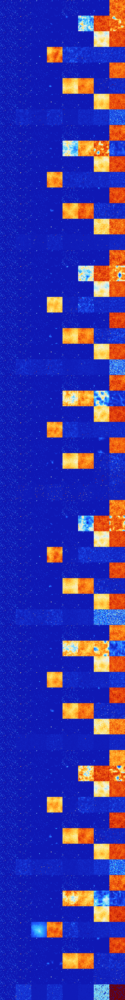

# B38 (135168-135679)

<details>
    <summary>Initial Grid</summary>
    
</details>


<details>
    <summary>Initial Grid RLE</summary>

```
#C Exported from GoGoL (https://github.com/marrow16/gogol)
#C Wrap mode: Toroidal
#C Boundary mode: Dead
#C Step: 0
x = 100, y = 100, rule = B38/S
2bo23bo9bo4bo12bo10bo$90bo8bo$9bo46bo16bo19bo$10bo22b2o22b2obo$34bobo
15bo20b2o$31bobo3bo7bo14bo24bo$33bo61bo3bo$12bo4bo54bo9bo$14b2o3bo47bob
obo7bo17bo$35bo9bo37bo4bo$bo27b2o34bo14bo9bo$8bo13bo21bo7bo44bo$22b2o
28bo10bo22bo$ob2o47bo5bo26bo$8bo17bo11bo8bo13bo29bo$58bo4bo29bo5bo$14bo
14bo41bobo7bo$39bo20bo3bo27bo2bo2bo$7bo39b2o35bo7bo$10bo25bo57bo$17bo7b
o7bo$14b2o3bo31bo7bo5bo3bo3bo8bo$36bo20bo11bo2bo3bo8bo6bo$20bobo17bo6bo
31bo$3b2o2bo65bo6bo12bo$35bo63bo$2bo5bo3bo5bo76bo$4bo3bo46bo3bo15bo$5bo
16bo18bo28bo20bo$14bo3bo3bo14bo15bo12bo19bo12bo$11bo5bo7bo17bo9bo16bo
16bo8bo$46bo35bo$o3bo33b3o46bo$3bo13bo11bo25bo14bo9bo16bo$59bo8bo10bo$
91bo$15bo5bo12bo5bo8bo13bo$15bo8bo8bo23bo11bo23bo5bo$10bo9bo16bo6bo33bo
$4bo14bo42bo22bo$48bobo14bo11bo21bo$21bo44bo$5bo24bo22bo9bo26bo$20bo4bo
8bo9bobo39bo$37bo28bo12bo$5bo18bo6bo2bo4bo2bo13bo11bo9bobo8bo$7bo37bo
17bo$23bo29bo38b2o$16bo8bo22bo6bo7bobo22bo$6bo27bo5bo25bo9bo7bo7b2o$18b
obobo4b2o5bo21bo10bo$4bo10b2o20bo6b2o19bo$6bo19bo2bo34bo20bo$46bo6bo19b
o18bo6bo$7bo19bo3bo23bo4bo17bo$15bo19b2o4bo20bo6b2o22bo$11bo30bo36bo4bo
8bo$33bo21bo19bo2bo$3bo22bo9bo3bo28bo7bo$6bo5bo36bo33bo$6bo25bo4bo7bo7b
o17bo17bo$14bo37bo2bo5bo20bo$50bo3bo8bo18bo3bo11bo$o6bo16bo16bo36bo11bo
3bo$bo2bo24bo21bo42bo4bo$32b2o4bo3bo8bo11bo$7bo28bo6bo19bo34bo$7bo44bo
5bo6bo4bo$7b2o43bo15bo27bo$2bobo12bo19bo56bo$bobo26bo5bo6bo16bo37bo$49b
o5bo25bobo2bo$bo40bo32bo$bo17bo30bo2bo16bo14bo$100b$bo15bobo4bo6bo55b2o
$54bo38bo$bo46bo26bo20bo$bo73bo22b2o$8bo4bo71bo$10bo32bo9bo41bo$6bo13bo
9bo19bo8bobo3bo22bo$28bo6bo5bo4bo17bo31b2o$11bo2bo8bo22b2o10bo14bo3bo6b
o$3bo36bo9bo20bo$18bo12bo12bo5bo9bo22bo$4bo19bo5bo18b2o8bo10bo8bo17bo$
10bo9bo15bo5bo5bo38bo8bo$8b3o2b2o2bo27bo33bo16bo$3bo6bo5bo23bo15bo16bo
4b2o$44bo27bo8bo14bo$bo26bo68bo$12bo23bobo46bo4bo$bo14bo48bo4bo3bo11bo$
35bo15bo8bo3bo9bo6bo$42bo7bo22bo12bo6bo$2bo15bo7bo17bo7bo28bo10bo$3bo6b
o61bo4bo2bo$6bo5bo2b2o15bo32bo16bo$5bo21bo28bo8b2o5bo2bo11bo!
```
</details>
<details>
    <summary>Thumbnail</summary>

</details>
<table>
<tr>
    <td><a href="./135168%20S%20Heat%20Map%20Activity.png"></a><br>S (135168)<br>S@5</td>    <td><a href="./135169%20S0%20Heat%20Map%20Activity.png"></a><br>S0 (135169)<br>S@6</td>    <td><a href="./135170%20S1%20Heat%20Map%20Activity.png"></a><br>S1 (135170)<br>R@14,p2</td>    <td><a href="./135171%20S01%20Heat%20Map%20Activity.png"></a><br>S01 (135171)<br>R@15,p2</td>    <td><a href="./135172%20S2%20Heat%20Map%20Activity.png"></a><br>S2 (135172)<br>R@6,p2</td>    <td><a href="./135173%20S02%20Heat%20Map%20Activity.png"></a><br>S02 (135173)<br>R@11,p2</td>    <td><a href="./135174%20S12%20Heat%20Map%20Activity.png"></a><br>S12 (135174)<br>R@31,p2</td>    <td><a href="./135175%20S012%20Heat%20Map%20Activity.png"></a><br>S012 (135175)<br>G>1000</td></tr>
<tr>
    <td><a href="./135176%20S3%20Heat%20Map%20Activity.png"></a><br>S3 (135176)<br>S@5</td>    <td><a href="./135177%20S03%20Heat%20Map%20Activity.png"></a><br>S03 (135177)<br>S@6</td>    <td><a href="./135178%20S13%20Heat%20Map%20Activity.png"></a><br>S13 (135178)<br>R@12,p2</td>    <td><a href="./135179%20S013%20Heat%20Map%20Activity.png"></a><br>S013 (135179)<br>R@75,p12</td>    <td><a href="./135180%20S23%20Heat%20Map%20Activity.png"></a><br><strong><sup>"Pedestrian Life"</sup></strong><br>S23 (135180)<br>R@113,p2</td>    <td><a href="./135181%20S023%20Heat%20Map%20Activity.png"></a><br>S023 (135181)<br>G>1000</td>    <td><a href="./135182%20S123%20Heat%20Map%20Activity.png"></a><br>S123 (135182)<br>G>1000</td>    <td><a href="./135183%20S0123%20Heat%20Map%20Activity.png"></a><br>S0123 (135183)<br>G>1000</td></tr>
<tr>
    <td><a href="./135184%20S4%20Heat%20Map%20Activity.png"></a><br>S4 (135184)<br>S@5</td>    <td><a href="./135185%20S04%20Heat%20Map%20Activity.png"></a><br>S04 (135185)<br>S@6</td>    <td><a href="./135186%20S14%20Heat%20Map%20Activity.png"></a><br>S14 (135186)<br>R@16,p2</td>    <td><a href="./135187%20S014%20Heat%20Map%20Activity.png"></a><br>S014 (135187)<br>R@17,p2</td>    <td><a href="./135188%20S24%20Heat%20Map%20Activity.png"></a><br>S24 (135188)<br>R@12,p4</td>    <td><a href="./135189%20S024%20Heat%20Map%20Activity.png"></a><br>S024 (135189)<br>R@14,p4</td>    <td><a href="./135190%20S124%20Heat%20Map%20Activity.png"></a><br>S124 (135190)<br>G>1000</td>    <td><a href="./135191%20S0124%20Heat%20Map%20Activity.png"></a><br>S0124 (135191)<br>G>1000</td></tr>
<tr>
    <td><a href="./135192%20S34%20Heat%20Map%20Activity.png"></a><br>S34 (135192)<br>S@5</td>    <td><a href="./135193%20S034%20Heat%20Map%20Activity.png"></a><br>S034 (135193)<br>S@7</td>    <td><a href="./135194%20S134%20Heat%20Map%20Activity.png"></a><br>S134 (135194)<br>R@54,p2</td>    <td><a href="./135195%20S0134%20Heat%20Map%20Activity.png"></a><br>S0134 (135195)<br>G>1000</td>    <td><a href="./135196%20S234%20Heat%20Map%20Activity.png"></a><br>S234 (135196)<br>R@337,p60</td>    <td><a href="./135197%20S0234%20Heat%20Map%20Activity.png"></a><br>S0234 (135197)<br>R@271,p60</td>    <td><a href="./135198%20S1234%20Heat%20Map%20Activity.png"></a><br>S1234 (135198)<br>R@94,p2</td>    <td><a href="./135199%20S01234%20Heat%20Map%20Activity.png"></a><br>S01234 (135199)<br>R@68,p4</td></tr>
<tr>
    <td><a href="./135200%20S5%20Heat%20Map%20Activity.png"></a><br>S5 (135200)<br>S@5</td>    <td><a href="./135201%20S05%20Heat%20Map%20Activity.png"></a><br>S05 (135201)<br>S@6</td>    <td><a href="./135202%20S15%20Heat%20Map%20Activity.png"></a><br>S15 (135202)<br>R@14,p2</td>    <td><a href="./135203%20S015%20Heat%20Map%20Activity.png"></a><br>S015 (135203)<br>R@15,p2</td>    <td><a href="./135204%20S25%20Heat%20Map%20Activity.png"></a><br>S25 (135204)<br>R@6,p2</td>    <td><a href="./135205%20S025%20Heat%20Map%20Activity.png"></a><br>S025 (135205)<br>R@12,p2</td>    <td><a href="./135206%20S125%20Heat%20Map%20Activity.png"></a><br>S125 (135206)<br>R@37,p2</td>    <td><a href="./135207%20S0125%20Heat%20Map%20Activity.png"></a><br>S0125 (135207)<br>G>1000</td></tr>
<tr>
    <td><a href="./135208%20S35%20Heat%20Map%20Activity.png"></a><br>S35 (135208)<br>S@5</td>    <td><a href="./135209%20S035%20Heat%20Map%20Activity.png"></a><br>S035 (135209)<br>S@6</td>    <td><a href="./135210%20S135%20Heat%20Map%20Activity.png"></a><br>S135 (135210)<br>R@13,p2</td>    <td><a href="./135211%20S0135%20Heat%20Map%20Activity.png"></a><br>S0135 (135211)<br>R@212,p2</td>    <td><a href="./135212%20S235%20Heat%20Map%20Activity.png"></a><br>S235 (135212)<br>G>1000</td>    <td><a href="./135213%20S0235%20Heat%20Map%20Activity.png"></a><br>S0235 (135213)<br>G>1000</td>    <td><a href="./135214%20S1235%20Heat%20Map%20Activity.png"></a><br>S1235 (135214)<br>G>1000</td>    <td><a href="./135215%20S01235%20Heat%20Map%20Activity.png"></a><br>S01235 (135215)<br>R@324,p84</td></tr>
<tr>
    <td><a href="./135216%20S45%20Heat%20Map%20Activity.png"></a><br>S45 (135216)<br>S@5</td>    <td><a href="./135217%20S045%20Heat%20Map%20Activity.png"></a><br>S045 (135217)<br>S@6</td>    <td><a href="./135218%20S145%20Heat%20Map%20Activity.png"></a><br>S145 (135218)<br>R@21,p2</td>    <td><a href="./135219%20S0145%20Heat%20Map%20Activity.png"></a><br>S0145 (135219)<br>R@17,p2</td>    <td><a href="./135220%20S245%20Heat%20Map%20Activity.png"></a><br>S245 (135220)<br>R@17,p4</td>    <td><a href="./135221%20S0245%20Heat%20Map%20Activity.png"></a><br>S0245 (135221)<br>R@14,p4</td>    <td><a href="./135222%20S1245%20Heat%20Map%20Activity.png"></a><br>S1245 (135222)<br>G>1000</td>    <td><a href="./135223%20S01245%20Heat%20Map%20Activity.png"></a><br>S01245 (135223)<br>G>1000</td></tr>
<tr>
    <td><a href="./135224%20S345%20Heat%20Map%20Activity.png"></a><br>S345 (135224)<br>S@5</td>    <td><a href="./135225%20S0345%20Heat%20Map%20Activity.png"></a><br>S0345 (135225)<br>R@378,p24</td>    <td><a href="./135226%20S1345%20Heat%20Map%20Activity.png"></a><br>S1345 (135226)<br>R@509,p264</td>    <td><a href="./135227%20S01345%20Heat%20Map%20Activity.png"></a><br>S01345 (135227)<br>R@181,p12</td>    <td><a href="./135228%20S2345%20Heat%20Map%20Activity.png"></a><br>S2345 (135228)<br>R@349,p210</td>    <td><a href="./135229%20S02345%20Heat%20Map%20Activity.png"></a><br>S02345 (135229)<br>R@130,p14</td>    <td><a href="./135230%20S12345%20Heat%20Map%20Activity.png"></a><br>S12345 (135230)<br>R@105,p3</td>    <td><a href="./135231%20S012345%20Heat%20Map%20Activity.png"></a><br>S012345 (135231)<br>R@51,p2</td></tr>
<tr>
    <td><a href="./135232%20S6%20Heat%20Map%20Activity.png"></a><br>S6 (135232)<br>S@5</td>    <td><a href="./135233%20S06%20Heat%20Map%20Activity.png"></a><br>S06 (135233)<br>S@6</td>    <td><a href="./135234%20S16%20Heat%20Map%20Activity.png"></a><br>S16 (135234)<br>R@14,p2</td>    <td><a href="./135235%20S016%20Heat%20Map%20Activity.png"></a><br>S016 (135235)<br>R@15,p2</td>    <td><a href="./135236%20S26%20Heat%20Map%20Activity.png"></a><br>S26 (135236)<br>R@6,p2</td>    <td><a href="./135237%20S026%20Heat%20Map%20Activity.png"></a><br>S026 (135237)<br>R@11,p2</td>    <td><a href="./135238%20S126%20Heat%20Map%20Activity.png"></a><br>S126 (135238)<br>R@33,p2</td>    <td><a href="./135239%20S0126%20Heat%20Map%20Activity.png"></a><br>S0126 (135239)<br>G>1000</td></tr>
<tr>
    <td><a href="./135240%20S36%20Heat%20Map%20Activity.png"></a><br>S36 (135240)<br>S@5</td>    <td><a href="./135241%20S036%20Heat%20Map%20Activity.png"></a><br>S036 (135241)<br>S@6</td>    <td><a href="./135242%20S136%20Heat%20Map%20Activity.png"></a><br>S136 (135242)<br>R@12,p2</td>    <td><a href="./135243%20S0136%20Heat%20Map%20Activity.png"></a><br>S0136 (135243)<br>R@52,p12</td>    <td><a href="./135244%20S236%20Heat%20Map%20Activity.png"></a><br>S236 (135244)<br>G>1000</td>    <td><a href="./135245%20S0236%20Heat%20Map%20Activity.png"></a><br>S0236 (135245)<br>G>1000</td>    <td><a href="./135246%20S1236%20Heat%20Map%20Activity.png"></a><br>S1236 (135246)<br>G>1000</td>    <td><a href="./135247%20S01236%20Heat%20Map%20Activity.png"></a><br>S01236 (135247)<br>G>1000</td></tr>
<tr>
    <td><a href="./135248%20S46%20Heat%20Map%20Activity.png"></a><br>S46 (135248)<br>S@5</td>    <td><a href="./135249%20S046%20Heat%20Map%20Activity.png"></a><br>S046 (135249)<br>S@6</td>    <td><a href="./135250%20S146%20Heat%20Map%20Activity.png"></a><br>S146 (135250)<br>R@16,p2</td>    <td><a href="./135251%20S0146%20Heat%20Map%20Activity.png"></a><br>S0146 (135251)<br>R@17,p2</td>    <td><a href="./135252%20S246%20Heat%20Map%20Activity.png"></a><br>S246 (135252)<br>R@12,p4</td>    <td><a href="./135253%20S0246%20Heat%20Map%20Activity.png"></a><br>S0246 (135253)<br>R@14,p4</td>    <td><a href="./135254%20S1246%20Heat%20Map%20Activity.png"></a><br>S1246 (135254)<br>G>1000</td>    <td><a href="./135255%20S01246%20Heat%20Map%20Activity.png"></a><br>S01246 (135255)<br>G>1000</td></tr>
<tr>
    <td><a href="./135256%20S346%20Heat%20Map%20Activity.png"></a><br>S346 (135256)<br>S@5</td>    <td><a href="./135257%20S0346%20Heat%20Map%20Activity.png"></a><br>S0346 (135257)<br>S@12</td>    <td><a href="./135258%20S1346%20Heat%20Map%20Activity.png"></a><br>S1346 (135258)<br>R@20,p2</td>    <td><a href="./135259%20S01346%20Heat%20Map%20Activity.png"></a><br>S01346 (135259)<br>G>1000</td>    <td><a href="./135260%20S2346%20Heat%20Map%20Activity.png"></a><br>S2346 (135260)<br>R@237,p12</td>    <td><a href="./135261%20S02346%20Heat%20Map%20Activity.png"></a><br>S02346 (135261)<br>R@178,p12</td>    <td><a href="./135262%20S12346%20Heat%20Map%20Activity.png"></a><br>S12346 (135262)<br>R@90,p2</td>    <td><a href="./135263%20S012346%20Heat%20Map%20Activity.png"></a><br>S012346 (135263)<br>R@59,p2</td></tr>
<tr>
    <td><a href="./135264%20S56%20Heat%20Map%20Activity.png"></a><br>S56 (135264)<br>S@5</td>    <td><a href="./135265%20S056%20Heat%20Map%20Activity.png"></a><br>S056 (135265)<br>S@6</td>    <td><a href="./135266%20S156%20Heat%20Map%20Activity.png"></a><br>S156 (135266)<br>R@14,p2</td>    <td><a href="./135267%20S0156%20Heat%20Map%20Activity.png"></a><br>S0156 (135267)<br>R@15,p2</td>    <td><a href="./135268%20S256%20Heat%20Map%20Activity.png"></a><br>S256 (135268)<br>R@6,p2</td>    <td><a href="./135269%20S0256%20Heat%20Map%20Activity.png"></a><br>S0256 (135269)<br>R@12,p2</td>    <td><a href="./135270%20S1256%20Heat%20Map%20Activity.png"></a><br>S1256 (135270)<br>R@121,p2</td>    <td><a href="./135271%20S01256%20Heat%20Map%20Activity.png"></a><br>S01256 (135271)<br>G>1000</td></tr>
<tr>
    <td><a href="./135272%20S356%20Heat%20Map%20Activity.png"></a><br>S356 (135272)<br>S@5</td>    <td><a href="./135273%20S0356%20Heat%20Map%20Activity.png"></a><br>S0356 (135273)<br>S@6</td>    <td><a href="./135274%20S1356%20Heat%20Map%20Activity.png"></a><br>S1356 (135274)<br>R@15,p2</td>    <td><a href="./135275%20S01356%20Heat%20Map%20Activity.png"></a><br>S01356 (135275)<br>R@172,p4</td>    <td><a href="./135276%20S2356%20Heat%20Map%20Activity.png"></a><br>S2356 (135276)<br>G>1000</td>    <td><a href="./135277%20S02356%20Heat%20Map%20Activity.png"></a><br>S02356 (135277)<br>G>1000</td>    <td><a href="./135278%20S12356%20Heat%20Map%20Activity.png"></a><br>S12356 (135278)<br>R@306,p60</td>    <td><a href="./135279%20S012356%20Heat%20Map%20Activity.png"></a><br>S012356 (135279)<br>R@266,p36</td></tr>
<tr>
    <td><a href="./135280%20S456%20Heat%20Map%20Activity.png"></a><br>S456 (135280)<br>S@5</td>    <td><a href="./135281%20S0456%20Heat%20Map%20Activity.png"></a><br>S0456 (135281)<br>S@6</td>    <td><a href="./135282%20S1456%20Heat%20Map%20Activity.png"></a><br>S1456 (135282)<br>R@18,p2</td>    <td><a href="./135283%20S01456%20Heat%20Map%20Activity.png"></a><br>S01456 (135283)<br>R@20,p2</td>    <td><a href="./135284%20S2456%20Heat%20Map%20Activity.png"></a><br>S2456 (135284)<br>R@17,p4</td>    <td><a href="./135285%20S02456%20Heat%20Map%20Activity.png"></a><br>S02456 (135285)<br>R@14,p4</td>    <td><a href="./135286%20S12456%20Heat%20Map%20Activity.png"></a><br>S12456 (135286)<br>G>1000</td>    <td><a href="./135287%20S012456%20Heat%20Map%20Activity.png"></a><br>S012456 (135287)<br>G>1000</td></tr>
<tr>
    <td><a href="./135288%20S3456%20Heat%20Map%20Activity.png"></a><br>S3456 (135288)<br>S@5</td>    <td><a href="./135289%20S03456%20Heat%20Map%20Activity.png"></a><br>S03456 (135289)<br>R@230,p2</td>    <td><a href="./135290%20S13456%20Heat%20Map%20Activity.png"></a><br>S13456 (135290)<br>R@259,p84</td>    <td><a href="./135291%20S013456%20Heat%20Map%20Activity.png"></a><br>S013456 (135291)<br>R@87,p4</td>    <td><a href="./135292%20S23456%20Heat%20Map%20Activity.png"></a><br>S23456 (135292)<br>R@217,p2</td>    <td><a href="./135293%20S023456%20Heat%20Map%20Activity.png"></a><br>S023456 (135293)<br>R@128,p2</td>    <td><a href="./135294%20S123456%20Heat%20Map%20Activity.png"></a><br>S123456 (135294)<br>R@126,p2</td>    <td><a href="./135295%20S0123456%20Heat%20Map%20Activity.png"></a><br>S0123456 (135295)<br>R@59,p2</td></tr>
<tr>
    <td><a href="./135296%20S7%20Heat%20Map%20Activity.png"></a><br>S7 (135296)<br>S@5</td>    <td><a href="./135297%20S07%20Heat%20Map%20Activity.png"></a><br>S07 (135297)<br>S@6</td>    <td><a href="./135298%20S17%20Heat%20Map%20Activity.png"></a><br>S17 (135298)<br>R@14,p2</td>    <td><a href="./135299%20S017%20Heat%20Map%20Activity.png"></a><br>S017 (135299)<br>R@15,p2</td>    <td><a href="./135300%20S27%20Heat%20Map%20Activity.png"></a><br>S27 (135300)<br>R@6,p2</td>    <td><a href="./135301%20S027%20Heat%20Map%20Activity.png"></a><br>S027 (135301)<br>R@11,p2</td>    <td><a href="./135302%20S127%20Heat%20Map%20Activity.png"></a><br>S127 (135302)<br>R@27,p2</td>    <td><a href="./135303%20S0127%20Heat%20Map%20Activity.png"></a><br>S0127 (135303)<br>G>1000</td></tr>
<tr>
    <td><a href="./135304%20S37%20Heat%20Map%20Activity.png"></a><br>S37 (135304)<br>S@5</td>    <td><a href="./135305%20S037%20Heat%20Map%20Activity.png"></a><br>S037 (135305)<br>S@6</td>    <td><a href="./135306%20S137%20Heat%20Map%20Activity.png"></a><br>S137 (135306)<br>R@12,p2</td>    <td><a href="./135307%20S0137%20Heat%20Map%20Activity.png"></a><br>S0137 (135307)<br>R@42,p12</td>    <td><a href="./135308%20S237%20Heat%20Map%20Activity.png"></a><br>S237 (135308)<br>R@60,p2</td>    <td><a href="./135309%20S0237%20Heat%20Map%20Activity.png"></a><br>S0237 (135309)<br>G>1000</td>    <td><a href="./135310%20S1237%20Heat%20Map%20Activity.png"></a><br>S1237 (135310)<br>G>1000</td>    <td><a href="./135311%20S01237%20Heat%20Map%20Activity.png"></a><br>S01237 (135311)<br>G>1000</td></tr>
<tr>
    <td><a href="./135312%20S47%20Heat%20Map%20Activity.png"></a><br>S47 (135312)<br>S@5</td>    <td><a href="./135313%20S047%20Heat%20Map%20Activity.png"></a><br>S047 (135313)<br>S@6</td>    <td><a href="./135314%20S147%20Heat%20Map%20Activity.png"></a><br>S147 (135314)<br>R@16,p2</td>    <td><a href="./135315%20S0147%20Heat%20Map%20Activity.png"></a><br>S0147 (135315)<br>R@17,p2</td>    <td><a href="./135316%20S247%20Heat%20Map%20Activity.png"></a><br>S247 (135316)<br>R@12,p4</td>    <td><a href="./135317%20S0247%20Heat%20Map%20Activity.png"></a><br>S0247 (135317)<br>R@14,p4</td>    <td><a href="./135318%20S1247%20Heat%20Map%20Activity.png"></a><br>S1247 (135318)<br>G>1000</td>    <td><a href="./135319%20S01247%20Heat%20Map%20Activity.png"></a><br>S01247 (135319)<br>G>1000</td></tr>
<tr>
    <td><a href="./135320%20S347%20Heat%20Map%20Activity.png"></a><br>S347 (135320)<br>S@5</td>    <td><a href="./135321%20S0347%20Heat%20Map%20Activity.png"></a><br>S0347 (135321)<br>S@7</td>    <td><a href="./135322%20S1347%20Heat%20Map%20Activity.png"></a><br>S1347 (135322)<br>R@37,p2</td>    <td><a href="./135323%20S01347%20Heat%20Map%20Activity.png"></a><br>S01347 (135323)<br>G>1000</td>    <td><a href="./135324%20S2347%20Heat%20Map%20Activity.png"></a><br>S2347 (135324)<br>G>1000</td>    <td><a href="./135325%20S02347%20Heat%20Map%20Activity.png"></a><br>S02347 (135325)<br>R@225,p20</td>    <td><a href="./135326%20S12347%20Heat%20Map%20Activity.png"></a><br>S12347 (135326)<br>R@98,p10</td>    <td><a href="./135327%20S012347%20Heat%20Map%20Activity.png"></a><br>S012347 (135327)<br>R@70,p2</td></tr>
<tr>
    <td><a href="./135328%20S57%20Heat%20Map%20Activity.png"></a><br>S57 (135328)<br>S@5</td>    <td><a href="./135329%20S057%20Heat%20Map%20Activity.png"></a><br>S057 (135329)<br>S@6</td>    <td><a href="./135330%20S157%20Heat%20Map%20Activity.png"></a><br>S157 (135330)<br>R@14,p2</td>    <td><a href="./135331%20S0157%20Heat%20Map%20Activity.png"></a><br>S0157 (135331)<br>R@15,p2</td>    <td><a href="./135332%20S257%20Heat%20Map%20Activity.png"></a><br>S257 (135332)<br>R@6,p2</td>    <td><a href="./135333%20S0257%20Heat%20Map%20Activity.png"></a><br>S0257 (135333)<br>R@12,p2</td>    <td><a href="./135334%20S1257%20Heat%20Map%20Activity.png"></a><br>S1257 (135334)<br>R@16,p2</td>    <td><a href="./135335%20S01257%20Heat%20Map%20Activity.png"></a><br>S01257 (135335)<br>G>1000</td></tr>
<tr>
    <td><a href="./135336%20S357%20Heat%20Map%20Activity.png"></a><br>S357 (135336)<br>S@5</td>    <td><a href="./135337%20S0357%20Heat%20Map%20Activity.png"></a><br>S0357 (135337)<br>S@6</td>    <td><a href="./135338%20S1357%20Heat%20Map%20Activity.png"></a><br>S1357 (135338)<br>R@13,p2</td>    <td><a href="./135339%20S01357%20Heat%20Map%20Activity.png"></a><br>S01357 (135339)<br>R@158,p2</td>    <td><a href="./135340%20S2357%20Heat%20Map%20Activity.png"></a><br>S2357 (135340)<br>G>1000</td>    <td><a href="./135341%20S02357%20Heat%20Map%20Activity.png"></a><br>S02357 (135341)<br>G>1000</td>    <td><a href="./135342%20S12357%20Heat%20Map%20Activity.png"></a><br>S12357 (135342)<br>R@386,p36</td>    <td><a href="./135343%20S012357%20Heat%20Map%20Activity.png"></a><br>S012357 (135343)<br>R@196,p6</td></tr>
<tr>
    <td><a href="./135344%20S457%20Heat%20Map%20Activity.png"></a><br>S457 (135344)<br>S@5</td>    <td><a href="./135345%20S0457%20Heat%20Map%20Activity.png"></a><br>S0457 (135345)<br>S@6</td>    <td><a href="./135346%20S1457%20Heat%20Map%20Activity.png"></a><br>S1457 (135346)<br>R@44,p2</td>    <td><a href="./135347%20S01457%20Heat%20Map%20Activity.png"></a><br>S01457 (135347)<br>R@17,p2</td>    <td><a href="./135348%20S2457%20Heat%20Map%20Activity.png"></a><br>S2457 (135348)<br>R@17,p4</td>    <td><a href="./135349%20S02457%20Heat%20Map%20Activity.png"></a><br>S02457 (135349)<br>R@14,p4</td>    <td><a href="./135350%20S12457%20Heat%20Map%20Activity.png"></a><br>S12457 (135350)<br>G>1000</td>    <td><a href="./135351%20S012457%20Heat%20Map%20Activity.png"></a><br>S012457 (135351)<br>G>1000</td></tr>
<tr>
    <td><a href="./135352%20S3457%20Heat%20Map%20Activity.png"></a><br>S3457 (135352)<br>S@5</td>    <td><a href="./135353%20S03457%20Heat%20Map%20Activity.png"></a><br>S03457 (135353)<br>R@298,p4</td>    <td><a href="./135354%20S13457%20Heat%20Map%20Activity.png"></a><br>S13457 (135354)<br>R@275,p60</td>    <td><a href="./135355%20S013457%20Heat%20Map%20Activity.png"></a><br>S013457 (135355)<br>R@196,p60</td>    <td><a href="./135356%20S23457%20Heat%20Map%20Activity.png"></a><br>S23457 (135356)<br>R@156,p14</td>    <td><a href="./135357%20S023457%20Heat%20Map%20Activity.png"></a><br>S023457 (135357)<br>R@143,p28</td>    <td><a href="./135358%20S123457%20Heat%20Map%20Activity.png"></a><br>S123457 (135358)<br>R@102,p2</td>    <td><a href="./135359%20S0123457%20Heat%20Map%20Activity.png"></a><br>S0123457 (135359)<br>S@52</td></tr>
<tr>
    <td><a href="./135360%20S67%20Heat%20Map%20Activity.png"></a><br>S67 (135360)<br>S@5</td>    <td><a href="./135361%20S067%20Heat%20Map%20Activity.png"></a><br>S067 (135361)<br>S@6</td>    <td><a href="./135362%20S167%20Heat%20Map%20Activity.png"></a><br>S167 (135362)<br>R@14,p2</td>    <td><a href="./135363%20S0167%20Heat%20Map%20Activity.png"></a><br>S0167 (135363)<br>R@15,p2</td>    <td><a href="./135364%20S267%20Heat%20Map%20Activity.png"></a><br>S267 (135364)<br>R@6,p2</td>    <td><a href="./135365%20S0267%20Heat%20Map%20Activity.png"></a><br>S0267 (135365)<br>R@11,p2</td>    <td><a href="./135366%20S1267%20Heat%20Map%20Activity.png"></a><br>S1267 (135366)<br>R@27,p2</td>    <td><a href="./135367%20S01267%20Heat%20Map%20Activity.png"></a><br>S01267 (135367)<br>G>1000</td></tr>
<tr>
    <td><a href="./135368%20S367%20Heat%20Map%20Activity.png"></a><br>S367 (135368)<br>S@5</td>    <td><a href="./135369%20S0367%20Heat%20Map%20Activity.png"></a><br>S0367 (135369)<br>S@6</td>    <td><a href="./135370%20S1367%20Heat%20Map%20Activity.png"></a><br>S1367 (135370)<br>R@12,p2</td>    <td><a href="./135371%20S01367%20Heat%20Map%20Activity.png"></a><br>S01367 (135371)<br>R@45,p12</td>    <td><a href="./135372%20S2367%20Heat%20Map%20Activity.png"></a><br>S2367 (135372)<br>G>1000</td>    <td><a href="./135373%20S02367%20Heat%20Map%20Activity.png"></a><br>S02367 (135373)<br>G>1000</td>    <td><a href="./135374%20S12367%20Heat%20Map%20Activity.png"></a><br>S12367 (135374)<br>G>1000</td>    <td><a href="./135375%20S012367%20Heat%20Map%20Activity.png"></a><br>S012367 (135375)<br>G>1000</td></tr>
<tr>
    <td><a href="./135376%20S467%20Heat%20Map%20Activity.png"></a><br>S467 (135376)<br>S@5</td>    <td><a href="./135377%20S0467%20Heat%20Map%20Activity.png"></a><br>S0467 (135377)<br>S@6</td>    <td><a href="./135378%20S1467%20Heat%20Map%20Activity.png"></a><br>S1467 (135378)<br>R@16,p2</td>    <td><a href="./135379%20S01467%20Heat%20Map%20Activity.png"></a><br>S01467 (135379)<br>R@17,p2</td>    <td><a href="./135380%20S2467%20Heat%20Map%20Activity.png"></a><br>S2467 (135380)<br>R@12,p4</td>    <td><a href="./135381%20S02467%20Heat%20Map%20Activity.png"></a><br>S02467 (135381)<br>R@14,p4</td>    <td><a href="./135382%20S12467%20Heat%20Map%20Activity.png"></a><br>S12467 (135382)<br>G>1000</td>    <td><a href="./135383%20S012467%20Heat%20Map%20Activity.png"></a><br>S012467 (135383)<br>G>1000</td></tr>
<tr>
    <td><a href="./135384%20S3467%20Heat%20Map%20Activity.png"></a><br>S3467 (135384)<br>S@5</td>    <td><a href="./135385%20S03467%20Heat%20Map%20Activity.png"></a><br>S03467 (135385)<br>S@16</td>    <td><a href="./135386%20S13467%20Heat%20Map%20Activity.png"></a><br>S13467 (135386)<br>R@19,p2</td>    <td><a href="./135387%20S013467%20Heat%20Map%20Activity.png"></a><br>S013467 (135387)<br>G>1000</td>    <td><a href="./135388%20S23467%20Heat%20Map%20Activity.png"></a><br>S23467 (135388)<br>R@218,p36</td>    <td><a href="./135389%20S023467%20Heat%20Map%20Activity.png"></a><br>S023467 (135389)<br>R@219,p60</td>    <td><a href="./135390%20S123467%20Heat%20Map%20Activity.png"></a><br>S123467 (135390)<br>R@95,p6</td>    <td><a href="./135391%20S0123467%20Heat%20Map%20Activity.png"></a><br>S0123467 (135391)<br>R@62,p6</td></tr>
<tr>
    <td><a href="./135392%20S567%20Heat%20Map%20Activity.png"></a><br>S567 (135392)<br>S@5</td>    <td><a href="./135393%20S0567%20Heat%20Map%20Activity.png"></a><br>S0567 (135393)<br>S@6</td>    <td><a href="./135394%20S1567%20Heat%20Map%20Activity.png"></a><br>S1567 (135394)<br>R@14,p2</td>    <td><a href="./135395%20S01567%20Heat%20Map%20Activity.png"></a><br>S01567 (135395)<br>R@15,p2</td>    <td><a href="./135396%20S2567%20Heat%20Map%20Activity.png"></a><br>S2567 (135396)<br>R@6,p2</td>    <td><a href="./135397%20S02567%20Heat%20Map%20Activity.png"></a><br>S02567 (135397)<br>R@12,p2</td>    <td><a href="./135398%20S12567%20Heat%20Map%20Activity.png"></a><br>S12567 (135398)<br>G>1000</td>    <td><a href="./135399%20S012567%20Heat%20Map%20Activity.png"></a><br>S012567 (135399)<br>G>1000</td></tr>
<tr>
    <td><a href="./135400%20S3567%20Heat%20Map%20Activity.png"></a><br>S3567 (135400)<br>S@5</td>    <td><a href="./135401%20S03567%20Heat%20Map%20Activity.png"></a><br>S03567 (135401)<br>S@6</td>    <td><a href="./135402%20S13567%20Heat%20Map%20Activity.png"></a><br>S13567 (135402)<br>R@15,p2</td>    <td><a href="./135403%20S013567%20Heat%20Map%20Activity.png"></a><br>S013567 (135403)<br>R@313,p2</td>    <td><a href="./135404%20S23567%20Heat%20Map%20Activity.png"></a><br>S23567 (135404)<br>G>1000</td>    <td><a href="./135405%20S023567%20Heat%20Map%20Activity.png"></a><br>S023567 (135405)<br>G>1000</td>    <td><a href="./135406%20S123567%20Heat%20Map%20Activity.png"></a><br>S123567 (135406)<br>R@696,p180</td>    <td><a href="./135407%20S0123567%20Heat%20Map%20Activity.png"></a><br>S0123567 (135407)<br>R@229,p12</td></tr>
<tr>
    <td><a href="./135408%20S4567%20Heat%20Map%20Activity.png"></a><br>S4567 (135408)<br>S@5</td>    <td><a href="./135409%20S04567%20Heat%20Map%20Activity.png"></a><br>S04567 (135409)<br>S@6</td>    <td><a href="./135410%20S14567%20Heat%20Map%20Activity.png"></a><br>S14567 (135410)<br>R@21,p2</td>    <td><a href="./135411%20S014567%20Heat%20Map%20Activity.png"></a><br>S014567 (135411)<br>R@20,p2</td>    <td><a href="./135412%20S24567%20Heat%20Map%20Activity.png"></a><br>S24567 (135412)<br>R@17,p4</td>    <td><a href="./135413%20S024567%20Heat%20Map%20Activity.png"></a><br>S024567 (135413)<br>R@14,p4</td>    <td><a href="./135414%20S124567%20Heat%20Map%20Activity.png"></a><br>S124567 (135414)<br>G>1000</td>    <td><a href="./135415%20S0124567%20Heat%20Map%20Activity.png"></a><br>S0124567 (135415)<br>R@247,p60</td></tr>
<tr>
    <td><a href="./135416%20S34567%20Heat%20Map%20Activity.png"></a><br>S34567 (135416)<br>S@5</td>    <td><a href="./135417%20S034567%20Heat%20Map%20Activity.png"></a><br>S034567 (135417)<br>R@217,p14</td>    <td><a href="./135418%20S134567%20Heat%20Map%20Activity.png"></a><br>S134567 (135418)<br>R@264,p2</td>    <td><a href="./135419%20S0134567%20Heat%20Map%20Activity.png"></a><br>S0134567 (135419)<br>R@85,p2</td>    <td><a href="./135420%20S234567%20Heat%20Map%20Activity.png"></a><br>S234567 (135420)<br>R@259,p2</td>    <td><a href="./135421%20S0234567%20Heat%20Map%20Activity.png"></a><br>S0234567 (135421)<br>R@122,p2</td>    <td><a href="./135422%20S1234567%20Heat%20Map%20Activity.png"></a><br>S1234567 (135422)<br>R@144,p2</td>    <td><a href="./135423%20S01234567%20Heat%20Map%20Activity.png"></a><br>S01234567 (135423)<br>R@55,p2</td></tr>
<tr>
    <td><a href="./135424%20S8%20Heat%20Map%20Activity.png"></a><br>S8 (135424)<br>S@5</td>    <td><a href="./135425%20S08%20Heat%20Map%20Activity.png"></a><br>S08 (135425)<br>S@6</td>    <td><a href="./135426%20S18%20Heat%20Map%20Activity.png"></a><br>S18 (135426)<br>R@14,p2</td>    <td><a href="./135427%20S018%20Heat%20Map%20Activity.png"></a><br>S018 (135427)<br>R@15,p2</td>    <td><a href="./135428%20S28%20Heat%20Map%20Activity.png"></a><br>S28 (135428)<br>R@6,p2</td>    <td><a href="./135429%20S028%20Heat%20Map%20Activity.png"></a><br>S028 (135429)<br>R@11,p2</td>    <td><a href="./135430%20S128%20Heat%20Map%20Activity.png"></a><br>S128 (135430)<br>R@31,p2</td>    <td><a href="./135431%20S0128%20Heat%20Map%20Activity.png"></a><br>S0128 (135431)<br>G>1000</td></tr>
<tr>
    <td><a href="./135432%20S38%20Heat%20Map%20Activity.png"></a><br>S38 (135432)<br>S@5</td>    <td><a href="./135433%20S038%20Heat%20Map%20Activity.png"></a><br>S038 (135433)<br>S@6</td>    <td><a href="./135434%20S138%20Heat%20Map%20Activity.png"></a><br>S138 (135434)<br>R@12,p2</td>    <td><a href="./135435%20S0138%20Heat%20Map%20Activity.png"></a><br>S0138 (135435)<br>R@75,p12</td>    <td><a href="./135436%20S238%20Heat%20Map%20Activity.png"></a><br><strong><sup>"HoneyLife"</sup></strong><br>S238 (135436)<br>R@113,p2</td>    <td><a href="./135437%20S0238%20Heat%20Map%20Activity.png"></a><br>S0238 (135437)<br>G>1000</td>    <td><a href="./135438%20S1238%20Heat%20Map%20Activity.png"></a><br>S1238 (135438)<br>G>1000</td>    <td><a href="./135439%20S01238%20Heat%20Map%20Activity.png"></a><br>S01238 (135439)<br>G>1000</td></tr>
<tr>
    <td><a href="./135440%20S48%20Heat%20Map%20Activity.png"></a><br>S48 (135440)<br>S@5</td>    <td><a href="./135441%20S048%20Heat%20Map%20Activity.png"></a><br>S048 (135441)<br>S@6</td>    <td><a href="./135442%20S148%20Heat%20Map%20Activity.png"></a><br>S148 (135442)<br>R@16,p2</td>    <td><a href="./135443%20S0148%20Heat%20Map%20Activity.png"></a><br>S0148 (135443)<br>R@17,p2</td>    <td><a href="./135444%20S248%20Heat%20Map%20Activity.png"></a><br>S248 (135444)<br>R@12,p4</td>    <td><a href="./135445%20S0248%20Heat%20Map%20Activity.png"></a><br>S0248 (135445)<br>R@14,p4</td>    <td><a href="./135446%20S1248%20Heat%20Map%20Activity.png"></a><br>S1248 (135446)<br>G>1000</td>    <td><a href="./135447%20S01248%20Heat%20Map%20Activity.png"></a><br>S01248 (135447)<br>G>1000</td></tr>
<tr>
    <td><a href="./135448%20S348%20Heat%20Map%20Activity.png"></a><br>S348 (135448)<br>S@5</td>    <td><a href="./135449%20S0348%20Heat%20Map%20Activity.png"></a><br>S0348 (135449)<br>S@7</td>    <td><a href="./135450%20S1348%20Heat%20Map%20Activity.png"></a><br>S1348 (135450)<br>R@54,p2</td>    <td><a href="./135451%20S01348%20Heat%20Map%20Activity.png"></a><br>S01348 (135451)<br>G>1000</td>    <td><a href="./135452%20S2348%20Heat%20Map%20Activity.png"></a><br>S2348 (135452)<br>G>1000</td>    <td><a href="./135453%20S02348%20Heat%20Map%20Activity.png"></a><br>S02348 (135453)<br>R@263,p48</td>    <td><a href="./135454%20S12348%20Heat%20Map%20Activity.png"></a><br>S12348 (135454)<br>R@99,p6</td>    <td><a href="./135455%20S012348%20Heat%20Map%20Activity.png"></a><br>S012348 (135455)<br>R@69,p4</td></tr>
<tr>
    <td><a href="./135456%20S58%20Heat%20Map%20Activity.png"></a><br>S58 (135456)<br>S@5</td>    <td><a href="./135457%20S058%20Heat%20Map%20Activity.png"></a><br>S058 (135457)<br>S@6</td>    <td><a href="./135458%20S158%20Heat%20Map%20Activity.png"></a><br>S158 (135458)<br>R@14,p2</td>    <td><a href="./135459%20S0158%20Heat%20Map%20Activity.png"></a><br>S0158 (135459)<br>R@15,p2</td>    <td><a href="./135460%20S258%20Heat%20Map%20Activity.png"></a><br>S258 (135460)<br>R@6,p2</td>    <td><a href="./135461%20S0258%20Heat%20Map%20Activity.png"></a><br>S0258 (135461)<br>R@12,p2</td>    <td><a href="./135462%20S1258%20Heat%20Map%20Activity.png"></a><br>S1258 (135462)<br>R@28,p2</td>    <td><a href="./135463%20S01258%20Heat%20Map%20Activity.png"></a><br>S01258 (135463)<br>G>1000</td></tr>
<tr>
    <td><a href="./135464%20S358%20Heat%20Map%20Activity.png"></a><br>S358 (135464)<br>S@5</td>    <td><a href="./135465%20S0358%20Heat%20Map%20Activity.png"></a><br>S0358 (135465)<br>S@6</td>    <td><a href="./135466%20S1358%20Heat%20Map%20Activity.png"></a><br>S1358 (135466)<br>R@13,p2</td>    <td><a href="./135467%20S01358%20Heat%20Map%20Activity.png"></a><br>S01358 (135467)<br>R@174,p2</td>    <td><a href="./135468%20S2358%20Heat%20Map%20Activity.png"></a><br>S2358 (135468)<br>G>1000</td>    <td><a href="./135469%20S02358%20Heat%20Map%20Activity.png"></a><br>S02358 (135469)<br>G>1000</td>    <td><a href="./135470%20S12358%20Heat%20Map%20Activity.png"></a><br>S12358 (135470)<br>R@510,p252</td>    <td><a href="./135471%20S012358%20Heat%20Map%20Activity.png"></a><br>S012358 (135471)<br>R@452,p252</td></tr>
<tr>
    <td><a href="./135472%20S458%20Heat%20Map%20Activity.png"></a><br>S458 (135472)<br>S@5</td>    <td><a href="./135473%20S0458%20Heat%20Map%20Activity.png"></a><br>S0458 (135473)<br>S@6</td>    <td><a href="./135474%20S1458%20Heat%20Map%20Activity.png"></a><br>S1458 (135474)<br>R@21,p2</td>    <td><a href="./135475%20S01458%20Heat%20Map%20Activity.png"></a><br>S01458 (135475)<br>R@17,p2</td>    <td><a href="./135476%20S2458%20Heat%20Map%20Activity.png"></a><br>S2458 (135476)<br>R@17,p4</td>    <td><a href="./135477%20S02458%20Heat%20Map%20Activity.png"></a><br>S02458 (135477)<br>R@14,p4</td>    <td><a href="./135478%20S12458%20Heat%20Map%20Activity.png"></a><br>S12458 (135478)<br>G>1000</td>    <td><a href="./135479%20S012458%20Heat%20Map%20Activity.png"></a><br>S012458 (135479)<br>G>1000</td></tr>
<tr>
    <td><a href="./135480%20S3458%20Heat%20Map%20Activity.png"></a><br>S3458 (135480)<br>S@5</td>    <td><a href="./135481%20S03458%20Heat%20Map%20Activity.png"></a><br>S03458 (135481)<br>R@371,p60</td>    <td><a href="./135482%20S13458%20Heat%20Map%20Activity.png"></a><br>S13458 (135482)<br>R@288,p72</td>    <td><a href="./135483%20S013458%20Heat%20Map%20Activity.png"></a><br>S013458 (135483)<br>R@149,p8</td>    <td><a href="./135484%20S23458%20Heat%20Map%20Activity.png"></a><br>S23458 (135484)<br>R@190,p42</td>    <td><a href="./135485%20S023458%20Heat%20Map%20Activity.png"></a><br>S023458 (135485)<br>R@125,p14</td>    <td><a href="./135486%20S123458%20Heat%20Map%20Activity.png"></a><br>S123458 (135486)<br>S@122</td>    <td><a href="./135487%20S0123458%20Heat%20Map%20Activity.png"></a><br>S0123458 (135487)<br>S@53</td></tr>
<tr>
    <td><a href="./135488%20S68%20Heat%20Map%20Activity.png"></a><br>S68 (135488)<br>S@5</td>    <td><a href="./135489%20S068%20Heat%20Map%20Activity.png"></a><br>S068 (135489)<br>S@6</td>    <td><a href="./135490%20S168%20Heat%20Map%20Activity.png"></a><br>S168 (135490)<br>R@14,p2</td>    <td><a href="./135491%20S0168%20Heat%20Map%20Activity.png"></a><br>S0168 (135491)<br>R@15,p2</td>    <td><a href="./135492%20S268%20Heat%20Map%20Activity.png"></a><br>S268 (135492)<br>R@6,p2</td>    <td><a href="./135493%20S0268%20Heat%20Map%20Activity.png"></a><br>S0268 (135493)<br>R@11,p2</td>    <td><a href="./135494%20S1268%20Heat%20Map%20Activity.png"></a><br>S1268 (135494)<br>R@33,p2</td>    <td><a href="./135495%20S01268%20Heat%20Map%20Activity.png"></a><br>S01268 (135495)<br>G>1000</td></tr>
<tr>
    <td><a href="./135496%20S368%20Heat%20Map%20Activity.png"></a><br>S368 (135496)<br>S@5</td>    <td><a href="./135497%20S0368%20Heat%20Map%20Activity.png"></a><br>S0368 (135497)<br>S@6</td>    <td><a href="./135498%20S1368%20Heat%20Map%20Activity.png"></a><br>S1368 (135498)<br>R@12,p2</td>    <td><a href="./135499%20S01368%20Heat%20Map%20Activity.png"></a><br>S01368 (135499)<br>R@52,p12</td>    <td><a href="./135500%20S2368%20Heat%20Map%20Activity.png"></a><br>S2368 (135500)<br>G>1000</td>    <td><a href="./135501%20S02368%20Heat%20Map%20Activity.png"></a><br>S02368 (135501)<br>G>1000</td>    <td><a href="./135502%20S12368%20Heat%20Map%20Activity.png"></a><br>S12368 (135502)<br>G>1000</td>    <td><a href="./135503%20S012368%20Heat%20Map%20Activity.png"></a><br>S012368 (135503)<br>R@610,p30</td></tr>
<tr>
    <td><a href="./135504%20S468%20Heat%20Map%20Activity.png"></a><br>S468 (135504)<br>S@5</td>    <td><a href="./135505%20S0468%20Heat%20Map%20Activity.png"></a><br>S0468 (135505)<br>S@6</td>    <td><a href="./135506%20S1468%20Heat%20Map%20Activity.png"></a><br>S1468 (135506)<br>R@16,p2</td>    <td><a href="./135507%20S01468%20Heat%20Map%20Activity.png"></a><br>S01468 (135507)<br>R@17,p2</td>    <td><a href="./135508%20S2468%20Heat%20Map%20Activity.png"></a><br>S2468 (135508)<br>R@12,p4</td>    <td><a href="./135509%20S02468%20Heat%20Map%20Activity.png"></a><br>S02468 (135509)<br>R@14,p4</td>    <td><a href="./135510%20S12468%20Heat%20Map%20Activity.png"></a><br>S12468 (135510)<br>G>1000</td>    <td><a href="./135511%20S012468%20Heat%20Map%20Activity.png"></a><br>S012468 (135511)<br>G>1000</td></tr>
<tr>
    <td><a href="./135512%20S3468%20Heat%20Map%20Activity.png"></a><br>S3468 (135512)<br>S@5</td>    <td><a href="./135513%20S03468%20Heat%20Map%20Activity.png"></a><br>S03468 (135513)<br>S@12</td>    <td><a href="./135514%20S13468%20Heat%20Map%20Activity.png"></a><br>S13468 (135514)<br>R@29,p6</td>    <td><a href="./135515%20S013468%20Heat%20Map%20Activity.png"></a><br>S013468 (135515)<br>G>1000</td>    <td><a href="./135516%20S23468%20Heat%20Map%20Activity.png"></a><br>S23468 (135516)<br>R@308,p120</td>    <td><a href="./135517%20S023468%20Heat%20Map%20Activity.png"></a><br>S023468 (135517)<br>R@219,p60</td>    <td><a href="./135518%20S123468%20Heat%20Map%20Activity.png"></a><br>S123468 (135518)<br>R@102,p2</td>    <td><a href="./135519%20S0123468%20Heat%20Map%20Activity.png"></a><br>S0123468 (135519)<br>R@57,p2</td></tr>
<tr>
    <td><a href="./135520%20S568%20Heat%20Map%20Activity.png"></a><br>S568 (135520)<br>S@5</td>    <td><a href="./135521%20S0568%20Heat%20Map%20Activity.png"></a><br>S0568 (135521)<br>S@6</td>    <td><a href="./135522%20S1568%20Heat%20Map%20Activity.png"></a><br>S1568 (135522)<br>R@14,p2</td>    <td><a href="./135523%20S01568%20Heat%20Map%20Activity.png"></a><br>S01568 (135523)<br>R@15,p2</td>    <td><a href="./135524%20S2568%20Heat%20Map%20Activity.png"></a><br>S2568 (135524)<br>R@6,p2</td>    <td><a href="./135525%20S02568%20Heat%20Map%20Activity.png"></a><br>S02568 (135525)<br>R@12,p2</td>    <td><a href="./135526%20S12568%20Heat%20Map%20Activity.png"></a><br>S12568 (135526)<br>R@121,p2</td>    <td><a href="./135527%20S012568%20Heat%20Map%20Activity.png"></a><br>S012568 (135527)<br>G>1000</td></tr>
<tr>
    <td><a href="./135528%20S3568%20Heat%20Map%20Activity.png"></a><br>S3568 (135528)<br>S@5</td>    <td><a href="./135529%20S03568%20Heat%20Map%20Activity.png"></a><br>S03568 (135529)<br>S@6</td>    <td><a href="./135530%20S13568%20Heat%20Map%20Activity.png"></a><br>S13568 (135530)<br>R@15,p2</td>    <td><a href="./135531%20S013568%20Heat%20Map%20Activity.png"></a><br>S013568 (135531)<br>R@254,p4</td>    <td><a href="./135532%20S23568%20Heat%20Map%20Activity.png"></a><br>S23568 (135532)<br>G>1000</td>    <td><a href="./135533%20S023568%20Heat%20Map%20Activity.png"></a><br>S023568 (135533)<br>G>1000</td>    <td><a href="./135534%20S123568%20Heat%20Map%20Activity.png"></a><br>S123568 (135534)<br>R@405,p180</td>    <td><a href="./135535%20S0123568%20Heat%20Map%20Activity.png"></a><br>S0123568 (135535)<br>R@356,p180</td></tr>
<tr>
    <td><a href="./135536%20S4568%20Heat%20Map%20Activity.png"></a><br>S4568 (135536)<br>S@5</td>    <td><a href="./135537%20S04568%20Heat%20Map%20Activity.png"></a><br>S04568 (135537)<br>S@6</td>    <td><a href="./135538%20S14568%20Heat%20Map%20Activity.png"></a><br>S14568 (135538)<br>R@18,p2</td>    <td><a href="./135539%20S014568%20Heat%20Map%20Activity.png"></a><br>S014568 (135539)<br>R@20,p2</td>    <td><a href="./135540%20S24568%20Heat%20Map%20Activity.png"></a><br>S24568 (135540)<br>R@17,p4</td>    <td><a href="./135541%20S024568%20Heat%20Map%20Activity.png"></a><br>S024568 (135541)<br>R@14,p4</td>    <td><a href="./135542%20S124568%20Heat%20Map%20Activity.png"></a><br>S124568 (135542)<br>G>1000</td>    <td><a href="./135543%20S0124568%20Heat%20Map%20Activity.png"></a><br>S0124568 (135543)<br>G>1000</td></tr>
<tr>
    <td><a href="./135544%20S34568%20Heat%20Map%20Activity.png"></a><br>S34568 (135544)<br>S@5</td>    <td><a href="./135545%20S034568%20Heat%20Map%20Activity.png"></a><br>S034568 (135545)<br>R@214,p2</td>    <td><a href="./135546%20S134568%20Heat%20Map%20Activity.png"></a><br>S134568 (135546)<br>R@164,p2</td>    <td><a href="./135547%20S0134568%20Heat%20Map%20Activity.png"></a><br>S0134568 (135547)<br>R@84,p2</td>    <td><a href="./135548%20S234568%20Heat%20Map%20Activity.png"></a><br>S234568 (135548)<br>R@167,p2</td>    <td><a href="./135549%20S0234568%20Heat%20Map%20Activity.png"></a><br>S0234568 (135549)<br>R@135,p2</td>    <td><a href="./135550%20S1234568%20Heat%20Map%20Activity.png"></a><br>S1234568 (135550)<br>R@145,p2</td>    <td><a href="./135551%20S01234568%20Heat%20Map%20Activity.png"></a><br>S01234568 (135551)<br>R@59,p2</td></tr>
<tr>
    <td><a href="./135552%20S78%20Heat%20Map%20Activity.png"></a><br>S78 (135552)<br>S@5</td>    <td><a href="./135553%20S078%20Heat%20Map%20Activity.png"></a><br>S078 (135553)<br>S@6</td>    <td><a href="./135554%20S178%20Heat%20Map%20Activity.png"></a><br>S178 (135554)<br>R@14,p2</td>    <td><a href="./135555%20S0178%20Heat%20Map%20Activity.png"></a><br>S0178 (135555)<br>R@15,p2</td>    <td><a href="./135556%20S278%20Heat%20Map%20Activity.png"></a><br>S278 (135556)<br>R@6,p2</td>    <td><a href="./135557%20S0278%20Heat%20Map%20Activity.png"></a><br>S0278 (135557)<br>R@11,p2</td>    <td><a href="./135558%20S1278%20Heat%20Map%20Activity.png"></a><br>S1278 (135558)<br>R@27,p2</td>    <td><a href="./135559%20S01278%20Heat%20Map%20Activity.png"></a><br>S01278 (135559)<br>G>1000</td></tr>
<tr>
    <td><a href="./135560%20S378%20Heat%20Map%20Activity.png"></a><br>S378 (135560)<br>S@5</td>    <td><a href="./135561%20S0378%20Heat%20Map%20Activity.png"></a><br>S0378 (135561)<br>S@6</td>    <td><a href="./135562%20S1378%20Heat%20Map%20Activity.png"></a><br>S1378 (135562)<br>R@12,p2</td>    <td><a href="./135563%20S01378%20Heat%20Map%20Activity.png"></a><br>S01378 (135563)<br>R@42,p12</td>    <td><a href="./135564%20S2378%20Heat%20Map%20Activity.png"></a><br>S2378 (135564)<br>R@60,p2</td>    <td><a href="./135565%20S02378%20Heat%20Map%20Activity.png"></a><br>S02378 (135565)<br>G>1000</td>    <td><a href="./135566%20S12378%20Heat%20Map%20Activity.png"></a><br>S12378 (135566)<br>G>1000</td>    <td><a href="./135567%20S012378%20Heat%20Map%20Activity.png"></a><br>S012378 (135567)<br>G>1000</td></tr>
<tr>
    <td><a href="./135568%20S478%20Heat%20Map%20Activity.png"></a><br>S478 (135568)<br>S@5</td>    <td><a href="./135569%20S0478%20Heat%20Map%20Activity.png"></a><br>S0478 (135569)<br>S@6</td>    <td><a href="./135570%20S1478%20Heat%20Map%20Activity.png"></a><br>S1478 (135570)<br>R@16,p2</td>    <td><a href="./135571%20S01478%20Heat%20Map%20Activity.png"></a><br>S01478 (135571)<br>R@17,p2</td>    <td><a href="./135572%20S2478%20Heat%20Map%20Activity.png"></a><br>S2478 (135572)<br>R@12,p4</td>    <td><a href="./135573%20S02478%20Heat%20Map%20Activity.png"></a><br>S02478 (135573)<br>R@14,p4</td>    <td><a href="./135574%20S12478%20Heat%20Map%20Activity.png"></a><br>S12478 (135574)<br>G>1000</td>    <td><a href="./135575%20S012478%20Heat%20Map%20Activity.png"></a><br>S012478 (135575)<br>G>1000</td></tr>
<tr>
    <td><a href="./135576%20S3478%20Heat%20Map%20Activity.png"></a><br>S3478 (135576)<br>S@5</td>    <td><a href="./135577%20S03478%20Heat%20Map%20Activity.png"></a><br>S03478 (135577)<br>S@7</td>    <td><a href="./135578%20S13478%20Heat%20Map%20Activity.png"></a><br>S13478 (135578)<br>R@37,p2</td>    <td><a href="./135579%20S013478%20Heat%20Map%20Activity.png"></a><br>S013478 (135579)<br>G>1000</td>    <td><a href="./135580%20S23478%20Heat%20Map%20Activity.png"></a><br>S23478 (135580)<br>G>1000</td>    <td><a href="./135581%20S023478%20Heat%20Map%20Activity.png"></a><br>S023478 (135581)<br>R@236,p60</td>    <td><a href="./135582%20S123478%20Heat%20Map%20Activity.png"></a><br>S123478 (135582)<br>R@103,p6</td>    <td><a href="./135583%20S0123478%20Heat%20Map%20Activity.png"></a><br>S0123478 (135583)<br>R@63,p2</td></tr>
<tr>
    <td><a href="./135584%20S578%20Heat%20Map%20Activity.png"></a><br>S578 (135584)<br>S@5</td>    <td><a href="./135585%20S0578%20Heat%20Map%20Activity.png"></a><br>S0578 (135585)<br>S@6</td>    <td><a href="./135586%20S1578%20Heat%20Map%20Activity.png"></a><br>S1578 (135586)<br>R@14,p2</td>    <td><a href="./135587%20S01578%20Heat%20Map%20Activity.png"></a><br>S01578 (135587)<br>R@15,p2</td>    <td><a href="./135588%20S2578%20Heat%20Map%20Activity.png"></a><br>S2578 (135588)<br>R@6,p2</td>    <td><a href="./135589%20S02578%20Heat%20Map%20Activity.png"></a><br>S02578 (135589)<br>R@12,p2</td>    <td><a href="./135590%20S12578%20Heat%20Map%20Activity.png"></a><br>S12578 (135590)<br>R@16,p2</td>    <td><a href="./135591%20S012578%20Heat%20Map%20Activity.png"></a><br>S012578 (135591)<br>G>1000</td></tr>
<tr>
    <td><a href="./135592%20S3578%20Heat%20Map%20Activity.png"></a><br>S3578 (135592)<br>S@5</td>    <td><a href="./135593%20S03578%20Heat%20Map%20Activity.png"></a><br>S03578 (135593)<br>S@6</td>    <td><a href="./135594%20S13578%20Heat%20Map%20Activity.png"></a><br>S13578 (135594)<br>R@13,p2</td>    <td><a href="./135595%20S013578%20Heat%20Map%20Activity.png"></a><br>S013578 (135595)<br>R@157,p2</td>    <td><a href="./135596%20S23578%20Heat%20Map%20Activity.png"></a><br>S23578 (135596)<br>G>1000</td>    <td><a href="./135597%20S023578%20Heat%20Map%20Activity.png"></a><br>S023578 (135597)<br>G>1000</td>    <td><a href="./135598%20S123578%20Heat%20Map%20Activity.png"></a><br>S123578 (135598)<br>R@621,p420</td>    <td><a href="./135599%20S0123578%20Heat%20Map%20Activity.png"></a><br>S0123578 (135599)<br>R@424,p252</td></tr>
<tr>
    <td><a href="./135600%20S4578%20Heat%20Map%20Activity.png"></a><br>S4578 (135600)<br>S@5</td>    <td><a href="./135601%20S04578%20Heat%20Map%20Activity.png"></a><br>S04578 (135601)<br>S@6</td>    <td><a href="./135602%20S14578%20Heat%20Map%20Activity.png"></a><br>S14578 (135602)<br>R@44,p2</td>    <td><a href="./135603%20S014578%20Heat%20Map%20Activity.png"></a><br>S014578 (135603)<br>R@17,p2</td>    <td><a href="./135604%20S24578%20Heat%20Map%20Activity.png"></a><br>S24578 (135604)<br>R@17,p4</td>    <td><a href="./135605%20S024578%20Heat%20Map%20Activity.png"></a><br>S024578 (135605)<br>R@14,p4</td>    <td><a href="./135606%20S124578%20Heat%20Map%20Activity.png"></a><br>S124578 (135606)<br>G>1000</td>    <td><a href="./135607%20S0124578%20Heat%20Map%20Activity.png"></a><br>S0124578 (135607)<br>G>1000</td></tr>
<tr>
    <td><a href="./135608%20S34578%20Heat%20Map%20Activity.png"></a><br>S34578 (135608)<br>S@5</td>    <td><a href="./135609%20S034578%20Heat%20Map%20Activity.png"></a><br>S034578 (135609)<br>R@306,p6</td>    <td><a href="./135610%20S134578%20Heat%20Map%20Activity.png"></a><br>S134578 (135610)<br>R@303,p72</td>    <td><a href="./135611%20S0134578%20Heat%20Map%20Activity.png"></a><br>S0134578 (135611)<br>R@208,p72</td>    <td><a href="./135612%20S234578%20Heat%20Map%20Activity.png"></a><br>S234578 (135612)<br>R@216,p42</td>    <td><a href="./135613%20S0234578%20Heat%20Map%20Activity.png"></a><br>S0234578 (135613)<br>S@116</td>    <td><a href="./135614%20S1234578%20Heat%20Map%20Activity.png"></a><br>S1234578 (135614)<br>R@106,p2</td>    <td><a href="./135615%20S01234578%20Heat%20Map%20Activity.png"></a><br>S01234578 (135615)<br>S@50</td></tr>
<tr>
    <td><a href="./135616%20S678%20Heat%20Map%20Activity.png"></a><br>S678 (135616)<br>S@5</td>    <td><a href="./135617%20S0678%20Heat%20Map%20Activity.png"></a><br>S0678 (135617)<br>S@6</td>    <td><a href="./135618%20S1678%20Heat%20Map%20Activity.png"></a><br>S1678 (135618)<br>R@14,p2</td>    <td><a href="./135619%20S01678%20Heat%20Map%20Activity.png"></a><br>S01678 (135619)<br>R@15,p2</td>    <td><a href="./135620%20S2678%20Heat%20Map%20Activity.png"></a><br>S2678 (135620)<br>R@6,p2</td>    <td><a href="./135621%20S02678%20Heat%20Map%20Activity.png"></a><br>S02678 (135621)<br>R@11,p2</td>    <td><a href="./135622%20S12678%20Heat%20Map%20Activity.png"></a><br>S12678 (135622)<br>R@27,p2</td>    <td><a href="./135623%20S012678%20Heat%20Map%20Activity.png"></a><br>S012678 (135623)<br>G>1000</td></tr>
<tr>
    <td><a href="./135624%20S3678%20Heat%20Map%20Activity.png"></a><br>S3678 (135624)<br>S@5</td>    <td><a href="./135625%20S03678%20Heat%20Map%20Activity.png"></a><br>S03678 (135625)<br>S@6</td>    <td><a href="./135626%20S13678%20Heat%20Map%20Activity.png"></a><br>S13678 (135626)<br>R@12,p2</td>    <td><a href="./135627%20S013678%20Heat%20Map%20Activity.png"></a><br>S013678 (135627)<br>R@45,p12</td>    <td><a href="./135628%20S23678%20Heat%20Map%20Activity.png"></a><br>S23678 (135628)<br>G>1000</td>    <td><a href="./135629%20S023678%20Heat%20Map%20Activity.png"></a><br>S023678 (135629)<br>G>1000</td>    <td><a href="./135630%20S123678%20Heat%20Map%20Activity.png"></a><br>S123678 (135630)<br>G>1000</td>    <td><a href="./135631%20S0123678%20Heat%20Map%20Activity.png"></a><br>S0123678 (135631)<br>R@746,p6</td></tr>
<tr>
    <td><a href="./135632%20S4678%20Heat%20Map%20Activity.png"></a><br>S4678 (135632)<br>S@5</td>    <td><a href="./135633%20S04678%20Heat%20Map%20Activity.png"></a><br>S04678 (135633)<br>S@6</td>    <td><a href="./135634%20S14678%20Heat%20Map%20Activity.png"></a><br>S14678 (135634)<br>R@16,p2</td>    <td><a href="./135635%20S014678%20Heat%20Map%20Activity.png"></a><br>S014678 (135635)<br>R@17,p2</td>    <td><a href="./135636%20S24678%20Heat%20Map%20Activity.png"></a><br>S24678 (135636)<br>R@12,p4</td>    <td><a href="./135637%20S024678%20Heat%20Map%20Activity.png"></a><br>S024678 (135637)<br>R@14,p4</td>    <td><a href="./135638%20S124678%20Heat%20Map%20Activity.png"></a><br>S124678 (135638)<br>G>1000</td>    <td><a href="./135639%20S0124678%20Heat%20Map%20Activity.png"></a><br>S0124678 (135639)<br>G>1000</td></tr>
<tr>
    <td><a href="./135640%20S34678%20Heat%20Map%20Activity.png"></a><br>S34678 (135640)<br>S@5</td>    <td><a href="./135641%20S034678%20Heat%20Map%20Activity.png"></a><br>S034678 (135641)<br>S@16</td>    <td><a href="./135642%20S134678%20Heat%20Map%20Activity.png"></a><br>S134678 (135642)<br>G>1000</td>    <td><a href="./135643%20S0134678%20Heat%20Map%20Activity.png"></a><br>S0134678 (135643)<br>G>1000</td>    <td><a href="./135644%20S234678%20Heat%20Map%20Activity.png"></a><br>S234678 (135644)<br>R@228,p20</td>    <td><a href="./135645%20S0234678%20Heat%20Map%20Activity.png"></a><br>S0234678 (135645)<br>R@266,p84</td>    <td><a href="./135646%20S1234678%20Heat%20Map%20Activity.png"></a><br>S1234678 (135646)<br>R@100,p2</td>    <td><a href="./135647%20S01234678%20Heat%20Map%20Activity.png"></a><br>S01234678 (135647)<br>R@62,p6</td></tr>
<tr>
    <td><a href="./135648%20S5678%20Heat%20Map%20Activity.png"></a><br>S5678 (135648)<br>S@5</td>    <td><a href="./135649%20S05678%20Heat%20Map%20Activity.png"></a><br>S05678 (135649)<br>S@6</td>    <td><a href="./135650%20S15678%20Heat%20Map%20Activity.png"></a><br>S15678 (135650)<br>R@14,p2</td>    <td><a href="./135651%20S015678%20Heat%20Map%20Activity.png"></a><br>S015678 (135651)<br>R@15,p2</td>    <td><a href="./135652%20S25678%20Heat%20Map%20Activity.png"></a><br>S25678 (135652)<br>R@6,p2</td>    <td><a href="./135653%20S025678%20Heat%20Map%20Activity.png"></a><br>S025678 (135653)<br>R@12,p2</td>    <td><a href="./135654%20S125678%20Heat%20Map%20Activity.png"></a><br>S125678 (135654)<br>R@399,p2</td>    <td><a href="./135655%20S0125678%20Heat%20Map%20Activity.png"></a><br>S0125678 (135655)<br>G>1000</td></tr>
<tr>
    <td><a href="./135656%20S35678%20Heat%20Map%20Activity.png"></a><br>S35678 (135656)<br>S@5</td>    <td><a href="./135657%20S035678%20Heat%20Map%20Activity.png"></a><br>S035678 (135657)<br>S@6</td>    <td><a href="./135658%20S135678%20Heat%20Map%20Activity.png"></a><br>S135678 (135658)<br>R@15,p2</td>    <td><a href="./135659%20S0135678%20Heat%20Map%20Activity.png"></a><br>S0135678 (135659)<br>R@542,p2</td>    <td><a href="./135660%20S235678%20Heat%20Map%20Activity.png"></a><br>S235678 (135660)<br>G>1000</td>    <td><a href="./135661%20S0235678%20Heat%20Map%20Activity.png"></a><br>S0235678 (135661)<br>G>1000</td>    <td><a href="./135662%20S1235678%20Heat%20Map%20Activity.png"></a><br>S1235678 (135662)<br>R@526,p180</td>    <td><a href="./135663%20S01235678%20Heat%20Map%20Activity.png"></a><br>S01235678 (135663)<br>R@352,p120</td></tr>
<tr>
    <td><a href="./135664%20S45678%20Heat%20Map%20Activity.png"></a><br>S45678 (135664)<br>S@5</td>    <td><a href="./135665%20S045678%20Heat%20Map%20Activity.png"></a><br>S045678 (135665)<br>S@6</td>    <td><a href="./135666%20S145678%20Heat%20Map%20Activity.png"></a><br>S145678 (135666)<br>R@21,p2</td>    <td><a href="./135667%20S0145678%20Heat%20Map%20Activity.png"></a><br>S0145678 (135667)<br>R@20,p2</td>    <td><a href="./135668%20S245678%20Heat%20Map%20Activity.png"></a><br>S245678 (135668)<br>R@17,p4</td>    <td><a href="./135669%20S0245678%20Heat%20Map%20Activity.png"></a><br>S0245678 (135669)<br>R@14,p4</td>    <td><a href="./135670%20S1245678%20Heat%20Map%20Activity.png"></a><br>S1245678 (135670)<br>R@298,p12</td>    <td><a href="./135671%20S01245678%20Heat%20Map%20Activity.png"></a><br>S01245678 (135671)<br>R@203,p60</td></tr>
<tr>
    <td><a href="./135672%20S345678%20Heat%20Map%20Activity.png"></a><br>S345678 (135672)<br>S@5</td>    <td><a href="./135673%20S0345678%20Heat%20Map%20Activity.png"></a><br>S0345678 (135673)<br>S@213</td>    <td><a href="./135674%20S1345678%20Heat%20Map%20Activity.png"></a><br>S1345678 (135674)<br>S@201</td>    <td><a href="./135675%20S01345678%20Heat%20Map%20Activity.png"></a><br>S01345678 (135675)<br>S@70</td>    <td><a href="./135676%20S2345678%20Heat%20Map%20Activity.png"></a><br>S2345678 (135676)<br>S@256</td>    <td><a href="./135677%20S02345678%20Heat%20Map%20Activity.png"></a><br>S02345678 (135677)<br>S@121</td>    <td><a href="./135678%20S12345678%20Heat%20Map%20Activity.png"></a><br>S12345678 (135678)<br>S@143</td>    <td><a href="./135679%20S012345678%20Heat%20Map%20Activity.png"></a><br>S012345678 (135679)<br>S@53</td></tr>
</table>
