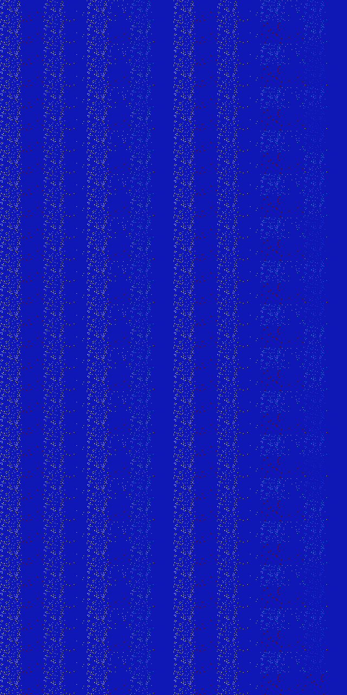

# B4568 (188416-188927)

<details>
    <summary>Initial Grid</summary>
    
</details>


<details>
    <summary>Initial Grid RLE</summary>

```
#C Exported from GoGoL (https://github.com/marrow16/gogol)
#C Wrap mode: Toroidal
#C Boundary mode: Dead
#C Step: 0
x = 100, y = 100, rule = B4568/S
34bo3bo29bo$43bobo11bo17bo14bo$13bo6bo5bo23b2o$2o7bo2bo5bo7bo14bo25b2o
18bo$21bo7bo10bo16bo31bobo$4bo38bo24bo26bo$31bo8bo11bo2bo13bo16bo$3bo
88bobo$17bo20bo14bo6bo9bo11bo$27bo13bo27bo16bo7bo$7bo11bo19bo10bo8bo10b
o25bo$27bo19bobo13bo6bo18b2o$9bo13bo3bo40bo2bo$16bo8bo9bo6bo21bo26bo$
10bo6bo46bo8bo19bo$9bobo16bo2bo22bobo$10bo5bo55bo8bo7bo$55bo$8bo2bo13bo
54bo7bo$18b2o69bo$39bo11bo9bo13bo6bo$84b2o2bo5bo$22b2o4bo22bo8bo2bo$13b
o4bo7bo14bo2b2o7bo6bo2bo24bobo$49bo21bo$2bo16bo21bo14bo22bo$81bo11bo$bo
9bo7b2o2bo15bo6bo16bo22bo$4bo7bo33bo38bo$26bo10bo25bo8bo24bo$8bobo23bo
36bo11bobo$3bo4bo5bo4bo14bo55bo$21bobo32bo36bo2bo$3bo7bo2bo10bo23bo14bo
$54bo27bo$43b2o15bo10bo3bo2bo13bo$19bo20bo5bo17bo5bo7bo7bo10bo$66bo$o3b
o2b2o2bo54bo9bo17b2o$45bo3bo20bo15bo2bo$6bo3bo29bo3bo32bo$o18bo16bo16bo
$6bobo50bo3bo$29bo6bo9bo31bo2bo$14bo79bo$38bo28bo14bo$37bo5bo24bo4bo$
29bo2bo5bo17b2o$46bo31bo8bo$6bo33bo32bo4bo$39bo6bo7bo28bo$4bo15bo32bo2b
o16bo4bo20bo$25bo3bo2b2o18bo30bo9bo$29bo18bo5bo$41bo4bo37bo$bo6bo20bo
10bo11bo19bo9b2o$6bo37bo7bo18bo5bo2bo9bo7bo$11bo63bobo9bo5bo$11bobo50bo
7bo13b2o$59bo16bo19bo$4bo33bo9bo16bo14bo$3bo8bo54bo8bo$72bo5bo9bobo4bo$
8bobo29bo14bo4bo$51bo30bo$28bo38bobo$4bo17bo12bo7bo3bo2bo$100b$7bo7bo
47bo17bo$6bobobo8bo14bo26bo9bo8bobo5bo$o63bobo19bo$31bo7bo15bo22bo$9bo
19bo2bo41bo7bo7bo5bo$4bo2bo18bo11bo40bo$29bo16bo15bo$7b2o78bo6bo$3bo13b
o21bo20bo7bo26b2o$21bo7bo10bo20bobo14b2o6bo$10bo20bo24bo13bo$45bo38bo$b
o4bo6bo8bo11bo5bo21bob2o$28bo23bo26bo7bo$22bo56bo$17bo23bo$o5bo3bo42bo
19bo$19bo3bo28bo$98bo$15bo32bo2bo5bo41bo$6bo5bo7bo3bo35bo17bo4bobo$7bo
13bo8bo38bo2bo9bo$18bo14bo47bo8bo$6b2o19bo13bo2bo13bobo$4bobo34b2o$4bo
7b2obo5bo9bo28bo26bo$bo9bo18bo12bo27bo$bo8bo6bo4bo19bo15bo2bo5bo3bo$21b
o25bo43bo$21bo38bo$bo35bo43bo7bo$17bo17bo29bo6bo21bo!
```
</details>
<details>
    <summary>Thumbnail</summary>

</details>
<table>
<tr>
    <td><a href="./188416%20S%20Heat%20Map%20Activity.png"></a><br>S (188416)<br>S@2</td>    <td><a href="./188417%20S0%20Heat%20Map%20Activity.png"></a><br>S0 (188417)<br>S@1</td>    <td><a href="./188418%20S1%20Heat%20Map%20Activity.png"></a><br>S1 (188418)<br>S@2</td>    <td><a href="./188419%20S01%20Heat%20Map%20Activity.png"></a><br>S01 (188419)<br>S@2</td>    <td><a href="./188420%20S2%20Heat%20Map%20Activity.png"></a><br>S2 (188420)<br>S@3</td>    <td><a href="./188421%20S02%20Heat%20Map%20Activity.png"></a><br>S02 (188421)<br>S@2</td>    <td><a href="./188422%20S12%20Heat%20Map%20Activity.png"></a><br>S12 (188422)<br>R@5,p2</td>    <td><a href="./188423%20S012%20Heat%20Map%20Activity.png"></a><br>S012 (188423)<br>S@5</td>    <td><a href="./188424%20S3%20Heat%20Map%20Activity.png"></a><br>S3 (188424)<br>S@2</td>    <td><a href="./188425%20S03%20Heat%20Map%20Activity.png"></a><br>S03 (188425)<br>S@1</td>    <td><a href="./188426%20S13%20Heat%20Map%20Activity.png"></a><br>S13 (188426)<br>S@2</td>    <td><a href="./188427%20S013%20Heat%20Map%20Activity.png"></a><br>S013 (188427)<br>S@2</td>    <td><a href="./188428%20S23%20Heat%20Map%20Activity.png"></a><br>S23 (188428)<br>R@5,p2</td>    <td><a href="./188429%20S023%20Heat%20Map%20Activity.png"></a><br>S023 (188429)<br>R@4,p2</td>    <td><a href="./188430%20S123%20Heat%20Map%20Activity.png"></a><br>S123 (188430)<br>R@6,p2</td>    <td><a href="./188431%20S0123%20Heat%20Map%20Activity.png"></a><br>S0123 (188431)<br>R@6,p2</td></tr>
<tr>
    <td><a href="./188432%20S4%20Heat%20Map%20Activity.png"></a><br>S4 (188432)<br>S@2</td>    <td><a href="./188433%20S04%20Heat%20Map%20Activity.png"></a><br>S04 (188433)<br>S@1</td>    <td><a href="./188434%20S14%20Heat%20Map%20Activity.png"></a><br>S14 (188434)<br>S@2</td>    <td><a href="./188435%20S014%20Heat%20Map%20Activity.png"></a><br>S014 (188435)<br>S@2</td>    <td><a href="./188436%20S24%20Heat%20Map%20Activity.png"></a><br>S24 (188436)<br>S@3</td>    <td><a href="./188437%20S024%20Heat%20Map%20Activity.png"></a><br>S024 (188437)<br>S@2</td>    <td><a href="./188438%20S124%20Heat%20Map%20Activity.png"></a><br>S124 (188438)<br>S@5</td>    <td><a href="./188439%20S0124%20Heat%20Map%20Activity.png"></a><br>S0124 (188439)<br>S@4</td>    <td><a href="./188440%20S34%20Heat%20Map%20Activity.png"></a><br>S34 (188440)<br>S@2</td>    <td><a href="./188441%20S034%20Heat%20Map%20Activity.png"></a><br>S034 (188441)<br>S@1</td>    <td><a href="./188442%20S134%20Heat%20Map%20Activity.png"></a><br>S134 (188442)<br>S@2</td>    <td><a href="./188443%20S0134%20Heat%20Map%20Activity.png"></a><br>S0134 (188443)<br>S@2</td>    <td><a href="./188444%20S234%20Heat%20Map%20Activity.png"></a><br>S234 (188444)<br>S@3</td>    <td><a href="./188445%20S0234%20Heat%20Map%20Activity.png"></a><br>S0234 (188445)<br>S@2</td>    <td><a href="./188446%20S1234%20Heat%20Map%20Activity.png"></a><br>S1234 (188446)<br>S@6</td>    <td><a href="./188447%20S01234%20Heat%20Map%20Activity.png"></a><br>S01234 (188447)<br>S@6</td></tr>
<tr>
    <td><a href="./188448%20S5%20Heat%20Map%20Activity.png"></a><br>S5 (188448)<br>S@2</td>    <td><a href="./188449%20S05%20Heat%20Map%20Activity.png"></a><br>S05 (188449)<br>S@1</td>    <td><a href="./188450%20S15%20Heat%20Map%20Activity.png"></a><br>S15 (188450)<br>S@2</td>    <td><a href="./188451%20S015%20Heat%20Map%20Activity.png"></a><br>S015 (188451)<br>S@2</td>    <td><a href="./188452%20S25%20Heat%20Map%20Activity.png"></a><br>S25 (188452)<br>S@3</td>    <td><a href="./188453%20S025%20Heat%20Map%20Activity.png"></a><br>S025 (188453)<br>S@2</td>    <td><a href="./188454%20S125%20Heat%20Map%20Activity.png"></a><br>S125 (188454)<br>R@5,p2</td>    <td><a href="./188455%20S0125%20Heat%20Map%20Activity.png"></a><br>S0125 (188455)<br>S@5</td>    <td><a href="./188456%20S35%20Heat%20Map%20Activity.png"></a><br>S35 (188456)<br>S@2</td>    <td><a href="./188457%20S035%20Heat%20Map%20Activity.png"></a><br>S035 (188457)<br>S@1</td>    <td><a href="./188458%20S135%20Heat%20Map%20Activity.png"></a><br>S135 (188458)<br>S@2</td>    <td><a href="./188459%20S0135%20Heat%20Map%20Activity.png"></a><br>S0135 (188459)<br>S@2</td>    <td><a href="./188460%20S235%20Heat%20Map%20Activity.png"></a><br>S235 (188460)<br>R@5,p2</td>    <td><a href="./188461%20S0235%20Heat%20Map%20Activity.png"></a><br>S0235 (188461)<br>R@4,p2</td>    <td><a href="./188462%20S1235%20Heat%20Map%20Activity.png"></a><br>S1235 (188462)<br>R@11,p2</td>    <td><a href="./188463%20S01235%20Heat%20Map%20Activity.png"></a><br>S01235 (188463)<br>R@10,p2</td></tr>
<tr>
    <td><a href="./188464%20S45%20Heat%20Map%20Activity.png"></a><br>S45 (188464)<br>S@2</td>    <td><a href="./188465%20S045%20Heat%20Map%20Activity.png"></a><br>S045 (188465)<br>S@1</td>    <td><a href="./188466%20S145%20Heat%20Map%20Activity.png"></a><br>S145 (188466)<br>S@2</td>    <td><a href="./188467%20S0145%20Heat%20Map%20Activity.png"></a><br>S0145 (188467)<br>S@2</td>    <td><a href="./188468%20S245%20Heat%20Map%20Activity.png"></a><br>S245 (188468)<br>S@3</td>    <td><a href="./188469%20S0245%20Heat%20Map%20Activity.png"></a><br>S0245 (188469)<br>S@2</td>    <td><a href="./188470%20S1245%20Heat%20Map%20Activity.png"></a><br>S1245 (188470)<br>S@5</td>    <td><a href="./188471%20S01245%20Heat%20Map%20Activity.png"></a><br>S01245 (188471)<br>S@4</td>    <td><a href="./188472%20S345%20Heat%20Map%20Activity.png"></a><br>S345 (188472)<br>S@2</td>    <td><a href="./188473%20S0345%20Heat%20Map%20Activity.png"></a><br>S0345 (188473)<br>S@1</td>    <td><a href="./188474%20S1345%20Heat%20Map%20Activity.png"></a><br>S1345 (188474)<br>S@2</td>    <td><a href="./188475%20S01345%20Heat%20Map%20Activity.png"></a><br>S01345 (188475)<br>S@2</td>    <td><a href="./188476%20S2345%20Heat%20Map%20Activity.png"></a><br>S2345 (188476)<br>S@3</td>    <td><a href="./188477%20S02345%20Heat%20Map%20Activity.png"></a><br>S02345 (188477)<br>S@2</td>    <td><a href="./188478%20S12345%20Heat%20Map%20Activity.png"></a><br>S12345 (188478)<br>R@17,p6</td>    <td><a href="./188479%20S012345%20Heat%20Map%20Activity.png"></a><br>S012345 (188479)<br>R@17,p6</td></tr>
<tr>
    <td><a href="./188480%20S6%20Heat%20Map%20Activity.png"></a><br>S6 (188480)<br>S@2</td>    <td><a href="./188481%20S06%20Heat%20Map%20Activity.png"></a><br>S06 (188481)<br>S@1</td>    <td><a href="./188482%20S16%20Heat%20Map%20Activity.png"></a><br>S16 (188482)<br>S@2</td>    <td><a href="./188483%20S016%20Heat%20Map%20Activity.png"></a><br>S016 (188483)<br>S@2</td>    <td><a href="./188484%20S26%20Heat%20Map%20Activity.png"></a><br>S26 (188484)<br>S@3</td>    <td><a href="./188485%20S026%20Heat%20Map%20Activity.png"></a><br>S026 (188485)<br>S@2</td>    <td><a href="./188486%20S126%20Heat%20Map%20Activity.png"></a><br>S126 (188486)<br>R@5,p2</td>    <td><a href="./188487%20S0126%20Heat%20Map%20Activity.png"></a><br>S0126 (188487)<br>S@5</td>    <td><a href="./188488%20S36%20Heat%20Map%20Activity.png"></a><br>S36 (188488)<br>S@2</td>    <td><a href="./188489%20S036%20Heat%20Map%20Activity.png"></a><br>S036 (188489)<br>S@1</td>    <td><a href="./188490%20S136%20Heat%20Map%20Activity.png"></a><br>S136 (188490)<br>S@2</td>    <td><a href="./188491%20S0136%20Heat%20Map%20Activity.png"></a><br>S0136 (188491)<br>S@2</td>    <td><a href="./188492%20S236%20Heat%20Map%20Activity.png"></a><br>S236 (188492)<br>R@5,p2</td>    <td><a href="./188493%20S0236%20Heat%20Map%20Activity.png"></a><br>S0236 (188493)<br>R@4,p2</td>    <td><a href="./188494%20S1236%20Heat%20Map%20Activity.png"></a><br>S1236 (188494)<br>R@6,p2</td>    <td><a href="./188495%20S01236%20Heat%20Map%20Activity.png"></a><br>S01236 (188495)<br>R@6,p2</td></tr>
<tr>
    <td><a href="./188496%20S46%20Heat%20Map%20Activity.png"></a><br>S46 (188496)<br>S@2</td>    <td><a href="./188497%20S046%20Heat%20Map%20Activity.png"></a><br>S046 (188497)<br>S@1</td>    <td><a href="./188498%20S146%20Heat%20Map%20Activity.png"></a><br>S146 (188498)<br>S@2</td>    <td><a href="./188499%20S0146%20Heat%20Map%20Activity.png"></a><br>S0146 (188499)<br>S@2</td>    <td><a href="./188500%20S246%20Heat%20Map%20Activity.png"></a><br>S246 (188500)<br>S@3</td>    <td><a href="./188501%20S0246%20Heat%20Map%20Activity.png"></a><br>S0246 (188501)<br>S@2</td>    <td><a href="./188502%20S1246%20Heat%20Map%20Activity.png"></a><br>S1246 (188502)<br>S@5</td>    <td><a href="./188503%20S01246%20Heat%20Map%20Activity.png"></a><br>S01246 (188503)<br>S@4</td>    <td><a href="./188504%20S346%20Heat%20Map%20Activity.png"></a><br>S346 (188504)<br>S@2</td>    <td><a href="./188505%20S0346%20Heat%20Map%20Activity.png"></a><br>S0346 (188505)<br>S@1</td>    <td><a href="./188506%20S1346%20Heat%20Map%20Activity.png"></a><br>S1346 (188506)<br>S@2</td>    <td><a href="./188507%20S01346%20Heat%20Map%20Activity.png"></a><br>S01346 (188507)<br>S@2</td>    <td><a href="./188508%20S2346%20Heat%20Map%20Activity.png"></a><br>S2346 (188508)<br>S@3</td>    <td><a href="./188509%20S02346%20Heat%20Map%20Activity.png"></a><br>S02346 (188509)<br>S@2</td>    <td><a href="./188510%20S12346%20Heat%20Map%20Activity.png"></a><br>S12346 (188510)<br>S@30</td>    <td><a href="./188511%20S012346%20Heat%20Map%20Activity.png"></a><br>S012346 (188511)<br>R@33,p11</td></tr>
<tr>
    <td><a href="./188512%20S56%20Heat%20Map%20Activity.png"></a><br>S56 (188512)<br>S@2</td>    <td><a href="./188513%20S056%20Heat%20Map%20Activity.png"></a><br>S056 (188513)<br>S@1</td>    <td><a href="./188514%20S156%20Heat%20Map%20Activity.png"></a><br>S156 (188514)<br>S@2</td>    <td><a href="./188515%20S0156%20Heat%20Map%20Activity.png"></a><br>S0156 (188515)<br>S@2</td>    <td><a href="./188516%20S256%20Heat%20Map%20Activity.png"></a><br>S256 (188516)<br>S@3</td>    <td><a href="./188517%20S0256%20Heat%20Map%20Activity.png"></a><br>S0256 (188517)<br>S@2</td>    <td><a href="./188518%20S1256%20Heat%20Map%20Activity.png"></a><br>S1256 (188518)<br>R@5,p2</td>    <td><a href="./188519%20S01256%20Heat%20Map%20Activity.png"></a><br>S01256 (188519)<br>S@5</td>    <td><a href="./188520%20S356%20Heat%20Map%20Activity.png"></a><br>S356 (188520)<br>S@2</td>    <td><a href="./188521%20S0356%20Heat%20Map%20Activity.png"></a><br>S0356 (188521)<br>S@1</td>    <td><a href="./188522%20S1356%20Heat%20Map%20Activity.png"></a><br>S1356 (188522)<br>S@2</td>    <td><a href="./188523%20S01356%20Heat%20Map%20Activity.png"></a><br>S01356 (188523)<br>S@2</td>    <td><a href="./188524%20S2356%20Heat%20Map%20Activity.png"></a><br>S2356 (188524)<br>R@5,p2</td>    <td><a href="./188525%20S02356%20Heat%20Map%20Activity.png"></a><br>S02356 (188525)<br>R@4,p2</td>    <td><a href="./188526%20S12356%20Heat%20Map%20Activity.png"></a><br>S12356 (188526)<br>R@11,p2</td>    <td><a href="./188527%20S012356%20Heat%20Map%20Activity.png"></a><br>S012356 (188527)<br>R@10,p2</td></tr>
<tr>
    <td><a href="./188528%20S456%20Heat%20Map%20Activity.png"></a><br>S456 (188528)<br>S@2</td>    <td><a href="./188529%20S0456%20Heat%20Map%20Activity.png"></a><br>S0456 (188529)<br>S@1</td>    <td><a href="./188530%20S1456%20Heat%20Map%20Activity.png"></a><br>S1456 (188530)<br>S@2</td>    <td><a href="./188531%20S01456%20Heat%20Map%20Activity.png"></a><br>S01456 (188531)<br>S@2</td>    <td><a href="./188532%20S2456%20Heat%20Map%20Activity.png"></a><br>S2456 (188532)<br>S@3</td>    <td><a href="./188533%20S02456%20Heat%20Map%20Activity.png"></a><br>S02456 (188533)<br>S@2</td>    <td><a href="./188534%20S12456%20Heat%20Map%20Activity.png"></a><br>S12456 (188534)<br>S@5</td>    <td><a href="./188535%20S012456%20Heat%20Map%20Activity.png"></a><br>S012456 (188535)<br>S@4</td>    <td><a href="./188536%20S3456%20Heat%20Map%20Activity.png"></a><br>S3456 (188536)<br>S@2</td>    <td><a href="./188537%20S03456%20Heat%20Map%20Activity.png"></a><br>S03456 (188537)<br>S@1</td>    <td><a href="./188538%20S13456%20Heat%20Map%20Activity.png"></a><br>S13456 (188538)<br>S@2</td>    <td><a href="./188539%20S013456%20Heat%20Map%20Activity.png"></a><br>S013456 (188539)<br>S@2</td>    <td><a href="./188540%20S23456%20Heat%20Map%20Activity.png"></a><br>S23456 (188540)<br>S@3</td>    <td><a href="./188541%20S023456%20Heat%20Map%20Activity.png"></a><br>S023456 (188541)<br>S@2</td>    <td><a href="./188542%20S123456%20Heat%20Map%20Activity.png"></a><br>S123456 (188542)<br>S@10</td>    <td><a href="./188543%20S0123456%20Heat%20Map%20Activity.png"></a><br>S0123456 (188543)<br>S@10</td></tr>
<tr>
    <td><a href="./188544%20S7%20Heat%20Map%20Activity.png"></a><br>S7 (188544)<br>S@2</td>    <td><a href="./188545%20S07%20Heat%20Map%20Activity.png"></a><br>S07 (188545)<br>S@1</td>    <td><a href="./188546%20S17%20Heat%20Map%20Activity.png"></a><br>S17 (188546)<br>S@2</td>    <td><a href="./188547%20S017%20Heat%20Map%20Activity.png"></a><br>S017 (188547)<br>S@2</td>    <td><a href="./188548%20S27%20Heat%20Map%20Activity.png"></a><br>S27 (188548)<br>S@3</td>    <td><a href="./188549%20S027%20Heat%20Map%20Activity.png"></a><br>S027 (188549)<br>S@2</td>    <td><a href="./188550%20S127%20Heat%20Map%20Activity.png"></a><br>S127 (188550)<br>R@5,p2</td>    <td><a href="./188551%20S0127%20Heat%20Map%20Activity.png"></a><br>S0127 (188551)<br>S@5</td>    <td><a href="./188552%20S37%20Heat%20Map%20Activity.png"></a><br>S37 (188552)<br>S@2</td>    <td><a href="./188553%20S037%20Heat%20Map%20Activity.png"></a><br>S037 (188553)<br>S@1</td>    <td><a href="./188554%20S137%20Heat%20Map%20Activity.png"></a><br>S137 (188554)<br>S@2</td>    <td><a href="./188555%20S0137%20Heat%20Map%20Activity.png"></a><br>S0137 (188555)<br>S@2</td>    <td><a href="./188556%20S237%20Heat%20Map%20Activity.png"></a><br>S237 (188556)<br>R@5,p2</td>    <td><a href="./188557%20S0237%20Heat%20Map%20Activity.png"></a><br>S0237 (188557)<br>R@4,p2</td>    <td><a href="./188558%20S1237%20Heat%20Map%20Activity.png"></a><br>S1237 (188558)<br>R@6,p2</td>    <td><a href="./188559%20S01237%20Heat%20Map%20Activity.png"></a><br>S01237 (188559)<br>R@6,p2</td></tr>
<tr>
    <td><a href="./188560%20S47%20Heat%20Map%20Activity.png"></a><br>S47 (188560)<br>S@2</td>    <td><a href="./188561%20S047%20Heat%20Map%20Activity.png"></a><br>S047 (188561)<br>S@1</td>    <td><a href="./188562%20S147%20Heat%20Map%20Activity.png"></a><br>S147 (188562)<br>S@2</td>    <td><a href="./188563%20S0147%20Heat%20Map%20Activity.png"></a><br>S0147 (188563)<br>S@2</td>    <td><a href="./188564%20S247%20Heat%20Map%20Activity.png"></a><br>S247 (188564)<br>S@3</td>    <td><a href="./188565%20S0247%20Heat%20Map%20Activity.png"></a><br>S0247 (188565)<br>S@2</td>    <td><a href="./188566%20S1247%20Heat%20Map%20Activity.png"></a><br>S1247 (188566)<br>S@5</td>    <td><a href="./188567%20S01247%20Heat%20Map%20Activity.png"></a><br>S01247 (188567)<br>S@4</td>    <td><a href="./188568%20S347%20Heat%20Map%20Activity.png"></a><br>S347 (188568)<br>S@2</td>    <td><a href="./188569%20S0347%20Heat%20Map%20Activity.png"></a><br>S0347 (188569)<br>S@1</td>    <td><a href="./188570%20S1347%20Heat%20Map%20Activity.png"></a><br>S1347 (188570)<br>S@2</td>    <td><a href="./188571%20S01347%20Heat%20Map%20Activity.png"></a><br>S01347 (188571)<br>S@2</td>    <td><a href="./188572%20S2347%20Heat%20Map%20Activity.png"></a><br>S2347 (188572)<br>S@3</td>    <td><a href="./188573%20S02347%20Heat%20Map%20Activity.png"></a><br>S02347 (188573)<br>S@2</td>    <td><a href="./188574%20S12347%20Heat%20Map%20Activity.png"></a><br>S12347 (188574)<br>S@6</td>    <td><a href="./188575%20S012347%20Heat%20Map%20Activity.png"></a><br>S012347 (188575)<br>S@6</td></tr>
<tr>
    <td><a href="./188576%20S57%20Heat%20Map%20Activity.png"></a><br>S57 (188576)<br>S@2</td>    <td><a href="./188577%20S057%20Heat%20Map%20Activity.png"></a><br>S057 (188577)<br>S@1</td>    <td><a href="./188578%20S157%20Heat%20Map%20Activity.png"></a><br>S157 (188578)<br>S@2</td>    <td><a href="./188579%20S0157%20Heat%20Map%20Activity.png"></a><br>S0157 (188579)<br>S@2</td>    <td><a href="./188580%20S257%20Heat%20Map%20Activity.png"></a><br>S257 (188580)<br>S@3</td>    <td><a href="./188581%20S0257%20Heat%20Map%20Activity.png"></a><br>S0257 (188581)<br>S@2</td>    <td><a href="./188582%20S1257%20Heat%20Map%20Activity.png"></a><br>S1257 (188582)<br>R@5,p2</td>    <td><a href="./188583%20S01257%20Heat%20Map%20Activity.png"></a><br>S01257 (188583)<br>S@5</td>    <td><a href="./188584%20S357%20Heat%20Map%20Activity.png"></a><br>S357 (188584)<br>S@2</td>    <td><a href="./188585%20S0357%20Heat%20Map%20Activity.png"></a><br>S0357 (188585)<br>S@1</td>    <td><a href="./188586%20S1357%20Heat%20Map%20Activity.png"></a><br>S1357 (188586)<br>S@2</td>    <td><a href="./188587%20S01357%20Heat%20Map%20Activity.png"></a><br>S01357 (188587)<br>S@2</td>    <td><a href="./188588%20S2357%20Heat%20Map%20Activity.png"></a><br>S2357 (188588)<br>R@5,p2</td>    <td><a href="./188589%20S02357%20Heat%20Map%20Activity.png"></a><br>S02357 (188589)<br>R@4,p2</td>    <td><a href="./188590%20S12357%20Heat%20Map%20Activity.png"></a><br>S12357 (188590)<br>R@11,p2</td>    <td><a href="./188591%20S012357%20Heat%20Map%20Activity.png"></a><br>S012357 (188591)<br>R@10,p2</td></tr>
<tr>
    <td><a href="./188592%20S457%20Heat%20Map%20Activity.png"></a><br>S457 (188592)<br>S@2</td>    <td><a href="./188593%20S0457%20Heat%20Map%20Activity.png"></a><br>S0457 (188593)<br>S@1</td>    <td><a href="./188594%20S1457%20Heat%20Map%20Activity.png"></a><br>S1457 (188594)<br>S@2</td>    <td><a href="./188595%20S01457%20Heat%20Map%20Activity.png"></a><br>S01457 (188595)<br>S@2</td>    <td><a href="./188596%20S2457%20Heat%20Map%20Activity.png"></a><br>S2457 (188596)<br>S@3</td>    <td><a href="./188597%20S02457%20Heat%20Map%20Activity.png"></a><br>S02457 (188597)<br>S@2</td>    <td><a href="./188598%20S12457%20Heat%20Map%20Activity.png"></a><br>S12457 (188598)<br>S@5</td>    <td><a href="./188599%20S012457%20Heat%20Map%20Activity.png"></a><br>S012457 (188599)<br>S@4</td>    <td><a href="./188600%20S3457%20Heat%20Map%20Activity.png"></a><br>S3457 (188600)<br>S@2</td>    <td><a href="./188601%20S03457%20Heat%20Map%20Activity.png"></a><br>S03457 (188601)<br>S@1</td>    <td><a href="./188602%20S13457%20Heat%20Map%20Activity.png"></a><br>S13457 (188602)<br>S@2</td>    <td><a href="./188603%20S013457%20Heat%20Map%20Activity.png"></a><br>S013457 (188603)<br>S@2</td>    <td><a href="./188604%20S23457%20Heat%20Map%20Activity.png"></a><br>S23457 (188604)<br>S@3</td>    <td><a href="./188605%20S023457%20Heat%20Map%20Activity.png"></a><br>S023457 (188605)<br>S@2</td>    <td><a href="./188606%20S123457%20Heat%20Map%20Activity.png"></a><br>S123457 (188606)<br>R@15,p2</td>    <td><a href="./188607%20S0123457%20Heat%20Map%20Activity.png"></a><br>S0123457 (188607)<br>R@15,p2</td></tr>
<tr>
    <td><a href="./188608%20S67%20Heat%20Map%20Activity.png"></a><br>S67 (188608)<br>S@2</td>    <td><a href="./188609%20S067%20Heat%20Map%20Activity.png"></a><br>S067 (188609)<br>S@1</td>    <td><a href="./188610%20S167%20Heat%20Map%20Activity.png"></a><br>S167 (188610)<br>S@2</td>    <td><a href="./188611%20S0167%20Heat%20Map%20Activity.png"></a><br>S0167 (188611)<br>S@2</td>    <td><a href="./188612%20S267%20Heat%20Map%20Activity.png"></a><br>S267 (188612)<br>S@3</td>    <td><a href="./188613%20S0267%20Heat%20Map%20Activity.png"></a><br>S0267 (188613)<br>S@2</td>    <td><a href="./188614%20S1267%20Heat%20Map%20Activity.png"></a><br>S1267 (188614)<br>R@5,p2</td>    <td><a href="./188615%20S01267%20Heat%20Map%20Activity.png"></a><br>S01267 (188615)<br>S@5</td>    <td><a href="./188616%20S367%20Heat%20Map%20Activity.png"></a><br>S367 (188616)<br>S@2</td>    <td><a href="./188617%20S0367%20Heat%20Map%20Activity.png"></a><br>S0367 (188617)<br>S@1</td>    <td><a href="./188618%20S1367%20Heat%20Map%20Activity.png"></a><br>S1367 (188618)<br>S@2</td>    <td><a href="./188619%20S01367%20Heat%20Map%20Activity.png"></a><br>S01367 (188619)<br>S@2</td>    <td><a href="./188620%20S2367%20Heat%20Map%20Activity.png"></a><br>S2367 (188620)<br>R@5,p2</td>    <td><a href="./188621%20S02367%20Heat%20Map%20Activity.png"></a><br>S02367 (188621)<br>R@4,p2</td>    <td><a href="./188622%20S12367%20Heat%20Map%20Activity.png"></a><br>S12367 (188622)<br>R@6,p2</td>    <td><a href="./188623%20S012367%20Heat%20Map%20Activity.png"></a><br>S012367 (188623)<br>R@6,p2</td></tr>
<tr>
    <td><a href="./188624%20S467%20Heat%20Map%20Activity.png"></a><br>S467 (188624)<br>S@2</td>    <td><a href="./188625%20S0467%20Heat%20Map%20Activity.png"></a><br>S0467 (188625)<br>S@1</td>    <td><a href="./188626%20S1467%20Heat%20Map%20Activity.png"></a><br>S1467 (188626)<br>S@2</td>    <td><a href="./188627%20S01467%20Heat%20Map%20Activity.png"></a><br>S01467 (188627)<br>S@2</td>    <td><a href="./188628%20S2467%20Heat%20Map%20Activity.png"></a><br>S2467 (188628)<br>S@3</td>    <td><a href="./188629%20S02467%20Heat%20Map%20Activity.png"></a><br>S02467 (188629)<br>S@2</td>    <td><a href="./188630%20S12467%20Heat%20Map%20Activity.png"></a><br>S12467 (188630)<br>S@5</td>    <td><a href="./188631%20S012467%20Heat%20Map%20Activity.png"></a><br>S012467 (188631)<br>S@4</td>    <td><a href="./188632%20S3467%20Heat%20Map%20Activity.png"></a><br>S3467 (188632)<br>S@2</td>    <td><a href="./188633%20S03467%20Heat%20Map%20Activity.png"></a><br>S03467 (188633)<br>S@1</td>    <td><a href="./188634%20S13467%20Heat%20Map%20Activity.png"></a><br>S13467 (188634)<br>S@2</td>    <td><a href="./188635%20S013467%20Heat%20Map%20Activity.png"></a><br>S013467 (188635)<br>S@2</td>    <td><a href="./188636%20S23467%20Heat%20Map%20Activity.png"></a><br>S23467 (188636)<br>S@3</td>    <td><a href="./188637%20S023467%20Heat%20Map%20Activity.png"></a><br>S023467 (188637)<br>S@2</td>    <td><a href="./188638%20S123467%20Heat%20Map%20Activity.png"></a><br>S123467 (188638)<br>R@18,p6</td>    <td><a href="./188639%20S0123467%20Heat%20Map%20Activity.png"></a><br>S0123467 (188639)<br>R@18,p6</td></tr>
<tr>
    <td><a href="./188640%20S567%20Heat%20Map%20Activity.png"></a><br>S567 (188640)<br>S@2</td>    <td><a href="./188641%20S0567%20Heat%20Map%20Activity.png"></a><br>S0567 (188641)<br>S@1</td>    <td><a href="./188642%20S1567%20Heat%20Map%20Activity.png"></a><br>S1567 (188642)<br>S@2</td>    <td><a href="./188643%20S01567%20Heat%20Map%20Activity.png"></a><br>S01567 (188643)<br>S@2</td>    <td><a href="./188644%20S2567%20Heat%20Map%20Activity.png"></a><br>S2567 (188644)<br>S@3</td>    <td><a href="./188645%20S02567%20Heat%20Map%20Activity.png"></a><br>S02567 (188645)<br>S@2</td>    <td><a href="./188646%20S12567%20Heat%20Map%20Activity.png"></a><br>S12567 (188646)<br>R@5,p2</td>    <td><a href="./188647%20S012567%20Heat%20Map%20Activity.png"></a><br>S012567 (188647)<br>S@5</td>    <td><a href="./188648%20S3567%20Heat%20Map%20Activity.png"></a><br>S3567 (188648)<br>S@2</td>    <td><a href="./188649%20S03567%20Heat%20Map%20Activity.png"></a><br>S03567 (188649)<br>S@1</td>    <td><a href="./188650%20S13567%20Heat%20Map%20Activity.png"></a><br>S13567 (188650)<br>S@2</td>    <td><a href="./188651%20S013567%20Heat%20Map%20Activity.png"></a><br>S013567 (188651)<br>S@2</td>    <td><a href="./188652%20S23567%20Heat%20Map%20Activity.png"></a><br>S23567 (188652)<br>R@5,p2</td>    <td><a href="./188653%20S023567%20Heat%20Map%20Activity.png"></a><br>S023567 (188653)<br>R@4,p2</td>    <td><a href="./188654%20S123567%20Heat%20Map%20Activity.png"></a><br>S123567 (188654)<br>R@11,p2</td>    <td><a href="./188655%20S0123567%20Heat%20Map%20Activity.png"></a><br>S0123567 (188655)<br>R@10,p2</td></tr>
<tr>
    <td><a href="./188656%20S4567%20Heat%20Map%20Activity.png"></a><br>S4567 (188656)<br>S@2</td>    <td><a href="./188657%20S04567%20Heat%20Map%20Activity.png"></a><br>S04567 (188657)<br>S@1</td>    <td><a href="./188658%20S14567%20Heat%20Map%20Activity.png"></a><br>S14567 (188658)<br>S@2</td>    <td><a href="./188659%20S014567%20Heat%20Map%20Activity.png"></a><br>S014567 (188659)<br>S@2</td>    <td><a href="./188660%20S24567%20Heat%20Map%20Activity.png"></a><br>S24567 (188660)<br>S@3</td>    <td><a href="./188661%20S024567%20Heat%20Map%20Activity.png"></a><br>S024567 (188661)<br>S@2</td>    <td><a href="./188662%20S124567%20Heat%20Map%20Activity.png"></a><br>S124567 (188662)<br>S@5</td>    <td><a href="./188663%20S0124567%20Heat%20Map%20Activity.png"></a><br>S0124567 (188663)<br>S@4</td>    <td><a href="./188664%20S34567%20Heat%20Map%20Activity.png"></a><br>S34567 (188664)<br>S@2</td>    <td><a href="./188665%20S034567%20Heat%20Map%20Activity.png"></a><br>S034567 (188665)<br>S@1</td>    <td><a href="./188666%20S134567%20Heat%20Map%20Activity.png"></a><br>S134567 (188666)<br>S@2</td>    <td><a href="./188667%20S0134567%20Heat%20Map%20Activity.png"></a><br>S0134567 (188667)<br>S@2</td>    <td><a href="./188668%20S234567%20Heat%20Map%20Activity.png"></a><br>S234567 (188668)<br>S@3</td>    <td><a href="./188669%20S0234567%20Heat%20Map%20Activity.png"></a><br>S0234567 (188669)<br>S@2</td>    <td><a href="./188670%20S1234567%20Heat%20Map%20Activity.png"></a><br>S1234567 (188670)<br>S@10</td>    <td><a href="./188671%20S01234567%20Heat%20Map%20Activity.png"></a><br>S01234567 (188671)<br>S@10</td></tr>
<tr>
    <td><a href="./188672%20S8%20Heat%20Map%20Activity.png"></a><br>S8 (188672)<br>S@2</td>    <td><a href="./188673%20S08%20Heat%20Map%20Activity.png"></a><br>S08 (188673)<br>S@1</td>    <td><a href="./188674%20S18%20Heat%20Map%20Activity.png"></a><br>S18 (188674)<br>S@2</td>    <td><a href="./188675%20S018%20Heat%20Map%20Activity.png"></a><br>S018 (188675)<br>S@2</td>    <td><a href="./188676%20S28%20Heat%20Map%20Activity.png"></a><br>S28 (188676)<br>S@3</td>    <td><a href="./188677%20S028%20Heat%20Map%20Activity.png"></a><br>S028 (188677)<br>S@2</td>    <td><a href="./188678%20S128%20Heat%20Map%20Activity.png"></a><br>S128 (188678)<br>R@5,p2</td>    <td><a href="./188679%20S0128%20Heat%20Map%20Activity.png"></a><br>S0128 (188679)<br>S@5</td>    <td><a href="./188680%20S38%20Heat%20Map%20Activity.png"></a><br>S38 (188680)<br>S@2</td>    <td><a href="./188681%20S038%20Heat%20Map%20Activity.png"></a><br>S038 (188681)<br>S@1</td>    <td><a href="./188682%20S138%20Heat%20Map%20Activity.png"></a><br>S138 (188682)<br>S@2</td>    <td><a href="./188683%20S0138%20Heat%20Map%20Activity.png"></a><br>S0138 (188683)<br>S@2</td>    <td><a href="./188684%20S238%20Heat%20Map%20Activity.png"></a><br>S238 (188684)<br>R@5,p2</td>    <td><a href="./188685%20S0238%20Heat%20Map%20Activity.png"></a><br>S0238 (188685)<br>R@4,p2</td>    <td><a href="./188686%20S1238%20Heat%20Map%20Activity.png"></a><br>S1238 (188686)<br>R@6,p2</td>    <td><a href="./188687%20S01238%20Heat%20Map%20Activity.png"></a><br>S01238 (188687)<br>R@6,p2</td></tr>
<tr>
    <td><a href="./188688%20S48%20Heat%20Map%20Activity.png"></a><br>S48 (188688)<br>S@2</td>    <td><a href="./188689%20S048%20Heat%20Map%20Activity.png"></a><br>S048 (188689)<br>S@1</td>    <td><a href="./188690%20S148%20Heat%20Map%20Activity.png"></a><br>S148 (188690)<br>S@2</td>    <td><a href="./188691%20S0148%20Heat%20Map%20Activity.png"></a><br>S0148 (188691)<br>S@2</td>    <td><a href="./188692%20S248%20Heat%20Map%20Activity.png"></a><br>S248 (188692)<br>S@3</td>    <td><a href="./188693%20S0248%20Heat%20Map%20Activity.png"></a><br>S0248 (188693)<br>S@2</td>    <td><a href="./188694%20S1248%20Heat%20Map%20Activity.png"></a><br>S1248 (188694)<br>S@5</td>    <td><a href="./188695%20S01248%20Heat%20Map%20Activity.png"></a><br>S01248 (188695)<br>S@4</td>    <td><a href="./188696%20S348%20Heat%20Map%20Activity.png"></a><br>S348 (188696)<br>S@2</td>    <td><a href="./188697%20S0348%20Heat%20Map%20Activity.png"></a><br>S0348 (188697)<br>S@1</td>    <td><a href="./188698%20S1348%20Heat%20Map%20Activity.png"></a><br>S1348 (188698)<br>S@2</td>    <td><a href="./188699%20S01348%20Heat%20Map%20Activity.png"></a><br>S01348 (188699)<br>S@2</td>    <td><a href="./188700%20S2348%20Heat%20Map%20Activity.png"></a><br>S2348 (188700)<br>S@3</td>    <td><a href="./188701%20S02348%20Heat%20Map%20Activity.png"></a><br>S02348 (188701)<br>S@2</td>    <td><a href="./188702%20S12348%20Heat%20Map%20Activity.png"></a><br>S12348 (188702)<br>S@6</td>    <td><a href="./188703%20S012348%20Heat%20Map%20Activity.png"></a><br>S012348 (188703)<br>S@6</td></tr>
<tr>
    <td><a href="./188704%20S58%20Heat%20Map%20Activity.png"></a><br>S58 (188704)<br>S@2</td>    <td><a href="./188705%20S058%20Heat%20Map%20Activity.png"></a><br>S058 (188705)<br>S@1</td>    <td><a href="./188706%20S158%20Heat%20Map%20Activity.png"></a><br>S158 (188706)<br>S@2</td>    <td><a href="./188707%20S0158%20Heat%20Map%20Activity.png"></a><br>S0158 (188707)<br>S@2</td>    <td><a href="./188708%20S258%20Heat%20Map%20Activity.png"></a><br>S258 (188708)<br>S@3</td>    <td><a href="./188709%20S0258%20Heat%20Map%20Activity.png"></a><br>S0258 (188709)<br>S@2</td>    <td><a href="./188710%20S1258%20Heat%20Map%20Activity.png"></a><br>S1258 (188710)<br>R@5,p2</td>    <td><a href="./188711%20S01258%20Heat%20Map%20Activity.png"></a><br>S01258 (188711)<br>S@5</td>    <td><a href="./188712%20S358%20Heat%20Map%20Activity.png"></a><br>S358 (188712)<br>S@2</td>    <td><a href="./188713%20S0358%20Heat%20Map%20Activity.png"></a><br>S0358 (188713)<br>S@1</td>    <td><a href="./188714%20S1358%20Heat%20Map%20Activity.png"></a><br>S1358 (188714)<br>S@2</td>    <td><a href="./188715%20S01358%20Heat%20Map%20Activity.png"></a><br>S01358 (188715)<br>S@2</td>    <td><a href="./188716%20S2358%20Heat%20Map%20Activity.png"></a><br>S2358 (188716)<br>R@5,p2</td>    <td><a href="./188717%20S02358%20Heat%20Map%20Activity.png"></a><br>S02358 (188717)<br>R@4,p2</td>    <td><a href="./188718%20S12358%20Heat%20Map%20Activity.png"></a><br>S12358 (188718)<br>R@11,p2</td>    <td><a href="./188719%20S012358%20Heat%20Map%20Activity.png"></a><br>S012358 (188719)<br>R@10,p2</td></tr>
<tr>
    <td><a href="./188720%20S458%20Heat%20Map%20Activity.png"></a><br>S458 (188720)<br>S@2</td>    <td><a href="./188721%20S0458%20Heat%20Map%20Activity.png"></a><br>S0458 (188721)<br>S@1</td>    <td><a href="./188722%20S1458%20Heat%20Map%20Activity.png"></a><br>S1458 (188722)<br>S@2</td>    <td><a href="./188723%20S01458%20Heat%20Map%20Activity.png"></a><br>S01458 (188723)<br>S@2</td>    <td><a href="./188724%20S2458%20Heat%20Map%20Activity.png"></a><br>S2458 (188724)<br>S@3</td>    <td><a href="./188725%20S02458%20Heat%20Map%20Activity.png"></a><br>S02458 (188725)<br>S@2</td>    <td><a href="./188726%20S12458%20Heat%20Map%20Activity.png"></a><br>S12458 (188726)<br>S@5</td>    <td><a href="./188727%20S012458%20Heat%20Map%20Activity.png"></a><br>S012458 (188727)<br>S@4</td>    <td><a href="./188728%20S3458%20Heat%20Map%20Activity.png"></a><br>S3458 (188728)<br>S@2</td>    <td><a href="./188729%20S03458%20Heat%20Map%20Activity.png"></a><br>S03458 (188729)<br>S@1</td>    <td><a href="./188730%20S13458%20Heat%20Map%20Activity.png"></a><br>S13458 (188730)<br>S@2</td>    <td><a href="./188731%20S013458%20Heat%20Map%20Activity.png"></a><br>S013458 (188731)<br>S@2</td>    <td><a href="./188732%20S23458%20Heat%20Map%20Activity.png"></a><br>S23458 (188732)<br>S@3</td>    <td><a href="./188733%20S023458%20Heat%20Map%20Activity.png"></a><br>S023458 (188733)<br>S@2</td>    <td><a href="./188734%20S123458%20Heat%20Map%20Activity.png"></a><br>S123458 (188734)<br>R@14,p2</td>    <td><a href="./188735%20S0123458%20Heat%20Map%20Activity.png"></a><br>S0123458 (188735)<br>R@14,p2</td></tr>
<tr>
    <td><a href="./188736%20S68%20Heat%20Map%20Activity.png"></a><br>S68 (188736)<br>S@2</td>    <td><a href="./188737%20S068%20Heat%20Map%20Activity.png"></a><br>S068 (188737)<br>S@1</td>    <td><a href="./188738%20S168%20Heat%20Map%20Activity.png"></a><br>S168 (188738)<br>S@2</td>    <td><a href="./188739%20S0168%20Heat%20Map%20Activity.png"></a><br>S0168 (188739)<br>S@2</td>    <td><a href="./188740%20S268%20Heat%20Map%20Activity.png"></a><br>S268 (188740)<br>S@3</td>    <td><a href="./188741%20S0268%20Heat%20Map%20Activity.png"></a><br>S0268 (188741)<br>S@2</td>    <td><a href="./188742%20S1268%20Heat%20Map%20Activity.png"></a><br>S1268 (188742)<br>R@5,p2</td>    <td><a href="./188743%20S01268%20Heat%20Map%20Activity.png"></a><br>S01268 (188743)<br>S@5</td>    <td><a href="./188744%20S368%20Heat%20Map%20Activity.png"></a><br>S368 (188744)<br>S@2</td>    <td><a href="./188745%20S0368%20Heat%20Map%20Activity.png"></a><br>S0368 (188745)<br>S@1</td>    <td><a href="./188746%20S1368%20Heat%20Map%20Activity.png"></a><br>S1368 (188746)<br>S@2</td>    <td><a href="./188747%20S01368%20Heat%20Map%20Activity.png"></a><br>S01368 (188747)<br>S@2</td>    <td><a href="./188748%20S2368%20Heat%20Map%20Activity.png"></a><br>S2368 (188748)<br>R@5,p2</td>    <td><a href="./188749%20S02368%20Heat%20Map%20Activity.png"></a><br>S02368 (188749)<br>R@4,p2</td>    <td><a href="./188750%20S12368%20Heat%20Map%20Activity.png"></a><br>S12368 (188750)<br>R@6,p2</td>    <td><a href="./188751%20S012368%20Heat%20Map%20Activity.png"></a><br>S012368 (188751)<br>R@6,p2</td></tr>
<tr>
    <td><a href="./188752%20S468%20Heat%20Map%20Activity.png"></a><br>S468 (188752)<br>S@2</td>    <td><a href="./188753%20S0468%20Heat%20Map%20Activity.png"></a><br>S0468 (188753)<br>S@1</td>    <td><a href="./188754%20S1468%20Heat%20Map%20Activity.png"></a><br>S1468 (188754)<br>S@2</td>    <td><a href="./188755%20S01468%20Heat%20Map%20Activity.png"></a><br>S01468 (188755)<br>S@2</td>    <td><a href="./188756%20S2468%20Heat%20Map%20Activity.png"></a><br>S2468 (188756)<br>S@3</td>    <td><a href="./188757%20S02468%20Heat%20Map%20Activity.png"></a><br>S02468 (188757)<br>S@2</td>    <td><a href="./188758%20S12468%20Heat%20Map%20Activity.png"></a><br>S12468 (188758)<br>S@5</td>    <td><a href="./188759%20S012468%20Heat%20Map%20Activity.png"></a><br>S012468 (188759)<br>S@4</td>    <td><a href="./188760%20S3468%20Heat%20Map%20Activity.png"></a><br>S3468 (188760)<br>S@2</td>    <td><a href="./188761%20S03468%20Heat%20Map%20Activity.png"></a><br>S03468 (188761)<br>S@1</td>    <td><a href="./188762%20S13468%20Heat%20Map%20Activity.png"></a><br>S13468 (188762)<br>S@2</td>    <td><a href="./188763%20S013468%20Heat%20Map%20Activity.png"></a><br>S013468 (188763)<br>S@2</td>    <td><a href="./188764%20S23468%20Heat%20Map%20Activity.png"></a><br>S23468 (188764)<br>S@3</td>    <td><a href="./188765%20S023468%20Heat%20Map%20Activity.png"></a><br>S023468 (188765)<br>S@2</td>    <td><a href="./188766%20S123468%20Heat%20Map%20Activity.png"></a><br>S123468 (188766)<br>R@41,p14</td>    <td><a href="./188767%20S0123468%20Heat%20Map%20Activity.png"></a><br>S0123468 (188767)<br>R@40,p13</td></tr>
<tr>
    <td><a href="./188768%20S568%20Heat%20Map%20Activity.png"></a><br>S568 (188768)<br>S@2</td>    <td><a href="./188769%20S0568%20Heat%20Map%20Activity.png"></a><br>S0568 (188769)<br>S@1</td>    <td><a href="./188770%20S1568%20Heat%20Map%20Activity.png"></a><br>S1568 (188770)<br>S@2</td>    <td><a href="./188771%20S01568%20Heat%20Map%20Activity.png"></a><br>S01568 (188771)<br>S@2</td>    <td><a href="./188772%20S2568%20Heat%20Map%20Activity.png"></a><br>S2568 (188772)<br>S@3</td>    <td><a href="./188773%20S02568%20Heat%20Map%20Activity.png"></a><br>S02568 (188773)<br>S@2</td>    <td><a href="./188774%20S12568%20Heat%20Map%20Activity.png"></a><br>S12568 (188774)<br>R@5,p2</td>    <td><a href="./188775%20S012568%20Heat%20Map%20Activity.png"></a><br>S012568 (188775)<br>S@5</td>    <td><a href="./188776%20S3568%20Heat%20Map%20Activity.png"></a><br>S3568 (188776)<br>S@2</td>    <td><a href="./188777%20S03568%20Heat%20Map%20Activity.png"></a><br>S03568 (188777)<br>S@1</td>    <td><a href="./188778%20S13568%20Heat%20Map%20Activity.png"></a><br>S13568 (188778)<br>S@2</td>    <td><a href="./188779%20S013568%20Heat%20Map%20Activity.png"></a><br>S013568 (188779)<br>S@2</td>    <td><a href="./188780%20S23568%20Heat%20Map%20Activity.png"></a><br>S23568 (188780)<br>R@5,p2</td>    <td><a href="./188781%20S023568%20Heat%20Map%20Activity.png"></a><br>S023568 (188781)<br>R@4,p2</td>    <td><a href="./188782%20S123568%20Heat%20Map%20Activity.png"></a><br>S123568 (188782)<br>R@11,p2</td>    <td><a href="./188783%20S0123568%20Heat%20Map%20Activity.png"></a><br>S0123568 (188783)<br>R@10,p2</td></tr>
<tr>
    <td><a href="./188784%20S4568%20Heat%20Map%20Activity.png"></a><br>S4568 (188784)<br>S@2</td>    <td><a href="./188785%20S04568%20Heat%20Map%20Activity.png"></a><br>S04568 (188785)<br>S@1</td>    <td><a href="./188786%20S14568%20Heat%20Map%20Activity.png"></a><br>S14568 (188786)<br>S@2</td>    <td><a href="./188787%20S014568%20Heat%20Map%20Activity.png"></a><br>S014568 (188787)<br>S@2</td>    <td><a href="./188788%20S24568%20Heat%20Map%20Activity.png"></a><br>S24568 (188788)<br>S@3</td>    <td><a href="./188789%20S024568%20Heat%20Map%20Activity.png"></a><br>S024568 (188789)<br>S@2</td>    <td><a href="./188790%20S124568%20Heat%20Map%20Activity.png"></a><br>S124568 (188790)<br>S@5</td>    <td><a href="./188791%20S0124568%20Heat%20Map%20Activity.png"></a><br>S0124568 (188791)<br>S@4</td>    <td><a href="./188792%20S34568%20Heat%20Map%20Activity.png"></a><br>S34568 (188792)<br>S@2</td>    <td><a href="./188793%20S034568%20Heat%20Map%20Activity.png"></a><br>S034568 (188793)<br>S@1</td>    <td><a href="./188794%20S134568%20Heat%20Map%20Activity.png"></a><br>S134568 (188794)<br>S@2</td>    <td><a href="./188795%20S0134568%20Heat%20Map%20Activity.png"></a><br>S0134568 (188795)<br>S@2</td>    <td><a href="./188796%20S234568%20Heat%20Map%20Activity.png"></a><br>S234568 (188796)<br>S@3</td>    <td><a href="./188797%20S0234568%20Heat%20Map%20Activity.png"></a><br>S0234568 (188797)<br>S@2</td>    <td><a href="./188798%20S1234568%20Heat%20Map%20Activity.png"></a><br>S1234568 (188798)<br>S@10</td>    <td><a href="./188799%20S01234568%20Heat%20Map%20Activity.png"></a><br>S01234568 (188799)<br>S@10</td></tr>
<tr>
    <td><a href="./188800%20S78%20Heat%20Map%20Activity.png"></a><br>S78 (188800)<br>S@2</td>    <td><a href="./188801%20S078%20Heat%20Map%20Activity.png"></a><br>S078 (188801)<br>S@1</td>    <td><a href="./188802%20S178%20Heat%20Map%20Activity.png"></a><br>S178 (188802)<br>S@2</td>    <td><a href="./188803%20S0178%20Heat%20Map%20Activity.png"></a><br>S0178 (188803)<br>S@2</td>    <td><a href="./188804%20S278%20Heat%20Map%20Activity.png"></a><br>S278 (188804)<br>S@3</td>    <td><a href="./188805%20S0278%20Heat%20Map%20Activity.png"></a><br>S0278 (188805)<br>S@2</td>    <td><a href="./188806%20S1278%20Heat%20Map%20Activity.png"></a><br>S1278 (188806)<br>R@5,p2</td>    <td><a href="./188807%20S01278%20Heat%20Map%20Activity.png"></a><br>S01278 (188807)<br>S@5</td>    <td><a href="./188808%20S378%20Heat%20Map%20Activity.png"></a><br>S378 (188808)<br>S@2</td>    <td><a href="./188809%20S0378%20Heat%20Map%20Activity.png"></a><br>S0378 (188809)<br>S@1</td>    <td><a href="./188810%20S1378%20Heat%20Map%20Activity.png"></a><br>S1378 (188810)<br>S@2</td>    <td><a href="./188811%20S01378%20Heat%20Map%20Activity.png"></a><br>S01378 (188811)<br>S@2</td>    <td><a href="./188812%20S2378%20Heat%20Map%20Activity.png"></a><br>S2378 (188812)<br>R@5,p2</td>    <td><a href="./188813%20S02378%20Heat%20Map%20Activity.png"></a><br>S02378 (188813)<br>R@4,p2</td>    <td><a href="./188814%20S12378%20Heat%20Map%20Activity.png"></a><br>S12378 (188814)<br>R@6,p2</td>    <td><a href="./188815%20S012378%20Heat%20Map%20Activity.png"></a><br>S012378 (188815)<br>R@6,p2</td></tr>
<tr>
    <td><a href="./188816%20S478%20Heat%20Map%20Activity.png"></a><br>S478 (188816)<br>S@2</td>    <td><a href="./188817%20S0478%20Heat%20Map%20Activity.png"></a><br>S0478 (188817)<br>S@1</td>    <td><a href="./188818%20S1478%20Heat%20Map%20Activity.png"></a><br>S1478 (188818)<br>S@2</td>    <td><a href="./188819%20S01478%20Heat%20Map%20Activity.png"></a><br>S01478 (188819)<br>S@2</td>    <td><a href="./188820%20S2478%20Heat%20Map%20Activity.png"></a><br>S2478 (188820)<br>S@3</td>    <td><a href="./188821%20S02478%20Heat%20Map%20Activity.png"></a><br>S02478 (188821)<br>S@2</td>    <td><a href="./188822%20S12478%20Heat%20Map%20Activity.png"></a><br>S12478 (188822)<br>S@5</td>    <td><a href="./188823%20S012478%20Heat%20Map%20Activity.png"></a><br>S012478 (188823)<br>S@4</td>    <td><a href="./188824%20S3478%20Heat%20Map%20Activity.png"></a><br>S3478 (188824)<br>S@2</td>    <td><a href="./188825%20S03478%20Heat%20Map%20Activity.png"></a><br>S03478 (188825)<br>S@1</td>    <td><a href="./188826%20S13478%20Heat%20Map%20Activity.png"></a><br>S13478 (188826)<br>S@2</td>    <td><a href="./188827%20S013478%20Heat%20Map%20Activity.png"></a><br>S013478 (188827)<br>S@2</td>    <td><a href="./188828%20S23478%20Heat%20Map%20Activity.png"></a><br>S23478 (188828)<br>S@3</td>    <td><a href="./188829%20S023478%20Heat%20Map%20Activity.png"></a><br>S023478 (188829)<br>S@2</td>    <td><a href="./188830%20S123478%20Heat%20Map%20Activity.png"></a><br>S123478 (188830)<br>S@6</td>    <td><a href="./188831%20S0123478%20Heat%20Map%20Activity.png"></a><br>S0123478 (188831)<br>S@6</td></tr>
<tr>
    <td><a href="./188832%20S578%20Heat%20Map%20Activity.png"></a><br>S578 (188832)<br>S@2</td>    <td><a href="./188833%20S0578%20Heat%20Map%20Activity.png"></a><br>S0578 (188833)<br>S@1</td>    <td><a href="./188834%20S1578%20Heat%20Map%20Activity.png"></a><br>S1578 (188834)<br>S@2</td>    <td><a href="./188835%20S01578%20Heat%20Map%20Activity.png"></a><br>S01578 (188835)<br>S@2</td>    <td><a href="./188836%20S2578%20Heat%20Map%20Activity.png"></a><br>S2578 (188836)<br>S@3</td>    <td><a href="./188837%20S02578%20Heat%20Map%20Activity.png"></a><br>S02578 (188837)<br>S@2</td>    <td><a href="./188838%20S12578%20Heat%20Map%20Activity.png"></a><br>S12578 (188838)<br>R@5,p2</td>    <td><a href="./188839%20S012578%20Heat%20Map%20Activity.png"></a><br>S012578 (188839)<br>S@5</td>    <td><a href="./188840%20S3578%20Heat%20Map%20Activity.png"></a><br>S3578 (188840)<br>S@2</td>    <td><a href="./188841%20S03578%20Heat%20Map%20Activity.png"></a><br>S03578 (188841)<br>S@1</td>    <td><a href="./188842%20S13578%20Heat%20Map%20Activity.png"></a><br>S13578 (188842)<br>S@2</td>    <td><a href="./188843%20S013578%20Heat%20Map%20Activity.png"></a><br>S013578 (188843)<br>S@2</td>    <td><a href="./188844%20S23578%20Heat%20Map%20Activity.png"></a><br>S23578 (188844)<br>R@5,p2</td>    <td><a href="./188845%20S023578%20Heat%20Map%20Activity.png"></a><br>S023578 (188845)<br>R@4,p2</td>    <td><a href="./188846%20S123578%20Heat%20Map%20Activity.png"></a><br>S123578 (188846)<br>R@11,p2</td>    <td><a href="./188847%20S0123578%20Heat%20Map%20Activity.png"></a><br>S0123578 (188847)<br>R@10,p2</td></tr>
<tr>
    <td><a href="./188848%20S4578%20Heat%20Map%20Activity.png"></a><br>S4578 (188848)<br>S@2</td>    <td><a href="./188849%20S04578%20Heat%20Map%20Activity.png"></a><br>S04578 (188849)<br>S@1</td>    <td><a href="./188850%20S14578%20Heat%20Map%20Activity.png"></a><br>S14578 (188850)<br>S@2</td>    <td><a href="./188851%20S014578%20Heat%20Map%20Activity.png"></a><br>S014578 (188851)<br>S@2</td>    <td><a href="./188852%20S24578%20Heat%20Map%20Activity.png"></a><br>S24578 (188852)<br>S@3</td>    <td><a href="./188853%20S024578%20Heat%20Map%20Activity.png"></a><br>S024578 (188853)<br>S@2</td>    <td><a href="./188854%20S124578%20Heat%20Map%20Activity.png"></a><br>S124578 (188854)<br>S@5</td>    <td><a href="./188855%20S0124578%20Heat%20Map%20Activity.png"></a><br>S0124578 (188855)<br>S@4</td>    <td><a href="./188856%20S34578%20Heat%20Map%20Activity.png"></a><br>S34578 (188856)<br>S@2</td>    <td><a href="./188857%20S034578%20Heat%20Map%20Activity.png"></a><br>S034578 (188857)<br>S@1</td>    <td><a href="./188858%20S134578%20Heat%20Map%20Activity.png"></a><br>S134578 (188858)<br>S@2</td>    <td><a href="./188859%20S0134578%20Heat%20Map%20Activity.png"></a><br>S0134578 (188859)<br>S@2</td>    <td><a href="./188860%20S234578%20Heat%20Map%20Activity.png"></a><br>S234578 (188860)<br>S@3</td>    <td><a href="./188861%20S0234578%20Heat%20Map%20Activity.png"></a><br>S0234578 (188861)<br>S@2</td>    <td><a href="./188862%20S1234578%20Heat%20Map%20Activity.png"></a><br>S1234578 (188862)<br>R@17,p3</td>    <td><a href="./188863%20S01234578%20Heat%20Map%20Activity.png"></a><br>S01234578 (188863)<br>R@17,p3</td></tr>
<tr>
    <td><a href="./188864%20S678%20Heat%20Map%20Activity.png"></a><br>S678 (188864)<br>S@2</td>    <td><a href="./188865%20S0678%20Heat%20Map%20Activity.png"></a><br>S0678 (188865)<br>S@1</td>    <td><a href="./188866%20S1678%20Heat%20Map%20Activity.png"></a><br>S1678 (188866)<br>S@2</td>    <td><a href="./188867%20S01678%20Heat%20Map%20Activity.png"></a><br>S01678 (188867)<br>S@2</td>    <td><a href="./188868%20S2678%20Heat%20Map%20Activity.png"></a><br>S2678 (188868)<br>S@3</td>    <td><a href="./188869%20S02678%20Heat%20Map%20Activity.png"></a><br>S02678 (188869)<br>S@2</td>    <td><a href="./188870%20S12678%20Heat%20Map%20Activity.png"></a><br>S12678 (188870)<br>R@5,p2</td>    <td><a href="./188871%20S012678%20Heat%20Map%20Activity.png"></a><br>S012678 (188871)<br>S@5</td>    <td><a href="./188872%20S3678%20Heat%20Map%20Activity.png"></a><br>S3678 (188872)<br>S@2</td>    <td><a href="./188873%20S03678%20Heat%20Map%20Activity.png"></a><br>S03678 (188873)<br>S@1</td>    <td><a href="./188874%20S13678%20Heat%20Map%20Activity.png"></a><br>S13678 (188874)<br>S@2</td>    <td><a href="./188875%20S013678%20Heat%20Map%20Activity.png"></a><br>S013678 (188875)<br>S@2</td>    <td><a href="./188876%20S23678%20Heat%20Map%20Activity.png"></a><br>S23678 (188876)<br>R@5,p2</td>    <td><a href="./188877%20S023678%20Heat%20Map%20Activity.png"></a><br>S023678 (188877)<br>R@4,p2</td>    <td><a href="./188878%20S123678%20Heat%20Map%20Activity.png"></a><br>S123678 (188878)<br>R@6,p2</td>    <td><a href="./188879%20S0123678%20Heat%20Map%20Activity.png"></a><br>S0123678 (188879)<br>R@6,p2</td></tr>
<tr>
    <td><a href="./188880%20S4678%20Heat%20Map%20Activity.png"></a><br>S4678 (188880)<br>S@2</td>    <td><a href="./188881%20S04678%20Heat%20Map%20Activity.png"></a><br>S04678 (188881)<br>S@1</td>    <td><a href="./188882%20S14678%20Heat%20Map%20Activity.png"></a><br>S14678 (188882)<br>S@2</td>    <td><a href="./188883%20S014678%20Heat%20Map%20Activity.png"></a><br>S014678 (188883)<br>S@2</td>    <td><a href="./188884%20S24678%20Heat%20Map%20Activity.png"></a><br>S24678 (188884)<br>S@3</td>    <td><a href="./188885%20S024678%20Heat%20Map%20Activity.png"></a><br>S024678 (188885)<br>S@2</td>    <td><a href="./188886%20S124678%20Heat%20Map%20Activity.png"></a><br>S124678 (188886)<br>S@5</td>    <td><a href="./188887%20S0124678%20Heat%20Map%20Activity.png"></a><br>S0124678 (188887)<br>S@4</td>    <td><a href="./188888%20S34678%20Heat%20Map%20Activity.png"></a><br>S34678 (188888)<br>S@2</td>    <td><a href="./188889%20S034678%20Heat%20Map%20Activity.png"></a><br>S034678 (188889)<br>S@1</td>    <td><a href="./188890%20S134678%20Heat%20Map%20Activity.png"></a><br>S134678 (188890)<br>S@2</td>    <td><a href="./188891%20S0134678%20Heat%20Map%20Activity.png"></a><br>S0134678 (188891)<br>S@2</td>    <td><a href="./188892%20S234678%20Heat%20Map%20Activity.png"></a><br>S234678 (188892)<br>S@3</td>    <td><a href="./188893%20S0234678%20Heat%20Map%20Activity.png"></a><br>S0234678 (188893)<br>S@2</td>    <td><a href="./188894%20S1234678%20Heat%20Map%20Activity.png"></a><br>S1234678 (188894)<br>R@18,p6</td>    <td><a href="./188895%20S01234678%20Heat%20Map%20Activity.png"></a><br>S01234678 (188895)<br>R@18,p6</td></tr>
<tr>
    <td><a href="./188896%20S5678%20Heat%20Map%20Activity.png"></a><br>S5678 (188896)<br>S@2</td>    <td><a href="./188897%20S05678%20Heat%20Map%20Activity.png"></a><br>S05678 (188897)<br>S@1</td>    <td><a href="./188898%20S15678%20Heat%20Map%20Activity.png"></a><br>S15678 (188898)<br>S@2</td>    <td><a href="./188899%20S015678%20Heat%20Map%20Activity.png"></a><br>S015678 (188899)<br>S@2</td>    <td><a href="./188900%20S25678%20Heat%20Map%20Activity.png"></a><br>S25678 (188900)<br>S@3</td>    <td><a href="./188901%20S025678%20Heat%20Map%20Activity.png"></a><br>S025678 (188901)<br>S@2</td>    <td><a href="./188902%20S125678%20Heat%20Map%20Activity.png"></a><br>S125678 (188902)<br>R@5,p2</td>    <td><a href="./188903%20S0125678%20Heat%20Map%20Activity.png"></a><br>S0125678 (188903)<br>S@5</td>    <td><a href="./188904%20S35678%20Heat%20Map%20Activity.png"></a><br>S35678 (188904)<br>S@2</td>    <td><a href="./188905%20S035678%20Heat%20Map%20Activity.png"></a><br>S035678 (188905)<br>S@1</td>    <td><a href="./188906%20S135678%20Heat%20Map%20Activity.png"></a><br>S135678 (188906)<br>S@2</td>    <td><a href="./188907%20S0135678%20Heat%20Map%20Activity.png"></a><br>S0135678 (188907)<br>S@2</td>    <td><a href="./188908%20S235678%20Heat%20Map%20Activity.png"></a><br>S235678 (188908)<br>R@5,p2</td>    <td><a href="./188909%20S0235678%20Heat%20Map%20Activity.png"></a><br>S0235678 (188909)<br>R@4,p2</td>    <td><a href="./188910%20S1235678%20Heat%20Map%20Activity.png"></a><br>S1235678 (188910)<br>R@11,p2</td>    <td><a href="./188911%20S01235678%20Heat%20Map%20Activity.png"></a><br>S01235678 (188911)<br>R@10,p2</td></tr>
<tr>
    <td><a href="./188912%20S45678%20Heat%20Map%20Activity.png"></a><br>S45678 (188912)<br>S@2</td>    <td><a href="./188913%20S045678%20Heat%20Map%20Activity.png"></a><br>S045678 (188913)<br>S@1</td>    <td><a href="./188914%20S145678%20Heat%20Map%20Activity.png"></a><br>S145678 (188914)<br>S@2</td>    <td><a href="./188915%20S0145678%20Heat%20Map%20Activity.png"></a><br>S0145678 (188915)<br>S@2</td>    <td><a href="./188916%20S245678%20Heat%20Map%20Activity.png"></a><br>S245678 (188916)<br>S@3</td>    <td><a href="./188917%20S0245678%20Heat%20Map%20Activity.png"></a><br>S0245678 (188917)<br>S@2</td>    <td><a href="./188918%20S1245678%20Heat%20Map%20Activity.png"></a><br>S1245678 (188918)<br>S@5</td>    <td><a href="./188919%20S01245678%20Heat%20Map%20Activity.png"></a><br>S01245678 (188919)<br>S@4</td>    <td><a href="./188920%20S345678%20Heat%20Map%20Activity.png"></a><br>S345678 (188920)<br>S@2</td>    <td><a href="./188921%20S0345678%20Heat%20Map%20Activity.png"></a><br>S0345678 (188921)<br>S@1</td>    <td><a href="./188922%20S1345678%20Heat%20Map%20Activity.png"></a><br>S1345678 (188922)<br>S@2</td>    <td><a href="./188923%20S01345678%20Heat%20Map%20Activity.png"></a><br>S01345678 (188923)<br>S@2</td>    <td><a href="./188924%20S2345678%20Heat%20Map%20Activity.png"></a><br>S2345678 (188924)<br>S@3</td>    <td><a href="./188925%20S02345678%20Heat%20Map%20Activity.png"></a><br>S02345678 (188925)<br>S@2</td>    <td><a href="./188926%20S12345678%20Heat%20Map%20Activity.png"></a><br>S12345678 (188926)<br>S@8</td>    <td><a href="./188927%20S012345678%20Heat%20Map%20Activity.png"></a><br>S012345678 (188927)<br>S@8</td></tr>
</table>
