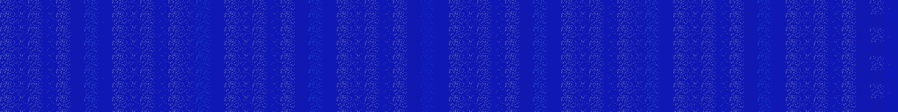

# B4578 (221184-221695)

<details>
    <summary>Initial Grid</summary>
    
</details>


<details>
    <summary>Initial Grid RLE</summary>

```
#C Exported from GoGoL (https://github.com/marrow16/gogol)
#C Wrap mode: Toroidal
#C Boundary mode: Dead
#C Step: 0
x = 100, y = 100, rule = B4578/S
o7bo39bo37bobo5bo$6b2o4bo13bo18bo8bobobo$49bo8b2o3bo$26bo2bo18bobo8bo
13bo6bo$10bo23bo8bo2bo8bo19bo3bo15bo$27bo22bo45bo$bo$19bo6bo3bo21bo2bo
35bo$o7bo20bo25bo17bo18bo4bo$4bo9bobo7bo35bobo15bo7bo8bo$5bo20bo47bo4bo
2bo15bo$3b2o19bo2bo8bobo24bo5bo14bo$29bo6bo3bo2bo51bo$50bo11bo$8bo7bo4b
obo43bo24bo$7bo12bo27b3o42bo$31bo6b2o14bo28bo$25bo$bobo11b2o15bobo17b2o
4bo37bo$6bo17bo54bo$7bo35bo7bo32bo7b2o$3bo40bo13bobo4bo29bo$11bo6bo7bo
45bo24bo$27bo8bo39bo8bo$62bo19bo5bobo5bo$13bo3bo24bo6bo6bo12bo4bo2bo7bo
$51bo15b2o$3bo23bo19bo18bo19bo3bo$12bo16bo47bo$19bo25bo22bo29bo$3bo28bo
$7bo32bo13bo$28bo7bo6bo5bo35bo$24bo28bo9bo34bo$66bo26bo4bo$17bo49bo12bo
$20bo67bo$4bo3bo12bo28bo23bo9b3o6bo2bo$26bo7b2o23bo23bo6bo$10bo11bo59bo
15b2o$10bo11bo19bo3bo19bo9bobo$21bo22bo30bo$o27bo27bo23bo14bo$bo14bo11b
o22bo$2bo4bo13bo28bo$12bobo5bo9bo11bo8bo11bo3bo28bo$71bo2bo$21bo3bo21bo
5bo8bo12bo$9bo3bo15bo15b2o5bo15bo$20bo2bo30bo3bo$38bo$11bo4b2o4bo11bo5b
o15bo13bo6bo4bo$11bo11bo11bo29bo10bo2bo$5bo35bo40bo11bo$4bo4bo20bo4bo
45bo14bo$22bo19bo13bo23bobo10bo$24bo4bo21bo2bo43bo$2bo55bob2o32bo$2bo
32b3o29bo$o8bo16bo11bo41bo3bo$2bo35b2o6bo3bo22bo7bo6bo$33bo5bo7bo4bo23b
o18b2o$o19bo7bo15bo4bo8bo27bo3bo$14bo2bo48bo5bo3bo4bo$10bo80bo$15bo8bo
4bo6bo12bo2bo20bo6bo$7bo20bo28bo6bo23bo$10bo83bo$31bo$18bo16bo5bo28b2o$
28bo21bo2bo12bo8bo7bo$18bo28bo40bobo4bo$9bo74b2o10bo$10bo5bo43bo$2b2o9b
o10bo9bo10bo8bo31bo$bo3bo6bo20bo64bo$40bo19bo19bo$13bo3bo4bo53bo13b2o4b
o$44bo7bo42bo$34b2o10bo3bo2bo2bo24bo$21bo10bo16bo25bo4bo$20bo2bo7bo3bo
7bo7bo$57bobo11bo3bo7bo13bo$9bo35bo15bo12bobo$7bo24bo8bo30bo4bo18bo$28b
o9bo9bo4b2o8bo2bo23bo2bo$7bo4bo6bo7bo15bo22bo3bo$4bo13bo14bo8bo7bo33bo
13bo$35bo2bo13bo32bo$3bo16bo65bo$7bobo17bo9bo2bo17bo19bo13bo$11bo36b2o
31bo5bo10bo$24bo15bo24bo17b2o$o27bo17b2o44bobo$o8bo59bo24bo$25bo20bo7bo
2bo16bo13bo$3bo3bo8bo13bo5bo9bo10b2o2bo5bo$2bo16b2o17bo7bo13bo22bo2bo8b
obo$4bo6bo29bo2bo14bo7bo2bo2bo$7bo9bo8bo17bo6bo5bo7bo29bo!
```
</details>
<details>
    <summary>Thumbnail</summary>

</details>
<table>
<tr>
    <td><a href="./221184%20S%20Heat%20Map%20Activity.png"></a><br>S (221184)<br>S@2</td>    <td><a href="./221185%20S0%20Heat%20Map%20Activity.png"></a><br>S0 (221185)<br>S@2</td>    <td><a href="./221186%20S1%20Heat%20Map%20Activity.png"></a><br>S1 (221186)<br>S@3</td>    <td><a href="./221187%20S01%20Heat%20Map%20Activity.png"></a><br>S01 (221187)<br>S@2</td>    <td><a href="./221188%20S2%20Heat%20Map%20Activity.png"></a><br>S2 (221188)<br>S@3</td>    <td><a href="./221189%20S02%20Heat%20Map%20Activity.png"></a><br>S02 (221189)<br>S@2</td>    <td><a href="./221190%20S12%20Heat%20Map%20Activity.png"></a><br>S12 (221190)<br>R@5,p2</td>    <td><a href="./221191%20S012%20Heat%20Map%20Activity.png"></a><br>S012 (221191)<br>R@6,p4</td>    <td><a href="./221192%20S3%20Heat%20Map%20Activity.png"></a><br>S3 (221192)<br>S@3</td>    <td><a href="./221193%20S03%20Heat%20Map%20Activity.png"></a><br>S03 (221193)<br>S@3</td>    <td><a href="./221194%20S13%20Heat%20Map%20Activity.png"></a><br>S13 (221194)<br>S@3</td>    <td><a href="./221195%20S013%20Heat%20Map%20Activity.png"></a><br>S013 (221195)<br>S@2</td>    <td><a href="./221196%20S23%20Heat%20Map%20Activity.png"></a><br>S23 (221196)<br>S@3</td>    <td><a href="./221197%20S023%20Heat%20Map%20Activity.png"></a><br>S023 (221197)<br>S@3</td>    <td><a href="./221198%20S123%20Heat%20Map%20Activity.png"></a><br>S123 (221198)<br>S@5</td>    <td><a href="./221199%20S0123%20Heat%20Map%20Activity.png"></a><br>S0123 (221199)<br>S@4</td>    <td><a href="./221200%20S4%20Heat%20Map%20Activity.png"></a><br>S4 (221200)<br>S@2</td>    <td><a href="./221201%20S04%20Heat%20Map%20Activity.png"></a><br>S04 (221201)<br>S@2</td>    <td><a href="./221202%20S14%20Heat%20Map%20Activity.png"></a><br>S14 (221202)<br>S@3</td>    <td><a href="./221203%20S014%20Heat%20Map%20Activity.png"></a><br>S014 (221203)<br>S@2</td>    <td><a href="./221204%20S24%20Heat%20Map%20Activity.png"></a><br>S24 (221204)<br>S@3</td>    <td><a href="./221205%20S024%20Heat%20Map%20Activity.png"></a><br>S024 (221205)<br>S@2</td>    <td><a href="./221206%20S124%20Heat%20Map%20Activity.png"></a><br>S124 (221206)<br>R@6,p2</td>    <td><a href="./221207%20S0124%20Heat%20Map%20Activity.png"></a><br>S0124 (221207)<br>R@5,p2</td>    <td><a href="./221208%20S34%20Heat%20Map%20Activity.png"></a><br>S34 (221208)<br>S@3</td>    <td><a href="./221209%20S034%20Heat%20Map%20Activity.png"></a><br>S034 (221209)<br>S@3</td>    <td><a href="./221210%20S134%20Heat%20Map%20Activity.png"></a><br>S134 (221210)<br>S@3</td>    <td><a href="./221211%20S0134%20Heat%20Map%20Activity.png"></a><br>S0134 (221211)<br>S@2</td>    <td><a href="./221212%20S234%20Heat%20Map%20Activity.png"></a><br>S234 (221212)<br>S@3</td>    <td><a href="./221213%20S0234%20Heat%20Map%20Activity.png"></a><br>S0234 (221213)<br>S@2</td>    <td><a href="./221214%20S1234%20Heat%20Map%20Activity.png"></a><br>S1234 (221214)<br>R@9,p2</td>    <td><a href="./221215%20S01234%20Heat%20Map%20Activity.png"></a><br>S01234 (221215)<br>R@9,p2</td>    <td><a href="./221216%20S5%20Heat%20Map%20Activity.png"></a><br>S5 (221216)<br>S@2</td>    <td><a href="./221217%20S05%20Heat%20Map%20Activity.png"></a><br>S05 (221217)<br>S@2</td>    <td><a href="./221218%20S15%20Heat%20Map%20Activity.png"></a><br>S15 (221218)<br>S@3</td>    <td><a href="./221219%20S015%20Heat%20Map%20Activity.png"></a><br>S015 (221219)<br>S@2</td>    <td><a href="./221220%20S25%20Heat%20Map%20Activity.png"></a><br>S25 (221220)<br>S@3</td>    <td><a href="./221221%20S025%20Heat%20Map%20Activity.png"></a><br>S025 (221221)<br>S@2</td>    <td><a href="./221222%20S125%20Heat%20Map%20Activity.png"></a><br>S125 (221222)<br>R@5,p2</td>    <td><a href="./221223%20S0125%20Heat%20Map%20Activity.png"></a><br>S0125 (221223)<br>R@6,p4</td>    <td><a href="./221224%20S35%20Heat%20Map%20Activity.png"></a><br>S35 (221224)<br>S@3</td>    <td><a href="./221225%20S035%20Heat%20Map%20Activity.png"></a><br>S035 (221225)<br>S@3</td>    <td><a href="./221226%20S135%20Heat%20Map%20Activity.png"></a><br>S135 (221226)<br>S@3</td>    <td><a href="./221227%20S0135%20Heat%20Map%20Activity.png"></a><br>S0135 (221227)<br>S@2</td>    <td><a href="./221228%20S235%20Heat%20Map%20Activity.png"></a><br>S235 (221228)<br>S@3</td>    <td><a href="./221229%20S0235%20Heat%20Map%20Activity.png"></a><br>S0235 (221229)<br>S@3</td>    <td><a href="./221230%20S1235%20Heat%20Map%20Activity.png"></a><br>S1235 (221230)<br>S@4</td>    <td><a href="./221231%20S01235%20Heat%20Map%20Activity.png"></a><br>S01235 (221231)<br>S@4</td>    <td><a href="./221232%20S45%20Heat%20Map%20Activity.png"></a><br>S45 (221232)<br>S@2</td>    <td><a href="./221233%20S045%20Heat%20Map%20Activity.png"></a><br>S045 (221233)<br>S@2</td>    <td><a href="./221234%20S145%20Heat%20Map%20Activity.png"></a><br>S145 (221234)<br>S@3</td>    <td><a href="./221235%20S0145%20Heat%20Map%20Activity.png"></a><br>S0145 (221235)<br>S@2</td>    <td><a href="./221236%20S245%20Heat%20Map%20Activity.png"></a><br>S245 (221236)<br>S@3</td>    <td><a href="./221237%20S0245%20Heat%20Map%20Activity.png"></a><br>S0245 (221237)<br>S@2</td>    <td><a href="./221238%20S1245%20Heat%20Map%20Activity.png"></a><br>S1245 (221238)<br>R@6,p2</td>    <td><a href="./221239%20S01245%20Heat%20Map%20Activity.png"></a><br>S01245 (221239)<br>R@5,p2</td>    <td><a href="./221240%20S345%20Heat%20Map%20Activity.png"></a><br>S345 (221240)<br>S@3</td>    <td><a href="./221241%20S0345%20Heat%20Map%20Activity.png"></a><br>S0345 (221241)<br>S@3</td>    <td><a href="./221242%20S1345%20Heat%20Map%20Activity.png"></a><br>S1345 (221242)<br>S@3</td>    <td><a href="./221243%20S01345%20Heat%20Map%20Activity.png"></a><br>S01345 (221243)<br>S@2</td>    <td><a href="./221244%20S2345%20Heat%20Map%20Activity.png"></a><br>S2345 (221244)<br>S@3</td>    <td><a href="./221245%20S02345%20Heat%20Map%20Activity.png"></a><br>S02345 (221245)<br>S@2</td>    <td><a href="./221246%20S12345%20Heat%20Map%20Activity.png"></a><br>S12345 (221246)<br>S@4</td>    <td><a href="./221247%20S012345%20Heat%20Map%20Activity.png"></a><br>S012345 (221247)<br>S@4</td></tr>
<tr>
    <td><a href="./221248%20S6%20Heat%20Map%20Activity.png"></a><br>S6 (221248)<br>S@2</td>    <td><a href="./221249%20S06%20Heat%20Map%20Activity.png"></a><br>S06 (221249)<br>S@2</td>    <td><a href="./221250%20S16%20Heat%20Map%20Activity.png"></a><br>S16 (221250)<br>S@3</td>    <td><a href="./221251%20S016%20Heat%20Map%20Activity.png"></a><br>S016 (221251)<br>S@2</td>    <td><a href="./221252%20S26%20Heat%20Map%20Activity.png"></a><br>S26 (221252)<br>S@3</td>    <td><a href="./221253%20S026%20Heat%20Map%20Activity.png"></a><br>S026 (221253)<br>S@2</td>    <td><a href="./221254%20S126%20Heat%20Map%20Activity.png"></a><br>S126 (221254)<br>R@5,p2</td>    <td><a href="./221255%20S0126%20Heat%20Map%20Activity.png"></a><br>S0126 (221255)<br>R@6,p4</td>    <td><a href="./221256%20S36%20Heat%20Map%20Activity.png"></a><br>S36 (221256)<br>S@3</td>    <td><a href="./221257%20S036%20Heat%20Map%20Activity.png"></a><br>S036 (221257)<br>S@3</td>    <td><a href="./221258%20S136%20Heat%20Map%20Activity.png"></a><br>S136 (221258)<br>S@3</td>    <td><a href="./221259%20S0136%20Heat%20Map%20Activity.png"></a><br>S0136 (221259)<br>S@2</td>    <td><a href="./221260%20S236%20Heat%20Map%20Activity.png"></a><br>S236 (221260)<br>S@3</td>    <td><a href="./221261%20S0236%20Heat%20Map%20Activity.png"></a><br>S0236 (221261)<br>S@3</td>    <td><a href="./221262%20S1236%20Heat%20Map%20Activity.png"></a><br>S1236 (221262)<br>S@5</td>    <td><a href="./221263%20S01236%20Heat%20Map%20Activity.png"></a><br>S01236 (221263)<br>S@4</td>    <td><a href="./221264%20S46%20Heat%20Map%20Activity.png"></a><br>S46 (221264)<br>S@2</td>    <td><a href="./221265%20S046%20Heat%20Map%20Activity.png"></a><br>S046 (221265)<br>S@2</td>    <td><a href="./221266%20S146%20Heat%20Map%20Activity.png"></a><br>S146 (221266)<br>S@3</td>    <td><a href="./221267%20S0146%20Heat%20Map%20Activity.png"></a><br>S0146 (221267)<br>S@2</td>    <td><a href="./221268%20S246%20Heat%20Map%20Activity.png"></a><br>S246 (221268)<br>S@3</td>    <td><a href="./221269%20S0246%20Heat%20Map%20Activity.png"></a><br>S0246 (221269)<br>S@2</td>    <td><a href="./221270%20S1246%20Heat%20Map%20Activity.png"></a><br>S1246 (221270)<br>R@6,p2</td>    <td><a href="./221271%20S01246%20Heat%20Map%20Activity.png"></a><br>S01246 (221271)<br>R@5,p2</td>    <td><a href="./221272%20S346%20Heat%20Map%20Activity.png"></a><br>S346 (221272)<br>S@3</td>    <td><a href="./221273%20S0346%20Heat%20Map%20Activity.png"></a><br>S0346 (221273)<br>S@3</td>    <td><a href="./221274%20S1346%20Heat%20Map%20Activity.png"></a><br>S1346 (221274)<br>S@3</td>    <td><a href="./221275%20S01346%20Heat%20Map%20Activity.png"></a><br>S01346 (221275)<br>S@2</td>    <td><a href="./221276%20S2346%20Heat%20Map%20Activity.png"></a><br>S2346 (221276)<br>S@3</td>    <td><a href="./221277%20S02346%20Heat%20Map%20Activity.png"></a><br>S02346 (221277)<br>S@2</td>    <td><a href="./221278%20S12346%20Heat%20Map%20Activity.png"></a><br>S12346 (221278)<br>R@9,p4</td>    <td><a href="./221279%20S012346%20Heat%20Map%20Activity.png"></a><br>S012346 (221279)<br>R@9,p4</td>    <td><a href="./221280%20S56%20Heat%20Map%20Activity.png"></a><br>S56 (221280)<br>S@2</td>    <td><a href="./221281%20S056%20Heat%20Map%20Activity.png"></a><br>S056 (221281)<br>S@2</td>    <td><a href="./221282%20S156%20Heat%20Map%20Activity.png"></a><br>S156 (221282)<br>S@3</td>    <td><a href="./221283%20S0156%20Heat%20Map%20Activity.png"></a><br>S0156 (221283)<br>S@2</td>    <td><a href="./221284%20S256%20Heat%20Map%20Activity.png"></a><br>S256 (221284)<br>S@3</td>    <td><a href="./221285%20S0256%20Heat%20Map%20Activity.png"></a><br>S0256 (221285)<br>S@2</td>    <td><a href="./221286%20S1256%20Heat%20Map%20Activity.png"></a><br>S1256 (221286)<br>R@5,p2</td>    <td><a href="./221287%20S01256%20Heat%20Map%20Activity.png"></a><br>S01256 (221287)<br>R@6,p4</td>    <td><a href="./221288%20S356%20Heat%20Map%20Activity.png"></a><br>S356 (221288)<br>S@3</td>    <td><a href="./221289%20S0356%20Heat%20Map%20Activity.png"></a><br>S0356 (221289)<br>S@3</td>    <td><a href="./221290%20S1356%20Heat%20Map%20Activity.png"></a><br>S1356 (221290)<br>S@3</td>    <td><a href="./221291%20S01356%20Heat%20Map%20Activity.png"></a><br>S01356 (221291)<br>S@2</td>    <td><a href="./221292%20S2356%20Heat%20Map%20Activity.png"></a><br>S2356 (221292)<br>S@3</td>    <td><a href="./221293%20S02356%20Heat%20Map%20Activity.png"></a><br>S02356 (221293)<br>S@3</td>    <td><a href="./221294%20S12356%20Heat%20Map%20Activity.png"></a><br>S12356 (221294)<br>S@4</td>    <td><a href="./221295%20S012356%20Heat%20Map%20Activity.png"></a><br>S012356 (221295)<br>S@4</td>    <td><a href="./221296%20S456%20Heat%20Map%20Activity.png"></a><br>S456 (221296)<br>S@2</td>    <td><a href="./221297%20S0456%20Heat%20Map%20Activity.png"></a><br>S0456 (221297)<br>S@2</td>    <td><a href="./221298%20S1456%20Heat%20Map%20Activity.png"></a><br>S1456 (221298)<br>S@3</td>    <td><a href="./221299%20S01456%20Heat%20Map%20Activity.png"></a><br>S01456 (221299)<br>S@2</td>    <td><a href="./221300%20S2456%20Heat%20Map%20Activity.png"></a><br>S2456 (221300)<br>S@3</td>    <td><a href="./221301%20S02456%20Heat%20Map%20Activity.png"></a><br>S02456 (221301)<br>S@2</td>    <td><a href="./221302%20S12456%20Heat%20Map%20Activity.png"></a><br>S12456 (221302)<br>R@6,p2</td>    <td><a href="./221303%20S012456%20Heat%20Map%20Activity.png"></a><br>S012456 (221303)<br>R@5,p2</td>    <td><a href="./221304%20S3456%20Heat%20Map%20Activity.png"></a><br>S3456 (221304)<br>S@3</td>    <td><a href="./221305%20S03456%20Heat%20Map%20Activity.png"></a><br>S03456 (221305)<br>S@3</td>    <td><a href="./221306%20S13456%20Heat%20Map%20Activity.png"></a><br>S13456 (221306)<br>S@3</td>    <td><a href="./221307%20S013456%20Heat%20Map%20Activity.png"></a><br>S013456 (221307)<br>S@2</td>    <td><a href="./221308%20S23456%20Heat%20Map%20Activity.png"></a><br>S23456 (221308)<br>S@3</td>    <td><a href="./221309%20S023456%20Heat%20Map%20Activity.png"></a><br>S023456 (221309)<br>S@2</td>    <td><a href="./221310%20S123456%20Heat%20Map%20Activity.png"></a><br>S123456 (221310)<br>S@4</td>    <td><a href="./221311%20S0123456%20Heat%20Map%20Activity.png"></a><br>S0123456 (221311)<br>S@4</td></tr>
<tr>
    <td><a href="./221312%20S7%20Heat%20Map%20Activity.png"></a><br>S7 (221312)<br>S@2</td>    <td><a href="./221313%20S07%20Heat%20Map%20Activity.png"></a><br>S07 (221313)<br>S@2</td>    <td><a href="./221314%20S17%20Heat%20Map%20Activity.png"></a><br>S17 (221314)<br>S@3</td>    <td><a href="./221315%20S017%20Heat%20Map%20Activity.png"></a><br>S017 (221315)<br>S@2</td>    <td><a href="./221316%20S27%20Heat%20Map%20Activity.png"></a><br>S27 (221316)<br>S@3</td>    <td><a href="./221317%20S027%20Heat%20Map%20Activity.png"></a><br>S027 (221317)<br>S@2</td>    <td><a href="./221318%20S127%20Heat%20Map%20Activity.png"></a><br>S127 (221318)<br>R@5,p2</td>    <td><a href="./221319%20S0127%20Heat%20Map%20Activity.png"></a><br>S0127 (221319)<br>R@6,p4</td>    <td><a href="./221320%20S37%20Heat%20Map%20Activity.png"></a><br>S37 (221320)<br>S@3</td>    <td><a href="./221321%20S037%20Heat%20Map%20Activity.png"></a><br>S037 (221321)<br>S@3</td>    <td><a href="./221322%20S137%20Heat%20Map%20Activity.png"></a><br>S137 (221322)<br>S@3</td>    <td><a href="./221323%20S0137%20Heat%20Map%20Activity.png"></a><br>S0137 (221323)<br>S@2</td>    <td><a href="./221324%20S237%20Heat%20Map%20Activity.png"></a><br>S237 (221324)<br>S@3</td>    <td><a href="./221325%20S0237%20Heat%20Map%20Activity.png"></a><br>S0237 (221325)<br>S@3</td>    <td><a href="./221326%20S1237%20Heat%20Map%20Activity.png"></a><br>S1237 (221326)<br>S@5</td>    <td><a href="./221327%20S01237%20Heat%20Map%20Activity.png"></a><br>S01237 (221327)<br>S@4</td>    <td><a href="./221328%20S47%20Heat%20Map%20Activity.png"></a><br>S47 (221328)<br>S@2</td>    <td><a href="./221329%20S047%20Heat%20Map%20Activity.png"></a><br>S047 (221329)<br>S@2</td>    <td><a href="./221330%20S147%20Heat%20Map%20Activity.png"></a><br>S147 (221330)<br>S@3</td>    <td><a href="./221331%20S0147%20Heat%20Map%20Activity.png"></a><br>S0147 (221331)<br>S@2</td>    <td><a href="./221332%20S247%20Heat%20Map%20Activity.png"></a><br>S247 (221332)<br>S@3</td>    <td><a href="./221333%20S0247%20Heat%20Map%20Activity.png"></a><br>S0247 (221333)<br>S@2</td>    <td><a href="./221334%20S1247%20Heat%20Map%20Activity.png"></a><br>S1247 (221334)<br>R@6,p2</td>    <td><a href="./221335%20S01247%20Heat%20Map%20Activity.png"></a><br>S01247 (221335)<br>R@5,p2</td>    <td><a href="./221336%20S347%20Heat%20Map%20Activity.png"></a><br>S347 (221336)<br>S@3</td>    <td><a href="./221337%20S0347%20Heat%20Map%20Activity.png"></a><br>S0347 (221337)<br>S@3</td>    <td><a href="./221338%20S1347%20Heat%20Map%20Activity.png"></a><br>S1347 (221338)<br>S@3</td>    <td><a href="./221339%20S01347%20Heat%20Map%20Activity.png"></a><br>S01347 (221339)<br>S@2</td>    <td><a href="./221340%20S2347%20Heat%20Map%20Activity.png"></a><br>S2347 (221340)<br>S@3</td>    <td><a href="./221341%20S02347%20Heat%20Map%20Activity.png"></a><br>S02347 (221341)<br>S@2</td>    <td><a href="./221342%20S12347%20Heat%20Map%20Activity.png"></a><br>S12347 (221342)<br>R@9,p2</td>    <td><a href="./221343%20S012347%20Heat%20Map%20Activity.png"></a><br>S012347 (221343)<br>R@9,p2</td>    <td><a href="./221344%20S57%20Heat%20Map%20Activity.png"></a><br>S57 (221344)<br>S@2</td>    <td><a href="./221345%20S057%20Heat%20Map%20Activity.png"></a><br>S057 (221345)<br>S@2</td>    <td><a href="./221346%20S157%20Heat%20Map%20Activity.png"></a><br>S157 (221346)<br>S@3</td>    <td><a href="./221347%20S0157%20Heat%20Map%20Activity.png"></a><br>S0157 (221347)<br>S@2</td>    <td><a href="./221348%20S257%20Heat%20Map%20Activity.png"></a><br>S257 (221348)<br>S@3</td>    <td><a href="./221349%20S0257%20Heat%20Map%20Activity.png"></a><br>S0257 (221349)<br>S@2</td>    <td><a href="./221350%20S1257%20Heat%20Map%20Activity.png"></a><br>S1257 (221350)<br>R@5,p2</td>    <td><a href="./221351%20S01257%20Heat%20Map%20Activity.png"></a><br>S01257 (221351)<br>R@6,p4</td>    <td><a href="./221352%20S357%20Heat%20Map%20Activity.png"></a><br>S357 (221352)<br>S@3</td>    <td><a href="./221353%20S0357%20Heat%20Map%20Activity.png"></a><br>S0357 (221353)<br>S@3</td>    <td><a href="./221354%20S1357%20Heat%20Map%20Activity.png"></a><br>S1357 (221354)<br>S@3</td>    <td><a href="./221355%20S01357%20Heat%20Map%20Activity.png"></a><br>S01357 (221355)<br>S@2</td>    <td><a href="./221356%20S2357%20Heat%20Map%20Activity.png"></a><br>S2357 (221356)<br>S@3</td>    <td><a href="./221357%20S02357%20Heat%20Map%20Activity.png"></a><br>S02357 (221357)<br>S@3</td>    <td><a href="./221358%20S12357%20Heat%20Map%20Activity.png"></a><br>S12357 (221358)<br>S@4</td>    <td><a href="./221359%20S012357%20Heat%20Map%20Activity.png"></a><br>S012357 (221359)<br>S@4</td>    <td><a href="./221360%20S457%20Heat%20Map%20Activity.png"></a><br>S457 (221360)<br>S@2</td>    <td><a href="./221361%20S0457%20Heat%20Map%20Activity.png"></a><br>S0457 (221361)<br>S@2</td>    <td><a href="./221362%20S1457%20Heat%20Map%20Activity.png"></a><br>S1457 (221362)<br>S@3</td>    <td><a href="./221363%20S01457%20Heat%20Map%20Activity.png"></a><br>S01457 (221363)<br>S@2</td>    <td><a href="./221364%20S2457%20Heat%20Map%20Activity.png"></a><br>S2457 (221364)<br>S@3</td>    <td><a href="./221365%20S02457%20Heat%20Map%20Activity.png"></a><br>S02457 (221365)<br>S@2</td>    <td><a href="./221366%20S12457%20Heat%20Map%20Activity.png"></a><br>S12457 (221366)<br>R@6,p2</td>    <td><a href="./221367%20S012457%20Heat%20Map%20Activity.png"></a><br>S012457 (221367)<br>R@5,p2</td>    <td><a href="./221368%20S3457%20Heat%20Map%20Activity.png"></a><br>S3457 (221368)<br>S@3</td>    <td><a href="./221369%20S03457%20Heat%20Map%20Activity.png"></a><br>S03457 (221369)<br>S@3</td>    <td><a href="./221370%20S13457%20Heat%20Map%20Activity.png"></a><br>S13457 (221370)<br>S@3</td>    <td><a href="./221371%20S013457%20Heat%20Map%20Activity.png"></a><br>S013457 (221371)<br>S@2</td>    <td><a href="./221372%20S23457%20Heat%20Map%20Activity.png"></a><br>S23457 (221372)<br>S@3</td>    <td><a href="./221373%20S023457%20Heat%20Map%20Activity.png"></a><br>S023457 (221373)<br>S@2</td>    <td><a href="./221374%20S123457%20Heat%20Map%20Activity.png"></a><br>S123457 (221374)<br>S@4</td>    <td><a href="./221375%20S0123457%20Heat%20Map%20Activity.png"></a><br>S0123457 (221375)<br>S@4</td></tr>
<tr>
    <td><a href="./221376%20S67%20Heat%20Map%20Activity.png"></a><br>S67 (221376)<br>S@2</td>    <td><a href="./221377%20S067%20Heat%20Map%20Activity.png"></a><br>S067 (221377)<br>S@2</td>    <td><a href="./221378%20S167%20Heat%20Map%20Activity.png"></a><br>S167 (221378)<br>S@3</td>    <td><a href="./221379%20S0167%20Heat%20Map%20Activity.png"></a><br>S0167 (221379)<br>S@2</td>    <td><a href="./221380%20S267%20Heat%20Map%20Activity.png"></a><br>S267 (221380)<br>S@3</td>    <td><a href="./221381%20S0267%20Heat%20Map%20Activity.png"></a><br>S0267 (221381)<br>S@2</td>    <td><a href="./221382%20S1267%20Heat%20Map%20Activity.png"></a><br>S1267 (221382)<br>R@5,p2</td>    <td><a href="./221383%20S01267%20Heat%20Map%20Activity.png"></a><br>S01267 (221383)<br>R@6,p4</td>    <td><a href="./221384%20S367%20Heat%20Map%20Activity.png"></a><br>S367 (221384)<br>S@3</td>    <td><a href="./221385%20S0367%20Heat%20Map%20Activity.png"></a><br>S0367 (221385)<br>S@3</td>    <td><a href="./221386%20S1367%20Heat%20Map%20Activity.png"></a><br>S1367 (221386)<br>S@3</td>    <td><a href="./221387%20S01367%20Heat%20Map%20Activity.png"></a><br>S01367 (221387)<br>S@2</td>    <td><a href="./221388%20S2367%20Heat%20Map%20Activity.png"></a><br>S2367 (221388)<br>S@3</td>    <td><a href="./221389%20S02367%20Heat%20Map%20Activity.png"></a><br>S02367 (221389)<br>S@3</td>    <td><a href="./221390%20S12367%20Heat%20Map%20Activity.png"></a><br>S12367 (221390)<br>S@5</td>    <td><a href="./221391%20S012367%20Heat%20Map%20Activity.png"></a><br>S012367 (221391)<br>S@4</td>    <td><a href="./221392%20S467%20Heat%20Map%20Activity.png"></a><br>S467 (221392)<br>S@2</td>    <td><a href="./221393%20S0467%20Heat%20Map%20Activity.png"></a><br>S0467 (221393)<br>S@2</td>    <td><a href="./221394%20S1467%20Heat%20Map%20Activity.png"></a><br>S1467 (221394)<br>S@3</td>    <td><a href="./221395%20S01467%20Heat%20Map%20Activity.png"></a><br>S01467 (221395)<br>S@2</td>    <td><a href="./221396%20S2467%20Heat%20Map%20Activity.png"></a><br>S2467 (221396)<br>S@3</td>    <td><a href="./221397%20S02467%20Heat%20Map%20Activity.png"></a><br>S02467 (221397)<br>S@2</td>    <td><a href="./221398%20S12467%20Heat%20Map%20Activity.png"></a><br>S12467 (221398)<br>R@6,p2</td>    <td><a href="./221399%20S012467%20Heat%20Map%20Activity.png"></a><br>S012467 (221399)<br>R@5,p2</td>    <td><a href="./221400%20S3467%20Heat%20Map%20Activity.png"></a><br>S3467 (221400)<br>S@3</td>    <td><a href="./221401%20S03467%20Heat%20Map%20Activity.png"></a><br>S03467 (221401)<br>S@3</td>    <td><a href="./221402%20S13467%20Heat%20Map%20Activity.png"></a><br>S13467 (221402)<br>S@3</td>    <td><a href="./221403%20S013467%20Heat%20Map%20Activity.png"></a><br>S013467 (221403)<br>S@2</td>    <td><a href="./221404%20S23467%20Heat%20Map%20Activity.png"></a><br>S23467 (221404)<br>S@3</td>    <td><a href="./221405%20S023467%20Heat%20Map%20Activity.png"></a><br>S023467 (221405)<br>S@2</td>    <td><a href="./221406%20S123467%20Heat%20Map%20Activity.png"></a><br>S123467 (221406)<br>R@9,p4</td>    <td><a href="./221407%20S0123467%20Heat%20Map%20Activity.png"></a><br>S0123467 (221407)<br>R@9,p4</td>    <td><a href="./221408%20S567%20Heat%20Map%20Activity.png"></a><br>S567 (221408)<br>S@2</td>    <td><a href="./221409%20S0567%20Heat%20Map%20Activity.png"></a><br>S0567 (221409)<br>S@2</td>    <td><a href="./221410%20S1567%20Heat%20Map%20Activity.png"></a><br>S1567 (221410)<br>S@3</td>    <td><a href="./221411%20S01567%20Heat%20Map%20Activity.png"></a><br>S01567 (221411)<br>S@2</td>    <td><a href="./221412%20S2567%20Heat%20Map%20Activity.png"></a><br>S2567 (221412)<br>S@3</td>    <td><a href="./221413%20S02567%20Heat%20Map%20Activity.png"></a><br>S02567 (221413)<br>S@2</td>    <td><a href="./221414%20S12567%20Heat%20Map%20Activity.png"></a><br>S12567 (221414)<br>R@5,p2</td>    <td><a href="./221415%20S012567%20Heat%20Map%20Activity.png"></a><br>S012567 (221415)<br>R@6,p4</td>    <td><a href="./221416%20S3567%20Heat%20Map%20Activity.png"></a><br>S3567 (221416)<br>S@3</td>    <td><a href="./221417%20S03567%20Heat%20Map%20Activity.png"></a><br>S03567 (221417)<br>S@3</td>    <td><a href="./221418%20S13567%20Heat%20Map%20Activity.png"></a><br>S13567 (221418)<br>S@3</td>    <td><a href="./221419%20S013567%20Heat%20Map%20Activity.png"></a><br>S013567 (221419)<br>S@2</td>    <td><a href="./221420%20S23567%20Heat%20Map%20Activity.png"></a><br>S23567 (221420)<br>S@3</td>    <td><a href="./221421%20S023567%20Heat%20Map%20Activity.png"></a><br>S023567 (221421)<br>S@3</td>    <td><a href="./221422%20S123567%20Heat%20Map%20Activity.png"></a><br>S123567 (221422)<br>S@4</td>    <td><a href="./221423%20S0123567%20Heat%20Map%20Activity.png"></a><br>S0123567 (221423)<br>S@4</td>    <td><a href="./221424%20S4567%20Heat%20Map%20Activity.png"></a><br>S4567 (221424)<br>S@2</td>    <td><a href="./221425%20S04567%20Heat%20Map%20Activity.png"></a><br>S04567 (221425)<br>S@2</td>    <td><a href="./221426%20S14567%20Heat%20Map%20Activity.png"></a><br>S14567 (221426)<br>S@3</td>    <td><a href="./221427%20S014567%20Heat%20Map%20Activity.png"></a><br>S014567 (221427)<br>S@2</td>    <td><a href="./221428%20S24567%20Heat%20Map%20Activity.png"></a><br>S24567 (221428)<br>S@3</td>    <td><a href="./221429%20S024567%20Heat%20Map%20Activity.png"></a><br>S024567 (221429)<br>S@2</td>    <td><a href="./221430%20S124567%20Heat%20Map%20Activity.png"></a><br>S124567 (221430)<br>R@6,p2</td>    <td><a href="./221431%20S0124567%20Heat%20Map%20Activity.png"></a><br>S0124567 (221431)<br>R@5,p2</td>    <td><a href="./221432%20S34567%20Heat%20Map%20Activity.png"></a><br>S34567 (221432)<br>S@3</td>    <td><a href="./221433%20S034567%20Heat%20Map%20Activity.png"></a><br>S034567 (221433)<br>S@3</td>    <td><a href="./221434%20S134567%20Heat%20Map%20Activity.png"></a><br>S134567 (221434)<br>S@3</td>    <td><a href="./221435%20S0134567%20Heat%20Map%20Activity.png"></a><br>S0134567 (221435)<br>S@2</td>    <td><a href="./221436%20S234567%20Heat%20Map%20Activity.png"></a><br>S234567 (221436)<br>S@3</td>    <td><a href="./221437%20S0234567%20Heat%20Map%20Activity.png"></a><br>S0234567 (221437)<br>S@2</td>    <td><a href="./221438%20S1234567%20Heat%20Map%20Activity.png"></a><br>S1234567 (221438)<br>S@4</td>    <td><a href="./221439%20S01234567%20Heat%20Map%20Activity.png"></a><br>S01234567 (221439)<br>S@4</td></tr>
<tr>
    <td><a href="./221440%20S8%20Heat%20Map%20Activity.png"></a><br>S8 (221440)<br>S@2</td>    <td><a href="./221441%20S08%20Heat%20Map%20Activity.png"></a><br>S08 (221441)<br>S@2</td>    <td><a href="./221442%20S18%20Heat%20Map%20Activity.png"></a><br>S18 (221442)<br>S@3</td>    <td><a href="./221443%20S018%20Heat%20Map%20Activity.png"></a><br>S018 (221443)<br>S@2</td>    <td><a href="./221444%20S28%20Heat%20Map%20Activity.png"></a><br>S28 (221444)<br>S@3</td>    <td><a href="./221445%20S028%20Heat%20Map%20Activity.png"></a><br>S028 (221445)<br>S@2</td>    <td><a href="./221446%20S128%20Heat%20Map%20Activity.png"></a><br>S128 (221446)<br>R@5,p2</td>    <td><a href="./221447%20S0128%20Heat%20Map%20Activity.png"></a><br>S0128 (221447)<br>R@6,p4</td>    <td><a href="./221448%20S38%20Heat%20Map%20Activity.png"></a><br>S38 (221448)<br>S@3</td>    <td><a href="./221449%20S038%20Heat%20Map%20Activity.png"></a><br>S038 (221449)<br>S@3</td>    <td><a href="./221450%20S138%20Heat%20Map%20Activity.png"></a><br>S138 (221450)<br>S@3</td>    <td><a href="./221451%20S0138%20Heat%20Map%20Activity.png"></a><br>S0138 (221451)<br>S@2</td>    <td><a href="./221452%20S238%20Heat%20Map%20Activity.png"></a><br>S238 (221452)<br>S@3</td>    <td><a href="./221453%20S0238%20Heat%20Map%20Activity.png"></a><br>S0238 (221453)<br>S@3</td>    <td><a href="./221454%20S1238%20Heat%20Map%20Activity.png"></a><br>S1238 (221454)<br>S@5</td>    <td><a href="./221455%20S01238%20Heat%20Map%20Activity.png"></a><br>S01238 (221455)<br>S@4</td>    <td><a href="./221456%20S48%20Heat%20Map%20Activity.png"></a><br>S48 (221456)<br>S@2</td>    <td><a href="./221457%20S048%20Heat%20Map%20Activity.png"></a><br>S048 (221457)<br>S@2</td>    <td><a href="./221458%20S148%20Heat%20Map%20Activity.png"></a><br>S148 (221458)<br>S@3</td>    <td><a href="./221459%20S0148%20Heat%20Map%20Activity.png"></a><br>S0148 (221459)<br>S@2</td>    <td><a href="./221460%20S248%20Heat%20Map%20Activity.png"></a><br>S248 (221460)<br>S@3</td>    <td><a href="./221461%20S0248%20Heat%20Map%20Activity.png"></a><br>S0248 (221461)<br>S@2</td>    <td><a href="./221462%20S1248%20Heat%20Map%20Activity.png"></a><br>S1248 (221462)<br>R@6,p2</td>    <td><a href="./221463%20S01248%20Heat%20Map%20Activity.png"></a><br>S01248 (221463)<br>R@5,p2</td>    <td><a href="./221464%20S348%20Heat%20Map%20Activity.png"></a><br>S348 (221464)<br>S@3</td>    <td><a href="./221465%20S0348%20Heat%20Map%20Activity.png"></a><br>S0348 (221465)<br>S@3</td>    <td><a href="./221466%20S1348%20Heat%20Map%20Activity.png"></a><br>S1348 (221466)<br>S@3</td>    <td><a href="./221467%20S01348%20Heat%20Map%20Activity.png"></a><br>S01348 (221467)<br>S@2</td>    <td><a href="./221468%20S2348%20Heat%20Map%20Activity.png"></a><br>S2348 (221468)<br>S@3</td>    <td><a href="./221469%20S02348%20Heat%20Map%20Activity.png"></a><br>S02348 (221469)<br>S@2</td>    <td><a href="./221470%20S12348%20Heat%20Map%20Activity.png"></a><br>S12348 (221470)<br>R@9,p2</td>    <td><a href="./221471%20S012348%20Heat%20Map%20Activity.png"></a><br>S012348 (221471)<br>R@9,p2</td>    <td><a href="./221472%20S58%20Heat%20Map%20Activity.png"></a><br>S58 (221472)<br>S@2</td>    <td><a href="./221473%20S058%20Heat%20Map%20Activity.png"></a><br>S058 (221473)<br>S@2</td>    <td><a href="./221474%20S158%20Heat%20Map%20Activity.png"></a><br>S158 (221474)<br>S@3</td>    <td><a href="./221475%20S0158%20Heat%20Map%20Activity.png"></a><br>S0158 (221475)<br>S@2</td>    <td><a href="./221476%20S258%20Heat%20Map%20Activity.png"></a><br>S258 (221476)<br>S@3</td>    <td><a href="./221477%20S0258%20Heat%20Map%20Activity.png"></a><br>S0258 (221477)<br>S@2</td>    <td><a href="./221478%20S1258%20Heat%20Map%20Activity.png"></a><br>S1258 (221478)<br>R@5,p2</td>    <td><a href="./221479%20S01258%20Heat%20Map%20Activity.png"></a><br>S01258 (221479)<br>R@6,p4</td>    <td><a href="./221480%20S358%20Heat%20Map%20Activity.png"></a><br>S358 (221480)<br>S@3</td>    <td><a href="./221481%20S0358%20Heat%20Map%20Activity.png"></a><br>S0358 (221481)<br>S@3</td>    <td><a href="./221482%20S1358%20Heat%20Map%20Activity.png"></a><br>S1358 (221482)<br>S@3</td>    <td><a href="./221483%20S01358%20Heat%20Map%20Activity.png"></a><br>S01358 (221483)<br>S@2</td>    <td><a href="./221484%20S2358%20Heat%20Map%20Activity.png"></a><br>S2358 (221484)<br>S@3</td>    <td><a href="./221485%20S02358%20Heat%20Map%20Activity.png"></a><br>S02358 (221485)<br>S@3</td>    <td><a href="./221486%20S12358%20Heat%20Map%20Activity.png"></a><br>S12358 (221486)<br>S@4</td>    <td><a href="./221487%20S012358%20Heat%20Map%20Activity.png"></a><br>S012358 (221487)<br>S@4</td>    <td><a href="./221488%20S458%20Heat%20Map%20Activity.png"></a><br>S458 (221488)<br>S@2</td>    <td><a href="./221489%20S0458%20Heat%20Map%20Activity.png"></a><br>S0458 (221489)<br>S@2</td>    <td><a href="./221490%20S1458%20Heat%20Map%20Activity.png"></a><br>S1458 (221490)<br>S@3</td>    <td><a href="./221491%20S01458%20Heat%20Map%20Activity.png"></a><br>S01458 (221491)<br>S@2</td>    <td><a href="./221492%20S2458%20Heat%20Map%20Activity.png"></a><br>S2458 (221492)<br>S@3</td>    <td><a href="./221493%20S02458%20Heat%20Map%20Activity.png"></a><br>S02458 (221493)<br>S@2</td>    <td><a href="./221494%20S12458%20Heat%20Map%20Activity.png"></a><br>S12458 (221494)<br>R@6,p2</td>    <td><a href="./221495%20S012458%20Heat%20Map%20Activity.png"></a><br>S012458 (221495)<br>R@5,p2</td>    <td><a href="./221496%20S3458%20Heat%20Map%20Activity.png"></a><br>S3458 (221496)<br>S@3</td>    <td><a href="./221497%20S03458%20Heat%20Map%20Activity.png"></a><br>S03458 (221497)<br>S@3</td>    <td><a href="./221498%20S13458%20Heat%20Map%20Activity.png"></a><br>S13458 (221498)<br>S@3</td>    <td><a href="./221499%20S013458%20Heat%20Map%20Activity.png"></a><br>S013458 (221499)<br>S@2</td>    <td><a href="./221500%20S23458%20Heat%20Map%20Activity.png"></a><br>S23458 (221500)<br>S@3</td>    <td><a href="./221501%20S023458%20Heat%20Map%20Activity.png"></a><br>S023458 (221501)<br>S@2</td>    <td><a href="./221502%20S123458%20Heat%20Map%20Activity.png"></a><br>S123458 (221502)<br>S@4</td>    <td><a href="./221503%20S0123458%20Heat%20Map%20Activity.png"></a><br>S0123458 (221503)<br>S@4</td></tr>
<tr>
    <td><a href="./221504%20S68%20Heat%20Map%20Activity.png"></a><br>S68 (221504)<br>S@2</td>    <td><a href="./221505%20S068%20Heat%20Map%20Activity.png"></a><br>S068 (221505)<br>S@2</td>    <td><a href="./221506%20S168%20Heat%20Map%20Activity.png"></a><br>S168 (221506)<br>S@3</td>    <td><a href="./221507%20S0168%20Heat%20Map%20Activity.png"></a><br>S0168 (221507)<br>S@2</td>    <td><a href="./221508%20S268%20Heat%20Map%20Activity.png"></a><br>S268 (221508)<br>S@3</td>    <td><a href="./221509%20S0268%20Heat%20Map%20Activity.png"></a><br>S0268 (221509)<br>S@2</td>    <td><a href="./221510%20S1268%20Heat%20Map%20Activity.png"></a><br>S1268 (221510)<br>R@5,p2</td>    <td><a href="./221511%20S01268%20Heat%20Map%20Activity.png"></a><br>S01268 (221511)<br>R@6,p4</td>    <td><a href="./221512%20S368%20Heat%20Map%20Activity.png"></a><br>S368 (221512)<br>S@3</td>    <td><a href="./221513%20S0368%20Heat%20Map%20Activity.png"></a><br>S0368 (221513)<br>S@3</td>    <td><a href="./221514%20S1368%20Heat%20Map%20Activity.png"></a><br>S1368 (221514)<br>S@3</td>    <td><a href="./221515%20S01368%20Heat%20Map%20Activity.png"></a><br>S01368 (221515)<br>S@2</td>    <td><a href="./221516%20S2368%20Heat%20Map%20Activity.png"></a><br>S2368 (221516)<br>S@3</td>    <td><a href="./221517%20S02368%20Heat%20Map%20Activity.png"></a><br>S02368 (221517)<br>S@3</td>    <td><a href="./221518%20S12368%20Heat%20Map%20Activity.png"></a><br>S12368 (221518)<br>S@5</td>    <td><a href="./221519%20S012368%20Heat%20Map%20Activity.png"></a><br>S012368 (221519)<br>S@4</td>    <td><a href="./221520%20S468%20Heat%20Map%20Activity.png"></a><br>S468 (221520)<br>S@2</td>    <td><a href="./221521%20S0468%20Heat%20Map%20Activity.png"></a><br>S0468 (221521)<br>S@2</td>    <td><a href="./221522%20S1468%20Heat%20Map%20Activity.png"></a><br>S1468 (221522)<br>S@3</td>    <td><a href="./221523%20S01468%20Heat%20Map%20Activity.png"></a><br>S01468 (221523)<br>S@2</td>    <td><a href="./221524%20S2468%20Heat%20Map%20Activity.png"></a><br>S2468 (221524)<br>S@3</td>    <td><a href="./221525%20S02468%20Heat%20Map%20Activity.png"></a><br>S02468 (221525)<br>S@2</td>    <td><a href="./221526%20S12468%20Heat%20Map%20Activity.png"></a><br>S12468 (221526)<br>R@6,p2</td>    <td><a href="./221527%20S012468%20Heat%20Map%20Activity.png"></a><br>S012468 (221527)<br>R@5,p2</td>    <td><a href="./221528%20S3468%20Heat%20Map%20Activity.png"></a><br>S3468 (221528)<br>S@3</td>    <td><a href="./221529%20S03468%20Heat%20Map%20Activity.png"></a><br>S03468 (221529)<br>S@3</td>    <td><a href="./221530%20S13468%20Heat%20Map%20Activity.png"></a><br>S13468 (221530)<br>S@3</td>    <td><a href="./221531%20S013468%20Heat%20Map%20Activity.png"></a><br>S013468 (221531)<br>S@2</td>    <td><a href="./221532%20S23468%20Heat%20Map%20Activity.png"></a><br>S23468 (221532)<br>S@3</td>    <td><a href="./221533%20S023468%20Heat%20Map%20Activity.png"></a><br>S023468 (221533)<br>S@2</td>    <td><a href="./221534%20S123468%20Heat%20Map%20Activity.png"></a><br>S123468 (221534)<br>R@9,p4</td>    <td><a href="./221535%20S0123468%20Heat%20Map%20Activity.png"></a><br>S0123468 (221535)<br>R@9,p4</td>    <td><a href="./221536%20S568%20Heat%20Map%20Activity.png"></a><br>S568 (221536)<br>S@2</td>    <td><a href="./221537%20S0568%20Heat%20Map%20Activity.png"></a><br>S0568 (221537)<br>S@2</td>    <td><a href="./221538%20S1568%20Heat%20Map%20Activity.png"></a><br>S1568 (221538)<br>S@3</td>    <td><a href="./221539%20S01568%20Heat%20Map%20Activity.png"></a><br>S01568 (221539)<br>S@2</td>    <td><a href="./221540%20S2568%20Heat%20Map%20Activity.png"></a><br>S2568 (221540)<br>S@3</td>    <td><a href="./221541%20S02568%20Heat%20Map%20Activity.png"></a><br>S02568 (221541)<br>S@2</td>    <td><a href="./221542%20S12568%20Heat%20Map%20Activity.png"></a><br>S12568 (221542)<br>R@5,p2</td>    <td><a href="./221543%20S012568%20Heat%20Map%20Activity.png"></a><br>S012568 (221543)<br>R@6,p4</td>    <td><a href="./221544%20S3568%20Heat%20Map%20Activity.png"></a><br>S3568 (221544)<br>S@3</td>    <td><a href="./221545%20S03568%20Heat%20Map%20Activity.png"></a><br>S03568 (221545)<br>S@3</td>    <td><a href="./221546%20S13568%20Heat%20Map%20Activity.png"></a><br>S13568 (221546)<br>S@3</td>    <td><a href="./221547%20S013568%20Heat%20Map%20Activity.png"></a><br>S013568 (221547)<br>S@2</td>    <td><a href="./221548%20S23568%20Heat%20Map%20Activity.png"></a><br>S23568 (221548)<br>S@3</td>    <td><a href="./221549%20S023568%20Heat%20Map%20Activity.png"></a><br>S023568 (221549)<br>S@3</td>    <td><a href="./221550%20S123568%20Heat%20Map%20Activity.png"></a><br>S123568 (221550)<br>S@4</td>    <td><a href="./221551%20S0123568%20Heat%20Map%20Activity.png"></a><br>S0123568 (221551)<br>S@4</td>    <td><a href="./221552%20S4568%20Heat%20Map%20Activity.png"></a><br>S4568 (221552)<br>S@2</td>    <td><a href="./221553%20S04568%20Heat%20Map%20Activity.png"></a><br>S04568 (221553)<br>S@2</td>    <td><a href="./221554%20S14568%20Heat%20Map%20Activity.png"></a><br>S14568 (221554)<br>S@3</td>    <td><a href="./221555%20S014568%20Heat%20Map%20Activity.png"></a><br>S014568 (221555)<br>S@2</td>    <td><a href="./221556%20S24568%20Heat%20Map%20Activity.png"></a><br>S24568 (221556)<br>S@3</td>    <td><a href="./221557%20S024568%20Heat%20Map%20Activity.png"></a><br>S024568 (221557)<br>S@2</td>    <td><a href="./221558%20S124568%20Heat%20Map%20Activity.png"></a><br>S124568 (221558)<br>R@6,p2</td>    <td><a href="./221559%20S0124568%20Heat%20Map%20Activity.png"></a><br>S0124568 (221559)<br>R@5,p2</td>    <td><a href="./221560%20S34568%20Heat%20Map%20Activity.png"></a><br>S34568 (221560)<br>S@3</td>    <td><a href="./221561%20S034568%20Heat%20Map%20Activity.png"></a><br>S034568 (221561)<br>S@3</td>    <td><a href="./221562%20S134568%20Heat%20Map%20Activity.png"></a><br>S134568 (221562)<br>S@3</td>    <td><a href="./221563%20S0134568%20Heat%20Map%20Activity.png"></a><br>S0134568 (221563)<br>S@2</td>    <td><a href="./221564%20S234568%20Heat%20Map%20Activity.png"></a><br>S234568 (221564)<br>S@3</td>    <td><a href="./221565%20S0234568%20Heat%20Map%20Activity.png"></a><br>S0234568 (221565)<br>S@2</td>    <td><a href="./221566%20S1234568%20Heat%20Map%20Activity.png"></a><br>S1234568 (221566)<br>S@4</td>    <td><a href="./221567%20S01234568%20Heat%20Map%20Activity.png"></a><br>S01234568 (221567)<br>S@4</td></tr>
<tr>
    <td><a href="./221568%20S78%20Heat%20Map%20Activity.png"></a><br>S78 (221568)<br>S@2</td>    <td><a href="./221569%20S078%20Heat%20Map%20Activity.png"></a><br>S078 (221569)<br>S@2</td>    <td><a href="./221570%20S178%20Heat%20Map%20Activity.png"></a><br>S178 (221570)<br>S@3</td>    <td><a href="./221571%20S0178%20Heat%20Map%20Activity.png"></a><br>S0178 (221571)<br>S@2</td>    <td><a href="./221572%20S278%20Heat%20Map%20Activity.png"></a><br>S278 (221572)<br>S@3</td>    <td><a href="./221573%20S0278%20Heat%20Map%20Activity.png"></a><br>S0278 (221573)<br>S@2</td>    <td><a href="./221574%20S1278%20Heat%20Map%20Activity.png"></a><br>S1278 (221574)<br>R@5,p2</td>    <td><a href="./221575%20S01278%20Heat%20Map%20Activity.png"></a><br>S01278 (221575)<br>R@6,p4</td>    <td><a href="./221576%20S378%20Heat%20Map%20Activity.png"></a><br>S378 (221576)<br>S@3</td>    <td><a href="./221577%20S0378%20Heat%20Map%20Activity.png"></a><br>S0378 (221577)<br>S@3</td>    <td><a href="./221578%20S1378%20Heat%20Map%20Activity.png"></a><br>S1378 (221578)<br>S@3</td>    <td><a href="./221579%20S01378%20Heat%20Map%20Activity.png"></a><br>S01378 (221579)<br>S@2</td>    <td><a href="./221580%20S2378%20Heat%20Map%20Activity.png"></a><br>S2378 (221580)<br>S@3</td>    <td><a href="./221581%20S02378%20Heat%20Map%20Activity.png"></a><br>S02378 (221581)<br>S@3</td>    <td><a href="./221582%20S12378%20Heat%20Map%20Activity.png"></a><br>S12378 (221582)<br>S@5</td>    <td><a href="./221583%20S012378%20Heat%20Map%20Activity.png"></a><br>S012378 (221583)<br>S@4</td>    <td><a href="./221584%20S478%20Heat%20Map%20Activity.png"></a><br>S478 (221584)<br>S@2</td>    <td><a href="./221585%20S0478%20Heat%20Map%20Activity.png"></a><br>S0478 (221585)<br>S@2</td>    <td><a href="./221586%20S1478%20Heat%20Map%20Activity.png"></a><br>S1478 (221586)<br>S@3</td>    <td><a href="./221587%20S01478%20Heat%20Map%20Activity.png"></a><br>S01478 (221587)<br>S@2</td>    <td><a href="./221588%20S2478%20Heat%20Map%20Activity.png"></a><br>S2478 (221588)<br>S@3</td>    <td><a href="./221589%20S02478%20Heat%20Map%20Activity.png"></a><br>S02478 (221589)<br>S@2</td>    <td><a href="./221590%20S12478%20Heat%20Map%20Activity.png"></a><br>S12478 (221590)<br>R@6,p2</td>    <td><a href="./221591%20S012478%20Heat%20Map%20Activity.png"></a><br>S012478 (221591)<br>R@5,p2</td>    <td><a href="./221592%20S3478%20Heat%20Map%20Activity.png"></a><br>S3478 (221592)<br>S@3</td>    <td><a href="./221593%20S03478%20Heat%20Map%20Activity.png"></a><br>S03478 (221593)<br>S@3</td>    <td><a href="./221594%20S13478%20Heat%20Map%20Activity.png"></a><br>S13478 (221594)<br>S@3</td>    <td><a href="./221595%20S013478%20Heat%20Map%20Activity.png"></a><br>S013478 (221595)<br>S@2</td>    <td><a href="./221596%20S23478%20Heat%20Map%20Activity.png"></a><br>S23478 (221596)<br>S@3</td>    <td><a href="./221597%20S023478%20Heat%20Map%20Activity.png"></a><br>S023478 (221597)<br>S@2</td>    <td><a href="./221598%20S123478%20Heat%20Map%20Activity.png"></a><br>S123478 (221598)<br>R@9,p2</td>    <td><a href="./221599%20S0123478%20Heat%20Map%20Activity.png"></a><br>S0123478 (221599)<br>R@9,p2</td>    <td><a href="./221600%20S578%20Heat%20Map%20Activity.png"></a><br>S578 (221600)<br>S@2</td>    <td><a href="./221601%20S0578%20Heat%20Map%20Activity.png"></a><br>S0578 (221601)<br>S@2</td>    <td><a href="./221602%20S1578%20Heat%20Map%20Activity.png"></a><br>S1578 (221602)<br>S@3</td>    <td><a href="./221603%20S01578%20Heat%20Map%20Activity.png"></a><br>S01578 (221603)<br>S@2</td>    <td><a href="./221604%20S2578%20Heat%20Map%20Activity.png"></a><br>S2578 (221604)<br>S@3</td>    <td><a href="./221605%20S02578%20Heat%20Map%20Activity.png"></a><br>S02578 (221605)<br>S@2</td>    <td><a href="./221606%20S12578%20Heat%20Map%20Activity.png"></a><br>S12578 (221606)<br>R@5,p2</td>    <td><a href="./221607%20S012578%20Heat%20Map%20Activity.png"></a><br>S012578 (221607)<br>R@6,p4</td>    <td><a href="./221608%20S3578%20Heat%20Map%20Activity.png"></a><br>S3578 (221608)<br>S@3</td>    <td><a href="./221609%20S03578%20Heat%20Map%20Activity.png"></a><br>S03578 (221609)<br>S@3</td>    <td><a href="./221610%20S13578%20Heat%20Map%20Activity.png"></a><br>S13578 (221610)<br>S@3</td>    <td><a href="./221611%20S013578%20Heat%20Map%20Activity.png"></a><br>S013578 (221611)<br>S@2</td>    <td><a href="./221612%20S23578%20Heat%20Map%20Activity.png"></a><br>S23578 (221612)<br>S@3</td>    <td><a href="./221613%20S023578%20Heat%20Map%20Activity.png"></a><br>S023578 (221613)<br>S@3</td>    <td><a href="./221614%20S123578%20Heat%20Map%20Activity.png"></a><br>S123578 (221614)<br>S@4</td>    <td><a href="./221615%20S0123578%20Heat%20Map%20Activity.png"></a><br>S0123578 (221615)<br>S@4</td>    <td><a href="./221616%20S4578%20Heat%20Map%20Activity.png"></a><br>S4578 (221616)<br>S@2</td>    <td><a href="./221617%20S04578%20Heat%20Map%20Activity.png"></a><br>S04578 (221617)<br>S@2</td>    <td><a href="./221618%20S14578%20Heat%20Map%20Activity.png"></a><br>S14578 (221618)<br>S@3</td>    <td><a href="./221619%20S014578%20Heat%20Map%20Activity.png"></a><br>S014578 (221619)<br>S@2</td>    <td><a href="./221620%20S24578%20Heat%20Map%20Activity.png"></a><br>S24578 (221620)<br>S@3</td>    <td><a href="./221621%20S024578%20Heat%20Map%20Activity.png"></a><br>S024578 (221621)<br>S@2</td>    <td><a href="./221622%20S124578%20Heat%20Map%20Activity.png"></a><br>S124578 (221622)<br>R@6,p2</td>    <td><a href="./221623%20S0124578%20Heat%20Map%20Activity.png"></a><br>S0124578 (221623)<br>R@5,p2</td>    <td><a href="./221624%20S34578%20Heat%20Map%20Activity.png"></a><br>S34578 (221624)<br>S@3</td>    <td><a href="./221625%20S034578%20Heat%20Map%20Activity.png"></a><br>S034578 (221625)<br>S@3</td>    <td><a href="./221626%20S134578%20Heat%20Map%20Activity.png"></a><br>S134578 (221626)<br>S@3</td>    <td><a href="./221627%20S0134578%20Heat%20Map%20Activity.png"></a><br>S0134578 (221627)<br>S@2</td>    <td><a href="./221628%20S234578%20Heat%20Map%20Activity.png"></a><br>S234578 (221628)<br>S@3</td>    <td><a href="./221629%20S0234578%20Heat%20Map%20Activity.png"></a><br>S0234578 (221629)<br>S@2</td>    <td><a href="./221630%20S1234578%20Heat%20Map%20Activity.png"></a><br>S1234578 (221630)<br>S@4</td>    <td><a href="./221631%20S01234578%20Heat%20Map%20Activity.png"></a><br>S01234578 (221631)<br>S@4</td></tr>
<tr>
    <td><a href="./221632%20S678%20Heat%20Map%20Activity.png"></a><br>S678 (221632)<br>S@2</td>    <td><a href="./221633%20S0678%20Heat%20Map%20Activity.png"></a><br>S0678 (221633)<br>S@2</td>    <td><a href="./221634%20S1678%20Heat%20Map%20Activity.png"></a><br>S1678 (221634)<br>S@3</td>    <td><a href="./221635%20S01678%20Heat%20Map%20Activity.png"></a><br>S01678 (221635)<br>S@2</td>    <td><a href="./221636%20S2678%20Heat%20Map%20Activity.png"></a><br>S2678 (221636)<br>S@3</td>    <td><a href="./221637%20S02678%20Heat%20Map%20Activity.png"></a><br>S02678 (221637)<br>S@2</td>    <td><a href="./221638%20S12678%20Heat%20Map%20Activity.png"></a><br>S12678 (221638)<br>R@5,p2</td>    <td><a href="./221639%20S012678%20Heat%20Map%20Activity.png"></a><br>S012678 (221639)<br>R@6,p4</td>    <td><a href="./221640%20S3678%20Heat%20Map%20Activity.png"></a><br>S3678 (221640)<br>S@3</td>    <td><a href="./221641%20S03678%20Heat%20Map%20Activity.png"></a><br>S03678 (221641)<br>S@3</td>    <td><a href="./221642%20S13678%20Heat%20Map%20Activity.png"></a><br>S13678 (221642)<br>S@3</td>    <td><a href="./221643%20S013678%20Heat%20Map%20Activity.png"></a><br>S013678 (221643)<br>S@2</td>    <td><a href="./221644%20S23678%20Heat%20Map%20Activity.png"></a><br>S23678 (221644)<br>S@3</td>    <td><a href="./221645%20S023678%20Heat%20Map%20Activity.png"></a><br>S023678 (221645)<br>S@3</td>    <td><a href="./221646%20S123678%20Heat%20Map%20Activity.png"></a><br>S123678 (221646)<br>S@5</td>    <td><a href="./221647%20S0123678%20Heat%20Map%20Activity.png"></a><br>S0123678 (221647)<br>S@4</td>    <td><a href="./221648%20S4678%20Heat%20Map%20Activity.png"></a><br>S4678 (221648)<br>S@2</td>    <td><a href="./221649%20S04678%20Heat%20Map%20Activity.png"></a><br>S04678 (221649)<br>S@2</td>    <td><a href="./221650%20S14678%20Heat%20Map%20Activity.png"></a><br>S14678 (221650)<br>S@3</td>    <td><a href="./221651%20S014678%20Heat%20Map%20Activity.png"></a><br>S014678 (221651)<br>S@2</td>    <td><a href="./221652%20S24678%20Heat%20Map%20Activity.png"></a><br>S24678 (221652)<br>S@3</td>    <td><a href="./221653%20S024678%20Heat%20Map%20Activity.png"></a><br>S024678 (221653)<br>S@2</td>    <td><a href="./221654%20S124678%20Heat%20Map%20Activity.png"></a><br>S124678 (221654)<br>R@6,p2</td>    <td><a href="./221655%20S0124678%20Heat%20Map%20Activity.png"></a><br>S0124678 (221655)<br>R@5,p2</td>    <td><a href="./221656%20S34678%20Heat%20Map%20Activity.png"></a><br>S34678 (221656)<br>S@3</td>    <td><a href="./221657%20S034678%20Heat%20Map%20Activity.png"></a><br>S034678 (221657)<br>S@3</td>    <td><a href="./221658%20S134678%20Heat%20Map%20Activity.png"></a><br>S134678 (221658)<br>S@3</td>    <td><a href="./221659%20S0134678%20Heat%20Map%20Activity.png"></a><br>S0134678 (221659)<br>S@2</td>    <td><a href="./221660%20S234678%20Heat%20Map%20Activity.png"></a><br>S234678 (221660)<br>S@3</td>    <td><a href="./221661%20S0234678%20Heat%20Map%20Activity.png"></a><br>S0234678 (221661)<br>S@2</td>    <td><a href="./221662%20S1234678%20Heat%20Map%20Activity.png"></a><br>S1234678 (221662)<br>R@9,p4</td>    <td><a href="./221663%20S01234678%20Heat%20Map%20Activity.png"></a><br>S01234678 (221663)<br>R@9,p4</td>    <td><a href="./221664%20S5678%20Heat%20Map%20Activity.png"></a><br>S5678 (221664)<br>S@2</td>    <td><a href="./221665%20S05678%20Heat%20Map%20Activity.png"></a><br>S05678 (221665)<br>S@2</td>    <td><a href="./221666%20S15678%20Heat%20Map%20Activity.png"></a><br>S15678 (221666)<br>S@3</td>    <td><a href="./221667%20S015678%20Heat%20Map%20Activity.png"></a><br>S015678 (221667)<br>S@2</td>    <td><a href="./221668%20S25678%20Heat%20Map%20Activity.png"></a><br>S25678 (221668)<br>S@3</td>    <td><a href="./221669%20S025678%20Heat%20Map%20Activity.png"></a><br>S025678 (221669)<br>S@2</td>    <td><a href="./221670%20S125678%20Heat%20Map%20Activity.png"></a><br>S125678 (221670)<br>R@5,p2</td>    <td><a href="./221671%20S0125678%20Heat%20Map%20Activity.png"></a><br>S0125678 (221671)<br>R@6,p4</td>    <td><a href="./221672%20S35678%20Heat%20Map%20Activity.png"></a><br>S35678 (221672)<br>S@3</td>    <td><a href="./221673%20S035678%20Heat%20Map%20Activity.png"></a><br>S035678 (221673)<br>S@3</td>    <td><a href="./221674%20S135678%20Heat%20Map%20Activity.png"></a><br>S135678 (221674)<br>S@3</td>    <td><a href="./221675%20S0135678%20Heat%20Map%20Activity.png"></a><br>S0135678 (221675)<br>S@2</td>    <td><a href="./221676%20S235678%20Heat%20Map%20Activity.png"></a><br>S235678 (221676)<br>S@3</td>    <td><a href="./221677%20S0235678%20Heat%20Map%20Activity.png"></a><br>S0235678 (221677)<br>S@3</td>    <td><a href="./221678%20S1235678%20Heat%20Map%20Activity.png"></a><br>S1235678 (221678)<br>S@4</td>    <td><a href="./221679%20S01235678%20Heat%20Map%20Activity.png"></a><br>S01235678 (221679)<br>S@4</td>    <td><a href="./221680%20S45678%20Heat%20Map%20Activity.png"></a><br>S45678 (221680)<br>S@2</td>    <td><a href="./221681%20S045678%20Heat%20Map%20Activity.png"></a><br>S045678 (221681)<br>S@2</td>    <td><a href="./221682%20S145678%20Heat%20Map%20Activity.png"></a><br>S145678 (221682)<br>S@3</td>    <td><a href="./221683%20S0145678%20Heat%20Map%20Activity.png"></a><br>S0145678 (221683)<br>S@2</td>    <td><a href="./221684%20S245678%20Heat%20Map%20Activity.png"></a><br>S245678 (221684)<br>S@3</td>    <td><a href="./221685%20S0245678%20Heat%20Map%20Activity.png"></a><br>S0245678 (221685)<br>S@2</td>    <td><a href="./221686%20S1245678%20Heat%20Map%20Activity.png"></a><br>S1245678 (221686)<br>R@6,p2</td>    <td><a href="./221687%20S01245678%20Heat%20Map%20Activity.png"></a><br>S01245678 (221687)<br>R@5,p2</td>    <td><a href="./221688%20S345678%20Heat%20Map%20Activity.png"></a><br>S345678 (221688)<br>S@3</td>    <td><a href="./221689%20S0345678%20Heat%20Map%20Activity.png"></a><br>S0345678 (221689)<br>S@3</td>    <td><a href="./221690%20S1345678%20Heat%20Map%20Activity.png"></a><br>S1345678 (221690)<br>S@3</td>    <td><a href="./221691%20S01345678%20Heat%20Map%20Activity.png"></a><br>S01345678 (221691)<br>S@2</td>    <td><a href="./221692%20S2345678%20Heat%20Map%20Activity.png"></a><br>S2345678 (221692)<br>S@3</td>    <td><a href="./221693%20S02345678%20Heat%20Map%20Activity.png"></a><br>S02345678 (221693)<br>S@2</td>    <td><a href="./221694%20S12345678%20Heat%20Map%20Activity.png"></a><br>S12345678 (221694)<br>S@4</td>    <td><a href="./221695%20S012345678%20Heat%20Map%20Activity.png"></a><br>S012345678 (221695)<br>S@4</td></tr>
</table>
