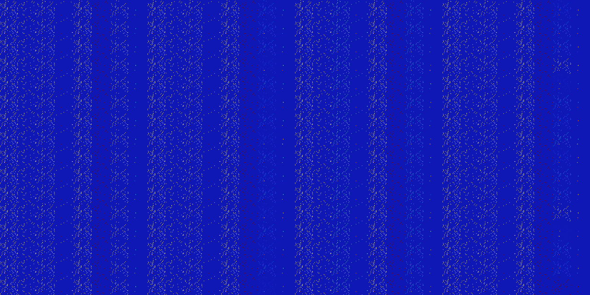

# B458 (155648-156159)

<details>
    <summary>Initial Grid</summary>
    
</details>


<details>
    <summary>Initial Grid RLE</summary>

```
#C Exported from GoGoL (https://github.com/marrow16/gogol)
#C Wrap mode: Toroidal
#C Boundary mode: Dead
#C Step: 0
x = 100, y = 100, rule = B458/S
2bo6bo51bo33bo$80bo16bo$12bo13bo72bo$19bo11bo2bo17bo27bo$38bo7bo14bo33b
o$19bo3bo15bo15bo12bo4bo4bo$43bo31b2o20bo$18bo5bo21bo26bo$17bo27b2o13bo
21bo$3bo3b2o10bo5bo3bo13bo6bo13bo5bo11bo$13b2o34bo13bo13bo$22bob2o45bo
8bo5b2o$6bo3bo21b2o36bo16bo4b2o$31bo37bo$63bo2bo7bo23bo$7bo6bo3bo11bo
23bo14bo28bo$31b2o27bo20b2o11bo$bo8bo24bo23bo$3bo77bo15bo$27bo$16bo39bo
4b2o9bo$16bo9bo47bo17bo$6b2o15bo7bo39bo10bo5b2ob2o$6bo2bo21bo5bo6bo31bo
10bo$68bo21bo6bo$2bo46bo4bo5bo2bo5bo17bo$6bo7bo7b2o13bo22bo$o25bo21bobo
2bo9bo4bo16bo6bo$o23bobo57bo10bo$8bo12b2o23bo20bobo20bo$35bo14bo28bo$b
2o4bo4bo15bo34bo7bo11bo5bo9bo$13bo35bo30bobo9bo$11bo$33bo62bo$4bo38bo
10bo9bo30bo$23bo4bo29bo3bo6bo27bo$42bo51bo$100b$3bo14bo7bobo43bo5b2o16b
o$o28bo2bobo9bo52bo$5bo10b2o4bo3bo14bo14bo6bo3bo10bo14bo$10bo51bo24bo$
21b2o2bo6bo5bo60bo$o39bo$35bo33bo20bo$40b2o54bo$bo2bo59bo14bo2bo7b2o$
33bo7bo37bo13bobo$3bo8bo36bo40bo$20bo10bo19bo4bobo32bo$38bo27bo12bo$8bo
bo24bo3bo5bo7bo$3bo6bo23bo29bo11bo7bo4bo$36b2o35bo21bo$25bo9bo11bo19bo
27bo$17bo13bo5bo24bo3bo11bo3bo13bo$17bo6bo9bo13bo31bo18bo$20bo4b2o6bo
37bo2bo17bo$20bo3bo22bo17bo9bo7bo9bo$bo29bo17bo36b2o$30bo34bo$13bo44bo
3bo4bo4bo$16bo27bo33bo5bo$8bo5bo30bo4bo$24bo9bo21bo23bo9bo$41bo21bo19bo
13bo$11bo21bo38bo9bo$12bo13bo17bo7bo29bo7bo$32bo11bo14bo10bo2bo$23bo4bo
11b2o26bo25bo$11bo22bo2bo15bo14bo14bo9bo5bo$20bo24bo19bo10bo2bobo$28bo
3bo16bo46b2o$10bo21bo35bo8bo8bobo10bo$23bo4bo28bo9bo$23bobo44bo20b3o$5b
o3bo38bo6bo36bo$11bo61bo25bo$17bo12bo2bo25bo$6bo23bobobo22bo$o22bo2bo
27bo13bo$12bo13bo3b2o26bo25bo$49bo30bo$17b2o6bo14bo16bo2bo12bo$47bo$8bo
31bo38bo5bo2bo$2bo16bo39bo3bo$10bo16bo7bo19b2o17bo7bo4bo$21bo61bo$15b2o
24bo29bo$bo5bo14bo16bo21bo10bo9bo$49bo12bo4bo4bo$5bo24bo10bo10bobo23bo
6bo7bo$21bo2bo5bo5bo3bo25bobo21bo$o4bo26bo$bo22bo49bo7bo$9bo8bo60bo$63b
2o26bo$o7bo20bo10bo4bobo13bo2bo33bo!
```
</details>
<details>
    <summary>Thumbnail</summary>

</details>
<table>
<tr>
    <td><a href="./155648%20S%20Heat%20Map%20Activity.png"></a><br>S (155648)<br>S@2</td>    <td><a href="./155649%20S0%20Heat%20Map%20Activity.png"></a><br>S0 (155649)<br>S@2</td>    <td><a href="./155650%20S1%20Heat%20Map%20Activity.png"></a><br>S1 (155650)<br>S@4</td>    <td><a href="./155651%20S01%20Heat%20Map%20Activity.png"></a><br>S01 (155651)<br>S@3</td>    <td><a href="./155652%20S2%20Heat%20Map%20Activity.png"></a><br>S2 (155652)<br>S@2</td>    <td><a href="./155653%20S02%20Heat%20Map%20Activity.png"></a><br>S02 (155653)<br>S@2</td>    <td><a href="./155654%20S12%20Heat%20Map%20Activity.png"></a><br>S12 (155654)<br>S@3</td>    <td><a href="./155655%20S012%20Heat%20Map%20Activity.png"></a><br>S012 (155655)<br>S@5</td>    <td><a href="./155656%20S3%20Heat%20Map%20Activity.png"></a><br>S3 (155656)<br>S@2</td>    <td><a href="./155657%20S03%20Heat%20Map%20Activity.png"></a><br>S03 (155657)<br>S@2</td>    <td><a href="./155658%20S13%20Heat%20Map%20Activity.png"></a><br>S13 (155658)<br>S@3</td>    <td><a href="./155659%20S013%20Heat%20Map%20Activity.png"></a><br>S013 (155659)<br>S@2</td>    <td><a href="./155660%20S23%20Heat%20Map%20Activity.png"></a><br>S23 (155660)<br>S@2</td>    <td><a href="./155661%20S023%20Heat%20Map%20Activity.png"></a><br>S023 (155661)<br>S@2</td>    <td><a href="./155662%20S123%20Heat%20Map%20Activity.png"></a><br>S123 (155662)<br>S@8</td>    <td><a href="./155663%20S0123%20Heat%20Map%20Activity.png"></a><br>S0123 (155663)<br>R@22,p12</td>    <td><a href="./155664%20S4%20Heat%20Map%20Activity.png"></a><br>S4 (155664)<br>S@2</td>    <td><a href="./155665%20S04%20Heat%20Map%20Activity.png"></a><br>S04 (155665)<br>S@2</td>    <td><a href="./155666%20S14%20Heat%20Map%20Activity.png"></a><br>S14 (155666)<br>S@4</td>    <td><a href="./155667%20S014%20Heat%20Map%20Activity.png"></a><br>S014 (155667)<br>S@4</td>    <td><a href="./155668%20S24%20Heat%20Map%20Activity.png"></a><br>S24 (155668)<br>S@2</td>    <td><a href="./155669%20S024%20Heat%20Map%20Activity.png"></a><br>S024 (155669)<br>S@2</td>    <td><a href="./155670%20S124%20Heat%20Map%20Activity.png"></a><br>S124 (155670)<br>S@5</td>    <td><a href="./155671%20S0124%20Heat%20Map%20Activity.png"></a><br>S0124 (155671)<br>R@12,p2</td>    <td><a href="./155672%20S34%20Heat%20Map%20Activity.png"></a><br>S34 (155672)<br>S@2</td>    <td><a href="./155673%20S034%20Heat%20Map%20Activity.png"></a><br>S034 (155673)<br>S@2</td>    <td><a href="./155674%20S134%20Heat%20Map%20Activity.png"></a><br>S134 (155674)<br>S@4</td>    <td><a href="./155675%20S0134%20Heat%20Map%20Activity.png"></a><br>S0134 (155675)<br>S@4</td>    <td><a href="./155676%20S234%20Heat%20Map%20Activity.png"></a><br>S234 (155676)<br>S@2</td>    <td><a href="./155677%20S0234%20Heat%20Map%20Activity.png"></a><br>S0234 (155677)<br>S@2</td>    <td><a href="./155678%20S1234%20Heat%20Map%20Activity.png"></a><br>S1234 (155678)<br>R@13,p5</td>    <td><a href="./155679%20S01234%20Heat%20Map%20Activity.png"></a><br>S01234 (155679)<br>R@21,p3</td></tr>
<tr>
    <td><a href="./155680%20S5%20Heat%20Map%20Activity.png"></a><br>S5 (155680)<br>S@2</td>    <td><a href="./155681%20S05%20Heat%20Map%20Activity.png"></a><br>S05 (155681)<br>S@2</td>    <td><a href="./155682%20S15%20Heat%20Map%20Activity.png"></a><br>S15 (155682)<br>S@4</td>    <td><a href="./155683%20S015%20Heat%20Map%20Activity.png"></a><br>S015 (155683)<br>S@3</td>    <td><a href="./155684%20S25%20Heat%20Map%20Activity.png"></a><br>S25 (155684)<br>S@2</td>    <td><a href="./155685%20S025%20Heat%20Map%20Activity.png"></a><br>S025 (155685)<br>S@2</td>    <td><a href="./155686%20S125%20Heat%20Map%20Activity.png"></a><br>S125 (155686)<br>S@3</td>    <td><a href="./155687%20S0125%20Heat%20Map%20Activity.png"></a><br>S0125 (155687)<br>R@10,p2</td>    <td><a href="./155688%20S35%20Heat%20Map%20Activity.png"></a><br>S35 (155688)<br>S@2</td>    <td><a href="./155689%20S035%20Heat%20Map%20Activity.png"></a><br>S035 (155689)<br>S@2</td>    <td><a href="./155690%20S135%20Heat%20Map%20Activity.png"></a><br>S135 (155690)<br>S@3</td>    <td><a href="./155691%20S0135%20Heat%20Map%20Activity.png"></a><br>S0135 (155691)<br>S@2</td>    <td><a href="./155692%20S235%20Heat%20Map%20Activity.png"></a><br>S235 (155692)<br>S@2</td>    <td><a href="./155693%20S0235%20Heat%20Map%20Activity.png"></a><br>S0235 (155693)<br>S@2</td>    <td><a href="./155694%20S1235%20Heat%20Map%20Activity.png"></a><br>S1235 (155694)<br>S@10</td>    <td><a href="./155695%20S01235%20Heat%20Map%20Activity.png"></a><br>S01235 (155695)<br>R@47,p6</td>    <td><a href="./155696%20S45%20Heat%20Map%20Activity.png"></a><br>S45 (155696)<br>S@2</td>    <td><a href="./155697%20S045%20Heat%20Map%20Activity.png"></a><br>S045 (155697)<br>S@2</td>    <td><a href="./155698%20S145%20Heat%20Map%20Activity.png"></a><br>S145 (155698)<br>S@4</td>    <td><a href="./155699%20S0145%20Heat%20Map%20Activity.png"></a><br>S0145 (155699)<br>S@4</td>    <td><a href="./155700%20S245%20Heat%20Map%20Activity.png"></a><br>S245 (155700)<br>S@2</td>    <td><a href="./155701%20S0245%20Heat%20Map%20Activity.png"></a><br>S0245 (155701)<br>S@2</td>    <td><a href="./155702%20S1245%20Heat%20Map%20Activity.png"></a><br>S1245 (155702)<br>S@9</td>    <td><a href="./155703%20S01245%20Heat%20Map%20Activity.png"></a><br>S01245 (155703)<br>S@13</td>    <td><a href="./155704%20S345%20Heat%20Map%20Activity.png"></a><br>S345 (155704)<br>S@2</td>    <td><a href="./155705%20S0345%20Heat%20Map%20Activity.png"></a><br>S0345 (155705)<br>S@2</td>    <td><a href="./155706%20S1345%20Heat%20Map%20Activity.png"></a><br>S1345 (155706)<br>S@4</td>    <td><a href="./155707%20S01345%20Heat%20Map%20Activity.png"></a><br>S01345 (155707)<br>S@4</td>    <td><a href="./155708%20S2345%20Heat%20Map%20Activity.png"></a><br>S2345 (155708)<br>S@2</td>    <td><a href="./155709%20S02345%20Heat%20Map%20Activity.png"></a><br>S02345 (155709)<br>S@2</td>    <td><a href="./155710%20S12345%20Heat%20Map%20Activity.png"></a><br>S12345 (155710)<br>S@9</td>    <td><a href="./155711%20S012345%20Heat%20Map%20Activity.png"></a><br>S012345 (155711)<br>S@9</td></tr>
<tr>
    <td><a href="./155712%20S6%20Heat%20Map%20Activity.png"></a><br>S6 (155712)<br>S@2</td>    <td><a href="./155713%20S06%20Heat%20Map%20Activity.png"></a><br>S06 (155713)<br>S@2</td>    <td><a href="./155714%20S16%20Heat%20Map%20Activity.png"></a><br>S16 (155714)<br>S@4</td>    <td><a href="./155715%20S016%20Heat%20Map%20Activity.png"></a><br>S016 (155715)<br>S@3</td>    <td><a href="./155716%20S26%20Heat%20Map%20Activity.png"></a><br>S26 (155716)<br>S@2</td>    <td><a href="./155717%20S026%20Heat%20Map%20Activity.png"></a><br>S026 (155717)<br>S@2</td>    <td><a href="./155718%20S126%20Heat%20Map%20Activity.png"></a><br>S126 (155718)<br>S@3</td>    <td><a href="./155719%20S0126%20Heat%20Map%20Activity.png"></a><br>S0126 (155719)<br>S@6</td>    <td><a href="./155720%20S36%20Heat%20Map%20Activity.png"></a><br>S36 (155720)<br>S@2</td>    <td><a href="./155721%20S036%20Heat%20Map%20Activity.png"></a><br>S036 (155721)<br>S@2</td>    <td><a href="./155722%20S136%20Heat%20Map%20Activity.png"></a><br>S136 (155722)<br>S@3</td>    <td><a href="./155723%20S0136%20Heat%20Map%20Activity.png"></a><br>S0136 (155723)<br>S@2</td>    <td><a href="./155724%20S236%20Heat%20Map%20Activity.png"></a><br>S236 (155724)<br>S@2</td>    <td><a href="./155725%20S0236%20Heat%20Map%20Activity.png"></a><br>S0236 (155725)<br>S@2</td>    <td><a href="./155726%20S1236%20Heat%20Map%20Activity.png"></a><br>S1236 (155726)<br>S@8</td>    <td><a href="./155727%20S01236%20Heat%20Map%20Activity.png"></a><br>S01236 (155727)<br>S@19</td>    <td><a href="./155728%20S46%20Heat%20Map%20Activity.png"></a><br>S46 (155728)<br>S@2</td>    <td><a href="./155729%20S046%20Heat%20Map%20Activity.png"></a><br>S046 (155729)<br>S@2</td>    <td><a href="./155730%20S146%20Heat%20Map%20Activity.png"></a><br>S146 (155730)<br>S@4</td>    <td><a href="./155731%20S0146%20Heat%20Map%20Activity.png"></a><br>S0146 (155731)<br>S@4</td>    <td><a href="./155732%20S246%20Heat%20Map%20Activity.png"></a><br>S246 (155732)<br>S@2</td>    <td><a href="./155733%20S0246%20Heat%20Map%20Activity.png"></a><br>S0246 (155733)<br>S@2</td>    <td><a href="./155734%20S1246%20Heat%20Map%20Activity.png"></a><br>S1246 (155734)<br>S@7</td>    <td><a href="./155735%20S01246%20Heat%20Map%20Activity.png"></a><br>S01246 (155735)<br>S@7</td>    <td><a href="./155736%20S346%20Heat%20Map%20Activity.png"></a><br>S346 (155736)<br>S@2</td>    <td><a href="./155737%20S0346%20Heat%20Map%20Activity.png"></a><br>S0346 (155737)<br>S@2</td>    <td><a href="./155738%20S1346%20Heat%20Map%20Activity.png"></a><br>S1346 (155738)<br>S@4</td>    <td><a href="./155739%20S01346%20Heat%20Map%20Activity.png"></a><br>S01346 (155739)<br>S@4</td>    <td><a href="./155740%20S2346%20Heat%20Map%20Activity.png"></a><br>S2346 (155740)<br>S@2</td>    <td><a href="./155741%20S02346%20Heat%20Map%20Activity.png"></a><br>S02346 (155741)<br>S@2</td>    <td><a href="./155742%20S12346%20Heat%20Map%20Activity.png"></a><br>S12346 (155742)<br>R@9,p4</td>    <td><a href="./155743%20S012346%20Heat%20Map%20Activity.png"></a><br>S012346 (155743)<br>R@40,p5</td></tr>
<tr>
    <td><a href="./155744%20S56%20Heat%20Map%20Activity.png"></a><br>S56 (155744)<br>S@2</td>    <td><a href="./155745%20S056%20Heat%20Map%20Activity.png"></a><br>S056 (155745)<br>S@2</td>    <td><a href="./155746%20S156%20Heat%20Map%20Activity.png"></a><br>S156 (155746)<br>S@4</td>    <td><a href="./155747%20S0156%20Heat%20Map%20Activity.png"></a><br>S0156 (155747)<br>S@3</td>    <td><a href="./155748%20S256%20Heat%20Map%20Activity.png"></a><br>S256 (155748)<br>S@2</td>    <td><a href="./155749%20S0256%20Heat%20Map%20Activity.png"></a><br>S0256 (155749)<br>S@2</td>    <td><a href="./155750%20S1256%20Heat%20Map%20Activity.png"></a><br>S1256 (155750)<br>S@3</td>    <td><a href="./155751%20S01256%20Heat%20Map%20Activity.png"></a><br>S01256 (155751)<br>S@7</td>    <td><a href="./155752%20S356%20Heat%20Map%20Activity.png"></a><br>S356 (155752)<br>S@2</td>    <td><a href="./155753%20S0356%20Heat%20Map%20Activity.png"></a><br>S0356 (155753)<br>S@2</td>    <td><a href="./155754%20S1356%20Heat%20Map%20Activity.png"></a><br>S1356 (155754)<br>S@3</td>    <td><a href="./155755%20S01356%20Heat%20Map%20Activity.png"></a><br>S01356 (155755)<br>S@2</td>    <td><a href="./155756%20S2356%20Heat%20Map%20Activity.png"></a><br>S2356 (155756)<br>S@2</td>    <td><a href="./155757%20S02356%20Heat%20Map%20Activity.png"></a><br>S02356 (155757)<br>S@2</td>    <td><a href="./155758%20S12356%20Heat%20Map%20Activity.png"></a><br>S12356 (155758)<br>R@24,p2</td>    <td><a href="./155759%20S012356%20Heat%20Map%20Activity.png"></a><br>S012356 (155759)<br>R@60,p20</td>    <td><a href="./155760%20S456%20Heat%20Map%20Activity.png"></a><br>S456 (155760)<br>S@2</td>    <td><a href="./155761%20S0456%20Heat%20Map%20Activity.png"></a><br>S0456 (155761)<br>S@2</td>    <td><a href="./155762%20S1456%20Heat%20Map%20Activity.png"></a><br>S1456 (155762)<br>S@4</td>    <td><a href="./155763%20S01456%20Heat%20Map%20Activity.png"></a><br>S01456 (155763)<br>S@4</td>    <td><a href="./155764%20S2456%20Heat%20Map%20Activity.png"></a><br>S2456 (155764)<br>S@2</td>    <td><a href="./155765%20S02456%20Heat%20Map%20Activity.png"></a><br>S02456 (155765)<br>S@2</td>    <td><a href="./155766%20S12456%20Heat%20Map%20Activity.png"></a><br>S12456 (155766)<br>S@9</td>    <td><a href="./155767%20S012456%20Heat%20Map%20Activity.png"></a><br>S012456 (155767)<br>S@10</td>    <td><a href="./155768%20S3456%20Heat%20Map%20Activity.png"></a><br>S3456 (155768)<br>S@2</td>    <td><a href="./155769%20S03456%20Heat%20Map%20Activity.png"></a><br>S03456 (155769)<br>S@2</td>    <td><a href="./155770%20S13456%20Heat%20Map%20Activity.png"></a><br>S13456 (155770)<br>S@4</td>    <td><a href="./155771%20S013456%20Heat%20Map%20Activity.png"></a><br>S013456 (155771)<br>S@4</td>    <td><a href="./155772%20S23456%20Heat%20Map%20Activity.png"></a><br>S23456 (155772)<br>S@2</td>    <td><a href="./155773%20S023456%20Heat%20Map%20Activity.png"></a><br>S023456 (155773)<br>S@2</td>    <td><a href="./155774%20S123456%20Heat%20Map%20Activity.png"></a><br>S123456 (155774)<br>S@5</td>    <td><a href="./155775%20S0123456%20Heat%20Map%20Activity.png"></a><br>S0123456 (155775)<br>S@9</td></tr>
<tr>
    <td><a href="./155776%20S7%20Heat%20Map%20Activity.png"></a><br>S7 (155776)<br>S@2</td>    <td><a href="./155777%20S07%20Heat%20Map%20Activity.png"></a><br>S07 (155777)<br>S@2</td>    <td><a href="./155778%20S17%20Heat%20Map%20Activity.png"></a><br>S17 (155778)<br>S@4</td>    <td><a href="./155779%20S017%20Heat%20Map%20Activity.png"></a><br>S017 (155779)<br>S@3</td>    <td><a href="./155780%20S27%20Heat%20Map%20Activity.png"></a><br>S27 (155780)<br>S@2</td>    <td><a href="./155781%20S027%20Heat%20Map%20Activity.png"></a><br>S027 (155781)<br>S@2</td>    <td><a href="./155782%20S127%20Heat%20Map%20Activity.png"></a><br>S127 (155782)<br>S@3</td>    <td><a href="./155783%20S0127%20Heat%20Map%20Activity.png"></a><br>S0127 (155783)<br>S@5</td>    <td><a href="./155784%20S37%20Heat%20Map%20Activity.png"></a><br>S37 (155784)<br>S@2</td>    <td><a href="./155785%20S037%20Heat%20Map%20Activity.png"></a><br>S037 (155785)<br>S@2</td>    <td><a href="./155786%20S137%20Heat%20Map%20Activity.png"></a><br>S137 (155786)<br>S@3</td>    <td><a href="./155787%20S0137%20Heat%20Map%20Activity.png"></a><br>S0137 (155787)<br>S@2</td>    <td><a href="./155788%20S237%20Heat%20Map%20Activity.png"></a><br>S237 (155788)<br>S@2</td>    <td><a href="./155789%20S0237%20Heat%20Map%20Activity.png"></a><br>S0237 (155789)<br>S@2</td>    <td><a href="./155790%20S1237%20Heat%20Map%20Activity.png"></a><br>S1237 (155790)<br>S@8</td>    <td><a href="./155791%20S01237%20Heat%20Map%20Activity.png"></a><br>S01237 (155791)<br>R@22,p12</td>    <td><a href="./155792%20S47%20Heat%20Map%20Activity.png"></a><br>S47 (155792)<br>S@2</td>    <td><a href="./155793%20S047%20Heat%20Map%20Activity.png"></a><br>S047 (155793)<br>S@2</td>    <td><a href="./155794%20S147%20Heat%20Map%20Activity.png"></a><br>S147 (155794)<br>S@4</td>    <td><a href="./155795%20S0147%20Heat%20Map%20Activity.png"></a><br>S0147 (155795)<br>S@4</td>    <td><a href="./155796%20S247%20Heat%20Map%20Activity.png"></a><br>S247 (155796)<br>S@2</td>    <td><a href="./155797%20S0247%20Heat%20Map%20Activity.png"></a><br>S0247 (155797)<br>S@2</td>    <td><a href="./155798%20S1247%20Heat%20Map%20Activity.png"></a><br>S1247 (155798)<br>S@5</td>    <td><a href="./155799%20S01247%20Heat%20Map%20Activity.png"></a><br>S01247 (155799)<br>R@12,p2</td>    <td><a href="./155800%20S347%20Heat%20Map%20Activity.png"></a><br>S347 (155800)<br>S@2</td>    <td><a href="./155801%20S0347%20Heat%20Map%20Activity.png"></a><br>S0347 (155801)<br>S@2</td>    <td><a href="./155802%20S1347%20Heat%20Map%20Activity.png"></a><br>S1347 (155802)<br>S@4</td>    <td><a href="./155803%20S01347%20Heat%20Map%20Activity.png"></a><br>S01347 (155803)<br>S@4</td>    <td><a href="./155804%20S2347%20Heat%20Map%20Activity.png"></a><br>S2347 (155804)<br>S@2</td>    <td><a href="./155805%20S02347%20Heat%20Map%20Activity.png"></a><br>S02347 (155805)<br>S@2</td>    <td><a href="./155806%20S12347%20Heat%20Map%20Activity.png"></a><br>S12347 (155806)<br>R@25,p4</td>    <td><a href="./155807%20S012347%20Heat%20Map%20Activity.png"></a><br>S012347 (155807)<br>S@20</td></tr>
<tr>
    <td><a href="./155808%20S57%20Heat%20Map%20Activity.png"></a><br>S57 (155808)<br>S@2</td>    <td><a href="./155809%20S057%20Heat%20Map%20Activity.png"></a><br>S057 (155809)<br>S@2</td>    <td><a href="./155810%20S157%20Heat%20Map%20Activity.png"></a><br>S157 (155810)<br>S@4</td>    <td><a href="./155811%20S0157%20Heat%20Map%20Activity.png"></a><br>S0157 (155811)<br>S@3</td>    <td><a href="./155812%20S257%20Heat%20Map%20Activity.png"></a><br>S257 (155812)<br>S@2</td>    <td><a href="./155813%20S0257%20Heat%20Map%20Activity.png"></a><br>S0257 (155813)<br>S@2</td>    <td><a href="./155814%20S1257%20Heat%20Map%20Activity.png"></a><br>S1257 (155814)<br>S@3</td>    <td><a href="./155815%20S01257%20Heat%20Map%20Activity.png"></a><br>S01257 (155815)<br>R@10,p2</td>    <td><a href="./155816%20S357%20Heat%20Map%20Activity.png"></a><br>S357 (155816)<br>S@2</td>    <td><a href="./155817%20S0357%20Heat%20Map%20Activity.png"></a><br>S0357 (155817)<br>S@2</td>    <td><a href="./155818%20S1357%20Heat%20Map%20Activity.png"></a><br>S1357 (155818)<br>S@3</td>    <td><a href="./155819%20S01357%20Heat%20Map%20Activity.png"></a><br>S01357 (155819)<br>S@2</td>    <td><a href="./155820%20S2357%20Heat%20Map%20Activity.png"></a><br>S2357 (155820)<br>S@2</td>    <td><a href="./155821%20S02357%20Heat%20Map%20Activity.png"></a><br>S02357 (155821)<br>S@2</td>    <td><a href="./155822%20S12357%20Heat%20Map%20Activity.png"></a><br>S12357 (155822)<br>S@17</td>    <td><a href="./155823%20S012357%20Heat%20Map%20Activity.png"></a><br>S012357 (155823)<br>R@53,p4</td>    <td><a href="./155824%20S457%20Heat%20Map%20Activity.png"></a><br>S457 (155824)<br>S@2</td>    <td><a href="./155825%20S0457%20Heat%20Map%20Activity.png"></a><br>S0457 (155825)<br>S@2</td>    <td><a href="./155826%20S1457%20Heat%20Map%20Activity.png"></a><br>S1457 (155826)<br>S@4</td>    <td><a href="./155827%20S01457%20Heat%20Map%20Activity.png"></a><br>S01457 (155827)<br>S@4</td>    <td><a href="./155828%20S2457%20Heat%20Map%20Activity.png"></a><br>S2457 (155828)<br>S@2</td>    <td><a href="./155829%20S02457%20Heat%20Map%20Activity.png"></a><br>S02457 (155829)<br>S@2</td>    <td><a href="./155830%20S12457%20Heat%20Map%20Activity.png"></a><br>S12457 (155830)<br>S@9</td>    <td><a href="./155831%20S012457%20Heat%20Map%20Activity.png"></a><br>S012457 (155831)<br>S@13</td>    <td><a href="./155832%20S3457%20Heat%20Map%20Activity.png"></a><br>S3457 (155832)<br>S@2</td>    <td><a href="./155833%20S03457%20Heat%20Map%20Activity.png"></a><br>S03457 (155833)<br>S@2</td>    <td><a href="./155834%20S13457%20Heat%20Map%20Activity.png"></a><br>S13457 (155834)<br>S@4</td>    <td><a href="./155835%20S013457%20Heat%20Map%20Activity.png"></a><br>S013457 (155835)<br>S@4</td>    <td><a href="./155836%20S23457%20Heat%20Map%20Activity.png"></a><br>S23457 (155836)<br>S@2</td>    <td><a href="./155837%20S023457%20Heat%20Map%20Activity.png"></a><br>S023457 (155837)<br>S@2</td>    <td><a href="./155838%20S123457%20Heat%20Map%20Activity.png"></a><br>S123457 (155838)<br>S@11</td>    <td><a href="./155839%20S0123457%20Heat%20Map%20Activity.png"></a><br>S0123457 (155839)<br>S@11</td></tr>
<tr>
    <td><a href="./155840%20S67%20Heat%20Map%20Activity.png"></a><br>S67 (155840)<br>S@2</td>    <td><a href="./155841%20S067%20Heat%20Map%20Activity.png"></a><br>S067 (155841)<br>S@2</td>    <td><a href="./155842%20S167%20Heat%20Map%20Activity.png"></a><br>S167 (155842)<br>S@4</td>    <td><a href="./155843%20S0167%20Heat%20Map%20Activity.png"></a><br>S0167 (155843)<br>S@3</td>    <td><a href="./155844%20S267%20Heat%20Map%20Activity.png"></a><br>S267 (155844)<br>S@2</td>    <td><a href="./155845%20S0267%20Heat%20Map%20Activity.png"></a><br>S0267 (155845)<br>S@2</td>    <td><a href="./155846%20S1267%20Heat%20Map%20Activity.png"></a><br>S1267 (155846)<br>S@3</td>    <td><a href="./155847%20S01267%20Heat%20Map%20Activity.png"></a><br>S01267 (155847)<br>S@6</td>    <td><a href="./155848%20S367%20Heat%20Map%20Activity.png"></a><br>S367 (155848)<br>S@2</td>    <td><a href="./155849%20S0367%20Heat%20Map%20Activity.png"></a><br>S0367 (155849)<br>S@2</td>    <td><a href="./155850%20S1367%20Heat%20Map%20Activity.png"></a><br>S1367 (155850)<br>S@3</td>    <td><a href="./155851%20S01367%20Heat%20Map%20Activity.png"></a><br>S01367 (155851)<br>S@2</td>    <td><a href="./155852%20S2367%20Heat%20Map%20Activity.png"></a><br>S2367 (155852)<br>S@2</td>    <td><a href="./155853%20S02367%20Heat%20Map%20Activity.png"></a><br>S02367 (155853)<br>S@2</td>    <td><a href="./155854%20S12367%20Heat%20Map%20Activity.png"></a><br>S12367 (155854)<br>S@8</td>    <td><a href="./155855%20S012367%20Heat%20Map%20Activity.png"></a><br>S012367 (155855)<br>S@19</td>    <td><a href="./155856%20S467%20Heat%20Map%20Activity.png"></a><br>S467 (155856)<br>S@2</td>    <td><a href="./155857%20S0467%20Heat%20Map%20Activity.png"></a><br>S0467 (155857)<br>S@2</td>    <td><a href="./155858%20S1467%20Heat%20Map%20Activity.png"></a><br>S1467 (155858)<br>S@4</td>    <td><a href="./155859%20S01467%20Heat%20Map%20Activity.png"></a><br>S01467 (155859)<br>S@4</td>    <td><a href="./155860%20S2467%20Heat%20Map%20Activity.png"></a><br>S2467 (155860)<br>S@2</td>    <td><a href="./155861%20S02467%20Heat%20Map%20Activity.png"></a><br>S02467 (155861)<br>S@2</td>    <td><a href="./155862%20S12467%20Heat%20Map%20Activity.png"></a><br>S12467 (155862)<br>S@7</td>    <td><a href="./155863%20S012467%20Heat%20Map%20Activity.png"></a><br>S012467 (155863)<br>S@7</td>    <td><a href="./155864%20S3467%20Heat%20Map%20Activity.png"></a><br>S3467 (155864)<br>S@2</td>    <td><a href="./155865%20S03467%20Heat%20Map%20Activity.png"></a><br>S03467 (155865)<br>S@2</td>    <td><a href="./155866%20S13467%20Heat%20Map%20Activity.png"></a><br>S13467 (155866)<br>S@4</td>    <td><a href="./155867%20S013467%20Heat%20Map%20Activity.png"></a><br>S013467 (155867)<br>S@4</td>    <td><a href="./155868%20S23467%20Heat%20Map%20Activity.png"></a><br>S23467 (155868)<br>S@2</td>    <td><a href="./155869%20S023467%20Heat%20Map%20Activity.png"></a><br>S023467 (155869)<br>S@2</td>    <td><a href="./155870%20S123467%20Heat%20Map%20Activity.png"></a><br>S123467 (155870)<br>R@10,p5</td>    <td><a href="./155871%20S0123467%20Heat%20Map%20Activity.png"></a><br>S0123467 (155871)<br>R@28,p10</td></tr>
<tr>
    <td><a href="./155872%20S567%20Heat%20Map%20Activity.png"></a><br>S567 (155872)<br>S@2</td>    <td><a href="./155873%20S0567%20Heat%20Map%20Activity.png"></a><br>S0567 (155873)<br>S@2</td>    <td><a href="./155874%20S1567%20Heat%20Map%20Activity.png"></a><br>S1567 (155874)<br>S@4</td>    <td><a href="./155875%20S01567%20Heat%20Map%20Activity.png"></a><br>S01567 (155875)<br>S@3</td>    <td><a href="./155876%20S2567%20Heat%20Map%20Activity.png"></a><br>S2567 (155876)<br>S@2</td>    <td><a href="./155877%20S02567%20Heat%20Map%20Activity.png"></a><br>S02567 (155877)<br>S@2</td>    <td><a href="./155878%20S12567%20Heat%20Map%20Activity.png"></a><br>S12567 (155878)<br>S@3</td>    <td><a href="./155879%20S012567%20Heat%20Map%20Activity.png"></a><br>S012567 (155879)<br>S@7</td>    <td><a href="./155880%20S3567%20Heat%20Map%20Activity.png"></a><br>S3567 (155880)<br>S@2</td>    <td><a href="./155881%20S03567%20Heat%20Map%20Activity.png"></a><br>S03567 (155881)<br>S@2</td>    <td><a href="./155882%20S13567%20Heat%20Map%20Activity.png"></a><br>S13567 (155882)<br>S@3</td>    <td><a href="./155883%20S013567%20Heat%20Map%20Activity.png"></a><br>S013567 (155883)<br>S@2</td>    <td><a href="./155884%20S23567%20Heat%20Map%20Activity.png"></a><br>S23567 (155884)<br>S@2</td>    <td><a href="./155885%20S023567%20Heat%20Map%20Activity.png"></a><br>S023567 (155885)<br>S@2</td>    <td><a href="./155886%20S123567%20Heat%20Map%20Activity.png"></a><br>S123567 (155886)<br>S@19</td>    <td><a href="./155887%20S0123567%20Heat%20Map%20Activity.png"></a><br>S0123567 (155887)<br>S@31</td>    <td><a href="./155888%20S4567%20Heat%20Map%20Activity.png"></a><br>S4567 (155888)<br>S@2</td>    <td><a href="./155889%20S04567%20Heat%20Map%20Activity.png"></a><br>S04567 (155889)<br>S@2</td>    <td><a href="./155890%20S14567%20Heat%20Map%20Activity.png"></a><br>S14567 (155890)<br>S@4</td>    <td><a href="./155891%20S014567%20Heat%20Map%20Activity.png"></a><br>S014567 (155891)<br>S@4</td>    <td><a href="./155892%20S24567%20Heat%20Map%20Activity.png"></a><br>S24567 (155892)<br>S@2</td>    <td><a href="./155893%20S024567%20Heat%20Map%20Activity.png"></a><br>S024567 (155893)<br>S@2</td>    <td><a href="./155894%20S124567%20Heat%20Map%20Activity.png"></a><br>S124567 (155894)<br>S@9</td>    <td><a href="./155895%20S0124567%20Heat%20Map%20Activity.png"></a><br>S0124567 (155895)<br>S@10</td>    <td><a href="./155896%20S34567%20Heat%20Map%20Activity.png"></a><br>S34567 (155896)<br>S@2</td>    <td><a href="./155897%20S034567%20Heat%20Map%20Activity.png"></a><br>S034567 (155897)<br>S@2</td>    <td><a href="./155898%20S134567%20Heat%20Map%20Activity.png"></a><br>S134567 (155898)<br>S@4</td>    <td><a href="./155899%20S0134567%20Heat%20Map%20Activity.png"></a><br>S0134567 (155899)<br>S@4</td>    <td><a href="./155900%20S234567%20Heat%20Map%20Activity.png"></a><br>S234567 (155900)<br>S@2</td>    <td><a href="./155901%20S0234567%20Heat%20Map%20Activity.png"></a><br>S0234567 (155901)<br>S@2</td>    <td><a href="./155902%20S1234567%20Heat%20Map%20Activity.png"></a><br>S1234567 (155902)<br>S@7</td>    <td><a href="./155903%20S01234567%20Heat%20Map%20Activity.png"></a><br>S01234567 (155903)<br>S@8</td></tr>
<tr>
    <td><a href="./155904%20S8%20Heat%20Map%20Activity.png"></a><br>S8 (155904)<br>S@2</td>    <td><a href="./155905%20S08%20Heat%20Map%20Activity.png"></a><br>S08 (155905)<br>S@2</td>    <td><a href="./155906%20S18%20Heat%20Map%20Activity.png"></a><br>S18 (155906)<br>S@4</td>    <td><a href="./155907%20S018%20Heat%20Map%20Activity.png"></a><br>S018 (155907)<br>S@3</td>    <td><a href="./155908%20S28%20Heat%20Map%20Activity.png"></a><br>S28 (155908)<br>S@2</td>    <td><a href="./155909%20S028%20Heat%20Map%20Activity.png"></a><br>S028 (155909)<br>S@2</td>    <td><a href="./155910%20S128%20Heat%20Map%20Activity.png"></a><br>S128 (155910)<br>S@3</td>    <td><a href="./155911%20S0128%20Heat%20Map%20Activity.png"></a><br>S0128 (155911)<br>S@5</td>    <td><a href="./155912%20S38%20Heat%20Map%20Activity.png"></a><br>S38 (155912)<br>S@2</td>    <td><a href="./155913%20S038%20Heat%20Map%20Activity.png"></a><br>S038 (155913)<br>S@2</td>    <td><a href="./155914%20S138%20Heat%20Map%20Activity.png"></a><br>S138 (155914)<br>S@3</td>    <td><a href="./155915%20S0138%20Heat%20Map%20Activity.png"></a><br>S0138 (155915)<br>S@2</td>    <td><a href="./155916%20S238%20Heat%20Map%20Activity.png"></a><br>S238 (155916)<br>S@2</td>    <td><a href="./155917%20S0238%20Heat%20Map%20Activity.png"></a><br>S0238 (155917)<br>S@2</td>    <td><a href="./155918%20S1238%20Heat%20Map%20Activity.png"></a><br>S1238 (155918)<br>S@8</td>    <td><a href="./155919%20S01238%20Heat%20Map%20Activity.png"></a><br>S01238 (155919)<br>R@22,p12</td>    <td><a href="./155920%20S48%20Heat%20Map%20Activity.png"></a><br>S48 (155920)<br>S@2</td>    <td><a href="./155921%20S048%20Heat%20Map%20Activity.png"></a><br>S048 (155921)<br>S@2</td>    <td><a href="./155922%20S148%20Heat%20Map%20Activity.png"></a><br>S148 (155922)<br>S@4</td>    <td><a href="./155923%20S0148%20Heat%20Map%20Activity.png"></a><br>S0148 (155923)<br>S@4</td>    <td><a href="./155924%20S248%20Heat%20Map%20Activity.png"></a><br>S248 (155924)<br>S@2</td>    <td><a href="./155925%20S0248%20Heat%20Map%20Activity.png"></a><br>S0248 (155925)<br>S@2</td>    <td><a href="./155926%20S1248%20Heat%20Map%20Activity.png"></a><br>S1248 (155926)<br>S@5</td>    <td><a href="./155927%20S01248%20Heat%20Map%20Activity.png"></a><br>S01248 (155927)<br>R@12,p2</td>    <td><a href="./155928%20S348%20Heat%20Map%20Activity.png"></a><br>S348 (155928)<br>S@2</td>    <td><a href="./155929%20S0348%20Heat%20Map%20Activity.png"></a><br>S0348 (155929)<br>S@2</td>    <td><a href="./155930%20S1348%20Heat%20Map%20Activity.png"></a><br>S1348 (155930)<br>S@4</td>    <td><a href="./155931%20S01348%20Heat%20Map%20Activity.png"></a><br>S01348 (155931)<br>S@4</td>    <td><a href="./155932%20S2348%20Heat%20Map%20Activity.png"></a><br>S2348 (155932)<br>S@2</td>    <td><a href="./155933%20S02348%20Heat%20Map%20Activity.png"></a><br>S02348 (155933)<br>S@2</td>    <td><a href="./155934%20S12348%20Heat%20Map%20Activity.png"></a><br>S12348 (155934)<br>R@13,p5</td>    <td><a href="./155935%20S012348%20Heat%20Map%20Activity.png"></a><br>S012348 (155935)<br>R@21,p3</td></tr>
<tr>
    <td><a href="./155936%20S58%20Heat%20Map%20Activity.png"></a><br>S58 (155936)<br>S@2</td>    <td><a href="./155937%20S058%20Heat%20Map%20Activity.png"></a><br>S058 (155937)<br>S@2</td>    <td><a href="./155938%20S158%20Heat%20Map%20Activity.png"></a><br>S158 (155938)<br>S@4</td>    <td><a href="./155939%20S0158%20Heat%20Map%20Activity.png"></a><br>S0158 (155939)<br>S@3</td>    <td><a href="./155940%20S258%20Heat%20Map%20Activity.png"></a><br>S258 (155940)<br>S@2</td>    <td><a href="./155941%20S0258%20Heat%20Map%20Activity.png"></a><br>S0258 (155941)<br>S@2</td>    <td><a href="./155942%20S1258%20Heat%20Map%20Activity.png"></a><br>S1258 (155942)<br>S@3</td>    <td><a href="./155943%20S01258%20Heat%20Map%20Activity.png"></a><br>S01258 (155943)<br>R@10,p2</td>    <td><a href="./155944%20S358%20Heat%20Map%20Activity.png"></a><br>S358 (155944)<br>S@2</td>    <td><a href="./155945%20S0358%20Heat%20Map%20Activity.png"></a><br>S0358 (155945)<br>S@2</td>    <td><a href="./155946%20S1358%20Heat%20Map%20Activity.png"></a><br>S1358 (155946)<br>S@3</td>    <td><a href="./155947%20S01358%20Heat%20Map%20Activity.png"></a><br>S01358 (155947)<br>S@2</td>    <td><a href="./155948%20S2358%20Heat%20Map%20Activity.png"></a><br>S2358 (155948)<br>S@2</td>    <td><a href="./155949%20S02358%20Heat%20Map%20Activity.png"></a><br>S02358 (155949)<br>S@2</td>    <td><a href="./155950%20S12358%20Heat%20Map%20Activity.png"></a><br>S12358 (155950)<br>S@10</td>    <td><a href="./155951%20S012358%20Heat%20Map%20Activity.png"></a><br>S012358 (155951)<br>R@47,p6</td>    <td><a href="./155952%20S458%20Heat%20Map%20Activity.png"></a><br>S458 (155952)<br>S@2</td>    <td><a href="./155953%20S0458%20Heat%20Map%20Activity.png"></a><br>S0458 (155953)<br>S@2</td>    <td><a href="./155954%20S1458%20Heat%20Map%20Activity.png"></a><br>S1458 (155954)<br>S@4</td>    <td><a href="./155955%20S01458%20Heat%20Map%20Activity.png"></a><br>S01458 (155955)<br>S@4</td>    <td><a href="./155956%20S2458%20Heat%20Map%20Activity.png"></a><br>S2458 (155956)<br>S@2</td>    <td><a href="./155957%20S02458%20Heat%20Map%20Activity.png"></a><br>S02458 (155957)<br>S@2</td>    <td><a href="./155958%20S12458%20Heat%20Map%20Activity.png"></a><br>S12458 (155958)<br>S@9</td>    <td><a href="./155959%20S012458%20Heat%20Map%20Activity.png"></a><br>S012458 (155959)<br>S@13</td>    <td><a href="./155960%20S3458%20Heat%20Map%20Activity.png"></a><br>S3458 (155960)<br>S@2</td>    <td><a href="./155961%20S03458%20Heat%20Map%20Activity.png"></a><br>S03458 (155961)<br>S@2</td>    <td><a href="./155962%20S13458%20Heat%20Map%20Activity.png"></a><br>S13458 (155962)<br>S@4</td>    <td><a href="./155963%20S013458%20Heat%20Map%20Activity.png"></a><br>S013458 (155963)<br>S@4</td>    <td><a href="./155964%20S23458%20Heat%20Map%20Activity.png"></a><br>S23458 (155964)<br>S@2</td>    <td><a href="./155965%20S023458%20Heat%20Map%20Activity.png"></a><br>S023458 (155965)<br>S@2</td>    <td><a href="./155966%20S123458%20Heat%20Map%20Activity.png"></a><br>S123458 (155966)<br>S@9</td>    <td><a href="./155967%20S0123458%20Heat%20Map%20Activity.png"></a><br>S0123458 (155967)<br>S@9</td></tr>
<tr>
    <td><a href="./155968%20S68%20Heat%20Map%20Activity.png"></a><br>S68 (155968)<br>S@2</td>    <td><a href="./155969%20S068%20Heat%20Map%20Activity.png"></a><br>S068 (155969)<br>S@2</td>    <td><a href="./155970%20S168%20Heat%20Map%20Activity.png"></a><br>S168 (155970)<br>S@4</td>    <td><a href="./155971%20S0168%20Heat%20Map%20Activity.png"></a><br>S0168 (155971)<br>S@3</td>    <td><a href="./155972%20S268%20Heat%20Map%20Activity.png"></a><br>S268 (155972)<br>S@2</td>    <td><a href="./155973%20S0268%20Heat%20Map%20Activity.png"></a><br>S0268 (155973)<br>S@2</td>    <td><a href="./155974%20S1268%20Heat%20Map%20Activity.png"></a><br>S1268 (155974)<br>S@3</td>    <td><a href="./155975%20S01268%20Heat%20Map%20Activity.png"></a><br>S01268 (155975)<br>S@6</td>    <td><a href="./155976%20S368%20Heat%20Map%20Activity.png"></a><br>S368 (155976)<br>S@2</td>    <td><a href="./155977%20S0368%20Heat%20Map%20Activity.png"></a><br>S0368 (155977)<br>S@2</td>    <td><a href="./155978%20S1368%20Heat%20Map%20Activity.png"></a><br>S1368 (155978)<br>S@3</td>    <td><a href="./155979%20S01368%20Heat%20Map%20Activity.png"></a><br>S01368 (155979)<br>S@2</td>    <td><a href="./155980%20S2368%20Heat%20Map%20Activity.png"></a><br>S2368 (155980)<br>S@2</td>    <td><a href="./155981%20S02368%20Heat%20Map%20Activity.png"></a><br>S02368 (155981)<br>S@2</td>    <td><a href="./155982%20S12368%20Heat%20Map%20Activity.png"></a><br>S12368 (155982)<br>S@8</td>    <td><a href="./155983%20S012368%20Heat%20Map%20Activity.png"></a><br>S012368 (155983)<br>S@19</td>    <td><a href="./155984%20S468%20Heat%20Map%20Activity.png"></a><br>S468 (155984)<br>S@2</td>    <td><a href="./155985%20S0468%20Heat%20Map%20Activity.png"></a><br>S0468 (155985)<br>S@2</td>    <td><a href="./155986%20S1468%20Heat%20Map%20Activity.png"></a><br>S1468 (155986)<br>S@4</td>    <td><a href="./155987%20S01468%20Heat%20Map%20Activity.png"></a><br>S01468 (155987)<br>S@4</td>    <td><a href="./155988%20S2468%20Heat%20Map%20Activity.png"></a><br>S2468 (155988)<br>S@2</td>    <td><a href="./155989%20S02468%20Heat%20Map%20Activity.png"></a><br>S02468 (155989)<br>S@2</td>    <td><a href="./155990%20S12468%20Heat%20Map%20Activity.png"></a><br>S12468 (155990)<br>S@7</td>    <td><a href="./155991%20S012468%20Heat%20Map%20Activity.png"></a><br>S012468 (155991)<br>S@7</td>    <td><a href="./155992%20S3468%20Heat%20Map%20Activity.png"></a><br>S3468 (155992)<br>S@2</td>    <td><a href="./155993%20S03468%20Heat%20Map%20Activity.png"></a><br>S03468 (155993)<br>S@2</td>    <td><a href="./155994%20S13468%20Heat%20Map%20Activity.png"></a><br>S13468 (155994)<br>S@4</td>    <td><a href="./155995%20S013468%20Heat%20Map%20Activity.png"></a><br>S013468 (155995)<br>S@4</td>    <td><a href="./155996%20S23468%20Heat%20Map%20Activity.png"></a><br>S23468 (155996)<br>S@2</td>    <td><a href="./155997%20S023468%20Heat%20Map%20Activity.png"></a><br>S023468 (155997)<br>S@2</td>    <td><a href="./155998%20S123468%20Heat%20Map%20Activity.png"></a><br>S123468 (155998)<br>R@9,p4</td>    <td><a href="./155999%20S0123468%20Heat%20Map%20Activity.png"></a><br>S0123468 (155999)<br>R@41,p5</td></tr>
<tr>
    <td><a href="./156000%20S568%20Heat%20Map%20Activity.png"></a><br>S568 (156000)<br>S@2</td>    <td><a href="./156001%20S0568%20Heat%20Map%20Activity.png"></a><br>S0568 (156001)<br>S@2</td>    <td><a href="./156002%20S1568%20Heat%20Map%20Activity.png"></a><br>S1568 (156002)<br>S@4</td>    <td><a href="./156003%20S01568%20Heat%20Map%20Activity.png"></a><br>S01568 (156003)<br>S@3</td>    <td><a href="./156004%20S2568%20Heat%20Map%20Activity.png"></a><br>S2568 (156004)<br>S@2</td>    <td><a href="./156005%20S02568%20Heat%20Map%20Activity.png"></a><br>S02568 (156005)<br>S@2</td>    <td><a href="./156006%20S12568%20Heat%20Map%20Activity.png"></a><br>S12568 (156006)<br>S@3</td>    <td><a href="./156007%20S012568%20Heat%20Map%20Activity.png"></a><br>S012568 (156007)<br>S@7</td>    <td><a href="./156008%20S3568%20Heat%20Map%20Activity.png"></a><br>S3568 (156008)<br>S@2</td>    <td><a href="./156009%20S03568%20Heat%20Map%20Activity.png"></a><br>S03568 (156009)<br>S@2</td>    <td><a href="./156010%20S13568%20Heat%20Map%20Activity.png"></a><br>S13568 (156010)<br>S@3</td>    <td><a href="./156011%20S013568%20Heat%20Map%20Activity.png"></a><br>S013568 (156011)<br>S@2</td>    <td><a href="./156012%20S23568%20Heat%20Map%20Activity.png"></a><br>S23568 (156012)<br>S@2</td>    <td><a href="./156013%20S023568%20Heat%20Map%20Activity.png"></a><br>S023568 (156013)<br>S@2</td>    <td><a href="./156014%20S123568%20Heat%20Map%20Activity.png"></a><br>S123568 (156014)<br>S@18</td>    <td><a href="./156015%20S0123568%20Heat%20Map%20Activity.png"></a><br>S0123568 (156015)<br>S@35</td>    <td><a href="./156016%20S4568%20Heat%20Map%20Activity.png"></a><br>S4568 (156016)<br>S@2</td>    <td><a href="./156017%20S04568%20Heat%20Map%20Activity.png"></a><br>S04568 (156017)<br>S@2</td>    <td><a href="./156018%20S14568%20Heat%20Map%20Activity.png"></a><br>S14568 (156018)<br>S@4</td>    <td><a href="./156019%20S014568%20Heat%20Map%20Activity.png"></a><br>S014568 (156019)<br>S@4</td>    <td><a href="./156020%20S24568%20Heat%20Map%20Activity.png"></a><br>S24568 (156020)<br>S@2</td>    <td><a href="./156021%20S024568%20Heat%20Map%20Activity.png"></a><br>S024568 (156021)<br>S@2</td>    <td><a href="./156022%20S124568%20Heat%20Map%20Activity.png"></a><br>S124568 (156022)<br>S@9</td>    <td><a href="./156023%20S0124568%20Heat%20Map%20Activity.png"></a><br>S0124568 (156023)<br>S@10</td>    <td><a href="./156024%20S34568%20Heat%20Map%20Activity.png"></a><br>S34568 (156024)<br>S@2</td>    <td><a href="./156025%20S034568%20Heat%20Map%20Activity.png"></a><br>S034568 (156025)<br>S@2</td>    <td><a href="./156026%20S134568%20Heat%20Map%20Activity.png"></a><br>S134568 (156026)<br>S@4</td>    <td><a href="./156027%20S0134568%20Heat%20Map%20Activity.png"></a><br>S0134568 (156027)<br>S@4</td>    <td><a href="./156028%20S234568%20Heat%20Map%20Activity.png"></a><br>S234568 (156028)<br>S@2</td>    <td><a href="./156029%20S0234568%20Heat%20Map%20Activity.png"></a><br>S0234568 (156029)<br>S@2</td>    <td><a href="./156030%20S1234568%20Heat%20Map%20Activity.png"></a><br>S1234568 (156030)<br>S@5</td>    <td><a href="./156031%20S01234568%20Heat%20Map%20Activity.png"></a><br>S01234568 (156031)<br>S@9</td></tr>
<tr>
    <td><a href="./156032%20S78%20Heat%20Map%20Activity.png"></a><br>S78 (156032)<br>S@2</td>    <td><a href="./156033%20S078%20Heat%20Map%20Activity.png"></a><br>S078 (156033)<br>S@2</td>    <td><a href="./156034%20S178%20Heat%20Map%20Activity.png"></a><br>S178 (156034)<br>S@4</td>    <td><a href="./156035%20S0178%20Heat%20Map%20Activity.png"></a><br>S0178 (156035)<br>S@3</td>    <td><a href="./156036%20S278%20Heat%20Map%20Activity.png"></a><br>S278 (156036)<br>S@2</td>    <td><a href="./156037%20S0278%20Heat%20Map%20Activity.png"></a><br>S0278 (156037)<br>S@2</td>    <td><a href="./156038%20S1278%20Heat%20Map%20Activity.png"></a><br>S1278 (156038)<br>S@3</td>    <td><a href="./156039%20S01278%20Heat%20Map%20Activity.png"></a><br>S01278 (156039)<br>S@5</td>    <td><a href="./156040%20S378%20Heat%20Map%20Activity.png"></a><br>S378 (156040)<br>S@2</td>    <td><a href="./156041%20S0378%20Heat%20Map%20Activity.png"></a><br>S0378 (156041)<br>S@2</td>    <td><a href="./156042%20S1378%20Heat%20Map%20Activity.png"></a><br>S1378 (156042)<br>S@3</td>    <td><a href="./156043%20S01378%20Heat%20Map%20Activity.png"></a><br>S01378 (156043)<br>S@2</td>    <td><a href="./156044%20S2378%20Heat%20Map%20Activity.png"></a><br>S2378 (156044)<br>S@2</td>    <td><a href="./156045%20S02378%20Heat%20Map%20Activity.png"></a><br>S02378 (156045)<br>S@2</td>    <td><a href="./156046%20S12378%20Heat%20Map%20Activity.png"></a><br>S12378 (156046)<br>S@8</td>    <td><a href="./156047%20S012378%20Heat%20Map%20Activity.png"></a><br>S012378 (156047)<br>R@22,p12</td>    <td><a href="./156048%20S478%20Heat%20Map%20Activity.png"></a><br>S478 (156048)<br>S@2</td>    <td><a href="./156049%20S0478%20Heat%20Map%20Activity.png"></a><br>S0478 (156049)<br>S@2</td>    <td><a href="./156050%20S1478%20Heat%20Map%20Activity.png"></a><br>S1478 (156050)<br>S@4</td>    <td><a href="./156051%20S01478%20Heat%20Map%20Activity.png"></a><br>S01478 (156051)<br>S@4</td>    <td><a href="./156052%20S2478%20Heat%20Map%20Activity.png"></a><br>S2478 (156052)<br>S@2</td>    <td><a href="./156053%20S02478%20Heat%20Map%20Activity.png"></a><br>S02478 (156053)<br>S@2</td>    <td><a href="./156054%20S12478%20Heat%20Map%20Activity.png"></a><br>S12478 (156054)<br>S@5</td>    <td><a href="./156055%20S012478%20Heat%20Map%20Activity.png"></a><br>S012478 (156055)<br>R@12,p2</td>    <td><a href="./156056%20S3478%20Heat%20Map%20Activity.png"></a><br>S3478 (156056)<br>S@2</td>    <td><a href="./156057%20S03478%20Heat%20Map%20Activity.png"></a><br>S03478 (156057)<br>S@2</td>    <td><a href="./156058%20S13478%20Heat%20Map%20Activity.png"></a><br>S13478 (156058)<br>S@4</td>    <td><a href="./156059%20S013478%20Heat%20Map%20Activity.png"></a><br>S013478 (156059)<br>S@4</td>    <td><a href="./156060%20S23478%20Heat%20Map%20Activity.png"></a><br>S23478 (156060)<br>S@2</td>    <td><a href="./156061%20S023478%20Heat%20Map%20Activity.png"></a><br>S023478 (156061)<br>S@2</td>    <td><a href="./156062%20S123478%20Heat%20Map%20Activity.png"></a><br>S123478 (156062)<br>R@54,p12</td>    <td><a href="./156063%20S0123478%20Heat%20Map%20Activity.png"></a><br>S0123478 (156063)<br>R@48,p6</td></tr>
<tr>
    <td><a href="./156064%20S578%20Heat%20Map%20Activity.png"></a><br>S578 (156064)<br>S@2</td>    <td><a href="./156065%20S0578%20Heat%20Map%20Activity.png"></a><br>S0578 (156065)<br>S@2</td>    <td><a href="./156066%20S1578%20Heat%20Map%20Activity.png"></a><br>S1578 (156066)<br>S@4</td>    <td><a href="./156067%20S01578%20Heat%20Map%20Activity.png"></a><br>S01578 (156067)<br>S@3</td>    <td><a href="./156068%20S2578%20Heat%20Map%20Activity.png"></a><br>S2578 (156068)<br>S@2</td>    <td><a href="./156069%20S02578%20Heat%20Map%20Activity.png"></a><br>S02578 (156069)<br>S@2</td>    <td><a href="./156070%20S12578%20Heat%20Map%20Activity.png"></a><br>S12578 (156070)<br>S@3</td>    <td><a href="./156071%20S012578%20Heat%20Map%20Activity.png"></a><br>S012578 (156071)<br>R@10,p2</td>    <td><a href="./156072%20S3578%20Heat%20Map%20Activity.png"></a><br>S3578 (156072)<br>S@2</td>    <td><a href="./156073%20S03578%20Heat%20Map%20Activity.png"></a><br>S03578 (156073)<br>S@2</td>    <td><a href="./156074%20S13578%20Heat%20Map%20Activity.png"></a><br>S13578 (156074)<br>S@3</td>    <td><a href="./156075%20S013578%20Heat%20Map%20Activity.png"></a><br>S013578 (156075)<br>S@2</td>    <td><a href="./156076%20S23578%20Heat%20Map%20Activity.png"></a><br>S23578 (156076)<br>S@2</td>    <td><a href="./156077%20S023578%20Heat%20Map%20Activity.png"></a><br>S023578 (156077)<br>S@2</td>    <td><a href="./156078%20S123578%20Heat%20Map%20Activity.png"></a><br>S123578 (156078)<br>S@17</td>    <td><a href="./156079%20S0123578%20Heat%20Map%20Activity.png"></a><br>S0123578 (156079)<br>R@53,p4</td>    <td><a href="./156080%20S4578%20Heat%20Map%20Activity.png"></a><br>S4578 (156080)<br>S@2</td>    <td><a href="./156081%20S04578%20Heat%20Map%20Activity.png"></a><br>S04578 (156081)<br>S@2</td>    <td><a href="./156082%20S14578%20Heat%20Map%20Activity.png"></a><br>S14578 (156082)<br>S@4</td>    <td><a href="./156083%20S014578%20Heat%20Map%20Activity.png"></a><br>S014578 (156083)<br>S@4</td>    <td><a href="./156084%20S24578%20Heat%20Map%20Activity.png"></a><br>S24578 (156084)<br>S@2</td>    <td><a href="./156085%20S024578%20Heat%20Map%20Activity.png"></a><br>S024578 (156085)<br>S@2</td>    <td><a href="./156086%20S124578%20Heat%20Map%20Activity.png"></a><br>S124578 (156086)<br>S@9</td>    <td><a href="./156087%20S0124578%20Heat%20Map%20Activity.png"></a><br>S0124578 (156087)<br>S@13</td>    <td><a href="./156088%20S34578%20Heat%20Map%20Activity.png"></a><br>S34578 (156088)<br>S@2</td>    <td><a href="./156089%20S034578%20Heat%20Map%20Activity.png"></a><br>S034578 (156089)<br>S@2</td>    <td><a href="./156090%20S134578%20Heat%20Map%20Activity.png"></a><br>S134578 (156090)<br>S@4</td>    <td><a href="./156091%20S0134578%20Heat%20Map%20Activity.png"></a><br>S0134578 (156091)<br>S@4</td>    <td><a href="./156092%20S234578%20Heat%20Map%20Activity.png"></a><br>S234578 (156092)<br>S@2</td>    <td><a href="./156093%20S0234578%20Heat%20Map%20Activity.png"></a><br>S0234578 (156093)<br>S@2</td>    <td><a href="./156094%20S1234578%20Heat%20Map%20Activity.png"></a><br>S1234578 (156094)<br>S@11</td>    <td><a href="./156095%20S01234578%20Heat%20Map%20Activity.png"></a><br>S01234578 (156095)<br>S@11</td></tr>
<tr>
    <td><a href="./156096%20S678%20Heat%20Map%20Activity.png"></a><br>S678 (156096)<br>S@2</td>    <td><a href="./156097%20S0678%20Heat%20Map%20Activity.png"></a><br>S0678 (156097)<br>S@2</td>    <td><a href="./156098%20S1678%20Heat%20Map%20Activity.png"></a><br>S1678 (156098)<br>S@4</td>    <td><a href="./156099%20S01678%20Heat%20Map%20Activity.png"></a><br>S01678 (156099)<br>S@3</td>    <td><a href="./156100%20S2678%20Heat%20Map%20Activity.png"></a><br>S2678 (156100)<br>S@2</td>    <td><a href="./156101%20S02678%20Heat%20Map%20Activity.png"></a><br>S02678 (156101)<br>S@2</td>    <td><a href="./156102%20S12678%20Heat%20Map%20Activity.png"></a><br>S12678 (156102)<br>S@3</td>    <td><a href="./156103%20S012678%20Heat%20Map%20Activity.png"></a><br>S012678 (156103)<br>S@6</td>    <td><a href="./156104%20S3678%20Heat%20Map%20Activity.png"></a><br>S3678 (156104)<br>S@2</td>    <td><a href="./156105%20S03678%20Heat%20Map%20Activity.png"></a><br>S03678 (156105)<br>S@2</td>    <td><a href="./156106%20S13678%20Heat%20Map%20Activity.png"></a><br>S13678 (156106)<br>S@3</td>    <td><a href="./156107%20S013678%20Heat%20Map%20Activity.png"></a><br>S013678 (156107)<br>S@2</td>    <td><a href="./156108%20S23678%20Heat%20Map%20Activity.png"></a><br>S23678 (156108)<br>S@2</td>    <td><a href="./156109%20S023678%20Heat%20Map%20Activity.png"></a><br>S023678 (156109)<br>S@2</td>    <td><a href="./156110%20S123678%20Heat%20Map%20Activity.png"></a><br>S123678 (156110)<br>S@8</td>    <td><a href="./156111%20S0123678%20Heat%20Map%20Activity.png"></a><br>S0123678 (156111)<br>S@19</td>    <td><a href="./156112%20S4678%20Heat%20Map%20Activity.png"></a><br>S4678 (156112)<br>S@2</td>    <td><a href="./156113%20S04678%20Heat%20Map%20Activity.png"></a><br>S04678 (156113)<br>S@2</td>    <td><a href="./156114%20S14678%20Heat%20Map%20Activity.png"></a><br>S14678 (156114)<br>S@4</td>    <td><a href="./156115%20S014678%20Heat%20Map%20Activity.png"></a><br>S014678 (156115)<br>S@4</td>    <td><a href="./156116%20S24678%20Heat%20Map%20Activity.png"></a><br>S24678 (156116)<br>S@2</td>    <td><a href="./156117%20S024678%20Heat%20Map%20Activity.png"></a><br>S024678 (156117)<br>S@2</td>    <td><a href="./156118%20S124678%20Heat%20Map%20Activity.png"></a><br>S124678 (156118)<br>S@7</td>    <td><a href="./156119%20S0124678%20Heat%20Map%20Activity.png"></a><br>S0124678 (156119)<br>S@7</td>    <td><a href="./156120%20S34678%20Heat%20Map%20Activity.png"></a><br>S34678 (156120)<br>S@2</td>    <td><a href="./156121%20S034678%20Heat%20Map%20Activity.png"></a><br>S034678 (156121)<br>S@2</td>    <td><a href="./156122%20S134678%20Heat%20Map%20Activity.png"></a><br>S134678 (156122)<br>S@4</td>    <td><a href="./156123%20S0134678%20Heat%20Map%20Activity.png"></a><br>S0134678 (156123)<br>S@4</td>    <td><a href="./156124%20S234678%20Heat%20Map%20Activity.png"></a><br>S234678 (156124)<br>S@2</td>    <td><a href="./156125%20S0234678%20Heat%20Map%20Activity.png"></a><br>S0234678 (156125)<br>S@2</td>    <td><a href="./156126%20S1234678%20Heat%20Map%20Activity.png"></a><br>S1234678 (156126)<br>R@10,p5</td>    <td><a href="./156127%20S01234678%20Heat%20Map%20Activity.png"></a><br>S01234678 (156127)<br>R@24,p8</td></tr>
<tr>
    <td><a href="./156128%20S5678%20Heat%20Map%20Activity.png"></a><br>S5678 (156128)<br>S@2</td>    <td><a href="./156129%20S05678%20Heat%20Map%20Activity.png"></a><br>S05678 (156129)<br>S@2</td>    <td><a href="./156130%20S15678%20Heat%20Map%20Activity.png"></a><br>S15678 (156130)<br>S@4</td>    <td><a href="./156131%20S015678%20Heat%20Map%20Activity.png"></a><br>S015678 (156131)<br>S@3</td>    <td><a href="./156132%20S25678%20Heat%20Map%20Activity.png"></a><br>S25678 (156132)<br>S@2</td>    <td><a href="./156133%20S025678%20Heat%20Map%20Activity.png"></a><br>S025678 (156133)<br>S@2</td>    <td><a href="./156134%20S125678%20Heat%20Map%20Activity.png"></a><br>S125678 (156134)<br>S@3</td>    <td><a href="./156135%20S0125678%20Heat%20Map%20Activity.png"></a><br>S0125678 (156135)<br>S@7</td>    <td><a href="./156136%20S35678%20Heat%20Map%20Activity.png"></a><br>S35678 (156136)<br>S@2</td>    <td><a href="./156137%20S035678%20Heat%20Map%20Activity.png"></a><br>S035678 (156137)<br>S@2</td>    <td><a href="./156138%20S135678%20Heat%20Map%20Activity.png"></a><br>S135678 (156138)<br>S@3</td>    <td><a href="./156139%20S0135678%20Heat%20Map%20Activity.png"></a><br>S0135678 (156139)<br>S@2</td>    <td><a href="./156140%20S235678%20Heat%20Map%20Activity.png"></a><br>S235678 (156140)<br>S@2</td>    <td><a href="./156141%20S0235678%20Heat%20Map%20Activity.png"></a><br>S0235678 (156141)<br>S@2</td>    <td><a href="./156142%20S1235678%20Heat%20Map%20Activity.png"></a><br>S1235678 (156142)<br>R@31,p21</td>    <td><a href="./156143%20S01235678%20Heat%20Map%20Activity.png"></a><br>S01235678 (156143)<br>R@132,p105</td>    <td><a href="./156144%20S45678%20Heat%20Map%20Activity.png"></a><br>S45678 (156144)<br>S@2</td>    <td><a href="./156145%20S045678%20Heat%20Map%20Activity.png"></a><br>S045678 (156145)<br>S@2</td>    <td><a href="./156146%20S145678%20Heat%20Map%20Activity.png"></a><br>S145678 (156146)<br>S@4</td>    <td><a href="./156147%20S0145678%20Heat%20Map%20Activity.png"></a><br>S0145678 (156147)<br>S@4</td>    <td><a href="./156148%20S245678%20Heat%20Map%20Activity.png"></a><br>S245678 (156148)<br>S@2</td>    <td><a href="./156149%20S0245678%20Heat%20Map%20Activity.png"></a><br>S0245678 (156149)<br>S@2</td>    <td><a href="./156150%20S1245678%20Heat%20Map%20Activity.png"></a><br>S1245678 (156150)<br>S@9</td>    <td><a href="./156151%20S01245678%20Heat%20Map%20Activity.png"></a><br>S01245678 (156151)<br>S@10</td>    <td><a href="./156152%20S345678%20Heat%20Map%20Activity.png"></a><br>S345678 (156152)<br>S@2</td>    <td><a href="./156153%20S0345678%20Heat%20Map%20Activity.png"></a><br>S0345678 (156153)<br>S@2</td>    <td><a href="./156154%20S1345678%20Heat%20Map%20Activity.png"></a><br>S1345678 (156154)<br>S@4</td>    <td><a href="./156155%20S01345678%20Heat%20Map%20Activity.png"></a><br>S01345678 (156155)<br>S@4</td>    <td><a href="./156156%20S2345678%20Heat%20Map%20Activity.png"></a><br>S2345678 (156156)<br>S@2</td>    <td><a href="./156157%20S02345678%20Heat%20Map%20Activity.png"></a><br>S02345678 (156157)<br>S@2</td>    <td><a href="./156158%20S12345678%20Heat%20Map%20Activity.png"></a><br>S12345678 (156158)<br>S@6</td>    <td><a href="./156159%20S012345678%20Heat%20Map%20Activity.png"></a><br>S012345678 (156159)<br>S@8</td></tr>
</table>
