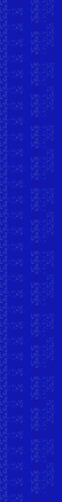

# B567 (114688-115199)

<details>
    <summary>Initial Grid</summary>
    
</details>


<details>
    <summary>Initial Grid RLE</summary>

```
#C Exported from GoGoL (https://github.com/marrow16/gogol)
#C Wrap mode: Toroidal
#C Boundary mode: Dead
#C Step: 0
x = 100, y = 100, rule = B567/S
10bo27bo$2bo12bo37b2o6bo16bobo10bo$7bo19bo18bo10bo27bo$2bo37bo9bo30bo$
4bo21bo9bo3bo29bo$13bo31bo19bo18bo$bo41bo33bo7bo$9bo37bo6bo15bo6bo16bo$
41bo7bo28bo4bo6bo3bo$6bo8bo20bo7bo26bo19bo$7bo25b2o5bo2bo33bo18bo$20bo
17bo21bo$3b2o57bo18b2o$3bo5bo12bo22bo27bo7bo5bo$4bo6bo52bo14bobo11bo$
62bo3bo7bo8bo$5bo37bo2bo19bo20bo$33bo50bo2bo9b2o$bo35bo5bo11bo15bo$16bo
51bo2bo7b2o$22bo29bo3b2o38bo$4bo11b2o35bo9bo14b2o3bo$30bo31bobo30bo$b2o
57bo33bo$11bo14bo3bobo11bo14bo10b2o7bo5bo12bo$4bo25bo10bo5b2o8bo16bo$8b
o5bo12bo18bo14bo3bo2bo23bo$28bo37bo6b2o8b2o3bo2bo$12bo4bo17bo14bo15bo7b
o$27bo$bo16bo7bo12bo22bo21bo$2bo10bo8bo15bo17bo12bo16bo2bo8bo$13bo4bo
61bo16bo$b2o7bo16bo39b2o10bo2bo12bobo$12bo5bo17bo5bo11bo11bo4bo23bo$4bo
27bo31bo3bo3bo8bo15bo$5bo10bo30bo2bo5bo12b2o$12bo6bo17bo5bo49bo$5bo9bo
21bo$3bo5bo18bo15bo4bo25bo$bo66bo$11bo12bo13bo13bo17bo3bo6bo7bo$25bo2b
2o10bo28bo$19bo24bo12bo6bo$9b2o8bo40bo14bo23bo$58bo15bo$46bo16bo15bo14b
o$6bo5bobo42bo$4bobo16bo2bo32bo5bo6bo23bo$11bo8bo17bo7bo20bo$16bo30bo3b
o10b2o21b2o$5bo18bo30bo$44bo2bo7bo19bo11bo$8bo9bo3bo26bo34bo$4bo$4bo28b
obo10bo11bo4bo24bo5bo2bo$11bo11bo23bo$2bo2b2o35bo21bo$8bo2bo25bo10bobo
18bo$32bo9bo55bo$4bo60bo$4bo16bo5bo3bo7bo7bo14bo20bo$19bobo31bo5bo$10bo
10bo51bo$2bo7bo17bo12bo7bo13bo13bo6bo3bo8bo$3bo48bo11bobo14bo$o6bo16bo
35bo6bo3bo7bo6bo$12bo14bo36bo32bo$27b2o62b2o$21bo10bo54bo7bo$23bo30bo
22bo15bo$71bo2bo3bobo6bo$75bo$5bo4bo11bo53bo15bo$36bo14bo8bo29bo$15bo
11bo64bo$12bobo10bo36bo6bo24bobo$5bobo58bo12bo6bo12bo$62bo3bo6bo$42bo
46bo$8bo3bo18bo17bo8bo31bo$27bo2bo32b3o3bo4bo6bo$4bo85bo$20bo21bo13bo7b
o16bo15bo$32b2o11bo20bo10bo6bo13bo$21bo21bo40bo$20bo52bo16bo5bo$4bo26bo
28bo16bo17bo$7bo21b2o8b2o8bo29bo$8bo30bobo8bo12bo21bo13bo$11bo29bo8bo
32bo6bo$6bobo41bo5bo13bo5bo$4bo15bo14bo14bo5bo27bo9b2obo$o44bo19bo10bo$
6bo33bo13bo5bo18bo$3bo$49bo5bo$59bo2bo12bo6bo$2bo31b2o$16bo2bo22bo10bo
8bo28bo!
```
</details>
<details>
    <summary>Thumbnail</summary>

</details>
<table>
<tr>
    <td><a href="./114688%20S%20Heat%20Map%20Activity.png"></a><br>S (114688)<br>S@2</td>    <td><a href="./114689%20S0%20Heat%20Map%20Activity.png"></a><br>S0 (114689)<br>S@1</td>    <td><a href="./114690%20S1%20Heat%20Map%20Activity.png"></a><br>S1 (114690)<br>S@2</td>    <td><a href="./114691%20S01%20Heat%20Map%20Activity.png"></a><br>S01 (114691)<br>S@1</td>    <td><a href="./114692%20S2%20Heat%20Map%20Activity.png"></a><br>S2 (114692)<br>S@3</td>    <td><a href="./114693%20S02%20Heat%20Map%20Activity.png"></a><br>S02 (114693)<br>S@3</td>    <td><a href="./114694%20S12%20Heat%20Map%20Activity.png"></a><br>S12 (114694)<br>S@2</td>    <td><a href="./114695%20S012%20Heat%20Map%20Activity.png"></a><br>S012 (114695)<br>S@2</td></tr>
<tr>
    <td><a href="./114696%20S3%20Heat%20Map%20Activity.png"></a><br>S3 (114696)<br>S@2</td>    <td><a href="./114697%20S03%20Heat%20Map%20Activity.png"></a><br>S03 (114697)<br>S@2</td>    <td><a href="./114698%20S13%20Heat%20Map%20Activity.png"></a><br>S13 (114698)<br>S@3</td>    <td><a href="./114699%20S013%20Heat%20Map%20Activity.png"></a><br>S013 (114699)<br>S@2</td>    <td><a href="./114700%20S23%20Heat%20Map%20Activity.png"></a><br>S23 (114700)<br>S@3</td>    <td><a href="./114701%20S023%20Heat%20Map%20Activity.png"></a><br>S023 (114701)<br>S@3</td>    <td><a href="./114702%20S123%20Heat%20Map%20Activity.png"></a><br>S123 (114702)<br>S@2</td>    <td><a href="./114703%20S0123%20Heat%20Map%20Activity.png"></a><br>S0123 (114703)<br>S@2</td></tr>
<tr>
    <td><a href="./114704%20S4%20Heat%20Map%20Activity.png"></a><br>S4 (114704)<br>S@2</td>    <td><a href="./114705%20S04%20Heat%20Map%20Activity.png"></a><br>S04 (114705)<br>S@1</td>    <td><a href="./114706%20S14%20Heat%20Map%20Activity.png"></a><br>S14 (114706)<br>S@2</td>    <td><a href="./114707%20S014%20Heat%20Map%20Activity.png"></a><br>S014 (114707)<br>S@1</td>    <td><a href="./114708%20S24%20Heat%20Map%20Activity.png"></a><br>S24 (114708)<br>S@3</td>    <td><a href="./114709%20S024%20Heat%20Map%20Activity.png"></a><br>S024 (114709)<br>S@3</td>    <td><a href="./114710%20S124%20Heat%20Map%20Activity.png"></a><br>S124 (114710)<br>S@2</td>    <td><a href="./114711%20S0124%20Heat%20Map%20Activity.png"></a><br>S0124 (114711)<br>S@1</td></tr>
<tr>
    <td><a href="./114712%20S34%20Heat%20Map%20Activity.png"></a><br>S34 (114712)<br>S@2</td>    <td><a href="./114713%20S034%20Heat%20Map%20Activity.png"></a><br>S034 (114713)<br>S@2</td>    <td><a href="./114714%20S134%20Heat%20Map%20Activity.png"></a><br>S134 (114714)<br>S@3</td>    <td><a href="./114715%20S0134%20Heat%20Map%20Activity.png"></a><br>S0134 (114715)<br>S@2</td>    <td><a href="./114716%20S234%20Heat%20Map%20Activity.png"></a><br>S234 (114716)<br>S@3</td>    <td><a href="./114717%20S0234%20Heat%20Map%20Activity.png"></a><br>S0234 (114717)<br>S@2</td>    <td><a href="./114718%20S1234%20Heat%20Map%20Activity.png"></a><br>S1234 (114718)<br>R@3,p2</td>    <td><a href="./114719%20S01234%20Heat%20Map%20Activity.png"></a><br>S01234 (114719)<br>R@2,p2</td></tr>
<tr>
    <td><a href="./114720%20S5%20Heat%20Map%20Activity.png"></a><br>S5 (114720)<br>S@2</td>    <td><a href="./114721%20S05%20Heat%20Map%20Activity.png"></a><br>S05 (114721)<br>S@1</td>    <td><a href="./114722%20S15%20Heat%20Map%20Activity.png"></a><br>S15 (114722)<br>S@2</td>    <td><a href="./114723%20S015%20Heat%20Map%20Activity.png"></a><br>S015 (114723)<br>S@1</td>    <td><a href="./114724%20S25%20Heat%20Map%20Activity.png"></a><br>S25 (114724)<br>S@3</td>    <td><a href="./114725%20S025%20Heat%20Map%20Activity.png"></a><br>S025 (114725)<br>S@3</td>    <td><a href="./114726%20S125%20Heat%20Map%20Activity.png"></a><br>S125 (114726)<br>S@2</td>    <td><a href="./114727%20S0125%20Heat%20Map%20Activity.png"></a><br>S0125 (114727)<br>S@2</td></tr>
<tr>
    <td><a href="./114728%20S35%20Heat%20Map%20Activity.png"></a><br>S35 (114728)<br>S@2</td>    <td><a href="./114729%20S035%20Heat%20Map%20Activity.png"></a><br>S035 (114729)<br>S@2</td>    <td><a href="./114730%20S135%20Heat%20Map%20Activity.png"></a><br>S135 (114730)<br>S@3</td>    <td><a href="./114731%20S0135%20Heat%20Map%20Activity.png"></a><br>S0135 (114731)<br>S@2</td>    <td><a href="./114732%20S235%20Heat%20Map%20Activity.png"></a><br>S235 (114732)<br>S@3</td>    <td><a href="./114733%20S0235%20Heat%20Map%20Activity.png"></a><br>S0235 (114733)<br>S@3</td>    <td><a href="./114734%20S1235%20Heat%20Map%20Activity.png"></a><br>S1235 (114734)<br>S@3</td>    <td><a href="./114735%20S01235%20Heat%20Map%20Activity.png"></a><br>S01235 (114735)<br>S@3</td></tr>
<tr>
    <td><a href="./114736%20S45%20Heat%20Map%20Activity.png"></a><br>S45 (114736)<br>S@2</td>    <td><a href="./114737%20S045%20Heat%20Map%20Activity.png"></a><br>S045 (114737)<br>S@1</td>    <td><a href="./114738%20S145%20Heat%20Map%20Activity.png"></a><br>S145 (114738)<br>S@2</td>    <td><a href="./114739%20S0145%20Heat%20Map%20Activity.png"></a><br>S0145 (114739)<br>S@1</td>    <td><a href="./114740%20S245%20Heat%20Map%20Activity.png"></a><br>S245 (114740)<br>S@3</td>    <td><a href="./114741%20S0245%20Heat%20Map%20Activity.png"></a><br>S0245 (114741)<br>S@3</td>    <td><a href="./114742%20S1245%20Heat%20Map%20Activity.png"></a><br>S1245 (114742)<br>S@2</td>    <td><a href="./114743%20S01245%20Heat%20Map%20Activity.png"></a><br>S01245 (114743)<br>S@1</td></tr>
<tr>
    <td><a href="./114744%20S345%20Heat%20Map%20Activity.png"></a><br>S345 (114744)<br>S@2</td>    <td><a href="./114745%20S0345%20Heat%20Map%20Activity.png"></a><br>S0345 (114745)<br>S@2</td>    <td><a href="./114746%20S1345%20Heat%20Map%20Activity.png"></a><br>S1345 (114746)<br>S@3</td>    <td><a href="./114747%20S01345%20Heat%20Map%20Activity.png"></a><br>S01345 (114747)<br>S@2</td>    <td><a href="./114748%20S2345%20Heat%20Map%20Activity.png"></a><br>S2345 (114748)<br>S@3</td>    <td><a href="./114749%20S02345%20Heat%20Map%20Activity.png"></a><br>S02345 (114749)<br>S@2</td>    <td><a href="./114750%20S12345%20Heat%20Map%20Activity.png"></a><br>S12345 (114750)<br>S@1</td>    <td><a href="./114751%20S012345%20Heat%20Map%20Activity.png"></a><br>S012345 (114751)<br>S@1</td></tr>
<tr>
    <td><a href="./114752%20S6%20Heat%20Map%20Activity.png"></a><br>S6 (114752)<br>S@2</td>    <td><a href="./114753%20S06%20Heat%20Map%20Activity.png"></a><br>S06 (114753)<br>S@1</td>    <td><a href="./114754%20S16%20Heat%20Map%20Activity.png"></a><br>S16 (114754)<br>S@2</td>    <td><a href="./114755%20S016%20Heat%20Map%20Activity.png"></a><br>S016 (114755)<br>S@1</td>    <td><a href="./114756%20S26%20Heat%20Map%20Activity.png"></a><br>S26 (114756)<br>S@3</td>    <td><a href="./114757%20S026%20Heat%20Map%20Activity.png"></a><br>S026 (114757)<br>S@3</td>    <td><a href="./114758%20S126%20Heat%20Map%20Activity.png"></a><br>S126 (114758)<br>S@2</td>    <td><a href="./114759%20S0126%20Heat%20Map%20Activity.png"></a><br>S0126 (114759)<br>S@2</td></tr>
<tr>
    <td><a href="./114760%20S36%20Heat%20Map%20Activity.png"></a><br>S36 (114760)<br>S@2</td>    <td><a href="./114761%20S036%20Heat%20Map%20Activity.png"></a><br>S036 (114761)<br>S@2</td>    <td><a href="./114762%20S136%20Heat%20Map%20Activity.png"></a><br>S136 (114762)<br>S@3</td>    <td><a href="./114763%20S0136%20Heat%20Map%20Activity.png"></a><br>S0136 (114763)<br>S@2</td>    <td><a href="./114764%20S236%20Heat%20Map%20Activity.png"></a><br>S236 (114764)<br>S@3</td>    <td><a href="./114765%20S0236%20Heat%20Map%20Activity.png"></a><br>S0236 (114765)<br>S@3</td>    <td><a href="./114766%20S1236%20Heat%20Map%20Activity.png"></a><br>S1236 (114766)<br>S@2</td>    <td><a href="./114767%20S01236%20Heat%20Map%20Activity.png"></a><br>S01236 (114767)<br>S@2</td></tr>
<tr>
    <td><a href="./114768%20S46%20Heat%20Map%20Activity.png"></a><br>S46 (114768)<br>S@2</td>    <td><a href="./114769%20S046%20Heat%20Map%20Activity.png"></a><br>S046 (114769)<br>S@1</td>    <td><a href="./114770%20S146%20Heat%20Map%20Activity.png"></a><br>S146 (114770)<br>S@2</td>    <td><a href="./114771%20S0146%20Heat%20Map%20Activity.png"></a><br>S0146 (114771)<br>S@1</td>    <td><a href="./114772%20S246%20Heat%20Map%20Activity.png"></a><br>S246 (114772)<br>S@3</td>    <td><a href="./114773%20S0246%20Heat%20Map%20Activity.png"></a><br>S0246 (114773)<br>S@3</td>    <td><a href="./114774%20S1246%20Heat%20Map%20Activity.png"></a><br>S1246 (114774)<br>S@2</td>    <td><a href="./114775%20S01246%20Heat%20Map%20Activity.png"></a><br>S01246 (114775)<br>S@1</td></tr>
<tr>
    <td><a href="./114776%20S346%20Heat%20Map%20Activity.png"></a><br>S346 (114776)<br>S@2</td>    <td><a href="./114777%20S0346%20Heat%20Map%20Activity.png"></a><br>S0346 (114777)<br>S@2</td>    <td><a href="./114778%20S1346%20Heat%20Map%20Activity.png"></a><br>S1346 (114778)<br>S@3</td>    <td><a href="./114779%20S01346%20Heat%20Map%20Activity.png"></a><br>S01346 (114779)<br>S@2</td>    <td><a href="./114780%20S2346%20Heat%20Map%20Activity.png"></a><br>S2346 (114780)<br>S@3</td>    <td><a href="./114781%20S02346%20Heat%20Map%20Activity.png"></a><br>S02346 (114781)<br>S@2</td>    <td><a href="./114782%20S12346%20Heat%20Map%20Activity.png"></a><br>S12346 (114782)<br>R@3,p2</td>    <td><a href="./114783%20S012346%20Heat%20Map%20Activity.png"></a><br>S012346 (114783)<br>R@2,p2</td></tr>
<tr>
    <td><a href="./114784%20S56%20Heat%20Map%20Activity.png"></a><br>S56 (114784)<br>S@2</td>    <td><a href="./114785%20S056%20Heat%20Map%20Activity.png"></a><br>S056 (114785)<br>S@1</td>    <td><a href="./114786%20S156%20Heat%20Map%20Activity.png"></a><br>S156 (114786)<br>S@2</td>    <td><a href="./114787%20S0156%20Heat%20Map%20Activity.png"></a><br>S0156 (114787)<br>S@1</td>    <td><a href="./114788%20S256%20Heat%20Map%20Activity.png"></a><br>S256 (114788)<br>S@3</td>    <td><a href="./114789%20S0256%20Heat%20Map%20Activity.png"></a><br>S0256 (114789)<br>S@3</td>    <td><a href="./114790%20S1256%20Heat%20Map%20Activity.png"></a><br>S1256 (114790)<br>S@2</td>    <td><a href="./114791%20S01256%20Heat%20Map%20Activity.png"></a><br>S01256 (114791)<br>S@2</td></tr>
<tr>
    <td><a href="./114792%20S356%20Heat%20Map%20Activity.png"></a><br>S356 (114792)<br>S@2</td>    <td><a href="./114793%20S0356%20Heat%20Map%20Activity.png"></a><br>S0356 (114793)<br>S@2</td>    <td><a href="./114794%20S1356%20Heat%20Map%20Activity.png"></a><br>S1356 (114794)<br>S@3</td>    <td><a href="./114795%20S01356%20Heat%20Map%20Activity.png"></a><br>S01356 (114795)<br>S@2</td>    <td><a href="./114796%20S2356%20Heat%20Map%20Activity.png"></a><br>S2356 (114796)<br>S@3</td>    <td><a href="./114797%20S02356%20Heat%20Map%20Activity.png"></a><br>S02356 (114797)<br>S@3</td>    <td><a href="./114798%20S12356%20Heat%20Map%20Activity.png"></a><br>S12356 (114798)<br>S@3</td>    <td><a href="./114799%20S012356%20Heat%20Map%20Activity.png"></a><br>S012356 (114799)<br>S@3</td></tr>
<tr>
    <td><a href="./114800%20S456%20Heat%20Map%20Activity.png"></a><br>S456 (114800)<br>S@2</td>    <td><a href="./114801%20S0456%20Heat%20Map%20Activity.png"></a><br>S0456 (114801)<br>S@1</td>    <td><a href="./114802%20S1456%20Heat%20Map%20Activity.png"></a><br>S1456 (114802)<br>S@2</td>    <td><a href="./114803%20S01456%20Heat%20Map%20Activity.png"></a><br>S01456 (114803)<br>S@1</td>    <td><a href="./114804%20S2456%20Heat%20Map%20Activity.png"></a><br>S2456 (114804)<br>S@3</td>    <td><a href="./114805%20S02456%20Heat%20Map%20Activity.png"></a><br>S02456 (114805)<br>S@3</td>    <td><a href="./114806%20S12456%20Heat%20Map%20Activity.png"></a><br>S12456 (114806)<br>S@2</td>    <td><a href="./114807%20S012456%20Heat%20Map%20Activity.png"></a><br>S012456 (114807)<br>S@1</td></tr>
<tr>
    <td><a href="./114808%20S3456%20Heat%20Map%20Activity.png"></a><br>S3456 (114808)<br>S@2</td>    <td><a href="./114809%20S03456%20Heat%20Map%20Activity.png"></a><br>S03456 (114809)<br>S@2</td>    <td><a href="./114810%20S13456%20Heat%20Map%20Activity.png"></a><br>S13456 (114810)<br>S@3</td>    <td><a href="./114811%20S013456%20Heat%20Map%20Activity.png"></a><br>S013456 (114811)<br>S@2</td>    <td><a href="./114812%20S23456%20Heat%20Map%20Activity.png"></a><br>S23456 (114812)<br>S@3</td>    <td><a href="./114813%20S023456%20Heat%20Map%20Activity.png"></a><br>S023456 (114813)<br>S@2</td>    <td><a href="./114814%20S123456%20Heat%20Map%20Activity.png"></a><br>S123456 (114814)<br>S@1</td>    <td><a href="./114815%20S0123456%20Heat%20Map%20Activity.png"></a><br>S0123456 (114815)<br>S@1</td></tr>
<tr>
    <td><a href="./114816%20S7%20Heat%20Map%20Activity.png"></a><br>S7 (114816)<br>S@2</td>    <td><a href="./114817%20S07%20Heat%20Map%20Activity.png"></a><br>S07 (114817)<br>S@1</td>    <td><a href="./114818%20S17%20Heat%20Map%20Activity.png"></a><br>S17 (114818)<br>S@2</td>    <td><a href="./114819%20S017%20Heat%20Map%20Activity.png"></a><br>S017 (114819)<br>S@1</td>    <td><a href="./114820%20S27%20Heat%20Map%20Activity.png"></a><br>S27 (114820)<br>S@3</td>    <td><a href="./114821%20S027%20Heat%20Map%20Activity.png"></a><br>S027 (114821)<br>S@3</td>    <td><a href="./114822%20S127%20Heat%20Map%20Activity.png"></a><br>S127 (114822)<br>S@2</td>    <td><a href="./114823%20S0127%20Heat%20Map%20Activity.png"></a><br>S0127 (114823)<br>S@2</td></tr>
<tr>
    <td><a href="./114824%20S37%20Heat%20Map%20Activity.png"></a><br>S37 (114824)<br>S@2</td>    <td><a href="./114825%20S037%20Heat%20Map%20Activity.png"></a><br>S037 (114825)<br>S@2</td>    <td><a href="./114826%20S137%20Heat%20Map%20Activity.png"></a><br>S137 (114826)<br>S@3</td>    <td><a href="./114827%20S0137%20Heat%20Map%20Activity.png"></a><br>S0137 (114827)<br>S@2</td>    <td><a href="./114828%20S237%20Heat%20Map%20Activity.png"></a><br>S237 (114828)<br>S@3</td>    <td><a href="./114829%20S0237%20Heat%20Map%20Activity.png"></a><br>S0237 (114829)<br>S@3</td>    <td><a href="./114830%20S1237%20Heat%20Map%20Activity.png"></a><br>S1237 (114830)<br>S@2</td>    <td><a href="./114831%20S01237%20Heat%20Map%20Activity.png"></a><br>S01237 (114831)<br>S@2</td></tr>
<tr>
    <td><a href="./114832%20S47%20Heat%20Map%20Activity.png"></a><br>S47 (114832)<br>S@2</td>    <td><a href="./114833%20S047%20Heat%20Map%20Activity.png"></a><br>S047 (114833)<br>S@1</td>    <td><a href="./114834%20S147%20Heat%20Map%20Activity.png"></a><br>S147 (114834)<br>S@2</td>    <td><a href="./114835%20S0147%20Heat%20Map%20Activity.png"></a><br>S0147 (114835)<br>S@1</td>    <td><a href="./114836%20S247%20Heat%20Map%20Activity.png"></a><br>S247 (114836)<br>S@3</td>    <td><a href="./114837%20S0247%20Heat%20Map%20Activity.png"></a><br>S0247 (114837)<br>S@3</td>    <td><a href="./114838%20S1247%20Heat%20Map%20Activity.png"></a><br>S1247 (114838)<br>S@2</td>    <td><a href="./114839%20S01247%20Heat%20Map%20Activity.png"></a><br>S01247 (114839)<br>S@1</td></tr>
<tr>
    <td><a href="./114840%20S347%20Heat%20Map%20Activity.png"></a><br>S347 (114840)<br>S@2</td>    <td><a href="./114841%20S0347%20Heat%20Map%20Activity.png"></a><br>S0347 (114841)<br>S@2</td>    <td><a href="./114842%20S1347%20Heat%20Map%20Activity.png"></a><br>S1347 (114842)<br>S@3</td>    <td><a href="./114843%20S01347%20Heat%20Map%20Activity.png"></a><br>S01347 (114843)<br>S@2</td>    <td><a href="./114844%20S2347%20Heat%20Map%20Activity.png"></a><br>S2347 (114844)<br>S@3</td>    <td><a href="./114845%20S02347%20Heat%20Map%20Activity.png"></a><br>S02347 (114845)<br>S@2</td>    <td><a href="./114846%20S12347%20Heat%20Map%20Activity.png"></a><br>S12347 (114846)<br>R@3,p2</td>    <td><a href="./114847%20S012347%20Heat%20Map%20Activity.png"></a><br>S012347 (114847)<br>R@2,p2</td></tr>
<tr>
    <td><a href="./114848%20S57%20Heat%20Map%20Activity.png"></a><br>S57 (114848)<br>S@2</td>    <td><a href="./114849%20S057%20Heat%20Map%20Activity.png"></a><br>S057 (114849)<br>S@1</td>    <td><a href="./114850%20S157%20Heat%20Map%20Activity.png"></a><br>S157 (114850)<br>S@2</td>    <td><a href="./114851%20S0157%20Heat%20Map%20Activity.png"></a><br>S0157 (114851)<br>S@1</td>    <td><a href="./114852%20S257%20Heat%20Map%20Activity.png"></a><br>S257 (114852)<br>S@3</td>    <td><a href="./114853%20S0257%20Heat%20Map%20Activity.png"></a><br>S0257 (114853)<br>S@3</td>    <td><a href="./114854%20S1257%20Heat%20Map%20Activity.png"></a><br>S1257 (114854)<br>S@2</td>    <td><a href="./114855%20S01257%20Heat%20Map%20Activity.png"></a><br>S01257 (114855)<br>S@2</td></tr>
<tr>
    <td><a href="./114856%20S357%20Heat%20Map%20Activity.png"></a><br>S357 (114856)<br>S@2</td>    <td><a href="./114857%20S0357%20Heat%20Map%20Activity.png"></a><br>S0357 (114857)<br>S@2</td>    <td><a href="./114858%20S1357%20Heat%20Map%20Activity.png"></a><br>S1357 (114858)<br>S@3</td>    <td><a href="./114859%20S01357%20Heat%20Map%20Activity.png"></a><br>S01357 (114859)<br>S@2</td>    <td><a href="./114860%20S2357%20Heat%20Map%20Activity.png"></a><br>S2357 (114860)<br>S@3</td>    <td><a href="./114861%20S02357%20Heat%20Map%20Activity.png"></a><br>S02357 (114861)<br>S@3</td>    <td><a href="./114862%20S12357%20Heat%20Map%20Activity.png"></a><br>S12357 (114862)<br>S@3</td>    <td><a href="./114863%20S012357%20Heat%20Map%20Activity.png"></a><br>S012357 (114863)<br>S@3</td></tr>
<tr>
    <td><a href="./114864%20S457%20Heat%20Map%20Activity.png"></a><br>S457 (114864)<br>S@2</td>    <td><a href="./114865%20S0457%20Heat%20Map%20Activity.png"></a><br>S0457 (114865)<br>S@1</td>    <td><a href="./114866%20S1457%20Heat%20Map%20Activity.png"></a><br>S1457 (114866)<br>S@2</td>    <td><a href="./114867%20S01457%20Heat%20Map%20Activity.png"></a><br>S01457 (114867)<br>S@1</td>    <td><a href="./114868%20S2457%20Heat%20Map%20Activity.png"></a><br>S2457 (114868)<br>S@3</td>    <td><a href="./114869%20S02457%20Heat%20Map%20Activity.png"></a><br>S02457 (114869)<br>S@3</td>    <td><a href="./114870%20S12457%20Heat%20Map%20Activity.png"></a><br>S12457 (114870)<br>S@2</td>    <td><a href="./114871%20S012457%20Heat%20Map%20Activity.png"></a><br>S012457 (114871)<br>S@1</td></tr>
<tr>
    <td><a href="./114872%20S3457%20Heat%20Map%20Activity.png"></a><br>S3457 (114872)<br>S@2</td>    <td><a href="./114873%20S03457%20Heat%20Map%20Activity.png"></a><br>S03457 (114873)<br>S@2</td>    <td><a href="./114874%20S13457%20Heat%20Map%20Activity.png"></a><br>S13457 (114874)<br>S@3</td>    <td><a href="./114875%20S013457%20Heat%20Map%20Activity.png"></a><br>S013457 (114875)<br>S@2</td>    <td><a href="./114876%20S23457%20Heat%20Map%20Activity.png"></a><br>S23457 (114876)<br>S@3</td>    <td><a href="./114877%20S023457%20Heat%20Map%20Activity.png"></a><br>S023457 (114877)<br>S@2</td>    <td><a href="./114878%20S123457%20Heat%20Map%20Activity.png"></a><br>S123457 (114878)<br>S@1</td>    <td><a href="./114879%20S0123457%20Heat%20Map%20Activity.png"></a><br>S0123457 (114879)<br>S@1</td></tr>
<tr>
    <td><a href="./114880%20S67%20Heat%20Map%20Activity.png"></a><br>S67 (114880)<br>S@2</td>    <td><a href="./114881%20S067%20Heat%20Map%20Activity.png"></a><br>S067 (114881)<br>S@1</td>    <td><a href="./114882%20S167%20Heat%20Map%20Activity.png"></a><br>S167 (114882)<br>S@2</td>    <td><a href="./114883%20S0167%20Heat%20Map%20Activity.png"></a><br>S0167 (114883)<br>S@1</td>    <td><a href="./114884%20S267%20Heat%20Map%20Activity.png"></a><br>S267 (114884)<br>S@3</td>    <td><a href="./114885%20S0267%20Heat%20Map%20Activity.png"></a><br>S0267 (114885)<br>S@3</td>    <td><a href="./114886%20S1267%20Heat%20Map%20Activity.png"></a><br>S1267 (114886)<br>S@2</td>    <td><a href="./114887%20S01267%20Heat%20Map%20Activity.png"></a><br>S01267 (114887)<br>S@2</td></tr>
<tr>
    <td><a href="./114888%20S367%20Heat%20Map%20Activity.png"></a><br>S367 (114888)<br>S@2</td>    <td><a href="./114889%20S0367%20Heat%20Map%20Activity.png"></a><br>S0367 (114889)<br>S@2</td>    <td><a href="./114890%20S1367%20Heat%20Map%20Activity.png"></a><br>S1367 (114890)<br>S@3</td>    <td><a href="./114891%20S01367%20Heat%20Map%20Activity.png"></a><br>S01367 (114891)<br>S@2</td>    <td><a href="./114892%20S2367%20Heat%20Map%20Activity.png"></a><br>S2367 (114892)<br>S@3</td>    <td><a href="./114893%20S02367%20Heat%20Map%20Activity.png"></a><br>S02367 (114893)<br>S@3</td>    <td><a href="./114894%20S12367%20Heat%20Map%20Activity.png"></a><br>S12367 (114894)<br>S@2</td>    <td><a href="./114895%20S012367%20Heat%20Map%20Activity.png"></a><br>S012367 (114895)<br>S@2</td></tr>
<tr>
    <td><a href="./114896%20S467%20Heat%20Map%20Activity.png"></a><br>S467 (114896)<br>S@2</td>    <td><a href="./114897%20S0467%20Heat%20Map%20Activity.png"></a><br>S0467 (114897)<br>S@1</td>    <td><a href="./114898%20S1467%20Heat%20Map%20Activity.png"></a><br>S1467 (114898)<br>S@2</td>    <td><a href="./114899%20S01467%20Heat%20Map%20Activity.png"></a><br>S01467 (114899)<br>S@1</td>    <td><a href="./114900%20S2467%20Heat%20Map%20Activity.png"></a><br>S2467 (114900)<br>S@3</td>    <td><a href="./114901%20S02467%20Heat%20Map%20Activity.png"></a><br>S02467 (114901)<br>S@3</td>    <td><a href="./114902%20S12467%20Heat%20Map%20Activity.png"></a><br>S12467 (114902)<br>S@2</td>    <td><a href="./114903%20S012467%20Heat%20Map%20Activity.png"></a><br>S012467 (114903)<br>S@1</td></tr>
<tr>
    <td><a href="./114904%20S3467%20Heat%20Map%20Activity.png"></a><br>S3467 (114904)<br>S@2</td>    <td><a href="./114905%20S03467%20Heat%20Map%20Activity.png"></a><br>S03467 (114905)<br>S@2</td>    <td><a href="./114906%20S13467%20Heat%20Map%20Activity.png"></a><br>S13467 (114906)<br>S@3</td>    <td><a href="./114907%20S013467%20Heat%20Map%20Activity.png"></a><br>S013467 (114907)<br>S@2</td>    <td><a href="./114908%20S23467%20Heat%20Map%20Activity.png"></a><br>S23467 (114908)<br>S@3</td>    <td><a href="./114909%20S023467%20Heat%20Map%20Activity.png"></a><br>S023467 (114909)<br>S@2</td>    <td><a href="./114910%20S123467%20Heat%20Map%20Activity.png"></a><br>S123467 (114910)<br>R@3,p2</td>    <td><a href="./114911%20S0123467%20Heat%20Map%20Activity.png"></a><br>S0123467 (114911)<br>R@2,p2</td></tr>
<tr>
    <td><a href="./114912%20S567%20Heat%20Map%20Activity.png"></a><br>S567 (114912)<br>S@2</td>    <td><a href="./114913%20S0567%20Heat%20Map%20Activity.png"></a><br>S0567 (114913)<br>S@1</td>    <td><a href="./114914%20S1567%20Heat%20Map%20Activity.png"></a><br>S1567 (114914)<br>S@2</td>    <td><a href="./114915%20S01567%20Heat%20Map%20Activity.png"></a><br>S01567 (114915)<br>S@1</td>    <td><a href="./114916%20S2567%20Heat%20Map%20Activity.png"></a><br>S2567 (114916)<br>S@3</td>    <td><a href="./114917%20S02567%20Heat%20Map%20Activity.png"></a><br>S02567 (114917)<br>S@3</td>    <td><a href="./114918%20S12567%20Heat%20Map%20Activity.png"></a><br>S12567 (114918)<br>S@2</td>    <td><a href="./114919%20S012567%20Heat%20Map%20Activity.png"></a><br>S012567 (114919)<br>S@2</td></tr>
<tr>
    <td><a href="./114920%20S3567%20Heat%20Map%20Activity.png"></a><br>S3567 (114920)<br>S@2</td>    <td><a href="./114921%20S03567%20Heat%20Map%20Activity.png"></a><br>S03567 (114921)<br>S@2</td>    <td><a href="./114922%20S13567%20Heat%20Map%20Activity.png"></a><br>S13567 (114922)<br>S@3</td>    <td><a href="./114923%20S013567%20Heat%20Map%20Activity.png"></a><br>S013567 (114923)<br>S@2</td>    <td><a href="./114924%20S23567%20Heat%20Map%20Activity.png"></a><br>S23567 (114924)<br>S@3</td>    <td><a href="./114925%20S023567%20Heat%20Map%20Activity.png"></a><br>S023567 (114925)<br>S@3</td>    <td><a href="./114926%20S123567%20Heat%20Map%20Activity.png"></a><br>S123567 (114926)<br>S@3</td>    <td><a href="./114927%20S0123567%20Heat%20Map%20Activity.png"></a><br>S0123567 (114927)<br>S@3</td></tr>
<tr>
    <td><a href="./114928%20S4567%20Heat%20Map%20Activity.png"></a><br>S4567 (114928)<br>S@2</td>    <td><a href="./114929%20S04567%20Heat%20Map%20Activity.png"></a><br>S04567 (114929)<br>S@1</td>    <td><a href="./114930%20S14567%20Heat%20Map%20Activity.png"></a><br>S14567 (114930)<br>S@2</td>    <td><a href="./114931%20S014567%20Heat%20Map%20Activity.png"></a><br>S014567 (114931)<br>S@1</td>    <td><a href="./114932%20S24567%20Heat%20Map%20Activity.png"></a><br>S24567 (114932)<br>S@3</td>    <td><a href="./114933%20S024567%20Heat%20Map%20Activity.png"></a><br>S024567 (114933)<br>S@3</td>    <td><a href="./114934%20S124567%20Heat%20Map%20Activity.png"></a><br>S124567 (114934)<br>S@2</td>    <td><a href="./114935%20S0124567%20Heat%20Map%20Activity.png"></a><br>S0124567 (114935)<br>S@1</td></tr>
<tr>
    <td><a href="./114936%20S34567%20Heat%20Map%20Activity.png"></a><br>S34567 (114936)<br>S@2</td>    <td><a href="./114937%20S034567%20Heat%20Map%20Activity.png"></a><br>S034567 (114937)<br>S@2</td>    <td><a href="./114938%20S134567%20Heat%20Map%20Activity.png"></a><br>S134567 (114938)<br>S@3</td>    <td><a href="./114939%20S0134567%20Heat%20Map%20Activity.png"></a><br>S0134567 (114939)<br>S@2</td>    <td><a href="./114940%20S234567%20Heat%20Map%20Activity.png"></a><br>S234567 (114940)<br>S@3</td>    <td><a href="./114941%20S0234567%20Heat%20Map%20Activity.png"></a><br>S0234567 (114941)<br>S@2</td>    <td><a href="./114942%20S1234567%20Heat%20Map%20Activity.png"></a><br>S1234567 (114942)<br>S@1</td>    <td><a href="./114943%20S01234567%20Heat%20Map%20Activity.png"></a><br>S01234567 (114943)<br>S@1</td></tr>
<tr>
    <td><a href="./114944%20S8%20Heat%20Map%20Activity.png"></a><br>S8 (114944)<br>S@2</td>    <td><a href="./114945%20S08%20Heat%20Map%20Activity.png"></a><br>S08 (114945)<br>S@1</td>    <td><a href="./114946%20S18%20Heat%20Map%20Activity.png"></a><br>S18 (114946)<br>S@2</td>    <td><a href="./114947%20S018%20Heat%20Map%20Activity.png"></a><br>S018 (114947)<br>S@1</td>    <td><a href="./114948%20S28%20Heat%20Map%20Activity.png"></a><br>S28 (114948)<br>S@3</td>    <td><a href="./114949%20S028%20Heat%20Map%20Activity.png"></a><br>S028 (114949)<br>S@3</td>    <td><a href="./114950%20S128%20Heat%20Map%20Activity.png"></a><br>S128 (114950)<br>S@2</td>    <td><a href="./114951%20S0128%20Heat%20Map%20Activity.png"></a><br>S0128 (114951)<br>S@2</td></tr>
<tr>
    <td><a href="./114952%20S38%20Heat%20Map%20Activity.png"></a><br>S38 (114952)<br>S@2</td>    <td><a href="./114953%20S038%20Heat%20Map%20Activity.png"></a><br>S038 (114953)<br>S@2</td>    <td><a href="./114954%20S138%20Heat%20Map%20Activity.png"></a><br>S138 (114954)<br>S@3</td>    <td><a href="./114955%20S0138%20Heat%20Map%20Activity.png"></a><br>S0138 (114955)<br>S@2</td>    <td><a href="./114956%20S238%20Heat%20Map%20Activity.png"></a><br>S238 (114956)<br>S@3</td>    <td><a href="./114957%20S0238%20Heat%20Map%20Activity.png"></a><br>S0238 (114957)<br>S@3</td>    <td><a href="./114958%20S1238%20Heat%20Map%20Activity.png"></a><br>S1238 (114958)<br>S@2</td>    <td><a href="./114959%20S01238%20Heat%20Map%20Activity.png"></a><br>S01238 (114959)<br>S@2</td></tr>
<tr>
    <td><a href="./114960%20S48%20Heat%20Map%20Activity.png"></a><br>S48 (114960)<br>S@2</td>    <td><a href="./114961%20S048%20Heat%20Map%20Activity.png"></a><br>S048 (114961)<br>S@1</td>    <td><a href="./114962%20S148%20Heat%20Map%20Activity.png"></a><br>S148 (114962)<br>S@2</td>    <td><a href="./114963%20S0148%20Heat%20Map%20Activity.png"></a><br>S0148 (114963)<br>S@1</td>    <td><a href="./114964%20S248%20Heat%20Map%20Activity.png"></a><br>S248 (114964)<br>S@3</td>    <td><a href="./114965%20S0248%20Heat%20Map%20Activity.png"></a><br>S0248 (114965)<br>S@3</td>    <td><a href="./114966%20S1248%20Heat%20Map%20Activity.png"></a><br>S1248 (114966)<br>S@2</td>    <td><a href="./114967%20S01248%20Heat%20Map%20Activity.png"></a><br>S01248 (114967)<br>S@1</td></tr>
<tr>
    <td><a href="./114968%20S348%20Heat%20Map%20Activity.png"></a><br>S348 (114968)<br>S@2</td>    <td><a href="./114969%20S0348%20Heat%20Map%20Activity.png"></a><br>S0348 (114969)<br>S@2</td>    <td><a href="./114970%20S1348%20Heat%20Map%20Activity.png"></a><br>S1348 (114970)<br>S@3</td>    <td><a href="./114971%20S01348%20Heat%20Map%20Activity.png"></a><br>S01348 (114971)<br>S@2</td>    <td><a href="./114972%20S2348%20Heat%20Map%20Activity.png"></a><br>S2348 (114972)<br>S@3</td>    <td><a href="./114973%20S02348%20Heat%20Map%20Activity.png"></a><br>S02348 (114973)<br>S@2</td>    <td><a href="./114974%20S12348%20Heat%20Map%20Activity.png"></a><br>S12348 (114974)<br>R@3,p2</td>    <td><a href="./114975%20S012348%20Heat%20Map%20Activity.png"></a><br>S012348 (114975)<br>R@2,p2</td></tr>
<tr>
    <td><a href="./114976%20S58%20Heat%20Map%20Activity.png"></a><br>S58 (114976)<br>S@2</td>    <td><a href="./114977%20S058%20Heat%20Map%20Activity.png"></a><br>S058 (114977)<br>S@1</td>    <td><a href="./114978%20S158%20Heat%20Map%20Activity.png"></a><br>S158 (114978)<br>S@2</td>    <td><a href="./114979%20S0158%20Heat%20Map%20Activity.png"></a><br>S0158 (114979)<br>S@1</td>    <td><a href="./114980%20S258%20Heat%20Map%20Activity.png"></a><br>S258 (114980)<br>S@3</td>    <td><a href="./114981%20S0258%20Heat%20Map%20Activity.png"></a><br>S0258 (114981)<br>S@3</td>    <td><a href="./114982%20S1258%20Heat%20Map%20Activity.png"></a><br>S1258 (114982)<br>S@2</td>    <td><a href="./114983%20S01258%20Heat%20Map%20Activity.png"></a><br>S01258 (114983)<br>S@2</td></tr>
<tr>
    <td><a href="./114984%20S358%20Heat%20Map%20Activity.png"></a><br>S358 (114984)<br>S@2</td>    <td><a href="./114985%20S0358%20Heat%20Map%20Activity.png"></a><br>S0358 (114985)<br>S@2</td>    <td><a href="./114986%20S1358%20Heat%20Map%20Activity.png"></a><br>S1358 (114986)<br>S@3</td>    <td><a href="./114987%20S01358%20Heat%20Map%20Activity.png"></a><br>S01358 (114987)<br>S@2</td>    <td><a href="./114988%20S2358%20Heat%20Map%20Activity.png"></a><br>S2358 (114988)<br>S@3</td>    <td><a href="./114989%20S02358%20Heat%20Map%20Activity.png"></a><br>S02358 (114989)<br>S@3</td>    <td><a href="./114990%20S12358%20Heat%20Map%20Activity.png"></a><br>S12358 (114990)<br>S@3</td>    <td><a href="./114991%20S012358%20Heat%20Map%20Activity.png"></a><br>S012358 (114991)<br>S@3</td></tr>
<tr>
    <td><a href="./114992%20S458%20Heat%20Map%20Activity.png"></a><br>S458 (114992)<br>S@2</td>    <td><a href="./114993%20S0458%20Heat%20Map%20Activity.png"></a><br>S0458 (114993)<br>S@1</td>    <td><a href="./114994%20S1458%20Heat%20Map%20Activity.png"></a><br>S1458 (114994)<br>S@2</td>    <td><a href="./114995%20S01458%20Heat%20Map%20Activity.png"></a><br>S01458 (114995)<br>S@1</td>    <td><a href="./114996%20S2458%20Heat%20Map%20Activity.png"></a><br>S2458 (114996)<br>S@3</td>    <td><a href="./114997%20S02458%20Heat%20Map%20Activity.png"></a><br>S02458 (114997)<br>S@3</td>    <td><a href="./114998%20S12458%20Heat%20Map%20Activity.png"></a><br>S12458 (114998)<br>S@2</td>    <td><a href="./114999%20S012458%20Heat%20Map%20Activity.png"></a><br>S012458 (114999)<br>S@1</td></tr>
<tr>
    <td><a href="./115000%20S3458%20Heat%20Map%20Activity.png"></a><br>S3458 (115000)<br>S@2</td>    <td><a href="./115001%20S03458%20Heat%20Map%20Activity.png"></a><br>S03458 (115001)<br>S@2</td>    <td><a href="./115002%20S13458%20Heat%20Map%20Activity.png"></a><br>S13458 (115002)<br>S@3</td>    <td><a href="./115003%20S013458%20Heat%20Map%20Activity.png"></a><br>S013458 (115003)<br>S@2</td>    <td><a href="./115004%20S23458%20Heat%20Map%20Activity.png"></a><br>S23458 (115004)<br>S@3</td>    <td><a href="./115005%20S023458%20Heat%20Map%20Activity.png"></a><br>S023458 (115005)<br>S@2</td>    <td><a href="./115006%20S123458%20Heat%20Map%20Activity.png"></a><br>S123458 (115006)<br>S@1</td>    <td><a href="./115007%20S0123458%20Heat%20Map%20Activity.png"></a><br>S0123458 (115007)<br>S@1</td></tr>
<tr>
    <td><a href="./115008%20S68%20Heat%20Map%20Activity.png"></a><br>S68 (115008)<br>S@2</td>    <td><a href="./115009%20S068%20Heat%20Map%20Activity.png"></a><br>S068 (115009)<br>S@1</td>    <td><a href="./115010%20S168%20Heat%20Map%20Activity.png"></a><br>S168 (115010)<br>S@2</td>    <td><a href="./115011%20S0168%20Heat%20Map%20Activity.png"></a><br>S0168 (115011)<br>S@1</td>    <td><a href="./115012%20S268%20Heat%20Map%20Activity.png"></a><br>S268 (115012)<br>S@3</td>    <td><a href="./115013%20S0268%20Heat%20Map%20Activity.png"></a><br>S0268 (115013)<br>S@3</td>    <td><a href="./115014%20S1268%20Heat%20Map%20Activity.png"></a><br>S1268 (115014)<br>S@2</td>    <td><a href="./115015%20S01268%20Heat%20Map%20Activity.png"></a><br>S01268 (115015)<br>S@2</td></tr>
<tr>
    <td><a href="./115016%20S368%20Heat%20Map%20Activity.png"></a><br>S368 (115016)<br>S@2</td>    <td><a href="./115017%20S0368%20Heat%20Map%20Activity.png"></a><br>S0368 (115017)<br>S@2</td>    <td><a href="./115018%20S1368%20Heat%20Map%20Activity.png"></a><br>S1368 (115018)<br>S@3</td>    <td><a href="./115019%20S01368%20Heat%20Map%20Activity.png"></a><br>S01368 (115019)<br>S@2</td>    <td><a href="./115020%20S2368%20Heat%20Map%20Activity.png"></a><br>S2368 (115020)<br>S@3</td>    <td><a href="./115021%20S02368%20Heat%20Map%20Activity.png"></a><br>S02368 (115021)<br>S@3</td>    <td><a href="./115022%20S12368%20Heat%20Map%20Activity.png"></a><br>S12368 (115022)<br>S@2</td>    <td><a href="./115023%20S012368%20Heat%20Map%20Activity.png"></a><br>S012368 (115023)<br>S@2</td></tr>
<tr>
    <td><a href="./115024%20S468%20Heat%20Map%20Activity.png"></a><br>S468 (115024)<br>S@2</td>    <td><a href="./115025%20S0468%20Heat%20Map%20Activity.png"></a><br>S0468 (115025)<br>S@1</td>    <td><a href="./115026%20S1468%20Heat%20Map%20Activity.png"></a><br>S1468 (115026)<br>S@2</td>    <td><a href="./115027%20S01468%20Heat%20Map%20Activity.png"></a><br>S01468 (115027)<br>S@1</td>    <td><a href="./115028%20S2468%20Heat%20Map%20Activity.png"></a><br>S2468 (115028)<br>S@3</td>    <td><a href="./115029%20S02468%20Heat%20Map%20Activity.png"></a><br>S02468 (115029)<br>S@3</td>    <td><a href="./115030%20S12468%20Heat%20Map%20Activity.png"></a><br>S12468 (115030)<br>S@2</td>    <td><a href="./115031%20S012468%20Heat%20Map%20Activity.png"></a><br>S012468 (115031)<br>S@1</td></tr>
<tr>
    <td><a href="./115032%20S3468%20Heat%20Map%20Activity.png"></a><br>S3468 (115032)<br>S@2</td>    <td><a href="./115033%20S03468%20Heat%20Map%20Activity.png"></a><br>S03468 (115033)<br>S@2</td>    <td><a href="./115034%20S13468%20Heat%20Map%20Activity.png"></a><br>S13468 (115034)<br>S@3</td>    <td><a href="./115035%20S013468%20Heat%20Map%20Activity.png"></a><br>S013468 (115035)<br>S@2</td>    <td><a href="./115036%20S23468%20Heat%20Map%20Activity.png"></a><br>S23468 (115036)<br>S@3</td>    <td><a href="./115037%20S023468%20Heat%20Map%20Activity.png"></a><br>S023468 (115037)<br>S@2</td>    <td><a href="./115038%20S123468%20Heat%20Map%20Activity.png"></a><br>S123468 (115038)<br>R@3,p2</td>    <td><a href="./115039%20S0123468%20Heat%20Map%20Activity.png"></a><br>S0123468 (115039)<br>R@2,p2</td></tr>
<tr>
    <td><a href="./115040%20S568%20Heat%20Map%20Activity.png"></a><br>S568 (115040)<br>S@2</td>    <td><a href="./115041%20S0568%20Heat%20Map%20Activity.png"></a><br>S0568 (115041)<br>S@1</td>    <td><a href="./115042%20S1568%20Heat%20Map%20Activity.png"></a><br>S1568 (115042)<br>S@2</td>    <td><a href="./115043%20S01568%20Heat%20Map%20Activity.png"></a><br>S01568 (115043)<br>S@1</td>    <td><a href="./115044%20S2568%20Heat%20Map%20Activity.png"></a><br>S2568 (115044)<br>S@3</td>    <td><a href="./115045%20S02568%20Heat%20Map%20Activity.png"></a><br>S02568 (115045)<br>S@3</td>    <td><a href="./115046%20S12568%20Heat%20Map%20Activity.png"></a><br>S12568 (115046)<br>S@2</td>    <td><a href="./115047%20S012568%20Heat%20Map%20Activity.png"></a><br>S012568 (115047)<br>S@2</td></tr>
<tr>
    <td><a href="./115048%20S3568%20Heat%20Map%20Activity.png"></a><br>S3568 (115048)<br>S@2</td>    <td><a href="./115049%20S03568%20Heat%20Map%20Activity.png"></a><br>S03568 (115049)<br>S@2</td>    <td><a href="./115050%20S13568%20Heat%20Map%20Activity.png"></a><br>S13568 (115050)<br>S@3</td>    <td><a href="./115051%20S013568%20Heat%20Map%20Activity.png"></a><br>S013568 (115051)<br>S@2</td>    <td><a href="./115052%20S23568%20Heat%20Map%20Activity.png"></a><br>S23568 (115052)<br>S@3</td>    <td><a href="./115053%20S023568%20Heat%20Map%20Activity.png"></a><br>S023568 (115053)<br>S@3</td>    <td><a href="./115054%20S123568%20Heat%20Map%20Activity.png"></a><br>S123568 (115054)<br>S@3</td>    <td><a href="./115055%20S0123568%20Heat%20Map%20Activity.png"></a><br>S0123568 (115055)<br>S@3</td></tr>
<tr>
    <td><a href="./115056%20S4568%20Heat%20Map%20Activity.png"></a><br>S4568 (115056)<br>S@2</td>    <td><a href="./115057%20S04568%20Heat%20Map%20Activity.png"></a><br>S04568 (115057)<br>S@1</td>    <td><a href="./115058%20S14568%20Heat%20Map%20Activity.png"></a><br>S14568 (115058)<br>S@2</td>    <td><a href="./115059%20S014568%20Heat%20Map%20Activity.png"></a><br>S014568 (115059)<br>S@1</td>    <td><a href="./115060%20S24568%20Heat%20Map%20Activity.png"></a><br>S24568 (115060)<br>S@3</td>    <td><a href="./115061%20S024568%20Heat%20Map%20Activity.png"></a><br>S024568 (115061)<br>S@3</td>    <td><a href="./115062%20S124568%20Heat%20Map%20Activity.png"></a><br>S124568 (115062)<br>S@2</td>    <td><a href="./115063%20S0124568%20Heat%20Map%20Activity.png"></a><br>S0124568 (115063)<br>S@1</td></tr>
<tr>
    <td><a href="./115064%20S34568%20Heat%20Map%20Activity.png"></a><br>S34568 (115064)<br>S@2</td>    <td><a href="./115065%20S034568%20Heat%20Map%20Activity.png"></a><br>S034568 (115065)<br>S@2</td>    <td><a href="./115066%20S134568%20Heat%20Map%20Activity.png"></a><br>S134568 (115066)<br>S@3</td>    <td><a href="./115067%20S0134568%20Heat%20Map%20Activity.png"></a><br>S0134568 (115067)<br>S@2</td>    <td><a href="./115068%20S234568%20Heat%20Map%20Activity.png"></a><br>S234568 (115068)<br>S@3</td>    <td><a href="./115069%20S0234568%20Heat%20Map%20Activity.png"></a><br>S0234568 (115069)<br>S@2</td>    <td><a href="./115070%20S1234568%20Heat%20Map%20Activity.png"></a><br>S1234568 (115070)<br>S@1</td>    <td><a href="./115071%20S01234568%20Heat%20Map%20Activity.png"></a><br>S01234568 (115071)<br>S@1</td></tr>
<tr>
    <td><a href="./115072%20S78%20Heat%20Map%20Activity.png"></a><br>S78 (115072)<br>S@2</td>    <td><a href="./115073%20S078%20Heat%20Map%20Activity.png"></a><br>S078 (115073)<br>S@1</td>    <td><a href="./115074%20S178%20Heat%20Map%20Activity.png"></a><br>S178 (115074)<br>S@2</td>    <td><a href="./115075%20S0178%20Heat%20Map%20Activity.png"></a><br>S0178 (115075)<br>S@1</td>    <td><a href="./115076%20S278%20Heat%20Map%20Activity.png"></a><br>S278 (115076)<br>S@3</td>    <td><a href="./115077%20S0278%20Heat%20Map%20Activity.png"></a><br>S0278 (115077)<br>S@3</td>    <td><a href="./115078%20S1278%20Heat%20Map%20Activity.png"></a><br>S1278 (115078)<br>S@2</td>    <td><a href="./115079%20S01278%20Heat%20Map%20Activity.png"></a><br>S01278 (115079)<br>S@2</td></tr>
<tr>
    <td><a href="./115080%20S378%20Heat%20Map%20Activity.png"></a><br>S378 (115080)<br>S@2</td>    <td><a href="./115081%20S0378%20Heat%20Map%20Activity.png"></a><br>S0378 (115081)<br>S@2</td>    <td><a href="./115082%20S1378%20Heat%20Map%20Activity.png"></a><br>S1378 (115082)<br>S@3</td>    <td><a href="./115083%20S01378%20Heat%20Map%20Activity.png"></a><br>S01378 (115083)<br>S@2</td>    <td><a href="./115084%20S2378%20Heat%20Map%20Activity.png"></a><br>S2378 (115084)<br>S@3</td>    <td><a href="./115085%20S02378%20Heat%20Map%20Activity.png"></a><br>S02378 (115085)<br>S@3</td>    <td><a href="./115086%20S12378%20Heat%20Map%20Activity.png"></a><br>S12378 (115086)<br>S@2</td>    <td><a href="./115087%20S012378%20Heat%20Map%20Activity.png"></a><br>S012378 (115087)<br>S@2</td></tr>
<tr>
    <td><a href="./115088%20S478%20Heat%20Map%20Activity.png"></a><br>S478 (115088)<br>S@2</td>    <td><a href="./115089%20S0478%20Heat%20Map%20Activity.png"></a><br>S0478 (115089)<br>S@1</td>    <td><a href="./115090%20S1478%20Heat%20Map%20Activity.png"></a><br>S1478 (115090)<br>S@2</td>    <td><a href="./115091%20S01478%20Heat%20Map%20Activity.png"></a><br>S01478 (115091)<br>S@1</td>    <td><a href="./115092%20S2478%20Heat%20Map%20Activity.png"></a><br>S2478 (115092)<br>S@3</td>    <td><a href="./115093%20S02478%20Heat%20Map%20Activity.png"></a><br>S02478 (115093)<br>S@3</td>    <td><a href="./115094%20S12478%20Heat%20Map%20Activity.png"></a><br>S12478 (115094)<br>S@2</td>    <td><a href="./115095%20S012478%20Heat%20Map%20Activity.png"></a><br>S012478 (115095)<br>S@1</td></tr>
<tr>
    <td><a href="./115096%20S3478%20Heat%20Map%20Activity.png"></a><br>S3478 (115096)<br>S@2</td>    <td><a href="./115097%20S03478%20Heat%20Map%20Activity.png"></a><br>S03478 (115097)<br>S@2</td>    <td><a href="./115098%20S13478%20Heat%20Map%20Activity.png"></a><br>S13478 (115098)<br>S@3</td>    <td><a href="./115099%20S013478%20Heat%20Map%20Activity.png"></a><br>S013478 (115099)<br>S@2</td>    <td><a href="./115100%20S23478%20Heat%20Map%20Activity.png"></a><br>S23478 (115100)<br>S@3</td>    <td><a href="./115101%20S023478%20Heat%20Map%20Activity.png"></a><br>S023478 (115101)<br>S@2</td>    <td><a href="./115102%20S123478%20Heat%20Map%20Activity.png"></a><br>S123478 (115102)<br>R@3,p2</td>    <td><a href="./115103%20S0123478%20Heat%20Map%20Activity.png"></a><br>S0123478 (115103)<br>R@2,p2</td></tr>
<tr>
    <td><a href="./115104%20S578%20Heat%20Map%20Activity.png"></a><br>S578 (115104)<br>S@2</td>    <td><a href="./115105%20S0578%20Heat%20Map%20Activity.png"></a><br>S0578 (115105)<br>S@1</td>    <td><a href="./115106%20S1578%20Heat%20Map%20Activity.png"></a><br>S1578 (115106)<br>S@2</td>    <td><a href="./115107%20S01578%20Heat%20Map%20Activity.png"></a><br>S01578 (115107)<br>S@1</td>    <td><a href="./115108%20S2578%20Heat%20Map%20Activity.png"></a><br>S2578 (115108)<br>S@3</td>    <td><a href="./115109%20S02578%20Heat%20Map%20Activity.png"></a><br>S02578 (115109)<br>S@3</td>    <td><a href="./115110%20S12578%20Heat%20Map%20Activity.png"></a><br>S12578 (115110)<br>S@2</td>    <td><a href="./115111%20S012578%20Heat%20Map%20Activity.png"></a><br>S012578 (115111)<br>S@2</td></tr>
<tr>
    <td><a href="./115112%20S3578%20Heat%20Map%20Activity.png"></a><br>S3578 (115112)<br>S@2</td>    <td><a href="./115113%20S03578%20Heat%20Map%20Activity.png"></a><br>S03578 (115113)<br>S@2</td>    <td><a href="./115114%20S13578%20Heat%20Map%20Activity.png"></a><br>S13578 (115114)<br>S@3</td>    <td><a href="./115115%20S013578%20Heat%20Map%20Activity.png"></a><br>S013578 (115115)<br>S@2</td>    <td><a href="./115116%20S23578%20Heat%20Map%20Activity.png"></a><br>S23578 (115116)<br>S@3</td>    <td><a href="./115117%20S023578%20Heat%20Map%20Activity.png"></a><br>S023578 (115117)<br>S@3</td>    <td><a href="./115118%20S123578%20Heat%20Map%20Activity.png"></a><br>S123578 (115118)<br>S@3</td>    <td><a href="./115119%20S0123578%20Heat%20Map%20Activity.png"></a><br>S0123578 (115119)<br>S@3</td></tr>
<tr>
    <td><a href="./115120%20S4578%20Heat%20Map%20Activity.png"></a><br>S4578 (115120)<br>S@2</td>    <td><a href="./115121%20S04578%20Heat%20Map%20Activity.png"></a><br>S04578 (115121)<br>S@1</td>    <td><a href="./115122%20S14578%20Heat%20Map%20Activity.png"></a><br>S14578 (115122)<br>S@2</td>    <td><a href="./115123%20S014578%20Heat%20Map%20Activity.png"></a><br>S014578 (115123)<br>S@1</td>    <td><a href="./115124%20S24578%20Heat%20Map%20Activity.png"></a><br>S24578 (115124)<br>S@3</td>    <td><a href="./115125%20S024578%20Heat%20Map%20Activity.png"></a><br>S024578 (115125)<br>S@3</td>    <td><a href="./115126%20S124578%20Heat%20Map%20Activity.png"></a><br>S124578 (115126)<br>S@2</td>    <td><a href="./115127%20S0124578%20Heat%20Map%20Activity.png"></a><br>S0124578 (115127)<br>S@1</td></tr>
<tr>
    <td><a href="./115128%20S34578%20Heat%20Map%20Activity.png"></a><br>S34578 (115128)<br>S@2</td>    <td><a href="./115129%20S034578%20Heat%20Map%20Activity.png"></a><br>S034578 (115129)<br>S@2</td>    <td><a href="./115130%20S134578%20Heat%20Map%20Activity.png"></a><br>S134578 (115130)<br>S@3</td>    <td><a href="./115131%20S0134578%20Heat%20Map%20Activity.png"></a><br>S0134578 (115131)<br>S@2</td>    <td><a href="./115132%20S234578%20Heat%20Map%20Activity.png"></a><br>S234578 (115132)<br>S@3</td>    <td><a href="./115133%20S0234578%20Heat%20Map%20Activity.png"></a><br>S0234578 (115133)<br>S@2</td>    <td><a href="./115134%20S1234578%20Heat%20Map%20Activity.png"></a><br>S1234578 (115134)<br>S@1</td>    <td><a href="./115135%20S01234578%20Heat%20Map%20Activity.png"></a><br>S01234578 (115135)<br>S@1</td></tr>
<tr>
    <td><a href="./115136%20S678%20Heat%20Map%20Activity.png"></a><br>S678 (115136)<br>S@2</td>    <td><a href="./115137%20S0678%20Heat%20Map%20Activity.png"></a><br>S0678 (115137)<br>S@1</td>    <td><a href="./115138%20S1678%20Heat%20Map%20Activity.png"></a><br>S1678 (115138)<br>S@2</td>    <td><a href="./115139%20S01678%20Heat%20Map%20Activity.png"></a><br>S01678 (115139)<br>S@1</td>    <td><a href="./115140%20S2678%20Heat%20Map%20Activity.png"></a><br>S2678 (115140)<br>S@3</td>    <td><a href="./115141%20S02678%20Heat%20Map%20Activity.png"></a><br>S02678 (115141)<br>S@3</td>    <td><a href="./115142%20S12678%20Heat%20Map%20Activity.png"></a><br>S12678 (115142)<br>S@2</td>    <td><a href="./115143%20S012678%20Heat%20Map%20Activity.png"></a><br>S012678 (115143)<br>S@2</td></tr>
<tr>
    <td><a href="./115144%20S3678%20Heat%20Map%20Activity.png"></a><br>S3678 (115144)<br>S@2</td>    <td><a href="./115145%20S03678%20Heat%20Map%20Activity.png"></a><br>S03678 (115145)<br>S@2</td>    <td><a href="./115146%20S13678%20Heat%20Map%20Activity.png"></a><br>S13678 (115146)<br>S@3</td>    <td><a href="./115147%20S013678%20Heat%20Map%20Activity.png"></a><br>S013678 (115147)<br>S@2</td>    <td><a href="./115148%20S23678%20Heat%20Map%20Activity.png"></a><br>S23678 (115148)<br>S@3</td>    <td><a href="./115149%20S023678%20Heat%20Map%20Activity.png"></a><br>S023678 (115149)<br>S@3</td>    <td><a href="./115150%20S123678%20Heat%20Map%20Activity.png"></a><br>S123678 (115150)<br>S@2</td>    <td><a href="./115151%20S0123678%20Heat%20Map%20Activity.png"></a><br>S0123678 (115151)<br>S@2</td></tr>
<tr>
    <td><a href="./115152%20S4678%20Heat%20Map%20Activity.png"></a><br>S4678 (115152)<br>S@2</td>    <td><a href="./115153%20S04678%20Heat%20Map%20Activity.png"></a><br>S04678 (115153)<br>S@1</td>    <td><a href="./115154%20S14678%20Heat%20Map%20Activity.png"></a><br>S14678 (115154)<br>S@2</td>    <td><a href="./115155%20S014678%20Heat%20Map%20Activity.png"></a><br>S014678 (115155)<br>S@1</td>    <td><a href="./115156%20S24678%20Heat%20Map%20Activity.png"></a><br>S24678 (115156)<br>S@3</td>    <td><a href="./115157%20S024678%20Heat%20Map%20Activity.png"></a><br>S024678 (115157)<br>S@3</td>    <td><a href="./115158%20S124678%20Heat%20Map%20Activity.png"></a><br>S124678 (115158)<br>S@2</td>    <td><a href="./115159%20S0124678%20Heat%20Map%20Activity.png"></a><br>S0124678 (115159)<br>S@1</td></tr>
<tr>
    <td><a href="./115160%20S34678%20Heat%20Map%20Activity.png"></a><br>S34678 (115160)<br>S@2</td>    <td><a href="./115161%20S034678%20Heat%20Map%20Activity.png"></a><br>S034678 (115161)<br>S@2</td>    <td><a href="./115162%20S134678%20Heat%20Map%20Activity.png"></a><br>S134678 (115162)<br>S@3</td>    <td><a href="./115163%20S0134678%20Heat%20Map%20Activity.png"></a><br>S0134678 (115163)<br>S@2</td>    <td><a href="./115164%20S234678%20Heat%20Map%20Activity.png"></a><br>S234678 (115164)<br>S@3</td>    <td><a href="./115165%20S0234678%20Heat%20Map%20Activity.png"></a><br>S0234678 (115165)<br>S@2</td>    <td><a href="./115166%20S1234678%20Heat%20Map%20Activity.png"></a><br>S1234678 (115166)<br>R@3,p2</td>    <td><a href="./115167%20S01234678%20Heat%20Map%20Activity.png"></a><br>S01234678 (115167)<br>R@2,p2</td></tr>
<tr>
    <td><a href="./115168%20S5678%20Heat%20Map%20Activity.png"></a><br>S5678 (115168)<br>S@2</td>    <td><a href="./115169%20S05678%20Heat%20Map%20Activity.png"></a><br>S05678 (115169)<br>S@1</td>    <td><a href="./115170%20S15678%20Heat%20Map%20Activity.png"></a><br>S15678 (115170)<br>S@2</td>    <td><a href="./115171%20S015678%20Heat%20Map%20Activity.png"></a><br>S015678 (115171)<br>S@1</td>    <td><a href="./115172%20S25678%20Heat%20Map%20Activity.png"></a><br>S25678 (115172)<br>S@3</td>    <td><a href="./115173%20S025678%20Heat%20Map%20Activity.png"></a><br>S025678 (115173)<br>S@3</td>    <td><a href="./115174%20S125678%20Heat%20Map%20Activity.png"></a><br>S125678 (115174)<br>S@2</td>    <td><a href="./115175%20S0125678%20Heat%20Map%20Activity.png"></a><br>S0125678 (115175)<br>S@2</td></tr>
<tr>
    <td><a href="./115176%20S35678%20Heat%20Map%20Activity.png"></a><br>S35678 (115176)<br>S@2</td>    <td><a href="./115177%20S035678%20Heat%20Map%20Activity.png"></a><br>S035678 (115177)<br>S@2</td>    <td><a href="./115178%20S135678%20Heat%20Map%20Activity.png"></a><br>S135678 (115178)<br>S@3</td>    <td><a href="./115179%20S0135678%20Heat%20Map%20Activity.png"></a><br>S0135678 (115179)<br>S@2</td>    <td><a href="./115180%20S235678%20Heat%20Map%20Activity.png"></a><br>S235678 (115180)<br>S@3</td>    <td><a href="./115181%20S0235678%20Heat%20Map%20Activity.png"></a><br>S0235678 (115181)<br>S@3</td>    <td><a href="./115182%20S1235678%20Heat%20Map%20Activity.png"></a><br>S1235678 (115182)<br>S@3</td>    <td><a href="./115183%20S01235678%20Heat%20Map%20Activity.png"></a><br>S01235678 (115183)<br>S@3</td></tr>
<tr>
    <td><a href="./115184%20S45678%20Heat%20Map%20Activity.png"></a><br>S45678 (115184)<br>S@2</td>    <td><a href="./115185%20S045678%20Heat%20Map%20Activity.png"></a><br>S045678 (115185)<br>S@1</td>    <td><a href="./115186%20S145678%20Heat%20Map%20Activity.png"></a><br>S145678 (115186)<br>S@2</td>    <td><a href="./115187%20S0145678%20Heat%20Map%20Activity.png"></a><br>S0145678 (115187)<br>S@1</td>    <td><a href="./115188%20S245678%20Heat%20Map%20Activity.png"></a><br>S245678 (115188)<br>S@3</td>    <td><a href="./115189%20S0245678%20Heat%20Map%20Activity.png"></a><br>S0245678 (115189)<br>S@3</td>    <td><a href="./115190%20S1245678%20Heat%20Map%20Activity.png"></a><br>S1245678 (115190)<br>S@2</td>    <td><a href="./115191%20S01245678%20Heat%20Map%20Activity.png"></a><br>S01245678 (115191)<br>S@1</td></tr>
<tr>
    <td><a href="./115192%20S345678%20Heat%20Map%20Activity.png"></a><br>S345678 (115192)<br>S@2</td>    <td><a href="./115193%20S0345678%20Heat%20Map%20Activity.png"></a><br>S0345678 (115193)<br>S@2</td>    <td><a href="./115194%20S1345678%20Heat%20Map%20Activity.png"></a><br>S1345678 (115194)<br>S@3</td>    <td><a href="./115195%20S01345678%20Heat%20Map%20Activity.png"></a><br>S01345678 (115195)<br>S@2</td>    <td><a href="./115196%20S2345678%20Heat%20Map%20Activity.png"></a><br>S2345678 (115196)<br>S@3</td>    <td><a href="./115197%20S02345678%20Heat%20Map%20Activity.png"></a><br>S02345678 (115197)<br>S@2</td>    <td><a href="./115198%20S12345678%20Heat%20Map%20Activity.png"></a><br>S12345678 (115198)<br>S@1</td>    <td><a href="./115199%20S012345678%20Heat%20Map%20Activity.png"></a><br>S012345678 (115199)<br>S@1</td></tr>
</table>
